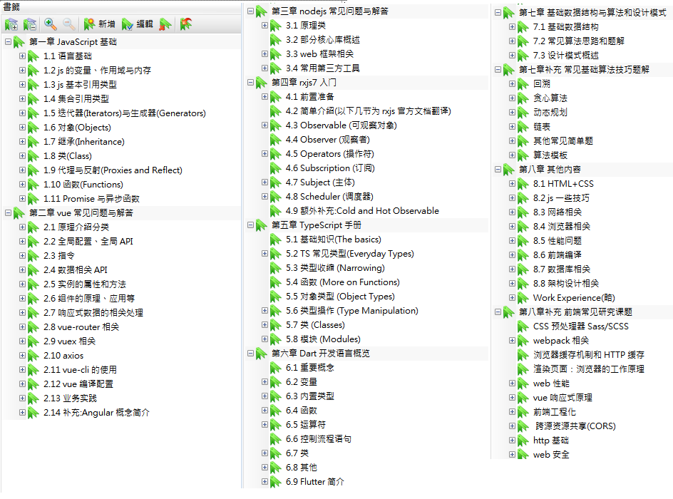
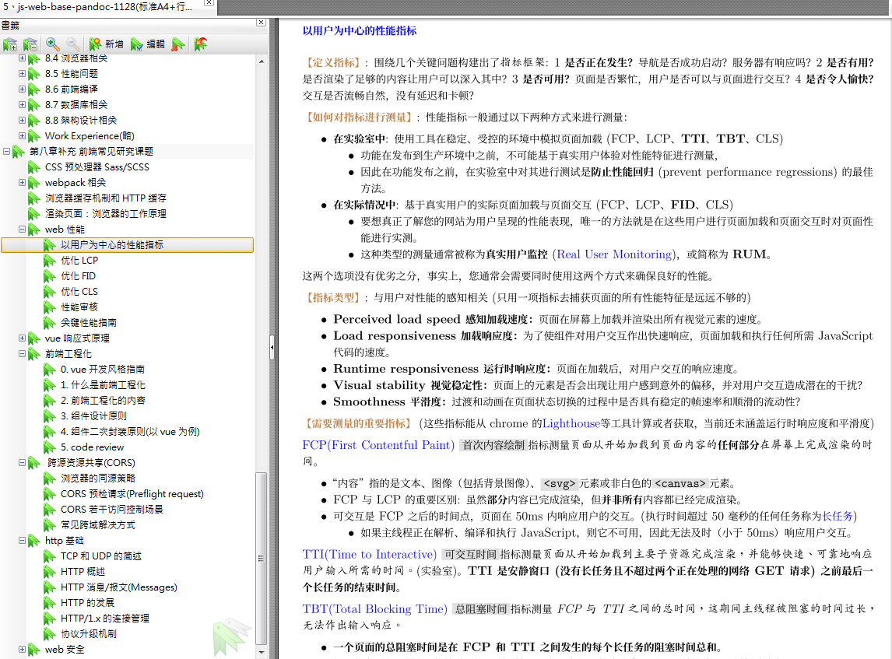

# 说明

关于前端 web 开发的一些学习记录，整理部分一般都会有参考地址，希望对以后的发展有所裨益。

此外还有一些小工具脚本等，作为记录，以便后续使用。

文件夹结构

```txt
.
├── documents               - 存放直接使用的md文件，可以快捷键格式化，下层为各种主题的分类
│   ├── 01-javascript           - 分类以下内容可自订再细分，但例如`simplified-(01-11).md`则表示为之前多份md的精简总结内容
│   │   ├── base-js             - 基础知识学习部分
│   │   ├── js-faq              - 常见问题(不一定有答案)
│   │   └── rxjs
│   ├── 02-vue
│   ├── 03-nodejs
│   ├── 04-engineered       - 前端工程化相关内容，也包括性能等
│   │   └── webpack
│   ├── 05-typescript
│   ├── 06-dart
│   ├── 07-basic-dsa        - 基本的数据结构与算法
│   ├── 08-arc-design       - 系统设计相关(设计模式、系统架构之类的)
│   ├── 09-scripts-and-commands - 一些常用的脚本或者命令
│   └── 10-miscellaneous    - 其他杂项(CSS、HTTP、缓存、跨域、web安全、mysql基础问题、一些后台工具介绍……)
├── pandoc                  - 一般是刻意整理的总结性md文件，目的是使用xelatex转成指定格式的pdf，不要轻易格式化，否则排版会乱
│   ├── format-doc
│   ├── pandoc-usage
│   └── readme.md
├── pic-mind-map            - 一些简单的脑图导出来的图片，做参看。
└── _tools                  - 一些nodejs或者python脚本小工具，由于某些简单的需求
```

简单来讲，有时间可以看 documents 各个细节，没时间就直接八股文 pandoc 的 pdf 就好了，只不过不懂光背没什么用，深有体会。

- 在线阅读的 md 文件每次修改保存都格式化无所谓的。
- 尽量只把有需要制作成 pdf 的内容单独抽出 pandoc 的 md，注意符合 Latex 格式(需要安装相应工具)。

**分类如下(加粗为应对面试的精华)** 。以下都有整理到`《web 前端基础知识汇整(精简版)》`部分

## 前端基础知识汇整的 pdf

- [web 前端基础知识汇整-500+页](pandoc/format-doc/pandoc-pdf/01-pandoc-form-js-web-base.pdf)
- [web 前端基础知识汇整(精简版)-100 页左右](pandoc/format-doc/pandoc-pdf/02-pandoc-print-js-web-base.pdf)
- [web 前端基础知识汇整(关键字-几页)](pandoc/format-doc/pandoc-pdf/03-pandoc-print-js-web-base-keyword.pdf)

## 简单的思维导图

- [基本 web 相关知识关键字 ](pic-mind-map/基本web相关知识关键字map.png)
- [某系统架构使用的组件说明](pic-mind-map/某系统架构使用的组件说明.png)

---

## javascript、css、html

#### 基础知识

- [01-基本概念：什么是 JavaScript](documents/01-javascript/base-js/01、基本概念：什么是JavaScript.md)
- [02-语言基础](documents/01-javascript/base-js/02、语言基础.md)
- [03-变量、作用域与内存](documents/01-javascript/base-js/03、变量、作用域与内存.md)
- [04-基本引用类型](documents/01-javascript/base-js/04、基本引用类型.md)
- [05-集合引用类型](documents/01-javascript/base-js/05、集合引用类型.md)
- [06-迭代器与生成器](documents/01-javascript/base-js/06、迭代器与生成器.md)
- [07-对象、类与面向对象编程(上)](<documents/01-javascript/base-js/07、对象、类与面向对象编程(上).md>)
- [08-对象、类与面向对象编程(下)](<documents/01-javascript/base-js/08、对象、类与面向对象编程(下).md>)
- [09-代理与反射](documents/01-javascript/base-js/09、代理与反射.md)
- [10-函数](documents/01-javascript/base-js/10、函数.md)
- [11-Promises 和异步函数](documents/01-javascript/base-js/11、Promises和异步函数.md)

#### rxjs

- [01-rxjs7-basic](documents/01-javascript/rxjs/01-rxjs7-basic.md)

#### 常见面试题(纯题目收集)

- [js-FAQs](documents/01-javascript/js-faq/readme.md)
- **[js 常用技巧](documents/01-javascript/js-faq/03-javascript-tricks.md)**

#### css

- [01-CSS 布局与响应式布局简述](documents/01-javascript/_css-part/01-CSS布局与响应式布局简述.md)

## vue

- [01-vue 常见问题(纯问题转存)](documents/02-vue/01-vue-faq.md)
- **[02-vue-FAQs](documents/02-vue/02-vue-simplification-FAQs.md)**
- **[03-vuejs 设计与实现总结](documents/02-vue/03-vuejs设计与实现总结.md)**
- **[04-vue 响应式原理](documents/02-vue/04-vue响应式原理.md)**

## nodejs

- [01-nodejs_interview_questions](documents/03-nodejs/01-nodejs_interview_questions_en-cn.md)
- **[02-nodejs-FAQs](documents/03-nodejs/02-node-faq.md)**

## 前端工程化

- **[01-前端工程化概述](documents/04-engineered/01-frontend-engineered-overview.md)**
- **[02-渲染页面:浏览器的工作原理](documents/04-engineered/02-渲染页面:浏览器的工作原理.md)**
- **[03-web 性能指标及优化](documents/04-engineered/03-web性能指标及优化.md)**

## typescript

- [01-typescript 官方手册概述](documents/05-typescript/01-typescript-handbook概述.md)

## dart

- [01-dart 官方教程概述](documents/06-dart/01-dart-language-tour.md)
- [02-flutter 架构简介](documents/06-dart/02-flutter-resource.md)

## 数据结构与算法(入门内容)

#### 《学习 JavaScript 数据结构与算法(第 3 版)》笔记

- [01-栈](documents/07-basic-dsa/learning-js-dsa-3th/01、Stack.md)
- [02-队列](documents/07-basic-dsa/learning-js-dsa-3th/02、Queue.md)
- [03-链表](documents/07-basic-dsa/learning-js-dsa-3th/03、LinkedList.md)
- [04-集合](documents/07-basic-dsa/learning-js-dsa-3th/04、Set.md)
- [05-字典与哈希表](documents/07-basic-dsa/learning-js-dsa-3th/05、DictionaryAndHashTable.md)
- [06-树](documents/07-basic-dsa/learning-js-dsa-3th/06、Tree.md)
- [07-堆](documents/07-basic-dsa/learning-js-dsa-3th/07、Heap.md)
- [08-图](documents/07-basic-dsa/learning-js-dsa-3th/08、Graph.md)
- [09-基础的排序与搜索算法](documents/07-basic-dsa/learning-js-dsa-3th/09、SortingAndSearchingAlgorithms.md)
- [10-算法设计与技巧](documents/07-basic-dsa/learning-js-dsa-3th/10、AlgorithmDesignAndTechniques.md)

#### 算法题与技巧("他山之玉")

- [01-极简的基础数据结构与算法介绍](documents/07-basic-dsa/01-simplified-dsa-dp.md)
- [02-常见基础算法技巧题解(leetcode 题解)](documents/07-basic-dsa/02-simplified-simple-aps.md)

## 架构设计

- [01-设计模式](documents/08-arc-design/01-design-patterns.md)

## 杂项

- [01-前端基础杂项简述(css、网络相关、浏览器相关、性能问题、前端编译、数据库相关)](documents/10-miscellaneous/01-other-web-faq.md)
- [02-mysql 常见问题](documents/10-miscellaneous/02-mysql-faq.md)
- [03-后端常用工具简介](documents/10-miscellaneous/03-backend-common-tools.md)
- [04-sass 简介](documents/10-miscellaneous/04-sass-overview.md)
- **[05-http 基础](documents/10-miscellaneous/05-http-basic.md)**
- **[06-http 缓存](documents/10-miscellaneous/06-http-cache.md)**
- **[07-跨源资源共享 cors](documents/10-miscellaneous/07-cors.md)**
- **[08-web 安全](documents/10-miscellaneous/08-web-secure.md)**
- [09-http 方法和常见响应码介绍](documents/10-miscellaneous/09-http-methods.md)

## 脚本命令等

- [配合 cron 的 mysql 备份脚本](documents/09-scripts-and-commands/scripts/mysqlbak.sh)
- [linux 常用的命令](documents/09-scripts-and-commands/commands/linux-command.md)
- [k8s 常用的命令](documents/09-scripts-and-commands/commands/k8s-command.md)

## 其他

- [工作经验(updating)](<pandoc/format-doc/work-ex-just-read-(updating).md>)

---

《web 前端基础知识汇整》pdf 文件截图:




