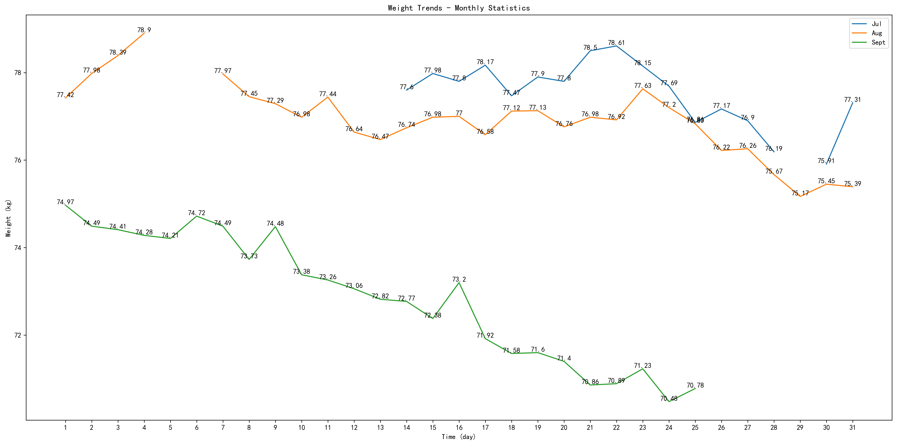
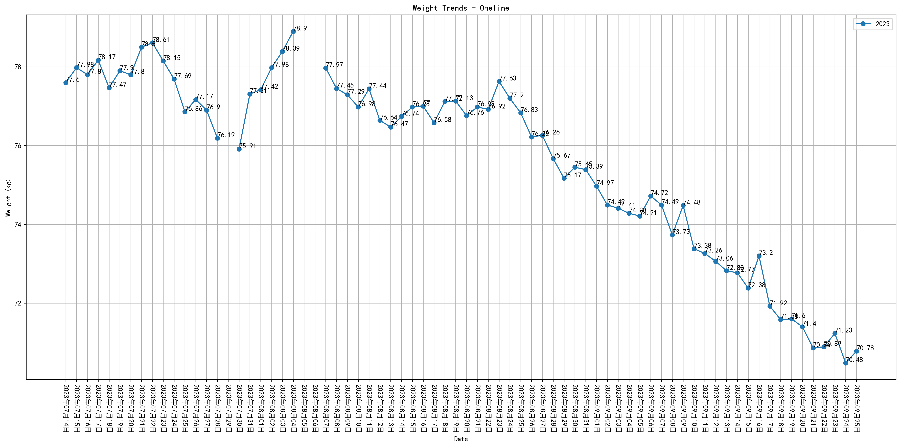
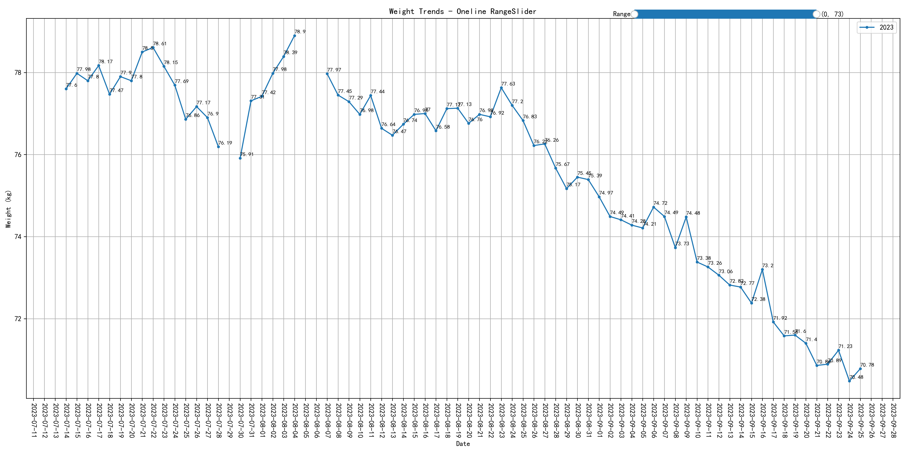
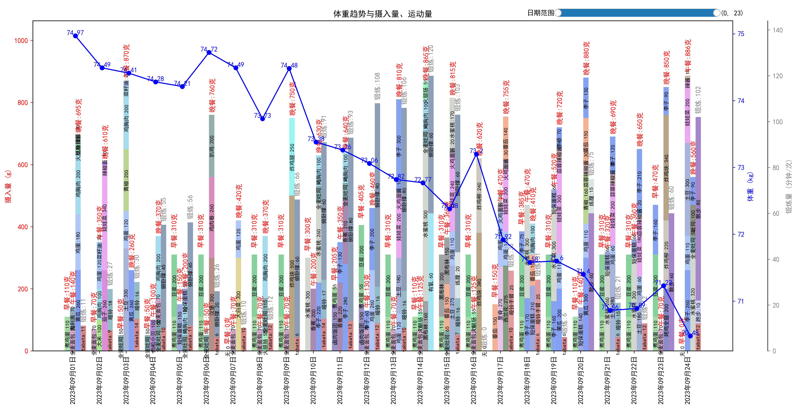
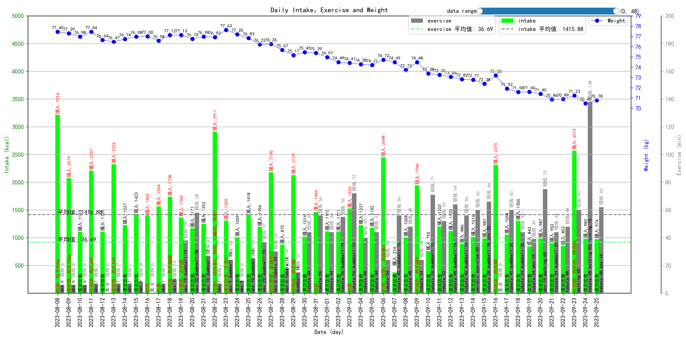
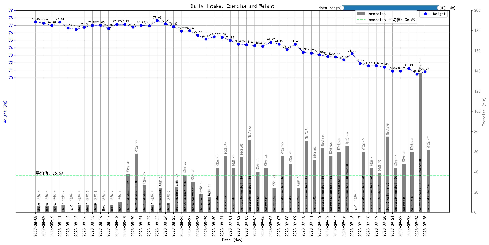
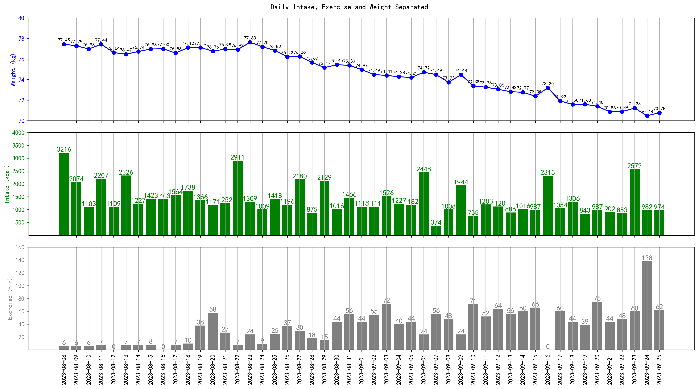

# 说明

非常简单地使用`matplotlib.pyplot`学习绘制最基础的折线图，以及折线图柱状图在同一张图。稍微麻烦点的是使用累加在同一个柱状图的位置绘制多个柱子并使用不同颜色来标识不同组合。

2023-09-21 又简单添加了摄入和体重的对比图，主要学习折线图和条状图的一些设定和事件。

2023-09-23 又加了个示例，主要把组合图表中比较大的函数拆了一下，并体验了一些细节。

2023-09-26 重命名了一些文件，添加了一点示例。

---

主要测试数据为记录下这两个月从想要减脂到落实减脂的体重变化趋势。

weight_trend_monthly:

weight_trend_oneline:

weight_trend_oneline_range:

weight_intake_exercise_detail:

weight_intake_exercise_simple:

weight_intake_exercise_simple_optional:

weight_intake_exercise_separated:

