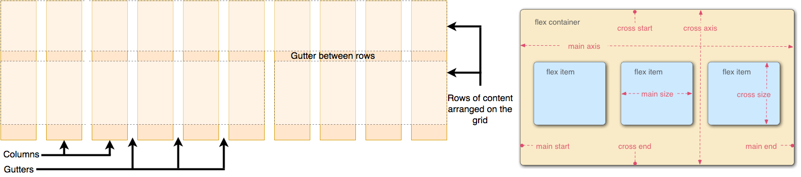

<!-- START doctoc generated TOC please keep comment here to allow auto update -->
<!-- DON'T EDIT THIS SECTION, INSTEAD RE-RUN doctoc TO UPDATE -->
<!-- **Table of Contents**  *generated with [DocToc](https://github.com/thlorenz/doctoc)* -->

- [CSS 页面布局技术](#css-%E9%A1%B5%E9%9D%A2%E5%B8%83%E5%B1%80%E6%8A%80%E6%9C%AF)
- [响应式设计](#%E5%93%8D%E5%BA%94%E5%BC%8F%E8%AE%BE%E8%AE%A1)

<!-- END doctoc generated TOC please keep comment here to allow auto update -->

## CSS 页面布局技术

在 MDN 的 CSS 布局中，有介绍以下几种布局方式，先了解一些基本前置概念:

- **CSS 布局模式**:有时简称为布局，是一种基于盒子与其兄弟和祖辈盒子的交互方式来确定盒子的位置和大小的算法。
- **CSS 基础框盒模型**: 当对一个文档进行布局的时候，浏览器的渲染引擎会根据标准之一的 CSS 基础框盒模型，将所有元素表示为一个个矩形的盒子。CSS 决定这些盒子的大小、位置以及属性（例如颜色、背景、边框尺寸…）
  - 每个盒子都由四个部分（或区域）组成，**每个盒子有四个边界: content、padding、border、margin**。
  - 在计算一个元素的总宽度和总高度，**标准盒子模型只包括 content 的宽和高**，怪异盒子模型则包括 content、padding、border。
- 出现在另一个元素**下面**的元素被描述为**块**(block)元素，出现在另一个元素**旁边**的元素叫**内联**(inline)元素。
  - 块元素内容的布局方向被描述为**块方向**。可以在任何**垂直**书写模式的语言中水平运行。对应的**内联方向**是内联内容（如句子）的运行方向。

几种布局的概述:

- **正常布局流**(normal flow)是指在不对页面进行任何布局控制时，浏览器默认的 HTML 布局方式。
  - 使用 css 创建一个布局时，则将离开正常布局流，但是对于页面上的多数元素，正常布局流将完全可以创建所需要的布局。
  - 默认的，一个*块级元素的内容宽度是其父元素的 100%，其高度与其内容高度一致*。
  - _内联元素的高度和宽度与内容一致_。无法设置内联元素的高度和宽度——它们就那样置于块级元素的内容里。
    - 如果想控制内联元素的尺寸，需要为元素设置 `display: block;`(或者 inline-block; 混合了 inline 和 block 的特性)
  - 使用一些 display 属性、float 属性、position 属性、表格布局、多列布局会**覆盖默认的布局行为**。
- **display 属性**: 设置元素是否被视为块或者内联元素以及用于子元素的布局，例如流式布局、网格布局或弹性布局。
  - 正常流中的**所有内容都有**一个 display 的值，用作元素的默认行为方式。因此可以更改任何元素的 display 值。
    - 这意味着可以根据它们的语义选择 html 元素，而不必关心它们的外观。他们的样子是可以改变的。
- **float 属性**: 把一个元素“浮动”(float) 起来，会改变该元素本身和在正常布局流中跟随它的其他元素的行为。
  - 这一元素会浮动到左侧或右侧，并且从正常布局流中移除，这时候其他的周围内容就会在这个被设置浮动的元素周围环绕。
- **position 属性**: 定位 (positioning) 能够把一个元素从它原本在正常布局流中应该在的位置移动到另一个位置。
  - 定位并不是一种用来给你做主要页面布局的方式，它更像是*管理和微调页面中的一个特殊项的位置*。
- **Flexbox** CSS 弹性盒子布局被专门设计出来用于创建*横向或是纵向的一维页面布局*。
  - *父元素/容器*通过指定`display: flex`启用弹性盒子布局后，所有直接子元素都将会按照 flex 进行布局。
- **Gridbox** CSS 网格布局则被设计用于*同时在两个维度上把元素按行和列排列整齐*。
  - *父元素/容器*通过指定`display: grid`启用网格布局后，所有直接子元素都将会按照 grid 进行布局。
- **表格布局**: 一个 table 标签之所以能够像表格那样展示，是由于 css 默认给 table 标签设置了一组 table 布局属性。_当这些属性被应用于排列非 table 元素时，这种用法被称为“使用 CSS 表格”_。
  - *父元素/容器*通过指定`display: table`启用表格布局，子元素使用`display: table-row|table-column|table-cell`等。
- **多列布局**: 把一个块(block)转变成多列容器(multicol container)，可以在*父元素/容器*使用`column-width`来告诉浏览器以**至少某个宽度**的尽可能多的列来填充容器，也可以使用`column-count`属性来告诉浏览器**需要多少列**。`columns`为前两者的 css 缩写属性。

**CSS property 三巨头(position、display、float)**

**position** 属性用于**指定一个元素在文档中的定位方式**。top，right，bottom 和 left 属性则决定了该元素的最终位置。属性值:

- `static`: 元素在文档常规流中**当前**的布局位置。默认定位。
- `relative`: 元素**先**放置在未添加定位时的位置，**再**在不改变页面布局的前提下调整元素位置。
- `absolute`: 元素会被移出正常文档流，并不为元素预留空间，通过**指定元素相对于最近的非 static 定位祖先元素的偏移**来确定元素位置。
- `fixed`: 元素会被移出正常文档流，并不为元素预留空间，通过**指定元素相对于屏幕视口的位置**来指定元素位置。在屏幕滚动时不会改变。
- `sticky`: 元素**先**正常文档流进行定位，**然后**相对它的*最近滚动祖先*和*最近块级祖先*进行偏移。偏移值不会影响任何其他元素的位置。

**display** 属性可以**设置元素的内部和外部显示类型**。  
元素的*外部*显示类型将决定该*元素在流式布局中的表现*（块级或内联元素）；元素的*内部*显示类型可以*控制其子元素的布局*。常见属性值:

- `<display-outside>`: 这些关键字指定了元素的**外部**显示类型，实际上就是*其在流式布局中的角色*（即在流式布局中的表现）。
  - **`block`**:这个值会生成一个块级元素盒子，同时在该元素之前和之后**打断**（换行）。简单来说就是，这个值会将该元素变成**块级**元素。
  - **`inline`**:这个值会生成一个行内元素盒子，该元素之前和之后**不会打断**（换行）。简单来说就是，这个值会将该元素变成**行内**元素。
- `<display-inside>`: 这些关键字指定了元素的**内部**显示类型，它们定义了*该元素内部内容的布局方式*。可与外部显示类型一起使用。
  - `table`: 这些元素的行为类似于 HTML`<table>`元素。它定义了一个块级框。(布局都不要用 table)
  - **`flex`**: 该元素的行为类似于块元素，并根据 **flexbox 模型**布置其内容。
  - **`grid`**: 该元素的行为类似于块元素，并根据**网格模型**布置其内容。
- `<display-listitem>`: 将这个元素的外部显示类型变为 block 盒，并将内部显示类型变为多个 list-item inline 盒。
  - `list-item`: 将使元素表现得像一个列表项。
- `<display-internal>`: 有些布局模型有**复杂的内部结构**。这类关键字用来**定义这些“内部”显示类型**，且仅在这样的布局中才有意义。
  - 目前是一堆`<display-inside>`中`table`和实验性质的`ruby`布局模性的属性，类似:
    - `table-row`: 这些元素的行为类似于`<tr>`HTML 元素。
    - `table-cell`: 这些元素的行为类似于`<td>`HTML 元素。
    - `ruby-base` Experimental: 这些元素的行为类似于`<rb>`HTML 元素。
    - `ruby-text` Experimental: 这些元素的行为类似于`<rt>`HTML 元素。
- `<display-box>`: 这些值决定元素**是否使用盒模型**。
  - **`none`**: **关闭元素的显示**，不影响布局（文件中没有该元素）。所有子项的显示也被关闭。**盒子和内容不会渲染**
  - 要一个元素占据空间（文件中存在），但不渲染，使用 CSS 的 visibility 属性。
- `<display-legacy>`:CSS 2 对于 display 属性使用单关键字语法，对于相同布局模式的块级和行级变体需要使用单独的关键字。
  - `inline-block`: 元素会产生一个块元素盒子，并且像内联盒子一样（表现得更像一个被替换的元素），可以融入到周围内容中。
  - `inline-table`: 它表现为一个 HTML `<table>` 元素， 但是又表现为一个不同于块级盒子的内联盒子。
  - `inline-flex`: 元素表现为一个内联元素，并对内容采用弹性盒子模型进行布局。
  - `inline-grid`: 元素表现为一个内联元素，并对内容采用网格模型进行布局。

**float** 属性**指定一个元素应沿其容器的左侧或右侧放置**，允许文本和内联元素环绕它。该元素从网页的正常流动（文档流）中移除，尽管仍然保持部分的流动性（与绝对定位相反）。由于 float 意味着使用块布局，它在某些情况下会修改 display 值的计算值。属性的值如下:

- `left`: 表明元素必须浮动在其所在的块容器**左侧**的关键字。
- `right`: 表明元素必须浮动在其所在的块容器**右侧**的关键字。
- `none`: 表明元素**不进行浮动**的关键字。
- `inline-start`:关键字，表明元素必须浮动在其所在块容器的**开始**一侧，在 `ltr` 脚本中是左侧，在 `rtl` 脚本中是右侧。
- `inline-end`: 关键字，表明元素必须浮动在其所在块容器的**结束**一侧，在 `ltr` 脚本中是右侧，在 `rtl` 脚本中是左侧。
- `inherit`: 继承父元素的浮动属性

**box-sizing** 属性定义了 user agent(一个在 Web 上的浏览器)应该如何**计算一个元素的总宽度和总高度。**属性值如下:

- `content-box`: 默认值，标准盒子模型，**只包括内容(content)的宽和高**，不包括边框（border），内边距（padding），外边距（margin）。
- `border-box`: width 和 height 属性**包括内容，内边距和边框**，但不包括外边距。IE 盒子模型。



**flex 弹性布局**的一些相关属性说明(父元素使用`display:flex`):

- `flex-direction`: 指定了内部元素是如何在 flex 容器中布局的，定义了**主轴的方向** (正方向或反方向，与文字内容水平或垂直)
  - `row`: flex 容器的主轴被定义为与文本方向相同。主轴起点和主轴终点与内容方向相同。
  - `row-reverse`: 表现和 row 相同，但是置换了主轴起点和主轴终点
  - `column`: flex 容器的主轴和块轴相同。主轴起点与主轴终点和书写模式的前后点相同
  - `column-reverse`: 表现和 column 相同，但是置换了主轴起点和主轴终点
- `flex-wrap` 属性指定 flex 元素单行显示还是多行显示。如果允许换行，这个属性允许你控制行的堆叠方向。
  - `nowrap`: flex 的元素被摆放到到一行，这可能导致 flex 容器溢出。为该属性的默认值。
  - `wrap`: flex 元素被打断到多个行中。
  - `wrap-reverse`:和 wrap 的行为一样，但是 cross-start 和 cross-end 互换。
- `flex-grow:<number>`: 设置 flex 项主尺寸(main-size)的 flex 增长系数。 主尺寸是项的宽度或高度，这取决于 flex-direction 值。
  - `<number>`为 CSS 数据类型代表一个数字，可为整数或小数。此属性负值无效，默认为 0。
- `flex-shrink: <number>;`flex 元素仅在默认宽度之和大于容器的时候才会发生收缩，其收缩的大小是依据 flex-shrink 的值。
- `flex-basis: <'width'> | content` 指定了 flex 元素在主轴方向上的初始大小。
  - `<'width'>` 值可以是*像素值*，该值也可以是一个相对于其父弹性盒容器主轴尺寸的*百分数*。负值是不被允许的。默认为`auto`。
  - `content` 基于 flex 的元素的内容自动调整大小。
  - 如果不使用 box-sizing 改变盒模型的话，那么这个属性就决定了 flex 元素的内容盒（content-box）的尺寸。
- `order: <integer>` 属性规定了弹性容器中的可伸缩项目在布局时的顺序。元素按照 order 属性的值的增序进行布局。
- **flex 的 css 缩写**
  - `flex-flow` 是 flex-direction、flex-wrap 的缩写。
  - `flex` 是 flex-grow、flex-shrink、flex-basis 的缩写，可以使用一个，两个或三个值来指定 flex 属性。
- 水平垂直居中
  - `align-items: normal | stretch | flex-start | center | baseline | ...` 控制 flex 项在**交叉轴**上的位置
    - 将所有直接子节点上的 align-self 值设置为一个组。align-self 属性设置项目在其包含块中在交叉轴方向上的对齐方式。
  - `justify-content: start | center | left | right | space-between | ...` 控制 flex 项在**主轴**上的位置
  ```cs
  div {display: flex; align-items: center; justify-content: space-around; }
  ```

**grid 网格布局**的一些相关属性说明(父元素使用`display:grid`，直接子元素向为网格布局):

- 一个网格通常具有许多的**列(column)**与**行(row)**，以及行与行、列与列之间的**间隙**，这个间隙一般被称为**沟槽(gutter)**。
- **启用网格布局**: 父元素设置`display: grid`，使用 grid-template-rows 和 grid-template-columns 两个属性定义了一些**行和列的轨道**。
  - 除了长度和百分比，也可以用`fr`这个单位来灵活地定义*网格的行与列的大小*。`fr` 单位按比例划分了可用空间。
  - `grid-template-columns: 2fr 1fr 1fr`第一列被分配了 2fr 可用空间，剩下两列各被分配了 1fr 的可用空间(是前者的一半)。
  - 可以*使用 **repeat** 来重复构建具有某些宽度配置的某些列*。
    - `grid-template-columns:repeat(3,1fr)`得到 3 个 1fr 的列；`repeat(2,2fr 1fr)`相当于填入`2fr 1fr 2fr 1fr`。
- **显式网格**是用`grid-template-columns` 或 `grid-template-rows` 属性创建的。
- **隐式网格**则是当有内容被放到网格外时才会生成的。显式网格与隐式网格的关系与弹性盒子的 main 和 cross 轴的关系有些类似。
  - 隐式网格中生成的行/列大小是参数默认是 auto，大小会根据放入的内容自动调整(`grid-auto-rows:auto`)。
  - 也可以使用`grid-auto-rows`和`grid-auto-columns`属性手动设定隐式网格的大小(例如`grid-auto-rows:100px`)。
- **动态的行高/列宽**: minmax 函数为一个行/列的尺寸设置了取值范围。`minmax(100px, auto)`表示至少 100px，超过则动态调整。
- **自动使用多列填充**: grid-template-columns 属性中结合 repeat 和 minmax 函数来动态创建列。
  - `grid-template-columns: repeat(auto-fill, minmax(200px, 1fr))`，_一个包含了许多至少 200 像素宽的列的网格，将容器填满_。随着容器宽度的改变，网格会自动根据容器宽度进行调整，每行的列数会随着宽度改变，但每一列的宽度总是大于 200 像素，并且容器总会被列填满。
- **网格间隙**: 使用`grid-column-gap`属性来定义**列间隙**；使用`grid-row-gap`来定义**行间隙**；使用`grid-gap`可以**同时设定两者**。
  - 间隙距离可以用任何长度单位包括百分比来表示，但不能使用 `fr` 单位。
- **在网格内放置元素**:
  - **基于线的元素放置**: 利用 `grid-column` 和 `grid-row` 两个属性来**指定每一个子元素应该从哪一行/列开始，并在哪一行/列结束**。
    - grid-column 是 grid-column-start 和 grid-column-end 的简写属性，用于指定*网格项目的大小和位置*
    - grid-row 是 grid-row-start 和 grid-row-end 的缩写形式，它定义了*网格单元与网格行相关的尺寸和位置*
    - `grid-column: 2 / 4`，纵向从第二列开始，第四列结束。(默认为 1 开始， 负整数或 0 无效)
    - `grid-row: 2`，横向从第 2 排开始，第三排结束。(默认为 1 开始， 负整数或 0 无效，end 未指定则为 start+1)
  - **使用 grid-template-areas 属性放置元素**:要命名一些元素并在属性中使用这些名字作为一个区域。
    - `grid-template-areas:"a a ." "a a ." ". b c"`， a b c 为对应页面区域的别名， `.`表示该区域留空。
    - 上面示例是 9 等分的空间，a 占左上角 4 个位置，c 占最右下角 1 个位置，b 在第三排第二列占 1 个位置，其余空位。


## 响应式设计

**响应式网页设计** (responsive web design，RWD) 指的是**允许 Web 页面适应不同屏幕宽度因素等，进行布局和外观的调整**的一系列实践。

**自适应网页设计** (adaptive web design，AWD) 是一个服务器端检测的过程，它选择了一个设计布局和尺寸来显示。自适应设计将**根据常见的屏幕尺寸和分辨率向不同的设备提供不同版本的网站**（或页面）。

非响应式设计如，创建一个“液态”站点，它会拉伸以充满整个浏览器视窗；或者是一个“固定宽度”站点，它有一个以像素计的固定尺寸。

**响应式设计的一些技术方法**

- **[媒介查询(media queries)](https://developer.mozilla.org/zh-CN/docs/Web/CSS/Media_Queries)**: 根据各种设备特征和参数的值或者是否存在来调整网站或应用。
  - 在 CSS 中，使用`@`规则的`@media`根据媒体查询的结果**有条件**地应用样式表的**一部分**。使用`@import`**有条件**地应用**整个**样式表。
  - 示例: `@media screen and (min-width: 800px) {.container {margin: 1em 2em;} }`
  - 只有当前的 Web 页面被展示为屏幕媒体且视口至少有 800 像素宽，才会应用`.container`中的 css 属性
- **现代布局技术**: flexbox、gridbox、多列布局等。
- **响应式图像**: 1 没有必要把一张大图显示在比它的实际尺寸小得多的屏幕上(浪费带宽)。2 在移动端和桌面端可能不需要相同的图像宽高比例。
  - **分辨率切换: 不同的尺寸**。使用了`<picture>`元素和``的 [srcset](https://developer.mozilla.org/zh-CN/docs/Web/HTML/Element/img#attr-srcset) 和 [sizes](https://developer.mozilla.org/zh-CN/docs/Web/HTML/Element/img#attr-sizes) 特性，解决了这两个问题。
    - srcset: 定义了*浏览器可选择的图片设置以及每个图片的大小*，每张图片信息的设置和前一个用逗号隔开。
      - 每个字符串包含一个文件名、图片的固有宽度
    - sizes: 定义了一组媒体条件并且指明*当某些媒体条件为真时，什么样的图片尺寸是最佳选择*。
      - 每一个字符串包含一个媒体条件、媒体条件为真时图像将填充的槽的宽度。最后一个宽度值没有媒体条件，当没有任何一个媒体条件为真时，它默认生效。当浏览器成功匹配第一个媒体条件的时候，剩下所有的条件都会被忽略，所以要注意**媒体条件的顺序**。
    - 有了这些属性后，浏览器会: 检查设备宽度，检查 sizes 列表中哪个媒体条件是第一个为真，查看给予该媒体查询的槽大小，加载 srcset 列表中引用的最接近所选的槽大小的图像。
    ```cs
    
    ```
  - **分辨率切换: 相同的尺寸，不同的分辨率**。要支持多分辨率显示，但希望每个人在屏幕上看到的图片的实际尺寸是相同的，可以使用 srcset 结合 x 语法而不用 sizes，来让浏览器选择合适分辨率的图片(1x 是默认值，所以不需要写出来)。
    ```cs
    
    ```
    - 当 css 属性设置为 `img {width: 320px;}`，如果访问页面的设备具有标准/低分辨率显示，用一个设备像素表示一个 CSS 像素，那么会加载 elva-fairy-320w.jpg。设备有高分辨率，用两个或更多的设备像素表示一个 CSS 像素，会加载 elva-fairy-640w.jpg。
  - **美术设计(art direction)**。美术设计问题涉及到*更改显示的图像以适应不同的显示尺寸*。
    - 例如，如果在**桌面浏览器**上的一个网站上显示**一张大的、横向的照片，照片中央有个人**。然后当在移动端浏览器上浏览这个网站时，照片会缩小，这时照片上的人会变得非常小，看起来会很糟糕。此时可能在**移动端**显示一个**更小的、聚焦到这个人的肖像图**会更好。
    - 使用`<picture>`元素实现上述设计。其包含了**一些**`<source>`元素，使浏览器在不同资源间做出选择，紧跟着的是``元素。
    ```cs
    <picture>
      <source media="(max-width: 799px)" srcset="elva-480w-close-portrait.jpg" />
      <source media="(min-width: 800px)" srcset="elva-800w.jpg" />
      
    </picture>
    ```
    - `<source>` 元素有一个 media 属性包含一个媒体条件。srcset 属性包含要显示图片的路径。
    - 在任何情况下都必须在`</picture>`之前正确提供一个``元素以及它的 src 和 alt 属性，**否则不会有图片显示**。
  - **为什么不用 CSS 或 JavaScript 来实现图片响应式**。当浏览器开始加载一个页面，它会*在主解析器开始加载和解析页面的 CSS 和 JavaScript 之前先下载（预加载）任意的图片*。这种有用的机制*总体上会减少页面加载时间*，但是它对响应式图片没有帮助，所以需要类似 srcset 的实现方法。先加载好``元素后，js 再检测可视窗口动态地加载其他图片进行替换已加载的图片，并不响应式。
  - **大胆的使用现代图像格式**。像 WebP 和 AVIF 等新型图片格式可以做到高质量的同时保持较低的文件大小。
- **响应式排版(字体)**: 本质上讲，这描述了*根据屏幕真实使用范围的多少，在媒体查询的同时改变字体大小。*
  ```cs
  // 先弄个小点的标题，再使用媒体查询，在用户使用至少1200px的屏幕的时候，拿大些的尺寸覆写它。
  html { font-size: 1em; } h1 { font-size: 2rem; }
  @media (min-width: 1200px) { h1 { font-size: 4rem; } }
  ```
  - **使用视口单位实现响应式排版**: 使用视口单位 vw 来实现响应式排版。**`1vw` 等同于视口宽度的百分之一**。
    - 因为文本总是随着视口的大小改变大小，**用户失去了放缩任何使用 vw 单位的文本的能力**。所以不要只用 viewport 单位设定文本。
    - 解决: 例如`font-size:calc(1.5rem + 3vw)`，如果将 vw 单位加到了使用固定大小的值组，那么文本仍然是可放缩的。
    - 使用`cale()`函数，允许在声明 CSS 属性值时执行一些计算，**`+`和`-`运算符的两边必须要有空白字符**，否则无法正确解析。
- **视口元标签(viewport meta tag)**
  - `<meta name="viewport" content="width=device-width,initial-scale=1">`
  - 这个元标签告诉移动端浏览器，它们应该**将视口宽度设定为设备的宽度，将文档放大到其预期大小的 100%**。

**回流/重排** reflow: 当浏览器必须**重新处理和绘制部分或全部页面**时，回流就会发生，例如当一个交互式站点更新后。[最大限度地减少浏览器重排](https://developers.google.com/speed/docs/insights/browser-reflow)

**重绘** repaint: 由于**节点的几何属性或者样式属性发生变化**而不影响布局的称为重绘。

---

通过对 MDN 的教程简单学习，就可以看出来，别的文章总结起来内容都是差不多的。

ref

- [MDN-介绍 CSS 布局](https://developer.mozilla.org/zh-CN/docs/Learn/CSS/CSS_layout/Introduction)
- [MDN-响应式设计](https://developer.mozilla.org/zh-CN/docs/Learn/CSS/CSS_layout/Responsive_Design)
- [MDN-布局模式](https://developer.mozilla.org/zh-CN/docs/Web/CSS/Layout_mode)

---

- [前端响应式布局原理与方案（详细版）](https://juejin.cn/post/6844903814332432397)- 媒体查询、百分比布局、rem 布局、vh/vw、图片响应式
- [响应式布局](https://tsejx.github.io/css-guidebook/layout/responsive/responsive-layout/) - viewport、媒体查询、百分比布局、rem、grid
- [前端响应式布局原理与实践](https://segmentfault.com/a/1190000021929510) - 主要是 viewport 和媒体查询
- [自适应布局和响应式布局](https://juejin.cn/post/7154261916733407246) - 静态、流式布局、viewport、媒体查询、flex、grid
- [PC 端响应式布局方案](https://juejin.cn/post/7155013489394712606) - flex、媒体查询、rem、viewport、scale 缩放
- [WebFront-响应式布局](https://github.com/jeanboydev/Android-ReadTheFuckingSourceCode/blob/master/article/web_front/WebFront-%E5%93%8D%E5%BA%94%E5%BC%8F%E5%B8%83%E5%B1%80.md) - rem、flex、grid、媒体查询
- [前端响应式布局为什么是个坑？](https://www.cnblogs.com/web-learn/p/15189009.html) - viewport、媒体查询、响应式布局优缺点
- [响应式布局的五种实现方法](https://blog.51cto.com/u_15295057/5051905) - 百分比布局、媒体查询、rem、vh/vw、flex
- [菜鸟教程-响应式 Web 设计 - Viewport](https://www.runoob.com/css/css-rwd-viewport.html) - viewport、grid、媒体查询、图片/视频响应式、Bootstrap 框架
- [element-plus 的 Layout 布局](https://element-plus.org/zh-CN/component/layout.html) - 默认 flex 布局。参照了 Bootstrap 的 响应式设计，预设了五个响应尺寸：xs、sm、md、lg 和 xl
