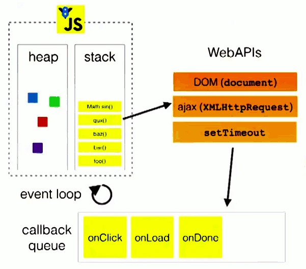

<!-- START doctoc generated TOC please keep comment here to allow auto update -->
<!-- DON'T EDIT THIS SECTION, INSTEAD RE-RUN doctoc TO UPDATE -->
<!-- **Table of Contents**  *generated with [DocToc](https://github.com/thlorenz/doctoc)* -->

- [js 的变量、作用域与内存](#js-%E7%9A%84%E5%8F%98%E9%87%8F%E4%BD%9C%E7%94%A8%E5%9F%9F%E4%B8%8E%E5%86%85%E5%AD%98)
  - [原始值与引用值](#%E5%8E%9F%E5%A7%8B%E5%80%BC%E4%B8%8E%E5%BC%95%E7%94%A8%E5%80%BC)
    - [动态属性](#%E5%8A%A8%E6%80%81%E5%B1%9E%E6%80%A7)
    - [复制值](#%E5%A4%8D%E5%88%B6%E5%80%BC)
    - [传递参数](#%E4%BC%A0%E9%80%92%E5%8F%82%E6%95%B0)
    - [确定类型](#%E7%A1%AE%E5%AE%9A%E7%B1%BB%E5%9E%8B)
  - [执行上下文(execution context)与作用域](#%E6%89%A7%E8%A1%8C%E4%B8%8A%E4%B8%8B%E6%96%87execution-context%E4%B8%8E%E4%BD%9C%E7%94%A8%E5%9F%9F)
    - [作用域链增强](#%E4%BD%9C%E7%94%A8%E5%9F%9F%E9%93%BE%E5%A2%9E%E5%BC%BA)
    - [变量声明](#%E5%8F%98%E9%87%8F%E5%A3%B0%E6%98%8E)
  - [`补充:JS 中的事件循环(Event Loops)`](#%E8%A1%A5%E5%85%85js-%E4%B8%AD%E7%9A%84%E4%BA%8B%E4%BB%B6%E5%BE%AA%E7%8E%AFevent-loops)
  - [垃圾回收](#%E5%9E%83%E5%9C%BE%E5%9B%9E%E6%94%B6)
    - [标记清理](#%E6%A0%87%E8%AE%B0%E6%B8%85%E7%90%86)
    - [引用计数（reference counting）。](#%E5%BC%95%E7%94%A8%E8%AE%A1%E6%95%B0reference-counting)
    - [性能](#%E6%80%A7%E8%83%BD)
    - [内存管理](#%E5%86%85%E5%AD%98%E7%AE%A1%E7%90%86)
  - [小结](#%E5%B0%8F%E7%BB%93)

<!-- END doctoc generated TOC please keep comment here to allow auto update -->

# js 的变量、作用域与内存

## 原始值与引用值

- ECMAScript 变量可以包含两种不同类型的数据：原始值和引用值。

  - 原始值（primitive value）就是最简单的数据，引用值（reference value）则是由多个值构成的对象。
  - 在把一个值赋给变量时，JavaScript 引擎必须确定这个值是原始值还是引用值。

- 原始值： Undefined 、 Null 、 Boolean 、 Number 、 String 、 Symbol 、Bigint 。

  - 保存**原始值**的变量是按值（byvalue）访问的，因为我们**操作**的就是存储在变量中的**实际值**。

- 引用值是保存在内存中的对象。
  - 与其他语言不同，JavaScript 不允许直接访问内存位置，因此也就不能直接操作对象所在的内存空间。
  - 在操作**对象**时，实际上**操作**的是对**该对象的引用**（reference）而非实际的对象本身。
  - 为此，保存引用值的变量是按引用（by reference）访问的。

### 动态属性

- 原始值和引用值的定义方式很类似，都是创建一个变量，然后给它赋一个值。
- 只有引用值可以动态添加后面可以使用的属性。
  - 对于引用值而言，可以随时添加、修改和删除其属性和方法。
  - 原始值不能有属性，尽管尝试给原始值添加属性不会报错(属性值为 undefined)。

```js
let egName = "zhansan";
egName.age = 27;
console.log(egName.age); // undefined
```

原始类型的初始化可以只使用原始字面量形式。**如果使用的是 new 关键字，则 JavaScript 会创建一个 Object 类型的实例，但其行为类似原始值。**

```js
let name1 = "zhansan";
let name2 = new String("lisi");
name1.age = 27;
name2.age = 26;
console.log(name1.age); // undefined
console.log(name2.age); // 26
console.log(typeof name1); // string
console.log(typeof name2); // object
```

### 复制值

在通过变量把一个**原始值**赋值到另一个变量时，**原始值会被复制到新变量的位置**。

在把**引用值**从一个变量赋给另一个变量时，存储在变量中的值也会被复制到新变量所在的位置。
区别在于，这里**复制的值实际上是一个指针，它指向存储在堆内存中的对象。**

### 传递参数

ECMAScript 中所有函数的参数都是按值传递的(变量有按值和按引用访问，而传参则只有按值传递。)。

- 这意味着函数外的值会被复制到函数内部的参数中，就像从一个变量复制到另一个变量一样。
- 如果是原始值，那么就跟原始值变量的复制一样，如果是引用值，那么就跟引用值变量的复制一样。
  - **在按值传递参数时，值会被复制到一个局部变量**（即一个命名参数，或者用 ECMAScript 的话说，就是 arguments 对象中的一个槽位）。
  - **在按引用传递参数时，值在内存中的位置会被保存在一个局部变量，这意味着对本地变量的修改会反映到函数外部。**（这在 ECMAScript 中是不可能的。）
  - ECMAScript 中函数的参数就是局部变量。

### 确定类型

- 原始类型使用 typeof 操作符
  - `typeof variable`
- 引用类型使用 `instanceof` 操作符
  - `variable instanceof constructor`
- 两者都可以使用 `Object.prototype.toString.call(obj1)` 去获取类型

## 执行上下文(execution context)与作用域

MDN 的[《深入：微任务与 Javascript 运行时环境》](https://developer.mozilla.org/zh-CN/docs/Web/API/HTML_DOM_API/Microtask_guide/In_depth)可参考一看。

- 执行上下文（以下简称“上下文”）的概念在 JavaScript 中是颇为重要的。变量或函数的上下文决定了它们可以访问哪些数据，以及它们的行为。
- 每个上下文都有一个关联的变量对象（variable object），而这个上下文中定义的所有变量和函数都存在于这个对象上。
  - 虽然无法通过代码访问变量对象，但后台处理数据会用到它。
- 全局上下文是最外层的上下文。
  - 在浏览器中，全局上下文就是我们常说的 window 对象。所有通过 var 定义的全局变量和函数都会成为 window 对象的属性和方法。
- 上下文在其所有代码都执行完毕后会被销毁，包括定义在它上面的所有变量和函数。
- 每个函数调用都有自己的上下文。

  - 当代码执行流进入函数时，函数的上下文被推到一个上下文栈上。
  - 在函数执行完之后，上下文栈会弹出该函数上下文，将控制权返还给之前的执行上下文。
  - ECMAScript 程序的执行流就是通过这个上下文栈进行控制的。

- **上下文中的代码在执行的时候，会创建变量对象的一个作用域链（scope chain）**。
  - **这个作用域链决定了各级上下文中的代码在访问变量和函数时的顺序**。
  - 代码正在执行的上下文的变量对象始终位于作用域链的最前端。
  - 如果上下文是函数，则其活动对象（activation object）用作变量对象。
  - 活动对象最初只有一个定义变量： arguments 。（全局上下文中没有这个变量。）
  - 作用域链中的下一个变量对象来自包含上下文，再下一个对象来自再下一个包含上下文。以此类推直至全局上下文；
  - **全局上下文的变量对象始终是作用域链的最后一个变量对象**。
- 代码执行时的标识符解析是通过沿作用域链逐级搜索标识符名称完成的。

  - 搜索过程始终从作用域链的最前端开始，然后逐级往后，直到找到标识符。

- 内部上下文可以通过作用域链访问外部上下文中的一切，但外部上下文无法访问内部上下文中的任何东西。
- 上下文之间的连接是线性的、有序的。
- 每个上下文都可以到上一级上下文中去搜索变量和函数，但任何上下文都不能到下一级上下文中去搜索。

### 作用域链增强

- 某些语句会导致在作用域链前端临时添加一个上下文，这个上下文在代码执行后会被删除。
- 通常在两种情况下会出现这个现象，即代码执行到下面任意一种情况时：
  - try / catch 语句的 catch 块
  - with 语句(别用)
    - 这两种情况下，都会在作用域链前端添加一个变量对象。
    - 对 with 语句来说，会向作用域链前端添加指定的对象；
    - 对 catch 语句而言，则会创建一个新的变量对象，这个变量对象会包含要抛出的错误对象的声明。

### 变量声明

1. 使用 var 的函数作用域声明

- 在使用 var 声明变量时，**变量会被自动添加到最接近的上下文**。
- 在函数中，最接近的上下文就是函数的局部上下文。
- 在 with 语句中，最接近的上下文也是函数上下文。
- 如果变量未经声明就被初始化了，那么它就会自动被添加到全局上下文，

**var 声明会被拿到函数或全局作用域的顶部，位于作用域中所有代码之前。这个现象叫作“提升”（hoisting）。**

提升让同一作用域中的代码不必考虑变量是否已经声明就可以直接使用。（所以同样最好别用，使用 let、const 代替 var 声明）

2. 使用 let 的块级作用域声明

- ES6 新增的 let 关键字跟 var 很相似，但它的**作用域是块级的**。
  - 块级作用域由最近的一对包含花括号 {} 界定。
- let 在同一作用域内不能声明两次。
- 严格来讲， let 在 JavaScript 运行时中也会被提升，但由于“暂时性死区”（temporal dead zone）的缘故，实际上不能在声明之前使用 let 变量。
  - 因此，从写 JavaScript 代码的角度说， let 的提升跟 var 是不一样的。

3. 使用 const 的常量声明

- 使用 const 声明的变量必须同时初始化为某个值。一经声明，在其生命周期的任何时候都不能再重新赋予新值。
- const 声明只应用到顶级原语或者对象。
  - 赋值为对象的 const 变量不能再被重新赋值为其他引用值，但对象的键则不受限制。
  - 如果想让整个对象都不能修改，可以使用 Object.freeze() ，这样再给属性赋值时虽然不会报错，但会静默失败。
  ```js
  const o3 = Object.freeze({});
  o3.name = "Jake";
  console.log(o3.name); // undefined
  ```

> 如果开发流程并不会因此而受很大影响，就应该尽可能地多使用 const 声明，除非确实需要一个将来会重新赋值的变量。这样可以从根本上保证提前发现重新赋值导致的 bug。

4. 标识符查找

- 当在特定上下文中为读取或写入而引用一个标识符时，必须通过搜索确定这个标识符表示什么。
- 搜索开始于作用域链前端，以给定的名称搜索对应的标识符。
  - 如果在局部上下文中找到该标识符，则搜索停止，变量确定；
  - 如果没有找到变量名，则继续沿作用域链搜索。（注意，作用域链中的对象也有一个原型链，因此搜索可能涉及每个对象的原型链。）
    - 这个过程一直持续到搜索至全局上下文的变量对象。
  - 如果仍然没有找到标识符，则说明其未声明。

```js
var color = "blue";

function getColor() {
  let color = "red";
  {
    let color = "green";
    return color;
  }
}

console.log(getColor()); // 'green'

// getColor() 内部声明了一个名为 color 的局部变量。在调用这个函数时，变量会被声明。
// 在执行到函数返回语句时，代码引用了变量 color 。
// 于是开始在局部上下文中搜索这个标识符，结果找到了值为 'green' 的变量 color 。
// 因为变量已找到，搜索随即停止，所以就使用这个局部变量。这意味着函数会返回 'green' 。
// 在局部变量 color 声明之后的任何代码都无法访问全局变量color ，除非使用完全限定的写法 window.color 。
```

## `补充:JS 中的事件循环(Event Loops)`

1. JavaScript 运行时概念(Runtime concepts)


说明

- 栈(Stack):函数调用形成了一个由若干帧(Frame)组成的栈。
- 堆(Heap):对象被分配在堆中，堆是一个用来表示一大块（通常是非结构化的）内存区域的计算机术语。
- 队列(Queue):一个 JavaScript 运行时包含了一个待处理消息的消息队列(Message Queue)。每一个消息(Message)都关联着一个用以处理这个消息的回调函数。

在 事件循环 期间的某个时刻，运行时会从最先进入队列的消息开始处理队列中的消息。
被处理的消息会被移出队列，并作为输入参数来调用与之关联的函数。正如前面所提到的，调用一个函数总是会为其创造一个新的栈帧。

函数的处理会一直进行到执行栈再次为空为止；然后事件循环将会处理队列中的下一个消息（如果还有的话）。

2. 事件循环(EventLoop)

原因：

- JavaScript 是单线程的，它主要用途是与用户互动，以及操作 DOM 等。每一个消息完整地执行后，其它消息才会被执行。
  - 例如：避免有多个线程同时处理同一个 DOM，不知道以哪个线程的操作为准。
  - 单线程在保证了执行顺序的同时也限制了 javascript 的效率。
- 在**处理非阻塞任务**时，js 使用了事件循环机制。

说明：

- 在执行 JavaScript 代码的时候，JavaScript 运行时实际上维护了一组用于执行 JavaScript 代码的代理(agents)。
- 每个代理(Agent)都是由 _事件循环_ 驱动的，
  - 事件循环负责**收集事件**（包括用户事件以及其他非用户事件等）、对**任务进行排队**以便在合适的时候执行回调。
  - 然后它执行所有处于等待中的 JavaScript 任务(**宏任务**,注意，整个代码块的初始执行就是一个宏任务)，
  - 然后是**微任务**，
  - 然后在开始下一次循环之前执行一些**必要的渲染和绘制操作**。

图示：



图中的 stack 表示我们所说的执行栈(函数调用的 Frames)，web apis 则是代表一些异步事件，而 callback queue 即事件队列。

3. (宏)任务(Macrotasks/Tasks)与微任务(Microtasks)

- 一个**任务**就是指计划由标准机制来执行的任何 JavaScript，如程序的初始化、事件触发的回调等。除了使用事件，你还可以使用 setTimeout() 或者 setInterval() 来添加任务。(这些都是宏任务)
- 一个 **微任务**（microtask）就是一个简短的函数，当创建该函数的函数执行之后，并且 只有当 Javascript 调用栈为空，而控制权尚未返还给被用户代理(user agent)用来驱动脚本执行环境的事件循环之前，该微任务才会被执行。
- 异步任务的返回结果会被放到一个任务队列中，根据异步事件的类型，这个事件实际上会被放到对应的宏任务和微任务队列中去。

任务队列和微任务队列的区别很简单，但却很重要：

- 当执行来自任务队列中的任务时，在每一次新的事件循环开始迭代的时候运行时都会执行队列中的每个任务。
  - 在每次迭代开始之后加入到队列中的任务需要**在下一次迭代开始之后才会被执行**.
- 每次当一个任务退出且执行上下文为空的时候，微任务队列中的每一个微任务会依次被执行。
  - 不同的是它会等到微任务队列为空才会停止执行——即使中途有微任务加入。
  - 换句话说，**微任务可以添加新的微任务到队列中，并在下一个任务开始执行之前且当前事件循环结束之前执行完所有的微任务。**
- 常见宏任务：
  - script(整体代码)
  - `setTimeout()`
  - `setInterval()`
  - postMessage
  - I/O
  - UI 交互事件
- 常见微任务:
  - `new Promise().then(回调)`
  - MutationObserver(html5 新特性)
  - queueMicrotask()调用

4. 执行顺序

- 执行代码块宏任务，同步代码正常输出;
- 然后执行该宏任务产生的微任务，若微任务在执行过程中产生了新的微任务，则继续执行微任务;
- 微任务执行完毕后，再回到宏任务中进行下一轮循环。

```js
// 示例1
console.log("start");

setTimeout(function () {
  console.log("setTimeout");
}, 0);

Promise.resolve()
  .then(function () {
    console.log("promise1");
  })
  .then(function () {
    console.log("promise2");
  });

console.log("end");

/*
输出:
start
end
promise1
promise2
setTimeout
说明:
1 整个代码块是一个(宏)任务，同步的代码顺序执行，输出start和end，并产生了一个新的宏任务setTimeout，2个微任务Promise的then
2 当前代码块产生了微任务，需要先执行完所有微任务，再去执行宏任务。
  - 微任务存入的是队列，先进先出，所以先输出promise1，再输出promise2
  - 整个代码块执行的宏任务所有微任务执行完成，再执行其产生的setTimeout宏任务，所以最后输出setTimeout
*/

// 示例2
Promise.resolve().then(() => {
  console.log("Promise1");
  setTimeout(() => {
    console.log("setTimeout2");
  }, 0);
});
setTimeout(() => {
  console.log("setTimeout1");
  Promise.resolve().then(() => {
    console.log("Promise2");
  });
}, 0);

/*
执行顺序：
1 执行同步代码，产生一个微任务(promise的then)和一个宏任务setTimeout1
2 执行微任务，输出`Promise1`，并产生一个setTimeout2
3 执行宏任务队列，根据队列，先执行setTimeout1，输出`setTimeout1`，产生一个微任务(promise的then)
4 执行setTimeout1宏任务中产生的微任务，输出`Promise2`，当前宏任务的微任务全部执行完成
5 继续执行宏任务队列下一个宏任务setTimeout2，输出`setTimeout2`。
6 全部执行完成。

所以，输出顺序为:
Promise1
setTimeout1
Promise2
setTimeout2
*/
```


MDN 的[并发模型与事件循环](https://developer.mozilla.org/zh-CN/docs/Web/JavaScript/EventLoop)
MDN 的[《深入：微任务与 Javascript 运行时环境》](https://developer.mozilla.org/zh-CN/docs/Web/API/HTML_DOM_API/Microtask_guide/In_depth)
MDN 的[在 JavaScript 中通过 queueMicrotask() 使用微任务](https://developer.mozilla.org/zh-CN/docs/Web/API/HTML_DOM_API/Microtask_guide)
post[JavaScript 中的 Event Loop（事件循环）机制](https://segmentfault.com/a/1190000022805523)

## 垃圾回收

JavaScript 是使用垃圾回收的语言，也就是说执行环境负责在代码执行时管理内存。

- 基本思路很简单：**确定哪个变量不会再使用，然后释放它占用的内存。**
- 这个过程是周期性的，即垃圾回收程序每隔一定时间（或者说在代码执行过程中某个预定的收集时间）就会自动运行。
- 垃圾回收过程是一个近似且不完美的方案，因为某块内存是否还有用，属于“不可判定的”问题，意味着靠算法是解决不了的。

标记未使用的变量:

- 两种主要的标记策略：标记清理和引用计数。

### 标记清理

1. 当变量进入上下文，比如在函数内部声明一个变量时，这个变量会被加上存在于上下文中的标记。
2. 而在上下文中的变量，逻辑上讲，永远不应该释放它们的内存，因为只要上下文中的代码在运行，就有可能用到它们。
3. 当变量离开上下文时，也会被加上离开上下文的标记。

- 垃圾回收程序运行的时候，会标记内存中存储的所有变量（记住，标记方法有很多种）。
- 然后，它会将所有在上下文中的变量，以及被在上下文中的变量引用的变量的标记去掉。
- 在此之后再被加上标记的变量就是待删除的了，原因是任何在上下文中的变量都访问不到它们了。
- 随后垃圾回收程序做一次内存清理，销毁带标记的所有值并收回它们的内存。

### 引用计数（reference counting）。

思路是对每个值都记录它被引用的次数。

- 声明变量并给它赋一个引用值时，这个值的引用数为 1。
- 如果同一个值又被赋给另一个变量，那么引用数加 1。
- 类似地，如果保存对该值引用的变量被其他值给覆盖了，那么引用数减 1。
- 当一个值的引用数为 0 时，就说明没办法再访问到这个值了，因此可以安全地收回其内存了。
- 垃圾回收程序下次运行的时候就会释放引用数为 0 的值的内存。

主要的问题：循环引用。

**所谓循环引用，就是对象 A 有一个指针指向对象 B，而对象 B 也引用了对象 A。**

```js
function problem() {
  let objectA = new Object();
  let objectB = new Object();

  objectA.someOtherObject = objectB;
  objectB.anotherObject = objectA;
}
// 在这个例子中， objectA 和 objectB 通过各自的属性相互引用，意味着它们的引用数都是 2。
// objectA 和 objectB 在函数结束后还会存在，因为它们的引用数永远不会变成 0。
// 如果函数被多次调用，则会导致大量内存永远不会被释放。
```

### 性能

垃圾回收程序会周期性运行，如果内存中分配了很多变量，则可能造成性能损失，因此垃圾回收的时间调度很重要。

最好的办法是在写代码时就要做到：**无论什么时候开始收集垃圾，都能让它尽快结束工作。**

### 内存管理

在使用垃圾回收的编程环境中，开发者通常无须关心内存管理。不过，JavaScript 运行在一个内存管理与垃圾回收都很特殊的环境。

- 分配给浏览器的内存通常比分配给桌面软件的要少很多，分配给移动浏览器的就更少了。
- 这更多出于安全考虑而不是别的，就是为了避免运行大量 JavaScript 的网页耗尽系统内存而导致操作系统崩溃。

**将内存占用量保持在一个较小的值可以让页面性能更好。**

- **优化内存占用的最佳手段就是保证在执行代码时只保存必要的数据。**
- 如果数据不再必要，那么把它设置为 null ，从而释放其引用。这也可以叫作解除引用。
  - 这个建议最适合全局变量和全局对象的属性。
  - 局部变量在超出作用域后会被自动解除引用。

**_解除对一个值的引用并不会自动导致相关内存被回收。解除引用的关键在于确保相关的值已经不在上下文里了，因此它在下次垃圾回收时会被回收。 _**

1. 通过 const 和 let 声明提升性能
2. 隐藏类和删除操作

- 避免 JavaScript 的“先创建再补充”（ready-fire-aim）式的动态属性赋值，并在构造函数中一次性声明所有属性

3. 内存泄漏

- 意外声明全局变量是最常见但也最容易修复的内存泄漏问题。
- 定时器也可能会悄悄地导致内存泄漏。
  - 定时器的回调通过闭包引用了外部变量
  ```js
  let name = "Jake";
  setInterval(() => {
    console.log(name);
  }, 100);
  ```
- 使用 JavaScript 闭包很容易在不知不觉间造成内存泄漏。

```js
// 调用 outer() 会导致分配给 name 的内存被泄漏。
// 代码执行后创建了一个内部闭包，只要返回的函数存在就不能清理 name ，因为闭包一直在引用着它。
let outer = function () {
  let name = "Jake";
  return function () {
    return name;
  };
};
```

4. 静态分配与对象池

**静态分配**

为了提升 JavaScript 性能，最后要考虑的一点往往就是压榨浏览器了。此时，一个关键问题就是如何减少浏览器执行垃圾回收的次数。

开发者无法直接控制什么时候开始收集垃圾，但可以间接控制触发垃圾回收的条件。

理论上，如果能够合理使用分配的内存，同时避免多余的垃圾回收，那就可以保住因释放内存而损失的性能。

**使用对象池**

在初始化的某一时刻，可以创建一个对象池，用来管理一组可回收的对象。

应用程序可以向这个对象池请求一个对象、设置其属性、使用它，然后在操作完成后再把它还给对象池。

由于没发生对象初始化，垃圾回收探测就不会发现有对象更替，因此垃圾回收程序就不会那么频繁地运行。

> 静态分配是优化的一种极端形式。如果你的应用程序被垃圾回收严重地拖了后腿，可以利用它提升性能。但这种情况并不多见。大多数情况下，这都属于过早优化，因此不用考虑。

## 小结

1. 变量

**JavaScript 变量**可以保存两种类型的值：原始值和引用值。

原始值可能是以下 7 种原始数据类型之一： Undefined 、 Null 、 Boolean 、 Number 、 String 、 Symbol 和 Bigint 。

原始值和引用值有以下特点：

- 原始值大小固定，因此保存在栈内存上。
- 从一个变量到另一个变量复制原始值会创建该值的第二个副本。
- 引用值是对象，存储在堆内存上。
- 包含引用值的变量实际上只包含指向相应对象的一个指针，而不是对象本身。
- 从一个变量到另一个变量复制引用值只会复制指针，因此结果是两个变量都指向同一个对象。
- typeof 操作符可以确定值的原始类型，而 instanceof 操作符用于确保值的引用类型。

2. 执行上下文

任何变量（不管包含的是原始值还是引用值）都存在于某个**执行上下文**中（也称为作用域）。

这个上下文（作用域）决定了变量的生命周期，以及它们可以访问代码的哪些部分。

执行上下文可以总结如下：

- 执行上下文分全局上下文、函数上下文和块级上下文。
- 代码执行流每进入一个新上下文，都会创建一个作用域链，用于搜索变量和函数。
- 函数或块的局部上下文不仅可以访问自己作用域内的变量，而且也可以访问任何包含上下文乃至全局上下文中的变量。
- 全局上下文只能访问全局上下文中的变量和函数，不能直接访问局部上下文中的任何数据。
- 变量的执行上下文用于确定什么时候释放内存。

3. 垃圾回收

JavaScript 是使用**垃圾回收**的编程语言，开发者不需要操心内存分配和回收。

JavaScript 的垃圾回收程序可以总结如下：

- 离开作用域的值会被自动标记为可回收，然后在垃圾回收期间被删除。
- 主流的垃圾回收算法是标记清理，即先给当前不使用的值加上标记，再回来回收它们的内存。
- 引用计数是另一种垃圾回收策略，需要记录值被引用了多少次。JavaScript 引擎不再使用这种算法，但某些旧版本的 IE 仍然会受这种算法的影响，原因是 JavaScript 会访问非原生 JavaScript 对象（如 DOM 元素）。
- 引用计数在代码中存在循环引用时会出现问题。
- 解除变量的引用不仅可以消除循环引用，而且对垃圾回收也有帮助。为促进内存回收，全局对象、全局对象的属性和循环引用都应该在不需要时解除引用。
