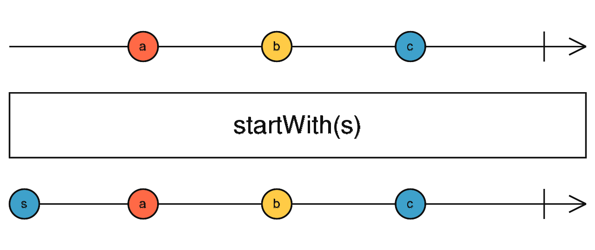
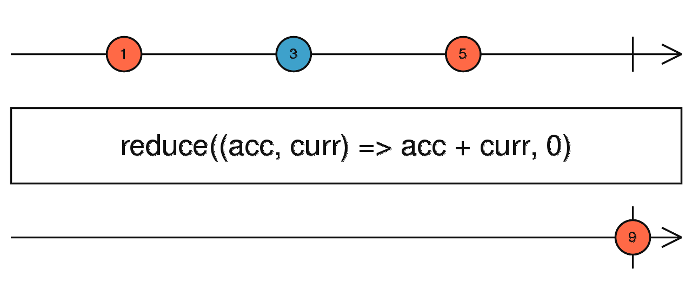

<!-- START doctoc generated TOC please keep comment here to allow auto update -->
<!-- DON'T EDIT THIS SECTION, INSTEAD RE-RUN doctoc TO UPDATE -->
<!-- **Table of Contents**  *generated with [DocToc](https://github.com/thlorenz/doctoc)* -->

- [rxjs 入门](#rxjs-%E5%85%A5%E9%97%A8)
  - [前置准备](#%E5%89%8D%E7%BD%AE%E5%87%86%E5%A4%87)
    - [响应式编程（RP —— Reactive Programming）](#%E5%93%8D%E5%BA%94%E5%BC%8F%E7%BC%96%E7%A8%8Brp--reactive-programming)
    - [流(Stream)的特点](#%E6%B5%81stream%E7%9A%84%E7%89%B9%E7%82%B9)
    - [观察者模式和发布订阅模式的区别](#%E8%A7%82%E5%AF%9F%E8%80%85%E6%A8%A1%E5%BC%8F%E5%92%8C%E5%8F%91%E5%B8%83%E8%AE%A2%E9%98%85%E6%A8%A1%E5%BC%8F%E7%9A%84%E5%8C%BA%E5%88%AB)
      - [区别](#%E5%8C%BA%E5%88%AB)
      - [发布/订阅者模式的优点可以归纳为](#%E5%8F%91%E5%B8%83%E8%AE%A2%E9%98%85%E8%80%85%E6%A8%A1%E5%BC%8F%E7%9A%84%E4%BC%98%E7%82%B9%E5%8F%AF%E4%BB%A5%E5%BD%92%E7%BA%B3%E4%B8%BA)
      - [何时应使用发布/订阅者模式](#%E4%BD%95%E6%97%B6%E5%BA%94%E4%BD%BF%E7%94%A8%E5%8F%91%E5%B8%83%E8%AE%A2%E9%98%85%E8%80%85%E6%A8%A1%E5%BC%8F)
  - [简单介绍(以下几节为 rxjs 官方文档翻译)](#%E7%AE%80%E5%8D%95%E4%BB%8B%E7%BB%8D%E4%BB%A5%E4%B8%8B%E5%87%A0%E8%8A%82%E4%B8%BA-rxjs-%E5%AE%98%E6%96%B9%E6%96%87%E6%A1%A3%E7%BF%BB%E8%AF%91)
  - [Observable (可观察对象)](#observable-%E5%8F%AF%E8%A7%82%E5%AF%9F%E5%AF%B9%E8%B1%A1)
    - [拉取 (Pull) vs. 推送 (Push)](#%E6%8B%89%E5%8F%96-pull-vs-%E6%8E%A8%E9%80%81-push)
    - [Observables 作为函数的泛化](#observables-%E4%BD%9C%E4%B8%BA%E5%87%BD%E6%95%B0%E7%9A%84%E6%B3%9B%E5%8C%96)
    - [Observable 剖析](#observable-%E5%89%96%E6%9E%90)
      - [创建 Observables](#%E5%88%9B%E5%BB%BA-observables)
      - [订阅 Observables](#%E8%AE%A2%E9%98%85-observables)
      - [执行 Observables](#%E6%89%A7%E8%A1%8C-observables)
      - [清理 Observable 执行](#%E6%B8%85%E7%90%86-observable-%E6%89%A7%E8%A1%8C)
  - [Observer (观察者)](#observer-%E8%A7%82%E5%AF%9F%E8%80%85)
  - [Operators (操作符)](#operators-%E6%93%8D%E4%BD%9C%E7%AC%A6)
    - [什么是操作符？](#%E4%BB%80%E4%B9%88%E6%98%AF%E6%93%8D%E4%BD%9C%E7%AC%A6)
    - [Piping](#piping)
    - [Creation Operators(创建操作符)](#creation-operators%E5%88%9B%E5%BB%BA%E6%93%8D%E4%BD%9C%E7%AC%A6)
    - [高阶可观察对象(Higher-order Observables)](#%E9%AB%98%E9%98%B6%E5%8F%AF%E8%A7%82%E5%AF%9F%E5%AF%B9%E8%B1%A1higher-order-observables)
    - [Marble diagrams(译为`弹珠图`?)](#marble-diagrams%E8%AF%91%E4%B8%BA%E5%BC%B9%E7%8F%A0%E5%9B%BE)
    - [操作符的分类(Categories of operators)](#%E6%93%8D%E4%BD%9C%E7%AC%A6%E7%9A%84%E5%88%86%E7%B1%BBcategories-of-operators)
      - [创建型操作符(Creation Operators)](#%E5%88%9B%E5%BB%BA%E5%9E%8B%E6%93%8D%E4%BD%9C%E7%AC%A6creation-operators)
      - [连接型创建运算符(Join Creation Operators)](#%E8%BF%9E%E6%8E%A5%E5%9E%8B%E5%88%9B%E5%BB%BA%E8%BF%90%E7%AE%97%E7%AC%A6join-creation-operators)
      - [转换型操作符(Transformation Operators)](#%E8%BD%AC%E6%8D%A2%E5%9E%8B%E6%93%8D%E4%BD%9C%E7%AC%A6transformation-operators)
      - [连接操作符(Join Operators)](#%E8%BF%9E%E6%8E%A5%E6%93%8D%E4%BD%9C%E7%AC%A6join-operators)
      - [多播操作符(Multicasting Operators)](#%E5%A4%9A%E6%92%AD%E6%93%8D%E4%BD%9C%E7%AC%A6multicasting-operators)
      - [错误处理操作符(Error Handling Operators)](#%E9%94%99%E8%AF%AF%E5%A4%84%E7%90%86%E6%93%8D%E4%BD%9C%E7%AC%A6error-handling-operators)
      - [实用工具操作符(Utility Operators)](#%E5%AE%9E%E7%94%A8%E5%B7%A5%E5%85%B7%E6%93%8D%E4%BD%9C%E7%AC%A6utility-operators)
      - [条件和布尔操作符(Conditional and Boolean Operators)](#%E6%9D%A1%E4%BB%B6%E5%92%8C%E5%B8%83%E5%B0%94%E6%93%8D%E4%BD%9C%E7%AC%A6conditional-and-boolean-operators)
      - [数学和聚合操作符(Mathematical and Aggregate Operators)](#%E6%95%B0%E5%AD%A6%E5%92%8C%E8%81%9A%E5%90%88%E6%93%8D%E4%BD%9C%E7%AC%A6mathematical-and-aggregate-operators)
    - [创建自定义操作符](#%E5%88%9B%E5%BB%BA%E8%87%AA%E5%AE%9A%E4%B9%89%E6%93%8D%E4%BD%9C%E7%AC%A6)
      - [使用`pipe()`函数创建新的操作符](#%E4%BD%BF%E7%94%A8pipe%E5%87%BD%E6%95%B0%E5%88%9B%E5%BB%BA%E6%96%B0%E7%9A%84%E6%93%8D%E4%BD%9C%E7%AC%A6)
      - [从头开始创建新的操作符](#%E4%BB%8E%E5%A4%B4%E5%BC%80%E5%A7%8B%E5%88%9B%E5%BB%BA%E6%96%B0%E7%9A%84%E6%93%8D%E4%BD%9C%E7%AC%A6)
  - [Subscription(订阅)](#subscription%E8%AE%A2%E9%98%85)
  - [Subject (主题)](#subject-%E4%B8%BB%E9%A2%98)
    - [多播的可观察对象(Multicasted Observables)](#%E5%A4%9A%E6%92%AD%E7%9A%84%E5%8F%AF%E8%A7%82%E5%AF%9F%E5%AF%B9%E8%B1%A1multicasted-observables)
      - [引用计数(Reference counting)](#%E5%BC%95%E7%94%A8%E8%AE%A1%E6%95%B0reference-counting)
    - [BehaviorSubject](#behaviorsubject)
    - [ReplaySubject](#replaysubject)
    - [AsyncSubject](#asyncsubject)
    - [Void subject](#void-subject)
  - [Scheduler (调度器)](#scheduler-%E8%B0%83%E5%BA%A6%E5%99%A8)
    - [调度器类型](#%E8%B0%83%E5%BA%A6%E5%99%A8%E7%B1%BB%E5%9E%8B)
    - [使用调度器](#%E4%BD%BF%E7%94%A8%E8%B0%83%E5%BA%A6%E5%99%A8)
  - [非官方文档额外补充](#%E9%9D%9E%E5%AE%98%E6%96%B9%E6%96%87%E6%A1%A3%E9%A2%9D%E5%A4%96%E8%A1%A5%E5%85%85)
    - [Cold and Hot Observable](#cold-and-hot-observable)
    - [常用操作符（创建型）](#%E5%B8%B8%E7%94%A8%E6%93%8D%E4%BD%9C%E7%AC%A6%E5%88%9B%E5%BB%BA%E5%9E%8B)
      - [of(will DEPRECATED on v8)](#ofwill-deprecated-on-v8)
      - [from](#from)
      - [fromEvent](#fromevent)
      - [interval](#interval)
      - [timer](#timer)
      - [range](#range)
      - [iif](#iif)
    - [常用操作符（连接创建型）](#%E5%B8%B8%E7%94%A8%E6%93%8D%E4%BD%9C%E7%AC%A6%E8%BF%9E%E6%8E%A5%E5%88%9B%E5%BB%BA%E5%9E%8B)
      - [concat](#concat)
      - [merge](#merge)
      - [zip](#zip)
      - [partition](#partition)
      - [forkJoin](#forkjoin)
      - [combineLatest](#combinelatest)
    - [常用操作符（转换型）](#%E5%B8%B8%E7%94%A8%E6%93%8D%E4%BD%9C%E7%AC%A6%E8%BD%AC%E6%8D%A2%E5%9E%8B)
      - [map](#map)
      - [scan](#scan)
      - [pairwise](#pairwise)
      - [switchMap](#switchmap)
      - [concatMap](#concatmap)
      - [mergeMap](#mergemap)
      - [exhaustMap](#exhaustmap)
    - [常用操作符(连接型)](#%E5%B8%B8%E7%94%A8%E6%93%8D%E4%BD%9C%E7%AC%A6%E8%BF%9E%E6%8E%A5%E5%9E%8B)
      - [switchAll](#switchall)
      - [concatAll](#concatall)
      - [mergeAll](#mergeall)
      - [exhaustAll](#exhaustall)
      - [startWith](#startwith)
    - [常用操作符(过滤型)](#%E5%B8%B8%E7%94%A8%E6%93%8D%E4%BD%9C%E7%AC%A6%E8%BF%87%E6%BB%A4%E5%9E%8B)
      - [filter](#filter)
      - [first](#first)
      - [last](#last)
      - [single](#single)
      - [take](#take)
      - [takeLast](#takelast)
      - [takeUntil](#takeuntil)
      - [takeWhile](#takewhile)
      - [skip](#skip)
      - [distinct](#distinct)
      - [distinctUntilChanged](#distinctuntilchanged)
      - [distinctUntilKeyChanged](#distinctuntilkeychanged)
      - [sampleTime](#sampletime)
    - [常用操作符(布尔型)](#%E5%B8%B8%E7%94%A8%E6%93%8D%E4%BD%9C%E7%AC%A6%E5%B8%83%E5%B0%94%E5%9E%8B)
      - [isEmpty](#isempty)
      - [defaultIfEmpty](#defaultifempty)
      - [find](#find)
      - [findIndex](#findindex)
      - [every](#every)
    - [常用操作符(数学/聚合型)](#%E5%B8%B8%E7%94%A8%E6%93%8D%E4%BD%9C%E7%AC%A6%E6%95%B0%E5%AD%A6%E8%81%9A%E5%90%88%E5%9E%8B)
      - [min](#min)
      - [max](#max)
      - [count](#count)
      - [reduce](#reduce)
    - [常用操作符(实用工具型)](#%E5%B8%B8%E7%94%A8%E6%93%8D%E4%BD%9C%E7%AC%A6%E5%AE%9E%E7%94%A8%E5%B7%A5%E5%85%B7%E5%9E%8B)
      - [tap](#tap)
      - [toArray](#toarray)
      - [delay](#delay)
      - [delayWhen](#delaywhen)
      - [observeOn(scheduler,[delay])](#observeonschedulerdelay)
      - [subscribeOn(scheduler,[delay])](#subscribeonschedulerdelay)
    - [常用操作符(错误处理型)](#%E5%B8%B8%E7%94%A8%E6%93%8D%E4%BD%9C%E7%AC%A6%E9%94%99%E8%AF%AF%E5%A4%84%E7%90%86%E5%9E%8B)
      - [catchError](#catcherror)
      - [retry](#retry)
    - [常用操作符(多播型)](#%E5%B8%B8%E7%94%A8%E6%93%8D%E4%BD%9C%E7%AC%A6%E5%A4%9A%E6%92%AD%E5%9E%8B)
      - [share](#share)
      - [shareReplay](#sharereplay)
    - [常用操作符(一句话概述)](#%E5%B8%B8%E7%94%A8%E6%93%8D%E4%BD%9C%E7%AC%A6%E4%B8%80%E5%8F%A5%E8%AF%9D%E6%A6%82%E8%BF%B0)

<!-- END doctoc generated TOC please keep comment here to allow auto update -->

ref:
[[note] RxJS 筆記](https://pjchender.dev/npm/npm-rx-js/)
[An introduction to RxJS: things you need to know in 2022](https://www.akveo.com/blog/an-introduction-to-rxjs-things-you-need-to-know-in-2022)
[RxJS 7 in-depth](https://javascript.plainenglish.io/rxjs-7-in-depth-32cc7bf3e5c)
[rxjs7](https://gitee.com/iceleee/rxjs7)
[rxjs 官方文档](https://rxjs.dev/guide/overview)
[RxJS 6.x to 7.x Detailed Change List](https://rxjs.dev/6-to-7-change-summary)
[RxJS v6 学习指南](https://www.cnblogs.com/ang-/p/9514430.html)
[[RxJS] Cold Observable v.s Hot Observable](https://fullstackladder.dev/blog/2020/09/28/mastering-rxjs-13-cold-observable-hot-observable/)

# rxjs 入门

## 前置准备

### 响应式编程（RP —— Reactive Programming）

响应式编程是一种面向数据流和变化传播的编程范式。在编程语言中很方便地表达静态或动态的数据流，而相关的计算模型会自动将变化的值通过数据流进行传播。—— wikipedia
1、响应式编程是使用异步数据流进行编程。常见的异步数据流包含 Event buses。用包含这些事件在内的任何东西创建数据流（Data stream），监听他并作出响应。
2、只关注业务逻辑互相依赖的事件而不是实现细节
3、适用于大量和数据有关的事件交互，特别是高实时性要求

### 流(Stream)的特点

1、一个流就是一个不间断的按照时间排序的序列。它产生三种不同类型事件: 值，错误，完成的信号。对这三个定义事件处理函数，就可以异步的捕获这些事件
2、每个 stream 有多个方法，调用时会基于原来的流返回一个新的流，原来的流不做修改，保证不可变性
3、数据流支持链式调用，你可以组合不同的函数来处理流，创建和过滤不同的流。甚至一个流或多个流可以作为另外一个流的输入。你可以合并两个数据流。你可以过滤一个数据流，从中获取一个包含你感兴趣的事件的数据流。你可以将来自一个数据流的值映射到另外一个数据流

### 观察者模式和发布订阅模式的区别

[观察者模式 vs 发布-订阅模式](https://juejin.cn/post/6844903513009422343)

#### 区别

观察者模式在软件设计中是一个对象，维护一个依赖列表，当任何状态发生改变自动通知它们。
在发布-订阅模式，消息的发送方，叫做发布者（publishers），消息不会直接发送给特定的接收者，叫做订阅者（Subscriber）。
发布者和订阅者不知道对方的存在。需要一个第三方组件，叫做信息中介，它将订阅者和发布者串联起来，它过滤和分配所有输入的消息。


差异如下：

- 在观察者模式中，观察者是知道 Subject 的，Subject 记录了所有的观察者。然而，在发布订阅模式中，发布者和订阅者不知道对方的存在。它们只有通过消息代理进行通信。
- 在发布订阅模式中，组件是松散耦合的，正好和观察者模式相反。
- 观察者模式大多数时候是同步的，比如当事件触发，Subject 就会去调用观察者的方法。而发布-订阅模式大多数时候是异步的（使用消息队列）。
- 观察者模式需要在单个应用程序地址空间中实现，而发布-订阅更像交叉应用模式。

意图：都是某个对象(subject, publisher)改变，使依赖于它的多个对象(observers, subscribers)得到通知。

#### 发布/订阅者模式的优点可以归纳为

- **松耦合/Independence**
  - 发布/订阅者模式可以将众多需要通信的子系统(Subsystem)解耦，每个子系统都可以独立管理。而且即使部分子系统下线了，也不会影响系统消息的整体管理。
    - 发布/订阅者模式为应用程序提供了关注点分离。每个应用程序都可以专注于其核心功能，而消息传递基础结构负责将消息路由到每个消费者手里。
- **高伸缩性/Scalability**
  - 发布/订阅者模式增加了系统的可伸缩性，并提高了发送者的响应能力。
    - 原因是发送方(Publisher)可以快速地向输入通道发送一条消息，然后返回到其核心处理职责，而不必等待子系统处理完成。
    - 然后消息传递的基础结构负责确保把消息传递到每个订阅者(Subscriber)手里。
- **高可靠性/Reliability**
  - 发布/订阅者模式提高了可靠性。异步的消息传递有助于应用程序在增加的负载下继续平稳运行，并且可以更有效地处理间歇性故障。
- **灵活性/Flexibility**
  - 你不需要关心不同的组件是如何组合在一起的，只要他们共同遵守一份协议即可。发布/订阅者模式允许延迟处理或者按计划的处理。
    - 例如当系统负载大的时候，订阅者可以等到非高峰时间才接收消息，或者根据特定的计划处理消息。
- **可测试性/Testability**
  - 发布/订阅者模式提高了可测试性。通道可以被监视，消息可以作为整体集成测试策略的一部分而被检查或记录。

#### 何时应使用发布/订阅者模式

- 1、应用程序需要向大量消费者广播信息。
  - 例如微信订阅号就是一个消费者量庞大的广播平台。
- 2、应用程序需要与一个或多个独立开发的应用程序或服务通信，这些应用程序或服务可能使用不同的平台、编程语言和通信协议。
- 3、应用程序可以向消费者发送信息，而不需要消费者的实时响应。
- 4、被集成的系统被设计为支持其数据的最终一致性模型。
- 5、应用程序需要将信息传递给多个消费者，这些消费者可能具有与发送者不同的可用性要求或正常运行时间计划。
  - 例如你消息在上午发布了出去，消费者计划在下午才去处理这些消息。

_<u>以下就是根据[rxjs 官方文档](https://rxjs.dev/guide/overview)整理。</u>_

## 简单介绍(以下几节为 rxjs 官方文档翻译)

RxJS 是一个通过使用可观察序列来组成异步和基于事件的程序的库。
它提供了一个核心类型，即 Observable，卫星类型（Observer，Schedulers，Subjects）和受 Array 方法启发的操作符（map，filter，reduce，every 等），以允许处理异步事件的集合。

ReactiveX 将观察者模式与迭代器模式以及函数式编程与集合相结合，以满足对管理事件序列的理想方式的需求。

RxJS 中解决异步事件管理的基本概念：

- Observable：可观察对象，代表了一个可调用的未来值或事件的集合的概念。
- Observer：观察者，是一个回调的集合，知道如何监听由 Observable 传递的值。
- Subscription：订阅，表示一个可观察对象的执行，主要用于取消执行。
- Operators：操作符，是纯函数，可以用函数式编程风格处理集合的操作，如 map、filter、concat、reduce 等等。
- Subject：主题，相当于 EventEmitter，是将一个值或事件广播给多个观察者的唯一途径。
- Schedulers：调度者，是控制并发的集中式调度器，允许我们在计算发生在例如 setTimeout、requestAnimationFrame 或其他情况时进行协调。

使用 RxJS 的好处：

- Purity(纯粹性)
  - What makes RxJS powerful is its ability to produce values using pure functions. That means your code is less prone to errors.
  - RxJS 的强大之处在于它能够使用纯函数产生值。这意味着你的代码不容易出错。
- Flow(流程)
  - RxJS has a whole range of operators that helps you control how the events flow through your observables.
  - RxJS 有一系列的操作符，可以帮助你控制事件如何流经你的可观察对象。
- Values(值)
  - You can transform the values passed through your observables.
  - 你可以转换通过可观察对象传递的值。

**RxJS 有一个核心和三个重点，一个核心是 Observable 再加上相关的 Operators，三个重点分别是 Observer、Subject、Schedulers。**

Subscription 主要用于取消订阅。 usually the execution of an Observable.

## Observable (可观察对象)

`Observables` 是多个值的惰性推送集合，它填补了下面表格中的空白

|      |  单个值  |   多个值   |
| :--: | :------: | :--------: |
| 拉取 | Function |  Iterator  |
| 推送 | Promise  | Observable |

`示例`-当订阅下面代码中的 `Observable` 的时候会立即(同步地)推送值 `1`、`2`、`3`，然后 `1` 秒后会推送值 `4`，再然后是完成流：

```js
import { Observable } from "rxjs";

const observable = new Observable((subscriber) => {
  subscriber.next(1);
  subscriber.next(2);
  subscriber.next(3);
  setTimeout(() => {
    subscriber.next(4);
    subscriber.complete();
  }, 1000);
});
```

要调用 `Observable` 并看到这些值，我们需要订阅 `Observable`：

```js
import { Observable } from "rxjs";

const observable = new Observable((subscriber) => {
  subscriber.next(1);
  subscriber.next(2);
  subscriber.next(3);
  setTimeout(() => {
    subscriber.next(4);
    subscriber.complete();
  }, 1000);
});

console.log("just before subscribe");
observable.subscribe({
  next(x) {
    console.log("got value " + x);
  },
  error(err) {
    console.error("something wrong occurred: " + err);
  },
  complete() {
    console.log("done");
  },
});
console.log("just after subscribe");

// Logs:
// just before subscribe
// got value 1
// got value 2
// got value 3
// just after subscribe
// got value 4
// done
```

### 拉取 (Pull) vs. 推送 (Push)

拉取和推送是两种不同的协议，用来描述数据生产者 (`Producer`) 如何与数据消费者 (`Consumer`) 进行通信的。

**什么是拉取？** - 在拉取体系(Pull systems)中，由消费者来决定何时从生产者那里接收数据。生产者本身不知道数据是何时交付到消费者手中的。

每个 `JavaScript` 函数都是拉取体系。函数是数据的生产者，调用该函数的代码通过从函数调用中 `取出(pulling)` 一个单个返回值来对该函数进行消费。

ES2015 引入了 `generator` 函数和 `iterators` (`function*`)，这是另外一种类型的拉取体系。调用 `iterator.next()` 的代码是消费者，它会从 `iterator`(生产者) 那 _取出_ `多`个值。

|      |            生产者            |            消费者            |
| :--: | :--------------------------: | :--------------------------: |
| 拉取 |  被动的: 当被请求时产生数据  |   主动的: 决定何时请求数据   |
| 推送 | 主动的: 按自己的节奏产生数据 | 被动的: 对收到的数据做出反应 |

**什么是推送**？ - 在推送体系(Push systems)中，由生产者来决定何时把数据发送给消费者。消费者本身不知道何时会接收到数据。

在当今的 JavaScript 世界中，`Promises` 是最常见的推送体系类型。`Promise`(生产者) 将一个解析过的值传递给已注册的回调函数(消费者)，但不同于函数的是，由 `Promise` 来决定何时把值 `推送` 给回调函数。

`RxJS` 引入了 `Observables`，一个新的 JavaScript 推送体系。`Observable` 是多个值的生产者，并将值 `推送` 给观察者(消费者)。

- **Function** 是惰性的评估运算，调用时会同步地返回一个单一值。
- **Generator** 是惰性的评估运算，调用时会同步地返回零到(有可能的)无限多个值。
- **Promise** 是最终可能(或可能不)返回单个值的运算。
- **Observable** 是惰性的评估运算，它可以从它被调用的时刻起同步或异步地返回零到(有可能的)无限多个值。

**总结一下：在拉取体系中，消费者决定何时从数据生产者那里接收数据，而在推送体系中，生产者决定何时向消费者发送数据。**

### Observables 作为函数的泛化

与流行的说法正好相反，`Observables` 既不像 `EventEmitters`，也不像多个值的 `Promises` 。在某些情况下，即当使用 `RxJS` 的 `Subjects` 进行多播时， `Observables` 的行为可能会比较像 `EventEmitters`，但通常情况下 `Observables` 的行为并不像 `EventEmitters` 。

> Observables 像是没有参数, 但可以泛化为多个值的函数。

思考以下代码：

```js
function foo() {
  console.log("Hello");
  return 42;
}

const x = foo.call(); // same as foo()
console.log(x);
const y = foo.call(); // same as foo()
console.log(y);

// Logs:
// 'Hello'
// 42
// 'Hello'
// 42
```

你可以使用 `Observables` 重写上面的代码：

```js
import { Observable } from "rxjs";

const foo = new Observable((subscriber) => {
  console.log("Hello");
  subscriber.next(42);
});

foo.subscribe((x) => {
  console.log(x);
});
foo.subscribe((y) => {
  console.log(y);
});

// Logs:
// "Hello"
// 42
// "Hello"
// 42
```

这是因为函数和 `Observables` 都是惰性运算。如果你不调用函数，`console.log('Hello')` 就不会执行。`Observables` 也是如此，如果你不 `调用` 它(使用 `subscribe`)，`console.log('Hello')` 也不会执行。此外，`调用` 或 `订阅` 是独立的操作：两个函数调用会触发两个单独的副作用，两个 `Observable` 订阅同样也是触发两个单独的副作用。`EventEmitters` 共享副作用并且无论是否存在订阅者都会尽早执行，`Observables` 与之相反，不会共享副作用并且是延迟执行。

> 订阅 Observable 类似于调用函数
> 一些人声称 Observables 是异步的。那不是真的。如果你用日志包围一个函数调用，像这样：

```js
console.log("before");
console.log(foo.call());
console.log("after");

// Logs:
// "before"
// "Hello"
// 42
// "after"
```

使用 `Observables` 来做同样的事：

```js
console.log("before");
foo.subscribe((x) => {
  console.log(x);
});
console.log("after");

// Logs:
// "before"
// "Hello"
// 42
// "after"
```

这证明了 `foo` 的订阅完全是同步的，就像函数一样。

> Observables 传递值可以是同步的，也可以是异步的。

那么 **`Observable` 和 函数的区别是什么呢？**`Observable` 可以随着时间的推移 `返回` 多个值，这是函数所做不到的。你无法这样：

```js
function foo() {
  console.log("Hello");
  return 42;
  return 100; // 死代码，永远不会执行
}
```

函数只能返回一个值。但 `Observables` 可以这样：

```js
import { Observable } from "rxjs";

const foo = new Observable((subscriber) => {
  console.log("Hello");
  subscriber.next(42);
  subscriber.next(100); // "return" another value
  subscriber.next(200); // "return" yet another
});

console.log("before");
foo.subscribe((x) => {
  console.log(x);
});
console.log("after");

// Logs:
// "before"
// "Hello"
// 42
// 100
// 200
// "after"
```

但你也可以异步地 `返回` 值：

```js
import { Observable } from "rxjs";

const foo = new Observable((subscriber) => {
  console.log("Hello");
  subscriber.next(42);
  subscriber.next(100);
  subscriber.next(200);
  setTimeout(() => {
    subscriber.next(300); // happens asynchronously
  }, 1000);
});

console.log("before");
foo.subscribe((x) => {
  console.log(x);
});
console.log("after");

// Logs:
// "before"
// "Hello"
// 42
// 100
// 200
// "after"
// 300
```

结论:

- `func.call()` 意思是 **同步地给我一个值**
- `observable.subscribe()` 意思是 **给我任意数量的值，无论是同步还是异步**

### Observable 剖析

`Observables` 是使用 `new Observable` 或创建操作符创建的，并使用观察者来订阅它，然后执行它并发送 `next` / `error` / `complete` 通知给观察者，而且执行可能会被清理。这四个方面全部编码在 `Observables` 实例中，但某些方面是与其他类型相关的，像 `Observer` (观察者) 和 `Subscription` (订阅)。
Observable 的核心关注点：

- 创建 Observables
- 订阅 Observables
- 执行 Observables
- 清理 Observables

#### 创建 Observables

`Observable` 构造函数接收一个参数：`subscribe` 函数。

下面的示例创建了一个 `Observable`，它每隔一秒会向观察者发送字符串 `'hi'` 。

```js
import { Observable } from "rxjs";

const observable = new Observable(function subscribe(subscriber) {
  const id = setInterval(() => {
    subscriber.next("hi");
  }, 1000);
});
```

> Observables 可以使用 new Observable 来创建, 但通常我们使用所谓的创建操作符, 像 of、from、interval、等等来创建

在上面的示例中，`subscribe` 函数是用来描述 `Observable` 最重要的一块。我们来看下订阅是什么意思。

#### 订阅 Observables

示例中的 `Observable` 对象 `observable` 可以像这样订阅：

```js
observable.subscribe((x) => console.log(x));
```

`observable.subscribe` 和 `new Observable(function subscribe(observer) {...})` 中的 `subscribe` 有着同样的名字，这并不是一个巧合。在库中，它们是不同的，但从实际出发，你可以认为在概念上它们是等同的。

这表明 `subscribe` 调用在同一 `Observable` 的多个观察者之间是不共享的。当使用一个观察者调用 `observable.subscribe` 时，`new Observable(function subscribe(subscriber) {...})` 中的 `subscribe` 函数只服务于给定的观察者。对 `observable.subscribe` 的每次调用都会触发针对给定观察者的独立设置。

> 订阅 Observable 像是调用函数, 并提供接收数据的回调函数

这与像 `addEventListener` / `removeEventListener` 这样的事件处理方法 `API` 是完全不同的。使用 `observable.subscribe`，在 `Observable` 中不会将给定的观察者注册为监听器。`Observable` 甚至不会去维护一个附加的观察者列表。

`subscribe` 调用是启动 `Observable` 执行的一种简单方式， 并将值或事件传递给本次执行的观察者。

#### 执行 Observables

`new Observable(function subscribe(subscriber) {...})` 中...的代码表示 "Observable 执行"，它是惰性运算，只有在每个观察者订阅后才会执行。随着时间的推移，执行会以同步或异步的方式产生多个值。

`Observable执行`可以传递三种类型的值：

- **Next**通知：发送一个值，比如数字、字符串、对象，等等。
- **Error**通知：发送一个 JavaScript 错误 或 异常(Error or exception)。
- **Complete**通知：不再发送任何值。

`Next` 通知(notification)是最重要，也是最常见的类型：它们表示传递给观察者的实际数据。`Error` 和 `Complete` 通知可能只会在 `Observable` 执行期间发生一次，并且只会执行其中的一个。

这些约束用所谓的 `Observable` 语法或合约表达最好，写为正则表达式是这样的：

```js
next*(error|complete)?
```

> 在 Observable 执行中, 可能会发送零个到无穷多个 Next 通知。如果发送的是 Error 或 Complete 通知的话，那么之后不会再发送任何通知了。

下面是 `Observable` 执行的示例，它发送了三个 `Next` 通知，然后是 `Complete` 通知：

```js
import { Observable } from "rxjs";

const observable = new Observable(function subscribe(subscriber) {
  subscriber.next(1);
  subscriber.next(2);
  subscriber.next(3);
  subscriber.complete();
});
```

`Observable` 严格遵守自身的规约，所以下面的代码不会发送 `Next` 通知 4：

```js
import { Observable } from "rxjs";

const observable = new Observable(function subscribe(subscriber) {
  subscriber.next(1);
  subscriber.next(2);
  subscriber.next(3);
  subscriber.complete();
  subscriber.next(4); // Is not delivered because it would violate the contract
});
```

在 `subscribe` 中用 `try/catch` 代码块来包裹任意代码是个不错的主意，如果捕获到异常的话，会发送 `Error` 通知：

```js
import { Observable } from "rxjs";

const observable = new Observable(function subscribe(subscriber) {
  try {
    subscriber.next(1);
    subscriber.next(2);
    subscriber.next(3);
    subscriber.complete();
  } catch (err) {
    subscriber.error(err); // delivers an error if it caught one
  }
});
```

#### 清理 Observable 执行

因为 `Observable` 执行可能会是无限的，并且观察者通常希望能在有限的时间内中止执行，所以我们需要一个 `API` 来取消执行。因为每个执行都是其对应观察者专属的，一旦观察者完成接收值，它必须要一种方法来停止执行，以避免浪费计算能力或内存资源。

当调用了 `observable.subscribe` ，观察者会被附加到新创建的 `Observable` 执行中。这个调用还返回一个对象，即 `Subscription` (订阅)：

```js
const subscription = observable.subscribe((x) => console.log(x));
```

`Subscription` 表示进行中的执行，它有最小化的 `API` 以允许你取消执行。想了解更多订阅相关的内容，请参见 `Subscription` 类型。使用 `subscription.unsubscribe()` 你可以取消进行中的执行：

```js
import { from } from "rxjs";

const observable = from([10, 20, 30]);
const subscription = observable.subscribe((x) => console.log(x));
// Later:
subscription.unsubscribe();
```

> 当你订阅了 Observable，你会得到一个 Subscription ，它表示进行中的执行。只要调用 unsubscribe() 方法就可以取消执行

当我们创建了一个 `Observable` 时，`Observable` 必须定义如何清理执行的资源。你可以通过在 `function subscribe()` 中返回一个自定义的 `unsubscribe` 函数。

举例来说，这是我们如何清理使用了 `setInterval` 的 `interval` 执行集合：

```js
const observable = new Observable(function subscribe(subscriber) {
  // Keep track of the interval resource
  const intervalId = setInterval(() => {
    subscriber.next("hi");
  }, 1000);

  // Provide a way of canceling and disposing the interval resource
  return function unsubscribe() {
    clearInterval(intervalId);
  };
});
```

正如 `observable.subscribe` 类似于 `new Observable(function subscribe() {...})`，从 `subscribe` 返回的 `unsubscribe` 在概念上也等同于 `subscription.unsubscribe`。事实上，如果我们抛开围绕这些概念的 ReactiveX 类型，保留下来的只是相当简单的 JavaScript 。

```js
function subscribe(subscriber) {
  const intervalId = setInterval(() => {
    subscriber.next("hi");
  }, 1000);

  return function unsubscribe() {
    clearInterval(intervalId);
  };
}

const unsubscribe = subscribe({ next: (x) => console.log(x) });

// Later:
unsubscribe(); // dispose the resources
```

为什么我们要使用像 `Observable`、`Observer` 和 `Subscription` 这样的 `Rx` 类型？
原因是保证代码的安全性(比如 `Observable` 规约)和操作符的可组合性。

## Observer (观察者)

**什么是观察者？** - 观察者是由 `Observable` 发送的值的消费者。**观察者只是一组回调函数的集合**，每个回调函数对应一种 `Observable` 发送的通知类型：`next`、`error` 和 `complete` 。

下面的示例是一个典型的观察者对象：

```js
const observer = {
  next: (x) => console.log("Observer got a next value: " + x),
  error: (err) => console.error("Observer got an error: " + err),
  complete: () => console.log("Observer got a complete notification"),
};
```

要使用观察者，需要把它提供给 `Observable` 的 `subscribe` 方法:

```js
observable.subscribe(observer);
```

> 观察者只是有三个回调函数的对象，每个回调函数对应一种 Observable 发送的通知类型。

RxJS 中的观察者也可能是部分的。如果你没有提供某个回调函数，`Observable` 的执行也会正常运行，只是某些通知类型会被忽略，因为观察者中没有相对应的回调函数
下面的示例是没有 `complete` 回调函数的观察者：

```js
const observer = {
  next: (x) => console.log("Observer got a next value: " + x),
  error: (err) => console.error("Observer got an error: " + err),
};
```

当订阅 `Observable` 时，你可能只提供了一个回调函数作为参数，而并没有将其附加到观察者对象上，例如这样：

```js
observable.subscribe((x) => console.log("Observer got a next value: " + x));
```

在 `observable.subscribe` 内部，它会创建一个观察者对象并使用第一个回调函数参数作为 `next` 的处理方法。三种类型的回调函数都可以直接作为参数来提供：

```js
observable.subscribe(
  (x) => console.log("Observer got a next value: " + x),
  (err) => console.error("Observer got an error: " + err),
  () => console.log("Observer got a complete notification")
);
```

## Operators (操作符)

尽管 RxJS 的根基是 Observable，但最有用的还是它的操作符。操作符是允许复杂的异步代码以声明式的方式进行轻松组合的基础代码单元

### 什么是操作符？

**操作符是函数。** 有两种类型的运算符:

**Pipeable Operators**(管式操作符) 是那种可以使用 `observableInstance.pipe(operator())` 语法向 Observable 输送的操作符。
这包括 `filter(...)` 和 `mergeMap(...)`。当被调用时，它们**不会改变**现有的 Observable 实例。
相反，它们会**返回一个新的** Observable，其订阅逻辑(subscription logic)是基于第一个 Observable 的。

> Pipeable Operator 是一个函数，它将一个 Observable 作为其输入并返回另一个 Observable。它是一个纯粹的操作：之前的 Observable 保持不被修改。

操作符本质上是一个纯函数，它接收一个 `Observable` 作为输入，并生成一个新的 `Observable` 作为输出。订阅输出 `Observable` 同样会订阅输入 `Observable`

**Creation Operators**(创建操作符) 是另一种操作符，它可以作为独立的函数被调用来创建一个新的 Observable。
例如：`of(1,2,3)`创建一个观察者，它将紧接着发出 1、2 和 3。创建操作符将在后面的章节中详细讨论。

(_一种是把一个 Observable 转为另一个 Observable，另一种是从无到有创建一个 Observable。_)

例如，名为**map** 的操作符与同名的 Array 方法类似。就像`[1, 2, 3].map(x => x * x)`将产生`[1, 4, 9]`，像这样创建的 Observable：

```js
import { of, map } from "rxjs";

of(1, 2, 3)
  .pipe(map((x) => x * x))
  .subscribe((v) => console.log(`value: ${v}`));

// Logs:
// value: 1
// value: 4
// value: 9
```

will emit `1、4、9`，另一个有用的运算符是**first**(获取第一个值):

```js
import { of, first } from "rxjs";

of(1, 2, 3)
  .pipe(first())
  .subscribe((v) => console.log(`value: ${v}`));

// Logs:
// value: 1
```

请注意，`map`在逻辑上必须是即时构建的(must be constructed on the fly)，因为它必须被赋予映射函数。
相比之下，`first`可以是一个常数，但也是即时构造的。
一般来说，所有的操作符都是被构造的，无论它们是否需要参数。

### Piping

Pipeable operators 是函数，因此它们可以像普通函数一样使用: `op()(obs)` —但在实践中，往往会有许多函数被卷在一起，并很快变得不可读：`op4()(op3()(op2()(op1()(obs))))`。由于这个原因，Observables 有一个叫做 **.pipe()** 的方法，可以完成同样的事情，同时更容易阅读：

```js
obs.pipe(op1(), op2(), op3(), op4());
```

作为一个编程风格问题，不会直接使用`op()(obs)`。即使只有一个运算符，也是普遍首选：`obs.pipe(op())`的方式。

### Creation Operators(创建操作符)

**什么是创建操作符？**区别于 pipeable 操作符，创建操作符是一些函数，可以用来创建一个具有一些共同的预定义行为的 Observable，或者通过连接(join)其他 Observable。

创建运算符的一个典型例子是**interval** 函数。它接受一个数字（不是 Observable）作为输入参数，并产生一个 Observable 作为输出:

```js
import { interval } from "rxjs";

const observable = interval(1000 /* number of milliseconds */);
```

全部的静态创建操作符参看这个[列表](https://rxjs.dev/guide/operators#creation-operators-list)。

### 高阶可观察对象(Higher-order Observables)

_Observables 值通常发出(emit)普通值，如字符串和数字。但令人惊讶的是，经常需要处理 Observables 中的 Observables ，即所谓的"高阶可观察对象"。_

例如，假设您有一个 Observable 发出字符串，这些字符串是您想要查看的文件的 URL。代码可能如下所示：

```js
const fileObservable = urlObservable.pipe(map((url) => http.get(url)));
```

`http.get()`为每个单独的 URL 返回一个 Observable（可能是字符串或字符串数组）。现在你有一个 Observables 的 Observable，一个高阶的 Observable。
但你如何处理高阶 Observable 呢？通常情况下，通过扁平化(flattening)：通过（某种方式）将高阶 Observable 转换为普通 Observable。比如说:

```js
const fileObservable = urlObservable.pipe(
  map((url) => http.get(url)),
  concatAll()
);
```

**concatAll()**操作符订阅了从 "外部" Observable 出来的每个 "内部" Observable，并复制了所有发射的值，直到该 Observable 完成，并继续到下一个。所有的值都以这种方式被串联起来。

其他有用的扁平化操作符（称为连接操作符）有:

- **mergeAll()** - 在每个内部 Observable 到达时订阅它，然后在它到达时发射每个值。
- **switchAll()** - 当第一个内部 Observable 到达时订阅它，并在它到达时发射每个值，但当下一个内部 Observable 到达时，取消对前一个的订阅，而订阅新的。
- **exhaustAll()** - 当第一个内部 Observable 到达时订阅它，并在它到达时发射每个值，丢弃所有新到达的内部 Observable，直到第一个内部 Observable 完成，然后等待下一个内部 Observable。

正如许多数组库将`map()`和`flat(`)（或`flatten()`）合并为一个单一的`flatMap()`，所有 RxJS 扁平化操作符`concatMap()`、`mergeMap()`、`switchMap()`和`exhaustMap()`都有映射等价物(mapping equivalents)。

### Marble diagrams(译为`弹珠图`?)

为了解释运算符如何工作，文本描述往往是不够的。许多运算符与时间有关，它们可能以不同的方式进行延迟(delay)、采样(sample)、节流(throttle)或退避值排放(debounce value emissions)。在这方面，图表往往是一个更好的工具。
"Marble diagrams(弹珠图)"是运算符如何工作的可视化表示，包括输入的可观察对象、运算符及其参数，以及输出的可观察对象。

下面是一个弹珠图的解剖图:


在[整个文档网站](https://rxjs.dev/api/operators)中，我们广泛地使用弹珠图来解释操作符的工作原理。它们在其他场合也可能非常有用，比如在白板(whiteboard)上，甚至在我们的单元测试(unit tests)中（作为 ASCII 图）。

### 操作符的分类(Categories of operators)

有一些运算符用于不同的目的，它们可以被归类为:创建(creation)、转换(transformation)、过滤(filtering)、连接(joining)、组播(multicasting)、错误处理(error handling)、实用工具(utility)等。

在下面的列表中，你会发现所有的运算符都是按类别组织的。

关于完整的概述，请参见[参考文献页](https://rxjs.dev/api)。

#### 创建型操作符(Creation Operators)

- ajax
- bindCallback
- bindNodeCallback
- defer
- empty
- from
- fromEvent
- fromEventPattern
- generate
- interval
- of
- range
- throwError
- timer
- iif

#### 连接型创建运算符(Join Creation Operators)

These are Observable creation operators that also have join functionality -- emitting values of multiple source Observables.

这些是 Observable 创建操作符，也具有连接功能——发出多个源 Observables 的值。

- combineLatest
- concat
- forkJoin
- merge
- partition
- race
- zip

#### 转换型操作符(Transformation Operators)

- buffer
- bufferCount
- bufferTime
- bufferToggle
- bufferWhen
- concatMap
- concatMapTo
- exhaust
- exhaustMap
- expand
- groupBy
- map
- mapTo
- mergeMap
- mergeMapTo
- mergeScan
- pairwise
- partition
- pluck
- scan
- switchScan
- switchMap
- switchMapTo
- window
- windowCount
- windowTime
- windowToggle
- windowWhen
- Filtering Operators
- audit
- auditTime
- debounce
- debounceTime
- distinct
- distinctUntilChanged
- distinctUntilKeyChanged
- elementAt
- filter
- first
- ignoreElements
- last
- sample
- sampleTime
- single
- skip
- skipLast
- skipUntil
- skipWhile
- take
- takeLast
- takeUntil
- takeWhile
- throttle
- throttleTime

#### 连接操作符(Join Operators)

Also see the Join Creation Operators section above.

- combineLatestAll
- concatAll
- exhaustAll
- mergeAll
- switchAll
- startWith
- withLatestFrom

#### 多播操作符(Multicasting Operators)

- multicast
- publish
- publishBehavior
- publishLast
- publishReplay
- share

#### 错误处理操作符(Error Handling Operators)

- catchError
- retry
- retryWhen

#### 实用工具操作符(Utility Operators)

- tap
- delay
- delayWhen
- dematerialize
- materialize
- observeOn
- subscribeOn
- timeInterval
- timestamp
- timeout
- timeoutWith
- toArray

#### 条件和布尔操作符(Conditional and Boolean Operators)

- defaultIfEmpty
- every
- find
- findIndex
- isEmpty

#### 数学和聚合操作符(Mathematical and Aggregate Operators)

- count
- max
- min
- reduce

### 创建自定义操作符

#### 使用`pipe()`函数创建新的操作符

如果你的代码中有一个常用的运算符序列(sequence of operators)，使用**pipe()**函数将该序列提取为一个新的运算符。
即使一个序列不是那么常见，把它分解成一个运算符也可以提高可读性。

例如，你可以做一个丢弃奇数值并将偶数值加倍的函数，像这样:

```js
import { pipe, filter, map } from "rxjs";

function discardOddDoubleEven() {
  return pipe(
    filter((v) => !(v % 2)),
    map((v) => v + v)
  );
}
```

(`pipe()`函数类似于 Observable 上的`.pipe()`方法，但不是同一回事）。

#### 从头开始创建新的操作符

这比较复杂，但如果你必须写一个不能由现有操作符组合而成的操作符（这种情况很少发生），你可以使用 Observable 构造函数从头写一个操作符，像这样：

（当然，这只是一个例子，`delay()`操作符已经存在。）

```js
import { Observable, of } from "rxjs";

function delay<T>(delayInMillis: number) {
  return (observable: Observable<T>) =>
    new Observable() <
    T >
    ((subscriber) => {
      // this function will be called each time this
      // Observable is subscribed to.
      const allTimerIDs = new Set();
      let hasCompleted = false;
      const subscription = observable.subscribe({
        next(value) {
          // Start a timer to delay the next value
          // from being pushed.
          const timerID = setTimeout(() => {
            subscriber.next(value);
            // after we push the value, we need to clean up the timer timerID
            allTimerIDs.delete(timerID);
            // If the source has completed, and there are no more timers running,
            // we can complete the resulting observable.
            if (hasCompleted && allTimerIDs.size === 0) {
              subscriber.complete();
            }
          }, delayInMillis);

          allTimerIDs.add(timerID);
        },
        error(err) {
          // We need to make sure we're propagating our errors through.
          subscriber.error(err);
        },
        complete() {
          hasCompleted = true;
          // If we still have timers running, we don't want to complete yet.
          if (allTimerIDs.size === 0) {
            subscriber.complete();
          }
        },
      });

      // Return the finalization logic. This will be invoked when
      // the result errors, completes, or is unsubscribed.
      return () => {
        subscription.unsubscribe();
        // Clean up our timers.
        for (const timerID of allTimerIDs) {
          clearTimeout(timerID);
        }
      };
    });
}

// Try it out!
of(1, 2, 3).pipe(delay(1000)).subscribe(console.log);
```

请注意，你必须：

- 实现所有三个观察者函数，next(), error(), 和 complete()，当订阅到输入的观察者时。
- 实现一个 "finalization"函数，当 Observable 完成时进行清理（在这里是通过取消订阅和清除任何未决的超时）。
- 从传递给 Observable 构造函数的函数中返回该 finalization 函数。

---

## Subscription(订阅)

**什么是 Subscription** ？ - `Subscription` 是表示可清理资源的对象，通常是 `Observable` 的执行。`Subscription` 有一个重要的方法，即 `unsubscribe`，它不需要任何参数，只是用来清理由 `Subscription` 占用的资源。在上一个版本的 `RxJS` 中，`Subscription` 叫做 `Disposable` (可清理对象)。

```js
import { interval } from "rxjs";

const observable = interval(1000);
const subscription = observable.subscribe((x) => console.log(x));
// Later:
// This cancels the ongoing Observable execution which
// was started by calling subscribe with an Observer.
subscription.unsubscribe();
```

> Subscription 基本上只有一个 unsubscribe() 函数，这个函数用来释放资源或去取消 Observable 执行。

`Subscription` 还可以合在一起，这样一个 `Subscription` 调用 `unsubscribe()` 方法，可能会有多个 `Subscription` 取消订阅 。你可以通过把一个 `Subscription` 添加到另一个上面来做这件事：

```js
import { interval } from "rxjs";

const observable1 = interval(400);
const observable2 = interval(300);

const subscription = observable1.subscribe((x) => console.log("first: " + x));
const childSubscription = observable2.subscribe((x) =>
  console.log("second: " + x)
);

subscription.add(childSubscription);

setTimeout(() => {
  // Unsubscribes BOTH subscription and childSubscription
  subscription.unsubscribe();
}, 1000);

// Logs:
// second: 0
// first: 0
// second: 1
// first: 1
// second: 2
```

`Subscriptions` 还有一个 `remove(otherSubscription)` 方法，用来撤销一个已添加的子 `Subscription`

## Subject (主题)

**什么是 Subject**？ - **`Subject` 是一种特殊类型的 `Observable`，它允许将值多播(multicasted)给多个观察者，所以 `Subject` 是多播的，而普通的 `Observables` 是单播的(每个已订阅的观察者都拥有 `Observable` 的独立执行)**

> Subject 像是 Observable，但是可以多播给多个观察者。Subject 还像是 EventEmitters，维护着多个监听器的注册表。

**每个 `Subject` 都是 `Observable` 。** - 对于 `Subject`，你可以提供一个观察者并使用 `subscribe` 方法，就可以开始正常接收值。从观察者的角度而言，它无法判断 `Observable` 执行是来自普通的 `Observable` 还是 `Subject` 。

在 `Subject` 的内部，`subscribe` 不会调用发送值的新执行。它只是将给定的观察者注册到观察者列表中，类似于其他库或语言中的 `addListener` 的工作方式。

**每个 `Subject` 都是观察者。** - `Subject` 是一个有如下方法的对象： `next(v)`、`error(e)` 和 `complete()` 。要给 `Subject` 提供新值，只要调用 `next(theValue)`，它会将值多播给已注册监听该 `Subject` 的观察者们。

在下面的示例中，我们为 `Subject` 添加了两个观察者，然后给 `Subject` 提供一些值：

```js
import { Subject } from 'rxjs';

const subject = new Subject<number>();

subject.subscribe({
  next: (v) => console.log(`observerA: ${v}`)
});
subject.subscribe({
  next: (v) => console.log(`observerB: ${v}`)
});

subject.next(1);
subject.next(2);

// Logs:
// observerA: 1
// observerB: 1
// observerA: 2
// observerB: 2
```

因为 `Subject` 是观察者，这也就在意味着你可以把 `Subject` 作为参数传给任何 `Observable` 的 `subscribe` 方法，如下面的示例所展示的：

```js
import { Subject, from } from 'rxjs';

const subject = new Subject<number>();

subject.subscribe({
  next: (v) => console.log(`observerA: ${v}`)
});
subject.subscribe({
  next: (v) => console.log(`observerB: ${v}`)
});

const observable = from([1, 2, 3]);

observable.subscribe(subject); // You can subscribe providing a Subject

// Logs:
// observerA: 1
// observerB: 1
// observerA: 2
// observerB: 2
// observerA: 3
// observerB: 3
```

使用上面的方法，我们基本上只是通过 `Subject` 将单播的 `Observable` 执行转换为多播的。这也说明了 **`Subjects` 是将任意 `Observable` 执行共享给多个观察者的唯一方式。**

还有一些特殊类型的 `Subject`：`BehaviorSubject`、`ReplaySubject` 和 `AsyncSubject`。

### 多播的可观察对象(Multicasted Observables)

_`多播 Observable` 通过 `Subject` 来发送通知，这个 `Subject` 可能有多个订阅者，然而普通的 单播 `Observable` 只发送通知给单个观察者。_

> 多播 Observable 在底层是通过使用 Subject 使得多个观察者可以看见同一个 Observable 执行。

在底层，这就是 `multicast` 操作符的工作原理：_观察者订阅一个基础的 `Subject`，然后 `Subject` 订阅源 `Observable` 。_
下面的示例与前面使用 `observable.subscribe(subject)` 的示例类似：

```js
import { from, Subject } from "rxjs";
import { multicast } from "rxjs/operators";

const source = from([1, 2, 3]);
const subject = new Subject();
const multicasted = source.pipe(multicast(subject));

// These are, under the hood, `subject.subscribe({...})`:
multicasted.subscribe({
  next: (v) => console.log(`observerA: ${v}`),
});
multicasted.subscribe({
  next: (v) => console.log(`observerB: ${v}`),
});

// This is, under the hood, `source.subscribe(subject)`:
multicasted.connect();
```

`multicast` 操作符返回一个 `Observable`，它看起来和普通的 `Observable` 没什么区别，但当订阅时就像是 `Subject` 。`multicast` 返回的是 `ConnectableObservable`，它只是一个有 `connect()` 方法的 `Observable` 。

`connect()` 方法十分重要，它决定了何时启动共享的 `Observable` 执行。因为 `connect()` 方法在底层执行了 `source.subscribe(subject)`，所以它返回的是 `Subscription`，你可以取消订阅以取消共享的 `Observable` 执行。

#### 引用计数(Reference counting)

手动调用 `connect()` 并处理 `Subscription` 通常太笨重。_通常，当第一个观察者到达时我们想要自动地连接，而当最后一个观察者取消订阅时我们想要自动地取消共享执行_。

请考虑以下示例，下面的列表概述了 `Subscriptions` 发生的经过：

1. 第一个观察者订阅了多播 Observable
2. **多播 Observable 已连接**
3. next 值 0 发送给第一个观察者
4. 第二个观察者订阅了多播 Observable
5. next 值 1 发送给第一个观察者
6. next 值 1 发送给第二个观察者
7. 第一个观察者取消了多播 Observable 的订阅
8. next 值 2 发送给第二个观察者
9. 第二个观察者取消了多播 Observable 的订阅
10. **多播 Observable 的连接已中断(底层进行的操作是取消订阅)**

要实现这点，需要显式地调用 `connect()`，代码如下：

```js
import { interval, Subject } from "rxjs";
import { multicast } from "rxjs/operators";

const source = interval(500);
const subject = new Subject();
const multicasted = source.pipe(multicast(subject));
let subscription1, subscription2, subscriptionConnect;

subscription1 = multicasted.subscribe({
  next: (v) => console.log(`observerA: ${v}`),
});
// We should call `connect()` here, because the first
// subscriber to `multicasted` is interested in consuming values
subscriptionConnect = multicasted.connect();

setTimeout(() => {
  subscription2 = multicasted.subscribe({
    next: (v) => console.log(`observerB: ${v}`),
  });
}, 600);

setTimeout(() => {
  subscription1.unsubscribe();
}, 1200);

// We should unsubscribe the shared Observable execution here,
// because `multicasted` would have no more subscribers after this
setTimeout(() => {
  subscription2.unsubscribe();
  subscriptionConnect.unsubscribe(); // for the shared Observable execution
}, 2000);
```

如果不想显式调用 `connect()`，我们可以使用 `ConnectableObservable` 的 `refCount()` 方法(引用计数)，这个方法返回 `Observable`，这个 `Observable` 会追踪有多少个订阅者。当订阅者的数量从 `0` 变成 `1`，它会调用 `connect()` 以开启共享的执行。当订阅者数量从 `1` 变成 `0` 时，它会完全取消订阅，停止进一步的执行。

> refCount 的作用是，当有第一个订阅者时，多播 Observable 会自动地启动执行，而当最后一个订阅者离开时，多播 Observable 会自动地停止执行

示例如下：

```js
import { interval, Subject } from "rxjs";
import { multicast, refCount } from "rxjs/operators";

const source = interval(500);
const subject = new Subject();
const refCounted = source.pipe(multicast(subject), refCount());
let subscription1, subscription2;

// This calls `connect()`, because
// it is the first subscriber to `refCounted`
console.log("observerA subscribed");
subscription1 = refCounted.subscribe({
  next: (v) => console.log(`observerA: ${v}`),
});

setTimeout(() => {
  console.log("observerB subscribed");
  subscription2 = refCounted.subscribe({
    next: (v) => console.log(`observerB: ${v}`),
  });
}, 600);

setTimeout(() => {
  console.log("observerA unsubscribed");
  subscription1.unsubscribe();
}, 1200);

// This is when the shared Observable execution will stop, because
// `refCounted` would have no more subscribers after this
setTimeout(() => {
  console.log("observerB unsubscribed");
  subscription2.unsubscribe();
}, 2000);

// Logs
// observerA subscribed
// observerA: 0
// observerB subscribed
// observerA: 1
// observerB: 1
// observerA unsubscribed
// observerB: 2
// observerB unsubscribed
```

_`refCount()` 只存在于 `ConnectableObservable`，它返回的是 `Observable`，而不是另一个 `ConnectableObservable` 。_

### BehaviorSubject

`Subject` 的其中一个变体就是 `BehaviorSubject`，它有一个 **当前值**(the current value) 的概念。它保存了发送给消费者的最新值。并且当有新的观察者订阅时，会立即从 `BehaviorSubject` 那接收到 **当前值**。

> BehaviorSubjects 适合用来表示“随时间推移的值”。举例来说，生日的流是一个 Subject，但年龄的流应该是一个 BehaviorSubject

在下面的示例中，`BehaviorSubject` 使用值 `0` 进行初始化，当第一个观察者订阅时会得到 `0`。第二个观察者订阅时会得到值 `2`，尽管它是在值 `2` 发送之后订阅的。

```js
import { BehaviorSubject } from "rxjs";
const subject = new BehaviorSubject(0); // 0 is the initial value

subject.subscribe({
  next: (v) => console.log(`observerA: ${v}`),
});

subject.next(1);
subject.next(2);

subject.subscribe({
  next: (v) => console.log(`observerB: ${v}`),
});

subject.next(3);

// Logs
// observerA: 0
// observerA: 1
// observerA: 2
// observerB: 2
// observerA: 3
// observerB: 3
```

### ReplaySubject

`ReplaySubject` 类似于 `BehaviorSubject`，_它可以发送旧值给新的订阅者，但它还可以记录 `Observable` 执行的一部分_。

> ReplaySubject 记录 Observable 执行中的多个值并将其回放给新的订阅者

当创建 `ReplaySubject` 时，你*可以指定回放多少个值*：

```js
import { ReplaySubject } from "rxjs";
const subject = new ReplaySubject(3); // buffer 3 values for new subscribers

subject.subscribe({
  next: (v) => console.log(`observerA: ${v}`),
});

subject.next(1);
subject.next(2);
subject.next(3);
subject.next(4);

subject.subscribe({
  next: (v) => console.log(`observerB: ${v}`),
});

subject.next(5);

// Logs:
// observerA: 1
// observerA: 2
// observerA: 3
// observerA: 4
// observerB: 2
// observerB: 3
// observerB: 4
// observerA: 5
// observerB: 5
```

除了缓冲数量，你还可以指定 `window time` (以毫秒为单位)来确定多久之前的值可以记录。在下面的示例中，我们使用了较大的缓存数量 `100`，但 `window time` 参数只设置了 `500` 毫秒

```js
import { ReplaySubject } from "rxjs";
const subject = new ReplaySubject(100, 500 /* windowTime */);

subject.subscribe({
  next: (v) => console.log(`observerA: ${v}`),
});

let i = 1;
setInterval(() => subject.next(i++), 200);

setTimeout(() => {
  subject.subscribe({
    next: (v) => console.log(`observerB: ${v}`),
  });
}, 1000);

// Logs
// observerA: 1
// observerA: 2
// observerA: 3
// observerA: 4
// observerA: 5
// observerB: 3
// observerB: 4
// observerB: 5
// observerA: 6
// observerB: 6
// ...
```

### AsyncSubject

`AsyncSubject` 是另一个 `Subject` 变体，**只有当 `Observable` 执行完成时(执行 `complete`())，它才会将执行的最后一个值发送给观察者。**

```js
import { AsyncSubject } from "rxjs";
const subject = new AsyncSubject();

subject.subscribe({
  next: (v) => console.log(`observerA: ${v}`),
});

subject.next(1);
subject.next(2);
subject.next(3);
subject.next(4);

subject.subscribe({
  next: (v) => console.log(`observerB: ${v}`),
});

subject.next(5);
subject.complete();

// Logs:
// observerA: 5
// observerB: 5
```

`AsyncSubject` 和 `last()` 操作符类似，因为它也是等待 `complete` 通知，以发送一个单个值。

### Void subject

有时，发射(emitted)的值并不重要，重要的是有一个值被发射出来。

例如，下面的代码表明一秒钟已经过去了:

```js
const subject = new Subject<string>();
setTimeout(() => subject.next('dummy'), 1000);
```

这样传递一个假值(dummy value)是很笨拙的(clumsy)，会让用户感到困惑。

**通过声明一个`void subject`，可以表示该值不相关，只有事件本身才重要。**

```js
const subject = new Subject<void>();
setTimeout(() => subject.next(), 1000);
```

下面是一个带有上下文的完整示例：

```js
import { Subject } from "rxjs";

const subject = new Subject(); // Shorthand for Subject<void>

subject.subscribe({
  next: () => console.log("One second has passed"),
});

setTimeout(() => subject.next(), 1000);
```

> 在版本 7 之前，Subject 值的默认类型是`any`。`Subject<any>`禁止对发出的值进行类型检查，而`Subject<void>`则防止对发出的值的意外访问。
> 如果你想要旧的行为，那么用`Subject<any>`替换`Subject`。

## Scheduler (调度器)

**什么是调度器？** - 调度器控制着何时启动 `subscription` 和何时发送通知。它由三部分组成：

**调度器是一种数据结构。** 它知道如何根据优先级或其他标准来存储任务和将任务进行排序。
**调度器是执行上下文。** 它表示在何时何地执行任务(举例来说，立即的，或另一种回调函数机制(比如 `setTimeout` 或 `process.nextTick`)，或动画帧)。
**调度器有一个(虚拟的)时钟。** 调度器功能通过它的 `getter` 方法 `now()` 提供了 **时间(time)** 的概念。在具体调度器上安排的任务将严格遵循该时钟所表示的时间。

> 调度器可以让你规定 `Observable` 在什么样的执行上下文中发送通知给它的观察者。

在下面的示例中，我们采用普通的 `Observable` ，它同步地发出值 `1`、`2`、`3`，并使用操作符 `observeOn` 来指定 `async` 调度器发送这些值。

```js
import { Observable, asyncScheduler } from "rxjs";
import { observeOn } from "rxjs/operators";

const observable = new Observable((observer) => {
  observer.next(1);
  observer.next(2);
  observer.next(3);
  observer.complete();
}).pipe(observeOn(asyncScheduler));

console.log("just before subscribe");
observable.subscribe({
  next(x) {
    console.log("got value " + x);
  },
  error(err) {
    console.error("something wrong occurred: " + err);
  },
  complete() {
    console.log("done");
  },
});
console.log("just after subscribe");

// Logs
// just before subscribe
// just after subscribe
// got value 1
// got value 2
// got value 3
// done
```

注意通知 `got value...` 在 `just after subscribe` 之后才发送，这与我们到目前为止所见的默认行为是不一样的。
_这是因为 `observeOn(asyncScheduler)` 在 `new Observable` 和最终的观察者之间引入了一个代理观察者。_
在下面的示例代码中，我们重命名了一些标识符，使得其中的区别变得更明显：

```js
import { Observable, asyncScheduler } from "rxjs";
import { observeOn } from "rxjs/operators";

var observable = new Observable((proxyObserver) => {
  proxyObserver.next(1);
  proxyObserver.next(2);
  proxyObserver.next(3);
  proxyObserver.complete();
}).pipe(observeOn(asyncScheduler));

var finalObserver = {
  next(x) {
    console.log("got value " + x);
  },
  error(err) {
    console.error("something wrong occurred: " + err);
  },
  complete() {
    console.log("done");
  },
};

console.log("just before subscribe");
observable.subscribe(finalObserver);
console.log("just after subscribe");

// just before subscribe
// just after subscribe
// got value 1
// got value 2
// got value 3
// done
```

`proxyObserver` 是在 `observeOn(asyncScheduler)` 中创建的，它的 `next(val)` 函数大概是下面这样子的：

```js
const proxyObserver = {
  next(val) {
    asyncScheduler.schedule(
      (x) => finalObserver.next(x),
      0 /* delay */,
      val /* will be the x for the function above */
    );
  },

  // ...
};
```

**`async` 调度器操作符使用了 `setTimeout` 或 `setInterval`，即使给定的延迟时间为 `0`。照例，在 JavaScript 中，我们已知的是 `setTimeout(fn, 0)` 会在下一次事件循环迭代的最开始运行 `fn` 。这也解释了为什么发送给 `finalObserver` 的 `got value 1` 发生在 `just after subscribe` 之后。**

_调度器的 `schedule()` 方法接收一个 `delay` 参数，它指的是相对于调度器内部时钟的一段时间。_
调度器的时钟不需要与实际的挂钟时间有任何关系。这也就是为什么像 `delay` 这样的时间操作符不是在实际时间上操作的，而是取决于调度器的时钟时间。
这在测试中极其有用，可以使用虚拟时间调度器来伪造挂钟时间，同时实际上是在同步执行计划任务。

### 调度器类型

`async` 调度器是 RxJS 提供的内置调度器中的一个。可以通过使用 `Scheduler` 对象的静态属性创建并返回其中的每种类型的调度器

| 调度器                  | 目的                                                                       |
| :---------------------- | :------------------------------------------------------------------------- |
| null                    | 不传递任何调度器的话，会以同步递归的方式发送通知。用于定时操作或尾递归操作 |
| queueScheduler          | 当前事件帧中的队列调度(蹦床调度器)。用于迭代操作。                         |
| asapScheduler           | 微任务的队列调度，用于异步转换                                             |
| asyncScheduler          | 使用 setInterval 的调度。用于基于时间的操作符。                            |
| animationFrameScheduler | 用于在浏览器下次重绘之前                                                   |

### 使用调度器

你可能已经在你的 RxJS 代码中使用了调度器，而没有明确说明要使用的调度器的类型。
这是因为所有处理并发性的 Observable 操作符都有可选的调度器。
**如果你不提供调度器，RxJS 会通过使用最小并发性原则(the principle of least concurrency)挑选一个默认的调度器。**
这意味着会选择引入最小并发量的调度器来满足运算符的需求。

例如，对于返回具有有限和少量消息的可观察的操作者，RxJS 不使用调度器，即`null`或`undefined`。
对于返回潜在的大量或无限数量的消息的操作符，会使用`queueScheduler`。
对于使用定时器的操作者，使用`asyncScheduler`。

因为 RxJS 使用最小并发的调度器，如果你想引入并发以达到性能目的，你可以选择不同的调度器。
为了指定一个特定的调度器，你可以使用那些接受调度器的操作方法，例如，`from([10, 20, 30], asyncScheduler)`。

**静态创建操作符通常使用一个 Scheduler 作为参数。**
例如，`from(array, scheduler)`可以让你指定"在交付从数组转换的每个通知时"(when delivering each notification converted from the array)使用的调度器。它通常是操作符的最后一个参数。

下面的静态创建操作符需要一个 Scheduler 参数:

- `bindCallback`
- `bindNodeCallback`
- `combineLatest`
- `concat`
- `empty`
- `from`
- `fromPromise`
- `interval`
- `merge`
- `of`
- `range`
- `throw`
- `timer`

**使用 `subscribeOn` 来安排 `subscribe()`调用将在什么情况下发生。**
默认情况下，Observable 上的`subscribe()`调用将立即同步发生。
然而，你可以使用实例操作符 `subscribeOn(scheduler)` 延迟或安排实际的订阅发生在一个给定的调度器上，其中调度器是你提供的参数。

**使用`observeOn`来安排通知将在什么情况下被传递。**
正如我们在上面的例子中看到的，实例操作符`observeOn(scheduler)`在源 Observable 和目标 Observer 之间引入了一个中介 Observer，中介使用你给定的调度器来安排对目标 Observer 的调用。

**实例操作符(Instance operators)可以接受一个 Scheduler 作为参数。**

与时间相关的操作符，如`bufferTime`、`debounceTime`、`delay`、`auditTime`、`sampleTime`、`throttleTime`、`timeInterval`、`timeout`、`timeoutWith`、`windowTime`都需要一个 Scheduler 作为最后一个参数，否则默认在`asyncScheduler`上操作。

其他以 Scheduler 为参数的实例操作符：`cache`, `combineLatest`, `concat`, `expand`, `merge`, `publishReplay`, `startWith`。

请注意，`cache` 和 `publishReplay` 都接受一个 Scheduler，是因为它们使用了 ReplaySubject。
ReplaySubjects 的构造函数将可选的 Scheduler 作为最后一个参数，因为 ReplaySubject 可能会处理时间，这只有在 Scheduler 的上下文中才有意义。
默认情况下，ReplaySubject 使用`queueScheduler` 来提供一个时钟。

---

## 非官方文档额外补充

### Cold and Hot Observable

- Cold Observable
  
  - 这种每次订阅都重新开始的流程，称为 「Cold Observable」。
  - Cold 通常代表被用到时才启动的行为，在这里也是如此，说明了这个 Observable 被订阅时才会开始启动新的数据流。

```js
// Cold Observable
import { Observable } from "rxjs";

const source$ = new Observable((subscriber) => {
  console.log("stream 开始");
  subscriber.next(1);
  subscriber.next(2);
  subscriber.next(3);
  subscriber.next(4);
  console.log("steam 结束");
  subscriber.complete();
});

source$.subscribe((data) => console.log(`Observable 第一次订阅: ${data}`));
// 1, 2, 3, 4
source$.subscribe((data) => console.log(`Observable 第二次订阅: ${data}`));
// 1, 2, 3, 4
```

以一般的观察者模式的行为来说，每次事件的发生都是「推送」给观察者 (Observer) 的；
而 Cold Observable 每次订阅后就只会有一个观察者，下一个观察者要进行订阅时会是一次新的数据流，
因此 Cold Observable 与 observer 是「一对一」的关系，这种只会推给唯一一个观察者的方式也称为 「unicast」。

- Hot Observable
  

  - Subject 系列产生出来的数据流都是属于 Hot Observable，
  - 这种数据流已经开始，随时订阅就是等待最新数据的流程，就称为 「Hot Observable」。
  - Hot 本身就有随时准备好的意思，因此每次订阅时不用从头来过，只关注最新事件即可。

```js
import { Subject } from "rxjs";
const hotSource$ = new Subject();

hotSource$.subscribe((data) => console.log(`Subject 第一次订阅: ${data}`));
// 1, 2, 3, 4

hotSource$.next(1);
hotSource$.next(2);

hotSource$.subscribe((data) => console.log(`Subject 第二次订阅: ${data}`));
// 3, 4

hotSource$.next(3);
hotSource$.next(4);

hotSource$.subscribe((data) => console.log(`Subject 第三次订阅: ${data}`));
// (沒收到任何事件就結束了)
hotSource$.complete();
```

由于只会有一个 Observable，在每次事件发生时都会推送给所有的 observer，
因此 Hot Observable 与 Observer 的关系是「一对多」的关系，又称为 「multicast」。

总结:

- **Cold Observable：在每次订阅时，完整的数据流会重新产生；数据流与订阅者是一对一的关系。(点播)**
- **Hot Observable：在订阅前数据流已开始，每个订阅者订阅的都是同一个资料流；数据流与订阅者是一对多的关系。(直播)**

### 常用操作符（创建型）

--- 创建型

#### of(will DEPRECATED on v8)

- 将传进去的值当作一条 Observable，当值都发送完后结束。

```js
import { of } from "rxjs";

of(1, 2, 3, 4).subscribe((data) => console.log(`of demo: ${data}`));
// of demo: 1
// of demo: 2
// of demo: 3
// of demo: 4
```

#### from

- 从一个数组、一个类似数组的对象、一个 Promise、一个可迭代对象或一个类似 Observable 的对象创建一个 Observable。

```js
import { from } from "rxjs";

from([1, 2, 3, 4]).subscribe((data) => console.log(`${data}`));
// 1 2 3 4
```

#### fromEvent

- fromEvent 是能将浏览器事件包装成 Observable，参数有两个：
  - target：实际上要监听事件的 DOM 元素
  - eventName：事件名称

```js
// 前端页面示例
import { fromEvent } from "rxjs";

const triggerButton = document.getElementById("hello-btn");

const clickEvent$ = fromEvent < MouseEvent > (triggerButton, "click");

const subscription = clickEvent$.subscribe((event) =>
  console.log(event.type, event.x, event.y)
);
```

#### interval

interval 会依照的参数设定的时间 (毫秒) 来建议 Observable，当被订阅时，就会每隔一段指定的时间发生一次数据流，数据流的值就是为事件是第几次发生的 (从 0 开始)。

以下程序建立一个每一秒发生一次的数据流，在 5.5 秒后取消订阅：

```js
import { interval } from "rxjs";

const subscription = interval(1000).subscribe((data) =>
  console.log(`interval demo: ${data}`)
);

setTimeout(() => {
  subscription.unsubscribe();
}, 5500);
// interval demo: 0
// interval demo: 1
// interval demo: 2
// interval demo: 3
// interval demo: 4
```

interval 有个小缺点，就是**一开始一定会先等待一个指定时间，才会发生第一个事件**。可用`timer`操作符跳过这个问题。

#### timer

- timer 跟 interval 有点类似，但它多一个参数，用来设定经过多久时间后开始依照指定的间隔时间计时。
  - `timer` 解決"一开始一定会先等待一个指定时间"的问题，只要等待时间设为 0 即可
  - `timer` 如果没有设定第二个参数，代表在指定的时间发生第一次事件后，就不会再发生任何事件了。

以下范例会在 3000 毫秒后开始以每 1000 毫秒一个新事件的频率计时：

```js
import { timer } from "rxjs";
timer(3000, 1000).subscribe((data) => console.log(`timer demo: ${data}`));
// timer demo: 1
// timer demo: 2
// timer demo: 3
// ……

timer(3000).subscribe((data) => console.log(`timer demo 2: ${data}`));
// timer demo 2: 0
```

#### range

- range 顾名思义就是依照一个范围内的数列数据建立 Observable，包含两个参数：
  - start: 从哪个数值开始
  - count: 建立多少个数值的数列

```js
import { range } from "rxjs";

range(3, 4).subscribe((data) => console.log(`${data}`));
//  3 4 5 6
```

#### iif

- iif 会透过条件来决定产生怎么样的 Observable，有三个参数：
  - condition: 传入一个 function，这个 function 会回传布尔值。
  - trueResult: 当呼叫 condition 参数的 function 回传 true 时，使用 trueResult 的 Observable
  - falseResult: 当呼叫 condition 参数的 function 回传 false 时，使用 falseResult 的 Observable

```js
import { iif, of, EMPTY } from "rxjs";

const emitOneIfEven = (data) => {
  return iif(() => data % 2 === 0, of("Hello"), EMPTY);
};

emitOneIfEven(1).subscribe((data) => console.log(`iif 范例 (1): ${data}`));
// (不会打印任何东西)
emitOneIfEven(2).subscribe((data) => console.log(`iif 范例 (2): ${data}`));
// iif 范例 (2): Hello
```

### 常用操作符（连接创建型）

#### concat

concat 可以将数个 Observables 组合成一个新的 Observable，并且在每个 Observable 结束后才接续执行下一个 Observable。

想象看看以下三个 Observables：

```js
import { range, of } from "rxjs";

// 希望 sourceA$ 跑完再跑 sourceB$ 接着最后跑 sourceC$
const sourceA$ = of(1, 2);
const sourceB$ = of(3, 4);
const sourceC$ = of(5, 6);

concat(sourceA$, sourceB$, sourceC$).subscribe((data) => {
  console.log(data);
});
// 1 2 3 4 5 6
```

要注意的是，由于**一定会等到目前 Observable 结束才继续**，
所有如果使用了不会结束的 Observable 如 interval 或使用 Subject 却忘了呼叫 complete()，结果永远等不到下一个 Observable 执行的情况。

#### merge

merge 跟 concat 类似，但会**同时启动参数内所有的 Observable**，因此会有「平行处理」的感觉。

```js
import { map, interval, merge } from "rxjs";

const sourceA$ = interval(1000).pipe(map((data) => `A${data}`));
const sourceB$ = interval(3000).pipe(map((data) => `B${data}`));
const sourceC$ = interval(5000).pipe(map((data) => `C${data}`));

const subscription = merge(sourceA$, sourceB$, sourceC$).subscribe((data) => {
  console.log(`merge demo： ${data}`);
});
// merge demo： A1
// merge demo： A2
// merge demo： A3 (A3, B1 会同时发生)
// merge demo： B1
// merge demo： A4
// merge demo： A5 (A5, C1 会同时发生)
// merge demo： C1
// merge demo： A6 (A6, B2 会同时发生)
// merge demo： B2
```

弹珠图:


#### zip

zip 会将传入的 Observables 依次组合在一起成为一个数组，已经被组合过的就不会再次被组合。

结合多个 Observables 以创建一个 Observable，返回值是按顺序从其输入的每个 Observable 的值中计算出来的。
如果最后一个参数是一个函数，这个函数被用来从输入值中计算出创建值。否则，将返回一个输入值的数组。

范例如下：

```js
import { map, interval, zip } from "rxjs";

const sourceA$ = interval(1000).pipe(map((data) => `A${data + 1}`));
const sourceB$ = interval(2000).pipe(map((data) => `B${data + 1}`));
const sourceC$ = interval(3000).pipe(map((data) => `C${data + 1}`));

zip(sourceA$, sourceB$, sourceC$).subscribe((data) => console.log(data));
// [ 'A1', 'B1', 'C1' ]
// [ 'A2', 'B2', 'C2' ]
// [ 'A3', 'B3', 'C3' ]
// ……
```

#### partition

partition 是将 Observable 依照规则拆成两条 Observable。partition 需要两个参数：

- source: 来源 Observable
- predicate: 用来拆分的条件，是一个 function，
  - 每次事件发生都会将资料传入此 function，并会传是否符合条件 (true/false)，
  - 符合条件的(true)会被归到一条 Observable，不符合条件的则被归到另外一条 Observable。

```js
import { partition, of } from "rxjs";

const source$ = of(1, 2, 3, 4, 5, 6);
const [sourceEven$, sourceOdd$] = partition(source$, (data) => data % 2 === 0);

sourceEven$.subscribe((data) => console.log(`partition (偶数): ${data}`));
sourceOdd$.subscribe((data) => console.log(`partition (奇数): ${data}`));

// partition (偶数): 2
// partition (偶数): 4
// partition (偶数): 6
// partition (奇数): 1
// partition (奇数): 3
// partition (奇数): 5
```

#### forkJoin

forkJoin 会同时订阅传入的 Observables，**直到每个 Observable 都「结束」后**，将每个 Observable 的「最后一笔值」组合起来，返回一个数组或对象(具体返回的结构根据输入决定)。

此外，只有有其中一个 observable 呼叫了 `error()`，forkJoin 产生的 Observable 的 subscription 就会立即结束并取得错误，整体的行为很类似 `Promise.all()`。

```js
// 可观察对象为对象形式的输入(a dictionary of observable inputs)
import { forkJoin, of, timer } from "rxjs";

const observable = forkJoin({
  foo: of(1, 2, 3, 4),
  bar: Promise.resolve(8),
  baz: timer(4000),
});
observable.subscribe({
  next: (value) => console.log(value),
  complete: () => console.log("This is how it ends!"),
});

// 4s后输出:
// { foo: 4, bar: 8, baz: 0 }
// 'This is how it ends!'

// 可观察对象为数组形式的输入(an array of observable inputs)
import { forkJoin, of, timer } from "rxjs";

const observable = forkJoin([of(1, 2, 3, 4), Promise.resolve(8), timer(4000)]);
observable.subscribe({
  next: (value) => console.log(value),
  complete: () => console.log("This is how it ends!"),
});

// 4s后输出:
// [4, 8, 0]
// This is how it ends!
```

#### combineLatest

把数据流的数据组合在一起，规则是每当有数据流发生新事件值时，将**这个事件值和其它数据流最后一次的事件值组合起来**。

combineLatest 弹珠图:


### 常用操作符（转换型）

#### map

通过给定的函数，把一个 observable 转换为另一个 observable，使用频率非常高。
还可以传入一个 index 参数，代表目前的值是 Observable 第几次发生的事件。

```js
import { of, map } from "rxjs";
of(1, 2, 3, 4)
  .pipe(map((value) => value * 2))
  .subscribe((value) => console.log(`map demo: ${value}`));

// map demo: 2
// map demo: 4
// map demo: 6
// map demo: 8

of(1, 2, 3, 4)
  .pipe(map((value, index) => `第 ${index} 次事件，数据为 ${value}`))
  .subscribe((message) => console.log(`map demo (2): ${message}`));

// map demo (2): 第 0 次事件，数据为 1
// map demo (2): 第 1 次事件，数据为 2
// map demo (2): 第 2 次事件，数据为 3
// map demo (2): 第 3 次事件，数据为 4
```

举个例子：由于某次考试难度太高，老师决定将考试成绩开根号后乘以十后，小数点省略，再显示大于等于 60 分及格，小于 60 分不及格。

```js
import { of, map } from "rxjs";

of(...studentScore)
  .pipe(
    // 专注处理开根号逻辑
    map((student) => ({ ...student, newScore: Math.sqrt(student.score) })),
    // 专注处理乘以十逻辑
    map((student) => ({ ...student, newScore: student.newScore * 10 })),
    // 专注处理取整数
    map((student) => ({ ...student, newScore: Math.ceil(student.newScore) })),
    // 专注处理判断是否及格
    map((student) => ({ ...student, pass: student.newScore >= 60 }))
  )
  .subscribe((student) => {
    // 专注处理如何显示
    console.log(
      `map demo (3): ${student.name} 成绩为 ${student.newScore} (${
        student.pass ? "及格" : "不及格"
      })`
    );
  });

// map demo (3): 小明 成绩为 100 (及格)
// map demo (3): 小王 成绩为 70 (及格)
// map demo (3): 小李 成绩为 55 (不及格)
```

#### scan

scan 需要传入两个参数

- 累加函数：这个函数被呼叫时会传入三个参数，可以搭配这三个参数处理数据后回传一个累加结果，函数参数包含
  - acc：目前的累加值，也就是上一次呼叫累加函数时回传的结果
  - value：目前事件值
  - index：目前事件 index
- 初始值

在 Observable 被订阅时，会以「初始值」作为起始结果，并传入累加函数中。
我们可以在这里面做一些运算，再回传下次使用的累加值，每次会传的结果就被「转换」成新的事件值：

```js
import { scan, from } from "rxjs";

const donateAmount = [100, 500, 300, 250];

const accumDonate$ = from(donateAmount).pipe(
  scan(
    (acc, value) => acc + value, // 累加函数
    0 // 初始值
  )
);

accumDonate$.subscribe((amount) => {
  console.log(`目前 donate 金额累计: ${amount}`);
});
// 目前 donate 金额累计: 100
// 目前 donate 金额累计: 600
// 目前 donate 金额累计: 900
// 目前 donate 金额累计: 1150
```

scan 跟 map 蛮像的，但 scan 可以根据我们的条件保留上一次的状态，方便我们进行其它的处理。
另外还有一个 operator 叫做 reduce 行为几乎一样，但只会回传结束时的加总结果。

#### pairwise

pairwise 可以将 Observable 的事件数据「成双成对」的输出。
这个 operator 没有任何参数，因为他只需要 Observable 作为数据来源就足够了。

```js
import { of, pairwise } from "rxjs";

of(1, 3, 5, 6, 8)
  .pipe(pairwise())
  .subscribe((data) => {
    console.log(`pairwise demo (1): ${data}`);
  });

// pairwise demo (1): 1,3
// pairwise demo (1): 3,5
// pairwise demo (1): 5,6
// pairwise demo (1): 6,8
```

#### switchMap

switchMap 内是一个 project function 传入的参数为前一个 Observable 的事件值，同时必须回传一个 Observable；
因此可以帮助我们把来源事件值换成另外一个 Observable，而 switchMap 收到这个 Observable 后会帮我们进行订阅的动作，再把订阅结果当作新的事件值。

witchMap 还有另外一个重点，就是「切换」(switch)的概念，
当**来源 Observable 有新的事件时，如果上一次转换的 Observable 还没完成，会退订上一次的数据流，并改用新的 Observable 资料流。**

```js
import { interval, switchMap, timer } from "rxjs";

interval(3000)
  .pipe(switchMap(() => timer(0, 1000)))
  .subscribe((data) => {
    console.log(data);
  });

// 三秒后重复打印0 1 2
// 0
// 1
// 2
// 0 (新事件发生，退订上一个 Observable)
// 1
// 2
// ...

// 来源 Observable (interval(0, 3000)) 每次有新事件发生时，会产生新的 Observable (timer(0, 1000))，
// 如果上一次 Observable 没有完成，会被退订阅掉，「切换」成新的 Observable。因此每次都只会产生 0, 1, 2 的循环。
```

弹珠图:


根据源 Observable 值生成新的 Observable：

```js
import { of, switchMap } from "rxjs";

const switched = of(1, 2, 3).pipe(switchMap((x) => of(x, x ** 2, x ** 3)));
switched.subscribe((x) => console.log(x));
// 输出:
// 1
// 1
// 1
// 2
// 4
// 8
// 3
// 9
// 27
```

> 一般来说在像是 API 呼叫这种通常需要最新结果的情境，非常适合使用 switchMap。

switchMap 弹珠图:


#### concatMap

concatMap 一样在每次事件发生时都会产生新的 Observable，不过 concatMap **会等前面的 Observable 结束后，才会「接续」**(concat)新产生的 Observable 数据流。

```js
// 由于 concatMap 转换了一个没有结束机会的 Observable，
// 因此来源 Observable (interval(3000)) 虽然持续有新事件，但却因为上一次的 Observable 没有发生而无法继续。
import { interval, concatMap, timer } from "rxjs";

interval(3000)
  .pipe(concatMap(() => timer(0, 1000)))
  .subscribe((data) => {
    console.log(data);
  });
// 0
// 1
// 2
// 3
// 4
// 5
// 6
// ... 不会结束
```

在使用 concatMap 时，转换后的 Observable 基本上都必须设定结束条件，也就是要确保会完成 (complete)，否则很容易就会产生不可预期的问题(就是一直不会结束)。

concatMap 弹珠图:


> 当每个数据流都非常重要不可取消，且必须照着顺序执行时，使用 concatMap 就对了！

#### mergeMap

mergeMap 会**把所有被转换成的 Observable 「合并」(merge)到同一条数据流内**，因此会有平行处理的概念，
也就是每此转换的 Observable 都会直接订阅，不会退订上一次的 Observable，也不会等待上一次的 Observable 结束，
因此*任何目前存在中的 Observable 数据流有新事件，都会被转换成整体数据流的事件*

```js
import { map, timer, mergeMap } from "rxjs";

const source1$ = timer(0, 3000);
const getSource2 = (input) =>
  timer(0, 1500).pipe(map((data) => `资料流 ${input}: ${data}`));

source1$.pipe(mergeMap((data) => getSource2(data))).subscribe((result) => {
  console.log(result);
});
// 资料流 0: 0
// 资料流 0: 1
// 资料流 1: 0 (新事件，新资料流)
// 资料流 0: 2
// 资料流 1: 1
// 资料流 0: 3
// 资料流 2: 0 (新事件，新资料流)
// 资料流 1: 2
// 资料流 0: 4
// 资料流 2: 1
// 资料流 1: 3
// 资料流 0: 5
// 资料流 3: 0 (新事件，新资料流)
// ...
```

mergeMap 弹珠图:


#### exhaustMap

exhaust 有「力竭」的意思，可以把它理解成，来源 Observable 有新事件发生时，它是没有力气产生新的 Observable 的；
也就是说**当来源事件发生时，如果上一次转换的 Observable 尚未结束，就不会产生新的 Observable。**

exhaustMap 弹珠图:


### 常用操作符(连接型)

#### switchAll

将高阶 Observable 转换为一阶 Observable，仅从最近的 observable 序列中产生值。

switchAll 弹珠图:


举例：

```js
import { Subject, take, switchAll, map, timer } from "rxjs";

const generateStream = (round) =>
  timer(0, 1000).pipe(
    map((data) => `资料流 ${round}: ${data + 1}`),
    take(3)
  );

const source$ = new Subject();

const stream$ = source$.pipe(map((round) => generateStream(round)));

stream$.pipe(switchAll()).subscribe((result) => console.log(result));

// 第一次事件
source$.next(1);

// 第二次事件
setTimeout(() => {
  source$.next(2);
}, 4000);

// 第三次事件
setTimeout(() => {
  source$.next(3);
}, 5000);

// 资料流 1: 1
// 资料流 1: 2
// 资料流 1: 3 (资料流 1 結束)
// 资料流 2: 1 (第二次事件开始，产生资料流 2)
// 资料流 3: 1 (资料流 2 未结束，第三次事件就开始了，产生资料流 3)
// 资料流 3: 2
// 资料流 3: 3
```

上面的程序中，我们建立一个 `source$` 的 Subject 以便我们在想要的时间控制事件发生，
而 stream$ 则是将每次 `source$` 的事件转换成另外一个 Observable 对象，
由于是使用 map 因此只是单纯得到一个 Observable 对象而已，不会做任何的订阅。

之后我们再将这条「将数据转换成 Observable 对象」的 Observable 透过 switchAll 串在一起，switchAll 会建立一条数据流，
当每次收到一个 Observable 时，switchAll 就会帮我们订阅这个 Observable，
当这个 Observable 有新事件时，就让事件发生在 switchAll 自行建立的数据流上；
而订阅的 Observable 还没结束同时却收到下一个要订阅的 Observable 时，就会将上一个 Observable 退订阅。

switchAll 和 switchMap 的差别在于：

- switchMap 会将 callback function 调用回传的 Observable 进行订阅，因此 Observable 的来源是从 callback function 转换过来的。
- switchAll 没有这个 callback function，它的来源是从前一个数据流过来的，因此前一个数据流的「数据」必须是个 Observable。

以下几个区别与 switchAll 和 switchMap 类似。

#### concatAll

通过按顺序连接内部 Observable 将高阶 Observable 转换为一阶 Observable。

_会等待前一个 Observable 完成_，再开始继续新的 Observable 资料流订阅，因此可以确保每个资料流都执行至完成。

concatAll 弹珠图:


#### mergeAll

将高阶 Observable 转换为一阶 Observable，它同时传递在内部 Observable 上发出的所有值。

_得到新的数据流后会直接订阅，且不退订之前的数据流_，因此所有数据流会依照各自发生的时间直接的发生在 mergeAll 建立的数据流上。

mergeAll 弹珠图:


#### exhaustAll

(现阶段命名为 exhaust，但在 v8 之后将废弃，更名为 exhaustAll)

在前一个内部 Observable 尚未完成时，通过丢弃内部 Observable 将高阶 Observable 转换为一阶 Observable。

exhaustAll 弹珠图:


#### startWith

startWith 会在一个 Observable 内加上一个起始值，也就是订阅产生时会立刻最先收到的一个值。

startWith 弹珠图:


```js
import { startWith, map, interval, take, pairwise } from "rxjs";

interval(1000)
  .pipe(
    take(6),
    map((data) => data + 1),
    startWith(0), // 給予初始事件值
    pairwise() // 再搭配 pairwise 时，就能让原始 Observable 的第一个事件有搭配数据可用
  )
  .subscribe((result) => {
    console.log(result);
  });
// [ 0, 1 ]
// [ 1, 2 ]
// [ 2, 3 ]
// [ 3, 4 ]
// [ 4, 5 ]
// [ 5, 6 ]
```

### 常用操作符(过滤型)

#### filter

通过仅发出满足指定条件的值来过滤源 Observable 发出的值。

和 js 数组的 filter 类似，传入一个 callback function 参数，在里面写入指定的条件，每当来源数据流事件的数据符合 callback function 内的条件时，才会发生。

filter 弹珠图:


#### first

仅发出源 Observable 发出的第一个值（或满足某些条件的第一个值）。

first 顾名思义，就是取得第一笔数据，因此当 Observable 订阅后，数据流的第一次事件发生时，会得到这个事件资料，然后结束

#### last

返回一个 Observable，它只发出源 Observable 发出的最后一个值。
它可以选择将谓词函数作为参数，在这种情况下，不是从源 Observable 发出最后一项，而是从源 Observable 发出满足谓词的最后一项。

#### single

返回一个 observable，它断言只有一个与谓词匹配的 observable 发出一个值。如果没有提供谓词，那么它将断言 observable 只发出一个值。

```js
import { of, single } from "rxjs";

const source1 = of(
  { name: "Ben" },
  { name: "Tracy" },
  { name: "Laney" },
  { name: "Lily" }
);

source1
  .pipe(single((x) => x.name.startsWith("B")))
  .subscribe((x) => console.log(x));

// { name: 'Ben' }

// 如果single的条件是startWith("L"),则会报错
// Error emitted: SequenceError('Too many values match')
```

#### take

take 代表要从来源 Observable 中触发 N 次事件的值；当订阅开始后，如果发生过的事件数量已经达到我们设定的数量后，就会结束。

take 弹珠图:


#### takeLast

从抓取 Observable **最后 N 次**的事件值，因次 takeLast 会*等到 Observable 结束后，才会得到*最后几次事件的数据。

takeLast 弹珠图:


#### takeUntil

takeUntil 会持续触发来源 Observable 的事件值，直到 (until) 指定的另外一个 Observable 发生新事件时，才会结束。

takeUntil 弹珠图:


#### takeWhile

takeWhile 内需要传入一个 callback function，这个 callback function 决定 takeWhile 发生事件的时机，
**只要事件值持续符合 callback function 内的条件，就会持续产生事件，直到不符合条件后结束**。
takeWhile 弹珠图:


与此相对应了，是 skip。take 是只取符合条件的，skip 是忽略符合条件的。

#### skip

skip：从订阅开始后忽略指定数量的事件数据。
skipLast：依照指定的数量，忽略整个 Observable 最后的事件数量。
skipUntil：持续忽略目前 Observable 的事件资料，直到另一个 Observable 发生事件为止。
skipWhile：持续忽略目前 Observable 的事件数据，直到事件数据值不符合指定条件为止。

#### distinct

distinct 会将 Observable 内重复的值过滤掉。也就是去重操作。

```js
import { of, distinct } from "rxjs";

of({ age: 4, name: "Foo" }, { age: 7, name: "Bar" }, { age: 5, name: "Foo" })
  .pipe(distinct(({ name }) => name))
  .subscribe((x) => console.log(x));

// { age: 4, name: 'Foo' }
// { age: 7, name: 'Bar' }
```

#### distinctUntilChanged

如果事件数据「持续重复」就会被过滤掉，直到这次事件数据与上次事件数据不同时，才允许事件发生。

```js
import { of, distinctUntilChanged } from "rxjs";

const temps$ = of(30, 31, 20, 34, 33, 29, 35, 20);

const recordHighs$ = temps$.pipe(
  // 返回的observable的值，是temp中后一个值大于前一个的情况
  distinctUntilChanged((prevHigh, temp) => {
    // 如果当前的temp值小于或等于前一个记录，则该记录没有变化。
    return temp <= prevHigh;
  })
);

recordHighs$.subscribe(console.log);
// 30
// 31
// 34
// 35
```

#### distinctUntilKeyChanged

与 distinctUntilChanged 逻辑一样，但提供了比较简单的方式，让我们处理事件对象的某个属性就是 key 值的情境。

```js
import { of, distinctUntilKeyChanged } from "rxjs";

of(
  { age: 4, name: "Foo1" },
  { age: 7, name: "Bar" },
  { age: 5, name: "Foo2" },
  { age: 6, name: "Foo3" }
)
  .pipe(
    // 如果后者的name的前三个字符与前者一样，则记录不变
    distinctUntilKeyChanged(
      "name",
      (x, y) => x.substring(0, 3) === y.substring(0, 3)
    )
  )
  .subscribe((x) => console.log(x));

// { age: 4, name: 'Foo1' }
// { age: 7, name: 'Bar' }
// { age: 5, name: 'Foo2' }

// 因为{ age: 6, name: "Foo3" }的 Foo3 前三个字符和
// { age: 5, name: "Foo2" } Foo2 的前三个是一样的，所以不在返回的observable中
```

#### sampleTime

sampleTime 有「定期取样」的意思，可以指定一个周期时间，当 Observable 被订阅时，就会依据指定的周期时间，每经过这段时间就从来源 Observable 内取得这段时间最近一次的事件数据

```js
import { sampleTime, Subject } from "rxjs";

const source$ = new Subject();
source$.pipe(sampleTime(1500)).subscribe((data) => {
  console.log(`sampleTime demo: ${data}`);
});

setTimeout(() => source$.next(1), 0);
setTimeout(() => source$.next(2), 500);
setTimeout(() => source$.next(3), 1000);
setTimeout(() => source$.next(4), 4000);
setTimeout(() => source$.next(5), 5000);
setTimeout(() => source$.complete(), 5500);

// sampleTime demo: 3
// sampleTime demo: 4
/*
source$ 开始订阅，sampletime(1500) 会依照每 1500 毫秒的循环去找出来源 Observable 最近一次事件值
1500 毫秒后，在 0~1500 毫秒内的最后一次事件数据为 3，发生在新的 Observable 上
3000 毫秒后，在 1501~3000 毫秒内没有发生任何事件，因此新的 Observable 也没有任何新事件
4500 毫秒后，在 3001~4500 毫秒内最后一次事件数据为 4，发生在新的 Observble 上
因为在 5500 毫秒时 source$ 结束，因此不会有第 6000 毫秒的时间点
*/
```

sampleTime：每个一个循环时间取一次时间区段内来源 Observable 最新的数据
sample：依照指定的 Observable 事件发生时机来取时间区段内来源 Observable 最新的数据
auditTime：当来源 Observable 有新事件发生时，依照指定时间取得事件发生后这段时间内来源 Observable 最新的数据
audit：当来源 Observable 有新事件发生时，依照另外一个 Observable 来决定要在多长的时间内取得来源 Observable 最新的资料
debounceTime：当来源 Observable 有新事件发生时，须在指定时间内没有新的事件发生，才允许此事件发生在新的 Observable 上
debounce：当来源 Observable 有新事件发生时，依照另外一个 Observable 来决定要再多长时间内没有新的事件发生，才允许此事件发生在新的 Observable 上

### 常用操作符(布尔型)

#### isEmpty

用来判断来源 Observable 是否是空的，也就是没有任何事件发生就结束了。

#### defaultIfEmpty

当来源 Observable 是空的时候，给予一个默认值。


#### find

用来判断来源 Observable 是否有符合条件的事件资料，如果有，将此事件资料发生在新的 Observable 上，并结束。


#### findIndex

用来判断来源 Observable 是否有符合条件的事件资料，如果有，将此事件数据在来源 Observable 的索引值发生在新的 Observable 上，并结束。


#### every

用来判断来源 Observable 的事件是否「全部符合指定条件」。


### 常用操作符(数学/聚合型)

#### min

找出来源 Observable 事件的最小值。

#### max

找出来源 Observable 事件的最大值。

#### count

找出来源 Observable 事件总数。


#### reduce

依照指定运算逻辑，找出来源 Observable 事件汇总的结果。


### 常用操作符(实用工具型)

#### tap

tap 主要就是用来处理 side effect 的，
在使用各种 operators 时，我们应该尽量让程序内不要发生 side effect，
但真的有需要处理 side effect 时，可以使用 tap 把「side effect」和「非 side effect」隔离，未来会更加容易找到问题发生的地方。

```js
import { interval, map, tap, take } from "rxjs";

interval(1000)
  .pipe(
    map((data) => data * 2),
    // 使用 tap 來隔離 side effect
    tap((data) => console.log("目前資料", data)),
    map((data) => data + 1),
    tap((data) => console.log("目前資料", data)),
    take(4)
  )
  .subscribe((data) => {
    console.log(`tap 示範 (1): ${data}`);
  });
// 目前資料 0
// 目前資料 1
// tap 示範 (1): 1
// 目前資料 2
// 目前資料 3
// tap 示範 (1): 3
// 目前資料 4
// 目前資料 5
// tap 示範 (1): 5
// 目前資料 6
// 目前資料 7
// tap 示範 (1): 7

/* 
把 tap 拿掉时，我们完全可以知道整个运作的过程，
而实际上加入 tap 后运作过程也不会因此改变，我们只是在 tap 中处理 side effect 的逻辑 (如 console.log、DOM 操作等)。

一般来说，在整个 Obsevable 运作时只建议在 Subscribe 内运行执行 side effct 程序代码，
但若在 Observable 数据流动中执行 side effect 时，使用 tap 来处理就对了！
*/
```

- tap：可以用来隔离「side effect」以及「非 side effect」，在 Observable 运作过程中，不论是 next()、error()或 complete()，只要有 side effect 逻辑都建议放到 tap 内处理。

#### toArray

将来源 Observable 数据汇整成一个数组。toArray 可以应用来处理数组数据。


#### delay

延迟一段时间后，才开始运行来源 Observable。

#### delayWhen

可自行设计 Observable，来决定来源 Observable 每个事件的延迟逻辑。

#### observeOn(scheduler,[delay])

用指定的调度器重新发送来自源 Observable 的所有通知。

#### subscribeOn(scheduler,[delay])

在指定的 scheduler 上异步地将 Observers 订阅给这个 Observable。

### 常用操作符(错误处理型)

#### catchError

catchError 可以在来源 Observable 发生错误时，进行额外的处理，一般来说发生错误时，都是在订阅时使用处理

```js
import { of, map, catchError } from "rxjs";

of(1, 2, 3, 4, 5)
  .pipe(
    map((n) => {
      if (n === 4) {
        throw "four!";
      }
      return n;
    }),
    catchError((err) => of("I", "II", "III", "IV", "V"))
  )
  .subscribe((x) => console.log(x));
// 依次输出
// 1 2 3 I II III IV V

/*
发送错误时，流中断，去执行catchError中的逻辑
*/
```

#### retry

当 Observable 发生错误时，可以使用 retry 来重试整个 Observable。

```js
import { interval, mergeMap, throwError, of, retry } from "rxjs";

const source = interval(1000);
const result = source.pipe(
  mergeMap((val) => (val > 5 ? throwError(() => "Error!") : of(val))),
  retry(2) // retry 2 times on error
);

result.subscribe({
  next: (value) => console.log(value),
  error: (err) => console.log(`${err}: Retried 2 times then quit!`),
});
// 依次间隔1s输出012345，最后输出报错信息：
// 0 1 2 3 4 5
// 0 1 2 3 4 5
// 0 1 2 3 4 5
// Error!: Retried 2 times then quit!
```

- catchError：可以用来决定当来源 Observable 发生错误时该如何进行，回传一个 Observable 代表会使用此 Observable 继续下去，因此回传 throwError 则代表依然发生错误。
- retry：当来源 Observable 发生错误时，重新尝试指定次数。
- finalize：在 Observable 结束时，无论是 error() 还是 complete()，最后都可以进入 finalize 进行最终处理。

### 常用操作符(多播型)

#### share

返回一个新的 Observable，该 Observable 多投（共享）原始 Observable。
只要有至少一个订阅者，这个 Observable 就会被订阅并发出数据。当所有的订阅者都退订时，它将从源 Observable 退订。
因为 Observable 是多播的，所以它使流变热(hot)。
这是`multicast(() => new Subject())、refCount()`的一个别名。

```js
import { interval, tap, map, take, share } from "rxjs";

const source = interval(1000).pipe(
  tap((x) => console.log("Processing: ", x)),
  map((x) => x * x),
  take(6),
  share()
);

source.subscribe((x) => console.log("subscription 1: ", x));
source.subscribe((x) => console.log("subscription 2: ", x));

// Processing:  0
// subscription 1:  0
// subscription 2:  0
// Processing:  1
// subscription 1:  1
// subscription 2:  1
// Processing:  2
// subscription 1:  4
// subscription 2:  4
// Processing:  3
// subscription 1:  9
// subscription 2:  9
// Processing:  4
// subscription 1:  16
// subscription 2:  16
// Processing:  5
// subscription 1:  25
// subscription 2:  25
```

#### shareReplay

shareReplay 可以直接当作 `multicast(new ReplaySubject())` 与 `refCount()` 的组合，
与 share() 不同的地方在于，shareReplay() 还有*回放*的概念，也就是每次订阅时，会回放过去 N 次发生的资料。

```js
import { interval, take, shareReplay } from "rxjs";

const shared$ = interval(2000).pipe(take(6), shareReplay(3));

shared$.subscribe((x) => console.log("sub A: ", x));
shared$.subscribe((y) => console.log("sub B: ", y));

setTimeout(() => {
  shared$.subscribe((y) => console.log("sub C: ", y));
}, 11000);

// Logs:
// (after ~2000 ms)
// sub A: 0
// sub B: 0
// (after ~4000 ms)
// sub A: 1
// sub B: 1
// (after ~6000 ms)
// sub A: 2
// sub B: 2
// (after ~8000 ms)
// sub A: 3
// sub B: 3
// (after ~10000 ms)
// sub A: 4
// sub B: 4
// (after ~11000 ms, sub C gets the last 3 values)
// sub C: 2
// sub C: 3
// sub C: 4
// (after ~12000 ms)
// sub A: 5
// sub B: 5
// sub C: 5
```

- share：意义为来源 Observable 的数据共享给所有观察者。
  - multicast(() => new Subject()) + refCount()
- shareReplay：每次订阅时会回放来源 Observable 最近 N 次的资料，也就是最近 N 次事件数据共享给所有观察者。

  - multicast(() => new ReplaySubject()) + refCount()

- multicast：(**v8 后弃用，使用 connectable observable 代替**)
  - 将单播 (unicast) 的 Observable 转换成多播 (multicast)，
  - 需要决定使用哪种多播的来源(Subject、BehaviorSubject 等等)，
  - 之后会得到一个 ConnectableObservable，需要呼叫它的 connect() 方法后才能开始数据流。
  - 可自行决定 connect() 时机。
- publish：(**v8 后弃用，使用 connectable observable 代替**)
  - multicast 的特定版本，直接使用 Subject 类别做为多播的来源。
  - 等同于 multicast(() => new Subject())
  - 另外还有：
    - publishLast： multicast(() => new AsyncSubject())
    - publishBehavior： multicast(() => new BehaviorSubject())
    - publishReplay： multicast(() => new ReplaySubject())
- refCount：(**弃用，使用 share 操作符代替**)
  - 帮我们直接呼叫来源 ConnectableObservable 的 connect() 方法。

### 常用操作符一句话概述

~~empty：用来产生一条「空的 Observble」，也就是没有发生任合事件值，就结束。~~
~~of：用里面的参数当作每次事件的资料。~~
range：用一定范围内的数值数据作为事件的数据。
iif：依照第一个参数的条件，决定要使用不同的 Observable 数据流。
throwError：让 Observable 发生错误。
ajax：呼叫一个 HTTP 请求作为 Observable 的事件数据。

from：使用数组、Promoise、Observable 等来源建立新的 Observable。
fromEvent：封装 DOM 的 addEventListener 事件处理来建立 Observable。
fromEvenPattern：可依照自行定义的事件来建立 Observable。
interval：每隔指定的时间发出一次事件值。
timer：与 interval 相同，但可以设定起始的等待时间。
defer：用来延迟执行内部的 Observable。

concat：用来「串接」数个 Observables，会依序执行每个 Observable，上一个 Observable 「完成」后才会执行下一个 Observable。
merge：用来「同时执行」数个 Observables，所有 Observables 会同时执行，并只在一条新的 Observable 上发生事件。
zip：一样「同时执行」数个 Observables，差别是会将每个 Observable 的数据「组合」成一个新的事件值，在新的 Observable 上发生新事件。
partition：依照指定逻辑，将一条 Observable 拆成两条 Observables。

combineLatest：同时订阅所有内部 Observables，并将内部 Observables 里面的最后一次事件数据组合起来。
forkJoin：同时订阅所有内部 Observables，并将内部 Observables 「完成」前的最后一个事件数据组合起来。
race：同时订阅所有内部 Observables，当其中一个 Observable 先发生第一次事件后，以此 Observable 为主，并将其它 Observable 取消订阅。

map：将一个给定的项目函数应用于源 Observable 发出的每个值，并将结果值作为 Observable 发出。
scan：适用于封装和管理状态。在初始状态建立后，将一个累加器（或 "还原函数"）应用于来自源的每个值--通过一个种子值（第二个参数），或来自源的第一个值。
pairwise：将成对的连续排放物组合在一起，并作为两个值的数组发出。

switchMap：「切换」的概念，退订阅上次未完成的数据流，订阅新的数据流；若有新事件时过去的资料就不重要了，可以使用此 operator。
mergeMap：上次数据流若未完成，不会退订阅，且继续订阅新的数据流；若数据流顺序相对不重要，可以使用此 operator，整体效率会比较快。
concatMap：持续等到上次数据流完成，才继续订阅新的数据流；若执行顺序非常重要，可以使用此 opereator；不过要注意每次转换的 Observable 都需要有完成，否则永远不会进入下一个 Observable。
exhaustMap：若上次数据流未完成，则忽略订阅这次的数据流；若希望避免产生太多资料流，可以考虑使用此 operator。

`xxxAll` 系列和 `xxxMap` 系列处理「上一个」数据流的方式一样，差别在于 `xxxAll` 是使用别人传给我们的 Observable of Observable，而 `xxxMap` 必须自行撰写转换成 Observable 的规则 。
~~combineAll 和 combineLatest 行为也非常类似，combineAll 的数据来源是 Observable of Observable，而 combineLatest 则必须明确指定要组合哪写 Observables。~~
startWith 适合用在一些希望订阅 Observable 时就能够有第一笔默认值的情境。

filter：用来依照指定的条件过滤事件值，只有符合条件的事件值会发生。
first：只有第一个事件值会发生，若有指定条件会变成符合条件的第一个事件值会发生。
last：只有最后一个事件值会发生，若有指定条件会变成符合条件的最后一个事件值会发生。
single：可以用来确保整个 Observable 「只会发生一次事件」，没有指定条件时，发生两次以上事件会发生错误；有指定条件时，发生两次以上事件会产生 undefined 事件值。

take：代表要让前 N 次事件可以发生，符合数量后结束目前的 Observable。
takeLast：代表要让后 N 次事件可以发生，因此需要来源 Observable 结束。
takeUntil：会持续让来源 Observable 事件发生，直到指定的另一个 Observable 发生新事件了，结束目前的 Observable。
takeWhile：可以判断数据是否符合条件，只要数据符合条件，事件就会持续发生，当资料不符合条件，目前的 Observable 就会结束。

skip：从订阅开始后忽略指定数量的事件数据。
skipLast：依照指定的数量，忽略整个 Observable 最后的事件数量。
skipUntil：持续忽略目前 Observable 的事件资料，直到另一个 Observable 发生事件为止。
skipWhile：持续忽略目前 Observable 的事件数据，直到事件数据值不符合指定条件为止。

distinct：用来过滤「重复」的事件值发生，distinct 会把出现过的事件值记录下来，当事件数据曾经出现过，就不让事件发生，我们也可以自己决定何时要把这个纪录清除。
distinctUntilChanged：如果事件数据「持续重复」就会被过滤掉，直到这次事件数据与上次事件数据不同时，才允许事件发生。
distinctUntilKeyChanged：与 distinctUntilChanged 逻辑一样，但提供了比较简单的方式，让我们处理事件对象的某个属性就是 key 值的情境。

sampleTime：每个一个循环时间取一次时间区段内来源 Observable 最新的数据
sample：依照指定的 Observable 事件发生时机来取时间区段内来源 Observable 最新的数据
auditTime：当来源 Observable 有新事件发生时，依照指定时间取得事件发生后这段时间内来源 Observable 最新的数据
audit：当来源 Observable 有新事件发生时，依照另外一个 Observable 来决定要在多长的时间内取得来源 Observable 最新的资料
debounceTime：当来源 Observable 有新事件发生时，须在指定时间内没有新的事件发生，才允许此事件发生在新的 Observable 上
debounce：当来源 Observable 有新事件发生时，依照另外一个 Observable 来决定要再多长时间内没有新的事件发生，才允许此事件发生在新的 Observable 上

isEmpty：用来判断来源 Observable 是否是空的，也就是没有任何事件发生就结束了。
defaultIfEmpty：当来源 Observable 是空的时候，给予一个默认值。
find：用来判断来源 Observable 是否有符合条件的事件资料，如果有，将此事件资料发生在新的 Observable 上，并结束。
findIndex：用来判断来源 Observable 是否有符合条件的事件资料，如果有，将此事件数据在来源 Observable 的索引值发生在新的 Observable 上，并结束。
every：用来判断来源 Observable 的事件是否「全部符合指定条件」。

min：找出来源 Observable 事件的最小值。
max：找出来源 Observable 事件的最大值。
count：找出来源 Observable 事件总数。
reduce：依照指定运算逻辑，找出来源 Observable 事件汇总的结果。

tap：可以用来隔离「side effect」以及「非 side effect」，在 Observable 运作过程中，不论是 next()、error()或 complete()，只要有 side effect 逻辑都建议放到 tap 内处理。
toArray：将来源 Observable 数据汇整成一个数组。toArray 可以应用来处理数组数据。
delay：延迟一段时间后，才开始运行来源 Observable。
delayWhen：可自行设计 Observable，来决定来源 Observable 每个事件的延迟逻辑。

catchError：可以用来决定当来源 Observable 发生错误时该如何进行，回传一个 Observable 代表会使用此 Observable 继续下去，因此回传 throwError 则代表依然发生错误。
retry：当来源 Observable 发生错误时，重新尝试指定次数。
~~retryWhen：当来源 Observable 发生错误时，可以照自定的 Observable 来决定重试的时机。~~
finalize：在 Observable 结束时，无论是 error() 还是 complete()，最后都可以进入 finalize 进行最终处理。

share：意义为来源 Observable 的数据共享给所有观察者。`multicast(() => new Subject()) + refCount()`
shareReplay：每次订阅时会回放来源 Observable 最近 N 次的资料，也就是最近 N 次事件数据共享给所有观察者。`multicast(() => new ReplaySubject()) + refCount()`
