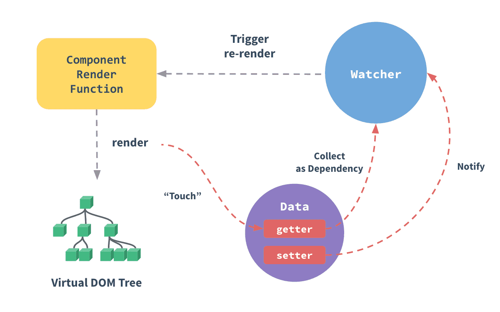

<!-- START doctoc generated TOC please keep comment here to allow auto update -->
<!-- DON'T EDIT THIS SECTION, INSTEAD RE-RUN doctoc TO UPDATE -->
<!-- **Table of Contents**  *generated with [DocToc](https://github.com/thlorenz/doctoc)* -->

- [说明](#%E8%AF%B4%E6%98%8E)
- [原理介绍分类](#%E5%8E%9F%E7%90%86%E4%BB%8B%E7%BB%8D%E5%88%86%E7%B1%BB)
  - [21——vue 生命周期及生命周期函数(是什么、有什么、原理、适用场景、执行顺序、实现、@hook)](#21vue-%E7%94%9F%E5%91%BD%E5%91%A8%E6%9C%9F%E5%8F%8A%E7%94%9F%E5%91%BD%E5%91%A8%E6%9C%9F%E5%87%BD%E6%95%B0%E6%98%AF%E4%BB%80%E4%B9%88%E6%9C%89%E4%BB%80%E4%B9%88%E5%8E%9F%E7%90%86%E9%80%82%E7%94%A8%E5%9C%BA%E6%99%AF%E6%89%A7%E8%A1%8C%E9%A1%BA%E5%BA%8F%E5%AE%9E%E7%8E%B0hook)
    - [1. 关键词](#1-%E5%85%B3%E9%94%AE%E8%AF%8D)
    - [2. 简要回答](#2-%E7%AE%80%E8%A6%81%E5%9B%9E%E7%AD%94)
    - [3. VNode 生命周期事件](#3-vnode-%E7%94%9F%E5%91%BD%E5%91%A8%E6%9C%9F%E4%BA%8B%E4%BB%B6)
  - [19——vue 响应式(理解、原理、2.x 和 3.x 的区别、依赖收集等)](#19vue-%E5%93%8D%E5%BA%94%E5%BC%8F%E7%90%86%E8%A7%A3%E5%8E%9F%E7%90%862x-%E5%92%8C-3x-%E7%9A%84%E5%8C%BA%E5%88%AB%E4%BE%9D%E8%B5%96%E6%94%B6%E9%9B%86%E7%AD%89)
    - [1. 什么是(数据)响应式(Reactivity)](#1-%E4%BB%80%E4%B9%88%E6%98%AF%E6%95%B0%E6%8D%AE%E5%93%8D%E5%BA%94%E5%BC%8Freactivity)
    - [2. vue 中响应式的实现](#2-vue-%E4%B8%AD%E5%93%8D%E5%BA%94%E5%BC%8F%E7%9A%84%E5%AE%9E%E7%8E%B0)
  - [11——虚拟 DOM(原因、原理、渲染机制、优缺点)](#11%E8%99%9A%E6%8B%9F-dom%E5%8E%9F%E5%9B%A0%E5%8E%9F%E7%90%86%E6%B8%B2%E6%9F%93%E6%9C%BA%E5%88%B6%E4%BC%98%E7%BC%BA%E7%82%B9)
    - [1. 虚拟节点(vnode)的概念](#1-%E8%99%9A%E6%8B%9F%E8%8A%82%E7%82%B9vnode%E7%9A%84%E6%A6%82%E5%BF%B5)
    - [2. 虚拟 DOM 的概念](#2-%E8%99%9A%E6%8B%9F-dom-%E7%9A%84%E6%A6%82%E5%BF%B5)
    - [3. 引入虚拟 DOM 的目的](#3-%E5%BC%95%E5%85%A5%E8%99%9A%E6%8B%9F-dom-%E7%9A%84%E7%9B%AE%E7%9A%84)
    - [4. 使用虚拟 DOM 的好处和不足](#4-%E4%BD%BF%E7%94%A8%E8%99%9A%E6%8B%9F-dom-%E7%9A%84%E5%A5%BD%E5%A4%84%E5%92%8C%E4%B8%8D%E8%B6%B3)
    - [5. 虚拟 dom 原理流程](#5-%E8%99%9A%E6%8B%9F-dom-%E5%8E%9F%E7%90%86%E6%B5%81%E7%A8%8B)
  - [10——MVVM 相关(原理、区别、适用场景)](#10mvvm-%E7%9B%B8%E5%85%B3%E5%8E%9F%E7%90%86%E5%8C%BA%E5%88%AB%E9%80%82%E7%94%A8%E5%9C%BA%E6%99%AF)
    - [1. MVC](#1-mvc)
    - [2. MVP](#2-mvp)
    - [3. MVVM](#3-mvvm)
  - [10——key 的作用(作用、原理、与 index 或随机数做 key 的区别)](#10key-%E7%9A%84%E4%BD%9C%E7%94%A8%E4%BD%9C%E7%94%A8%E5%8E%9F%E7%90%86%E4%B8%8E-index-%E6%88%96%E9%9A%8F%E6%9C%BA%E6%95%B0%E5%81%9A-key-%E7%9A%84%E5%8C%BA%E5%88%AB)
  - [10——vue3 新特(vue3 compositionAPI、Treeshaking 等)](#10vue3-%E6%96%B0%E7%89%B9vue3-compositionapitreeshaking-%E7%AD%89)
    - [1. 组合式 API(Composition API)](#1-%E7%BB%84%E5%90%88%E5%BC%8F-apicomposition-api)
    - [2. vue3 中的树摇(Treeshaking)](#2-vue3-%E4%B8%AD%E7%9A%84%E6%A0%91%E6%91%87treeshaking)
    - [3. 官网 vue3 非兼容的变更 概述](#3-%E5%AE%98%E7%BD%91vue3-%E9%9D%9E%E5%85%BC%E5%AE%B9%E7%9A%84%E5%8F%98%E6%9B%B4-%E6%A6%82%E8%BF%B0)
  - [8——diff 算法(原理、2.x 和 3.x 的区别)](#8diff-%E7%AE%97%E6%B3%95%E5%8E%9F%E7%90%862x-%E5%92%8C-3x-%E7%9A%84%E5%8C%BA%E5%88%AB)
  - [7——vue 双向绑定(使用、原理、区别对比)](#7vue-%E5%8F%8C%E5%90%91%E7%BB%91%E5%AE%9A%E4%BD%BF%E7%94%A8%E5%8E%9F%E7%90%86%E5%8C%BA%E5%88%AB%E5%AF%B9%E6%AF%94)
  - [7——vue 的模板编译(原理、渲然过程)](#7vue-%E7%9A%84%E6%A8%A1%E6%9D%BF%E7%BC%96%E8%AF%91%E5%8E%9F%E7%90%86%E6%B8%B2%E7%84%B6%E8%BF%87%E7%A8%8B)
  - [5——对 vue 渐进式框架的理解(vue 是什么、核心、如何渐进式、运行机制)](#5%E5%AF%B9-vue-%E6%B8%90%E8%BF%9B%E5%BC%8F%E6%A1%86%E6%9E%B6%E7%9A%84%E7%90%86%E8%A7%A3vue-%E6%98%AF%E4%BB%80%E4%B9%88%E6%A0%B8%E5%BF%83%E5%A6%82%E4%BD%95%E6%B8%90%E8%BF%9B%E5%BC%8F%E8%BF%90%E8%A1%8C%E6%9C%BA%E5%88%B6)
    - [1. vue 是什么?](#1-vue-%E6%98%AF%E4%BB%80%E4%B9%88)
    - [2. vue 的核心?](#2-vue-%E7%9A%84%E6%A0%B8%E5%BF%83)
    - [3. 什么是渐进式框架? 为什么 vue 是渐进式框架？](#3-%E4%BB%80%E4%B9%88%E6%98%AF%E6%B8%90%E8%BF%9B%E5%BC%8F%E6%A1%86%E6%9E%B6-%E4%B8%BA%E4%BB%80%E4%B9%88-vue-%E6%98%AF%E6%B8%90%E8%BF%9B%E5%BC%8F%E6%A1%86%E6%9E%B6)
    - [4. vue 的运行机制](#4-vue-%E7%9A%84%E8%BF%90%E8%A1%8C%E6%9C%BA%E5%88%B6)
  - [4——vue 的优缺点](#4vue-%E7%9A%84%E4%BC%98%E7%BC%BA%E7%82%B9)
  - [3——SPA(理解、优缺点)](#3spa%E7%90%86%E8%A7%A3%E4%BC%98%E7%BC%BA%E7%82%B9)
  - [3——vue 中使用的设计模式](#3vue-%E4%B8%AD%E4%BD%BF%E7%94%A8%E7%9A%84%E8%AE%BE%E8%AE%A1%E6%A8%A1%E5%BC%8F)
- [全局配置、API 等(应用场景、使用方法、原理)](#%E5%85%A8%E5%B1%80%E9%85%8D%E7%BD%AEapi-%E7%AD%89%E5%BA%94%E7%94%A8%E5%9C%BA%E6%99%AF%E4%BD%BF%E7%94%A8%E6%96%B9%E6%B3%95%E5%8E%9F%E7%90%86)
  - [10——Vue.nextTick](#10vuenexttick)
  - [5——Vue.set](#5vueset)
  - [5——vue.mixin](#5vuemixin)
  - [3——Vue.use](#3vueuse)
  - [1——Vue.observable](#1vueobservable)
  - [2——Vue.filter](#2vuefilter)
  - [1——Vue.delete](#1vuedelete)
  - [1——Vue.extend](#1vueextend)
  - [1——Vue.prototype](#1vueprototype)
  - [1——Vue.component](#1vuecomponent)
  - [1——h](#1h)
  - [vue2 到 vue3 全局 API 的变化](#vue2-%E5%88%B0-vue3-%E5%85%A8%E5%B1%80-api-%E7%9A%84%E5%8F%98%E5%8C%96)
- [指令(有哪些、各自使用场景)](#%E6%8C%87%E4%BB%A4%E6%9C%89%E5%93%AA%E4%BA%9B%E5%90%84%E8%87%AA%E4%BD%BF%E7%94%A8%E5%9C%BA%E6%99%AF)
  - [7——vue 常用的修饰符](#7vue-%E5%B8%B8%E7%94%A8%E7%9A%84%E4%BF%AE%E9%A5%B0%E7%AC%A6)
    - [1. 事件处理相关](#1-%E4%BA%8B%E4%BB%B6%E5%A4%84%E7%90%86%E7%9B%B8%E5%85%B3)
    - [2. 表单输入绑定相关](#2-%E8%A1%A8%E5%8D%95%E8%BE%93%E5%85%A5%E7%BB%91%E5%AE%9A%E7%9B%B8%E5%85%B3)
  - [7——v-if 和 v-for 不建议一起用的原因](#7v-if-%E5%92%8C-v-for-%E4%B8%8D%E5%BB%BA%E8%AE%AE%E4%B8%80%E8%B5%B7%E7%94%A8%E7%9A%84%E5%8E%9F%E5%9B%A0)
  - [6——v-if 和 v-show 的区别](#6v-if-%E5%92%8C-v-show-%E7%9A%84%E5%8C%BA%E5%88%AB)
  - [6——slot 插槽(作用、原理、使用场景)](#6slot-%E6%8F%92%E6%A7%BD%E4%BD%9C%E7%94%A8%E5%8E%9F%E7%90%86%E4%BD%BF%E7%94%A8%E5%9C%BA%E6%99%AF)
    - [1. 什么是插槽？](#1-%E4%BB%80%E4%B9%88%E6%98%AF%E6%8F%92%E6%A7%BD)
    - [2. 插槽的作用域](#2-%E6%8F%92%E6%A7%BD%E7%9A%84%E4%BD%9C%E7%94%A8%E5%9F%9F)
    - [3. 默认内容](#3-%E9%BB%98%E8%AE%A4%E5%86%85%E5%AE%B9)
    - [4. 具名插槽](#4-%E5%85%B7%E5%90%8D%E6%8F%92%E6%A7%BD)
    - [5. 动态插槽名](#5-%E5%8A%A8%E6%80%81%E6%8F%92%E6%A7%BD%E5%90%8D)
    - [6. 作用域插槽](#6-%E4%BD%9C%E7%94%A8%E5%9F%9F%E6%8F%92%E6%A7%BD)
  - [5——v-model 的原理](#5v-model-%E7%9A%84%E5%8E%9F%E7%90%86)
  - [5——v-on(监听多个方法、绑定键盘事件、使用 event 对象、事件绑定原理)](#5v-on%E7%9B%91%E5%90%AC%E5%A4%9A%E4%B8%AA%E6%96%B9%E6%B3%95%E7%BB%91%E5%AE%9A%E9%94%AE%E7%9B%98%E4%BA%8B%E4%BB%B6%E4%BD%BF%E7%94%A8-event-%E5%AF%B9%E8%B1%A1%E4%BA%8B%E4%BB%B6%E7%BB%91%E5%AE%9A%E5%8E%9F%E7%90%86)
  - [4——自定义指令(原理)](#4%E8%87%AA%E5%AE%9A%E4%B9%89%E6%8C%87%E4%BB%A4%E5%8E%9F%E7%90%86)
  - [2——vue 内置指令](#2vue-%E5%86%85%E7%BD%AE%E6%8C%87%E4%BB%A4)
  - [2——v-for 的使用](#2v-for-%E7%9A%84%E4%BD%BF%E7%94%A8)
  - [2——如何动态绑定 class 和 style](#2%E5%A6%82%E4%BD%95%E5%8A%A8%E6%80%81%E7%BB%91%E5%AE%9A-class-%E5%92%8C-style)
- [选项](#%E9%80%89%E9%A1%B9)
  - [19——computed 和 watch(区别、使用场景、原理)](#19computed-%E5%92%8C-watch%E5%8C%BA%E5%88%AB%E4%BD%BF%E7%94%A8%E5%9C%BA%E6%99%AF%E5%8E%9F%E7%90%86)
    - [1. API 的使用](#1-api-%E7%9A%84%E4%BD%BF%E7%94%A8)
    - [2 区别和使用场景概述](#2-%E5%8C%BA%E5%88%AB%E5%92%8C%E4%BD%BF%E7%94%A8%E5%9C%BA%E6%99%AF%E6%A6%82%E8%BF%B0)
  - [14——组件之间的传值方式](#14%E7%BB%84%E4%BB%B6%E4%B9%8B%E9%97%B4%E7%9A%84%E4%BC%A0%E5%80%BC%E6%96%B9%E5%BC%8F)
  - [8——父子组件(生命周期顺序、父组件监听子组件生命周期、子组件修改父组件的数据、子组件修改 props 数据)](#8%E7%88%B6%E5%AD%90%E7%BB%84%E4%BB%B6%E7%94%9F%E5%91%BD%E5%91%A8%E6%9C%9F%E9%A1%BA%E5%BA%8F%E7%88%B6%E7%BB%84%E4%BB%B6%E7%9B%91%E5%90%AC%E5%AD%90%E7%BB%84%E4%BB%B6%E7%94%9F%E5%91%BD%E5%91%A8%E6%9C%9F%E5%AD%90%E7%BB%84%E4%BB%B6%E4%BF%AE%E6%94%B9%E7%88%B6%E7%BB%84%E4%BB%B6%E7%9A%84%E6%95%B0%E6%8D%AE%E5%AD%90%E7%BB%84%E4%BB%B6%E4%BF%AE%E6%94%B9-props-%E6%95%B0%E6%8D%AE)
  - [7——vue 的组件 data 为什么必须是一个返回对象的函数](#7vue-%E7%9A%84%E7%BB%84%E4%BB%B6-data-%E4%B8%BA%E4%BB%80%E4%B9%88%E5%BF%85%E9%A1%BB%E6%98%AF%E4%B8%80%E4%B8%AA%E8%BF%94%E5%9B%9E%E5%AF%B9%E8%B1%A1%E7%9A%84%E5%87%BD%E6%95%B0)
  - [2——vue 单向数据流](#2vue-%E5%8D%95%E5%90%91%E6%95%B0%E6%8D%AE%E6%B5%81)
  - [2——props 自定义验证和默认值](#2props-%E8%87%AA%E5%AE%9A%E4%B9%89%E9%AA%8C%E8%AF%81%E5%92%8C%E9%BB%98%E8%AE%A4%E5%80%BC)
  - [1——provide 和 inject](#1provide-%E5%92%8C-inject)
- [实例的属性和方法](#%E5%AE%9E%E4%BE%8B%E7%9A%84%E5%B1%9E%E6%80%A7%E5%92%8C%E6%96%B9%E6%B3%95)
  - [3——$refs 的作用(使用场景)](#3refs-%E7%9A%84%E4%BD%9C%E7%94%A8%E4%BD%BF%E7%94%A8%E5%9C%BA%E6%99%AF)
  - [1——$attrs 的作用(解决什么问题)](#1attrs-%E7%9A%84%E4%BD%9C%E7%94%A8%E8%A7%A3%E5%86%B3%E4%BB%80%E4%B9%88%E9%97%AE%E9%A2%98)
  - [1——$root 的作用](#1root-%E7%9A%84%E4%BD%9C%E7%94%A8)
- [组件的原理、应用等](#%E7%BB%84%E4%BB%B6%E7%9A%84%E5%8E%9F%E7%90%86%E5%BA%94%E7%94%A8%E7%AD%89)
  - [8——keep-alive 组件(保留组件状态或避免重新渲染)](#8keep-alive-%E7%BB%84%E4%BB%B6%E4%BF%9D%E7%95%99%E7%BB%84%E4%BB%B6%E7%8A%B6%E6%80%81%E6%88%96%E9%81%BF%E5%85%8D%E9%87%8D%E6%96%B0%E6%B8%B2%E6%9F%93)
  - [5——组件基础(理解、渲染流程、更新流程、销毁)](#5%E7%BB%84%E4%BB%B6%E5%9F%BA%E7%A1%80%E7%90%86%E8%A7%A3%E6%B8%B2%E6%9F%93%E6%B5%81%E7%A8%8B%E6%9B%B4%E6%96%B0%E6%B5%81%E7%A8%8B%E9%94%80%E6%AF%81)
  - [4——组件的设计原则](#4%E7%BB%84%E4%BB%B6%E7%9A%84%E8%AE%BE%E8%AE%A1%E5%8E%9F%E5%88%99)
  - [3——异步组件与函数组件(原理、优劣、使用场景)](#3%E5%BC%82%E6%AD%A5%E7%BB%84%E4%BB%B6%E4%B8%8E%E5%87%BD%E6%95%B0%E7%BB%84%E4%BB%B6%E5%8E%9F%E7%90%86%E4%BC%98%E5%8A%A3%E4%BD%BF%E7%94%A8%E5%9C%BA%E6%99%AF)
    - [1. 异步组件](#1-%E5%BC%82%E6%AD%A5%E7%BB%84%E4%BB%B6)
    - [2. 函数组件](#2-%E5%87%BD%E6%95%B0%E7%BB%84%E4%BB%B6)
    - [3. 官方从 vue2 迁移到 vue3 - 函数式组件](#3-%E5%AE%98%E6%96%B9%E4%BB%8E-vue2-%E8%BF%81%E7%A7%BB%E5%88%B0-vue3---%E5%87%BD%E6%95%B0%E5%BC%8F%E7%BB%84%E4%BB%B6)
  - [2——递归组件](#2%E9%80%92%E5%BD%92%E7%BB%84%E4%BB%B6)
  - [2——组件写 name 的好处](#2%E7%BB%84%E4%BB%B6%E5%86%99-name-%E7%9A%84%E5%A5%BD%E5%A4%84)
  - [1——组件和插件的区别](#1%E7%BB%84%E4%BB%B6%E5%92%8C%E6%8F%92%E4%BB%B6%E7%9A%84%E5%8C%BA%E5%88%AB)
  - [1——vue 组件里写的原生 addEventListeners 监听事件，要手动去销毁吗？为什么？](#1vue-%E7%BB%84%E4%BB%B6%E9%87%8C%E5%86%99%E7%9A%84%E5%8E%9F%E7%94%9F-addeventlisteners-%E7%9B%91%E5%90%AC%E4%BA%8B%E4%BB%B6%E8%A6%81%E6%89%8B%E5%8A%A8%E5%8E%BB%E9%94%80%E6%AF%81%E5%90%97%E4%B8%BA%E4%BB%80%E4%B9%88)
- [响应式数据的相关处理(不是 vue 响应式原理，也息息相关)](#%E5%93%8D%E5%BA%94%E5%BC%8F%E6%95%B0%E6%8D%AE%E7%9A%84%E7%9B%B8%E5%85%B3%E5%A4%84%E7%90%86%E4%B8%8D%E6%98%AF-vue-%E5%93%8D%E5%BA%94%E5%BC%8F%E5%8E%9F%E7%90%86%E4%B9%9F%E6%81%AF%E6%81%AF%E7%9B%B8%E5%85%B3)
  - [10——检测数组变化(原理、方式、注意事项)](#10%E6%A3%80%E6%B5%8B%E6%95%B0%E7%BB%84%E5%8F%98%E5%8C%96%E5%8E%9F%E7%90%86%E6%96%B9%E5%BC%8F%E6%B3%A8%E6%84%8F%E4%BA%8B%E9%A1%B9)
  - [6——vue 的 SSR(是什么、优劣)](#6vue-%E7%9A%84-ssr%E6%98%AF%E4%BB%80%E4%B9%88%E4%BC%98%E5%8A%A3)
  - [5——检测对象属性变化(原理、方式、注意事项)](#5%E6%A3%80%E6%B5%8B%E5%AF%B9%E8%B1%A1%E5%B1%9E%E6%80%A7%E5%8F%98%E5%8C%96%E5%8E%9F%E7%90%86%E6%96%B9%E5%BC%8F%E6%B3%A8%E6%84%8F%E4%BA%8B%E9%A1%B9)
- [vue-router 相关](#vue-router-%E7%9B%B8%E5%85%B3)
  - [7——vue-router 路由模式(区别、使用场景、原理)](#7vue-router-%E8%B7%AF%E7%94%B1%E6%A8%A1%E5%BC%8F%E5%8C%BA%E5%88%AB%E4%BD%BF%E7%94%A8%E5%9C%BA%E6%99%AF%E5%8E%9F%E7%90%86)
  - [7——vue-router 的动态路由(实例方法、传参、动态参数、响应参数变化)](#7vue-router-%E7%9A%84%E5%8A%A8%E6%80%81%E8%B7%AF%E7%94%B1%E5%AE%9E%E4%BE%8B%E6%96%B9%E6%B3%95%E4%BC%A0%E5%8F%82%E5%8A%A8%E6%80%81%E5%8F%82%E6%95%B0%E5%93%8D%E5%BA%94%E5%8F%82%E6%95%B0%E5%8F%98%E5%8C%96)
  - [6——vue-router 的导航守卫(钩子函数)(是什么、执行顺序、流程)](#6vue-router-%E7%9A%84%E5%AF%BC%E8%88%AA%E5%AE%88%E5%8D%AB%E9%92%A9%E5%AD%90%E5%87%BD%E6%95%B0%E6%98%AF%E4%BB%80%E4%B9%88%E6%89%A7%E8%A1%8C%E9%A1%BA%E5%BA%8F%E6%B5%81%E7%A8%8B)
    - [1. 导航守卫有三种](#1-%E5%AF%BC%E8%88%AA%E5%AE%88%E5%8D%AB%E6%9C%89%E4%B8%89%E7%A7%8D)
    - [2. 完整的导航解析流程](#2-%E5%AE%8C%E6%95%B4%E7%9A%84%E5%AF%BC%E8%88%AA%E8%A7%A3%E6%9E%90%E6%B5%81%E7%A8%8B)
  - [4——router-link 的使用和常见问题](#4router-link-%E7%9A%84%E4%BD%BF%E7%94%A8%E5%92%8C%E5%B8%B8%E8%A7%81%E9%97%AE%E9%A2%98)
    - [1. <router-link>的使用](#1-router-link%E7%9A%84%E4%BD%BF%E7%94%A8)
  - [3——`$route`和`$router` 的区别](#3route%E5%92%8Crouter-%E7%9A%84%E5%8C%BA%E5%88%AB)
  - [2——vue-router 的使用](#2vue-router-%E7%9A%84%E4%BD%BF%E7%94%A8)
  - [2——vue-router 的原理](#2vue-router-%E7%9A%84%E5%8E%9F%E7%90%86)
  - [1——手写 vue 路由的思路](#1%E6%89%8B%E5%86%99-vue-%E8%B7%AF%E7%94%B1%E7%9A%84%E6%80%9D%E8%B7%AF)
- [vuex 相关](#vuex-%E7%9B%B8%E5%85%B3)
  - [10——vuex 的理解(原理、核心属性、各个核心属性的作用)](#10vuex-%E7%9A%84%E7%90%86%E8%A7%A3%E5%8E%9F%E7%90%86%E6%A0%B8%E5%BF%83%E5%B1%9E%E6%80%A7%E5%90%84%E4%B8%AA%E6%A0%B8%E5%BF%83%E5%B1%9E%E6%80%A7%E7%9A%84%E4%BD%9C%E7%94%A8)
    - [1. Vuex 是什么？](#1-vuex-%E6%98%AF%E4%BB%80%E4%B9%88)
    - [2. vuex 核心概念](#2-vuex-%E6%A0%B8%E5%BF%83%E6%A6%82%E5%BF%B5)
  - [3——vuex 的使用](#3vuex-%E7%9A%84%E4%BD%BF%E7%94%A8)
  - [2——组件中重复使用 vuex 的 getter 、mutation 等属性](#2%E7%BB%84%E4%BB%B6%E4%B8%AD%E9%87%8D%E5%A4%8D%E4%BD%BF%E7%94%A8-vuex-%E7%9A%84-getter-mutation-%E7%AD%89%E5%B1%9E%E6%80%A7)
  - [2——vuex 页面刷新数据丢失怎么解决](#2vuex-%E9%A1%B5%E9%9D%A2%E5%88%B7%E6%96%B0%E6%95%B0%E6%8D%AE%E4%B8%A2%E5%A4%B1%E6%80%8E%E4%B9%88%E8%A7%A3%E5%86%B3)
  - [1——从 vuex 中获取的数据能直接更改吗？](#1%E4%BB%8E-vuex-%E4%B8%AD%E8%8E%B7%E5%8F%96%E7%9A%84%E6%95%B0%E6%8D%AE%E8%83%BD%E7%9B%B4%E6%8E%A5%E6%9B%B4%E6%94%B9%E5%90%97)
  - [1——ajax 请求代码应该写在组件的 methods 中还是 vuex 的 actions 中?](#1ajax-%E8%AF%B7%E6%B1%82%E4%BB%A3%E7%A0%81%E5%BA%94%E8%AF%A5%E5%86%99%E5%9C%A8%E7%BB%84%E4%BB%B6%E7%9A%84-methods-%E4%B8%AD%E8%BF%98%E6%98%AF-vuex-%E7%9A%84-actions-%E4%B8%AD)
  - [1——vuex 为什么要分模块并且加命名空间?](#1vuex-%E4%B8%BA%E4%BB%80%E4%B9%88%E8%A6%81%E5%88%86%E6%A8%A1%E5%9D%97%E5%B9%B6%E4%B8%94%E5%8A%A0%E5%91%BD%E5%90%8D%E7%A9%BA%E9%97%B4)
  - [1——vuex 的严格模式是什么,有什么作用,怎么开启?](#1vuex-%E7%9A%84%E4%B8%A5%E6%A0%BC%E6%A8%A1%E5%BC%8F%E6%98%AF%E4%BB%80%E4%B9%88%E6%9C%89%E4%BB%80%E4%B9%88%E4%BD%9C%E7%94%A8%E6%80%8E%E4%B9%88%E5%BC%80%E5%90%AF)
  - [1——在 v-model 上怎么用 Vuex 中 state 的值？](#1%E5%9C%A8-v-model-%E4%B8%8A%E6%80%8E%E4%B9%88%E7%94%A8-vuex-%E4%B8%AD-state-%E7%9A%84%E5%80%BC)
- [axios](#axios)
  - [4——axios 的封装(处理异步、配置属性、常用方法)](#4axios-%E7%9A%84%E5%B0%81%E8%A3%85%E5%A4%84%E7%90%86%E5%BC%82%E6%AD%A5%E9%85%8D%E7%BD%AE%E5%B1%9E%E6%80%A7%E5%B8%B8%E7%94%A8%E6%96%B9%E6%B3%95)
  - [1——axios 的原理](#1axios-%E7%9A%84%E5%8E%9F%E7%90%86)
  - [1——axios 的特点](#1axios-%E7%9A%84%E7%89%B9%E7%82%B9)
- [vue-cli](#vue-cli)
  - [12——vue-cli 的使用](#12vue-cli-%E7%9A%84%E4%BD%BF%E7%94%A8)
    - [简介](#%E7%AE%80%E4%BB%8B)
    - [一些命令](#%E4%B8%80%E4%BA%9B%E5%91%BD%E4%BB%A4)
    - [cli 服务使用命令](#cli-%E6%9C%8D%E5%8A%A1%E4%BD%BF%E7%94%A8%E5%91%BD%E4%BB%A4)
    - [模式(mode)](#%E6%A8%A1%E5%BC%8Fmode)
    - [环境变量](#%E7%8E%AF%E5%A2%83%E5%8F%98%E9%87%8F)
    - [构建目标](#%E6%9E%84%E5%BB%BA%E7%9B%AE%E6%A0%87)
- [vue 编译配置](#vue-%E7%BC%96%E8%AF%91%E9%85%8D%E7%BD%AE)
  - [2——vue-loader(是什么、作用)](#2vue-loader%E6%98%AF%E4%BB%80%E4%B9%88%E4%BD%9C%E7%94%A8)
  - [1——assets 和 static 的区别](#1assets-%E5%92%8C-static-%E7%9A%84%E5%8C%BA%E5%88%AB)
  - [1——vue 项目如何部署？有遇到布署服务器后刷新 404 问题吗？](#1vue-%E9%A1%B9%E7%9B%AE%E5%A6%82%E4%BD%95%E9%83%A8%E7%BD%B2%E6%9C%89%E9%81%87%E5%88%B0%E5%B8%83%E7%BD%B2%E6%9C%8D%E5%8A%A1%E5%99%A8%E5%90%8E%E5%88%B7%E6%96%B0-404-%E9%97%AE%E9%A2%98%E5%90%97)
  - [1——vue 如何优化首屏加载速度？](#1vue-%E5%A6%82%E4%BD%95%E4%BC%98%E5%8C%96%E9%A6%96%E5%B1%8F%E5%8A%A0%E8%BD%BD%E9%80%9F%E5%BA%A6)
  - [1——vue 打包命令是什么？](#1vue-%E6%89%93%E5%8C%85%E5%91%BD%E4%BB%A4%E6%98%AF%E4%BB%80%E4%B9%88)
  - [1——vue 打包后会生成哪些文件？](#1vue-%E6%89%93%E5%8C%85%E5%90%8E%E4%BC%9A%E7%94%9F%E6%88%90%E5%93%AA%E4%BA%9B%E6%96%87%E4%BB%B6)
  - [1——如何配置 vue 打包生成文件的路径？](#1%E5%A6%82%E4%BD%95%E9%85%8D%E7%BD%AE-vue-%E6%89%93%E5%8C%85%E7%94%9F%E6%88%90%E6%96%87%E4%BB%B6%E7%9A%84%E8%B7%AF%E5%BE%84)
  - [1——vue 开发命令 npm run dev 输入后的执行过程？](#1vue-%E5%BC%80%E5%8F%91%E5%91%BD%E4%BB%A4-npm-run-dev-%E8%BE%93%E5%85%A5%E5%90%8E%E7%9A%84%E6%89%A7%E8%A1%8C%E8%BF%87%E7%A8%8B)
  - [1——vue 中如何实现 proxy 代理？(webpack 的 devServer)](#1vue-%E4%B8%AD%E5%A6%82%E4%BD%95%E5%AE%9E%E7%8E%B0-proxy-%E4%BB%A3%E7%90%86webpack-%E7%9A%84-devserver)
  - [1——vue 如何实现按需加载配合 webpack 设置？（require.ensure()）](#1vue-%E5%A6%82%E4%BD%95%E5%AE%9E%E7%8E%B0%E6%8C%89%E9%9C%80%E5%8A%A0%E8%BD%BD%E9%85%8D%E5%90%88-webpack-%E8%AE%BE%E7%BD%AErequireensure)
  - [1——你们 vue 项目是打包了一个 js 文件，一个 css 文件，还是有多个文件？](#1%E4%BD%A0%E4%BB%AC-vue-%E9%A1%B9%E7%9B%AE%E6%98%AF%E6%89%93%E5%8C%85%E4%BA%86%E4%B8%80%E4%B8%AA-js-%E6%96%87%E4%BB%B6%E4%B8%80%E4%B8%AA-css-%E6%96%87%E4%BB%B6%E8%BF%98%E6%98%AF%E6%9C%89%E5%A4%9A%E4%B8%AA%E6%96%87%E4%BB%B6)
  - [1——\<template>\</template>有什么用？](#1%5Ctemplate%5Ctemplate%E6%9C%89%E4%BB%80%E4%B9%88%E7%94%A8)
- [业务实践](#%E4%B8%9A%E5%8A%A1%E5%AE%9E%E8%B7%B5)
  - [5——vue 权限管理怎么做](#5vue-%E6%9D%83%E9%99%90%E7%AE%A1%E7%90%86%E6%80%8E%E4%B9%88%E5%81%9A)
  - [5——vue 最佳实践/性能优化](#5vue-%E6%9C%80%E4%BD%B3%E5%AE%9E%E8%B7%B5%E6%80%A7%E8%83%BD%E4%BC%98%E5%8C%96)
  - [2——解决非工程化项目初始化页面闪动问题](#2%E8%A7%A3%E5%86%B3%E9%9D%9E%E5%B7%A5%E7%A8%8B%E5%8C%96%E9%A1%B9%E7%9B%AE%E5%88%9D%E5%A7%8B%E5%8C%96%E9%A1%B5%E9%9D%A2%E9%97%AA%E5%8A%A8%E9%97%AE%E9%A2%98)
  - [2——优化 vue 首页的加载速度](#2%E4%BC%98%E5%8C%96-vue-%E9%A6%96%E9%A1%B5%E7%9A%84%E5%8A%A0%E8%BD%BD%E9%80%9F%E5%BA%A6)
  - [2——vue 开发中踩过的坑及解决方法](#2vue-%E5%BC%80%E5%8F%91%E4%B8%AD%E8%B8%A9%E8%BF%87%E7%9A%84%E5%9D%91%E5%8F%8A%E8%A7%A3%E5%86%B3%E6%96%B9%E6%B3%95)
  - [1——跨域问题](#1%E8%B7%A8%E5%9F%9F%E9%97%AE%E9%A2%98)
  - [1——vue 项目中错误处理](#1vue-%E9%A1%B9%E7%9B%AE%E4%B8%AD%E9%94%99%E8%AF%AF%E5%A4%84%E7%90%86)
  - [1——package.json 里面的配置](#1packagejson-%E9%87%8C%E9%9D%A2%E7%9A%84%E9%85%8D%E7%BD%AE)
  - [1——vue 弹窗后如何禁止滚动条滚动?](#1vue-%E5%BC%B9%E7%AA%97%E5%90%8E%E5%A6%82%E4%BD%95%E7%A6%81%E6%AD%A2%E6%BB%9A%E5%8A%A8%E6%9D%A1%E6%BB%9A%E5%8A%A8)
  - [1——vue 中如何实现 tab 切换功能?](#1vue-%E4%B8%AD%E5%A6%82%E4%BD%95%E5%AE%9E%E7%8E%B0-tab-%E5%88%87%E6%8D%A2%E5%8A%9F%E8%83%BD)
  - [1——vue 中实现切换页面时为左滑出效?](#1vue-%E4%B8%AD%E5%AE%9E%E7%8E%B0%E5%88%87%E6%8D%A2%E9%A1%B5%E9%9D%A2%E6%97%B6%E4%B8%BA%E5%B7%A6%E6%BB%91%E5%87%BA%E6%95%88)
  - [1——如何让 CSS 只在当前组件中起作用?](#1%E5%A6%82%E4%BD%95%E8%AE%A9-css-%E5%8F%AA%E5%9C%A8%E5%BD%93%E5%89%8D%E7%BB%84%E4%BB%B6%E4%B8%AD%E8%B5%B7%E4%BD%9C%E7%94%A8)

<!-- END doctoc generated TOC please keep comment here to allow auto update -->

# 说明

由于没有系统学习过 vue(截止 2022-07 左右)，工作项目大部分都是了解了简单使用方法就直接上手，根据业务需求，搜索对应资料，解决对应问题。后来有简单浏览过一遍 API 文档，对整体分类及相关功能有了大概了解。

为了后续能好好应对答题需求，特地在网上找了几篇阅读量非常高、点赞数也很多的关于“vue 面试题”的博文，对其中的问题进行分类统计、权重分析，筛选出经常被提及的问题，好好整理学习。

这几篇博文分别如下，(看名字就略显浮夸):

- [「自我检验」熬夜总结 50 个 Vue 知识点，全都会你就是神！！！](https://juejin.cn/post/6984210440276410399)
- [历时一个月，2.6W 字！50+Vue 经典面试题源码级详解，你值得收藏！](https://juejin.cn/post/7097067108663558151)
- [三十七个常见 Vue 面试题，背就完事了。](https://juejin.cn/post/7043074656047202334)
- [史上最强 vue 总结---面试开发全靠它了](https://juejin.cn/post/6850037277675454478)
- [30 道 Vue 面试题，内含详细讲解（涵盖入门到精通，自测 Vue 掌握程度）](https://juejin.cn/post/6844903918753808398)
- [最全的 Vue 面试题+详解答案](https://juejin.cn/post/6961222829979697165)
- github 项目：[febobo/web-interview](https://github.com/febobo/web-interview/tree/master/docs#vue%E7%B3%BB%E5%88%97)
- github 项目：[yisainan/web-interview](https://github.com/yisainan/web-interview/blob/master/content/vue/vue.md)

对这里面 400+的问题进行了一一分析整理，虽然有不少都是 ctrl+C/V 的，但也初步整理出一些重点。特地绘制了两个词云图：

jieba 分词关键字和具体问题的词云：

&具体问题分词.png>)

由此：

- 正文部分会对热点问题进行解答，由于对原博文作者回答问题的时间和实际理解度不明，**不会直接复制原答案,会根据自己理解，以当前 vue 版本进行解答。**
  - 整理时间为 2022-07-14，当前最新版本为 vue2.7.5 和 vue3.2.37。
- 暂时没有原创问题，也不是直接复制问题，而是对问题进行归纳分类。可以理解为“触发关键字作答”。

**本文只是为了应付面试答题等需求**(也就是尽量简洁条目列示)，其实从学习角度来看，官方文档显然更好:

- [v2.x 文档](https://cn.vuejs.org/v2/guide/)
- [v3.x 文档](https://staging-cn.vuejs.org/guide/introduction.html)或[v3.x 文档](https://v3.cn.vuejs.org/guide/introduction.html)
- [vuex 文档](https://vuex.vuejs.org/zh/guide/)
- [vue-router 文档](https://router.vuejs.org/zh/introduction.html)

如果有需要源码分析、原理探究等深一些的学习，本文档不会”复制粘贴”，但会列式一些参考文章供学习。

# 原理介绍分类

## 21——vue 生命周期及生命周期函数(是什么、有什么、原理、适用场景、执行顺序、实现、@hook)

在回答 vue 生命周期之前，有一个前提需要知道，那就是选项式 API(Options API)和组合式 API(Composition API)的概念，
推荐参看博文[Composition API VS Options API in Vue 3 For Beginners](https://www.webmound.com/composition-api-vs-options-api-in-vue-3/)

### 1. 关键词

- 生命周期
  - vue 的生命周期就是 vue 实例从创建到销毁/卸载的过程。
- 生命周期钩子
  - 与 vue 生命周期各个过程中对应的函数。
  - 每个组件在被创建时都要经过一系列的初始化过程，同时在这个过程中也会运行一些叫做生命周期钩子的函数，这给了用户在不同阶段添加自己的代码的机会。
- 生命周期函数
  - vue2.x:beforeCreate、created、beforeMount、mounted、beforeUpdate、updated、activated、deactivated、**beforeDestroy、destroyed**、errorCaptured
  - vue3.x:
    - 选项式 API：beforeCreate、created、beforeMount、mounted、beforeUpdate、updated、activated、deactivated、**beforeUnmount、unmounted**、errorCaptured
      - dev only：renderTracked、renderTriggered
      - SSR only：serverPrefetch
    - 组合式 API：_setup()_、onBeforeMount()、onMounted()、onBeforeUpdate()、onUpdated()、onActivated()、onDeactivated()、**onBeforeUnmount()、onUnmounted()**、onErrorCaptured()
      - dev only：onRenderTracked()、onRenderTriggered()
      - SSR only：onServerPrefetch()
- 生命周期图示


### 2. 简要回答

- a) Vue 生命周期的实现原理

  - Vue 的生命周期钩子是回调函数，当创建组件实例的过程中会调用相应的钩子方法。 内部会对钩子进行处理，将钩子函数维护成数组的形式。
  - Vue3 的生命周期 Hooks 函数的实现原理，就是把各个生命周期的函数挂载或者叫注册到组件的实例上，然后等到组件运行到某个时刻，再去组件实例上把相应的生命周期的函数取出来执行。
  - 具体实现得看源码

- b) vue 生命周期主要的 4 个阶段

  - 从生命周期图示来看，组件的生命周期大概分为 4 个阶段，每个阶段前后各有一个钩子函数。此外的钩子函数就是针对缓存的组件的激活/停用、捕获子组件错误的时候针对性触发了。4 个阶段大概就是：
    - 创建 — 在组件创建时执行
    - 挂载 — DOM 被挂载时执行
    - 更新 — 当响应数据被修改时执行
    - 销毁/卸载 — 在元素被销毁之前立即运行

- c) vue 生命周期钩子及其作用

  - 使用 Options API(/前为 2.x，/之后为 3.x)

    - **beforeCreate**: 在实例初始化之后,进行数据侦听和事件/侦听器的配置之前同步调用。
      - 无法访问组件的任何响应数据和事件。
    - **created**: 在实例创建完成后被立即同步调用。
      - "适用":要在组件创建时访问组件的数据和事件。
    - **beforeMount**: 在挂载开始之前被调用,相关的 render 函数首次被调用。
    - **mounted**: 实例被挂载后调用
      - 注意 mounted 不会保证所有的子组件也都被挂载完成(比如异步组件)。
      - 如果希望等到整个视图都渲染完毕再执行某些操作，可以在 mounted 内部使用 `vm.$nextTick`。
    - **beforeUpdate**: 在组件即将因为一个**响应式状态变更而更新其 DOM 树之前**调用。
      - 这里适合在现有 DOM 将要被更新之前访问它，比如移除手动添加的事件监听器。
    - **updated**: 在组件即将因为一个响应式状态变更而更新其 DOM 树之后调用。
      - updated 不会保证所有的子组件也都被重新渲染完毕。
      - 如果希望等到整个视图都渲染完毕，可以在 updated 里使用 `vm.$nextTick`。
    - **activated**: 被 keep-alive 缓存的组件激活时调用。
    - **deactivated**: 被 keep-alive 缓存的组件失活(停用)时调用。
    - **beforeDestroy/beforeUnmount：** 在一个组件实例被销毁/卸载之前调用。在这一步，实例仍然完全可用。
    - **destroyed/unmounted**: 在一个组件实例被卸载之后调用。
      - 该钩子被调用后，对应 Vue 实例的所有指令都被解绑，所有的事件监听器被移除，所有的子实例也都被销毁。
    - **errorCaptured**: 在捕获一个来自后代组件的错误时被调用。
      - 此钩子会收到三个实数：错误对象、发生错误的组件实例以及一个包含错误来源信息的字符串。此钩子可以返回 false 以阻止该错误继续向上传播。
      - 错误可以从以下几个来源中捕获：组件渲染、事件处理器、生命周期钩子、setup() 函数、侦听器、自定义指令钩子、过渡钩子

  - 使用 Composition API

    - vue3 如果还是使用选项式 API 的话，生命周期钩子函数没有变化。只是在使用组合式 API 时，可以理解为 beforecate 和 created 被 setup 方法本身所取代。
    - 组合式 API 中的 setup() 钩子会在任何选项式 API 钩子之前调用。
    - 所以组合式 API 各个钩子函数(可以在 setup 方法中访问的 API 生命周期钩子有 9 个选项)如下：
      - onBeforeMount()
      - onMounted()
      - onBeforeUpdate()
      - onUpdated()
      - onBeforeUnmount()
      - onUnmounted()
      - onActivated()
      - onDeactivated()
      - onErrorCaptured()

  - vue3 生命周期的调试钩子和 SSR 钩子
    - 在 vue3 之后，不管是使用选项式 API 还是组合式 API，有两个 dev only 的生命周期钩子
      - **renderTracked/onRenderTracked()**: 在一个响应式依赖被组件的渲染作用追踪后调用。
      - **renderTriggered/onRenderTriggered()** : 在一个响应式依赖被组件触发了重新渲染之后调用。
    - 和一个 SSR only 的钩子
      - **serverPrefetch/onServerPrefetch**: 当组件实例在服务器上被渲染之前要完成的异步函数。

### 3. [VNode 生命周期事件](https://v3.cn.vuejs.org/guide/migration/vnode-lifecycle-events.html)

- 在 Vue 2 中，我们可以**通过事件来监听组件生命周期中的关键阶段**。这些事件名都是以 `hook:` 前缀开头，并跟随相应的生命周期钩子的名字。
- 在 Vue 3 中，这个前缀已被更改为 `vnode-`。额外地，这些事件**现在也可用于 HTML 元素**，和在组件上的用法一样。

## 19——vue 响应式(理解、原理、2.x 和 3.x 的区别、依赖收集等)

### 1. 什么是(数据)响应式(Reactivity)

- Vue 最独特的特性之一，是其非侵入性的响应式系统。**数据模型仅仅是普通的 JavaScript 对象。而当你修改它们时，视图会进行更新**。
  - 所谓数据响应式就是**能够使数据变化可以被检测并对这种变化做出响应的机制**。
- (题外话)除了响应式数据外，还有响应式网页设计(Responsive Web design):响应浏览环境的网页或者应用的设计。

### 2. vue 中响应式的实现

- a) [vue2 的实现](https://cn.vuejs.org/v2/guide/reactivity.html)

  - 基本流程

    - 把一个普通的 JavaScript 对象传入 Vue 实例作为 data 选项，Vue 将遍历此对象所有的 property，并使用 `Object.defineProperty` 把这些 property 全部转为 `getter/setter`(数据劫持)。
      - 因此 Vue 无法检测 property 的添加或移除。
      - 这些 `getter/setter` 对用户来说是不可见的，但是在内部它们让 Vue 能够追踪依赖，在 property 被访问和修改时通知变更。
    - 每个组件实例都对应一个 `watcher` 实例，它会在组件渲染的过程中把“接触”过的数据 property 记录为**依赖(dependencies)**。之后当依赖项的 `setter` 触发(triggered)时，会通知(notifies) `watcher`，从而使它关联的组件重新渲染。

    

  - 不足
    - 由于 JavaScript 的限制，Vue 不能检测数组和对象的变化。
    - 由于 Vue 不允许动态添加根级响应式 property，所以必须在初始化实例前声明所有根级响应式 property，哪怕只是一个空值。
  - 对策
    - 对于对象：Vue 无法检测 property 的添加或移除。
      - 可以使用 `Vue.set(object, propertyName, value)` 全局方法或者`vm.$set()`实例方法向嵌套对象添加响应式 property。
      - 用原对象与要混合进去的对象的 property 一起创建一个新的对象。
    - 对于数组：Vue 不能检测*利用索引直接设置一个数组*项或*修改数组的长度*。
      - 使用`Vue.set(vm.items, indexOfItem, newValue)`或`vm.items.splice(indexOfItem, 1, newValue)`解决前者问题。
      - 使用`vm.items.splice(newLength)`解决后者问题。
      - 可以统一重写那 7 个会改变原数组的方法。
  - 异步更新队列

    - Vue 在更新 DOM 时是**异步**执行的。只要侦听到数据变化，Vue 将开启一个队列，并缓冲在同一事件循环中发生的所有数据变更。
      - 如果同一个 watcher 被多次触发，只会被推入到队列中一次。
    - 然后，在下一个的事件循环“tick”中，Vue 刷新队列并执行实际 (已去重的) 工作。
      - Vue 在内部对异步队列尝试使用原生的 Promise.then、MutationObserver 和 setImmediate，
        - 如果执行环境不支持，则会采用 setTimeout(fn, 0) 代替。

    可参看文章：
    [图解 Vue 响应式原理](https://juejin.cn/post/6857669921166491662)

- b) [vue3 的实现](https://staging-cn.vuejs.org/guide/extras/reactivity-in-depth.html)

  - 主要区别：

    - 在 JavaScript 中有两种劫持属性访问(intercepting property access)的方式：[getter](https://developer.mozilla.org/zh-CN/docs/Web/JavaScript/Reference/Functions/get)/[setters](https://developer.mozilla.org/zh-CN/docs/Web/JavaScript/Reference/Functions/set) 和 [Proxies](https://developer.mozilla.org/zh-CN/docs/Web/JavaScript/Reference/Global_Objects/Proxy)。
    - Vue 2 使用 getter/setters 完全由于需支持更旧版本浏览器的限制。
    - Vue 3 中使用了 `Proxy` 来创建响应式对象，将 `getter/setter` 用于 ref。
      - 即 `reactive` 用于对象类型，`ref` 用于基础数据类型。

  - [基本流程](https://juejin.cn/post/6858899262596448270#heading-42)

    - 1 初始化阶段
      - 初始化阶段通过组件初始化方法形成对应的 proxy 对象，然后形成一个负责渲染的 effect。
    - 2 get 依赖收集阶段
      - 通过解析 template，替换真实 data 属性，来触发 get,然后通过 track 方法，通过 proxy 对象和 key 形成对应的 deps，将负责渲染的 effect 存入 deps。
      - （这个过程还有其他的 effect，比如 watchEffect 存入 deps 中 ）。
    - 3 set 派发更新阶段
      - 当我们 `this[key] = value` 改变属性的时候，首先通过 trigger 方法，通过 proxy 对象和 key 找到对应的 deps，然后给 deps 分类分成 computedRunners 和 effect,然后依次执行，如果需要调度的，直接放入调度。
    - 一句话说法: _get 方法通过 track 构建组件映射关系，经 set 方法通过 trigger 查找映射关系并触发更新函数。_

      

  - Proxy 相比于`Object.defineProperty`的优势

    - Object.defineProperty 无法监控到数组下标的变化，导致通过数组下标添加元素，不能实时响应；
    - Object.defineProperty 只能劫持对象的属性，从而需要对每个对象，每个属性进行遍历，如果，属性值是对象，还需要深度遍历。
    - Proxy 可以劫持整个对象，并返回一个新的对象。
    - Proxy 不仅可以代理对象，还可以代理数组。还可以代理动态增加的属性。
    - （旧版本浏览器可能不支持 ES 新语法）

  - 补充说明

    - Vue3 响应式原理总结
      - 通过 Proxy（代理）：拦截对象中任意属性的变化，包括：属性值的读写、属性的添加、属性的删除等
      - 通过 Reflect：对被代理对象的属性进行操作
    - reactive 对比 ref
      - 从定义数据角度对比
        - ref 用于定义基本类型数据
        - reactive 是用来定义对象或者是数组类型数据
        - 当然 ref 也可以去定义对象或者是数组，它内部会自动通过 reactive 转化为代理对象
      - 从原理的角度分析
        - ref 是通过 Object.defineProperty()来实现响应式（数据劫持）
        - reactive 是通过 Reflect.defineProperty()来实现响应式（数据劫持），并且通过 Reflect 去操作源对象内部的数据
      - 从使用的角度上来说
        - ref 定义的数据：操作数据需要.value 读取数据,但是模板直接读取不需要加.value
        - reactive 定义数据：操作和读取数据都不需要加.value

更多参考文章:

- 1 [一张图理清 Vue 3.0 的响应式系统](https://segmentfault.com/a/1190000020629159)
- 2 [Vue 3 Reactivity](https://www.vuemastery.com/courses/vue-3-reactivity/vue3-reactivity/)
- 3(上面流程图来源) [Vue3.0 响应式原理解析](https://kerminate.me/2020/01/31/Vue3-0-%E5%93%8D%E5%BA%94%E5%BC%8F%E5%8E%9F%E7%90%86%E8%A7%A3%E6%9E%90/)
- 4 [Vue3 最啰嗦的 Reactivity 数据响应式原理解析](https://juejin.cn/post/6965646653076439048)
- 5 [Vue3 响应式原理 + 手写 reactive](https://segmentfault.com/a/1190000023465134)
- [林三心画了 8 张图，最通俗易懂的 Vue3 响应式核心原理解析](https://juejin.cn/post/7001999813344493581)
- [vue3.0 响应式原理(超详细)](https://juejin.cn/post/6858899262596448270)
- [【Vue3】第二部分 Vue3 中的响应式原理](https://blog.csdn.net/trees__/article/details/123492627)
- [reactivie 整体概览](https://vue3js.cn/reactivity/)
- MDN 文档[Object.defineProperty](https://developer.mozilla.org/zh-CN/docs/Web/JavaScript/Reference/Global_Objects/Object/defineProperty)和[Proxy](https://developer.mozilla.org/zh-CN/docs/Web/JavaScript/Reference/Global_Objects/Proxy)

## 11——虚拟 DOM(原因、原理、渲染机制、优缺点)

这个问题应该还渲染机制联系到一起，也可以补充后面的模板编译原理等.

_(文字内容)_ 的格式、即小括号斜体包裹的内容，通常为个人理解。

[虚拟 DOM](https://staging-cn.vuejs.org/guide/extras/rendering-mechanism.html#virtual-dom)

### 1. 虚拟节点(vnode)的概念

- (v2 文档描述): `createElement()`返回的数据其实不是一个实际的 DOM 元素，所包含的信息会告诉 Vue 页面上需要渲染什么样的节点，包括及其子节点的描述信息。
  - 我们把这样的节点描述为“虚拟节点 (virtual node)”，也常简写它为“VNode”。
- (v3 文档描述): vnode 即一个纯 JavaScript 的对象 (一个“虚拟节点”)，它代表着一个 _(html 的标签)_ 元素。

  - 它包含我们创建实际元素所需的所有信息。
  - 它还可以包含更多的子节点，这使它可以成为虚拟 DOM 树的根节点。

- 简述: vnode 可以理解成节点描述对象，它描述了应该怎样去创建真实的 DOM 节点。
  - [v2 版 vnode.ts 源码](https://github.com/vuejs/vue/blob/main/src/core/vdom/vnode.ts)、[v3 版 vnode.ts 源码](https://github.com/vuejs/core/blob/main/packages/runtime-core/src/vnode.ts)

### 2. 虚拟 DOM 的概念

- (v3 文档描述): 虚拟 DOM(Virtual DOM.VDOM) 是一种编程概念，意为将将目标所需的 UI 通过数据结构“虚拟”地表示出来，保存在内存中，并与真实的 DOM 保持同步。
- (v2 文档描述): Vue 通过建立一个虚拟 DOM 来追踪自己要如何改变真实 DOM。“虚拟 DOM”是我们对由 Vue 组件树建立起来的整个 VNode 树的称呼。
- (部分人总结): Virtual DOM 其实就是一棵以 VNode 节点作为基础的树，用对象属性来描述节点，实际上它只是一层对真实 DOM 的抽象。最终可以通过一系列操作使这棵树映射到真实环境上。
- 简述: 虚拟 DOM 简单说就是 用 JS 对象来模拟 DOM 结构。

### 3. 引入虚拟 DOM 的目的

- 部分人总结：
  - vue2 引入 vdom 的主要原因是 vdom 把渲染过程抽象化了，从而使得组件的抽象能力也得到提升，并且可以适配 DOM 以外的渲染目标。
  - 不再依赖 HTML 解析器进行模版解析，可以进行更多的 AOT 工作提高运行时效率：通过模版 AOT 编译，Vue 的运行时体积可以进一步压缩，运行时效率可以进一步提升。
  - 可以渲染到 DOM 以外的平台，实现 SSR、同构渲染这些高级特性，Weex 等框架应用的就是这一特性。
- 虚拟 DOM 在 Vue.js 主要做了两件事：
  - 提供与真实 DOM 节点所对应的虚拟节点 vnode
  - 将虚拟节点 vnode 和旧虚拟节点 oldVnode 进行对比，然后更新视图

### 4. 使用虚拟 DOM 的好处和不足

- 好处:
  - **(v3 文档): 虚拟 DOM 带来的主要收益是它赋予了开发者编程式地、声明式地创建、审查和组合所需 UI 结构的能力，而把直接与 DOM 相关的操作交给了渲染器。**
  - 其他总结
    - 具备跨平台的优势
      - 由于 Virtual DOM 是以 JavaScript 对象为基础而不依赖真实平台环境，所以使它具有了跨平台的能力。可以更好的实现 SSR，同构渲染等
    - 操作 DOM 慢，js 运行效率高，提高效率。
      - 因为 DOM 操作的执行速度远不如 Javascript 的运算速度快，因此，把大量的 DOM 操作搬运到 Javascript 中，运用 patching 算法来计算出真正需要更新的节点，最大限度地减少 DOM 操作，从而显著提高性能。
      - Virtual DOM 本质上就是在 JS 和 DOM 之间做了一个缓存。可以类比 CPU 和硬盘，既然硬盘这么慢，我们就在它们之间加个缓存：既然 DOM 这么慢，我们就在它们 JS 和 DOM 之间加个缓存。CPU（JS）只操作内存（Virtual DOM），最后的时候再把变更写入硬盘（DOM）
    - 提升渲染性能
      - Virtual DOM 的优势不在于单次的操作，而是在大量、频繁的数据更新下，能够对视图进行合理、高效的更新。
      - 关于性能方面，在首次渲染的时候肯定不如直接操作 DOM，因为要维护一层额外的虚拟 DOM。
        - 如果后续有频繁操作 DOM 的操作，这个时候可能会有性能的提升，虚拟 DOM 在更新真实 DOM 之前会通过 Diff 算法对比新旧两个虚拟 DOM 树的差异，最终把差异更新到真实 DOM
  - 个人简述: 组件抽象化、提高性能、跨平台。
- 不足
  - 1.创建 dom 依赖创建函数
  - 2.当节点数量非常庞大时，其自身的各种判断和计算会将自己击溃
  - 3.单从创建 dom 的角度出发，它的创建速度比原生的慢
  - 无法进行极致优化： 虽然虚拟 DOM + 合理的优化，足以应对绝大部分应用的性能需求，但在一些性能要求极高的应用中虚拟 DOM 无法进行针对性的极致优化。(毕竟始终是隔了一层)

### 5. 虚拟 dom 原理流程

- 1 用 JavaScript 对象模拟真实 DOM 树，对真实 DOM 进行抽象；
- 2 比较两棵虚拟 DOM 树的差异(diff 算法)；
- 3 将两个虚拟 DOM 对象的差异应用到真正的 DOM 树(pach 算法)。


v3 文档比较模糊的描述

- 一个运行时渲染器将会遍历整个虚拟 DOM 树，并据此构建真实的 DOM 树。这个过程被称为挂载 (mount)。
- 如果我们有两份虚拟 DOM 树，渲染器将会有比较地遍历它们，找出它们之间的区别，并应用这其中的变化到真实的 DOM 上。
  - 这个过程被称为修补 (patch)，又被称为“比较差异 (diffing)”或“协调 (reconciliation)”。

**个人总结：构建虚拟 DMO 树、找出新旧两个虚拟 DOM 树的差异、将查询渲染到真实 DOM 上。**

更多参考文章:

- [深入剖析：Vue 核心之虚拟 DOM](https://juejin.cn/post/6844903895467032589)
- [深入浅出虚拟 DOM 和 Diff 算法，及 Vue2 与 Vue3 中的区别](https://juejin.cn/post/7010594233253888013)
- [Vue 虚拟 DOM 搞不懂？这篇文章帮你彻底搞定虚拟 DOM](https://juejin.cn/post/6997579802215448606)
- [Vue 采用虚拟 DOM 的目的是什么?](https://www.zhihu.com/question/271485214)
- [浅析虚拟 dom 原理并实现](https://segmentfault.com/a/1190000016647776)

## 10——MVVM 相关(原理、区别、适用场景)

### 1. MVC

- 架构模式
  - 模型层（Model）：是应用程序中独立于用户界面的动态数据结构；它直接管理应用程序的数据，逻辑和规则。
  - 视图层（View）：用户界面，用来展示信息。
  - 控制层（Controller）：接收输入事件，操控 model 或 view。
- 图示

  

- 优点
  - 分为职责更清晰的 Model、View、Controller 三层，更符合高内聚低耦合的原则。
  - 利于需求的变动，维护成本降低。
- 缺点
  - Model 层和 View 的联系增加了数据流向的选择，其结果就是造成维护数据流向成本的提高，更容易出错。
  - Controller 层会随着 View 复杂度的增加而变得异常庞大，所以需要拆分为多个子 Controller。
- 适用场景：适用于较小，功能较少，业务逻辑较少的项目。

### 2. MVP

- 架构模式

  - Model 定义用户界面所需要被显示的资料模型，一个模型包含着相关的业务逻辑（在实际开发中，数据相关的业务逻辑都会放到服务器）。
  - View 视图为呈现用户界面的终端，用以表现来自 Model 的资料，和用户命令路由再经过 Presenter 对事件处理后的资料。
  - Presenter 包含着组件的事件处理，负责检索 Model 获取资料，和将获取的资料经过格式转换与 View 进行沟通。

- 图示

  

- 优点
  - 基于 MVC 的改良，含有 MVC 的优点。
  - 降低 Model 层和 View 的联系，使数据流向更可控。
- 缺点
  - Presenter/Controller 层的负担再次加重，会随着 View 复杂度的增加比 MVC 变的更加庞大，需要拆分为多个子 Presenter。
- MVC 与 MVP 的差异
  - MVP（Passive View）中的视图和模型是完全解耦的
    - MVC 中的 View 会直接存取 Model 的资料；
    - MVP 中的 View 并不直接与 Model 沟通，他们之间的沟通都透过 Presenter 来进行，所有行为都在 Presenter 内部发生。
- 适用场景：视图界面不是很多的项目中。

### 3. MVVM

- 架构模式

  - Model 定义用户界面所需要被显示的资料模型，一个模型包含着相关的业务逻辑（在实际开发中，数据相关的业务逻辑都会放到服务器）。
  - View 视图为呈现用户界面的终端，用以表现来自 Model 的资料，和用户命令路由再经过 Presenter 对事件处理后的资料。
  - ViewModel 在原有 Controller 层的基础上，将业务逻辑封和组件进行双向绑定（data-binding），达到同步更新的目的。
  - 补充：ViewModel 对 View 中 DOM 元素的监听和对 Model 中的数据进行绑定，当 View 变化会引起 Modal 中数据的改动，Model 中数据的改动会触发 View 视图重新渲染，从而达到数据双向绑定的效果，该效果也是 Vue 最为核心的特性。

- 图示

  

- 适用场景：适用于界面展示的数据较多的项目。
- 优点
  - 基于 MVP 的改良，含有 MVP 的优点
  - 增加了双向绑定（data-binding）等操作，使数据推送/更新等操作更自动化。
- 缺点

  - ViewModel 层的膨胀的问题依然没有得到解决，只能拆分为多个子 ViewModel。
  - 非常依赖语言的特性和使用的环境（WPF），对一些动态语言如 Lua 不是很友好。

- 补充
  - _(angular 主要靠的是脏值检测实现双向数据绑定)_，vue 靠的是数据劫持+发布订阅模式。
  - 如果要问"vue MVVM 的原理"之类的，可能应该就是在问"vue 数据双向绑定的原理"。

更多参考文章:

- 主要复制：[MVC、MVP、MVVM 解析【理论篇】](https://aihailan.com/archives/100)
- 图源：[浅谈 MVC、MVP 和 MVVM 架构模式](https://draveness.me/mvx/)
- [MVC、MVP、MVVM 架構比較](https://medium.com/learn-record/mvc-mvp-mvvm%E6%9E%B6%E6%A7%8B%E6%AF%94%E8%BC%83-62b5657d2e21)
- [MVC、MVP 和 MVVM](https://blog.yorek.xyz/android/paid/zsxq/week21-mvc%26mvp%26mvvm/)
- [MVC/MVP/MVVM/CLEAN/VIPER/REDUX/MVI/PRNSAASPFRUICC — building abstractions for the sake of building abstractions (and because they’re pretty and popular)](https://medium.com/proandroiddev/mvc-mvp-mvvm-clean-viper-redux-mvi-prnsaaspfruicc-building-abstractions-for-the-sake-of-building-18459ab89386)
- [手写一套完整的基于 Vue 的 MVVM 原理](https://segmentfault.com/a/1190000021744567)

## 10——key 的作用(作用、原理、与 index 或随机数做 key 的区别)

- v2 、v3 文档描述类似

  - **key 这个特殊的 attribute 主要作为 Vue 的虚拟 DOM 算法提示，在比较新旧节点列表时用于识别 vnode。**
    - 在没有 key 的情况下，Vue 将使用一种最小化元素移动的算法，并尽可能地就地更新/复用相同类型的元素(进而导致更新的时候出问题)。
    - 如果传了 key，则将根据 key 的变化顺序来重新排列元素，并且将始终移除/销毁 key 已经不存在的元素。
  - 同一个父元素下的子元素必须具有唯一的 key。重复的 key 将会导致渲染异常。

- 尽量不要采用索引(index)作为 key

  - 在不使用 key 或者列表的 index 作为 key 的时候，每个元素对应的位置关系都是 index
  - 在一个数组中间插入某个元素，用 index 做 key，直接导致我们插入的元素到后面的全部元素，对应的位置关系都发生了变更，所以全部都会执行更新操作。
  - 我们希望的是渲染添加的那一个元素，其他元素不做任何变更，也就不要重新渲染，而在使用唯一 key 的情况下，每个元素对应的位置关系就是 key。
  - 同理，如果是使用随机数，数组有变化，每个元素的随机数 key 可能都是重新生成的，也就全部重新渲染了。

- [深入浅出虚拟 DOM 和 Diff 算法，及 Vue2 与 Vue3 中的区别](https://juejin.cn/post/7010594233253888013#heading-3)

## 10——vue3 新特(vue3 compositionAPI、Treeshaking 等)

官网上有列示[vue3 显著的新功能](https://v3-migration.vuejs.org/#notable-new-features)，和[vue2 到 vue3 的重大变化](https://v3-migration.vuejs.org/breaking-changes/)

挑选几个常被问到的。

### 1. [组合式 API(Composition API)](https://staging-cn.vuejs.org/guide/extras/composition-api-faq.html)

- 什么是组合式 API

  - 组合式 API 是一系列 API 的集合，使我们可以使用函数而不是声明选项的方式书写 Vue 组件。它是一个概括性的术语，涵盖了以下方面的 API：
    - 响应性 API
      - ref()、computed ()、reactive()、watch()等响应性核心 API；
      - isRef()、unref()、toRef()等响应性工具 API；
      - shallowRef()、triggerRef()、customRef()等响应性工具 API
        - 例如 ref() 和 reactive()，使我们可以直接创建响应式状态、计算属性和侦听器。
    - 生命周期钩子
      - onMounted()、onUpdated()等对应生命周期和 dev only 等的那十几个钩子。
        - 例如 onMounted() 和 onUnmounted()，使我们可以在组件各个生命周期阶段添加逻辑。
    - 依赖注入
      - provide()、inject()
        - 例如 `provide()` 和 `inject()`，使我们可以在使用响应性 API 时，利用 Vue 的依赖注入系统。
  - 虽然这套 API 的风格是基于函数的组合，但**组合式 API 并不是函数式编程**。_组合式 API 是以 Vue 中数据可变的、细粒度的响应性系统为基础的，而函数式编程更强调数据不可变_。

- 为什么要有组合式 API
  - 更好的逻辑复用
  - 更灵活的代码组织
  - 更好的类型推导
  - 生产包体积更小

### 2. vue3 中的树摇(Treeshaking)

Tree shaking 是一种通过清除多余代码方式来优化项目打包体积的技术，专业术语叫 Dead code elimination。

tree shaking 的原理

- ES6 Module 引入进行静态分析，故而编译的时候正确判断到底加载了那些模块
- 静态分析程序流，判断那些模块和变量未被使用或者引用，进而删除对应代码

在 2.x 版本中，很多函数都挂载在全局 Vue 对象上，比如、Vue.nextTick()方法，虽然我们可能用不到，但打包时只要引入了 vue 这些全局函数仍然会打包进 bundle 中。  
而在 Vue3 中，所有的 API 都通过 ES6 模块化的方式引入，这样就能让 webpack 或 rollup 等打包工具在打包时对没有用到 API 进行剔除，最小化 bundle 体积。

参看官网说明[Global API Treeshaking](https://v3-migration.vuejs.org/breaking-changes/global-api-treeshaking.html)

简单来说：很多打包工具支持 Treeshaking，但 Treeshaking 的前提是所有的东西都需要用 ES6 module 的 import 来写，vue 的全局 API 并不能按需导入，但 vue3 支持按需引入。

更多参考文章:

- [小红书面试官：介绍一下 tree shaking 及其工作原理](https://segmentfault.com/a/1190000038962700)
- [看尤老师解释 Vue3 中提到的 Tree-shaking](https://juejin.cn/post/6974778684418818078)

### 3. 官网[vue3 非兼容的变更 概述](https://v3.cn.vuejs.org/guide/migration/introduction.html#%E9%9D%9E%E5%85%BC%E5%AE%B9%E7%9A%84%E5%8F%98%E6%9B%B4)

- 全局 API
  - 全局 Vue API 已更改为使用应用程序实例
  - 全局和内部 API 已经被重构为支持 tree-shake
- 模板指令
  - 组件上 `v-model` 用法已更改，以替换 `v-bind.sync`
  - `<template v-for>` 和非 `v-for` 节点上的 `key` 用法已更改
  - 在同一元素上使用的 `v-if` 和 `v-for` 优先级已更改
  - `v-bind="object"` 现在排序敏感
  - `v-on:event.native` 修饰符已移除
  - `v-for` 中的 `ref` 不再注册 `ref` 数组
- 组件
  - 只能使用普通函数创建函数式组件
  - `functional` attribute 在单文件组件 (SFC) 的 `<template>` 和 `functional` 组件选项中被废弃
  - 异步组件现在需要使用 `defineAsyncComponent` 方法来创建
  - 组件事件现在需要在 `emits` 选项中声明
- 渲染函数
  - 渲染函数 API 更改
  - `$scopedSlots` property 已移除，所有插槽都通过 `$slots` 作为函数暴露
  - `$listeners` 被移除或整合到 `$attrs`
  - `$attrs` 现在包含 `class` 和 `style` attribute

此外还有一些小的改动和移除的 API 就不抄过来了。

## 8——diff 算法(原理、2.x 和 3.x 的区别)

- 前置说明

  - 正如 v3 版文档所说：_如果我们有两份虚拟 DOM 树，渲染器将会有比较地遍历它们，找出它们之间的区别，并应用这其中的变化到真实的 DOM 上。这个过程被称为修补 (patch)，又被称为“比较差异 (diffing)”或“协调 (reconciliation)”。_
  - 配合[vue3 renderer.ts 源码](https://github.com/vuejs/core/blob/main/packages/runtime-core/src/renderer.ts)来看
    - **遍历两份虚拟 DOM，找出区别并响应到真实 DOM 的过程，叫[patch](https://github.com/vuejs/core/blob/main/packages/runtime-core/src/renderer.ts#L354)。**
    - patch 中比较两个虚拟 DOM 都有子节点的情况下的区别，就是主要的 diff 算法核心。
      - 代码中为[patchChildren()](https://github.com/vuejs/core/blob/main/packages/runtime-core/src/renderer.ts#L1597)，其调用处注释为"full diff"。
    - vue2 中的[patch()源码](https://github.com/vuejs/vue/blob/main/src/core/vdom/patch.ts#L801)和核心 diff[updateChildren()源码](https://github.com/vuejs/vue/blob/main/src/core/vdom/patch.ts#L413)

- 一般步骤

  - 同级比较，再比较子节点
  - 先判断一方有子节点一方没有子节点的情况(如果新的 children 没有子节点，将旧的子节点移除)
  - 比较都有子节点的情况(核心 diff)
  - 递归比较子节点
  - 正常 Diff 两个树的时间复杂度是 O(n^3) ，但实际情况下我们很少会进行跨层级的移动 DOM，所以 Vue 将 Diff 进行了优化，从 O(n^3) -> O(n)。
    - 只有当新旧 children 都为多个子节点时才需要用核心的 Diff 算法进行同层级比较。

- 流程图示

  

- v2 源码分析步骤(可忽略，查看源码或者他人博客进行分析学习)

  - 1 vue 的虚拟 dom 渲染真实 dom 的过程中首先会对新老 VNode 的开始和结束位置进行标记
  - 2 标记好节点位置之后，就开始进入到的 while 循环处理中，这里是 diff 算法的核心流程，分情况进行了新老节点的比较并移动对应的 VNode 节点。while 循环的退出条件是直到老节点或者新节点的开始位置大于结束位置。
    - 情形一：当新老 VNode 节点的 start 满足 sameVnode 时，直接 patchVnode 即可，同时新老 VNode 节点的开始索引都加 1。
    - 情形二：当新老 VNode 节点的 end 满足 sameVnode 时，同样直接 patchVnode 即可，同时新老 VNode 节点的结束索引都减 1。
    - 情形三：当老 VNode 节点的 start 和新 VNode 节点的 end 满足 sameVnode 时，这说明这次数据更新后 oldStartVnode 已经跑到了 oldEndVnode 后面去了。这时候在 patchVnode 后，还需要将当前真实 dom 节点移动到 oldEndVnode 的后面，同时老 VNode 节点开始索引加 1，新 VNode 节点的结束索引减 1。
    - 情形四：当老 VNode 节点的 end 和新 VNode 节点的 start 满足 sameVnode 时，这说明这次数据更新后 oldEndVnode 跑到了 oldStartVnode 的前面去了。这时候在 patchVnode 后，还需要将当前真实 dom 节点移动到 oldStartVnode 的前面，同时老 VNode 节点结束索引减 1，新 VNode 节点的开始索引加 1。
    - 如果都不满足以上四种情形，那说明没有相同的节点可以复用。
      于是则通过查找事先建立好的以旧的 VNode 为 key 值，对应 index 序列为 value 值的哈希表。从这个哈希表中找到与 newStartVnode 一致 key 的旧的 VNode 节点，
      - 如果两者满足 sameVnode 的条件，在进行 patchVnode 的同时会将这个真实 dom 移动到 oldStartVnode 对应的真实 dom 的前面；
      - 如果没有找到，则说明当前索引下的新的 VNode 节点在旧的 VNode 队列中不存在，无法进行节点的复用，那么就只能调用 createElm 创建一个新的 dom 节点放到当前 newStartIdx 的位置。
  - 3 当 while 循环结束后，根据新老节点的数目不同，做相应的节点添加或者删除。
    - 若新节点数目大于老节点则需要把多出来的节点创建出来加入到真实 dom 中，反之若老节点数目大于新节点则需要把多出来的老节点从真实 dom 中删除。

- 2.x 和 Vue 3.x 的 diff 算法的区别

  - Vue2 的核心 Diff 算法采用了双端比较的算法，同时从新旧 children 的两端开始进行比较，借助 key 值找到可复用的节点，再进行相关操作。相比 React 的 Diff 算法，同样情况下可以减少移动节点次数，减少不必要的性能损耗，更加的优雅

  - Vue3.x 借鉴了 ivi 算法和 inferno 算法。在创建 VNode 时就确定其类型，以及在 mount/patch 的过程中采用位运算来判断一个 VNode 的类型，在这个基础之上再配合核心的 Diff 算法，使得性能上较 Vue2.x 有了提升

更多参考文章:

- [Vue 的 diff 算法解析](https://www.infoq.cn/article/udlcpkh4iqb0cr5wgy7f)
- [图文并茂地来详细讲讲 Vue Diff 算法](https://juejin.cn/post/6971622260490797069)
- [详解 vue 的 diff 算法](https://juejin.cn/post/6844903607913938951)
- [聊一聊 Diff 算法（React、Vue2.x、Vue3.x）](https://zhuanlan.zhihu.com/p/149972619)
- [Vue 原理之图解 Diff 流程](https://juejin.cn/post/6923927107357671438)
- [vue 的 diff 算法原理](https://blog.csdn.net/weixin_44582045/article/details/121004484)
- [Vue3 源码分析-完整 update 流程和 diff 算法](https://juejin.cn/post/6962702898790662152)

## 7——vue 双向绑定(使用、原理、区别对比)

(讲真，这个 vue 的双向绑定，从事实上来讲，其实也就是 vue 的响应式原理的具体应用吧。)

- 1 两大核心：数据劫持和发布订阅模式
  - 数据劫持：vue2 实现的核心是 Object.defineProperty,vue2 核心是 Proxy。
  - 发布订阅模式：定义了对象间的一种一对多的关系，让多个观察者对象同时监听某一个主题对象，当一个对象发生改变时，所有依赖于它的对象都将得到通知。
- 2 核心组成部分：
  - 监听器 Observer： 上面的数据劫持
  - 订阅者容器： 监听器监听到数据变动时，遍历订阅者容器发布消息
  - Compile：解析模板指令，将模板中的变量替换成数据，比如{{title}}
  - Watcher： 连接 Observe 和 Compile 的桥梁
- 3 流程图示

  

- 4 总结

  - Vue 双向绑定原理是采用发布订阅者模式，在初始化时劫持数据的各个属性的 setter/getter，在数据变动时发布消息给订阅者，触发响应的监听回调。
  - 而每个组件都对应一个 Watcher 实例，它会在组件渲染的过程中把接触过的数据记录为依赖，当依赖的 setter 出发时，会通知 Watcher，从而使组件重新渲染。

- 5 与 angular 双向绑定的区别

  - [angular 双向绑定](https://angular.cn/guide/two-way-binding)，其实就是数据绑定`()`和事件绑定`[]`的二合一`[()]`.
  - _(网上中文一搜 angular 的双向绑定，都来一句脏值检查就完了，但也没说清是不是 angular.js 的，也没什么具体分析，所以没看源码我也说不明白)_

- 额外补充
  - 注意，vue 的数据双向绑定和单向数据流应该不是一个层面的问题。

更多参考文章:

- 主要复制 1：[Vue 数据双向绑定原理和实现](https://segmentfault.com/a/1190000021327394)
- 主要复制 2：[vue2 和 vue3 的数据绑定原理](https://segmentfault.com/a/1190000039706418)
- [Vue2.x 的双向绑定原理及实现](https://segmentfault.com/a/1190000039750996)
- [订阅发布模式和观察者模式的区别](https://segmentfault.com/a/1190000020169229)

## 7——vue 的模板编译(原理、渲然过程)

Vue 的模板编译过程就是将 template 转化为 render 函数的过程。会经历以下主要分为三个阶段：

- (parse) 模板编译，将模板代码转化为 AST；
- (transform) 优化 AST，方便后续虚拟 DOM 更新；
- (codegen) 生成代码，将 AST 转化为可执行的代码。

流程图示


其实 v3 版官网有简单说明[渲染管线(render-pipeline)](https://staging-cn.vuejs.org/guide/extras/rendering-mechanism.html#render-pipeline)
v2 版官网也有简单示例[模板编译](https://cn.vuejs.org/v2/guide/render-function.html#%E6%A8%A1%E6%9D%BF%E7%BC%96%E8%AF%91)

[vue3 编译部分源码](https://github.com/vuejs/core/tree/main/packages/compiler-core/src)和[vue2 编译部分源码](https://github.com/vuejs/vue/tree/main/src/compiler)

(官网描述)Vue 默认推荐使用模板的几点原因：

- **模板更贴近实际的 HTML**。这使得我们能够更方便地重用一些已有的 HTML 代码片段，能够带来更好的可访问性体验、能更方便地使用 CSS 应用样式，并且更容易使设计师理解和修改。
- **由于其确定的语法，更容易对模板做静态分析**。这使得 Vue 的模板编译器能够应用许多编译时优化来提升虚拟 DOM 的性能表现。
- 在实践中，模板对大多数的应用场景都是够用且高效的。**渲染函数一般只会在需要处理高度动态渲染逻辑的可重用组件中使用**。

更多参考文章:

- [Vue 模板编译原理](https://juejin.cn/post/6863241580753616903)
- [深入了解 Vue3 模板编译原理](https://chinese.freecodecamp.org/news/vue3-template-compilation-principle/)
- [vue3-compile 编译原理（一）-- 脱胎换骨](https://juejin.cn/post/6915228176348102664)
- [图解 vue3.0 编译器核心原理](https://segmentfault.com/a/1190000041916769)

## 5——对 vue 渐进式框架的理解(vue 是什么、核心、如何渐进式、运行机制)

### 1. vue 是什么?

- vue2 版本官方介绍：

  - 是一套用于构建用户界面的**渐进式**框架。
  - 与其它大型框架不同的是，Vue 被设计为可以自底向上逐层应用。
  - Vue 的核心库只关注视图层，不仅易于上手，还便于与第三方库或既有项目整合。
  - 另一方面，当与现代化的工具链以及各种支持类库结合使用时，Vue 也完全能够为复杂的单页应用提供驱动。

- vue3 新版本官方介绍：

  - 是一款用于构建用户界面的 JavaScript 框架。
  - 它基于标准 HTML、CSS 和 JavaScript 构建，并提供了一套声明式的、组件化的编程模型，帮助你高效地开发用户界面，无论任务是简单还是复杂。

### 2. vue 的核心?

- 数据驱动
- 组件系统
  vue.js 只提供了 vue-cli 生态中最核心的组件系统和双向数据绑定，像 vuex、vue-router 都属于围绕 vue.js 开发的库。

### 3. 什么是渐进式框架? 为什么 vue 是渐进式框架？

- 渐进式(progressive)的含义
  - 没有多做职责之外的事，只做了自己该做的事，没有做不该做的事，仅此而已。
- 为什么 vue 是渐进式框架
  - Vue 被设计成具有灵活性和可逐步集成的特点。根据不同需求场景，使用不同方法。
  - （官方原话）为什么我们将 Vue 称为“渐进式框架”：它是一个可以与你共同成长、适应你不同需求的框架。
- 三大框架在渐进式的区别
  - 要使用 Angular，必须接受以下东西：
    - 1、必须使用它的模块机制。 2、必须使用它的依赖注入。 3、必须使用它的特殊形式定义组件（这一点每个视图框架都有，这是难以避免的）
    - 所以 Angular 是带有比较强的排它性的，如果你的应用不是从头开始，而是要不断考虑是否跟其他东西集成，这些主张会带来一些困扰。
  - 要使用 React，你必须理解：
    - 1、函数式编程的理念。 2、需要知道它的副作用。 3、什么是纯函数。 4、如何隔离、避免副作用。
    - 它的侵入性看似没有 Angular 那么强，主要因为它是属于软性侵入的。
  - Vue 与 React、Angular 的不同是，它是渐进的：
    - 1、可以在原有的大系统的上面，把一两个组件改用它实现，就是当成 jQuery 来使用。
    - 2、可以整个用它全家桶开发，当 Angular 来使用。
    - 3、可以用它的视图，搭配你自己设计的整个下层使用。
    - 4、可以在底层数据逻辑的地方用 OO(Object–Oriented)面向对象和设计模式的那套理念。
    - 5、可以函数式，它只是个轻量视图而已，只做了最核心的东西。

vue3 官方介绍[渐进式框架](https://staging-cn.vuejs.org/guide/introduction.html#the-progressive-framework)

个人私心题外话：这就是为什么说 vue 是新手友好、成本低，谁拿起来就能用。要解决什么问题，单纯去查什么方法。要用什么别的功能，没有的，自己去找。所以对小型项目来讲，还好。
如果是多人合作或者大型项目，如果没有良好的开发规范或者其他约束，简直很可怕，个人深受其害。

### 4. vue 的运行机制

这一点可能可以理解为 vue 实例创建过程，或者说渲染机制，其实就是上面那一堆从模板编译为真实 DOM 的过程，结合响应式、虚拟 DOM、模板编译部分回答即可。

参看：

别人整理的 vue2 的运行机制图示：


vue3 官网渲染管道示意图：


更多参考文章:

- vue2: [Vue.js 运行机制全局概览](https://xinxingyu.github.io/blog/blog/Vue/mechanism/a-overview.html)
- [一文彻底读懂 Vue 2.x 运行机制](https://juejin.cn/post/6901990011298807815)

## 4——vue 的优缺点

直接图示:


简述优缺点：

- vue
  - 优点：
    - 轻量级框架，易于使用，易于和其他编程语言集成。
    - 简单的学习曲线。
    - 体积小，更快的性能。
    - 文档很完善。
  - 不足：
    - 功能比较有限(常用的 vuex、vue-router 等要单独引入)。
    - 编写大型项目不够不够友好。
- angular

  - 优点
    - 确保出色的应用性能。
    - 为应用开发提供离线支持和 PWA 功能。
    - 创建大规模应用程序的理想选择，因为它提供了内建特性。
    - 用 Angular 开发的项目是可扩展的，可升级的，而且开发速度更快。
    - 它拥护 Angular-CLI 命令行工具。
    - Angular 提供了一个开发网络应用的基本框架，并在没有任何其他库的支持下进行管理。
    - 确保端到端的测试。
  - 不足：
    - 由于其复杂的语法，它需要大量的学习和研究。
    - Angular 包含一个陡峭的学习曲线。

- react

  - 优点：
    - 确保更快的加载；
    - React 可以实现数据和表示的分离；
    - 基于 JavaScript，上手更简单，学习曲线不高；
    - 单个文件包含标记和逻辑 (JSX)。
  - 不足：
    - 只是一个 js 库，没有其他库的支持，无法构建 web 应用程序；
    - 不适合做一个单独完整的框架，需要和数据交互的框架（比如 Redux 或 Flux）等联合使用。
    - React 无法实现 MVC 架构；

看到一句比较有意思的话：_任何框架都没有缺点，一切缺点都是特性。只不过有些框架的优点是，支持很多很多特性。_

此外，除了这三个框架，也有其他值得关注学习的库，例如 Svelte、Next.js、Ember.js……。还有一些流行的库例如 three.js 什么的，也热起来了。
值得注意的是，由于 其他语言例如 rust、go 等的高效性，一些基于它们的库可能会越来越多、越来越流行。_(就像一开始只知道个 webpack，后来听说 [ESBuild](https://github.com/evanw/esbuild)、[swc](https://github.com/swc-project/swc) 等等)_

更多参考文章:

- 图示来源 [Angular vs React vs Vue.js: Which is the Best Choice for 2022?](https://javascript.plainenglish.io/angular-vs-react-vs-vue-js-which-is-the-best-choice-for-2022-5ef83f2257ab)

## 3——SPA(理解、优缺点)

SPA（ single-page application ）  
它通过动态重写当前页面来与用户交互，而非传统的从服务器重新加载整个新页面。  
仅在 Web 页面初始化时加载相应的 HTML、JavaScript 和 CSS。  
一旦页面加载完成，SPA 不会因为用户的操作而进行页面的重新加载或跳转；  
取而代之的是利用路由机制实现 HTML 内容的变换，UI 与用户的交互，避免页面的重新加载。

- 优点：
  - **用户体验好、快**，内容的改变不需要重新加载整个页面，避免了不必要的跳转和重复渲染；
  - 基于上面一点，SPA 相对**对服务器压力小**；
  - **前后端职责分离**，架构清晰，前端进行交互逻辑，后端负责数据处理；
- 缺点：
  - **初次加载耗时多**：为实现单页 Web 应用功能及显示效果，需要在加载页面的时候将 JavaScript、CSS 统一加载，部分页面按需加载；
  - **前进后退路由管理**：由于单页应用在一个页面中显示所有的内容，所以不能使用浏览器的前进后退功能，所有的页面切换需要自己建立堆栈管理；
  - **SEO(搜索引擎优化) 难度较大**：由于所有的内容都在一个页面中动态替换显示，所以在 SEO 上其有着天然的弱势。

更多参考文章:

- 维基百科[单页应用](https://zh.wikipedia.org/wiki/%E5%8D%95%E9%A1%B5%E5%BA%94%E7%94%A8)
- [说说你对 SPA 单页面的理解，它的优缺点分别是什么？](https://www.cnblogs.com/Rivend/p/12620066.html)

## 3——vue 中使用的设计模式

[简单列示几个](https://juejin.cn/post/6961222829979697165#heading-29):

- 工厂模式 - 传入参数即可创建实例
  - 虚拟 DOM 根据参数的不同返回基础标签的 Vnode 和组件 Vnode
- 单例模式 - 整个程序有且仅有一个实例
  - vuex 和 vue-router 的插件注册方法 install 判断如果系统存在实例就直接返回掉
- 发布-订阅模式
  - (vue 事件机制)
- 观察者模式
  - (响应式数据原理)
- 装饰模式
  - (@装饰器的用法)
- 策略模式 - 对象有某个行为,但是在不同的场景中,该行为有不同的实现方案
  - 比如选项的合并策略

更多参考文章:

- [设计模式在 vue 中的应用](https://www.processon.com/view/61bd578e1e08534302e902c2)

# 全局配置、API 等(应用场景、使用方法、原理)

都是直接官网文档的使用说明

## 10——Vue.nextTick

- 语法
  - `Vue.nextTick( [callback, context] )`
- 作用
  - (v3)等待下一次 DOM 更新刷新的工具方法。
  - (v2)在下次 DOM 更新循环结束之后执行延迟回调。在修改数据之后立即使用这个方法，获取更新后的 DOM。
- (v3)说明
  - (Vue 在更新 DOM 时是异步执行的。)当你在 Vue 中更改响应式状态时，最终的 DOM 更新并不是同步生效的，而是由 Vue 将它们缓存到“next tick”以确保每个组件无论发生多少状态改变，都仅执行一次更新。
  - **nextTick() 可以在状态改变后立即使用，以等待 DOM 更新完成**。你可以传递一个回调函数作为参数，或者 await 返回的 Promise。
- 使用场景
  - 更改数据后当你想立即使用 js 操作新的视图的时候需要使用它。
- 和实例方法`$nextTick()`的区别
  - 和唯一区别就是组件传递给 `this.$nextTick()` 的回调函数会带上 this 上下文，其绑定了当前组件实例。
- 原理
  - nextTick 的原理，用一句话总结就是『**利用 Event loop 事件线程去异步操作**』。本质上就是注册异步任务来对任务进行处理。

更多参考文章:

- [温故而知新，浅入 Vue nextTick 底层原理](https://www.mdnice.com/writing/440b1ac98b4d44589326e9a9e427187c)

## 5——Vue.set

**注意：vue3 已经移除该方法：全局函数 set 和 delete，以及实例方法$set 和 $delete。基于代理(proxy-based)的变更检测不再需要它们。**

- 语法
  - `Vue.set( target, propertyName/index, value )`
- 说明
  - 向响应式对象中添加一个 property，并确保这个新 property 同样是响应式的，且触发视图更新。
  - 它必须用于向响应式对象上添加新 property，因为 Vue 无法探测普通的新增 property (比如 `this.myObject.newProperty = 'hi'`)
  - 目标对象不能是一个 Vue 实例或 Vue 实例的根数据对象。
- 原理
  - vue 给对象和数组本身都增加了 dep 属性
  - 当给对象新增不存在的属性的时候，就会触发对象依赖的 watcher 去更新
  - 当修改数组索引的时候，就调用数组本身的 splice 方法去更新数组

## 5——vue.mixin

**注意：Mixins 在 Vue 3 支持主要是为了向后兼容，因为生态中有许多库使用到。目前 mixin，特别是全局 mixin，都应避免在应用程序代码中使用。**

- 语法
  - v2:`Vue.mixin( mixin)`、v3:`app.mixin()`
- 说明
  - (v2)**全局注册一个混入，影响注册之后所有创建的每个 Vue 实例**。插件作者可以使用混入，向组件注入自定义的行为。**不推荐在应用代码中使用**。
  - (v3)应用一个全局 mixin (适用于该应用程序的范围)。一个全局的 mixin 会将其包含的选项应用于应用程序中的每个组件实例。
- 使用场景
  - 在日常的开发中，我们经常会遇到在不同的组件中经常会需要用到一些相同或者相似的代码，这些代码的功能相对独立。这时，可以通过 Vue 的 mixin 功能将相同或者相似的代码提出来。
  - 全局混入常用于插件的编写

除了全局混入之后，还有局部混入：mixins 应该是我们最常使用的扩展组件的方式了。  
如果多个组件中有相同的业务逻辑，就可以将这些逻辑剥离出来，通过 mixins 混入代码，比如上拉下拉加载数据这种逻辑等等。  
另外需要注意的是 mixins 混入的钩子函数会先于组件内的钩子函数执行，并且在遇到同名选项的时候也会有选择性的进行合并

更多参考文章:

- https://github.com/febobo/web-interview/issues/15

## 3——Vue.use

- 语法
  - v2: `Vue.use( plugin )` 或 v3: `use(plugin: Plugin, ...options: any[])`
- 说明
  - v2：
    - 安装 Vue.js 插件。如果插件是一个对象，必须提供 install 方法。如果插件是一个函数，它会被作为 install 方法。install 方法调用时，会将 Vue 作为参数传入。
    - 该方法需要在调用 new Vue() 之前被调用。
    - 当 install 方法被同一个插件多次调用，插件将只会被安装一次。
  - v3：
    - 希望将插件作为第一个参数，将插件选项作为可选的第二个参数。
    - 插件可以是一个带 install() 方法的对象，亦或直接是一个将被用作 install() 方法的函数。插件选项 (app.use() 的第二个参数) 将会传递给插件的 install() 方法。
    - 若 app.use() 对同一个插件多次调用，该插件将只被安装一次。

## 1——Vue.observable

**注意：Vue.observable 在 vue3 中已更新为组合式 API 中的 reactive()了**

- 语法
  - v2:`Vue.observable( object )`，v3:`reactive()`
- 说明
  - v2：
    - 让一个对象可响应。Vue 内部会用它来处理 data 函数返回的对象。
    - 返回的对象可以直接用于渲染函数和计算属性内，并且会在发生变更时触发相应的更新。也可以作为最小化的跨组件状态存储器，用于简单的场景。
  - v3：
    - 返回一个对象的响应式代理。
    - 响应式转换是“深层”的：它会影响到所有嵌套的 property。一个响应式对象也将深层地解包任何 `ref` property，同时保持响应性。
    - 值得注意的是，当访问到某个响应式数组或 Map 这样的原生集合类型中的 `ref` 元素时，不会执行 `ref` 的解包。
    - 若要避免深层响应式转换，只想保留对这个对象顶层次访问的响应性，请使用 `shallowReactive()` 作替代。
    - 返回的对象以及其中嵌套的对象都会通过 ES Proxy 包裹，因此**不等于**源对象，建议只使用响应式代理，避免依赖于原始对象。
  - 区别
    - 在 Vue 2.x 中，被传入的对象会直接被 `Vue.observable` 变更，所以如这里展示的，_它和被返回的对象是同一个对象_。
    - 在 Vue 3.x 中，则会 _返回一个可响应的代理，而对源对象直接进行变更仍然是不可响应的_。
    - 因此，为了向前兼容，我们推荐始终操作使用 V`ue.observable` 返回的对象，而不是传入源对象。

## 2——Vue.filter

**注意：从 Vue 3.0 开始，过滤器已移除，且不再支持。取而代之的是，我们建议用方法调用或计算属性来替换它们。**

- 语法
  - `Vue.filter( id, [definition] )`
- 说明
  - 注册或获取全局过滤器。
  - 部过滤器优先于全局过滤器被调用
  - 一个表达式可以使用多个过滤器。过滤器之间需要用管道符“|”隔开。其执行顺序从左往右
- 使用场景
  - 单位转换、数字打点、文本格式化、时间格式化之类

## 1——Vue.delete

**注意：vue3 已经移除该方法：全局函数 set 和 delete，以及实例方法$set 和 $delete。基于代理(proxy-based)的变更检测不再需要它们。**

- 语法
  - `Vue.delete( target, propertyName/index )`
- 说明
  - 删除对象的 property。如果对象是响应式的，确保删除能触发更新视图。
  - 这个方法主要用于避开 Vue 不能检测到 property 被删除的限制，但是你应该很少会使用它。
  - 目标对象不能是一个 Vue 实例或 Vue 实例的根数据对象。

## 1——Vue.extend

**注意：在 Vue 3.x 中，我们已经没有组件构造器(component constructors)的概念了。应该始终使用 createApp 这个全局 API 来挂载组件**

- 语法
  - `Vue.extend( options )`
- 说明
  - 使用基础 Vue 构造器，创建一个“子类”。参数是一个包含组件选项的对象。
  - data 选项是特例，需要注意 - 在 Vue.extend() 中它必须是函数。
  - 在 Vue 2.x 中，Vue.extend 曾经被用于创建一个基于 Vue 构造函数的“子类”，其参数应为一个包含组件选项的对象。

## 1——Vue.prototype

**注意：在 Vue 3 中与之对应的是 `config.globalProperties`。这些 property 将被复制到应用中，作为实例化组件的一部分。**

在 Vue 2 中， Vue.prototype 通常用于添加所有组件都能访问的 property。

你可能会在很多组件里用到数据/实用工具，但是不想污染全局作用域。这种情况下，你可以通过在原型上定义它们使其在每个 Vue 的实例中可用。

例如`Vue.prototype.$appName = 'My App'`，这样 $appName 就在所有的 Vue 实例中可用了，甚至在实例被创建之前就可以。

## 1——Vue.component

- 语法
  - v2:`Vue.component( id, [definition] )`,v3:`app.component()`
- 说明
  - (v2)注册或获取全局组件。注册还会自动使用给定的 id 设置组件的名称。
  - (v3)如果同时传递一个组件名字符串及其定义，则注册一个全局组件；如果只传递一个名字，则会得到一个已经注册的组件。

## 1——h

- 语法
  - `创建虚拟 DOM 节点 (vnode)。`
- 说明
  - vue3 进阶 API 中的渲染函数，用于创建虚拟 DOM 节点 (vnode)。
  - 第一个参数既可以是一个字符串 (用于原生元素) 也可以是一个 Vue 组件定义。第二个参数是要传递的 prop，第三个参数是子节点。
  - 当创建一个组件的 vnode 时，子节点必须以插槽函数进行传递。如果组件只有默认槽，可以使用单个插槽函数进行传递。否则，必须以插槽函数的对象形式来传递。
  - 为了方便阅读，当子节点不是插槽对象时，可以省略 prop 参数。

## vue2 到 vue3 全局 API 的变化

1. 全局 Vue API 已更改为使用应用程序实例

**从技术上讲，Vue 2 没有“app”的概念，我们定义的应用只是通过 new Vue() 创建的根 Vue 实例。从同一个 Vue 构造函数创建的每个根实例共享相同的全局配置。**

- 导致的问题：
- 在测试期间，全局配置很容易意外地污染其他测试用例。用户需要仔细地存储原始全局配置，并在每次测试后恢复 (例如重置 Vue.config.errorHandler)。
- 全局配置使得在同一页面上的多个“应用”在全局配置不同时共享同一个 Vue 副本非常困难。

Vue 3 中我们引入了一个新的全局 API：`createApp`，调用 `createApp` 返回一个**应用实例**，一个 Vue 3 中的新概念。

示例：

```js
import { createApp } from "vue";
const app = createApp({});
```

应用实例暴露了 Vue 2 全局 API 的一个子集，经验法则是，**任何全局改变 Vue 行为的 API 现在都会移动到应用实例上**，以下是 Vue2 全局 API 及其相应的实例 API 列表

| 2.x 全局 API               | 3.x 实例 API (app)                         |
| -------------------------- | ------------------------------------------ |
| Vue.config                 | app.config                                 |
| Vue.config.productionTip   | 移除                                       |
| Vue.config.ignoredElements | app.config.compilerOptions.isCustomElement |
| Vue.component              | app.component                              |
| Vue.directive              | app.directive                              |
| Vue.mixin                  | app.mixin                                  |
| Vue.use                    | app.use                                    |
| Vue.prototype              | app.config.globalProperties                |
| Vue.extend                 | 移除                                       |
| ---                        | ---                                        |
| Vue.version                | app.version                                |

所有其他不全局改变行为的全局 API 现在都是具名导出。

2. 全局 API Treeshaking

在 Vue 3 中，全局和内部 API 都经过了重构，并考虑到了 tree-shaking 的支持。因此，对于 ES 模块构建版本来说，全局 API 现在通过具名导出进行访问。

示例：

```js
import { nextTick } from "vue";

nextTick(() => {
  // 一些和 DOM 有关的东西
});
```

| Vue 2.x 中受影响的这些全局 API                     | 在 Vue 3 中，必须显式导入 |
| -------------------------------------------------- | ------------------------- |
| Vue.nextTick                                       | nextTick()                |
| Vue.observable                                     | Vue.reactive              |
| Vue.version (提供字符串形式的 Vue 安装版本号)      | version                   |
| Vue.compile (将一个模板字符串编译成 render 函数。) | (仅完整构建版本)          |
| Vue.set                                            | 移除(仅兼容构建版本)      |
| Vue.delete                                         | 移除(仅兼容构建版本)      |

vue2 文档中还有个全局 API：Vue.filter ，在 vue3 里已经移除，推荐使用计算属性代替。

# 指令(有哪些、各自使用场景)

## 7——vue 常用的修饰符

### 1. 事件处理相关

1. 事件修饰符

- 说明
  - Vue 为 v-on 提供了事件修饰符，为了使**方法能更专注于数据逻辑而不用去处理 DOM 事件的细节**。
  - 修饰符是用点表示的指令后缀。
  - 修饰语可以使用链式书写，也可以只有修饰符。
- 常用
  - .stop
    - 单击事件将停止传递
  - .prevent
    - 提交事件将不再重新加载页面
  - .self
    - 仅当 event.target 是元素本身时才会触发事件处理器
  - .capture
    - 添加事件监听器时，使用 `capture` 捕获模式
  - .once
    - 点击事件最多被触发一次
  - .passive
    - 事件的默认行为 将立即发生而非等待完成
  - 补充
    - .passive 修饰符一般用于触摸事件的监听器，可以用来改善移动端设备的滚屏性能。
    - 请勿同时使用 .passive 和 .prevent，因为 .prevent 会被忽略并且你的浏览器可能会抛出警告。
      - .passive 是向浏览器表明你不想阻止事件的默认行为。

2. 按键修饰符

- 说明
  - 在监听键盘事件时，我们经常需要检查特定的按键。Vue 允许在 v-on 或 @ 监听按键事件时添加按键修饰符。
  - 可以直接使用 KeyboardEvent.key 暴露的按键名称作为修饰符，但需要转为 kebab-case 形式。
- Vue 为一些常用的按键提供了别名
  - .enter
  - .tab
  - .delete (捕获“Delete”和“Backspace”两个按键)
  - .esc
  - .space
  - .up
  - .down
  - .left
  - .right
- 系统按键修饰符
  - .ctrl
  - .alt
  - .shift
  - .meta
- .exact 修饰符
  - .exact 修饰符允许控制触发一个事件所需的确定组合的系统按键修饰符

3. 鼠标按键修饰符

- .left
- .right
- .middle

### 2. 表单输入绑定相关

- .lazy
  - 在默认情况下，v-model 在每次 input 事件触发后将输入框的值与数据进行同步 (除了上述输入法组合文字时)。
  - 你可以**添加 lazy 修饰符，从而转为在 change 事件*之后*进行同步**：

```html
<!-- 在“change”时而非“input”时更新 -->
<input v-model.lazy="msg" />
```

- .number
  - 如果想**自动将用户的输入值转为数值类型**，可以给 v-model 添加 number 修饰符：

```html
<input v-model.number="age" type="number" />
```

这通常很有用，因为即使在 type="number" 时，HTML 输入元素的值也总会返回字符串。如果这个值无法被 parseFloat() 解析，则会返回原始的值。

- .trim
  - 如果要**自动过滤用户输入的首尾空白字符**，可以给 v-model 添加 trim 修饰符：

```html
<input v-model.trim="msg" />
```

[简单图示](https://juejin.cn/post/6984210440276410399#heading-10)


## 7——v-if 和 v-for 不建议一起用的原因

- v-for
  - 基于原始数据多次渲染元素或模板块。指令值必须使用特殊语法 `alias in expression` 为正在迭代的元素提供一个别名。
- v-if
  - 基于表达式值的真假性，来条件性地渲染元素或者模板片段。
  - 当 v-if 元素被触发，元素及其所包含的指令/组件都会销毁和重构。如果初始条件是假，那么其内部的内容根本都不会被渲染。
  - 当条件变化时该指令触发过渡效果。

**vue2: 当和 v-if 一起使用时，v-for 的优先级比 v-if 更高。**

**vue3: 当它们同时存在于一个节点上时，v-if 比 v-for 的优先级更高。** 这意味着 v-if 的条件将无法访问到 v-for 作用域内定义的变量别名。

同时使用 v-if 和 v-for 是不推荐的，因为这样二者的优先级不明显。

## 6——v-if 和 v-show 的区别

- v-if
  - 基于表达式值的真假性，来条件性地**渲染元素或者模板片段**。
  - 当 v-if 元素被触发，元素及其所包含的指令/组件都会销毁和重构。如果初始条件是假，那么其内部的内容根本都不会被渲染。
  - 当条件变化时该指令触发过渡效果。
- v-show
  - 基于表达式值的真假性，来**改变元素的可见性**。
  - v-show _通过设置内联样式的 display CSS property 来工作_，当元素可见时将使用初始 display 值。当条件改变时，也会触发过度效果。

## 6——slot 插槽(作用、原理、使用场景)

> slot 通俗的理解就是“占坑”，在组件模板中占好了位置，当使用该组件标签时候，组件标签里面的内容就会自动填坑（替换组件模板中 slot 位置）并且可以作为承载分发内容的出口。

以下都来自官方文档：

### 1. 什么是插槽？

2.6.0 中，我们为具名插槽和作用域插槽引入了一个新的统一的语法 (即 v-slot 指令)。它取代了 slot 和 slot-scope 这两个目前已被废弃但未被移除且仍在文档中的 attribute。

组件能够接收任意类型的 JavaScript 值作为 props，但组件要如何接收模板内容呢？

在某些场景中，我们可能想要为子组件传递一些模板片段，让子组件在它们的组件中渲染这些片段。`<slot>` 元素是一个插槽的插口，标示了父元素提供的插槽内容将在哪里被渲染。

### 2. 插槽的作用域

**插槽内容无法访问子组件的数据。任何父组件模板中的东西都只被编译到父组件的作用域中；而任何子组件模板中的东西都只被编译到子组件的作用域中。**

### 3. 默认内容

在外部没有提供任何内容的情况下，为插槽指定默认内容用于渲染是很有用的。

如果外部有提供内容，则会替换到默认内容。

### 4. 具名插槽

有时在一个组件中包含多个插槽的插口是很有用的。

对于这种场景，`<slot>` 元素可以有一个特殊的属性 `name`，**用来给各个插槽分配唯一的 ID，以确定每一处要渲染的内容。** 没有提供 `name` 的 `<slot>` 插口会隐式地命名为“default”。

使用具名插槽，将多个插槽内容传入到各自目标插槽的插口。

要为具名插槽传入内容，我们需要使用一个含 `v-slot` 指令的 `<template>` 元素，并将目标插槽的名字传给该指令

`v-slot` 有对应的简写 `#`，  
因此 `<template v-slot:header>` 可以简写为` <template #header>`。其意思就是“将这部分模板片段传入子组件的 header 插槽中”。


### 5. 动态插槽名

动态指令参数在 v-slot 上也是有效的，即可以定义下面这样的动态插槽名：

```html
<base-layout>
  <template v-slot:[dynamicSlotName]> ... </template>

  <!-- 缩写为 -->
  <template #[dynamicSlotName]> ... </template>
</base-layout>
```

### 6. 作用域插槽

因为插槽的内容无法访问到子组件的状态。但存在**插槽的内容可能想要同时使用父组件域内和子组件域内的数据**的情况。

解决方法：可以像对组件传递 prop 那样，向一个插槽的插口上传递 attribute(aka,插槽 prop)。

对于默认插槽：

- 父组件使用带值的 v-slot 来定义我们提供的插槽 prop 的名字
  ```html
  <!-- <MyComponent> 的模板 -->
  <div>
    <slot :text="greetingMessage" :count="1"></slot>
  </div>
  ```
- *默认插槽*通过子组件标签上的 v-slot 指令，直接接收到了一个插槽 prop 对象。

  ```html
  <MyComponent v-slot="slotProps">
    {{ slotProps.text }} {{ slotProps.count }}
  </MyComponent>
  ```

对于具名插槽：

- 父组件向具名插槽中传入 props

```html
<slot name="header" message="hello"></slot>
```

- **具名作用域插槽**的工作方式也是类似的，插槽 props 可以作为 v-slot 指令的值被访问到。

```html
<!-- 注意插槽上的 name 是由 Vue 保留的，不会作为 props 传递给插槽。因此最终 headerProps 的结果是 { message: 'hello' }。 -->
<MyComponent>
  <template #header="headerProps"> {{ headerProps }} </template>

  <template #default="defaultProps"> {{ defaultProps }} </template>

  <template #footer="footerProps"> {{ footerProps }} </template>
</MyComponent>
```

## 5——v-model 的原理

v-model

- 在表单输入元素或组件中创建双向绑定。
- 预期：根据表单输入元素或组件输出的值而变化
- 仅限：\<input>，\<select>，\<textarea>，components
- 修饰符：
  - .lazy ——监听 change 事件而不是 input
  - .number ——将输入的合法符串转为数字
  - .trim ——移除输入内容两端空格

**默认情况下，v-model 是 `@input` 事件侦听器和 `:value` 属性上的语法糖。**

v-model 在内部为不同的输入元素使用不同的属性并抛出不同的事件：

- `text` 和 `textarea` 元素使用 `value` 属性 和 `input` 事件；
- `checkbox` 和 `radio` 使用 `checked` 属性 和 `change` 事件；
- `select` 字段将 `value` 作为 prop 并将 `change` 作为事件。

## 5——v-on(监听多个方法、绑定键盘事件、使用 event 对象、事件绑定原理)

v-on

- 作用： 给元素绑定事件监听器。
- 缩写： @
- 预期： Function | Inline Statement | Object (不带参数)
- 参数： event (使用对象语法则为可选项)
- 修饰符：前面说的那一堆事件修饰符。
- 说明
  - 事件类型由参数来指定。表达式可以是一个方法名，一个内联声明，如果有修饰符则可省略。
  - **当用于普通元素，只监听原生 DOM 事件。当用于自定义元素组件，则监听子组件触发的自定义事件**。
  - 当监听原生 DOM 事件时，方法接收原生事件作为唯一参数。如果使用内联声明，声明可以访问一个特殊的 $event property：v-on:click="handle('ok', $event)"。
  - v-on 还支持绑定不带参数的事件/监听器对的对象。请注意，当使用对象语法时，不支持任何修饰符。

可以同时监听多个方法:`<input type="text" :value="name" @input="onInput" @focus="onFocus" @blur="onBlur" />`

Vue 中通过 v-on 或其语法糖@指令来给元素绑定事件并且提供了事件修饰符，  
基本流程是进行模板编译生成 AST，生成 render 函数后并执行得到 VNode，VNode 生成真实 DOM 节点或者组件时候使用 addEventListener 方法进行事件绑定。

原生事件绑定:

- 是通过 addEventListener 绑定给真实元素的，组件事件绑定是通过 Vue 自定义的$on 实现的。
- 如果要在组件上使用原生事件，需要加`.native` 修饰符，这样就相当于在父组件中把子组件当做普通 html 标签，然后加上原生事件。
- `$on`、`$emit` 是基于发布订阅模式的，维护一个事件中心，on 的时候将事件按名称存在事件中心里，称之为订阅者，然后 emit 将对应的事件进行发布，去执行事件中心里的对应的监听器

更多参考文章:

- [Vue 事件绑定原理](https://www.cnblogs.com/WindrunnerMax/p/13629209.html)

## 4——自定义指令(原理)

注意，vue2 和 vue3 是不一样的，具体参看官网说明。[vue2 自定义指令](https://cn.vuejs.org/v2/guide/custom-directive.html) 和[vue3 自定义指令](https://staging-cn.vuejs.org/guide/reusability/custom-directives.html)

尤其要注意其"钩子函数"及其"钩子函数参数"名称不一样了。

1. 声明是自定义指令

自定义指令主要是为了重用涉及普通元素的底层 DOM 访问的逻辑。

**一个自定义指令被定义为一个包含类似于组件的生命周期钩子的对象。钩子接收指令绑定到的元素。**

2. 自定义指定的使用

简单示例:

如果指令需要多个值，可以传入一个 JavaScript 对象字面量。记住，**指令函数能够接受所有合法的 JavaScript 表达式**。

```js
//******** vue2
<div v-demo="{ color: 'white', text: 'hello!' }"></div>

// 全局
Vue.directive('demo', function (el, binding) {
  console.log(binding.value.color) // => "white"
  console.log(binding.value.text)  // => "hello!"
})

// 局部
directives: {
  demo: {
    // 指令的定义
    ...
  }
}

//******** vue3
<div v-demo="{ color: 'white', text: 'hello!' }"></div>

const app = createApp({})

// 全局
app.directive('demo', (el, binding) => {
  console.log(binding.value.color) // => "white"
  console.log(binding.value.text) // => "hello!"
})

// 局部
export default {
  setup() {
    /*...*/
  },
  directives: {
    // 在模板中启用 v-demo
    demo: {
      /* ... */
    }
  }
}
```

3. vue2 版本的自定义指令[原理](https://juejin.cn/post/6961222829979697165#heading-37)

- 1.在生成 ast 语法树时，遇到指令会给当前元素添加 directives 属性
- 2.通过 genDirectives 生成指令代码
- 3.在 patch 前将指令的钩子提取到 cbs 中,在 patch 过程中调用对应的钩子
- 4.当执行指令对应钩子函数时，调用对应指令定义的方法

## 2——vue 内置指令

前置了解：

property 和 attribute 非常容易混淆，两个单词的中文翻译也都非常相近（property：属性，attribute：特性），但实际上，二者是不同的东西，属于不同的范畴。

- property 是 DOM 中的属性，是 JavaScript 里的对象；
- attribute 是 HTML 标签上的特性，它的值只能够是字符串；

有缩写的(必然也是常用的)

- v-on `@`
- v-bind `:` (当使用 .prop 修饰符,缩写为`.`)
- v-slot `#`

---

- v-text
  - 预期： string
  - 说明
    - 更新元素的文本内容。
    - v-text 通过设置元素的 textContent property 来工作，因此它将覆盖元素中所有现有的内容。
    - 如果要更新部分的 textContent，需要使用 {{ Mustache }} 插值。
    ```html
    <span v-text="msg"></span>
    <!-- 和下面的一样 -->
    <span>{{msg}}</span>
    ```
- v-html

  - 预期： string
  - 说明
    - 更新元素的 innerHTML。
    - 注意：内容按普通 HTML 插入 - 不会作为 Vue 模板进行编译。
    - 在网站上动态渲染任意 HTML 是非常危险的，因为容易导致 XSS 攻击。只在可信内容上使用 v-html，永不用在用户提交的内容上。
    ```html
    <div v-html="html"></div>
    ```

- v-show
  - 预期： any
  - 说明
    - 基于表达式值的真假性，来改变元素的可见性。
    - v-show 通过设置内联样式的 `display` CSS property 来工作，当元素可见时将使用初始 display 值。当条件改变时，也会触发过度效果。
    - 当条件变化时该指令触发过渡效果。
- v-if

  - 预期：any
  - 说明
    - 当 v-if 元素被触发，元素及其所包含的指令/组件都会销毁和重构。如果初始条件是假，那么其内部的内容根本都不会被渲染。
    - 可用于`<template>` 表示仅包含文本或多个元素的条件块。
    - 当条件变化时该指令触发过渡效果。

- v-else

  - 不需要表达式
  - 限制：前一兄弟元素必须有 `v-if` 或 `v-else-if`

- v-else-if

  - 类型：any
  - 限制：前一兄弟元素必须有 v-if 或 v-else-if。
    ```html
    <div v-if="type === 'A'">A</div>
    <div v-else-if="type === 'B'">B</div>
    <div v-else-if="type === 'C'">C</div>
    <div v-else>Not A/B/C</div>
    ```

- v-for
  - 预期： Array | Object | number | string | Iterable
  - 说明
    - 基于原始数据多次渲染元素或模板块。
    - 指令值必须使用特殊语法 `alias in expression` 为正在迭代的元素提供一个别名
    - v-for 的默认方式是尝试就地更新元素而不移动它们。要强制其重新排序元素，你需要用特殊 attribute key 来提供一个排序提示
    ```html
    <div v-for="item in items" :key="item.id">{{ item.text }}</div>
    ```
- v-on

  - 给元素绑定事件监听器。
  - 缩写： `@`
  - 预期： Function | Inline Statement | Object (不带参数)
  - 参数： event (使用对象语法则为可选项)

- [v-bind](https://staging-cn.vuejs.org/api/built-in-directives.html#v-bind)

  - 动态的绑定一个或多个 attribute，也可以是组件的 prop。
  - 缩写： `:` 或者 `.` (当使用 .prop 修饰符)
  - 期望： any (带参数) | Object (不带参数)
  - 参数： attrOrProp (可选的)
  - 修饰符：
    - .camel ——将短横线命名的 attribute 转变为驼峰式命名。
    - .prop ——强制绑定为 DOM property。3.2+
    - .attr ——强制绑定为 DOM attribute。3.2+
  - 用途：
    - 当用于绑定 class 或 style attribute，v-bind 支持额外的值类型如数组或对象。
    - 当在元素设置了绑定，Vue 默认利用 in 操作检查，该元素中是否已把关键字定义为 property。如果 property 已定义，Vue 会把值设为一个 DOM property 而不是 attribute。这对于大多数情况都适用，但是你也可以显示调用 .prop 和 .attr 修饰符来覆盖这种特性。有时这是必要的，特别是用在自定义元素。
    - 当用于组件 prop 绑定，prop 必须在子组件中已被正确声明。
    - 当用于无参情况，可以用于绑定具有名值对 attribute 的对象。请注意，这种模式 class 和 style 不支持数组或对象。

- v-model

  - 在表单输入元素或组件中创建双向绑定。
  - 预期：根据表单输入元素或组件输出的值而变化
  - 仅限：\<input>，\<select>，\<textarea>，components
  - 修饰符：
    - .lazy ——监听 change 事件而不是 input
    - .number ——将输入的合法符串转为数字
    - .trim ——移除输入内容两端空格

- v-slot

  - 缩写：`#`
  - 预期：可放置在函数参数位置的 JavaScript 表达式 (在支持的环境下可使用解构)。可选，即只需要在为插槽传入 prop 的时候使用。
  - 参数：插槽名 (可选，默认值是 default)
  - 限用于:`<template>`，组件 (对于一个单独的带 prop 的默认插槽)
  - 用法：提供具名插槽或需要接收 prop 的插槽。

- v-pre

  - 无需传入
  - 跳过该元素及其所有子元素的编译。
    - 元素内具有 v-pre，所有 Vue 模板语法都会被保留并按原样渲染。最常见的用例就是显示原始双大括号标签及内容。

- v-once

  - 无需传入
  - 仅渲染元素和组件一次，并跳过之后的更新。
    - 在随后的重新渲染，元素/组件及其所有子项将被当作静态内容并跳过渲染。这可以用来优化更新时的性能。

- v-cloak
  - 无需传入
  - 用于隐藏未编译的模板，直到完成。
    - 该指令只在没有构建步骤的环境下需要使用。
    - v-cloak 将保留在元素上直到相关组件实例被挂载。与像 `[v-cloak] { display: none }` 这样的 CSS 规则结合，它可以隐藏原始模板直到组件编译完毕。
- v-memo(vue3.2)
  - 缓存一个模板的子树。元素和组件都可以使用。为了实现缓存，该指令期待传入一个定长地依赖值数组进行比较。
  - 如果数组里的每个值都与最后一次的渲染相同，那么整个子树的更新将被跳过。
  - v-memo 仅用于性能至上场景中的微小优化，应该很少需要。最常见的情况可能是有助于渲染海量 v-for 列表。
    - 当搭配 v-for 使用 v-memo，确保它两是用在同一个元素中。v-memo 不能用在 v-for 内。
      ```js
      <div v-for="item in list" :key="item.id" v-memo="[item.id === selected]">
        <p>ID: {{ item.id }} - selected: {{ item.id === selected }}</p>
        <p>...more child nodes</p>
      </div>
      ```

## 2——v-for 的使用

## 2——如何动态绑定 class 和 style

vue2 官网[Class 与 Style 绑定](https://cn.vuejs.org/v2/guide/class-and-style.html)  
vue3 官网[Class 与 Style 绑定](https://staging-cn.vuejs.org/guide/essentials/class-and-style.html)

[示例](https://juejin.cn/post/6844903918753808398#heading-3)

(v-bind 可缩写为`:`)

- Class 动态绑:

```css
/* 对象语法 */
<div v-bind:class="{ active: isActive, 'text-danger': hasError }"></div>

data: {
  isActive: true,
  hasError: false
}

/* 数组语法： */
<div v-bind:class="[isActive ? activeClass : '', errorClass]"></div>

data: {
  activeClass: 'active',
  errorClass: 'text-danger'
}
```

- Style 动态绑定:

```css
/* 对象语法 */
<div v-bind:style="{ color: activeColor, fontSize: fontSize + 'px' }"></div>

data: {
  activeColor: 'red',
  fontSize: 30
}

/* 数组语法 */
<div v-bind:style="[styleColor, styleSize]"></div>

data: {
  styleColor: {
     color: 'red'
   },
  styleSize:{
     fontSize:'23px'
  }
}
```

# 选项

## 19——computed 和 watch(区别、使用场景、原理)

### 1. API 的使用

均来自[官方文档](https://staging-cn.vuejs.org/api/options-state.html#computed)

1. 选项式 API `computed`

- 声明要在组件实例上暴露的计算属性。
- 类型：`{ [key: string]: Function | { get: Function, set: Function } }`
  - 该选项接收一个对象，其中键是计算属性的名称，值是一个计算属性 getter，或一个具有 get 和 set 方法的对象 (用于可写的计算属性)。
  - 所有的 getters 和 setters 会将它们的 this 上下文自动绑定为组件实例。
- 说明
  - 计算属性将被混入到 Vue 实例中。所有 getter 和 setter 的 this 上下文自动地绑定为 Vue 实例。
  - 注意如果你为一个计算属性使用了箭头函数，则 this 不会指向这个组件的实例，不过你仍然可以将其实例作为函数的第一个参数来访问
  - (v2 描述,v3 没看到)计算属性的结果会被缓存，除非依赖的响应式 property 变化才会重新计算。
    - 注意，如果某个依赖 (比如非响应式 property) 在该实例范畴之外，则计算属性是不会被更新的。
- 示例

  ```js
  export default {
    data() {
      return { a: 1 };
    },
    computed: {
      // 只读
      aDouble() {
        return this.a * 2;
      },
      // 可写
      aPlus: {
        get() {
          return this.a + 1;
        },
        set(v) {
          this.a = v - 1;
        },
      },
    },
    created() {
      console.log(this.aDouble); // => 2
      console.log(this.aPlus); // => 2

      this.aPlus = 3;
      console.log(this.a); // => 2
      console.log(this.aDouble); // => 4
    },
  };
  ```

2. 组合式 API `computed ()`

- 说明
  - 接受一个 getter 函数，返回一个只读的响应式 ref 对象，即 getter 函数的返回值。
  - 它也可以接受一个带有 get 和 set 函数的对象来创建一个可写的 ref 对象。
- 示例

  ```js
  import { ref, computed } from "vue";

  // 创建一个可写的计算属性 ref：
  const count = ref(1);
  const plusOne = computed({
    get: () => count.value + 1,
    set: (val) => {
      count.value = val - 1;
    },
  });

  plusOne.value = 1;
  console.log(count.value); // 0
  ```

3. 选项式 API `watch`

- 声明在数据更改时调用的侦听回调。
- 类型：`{ [key: string]: string | Function | Object | Array }`
- 说明
  - v2
    - 一个对象，键是需要观察的表达式，值是对应回调函数。值也可以是方法名，或者包含选项的对象。
    - Vue 实例将会在实例化时调用 $watch()，遍历 watch 对象的每一个 property。
    - 不应该使用箭头函数来定义 watcher 函数
      - 理由是箭头函数绑定了父级作用域的上下文，所以 this 将不会按照期望指向 Vue 实例。
  - v3
    - watch 选项期望接受一个对象，其中键是需要侦听的响应式组件实例 property (例如，通过 data 或 computed 声明的 property)——值是相应的回调函数。
      - 该回调函数接受被侦听源的新值和旧值。
    - 除了一个根级 property，键也可以是一个简单的由点分隔的路径，例如 a.b.c。
      - 注意，这种用法**不支持**复杂表达式——仅支持由点分隔的路径。如果你需要侦听复杂的数据源，可以使用命令式的 `$watch()` API。
    - 值也可以是一个方法名称的字符串 (通过 methods 声明)，或包含额外选项的对象。当使用对象语法时，回调函数应被声明在 handler 中。额外的选项包含：
      - `immediate`：在侦听器创建时立即触发回调。第一次调用时，旧值将为 undefined。
      - `deep`：如果源是对象或数组，则强制深度遍历源，以便在深度变更时触发回调。
      - `flush`：调整回调的刷新时机。
      - `onTrack / onTrigger`：调试侦听器的依赖关系。
    - 声明侦听器回调时避免使用箭头函数，因为它们将无法通过 this 访问组件实例。
- 示例

```js
export default {
  data() {
    return {
      a: 1,
      b: 2,
      c: { d: 4 },
      e: 5,
      f: 6,
    };
  },
  watch: {
    ///1 侦听顶级 property
    a(val, oldVal) {
      console.log(`new: ${val}, old: ${oldVal}`);
    },
    // 字符串方法名称
    b: "someMethod",
    // 该回调将会在被侦听的对象的 property 改变时调动，无论其被嵌套多深
    c: {
      handler(val, oldVal) {
        console.log("c changed");
      },
      deep: true,
    },
    ///2 侦听单个嵌套 property：
    "c.d": function (val, oldVal) {
      // do something
    },
    // 该回调将会在侦听开始之后立即调用
    e: {
      handler(val, oldVal) {
        console.log("e changed");
      },
      immediate: true,
    },
    ///3 你可以传入回调数组，它们将会被逐一调用
    f: [
      "handle1",
      function handle2(val, oldVal) {
        console.log("handle2 triggered");
      },
      {
        handler: function handle3(val, oldVal) {
          console.log("handle3 triggered");
        },
        /* ... */
      },
    ],
  },
  methods: {
    someMethod() {
      console.log("b changed");
    },
    handle1() {
      console.log("handle 1 triggered");
    },
  },
  created() {
    this.a = 3; // => new: 3, old: 1
  },
};
```

4. 组合式 API `watch()`

- 侦听一个或多个响应式数据源，并在数据源变化时调用所给的回调函数。
- 说明
  - `watch()` 默认是懒侦听的，即仅在侦听源发生变化时才执行回调函数。
- 参数
  - 第一个参数是**侦听器的源**。这个来源可以是以下几种：
    - 一个函数，返回一个值
    - 一个 ref
    - 一个响应式对象
    - ...或是由以上类型的值组成的数组
  - 第二个参数是**在发生变化时要调用的回调函数**。
    - 这个回调函数接受三个参数：新值、旧值，以及一个用于注册副作用清理的回调函数。
    - 该回调函数会在副作用下一次重新执行前调用，可以用来清除无效的副作用，例如等待中的异步请求。
    - 当侦听多个来源时，回调函数接受两个数组，分别对应来源数组中的新值和旧值。
  - 第三个**可选的参数是一个对象**，支持以下这些选项:
    - `immediate`：在侦听器创建时立即触发回调。第一次调用时旧值是 undefined。
    - `deep`：如果源是对象，强制深度遍历，以便在深层级变更时启动回调。
    - `flush`：调整回调函数的刷新时机。
    - `onTrack / onTrigger`：调试侦听器的依赖。
- 示例

```js
// 侦听一个 getter 函数：
const state = reactive({ count: 0 });
watch(
  () => state.count,
  (count, prevCount) => {
    /* ... */
  }
);

// 侦听一个 ref：
const count = ref(0);
watch(count, (count, prevCount) => {
  /* ... */
});

// 当侦听多个来源时，回调函数接受两个数组，分别对应来源数组中的新值和旧值：
watch([fooRef, barRef], ([foo, bar], [prevFoo, prevBar]) => {
  /* ... */
});

/**
当使用 getter 函数作为源时，侦听器只在此函数的返回值变化时才会启动。
如果你想让回调在深层级变更时也能启动，你需要使用 { deep: true } 强制侦听器进入深层级模式。
在深层级模式时，如果回调函数由于深层级的变更而被触发，那么新值和旧值将是同一个对象。
*/
const state = reactive({ count: 0 });
watch(
  () => state,
  (newValue, oldValue) => {
    // newValue === oldValue
  },
  { deep: true }
);

// 当直接侦听一个响应式对象时，侦听器自动处于深层级模式
const state = reactive({ count: 0 });
watch(state, () => {
  /* 深层级变更状态所触发的回调 */
});
```

5. 组合式 API `watchEffect()`

- 立即运行一个函数，同时响应式地追踪其依赖，并在依赖更改时重新执行。
- 说明
  - 第一个参数就是**要运行的副作用函数**。这个副作用函数的参数也是一个函数，用来注册清理回调。
    - 清理回调会在该副作用下一次执行前被调用，可以用来清理无效的副作用，例如等待中的异步请求 (参见下面的示例)。
  - 第二个参数是一个可选的选项，可以用来调整副作用的刷新时机或调试副作用的依赖。
  - 返回值是一个**用来停止该副作用的函数**。
- 示例

```js
/// 1 基本使用
const count = ref(0);
watchEffect(() => console.log(count.value));
// -> 输出 0

count.value++;
// -> 输出 1

/// 2 副作用清除：
watchEffect(async (onCleanup) => {
  const { response, cancel } = doAsyncWork(id.value);
  // `cancel` 会在 `id` 更改时调用
  // 以便取消之前
  // 未完成的请求
  onCleanup(cancel);
  data.value = await response;
});

/// 3 停止侦听器：
const stop = watchEffect(() => {});
// 当不再需要此侦听器时:
stop();

/// 4 选项：
watchEffect(() => {}, {
  flush: "post",
  onTrack(e) {
    debugger;
  },
  onTrigger(e) {
    debugger;
  },
});
```

- 相关组合式 API
  - **`watchPostEffect()`**：`watchEffect()` 使用 `flush: 'post'` 选项时的别名。
  - **`watchSyncEffect()`**：`watchEffect()` 使用 `flush: 'sync'` 选项时的别名。

### 2 区别和使用场景概述

区别：

- computed
  - 是计算属性，**依赖其它属性值**，只有它依赖的属性值发生改变，下一次获取 computed 的值时才会重新计算 computed 的值；
  - computed**具有缓存机制**，依赖值不变的情况下其会直接读取缓存进行复用;
  - computed 不能进行异步操作
- watch
  - 更多的是「观察」的作用，类似于某些数据的监听回调 ，每当**监听的数据变化**时都会执行回调进行后续操作；
  - watch 可以进行异步操作

使用场景：

- 计算属性一般用在模板渲染中，某个值是依赖了其它的响应式对象甚至是计算属性计算而来；而侦听属性适用于观测某个值的变化去完成一段复杂的业务逻辑；
- 当我们需要进行数值计算，并且依赖于其它数据时，应该使用 computed，因为可以利用 computed 的缓存特性，避免每次获取值时，都要重新计算；
- 当我们需要在数据变化时执行异步或开销较大的操作时，应该使用 watch，使用  watch  选项允许我们执行异步操作，限制我们执行该操作的频率，并在我们得到最终结果前，设置中间状态。这些都是计算属性无法做到的。
- _(一般情况下 computed 是多对一，watch 是一对多)_

## 14——组件之间的传值方式

- 父子通信：

  - 父向子传递数据是通过 `props`，子向父是通过 `$emit`
  - 通过父链 / 子链也可以通信（`$parent / $children`(VUE2)、 `$refs`(VUE3)）
  - `$refs` 也可以访问组件实例
  - `provide / inject` API
  - VUE2 `$attrs / $listeners`

- 兄弟通信：

  - VUE2 `$emit / $on` ; VUE3 第三库 `mitt` 、`tiny-emitter`
  - Vuex

- 跨级通信：
  - VUE2 `$emit / $on` ; VUE3 `mitt 、tiny-emitter`
  - `provide / inject` API
  - `$attrs / $listeners`
  - Vuex

个人建议:父子组件通讯最好使用用 v2、v3 兼容的，例如下表。兄弟组件不单独处理，就和全局传值方式一样，使用 EventBus、vuex 等。

| 父子组件通信方案 | 父组件向子组件 | 子组件向父组件 |
| ---------------- | -------------- | -------------- |
| props / emits    | props          | emits          |
| v-model / emits  | v-model        | emits          |
| ref / emits      | ref            | emits          |
| provide / inject | provide        | inject         |
| EventBus         | emit / on      | emit / on      |
| Vuex             | -              | -              |

更多参考文章:

- [Vue3 入门指南与实战案例-组件之间的通信](https://vue3.chengpeiquan.com/communication.html)
- [VUE2 VUE3 父子、隔代、兄弟组件的传值方式](https://blog.csdn.net/alokka/article/details/87104189)

## 8——父子组件(生命周期顺序、父组件监听子组件生命周期、子组件修改父组件的数据、子组件修改 props 数据)

创建过程自上而下，挂载过程自下而上；即：

- `parent created -> child created -> child mounted -> parent mounted`

之所以会这样是因为 Vue 创建过程是一个递归过程，先创建父组件，有子组件就会创建子组件，因此创建时先有父组件再有子组件；

子组件首次创建时会添加 mounted 钩子到队列，等到 patch 结束再执行它们，可见子组件的 mounted 钩子是先进入到队列中的，因此等到 patch 结束执行这些钩子时也先执行。

---

- 加载渲染过程
  - 父 beforeCreate->父 created->父 beforeMount->子 beforeCreate->子 created->子 beforeMount->子 mounted->父 mounted
- 子组件更新过程
  - 父 beforeUpdate->子 beforeUpdate->子 updated->父 updated
- 父组件更新过程
  - 父 beforeUpdate->父 updated
- 销毁过程
  - 父 beforeDestroy->子 beforeDestroy->子 destroyed->父 destroyed

## 7——vue 的组件 data 为什么必须是一个返回对象的函数

对象为引用类型，当复用组件时，由于数据对象都指向同一个 data 对象，当在一个组件中修改 data 时，其他重用的组件中的 data 会同时被修改；

而使用返回对象的函数，由于每次返回的都是一个新对象（Object 的实例），引用地址不同，则不会出现这个问题。

[v2 版选项式 API `data`官方文档有说明](https://cn.vuejs.org/v2/api/#data)

当一个组件被定义，data **必须**声明为返回一个初始数据对象的函数，因为组件可能被用来创建多个实例。

- 如果 data 仍然是一个纯粹的对象，则所有的实例将共享引用同一个数据对象！
- 通过提供 data 函数，每次创建一个新实例后，我们能够调用 data 函数，从而返回初始数据的一个全新副本数据对象。

---

补充 选项式 API `data`

- 一个返回组件实例初始响应式状态的函数。
- 说明
  - 该函数预期返回一个普通 JavaScript 对象，Vue 将使其成为响应式对象。
    - 实例创建后，可以通过 this.$data 访问原始数据对象。
    - 组件实例也代理了该数据对象上所有的 property，因此 this.a 等价于 this.$data.a。
  - 根数据对象一旦被侦听后，你就无法在其上面添加响应式 property。因此推荐在创建实例之前，预先声明所有的根级响应式 property。
  - 以 \_ 或 $ 开头的 property 将**不会**被组件实例代理，因为它们可能和 Vue 的内置 property、API 方法冲突。你必须以 `this.$data._property` 的方式访问它们。
  - **不推荐**返回一个已具有其自身状态行为的对象，如浏览器 API 对象和原型 property 等。理想状态下，返回的对象应是一个仅代表组件状态的普通对象。
  - 如果你为 `data` property 使用了一个箭头函数，则 this 将不会指向该组件实例，不过你仍然可以通过该函数的第一个参数来访问实例。

## 2——vue 单向数据流

官方文档：[单向数据流](https://staging-cn.vuejs.org/guide/components/props.html#one-way-data-flow)

说明

- 所有的 prop 都遵循着单向绑定原则，prop 因父组件的更新而变化，自然地将新的状态向下流往子组件，而不会逆向传递。
  - 这避免了子组件意外修改了父组件的状态，不然应用的数据流就会变得难以理解了。
- 另外，每次父组件更新后，所有的子组件中的 props 都会被更新到最新值，这意味着你不应该在子组件中去更改一个 prop。
  - _若你这么做了，Vue 会在控制台上向你抛出警告_

props 修改场景建议

- 1 prop 被用于传入初始值；而子组件想在之后将其作为一个局部数据属性。
  - 在这种情况下，最好是新定义一个局部数据属性，从 prop 上获取初始值即可。
- 2 prop 以原始的形式传入，但还需作转换。
  - 在这种情况中，最好是基于该 prop 值定义一个计算属性。

更改对象 / 数组类型的 prop

- 当对象或数组作为 prop 被传入时，虽然子组件无法更改 prop 绑定，但仍然可以更改对象或数组内部的值。
- **JavaScript 中对象和数组是通过引用传入的**，所以对于一个数组或对象类型的 prop 来说，在子组件中改变变更这个对象或数组本身**将会**影响到父组件的状态。

## 2——props 自定义验证和默认值

[官网 vue2 prop 验证](https://cn.vuejs.org/v2/guide/components-props.html#Prop-%E9%AA%8C%E8%AF%81)  
[官网 vue3 prop 校验](https://staging-cn.vuejs.org/guide/components/props.html#prop-validation)

我们在父组件给子组件传值的时候，可以指定该 props 的默认值及类型，当传递数据类型不正确的时候，vue 会发出警告。

vue2 版本示例:

```js
Vue.component("my-component", {
  props: {
    // 基础的类型检查 (`null` 和 `undefined` 会通过任何类型验证)
    propA: Number,
    // 多个可能的类型
    propB: [String, Number],
    // 必填的字符串
    propC: {
      type: String,
      required: true,
    },
    // 带有默认值的数字
    propD: {
      type: Number,
      default: 100,
    },
    // 带有默认值的对象
    propE: {
      type: Object,
      // 对象或数组默认值必须从一个工厂函数获取
      default: function () {
        return { message: "hello" };
      },
    },
    // 自定义验证函数
    propF: {
      validator: function (value) {
        // 这个值必须匹配下列字符串中的一个
        return ["success", "warning", "danger"].includes(value);
      },
    },
  },
});
```

vue3 版本示例:

```js
defineProps({
  // 基础类型检查
  // （给出 `null` 和 `undefined` 值则会跳过任何类型检查）
  propA: Number,
  // 多种可能的类型
  propB: [String, Number],
  // 必传，且为 String 类型
  propC: {
    type: String,
    required: true,
  },
  // Number 类型的默认值
  propD: {
    type: Number,
    default: 100,
  },
  // 对象类型的默认值
  propE: {
    type: Object,
    // 对象或数组的默认值
    // 必须从一个工厂函数返回。
    // 该函数接收组件所接收到的原始 prop 作为参数。
    default(rawProps) {
      return { message: "hello" };
    },
  },
  // 自定义类型校验函数
  propF: {
    validator(value) {
      // The value must match one of these strings
      return ["success", "warning", "danger"].includes(value);
    },
  },
  // 函数类型的默认值
  propG: {
    type: Function,
    // 不像对象或数组的默认，这不是一个工厂函数。这会是一个用来作为默认值的函数
    default() {
      return "Default function";
    },
  },
});
```

## 1——provide 和 inject

API 的使用(v2、v3 类似)

- 类型
  - provide：`Object | () => Object`
  - inject：`Array<string> | { [key: string]: string | Symbol | Object }`
- 详细
  - 这对选项需要一起使用，以允许一个祖先组件向其所有子孙后代注入一个依赖，不论组件层次有多深，只要他们处于同一条组件链上，并在其上下游关系成立的时间里始终生效。
  - provide 选项
    - 应该是一个对象或返回一个对象的函数。该对象包含可注入其后代组件的 property。
    - 在该对象中你可以使用 ES2015 Symbols 作为 key，但是只在原生支持 `Symbol` 和 `Reflect.ownKeys` 的环境下可工作。
  - inject 选项应该是：
    - 一个字符串数组，或 一个对象。
    - 如果是对象：
      - 其 key 名就是在当前组件中的本地绑定名称，
      - 其 value 是在可用的注入内容中搜索用的 key (字符串或 Symbol)，或 一个对象。
        - 如果 value 是一个对象，该对象的：
          - `from` property 是在可用的注入内容中搜索用的 key (字符串或 Symbol)
          - `default` property 是降级情况下使用的 value
- 提示
  - **provide 和 inject 绑定并不是可响应的。这是刻意为之的。然而，如果你传入了一个可监听的对象，那么其对象的 property 还是可响应的。**
- 示例

```js
// 父级组件提供 'foo'
var Provider = {
  provide: {
    foo: "bar",
  },
  // ...
};

// 子组件注入 'foo'
var Child = {
  inject: ["foo"],
  created() {
    console.log(this.foo); // => "bar"
  },
  // ...
};

// 或
const s = Symbol();

export default {
  provide: {
    foo: "foo",
    [s]: "bar",
  },
};

export default {
  inject: ['foo'],
  created() {
    console.log(this.foo)
  }
}
```

注意，在 vue3 中有对应的组合式 API：依赖注入`provide()`和`inject()`。

provide()

- 供给一个值，可以被后代组件注入。
- 详细信息
  - provide() 接受两个参数：第一个参数是*要注入的 key*，可以是一个字符串或者一个 symbol，第二个参数是*要注入的值*。
  - 当使用 TypeScript 时，key 可以是一个被转换为 `InjectionKey` 的 `symbol`。
    - `InjectionKey` 是一个 Vue 提供的工具类型，继承自 `Symbol`，可以用来同步 `provide()` 和 `inject()` 之间值的类型。
  - 与注册生命周期钩子的 API 类似，`provide()` 必须在组件的 `setup()` 阶段同步调用。

inject()

- 注入一个由祖先组件或整个应用 (通过 `app.provide()`) 供给的值。
- 详细信息
  - 第一个参数是*注入的 key*。
    - Vue 会遍历父组件链，通过匹配 key 来确定所供给的值。
      - 如果父组件链上多个组件对同一个 key 供给了值，那么离得更近的组件将会“覆盖”链上更远的组件所供给的值。
      - 如果没有能通过 key 匹配到值，inject() 将返回 undefined，除非提供了一个默认值。
  - 第二个参数是可选的，即*在没有匹配到 key 时使用的默认值*。它也可以是一个工厂函数，用来返回某些创建起来比较复杂的值。
    - 如果默认值本身就是一个函数，那么你必须将 false 作为第三个参数传入，表明这个函数就是默认值，而不是一个工厂函数。
  - 与注册生命周期钩子的 API 类似，inject() 必须在组件的 setup() 阶段同步调用。
  - 当使用 TypeScript 时，key 可以是一个被转换为 `InjectionKey` 的 `symbol`(同 provide()的说明)。

示例

```html
<script setup>
  import { ref, provide, inject } from "vue";
  import { fooSymbol } from "./injectionSymbols";

  // 供给静态值
  provide("foo", "bar");

  // 供给响应式的值
  const count = ref(0);
  provide("count", count);

  // 供给时将 Symbol 作为 key
  provide(fooSymbol, count);

  // =========

  // 注入值的默认方式
  const foo = inject("foo");

  // 注入响应式的值
  const count = inject("count");

  // 通过 Symbol 类型的 key 注入
  const foo2 = inject(fooSymbol);

  // 注入一个值，若为空则使用提供的默认值
  const bar = inject("foo", "default value");

  // 注入一个值，若为空则使用提供的工厂函数
  const baz = inject("foo", () => new Map());

  // 注入时为了表明提供的默认值是个函数，需要传入第三个参数
  const fn = inject("function", () => {}, false);
</script>
```

# 实例的属性和方法

## 3——$refs 的作用(使用场景)

vm.$refs

- 类型：Object
- 只读
- 详细：
  - (v2 描述)一个对象，持有注册过 ref attribute 的所有 DOM 元素和组件实例。
  - (v3 描述)一个包含 DOM 元素和组件实例的对象，通过模板 ref 注册。
- 场景
  - 访问子组件实例或子元素。类似`this.$refs.usernameInput`

**`模板ref`** 或者说特殊 attribute **`ref`**

- (v2)预期：string;(v3)预期：string | Function
- 说明
  - `ref` 被用来给元素或子组件注册引用信息。
    - 使用选项式 API，引用将被注册在组件的 `this.$refs` 对象里。
    - (v3)使用组合式 API，引用将存储在与名字匹配的 ref 里
  - 如果用于普通 DOM 元素，引用将是元素本身；
  - 如果用于子组件，引用将是子组件的实例。
- 关于 `ref` 注册时机的重要说明：
  - 因为 `ref` 本身是作为渲染函数的结果来创建的，必须等待组件挂载后才能对它进行访问。
- `this.$refs` 也是非响应式的，因此你不应该尝试在模板中使用它来进行数据绑定。

示例

```html
<!-- vue2 -->
<!-- `vm.$refs.p` will be the DOM node -->
<p ref="p">hello</p>

<!-- `vm.$refs.child` will be the child component instance -->
<child-component ref="child"></child-component>

<!-- vue3 -->
<!-- 存储为 this.$refs.p -->
<p ref="p">hello</p>

<ChildComponent :ref="(el) => child = el" />

<!-- 组合式API -->
<script setup>
  import { ref } from "vue";

  const p = ref();
</script>

<template>
  <p ref="p">hello</p>
</template>
```

## 1——$attrs 的作用(解决什么问题)

vm.$attrs

- 类型：{ [key: string]: string }
- 只读
- 详细：
  - 包含了父作用域中不作为 prop 被识别 (且获取) 的 attribute 绑定 (class 和 style 除外)。
  - 当一个组件没有声明任何 prop 时，这里会包含所有父作用域的绑定 (class 和 style 除外)，并且可以通过 `v-bind="$attrs"` 传入内部组件
    - 在创建高级别的组件时非常有用。

## 1——$root 的作用

vm.$root

- 类型：Vue instance
- 仅可读
- 详细：
  - 当前组件树的根组件实例。如果当前实例没有父实例，此实例将会是其自己。

# 组件的原理、应用等

## 8——keep-alive 组件(保留组件状态或避免重新渲染)

内置组件[`<keep-alive>`](https://cn.vuejs.org/v2/api/#keep-alive)或者[`<KeepAlive>`](https://staging-cn.vuejs.org/guide/built-ins/keep-alive.html)

- 缓存包裹在其中的动态切换组件。
- Props：
  - include - 字符串或正则表达式。只有名称匹配的组件会被缓存。
  - exclude - 字符串或正则表达式。任何名称匹配的组件都不会被缓存。
  - max - 数字。最多可以缓存多少组件实例。
- 用法
  - \<keep-alive> 包裹动态组件时，会缓存不活动的组件实例，而不是销毁它们。
    - 和 \<transition> 相似，\<keep-alive> 是一个抽象组件：它自身不会渲染一个 DOM 元素，也不会出现在组件的父组件链中。
  - 当组件在 \<keep-alive> 内被切换，它的 activated 和 deactivated 这两个生命周期钩子函数将会被对应执行。
- 详细信息

  - \<KeepAlive> 包裹动态组件时，会缓存不活跃的组件实例，而不是销毁它们。
  - 任何时候都只能有一个活跃组件实例作为 \<KeepAlive> 的直接子节点。
  - 当一个组件在 \<KeepAlive> 中被切换时，它的 activated 和 deactivated 生命周期钩子将被调用，用来替代 mounted 和 unmounted。
    - 这适用于 \<KeepAlive> 的直接子节点及其所有子孙节点。

- 示例（v3 就是\<KeepAlive>，其他一样）

```html
<!-- 逗号分隔字符串 -->
<keep-alive include="a,b">
  <component :is="view"></component>
</keep-alive>

<!-- 正则表达式 (使用 `v-bind`) -->
<keep-alive :include="/a|b/">
  <component :is="view"></component>
</keep-alive>

<!-- 数组 (使用 `v-bind`) -->
<keep-alive :include="['a', 'b']">
  <component :is="view"></component>
</keep-alive>

<!-- max：最多可以缓存多少组件实例。一旦这个数字达到了，在新实例被创建之前，已缓存组件中最久没有被访问的实例会被销毁掉。 -->
<keep-alive :max="10">
  <component :is="view"></component>
</keep-alive>
```

- 使用场景
  - 当我们在某些场景下不需要让页面重新加载时我们可以使用 KeepAlive。
  - 例如动态组件，和 vue-router 配合\<router-view>使用等。

## 5——组件基础(理解、渲染流程、更新流程、销毁)

1.  组件的作用

- 组件允许我们将 UI 划分为独立的、可重用的部分来思考。组件在应用程序中常常被组织成层层嵌套的树状结构。
- Vue 实现了自己的组件数据模型，使我们可以在每个组件内封装自定义内容与逻辑。Vue 同样也能很好地配合原生 Web Component。

v3 版示例：

当使用构建步骤时，我们一般会将 Vue 组件定义在一个单独的 .vue 文件中，这被叫做单文件组件 (简称 SFC)。

```html
<script setup>
  import { ref } from "vue";

  const count = ref(0);
</script>

<template>
  <button @click="count++">You clicked me {{ count }} times.</button>
</template>
```

当不使用构建步骤时，一个 Vue 组件以一个包含 Vue 特定选项的 JavaScript 对象来定义。

```js
import { ref } from "vue";

export default {
  setup() {
    const count = ref(0);
    return { count };
  },
  template: `
    <button @click="count++">
      You clicked me {{ count }} times.
    </button>`,
  // 或者 `template: '#my-template-element'`
};
```

流程部分，就是看源码做了什么事情。自行查看源码。（也回头想想之前响应式原理在讲啥）

- [Vue3.x 渲染流程（render()）](https://blog.csdn.net/qq_39958056/article/details/124022405)
- [Vue 3.0 组件的渲染流程](https://juejin.cn/post/6993982845899243551)
- [超详细的 Vue 渲染原理讲解](https://blog.csdn.net/qq_41694291/article/details/108435096)
- [三十七个常见 Vue 面试题，背就完事了。](https://juejin.cn/post/7043074656047202334#heading-17)

## 4——组件的设计原则

这部分其实就是组件开发的`最佳实践`类似的问题。避免过多耦合、意义不明、杂乱无章等等通用规范都是可以的。

可参看[vue 风格指南](https://cn.vuejs.org/v2/style-guide/)相关建议。

常见的回答举例：

- 层次结构和 UML 类图
- 扁平化、面向数据的 state/props
- 更加纯粹的 State 变化
- 低耦合
- 辅助代码分离
- 提炼精华
- 及时模块化
- 集中/统一的状态管理

更多参考文章:

- [[译] 前端组件设计原则](https://juejin.cn/post/6844903767108747278)
- [[vue] 说说你对 vue 组件的设计原则的理解](https://github.com/haizlin/fe-interview/issues/426)
- [前端组件设计之一——设计原则](https://juejin.cn/post/6844904032700481550)

## 3——异步组件与函数组件(原理、优劣、使用场景)

### 1. 异步组件

[官方 vue2 描述 异步组件](https://cn.vuejs.org/v2/guide/components-dynamic-async.html#%E5%BC%82%E6%AD%A5%E7%BB%84%E4%BB%B6)

- 在大型应用中，我们可能需要**将应用分割成小一些的代码块，并且只在需要的时候才从服务器加载一个模块**。
- 为了简化，Vue 允许你以一个工厂函数的方式定义你的组件，这个工厂函数会异步解析你的组件定义。
  - Vue 只有在这个组件需要被渲染的时候才会触发该工厂函数，且会把结果缓存起来供未来重渲染。
  - 这个工厂函数会收到一个 resolve 回调，这个回调函数会在你从服务器得到组件定义的时候被调用。你也可以调用 reject(reason) 来表示加载失败。

```js
Vue.component("async-example", function (resolve, reject) {
  setTimeout(function () {
    // 向 `resolve` 回调传递组件定义
    resolve({
      template: "<div>I am async!</div>",
    });
  }, 1000);
});
```

[官方 vue3 描述 异步组件](https://staging-cn.vuejs.org/guide/components/async.html)

- 在大型项目中，我们可能**需要拆分应用为更小的块，并仅在需要时再从服务器加载相关组件**。
- 为实现这点，Vue 提供了一个 `defineAsyncComponent` 方法
  - `defineAsyncComponent` 方法接收一个返回 Promise 的加载函数。
    - 这个 Promise 的 resolve 回调方法应该在从服务器获得组件定义时调用。你也可以调用 reject(reason) 表明加载失败。

```js
import { defineAsyncComponent } from "vue";

const AsyncComp = defineAsyncComponent(() => {
  return new Promise((resolve, reject) => {
    // ...从服务器获取组件
    resolve(/* 获取到的组件 */);
  });
});
// ... 像使用其他一般组件一样使用 `AsyncComp`
```

### 2. 函数组件

[官网 vue2 描述 函数式组件](https://cn.vuejs.org/v2/guide/render-function.html#%E5%87%BD%E6%95%B0%E5%BC%8F%E7%BB%84%E4%BB%B6)

- （一个函数式组件就像这样）没有管理任何状态，也没有监听任何传递给它的状态，也没有生命周期方法。实际上，它只是一个接受一些 prop 的函数。这意味**它无状态 (没有响应式数据)，也没有实例** (没有 this 上下文)。
- 组件需要的一切都是通过 context 参数传递，它是一个包括如下字段的对象：
  - `props`：提供所有 prop 的对象
  - `children`：VNode 子节点的数组
  - `slots`：一个函数，返回了包含所有插槽的对象
  - `scopedSlots`：(2.6.0+) 一个暴露传入的作用域插槽的对象。也以函数形式暴露普通插槽。
  - `data`：传递给组件的整个数据对象，作为 createElement 的第二个参数传入组件
  - `parent`：对父组件的引用
  - `listeners`：(2.3.0+) 一个包含了所有父组件为当前组件注册的事件监听器的对象。这是 data.on 的一个别名。
  - `injections`：(2.3.0+) 如果使用了 inject 选项，则该对象包含了应当被注入的 property。

```js
Vue.component("my-component", {
  functional: true,
  // Props 是可选的
  props: {
    // ...
  },
  // 为了弥补缺少的实例
  // 提供第二个参数作为上下文
  render: function (createElement, context) {
    // ...
  },
});

// 在 2.5.0 及以上版本中，如果你使用了单文件组件，那么基于模板的函数式组件可以这样声明：
<template functional></template>;
```

[官网 vue3 描述 函数式组件](https://staging-cn.vuejs.org/guide/extras/render-function.html#functional-components)

- **函数式组件是自身没有任何状态的组件的另一种形式。它们在渲染过程中不会创建组件实例，并跳过常规的组件生命周期。**
- 使用的是一个简单函数，而不是一个选项对象，来创建函数式组件。该函数实际上就是该组件的 render 函数。
- 大多数常规组件的配置选项在函数式组件中都不可用。然而我们还是可以把 props 和 emits 作为 property 加入，以达到定义它们的目的。
- 函数式组件可以像普通组件一样被注册和消费。如果你将一个函数作为第一个参数传入 `h`，它将会被当作一个函数式组件来对待。

```js
function MyComponent(props, { slots, emit, attrs }) {
  // ...
}

// 把 props 和 emits 作为 property 加入
MyComponent.props = ["value"];
MyComponent.emits = ["click"];
```

### 3. [官方从 vue2 迁移到 vue3 - 函数式组件](https://v3.cn.vuejs.org/guide/migration/functional-components.html)

在 Vue 2 中，函数式组件主要有两个应用场景：

- 作为性能优化，因为它们的初始化速度比有状态组件快得多
- 返回多个根节点

然而，在 Vue 3 中，有状态组件的性能已经提高到它们之间的区别可以忽略不计的程度。此外，有状态组件现在也支持返回多个根节点。

因此，**函数式组件剩下的唯一应用场景就是简单组件**，比如创建动态标题的组件。否则，建议你像平常一样使用有状态组件。

更多参考文章:

- [Vue.js 设计与实现 17-异步组件与函数式组件](https://mp.weixin.qq.com/s/sRoriPESfR1ng-NS_hZ1oQ)

## 2——递归组件

[vue2 描述递归组件](https://cn.vuejs.org/v2/guide/components-edge-cases.html#%E9%80%92%E5%BD%92%E7%BB%84%E4%BB%B6)

- 组件是可以在它们自己的模板中调用自身的。不过它们只能通过 name 选项来做这件事.
- 当你使用 `Vue.component` 全局注册一个组件时，这个全局的 ID 会自动设置为该组件的 name 选项。

[vue3 描述递归组件](https://staging-cn.vuejs.org/api/sfc-script-setup.html#recursive-components)

- 一个单文件组件可以通过它的文件名被其自己所引用。例如：名为 FooBar.vue 的组件可以在其模板中用 \<FooBar/> 引用它自己。
- 请注意这种方式相比于导入的组件优先级更低。如果有具名的导入和组件的推断名冲突了，可以为导入的组件添加别名：

一句话:组件在边界条件内不断调用自己，直到超出边界条件为止。

例如在构建树型结构的组件时。

更多参考文章:

- [Vue3 递归组件](https://juejin.cn/post/7072536263089192990)

```js
import { FooBar as FooBarChild } from "./components";
```

## 2——组件写 name 的好处

- 可以通过名字找到对应的组件（ 递归组件 ）
- 可以通过 name 属性实现缓存功能 (keep-alive)
- 可以通过 name 来识别组件（跨级组件通信时非常重要）

## 1——组件和插件的区别

是什么

- 组件就是把图形、非图形的各种逻辑均抽象为一个统一的概念（组件）来实现开发的模式，在 Vue 中每一个.vue 文件都可以视为一个组件。
- [插件](https://staging-cn.vuejs.org/guide/reusability/plugins.html#plugins)是自包含的代码，通常向 Vue 添加全局级功能。它可以是公开 install() 方法的 object，也可以是 function。
  - 插件的功能范围没有严格的限制
    - 添加全局方法或者 property。如：vue-custom-element
    - 添加全局资源：指令/过渡等。如：vue-touch）
    - 通过全局 mixin 来添加一些组件选项。(如 vue-router)
    - 添加全局实例方法，通过把它们添加到 config.globalProperties 上实现。
    - 一个库，提供自己的 API，同时提供上面提到的一个或多个功能。如 vue-router

区别

- 组件 (Component) 是用来构成你的 App 的业务模块，它的目标是 App.vue
- 插件 (Plugin) 是用来对 Vue 的功能的增强或补充，它的目标是 Vue 本身

## 1——vue 组件里写的原生 addEventListeners 监听事件，要手动去销毁吗？为什么？

[_(参考答案：需要，原生 DOM 事件必须要手动销毁，否则会造成内存泄漏)_](https://github.com/yisainan/web-interview/blob/master/content/vue/vue.md)

# 响应式数据的相关处理(不是 vue 响应式原理，也息息相关)

## 10——检测数组变化(原理、方式、注意事项)

vue2

- 数组考虑性能原因没有用 defineProperty 对数组的每一项进行拦截，而是选择对 7 种数组（push,shift,pop,splice,unshift,sort,reverse）方法进行重写(AOP 切片思想)。
  - 所以修改数组的索引和长度是无法监控到的。
  - 为了更新数组时触发视图更新，需要使用`$set`、`$delete`、`vm.items.splice` 等方法

vue3

- 不需要额外监听，因为 Vue3 是用 Proxy 来进行对象、数组的代理。 Proxy 代理后的数据，数组的修改也是可以监听到的，reactive 之后直接修改即可。

## 6——vue 的 SSR(是什么、优劣)

官方文档：

[Vue.js 服务器端渲染指南](https://v2.ssr.vuejs.org/zh/)

[vue3 服务端渲染 (SSR)](https://staging-cn.vuejs.org/guide/scaling-up/ssr.html)

摘抄：

1. 什么是 SSR？

- Vue.js 是一个用于构建客户端应用的框架。默认情况下，Vue 组件在浏览器中生成和操作 DOM 作为输出。然而，我们也可以将相同的组件在服务端渲染成 HTML 字符串，直接返回给浏览器，最后再将静态的 HTML“激活” (hydrate) 为完全交互式的客户端应用。
- 一个由服务端渲染的 Vue.js 应用也可以被认为是“同构的”或“通用的”，因为应用的大部分代码同时运行在服务端**和**客户端。

2. 为什么要用 SSR？

- 与客户端的单页应用 (SPA) 相比，SSR 的优势主要在于：
  - **更快的内容到达时间**
    - 这一点在慢网速或者运行缓慢的设备上尤为重要。
    - 服务端渲染的 HTML 无需等到所有的 JavaScript 都下载并执行完成之后才显示，所以你的用户将会更快地看到完整渲染的页面。
    - 除此之外，数据获取过程在首次访问时在服务端完成，相比于从客户端获取，可能有更快的数据库连接。
    - 这通常可以带来更高的核心 Web 指标评分、更好的用户体验，而对于那些“内容到达时间与转化率直接相关”的应用来说，这点可能至关重要。
  - **统一的心智模型**
    - 你可以使用相同的语言以及相同的声明式、面向组件的心智模型来开发整个应用，而不需要在后端模板系统和前端框架之间来回切换。
  - **更好的 SEO**
    - 搜索引擎爬虫可以直接看到完全渲染的页面。

3. 使用 SSR 时还有一些权衡之处需要考量

- **开发中的限制。**
  - 浏览器端特定的代码只能在某些生命周期钩子中使用；一些外部库可能需要特殊处理才能在服务端渲染的应用中运行。
- **更多的与构建配置和部署相关的要求。**
  - 服务端渲染的应用需要一个能让 Node.js 服务器运行的环境，不像完全静态的 SPA 那样可以部署在任意的静态文件服务器上。
- **更高的服务端负载。**
  - 在 Node.js 中渲染一个完整的应用要比仅仅托管静态文件更加占用 CPU 资源，因此如果你预期有高流量，请为相应的服务器负载做好准备，并采用合理的缓存策略。

## 5——检测对象属性变化(原理、方式、注意事项)

**注意：这都是 vue2 才有的问题。**

1 [对象新属性无法更新视图，删除属性无法更新视图，为什么？怎么办？](https://juejin.cn/post/6984210440276410399#heading-24)

- 原因：Object.defineProperty 没有对对象的新属性进行属性劫持
- 对象新属性无法更新视图：使用 Vue.$set(obj, key, value)，组件中this.$set(obj, key, value)
- 删除属性无法更新视图：使用 Vue.$delete(obj, key)，组件中this.$delete(obj, key)

2 [Vue 中给对象添加新属性界面不刷新？](https://github.com/febobo/web-interview/issues/10)

- Vue 不允许在已经创建的实例上动态添加新的响应式属性
- 若想实现数据与视图同步更新，可采取下面三种解决方案：
  - 如果为对象添加少量的新属性，可以直接采用`Vue.set()`
  - 如果需要为新对象添加大量的新属性，则通过`Object.assign()`创建新对象
  - 如果你实在不知道怎么操作时，可采取`$forceUpdate()`进行强制刷新 (不建议)

3 [不需要响应式的数据应该怎么处理？](https://juejin.cn/post/6984210440276410399#heading-21)

在我们的 Vue 开发中，会有一些数据，从始至终都未曾改变过，这种死数据，既然不改变，那也就不需要对他做响应式处理了，不然只会做一些无用功消耗性能。  
比如一些写死的下拉框，写死的表格数据，这些数据量大的死数据，如果都进行响应式处理，那会消耗大量性能。

```js
// 方法一：将数据定义在data之外
data () {
    this.list1 = { xxxxxxxxxxxxxxxxxxxxxxxxxxxxxxx }
    this.list2 = { xxxxxxxxxxxxxxxxxxxxxxxxxxxxxxx }
    this.list3 = { xxxxxxxxxxxxxxxxxxxxxxxxxxxxxxx }
    this.list4 = { xxxxxxxxxxxxxxxxxxxxxxxxxxxxxxx }
    this.list5 = { xxxxxxxxxxxxxxxxxxxxxxxxxxxxxxx }
    return {}
 }

// 方法二：Object.freeze()
data () {
    return {
        list1: Object.freeze({xxxxxxxxxxxxxxxxxxxxxxxx}),
        list2: Object.freeze({xxxxxxxxxxxxxxxxxxxxxxxx}),
        list3: Object.freeze({xxxxxxxxxxxxxxxxxxxxxxxx}),
        list4: Object.freeze({xxxxxxxxxxxxxxxxxxxxxxxx}),
        list5: Object.freeze({xxxxxxxxxxxxxxxxxxxxxxxx}),
    }
 }
```

# vue-router 相关

Vue Router 是 Vue.js 的官方路由。它与 Vue.js 核心深度集成，让用 Vue.js 构建单页应用变得轻而易举。功能包括：

- 嵌套路由映射
- 动态路由选择
- 模块化、基于组件的路由配置
- 路由参数、查询、通配符
- 展示由 Vue.js 的过渡系统提供的过渡效果
- 细致的导航控制
- 自动激活 CSS 类的链接
- HTML5 history 模式或 hash 模式
- 可定制的滚动行为
- URL 的正确编码

注意：在 Vue Router API 从 v3（Vue2）到 v4（Vue3）的重写过程中有一些破坏性的变化，参看[从 Vue2 迁移](https://router.vuejs.org/zh/guide/migration/index.html)

## 7——vue-router 路由模式(区别、使用场景、原理)

vue-router4 不同的历史模式](https://router.vuejs.org/zh/guide/essentials/history-mode.html)

vue-router3 中，router 构建选项中:

**mode**

- 类型: string
- 默认值: "hash" (浏览器环境) | "abstract" (Node.js 环境)
- 可选值: "hash" | "history" | "abstract"
- 配置路由模式:
  - hash: 使用 URL hash 值来作路由。支持所有浏览器，包括不支持 HTML5 History Api 的浏览器。
  - history: 依赖 HTML5 History API 和服务器配置。查看 [HTML5 History 模式](https://v3.router.vuejs.org/zh/guide/essentials/history-mode.html)。
  - abstract: 支持所有 JavaScript 运行环境，如 Node.js 服务器端。如果发现没有浏览器的 API，路由会自动强制进入这个模式。

vue-router4 中，新的 history 配置取代 mode:

- mode: 'history' 配置已经被一个更灵活的 history 配置所取代。根据你使用的模式，你必须用适当的函数替换它：
  - "history": createWebHistory()
  - "hash": createWebHashHistory()
  - "abstract": createMemoryHistory()

```js
// vue-router 3 示例
const router = new VueRouter({
  mode: 'history',
  routes: [...]
})

// vue-router 4 示例
import { createRouter, createWebHistory } from 'vue-router'
// 还有 createWebHashHistory 和 createMemoryHistory

createRouter({
  history: createWebHistory(),
  routes: [...],
})
```

## 7——vue-router 的动态路由(实例方法、传参、动态参数、响应参数变化)

1. [动态路由匹配](https://router.vuejs.org/zh/guide/essentials/dynamic-matching.html)

我们需要将给定匹配模式的路由映射到同一个组件，这种情况就需要定义动态路由。

- 路径参数 用冒号 `:` 表示。当一个路由被匹配时，它的 params 的值将在每个组件中以 `this.$route.params` 的形式暴露出来。

```js
// 这些都会传递给 `createRouter`
const routes = [
  // 动态字段以冒号开始
  { path: "/users/:id", component: User },
];
```

- 可以在同一个路由中设置有多个 路径参数，它们会映射到 $route.params 上的相应字段。

| 匹配模式                       | 匹配路径                 | $route.params                          |
| ------------------------------ | ------------------------ | -------------------------------------- |
| /users/:username               | /users/eduardo           | { username: 'eduardo' }                |
| /users/:username/posts/:postId | /users/eduardo/posts/123 | { username: 'eduardo', postId: '123' } |

- 响应路由参数的变化

  - 当使用路由参数时，例如从 `/user/foo` 导航到 `/user/bar`，**原来的组件实例会被复用**。
  - 因为两个路由都渲染同个组件，比起销毁再创建，复用则显得更加高效。不过，这也意味着**组件的生命周期钩子不会再被调用**。

- 要对同一个组件中参数的变化做出响应的话，你可以简单地 watch `$route` 对象上的任意属性，在这个场景中，就是 `$route.params` ,或者，使用 beforeRouteUpdate 导航守卫，它也可以取消导航。

- 捕获所有路由或 404 Not found 路由

```js
{
  // 会匹配所有路径
  path: "*";
}
{
  // 会匹配以 `/user-` 开头的任意路径
  path: "/user-*";
}
```

2. [编程式导航](https://router.vuejs.org/zh/guide/essentials/navigation.html)

- **router.push**
  - 想要导航到不同的 URL，可以使用 router.push 方法。这个方法会向 history 栈添加一个新的记录，所以，当用户点击浏览器后退按钮时，会回到之前的 URL。

```js
const username = "eduardo";
// 我们可以手动建立 url，但我们必须自己处理编码
router.push(`/user/${username}`); // -> /user/eduardo
// 同样
router.push({ path: `/user/${username}` }); // -> /user/eduardo
// 如果可能的话，使用 `name` 和 `params` 从自动 URL 编码中获益
router.push({ name: "user", params: { username } }); // -> /user/eduardo
// `params` 不能与 `path` 一起使用
router.push({ path: "/user", params: { username } }); // -> /user
```

- **router.replace**
  - 替换当前位置,在导航时不会向 history 添加新记录，正如它的名字所暗示的那样——它取代了当前的条目。

```js
router.push({ path: "/home", replace: true });
// 相当于
router.replace({ path: "/home" });
```

- **router.go**
  - 该方法采用一个整数作为参数，表示在历史堆栈中前进或后退多少步，类似于 `window.history.go(n)`。

```js
// 向前移动一条记录，与 router.forward() 相同
router.go(1);

// 返回一条记录，与 router.back() 相同
router.go(-1);

// 前进 3 条记录
router.go(3);

// 如果没有那么多记录，静默失败
router.go(-100);
router.go(100);
```

3. [vue-router 如何响应路由参数变化？](https://www.cnblogs.com/zhilu/p/13823096.html)

为什么要响应参数变化？

- 切换路由，路由参数发生了变化，但是页面数据并未及时更新，需要强制刷新后才会变化。
- 路由后面参数不同渲染相同的组件时（组件复用比销毁重新创建效率要高），在切换路由后，当前组件下的生命周期函数不会再被调用。

解决方案：

1 使用 watch 监听

```js
watch: {
    $route(to, from){
        if(to != from) {
            console.log("监听到路由变化，做出相应的处理");
　　　　　　　　this.getData(to.meta.id)
        }
    }
}
```

2 向 router-view 组件中添加 key

```html
<router-view :key="$route.fullPath"></router-view>
```

`$route.fullPath` 是完成后解析的 URL，包含其查询参数信息和 hash 完整路径

## 6——vue-router 的导航守卫(钩子函数)(是什么、执行顺序、流程)

摘抄[vue-router 官网-导航守卫](https://router.vuejs.org/zh/guide/advanced/navigation-guards.html)

### 1. 导航守卫有三种

1. 全局守卫

- **全局前置守卫 `router.beforeEach`**

  - 当一个导航触发时，全局前置守卫按照创建顺序调用。守卫是异步解析执行，此时导航在所有守卫 `resolve` 完之前一直处于等待中。
  - 每个守卫方法接收两个参数：
    - to: 即将要进入的目标(标准化的路由地址)
    - from: 当前导航正要离开的路由(标准化的路由地址)
  - 可以返回的值
    - false: 取消当前的导航。
      - 如果浏览器的 URL 改变了(可能是用户手动或者浏览器后退按钮)，那么 URL 地址会重置到 from 路由对应的地址。
    - 一个(用户级的路由地址): 通过一个路由地址跳转到一个不同的地址，就像你调用 `router.push()` 一样，
      - 你可以设置诸如 `replace: true` 或 `name: 'home'` 之类的配置。
      - 当前的导航被中断，然后进行一个新的导航，就和 `from` 一样。
  - 如果遇到了意料之外的情况，可能会抛出一个 Error。这会取消导航并且调用 `router.onError()` 注册过的回调。
  - 如果什么都没有，**undefined 或返回 true，则导航是有效的，并调用下一个导航守卫**
  - vue-router4 版本(可选的第三个参数 next)
    - 在 vue-router3 版本中
      - 一定要调用该方法来 `resolve` 这个钩子。执行效果依赖 `next` 方法的调用参数。
      - **确保 next 函数在任何给定的导航守卫中都被严格调用一次。**
        - **它可以出现多于一次，但是只能在所有的逻辑路径都不重叠的情况下，否则钩子永远都不会被解析或报错。**

```js
router.beforeEach(async (to, from) => {
  if (
    // 检查用户是否已登录
    !isAuthenticated &&
    // ❗️ 避免无限重定向
    to.name !== "Login"
  ) {
    // 将用户重定向到登录页面
    return { name: "Login" };
  }
});
```

- **全局解析守卫 `router.beforeResolve`**
- **全局后置钩子 `router.afterEach`**

2. 路由独享的守卫

- `beforeEnter`
  - 可以直接在路由配置上定义 beforeEnter 守卫。
  - beforeEnter 守卫 只在进入路由时触发，不会在 params、query 或 hash 改变时触发。
    - 例如，从 `/users/2` 进入到 `/users/3`，或者从 `/users/2#info` 进入到 `/users/2#projects`。
  - 只有在 从一个不同的 路由导航时，才会被触发。

```js
// 可以将一个函数数组传递给 beforeEnter，这在为不同的路由重用守卫时很有用
function removeQueryParams(to) {
  if (Object.keys(to.query).length)
    return { path: to.path, query: {}, hash: to.hash };
}

function removeHash(to) {
  if (to.hash) return { path: to.path, query: to.query, hash: "" };
}

const routes = [
  {
    path: "/users/:id",
    component: UserDetails,
    beforeEnter: [removeQueryParams, removeHash],
  },
  {
    path: "/about",
    component: UserDetails,
    beforeEnter: [removeQueryParams],
  },
];
```

3. 组件内的守卫

- beforeRouteEnter
- beforeRouteUpdate
- beforeRouteLeave

```js
const UserDetails = {
  template: `...`,
  beforeRouteEnter(to, from, next) {
    // 在渲染该组件的对应路由被验证前调用
    // 不能获取组件实例 `this` ！ 因为当守卫执行时，组件实例还没被创建！
    // 不过，你可以通过传一个回调给 next 来访问组件实例。在导航被确认的时候执行回调，并且把组件实例作为回调方法的参数
    next((vm) => {
      // 通过 `vm` 访问组件实例
    });
  },
  beforeRouteUpdate(to, from) {
    // 在当前路由改变，但是该组件被复用时调用
    // 举例来说，对于一个带有动态参数的路径 `/users/:id`，在 `/users/1` 和 `/users/2` 之间跳转的时候，
    // 由于会渲染同样的 `UserDetails` 组件，因此组件实例会被复用。而这个钩子就会在这个情况下被调用。
    // 因为在这种情况发生的时候，组件已经挂载好了，导航守卫可以访问组件实例 `this`
  },
  beforeRouteLeave(to, from) {
    // 在导航离开渲染该组件的对应路由时调用
    // 这个 离开守卫 通常用来预防用户在还未保存修改前突然离开。
    // 与 `beforeRouteUpdate` 一样，它可以访问组件实例 `this`
  },
};
```

### 2. [完整的导航解析流程](https://router.vuejs.org/zh/guide/advanced/navigation-guards.html#%E5%AE%8C%E6%95%B4%E7%9A%84%E5%AF%BC%E8%88%AA%E8%A7%A3%E6%9E%90%E6%B5%81%E7%A8%8B)

1. 导航被触发。
2. 在失活的组件里调用 `beforeRouteLeave` 守卫。
3. 调用全局的 `beforeEach` 守卫。
4. 在重用的组件里调用 `beforeRouteUpdate` 守卫(2.2+)。
5. 在路由配置里调用 `beforeEnter。`
6. 解析异步路由组件。
7. 在被激活的组件里调用 `beforeRouteEnter`。
8. 调用全局的 `beforeResolve` 守卫(2.5+)。
9. 导航被确认。
10. 调用全局的 `afterEach` 钩子。
11. 触发 DOM 更新。
12. 调用 `beforeRouteEnter` 守卫中传给 next 的回调函数，创建好的组件实例会作为回调函数的参数传入。

## 4——router-link 的使用和常见问题

### 1. <router-link>的使用

摘抄官网

1. **`<router-link>`**[v4 版 API 使用](https://router.vuejs.org/zh/api/#router-link-props)

- 说明
  - \<router-link> 组件支持用户在具有路由功能的应用中 (点击) 导航。
  - 通过 to 属性指定目标地址，默认渲染成带有正确链接的 \<a> 标签，可以通过配置 tag 属性生成别的标签.。另外，当目标路由成功激活时，链接元素自动设置一个表示激活的 CSS 类名。
  - \<router-link> 比起写死的 <a href="..."> 会好一些，理由如下：
    - 无论是 HTML5 history 模式还是 hash 模式，它的表现行为一致，所以，当你要切换路由模式，或者在 IE9 降级使用 hash 模式，无须作任何变动。
    - 在 HTML5 history 模式下，router-link 会守卫点击事件，让浏览器不再重新加载页面。
    - 当你在 HTML5 history 模式下使用 base 选项之后，所有的 to 属性都不需要写 (基路径) 了。

2. **props**

- **to**
  - 类型：用户级的路由地址(RouteLocationRaw)
  - 详细内容：
    - 表示目标路由的链接。当被点击后，内部会立刻把 to 的值传到 router.push()，所以这个值可以是一个 string 或者是描述目标位置的对象。

```html
<!-- 字符串 -->
<router-link to="/home">Home</router-link>
<!-- 渲染结果 -->
<a href="/home">Home</a>

<!-- 使用 v-bind 的 JS 表达式 -->
<router-link :to="'/home'">Home</router-link>

<!-- 同上 -->
<router-link :to="{ path: '/home' }">Home</router-link>

<!-- 命名的路由 -->
<router-link :to="{ name: 'user', params: { userId: '123' }}">User</router-link>

<!-- 带查询参数，下面的结果为 `/register?plan=private` -->
<router-link :to="{ path: '/register', query: { plan: 'private' }}">
  Register
</router-link>
```

- **replace**
  - 类型：boolean
  - 默认值：false
  - 详细内容：
    - 设置 replace 属性的话，当点击时，会调用 router.replace()，而不是 router.push()，所以导航后不会留下历史记录。

```html
<router-link to="/abc" replace></router-link>
```

## 3——`$route`和`$router` 的区别

`$route` 是路由信息对象，包括 path，params，hash，query，fullPath，matched，name 等路由信息参数。

`$router` 是路由实例对象，包括了路由的跳转方法，钩子函数等

## 2——vue-router 的使用

- 按需加载/[路由懒加载](https://router.vuejs.org/zh/guide/advanced/lazy-loading.html)

```js
{
    path:'/',
    name:'home',
    components:()=>import('@/components/home')
}
```

- [嵌套路由](https://router.vuejs.org/zh/guide/essentials/nested-routes.html)

注意，以 `/` 开头的嵌套路径将被视为根路径。这允许你利用组件嵌套，而不必使用嵌套的 URL。

```js
const routes = [
  {
    path: "/user/:id",
    component: User,
    children: [
      // 当 /user/:id 匹配成功
      // UserHome 将被渲染到 User 的 <router-view> 内部
      { path: "", component: UserHome },

      // ...其他子路由
    ],
  },
];
```

- 路由 TypeError: Cannot read property 'matched' of undefined 的错误问题

```js
// 找到入口文件main.js里的new Vue()，必须使用router名，不能把router改成Router或者其他的别名
// 引入路由
import router from "./routers/router.js";

new Vue({
  el: "#app",
  router, // 这个名字必须使用router
  render: (h) => h(App),
});
```

## 2——vue-router 的原理

官网[不同的历史模式](https://router.vuejs.org/zh/guide/essentials/history-mode.html)

以下内容抄自[别人的博文](https://juejin.cn/post/6844903918753808398#heading-19)

1. hash 模式的实现原理

早期的前端路由的实现就是基于 `location.hash` 来实现的。其实现原理很简单，`location.hash` 的值就是 URL 中 # 后面的内容。

比如下面这个网站，它的 location.hash 的值为 '#search'：

```
https://www.word.com#search
```

路由模式的实现主要是基于下面几个特性：

- URL 中 hash 值只是客户端的一种状态，也就是说当向服务器端发出请求时，hash 部分不会被发送；
- hash 值的改变，都会在浏览器的访问历史中增加一个记录。因此我们能通过浏览器的回退、前进按钮控制 hash 的切换；
- 可以通过  a  标签，并设置  href  属性，当用户点击这个标签后，URL  的 hash 值会发生改变；或者使用  JavaScript 来对  loaction.hash  进行赋值，改变 URL 的 hash 值；
- 我们可以使用 hashchange 事件来监听 hash 值的变化，从而对页面进行跳转（渲染）。

2. history 模式的实现原理

HTML5 提供了 History API 来实现 URL 的变化。其中做最主要的 API 有以下两个：`history.pushState()` 和 `history.repalceState()`。

这两个 API 可以在不进行刷新的情况下，操作浏览器的历史纪录。唯一不同的是，前者是新增一个历史记录，后者是直接替换当前的历史记录，如下所示：

```
window.history.pushState(null, null, path);
window.history.replaceState(null, null, path);
```

路由模式的实现主要基于存在下面几个特性：

- pushState 和 repalceState 两个 API 来操作实现 URL 的变化 ；
- 我们可以使用 popstate 事件来监听 url 的变化，从而对页面进行跳转（渲染）；
- history.pushState() 或 history.replaceState() 不会触发 popstate 事件，这时我们需要手动触发页面跳转（渲染）。

## 1——[手写 vue 路由的思路](https://juejin.cn/post/7097067108663558151#heading-61)

1. 首先定义一个 createRouter 函数，返回路由器实例，实例内部做几件事：

- 保存用户传入的配置项
- 监听 hash 或者 popstate 事件
- 回调里根据 path 匹配对应路由

2. 将 router 定义成一个 Vue 插件，即实现 install 方法，内部做两件事：

- 实现两个全局组件：router-link 和 router-view，分别实现页面跳转和内容显示
- 定义两个全局变量：$route和$router，组件内可以访问当前路由和路由器实例

# vuex 相关

## 10——vuex 的理解(原理、核心属性、各个核心属性的作用)

vuex4 对应 vue3 版本，vuex3 对应 vue2 版本，可能有使用上的区别，以下内容摘抄 vuex4 版本的。

官网文档摘抄

---

### 1. [Vuex 是什么？](https://vuex.vuejs.org/zh/)

vue 组件设计为“单向数据流”理念，但是，当我们的应用遇到**多个组件共享状态**时，单向数据流的简洁性很容易被破坏：

- 多个视图依赖于同一状态。
- 来自不同视图的行为需要变更同一状态。

Vuex 背后的基本思想：

- 把组件的共享状态抽取出来，以一个全局单例模式管理。
  - 在这种模式下，我们的组件树构成了一个巨大的“视图”，不管在树的哪个位置，任何组件都能获取状态或者触发行为！
- 通过定义和隔离状态管理中的各种概念并通过强制规则维持视图和状态间的独立性，我们的代码将会变得更结构化且易维护。

**Vuex 是专门为 Vue.js 设计的状态管理库，以利用 Vue.js 的细粒度数据响应机制来进行高效的状态更新。**


使用场景：如果您需要构建一个中大型单页应用，您很可能会考虑如何更好地在组件外部管理状态，Vuex 将会成为自然而然的选择。

### 2. [vuex 核心概念](https://vuex.vuejs.org/zh/guide/state.html)

- State
  - Vuex 使用单一状态树——是的，用一个对象就包含了全部的应用层级状态。至此它便作为一个“唯一数据源 (SSOT)”而存在。
    - 这也意味着，每个应用将仅仅包含一个 store 实例。
    - 单一状态树让我们能够直接地定位任一特定的状态片段，在调试的过程中也能轻易地取得整个当前应用状态的快照。
- Getter
  - 时候我们需要从 store 中的 state 中派生出一些状态，例如对列表进行过滤并计数。
    - 如果有多个组件需要用到此属性，我们要么复制这个函数，或者抽取到一个共享函数然后在多处导入它——无论哪种方式都不是很理想。
  - Vuex 允许我们在 store 中定义“getter”（可以认为是 store 的计算属性）。
    - Getter 接受 state 作为其第一个参数
- Mutation
  - 更改 Vuex 的 store 中的状态的唯一方法是提交 mutation。
    - Vuex 中的 mutation 非常类似于事件：每个 mutation 都有一个字符串的事件类型 (type)和一个回调函数 (handler)。
    - 这个回调函数就是我们实际进行状态更改的地方，并且它会接受 state 作为第一个参数
    - 你不能直接调用一个 mutation 处理函数。这个选项更像是事件注册：“当触发一个类型为 increment 的 mutation 时，调用此函数。
  - 要唤醒一个 mutation 处理函数，你需要以相应的 type 调用 store.commit 方法。
- Action
  - Action 类似于 mutation，不同在于：
    - Action 提交的是 mutation，而不是直接变更状态。
    - Action 可以包含任意异步操作。
- Module
  - 由于使用单一状态树，应用的所有状态会集中到一个比较大的对象。当应用变得非常复杂时，store 对象就有可能变得相当臃肿。
  - 为了解决以上问题，Vuex 允许我们将 store 分割成模块（module）。每个模块拥有自己的 state、mutation、action、getter、甚至是嵌套子模块——从上至下进行同样方式的分割。

简述：

1. 描述 1

- State：定义了应用状态的数据结构，可以在这里设置默认的初始状态。
- Getter：允许组件从 Store 中获取数据，mapGetters 辅助函数仅仅是将 store 中的 getter 映射到局部计算属性。
- Mutation：是唯一更改 store 中状态的方法，且必须是同步函数。
- Action：用于提交 mutation，而不是直接变更状态，可以包含任意异步操作。
- Module：允许将单一的 Store 拆分为多个 store 且同时保存在单一的状态树中。

2. 描述 2

- state： 唯一数据源,Vue 实例中的 data 遵循相同的规则
- getters： 可以认为是 store 的计算属性,就像计算属性一样，getter 的返回值会根据它的依赖被缓存起来，且只有当它的依赖值发生了改变才会被重新计算。Getter 会暴露为 store.getters 对象，你可以以属性的形式访问这些值.
- mutation： 更改 Vuex 的 store 中的状态的唯一方法是提交 mutation,非常类似于事件,通过 store.commit 方法触发
- action： Action 类似于 mutation，不同在于 Action 提交的是 mutation，而不是直接变更状态，Action 可以包含任意异步操作
- module： 由于使用单一状态树，应用的所有状态会集中到一个比较大的对象。当应用变得非常复杂时，store 对象就有可能变得相当臃肿。为了解决以上问题，Vuex 允许我们将 store 分割成模块（module）。

3. 描述 3

- vuex 的 State 特性
  - A、Vuex 就是一个仓库，仓库里面放了很多对象。其中 state 就是数据源存放地，对应于一般 Vue 对象里面的 data
  - B、state 里面存放的数据是响应式的，Vue 组件从 store 中读取数据，若是 store 中的数据发生改变，依赖这个数据的组件也会发生更新
  - C、它通过 mapState 把全局的 state 和 getters 映射到当前组件的 computed 计算属性中
- vuex 的 Getter 特性
  - A、getters 可以对 State 进行计算操作，它就是 Store 的计算属性
  - B、 虽然在组件内也可以做计算属性，但是 getters 可以在多组件之间复用
  - C、 如果一个状态只在一个组件内使用，是可以不用 getters
- vuex 的 Mutation 特性

  - Action 类似于 mutation，不同在于：Action 提交的是 mutation，而不是直接变更状态；Action 可以包含任意异步操作。

vuex 原理

- vuex 的原理其实非常简单，它为什么能实现所有的组件共享同一份数据？
- 因为 vuex 生成了一个 store 实例，并且把这个实例挂在了所有的组件上，所有的组件引用的都是同一个 store 实例。
- store 实例上有数据，有方法，方法改变的都是 store 实例上的数据。
- 由于其他组件引用的是同样的实例，所以一个组件改变了 store 上的数据，导致另一个组件上的数据也会改变，就像是一个对象的引用。

## 3——vuex 的使用

[vuex 官方使用示例](https://github.com/vuejs/vuex/tree/main/examples/composition/shopping-cart)

1. module，购物车示例

```js
// modules/cart.js
import shop from "../../api/shop";

// initial state
// shape: [{ id, quantity }]
const state = {
  items: [],
  checkoutStatus: null,
};

// getters
const getters = {
  cartProducts: (state, getters, rootState) => {
    return state.items.map(({ id, quantity }) => {
      const product = rootState.products.all.find(
        (product) => product.id === id
      );
      return {
        id: product.id,
        title: product.title,
        price: product.price,
        quantity,
      };
    });
  },

  cartTotalPrice: (state, getters) => {
    return getters.cartProducts.reduce((total, product) => {
      return total + product.price * product.quantity;
    }, 0);
  },
};

// actions
const actions = {
  checkout({ commit, state }, products) {
    const savedCartItems = [...state.items];
    commit("setCheckoutStatus", null);
    // empty cart
    commit("setCartItems", { items: [] });
    shop.buyProducts(
      products,
      () => commit("setCheckoutStatus", "successful"),
      () => {
        commit("setCheckoutStatus", "failed");
        // rollback to the cart saved before sending the request
        commit("setCartItems", { items: savedCartItems });
      }
    );
  },

  addProductToCart({ state, commit }, product) {
    commit("setCheckoutStatus", null);
    if (product.inventory > 0) {
      const cartItem = state.items.find((item) => item.id === product.id);
      if (!cartItem) {
        commit("pushProductToCart", { id: product.id });
      } else {
        commit("incrementItemQuantity", cartItem);
      }
      // remove 1 item from stock
      commit(
        "products/decrementProductInventory",
        { id: product.id },
        { root: true }
      );
    }
  },
};

// mutations
const mutations = {
  pushProductToCart(state, { id }) {
    state.items.push({
      id,
      quantity: 1,
    });
  },

  incrementItemQuantity(state, { id }) {
    const cartItem = state.items.find((item) => item.id === id);
    cartItem.quantity++;
  },

  setCartItems(state, { items }) {
    state.items = items;
  },

  setCheckoutStatus(state, status) {
    state.checkoutStatus = status;
  },
};

export default {
  namespaced: true,
  state,
  getters,
  actions,
  mutations,
};
```

2. index 导入（导入 cart 和 products(示例未给，表示多个模块)）

```js
// index.js
import { createStore, createLogger } from "vuex";
import cart from "./modules/cart";
import products from "./modules/products";

const debug = process.env.NODE_ENV !== "production";

export default createStore({
  modules: {
    cart,
    products,
  },
  strict: debug,
  plugins: debug ? [createLogger()] : [],
});
```

## 2——组件中重复使用 vuex 的 getter 、mutation 等属性

1. 在组件中批量使用 Vuex 的 getter 属性

使用 mapGetters 辅助函数, 利用对象展开运算符将 getter 混入 computed 对象中

```js
import { mapGetters } from "vuex";
export default {
  computed: {
    ...mapGetters(["total", "discountTotal"]),
  },
};
```

2. 组件中重复使用 mutation

使用 `mapMutations` 辅助函数,在组件中这么使用:

```js
import { mapMutations } from 'vuex'
methods:{
    ...mapMutations({
        setNumber:'SET_NUMBER',
    })
}
```

然后调用 `this.setNumber(10)` 相当调用 `this.$store.commit('SET_NUMBER',10)`

## 2——vuex 页面刷新数据丢失怎么解决

需要做 vuex 数据持久化 ,一般使用本地存储的方案来保存数据, 可以自己设计存储方案, 也可以使用第三方插件.

例如使用 sessionstorage 或者 localstorage 存储数据，引入插件 vuex-persist 等

## 1——[从 vuex 中获取的数据能直接更改吗？](https://juejin.cn/post/6850037277675454478#heading-33)

从 vuex 中取的数据，不能直接更改，需要浅拷贝对象之后更改，否则报错；

## 1——[ajax 请求代码应该写在组件的 methods 中还是 vuex 的 actions 中?](https://juejin.cn/post/6850037277675454478#heading-32)

如果请求来的数据是不是要被其他组件公用，仅仅在请求的组件内使用，就不需要放入 vuex 的 state 里。

如果被其他地方复用，这个很大几率上是需要的，如果需要，请将请求放入 action 里，方便复用。

## 1——[vuex 为什么要分模块并且加命名空间?](https://juejin.cn/post/6961222829979697165#heading-27)

模块:

- 由于使用单一状态树，应用的所有状态会集中到一个比较大的对象。
  - 当应用变得非常复杂时，store 对象就有可能变得相当臃肿。
- 为了解决以上问题，Vuex 允许我们将 store 分割成模块（module）。
  - 每个模块拥有自己的 state、mutation、action、getter、甚至是嵌套子模块。

命名空间：

- 默认情况下，模块内部的 action、mutation 和 getter 是注册在全局命名空间的——这样使得多个模块能够对同一 mutation 或 action 作出响应。
- 如果希望你的模块具有更高的封装度和复用性，你可以通过添加 namespaced: true 的方式使其成为带命名空间的模块。
- 当模块被注册后，它的所有 getter、action 及 mutation 都会自动根据模块注册的路径调整命名。

## 1——[vuex 的严格模式是什么,有什么作用,怎么开启?](https://juejin.cn/post/6850037277675454478#heading-35)

在[严格模式](https://vuex.vuejs.org/zh/guide/strict.html)下，无论何时发生了状态变更且不是由 mutation 函数引起的，将会抛出错误。这能保证所有的状态变更都能被调试工具跟踪到。

在 Vuex.Store 构造器选项中开启,如下

```js
const store = new Vuex.Store({
  strict: true,
});
```

## 1——在 v-model 上怎么用 Vuex 中 state 的值？

需要通过 computed 计算属性来转换。

```js
<input v-model="message">
// ...
computed: {
    message: {
        get () {
            return this.$store.state.message
        },
        set (value) {
            this.$store.commit('updateMessage', value)
        }
    }
}
```

# axios

## 4——axios 的封装(处理异步、配置属性、常用方法)

[Vue 项目中有封装过 axios 吗？怎么封装的？](https://github.com/febobo/web-interview/issues/25)

rxjs 的封装`axiosWrapper.ts`

```js
import { Observable, Subscriber } from "rxjs";
import axios from "axios";
import request from "@/utils/request";

class AxiosSubscriber<T> extends Subscriber<T> {
  completed: boolean;
  cancel: any;

  constructor(observer: Subscriber<T>, data: any) {
    super(observer);

    this.completed = false;

    // 使用的 Axios 做数据请求，使用 CancelToken 取消请求
    data.cancelToken = new axios.CancelToken((cancel) => {
      this.cancel = cancel;
    });

    request(data)
      .then((response) => {
        observer.next(response.data);
        this.completed = true;
        observer.complete();
      })
      .catch((error) => {
        this.completed = true;
        observer.error(error);
      });
  }

  unsubscribe() {
    super.unsubscribe();

    if (this.completed === false) {
      if (this.cancel) {
        this.cancel();
      }
      this.completed = true;
    }
  }
}

export default <T>(data: any) => {
  return (
    new Observable() <
    T >
    ((observer) => {
      return new AxiosSubscriber() < T > (observer, data);
    })
  );
};
```

其中，`import request from '@/utils/request'`导入的主要是 axios service 的 http 请求拦截相关逻辑，大概如下：

```js
import axios from "axios";
/*import other ...*/

const service = axios.create({
  // baseURL: process.env.VUE_APP_BASE_API,
  baseURL: CC.getDefaultServer(),
  timeout: 60000,
});

// Request interceptors
// 请求拦截器
service.interceptors.request.use(
  (config) => {
    /**/
    return config;
  },
  (error) => {
    Promise.reject(error);
  }
);

// Response interceptors
// 响应拦截器
service.interceptors.response.use(
  (response) => {
    /**/
  },
  (error) => {
    /**/
    return Promise.reject(error);
  }
);

export default service;
```

## 1——axios 的原理

[你了解 Axios 的原理吗？有看过它的源码吗？](https://github.com/febobo/web-interview/issues/26)

其核心只有两点：

- 1、request 方法，Axios 外部方法其实都是在调用这一个方法
- 2、方法内部创建一个 Promise 链式调用，常用的功能，拦截器，数据修改器，http 请求，就是在这个 Promise 链式调用中逐步被执行。request 方法返回 Promise 链。我们用的就是这个返回的 Promise，执行结果就在这个 Promise 中的状态值中。

## 1——axios 的特点

axios 是基于 promise 可以用于浏览器和 node.js 的网络请求库。

Axios 是什么?

- Axios 是一个基于 promise 网络请求库，作用于 node.js 和浏览器中。
  - 它是 isomorphic 的(即同一套代码可以运行在浏览器和 node.js 中)。
  - 在服务端它使用原生 node.js http 模块, 而在客户端 (浏览端) 则使用 XMLHttpRequests。

特性

- 从浏览器创建 XMLHttpRequests
- 从 node.js 创建 http 请求
- 支持 Promise API
- 拦截请求和响应
- 转换请求和响应数据
- 取消请求
- 自动转换 JSON 数据
- 客户端支持防御 XSRF

# vue-cli

## 12——vue-cli 的使用

都来自[vue-cli 官网](https://cli.vuejs.org/zh/guide/)

### 简介

Vue CLI 是一个基于 Vue.js 进行快速开发的完整系统，提供：

- 通过 `@vue/cli` 实现的交互式的项目脚手架。
- 通过 `@vue/cli` + `@vue/cli-service-global` 实现的零配置原型开发。
- 一个运行时依赖 (`@vue/cli-service`)，该依赖：
  - 可升级；
  - 基于 webpack 构建，并带有合理的默认配置；
  - 可以通过项目内的配置文件进行配置；
  - 可以通过插件进行扩展。
- 一个丰富的官方插件集合，集成了前端生态中最好的工具。
- 一套完全图形化的创建和管理 Vue.js 项目的用户界面。

Vue CLI 致力于将 Vue 生态中的工具基础标准化。
它确保了各种构建工具能够基于智能的默认配置即可平稳衔接，这样你可以专注在撰写应用上，而不必花好几天去纠结配置的问题。
与此同时，它也为每个工具提供了调整配置的灵活性，无需 eject。

### 一些命令

Vue CLI 4.x 需要 Node.js v8.9 或更高版本 (推荐 v10 以上)。

- 安装

```sh
npm install -g @vue/cli
# OR
yarn global add @vue/cli
```

- 升级

```sh
npm update -g @vue/cli
# 或者
yarn global upgrade --latest @vue/cli
```

- 创建一个项目

```sh
vue create <project-name>
```

- 使用图形化界面

```sh
vue ui
```

### cli 服务使用命令

在一个 Vue CLI 项目中，`@vue/cli-service` 安装了一个名为 `vue-cli-service` 的命令。
你可以在 npm scripts 中以 `vue-cli-service`、或者从终端中以 `./node_modules/.bin/vue-cli-service` 访问这个命令。
这是你使用默认 preset 的项目的 package.json：

```json
{
  "scripts": {
    "serve": "vue-cli-service serve",
    "build": "vue-cli-service build"
  }
}
```

你可以通过 npm 或 Yarn 调用这些 script：

```sh
npm run serve
# OR
yarn serve
```

### 模式(mode)

模式是 Vue CLI 项目中一个重要的概念。默认情况下，一个 Vue CLI 项目有三个模式：

- `development` 模式用于 `vue-cli-service serve`
- `test` 模式用于 `vue-cli-service test:unit`
- `production` 模式用于 `vue-cli-service build` 和 `vue-cli-service test:e2e`

### 环境变量

你可以在你的项目根目录中放置下列文件来指定环境变量：

```sh
.env                # 在所有的环境中被载入
.env.local          # 在所有的环境中被载入，但会被 git 忽略
.env.[mode]         # 只在指定的模式中被载入
.env.[mode].local   # 只在指定的模式中被载入，但会被 git 忽略
```

一个环境文件只包含环境变量的“键=值”对：

```sh
FOO=bar
VUE_APP_NOT_SECRET_CODE=some_value
```

请注意，**只有 `NODE_ENV`，`BASE_URL` 和以 `VUE_APP_` 开头的变量将通过 `webpack.DefinePlugin` 静态地嵌入到客户端侧的代码中。**

这是为了避免意外公开机器上可能具有相同名称的私钥。

### 构建目标

当你运行 `vue-cli-service build` 时，你可以通过 `--target` 选项指定不同的构建目标。它允许你将相同的源代码根据不同的用例生成不同的构建。

`应用模式`是默认的模式。在这个模式中：

- `index.html` 会带有注入的资源和 resource hint
- 第三方库会被分到一个独立包以便更好的缓存
- 小于 8KiB 的静态资源会被内联在 JavaScript 中
- `public` 中的静态资源会被复制到输出目录中

# vue 编译配置

## 2——vue-loader(是什么、作用)

vue-loader 是解析 .vue 文件的一个加载器，将 template/js/style 转换成 js 模块。

用途：js 可以写 es6、style 样式可以 scss 或 less；template 可以加 jade 等。

## 1——assets 和 static 的区别

这两个都是用来存放项目中所使用的静态资源文件。

两者的区别：

- assets 中的文件在运行 npm run build 的时候会打包，简单来说就是会被压缩体积，代码格式化之类的。打包之后也会放到 static 中。
- static 中的文件则不会被打包。

## 1——[vue 项目如何部署？有遇到布署服务器后刷新 404 问题吗？](https://github.com/febobo/web-interview/issues/31)

打包部署到 nginx，SPA 项目可能在重复打包部署后因为只产生一个 index.html，会保留一些缓存或者 nginx location 是没有相关刷新配置等等

## 1——vue 如何优化首屏加载速度？

拆分大组件，组件异步加载等等

## 1——vue 打包命令是什么？

`npm run build`
`vue-cli-service build`

## 1——vue 打包后会生成哪些文件？

问题就很垃圾的，或者其他之前的部分已经有答案的，就都直接略
略

## 1——如何配置 vue 打包生成文件的路径？

略

## 1——vue 开发命令 npm run dev 输入后的执行过程？

略

## 1——vue 中如何实现 proxy 代理？(webpack 的 devServer)

略

## 1——vue 如何实现按需加载配合 webpack 设置？（require.ensure()）

略

## 1——你们 vue 项目是打包了一个 js 文件，一个 css 文件，还是有多个文件？

略

## 1——\<template>\</template>有什么用？

略

# 业务实践

## 5——[vue 权限管理怎么做](https://juejin.cn/post/7097067108663558151#heading-31)

1. 权限管理一般需求是页面权限和按钮权限的管理

2. 具体实现的时候分后端和前端两种方案：

- 前端方案会把所有路由信息在前端配置，通过路由守卫要求用户登录，用户登录后根据角色过滤出路由表。比如我会配置一个 asyncRoutes 数组，需要认证的页面在其路由的 meta 中添加一个 roles 字段，等获取用户角色之后取两者的交集，若结果不为空则说明可以访问。此过滤过程结束，剩下的路由就是该用户能访问的页面，最后通过 router.addRoutes(accessRoutes)方式动态添加路由即可。
- 后端方案会把所有页面路由信息存在数据库中，用户登录的时候根据其角色查询得到其能访问的所有页面路由信息返回给前端，前端再通过 addRoutes 动态添加路由信息
- 按钮权限的控制通常会实现一个指令，例如 v-permission，将按钮要求角色通过值传给 v-permission 指令，在指令的 moutned 钩子中可以判断当前用户角色和按钮是否存在交集，有则保留按钮，无则移除按钮。

3. 纯前端方案的优点是实现简单，不需要额外权限管理页面，但是维护起来问题比较大，有新的页面和角色需求就要修改前端代码重新打包部署；服务端方案就不存在这个问题，通过专门的角色和权限管理页面，配置页面和按钮权限信息到数据库，应用每次登陆时获取的都是最新的路由信息，可谓一劳永逸！

## 5——vue 最佳实践/性能优化

官方有专门的[最佳实践](https://cn.vuejs.org/guide/best-practices/production-deployment.html)模块。

- 1）编码优化
  - 尽量减少 data 中的数据，data 中的数据都会增加 getter 和 setter，会收集对应的 watcher
  - v-if 和 v-for 不能连用
  - 如果需要使用 v-for 给每项元素绑定事件时使用事件代理
  - SPA 页面采用 keep-alive 缓存组件
  - 在更多的情况下，使用 v-if 替代 v-show
  - key 保证唯一
  - 使用路由懒加载、异步组件
  - 防抖、节流
  - 第三方模块按需导入
  - 长列表滚动到可视区域动态加载
  - 图片懒加载
- 2）用户体验优化
  - 骨架屏
  - PWA（渐进式 WEB 应用）
  - 还可以使用缓存(客户端缓存、服务端缓存)优化、服务端开启 gzip 压缩等。
- 3）SEO 优化
  - 预渲染
  - 服务端渲染 SSR
- 4）打包优化
  - 压缩代码；
  - Tree Shaking/Scope Hoisting；
  - 使用 cdn 加载第三方模块；
  - 多线程打包 happypack；
  - splitChunks 抽离公共文件；
  - sourceMap 优化；

## 2——解决非工程化项目初始化页面闪动问题

使用 vue 开发时，在 vue 初始化之前，由于 div 是不归 vue 管的，所以我们写的代码在还没有解析的情况下会容易出现花屏现象，
看到类似于{{message}}的字样，虽然一般情况下这个时间很短暂，但是我们还是有必要让解决这个问题的。

首先：在 css 里加上以下代码

```
[v-cloak] {
    display: none;
}
```

如果没有彻底解决问题，则在根元素加上`style="display: none;" :style="{display: 'block'}"`

## 2——优化 vue 首页的加载速度

路由懒加载
ui 框架按需加载
gzip 压缩
……

## 2——vue 开发中踩过的坑及解决方法

略

## 1——跨域问题

[参看](https://github.com/febobo/web-interview/issues/30)

1. 跨域是什么

跨域本质是浏览器基于同源策略的一种安全手段

同源策略（Sameoriginpolicy），是一种约定，它是浏览器最核心也最基本的安全功能

所谓同源（即指在同一个域）具有以下三个相同点

- 协议相同（protocol）
- 主机相同（host）
- 端口相同（port）

反之非同源请求，也就是协议、端口、主机其中一项不相同的时候，这时候就会产生跨域

2. 如何解决

解决跨域的方法有很多，下面列举了三种：

- JSONP
- CORS
- Proxy

而在 vue 项目中，我们主要针对 CORS 或 Proxy 这两种方案进行展开

## 1——vue 项目中错误处理

- 后端接口错误

通过 axios 的 interceptor 实现网络请求的 response 先进行一层拦截

- 代码逻辑问题

设置全局错误处理函数
使用`errorCaptured`等生命周期函数

## 1——package.json 里面的配置

scripts：npm run xxx 命令调用 node 执行的 .js 文件
dependencies：生产环境依赖包的名称和版本号，即这些 依赖包 都会打包进 生产环境的 JS 文件里面
devDependencies：开发环境依赖包的名称和版本号，即这些 依赖包 只用于 代码开发 的时候，不会打包进 生产环境 js 文件 里面

## 1——vue 弹窗后如何禁止滚动条滚动?

略

## 1——vue 中如何实现 tab 切换功能?

略

## 1——vue 中实现切换页面时为左滑出效?

在跳转目标页面设置帧动画

```css
@keyframes slideMove {
  0% {
    transform: translateX(100%);
  }
  100% {
    transform: translateX(0);
  }
}
```

## 1——如何让 CSS 只在当前组件中起作用?

将当前组件的 `<style>` 修改为 `<style scoped>`
