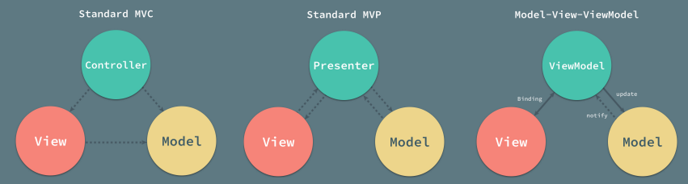
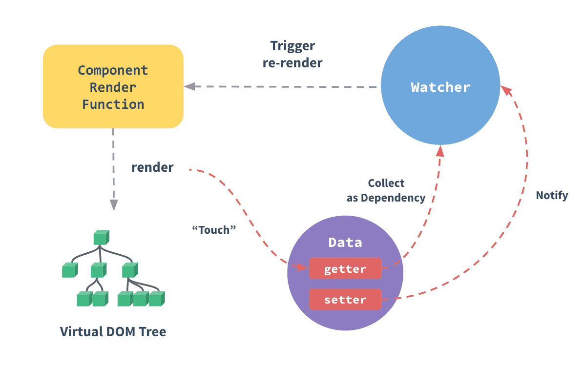
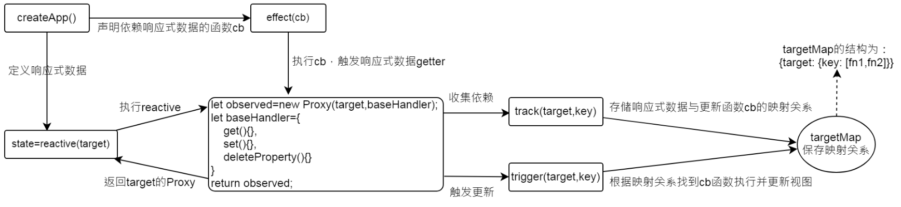
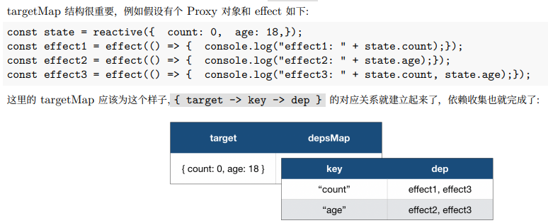
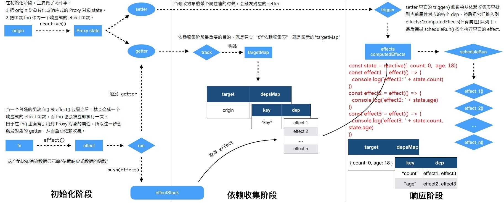

<!-- START doctoc generated TOC please keep comment here to allow auto update -->
<!-- DON'T EDIT THIS SECTION, INSTEAD RE-RUN doctoc TO UPDATE -->
<!-- **Table of Contents**  *generated with [DocToc](https://github.com/thlorenz/doctoc)* -->

- [vue 响应式原理](#vue-%E5%93%8D%E5%BA%94%E5%BC%8F%E5%8E%9F%E7%90%86)
  - [vue 双向绑定](#vue-%E5%8F%8C%E5%90%91%E7%BB%91%E5%AE%9A)
  - [ref()、reactive()、nextTick()](#refreactivenexttick)
  - [computed() 、watch()](#computed-watch)
  - [vue 的模板语法](#vue-%E7%9A%84%E6%A8%A1%E6%9D%BF%E8%AF%AD%E6%B3%95)
  - [diff 算法简述](#diff-%E7%AE%97%E6%B3%95%E7%AE%80%E8%BF%B0)

<!-- END doctoc generated TOC please keep comment here to allow auto update -->

# [vue 响应式原理](https://tsejx.github.io/vue-guidebook/infrastructure/vue2/reactivity)

## vue 双向绑定

**简单了解 MVVM 模型** 简单来讲：Model 指的是后端传递的数据。View 指的是所看到的页面。ViewModel 是 MVVM 模式的核心，它是连接 View 和 Model 的桥梁。

- 将 Model 转化成 View，即将后端传递的数据转化成所看到的页面。实现方式：**数据绑定**
- 将 View 转化成 Model，即将所看到的页面转化成后端的数据。实现方式：**DOM 事件监听**
- 这两个方向都实现的，称之为数据的**双向绑定**

{width=80%}

在 MVVM 框架下 View 和 Model 是不能直接通信的，它们通过 ViewModel 来通信:

- ViewModel 通常要实现一个 Observer 观察者，
- 当数据发生变化，ViewModel 能够监听到数据的这种变化，然后通知对应的视图做自动更新，
- 而当用户操作视图，ViewModel 也能监听到视图的变化，然后通知数据做改动，这实际上就实现了数据的双向绑定。
- 并且 MVVM 中的 View 和 ViewModel 可以互相通信。

**发布订阅模式**主要包含:

- 发布函数：发布的时候执行相应的回调
- 订阅函数：添加订阅者，传入发布时要执行的函数，可能会携额外参数
- 一个缓存订阅者以及订阅者的回调函数的列表
- 取消订阅

JavaScript 中事件模型，在 DOM 节点上绑定事件函数（addEventListener），触发的时候执行就是应用了发布-订阅模式。

**vue2 响应式原理**

Vue 采用 **数据劫持** 结合 **发布者-订阅者模式** 的方式来实现数据的响应式，

- 通过 `Object.defineProperty` 来劫持数据的 setter 和 getter，
- 在数据变动时发布消息给订阅者，订阅者收到消息后进行相应的处理。

[vue2 深入响应式原理](https://v2.cn.vuejs.org/v2/guide/reactivity.html)中图示：

{width=50%}

MVVM 的双向绑定的几个重点角色:

- Observer: 它的作用是给对象的属性添加 getter 和 setter，用于依赖收集和派发更新
- Dep: 用于收集当前响应式对象的依赖关系,每个响应式对象包括子对象都拥有一个 Dep 实例（里面 subs 是 Watcher 实例数组）,当数据有变更时,会通过 dep.notify()通知各个 watcher。
- Watcher: 观察者对象 , 实例分为渲染 watcher (render watcher),计算属性 watcher (computed watcher),侦听器 watcher（user watcher）三种

**实现 MVVM 的双向绑定，就必须要实现以下几点**：

- **Compile**: 指令解析系统，对每个元素节点的指令进行扫描和解析，根据指令模板替换数据，以及绑定相应的更新函数
- **Observer**: 数据监听系统，能够对数据对象的**所有属性**进行监听，如有变动可拿到最新值并通知订阅者
  - Observer 类用于附加到每个被观察的对象。一旦附加后，观察者会将目标对象的 Property 键使用 `Object.definProperty`转换成用于**收集依赖**以及**调度更新**的 `getters` 和 `setters`(相当于数据劫持)。
    - Observer：附加至每个被观察对象的*观察者类*，一旦被添加，观察者会将目标对象进行响应式化
    - observe：用于*观察对象的方法*，返回 Observer 类的实例对象
  - 通过向 observe 方法传入需要双向绑定的数据对象。
    - 如果观察数据为数组类型，将会修改该该数据类型原型上 7 个原生数组方法，并遍历数组对数组每个成员进行观察，达到监听数组数据变化响应的效果。
    - 如果观察数据为对象类型，则使用 `walk` 方法遍历对象中每对键值，并触发 `defineReactive` 进行双向绑定。
      - defineReactive 内部的 `Object.defineProperty` 的 getter 将会实例化一个订阅者类 Dep，并通过闭包的方式将实例对象 dep 用于收集以及缓存订阅者。而其 setter 将会通过 `dep.notify` 通知所有观察者，进行派发更新。
      - `getter`：正确地`返回属性值`以及`收集依赖`
      - `setter`：正确地为属性`设置新值`以及`触发相应的依赖`（不存在添加属性的情况，添加属性请用 Vue.set）
- **Dep + Watcher**: 发布订阅模型，作为连接 Observer 和 Compile 的桥梁，能够订阅并收到每个属性变动的通知，执行指令绑定的相应回调函数，从而更新视图。
  - **Dep 是发布订阅者模型中的发布者**: get 数据时收集订阅者，触发 Watcher 的依赖收集；set 数据时发布更新，通知 Watcher 。
    - 一个 Dep 实例对应一个对象属性或一个被观察的对象，用来收集订阅者和在数据改变时发布更新。
    - 订阅者 Dep 类主要作用是用于存放 Watcher 观察者对象
      - 用 addSub 方法可以在目前 Dep 对象中增加一个 Watcher 的订阅操作
      - 用 notify 方法通知目前 Dep 对象的 subs 中的所有 Watcher 对象触发更新操作
  - **Watcher 是发布订阅者模型中的订阅者**: 订阅的数据改变时执行相应的回调函数（更新视图或表达式的值）。
    - 只有在这四种场景中，Watcher 才会收集依赖，更新模版或表达式，否则，_数据变更后无法通知依赖这个数据的模版或表达式_：
      - 第一种：观察`模版中的数据`，如 HTML 模板中用到的 `{{test}}`，
      - 第二种：观察创建 Vue 实例时 `watch` 选项中的数据
      - 第三种：观察创建 Vue 实例时 `computed` 选项里的数据
      - 第四种：调用 `$watch` API 观察的数据或表达式
    - Watcher 对象通过调用 `updateComponent` 方法达到更新视图的目的。
      - Watcher 并不实时更新视图，在实例化 Vue 构造函数时默认会将 Watcher 对象存在一个队列中，在下个 Tick 时更新异步更新视图，完成了性能优化。
- **依赖收集**: 依赖收集就是*订阅数据变化的 watcher 的收集*。_前提条件_: 触发 get 方法,新建一个 Watcher 对象
  - *依赖收集的目的*是为了当这些响应式数据发生变化时，触发它们的 setter 的时候，能知道应该通知哪些订阅者去做相应的逻辑处理


**响应式原理概述**

vue2 通过[数据劫持]和[观察-订阅者模式]来实现 MVVM 双向绑定，也就是响应式。其中，

- `数据劫持`使用了`Object.definProperty`将组件实例的`data`对象转换成用于收集依赖的 getter 和触发更新的 setter。
- `Dep 和 Watcher`作为了发布订阅模型。
  - Dep: 发布者，用于收集当前响应式对象的依赖关系，主要作用存放 Watcher 观察者对象。
    - 触发 getter 时，收集依赖，使用`addSub`添加一个对应 watcher 订阅者；
    - 触发 setter 时，用 `notify` 方法通知目前 Dep 对象中的所有相关依赖的 Watcher 对象触发更新操作。
  - Watcher: 订阅者，订阅的数据改变时执行相应的回调函数，更新视图或表达式的值。
    - watcher 可订阅的只有四种数据：模板中的数据、watch 选项的数据、computed 选项的数据、调用`$watch` API 的数据。
    - 有数据改变后触发相应的回调函数，就重新渲染视图。

一言以蔽之，通过`数据劫持`得到了 getter、setter，触发 getter 时会添加一个订阅者，触发 setter 时会发布通知，所有关联的订阅者进行数据更新。

Vue 3 实现响应式类似，本质上是通过 Proxy API 劫持了**数据对象**的读写:  
当我们访问数据时，会触发 getter 执行依赖收集；修改数据时，会触发 setter 派发通知。



Vue 通过一个副作用（effect）函数来跟踪当前正在运行的函数。
副作用是一个函数包裹器，在函数被调用前就启动跟踪，而 Vue 在派发更新时就能准确的找到这些被收集起来的副作用函数，当数据发生更新时再次执行它。

1. 通过 `state = reactive(target)`来定义响应式数据（这里基于 Proxy 实现，按属性转换成 getter、setter）。
2. 通过 `effect` 声明`依赖响应式数据的函数 cb`(例如视图渲染函数 render 函数)，并执行 cb 函数，执行过程中，会触发响应式数据 getter。
3. 在响应式数据 getter 中进行 `track` 依赖收集：存储响应式数据与更新函数 cb 的映射关系，存储于 `targetMap`。
4. 当变更响应式数据时(触发了 setter 捕获器)，触发 `trigger`，根据 targetMap 找到关联的 cb 并执行。

targetMap 结构很重要，例如假设有个 Proxy 对象和 effect 如下:

```txt
const state = reactive({  count: 0,  age: 18,});
const effect1 = effect(() => {  console.log("effect1: " + state.count);});
const effect2 = effect(() => {  console.log("effect2: " + state.age);});
const effect3 = effect(() => {  console.log("effect3: " + state.count, state.age);});
```

这里的 targetMap 应该为这个样子,`{ target -> key -> dep }` 的对应关系就建立起来了，依赖收集也就完成了。整体流程:

<!-- {width=50%} -->

{width=100%}

类比(但不一样): targetMap - Dep，响应式函数 cb - watcher，track - addSub，trigger - notify。

## ref()、reactive()、nextTick()

**ref()**: 接受一个内部值，返回一个响应式的、可更改的 ref 对象，此对象只有一个指向其内部值的属性 `.value`。

- ref 对象是可更改的，也就是说你可以为 `.value` 赋予新的值。
  - 它也是响应式的，即所有对 `.value` 的操作都将被追踪，并且写操作会触发与之相关的副作用。
- _如果将一个对象赋值给 ref，那么这个对象将通过 `reactive()` 转为具有深层次响应式的对象。_
  - 这也意味着如果对象中包含了嵌套的 ref，它们将被深层地解包。若要避免这种深层次的转换，请使用 `shallowRef()` 来替代。

**reactive()**: 返回一个对象的响应式代理。

- 响应式转换是“深层”的：它**会影响到所有嵌套的属性**。一个响应式对象也将深层地解包任何 ref 属性，同时保持响应性。
- 值得注意的是，当访问到某个响应式数组或 Map 这样的原生集合类型中的 ref 元素时，不会执行 ref 的解包。
- 若要避免深层响应式转换，只想保留对这个对象顶层次访问的响应性，请使用 `shallowReactive()` 作替代。
- 返回的对象以及其中嵌套的对象都会通过 ES Proxy 包裹，因此**不等于**源对象，_建议只使用响应式代理，避免使用原始对象。_
- reactive() API 有两条限制：
  - 仅对对象类型有效（对象、数组和 Map、Set 这样的集合类型），而对 string、number 和 boolean 这样的 原始类型 无效。
  - 因为 Vue 的响应式系统是通过属性访问进行追踪的，因此我们必须始终保持对该响应式对象的相同引用。
    - 这意味着我们不可以随意地“替换”一个响应式对象，因为这将导致对初始引用的响应性连接丢失。
    - 同时这也意味着当我们将响应式对象的属性赋值或解构至本地变量时，或是将该属性传入一个函数时，我们会失去响应性。

**toRef()**: 基于响应式对象上的**一个属性**，创建一个对应的 ref。这样创建的 ref 与其源属性保持同步：改变源属性的值将更新 ref 的值，反之亦然。

**toRefs()**: 将**一个响应式对象**转换为一个普通对象，这个普通对象的*每个属性都是指向源对象相应属性的 ref*。每个单独的 ref 都是使用 toRef() 创建的。

- 当从组合式函数中返回响应式对象时，toRefs 相当有用。使用它，消费者组件可以解构/展开返回的对象而不会失去响应性。
- toRefs 在调用时只会为源对象上可以枚举的属性创建 ref。如果要**为可能还不存在的属性创建 ref，请改用 toRef**。

**nextTick 的使用与原理**

**nextTick()**: nextTick 作用是在下次 DOM 更新循环结束之后，执行延迟回调，就可以拿到更新后的 DOM 相关信息。

- 当在 Vue 中更改响应式状态时最终的 DOM 更新并不是同步生效的，而是由 Vue 将它们缓存在一个队列中，直到下一个“tick”才一起执行。
  - 这样是为了确保每个组件无论发生多少状态改变，都仅执行一次更新。
- `nextTick()` 可以*在状态改变后立即使用，以等待 DOM 更新完成*。你可以传递一个回调函数作为参数，或者 await 返回的 Promise。

_前置知识: JS 执行机制事件循环(EventLoop)_

- (1) 执行宏任务 (一开始的代码块也是一个宏任务)，同步代码正常输出;
- (2) 然后执行该宏任务产生的微任务，若微任务在执行过程中产生了新的微任务，则继续执行微任务;
- (3) 微任务执行完毕后，再回到宏任务中进行下一轮循环。

JS 常见的同步异步任务:

- 同步任务：指排队在主线程上依次执行的任务
- 异步任务：不进入主线程，而进入任务队列的任务，又分为宏任务和微任务
  - 宏任务： 渲染事件、请求、`script`、`setTimeout`、`setInterval`、Node 中的 `setImmediate` 等
  - 微任务： `Promise.then`、`MutationObserver`(监听 DOM)、Node 中的 `Process.nextTick` 等

_nextTick 用一句话总结就是『利用 Event loop 事件线程去异步操作』。**本质上**就是注册异步任务来对任务进行处理。就是创建一个异步任务，那么它自然要等到同步任务执行完成后才执行。_ **基本原理**:

- Vue 实现了一个 nextTick 函数，如果传入一个 cb，这个 cb 会被存储到一个队列中，在下一个 tick 时触发队列中的所有 cb 事件。
- 因为目前浏览器平台并没有实现 nextTick 方法，所以 Vue 使用 Promise、setTimeout、setImmediate 等方式在 microtask（或是 task）中创建一个事件，目的是在当前调用栈执行完毕以后（不一定立即）才会去执行这个事件。

[vue2 nextTick 源代码](https://github.com/vuejs/vue/blob/main/src/core/util/next-tick.ts#L94) 分为为两部分: **一是判断当前环境能使用的最合适的 API 并保存异步函数，二是调用异步函数 执行回调队列**。

- 环境判断: 判断用哪个宏任务或微任务，因为宏任务耗费的时间是大于微任务的，所以先使用微任务，判断顺序
  - Promise、MutationObserver、setImmediate、setTimeout
  - 环境判断结束就会得到一个延迟回调函数 timerFunc
- 环境判断完之后运行核心的 nextTick 方法，主要逻辑:
  - 把传入的回调函数放进回调队列 callbacks
  - 执行保存的异步任务 timeFunc，就会遍历 callbacks 执行相应的回调函数了
  - 最后有返回一个 Promise 是可以让我们在不传参的时候用的

[vue3 nextTick 源码](https://github.com/vuejs/core/blob/main/packages/runtime-core/src/scheduler.ts#L53) 里这一块有大改，不过事件循环的原理还是一样，只是加了几个专门维护队列的方法，以及关联到 effect。

- **核心 nextTick 接受一个函数为参数，同时会创建一个微任务；页面调用 nextTick 的时候，会执行该函数，把我们的参数 fn 赋值给 `p.then(fn)`，在队列的任务完成后，fn 就执行了。**
- 几个维护队列的方法，执行顺序是这样的: `queueJob -> queueFlush -> flushJobs -> nextTick参数的 fn`
  - `queueJob()`方法负责*维护主任务队列，接受一个函数作为参数，为待入队任务，会将参数 push 到 queue 队列中，有唯一性判断*。会在当前宏任务执行结束后，清空队列
  - `queueFlush()`方法负责尝试创建微任务，等待任务队列执行
  - `flushJobs()` 方法负责处理队列任务，主要逻辑如下：
    - 1 先处理*前置任务队列* 2 根据 Id 排队队列 3 遍历执行队列任务 4 执行完毕后清空并重置队列 5 执行*后置队列任务* 6 _如果还有就递归继续执行_
    - 调用 `flushPreFlushCbs()` 方法负责执行前置任务队列
    - 调用 `flushPostFlushCbs()` 方法负责执行后置任务队列

## computed() 、watch()

**computed ()**: _接受一个 getter 函数，返回一个只读的响应式 ref 对象_。该 ref 通过 `.value` 暴露 getter 函数的返回值。它也可以接受一个带有 get 和 set 函数的对象来创建一个可写的 ref 对象。

- **计算属性的结果会被缓存**，除非依赖的响应式 property 变化才会重新计算。
  - 注意，如果某个依赖 (比如非响应式 property) 在该实例范畴之外，则计算属性是**不会**被更新的。
  - 缓存的作用，避免重复计算，加大性能消耗。_确定不需要缓存，那么也可以使用方法调用。_
- **将同样的函数定义为一个方法**而不是计算属性，两种方式在**结果上确实是完全相同的**。方法调用**总是**会在重渲染发生时再次执行函数。
  - 绑定在表达式中的方法在*组件每次更新时都会被重新调用*，因此*不应该产生任何副作用*，比如改变数据或触发异步操作。
- 计算属性默认是只读的。可以通过同时提供 getter 和 setter 来创建可读可写的计算属性。
- 最佳实践: **Getter 不应有副作用,不要在 getter 中做异步请求或者更改 DOM！避免直接修改计算属性值。**
  - 一个*计算属性*的声明中描述的*是如何根据其他值派生一个值*。因此 getter 的职责应该仅为计算和返回该值。
  - 从计算属性返回的值类似一个“临时快照”，每当源状态发生变化时，就会创建一个新的快照。更改快照是没有意义的。
  - _**计算属性的返回值应该被视为只读的，应该更新它所依赖的源状态以触发新的计算**_。

```js
const count = ref(1);
const plusOne = computed({
  get: () => count.value + 1,
  set: (val) => {
    count.value = val - 1;
  },
});
plusOne.value = 1;
console.log(count.value); // 0
// 选项式API
export default {
  data() {
    return { a: 1 };
  },
  computed: {
    aDouble() {
      return this.a * 2;
    } /*只读*/,
    aPlus: {
      get() {
        return this.a + 1;
      },
      set(v) {
        this.a = v - 1;
      },
    } /*可写*/,
  },
  created() {
    console.log(this.aDouble);
    /* 2*/ console.log(this.aPlus); /* 2*/
    this.aPlus = 3;
    console.log(this.a);
    /* 2*/ console.log(this.aDouble); /* 4 */
  },
};
```

**watch()**: _侦听一个或多个响应式数据源，并在数据源变化时调用所给的回调函数。_

- watch() 默认是懒侦听的，即**仅在侦听源发生变化时才执行回调函数。**
- _第一个参数是侦听器的源_。这个来源可以是:**一个函数，返回一个值;一个 ref;一个响应式对象;或是由前诉类型的值组成的数组。**
  - 当使用 getter 函数作为源时，回调只在此函数的*返回值变化时才会触发*。
- _第二个参数是在发生变化时要调用的回调函数_。这个回调函数接受三个参数: **新值、旧值，以及一个用于注册副作用清理的回调函数。**
  - 该回调函数会在副作用下一次重新执行前调用，可以用来清除无效的副作用，例如等待中的异步请求。
  - 当侦听多个来源时，回调函数接受两个数组，分别对应来源数组中的新值和旧值。
- _第三个可选的参数是一个对象_，支持以下这些选项:
  - `immediate`: 在侦听器创建时*立即触发回调*。第一次调用时旧值是 undefined。 - `flush`: 调整回调函数的刷新时机。
  - `deep`: 如果源是对象，_强制深度遍历_，以便在深层级变更时触发回调。 - `onTrack/onTrigger`: 调试侦听器的依赖。

```js
const state = reactive({ count: 0 });
watch(
  () => state,
  (newValue, oldValue) => {
    /**do something */
  },
  { deep: true }
);
/**侦听多个源 */ watch([fooRef, barRef], ([foo, bar], [prevFoo, prevBar]) => {
  /* ... */
});
// 选项式API使用
export default {
  watch: {
    someObject: {
      handler(newVal, oldVal) {
        /*在嵌套的变更中，只要没有替换对象本身，那么这里的newVal和oldVal相同*/
      },
      deep: true,
    },
    valA(val, oldVal) {
      console.log(`new: ${val}, old: ${oldVal}`);
    }, // 侦听根级属性
    "valB.b": function (val, oldVal) {
      /* do something*/
    }, // 侦听单个嵌套属性
  },
};
```

**watchEffect()**: _立即运行一个函数_，同时响应式地追踪其依赖，并在依赖更改时重新执行。

- _第一个参数就是要运行的副作用函数_。这个副作用函数的参数也是一个函数，用来注册清理回调。**依赖源同时是回调函数。**
  - 清理回调会在该副作用下一次执行前被调用，可以用来清理无效的副作用。
- _第二个参数是一个可选的选项_，可以用来调整副作用的刷新时机或调试副作用的依赖。
  - _默认情况下，`flush:'pre'`,侦听器将在组件渲染之前执行_。设置`flush:'post'`将会**使侦听器延迟到组件渲染*之后*再执行。**
  - 在某些特殊情况下(例如要使缓存失效)，可以通过设置`flush:'sync'`来实现在**响应式依赖发生改变时*立即*触发侦听器。**
- _返回值是一个用来停止该副作用的函数_。
- _可以简单理解为同一个功能的两种不同形态，底层的实现是一样的。类似 watch 设置了选项`immediate:true`的效果_。

```sh
watch( () => {/*依赖源收集函数*/}, () => {/*依赖源改变时的回调函数*/});
watchEffect(() => { /*依赖源同时是回调函数*/});
// 以下两种用法在行为上基本等价
watchEffect(() => console.log(counter.value));
watch(() => counter.value, () => console.log(counter.value), { immediate: true });
```

**watchPostEffect()**: watchEffect() 使用 `flush: 'post'` 选项时的别名。

**watchSyncEffect()**: watchEffect() 使用 `flush: 'sync'` 选项时的别名。

## vue 的模板语法

Vue 使用一种基于 HTML 的模板语法，使我们能够声明式地将其组件实例的数据绑定到呈现的 DOM 上。  
所有的 Vue 模板都是语法层面合法的 HTML，可以被符合规范的浏览器和 HTML 解析器解析。

**文本插值**: `<span>Message: {{ msg }}</span>`

**原始 HTML**:双大括号会将数据解释为纯文本。想插入 HTML，你需要使用 v-html 指令。

```html
<p>Using text interpolation: {{ rawHtml }}</p>
<p>Using v-html directive: <span v-html="rawHtml"></span></p>
```

在网站上动态渲染任意 HTML 是非常危险的，因为这非常容易造成 XSS 漏洞。请仅在内容安全可信时再使用 v-html，并且永远不要使用用户提供的 HTML 内容。

**Attribute 绑定**:双大括号不能在`HTML`属性中使用。想响应式地绑定一个属性，应该使用`v-bind`指令，可简写为`:`

```html
<div :id="dynamicId"></div>
```

**使用 JavaScript 表达式**:Vue 实际上在所有的数据绑定中都支持完整的 JavaScript 表达式。

```ht
{{ number + 1 }} {{ ok ? 'YES' : 'NO' }} {{ message.split('').reverse().join('')}}
<div :id="`list-${id}`"></div>
```

- **仅支持表达式**: 每个绑定仅支持*单一表达式*，也就是一段能够被求值的 JavaScript 代码。
- **调用函数**: 可以在绑定的表达式中使用一个组件暴露的方法。
  - `<span :title="getDate(date)">{{formatDate(date)}}</span>`
  - **绑定在表达式中的方法在组件每次更新时都会被重新调用**，因此不应该产生任何副作用，比如改变数据或触发异步操作。
- **受限的全局访问**: 模板中的表达式将被沙盒化，仅能够访问到[有限的全局对象列表](https://github.com/vuejs/core/blob/main/packages/shared/src/globalsWhitelist.ts#L3)。该列表中会暴露常用的内置全局对象，比如 Math 和 Date。
  ```js
  // vuejs/core/packages/shared/src/globalsWhitelist.ts 中允许访问的`有限全局对象列表`
  const GLOBALS_WHITE_LISTED =
    "Infinity,undefined,NaN,isFinite,isNaN,parseFloat,parseInt,decodeURI," +
    "decodeURIComponent,encodeURI,encodeURIComponent,Math,Number,Date,Array," +
    "Object,Boolean,String,RegExp,Map,Set,JSON,Intl,BigInt";
  ```

**指令 Directives**: 指令是带有 v- 前缀的特殊 attribute。Vue 提供了许多内置指令。  
`<p v-if="seen">Now you see me</p>`

- 指令 attribute 的期望值为一个 JavaScript 表达式 (除了少数几个例外，即之后要讨论到的 v-for、v-on 和 v-slot)。
- **一个指令的任务是在其表达式的值变化时响应式地更新 DOM**。
- 指令的完整语法：`名称:参数.修饰符<可多个>=值`（`name:argument.modifiers=value`）。


**模板编译大概流程:**template - ast - render 函数 - 创建虚拟 dom - diff 算法更新虚拟 dom - 产生、更新真实节点

- template -> parse 模版基础编译 -> optimize 优化 AST -> generate 生成 JS 字符串 -> render 函数

## diff 算法简述

**简单 diff 算法简单总结**

*遍历*新旧两组子节点中数量*较少*的那一组，并逐个调用 patch 函数进行打补丁，然后*比较新旧两组子节点的数量*，*如果新的*一组子节点数量更*多*，说明有新子节点*需要挂载*；*否则*说明在旧的一组子节点中，有节点*需要卸载*。

_简单 Diff 算法的**核心逻辑**_ 是，拿新的一组子节点中的节点去旧的一组子节点中寻找可复用的节点。如果找到了，则记录该节点的位置索引。我们把这个位置索引称为最大索引。在整个更新过程中，如果一个节点的索引值小于最大索引，则说明该节点对应的真实 DOM 元素需要移动。

**双端 diff 算法简单总结**: 使用了 4 个指针分别指向了新旧子节点序列的首尾，在遍历过程中逐渐向中间移动，直到尾指针小于头指针。

需要将更新逻辑封装到一个 while 循环。由于在每一轮更新完成之后，紧接着都会更新四个索引中与当前更新轮次相关联的索引，所以整个 while 循环执行的条件是：头部索引值要小于等于尾部索引值。

- 在双端比较中，**每一轮**比较都分为四个步骤
  - 第一步：比较**旧的**一组子节点中的**第一个**子节点与**新的**一组子节点中的**第一**个子节点，看看它们是否相同。
  - 第二步：比较**旧的**一组子节点中的**最后一个**子节点与**新的**一组子节点中的**最后一个**子节点，看看它们是否相同。
  - 第三步：比较**旧的**一组子节点中的**第一个**子节点与**新的**一组子节点中的**最后一个**子节点，看看它们是否相同。
  - 第四步：比较**旧的**一组子节点中的**最后一个**子节点与**新的**一组子节点中的**第一个**子节点，看看它们是否相同。

1. **理想情况下找头尾节点可复用**，在上述四步中找到了相同的节点，即可复用；如果不同则需要看第五步的情况。

- 头头和尾尾节点相同时，不需要移动，只需要更新索引移动一步。头尾节点相同，则需要移动真实 dom 的该节点到头或者尾去。

2. 如果头尾没有可复用的节点，就**尝试看看非头部、非尾部的节点能否复用**(相当于第五步)。_具体做法是，拿新的一组子节点中的头部节点去旧的一组子节点中寻找_。

- **如果新节点在旧节点序列中能找到**说明可以复用，需要**移动该节点**。用 idxInOld 记录该节点在旧节点序列中的位置
  - 首先，在移动节点之前不要忘记调用 patch 函数进行打补丁(**找到并更新变更点**,挂载动作也是一种特殊的打补丁)
    - 渲染器会使用 newVNode 与上一次渲染的 oldVNode 进行比较，试图找到并更新变更点。这个过程叫作“打补丁”(patch)。
  - 接着，调用 insert 函数在对应真实 DOM 节点中进行移动。(**节点移动**)
  - 然后，因为旧节点 idxInOld 处的数据处理过了，就将其置为 undefined。(**旧节点置为 undefined**)
    - 这里置为 undefined 之后，需要在遍历旧节点序列时跳过 undefined 的节点。
  - 最后，将遍历新节点序列的下一个节点，即 newStartIdx 索引前进到下一个位置。(**索引更新**)
- **如果新节点在旧节点数组中不存在**，需要**新增该节点**，此时 idxInOld `>` 0 不成立，找不到对应的索引。
  - 注意，需要*在 while 循环结束后*，多一个 if 判断，如果 oldEndIdx `<` oldStartIdx `&&` newStartIdx `<=` newEndIdx 成立说明新的一组子节点中有遗留的节点需要作为新节点挂载。
  - _索引值位于 newStartIdx 和 newEndIdx 这个区间内的节点都是新节点_。开启一个 for 循环来遍历这个区间内的节点并逐一挂载。
- **如果旧节点在新节点数组中不存在**，则需要**删除该节点**。
  - 需要*在 while 循环结束后*，继续多一个 else if 判断，如果 newEndIdx `<` newStartIdx `&&` oldStartIdx `<=` oldEndIdx 成立，需要卸载已经不存在的节点。
  - 索引值位于 oldStartIdx 和 oldEndIdx 这个区间内的节点都应该被卸载，于是我们开启一个 for 循环将它们逐一卸载。

相比简单 Diff 算法，双端 Diff 算法的**优势**在于，对于同样的更新场景，执行的 DOM 移动操作次数更少。

**快速 diff 算法简单总结**:先预处理寻找相同的前置和后置节点，此时若新旧节点组有遍历完的，可以通过卸载或挂载完成更新。没能通过卸载和挂载完成更新，再根据剩下的节点的索引关系，构建新节点组的最长子序列索引数据，其指向的节点不需要移动。剩下的节点再根据情况挂载或移动。

**1. 预处理**

- 前置节点通过建立索引 j，从 0 开始，使用 while 循环递增 j 遍历新旧节点序列，直到遇到不相同的节点。
- 后置节点通过建立索引 newEnd 和 oldEnd，指向新旧两个节点序列的最后一个节点，使用 while 从后往前遍历，直到遇到不相同的节点。
- 判断**新**节点**没有**遍历完且**旧**节点**遍历完**，即`oldEnd < j && newEnd >= j`，从 j 到 newEnd 的节点都依次**挂载**(调用 patch 函数)。
- 判断**旧**节点**没有**遍历完且**新**节点**遍历完**，即`newEnd < j && oldEnd >= j`，从 j 到 oldEnd 的节点都依次**卸载**(调用 unmount 函数)。
- 判断 **新旧节点都没遍历完**，则进行比较第二步部分，判断是否需要进行 DOM 的移动。

**2. 判断是否需要进行 DOM 的移动**

- 构建一个 sources 数组，用于存放**新节点对应旧节点组中的索引**。长度为`newEnd - j + 1`，初始化全部 fill(-1)。
  - 遍历新节点组，将其 `el.key` 作为`[key]`,index 作为 `[value]` 保存为一个**索引表**
  - 遍历旧节点组，在索引表中找相同的 `el.key`
    - 没找到，该节点已经不存在于新子节组中了，调用 unmount 函数**卸载**该节点
    - 找到了，**将其在旧节点中的索引放入索引的 source** 中, 和简单 diff 算法类似，判断是否有需要移动的节点(如下)
  - 其中新增了 moved 代表是否需要移动节点，初始为 false；pos 代表遍历旧节点组的过程中遇到的最大索引值 k，初始为 0； patched 代表更新过的节点数量,每更新一个节点，都将 patched 变量 +1 。
    - 在第二个 for 循环内，通过比较变量 k 与变量 pos 的值来判断是否需要移动节点。
      - `if(k<pos){moved=true} else{pos=k}`。
    - 如果更新过的节点数量 patched**大于**需要更新的节点数量 `newEnd-j+1`，则调用 unmount 函数**卸载**多余的节点。

**3. 移动元素**

- 通过 source 数组计算出**最长递增子序列的索引信息数组 seq**(source 数组的长度是去除了相同前后置节点的新节点组长度)。
  - 例如 seq 的值为 [0, 1] 的含义: 在新子节点序列中，重新编号后索引值为 0 和 1 的这两个节点在更新前后顺序没有发生变化。
- 用索引 **i** 指向**新节点组中的最后一个节点**，用索引 _s_ 指向最长递增子序列中的*最后一个元素*，_循环使 i 递减，从下向上移动_
  - 第一步: 判断表达式 `source[i]===-1`是否成立
    - _成立_，说明索引为 i 的节点是*全新的节点*。找到真实索引位置的下一个节点处，调用 patch**挂载**节点。_不成立_，继续下一步。
  - 第二步: 判断表达式 `i !== seq[s]` 是否成立
    - _成立_，说明该节点*需要移动*。找到该节点在新节点组中的真实位置作为锚点，调用 insert **移动**节点
  - 第三步: 第一步和第二步中的条件*都不成立*
    - 说明该节点*不需要移动*，但仍然需要让索引 s 的值递减，即 `s--`
