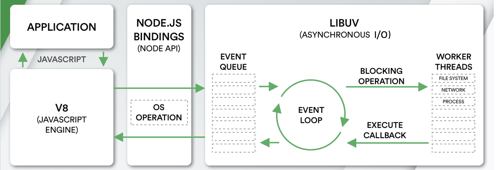
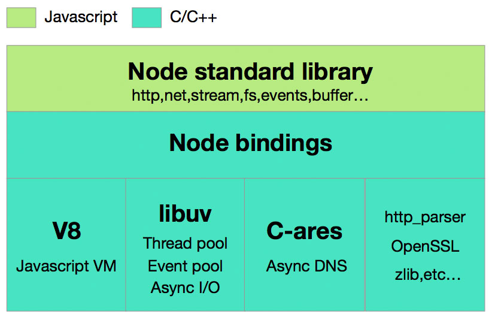
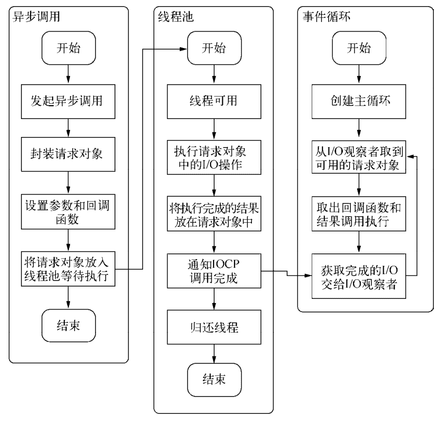
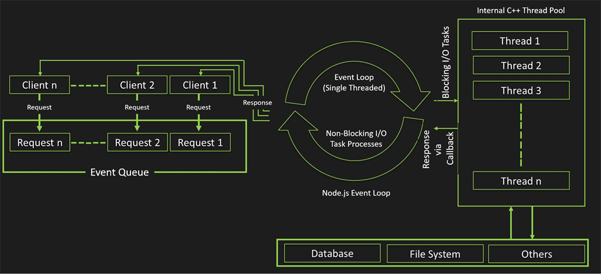
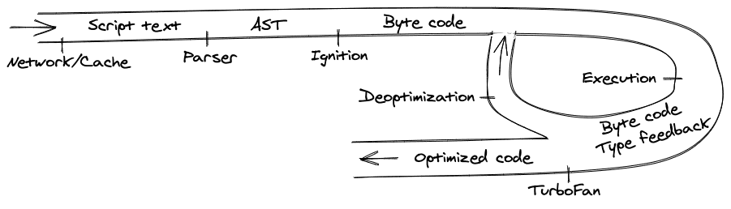
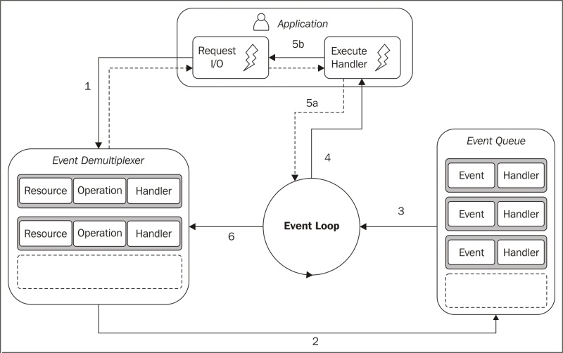
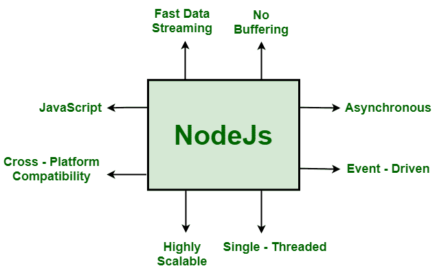
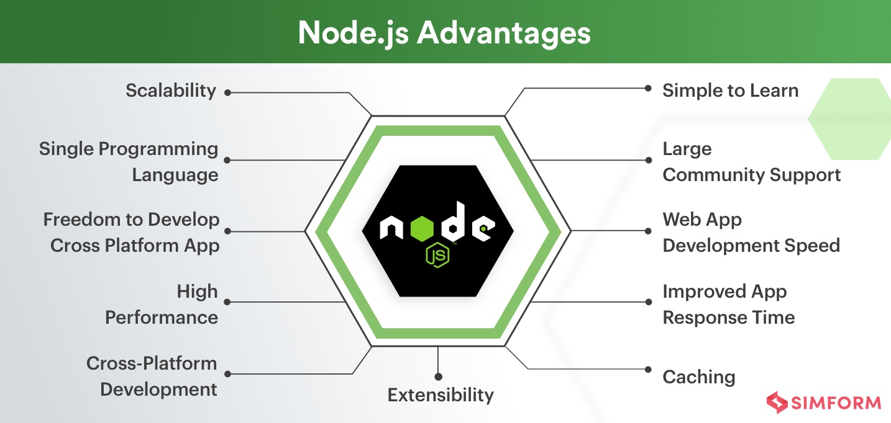
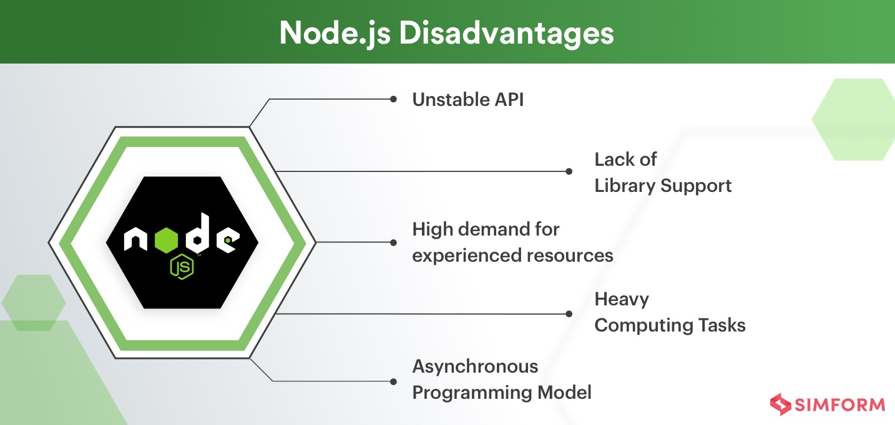
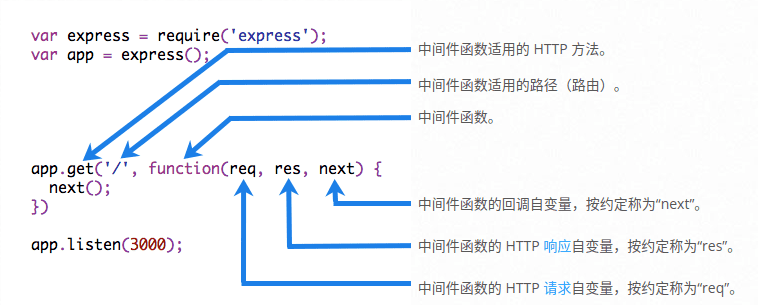

# Node.js 面试题 (Node.js Interview Questions)

[nodejs-interview-questions](https://github.com/learning-zone/nodejs-interview-questions)面试题的中文翻译。

## 文档说明

- 因为感觉原项目对我有所裨益，但由于是英文的，后续翻看可能不是那么流畅，所以想着简单翻译一下，以便后续个人查看。
  - 与 2022-07-04 复制，原项目请访问[nodejs-interview-questions](https://github.com/learning-zone/nodejs-interview-questions)。
- 使用 **`【Q】`** 标注的问题，是我个人认为比较重要的问题，需要深入理解的。
- 答案一开始就是 _ToDo_ 字样的，是原网站/项目没有答案的问题，不出意外有加入个人的理解回答（初始翻译时有 6 个）。
- 使用 **`{Q}`** 标注的问题，表示不是很理解这个原答案，但没有仔细去研究(大概率个人认为问题不值得)。
- 使用 **`（Q）`** 标注的问题，是一些实现某些功能代码的示例。原本答案可能会出现过时、可以有更好执行方法等情况。
  - 这种比较具体的问题，即便是过时的答案我也不考虑更新答案了，因为一般是工具库的功能使用，自行实践最佳。
  - 使用 **`（（Q））`** 标注，说明该问题回答中示例的内容太长了，最好拿住关键字直接找官方文档查看最新。
- 不少的问题回答已经过时了，考虑原库 3 年前创建，实际翻译时看到，有些问题也是 3 年前的答案。
  - 如果有疑问，请自行寻找当前最新资料。（部分内容有译注说明，也有找最新的内容，但只是少数）
- 如果有添加`【个人注释】`、`【译注】`等类似标记的内容，如果没有注明时间，也就是在首次翻译文章的时候添加的，大概在 2022-07 上旬，注意时效。
- 水平有限，如果有什么不通畅的地方，(说不定就是因为认为不重要的问题使用了工具简单过了一下)。
- 更多建议意见，自由发挥。

---

<!-- START doctoc generated TOC please keep comment here to allow auto update -->
<!-- DON'T EDIT THIS SECTION, INSTEAD RE-RUN doctoc TO UPDATE -->

- [Q. **什么是 Node.js?**](#q-%E4%BB%80%E4%B9%88%E6%98%AF-nodejs)
- [Q. **使用 Node.js 的好处是什么？**](#q-%E4%BD%BF%E7%94%A8-nodejs-%E7%9A%84%E5%A5%BD%E5%A4%84%E6%98%AF%E4%BB%80%E4%B9%88)
- [Q. **什么是 Node.js 流程模型(Process Model)?**](#q-%E4%BB%80%E4%B9%88%E6%98%AF-nodejs-%E6%B5%81%E7%A8%8B%E6%A8%A1%E5%9E%8Bprocess-model)
- [Q. **Node.js 中的数据类型(data types)有哪些?**](#q-nodejs-%E4%B8%AD%E7%9A%84%E6%95%B0%E6%8D%AE%E7%B1%BB%E5%9E%8Bdata-types%E6%9C%89%E5%93%AA%E4%BA%9B)
- [（Q）. **如何在 Node.js 中创建一个简单的服务器(a simple server)，返回 Hello World?**](#q-%E5%A6%82%E4%BD%95%E5%9C%A8-nodejs-%E4%B8%AD%E5%88%9B%E5%BB%BA%E4%B8%80%E4%B8%AA%E7%AE%80%E5%8D%95%E7%9A%84%E6%9C%8D%E5%8A%A1%E5%99%A8a-simple-server%E8%BF%94%E5%9B%9E-hello-world)
- [Q. **解释 Node.js 中的 URL 模块的概念(the concept of URL module)?**](#q-%E8%A7%A3%E9%87%8A-nodejs-%E4%B8%AD%E7%9A%84-url-%E6%A8%A1%E5%9D%97%E7%9A%84%E6%A6%82%E5%BF%B5the-concept-of-url-module)
- [（Q）. **如何使用 Node.js 进行 HTTP POST 请求?**](#q-%E5%A6%82%E4%BD%95%E4%BD%BF%E7%94%A8-nodejs-%E8%BF%9B%E8%A1%8C-http-post-%E8%AF%B7%E6%B1%82)
- [Q. **如何从 Node.js 内部执行外部程序?**](#q-%E5%A6%82%E4%BD%95%E4%BB%8E-nodejs-%E5%86%85%E9%83%A8%E6%89%A7%E8%A1%8C%E5%A4%96%E9%83%A8%E7%A8%8B%E5%BA%8F)
- [Q. **在 Node.js 中，运行时环境(the runtime environment)是什么意思?**](#q-%E5%9C%A8-nodejs-%E4%B8%AD%E8%BF%90%E8%A1%8C%E6%97%B6%E7%8E%AF%E5%A2%83the-runtime-environment%E6%98%AF%E4%BB%80%E4%B9%88%E6%84%8F%E6%80%9D)
- [Q. **解释一下 NODE_ENV 的用法?**](#q-%E8%A7%A3%E9%87%8A%E4%B8%80%E4%B8%8B-node_env-%E7%9A%84%E7%94%A8%E6%B3%95)
- [【Q】. **Node.js 是如何工作的?**](#q-nodejs-%E6%98%AF%E5%A6%82%E4%BD%95%E5%B7%A5%E4%BD%9C%E7%9A%84)
- [Q. **Node.js、AJAX 和 JQuery 之间的区别是什么?**](#q-nodejsajax-%E5%92%8C-jquery-%E4%B9%8B%E9%97%B4%E7%9A%84%E5%8C%BA%E5%88%AB%E6%98%AF%E4%BB%80%E4%B9%88)
- [Q. **什么是 Node.js 的核心模块(What are the core modules of Node.js)?**](#q-%E4%BB%80%E4%B9%88%E6%98%AF-nodejs-%E7%9A%84%E6%A0%B8%E5%BF%83%E6%A8%A1%E5%9D%97what-are-the-core-modules-of-nodejs)
- [Q. **什么是 Node.js 中的回调函数(callback function)?**](#q-%E4%BB%80%E4%B9%88%E6%98%AF-nodejs-%E4%B8%AD%E7%9A%84%E5%9B%9E%E8%B0%83%E5%87%BD%E6%95%B0callback-function)
- [Q. **断言(assert)在 Node.js 中是如何工作的?**](#q-%E6%96%AD%E8%A8%80assert%E5%9C%A8-nodejs-%E4%B8%AD%E6%98%AF%E5%A6%82%E4%BD%95%E5%B7%A5%E4%BD%9C%E7%9A%84)
- [Q. **什么是错误优先的回调(error-first callback)?**](#q-%E4%BB%80%E4%B9%88%E6%98%AF%E9%94%99%E8%AF%AF%E4%BC%98%E5%85%88%E7%9A%84%E5%9B%9E%E8%B0%83error-first-callback)
- [Q. **什么是 Node.js 中的回调地狱(callback hell)?**](#q-%E4%BB%80%E4%B9%88%E6%98%AF-nodejs-%E4%B8%AD%E7%9A%84%E5%9B%9E%E8%B0%83%E5%9C%B0%E7%8B%B1callback-hell)
- [Q. **什么是 Node.js 中的 Promises?**](#q-%E4%BB%80%E4%B9%88%E6%98%AF-nodejs-%E4%B8%AD%E7%9A%84-promises)
- [Q. **可以用什么工具来保证风格一致(assure consistent style)?**](#q-%E5%8F%AF%E4%BB%A5%E7%94%A8%E4%BB%80%E4%B9%88%E5%B7%A5%E5%85%B7%E6%9D%A5%E4%BF%9D%E8%AF%81%E9%A3%8E%E6%A0%BC%E4%B8%80%E8%87%B4assure-consistent-style)
- [【Q】. **什么时候应该使用 npm，什么时候使用 yarn?**](#q-%E4%BB%80%E4%B9%88%E6%97%B6%E5%80%99%E5%BA%94%E8%AF%A5%E4%BD%BF%E7%94%A8-npm%E4%BB%80%E4%B9%88%E6%97%B6%E5%80%99%E4%BD%BF%E7%94%A8-yarn)
- [Q. **什么是 stub?**](#q-%E4%BB%80%E4%B9%88%E6%98%AF-stub)
- [Q. **什么是测试金字塔(test pyramid)?在谈论 HTTP API 时，你如何实现它?**](#q-%E4%BB%80%E4%B9%88%E6%98%AF%E6%B5%8B%E8%AF%95%E9%87%91%E5%AD%97%E5%A1%94test-pyramid%E5%9C%A8%E8%B0%88%E8%AE%BA-http-api-%E6%97%B6%E4%BD%A0%E5%A6%82%E4%BD%95%E5%AE%9E%E7%8E%B0%E5%AE%83)
- [Q. **如何确保(secure)你的 HTTP cookie 免受 XSS 攻击?**](#q-%E5%A6%82%E4%BD%95%E7%A1%AE%E4%BF%9Dsecure%E4%BD%A0%E7%9A%84-http-cookie-%E5%85%8D%E5%8F%97-xss-%E6%94%BB%E5%87%BB)
- [Q. **如何确保你的依赖(dependencies)是安全的?**](#q-%E5%A6%82%E4%BD%95%E7%A1%AE%E4%BF%9D%E4%BD%A0%E7%9A%84%E4%BE%9D%E8%B5%96dependencies%E6%98%AF%E5%AE%89%E5%85%A8%E7%9A%84)
- [【Q】. **什么是 Node.js 中的事件循环(Event loop)?它是如何工作的?**](#q-%E4%BB%80%E4%B9%88%E6%98%AF-nodejs-%E4%B8%AD%E7%9A%84%E4%BA%8B%E4%BB%B6%E5%BE%AA%E7%8E%AFevent-loop%E5%AE%83%E6%98%AF%E5%A6%82%E4%BD%95%E5%B7%A5%E4%BD%9C%E7%9A%84)
- [【Q】. **如果 Node.js 是单线程的，那么它是如何处理并发的呢？(If Node.js is single threaded then how it handles concurrency?)**](#q-%E5%A6%82%E6%9E%9C-nodejs-%E6%98%AF%E5%8D%95%E7%BA%BF%E7%A8%8B%E7%9A%84%E9%82%A3%E4%B9%88%E5%AE%83%E6%98%AF%E5%A6%82%E4%BD%95%E5%A4%84%E7%90%86%E5%B9%B6%E5%8F%91%E7%9A%84%E5%91%A2if-nodejs-is-single-threaded-then-how-it-handles-concurrency)
- [Q. **什么是 REPL?它的用途是什么?**](#q-%E4%BB%80%E4%B9%88%E6%98%AF-repl%E5%AE%83%E7%9A%84%E7%94%A8%E9%80%94%E6%98%AF%E4%BB%80%E4%B9%88)
- [【Q】. **什么是 Node.js 的异步编程(asynchronous programming)?**](#q-%E4%BB%80%E4%B9%88%E6%98%AF-nodejs-%E7%9A%84%E5%BC%82%E6%AD%A5%E7%BC%96%E7%A8%8Basynchronous-programming)
- [【Q】. **异步(Asynchronous)和非阻塞(Non-blocking)的区别是什么?**](#q-%E5%BC%82%E6%AD%A5asynchronous%E5%92%8C%E9%9D%9E%E9%98%BB%E5%A1%9Enon-blocking%E7%9A%84%E5%8C%BA%E5%88%AB%E6%98%AF%E4%BB%80%E4%B9%88)
- [Q. **如何在 Node.js 中调试一个应用程序?**](#q-%E5%A6%82%E4%BD%95%E5%9C%A8-nodejs-%E4%B8%AD%E8%B0%83%E8%AF%95%E4%B8%80%E4%B8%AA%E5%BA%94%E7%94%A8%E7%A8%8B%E5%BA%8F)
- [Q. **Node.js 有哪些最受欢迎的软件包(the most popular packages)?**](#q-nodejs-%E6%9C%89%E5%93%AA%E4%BA%9B%E6%9C%80%E5%8F%97%E6%AC%A2%E8%BF%8E%E7%9A%84%E8%BD%AF%E4%BB%B6%E5%8C%85the-most-popular-packages)
- [【Q】. **什么是 Node.js 中的 EventEmitter?**](#q-%E4%BB%80%E4%B9%88%E6%98%AF-nodejs-%E4%B8%AD%E7%9A%84-eventemitter)
- [【Q】. **node.js 中存在几种类型的流(streams)?**](#q-nodejs-%E4%B8%AD%E5%AD%98%E5%9C%A8%E5%87%A0%E7%A7%8D%E7%B1%BB%E5%9E%8B%E7%9A%84%E6%B5%81streams)
- [Q. **什么是 Node.js 中的 crypto?如何对 Node.js 中的安全信息进行加密?**](#q-%E4%BB%80%E4%B9%88%E6%98%AF-nodejs-%E4%B8%AD%E7%9A%84-crypto%E5%A6%82%E4%BD%95%E5%AF%B9-nodejs-%E4%B8%AD%E7%9A%84%E5%AE%89%E5%85%A8%E4%BF%A1%E6%81%AF%E8%BF%9B%E8%A1%8C%E5%8A%A0%E5%AF%86)
- [Q. **Node.js 中的 DNS 模块有什么用?**](#q-nodejs-%E4%B8%AD%E7%9A%84-dns-%E6%A8%A1%E5%9D%97%E6%9C%89%E4%BB%80%E4%B9%88%E7%94%A8)
- [【Q】. **Node.js 中有哪些安全机制(security mechanisms)?**](#q-nodejs-%E4%B8%AD%E6%9C%89%E5%93%AA%E4%BA%9B%E5%AE%89%E5%85%A8%E6%9C%BA%E5%88%B6security-mechanisms)
- [【Q】. **请说出 Node.js 中 API 函数的类型(types of API functions)?**](#q-%E8%AF%B7%E8%AF%B4%E5%87%BA-nodejs-%E4%B8%AD-api-%E5%87%BD%E6%95%B0%E7%9A%84%E7%B1%BB%E5%9E%8Btypes-of-api-functions)
- [【Q】. **Node.js 是如何处理子线程(child threads)的?**](#q-nodejs-%E6%98%AF%E5%A6%82%E4%BD%95%E5%A4%84%E7%90%86%E5%AD%90%E7%BA%BF%E7%A8%8Bchild-threads%E7%9A%84)
- [【Q】. **在 Node.js 中，解决未处理的异常的首选方法是什么?**](#q-%E5%9C%A8-nodejs-%E4%B8%AD%E8%A7%A3%E5%86%B3%E6%9C%AA%E5%A4%84%E7%90%86%E7%9A%84%E5%BC%82%E5%B8%B8%E7%9A%84%E9%A6%96%E9%80%89%E6%96%B9%E6%B3%95%E6%98%AF%E4%BB%80%E4%B9%88)
- [【Q】. **Node.js 如何支持多处理器平台(multi-processor platforms)，它是否充分利用了所有的处理器资源?**](#q-nodejs-%E5%A6%82%E4%BD%95%E6%94%AF%E6%8C%81%E5%A4%9A%E5%A4%84%E7%90%86%E5%99%A8%E5%B9%B3%E5%8F%B0multi-processor-platforms%E5%AE%83%E6%98%AF%E5%90%A6%E5%85%85%E5%88%86%E5%88%A9%E7%94%A8%E4%BA%86%E6%89%80%E6%9C%89%E7%9A%84%E5%A4%84%E7%90%86%E5%99%A8%E8%B5%84%E6%BA%90)
- [Q. **传递给 Node.js 回调处理器(callback handler)的第一个参数通常是什么?**](#q-%E4%BC%A0%E9%80%92%E7%BB%99-nodejs-%E5%9B%9E%E8%B0%83%E5%A4%84%E7%90%86%E5%99%A8callback-handler%E7%9A%84%E7%AC%AC%E4%B8%80%E4%B8%AA%E5%8F%82%E6%95%B0%E9%80%9A%E5%B8%B8%E6%98%AF%E4%BB%80%E4%B9%88)
- [Q. **Node.js 如何读取文件(file)的内容?**](#q-nodejs-%E5%A6%82%E4%BD%95%E8%AF%BB%E5%8F%96%E6%96%87%E4%BB%B6file%E7%9A%84%E5%86%85%E5%AE%B9)
- [Q. **什么是 JIT，它与 Node.js 有什么关系?**](#q-%E4%BB%80%E4%B9%88%E6%98%AF-jit%E5%AE%83%E4%B8%8E-nodejs-%E6%9C%89%E4%BB%80%E4%B9%88%E5%85%B3%E7%B3%BB)
- [Q. **什么是 chrome v8 引擎?**](#q-%E4%BB%80%E4%B9%88%E6%98%AF-chrome-v8-%E5%BC%95%E6%93%8E)
- [Q. **What is the purpose of using hidden classes in V8?**](#q-what-is-the-purpose-of-using-hidden-classes-in-v8)
- [【Q】. **V8 是如何编译 JavaScript 代码的?**](#q-v8-%E6%98%AF%E5%A6%82%E4%BD%95%E7%BC%96%E8%AF%91-javascript-%E4%BB%A3%E7%A0%81%E7%9A%84)
- [Q. **什么是 V8 模板?(What is V8 Templates?)**](#q-%E4%BB%80%E4%B9%88%E6%98%AF-v8-%E6%A8%A1%E6%9D%BFwhat-is-v8-templates)
- [Q. **为什么 Node JS 中需要 LIBUV?**](#q-%E4%B8%BA%E4%BB%80%E4%B9%88-node-js-%E4%B8%AD%E9%9C%80%E8%A6%81-libuv)
- [【Q】. **PUT 和 PATCH 之间的区别是什么?**](#q-put-%E5%92%8C-patch-%E4%B9%8B%E9%97%B4%E7%9A%84%E5%8C%BA%E5%88%AB%E6%98%AF%E4%BB%80%E4%B9%88)
- [【Q】. **列出 Node.js 支持的 Http 请求类型?**](#q-%E5%88%97%E5%87%BA-nodejs-%E6%94%AF%E6%8C%81%E7%9A%84-http-%E8%AF%B7%E6%B1%82%E7%B1%BB%E5%9E%8B)
- [【Q】. **为什么使用 Express.js?**](#q-%E4%B8%BA%E4%BB%80%E4%B9%88%E4%BD%BF%E7%94%A8-expressjs)
- [Q. **写出构建 Express JS 应用程序的步骤?**](#q-%E5%86%99%E5%87%BA%E6%9E%84%E5%BB%BA-express-js-%E5%BA%94%E7%94%A8%E7%A8%8B%E5%BA%8F%E7%9A%84%E6%AD%A5%E9%AA%A4)
- [【Q】. **由于 node 是一个单线程的进程，如何利用所有的 CPU?**](#q-%E7%94%B1%E4%BA%8E-node-%E6%98%AF%E4%B8%80%E4%B8%AA%E5%8D%95%E7%BA%BF%E7%A8%8B%E7%9A%84%E8%BF%9B%E7%A8%8B%E5%A6%82%E4%BD%95%E5%88%A9%E7%94%A8%E6%89%80%E6%9C%89%E7%9A%84-cpu)
- [{Q}. **emitter 是做什么的，dispatcher 是什么?**](#q-emitter-%E6%98%AF%E5%81%9A%E4%BB%80%E4%B9%88%E7%9A%84dispatcher-%E6%98%AF%E4%BB%80%E4%B9%88)
- [Q. **如何在 Node.js 中 kill 产生(spawn)自己的子进程的子进程?**](#q-%E5%A6%82%E4%BD%95%E5%9C%A8-nodejs-%E4%B8%AD-kill-%E4%BA%A7%E7%94%9Fspawn%E8%87%AA%E5%B7%B1%E7%9A%84%E5%AD%90%E8%BF%9B%E7%A8%8B%E7%9A%84%E5%AD%90%E8%BF%9B%E7%A8%8B)
- [【Q】. **你对 Node.js 中的反应器模式(Reactor Pattern)是怎么理解的?**](#q-%E4%BD%A0%E5%AF%B9-nodejs-%E4%B8%AD%E7%9A%84%E5%8F%8D%E5%BA%94%E5%99%A8%E6%A8%A1%E5%BC%8Freactor-pattern%E6%98%AF%E6%80%8E%E4%B9%88%E7%90%86%E8%A7%A3%E7%9A%84)
- [Q. **Node.js 的主要特点(the key features)是什么?**](#q-nodejs-%E7%9A%84%E4%B8%BB%E8%A6%81%E7%89%B9%E7%82%B9the-key-features%E6%98%AF%E4%BB%80%E4%B9%88)
- [Q. **什么是 Node.js 的全局对象(What are globals in Node.js?)**](#q-%E4%BB%80%E4%B9%88%E6%98%AF-nodejs-%E7%9A%84%E5%85%A8%E5%B1%80%E5%AF%B9%E8%B1%A1what-are-globals-in-nodejs)
- [Q. **什么是 Node.js 中的链式进程(chaining process)?**](#q-%E4%BB%80%E4%B9%88%E6%98%AF-nodejs-%E4%B8%AD%E7%9A%84%E9%93%BE%E5%BC%8F%E8%BF%9B%E7%A8%8Bchaining-process)
- [{Q}. **什么是控制流函数(control flow function)?它的执行步骤是什么?**](#q-%E4%BB%80%E4%B9%88%E6%98%AF%E6%8E%A7%E5%88%B6%E6%B5%81%E5%87%BD%E6%95%B0control-flow-function%E5%AE%83%E7%9A%84%E6%89%A7%E8%A1%8C%E6%AD%A5%E9%AA%A4%E6%98%AF%E4%BB%80%E4%B9%88)
- [Q. **Node.js 中的 npm 是什么?**](#q-nodejs-%E4%B8%AD%E7%9A%84-npm-%E6%98%AF%E4%BB%80%E4%B9%88)
- [【Q】. **什么时候使用 Node.js，什么时候不使用它?**](#q-%E4%BB%80%E4%B9%88%E6%97%B6%E5%80%99%E4%BD%BF%E7%94%A8-nodejs%E4%BB%80%E4%B9%88%E6%97%B6%E5%80%99%E4%B8%8D%E4%BD%BF%E7%94%A8%E5%AE%83)
- [Q. **Explain how does Node.js work?**](#q-explain-how-does-nodejs-work)
- [【Q】. **Node.js 是否完全基于单线程(a single-thread)?**](#q-nodejs-%E6%98%AF%E5%90%A6%E5%AE%8C%E5%85%A8%E5%9F%BA%E4%BA%8E%E5%8D%95%E7%BA%BF%E7%A8%8Ba-single-thread)
- [（Q）. **如何在 Node.js 中进行 post 请求?**](#q-%E5%A6%82%E4%BD%95%E5%9C%A8-nodejs-%E4%B8%AD%E8%BF%9B%E8%A1%8C-post-%E8%AF%B7%E6%B1%82)
- [（Q）. **你能在 Node.js 中创建 http 服务器(http server)吗，解释一下其中使用的代码?**](#q-%E4%BD%A0%E8%83%BD%E5%9C%A8-nodejs-%E4%B8%AD%E5%88%9B%E5%BB%BA-http-%E6%9C%8D%E5%8A%A1%E5%99%A8http-server%E5%90%97%E8%A7%A3%E9%87%8A%E4%B8%80%E4%B8%8B%E5%85%B6%E4%B8%AD%E4%BD%BF%E7%94%A8%E7%9A%84%E4%BB%A3%E7%A0%81)
- [（Q）. **如何在 Node.js 中加载 html?**](#q-%E5%A6%82%E4%BD%95%E5%9C%A8-nodejs-%E4%B8%AD%E5%8A%A0%E8%BD%BD-html)
- [（Q）. **如何使用 Node 监听 80 端口?**](#q-%E5%A6%82%E4%BD%95%E4%BD%BF%E7%94%A8-node-%E7%9B%91%E5%90%AC-80-%E7%AB%AF%E5%8F%A3)
- [Q. **操作错误(operational errors)和程序员错误(programmer errors)的区别是什么?**](#q-%E6%93%8D%E4%BD%9C%E9%94%99%E8%AF%AFoperational-errors%E5%92%8C%E7%A8%8B%E5%BA%8F%E5%91%98%E9%94%99%E8%AF%AFprogrammer-errors%E7%9A%84%E5%8C%BA%E5%88%AB%E6%98%AF%E4%BB%80%E4%B9%88)
- [【Q】. **为什么`npm shrinkwrap`很有用?**](#q-%E4%B8%BA%E4%BB%80%E4%B9%88npm-shrinkwrap%E5%BE%88%E6%9C%89%E7%94%A8)
- [【Q】. **你最喜欢的 HTTP 框架(HTTP framework)是什么，为什么?(AKA: express.js 的特点)**](#q-%E4%BD%A0%E6%9C%80%E5%96%9C%E6%AC%A2%E7%9A%84-http-%E6%A1%86%E6%9E%B6http-framework%E6%98%AF%E4%BB%80%E4%B9%88%E4%B8%BA%E4%BB%80%E4%B9%88aka-expressjs-%E7%9A%84%E7%89%B9%E7%82%B9)
- [【Q】. **Node.js 有哪些挑战(Challenges)?**](#q-nodejs-%E6%9C%89%E5%93%AA%E4%BA%9B%E6%8C%91%E6%88%98challenges)
- [Q. **Node.js 与 Ajax 之间的区别是什么?**](#q-nodejs-%E4%B8%8E-ajax-%E4%B9%8B%E9%97%B4%E7%9A%84%E5%8C%BA%E5%88%AB%E6%98%AF%E4%BB%80%E4%B9%88)
- [Q. **Node.js 如何克服 I/O 操作的阻塞问题(the problem of blocking)?**](#q-nodejs-%E5%A6%82%E4%BD%95%E5%85%8B%E6%9C%8D-io-%E6%93%8D%E4%BD%9C%E7%9A%84%E9%98%BB%E5%A1%9E%E9%97%AE%E9%A2%98the-problem-of-blocking)
- [{Q}. **什么是 Node 中的异步函数(What are async functions in Node)?**](#q-%E4%BB%80%E4%B9%88%E6%98%AF-node-%E4%B8%AD%E7%9A%84%E5%BC%82%E6%AD%A5%E5%87%BD%E6%95%B0what-are-async-functions-in-node)
- [Q. **说明在 Node.js 中实现异步(async)的步骤?**](#q-%E8%AF%B4%E6%98%8E%E5%9C%A8-nodejs-%E4%B8%AD%E5%AE%9E%E7%8E%B0%E5%BC%82%E6%AD%A5async%E7%9A%84%E6%AD%A5%E9%AA%A4)
- [Q. **Node.js 的计时功能有哪些？AKA: nodejs 核心模块 `timer` 的功能**](#q-nodejs-%E7%9A%84%E8%AE%A1%E6%97%B6%E5%8A%9F%E8%83%BD%E6%9C%89%E5%93%AA%E4%BA%9Baka-nodejs-%E6%A0%B8%E5%BF%83%E6%A8%A1%E5%9D%97-timer-%E7%9A%84%E5%8A%9F%E8%83%BD)
- [Q. **什么是 Node.js 的 LTS 版本，你为什么要关心(care)它?**](#q-%E4%BB%80%E4%B9%88%E6%98%AF-nodejs-%E7%9A%84-lts-%E7%89%88%E6%9C%AC%E4%BD%A0%E4%B8%BA%E4%BB%80%E4%B9%88%E8%A6%81%E5%85%B3%E5%BF%83care%E5%AE%83)
- [（Q）. **为什么要把 Express 的 "app"和 "server"分开?**](#q-%E4%B8%BA%E4%BB%80%E4%B9%88%E8%A6%81%E6%8A%8A-express-%E7%9A%84-app%E5%92%8C-server%E5%88%86%E5%BC%80)
- [Q. **process.nextTick()和 setImmediate()的区别是什么?**](#q-processnexttick%E5%92%8C-setimmediate%E7%9A%84%E5%8C%BA%E5%88%AB%E6%98%AF%E4%BB%80%E4%B9%88)
- [Q. **JavaScript 和 Node.js 之间的区别是什么?**](#q-javascript-%E5%92%8C-nodejs-%E4%B9%8B%E9%97%B4%E7%9A%84%E5%8C%BA%E5%88%AB%E6%98%AF%E4%BB%80%E4%B9%88)
- [【Q】. **事件(Events)和回调(Callbacks)之间有什么区别?**](#q-%E4%BA%8B%E4%BB%B6events%E5%92%8C%E5%9B%9E%E8%B0%83callbacks%E4%B9%8B%E9%97%B4%E6%9C%89%E4%BB%80%E4%B9%88%E5%8C%BA%E5%88%AB)
- [Q. **解释一下 Node.js 中的 RESTful Web 服务(Web Services)?**](#q-%E8%A7%A3%E9%87%8A%E4%B8%80%E4%B8%8B-nodejs-%E4%B8%AD%E7%9A%84-restful-web-%E6%9C%8D%E5%8A%A1web-services)
- [Q. **req.params 和 req.query 之间的区别是什么?**](#q-reqparams-%E5%92%8C-reqquery-%E4%B9%8B%E9%97%B4%E7%9A%84%E5%8C%BA%E5%88%AB%E6%98%AF%E4%BB%80%E4%B9%88)
- [（Q）. **如何在 Node.js 中处理文件上传?**](#q-%E5%A6%82%E4%BD%95%E5%9C%A8-nodejs-%E4%B8%AD%E5%A4%84%E7%90%86%E6%96%87%E4%BB%B6%E4%B8%8A%E4%BC%A0)
- [（（Q））. **解释 Express JS 中的术语:body-parser, cookie-parser, morgan, nodemon, pm2, serve-favicon, cors, dotenv, fs-extra, moment?**](#q-%E8%A7%A3%E9%87%8A-express-js-%E4%B8%AD%E7%9A%84%E6%9C%AF%E8%AF%ADbody-parser-cookie-parser-morgan-nodemon-pm2-serve-favicon-cors-dotenv-fs-extra-moment)
- [（（Q））. **路由(routing)在 Node.js 中是如何工作的?**](#q-%E8%B7%AF%E7%94%B1routing%E5%9C%A8-nodejs-%E4%B8%AD%E6%98%AF%E5%A6%82%E4%BD%95%E5%B7%A5%E4%BD%9C%E7%9A%84)
- [{Q}. **node.js 如何防止代码阻塞?(How node.js prevents blocking code)**](#q-nodejs-%E5%A6%82%E4%BD%95%E9%98%B2%E6%AD%A2%E4%BB%A3%E7%A0%81%E9%98%BB%E5%A1%9Ehow-nodejs-prevents-blocking-code)
- [Q. **Node.js 中的 promises 和 async-await 的区别是什么?**](#q-nodejs-%E4%B8%AD%E7%9A%84-promises-%E5%92%8C-async-await-%E7%9A%84%E5%8C%BA%E5%88%AB%E6%98%AF%E4%BB%80%E4%B9%88)
- [（Q）. **如何在 Node.js 中使用 JSON Web Token（JWT）进行认证(authentication)?**](#q-%E5%A6%82%E4%BD%95%E5%9C%A8-nodejs-%E4%B8%AD%E4%BD%BF%E7%94%A8-json-web-tokenjwt%E8%BF%9B%E8%A1%8C%E8%AE%A4%E8%AF%81authentication)
- [（（Q））. **在 node js 中签署和验证 JSON 网络令牌（JWT）进行认证时，如何实现非对称加密技术(asymmetric cryptography)?**](#q-%E5%9C%A8-node-js-%E4%B8%AD%E7%AD%BE%E7%BD%B2%E5%92%8C%E9%AA%8C%E8%AF%81-json-%E7%BD%91%E7%BB%9C%E4%BB%A4%E7%89%8Cjwt%E8%BF%9B%E8%A1%8C%E8%AE%A4%E8%AF%81%E6%97%B6%E5%A6%82%E4%BD%95%E5%AE%9E%E7%8E%B0%E9%9D%9E%E5%AF%B9%E7%A7%B0%E5%8A%A0%E5%AF%86%E6%8A%80%E6%9C%AFasymmetric-cryptography)
- [Q. **如何用 Node.js 构建一个微服务架构(microservices architecture)?**](#q-%E5%A6%82%E4%BD%95%E7%94%A8-nodejs-%E6%9E%84%E5%BB%BA%E4%B8%80%E4%B8%AA%E5%BE%AE%E6%9C%8D%E5%8A%A1%E6%9E%B6%E6%9E%84microservices-architecture)
- [（Q）. **如何在 Node.js 中使用 Q promise?**](#q-%E5%A6%82%E4%BD%95%E5%9C%A8-nodejs-%E4%B8%AD%E4%BD%BF%E7%94%A8-q-promise)
- [（Q）. **如何在 Node.js 中实现 Memcached?**](#q-%E5%A6%82%E4%BD%95%E5%9C%A8-nodejs-%E4%B8%AD%E5%AE%9E%E7%8E%B0-memcached)
- [（Q）. **如何在 Nodejs 中生成和验证给定字符串的校验和(checksum)**](#q-%E5%A6%82%E4%BD%95%E5%9C%A8-nodejs-%E4%B8%AD%E7%94%9F%E6%88%90%E5%92%8C%E9%AA%8C%E8%AF%81%E7%BB%99%E5%AE%9A%E5%AD%97%E7%AC%A6%E4%B8%B2%E7%9A%84%E6%A0%A1%E9%AA%8C%E5%92%8Cchecksum)
- [（Q）. **如何在 Node.js 中使用 joi 模块验证数据?**](#q-%E5%A6%82%E4%BD%95%E5%9C%A8-nodejs-%E4%B8%AD%E4%BD%BF%E7%94%A8-joi-%E6%A8%A1%E5%9D%97%E9%AA%8C%E8%AF%81%E6%95%B0%E6%8D%AE)
- [【Q】. **Node.js 中的中间件函数(the middleware functions)是什么?**](#q-nodejs-%E4%B8%AD%E7%9A%84%E4%B8%AD%E9%97%B4%E4%BB%B6%E5%87%BD%E6%95%B0the-middleware-functions%E6%98%AF%E4%BB%80%E4%B9%88)
- [【Q】. **用例子解释 next 在 node.js 中的使用?**](#q-%E7%94%A8%E4%BE%8B%E5%AD%90%E8%A7%A3%E9%87%8A-next-%E5%9C%A8-nodejs-%E4%B8%AD%E7%9A%84%E4%BD%BF%E7%94%A8)
  - [**原本有列示但没有回答的问题:**](#%E5%8E%9F%E6%9C%AC%E6%9C%89%E5%88%97%E7%A4%BA%E4%BD%86%E6%B2%A1%E6%9C%89%E5%9B%9E%E7%AD%94%E7%9A%84%E9%97%AE%E9%A2%98)
    - [Q. **Is it possible to use "Class" in Node.js?**](#q-is-it-possible-to-use-class-in-nodejs)
    - [Q. **Explain Error Handling approaches in Node.js?**](#q-explain-error-handling-approaches-in-nodejs)
    - [Q. **How would you handle errors for async code in Node.js?**](#q-how-would-you-handle-errors-for-async-code-in-nodejs)
    - [Q. **What are the use cases for the Node.js "vm" core module?**](#q-what-are-the-use-cases-for-the-nodejs-vm-core-module)
    - [Q. **Explain the concept of Domain in Node.js?**](#q-explain-the-concept-of-domain-in-nodejs)
    - [Q. **What is Node-API (N-API)?**](#q-what-is-node-api-n-api)
    - [Q. **Why Node.js is a single threaded language?**](#q-why-nodejs-is-a-single-threaded-language)
    - [Q. **How to use locale (i18n) in Node.js?**](#q-how-to-use-locale-i18n-in-nodejs)
    - [Q. **What are the types of memory leaks in node.js**](#q-what-are-the-types-of-memory-leaks-in-nodejs)
    - [Q. **How to implement a Sleep function?**](#q-how-to-implement-a-sleep-function)
    - [Q. **How does the cluster load balance work in node.js?**](#q-how-does-the-cluster-load-balance-work-in-nodejs)
    - [Q. **What is daemon process? how to implement it in node.js?**](#q-what-is-daemon-process-how-to-implement-it-in-nodejs)
    - [Q. **How to synchronize data between multiple clients on node.js server?**](#q-how-to-synchronize-data-between-multiple-clients-on-nodejs-server)
    - [Q. **How do you convert an existing callback API to promises?**](#q-how-do-you-convert-an-existing-callback-api-to-promises)
    - [Q. **How would you scale Node application?**](#q-how-would-you-scale-node-application)
    - [Q. **How to solve "Process out of Memory Exception" in Node.js?**](#q-how-to-solve-process-out-of-memory-exception-in-nodejs)
    - [Q. **How does the cluster module work? What is the difference between it and a load balancer?**](#q-how-does-the-cluster-module-work-what-is-the-difference-between-it-and-a-load-balancer)
    - [Q. **Why do we need C++ Addons in Node.js?**](#q-why-do-we-need-c-addons-in-nodejs)

<!-- END doctoc generated TOC please keep comment here to allow auto update -->

---

## Q. **什么是 Node.js?**

Node.js is an open-source server side runtime environment built on Chrome\'s V8 JavaScript engine. It provides an event driven, non-blocking (asynchronous) I/O and cross-platform runtime environment for building highly scalable server-side applications using JavaScript.

Node.js 是一个开源的服务器端运行环境，建立在 Chrome 的 V8 JavaScript 引擎上。它提供了一个事件驱动、非阻塞（异步）I/O 和跨平台的运行环境，用于使用 JavaScript 构建高度可扩展的服务器端应用程序。

Node.js 是一个构建在 Chrome 浏览器 V8 引擎上的 JavaScript 运行环境， 使用`单线程`、`事件驱动`、`非阻塞I/O`的方式实现了高并发请求，`libuv`为其提供了异步编程的能力。

<div align="right">
    <b><a href="#">↥ back to top</a></b>
</div>

## Q. **使用 Node.js 的好处是什么？**

From a web server development perspective Node has a number of benefits:

- Great performance! Node was designed to optimize throughput and scalability in web applications and is a good solution for many common web-development problems (e.g. real-time web applications).

- Code is written in "plain old JavaScript", which means that less time is spent dealing with "context shift" between languages when you're writing both client-side and server-side code.

- JavaScript is a relatively new programming languages and benefits from improvements in language design when compared to other traditional web-server languages (e.g. Python, PHP, etc.) Many other new and pouplar languages compile/convert into JavaScript so you can use TypeScript, CoffeeScript, ClojureScript, Scala, LiveScript, etc.

- The node package manager (NPM) provides access to hundres of thousands of resuable packages. It also has best-in-class dependency resolution and can also be used to automate most of the build toolchain.

- Node.js is portable. It is available on Microsoft Windows, macOS, Linux, Solaris, FreeBSD, OpenBSD, WebOS, and NonStop OS. Furthermore, it is well-supported by many web hosting providers, that often provide specific infrastrucutre and documentation for hosting
  Node sites.

- It has a very active third party ecosystem and developer community, with lots of people who are willing to help.

从网络服务器开发(web server development)的角度来看，Node 有很多好处:

- 强大的性能! Node 旨在优化网络应用的吞吐量和可扩展性，是许多常见网络开发问题（如实时网络应用）的良好解决方案。

- 代码是用 "普通的 JavaScript "编写的，这意味着当你在编写客户端和服务器端代码时，花在处理语言间 "上下文转换 "的时间更少。

- JavaScript 是一种相对较新的编程语言，与其他传统的网络服务器语言（如 Python、PHP 等）相比，它得益于语言设计的改进。许多其他新的和通用的语言可以编译/转换为 JavaScript，因此你可以使用 TypeScript、CoffeeScript、ClojureScript、Scala、LiveScript 等。

- 节点包管理器（NPM）提供了对数十万个可持续包的访问。它还具有一流的依赖性解决能力，也可以用来自动化大部分的构建工具链。

- Node.js 是可移植的。它可以在微软 Windows、macOS、Linux、Solaris、FreeBSD、OpenBSD、WebOS 和 NonStop OS 上使用。此外，它得到了许多网络托管提供商的支持，这些提供商通常提供特定的基础设施和文档来托管 Node 网站。

- 它有一个非常活跃的第三方生态系统和开发者社区，有很多人愿意提供帮助。

<div align="right">
    <b><a href="#">↥ back to top</a></b>
</div>

## Q. **什么是 Node.js 流程模型(Process Model)?**

Node.js runs in a single process and the application code runs in a single thread and thereby needs less resources than other platforms. All the user requests to your web application will be handled by a single thread and all the I/O work or long running job is performed asynchronously for a particular request. So, this single thread doesn't have to wait for the request to complete and is free to handle the next request. When asynchronous I/O work completes then it processes the request further and sends the response.

- Node.js 在单个进程(a single process)中运行，应用程序代码在单个线程(a single thread)中运行，因此需要的资源比其他平台少。
- 所有用户对你的网络应用的请求都将由一个单线程处理，所有的 I/O 工作或长期运行的工作都是针对某个特定的请求异步进行。
- 因此，这个单线程不必等待请求的完成，可以自由地处理下一个请求。当异步 I/O 工作完成后，它进一步处理请求并发送响应。

<div align="right">
    <b><a href="#">↥ back to top</a></b>
</div>

## Q. **Node.js 中的数据类型(data types)有哪些?**

Just like JS, there are two categories of data types in Node: Primitives and Objects.

像 JS 一样，Node 中也有两类数据类型:原始数据类型和对象类型(Primitives and Objects).

_Primitives_

- String
- Number
- Bigint
- Boolean
- Undefined
- Null
- Symbol

_Objects_

- Function
- Array
- `Buffer`:
  - Node.js 包括一个额外的数据类型，叫做 `Buffer`（在浏览器的 JavaScript 中不可用）。
  - `Buffer` 主要用于存储二进制数据，同时从文件中读取或通过网络接收数据包。
  - `Buffer`是一个类。
- 其他常规对象

<div align="right">
    <b><a href="#">↥ back to top</a></b>
</div>

## （Q）. **如何在 Node.js 中创建一个简单的服务器(a simple server)，返回 Hello World?**

**Step 01**: 创建工程文件夹`myapp`

```bash
mkdir myapp
cd myapp
```

**Step 02**: 使用 npm 初始化工程

```bash
npm init
```

这将在你的 myapp 文件夹中创建一个`package.json`文件。该文件包含你下载到你的项目的所有 npm 包的引用。该命令将提示你输入一些东西。
你可以随意输入，除了这一项。

```bash
entry point: (index.js)
```

重命名为:

```bash
app.js
```

**Step 03**: 在工程文件夹`myapp`路径下安装 Express

```bash
npm install express --save
```

**Step 04**: 在`app.js`加入以下代码

```js
var express = require("express");
var app = express();
app.get("/", function (req, res) {
  res.send("Hello World!");
});

app.listen(3000, function () {
  console.log("Example app listening on port 3000!");
});
```

**Step 05**: 运行该 app

```bah
node app.js
```

<div align="right">
    <b><a href="#">↥ back to top</a></b>
</div>

## Q. **解释 Node.js 中的 URL 模块的概念(the concept of URL module)?**

The URL module in Node.js splits up a web address into readable parts. Use `require()` to include the module:

Node.js 中的 URL 模块将网页地址(a web address)分割成可读的部件。使用`require()`来引入(include)该模块。

```javascript
var url = require("url");
```

Then parse an address with the `url.parse()` method, and it will return a URL object with each part of the address as properties.

然后用`url.parse()`方法解析一个地址，它将返回一个 URL 对象，地址的每一部件(each part of the address)都是属性(properties)。

```javascript
var url = require("url");
var adr = "http://localhost:8080/default.htm?year=2021&month=september";
var q = url.parse(adr, true);

console.log(q.host); //returns 'localhost:8080'
console.log(q.pathname); //returns '/default.htm'
console.log(q.search); //returns '?year=2021&month=september'

var qdata = q.query; //returns an object: { year: 2021, month: 'september' }
console.log(qdata.month); //returns 'september'
```

<div align="right">
    <b><a href="#">↥ back to top</a></b>
</div>

## （Q）. **如何使用 Node.js 进行 HTTP POST 请求?**

```js
const https = require("https");

const obj = {
  userId: 1,
  id: 1,
  title: "whatever",
  completed: false,
};

const data = JSON.stringify(obj);

const options = {
  hostname: "jsonplaceholder.typicode.com",
  port: 443,
  path: "/todos",
  method: "POST",
  headers: {
    "Content-Type": "application/json",
    "Content-Length": data.length,
  },
};

const req = https.request(options, (res) => {
  console.log(`statusCode: ${res.statusCode}`);

  res.on("data", (d) => {
    process.stdout.write(d);
  });
});

req.on("error", (error) => {
  console.error(error);
});

req.write(data);
req.end();
```

<div align="right">
    <b><a href="#">↥ back to top</a></b>
</div>

## Q. **如何从 Node.js 内部执行外部程序?**

```js
const { exec } = require("child_process");

exec('"/path/to/test file/test.sh" arg1 arg2');

exec('echo "The \\$HOME variable is $HOME"');
```

<div align="right">
    <b><a href="#">↥ back to top</a></b>
</div>

## Q. **在 Node.js 中，运行时环境(the runtime environment)是什么意思?**

The Node.js runtime is the software stack responsible for installing your web service\'s code and its dependencies and running your service.

Node.js 运行时是负责安装应用(service or application)代码及其依赖项并运行应用的软件堆栈(the software stack)。

The Node.js runtime for App Engine in the standard environment is declared in the `app.yaml` file:

标准环境中 App Engine 的 Node.js 运行时间在`app.yaml`文件中声明:

```js
runtime: nodejs10;
```

The runtime environment is literally just the environment your application is running in. This can be used to describe both the hardware and the software that is running your application. How much RAM, what version of node, what operating system, how much CPU cores, can all be referenced when talking about a runtime environment.

运行时环境从字面上看就是你的应用程序所运行的环境。这可以用来描述运行你的应用程序的硬件和软件。

在谈论运行时环境时，多少内存、什么版本的节点、什么操作系统、多少 CPU 核心，都可以被提及。

<div align="right">
    <b><a href="#">↥ back to top</a></b>
</div>

## Q. **解释一下 NODE_ENV 的用法?**

NODE_ENV is an environment variable made popular by the express web server framework. When a node application is run, it can check the value of the environment variable and do different things based on the value.

NODE_ENV 是一个环境变量，由 Express Web 服务器框架普及。当一个节点应用程序运行时，它可以检查环境变量的值，并根据该值做不同的事情。

For example, when we work on a project and there are production and development environments. We don't need to use caching in the development env. So we set

例如，当我们在一个项目上工作，有生产环境和开发环境。我们不需要在开发环境中使用缓存。所以我们设置:

```bash
$ NODE_ENV=development
```

and use the code below

并使用下面的代码:

```js
if (process.env.NODE_ENV === "development") useCaching = false;
```

Upon that, if the project runs on production it will use caching.

在这之后，如果项目在生产中运行，它将使用缓存。

<div align="right">
    <b><a href="#">↥ back to top</a></b>
</div>

## 【Q】. **Node.js 是如何工作的?**

<!-- <p align="center">
  
</p> -->



Node is completely event-driven. Basically the server consists of one thread processing one event after another.

Node 是完全由事件驱动的(event-driven)。基本上，服务器(the server)由一个线程处理一个又一个事件组成。

A new request coming in is one kind of event. The server starts processing it and when there is a blocking IO operation, it does not wait until it completes and instead registers a callback function. The server then immediately starts to process another event (maybe another request). When the IO operation is finished, that is another kind of event, and the server will process it (i.e. continue working on the request) by executing the callback as soon as it has time.

一个新的请求进来就是一种事件。  
服务器开始处理它，当有一个阻塞的 IO 操作时，它不会等到它完成，而是注册一个回调函数。然后服务器立即开始处理另一个事件（也许是另一个请求）。  
当 IO 操作完成后，这是另一种事件，服务器一旦有时间就会通过执行回调来处理它（即继续处理请求）。

So the server never needs to create additional threads or switch between threads, which means it has very little overhead. If you want to make full use of multiple hardware cores, you just start multiple instances of node.js

因此，服务器从来不需要创建额外的线程或在线程之间切换，这意味着它的开销很小。  
如果你想充分利用多个硬件核心，你只需启动多个 node.js 的实例即可。

Node JS Platform does not follow Request/Response Multi-Threaded Stateless Model. It follows Single Threaded with Event Loop Model. Node JS Processing model mainly based on Javascript Event based model with Javascript callback mechanism.

Node JS 平台不遵循请求/响应的多线程无状态模型(Request/Response Multi-Threaded Stateless Model)。它遵循单线程与事件循环模式(Single Threaded with Event Loop Model)。  
Node JS 的处理模式主要是基于 Javascript 事件的模型，并带有 Javascript 回调机制。

**Single Threaded Event Loop Model Processing Steps:**

- Clients Send request to Web Server.
- Node JS Web Server internally maintains a Limited Thread pool to provide services to the Client Requests.
- Node JS Web Server receives those requests and places them into a Queue. It is known as “Event Queue”.
- Node JS Web Server internally has a Component, known as “Event Loop”. Why it got this name is that it uses indefinite loop to receive requests and process them.
- Event Loop uses Single Thread only. It is main heart of Node JS Platform Processing Model.
- Event Loop checks any Client Request is placed in Event Queue. If no, then wait for incoming requests for indefinitely.
- If yes, then pick up one Client Request from Event Queue
  - Starts process that Client Request
  - If that Client Request Does Not requires any Blocking IO Operations, then process everything, prepare response and send it back to client.
  - If that Client Request requires some Blocking IO Operations like interacting with Database, File System, External Services then it will follow different approach
    - Checks Threads availability from Internal Thread Pool
    - Picks up one Thread and assign this Client Request to that thread.
    - That Thread is responsible for taking that request, process it, perform Blocking IO operations, prepare response and send it back to the Event Loop
    - Event Loop in turn, sends that Response to the respective Client.

**单线程事件循环模型处理步骤:**

- 客户端向 Web 服务器发送请求。
- Node JS 网络服务器在内部维护一个有限的线程池，为客户端请求(Client Requests)提供服务(services)。
- Node JS 网络服务器接收这些请求并将其放入一个队列。它被称为 "**事件队列(Event Queue)**"。
- Node JS Web 服务器内部有一个组件，被称为 "**事件循环(Event Loop)**"。
  - 为什么它有这个名字，因为它使用无限循环来接收请求并处理它们。
- **事件循环只使用单线程。**它是 Node JS 平台处理模式(Node JS Platform Processing Model)的主要核心。
- 事件循环检查任何客户端请求是否被放在事件队列中。**如果没有，那么就无限期地等待传入的请求。**
- 如果有，则从事件队列中拾取一个客户请求
  - 开始处理该客户端请求
  - 如果该客户端请求不需要任何阻塞性的 IO 操作，那么就处理一切，准备响应(prepare response)并将其送回给客户端。
  - 如果该客户请求需要一些阻塞的 IO 操作，如与数据库、文件系统、外部服务交互，那么它将遵循不同的方法
    - 从内部线程池(Internal Thread Pool)中检查线程的可用性
    - 选择一个线程，并将该客户端请求分配给该线程。
    - 该线程负责接收该请求，处理它，执行阻塞的 IO 操作，准备响应，并将其发送回事件循环
    - 事件循环反过来将该响应发送给相应的客户端。

---

个人补充:[nodejs 体系架构](https://yjhjstz.gitbooks.io/deep-into-node/content/chapter1/chapter1-0.html)

Node.js 主要分为四大部分，Node Standard Library，Node Bindings，V8，Libuv，架构图如下：



- Node Standard Library: 是我们每天都在用的标准库，如 Http, Buffer 模块。
- Node Bindings: 是沟通 JS 和 C++的桥梁，封装 V8 和 Libuv 的细节，向上层提供基础 API 服务。
- 最底层是支撑 Node.js 运行的关键，由 C/C++ 实现。
  - V8： 是 Google 开发的 JavaScript 引擎，提供 JavaScript 运行环境，可以说它就是 Node.js 的发动机。
  - Libuv： 是专门为 Node.js 开发的一个封装库，提供跨平台的异步 I/O 能力.
  - C-ares：提供了异步处理 DNS 相关的能力。
  - http_parser、OpenSSL、zlib 等：提供包括 http 解析、SSL、数据压缩等其他的能力。

[《深入浅出 Node.js》]()

整个异步 I/O 的流程结束，事件循环、观察者、请求对象和执行回调是整个异步 I/O 的四个基本要素。



清事件驱动的本质：通过主循环加事件触发的方式来运行程序。

博文参看:

[「Nodejs 万字进阶」一文吃透异步 I/O 和事件循环](https://juejin.cn/post/7002106372200333319)
[Node.js 理论实践之《异步非阻塞 IO 与事件循环》](https://juejin.cn/post/6847902221317701640)

<div align="right">
    <b><a href="#">↥ back to top</a></b>
</div>

## Q. **Node.js、AJAX 和 JQuery 之间的区别是什么?**

Node.js is a javascript runtime that makes it possible for us to write back-end of applications.

Asynchronous JavaScript and XML(AJAX) refers to group of technologies that we use to send requests to web servers and retrieve data from them without reloading the page.

Jquery is a simple javascript library that helps us with front-end development.

- Node.js 是一个 javascript 运行时，使我们有可能编写应用程序的后端(back-end)。
- Asynchronous JavaScript and XML(AJAX)）指的是一组技术，我们用它来向网络服务器发送请求，并在不重新加载页面的情况下从服务器那里获取数据。
- Jquery 是一个简单的 javascript 库，帮助我们进行前端(front-end)开发。

<div align="right">
    <b><a href="#">↥ back to top</a></b>
</div>

## Q. **什么是 Node.js 的核心模块(What are the core modules of Node.js)?**

They are defined within the Node.js source and are located in the lib/ folder, and Node.js has several modules compiled into the binary.

Core modules are always preferentially loaded if their identifier is passed to `require()`. For instance, `require('http')` will always return the built in HTTP module, even if there is a file by that name.

Core modules can also be identified using the `node:` prefix, in which case it bypasses the require cache. For instance, `require('node:http')` will always return the built in HTTP module, even if there is `require.cache` entry by that name.

- 核心模块被定义在 Node.js 源代码中，位于`lib/`文件夹中，Node.js 有几个模块被编译到二进制文件中。
- 如果核心模块的标识符(identifier)被传递给`require()`，它们总是被优先加载。
  - 例如，`require('http')`将总是返回内置的 HTTP 模块，即使有一个叫这个名字的文件。
- 核心模块也可以使用 `node:` 前缀来识别，在这种情况下，它会绕过 require 缓存。
  - 例如，`require('node:http')`将总是返回内置的 HTTP 模块，即使有`require.cache`条目是这个名字。

```js
// 自行补充的示例
const realHttp = require("node:http");

const fakeHttp = {};
require.cache.http = { exports: fakeHttp };

console.log(require("node:http") == fakeHttp); // false
console.log(require("node:http") == realHttp); // true
console.log(require("http") == fakeHttp); // true
console.log(require("http") == realHttp); // false
```

<div align="right">
    <b><a href="#">↥ back to top</a></b>
</div>

## Q. **什么是 Node.js 中的回调函数(callback function)?**

In node.js, we basically use callbacks for handling asynchronous operations like — making any I/O request, database operations or calling an API to fetch some data. Callback allows our code to not get blocked when a process is taking a long time.

- 在 node.js 中，我们基本上使用回调(callbacks)来处理异步操作。
  - 如：进行任何 I/O 请求、数据库操作或调用 API 来获取一些数据。
- 回调允许我们的代码在一个进程花费很长时间时不会被阻塞。

```javascript
function myNew(next) {
  console.log("Im the one who initates callback");
  next("nope", "success");
}

myNew(function (err, res) {
  console.log("I got back from callback", err, res);
});
// 依次输出：
// Im the one who initates callback
// I got back from callback nope success
```

<div align="right">
    <b><a href="#">↥ back to top</a></b>
</div>

## Q. **断言(assert)在 Node.js 中是如何工作的?**

The assert module provides a way of testing expressions. If the expression evaluates to 0, or false, an assertion failure is being caused, and the program is terminated.

assert 模块提供了一种测试表达式的方法。如果表达式的评估值为 0，或为 false，就会导致断言失败，程序被终止。

This module was built to be used internally by Node.js.

这个模块是为 Node.js 内部使用而建立的。

```js
// Sample usage
const assert = require("assert");
// 通过，没有输出
assert(50 < 70, "70 is more than 50.");
// 报错：
// node:assert:399
//      throw err;
//      ^
//      AssertionError [ERR_ASSERTION]: 50 is less than 70.
assert(50 > 70, "50 is less than 70.");
```

<div align="right">
    <b><a href="#">↥ back to top</a></b>
</div>

## Q. **什么是错误优先的回调(error-first callback)?**

The pattern used across all the asynchronous methods in Node.js is called _Error-first Callback_. Here is an example:

- 在 Node.js 的所有异步方法中使用的模式(pattern)被称为*Error-first Callback*。下面是一个例子。

```javascript
fs.readFile("file.json", function (err, data) {
  if (err) {
    console.error(err);
  }
  console.log(data);
});
```

Any asynchronous method expects one of the arguments to be a callback. The full callback argument list depends on the caller method, but the first argument is always an error object or null. When we go for the asynchronous method, an exception thrown during function execution cannot be detected in a try/catch statement. The event happens after the JavaScript engine leaves the try block.

- 任何异步方法都希望其中一个参数是一个回调。**完整的回调参数列表取决于调用者方法，但第一个参数总是一个错误对象或空。**
- **当我们去选择异步方法时，在函数执行过程中抛出的异常不能在 try/catch 语句中检测到。**该事件发生在 JavaScript 引擎离开 try 块之后。

In the preceding example, if any exception is thrown during the reading of the file, it lands on the callback function as the first and mandatory parameter.

- 先前的例子中，如果在读取文件的过程中抛出了任何异常，它就会作为第一个参数和强制性参数落在回调函数上。

<div align="right">
    <b><a href="#">↥ back to top</a></b>
</div>

## Q. **什么是 Node.js 中的回调地狱(callback hell)?**

`Callback hell` is a phenomenon that afflicts a JavaScript developer when he tries to execute multiple asynchronous operations one after the other.

`回调地狱` 是一种困扰着 JavaScript 开发者的现象，当他试图一个接一个地执行多个异步操作时。

An asynchronous function is one where some external activity must complete before a result can be processed; it is “asynchronous” in the sense that there is an unpredictable amount of time before a result becomes available. Such functions require a callback function to handle errors and process the result.

异步函数(asynchronous function)是指在处理结果之前必须完成一些外部活动的函数；

- **它的 "异步"是指在结果出现之前有一段不可预知的时间。**
- 这样的函数需要一个回调函数来处理错误和处理结果。

```javascript
getData(function (a) {
  getMoreData(a, function (b) {
    getMoreData(b, function (c) {
      getMoreData(c, function (d) {
        getMoreData(d, function (e) {
          /*...*/
        });
      });
    });
  });
});
```

**Techniques for avoiding callback hell**

1. Using Async.js
2. Using Promises
3. Using Async-Await

**避免回调地狱的技巧**

1. 使用 Async.js
2. 使用 Promises
3. 使用 Async-Await

- **Managing callbacks using Async.js**

`Async` is a really powerful npm module for managing asynchronous nature of JavaScript. Along with Node.js, it also works for JavaScript written for browsers.

Async provides lots of powerful utilities to work with asynchronous processes under different scenarios.

- **使用 async.js 管理回调**

  - 说明

  `async`是一个非常强大的 npm 模块，用于管理 JavaScript 的异步性。除了 Node.js 之外，它也适用于为浏览器编写的 JavaScript。

  `async` 提供了很多强大的工具，可以在不同的场景下处理异步进程。

  ```bash
  npm install --save async
  ```

  - **ASYNC WATERFALL** 和 **ASYNC SERIES**

```javascript
var async = require("async");

/*
API参考：http://caolan.github.io/async/v3/docs.html#waterfall
waterfall(tasks, [callback])
  依次运行tasks函数数组，每个函数将其结果传递给数组中的下一个。
  但是，如果任何tasks一个将错误传递给他们自己的回调，则不会执行下一个函数，并且callback会立即调用 main 并返回错误。
*/
async.waterfall(
  [
    function (callback) {
      //doSomething
      callback(null, paramx); // paramx将作为下一个函数的第一个参数使用
      /**
      在回调中传递的第一个参数为@null 或 @undefined 或 @false时，控制权将转移到数组中的下一个函数。
      如果 @true 或 @string ，控制权将立即转移到最后的回调函数，数组中的其他函数将不会被执行。
      */
    },
    function (arg1, callback) {
      //doSomething else
      // arg1 now equals paramx
      callback(null, result);
    },
    function (arg1, callback) {
      //do More
      // arg1 now equals result
      callback(null, "done");
    },
    function (arg1, callback) {
      //even more
      // arg1 now equals 'done'
      callback(null, "done");
    },
  ],
  function (err, result) {
    //final callback function
    //finally do something when all function are done.
    // result now equals 'done'
  }
);
```

```javascript
var async = require("async");

/*
api 参考：https://caolan.github.io/async/v3/docs.html#series
series(tasks, [callback])
依次运行tasks集合中的函数，每个函数在前一个函数完成后运行。
  如果系列中的任何函数将错误传递给其回调，则不再运行任何函数，并callback立即使用错误的值调用。
  否则，在完成后callback 接收结果数组。
  tasks是 	Array | Iterable | AsyncIterable | Object 类型都可以
*/

async.series(
  [
    function (callback) {
      // do some stuff ...
      callback(null, "one");
      /**
            The 1st parameter passed in callback.
            @null or @undefined or @false control moves to the next function
            in the array
            if @true or @string the control is immedeatly moved
            to the final callback function with the value of err same as
            passed over here and
            rest of the functions in the array
            would not be executed
        */
    },
    function (callback) {
      // do some more stuff ...
      callback(null, "two");
    },
  ],
  // optional callback
  function (err, results) {
    // results is now equal to ['one', 'two']
  }
);
```

- **Managing callbacks hell using promises**

Promises are alternative to callbacks while dealing with asynchronous code. Promises return the value of the result or an error exception. The core of the promises is the `.then()` function, which waits for the promise object to be returned. The `.then()` function takes two optional functions as arguments and depending on the state of the promise only one will ever be called. The first function is called when the promise if fulfilled (A successful result). The second function is called when the promise is rejected.

- **使用 promises 管理回调地狱**

在处理异步代码时，Promises 是回调的替代品。Promises 返回结果的值或一个错误的异常。Promises 的核心是`.then()`函数，它等待 Promises 对象的返回。`.then()`函数需要两个可选函数作为参数，根据 Promises 的状态，只有一个会被调用。第一个函数在 Promises 实现时(fulfilled)被调用（一个成功的结果）。第二个函数在 Promises 被拒绝时(rejected)被调用。

```javascript
var outputPromise = getInputPromise().then(
  function (input) {
    //handle success
  },
  function (error) {
    //handle error
  }
);
```

- **Using Async Await**

Async await makes asynchronous code look like it\’s synchronous. This has only been possible because of the reintroduction of promises into node.js. Async-Await only works with functions that return a promise.

- **使用 Async Await**

`async/await`使异步代码看起来像是同步的。这只是因为在 node.js 中重新引入了 promises。Async-Await 只对返回 promise 的函数起作用。

```javascript
const getrandomnumber = function () {
  return new Promise((resolve, reject) => {
    setTimeout(() => {
      resolve(Math.floor(Math.random() * 20));
    }, 1000);
  });
};

const addRandomNumber = async function () {
  const sum = (await getrandomnumber()) + (await getrandomnumber());
  console.log(sum);
};

addRandomNumber();
```

<div align="right">
    <b><a href="#">↥ back to top</a></b>
</div>

## Q. **什么是 Node.js 中的 Promises?**

It allows to associate handlers to an asynchronous action\'s eventual success value or failure reason. This lets asynchronous methods return values like synchronous methods: instead of the final value, the asynchronous method returns a promise for the value at some point in the future.

它允许将处理程序与异步行动的最终成功值或失败原因相关联。这让异步方法像同步方法一样返回值：不同于返回最终值，异步方法在未来的某个时间点返回一个包裹该值的 promise。

Promises in node.js promised to do some work and then had separate callbacks that would be executed for success and failure as well as handling timeouts. Another way to think of promises in node.js was that they were emitters that could emit only two events: success and error.The cool thing about promises is you can combine them into dependency chains (do Promise C only when Promise A and Promise B complete).

node.js 中的 Promises 承诺做一些工作，然后有单独的回调，在成功和失败时执行，并处理超时。  
在 node.js 中，Promises 的另一种说法是，它们是发射器(emitters)，只能发射(emit)两个事件：成功和错误(success and error)。  
promises 最酷的地方是，你可以把它们组合成依赖链（只有在 Promise A 和 Promise B 完成时才做 Promise C）。

The core idea behind promises is that a promise represents the result of an asynchronous operation. A promise is in one of three different states:

- pending - The initial state of a promise.
- fulfilled - The state of a promise representing a successful operation.
- rejected - The state of a promise representing a failed operation.
  Once a promise is fulfilled or rejected, it is immutable (i.e. it can never change again).

promises 的核心思想是，一个 promise 代表一个异步操作的结果。一个 promise 处于三种不同的状态中的一种:

- pending - promise 的初始状态.
- fulfilled - 代表 promise 成功执行的状态。
- rejected - 代表 promise 执行失败的状态。

**一旦一个 promise 处于 fulfilled 或者 rejected 状态, 它就是不可改变的（immutable，即它永远不会再改变）。**

**创建一个 Promise**

```javascript
var myPromise = new Promise(function(resolve, reject){
   ....
})
// 开发中的实际例子：
let genCanvasBgSync = async () => {
    return new Promise((resolve, reject) => {
        fabric.Image.fromURL(this.imageData, (img, loadErrFlag) => {
            // 如果加载图片出错
            if (loadErrFlag) {
                reject(false)
            }
            // 没报错进行的业务处理
            this.canvas.setBackgroundImage(
                img,
                this.canvas.renderAll.bind(this.canvas),
                {
                    opaity: 1,
                    angle: 0,
                }
            );
            // 成功执行后返回
            resolve(true);
        })
    })
}

await genCanvasBgSync()
```

<div align="right">
    <b><a href="#">↥ back to top</a></b>
</div>

## Q. **可以用什么工具来保证风格一致(assure consistent style)?**

- ESLint
- Standard

<div align="right">
    <b><a href="#">↥ back to top</a></b>
</div>

## 【Q】. **什么时候应该使用 npm，什么时候使用 yarn?**

- **npm**

It is the default method for managing packages in the Node.js runtime environment. It relies upon a command line client and a database made up of public and premium packages known as the the npm registry. Users can access the registry via the client and browse the many packages available through the npm website. Both npm and its registry are managed by npm, Inc.

npm 是在 Node.js 运行环境中管理软件包的默认方法。它依赖于一个命令行客户端和一个由公共和高级软件包组成的数据库，即 npm 注册表。用户可以通过客户端访问注册表，并通过 npm 网站浏览许多可用的包。npm 和它的注册表都是由 npm, Inc.管理的。

```bash
node -v
npm -v
```

- **Yarn**

Yarn was developed by Facebook in attempt to resolve some of npm’s shortcomings. Yarn isn’t technically a replacement for npm since it relies on modules from the npm registry. Think of Yarn as a new installer that still relies upon the same npm structure. The registry itself hasn’t changed, but the installation method is different. Since Yarn gives you access to the same packages as npm, moving from npm to Yarn doesn’t require you to make any changes to your workflow.

yarn 是由 Facebook 开发的，试图解决 npm 的一些不足之处。**yarn 在技术上并不是 npm 的替代品，因为它依赖于 npm 注册表的模块。**可以把 Yarn 看作是一个新的安装程序，它仍然依赖于相同的 npm 结构。注册表本身没有变化，但安装方法不同。由于 Yarn 给你提供了与 npm 相同的软件包，从 npm 转移到 Yarn 不需要你对你的工作流程做任何改变。

```bash
npm install yarn --global
```

**Comparing Yarn vs npm**

- Fast: Yarn caches every package it downloads so it never needs to again. It also parallelizes operations to maximize resource utilization so install times are faster than ever.
- Reliable: Using a detailed, but concise, lockfile format, and a deterministic algorithm for installs, Yarn is able to guarantee that an install that worked on one system will work exactly the same way on any other system.
- Secure: Yarn uses checksums to verify the integrity of every installed package before its code is executed.
- Offline Mode: If you've installed a package before, you can install it again without any internet connection.
- Deterministic: The same dependencies will be installed the same exact way across every machine regardless of install order.
- Network Performance: Yarn efficiently queues up requests and avoids request waterfalls in order to maximize network utilization.
- Multiple Registries: Install any package from either npm or Bower and keep your package workflow the same.
- Network Resilience: A single request failing won't cause an install to fail. Requests are retried upon failure.
- Flat Mode: Resolve mismatching versions of dependencies to a single version to avoid creating duplicates.

**Yarn 与 npm 的对比**

- 快速：Yarn 缓存了它下载的每一个软件包，因此它不需要再次下载。它还将操作并行化，以最大限度地利用资源，因此安装时间比以往任何时候都快。
- 可靠：使用一个详细但简洁的锁文件格式，以及一个确定的安装算法，Yarn 能够保证在一个系统上运行的安装，在任何其他系统上都会以同样的方式运行。
- 安全：Yarn 使用校验和来验证每个安装的软件包的完整性，然后再执行其代码。
- 离线模式：如果你以前安装过一个包，你可以在没有任何互联网连接的情况下再次安装它。
- 确定性：无论安装顺序如何，相同的依赖关系将以相同的方式安装在每台机器上。
- 网络性能：Yarn 有效地将请求排成队列，避免请求瀑布，以最大限度地提高网络利用率。
- 多个注册中心：从 npm 或 Bower 安装任何软件包，并保持你的软件包工作流程不变。
- 网络适应性：单个请求的失败不会导致安装失败。请求在失败后会被重试。
- 扁平模式：将不匹配的依赖版本解决为单一版本，以避免产生重复。

<div align="right">
    <b><a href="#">↥ back to top</a></b>
</div>

## Q. **什么是 stub?**

Stubbing and verification for node.js tests. Enables you to validate and override behaviour of nested pieces of code such as methods, require() and npm modules or even instances of classes. This library is inspired on node-gently, MockJS and mock-require.

node.js 测试的存根和验证(stubbing and verification)。使你能够验证和覆盖嵌套代码的行为，如方法、require()和 npm 模块，甚至是类的实例。这个库的灵感来自于 node-gently、MockJS 和 mock-require。

**Features of Stub:**

- Produces simple, lightweight Objects capable of extending down their tree
- Compatible with Nodejs
- Easily extendable directly or through an ExtensionManager
- Comes with predefined, usable extensions

**Stub 的功能特性:**

- 产生简单、轻量级的对象，能够在其树上向下延伸
- 与 Nodejs 兼容
- 可直接或通过扩展管理器(ExtensionManager)轻松扩展
- 带有预定义的、可用的扩展功能

Stubs are functions/programs that simulate the behaviours of components/modules. Stubs provide canned answers to function calls made during test cases. Also, you can assert on with what these stubs were called.

Stubs 是模拟组件/模块(components/modules)行为的函数/程序(functions/programs)。Stubs 为测试案例中的函数调用提供预制( canned answers)答案。此外，你可以断言这些 stubs 被调用。

[API documentation - Sinon.JS](https://sinonjs.org/releases/v14/)

A use-case can be a file read, when you do not want to read an actual file:

一个文件的读取，但不想读取一个实际的文件的示例：

```javascript
var fs = require("fs");
var sinon = require("sinon");

var readFileStub = sinon.stub(fs, "readFile", function (path, cb) {
  return cb(null, "filecontent");
});

expect(readFileStub).to.be.called;
readFileStub.restore();
```

<div align="right">
    <b><a href="#">↥ back to top</a></b>
</div>

## Q. **什么是测试金字塔(test pyramid)?在谈论 HTTP API 时，你如何实现它?**

The "Test Pyramid" is a metaphor that tells us to group software tests into buckets of different granularity. It also gives an idea of how many tests we should have in each of these groups. It shows which kinds of tests you should be looking for in the different levels of the pyramid and gives practical examples on how these can be implemented.

`测试金字塔` 是一个比喻，告诉我们把软件测试分成不同粒度的桶(buckets)。它还给出了一个概念，即我们应该在每个组中有多少个测试。它显示了你应该在金字塔的不同层次中寻找哪些类型的测试，并给出了如何实现这些测试的实际例子。

<!-- <p align="center">
  
</p> -->


Mike Cohn\'s original test pyramid consists of three layers that your test suite should consist of (bottom to top):

Mike Cohn 的原始测试金字塔由三层组成，你的测试套组(test suite)应该包括（从下到上）。

1. Unit Tests
2. Service Tests
3. User Interface Tests

<div align="right">
    <b><a href="#">↥ back to top</a></b>
</div>

## Q. **如何确保(secure)你的 HTTP cookie 免受 XSS 攻击?**

1 When the web server sets cookies, it can provide some additional attributes to make sure the cookies won\'t be accessible by using malicious JavaScript. One such attribute is HttpOnly.

**1.** 当网络服务器设置 cookie 时，它可以提供一些额外的属性以确保 cookie 不会被恶意的 JavaScript 访问。一个类似的属性是 `HttpOnly`。

```javascript
Set-Cookie: [name]=[value]; HttpOnly
```

HttpOnly makes sure the cookies will be submitted only to the domain they originated from.

`HttpOnly` 确保 cookies 将只提交给它们的来源域(the domain they originated from)。

2 The "Secure" attribute can make sure the cookies are sent over secured channel only.

**2.** `Secure` 属性可以确保 cookies 只通过安全通道(secured channel)发送。

```javascript
Set-Cookie: [name]=[value]; Secure
```

3 The web server can use X-XSS-Protection response header to make sure pages do not load when they detect reflected cross-site scripting (XSS) attacks.

**3.** web 服务器可以使用 X-XSS-Protection 响应头，确保页面在检测到反射(reflected)的跨站脚本（XSS）攻击时不会加载。

```javascript
X-XSS-Protection: 1; mode=block
```

4 The web server can use HTTP Content-Security-Policy response header to control what resources a user agent is allowed to load for a certain page. It can help to prevent various types of attacks like Cross Site Scripting (XSS) and data injection attacks.

**4.** web 服务器可以使用 HTTP Content-Security-Policy 响应头来控制用户代理被允许为某个页面加载哪些资源。它可以帮助防止各种类型的攻击，如跨网站脚本（XSS）和数据注入攻击。

```javascript
Content-Security-Policy: default-src 'self' *.http://sometrustedwebsite.com
```

<div align="right">
    <b><a href="#">↥ back to top</a></b>
</div>

## Q. **如何确保你的依赖(dependencies)是安全的?**

The only option is to automate the update / security audit of your dependencies. For that there are free and paid options:

1. npm outdated
2. Trace by RisingStack
3. NSP
4. GreenKeeper
5. Snyk
6. npm audit
7. npm audit fix

唯一的选择是对你的依赖关系进行自动更新/安全审计(update / security audit)。为此，有免费和付费的选项。

1. npm outdated
2. Trace by RisingStack
3. NSP
4. GreenKeeper
5. Snyk
6. npm audit
7. npm audit fix

<div align="right">
    <b><a href="#">↥ back to top</a></b>
</div>

## 【Q】. **什么是 Node.js 中的事件循环(Event loop)?它是如何工作的?**

译注：  
这部分在 nodejs 官方指南[Node.js 事件循环，定时器和 process.nextTick()](https://nodejs.org/zh-cn/docs/guides/event-loop-timers-and-nexttick/)也有简要说明，可以参考。

---

The event loop is what allows Node.js to perform non-blocking I/O operations — despite the fact that JavaScript is single-threaded — by offloading operations to the system kernel whenever possible.

事件循环是允许 Node.js 执行非阻塞 I/O 操作的原因--尽管 JavaScript 是单线程的--通过尽可能地将操作卸载(offloading)到系统内核。

Node.js is a single-threaded application, but it can support concurrency via the concept of `event` and `callbacks`. Every API of Node.js is asynchronous and being single-threaded, they use `async function calls` to maintain concurrency. Node uses observer pattern. Node thread keeps an event loop and whenever a task gets completed, it fires the corresponding event which signals the event-listener function to execute.

Node.js 是一个单线程的应用程序，但它可以通过 `事件`和 `回调`的概念支持并发。Node.js 的每个 API 都是异步的，由于是单线程，它们使用 `async 函数调用`来维持并发性。Node 使用观察者模式。Node 线程保持着一个事件循环，每当一个任务完成时，它就会触发相应的事件，从而给事件监听函数发出执行信号。

**事件驱动编程(Event-Driven Programming)**

In an event-driven application, there is generally a main loop that listens for events, and then triggers a callback function when one of those events is detected.

在一个事件驱动的应用程序中，通常有一个主循环来监听事件，然后在检测到其中一个事件时触发一个回调函数。

Although events look quite similar to callbacks, the difference lies in the fact that callback functions are called when an asynchronous function returns its result, whereas event handling works on the observer pattern. The functions that listen to events act as Observers. Whenever an event gets fired, its listener function starts executing. Node.js has multiple in-built events available through events module and EventEmitter class which are used to bind events and event-listeners as follows

虽然事件看起来与回调很相似，但**区别在于回调函数在异步函数返回其结果时被调用，而事件处理则是在观察者模式下工作。**听取事件的函数作为观察者(Observers)。每当一个事件被触发，它的监听函数就开始执行。Node.js 通过事件(events)模块和 EventEmitter 类拥有多个内置的事件，这些事件用于绑定事件和事件监听器，如下所示

```javascript
// Import events module
var events = require("events");

// Create an eventEmitter object
var eventEmitter = new events.EventEmitter();
```

_Example_:

```javascript
// Import events module
var events = require("events");

// Create an eventEmitter object
var eventEmitter = new events.EventEmitter();

// Create an event handler as follows
var connectHandler = function connected() {
  console.log("connection succesful.");

  // Fire the data_received event
  eventEmitter.emit("data_received");
};

// Bind the connection event with the handler
eventEmitter.on("connection", connectHandler);

// Bind the data_received event with the anonymous function
eventEmitter.on("data_received", function () {
  console.log("data received succesfully.");
});

// Fire the connection event
eventEmitter.emit("connection");

console.log("Program Ended.");
```

<div align="right">
    <b><a href="#">↥ back to top</a></b>
</div>

## 【Q】. **如果 Node.js 是单线程的，那么它是如何处理并发的呢？(If Node.js is single threaded then how it handles concurrency?)**

_ToDo_

在本文中可参看 _Node.js 是如何工作的?_

个人补充,参看:

[If Node.js is single threaded then how to handles concurrency ?](https://www.geeksforgeeks.org/if-node-js-is-single-threaded-then-how-to-handles-concurrency/)

- Node js 是一个使用 javascript 作为脚本语言的开源虚拟机。尽管是单线程的，但它是最流行的 Web 技术之一。
- 尽管 node js 是单线程的，但它之所以受欢迎，是因为它的异步特性使得处理并发和同时执行多个 I/O 操作成为可能。
  - Node js 使用事件循环来维护并发并执行非阻塞 I/O 操作。
- 一旦 Node js 启动，它就会初始化一个事件循环。事件循环在队列（称为事件队列）上工作，并以 FIFO（先进先出）顺序执行任务。
  - 它仅在调用堆栈中没有正在进行的任务时才执行任务。调用堆栈以 LIFO（后进先出）顺序工作。
- 事件循环不断检查调用堆栈以检查是否有任何任务需要运行。
  - 现在，每当事件循环找到任何函数时，它都会将其添加到堆栈中并按顺序运行。

[Nodejs 单线程为什么能支持高并发？](https://zhuanlan.zhihu.com/p/61807318)

<!-- <p align="center">
  
</p> -->



1. 每个 Node.js 进程只有一个主线程在执行程序代码，形成一个执行栈（execution context stack)。
2. 主线程之外，还维护了一个"事件队列"（Event queue）。当用户的网络请求或者其它的异步操作到来时，node 都会把它放到 Event Queue 之中，此时并不会立即执行它，代码也不会被阻塞，继续往下走，直到主线程代码执行完毕。
3. 主线程代码执行完毕完成后，然后通过 Event Loop，也就是事件循环机制，开始到 Event Queue 的开头取出第一个事件，从线程池中分配一个线程去执行这个事件，接下来继续取出第二个事件，再从线程池中分配一个线程去执行，然后第三个，第四个。主线程不断的检查事件队列中是否有未执行的事件，直到事件队列中所有事件都执行完了，此后每当有新的事件加入到事件队列中，都会通知主线程按顺序取出交 EventLoop 处理。当有事件执行完毕后，会通知主线程，主线程执行回调，线程归还给线程池。
4. 主线程不断重复上面的第三步。

推荐博文：
[Nodejs 探秘：深入理解单线程实现高并发原理](https://cloud.tencent.com/developer/article/1169075)

<div align="right">
    <b><a href="#">↥ back to top</a></b>
</div>

## Q. **什么是 REPL?它的用途是什么?**

REPL (READ, EVAL, PRINT, LOOP) is a computer environment similar to Shell (Unix/Linux) and command prompt. Node comes with the REPL environment when it is installed. System interacts with the user through outputs of commands/expressions used. It is useful in writing and debugging the codes. The work of REPL can be understood from its full form:

- **Read**: It reads the inputs from users and parses it into JavaScript data structure. It is then stored to memory.
- **Eval**: The parsed JavaScript data structure is evaluated for the results.
- **Print**: The result is printed after the evaluation.
- **Loop**: Loops the input command. To come out of NODE REPL, press ctrl+c twice

REPL（READ, EVAL, PRINT, LOOP）是一个类似于 Shell（Unix/Linux）和命令提示符的计算机环境。Node 在安装时自带 REPL 环境。系统通过使用的命令/表达式的输出与用户互动。它在编写和调试代码时非常有用。REPL 的工作可以从它的完整形式来理解:

- **Read**: 它读取用户的输入并将其解析为 JavaScript 数据结构。然后将其存储到内存中。
- **Eval**: 对解析过的 JavaScript 数据结构进行评估，得出结果。
- **Print**: 评估后的结果被打印出来。
- **Loop**: 循环输入命令。要从 NODE REPL 出来，按两次 ctrl+c。

简单示例(在安装 nodejs 系统终端输入`node`就进入 node REPL 环境了):

```js
$ node
> 10 + 20
30
> 10 + ( 20 * 30 ) - 40
570
>
```

<div align="right">
    <b><a href="#">↥ back to top</a></b>
</div>

## 【Q】. **什么是 Node.js 的异步编程(asynchronous programming)?**

博文参看：[NodeJS 中的事件循环--理解同步和异步编程](https://chinese.freecodecamp.org/news/nodejs-eventloop-tutorial/)

Asynchronous programming is a form of parallel programming that allows a unit of work to run separately from the primary application thread. When the work is complete, it notifies the main thread (as well as whether the work was completed or failed). There are numerous benefits to using it, such as improved application performance and enhanced responsiveness.

异步编程是并行编程的一种形式，它允许一个工作单元与主应用线程分开运行。当工作完成后，它会通知主线程（以及工作是否完成或失败）。

使用它有许多好处，如提高应用程序的性能和增强响应性。

<div align="right">
    <b><a href="#">↥ back to top</a></b>
</div>

## 【Q】. **异步(Asynchronous)和非阻塞(Non-blocking)的区别是什么?**

博文参看：[node.js 中对同步，异步，阻塞与非阻塞的理解](https://www.cnblogs.com/jadeshu/p/11873484.html)

**同步异步说的是被调用者结果返回时通知进程的一种通知机制，阻塞非阻塞说的是调用结果返回前进程的状态，是挂起还是继续处理其他任务。**

- 阻塞与非阻塞是调用方决定的，在等待结果的过程中， 是否还可以干其他事。
- 同步与异步是被调用方决定的，决定是马上给你答案，还是过会儿通知你，给你答案。

---

**1. Asynchronous**

The architecture of asynchronous explains that the message sent will not give the reply on immediate basis just like we send the mail but do not get the reply on an immediate basis. It does not have any dependency or order. Hence improving the system efficiency and performance. The server stores the information and when the action is done it will be notified.

异步的架构解释了所发送的信息不会立即得到回复，就像我们发送邮件但不会立即得到回复一样。

它没有任何依赖性或顺序。因此，提高了系统的效率和性能。

server 存储信息，当操作完成时，它将被通知。

**2. Non-Blocking**

Nonblocking immediately responses with whatever data available. Moreover, it does not block any execution and keeps on running as per the requests. If an answer could not be retrieved then in those cases API returns immediately with an error. Nonblocking is mostly used with I/O(input/output). Node.js is itself based on nonblocking I/O model. There are few ways of communication that a nonblocking I/O has completed. The callback function is to be called when the operation is completed. Nonblocking call uses the help of javascript which provides a callback function.

非阻塞性立即响应任何可用的数据。此外，它不会阻止任何执行，并根据请求继续运行。

如果不能检索到答案，那么在这些情况下，API 会立即返回一个错误。

非阻塞主要用于 I/O（输入/输出）。Node.js 本身就是基于非阻塞 I/O 模型的。在非阻塞 I/O 完成后，有几种通信方式。当操作完成时，回调函数将被调用。

非阻塞调用使用了 javascript 的帮助，它提供了一个回调函数。

- **Asynchronous VS Non-Blocking**

1. Asynchronous does not respond immediately, While Nonblocking responds immediately if the data is available and if not that simply returns an error.

- 异步不立即响应，而非阻塞则是在数据可用的情况下立即响应，如果没有，则简单地返回一个错误。

2. Asynchronous improves the efficiency by doing the task fast as the response might come later, meanwhile, can do complete other tasks. Nonblocking does not block any execution and if the data is available it retrieves the information quickly.

- 异步通过快速完成任务来提高效率，因为响应可能会延后才获取到，与此同时，可以完成其他任务。非阻塞不会阻止任何执行，如果数据是可用的，它会快速检索信息。

3. Asynchronous is the opposite of synchronous while nonblocking I/O is the opposite of blocking. They both are fairly similar but they are also different as asynchronous is used with a broader range of operations while nonblocking is mostly used with I/O.

- 异步是同步的反义词，而非阻塞式 I/O 是阻塞的反义词。它们都相当相似，但也有区别，因为异步用于更广泛的操作，而非阻塞主要用于 I/O。

<div align="right">
    <b><a href="#">↥ back to top</a></b>
</div>

## Q. **如何在 Node.js 中调试一个应用程序?**

- **node-inspector**

```bash
npm install -g node-inspector
```

Run

```bash
node-debug app.js
```

- **Debugging**

  - Debugger
  - Node Inspector
  - Visual Studio Code
  - Cloud9
  - Brackets

- **Profiling**

```bash
1. node --prof ./app.js
2. node --prof-process ./the-generated-log-file
```

- **Heapdumps**

  - node-heapdump with Chrome Developer Tools

- **Tracing**

  - Interactive Stack Traces with TraceGL

- **Logging**  
  Libraries that output debugging information
  _ Caterpillar
  _ Tracer \* scribbles

增强堆栈跟踪信息的库：

- Longjohn

<div align="right">
    <b><a href="#">↥ back to top</a></b>
</div>

## Q. **Node.js 有哪些最受欢迎的软件包(the most popular packages)?**

(个人注释：没特别大的意义，这里面有些库都弃用了，也应该没人会问这种问题)

- **Async**。Async 是一个实用的模块，它为处理异步的 JavaScript 提供了直接的、强大的功能。
- **Browserify**: Browserify 将递归分析你的应用程序中的所有 require()调用，以建立一个捆绑包，你可以在一个`<script>`标签中提供给浏览器。
- **Bower**。Bower 是一个用于网络的包管理器。它通过从各处获取和安装包来工作，负责搜索、寻找、下载和保存你要找的东西。
- **Csv**: csv 模块有四个子模块，为 Node.js 提供 CSV 生成、解析、转换和序列化。
- **Debug**: Debug 是一个微小的 node.js 调试工具，仿照 node core/的调试技术。
- **Express**: Express 是一个快速的、无偏见的、简约的网络框架。它为 HTTP 服务器提供了小而强大的工具，使其成为单页应用、网站、混合体或公共 HTTP API 的最佳解决方案。
- **Grunt**：是一个 JavaScript 任务运行器，便于创建新的项目，并使执行重复但必要的任务，如 linting、单元测试、串联和最小化文件（以及其他事项）变得非常简单。
- **Gulp**：是一个流式构建系统，帮助你在开发工作流程中自动完成痛苦或耗时的任务。
- **Hapi**: 是一个流式构建系统，可以帮助你在开发工作流程中自动完成痛苦或耗时的任务。
- **Http-server**：是一个简单的、零配置的命令行 http 服务器。它足够强大，可以用于生产，但它又足够简单，可以用于测试、本地开发和学习。
- **Inquirer**。一个常见的交互式命令行用户界面的集合。
- **Jquery**: jQuery 是一个快速、小巧、功能丰富的 JavaScript 库。
- **Jshint**: 静态分析工具，用于检测 JavaScript 代码中的错误和潜在问题，并执行你的团队/编码惯例。
- **Koa**: Koa 是网络应用框架。它是一个用于 node.js 的表达式 HTTP 中间件，使网络应用程序和 API 的编写更加愉快。
- **Lodash**: Lodash 库以 node 模块的形式输出。Lodash 是一个现代的 JavaScript 工具库，提供模块化、性能和额外的功能。
- **Less**: 以节点模块形式导出的 less 库。
- **Moment**: 一个轻量级的 JavaScript 日期库，用于解析、验证、操作和格式化日期。
- **Mongoose**: 它是一个 MongoDB 对象建模工具，设计用于在异步环境中工作。
- **MongoDB**。Node.js 的官方 MongoDB 驱动。它在 mongodb-core 的基础上为终端用户提供了一个高级 API。
- **Npm**: 是用于 javascript 的包管理器。
- **Nodemon**: 它是一个简单的监控脚本，在开发 node.js 应用程序时使用，它将观察 nodemon 启动的目录中的文件，如果任何文件发生变化，nodemon 将自动重新启动你的 node 应用程序。
- **Nodemailer**: 这个模块可以从 Node.js 应用程序中发送电子邮件。
- **Optimist**：是一个 node.js 库，用于用 argv 哈希进行选项解析。
- **Phantomjs**: PhantomJS 的 NPM 安装程序，是带有 JS API 的无头 webkit。它对各种网络标准有快速和本地支持。DOM 处理、CSS 选择器、JSON、Canvas 和 SVG。
- **Passport**。用于 Node.js 的简单、不显眼的认证中间件。Passport 使用策略来验证请求。策略的范围包括验证用户名和密码凭证或使用 OAuth 或 OpenID 的认证。
- **Q**: Q 是一个用于承诺的库。一个承诺是一个对象，代表函数最终可能提供的返回值或抛出的异常。
- **Request**: Request 是一个简化的 HTTP 请求客户端，使其有可能进行 http 调用。它支持 HTTPS，并默认遵循重定向。
- **Socket.io**: 它是一个 node.js 实时框架服务器。
- **Sails**: Sails: 用于构建实时应用程序的 API 驱动的框架，使用 MVC 惯例（基于 Express 和 Socket.io）。
- **Through**: 它能够简化流的构建。它是创建一个既可读又可写的流的简单方法。
- **Underscore**: Underscore.js 是一个用于 JavaScript 的工具带库，它提供了对通常的功能嫌疑人（each, map, reduce, filter...）的支持，而无需扩展任何核心 JavaScript 对象。
- **Validator**。一个 nodejs 模块，是一个字符串验证器和净化器的库。
- **Winston**: 一个用于 Node.js 的多传输异步日志库。
- **Ws**: 一个简单易用、速度极快、经过全面测试的 node.js 的 websocket 客户端、服务器和控制台。
- **Xml2js**: 一个简单的 XML 到 JavaScript 对象转换器。
- **Yo**: 一个运行 Yeoman 生成器的 CLI 工具。
- **Zmq**: 它是一个高性能的异步消息传递库，旨在用于分布式或并发式应用。

<div align="right">
    <b><a href="#">↥ back to top</a></b>
</div>

## 【Q】. **什么是 Node.js 中的 EventEmitter?**

All objects that emit events are members of EventEmitter class. These objects expose an `eventEmitter.on()` function that allows one or more functions to be attached to named events emitted by the object.

所有 emit 事件的对象都是 EventEmitter 类的成员。这些对象暴露了一个`eventEmitter.on()`函数，允许一个或多个函数附加到该对象发出的命名事件(named events)上。

When the EventEmitter object emits an event, all of the functions attached to that specific event are called synchronously. All values returned by the called listeners are ignored and will be discarded.

当 EventEmitter 对象发出一个事件时，所有附属于该特定事件的函数被同步调用。所有被调用的监听器返回的值都被忽略并将被丢弃。

_Example_:

```javascript
const events = require("events");
const eventEmitter = new events.EventEmitter();

// listener #1
const listener1 = function listener1() {
  console.log("listener1 executed.");
};

// listener #2
const listener2 = function listener2() {
  console.log("listener2 executed.");
};

// Bind the connection event with the listener1 function
eventEmitter.addListener("connection", listener1);

// Bind the connection event with the listener2 function
eventEmitter.on("connection", listener2);

let eventListeners = eventEmitter.listenerCount("connection");
console.log(eventListeners + " Listener(s) listening to connection event");

// Fire the connection event
// 因为 listener1 和 listener2 监听了connection事件，所以两者的回调会触发
eventEmitter.emit("connection");

// Remove the binding of listener1 function
eventEmitter.removeListener("connection", listener1);
console.log("Listener1 will not listen now.");

// Fire the connection event
// 因为 Listener1已经移除了监听，所以再次发送了connection事件，只有Listener2会触发回调
eventEmitter.emit("connection");

eventListeners = eventEmitter.listenerCount("connection");
console.log(eventListeners + " Listener(s) listening to connection event");

console.log("Program Ended.");
```

Now run the main.js

```bash
$ node main.js
```

Output

```bash
2 Listener(s) listening to connection event
listener1 executed.
listener2 executed.
Listener1 will not listen now.
listener2 executed.
1 Listener(s) listening to connection event
Program Ended.
```

<div align="right">
    <b><a href="#">↥ back to top</a></b>
</div>

## 【Q】. **node.js 中存在几种类型的流(streams)?**

[Stream 官方 API](http://nodejs.cn/api/stream.html)

Streams 是让你从源头读取数据或以连续的方式将数据写到目的地的对象。Streams 是用于在 Node.js 中处理流数据的抽象接口。

Node.js 中有四种基本的流类型：

- Writable: 可以写入数据的流（例如，fs.createWriteStream()）。
- Readable: 可以从中读取数据的流（例如，fs.createReadStream()）。
- Duplex: Readable 和 Writable 的流（例如，net.Socket）。
- Transform: 可以在写入和读取数据时修改或转换数据的 Duplex 流（例如，zlib.createDeflate()）。

Each type of Stream is an EventEmitter instance and throws several events at different instance of times.

每种类型的流都是一个 EventEmitter 实例，并在不同的时间实例中抛出几个事件。

_Example_:

- **data** - 当有数据可供读取时，该事件被触发。
- **end** - 当没有更多的数据可读时，该事件被触发。
- **error** - 当接收或写入数据有任何错误时，该事件被触发。
- **finish** - 当所有的数据都被刷入底层系统时，该事件被触发。

**从 Stream 中读数据 (Reading from a Stream)**

```javascript
var fs = require("fs");
var data = "";

// Create a readable stream
var readerStream = fs.createReadStream("input.txt");

// Set the encoding to be utf8.
readerStream.setEncoding("UTF8");

// Handle stream events --> data, end, and error
readerStream.on("data", function (chunk) {
  data += chunk;
});

readerStream.on("end", function () {
  console.log(data);
});

readerStream.on("error", function (err) {
  console.log(err.stack);
});

console.log("Program Ended");
```

**把数据写入 Stream (Writing to a Stream)**

```javascript
var fs = require("fs");
var data = "Simply Easy Learning";

// Create a writable stream
var writerStream = fs.createWriteStream("output.txt");

// Write the data to stream with encoding to be utf8
writerStream.write(data, "UTF8");

// Mark the end of file
writerStream.end();

// Handle stream events --> finish, and error
writerStream.on("finish", function () {
  console.log("Write completed.");
});

writerStream.on("error", function (err) {
  console.log(err.stack);
});

console.log("Program Ended");
```

**Piping the Streams**

Piping is a mechanism where we provide the output of one stream as the input to another stream. It is normally used to get data from one stream and to pass the output of that stream to another stream. There is no limit on piping operations.

管道(Piping)是一种机制，我们将一个流的输出作为另一个流的输入。它通常被用来从一个流中获取数据，并将该流的输出传递给另一个流。对管道操作没有限制。

```javascript
var fs = require("fs");

// Create a readable stream
var readerStream = fs.createReadStream("input.txt");

// Create a writable stream
var writerStream = fs.createWriteStream("output.txt");

// Pipe the read and write operations
// read input.txt and write data to output.txt
readerStream.pipe(writerStream);

console.log("Program Ended");
```

**串联 Stream (Chaining the Streams)**

Chaining is a mechanism to connect the output of one stream to another stream and create a chain of multiple stream operations. It is normally used with piping operations.

串联是一种机制，将一个流的输出连接到另一个流，并创建一个多流操作的链。它通常与管道操作一起使用。

```javascript
var fs = require("fs");
var zlib = require("zlib");

// Compress the file input.txt to input.txt.gz
fs.createReadStream("input.txt")
  .pipe(zlib.createGzip())
  .pipe(fs.createWriteStream("input.txt.gz"));

console.log("File Compressed.");
```

<div align="right">
    <b><a href="#">↥ back to top</a></b>
</div>

## Q. **什么是 Node.js 中的 crypto?如何对 Node.js 中的安全信息进行加密?**

The Node.js Crypto module supports cryptography. It provides cryptographic functionality that includes a set of wrappers for open SSL\'s hash HMAC, cipher, decipher, sign and verify functions.

Node.js Crypto 模块支持密码学。它提供的加密功能包括一套用于开放 SSL 的哈希 HMAC、密码、解密、签名和验证功能的包装器。

- **Hash**:
  - 散列(hash)是一个固定长度的比特字符串，即从一些任意的源数据块中程序性地和确定性地生成。
  - (A hash is a fixed-length string of bits i.e. procedurally and deterministically generated from some arbitrary block of source data.)
- **HMAC**:

  - HMAC 是基于哈希的消息验证码(Hash-based Message Authentication Code)的缩写。它是一个将散列算法应用于数据和密匙的过程，最终产生一个单一的散列。
  - (HMAC stands for Hash-based Message Authentication Code. It is a process for applying a hash algorithm to both data and a secret key that results in a single final hash.)

- Encryption(加密) Example using Hash and HMAC

```javascript
const crypto = require("crypto");
const secret = "abcdefg";
const hash = crypto
  .createHmac("sha256", secret)
  .update("Welcome to JavaTpoint")
  .digest("hex");
console.log(hash);
```

- Encryption(加密) example using Cipher

```javascript
const crypto = require("crypto");
const cipher = crypto.createCipher("aes192", "a password");
var encrypted = cipher.update("Hello JavaTpoint", "utf8", "hex");
encrypted += cipher.final("hex");
console.log(encrypted);
```

- Decryption(解密) example using Decipher

```javascript
const crypto = require("crypto");
const decipher = crypto.createDecipher("aes192", "a password");
var encrypted =
  "4ce3b761d58398aed30d5af898a0656a3174d9c7d7502e781e83cf6b9fb836d5";
var decrypted = decipher.update(encrypted, "hex", "utf8");
decrypted += decipher.final("utf8");
console.log(decrypted);
```

<div align="right">
    <b><a href="#">↥ back to top</a></b>
</div>

## Q. **Node.js 中的 DNS 模块有什么用?**

DNS is a node module used to do name resolution facility which is provided by the operating system as well as used to do an actual DNS lookup.  
DNS 是一个 node 模块，用于做名称解析设施，由操作系统提供，也用于做实际的 DNS 查询。

No need for memorising IP addresses – DNS servers provide a nifty solution of converting domain or subdomain names to IP addresses.  
不需要记住 IP 地址--DNS servers 提供了一个将域名或子域名转换为 IP 地址的灵巧解决方案。

This module provides an asynchronous network wrapper and can be imported using the following syntax.  
该模块提供了一个异步网络包装器，可以使用以下语法导入。

```javascript
const dns = require("dns");
```

_Example_: `dns.lookup()` function

```javascript
const dns = require("dns");
dns.lookup("www.google.com", (err, addresses, family) => {
  console.log("addresses:", addresses);
  console.log("family:", family);
});
```

_Example_: `resolve4()` and `reverse()` functions

```javascript
const dns = require("dns");
dns.resolve4("www.google.com", (err, addresses) => {
  if (err) throw err;
  console.log(`addresses: ${JSON.stringify(addresses)}`);
  addresses.forEach((a) => {
    dns.reverse(a, (err, hostnames) => {
      if (err) {
        throw err;
      }
      console.log(`reverse for ${a}: ${JSON.stringify(hostnames)}`);
    });
  });
});
```

_Example_: print the localhost name using `lookupService()` function

```javascript
const dns = require("dns");
dns.lookupService("127.0.0.1", 22, (err, hostname, service) => {
  console.log(hostname, service);
  // Prints: localhost
});
```

<div align="right">
    <b><a href="#">↥ back to top</a></b>
</div>

## 【Q】. **Node.js 中有哪些安全机制(security mechanisms)?**

**使用 Helmet 模块**

Helmet helps to secure your Express applications by setting various HTTP headers, like:

- X-Frame-Options to mitigates clickjacking attacks,
- Strict-Transport-Security to keep your users on HTTPS,
- X-XSS-Protection to prevent reflected XSS attacks,
- X-DNS-Prefetch-Control to disable browsers DNS prefetching.

Helmet 通过设置各种 HTTP 标头来帮助保护你的 Express 应用程序，例如:

- X-Frame-Options，以减轻点击劫持攻击。
- Strict-Transport-Security，让你的用户使用 HTTPS。
- X-XSS-Protection，防止反射式 XSS 攻击。
- X-DNS-Prefetch-Control，禁用浏览器的 DNS 预取功能。

```javascript
const express = require("express");
const helmet = require("helmet");
const app = express();

app.use(helmet());
```

**验证用户输入**

Validating user input is one of the most important things to do when it comes to the security of your application. Failing to do it correctly can open up your application and users to a wide range of attacks, including command injection, SQL injection or stored cross-site scripting.

当涉及到你的应用程序的安全时，验证用户输入是最重要的事情之一。如果不能正确地进行验证，就会使你的应用程序和用户受到广泛的攻击，包括命令注入、SQL 注入或存储跨站脚本。

To validate user input, one of the best libraries you can pick is joi. Joi is an object schema description language and validator for JavaScript objects.

为了验证用户输入，你可以选择的最好的库之一是 `joi`。Joi 是一种对象模式描述语言和 JavaScript 对象的验证器。

```javascript
const Joi = require("joi");

const schema = Joi.object()
  .keys({
    username: Joi.string().alphanum().min(3).max(30).required(),
    password: Joi.string().regex(/^[a-zA-Z0-9]{3,30}$/),
    access_token: [Joi.string(), Joi.number()],
    birthyear: Joi.number().integer().min(1900).max(2013),
    email: Joi.string().email(),
  })
  .with("username", "birthyear")
  .without("password", "access_token");

// Return result
const result = Joi.validate(
  {
    username: "abc",
    birthyear: 1994,
  },
  schema
);
// result.error === null -> valid
```

**确保你的正则表达式的安全 (Securing your Regular Expressions)**

Regular Expressions are a great way to manipulate texts and get the parts that you need from them. However, there is an attack vector called Regular Expression Denial of Service attack, which exposes the fact that most Regular Expression implementations may reach extreme situations for specially crafted input, that cause them to work extremely slowly.

正则表达式是处理文本并从中获得你所需要的部分的一种伟大方式。然而，有一种被称为正则表达式拒绝服务攻击(Regular Expression Denial of Service attack)的攻击媒介，它暴露了这样一个事实，即大多数正则表达式的实现可能会对特别制作的输入达到极端情况，从而导致它们工作得非常慢。

The Regular Expressions that can do such a thing are commonly referred as Evil Regexes. These expressions contain:
*grouping with repetition,
*inside the repeated group:
*repetition, or
*alternation with overlapping

可以做这种事情的正则表达式通常被称为 Evil Regexes。这些表达式包含:

- grouping with repetition,
- inside the repeated group:
  - repetition, or
  - alternation with overlapping

Evil Regular 表达式示例:

```bash
(a+)+
([a-zA-Z]+)*
(a|aa)+
```

**使用 Security.txt**

Security.txt defines a standard to help organizations define the process for security researchers to securely disclose security vulnerabilities.

Security.txt 定义了一个标准，以帮助组织定义安全研究人员安全披露安全漏洞的过程。

```javascript
const express = require("express");
const securityTxt = require("express-security.txt");

const app = express();

app.get(
  "/security.txt",
  securityTxt({
    // your security address
    contact: "email@example.com",
    // your pgp key
    encryption: "encryption",
    // if you have a hall of fame for securty resourcers, include the link here
    acknowledgements: "http://acknowledgements.example.com",
  })
);
```

<div align="right">
    <b><a href="#">↥ back to top</a></b>
</div>

## 【Q】. **请说出 Node.js 中 API 函数的类型(types of API functions)?**

There are two types of API functions in Node.js:

- Asynchronous, Non-blocking functions
- Synchronous, Blocking functions

在 Node.js 中，有两种类型的 API 函数：

- 异步的，非阻塞的函数
- 同步的，阻塞的函数

**1. Blocking functions**

In a blocking operation, all other code is blocked from executing until an I/O event that is being waited on occurs. Blocking functions execute synchronously.

在一个阻塞操作中，所有其他代码被阻止执行，直到被等待的 I/O 事件发生。阻塞函数同步执行。

_Example_:

```javascript
const fs = require("fs");
const data = fs.readFileSync("/file.md"); // blocks here until file is read
console.log(data);
// moreWork(); will run after console.log
```

The second line of code blocks the execution of additional JavaScript until the entire file is read. moreWork () will only be called after Console.log

第二行代码阻止了其他 JavaScript 的执行，直到整个文件被读取。moreWork()将只在 Console.log 之后被调用。

**2. Non-blocking functions**

In a non-blocking operation, multiple I/O calls can be performed without the execution of the program being halted. Non-blocking functions execute asynchronously.

在非阻塞操作中，多个 I/O 调用可以在不停止程序执行的情况下进行。非阻塞函数以异步方式执行。

_Example_:

```javascript
const fs = require("fs");
fs.readFile("/file.md", (err, data) => {
  if (err) throw err;
  console.log(data);
});
// moreWork(); will run before console.log
```

Since `fs.readFile()` is non-blocking, moreWork() does not have to wait for the file read to complete before being called. This allows for higher throughput.

由于`fs.readFile()`是非阻塞的，moreWork()在被调用之前不必等待文件读取完成。这允许更高的吞吐量。

<div align="right">
    <b><a href="#">↥ back to top</a></b>
</div>

## 【Q】. **Node.js 是如何处理子线程(child threads)的?**

Node.js is a single threaded language which in background uses multiple threads to execute asynchronous code.
Node.js is non-blocking which means that all functions ( callbacks ) are delegated to the event loop and they are ( or can be ) executed by different threads. That is handled by Node.js run-time.

- Nodejs Primary application runs in an event loop, which is in a single thread.
- Background I/O is running in a thread pool that is only accessible to C/C++ or other compiled/native modules and mostly transparent to the JS.
- Node v11/12 now has experimental worker_threads, which is another option.
- Node.js does support forking multiple processes ( which are executed on different cores ).
- It is important to know that state is not shared between master and forked process.
- We can pass messages to forked process ( which is different script ) and to master process from forked process with function send.

Node.js 是一种单线程语言，在后台使用多个线程来执行异步代码。

Node.js 是非阻塞的，这意味着所有的函数（回调）都被委托给事件循环，它们（能够）由不同的线程执行。这是由 Node.js 运行时( Node.js run-time)处理的。

- Nodejs 主应用在一个事件循环中运行，它是在一个单线程中。
- 后台 I/O 运行在一个线程池中，只有 C/C++或其他编译/原生模块可以访问，对 JS 来说大多是透明的。
- Node v11/12 现在有实验性的 worker_threads，这是另一种选择。
- Node.js 确实支持分叉(forking)多个进程（在不同的核心上执行）。
- 重要的是要知道，主进程(master process)和分叉进程(forked process)之间不共享状态。
- 我们可以通过函数 send 将消息传递给分叉进程（在不同的脚本中），并从分叉进程传递给主进程。

个人说明:nodejs 有核心模块[child_process](http://nodejs.cn/api-v16/child_process.html)可用。

<div align="right">
    <b><a href="#">↥ back to top</a></b>
</div>

## 【Q】. **在 Node.js 中，解决未处理的异常的首选方法是什么?**

Unhandled exceptions in Node.js can be caught at the Process level by attaching a handler for uncaughtException event.

在 Node.js 中，未处理的异常可以通过附加 uncaughtException 事件的处理程序在进程级(Process level)捕获。

```javascript
process.on("uncaughtException", function (err) {
  console.log("Caught exception: " + err);
});
```

Process is a global object that provides information about the current Node.js process.

Process is a listener function that is always listening to events.

`process` 是一个全局对象，提供关于当前 Node.js 进程的信息。

`process` 是一个监听函数，它总是在监听事件。几个被监听的事件为 :

1. `exit`
2. `disconnect`
3. `unhandledException` （个人注释：好像从始至终都没这个事件？从 0.x 版本就是 `uncaughtException`）
4. `rejectionHandled`

个人注释：不同的版本，监听的事件是有变化的：[process-events](https://nodejs.org/dist/latest-v16.x/docs/api/process.html#process-events)。18.04 最新支持的事件如下：

- 'beforeExit'
- 'disconnect'
  -'exit'
- 'message'
- 'multipleResolves' （弃用标）
- 'rejectionHandled'
- 'uncaughtException'
  - Warning: Using 'uncaughtException' correctly
- 'uncaughtExceptionMonitor'
- 'unhandledRejection'
- 'warning'
- 'worker'
  - Emitting custom warnings
  - Node.js warning names
- Signal events

<div align="right">
    <b><a href="#">↥ back to top</a></b>
</div>

## 【Q】. **Node.js 如何支持多处理器平台(multi-processor platforms)，它是否充分利用了所有的处理器资源?**

Since Node.js is by default a single thread application, it will run on a single processor core and will not take full advantage of multiple core resources. However, Node.js provides support for deployment on multiple-core systems, to take greater advantage of the hardware. The Cluster module is one of the core Node.js modules and it allows running multiple Node.js worker processes that will share the same port.

由于 Node.js 默认是一个单线程应用程序，它将在单个处理器核心上运行，不会充分利用多核心资源。然而，Node.js 提供了在多核系统上部署的支持，以更好地利用硬件。  
`cluster` 模块是 Node.js 的核心模块之一，它允许运行多个 Node.js 工作进程，它们将共享同一个端口。

The cluster module helps to spawn new processes on the operating system. Each process works independently, so you cannot use shared state between child processes. Each process communicates with the main process by IPC and pass server handles back and forth.

`cluster`模块有助于在操作系统上产生新的进程(spawn new processes)。  
**每个进程独立工作，所以你不能在子进程之间使用共享状态。**  
每个进程通过 IPC 与主进程进行通信，并来回传递服务器句柄。

Cluster supports two types of load distribution:

- The main process listens on a port, accepts new connection and assigns it to a child process in a round robin fashion.
- The main process assigns the port to a child process and child process itself listen the port.

集群支持两种类型的负载分配:

- 主进程监听一个端口，接受新的连接并以循环方式将其分配给一个子进程。
- 主进程将端口分配给一个子进程，子进程自己监听该端口。

---

个人注释：官方文档的[工作原理](http://nodejs.cn/api/cluster.html#how-it-works)

工作进程使用 `child_process.fork()` 方法衍生，因此它们可以通过 IPC 与父进程通信并且来回传递服务器句柄。

集群模块支持两种分发传入连接的方法。

- 第一种方法（也是除 Windows 之外的所有平台上的默认方法）是循环法，其中主进程监听端口，接受新连接并以循环方式将它们分发给工作进程，其中使用一些内置智能以避免工作进程过载。
- 第二种方法是，主进程创建监听套接字并将其发送给感兴趣的工作进程。 然后工作进程直接接受传入的连接。

理论上，第二种方法具有最好的性能。 但是，在实践中，由于操作系统调度机制难以捉摸，分发往往非常不平衡。 可能会出现八个进程中的两个进程分担了所有连接超过 70% 的负载。

由于 `server.listen()` 将大部分工作交给了主进程，因此普通的 Node.js 进程和集群工作进程之间的行为在三种情况下会有所不同：

- `server.listen({fd: 7})` 因为消息传给主进程，所以父进程中的文件描述符 7 将被监听，并将句柄传给工作进程，而不是监听文件描述符 7 引用的工作进程。
- `server.listen(handle)` 显式地监听句柄，将使工作进程使用提供的句柄，而不是与主进程对话。
- `server.listen(0)` 通常，这会使服务器监听随机端口。 但是，在集群中，每个工作进程每次执行 listen(0) 时都会接收到相同的"随机"端口。 实质上，端口第一次是随机的，但之后是可预测的。 要监听唯一的端口，则根据集群工作进程 ID 生成端口号。

Node.js 不提供路由逻辑。 因此，重要的是设计一个应用程序，使其不会过于依赖内存中的数据对象来处理会话和登录等事情。

因为工作进程都是独立的进程，所以它们可以根据程序的需要被杀死或重新衍生，而不会影响其他工作进程。 只要还有工作进程仍然活动，服务器就会继续接受连接。 如果没有工作进程活动，则现有的连接将被丢弃，且新的连接将被拒绝。 但是，Node.js 不会自动管理工作进程的数量。 应用程序有责任根据自己的需要管理工作进程池。

尽管 `node:cluster` 模块的主要使用场景是网络，但它也可用于需要工作进程的其他使用场景。

```js
// cluster 官网示例
const cluster = require("node:cluster");
const http = require("node:http");
const numCPUs = require("node:os").cpus().length;
const process = require("node:process");

if (cluster.isPrimary) {
  console.log(`Primary ${process.pid} is running`);

  // 衍生工作进程。
  for (let i = 0; i < numCPUs; i++) {
    cluster.fork();
  }

  cluster.on("exit", (worker, code, signal) => {
    console.log(`worker ${worker.process.pid} died`);
  });
} else {
  // 工作进程可以共享任何 TCP 连接
  // 在本示例中，其是 HTTP 服务器
  http
    .createServer((req, res) => {
      res.writeHead(200);
      res.end("hello world\n");
    })
    .listen(8000);

  console.log(`Worker ${process.pid} started`);
}

/*
// 使用的进程端口是随机的，输出如下：
Primary 29107 is running
Worker 29123 started
Worker 29114 started
Worker 29115 started
Worker 29121 started

// 在新的终端kill某个子进程，例如
sudo kill -9 29123

// 那本应用会随机输出：
worker 29123 died
*/
```

<div align="right">
    <b><a href="#">↥ back to top</a></b>
</div>

## Q. **传递给 Node.js 回调处理器(callback handler)的第一个参数通常是什么?**

The first argument to any callback handler is an optional error object

任何回调处理程序的第一个参数是一个可选的错误对象。

```javascript
function callback(err, results) {
  // usually we'll check for the error before handling results
  if (err) {
    // handle error somehow and return
  }
  // no error, perform standard callback handling
}
```

<div align="right">
    <b><a href="#">↥ back to top</a></b>
</div>

## Q. **Node.js 如何读取文件(file)的内容?**

在 Node.js 中，"正常"的方式可能是以非阻塞、异步的方式读入文件的内容。也就是说，告诉 Node 读入文件，然后在文件读取完成后获得一个回调。这将使我们能够并行地处理几个请求。

文件系统模块(fs)的常见用途:

- 读取文件
- 创建文件
- 更新文件
- 删除文件
- 重命名文件

**读取文件示例**  
index.html

```html
<html>
  <body>
    <h1>My Header</h1>
    <p>My paragraph.</p>
  </body>
</html>
```

```javascript
// read_file.js

var http = require("http");
var fs = require("fs");
http
  .createServer(function (req, res) {
    fs.readFile("index.html", function (err, data) {
      res.writeHead(200, { "Content-Type": "text/html" });
      res.write(data);
      res.end();
    });
  })
  .listen(8080);
```

Initiate read_file.js:

```bash
node read_file.js
```

<div align="right">
    <b><a href="#">↥ back to top</a></b>
</div>

## Q. **什么是 JIT，它与 Node.js 有什么关系?**

Node.js has depended on the V8 JavaScript engine to provide code execution in the language. The V8 is a JavaScript engine built at the google development center, in Germany. It is open source and written in C++. It is used for both client side (Google Chrome) and server side (node.js) JavaScript applications. A central piece of the V8 engine that allows it to execute JavaScript at high speed is the JIT (Just In Time) compiler. This is a dynamic compiler that can optimize code during runtime. When V8 was first built the JIT Compiler was dubbed FullCodegen. Then, the V8 team implemented Crankshaft, which included many performance optimizations that FullCodegen did not implement.

Node.js 一直依赖 V8 JavaScript 引擎来提供语言的代码执行。  
V8 是在德国的 google 开发中心建立的一个 JavaScript 引擎。它是开源的，用 C++编写。  
它被用于客户端（谷歌浏览器）和服务器端（node.js）的 JavaScript 应用程序。  
**V8 引擎的一个核心部分是 JIT（Just In Time）编译器，它使它能够高速执行 JavaScript。这是一个动态编译器，可以在运行时优化代码。**  
当 V8 刚建成时，JIT 编译器被称为 FullCodegen。然后，V8 团队实施了 Crankshaft，其中包括许多 FullCodegen 没有实现的性能优化。

The `V8` was first designed to increase the performance of the JavaScript execution inside web browsers. In order to obtain speed, V8 translates JavaScript code into more efficient machine code instead of using an interpreter. It compiles JavaScript code into machine code at execution by implementing a JIT (Just-In-Time) compiler like a lot of modern JavaScript engines such as SpiderMonkey or Rhino (Mozilla) are doing. The main difference with V8 is that it doesn’t produce bytecode or any intermediate code.

`V8` 最初是为了提高网络浏览器内的 JavaScript 执行性能而设计的。  
**为了获得速度，V8 将 JavaScript 代码翻译成更有效的机器代码，而不是使用一个解释器。**  
它通过实现 JIT（Just-In-Time）编译器，在执行时将 JavaScript 代码编译成机器代码，就像很多现代 JavaScript 引擎，如 SpiderMonkey 或 Rhino（Mozilla）正在做的那样。  
**V8 的主要区别是，它不产生字节码或任何中间代码。**

<div align="right">
    <b><a href="#">↥ back to top</a></b>
</div>

## Q. **什么是 chrome v8 引擎?**

V8 is the name of the JavaScript engine that powers Google Chrome. It\'s the thing that takes our JavaScript and executes it while browsing with Chrome. V8 provides the runtime environment in which JavaScript executes. The DOM, and the other Web Platform APIs are provided by the browser.

V8 是 Google Chrome 的 JavaScript 引擎的名字。它是在用 Chrome 浏览器浏览时接收我们的 JavaScript 并执行它的东西。  
V8 提供了 JavaScript 执行的运行环境，浏览器提供 DOM 和其他网络平台 API 。

V8 is Google’s open source high-performance JavaScript and WebAssembly engine, written in C++. It is used in Chrome and in Node.js, among others. It implements ECMAScript and WebAssembly, and runs on Windows 7 or later, macOS 10.12+, and Linux systems that use x64, IA-32, ARM, or MIPS processors. V8 can run standalone, or can be embedded into any C++ application.

V8 是谷歌的开源高性能 JavaScript 和 WebAssembly 引擎，用 C++编写。  
它被用于 Chrome 和 Node.js，以及其他方面。  
它实现了 ECMAScript 和 WebAssembly，并在 Windows 7 或更高版本、macOS 10.12 以上以及使用 x64、IA-32、ARM 或 MIPS 处理器的 Linux 系统上运行。  
V8 可以独立运行，也可以嵌入到任何 C++应用程序中。

个人注释：可参看

[浏览器是如何工作的：Chrome V8 让你更懂 JavaScript](https://segmentfault.com/a/1190000037435824)  
[V8 官方网站](https://v8.dev/)

<div align="right">
    <b><a href="#">↥ back to top</a></b>
</div>

## Q. **What is the purpose of using hidden classes in V8?**

_ToDo_

个人注释:参看博文

官方博文有说明原因，注意理解：  
[Maps (Hidden Classes) in V8](https://v8.dev/docs/hidden-classes)

- **Why have hidden classes?**

V8 could do without hidden classes, sure. It would treat each object as a bag of properties. However, a very useful principle would have been left laying around: the principal of intelligent design. V8 surmises that you'll only create so many different kinds of objects. And each kind of object will be used in what can eventually be seen to be stereotypical ways. I say "eventually be seen" because the JavaScript language is a scripting language, not a pre-compiled one. So V8 never knows what will come next. To make use of intelligent design (that is, the assumption that there is a mind behind the code coming in), V8 has to watch and wait, letting the sense of structure seep in. The hidden class mechanism is the principal means to do this. Of course, it presupposes a sophisticated listening mechanism, and these are the Inline Caches (ICs) about which much has been written.

- **为什么有隐藏类？**
  - V8 当然可以不用隐藏类。它将每个对象视为一组属性。
  - 然而，如果这样，一个非常有用的原则将被搁置：智能设计的原则(the principal of intelligent design)。
  - V8 推测你只会创造这么多不同的种类的对象，并且每一种对象的使用方式最终(eventually)都会被认为是刻板的(stereotypical)。
    - **之所以说“最终”是因为 JavaScript 语言是一种脚本语言(scripting language)，而不是预编译(pre-compiled)语言。所以 V8 永远不知道接下来会发生什么。**
  - 为了利用智能设计（即假设代码进来是有思想(mind)的），V8 必须观察并等待(watch and wait)，让结构感(sense of structure)渗透进来。
    - 隐藏类机制(hidden class mechanism)是实现这一目标的主要手段。
    - 当然，它的前提是有一个复杂的监听机制，这就是我们已经写了很多的内联缓存（IC）。

关于什么是隐藏类，什么是内联缓存，参看

其他博客:  
[V8 中的隐藏类（Hidden Classes）和内联缓存（Inline Caching）](https://segmentfault.com/a/1190000039247203)  
[How V8 optimise code using hidden classes and inline caching](https://stackoverflow.com/questions/56740808/how-v8-optimise-code-using-hidden-classes-and-inline-caching)  
[JS 引擎中的 Inline Cache 技术内幕，你知道多少？](https://mp.weixin.qq.com/s/mbJJAiGz0OAd2IOc8K5Mkg)

<div align="right">
    <b><a href="#">↥ back to top</a></b>
</div>

## 【Q】. **V8 是如何编译 JavaScript 代码的?**

_ToDo_

个人注释：参看博文

[How JavaScript Works: Under the Hood of the V8 Engine](https://www.freecodecamp.org/news/javascript-under-the-hood-v8/)  
[深入理解 JavaScript 的 V8 引擎(上文的中文版)](https://chinese.freecodecamp.org/news/javascript-under-the-hood-v8/)

To summarize, let’s have a look at the compilation pipeline from the top.

总结一下，让我们从头看一下编译管道：



We’ll go over it step by step:

1. It all starts with getting JavaScript code from the network.
2. V8 parses the source code and turns it into an Abstract Syntax Tree (AST).
3. Based on that AST, the Ignition interpreter can start to do its thing and produce bytecode.
4. At that point, the engine starts running the code and collecting type feedback.
5. To make it run faster, the byte code can be sent to the optimizing compiler along with feedback data. The optimizing compiler makes certain assumptions based on it and then produces highly-optimized machine code.
6. If, at some point, one of the assumptions turns out to be incorrect, the optimizing compiler de-optimizes and goes back to the interpreter.

我们将一步一步地看下去：

1. 这一切都始于从网络中获取 JavaScript 代码。
2. V8 解析源代码并将其转化为抽象语法树（AST）。
3. 基于该 AST，Ignition 解释器可以开始做它的事情，并产生字节码。
4. 在这一点上，引擎开始运行代码并收集类型反馈。
5. 为了使它运行得更快，字节码可以和反馈数据一起被发送到优化编译器。优化编译器在此基础上做出某些假设，然后产生高度优化的机器代码。
6. 如果在某些时候，其中一个假设被证明是不正确的，优化编译器就会取消优化，并回到解释器中。

其他博文：  
[從編譯器優化角度初探 Javascript 的 V8 引擎](https://tech-blog.cymetrics.io/posts/maxchiu/turbofan/)  
[V8 引擎是如何编译 JS 代码](https://juejin.cn/post/7089217038513602568)

<div align="right">
    <b><a href="#">↥ back to top</a></b>
</div>

## Q. **什么是 V8 模板?(What is V8 Templates?)**

_ToDo_

个人注释：  
这个问题可能深究有些难度，可参看官方文档：

[Getting started with embedding V8](https://v8.dev/docs/embed#templates)

模板(Templates)

- A template is a blueprint for JavaScript functions and objects in a context. You can use a template to wrap C++ functions and data structures within JavaScript objects so that they can be manipulated by JavaScript scripts. For example, Google Chrome uses templates to wrap C++ DOM nodes as JavaScript objects and to install functions in the global namespace. You can create a set of templates and then use the same ones for every new context you make. You can have as many templates as you require. However you can only have one instance of any template in any given context.

- 模板是上下文中 JavaScript 函数和对象的蓝图。您可以使用模板将 C++ 函数和数据结构包装在 JavaScript 对象中，以便它们可以被 JavaScript 脚本操作。例如，谷歌浏览器使用模板将 C++ DOM 节点包装为 JavaScript 对象，并在全局命名空间中安装函数。您可以创建一组模板，然后为您创建的每个新上下文使用相同的模板。您可以根据需要拥有任意数量的模板。但是，在任何给定的上下文中，您只能拥有任何模板的一个实例。

- In JavaScript there is a strong duality between functions and objects. To create a new type of object in Java or C++ you would typically define a new class. In JavaScript you create a new function instead, and create instances using the function as a constructor. The layout and functionality of a JavaScript object is closely tied to the function that constructed it. This is reflected in the way V8 templates work. There are two types of templates:

- 在 JavaScript 中，函数和对象之间存在很强的二元性。要在 Java 或 C++ 中创建新类型的对象，您通常会定义一个新类。在 JavaScript 中，您创建一个新函数，并使用该函数作为构造函数创建实例。JavaScript 对象的布局(译注：js 对象的 layout 具体是什么意思？)和功能与构造它的函数密切相关。这反映在 V8 模板的工作方式中。有两种类型的模板：

- (函数模板)Function templates

  - A function template is the blueprint for a single function. You create a JavaScript instance of the template by calling the template’s GetFunction method from within the context in which you wish to instantiate the JavaScript function. You can also associate a C++ callback with a function template which is called when the JavaScript function instance is invoked.
  - 一个函数模板是一个单一函数的蓝图。你通过调用模板的 GetFunction 方法，在你希望实例化 JavaScript 函数的上下文中，创建一个模板的 JavaScript 实例。你也可以将一个 C++回调与函数模板联系起来，当 JavaScript 函数实例被调用时，回调就会被调用。

- (对象模板)Object templates

  - Each function template has an associated object template. This is used to configure objects created with this function as their constructor. You can associate two types of C++ callbacks with object templates:
  - 每个函数模板都有一个相关的对象模板。这是用来配置以这个函数作为构造函数创建的对象。你可以将两种类型的 C++回调与对象模板联系起来：

    - accessor callbacks are invoked when a specific object property is accessed by a script
    - 访问器回调在脚本**访问特定对象属性**时被调用。
    - interceptor callbacks are invoked when any object property is accessed by a script
    - 拦截器回调在脚本**访问任何对象属性**时被调用。

对此文一个比较旧的 2016 年翻译参考：  
[V8 使用者文档](https://segmentfault.com/a/1190000005684490)
其他补充：
[chromium 源码阅读--V8 Embbeding](https://www.cnblogs.com/danxi/p/8377331.html)

<div align="right">
    <b><a href="#">↥ back to top</a></b>
</div>

## Q. **为什么 Node JS 中需要 LIBUV?**

LIBUV is a library written in C and it\'s focus is on asynchronous I/O. Node.js use this library to interact with OS, system files and networking and also two core features of Node.js called event loop and thread pool are available in this runtime thanks to this library.

LIBUV 是一个用 C 语言编写的库，它的重点是异步 I/O。Node.js 使用这个库与操作系统、系统文件和网络进行交互，同时正是因为这个库的存在，Node.js 的两个核心功能--事件循环和线程池才能在这个运行时环境中可用。

<div align="right">
    <b><a href="#">↥ back to top</a></b>
</div>

## 【Q】. **PUT 和 PATCH 之间的区别是什么?**

PUT and PATCH are HTTP verbs and they both relate to updating a resource. The main difference between PUT and PATCH requests are in the way the server processes the enclosed entity to modify the resource identified by the Request-URI.

PUT 和 PATCH 是 HTTP 的动作，它们都与更新一个资源有关。PUT 和 PATCH 请求之间的主要区别在于服务器处理封装的实体(enclosed entity)以修改由 Request-URI 标识的资源的方式。

In a PUT request, the enclosed entity is considered to be a modified version of the resource stored on the origin server, and the client is requesting that the stored version be replaced.

在 PUT 请求中，封装的实体被认为是存储在源服务器上的资源的修改版本，并且客户端请求替换存储的版本。

With PATCH, however, the enclosed entity contains a set of instructions describing how a resource currently residing on the origin server should be modified to produce a new version.

然而，在 PATCH 中，封装的实体包含一组指令，描述了当前驻留在源服务器上的资源应该如何被修改以产生一个新的版本。

Also, another difference is that when you want to update a resource with PUT request, you have to send the full payload as the request whereas with PATCH, you only send the parameters which you want to update.

此外，另一个区别是，当你想用 PUT 请求更新一个资源时，你必须发送完整的有效载荷(full payload)作为请求，而用 PATCH，你只发送你想更新的参数。

The most commonly used HTTP verbs POST, GET, PUT, DELETE are similar to CRUD (Create, Read, Update and Delete) operations in database. We specify these HTTP verbs in the capital case. So, the below is the comparison between them.

最常用的 HTTP 方法 POST、GET、PUT、DELETE 类似于数据库中的 CRUD（创建、读取、更新和删除）操作。我们使用大写字母中指定这些 HTTP 方法。因此，下面是它们之间的比较：

- `POST` - 创建(create)
- `GET` - 读取(read)
- `PUT` - 更新(update)
- `DELETE` - 删除(delete0

**PATCH**: Submits a partial modification to a resource. If you only need to update one field for the resource, you may want to use the PATCH method.

**PATCH**: 提交对一个资源的部分修改。如果你只需要更新资源的一个字段，你可能想使用 PATCH 方法。

<div align="right">
    <b><a href="#">↥ back to top</a></b>
</div>

## 【Q】. **列出 Node.js 支持的 Http 请求类型?**

The HTTP core module is a key module to Node.js networking.

`http` 核心模块是 Node.js 网络的一个关键模块。

```javascript
const http = require("http");
```

**http 的方法(http.METHODS0**

```javascript
require("http").METHODS[
  ("ACL",
  "BIND",
  "CHECKOUT",
  "CONNECT",
  "COPY",
  "DELETE",
  "GET",
  "HEAD",
  "LINK",
  "LOCK",
  "M-SEARCH",
  "MERGE",
  "MKACTIVITY",
  "MKCALENDAR",
  "MKCOL",
  "MOVE",
  "NOTIFY",
  "OPTIONS",
  "PATCH",
  "POST",
  "PROPFIND",
  "PROPPATCH",
  "PURGE",
  "PUT",
  "REBIND",
  "REPORT",
  "SEARCH",
  "SUBSCRIBE",
  "TRACE",
  "UNBIND",
  "UNLINK",
  "UNLOCK",
  "UNSUBSCRIBE")
];
```

**http 响应状态码(http.STATUS_CODES)**

```javascript
require('http').STATUS_CODES
{ '100': 'Continue',
'101': 'Switching Protocols',
'102': 'Processing',
'200': 'OK',
'201': 'Created',
'202': 'Accepted',
'203': 'Non-Authoritative Information',
'204': 'No Content',
'205': 'Reset Content',
'206': 'Partial Content',
'207': 'Multi-Status',
'208': 'Already Reported',
'226': 'IM Used',
'300': 'Multiple Choices',
'301': 'Moved Permanently',
'302': 'Found',
'303': 'See Other',
'304': 'Not Modified',
'305': 'Use Proxy',
'307': 'Temporary Redirect',
'308': 'Permanent Redirect',
'400': 'Bad Request',
'401': 'Unauthorized',
'402': 'Payment Required',
'403': 'Forbidden',
'404': 'Not Found',
'405': 'Method Not Allowed',
'406': 'Not Acceptable',
'407': 'Proxy Authentication Required',
'408': 'Request Timeout',
'409': 'Conflict',
'410': 'Gone',
'411': 'Length Required',
'412': 'Precondition Failed',
'413': 'Payload Too Large',
'414': 'URI Too Long',
'415': 'Unsupported Media Type',
'416': 'Range Not Satisfiable',
'417': 'Expectation Failed',
'418': 'I\'m a teapot',
'421': 'Misdirected Request',
'422': 'Unprocessable Entity',
'423': 'Locked',
'424': 'Failed Dependency',
'425': 'Unordered Collection',
'426': 'Upgrade Required',
'428': 'Precondition Required',
'429': 'Too Many Requests',
'431': 'Request Header Fields Too Large',
'451': 'Unavailable For Legal Reasons',
'500': 'Internal Server Error',
'501': 'Not Implemented',
'502': 'Bad Gateway',
'503': 'Service Unavailable',
'504': 'Gateway Timeout',
'505': 'HTTP Version Not Supported',
'506': 'Variant Also Negotiates',
'507': 'Insufficient Storage',
'508': 'Loop Detected',
'509': 'Bandwidth Limit Exceeded',
'510': 'Not Extended',
'511': 'Network Authentication Required' }
```

**发出 HTTP 请求(Making HTTP Requests)**

译注：虽然 request 库在 2020 年 2 月份弃用了，但目前周下载量还有两千万。  
可选的替代品参看[Alternative libraries to request](https://github.com/request/request/issues/3143)。

```javascript
const request = require("request");

request("https://nodejs.org/", function (err, res, body) {
  console.log(body);
});
```

The first argument to request can either be a URL string, or an object of options. Here are some of the more common options you\'ll encounter in your applications:

- **url**: The destination URL of the HTTP request
- **method**: The HTTP method to be used (GET, POST, DELETE, etc)
- **headers**: An object of HTTP headers (key-value) to be set in the request
- **form**: An object containing key-value form data

```javascript
const request = require("request");

const options = {
  url: "https://nodejs.org/file.json",
  method: "GET",
  headers: {
    Accept: "application/json",
    "Accept-Charset": "utf-8",
    "User-Agent": "my-reddit-client",
  },
};

request(options, function (err, res, body) {
  let json = JSON.parse(body);
  console.log(json);
});
```

Using the options object, this request uses the GET method to retrieve JSON data directly from Reddit, which is returned as a string in the body field. From here, you can use `JSON.parse` and use the data as a normal JavaScript object.

<div align="right">
    <b><a href="#">↥ back to top</a></b>
</div>

## 【Q】. **为什么使用 Express.js?**

译注：  
express3 第一版在 2012 年，最新版在 2015 年，这个问题的回答可能过时了。截止翻译时，express 最新已经在 5.0.0-beta.1。  
`MEAN`曾经作为 js 全栈架构火过，个人第一个项目也就基于此。不过那是在 2017 年了，现在，可能已经不那么流行了，或者不全那么流行了。  
`koa`也有一段时间热捧过，作为 expressjs 原班人马的升级版，但现在流行程度已经远远不足了。

---

ExpressJS is a prebuilt NodeJS framework that can help you in creating server-side web applications faster and smarter. Simplicity, minimalism, flexibility, scalability are some of its characteristics and since it is made in NodeJS itself, it inherited its performance as well.

ExpressJS 是一个预构建的 NodeJS 框架，可以帮助你更快、更智能地创建服务器端 web 应用。简单、简约、灵活、可扩展是它的一些特点，由于它是用 NodeJS 本身制作的，所以它也继承了它的性能。

Express 3.x is a light-weight web application framework to help organize your web application into an MVC architecture on the server side. You can then use a database like `MongoDB` with `Mongoose` (for modeling) to provide a backend for your Node.js application. Express.js basically helps you manage everything, from routes, to handling requests and views.

Express 3.x 是一个轻量级的 web 应用程序框架，帮助在服务器端将你的 web 应用程序组织成一个 MVC 架构。然后，你可以使用像`MongoDB`这样的数据库与`Mongoose`（用于建模）为你的 Node.js 应用程序提供一个后端。Express.js 基本上可以帮助你管理一切，从路由，到处理请求和视图。

It has become the standard server framework for node.js. Express is the backend part of something known as the MEAN stack. The MEAN is a free and open-source JavaScript software stack for building dynamic web sites and web applications which has the following components;

它已经成为 node.js 的标准服务器框架。Express 是被称为 MEAN 栈的后端部分。MEAN 是一个免费的、开源的 JavaScript 软件栈，用于构建动态网站和网络应用，它有以下几个部分：

1. **MongoDB** - 标准的 NoSQL 数据库(The standard NoSQL database)
2. **Express.js** - 默认的 Web 应用程序框架(The default web applications framework)
3. **Angular.js** - 用于网络应用的 JavaScript MVC 框架(The JavaScript MVC framework used for web applications)
4. **Node.js** - 用于可扩展的服务器端和网络应用的框架。(Framework used for scalable server-side and networking applications.)

The Express.js framework makes it very easy to develop an application which can be used to handle multiple types of requests like the GET, PUT, and POST and DELETE requests.

Express.js 框架使得开发一个可用于处理多种类型请求的应用程序变得非常容易，如 GET、PUT、POST 和 DELETE 请求。

**using Express**

```javascript
var express = require("express");
var app = express();
app.get("/", function (req, res) {
  res.send("Hello World!");
});
var server = app.listen(3000, function () {});
```

<div align="right">
    <b><a href="#">↥ back to top</a></b>
</div>

## Q. **写出构建 Express JS 应用程序的步骤?**

译注：  
可直接参看官方文档[Express 应用程序生成器](https://expressjs.com/zh-cn/starter/generator.html)。  
回答的示例中已经有不少过时信息了，起个参考作用，主要以当前新版本实践。

---

**1. Install Express Generator**

```bash
C:\node>npm install -g express-generator
```

**2. Create an Express Project**

```bash
C:\node>express --view="ejs" nodetest1
```

**3. Edit Dependencies**

MAKE SURE TO CD INTO YOUR nodetest FOLDER. OK, now we have some basic structure in there, but we're not quite done. You'll note that the express-generator routine created a file called package.json in your nodetest1 directory. Open this up in a text editor and it\'ll look like this:

确保已经进入了 nodetest1 工程文件夹下。到这里，现在我们有了一些基本的结构，但我们还没有完全完成。你会注意到 Express-generator 程序在你的 nodetest1 目录下创建了一个叫做 package.json 的文件。用文本编辑器打开这个文件，它看起来会像这样。

```javascript
// C:\node\nodetest1\package.json
{
  "name": "nodetest1",
  "version": "0.0.0",
  "private": true,
  "scripts": {
    "start": "node ./bin/www"
  },
  "dependencies": {
    "cookie-parser": "~1.4.3",
    "debug": "~2.6.9",
    "ejs": "~2.5.7",
    "express": "~4.16.0",
    "http-errors": "~1.6.2",
    "morgan": "~1.9.0"
  }
}
```

This is a basic JSON file describing our app and its dependencies. We need to add a few things to it. Specifically, calls for MongoDB and Monk.

这是一个基本的 JSON 文件，描述了我们的应用程序和它的依赖性。我们需要向它添加一些东西。具体来说，就是对 MongoDB 和 Monk 的调用。

```bash
# 译注：太久的信息了，至少是2019年了
C:\node\nodetest1>npm install --save monk@^6.0.6 mongodb@^3.1.13
```

**4. Install Dependencies**

```bash
C:\node\nodetest1>npm install
C:\node\nodetest1>npm start
```

Node Console

```bash
> nodetest1@0.0.0 start C:\node\nodetest1
> node ./bin/www
```

<div align="right">
    <b><a href="#">↥ back to top</a></b>
</div>

## 【Q】. **由于 node 是一个单线程的进程，如何利用所有的 CPU?**

译注：  
这个问题，答案的内容和**Node.js 是如何处理子线程(child threads)的**以及**Node.js 如何支持多处理器平台(multi-processor platforms)，它是否充分利用了所有的处理器资源?** 有重叠，这两个回答还有其他补充。

---

Node.js is a single threaded language which in background uses multiple threads to execute asynchronous code.

Node.js 是一种单线程语言，在后台使用多个线程来执行异步代码。

Node.js is non-blocking which means that all functions ( callbacks ) are delegated to the event loop and they are ( or can be ) executed by different threads. That is handled by Node.js run-time.

- Node.js does support forking multiple processes ( which are executed on different cores ).
- It is important to know that state is not shared between master and forked process.
- We can pass messages to forked process ( which is different script ) and to master process from forked process with function send.

Node.js 是非阻塞的，这意味着所有的函数（回调）都被委托给事件循环，它们（能够）由不同的线程执行。这是由 Node.js 运行时处理的。

- Node.js 确实支持分叉(forking)多个进程（在不同的核心上执行）。
- 重要的是要知道，主进程(master process)和分叉进程(forked process)之间不共享状态。
- 我们可以通过函数 send 将消息传递给分叉进程（在不同的脚本中），并从分叉进程传递给主进程。

A single instance of Node.js runs in a single thread. To take advantage of multi-core systems, the user will sometimes want to launch a cluster of Node.js processes to handle the load. The cluster module allows easy creation of child processes that all share server ports.

Node.js 的单个实例在一个单线程中运行。为了利用多核系统的优势，用户有时会希望启动一个 Node.js 进程的集群来处理负载。集群模块允许轻松创建所有共享服务器端口的子进程。

译注：以下内容，应该是直接来源与 nodejs 官网[cluster 集群](http://nodejs.cn/api/cluster.html#cluster)只是可能当时的版本与现在不同。

```javascript
const cluster = require("cluster");
const http = require("http");
const numCPUs = require("os").cpus().length;

if (cluster.isMaster) {
  console.log(`Master ${process.pid} is running`);

  // Fork workers.
  for (let i = 0; i < numCPUs; i++) {
    cluster.fork();
  }

  cluster.on("exit", (worker, code, signal) => {
    console.log(`worker ${worker.process.pid} died`);
  });
} else {
  // Workers can share any TCP connection
  // In this case it is an HTTP server
  http
    .createServer((req, res) => {
      res.writeHead(200);
      res.end("hello world\n");
    })
    .listen(8000);

  console.log(`Worker ${process.pid} started`);
}
```

Running Node.js will now share port 8000 between the workers:

```bash
$ node server.js
Master 3596 is running
Worker 4324 started
Worker 4520 started
Worker 6056 started
Worker 5644 started
```

The worker processes are spawned using the `child_process.fork()` method, so that they can communicate with the parent via IPC and pass server handles back and forth.

工作进程使用 child_process.fork() 方法衍生，因此它们可以通过 IPC 与父进程通信并且来回传递服务器句柄。

The cluster module supports two methods of distributing incoming connections.

集群模块支持两种分发传入连接的方法。

The first one (and the default one on all platforms except Windows), is the round-robin approach, where the master process listens on a port, accepts new connections and distributes them across the workers in a round-robin fashion, with some built-in smarts to avoid overloading a worker process.

第一种方法（也是除 Windows 之外的所有平台上的默认方法）是循环法，其中主进程监听端口，接受新连接并以循环方式将它们分发给工作进程，其中使用一些内置智能以避免工作进程过载。

The second approach is where the master process creates the listen socket and sends it to interested workers. The workers then accept incoming connections directly.

第二种方法是，主进程创建监听套接字并将其发送给感兴趣的工作进程。 然后工作进程直接接受传入的连接。

<div align="right">
    <b><a href="#">↥ back to top</a></b>
</div>

## {Q}. **emitter 是做什么的，dispatcher 是什么?**

译注：  
这段 emitter 的原回答，应该是直接参考的 nodejs 的 event 模块 API 文档的说明[events 事件触发器](http://nodejs.cn/api/events.html#events)。有些出入了，先补入新版本的说明：

- Node.js 的大部分核心 API 都是围绕惯用的异步事件驱动架构构建的，在该架构中，某些类型的对象（称为"触发器"）触发命名事件，使 Function 对象（"监听器"）被调用。
- 所有触发事件的对象都是 EventEmitter 类的实例。 这些对象暴露了 eventEmitter.on() 函数，允许将一个或多个函数绑定到对象触发的命名事件。
  - 通常，事件名称是驼峰式字符串，但也可以使用任何有效的 JavaScript 属性键。
- 当 EventEmitter 对象触发事件时，所有绑定到该特定事件的函数都会被同步地调用。 被调用的监听器返回的任何值都将被忽略和丢弃。

---

Node.js core API is based on asynchronous event-driven architecture in which certain kind of objects called emitters periodically emit events that cause listener objects to be called.

Node.js 的核心 API 是基于异步事件驱动的架构，其中某些被称为发射器(emitters)的对象会定期发射事件(emit events)，导致监听器对象被调用。

All objects that emit events are members of EventEmitter class. These objects expose an eventEmitter.on() function that allows one or more functions to be attached to named events emitted by the object.

所有发射事件的对象都是 EventEmitter 类的成员。这些对象暴露了一个 eventEmitter.on()函数，允许一个或多个函数被附加到对象发出的命名事件上。

When the EventEmitter object emits an event, all of the functions attached to that specific event are called synchronously. All values returned by the called listeners are ignored and will be discarded.

当 EventEmitter 对象发出一个事件时，所有依附于该特定事件的函数被同步调用。所有被调用的监听器返回的值都被忽略并将被丢弃。

```javascript
const EventEmitter = require("events");
class MyEmitter extends EventEmitter {}
const myEmitter = new MyEmitter();
myEmitter.on("event", function (a, b) {
  console.log(a, b, this);
  // Prints:
  //   Technoetics Club MyEmitter {
  //     domain: null,
  //     _events: { event: [Function] },
  //     _eventsCount: 1,
  //     _maxListeners: undefined }
  // 在node 16.14.0输出为：
  // Technoetics Club MyEmitter {
  //     _events: [Object: null prototype] { event: [Function (anonymous)] },
  //     _eventsCount: 1,
  //     _maxListeners: undefined,
  //     [Symbol(kCapture)]: false
  // }
});
```

Here we create a myEmitter object and emit event at the end which triggers the callback function and we are able to get the desired output.

在这里，我们创建了一个 myEmitter 对象，并在最后发出事件，触发回调函数，我们就能得到想要的输出。

By default, all listeners attached to a particular event object are called by the EventListener object synchronously in the order in which they are registered or attached to the event object.

默认情况下，所有依附在特定事件对象上的监听器都被 EventListener 对象按照它们被注册或依附在事件对象上的顺序同步地调用。

_译注：讲真，这个 Dispatcher 到底指的什么不是很清楚，有简单查资料，但没有可靠的说明。_

**调度器(Dispatcher0**

The Dispatcher has functionality not provided nor expected in EventEmitter, the most notable being waitFor, which allows a store to ensure that another store has been updated in response to an action before it proceeds.

Dispatcher 具有 EventEmitter 中没有提供也没有预期的功能，最值得注意的是 waitFor，它允许一个 store 在进行操作之前确保另一个 store 已经被更新。

Pattern-wise, the Dispatcher is also a singleton, whereas EventEmitter is an API that you might object-assign onto multiple stores.

从模式上看，Dispatcher 也是一个单例，而 EventEmitter 是一个 API，你可以将其对象分配给多个 store。

<div align="right">
    <b><a href="#">↥ back to top</a></b>
</div>

## Q. **如何在 Node.js 中 kill 产生(spawn)自己的子进程的子进程?**

If a child process in Node.js spawn their own child processes, kill() method will not kill the child process’s own child processes. For example, if I start a process that starts it’s own child processes via child_process module, killing that child process will not make my program to quit.

如果 Node.js 中的一个子进程产生了自己的子进程，kill()方法将不会 kill 该子进程自己的子进程。例如，如果我启动一个进程，该进程通过 child_process 模块启动自己的子进程，kill 该子进程不会使我的程序退出。

```javascript
var spawn = require("child_process").spawn;
var child = spawn("my-command");

child.kill();
```

The program above will not quit if `my-command` spins up some more processes.

如果`my-command`又启动了一些进程，上面的程序就不会退出。

**PID range hack**

We can start child processes with {detached: true} option so those processes will not be attached to main process but they will go to a new group of processes. Then using process.kill(-pid) method on main process we can kill all processes that are in the same group of a child process with the same pid group. In my case, I only have one processes in this group.

我们可以用`{detached: true}`选项启动子进程，这样这些进程就不会依附于主进程，而会进入一个新的进程组。  
然后在主进程上使用 `process.kill(-pid)`方法，我们可以 kill 所有与子进程同组的、具有相同 pid 组的进程。

在我的例子中，我在这个组中只有一个进程。

```javascript
var spawn = require("child_process").spawn;
var child = spawn("my-command", { detached: true });

process.kill(-child.pid);
```

Please note - before pid. This converts a pid to a group of pids for process kill() method.

请注意在 pid 之前的中线`-`。这将一个 pid 转换为一组 pid，用于` process kill()`方法。

<div align="right">
    <b><a href="#">↥ back to top</a></b>
</div>

## 【Q】. **你对 Node.js 中的反应器模式(Reactor Pattern)是怎么理解的?**

译注：  
一眼看这张图的话，推测是有引用`《Node.js Design Patterns》`这本书的相关章节。有人说这本书写得很好，但中文版应该把“Google 翻译”放在译者列表第一位。
原第三版在 2020 年 7 月初版，有兴趣可以找来看看，写得不错的。

---

Reactor Pattern is an idea of non-blocking I/O operations in Node.js. This pattern provides a handler(in case of Node.js, a callback function) that is associated with each I/O operation. When an I/O request is generated, it is submitted to a demultiplexer.

反应器模式是 Node.js 中非阻塞 I/O 操作的一个思想。这种模式提供了一个与每个 I/O 操作相关的处理程序（在 Node.js 中，是一个回调函数）。当一个 I/O 请求产生时，它被提交给一个分用器(demultiplexer)。

This demultiplexer is a notification interface that is used to handle concurrency in non-blocking I/O mode and collects every request in form of an event and queues each event in a queue. Thus, the demultiplexer provides the Event Queue, which we often hear about. When a request is collected by the demultiplexer, it returns the control back to the system and does not blocks the I/O. At the same time, there is an Event Loop which iterates over the items in the Event Queue. Every event has a callback function associated with it, and that callback function is invoked when the Event Loop iterates.

这个分用器是一个通知接口，用于处理非阻塞 I/O 模式下的并发，并以事件的形式收集每个请求，并将每个事件排在队列中。因此，分用器提供了我们经常听说的事件队列。当一个请求被分用器收集后，它将控制权返回给系统，并不阻塞 I/O。同时，有一个事件循环，在事件队列中迭代项目。每个事件都有一个与之相关的回调函数，当事件循环迭代时，该回调函数被调用。

The callback function further mostly have other callbacks associated within representing some asynchronous operations. These operations are inserted in the Event Queue by the demultiplexer and are ready to be processed once the Event Loop iterates over them. That is why calls to other operations must be asynchronous.

这个回调函数大多关联了一些表示异步操作的其他回调。这些操作被分用器插入到事件队列中，一旦事件循环遍历它们，就可以被处理。这就是为什么对其他操作的调用必须是异步的。

When all the items in the Event Queue are processed and there are no pending operations left, Node.js terminates the application automatically.

当事件队列中的所有项目都被处理完毕，并且没有剩余的待处理操作时，Node.js 会自动终止应用程序。

<!-- <p align="center">
  
</p> -->



1. The application generates a new I/O operation by submitting a request to the Event Demultiplexer. The application also specifies a handler, which will be invoked when the operation completes. Submitting a new request to the Event Demultiplexer is a non-blocking call and it immediately returns the control back to the application.
2. When a set of I/O operations completes, the Event Demultiplexer pushes the new events into the Event Queue.
3. At this point, the Event Loop iterates over the items of the Event Queue.
4. For each event, the associated handler is invoked.
5. The handler, which is part of the application code, will give back the control to the Event Loop when its execution completes (5a). However, new asynchronous operations might be requested during the execution of the handler (5b), causing new operations to be inserted in the Event Demultiplexer (1), before the control is given back to the Event Loop.
6. When all the items in the Event Queue are processed, the loop will block again on the Event Demultiplexer which will then trigger another cycle.

(以下是使用反应器模式的应用程序中执行的操作):

1. 应用程序通过向**事件分用器(Event Demultiplexer)**提交一个请求来生成一个新的 I/O 操作。应用程序还指定了一个处理程序，该处理程序将在操作完成后被调用。
   - 向事件分用器提交的这个新的请求是一个非阻塞的调用，并且提交完之后马上就把控制权返回给应用程序。
2. 当一组 I/O 操作完成后，事件分用器将新的事件推送到事件队列中。
3. 同时，事件循环对事件队列的项目进行迭代。
4. 对于每个事件，相关的处理程序被调用。
5. 处理程序是应用程序代码的一部分，当其执行完成后，将把控制权还给事件循环（5a）。
   - 然而，在处理程序的执行过程中，可能会要求进行新的异步操作（5b），导致新的操作被插入到事件分用器（1）中，然后再把控制权交还给事件循环。
6. 当事件队列中的所有项目被处理后，该循环将在事件分用器上再次阻塞，然后将触发另一个循环。

---

参考博文：

[What is Reactor Pattern in Node.js ?](https://www.geeksforgeeks.org/what-is-reactor-pattern-in-node-js/)

<div align="right">
    <b><a href="#">↥ back to top</a></b>
</div>

## Q. **Node.js 的主要特点(the key features)是什么?**

- **Asynchronous event driven IO helps concurrent request handling** – All APIs of Node.js are asynchronous. This feature means that if a Node receives a request for some Input/Output operation, it will execute that operation in the background and continue with the processing of other requests. Thus it will not wait for the response from the previous requests.
- **Fast in Code execution** – Node.js uses the V8 JavaScript Runtime engine, the one which is used by Google Chrome. Node has a wrapper over the JavaScript engine which makes the runtime engine much faster and hence processing of requests within Node.js also become faster.
- **Single Threaded but Highly Scalable** – Node.js uses a single thread model for event looping. The response from these events may or may not reach the server immediately. However, this does not block other operations. Thus making Node.js highly scalable. Traditional servers create limited threads to handle requests while Node.js creates a single thread that provides service to much larger numbers of such requests.
- **Node.js library uses JavaScript** – This is another important aspect of Node.js from the developer’s point of view. The majority of developers are already well-versed in JavaScript. Hence, development in Node.js becomes easier for a developer who knows JavaScript.
- **There is an Active and vibrant community for the Node.js framework** – The active community always keeps the framework updated with the latest trends in the web development.
- **No Buffering** – Node.js applications never buffer any data. They simply output the data in chunks.

node.js 的主要特点：

- **异步事件驱动 IO 有助于并发请求的处理**
  - Node.js 的所有 API 都是异步的。这个特点意味着，如果一个节点收到某个输入/输出操作的请求，它将在后台执行该操作并继续处理其他请求。因此，它不会等待先前请求的响应。
- **代码执行速度快**
  - Node.js 使用 V8 JavaScript 运行时引擎，也就是谷歌浏览器使用的那个引擎。Node 对 JavaScript 引擎进行了封装，这使得运行时引擎的速度更快，因此在 Node.js 中对请求的处理也变得更快。
- **单线程但高度可扩展**
  - Node.js 使用单线程模型进行事件循环。
  - 这些事件的响应可能会也可能不会立即到达服务器。然而，这并不阻塞其他操作。因此使 Node.js 具有高度的可扩展性。
  - 传统的服务器创建有限的线程来处理请求，而 Node.js 创建一个单线程，为更多的此类请求提供服务。
- **Node.js 库使用 JavaScript**
  - 从开发者的角度来看，这是 Node.js 的另一个重要特点。大多数开发者都已经精通 JavaScript 了。因此，对于了解 JavaScript 的开发者来说，Node.js 的开发变得更加容易。
- **Node.js 框架有一个活跃的社区**
  - 活跃的社区始终保持框架在网络开发中的最新趋势。
- **无缓冲**
  - Node.js 应用程序从不缓冲任何数据。它们只是以块状形式(chunks)输出数据。

译注：  
事实上，谈到 nodejs 主要特点就是：单线程、非阻塞 IO、事件驱动。



这个问题来源可能以下博文：  
[What are the key features of Node.js ?](https://www.geeksforgeeks.org/what-are-the-key-features-of-node-js/)

<div align="right">
    <b><a href="#">↥ back to top</a></b>
</div>

## Q. **什么是 Node.js 的全局对象(What are globals in Node.js?)**

译注：不是很明白这个 globals 是不是指的 nodejs 可访问的全局对象，如果是的话，那现在能访问的可就多了。  
单从回答的内容反推的话，又的确属于[nodejs api 文档 global](http://nodejs.cn/api-v16/globals.html)中的类。  
更推荐直接查看 API 文档的相关章节[Global](http://nodejs.cn/api-v16/globals.html)、[Process](http://nodejs.cn/api-v16/process.html)、[Buffer](http://nodejs.cn/api-v16/buffer.html)

---

There are three keywords in Node.js which constitute as Globals. These are Global, Process, and Buffer.

在 Node.js 中的全局变量包含有 3 个重要的关键字：Global、Process 和 Buffer。

**1. Global**

The Global keyword represents the global namespace object. It acts as a container for all other `global` objects. If we type `console.log(global)`, it will print out all of them.

Global 关键字代表全局命名空间对象。它充当所有其他`global`对象的容器。如果我们输入`console.log(global)`，它将打印出所有的对象。

An important point to note about the global objects is that not all of them are in the global scope, some of them fall in the module scope. So, it is wise to declare them without using the var keyword or add them to Global object.

关于全局对象，需要注意的一点是，并不是所有的对象都在全局范围内，有些对象属于模块范围内。因此，明智的做法是不使用 var 关键字来声明它们，或者将它们加入 Global 对象。

Variables declared using the var keyword become local to the module whereas those declared without it get subscribed to the global object.

使用 var 关键字声明的变量成为模块的本地变量，而不使用该关键字声明的变量则被归入全局对象。

**2. Process**

> process 对象提供有关当前 Node.js 进程的信息并对其进行控制。 虽然它作为全局可用，但是建议通过 require 或 import 显式地访问它。

It is also one of the global objects but includes additional functionality to turn a synchronous function into an async callback. There is no boundation to access it from anywhere in the code. It is the instance of the EventEmitter class. And each node application object is an instance of the Process object.

它也是全局对象之一，但包括额外的功能：把同步函数变成非同步回调。从代码中的任何地方访问它，没有界限。它是 EventEmitter 类的实例。而每个 node 应用对象都是 Process 对象的一个实例。

It primarily gives back the information about the application or the environment.

它主要查询有关应用程序或环境的信息（译注：这部分内容，实际就是全局变量[process](http://nodejs.cn/api-v16/process.html)的使用）：

- `<process.execPath>` – to get the execution path of the Node app.
- `<process.Version>` – to get the Node version currently running.
- `<process.platform>` – to get the server platform.

Some of the other useful Process methods are as follows.

Process 其他一些有用的方法如下：

- `<process.memoryUsage()>` – To know the memory used by Node application.
- `<process.NextTick()>` – To attach a callback function that will get called during the next loop. It can cause a delay in executing a function.

**3. Buffer**

_(译注：这部分内容过时比较严重，所有东西直接复制过来没有意义，推荐查看 API 文件。)_

> Buffer 对象用于表示固定长度的字节序列。 许多 Node.js API 都支持 Buffer。  
> Buffer 类是 JavaScript Uint8Array 类的子类，并使用涵盖额外用例的方法对其进行扩展。 Node.js API 在支持 Buffer 的地方也接受普通的 Uint8Array。  
> 虽然 Buffer 类在全局作用域内可用，但仍然建议通过 import 或 require 语句显式地引用它。

---

The Buffer is a class in Node.js to handle binary data. It is similar to a list of integers but stores as a raw memory outside the V8 heap.

Buffer 是 Node.js 的一个类，用于处理二进制数据。它类似于一个整数列表，但作为一个原始内存存储在 V8 堆之外。

We can convert JavaScript string objects into Buffers. But it requires mentioning the encoding type explicitly.

我们可以将 JavaScript 字符串对象转换成 Buffers。但这需要明确提到编码类型:

- `<ascii>` – Specifies 7-bit ASCII data.
- `<utf8>` – Represents multibyte encoded Unicode char set.
- `<utf16le>` – Indicates 2 or 4 bytes, little endian encoded Unicode chars.
- `<base64>` – Used for Base64 string encoding.
- `<hex>` – Encodes each byte as two hexadecimal chars.

Here is the syntax to use the Buffer class.

```javascript
// 过时了
var buffer = new Buffer(string, [encoding]);

// 创建长度为 10 的缓冲区，
// 使用值为 `1` 的字节填充。
const buf2 = Buffer.alloc(10, 1);

const buf = Buffer.from("hello world", "utf8");
```

The above command will allocate a new buffer holding the string with `utf8` as the default encoding. However, if you like to write a `string` to an existing buffer object, then use the following line of code.

```javascript
buffer.write(string);
```

This class also offers other methods like `readInt8` and `writeUInt8` that allows read/write from various types of data to the buffer.

<div align="right">
    <b><a href="#">↥ back to top</a></b>
</div>

## Q. **什么是 Node.js 中的链式进程(chaining process)?**

It is an approach to connect the output of one stream to the input of another stream, thus creating a chain of multiple stream operations.

这是一种将一个流的输出连接到另一个流的输入的方法，从而形成一个多流操作的链条。

<div align="right">
    <b><a href="#">↥ back to top</a></b>
</div>

## {Q}. **什么是控制流函数(control flow function)?它的执行步骤是什么?**

It is a generic piece of code which runs in between several asynchronous function calls is known as control flow function.

它是一段通用代码，在几个异步函数调用之间运行，被称为控制流函数。

It executes the following steps.

- Control the order of execution.
- Collect data.
- Limit concurrency.
- Call the next step in the program.

它执行以下步骤:

- 控制执行的顺序。
- 收集数据。
- 限制并发性。
- 调用程序中的下一个步骤。

<div align="right">
    <b><a href="#">↥ back to top</a></b>
</div>

## Q. **Node.js 中的 npm 是什么?**

NPM stands for Node Package Manager. It provides following two main functionalities.

- It works as an Online repository for node.js packages/modules which are present at <nodejs.org>.
- It works as Command line utility to install packages, do version management and dependency management of Node.js packages.

NPM 是 Node Package Manager 的缩写。它提供以下两个主要功能:

- 它作为一个在线存储库，用于存放<nodejs.org>上的 node.js 包/模块。
- 它作为命令行工具来安装包，对 Node.js 包进行版本管理和依赖性管理。

NPM 与 Node.js 安装程序捆绑在一起，可以使用以下命令来验证它的版本：

```bash
npm --version
```

NPM helps to install any Node.js module using the following command.

NPM 使用以下命令来安装任何 Node.js 模块：

```bash
npm install <Module Name>
```

For example, following is the command to install a famous Node.js web framework module called express-

```bash
npm install express
```

<div align="right">
    <b><a href="#">↥ back to top</a></b>
</div>

## 【Q】. **什么时候使用 Node.js，什么时候不使用它?**

**什么时候使用 Node.js(When to use Node.js)**

It is ideal to use Node.js for developing streaming or event-based real-time applications that require less CPU usage such as.

- Chat applications.
- Game servers -- Node.js is good for fast and high-performance servers, that face the need to handle thousands of user requests simultaneously.

- Good For A Collaborative Environment -- It is suitable for environments where multiple people work together. For example, they post their documents, modify them by doing check-out and check-in of these documents. Node.js supports such situations by creating an event loop for every change made to the document. The “Event loop” feature of Node.js enables it to handle multiple events simultaneously without getting blocked.

- Advertisement Servers -- Here again, we have servers that handle thousands of request for downloading advertisements from a central host. And Node.js is an ideal solution to handle such tasks.

- Streaming Servers -- Another ideal scenario to use Node.js is for multimedia streaming servers where clients fire request’s towards the server to download different multimedia contents from it.

使用 Node.js 开发流媒体或基于事件的实时应用程序是非常理想的，这需要较少的 CPU 使用率，例如:

- 聊天应用
- 游戏服务器
  - Node.js 适合于快速和高性能的服务器，这些服务器面临着同时处理成千上万的用户请求。
- 协同工作的环境
  - 它适合于多人一起工作的环境。
  - 例如，他们发布他们的文档，通过对这些文档进行签出和签入来修改它们。Node.js 通过为文档的每一次修改创建一个事件循环来支持这种情况。
  - Node.js 的 "事件循环 "功能使其能够同时处理多个事件而不被阻塞。
- 广告服务器
  - 我们的服务器可以处理数千个从中央主机下载广告的请求。而 Node.js 是处理此类任务的理想解决方案。
- 流媒体服务器
  - 另一个使用 Node.js 的理想场景是多媒体流媒体服务器，客户向服务器发出请求，从它那里下载不同的多媒体内容。

To summarize, it’s good to use Node.js, when you need high levels of concurrency but less amount of dedicated CPU time.

总而言之，当你需要高水平的并发性但又需要较少的专用 CPU 时间时，使用 Node.js 是不错的选择。

Last but not the least, since Node.js uses JavaScript internally, so it fits best for building client-side applications that also use JavaScript.

最后但并非最不重要的是，由于 Node.js 内部使用 JavaScript，所以它最适合用于构建同样使用 JavaScript 的客户端应用程序。

**When to not use Node.js**

However, we can use Node.js for a variety of applications. But it is a single threaded framework, so we should not use it for cases where the application requires long processing time. If the server is doing some calculation, it won’t be able to process any other requests. Hence, Node.js is best when processing needs less dedicated CPU time.

然而，我们可以将 Node.js 用于各种应用。但它是一个单线程框架，所以我们不应该在应用程序需要长时间处理的情况下使用它。  
 如果服务器正在进行一些计算，它将无法处理任何其他请求。  
因此，当处理需要较少的专用 CPU 时间时，Node.js 是最好的。

---

译注：  
本来以为是将 nodejs 的优缺点，但原回答列举了不少实际场景。这里简单回答这个问题:

- 主要优势：高 IO 处理。
- 主要劣势：高计算处理。




参考博文：  
[Advantages & Disadvantages of Using @Nodejs](https://medium.com/@shailendrasethiya/advantages-disadvantages-of-using-nodejs-a2ae640fc141)  
[Advantages & Disadvantages of Node.js : Why to Use Node.js?](https://www.simform.com/blog/nodejs-advantages-disadvantages/)  
[面试官：说说你对 Node.js 的理解？优缺点？应用场景？](https://github.com/febobo/web-interview/issues/153)--不是非常赞同但可参考

<div align="right">
    <b><a href="#">↥ back to top</a></b>
</div>

## Q. **Explain how does Node.js work?**

译注:这个问题和 **Node.js 是如何工作的?(How do Node.js works?)** 这个问题，主要想区分什么？

个人认为，重点解释 事件循环(Event Loop)即可。

---

A Node.js application creates a single thread on its invocation. Whenever Node.js receives a request, it first completes its processing before moving on to the next request.

一个 Node.js 应用程序在其调用时创建一个单线程。每当 Node.js 收到一个请求时，它首先完成其处理，然后再转到下一个请求。

Node.js works asynchronously by using the event loop and callback functions, to handle multiple requests coming in parallel. An Event Loop is a functionality which handles and processes all your external events and just converts them to a callback function. It invokes all the event handlers at a proper time. Thus, lots of work is done on the back-end, while processing a single request, so that the new incoming request doesn’t have to wait if the processing is not complete.

Node.js 通过使用事件循环和回调函数进行异步工作，以处理并行的多个请求。  
事件循环是一种功能，它处理所有的外部事件，并将其转换为回调函数。它在适当的时候调用所有的事件处理程序。  
因此，在处理单个请求时，在后端完成了大量的工作，这样，如果处理没有完成，新进来的请求就不必等待。

While processing a request, Node.js attaches a callback function to it and moves it to the back-end. Now, whenever its response is ready, an event is called which triggers the associated callback function to send this response.

在处理一个请求时，Node.js 为其附加了一个回调函数，并将其移至后端。现在，每当它的响应准备好了，就会调用一个事件，触发相关的回调函数来发送这个响应。

<div align="right">
    <b><a href="#">↥ back to top</a></b>
</div>

## 【Q】. **Node.js 是否完全基于单线程(a single-thread)?**

Yes, it is true that Node.js processes all requests on a single thread. But it is just a part of the theory behind Node.js design. In fact, more than the single thread mechanism, it makes use of events and callbacks to handle a large no. of requests asynchronously.

是的，Node.js 确实是在单线程上处理所有请求。但这只是 Node.js 设计背后理论的一部分。事实上，除了单线程机制外，它还利用事件和回调来异步处理大量的请求。

Moreover, Node.js has an optimized design which utilizes both JavaScript and C++ to guarantee maximum performance. JavaScript executes at the server-side by Google Chrome v8 engine. And the C++ lib UV library takes care of the non-sequential I/O via background workers.

此外，Node.js 有一个优化的设计，它利用了 JavaScript 和 C++来保证最大的性能。JavaScript 在服务器端由 Google Chrome v8 引擎执行。而 C++的 lib UV 库则通过后台工作者来处理非顺序的 I/O。

To explain it practically, let’s assume there are 100s of requests lined up in Node.js queue. As per design, the main thread of Node.js event loop will receive all of them and forwards to background workers for execution. Once the workers finish processing requests, the registered callbacks get notified on event loop thread to pass the result back to the user.

举个例子解释，我们假设有 100 个请求在 Node.js 的队列中排队。按照设计，Node.js 事件循环的主线程将接收所有的请求并转发给后台工作线程(workers)执行。一旦工作线程完成了对请求的处理，注册的回调就会被通知到事件循环线程中，以便将结果传回给用户。

<div align="right">
    <b><a href="#">↥ back to top</a></b>
</div>

## （Q）. **如何在 Node.js 中进行 post 请求?**

Following code snippet can be used to make a Post Request in Node.js.

以下代码片段可用于在 Node.js 中发出一个 Post 请求（译注：最好更新其他库使用）：

```javascript
var request = require("request");
request.post(
  "http://www.example.com/action",
  { form: { key: "value" } },
  function (error, response, body) {
    if (!error && response.statusCode == 200) {
      console.log(body);
    }
  }
);
```

<div align="right">
    <b><a href="#">↥ back to top</a></b>
</div>

## （Q）. **你能在 Node.js 中创建 http 服务器(http server)吗，解释一下其中使用的代码?**

Yes, Following is the sample code.

```javascript
var http = require("http");
var requestListener = function (request, response) {
  response.writeHead(200, { "Content-Type": "text/plain" });
  response.end("Welcome Viewers\n");
};
var server = http.createServer(requestListener);
server.listen(4200); // The port where you want to start with.
```

<div align="right">
    <b><a href="#">↥ back to top</a></b>
</div>

## （Q）. **如何在 Node.js 中加载 html?**

To load HTML in Node.js we have to change the “Content-type” in the HTML code from text/plain to text/html.

为了在 Node.js 中加载 HTML，我们必须将 HTML 代码中的 `Content-type`从`text/plain`改为`text/html`。

```javascript
fs.readFile(filename, "binary", function (err, file) {
  if (err) {
    response.writeHead(500, { "Content-Type": "text/plain" });
    response.write(err + "\n");
    response.end();
    return;
  }

  response.writeHead(200);
  response.write(file, "binary");
  response.end();
});
```

Now we will modify this code to load an HTML page instead of plain text.

现在我们将修改这段代码，以加载一个 HTML 页面而不是纯文本：

```javascript
fs.readFile(filename, "binary", function (err, file) {
  if (err) {
    response.writeHead(500, { "Content-Type": "text/html" });
    response.write(err + "\n");
    response.end();
    return;
  }

  response.writeHead(200, { "Content-Type": "text/html" });
  response.write(file);
  response.end();
});
```

<div align="right">
    <b><a href="#">↥ back to top</a></b>
</div>

## （Q）. **如何使用 Node 监听 80 端口?**

Instead of running on port 80 we can redirect port 80 to your application\'s port (>1024) using

我们可以用以下方法将 80 端口重定向到你的应用程序的端口（>1024），而不是在 80 端口上运行：

```bash
iptables -t nat -I PREROUTING -p tcp --dport 80 -j REDIRECT --to-port 3000
```

<div align="right">
    <b><a href="#">↥ back to top</a></b>
</div>

## Q. **操作错误(operational errors)和程序员错误(programmer errors)的区别是什么?**

Operation errors are not bugs, but problems with the system, like request timeout or hardware failure. On the other hand programmer errors are actual bugs.

操作错误不是 bug，而是系统的问题，如请求超时或硬件故障。另一方面，程序员错误是真正的错误。

译注：参看博文

[Distinction Between Operational And Programmer Error in Nodejs](https://levelup.gitconnected.com/distinction-between-operational-error-and-programmer-error-in-nodejs-bd77bca8da1)

- Operational errors:
  - these represent run-time problems experienced by correctly written programs.
  - they are not really bugs but are problems attached to something else in our program.
- Programmer errors:
  - these are bugs and should be dealt with in our code.
  - they can always be avoided by changing some line(s) of code.

<div align="right">
    <b><a href="#">↥ back to top</a></b>
</div>

## 【Q】. **为什么`npm shrinkwrap`很有用?**

NPM shrinkwrap lets you lock down the ver­sions of installed pack­ages and their descen­dant pack­ages. It helps you use same package versions on all environments (development, staging, production) and also improve download and installation speed. Having same versions of packages on all environments can help you test systems and deploy with confidence. If all tests pass on one machine, you can be sure that it will pass on all other because you know that you use same code!

NPM shrinkwrap 可以让你锁定已安装的软件包和它们的后代软件包的版本。  
它可以帮助你在所有环境（开发、暂存、生产）中使用相同的软件包版本，也可以提高下载和安装速度。  
在所有环境中使用相同版本的软件包可以帮助你测试系统并放心地进行部署。  
如果在一台机器上所有的测试都通过了，你可以肯定在其他所有的机器上也会通过，因为你知道你使用的是相同的代码。

```bash
npm shrinkwrap
```

It should create new npm-shrinkwrap.json file with information about all packages you use.

它应该创建新的`npm-shrinkwrap.json`文件，里面包含你使用的所有软件包的信息。

译注：

`npm-shrinkwrap.json`文件的内容类似：

```json
{
  "name": "express-project-demo",
  "version": "0.0.0",
  "lockfileVersion": 2,
  "requires": true,
  "packages": {
    "": {
      "name": "express-project-demo",
      "version": "0.0.0",
      "dependencies": {
        "cookie-parser": "~1.4.4",
        "debug": "~2.6.9",
        "express": "~4.16.1",
        "http-errors": "~1.6.3",
        "jade": "~1.11.0",
        "morgan": "~1.9.1"
      }
    }
  }
}
```

<div align="right">
    <b><a href="#">↥ back to top</a></b>
</div>

## 【Q】. **你最喜欢的 HTTP 框架(HTTP framework)是什么，为什么?(AKA: express.js 的特点)**

译注：  
一开始这个问题和它的原始答案，我没有对应起来……  
经过查找，我认为所谓的 http framework 应该也是指的 web framework，毕竟`express.js`也是自称:

> Fast, unopinionated, minimalist web framework

由此，这个问题就可以理解为：作为 nodejs 环境中最受欢迎的 web 框架之一，express.js 有什么特点？

官网的一句话介绍为：  
Express (是一个)高度包容、快速而极简的 Node.js Web 框架。  
Express (is a) Fast, unopinionated, minimalist web framework for Node.js

关于`opinionated`和`un-opinionated`框架的简单区别，可参看博文[pinionated vs Un-opinionated MVC Frameworks](https://medium.com/@dennis.pintilie.alexandru/opinionated-vs-un-opinionated-mvc-frameworks-22d5d7eedacb)

---

**Express.js**

Express provides a thin layer on top of Node.js with web application features such as basic routing, middleware, template engine and static files serving, so the drastic I/O performance of Node.js doesn’t get compromised.

Express 在 Node.js 之上提供了一个具有**基本路由、中间件、模板引擎和静态文件服务等**网络应用功能的 thin layer，因此 Node.js 的高效 I/O 性能不会受到影响。

译注:这个 thin layer 怎么翻译不知道，薄薄的一层？这句话可以简单理解为：express.js 是在 nodejs 更上层的框架，保持了 nodejs 的高 IO 性能的特点，还提供了一些其他好用的功能。

Express is a minimal, un-opinionated framework. it doesn’t apply any of the prevalent design patterns such as MVC, MVP, MVVM or whatever is trending out of the box. For fans of simplicity, this is a big plus among all other frameworks because you can build your application with your own preference and no unnecessary learning curve. This is especially advantageous when creating a new personal project with no historical burden, but as the project or developing team grows, lack of standardization may lead to extra work for project/code management, and worst case scenario it may lead to the inability to maintain.

Express 是一个极简的、高度包容的(un-opinionated)框架。它没有应用任何盛行的设计模式，如 MVC、MVP、MVVM 或任何正在流行的模式。  
对于喜欢简单的人来说，这在所有其他框架中是一个很大的优点，因为你可以根据自己的喜好建立你的应用程序，没有不必要的学习曲线。  
这在创建一个新的个人项目时尤其有利，没有历史负担，但随着项目或开发团队的增长，缺乏标准化可能会导致项目/代码管理的额外工作，最坏的情况是可能导致无法维护。

**express 生成器 (Generator)**

Even though the framework is un-opinionated, it does have the generator that generates specific project folder structure. After installing express-generator npm package and creating application skeleton with generator command, an application folder with clear hierarchy will be created to help you organize images, front-end static JavaScript, stylesheet files and HTML template files.

尽管这个框架是高度包容的，但它确实有生成器，可以生成特定的项目文件夹结构。  
在安装 `express-generator` npm 包并使用生成器命令创建应用程序骨架后，将创建一个具有清晰层次结构的应用程序文件夹，以帮助你管理图片、前端静态 JavaScript 文件、样式文件和 HTML 模板文件。

```bash
npm install express-generator -g
express helloapp
```

**中间件 (Middleware)**

Middleware are basically just functions that have full access to both request and response objects.

中间件基本上只是对请求和响应对象都有完全访问权的函数。

```javascript
var app = express();

app.use(cookieParser());
app.use(bodyParser());
app.use(logger());
app.use(authentication());

app.get("/", function (req, res) {
  // ...
});

app.listen(3000);
```

An Express application is essentially Node.js with a host of middleware functions, whether you want to customize your own middleware or take advantage of the built-in middlewares of the framework, Express made the process natural and intuitive.

Express 应用程序本质上是带有大量中间件功能的 Node.js，无论你是想定制自己的中间件还是利用框架的内置中间件，Express 都让这个过程变得自然和直观。

**模板引擎(Template Engine)**

Template engines allow developer to embed backend variables into HTML files, and when requested the template file will be rendered to plain HTML format with the variables interpolated with their actual values. By default, the express-generator uses Pug (originally known as Jade) template engine, but other options like Mustache and EJS also work with Express seamlessly.

模板引擎允许开发者将后台变量嵌入到 HTML 文件中，当被请求时，模板文件将被渲染成普通的 HTML 格式，变量将被插值为实际值。  
默认情况下，Express-generator 使用 Jade 模板引擎(译注：现在默认为 jade)，但其他选项如 Mustache 、Pug 和 EJS 也能与 Express 无缝连接。

**数据库集成 (Database Integration)**

As a minimal framework, Express does not consider database integration as a required aspect within its package, thus it leans toward no specific database usage whatsoever. While adopting a particular data storage technology, be it MySQL, MongoDB, PostgreSQL, Redis, ElasticSearch or something else, it’s just a matter of installing the particular npm package as database driver. These third party database drivers do not conform to unified syntax when doing CRUD instructions, which makes switching databases a big hassle and error prone.

作为一个极简的框架，Express 并没有将数据库集成作为其包内的一个必要方面，因此它不倾向于任何特定的数据库使用。  
在采用特定的数据存储技术时，无论是 MySQL、MongoDB、PostgreSQL、Redis、ElasticSearch 还是其他什么，都只是安装特定的 npm 包作为数据库驱动而已。  
这些第三方数据库驱动在做 CRUD 指令时不符合统一的语法，这使得切换数据库变得非常麻烦，而且容易出错。

<div align="right">
    <b><a href="#">↥ back to top</a></b>
</div>

## 【Q】. **Node.js 有哪些挑战(Challenges)?**

**Node.js 应用程序维护的难题(Challenges with Node.js Application Maintenance)**

Improper maintenance of an application can result in issues related to stability or flexibility, often leading to the app\'s failure. If the code is not well-written or if developers use outdated tools, the performance can suffer, and users might experience more bugs and app crashes. On top of that, poor-quality code can hamper the app’s scaling capacity and the further development of the application. In the worst case scenario, it might become impossible to introduce new features without rewriting the codebase from scratch.

应用程序的维护不当会导致与稳定性或灵活性有关的问题，往往导致应用程序的失败。  
如果代码写得不好，或者开发人员使用了过时的工具，性能就会受到影响，用户可能会遇到更多的错误和应用程序崩溃。  
除此之外，劣质的代码会阻碍应用程序的扩展能力和应用程序的进一步发展。  
在最坏的情况下，如果不从头开始重写代码库，可能就无法引入新的功能。

1. Extensive stack
2. Technical Debt
3. Scalability challanges
4. Poor documentation

**如何处理维护问题(How to Deal With Maintenance Problems)**

1. 进行代码审查(Conduct code review)
2. 使用微服务(Use microservices)
3. 提高代码质量(Improve code quality)
4. 在实现新功能之前进行测试(Test before new feature implementation)
5. 改进文档(Improve documentation)
6. 更新技术栈(Update the stack)
7. 夯实根基(Dig into the roots)

## Q. **Node.js 与 Ajax 之间的区别是什么?**

译注：  
前面也有个类似的问题：**Node.js、AJAX 和 JQuery 之间的区别是什么?**

**1. AJAX**

AJAX stands for Asynchronous Javascript and XML, it’s used to allow web pages (client-side) to update asynchronously by communicating with a web server and by exchanging data. This essentially means that applications can talk to a server in the background of the application. It uses some core components to function:

1. The browser `XMLHttpRequest` object to request data from a server
2. HTML/CSS to display or collect data
3. DOM for dynamic display
4. JSON/XML for interchanging the data
5. Javascript to unify everything

AJAX 是 Asynchronous Javascript and XML 的缩写，它**用于允许网页（客户端）通过与网络服务器通信和交换数据进行异步更新**。
这实质上意味着应用程序可以在应用程序的后台与服务器对话。它使用一些核心组件来运作：

1. 浏览器从服务器上请求数据的**`XMLHttpRequest`对象**
2. 显示或收集数据的**HTML/CSS**
3. 用于动态显示的**DOM**
4. 用于交换数据的**JSON/XML**
5. 统一一切的**Javascript**

**2. Node.js**

Node.js allows the developers to develop a web application in a single language called JavaScript for both client side and server side.

Node.js 允许开发者在客户端和服务器端统一用 JavaScript 单一语言开发网络应用。

Unlike the other programming languages, Node.js has its cycle of the event in the form of language which is very beneficial for high-performance and scalable application development.

与其他编程语言不同，Node.js 在语言基础上拥有自己的事件周期，这对于高性能和可扩展的应用开发非常有利。

It is required for those web applications where traffic rate is very high. Node.js is an event based I/O language and its response time is very high rather than the other traditional languages. It is being used by the famous websites like Linked in, Twitter and Gmail.

对于那些流量非常大的网络应用来说，它是必需的。Node.js 是一种基于事件的 I/O 语言，其响应时间比其他传统语言要高。著名的网站如 Linked in、Twitter 和 Gmail 都在使用它。

The runtime environment of Node.js interprets JavaScript, which is very easy and simple to understand and code. Due to this reason, even the developers find it easy going which keeps them happy and relaxed. It is pertinent for real-time collaborative apps.

Node.js 的运行环境解释的是 JavaScript，它非常容易理解和简单编码。由于这个原因，即使是开发人员也觉得它很容易，这让他们感到高兴和放松。它对于实时协作的应用程序是很有意义的。

译注：一句话区分

- AJAX 是可以在不重新刷新页面的情况下与服务器通信，交换数据，或更新页面的技术。
- nodejs 是一个基于 Chrome V8 引擎，具有单线程、事件驱动、非阻塞高 I/O 特点的 JavaScript 运行时。

<div align="right">
    <b><a href="#">↥ back to top</a></b>
</div>

## Q. **Node.js 如何克服 I/O 操作的阻塞问题(the problem of blocking)?**

Node.js solves this problem by putting the event based model at its core, using an event loop instead of threads.

Node.js 通过将基于事件的模型放在其核心位置，使用**事件循环**而不是线程来解决这个问题。

Node.js uses an event loop for this. An event loop is “an entity that handles and processes external events and converts them into callback invocations”. Whenever data is needed nodejs registers a callback and sends the operation to this event loop. Whenever the data is available the callback is called.

Node.js 为此使用了一个事件循环。事件循环是 "一个处理外部事件并将其转换为回调调用的实体"。  
每当需要数据时，nodejs 就会注册一个回调，并将操作发送到这个事件循环。每当数据可用时，回调就会被调用。

<div align="right">
    <b><a href="#">↥ back to top</a></b>
</div>

## {Q}. **什么是 Node 中的异步函数(What are async functions in Node)?**

_ToDo_

译注：
nodejs 的异步函数，是不是就是指的 JavaScript 中异步函数相关内容？
如果是这样，这个问题的关键字就是：Promise、async/await 了。
至少不应该是 npm 的`async`的使用吧。

可参看 MDN 的[async 函数](https://developer.mozilla.org/zh-CN/docs/Web/JavaScript/Reference/Statements/async_function)

<div align="right">
    <b><a href="#">↥ back to top</a></b>
</div>

## Q. **说明在 Node.js 中实现异步(async)的步骤?**

ES 2017 introduced Asynchronous functions. Async functions are essentially a cleaner way to work with asynchronous code in JavaScript.

ES 2017 引入了异步函数。异步函数本质上是一种更简洁的方式来处理 JavaScript 中的异步代码。

**Async/Await**

- The newest way to write asynchronous code in JavaScript.
- It is non blocking (just like promises and callbacks).
- Async/Await was created to simplify the process of working with and writing chained promises.
- Async functions return a Promise. If the function throws an error, the Promise will be rejected. If the function returns a value, the Promise will be resolved.

**Async/Await 简述**

- 在 JavaScript 中编写异步代码的最新方式。
- 它是非阻塞的（就像 promises 和 callbacks）。
- 创建 Async/Await 是为了简化处理和编写链式 promises 的过程。
- Async 函数返回一个 Promise。如果函数抛出一个错误，Promise 将被拒绝(rejected)。如果函数返回一个值，Promise 将被解决(resolved)。

语法：

```javascript
// Normal Function
function add(x, y) {
  return x + y;
}
// Async Function
async function add(x, y) {
  return x + y;
}
```

**Await**

Async functions can make use of the await expression. This will pause the async function and wait for the Promise to resolve prior to moving on.

异步函数可以使用 await 表达式。这将暂停异步函数，并在继续前进之前等待 Promise 的解决。

_Example_:

```javascript
function doubleAfter2Seconds(x) {
  return new Promise((resolve) => {
    setTimeout(() => {
      resolve(x * 2);
    }, 2000);
  });
}

async function addAsync(x) {
  const a = await doubleAfter2Seconds(10);
  const b = await doubleAfter2Seconds(20);
  const c = await doubleAfter2Seconds(30);
  return x + a + b + c;
}

addAsync(10).then((sum) => {
  console.log(sum);
});
```

<div align="right">
    <b><a href="#">↥ back to top</a></b>
</div>

## Q. **Node.js 的计时功能有哪些？AKA: nodejs 核心模块 `timer` 的功能**

_ToDo_

译注：

原问题描述：What are the timing features of Node.js?  
经过查找，发现回答是关于核心模块`timer`的使用，所以，准确说来，这个问题可以理解为：nodejs 的核心模块`timer`有什么特性？  
这样的问题，最佳答案就是参考[timer 模块官方 API 文档](http://nodejs.cn/api-v16/timers.html)

timer 模块暴露了一个全局的用于在未来某个时间点调用的调度函数的 API。 因为定时器函数是全局的，所以不需要调用 require('timers') 来使用该 API。

Node.js 中的定时器函数实现了与网络浏览器提供的定时器 API 类似的 API，但使用的是围绕 Node.js 事件循环构建的不同的内部实现。

一些功能列示：

- 调度定时器
  - setImmediate(callback[, ...args])
    - 在 I/O 事件的回调之后调度 callback 的“立即”执行。
  - setInterval(callback[, delay[, ...args]])
    - 每 delay 毫秒调度重复执行 callback。
  - setTimeout(callback[, delay[, ...args]])
    - 在 delay 毫秒后调度单次的 callback 的执行。
  - setImmediate()、setInterval() 和 setTimeout() 方法各自返回表示调度的定时器的对象。 这些可用于取消定时器并防止其触发。
- 取消定时器
  - clearImmediate(immediate)
    - 取消由 setImmediate() 创建的 Immediate 对象。
  - clearInterval(timeout)
    - 取消由 setInterval() 创建的 Timeout 对象。
  - clearTimeout(timeout)
    - 取消由 setTimeout() 创建的 Timeout 对象。

nodejs 在 V15 之后，有添加`定时器的 Promise API`。  
`timers/promises` API 提供了一组可返回 Promise 对象的可供选择的定时器函数。 API 可通过 `require('timers/promises')` 访问。但部分功能还在实验性质。

<div align="right">
    <b><a href="#">↥ back to top</a></b>
</div>

## Q. **什么是 Node.js 的 LTS 版本，你为什么要关心(care)它?**

An LTS(Long Term Support) version of Node.js receives all the critical bug fixes, security updates and performance

LTS（长期支持）版本的 Node.js 获得了所有关键的错误修复、安全更新和性能提升。

LTS versions of Node.js are supported for at least 18 months and are indicated by even version numbers (e.g. 4, 6, 8). They’re best for production since the LTS release line is focussed on stability and security, whereas the Current release line has a shorter lifespan and more frequent updates to the code. Changes to LTS versions are limited to bug fixes for stability, security updates, possible npm updates, documentation updates and certain performance improvements that can be demonstrated to not break existing applications.

Node.js 的 LTS 版本至少支持 18 个月，并以偶数版本号表示（如 4、6、8）。  
它们最适合用于生产，因为 LTS 发布线侧重于稳定性和安全性，而 Current 发布线的寿命较短，对代码的更新更频繁。  
LTS 版本的变化仅限于稳定的 bug 修复、安全更新、可能的 npm 更新、文档更新和某些性能改进，这些都可以证明不会破坏现有的应用程序。

<div align="right">
    <b><a href="#">↥ back to top</a></b>
</div>

## （Q）. **为什么要把 Express 的 "app"和 "server"分开?**

Keeping the API declaration separated from the network related configuration (port, protocol, etc) allows testing the API in-process, without performing network calls, with all the benefits that it brings to the table: fast testing execution and getting coverage metrics of the code. It also allows deploying the same API under flexible and different network conditions. Bonus: better separation of concerns and cleaner code.

将 API 声明与网络相关的配置（端口、协议等）分开，允许在过程中测试 API，而不执行网络调用，它带来的所有好处是：快速测试执行和获得代码的覆盖指标。  
它还允许在灵活和不同的网络条件下部署相同的 API。额外的好处还有：更好地分离关注点和更干净的代码。

API declaration, should reside in app.js:

```javascript
var app = express();
app.use(bodyParser.json());
app.use("/api/events", events.API);
app.use("/api/forms", forms);
```

Server network declaration, should reside in /bin/www:

```javascript
var app = require("../app");
var http = require("http");

/**
 * Get port from environment and store in Express.
 */

var port = normalizePort(process.env.PORT || "3000");
app.set("port", port);

/**
 * Create HTTP server.
 */

var server = http.createServer(app);
```

<div align="right">
    <b><a href="#">↥ back to top</a></b>
</div>

## Q. **process.nextTick()和 setImmediate()的区别是什么?**

The difference between `process.nextTick()` and `setImmediate()` is that `process.nextTick()` defers the execution of an action till the next pass around the event loop or it simply calls the callback function once the ongoing execution of the event loop is finished whereas `setImmediate()` executes a callback on the next cycle of the event loop and it gives back to the event loop for executing any I/O operations.

`process.nextTick()`和`setImmediate()`之间的区别是（译注：描述有更新）：

- process.nextTick(callback[, ...args])
  - process.nextTick() 将 callback 添加到"下一个滴答队列(next tick queue)"。
  - 在 JavaScript 堆栈上的当前操作运行完成之后，且在允许事件循环继续之前，此队列将被完全排空。
  - 如果递归地调用 process.nextTick()，则可能会创建无限的循环。
- setImmediate(callback[, ...args])
  - 在 I/O 事件的回调之后调度 callback 的“立即”执行。
  - 当多次调用 setImmediate() 时，则 callback 函数会按照它们的创建顺序排队执行。
  - 每次事件循环迭代都会处理整个回调队列。
  - 如果立即定时器从正在执行的回调中排队，则直到下一次事件循环迭代才会触发该定时器。

译注：  
`queueMicrotask()` API 是 `process.nextTick()` 的替代方案，它还使用用于执行 then、catch 和 finally 处理程序的相同微任务队列来延迟函数的执行。  
在 Node.js 中，每次“下一个滴答队列”被排空时，微任务队列也会立即排空。

<div align="right">
    <b><a href="#">↥ back to top</a></b>
</div>

## Q. **JavaScript 和 Node.js 之间的区别是什么?**

|                | JavaScript                                                                                                                                                                                                                                                                                                                                                         | Node JS                                                                                                                                                                                                                                                                                                                                          |
| -------------- | ------------------------------------------------------------------------------------------------------------------------------------------------------------------------------------------------------------------------------------------------------------------------------------------------------------------------------------------------------------------ | ------------------------------------------------------------------------------------------------------------------------------------------------------------------------------------------------------------------------------------------------------------------------------------------------------------------------------------------------ |
| Type           | JavaScript is a programming language. It running in any web browser with a proper browser engine.<br>JavaScript 是一种编程语言。它在任何具有适当浏览器引擎的网络浏览器中运行。                                                                                                                                                                                     | It is an interpreter and environment for JavaScript with some specific useful libraries which JavaScript programming can use separately.<br>它是一个 JavaScript 解释器和环境，带有一些特定的有用库，JavaScript 编程可以单独使用。                                                                                                                |
| Utility        | Mainly using for any client-side activity for a web application, like possible attribute validation or refreshing the page in a specific interval or provide some dynamic changes in web pages without refreshing the page.<br>主要用于 Web 应用程序的任何客户端活动，如可能的属性验证或在特定的时间间隔内刷新页面，或在不刷新页面的情况下提供一些动态变化的网页。 | It mainly used for accessing or performing any non-blocking operation of any operating system, like creating or executing a shell script or accessing any hardware specific information or running any backend job.<br>它主要用于访问或执行任何操作系统的任何非阻塞操作，如创建或执行一个 shell 脚本或访问任何硬件的特定信息或运行任何后台作业。 |
| Running Engine | JavaScript running any engine like Spider monkey (FireFox), JavaScript Core (Safari), V8 (Google Chrome).<br>任何可以运行 JavaScript 的引擎，如 Spider monkey（FireFox）、JavaScript Core（Safari）、V8（Google Chrome）。                                                                                                                                         | Node JS only run in a V8 engine which mainly used by google chrome. And javascript program which will be written under this Node JS will be always run in V8 Engine.<br>Node JS 只在 V8 引擎中运行，该引擎主要用于 google chrome。在这个 Node JS 下编写的 javascript 程序将总是在 V8 引擎中运行。                                                |

<div align="right">
    <b><a href="#">↥ back to top</a></b>
</div>

## 【Q】. **事件(Events)和回调(Callbacks)之间有什么区别?**

Node.js is a single-threaded application, but it support concurrency via the concept of **event** and **callbacks**. Every API of Node.js is asynchronous and being single-threaded, they use async function calls to maintain concurrency. Node thread keeps an event loop and whenever a task gets completed, it fires the corresponding event which signals the event-listener function to execute.

Node.js 是一个单线程的应用程序，但它通过**事件**和**回调**的概念支持并发。  
Node.js 的每个 API 都是异步的，由于是单线程，它们使用异步函数调用来维持并发性。  
Node 线程保持着一个事件循环，每当一个任务完成时，它就会触发相应的事件，从而给事件监听函数发出执行信号。

callback functions are called when an asynchronous function returns its result, whereas event handling works on the **observer pattern**. The functions that listen to events act as Observers. Whenever an event gets fired, its listener function starts executing. Node.js has multiple in-built events available through events module and EventEmitter class which are used to bind events and event-listeners

回调函数在异步函数返回其结果时被调用，而事件处理则在**观察者模式**下工作。监听事件的函被 称为观察者(Observers)。  
每当一个事件被触发，它的监听函数就开始执行。  
Node.js 通过 `event` 模块和 `EventEmitter` 类的多个内置事件，来绑定事件和事件监听器。

**1. Callback**: A callback function is a function passed into another function as an argument, which is then invoked inside the outer function to complete some kind of routine or action.

**1. Callback**:

- 回调函数是一个作为参数传入另一个函数的函数，然后在外部函数中调用，以完成某种常规或行动。

_Example_: synchronous callback

```js
function greeting(name) {
  alert("Hello " + name);
}

function processUserInput(callback) {
  var name = prompt("Please enter your name.");
  callback(name);
}

processUserInput(greeting);
```

**2. Events**: Every action on a computer is an event. Node.js allows us to create and handle custom events easily by using events module. Event module includes `EventEmitter` class which can be used to raise and handle custom events.

**2. Events**:

- 计算机上的每个动作都是一个事件。
- Node.js 允许我们通过使用事件模块轻松创建和处理自定义事件。
- event 模块中的`EventEmitter`类，可以用来引发和处理自定义事件。

_Example_:

```js
var event = require("events");
var eventEmitter = new event.EventEmitter();

//  Add listener function for Sum event
eventEmitter.on("Sum", function (num1, num2) {
  console.log("Total: " + (Number(num1) + Number(num2)));
});

//  Call Event.
eventEmitter.emit("Sum", "10", "20");
```

<div align="right">
    <b><a href="#">↥ back to top</a></b>
</div>

## Q. **解释一下 Node.js 中的 RESTful Web 服务(Web Services)?**

REST stands for REpresentational State Transfer. REST is web standards based architecture and uses HTTP Protocol.
It is an architectural style as well as an approach for communications purposes that is often used in various web services development. A REST Server simply provides access to resources and REST client accesses and modifies the resources using HTTP protocol.

REST 是 REpresentational State Transfer 的缩写。REST 是基于网络标准的架构，使用 HTTP 协议。  
它是一种架构风格，也是一种用于通信目的的方法，经常被用于各种网络服务的开发。  
REST 服务器简单地提供对资源的访问，REST 客户端使用 HTTP 协议访问和修改资源。

**HTTP methods**

- `GET`
  - 提供对一个资源的只读访问
  - Provides read-only access to a resource.
- `PUT`
  - 更新一个现有的资源或创建一个新的资源。
  - Updates an existing resource or creates a new resource.
- `DELETE`
  - 删除一个资源
  - Removes a resource.
- `POST`
  - 创建一个新的资源。
  - Creates a new resource.
- `PATCH`
  - 更新/修改一个资源
  - Update/modify a resource

**REST 的原则(Principles of REST)**

- 统一的接口(Uniform Interface)
- 无状态(Stateless)
- 可缓存(Cacheable)
- Client-Server
- 分层体系(Layered System)
- 按需编码(可选)(Code on Demand (optional))

译注：可参看博文[什么是 REST](http://restful.p2hp.com/)

_Example_:

**users.json**

```json
{
  "user1": {
    "id": 1,
    "name": "Ehsan Philip",
    "age": 24
  },

  "user2": {
    "id": 2,
    "name": "Karim Jimenez",
    "age": 22
  },

  "user3": {
    "id": 3,
    "name": "Giacomo Weir",
    "age": 18
  }
}
```

**List Users** ( `GET` method)

Let\'s implement our first RESTful API listUsers using the following code in a server.js file −

```js
var express = require("express");
var app = express();
var fs = require("fs");

app.get("/listUsers", function (req, res) {
  fs.readFile(__dirname + "/" + "users.json", "utf8", function (err, data) {
    console.log(data);
    res.end(data);
  });
});

var server = app.listen(3000, function () {
  var host = server.address().address;
  var port = server.address().port;
  console.log("App listening at http://%s:%s", host, port);
});
```

**Add User** ( `POST` method )

Following API will show you how to add new user in the list.

```js
var express = require("express");
var app = express();
var fs = require("fs");

var user = {
  user4: {
    id: 4,
    name: "Spencer Amos",
    age: 28,
  },
};

app.post("/addUser", function (req, res) {
  // First read existing users.
  fs.readFile(__dirname + "/" + "users.json", "utf8", function (err, data) {
    data = JSON.parse(data);
    data["user4"] = user["user4"];
    console.log(data);
    res.end(JSON.stringify(data));
  });
});

var server = app.listen(3000, function () {
  var host = server.address().address;
  var port = server.address().port;
  console.log("App listening at http://%s:%s", host, port);
});
```

**Delete User**

```js
var express = require("express");
var app = express();
var fs = require("fs");

var id = 2;

app.delete("/deleteUser", function (req, res) {
  // First read existing users.
  fs.readFile(__dirname + "/" + "users.json", "utf8", function (err, data) {
    data = JSON.parse(data);
    delete data["user" + 2];
    console.log(data);
    res.end(JSON.stringify(data));
  });
});

var server = app.listen(3000, function () {
  var host = server.address().address;
  var port = server.address().port;
  console.log("App listening at http://%s:%s", host, port);
});
```

<div align="right">
    <b><a href="#">↥ back to top</a></b>
</div>

## Q. **req.params 和 req.query 之间的区别是什么?**

params are a part of a path in URL and they're also known as URL variables. for example, if you have the route /books/:id, then the “id” property will be available as req.params.id. req.params default value is an empty object {}.

params 是 URL 中路径的一部分，它们也被称为 URL 变量。  
例如，如果你有路由`/books/:id`，那么 "id"属性将作为`req.params.id`可用。`req.params`默认值是一个空对象{}。

A query string is a part of a URL that assigns values to specified parameters. A query string commonly includes fields added to a base URL by a Web browser or other client application, for example as part of an HTML form. A query is the last part of URL

`query` 字符串是 URL 的一部分，为指定的参数赋值。
`query` 字符串通常包括由网络浏览器或其他客户端应用程序添加到基本 URL 的字段，例如，作为 HTML 表格的一部分。`query`是 URL 的最后部分。

译注： 这其实是获取参数的几种方式。可参看

[What is the difference between req.path, req.params and req.query](https://stackoverflow.com/questions/52926562/what-is-the-difference-between-req-path-req-params-and-req-query)  
[express.js API 文档之 Request](https://expressjs.com/en/4x/api.html#req.body)

<div align="right">
    <b><a href="#">↥ back to top</a></b>
</div>

## （Q）. **如何在 Node.js 中处理文件上传?**

译注：
主要是[`multer`](https://www.npmjs.com/package/multer)工具库的使用，看库的说明就好了，不译。

- **express**: Popular web framework built on top of Node.js, used for creating REST-API.
- **body-parser**: Parse incoming request bodies in a middleware
- **multer**: Middleware for handling multipart/form-data — file uploads

**1. Installing the dependencies**

```bash
npm install express body-parser multer --save
```

**2. Package.json**

```json
{
  "name": "file_upload",
  "version": "0.0.1",
  "dependencies": {
    "express": "4.13.3",
    "multer": "1.1.0"
  },
  "devDependencies": {
    "should": "~7.1.0",
    "mocha": "~2.3.3",
    "supertest": "~1.1.0"
  }
}
```

**3. Server.js**

```js
var express = require("express");
var bodyParser = require("body-parser");
var multer = require("multer");
var app = express();

// for text/number data transfer between clientg and server
app.use(bodyParser());

var storage = multer.diskStorage({
  destination: function (req, file, callback) {
    callback(null, "./uploads");
  },
  filename: function (req, file, callback) {
    callback(null, file.fieldname + "-" + Date.now());
  },
});

var upload = multer({ storage: storage }).single("userPhoto");

app.get("/", function (req, res) {
  res.sendFile(__dirname + "/index.html");
});

// POST: upload for single file upload
app.post("/api/photo", function (req, res) {
  upload(req, res, function (err) {
    if (err) {
      return res.end("Error uploading file.");
    }
    res.end("File is uploaded");
  });
});

app.listen(3000, function () {
  console.log("Listening on port 3000");
});
```

**4. index.html**

```html
<!DOCTYPE html>
<html lang="en">
  <head>
    <title>Multer-File-Upload</title>
  </head>
  <body>
    <h1>MULTER File Upload | Single File Upload</h1>

    <form
      id="uploadForm"
      enctype="multipart/form-data"
      action="/api/photo"
      method="post"
    >
      <input type="file" name="userPhoto" />
      <input type="submit" value="Upload Image" name="submit" />
    </form>
  </body>
</html>
```

<div align="right">
    <b><a href="#">↥ back to top</a></b>
</div>

## （（Q））. **解释 Express JS 中的术语:body-parser, cookie-parser, morgan, nodemon, pm2, serve-favicon, cors, dotenv, fs-extra, moment?**

译注：就是一些 express.js 中常用的中间件和工具库。

- body-parser
  - Node.js body parsing middleware.
- cookie-parser
  - cookie 解析中间件
- morgan
  - HTTP request logger middleware for node.js
- nodemon
  - nodemon is a tool that helps develop Node.js based applications by automatically restarting the node application when file changes in the directory are detected.
  - （概述：侦测到 nodejs 配置文件有修改后，nodemon 可以自动重启该 nodejs 应用。）
- pm2
  - PM2 is a production process manager for Node.js applications with a built-in load balancer. It allows you to keep applications alive forever, to reload them without downtime and to facilitate common system admin tasks.
  - （概述：应用守护工具,node 应用宕机等情况下自动重载启动。）
- serve-favicon
  - Node.js middleware for serving a favicon.
    （上次版本更新在 2018 年 3 月，但目前每周下载量还有小百万。）
- cors
  - CORS is a node.js package for providing a Connect/Express middleware that can be used to enable CORS with various options.
  - （概述：跨域中间件，虽然最新版本在 2018 年 11 月，但目前周下载量还有大百万。）
- dotenv
  - Dotenv is a zero-dependency module that loads environment variables from a `.env` file into `process.env`.
  - （把`.env`文件的环境变量加入到进程`process.env` 属性中）
- fs-extra
  - fs-extra adds file system methods that aren't included in the native fs module and adds promise support to the fs methods.
  - （nodejs 核心库 `fs`的增强版本）
- moment
  - A JavaScript date library for parsing, validating, manipulating, and formatting dates.
  - （date 处理工具）

**a) body-parser**

`body-parser` extract the entire body portion of an incoming request stream and exposes it on `req.body`. This body-parser module parses the JSON, buffer, string and URL encoded data submitted using HTTP POST request.

_Example_:

```bash
npm install express ejs body-parser
```

```js
// server.js

var express = require("express");
var bodyParser = require("body-parser");

var app = express();

// create application/json parser
var jsonParser = bodyParser.json();

// create application/x-www-form-urlencoded parser
var urlencodedParser = bodyParser.urlencoded({ extended: false });

// POST /login gets urlencoded bodies
app.post("/login", urlencodedParser, function (req, res) {
  res.send("welcome, " + req.body.username);
});

// POST /api/users gets JSON bodies
app.post("/api/users", jsonParser, function (req, res) {
  // create user in req.body
});
```

**b) cookie-parser**

A cookie is a piece of data that is sent to the client-side with a request and is stored on the client-side itself by the Web Browser the user is currently using.

The `cookie-parser` middleware\'s cookieParser function takes a `secret` string or array of strings as the first argument and an `options` object as the second argument.

**Installation**

```bash
npm install cookie-parser
```

_Example_:

```js
var express = require("express");
var cookieParser = require("cookie-parser");

var app = express();
app.use(cookieParser());

app.get("/", function (req, res) {
  // Cookies that have not been signed
  console.log("Cookies: ", req.cookies);

  // Cookies that have been signed
  console.log("Signed Cookies: ", req.signedCookies);
});

app.listen(3000);
```

**c) morgan**

HTTP request logger middleware for node.js.

**Installation**

```bash
npm install morgan
```

_Example_: write logs to a file

```js
var express = require("express");
var fs = require("fs");
var morgan = require("morgan");
var path = require("path");

var app = express();

// create a write stream (in append mode)
var accessLogStream = fs.createWriteStream(path.join(__dirname, "access.log"), {
  flags: "a",
});

// setup the logger
app.use(morgan("combined", { stream: accessLogStream }));

app.get("/", function (req, res) {
  res.send("hello, world!");
});
```

**d) nodemon**

Nodemon is a utility that will monitor for any changes in source and automatically restart your server.

**Installation**

```bash
npm install -g nodemon
```

_Example_:

```js
{
  // ...
  "scripts": {
    "start": "nodemon server.js"
  },
  // ...
}
```

**e) pm2**

**P**(rocess) **M**(anager) **2** (pm2) is a production process manager for Node.js applications with a built-in load balancer. It allows to keep applications alive forever, to reload them without downtime and to facilitate common system admin tasks.

**Installation**

```bash
npm install pm2 -g
```

**Start an application**

```bash
pm2 start app.js
```

**[[Read More](https://pm2.keymetrics.io/docs/usage/quick-start/)]**

**f) serve-favicon**

Node.js middleware for serving a favicon. The `serve-favicon` module lets us exclude requests for the favicon in our logger middleware. It also caches the icon in memory to improve performance by reducing disk access. In addition, it provides an `ETag` based on the contents of the icon, rather than file system properties.

**Installation**

```bash
npm install serve-favicon
```

_Example_:

```js
var express = require("express");
var favicon = require("serve-favicon");
var path = require("path");

var app = express();
app.use(favicon(path.join(__dirname, "public", "favicon.ico")));

// Add your routes here, etc.

app.listen(3000);
```

**g) cors**

**C**ross-**O**rigin **R**esource **S**haring (CORS) headers allow apps running in the browser to make requests to servers on different domains (also known as origins). CORS headers are set on the server side - the HTTP server is responsible for indicating that a given HTTP request can be cross-origin. CORS defines a way in which a browser and server can interact and determine whether or not it is safe to allow a cross-origin request.

**Installation**

```bash
npm install cors
```

**Example: Enable All CORS Requests**

```js
var express = require("express");
var cors = require("cors");
var app = express();

app.use(cors());

app.get("/products/:id", function (req, res, next) {
  res.json({ msg: "This is CORS-enabled for all origins!" });
});

app.listen(8080, function () {
  console.log("CORS-enabled web server listening on port 80");
});
```

**Example: Enable CORS for a Single Route**

```js
var express = require("express");
var cors = require("cors");
var app = express();

app.get("/products/:id", cors(), function (req, res, next) {
  res.json({ msg: "This is CORS-enabled for a Single Route" });
});

app.listen(8080, function () {
  console.log("CORS-enabled web server listening on port 80");
});
```

**h) dotenv**

When a NodeJs application runs, it injects a global variable called `process.env` which contains information about the state of environment in which the application is running. The `dotenv` loads environment variables stored in the `.env` file into `process.env`.

**Installation**

```bash
npm install dotenv
```

**Usage**

```js
// .env

DB_HOST = localhost;
DB_USER = admin;
DB_PASS = root;
```

```js
// config.js

const db = require("db");

db.connect({
  host: process.env.DB_HOST,
  username: process.env.DB_USER,
  password: process.env.DB_PASS,
});
```

**i) fs-extra**

`fs-extra` contains methods that aren\'t included in the vanilla Node.js fs package. Such as recursive `mkdir`, `copy`, and `remove`. It also uses graceful-fs to prevent `EMFILE` errors.

**Installation**

```bash
npm install fs-extra
```

**Usage**

```js
const fs = require("fs-extra");

// Async with callbacks:
fs.copy("/tmp/myfile", "/tmp/mynewfile", (err) => {
  if (err) return console.error(err);
  console.log("success!");
});
```

**j) moment**

A JavaScript date library for parsing, validating, manipulating, and formatting dates.

**Installation**

```bash
npm install moment --save
```

**Usage**

- Format Dates

```js
const moment = require("moment");

moment().format("MMMM Do YYYY, h:mm:ss a"); // October 24th 2020, 3:15:22 pm
moment().format("dddd"); // Saturday
moment().format("MMM Do YY"); // Oct 24th 20
```

- Relative Time

```js
const moment = require("moment");

moment("20111031", "YYYYMMDD").fromNow(); // 9 years ago
moment("20120620", "YYYYMMDD").fromNow(); // 8 years ago
moment().startOf("day").fromNow(); // 15 hours ago
```

- Calendar Time

```js
const moment = require("moment");

moment().subtract(10, "days").calendar(); // 10/14/2020
moment().subtract(6, "days").calendar(); // Last Sunday at 3:18 PM
moment().subtract(3, "days").calendar(); // Last Wednesday at 3:18 PM
```

<div align="right">
    <b><a href="#">↥ back to top</a></b>
</div>

## （（Q））. **路由(routing)在 Node.js 中是如何工作的?**

Routing defines the way in which the client requests are handled by the application endpoints. We define routing using methods of the Express app object that correspond to HTTP methods; for example, `app.get()` to handle `GET` requests and `app.post` to handle `POST` requests, `app.all()` to handle all HTTP methods and `app.use()` to specify middleware as the callback function.

路由定义了客户端请求被应用程序端点处理的方式。  
我们使用与 HTTP 方法相对应的 Express app 对象的方法来定义路由；  
例如，`app.get()`处理`GET`请求，`app.post`处理`POST`请求，`app.all()`处理所有 HTTP 方法，`app.use()`指定中间件作为回调函数。

These routing methods "listens" for requests that match the specified route(s) and method(s), and when it detects a match, it calls the specified callback function.

这些路由方法 "监听" 与指定路由和方法相匹配的请求，当它检测到一个匹配时，它调用指定的回调函数（译注：多个匹配的路由以第一个为准）。

参看官方文档[expressjs 路由](https://expressjs.com/zh-cn/guide/routing.html)

_Syntax_:

```js
app.METHOD(PATH, HANDLER);
```

Where:

- app is an instance of express.
- METHOD is an `HTTP request method`.
- PATH is a path on the server.
- HANDLER is the function executed when the route is matched.

**a) Route methods**

```js
// GET method route
app.get("/", function (req, res) {
  res.send("GET request");
});

// POST method route
app.post("/login", function (req, res) {
  res.send("POST request");
});

// ALL method route
app.all("/secret", function (req, res, next) {
  console.log("Accessing the secret section ...");
  next(); // pass control to the next handler
});
```

**b) Route paths**

Route paths, in combination with a request method, define the endpoints at which requests can be made. Route paths can be strings, string patterns, or regular expressions.

The characters `?`, `+`, `*`, and `()` are subsets of their regular expression counterparts. The hyphen `(-)` and the dot `(.)` are interpreted literally by string-based paths.

_Example_:

```js
// This route path will match requests to /about.
app.get("/about", function (req, res) {
  res.send("about");
});

// This route path will match acd and abcd.
app.get("/ab?cd", function (req, res) {
  res.send("ab?cd");
});

// This route path will match butterfly and dragonfly
app.get(/.*fly$/, function (req, res) {
  res.send("/.*fly$/");
});
```

**c) Route parameters**

Route parameters are named URL segments that are used to capture the values specified at their position in the URL. The captured values are populated in the `req.params` object, with the name of the route parameter specified in the path as their respective keys.

_Example_:

```js
app.get("/users/:userId", function (req, res) {
  res.send(req.params);
});
```

**Response methods**

| Method             | Description                                                                           |
| ------------------ | ------------------------------------------------------------------------------------- |
| `res.download()`   | Prompt a file to be downloaded.                                                       |
| `res.end()`        | End the response process.                                                             |
| `res.json()`       | Send a JSON response.                                                                 |
| `res.jsonp()`      | Send a JSON response with JSONP support.                                              |
| `res.redirect()`   | Redirect a request.                                                                   |
| `res.render()`     | Render a view template.                                                               |
| `res.send()`       | Send a response of various types.                                                     |
| `res.sendFile()`   | Send a file as an octet stream.                                                       |
| `res.sendStatus()` | Set the response status code and send its string representation as the response body. |

**d) Router method**

```js
var express = require("express");
var router = express.Router();

// middleware that is specific to this router
router.use(function timeLog(req, res, next) {
  console.log("Time: ", Date.now());
  next();
});

// define the home page route
router.get("/", function (req, res) {
  res.send("Birds home page");
});

// define the about route
router.get("/about", function (req, res) {
  res.send("About birds");
});

module.exports = router;
```

<div align="right">
    <b><a href="#">↥ back to top</a></b>
</div>

## {Q}. **node.js 如何防止代码阻塞?(How node.js prevents blocking code)**

译注：  
感觉问题和回答九唔搭八。如果是回答`如何防止代码阻塞`问题的话，往"事件循环"上靠就好了。

回顾[Node.js 事件循环，定时器和 process.nextTick()](https://nodejs.org/zh-cn/docs/guides/event-loop-timers-and-nexttick/)

---

**Blocking vs Non-blocking**

**Blocking** is when the execution of additional JavaScript in the Node.js process must wait until a non-JavaScript operation completes. This happens because the event loop is unable to continue running JavaScript while a **blocking** operation is occurring.

**阻塞**是指在 Node.js 进程中执行额外的 JavaScript 必须等到一个非 JavaScript 操作完成。这是因为在**阻塞**操作发生时，事件循环无法继续运行 JavaScript。

Synchronous methods in the Node.js standard library that use **libuv** are the most commonly used blocking operations. Native modules may also have blocking methods. Blocking methods execute `synchronously` and non-blocking methods execute `asynchronously`.

Node.js 标准库中使用**libuv**的同步方法是最常用的阻塞操作。  
本地模块也可能有阻塞方法。  
阻塞方法以 "同步"方式执行，非阻塞方法以 "异步"方式执行。

_Example:_

```js
// Blocking
const fs = require("fs");
const data = fs.readFileSync("/file.md"); // blocks here until file is read
console.log(data);
moreWork(); // will run after console.log

// Non-blocking
const fs = require("fs");
fs.readFile("/file.md", (err, data) => {
  if (err) throw err;
  console.log(data);
});
moreWork(); // will run before console.log
```

<div align="right">
    <b><a href="#">↥ back to top</a></b>
</div>

## Q. **Node.js 中的 promises 和 async-await 的区别是什么?**

译注：  
这就是 js 的 promise 和异步函数。MDN 详细教程如下  
[Promise](https://developer.mozilla.org/zh-CN/docs/Web/JavaScript/Reference/Global_Objects/Promise)  
[async 函数](https://developer.mozilla.org/zh-CN/docs/Web/JavaScript/Reference/Statements/async_function)  
[await](https://developer.mozilla.org/zh-CN/docs/Web/JavaScript/Reference/Operators/await)

**1. Promises**

A promise is used to handle the asynchronous result of an operation. JavaScript is designed to not wait for an asynchronous block of code to completely execute before other synchronous parts of the code can run. With Promises, we can defer the execution of a code block until an async request is completed. This way, other operations can keep running without interruption.

一个 promise 是用来处理一个操作的异步结果的。JavaScript 的设计是不等待一个异步代码块完全执行后再运行其他同步部分的代码。  
通过 promise，我们可以推迟一个代码块的执行，直到一个异步请求完成。这样一来，其他操作就可以不受干扰地继续运行。

**States of Promises:**

- `Pending`: Initial State, before the Promise succeeds or fails.
- `Resolved`: Completed Promise
- `Rejected`: Failed Promise, throw an error

（补充：Promise 是一个对象，它代表了一个异步操作的最终完成或者失败。  
本质上 Promise 是一个函数返回的对象，我们可以在它上面绑定回调函数，这样我们就不需要在一开始把回调函数作为参数传入这个函数了。）

一个 Promise 必然处于以下几种状态之一：

- 待定（pending）：初始状态，既没有被兑现，也没有被拒绝。
- 已兑现（fulfilled）：意味着操作成功完成。
- 已拒绝（rejected）：意味着操作失败。

_Example:_

```js
function logFetch(url) {
  return fetch(url)
    .then((response) => {
      console.log(response);
    })
    .catch((err) => {
      console.error("fetch failed", err);
    });
}
```

**2. Async-Await**

`Await` is basically syntactic sugar for **Promises**. It makes asynchronous code look more like synchronous/procedural code, which is easier for humans to understand.

`await`基本上是**承诺**的语法糖。它使异步代码看起来更像同步/程序性代码，这对人类来说更容易理解。

Putting the keyword `async` before a function tells the function to return a Promise. If the code returns something that is not a `Promise`, then JavaScript automatically wraps it into a resolved promise with that value. The `await` keyword simply makes JavaScript wait until that `Promise` settles and then returns its result.

将关键字`async`放在函数前，告诉该函数返回一个 Promise。  
如果代码返回的东西不是`Promise`，那么 JavaScript 会自动把它包装成一个具有该值的已解决的承诺。  
`await`关键字只是让 JavaScript 等待，直到那个`Promise`解决，然后返回其结果。

_Example:_

```js
async function logFetch(url) {
  try {
    const response = await fetch(url);
    console.log(response);
  } catch (err) {
    console.log("fetch failed", err);
  }
}
```

<div align="right">
    <b><a href="#">↥ back to top</a></b>
</div>

## （Q）. **如何在 Node.js 中使用 JSON Web Token（JWT）进行认证(authentication)?**

JSON Web Token (JWT) is an open standard that defines a compact and self-contained way of securely transmitting information between parties as a JSON object. This information can be verified and trusted because it is digitally signed.

JSON 网络令牌（JWT）是一个开放的标准，它定义了一种紧凑和独立的方式，以 JSON 对象的形式在各方之间安全地传输信息。这种信息可以被验证和信任，因为它是经过数字签名的。

There are some advantages of using JWT for authorization:

- Purely stateless. No additional server or infra required to store session information.
- It can be easily shared among services.

使用 JWT 进行授权有一些优势：

- 纯粹的无状态。不需要额外的服务器或基础设施来存储会话信息。
- 它可以很容易地在服务之间共享。

JSON Web Tokens consist of three parts separated by dots (.), which are:

- **Header** - Consists of two parts: the type of token (i.e., JWT) and the signing algorithm (i.e., HS512)
- **Payload** - Contains the claims that provide information about a user who has been authenticated along with other information such as token expiration time.
- **Signature** - Final part of a token that wraps in the encoded header and payload, along with the algorithm and a secret

JSON 网络令牌由三部分组成，用点（.）隔开，它们是：

- **Header**
  - 由两部分组成：令牌的类型（即 JWT）和签名算法（即 HS512）。
  - (header 典型的由两部分组成：token 的类型（“JWT”）和算法名称（比如：HMAC SHA256 或者 RSA 等等）。)
- **Payload**
  - 包含提供已被验证的用户信息的声明(claims)，以及如令牌到期时间等其他信息。
  - (payload，它包含声明（要求）。声明是关于实体(通常是用户)和其他数据的声明。声明有三种类型: registered, public 和 private。)
- **Signature**
  - 包裹在编码头和有效载荷中的令牌的最后部分，同时还有加密算法和一个秘钥
  - (为了得到签名部分，你必须有编码过的 header、编码过的 payload、一个秘钥，签名算法是 header 中指定的那个，然对它们签名即可。)

```js
jwt.sign(payload, secretOrPrivateKey, [options, callback]);
```

[jwt 官方介绍](https://jwt.io/introduction)

**Installation**

```bash
npm install jsonwebtoken bcryptjs --save
```

**Example**: AuthController.js

```js
var express = require("express");
var router = express.Router();
var bodyParser = require("body-parser");
var User = require("../user/User");

var jwt = require("jsonwebtoken");
var bcrypt = require("bcryptjs");
var config = require("../config");

router.use(bodyParser.urlencoded({ extended: false }));
router.use(bodyParser.json());

router.post("/register", function (req, res) {
  var hashedPassword = bcrypt.hashSync(req.body.password, 8);

  User.create(
    {
      name: req.body.name,
      email: req.body.email,
      password: hashedPassword,
    },
    function (err, user) {
      if (err)
        return res
          .status(500)
          .send("There was a problem registering the user.");
      // create a token
      var token = jwt.sign({ id: user._id }, config.secret, {
        expiresIn: 86400, // expires in 24 hours
      });
      res.status(200).send({ auth: true, token: token });
    }
  );
});
```

**config.js**

```js
// config.js
module.exports = {
  secret: "supersecret",
};
```

The `jwt.sign()` method takes a payload and the secret key defined in `config.js` as parameters. It creates a unique string of characters representing the payload. In our case, the payload is an object containing only the id of the user.

**Reference:**

- **[https://www.npmjs.com/package/jsonwebtoken](https://www.npmjs.com/package/jsonwebtoken)**

<div align="right">
    <b><a href="#">↥ back to top</a></b>
</div>

## （（Q））. **在 node js 中签署和验证 JSON 网络令牌（JWT）进行认证时，如何实现非对称加密技术(asymmetric cryptography)?**

译注：

这个问题的回答和前一个类似，区别在于先用 openssl 生成了公钥和私钥，在使用`jsonwebtoken`工具库的`jwt.sign()`方法生成 token 时，加入了该私钥文件而已。

参考`jsonwebtoken`的使用示例即可：[jwt.sign(payload, secretOrPrivateKey, [options, callback])](https://www.npmjs.com/package/jsonwebtoken#jwtsignpayload-secretorprivatekey-options-callback)。

关于什么是`非对称加密`，这个回答也没细说。

---

JSON Web Token (JWT) is an open standard that defines a compact and self-contained way of securely transmitting information between parties as a JSON object. This information can be verified and trusted because it is digitally signed.

There are some advantages of using JWT for authorization:

- Purely stateless. No additional server or infra required to store session information.
- It can be easily shared among services.

JSON Web Tokens consist of three parts separated by dots (.), which are:

```js
jwt.sign(payload, secretOrPrivateKey, [options, callback]);
```

- **Header** - Consists of two parts: the type of token (i.e., JWT) and the signing algorithm (i.e., HS512)
- **Payload** - Contains the claims that provide information about a user who has been authenticated along with other information such as token expiration time.
- **Signature** - Final part of a token that wraps in the encoded header and payload, along with the algorithm and a secret

**Installation**

```bash
npm install jsonwebtoken bcryptjs --save
```

**Ussage**

1. `mkdir certs` then run `cd certs`

**Inside the certs folder generate public and private key pairs**

```bash
// Private Key

>> openssl genrsa -out accessTokenPrivatekey.pem 4096

// Public Key

>> openssl rsa -pubout -in accessTokenPrivatekey.pem -out accessTokenPublickey.pem

```

**Example**: AuthController.js

```js
const express = require("express");
const router = express.Router();
const bodyParser = require("body-parser");
const { readFileSync } = require("fs");
const User = require("../user/User");

const jwt = require("jsonwebtoken");
const bcrypt = require("bcryptjs");
const config = require("../config");

router.use(bodyParser.urlencoded({ extended: false }));
router.use(bodyParser.json());

router.post("/register", function (req, res) {
  const hashedPassword = bcrypt.hashSync(req.body.password, 8);

  User.create(
    {
      name: req.body.name,
      email: req.body.email,
      password: hashedPassword,
    },
    (err, user) => {
      if (err)
        return res
          .status(500)
          .send("There was a problem registering the user.");

      //Using the fs module get the private key of the accesstoken you created.
      const ACCESS_TOKEN_PRIV_KEY = readFileSync(
        "./certs/accessTokenPrivateKey.pem",
        "utf8"
      );

      // create an access token using the private key pair, and specify the algorithm you will use.
      const token = jwt.sign({ id: user._id }, ACCESS_TOKEN_PRIV_KEY, {
        algorithm: "RS256",
        expiresIn: 86400, // expires in 24 hours
      });
      res.status(200).send({ auth: true, token: token });
    }
  );
});
```

**To verify a token use the public key**

```js
const ACCESS_TOKEN_PUB_KEY = readFileSync(
  "./certs/accessTokenPubliKey.pem",
  "utf-8"
);

/** Use the Access token Public Key to verify the JWT access token */
jwt.verify(
  token,
  ACCESS_TOKEN_PUB_KEY,
  { algorithms: ["RS256"] },
  (err, user) => {
    console.log(err);
    if (err) res.status(403);
    console.log(user);
  }
);
```

The `jwt.sign()` method takes a payload, private key defined in `./certs/accessTokenPrivateKey.pem` and an object which contains other information about the token, this includes the algorithm `{ algorithm: 'RS256'}`(NB: You can also use `HS256` || `HS384` as algorithm values), that will be used in signing as parameters. It creates a unique string of characters representing the payload. In our case, the payload is an object containing only the id of the user.

**Reference:**

- **[https://www.npmjs.com/package/jsonwebtoken](https://www.npmjs.com/package/jsonwebtoken)**

<div align="right">
    <b><a href="#">↥ back to top</a></b>
</div>

## Q. **如何用 Node.js 构建一个微服务架构(microservices architecture)?**

译注：

这个问题的回答，估计是有大面积参考博文[How to build a microservices architecture with Node.Js to achieve scale?](https://www.cuelogic.com/blog/microservices-with-node-js)

Microservices are a style of **Service Oriented Architecture (SOA)** where the app is structured on an assembly of interconnected services. With microservices, the application architecture is built with lightweight protocols. The services are finely seeded in the architecture. Microservices disintegrate the app into smaller services and enable improved modularity.

微服务是**面向服务的架构（SOA）**的一种风格，应用程序的结构是由相互连接的服务组成的。
通过微服务，应用架构是用轻量级协议构建的。这些服务被精细地植入架构中。
微服务将应用程序分解成更小的服务，并使模块化程度得到提高。

<p align="center">
  
</p>

There are few things worth emphasizing about the superiority of microservices, and distributed systems generally, over monolithic architecture:

- **Modularity** — responsibility for specific operations is assigned to separate pieces of the application
- **Uniformity** — microservices interfaces (API endpoints) consist of a base URI identifying a data object and standard HTTP methods (GET, POST, PUT, PATCH and DELETE) used to manipulate the object
- **Robustness** — component failures cause only the absence or reduction of a specific unit of functionality
- **Maintainability** — system components can be modified and deployed independently
- **Scalability** — instances of a service can be added or removed to respond to changes in demand.
- **Availability** — new features can be added to the system while maintaining 100% availability.
- **Testability** — new solutions can be tested directly in the production environment by implementing them for restricted segments of users to see how they behave in real life.

关于微服务以及一般的分布式系统比单片式架构的优越性，有几件事值得强调：

- **模块化**
  - 特定操作的责任被分配给应用程序的不同部分
- **统一性**
  - 微服务接口（API 端点）由识别数据对象的基本 URI 和用于操作该对象的标准 HTTP 方法（GET、POST、PUT、PATCH 和 DELETE）组成。
- **可靠性**
  - 组件故障仅导致特定功能单元的缺失或减少
- **可维护性**
  - 系统组件可以独立修改和部署
- **可扩展性**
  - 一个服务的实例可以被添加或删除以应对需求的变化。
- **可用性** -新的功能可以被添加到系统中，同时保持 100%的可用性。
- **可测试性**
  - 新的解决方案可以直接在生产环境中进行测试，对有限的用户群进行实施，看他们在现实生活中是如何表现的。

---以下不译，就是使用 expressjs 创建一个简单的带路由的 web server 示例。

**Example:** Creating Microservices with Node.js

**Step 01:** Creating a Server to Accept Requests

This file is creating our server and assigns routes to process all requests.

```js
//  server.js

const express = require("express");
const app = express();
const port = process.env.PORT || 3000;

const routes = require("./api/routes");
routes(app);
app.listen(port, function () {
  console.log("Server started on port: " + port);
});
```

**Step 02:** Defining the routes

The next step is to define the routes for the microservices and then assign each to a target in the controller. We have two endpoints. One endpoint called "about" that returns information about the application. And a "distance" endpoint that includes two path parameters, both Zip Codes of the Lego store. This endpoint returns the distance, in miles, between these two Zip Codes.

```js
const controller = require("./controller");

module.exports = function (app) {
  app.route("/about").get(controller.about);
  app.route("/distance/:zipcode1/:zipcode2").get(controller.getDistance);
};
```

**Step 03:** Adding Controller Logic

Within the controller file, we are going to create a controller object with two properties. Those properties are the functions to handle the requests we defined in the routes module.

```js
var properties = require("../package.json");
var distance = require("../service/distance");

var controllers = {
  about: function (req, res) {
    var aboutInfo = {
      name: properties.name,
      version: properties.version,
    };
    res.json(aboutInfo);
  },
  getDistance: function (req, res) {
    distance.find(req, res, function (err, dist) {
      if (err) res.send(err);
      res.json(dist);
    });
  },
};

module.exports = controllers;
```

<div align="right">
    <b><a href="#">↥ back to top</a></b>
</div>

## （Q）. **如何在 Node.js 中使用 Q promise?**

不译注：  
2017 年 10 月之后就没有新版本，但周下载量有一千几百万。是一个 A promise library for JavaScript。

如果是新开项目的话，用处不大了。把异步函数同步化的操作，已有太多了。

---

A promise is an object that represents the return value or the thrown exception that the function may eventually provide. A promise can also be used as a proxy for a remote object to overcome latency.

Promise is relatively an easy implementation for asynchronous operation. The promise object returned from the function represents an operation which is not completed yet, but it guarantees to the caller of the operation that the operation will be completed in future.

Promise has the following states:

- **Pending** - asynchronous operation is not yet completed.
- **Fulfilled** - asynchronous operation is completed successfully.
- **Rejected** - asynchronous operation is terminated with an error.
- **Settled** - asynchronous operation is either fulfilled or rejected.
- **Callback** - function is executed if the promise is executed with value.
- **Errback** - function is executed if the promise is rejected.

**Moving to Promises from Callback**

On the first pass, promises can mitigate the **Pyramid of Doom**: the situation where code marches to the right faster than it marches forward.

```js
step1(function (value1) {
  step2(value1, function (value2) {
    step3(value2, function (value3) {
      step4(value3, function (value4) {
        // Do something with value4
      });
    });
  });
});
```

With a promise library, it can flatten the pyramid.

```js
Q.fcall(promisedStep1)
  .then(promisedStep2)
  .then(promisedStep3)
  .then(promisedStep4)
  .then(function (value4) {
    // Do something with value4
  })
  .catch(function (error) {
    // Handle any error from all above steps
  })
  .done();
```

**Reference:**

- **[https://www.npmjs.com/package/q](https://www.npmjs.com/package/q)**

<div align="right">
    <b><a href="#">↥ back to top</a></b>
</div>

## （Q）. **如何在 Node.js 中实现 Memcached?**

不译注：  
memcached is a fully featured Memcached client for Node.js.
应该是个缓存操作相关的库了，诞生在 2010 年左右，后续这方面的功能，应该也有很多更好的替代品了。  
`memcached`更是 2016 年 5 月之后就没有新版本了。

---

**Memcached** is a general-purpose distributed memory caching system. It is often used to speed up dynamic database-driven websites by caching data and objects in RAM to reduce the number of times an external data source (such as a database or API) must be read. Memcached is free and open-source software, licensed under the Revised BSD licence. Memcached runs on Unix-like operating systems (at least LINUX and OS X) and on Microsoft windows.

We can store data to memcached server in key pair format. So whenever any request come from the app can be matched with memcached server without any query from mysql/Nosql server. This increases the performance of the application.

**Installation**

```bash
npm install memcached
```

**Setting up the client**

The constructor of the memcached client take 2 different arguments server locations and options. Syntax:

```bash
var Memcached = require('memcached');
var memcached = new Memcached(Server locations, options);
```

**Example usage**:

```js
var Memcached = require("memcached");
// all global configurations should be applied to the .config object of the Client.
Memcached.config.poolSize = 25;

var memcached = new Memcached("localhost:11211", {
  retries: 10,
  retry: 10000,
  remove: true,
  failOverServers: ["192.168.0.103:11211"],
});
```

<br/>

**Reference:**

- **[https://www.npmjs.com/package/memcached](https://www.npmjs.com/package/memcached)**

<div align="right">
    <b><a href="#">↥ back to top</a></b>
</div>

## （Q）. **如何在 Nodejs 中生成和验证给定字符串的校验和(checksum)**

The **checksum** (aka **hash sum**) calculation is a one-way process of mapping an extensive data set of variable length (e.g., message, file), to a smaller data set of a fixed length (hash). The length depends on a hashing algorithm.

**校验和**（又称**哈希和**）计算是一个单向过程，将一个长度可变的广泛数据集（如消息、文件）映射到一个固定长度的较小数据集（哈希）。该长度取决于散列算法。

译注：维基百科

> 校验和（英语：Checksum）是冗余校验的一种形式。 它是通过错误检测方法，对经过空间（如通信）或时间（如计算机存储）所传送数据的完整性进行检查的一种简单方法。

> 计算机领域常见的校验和的方法有循环冗余校验（CRC）、MD5、SHA 家族等。

> 产生检验和的实际过程一般是向核对函数或检验和算法输入给定的数据，一个良好的检验和算法通常会对进行很小的修改的输入数据都会输出一个显著不同的值。

For the checksum generation, we can use node `crypto()` module. The module uses `createHash(algorithm)` to create a checksum (hash) generator. The algorithm is dependent on the available algorithms supported by the version of OpenSSL on the platform.

对于校验和的生成，我们可以使用 node 的`crypto()`模块。该模块使用`createHash(algorithm)`来创建一个校验和（哈希）生成器。该算法取决于平台上的 OpenSSL 版本所支持的可用算法。

**Example:**

```js
const crypto = require("crypto");

// To get a list of all available hash algorithms
crypto.getHashes(); // [ 'md5', 'sha1', 'sha3-256', ... ]

// Create hash of SHA1 type
const key = "MY_SECRET_KEY";

// 'digest' is the output of hash function containing
// only hexadecimal digits
hashPwd = crypto.createHash("sha1").update(key).digest("hex");

console.log(hashPwd); //ef5225a03e4f9cc953ab3c4dd41f5c4db7dc2e5b
```

<div align="right">
    <b><a href="#">↥ back to top</a></b>
</div>

## （Q）. **如何在 Node.js 中使用 joi 模块验证数据?**

译注：这个库活力还在。

Joi module is a popular module for data validation. This module validates the data based on schemas. There are various functions like `optional(), required(), min(), max(), etc which make it easy to use and a user-friendly module for validating the data.

`joi`模块是一个流行的数据验证模块。该模块根据模式验证数据。  
有各种函数，如`optional(), required(), min(), max()等，使其易于使用，是一个用户友好的数据验证模块。

```js
const Joi = require("joi");

//User-defined function to validate the user
function validateUser(user) {
  const JoiSchema = Joi.object({
    username: Joi.string().min(5).max(30).required(),

    email: Joi.string().email().min(5).max(50).optional(),

    date_of_birth: Joi.date().optional(),

    account_status: Joi.string()
      .valid("activated")
      .valid("unactivated")
      .optional(),
  }).options({ abortEarly: false });

  return JoiSchema.validate(user);
}

const user = {
  username: "Deepak Lucky",
  email: "deepak.lucky@gmail.com",
  date_of_birth: "2000-07-07",
  account_status: "activated",
};

let response = validateUser(user);

if (response.error) {
  console.log(response.error.details);
} else {
  console.log("Validated Data");
}
```

**&#9885; [Try this example on CodeSandbox](https://codesandbox.io/s/schema-validation-using-joi-s2nhzs)**

<div align="right">
    <b><a href="#">↥ back to top</a></b>
</div>

## 【Q】. **Node.js 中的中间件函数(the middleware functions)是什么?**

译注：  
中间件在 nodejs 中是一个非常重要的概念，官网也有对应的介绍[编写中间件以用于 Express 应用程序](https://expressjs.com/zh-cn/guide/writing-middleware.html)。  
本回答也是直接摘取了该说明。例子也是官网的，但是哪个版本就没细看了。

---

Middleware functions are functions that have access to the **request object (req)**, the **response object (res)**, and the `next` function in the application\'s request-response cycle.

Middleware functions can perform the following tasks:

- Execute any code.
- Make changes to the request and the response objects.
- End the request-response cycle.
- Call the next middleware in the stack.

If the current middleware function does not end the request-response cycle, it must call `next()` to pass control to the next middleware function. Otherwise, the request will be left hanging.

中间件函数能够访问**请求对象 (req)**、**响应对象 (res)** 以及应用程序的请求/响应循环中的下一个中间件函数。下一个中间件函数通常由名为 `next` 的变量来表示。

中间件函数可以执行以下任务：

- 执行任何代码。
- 对请求和响应对象进行更改。
- 结束请求/响应循环。
- 调用堆栈中的下一个中间件。

如果当前中间件函数没有结束请求/响应循环，那么它必须调用 next()，以将控制权传递给下一个中间件函数。否则，请求将保持挂起状态。

The following figure shows the elements of a middleware function call:

以下示例显示中间件函数调用的元素：



<!-- <p align="center">
  
</p> -->

Middleware functions that return a Promise will call `next(value)` when they reject or throw an error. `next` will be called with either the rejected value or the thrown Error.

返回 Promise 的中间件函数在拒绝或抛出错误时将调用`next(value)`。`next`将被调用，并带有拒绝的值或抛出的错误。

补充：

Starting with Express 5, middleware functions that return a Promise will call next(value) when they reject or throw an error. next will be called with either the rejected value or the thrown Error.

从 Express 5 开始，返回 Promise 的中间件函数在拒绝或抛出错误时将调用`next(value)`。next 将被调用，并带有拒绝值或抛出的 Error。

<div align="right">
    <b><a href="#">↥ back to top</a></b>
</div>

## 【Q】. **用例子解释 next 在 node.js 中的使用?**

The next function is a function in the Express router which, when invoked, executes the middleware succeeding the current middleware.

` next`函数是 Express router 中的一个函数，当调用该函数时，将执行继当前中间件之后的中间件。

**Example:** Middleware function myLogger

To load the middleware function, call `app.use()`, specifying the middleware function. For example, the following code loads the **myLogger** middleware function before the route to the root path (/).

```js
const express = require("express");
const app = express();

const myLogger = function (req, res, next) {
  console.log("LOGGED");
  next();
};

app.use(myLogger);

app.get("/", (req, res) => {
  res.send("Hello World!");
});

app.listen(3000);
```

**&#9885; [Try this example on CodeSandbox](https://codesandbox.io/s/next-function-nq042s)**

_Note: The `next()` function is not a part of the Node.js or Express API, but is the third argument that is passed to the middleware function. The `next()` function could be named anything, but by convention it is always named “next”. To avoid confusion, always use this convention._

注意：`next()`函数不是 Node.js 或 Express API 的一部分，但它是传递给中间件函数的第三个参数。  
`next()`函数可以被命名为任何东西，但根据惯例它总是被命名为 "next"。为了避免混淆，总是使用这个惯例。

<div align="right">
    <b><a href="#">↥ back to top</a></b>
</div>

### **原本有列示但没有回答的问题:**

#### Q. **Is it possible to use "Class" in Node.js?**

#### Q. **Explain Error Handling approaches in Node.js?**

#### Q. **How would you handle errors for async code in Node.js?**

#### Q. **What are the use cases for the Node.js "vm" core module?**

#### Q. **Explain the concept of Domain in Node.js?**

#### Q. **What is Node-API (N-API)?**

#### Q. **Why Node.js is a single threaded language?**

#### Q. **How to use locale (i18n) in Node.js?**

#### Q. **What are the types of memory leaks in node.js**

#### Q. **How to implement a Sleep function?**

#### Q. **How does the cluster load balance work in node.js?**

#### Q. **What is daemon process? how to implement it in node.js?**

#### Q. **How to synchronize data between multiple clients on node.js server?**

#### Q. **How do you convert an existing callback API to promises?**

#### Q. **How would you scale Node application?**

#### Q. **How to solve "Process out of Memory Exception" in Node.js?**

#### Q. **How does the cluster module work? What is the difference between it and a load balancer?**

#### Q. **Why do we need C++ Addons in Node.js?**

<div align="right">
    <b><a href="#">↥ back to top</a></b>
</div>
