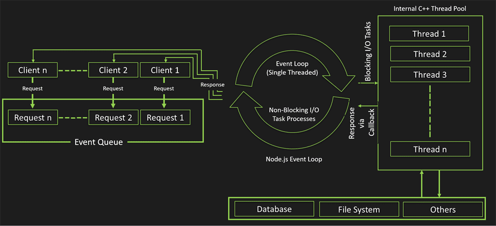
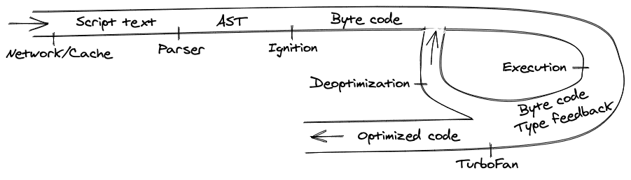
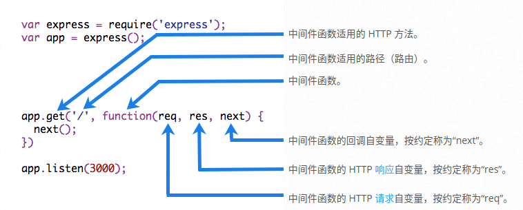

nodejs FAQs

<!-- START doctoc generated TOC please keep comment here to allow auto update -->
<!-- DON'T EDIT THIS SECTION, INSTEAD RE-RUN doctoc TO UPDATE -->
<!-- **Table of Contents**  *generated with [DocToc](https://github.com/thlorenz/doctoc)* -->

- [1 原理类](#1-%E5%8E%9F%E7%90%86%E7%B1%BB)
  - [1.1 nodejs 的基本概念](#11-nodejs-%E7%9A%84%E5%9F%BA%E6%9C%AC%E6%A6%82%E5%BF%B5)
    - [1.1.1 什么是 Nodejs?](#111-%E4%BB%80%E4%B9%88%E6%98%AF-nodejs)
    - [1.1.2 Nodejs 的特点?](#112-nodejs-%E7%9A%84%E7%89%B9%E7%82%B9)
    - [1.1.3 Nodejs 的优缺点](#113-nodejs-%E7%9A%84%E4%BC%98%E7%BC%BA%E7%82%B9)
    - [1.1.4 适用场景](#114-%E9%80%82%E7%94%A8%E5%9C%BA%E6%99%AF)
    - [1.1.5 nodejs 应用的挑战](#115-nodejs-%E5%BA%94%E7%94%A8%E7%9A%84%E6%8C%91%E6%88%98)
  - [1.2 阻塞与非阻塞(Blocking vs Non-Blocking)](#12-%E9%98%BB%E5%A1%9E%E4%B8%8E%E9%9D%9E%E9%98%BB%E5%A1%9Eblocking-vs-non-blocking)
    - [1.2.1 阻塞与非阻塞](#121-%E9%98%BB%E5%A1%9E%E4%B8%8E%E9%9D%9E%E9%98%BB%E5%A1%9E)
    - [1.2.2 同步与异步](#122-%E5%90%8C%E6%AD%A5%E4%B8%8E%E5%BC%82%E6%AD%A5)
    - [1.2.3 异步与非阻塞的区别](#123-%E5%BC%82%E6%AD%A5%E4%B8%8E%E9%9D%9E%E9%98%BB%E5%A1%9E%E7%9A%84%E5%8C%BA%E5%88%AB)
    - [1.2.4 Nodejs 中的异步](#124-nodejs-%E4%B8%AD%E7%9A%84%E5%BC%82%E6%AD%A5)
  - [1.3 并发(Concurrent)与并行(Parallel)](#13-%E5%B9%B6%E5%8F%91concurrent%E4%B8%8E%E5%B9%B6%E8%A1%8Cparallel)
  - [1.4 进程(process)与线程(thread)](#14-%E8%BF%9B%E7%A8%8Bprocess%E4%B8%8E%E7%BA%BF%E7%A8%8Bthread)
  - [1.5 nodejs 运行时环境](#15-nodejs-%E8%BF%90%E8%A1%8C%E6%97%B6%E7%8E%AF%E5%A2%83)
    - [1.5.1 事件驱动编程(Event-Driven Programming)](#151-%E4%BA%8B%E4%BB%B6%E9%A9%B1%E5%8A%A8%E7%BC%96%E7%A8%8Bevent-driven-programming)
    - [1.5.2 nodejs 体系架构](#152-nodejs-%E4%BD%93%E7%B3%BB%E6%9E%B6%E6%9E%84)
    - [1.5.3 事件循环(Event Loop)](#153-%E4%BA%8B%E4%BB%B6%E5%BE%AA%E7%8E%AFevent-loop)
    - [1.5.4 错误优先回调(error-first callback)](#154-%E9%94%99%E8%AF%AF%E4%BC%98%E5%85%88%E5%9B%9E%E8%B0%83error-first-callback)
    - [1.5.5 事件和回调的区别](#155-%E4%BA%8B%E4%BB%B6%E5%92%8C%E5%9B%9E%E8%B0%83%E7%9A%84%E5%8C%BA%E5%88%AB)
    - [1.5.6 nodejs 单线程如何处理并发(事件循环)](#156-nodejs-%E5%8D%95%E7%BA%BF%E7%A8%8B%E5%A6%82%E4%BD%95%E5%A4%84%E7%90%86%E5%B9%B6%E5%8F%91%E4%BA%8B%E4%BB%B6%E5%BE%AA%E7%8E%AF)
  - [1.6 Nodejs 与 JavaScript、ajax、jquery 的区别](#16-nodejs-%E4%B8%8E-javascriptajaxjquery-%E7%9A%84%E5%8C%BA%E5%88%AB)
  - [1.7 Node.js 中的反应器模式(Reactor Pattern)](#17-nodejs-%E4%B8%AD%E7%9A%84%E5%8F%8D%E5%BA%94%E5%99%A8%E6%A8%A1%E5%BC%8Freactor-pattern)
  - [1.8 nodejs 处理子线程](#18-nodejs-%E5%A4%84%E7%90%86%E5%AD%90%E7%BA%BF%E7%A8%8B)
  - [1.9 nodejs 利用多核处理器资源](#19-nodejs-%E5%88%A9%E7%94%A8%E5%A4%9A%E6%A0%B8%E5%A4%84%E7%90%86%E5%99%A8%E8%B5%84%E6%BA%90)
  - [1.10 Node.js 流程模型(Process Model)](#110-nodejs-%E6%B5%81%E7%A8%8B%E6%A8%A1%E5%9E%8Bprocess-model)
  - [1.11 V8 引擎的补充内容](#111-v8-%E5%BC%95%E6%93%8E%E7%9A%84%E8%A1%A5%E5%85%85%E5%86%85%E5%AE%B9)
    - [1.11.1 什么是 V8](#1111-%E4%BB%80%E4%B9%88%E6%98%AF-v8)
    - [1.11.2 什么是 JIT](#1112-%E4%BB%80%E4%B9%88%E6%98%AF-jit)
    - [1.11.3 V8 如何编译 JavaScript 代码](#1113-v8-%E5%A6%82%E4%BD%95%E7%BC%96%E8%AF%91-javascript-%E4%BB%A3%E7%A0%81)
    - [1.11.4 比较深入的问题](#1114-%E6%AF%94%E8%BE%83%E6%B7%B1%E5%85%A5%E7%9A%84%E9%97%AE%E9%A2%98)
- [2 部分核心库概述](#2-%E9%83%A8%E5%88%86%E6%A0%B8%E5%BF%83%E5%BA%93%E6%A6%82%E8%BF%B0)
- [3 web 框架相关](#3-web-%E6%A1%86%E6%9E%B6%E7%9B%B8%E5%85%B3)
  - [3.1 RESTful web 服务](#31-restful-web-%E6%9C%8D%E5%8A%A1)
  - [3.2 express](#32-express)
    - [3.2.1 说明](#321-%E8%AF%B4%E6%98%8E)
    - [3.2.2 使用](#322-%E4%BD%BF%E7%94%A8)
    - [3.2.3 中间件](#323-%E4%B8%AD%E9%97%B4%E4%BB%B6)
  - [3.3 koa](#33-koa)
    - [3.3.1 说明](#331-%E8%AF%B4%E6%98%8E)
    - [3.3.2 使用](#332-%E4%BD%BF%E7%94%A8)
    - [3.3.3 中间件](#333-%E4%B8%AD%E9%97%B4%E4%BB%B6)
    - [3.3.4 洋葱模型](#334-%E6%B4%8B%E8%91%B1%E6%A8%A1%E5%9E%8B)
  - [3.4 安全问题](#34-%E5%AE%89%E5%85%A8%E9%97%AE%E9%A2%98)
    - [3.4.1 nodejs 安全指南](#341-nodejs-%E5%AE%89%E5%85%A8%E6%8C%87%E5%8D%97)
    - [3.4.2 解决未处理的异常](#342-%E8%A7%A3%E5%86%B3%E6%9C%AA%E5%A4%84%E7%90%86%E7%9A%84%E5%BC%82%E5%B8%B8)
    - [3.4.3 nodejs 的 REPL](#343-nodejs-%E7%9A%84-repl)
    - [3.4.4 如何防止 XSS 攻击？](#344-%E5%A6%82%E4%BD%95%E9%98%B2%E6%AD%A2-xss-%E6%94%BB%E5%87%BB)
    - [3.4.5 操作错误和和程序员错误](#345-%E6%93%8D%E4%BD%9C%E9%94%99%E8%AF%AF%E5%92%8C%E5%92%8C%E7%A8%8B%E5%BA%8F%E5%91%98%E9%94%99%E8%AF%AF)
- [4 常用第三方工具](#4-%E5%B8%B8%E7%94%A8%E7%AC%AC%E4%B8%89%E6%96%B9%E5%B7%A5%E5%85%B7)
  - [4.1 npm 和 yarn 的区别](#41-npm-%E5%92%8C-yarn-%E7%9A%84%E5%8C%BA%E5%88%AB)
  - [4.2 测试金字塔](#42-%E6%B5%8B%E8%AF%95%E9%87%91%E5%AD%97%E5%A1%94)
  - [4.3 常用第三方工具库](#43-%E5%B8%B8%E7%94%A8%E7%AC%AC%E4%B8%89%E6%96%B9%E5%B7%A5%E5%85%B7%E5%BA%93)

<!-- END doctoc generated TOC please keep comment here to allow auto update -->

# 1 原理类

## 1.1 nodejs 的基本概念

### 1.1.1 什么是 Nodejs?

Node.js 是一个开源的服务器端运行环境，建立在 Chrome 的 V8 JavaScript 引擎上。它提供了一个事件驱动、非阻塞（异步）I/O 和跨平台的运行环境，用于使用 JavaScript 构建高度可扩展的服务器端应用程序。

Node.js 是一个构建在 Chrome 浏览器 V8 引擎上的 JavaScript 运行环境， 使用**单线程**、**事件驱动**、**非阻塞 I/O**的方式实现了高并发请求，`libuv`为其提供了异步编程的能力。

### 1.1.2 Nodejs 的特点?

nodejs 主要特点就是：单线程、非阻塞 IO、事件驱动。

{width=75%}

### 1.1.3 Nodejs 的优缺点

优点：

- 处理**高并发**场景性能更佳
- 适合 **I/O 密集型应用**，值的是应用在运行极限时，CPU 占用率仍然比较低，大部分时间是在做 I/O 硬盘内存读写操作
- JavaScript 生态优秀

因为 Nodejs 是单线程，带来的缺点有：

- **不适合 CPU 密集**型应用
- 只支持单核 CPU，不能充分利用 CPU
- 可靠性低，一旦代码某个环节崩溃，整个系统都崩溃

总结:

- 主要优势：高 IO 处理。
- 主要劣势：高计算处理。

### 1.1.4 适用场景

NodeJS 适合运用在高并发、I/O 密集、少量业务逻辑的场景:

- 用户表单收集系统、后台管理系统、实时交互系统、考试系统、联网软件等高并发量的 web 应用程序
- 基于 web、canvas 等多人联网游戏
- 基于 web 的多人实时聊天客户端、聊天室、图文直播
- 单页面浏览器应用程序
- 操作数据库、为前端和移动端提供基于 json 的 API

### 1.1.5 nodejs 应用的挑战

Node.js 应用程序维护的难题

1. Extensive stack
2. Technical Debt
3. Scalability challanges
4. Poor documentation

如何处理维护问题

1. 进行代码审查(Conduct code review)
2. 使用微服务(Use microservices)
3. 提高代码质量(Improve code quality)
4. 在实现新功能之前进行测试(Test before new feature implementation)
5. 改进文档(Improve documentation)
6. 更新技术栈(Update the stack)
7. 夯实根基(Dig into the roots)

## 1.2 阻塞与非阻塞(Blocking vs Non-Blocking)

> nodejs 环境"I/O" 主要指由 libuv 支持的，与系统磁盘和网络之间的交互。

**同步异步说的是被调用者结果返回时通知进程的一种通知机制，阻塞非阻塞说的是调用结果返回前进程的状态，是挂起还是继续处理其他任务。**

- 阻塞与非阻塞是**调用方**决定的，在等待结果的过程中， 是否还可以干其他事。
- 同步与异步是**被调用方**决定的，决定是马上给你答案，还是过会儿通知你，给你答案。

### 1.2.1 阻塞与非阻塞

阻塞和非阻塞关注的是程序在**等待调用结果（消息，返回值）时的状态**:

- 阻塞调用是指调用结果返回之前，当前线程会被挂起。调用线程只有在得到结果之后才会返回。
- 非阻塞调用指在不能立刻得到结果之前，该调用不会阻塞当前线程。

- 阻塞是指在 Node.js 程序中，其它 JavaScript 语句的执行，必须等待一个非 JavaScript 操作完成。
  - 这是因为当阻塞发生时，事件循环无法继续运行 JavaScript。
  - 在 Node.js 中，JavaScript _由于执行 CPU 密集型操作_，而不是等待一个非 JavaScript 操作（例如 I/O）_而表现不佳通常不被称为阻塞_。
  - 在 Node.js 标准库中使用 libuv 的同步方法是最常用的阻塞操作。原生模块中也有阻塞方法。

### 1.2.2 同步与异步

同步和异步关注的是**消息通信机制** (synchronous communication/ asynchronous communication)

- 同步，就是在发出一个*调用*时，在没有得到结果之前，该*调用*就不返回。但是一旦调用返回，就得到返回值了。
  - 换句话说，就是由*调用者*主动等待这个*调用*的结果。
- 异步则是相反，*调用*在发出之后，这个调用就直接返回了，所以没有返回结果。
  - 换句话说，当一个异步过程调用发出后，调用者不会立刻得到结果。
  - 而是在*调用*发出后，*被调用者*通过状态、通知来通知调用者，或通过回调函数处理这个调用。

### 1.2.3 异步与非阻塞的区别

**Asynchronous**

_异步的架构解释了所发送的信息不会立即得到回复_，就像我们发送邮件但不会立即得到回复一样。
它没有任何依赖性或顺序。因此，提高了系统的效率和性能。
server 存储信息，当操作完成时，它将被通知。

**Non-Blocking**

_非阻塞性立即响应任何可用的数据。此外，它不会阻止任何执行，并根据请求继续运行。_
如果不能检索到答案，那么在这些情况下，API 会立即返回一个错误。
非阻塞主要用于 I/O（输入/输出）。Node.js 本身就是基于非阻塞 I/O 模型的。在非阻塞 I/O 完成后，有几种通信方式。当操作完成时，回调函数将被调用。
非阻塞调用使用了 javascript 的帮助，它提供了一个回调函数。

- **Asynchronous VS Non-Blocking**
  - 异步不立即响应，而非阻塞则是在数据可用的情况下立即响应，如果没有，则简单地返回一个错误。
  - 异步通过快速完成任务来提高效率，因为响应可能会延后才获取到，与此同时，可以完成其他任务。非阻塞不会阻止任何执行，如果数据是可用的，它会快速检索信息。
  - 异步是同步的反义词，而非阻塞式 I/O 是阻塞的反义词。它们都相当相似，但也有区别，因为异步用于更广泛的操作，而非阻塞主要用于 I/O。

### 1.2.4 Nodejs 中的异步

0. **注意避免回调地狱**

异步函数的结果是在回调函数中的，如果异步函数嵌套的层级太多，就会出现`回调地狱`。

- **异步函数的"异步"是指在结果出现之前有一段不可预知的时间。**
- 这样的函数需要一个回调函数来处理错误和处理结果。

1. **Node.js 中 核心库 API 函数一般包含同步和异步两种。**

例如读文件:

```js
fs.readFile(path[, options], callback)
fs.readFileSync(path[, options])
```

2. **JavaScript 语言本身可以使用`async/await`。**

async await 就是 generator 语法糖，可以用 generator 来模拟 async await。

创建 `Async/Await` 简化处理和编写链式 `promises` 的过程。

3. **`promise` 和 `async/await` 的区别**

**`promise`对象** 和 **`async/await` 语法糖** 都是异步编程的一种解决方法。

`promise` 出现解决了传统 callback 函数回调地域的问题，支持链式调用可以不停`.then`,
`promise` 分别有 3 种状态一旦函数执行 `promise` 有了结果就无法改变，
遇到复杂的业务逻辑 promise 显然不是那么方便需要不停 then 这样语法显然也不美观。

`async/await` 是基于 `promise` 实现的，它是基于 `Generator` 函数的语法糖，
它拥有内置执行器，它返回的是一个 `promise` 对象，
可以使异步代码看起来像同步代码一样，更方便阅读和理解代码，解决了 `promise` 里面不停`.then` 的问题。

## 1.3 并发(Concurrent)与并行(Parallel)

- **并发**：多个任务在同一个 CPU 核上按细分的时间片轮流(交替)执行，从**逻辑上**来看那些任务是**同时执行**。
- **并行**：区别与串行，多个任务真正的分配到不同的 CPU 内核上去执行的，它们是**真正的同时执行**。
- 串行：是指多个任务时，各个任务按顺序执行，完成一个之后才能进行下一个。

更通俗一点的类比，**并发是四辆汽车在同一个车道上跑; 并行是单向四车道，四辆车在各自的车道跑，彼此不受影响。**

> 你吃饭吃到一半，电话来了，你一直到**吃完了以后再去接**，这就说明你不支持并发也不支持并行。(这是**串行**)
> 你吃饭吃到一半，电话来了，你停了下来接了电话，**接完电话后继续吃饭**，这说明你**支持并发**。
> 你吃饭吃到一半，电话来了，你**一边打电话一边吃饭**，这说明你**支持并行**。

> 并发的关键是你有处理多个任务的能力，不一定要同时。
> 并行的关键是你有同时处理多个任务的能力。

## 1.4 进程(process)与线程(thread)

- 进程：是**操作系统（OS）**进行资源（CPU、内存、磁盘、IO、带宽等）分配的最小单位；
- 线程：是 **CPU** 调度和分配的基本单位。
- 进程和线程的关系：进程可以简单理解为一个容器，有自己独立的地址空间，**其内部的各个线程共享该地址空间**。

进程与线程类比火车与车厢:

- **一个进程可由多个线程的执行单元组成**，每个线程都运行在同一进程的上下文中，共享同样的代码和全局数据。(一辆火车可以有多节车厢)
- **每个进程至少有一个主执行线程**。(一辆火车至少一节车厢)
- **进程间不会相互影响，一个线程挂掉将导致整个进程挂掉。**(一辆火车出事不影响其他火车，一节车厢着火，整辆火车都得停)

至于**CPU 内核数，和进程线程没直接关系**。操作系统（OS）可以把某个进程部署在某个 CPU 核上，当然这要取决于系统设计。
进程、线程是操作系统调度的，**进程本身不会负责调度线程**。

微型计算机系统构成示例图示:

{width=70%}

| 对比     | 进程                                                                       | 线程                                                                        |
| -------- | -------------------------------------------------------------------------- | --------------------------------------------------------------------------- |
| 定义     | 进程是程序运行的一个实体的运行过程，是系统进行资源分配和调配的一个独立单位 | 线程是进程运行和执行的最小调度单位                                          |
| 系统开销 | 创建撤销切换开销大，资源要重新分配和收回                                   | 仅保存少量寄存器的内容，开销小，在进程的地址空间执行代码                    |
| 拥有资产 | 资源拥有的基本单位                                                         | 基本上不占资源，仅有不可少的资源（程序计数器，一组寄存器和栈）              |
| 调度     | 资源分配的基本单位                                                         | 独立调度分配的单位                                                          |
| 安全性   | 进程间相互独立，互不影响                                                   | 线程共享一个进程下面的资源，可以互相通信和影响                              |
| 地址空间 | 系统赋予的独立的内存地址空间                                               | 由相关堆栈寄存器和和线程控制表 TCB 组成，寄存器可被用来存储线程内的局部变量 |

参看博文:
[我要理解的 CPU、核心，进程、线程，串行、并发、并行](https://blog.csdn.net/weixin_38256474/article/details/90347263)

**单线程**就是进程中只有一个线程。
单线程的也就是程序执行时，所跑的程序路径（处理的东西）是连续顺序下来的，必须前面的处理好，后面的才会执行到。

**多线程**就是进程有多个线程。
多线程是指程序中包含多个执行流，即在一个程序中可以同时运行多个不同的线程来执行不同的任务，
也就是说**允许单个程序创建多个并行执行的线程来完成各自的任务。**

**在 Node.js 中 JavaScript 的执行是单线程的**，
因此**并发性** _是指事件循环在完成其他工作后执行 JavaScript **回调函数**的能力_。
任何预期以并行方式运行的代码必须让事件循环能够在非 JavaScript 操作（比如 I/O ）执行的同时继续运行。

> js 执行线程是单线程，但把需要做的 I/O 操作 交给 libuv。

## 1.5 nodejs 运行时环境

### 1.5.1 事件驱动编程(Event-Driven Programming)

在一个事件驱动的应用程序中，通常有一个主循环来监听事件，然后在检测到其中一个事件时触发一个回调函数。

从事件角度说，事件驱动程序的基本结构是由一个事件收集器、一个事件发送器和一个事件处理器组成:

- **事件收集器**专门负责收集所有事件，包括来自用户的（如鼠标、键盘事件等）、来自硬件的（如时钟事件等）和来自软件的（如操作系统、应用程序本身等）。
- **事件发送器**负责将收集器收集到的事件分发到目标对象中。
- **事件处理器**做具体的事件响应工作，它往往要到实现阶段才完全确定。
- 对于框架的使用者来说，他们唯一能够看到的是事件处理器。这也是他们所关心的内容。

**事件驱动编程的优势:**

- 在大部分的应用场景中，事件编程优与多线程编程。
- 相对与多线程编程来讲，事件驱动编程比较容易，复杂度低，是开发者乐于接受的。
- 大多数的 GUI 框架，都是使用事件驱动编程了架构的。
  - 每一个事件会绑定一个处理器，这些事件通常是点击按钮，选择菜单，等等。事件处理器来实现具体的行为逻辑。
- 事件驱动经常使用在 I/O 框架中，可以很好的实现 I/O 复用。
  - 很多高性能的 I/O 框架都是使用事件驱动模型的，例如：Netty、Mina、Node.js。
- 易于调试。时间依赖只和事件有关系，而不是内部调度。问题容易暴露。

**事件驱动编程的劣势:**

- 如果处理器占用时间较长，那会阻塞应用程序的响应。
- 无法通过时间来维护本地状态，因为处理器必须返回。
- 通常在单 CPU 环境下，比多线程编程要快，因为没有锁的因素，没有线程切换的损耗。
  - CPU 不是并发的，这样的话就不适合用在一些科学计算的应用中。

虽然事件看起来与回调很相似，但**区别在于回调函数在异步函数返回其结果时被调用，而事件处理则是在观察者模式下工作。**
听取事件的函数作为观察者(Observers)。每当一个事件被触发，它的监听函数就开始执行。
Node.js 通过事件(events)模块和 EventEmitter 类拥有多个内置的事件，这些事件用于绑定事件和事件监听器。

### 1.5.2 [nodejs 体系架构](https://yjhjstz.gitbooks.io/deep-into-node/content/chapter1/chapter1-0.html)

Node.js 主要分为四大部分，Node Standard Library，Node Bindings，V8，Libuv，架构图如下：

{width=60%}

- Node Standard Library: 是我们每天都在用的标准库，如 Http, Buffer 模块。
- Node Bindings: 是沟通 JS 和 C++的桥梁，封装 V8 和 Libuv 的细节，向上层提供基础 API 服务。
- 最底层是支撑 Node.js 运行的关键，由 C/C++ 实现。
  - V8： 是 Google 开发的 JavaScript 引擎，提供 JavaScript 运行环境，可以说它就是 Node.js 的发动机。
  - Libuv： 是专门为 Node.js 开发的一个封装库，**提供跨平台的异步 I/O 能力**。
  - C-ares：提供了异步处理 DNS 相关的能力。
  - http_parser、OpenSSL、zlib 等：提供包括 http 解析、SSL、数据压缩等其他的能力。

整个异步 I/O 的流程结束，事件循环、观察者、请求对象和执行回调是整个异步 I/O 的四个基本要素。

{width=60%}

理清事件驱动的本质：通过主循环加事件触发的方式来运行程序。

### 1.5.3 事件循环(Event Loop)

事件循环图示:

{width=85%}

**事件循环是 Node.js 处理非阻塞 I/O 操作的机制**——尽管 JavaScript 是单线程处理的——当有可能的时候，它们会把操作转移到系统内核中去。

Node.js 是一个单线程的应用程序，但它可以通过 `事件`和 `回调`的概念支持并发。Node.js 的每个 API 都是异步的，由于是单线程，它们使用 `async 函数调用`来维持并发性。Node 使用观察者模式。Node 线程保持着一个事件循环，每当一个任务完成时，它就会触发相应的事件，从而给事件监听函数发出执行信号。

---

Node 是完全由事件驱动的(event-driven)。基本上，服务器(the server)由一个线程处理一个又一个事件组成。

> 一个新的请求进来就是一种事件。  
> 服务器开始处理它，当有一个阻塞的 IO 操作时，它不会等到它完成，而是注册一个回调函数。然后服务器立即开始处理另一个事件（也许是另一个请求）。  
> 当 IO 操作完成后，这是另一种事件，服务器一旦有时间就会通过执行回调来处理它（即继续处理请求）。

因此，服务器从来不需要创建额外的线程或在线程之间切换，这意味着它的开销很小。  
如果你想充分利用多个硬件核心，你只需启动多个 node.js 的实例即可。

Node JS 平台遵循单线程事件循环模型(Single Threaded with Event Loop Model)。  
Node JS 的处理模式主要是基于 Javascript 事件的模型，并带有 Javascript 回调机制。

**单线程事件循环模型处理步骤:**

- 客户端向 Web 服务器发送请求。
- Node JS Web 服务器在内部维护一个有限的线程池，为客户端请求(Client Requests)提供服务(services)。
- Node JS Web 服务器接收这些请求并将其放入一个队列。它被称为 "**事件队列(Event Queue)**"。
- Node JS Web 服务器内部有一个组件，被称为 "**事件循环(Event Loop)**"。
  - 为什么它有这个名字，因为它使用无限循环来接收请求并处理它们。
- **事件循环只使用单线程。** 它是 Node JS 平台处理模式(Node JS Platform Processing Model)的主要核心。
- 事件循环检查任何客户端请求是否被放在事件队列中。**如果没有，那么就无限期地等待传入的请求。**
- 如果有，则从事件队列中拾取一个客户请求
  - 开始处理该客户端请求
  - 如果该客户端请求不需要任何阻塞性的 IO 操作，那么就处理一切，准备响应(prepare response)并将其送回给客户端。
  - 如果该客户请求需要一些阻塞的 IO 操作，如与数据库、文件系统、外部服务交互，那么它将遵循不同的方法
    - 从内部线程池(Internal Thread Pool)中检查线程的可用性
    - 选择一个线程，并将该客户端请求分配给该线程。
    - 该线程负责接收该请求，处理它，执行阻塞的 IO 操作，准备响应，并将其发送回事件循环
    - 事件循环反过来将该响应发送给相应的客户端。

官网介绍[事件循环各个阶段概述](https://nodejs.org/zh-cn/docs/guides/event-loop-timers-and-nexttick/):

- **定时器(timers)**
  - 本阶段执行已经被 `setTimeout()` 和 `setInterval()` 的调度回调函数。
- **待定回调(pending callbacks)**
  - 执行延迟到下一个循环迭代的 I/O 回调。
- **idle**, **prepare**
  - 仅系统内部使用。
- **轮询(poll)**
  - _两个重要的功能：计算应该阻塞和轮询 I/O 的时间。然后，处理 轮询 队列里的事件。_
  - 检索新的 I/O 事件;
  - 执行与 I/O 相关的回调（几乎所有情况下，除了关闭的回调函数，那些由计时器和 `setImmediate()` 调度的之外），
  - 其余情况 node 将在适当的时候在此阻塞。
- **检测(check)**
  - `setImmediate()` 回调函数在这里执行。
- **关闭的回调函数(close callbacks)**
  - 一些关闭的回调函数，如：`socket.on('close', ...)`。

### 1.5.4 错误优先回调(error-first callback)

- 在 Node.js 的所有异步方法中使用的模式(pattern)被称为*Error-first Callback*。
- 任何异步方法都希望其中一个参数是一个回调。**完整的回调参数列表取决于调用者方法，但第一个参数总是一个错误对象或空。**
- **当我们去选择异步方法时，在函数执行过程中抛出的异常不能在 try/catch 语句中检测到。** 该事件发生在 JavaScript 引擎离开 try 块之后。

### 1.5.5 事件和回调的区别

Node.js 是一个单线程的应用程序，但它通过**事件**和**回调**的概念支持并发。  
Node.js 的每个 API 都是异步的，由于是单线程，它们使用异步函数调用来维持并发性。  
Node 线程保持着一个事件循环，每当一个任务完成时，它就会触发相应的事件，从而给事件监听函数发出执行信号。

回调函数在异步函数返回其结果时被调用，而事件处理则在**观察者模式**下工作。监听事件的函被称为观察者(Observers)。  
每当一个事件被触发，它的监听函数就开始执行。  
Node.js 通过 `event` 模块和 `EventEmitter` 类的多个内置事件，来绑定事件和事件监听器。

**1. Callback**:

- 回调函数是一个作为参数传入另一个函数的函数，然后在外部函数中调用，以完成某种常规或行动。

**2. Events**:

- 计算机上的每个动作都是一个事件。
- Node.js 允许我们通过使用事件模块轻松创建和处理自定义事件。
- event 模块中的`EventEmitter`类，可以用来引发和处理自定义事件。

### 1.5.6 nodejs 单线程如何处理并发(事件循环)

事件循环图示 2:

{width=100%}

- 1 每个 Node.js 进程只有一个主线程在执行程序代码，形成一个执行栈（execution context stack)。
- 2 主线程之外，还维护了一个"事件队列"（Event queue）。
  - 当用户的网络请求或者其它的异步操作到来时，node 都会把它放到 Event Queue 之中，
  - 此时并不会立即执行它，代码也不会被阻塞，继续往下走，直到主线程代码执行完毕。
- 3 主线程代码执行完毕完成后，然后通过 Event Loop，也就是事件循环机制，开始到 Event Queue 的开头取出第一个事件，从线程池中分配一个线程去执行这个事件，
  - 接下来继续取出第二个事件，再从线程池中分配一个线程去执行，然后第三个，第四个。
  - 主线程不断的检查事件队列中是否有未执行的事件，直到事件队列中所有事件都执行完了，
  - 此后每当有新的事件加入到事件队列中，都会通知主线程按顺序取出交 EventLoop 处理。
  - 当有事件执行完毕后，会通知主线程，主线程执行回调，线程归还给线程池。
- 4 主线程不断重复上面的第三步。

## 1.6 Nodejs 与 JavaScript、ajax、jquery 的区别

|                | JavaScript                                                                                                                          | Node JS                                                                                                                   |
| -------------- | ----------------------------------------------------------------------------------------------------------------------------------- | ------------------------------------------------------------------------------------------------------------------------- |
| Type           | JavaScript 是一种编程语言。它在任何具有适当浏览器引擎的网络浏览器中运行。                                                           | 它是一个 JavaScript 解释器和环境，带有一些特定的有用库，JavaScript 编程可以单独使用。                                     |
| Utility        | 主要用于 Web 应用程序的任何客户端活动，如可能的属性验证或在特定的时间间隔内刷新页面，或在不刷新页面的情况下提供一些动态变化的网页。 | 它主要用于访问或执行任何操作系统的任何非阻塞操作，如创建或执行一个 shell 脚本或访问任何硬件的特定信息或运行任何后台作业。 |
| Running Engine | 任何可以运行 JavaScript 的引擎，如 Spider monkey（FireFox）、JavaScript Core（Safari）、V8（Google Chrome）。                       | Node JS 只在 V8 引擎中运行，该引擎主要用于 google chrome。在这个 Node JS 下编写的 javascript 程序将总是在 V8 引擎中运行。 |

- Node.js 是一个 javascript 运行时，使我们有可能编写应用程序的后端(back-end)。
- Asynchronous JavaScript and XML(AJAX)）指的是一组技术，我们用它来向网络服务器发送请求，并在不重新加载页面的情况下从服务器那里获取数据。
- Jquery 是一个简单的 javascript 库，帮助我们进行前端(front-end)开发。

## 1.7 Node.js 中的反应器模式(Reactor Pattern)

反应器模式是 Node.js 中非阻塞 I/O 操作的一个思想。

{width=55%}

(以下是使用反应器模式的应用程序中执行的操作):

1. 应用程序通过向 **事件分用器(Event Demultiplexer)** 提交一个请求来生成一个新的 I/O 操作。应用程序还指定了一个处理程序，该处理程序将在操作完成后被调用。
   - 向事件分用器提交的这个新的请求是一个非阻塞的调用，并且提交完之后马上就把控制权返回给应用程序。
2. 当一组 I/O 操作完成后，事件分用器将新的事件推送到事件队列中。
3. 同时，事件循环对事件队列的项目进行迭代。
4. 对于每个事件，相关的处理程序被调用。
5. 处理程序是应用程序代码的一部分，当其执行完成后，将把控制权还给事件循环（5a）。
   - 然而，在处理程序的执行过程中，可能会要求进行新的异步操作（5b），导致新的操作被插入到事件分用器（1）中，然后再把控制权交还给事件循环。
6. 当事件队列中的所有项目被处理后，该循环将在事件分用器上再次阻塞，然后将触发另一个循环。

## 1.8 nodejs 处理子线程

Node.js 是一种单线程语言，在后台使用多个线程来执行异步代码。

Node.js 是非阻塞的，这意味着所有的函数（回调）都被委托给事件循环，它们（能够）由不同的线程执行。这是由 Node.js 运行时处理的。

通过 Nodejs 核心模块 `child_process` 可以实现一个主进程，多个子进程模式，主进程称为 master 进程,子进程称为 worker 进程。

## 1.9 nodejs 利用多核处理器资源

由于 Node.js 默认是一个单线程应用程序，它将在单个处理器核心上运行，**不会充分利用多核心资源**。然而，Node.js 提供了在多核系统上部署的支持，以更好地利用硬件。

`cluster` 模块是 Node.js 的核心模块之一，它允许运行多个 Node.js 工作进程，它们将共享同一个端口。

`cluster`模块有助于在操作系统上产生新的进程(spawn new processes)。  
**每个进程独立工作，所以你不能在子进程之间使用共享状态。**  
每个进程通过 IPC 与主进程进行通信，并来回传递服务器句柄。

集群支持两种类型的负载分配:

- 主进程监听一个端口，接受新的连接并以循环方式将其分配给一个子进程。
- 主进程将端口分配给一个子进程，子进程自己监听该端口。

## 1.10 Node.js 流程模型(Process Model)

- Node.js 在单个进程(a single process)中运行，应用程序代码在单个线程(a single thread)中运行，因此需要的资源比其他平台少。
- 所有用户对你的网络应用的请求都将由一个单线程处理，所有的 I/O 工作或长期运行的工作都是针对某个特定的请求异步进行。
- 因此，这个单线程不必等待请求的完成，可以自由地处理下一个请求。当异步 I/O 工作完成后，它进一步处理请求并发送响应。

## 1.11 V8 引擎的补充内容

### 1.11.1 [什么是 V8](https://v8.dev/)

V8 是谷歌的开源高性能 JavaScript 和 WebAssembly 引擎，用 C++编写。  
它被用于 Chrome 和 Node.js，以及其他方面。  
它实现了 ECMAScript 和 WebAssembly，并在 Windows 7 或更高版本、macOS 10.12 以上以及使用 x64、IA-32、ARM 或 MIPS 处理器的 Linux 系统上运行。  
V8 可以独立运行，也可以嵌入到任何 C++应用程序中。

### 1.11.2 什么是 JIT

V8 引擎的一个核心部分是 JIT（Just In Time）编译器，它使它能够高速执行 JavaScript。这是一个动态编译器，可以在运行时优化代码。

**为了获得速度，V8 将 JavaScript 代码翻译成更有效的机器代码，而不是使用一个解释器。**

- 它通过实现 JIT（Just-In-Time）编译器，在执行时将 JavaScript 代码编译成机器代码，
  - 就像很多现代 JavaScript 引擎，如 SpiderMonkey 或 Rhino（Mozilla）正在做的那样。
  - **V8 的主要区别是，它不产生字节码或任何中间代码。**

### 1.11.3 V8 如何编译 JavaScript 代码

总结一下 V8 编译管道：



逐步说明：

1. 这一切都始于从网络中获取 JavaScript 代码。
2. V8 解析源代码并将其转化为抽象语法树（AST）。
3. 基于该 AST，Ignition 解释器可以开始做它的事情，并产生字节码。
4. 在这一点上，引擎开始运行代码并收集类型反馈。
5. 为了使它运行得更快，字节码可以和反馈数据一起被发送到优化编译器。优化编译器在此基础上做出某些假设，然后产生高度优化的机器代码。
6. 如果在某些时候，其中一个假设被证明是不正确的，优化编译器就会取消优化，并回到解释器中。

### 1.11.4 比较深入的问题

What is V8 Templates?
官方文档[Getting started with embedding V8](https://v8.dev/docs/embed#templates)

What is the purpose of using hidden classes in V8?
官方博文[Maps (Hidden Classes) in V8](https://v8.dev/docs/hidden-classes)

# 2 部分核心库概述

- **cluster**

Node.js 进程集群可用于运行多个 Node.js 实例，这些实例可以在其应用程序线程之间分配工作负载。
当不需要进程隔离时，请改用 `worker_threads` 模块，它允许在单个 Node.js 实例中运行多个应用程序线程。

`cluster`**模块** 允许轻松创建所有共享服务器端口的子进程。

- **child_process**

`node:child_process` **模块** 提供了以与 `popen(3)` 类似但不完全相同的方式衍生子进程的能力。
此功能主要由 `child_process.spawn()` 函数提供。

- **process**

`process` **对象** 提供有关当前 Node.js 进程的信息并对其进行控制。

虽然它可以作为一个全局对象使用，但建议通过`require`或`import`明确访问它。

- **buffer**

`Buffer`**对象** 用于表示固定长度的字节序列。许多 Node.js 的 API 支持`Buffer`。

`Buffer`**类** 是 JavaScript 的`Uint8Array`类的一个子类，并且用涵盖额外使用情况的方法对其进行了扩展。Node.js APIs 接受普通的`Uint8Array`s，但也支持`Buffer`s。

虽然`Buffer`类在全局范围内可用，但仍建议通过`import`或`require`语句明确引用它。

- **stream**

流是用于在 Node.js 中处理流数据的抽象接口。`node:stream` **模块** 提供了用于实现流接口的 API。

Node.js 提供了许多流对象。例如，`process.stdout`都是流实例。

流可以是可读的(readable)，可写的(writable)，或者两者都是。所有的流都是`EventEmitter`的实例。

- **events**

Node.js 的大部分核心 API 都是围绕惯用的异步事件驱动架构构建的，在该架构中，某些类型的对象（称为"触发器"）触发命名事件，使 `Function` 对象（"监听器"）被调用。

所有触发事件的对象都是 **`EventEmitter`类** 的实例。
这些对象公开了一个`eventEmitter.on()`函数，该函数允许将一个或多个函数附加到对象触发的命名事件。
通常，事件名称是驼峰式字符串，但可以使用任何有效的 JavaScript 属性键(property key)。

当 **`EventEmitter`对象** 触发一个事件时，所有附加到该特定事件的函数都会被**同步**调用。被调用的侦听器返回的任何值都将被**忽略并丢弃**。

- **fs**

**`node:fs` 模块**能够以标准 POSIX 函数为模型的方式与文件系统进行交互。

> POSIX: 可移植操作系统接口（英语：Portable Operating System Interface，缩写为 POSIX）
> 是 IEEE 为要在各种 UNIX 操作系统上运行软件，而定义 API 的一系列互相关联的标准的总称，其正式称呼为 IEEE Std 1003，而国际标准名称为 ISO/IEC 9945。

所有的文件系统操作都有同步、回调和基于承诺的形式，并且可以使用 CommonJS 语法和 ES6 模块（ESM）访问。

- **path**

**`node:path` 模块**提供了用于处理文件和目录的路径的实用工具。

`node:path` 模块的默认操作因运行 Node.js 应用程序的操作系统而异。
具体来说，当在 Windows 操作系统上运行时，`node:path` 模块将假定正在使用 Windows 风格的路径。

- **url**

**`node:url` 模块**提供用于网址处理和解析的实用工具。

- **http**

要使用 HTTP 服务器和客户端，则必须 `require('node:http')`。

Node.js 中的 HTTP 接口被设计为支持该协议的许多特性，这些特性在传统上是难以使用的。特别是大型的，可能是分块编码的信息。
该接口很谨慎，从不缓冲整个请求或响应，因此用户能够进行数据流。

为了支持所有可能的 HTTP 应用，Node.js HTTP API 是非常低级的(low-level)。它只处理流处理和消息解析。
它将消息解析为标题(headers)和正文(body)，但它并不解析实际的标题或正文。

~~所以 express 等还会使用`body-parser`等库。~~

- **dns**

**`node:dns` 模块**启用了名称解析。 例如，使用它来查找主机名的 IP 地址。(域名解析)

尽管以域名系统 (DNS)命名，但它并不总是使用 DNS 协议进行查找。
`dns.lookup()`使用操作系统工具来执行名称解析。它可能不需要执行任何网络通信。
要像同一系统上的其他应用程序一样执行名称解析，请使用`dns.lookup()`.

- **readline**

**`node:readline` 模块**提供了用于从可读流（例如 `process.stdin`）每次一行地读取数据的接口。

- **crypto**

**`node:crypto` 模块**提供了加密功能，其中包括了用于 OpenSSL 散列、HMAC、加密、解密、签名、以及验证的函数的一整套封装。

- **os**

**`node:os` 模块**提供了与操作系统相关的实用方法和属性。

例如常用的换行:`os.EOL`，POSIX 下为`\n`， Windows 下为`\r\n`。

- **net**

**`node:net` 模块**提供了异步的网络 API，用于创建基于流的 TCP 或 IPC 服务器 (`net.createServer()`) 和客户端 (`net.createConnection()`)。

- **timer**

**`timer` 模块**暴露了一个全局的用于在未来某个时间点调用的调度函数的 API。
因为定时器函数是全局的，所以*不需要*调用 `require('node:timers')` 来使用该 API。

即`setImmediate(callback[, ...args])`、`setTimeout(callback[, delay[, ...args]])`等函数可以直接使用。

- **inspector**

**`node:inspector` 模块**提供了与 V8 检查器交互的 API。

可以用来调试 nodejs 应用

- **assert**

`node:assert` 模块提供了一组用于验证不变量的断言函数。

# 3 web 框架相关

## 3.1 RESTful web 服务

REST 是 REpresentational State Transfer 的缩写。REST 是基于网络标准的架构，使用 HTTP 协议。  
它是一种架构风格，也是一种用于通信目的的方法，经常被用于各种网络服务的开发。  
REST 服务器简单地提供对资源的访问，REST 客户端使用 HTTP 协议访问和修改资源。

**HTTP methods**

- `GET`
  - 提供对一个资源的只读访问
  - Provides read-only access to a resource.
- `PUT`
  - 更新一个现有的资源或创建一个新的资源。
  - Updates an existing resource or creates a new resource.
- `DELETE`
  - 删除一个资源
  - Removes a resource.
- `POST`
  - 创建一个新的资源。
  - Creates a new resource.
- `PATCH`
  - 更新/修改一个资源
  - Update/modify a resource

**REST 的原则(Principles of REST)**

- 统一的接口(Uniform Interface)
- 无状态(Stateless)
- 可缓存(Cacheable)
- Client-Server
- 分层体系(Layered System)
- 按需编码(可选)(Code on Demand (optional))

## 3.2 express

### 3.2.1 说明

Express (是一个)高度包容、快速而极简的 Node.js Web 框架。

### 3.2.2 使用

- **生成器**

可使用应用程序生成器工具 (express-generator) 快速创建应用程序框架。

使用生成器工具将创建一个具有清晰层次结构的应用程序文件夹，以帮助你管理图片、前端静态 JavaScript 文件、样式文件和 HTML 模板文件。

```bash
npm install express-generator -g
express <project-name>
```

- **路由**

路由用于确定应用程序如何响应对特定端点的客户机请求，包含一个 URI（或路径）和一个特定的 HTTP 请求方法（GET、POST 等）。
每个路由可以具有一个或多个处理程序函数，这些函数在路由匹配时执行。

路由定义采用以下结构：`app.METHOD(PATH, HANDLER)`，其中：

- **app** 是 express 的实例。
- **METHOD** 是 HTTP 请求方法(PUT、GET、POST、DELETE 等等)。
- **PATH** 是服务器上的路径。
- **HANDLER** 是在路由匹配时执行的函数。

例如

```js
app.get("/", function (req, res) {
  res.send("GET request to the homepage");
});
```

- **静态文件**

为了提供诸如图像、CSS 文件和 JavaScript 文件之类的静态文件，请使用 Express 中的 `express.static` 内置中间件函数。

例如:

```js
// 1 此例中，`express.static`替代了被配置为静态资源的文件夹 `public`
app.use(express.static(path.join(__dirname, "public")));
// 2 可以配置多个
// app.use(express.static('files'));

// 3 还可指定固定前缀
// app.use("/static", express.static("public"));
```

在项目文件夹下有张图片:`<express-project>/public/images/event-loop.png`
项目运行后，在浏览器直接访问`http://localhost:3000/images/event-loop.png`，可以看到那张图片。

如果配置了固定前缀如"static",则访问路径需要是`http://localhost:3000/static/images/event-loop.png`

- **通用错误处理**

一般要放在所有路由之后，例如

```js
// error handler
app.use(function (err, req, res, next) {
  // set locals, only providing error in development
  res.locals.message = err.message;
  res.locals.error = req.app.get("env") === "development" ? err : {};

  // render the error page
  res.status(err.status || 500);
  res.render("error");
});
```

### 3.2.3 中间件

1. **中间件概述**

中间件函数能够访问**请求对象 (req)**、**响应对象 (res)** 以及应用程序的请求/响应循环中的下一个中间件函数。下一个中间件函数通常由名为 `next` 的变量来表示。

中间件函数可以执行以下任务：

- 执行任何代码。
- 对请求和响应对象进行更改。
- 结束请求/响应循环。
- 调用堆栈中的下一个中间件。

如果当前中间件函数没有结束请求/响应循环，那么它必须调用 next()，以将控制权传递给下一个中间件函数。否则，请求将保持挂起状态。

The following figure shows the elements of a middleware function call:

以下示例显示中间件函数调用的元素：



返回 Promise 的中间件函数在拒绝或抛出错误时将调用`next(value)`。`next`将被调用，并带有拒绝的值或抛出的错误。

补充：

从 Express 5 开始，返回 Promise 的中间件函数在拒绝或抛出错误时将调用`next(value)`。next 将被调用，并带有拒绝值或抛出的 Error。

2. **Express 应用程序可以使用的中间件分类**

- 应用层中间件
  - 使用 `app.use()` 和 `app.METHOD()` 函数将应用层中间件**绑定到应用程序对象**的实例，
  - 其中 METHOD 是中间件函数处理的请求的小写 HTTP 方法（例如 GET、PUT 或 POST）。
  - 要跳过路由器中间件堆栈中剩余的中间件函数，请调用 `next('route')` 将控制权传递给下一个路由。
- 路由器层中间件
  - 路由器层中间件的工作方式与应用层中间件基本相同，差异之处在于它 **绑定到`express.Router()`** 的实例。
- 错误处理中间件
  - 错误处理中间件函数的定义方式与其他中间件函数基本相同，
  - 差别在于错误处理函数有四个自变量而不是三个，专门具有特征符 (err, req, res, next)。
- 内置中间件
  - 自 V4.x 起，除 `express.static` 外，先前 Express 随附的所有中间件函数现在以单独模块的形式提供。
  - Express 中**唯一内置的中间件函数**是 `express.static`。此函数基于 `serve-static`，负责提供 Express 应用程序的静态资源。
- 第三方中间件
  - 安装具有所需功能的 Node.js 模块，然后在应用层或路由器层的应用程序中将其加装入。
  - 常用例如:
    - `cookie-parser`: cookie 解析中间件函数
    - `body-parser`: 在你的处理程序之前，在一个中间件中解析传入的请求体，在`req.body`属性下可用。
    - `http-errors`: 为 Express、Koa、Connect 等轻松创建 HTTP 错误。
    - `multer`: 文件上传中间件。
    - `cors`: 跨域中间件。
    - `morgan`: http 请求日志中间件。
    - 更多[Express middleware](http://expressjs.com/en/resources/middleware.html)

## 3.3 koa

### 3.3.1 说明

Koa 是一个新的 web 框架，由 Express 幕后的原班人马打造，  
致力于成为 web 应用和 API 开发领域中的一个更小、更富有表现力、更健壮的基石。  
**通过利用 async 函数，Koa 帮你丢弃回调函数，并有力地增强错误处理。**  
**Koa 并没有捆绑任何中间件**， 而是提供了一套优雅的方法，帮助您快速而愉快地编写服务端应用程序。

### 3.3.2 使用

Koa 依赖 node v7.6.0 或 ES2015 及更高版本和 async 方法支持。

```sh
# 安装koa
npm i koa
# 运行koa入口程序
node my-koa-app.js
```

简单示例`my-koa-app.js`

```js
const Koa = require("koa");
const app = new Koa();

// logger
app.use(async (ctx, next) => {
  await next();
  const rt = ctx.response.get("X-Response-Time");
  console.log(`${ctx.method} ${ctx.url} - ${rt}`);
});

// x-response-time
app.use(async (ctx, next) => {
  const start = Date.now();
  await next();
  const ms = Date.now() - start;
  ctx.set("X-Response-Time", `${ms}ms`);
});

// response
app.use(async (ctx) => {
  ctx.body = "Hello World";
});

app.listen(3000);
```

以下内容，更多查看对应的 api。

1. **应用（Application）**

Koa 应用程序是一个包含一组中间件函数的对象，它是按照类似堆栈的方式组织和执行的。
Koa 类似于你可能遇到过的许多其他中间件系统,然而，一个关键的设计点是在其低级中间件层中提供高级“语法糖”。
这提高了互操作性，稳健性，并使书写中间件更加愉快。

这包括诸如内容协商，缓存清理，代理支持和重定向等常见任务的方法。
尽管提供了相当多的有用的方法 Koa 仍保持了一个很小的体积，因为没有捆绑中间件。

**`app.context`**
`app.context` 是从其创建 ctx 的原型。您可以通过编辑 `app.context` 为 ctx 添加其他属性。
这对于将 ctx 添加到整个应用程序中使用的属性或方法非常有用，这可能会**更加有效**(不需要中间件)和/或**更简单**(更少的 `require()`)，而更多地依赖于 ctx，这可以被认为是一种反模式。

```js
// 要从 ctx 添加对数据库的引用
app.context.db = db();

app.use(async (ctx) => {
  console.log(ctx.db);
});
```

2. **上下文（Context）**

Koa Context 将 node 的 request 和 response 对象封装到单个对象中，为编写 Web 应用程序和 API 提供了许多有用的方法。 这些操作在 HTTP 服务器开发中频繁使用，它们被添加到此级别而不是更高级别的框架，这将强制中间件重新实现此通用功能。

_每个_ 请求都将创建一个 Context，并在中间件中作为接收器引用，或者 ctx 标识符，如以下代码片段所示：

```js
app.use(async (ctx) => {
  ctx; // 这是 Context
  ctx.request; // 这是 koa Request
  ctx.response; // 这是 koa Response
});
```

为方便起见许多上下文的访问器和方法直接委托给它们的 `ctx.request` 或 `ctx.response` ，不然的话它们是相同的。
例如 `ctx.type` 和 `ctx.length` 委托给 response 对象，`ctx.path` 和 `ctx.method` 委托给 request。

`ctx.res`: Node 的 response 对象.

绕过 Koa 的 response 处理是 **不被支持的**. 应**避免使用**以下 node 属性：

- res.statusCode
- res.writeHead()
- res.write()
- res.end()

3. **请求（Request）**

Koa Request 对象是在 node 的 原生请求对象之上的抽象，提供了诸多对 HTTP 服务器开发有用的功能。

4. **响应（Response）**

Koa Response 对象是在 node 的原生响应对象之上的抽象，提供了诸多对 HTTP 服务器开发有用的功能。

> 简单来讲，以上内容对应的是:

```js
const Koa = require("koa");
const app = new Koa();

app.use(async (ctx) => {
  ctx.body = "Hello World";
});

app.listen(3000);
```

> **应用(Application)为 `app`** , 它上面也有 koa 很多实例属性和方法，例如`app.env`、`app.use(function)`等。  
> **上下文(Context)为 `ctx`** , 它上面有很多 koa content 的示实例属性和方法，例如`ctx.req`，`ctx.throw([status],[msg],[properties])`等。  
> **koa 的请求(Request)对象为 `ctx.request`** ,它上面就是很多 http 请求的属性和方法，例如`ctx.request.ip`，`ctx.request.is(types...)`等。  
> **koa 的响应(Response)对象为 `ctx.response`** ,它上面就是很多 http 响应的属性和方法，例如`ctx.response.message`，`ctx.response.set(field, value)`等。  
> 因为 koa 的请求和响应是非常常用的，所以*很多属性方法有 koa 上下文的别名*。例如`ctx.ip`为`ctx.request.ip`的别名，`ctx.message`为`ctx.response.message`的别名等。

### 3.3.3 中间件

和 express 是类似的，但 koa 是没有绑定任何中间件，所以路由等基础功能都要先安装插件。  
常用的中间件有:

- `koa-router`: koa 路由模块
- `koa-static`: koa 的静态资源处理中间件
- `koa-session`: koa 的 session 中间件
- `koa-multer`: koa 文件上传中间件
- `koa-bodyparser`: 一个基于 co-body 的 koa 的 body 解析器，支持 json、form 和 text 类型的 body。

### 3.3.4 洋葱模型

Koa 的路由执行顺序与 Express 有所不同，Koa 选择了洋葱圈模型，即最先访问的路由里的 next()后面的代码最后响应。

{width=50%}

示例`koa-app.js`:

```js
const Koa = require("koa");
const router = require("koa-router")();
const app = new Koa();

app.use(async (ctx, next) => {
  console.log("1.这是一个中间件01");
  await next();
  console.log("5.匹配完路由以后又会返回来执行中间件");
});
app.use(async (ctx, next) => {
  console.log("2.这是一个中间件02");
  await next();
  console.log("4.匹配完路由以后又会返回来执行中间件");
});
router.get("/news", async (ctx) => {
  console.log("3.匹配到了news这个路由");
  ctx.body = "新闻页";
});

app.use(router.routes());
app.use(router.allowedMethods());
app.listen(3001);
/*
运行该koa项目口，浏览器访问`http://localhost:3001/news`，
浏览器页面显示"新闻页"三个字，而后台终端输出顺序为:
1.这是一个中间件01
2.这是一个中间件02
3.匹配到了news这个路由
4.匹配完路由以后又会返回来执行中间件
5.匹配完路由以后又会返回来执行中间件
*/
```

## 3.4 安全问题

### 3.4.1 nodejs 安全指南

1. 数据验证 - 永远不要信任你的用户
2. 预防 SQL 注入攻击(使用模板、类型转换等)
3. 应用程序认证和授权(密码哈希、密码存储、认证和授权)
4. 暴力攻击防护(失败次数过多暂停(节流)、屏蔽无效登录请求的 IP)
5. HTTPS 安全传输
6. 会话劫持保护
7. 跨站点请求伪造攻击(CSRF)防护
8. 尽可以预防`拒绝服务`或`DOS攻击`
9. 依赖关系验证
10. HTTP 安全头信息

- 函数防抖(debounce)
  - 在事件被触发 n 秒后再执行回调，如果在这 n 秒内又被触发，则重新计时。
  - 即当一个动作连续触发，则只执行最后一次。
- 函数节流（throttle）
  - 限制一个函数在一定时间内只能执行一次

### 3.4.2 解决未处理的异常

在 Node.js 中，未处理的异常可以通过附加 `uncaughtException` 事件的处理程序在进程级捕获。

例如:

```js
process.on("uncaughtException", function (err) {
  console.log("Caught exception: " + err);
});
```

`process` 是一个全局对象，提供关于当前 Node.js 进程的信息。
`process.on` 可以监听更多的事件可参看 `process events` API。

### 3.4.3 nodejs 的 REPL

REPL（READ, EVAL, PRINT, LOOP）是一个类似于 Shell（Unix/Linux）和命令提示符的计算机环境。  
Node 在安装时自带 REPL 环境。系统通过使用的命令/表达式的输出与用户互动。它在编写和调试代码时非常有用。

REPL 的工作可以从它的完整形式来理解:

- **Read**: 它读取用户的输入并将其解析为 JavaScript 数据结构。然后将其存储到内存中。
- **Eval**: 对解析过的 JavaScript 数据结构进行评估，得出结果。
- **Print**: 评估后的结果被打印出来。
- **Loop**: 循环输入命令。要从 NODE REPL 出来，按两次 ctrl+c。

简单示例(在安装 nodejs 系统终端输入`node`就进入 node REPL 环境了)

### 3.4.4 [如何防止 XSS 攻击？](https://tech.meituan.com/2018/09/27/fe-security.html)

什么是 XSS:

- Cross-Site Scripting（跨站脚本攻击）简称 XSS，是一种代码注入攻击。
- 攻击者通过在目标网站上注入恶意脚本，使之在用户的浏览器上运行。
- 利用这些恶意脚本，攻击者可获取用户的敏感信息如 Cookie、SessionID 等，进而危害数据安全。

XSS 的本质是：

- **恶意代码未经过滤，与网站正常的代码混在一起；浏览器无法分辨哪些脚本是可信的，导致恶意脚本被执行。**

总结以下原则减少漏洞的产生:

- **利用模板引擎**
- **避免内联事件**
- **避免拼接**
- **时刻保持警惕** 在插入位置为 DOM 属性、链接等位置时，要打起精神，严加防范。
- **增加攻击难度，降低攻击后果** 通过 CSP、输入长度配置、接口安全措施等方法，增加攻击的难度，降低攻击的后果。
- **主动检测和发现** 可使用 XSS 攻击字符串和自动扫描工具寻找潜在的 XSS 漏洞。

### 3.4.5 操作错误和和程序员错误

操作错误不是 bug，而是系统的问题，如请求超时或硬件故障。另一方面，程序员错误是真正的错误。

- Operational errors:
  - these represent run-time problems experienced by correctly written programs.
  - they are not really bugs but are problems attached to something else in our program.
- Programmer errors:
  - these are bugs and should be dealt with in our code.
  - they can always be avoided by changing some line(s) of code.

# 4 常用第三方工具

## 4.1 npm 和 yarn 的区别

- **npm**

npm 是在 Node.js 运行环境中管理软件包的默认方法。
它依赖于一个命令行客户端和一个由公共和高级软件包组成的数据库，即 npm 注册表。
用户可以通过客户端访问注册表，并通过 npm 网站浏览许多可用的包。
npm 和它的注册表都是由 npm, Inc.管理的。

```bash
node -v
npm -v
```

- **Yarn**

yarn 是由 Facebook 开发的，试图解决 npm 的一些不足之处。
**yarn 在技术上并不是 npm 的替代品，因为它依赖于 npm 注册表的模块。**
可以把 Yarn 看作是一个新的安装程序，它仍然依赖于相同的 npm 结构。注册表本身没有变化，但安装方法不同。
由于 Yarn 给你提供了与 npm 相同的软件包，从 npm 转移到 Yarn 不需要你对你的工作流程做任何改变。

```bash
npm install yarn --global
```

_yarn 主要解决了 node_modules 黑洞的问题_，优点类似 maven 的`.m2`全局缓存仓库的操作。

**yarn 相较与 npm**:

- **快速**
  - Yarn 缓存了它下载的每一个软件包，因此它不需要再次下载。
  - 它还将操作并行化，以最大限度地利用资源，因此安装时间比以往任何时候都快。
- **可靠**
  - 使用一个详细但简洁的锁文件格式，以及一个确定的安装算法，Yarn 能够保证在一个系统上运行的安装，_在任何其他系统上都会以同样的方式运行_。
- 安全
  - Yarn 使用校验和来验证每个安装的软件包的完整性，然后再执行其代码。
- 离线模式
  - 如果你以前安装过一个包，你可以在没有任何互联网连接的情况下再次安装它。
- **确定性**
  - 无论安装顺序如何，相同的依赖关系将以相同的方式安装在每台机器上。
- 网络性能
  - Yarn 有效地将请求排成队列，避免请求瀑布，以最大限度地提高网络利用率。
- 多个注册中心
  - 可以从 npm 或 Bower 安装任何软件包，并保持你的软件包工作流程不变。
- 网络适应性
  - 单个请求的失败不会导致安装失败。请求在失败后会被重试。
- 扁平模式
  - 将不匹配的依赖版本解决为单一版本，以避免产生重复。

类似`npm shrinkwrap` 可以让你锁定已安装的软件包和它们的后代软件包的版本。  
它可以帮助你在所有环境（开发、暂存、生产）中使用相同的软件包版本，也可以提高下载和安装速度。

## 4.2 测试金字塔

`测试金字塔` 是一个比喻，告诉我们把软件测试分成不同粒度的桶(buckets)。  
它还给出了一个概念，即我们应该在每个组中有多少个测试。  
它显示了你应该在金字塔的不同层次中寻找哪些类型的测试，并给出了如何实现这些测试的实际例子。


Mike Cohn 的原始测试金字塔由三层组成，你的测试套组(test suite)应该包括（从下到上）。

1. 单元测试(Unit Tests)
2. 服务/接口测试(Service Tests)
3. 用户界面/UI 测试(User Interface Tests)

## 4.3 常用第三方工具库

- pm2
  - 是一个用于 Node.js 应用程序的生产流程管理器，具有内置的负载平衡器。
  - 它允许你永远保持应用程序的活力，在不停机的情况下重新加载它们，并促进常见的系统管理任务。
- jsonwebtoken
  - 一个 JSON 网络令牌的实现。
- joi
  - 最强大的 schema description language 和 JavaScript 的数据验证器。
- got
  - http 客户端。
- ws
  - ws 是一个简单易用、速度极快、经过全面测试的 WebSocket 客户端和服务器实现。
- eslint
  - 用来保证 js/ts 代码风格一致。
- imagemin
  - 图片指定质量压缩
- puppeteer
  - 是一个 Node 库，它提供了一个高级 API，通过 DevTools 协议控制 Chrome 或 Chromium。
  - 可以用来 web 自动化测试、爬虫等。

---

**jwt 补充说明:**

JSON 网络令牌（JWT）是一个开放的标准，它定义了一种紧凑和独立的方式，以 JSON 对象的形式在各方之间安全地传输信息。这种信息可以被验证和信任，因为它是经过数字签名的。

使用 JWT 进行授权有一些优势：

- 纯粹的无状态。不需要额外的服务器或基础设施来存储会话信息。
- 它可以很容易地在服务之间共享。

JSON 网络令牌由三部分组成，用点（.）隔开，它们是：

- **Header**
  - 由两部分组成：令牌的类型（即 JWT）和签名算法（即 HS512）。
  - (header 典型的由两部分组成：token 的类型（“JWT”）和算法名称（比如：HMAC SHA256 或者 RSA 等等）。)
- **Payload**
  - 包含提供已被验证的用户信息的声明(claims)，以及如令牌到期时间等其他信息。
  - (payload，它包含声明（要求）。声明是关于实体(通常是用户)和其他数据的声明。声明有三种类型: registered, public 和 private。)
- **Signature**
  - 包裹在编码头和有效载荷中的令牌的最后部分，同时还有加密算法和一个秘钥
  - (为了得到签名部分，你必须有编码过的 header、编码过的 payload、一个秘钥，签名算法是 header 中指定的那个，然对它们签名即可。)


