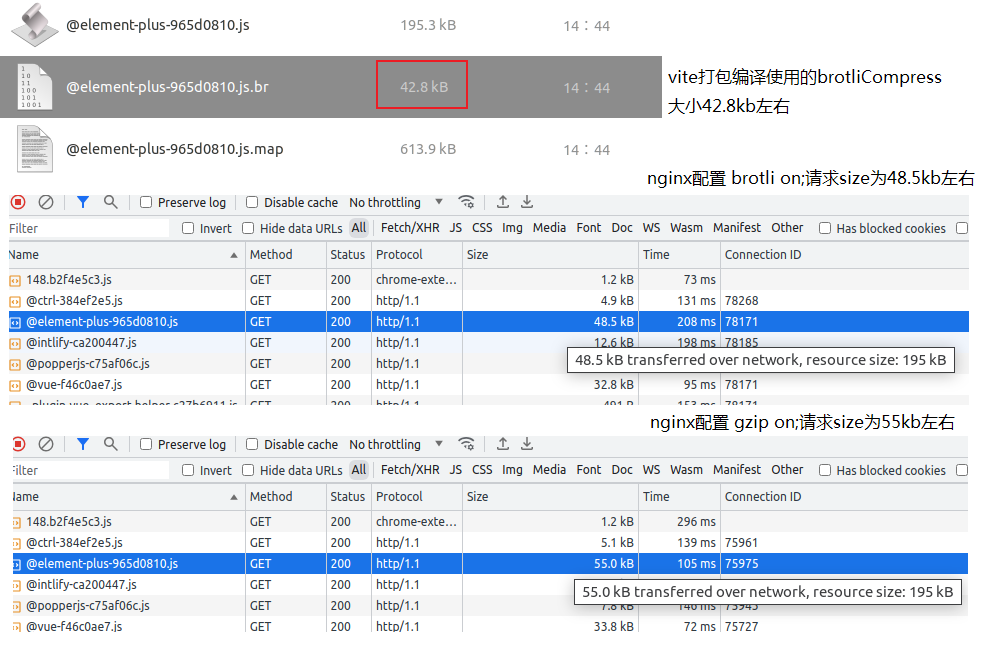
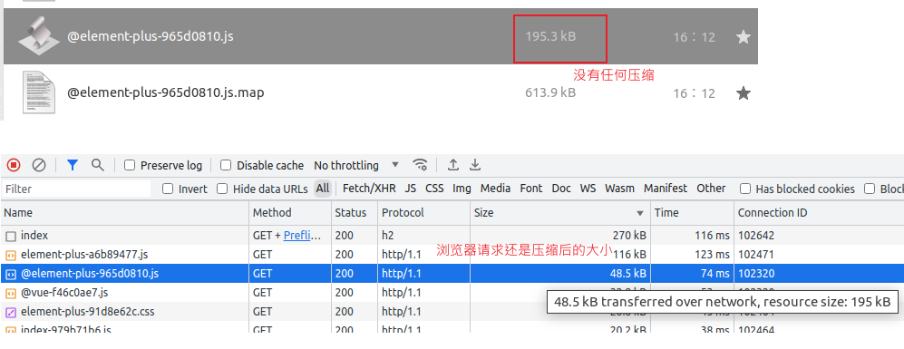
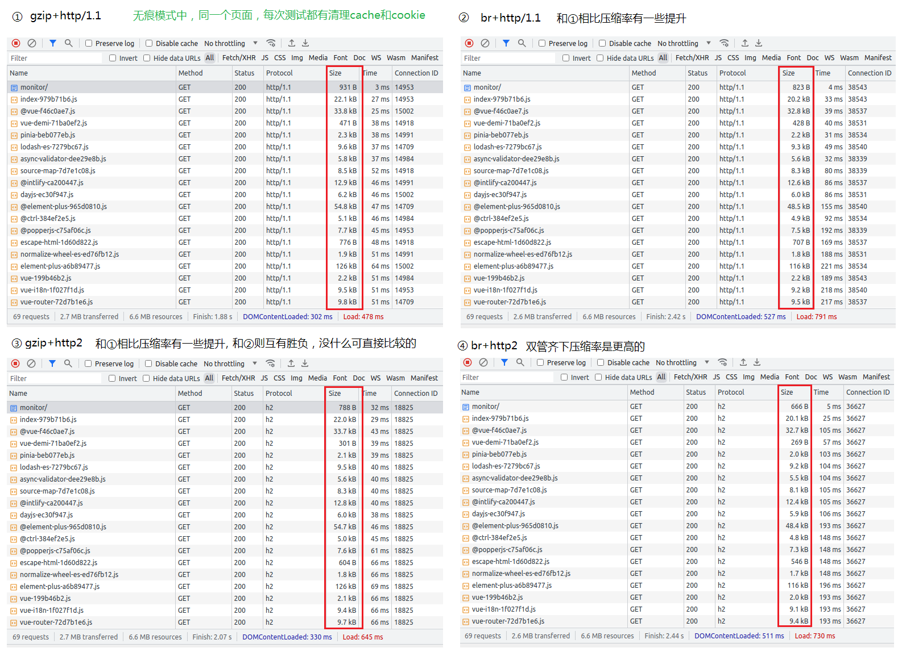

# 「前端性能优化」之 nginx 启用 br 压缩和 h2 的配置

<!-- START doctoc generated TOC please keep comment here to allow auto update -->
<!-- DON'T EDIT THIS SECTION, INSTEAD RE-RUN doctoc TO UPDATE -->
<!-- **Table of Contents**  *generated with [DocToc](https://github.com/thlorenz/doctoc)* -->

- [一、在 vite 打包时就配置好压缩](#%E4%B8%80%E5%9C%A8-vite-%E6%89%93%E5%8C%85%E6%97%B6%E5%B0%B1%E9%85%8D%E7%BD%AE%E5%A5%BD%E5%8E%8B%E7%BC%A9)
- [二、在 nginx 部署时使用 Brotli](#%E4%BA%8C%E5%9C%A8-nginx-%E9%83%A8%E7%BD%B2%E6%97%B6%E4%BD%BF%E7%94%A8-brotli)
- [三：nginx 启用 HTTP/2](#%E4%B8%89nginx-%E5%90%AF%E7%94%A8-http2)
- [小结](#%E5%B0%8F%E7%BB%93)

<!-- END doctoc generated TOC please keep comment here to allow auto update -->

代码压缩这块是对提升性能有比较大的帮助，尤其是加快了网络请求的完成，对页面的渲染效率有比较大的提升。

前端 vue 项目的压缩和 nginx 部署

## 一、在 vite 打包时就配置好压缩

配合 vite 使用的插件`vite-plugin-compression`。

在`vite.config.ts`中使用:

```ts
import viteCompression from "vite-plugin-compression";

export default defineConfig(({ command, mode }) => {
  return {
    ///***/ 需要用到的插件数组。
    plugins: [
      viteCompression({
        // 压缩算法,可选 [ 'gzip' , 'brotliCompress' ,'deflate' , 'deflateRaw']
        algorithm: "brotliCompress", // 默认是gzip
      }),
      // ……
    ],
  };
  // ……
});
```

实测 algorithm 默认的 gzip 。想要一次编译同时产出 gz 和 br 压缩后的文件，可以再配一个，如下示例:

```js
plugins: [
  viteCompression({
    algorithm: "brotliCompress",
  }),
  viteCompression({
    algorithm: "gzip",
  }),
  // ……
],
```

这里仅是个单纯的示例，[更多配置](https://github.com/vbenjs/vite-plugin-compression/blob/main/README.zh_CN.md#%E9%85%8D%E7%BD%AE%E8%AF%B4%E6%98%8E)参看文档说明。更多[vite 的插件](https://github.com/vitejs/awesome-vite#plugins)也可自行选择。

webpack 等也有对应的压缩插件工具，比如[compression-webpack-plugin](https://github.com/webpack-contrib/compression-webpack-plugin)。

## 二、在 nginx 部署时使用 Brotli

Brotli 以下简称为 br。

**1. 下载 br 源码和 nginx 对应版本源码**

下载 br 源码并更新

```shell
# 下载的位置看个人，后面注意替换到自己实际的路劲
cd /usr/src
# 下载brotli
git clone https://github.com/google/ngx_brotli.git
# 更新brotli
cd ngx_brotli
git submodule update --init
```

下载与服务器中同样 nginx 版本的源码(需要 1.9.11 以上，因为在此之后才支持动态模块)

```shell
# 获取当前nginx版本
nginx -V
# 获取nginx源码
# 去官网下: http://nginx.org/en/download.html

# 解压到某个位置
tar -xvf nginx-1.18.0.tar.gz
```

**2. 编译动态模块**

```shell
# 进入解压后的nginx安装包目录，配置configure，然后用make modules
cd nginx-1.18.0
./configure --with-compat --add-dynamic-module=/usr/src/ngx_brotli
make modules
```

在`./configure ……`这一步可能会看到一些错误，例如:

```sh
……
adding module in /usr/local/src/ngx_brotli
 + ngx_brotli was configured
checking for PCRE library ... not found
checking for PCRE library in /usr/local/ ... not found
checking for PCRE library in /usr/include/pcre/ ... not found
checking for PCRE library in /usr/pkg/ ... not found
checking for PCRE library in /opt/local/ ... not found

./configure: error: the HTTP rewrite module requires the PCRE library.
You can either disable the module by using --without-http_rewrite_module
option, or install the PCRE library into the system, or build the PCRE library
statically from the source with nginx by using --with-pcre=<path> option.
```

像我这也用不到`http_rewrite_module`模块就直接加上者选项就好:

```shell
./configure --with-compat --add-dynamic-module=/usr/local/src/ngx_brotli --without-http_rewrite_module
```

否则的话，你就可能需要手动想办法加上这些缺少的 PCRE libray 路径。

等 make 运行完成后，查看编译好的模块

```shell
ls objs/*.so
# 正常会输出 objs/ngx_http_brotli_filter_module.so  objs/ngx_http_brotli_static_module.so

# 将编译好的模块文件复制到nginx动态模块加载目录
cp objs/{ngx_http_brotli_filter_module.so,ngx_http_brotli_static_module.so} /usr/share/nginx/modules
```

注意：`/usr/share/nginx/modules`是我这 1.18.0 版本的 nginx 的模块默认路径，请确认自己 nginx 版本的位置是否一样、或者有异动配置。此外，像我为了和其他模块区分，会刻意创建一个文件夹存放自行编译的模块，所以放置的位置类似`/usr/share/nginx/modules/dynamic_modules`。

**3. 注册 Brotli 模块**

像我这 nginx 的默认配置中有指定模块使用配置的位置。

打开`/etc/nginx/nginx.conf`配置文件，一般在最上面能看到类似一行代码:

```conf
……
include /etc/nginx/modules-enabled/*.conf;
……
```

所以刚刚把动态模块放到位置之后，现在要注册，  
我是打看这个`/etc/nginx/modules-enabled/`文件夹，  
新建一个`self-dynamic-modules.conf`配置文件，  
然后在里面加入动态模块的地址(文件名称随意，内容为 load_module 指定模块即可):

```conf
# Brotli模块
load_module modules/dynamic_modules/ngx_http_brotli_filter_module.so;
load_module modules/dynamic_modules/ngx_http_brotli_static_module.so;
```

**注意**，这里面的路径`modules/dynamic_modules/`，  
“modules”就是 nginx 默认的路径，就是上面的`/usr/share/nginx/modules/`，  
“dynamic_modules/”是我为了区分自己动态编译的模块而单独建的一层文件夹。

**4. 启用 Brotli 压缩**

最好是先关闭 nginx 服务，然后打开 nginx 的默认配置开启 br。

我这是`/etc/nginx/nginx.conf`文件，在`http {}`选项中加入如下内容（br 的配置可自行学习）:

```cong
http {
    ……

    # 启用 brotli 压缩
	  brotli on;
    brotli_comp_level 6;
    brotli_buffers 16 8k;
    brotli_min_length 20;
    brotli_types text/plain text/css application/json application/x-javascript text/xml application/xml application/xml+rss text/javascript application/javascript image/svg+xml;
    ……
}

```

还有一点特别注意: **Brotli 压缩只能在 https 中生效**，所以自定的 server 配置需要启用 ssl，当然也需要配置 key。

例如我这个示例:

```conf
server {
        server_name http_host;
        listen 8089 ssl; # 以前是单独一行 ssl on; 快弃用了直接在listen后面加 ssl 就好了
        ssl_certificate     /etc/nginx/crtdir/server.cer;
        ssl_certificate_key /etc/nginx/crtdir/server.key;
        ……
}
```

重新启动 nginx，如果没有报错(有报错肯定要先解决)，再访问部署的页面，可以看到指定请求的 Response Headers 中`Content-Encoding: br`信息，类似：

```
HTTP/1.1 200 OK
Server: nginx/1.18.0 (Ubuntu)
Date: Thu, 24 Aug 2023 01:50:06 GMT
Content-Type: text/html
Last-Modified: Thu, 17 Feb 2022 06:38:35 GMT
Transfer-Encoding: chunked
Connection: keep-alive
ETag: W/"620ded6b-3f9"
X-XSS-Protection: 1; mode=block
Cache-Control: no-cache
Pragma: no-cache
Content-Encoding: br # 就这里
```

当然，其实也完全编译一个 nginx，主要是我这 ubuntu 下自带的 nginx 有一些系统默认配置，如果是自己新编译的 nginx，这些与系统默认选项相关的可能需要手动配置一下，避免麻烦就只编译动态模块而已。

**5. 补充：nginx 中多个压缩方式共存**

这个也是我在对比不同算法的压缩效率看到的，我 nginx 可以配置多种压缩，然后在 server 配置时指定某一种就好了。

在 ngnix 默认配置`/etc/nginx/nginx.conf`中配置 http 选项多种压缩方式:

```conf
http {
    ##
	# Gzip Settings
	##
	gzip_proxied any;
	gzip_comp_level 6;
	gzip_buffers 16 8k;
	gzip_http_version 1.1;
	gzip_types text/plain text/css application/json application/javascript text/xml application/xml application/xml+rss text/javascript;

    ##
	# Brotli Settings
	##
    brotli_comp_level 6;
    brotli_buffers 16 8k;
    brotli_min_length 20;
    brotli_types text/plain text/css application/json application/x-javascript text/xml application/xml application/xml+rss text/javascript application/javascript image/svg+xml;
}
```

注意，这里就没有启用的配置，而是在 server 选项配置，比如我的自定配置`my.conf`中:

```
server {
	server_name demo_server1;
    listen 8089 ssl;
    ssl_certificate     /etc/nginx/crtdir/server.cer;
    ssl_certificate_key /etc/nginx/crtdir/server.key;
    brotli on;
    ……
}

server {
	listen 8088;
	server_name demo_server2;
    gzip on;
    ……
}
```

8089 端口的用的就是 br，8088 的就是 gzip。

**6. bonus：vite 的压缩和 nginx 压缩方式不一致的效果**

先不考虑进阶的其他方便，我的示例是 vite 中配置打包压缩为`brotliCompress`，nginx 取 br 和 gzip 进行测试，前端请求看到的大小分别是:



vue 的项目打包有设置 br 压缩，nginx 配置启用 br，浏览器请求的数据略大于原始数据，可以理解，比如带有网络传输中其他附件数据等。nginx 配置启用 gzip，请求数据则再大一点。

这里其实还有一个 nginx 压缩类型的问题，就是动态压缩和静态压缩的区别。如果我一开始就没有配置 vite 压缩插件，直接 build，打包后的 `assets`文件夹中的 css、js 等文件就只有一个类型后缀文件，不会有压缩文件。但是 nginx 配置了压缩之后，浏览器请求中还是可以看到并不是`assets`的文件大小，还是压缩后的大小：



也就是说，nginx 的**动态压缩**，是每次请求都把对应资源打包压缩之后再响应请求。

那么**静态压缩**就是 nginx 部署路径下有已压缩的文件，配置时指定对应 server 使用的压缩方式，那么响应时就使用对应类型压缩文件，不要每次请求都压缩一次。

所以上面我 nginx 中只有 js/css 文件、br 文件，但启用的压缩方式是 gzip，没有现成的 gz 文件，那实际上就是*动态压缩*把 js/css 先压缩为 gz 文件再响应请求。此时 br 文件没有用到，除非是 nginx 启用了 br 压缩，那就是通过*静态压缩*直接用这个 br 文件响应请求。

---

当然你还可以搞事情。比如构建的时候使用了 br，但删除了原始的 js/css，但 nginx 启用了 gzip 压缩，那么页面资源请求是报错的。

但你构建的时候使用了 br，删除了原始的 js/css，nginx 启用了 br，那么页面资源请求时大概率还是会报错的，可能是类似这个错误:

```sh
Failed to load module script: Expected a JavaScript module script but the server responded with a MIME type of "text/html". Strict MIME type checking is enforced for module scripts per HTML spec.
```

实际上我尝试了其他操作，比如修改 index.html 里面的引入、其他 nginx 配置，目前还没有成功仅部署 br 文件能在浏览器正常解析成页面，希望实现的诸君能告知一下，谢谢。

我用 vite 打包时也没有只保留 br 或者 gzip 的选项，测试是手动删除压缩成 br 或者 gzip 之前的 js、css 然后部署该项目。没必要搞这些，只是单纯好奇。是有 chrome 的 network 看到资源是 br 了，但是页面是没有正常解析到的，暂时就不研究这个东西了。

## 三：nginx 启用 HTTP/2

同样在压缩上面，还可以将 nginx 配置 http2,这样还能进一步减少请求的资源大小。事实上，http2 相较于 http3 使用上还是更加广泛(理论小于实践是不是就这个说法)，对应 http1.1 的提升还是比较明显的。

nginx 启用 http2 也很简单，上面的 server 配置看到了吧，把 listen 再加一个选项即可:

```conf
# 更高效率的压缩：br + h2
server {
	server_name demo_server1;
    listen 8089 ssl http2; # 加http2
    ssl_certificate     /etc/nginx/crtdir/server.cer;
    ssl_certificate_key /etc/nginx/crtdir/server.key;
    brotli on; # 启用br
    ……
}
```

简单的效果:



原始 gzip+http/1.1 在改为 br+http2 之后，效果提升还是有的（其实更大的是使用 chrome 的 lighthouse 测试时，性能这块加分提多的）。

## 小结

前端压缩这块其实还有更多的内容:

这里 vite 配置时有用到压缩混淆代码图片等，当然还有其他配置比如清理没有用到的代码、删除注释这些基本的。

nginx 中的压缩也可以多些内容，比如压缩的配置选项，涉及压缩等级啊，目标文件阈值、类型啊，配置静态资源缓存等等。

传输协议也是，HTTP/2 还会压缩一些请求和响应头的消息内容，进一步减少网络压力。但如果有调用第三方服务可它们不支持 h2 或者甚至不支持 ssl，这就看公司规范如何处理了。

注意，h2 不会对已经压缩的文件进行额外压缩了，也没有必要，毕竟压缩算法是那些，再压也不会再减少了。

说的传输协议，可能也有听说过 TCP 慢启动之类的，也有说优化文件在 14kb 之内，及请求页面的 HTML 小于初始的 14KB 数据包，就能最快的完成数据的请求然后优化页面加载渲染效率。这按下不变。
