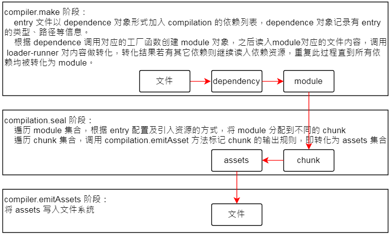

<!-- START doctoc generated TOC please keep comment here to allow auto update -->
<!-- DON'T EDIT THIS SECTION, INSTEAD RE-RUN doctoc TO UPDATE -->
<!-- **Table of Contents**  *generated with [DocToc](https://github.com/thlorenz/doctoc)* -->

- [webpack 相关](#webpack-%E7%9B%B8%E5%85%B3)
  - [重要概念](#%E9%87%8D%E8%A6%81%E6%A6%82%E5%BF%B5)
  - [Webpack5 特性](#webpack5-%E7%89%B9%E6%80%A7)
  - [Webpack 核心流程](#webpack-%E6%A0%B8%E5%BF%83%E6%B5%81%E7%A8%8B)
  - [Webpack 性能优化](#webpack-%E6%80%A7%E8%83%BD%E4%BC%98%E5%8C%96)
  - [Plugin 解析](#plugin-%E8%A7%A3%E6%9E%90)
  - [Loader 介绍](#loader-%E4%BB%8B%E7%BB%8D)
  - [主流构建工具对比](#%E4%B8%BB%E6%B5%81%E6%9E%84%E5%BB%BA%E5%B7%A5%E5%85%B7%E5%AF%B9%E6%AF%94)

<!-- END doctoc generated TOC please keep comment here to allow auto update -->

# webpack 相关

## 重要概念

**【webpack】** 是一个用于现代 JavaScript 应用程序的 _静态模块打包工具_。当 webpack 处理应用程序时，它会在内部从一个或多个入口点构建一个 依赖图(dependency graph)，然后将你项目中所需的*每一个模块组合成一个或多个 bundles*，它们均为静态资源，用于展示你的内容。

**【依赖图(dependency graph)】**: 每当一个文件依赖另一个文件时，webpack 都会将文件视为直接存在 **依赖关系**。这使得 webpack 可以获取非代码资源，如 images 或 web 字体等。并会把它们作为 **依赖** 提供给应用程序。

当 webpack 处理应用程序时，它会根据命令行参数中或配置文件中定义的模块列表开始处理。 从 _入口_ 开始，webpack 会递归的构建一个 **依赖关系图**，这个依赖图包含着应用程序中所需的每个模块，然后将所有模块打包为少量的 bundle，通常只有一个，可由浏览器加载。

> 对于 HTTP/1.1 的应用程序来说，由 webpack 构建的 bundle 非常强大。当浏览器发起请求时，它能最大程度的减少应用的等待时间。
> 而对于 HTTP/2 来说，你还可以使用代码分割进行进一步优化。

**【入口起点(entry point)】**指示 webpack 应该使用哪个模块，来作为构建其内部*依赖图(dependency graph)* 的开始。进入入口起点后，webpack 会找出有哪些模块和库是入口起点（直接和间接）依赖的。默认值是 `./src/index.js`，但你可以通过在 webpack configuration 中配置 entry 属性，来指定一个（或多个）不同的入口起点。

**【输出(output)】** 属性告诉 webpack 在哪里输出它所创建的 bundle，以及如何命名这些文件。主要输出文件的默认值是 `./dist/main.js`，其他生成文件默认放置在 `./dist` 文件夹中。可以通过在配置中指定一个 output 字段，来配置这些处理过程。

**【loader】**: webpack 只能理解 JavaScript 和 JSON 文件，这是 webpack 开箱可用的自带能力。loader 用于对模块的源代码进行转换，**让 webpack 能够去处理其他类型的文件**，并将它们转换为有效模块，以供应用程序使用，以及被添加到依赖图中。  
在 webpack 的配置中，**loader 有两个属性**：`test` 属性，识别出哪些文件会被转换。(使用正则表达式匹配文件时，不要为它添加引号。) `use` 属性，定义出在进行转换时，应该使用哪个 loader。

**【插件(plugin)】**: loader 用于转换某些类型的模块，而插件则可以用于执行范围更广的任务。包括：**打包优化，资源管理，注入环境变量**。想要使用一个插件，只需要 `require()` 它，然后把它添加到 plugins 数组中。多数插件可以通过选项(option)自定义。也可以在一个配置文件中因为不同目的而多次使用同一个插件，这时需要通过使用 new 操作符来创建一个插件实例。

**【配置(Configuration)】**: 很少有 webpack 配置看起来完全相同。这是因为 **webpack 的配置文件是 JavaScript 文件，文件内导出了一个 webpack 配置的对象**。 webpack 会根据该配置定义的属性进行处理。由于 webpack 遵循 CommonJS 模块规范，因此，你可以在配置中使用：

- 1 通过 `require(...)` 引入其他文件或使用 npm 下载的工具函数；2 使用 JavaScript 控制流表达式，例如 `?:` 操作符；3 对 value 使用常量或变量赋值；4 编写并执行函数，生成部分配置。

虽然技术上可行，但还是应避免如下操作：1 当使用 webpack CLI 工具时，访问 CLI 参数（应编写自己的 CLI 工具替代，或者使用 --env）；2 导出不确定的结果（两次调用 webpack 应产生相同的输出文件）；3 编写超长的配置（应将配置文件拆分成多个）。

**【Chunk】**: 编译完成准备输出时，webpack 会将 module 按特定的规则组织成一个一个的 chunk，这些 chunk 某种程度上跟最终输出一一对应。

**【模块(Modules)】**: 在模块化编程中，开发者将程序分解为功能离散的 _chunk_，并称之为*模块*。每个模块都拥有小于完整程序的体积，使得验证、调试及测试变得轻而易举。精心编写的模块提供了可靠的抽象和封装界限，使得应用程序中每个模块都具备了条理清晰的设计和明确的目的。

module 是 webpack 资源处理的基本单位，可以认为 webpack 对资源的路径解析、读入、转译、分析、打包输出，所有操作都是围绕着 module 展开的。

Node.js 从一开始就支持模块化编程。然而，web 的 _模块化_ 正在缓慢支持中。在 web 界存在多种支持 JavaScript 模块化的工具，这些工具各有优势和限制。 Webpack 从这些系统中汲取了经验和教训，并将*模块*的概念应用到项目的任何文件中。

Webpack 天生支持如下模块类型：ECMAScript 模块(import 语句)、CommonJS 模块(require()语句)、AMD 模块(define 和 require 语句)、Assets、WebAssembly 模块。

通过 loader 可以使 webpack 支持多种语言和预处理器语法编写的模块。loader 向 webpack 描述了如何处理非原生模块，并将相关依赖引入到你的 bundles 中。

`module.rules`为创建模块时，匹配请求的规则数组(rules)。这些规则能够修改模块的创建方式。 这些规则能够对模块(module)应用 loader，或者修改解析器(parser)。每个规则 rule 可以分为三部分 - 条件(condition)，结果(result)和嵌套规则(nested rule)。

**【Tapable】** 是一个小型的 webpack 核心工具库，以提供类似的插件接口。 它对外暴露了 tap，tapAsync 和 tapPromise 等方法， 插件可以使用这些方法向 webpack 中注入自定义构建的步骤，这些步骤将在构建过程中触发。**本质上是为我们更方便创建自定义事件和触发自定义事件的库**，类似于 Nodejs 中的 EventEmitter Api。

**【模式(mode)】**: 通过选择 development, production 或 none 之中的一个，来设置 mode 参数，你可以启用 webpack 内置在相应环境下的优化。其默认值为 production。

**【浏览器兼容性(browser compatibility)】**: Webpack 支持所有符合 ES5 标准 的浏览器（不支持 IE8 及以下版本）。webpack 的 `import()` 和 `require.ensure()` 需要 Promise。如果你想要支持旧版本浏览器，在使用这些表达式之前，还需要 提前加载 polyfill。

**【环境(environment)】**: Webpack 5 运行于 Node.js v10.13.0+ 的版本。

## Webpack5 特性

1. 编译缓存: webpack5 统一了持久化缓存的方案，有效降低了配置的复杂性.
2. 长效缓存: 长效缓存指的是能充分利用浏览器缓存，尽量减少由于模块变更导致的构建文件 hash 值的改变，从而导致文件缓存失效。增加了确定的 moduleId，chunkId 的支持。
3. Node Polyfill 脚本被移除: webpack5 将不会自动为 Node.js 模块添加 polyfill，而是更专注的投入到前端模块的兼容中。
4. 更优的 tree-shaking
5. Module Federation: 相当于 webpack 提供了线上 runtime 的环境，多个应用利用 CDN 共享组件或应用，不需要本地安装 npm 包再构建了，这就有点云组件的概念了.

## Webpack 核心流程

搭配[[万字总结] 一文吃透 Webpack 核心原理](https://juejin.cn/post/6949040393165996040)和[webpack5 知识体系](https://gitmind.cn/app/doc/fac1c196e29b8f9052239f16cff7d4c7)整理。

Webpack 最核心的功能: 将各种类型的资源，包括图片、css、js 等，转译、组合、拼接、生成 JS 格式的 bundler 文件。

三个阶段完成了 [内容转换 + 资源合并] 两种功能，简述(单次构建过程自上而下按顺序执行):

**初始化阶段**：

- 初始化参数：从配置文件、配置对象、Shell 参数中读取，与默认配置结合得出最终的参数。
- 创建编译器对象：用上一步得到的参数创建 Compiler 对象。
- 初始化编译环境：包括注入内置插件、注册各种模块工厂、初始化 RuleSet 集合、加*载配置的插件*等。
- 开始编译：执行 compiler 对象的 run 方法。
- 确定入口：根据配置中的 entry 找出所有的入口文件，调用 `compilition.addEntry` 将入口文件转换为 dependence 对象。

**构建阶段**(构建阶段围绕 module 展开)：

- 编译模块(make)：根据 entry 对应的 dependence 创建 module 对象。
  - 调用 loader 将模块转译为标准 JS 内容，_调用 JS 解释器将内容转换为 AST 对象_，从中找出该模块依赖的模块，
  - 再**递归**本步骤直到所有入口依赖的文件都经过了本步骤的处理。
  - _(Webpack 读出 AST 之后仅遍历 AST 集合；babel 则对源码做等价转换)_。
- 完成模块编译：上一步递归处理所有能触达到的模块后，得到了每个模块被翻译后的内容以及它们之间的*依赖关系图*。

**生成阶段**(生成阶段围绕 chunks 展开)：

- 输出资源(seal)：根据入口和模块之间的依赖关系，组装成一个个包含多个模块的 Chunk，再把每个 Chunk 转换成一个单独的文件加入到输出列表。这步是可以修改输出内容的最后机会。
- 写入文件系统(emitAssets)：在确定好输出内容后，根据配置确定输出的路径和文件名，把文件内容写入到文件系统

**名词解释**(webpack 编译过程都是围绕着这些关键对象展开的)

- **Entry**：编译入口，webpack 编译的起点。
- **Compiler**：编译管理器，webpack 启动后会创建 compiler 对象，该对象一直存活直到结束退出。
- **Compilation**：单次编译过程的管理器。
  - 比如 `watch = true` 时，运行过程中只有一个 compiler 但每次文件变更触发重新编译时，都会创建一个新的 compilation 对象。
- **Dependence**：依赖对象，webpack 基于该类型记录模块间依赖关系。
- **Module**：webpack 内部所有资源都会以“module”对象形式存在，所有关于资源的操作、转译、合并都是以 “module” 为基本单位进行的。
- **Chunk**：编译完成准备输出时，webpack 会将 module 按特定的规则组织成一个一个的 chunk。
  - 这些 chunk 某种程度上跟最终输出一一对应。
- **Loader**：资源内容转换器，其实就是实现从内容 A 转换 B 的转换器。
- **Plugin**：webpack 构建过程中，会在特定的时机广播对应的事件，插件监听这些事件，在特定时间点介入编译过程。

**compiler**:

- compiler 模块是 webpack 的主要引擎，它通过 CLI 或者 Node API 传递的所有选项创建出一个 compilation 实例。
- 它扩展（extends）自 Tapable 类，用来注册和调用插件。 大多数面向用户的插件会首先在 Compiler 上注册。
- Compiler 支持可以监控文件系统的 监听(watching) 机制，并且在文件修改时重新编译。
- 当处于监听模式(watch mode)时， compiler 会触发诸如 watchRun, watchClose 和 invalid 等额外的事件。
- 通常在 开发环境 中使用， 也常常会在 webpack-dev-server 这些工具的底层调用， 由此开发人员无须每次都使用手动方式重新编译。
- 还可以通过 CLI 进入监听模式。

**compilation**:

- Compilation 模块会被 Compiler 用来创建新的 compilation 对象（或新的 build 对象）。
- compilation 实例能够访问所有的模块和它们的依赖（大部分是循环依赖）。
- 它会对应用程序的依赖图中所有模块， 进行字面上的编译(literal compilation)。
- 在编译阶段，模块会被加载(load)、封存(seal)、优化(optimize)、 分块(chunk)、哈希(hash)和重新创建(restore)。
- Compilation 类扩展(extend)自 Tapable， 可以按照 compiler 钩子的相同方式来调用 tap，也可以在某些钩子上访问 tapAsync 和 tapPromise

## Webpack 性能优化

- [编译日志分析](https://mp.weixin.qq.com/s/A0udBhvNoA0o-kX1B0rt9A)：Webpack Analysis、Webpack Visualizer、Webpack Bundle Analyzer、WebpackDashboard、UnusedWebpackPlugin
- 产物优化
  - tree-shaking
- 编译优化
  - cache
  - 并行编译
    - happy-oack
    - thread-loader

4 个方向：构建速度优化、代码体积优化、持久化缓存优化、Module Federation

_简单把 webpack 分为以下几个部分：1. 重要概念(组成、功能等) 2. 核心流程 3. plugin 的使用 4. loader 的使用 5. 性能优化_

**webpack5 核心流程解析**

**初始化阶段**: 在真正构建入口模块之前的这一阶段

- 初始化参数：将用户传入配置与默认配置结合得到最终配置参数；
- 创建编译器对象：根据配置参数创建 `Compiler` 实例对象(从创建 compiler 实例到调用 make 钩子，逻辑链路很长)；
- 初始化编译环境：注册用户配置插件及内置插件；
- 运行编译：执行 `compiler.run` 方法；
- 确定入口：根据配置 `entry` 找寻所有入口文件，并转换为 `dependence` 对象，等待执行 `compilition.addEntry` 编译工作。

**构建阶段（make）**，`hooks.make` 是触发入口模块编译的开始

- 构建阶段从 entry 开始递归解析资源与资源的依赖，在 `compilation` 对象内逐步构建出 module 集合以及 module 之间的依赖关系。
- 调用 `handleModuleCreate` ，根据文件类型构建 module 子类
- 调用 [loader-runner](https://www.npmjs.com/package/loader-runner) 仓库的 `runLoaders` 转译 module 内容，通常是从各类资源类型转译为 JavaScript 文本
- 调用 [acorn](https://www.npmjs.com/package/acorn) 将 JS 文本解析为 AST(Webpack 读出 AST 之后仅遍历 AST 集合；babel 则对源码做等价转换)。
- 遍历 AST，触发各种钩子
  - 在 `HarmonyExportDependencyParserPlugin` 插件监听 `exportImportSpecifier` 钩子，解读 JS 文本对应的资源依赖
  - 调用 module 对象的 `addDependency` 将依赖对象加入到 module 依赖列表中
- AST 遍历完毕后，调用 `module.handleParseResult` 处理模块依赖
- 对于 module 新增的依赖，调用 `handleModuleCreate` ，控制流回到第一步
- 所有依赖都解析完毕后，构建阶段结束

**生成阶段（seal）**：构建阶段围绕 module 展开，生成阶段则围绕 chunks 展开。webpack 得到足够的模块内容与模块关系信息，接下来开始生成最终资源了。代码层面，就是开始执行 `compilation.seal` 函数。_seal 函数主要完成从 module 到 chunks 的转化_，核心流程：

- 构建本次编译的 `ChunkGraph` 对象；
- 遍历 `compilation.modules` 集合，将 module 按 `entry/动态引入` 的规则分配给不同的 Chunk 对象(生成阶段的关键逻辑)；
  - entry 及 entry 触达到的模块，组合成一个 chunk
  - 使用动态引入语句引入的模块，各自组合成一个 chunk
- `compilation.modules` 集合遍历完毕后，得到完整的 chunks 集合对象，调用 `createXxxAssets` 方法
- `createXxxAssets` 遍历 module/chunk ，调用 `compilation.emitAssets` 方法将资 assets 信息记录到 `compilation.assets` 对象中
- 触发 `seal` 回调，控制流回到 compiler 对象
  - _chunk 是输出的基本单位，默认情况下这些 chunks 与最终输出的资源一一对应，那按上面的规则大致上可以推导出一个 entry 会对应打包出一个资源，而通过动态引入语句引入的模块，也对应会打包出相应的资源。_

**输出阶段（emit）**

- 经过构建阶段后，**compilation** 会获知资源模块的内容与依赖关系，也就知道“输入”是什么；
- 而经过 **seal** 阶段处理后， compilation 则获知资源输出的图谱，也就是知道怎么“输出”：哪些模块跟那些模块“绑定”在一起输出到哪里。
- seal 结束之后，紧接着调用 `compiler.emitAssets` 函数，
  - 函数内部调用 `compiler.outputFileSystem.writeFile` 方法将 assets 集合写入文件系统。

各个阶段一句话说明:

1. 初始化
2. 构建(make)阶段:模块路径解析、模块内容解析、AST 遍历处理、依赖解析(构建 ModuleDependencyGraph，依赖递归处理)
3. 生成(seal)阶段:entry 生成 chunk、异步模块生成 chunk、[optional] runtime 生成 chunk、构建 ChunkGraph
4. 输出(emit)阶段:合并 chunk、写出 assets

从**资源形态流转**角度重新考察整个过程:



## Plugin 解析

_核心原理：何时启动、如何介入编译流程、插件开发（识别钩子运行时机、识别钩子类型、识别钩子参数）_  
webpack 的钩子体系是一种强耦合架构，它在特定时机触发钩子时会附带上足够的上下文信息，插件定义的钩子回调中，能也只能与这些上下文背后的数据结构、接口交互产生 side effect，进而影响到编译状态和后续流程。

**【什么是插件】**: 从形态上看，插件通常是一个带有 apply 函数的类。`class SomePlugin { apply(compiler) {} }`

**apply 函数运行时会得到参数 compiler ，以此为起点可以调用 hook 对象注册各种钩子回调**，例如：compiler.hooks.make.tapAsync ，  
 这里面 make 是钩子名称，tapAsync 定义了钩子的调用方式，webpack 的插件架构基于这种模式构建而成，  
插件开发者可以使用这种模式在钩子回调中，插入特定代码。  
webpack 各种内置对象都带有 hooks 属性，比如 compilation 对象。比如 compilation 对象：

```js
class SomePlugin {
  apply(compiler) {
    compiler.hooks.thisCompilation.tap("SomePlugin", (compilation) => {
      compilation.hooks.optimizeChunkAssets.tapAsync("SomePlugin", () => {});
    });
  }
}
```

钩子的核心逻辑定义在 [Tapable](https://github.com/webpack/tapable) 仓库，内部定义了如下类型的钩子:

```txt
const {SyncHook,SyncBailHook,SyncWaterfallHook,SyncLoopHook,AsyncParallelHook,AsyncParallelBailHook,
  AsyncSeriesHook,AsyncSeriesBailHook,AsyncSeriesWaterfallHook,} = require("tapable");
```

**【什么时候会触发钩子】**: 钩子的三个源码学习要素：触发时机、传递参数、示例代码。几个例子：

`compiler.hooks.compilation`  
时机：启动编译创建出 compilation 对象后触发;参数：当前编译的 compilation 对象;示例：很多插件基于此事件获取 compilation 实例.  
`compiler.hooks.make`  
时机：正式开始编译时触发;参数：当前编译的 compilation 对象;示例：webpack 内置的 EntryPlugin 基于此钩子实现 entry 模块的初始化.  
`compilation.hooks.optimizeChunks`  
时机： seal 函数中，chunk 集合构建完毕后触发;参数：chunks 集合与 chunkGroups 集合;示例：SplitChunksPlugin 插件基于此钩子实现 chunk 拆分优化.  
`compiler.hooks.done`  
时机：编译完成后触发;参数：stats 对象，包含编译过程中的各类统计信息;示例：webpack-bundle-analyzer 插件基于此钩子实现打包分析.

webpack 会在什么时间节点触发什么钩子？钩子的触发时机与 webpack 工作过程紧密相关，大体上从启动到结束。参看[API](https://webpack.docschina.org/api/compiler-hooks/)。

**apply 虽然是一个函数，但是从设计上就只有输入，webpack 不关心输出，所以在插件中只能通过调用类型实体的各种方法来或者更改实体的配置信息，变更编译行为。**例如：

- compilation.addModule ：添加模块，可以在原有的 module 构建规则之外，添加自定义模块
- compilation.emitAsset：直译是“提交资产”，功能可以理解将内容写入到特定路径

**【如何影响编译状态】**:webpack 的插件体系与平常所见的 订阅/发布 模式差别很大，是一种非常强耦合的设计，**hooks 回调由 webpack 决定何时，以何种方式执行；而在 hooks 回调内部可以通过修改状态、调用上下文 api 等方式对 webpack 产生 [side effect]**。

webpack 会将上下文信息以参数或 this (compiler 对象) 形式传递给钩子回调，在回调中可以调用上下文对象的方法或者直接修改上下文对象属性的方式，对原定的流程产生 side effect。所以想纯熟地编写插件，除了要理解调用时机，还需要了解我们可以用哪一些 api，例如：

- compilation.addModule：添加模块，可以在原有的 module 构建规则之外，添加自定义模块
- compilation.emitAsset：直译是“提交资产”，功能可以理解将内容写入到特定路径
- compilation.addEntry：添加入口，功能上与直接定义 entry 配置相同
- module.addError：添加编译错误信息

[常用 plugin](https://webpack.docschina.org/plugins/)

- `html-webpack-plugin`: 轻松地创建 HTML 文件 - `clean-webpack-plugin`: 每次打包都清除之前打包的文件
- `mini-css-extract-plugin`: 分离样式文件的插件 - `css-minimizer-webpack-plugin`: 压缩 css 的插件
- `terser-webpack-plugin`: 使用 Terser 对项目中的 JS 进行最小化 - `DllPlugin`: 为了极大减少构建时间，进行分离打包
- `webpack-bundle-analyzer`: 直观的看到打包结果中，文件的体积大小、各模块依赖关系、文件是够重复等问题

## Loader 介绍

_核心原理：运行顺序、同步 loader、异步 loader、pitcher、raw、行内路径的处理、类型(pre、normal、post、inline)_  
在【构建阶段】有一过程，调用 [loader-runner](https://www.npmjs.com/package/loader-runner) 仓库的 `runLoaders` 转译 module 内容，通常是从各类资源类型转译为 JavaScript 文本。  
runLoaders 会调用用户所配置的 loader 集合读取、转译各种类型的资源。转译之后理论上应该输出标准 js 文本或者 AST 对象，webpack 才能继续处理模块依赖。

[常用 loader](https://webpack.docschina.org/loaders/)(分类: 文件、JSON、语法转换、模板、样式、框架等)

- `vue-loader`：加载并编译 Vue 组件 - `css-loader`：加载 CSS 文件并解析 import 的 CSS 文件，最终返回 CSS 代码
- `babel-loader`：使用 Babel 加载 ES2015+ 代码并将其转换为 ES5。
- `posthtml-loader`：使用 PostHTML 加载并转换 HTML 文件。 - `postcss-loader`：使用 PostCSS 加载并转换 CSS/SSS 文件
- `ts-loader`：像加载 JavaScript 一样加载 TypeScript 2.0+ - `thread-loader`: 开启多进程打包

dependence 和 dependency 意思差不多，dependence 是抽象的， dependency 是更具体的.

## 主流构建工具对比

构建工具指能自动对代码执行检验、转换、压缩等功能的工具。常见功能包括：代码转换、代码打包、代码压缩、HMR、代码检验。

**Browserify**: 1 预编译模块化方案（文件打包工具）。2 Browserify 基于流方式干净灵活。3 遵循 commonJS 规范打包 JS。4 可引入插件打包 CSS 等其他资源（非原生能力）。  
**Gulp**: 1 基于流的自动化构建工具（工程化）。2 配置复杂度高，偏向编程式，需要定义 task 处理构建。3 支持监听读写文件。4 可搭配 Browserify 等模块化工具来使用。  
**Parcel**: 1 极速打包（工程化：极速 0 配置）。2 零配置，但造成了配置不灵活，内置常见场景的构建方案及其依赖，无需再次安装（babel 等）。3 以 html 入口，自动检测和打包依赖。4 不支持
SourceMap。5 无法 Tree-shaking。  
**Webpack**: 1 预编译模块化方案（工程化：大而全）。2 通过配置文件达到一站式配置。3 loader 进行资源转换，功能全面（css+js+icon+front）。4 插件丰富，灵活扩展。5 社群庞大。6 大型项目构建慢。  
**Rollup**: 1 基于 ES6 打包（模块打包工具）。2 Tree-shaking。3 打包文件小且干净，执行效率更高。4 更专注于 JS 打包。  
**Snowpack**: 1 基于 ESM 运行时编译（工程化：ESM 运行时）。2 无需递归循环依赖组装依赖树。3 默认输出单独的构建模块（未打包），可选择不同打包器（webpack、rollup 等）。  
**Vite**: 1 基于 ESM 运行时打包。2 借鉴了 Snowpack。3 生产环境使用 Rollup，集成度更高，相比 Snowpack 支持多页面、库模式、动态导入自动 polyfill 等。

**gulp**

- gulp 是基于 Nodejs 的自动任务运行器。
  - 它能自动化地完成 javascript、sass、less、html/image、css 等文件的测试、检查、合并、压缩、格式化、浏览器自动刷新、部署文件生成，并监听文件在改动后重复指定的这些步骤。
  - 它借鉴了 Unix 操作系统的管道（pipe）思想，前一级的输出，直接变成后一级的输入，使得在操作上非常简单。
- gulp 主要用到 node 中的两个模块，fileSystem 和 stream，
  - 文件系统可以对文件进行操作，比如读取文件、写入文件、创建文件、修改文件名、删除文件等；
  - 而数据流主要分为读取流、写入流和双工流；
  - 这里还有一个管道 pipe 的概念，管道可以使文件对象从一个流安全的流入到另一个流。
- gulp 就是先创建一个读取流、一个写入流，在创建若干个双工流，对双工流进行数据的处理，比如去空字符，然后通过管道将读取流、不同功能的双工流、写入流依次连接起来，从而实现对文件的操作处理。

**babel**

Babel 是一个工具链，主要用于将 ECMAScript 2015+ 版本的代码转换为向后兼容的 JavaScript 语法，以便能够运行在当前和旧版本的浏览器或其他环境中。
**Babel 本质上就是在操作 AST 来完成代码的转译。**

大多数编译器的工作过程:解析(Parse)、转换(Transform)、生成(Generate)

webpack 流程中 babel：

- webpack 读取 webpack.config.js 配置之后，加载 module.rules 中的配置
- 加载 js 文件得到 source(即 js 代码)，如果配置了 babel-loader，则将 source 传给 babel-loader
- 通过@babel/parse 把代码转成 AST 语法树
- 遍历 plugins，然后执行，装语法转换成对应的语法
- 通过@babel/generator 再把 AST 语法树转成 js 代码
- 再将 source 返回给 webpack

**vite**

Vite 是一种新型前端构建工具，能够显著提升前端开发体验。它主要由两部分组成：

- 一个开发服务器，它基于 **原生 ES 模块** 提供了 丰富的内建功能，如速度快到惊人的 模块热更新（HMR）。
- 一套构建指令，它使用 **Rollup** 打包你的代码，并且它是预配置的，可输出用于生产环境的高度优化过的静态资源。

Vite 意在提供开箱即用的配置，同时它的 插件 API 和 JavaScript API 带来了高度的可扩展性，并有完整的类型支持。

传统打包工具的一些问题：

- **缓慢的服务器启动**: 当冷启动开发服务器时，基于打包器的方式启动必须优先抓取并构建你的整个应用，然后才能提供服务。
- **缓慢的更新**: 基于打包器启动时，重建整个包的效率很低。原因显而易见：因为这样更新速度会随着应用体积增长而直线下降。
  - 即使采用了 HMR (动态模块热替换)模式，其热更新速度也会随着应用规模的增长而显著下降。

解决问题的前置条件：_**浏览器开始原生支持 ES 模块，且越来越多 JavaScript 工具使用编译型语言编写**_。

**生产环境仍需打包**: 尽管原生 ESM 现在得到了广泛支持，但**由于嵌套导入会导致额外的网络往返**，在生产环境中发布未打包的 ESM 仍然效率低下（即使使用 HTTP/2）。为了在生产环境中获得最佳的加载性能，**最好还是将代码进行 tree-shaking、懒加载和 chunk 分割（以获得更好的缓存）**。

Vite 的**基本实现原理**，就是启动一个 koa 服务器拦截由浏览器请求 ESM 的请求。通过请求的路径找到目录下对应的文件做一定的处理最终以 ESM 的格式返回给客户端。

Vite 通过在一开始将应用中的模块区分为 **依赖** 和 **源码** 两类，改进了开发服务器启动时间。

- **依赖: 大多为在开发时不会变动的纯 JavaScript**。一些较大的依赖(eg 多模块组件库)处理的代价也很高。依赖也通常会存在多种模块化格式（例如 ESM 或者 CommonJS）。_Vite 将会使用 esbuild 预构建依赖_。
- **源码: 通常包含一些并非直接是 JavaScript 的文件，需要转换（例如 JSX，CSS 或者 Vue/Svelte 组件），时常会被编辑**。同时，并不是所有的源码都需要同时被加载（例如基于路由拆分的代码模块）。_Vite 以 原生 ESM 方式提供源码_。让浏览器接管了打包程序的部分工作：Vite 只需要在浏览器请求源码时进行转换并按需提供源码。根据情景动态导入代码，即只在当前屏幕上实际使用时才会被处理。
