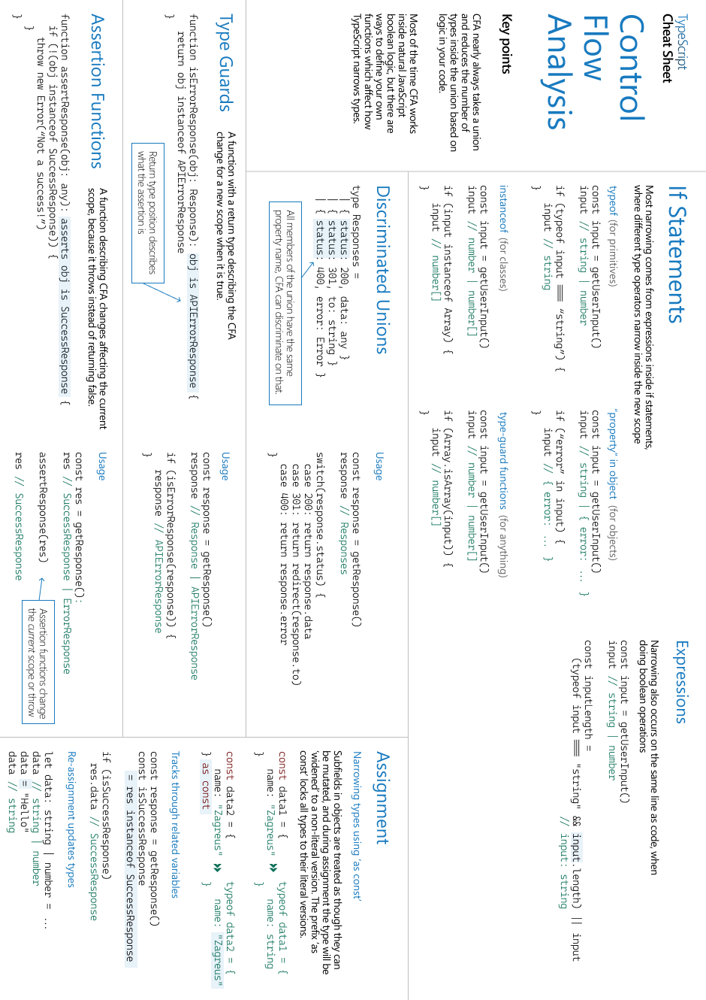
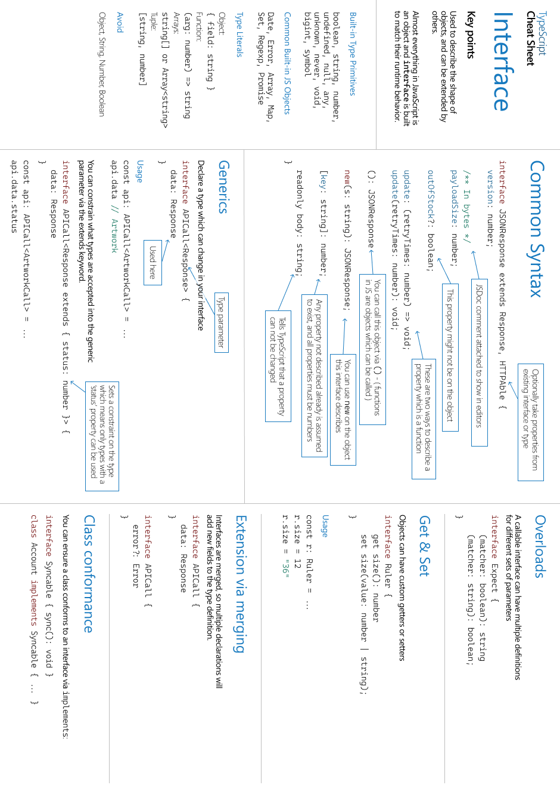
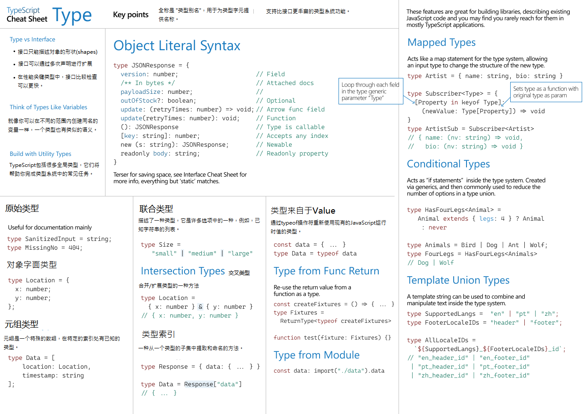
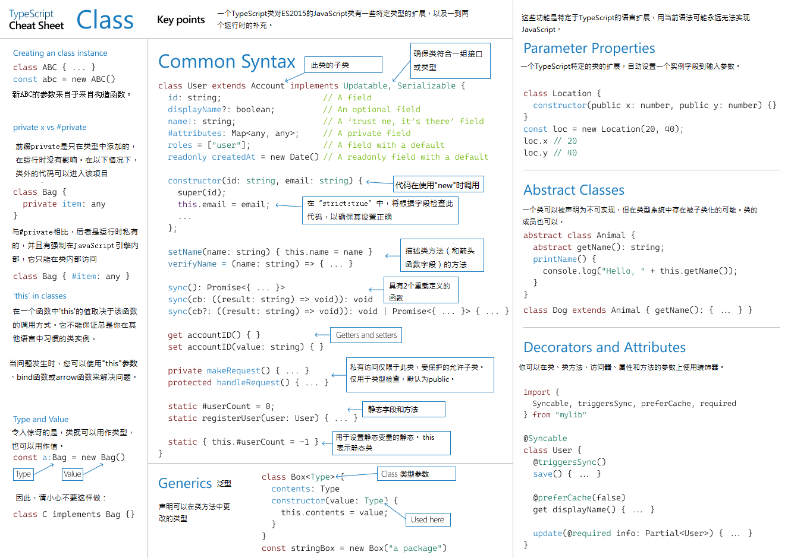

<h1> TypeScript Handbook 概述 </h1>

2022-07-01，时`4.7.4` 版本。

官方文档其实也比较好懂，高级单词不多：

- [The TypeScript Handbook](https://www.typescriptlang.org/docs/handbook/intro.html)

只是记录个人学习时觉得重点的部分，**具体文档中文翻译部分**，可参考以下 github 项目：

- [TypeScript-Doc-Zh](https://github.com/Chorer/TypeScript-Doc-Zh)
- [learn-typescript](https://github.com/mqyqingfeng/learn-typescript)

---

<h2>目录：</h2>

<!-- START doctoc generated TOC please keep comment here to allow auto update -->
<!-- DON'T EDIT THIS SECTION, INSTEAD RE-RUN doctoc TO UPDATE -->
<!-- **Table of Contents**  *generated with [DocToc](https://github.com/thlorenz/doctoc)* -->

- [基础知识(The basics)](#%E5%9F%BA%E7%A1%80%E7%9F%A5%E8%AF%86the-basics)
  - [严格的类型检查 (Static type-checking)](#%E4%B8%A5%E6%A0%BC%E7%9A%84%E7%B1%BB%E5%9E%8B%E6%A3%80%E6%9F%A5-static-type-checking)
  - [类型工具 (Types for Tooling)](#%E7%B1%BB%E5%9E%8B%E5%B7%A5%E5%85%B7-types-for-tooling)
  - [tsc typescript 编译器 (tsc, the TypeScript compiler)](#tsc-typescript-%E7%BC%96%E8%AF%91%E5%99%A8-tsc-the-typescript-compiler)
  - [Emitting with Errors](#emitting-with-errors)
  - [显式类型( Explicit Types)](#%E6%98%BE%E5%BC%8F%E7%B1%BB%E5%9E%8B-explicit-types)
  - [可擦除类型 (Erased Types)](#%E5%8F%AF%E6%93%A6%E9%99%A4%E7%B1%BB%E5%9E%8B-erased-types)
  - [降级 (Downleveling)](#%E9%99%8D%E7%BA%A7-downleveling)
  - [严格性 (Strictness)](#%E4%B8%A5%E6%A0%BC%E6%80%A7-strictness)
- [TS 常见类型(Everyday Types)](#ts-%E5%B8%B8%E8%A7%81%E7%B1%BB%E5%9E%8Beveryday-types)
  - [原始数据类型 (The primitives)](#%E5%8E%9F%E5%A7%8B%E6%95%B0%E6%8D%AE%E7%B1%BB%E5%9E%8B-the-primitives)
  - [数组 (Arrays)](#%E6%95%B0%E7%BB%84-arrays)
  - [any](#any)
  - [变量的类型注解 (Type Annotations on Variables)](#%E5%8F%98%E9%87%8F%E7%9A%84%E7%B1%BB%E5%9E%8B%E6%B3%A8%E8%A7%A3-type-annotations-on-variables)
  - [函数 (Functions)](#%E5%87%BD%E6%95%B0-functions)
  - [匿名函数 (Anonymous Functions)](#%E5%8C%BF%E5%90%8D%E5%87%BD%E6%95%B0-anonymous-functions)
  - [对象类型 (Object Types)](#%E5%AF%B9%E8%B1%A1%E7%B1%BB%E5%9E%8B-object-types)
  - [联合类型 (Union Types)](#%E8%81%94%E5%90%88%E7%B1%BB%E5%9E%8B-union-types)
  - [类型别名 (Type Aliases)](#%E7%B1%BB%E5%9E%8B%E5%88%AB%E5%90%8D-type-aliases)
  - [接口 (Interfaces)](#%E6%8E%A5%E5%8F%A3-interfaces)
    - [类型别名和接口之间的区别 (Differences Between Type Aliases and Interfaces)](#%E7%B1%BB%E5%9E%8B%E5%88%AB%E5%90%8D%E5%92%8C%E6%8E%A5%E5%8F%A3%E4%B9%8B%E9%97%B4%E7%9A%84%E5%8C%BA%E5%88%AB-differences-between-type-aliases-and-interfaces)
  - [类型断言 Type Assertions](#%E7%B1%BB%E5%9E%8B%E6%96%AD%E8%A8%80-type-assertions)
  - [字面类型 (Literal Types)](#%E5%AD%97%E9%9D%A2%E7%B1%BB%E5%9E%8B-literal-types)
    - [字面推断 (Literal Inference)](#%E5%AD%97%E9%9D%A2%E6%8E%A8%E6%96%AD-literal-inference)
  - [null and undefined](#null-and-undefined)
  - [枚举 (Enums)](#%E6%9E%9A%E4%B8%BE-enums)
  - [不太常见的基本数据类型 (Less Common Primitives)](#%E4%B8%8D%E5%A4%AA%E5%B8%B8%E8%A7%81%E7%9A%84%E5%9F%BA%E6%9C%AC%E6%95%B0%E6%8D%AE%E7%B1%BB%E5%9E%8B-less-common-primitives)
- [类型收缩 (Narrowing)](#%E7%B1%BB%E5%9E%8B%E6%94%B6%E7%BC%A9-narrowing)
  - [说明](#%E8%AF%B4%E6%98%8E)
  - [`typeof` 类型守护 (`typeof` type guards)](#typeof-%E7%B1%BB%E5%9E%8B%E5%AE%88%E6%8A%A4-typeof-type-guards)
  - [Truthiness narrowing](#truthiness-narrowing)
  - [Equality narrowing](#equality-narrowing)
  - [`in`操作符收缩 (The in operator narrowing)](#in%E6%93%8D%E4%BD%9C%E7%AC%A6%E6%94%B6%E7%BC%A9-the-in-operator-narrowing)
  - [`instanceof` narrowing](#instanceof-narrowing)
  - [分配 (Assignments)](#%E5%88%86%E9%85%8D-assignments)
  - [控制流分析 (Control flow analysis)](#%E6%8E%A7%E5%88%B6%E6%B5%81%E5%88%86%E6%9E%90-control-flow-analysis)
  - [使用类型谓词 (Using type predicates)](#%E4%BD%BF%E7%94%A8%E7%B1%BB%E5%9E%8B%E8%B0%93%E8%AF%8D-using-type-predicates)
  - [可辨识联合 (Discriminated unions)](#%E5%8F%AF%E8%BE%A8%E8%AF%86%E8%81%94%E5%90%88-discriminated-unions)
  - [The never type](#the-never-type)
  - [Exhaustiveness checking](#exhaustiveness-checking)
- [函数 (More on Functions)](#%E5%87%BD%E6%95%B0-more-on-functions)
  - [函数类型表达式 (Function Type Expressions)](#%E5%87%BD%E6%95%B0%E7%B1%BB%E5%9E%8B%E8%A1%A8%E8%BE%BE%E5%BC%8F-function-type-expressions)
  - [调用签名 (Call Signatures)](#%E8%B0%83%E7%94%A8%E7%AD%BE%E5%90%8D-call-signatures)
  - [构造签名 (Construct Signatures)](#%E6%9E%84%E9%80%A0%E7%AD%BE%E5%90%8D-construct-signatures)
  - [泛型函数 (Generic Functions)](#%E6%B3%9B%E5%9E%8B%E5%87%BD%E6%95%B0-generic-functions)
    - [推断 (Inference)](#%E6%8E%A8%E6%96%AD-inference)
    - [限制条件 (Constraints)](#%E9%99%90%E5%88%B6%E6%9D%A1%E4%BB%B6-constraints)
    - [处理约束的值 (Working with Constrained Values)](#%E5%A4%84%E7%90%86%E7%BA%A6%E6%9D%9F%E7%9A%84%E5%80%BC-working-with-constrained-values)
    - [指定类型参数 (Specifying Type Arguments)](#%E6%8C%87%E5%AE%9A%E7%B1%BB%E5%9E%8B%E5%8F%82%E6%95%B0-specifying-type-arguments)
    - [编写优秀泛型函数的准则 (Guidelines for Writing Good Generic Functions)](#%E7%BC%96%E5%86%99%E4%BC%98%E7%A7%80%E6%B3%9B%E5%9E%8B%E5%87%BD%E6%95%B0%E7%9A%84%E5%87%86%E5%88%99-guidelines-for-writing-good-generic-functions)
  - [可选参数 (Optional Parameters)](#%E5%8F%AF%E9%80%89%E5%8F%82%E6%95%B0-optional-parameters)
    - [回调函数中的可选参数 (Optional Parameters in Callbacks)](#%E5%9B%9E%E8%B0%83%E5%87%BD%E6%95%B0%E4%B8%AD%E7%9A%84%E5%8F%AF%E9%80%89%E5%8F%82%E6%95%B0-optional-parameters-in-callbacks)
  - [函数重载 (Function Overloads)](#%E5%87%BD%E6%95%B0%E9%87%8D%E8%BD%BD-function-overloads)
    - [说明](#%E8%AF%B4%E6%98%8E-1)
    - [重载签名和实现签名 (Overload Signatures and the Implementation Signature)](#%E9%87%8D%E8%BD%BD%E7%AD%BE%E5%90%8D%E5%92%8C%E5%AE%9E%E7%8E%B0%E7%AD%BE%E5%90%8D-overload-signatures-and-the-implementation-signature)
    - [编写好的重载 (Writing Good Overloads)](#%E7%BC%96%E5%86%99%E5%A5%BD%E7%9A%84%E9%87%8D%E8%BD%BD-writing-good-overloads)
    - [在一个函数中声明 `this` (Declaring this in a Function)](#%E5%9C%A8%E4%B8%80%E4%B8%AA%E5%87%BD%E6%95%B0%E4%B8%AD%E5%A3%B0%E6%98%8E-this-declaring-this-in-a-function)
  - [需要了解的其他类型 (Other Types to Know About)](#%E9%9C%80%E8%A6%81%E4%BA%86%E8%A7%A3%E7%9A%84%E5%85%B6%E4%BB%96%E7%B1%BB%E5%9E%8B-other-types-to-know-about)
    - [void](#void)
    - [object](#object)
    - [unknown](#unknown)
    - [never](#never)
    - [Function](#function)
  - [Rest Parameters and Arguments](#rest-parameters-and-arguments)
    - [Rest Parameters](#rest-parameters)
    - [Rest Arguments](#rest-arguments)
  - [参数解构 (Parameter Destructuring)](#%E5%8F%82%E6%95%B0%E8%A7%A3%E6%9E%84-parameter-destructuring)
  - [函数的可分配性 (Assignability of Functions)](#%E5%87%BD%E6%95%B0%E7%9A%84%E5%8F%AF%E5%88%86%E9%85%8D%E6%80%A7-assignability-of-functions)
    - [返回`void`类型 (Return type void)](#%E8%BF%94%E5%9B%9Evoid%E7%B1%BB%E5%9E%8B-return-type-void)
- [对象类型 (Object Types)](#%E5%AF%B9%E8%B1%A1%E7%B1%BB%E5%9E%8B-object-types-1)
  - [属性修改器 (Property Modifiers)](#%E5%B1%9E%E6%80%A7%E4%BF%AE%E6%94%B9%E5%99%A8-property-modifiers)
    - [可选属性 (Optional Properties)](#%E5%8F%AF%E9%80%89%E5%B1%9E%E6%80%A7-optional-properties)
    - [只读属性 (`readonly` Properties)](#%E5%8F%AA%E8%AF%BB%E5%B1%9E%E6%80%A7-readonly-properties)
    - [索引签名 (Index Signatures)](#%E7%B4%A2%E5%BC%95%E7%AD%BE%E5%90%8D-index-signatures)
  - [扩展/继承类型 (Extending Types)](#%E6%89%A9%E5%B1%95%E7%BB%A7%E6%89%BF%E7%B1%BB%E5%9E%8B-extending-types)
  - [交叉类型 (Intersection Types)](#%E4%BA%A4%E5%8F%89%E7%B1%BB%E5%9E%8B-intersection-types)
  - [接口 vs 交叉类型 (Interfaces vs. Intersections)](#%E6%8E%A5%E5%8F%A3-vs-%E4%BA%A4%E5%8F%89%E7%B1%BB%E5%9E%8B-interfaces-vs-intersections)
  - [泛型对象类型 (Generic Object Types)](#%E6%B3%9B%E5%9E%8B%E5%AF%B9%E8%B1%A1%E7%B1%BB%E5%9E%8B-generic-object-types)
    - [数组类型 (The Array Type)](#%E6%95%B0%E7%BB%84%E7%B1%BB%E5%9E%8B-the-array-type)
    - [只读数组类型 (The ReadonlyArray Type)](#%E5%8F%AA%E8%AF%BB%E6%95%B0%E7%BB%84%E7%B1%BB%E5%9E%8B-the-readonlyarray-type)
    - [元组类型 (Tuple Types)](#%E5%85%83%E7%BB%84%E7%B1%BB%E5%9E%8B-tuple-types)
    - [只读元组类型 (readonly Tuple Types)](#%E5%8F%AA%E8%AF%BB%E5%85%83%E7%BB%84%E7%B1%BB%E5%9E%8B-readonly-tuple-types)
- [类型操作 (Type Manipulation)](#%E7%B1%BB%E5%9E%8B%E6%93%8D%E4%BD%9C-type-manipulation)
  - [泛型 Generics](#%E6%B3%9B%E5%9E%8B-generics)
    - [使用泛型变量 (Working with Generic Type Variables)](#%E4%BD%BF%E7%94%A8%E6%B3%9B%E5%9E%8B%E5%8F%98%E9%87%8F-working-with-generic-type-variables)
    - [泛型类型 (Generic Types)](#%E6%B3%9B%E5%9E%8B%E7%B1%BB%E5%9E%8B-generic-types)
    - [泛型类 (Generic Classes)](#%E6%B3%9B%E5%9E%8B%E7%B1%BB-generic-classes)
    - [泛型约束 (Generic Constraints)](#%E6%B3%9B%E5%9E%8B%E7%BA%A6%E6%9D%9F-generic-constraints)
    - [在泛型约束中使用类型参数 (Using Type Parameters in Generic Constraints)](#%E5%9C%A8%E6%B3%9B%E5%9E%8B%E7%BA%A6%E6%9D%9F%E4%B8%AD%E4%BD%BF%E7%94%A8%E7%B1%BB%E5%9E%8B%E5%8F%82%E6%95%B0-using-type-parameters-in-generic-constraints)
    - [在泛型里使用类类型 (Using Class Types in Generics)](#%E5%9C%A8%E6%B3%9B%E5%9E%8B%E9%87%8C%E4%BD%BF%E7%94%A8%E7%B1%BB%E7%B1%BB%E5%9E%8B-using-class-types-in-generics)
  - [`keyof` 操作符](#keyof-%E6%93%8D%E4%BD%9C%E7%AC%A6)
  - [`typeof` 操作符](#typeof-%E6%93%8D%E4%BD%9C%E7%AC%A6)
    - [限制条件 (Limitations)](#%E9%99%90%E5%88%B6%E6%9D%A1%E4%BB%B6-limitations)
  - [索引访问类型 (Indexed Access Types)](#%E7%B4%A2%E5%BC%95%E8%AE%BF%E9%97%AE%E7%B1%BB%E5%9E%8B-indexed-access-types)
  - [条件类型 (Conditional Types)](#%E6%9D%A1%E4%BB%B6%E7%B1%BB%E5%9E%8B-conditional-types)
    - [条件类型约束 (Conditional Type Constraints)](#%E6%9D%A1%E4%BB%B6%E7%B1%BB%E5%9E%8B%E7%BA%A6%E6%9D%9F-conditional-type-constraints)
    - [在条件类型里推断 (Inferring Within Conditional Types)](#%E5%9C%A8%E6%9D%A1%E4%BB%B6%E7%B1%BB%E5%9E%8B%E9%87%8C%E6%8E%A8%E6%96%AD-inferring-within-conditional-types)
    - [分发条件类型 (Distributive Conditional Types)](#%E5%88%86%E5%8F%91%E6%9D%A1%E4%BB%B6%E7%B1%BB%E5%9E%8B-distributive-conditional-types)
  - [映射类型 (Mapped Types)](#%E6%98%A0%E5%B0%84%E7%B1%BB%E5%9E%8B-mapped-types)
    - [映射修饰符 (Mapping Modifiers)](#%E6%98%A0%E5%B0%84%E4%BF%AE%E9%A5%B0%E7%AC%A6-mapping-modifiers)
    - [通过 as 实现键名重新映射 (Key Remapping via `as`)](#%E9%80%9A%E8%BF%87-as-%E5%AE%9E%E7%8E%B0%E9%94%AE%E5%90%8D%E9%87%8D%E6%96%B0%E6%98%A0%E5%B0%84-key-remapping-via-as)
    - [深入探索 (Further Exploration)](#%E6%B7%B1%E5%85%A5%E6%8E%A2%E7%B4%A2-further-exploration)
  - [模板字面量类型 (Template Literal Types)](#%E6%A8%A1%E6%9D%BF%E5%AD%97%E9%9D%A2%E9%87%8F%E7%B1%BB%E5%9E%8B-template-literal-types)
    - [类型中的字符串联合类型 (String Unions in Types)](#%E7%B1%BB%E5%9E%8B%E4%B8%AD%E7%9A%84%E5%AD%97%E7%AC%A6%E4%B8%B2%E8%81%94%E5%90%88%E7%B1%BB%E5%9E%8B-string-unions-in-types)
    - [模板字面量的推断 (Inference with Template Literals)](#%E6%A8%A1%E6%9D%BF%E5%AD%97%E9%9D%A2%E9%87%8F%E7%9A%84%E6%8E%A8%E6%96%AD-inference-with-template-literals)
    - [内置字符操作类型 (Intrinsic String Manipulation Types)](#%E5%86%85%E7%BD%AE%E5%AD%97%E7%AC%A6%E6%93%8D%E4%BD%9C%E7%B1%BB%E5%9E%8B-intrinsic-string-manipulation-types)
      - [`Uppercase<StringType>`](#uppercasestringtype)
      - [`Lowercase<StringType>`](#lowercasestringtype)
      - [`Capitalize<StringType>`](#capitalizestringtype)
      - [`Uncapitalize<StringType>`](#uncapitalizestringtype)
- [类 (Classes)](#%E7%B1%BB-classes)
  - [类成员 (Class Members)](#%E7%B1%BB%E6%88%90%E5%91%98-class-members)
    - [字段 (Fields)](#%E5%AD%97%E6%AE%B5-fields)
    - [`readonly`](#readonly)
    - [构造器 (Constructors)](#%E6%9E%84%E9%80%A0%E5%99%A8-constructors)
    - [super 调用 (Super Calls)](#super-%E8%B0%83%E7%94%A8-super-calls)
    - [方法 (Methods)](#%E6%96%B9%E6%B3%95-methods)
    - [Getters / Setters](#getters--setters)
    - [索引签名 (Index Signatures)](#%E7%B4%A2%E5%BC%95%E7%AD%BE%E5%90%8D-index-signatures-1)
  - [类继承 (Class Heritage)](#%E7%B1%BB%E7%BB%A7%E6%89%BF-class-heritage)
    - [`implements` 子句 (implements Clauses)](#implements-%E5%AD%90%E5%8F%A5-implements-clauses)
    - [`extends` 子句 (extends Clauses)](#extends-%E5%AD%90%E5%8F%A5-extends-clauses)
      - [重写方法 (Overriding Methods)](#%E9%87%8D%E5%86%99%E6%96%B9%E6%B3%95-overriding-methods)
      - [只有类型的字段声明 (Type-only Field Declarations)](#%E5%8F%AA%E6%9C%89%E7%B1%BB%E5%9E%8B%E7%9A%84%E5%AD%97%E6%AE%B5%E5%A3%B0%E6%98%8E-type-only-field-declarations)
      - [初始化顺序 (Initialization Order)](#%E5%88%9D%E5%A7%8B%E5%8C%96%E9%A1%BA%E5%BA%8F-initialization-order)
      - [继承内置类型 (Inheriting Built-in Types)](#%E7%BB%A7%E6%89%BF%E5%86%85%E7%BD%AE%E7%B1%BB%E5%9E%8B-inheriting-built-in-types)
  - [成员可见性 (Member Visibility)](#%E6%88%90%E5%91%98%E5%8F%AF%E8%A7%81%E6%80%A7-member-visibility)
    - [public](#public)
    - [protected](#protected)
      - [公开受保护成员 (Exposure of protected members)](#%E5%85%AC%E5%BC%80%E5%8F%97%E4%BF%9D%E6%8A%A4%E6%88%90%E5%91%98-exposure-of-protected-members)
      - [跨层级访问受保护成员 (Cross-hierarchy protected access)](#%E8%B7%A8%E5%B1%82%E7%BA%A7%E8%AE%BF%E9%97%AE%E5%8F%97%E4%BF%9D%E6%8A%A4%E6%88%90%E5%91%98-cross-hierarchy-protected-access)
    - [private](#private)
  - [静态成员 (Static Members)](#%E9%9D%99%E6%80%81%E6%88%90%E5%91%98-static-members)
    - [特殊的静态成员名字 (Special Static Names)](#%E7%89%B9%E6%AE%8A%E7%9A%84%E9%9D%99%E6%80%81%E6%88%90%E5%91%98%E5%90%8D%E5%AD%97-special-static-names)
    - [为什么没有静态类 (Why No Static Classes?)](#%E4%B8%BA%E4%BB%80%E4%B9%88%E6%B2%A1%E6%9C%89%E9%9D%99%E6%80%81%E7%B1%BB-why-no-static-classes)
  - [类中的静态块 (static Blocks in Classes)](#%E7%B1%BB%E4%B8%AD%E7%9A%84%E9%9D%99%E6%80%81%E5%9D%97-static-blocks-in-classes)
  - [泛型类 (Generic Classes)](#%E6%B3%9B%E5%9E%8B%E7%B1%BB-generic-classes-1)
    - [静态成员中的类型参数 (Type Parameters in Static Members)](#%E9%9D%99%E6%80%81%E6%88%90%E5%91%98%E4%B8%AD%E7%9A%84%E7%B1%BB%E5%9E%8B%E5%8F%82%E6%95%B0-type-parameters-in-static-members)
  - [类的运行时 `this` (`this` at Runtime in Classes)](#%E7%B1%BB%E7%9A%84%E8%BF%90%E8%A1%8C%E6%97%B6-this-this-at-runtime-in-classes)
    - [箭头函数 (Arrow Functions)](#%E7%AE%AD%E5%A4%B4%E5%87%BD%E6%95%B0-arrow-functions)
    - [this 参数 (this parameters)](#this-%E5%8F%82%E6%95%B0-this-parameters)
  - [this 类型 (this Types)](#this-%E7%B1%BB%E5%9E%8B-this-types)
    - [基于 this 的类型保护 (this-based type guards)](#%E5%9F%BA%E4%BA%8E-this-%E7%9A%84%E7%B1%BB%E5%9E%8B%E4%BF%9D%E6%8A%A4-this-based-type-guards)
  - [参数属性 (Parameter Properties)](#%E5%8F%82%E6%95%B0%E5%B1%9E%E6%80%A7-parameter-properties)
  - [类表达式 (Class Expressions)](#%E7%B1%BB%E8%A1%A8%E8%BE%BE%E5%BC%8F-class-expressions)
  - [抽象类和成员 (`abstract` Classes and Members)](#%E6%8A%BD%E8%B1%A1%E7%B1%BB%E5%92%8C%E6%88%90%E5%91%98-abstract-classes-and-members)
    - [抽象构造签名 (Abstract Construct Signatures)](#%E6%8A%BD%E8%B1%A1%E6%9E%84%E9%80%A0%E7%AD%BE%E5%90%8D-abstract-construct-signatures)
  - [类之间的联系 (Relationships Between Classes)](#%E7%B1%BB%E4%B9%8B%E9%97%B4%E7%9A%84%E8%81%94%E7%B3%BB-relationships-between-classes)
- [模块 (Modules)](#%E6%A8%A1%E5%9D%97-modules)
  - [JavaScript 的模块是如何定义的 (How JavaScript Modules are Defined)](#javascript-%E7%9A%84%E6%A8%A1%E5%9D%97%E6%98%AF%E5%A6%82%E4%BD%95%E5%AE%9A%E4%B9%89%E7%9A%84-how-javascript-modules-are-defined)
  - [非模块 (Non-modules)](#%E9%9D%9E%E6%A8%A1%E5%9D%97-non-modules)
  - [TypeScript 中的模块 (Modules in TypeScript)](#typescript-%E4%B8%AD%E7%9A%84%E6%A8%A1%E5%9D%97-modules-in-typescript)
    - [ES 模块语法 (ES Module Syntax)](#es-%E6%A8%A1%E5%9D%97%E8%AF%AD%E6%B3%95-es-module-syntax)
    - [其它导入语法 (Additional Import Syntax)](#%E5%85%B6%E5%AE%83%E5%AF%BC%E5%85%A5%E8%AF%AD%E6%B3%95-additional-import-syntax)
      - [TypeScript 专属的 ES 模块语法 (TypeScript Specific ES Module Syntax)](#typescript-%E4%B8%93%E5%B1%9E%E7%9A%84-es-%E6%A8%A1%E5%9D%97%E8%AF%AD%E6%B3%95-typescript-specific-es-module-syntax)
      - [具备 CommonJS 行为的 ES 模块语法 (ES Module Syntax with CommonJS Behavior)](#%E5%85%B7%E5%A4%87-commonjs-%E8%A1%8C%E4%B8%BA%E7%9A%84-es-%E6%A8%A1%E5%9D%97%E8%AF%AD%E6%B3%95-es-module-syntax-with-commonjs-behavior)
  - [CommonJS 语法 (CommonJS Syntax)](#commonjs-%E8%AF%AD%E6%B3%95-commonjs-syntax)
    - [导出导入](#%E5%AF%BC%E5%87%BA%E5%AF%BC%E5%85%A5)
    - [CommonJS 和 ES 模块的互操作 (CommonJS and ES Modules interop)](#commonjs-%E5%92%8C-es-%E6%A8%A1%E5%9D%97%E7%9A%84%E4%BA%92%E6%93%8D%E4%BD%9C-commonjs-and-es-modules-interop)
  - [TypeScript 的模块解析选项 (TypeScript’s Module Resolution Options)](#typescript-%E7%9A%84%E6%A8%A1%E5%9D%97%E8%A7%A3%E6%9E%90%E9%80%89%E9%A1%B9-typescripts-module-resolution-options)
  - [TypeScript 的模块输出选项 (TypeScript’s Module Output Options)](#typescript-%E7%9A%84%E6%A8%A1%E5%9D%97%E8%BE%93%E5%87%BA%E9%80%89%E9%A1%B9-typescripts-module-output-options)
  - [TypeScript 命名空间 (TypeScript namespaces)](#typescript-%E5%91%BD%E5%90%8D%E7%A9%BA%E9%97%B4-typescript-namespaces)

<!-- END doctoc generated TOC please keep comment here to allow auto update -->

---

# 基础知识(The basics)

## 严格的类型检查 (Static type-checking)

- 非异常的错误 (Non-exception Failures)
  - 未定义属性、拼写错误、uncalled functions、基础的逻辑错误等

## 类型工具 (Types for Tooling)

- 例如自动显示类的属性方法等

## tsc typescript 编译器 (tsc, the TypeScript compiler)

- 先编译为.js 文件，再执行(例如使用 nodejs、浏览器的 console 环境等)js 文件。

## Emitting with Errors

- 在使用 tsc 命令编译 ts 文件时，加入`--noEmitOnError`属性，可以在检查到有错误时，不更新编译生成的 js 文件。

## 显式类型( Explicit Types)

- 并不总是要写明确的类型注释。在许多情况下，TypeScript 甚至可以推断（或 "弄清"）类型，即使省略它们。
- 当类型系统最终会推断出相同的类型时，最好不要添加注解。

## 可擦除类型 (Erased Types)

- 类型擦除:当 TypeScript 代码在转译为 JavaScript 时，所有类型都被删除时。
- 在执行 JavaScript 时，无法在运行时检查您在 TypeScript 中使用的类型。这些类型只能在编译/转译步骤中访问。

## 降级 (Downleveling)

- 这种从较新或 "较高 "的 ECMAScript 版本向较旧或 "较低 "的版本转移的过程，有时被称为降级。
- TypeScript 默认降级到 ES3，但可在编辑命名时指定，例如：`tsc --target es2015 hello.ts`

## 严格性 (Strictness)

- 是否全局开启严格类型检查，例如在`tsconfig.json`中设置`"strict": true`或者 CLI 中的 strict flag
- 或者两类独立的标志:
  - noImplicitAny
    - 在某些地方，TypeScript 并没有尝试推断类型，而是回到了最宽松的类型：any。
    - 打开`noImplicitAny`标志将对任何类型被隐含推断为 any 的变量发出错误。
  - strictNullChecks
    - 默认情况下，像 null 和 undefined 这样的值是可以赋值给任何其他类型的。
    - `strictNullChecks` 标志使处理 null 和 undefined 更加明确，使我们不必担心是否忘记处理 null 和 undefined。

# TS 常见类型(Everyday Types)

## 原始数据类型 (The primitives)

- string, number, and boolean
- 在 JavaScript 中，共有 7 种基本类型：string，number，bigint，boolean，null，undefined，symbol

## 数组 (Arrays)

## any

## 变量的类型注解 (Type Annotations on Variables)

- const, var, let

## 函数 (Functions)

- 函数是 JavaScript 中传递数据的主要手段。TypeScript 允许你指定函数的输入和输出值的类型。
- 参数类型注解 Parameter Type Annotations
- 返回值类型注解 Return Type Annotations
  - 大多数情况不用显示声明返回类型，因为 ts 会自动推断

## 匿名函数 (Anonymous Functions)

- 当一个函数出现在 TypeScript 可以确定它如何被调用的地方时，该函数的参数会自动被赋予类型。
  - (例如数组 forEach 的回调函数的参数，不用指定类型，可以自动推断)。
  - 这个过程被称为 contextual typing。

## 对象类型 (Object Types)

- 这指的是任何带有属性的 JavaScript 值
- 可选属性 Optional Properties
  - 使用?修饰。
  - 使用前先检查该属性是否存在。

## 联合类型 (Union Types)

- Defining a Union Type
  - 由两个或者多个类型组合。例如：
  ```ts
  function printId(id: number | string) {
    console.log("Your ID is: " + id);
  }
  ```
- Working with Union Types
  - TypeScript 只允许对联合类型的每个成员有效的操作。例如:
  ```ts
  function printId(id: number | string) {
    console.log(id.toUpperCase());
    // 报错：
    // Property 'toUpperCase' does not exist on type 'string | number'.
    // Property 'toUpperCase' does not exist on type 'number'.
  }
  // 解决方法:
  function printId(id: number | string) {
    if (typeof id === "string") {
      // In this branch, id is of type 'string'
      console.log(id.toUpperCase());
    } else {
      // Here, id is of type 'number'
      console.log(id);
    }
  }
  ```

## 类型别名 (Type Aliases)

- 语法示例：

```ts
type Point = {
  x: number;
  y: number;
};
type ID = number | string;
```

## 接口 (Interfaces)

- 接口声明是命名一个对象类型的另一种方式。

```ts
interface Point {
  x: number;
  y: number;
}
```

- 只关心类型的结构和功能，这就是为什么称 TypeScript 为结构类型的类型系统(structurally typed type system)。

### 类型别名和接口之间的区别 (Differences Between Type Aliases and Interfaces)

- 多数情况下可以通用；
- 主要不同：
  - Type 不能被重新添加新的属性，而 Interface 则总是可以扩展的。
- 其他不同：

  - 在 TypeScript 4.2 版本之前，类型别名可能会出现在错误信息中，有时会代替相应的匿名类型（这可能是也可能不是可取的）。接口将总是在错误信息中被命名。
  - 类型别名不能参与声明合并，但接口可以。
  - 接口只能用于声明对象的形状，而不是重命名基元。
  - 接口名称将总是以其原始形式出现在错误信息中，但只有当它们被命名使用时。

## 类型断言 Type Assertions

- 语法： `as` 或者 `<>`

```ts
let someValue: any = "this is a string";
let strLength: number = (<string>someValue).length;
let strLength2: number = (someValue as string).length;
```

## 字面类型 (Literal Types)

- 通过将字面量组合成联合类型，可以表达一个更有用的概念--例如，只接受某一组已知值的函数。

```ts
function printText(s: string, alignment: "left" | "right" | "center") {
  // todo
}

// 联合非字面量类型：
interface Options {
  width: number;
}
function configure(x: Options | "auto") {
  // ...
}
```

### 字面推断 (Literal Inference)

- 当用一个对象初始化一个变量时，TypeScript 假设该对象的属性以后可能会改变值。
- `as const`后缀的作用类似于 const，但对类型系统而言，确保所有属性都被分配到字面类型。

```ts
const req = { url: "https://example.com", method: "GET" } as const;
// 报错：无法分配到 "method" ，因为它是只读属性。
req.method = "123";

const req2 = { url: "https://example.com", method: "GET" };
req2.method = "123";
console.log(req2);
// 输出: { url: 'https://example.com', method: '123' }
```

## null and undefined

- ts 对于这两个值的处理，取决于`strictNullChecks`配置。
  - `strictNullChecks:off` 的情况下，可能是 null 或 undefined 的值仍然可以被正常访问，并且 null 和 undefined 的值可以被分配给任何类型的属性。
  - `strictNullChecks:on` 时，当一个值为空或未定义时，你需要在对该值使用方法或属性前测试这些值。
- 非空的断言操作符(前置!)
  ```ts
  function liveDangerously(x?: number | null) {
    // No error
    console.log(x!.toFixed());
  }
  ```

## 枚举 (Enums)

## 不太常见的基本数据类型 (Less Common Primitives)

- bigint
- symbol

# 类型收缩 (Narrowing)

## 说明

- 了解 TypeScript 如何使用 JavaScript 知识来减少项目中的类型语法数量。
- 在我们的 if 检查中，TypeScript 看到`typeof padding ==="number"`，并将其理解为一种特殊形式的代码，称为类型保护(type guards)。
- **将类型细化到比声明的更具体的类型的过程被称为收缩(Narrowing)**。
  - 例如 `function logValue(x: Date | string) {//...}` 将参数缩小为 Date 或者 string 类型。
- TypeScript 对缩小范围的理解有几个不同的结构：
  - `typeof` 类型守护
  - Truthiness 收缩
  - Equality 收缩
  - `in` 操作符收缩
  - `instanceof`收缩
  - 分配
  - 控制流程分析
  - 使用类型谓词
  - 可辨识联合
  - `never`类型
  - 穷举检查

## `typeof` 类型守护 (`typeof` type guards)

- `typeof` 返回的类型字串：
  - "string"、"number"、"bigint"、"boolean"、"symbol"、"undefined"、"object"、"function"
- 注意，js 中`typeof null`返回的是`"object"`，所以上面也是没有此返回字符串。

## Truthiness narrowing

- 个人理解类似 js 中的隐式转型的使用，
- 利用类似`if(str)`去消除 str 为 null 或者 undefined 或者空字串等清空，避免在 ts 类型检查时出现错误。
  ```ts
  function printAll(strs: string | string[] | null) {
    if (strs && typeof strs === "object") {
      for (const s of strs) {
        console.log(s);
      }
    } else if (typeof strs === "string") {
      console.log(strs);
    }
  }
  ```

## Equality narrowing

- 个人理解大概是在判等的时候，并不一定是与给定值想匹配，还有宽松的扩展。
- javaScript 比较宽松的平等检查==和!=也被正确地缩小了。
- 例如`if (value != null) `它还会检查潜在的 `undefined`,类似`console.log(null == undefined)`结果为 true

```ts
function demo1(val) {
  if (val != null) {
    console.log(val);
  } else {
    console.log("val = null");
  }
}
demo1(null); // val = null
demo1(undefined); // val = null
demo1(""); // ""
demo1("done"); // done
```

## `in`操作符收缩 (The in operator narrowing)

```ts
// 示例，在使用 in 操作符过滤时，前者符合的类型的 animal 为 Fish、Human，后者为 Bird、Human
type Fish = { swim: () => void };
type Bird = { fly: () => void };
type Human = { swim?: () => void; fly?: () => void };

function move(animal: Fish | Bird | Human) {
  if ("swim" in animal) {
    animal;
  } else {
    animal;
  }
}
```

## `instanceof` narrowing

- 在 JavaScript 中`x instanceof Foo`检查 x 的原型链是否包含`Foo.prototype`。
  ```ts
  function logValue(x: Date | string) {
    if (x instanceof Date) {
      console.log(x.toUTCString());
    } else {
      console.log(x.toUpperCase());
    }
  }
  ```

## 分配 (Assignments)

```ts
let x = Math.random() < 0.5 ? 10 : "hello world!";
x = 1;
console.log(x);
// 不能将类型“boolean”分配给类型“string | number”。
x = true;
console.log(x);
```

## 控制流分析 (Control flow analysis)

- 基于可达性的代码分析被称为控制流分析。
  ```ts
  function padLeft(padding: number | string, input: string) {
    if (typeof padding === "number") {
      return " ".repeat(padding) + input;
    }
    return padding + input;
  }
  ```

## 使用类型谓词 (Using type predicates)

```ts
type Fish = { swim: () => void };
type Bird = { fly: () => void };

function isFish(pet: Fish | Bird): pet is Fish {
  return (pet as Fish).swim !== undefined;
}
// pet is Fish 就是类型谓词，即 parameterName is Type，其中 parameterName 必须是当前函数签名中的参数名称。
```

## 可辨识联合 (Discriminated unions)

- 当联合类型中的每个类型都包含一个与字面类型相同的属性时，TypeScript 认为这是一个可辨识联合，并且可以缩小联合的成员。

  ```ts
  interface Circle {
    kind: "circle";
    radius: number;
  }
  interface Square {
    kind: "square";
    sideLength: number;
  }
  type Shape = Circle | Square;

  // 联合类型的narrowing
  function getArea(shape: Shape) {
    switch (shape.kind) {
      case "circle":
        // (parameter) shape: Circle
        return Math.PI * shape.radius ** 2;
      case "square":
        // (parameter) shape: Square
        return shape.sideLength ** 2;
    }
  }

  console.log(getArea({ kind: "circle", radius: 1 })); // 3.141592653589793
  ```

## The never type

- 在缩小范围时，可以将一个联合类型的选项减少到已经删除了所有的可能性并且什么都不剩的程度。
- 在这些情况下，TypeScript 将使用一个 never 类型来代表一个不应该存在的状态。

## Exhaustiveness checking

- never 类型可以分配给每个类型；但是，没有任何类型可以分配给 never（除了 never 本身）。
- 这意味着可以使用缩小并依靠 never 的出现在 switch 语句中做详尽的检查。

```ts
interface Circle {
  kind: "circle";
  radius: number;
}
interface Square {
  kind: "square";
  sideLength: number;
}
interface Triangle {
  kind: "triangle";
  sideLength: number;
}

type Shape = Circle | Square | Triangle;

function getArea(shape: Shape) {
  switch (shape.kind) {
    case "circle":
      return Math.PI * shape.radius ** 2;
    case "square":
      return shape.sideLength ** 2;
    default:
      // 不能将类型“Triangle”分配给类型“never”。
      const _exhaustiveCheck: never = shape;
      return _exhaustiveCheck;
  }
}
```

# 函数 (More on Functions)

了解函数在 TypeScript 中的工作原理。

## 函数类型表达式 (Function Type Expressions)

```ts
function greeter(fn: (a: string) => void) {
  fn("Hello, World");
}
function printToConsole(s: string) {
  console.log(s);
}
greeter(printToConsole);

// 使用类型别名
type GreetFunction = (a: string) => void;
function greeter(fn: GreetFunction) {
  // ...
}
```

## 调用签名 (Call Signatures)

- 函数类型表达式的语法不允许声明属性。
- 如果想用属性来描述可调用的东西，可以在一个对象类型中写一个调用签名。
- 注意，与函数类型表达式相比，语法略有不同：在参数列表和返回类型之间使用:而不是=>。

```ts
type DescribableFunction = {
  description: string; // 额外的字符串属性
  (someArg: number): boolean; // 函数签名
  isEven: (num: number) => boolean; // 额外的函数属性
};

function doSomething(fn: DescribableFunction) {
  console.log(fn.description + " returned " + fn(6));
}

// 这里如果用let或var，也是会报错的: 类型“(num: number) => boolean”缺少类型“DescribableFunction”中的以下属性: description, isEven
const myfun: DescribableFunction = (num: number) => num > 12;
myfun.description = "123";
myfun.isEven = (num: number) => num % 2 == 1;

doSomething(myfun); // 123 returned false
console.log(myfun.isEven(11)); // true
```

## 构造签名 (Construct Signatures)

- 可以通过在一个调用签名前面添加 new 关键字来编写一个构造签名。
  ```ts
  interface CallOrConstruct {
    new (s: string): Date;
    (n?: number): number;
  }
  ```

## 泛型函数 (Generic Functions)

- 在 TypeScript 中，当描述两个值之间的对应关系时，会使用**泛型(generics)**。通过在函数签名中声明一个 **类型参数(type parameter)** 来做到这一点。

```ts
// 通过给这个函数添加一个类型参数Type，并在两个地方使用它，我们已经在函数的输入（数组）和输出（返回值）之间建立了一个联系。
function firstElement<Type>(arr: Type[]): Type | undefined {
  return arr[0];
}

// 现在当我们调用它时，一个更具体的类型就出来了。
// const s: string | undefined
const s = firstElement(["a", "b", "c"]);
// const n: number | undefined
const n = firstElement([1, 2, 3]);
// const u: undefined
const u = firstElement([]);
```

### 推断 (Inference)

```ts
// TypeScript可以推断出输入类型参数的类型（从给定的字符串数组），以及基于函数表达式的返回值（数字）的输出类型参数。
function map<Input, Output>(
  arr: Input[],
  func: (arg: Input) => Output
): Output[] {
  return arr.map(func);
}

// 可以自动推断出参数类型和返回类型：  (parameter) n: string ；const parsed: number[]
const parsed = map(["1", "2", "3"], (n) => parseInt(n));
```

### 限制条件 (Constraints)

- 有时想关联两个值，但只能对某个值的子集进行操作。在这种情况下，我们可以使用约束来限制类型参数可以接受的类型种类。

```ts
// 因为我们将 Type 约束为 { length: number }，所以我们被允许访问 a 和 b 参数的 .length 属性。
// 如果没有类型约束，我们就不能访问这些属性，因为这些值可能是一些没有长度属性的其他类型。
function longest<Type extends { length: number }>(a: Type, b: Type) {
  if (a.length >= b.length) {
    return a;
  } else {
    return b;
  }
}

// longerArray 和 longerString 的类型是根据参数推断出来的。请记住，泛型就是把两个或多个具有相同类型的值联系起来。
// longerArray is of type 'number[]'
const longerArray = longest([1, 2], [1, 2, 3]);
// longerString is of type 'alice' | 'bob'
const longerString = longest("alice", "bob");

// 最后，正如我们所希望的，对longest(10, 100)的调用被拒绝了，因为数字类型没有一个.length属性。
// Error: 类型“number”的参数不能赋给类型“{ length: number; }”的参数。
const notOK = longest(10, 100);
```

### 处理约束的值 (Working with Constrained Values)

```ts
// 看起来这个函数是可以的--Type被约束为{ length: number }，并且这个函数要么返回Type，要么返回与该约束相匹配的值。
// 问题是，该函数承诺返回与传入的对象相同的类型，而不仅仅是某个与约束条件相匹配的对象。
function minimumLength<Type extends { length: number }>(
  obj: Type,
  minimum: number
): Type {
  if (obj.length >= minimum) {
    return obj;
  } else {
    // Error: 不能将类型“{ length: number; }”分配给类型“Type”。
    //   "{ length: number; }" 可赋给 "Type" 类型的约束，但可以使用约束 "{ length: number; }" 的其他子类型实例化 "Type"。
    return { length: minimum };
  }
}
```

### 指定类型参数 (Specifying Type Arguments)

```ts
// TypeScript 通常可以推断出泛型调用中的预期类型参数，但并非总是如此。例如，假设你写了一个函数来合并两个数组。
function combine<Type>(arr1: Type[], arr2: Type[]): Type[] {
  return arr1.concat(arr2);
}

// 通常情况下，用不匹配的数组调用这个函数是一个错误。
// Error: 不能将类型“string”分配给类型“number”。
// const arr = combine([1, 2, 3], ["hello"]);

// 然而，如果你打算这样做，你可以手动指定类型。
const arr2 = combine<string | number>([1, 2, 3], ["hello"]);

console.log(arr2);
```

### 编写优秀泛型函数的准则 (Guidelines for Writing Good Generic Functions)

- Push Type Parameters Down
  - 在可能的情况下，使用类型参数本身，而不是对其进行约束。
- Use Fewer Type Parameters
  - 总是尽可能少地使用类型参数。
- Type Parameters Should Appear Twice
  - 类型参数是用来关联多个值的类型的。如果一个类型参数在函数签名中只使用一次，那么它就没有任何关系。
  - 如果一个类型参数只出现在一个地方，请强烈地重新考虑是否真的需要它。

## 可选参数 (Optional Parameters)

- 使用问号`?`修饰。

  - 例如 `function f(x?: number) { // ...}`
  - 虽然指定类型为 `number`，但实际是`number | undefined`，因为在 JavaScript 中未指定的参数为`undefined`。

### 回调函数中的可选参数 (Optional Parameters in Callbacks)

- **当为回调写一个函数类型时，永远不要写一个可选参数，除非你打算在不传递该参数的情况下调用该函数**。
- 因为不知道回调函数中是否有对可选参数做处理，如果没有处理，但调用时传入了该可选参数，就会报错。

  ```ts
  function myForEach(arr: any[], callback: (arg: any, index?: number) => void) {
    for (let i = 0; i < arr.length; i++) {
      // 可选参数index没有任何处理
      callback(arr[i]);
    }
  }

  myForEach([1, 2, 3], (a, i) => {
    // Error: 对象可能为“未定义”。
    console.log(i.toFixed());
  });
  ```

## 函数重载 (Function Overloads)

### 说明

- 允许创建多个具有不同实现的同名函数。
- 在 TypeScript 中，可以通过编写 **重载签名(overload signatures)** 来指定一个可以以不同方式调用的函数。
- 要做到这一点，要写一些数量的函数签名（通常是两个或更多），然后是函数的主体。

  ```ts
  // 多个重载签名
  function makeDate(timestamp: number): Date;
  function makeDate(m: number, d: number, y: number): Date;

  // 实现签名的函数主体
  function makeDate(mOrTimestamp: number, d?: number, y?: number): Date {
    if (d !== undefined && y !== undefined) {
      return new Date(y, mOrTimestamp, d);
    } else {
      return new Date(mOrTimestamp);
    }
  }
  // 函数调用
  const d1 = makeDate(12345678);
  const d2 = makeDate(5, 5, 5);
  // error: 没有需要 2 参数的重载，但存在需要 1 或 3 参数的重载。
  // const d3 = makeDate(1, 3);
  ```

### 重载签名和实现签名 (Overload Signatures and the Implementation Signature)

- 签名的实现从外面是看不到的。在编写重载函数时，应该总是在函数的实现之前有两个或多个重载签名。
- 实现签名也必须与重载签名兼容。

  ```ts
  // === 重载签名和函数实现的一些问题
  // 1 签名的实现从外面是看不到的。在编写重载函数时，应该总是在函数的实现之前有两个或多个重载签名。
  function fn1(x: string): void;

  function fn1() {
    /* ... */
  }
  // 应有 1 个参数，但获得 0 个。
  fn1();

  // 2 实现签名也必须与重载签名兼容。
  function fn(x: boolean): void;
  // 此重载签名与其实现签名不兼容（实现签名的参数类型只有boolean）。
  function fn(x: string): void;

  function fn(x: boolean) {}
  ```

### 编写好的重载 (Writing Good Overloads)

- 在可能的情况下，总是倾向于使用联合类型的参数而不是使用重载。

  ```ts
  function len(s: string): number;
  function len(arr: any[]): number;
  function len(x: any) {
    return x.length;
  }
  // error: 没有与此调用匹配的重载。
  // 类型“number[] | "hello"”的参数不能赋给类型“string”或者“any[]”的参数。
  len(Math.random() > 0.5 ? "hello" : [0]);

  function len2(x: any[] | string) {
    return x.length;
  }
  len2(Math.random() > 0.5 ? "hello" : [0]);
  ```

### 在一个函数中声明 `this` (Declaring this in a Function)

- TypeScript 会通过代码流分析推断出函数中的 this 应该是什么。
- JavaScript 规范规定，不能有一个叫 this 的参数，所以 TypeScript 使用这个语法空间，让在函数体中声明 this 的类型。

  ```ts
  interface User {
    id: number;
    admin: boolean;
  }
  declare const getDB: () => DB;
  // ---cut---
  interface DB {
    filterUsers(filter: (this: User) => boolean): User[];
  }

  const db = getDB();
  const admins = db.filterUsers(function (this: User) {
    return this.admin;
  });

  // 这里如果是箭头函数的话，在ts的编译环境中(其实是ts官网的palygroud中)会报错，this的取值不对。但本地环境到编译报错。
  // error: The containing arrow function captures the global value of 'this'.
  // const admins2 = db.filterUsers(() => this.admin);
  ```

## 需要了解的其他类型 (Other Types to Know About)

### void

- void 表示没有返回值的函数的返回值。当一个函数没有任何返回语句，或者没有从这些返回语句中返回任何明确的值时，推断出来的类型就是 void。
- `void` is not the same as `undefined`.

### object

- `object` is not `Object`. Always use `object`!

### unknown

- `unknown`代表任何值。这与`any`类型类似，但更安全，因为对`unknown`值做任何事情都是不合法的。
- 在描述(describing)函数类型时很有用，因为可以描述接受任何值的函数，而不需要在函数体中有任何值。

### never

- never 类型表示永远不会被观察到的值。
- 在一个返回类型中，这意味着函数抛出一个异常或终止程序的执行。
- never 也出现在 TypeScript 确定一个联合类型中没有剩余类型要处理的分支。

### Function

- 全局性的 Function 类型描述了诸如 `bind`, `call`, `apply` 和其他存在于 JavaScript 中所有函数值的属性。
- Function 类型的值总是可以被调用，这些调用返回 `any`。
- 如果你需要接受一个任意的函数，但不打算调用它，一般来说，`() => void`的类型比较安全。

## Rest Parameters and Arguments

- `Parameter` is variable in the declaration of function.(形参)
- `Argument` is the actual value of this variable that gets passed to function.(实参)

### Rest Parameters

- 可以使用*rest parameters*来定义接受无限制(unbounded)数量的参数的函数。
- 一个*rest parameters*出现在所有其他参数之后，并使用`...`语法。
- 在 TypeScript 中，这些参数的类型注解是隐含的 any[]，而不是 any。

  ```ts
  function multiply(n: number, ...m: number[]) {
    return m.map((x) => n * x);
  }
  // 'a' gets value [10, 20, 30, 40]
  const a = multiply(10, 1, 2, 3, 4);
  ```

### Rest Arguments

- 反之，我们可以使用 spread 语法从数组中提供可变数量的参数。
- 一般来说，TypeScript 并不假定数组是不可变的。

  ```ts
  // 请注意，一般来说，TypeScript并不假定数组是不可变的。这可能会导致一些令人惊讶的行为。
  const args = [8, 5];
  // error:  扩张参数(spread argument)必须具有元组类型(tuple)或传递给 rest 参数。
  // const angle = Math.atan2(...args);

  // 一般来说，const context是最直接的解决方案。
  const args2 = [8, 5] as const;
  const angle2 = Math.atan2(...args2);
  ```

## 参数解构 (Parameter Destructuring)

```ts
function sum({ a, b, c }: { a: number; b: number; c: number }) {
  console.log(a + b + c);
}

// 和上面示例一样的
type ABC = { a: number; b: number; c: number };
function sum2({ a, b, c }: ABC) {
  console.log(a + b + c);
}
```

- [js 的解构赋值](https://developer.mozilla.org/zh-CN/docs/Web/JavaScript/Reference/Operators/Destructuring_assignment)

## 函数的可分配性 (Assignability of Functions)

### 返回`void`类型 (Return type void)

- 返回类型为 void 的上下文类型并不强迫函数不返回东西。另一种说法是，一个具有 void 返回类型的上下文函数类型（`type vf = () => void`），在实现时，可以返回任何其他的值，但它将被忽略。

  ```ts
  // 以下类型为 () => void 的实现是有效的。
  type voidFunc = () => void;
  const f1: voidFunc = () => {
    return true;
  };
  const f2: voidFunc = () => true;
  const f3: voidFunc = function () {
    return true;
  };

  // 但打印结果的话，还是有返回值？
  console.log(f1(), f2(), f3()); // true true true

  // 这些函数之一的返回值被分配到另一个变量时，它将保留void的类型。
  // const v1: void
  const v1 = f1();
  const v2 = f2();
  const v3 = f3();
  // 但打印结果的话，还是有返回值？
  console.log(v1, v2, v3); // true true true

  // 即使Array.prototype.push返回一个数字，而Array.prototype.forEach方法期望一个返回类型为void的函数。
  const src = [1, 2, 3];
  const dst = [0];

  src.forEach((el) => dst.push(el));

  console.log(dst); // [ 0, 1, 2, 3 ]
  ```

# 对象类型 (Object Types)

- 说明

  - 在 JavaScript 中，我们分组和传递数据的基本方式是通过对象。在 TypeScript 中，我们通过对象类型来表示这些对象。

        ```ts
        // 匿名的
        function greet(person: { name: string; age: number }) {
          return "Hello " + person.name;
        }

        // 使用 interface 命名的
        interface Person1 {
          name: string;
          age: number;
        }
        function greet1(person: Person1) {
          return "Hello " + person.name;
        }

        // 使用 type 别名的
        type Person2 = {
          name: string;
          age: number;
        };
        function greet2(person: Person2) {
          return "Hello " + person.name;
        }
        ```

## 属性修改器 (Property Modifiers)

对象类型中的每个属性都可以指定几件事：类型，属性是否是可选的，以及属性是否可以被写入。

### 可选属性 (Optional Properties)

- 属性名后加`?`
  ```ts
  interface PaintOptions {
    shape: Shape;
    xPos?: number;
    yPos?: number;
  }
  ```
- 如果使用`strictNullChecks`，在读取该对象的实例的该可选属性时，可能潜在认为`undefined`。
  ```ts
  // 请注意，目前没有办法在解构模式(destructuring patterns)中放置类型注释。这是因为下面的语法在JavaScript中已经有了不同的含义。
  interface Shape {}
  declare function render(x: unknown);
  // 此处的 `shape: Shape` 表示 找到shape属性重命名为Shape；`xPos: number`表示创建一个叫number的变量，其值就是xPos的值
  function draw({ shape: Shape, xPos: number = 100 }) {
    // error:找不到名称“shape”。你是否指的是“Shape”?
    render(shape);
    // error:找不到名称“xPos”。
    render(xPos);
  }
  ```
- 使用[Mapping Modifiers](https://www.typescriptlang.org/docs/handbook/2/mapped-types.html#mapping-modifiers)可以移除可选属性。

### 只读属性 (`readonly` Properties)

- 属性名称前面加 `readonly`

  ```ts
  interface SomeType {
    readonly prop: string;
  }
  ```

- 虽然它不会在运行时改变任何行为，但在类型检查期间，一个标记为只读的属性不能被写入。
- 使用 readonly 修饰符并不一定意味着一个值是完全不可变的(也就是它的内部内容可能被改变）。它只是意味着该属性本身不能被重新写入。
- TypeScript 在检查两个类型的属性是否兼容时，不会考虑这些类型的属性是否是只读的，所以只读的属性也可以通过别名来改变。

  ```ts
  // 使用别名修改对象只读属性
  interface Person {
    name: string;
    age: number;
  }

  interface ReadonlyPerson {
    readonly name: string;
    readonly age: number;
  }

  let writablePerson: Person = {
    name: "Person McPersonface",
    age: 42,
  };

  // works
  let readonlyPerson: ReadonlyPerson = writablePerson;

  console.log(readonlyPerson.age); // prints '42'
  writablePerson.age++;
  console.log(readonlyPerson.age); // prints '43'
  ```

  - 使用[Mapping Modifiers](https://www.typescriptlang.org/docs/handbook/2/mapped-types.html#mapping-modifiers)可以移除可选属性。

### 索引签名 (Index Signatures)

- 有时提前并不知道一个类型的所有属性名称，但知道值的形态(shape)。在这些情况下，可以使用一个索引签名来描述可能的值的类型。

  ```ts
  declare function getStringArray(): StringArray;
  interface StringArray {
    // 索引签名，当一个StringArray被一个数字索引时，它将返回一个字符串。
    [index: number]: string;
  }

  const myArray: StringArray = getStringArray();
  // myArray 是 StringArray类型，它取数字索引[1]，根据该类型的索引签名，secondItem为string类型。
  const secondItem = myArray[1];
  ```

- TypeScript 支持两种索引签名：字符串和数字。
- 可以同时使用两种类型的索引，但是数字索引的返回值必须是字符串索引返回值类型的子类型。

  - 这是因为当使用 number 来索引时，JavaScript 会将它转换成 string 然后再去索引对象。

  ```ts
  class Animal {
    name: string;
  }
  class Dog extends Animal {
    breed: string;
  }

  interface NotOkay {
    // error: “number”索引类型“Animal”不能分配给“string”索引类型“Dog”。
    [x: number]: Animal;
    [x: string]: Dog;
  }
  ```

- 字符串索引签名能够很好的描述 dictionary 模式，并且它们也会确保所有属性与其返回值类型相匹配。
  - 因为字符串索引声明了 `obj.property` 和 `obj["property"]`两种形式都可以。
  ```ts
  interface NumberDictionary {
    [index: string]: number;
    length: number; // 可以，length是number类型
    name: string; // error: 类型“string”的属性“name”不能赋给“string”索引类型“number”。
  }
  ```
- 可以将索引签名设置为只读，这样就防止了给索引赋值。

  ```ts
  interface ReadonlyStringArray {
    readonly [index: number]: string;
  }
  let myArray1: ReadonlyStringArray = ["Alice", "Bob"];
  // error:类型“ReadonlyStringArray”中的索引签名仅允许读取。
  myArray1[2] = "Mallory";
  ```

- 使用一组有限的字符串字面量

  ```ts
  // 一个索引签名可以通过映射类型来使索引字符串为联合类型中的一员
  type Index = "a" | "b" | "c";
  type FromIndex = {
    [k in Index]?: number;
  };

  const good: FromIndex = { b: 1, c: 2 };

  // Error:
  // 不能将类型“{ b: number; c: number; d: number; }”分配给类型“FromIndex”。
  //   对象文字可以只指定已知属性，并且“d”不在类型“FromIndex”中。
  const bad: FromIndex = { b: 1, c: 2, d: 3 };
  ```

## 扩展/继承类型 (Extending Types)

- 一些类型是另外类型更具体详细的版本的这种设计，是很常见的。
- 接口上的 extends 关键字允许我们有效地从其他命名的类型中复制成员，并添加我们想要的任何新成员。
- ts 的接口可以多继承。

  ```ts
  interface Colorful {
    color: string;
  }

  interface Circle {
    radius: number;
  }

  interface ColorfulCircle extends Colorful, Circle {
    background: string;
  }

  const cc: ColorfulCircle = {
    color: "red",
    radius: 42,
    background: "blue",
  };

  console.log(cc); // { color: 'red', radius: 42, background: 'blue' }
  ```

## 交叉类型 (Intersection Types)

- 接口允许我们通过扩展其他类型建立起新的类型。
- TypeScript 提供了另一种结构，称为交叉类型，主要用于组合现有的对象类型。

  ```ts
  // 组合已存在的类型
  interface Colorful {
    color: string;
  }
  interface Circle {
    radius: number;
  }

  type ColorfulCircle = Colorful & Circle;

  function draw(circle: ColorfulCircle1) {
    console.log(`Color was ${circle.color}`);
    console.log(`Radius was ${circle.radius}`);
  }

  // okay
  draw({ color: "blue", radius: 42 });

  // error：
  // 类型“{ color: string; raidus: number; }”的参数不能赋给类型“ColorfulCircle1”的参数。
  //   对象文字只能指定已知的属性，但“raidus”中不存在类型“ColorfulCircle1”。是否要写入 radius?
  draw({ color: "red", raidus: 42 });
  ```

## 接口 vs 交叉类型 (Interfaces vs. Intersections)

- 对于接口，可以使用 extends 子句来扩展其他类型，
- 对于交集，也可以做类似的事情，并用类型别名来命名结果。
- **两者之间的主要区别在于如何处理冲突**，这种区别通常是你在接口和交叉类型的类型别名之间选择一个的主要原因之一。

## 泛型对象类型 (Generic Object Types)

```ts
// 不需要纠结Box的contents的类型是 strings, numbers, Giraffe……任何基础或者引用类型1
interface Box<Type> {
  contents: Type;
}
// 类型别名也可以使用泛型
type NewBox<Type> = {
  contents: Type;
};

// 在实例化的时候，可以给定指定类型：
// 当 TypeScript 看到 Box<string> 时，它将用字符串替换 Box<Type> 中的每个 Type 实例，并最终以 { contents: string } 这样的方式工作。
let box: Box<string>;

// 泛型对象类型和指定类型的对象类型，处理结果是一样的
interface StringBox {
  contents: string;
}
let boxA: Box<string> = { contents: "hello" };
let boxB: StringBox = { contents: "world" };

// 这两个contents都是string类型
boxA.contents;
boxB.contents;
```

- 可以通过使用泛型函数避免重载(overloads)。
- 由于类型别名(type aliases)与接口(interface)不同，它不仅可以描述对象类型，还可以用它来编写其他类型的泛型辅助类型。

  ```ts
  type OrNull<Type> = Type | null;
  type OneOrMany<Type> = Type | Type[];

  type OneOrManyOrNull<Type> = OrNull<OneOrMany<Type>>;
  type OneOrManyOrNullStrings = OneOrManyOrNull<string>;
  ```

### 数组类型 (The Array Type)

- 泛型对象类型通常是某种容器类型，它的工作与它们所包含的元素类型无关。
- 数据结构以这种方式工作是很理想的，这样它们就可以在不同的数据类型中重复使用。
- `Array` 本身就是一个泛型类型 `Array<Type>`。
  - `number[]` 和 `string[]` 只是 `Array<number>` 和 `Array<string>` 的缩写。
- 现代 JavaScript 还提供了其他通用的数据结构，比如`Map<K, V>`, `Set<T>`, 和`Promise<T>`。
  - 这实际上意味着，由于 Map、Set 和 Promise 的行为方式，它们可以与任何类型的集合(any sets of types)一起工作。

### 只读数组类型 (The ReadonlyArray Type)

- `ReadonlyArray` 是一个特殊的类型，描述了不应该被改变的数组。
  - 它主要是一个用来了解意图的工具。当看到一个返回 ReadonlyArrays 的函数时，它表明根本不打算改变其内容。
- 与 Array 不同， ReadonlyArray 没有可用的构造函数(就是不能 new)。
- 相反，可以把普通的数组分配给 ReadonlyArrays。

  ```ts
  // error: “ReadonlyArray”仅表示类型，但在此处却作为值使用。
  new ReadonlyArray("red", "green", "blue");

  const roArray: ReadonlyArray<string> = ["red", "green", "blue"];
  ```

- 和 `Array<Type>` 简写为 `Type[]` 类似，ts 也提供 `ReadonlyArray<Type>` 简写为 `readonly Type[]`
- 与只读属性修改器不同，可分配性(assignability)在普通数组和只读数组之间不是双向(is not bidirectional)的。

  ```ts
  let roArray1: readonly string[] = ["red", "green", "blue"];
  let roArray2: string[] = ["white"];

  // error: 类型 "readonly string[]" 为 "readonly"，不能分配给可变类型 "string[]"
  // roArray2 = roArray1

  // 不会报错
  roArray1 = roArray2;
  console.log(roArray1, Object.prototype.toString.call(roArray1)); // [ 'white' ] [object Array]
  ```

### 元组类型 (Tuple Types)

- 元组类型允许表示一个**已知元素数量和类型的数组，各元素的类型不必相同**。
- 元组索引越界会报错。
- 元组解构和数组一致。

  ```ts
  // 声明一个元组类型
  let x: [string, number];
  // 正确初始化
  x = ["hello", 10];
  // 错误初始化：
  // error:
  // 不能将类型“number”分配给类型“string”。
  // 不能将类型“string”分配给类型“number”。
  x = [10, "hello"];

  console.log(x[0]);
  // 如果越界读取，会报错：
  // error: 长度为 "2" 的元组类型 "[string, number]" 在索引 "3" 处没有元素。
  console.log(x[3]);
  // 作为比较：
  let a: ReadonlyStringArray = ["12", "123"];
  console.log(a[3]); // undefined

  // 解构元组和数组一样
  function doSomething(stringHash: [string, number]) {
    const [inputString, hash] = stringHash;
    // const inputString: string
    console.log(inputString);

    // const hash: number
    console.log(hash);
  }
  ```

- 除了这些长度检查，像这样的简单元组类型等同于 Arrays 的版本，它为特定的索引声明属性，并且用数字字面类型声明长度。

  ```ts
  interface StringNumberPair {
    // 专有属性
    length: 2;
    0: string;
    1: number;

    // Other 'Array<string | number>' members...
    slice(start?: number, end?: number): Array<string | number>;
  }

  // error：
  // 不能将类型“[string, number, number]”分配给类型“StringNumberPair”。
  //   属性“length”的类型不兼容。
  //   不能将类型“3”分配给类型“2”
  const snp: StringNumberPair = ["123", 12, 123];
  // ok
  const snp2: StringNumberPair = ["123", 12];
  ```

- 元组也有可选属性(在类型后加`?`)，但会影响其长度(length)。

  ```ts
  type Either2dOr3d = [number, number, number?];

  function setCoordinate(coord: Either2dOr3d) {
    const [x, y, z] = coord;
    // x和y可以推断出来为number类型，而z推出来是const z: number | undefined
    console.log(x, y, z);
    // coord.length的长度推断出来也是2或者3 ：(property) length: 2 | 3
    console.log(`Provided coordinates had ${coord.length} dimensions`);
  }
  ```

- 元组也有 rest elements, 但它们必须是 array/tuple type.
  ```ts
  // 其前两个元素分别是字符串和数字，但后面可以有任意数量的布尔。
  type StringNumberBooleans = [string, number, ...boolean[]];
  // 第一个元素是字符串，然后是任意数量的布尔值，最后是一个数字。
  type StringBooleansNumber = [string, ...boolean[], number];
  // 起始元素是任意数量的布尔值，倒数第二个是字符串，最后是一个数字。
  type BooleansStringNumber = [...boolean[], string, number];
  ```

### 只读元组类型 (readonly Tuple Types)

- 简写语法和只读数组类型类似。例如:`readonly [string, number]`
- 在大多数代码中，元组倾向于被创建并不被修改，所以加上 `readonly` 类型注解很有必要。
- 带有 const 断言的数组字面量将被推断为只读元组类型。

  ```ts
  // const的数组字面量会被推断为只读元组
  let point = [3, 4] as const;

  function distanceFromOrigin([x, y]: [number, number]) {
    return Math.sqrt(x ** 2 + y ** 2);
  }

  // error:
  // 类型“readonly [3, 4]”的参数不能赋给类型“[number, number]”的参数。
  //   类型 "readonly [3, 4]" 为 "readonly"，不能分配给可变类型 "[number, number]"。
  distanceFromOrigin(point);
  ```

# 类型操作 (Type Manipulation)

可以从现有类型中创建更多类型的方法(you can create more types from existing types.)。

- 泛型 (Generics)
  - 带参数的类型。
- `keyof` 操作符 (Keyof Type Operator)
  - 使用 `keyof` 操作符创建新类型。
- `typeof` 操作符 (Typeof Type Operator)
  - 使用 `typeof` 操作符来创建新的类型。
- 索引访问类型 (Indexed Access Types)
  - 使用 `Type['a']` 语法来访问一个类型的子集。
- 条件类型 (Conditional Types)
  - 在类型系统中表现像 `if` 语句一样的类型。
- 映射类型 (Mapped Types)
  - 通过映射现有类型中的每个属性来创建类型。
- 模板字面类型 (Template Literal Types)
  - 通过模板字面字符串改变属性的映射类型。

## 泛型 Generics

- 使用一个类型变量(type variable)，这是一种特殊的变量，对类型而不是数值起作用。
- 泛型函数的调用：

  - 将所有的参数，包括类型参数，传递给函数。
  - 只传入参数，使用类型参数推理：编译器根据传入的参数的类型自动设置 Type 的值。

    - 但当编译器不能推断出类型时，可能需要像在前面的例子中那样明确地传入类型参数，这在更复杂的例子中可能发生。

    ```ts
    // 现在可以看到参数和返回类型使用的是相同的类型。这使得我们可以将类型信息从函数的一侧输入，然后从另一侧输出。
    // 泛型函数：
    function identity<Type>(arg: Type): Type {
      return arg;
    }
    // 调用泛型函数：
    // 1 将所有的参数，包括类型参数，传递给函数。
    // output 被推断出为string
    let output = identity<string>("myString");

    // 2 使用类型参数推理:编译器根据传入的参数的类型自动设置Type的值。
    // output2 被推断出为 number
    let output2 = identity(123);

    console.log(output, output2); // 'myString' 123
    ```

### 使用泛型变量 (Working with Generic Type Variables)

- 使用泛型创建像 identity 这样的泛型函数时，编译器要求你在函数体必须正确的使用这个通用的类型。 换句话说，你必须把这些参数当做是任意或所有类型。
  - 比如上面的`identity()`接受所有类型的参数，但如果在函数体内取.length 属性就会报错，因为不是所有类型都有 length 属性:
  ```ts
  // 使用泛型变量
  function loggingIdentity<T>(arg: T): T {
    console.log(arg.length); // Error: 类型“T”上不存在属性“length”。
    return arg;
  }
  ```
  - 如果传入的是泛型数组，数组都会有 length 属性，那就不会报错:
  ```ts
  // 泛型函数loggingIdentity2，接收类型参数T和参数arg，它是个元素类型是T的数组，并返回元素类型是T的数组。
  // 如果我们传入数字数组，将返回一个数字数组，因为此时 T的的类型为number。
  function loggingIdentity2<T>(arg: T[]): T[] {
    console.log(arg.length);
    return arg;
  }
  ```
  - 可以让我们把泛型变量 T 当做类型的一部分使用，而不是整个类型，增加了灵活性。
  ```ts
  function loggingIdentity3<T>(arg: Array<T>): Array<T> {
    console.log(arg.length);
    return arg;
  }
  ```

### 泛型类型 (Generic Types)

- 泛型函数的类型与非泛型函数的类型没什么不同，只是有一个类型参数在最前面，像函数声明一样。

```ts
function identity<Type>(arg: Type): Type {
  return arg;
}

let myIdentity: <Type>(arg: Type) => Type = identity;
```

- 也可以使用不同的泛型参数名，只要在数量上和使用方式上能对应上就可以。

```ts
function identity<Type>(arg: Type): Type {
  return arg;
}

let myIdentity: <Input>(arg: Input) => Input = identity;
```

- 还可以使用带有调用签名(call signature)的对象字面量来定义泛型函数。

```ts
function identity<Type>(arg: Type): Type {
  return arg;
}

let myIdentity: { <Type>(arg: Type): Type } = identity;
```

- 编写泛型接口：

```ts
// 调用签名的泛型接口
interface GenericIdentityFn {
  <Type>(arg: Type): Type;
}

// 泛型函数
function identity<Type>(arg: Type): Type {
  return arg;
}

let myIdentity: GenericIdentityFn = identity;
```

- 把非泛型函数签名作为泛型类型一部分。

```ts
interface GenericIdentityFn<Type> {
  (arg: Type): Type;
}

function identity<Type>(arg: Type): Type {
  return arg;
}
// 当我们使用 GenericIdentityFn的时候，还得传入一个类型参数来指定泛型类型（这里是：number），锁定了之后代码里使用的类型。
let myIdentity: GenericIdentityFn<number> = identity;
```

- 除了泛型接口，我们还可以创建泛型类。 注意，**无法创建泛型枚举和泛型命名空间**(generic enums and namespaces)。

### 泛型类 (Generic Classes)

- 与泛型接口差不多。 泛型类使用（ <>）括起泛型类型，跟在类名后面。

```ts
class GenericNumber<NumType> {
  zeroValue: NumType;
  add: (x: NumType, y: NumType) => NumType;
}

let myGenericNumber = new GenericNumber<number>();
myGenericNumber.zeroValue = 0;
myGenericNumber.add = function (x, y) {
  return x + y;
};
```

- 与接口一样，直接把泛型类型放在类后面，可以帮助我们确认类的所有属性都在使用相同的类型。
- **类有两部分：静态部分和实例部分。 泛型类指的是实例部分的类型，所以类的静态属性不能使用这个泛型类型。**

### 泛型约束 (Generic Constraints)

- 和上面`loggingIdentity`一样，如果想使用传入泛型参数的属性，需要确保该属性所有类型都拥有，否则编译器会报错。

  - 为此，可以定义一个接口来描述约束条件。例如都需要 length 属性：

  ```ts
  // 约束条件接口
  interface Lengthwise {
    length: number;
  }

  function loggingIdentity<Type extends Lengthwise>(arg: Type): Type {
    // 因此传入的参数类型继承了 Lengthwise 则都会有length属性，所有不会报错。
    console.log(arg.length);
    return arg;
  }

  // 现在这个泛型函数被定义了约束，因此它不再是适用于任意类型：

  // 本身就具有length属性的参数自然可用：
  loggingIdentity([1, 2, 3]);
  // 没有length属性的类型就会报错：
  loggingIdentity(3); // error:类型“number”的参数不能赋给类型“Lengthwise”的参数。
  // 需要传入符合约束类型的值，必须包含必须的属性：
  loggingIdentity({ length: 10, value: 3 });
  ```

### 在泛型约束中使用类型参数 (Using Type Parameters in Generic Constraints)

- 可以声明一个类型参数，且它被另一个类型参数所约束。

  - 比如，现在我们想要用属性名从对象里获取这个属性。 并且我们想要确保这个属性存在于对象 obj 上，因此我们需要在这两个类型之间使用约束。

    ```ts
    function getProperty<Type, Key extends keyof Type>(obj: Type, key: Key) {
      return obj[key];
    }

    let x = { a: 1, b: 2, c: 3, d: 4 };

    getProperty(x, "a");
    // error: 类型“"m"”的参数不能赋给类型“"a" | "b" | "c" | "d"”的参数。
    getProperty(x, "m");
    ```

### 在泛型里使用类类型 (Using Class Types in Generics)

- 在 TypeScript 使用泛型创建工厂函数时，需要引用构造函数的类类型。

```ts
function create<T>(c: { new (): T }): T {
  return new c();
}
```

- 使用原型属性推断并约束构造函数与类实例的关系。

```ts
class BeeKeeper {
  hasMask: boolean = true;
}

class ZooKeeper {
  nametag: string = "Mikle";
}

class Animal {
  numLegs: number = 4;
}

class Bee extends Animal {
  keeper: BeeKeeper = new BeeKeeper();
}

class Lion extends Animal {
  keeper: ZooKeeper = new ZooKeeper();
}

function createInstance<A extends Animal>(c: new () => A): A {
  return new c();
}

let a = createInstance(Lion);
let aa = a.keeper.nametag;
let b = createInstance(Bee);
let bb = b.keeper.hasMask;

console.log(a); // Lion { numLegs: 4, keeper: ZooKeeper { nametag: 'Mikle' } }
console.log(b); // Bee { numLegs: 4, keeper: BeeKeeper { hasMask: true } }
console.log(aa, bb); // Mikle true
```

## `keyof` 操作符

- 说明

  - **keyof 运算符接收一个对象类型，获取该类型的所有键，其返回类型是联合类型。**
    - `keyof` 与 `Object.keys` 略有相似，只不过 `keyof` 取对象类型的键。
    ```ts
    type Point = { x: number; y: number };
    //   下面的类型 P 与 “x” | “y” 是同一类型。
    type P = keyof Point;
    ```
  - 如果该类型有一个字符串或数字索引签名，keyof 将返回这些类型。

    ```ts
    // 如果有索引签名，keyof会返回该类型
    type Arrayish = { [n: number]: unknown };
    // type A = number
    type A = keyof Arrayish;

    type Mapish = { [k: string]: boolean };
    // JavaScript对象的键总是被强制为一个字符串，所以obj[0]总是与obj["0"]相同,所有m的类型为：
    // type M = string | number
    type M = keyof Mapish;
    ```

  - keyof 类型在与映射类型结合时变得特别有用。

## `typeof` 操作符

- TypeScript 添加了一个 typeof 操作符，你可以在类型上下文中使用它来引用一个变量或属性的类型。

```ts
// ========typeof 操作符
let s = "hello";
// n的类型为: string
let n: typeof s;

let arr = ["123", 12];
// m 的类型为: (string | number)[]
let m: typeof arr;
```

```ts
// 预定义的类型ReturnType<T>。它接收一个函数类型并产生其返回类型。
type Predicate = (x: unknown) => boolean;
// type K = boolean
type K = ReturnType<Predicate>;

// 试图在一个函数名上使用ReturnType，会看到一个指导性的错误。
function f() {
  return { x: 10, y: 3 };
}
// error: “f”表示值，但在此处用作类型。是否指“类型 f”?
// type Pre = ReturnType<f>;

// 值和类型(values and types)并不是一回事。为了指代值f所具有的类型，我们使用typeof。
/*
type Pre = {
    x: number;
    y: number;
}
*/
type Pre = ReturnType<typeof f>;
```

### 限制条件 (Limitations)

- TypeScript 故意限制了你可以使用 typeof 的表达式种类。
  - 具体来说，**只有在标识符(identifiers)（即变量名 i.e. variable names）或其属性上使用 typeof 才是合法的。** 这有助于避免混乱的陷阱。

```ts
// error:找不到名称“msgbox”。
let shouldContinue: typeof msgbox("Are you sure you want to continue?");
```

## 索引访问类型 (Indexed Access Types)

- 可以使用一个索引访问类型来查询另一个类型上的特定属性。
- 索引类型本身就是一个类型，所以我们可以完全使用 unions(联合类型)、`keyof` 或者其他类型。

```ts
type Person = { age: number; name: string; alive: boolean };
// Age 的类型为 number
type Age = Person["age"];

// 索引本身也是一种类型，可以使用联合、keyof等其他类型
// type I1 = string | number
type I1 = Person["age" | "name"];

// type I2 = string | number | boolean
type I2 = Person[keyof Person];

type AliveOrName = "alive" | "name";
// type I3 = string | boolean
type I3 = Person[AliveOrName];

// 尝试取不存在的属性的类型会报错
// error: 类型“Person”上不存在属性“alve”。
type I4 = Person["alve"];
```

- 使用 number 来获取一个数组元素的类型。可以把它和 `typeof` 结合起来，方便地获取一个数组字面的元素类型。

```ts
const MyArray = [
  { name: "Alice", age: 15 },
  { name: "Bob", age: 23 },
  { name: "Eve", age: 38 },
];

/**
type Person2 = {
    name: string;
    age: number;
}
 */
type Person2 = typeof MyArray[number];

// type Age1 = number
type Age1 = typeof MyArray[number]["age"];

// type Age2 = number
type Age2 = Person["age"];
```

- **作为索引的只能是类型，这意味着你不能使用 const 创建一个变量引用。**

```ts
const key = "age";
// error: 类型“key”不能作为索引类型使用
type Age3 = Person[key];
```

- 可以使用类型别名实现类似的重构。

```ts
type key = "age";
// type Age3 = number
type Age3 = Person[key];
```

## 条件类型 (Conditional Types)

- 说明

  - 条件类型有助于描述输入和输出的类型之间的关系。
  - 条件类型的形式看起来有点像 JavaScript 中的条件表达式（`condition ? trueExpression : falseExpression`）。

    - `SomeType extends OtherType ? TrueType : FalseType;`

    ```ts
    interface Animal {
      live(): void;
    }
    interface Dog extends Animal {
      woof(): void;
    }

    // 如果Dog继承Animal类型，那Example1类型为number，否则为string
    // type Example1 = number
    type Example1 = Dog extends Animal ? number : string;
    // type Example2 = string
    type Example2 = RegExp extends Animal ? number : string;
    ```

  - 单独使用条件类型好像没什么用，**但条件类型和泛型搭配使用就很有用了**。

    ```ts
    // 条件类型和泛型一起使用
    interface IdLabel {
      id: number /* some fields */;
    }
    interface NameLabel {
      name: string /* other fields */;
    }
    // 使用了函数重载时
    function createLabel(id: number): IdLabel;
    function createLabel(name: string): NameLabel;
    function createLabel(nameOrId: string | number): IdLabel | NameLabel;
    function createLabel(nameOrId: string | number): IdLabel | NameLabel {
      throw "unimplemented";
    }

    // 使用这个条件类型，我们可以简化掉函数重载：
    type NameOrId<T extends number | string> = T extends number
      ? IdLabel
      : NameLabel;

    function createLabel2<T extends number | string>(idOrName: T): NameOrId<T> {
      throw "unimplemented";
    }

    // 使用效果一致
    let a1 = createLabel("typescript");
    let a2 = createLabel2("typescript");
    // a1 a2的类型都是 NameLabel

    let b1 = createLabel(2.8);
    let b2 = createLabel2(2.8);
    // b1 b2的类型都是 IdLabel

    let c1 = createLabel(Math.random() ? "hello" : 42);
    let c2 = createLabel2(Math.random() ? "hello" : 42);
    // c1 c2的类型都是 NameLabel | IdLabel
    ```

### 条件类型约束 (Conditional Type Constraints)

- 正如使用 类型保护（type guards） 可以 收窄类型（narrowing） 为我们提供一个更加具体的类型，条件类型的 true 分支也会进一步约束泛型。

  ```ts
  // ==== 1 条件类型的约束
  // error: 类型“"message"”无法用于索引类型“T”。
  // type MessageOf<T> = T["message"];

  // 2 TypeScript 报错是因为 T 不知道有一个名为 message 的属性。我们可以约束 T，这样 TypeScript 就不会再报错:
  type MessageOf<T extends { message: unknown }> = T["message"];

  interface Email {
    message: string;
  }
  // type EmailMessageContents = string
  type EmailMessageContents = MessageOf<Email>;

  // 3 如果想要 MessgeOf 可以传入任何类型，但是当传入的值没有 message 属性的时候，则返回默认类型比如 never.
  // 可以把约束移出来，然后使用一个条件类型
  // 在 true 分支里，TypeScript 会知道 T 有一个 message属性。
  type MessageOf2<T> = T extends { message: unknown } ? T["message"] : never;

  interface Email {
    message: string;
  }

  interface Dog {
    bark(): void;
  }

  type EmailMessageContents2 = MessageOf2<Email>;
  // type EmailMessageContents2 = string

  type DogMessageContents = MessageOf2<Dog>;
  // type DogMessageContents = never
  ```

### 在条件类型里推断 (Inferring Within Conditional Types)

- 条件类型提供了 infer 关键词，可以从正在比较的类型中推断类型，然后在 true 分支里引用该推断结果。

  ```ts
  // 一个 Flatten 类型，用于获取数组元素的类型，当传入的不是数组，则直接返回传入的类型
  // 使用了 infer 关键字声明了一个新的类型变量 Item ，而不是像之前在 true 分支里明确的写出如何获取 T 的元素类型
  type Flatten<Type> = Type extends Array<infer Item> ? Item : Type;

  // 旧的写法：索引访问类型“手动”的获取元素类型number
  type Flatten<T> = T extends any[] ? T[number] : T;
  ```

- 可以使用 infer 关键字写一些有用的 **类型帮助别名**（helper type aliases）
- 当从多重调用签名（就比如重载函数）中推断类型的时候，会按照最后的签名进行推断，因为一般这个签名是用来处理所有情况的签名。

```ts
// 条件类型中使用infer 创建 类型帮助别名
type GetReturnType<Type> = Type extends (...args: never[]) => infer Return
  ? Return
  : never;

type Num = GetReturnType<() => number>;
// type Num = number
type Str = GetReturnType<(x: string) => string>;
// type Str = string
type Bools = GetReturnType<(a: boolean, b: boolean) => boolean[]>;
// type Bools = boolean[]

// 当从多重调用签名（就比如重载函数）中推断类型的时候，会按照最后的签名进行推断，
// 因为一般这个签名是用来处理所有情况的签名。
declare function stringOrNum(x: string): number;
declare function stringOrNum(x: number): string;
declare function stringOrNum(x: string | number): string | number;

type T1 = ReturnType<typeof stringOrNum>;
// type T1 = string | number
```

### 分发条件类型 (Distributive Conditional Types)

- 当在泛型中使用条件类型的时候，如果传入一个联合类型，就会变成 分发的（distributive）。

```ts
type ToArray<T> = T extends any ? T[] : never;

type StrArrOrNumArr = ToArray<string | number>;
// type StrArrOrNumArr = string[] | number[]

// 过程如下：
// 1 传入的类型 string | number;
// 2 遍历联合类型里的成员，相当于：ToArray<string> | ToArray<number>;
// 3 得到结果 string[] | number[];

// 如果不想得到这样正常的结果，可以用方括号包裹 extends 关键字的每一部分：
type ToArrayNonDist<T> = [T] extends [any] ? T[] : never;

// 'StrArrOrNumArr2'就不再是一个联合类型了，是一个(联合类型数组 ? )
type StrArrOrNumArr2 = ToArrayNonDist<string | number>;
// type StrArrOrNumArr2 = (string | number)[]

// error: 不能将类型“null”分配给类型“string | number”。
let san: StrArrOrNumArr2 = ["123", 32, null];
let san2: StrArrOrNumArr2 = ["123", 32];
```

## 映射类型 (Mapped Types)

- 说明

  - 一个类型需要基于另外一个类型，但是又不想拷贝一份，这个时候可以考虑使用映射类型。
  - 映射类型建立在索引签名的语法上。
  - 映射类型，就是使用了 PropertyKeys 联合类型的泛型，其中 PropertyKeys 多是通过 keyof 创建，然后循环遍历键名创建一个类型。

  ```ts
  type Horse = {};
  // 索引签名
  type OnlyBoolsAndHorses = {
    [key: string]: boolean | Horse;
  };

  const conforms: OnlyBoolsAndHorses = {
    del: true,
    rodney: false,
  };

  // 映射类型
  // OptionsFlags 会遍历 Type 所有的属性，然后设置为布尔类型
  type OptionsFlags<Type> = {
    [Property in keyof Type]: boolean;
  };

  // 已有的类型
  type FeatureFlags = {
    darkMode: () => void;
    newUserProfile: () => void;
  };

  // 使用映射类型后获取新的类型
  type FeatureOptions = OptionsFlags<FeatureFlags>;
  //  FeatureOptions的类型是 {
  //    darkMode: boolean;
  //    newUserProfile: boolean;
  // }
  ```

### 映射修饰符 (Mapping Modifiers)

- 使用映射类型时，有两个额外的修饰符可能会用到，一个是 `readonly` ，用于设置属性只读，一个是 `?` ，用于设置属性可选。
- 可以通过前缀 `-` 或者 `+` 删除或者添加这些修饰符，如果没有写前缀，相当于使用了 `+` 前缀。

```ts
// 删除属性中的只读属性
type CreateMutable<Type> = {
  -readonly [Property in keyof Type]: Type[Property];
};

type LockedAccount = {
  readonly id: string;
  readonly name: string;
};

type UnlockedAccount = CreateMutable<LockedAccount>;
//  UnlockedAccount 的类型是: {
//    id: string;
//    name: string;
// }

// 删除属性中的可选属性
type Concrete<Type> = {
  [Property in keyof Type]-?: Type[Property];
};

type MaybeUser = {
  id: string;
  name?: string;
  age?: number;
};

type User = Concrete<MaybeUser>;
// User 的类型是 {
//    id: string;
//    name: string;
//    age: number;
// }

// 都变成了必填属性
```

### 通过 as 实现键名重新映射 (Key Remapping via `as`)

- 在 TypeScript 4.1 及以后，你可以在映射类型中使用 as 语句实现键名重新映射

```ts
// 语法：
type MappedTypeWithNewProperties<Type> = {
  [Properties in keyof Type as NewKeyType]: Type[Properties];
};

// 1 利用「模板字面量类型」，基于之前的属性名创建一个新属性名
type Getters<Type> = {
  [Property in keyof Type as `get${Capitalize<
    string & Property
  >}`]: () => Type[Property];
};

interface TPerson {
  name: string;
  age: number;
  location: string;
}

type LazyPerson = Getters<TPerson>;
//  LazyPerson 的类型是： {
//     getName: () => string;
//     getAge: () => number;
//     getLocation: () => string;
// }

// 2 利用条件类型返回一个 never 从而过滤掉某些属性:
// Remove the 'kind' property
type RemoveKindField<Type> = {
  [Property in keyof Type as Exclude<Property, "kind">]: Type[Property];
};

interface Circle {
  kind: "circle";
  radius: number;
}

type KindlessCircle = RemoveKindField<Circle>;
//  KindlessCircle 的类型是： {
//     radius: number;
// }

// 3 遍历任何类型的联合类型
type EventConfig<Events extends { kind: string }> = {
  [E in Events as E["kind"]]: (event: E) => void;
};

type SquareEvent = { kind: "square"; x: number; y: number };
type CircleEvent = { kind: "circle"; radius: number };

type Config = EventConfig<SquareEvent | CircleEvent>;
//  Config 的类型是： {
//    square: (event: SquareEvent) => void;
//    circle: (event: CircleEvent) => void;
// }
```

### 深入探索 (Further Exploration)

- 映射类型也可以跟其他的功能搭配使用。

  ```ts
  // 使用条件类型的映射类型，会根据对象是否有 pii 属性返回 true 或者 false :
  type ExtractPII<Type> = {
    [Property in keyof Type]: Type[Property] extends { pii: true }
      ? true
      : false;
  };

  type DBFields = {
    id: { format: "incrementing" };
    name: { type: string; pii: true };
  };

  type ObjectsNeedingGDPRDeletion = ExtractPII<DBFields>;
  //  ObjectsNeedingGDPRDeletion 的类型是： {
  //     id: false;
  //     name: true;
  // }
  ```

## 模板字面量类型 (Template Literal Types)

- 模板字面量类型以字符串字面量类型为基础，可以通过联合类型扩展成多个字符串
- 当模板中的变量是一个联合类型时，每一个可能的字符串字面量都会被表示
- 如果模板字面量里的多个变量都是联合类型，结果会交叉相乘

  ```ts
  type World = "world";
  type Greeting = `hello ${World}`;
  // type Greeting = "hello world"

  type EmailLocaleIDs = "welcome_email" | "email_heading";
  type FooterLocaleIDs = "footer_title" | "footer_sendoff";
  type AllLocaleIDs = `${EmailLocaleIDs | FooterLocaleIDs}_id`;
  //  type AllLocaleIDs = "welcome_email_id" | "email_heading_id" | "footer_title_id" | "footer_sendoff_id"

  type Lang = "en" | "ja" | "pt";
  // 2*2*3, 12个值的联合类型
  type LocaleMessageIDs = `${Lang}_${AllLocaleIDs}`;
  // type LocaleMessageIDs = "en_welcome_email_id" | "en_email_heading_id" | "en_footer_title_id" | "en_footer_sendoff_id" | "ja_welcome_email_id" | "ja_email_heading_id" | "ja_footer_title_id" | "ja_footer_sendoff_id" | "pt_welcome_email_id" | "pt_email_heading_id" | "pt_footer_title_id" | "pt_footer_sendoff_id"
  ```

### 类型中的字符串联合类型 (String Unions in Types)

- 模板字面量最有用的地方在于你可以基于一个类型内部的信息，定义一个新的字符串

```ts
type PropEventSource<Type> = {
  on(
    eventName: `${Extract<keyof Type, string>}Changed`,
    callback: (newValue: any) => void
  ): void;
};

declare function makeWatchedObject<T>(obj: T): T & PropEventSource<T>;

const person = makeWatchedObject({
  firstName: "Saoirse",
  lastName: "Ronan",
  age: 26,
});

// makeWatchedObject has added `on` to the anonymous Object
person.on("firstNameChanged", (newValue) => {
  // 注意：newValue 的类型是any
  console.log(`firstName was changed to ${newValue}!`);
});

// error:类型“"firstName"”的参数不能赋给类型“"firstNameChanged" | "lastNameChanged" | "ageChanged"”的参数。
// person.on("firstName", () => { });

// error:类型“"frstNameChanged"”的参数不能赋给类型“"firstNameChanged" | "lastNameChanged" | "ageChanged"”的参数。
// 拼写错误
// person.on("frstNameChanged", () => { });
```

### 模板字面量的推断 (Inference with Template Literals)

- 为了回调函数传入的值的类型与对应的属性值的类型相同，需要借助泛型函数：

  - 捕获泛型函数第一个参数的字面量，生成一个字面量类型
  - 该字面量类型可以被对象属性构成的联合约束
  - 对象属性的类型可以通过索引访问获取
  - 应用此类型，确保回调函数的参数类型与对象属性的类型是同一个类型

    ```ts
    // 回调函数传入的值的类型与对应的属性值的类型相同
    type PropEventSource<Type> = {
      on<Key extends string & keyof Type>(
        eventName: `${Key}Changed`,
        callback: (newValue: Type[Key]) => void
      ): void;
    };

    declare function makeWatchedObject<Type>(
      obj: Type
    ): Type & PropEventSource<Type>;

    const person = makeWatchedObject({
      firstName: "Saoirse",
      lastName: "Ronan",
      age: 26,
    });

    person.on("firstNameChanged", (newName) => {
      // (parameter) newName: string
      console.log(`new name is ${newName.toUpperCase()}`);
    });

    person.on("ageChanged", (newAge) => {
      // (parameter) newAge: number
      if (newAge < 0) {
        console.warn("warning! negative age");
      }
    });
    ```

### 内置字符操作类型 (Intrinsic String Manipulation Types)

- TypeScript 的一些类型可以用于字符操作，这些类型处于性能的考虑被内置在编译器中，你不能在 .d.ts 文件里找到它们。

#### `Uppercase<StringType>`

- 将字符串中的每个字符转换为大写。

```ts
type Greeting = "Hello, world";
type ShoutyGreeting = Uppercase<Greeting>;
// type ShoutyGreeting = "HELLO, WORLD"

type ASCIICacheKey<Str extends string> = `ID-${Uppercase<Str>}`;
type MainID = ASCIICacheKey<"my_app">;
// type MainID = "ID-MY_APP"
```

#### `Lowercase<StringType>`

- 将字符串中的每个字符转换为小写。

```ts
type Greeting = "Hello, world";
type QuietGreeting = Lowercase<Greeting>;
// type QuietGreeting = "hello, world"

type ASCIICacheKey<Str extends string> = `id-${Lowercase<Str>}`;
type MainID = ASCIICacheKey<"MY_APP">;
// type MainID = "id-my_app"
```

#### `Capitalize<StringType>`

- 把字符串的第一个字符转为大写形式。

```ts
type LowercaseGreeting = "hello, world";
type Greeting = Capitalize<LowercaseGreeting>;
// type Greeting = "Hello, world"
```

#### `Uncapitalize<StringType>`

- 把字符串的第一个字符转换为小写形式。

```ts
type UppercaseGreeting = "HELLO WORLD";
type UncomfortableGreeting = Uncapitalize<UppercaseGreeting>;
// type UncomfortableGreeting = "hELLO WORLD"
```

# 类 (Classes)

有不错的 4.x 版本的翻译，不用再根据 handbook 一一复制了，看他们的也一样。所以这里只记录一些关键字。

- [TypeScript 官方手册翻译计划【十二】：类](https://segmentfault.com/a/1190000041093578)
- [类](https://ts.yayujs.com/handbook/Class.html#%E7%B1%BB-classes)
- [learn-typescript](https://github.com/mqyqingfeng/learn-typescript)

## 类成员 (Class Members)

### 字段 (Fields)

- 声明字段相当于是给类添加了一个公共的、可写的属性。
- 字段也可以进行初始化，初始化过程会在类实例化的时候自动进行。
- `--strictPropertyInitialization` 配置项用于控制类的字段是否需要在构造器中进行初始化。
- 字段需要在构造器自身内部进行初始化。

### `readonly`

- 字段可以加上 readonly 修饰符作为前缀，以防止在构造器外面对字段进行赋值。

### 构造器 (Constructors)

- 类的构造器和函数很像，你可以给它的参数添加类型注解，可以使用参数默认值或者是函数重载。
- 类的构造器签名和函数签名只有一点区别：
  - 构造器不能使用类型参数 —— 类型参数属于类声明的部分
  - 构造器不能给返回值添加类型注解 —— 它返回的类型始终是类实例的类型

### super 调用 (Super Calls)

和 JavaScript 一样，如果你有一个基类(a base class)和一个派生类(a derived class)，那么在派生类中使用 `this.` 访问类成员之前，必须先在构造器中调用 super();

_`基类-派生类` 和 `父类-子类`，可以理解为一个意思。后面如果提到子类，也就是派生类的意思。_

### 方法 (Methods)

- 类的属性可能是一个函数，这时候我们称其为方法。方法和函数以及构造器一样，也可以使用各种类型注解(即说明参数类型是啥，返回类型是啥)。
- **在方法体中，必须通过 `this.` 才能访问到类的字段和其它方法。** 在方法体中使用不合规的名字，将会被视为是在访问邻近作用域中的变量。

### Getters / Setters

```ts
class C {
  _length = 0;
  get length() {
    return this._length;
  }
  set length(value) {
    this._length = value;
  }
}
```

- 对于访问器(accessors)，TypeScript 有一些特殊的推断规则：
  - 如果 `get` 存在而 `set` 不存在，那么属性会自动成为只读属性
  - 如果没有指定 `setter` 参数的类型，那么会基于 `getter` 返回值的类型去推断参数类型
  - `getter` 和 `setter` 必须具备相同的成员可见性。
- 从 TypeScript 4.3 开始，访问器的 `getter` 和 `setter` 可以使用不同的类型。

### 索引签名 (Index Signatures)

- 类可以声明索引签名，其工作方式和其它对象类型的索引签名一样
  - 因为索引签名类型也需要捕获方法的类型，所以要有效地使用这些类型并不容易。
  - 通常情况下，最好将索引数据存储在另一个位置，而不是类实例本身。

## 类继承 (Class Heritage)

和其它面向对象语言一样，JavaScript 中的类可以继承自基类。

### `implements` 子句 (implements Clauses)

- **类可以实现多个接口**。例如：`class C implements A, B {..}`
- **`implements` 子句只是用于检查类是否可以被视为某个接口类型，它完全不会改变类的类型或者它的方法。**
- 同理，实现一个带有可选属性的接口，并不会创建该属性。
  ```ts
  interface A {
    x: number;
    y?: number;
  }
  class C implements A {
    x = 0;
  }
  const c = new C();
  // error: 类型“C”上不存在属性“y”。
  c.y = 10;
  ```

### `extends` 子句 (extends Clauses)

- **类可以继承自某个基类。派生类拥有基类的所有属性和方法，同时也可以定义额外的成员。**

#### 重写方法 (Overriding Methods)

- 派生类也可以重写基类的字段或者属性。你可以使用 super. 语法访问基类的方法。
  - 注意，由于 JavaScript 的类只是一个简单的查找对象，所以不存在“父类字段”的概念。
- TypeScript 强制认为派生类总是基类的一个子类。
- 派生类会遵循基类的约束。通过一个基类引用去引用一个派生类，是很常见。

#### 只有类型的字段声明 (Type-only Field Declarations)

- 当`target >= ES2022`或`useDefineForClassFields`为`true`时，类的字段在父类构造函数完成后被初始化，覆盖了父类设置的任何值。
- 当你只想为一个继承的字段重新声明一个更准确的类型时，这可能是一个问题。
- 为了处理这些情况，你可以写 `declare` 来向 TypeScript 表示这个字段声明不应该有运行时的影响。

```ts
interface Animal {
  dateOfBirth: any;
}

interface Dog extends Animal {
  breed: any;
}

class AnimalHouse {
  resident: Animal;
  constructor(animal: Animal) {
    this.resident = animal;
  }
}

class DogHouse extends AnimalHouse {
  // / 使用 `declare` 来向 TypeScript 表示这个字段声明不应该有运行时的影响。
  // Does not emit JavaScript code,
  // only ensures the types are correct
  declare resident: Dog;
  constructor(dog: Dog) {
    super(dog);
  }
}
```

#### 初始化顺序 (Initialization Order)

- 根据 JavaScript 的定义，类初始化的顺序是：
  - 初始化基类的字段
  - 执行基类的构造器
  - 初始化派生类的字段
  - 执行派生类的构造器
- 这意味着，**基类构造器执行的时候派生类的字段尚未进行初始化。**

  ```ts
  class Base {
    name = "base";
    constructor() {
      console.log("My name is " + this.name);
    }
  }

  class Derived extends Base {
    name = "derived";
  }

  // 打印 base 而不是 derived
  const d = new Derived(); // My name is base
  ```

#### 继承内置类型 (Inheriting Built-in Types)

- 如果不打算继承诸如 Array、Error、Map 等内置类型，或者编译目标显式设置为 ES6/ES2015 或者更高的版本，则可忽略。
- 在 ES2015 中，返回实例对象的构造器会隐式地将 `this` 的值替换为 `super(...)` 的任意调用者。有必要让生成的构造器代码捕获 `super(...)` 的任意潜在的返回值，并用 `this` 替换它。
- 因此，Error、Array 等的子类可能无法如预期那样生效。这是因为诸如 Error、Array 这样的构造函数使用了 ES6 的 `new.target` 去调整原型链。
  - 在 ES5 中调用构造器函数的时候，没有类似的方法可以确保 `new.target` 的值。默认情况下，其它底层编译器通常也具有相同的限制。
- 推荐的做法是，在任意的 `super(...)` 调用后面手动地调整原型链。

```ts
class MsgError extends Error {
  constructor(m: string) {
    super(m);

    // 显式设置原型链属性.
    Object.setPrototypeOf(this, MsgError.prototype);
  }

  sayHello() {
    return "hello " + this.message;
  }
}
// MsgError 的任意子类也需要手动设置原型。对于不支持 Object.setPrototypeOf 的运行时，你可以改用 __proto_。
```

## 成员可见性 (Member Visibility)

- TypeScript 控制特定的方法或属性是否在类的外面可见。

### public

- 公有成员随处可以访问。

### protected

- 受保护（protected）成员只在类的子类中可见。

#### 公开受保护成员 (Exposure of protected members)

- 派生类需要遵循其基类的约束，但可以选择公开具有更多功能的基类的子类。这包括了让受保护成员变成公有成员。
- 在派生类中，如果我们无意公开其成员，那么需要添加 `protected` 修饰符。

#### 跨层级访问受保护成员 (Cross-hierarchy protected access)

- 通过一个基类引用访问受保护成员是否合法,java 认为是合法，但 ts、C# and C++认为不合法。
  ```ts
  // 通过一个基类引用访问受保护成员不合法
  class Base1 {
    protected x: number = 1;
  }
  class Derived1 extends Base1 {
    protected x: number = 5;
  }
  class Derived2 extends Base1 {
    f1(other: Derived2) {
      other.x = 10;
    }
    f2(other: Base1) {
      // error: 属性“x”受保护，只能通过类“Derived2”的实例进行访问。这是类“Base1”的实例。
      other.x = 10;
    }
  }
  ```

### private

- private 的私有成员即使在派生类中也无法被访问到。
- TypeScript 允许跨实例访问私有成员。

  ```ts
  // TypeScript 允许跨实例访问私有成员
  class AA {
    private xx = 10;

    public sameAs(other: AA) {
      // No error
      return other.xx === this.xx;
    }
  }
  ```

- 注意事项：
  - **和 TypeScript 类型系统中的其它东西一样，`private` 和 `protected` 只在类型检查期间生效。**
  - 即使是在类型检查期间，我们也可以通过方括号语法去访问私有成员。
    - **TypeScript 的这些`private` 和 `protected`字段是“弱私有的”**，无法保证严格意义上的私有性。
  - 和 TypeScript 用 private 声明的私有成员不同，JavaScript 用 `#` 声明的私有字段在编译之后也仍然是私有的，并且没有提供像上面那样的方括号语法用于访问私有成员，所以 **JavaScript 的私有成员是“强私有的”**。
  - **如果需要保护类中的值不被恶意修改，那么应该使用提供了运行时私有性保障的机制，比如闭包、WeakMap 或者私有字段等。**
    - 注意，这些在运行时添加的私有性检查可能会影响性能。

## 静态成员 (Static Members)

- 类可以拥有静态（static）成员。这些成员和类的特定实例无关，我们可以通过类构造器对象本身访问到它们。
- 静态成员也可以使用 public、protected 和 private 等可见性修饰符。
- 静态成员也可以被继承。

### 特殊的静态成员名字 (Special Static Names)

- 重写 Function 原型的属性通常是不安全/不可能的。
  - 因为类本身也是一个可以通过 new 调用的函数，所以无法使用一些特定的静态成员名字。
  - 诸如 name、length 和 call 这样的函数属性无法作为静态成员的名字。

### 为什么没有静态类 (Why No Static Classes?)

- C# 和 Java 之所以需要静态类，是因为这些语言要求所有的数据和函数必须放在一个类中。
- 因为在 TypeScirpt 中不存在这个限制，所以也就不需要静态类。只拥有单个实例的类在 JavaScript/TypeScirpt 中通常用一个普通对象表示。

## 类中的静态块 (static Blocks in Classes)

- 静态块允许你编写一系列声明语句，它们拥有自己的作用域，并且可以访问包含类中的私有字段。

  - 这意味着我们能够编写初始化代码，这些代码包含了声明语句，不会有变量泄漏的问题，并且完全可以访问类的内部。

    ```ts
    declare function loadLastInstances(): any[];

    class Foo {
      static #count = 0;

      get count() {
        return Foo.#count;
      }

      static {
        try {
          const lastInstances = loadLastInstances();
          Foo.#count += lastInstances.length;
        } catch {}
      }
    }
    ```

## 泛型类 (Generic Classes)

- 类和接口一样，也可以使用泛型。当用 new 实例化一个泛型类的时候，它的类型参数就像在函数调用中那样被推断出来。
- 类可以像接口那样使用泛型约束和默认值。

```ts
class Box<Type> {
  contents: Type;
  constructor(value: Type) {
    this.contents = value;
  }
}
// const b: Box<string>
const b = new Box("hello!");
```

### 静态成员中的类型参数 (Type Parameters in Static Members)

- 类型在编译后总是会被完全抹除的！
- 泛型类的静态成员永远都不能引用类的类型参数。

## 类的运行时 `this` (`this` at Runtime in Classes)

- TypeScript 不会改变 JavaScript 的运行时行为。而众所周知，JavaScript 拥有一些特殊的运行时行为。
- **默认情况下，函数中 this 的值取决于函数是如何被调用的。**

### 箭头函数 (Arrow Functions)

- 如果你的函数在被调用的时候经常会丢失 this 上下文，那么最好使用箭头函数属性，而不是方法定义。
- 权衡利弊
  - 在运行时可以保证 this 的值是正确的，即使对于那些没有使用 TypeScript 进行检查的代码也是如此
  - 这样会占用更多内存，因为以这种方式定义的函数，会导致每个类实例都有一份函数副本
  - 你无法在派生类中使用 `super.getName`，因为在原型链上没有入口可以去获取基类的方法

### this 参数 (this parameters)

- 在 TypeScript 的方法或者函数定义中，第一个参数的名字如果是 this，那么它有特殊的含义。这样的参数在编译期间会被抹除。
- TypeScript 会检查传入 this 参数的函数调用是否位于正确的上下文中。
- 利弊权衡和上面使用箭头函数的方法相反：
  - JavaScript 的调用方可能仍然会在没有意识的情况下错误地调用类方法
  - 只会给每个类定义分配一个函数，而不是给每个类实例分配一个函数
  - 仍然可以通过 `super` 调用基类定义的方法

## this 类型 (this Types)

- 在类中，名为 this 的特殊类型可以动态地引用当前类的类型。

```ts
class Box2 {
  contents: string = "";
  // (method) Box2.set(value: string): this
  // TypeScript 将 set 的返回值类型推断为 this，而不是 Box。
  set(value: string) {
    this.contents = value;
    return this;
  }
}
```

### 基于 this 的类型保护 (this-based type guards)

- 可以在类和接口的方法的返回值类型注解处使用 `this is Type`。该语句和类型收缩（比如说 if 语句）一起使用的时候，目标对象的类型会被收缩为指定的 `Type` 。
- 基于 this 的类型保护的常见用例是允许特定字段的延迟验证。

  ```ts
  // 基于 this 的类型保护的常见用例是允许特定字段的延迟验证。
  class Box3<T> {
    value?: T;
    hasValue(): this is { value: T } {
      return this.value !== undefined;
    }
  }

  const box = new Box3();
  box.value = "Gameboy";

  box.value;
  // (property) Box<unknown>.value?: unknown

  if (box.hasValue()) {
    box.value;
    // (property) value: unknown
  }
  ```

## 参数属性 (Parameter Properties)

- TypeScript 提供了一种特殊的语法，可以将构造器参数转化为具有相同名字和值的类属性。这种语法叫做**参数属性**。
- 实现方式是在构造器参数前面加上 `public`、`private`、`protected` 或者 `readonly` 等其中一种可见性修饰符作为前缀。最终的字段将会获得这些修饰符。
  ```ts
  class Params {
    constructor(
      public readonly x: number,
      protected y: number,
      private z: number
    ) {
      // 没有必要编写构造器的函数体
    }
  }
  const a = new Params(1, 2, 3);
  console.log(a.x);
  // (property) Params.x: number
  console.log(a.z);
  // error: 属性“z”为私有属性，只能在类“Params”中访问。
  ```

## 类表达式 (Class Expressions)

- 类表达式和类声明非常相似。唯一的不同在于，**类表达式不需要名字**，但仍然可以通过任意绑定给类表达式的标识符去引用它们。

  ```ts
  // 类声明
  class SomeClass<T> {
    content: T;
    constructor(value: T) {
      this.content = value;
    }
  }

  // 类表达式
  const someClass = class<Type> {
    content: Type;
    constructor(value: Type) {
      this.content = value;
    }
  };

  const n = new SomeClass("Hello, class");
  // const n: SomeClass<string>
  console.log(n); //  SomeClass { content: 'Hello, class' }

  const m = new someClass("Hello, world");
  // const m: someClass<string>
  console.log(m); // someClass { content: 'Hello, world' }
  ```

## 抽象类和成员 (`abstract` Classes and Members)

- 在 TypeScript 中，类、方法和字段可能是抽象的。
- **抽象方法或者抽象字段在类中没有对应的实现。** 这些成员必须存在于一个无法直接被实例化的抽象类中。
- **抽象类的角色是充当一个基类，让其子类去实现所有的抽象成员。** 当一个类没有任何抽象成员的时候，我们就说它是具体的(concrete)。

  ```ts
  // 抽象类
  abstract class AbsBase {
    // 抽象方法
    abstract getName(): string;
    printName() {
      console.log("Hello, " + this.getName());
    }
  }
  // error: 无法创建抽象类的实例。
  // const absc = new AbsBase();

  // 因为 Base 是一个抽象类，所以我们不能使用 new 去实例化它。相反地，我们需要创建一个派生类，让它去实现抽象成员
  class ChildBase extends AbsBase {
    // 如果没有实现抽象方法，会报错：非抽象类“ChildBase”不会实现继承自“AbsBase”类的抽象成员“getName”。
    getName() {
      return "world";
    }
  }

  const cd = new ChildBase();
  cd.printName();
  ```

### 抽象构造签名 (Abstract Construct Signatures)

- 有时候想要接受一个类构造器函数作为参数，让它产生某个类的实例，并且这个类是从某个抽象类派生过来的。
- TypeScript 会正确地告诉你，你正试图实例化一个抽象类。它实际上会报错。
- 所以，你编写的函数所接受的参数应该带有一个**构造签名**。

  ```ts
  // =========== 抽象构造签名
  abstract class Base3 {
    abstract getName(): string;
    printName() {}
  }
  class Derived3 extends Base3 {
    getName() {
      return "";
    }
  }
  // 编写的函数所接受的参数应该带有一个构造签名
  function greet(ctor: new () => Base3) {
    const instance = new ctor();
    instance.printName();
  }

  // 现在 TypeScript 可以正确地告知你哪个类构造器函数可以被调用了。具体类 Derived3 可以，抽象类Base3 不行。
  greet(Derived3);

  // error:类型“typeof Base3”的参数不能赋给类型“new () => Base3”的参数。
  //   无法将抽象构造函数类型分配给非抽象构造函数类型。
  greet(Base3);
  ```

## 类之间的联系 (Relationships Between Classes)

- 在大多数情况下，TypeScript 中的类是在结构上进行比较的，就跟其它类型一样。
  - 结构一样的不同两个类，实际上是可以相互替换的。
- 类似地，即使没有显式声明继承关系，类和类之间也可以存在子类联系。

  ```ts
  class Person {
    name: string;
    age: number;
  }

  class Employee {
    name: string;
    age: number;
    salary: number;
  }

  // 虽然没有显示声明Employee是Person的子类，但后者的所有属性都在前者中
  // 因此虽然p的类型为Person，但可以为Employee的实例。
  const p: Person = new Employee();
  ```

- **空类没有成员。** 在一个结构化的类型系统中，一个没有成员的类型通常是任何其它类型的超类。
  - 不要编写空类。

# 模块 (Modules)

4.x 版本的翻译参考：

[TypeScript 官方手册翻译计划【十三】：模块](https://segmentfault.com/a/1190000041099767)

JavaScript 是如何处理跨文件的通信。

## JavaScript 的模块是如何定义的 (How JavaScript Modules are Defined)

- 和 ECMAScript 2015 一样，TypeScript 会将任何包含顶层 `import` 或者 `export` 的文件视为一个模块(module)。
- 一个不包含顶层 `import` 或者 `export` 声明的文件会被视为一个脚本(script)，**它的内容可以在全局作用域中访问到**（因此对模块也是可见的）。
- **模块在自身的作用域而非全局作用域中执行。**
  - 所以在模块外使用需要模块的导出和导入。

## 非模块 (Non-modules)

- JavaScript 规范表明，任何不包含 `export` 或者顶层 `await` 的 JavaScript 文件都应该被视为一个脚本，而不是一个模块。

## TypeScript 中的模块 (Modules in TypeScript)

### ES 模块语法 (ES Module Syntax)

- 一个文件可以通过 `export default` 声明一个主要的导出。通过 `import` 语句导入。

  ```ts
  // 导出：
  // @filename: hello.ts
  export default function helloWorld() {
    console.log("Hello, world!");
  }

  // 导入：
  import hello from "./hello.js";
  hello();
  ```

- 可以省略 `default` ，直接用 `export` 导出多个变量和函数。

  ```ts
  // 导出多个
  // @filename: maths.ts
  export var pi = 3.14;
  export let squareTwo = 1.41;
  export const phi = 1.61;

  // 导出多个也可以有一个默认的
  export default class RandomNumberGenerator {}

  export function absolute(num: number) {
    if (num < 0) return num * -1;
    return num;
  }

  // 导入多个
  import { pi, phi, absolute } from "./maths.js";

  console.log(pi);
  const absPhi = absolute(phi);
  ```

### 其它导入语法 (Additional Import Syntax)

- 使用诸如` import {old as new}` 这样的形式重新命名一个导入。
- 单个 `import` 导入默认导出和其他导出。
- 使用 `* as name`，你可以接受所有导出对象，并将它们放入单个命名空间中。
- 使用 `import "./file"`，你可以在当前模块中仅导入文件，而不导入文件中的任何变量。

  - 在这种情况下，import 不会做任何事。不过，导入文件中的所有代码都会被执行，这可能会触发副作用并影响其它对象。

  ```ts
  // 别名
  import { pi as π } from "./maths.js";

  // 混用导入默认导出和其他变量别名导出
  import RandomNumberGenerator, { pi as π } from "./maths.js";

  // 导出所有对象
  import * as math from "./maths.js";
  console.log(math.pi);

  // 导入整个文件（文件中的代码会执行）
  import "./maths.js";
  ```

#### TypeScript 专属的 ES 模块语法 (TypeScript Specific ES Module Syntax)

- 可以使用和 JavaScript 值一样的语法将类型进行导出和导入。
- TypeScript 为 import 语法拓展了两个用途，让它可以声明类型导入：

  - `import type`，**只能导入类型**：

    ```ts
    // @filename: animal.ts
    export type Cat = { breed: string; yearOfBirth: number };
    export type Dog = { breeds: string[]; yearOfBirth: number };
    export const createCatName = () => "fluffy";

    // @filename: valid.ts
    import type { Cat, Dog } from "./animal.js";
    export type Animals = Cat | Dog;

    // @filename: app.ts
    import type { createCatName } from "./animal.js";
    // error: "createCatName" 是使用 "import type" 导入的，因此不能用作值。
    const name = createCatName();
    ```

  - 内联 `type` 导入(Inline `type` imports)

    ```ts
    // TypeScript 4.5 也允许单个导入使用 type 前缀表明导入的引用是一个类型。（上面例子简单修改导入：）
    // @filename: app.ts
    import { createCatName, type Cat, type Dog } from "./animal.js";

    export type Animals = Cat | Dog;
    const name = createCatName();
    ```

#### 具备 CommonJS 行为的 ES 模块语法 (ES Module Syntax with CommonJS Behavior)

- TypeScript 的 ES 模块语法可以和 CommonJS 与 AMD 的 require 直接关联。
- 在大多数情况下，使用 ES 模块的导入与相同环境下使用 require 是一样的，但这个语法可以确保你的 TypeScript 文件和 CommonJS 输出存在一对一的匹配。
  ```ts
  import fs = require("fs");
  const code = fs.readFileSync("hello.ts", "utf8");
  ```

## CommonJS 语法 (CommonJS Syntax)

CommonJS 是大多数 npm 包采用的模块化方案。

### 导出导入

- 通过给一个名为 module 的全局对象设置 `exports` 属性，你可以导出标识符。
- 之后可以通过 require 声明导入这些文件。

  - 也可以使用 JavaScript 的解构语法只导入一部分内容。

    ```ts
    // 导出：
    // @filename: maths.js
    function absolute(num: number) {
      if (num < 0) return num * -1;
      return num;
    }

    module.exports = {
      pi: 3.14,
      squareTwo: 1.41,
      phi: 1.61,
      absolute,
    };

    // 导入：
    const maths = require("maths");
    maths.pi;

    // 导入一部分：
    const { squareTwo } = require("maths");
    ```

### CommonJS 和 ES 模块的互操作 (CommonJS and ES Modules interop)

- 由于默认导入和模块命名空间对象导入的差异，`CommonJS` 和 `ES 模块`在功能上存在不匹配的地方。
- TypeScript 提供了一个编译选项 `esModuleInterop` ，以减少这两组不同的约束之间的冲突。

## TypeScript 的模块解析选项 (TypeScript’s Module Resolution Options)

- 模块解析是一个过程，它指的是从 `import` 或者 `require` 声明中提取一个字符串，并确定该字符串所指示的文件。
- TypeScript 使用两种解析策略：Classic 和 Node。
  - 使用 Classic 策略是为了实现向后兼容，当编译选项 module 不是 commonjs 的时候，默认采用该策略。
  - Node 策略则复刻了 Node.js 在 CommonJS 模式下的工作方式，并提供了额外的 `.ts` 和 `.d.ts` 检查。

有关这些策略如何工作的详细信息，请阅读[模块解析](https://www.typescriptlang.org/docs/handbook/module-resolution.html)。

## TypeScript 的模块输出选项 (TypeScript’s Module Output Options)

- 有两个选项会影响到最终输出的 JavaScript：
  - [target](https://www.typescriptlang.org/tsconfig#target) 会决定哪些 JS 特性会被降级（进行转化并运行在比较旧的 JavaScript 运行时），哪些 JS 特性会被保留
  - [module](https://www.typescriptlang.org/tsconfig#module) 会决定模块之间进行交互所使用的代码
- 模块之间的所有通信通过一个模块加载器进行，编译选项 module 会决定应该使用哪一个。

  - 在运行时，模块加载器负责在执行模块之前定位并执行模块的所有依赖。

    ```ts
    // 使用 ES 模块语法的 TypeScript 文件
    import { valueOfPi } from "./constants.js";
    export const twoPi = valueOfPi * 2;

    // 使用不同的 module 选项之后的编译结果
    // ES2020 (ES2020实际上与原来的index.ts相同。)
    import { valueOfPi } from "./constants.js";
    export const twoPi = valueOfPi * 2;

    // CommonJS
    ("use strict");
    Object.defineProperty(exports, "__esModule", { value: true });
    exports.twoPi = void 0;
    const constants_js_1 = require("./constants.js");
    exports.twoPi = constants_js_1.valueOfPi * 2;

    // UMD
    (function (factory) {
      if (typeof module === "object" && typeof module.exports === "object") {
        var v = factory(require, exports);
        if (v !== undefined) module.exports = v;
      } else if (typeof define === "function" && define.amd) {
        define(["require", "exports", "./constants.js"], factory);
      }
    })(function (require, exports) {
      "use strict";
      Object.defineProperty(exports, "__esModule", { value: true });
      exports.twoPi = void 0;
      const constants_js_1 = require("./constants.js");
      exports.twoPi = constants_js_1.valueOfPi * 2;
    });
    ```

## TypeScript 命名空间 (TypeScript namespaces)

- TypeScript 有自己的模块格式，名为“命名空间”，它比 ES 模块标准出现得要早。
- 虽然该语法还没有被弃用，但鉴于 ES 模块已经拥有了命名空间的大部分特性，**推荐使用 ES 模块来跟 JavaScript 保持一致。**
- [命名空间](https://www.typescriptlang.org/docs/handbook/namespaces.html)的参考章节

---

ts-handbook 官方小抄:








