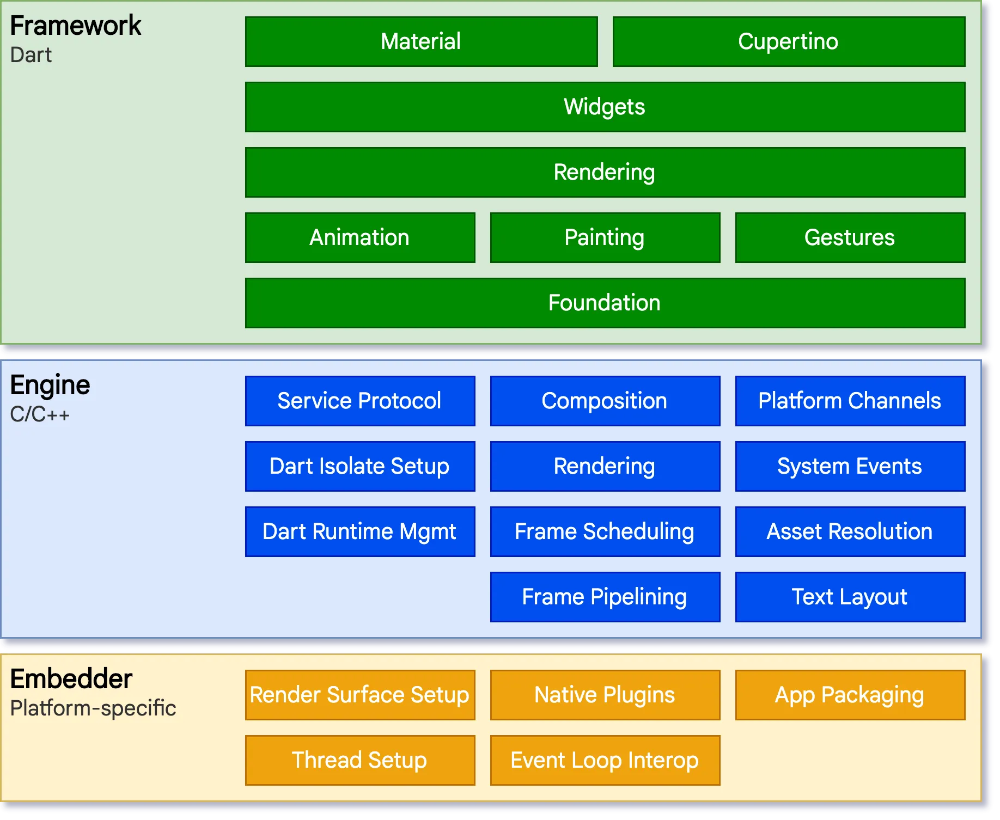
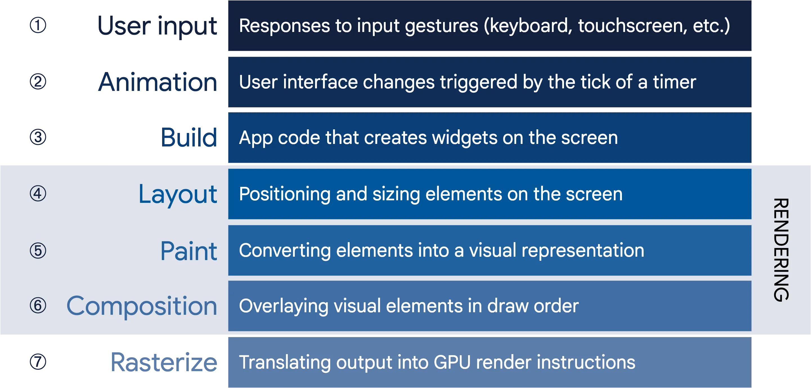
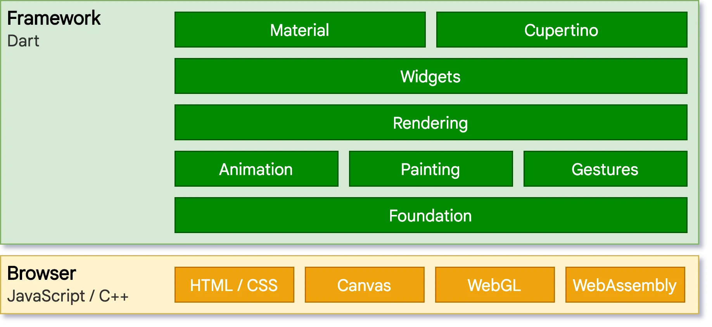
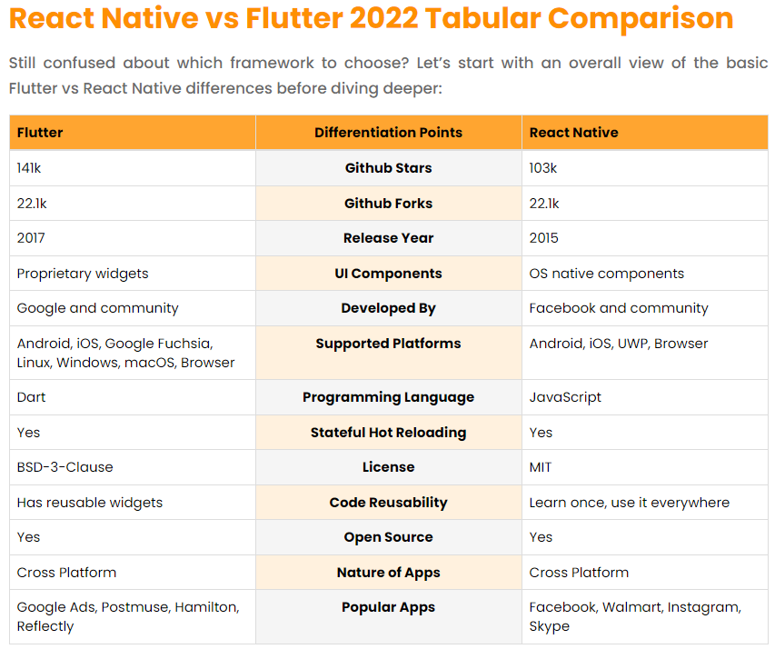
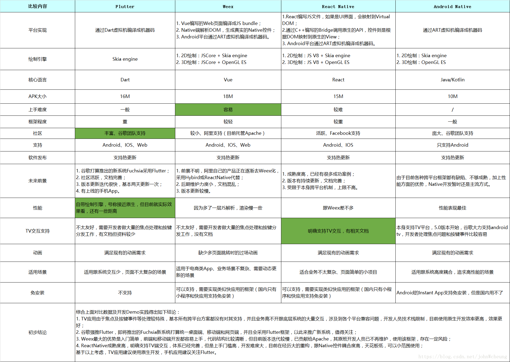

<!-- START doctoc generated TOC please keep comment here to allow auto update -->
<!-- DON'T EDIT THIS SECTION, INSTEAD RE-RUN doctoc TO UPDATE -->
<!-- **Table of Contents**  *generated with [DocToc](https://github.com/thlorenz/doctoc)* -->

- [flutter 官网简介](#flutter-%E5%AE%98%E7%BD%91%E7%AE%80%E4%BB%8B)
- [Flutter 架构概览](#flutter-%E6%9E%B6%E6%9E%84%E6%A6%82%E8%A7%88)
  - [架构层](#%E6%9E%B6%E6%9E%84%E5%B1%82)
  - [响应式用户界面](#%E5%93%8D%E5%BA%94%E5%BC%8F%E7%94%A8%E6%88%B7%E7%95%8C%E9%9D%A2)
  - [Widgets](#widgets)
  - [渲染和布局](#%E6%B8%B2%E6%9F%93%E5%92%8C%E5%B8%83%E5%B1%80)
    - [Flutter 的渲染模型](#flutter-%E7%9A%84%E6%B8%B2%E6%9F%93%E6%A8%A1%E5%9E%8B)
    - [从用户操作到 GPU](#%E4%BB%8E%E7%94%A8%E6%88%B7%E6%93%8D%E4%BD%9C%E5%88%B0-gpu)
    - [构建：从 Widget 到 Element](#%E6%9E%84%E5%BB%BA%E4%BB%8E-widget-%E5%88%B0-element)
    - [布局和渲染](#%E5%B8%83%E5%B1%80%E5%92%8C%E6%B8%B2%E6%9F%93)
  - [Flutter 对 Web 的支持](#flutter-%E5%AF%B9-web-%E7%9A%84%E6%94%AF%E6%8C%81)
- [Flutter 与其他框架的对比](#flutter-%E4%B8%8E%E5%85%B6%E4%BB%96%E6%A1%86%E6%9E%B6%E7%9A%84%E5%AF%B9%E6%AF%94)

<!-- END doctoc generated TOC please keep comment here to allow auto update -->

## [flutter 官网简介](https://flutter.cn/)

Flutter 为软件开发行业带来了革新：**只要一套代码库，即可构建、测试和发布适用于移动、Web、桌面和嵌入式平台的精美应用。**

- 快速
  - Flutter 代码可以直接编译成 ARM 或 Intel 平台的机器代码，以及 JavaScript 代码，确保了 Flutter 应用能够拥有原生平台的性能表现。
- 高效
  - 使用热重载 (Hot Reload) 快速构建和迭代你的产品，更新代码后即刻看到变化，也不会丢失应用状态。
- 灵活
  - 屏幕上的每个像素都由你来把握，尽情去创造不被定义、不受局限、彰显品牌的完美体验吧，这个舞台专属于你。

多平台支持
触达每个屏幕前的你的用户
部署到多种设备，只需要一份代码库，支持移动、网页、桌面和嵌入式设备。

开发体验
革新性的转变
在工程中可以使用插件、自动化测试、开发者工具以及任何可以用来帮助构建高质量应用的工具。

稳定可依赖
被多数人信赖
Flutter 由 Google 支持被并广泛使用，全球性的开发者社区广泛参与和维护，并得到众多世界知名品牌的信任。

## [Flutter 架构概览](https://flutter.cn/docs/resources/architectural-overview)

**Flutter 是一个跨平台的 UI 工具集**，它的设计初衷，就是允许在各种操作系统上复用同样的代码，例如 iOS 和 Android，同时让应用程序可以直接与底层平台服务进行交互。
如此设计是为了让开发者能够在不同的平台上，都能交付拥有原生体验的高性能应用，尽可能地共享复用代码的同时，包容不同平台的差异。

在*开发中*，Flutter 应用会*在一个 VM（程序虚拟机）中运行*，从而可以在保留状态且无需重新编译的情况下，*热重载*相关的更新。
对于*发行版* (release) ，Flutter 应用程序会*直接编译为机器代码*（Intel x64 或 ARM 指令集），*或*者针对 Web 平台的*JavaScript*。
Flutter 的框架代码是开源的，遵循 BSD 开源协议，并拥有蓬勃发展的第三方库生态来补充核心库功能。

架构概述分为:

- **分层模型**: Flutter 的构成要素。
- **响应式用户界面**: Flutter 用户界面开发的核心概念。
- **widgets** 介绍: 构建 Flutter 用户界面的基石。
- **渲染过程**: Flutter 如何将界面布局转化为像素。
- **平台嵌入层** 的概览: 让 Flutter 应用可以在移动端及桌面端操作系统执行的代码。(略)
- **将 Flutter 与其他代码进行集成**: Flutter 应用可用的各项技术的更多信息。(略)
- **Web 支持**: Flutter 在浏览器环境中的特性的概述。

### 架构层

Flutter 被设计为一个可扩展的分层系统。
它可以被看作是各个独立的组件的系列合集，上层组件各自依赖下层组件。
组件无法越权访问更底层的内容，并且框架层中的各个部分都是可选且可替代的。

从下往上；

1 对于**底层操作系统**而言，Flutter 应用程序的包装方式与其他原生应用相同。
在每一个平台上，会包含一个特定的嵌入层，从而提供一个程序入口，程序由此可以与底层操作系统进行协调，访问诸如 surface 渲染、辅助功能和输入等服务，并且管理事件循环队列。
该嵌入层采用了适合当前平台的语言编写。

2 **Flutter 引擎** 毫无疑问是 Flutter 的核心，它主要使用 C++ 编写，并提供了 Flutter 应用所需的原语。
当需要绘制新一帧的内容时，引擎将负责对需要合成的场景进行栅格化。
它提供了 Flutter 核心 API 的底层实现，包括图形（通过 Skia）、文本布局、文件及网络 IO、辅助功能支持、插件架构和 Dart 运行环境及编译环境的工具链。

引擎将底层 C++ 代码包装成 Dart 代码，通过 `dart:ui` 暴露给 Flutter 框架层。该库暴露了最底层的原语，包括用于驱动输入、图形、和文本渲染的子系统的类。

3 通常，开发者可以通过 **Flutter 框架层** 与 Flutter 交互，该框架提供了以 Dart 语言编写的现代响应式框架。
它包括由一系列层组成的一组丰富的平台，布局和基础库。

从下层到上层，依次有：

- 基础的 **foundational** 类及一些基层之上的构建块服务，如 animation、 painting 和 gestures，它们可以*提供上层常用的抽象*。
- **渲染层** 用于提供操作布局的抽象。有了渲染层，你可以*构建一棵可渲染对象的树*。在你动态更新这些对象时，渲染树也会自动根据你的变更来更新布局。
- **widget** 层 是一种组合的抽象。每一个渲染层中的渲染对象，都在 widgets 层中有一个对应的类。此外，widgets 层让你可以*自由组合你需要复用的各种类*。响应式编程模型就在该层级中被引入。
- **Material 和 Cupertino 库**提供了*全面的 widgets 层的原语组合*，这套组合分别实现了 Material 和 iOS 设计规范。

Flutter 框架相对较小，因为一些开发者可能会使用到的更高层级的功能已经被拆分到不同的软件包中，使用 Dart 和 Flutter 的核心库实现。
其中包括平台插件，例如 camera 和 webview；
与平台无关的功能，例如 characters、 http 和 animations。
还有一些软件包来自于更为宽泛的生态系统中，例如 应用内支付、 Apple 认证 和 Lottie 动画。

### 响应式用户界面

Flutter 是 一个响应式的且伪声明式的 UI 框架，开发者负责提供应用状态与界面状态之间的映射，框架则在运行时将应用状态的更改更新到界面上。

Flutter 与其他响应式框架类似，采用了显式剥离基础状态和用户界面的方式，来解决"随着应用程序的复杂性日益增长，开发者需要对整个 UI 的状态关联有整体的认知"这一问题。

在 Flutter 里，widgets 是用来配置对象树的不可变类。这些 widgets 会管理单独的布局对象树，接着参与管理合成的布局对象树。
**Flutter 的核心就是一套高效的遍历树的变动的机制**，它会将对象树转换为更底层的对象树，并在树与树之间传递更改。

### Widgets

Flutter 强调以 widgets 作为组成单位。 Widgets 是构建 Flutter 应用界面的基础块，每个 widget 都是一部分不可变的 UI 声明。

Widgets 通过布局组合形成一种层次结构关系。每个 Widget 都嵌套在其父级的内部，并可以通过父级接收上下文。
从根布局（托管 Flutter 应用的容器，通常是 MaterialApp 或 CupertinoApp）开始，自上而下都是这样的结构。

Flutter 拥有其自己的 UI 控制实现，而不是由系统自带的方法进行托管。

组成: Widgets 通常由更小的且用途单一的 widgets 组合而成，提供更强大的功能。
构建 widgets: 可以通过重写 `build()` 方法，返回一个新的元素树，来定义视觉展示。
Widget 的状态: 框架包含两种核心的 widget 类：有状态的(需要根据用户交互或其他因素而变化的特有属性) 和 无状态的(并不包含随时变化的属性（例如图标或者标签）) widget。
状态管理: InheritedWidget，提供了一种从共同的祖先节点获取数据的简易方法。你可以使用 InheritedWidget 创建包含状态的 widget，该 widget 会将一个共同的祖先节点包裹在 widget 树中。其他例如` provider`库、`flutter_hooks`库。

### 渲染和布局

#### Flutter 的渲染模型

**通常来说**，跨平台框架都会在 Android 和 iOS 的**UI 底层库上创建一层抽象，该抽象层尝试抹平各个系统之间的差异**。
这时，应用程序的代码常常使用 JavaScript 等解释型语言来进行编写，这些代码会与基于 Java 的 Android 和基于 Objective-C 的 iOS 系统进行交互，最终显示 UI 界面。
所有的流程都增加了显著的开销，在 UI 和应用逻辑有繁杂的交互时更为如此。

相比之下，**Flutter 通过绕过系统 UI 组件库，使用自己的 widget 内容集，削减了抽象层的开销。**
用于绘制 Flutter 图像内容的 Dart 代码被编译为机器码，并使用 Skia 进行渲染。
Flutter 同时也嵌入了自己的 Skia 副本，让开发者能在设备未更新到最新的系统时，也能跟进升级自己的应用，保证稳定性并提升性能。

#### 从用户操作到 GPU

对于 Flutter 的渲染机制而言，首要原则是 **简单快速**。

Flutter 为数据流向系统提供了直通的管道，如以下的流程图所示：

#### 构建：从 Widget 到 Element

在构建的阶段，Flutter 会将代码中描述的 widgets 转换成对应的 Element 树，每一个 Widget 都有一个对应的 Element。
每一个 Element 代表了树状层级结构中特定位置的 widget 实例。

目前有两种 Element 的基本类型：

- ComponentElement，其他 Element 的宿主。
- RenderObjectElement，参与布局或绘制阶段的 Element。

#### 布局和渲染

很少有应用只绘制单个 widget。因此，有效地排布 widget 的结构及在渲染完成前决定每个 Element 的大小和位置，是所有 UI 框架的重点之一。

在渲染树中，每个节点的基类都是 RenderObject，该基类为布局和绘制定义了一个抽象模型。
每一个 RenderObject 都了解其父节点的信息，但对于其子节点，除了如何 访问 和获得他们的布局约束，并没有更多的信息。
这样的设计让 RenderObject 拥有高效的抽象能力，能够处理各种各样的使用场景。

在构建阶段，Flutter 会为 Element 树中的每个 RenderObjectElement 创建或更新其对应的一个从 RenderObject 继承的对象。

大部分的 Flutter widget 是由一个继承了 RenderBox 的子类的对象渲染的，它们呈现出的 RenderObject 会在二维笛卡尔空间中拥有固定的大小。
RenderBox 提供了 **盒子限制模型**，为每个 widget 关联了渲染的最小和最大的宽度和高度。

在进行布局的时候，Flutter 会以 DFS（深度优先遍历）方式遍历渲染树，并 **将限制以自上而下的方式** 从父节点传递给子节点。
子节点若要确定自己的大小，则 **必须** 遵循父节点传递的限制。子节点的响应方式是在父节点建立的约束内 **将大小以自下而上的方式** 传递给父节点。

在遍历完一次树后，每个对象都通过父级约束而拥有了明确的大小，随时可以通过调用 paint() 进行渲染。

所有 `RenderObject` 的根节点是 `RenderView`，代表了渲染树的总体输出。
当平台需要渲染新的一帧内容时（例如一个 vsync 信号或者一个纹理的更新完成），会调用一次 `compositeFrame()` 方法，它是 `RenderView `的一部分。
该方法会创建一个 `SceneBuilder` 来触发当前画面的更新。
当画面更新完毕，`RenderView` 会将合成的画面传递给 `dart:ui` 中的 `Window.render()` 方法，控制 GPU 进行渲染。

### Flutter 对 Web 的支持

虽然 Flutter 支持的所有平台的都适用于同一个架构概念，但是在 Web 平台的支持上有一些独特的特征值得说明。

Flutter 在 Web 平台上以浏览器的标准 API 重新实现了引擎。目前我们有两种在 Web 上呈现内容的选项：HTML 和 WebGL。
在 HTML 模式下，Flutter 使用 HTML、CSS、Canvas 和 SVG 进行渲染。
而在 WebGL 模式下，Flutter 使用了一个编译为 WebAssembly 的 Skia 版本，名为 CanvasKit。
HTML 模式提供了最佳的代码大小，CanvasKit 则提供了浏览器图形堆栈渲染的最快途径，并为原生平台的内容 5 提供了更高的图形保真度。

Web 版本的分层架构图如下所示:

与其他运行 Flutter 的平台相比，最明显的区别也许是 Flutter 不再需要提供 Dart 的运行时。取而代之的是 Flutter 框架本身（和你写的代码）一并编译成 JavaScript。

在进行开发时，Web 版本的 Flutter 使用支持增量编译的编译器 `dartdevc` 进行编译，以支持应用热重启（尽管目前尚未支持热重载）。

## Flutter 与其他框架的对比

性能: 都赶不上原生，但 flutter 要稍好点，高帧更流畅
生态: Google 和 Facebook，pub.dev 和 npm，github 中 flutter 的 issue 更多(`202208` 5k vs 1.9k)
语言: dart 和 JavaScript
社区: flutter 文档更好、Stackoverflow 等讨论较多、市场占有率逐步提升。

[弃坑 RN，入坑 Flutter，同程旅行架构师给了这四点理由](https://www.infoq.cn/article/aftovf2qfvsjdmr1b3aa) `2021 年 9 月 10 日`

1. 相比于 React Native 框架，Flutter 的优势是什么？

- 第一，JIT 模式下，编译速度与 JavaScript 基本持平，但是对于 AOT 模式下，Dart 效率远高于 JavaScript，JavaScript 则不具备 AOT 这个能力；
- 第二，Flutter 使用的是自绘引擎，对 UI 的操作，布局的修改执行效率要比 React Native 效率高很多，React Native 基于 dom 树绘制修改原生组件，性能的瓶颈也在于此；
- 第三，Dart 支持静态监测，可以在编译前发现很多编译问题，排除潜在问题（天生具备）而 React Native 则需要添加相关插件来做检测；
- 第四点，Flutter 可支持较复杂的动画，流畅度方面表现高于 React Native。

2. 关于 Dart 的几点劣势:

- 第一，不支持反射，无法在运行时动态修改类的行为；
- 第二，线上发布代码，无法热更新；
- 第三，Dart 相关社区目前还不是很完善，有待大家共同完善社区；
- 第四，相关开发工具支持的力度还不是很成熟；
- 第五，刚上手的开发者需要避免地狱嵌套这种模式，需要多注意控件的状态管理。
- 第六，Dart 的空安全，在升级版本的时候，需要重新适配，比较头大。

[Flutter vs. React Native in 2022 — Detailed Comparison](https://www.nomtek.com/blog/flutter-vs-react-native) `June 2022`

1. Flutter vs. React Native performance comparison

**React Native** now has a **new bridge module JSI** (JavaScript Interface) that makes React Native faster at component communication.

**Flutter** doesn’t rely on a bridge. Instead, Flutter’s core graphic machine, **Skia**, compiles the UI to native code as the user interacts with the app.

[React Native vs Flutter-Which One To Choose?](https://aglowiditsolutions.com/blog/react-native-vs-flutter/) `2022-05-26`

[Flutter、Weex、React Native 和 Android 原生对比报告](https://blog.csdn.net/johnWcheung/article/details/82872323)

知乎
[Flutter 相比 Native APP 开发有什么优势?](https://www.zhihu.com/question/365367503) `2020`
[开发跨平台 App 推荐 React Native 还是 Flutter？](https://www.zhihu.com/question/307298908) `2022-06-15`
[2022 年了，现在学习选择 Flutter 还是 ReactNative ?](https://www.zhihu.com/question/526760978) `2022-04-11`
