基础的数据结构与算法和设计模式

<!-- START doctoc generated TOC please keep comment here to allow auto update -->
<!-- DON'T EDIT THIS SECTION, INSTEAD RE-RUN doctoc TO UPDATE -->
<!-- **Table of Contents**  *generated with [DocToc](https://github.com/thlorenz/doctoc)* -->

- [1 基础数据结构](#1-%E5%9F%BA%E7%A1%80%E6%95%B0%E6%8D%AE%E7%BB%93%E6%9E%84)
  - [1.1 逻辑结构和存储结构](#11-%E9%80%BB%E8%BE%91%E7%BB%93%E6%9E%84%E5%92%8C%E5%AD%98%E5%82%A8%E7%BB%93%E6%9E%84)
  - [1.2 数组 (Array)](#12-%E6%95%B0%E7%BB%84-array)
  - [1.3 链表 (Linked List）](#13-%E9%93%BE%E8%A1%A8-linked-list)
    - [1.3.1 双向链表 (Doubly Linked List）](#131-%E5%8F%8C%E5%90%91%E9%93%BE%E8%A1%A8-doubly-linked-list)
    - [1.3.2 循环链表 (Circular Linked List）](#132-%E5%BE%AA%E7%8E%AF%E9%93%BE%E8%A1%A8-circular-linked-list)
    - [1.3.3 有序链表 (Sorted Linked List）](#133-%E6%9C%89%E5%BA%8F%E9%93%BE%E8%A1%A8-sorted-linked-list)
    - [1.3.4 跳表 (Skip List)](#134-%E8%B7%B3%E8%A1%A8-skip-list)
  - [1.4 栈(Stack)](#14-%E6%A0%88stack)
  - [1.5 队列(Queue)](#15-%E9%98%9F%E5%88%97queue)
    - [1.5.1 双端队列（deque，或称 double-ended queue）](#151-%E5%8F%8C%E7%AB%AF%E9%98%9F%E5%88%97deque%E6%88%96%E7%A7%B0-double-ended-queue)
    - [集合 (Set）](#%E9%9B%86%E5%90%88-set)
  - [1.6 字典 (Dictionary) 其实就是 Map](#16-%E5%AD%97%E5%85%B8-dictionary-%E5%85%B6%E5%AE%9E%E5%B0%B1%E6%98%AF-map)
    - [1.6.1 散列表 (HashTable 类，也叫 HashMap 类)](#161-%E6%95%A3%E5%88%97%E8%A1%A8-hashtable-%E7%B1%BB%E4%B9%9F%E5%8F%AB-hashmap-%E7%B1%BB)
  - [1.7 树(Tree)](#17-%E6%A0%91tree)
    - [1.7.1 二叉树 (Binary tree)](#171-%E4%BA%8C%E5%8F%89%E6%A0%91-binary-tree)
    - [1.7.2 二叉搜索树 (Binary Search Tree)](#172-%E4%BA%8C%E5%8F%89%E6%90%9C%E7%B4%A2%E6%A0%91-binary-search-tree)
    - [1.7.3 平衡树 (Balance Tree)](#173-%E5%B9%B3%E8%A1%A1%E6%A0%91-balance-tree)
      - [1.7.3.1 AVL 树(Adelson-Velskii-Landi Tree)](#1731-avl-%E6%A0%91adelson-velskii-landi-tree)
      - [1.7.3.2 红黑树(Red Black Tree)](#1732-%E7%BA%A2%E9%BB%91%E6%A0%91red-black-tree)
  - [1.8 堆(Heap) 也叫作 二叉堆](#18-%E5%A0%86heap-%E4%B9%9F%E5%8F%AB%E4%BD%9C-%E4%BA%8C%E5%8F%89%E5%A0%86)
  - [1.9 图(Graph)](#19-%E5%9B%BEgraph)
    - [1.9.1 图基础说明](#191-%E5%9B%BE%E5%9F%BA%E7%A1%80%E8%AF%B4%E6%98%8E)
- [2 常见算法思路和题解](#2-%E5%B8%B8%E8%A7%81%E7%AE%97%E6%B3%95%E6%80%9D%E8%B7%AF%E5%92%8C%E9%A2%98%E8%A7%A3)
  - [2.1 算法复杂度](#21-%E7%AE%97%E6%B3%95%E5%A4%8D%E6%9D%82%E5%BA%A6)
    - [2.1.1 大 O 表示法-时间复杂度](#211-%E5%A4%A7-o-%E8%A1%A8%E7%A4%BA%E6%B3%95-%E6%97%B6%E9%97%B4%E5%A4%8D%E6%9D%82%E5%BA%A6)
    - [2.1.2 空间复杂度](#212-%E7%A9%BA%E9%97%B4%E5%A4%8D%E6%9D%82%E5%BA%A6)
  - [2.2 算法设计与技巧](#22-%E7%AE%97%E6%B3%95%E8%AE%BE%E8%AE%A1%E4%B8%8E%E6%8A%80%E5%B7%A7)
    - [2.2.1 排序](#221-%E6%8E%92%E5%BA%8F)
    - [2.2.2 递归](#222-%E9%80%92%E5%BD%92)
    - [2.2.3 广度优先搜索](#223-%E5%B9%BF%E5%BA%A6%E4%BC%98%E5%85%88%E6%90%9C%E7%B4%A2)
    - [2.2.4 深度优先搜索](#224-%E6%B7%B1%E5%BA%A6%E4%BC%98%E5%85%88%E6%90%9C%E7%B4%A2)
    - [2.2.5 二分查找](#225-%E4%BA%8C%E5%88%86%E6%9F%A5%E6%89%BE)
    - [2.2.6 分而治之](#226-%E5%88%86%E8%80%8C%E6%B2%BB%E4%B9%8B)
    - [2.2.7 动态规划](#227-%E5%8A%A8%E6%80%81%E8%A7%84%E5%88%92)
    - [2.2.8 贪心算法](#228-%E8%B4%AA%E5%BF%83%E7%AE%97%E6%B3%95)
    - [2.2.9 回溯算法](#229-%E5%9B%9E%E6%BA%AF%E7%AE%97%E6%B3%95)

<!-- END doctoc generated TOC please keep comment here to allow auto update -->

# 1 基础数据结构

## 1.1 逻辑结构和存储结构

> 数据结构即数据元素相互之间存在的一种和多种特定的关系集合。

一般可以从两个维度来理解它，逻辑结构和存储结构。

1. **逻辑结构**

**逻辑结构就是数据之间的关系**，逻辑结构大概统一的可以分成两种：线性结构、非线性结构。

- **线性结构**：是一个有序数据元素的集合。 其中数据元素之间的关系是一对一的关系，即除了第一个和最后一个数据元素之外，其它数据元素都是首尾相接的。
  - 常用的线性结构有: 栈，队列，链表，线性表。
- **非线性结构**：各个数据元素不再保持在一个线性序列中，每个数据元素可能与零个或者多个其他数据元素发生联系。
  - 常见的非线性结构有 二维数组，树等。

2. **存储结构**

逻辑结构指的是数据间的关系，而**存储结构是逻辑结构用计算机语言的实现**。  
常见的存储结构有*顺序存储*、_链式存储_、_索引存储_ 以及 _散列存储_。

例如:  
数组在内存中的位置是连续的，它就属于顺序存储；  
链表是主动建立数据间的关联关系的，在内存中却不一定是连续的，它属于链式存储；  
还有顺序和逻辑上都不存在顺序关系，但是你可以通过一定的方式去放问它的哈希表，数据散列存储。

## 1.2 数组 (Array)

数组是一种线性表数据结构，它用一组**连续的内存空间**，来存储一组具有**相同类型**的数据。可通过数组名和下标进行数据的访问和更新。

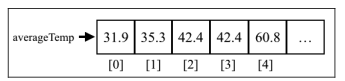

算法题关键字:

- 双指针
  - 调整数组顺序使奇数位于偶数前面
  - 和为 S 的两个数字
  - 和为 S 的连续正整数序列
- N 数之和问题
  - 两数之和
  - 三数之和
  - 四数之和
- 二维数组
  - 构建乘积数组
  - 顺时针打印矩阵
- 数据统计
  - 数组中出现次数超过数组长度一半的数字
  - 连续子数组的最大和
  - 扑克牌顺子
  - 第一个只出现一次的字符

## 1.3 链表 (Linked List）

- 定义:

  - 链表存储**有序**的元素集合，但不同于数组，链表中的元素**在内存中并不是连续**放置的。
  - 每个元素由一个存储元素本身的**节点**和一个**指向下一个元素的引用**（也称指针或链接）组成。

- 与数组:
  - 相对于传统的数组，链表的一个好处在于，添加或移除元素的时候不需要移动其他元素。
  - 然而，链表需要使用指针，因此实现链表时需要额外注意。
  - 在数组中，我们可以直接访问任何位置的任何元素，
  - 而要想访问链表中间的一个元素，则需要从起点（表头）开始迭代链表直到找到所需的元素。

算法题关键字:

- 从尾到头打印链表
- 删除链表中的节点
- 反转链表
- 复杂链表的复制
- 环形链表
- 链表环的入口节点
- 约瑟夫环
- 两个链表的公共节点
- 链表倒数第 k 个节点
- 相交链表
- 扁平化多级双向链表

### 1.3.1 双向链表 (Doubly Linked List）

- 定义:
  - 双向链表和普通链表的区别在于，在链表中，一个节点只有链向下一个节点的链接；
  - 而在**双向链表**中，链接是双向的：**一个链向下一个元素，另一个链向前一个元素**.

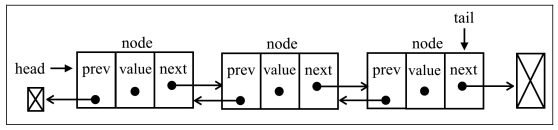

- 双向链表提供了两种迭代的方法：从头到尾，或者从尾到头。
  - 在单向链表中，如果迭代时错过了要找的元素，就需要回到起点，重新开始迭代。这是双向链表的一个优势。

### 1.3.2 循环链表 (Circular Linked List）

- 定义:

  - 循环链表可以像链表一样只有单向引用，也可以像双向链表一样有双向引用。

- 循环链表和链表之间唯一的区别在于，_最后一个元素指向下一个元素的指针(tail.next)不是引用 undefined,而是指向第一个元素(head)_;
  - 双向循环链表有指向 head 元素的 tail.next 和指向 tail 元素的 head.prev 。

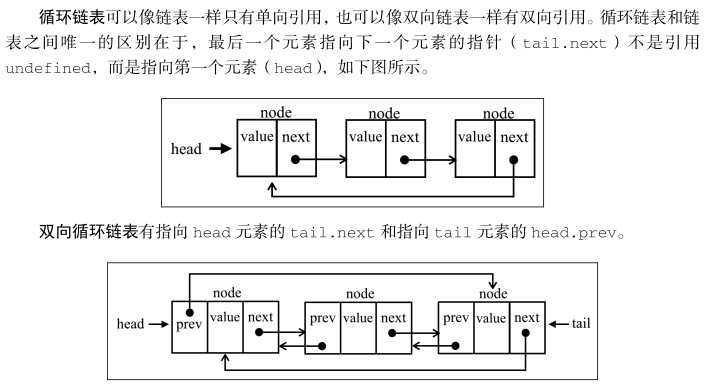

### 1.3.3 有序链表 (Sorted Linked List）

- 定义:
  - 有序链表是指*保持元素有序*的链表结构。
- 除了使用排序算法之外，我们还可以将元素插入到正确的位置来保证链表的有序性。

链表本身是一种无序的数据结构，元素的插入和删除不能保证顺序性。  
为了使链表有序，我们在单链表中插入元素时，只需要将插入的元素与头结点及其后面的结点比较，从而找到合适的位置插入即可。

### 1.3.4 跳表 (Skip List)

- 跳表是一个随机化的数据结构，实质就是一种可以进行二分查找的有序链表。
- 跳表在原有的有序链表上面增加了多级索引，通过索引来实现快速查找。(跳跃列表是按层建造的。底层是一个普通的有序链表。)
- 跳表不仅能提高搜索性能，同时也可以提高插入和删除操作的性能。

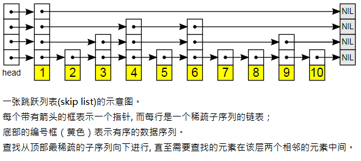

跳表的产生就是为了解决链表过长的问题，通过增加链表的多级索引来加快原始链表的查询效率。这样的方式可以让查询的时间复杂度从 O(n)提升至 O(logn)。

跳表通过增加的多级索引能够实现高效的动态插入和删除，其效率和红黑树和平衡二叉树不相上下。目前 redis 和 levelDB 都有用到跳表。

## 1.4 栈(Stack)

- 定义:
  - 栈是一种遵从**后进先出**（LIFO）原则的**有序集合**。
  - 新添加或待删除的元素都保存在栈的同一端，称作栈顶，另一端就叫栈底。在栈里，新元素都靠近栈顶，旧元素都接近栈底。

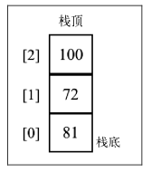

## 1.5 队列(Queue)

- 定义:
  - 队列是遵循**先进先出**（FIFO，也称为先来先服务）原则的一组有**序的项**。
  - 队列在尾部添加新元素，并从顶部移除元素。最新添加的元素必须排在队列的末尾。

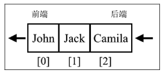

- 解决约瑟夫环问题

队列和栈相关问题:

- 队列和栈的互相实现
- 包含 min 函数的栈
- 栈的压入弹出序列
- 滑动窗口最大值
- 接雨水

### 1.5.1 双端队列（deque，或称 double-ended queue）

- 定义:

  - 一种允许同时从前端和后端添加和移除元素的特殊队列。

- 解决回文检查器问题

### 集合 (Set）

- 定义:
  - 集合是由一组无序且唯一（即不能重复）的项组成的。
- 说明:
  - 该数据结构使用了与有限集合相同的数学概念，但应用在计算机科学的数据结构中。
  - 在数学中，集合是一组不同对象的集。
  - 在数学中，集合也有并集、交集、差集等基本运算。
- ECMAScript 2015 介绍了 Set 类是 JavaScript API 的一部分。原生 ES2015 没有提供的集合运算，例如并集、交集和差集。
- 空集:
  - 就是不包含任何元素的集合。
- 简单集合运算:
  - 并集 `A∪B` ：对于给定的两个集合，返回一个包含两个集合中所有元素的新集合。
  - 交集 `A∩B` ：对于给定的两个集合，返回一个包含两个集合中共有元素的新集合。
  - 差集 `A-B` ：对于给定的两个集合，返回一个包含所有存在于第一个集合且不存在于第二个集合的元素的新集合。
  - 子集 `A⊆B` ：验证一个给定集合是否是另一集合的子集(或集合 B 包含集合 A)。
- 与数组:
  - 可以把集合想象成一个既没有重复元素，也没有顺序概念的数组。

## 1.6 字典 (Dictionary) 其实就是 Map

- 在字典中，存储的是[键，值]对，其中键名是用来查询特定元素的,键名不可重复。
- 字典也称作映射、符号表或关联数组。

### 1.6.1 散列表 (HashTable 类，也叫 HashMap 类)

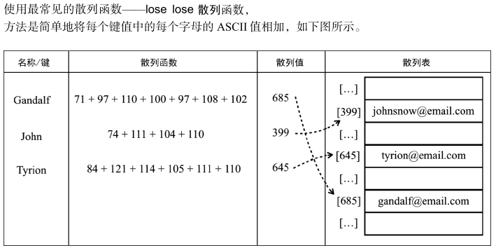

- 定义:
  - 是 Dictionary (Map) 类的一种散列表，**是根据键（Key）而直接访问在内存储存位置**的数据结构。
- 说明:
  - **散列算法**的作用是**尽可能快**地在数据结构中找到一个值。
    - 有些数据结构要获得一个值（使用 get 方法），需要迭代整个数据结构来找到它。
  - 如果使用散列函数，就知道值的具体位置，因此能够快速检索到该值。
    - **散列函数**的作用是*给定一个键值，然后返回值在表中的地址*。
    - 用最常见的散列函数—— lose lose 散列函数，方法是简单地将每个键值中的每个字母的 ASCII 值相加。
      - **直接寻址法**：取关键字或关键字的某个线性函数值为散列地址。
      - **数字分析法**：通过对数据的分析，发现数据中冲突较少的部分，并构造散列地址。
        - 例如同学们的学号，通常同一届学生的学号，其中前面的部分差别不太大，所以用后面的部分来构造散列地址。
      - **平方取中法**：当无法确定关键字里哪几位的分布相对比较均匀时，可以先求出关键字的平方值，然后按需要取平方值的中间几位作为散列地址。
        - 这是因为：计算平方之后的中间几位和关键字中的每一位都相关，所以不同的关键字会以较高的概率产生不同的散列地址。
      - **取随机数法**：使用一个随机函数，取关键字的随机值作为散列地址。
        - 这种方式通常用于关键字长度不同的场合。
      - **除留取余法**：取关键字被某个不大于散列表的表长 n 的数 m 除后所得的余数 p 为散列地址。
        - 这种方式也可以在用过其他方法后再使用。该函数对 m 的选择很重要，一般取素数或者直接用 n。
- 散列冲突:
  - 有时候，一些键会有相同的散列值。不同的值在散列表中对应相同位置的时候，我们称其为冲突。
  - 一般解决办法:
    - 分离链接、线性探查和双散列法。

算法题关键字:

- 常数时间插入、删除和获取随机元素
- 两数之和
- 三数之和
- 字符流中第一个不重复的字符
- 宝石与石头

## 1.7 树(Tree)

- 定义:
  - 是一种抽象数据类型（ADT）或是实现这种抽象数据类型的数据结构，用来模拟具有树状结构性质的数据集合。
  - 它是由 n（n>0）个有限节点组成一个具有层次关系的集合。
- 特征:
  - 把它叫做“树”是因为它看起来像一棵倒挂的树，也就是说它是根朝上，而叶朝下的。它具有以下的特点：
    - 1 每个节点都只有有限个子节点或无子节点；
    - 2 没有父节点的节点称为根节点；
    - 3 每一个非根节点有且只有一个父节点；
    - 4 除了根节点外，每个子节点可以分为多个不相交的子树(即子树由节点和它的后代构成)；
    - 5 树里面没有环路(cycle)
- 术语:
  - 节点的度：一个节点含有的子树的个数称为该节点的度；
  - 树的度：一棵树中，最大的节点度称为树的度；
  - 叶节点或终端节点：度为零的节点；
  - 非终端节点或分支节点：度不为零的节点；
  - 父亲节点或父节点：若一个节点含有子节点，则这个节点称为其子节点的父节点；
  - 孩子节点或子节点：一个节点含有的子树的根节点称为该节点的子节点；
  - 兄弟节点：具有相同父节点的节点互称为兄弟节点；
  - 节点的层次：从根开始定义起，根为第 1 层，根的子节点为第 2 层，以此类推；
  - 深度：对于任意节点 n,n 的深度为从根到 n 的唯一路径长，根的深度为 0；
  - 高度：对于任意节点 n,n 的高度为从 n 到一片树叶的最长路径长，所有树叶的高度为 0；
  - 堂兄弟节点：父节点在同一层的节点互为堂兄弟；
  - 节点的祖先：从根到该节点所经分支上的所有节点；
  - 子孙：以某节点为根的子树中任一节点都称为该节点的子孙。
  - 森林：由 m（m>=0）棵互不相交的树的集合称为森林；
- 树是一种分层数据的抽象模型。现实生活中最常见的树的例子是家谱，或是公司的组织架构图.

树的操作:

- 遍历
  - 中序遍历
  - 线序遍历
  - 后序遍历
- 搜索树中的值
  - 搜索最大值和最小值
  - 搜索特定的值
  - 移除一个节点

### 1.7.1 二叉树 (Binary tree)

- 定义:
  - 二叉树中的节点最多只能有两个子节点：一个是左侧子节点，另一个是右侧子节点。

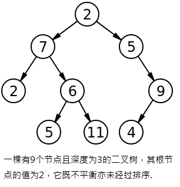

### 1.7.2 二叉搜索树 (Binary Search Tree)

- 是二叉树的一种，但是只允许你在左侧节点存储（比父节点）小的值，在右侧节点存储（比父节点）大的值。

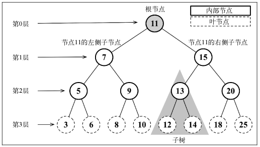

遍历:

- 前序遍历：根结点 ---> 左子树 ---> 右子树
- 中序遍历：左子树 ---> 根结点 ---> 右子树
- 后序遍历：左子树 ---> 右子树 ---> 根结点
- 层次遍历：从上到下，从左到右。

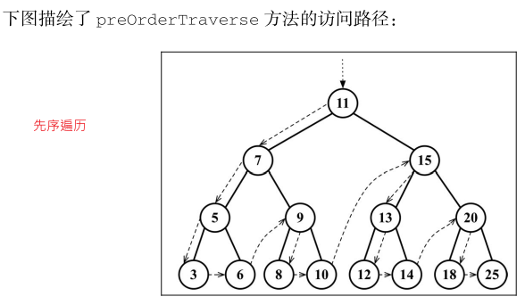

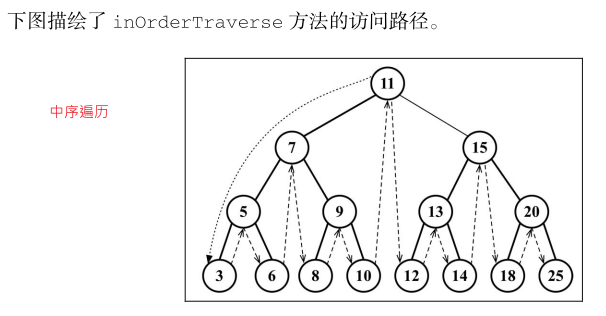

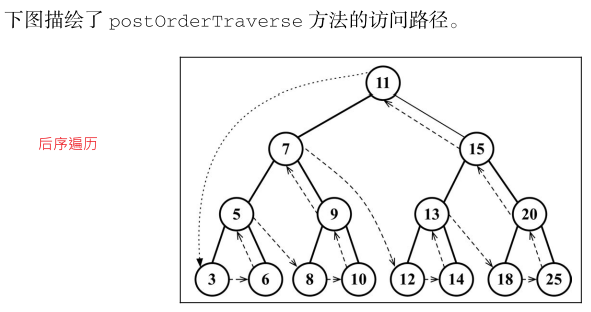

### 1.7.3 平衡树 (Balance Tree)

平衡树是计算机科学中的一类数据结构，为改进的二叉查找树。

一般的二叉查找树的查询复杂度取决于目标结点到树根的距离（即深度），因此当结点的深度普遍较大时，查询的均摊复杂度会上升。为了实现更高效的查询，产生了平衡树。

平衡树图示:

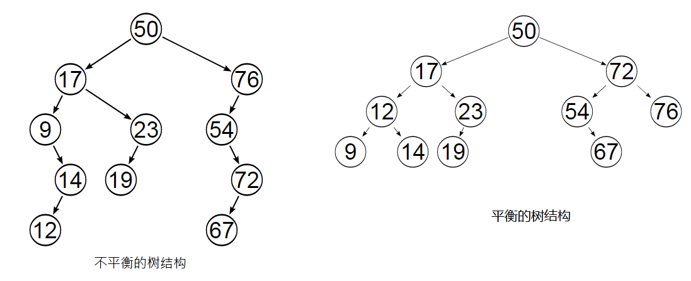

#### 1.7.3.1 AVL 树(Adelson-Velskii-Landi Tree)

wiki:  
AVL 树是计算机科学中最早被发明的自平衡二叉查找树。  
在 AVL 树中，任一节点对应的两棵子树的最大高度差(平衡因子)为 1，因此它也被称为高度平衡树。

查找、插入和删除在平均和最坏情况下的时间复杂度都是`O(log n)`。  
增加和删除元素的操作则可能需要借由一次或多次树旋转，以实现树的重新平衡。

节点的**平衡因子**是它的左子树的高度减去它的右子树的高度（有时相反）。  
带有平衡因子 1、0 或 -1 的节点被认为是平衡的。带有平衡因子 -2 或 2 的节点被认为是不平衡的，并需要重新平衡这个树。  
平衡因子可以直接存储在每个节点中，或从可能存储在节点中的子树高度计算出来。

---

- 定义:
  - 是一种自平衡树。添加或移除节点时，AVL 树会尝试保持自平衡。
  - **平衡因子（即任意一个节点（不论深度）的左子树和右子树高度差）** 最多为 1。
  - 添加或移除节点时，AVL 树会尽可能尝试转换为完全树。
- 实现:
  - 可以扩展之前写的 BST 类，只需要覆盖用来维持 AVL 树平衡的方法，
  - 也就是 insert 、 insertNode 和 removeNode 方法。
  - 所有其他的 BST 方法将会被 AVLTree 类继承。

#### 1.7.3.2 红黑树(Red Black Tree)

- 和 AVL 树一样，红黑树也是一个自平衡二叉搜索树。
  - 红黑树是一种特化的 AVL 树（平衡二叉树），都是*在进行插入和删除操作时通过特定操作保持二叉查找树的平衡*，从而获得较高的查找性能。
- 它虽然是复杂的，但它的最坏情况运行时间也是非常良好的，并且在实践中是高效的：
  - 它可以在 `O(log n)`时间内做查找，插入和删除，这里的 n 是树中元素的数目。
- 在红黑树中，每个节点都遵循以下规则：
  - (1) 顾名思义，每个节点不是红的就是黑的；
  - (2) 树的根节点是黑的；
  - (3) 所有叶节点都是黑的（用 NULL 引用表示的节点）；
  - (4) 如果一个节点是红的，那么它的两个子节点都是黑的；
  - (5) 不能有两个相邻的红节点，一个红节点不能有红的父节点或子节点；
  - (6) 从给定的节点到它的后代节点（ NULL 叶节点）的所有路径包含相同数量的黑色节点。
- 说明:
  - 对 AVL 书插入和移除节点可能会造成旋转，
  - 所以如果需要一个包含多次插入和删除的自平衡树，红黑树是比较好的。
  - 如果插入和删除频率较低（更需要的是多次进行搜索操作），那么 AVL 树比红黑树更好。
- 实现:
  - 由于红黑树也是二叉搜索树，可以扩展之前创建的二叉搜索树类并重写红黑树属性所需要的那些方法。
  - 也就是 insert 、 insertNode 和 removeNode 方法。
  - 所有其他的 BST 方法将会被红黑树类继承。

红黑树图示；

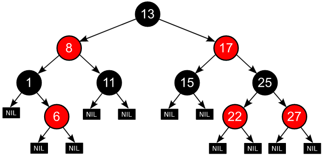

## 1.8 堆(Heap) 也叫作 二叉堆

wiki:  
堆（英语：Heap）是计算机科学中的一种特别的完全二叉树。

若是满足以下特性，即可称为堆：

- “给定堆中任意节点 P 和 C，若 P 是 C 的母节点，那么 P 的值会小于等于（或大于等于）C 的值”。
- 若母节点的值恒小于等于子节点的值，此堆称为最小堆（min heap）；
- 反之，若母节点的值恒大于等于子节点的值，此堆称为最大堆（max heap）。
- 在堆中最顶端的那一个节点，称作根节点（root node），
- 根节点本身没有母节点（parent node）。

---

- 定义:
  - 是计算机科学中一类特殊的数据结构的统称。**堆**通常是一个可以被看做**一棵完全二叉树的数组对象**。
- 特征:
  - 1 堆不是最小堆就是最大堆。
    - 最小堆允许你快速导出树的最小值，最大堆允许你快速导出树的最大值。
    - 所有的节点都大于等于（最大堆）或小于等于（最小堆）每个它的子节点。这叫作堆特性。
  - 2 堆总是一棵完全二叉树。
    - 表示树的每一层都有左侧和右侧子节点（除了最后一层的叶节点），并且最后一层的叶节点尽可能都是左侧子节点，这叫作结构特性。
- **完全二叉树**:
  - 一棵深度为 k 的有 n 个结点的二叉树，对树中的结点按从上至下、从左到右的顺序进行编号，
  - 如果编号为 i（1≤i≤n）的结点与满二叉树中编号为 i 的结点在二叉树中的位置相同，则这棵二叉树称为完全二叉树。
- 注意:
  - 尽管二叉堆是二叉树，但并不一定是二叉搜索树（BST）。
  - 在二叉堆中，每个子节点都要大于等于父节点（最小堆）或小于等于父节点（最大堆）。
  - 然而在二叉搜索树中，左侧子节点总是比父节点小，右侧子节点也总是更大。
- 主要操作:
  - insert(value) ：这个方法向堆中插入一个新的值。如果插入成功，它返回 true ，否则返回 false 。
  - extract() ：这个方法移除最小值（最小堆）或最大值（最大堆），并返回这个值。
  - findMinimum() ：这个方法返回最小值（最小堆）或最大值（最大堆）且不会移除这个值。

堆图示:

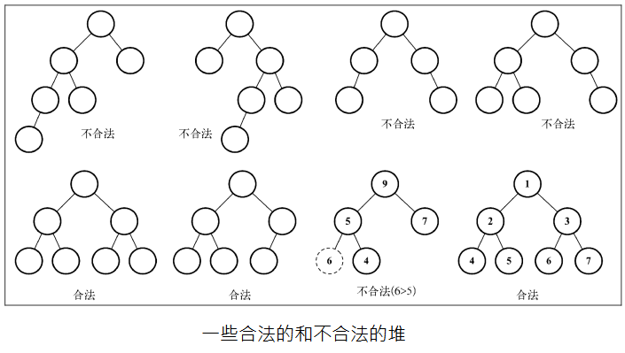

堆的使用: 堆排序算法

算法题关键字:

- 堆的基本操作
- 数据流中的中位数
- 最小的 k 个数

## 1.9 图(Graph)

### 1.9.1 图基础说明

1. 定义

- 图是网络结构的抽象模型。**图是一组由边连接的节点（或顶点）**。

- 一个图 `G = (V, E)` 由以下元素组成。

  - V：一组顶点
  - E：一组边，连接 V 中的顶点

- 基本图示例:

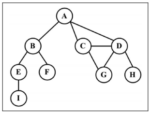

2. 术语

- 1 **相邻顶点**: 由一条边连接在一起的顶点称为相邻顶点。
  - 比如，A 和 B 是相邻的，A 和 D 是相邻的，A 和 C 是相邻的，A 和 E 不是相邻的。
- 2 **度**: 一个顶点的度是其相邻顶点的数量。
  - 比如，A 和其他三个顶点相连接，因此 A 的度为 3；E 和其他两个顶点相连，因此 E 的度为 2。
- 3 **路径**: 路径是顶点 v1 , v2 , …, vk 的一个连续序列，其中 vi 和 v(i+1) 是相邻的。
  - 比如，以上一示意图中的图为例，其中包含路径 A B E I 和 A C D G。
- 4 **简单路径**: 简单路径要求不包含重复的顶点。
  - 比如，A D G 是一条简单路径。除去最后一个顶点（因为它和第一个顶点是同一个顶点）。
- 5 **环**: 环也是一个简单路径，比如 A D C A（最后一个顶点重新回到 A）。
- 6 **无环图与连通图**: 如果图中不存在环，则称该图是无环的。如果图中每两个顶点间都存在路径，则该图是连通的。
- 7 **有向图和无向图**: 图可以是无向的（边没有方向）或是有向的（有向图）。

- 8 **强连通**: 如果图中每两个顶点间在双向上都存在路径，则该图是强连通的。
  - 例如，C 和 D 是强连通的，而 A 和 B 不是强连通的。
- 9 **加权与未加权**: 图还可以是未加权的（目前为止我们看到的图都是未加权的）或是加权的。

3. 应用

- 比如搜索图中的一个特定顶点或搜索一条特定边;
- 寻找图中的一条路径（从一个顶点到另一个顶点）;
- 寻找两个顶点之间的最短路径;
- 环检测。等

4. 图的表示

在所有的表示法中，不存在绝对正确的方式。图的正确表示法取决于待解决的问题和图的类型。

- 1 邻接矩阵

  - 图最常见的实现是邻接矩阵。
  - 每个节点都和一个整数相关联，该整数将作为数组的索引。用一个二维数组来表示顶点之间的连接。
  - 如果索引为 i 的节点和索引为 j 的节点相邻，则`array[i][j] === 1` ，否则 `array[i][j] === 0`。
  - 不足:
    - 不是强连通的图（**稀疏图**）如果用邻接矩阵来表示，则*矩阵中将会有很多 0，这意味着浪费了计算机存储空间来表示根本不存在的边*。
      - 例如，找给定顶点的相邻顶点，即使该顶点只有一个相邻顶点，也不得不迭代一整行。
    - 邻接矩阵表示法不够好的另一个理由是，_图中顶点的数量可能会改变，而二维数组不太灵活_。
    - 如图:

- 2 邻接表
  - 邻接表由图中每个顶点的相邻顶点列表所组成。存在好几种方式来表示这种数据结构。
  - 可以用列表（数组）、链表，甚至是散列表或是字典来表示相邻顶点列表。
  - 尽管邻接表可能对大多数问题来说都是更好的选择。但以上两种表示法都很有用，且它们有着不同的性质
    - （例如，要找出顶点 v 和 w 是否相邻，使用邻接矩阵会比较快）。
  - **在示例中，将会使用邻接表表示法。**
    - 下面的示意图展示了邻接表数据结构:

- 3 关联矩阵

  - 在关联矩阵中，矩阵的行表示顶点，列表示边。使用二维数组来表示两者之间的连通性，
  - 如果顶点 v 是边 e 的入射点，则 `array[v][e] === 1` ；否则， `array[v][e] === 0` 。
  - **关联矩阵通常用于边的数量比顶点多的情况，以节省空间和内存**。
    - 如下图所示:

5. 图的操作

- 遍历
  - 广度优先搜索
  - 深度优先搜索
- 最短路径算法
  - Dijkstra 算法
  - Floyd-Warshall 算法
- 最小生成树
  - Prim 算法
  - Kruskal 算法

# 2 常见算法思路和题解

## 2.1 算法复杂度

### 2.1.1 大 O 表示法-时间复杂度

算法复杂度性能对比示例:

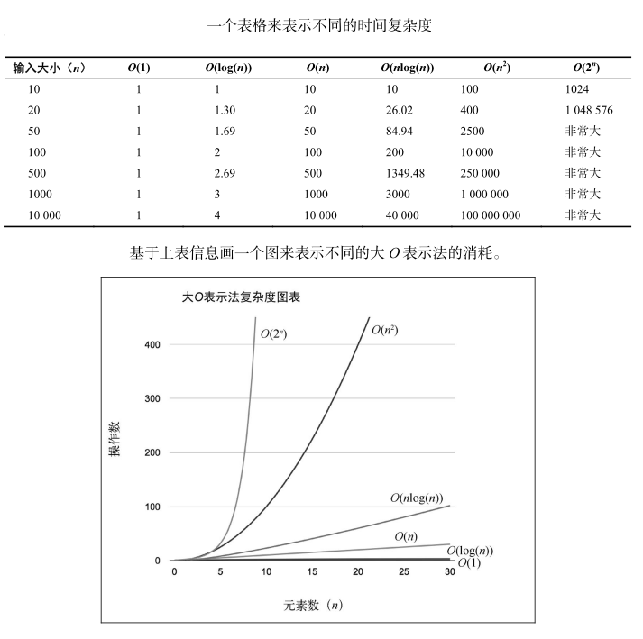

分析算法时，时常遇到以下几类函数:

| 符 号        | 名 称        |
| ------------ | ------------ |
| O(1)         | 常数的       |
| O(log(n))    | 对数的       |
| O((log(n))c) | 对数多项式的 |
| O(n)         | 线性的       |
| O(n^2 )      | 二次的       |
| O(n^c )      | 多项式的     |
| O(c^n )      | 指数的       |

如何衡量算法的效率？

- 通常是用资源，例如 CPU（时间）占用、内存占用、硬盘占用和网络占用。
- **当讨论大 O 表示法时，一般考虑的是 CPU（时间）占用。**

> 时间复杂度 O(n)的代码只有一层循环，而 O(n^2)的代码有双层嵌套循环。
> 如果算法有三层迭代数组的嵌套循环，它的时间复杂度很可能就是 O(n^3)。

常见数据结构及其相关操作的时间复杂度:

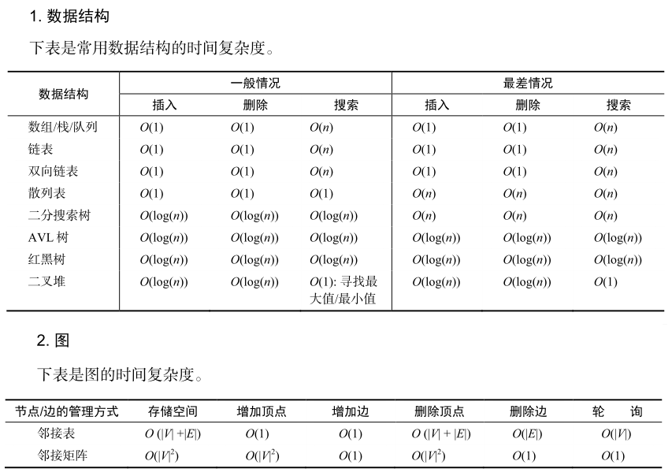

常见排序搜索算法的时间复杂度:

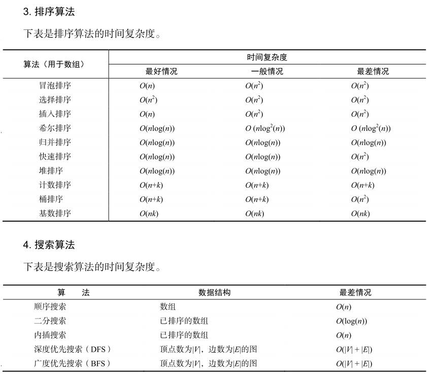

### 2.1.2 空间复杂度

一个程序的空间复杂度是指**运行完一个程序所需内存的大小**。  
利用程序的空间复杂度，可以对程序的运行所需要的内存多少有个预先估计。

一个程序执行时除了需要存储空间和存储本身所使用的指令、常数、变量和输入数据外，  
还需要一些对数据进行操作的工作单元和存储一些为现实计算所需信息的辅助空间。

## 2.2 算法设计与技巧

gif 查看: [十大经典排序算法](https://www.runoob.com/w3cnote/ten-sorting-algorithm.html)

### 2.2.1 排序

- **冒泡排序** O(n^2) 不推荐使用

  - 循环数组，比较当前元素和下一个元素，如果当前元素比下一个元素大，向上冒泡。
  - 下一次循环继续上面的操作，不循环已经排序好的数。

    

- **选择排序** O(n^2) 不推荐使用

  - 首先在未排序序列中找到最小（大）元素，存放到排序序列的起始位置。
  - 再从剩余未排序元素中继续寻找最小（大）元素，然后放到已排序序列的末尾。
  - 重复第二步，直到所有元素均排序完毕。

    

- **插入排序** O(n^2)

  - 假定第一项已经排序了。
  - 接着，它和第二项进行比较（第二项是应该待在原位还是插到第一项之前呢？）
  - 这样，头两项就已正确排序，接着和第三项比较（它是该插入到第一、第二还是第三的位置呢？），
  - 以此类推。
    - （如果待插入的元素与有序序列中的某个元素相等，则将待插入元素插入到相等元素的后面。）
  - _排序小型数组时，此算法比选择排序和冒泡排序性能要好。最好情况时间复杂度为 O(n)_

    

- **归并排序** O(nlog(n))

  - 归并排序是一种分而治之算法。
  - 其思想是将原始数组切分成较小的数组，直到每个小数组只有一个位置，接着将小数组归并成较大的数组，直到最后只有一个排序完毕的大数组。

    

- **快速排序** O(nlog(n))

  - 选择一个目标值，比目标值小的放左边，比目标值大的放右边，目标值的位置已排好，将左右两侧再进行快排。

    

- **堆排序** O(nlog(n))

  - 建一个大顶堆，大顶堆的堆顶一定是最大的元素。
  - 交换第一个元素和最后一个元素，让剩余的元素继续调整为大顶堆。
  - 从后往前以此和第一个元素交换并重新构建，排序完成。

    

- **计数排序** O(n+k) _整数排序算法_

  - （1）找出待排序的数组中最大和最小的元素
  - （2）统计数组中每个值为 i 的元素出现的次数，存入数组 C(临时计数数组) 的第 i 项
  - （3）对所有的计数累加（从 C 中的第一个元素开始，每一项和前一项相加）
  - （4）反向填充目标数组：将每个元素 i 放在新数组的第 C(i)项，每放一个元素就将 C(i)减去 1
  - _它是用来排序整数的优秀算法，时间复杂度为 O(n+k)，其中 k 是临时计数数组的大小；但是，它确实需要更多的内存来存放临时数组。(一个分布式排序)_

    

### 2.2.2 递归

递归: **在函数的定义中使用函数自身的方法。**

为了确保递归函数不会导致无限循环，它应具有以下属性：

- 一个简单的基本案例 —— 能够不使用递归来产生答案的终止方案。
- 一组规则，也称作递推关系，可将所有其他情况拆分到基本案例。

算法题关键字(下同):

- 斐波拉契数列
- 跳台阶
- 矩形覆盖

这几个问题使用递归都有一个共同的缺点，那就是包含大量的重复计算，如果递归层次比较深的话，直接会导致 JS 进程崩溃。

解决递归调用栈溢出的方法是通过尾递归优化。  
**尾递归**是指，在函数返回的时候，调用自身本身，并且，return 语句不能包含表达式。

这样，编译器或者解释器就可以把尾递归做优化，使递归本身无论调用多少次，都只占用一个栈帧，不会出现栈溢出的情况。

要么栈溢出，要么额外空间，所以上面的问题一般会使用动态规划求解。

### 2.2.3 广度优先搜索

广度优先搜索（BFS）是一种遍历或搜索数据结构（如树或图）的算法，也可以在更抽象的场景中使用。

它的特点是越是接近根结点的结点将越早地遍历。

可以使用 BFS 找到从起始结点到目标结点的路径，特别是最短路径。

在 BFS 中，结点的处理顺序与它们添加到队列的顺序是完全相同的顺序，即先进先出，所以**广度优先搜索一般使用[队列]实现**。

算法题关键字:

- 从上到下打印二叉树
- 单词接龙
- 员工的重要性
- 岛屿数量

### 2.2.4 深度优先搜索

和广度优先搜索一样，深度优先搜索（DFS）是用于在树/图中遍历/搜索的一种重要算法。

与 BFS 不同，更早访问的结点可能不是更靠近根结点的结点。因此，你在 DFS 中找到的第一条路径可能不是最短路径。

在 DFS 中，结点的处理顺序是完全相反的顺序，就像它们被添加到栈中一样，它是后进先出。所以**深度优先搜索一般使用[栈]实现**。

算法题关键字:

- 二叉树的中序遍历
- 二叉树的最大深度
- 路径总和
- 课程表
- 岛屿数量

### 2.2.5 二分查找

这个算法**要求**被搜索的数据结构**已排序**。以下是该算法遵循的步骤(**迭代法**):

- (1) 选择数组的中间值。
- (2) 如果选中值是待搜索值，那么算法执行完毕（值找到了）。
- (3) 如果待搜索值比选中值要小，则返回步骤 1 并在选中值左边的子数组中寻找（较小）。
- (4) 如果待搜索值比选中值要大，则返回步骤 1 并在选种值右边的子数组中寻找（较大）。

**二分查找(分治法)**

用分而治之的方式实现这个算法，逻辑如下:

- 分解：计算 mid 并搜索数组较小或较大的一半。
- 解决：在较小或较大的一半中搜索值。
- 合并：这步不需要，因为我们直接返回了索引值。

算法题关键字:

- 二维数组查找
- 旋转数组的最小数字
- 在排序数组中查找数字
- x 的平方根
- 猜数字大小

### 2.2.6 分而治之

分而治之是算法设计中的一种方法。它将一个问题分成多个和原问题相似的小问题，递归解决小问题，再将解决方式合并以解决原来的问题。

分而治之算法可以分成三个部分:

- (1) **分解**原问题为多个子问题（原问题的多个小实例）。
- (2) **解决**子问题，用返回解决子问题的方式的递归算法。递归算法的基本情形可以用来解决子问题。
- (3) **组合**这些子问题的解决方式，得到原问题的解。

### 2.2.7 动态规划

动态规划（dynamic programming，DP）是一种将复杂问题分解成更小的子问题来解决的优化技术。

> 注意，动态规划和分而治之是不同的方法。
> **分而治之**方法是把问题分解成**相互独立**的子问题，然后组合它们的答案，
> 而**动态规划**则是将问题分解成**相互依赖**的子问题。

用动态规划解决问题时，要遵循**三个重要步骤**：

- (1) 定义子问题；
- (2) 实现要反复执行来解决子问题的部分（这一步要参考前一节讨论的递归的步骤）；
- (3) 识别并求解出基线条件。

适用于动态规划的问题，需要满足最优子结构和无后效性，动态规划的求解过程，在于找到状态转移方程，进行自底向上的求解。

自底向上的求解，可以帮你省略大量的复杂计算，
例如上面的斐波拉契数列，使用递归的话时间复杂度会呈指数型增长，而动态规划则让此算法的时间复杂度保持在 O(n)。

算法题关键字:

- 路径问题
  - 最小路径和
  - 不同路径
  - 不同路径 II
  - 形成字符串的最短路径
- 买卖股票类问题
  - 买卖股票的最佳时机
  - 买卖股票的最佳时机 III
  - 打家劫舍
  - 打家劫舍 II
- 子序列问题
  - 不同的子序列
  - 乘积最大子序列
  - 最长上升子序列
  - 最长回文子序列
- 背包问题
  - 给出一组项，各自有值和容量，目标是找出总值最大的项的集合。这个问题的限制是，总容量必须小于等于“背包”的容量。
- 最长公共子序列
  - 找出一组序列的最长公共子序列（可由另一序列删除元素但不改变余下元素的顺序而得到）。
- 矩阵链相乘
  - 给出一系列矩阵，目标是找到这些矩阵相乘的最高效办法（计算次数尽可能少）。相乘运算不会进行，解决方案是找到这些矩阵各自相乘的顺序。
- 硬币找零
  - 给出面额为 d1 , …, dn 的一定数量的硬币和要找零的钱数，找出有多少种找零的方法。
- 图的全源最短路径
  - 对所有顶点对(u, v)，找出从顶点 u 到顶点 v 的最短路径。

### 2.2.8 贪心算法

贪心算法遵循一种近似解决问题的技术，**期盼通过每个阶段的局部最优选择（当前最好的解），从而达到全局的最优（全局最优解）。**  
它不像动态规划算法那样计算更大的格局。

适用贪心算法的场景：问题能够分解成子问题来解决，子问题的最优解能递推到最终问题的最优解。这种子问题最优解成为最优子结构。

算法题关键字:

- 买卖股票类问题
  - 买卖股票的最佳时机 II
  - 买卖股票的最佳时机含手续费
- 货币选择问题
  - 零钱兑换
  - 零钱兑换 II
- 分数背包问题

### 2.2.9 回溯算法

从一个可能的动作开始并试着用这个动作解决问题。如果不能解决，就回溯并选择另一个动作直到将问题解决。

根据这种行为，回溯算法会尝试所有可能的动作（如果更快找到了解决办法就尝试较少的次数）来解决问题。

回溯法解决的问题的所有选项可以用树状结构表示:

- 在某一步有 n 个可能的选项，该步骤可看作树中一个节点。
- 节点每个选项看成节点连线，到达它的 n 个子节点。
- 叶节点对应终结状态。
- 叶节点满足约束条件，则为一个可行的解决方案。
- 叶节点不满足约束条件，回溯到上一个节点，并尝试其他叶子节点。
- 节点所有子节点均不满足条件，再回溯到上一个节点。
- 所有状态均不能满足条件，问题无解。

> 回溯算法适合由多个步骤组成的问题，并且每个步骤都有多个选项。

算法题关键字:

- 二叉树中和为某一值的路径
- 字符串的排列
- 和为 sum 的 n 个数
- 矩阵中的路径
- 机器人的运动范围
- N 皇后问题
- 骑士巡逻问题
- 迷宫老鼠问题
- 数独解题器

三者的区别:

- *贪心算法*与动态规划的不同在于它对每个子问题的解决方案都作出选择，不能回退，
- *动态规划*则会保存以前的运算结果，并根据以前的结果对当前进行选择，有回退功能，
- *回溯算法*就是大量的重复计算来获得最优解。

---

ref:  
[前端该如何准备数据结构和算法？](https://juejin.cn/post/6844903919722692621)  
[写给前端的算法进阶指南，我是如何两个月零基础刷 200 题](https://juejin.cn/post/6847009772500156429)  
[前端算法渣的救赎之路 🚀](https://juejin.cn/post/6844904175562653710)  
[「算法与数据结构」你可能需要的一份前端算法总结](https://juejin.cn/post/6900698814093459463)  
[前端进阶算法：常见算法题及完美题解](https://juejin.cn/post/6844904138044604424)  
[我接触过的前端数据结构与算法](https://juejin.cn/post/6844903485968744461)
[1.0 十大经典排序算法](https://www.runoob.com/w3cnote/ten-sorting-algorithm.html)  
[👨‍💻 LeetCode 精选 TOP 面试题](https://leetcode.cn/problem-list/2ckc81c/)

---
