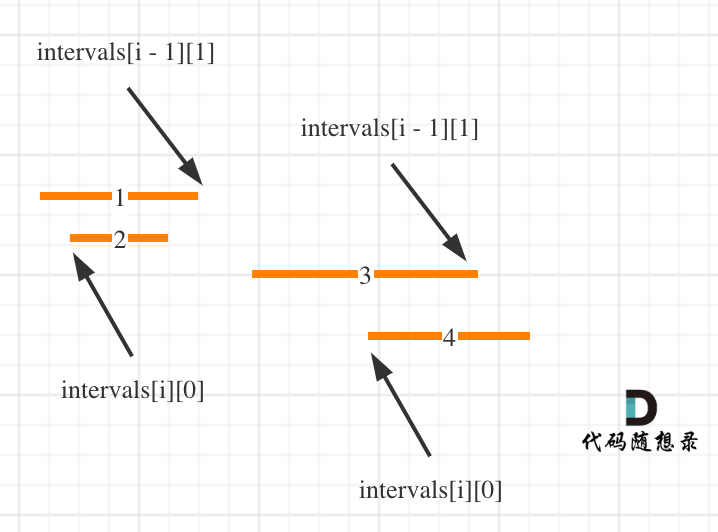
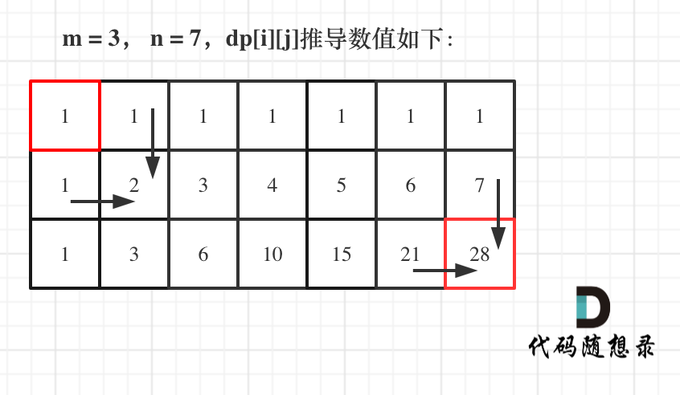
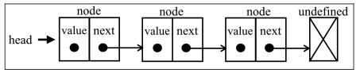

<!-- START doctoc generated TOC please keep comment here to allow auto update -->
<!-- DON'T EDIT THIS SECTION, INSTEAD RE-RUN doctoc TO UPDATE -->
<!-- **Table of Contents**  *generated with [DocToc](https://github.com/thlorenz/doctoc)* -->

- [常见基础算法技巧题解](#%E5%B8%B8%E8%A7%81%E5%9F%BA%E7%A1%80%E7%AE%97%E6%B3%95%E6%8A%80%E5%B7%A7%E9%A2%98%E8%A7%A3)
  - [回溯](#%E5%9B%9E%E6%BA%AF)
    - [回溯简述](#%E5%9B%9E%E6%BA%AF%E7%AE%80%E8%BF%B0)
    - [回溯算法题](#%E5%9B%9E%E6%BA%AF%E7%AE%97%E6%B3%95%E9%A2%98)
      - [77. 组合](#77-%E7%BB%84%E5%90%88)
      - [17.电话号码的字母组合](#17%E7%94%B5%E8%AF%9D%E5%8F%B7%E7%A0%81%E7%9A%84%E5%AD%97%E6%AF%8D%E7%BB%84%E5%90%88)
      - [131. 分割回文串](#131-%E5%88%86%E5%89%B2%E5%9B%9E%E6%96%87%E4%B8%B2)
  - [贪心算法](#%E8%B4%AA%E5%BF%83%E7%AE%97%E6%B3%95)
    - [贪心算法简介](#%E8%B4%AA%E5%BF%83%E7%AE%97%E6%B3%95%E7%AE%80%E4%BB%8B)
    - [贪心算法题](#%E8%B4%AA%E5%BF%83%E7%AE%97%E6%B3%95%E9%A2%98)
      - [455.分发饼干](#455%E5%88%86%E5%8F%91%E9%A5%BC%E5%B9%B2)
      - [53. 最大子序和](#53-%E6%9C%80%E5%A4%A7%E5%AD%90%E5%BA%8F%E5%92%8C)
      - [55. 跳跃游戏](#55-%E8%B7%B3%E8%B7%83%E6%B8%B8%E6%88%8F)
      - [45. 跳跃游戏 II](#45-%E8%B7%B3%E8%B7%83%E6%B8%B8%E6%88%8F-ii)
      - [406. 根据身高重建队列](#406-%E6%A0%B9%E6%8D%AE%E8%BA%AB%E9%AB%98%E9%87%8D%E5%BB%BA%E9%98%9F%E5%88%97)
      - [56. 合并区间](#56-%E5%90%88%E5%B9%B6%E5%8C%BA%E9%97%B4)
  - [动态规划](#%E5%8A%A8%E6%80%81%E8%A7%84%E5%88%92)
    - [动态规划简述](#%E5%8A%A8%E6%80%81%E8%A7%84%E5%88%92%E7%AE%80%E8%BF%B0)
    - [动态规划算法题](#%E5%8A%A8%E6%80%81%E8%A7%84%E5%88%92%E7%AE%97%E6%B3%95%E9%A2%98)
      - [基础动态规划](#%E5%9F%BA%E7%A1%80%E5%8A%A8%E6%80%81%E8%A7%84%E5%88%92)
        - [509. 斐波那契数](#509-%E6%96%90%E6%B3%A2%E9%82%A3%E5%A5%91%E6%95%B0)
        - [70. 爬楼梯](#70-%E7%88%AC%E6%A5%BC%E6%A2%AF)
        - [746. 使用最小花费爬楼梯](#746-%E4%BD%BF%E7%94%A8%E6%9C%80%E5%B0%8F%E8%8A%B1%E8%B4%B9%E7%88%AC%E6%A5%BC%E6%A2%AF)
        - [62.不同路径](#62%E4%B8%8D%E5%90%8C%E8%B7%AF%E5%BE%84)
        - [63. 不同路径 II](#63-%E4%B8%8D%E5%90%8C%E8%B7%AF%E5%BE%84-ii)
      - [背包问题](#%E8%83%8C%E5%8C%85%E9%97%AE%E9%A2%98)
        - [**背包问题简述**](#%E8%83%8C%E5%8C%85%E9%97%AE%E9%A2%98%E7%AE%80%E8%BF%B0)
        - [**01 背包**](#01-%E8%83%8C%E5%8C%85)
        - [**二维 dp 数组 01 背包**](#%E4%BA%8C%E7%BB%B4-dp-%E6%95%B0%E7%BB%84-01-%E8%83%8C%E5%8C%85)
        - [**滚动数组与 01 背包**](#%E6%BB%9A%E5%8A%A8%E6%95%B0%E7%BB%84%E4%B8%8E-01-%E8%83%8C%E5%8C%85)
        - [416. 分割等和子集](#416-%E5%88%86%E5%89%B2%E7%AD%89%E5%92%8C%E5%AD%90%E9%9B%86)
        - [494. 目标和](#494-%E7%9B%AE%E6%A0%87%E5%92%8C)
        - [**完全背包**](#%E5%AE%8C%E5%85%A8%E8%83%8C%E5%8C%85)
        - [518. 零钱兑换 II-背包问题求组合](#518-%E9%9B%B6%E9%92%B1%E5%85%91%E6%8D%A2-ii-%E8%83%8C%E5%8C%85%E9%97%AE%E9%A2%98%E6%B1%82%E7%BB%84%E5%90%88)
        - [377. 组合总和 4-背包问题求排列](#377-%E7%BB%84%E5%90%88%E6%80%BB%E5%92%8C-4-%E8%83%8C%E5%8C%85%E9%97%AE%E9%A2%98%E6%B1%82%E6%8E%92%E5%88%97)
        - [322. 零钱兑换](#322-%E9%9B%B6%E9%92%B1%E5%85%91%E6%8D%A2)
        - [139. 单词拆分](#139-%E5%8D%95%E8%AF%8D%E6%8B%86%E5%88%86)
      - [打家劫舍问题](#%E6%89%93%E5%AE%B6%E5%8A%AB%E8%88%8D%E9%97%AE%E9%A2%98)
        - [198. 打家劫舍](#198-%E6%89%93%E5%AE%B6%E5%8A%AB%E8%88%8D)
        - [213. 打家劫舍 II](#213-%E6%89%93%E5%AE%B6%E5%8A%AB%E8%88%8D-ii)
        - [337. 打家劫舍 III](#337-%E6%89%93%E5%AE%B6%E5%8A%AB%E8%88%8D-iii)
      - [买卖股票问题](#%E4%B9%B0%E5%8D%96%E8%82%A1%E7%A5%A8%E9%97%AE%E9%A2%98)
        - [121.买卖股票的最佳时机-(只能买卖一次)](#121%E4%B9%B0%E5%8D%96%E8%82%A1%E7%A5%A8%E7%9A%84%E6%9C%80%E4%BD%B3%E6%97%B6%E6%9C%BA-%E5%8F%AA%E8%83%BD%E4%B9%B0%E5%8D%96%E4%B8%80%E6%AC%A1)
        - [122. 买卖股票的最佳时机 II-(可以买卖多次)](#122-%E4%B9%B0%E5%8D%96%E8%82%A1%E7%A5%A8%E7%9A%84%E6%9C%80%E4%BD%B3%E6%97%B6%E6%9C%BA-ii-%E5%8F%AF%E4%BB%A5%E4%B9%B0%E5%8D%96%E5%A4%9A%E6%AC%A1)
        - [123.买卖股票的最佳时机 III-(最多买卖两次)](#123%E4%B9%B0%E5%8D%96%E8%82%A1%E7%A5%A8%E7%9A%84%E6%9C%80%E4%BD%B3%E6%97%B6%E6%9C%BA-iii-%E6%9C%80%E5%A4%9A%E4%B9%B0%E5%8D%96%E4%B8%A4%E6%AC%A1)
        - [309. 最佳买卖股票时机含冷冻期-(买卖多次，卖出有一天冷冻期)](#309-%E6%9C%80%E4%BD%B3%E4%B9%B0%E5%8D%96%E8%82%A1%E7%A5%A8%E6%97%B6%E6%9C%BA%E5%90%AB%E5%86%B7%E5%86%BB%E6%9C%9F-%E4%B9%B0%E5%8D%96%E5%A4%9A%E6%AC%A1%E5%8D%96%E5%87%BA%E6%9C%89%E4%B8%80%E5%A4%A9%E5%86%B7%E5%86%BB%E6%9C%9F)
        - [714. 买卖股票的最佳时机含手续费-(买卖多次，每次有手续费)](#714-%E4%B9%B0%E5%8D%96%E8%82%A1%E7%A5%A8%E7%9A%84%E6%9C%80%E4%BD%B3%E6%97%B6%E6%9C%BA%E5%90%AB%E6%89%8B%E7%BB%AD%E8%B4%B9-%E4%B9%B0%E5%8D%96%E5%A4%9A%E6%AC%A1%E6%AF%8F%E6%AC%A1%E6%9C%89%E6%89%8B%E7%BB%AD%E8%B4%B9)
      - [子序列问题](#%E5%AD%90%E5%BA%8F%E5%88%97%E9%97%AE%E9%A2%98)
        - [53. 最大子序和](#53-%E6%9C%80%E5%A4%A7%E5%AD%90%E5%BA%8F%E5%92%8C-1)
        - [300. 最长递增子序列](#300-%E6%9C%80%E9%95%BF%E9%80%92%E5%A2%9E%E5%AD%90%E5%BA%8F%E5%88%97)
        - [674. 最长连续递增序列](#674-%E6%9C%80%E9%95%BF%E8%BF%9E%E7%BB%AD%E9%80%92%E5%A2%9E%E5%BA%8F%E5%88%97)
        - [718. 最长重复子数组](#718-%E6%9C%80%E9%95%BF%E9%87%8D%E5%A4%8D%E5%AD%90%E6%95%B0%E7%BB%84)
        - [1143. 最长公共子序列](#1143-%E6%9C%80%E9%95%BF%E5%85%AC%E5%85%B1%E5%AD%90%E5%BA%8F%E5%88%97)
  - [链表](#%E9%93%BE%E8%A1%A8)
    - [链表简述](#%E9%93%BE%E8%A1%A8%E7%AE%80%E8%BF%B0)
    - [链表算法题](#%E9%93%BE%E8%A1%A8%E7%AE%97%E6%B3%95%E9%A2%98)
      - [206. 反转链表-(top)](#206-%E5%8F%8D%E8%BD%AC%E9%93%BE%E8%A1%A8-top)
      - [203. 移除链表元素-(递归、迭代)](#203-%E7%A7%BB%E9%99%A4%E9%93%BE%E8%A1%A8%E5%85%83%E7%B4%A0-%E9%80%92%E5%BD%92%E8%BF%AD%E4%BB%A3)
      - [19. 删除链表的倒数第 N 个结点-(双指针)-(top)](#19-%E5%88%A0%E9%99%A4%E9%93%BE%E8%A1%A8%E7%9A%84%E5%80%92%E6%95%B0%E7%AC%AC-n-%E4%B8%AA%E7%BB%93%E7%82%B9-%E5%8F%8C%E6%8C%87%E9%92%88-top)
      - [21. 合并两个有序链表-(递归、迭代)-(top)](#21-%E5%90%88%E5%B9%B6%E4%B8%A4%E4%B8%AA%E6%9C%89%E5%BA%8F%E9%93%BE%E8%A1%A8-%E9%80%92%E5%BD%92%E8%BF%AD%E4%BB%A3-top)
  - [其他常见简单题](#%E5%85%B6%E4%BB%96%E5%B8%B8%E8%A7%81%E7%AE%80%E5%8D%95%E9%A2%98)
    - [算法题例](#%E7%AE%97%E6%B3%95%E9%A2%98%E4%BE%8B)
      - [1. 两数之和-(哈希表)](#1-%E4%B8%A4%E6%95%B0%E4%B9%8B%E5%92%8C-%E5%93%88%E5%B8%8C%E8%A1%A8)
      - [3 无重复字符的最长子串-(字符串-滑动窗口)](#3-%E6%97%A0%E9%87%8D%E5%A4%8D%E5%AD%97%E7%AC%A6%E7%9A%84%E6%9C%80%E9%95%BF%E5%AD%90%E4%B8%B2-%E5%AD%97%E7%AC%A6%E4%B8%B2-%E6%BB%91%E5%8A%A8%E7%AA%97%E5%8F%A3)
      - [2. 两数相加-(链表模拟)](#2-%E4%B8%A4%E6%95%B0%E7%9B%B8%E5%8A%A0-%E9%93%BE%E8%A1%A8%E6%A8%A1%E6%8B%9F)
      - [20. 有效的括号-(栈)](#20-%E6%9C%89%E6%95%88%E7%9A%84%E6%8B%AC%E5%8F%B7-%E6%A0%88)
      - [26. 删除有序数组中的重复项- (双指针)](#26-%E5%88%A0%E9%99%A4%E6%9C%89%E5%BA%8F%E6%95%B0%E7%BB%84%E4%B8%AD%E7%9A%84%E9%87%8D%E5%A4%8D%E9%A1%B9--%E5%8F%8C%E6%8C%87%E9%92%88)
      - [7. 整数反转-(数学)](#7-%E6%95%B4%E6%95%B0%E5%8F%8D%E8%BD%AC-%E6%95%B0%E5%AD%A6)
      - [5. 最长回文子串-(双指针/中心扩展、动态规划)](#5-%E6%9C%80%E9%95%BF%E5%9B%9E%E6%96%87%E5%AD%90%E4%B8%B2-%E5%8F%8C%E6%8C%87%E9%92%88%E4%B8%AD%E5%BF%83%E6%89%A9%E5%B1%95%E5%8A%A8%E6%80%81%E8%A7%84%E5%88%92)
      - [34. 在排序数组中查找元素的第一个和最后一个位置-(二分查找)](#34-%E5%9C%A8%E6%8E%92%E5%BA%8F%E6%95%B0%E7%BB%84%E4%B8%AD%E6%9F%A5%E6%89%BE%E5%85%83%E7%B4%A0%E7%9A%84%E7%AC%AC%E4%B8%80%E4%B8%AA%E5%92%8C%E6%9C%80%E5%90%8E%E4%B8%80%E4%B8%AA%E4%BD%8D%E7%BD%AE-%E4%BA%8C%E5%88%86%E6%9F%A5%E6%89%BE)
      - [14. 最长公共前缀(字符串-纵向扫描)](#14-%E6%9C%80%E9%95%BF%E5%85%AC%E5%85%B1%E5%89%8D%E7%BC%80%E5%AD%97%E7%AC%A6%E4%B8%B2-%E7%BA%B5%E5%90%91%E6%89%AB%E6%8F%8F)
      - [13. 罗马数字转整数-(字符串、哈希表)](#13-%E7%BD%97%E9%A9%AC%E6%95%B0%E5%AD%97%E8%BD%AC%E6%95%B4%E6%95%B0-%E5%AD%97%E7%AC%A6%E4%B8%B2%E5%93%88%E5%B8%8C%E8%A1%A8)
      - [283. 移动零-(双指针)](#283-%E7%A7%BB%E5%8A%A8%E9%9B%B6-%E5%8F%8C%E6%8C%87%E9%92%88)
      - [88. 合并两个有序数组-(双指针)](#88-%E5%90%88%E5%B9%B6%E4%B8%A4%E4%B8%AA%E6%9C%89%E5%BA%8F%E6%95%B0%E7%BB%84-%E5%8F%8C%E6%8C%87%E9%92%88)
  - [算法模板](#%E7%AE%97%E6%B3%95%E6%A8%A1%E6%9D%BF)
    - [二分查找法](#%E4%BA%8C%E5%88%86%E6%9F%A5%E6%89%BE%E6%B3%95)
    - [KMP](#kmp)
    - [二叉树](#%E4%BA%8C%E5%8F%89%E6%A0%91)
      - [深度优先遍历（递归）](#%E6%B7%B1%E5%BA%A6%E4%BC%98%E5%85%88%E9%81%8D%E5%8E%86%E9%80%92%E5%BD%92)
      - [深度优先遍历（迭代）](#%E6%B7%B1%E5%BA%A6%E4%BC%98%E5%85%88%E9%81%8D%E5%8E%86%E8%BF%AD%E4%BB%A3)
      - [广度优先遍历（队列）](#%E5%B9%BF%E5%BA%A6%E4%BC%98%E5%85%88%E9%81%8D%E5%8E%86%E9%98%9F%E5%88%97)
      - [二叉树深度](#%E4%BA%8C%E5%8F%89%E6%A0%91%E6%B7%B1%E5%BA%A6)
      - [二叉树节点数量](#%E4%BA%8C%E5%8F%89%E6%A0%91%E8%8A%82%E7%82%B9%E6%95%B0%E9%87%8F)
    - [回溯算法](#%E5%9B%9E%E6%BA%AF%E7%AE%97%E6%B3%95)
    - [并查集](#%E5%B9%B6%E6%9F%A5%E9%9B%86)

<!-- END doctoc generated TOC please keep comment here to allow auto update -->

说明：基本属于对[youngyangyang04/leetcode-master](https://github.com/youngyangyang04/leetcode-master)有兴趣部分的摘取整理学习。

# 常见基础算法技巧题解

## 回溯

### 回溯简述

1. 什么是回溯法

回溯法也可以叫做回溯搜索法，它是一种搜索的方式。  
回溯是递归的副产品，只要有递归就会有回溯。

2. 回溯法的效率

虽然回溯法很难，很不好理解，但是回溯法并不是什么高效的算法。  
因为**回溯的本质是穷举**，穷举所有可能，然后选出我们想要的答案，如果想让回溯法高效一些，可以加一些剪枝的操作，但也改不了回溯法就是穷举的本质。

3. 回溯法解决的问题

回溯法，一般可以解决如下几种问题：

- 组合问题：N 个数里面按一定规则找出 k 个数的集合
- 切割问题：一个字符串按一定规则有几种切割方式
- 子集问题：一个 N 个数的集合里有多少符合条件的子集
- 排列问题：N 个数按一定规则全排列，有几种排列方式
- 棋盘问题：N 皇后，解数独等等

**组合无序，排列有序**: 组合是不强调元素顺序的，排列是强调元素顺序。

例如：{1, 2} 和 {2, 1} 在组合上，就是一个集合，因为不强调顺序，而要是排列的话，{1, 2} 和 {2, 1} 就是两个集合了。

4. 如何理解回溯法

**回溯法解决的问题都可以抽象为树形结构**。

因为回溯法解决的都是在集合中递归查找子集，**集合的大小就构成了树的宽度，递归的深度就构成的树的深度。**

递归就要有终止条件，所以必然是一棵高度有限的树（N 叉树）。

**for 循环可以理解是横向遍历，backtracking（递归）就是纵向遍历**

回溯法抽象为树形结构后，其遍历过程就是：**for 循环横向遍历，递归纵向遍历，回溯不断调整结果集。**

5. 回溯法模板

```js
void backtracking(参数) {
    if (终止条件) {
        存放结果;
        return;
    }

    for (选择：本层集合中元素（树中节点孩子的数量就是集合的大小）) {
        处理节点;
        backtracking(路径，选择列表); // 递归
        回溯，撤销处理结果
    }
}
```

### 回溯算法题

#### [77. 组合](https://leetcode.cn/problems/combinations/)

```txt
给定两个整数 n 和 k，返回范围 [1, n] 中所有可能的 k 个数的组合。

你可以按 任何顺序 返回答案。
```

**题解**:

如果解决一个问题有多个步骤，每一个步骤有多种方法，题目又要我们找出所有的方法，可以使用回溯算法；  
回溯算法是在一棵树上的 深度优先遍历（因为要找所有的解，所以需要遍历）；  
组合问题，相对于排列问题而言，不计较一个组合内元素的顺序性（即 [1, 2, 3] 与 [1, 3, 2] 认为是同一个组合），  
因此很多时候需要按某种顺序展开搜索，这样才能做到不重不漏。

把组合问题抽象为如下树形结构图示:


可以看出这个棵树，一开始集合是 1，2，3，4， 从左向右取数，取过的数，不在重复取。

第一次取 1，集合变为 2，3，4 ，因为 k 为 2，我们只需要再取一个数就可以了，分别取 2，3，4，得到集合[1,2] [1,3] [1,4]，以此类推。

**每次从集合中选取元素，可选择的范围随着选择的进行而收缩，调整可选择的范围。**

**图中可以发现 n 相当于树的宽度，k 相当于树的深度。**

那么如何在这个树上遍历，然后收集到我们要的结果集呢？

**图中每次搜索到了叶子节点，我们就找到了一个结果。**

相当于只需要把达到叶子节点的结果收集起来，就可以求得 n 个数中 k 个数的组合集合。

回溯法三部曲(模板):

- 递归函数的返回值以及参数
- 回溯函数终止条件
- 单层搜索的过程

综上，代码如下:

```js
// 1 返回值和参数 result path startIndex
// 存放符合条件结果的集合
let result = [];
//  用来存放符合条件结果
let path = [];
var combine = function (n, k) {
  result = [];
  combineHelper(n, k, 1);
  return result;
};

// 回溯法
//   int型变量startIndex，这个参数用来记录本层递归的中，集合从哪里开始遍历（集合就是[1,...,n] ）。
const combineHelper = (n, k, startIndex) => {
  // 2 终止条件: path这个数组的大小如果达到k，说明我们找到了一个子集大小为k的组合了
  if (path.length === k) {
    result.push([...path]);
    return;
  }
  // 3 单层搜索过程
  //  for循环每次从startIndex开始遍历，然后用path保存取到的节点i (控制树的横向遍历)
  //   可以剪枝的地方就在递归中每一层的for循环所选择的起始位置。
  //   如果for循环选择的起始位置之后的元素个数 已经不足 我们需要的元素个数了，那么就没有必要搜索了。
  for (let i = startIndex; i <= n - (k - path.length) + 1; ++i) {
    path.push(i); // 处理节点
    // 递归：控制树的纵向遍历，注意下一层搜索要从i+1开始
    //  通过不断调用自己一直往深处遍历，总会遇到叶子节点，遇到了叶子节点就要返回。
    combineHelper(n, k, i + 1);
    path.pop(); // // 回溯，撤销处理的节点
  }
};

/********** 放在一起的简单写法 */
var combine = function (n, k) {
  const res = [],
    path = [];
  backtracking(n, k, 1);
  return res;
  function backtracking(n, k, i) {
    const len = path.length;
    if (len === k) {
      res.push(Array.from(path));
      return;
    }
    for (let a = i; a <= n + len - k + 1; a++) {
      path.push(a);
      backtracking(n, k, a + 1);
      path.pop();
    }
  }
};
```

#### [17.电话号码的字母组合](https://leetcode.cn/problems/letter-combinations-of-a-phone-number/)

```txt
给定一个仅包含数字 2-9 的字符串，返回所有它能表示的字母组合。答案可以按 任意顺序 返回。
给出数字到字母的映射如下（与电话按键相同）。注意 1 不对应任何字母。

就是这样一个映射:
const string letterMap[10] = {
    "", // 0
    "", // 1
    "abc", // 2
    "def", // 3
    "ghi", // 4
    "jkl", // 5
    "mno", // 6
    "pqrs", // 7
    "tuv", // 8
    "wxyz", // 9
};
```

**题解**:

回溯法来解决 n 个 for 循环的问题,记住回溯模块。

综上，代码如下:

```js
var letterCombinations = function (digits) {
  const k = digits.length;
  const map = [
    "",
    "",
    "abc",
    "def",
    "ghi",
    "jkl",
    "mno",
    "pqrs",
    "tuv",
    "wxyz",
  ];
  if (!k) return [];
  if (k === 1) return map[digits].split("");

  // 1 返回值和参数
  const res = [],
    path = [];
  backtracking(digits, k, 0);
  return res;

  function backtracking(n, k, a) {
    // 2 终止条件
    if (path.length === k) {
      res.push(path.join(""));
      return;
    }
    // 3 单层for循环遍历
    //  每一个数字代表的是不同集合，也就是求不同集合之间的组合
    for (const v of map[n[a]]) {
      path.push(v);
      backtracking(n, k, a + 1);
      path.pop(); // 回溯
    }
  }
};
// 注意：输入1 * #按键等等异常情况，此处没有处理
```

#### [131. 分割回文串](https://leetcode.cn/problems/palindrome-partitioning/)

```txt
给你一个字符串 s，请你将 s 分割成一些子串，使每个子串都是 回文串 。返回 s 所有可能的分割方案。
回文串 是正着读和反着读都一样的字符串。

示例 1：
输入：s = "aab"
输出：[["a","a","b"],["aa","b"]]

```

**题解**：
本题这涉及到两个关键问题：切割问题，有不同的切割方式 和 判断回文。

**其实切割问题类似组合问题**。也可以抽象为一棵树形结构，如图：


综上，代码如下:

```js
// 判断是否为回文子串
const isPalindrome = (s, l, r) => {
  // 使用双指针法，一个指针从前向后，一个指针从后先前，
  //   如果前后指针所指向的元素是相等的，就是回文字符串了。
  for (let i = l, j = r; i < j; i++, j--) {
    if (s[i] !== s[j]) return false;
  }
  return true;
};

var partition = function (s) {
  // 1 返回值和参数
  const res = [],
    // 放已经回文的子串
    path = [],
    len = s.length;

  backtracking(0);

  return res;

  function backtracking(i) {
    // 2 终止条件
    //   如果起始位置已经大于s的大小，说明已经找到了一组分割方案了
    if (i >= len) {
      res.push(Array.from(path));
      return;
    }
    // 3 单层遍历
    for (let j = i; j < len; j++) {
      // 不是回文，跳过
      if (!isPalindrome(s, i, j)) continue;
      // 是回文子串，获取[startIndex,i]在s中的子串
      path.push(s.slice(i, j + 1));
      // 寻找i+1为起始位置的子串
      backtracking(j + 1);
      // 回溯过程，弹出本次已经填在的子串
      path.pop();
    }
  }
};
```

## 贪心算法

<!--  -->

### 贪心算法简介

1. 什么是贪心

**贪心的本质是选择每一阶段的局部最优，从而达到全局最优。**

例如，有一堆钞票，你可以拿走十张，如果想达到最大的金额，你要怎么拿？  
指定每次拿最大的，最终结果就是拿走最大数额的钱。  
每次拿最大的就是局部最优，最后拿走最大数额的钱就是推出全局最优。

2. 什么时候用贪心

贪心算法并没有固定的套路。唯一的难点就是如何通过局部最优，推出整体最优。

适用贪心算法的场景：问题能够分解成子问题来解决，子问题的最优解能递推到最终问题的最优解。这种子问题最优解成为最优子结构。

想清楚局部最优，想清楚全局最优，感觉局部最优是可以推出全局最优，并想不出反例，那么就试一试贪心。

### 贪心算法题

#### [455.分发饼干](https://leetcode.cn/problems/assign-cookies/)

```txt
假设你是一位很棒的家长，想要给你的孩子们一些小饼干。但是，每个孩子最多只能给一块饼干。

对每个孩子 i，都有一个胃口值 g[i]，这是能让孩子们满足胃口的饼干的最小尺寸；并且每块饼干 j，都有一个尺寸 s[j] 。
如果 s[j] >= g[i]，我们可以将这个饼干 j 分配给孩子 i ，这个孩子会得到满足。
你的目标是尽可能满足越多数量的孩子，并输出这个最大数值。

示例 1:
输入: g = [1,2,3], s = [1,1]
输出: 1
解释:
你有三个孩子和两块小饼干，3个孩子的胃口值分别是：1,2,3。
虽然你有两块小饼干，由于他们的尺寸都是1，你只能让胃口值是1的孩子满足。
所以你应该输出1。
```

**题解**：  
大尺寸的饼干既可以满足胃口大的孩子也可以满足胃口小的孩子，那么就应该优先满足胃口大的。  
**这里的局部最优就是大饼干喂给胃口大的，充分利用饼干尺寸喂饱一个，全局最优就是喂饱尽可能多的小孩**  
可以尝试使用贪心策略，先将饼干数组和小孩数组排序。  
然后从后向前遍历小孩数组，用大饼干优先满足胃口大的，并统计满足小孩数量。

综上，代码如下:

```js
var findContentChildren = function (g, s) {
  // 对小孩胃口和饼干进行排序(升序)
  g = g.sort((a, b) => a - b);
  s = s.sort((a, b) => a - b);
  // 初始没有满足的结果
  let result = 0;
  // 从最大分量的饼干开始遍历去满足胃口最大的小孩
  let index = s.length - 1;

  // 优先考虑胃口，先喂饱大胃口
  for (let i = g.length - 1; i >= 0; i--) {
    // 如果有满足，结果加1，继续遍历
    if (index >= 0 && s[index] >= g[i]) {
      result++;
      index--;
    }
  }
  return result;
};
```

#### [53. 最大子序和](https://leetcode.cn/problems/maximum-subarray/)

```txt
给你一个整数数组 nums ，请你找出一个具有最大和的连续子数组（子数组最少包含一个元素），返回其最大和。
子数组 是数组中的一个连续部分。

示例 1：
输入：nums = [-2,1,-3,4,-1,2,1,-5,4]
输出：6
解释：连续子数组 [4,-1,2,1] 的和最大，为 6 。
```

**题解**：

贪心算法。  
局部最优：当前“连续和”为负数的时候立刻放弃，从下一个元素重新计算“连续和”，因为负数加上下一个元素 “连续和”只会越来越小。  
全局最优：选取最大“连续和”  
局部最优的情况下，并记录最大的“连续和”，可以推出全局最优。

从代码角度上来讲：遍历 nums，从头开始用 count 累积，如果 count 一旦加上 `nums[i]`变为负数，那么就应该从 `nums[i+1]`开始从 0 累积 count 了，因为已经变为负数的 count，只会拖累总和。

综上，代码如下:

```js
/*******  贪心算法*/
var maxSubArray = function (nums) {
  //类似寻找最大最小值的题目，初始值一定要定义成理论上的最小最大值
  let result = -Infinity;
  let count = 0;

  // 遍历，从头开始连续项累加
  for (let i = 0; i < nums.length; i++) {
    count += nums[i];
    // 如果连续和+num[i]比原来的值大，则该连续和赋值给结果
    if (count > result) {
      result = count;
    }
    // 如果 count 一旦加上 `nums[i]`变为负数，那么就应该从 `nums[i+1]`开始从 0 累积 count 了
    if (count < 0) {
      count = 0;
    }
  }
  // 遍历完成，返回结果
  return result;
};

/***** 动态规划**/
const maxSubArray = (nums) => {
  // 数组长度，dp初始化
  const len = nums.length;
  let dp = new Array(len).fill(0);
  dp[0] = nums[0];
  // 最大值初始化为dp[0]
  let max = dp[0];
  for (let i = 1; i < len; i++) {
    dp[i] = Math.max(dp[i - 1] + nums[i], nums[i]);
    // 更新最大值
    max = Math.max(max, dp[i]);
  }
  return max;
};
```

#### [55. 跳跃游戏](https://leetcode.cn/problems/jump-game/)

```txt
给定一个非负整数数组 nums ，你最初位于数组的 第一个下标 。
数组中的每个元素代表你在该位置可以跳跃的最大长度。
判断你是否能够到达最后一个下标。

示例 1：
输入：nums = [2,3,1,1,4]
输出：true
解释：可以先跳 1 步，从下标 0 到达下标 1, 然后再从下标 1 跳 3 步到达最后一个下标。

示例 2：
输入：nums = [3,2,1,0,4]
输出：false
解释：无论怎样，总会到达下标为 3 的位置。但该下标的最大跳跃长度是 0 ， 所以永远不可能到达最后一个下标。
```

**题解**：

其实跳几步无所谓，关键在于可跳的覆盖范围！  
不一定非要明确一次究竟跳几步，每次取最大的跳跃步数，这个就是可以跳跃的覆盖范围。  
这个范围内，别管是怎么跳的，反正一定可以跳过来。  
**那么这个问题就转化为跳跃覆盖范围究竟可不可以覆盖到终点！**  
每次移动取最大跳跃步数（得到最大的覆盖范围），每移动一个单位，就更新最大覆盖范围。  
**贪心算法局部最优解：每次取最大跳跃步数（取最大覆盖范围），整体最优解：最后得到整体最大覆盖范围，看是否能到终点。**

综上，代码如下:

```js
var canJump = function (nums) {
  // 只有一个元素，就是能达到
  if (nums.length === 1) return true;
  let cover = 0;
  // i每次移动只能在cover的范围内移动，
  //  每移动一个元素，cover得到该元素数值(新的覆盖范围)的补充，让i继续移动下去。
  //  注意这里是小于等于cover
  for (let i = 0; i <= cover; i++) {
    // 而cover每次只取 max(该元素数值补充后的范围, cover本身范围)。
    cover = Math.max(cover, i + nums[i]);
    // 如果cover大于等于了终点下标，直接return true就可以了。
    if (cover >= nums.length - 1) {
      return true;
    }
  }
  return false;
};
```

#### [45. 跳跃游戏 II](https://leetcode.cn/problems/jump-game-ii/)

```txt
给你一个非负整数数组 nums ，你最初位于数组的第一个位置。
数组中的每个元素代表你在该位置可以跳跃的最大长度。
你的目标是使用最少的跳跃次数到达数组的最后一个位置。
假设你总是可以到达数组的最后一个位置。

示例 1:
输入: nums = [2,3,1,1,4]
输出: 2
解释: 跳到最后一个位置的最小跳跃数是 2。
     从下标为 0 跳到下标为 1 的位置，跳 1 步，然后跳 3 步到达数组的最后一个位置。

示例 2:
输入: nums = [2,3,0,1,4]
输出: 2
```

**题解**：

思路和`跳跃游戏`类似，都是要看最大覆盖范围。  
本题要计算最小步数，那么就要想清楚什么时候步数才一定要加一呢？  
**所以真正解题的时候，要从覆盖范围出发，不管怎么跳，覆盖范围内一定是可以跳到的，以最小的步数增加覆盖范围，覆盖范围一旦覆盖了终点，得到的就是最小步数！**  
**这里需要统计两个覆盖范围，当前这一步的最大覆盖和下一步最大覆盖。**
如果移动下标达到了当前这一步的最大覆盖最远距离了，还没有到终点的话，那么就必须再走一步来增加覆盖范围，直到覆盖范围覆盖了终点。

移动下标达到了当前覆盖的最远距离下标时，步数就要加一，来增加覆盖距离。最后的步数就是最少步数。  
有个特殊情况需要考虑，当移动下标达到了当前覆盖的最远距离下标时:

- 如果当前覆盖最远距离下标不是是集合终点，步数就加一，还需要继续走。
- 如果当前覆盖最远距离下标就是是集合终点，步数不用加一，因为不能再往后走了。

理解本题的关键在于：**以最小的步数增加最大的覆盖范围，直到覆盖范围覆盖了终点**，这个范围内最小步数一定可以跳到，不用管具体是怎么跳的，不纠结于一步究竟跳一个单位还是两个单位。

综上，代码如下:

```js
var jump = function (nums) {
  let curIndex = 0; // 当前覆盖最远距离下标
  let nextIndex = 0; // 下一步覆盖最远距离下标
  let steps = 0; // 记录走的最大步数

  // 遍历数组
  //    注意这里是小于nums.size() - 1，这是关键所在
  for (let i = 0; i < nums.length - 1; i++) {
    // 更新下一步覆盖最远距离下标
    nextIndex = Math.max(nums[i] + i, nextIndex);
    // 遇到当前覆盖最远距离下标
    if (i === curIndex) {
      // 更新当前覆盖最远距离下标
      curIndex = nextIndex;
      // 步数+1
      steps++;
    }
  }

  // 跳完之后返回步数
  return steps;
};
```

#### [406. 根据身高重建队列](https://leetcode.cn/problems/queue-reconstruction-by-height/)

```txt
假设有打乱顺序的一群人站成一个队列，数组 people 表示队列中一些人的属性（不一定按顺序）。
每个 people[i] = [hi, ki] 表示第 i 个人的身高为 hi ，前面 正好 有 ki 个身高大于或等于 hi 的人。

请你重新构造并返回输入数组 people 所表示的队列。返回的队列应该格式化为数组 queue ，
其中 queue[j] = [hj, kj] 是队列中第 j 个人的属性（queue[0] 是排在队列前面的人）。

示例 1：
输入：people = [[7,0],[4,4],[7,1],[5,0],[6,1],[5,2]]
输出：[[5,0],[7,0],[5,2],[6,1],[4,4],[7,1]]
解释：
编号为 0 的人身高为 5 ，没有身高更高或者相同的人排在他前面。
编号为 1 的人身高为 7 ，没有身高更高或者相同的人排在他前面。
编号为 2 的人身高为 5 ，有 2 个身高更高或者相同的人排在他前面，即编号为 0 和 1 的人。
编号为 3 的人身高为 6 ，有 1 个身高更高或者相同的人排在他前面，即编号为 1 的人。
编号为 4 的人身高为 4 ，有 4 个身高更高或者相同的人排在他前面，即编号为 0、1、2、3 的人。
编号为 5 的人身高为 7 ，有 1 个身高更高或者相同的人排在他前面，即编号为 1 的人。
因此 [[5,0],[7,0],[5,2],[6,1],[4,4],[7,1]] 是重新构造后的队列。

示例 2：
输入：people = [[6,0],[5,0],[4,0],[3,2],[2,2],[1,4]]
输出：[[4,0],[5,0],[2,2],[3,2],[1,4],[6,0]]
```

**题解**：

本题有两个维度，h 和 k，看到这种题目一定要想如何确定一个维度，然后在按照另一个维度重新排列。  
**如果两个维度一起考虑一定会顾此失彼。**  
如果按照 k 来从小到大排序，排完之后，会发现 k 的排列并不符合条件，身高也不符合条件，两个维度哪一个都没确定下来。  
那么按照身高 h 来排序呢，身高一定是从大到小排（身高相同的话则 k 小的站前面），让高个子在前面。  
此时我们可以确定一个维度了，就是身高，前面的节点一定都比本节点高！

那么只需要按照 k 为下标重新插入队列就可以了，为什么呢？

以图中{5,2} 为例：


按照身高排序之后，优先按身高高的 people 的 k 来插入，后序插入节点也不会影响前面已经插入的节点，最终按照 k 的规则完成了队列。  
所以在按照身高从大到小排序后：  
**局部最优：优先按身高高的 people 的 k 来插入。插入操作过后的 people 满足队列属性**  
**全局最优：最后都做完插入操作，整个队列满足题目队列属性**

关于出现两个维度一起考虑的情况，其技巧都是**确定一边然后贪心另一边**，两边一起考虑，就会顾此失彼。

综上，代码如下:

```js
var reconstructQueue = function (people) {
  let queue = [];

  // 先将身高从大到小排序，确定最大个子的相对位置
  people.sort((a, b) => {
    if (b[0] !== a[0]) {
      // 这个只是确保身高按照由大到小的顺序来排，并不确定K是按照从小到大排序的
      return b[0] - a[0];
    } else {
      // 这个才是当身高相同时，将K按照从小到大排序
      return a[1] - b[1];
    }
  });

  // 再按照K进行插入排序，优先插入K小的
  for (let i = 0; i < people.length; i++) {
    //在指定插入位置之后插入元素
    queue.splice(people[i][1], 0, people[i]);
  }
  // 返回结果队列
  return queue;
};
```

#### [56. 合并区间](https://leetcode.cn/problems/merge-intervals/)

```txt
以数组 intervals 表示若干个区间的集合，其中单个区间为 intervals[i] = [starti, endi] 。
请你合并所有重叠的区间，并返回 一个不重叠的区间数组，该数组需恰好覆盖输入中的所有区间 。

示例 1：
输入：intervals = [[1,3],[2,6],[8,10],[15,18]]
输出：[[1,6],[8,10],[15,18]]
解释：区间 [1,3] 和 [2,6] 重叠, 将它们合并为 [1,6].

示例 2：
输入：intervals = [[1,4],[4,5]]
输出：[[1,5]]
解释：区间 [1,4] 和 [4,5] 可被视为重叠区间。
```

**题解**：

此题一定要排序，按照左边界排序，还是右边界排序都可以。  
那么我按照左边界排序，排序之后局部最优：每次合并都取最大的右边界，这样就可以合并更多的区间了，整体最优：合并所有重叠的区间。  
局部最优可以推出全局最优，找不出反例，试试贪心。

判断重复：  
按照左边界从小到大排序之后，如果 `intervals[i][0] < intervals[i - 1][1]` 即 `intervals[i]左边界 < intervals[i - 1]右边界`，则一定有重复，因为 `intervals[i]`的左边界一定是大于等于 `intervals[i - 1]`的左边界。

即：`intervals[i]`的左边界在 `intervals[i - 1]`左边界和右边界的范围内，那么一定有重复！

图示：



合并区间：  
用合并区间后左边界和右边界，作为一个新的区间，加入到 result 数组里就可以了。如果没有合并就把原区间加入到 result 数组。

综上，代码如下:

```js
var merge = function (intervals) {
  //先从小到大排序
  intervals.sort((a, b) => a[0] - b[0]);
  // 前一个集合
  let prev = intervals[0];
  // 结果数组
  let result = [];

  // 遍历
  for (let i = 0; i < intervals.length; i++) {
    // 当前结合
    let cur = intervals[i];
    // 如果当前集合的左边界大于前一个集合的右边界,没有交集
    if (cur[0] > prev[1]) {
      // 把前一个集合加入结果集
      result.push(prev);
      // 并更新前一个集合指向当前集合
      prev = cur;
    } else {
      // 有交集，则要合并，更新前一个集合的右边界为当前集合与前一个集合的较大值
      prev[1] = Math.max(cur[1], prev[1]);
    }
  }
  // 把边界合并后的集合放到结果集
  result.push(prev);
  // 返回结果
  return result;
};

/*********左右区间法**/
var merge = function (intervals) {
  // 如果只有一个集合，返回该值
  let n = intervals.length;
  if (n < 2) return intervals;
  // 左边界排序
  intervals.sort((a, b) => a[0] - b[0]);
  // 声明结果集、最小左边界、最大右边界
  let res = [],
    left = intervals[0][0],
    right = intervals[0][1];
  // 遍历
  for (let i = 1; i < n; i++) {
    // 如果当前集合的左边界大于最大右边界（没有交集）
    if (intervals[i][0] > right) {
      // 放入结果集
      res.push([left, right]);
      // 并更新最大右边界、最小左边界
      left = intervals[i][0];
      right = intervals[i][1];
    } else {
      // 否则，更新最大右边界值
      right = Math.max(intervals[i][1], right);
    }
  }
  // 把边界合并后的集合放到结果集
  res.push([left, right]);
  // 返回结果集
  return res;
};
```

## 动态规划

### 动态规划简述

1. 什么是动态规划

动态规划，英文：Dynamic Programming，简称 DP，如果某一问题有很多重叠子问题，使用动态规划是最有效的。

所以动态规划中**每一个状态一定是由上一个状态推导出来的**，这一点就区分于贪心，贪心没有状态推导，而是从局部直接选最优的，

例如：有 N 件物品和一个最多能背重量为 W 的背包。第 i 件物品的重量是 `weight[i]`，得到的价值是 `value[i]` 。每件物品只能用一次，求解将哪些物品装入背包里物品价值总和最大。

动态规划中 `dp[j]`是由 `dp[j-weight[i]]`推导出来的，然后取 `max(dp[j], dp[j - weight[i]] + value[i])`。

如果是贪心呢，每次拿物品选一个最大的或者最小的就完事了，和上一个状态没有关系。所以贪心解决不了动态规划的问题。  
但是动态规划对分数版本背包问题无能为力，但贪心算法可以解决它。

- *贪心算法*与动态规划的不同在于它对每个子问题的解决方案都作出选择，不能回退，
- *动态规划*则会保存以前的运算结果，并根据以前的结果对当前进行选择，有回退功能，
- *回溯算法*就是大量的重复计算来获得最优解。

2. 动态规划的解题步骤

状态转移公式（递推公式）是很重要，但动规不仅仅只有递推公式。

对于动态规划问题，拆解为如下五步曲:

- 1 确定 dp 数组（dp table）以及下标的含义
- 2 确定递推公式
- 3 dp 数组如何初始化
- 4 确定遍历顺序
- 5 举例推导 dp 数组

为什么要先确定递推公式，然后在考虑初始化，是因为*有一些情况是递推公式决定了 dp 数组要如何初始化*。

解决 dp 问题时，如果代码不通过，反问自己:

- 这道题目我举例推导状态转移公式了么？
- 我打印 dp 数组的日志了么？
- 打印出来了 dp 数组和我想的一样么？

### 动态规划算法题

#### 基础动态规划

##### [509. 斐波那契数](https://leetcode.cn/problems/fibonacci-number/)

```txt
斐波那契数 （通常用 F(n) 表示）形成的序列称为 斐波那契数列 。
该数列由 0 和 1 开始，后面的每一项数字都是前面两项数字的和。也就是：
F(0) = 0，F(1) = 1
F(n) = F(n - 1) + F(n - 2)，其中 n > 1
给定 n ，请计算 F(n) 。

示例 1：
输入：n = 2
输出：1
解释：F(2) = F(1) + F(0) = 1 + 0 = 1

示例 2：
输入：3
输出：2
解释：F(3) = F(2) + F(1) = 1 + 1 = 2

示例 3：
输入：n = 4
输出：3
解释：F(4) = F(3) + F(2) = 2 + 1 = 3
```

**题解**：
动态规划五部曲

1 确定 dp 数组以及下标的含义: `dp[i]`的定义为：第 i 个数的斐波那契数值是 `dp[i]`
2 确定递推公式: 题目已经给了，状态转移方程` dp[i] = dp[i - 1] + dp[i - 2];`
3 dp 数组如何初始化: 题目也给了，`dp[0] = 0; dp[1] = 1;`
4 确定遍历顺序: 从递推公式`dp[i] = dp[i - 1] + dp[i - 2]`中可以看出，`dp[i]`是依赖 `dp[i - 1]` 和 `dp[i - 2]`，那么遍历的顺序一定是*从前到后*遍历的
5 举例推导 dp 数组: 按照递推公式，当 N 为 10 的时候，dp 数组应该是如下的数列: `0 1 1 2 3 5 8 13 21 34 55`

综上，代码如下:

```js
var fib = function (n) {
  let dp = [0, 1];
  for (let i = 2; i <= n; i++) {
    dp[i] = dp[i - 1] + dp[i - 2];
  }
  console.log(dp);
  return dp[n];
};

// 解法二：时间复杂度O(N)，空间复杂度O(1)
var fib = function (n) {
  // 动规状态转移中，当前结果只依赖前两个元素的结果，
  // 所以只要两个变量代替dp数组记录状态过程。将空间复杂度降到O(1)
  let pre1 = 1;
  let pre2 = 0;
  let temp;
  if (n === 0) return 0;
  if (n === 1) return 1;
  for (let i = 2; i <= n; i++) {
    temp = pre1;
    pre1 = pre1 + pre2;
    pre2 = temp;
  }
  return pre1;
};
```

##### [70. 爬楼梯](https://leetcode.cn/problems/climbing-stairs/)

```txt
假设你正在爬楼梯。需要 n 阶你才能到达楼顶。
每次你可以爬 1 或 2 个台阶。你有多少种不同的方法可以爬到楼顶呢？

示例 1：
输入：n = 2
输出：2
解释：有两种方法可以爬到楼顶。
1. 1 阶 + 1 阶
2. 2 阶

示例 2：
输入：n = 3
输出：3
解释：有三种方法可以爬到楼顶。
1. 1 阶 + 1 阶 + 1 阶
2. 1 阶 + 2 阶
3. 2 阶 + 1 阶

提示：
1 <= n <= 45
```

**题解**:

1 **`dp[i]`含义**
爬到第 i 层楼梯，有 `dp[i]`种方法

2 **递推公式**  
首先是`dp[i - 1]`，上 i-1 层楼梯，有`dp[i - 1]`种方法，那么再一步跳一个台阶不就是`dp[i]`了么。  
还有就是`dp[i - 2]`，上 i-2 层楼梯，有`dp[i - 2]`种方法，那么再一步跳两个台阶不就是`dp[i]`了么。  
那么`dp[i]`就是 `dp[i - 1]`与`dp[i - 2]`之和！  
所以`dp[i] = dp[i - 1] + dp[i - 2]` 。

3 dp 数组初始化
`dp[1] = 1，dp[2] = 2`，提示中有指定 n 的范围 1 <= n <= 45，所以不用考虑 dp[0]

4 确定遍历顺序
根据递推公式，遍历顺序一定是从前向后遍历的

5 举例推导 dp 数组
举例当 n 为 5 的时候，dp table（dp 数组）应该是这样的 [1,2,3,5,8]

综上，代码如下:

```js
var climbStairs = function (n) {
  // dp[i] 为第 i 阶楼梯有多少种方法爬到楼顶
  // dp[i] = dp[i - 1] + dp[i - 2]
  let dp = [1, 2];
  for (let i = 2; i < n; i++) {
    dp[i] = dp[i - 1] + dp[i - 2];
  }
  return dp[n - 1];
};
```

##### [746. 使用最小花费爬楼梯](https://leetcode.cn/problems/min-cost-climbing-stairs/)

```txt
给你一个整数数组 cost ，其中 cost[i] 是从楼梯第 i 个台阶向上爬需要支付的费用。
一旦你支付此费用，即可选择向上爬一个或者两个台阶。
你可以选择从下标为 0 或下标为 1 的台阶开始爬楼梯。
请你计算并返回达到楼梯顶部的最低花费。

示例 1：
输入：cost = [10,15,20]
输出：15
解释：你将从下标为 1 的台阶开始。
- 支付 15 ，向上爬两个台阶，到达楼梯顶部。
总花费为 15 。

示例 2：
输入：cost = [1,100,1,1,1,100,1,1,100,1]
输出：6
解释：你将从下标为 0 的台阶开始。
- 支付 1 ，向上爬两个台阶，到达下标为 2 的台阶。
- 支付 1 ，向上爬两个台阶，到达下标为 4 的台阶。
- 支付 1 ，向上爬两个台阶，到达下标为 6 的台阶。
- 支付 1 ，向上爬一个台阶，到达下标为 7 的台阶。
- 支付 1 ，向上爬两个台阶，到达下标为 9 的台阶。
- 支付 1 ，向上爬一个台阶，到达楼梯顶部。
总花费为 6 。

提示：
cost 的长度范围是 [2, 1000]。
cost[i] 将会是一个整型数据，范围为 [0, 999] 。
```

**题解**

1 dp[i]的定义  
到达第 i 个台阶所花费的最少体力为 dp[i]。（注意这里认为是第一步一定是要花费）

2 确定递推公式  
可以有两个途径得到 dp[i]，一个是 dp[i-1] 一个是 dp[i-2]。但一定是选最小的。  
题目中说“每当你爬上一个阶梯你都要花费对应的体力值”，所以花费是 cost[i]，而不是 cost[i-1],cost[i-2]之类的。  
所以 **`dp[i] = min(dp[i - 1], dp[i - 2]) + cost[i]`**;

3 dp 数组如何初始化  
dp[0] = cost[0];  
dp[1] = cost[1];

4 确定遍历顺序  
因为是模拟台阶，而且 dp[i]又 dp[i-1]dp[i-2]推出，所以是**从前到后**遍历 cost 数组就可以了。
如果是有双重 for 循环的动态规划，确定遍历顺序还是有一定难度的。

5 举例推导 dp 数组  
用示例 2：`cost = [1, 100, 1, 1, 1, 100, 1, 1, 100, 1]` ，来模拟一下 dp 数组的状态变化:  
[1,100,2,3,3,103,4,5,104,6],最后两位取最小数。

综上，代码如下:

```js
var minCostClimbingStairs = function (cost) {
  const dp = [cost[0], cost[1]];

  for (let i = 2; i < cost.length; ++i) {
    dp[i] = Math.min(dp[i - 1] + cost[i], dp[i - 2] + cost[i]);
  }

  return Math.min(dp[cost.length - 1], dp[cost.length - 2]);
};
```

##### [62.不同路径](https://leetcode.cn/problems/unique-paths/)

```txt
一个机器人位于一个 m x n 网格的 左上角。
机器人每次只能 向下或者向右 移动一步。机器人试图达到网格的 右下角。
问总共有多少条不同的路径？

示例 1：
输入：m = 3, n = 7
输出：28

示例 2：
输入：m = 3, n = 2
输出：3
解释：
从左上角开始，总共有 3 条路径可以到达右下角。
1. 向右 -> 向下 -> 向下
2. 向下 -> 向下 -> 向右
3. 向下 -> 向右 -> 向下

提示：
1 <= m, n <= 100
题目数据保证答案小于等于 2 * 109
```

**题解**

机器人从(0 , 0) 位置出发，到(m - 1, n - 1)终点。dp 五部曲。

1 `dp[i][j]`  
表示从（0,0）出发，到(i,j) 有 dp[i][j]条不同的路径。

2 确定递推公式  
想要求 dp[i][j]，只能有两个方向来推导出来，即 dp[i - 1][j] 和 dp[i][j - 1]。  
所以递推公式； `dp[i][j] = dp[i - 1][j] + dp[i][j - 1]`，因为 dp[i][j]只有这两个方向过来。

3 dp 数组的初始化  
首先 dp[i][0]一定都是 1，因为从(0, 0)的位置到(i, 0)的路径只有一条，那么 dp[0][j]也同理。

4 确定遍历顺序  
根据递推公式，dp[i][j]都是从其上方和左方推导而来，那么从左到右一层一层遍历就可以了。  
这样就可以保证推导 dp[i][j]的时候，dp[i - 1][j] 和 dp[i][j - 1]一定是有数值的。

5 举例推导 dp 数组

如下图:



综上，代码如下:

```js
var uniquePaths = function (m, n) {
  // 构建二维数组
  const dp = Array(m)
    .fill()
    .map((item) => Array(n));

  // 初始化
  for (let i = 0; i < m; ++i) {
    dp[i][0] = 1;
  }

  for (let i = 0; i < n; ++i) {
    dp[0][i] = 1;
  }

  // 从左往右，从上到下
  for (let i = 1; i < m; ++i) {
    for (let j = 1; j < n; ++j) {
      dp[i][j] = dp[i - 1][j] + dp[i][j - 1];
    }
  }
  return dp[m - 1][n - 1];
};

/******** 版本二：直接将dp数值值初始化为1 */
var uniquePaths = function (m, n) {
  let dp = new Array(m).fill(1).map(() => new Array(n).fill(1));
  // dp[i][j] 表示到达（i，j） 点的路径数
  for (let i = 1; i < m; i++) {
    for (let j = 1; j < n; j++) {
      dp[i][j] = dp[i - 1][j] + dp[i][j - 1];
    }
  }
  return dp[m - 1][n - 1];
};
```

##### [63. 不同路径 II](https://leetcode.cn/problems/unique-paths-ii/)

```txt
一个机器人位于一个 m x n 网格的左上角。
机器人每次只能向下或者向右移动一步。机器人试图达到网格的右下角。
现在考虑网格中有障碍物。那么从左上角到右下角将会有多少条不同的路径？
网格中的障碍物和空位置分别用 1 和 0 来表示。

示例 1：
输入：obstacleGrid = [[0,0,0],[0,1,0],[0,0,0]]
输出：2
解释：3x3 网格的正中间有一个障碍物。
从左上角到右下角一共有 2 条不同的路径：
1. 向右 -> 向右 -> 向下 -> 向下
2. 向下 -> 向下 -> 向右 -> 向右

示例 2：
输入：obstacleGrid = [[0,1],[0,0]]
输出：1

提示：
m == obstacleGrid.length
n == obstacleGrid[i].length
1 <= m, n <= 100
obstacleGrid[i][j] 为 0 或 1
```

**题解**

1 dp[i][j]  
表示从（0 ，0）出发，到(i, j) 有 dp[i][j]条不同的路径。

2 确定递推公式  
递推公式和 [62.不同路径一样]，`dp[i][j] = dp[i - 1][j] + dp[i][j - 1]`。  
但这里需要注意一点，因为有了障碍，(i, j)如果就是障碍的话应该就保持初始状态（初始状态为 0）。  
所以：

```js
if (obstacleGrid[i][j] == 0) {
  // 当(i, j)没有障碍的时候，再推导dp[i][j]
  dp[i][j] = dp[i - 1][j] + dp[i][j - 1];
}
```

3 dp 数组如何初始化  
因为从(0, 0)的位置到(i, 0)的路径只有一条，所以 dp[i][0]一定为 1，dp[0][j]也同理。  
但如果(i, 0) 这条边有了障碍之后，障碍之后（包括障碍）都是走不到的位置了，所以障碍之后的 dp[i][0]应该还是初始值 0。  
所以初始化代码:

```js
const dp = Array(m)
  .fill()
  .map((item) => Array(n).fill(0));

// for循环的终止条件，一旦遇到obstacleGrid[i][0] == 1的情况就停止dp[i][0]的赋值1的操作，dp[0][j]同理
for (let i = 0; i < m && obstacleGrid[i][0] === 0; ++i) {
  dp[i][0] = 1;
}

for (let i = 0; i < n && obstacleGrid[0][i] === 0; ++i) {
  dp[0][i] = 1;
}
```

4 确定遍历顺序  
根据递推公式，为从左到右一层一层遍历

5 举例推导 dp 数组  
以示例 1 输入 `obstacleGrid = [[0,0,0],[0,1,0],[0,0,0]]` 为例:


综上，代码如下:

```js
var uniquePathsWithObstacles = function (obstacleGrid) {
  // 获取二维数组横纵长度
  const m = obstacleGrid.length;
  const n = obstacleGrid[0].length;
  // 初始化dp数组
  const dp = Array(m)
    .fill()
    .map((item) => Array(n).fill(0));

  for (let i = 0; i < m && obstacleGrid[i][0] === 0; ++i) {
    dp[i][0] = 1;
  }

  for (let i = 0; i < n && obstacleGrid[0][i] === 0; ++i) {
    dp[0][i] = 1;
  }

  // 从左到右从上到下遍历
  for (let i = 1; i < m; ++i) {
    for (let j = 1; j < n; ++j) {
      // 递推公式
      dp[i][j] = obstacleGrid[i][j] === 1 ? 0 : dp[i - 1][j] + dp[i][j - 1];
    }
  }

  // 返回结果
  return dp[m - 1][n - 1];
};
```

#### 背包问题

##### **背包问题简述**

分类

如图:


如果只是为了简单做题，掌握 01 背包和完全背包就够了。

leetcode:  
01 背包：416. 分割等和子集 474. 一和零 494. 目标和 879. 盈利计划 1049. 最后一块石头的重量 II 1230. 抛掷硬币  
完全背包：1449. 数位成本和为目标值的最大数字 322. 零钱兑换 518. 零钱兑换 II 279. 完全平方数

##### **01 背包**

```txt
有 n 件物品和一个最多能背重量为 w 的背包。第i件物品的重量是weight[i]，得到的价值是value[i] 。
每件物品只能用一次，求解将哪些物品装入背包里物品价值总和最大。

示例：
背包最大重量为4。
物品    重量	价值
物品0	  1	    15
物品1	  3	    20
物品2	  4	    30
```

##### **二维 dp 数组 01 背包**

解决 01 背包问题，还是 dp 五部曲。

1 确定 dp 数组以及下标的含义  
对于背包问题，有一种写法， 是使用二维数组，即 **`dp[i][j]` 表示从下标为`[0-i]`的物品里任意取，放进容量为 j 的背包，价值总和最大是多少。**  
i 代表物品，j 代表背包容量。

2 确定递推公式
可以有两个方向推出来 dp[i][j]:

- **不放物品 i**：
  - 由 `dp[i - 1][j]`推出，即背包容量为 j，里面不放物品 i 的最大价值，此时 `dp[i][j]`就是 `dp[i - 1][j]`。
  - (其实就是当物品 i 的重量大于背包 j 的重量时，物品 i 无法放进背包中，所以被背包内的价值依然和前面相同。)
- **放物品 i**：
  - 由 `dp[i - 1][j - weight[i]]`推出，`dp[i - 1]j - weight[i]]` 为背包容量为 `j - weight[i]`的时候不放物品 i 的最大价值，
  - 那么 `dp[i - 1]j - weight[i]] + value[i]` （物品 i 的价值），就是背包放物品 i 得到的最大价值

所以递归公式： `dp[i][j] = max(dp[i - 1][j], dp[i - 1][j - weight[i]] + value[i]);`

~~(01 就是对指定物品要么取，要么不取，只能用一次。)~~

3 dp 数组如何初始化  
**关于初始化，一定要和 dp 数组的定义吻合，否则到递推公式的时候就会越来越乱。**

首先从 dp[i][j]的定义出发，如果背包容量 j 为 0 的话，即 dp[i][0]，无论是选取哪些物品，背包价值总和一定为 0。

```js
// 此时dp数组初始化情况
[
  [0, null, null, null, null],
  [0, null, null, null, null],
  [0, null, null, null, null],
];
```

状态转移方程可以看出 i 是由 i-1 推导出来，那么 i 为 0 的时候就一定要初始化。

dp[0][j]，即：i 为 0，存放编号 0 的物品的时候，各个容量的背包所能存放的最大价值。

那么很明显当 j < weight[0]的时候，dp[0][j] 应该是 0，因为背包容量比编号 0 的物品重量还小。

当 j >= weight[0]时，dp[0][j] 应该是 value[0]，因为背包容量放足够放编号 0 物品。

```js
// 此时dp数组初始化情况
[
  [0, 15, 15, 15, 15],
  [0, null, null, null, null],
  [0, null, null, null, null],
];
```

dp[0][j] 和 dp[i][0] 都已经初始化了，那么其他下标应该初始化多少呢？

其实从递归公式： `dp[i][j] = max(dp[i - 1][j], dp[i - 1][j - weight[i]] + value[i]); `可以看出 dp[i][j] 是由左上方数值推导出来了，那么 其他下标初始为什么数值都可以，因为都会被覆盖。

初始-1，初始-2，初始 100，都可以！但只不过一开始就统一把 dp 数组统一初始为 0，更方便一些。

初始化代码:

```js
// 定义 dp 数组
const len = weight.length,
  dp = Array(len)
    .fill()
    .map(() => Array(size + 1).fill(0));

// 初始化
for (let j = weight[0]; j <= size; j++) {
  dp[0][j] = value[0];
}

/*
此时 dp 数组:
[
  [0,15,15,15,15]
  [0,0,0,0,0]
  [0,0,0,0,0]
]
*/
```

4 确定遍历顺序

有两个遍历的维度：物品与背包重量,**先遍历哪个都可以，但是先遍历物品更好理解。**

为什么都可以？要理解递归的本质和递推的方向。

根据递归公式 `dp[i][j] = max(dp[i - 1][j], dp[i - 1][j - weight[i]] + value[i]);`可以看出:  
`dp[i][j]`是靠 `dp[i-1][j]`和 `dp[i - 1]j - weight[i]]`推导出来的。  
`dp[i-1][j]`和 `dp[i - 1]j - weight[i]]` 都在` dp[i][j]`的左上角方向（包括正上方向）

5 举例推导 dp 数组

```js
// dp[i][j]，i 代表物品（物品0、物品1、物品2），
// j代表背包容量（0,1,2,3,4），示例中的值举例的二维数组结果:
[
  [0, 15, 15, 15, 15],
  [0, 15, 15, 20, 35],
  [0, 15, 15, 20, 35],
];

// dp[2][4]的结果为35
```

综上，代码如下:

```js
function testWeightBagProblem(weight, value, size) {
  // 定义 dp 数组
  const len = weight.length,
    dp = Array(len)
      .fill()
      .map(() => Array(size + 1).fill(0));

  // 初始化
  for (let j = weight[0]; j <= size; j++) {
    dp[0][j] = value[0];
  }

  // weight 数组的长度len 就是物品个数
  for (let i = 1; i < len; i++) {
    // 遍历物品
    for (let j = 0; j <= size; j++) {
      // 遍历背包容量
      if (j < weight[i]) {
        dp[i][j] = dp[i - 1][j];
      } else {
        dp[i][j] = Math.max(dp[i - 1][j], dp[i - 1][j - weight[i]] + value[i]);
      }
    }
  }

  console.table(dp);

  return dp[len - 1][size];
}

function test() {
  console.log(testWeightBagProblem([1, 3, 4, 5], [15, 20, 30, 55], 6));
}

test();

/*
输出: (表格样式被删除了，因为pandoc转换不能识别，报警告不好看)
 (index)  0  1   2   3   4   5   6  
    0     0  15  15  15  15  15  15 
    1     0  15  15  20  35  35  35 
    2     0  15  15  20  35  45  45 
    3     0  15  15  20  35  55  70 

70
*/
```

##### **滚动数组与 01 背包**

滚动数组了，就是把二维 dp 降为一维 dp。对于背包问题其实状态都是可以压缩的。

在使用二维数组的时候，递推公式：**`dp[i][j] = max(dp[i-1][j], dp[i-1][j-weight[i]] + value[i]);`**

**其实可以发现如果把`dp[i-1]`那一层拷贝到`dp[i]`上，表达式完全可以是：`dp[i][j] = max(dp[i][j], dp[i][j - weight[i]] + value[i]);`**

与其把`dp[i-1]`这一层拷贝到`dp[i]`上，不如只用一个一维数组了，只用`dp[j]`（一维数组，也可以理解是一个滚动数组）。

这就是滚动数组的由来，需要满足的条件是上一层可以重复利用，直接拷贝到当前层。

回忆 `dp[i][j]`里的 i 是物品，j 是背包容量。`dp[i][j]` 表示从下标为`[0-i]`的物品里任意取，放进容量为 j 的背包，价值总和最大是多少。

五步走:

1 确定 dp 数组的定义

`dp[j]`表示：容量为 j 的背包，所背的物品价值可以最大为`dp[j]`。

2 一维 dp 数组的递推公式

`dp[j]`可以通过`dp[j - weight[i]]`推导出来，`dp[j - weight[i]]`表示容量为`j - weight[i]`的背包所背的最大价值。

`dp[j - weight[i]] + value[i]` 表示 容量为 `j - 物品i重量` 的背包 加上 `物品i的价值`。（也就是容量为 j 的背包，放入物品 i 了之后的价值即：dp[j]）

此时`dp[j]`有两个选择：

- 一个是取自己`dp[j]` 相当于 二维 dp 数组中的`dp[i-1][j]`，即不放物品 i，
- 一个是取`dp[j - weight[i]] + value[i]`，即放物品 i，指定是取最大的，毕竟是求最大价值。

所以，递推公式为: **`dp[j] = max(dp[j], dp[j - weight[i]] + value[i]);`**

3 一维 dp 数组如何初始化

`dp[j]`表示：容量为 j 的背包，所背的物品价值可以最大为 dp[j]，那么 dp[0]就应该是 0，因为背包容量为 0 所背的物品的最大价值就是 0。

_dp 数组在推导的时候一定是取价值最大的数_，如果题目给的价值都是正整数那么*非 0 下标都初始化为 0* 就可以了。

这样才能让 dp 数组在递归公式的过程中取的最大的价值，而不是被初始值覆盖了。

4 一维 dp 数组遍历顺序

```js
for (let i = 0; i < weight.size(); i++) {
  // 遍历物品
  for (let j = bagWeight; j >= weight[i]; j--) {
    // 遍历背包容量
    dp[j] = max(dp[j], dp[j - weight[i]] + value[i]);
  }
}
```

**倒序遍历是为了保证物品 i 只被放入一次**。如果一旦正序遍历了，那么物品 0 就会被重复加入多次！

两个嵌套 for 循环的顺序，代码中是**先遍历物品嵌套遍历背包容量**，

**不能**先遍历背包容量嵌套遍历物品，因为一维 dp 的写法，_背包容量一定是要倒序遍历_。如果遍历背包容量放在上一层，那么每个`dp[j]`就只会放入一个物品，即：背包里只放入了一个物品。

倒序遍历的原因是，本质上还是一个对二维数组的遍历，并且右下角的值依赖上一层左上角的值，因此需要保证左边的值仍然是上一层的，从右向左覆盖。

5 举例推导 dp 数组

一维 dp，分别用物品 0，物品 1，物品 2 来遍历背包，最终得到结果如下:

```txt
用物品0遍历背包: [0,15,15,15,15]
用物品1遍历背包: [0,15,15,20,35]
用物品2遍历背包: [0,15,15,20,35]
```

综上，代码如下:

```js
/**
 * @param {*} wight 物品重量数组
 * @param {*} value 物品价值数组
 * @param {*} size 背包大小
 * @returns 最大背包价值
 */
function testWeightBagProblem(wight, value, size) {
  // 物品数量
  const len = wight.length;
  // dp数组
  const dp = Array(size + 1).fill(0);

  // 先遍历物品
  for (let i = 1; i <= len; i++) {
    // 再倒序遍历背包容量
    for (let j = size; j >= wight[i - 1]; j--) {
      // dp[j]表示：容量为 j 的背包，所背的物品价值可以最大为dp[j]。
      // 递推公式: 最大价值为 当前背包价值(不放物品i的价值) 和 放入物品i之后的价值 的较大者
      dp[j] = Math.max(dp[j], value[i - 1] + dp[j - wight[i - 1]]);
    }
  }

  return dp[size];
}

function test() {
  console.log(testWeightBagProblem([1, 3, 4, 5], [15, 20, 30, 55], 6));
}

test(); // 70
```

##### [416. 分割等和子集](https://leetcode.cn/problems/partition-equal-subset-sum/)

```txt
给你一个 只包含正整数 的 非空 数组 nums 。
请你判断是否可以将这个数组分割成两个子集，使得两个子集的元素和相等。

示例 1：
输入：nums = [1,5,11,5]
输出：true
解释：数组可以分割成 [1, 5, 5] 和 [11] 。

示例 2：
输入：nums = [1,2,3,5]
输出：false
解释：数组不能分割成两个元素和相等的子集。

提示：
1 <= nums.length <= 200
1 <= nums[i] <= 100
```

**题解**

本题可以使用回溯(略)。

本题中我们要使用的是 01 背包，因为元素我们**只能用一次**。本题要求集合里能否出现总和为 sum / 2 的子集。

对应解析为 01 背包问题:

- 背包的体积为 sum / 2
- 背包要放入的商品（集合里的元素）重量为 元素的数值，价值也为元素的数值
- 背包如果正好装满，说明找到了总和为 sum / 2 的子集。
- 背包中每一个元素是不可重复放入。

dp 五部曲：

1 确定 dp 数组以及下标的含义

dp[j]表示 背包总容量是 j，最大可以凑成 j 的子集总和为 dp[j]。

2 确定递推公式

相当于背包里放入数值，那么物品 i 的重量是 nums[i]，其价值也是 nums[i]。

所以递推公式：`dp[j] = max(dp[j], dp[j - nums[i]] + nums[i]);`

3 dp 数组如何初始化

首先 dp[0]一定是 0。

如果如果题目给的**价值都是正整数**那么非 0 下标都初始化为 0 就可以了，如果题目给的**价值有负数**，那么非 0 下标就要初始化为负无穷。  
本题题目中 只包含正整数的非空数组，所以非 0 下标的元素初始化为 0 就可以了。

4 确定遍历顺序

**一维 dp 数组，物品遍历的 for 循环放在外层，遍历背包的 for 循环放在内层，且内层 for 循环倒序遍历。**

5 举例推导 dp 数组

dp[j]的数值一定是小于等于 j 的。

如果`dp[j] == j` 说明，集合中的子集总和正好可以凑成总和 j，理解这一点很重要。

用例 1，输入[1,5,11,5] 为例

```js
// 输入[1,5,11,5],目标子集元素和 (1+5+11+5)/2=11
[0, 1, 1, 1, 1, 5, 6, 6, 6, 6, 10, 11];
```

最后`dp[11] == 11`，说明可以将这个数组分割成两个子集，使得两个子集的元素和相等。

综上，代码如下:

```js
var canPartition = function (nums) {
  // 确认nums元素和
  const sum = nums.reduce((p, v) => p + v);
  // 如果元素和为奇数，不能拆分为2个元素和一样的子集
  if (sum & 1) return false;

  // 否则，初始化dp数组
  const dp = Array(sum / 2 + 1).fill(0);

  // 遍历物品（元素的个数）
  for (let i = 0; i < nums.length; i++) {
    // 倒序遍历背包容量（子集元素和）
    for (let j = sum / 2; j >= nums[i]; j--) {
      // 状态公式
      dp[j] = Math.max(dp[j], dp[j - nums[i]] + nums[i]);

      // 如果有满足子集元素和的“背包价值”，返回true
      if (dp[j] === sum / 2) {
        return true;
      }
    }
  }
  return dp[sum / 2] === sum / 2;
};
```

##### [494. 目标和](https://leetcode.cn/problems/target-sum/)

```txt
给你一个整数数组 nums 和一个整数 target 。
向数组中的每个整数前添加 '+' 或 '-' ，然后串联起所有整数，可以构造一个 表达式 ：

例如，nums = [2, 1] ，可以在 2 之前添加 '+' ，在 1 之前添加 '-' ，然后串联起来得到表达式 "+2-1" 。
返回可以通过上述方法构造的、运算结果等于 target 的不同 表达式 的数目。

示例 1：
输入：nums = [1,1,1,1,1], target = 3
输出：5
解释：一共有 5 种方法让最终目标和为 3 。
-1 + 1 + 1 + 1 + 1 = 3
+1 - 1 + 1 + 1 + 1 = 3
+1 + 1 - 1 + 1 + 1 = 3
+1 + 1 + 1 - 1 + 1 = 3
+1 + 1 + 1 + 1 - 1 = 3

示例 2：
输入：nums = [1], target = 1
输出：1
```

**题解**

可以用回溯算法(略)。

转换为动态规划 01 背包问题:

- 每个物品（题目中的 1）只用一次！
- 假设加法的总和为 x，那么减法对应的总和就是 sum - x。
- 所以我们要求的是 x - (sum - x) = S
- x = (S + sum) / 2
- 此时问题就转化为，**装满容量为 x 背包，有几种方法。**这就是一个组合问题了。

根据公式`(S + sum) / 2`向下取整会有问题。

例如 sum 是 5，S 是 2 的话其实就是无解的。`if ((S + sum) % 2 == 1) return 0;` 此时没有方案。  
同时如果 S 的绝对值已经大于 sum，那么也是没有方案的。`if (abs(S) > sum) return 0;` 此时没有方案

五步走

1 确定 dp 数组以及下标的含义

dp[j] 表示：填满 j（包括 j）这么大容积的包，有 dp[j]种方法

2 确定递推公式

不考虑 `nums[i]`的情况下，填满容量为 j 的背包，有 `dp[j]`种方法。  
考虑 `nums[i]`的话（只要搞到 nums[i]），凑成 dp[j]就有 `dp[j - nums[i]]` 种方法。

求组合类问题的公式，都是类似这种：**`dp[j] += dp[j - nums[i]]`**

3 dp 数组如何初始化

从递归公式可以看出，在初始化的时候 dp[0] 一定要初始化为 1，因为 dp[0]是在公式中一切递推结果的起源，如果 dp[0]是 0 的话，递归结果将都是 0。

dp[0] = 1，理论上也很好解释，装满容量为 0 的背包，有 1 种方法，就是装 0 件物品。

dp[j]其他下标对应的数值应该初始化为 0，从递归公式也可以看出，dp[j]要保证是 0 的初始值，才能正确的由 dp[j - nums[i]]推导出来。

4 确定遍历顺序

**对于 01 背包问题一维 dp 的遍历，nums 放在外循环，target 在内循环，且内循环倒序。**

5 举例推导 dp 数组

`nums: [1, 1, 1, 1, 1] ; S: 3 ; bagSize = (S + sum) / 2 = (3 + 5) / 2 = 4`

```txt
dp[j]的遍历
        下标j  0  1  2  3  4
num[0]遍历背包 [1, 1, 0, 0, 0]
num[1]遍历背包 [1, 2, 1, 0, 0]
num[2]遍历背包 [1, 3, 3, 1, 0]
num[3]遍历背包 [1, 4, 6, 4, 1]
num[4]遍历背包 [1, 5, 10, 10, 5]
```

综上，代码如下:

```js
const findTargetSumWays = (nums, target) => {
  // 计算总和
  const sum = nums.reduce((a, b) => a + b);

  // 如果目标数的绝对值大于1的总个数，则永远无法拼接成功
  if (Math.abs(target) > sum) {
    return 0;
  }
  // 如果如果目标值和总数值不是偶数，也无法拼接成功
  if ((target + sum) % 2) {
    return 0;
  }

  // 计算背包大小
  const halfSum = (target + sum) / 2;
  // 定义dp数组
  let dp = new Array(halfSum + 1).fill(0);
  // 初始化
  dp[0] = 1;

  // 遍历顺序（先物品）
  for (let i = 0; i < nums.length; i++) {
    // 再倒序遍历背包容量
    for (let j = halfSum; j >= nums[i]; j--) {
      // 组合问题 递推公式
      dp[j] += dp[j - nums[i]];
    }
  }

  // 返回组合数量
  return dp[halfSum];
};
```

##### **完全背包**

```txt
有N件物品和一个最多能背重量为W的背包。第i件物品的重量是weight[i]，得到的价值是value[i] 。
每件物品都有无限个（也就是可以放入背包多次），求解将哪些物品装入背包里物品价值总和最大。

示例(和01背包一样)：
背包最大重量为4。
物品    重量	价值
物品0	  1	    15
物品1	  3	    20
物品2	  4	    30
```

完全背包和 01 背包问题唯一不同的地方就是，**每种物品有无限件。**

01 背包和完全背包唯一不同就是体现在遍历顺序上，所以本文就不去做动规五部曲了，我们直接针对遍历顺序经行分析:

- 01 背包内嵌的循环是从大到小遍历，为了保证每个物品仅被添加一次。

```js
/** 核心代码*/
// 遍历物品
for (let i = 0; i < weight.size(); i++) {
  // 遍历背包容量
  for (let j = bagWeight; j >= weight[i]; j--) {
    dp[j] = max(dp[j], dp[j - weight[i]] + value[i]);
  }
}
```

- 完全背包的物品是可以添加多次的，所以要从小到大去遍历。

```js
// 先遍历物品，再遍历背包
for (let i = 0; i < weight.size(); i++) {
  // 遍历物品
  for (let j = weight[i]; j <= bagWeight; j++) {
    // 遍历背包容量
    dp[j] = max(dp[j], dp[j - weight[i]] + value[i]);
  }
}
```

**在纯完全背包中，对于一维 dp 数组来说，其实两个 for 循环嵌套顺序同样无所谓！**

因为 `dp[j]` 是根据 下标 j 之前所对应的 `dp[j]`计算出来的。 只要保证下标 j 之前的 `dp[j]`都是经过计算的就可以了。

但如果问装满背包有几种方式的话？ 那么两个 for 循环的先后顺序就有很大区别了，而 leetcode 上的题目都是这种稍有变化的类型。

```js
// 先遍历物品，再遍历背包容量
function test_completePack1() {
  let weight = [1, 3, 5];
  let value = [15, 20, 30];
  let bagWeight = 4;
  let dp = new Array(bagWeight + 1).fill(0);
  for (let i = 0; i <= weight.length; i++) {
    for (let j = weight[i]; j <= bagWeight; j++) {
      dp[j] = Math.max(dp[j], dp[j - weight[i]] + value[i]);
    }
  }
  console.log(dp);
}

// 先遍历背包容量，再遍历物品
function test_completePack2() {
  let weight = [1, 3, 5];
  let value = [15, 20, 30];
  let bagWeight = 4;
  let dp = new Array(bagWeight + 1).fill(0);
  for (let j = 0; j <= bagWeight; j++) {
    for (let i = 0; i < weight.length; i++) {
      if (j >= weight[i]) {
        dp[j] = Math.max(dp[j], dp[j - weight[i]] + value[i]);
      }
    }
  }
  console.log(2, dp);
}

test_completePack1(); // 1 [ 0, 15, 30, 45, 60 ]
test_completePack2(); // 2 [ 0, 15, 30, 45, 60 ]
```

##### [518. 零钱兑换 II](https://leetcode.cn/problems/coin-change-2/)-背包问题求组合

```txt
给你一个整数数组 coins 表示不同面额的硬币，另给一个整数 amount 表示总金额。
请你计算并返回可以凑成总金额的硬币组合数。如果任何硬币组合都无法凑出总金额，返回 0 。
假设每一种面额的硬币有无限个。 

题目数据保证结果符合 32 位带符号整数。


示例 1：
输入：amount = 5, coins = [1, 2, 5]
输出：4
解释：有四种方式可以凑成总金额：
5=5
5=2+2+1
5=2+1+1+1
5=1+1+1+1+1

示例 2：
输入：amount = 3, coins = [2]
输出：0
解释：只用面额 2 的硬币不能凑成总金额 3 。

示例 3：
输入：amount = 10, coins = [10]
输出：1

提示：
1 <= coins.length <= 300
1 <= coins[i] <= 5000
coins 中的所有值 互不相同
0 <= amount <= 5000
```

**题解**

本题和纯完全背包不一样，**纯完全背包是能否凑成总金额，而本题是要求凑成总金额的个数！**题目描述中是凑成总金额的硬币组合数。

**组合不强调元素之间的顺序，排列强调元素之间的顺序。**本题是求组合（下一题求排列）

dp 五步曲:

1 确定 dp 数组以及下标的含义

dp[j]：凑成总金额 j 的货币组合数为 dp[j]

2 确定递推公式

dp[j]（考虑 coins[i]的组合总和）就是所有的 `dp[j - coins[i]]`（不考虑 coins[i]）相加。  
所以递推公式：`dp[j] += dp[j - coins[i]];`

求装满背包有几种方法，一般公式都是：`dp[j] += dp[j - nums[i]];`

3 dp 数组如何初始化

首先`dp[0]`一定要为 1，`dp[0] = 1`是 递归公式的基础。

从 dp[i]的含义上来讲就是，凑成总金额 0 的货币组合数为 1。

下标非 0 的 dp[j]初始化为 0，这样累计加`dp[j - coins[i]]`的时候才不会影响真正的 dp[j]

4 确定遍历顺序

因为纯完全背包求得是能否凑成总和，和凑成总和的元素有没有顺序没关系，即：有顺序也行，没有顺序也行！  
而本题要求凑成总和的组合数，元素之间要求没有顺序。

- 外层 for 循环遍历物品（钱币），内层 for 遍历背包（金钱总额）的情况: 这种遍历顺序中 dp[j]里计算的是**组合数**！
- 把两个 for 交换顺序:此时 dp[j]里算出来的就是**排列数**！

5 举例推导 dp 数组

输入: `amount = 5, coins = [1, 2, 5]` ，dp 状态:

```txt
右下角dp[j]为结果:
coins[0]加入遍历 [1, 1, 1, 1, 1, 1]
coins[1]加入遍历 [1, 1, 2, 2, 3, 3]
coins[2]加入遍历 [1, 1, 2, 2, 3, 4]
```

综上，代码如下:

```js
const change = (amount, coins) => {
  // 构建dp数组
  let dp = Array(amount + 1).fill(0);
  // 初始化
  dp[0] = 1;

  // 外层遍历物品
  for (let i = 0; i < coins.length; i++) {
    // 内层顺序遍历背包
    for (let j = coins[i]; j <= amount; j++) {
      // 推导公式
      dp[j] += dp[j - coins[i]];
    }
  }

  // 返回结果
  return dp[amount];
};
```

##### [377. 组合总和 4](https://leetcode.cn/problems/combination-sum-iv/)-背包问题求排列

```txt
给你一个由 不同 整数组成的数组 nums ，和一个目标整数 target 。
请你从 nums 中找出并返回总和为 target 的元素组合的个数。

题目数据保证答案符合 32 位整数范围。

示例 1：
输入：nums = [1,2,3], target = 4
输出：7
解释：
所有可能的组合为：
(1, 1, 1, 1)
(1, 1, 2)
(1, 2, 1)
(1, 3)
(2, 1, 1)
(2, 2)
(3, 1)
请注意，顺序不同的序列被视作不同的组合。

示例 2：
输入：nums = [9], target = 3
输出：0
 

提示：
1 <= nums.length <= 200
1 <= nums[i] <= 1000
nums 中的所有元素 互不相同
1 <= target <= 1000
```

**题解**

题目描述说是求组合，但又说是可以元素相同顺序不同的组合算两个组合，**其实就是求排列**！

- 组合不强调顺序，(1,5)和(5,1)是同一个组合。
- 排列强调顺序，(1,5)和(5,1)是两个不同的排列。

之前有说明，完全背包问题:

- 如果**求组合数**就是外层 for 循环遍历物品，内层 for 遍历背包。
- 如果**求排列数**就是外层 for 遍历背包，内层 for 循环遍历物品。

1 确定 dp 数组以及下标的含义

**dp[i]: 凑成目标正整数为 i 的排列个数为 dp[i]**

2 确定递推公式

dp[i]（考虑 nums[j]）可以由 `dp[i - nums[j]]`（不考虑 nums[j]） 推导出来。  
因为只要得到 nums[j]，排列个数`dp[i - nums[j]]`，就是 dp[i]的一部分。

求装满背包有几种方法，递推公式一般都是`dp[i] += dp[i - nums[j]];`

3 dp 数组如何初始化

根据递推公式，dp[0]要初始化为 1，这样递归其他 dp[i]的时候才会有数值基础。  
非 0 下标的`dp[i]`初始化为 0，这样才不会影响`dp[i]`累加所有的`dp[i - nums[j]]`。

4 确定遍历顺序

个数可以不限使用，说明这是一个完全背包。  
得到的集合是排列，说明需要考虑元素之间的顺序。  
求排列数就是**外层 for 遍历背包，内层 for 循环遍历物品。**

本题：target（背包）放在外循环，将 nums（物品）放在内循环，内循环从前到后遍历。

5 举例来推导 dp 数组

```txt
输入 nums = [1, 2, 3], target = 4

dp[0] = 1
dp[1] = dp[0] = 1
dp[2] = dp[1] + dp[0]=2
dp[3] = dp[2] + dp[1] + dp[0]=4
dp[4] = dp[3] + dp[2] + dp[1] + dp[0]=7
```

综上，代码如下:

```js
const combinationSum4 = (nums, target) => {
  // 构建dp数组
  let dp = Array(target + 1).fill(0);
  // 初始化
  dp[0] = 1;

  // 求排列数，外层遍历背包
  for (let i = 0; i <= target; i++) {
    // 内层顺序遍历物品
    for (let j = 0; j < nums.length; j++) {
      // 遍历数组 nums 中的每个元素 num，当 num<=i 时，dp[i−num] 的值加到 dp[i]
      if (i >= nums[j]) {
        dp[i] += dp[i - nums[j]];
      }
    }
  }
  // 最终得到 dp[target] 的值即为答案。
  return dp[target];
};
```

##### [322. 零钱兑换](https://leetcode.cn/problems/coin-change/)

```txt
给你一个整数数组 coins ，表示不同面额的硬币；以及一个整数 amount ，表示总金额。
计算并返回可以凑成总金额所需的 最少的硬币个数 。如果没有任何一种硬币组合能组成总金额，返回 -1 。
你可以认为每种硬币的数量是无限的。

示例 1：
输入：coins = [1, 2, 5], amount = 11
输出：3
解释：11 = 5 + 5 + 1

示例 2：
输入：coins = [2], amount = 3
输出：-1

示例 3：
输入：coins = [1], amount = 0
输出：0
 
提示：
1 <= coins.length <= 12
1 <= coins[i] <= 231 - 1
0 <= amount <= 104
```

**题解**

注意关键字，无限个，最小硬币个数。

dp 五步:

- 1 dp[j]：凑足总额为 j 所需钱币的最少个数为 dp[j]
- 2 递推公式: `dp[j] = min(dp[j - coins[i]] + 1, dp[j]);`
  - 得到 dp[j]（考虑 coins[i]），只有一个来源，`dp[j - coins[i]]`（没有考虑 coins[i]）。
  - 凑足总额为`j - coins[i]`的最少个数为`dp[j - coins[i]]`，那么只需要加上一个钱币`coins[i]`即`dp[j - coins[i]] + 1`就是 dp[j]（考虑 coins[i]）
  - 所以 dp[j] 要取所有 `dp[j - coins[i]] + 1` 中最小的。
- 3 dp 数组初始化: `dp[0] = 0;`下标非 0 的元素都是应该是最大值。
  - 凑足总金额为 0 所需钱币的个数一定是 0，那么 dp[0] = 0;
  - 考虑到递推公式的特性，dp[j]必须初始化为一个最大的数，否则就会在`min(dp[j - coins[i]] + 1, dp[j])`比较的过程中被初始值覆盖。
- 4 遍历顺序: 都可以
  - 求钱币最小个数，那么钱币有顺序和没有顺序都可以，都不影响钱币的最小个数。并不强调集合是组合还是排列。
  - 示例遍历顺序为：coins（物品）放在外循环，target（背包）在内循环。且内循环正序。
- 5 举例推导 dp 数组
  - 输入`coins = [1, 2, 5], amount = 5`，dp[i]为 [0, 1, 1, 2, 2, 1]

综上，代码如下:

```js
const coinChange = (coins, amount) => {
  // 没有给总数量，0个硬币就可以
  if (!amount) {
    return 0;
  }

  // 构建和初始化dp数组
  let dp = Array(amount + 1).fill(Infinity);
  dp[0] = 0;

  // 外部遍历物品
  for (let i = 0; i < coins.length; i++) {
    // 内部升序遍历背包
    for (let j = coins[i]; j <= amount; j++) {
      // 递推公式
      dp[j] = Math.min(dp[j - coins[i]] + 1, dp[j]);
    }
  }

  // 根据dp数组返回结果
  // 如果dp[amount]是初始化的无穷大，则没有成功能兑换
  // 否则，给出最小的硬币数量
  return dp[amount] === Infinity ? -1 : dp[amount];
};
```

##### [139. 单词拆分](https://leetcode.cn/problems/word-break/)

```txt
给你一个字符串 s 和一个字符串列表 wordDict 作为字典。
请你判断是否可以利用字典中出现的单词拼接出 s 。

注意：不要求字典中出现的单词全部都使用，并且字典中的单词可以重复使用。

示例 1：
输入: s = "leetcode", wordDict = ["leet", "code"]
输出: true
解释: 返回 true 因为 "leetcode" 可以由 "leet" 和 "code" 拼接成。

示例 2：
输入: s = "applepenapple", wordDict = ["apple", "pen"]
输出: true
解释: 返回 true 因为 "applepenapple" 可以由 "apple" "pen" "apple" 拼接成。
     注意，你可以重复使用字典中的单词。

示例 3：
输入: s = "catsandog", wordDict = ["cats", "dog", "sand", "and", "cat"]
输出: false
 
提示：
1 <= s.length <= 300
1 <= wordDict.length <= 1000
1 <= wordDict[i].length <= 20
s 和 wordDict[i] 仅有小写英文字母组成
wordDict 中的所有字符串 互不相同
```

**题解**

记忆化回溯也可(略)

单词就是物品，字符串 s 就是背包，单词能否组成字符串 s，就是问物品能不能把背包装满。

拆分时可以重复使用字典中的单词，说明就是一个完全背包！

1 dp[i]  
**dp[i] : 字符串长度为 i 的话，dp[i]为 true，表示可以拆分为一个或多个在字典中出现的单词。**

2 递推公式
如果确定 dp[j] 是 true，且 [j, i] 这个区间的子串出现在字典里，那么 dp[i]一定是 true。（j < i ）。  
所以递推公式是 `if([j, i] 这个区间的子串出现在字典里 && dp[j]是true) 那么 dp[i] = true`。

3 dp 数组如何初始化  
dp[i] 的状态依靠 dp[j]是否为 true，那么 dp[0]就是递归的根基，**dp[0]一定要为 true**，否则递归下去后面都都是 false 了。  
dp[0]表示如果字符串为空的话，说明出现在字典里。  
但题目中说了“给定一个非空字符串 s” 所以测试数据中不会出现 i 为 0 的情况，那么 dp[0]初始为 true 完全就是为了推导公式。  
**下标非 0 的 dp[i]初始化为 false**，只要没有被覆盖说明都是不可拆分为一个或多个在字典中出现的单词。

4 确定遍历顺序  
完全背包问题，顺序都可以  
示例为**遍历背包放在外循环，将遍历物品放在内循环。内循环从前到后。**

5 举例推导 dp[i]  
输入: `s = "leetcode", wordDict = ["leet", "code"]`为例，dp 状态:

```txt
dp[i] 为[1, 0, 0, 0, 1, 0, 0, 0, 1]

dp[s.size()]就是最终结果。
```

综上，代码如下:

```js
const wordBreak = (s, wordDict) => {
  // 构建和初始化dp数组
  let dp = Array(s.length + 1).fill(false);
  dp[0] = true;

  // 外层遍历背包（字符串s）
  for (let i = 0; i <= s.length; i++) {
    // 内层遍历物品（词典wordDict）
    for (let j = 0; j < wordDict.length; j++) {
      // 如果 字符串大于该词典元素的长度，说明还可以尝试拼接
      if (i >= wordDict[j].length) {
        // 只有当某一个段子字符串与字符串列表 wordDict中的单词相同
        //  并且这个子字符串前面的字符串也可以由字符串列表 wordDict组成
        // （即该子字符串的前一位，序号为i的字符在dp数组中为dp[i]=true）
        if (
          s.slice(i - wordDict[j].length, i) === wordDict[j] &&
          dp[i - wordDict[j].length]
        ) {
          dp[i] = true;
        }
      }
    }
  }

  return dp[s.length];
};

/*
s 串能否分解为单词表的单词（前 s.length 个字符的 s 串能否分解为单词表单词）
将大问题分解为规模小一点的子问题：
  前 i 个字符的子串，能否分解成单词
  剩余子串，是否为单个单词。
dp[i]：长度为i的s[0:i-1]子串是否能拆分成单词。题目求:dp[s.length]
*/
var wordBreak = function (s, wordDict) {
  const wordSet = new Set(wordDict);
  const len = s.length;
  const dp = new Array(len + 1).fill(false);
  dp[0] = true;

  for (let i = 1; i <= len; i++) {
    for (let j = i - 1; j >= 0; j--) {
      if (dp[i] == true) break;
      if (dp[j] == false) continue;
      const suffix = s.slice(j, i);
      if (wordSet.has(suffix) && dp[j] == true) {
        dp[i] = true;
        break;
      }
    }
  }
  return dp[s.length];
};
```

#### 打家劫舍问题

##### [198. 打家劫舍](https://leetcode.cn/problems/house-robber/)

```txt
你是一个专业的小偷，计划偷窃沿街的房屋。
每间房内都藏有一定的现金，影响你偷窃的唯一制约因素就是相邻的房屋装有相互连通的防盗系统，
如果两间相邻的房屋在同一晚上被小偷闯入，系统会自动报警。

给定一个代表每个房屋存放金额的非负整数数组，
计算你 不触动警报装置的情况下 ，一夜之内能够偷窃到的最高金额。

示例 1：
输入：[1,2,3,1]
输出：4
解释：偷窃 1 号房屋 (金额 = 1) ，然后偷窃 3 号房屋 (金额 = 3)。
     偷窃到的最高金额 = 1 + 3 = 4 。

示例 2：
输入：[2,7,9,3,1]
输出：12
解释：偷窃 1 号房屋 (金额 = 2), 偷窃 3 号房屋 (金额 = 9)，接着偷窃 5 号房屋 (金额 = 1)。
     偷窃到的最高金额 = 2 + 9 + 1 = 12 。
 
提示：
1 <= nums.length <= 100
0 <= nums[i] <= 400
```

**题解**

1. 确定 dp 数组（dp table）以及下标的含义

dp[i]：考虑下标 i（包括 i）以内的房屋，最多可以偷窃的金额为 dp[i]。

2. 确定递推公式

决定 dp[i]的因素就是第 i 房间偷还是不偷。

如果偷第 i 房间，那么`dp[i] = dp[i-2] + nums[i]` ，即：第 i-1 房一定是不考虑的，找出 下标 i-2（包括 i-2）以内的房屋，最多可以偷窃的金额为 dp[i-2] 加上第 i 房间偷到的钱。

如果不偷第 i 房间，那么`dp[i] = dp[i-1]`，即考虑 i-1 房，（注意这里是考虑，并不是一定要偷 i-1 房，这是很多同学容易混淆的点）

然后 dp[i]取最大值，即`dp[i] = max(dp[i-2] + nums[i], dp[i-1]);`

3. dp 数组如何初始化

从递推公式`dp[i] = max(dp[i - 2] + nums[i], dp[i - 1]);`可以看出，递推公式的基础就是 dp[0] 和 dp[1]

从 dp[i]的定义上来讲，`dp[0] 一定是 nums[0]`，dp[1]就是 nums[0]和 nums[1]的最大值即：`dp[1] = max(nums[0], nums[1])`;

4. 确定遍历顺序

dp[i] 是根据 dp[i - 2] 和 dp[i - 1] 推导出来的，那么一定是**从前到后**遍历！

5. 举例推导 dp 数组

输入[2, 7, 9, 3, 1]为例, dp[i]为 [2, 7, 11, 11, 12]

综上，代码如下:

```js
const rob = (nums) => {
  // 数组长度
  const len = nums.length;
  // dp数组初始化
  const dp = [nums[0], Math.max(nums[0], nums[1])];
  // 从下标2开始遍历
  for (let i = 2; i < len; i++) {
    dp[i] = Math.max(dp[i - 2] + nums[i], dp[i - 1]);
  }
  return dp[len - 1];
};
```

##### [213. 打家劫舍 II](https://leetcode.cn/problems/house-robber-ii/)

```txt
你是一个专业的小偷，计划偷窃沿街的房屋，每间房内都藏有一定的现金。这个地方所有的房屋都 围成一圈 ，
这意味着第一个房屋和最后一个房屋是紧挨着的。同时，相邻的房屋装有相互连通的防盗系统，
如果两间相邻的房屋在同一晚上被小偷闯入，系统会自动报警 。

给定一个代表每个房屋存放金额的非负整数数组，计算你 在不触动警报装置的情况下 ，
今晚能够偷窃到的最高金额。

示例 1：
输入：nums = [2,3,2]
输出：3
解释：你不能先偷窃 1 号房屋（金额 = 2），然后偷窃 3 号房屋（金额 = 2）, 因为他们是相邻的。

示例 2：
输入：nums = [1,2,3,1]
输出：4
解释：你可以先偷窃 1 号房屋（金额 = 1），然后偷窃 3 号房屋（金额 = 3）。
     偷窃到的最高金额 = 1 + 3 = 4 。

示例 3：
输入：nums = [1,2,3]
输出：3
 
提示：
1 <= nums.length <= 100
0 <= nums[i] <= 1000
```

**题解**

和[198.打家劫舍]是差不多的，唯一区别就是成环了。

对于一个数组，成环的话主要有如下三种情况:

- 情况一：考虑不包含首尾元素
- 情况二：考虑包含首元素，不包含尾元素
- 情况三：考虑包含尾元素，不包含首元素
- 情况二 和 情况三 都包含了情况一了，所以只考虑情况二和情况三就可以了。

综上，代码如下:

```js
var rob = function (nums) {
  const n = nums.length;
  // 如果没有房间
  if (n === 0) return 0;
  // 如果只有一间房
  if (n === 1) return nums[0];

  // 情况二: 考虑包含首元素，不包含尾元素
  const result1 = robRange(nums, 0, n - 2);
  // 情况三: 考虑包含尾元素，不包含首元素
  const result2 = robRange(nums, 1, n - 1);

  // 取较大值
  return Math.max(result1, result2);
};

// 打家劫舍的逻辑
const robRange = (nums, start, end) => {
  // 如果首尾相等，只有一间，取其值
  if (end === start) return nums[start];
  // 构建dp数组
  const dp = Array(nums.length).fill(0);
  // 初始化dp数组
  dp[start] = nums[start];
  dp[start + 1] = Math.max(nums[start], nums[start + 1]);

  // 遍历房间
  for (let i = start + 2; i <= end; i++) {
    // 获取较大金额
    dp[i] = Math.max(dp[i - 2] + nums[i], dp[i - 1]);
  }
  // 返回最后结果
  return dp[end];
};
```

##### [337. 打家劫舍 III](https://leetcode.cn/problems/house-robber-iii/)

```txt
小偷又发现了一个新的可行窃的地区。这个地区只有一个入口，我们称之为 root 。
除了 root 之外，每栋房子有且只有一个“父“房子与之相连。
一番侦察之后，聪明的小偷意识到“这个地方的所有房屋的排列类似于一棵二叉树”。
如果 两个直接相连的房子在同一天晚上被打劫 ，房屋将自动报警。

给定二叉树的 root 。返回 在不触动警报的情况下 ，小偷能够盗取的最高金额 。

示例 1:
    3
   / \
   2  3
    \  \
     3  1
输入: root = [3,2,3,null,3,null,1]
输出: 7
解释: 小偷一晚能够盗取的最高金额 3 + 3 + 1 = 7

示例 2:
    3
   / \
   4  5
  / \  \
 1   3  1
输入: root = [3,4,5,1,3,null,1]
输出: 9
解释: 小偷一晚能够盗取的最高金额 4 + 5 = 9
 
提示：
树的节点数在 [1, 104] 范围内
0 <= Node.val <= 104
```

**题解**

树形 DP 的入门题目，树形 DP 就是在树上进行递归公式的推导。

对于树的话，首先就要想到遍历方式，前中后序（深度优先搜索）还是层序遍历（广度优先搜索）。

本题一定是要后序遍历，因为通过递归函数的返回值来做下一步计算。

与[198.打家劫舍]，[213.打家劫舍 II]一样，关键是要讨论当前节点抢还是不抢。

**如果抢了当前节点，两个孩子就不能动，如果没抢当前节点，就可以考虑抢左右孩子（注意这里说的是“考虑”）**

动态规划其实就是使用状态转移容器来记录状态的变化，这里可以使用一个长度为 2 的数组，记录当前节点偷与不偷所得到的的最大金钱。

这道题目算是树形 dp 的入门题目，因为是在树上进行状态转移，二叉树部分说过递归三部曲，那么下面以递归三部曲为框架，其中融合动规五部曲的内容来进行讲解。

1. 确定递归函数的参数和返回值

这里要求一个节点 偷与不偷的两个状态所得到的金钱，那么返回值就是一个长度为 2 的数组。

**dp 数组（dp table）以及下标的含义：下标为 0 记录不偷该节点所得到的的最大金钱，下标为 1 记录偷该节点所得到的的最大金钱。**

所以本题 dp 数组就是一个长度为 2 的数组！

长度为 2 的数组怎么标记树中每个节点的状态呢？在递归的过程中，系统栈会保存每一层递归的参数。

2. 确定终止条件

在遍历的过程中，如果遇到空节点的话，很明显，无论偷还是不偷都是 0，这也相当于 dp 数组的初始化。

3. 确定遍历顺序

首先明确的是使用**后序遍历**。 因为通过递归函数的返回值来做下一步计算。

- 通过递归左节点，得到左节点偷与不偷的金钱。
- 通过递归右节点，得到右节点偷与不偷的金钱。

4. 确定单层递归的逻辑

如果是偷当前节点，那么左右孩子就不能偷，`val1 = cur.val + left[0] + right[0];`

如果不偷当前节点，那么左右孩子就可以偷，至于到底偷不偷一定是选一个最大的，所以：`val2 = max(left[0], left[1]) + max(right[0], right[1]);`

最后`当前节点的状态就是{val2, val1}`; 即：{不偷当前节点得到的最大金钱，偷当前节点得到的最大金钱}

5. 举例推导 dp 数组

以示例 1 为例，dp 数组状态如下:

```txt
        3 {6,7}
        / \
 {3,2} 2   3 {1,3}
        \   \
   {0,3} 3   1
```

**最后头结点就是 取下标 0 和 下标 1 的最大值就是偷得的最大金钱。**

综上，代码如下:

```js
/**
 * Definition for a binary tree node.
 * function TreeNode(val, left, right) {
 *     this.val = (val===undefined ? 0 : val)
 *     this.left = (left===undefined ? null : left)
 *     this.right = (right===undefined ? null : right)
 * }
 */
/**
 * @param {TreeNode} root
 * @return {number}
 */
const rob = (root) => {
  // 后序遍历函数
  const postOrder = (node) => {
    // 递归出口
    if (!node) return [0, 0];
    // 遍历左子树
    const left = postOrder(node.left);
    // 遍历右子树
    const right = postOrder(node.right);
    // 不偷当前节点，左右子节点都可以偷或不偷，取最大值
    const DoNot = Math.max(left[0], left[1]) + Math.max(right[0], right[1]);
    // 偷当前节点，左右子节点只能不偷
    const Do = node.val + left[0] + right[0];
    // [不偷，偷]
    return [DoNot, Do];
  };

  const res = postOrder(root);
  // 返回最大值
  return Math.max(...res);
};
```

#### 买卖股票问题

##### [121.买卖股票的最佳时机](https://leetcode.cn/problems/best-time-to-buy-and-sell-stock/)-(只能买卖一次)

```txt
给定一个数组 prices ，它的第 i 个元素 prices[i] 表示一支给定股票第 i 天的价格。
你只能选择 某一天 买入这只股票，并选择在 未来的某一个不同的日子 卖出该股票。
设计一个算法来计算你所能获取的最大利润。
返回你可以从这笔交易中获取的最大利润。如果你不能获取任何利润，返回 0 。

示例 1：
输入：[7,1,5,3,6,4]
输出：5
解释：在第 2 天(股票价格=1)的时候买入，在第 5 天(股票价格=6)的时候卖出，最大利润 = 6-1 = 5 。
     注意利润不能是 7-1 = 6, 因为卖出价格需要大于买入价格；同时，你不能在买入前卖出股票。

示例 2：
输入：prices = [7,6,4,3,1]
输出：0
解释：在这种情况下, 没有交易完成, 所以最大利润为 0。
 
提示：
1 <= prices.length <= 105
0 <= prices[i] <= 104
```

**题解**

**贪心算法**

因为股票就买卖一次，那么贪心的想法很自然就是取最左最小值，取最右最大值，那么得到的差值就是最大利润。

代码如下:

```js
var maxProfit = function (prices) {
  let lowerPrice = prices[0]; // 重点是维护这个最小值（贪心的思想）
  let profit = 0;
  for (let i = 0; i < prices.length; i++) {
    lowerPrice = Math.min(lowerPrice, prices[i]); // 贪心地选择左面的最小价格
    profit = Math.max(profit, prices[i] - lowerPrice); // 遍历一趟就可以获得最大利润
  }
  return profit;
};
```

**动态规划**

1. 确定 dp 数组（dp table）以及下标的含义

`dp[i][0]` 表示第 i 天持有股票所得最多现金  
`dp[i][1]` 表示第 i 天不持有股票所得最多现金

“持有”不代表就是当天“买入”！也有可能是昨天就买入了，今天保持持有的状态

2. 确定递推公式

如果第 i 天持有股票即`dp[i][0]`， 那么可以由两个状态推出来

- 第 i-1 天就持有股票，那么就保持现状，所得现金就是昨天持有股票的所得现金 即：`dp[i - 1][0]`
- 第 i 天买入股票，所得现金就是买入今天的股票后所得现金即：`-prices[i]`

那么`dp[i][0]`应该选所得现金最大的，所以`dp[i][0] = max(dp[i - 1][0], -prices[i]);`

如果第 i 天不持有股票即`dp[i][1]`， 也可以由两个状态推出来

- 第 i-1 天就不持有股票，那么就保持现状，所得现金就是昨天不持有股票的所得现金 即：`dp[i - 1][1]`
- 第 i 天卖出股票，所得现金就是按照今天股票佳价格卖出后所得现金即：`prices[i] + dp[i - 1][0]`

同样`dp[i][1]`取最大的，`dp[i][1] = max(dp[i - 1][1], prices[i] + dp[i - 1][0]);`

3. dp 数组如何初始化

由递推公式可以看出,其基础都是要从`dp[0][0]`和`dp[0][1]`推导出来。

那么`dp[0][0]`表示第 0 天持有股票，此时的持有股票就一定是买入股票了，因为不可能有前一天推出来，所以`dp[0][0] -= prices[0];`

`dp[0][1]`表示第 0 天不持有股票，不持有股票那么现金就是 0，所以`dp[0][1] = 0;`

4. 确定遍历顺序

从递推公式可以看出 dp[i]都是由 dp[i - 1]推导出来的，那么一定是从前向后遍历。

5. 举例推导 dp 数组

以示例 1，输入：[7,1,5,3,6,4]为例，dp 数组如下:

```txt
`dp[i][0]` 表示第 i 天持有股票所得最多现金
`dp[i][1]` 表示第 i 天不持有股票所得最多现金

    dp[i][0]    dp[i][1]
 0  -7          0
 1  -1          0
 2  -1          4
 3  -1          4
 4  -1          5
 5  -1          5

本题中不持有股票状态所得金钱一定比持有股票状态得到的多！dp[5][1]就是最终结果。
```

综上，代码如下:

```js
const maxProfit = (prices) => {
  const len = prices.length;
  // 创建dp数组
  const dp = new Array(len).fill([0, 0]);
  // dp数组初始化
  dp[0] = [-prices[0], 0];
  for (let i = 1; i < len; i++) {
    // 更新dp[i]
    dp[i] = [
      Math.max(dp[i - 1][0], -prices[i]),
      Math.max(dp[i - 1][1], prices[i] + dp[i - 1][0]),
    ];
  }
  return dp[len - 1][1];
};
```

##### [122. 买卖股票的最佳时机 II](https://leetcode.cn/problems/best-time-to-buy-and-sell-stock-ii/)-(可以买卖多次)

```txt
给定一个数组，它的第 i 个元素是一支给定股票第 i 天的价格。
设计一个算法来计算你所能获取的最大利润。你可以尽可能地完成更多的交易（多次买卖一支股票）。
注意：你不能同时参与多笔交易（你必须在再次购买前出售掉之前的股票）。

示例 1:
输入: [7,1,5,3,6,4]
输出: 7
解释: 在第2天（股票价格=1）的时候买入，在第3天(股票价格=5)的时候卖出,这笔交易所能获得利润=5-1=4。
     随后，在第4天（股票价格=3）的时候买入，在第5天(股票价格=6)的时候卖出,这笔交易所能获得利润=6-3=3。
     总利润为 4 + 3 = 7 。

示例 2:
输入: [1,2,3,4,5]
输出: 4
解释: 在第1天(股票价格=1)的时候买入，在第5天(股票价格=5)的时候卖出,这笔交易所能获得利润=5-1=4 。
注意你不能在第 1 天和第 2 天接连购买股票，之后再将它们卖出。
因为这样属于同时参与了多笔交易，你必须在再次购买前出售掉之前的股票。

示例 3:
输入: [7,6,4,3,1]
输出: 0
解释: 在这种情况下, 交易无法获得正利润，所以不参与交易可以获得最大利润，最大利润为 0 。

提示：
1 <= prices.length <= 3 * 10 ^ 4
0 <= prices[i] <= 10 ^ 4
```

**题解**

**贪心算法**

局部最优：收集每天的正利润，全局最优：求得最大利润。

假如第 0 天买入，第 3 天卖出，那么利润为：`prices[3] - prices[0]`。  
相当于`(prices[3] - prices[2]) + (prices[2] - prices[1]) + (prices[1] - prices[0])`。  
此时就是把利润分解为每天为单位的维度，而不是从 0 天到第 3 天整体去考虑！

需要**收集每天的正利润**就可以，收集正利润的区间，就是股票买卖的区间，而我们只需要关注最终利润，不需要记录区间。

代码如下:

```js
var maxProfit = function (prices) {
  let result = 0;
  for (let i = 1; i < prices.length; i++) {
    result += Math.max(prices[i] - prices[i - 1], 0);
  }
  return result;
};
```

**动态规划**

本题和[121. 买卖股票的最佳时机]的唯一区别本题股票可以买卖多次了。在 dp 五部曲中，主要的区别就在递推公式上。

dp 数组的含义：

- `dp[i][0]`表示第 i 天持有股票所得现金。
- `dp[i][1]`表示第 i 天不持有股票所得最多现金。

如果**第 i 天持有股票**即 `dp[i][0]`， 那么可以由两个状态推出来

- 第 i-1 天就持有股票，那么就保持现状，所得现金就是昨天持有股票的所得现金 即：`dp[i - 1][0]`
- 第 i 天买入股票，所得现金就是昨天不持有股票的所得现金减去 今天的股票价格 即：`dp[i - 1][1] - prices[i]`
  - 因为一只股票可以买卖多次，所以当第 i 天买入股票的时候，所持有的现金可能有之前买卖过的利润。
  - 那么第 i 天持有股票即 dp[i][0]，如果是第 i 天买入股票，所得现金就是昨天不持有股票的所得现金 减去 今天的股票价格 即：`dp[i - 1][1] - prices[i]`。

在来看看如果**第 i 天不持有股票**即 `dp[i][1]`的情况， 依然可以由两个状态推出来

- 第 i-1 天就不持有股票，那么就保持现状，所得现金就是昨天不持有股票的所得现金 即：`dp[i - 1][1]`
- 第 i 天卖出股票，所得现金就是按照今天股票佳价格卖出后所得现金即：`prices[i] + dp[i - 1][0]`

所以，递推公式:

- `dp[i][0] = max{dp[i−1][0], dp[i−1][1] - prices[i]}`
- `dp[i][1] = max{dp[i−1][1], dp[i−1][0] + prices[i]}`

综上，代码如下:

```js
const maxProfit = (prices) => {
  let dp = Array.from(Array(prices.length), () => Array(2).fill(0));
  // dp[i][0] 表示第i天持有股票所得现金。
  // dp[i][1] 表示第i天不持有股票所得最多现金
  dp[0][0] = 0 - prices[0];
  dp[0][1] = 0;
  for (let i = 1; i < prices.length; i++) {
    // 如果第i天持有股票即dp[i][0]， 那么可以由两个状态推出来
    // 第i-1天就持有股票，那么就保持现状，所得现金就是昨天持有股票的所得现金 即：dp[i - 1][0]
    // 第i天买入股票，所得现金就是昨天不持有股票的所得现金减去 今天的股票价格 即：dp[i - 1][1] - prices[i]
    dp[i][0] = Math.max(dp[i - 1][0], dp[i - 1][1] - prices[i]);

    // 在来看看如果第i天不持有股票即dp[i][1]的情况， 依然可以由两个状态推出来
    // 第i-1天就不持有股票，那么就保持现状，所得现金就是昨天不持有股票的所得现金 即：dp[i - 1][1]
    // 第i天卖出股票，所得现金就是按照今天股票佳价格卖出后所得现金即：prices[i] + dp[i - 1][0]
    dp[i][1] = Math.max(dp[i - 1][1], dp[i - 1][0] + prices[i]);
  }

  return dp[prices.length - 1][1];
};
```

##### [123.买卖股票的最佳时机 III](https://leetcode.cn/problems/best-time-to-buy-and-sell-stock-iii/)-(最多买卖两次)

```txt
给定一个数组，它的第 i 个元素是一支给定的股票在第 i 天的价格。
设计一个算法来计算你所能获取的最大利润。你最多可以完成 两笔 交易。
注意：你不能同时参与多笔交易（你必须在再次购买前出售掉之前的股票）。

示例 1:
输入：prices = [3,3,5,0,0,3,1,4]
输出：6
解释：在第4天(股票价格=0)的时候买入，在第6天(股票价格=3)的时候卖出，这笔交易所能获得利润=3-0=3。
     随后，在第7天(股票价格=1)的时候买入，在第8天(股票价格=4)的时候卖出，这笔交易所能获得利润=4-1=3。

示例 2：
输入：prices = [1,2,3,4,5]
输出：4
解释：在第 1 天（股票价格 = 1）的时候买入，在第 5 天 （股票价格 = 5）的时候卖出, 这笔交易所能获得利润 = 5-1 = 4 。  
     注意你不能在第 1 天和第 2 天接连购买股票，之后再将它们卖出。  
     因为这样属于同时参与了多笔交易，你必须在再次购买前出售掉之前的股票。

示例 3：
输入：prices = [7,6,4,3,1]
输出：0
解释：在这个情况下, 没有交易完成, 所以最大利润为 0。

示例 4：
输入：prices = [1]
输出：0
 
提示：
1 <= prices.length <= 10^5
0 <= prices[i] <= 10^5
```

**题解**

相较于之前的问题，关键在于至多买卖两次，这意味着可以买卖一次，可以买卖两次，也可以不买卖。

1. 确定 dp 数组以及下标的含义

一天一共就有五个状态，

- 没有操作
- 第一次买入
- 第一次卖出
- 第二次买入
- 第二次卖出

**dp[i][j]中 i 表示第 i 天，j 为 [0 - 4] 五个状态，dp[i][j]表示第 i 天状态 j 所剩最大现金。**

2. 确定递推公式

需要注意：**dp[i][1]，表示的是第 i 天，买入股票的状态**，**并不是**说一定要第 i 天买入股票。

达到 `dp[i][1]`状态，有两个具体操作：

- 操作一：第 i 天买入股票了，那么`dp[i][1] = dp[i-1][0] - prices[i]`
- 操作二：第 i 天没有操作，而是沿用前一天买入的状态，即：`dp[i][1] = dp[i - 1][1]`

dp[i][1]一定是选最大的，所以 `dp[i][1] = max(dp[i-1][0] - prices[i], dp[i - 1][1]);`

同理`dp[i][2]`也有两个操作：

- 操作一：第 i 天卖出股票了，那么`dp[i][2] = dp[i - 1][1] + prices[i]`
- 操作二：第 i 天没有操作，沿用前一天卖出股票的状态，即：`dp[i][2] = dp[i - 1][2]`

所以`dp[i][2] = max(dp[i - 1][1] + prices[i], dp[i - 1][2])`

同理可推出剩下状态部分：

- `dp[i][3] = max(dp[i - 1][3], dp[i - 1][2] - prices[i]);`
- `dp[i][4] = max(dp[i - 1][4], dp[i - 1][3] + prices[i]);`

3. dp 数组如何初始化

第 0 天没有操作，这个最容易想到，就是 0，即：`dp[0][0] = 0`;

第 0 天做第一次买入的操作，`dp[0][1] = -prices[0]`;

第 0 天做第一次卖出的操作，这个初始值应该是多少呢？

首先卖出的操作一定是收获利润，整个股票买卖最差情况也就是没有盈利即全程无操作现金为 0，

从递推公式中可以看出每次是取最大值，那么既然是收获利润如果比 0 还小了就没有必要收获这个利润了。

所以`dp[0][2] = 0`;

第 0 天第二次买入操作，初始值应该是多少呢？应该不少同学疑惑，第一次还没买入呢，怎么初始化第二次买入呢？

第二次买入依赖于第一次卖出的状态，其实相当于第 0 天第一次买入了，第一次卖出了，然后在买入一次（第二次买入），那么现在手头上没有现金，只要买入，现金就做相应的减少。

所以第二次买入操作，初始化为：`dp[0][3] = -prices[0]`;

同理第二次卖出初始化`dp[0][4] = 0`;

4. 确定遍历顺序

从递归公式其实已经可以看出，一定是**从前向后**遍历，因为 dp[i]，依靠 dp[i - 1]的数值。

5. 举例推导 dp 数组

以输入[1,2,3,4,5]为例

```txt
        状态: 不操作  买入  卖出  买入  卖出
              0     1     2     3     4
下标:  股票:
0     1       0     -1    0     -1    0
1     2       0     -1    1     -1    1
2     3       0     -1    2     -1    2
3     4       0     -1    3     -1    3
4     5       0     -1    4     -1    4

现在最大的时候一定是卖出的状态，而两次卖出的状态现金最大一定是最后一次卖出。
所以最终最大利润是dp[4][4]
```

综上，代码如下:

```js
// 时间复杂度：O(n) 空间复杂度：O(n × 5)
const maxProfit = (prices) => {
  const len = prices.length;
  // 构建dp数组及初始化
  const dp = new Array(len).fill(0).map((x) => new Array(5).fill(0));
  dp[0][1] = -prices[0];
  dp[0][3] = -prices[0];
  // 遍历
  for (let i = 1; i < len; i++) {
    // 各种状态递推公式
    dp[i][0] = dp[i - 1][0];
    dp[i][1] = Math.max(dp[i - 1][1], dp[i - 1][0] - prices[i]);
    dp[i][2] = Math.max(dp[i - 1][2], dp[i - 1][1] + prices[i]);
    dp[i][3] = Math.max(dp[i - 1][3], dp[i - 1][2] - prices[i]);
    dp[i][4] = Math.max(dp[i - 1][4], dp[i - 1][3] + prices[i]);
  }
  // 返回最后一次卖出，最大收益
  return dp[len - 1][4];
};

/***优化空间写法*/
// 时间复杂度：O(n) 空间复杂度：O(1)
const maxProfit = (prices) => {
  const len = prices.length;
  const dp = new Array(5).fill(0);
  dp[1] = -prices[0];
  dp[3] = -prices[0];

  for (let i = 1; i < len; i++) {
    // dp[1] = max(dp[1], dp[0] - prices[i]); 如果dp[1]取dp[1]，即保持买入股票的状态，
    // 那么 dp[2] = max(dp[2], dp[1] + prices[i]);中dp[1] + prices[i] 就是今天卖出。

    // 如果dp[1]取dp[0] - prices[i]，今天买入股票，
    // 那么dp[2] = max(dp[2], dp[1] + prices[i]);中的dp[1] + prices[i]相当于是尽在再卖出股票，
    // 一买一卖收益为0，对所得现金没有影响。相当于今天买入股票又卖出股票，等于没有操作，
    // 保持昨天卖出股票的状态了。
    dp[1] = Math.max(dp[1], dp[0] - prices[i]);
    dp[2] = Math.max(dp[2], dp[1] + prices[i]);
    dp[3] = Math.max(dp[3], dp[2] - prices[i]);
    dp[4] = Math.max(dp[4], dp[3] + prices[i]);
  }
  return dp[4];
};
```

[188. 买卖股票的最佳时机 4](https://leetcode.cn/problems/best-time-to-buy-and-sell-stock-iv/) 属于这个的升级版，都是困难模式，不研究了。

##### [309. 最佳买卖股票时机含冷冻期](https://leetcode.cn/problems/best-time-to-buy-and-sell-stock-with-cooldown/)-(买卖多次，卖出有一天冷冻期)

```txt
给定一个整数数组prices，其中第  prices[i] 表示第 i 天的股票价格 。
设计一个算法计算出最大利润。在满足以下约束条件下，你可以尽可能地完成更多的交易（多次买卖一支股票）:
卖出股票后，你无法在第二天买入股票 (即冷冻期为 1 天)。
注意：你不能同时参与多笔交易（你必须在再次购买前出售掉之前的股票）。

示例 1:
输入: prices = [1,2,3,0,2]
输出: 3
解释: 对应的交易状态为: [买入, 卖出, 冷冻期, 买入, 卖出]

示例 2:
输入: prices = [1]
输出: 0
 
提示：
1 <= prices.length <= 5000
0 <= prices[i] <= 1000
```

**题解**

相对于[122.买卖股票的最佳时机 II]，本题加上了一个冷冻期。前者有两个状态，持有股票后的最多现金，和不持有股票的最多现金。因此变成了 4 个状态:

- 状态一：买入股票状态（今天买入股票，或者是之前就买入了股票然后没有操作）
- 卖出股票状态，这里就有两种卖出股票状态
  - 状态二：两天前就卖出了股票，度过了冷冻期，一直没操作，今天保持卖出股票状态
  - 状态三：今天卖出了股票
- 状态四：今天为冷冻期状态，但冷冻期状态不可持续，只有一天！

dp 分析

1. dp[i][j]含义

**dp[i][j]，第 i 天状态为 j，所剩的最多现金为 dp[i][j]。**  
j 的状态为：0：状态一、1：状态二、2：状态三、3：状态四

2. 递推公式

达到买入股票状态（状态一）即：**dp[i][0]**，有两个具体操作：

- 操作一：前一天就是持有股票状态（状态一），`dp[i][0] = dp[i - 1][0]`
- 操作二：今天买入了，有两种情况

前一天是冷冻期（状态四），`dp[i - 1][3] - prices[i]`
前一天是保持卖出股票状态（状态二），`dp[i - 1][1] - prices[i]`
所以操作二取最大值，即：`max(dp[i - 1][3], dp[i - 1][1]) - prices[i]`

那么`dp[i][0] = max(dp[i - 1][0], max(dp[i - 1][3], dp[i - 1][1]) - prices[i]);`

达到保持卖出股票状态（状态二）即：**dp[i][1]**，有两个具体操作：

- 操作一：前一天就是状态二
- 操作二：前一天是冷冻期（状态四）

`dp[i][1] = max(dp[i - 1][1], dp[i - 1][3]);`

达到今天就卖出股票状态（状态三），即：**dp[i][2]** ，只有一个操作：

- 操作一：昨天一定是买入股票状态（状态一），今天卖出

即：`dp[i][2] = dp[i - 1][0] + prices[i];`

达到冷冻期状态（状态四），即：d**p[i][3]**，只有一个操作：

- 操作一：昨天卖出了股票（状态三）

`dp[i][3] = dp[i - 1][2];`

递推公式就是:

```txt
dp[i][0] = max(dp[i - 1][0], max(dp[i - 1][3], dp[i - 1][1]) - prices[i]);
dp[i][1] = max(dp[i - 1][1], dp[i - 1][3]);
dp[i][2] = dp[i - 1][0] + prices[i];
dp[i][3] = dp[i - 1][2];
```

3. dp 数组如何初始化

这里主要讨论一下第 0 天如何初始化。

如果是持有股票状态（状态一）那么：`dp[0][0] = -prices[0]`，买入股票所剩现金为负数。

保持卖出股票状态（状态二），第 0 天没有卖出`dp[0][1]`初始化为 0 就行，

今天卖出了股票（状态三），同样`dp[0][2]`初始化为 0，因为最少收益就是 0，绝不会是负数。

同理`dp[0][3]`也初始为 0。

4. 确定遍历顺序

从递归公式上可以看出，dp[i] 依赖于 dp[i-1]，所以是**从前向后**遍历。

5. 举例推导 dp 数组

以 [1,2,3,0,2] 为例，dp 数组如下：

```txt

               状态j:  0     1     2     3
下标(第几天):  股票价格:
0             1       -1    0     0     0
1             2       -1    0     1     0
2             3       -1    0     2     1
3             0       -1    1     -1    2
4             2       -1    2     3     -1

最后结果是取 状态二，状态三，和状态四的最大值，状态四是冷冻期，最后一天如果是冷冻期也可能是最大值。
```

综上，代码如下:

```js
const maxProfit = (prices) => {
  // 如果天数只有1，买卖价格一样，没有例如
  if (prices.length < 2) {
    return 0;
  } else if (prices.length < 3) {
    // 如果只有2天，就看第二天卖出价格比第一天买入时是否有上涨。如果是跌的话，还不如不买。
    return Math.max(0, prices[1] - prices[0]);
  }

  // 声明和初始化dp数组
  let dp = Array.from(Array(prices.length), () => Array(4).fill(0));
  dp[0][0] = 0 - prices[0];

  // 遍历
  for (i = 1; i < prices.length; i++) {
    // 持有状态
    dp[i][0] = Math.max(
      dp[i - 1][0],
      Math.max(dp[i - 1][1], dp[i - 1][3]) - prices[i]
    );
    // 今天不操作且不持有股票
    dp[i][1] = Math.max(dp[i - 1][1], dp[i - 1][3]);
    // 今天卖出股票
    dp[i][2] = dp[i - 1][0] + prices[i];
    // 冷冻期
    dp[i][3] = dp[i - 1][2];
  }

  // 返回各种状态中利润最大值
  return Math.max(
    dp[prices.length - 1][1],
    dp[prices.length - 1][2],
    dp[prices.length - 1][3]
  );
};

/** 一维数组空间优化**/
const maxProfit = (prices) => {
  const n = prices.length;
  const dp = new Array(4).fill(0);
  dp[0] = -prices[0];
  for (let i = 1; i < n; i++) {
    const temp = dp[0]; // 缓存上一次的状态
    const temp1 = dp[2];
    // 持有状态
    dp[0] = Math.max(dp[0], Math.max(dp[3] - prices[i], dp[1] - prices[i]));
    dp[1] = Math.max(dp[1], dp[3]); // 今天不操作且不持有股票
    dp[2] = temp + prices[i]; // 今天卖出股票
    dp[3] = temp1; // 冷冻期
  }
  return Math.max(...dp);
};
```

##### [714. 买卖股票的最佳时机含手续费](https://leetcode.cn/problems/best-time-to-buy-and-sell-stock-with-transaction-fee/)-(买卖多次，每次有手续费)

```txt
给定一个整数数组 prices，其中 prices[i]表示第 i 天的股票价格 ；整数 fee 代表了交易股票的手续费用。
你可以无限次地完成交易，但是你每笔交易都需要付手续费。
如果你已经购买了一个股票，在卖出它之前你就不能再继续购买股票了。
返回获得利润的最大值。

注意：这里的一笔交易指买入持有并卖出股票的整个过程，每笔交易你只需要为支付一次手续费。

示例 1：
输入：prices = [1, 3, 2, 8, 4, 9], fee = 2
输出：8
解释：能够达到的最大利润:
在此处买入 prices[0] = 1
在此处卖出 prices[3] = 8
在此处买入 prices[4] = 4
在此处卖出 prices[5] = 9
总利润: ((8 - 1) - 2) + ((9 - 4) - 2) = 8

示例 2：
输入：prices = [1,3,7,5,10,3], fee = 3
输出：6
 
提示：
1 <= prices.length <= 5 * 10^4
1 <= prices[i] < 5 * 10^4
0 <= fee < 5 * 10^4
```

**题解**

本题相对于[122.买卖股票的最佳时机 II]，多添加了一个条件就是手续费。

**贪心算法**

122 中贪心策略不用关心具体什么时候买卖，只要收集每天的正利润，最后稳稳的就是最大利润了。  
而本题有了手续费，就要关心什么时候买卖了，因为计算所获得利润，需要考虑买卖**利润可能不足以手续费**的情况。

如果使用贪心策略，就是**最低值买，最高值（如果算上手续费还盈利）就卖**。

此时无非就是要找到两个点，买入日期，和卖出日期。

- 买入日期：其实很好想，遇到更低点就记录一下。
- 卖出日期：这个就不好算了，但也没有必要算出准确的卖出日期，只要当前价格大于（最低价格+手续费），就可以收获利润，
  - 至于准确的卖出日期，就是连续收获利润区间里的最后一天（并不需要计算是具体哪一天）。

所以我们在做收获利润操作的时候其实有三种情况：

- 情况一：收获利润的这一天并不是收获利润区间里的最后一天（不是真正的卖出，相当于持有股票），所以后面要继续收获利润。
- 情况二：前一天是收获利润区间里的最后一天（相当于真正的卖出了），今天要重新记录最小价格了。
- 情况三：不作操作，保持原有状态（买入，卖出，不买不卖）

代码如下:

```js
var maxProfit = function (prices, fee) {
  // 记录利润
  let result = 0;
  // 记录最小价格
  let minPrice = prices[0];
  // 遍历
  for (let i = 1; i < prices.length; i++) {
    // 如果当前价格小于最小价格，更新最小价格
    if (prices[i] < minPrice) {
      minPrice = prices[i];
    }
    // 如果当前价格大于最小价格，且不大于最小价格+手续费，当天不操作
    if (prices[i] >= minPrice && prices[i] <= minPrice + fee) {
      continue;
    }

    // 如果当前价格有利润可赚
    if (prices[i] > minPrice + fee) {
      // 卖出的例如就是股票差价-手续费
      result += prices[i] - minPrice - fee;
      // 买入和卖出只需要支付一次手续费
      minPrice = prices[i] - fee;
    }
  }
  return result;
};
```

**动态规划**

和[122.买卖股票的最佳时机 II]的动态规划解法中不一样的就是递推公式。

dp 数组的含义

- **dp[i][0] 表示第 i 天持有股票所省最多现金。**
- **dp[i][1] 表示第 i 天不持有股票所得最多现金**

如果第 i 天持有股票即**dp[i][0]**， 那么可以由两个状态推出来

- 第 i-1 天就持有股票，那么就保持现状，所得现金就是昨天持有股票的所得现金 即：`dp[i - 1][0]`
- 第 i 天买入股票，所得现金就是昨天不持有股票的所得现金减去 今天的股票价格 即：`dp[i - 1][1] - prices[i]`

所以：`dp[i][0] = max(dp[i - 1][0], dp[i - 1][1] - prices[i]);`

在来看看如果第 i 天不持有股票即**dp[i][1]**的情况， 依然可以由两个状态推出来

- 第 i-1 天就不持有股票，那么就保持现状，所得现金就是昨天不持有股票的所得现金 即：`dp[i - 1][1]`
- 第 i 天卖出股票，所得现金就是按照今天股票价格卖出后所得现金，注意这里需要有手续费了即：`dp[i - 1][0] + prices[i] - fee`

所以：`dp[i][1] = max(dp[i - 1][1], dp[i - 1][0] + prices[i] - fee);`

代码如下:

```js
const maxProfit = (prices, fee) => {
  let dp = Array.from(Array(prices.length), () => Array(2).fill(0));
  dp[0][0] = 0 - prices[0];

  for (let i = 1; i < prices.length; i++) {
    dp[i][0] = Math.max(dp[i - 1][0], dp[i - 1][1] - prices[i]);
    dp[i][1] = Math.max(dp[i - 1][0] + prices[i] - fee, dp[i - 1][1]);
  }
  return Math.max(dp[prices.length - 1][0], dp[prices.length - 1][1]);
};

/** 滚动数组*/
var maxProfit = function (prices, fee) {
  // have表示当天持有股票的最大收益
  // notHave表示当天不持有股票的最大收益
  // 把手续费算在买入价格中
  let n = prices.length,
    have = -prices[0] - fee, // 第0天持有股票的最大收益
    notHave = 0; // 第0天不持有股票的最大收益

  for (let i = 1; i < n; i++) {
    // 第i天持有股票的最大收益由两种情况组成
    // 1、第i-1天就已经持有股票，第i天什么也没做
    // 2、第i-1天不持有股票，第i天刚买入
    have = Math.max(have, notHave - prices[i] - fee);
    // 第i天不持有股票的最大收益由两种情况组成
    // 1、第i-1天就已经不持有股票，第i天什么也没做
    // 2、第i-1天持有股票，第i天刚卖出
    notHave = Math.max(notHave, have + prices[i]);
  }
  // 最后手中不持有股票，收益才能最大化
  return notHave;
};
```

#### 子序列问题

##### [53. 最大子序和](https://leetcode.cn/problems/maximum-subarray/)

之前有用贪心算法实现，此处使用动态规划。

1. 确定 dp 数组（dp table）以及下标的含义

**dp[i]：包括下标 i 之前的最大连续子序列和为 dp[i]。**

2. 确定递推公式

dp[i]只有两个方向可以推出来：

- `dp[i - 1] + nums[i]`，即：nums[i]加入当前连续子序列和
- `nums[i]`，即：从头开始计算当前连续子序列和

一定是取最大的，所以`dp[i] = max(dp[i - 1] + nums[i], nums[i]);`

3. dp 数组如何初始化

从递推公式可以看出来 dp[i]是依赖于 dp[i - 1]的状态，dp[0]就是递推公式的基础。

根据 dp[i]的定义，很明显 dp[0]应为 nums[0]即`dp[0] = nums[0]`。

4. 确定遍历顺序

递推公式中 dp[i]依赖于 dp[i - 1]的状态，需要**从前向后**遍历。

5. 举例推导 dp 数组

以示例一为例，输入：nums = [-2,1,-3,4,-1,2,1,-5,4]，对应的 dp 状态如下:

```txt
dp[i]: [-2, 1, -2, 4, 3, 5, 6, 1, 5]

最后的结果可不是dp[nums.size() - 1]，而是dp[6]。

要找最大的连续子序列，就应该找每一个i为终点的连续最大子序列。

所以在递推公式的时候，可以直接选出最大的dp[i]。
```

综上，代码如下:

```js
const maxSubArray = (nums) => {
  // 数组长度，dp初始化
  const len = nums.length;
  let dp = new Array(len).fill(0);
  dp[0] = nums[0];
  // 最大值初始化为dp[0]
  let max = dp[0];
  for (let i = 1; i < len; i++) {
    dp[i] = Math.max(dp[i - 1] + nums[i], nums[i]);
    // 更新最大值
    max = Math.max(max, dp[i]);
  }
  return max;
};
```

##### [300. 最长递增子序列](https://leetcode.cn/problems/longest-increasing-subsequence/)

```txt
给你一个整数数组 nums ，找到其中最长严格递增子序列的长度。

子序列 是由数组派生而来的序列，删除（或不删除）数组中的元素而不改变其余元素的顺序。
例如，[3,6,2,7] 是数组 [0,3,1,6,2,2,7] 的子序列。
 
示例 1：
输入：nums = [10,9,2,5,3,7,101,18]
输出：4
解释：最长递增子序列是 [2,3,7,101]，因此长度为 4 。

示例 2：
输入：nums = [0,1,0,3,2,3]
输出：4

示例 3：
输入：nums = [7,7,7,7,7,7,7]
输出：1
 
提示：
1 <= nums.length <= 2500
-10^4 <= nums[i] <= 10^4
```

**题解**

`dp[i]`是可以根据 `dp[j](j < i)`推导出来的，dp 五步走:

1. dp[i]的定义

**dp[i]表示 i 之前包括 i 的以 nums[i]结尾最长上升子序列的长度**

2. 状态转移方程

位置 i 的最长升序子序列等于 j 从 0 到 i-1 各个位置的最长升序子序列 + 1 的最大值。

所以：`if (nums[i] > nums[j]) dp[i] = max(dp[i], dp[j] + 1);`

注意这里不是要`dp[i]` 与 `dp[j] + 1`进行比较，而是我们要取`dp[j] + 1`的最大值。

3. dp[i]的初始化

每一个 i，对应的 dp[i]（即最长上升子序列）起始大小至少都是 1.

4. 确定遍历顺序

dp[i] 是有 0 到 i-1 各个位置的最长升序子序列 推导而来，那么遍历**i 一定是从前向后**遍历。

**j 其实就是 0 到 i-1**，遍历 i 的循环在外层，遍历 j 则在内层。

5. 举例推导 dp 数组

输入：[0,1,0,3,2]，dp 数组的变化如下:

```txt
  下标: 0  1  2  3  4
i = 1 [1, 2, 1, 1, 1]
i = 2 [1, 2, 1, 1, 1]
i = 3 [1, 2, 1, 3, 1]
i = 4 [1, 2, 1, 3, 3]
```

综上，代码如下:

```js
const lengthOfLIS = (nums) => {
  // 声明动态数组和结果并初始化
  let dp = Array(nums.length).fill(1);
  let result = 1;

  // 外层遍历序列
  for (let i = 1; i < nums.length; i++) {
    // 内层遍历0到i-1
    for (let j = 0; j < i; j++) {
      // 要求严格递增
      //  如果要求非严格递增，将此行 '>' 改为 '>=' 即可。
      if (nums[i] > nums[j]) {
        dp[i] = Math.max(dp[i], dp[j] + 1);
      }
    }
    result = Math.max(result, dp[i]);
  }

  return result;
};
```

##### [674. 最长连续递增序列](https://leetcode.cn/problems/longest-continuous-increasing-subsequence/)

```txt
给定一个未经排序的整数数组，找到最长且 连续递增的子序列，并返回该序列的长度。

连续递增的子序列 可以由两个下标 l 和 r（l < r）确定，
如果对于每个 l <= i < r，都有 nums[i] < nums[i + 1] ，
那么子序列 [nums[l], nums[l + 1], ..., nums[r - 1], nums[r]] 就是连续递增子序列。

示例 1：
输入：nums = [1,3,5,4,7]
输出：3
解释：最长连续递增序列是 [1,3,5], 长度为3。
尽管 [1,3,5,7] 也是升序的子序列, 但它不是连续的，因为 5 和 7 在原数组里被 4 隔开。

示例 2：
输入：nums = [2,2,2,2,2]
输出：1
解释：最长连续递增序列是 [2], 长度为1。
 
提示：
1 <= nums.length <= 104
-109 <= nums[i] <= 109
```

**题解**

**贪心**

```js
// 遇到`nums[i + 1] > nums[i]`的情况，count 就++，否则 count 为 1，
// 记录 count 的最大值就可以了。
const findLengthOfLCIS = (nums) => {
  if (nums.length === 1) {
    return 1;
  }

  let maxLen = 1;
  let curMax = 1;
  let cur = nums[0];

  for (let num of nums) {
    if (num > cur) {
      curMax += 1;
      maxLen = Math.max(maxLen, curMax);
    } else {
      curMax = 1;
    }
    cur = num;
  }

  return maxLen;
};

// 记录当前连续递增序列的开始下标和结束下标，遍历数组的过程中每次比较相邻元素，
// 根据相邻元素的大小关系决定是否需要更新连续递增序列的开始下标。
var findLengthOfLCIS = function (nums) {
  let ans = 0;
  const n = nums.length;
  let start = 0;
  // 遍历数组
  for (let i = 0; i < n; i++) {
    // 如果当前值小于前一个值
    if (i > 0 && nums[i] <= nums[i - 1]) {
      // 子序列起始下标更新为当前下标
      start = i;
    }
    // 更新最长连续递增序列的长度，就是 上一个 和 最新的 较大值
    ans = Math.max(ans, i - start + 1);
  }
  return ans;
};
```

**动态规划**

1. 确定 dp 数组（dp table）以及下标的含义

**dp[i]：以下标 i 为结尾的数组的连续递增的子序列长度为 dp[i]。**

注意这里的定义，一定是以下标 i 为结尾，并不是说一定以下标 0 为起始位置。

2. 确定递推公式

如果 `nums[i + 1] > nums[i]`，那么以 i+1 为结尾的数组的连续递增的子序列长度 **一定等于** 以 i 为结尾的数组的连续递增的子序列长度 + 1 。

即：`dp[i + 1] = dp[i] + 1;`

3. dp 数组如何初始化

以下标 i 为结尾的数组的连续递增的子序列长度最少也应该是 1，即就是 nums[i]这一个元素。所以 dp[i]应该初始 1;

4. 确定遍历顺序

从递推公式上可以看出， dp[i + 1]依赖 dp[i]，所以一定是**从前向后**遍历。

5. 举例推导 dp 数组

输入 nums = [1,3,5,4,7]为例，dp 数组状态如下：

```txt
dp[i]   [1, 2, 3, 1, 2]
```

综上，代码如下:

```js
const findLengthOfLCIS = (nums) => {
  // 声明并初始化dp数组
  let dp = new Array(nums.length).fill(1);

  // 遍历序列
  for (let i = 0; i < nums.length - 1; i++) {
    // 如果i+1的元素大于当前i元素
    if (nums[i + 1] > nums[i]) {
      // 新的最大连续递增子序列长度为当前值+1
      dp[i + 1] = dp[i] + 1;
    }
  }
  // 返回满足条件的最大连续子序列长度
  return Math.max(...dp);
};
```

##### [718. 最长重复子数组](https://leetcode.cn/problems/maximum-length-of-repeated-subarray/)

```txt
给两个整数数组 nums1 和 nums2 ，返回 两个数组中 公共的 、长度最长的子数组的长度 。

示例 1：
输入：nums1 = [1,2,3,2,1], nums2 = [3,2,1,4,7]
输出：3
解释：长度最长的公共子数组是 [3,2,1] 。

示例 2：
输入：nums1 = [0,0,0,0,0], nums2 = [0,0,0,0,0]
输出：5
 
提示：
1 <= nums1.length, nums2.length <= 1000
0 <= nums1[i], nums2[i] <= 100
```

**题解**

动态规划

1. 确定 dp 数组（dp table）以及下标的含义

**dp[i][j] ：以下标 i - 1 为结尾的 A，和以下标 j - 1 为结尾的 B，最长重复子数组长度为 dp[i][j]。**

（特别注意： “以下标 i - 1 为结尾的 A” 标明一定是 以 A[i-1]为结尾的字符串 ）

2. 确定递推公式

根据 dp[i][j]的定义，`dp[i][j]`的状态只能由`dp[i - 1][j - 1]`推导出来。

即当`A[i - 1]` 和`B[j - 1]`相等的时候，`dp[i][j] = dp[i - 1][j - 1] + 1;`

根据递推公式可以看出，遍历 i 和 j 要从 1 开始！

3. dp 数组如何初始化

根据 dp[i][j]的定义，dp[i][0] 和 dp[0][j]其实都是没有意义的！

但 dp[i][0] 和 dp[0][j]要初始值，因为 为了方便递归公式`dp[i][j] = dp[i - 1][j - 1] + 1;`

所以 dp[i][0] 和 dp[0][j]初始化为 0。

4. 确定遍历顺序

外层 for 循环遍历 A，内层 for 循环遍历 B。

题目要求长度最长的子数组的长度。所以在遍历的时候顺便把 dp[i][j]的最大值记录下来。

5. 举例推导 dp 数组

拿示例 1 中，A: [1,2,3,2,1]，B: [3,2,1,4,7]为例，画一个 dp 数组的状态:

```txt
      B: 3 2 1 4 7
  A:  0  0 0 0 0 0
  1   0  0 0 1 0 0
  2   0  0 1 0 0 0
  3   0  1 0 0 0 0
  2   0  0 2 0 0 0
  1   0  0 0 3 0 0

最大长度为3
```

综上，代码如下:

```js
const findLength = (nums1, nums2) => {
  // nums1、nums2数组的长度
  const [m, n] = [nums1.length, nums2.length];
  // dp数组初始化，都初始化为0
  const dp = new Array(m + 1).fill(0).map((x) => new Array(n + 1).fill(0));
  // 初始化最大长度为0
  let res = 0;
  for (let i = 1; i <= m; i++) {
    for (let j = 1; j <= n; j++) {
      // 遇到nums1[i - 1] === nums2[j - 1]，则更新dp数组
      if (nums1[i - 1] === nums2[j - 1]) {
        dp[i][j] = dp[i - 1][j - 1] + 1;
      }
      // 更新res
      res = dp[i][j] > res ? dp[i][j] : res;
    }
  }
  // 遍历完成，返回res
  return res;
};

/**还可以使用滚动数组*/
const findLength = (nums1, nums2) => {
  let len1 = nums1.length,
    len2 = nums2.length;
  // dp[i][j]: 以nums1[i-1]、nums2[j-1]为结尾的最长公共子数组的长度
  let dp = new Array(len2 + 1).fill(0);
  let res = 0;
  for (let i = 1; i <= len1; i++) {
    for (let j = len2; j > 0; j--) {
      if (nums1[i - 1] === nums2[j - 1]) {
        dp[j] = dp[j - 1] + 1;
      } else {
        dp[j] = 0;
      }
      res = Math.max(res, dp[j]);
    }
  }
  return res;
};
```

##### [1143. 最长公共子序列](https://leetcode.cn/problems/longest-common-subsequence/)

```tx
给定两个字符串 text1 和 text2，返回这两个字符串的最长 公共子序列 的长度。
如果不存在 公共子序列 ，返回 0 。

一个字符串的 子序列 是指这样一个新的字符串：
它是由原字符串在不改变字符的相对顺序的情况下删除某些字符（也可以不删除任何字符）后组成的新字符串。

例如，"ace" 是 "abcde" 的子序列，但 "aec" 不是 "abcde" 的子序列。
两个字符串的 公共子序列 是这两个字符串所共同拥有的子序列。

示例 1：
输入：text1 = "abcde", text2 = "ace"
输出：3
解释：最长公共子序列是 "ace" ，它的长度为 3 。

示例 2：
输入：text1 = "abc", text2 = "abc"
输出：3
解释：最长公共子序列是 "abc" ，它的长度为 3 。

示例 3：
输入：text1 = "abc", text2 = "def"
输出：0
解释：两个字符串没有公共子序列，返回 0 。
 
提示：
1 <= text1.length, text2.length <= 1000
text1 和 text2 仅由小写英文字符组成。
```

**题解**

和[718. 最长重复子数组]区别在于这里*不要求是连续*的了，_但要有相对顺序_，即："ace" 是 "abcde" 的子序列，但 "aec" 不是 "abcde" 的子序列。

1. 确定 dp 数组（dp table）以及下标的含义

**dp[i][j]：长度为[0, i-1]的字符串 text1 与长度为[0, j-1]的字符串 text2 的最长公共子序列为 dp[i][j]**

2. 确定递推公式

主要就是两大情况： `text1[i-1]` 与 `text2[j-1]`相同，`text1[i-1]` 与 `text2[j-1]`不相同

- 如果`text1[i-1]` 与 `text2[j-1]`相同，那么找到了一个公共元素，所以`dp[i][j] = dp[i-1][j-1]+1`;
- 如果`text1[i-1]` 与 `text2[j-1]`不相同，那就看看`text1[0, i-2]`与`text2[0, j-1]`的最长公共子序列 和 `text1[0,i-1]`与`text2[0,j-2]`的最长公共子序列，取最大的。

即：`dp[i][j] = max(dp[i - 1][j], dp[i][j - 1]);`

[647. 回文子串](https://leetcode.cn/problems/palindromic-substrings/)

3. dp 数组如何初始化

`test1[0, i-1]`和空串的最长公共子序列自然是 0，所以`dp[i][0] = 0`;同理`dp[0][j]`也是 0。

其他下标都是随着递推公式逐步覆盖，初始为多少都可以，那么就统一初始为 0。

4. 确定遍历顺序

从递推公式，可以看出，有三个方向可以推出`dp[i][j]`:

- dp[i-1][j-1] -> dp[i][j]
- dp[i-1][j] -> dp[i][j]
- dp[i][j-1] -> dp[i][j]

那么为了在递推的过程中，这三个方向都是经过计算的数值，所以要**从前向后，从上到下**来遍历这个矩阵。

5. 举例推导 dp 数组

以输入：text1 = "abcde", text2 = "ace" 为例，dp 状态如下:

```txt
dp[i][j]    a c e
          0 0 0 0
      a   0 1 1 1
      b   0 1 1 1
      c   0 1 2 2
      d   0 1 2 2
      e   0 1 2 3

最后dp[text1.size()][text2.size()]为最终结果：3。
```

综上，代码如下:

```js
const longestCommonSubsequence = (text1, text2) => {
  // 声明并初始化dp数组
  let dp = Array.from(Array(text1.length + 1), () =>
    Array(text2.length + 1).fill(0)
  );

  // 从前到后、从上到下遍历1ext1和text2
  for (let i = 1; i <= text1.length; i++) {
    for (let j = 1; j <= text2.length; j++) {
      // 如果`text1[i-1]` 与 `text2[j-1]`相同，那么找到了一个公共元素
      if (text1[i - 1] === text2[j - 1]) {
        dp[i][j] = dp[i - 1][j - 1] + 1;
      } else {
        // 如果`text1[i-1]` 与 `text2[j-1]`不相同，
        //  那就看看`text1[0, i-2]`与`text2[0, j-1]`的最长公共子序列
        //  和 `text1[0,i-1]`与`text2[0,j-2]`的最长公共子序列，取最大的。
        dp[i][j] = Math.max(dp[i - 1][j], dp[i][j - 1]);
      }
    }
  }
  // 返回结果dp[text1.size()][text2.size()]
  return dp[text1.length][text2.length];
};
```

## 链表

### 链表简述

链表是一种通过指针串联在一起的线性结构，每一个节点由两部分组成，一个是数据域一个是指针域（存放指向下一个节点的指针），最后一个节点的指针域指向 null（空指针的意思）。

- 定义:

  - 链表存储**有序**的元素集合，但不同于数组，链表中的元素**在内存中并不是连续**放置的。
  - 每个元素由一个存储元素本身的**节点**和一个**指向下一个元素的引用**（也称指针或链接）组成。



- 与数组:
  - 相对于传统的数组，链表的一个好处在于，添加或移除元素的时候不需要移动其他元素。
  - 然而，链表需要使用指针，因此实现链表时需要额外注意。
  - 在数组中，我们可以直接访问任何位置的任何元素，
  - 而要想访问链表中间的一个元素，则需要从起点（表头）开始迭代链表直到找到所需的元素。

链表总结图示:


### 链表算法题

#### [206. 反转链表](https://leetcode.cn/problems/reverse-linked-list/)-(top)

```txt
给你单链表的头节点 head ，请你反转链表，并返回反转后的链表。

示例 1:
1 -> 2 -> 3 -> 4 -> 5  反转为 5-> 4 -> 3 -> 2 -> 1
输入：head = [1,2,3,4,5]
输出：[5,4,3,2,1]

示例 2
输入：head = [1,2]
输出：[2,1]

示例 3：
输入：head = []
输出：[]
 
提示：
链表中节点的数目范围是 [0, 5000]
-5000 <= Node.val <= 5000
```

**题解**

**双指针法**

其实只需要改变链表的 next 指针的指向，直接将链表反转 ，而不用重新定义一个新的链表。

- 首先定义一个 cur 指针，指向头结点，再定义一个 pre 指针，初始化为 null。
- 然后就要开始反转了，首先要把 cur->next 节点用 tmp 指针保存一下，也就是保存一下这个节点。
  - 为什么要保存一下这个节点呢，因为接下来要改变 cur->next 的指向了，将 cur->next 指向 pre ，此时已经反转了第一个节点了。
- 接下来，就是循环走如下代码逻辑了，继续移动 pre 和 cur 指针。
- 最后，cur 指针已经指向了 null，循环结束，链表也反转完毕了。 此时我们 return pre 指针就可以了，pre 指针就指向了新的头结点。

leetcode 官方题解:

假设链表为 1 -> 2 -> 3 -> null，我们想要把它改成 null <- 1 <- 2 <- 3。  
在遍历链表时，将当前节点的 next 指针改为指向前一个节点。  
由于节点没有引用其前一个节点，因此必须事先存储其前一个节点。  
在更改引用之前，还需要存储后一个节点。最后返回新的头引用。

**递归法**

递归法相对抽象一些，但是其实和双指针法是一样的逻辑，同样是当 cur 为空的时候循环结束，不断将 cur 指向 pre 的过程。

关键是初始化的地方，可以看到双指针法中初始化 cur = head，pre = NULL，在递归法中可以从如下代码看出初始化的逻辑也是一样的，只不过写法变了。

```js
/**
 * @param {ListNode} head
 * @return {ListNode}
 */

// 双指针：迭代
/*
在遍历链表时，将当前节点的 next 指针改为指向前一个节点。
由于节点没有引用其前一个节点，因此必须事先存储其前一个节点。
在更改引用之前，还需要存储后一个节点。最后返回新的头引用。

时间复杂度：O(n)，其中 n 是链表的长度。需要遍历链表一次。空间复杂度：O(1)。
*/
/**
 * Definition for singly-linked list.
 * function ListNode(val, next) {
 *     this.val = (val===undefined ? 0 : val)
 *     this.next = (next===undefined ? null : next)
 * }
 */
var reverseList = function (head) {
  let prev = null;
  let curr = head;
  while (curr) {
    const next = curr.next;
    curr.next = prev;
    prev = curr;
    curr = next;
  }
  return prev;
};

// 递归：
var reverseList = function (head) {
  if (head == null || head.next == null) {
    return head;
  }
  const newHead = reverseList(head.next);
  head.next.next = head;
  head.next = null;
  return newHead;
};
```

#### [203. 移除链表元素](https://leetcode.cn/problems/remove-linked-list-elements/)-(递归、迭代)

```txt
给你一个链表的头节点 head 和一个整数 val ，
请你删除链表中所有满足 Node.val == val 的节点，并返回 新的头节点 。

示例 1：
输入：head = [1,2,6,3,4,5,6], val = 6
输出：[1,2,3,4,5]

示例 2：
输入：head = [], val = 1
输出：[]

示例 3：
输入：head = [7,7,7,7], val = 7
输出：[]

提示：
列表中的节点数目在范围 [0, 104] 内
1 <= Node.val <= 50
0 <= val <= 50
```

**题解**

也可以用**迭代**的方法删除链表中所有节点值等于特定值的节点。

用 temp 表示当前节点。如果 temp 的下一个节点不为空且下一个节点的节点值等于给定的 val，则需要删除下一个节点。删除下一个节点可以通过以下做法实现：

- temp.next=temp.next.next

如果 temp 的下一个节点的节点值不等于给定的 val，则保留下一个节点，将 temp 移动到下一个节点即可。

当 temp 的下一个节点为空时，链表遍历结束，此时所有节点值等于 val 的节点都被删除。

具体实现方面，由于链表的头节点 head 有可能需要被删除，因此创建哑节点 dummyHead，令 dummyHead.next=head，初始化 temp=dummyHead，然后遍历链表进行删除操作。最终返回 dummyHead.next 即为删除操作后的头节点。

```js
/**
 * Definition for singly-linked list.
 * function ListNode(val, next) {
 *     this.val = (val===undefined ? 0 : val)
 *     this.next = (next===undefined ? null : next)
 * }
 */
/**
 * @param {ListNode} head
 * @param {number} val
 * @return {ListNode}
 */
// 迭代
var removeElements = function (head, val) {
  const dummyHead = new ListNode(0);
  dummyHead.next = head;
  let temp = dummyHead;
  while (temp.next !== null) {
    if (temp.next.val == val) {
      temp.next = temp.next.next;
    } else {
      temp = temp.next;
    }
  }
  return dummyHead.next;
};

// 递归
var removeElements = function (head, val) {
  if (head === null) {
    return head;
  }
  head.next = removeElements(head.next, val);
  return head.val === val ? head.next : head;
};
```

#### [19. 删除链表的倒数第 N 个结点](https://leetcode.cn/problems/remove-nth-node-from-end-of-list/)-(双指针)-(top)

```txt
给你一个链表，删除链表的倒数第 n 个结点，并且返回链表的头结点。

示例 1：
输入：head = [1,2,3,4,5], n = 2
输出：[1,2,3,5]

示例 2：
输入：head = [1], n = 1
输出：[]

示例 3：
输入：head = [1,2], n = 1
输出：[1]
 
提示：
链表中结点的数目为 sz
1 <= sz <= 30
0 <= Node.val <= 100
1 <= n <= sz
```

**题解**

双指针的经典应用，如果要删除倒数第 n 个节点，让 fast 移动 n 步，然后让 fast 和 slow 同时移动，直到 fast 指向链表末尾。删掉 slow 所指向的节点就可以了。

- 使用虚拟头结点，这样方便处理删除实际头结点的逻辑。定义 fast 指针和 slow 指针，初始值为虚拟头结点。
- fast 首先走 n + 1 步 ，为什么是 n+1 呢，因为只有这样同时移动的时候 slow 才能指向删除节点的上一个节点（方便做删除操作）
- fast 和 slow 同时移动，直到 fast 指向末尾。
- 删除 slow 指向的下一个节点。

```js
/**
 * @param {ListNode} head
 * @param {number} n
 * @return {ListNode}
 */
var removeNthFromEnd = function (head, n) {
  // 使用虚拟头结点
  let ret = new ListNode(0, head),
    // 义 fast 指针和 slow 指针，初始值为虚拟头结点。
    slow = (fast = ret);

  // fast 首先走 n + 1 步
  while (n--) {
    fast = fast.next;
  }
  // fast 和 slow 同时移动，直到 fast 指向末尾。
  while (fast.next !== null) {
    fast = fast.next;
    slow = slow.next;
  }
  // 删除 slow 指向的下一个节点。
  slow.next = slow.next.next;
  return ret.next;
};
```

#### [21. 合并两个有序链表](https://leetcode.cn/problems/merge-two-sorted-lists/)-(递归、迭代)-(top)

```txt
将两个升序链表合并为一个新的 升序 链表并返回。新链表是通过拼接给定的两个链表的所有节点组成的。

示例 1：
      (1) -> (2) -> (4)
      1   -> 3   -> 4
      -----------
  1 -> (1) -> (2) -> 3 -> (4) -> 4

输入：l1 = [1,2,4], l2 = [1,3,4]
输出：[1,1,2,3,4,4]

示例 2：
输入：l1 = [], l2 = []
输出：[]

示例 3：
输入：l1 = [], l2 = [0]
输出：[0]
 
提示：
两个链表的节点数目范围是 [0, 50]
-100 <= Node.val <= 100
l1 和 l2 均按 非递减顺序 排列
```

题解

递归

如果 l1 或者 l2 一开始就是空链表 ，那么没有任何操作需要合并，所以我们只需要返回非空链表。  
否则，我们要判断 l1 和 l2 哪一个链表的头节点的值更小，然后递归地决定下一个添加到结果里的节点。  
如果两个链表有一个为空，递归结束。

```js
/**
 * Definition for singly-linked list.
 * function ListNode(val, next) {
 *     this.val = (val===undefined ? 0 : val)
 *     this.next = (next===undefined ? null : next)
 * }
 */
/**
 * @param {ListNode} list1
 * @param {ListNode} list2
 * @return {ListNode}
 */
var mergeTwoLists = function (l1, l2) {
  if (l1 === null) {
    return l2;
  } else if (l2 === null) {
    return l1;
  } else if (l1.val < l2.val) {
    l1.next = mergeTwoLists(l1.next, l2);
    return l1;
  } else {
    l2.next = mergeTwoLists(l1, l2.next);
    return l2;
  }
};
```

迭代

可以用迭代的方法来实现上述算法。
当 l1 和 l2 都不是空链表时，判断 l1 和 l2 哪一个链表的头节点的值更小，将较小值的节点添加到结果里，
当一个节点被添加到结果里之后，将对应链表中的节点向后移一位。

- 首先，我们设定一个哨兵节点 prehead ，这可以在最后让我们比较容易地返回合并后的链表。
  - 我们维护一个 prev 指针，我们需要做的是调整它的 next 指针。
- 然后，我们重复以下过程，直到 l1 或者 l2 指向了 null ：
  - 如果 l1 当前节点的值小于等于 l2 ，我们就把 l1 当前的节点接在 prev 节点的后面同时将 l1 指针往后移一位。
  - 否则，我们对 l2 做同样的操作。不管我们将哪一个元素接在了后面，我们都需要把 prev 向后移一位。
- 在循环终止的时候， l1 和 l2 至多有一个是非空的。
  - 由于输入的两个链表都是有序的，所以不管哪个链表是非空的，它包含的所有元素都比前面已经合并链表中的所有元素都要大。
  - 这意味着我们只需要简单地将非空链表接在合并链表的后面，并返回合并链表即可。

```js
/**
 * Definition for singly-linked list.
 * function ListNode(val, next) {
 *     this.val = (val===undefined ? 0 : val)
 *     this.next = (next===undefined ? null : next)
 * }
 */
/**
 * @param {ListNode} list1
 * @param {ListNode} list2
 * @return {ListNode}
 */
var mergeTwoLists = function (l1, l2) {
  const prehead = new ListNode(-1);

  let prev = prehead;
  while (l1 != null && l2 != null) {
    if (l1.val <= l2.val) {
      prev.next = l1;
      l1 = l1.next;
    } else {
      prev.next = l2;
      l2 = l2.next;
    }
    prev = prev.next;
  }

  // 合并后 l1 和 l2 最多只有一个还未被合并完，我们直接将链表末尾指向未合并完的链表即可
  prev.next = l1 === null ? l2 : l1;

  return prehead.next;
};
```

## 其他常见简单题

[LeetCode 精选 TOP 面试题](https://leetcode.cn/problem-list/2ckc81c/) 中，按题解数量、简单难度排序，且上面没有讲过的题目。

### 算法题例

#### [1. 两数之和](https://leetcode.cn/problems/two-sum/)-(哈希表)

```txt
给定一个整数数组 nums 和一个整数目标值 target，
请你在该数组中找出 和为目标值 target  的那 两个 整数，并返回它们的数组下标。

你可以假设每种输入只会对应一个答案。但是，数组中同一个元素在答案里不能重复出现。
你可以按任意顺序返回答案。

示例 1：
输入：nums = [2,7,11,15], target = 9
输出：[0,1]
解释：因为 nums[0] + nums[1] == 9 ，返回 [0, 1] 。

示例 2：
输入：nums = [3,2,4], target = 6
输出：[1,2]

示例 3：
输入：nums = [3,3], target = 6
输出：[0,1]
```

**题解**

枚举数组中的每一个数 x，寻找数组中是否存在 target - x。

创建一个哈希表，对于每一个 x，我们首先查询哈希表中是否存在 target - x，然后将 x 插入到哈希表中，即可保证不会让 x 和自己匹配。

```js
var twoSum = function (nums, target) {
  let hash = {};
  for (let i = 0; i < nums.length; i++) {
    if (hash[target - nums[i]] !== undefined) {
      return [i, hash[target - nums[i]]];
    }
    hash[nums[i]] = i;
  }
  return [];
};
```

#### [3 无重复字符的最长子串](https://leetcode.cn/problems/longest-substring-without-repeating-characters/)-(字符串-滑动窗口)

```txt
给定一个字符串 s ，请你找出其中不含有重复字符的 最长子串 的长度。

示例 1:
输入: s = "abcabcbb"
输出: 3
解释: 因为无重复字符的最长子串是 "abc"，所以其长度为 3。

示例 2:
输入: s = "bbbbb"
输出: 1
解释: 因为无重复字符的最长子串是 "b"，所以其长度为 1。

示例 3:
输入: s = "pwwkew"
输出: 3
解释: 因为无重复字符的最长子串是 "wke"，所以其长度为 3。
     请注意，你的答案必须是 子串 的长度，"pwke" 是一个子序列，不是子串。
 
提示：
0 <= s.length <= 5 * 104
s 由英文字母、数字、符号和空格组成
```

**题解**

假设我们选择字符串中的第 k 个字符作为起始位置，并且得到了不包含重复字符的最长子串的结束位置为 rk。
那么当我们选择第 k+1 个字符作为起始位置时，首先从 k+1 到 rk 的字符显然是不重复的，并且由于少了原本的第 k 个字符，我们可以尝试继续增大 rk ，直到右侧出现了重复字符为止。

「滑动窗口」来解决这个问题：

- 我们使用两个指针表示字符串中的某个子串（或窗口）的左右边界，其中左指针代表着上文中「枚举子串的起始位置」，而右指针即为上文中的 rk；
- 在每一步的操作中，我们会将左指针向右移动一格，表示 **我们开始枚举下一个字符作为起始位置**，然后我们可以不断地向右移动右指针，但需要保证这两个指针对应的子串中没有重复的字符。
  - 在移动结束后，这个子串就对应着 **以左指针开始的，不包含重复字符的最长子串。**我们记录下这个子串的长度；
- 在枚举结束后，我们找到的最长的子串的长度即为答案。

在上面的流程中，我们还需要使用一种数据结构来判断 **是否有重复的字符**，常用的数据结构为哈希集合。  
在左指针向右移动的时候，我们从哈希集合中移除一个字符，在右指针向右移动的时候，我们往哈希集合中添加一个字符。

```js
/*
时间复杂度：O(N)，其中 NN 是字符串的长度。左指针和右指针分别会遍历整个字符串一次。
空间复杂度：O(|Σ|)，其中 Σ 表示字符集（即字符串中可以出现的字符），|Σ| 表示字符集的大小
*/
var lengthOfLongestSubstring = function (s) {
  // 哈希集合，记录每个字符是否出现过
  const occ = new Set();
  const n = s.length;
  // 右指针，初始值为 -1，相当于我们在字符串的左边界的左侧，还没有开始移动
  let rk = -1,
    ans = 0;
  for (let i = 0; i < n; ++i) {
    if (i != 0) {
      // 左指针向右移动一格，移除一个字符
      occ.delete(s.charAt(i - 1));
    }
    while (rk + 1 < n && !occ.has(s.charAt(rk + 1))) {
      // 不断地移动右指针
      occ.add(s.charAt(rk + 1));
      ++rk;
    }
    // 第 i 到 rk 个字符是一个极长的无重复字符子串
    ans = Math.max(ans, rk - i + 1);
  }
  return ans;
};
```

#### [2. 两数相加](https://leetcode.cn/problems/add-two-numbers/)-(链表模拟)

```txt
给你两个非空的链表，表示两个非负的整数。
它们每位数字都是按照 逆序 的方式存储的，并且每个节点只能存储 一位 数字。
请你将两个数相加，并以相同形式返回一个表示和的链表。
你可以假设除了数字 0 之外，这两个数都不会以 0 开头。

示例 1：
  2 -> 4 -> 3
+ 5 -> 6 -> 4
-------------
  7 -> 0 -> 8
输入：l1 = [2,4,3], l2 = [5,6,4]
输出：[7,0,8]
解释：342 + 465 = 807.

示例 2：
输入：l1 = [0], l2 = [0]
输出：[0]

示例 3：
输入：l1 = [9,9,9,9,9,9,9], l2 = [9,9,9,9]
输出：[8,9,9,9,0,0,0,1]
 
提示：
每个链表中的节点数在范围 [1, 100] 内
0 <= Node.val <= 9
题目数据保证列表表示的数字不含前导零
```

**题解**

由于输入的两个链表都是**逆序**存储数字的位数的，因此两个链表中同一位置的数字可以直接相加。

我们同时遍历两个链表，逐位计算它们的和，并与当前位置的进位值相加。

- 具体而言，如果当前两个链表处相应位置的数字为 n1,n2，进位值为 carry，则它们的和为 n1+n2+carry；
- 其中，答案链表处相应位置的数字为 ((n1+n2+carry)/10)的余数部分，而新的进位值为 ((10n1+n2+carry)/10)的整数部分 。

如果两个链表的长度不同，则可以认为长度短的链表的后面有若干个 0 。

此外，如果链表遍历结束后，有 carry>0，还需要在答案链表的后面附加一个节点，节点的值为 carry。

```js
/**
 * Definition for singly-linked list.
 * function ListNode(val, next) {
 *     this.val = (val===undefined ? 0 : val)
 *     this.next = (next===undefined ? null : next)
 * }
 */
/**
 * @param {ListNode} l1
 * @param {ListNode} l2
 * @return {ListNode}
 */
var addTwoNumbers = function (l1, l2) {
  let head = null,
    tail = null;
  let carry = 0;
  while (l1 || l2) {
    const n1 = l1 ? l1.val : 0;
    const n2 = l2 ? l2.val : 0;
    const sum = n1 + n2 + carry;
    if (!head) {
      head = tail = new ListNode(sum % 10);
    } else {
      tail.next = new ListNode(sum % 10);
      tail = tail.next;
    }
    carry = Math.floor(sum / 10);
    if (l1) {
      l1 = l1.next;
    }
    if (l2) {
      l2 = l2.next;
    }
  }
  if (carry > 0) {
    tail.next = new ListNode(carry);
  }
  return head;
};
```

#### [20. 有效的括号](https://leetcode.cn/problems/valid-parentheses/)-(栈)

```txt
给定一个只包括 '('，')'，'{'，'}'，'['，']' 的字符串 s ，判断字符串是否有效。

有效字符串需满足：
左括号必须用相同类型的右括号闭合。
左括号必须以正确的顺序闭合。
每个右括号都有一个对应的相同类型的左括号。

示例 1：
输入：s = "()"
输出：true

示例 2：
输入：s = "()[]{}"
输出：true

示例 3：
输入：s = "(]"
输出：false
```

**题解**

栈，先进后出。遇到左括号，压进栈。遇到右括号，从栈顶取出左括号进行匹配:

- 如果能匹配，移除左括号，直到遍历完成。
  - 此时栈空了，说明字符串有效；如果还剩下左括号，则无效。
- 如果不匹配，直接就是无效字符串

为了快速判断括号的类型，我们**可以使用哈希表存储每一种括号**。哈希表的键为右括号，值为相同类型的左括号。

注意到有效字符串的长度一定为偶数(全是匹配的括号)，因此如果字符串的长度为奇数，我们可以直接返回 False，省去后续的遍历判断过程。

```js
var isValid = function (s) {
  const n = s.length;
  // 奇数字符串，一定无效
  if (n % 2 === 1) {
    return false;
  }
  // 使用map，快速匹配括号
  const pairs = new Map([
    [")", "("],
    ["]", "["],
    ["}", "{"],
  ]);
  // 存放左括号的”栈“
  const stk = [];
  // 遍历字符串
  for (let ch of s) {
    // 如果遇到右括号(map的value)
    if (pairs.has(ch)) {
      // 判断数组(假设是栈)中是否为空，栈顶(数组最后一个元素)是否是匹配的左括号
      if (!stk.length || stk[stk.length - 1] !== pairs.get(ch)) {
        // 如果不匹配，直接返回false
        return false;
      }
      // 如果匹配，则移除栈顶的左括号
      stk.pop();
    } else {
      // 如果遇到右括号，加入栈顶
      stk.push(ch);
    }
  }
  // 遍历完，如果栈为空，则为有效字符串
  return !stk.length;
};
```

#### [26. 删除有序数组中的重复项](https://leetcode.cn/problems/remove-duplicates-from-sorted-array)- (双指针)

```txt
给你一个 升序排列 的数组 nums ，请你 原地 删除重复出现的元素，使每个元素 只出现一次 ，
返回删除后数组的新长度。元素的 相对顺序 应该保持 一致 。

由于在某些语言中不能改变数组的长度，所以必须将结果放在数组nums的第一部分。
更规范地说，如果在删除重复项之后有 k 个元素，那么 nums 的前 k 个元素应该保存最终结果。

将最终结果插入 nums 的前 k 个位置后返回 k 。
不要使用额外的空间，你必须在 原地 修改输入数组 并在使用 O(1) 额外空间的条件下完成。

判题标准:
系统会用下面的代码来测试你的题解:

int[] nums = [...]; // 输入数组
int[] expectedNums = [...]; // 长度正确的期望答案

int k = removeDuplicates(nums); // 调用

assert k == expectedNums.length;
for (int i = 0; i < k; i++) {
    assert nums[i] == expectedNums[i];
}
如果所有断言都通过，那么您的题解将被 通过。

示例 1：
输入：nums = [1,1,2]
输出：2, nums = [1,2,_]
解释：函数应该返回新的长度 2 ，并且原数组 nums 的前两个元素被修改为 1, 2 。
不需要考虑数组中超出新长度后面的元素。

示例 2：
输入：nums = [0,0,1,1,1,2,2,3,3,4]
输出：5, nums = [0,1,2,3,4]
解释：函数应该返回新的长度 5 ， 并且原数组 nums 的前五个元素被修改为 0, 1, 2, 3, 4 。
不需要考虑数组中超出新长度后面的元素。
```

**题解**

首先注意数组是有序的，那么重复的元素一定会相邻。

要求删除重复元素，实际上就是将不重复的元素移到数组的左侧。

考虑用 2 个指针，一个在前记作 p，一个在后记作 q，算法流程如下：

- 1 比较 p 和 q 位置的元素是否相等。
  - 如果相等，q 后移 1 位
  - 如果不相等，将 q 位置的元素复制到 p+1 位置上，p 后移一位，q 后移 1 位
- 2 重复上述过程，直到 q 等于数组长度。

返回 p + 1，即为新数组长度。

官方题解:

由于给定的数组 nums 是有序的，因此对于任意 `i<j`，如果 `nums[i]=nums[j]`，则对任意 `i<=k<=j`，必有 `nums[i]=nums[k]=nums[j]`，即相等的元素在数组中的下标一定是连续的。  
利用数组有序的特点，可以通过双指针的方法删除重复元素。

- 如果数组 nums 的长度为 0，则数组不包含任何元素，因此返回 0。
- 当数组 nums 的长度大于 0 时，数组中至少包含一个元素，在删除重复元素之后也至少剩下一个元素，因此 nums[0] 保持原状即可，从下标 1 开始删除重复元素。
  - 定义两个指针 fast 和 slow 分别为快指针和慢指针，快指针表示遍历数组到达的下标位置，慢指针表示下一个不同元素要填入的下标位置，初始时两个指针都指向下标 1。
  - 假设数组 nums 的长度为 n。将快指针 fast 依次遍历从 1 到 n−1 的每个位置，
    - 对于每个位置，如果 `nums[fast] != nums[fast−1]`，说明 nums[fast] 和之前的元素都不同，因此将 nums[fast] 的值复制到 nums[slow]，然后将 slow 的值加 1，即指向下一个位置。
  - 遍历结束之后，从 nums[0] 到 nums[slow−1] 的每个元素都不相同且包含原数组中的每个不同的元素，因此新的长度即为 slow，返回 slow 即可。

```js
var removeDuplicates = function (nums) {
  const n = nums.length;
  if (n === 0) {
    return 0;
  }
  let fast = 1,
    slow = 1;
  // 遍历数组
  while (fast < n) {
    // 因为数组连续，如果快指针的元素与前一个元素不同，则与之前的所有元素都不同
    if (nums[fast] !== nums[fast - 1]) {
      // 将其复制到慢指针处
      nums[slow] = nums[fast];
      // 同时慢指针后移一位
      ++slow;
    }
    // 快指针继续遍历
    ++fast;
  }
  // 快指针遍历完数组，则截止到慢指针处就是不重复元素的数组
  return slow;
};
```

#### [7. 整数反转](https://leetcode.cn/problems/reverse-integer/)-(数学)

```txt
给你一个 32 位的有符号整数 x ，返回将 x 中的数字部分反转后的结果。
如果反转后整数超过 32 位的有符号整数的范围 [−2^31,  2^31 − 1] ，就返回 0。

假设环境不允许存储 64 位整数（有符号或无符号）。
 
示例 1：
输入：x = 123
输出：321

示例 2：
输入：x = -123
输出：-321

示例 3：
输入：x = 120
输出：21

示例 4：
输入：x = 0
输出：0
```

**题解(还是没看懂)**

记 rev 为翻转后的数字，为完成翻转，我们可以重复「弹出」x 的末尾数字，将其「推入」rev 的末尾，直至 x 为 0。

```js
// 弹出 x 的末尾数字 digit
digit = x % 10;
x /= 10;

// 将数字 digit 推入 rev 末尾
rev = rev * 10 + digit;
```

题目需要判断反转后的数字是否超过 32 位有符号整数的范围 [-2^31,2^31-1]，有些数反转之后就超过这个范围了，例如例如 x=2123456789 反转后的 rev=9876543212 就不在这个范围。

因此我们需要在「推入」数字之前，判断是否满足 `−2^31<=rev*10+digit<=2^31−1`，不满足返回 0.

但题目要求不允许使用 6464 位整数，即运算过程中的数字必须在 3232 位有符号整数的范围内，因此我们不能直接按照上述式子计算。

经过数学计算，续转为验证`-2^31/10 <= rev <= (2^31−1)/10`是否成立，不成立返回 0

```js
var reverse = function (x) {
  let rev = 0;
  while (x !== 0) {
    const digit = x % 10;
    x = ~~(x / 10);
    rev = rev * 10 + digit;
    if (rev < Math.pow(-2, 31) || rev > Math.pow(2, 31) - 1) {
      return 0;
    }
  }
  return rev;
};
```

#### [5. 最长回文子串](https://leetcode.cn/problems/longest-palindromic-substring)-(双指针/中心扩展、动态规划)

```txt
给你一个字符串 s，找到 s 中最长的回文子串。

示例 1：
输入：s = "babad"
输出："bab"
解释："aba" 同样是符合题意的答案。

示例 2：
输入：s = "cbbd"
输出："bb"
```

**题解**

中心扩展本质：**枚举所有的[回文中心]并尝试[扩展]，直到无法扩展为止，此时的回文串长度即为此[回文中心]下的最长回文串长度。我们对所有的长度求出最大值，即可得到最终的答案。**

首先确定回文串，就是找中心然后想两边扩散看是不是对称的就可以了。

在遍历中心点的时候，要注意中心点有两种情况。

- 一个元素可以作为中心点，两个元素也可以作为中心点。
- 三个元素就可以由一个元素左右添加元素得到，四个元素则可以由两个元素左右添加元素得到。

所以我们在计算的时候，要注意一个元素为中心点和两个元素为中心点的情况。

这两种情况可以放在一起计算，但分别计算思路更清晰。

```js
//双指针、中心扩展
var longestPalindrome = function (s) {
  let left = 0,
    right = 0,
    maxLength = 0;
  const extend = (s, i, j, n) => {
    // s为字符串 i,j为双指针 n为字符串长度
    while (i >= 0 && j < n && s[i] === s[j]) {
      if (j - i + 1 > maxLength) {
        left = i; // 更新开始位置
        right = j; // 更新结尾位置
        maxLength = j - i + 1; // 更新子串最大长度
      }
      // 指针移动
      i--;
      j++;
    }
  };
  for (let i = 0; i < s.length; i++) {
    extend(s, i, i, s.length); // 以i为中心
    extend(s, i, i + 1, s.length); // 以i和i+1为中心
  }
  return s.substr(left, maxLength);
};
```

动态规划

```js
//动态规划解法
var longestPalindrome = function (s) {
  const len = s.length;
  // 布尔类型的dp[i][j]：表示区间范围[i,j] （注意是左闭右闭）的子串是否是回文子串，
  //  如果是dp[i][j]为true，否则为false
  let dp = new Array(len).fill(false).map(() => new Array(len).fill(false));
  // left起始位置  maxlenth回文串长度
  let left = 0,
    maxlenth = 0;

  // 从下到上，从左到右遍历
  for (let i = len - 1; i >= 0; i--) {
    for (let j = i; j < len; j++) {
      // 情况一：下标i 与 j相同，同一个字符例如a，当然是回文子串 j - i == 0
      // 情况二：下标i 与 j相差为1，例如aa，也是文子串 j - i == 1
      // 情况一和情况二 可以合并为 j - i <= 1
      // 情况三：下标：i 与 j相差大于1的时候，例如cabac，此时s[i]与s[j]已经相同了，
      //    我们看i到j区间是不是回文子串就看aba是不是回文就可以了，那么aba的区间就是 i+1 与 j-1区间，
      //    这个区间是不是回文就看dp[i + 1][j - 1]===true
      if (s[i] === s[j] && (j - i <= 1 || dp[i + 1][j - 1])) {
        dp[i][j] = true;
      }
      // 只要 dp[i][j] == true 成立，就表示子串 s[i..j] 是回文，此时记录回文长度和起始位置
      if (dp[i][j] && j - i + 1 > maxlenth) {
        maxlenth = j - i + 1; // 回文串长度
        left = i; // 起始位置
      }
    }
  }
  return s.substr(left, maxlenth); // 找到子串
};
```

#### [34. 在排序数组中查找元素的第一个和最后一个位置](https://leetcode.cn/problems/find-first-and-last-position-of-element-in-sorted-array/)-(二分查找)

```txt
给你一个按照非递减顺序排列的整数数组 nums，和一个目标值 target。
请你找出给定目标值在数组中的开始位置和结束位置。
如果数组中不存在目标值 target，返回 [-1, -1]。

你必须设计并实现时间复杂度为 O(log n) 的算法解决此问题。

示例 1：
输入：nums = [5,7,7,8,8,10], target = 8
输出：[3,4]

示例 2：
输入：nums = [5,7,7,8,8,10], target = 6
输出：[-1,-1]

示例 3：
输入：nums = [], target = 0
输出：[-1,-1]
 
提示：
0 <= nums.length <= 10^5
-10^9 <= nums[i] <= 10^9
nums 是一个非递减数组
-10^9 <= target <= 10^9
```

**官方题解(二分查找)**

直观的思路肯定是从前往后遍历一遍。用两个变量记录第一次和最后一次遇见 target 的下标，但这个方法的时间复杂度为 O(n)，没有利用到数组**升序排列**的条件。

由于数组已经排序，因此整个数组是**单调递增**的，我们可以利用二分法来加速查找的过程。

- 考虑 target 开始和结束位置，其实我们要找的就是数组中「第一个等于 target 的位置」（记为 leftIdx）和「第一个大于 target 的位置**减一**」（记为 rightIdx）。
- 二分查找中，寻找 leftIdx 即为在数组中寻找第一个**大于等于** target 的下标，寻找 rightIdx 即为在数组中寻找第一个**大于** target 的下标，然后将下标减一。
  - 两者的判断条件不同，为了代码的复用，我们定义 `binarySearch(nums, target, lower)` 表示在 nums 数组中二分查找 target 的位置，
    - 如果 lower 为 true，则查找第一个**大于等于** target 的下标，
    - 否则查找第一个**大于** target 的下标。
- 最后，因为 target 可能不存在数组中，因此我们需要重新校验我们得到的两个下标 leftIdx 和 rightIdx，看是否符合条件，
  - 如果符合条件就返回 [leftIdx,rightIdx]，
  - 不符合就返回 [−1,−1]。

```js
// 构建二分查找
const binarySearch = (nums, target, lower) => {
  // 左闭右开
  let left = 0,
    right = nums.length - 1,
    ans = nums.length;
  while (left <= right) {
    const mid = Math.floor((left + right) / 2);
    if (nums[mid] > target || (lower && nums[mid] >= target)) {
      right = mid - 1;
      ans = mid;
    } else {
      left = mid + 1;
    }
  }
  return ans;
};

var searchRange = function (nums, target) {
  let ans = [-1, -1];
  const leftIdx = binarySearch(nums, target, true);
  const rightIdx = binarySearch(nums, target, false) - 1;
  if (
    leftIdx <= rightIdx &&
    rightIdx < nums.length &&
    nums[leftIdx] === target &&
    nums[rightIdx] === target
  ) {
    ans = [leftIdx, rightIdx];
  }
  return ans;
};
```

#### [14. 最长公共前缀](https://leetcode.cn/problems/longest-common-prefix/)(字符串-纵向扫描)

```txt
编写一个函数来查找字符串数组中的最长公共前缀。
如果不存在公共前缀，返回空字符串 ""。

示例 1：
输入：strs = ["flower","flow","flight"]
输出："fl"

示例 2：
输入：strs = ["dog","racecar","car"]
输出：""
解释：输入不存在公共前缀。
 
提示：
1 <= strs.length <= 200
0 <= strs[i].length <= 200
strs[i] 仅由小写英文字母组成
```

题解

纵向扫描

纵向扫描时，从前往后遍历所有字符串的每一列，比较相同列上的字符是否相同，如果相同则继续对下一列进行比较，如果不相同则当前列不再属于公共前缀，当前列之前的部分为最长公共前缀。

```js
// 方法一：纵向扫描
var longestCommonPrefix = function (strs) {
  // 如果字串为空，返回空
  if (strs == null || strs.length == 0) {
    return "";
  }

  // 以第一个元素为基准，逐个字符遍历
  for (let i = 0; i < strs[0].length; i++) {
    // 遍历数组中其他元素
    for (let j = 1; j < strs.length; j++) {
      // 如果从头逐个对比的字符不匹配，获取当前位置为最长公共前缀
      if (strs[0][i] != strs[j][i]) {
        return strs[0].substring(0, i);
      }
    }
  }
  // 遍历完整个第一个元素都没有截取，那最长的前缀就是第一个元素
  return strs[0];
};

// 方法二：逐位比较，比较全部通过时re增加当前字符，不通过时直接返回re。
var longestCommonPrefix = function (strs) {
  // 最长公共前缀的结果
  let re = "";
  if (!strs.length) {
    return re;
  }
  // 取第一个元素，逐位比较
  for (var j = 0; j < strs[0].length; j++) {
    //第j位
    // 从数组中第二个元组开始，取元素中每位字符进行比较
    for (var i = 1; i < strs.length; i++) {
      //第i个
      // 如果从第j位开始，有某一个元素字符匹配不了，直接返回已有的最长公共前缀
      if (strs[i][j] != strs[0][j]) {
        return re;
      }
    }
    // 累加每个元素都匹配的字符
    re += strs[0][j];
  }
  return re;
};
```

#### [13. 罗马数字转整数](https://leetcode.cn/problems/roman-to-integer/)-(字符串、哈希表)

```txt
罗马数字包含以下七种字符: I， V， X， L，C，D 和 M。

字符          数值
I             1
V             5
X             10
L             50
C             100
D             500
M             1000
例如， 罗马数字 2 写做 II ，即为两个并列的 1 。12 写做 XII ，即为 X + II 。
27 写做  XXVII, 即为 XX + V + II 。

通常情况下，罗马数字中小的数字在大的数字的右边。但也存在特例，例如 4 不写做 IIII，而是 IV。
数字 1 在数字 5 的左边，所表示的数等于大数 5 减小数 1 得到的数值 4 。
同样地，数字 9 表示为 IX。这个特殊的规则只适用于以下六种情况：

I 可以放在 V (5) 和 X (10) 的左边，来表示 4 和 9。
X 可以放在 L (50) 和 C (100) 的左边，来表示 40 和 90。 
C 可以放在 D (500) 和 M (1000) 的左边，来表示 400 和 900。
给定一个罗马数字，将其转换成整数。

示例 1:
输入: s = "III"
输出: 3

示例 2:
输入: s = "IV"
输出: 4

示例 3:
输入: s = "IX"
输出: 9

示例 4:
输入: s = "LVIII"
输出: 58
解释: L = 50, V= 5, III = 3.

示例 5:
输入: s = "MCMXCIV"
输出: 1994
解释: M = 1000, CM = 900, XC = 90, IV = 4.
```

**官方题解**

通常情况下，罗马数字中小的数字在大的数字的右边。若输入的字符串满足该情况，那么可以将每个字符视作一个单独的值，累加每个字符对应的数值即可。

例如 XXVII 可视作 X + X + V + I + I= 10 + 10 + 5 + 1 + 1 = 27。

若存在小的数字在大的数字的左边的情况，根据规则需要减去小的数字。
对于这种情况，我们也可以将每个字符视作一个单独的值，若一个数字右侧的数字比它大，则将该数字的符号取反。

例如 XIV 可视作 X − I + V = 10 − 1 +5 = 14。

**把一个小值放在大值的左边，就是做减法，否则为加法。**

```js
// 把一个小值放在大值的左边，就是做减法，否则为加法。
var romanToInt = function (s) {
  const map = new Map();
  map.set("I", 1);
  map.set("V", 5);
  map.set("X", 10);
  map.set("L", 50);
  map.set("C", 100);
  map.set("D", 500);
  map.set("M", 1000);

  let ans = 0;
  const n = s.length;

  for (let i = 0; i < n; ++i) {
    const value = map.get(s[i]);
    if (i < n - 1 && value < map.get(s[i + 1])) {
      ans -= value;
    } else {
      ans += value;
    }
  }
  return ans;
};
```

#### [283. 移动零](https://leetcode.cn/problems/move-zeroes)-(双指针)

```txt
给定一个数组 nums，编写一个函数将所有 0 移动到数组的末尾，同时保持非零元素的相对顺序。

请注意 ，必须在不复制数组的情况下原地对数组进行操作。

示例 1:
输入: nums = [0,1,0,3,12]
输出: [1,3,12,0,0]

示例 2:
输入: nums = [0]
输出: [0]

提示:
1 <= nums.length <= 10^4
-2^31 <= nums[i] <= 2^31 - 1
```

**题解**

使用双指针，左指针指向当前已经处理好的序列的尾部，右指针指向待处理序列的头部。

右指针不断向右移动，每次右指针指向非零数，则将左右指针对应的数交换，同时左指针右移。

注意到以下性质：

- 左指针左边均为非零数；
- 右指针左边直到左指针处均为零。

因此每次交换，都是将左指针的零与右指针的非零数交换，且非零数的相对顺序并未改变。

```js
var moveZeroes = function (nums) {
  let j = 0;

  for (let i = 0; i < nums.length; i++) {
    if (nums[i] !== 0) {
      nums[j] = nums[i];
      j++;
    }
  }

  while (j < nums.length) {
    nums[j] = 0;
    j++;
  }
};

// 暴力解决
//  从后往前循环遍历数组，判断当前元素是否为0，若是为0，则删除当前元素，
//  再利用push()函数将0添加到数组末尾，直到遍历结束。
var moveZeroes = function (nums) {
  for (var i = nums.length; i >= 0; i--) {
    if (nums[i] == 0) {
      nums.splice(i, 1);
      nums.push(0);
    }
  }
};
```

#### [88. 合并两个有序数组](https://leetcode.cn/problems/merge-sorted-array)-(双指针)

```txt
给你两个按 非递减顺序 排列的整数数组 nums1 和 nums2，另有两个整数 m 和 n ，
分别表示 nums1 和 nums2 中的元素数目。
请你 合并 nums2 到 nums1 中，使合并后的数组同样按 非递减顺序 排列。

注意：最终，合并后数组不应由函数返回，而是存储在数组 nums1 中。
为了应对这种情况，nums1 的初始长度为 m + n，其中前 m 个元素表示应合并的元素，
后 n 个元素为 0 ，应忽略。nums2 的长度为 n 。

示例 1：
输入：nums1 = [1,2,3,0,0,0], m = 3, nums2 = [2,5,6], n = 3
输出：[1,2,2,3,5,6]
解释：需要合并 [1,2,3] 和 [2,5,6] 。
合并结果是 [1,2,2,3,5,6] ，其中斜体加粗标注的为 nums1 中的元素。

示例 2：
输入：nums1 = [1], m = 1, nums2 = [], n = 0
输出：[1]
解释：需要合并 [1] 和 [] 。
合并结果是 [1] 。

示例 3：
输入：nums1 = [0], m = 0, nums2 = [1], n = 1
输出：[1]
解释：需要合并的数组是 [] 和 [1] 。
合并结果是 [1] 。
注意，因为 m = 0 ，所以 nums1 中没有元素。
nums1 中仅存的 0 仅仅是为了确保合并结果可以顺利存放到 nums1 中。

提示：
nums1.length == m + n
nums2.length == n
0 <= m, n <= 200
1 <= m + n <= 200
-10^9 <= nums1[i], nums2[j] <= 10^9
```

**题解** 双指针

为了利用数组 nums1 与 nums 2 已经被排序的性质这一性质，我们可以使用双指针方法。这一方法将两个数组看作队列，每次从两个数组头部取出比较小的数字放到结果中。
为两个数组分别设置一个指针 p1 与 p2 来作为队列的头部指针。

```js
var merge = function (nums1, m, nums2, n) {
  let p1 = 0,
    p2 = 0;
  const sorted = new Array(m + n).fill(0);

  var cur;
  while (p1 < m || p2 < n) {
    if (p1 === m) {
      cur = nums2[p2++];
    } else if (p2 === n) {
      cur = nums1[p1++];
    } else if (nums1[p1] < nums2[p2]) {
      cur = nums1[p1++];
    } else {
      cur = nums2[p2++];
    }
    sorted[p1 + p2 - 1] = cur;
  }
  for (let i = 0; i != m + n; ++i) {
    nums1[i] = sorted[i];
  }
};

// 最直观的方法是先将数组nums2放进数组nums1的尾部，然后直接对整个数组进行排序。
// 不过没有利用数组 nums1 与 nums2 已经被排序的性质。
var merge = function (nums1, m, nums2, n) {
  nums1.splice(m, nums1.length - m, ...nums2);
  nums1.sort((a, b) => a - b);
};
```

## 算法模板

### 二分查找法

使用左闭右闭区间

```js
var search = function (nums, target) {
  let left = 0,
    right = nums.length - 1;
  // 使用左闭右闭区间
  while (left <= right) {
    let mid = left + Math.floor((right - left) / 2);
    if (nums[mid] > target) {
      right = mid - 1; // 去左面闭区间寻找
    } else if (nums[mid] < target) {
      left = mid + 1; // 去右面闭区间寻找
    } else {
      return mid;
    }
  }
  return -1;
};
```

使用左闭右开区间

```js
var search = function (nums, target) {
  let left = 0,
    right = nums.length;
  // 使用左闭右开区间 [left, right)
  while (left < right) {
    let mid = left + Math.floor((right - left) / 2);
    if (nums[mid] > target) {
      right = mid; // 去左面闭区间寻找
    } else if (nums[mid] < target) {
      left = mid + 1; // 去右面闭区间寻找
    } else {
      return mid;
    }
  }
  return -1;
};
```

### KMP

KMP 主要应用在字符串匹配上。**可在一个字符串 S 内查找一个词 W 的出现位置。**

一个词在不匹配时本身就包含足够的信息来确定下一个匹配可能的开始位置，此算法利用这一特性以避免重新检查先前配对的字符。

KMP 的主要思想是**当出现字符串不匹配时，可以知道一部分之前已经匹配的文本内容，可以利用这些信息避免从头再去做匹配了。**

```js
// Knuth-Morris-Pratt字符串查找算法
var kmp = function (next, s) {
  next[0] = -1;
  let j = -1;
  for (let i = 1; i < s.length; i++) {
    while (j >= 0 && s[i] !== s[j + 1]) {
      j = next[j];
    }
    if (s[i] === s[j + 1]) {
      j++;
    }
    next[i] = j;
  }
};
```

### 二叉树

#### 深度优先遍历（递归）

二叉树节点定义：

```js
function TreeNode(val, left, right) {
  this.val = val === undefined ? 0 : val;
  this.left = left === undefined ? null : left;
  this.right = right === undefined ? null : right;
}
```

前序遍历（中左右）：

```js
var preorder = function (root, list) {
  if (root === null) return;
  list.push(root.val); // 中
  preorder(root.left, list); // 左
  preorder(root.right, list); // 右
};
```

中序遍历（左中右）：

```js
var inorder = function (root, list) {
  if (root === null) return;
  inorder(root.left, list); // 左
  list.push(root.val); // 中
  inorder(root.right, list); // 右
};
```

后序遍历（左右中）：

```js
var postorder = function (root, list) {
  if (root === null) return;
  postorder(root.left, list); // 左
  postorder(root.right, list); // 右
  list.push(root.val); // 中
};
```

#### 深度优先遍历（迭代）

前序遍历（中左右）：

```js
var preorderTraversal = function (root) {
  let res = [];
  if (root === null) return res;
  let stack = [root],
    cur = null;
  while (stack.length) {
    cur = stack.pop();
    res.push(cur.val);
    cur.right && stack.push(cur.right);
    cur.left && stack.push(cur.left);
  }
  return res;
};
```

中序遍历（左中右）：

```js
var inorderTraversal = function (root) {
    let res = [];
    if (root === null) return res;
    let stack = [];
    let cur = root;
    while (stack.length ！== 0 || cur !== null) {
        if (cur !== null) {
            stack.push(cur);
            cur = cur.left;
        } else {
            cur = stack.pop();
            res.push(cur.val);
            cur = cur.right;
        }
    }
    return res;
};
```

后序遍历（左右中）：

```js
var postorderTraversal = function (root) {
  let res = [];
  if (root === null) return res;
  let stack = [root];
  let cur = null;
  while (stack.length) {
    cur = stack.pop();
    res.push(cur.val);
    cur.left && stack.push(cur.left);
    cur.right && stack.push(cur.right);
  }
  return res.reverse();
};
```

#### 广度优先遍历（队列）

```js
var levelOrder = function (root) {
  let res = [];
  if (root === null) return res;
  let queue = [root];
  while (queue.length) {
    let n = queue.length;
    let temp = [];
    for (let i = 0; i < n; i++) {
      let node = queue.shift();
      temp.push(node.val);
      node.left && queue.push(node.left);
      node.right && queue.push(node.right);
    }
    res.push(temp);
  }
  return res;
};
```

#### 二叉树深度

```js
var getDepth = function (node) {
  if (node === null) return 0;
  return 1 + Math.max(getDepth(node.left), getDepth(node.right));
};
```

#### 二叉树节点数量

```js
var countNodes = function (root) {
  if (root === null) return 0;
  return 1 + countNodes(root.left) + countNodes(root.right);
};
```

### 回溯算法

```js
function backtracking(参数) {
    if (终止条件) {
        存放结果;
        return;
    }

    for (选择：本层集合中元素（树中节点孩子的数量就是集合的大小）) {
        处理节点;
        backtracking(路径，选择列表); // 递归
        回溯，撤销处理结果
    }
}
```

### 并查集

```js
let n = 1005; // 根据题意而定
let father = new Array(n).fill(0);

// 并查集初始化
function init () {
    for (int i = 0; i < n; ++i) {
        father[i] = i;
    }
}
// 并查集里寻根的过程
function find (u) {
    return u === father[u] ? u : father[u] = find(father[u]);
}
// 将v->u 这条边加入并查集
function join(u, v) {
    u = find(u);
    v = find(v);
    if (u === v) return ;
    father[v] = u;
}
// 判断 u 和 v是否找到同一个根
function same(u, v) {
    u = find(u);
    v = find(v);
    return u === v;
}
```
