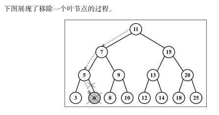

<!-- START doctoc generated TOC please keep comment here to allow auto update -->
<!-- DON'T EDIT THIS SECTION, INSTEAD RE-RUN doctoc TO UPDATE -->
<!-- **Table of Contents**  *generated with [DocToc](https://github.com/thlorenz/doctoc)* -->

- [递归（Recursion）](#%E9%80%92%E5%BD%92recursion)
  - [递归基础说明](#%E9%80%92%E5%BD%92%E5%9F%BA%E7%A1%80%E8%AF%B4%E6%98%8E)
  - [使用示例](#%E4%BD%BF%E7%94%A8%E7%A4%BA%E4%BE%8B)
    - [1 计算一个数的阶乘](#1-%E8%AE%A1%E7%AE%97%E4%B8%80%E4%B8%AA%E6%95%B0%E7%9A%84%E9%98%B6%E4%B9%98)
    - [2 斐波那契数列](#2-%E6%96%90%E6%B3%A2%E9%82%A3%E5%A5%91%E6%95%B0%E5%88%97)
- [树(Tree)](#%E6%A0%91tree)
  - [树基础说明](#%E6%A0%91%E5%9F%BA%E7%A1%80%E8%AF%B4%E6%98%8E)
- [二叉树 (Binary tree)](#%E4%BA%8C%E5%8F%89%E6%A0%91-binary-tree)
  - [二叉树基础说明](#%E4%BA%8C%E5%8F%89%E6%A0%91%E5%9F%BA%E7%A1%80%E8%AF%B4%E6%98%8E)
  - [二叉搜索树的实现](#%E4%BA%8C%E5%8F%89%E6%90%9C%E7%B4%A2%E6%A0%91%E7%9A%84%E5%AE%9E%E7%8E%B0)
  - [BST 存在的问题](#bst-%E5%AD%98%E5%9C%A8%E7%9A%84%E9%97%AE%E9%A2%98)
- [AVL 树(Adelson-Velskii-Landi Tree)](#avl-%E6%A0%91adelson-velskii-landi-tree)
  - [AVL 树基础说明](#avl-%E6%A0%91%E5%9F%BA%E7%A1%80%E8%AF%B4%E6%98%8E)
  - [AVL 树的实现](#avl-%E6%A0%91%E7%9A%84%E5%AE%9E%E7%8E%B0)
- [红黑树(Red Black Tree)](#%E7%BA%A2%E9%BB%91%E6%A0%91red-black-tree)
  - [红黑树基础说明](#%E7%BA%A2%E9%BB%91%E6%A0%91%E5%9F%BA%E7%A1%80%E8%AF%B4%E6%98%8E)
  - [红黑树的实现](#%E7%BA%A2%E9%BB%91%E6%A0%91%E7%9A%84%E5%AE%9E%E7%8E%B0)

<!-- END doctoc generated TOC please keep comment here to allow auto update -->

# 递归（Recursion）

## 递归基础说明

- 在数学与计算机科学中，是指在函数的定义中使用函数自身的方法。
- 在计算机科学中是指一种通过重复将问题分解为同类的子问题而解决问题的方法。
- 每个递归函数都必须有基线条件，即一个不再递归调用的条件（停止点），以防止无限递归。

## 使用示例

### 1 计算一个数的阶乘

```js
//  (n) * (n - 1) * (n - 2) * (n - 3) * ... * 1
function factorialIterative(n) {
  // 阶乘迭代
  if (n < 0) {
    return undefined;
  }
  let total = 1;
  for (let i = n; i > 1; i--) {
    total = total * i;
  }
  return total;
}

// 递归法
function factorial(n) {
  // 基线条件(跳出递归的条件)
  if (n === 1 || n === 0) {
    return 1;
  }
  // 递归调用
  return n * factorial(n - 1);
}
console.time("迭代");
console.log(factorialIterative(5)); // 120
console.timeEnd("迭代"); // 迭代: 5.752ms

console.time("递归");
console.log(factorial(5)); // 120
console.timeEnd("递归"); // 递归: 0.328ms
```

- 每当一个函数被一个算法调用时，该函数会进入调用栈的顶部。
- 当使用递归的时候，每个函数调用都会堆叠在调用栈的顶部，这是因为每个调用都可能依赖前一个调用的结果。

- ECMAScript 2015 有尾调用优化（tail call optimization）。

  - 如果函数内的最后一个操作是调用函数，会通过“跳转指令”（jump） 而不是“子程序调用”（subroutinecall）来控制。
  - 也就是说，在 ECMAScript 2015 中，这里的代码可以一直执行下去。因此，具有停止递归的基线条件非常重要。
  - (自注:目前来看在递归调用时才强调这个尾调用优化问题,方式栈溢出,一般函数最后一句是调用其他一般函数而不是自己,没有太多优化考虑意义)

- 迭代的版本比递归的版本快很多，所以这表示递归更慢。
- 递归版本更容易理解，需要的代码通常也更少。
- 另外，对一些算法来说，迭代的解法可能不可用，而且有了尾调用优化，递归的多余消耗甚至可能被消除。

### 2 斐波那契数列

迭代求斐波那契数 公式`f(0)=0, f(1)=1, f(2)=1; n>2, f(n)=f(n-1)+f(n-2)`

```js
// 迭代求斐波那契数
function fibonacciIterative(n) {
  if (n < 1) return 0;
  if (n <= 2) return 1;

  let fibNMinus2 = 0; //  f(n-2)
  let fibNMinus1 = 1; //  f(n-1)
  let fibN = n;
  for (let i = 2; i <= n; i++) {
    fibN = fibNMinus1 + fibNMinus2; // f(n)=f(n-1)+f(n-2)
    fibNMinus2 = fibNMinus1;
    fibNMinus1 = fibN;
  }
  return fibN;
}

// 递归写法
function fibonacci(n) {
  if (n < 1) return 0;
  if (n <= 2) return 1;
  return fibonacci(n - 1) + fibonacci(n - 2);
}

// 改进递归-把前两位数字做成参数避免重复计算
function fibonacci2(n) {
  function fib(n, v1, v2) {
    if (n == 1) return v1;
    if (n == 2) return v2;
    else return fib(n - 1, v2, v1 + v2);
  }
  return fib(n, 1, 1);
}

// 记忆化斐波那契数
// 记忆化是一种保存前一个结果的值的优化技术，类似于缓存。
function fibonacciMemoization(n) {
  // 声明一个 memo 数组来缓存所有的计算结果
  const memo = [0, 1];
  const fibonacci = (n) => {
    // 如果结果已经被计算了，我们就返回它
    if (memo[n] != null) return memo[n];
    // 否则计算该结果并将它加入缓存
    return (memo[n] = fibonacci(n - 1, memo) + fibonacci(n - 2, memo));
  };
  return fibonacci(n);
}

// 迭代速度还行，直接的递归求大一点肯定超时，所以优化后的效果要好很多
// 实际执行时间看机器

console.time("迭代");
console.log(fibonacciIterative(100)); // 354224848179262000000
console.timeEnd("迭代"); // 迭代: 4.512ms

console.time("递归");
console.log(fibonacci(45)); // 1134903170
console.timeEnd("递归"); // 递归: 12.047s

console.time("递归2");
console.log(fibonacci2(100)); // 354224848179262000000
console.timeEnd("递归2"); //  递归2: 0.178ms

console.time("递归3");
console.log(fibonacciMemoization(100)); // 354224848179262000000
console.timeEnd("递归3"); // 递归3: 0.174ms
```

# 树(Tree)

## 树基础说明

- 定义:
  - 是一种抽象数据类型（ADT）或是实现这种抽象数据类型的数据结构，用来模拟具有树状结构性质的数据集合。
  - 它是由 n（n>0）个有限节点组成一个具有层次关系的集合。
- 特征:
  - 把它叫做“树”是因为它看起来像一棵倒挂的树，也就是说它是根朝上，而叶朝下的。它具有以下的特点：
    - 1 每个节点都只有有限个子节点或无子节点；
    - 2 没有父节点的节点称为根节点；
    - 3 每一个非根节点有且只有一个父节点；
    - 4 除了根节点外，每个子节点可以分为多个不相交的子树(即子树由节点和它的后代构成)；
    - 5 树里面没有环路(cycle)
- 术语:
  - 节点的度：一个节点含有的子树的个数称为该节点的度；
  - 树的度：一棵树中，最大的节点度称为树的度；
  - 叶节点或终端节点：度为零的节点；
  - 非终端节点或分支节点：度不为零的节点；
  - 父亲节点或父节点：若一个节点含有子节点，则这个节点称为其子节点的父节点；
  - 孩子节点或子节点：一个节点含有的子树的根节点称为该节点的子节点；
  - 兄弟节点：具有相同父节点的节点互称为兄弟节点；
  - 节点的层次：从根开始定义起，根为第 1 层，根的子节点为第 2 层，以此类推；
  - 深度：对于任意节点 n,n 的深度为从根到 n 的唯一路径长，根的深度为 0；
  - 高度：对于任意节点 n,n 的高度为从 n 到一片树叶的最长路径长，所有树叶的高度为 0；
  - 堂兄弟节点：父节点在同一层的节点互为堂兄弟；
  - 节点的祖先：从根到该节点所经分支上的所有节点；
  - 子孙：以某节点为根的子树中任一节点都称为该节点的子孙。
  - 森林：由 m（m>=0）棵互不相交的树的集合称为森林；
- 树是一种分层数据的抽象模型。现实生活中最常见的树的例子是家谱，或是公司的组织架构图.


# 二叉树 (Binary tree)

## 二叉树基础说明

- 定义:
  - 二叉树中的节点最多只能有两个子节点：一个是左侧子节点，另一个是右侧子节点。
- 二叉搜索树（BST）
  - 是二叉树的一种，但是只允许你在左侧节点存储（比父节点）小的值，在右侧节点存储（比父节点）大的值。
- BST 常用方法:
  - insert(key) ：向树中插入一个新的键。
  - search(key) ：在树中查找一个键。如果节点存在，则返回 true ；如果不存在，则返回 false 。
  - inOrderTraverse() ：通过中序遍历方式遍历所有节点。
  - preOrderTraverse() ：通过先序遍历方式遍历所有节点。
  - postOrderTraverse() ：通过后序遍历方式遍历所有节点。
  - min() ：返回树中最小的值/键。
  - max() ：返回树中最大的值/键。
  - remove(key) ：从树中移除某个键。

## 二叉搜索树的实现

============== 注意：代码中的{x}还有使用示例里面的步骤，感觉乱乱得需要和书进行对应，后续补充

```js
// 创建一个二叉搜索树

const { Compare, defaultCompare } = require("../utils");

// 创建数的节点类
class TreeNode {
  constructor(key) {
    // 不同于在之前的章节中将节点本身称作节点或项，此处将会称其为键。键是树相关的术语中对节点的称呼。
    // 节点值
    this.key = key;
    // 左侧子节点引用
    this.left = null;
    // 右侧子节点引用
    this.right = null;
  }

  toString() {
    return `${this.key}`;
  }
}

// 二叉搜索树类
class BinarySearchTree {
  constructor(compareFn = defaultCompare) {
    // 用来比较节点值
    this.compareFn = compareFn;
    // TreeNode 类型的根节点
    this.root = null;
  }

  // 1. 向二叉搜索树中插入一个新的节点（键）
  insert(key) {
    // 判断插入的树节点是否为第一个节点。
    if (this.root == null) {
      // {1}
      // 如果是，创建一个 TreeNode 类的实例并将它赋值
      // 因为构造函数设计,左指针和右指针的值会由构造函数自动设置为 null 。
      this.root = new TreeNode(key); // {2}
    } else {
      // 如果插入的不是根节点,调用将节点添加到根节点以外的其他位置的辅助方法
      this.insertNode(this.root, key); // {3}
    }
  }

  // 将节点添加到根节点以外的其他位置的辅助方法
  insertNode(node, key) {
    // 如果新节点的键小于当前节点的键（现在，当前节点就是根节点），那么需要检查当前节点的左侧子节点。
    // 由于键可能是复杂的对象而不是数，使用传入二叉搜索树构造函数的 compareFn 函数来比较值。
    if (this.compareFn(key, node.key) === Compare.LESS_THAN) {
      // {4}
      // 如果它没有左侧子节点,就在那里插入新的节点
      if (node.left == null) {
        // {5}
        node.left = new TreeNode(key); // {6}
      } else {
        // 如果有左侧子节点，需要通过递归调用 insertNode方法继续找到树的下一层。
        // (下次要比较的节点将会是当前节点的左侧子节点（左侧节点子树）。 )
        this.insertNode(node.left, key); // {7}
      }
    } else if (node.right == null) {
      // {8}
      //如果节点的键比当前节点的键大, 同时当前节点没有右侧子节点
      node.right = new TreeNode(key); // {9}
    } else {
      // 如果有右侧子节点，同样需要递归调用 insertNode 方法，
      // (要用来和新节点比较的节点将会是右侧子节点)
      this.insertNode(node.right, key); // {10}
    }
  }

  // 2. 树的遍历
  /*
    中序遍历 
    中序遍历是一种以上行顺序(由下往上,由小到大)访问 BST 所有节点的遍历方式，
    也就是以从最小到最大的顺序访问所有节点。(左子节点->父节点->右子节点)
    中序遍历的一种应用就是对树进行排序操作。
    */
  inOrderTraverse(cb) {
    // inOrderTraverse 方法接收一个回调函数作为参数。
    // 回调函数cb用来定义我们对遍历到的每个节点进行的操作
    this.inOrderTraverseNode(this.root, cb);
  }

  // 中序遍历节点方法
  // 一个辅助方法，来接收一个节点和对应的回调函数作为参数
  inOrderTraverseNode(node, cb) {
    //要通过中序遍历的方法遍历一棵树，首先要检查以参数形式传入的节点是否为 null
    if (node != null) {
      // 递归调用相同的函数来访问左侧子节点
      this.inOrderTraverseNode(node.left, cb);
      // 接着对根节点进行一些操作（callback）
      cb(node.key);
      // 然后再访问右侧子节点
      this.inOrderTraverseNode(node.right, cb);

      // 调用堆栈,先进后出
    }
  }

  /*
     先序遍历  
     先序遍历是以优先于后代节点的顺序访问每个节点的。(父节点->左子节点->右子节点)
     先序遍历的一种应用是打印一个结构化的文档。
     */
  preOrderTraverse(cb) {
    this.preOrderTraverseNode(this.root, cb);
  }

  preOrderTraverseNode(node, cb) {
    if (node != null) {
      // 先序遍历会先访问节点本身
      cb(node.key);
      // 再访问它的左侧子节点
      this.preOrderTraverseNode(node.left, cb);
      // 最后访问右侧子节点
      this.preOrderTraverseNode(node.right, cb);
    }
  }

  /*
    后序遍历 
    后序遍历则是先访问节点的后代节点，再访问节点本身。
    后序遍历的一种应用是计算一个目录及其子目录中所有文件所占空间的大小。 
    */
  postOrderTraverse(cb) {
    this.postOrderTraverseNode(this.root, cb);
  }

  postOrderTraverseNode(node, cb) {
    if (node != null) {
      // 先访问左侧子节点
      this.postOrderTraverseNode(node.left, cb);
      // 然后访问右侧子节点
      this.postOrderTraverseNode(node.right, cb);
      // 最后处理父节点
      cb(node.key);
    }
  }

  // BST中 搜索最小值
  min() {
    return this.minNode(this.root);
  }
  minNode(node) {
    let current = node;
    // 如果键不为空且有左子节点,说明它不是最小值,用它的左节点继续迭代
    while (current != null && current.left != null) {
      current = current.left;
    }
    // 找到没有左子节点,说明就没有更小的了
    return current;
  }

  // BST中 搜索最大值
  max() {
    return this.maxNode(this.root);
  }

  maxNode(node) {
    let current = node;
    while (current != null && node.left != null) {
      current = current.right;
    }
    return current;
  }
  // BST中 搜索特定值
  search(key) {
    return this.searchNode(this.root, key); // (1)
  }

  searchNode(node, key) {
    // 可以比书上的if else少点
    // 要验证作为参数传入的 node 是否合法,不合法就不用找了
    // 所有的叶子节点都搜索了都找不到,那叶子节点也没有左节点和右节点了,就返回false表示没找到
    if (node == null) {
      // (2)
      return false;
    }
    // 如果传入的值比当前节点的值要小,在当前节点的左子节点继续搜索
    if (this.compareFn(key, node.key) === Compare.LESS_THAN) {
      // (3)
      return this.searchNode(node.left, key); // (4)
    }
    // 如果传入的值比当前节点的值要大,在当前节点的右子节点继续搜索
    if (this.compareFn(key, node.key) === Compare.BIGGER_THAN) {
      // (5)
      return this.searchNode(node.right, key); // (6)
    }
    // 相等的时候,说明就找到了
    return true; // (7)
  }

  // 移除一个节点 (传入需要移除节点的值)
  remove(key) {
    // 注意： root 被赋值为 removeNode 方法的返回值。
    this.root = this.removeNode(this.root, key); // [1]
  }

  removeNode(node, key) {
    // 比书上少点else
    // 如果正在检测的节点为 null ，那么说明键不存在于树中，所以返回 undefined(或null) 。
    if (node == null) {
      return undefined;
    }
    // 如果要移除的节点的值比当前节点的值小
    if (this.compareFn(key, node.key) === Compare.LESS_THAN) {
      // 就沿着树的左边找到下一个节点
      node.left = this.removeNode(node.left, key); // [2]
      return node; // [3]
    }

    if (this.compareFn(key, node.key) === Compare.BIGGER_THAN) {
      // 如果要找的键比当前节点的值大,那么就沿着树的右边找到下一个节点
      node.right = this.removeNode(node.right, key); // [4]
      return node; // [5]
    }

    // 找到了要移除的节点
    // 1. 移除一个叶节点
    // 如果找到的节点是叶子节点
    if (node.left == null && node.right == null) {
      // 在这种情况下，我们要做的就是给这个节点赋予 null 值来移除它。
      node = null;
      // 但是当学习了链表的实现之后，我们知道仅仅赋一个 null 值是不够的，还需要处理引用（指针）。
      // 在这里，这个节点没有任何子节点，但是它有一个父节点，需要通过返回 null 来将对应的父节点指针赋予 null 值
      return node;
      /*
            现在节点的值已经是 null 了，父节点指向它的指针也会接收到这个值，这也是我们为什么要在函数中返回节点的值。
            父节点总是会接收到函数的返回值。
            另一种可行的办法是将父节点和节点本身都作为参数传入方法内部。

            如果回头来看方法的第一行代码，会发现我们在行 [2] 和行 [4] 更新了节点左右指针的值，同样也在行 [3] 和行 [5] 返回了更新后的节点。
            */
    }
    // 2. 移除有一个左侧或右侧子节点的节点
    //  如果这个节点没有左侧子节点，也就是说它有一个右侧子节点。
    // 因此我们把对它的引用改为对它右侧子节点的引用并返回更新后的节点。
    if (node.left == null) {
      node = node.right;
      return node;
    }
    if (node.right == null) {
      // 如果这个节点没有右侧子节点，
      // 也是一样——把对它的引用改为对它左侧子节点的引用并返回更新后的值
      node = node.left;
      return node;
    }

    // 3. 移除有两个子节点的节点
    // 当找到了要移除的节点后，需要找到它右边子树中最小的节点,用来替代它的位置
    const aux = this.minNode(node.right);
    // 用它右侧子树中最小节点的键去更新这个节点的值。通过这一步，改变了这个节点的键，也就是说它被移除了。
    node.key = aux.key;
    // 但是，这样在树中就有两个拥有相同键的节点了，这是不行的。
    // 要继续把右侧子树中的最小节点移除，毕竟它已经被移至要移除的节点的位置了
    node.right = this.removeNode(node.right, aux.key);
    // 最后，向它的父节点返回更新后节点的引用
    return node;
  }

  getRoot() {
    return this.root;
  }
}

module.exports = {
  TreeNode,
  BinarySearchTree,
};
```

使用示例:

```js
// 使用示例
// ========== 插入测试
// 有一棵新的树，并且想要向它插入第一个值
const tree = new BinarySearchTree();
tree.insert(11);
// 接续插入,有一些键了
tree.insert(7);
tree.insert(15);
tree.insert(5);
tree.insert(3);
tree.insert(9);
tree.insert(8);
tree.insert(10);
tree.insert(13);
tree.insert(12);
tree.insert(14);
tree.insert(20);
tree.insert(18);
tree.insert(25);

/*
现在大概是这个样子①:
            11
          /    \
        7        15  
      /  \      /  \
     5   9    13    20
    /   / \   / \   / \
   3   8  10 12 14 18  25
*/
```


```js
// 插入分析:此时想要在①插入一个值为 6 的键:
tree.insert(6);
/*
执行的步骤:
(1) 树不是空的，行 {3} 的代码将会执行。 insertNode 方法将会被调用（ root, key[6] ）。
(2) 算法将会检测行 {4} （ key[6] < root[11] 为真），并继续检测行 {5} （ node.left[7]不是 null ），
    然后将到达行 {7} 并调用 insertNode （ node.left[7], key[6] ）。
(3) 再次进入 insertNode 方法内部，但是使用了不同的参数。它会再次检测行 {4} （ key[6]<node[7] 为真），
    然后再检测行 {5} （ node.left[5] 不是 null ），接着到达行 {7} ，调用insertNode （ node.left[5], key[6] ）。
(4) 将再一次进入 insertNode 方法内部。它会再次检测行 {4} （ key[6] < node[5] 为假），然后到达行 {8}
    （ node.right 是 null ——节点 5 没有任何右侧的子节点），然后将会执行行 {9} ，在节点 5 的右侧子节点位置插入键 6。
(5) 然后，方法调用会依次出栈，代码执行过程结束。

插入之后大概这个样子②:
            11
          /    \
        7        15
      /  \      /   \
     5    9    13    20
    / \  / \   / \   / \
   3  6 8  10 12 14 18  25
*/
```


```js
// ========== 中序遍历测试:
// 对节点操作的回调函数(遍历时的cb)
const printNode = (value) => console.log(value);
// 调用 inOrderTraverse 方法并将回调函数作为参数传入
tree.inOrderTraverse(printNode); // 3 5 6 7 8 9 10 11 12 13 14 15 18 20 25

/**
②中序遍历执行过程:=>inOrderTraverseNode()简写it()

执行inOrderTraverse(11)
栈中存入
it(11)
it(7)
it(5)
it(3)
it(null)不满足 if (node != null) 基线,进入pop栈下一个元素it(3)(栈顶元素)执行后续cb(3)和it(3.right)
it(3.right)即it(null),不满足 if (node != null) 基线,执行栈顶it(5)后续cb(5)和把it(4.right)即it(6)放入栈
it(6.left)为it(null),同上,执行栈顶it(6)后续cb(6)和it(6.right)
it(6.right)为it(null),同上,执行栈顶it(7)后续cb(7)并把it(7.right)即it(9)放入栈
it(9.left)为it(8),入栈
it(8.left)为it(null),跳出递归,执行栈顶it(8)后续cb(8),it(8.right)入栈
it(8.right)为it(null),跳出递归,执行栈顶it(9)后续cb(9),it(9.right)即it(10)入栈
it(10.left)为it(null),跳出递归,执行栈顶it(10)后续cb(10),it(10.right)入栈
it(10.right)为it(null),跳出递归,进入pop下一个栈元素it(11)内部执行cb(11)并把it(11.right)即it(15)放入栈
it(15.left)为it(13),入栈
it(13.left)为it(12),入栈,
it(12.left)为it(null),跳出递归,执行栈顶it(12)后续cb(12)并把it(12.right)入栈
it(12.right)为it(null),跳出递归,执行栈顶it(13)后续cb(13),并把it(13.right)入栈
it(13,right)为it(null),执行栈顶it(15)后续cb(15),并把it(15.right)即it(20)入栈
it(15.left)为it(18),入栈
it(18.left)为it(null),跳出递归,执行栈顶it(18)后续cb(18),并把it(18.right)入栈
it(18.right)为it(null),执行栈顶it(20)后续cb(20),并把it(20.right)即it(25)入栈
it(25.left)为it(null),跳出递归,执行栈顶it(25)后续cb(25),并把it(25.right)入栈
it(25.right)为it(null),跳出递归,栈中已无it(x)元素,inOrderTraverse(11)执行完毕

因此输出顺序为 3 5 6 7 8 9 10 11 12 13 14 15 18 20 25

(自注:可以看出,递归会执行很多次函数,相对于可能存在的对应的迭代法,可能更加耗费性能)
*/
```


```js
// ========== 先序遍历测试:
// cb还是打印键值
// 调用 preOrderTraverse 方法并将回调函数作为参数传入
tree.preOrderTraverse(printNode); // 11 7 5 3 6 9 8 10 15 13 12 14 20 18 25
```


```js
// ========== 后序遍历测试:
// cb还是打印键值
// 调用 postOrderTraverse 方法并将回调函数作为参数传入
tree.postOrderTraverse(printNode); // 3 6 5 8 10 9 7 12 14 13 18 25 20 15 11
```


```js
// ========== 搜索指定值
console.log(tree.search(1) ? "Key 1 found." : "Key 1 not found."); // Key 1 not found.
console.log(tree.search(8) ? "Key 8 found." : "Key 8 not found."); // Key 8 found.
/*
搜索过程说明:
// tree.search(1)
(1)  调用 searchNode 方法，传入根节点作为参数（行 (1) ）。 node[root[11]] 不为 null（行 (2) ），因此我们执行到行 (3) 。
(2)  key[1] < node[11] 为真（行 (3) ），因此来到行 (4) 并再次调用 searchNode 方法，传入 node[7], key[1] 作为参数。
(3)  node[7] 不为 null （行 (2) ），因此继续执行行 (3) 。
(4)  key[1] < node[7] 为真（行 (3) ），因此来到行 (4) 并再次调用 searchNode 方法，传入 node[5], key[1] 作为参数。
(5)  node[5] 不为 null （行 (2) ），因此继续执行行 (3) 。
(6)  key[1] < node[5] 为真（行 (3) ），因此来到行 (4) 并再次调用 searchNode 方法，传入 node[3], key[1] 作为参数。
(7)  node[3] 不为 null （行 (2) ），因此来到行 (3) 。
(8)  key[1] < node[3] 为真（行 (3) ），因此来到行 (4) 并再次调用 searchNode 方法，传入 null, key[1] 作为参数。
     null 被作为参数传入是因为 node[3] 是一个叶节点（它没有子节点，所以它的左侧子节点的值为 null ）。
(9) 节点的值为 null （行 (2) ，这时要搜索的节点为 null ），因此返回 false 。
(10) 然后，方法调用会依次出栈，代码执行过程结束。

// tree.search(8)
(1)  调用 searchNode 方法，传入 root 作为参数（行 {1} ）。 node[root[11]] 不为 null（行 (2) ），因此我们来到行 (3) 。
(2)  key[8] < node[11] 为真（行 (3) ），因此执行到行 (4) 并再次调用 searchNode 方法，传入 node[7], key[8] 作为参数。
(3)  node[7] 不为 null ，因此来到行 (3) 。
(4)  key[8] < node[7] 为假（行 (3) ），因此来到行 (5) 。
(5)  key[8] > node[7] 为真（行 (5) ），因此来到行 (6) 并再次调用 searchNode 方法，传入 node[9], key[8] 作为参数。
(6)  node[9] 不为 null （行 (2) ），因此来到行 (3) 。
(7)  key[8] < node[9] 为真（行 (3) ），因此来到行 (4) 并再次调用 searchNode 方法，传入 node[8], key[8] 作为参数。
(8)  node[8] 不为 null （行 (2) ），因此来到行 (3) 。
(9)  key[8] < node[8] 为假（行 (3) ），因此来到行 (5) 。
(10)  key[8] > node[8] 为假（行 (5) ），因此来到行 (7) 并返回 true ，因为 node[8] 就是要找的键。
(11) 然后，方法调用会依次出栈，代码执行过程结束。
*/

// ========== 测试移除
tree.remove(7);
tree.preOrderTraverse(printNode); // 11 8 5 3 6 9 10 15 13 12 14 20 18 25
```

移除节点示意图：




## BST 存在的问题

- 取决于你添加的节点数，树的一条边可能会非常深；

  - 也就是说，树的一条分支会有很多层，而其他的分支却只有几层。
  - 这会在需要在某条边上添加、移除和搜索某个节点时引起一些性能问题。

- 平衡二叉搜索树(Balanced Binary Tree):
  - 是一种结构平衡的二叉搜索树，即叶节点高度差的绝对值不超过 1，并且左右两个子树都是一棵平衡二叉树。
  - 它能在 O(log n)内完成插入、查找和删除操作.
  - 最早被发明的平衡二叉搜索树为 AVL 树,也是一个 BST。

# AVL 树(Adelson-Velskii-Landi Tree)

## AVL 树基础说明

- 定义:
  - 是一种自平衡树。添加或移除节点时，AVL 树会尝试保持自平衡。
  - **平衡因子（即任意一个节点（不论深度）的左子树和右子树高度差）**最多为 1。
  - 添加或移除节点时，AVL 树会尽可能尝试转换为完全树。
- 实现:
  - 可以扩展之前写的 BST 类，只需要覆盖用来维持 AVL 树平衡的方法，
  - 也就是 insert 、 insertNode 和 removeNode 方法。
  - 所有其他的 BST 方法将会被 AVLTree 类继承。

## AVL 树的实现

```js
const { Compare, defaultCompare } = require("../utils");
const { TreeNode, BinarySearchTree } = require("./1BinarySearchTree");

// 为了避免直接在代码中处理平衡因子的数值,而创建的一个用来作为计数器的常量
const BalanceFactor = {
  UNBALANCED_RIGHT: 1,
  SLIGHTLY_UNBALANCED_RIGHT: 2,
  BALANCED: 3,
  SLIGHTLY_UNBALANCED_LEFT: 4,
  UNBALANCED_LEFT: 5,
};

class AVLTree extends BinarySearchTree {
  constructor(compareFn = defaultCompare) {
    super(compareFn);

    this.compareFn = compareFn;
    this.root = null;
  }

  /*
    1. 节点的高度和平衡因子
    在 AVL 树中插入或移除节点和 BST 完全相同。然而，AVL 树的不同之处在于我们需要检验
    它的平衡因子，如果有需要，会将其逻辑应用于树的自平衡。 

    节点的高度:
    是从节点到其任意子节点的边的最大值。

    平衡因子:
    在 AVL 树中，需要对每个节点计算右子树高度（ hr ）和左子树高度（ hl ）之间的差值.
    该值（ hr－hl ）应为 0、1 或-1。如果结果不是这三个值之一，则需要平衡该 AVL 树。
    */

  // 计算一个节点高度
  getNodeHeight(node) {
    if (node == null) {
      return -1;
    }
    return (
      Math.max(this.getNodeHeight(node.left), this.getNodeHeight(node.right)) +
      1
    );
  }
  // 循计算一个节点的平衡因子并返回其值
  getBalanceFactor(node) {
    const heightDifference =
      this.getNodeHeight(node.left) - this.getNodeHeight(node.right);
    // 自注:为什么只有这么几个数值?超过的都会自平衡,否则就不是AVL tree了
    switch (heightDifference) {
      case -2:
        return BalanceFactor.UNBALANCED_RIGHT;
      case -1:
        return BalanceFactor.SLIGHTLY_UNBALANCED_RIGHT;
      case 1:
        return BalanceFactor.SLIGHTLY_UNBALANCED_LEFT;
      case 2:
        return BalanceFactor.UNBALANCED_LEFT;
      default:
        return BalanceFactor.BALANCED;
    }
  }

  /*
    2. 平衡操作——AVL 旋转 

    在对 AVL 树添加或移除节点后，我们要计算节点的高度并验证树是否需要进行平衡。
    向 AVL树插入节点时，可以执行单旋转或双旋转两种平衡操作，分别对应四种场景。 
         左-左（LL）：向右的单旋转
            * Left left case: rotate right
            * 
            *       b                           a
            *      / \                         / \
            *     a   e -> rotationLL(b) ->   c   b
            *    / \                             / \
            *   c   d                           d   e
         右-右（RR）：向左的单旋转 
            * Right right case: rotate left
            * 图②
            *     a                              b
            *    / \                            / \
            *   c   b   -> rotationRR(a) ->    a   e
            *      / \                        / \
            *     d   e                      c   d
         左-右（LR）：向右的双旋转（先 LL 旋转，再 RR 旋转） 
         右-左（RL）：向左的双旋转（先 RR 旋转，再 LL 旋转）
    */

  // 2.1 左-左（LL）：向右的单旋转 (顺时针旋转)
  /*
    这种情况出现于节点的左侧子节点的高度大于右侧子节点的高度时，并且左侧子节点也是平衡或左侧较重的
    图①:        -> rotationLL(50): 
    (+2)       50                     (0)      30
              /  \                           /   \
    (+1)     30  70   (0)             (+1)  10    50     (0)
            /  \                            /     / \      
    (+1)   10  40     (0)             (0)  5 (0) 40 70   (0)
          /
    (0)  5
    */
  // 与平衡操作相关的节点有三个（X、Y、Z）即图①的30 50 10
  rotationLL(node) {
    // 将节点 X 置于节点 Y（平衡因子为+2）所在的位置
    const tmp = node.left;
    //  节点 X 的左子树保持不变；
    //  将节点 Y 的左子节点置为节点 X 的右子节点 Z
    node.left = tmp.right;
    //  将节点 X 的右子节点置为节点 Y
    tmp.right = node;
    return tmp;
  }

  // 2.2 右-右（RR）：向左的单旋转  (逆时针旋转)
  /*
    右-右的情况和左-左的情况相反。
    它出现于右侧子节点的高度大于左侧子节点的高度，并且右侧子节点也是平衡或右侧较重的.

        图②:         -> rotationRR(70):
    (-2)        50                    (0)          70       (0)
               /  \                              /   \
    (0)       30  70      (-1)        (0)      50     80    (-1)
                 /  \                         /  \      \
         (0)    60   80   (-1)        (0)    30  60 (0)  90  (0)
                       \
                       90  (0)
    */
  // 与平衡操作相关的节点有三个（X、Y、Z）图②中的70 50 80
  rotationRR(node) {
    // 将节点 X 置于节点 Y（平衡因子为-2）所在的位置
    const tmp = node.right;
    //  节点 X 的右子树保持不变；
    //  将节点 Y 的右子节点置为节点 X 的左子节点 Z
    node.right = tmp.left;
    //  将节点 X 的左子节点置为节点 Y
    tmp.left = node;
    return tmp;
  }

  // 左-右（LR）：向右的双旋转
  /*
    这种情况出现于左侧子节点的高度大于右侧子节点的高度，并且左侧子节点右侧较重。
    在这种情况下，我们可以对左侧子节点进行左旋转来修复，这样会形成左-左的情况，
    然后再对不平衡的节点进行一个右旋转来修复.

    基本上，就是先做一次 LL 旋转(顺时针旋转)，再做一次 RR 旋转(逆时针旋转)。 

    图③:新插入75之后,要自平衡:    LR-->

                    先右旋转左子树rotationLL(72) -->   再左旋转右子树rotationRR(72) -->
    (-2)        70                              70                                 (-1)      72         
               /  \                            /  \                                         /  \
    (0)       50   80     (1)                 50   72                              (-1)   70    80     (0)
                  /  \                               \                                   /     /  \
    (-1)         72  90   (0)                        80                            (0)  50 (0) 75  90  (0)
                  \                                 /  \
    (0)           75                               75  90
    */
  // 与平衡操作相关的节点有三个（X、Y、Z）图③中的72 70 80(自注:看不懂????,记住先LL再RR就好了)
  //  将节点 X 置于节点 Y（平衡因子为-2）所在的位置；
  //  将节点 Z 的左子节点置为节点 X 的右子节点；
  //  将节点 Y 的右子节点置为节点 X 的左子节点；
  //  将节点 X 的右子节点置为节点 Y；
  //  将节点 X 的左子节点置为节点 Z。
  rotationLR(node) {
    node.left = this.rotationRR(node.left);
    return this.rotationLL(node);
  }

  // 右-左（RL）：向左的双旋转
  /*
    这种情况出现于右侧子节点的高度大于左侧子节点的高度，并且右侧子节点左侧较重。
    在这种情况下我们可以对右侧子节点进行右旋转来修复，这样会形成右-右的情况，
    然后我们再对不平衡的节点进行一个左旋转来修复

    基本上，就是先做一次 RR 旋转(逆时针旋转)，再做一次 LL 旋转(顺时针旋转)。

    图④:新插入35之后,要自平衡:    LR-->

                先左旋转右子树rotationRR(40) -->     再右旋转左子树rotationLL(40) -->
    (+2)        50                              50                         (0)       40         
               /  \                            /  \                                 /   \
    (-1)      30   70     (0)                 40   70                      (0)    30     50     (-1)
             /  \                             /                                  /  \      \
    (0)    10   40   (1)                     30                            (0)  10  35 (0)  70  (0)
               /                            /  \
    (0)       35                           10  35
    */
  // 与平衡操作相关的节点有三个（X、Y、Z）图④中的40 50 30 (自注:看不懂????记住先RR再LL就好了)
  //  将节点 X 置于节点 Y（平衡因子为+2）所在的位置；
  //  将节点 Y 的左子节点置为节点 X 的右子节点；
  //  将节点 Z 的右子节点置为节点 X 的左子节点；
  //  将节点 X 的左子节点置为节点 Y；
  //  将节点 X 的右子节点置为节点 Z。
  rotationRL(node) {
    node.right = this.rotationLL(node.right);
    return this.rotationRR(node);
  }

  // 3. 向 AVL 树插入节点
  // 向 AVL 树插入节点和在 BST 中是一样的。
  // 除了插入节点外，我们还要验证插入后树是否还是平衡的，如果不是，就要进行必要的旋转操作。

  insert(key) {
    this.root = this.insertNode(this.root, key);
  }
  insertNode(node, key) {
    // 像在BST中插入节点
    if (node == null) {
      return new TreeNode(key);
    }

    if (this.compareFn(key, node.key) === Compare.LESS_THAN) {
      node.left = this.insertNode(node.left, key);
    } else if (this.compareFn(key, node.key) === Compare.BIGGER_THAN) {
      node.right = this.insertNode(node.right, key);
    } else {
      // 重复的键
      return node;
    }

    // 如果有需要,需要对树进行平衡操作
    // 得到平衡因子
    const balanceFactor = this.getBalanceFactor(node);

    // 根据平衡因子进行平衡操作
    // 如果在向左侧子树插入节点后树不平衡了
    if (balanceFactor === BalanceFactor.UNBALANCED_LEFT) {
      // 需要比较是否插入的键小于左侧子节点的键
      if (this.compareFn(key, node.left.key) === Compare.LESS_THAN) {
        // 如果是，我们要进行 LL 旋转
        node = this.rotationLL(node);
      } else {
        // 否则，要进行 LR 旋转
        return this.rotationLR(node);
      }
    }

    // 如果在向右侧子树插入节点后树不平衡了
    if (balanceFactor === BalanceFactor.UNBALANCED_RIGHT) {
      // 需要比较是否插入的键小于右侧子节点的键
      if (this.compareFn(key, node.key.right) === Compare.BIGGER_THAN) {
        // 如果是，我们要进行 RR 旋转
        node.this.rotationRR(node);
      } else {
        // 否则，要进行 RL 旋转
        return this.rotationRL(node);
      }
    }
    return node;
  }

  // 4. 从 AVL 树中移除节点
  // 从 AVL 树移除节点和在 BST 中是一样的。
  // 除了移除节点外，我们还要验证移除后树是否还是平衡的，如果不是，就要进行必要的旋转操作。
  removeNode(node, key) {
    // 可以使用 BST 的 removeNode方法来从 AVL 树中移除节点
    node = super.removeNode(node, key);
    if (node == null) {
      return node; // null，不需要进行平衡
    }
    // 检测树是否平衡

    // 使用递归计算以每个移除的节点为根的节点的平衡因子
    const balanceFactor = this.getBalanceFactor(node);

    // 如果在从左侧子树移除节点后树不平衡了
    if (balanceFactor === BalanceFactor.UNBALANCED_LEFT) {
      // 要计算左侧子树的平衡因子
      const balanceFactorLeft = this.getBalanceFactor(node.left);
      // 如果左侧子树向左不平衡
      if (
        balanceFactorLeft === BalanceFactor.BALANCED ||
        balanceFactorLeft === BalanceFactor.SLIGHTLY_UNBALANCED_LEFT
      ) {
        // 要进行 LL 旋转
        return this.rotationLL(node);
      }
      // 如果左侧子树向右不平衡
      if (balanceFactorLeft === BalanceFactor.SLIGHTLY_UNBALANCED_RIGHT) {
        // 要进行 LR 旋转
        return this.rotationLR(node.left);
      }
    }

    // 如果在从右侧子树移除节点后树不平衡了
    if (balanceFactor === BalanceFactor.UNBALANCED_RIGHT) {
      // 要计算右侧子树的平衡因子
      const balanceFactorRight = this.getBalanceFactor(node.right);
      // 如果右侧子树向右不平衡
      if (
        balanceFactorRight === BalanceFactor.BALANCED ||
        balanceFactorRight === BalanceFactor.SLIGHTLY_UNBALANCED_RIGHT
      ) {
        // 要进行 RR 旋转
        return this.rotationRR(node);
      }
      // 如果右侧子树向左不平衡
      if (balanceFactorRight === BalanceFactor.SLIGHTLY_UNBALANCED_LEFT) {
        // 要进行 LR 旋转
        return this.rotationRL(node.right);
      }
    }
    return node;
  }
}

module.exports = {
  AVLTree,
};
```

# 红黑树(Red Black Tree)

## 红黑树基础说明

- 和 AVL 树一样，红黑树也是一个自平衡二叉搜索树。
  - 红黑树是一种特化的 AVL 树（平衡二叉树），都是在进行插入和删除操作时通过特定操作保持二叉查找树的平衡，从而获得较高的查找性能。
- 它虽然是复杂的，但它的最坏情况运行时间也是非常良好的，并且在实践中是高效的：
  - 它可以在 O(log n)时间内做查找，插入和删除，这里的 n 是树中元素的数目。
- 在红黑树中，每个节点都遵循以下规则：
  - (1) 顾名思义，每个节点不是红的就是黑的；
  - (2) 树的根节点是黑的；
  - (3) 所有叶节点都是黑的（用 NULL 引用表示的节点）；
  - (4) 如果一个节点是红的，那么它的两个子节点都是黑的；
  - (5) 不能有两个相邻的红节点，一个红节点不能有红的父节点或子节点；
  - (6) 从给定的节点到它的后代节点（ NULL 叶节点）的所有路径包含相同数量的黑色节点。
- 说明:
  - 对 AVL 书插入和移除节点可能会造成旋转，
  - 所以如果需要一个包含多次插入和删除的自平衡树，红黑树是比较好的。
  - 如果插入和删除频率较低（更需要的是多次进行搜索操作），那么 AVL 树比红黑树更好。
- 实现:
  - 由于红黑树也是二叉搜索树，可以扩展之前创建的二叉搜索树类并重写红黑树属性所需要的那些方法。
  - 也就是 insert 、 insertNode 和 removeNode 方法。
  - 所有其他的 BST 方法将会被红黑树类继承。

## 红黑树的实现

```js
const { Compare, Colors, defaultCompare } = require('../utils');
const { TreeNode, BinarySearchTree } = require('./1BinarySearchTree');

// 对红黑树来说，节点和之前比起来需要一些额外的属性：节点的颜色和指向父节点的引用
class RedBlackNode extends TreeNode {
    constructor(key) {
        super(key);
        this.key = key;
        // 节点的颜色,默认情况下，创建的节点颜色是红色
        this.color = Colors.RED;
        // 指向父节点的引用
        this.parent = null;
    }

    isRed() {
        return this.color === Colors.RED;
    }
}

// 从创建 RedBlackTree 类,也是一个BST,继承它
class RedBlackTree extends BinarySearchTree {
    constructor(compareFn = defaultCompare) {
        super(compareFn);
        this.compareFn = compareFn;
        this.root = null;
    }

    // 向红黑树中插入节点
    // 向红黑树插入节点和在二叉搜索树中是一样的。
    // 除了插入的代码，还要在插入后给节点应用一种颜色，
    // 并且验证树是否满足红黑树的条件以及是否还是自平衡的。
    insert(key) {
        // 如果树是空的
        if (this.root == null) {
            // 需要创建一个红黑树节点
            this.root = new RedBlackNode(key);
            // 为了满足规则 2(根节点要是黑色)，要将这个根节点的颜色设为黑色
            this.root.color = Colors.BLACK;
        } else {
            // 如果树不是空的，会像二叉搜索树一样在正确的位置插入节点
            const newNode = this.insertNode(this.root, key);
            // insertNode 方法需要返回新插入的节点,用于验证在插入后，红黑树的规则是否得到了满足。
            this.fixTreeProperties(newNode);
        }
    }

    insertNode(node, key) {
        // 逻辑和二叉搜索树中的一样
        if (this.compareFn(key, node.key) === Compare.LESS_THAN) {
            if (node.left == null) {
                node.left = new RedBlackNode(key);
                // 与BST的插入不同之处在于保存了指向被插入节点父节点的引用
                node.left.parent = node;
                // 并且返回了节点的引用
                return node.left;
            }
            else {
                return this.insertNode(node.left, key);
            }
        } else if (node.right == null) {
            node.right = new RedBlackNode(key);
            // 与BST的插入不同之处在于保存了指向被插入节点父节点的引用
            node.right.parent = node;
            // 并且返回了节点的引用
            return node.right;
        } else {
            return this.insertNode(node.right, key);
        }
    }

    // 在插入节点后验证红黑树属性 
    /*
    要验证红黑树是否还是平衡的以及满足它的所有要求，需要使用两个概念：重新填色和旋转。 

    在向树中插入节点后，新节点将会是红色。这不会影响黑色节点数量的规则（规则6），但会影响规则 5：两个后代红节点不能共存。
        如果插入节点的父节点是黑色，那没有问题。
        但是如果插入节点的父节点是红色，那么会违反规则 5。
    要解决这个冲突，只需要改变父节点、祖父节点和叔节点（因为同样改变了父节点的颜色）
    */
    fixTreeProperties(node) {
        // 要验证它的父节点是否是红色以及这个节点是否不是黑色(自注:书上的isRed()真的是那样用的吗?)
        while (node && node.parent && node.parent.isRed() && node.color !== Colors.BLACK) {

            // 为了保证代码的可读性，保存父节点和祖父节点的引用。
            let parent = node.parent;
            const grandParent = parent.parent;
            // 情形 A：父节点是左侧子节点 
            if (grandParent && grandParent.left === parent) {
                // 由于也需要改变叔节点的颜色，需要一个指向它的引用
                const uncle = grandParent.right;
                // 情形 1A：叔节点也是红色——只需要重新填色 
                if (uncle && uncle.color === Colors.RED) {
                    // 就改变祖父节点、父节点和叔节点的颜色， 
                    grandParent.color = Colors.RED;
                    parent.color = Colors.BLACK;
                    uncle.color = Colors.BLACK;
                    // 并且将当前节点的引用指向祖父节点，继续检查树是否有其他冲突。
                    node = grandParent;
                }
                else {
                    // 在节点的叔节点颜色为黑时，也就是说仅仅重新填色是不够的，树是不平衡的，那么需要进行旋转操作。 
                    // 情形 2A：节点是右侧子节点——左旋转 

                    // 如果父节点是左侧子节点并且节点是右侧子节点，要进行两次旋转，
                    if (node === parent.right) {
                        // 首先是右-右旋转
                        this.rotationRR(parent);
                        // 并更新节点和父节点的引用
                        node = parent;
                        parent = node.parent;
                    }
                    // 情形 3A：节点是左侧子节点——右旋转 

                    // 第一次旋转后，要再次旋转，以祖父节点为基准
                    this.rotationLL(grandParent);
                    // 并在旋转过程中更新父节点和祖父节点的颜色。
                    parent.color = Colors.BLACK;
                    grandParent.color = Colors.RED;
                    // 最后，更新当前节点的引用，以便继续检查树的其他冲突。 
                    node = parent;
                }
            }
            else { // 情形 B：父节点是右侧子节点 
                // 由于也需要改变叔节点的颜色，需要一个指向它的引用
                const uncle = grandParent.left;

                // 情形 1B：叔节点是红色——只需要重新填色 
                if (uncle && uncle.color === Colors.RED) {
                    grandParent.color = Colors.RED;
                    parent.color = Colors.BLACK;
                    uncle.color = Colors.BLACK;
                    node = grandParent;
                }
                else {
                    // 逻辑是一样的，不同之处在于选择会这样进行：先进行左-左旋转，再进行右-右旋转
                    // 情形 2B：节点是左侧子节点——右旋转 
                    if (node === parent.left) {
                        this.rotationLL(parent);
                        node = parent;
                        parent = node.parent;
                    }
                    // 情形 3B：节点是右侧子节点——左旋转 
                    this.rotationRR(grandParent);
                    parent.color = Colors.BLACK;
                    grandParent.color = Colors.RED;
                    node = parent;
                }
            }
        }
        // 为了保证根节点的颜色始终是黑色（规则 2），在代码最后设置根节点的颜色
        this.root.color = Colors.BLACK;
    }

    /*
    红黑树旋转操作
     左-左（LL）：父节点是祖父节点的左侧子节点，节点是父节点的左侧子节点（情形 3A）。 
     左-右（LR）：父节点是祖父节点的左侧子节点，节点是父节点的右侧子节点（情形 2A）。 
     右-右（RR）：父节点是祖父节点的右侧子节点，节点是父节点的右侧子节点（情形 2A）。 
     右-左（RL）：父节点是祖父节点的右侧子节点，节点是父节点的左侧子节点（情形 2A）。 
    */

    // 在插入算法中，只使用了右-右旋转和左-左旋转。逻辑和 AVL 树是一样，
    // 但是，由于保存了父节点的引用，需要将引用更新为旋转后的新父节点。 
    // 1 左-左旋转（右旋转）的代码如下（更新父节点句末跟///）。 
    /**
     * Left left case: rotate right
     *
     *       b                           a
     *      / \                         / \
     *     a   e -> rotationLL(b) ->   c   b
     *    / \                             / \
     *   c   d                           d   e
     *
     * @param node RedBlackNode<T>
     */
    rotationLL(node) {
        const tmp = node.left;
        node.left = tmp.right;
        if (tmp.right && tmp.right.key) {
            tmp.right.parent = node;        ///
        }
        tmp.parent = node.parent;           ///
        if (!node.parent) {                 ///
            this.root = tmp;                ///
        }                                   ///
        else {
            if (node === node.parent.left) {
                node.parent.left = tmp;     ///
            }
            else {
                node.parent.right = tmp;    ///
            }
        }
        tmp.right = node;
        node.parent = tmp;                  ///
    }

    // 右-右旋转（左旋转）的代码如下（更新父节点句末跟///）。 
    /**
     * Right right case: rotate left
     *
     *     a                              b
     *    / \                            / \
     *   c   b   -> rotationRR(a) ->    a   e
     *      / \                        / \
     *     d   e                      c   d
     *
     * @param node Node<T>
     */
    rotationRR(node) {
        const tmp = node.right;
        node.right = tmp.left;
        if (tmp.left && tmp.left.key) {
            tmp.left.parent = node;         ///
        }
        tmp.parent = node.parent;           ///
        if (!node.parent) {                 ///
            this.root = tmp;                ///
        }                                   ///
        else {
            if (node === node.parent.left) {
                node.parent.left = tmp;     ///
            }
            else {
                node.parent.right = tmp;    /// 
            }
        }
        tmp.left = node;
        node.parent = tmp;                  ///
    }

    getRoot() {
        return this.root;
    }
}
```

使用测试：

```js
// 测试示例 应该全是匹配的
let assertNode = (node, key, color) => {
  console.log(
    `红黑树节点${node}值匹配:`,
    node.key === key,
    "颜色匹配:",
    node.color === color
  );
};

let tree = new RedBlackTree();
let node;

// /以下全是匹配，输出类似：红黑树节点X值匹配: true 颜色匹配: true
tree.insert(1);
assertNode(tree.getRoot(), 1, Colors.BLACK);

tree.insert(2);
assertNode(tree.getRoot(), 1, Colors.BLACK);
assertNode(tree.getRoot().right, 2, Colors.RED);

tree.insert(3);
assertNode(tree.getRoot(), 2, Colors.BLACK);
assertNode(tree.getRoot().right, 3, Colors.RED);
assertNode(tree.getRoot().left, 1, Colors.RED);

tree.insert(4);
assertNode(tree.getRoot(), 2, Colors.BLACK);
assertNode(tree.getRoot().left, 1, Colors.BLACK);
assertNode(tree.getRoot().right, 3, Colors.BLACK);
assertNode(tree.getRoot().right.right, 4, Colors.RED);

tree.insert(5);
assertNode(tree.getRoot(), 2, Colors.BLACK);
assertNode(tree.getRoot().left, 1, Colors.BLACK);
node = tree.getRoot().right;
assertNode(node, 4, Colors.BLACK);
assertNode(node.left, 3, Colors.RED);
assertNode(node.right, 5, Colors.RED);

tree.insert(6);
assertNode(tree.getRoot(), 2, Colors.BLACK);
assertNode(tree.getRoot().left, 1, Colors.BLACK);
node = tree.getRoot().right;
assertNode(node, 4, Colors.RED);
assertNode(node.left, 3, Colors.BLACK);
assertNode(node.right, 5, Colors.BLACK);
assertNode(node.right.right, 6, Colors.RED);

tree.insert(7);
assertNode(tree.getRoot(), 2, Colors.BLACK);
assertNode(tree.getRoot().left, 1, Colors.BLACK);
node = tree.getRoot().right;
assertNode(node, 4, Colors.RED);
assertNode(node.left, 3, Colors.BLACK);
assertNode(node.right, 6, Colors.BLACK);
assertNode(node.right.right, 7, Colors.RED);
assertNode(node.right.left, 5, Colors.RED);

tree.insert(8);
assertNode(tree.getRoot(), 4, Colors.BLACK);
node = tree.getRoot().left;
assertNode(node, 2, Colors.RED);
assertNode(node.left, 1, Colors.BLACK);
assertNode(node.right, 3, Colors.BLACK);
node = tree.getRoot().right;
assertNode(node, 6, Colors.RED);
assertNode(node.left, 5, Colors.BLACK);
assertNode(node.right, 7, Colors.BLACK);
assertNode(node.right.right, 8, Colors.RED);

tree.insert(9);
assertNode(tree.getRoot(), 4, Colors.BLACK);
node = tree.getRoot().left;
assertNode(node, 2, Colors.RED);
assertNode(node.left, 1, Colors.BLACK);
assertNode(node.right, 3, Colors.BLACK);
node = tree.getRoot().right;
assertNode(node, 6, Colors.RED);
assertNode(node.left, 5, Colors.BLACK);
assertNode(node.right, 8, Colors.BLACK);
assertNode(node.right.left, 7, Colors.RED);
assertNode(node.right.right, 9, Colors.RED);

tree.insert(10);
assertNode(tree.getRoot(), 4, Colors.BLACK);
node = tree.getRoot().left;
assertNode(node, 2, Colors.BLACK);
assertNode(node.left, 1, Colors.BLACK);
assertNode(node.right, 3, Colors.BLACK);
node = tree.getRoot().right;
assertNode(node, 6, Colors.BLACK);
assertNode(node.left, 5, Colors.BLACK);
assertNode(node.right, 8, Colors.RED);
assertNode(node.right.left, 7, Colors.BLACK);
assertNode(node.right.right, 9, Colors.BLACK);
assertNode(node.right.right.right, 10, Colors.RED);
```
