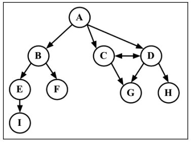
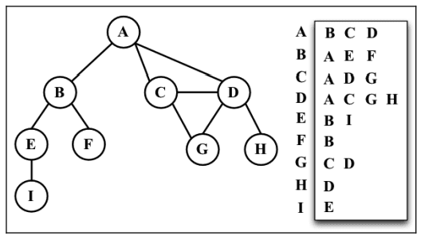

<!-- START doctoc generated TOC please keep comment here to allow auto update -->
<!-- DON'T EDIT THIS SECTION, INSTEAD RE-RUN doctoc TO UPDATE -->

- [图(Graph)](#%E5%9B%BEgraph)
  - [图基础说明](#%E5%9B%BE%E5%9F%BA%E7%A1%80%E8%AF%B4%E6%98%8E)
    - [定义](#%E5%AE%9A%E4%B9%89)
    - [术语](#%E6%9C%AF%E8%AF%AD)
    - [应用](#%E5%BA%94%E7%94%A8)
    - [图的表示](#%E5%9B%BE%E7%9A%84%E8%A1%A8%E7%A4%BA)
    - [主要操作](#%E4%B8%BB%E8%A6%81%E6%93%8D%E4%BD%9C)
  - [图的实现](#%E5%9B%BE%E7%9A%84%E5%AE%9E%E7%8E%B0)
  - [图的遍历](#%E5%9B%BE%E7%9A%84%E9%81%8D%E5%8E%86)
    - [图的遍历基础说明](#%E5%9B%BE%E7%9A%84%E9%81%8D%E5%8E%86%E5%9F%BA%E7%A1%80%E8%AF%B4%E6%98%8E)
    - [图的遍历的实现](#%E5%9B%BE%E7%9A%84%E9%81%8D%E5%8E%86%E7%9A%84%E5%AE%9E%E7%8E%B0)
      - [基本原理的广度优先搜索](#%E5%9F%BA%E6%9C%AC%E5%8E%9F%E7%90%86%E7%9A%84%E5%B9%BF%E5%BA%A6%E4%BC%98%E5%85%88%E6%90%9C%E7%B4%A2)
      - [1. 使用 BFS 寻找最短路径](#1-%E4%BD%BF%E7%94%A8-bfs-%E5%AF%BB%E6%89%BE%E6%9C%80%E7%9F%AD%E8%B7%AF%E5%BE%84)
      - [2. 深入学习最短路径算法](#2-%E6%B7%B1%E5%85%A5%E5%AD%A6%E4%B9%A0%E6%9C%80%E7%9F%AD%E8%B7%AF%E5%BE%84%E7%AE%97%E6%B3%95)
      - [基本原理的深度优先搜索](#%E5%9F%BA%E6%9C%AC%E5%8E%9F%E7%90%86%E7%9A%84%E6%B7%B1%E5%BA%A6%E4%BC%98%E5%85%88%E6%90%9C%E7%B4%A2)
      - [1. 探索深度优先算法](#1-%E6%8E%A2%E7%B4%A2%E6%B7%B1%E5%BA%A6%E4%BC%98%E5%85%88%E7%AE%97%E6%B3%95)
      - [2. 拓扑排序——使用深度优先搜索](#2-%E6%8B%93%E6%89%91%E6%8E%92%E5%BA%8F%E4%BD%BF%E7%94%A8%E6%B7%B1%E5%BA%A6%E4%BC%98%E5%85%88%E6%90%9C%E7%B4%A2)
  - [最短路径算法](#%E6%9C%80%E7%9F%AD%E8%B7%AF%E5%BE%84%E7%AE%97%E6%B3%95)
    - [Dijkstra 算法](#dijkstra-%E7%AE%97%E6%B3%95)
    - [Floyd-Warshall 算法](#floyd-warshall-%E7%AE%97%E6%B3%95)
  - [最小生成树](#%E6%9C%80%E5%B0%8F%E7%94%9F%E6%88%90%E6%A0%91)
    - [Prim 算法](#prim-%E7%AE%97%E6%B3%95)
    - [Kruskal 算法](#kruskal-%E7%AE%97%E6%B3%95)
    - [prim 和 Kruskal 算法的其他实现示例](#prim-%E5%92%8C-kruskal-%E7%AE%97%E6%B3%95%E7%9A%84%E5%85%B6%E4%BB%96%E5%AE%9E%E7%8E%B0%E7%A4%BA%E4%BE%8B)

<!-- END doctoc generated TOC please keep comment here to allow auto update -->

# 图(Graph)

## 图基础说明

### 定义

- 图是网络结构的抽象模型。**图是一组由边连接的节点（或顶点）**。

- 一个图 `G = (V, E)` 由以下元素组成。

  - V：一组顶点
  - E：一组边，连接 V 中的顶点

- 基本图示例:


### 术语

- 1 **相邻顶点**: 由一条边连接在一起的顶点称为相邻顶点。
  - 比如，A 和 B 是相邻的，A 和 D 是相邻的，A 和 C 是相邻的，A 和 E 不是相邻的。
- 2 **度**: 一个顶点的度是其相邻顶点的数量。
  - 比如，A 和其他三个顶点相连接，因此 A 的度为 3；E 和其他两个顶点相连，因此 E 的度为 2。
- 3 **路径**: 路径是顶点 v1 , v2 , …, vk 的一个连续序列，其中 vi 和 v(i+1) 是相邻的。
  - 比如，以上一示意图中的图为例，其中包含路径 A B E I 和 A C D G。
- 4 **简单路径**: 简单路径要求不包含重复的顶点。
  - 比如，A D G 是一条简单路径。除去最后一个顶点（因为它和第一个顶点是同一个顶点）。
- 5 **环**: 环也是一个简单路径，比如 A D C A（最后一个顶点重新回到 A）。
- 6 **无环图与连通图**: 如果图中不存在环，则称该图是无环的。如果图中每两个顶点间都存在路径，则该图是连通的。
- 7 **有向图和无向图**: 图可以是无向的（边没有方向）或是有向的（有向图）。



- 8 **强连通**: 如果图中每两个顶点间在双向上都存在路径，则该图是强连通的。
  - 例如，C 和 D 是强连通的，而 A 和 B 不是强连通的。
- 9 **加权与未加权**: 图还可以是未加权的（目前为止我们看到的图都是未加权的）或是加权的。


### 应用

- 比如搜索图中的一个特定顶点或搜索一条特定边;
- 寻找图中的一条路径（从一个顶点到另一个顶点）;
- 寻找两个顶点之间的最短路径;
- 环检测。等

### 图的表示

在所有的表示法中，不存在绝对正确的方式。图的正确表示法取决于待解决的问题和图的类型。

- 1 邻接矩阵

  - 图最常见的实现是邻接矩阵。
  - 每个节点都和一个整数相关联，该整数将作为数组的索引。用一个二维数组来表示顶点之间的连接。
  - 如果索引为 i 的节点和索引为 j 的节点相邻，则`array[i][j] === 1` ，否则 `array[i][j] === 0`。
  - 如图:
    

  - 不足:
    - 不是强连通的图（**稀疏图**）如果用邻接矩阵来表示，则*矩阵中将会有很多 0，这意味着浪费了计算机存储空间来表示根本不存在的边*。
      - 例如，找给定顶点的相邻顶点，即使该顶点只有一个相邻顶点，也不得不迭代一整行。
    - 邻接矩阵表示法不够好的另一个理由是，_图中顶点的数量可能会改变，而二维数组不太灵活_。

- 2 邻接表

  - 邻接表由图中每个顶点的相邻顶点列表所组成。存在好几种方式来表示这种数据结构。
  - 可以用列表（数组）、链表，甚至是散列表或是字典来表示相邻顶点列表。
  - 下面的示意图展示了邻接表数据结构:
    

  - 尽管邻接表可能对大多数问题来说都是更好的选择。但以上两种表示法都很有用，且它们有着不同的性质
    - （例如，要找出顶点 v 和 w 是否相邻，使用邻接矩阵会比较快）。
  - **在示例中，将会使用邻接表表示法。**

- 3 关联矩阵

  - 在关联矩阵中，矩阵的行表示顶点，列表示边。使用二维数组来表示两者之间的连通性，
  - 如果顶点 v 是边 e 的入射点，则 `array[v][e] === 1` ；否则， `array[v][e] === 0` 。
  - 如下图所示:
    
  - **关联矩阵通常用于边的数量比顶点多的情况，以节省空间和内存**。

### 主要操作

- addVertex(v): 添加顶点 v
- addEdge(v, w): 添加顶点 v,w 之间的边
- getVertices(): 返回顶点列表
- getAdjList(): 返回邻接表

## 图的实现

使用邻接表表示法实现一个图类。

```js
class Graph {
  constructor(isDirected = false) {
    // 以接收一个参数来表示图是否有向,默认情况下，图是无向的.
    this.isDirected = isDirected;
    // 使用一个数组来存储图中所有顶点的名字
    this.vertices = [];
    // 一个字典(其实就是Map)来存储邻接表。
    // 字典将会使用顶点的名字作为键，邻接顶点列表作为值。
    // (个注:可以直接使用ES的Map()数据结构) // this.adjList = new Map();
    // this.adjList = new Dictionary();
    this.adjList = new Map(); // 直接使用Map,打印输出的邻接表更好看
  }

  // 向图中添加一个新的顶点（因为图实例化后是空的）,接收顶点 v 作为参数。
  addVertex(v) {
    // 在这个顶点不存在于图中时
    if (!this.vertices.includes(v)) {
      // 将该顶点添加到顶点列表中
      this.vertices.push(v);
      // 并且在邻接表中，设置顶点 v 作为键对应的字典值为一个空数组
      this.adjList.set(v, []);
    }
  }

  // 添加顶点之间的边
  // 接收两个顶点作为参数，也就是要建立连接的两个顶点。
  addEdge(v, w) {
    // 在连接顶点之前，需要验证顶点是否存在于图中。
    // 如果顶点 v 或 w 不存在于图中，要将它们加入顶点列表
    if (!this.adjList.get(v)) {
      this.addVertex(v);
    }
    if (!this.adjList.get(w)) {
      this.addVertex(w);
    }
    // 通过将 w 加入到 v 的邻接表中，添加了一条自顶点 v 到顶点 w 的边
    this.adjList.get(v).push(w);
    // 如果你想实现一个有向图(v->w)，到上一步即可。
    // 由于本示例中大多数的例子都是基于无向图的，因此需要添加一条自 w 到 v 的边。
    if (!this.isDirected) {
      this.adjList.get(w).push(v);
    }
  }

  // 返回顶点列表
  getVertices() {
    return this.vertices;
  }
  // 返回邻接表
  getAdjList() {
    return this.adjList;
  }

  // 实现 Graph 类的 toString 方法，以便在控制台输出图
  toString() {
    let s = "";
    // 迭代 vertices 数组列表，将顶点的名字加入字符串中
    for (let i = 0; i < this.vertices.length; i++) {
      s += `${this.vertices[i]} -> `;
      // 取得该顶点的邻接表，同样迭代该邻接表,将相邻顶点加入到显示的字符串
      const neighbors = this.adjList.get(this.vertices[i]);
      for (let j = 0; j < neighbors.length; j++) {
        s += `${neighbors[j]} `;
      }
      // 邻接表迭代完成后，给我们的字符串添加一个换行符
      s += "\n";
    }
    return s;
  }
}

module.exports = {
  Graph,
};
```

测试,即示例图的邻接表表示:


```js
// 测试
const graph = new Graph();
// 创建了一个数组，包含所有想添加到图中的顶点
const myVertices = ["A", "B", "C", "D", "E", "F", "G", "H", "I"];
// 遍历 myVertices 数组并将其中的值逐一添加到图中
for (let i = 0; i < myVertices.length; i++) {
  graph.addVertex(myVertices[i]);
}
// 添加想要的边,完成创建一个图
graph.addEdge("A", "B");
graph.addEdge("A", "C");
graph.addEdge("A", "D");
graph.addEdge("C", "D");
graph.addEdge("C", "G");
graph.addEdge("D", "G");
graph.addEdge("D", "H");
graph.addEdge("B", "E");
graph.addEdge("B", "F");
graph.addEdge("E", "I");

console.log(graph.toString());
/*
A -> B C D
B -> A E F
C -> A D G
D -> A C G H
E -> B I
F -> B
G -> C D
H -> D
I -> E
*/
console.log(graph.getAdjList());
/*
Map(9) {
  'A' => [ 'B', 'C', 'D' ],
  'B' => [ 'A', 'E', 'F' ],
  'C' => [ 'A', 'D', 'G' ],
  'D' => [ 'A', 'C', 'G', 'H' ],
  'E' => [ 'B', 'I' ],
  'F' => [ 'B' ],
  'G' => [ 'C', 'D' ],
  'H' => [ 'D' ],
  'I' => [ 'E' ]
}
*/
```

## 图的遍历

### 图的遍历基础说明

- 和树数据结构类似，我们可以访问图的所有节点。有两种算法可以对图进行遍历：
  - **广度优先搜索**（breadth-first search，BFS）和**深度优先搜索**（depth-first search，DFS）。
- 图遍历可以用来寻找特定的顶点或寻找两个顶点之间的路径，检查图是否连通，检查图是否含有环，等等。

- 图遍历的思想:

  - 1 图遍历算法的思想是必须追踪每个第一次访问的节点，并且追踪有哪些节点还没有被完全探索。
    - 对于两种图遍历算法，都需要明确指出第一个被访问的顶点。
  - 2 完全探索一个顶点要求我们查看该顶点的每一条边。
    - 对于每一条边所连接的没有被访问过的顶点，将其标注为被发现的，并将其加进待访问顶点列表中。
  - 3 为了保证算法的效率，务必访问每个顶点至多两次。连通图中每条边和顶点都会被访问到。

- 广度和深度优先的区别:

  - 广度优先搜索算法和深度优先搜索算法基本上是相同的，只有一点不同，那就是*待访问顶点列表的数据结构*。

  | 算 法        | 数据结构 | 描 述                                                          |
  | ------------ | -------- | -------------------------------------------------------------- |
  | 深度优先搜索 | 栈       | 将顶点存入栈，顶点是沿着路径被探索的，存在新的相邻顶点就去访问 |
  | 广度优先搜索 | 队列     | 将顶点存入队列，最先入队列的顶点先被探索                       |

- 当要标注已经访问过的顶点时，用三种颜色来反映它们的状态。

  - 白色：表示该顶点还没有被访问。
  - 灰色：表示该顶点被访问过，但并未被探索过。
  - 黑色：表示该顶点被访问过且被完全探索过。

    - 这就是之前提到的务必访问每个顶点最多两次的原因。

### 图的遍历的实现

首先，需要准备一些工具：

```js
// 深度优先会使用栈,广度优先会使用队列
const { Graph } = require("./Graph");
const { Queue } = require("./Queue").;
const { Stack } = require("./Stack");

// 使用 Colors 变量中标记顶点
const Colors = {
  WHITE: 0,
  GREY: 1,
  BLACK: 2,
};

// 两个算法还需要一个辅助对象来帮助存储顶点是否被访问过。
// 在每个算法的开头，所有的顶点会被标记为未访问（白色）。用下面的函数来初始化每个顶点的颜色。
const initializeColor = (vertices) => {
  const color = {};
  for (let i = 0; i < vertices.length; i++) {
    color[vertices[i]] = Colors.WHITE;
  }
  return color;
};
```

#### 基本原理的广度优先搜索

基本原理：

广度优先搜索算法会从指定的第一个顶点开始遍历图，先访问其所有的邻点（相邻顶点），就像一次访问图的一层。

换句话说，就是先宽后深地访问顶点。


```js
const breadthFirstSearch = (graph, startVertex, cb) => {
  const vertices = graph.getVertices();
  const adjList = graph.getAdjList();
  // 第一件事情是用 initializeColor函数来将 color 数组初始化为白色
  const color = initializeColor(vertices);

  // 我们还需要声明和创建一个 Queue 实例,它将会存储待访问和待探索的顶点。
  const queue = new Queue();
  // breadthFirstSearch 方法接收一个图实例和顶点作为算法的起始点。
  //   起始顶点是必要的，将此顶点入队列
  queue.enqueue(startVertex);

  // 如果队列不为空
  while (!queue.isEmpty()) {
    // 使用出队列操作从队列中移除一个顶点
    const u = queue.dequeue();
    // 取得一个包含其所有邻点的邻接表
    const neighbors = adjList.get(u);
    // 该顶点将被标注为灰色，表示我们发现了它,（但还未完成对其的探索）
    color[u] = Colors.GREY;

    // 遍历对于 u 的每个邻点
    for (let i = 0; i < neighbors.length; i++) {
      // 取得其值
      const w = neighbors[i];
      // 如果它还未被访问过（颜色为白色），则将其标注为我们已经发现了它
      //   （颜色设置为灰色）
      if (color[w] === Colors.WHITE) {
        color[w] = Colors.GREY;
        // 并将这个顶点加入队列。这样当其从队列中出列的时候，可以完成对其的探索。
        queue.enqueue(w);
      }
    }
    // 当完成探索该顶点和其相邻顶点后，我们将该顶点标注为已探索过的
    //   （颜色设置为黑色）
    color[u] = Colors.BLACK;
    // 参数也接收一个回调。这个参数是可选的，如果传递了回调函数,，就会用到它。
    if (cb) {
      cb(u);
    }
  }
};
```

测试

```js
// 测试
const graph = new Graph();
// 创建了一个数组，包含所有想添加到图中的顶点
// 同示例图的邻接表表示: 1基本的图.png
const myVertices = ["A", "B", "C", "D", "E", "F", "G", "H", "I"];
// 遍历 myVertices 数组并将其中的值逐一添加到图中
for (let i = 0; i < myVertices.length; i++) {
  graph.addVertex(myVertices[i]);
}
// 添加想要的边,完成创建一个图
graph.addEdge("A", "B");
graph.addEdge("A", "C");
graph.addEdge("A", "D");
graph.addEdge("C", "D");
graph.addEdge("C", "G");
graph.addEdge("D", "G");
graph.addEdge("D", "H");
graph.addEdge("B", "E");
graph.addEdge("B", "F");
graph.addEdge("E", "I");
console.log(graph.toString());
/*
A -> B C D 
B -> A E F 
C -> A D G 
D -> A C G H 
E -> B I 
F -> B 
G -> C D 
H -> D 
I -> E 
*/

// 声明了一个回调函数，在控制台上输出已经被完全探索过的顶点的名字。
const printVertex = (value) => console.log("Visited vertex: " + value);
// 广度优先遍历图
breadthFirstSearch(graph, myVertices[0], printVertex);
/*
输出:
Visited vertex: A
Visited vertex: B
Visited vertex: C
Visited vertex: D
Visited vertex: E
Visited vertex: F
Visited vertex: G
Visited vertex: H
Visited vertex: I
*/
```

#### 1. 使用 BFS 寻找最短路径

考虑如何来解决下面这个问题:

_给定一个图 G 和源顶点 v，找出每个顶点 u 和 v 之间最短路径的距离（以边的数量计）。_

对于给定顶点 v，广度优先算法会访问所有与其距离为 1 的顶点，接着是距离为 2 的顶点，以此类推。
所以，可以用广度优先算法来解这个问题。

可以修改 `breadthFirstSearch` 方法以返回给我们一些信息：

- 从 v 到 u 的距离 `distances[u]` ；
- 前溯点 `predecessors[u]` ，用来推导出从 v 到其他每个顶点 u 的最短路径。

**改进过的广度优先方法的实现:**

```js
const BFS = (graph, startVertex) => {
  const vertices = graph.getVertices();
  const adjList = graph.getAdjList();
  const color = initializeColor(vertices);
  const queue = new Queue();
  // 声明数组 distances来表示距离
  const distances = {};
  // 声明数组 predecessors 来表示前溯点
  const predecessors = {};
  queue.enqueue(startVertex);

  // 对于图中的每一个顶点
  for (let i = 0; i < vertices.length; i++) {
    // 用 0 来初始化数组 distances
    distances[vertices[i]] = 0;
    // 用 null 来初始化数组 predecessors 。
    predecessors[vertices[i]] = null;
  }

  while (!queue.isEmpty()) {
    const u = queue.dequeue();
    const neighbors = adjList.get(u);
    color[u] = Colors.GREY;

    for (let i = 0; i < neighbors.length; i++) {
      const w = neighbors[i];
      if (color[w] === Colors.WHITE) {
        color[w] = Colors.GREY;
        // 通过给distances[u] 加 1 来增加 v 和 w 之间的距离
        // （ u 是 w 的前溯点， distances[u] 的值已经有了）
        distances[w] = distances[u] + 1;
        // 发现顶点 u 的邻点 w 时，则设置 w 的前溯点值为 u
        predecessors[w] = u;
        queue.enqueue(w);
      }
    }
    color[u] = Colors.BLACK;
  }
  // 方法最后返回了一个包含 distances 和 predecessors 的对象
  return {
    distances,
    predecessors,
  };
};
```

测试：

```js
const shortestPathA = BFS(graph, myVertices[0]);
console.log(shortestPathA);
/*
输出:
{
  distances: { A: 0, B: 1, C: 1, D: 1, E: 2, F: 2, G: 2, H: 2, I: 3 },
  predecessors: {
    A: null,
    B: 'A',
    C: 'A',
    D: 'A',
    E: 'B',
    F: 'B',
    G: 'C',
    H: 'D',
    I: 'E'
  }
}
这意味着顶点 A 与顶点 B 、 C 和 D 的距离为 1；
与顶点 E 、 F 、 G 和 H 的距离为 2；与顶点 I的距离为 3。
*/
```

通过前溯点数组，可以用下面这段代码来构建从顶点 A 到其他顶点的路径：

```js
// 用顶点 A 作为源顶点
const fromVertex = myVertices[0];

// 对于每个其他顶点(除了顶点 A)
for (let i = 1; i < myVertices.length; i++) {
  // 计算顶点 A 到它的路径。
  // 从 myVertices 数组得到值，然后创建一个栈来存储路径值。
  const toVertex = myVertices[i];
  const path = new Stack();
  // 追溯 toVertex 到 fromVertex 的路径
  // 变量 v 被赋值为其前溯点的值，这样能够反向追溯这条路径。
  for (let v = toVertex; v !== fromVertex; v = shortestPathA.predecessors[v]) {
    // 将变量 v 添加到栈中
    path.push(v);
  }
  // 最后，源顶点也会被添加到栈中，以得到完整路径。
  path.push(fromVertex);

  // 创建了一个s字符串，并将源顶点赋值给它（它是最后一个加入栈中的，所以是第一个被弹出的项）。
  let s = path.pop();
  // 当栈是非空的，就从栈中移出一个项并将其拼接到字符串 s 的后面。
  while (!path.isEmpty()) {
    s += " - " + path.pop();
  }
  // 最后，在控制台上输出路径。
  console.log(s);
}
/*
输出:
A - B
A - C
A - D
A - B - E
A - B - F
A - C - G
A - D - H
A - B - E - I
*/
```

#### 2. 深入学习最短路径算法

本示例中的图不是加权图。

如果要计算加权图中的最短路径（例如，城市 A 和城市 B 之间的最短路径——GPS 和 Google Maps 中用到的算法），广度优先搜索未必合适。

举几个例子:
`Dijkstra` 算法解决了单源最短路径问题。
`Bellman-Ford` 算法解决了边权值为负的单源最短路径问题。
`A*`搜索算法解决了求仅一对顶点间的最短路径问题，用经验法则来加速搜索过程。
`Floyd-Warshall` 算法解决了求所有顶点对之间的最短路径这一问题。

#### 基本原理的深度优先搜索

深度优先搜索的步骤是递归的，这意味着深度优先搜索算法使用栈来存储函数调用（由递归调用所创建的栈）。


实现代码：

```js
// 接收一个 Graph 类实例和回调函数作为参数
const depthFirstSearch = (graph, cb) => {
  const vertices = graph.getVertices();
  const adjList = graph.getAdjList();
  // 初始化每个顶点的颜色
  const color = initializeColor(vertices);

  // 对于图实例中每一个未被访问过的顶点
  for (let i = 0; i < vertices.length; i++) {
    // 调用私有的递归函数 depthFirstSearchVisit ，
    //  传递的参数为要访问的顶点 u 、颜色数组、顶点邻接表Map以及回调函数
    if (color[vertices[i]] === Colors.WHITE) {
      depthFirstSearchVisit(vertices[i], color, adjList, cb);
    }
  }
};

const depthFirstSearchVisit = (u, color, adjList, cb) => {
  // 当访问顶点 u 时，标注其为被发现的灰色
  color[u] = Colors.GREY;
  // 如果有 callback 函数的话，则执行该函数输出已访问过的顶点。
  if (cb) {
    cb(u);
  }

  // 取得包含顶点 u 所有邻点的列表
  const neighbors = adjList.get(u);
  // 对于顶点 u 的每一个未被访问过（颜色为白色）的邻点 w ，
  //   将调用 depthFirstSearchVisit 函数，
  // 传递 w 和其他参数（添加顶点 w 入栈，这样接下来就能访问它）。
  for (let i = 0; i < neighbors.length; i++) {
    const w = neighbors[i];
    if (color[w] === Colors.WHITE) {
      depthFirstSearchVisit(w, color, adjList, cb);
    }
  }
  // 最后，在该顶点和邻点按深度访问之后，回退，意思是该顶点已被完全探索，并将其标注为黑色
  color[u] = Colors.BLACK;
};
```

测试，执行图示如下：


```js
depthFirstSearch(graph, printVertex);
/*
输出:
Visited vertex: A
Visited vertex: B
Visited vertex: E
Visited vertex: I
Visited vertex: F
Visited vertex: C
Visited vertex: D
Visited vertex: G
Visited vertex: H
*/
```

#### 1. 探索深度优先算法

对于给定的图 G，如果希望深度优先搜索算法遍历图 G 的所有节点，
构建“森林”（有根树的一个集合）以及一组源顶点（根），并输出两个数组：发现时间和完成探索时间。

可以修改 depthFirstSearch 函数来返回一些信息：

- 顶点 u 的发现时间 `d[u]` ；
- 当顶点 u 被标注为黑色时， u 的完成探索时间 `f[u]` ；
- 顶点 u 的前溯点 `p[u]` 。

```js
const DFS = (graph) => {
  const vertices = graph.getVertices();
  const adjList = graph.getAdjList();
  const color = initializeColor(vertices);
  const d = {};
  const f = {};
  const p = {};
  // 声明一个变量来追踪发现时间和完成探索时间(time要算法全局使用,所以用个引用类型)
  const time = { count: 0 };
  // 声明数组 d 、 f 和 p ，还需要为图的每一个顶点来初始化这些数组。
  for (let i = 0; i < vertices.length; i++) {
    f[vertices[i]] = 0;
    d[vertices[i]] = 0;
    p[vertices[i]] = null;
  }

  for (let i = 0; i < vertices.length; i++) {
    if (color[vertices[i]] === Colors.WHITE) {
      DFSVist(vertices[i], color, d, f, p, time, adjList);
    }
  }
  // 结尾处返回这些值，之后要用到它们。
  return {
    discovery: d,
    finished: f,
    predecessors: p,
  };
};

const DFSVist = (u, color, d, f, p, time, adjList) => {
  color[u] = Colors.GREY;
  // 当一个顶点第一次被发现时，我们追踪其发现时间
  d[u] = ++time.count;
  const neighbors = adjList.get(u);
  for (let i = 0; i < neighbors.length; i++) {
    const w = neighbors[i];
    if (color[w] === Colors.WHITE) {
      // 当它是由引自顶点 u 的边而被发现的，继续追踪它的前溯点
      p[w] = u;
      DFSVist(w, color, d, f, p, time, adjList);
    }
  }
  color[u] = Colors.BLACK;
  // 最后，当这个顶点被完全探索后，追踪其完成时间
  f[u] = ++time.count;
};
```

深度优先算法背后的思想是什么？

- 1 边是从最近发现的顶点 u 处被向外探索的。只有连接到未发现的顶点的边被探索了。
- 2 当 u 所有的边都被探索了，该算法回退到 u 被发现的地方去探索其他的边。
  - 这个过程持续到我们发现了所有从原始顶点能够触及的顶点。
  - 如果还留有任何其他未被发现的顶点，我们对新源顶点重复这个过程。
- 3 重复该算法，直到图中所有的顶点都被探索了。

对于改进过的深度优先搜索，有两点需要我们注意：

- 时间（ time ）变量值的范围只可能在图顶点数量的一倍到两倍（ 2|V| ）之间；
- 对于所有的顶点 u，`d[u]<f[u]`
  - 意味着，发现时间的值比完成时间的值小，完成时间意思是所有顶点都已经被探索过了。

在这两个假设下，我们有如下的规则:

- `1 <= d[u] < f[u] <= 2|V|`

再跑一次 DFS，对图中每个顶点的发现/完成时间信息如图:


能用这些新信息来做什么呢? 比如拓扑排序。

#### 2. 拓扑排序——使用深度优先搜索

编排一些任务或步骤的执行顺序时，这称为**拓扑排序**（topological sorting，英文亦写作 topsort 或是 toposort）。

在日常生活中，这个问题在不同情形下都会出现。例如，

- 当开始学习一门计算机科学课程，在学习某些知识之前得按顺序完成一些知识储备（你不可以在上算法 I 课程前先上算法 II 课程）。
- 当在开发一个项目时，需要按顺序执行一些步骤。例如，首先从客户那里得到需求，接着开发客户要求的东西，最后交付项目。你不能先交付项目再去收集需求。


拓扑排序只能应用于 DAG(有向无环图)。那么，如何使用深度优先搜索来实现拓扑排序呢？

```js
// 使用DFS执行以上示意图.
graph2 = new Graph(true); // 有向图

myVertices2 = ["A", "B", "C", "D", "E", "F"];
for (i = 0; i < myVertices2.length; i++) {
  graph2.addVertex(myVertices2[i]);
}
graph2.addEdge("A", "C");
graph2.addEdge("A", "D");
graph2.addEdge("B", "D");
graph2.addEdge("B", "E");
graph2.addEdge("C", "F");
graph2.addEdge("F", "E");

const result = DFS(graph2);

console.log(result);
/*
输出:
{
  discovery: { A: 1, B: 11, C: 2, D: 8, E: 4, F: 3 },
  finished: { A: 10, B: 12, C: 7, D: 9, E: 5, F: 6 },
  predecessors: { A: null, B: null, C: 'A', D: 'A', E: 'F', F: 'C' }
}
```

这段代码将创建图，添加边，执行改进版本的深度优先搜索算法，并将结果保存到 result 变量。

下图展示了深度优先搜索算法执行后，该图的发现和完成时间。


接下来要做的仅仅是以倒序来排序完成时间数组，这便得出了该图的拓扑排序:

```js
const fTimes = result.finished;
s = "";

for (let count = 0; count < myVertices2.length; count++) {
  let max = 0;
  let maxName = null;

  for (let i = 0; i < myVertices2.length; i++) {
    if (fTimes[myVertices2[i]] > max) {
      max = fTimes[myVertices2[i]];
      maxName = myVertices2[i];
    }
  }
  // s += ' - ' + maxName;

  // 输出与上一句只是没有开头的 - 符号
  !s ? (s += maxName) : (s += " - " + maxName);
  delete fTimes[maxName];
}
console.log(s);
// B - A - D - C - F - E
```

注意之前的拓扑排序结果仅是多种可能性之一。如果我们稍微修改一下算法，就会有不同的结果。

比如下面这个结果也是众多其他可能性中的一个。

```
A - B - C - D - F - E
```

## 最短路径算法

设想你要从街道地图上的 A 点出发，通过可能的最短路径到达 B 点。(从 A 到 B 的最短路径是什么？)

可以用图来解决这个问题，相应的算法被称为最短路径。

两种非常著名的算法，即 Dijkstra 算法和 Floyd-Warshall 算法。

用于测试最短路径的有向图示例:


### Dijkstra 算法

Dijkstra 算法是一种计算从单个源到所有其他源的最短路径的贪心算法.

- 这意味着可以用它来计算从图的一个顶点到其余各顶点的最短路径。

```js
// 示例图的邻接矩阵:(书上有误,B->C明明是2,但矩阵中给的1)
var graph = [
  [0, 2, 4, 0, 0, 0],
  [0, 0, 2, 4, 2, 0],
  [0, 0, 0, 0, 3, 0],
  [0, 0, 0, 0, 0, 2],
  [0, 0, 0, 3, 0, 2],
  [0, 0, 0, 0, 0, 0],
];
```

通过下面的代码来看看 Dijkstra 算法是如何工作的:

```js
// Dijkstra 算法
const INF = Number.MAX_SAFE_INTEGER;

const dijkstra = (graph, src) => {
  const dist = [];
  const visited = [];
  const { length } = graph;

  // 把所有的距离（ dist ）初始化为无限大, 将 visited[] 初始化为 false
  //   JavaScript  最大的数 INF = Number.MAX_SAFE_INTEGER
  for (let i = 0; i < length; i++) {
    dist[i] = INF;
    visited[i] = false;
  }

  // 把源顶点到自己的距离设为 0 。
  dist[src] = 0;

  // 要找出到其余顶点的最短路径。
  for (let i = 0; i < length - 1; i++) {
    // 为此，需要从尚未处理的顶点中选出距离最近的顶点。
    const u = minDistance(dist, visited);
    // 把选出的顶点标为 visited ，以免重复计算。
    visited[u] = true;
    // 如果找到更短的路径，则更新最短路径的值
    for (let v = 0; v < length; v++) {
      if (
        !visited[v] &&
        graph[u][v] !== 0 &&
        dist[u] !== INF &&
        dist[u] + graph[u][v] < dist[v]
      ) {
        dist[v] = dist[u] + graph[u][v];
      }
    }
  }
  // 处理完所有顶点后，返回从源顶点（ src ）到图中其他顶点最短路径的结果。
  return dist;
};

// 计算顶点间的 minDistance ，就要搜索 dist 数组中的最小值，返回它在数组中的索引。
const minDistance = (dist, visited) => {
  let min = INF;
  let minIndex = -1;

  for (let v = 0; v < dist.length; v++) {
    if (visited[v] === false && dist[v] <= min) {
      min = dist[v];
      minIndex = v;
    }
  }
  return minIndex;
};
```

测试一下：

```js
console.log(dijkstra(graph, 0));

/*
输出:[ 0, 2, 4, 6, 4, 6 ]

表示:
A(即0起始)到A 最短路径长度为 0
A 到 B 最短路径长度为 2
A 到 C 最短路径长度为 4
A 到 D 最短路径长度为 6
A 到 E 最短路径长度为 4
A 到 F 最短路径长度为 6
*/

// 同理,如果不是顶点A,也有类似的结果例如执行:
console.log(dijkstra(graph, 2));
/*
输出:
[ 9007199254740991, 9007199254740991, 0, 6, 3, 5 ]

表示:
C(即2起始)到A 没有路径可达
C 到 B 没有路径可达
C 到 C 最短路径长度为 0
C 到 D 最短路径长度为 6
C 到 E 最短路径长度为 3
C 到 F 最短路径长度为 5
*/
```

### Floyd-Warshall 算法

Floyd-Warshall 算法是一种计算图中所有最短路径的动态规划算法。

- 通过该算法，可以找出从所有源到所有顶点的最短路径。

```js
const floydWarshall = (graph) => {
  const dist = [];
  const { length } = graph;

  // 把 distance 数组初始化为每个顶点之间的权值
  for (let i = 0; i < length; i++) {
    dist[i] = [];

    for (let j = 0; j < length; j++) {
      if (i === j) {
        // 顶点到自身的距离为 0
        dist[i][j] = 0;

        // 注意,这是书上的写法,判断没有边用的不是有限数
        // } else if (!isFinite(graph[i][j])) {
      } else if (graph[i][j] === 0) {
        // 但是示例邻接矩阵没有边的表示为0,所以这里修改为判断等于0
        //      (实际写算法时,根据图的表示方法不同确认)

        // 如果两个顶点之间没有边，就将其表示为 Infinity
        dist[i][j] = Infinity;
      } else {
        // i 到 j 可能的最短距离就是这些顶点间的权值
        dist[i][j] = graph[i][j];
      }
    }
  }
  // 将顶点 0 到 k 作为中间点，从 i 到 j 的最短路径经过 k 。
  for (let k = 0; k < length; k++) {
    for (let i = 0; i < length; i++) {
      for (let j = 0; j < length; j++) {
        // 计算通过顶点 k 的 i 和 j 之间的最短路径(是 Floyd-Warshall 算法的核心)
        if (dist[i][k] + dist[k][j] < dist[i][j]) {
          // 如果一个最短路径的新的值被找到，要使用并存储它。
          dist[i][j] = dist[i][k] + dist[k][j];
        }
      }
    }
  }
  return dist;
};
```

测试一下：

```js
console.log(floydWarshall(graph));
/*
输出:
[
  [ 0, 2, 4, 6, 4, 6 ],
  [ Infinity, 0, 2, 4, 2, 4 ],
  [ Infinity, Infinity, 0, 6, 3, 5 ],
  [ Infinity, Infinity, Infinity, 0, Infinity, 2 ],
  [ Infinity, Infinity, Infinity, 3, 0, 2 ],                // ①
  [ Infinity, Infinity, Infinity, Infinity, Infinity, 0 ]
]

这里的 Infinity 代表顶点 i 到 j 的最短路径不存在。
例如第①行,表示
从E到A 没有路径可达
从E到B 没有路径可达
从E到C 没有路径可达
从E到D 最短路径为3
从E到E 最短路径为0
从E到F 最短路径为2
*/

// 格式化输出效果:
dist1 = floydWarshall(graph);

let s = "";
for (let i = 0; i < dist1.length; ++i) {
  s = "";
  for (var j = 0; j < dist1.length; ++j) {
    if (dist1[i][j] === Infinity) s += "INF ";
    else s += dist1[i][j] + "   ";
  }
  console.log(s);
}
/*
输出:
0   2   4   6   4   6
INF 0   2   4   2   4
INF INF 0   6   3   5
INF INF INF 0   INF 2
INF INF INF 3   0   2
INF INF INF INF INF 0
*/
```

仔细查看,对图中每一个顶点执行 Dijkstra 算法，也可以得到相同的结果。

两者区别:

- 1.结果上
  - dijkstra 是求得一点到任一点的最短距离（一维数组），
  - 而 floyd-warshall 的结果是任意两点之间的最短距离（二维数组）。
- 2.思想上
  - dijkstra 是从给定源点开始，比较源点到当前点所有可达的点的距离，找出最小的距离。
    - 这个最小的距离上的最后一个点，就是源点到最后一个点的最短距离，然后再把最后一个点作为当前点进行迭代，
    - 每次都要找最短距离，体现了该算法的贪心思想；
  - floyd-warshall 是动态地更新任意两点之间的最短距离，怎么才能更新呢，那就要找到第三个点。
    - 比如说要更新 AB 两点之间的最短距离，那就拿第三个点 P，看看是否 AP 的距离 + PB 的距离是否小于 AB 的距离，如果小于，则更新 AB 的距离，这采用了动态规划的思想。

## 最小生成树

回顾几个概念

- **连通图**
  - 在无向图中，若任意两个顶点 vi 与 vj 都有路径相通，则称该无向图为连通图。
- **强连通图**
  - 在有向图中，若任意两个顶点 vi 与 vj 都有路径相通，则称该有向图为强连通图。
- **连通网**
  - 在连通图中，若图的边具有一定的意义，每一条边都对应着一个数，称为权；
  - 权代表着连接连个顶点的代价，称这种连通图叫做连通网。
- **生成树**
  - 一个连通图的生成树是指一个连通子图，它含有图中全部 n 个顶点，但只有足以构成一棵树的 n-1 条边。
  - 一颗有 n 个顶点的生成树有且仅有 n-1 条边，如果生成树中再添加一条边，则必定成环。
- **最小生成树**
  - 在连通网的所有生成树中，所有边的代价和最小的生成树，称为最小生成树。

最小生成树（MST）问题是网络设计中常见的问题。比如：

- 你的公司有几间办公室，要以最低的成本实现办公室电话线路相互连通，以节省资金，最好的办法是什么？
- 这也可以应用于岛桥问题。设想你要在 n 个岛屿之间建造桥梁，想用最低的成本实现所有岛屿相互连通。

这两个问题都可以用 MST 算法来解决，其中的办公室或者岛屿可以表示为图中的一个顶点，边代表成本。

两种主要的求最小生成树的算法：**Prim** 算法和 **Kruskal** 算法。

用于测试最小生成树算法的示例图，其中较粗的边是一个 MST 的解决方案。


### Prim 算法

Prim 算法是一种求解加权无向连通图的 MST 问题的贪心算法。

- 它能找出一个边的子集，使得其构成的树包含图中所有顶点，且边的权值之和最小。

Prim 算法如下:

```js
const INF = Number.MAX_SAFE_INTEGER;

const prim = (graph) => {
  const parent = [];
  const key = [];
  const visited = [];

  const { length } = graph;
  // 首先，把所有顶点（ key ）初始化为无限大， visited[] 初始化为 false 。
  for (let i = 0; i < length; i++) {
    key[i] = INF;
    visited[i] = false;
  }

  // 其次，选择第一个 key 作为第一个顶点，
  key[0] = 0;
  // 同时，因为第一个顶点总是 MST 的根节点，所以 parent[0] = -1 。
  parent[0] = -1;

  // 然后，对所有顶点求 MST。
  for (let i = 0; i < length - 1; i++) {
    // 从未处理的顶点集合中选出 key 值最小的顶点
    //（与 Dijkstra 算法中使用的minDistance 函数一样，只是名字不同）。
    const u = minKey(graph, key, visited);
    // 把选出的顶点标为 visited ，以免重复计算。
    visited[u] = true;

    for (let v = 0; v < length; v++) {
      // 如果得到更小的权值，
      if (graph[u][v] && !visited[v] && graph[u][v] < key[v]) {
        // 则保存 MST 路径
        parent[v] = u; // ①
        // 并更新其权值
        key[v] = graph[u][v]; // ②
      }
    }
  }
  // 处理完所有顶点后，返回包含 MST 的结果。
  return parent;
};

// 计算顶点集合中最小值的 minKey
const minKey = (graph, key, visited) => {
  let min = INF;
  let minIndex = 0;

  for (let v = 0; v < graph.length; v++) {
    if (visited[v] === false && key[v] < min) {
      min = key[v];
      minIndex = v;
    }
  }
  return minIndex;
};
```

比较 Prim 算法和 Dijkstra 算法，我们会发现除了行 ① 和行 ② 之外，两者非常相似:

- 行 ① 用 parent 数组保存 MST 的结果。行 ② 用 key 数组保存权值最小的边，
- 而在 Dijkstra 算法中，用 dist 数组保存距离。

我们可以修改 Dijkstra 算法，加入 parent 数组。这样，就可以在求出距离的同时得到路径。

测试一下:

```js
// 开头那个用于测试最小生成树算法的示例图的矩阵表示
var graph = [
  [0, 2, 4, 0, 0, 0],
  [2, 0, 2, 4, 2, 0],
  [4, 2, 0, 0, 3, 0],
  [0, 4, 0, 0, 3, 2],
  [0, 2, 3, 3, 0, 2],
  [0, 0, 0, 2, 2, 0],
];

const parent = prim(graph);

console.log("Edge   Weight");
for (let i = 1; i < graph.length; i++) {
  console.log(parent[i] + " - " + i + "   " + graph[i][parent[i]]);
}
/*
输出:
Edge   Weight
0 - 1   2
1 - 2   2
5 - 3   2
1 - 4   2
4 - 5   2
表示最小生成树的边及对应的权重
*/
```

### Kruskal 算法

和 Prim 算法类似，Kruskal 算法也是一种求加权无向连通图的 MST 的贪心算法。

```js
// find 函数的定义。防止 MST 出现环路。
const find = (i, parent) => {
  while (parent[i]) {
    i = parent[i];
  }
  return i;
};

// union 函数的定义
const union = (i, j, parent) => {
  if (i !== j) {
    parent[j] = i;
    return true;
  }
  return false;
};

const initializeCost = (graph) => {
  const cost = [];
  const { length } = graph;
  for (let i = 0; i < length; i++) {
    cost[i] = [];
    for (let j = 0; j < length; j++) {
      if (graph[i][j] === 0) {
        cost[i][j] = INF;
      } else {
        cost[i][j] = graph[i][j];
      }
    }
  }
  return cost;
};

const kruskal = (graph) => {
  const { length } = graph;
  const parent = [];

  let ne = 0;
  let a, b, u, v;
  // 首先，把邻接矩阵的值复制到 cost 数组，以方便修改且可以保留原始值
  const cost = initializeCost(graph);

  // 当 MST 的边数小于顶点总数减 1 时
  while (ne < length - 1) {
    // 找出权值最小的边
    for (let i = 0, min = INF; i < length; i++) {
      for (let j = 0; j < length; j++) {
        if (cost[i][j] < min) {
          min = cost[i][j];
          a = u = i;
          b = v = j;
        }
      }
    }
    // 检查 MST 中是否已存在这条边，以避免环路
    u = find(u, parent);
    v = find(v, parent);
    // 如果 u 和 v 是不同的边，则将其加入 MST。
    if (union(u, v, parent)) {
      ne++;
    }
    // 从列表中移除这些边，以免重复计算。
    cost[a][b] = cost[b][a] = INF;
  }
  // 返回 MST
  return parent;
};
```

测试输出:

```js
const parent1 = kruskal(graph);

console.log("Edge   Weight");
for (i = 1; i < graph.length; i++) {
  console.log(parent1[i] + " - " + i + "   " + graph[i][parent1[i]]);
}

// 20210226:
// 从输出结果来看,这个 Kruskal 算法的实现有问题
// (和prim的结果不一样,这个的权值结果明显大些.是因为图的表达方式原因?)
/*
输出:
Edge   Weight
0 - 1   2
1 - 2   2
1 - 3   4
1 - 4   2
3 - 5   2
*/
```

这个 Kruskal 算法有几种变体。这取决于对边的权值排序时所使用的数据结构（如优先队列），以及图是如何表示的。

### prim 和 Kruskal 算法的其他实现示例

过太久了，来源疑是[数据结构の JavaScript 实现之最小生成树 MST（ Kruskal 算法和 Prim 算法）](https://blog.csdn.net/pangji0417/article/details/85702160)

测试的示意图为:


```js
/*******************示例图的表示 */
// 顶点名称
let vertices = ["A", "B", "C", "D", "E", "F", "G"];
// 边和权重 [0, 1, 12] 表示A到B的权为12
let edges = [
  [0, 1, 12],
  [0, 5, 16],
  [0, 6, 14],
  [1, 2, 10],
  [1, 5, 7],
  [2, 3, 3],
  [2, 4, 5],
  [2, 5, 6],
  [3, 4, 4],
  [4, 5, 2],
  [4, 6, 8],
  [5, 6, 9],
];

/*******************两个工具方法 */
/**
 * @description 找到最小权重的边
 * @param {Array<edge>} edges
 * @returns {edge} edge
 */
function findMinEdge(edges) {
  let min = null;
  for (const edge of edges) {
    min = min ? (edge[2] < min[2] ? edge : min) : edge;
  }
  return min;
}
/**
 * @description 找到两组点集合之间的所有边，这个方法只有prim算法用得到
 * @param {Array<vertex>} srcs 源顶点数组
 * @param {Array<vertex>} objs 目标顶点数组
 * @param {Array<edge>} edges 所有边
 * @param {Array<vertex>} vertices 所有顶点
 * @returns {Array} edges
 */
function findEdgesIn(srcs, objs, edges, vertices) {
  let edgesBetweenSrcObj = [];
  for (const edge of edges) {
    for (const src of srcs) {
      srcIndex = vertices.indexOf(src);
      for (const obj of objs) {
        objIndex = vertices.indexOf(obj);
        if (
          (edge[0] === srcIndex && edge[1] === objIndex) ||
          (edge[0] === objIndex && edge[1] === srcIndex)
        ) {
          // 无向
          edgesBetweenSrcObj.push(edge);
        }
      }
    }
  }
  return edgesBetweenSrcObj;
}

/*************** prim 算法实现 */
function prim(edges, vertices, startVertex) {
  // 命名灵感：僵尸传染人类，找到最小代价，已经传染的人成为僵尸
  let infected = []; // 顶点
  let remained = vertices.slice(0); // 顶点
  let mstree = []; // 边
  let cur = startVertex;
  while (remained.length !== 1) {
    infected.push(cur);
    remained.splice(remained.indexOf(cur), 1);
    let min = findMinEdge(findEdgesIn(infected, remained, edges, vertices));
    mstree.push(min);
    cur =
      infected.indexOf(vertices[min[0]]) === -1
        ? vertices[min[0]]
        : vertices[min[1]]; // 更新
  }
  return mstree;
}

// 打印树
let mstree = prim(edges, vertices, "A");
console.log(mstree);

/*
输出:
[
  [ 0, 1, 12 ],
  [ 1, 5, 7 ],
  [ 4, 5, 2 ],
  [ 3, 4, 4 ],
  [ 2, 3, 3 ],
  [ 4, 6, 8 ]
]
*/

/*************** 并查集的简单实现 */
// （没有实现路径压缩，直接让A扎向B的屁股）
// 最重要的三个方法：
// 1.makeSet（根据顶点初始化并查集）
// 2. unionSet（union两个点集）
// 3. find（找到一个点的掌门人）
// 非连通集
function DisjoinSet() {
  this.items = {};
  this.makeSet = function (vertices) {
    for (const vertex of vertices) {
      this.items[vertex] = {
        parent: null,
        value: vertex,
      };
    }
  };
  this.unionSet = function (vertex_1, vertex_2) {
    const rootA = this.find(vertex_1);
    const rootB = this.find(vertex_2);
    if (rootA === null || rootB === null) {
      throw new Error("no exist vertex");
    }

    if (rootA !== rootB) {
      rootA.parent = rootB;
      return true;
    }
    return false;
  };
  this.find = function (vertex) {
    let p = this.items[vertex];
    if (p) {
      return p.parent === null ? p : this.find(p.parent.value);
    }
    throw new Error("not exist vertex");
  };
}

/**************kruskal算法实现 */
function kruskal(edges, vertices) {
  let mstree = [];
  let edgesCopy = edges.slice(0);
  let disjoinSet = new DisjoinSet();
  disjoinSet.makeSet(vertices);
  while (mstree.length < vertices.length - 1) {
    let min = findMinEdge(edgesCopy);
    // 不构成环,并查集的理念，为每一个顶点指定一个终点，判断新加两点的终点是否一致
    if (disjoinSet.unionSet(vertices[min[0]], vertices[min[1]])) {
      mstree.push(min);
    }
    edgesCopy.splice(edgesCopy.indexOf(min), 1);
  }
  return mstree;
}

// 打印
let mstree2 = kruskal(edges, vertices);
console.log(mstree2); // mstree和mstree2结果是相似的(外层数组的index可能不一致)

/* 
输出:
[
  [ 4, 5, 2 ],
  [ 2, 3, 3 ],
  [ 3, 4, 4 ],
  [ 1, 5, 7 ],
  [ 4, 6, 8 ],
  [ 0, 1, 12 ]
]
*/
```
