<!-- START doctoc generated TOC please keep comment here to allow auto update -->
<!-- DON'T EDIT THIS SECTION, INSTEAD RE-RUN doctoc TO UPDATE -->
<!-- **Table of Contents**  *generated with [DocToc](https://github.com/thlorenz/doctoc)* -->

- [排序算法](#%E6%8E%92%E5%BA%8F%E7%AE%97%E6%B3%95)
  - [冒泡排序](#%E5%86%92%E6%B3%A1%E6%8E%92%E5%BA%8F)
    - [基础冒泡排序](#%E5%9F%BA%E7%A1%80%E5%86%92%E6%B3%A1%E6%8E%92%E5%BA%8F)
    - [改进后的冒泡排序](#%E6%94%B9%E8%BF%9B%E5%90%8E%E7%9A%84%E5%86%92%E6%B3%A1%E6%8E%92%E5%BA%8F)
  - [选择排序](#%E9%80%89%E6%8B%A9%E6%8E%92%E5%BA%8F)
  - [插入排序](#%E6%8F%92%E5%85%A5%E6%8E%92%E5%BA%8F)
  - [归并排序](#%E5%BD%92%E5%B9%B6%E6%8E%92%E5%BA%8F)
  - [快速排序](#%E5%BF%AB%E9%80%9F%E6%8E%92%E5%BA%8F)
  - [计数排序](#%E8%AE%A1%E6%95%B0%E6%8E%92%E5%BA%8F)
  - [桶排序](#%E6%A1%B6%E6%8E%92%E5%BA%8F)
  - [基数排序](#%E5%9F%BA%E6%95%B0%E6%8E%92%E5%BA%8F)
- [搜索算法](#%E6%90%9C%E7%B4%A2%E7%AE%97%E6%B3%95)
  - [顺序搜索](#%E9%A1%BA%E5%BA%8F%E6%90%9C%E7%B4%A2)
  - [二分搜索](#%E4%BA%8C%E5%88%86%E6%90%9C%E7%B4%A2)
  - [内插搜索](#%E5%86%85%E6%8F%92%E6%90%9C%E7%B4%A2)
- [随机算法](#%E9%9A%8F%E6%9C%BA%E7%AE%97%E6%B3%95)
  - [Fisher-Yates 随机](#fisher-yates-%E9%9A%8F%E6%9C%BA)
- [(排序算法简洁示例)](#%E6%8E%92%E5%BA%8F%E7%AE%97%E6%B3%95%E7%AE%80%E6%B4%81%E7%A4%BA%E4%BE%8B)
  - [冒泡排序](#%E5%86%92%E6%B3%A1%E6%8E%92%E5%BA%8F-1)
  - [插入排序](#%E6%8F%92%E5%85%A5%E6%8E%92%E5%BA%8F-1)
  - [归并排序](#%E5%BD%92%E5%B9%B6%E6%8E%92%E5%BA%8F-1)
  - [快速排序](#%E5%BF%AB%E9%80%9F%E6%8E%92%E5%BA%8F-1)
  - [选择排序](#%E9%80%89%E6%8B%A9%E6%8E%92%E5%BA%8F-1)
  - [希尔排序](#%E5%B8%8C%E5%B0%94%E6%8E%92%E5%BA%8F)

<!-- END doctoc generated TOC please keep comment here to allow auto update -->

# 排序算法

通过[https://visualgo.net/zh/sorting](https://visualgo.net/zh/sorting)网站查看排序演示示例。

## 冒泡排序

### 基础冒泡排序

冒泡排序比较所有相邻的两个项，如果第一个比第二个大，则交换它们。
元素项向上移动至正确的顺序，就好像气泡升至表面一样，冒泡排序因此得名。

代码示例：

```js
/** 一些工具，避免遗忘再次拿出：*/
// 比较结果
const Compare = {
  LESS_THAN: -1,
  BIGGER_THAN: 1,
  EQUALS: 0,
};
// 默认的比较方法
export function defaultCompare(a, b) {
  if (a === b) {
    return Compare.EQUALS;
  }
  return a < b ? Compare.LESS_THAN : Compare.BIGGER_THAN;
}

// 数组内指定索引两个数的交换
function swap(array, a, b) {
  [array[a], array[b]] = [array[b], array[a]];
}

/**分割*/
import { Compare, defaultCompare, swap } from "./util";

export function bubbleSort(array, compareFn = defaultCompare) {
  // 声明一个名为 length 的变量，用来存储数组的长度
  const { length } = array;
  //   外循环会从数组的第一位迭代至最后一位，它控制了在数组中经过多少轮排序
  for (let i = 0; i < length; i++) {
    // 内循环将从第一位迭代至倒数第二位
    for (let j = 0; j < length - 1; j++) {
      // 进行当前项和下一项的比较
      if (compareFn(array[j], array[j + 1]) === Compare.BIGGER_THAN) {
        // 如果这两项顺序不对（当前项比下一项大），则交换它们
        swap(array, j, j + 1);
      }
    }
  }
  return array;
}
```

测试:

```js
function createNonSortedArray() {
  var array = [];
  for (let i = 5; i > 0; i--) {
    array.push(i);
  }
  return array;
}

// 倒序创建一个数组
let arr = createNonSortedArray();
console.log(arr);
// [ 5, 4, 3, 2, 1 ]

// 通过冒泡排序变为从小到大
const array = bubbleSort(arr);
console.log(array);
// [1, 2, 3, 4, 5];
```

冒泡排序执行示意图，初始数组`[5, 4, 3, 2, 1]`：
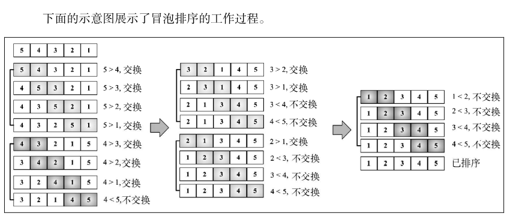

### 改进后的冒泡排序

```js
function modifiedBubbleSort(array, compareFn = defaultCompare) {
  const { length } = array;
  for (let i = 0; i < length; i++) {
    // 从内循环减去外循环中已跑过的轮数，就可以避免内循环中所有不必要的比较
    for (let j = 0; j < length - 1 - i; j++) {
      if (compareFn(array[j], array[j + 1]) === Compare.BIGGER_THAN) {
        swap(array, j, j + 1);
      }
    }
  }
  return array;
}
```

改进冒泡排序执行示意图，初始数组`[5, 4, 3, 2, 1]`：
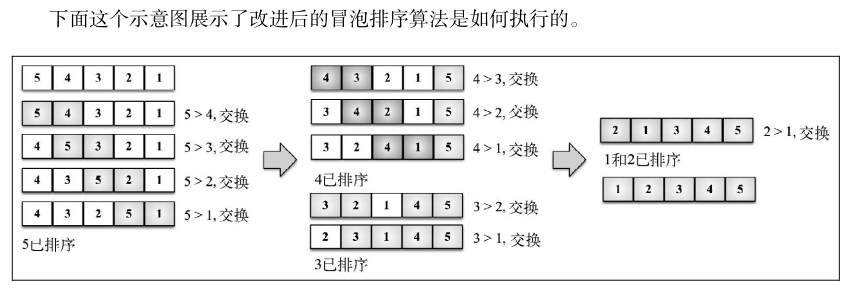

即便我们做了这个小改变来改进冒泡排序算法，但还是**不推荐**该算法，它的复杂度是 **O(n^2)**。

## 选择排序

选择排序算法是一种原址比较排序算法。

选择排序大致的思路是:

- 找到数据结构中的最小值并将其放置在第一位，接着找到第二小的值并将其放在第二位，以此类推。

示例代码如下:

```js
import { Compare, defaultCompare, swap } from "./util";

export const selectionSort = (array, compareFn = defaultCompare) => {
  // 声明一些将在算法内使用的变量
  const { length } = array;
  let indexMin;
  //   接着，外循环迭代数组，并控制迭代轮次（数组的第 n 个值——下一个最小值）。
  for (let i = 0; i < length - 1; i++) {
    // 假设本迭代轮次的第一个值为数组最小值
    indexMin = i;
    //  然后，从当前 i 的值开始至数组结束
    for (let j = i; j < length; j++) {
      // 比较是否位置 j 的值比当前最小值小
      if (compareFn(array[indexMin], array[j]) === Compare.BIGGER_THAN) {
        // 如果是，则改变最小值至新最小值
        indexMin = j;
      }
    }
    //  当内循环结束，将得出数组第 n 小的值。最后，如果该最小值和原最小值不同，则交换其值。
    if (i !== indexMin) {
      swap(array, i, indexMin);
    }
  }
  //   返回排序后的数组
  return array;
};
```

选择排序执行示意图，初始数组`[5, 4, 3, 2, 1]`：
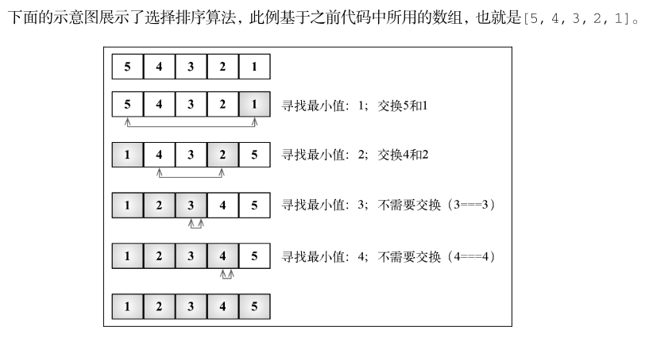

选择排序同样也是一个复杂度为 **O(n^2)**的算法。和冒泡排序一样，它包含有嵌套的两个循环，这导致了二次方的复杂度。

## 插入排序

插入排序每次排一个数组项，以此方式构建最后的排序数组:

- 假定第一项已经排序了。
- 接着，它和第二项进行比较——第二项是应该待在原位还是插到第一项之前呢？
- 这样，头两项就已正确排序，接着和第三项比较（它是该插入到第一、第二还是第三的位置呢），以此类推。

示例代码：

```js
import { Compare, defaultCompare } from "./util";

export const insertionSort = (array, compareFn = defaultCompare) => {
  // 来声明代码中使用的变量
  const { length } = array;
  let temp;

  // 迭代数组来给第 i 项找到正确的位置
  //   注意，算法是从第二个位置（索引 1）而不是 0 位置开始的（我们认为第一项已排序了）。
  for (let i = 1; i < length; i++) {
    // 然后，用 i 的值来初始化一个辅助变量
    let j = i;
    // 并也将其值存储在一个临时变量中，便于之后将其插入到正确的位置上。
    temp = array[i];
    // 下一步是要找到正确的位置来插入项目。
    //      只要变量 j 比 0 大（因为数组的第一个索引是 0——没有负值的索引）并且数组中前面的值比待比较的值大
    while (j > 0 && compareFn(array[j - 1], temp) === Compare.BIGGER_THAN) {
      // 我们就把这个值移到当前位置上，并减小 j 。
      array[j] = array[j - 1];
      j--;
    }
    //最终，能将该值插入到正确的位置上。
    array[j] = temp;
  }

  return array;
};
```

选择排序执行示意图，初始数组`[3, 5, 1, 4, 2]`：
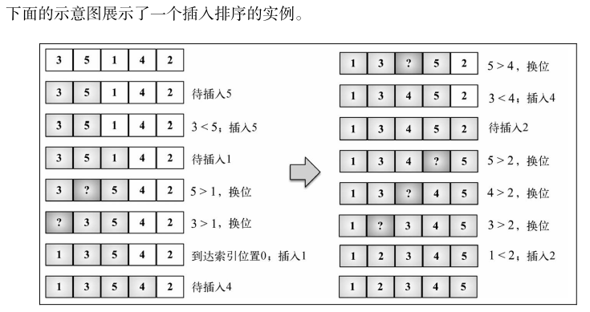

排序小型数组时，此算法比选择排序和冒泡排序性能要好。

## 归并排序

归并排序是一种分而治之算法。

- 其思想是将原始数组切分成较小的数组，直到每个小数组只有一个位置，接着将小数组归并成较大的数组，直到最后只有一个排序完毕的大数组。
- 由于是分治法，归并排序也是递归的。我们要将算法分为两个函数：
  - 第一个负责将一个大数组分为多个小数组并调用用来排序的辅助函数。
  - 第二个负责合并和排序小数组来产生大数组，直到回到原始数组并已排序完成。

归并排序是第一个可以实际使用的排序算法。

前三个排序算法性能不好，但归并排序性能不错，其复杂度为 **O(nlog(n))**。

> JavaScript 的 Array 类定义了一个 sort 函数（ Array.prototype.sort ）用以排序 JavaScript 数组（我们不必自己实现这个算法）。ECMAScript 没有定义用哪个排序算法，所以浏览器厂商可以自行去实现算法。例如，Mozilla Firefox 使用归并排序作为 Array.prototype.sort 的实现，而 Chrome（V8 引擎）使用了一个快速排序的变体。

代码示例：

```js
import { Compare, defaultCompare } from "./util";

// merge 函数负责合并和排序小数组来产生大数组，直到回到原始数组并已排序完成。
function merge(left, right, compareFn) {
  // 首先，需要声明归并过程要创建的新数组以及用来迭代两个数组（ left 和 right 数组）所需的两个变量
  let i = 0;
  let j = 0;
  const result = [];

  // 迭代两个数组，比较来自 left 数组的项是否比来自 right 数组的项小。
  while (i < left.length && j < right.length) {
    // 如果是，将该项从 left 数组添加至归并结果数组，并递增用于迭代数组的控制变量
    // 否则，从 right 数组添加项并递增用于迭代数组的控制变量。
    result.push(
      compareFn(left[i], right[j]) === Compare.LESS_THAN
        ? left[i++]
        : right[j++]
    );
  }
  // 接下来，将 left 数组所有剩余的项添加到归并数组中， right 数组也是一样。
  // 最后，将归并数组作为结果返回。
  return result.concat(i < left.length ? left.slice(i) : right.slice(j));
}

// 归并排序主函数
export function mergeSort(array, compareFn = defaultCompare) {
  // 由于算法是递归的，我们需要一个停止条件，在这里此条件是判断数组的长度是否为 1
  //   如果是，则直接返回这个长度为 1 的数组，因为它已排序了。

  //   如果数组长度比 1 大，那么得将其分成小数组。
  if (array.length > 1) {
    const { length } = array;
    // 为了将其分成小数组，首先得找到数组的中间位
    const middle = Math.floor(length / 2);
    // 找到后我们将数组分成两个小数组，分别叫作 left和 right
    //      left 数组由索引 0 至中间索引的元素组成，
    //      right 数组由中间索引至原始数组最后一个位置的元素组成。
    // 左右两个小数组将会对自身调用 mainSort 函数直到 left 数组和 right 数组的大小小于等于 1。
    const left = mergeSort(array.slice(0, middle), compareFn);
    const right = mergeSort(array.slice(middle, length), compareFn);

    // 调用 merge 函数，它负责合并和排序小数组来产生大数组，直到回到原始数组并已排序完成
    array = merge(left, right, compareFn);
  }
  return array;
}
```

归并排序执行示意图，初始数组`[8,7,6,5,4,3,2,1]`：
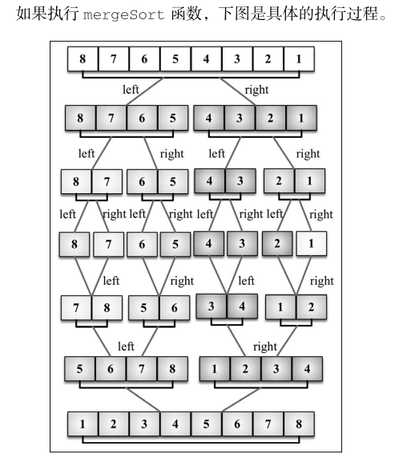

可以看到，算法首先将原始数组分割直至只有一个元素的子数组，然后开始归并。归并过程也会完成排序，直至原始数组完全合并并完成排序。

## 快速排序

快速排序也许是最常用的排序算法了。它的复杂度为 **O(nlog(n))**，且性能通常比其他复杂度为 O(nlog(n))的排序算法要好。
和归并排序一样，快速排序也使用分而治之的方法，将原始数组分为较小的数组（但它没有像归并排序那样将它们分割开）。

- (1) 首先，从数组中选择一个值作为**主元**（pivot），也就是数组中间的那个值。
- (2) 创建两个指针（引用），左边一个指向数组第一个值，右边一个指向数组最后一个值。
  - 移动左指针直到我们找到一个比主元大的值，接着，移动右指针直到找到一个比主元小的值，然后交换它们，
  - 重复这个过程，直到左指针超过了右指针。
  - 这个过程将使得比主元小的值都排在主元之前，而比主元大的值都排在主元之后。
  - 这一步叫作**划分**（partition）操作。
- (3) 接着，算法对划分后的小数组（较主元小的值组成的子数组，以及较主元大的值组成的子数组）重复之前的两个步骤，直至数组已完全排序。

代码示例：

```js
import { Compare, defaultCompare, swap } from "./util";

//  划分过程
function partition(array, left, right, compareFn) {
  // 本例子选择中间值作为主元
  const pivot = array[Math.floor((right + left) / 2)];
  // 初始化两个指针：left(低)，初始化为数组第一个元素；right(高)，初始化为数组最后一个元素。
  let i = left;
  let j = right;

  // 只要 left 和 right 指针没有相互交错,就执行划分操作
  while (i <= j) {
    // 首先，移动 left 指针直到找到一个比主元大的元素
    while (compareFn(array[i], pivot) === Compare.LESS_THAN) {
      i++;
    }
    // 对 right 指针，我们做同样的事情，移动 right指针直到我们找到一个比主元小的元素
    while (compareFn(array[j], pivot) === Compare.BIGGER_THAN) {
      j--;
    }
    // 当左指针指向的元素比主元大且右指针指向的元素比主元小，并且此时左指针索引没有右指针索引大时
    if (i <= j) {
      // 意思是左项比右项大（值比较），我们交换它们
      swap(array, i, j);
      // 然后移动两个指针，并重复此过程。
      i++;
      j--;
    }
  }
  // 在划分操作结束后，返回左指针的索引，用来在quick()函数中创建子数组。
  return i;
}

// quick 函数
function quick(array, left, right, compareFn) {
  // 首先声明 index ,该变量能帮助我们将子数组分离为较小值数组和较大值数组。
  //   这样就能再次递归地调用 quick 函数了
  let index;

  // 如果数组的长度比 1 大（因为只有一个元素的数组必然是已排序了的）
  if (array.length > 1) {
    // 我们将对给定子数组执行 partition 操作（第一次调用是针对整个数组）以得到 index
    index = partition(array, left, right, compareFn);

    // 如果子数组存在较小值的元素
    if (left < index - 1) {
      // 则对该数组重复这个过程
      quick(array, left, index - 1, compareFn);
    }
    // 同理，对存在较大值的子数组也是如此，如果有子数组存在较大值
    if (index < right) {
      // 也将重复快速排序过程
      quick(array, index, right, compareFn);
    }
  }
  return array;
}

// 声明一个主方法来调用递归函数
export function quickSort(array, compareFn = defaultCompare) {
  // 传递待排序数组，以及索引 0 及其最末的位置（因为我们要排整个数组，而不是一个子数组）作为参数。
  return quick(array, 0, array.length - 1, compareFn);
}
```

快速排序执行示意图，初始数组`[3, 5, 1, 6, 4, 7, 2]`：
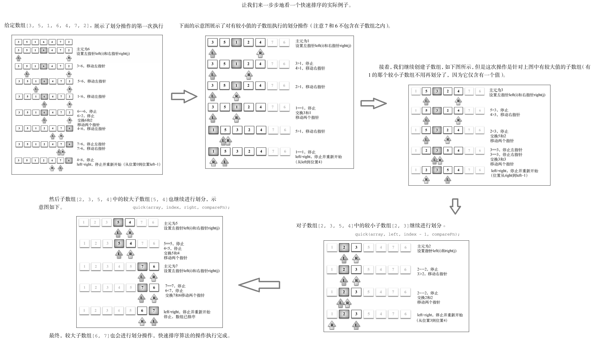

## 计数排序

计数排序是一个分布式排序。分布式排序使用已组织好的辅助数据结构（称为桶），然后进行合并，得到排好序的数组。

计数排序使用一个用来存储每个元素在原始数组中出现次数的临时数组。
在所有元素都计数完成后，临时数组已排好序并可迭代以构建排序后的结果数组。

它是用来排序整数的优秀算法（它是一个**整数排序算法**），时间复杂度为 **O(n+k)**，其中 k 是临时计数数组的大小；
但是，它确实需要更多的内存来存放临时数组。

代码示例：

```js
import { defaultCompare, Compare } from "./util";

// 找到数组中最大值
//      要找到数组中的最大值，我们只需要迭代并找到值最大的一项即可。
export function findMaxValue(array, compareFn = defaultCompare) {
  if (array && array.length > 0) {
    let max = array[0];
    for (let i = 1; i < array.length; i++) {
      if (compareFn(max, array[i]) === Compare.LESS_THAN) {
        max = array[i];
      }
    }
    return max;
  }
  return undefined;
}

// 找到数组中最小值
export function findMinValue(array, compareFn = defaultCompare) {
  if (array && array.length > 0) {
    let min = array[0];
    for (let i = 1; i < array.length; i++) {
      if (compareFn(min, array[i]) === Compare.BIGGER_THAN) {
        min = array[i];
      }
    }
    return min;
  }
  return undefined;
}

// 计数排序
export function countingSort(array) {
  // 如果待排序的数组为空或只有一个元素，则不需要运行排序算法。
  if (array.length < 2) {
    return array;
  }

  // 找到数组中的最大值
  const maxValue = findMaxValue(array);

  //   对于计数排序算法，我们需要创建计数数组，从索引 0 开始直到最大值索引 value+1
  const counts = new Array(maxValue + 1);

  // 迭代数组中的每个位置并在 counts 数组中增加元素计数值
  array.forEach((element) => {
    // 为了确保递增操作成功，如果 counts 数组中用来计数某个元素的位置一开始没有用 0 初始化的话，则将其赋值为 0
    if (!counts[element]) {
      counts[element] = 0;
    }
    counts[element]++;
  });

  let sortedIndex = 0;

  // console.log('Frequencies: ' + counts.join());

  //   所有元素都计数后，我们要迭代 counts 数组并构建排序后的结果数组
  counts.forEach((element, i) => {
    // 由于可能有多个元素有相同的值，我们要将元素按照在原始数组中的出现次数进行相加。
    // 我们要减少计数值直到它的值为零，将值加入结果数组
    while (element > 0) {
      // 因此，还需要一个辅助索引(sortedIndex)帮助将值赋值到结果数组中的正确位置。
      array[sortedIndex++] = i;
      element--;
    }
  });
  return array;
}
```

计数排序执行示意图，初始数组`[5,4,3,2,3,1]`：
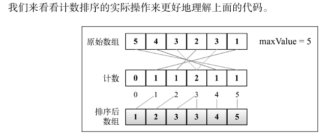

## 桶排序

桶排序（也被称为箱排序）也是分布式排序算法：

- 它将元素分为不同的桶（较小的数组）。
- 再使用一个简单的排序算法，例如插入排序（用来排序小数组的不错的算法），来对每个桶进行排序。
- 然后，它将所有的桶合并为结果数组。

对于桶排序算法，我们需要指定需要多少桶来排序各个元素。

- 桶排序在所有元素平分到各个桶中时的表现最好。
- 如果元素非常稀疏，则使用更多的桶会更好。如果元素非常密集，则使用较少的桶会更好。

代码示例：

```js
// 这里用到了之前的插入排序算法
import { insertionSort } from "./insertion-sort";

// 桶排序算法
//      需要指定需要多少桶来排序各个元素，默认情况下，使用 5 个桶
export function bucketSort(array, bucketSize = 5) {
  if (array.length < 2) {
    return array;
  }
  // 算法分为两个部分：第一个用于创建桶并将元素分布到不同的桶中
  const buckets = createBuckets(array, bucketSize);
  // 第二个包含对每个桶执行插入排序算法和将所有桶合并为排序后的结果数组
  return sortBuckets(buckets);
}

// 创建桶的代码
function createBuckets(array, bucketSize) {
  let minValue = array[0];
  let maxValue = array[0];

  // 迭代原数组并找到最大值和最小值
  for (let i = 1; i < array.length; i++) {
    if (array[i] < minValue) {
      minValue = array[i];
    } else if (array[i] > maxValue) {
      maxValue = array[i];
    }
  }
  // 桶排序的第一个重要步骤是计算每个桶中需要分布的元素个数
  //    要计算这个数，我们要使用一个公式，包含计算数组最大值和最小值的差值并与桶的大小进行除法计算。
  const bucketCount = Math.floor((maxValue - minValue) / bucketSize) + 1;

  // buckets 数据结构是一个矩阵（多维数组）。 buckets 中的每个位置包含了另一个数组。
  const buckets = [];

  // 在计算了 bucketCount 后，我们需要初始化每个桶
  for (let i = 0; i < bucketCount; i++) {
    buckets[i] = [];
  }

  // 最后一步是将元素分布到桶中。需要迭代数组中的每个元素
  for (let i = 0; i < array.length; i++) {
    // 计算要将元素放到哪个桶中，并将元素插入正确的桶中
    buckets[Math.floor((array[i] - minValue) / bucketSize)].push(array[i]);
  }
  return buckets;
}

// 将每个桶进行排序
function sortBuckets(buckets) {
  // 创建一个用作结果数组的新数组，这表示原数组不会被修改，会返回一个新的数组
  const sortedArray = [];
  // 迭代每个可迭代的桶并应用插入排序（或者其他排序）
  for (let i = 0; i < buckets.length; i++) {
    if (buckets[i] != null) {
      insertionSort(buckets[i]);
      // 最后，将排好序的桶中的所有元素加入结果数组中。
      sortedArray.push(...buckets[i]);
    }
  }
  return sortedArray;
}
```

桶排序执行过程示意图，初始数组`[5,4,3,2,6,1,7,10,9,8]`：
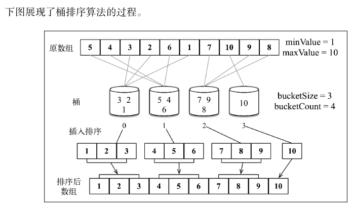

## 基数排序

基数排序也是一个分布式排序算法，
它根据数字的**有效位**或基数（这也是它为什么叫基数排序）将整数分布到桶中。
基数是基于数组中值的记数制的。

比如，对于十进制数，使用的基数是 10。
因此，算法将会使用 10 个桶用来分布元素并且首先基于个位数字进行排序，然后基于十位数字，然后基于百位数字，以此类推。

代码示例：

```js
// 在 计数排序 中有用到的找打数组中最大值最小值方法
import { findMaxValue, findMinValue } from "./utils";

// 获取数的有效位的函数
const getBucketIndex = (value, minValue, significantDigit, radixBase) =>
  Math.floor(((value - minValue) / significantDigit) % radixBase);

// 基数排序算法
export function radixSort(array, radixBase = 10) {
  if (array.length < 2) {
    return array;
  }
  const minValue = findMinValue(array);
  const maxValue = findMaxValue(array);

  // 从最后一位开始排序所有的数
  let significantDigit = 1;
  // 如果数组中包含的值都在 1～9，此循环只会执行一次
  // 如果值都小于 99，则循环会执行第二次，以此类推
  while ((maxValue - minValue) / significantDigit >= 1) {
    // console.log('radix sort for digit ' + significantDigit);
    array = countingSortForRadix(array, radixBase, significantDigit, minValue);
    // console.log(array.join());
    // 首先只会基于最后一位有效位对数字进行排序，
    // 在下次迭代时，我们会基于第二个有效位进行排序（十位数字），
    // 然后是第三个有效位（百位数字），以此类推
    significantDigit *= radixBase;
  }
  return array;
}

// 来基于有效位（基数）排序
const countingSortForRadix = (array, radixBase, significantDigit, minValue) => {
  let bucketsIndex;
  const buckets = [];
  const aux = [];
  // 首先，我们基于基数初始化桶
  //   由于我们排序的是十进制数，那么需要 10 个桶。
  for (let i = 0; i < radixBase; i++) {
    buckets[i] = 0;
  }

  //  然后，我们会基于数组中 数的有效位 进行计数排序
  for (let i = 0; i < array.length; i++) {
    // 数的有效位
    bucketsIndex = getBucketIndex(
      array[i],
      minValue,
      significantDigit,
      radixBase
    );
    // 计数排序
    buckets[bucketsIndex]++;
  }
  //  由于我们进行的是计数排序，我们还需要计算累积结果来得到正确的计数值
  for (let i = 1; i < radixBase; i++) {
    buckets[i] += buckets[i - 1];
  }

  // 在计数完成后，要开始将值移回原始数组中。我们会使用一个临时数组（ aux ）来帮助我们
  //   对原始数组中的每个值，我们会再次获取它的有效位并将它的值移动到aux 数组中（从 buckets 数组中减去它的计数值）
  for (let i = array.length - 1; i >= 0; i--) {
    bucketsIndex = getBucketIndex(
      array[i],
      minValue,
      significantDigit,
      radixBase
    );
    aux[--buckets[bucketsIndex]] = array[i];
  }

  // 最后一步是可选的，我们将 aux 数组中的每个值转移到原始数组中。
  // 除了返回 array 之外，我们还可以直接返回 aux数组而不需要复制它的值。
  for (let i = 0; i < array.length; i++) {
    array[i] = aux[i];
  }

  return array;
};
```

基数排序执行示意图，初始数组`[4, 7, 1, 2, 3, 9]`：
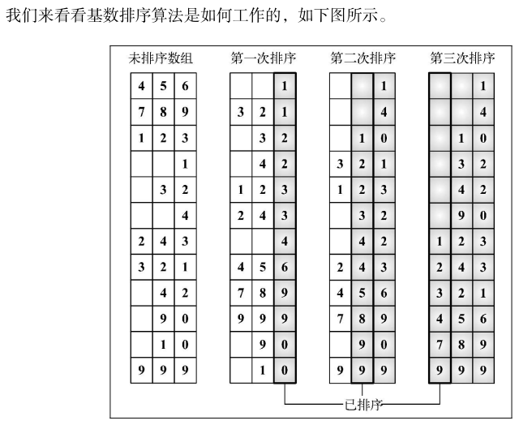

# 搜索算法

## 顺序搜索

顺序或线性搜索是最基本的搜索算法。

它的机制是，将每一个数据结构中的元素和我们要找的元素做比较。

顺序搜索是最低效的一种搜索算法。

代码示例：

```js
/** 一些工具，避免遗忘再次拿出：*/

// 相等判断
function defaultEquals(a, b) {
  return a === b;
}

// 不存在常量
const DOES_NOT_EXIST = -1;

/***/

import { defaultEquals, DOES_NOT_EXIST } from "./util";

export function sequentialSearch(array, value, equalsFn = defaultEquals) {
  // 顺序搜索迭代整个数组
  for (let i = 0; i < array.length; i++) {
    // 并将每个数组元素和搜索项做比较
    if (equalsFn(value, array[i])) {
      // 如果搜索到了，算法将用返回值来标示搜索成功。
      // 返回值可以是该搜索项本身，或是 true ，又或是搜索项的索引
      return i;
    }
  }
  // 如果没有找到该项，则返回 -1,表示该索引不存在；
  //   也可以考虑返回 false 或者 null 。
  return DOES_NOT_EXIST;
}
```

顺序搜索执行示意图，数组 `[5, 4, 3, 2, 1]` 和待搜索值 3：
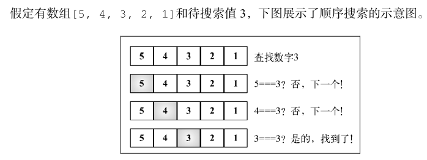

## 二分搜索

二分搜索算法的原理和猜数字游戏类似，就是那个有人说“我正想着一个 1 ～ 100 的数”的游戏。
我们每回应一个数，那个人就会说这个数是高了、低了还是对了。

**这个算法要求被搜索的数据结构已排序**。以下是该算法遵循的步骤。

- (1) 选择数组的中间值。
- (2) 如果选中值是待搜索值，那么算法执行完毕（值找到了）。
- (3) 如果待搜索值比选中值要小，则返回步骤 1 并在选中值左边的子数组中寻找（较小）。
- (4) 如果待搜索值比选中值要大，则返回步骤 1 并在选种值右边的子数组中寻找（较大）。

代码示例：

```js
import { Compare, defaultCompare, DOES_NOT_EXIST } from "../../util";
import { quickSort } from "../sorting/quicksort";

export function binarySearch(array, value, compareFn = defaultCompare) {
  // 开始前需要先将数组排序，这里选择了快速排序。
  const sortedArray = quickSort(array);
  // 在数组排序之后，我们设置 low 和 high 指针（它们是边界）
  let low = 0;
  let high = sortedArray.length - 1;

  // 当 low 比 high 小时
  while (low <= high) {
    // 计算得到中间项索引并取得中间项的值
    const mid = Math.floor((low + high) / 2);
    const element = sortedArray[mid];
    // console.log('mid element is ' + element);

    // 接着，我们比较选中项的值和搜索值
    //      如果小了，则选择数组低半边并重新开始
    //      如果选中项的值比搜索值大了，则选择数组高半边并重新开始
    //      若两者都是不是，则意味着选中项的值和搜索值相等，因此直接返回该索引
    if (compareFn(element, value) === Compare.LESS_THAN) {
      low = mid + 1;
      // console.log('low is ' + low);
    } else if (compareFn(element, value) === Compare.BIGGER_THAN) {
      high = mid - 1;
      // console.log('high is ' + high);
    } else {
      // console.log('found it');
      return mid;
    }
  }

  // 此处如果 low比 high 大，则意味着该待搜索值不存在并返回 -1
  return DOES_NOT_EXIST;
}
```

二分搜索执行示意图，数组 `[8, 7, 6, 5, 4, 3, 2, 1]` 和待搜索值 `1`：
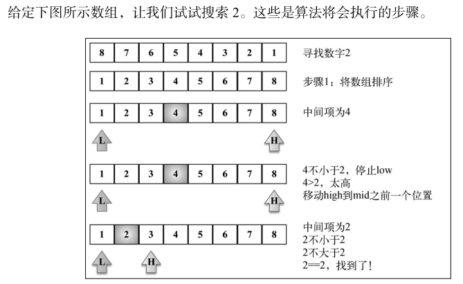

## 内插搜索

内插搜索是改良版的二分搜索。
二分搜索总是检查 mid 位置上的值，而内插搜索可能会根据要搜索的值检查数组中的不同地方。

**这个算法要求被搜索的数据结构已排序**。以下是该算法遵循的步骤：

- (1) 使用 position 公式选中一个值；
- (2) 如果这个值是待搜索值，那么算法执行完毕（值找到了）；
- (3) 如果待搜索值比选中值要小，则返回步骤 1 并在选中值左边的子数组中寻找（较小）；
- (4) 如果待搜索值比选中值要大，则返回步骤 1 并在选种值右边的子数组中寻找（较大）。

代码示例：

```js
// 求数值的差值方法
function defaultDiff(a, b) {
  return Number(a) - Number(b);
}
// 小于等于方法
function lesserEquals(a, b, compareFn) {
  const comp = compareFn(a, b);
  return comp === Compare.LESS_THAN || comp === Compare.EQUALS;
}
// 大于等于方法
function biggerEquals(a, b, compareFn) {
  const comp = compareFn(a, b);
  return comp === Compare.BIGGER_THAN || comp === Compare.EQUALS;
}

import {
  Compare,
  defaultCompare,
  defaultEquals,
  defaultDiff,
  DOES_NOT_EXIST,
  lesserEquals,
  biggerEquals,
} from "./util";

export function interpolationSearch(
  array,
  value,
  compareFn = defaultCompare,
  equalsFn = defaultEquals,
  diffFn = defaultDiff
) {
  //   // 没有排序的话，对于未排序的数组就找不到对应索引了
  //   array = quickSort(array);

  const { length } = array;
  let low = 0;
  let high = length - 1;
  let position = -1;
  let delta = -1;
  while (
    low <= high &&
    biggerEquals(value, array[low], compareFn) &&
    lesserEquals(value, array[high], compareFn)
  ) {
    // 如果查找的值更接近 array[high] 则查找 position 位置旁更大的值，
    // 如果查找的值更接近 array[low] 则查找position 位置旁更小的值。
    // 这个算法在数组中的值都是均匀分布时性能最好（ delta 会非常小）
    delta = diffFn(value, array[low]) / diffFn(array[high], array[low]);
    // 计算要比较值的位置 position
    position = low + Math.floor((high - low) * delta);

    // 如果待搜索值找到了，则返回它的索引值
    if (equalsFn(array[position], value)) {
      return position;
    }
    // 如果待搜索值小于当前位置的值，使用左边或右边的子数组重复这段逻辑
    if (compareFn(array[position], value) === Compare.LESS_THAN) {
      low = position + 1;
    } else {
      high = position - 1;
    }
  }
  return DOES_NOT_EXIST;
}
```

内插搜索执行示意图，数组 `[1, 2, 3, 4, 5, 6, 7, 8, 9, 10]` 和待搜索值 `4`：
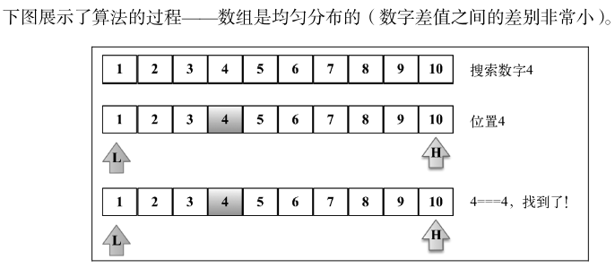

# 随机算法

有一种场景是需要将一个数组中的值进行随机排列。现实中的一个常见场景是洗扑克牌。

## Fisher-Yates 随机

它的含义是迭代数组，从最后一位开始并将当前位置和一个随机位置进行交换。这个随机位置比当前位置小。
这样，这个算法可以保证随机过的位置不会再被随机一次（洗扑克牌的次数越多，随机效果越差）。

代码示例:

```js
import { swap } from "./util";

export function shuffle(array) {
  let currentIndex = array.length;
  while (currentIndex !== 0) {
    const randomIndex = Math.floor(Math.random() * currentIndex);
    currentIndex--;
    swap(array, currentIndex, randomIndex);
  }
  return array;
}
```

Fisher-Yates 随机算法执行示意图，数组 `[1, 2, 3, 4, 5]` ：
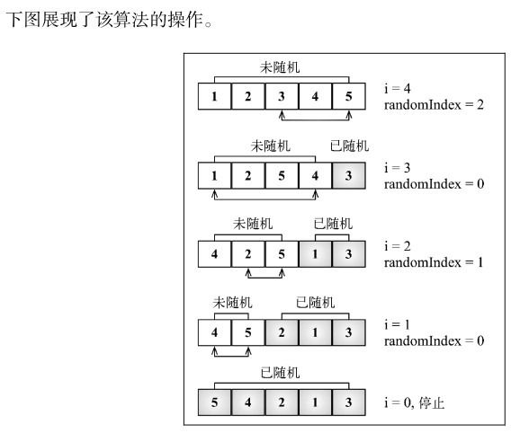

# (排序算法简洁示例)

## 冒泡排序

```js
// 冒泡排序
// 遍历数组，然后将最大数沉到最底部；时间复杂度：O(N^2)；空间复杂度：O(1)

/**
 * 冒泡排序算法的原理如下：
        比较相邻的元素。如果第一个比第二个大，就交换他们两个。 
        对每一对相邻元素做同样的工作，从开始第一对到结尾的最后一对。在这一点，最后的元素应该会是最大的数。  
        针对所有的元素重复以上的步骤，除了最后一个。 
        持续每次对越来越少的元素重复上面的步骤，直到没有任何一对数字需要比较。 
 * @param {*} arr 
 */
function BubbleSort(arr) {
  if (arr == null || arr.length <= 0) {
    return [];
  }
  var len = arr.length;
  for (var end = len - 1; end > 0; end--) {
    for (var i = 0; i < end; i++) {
      if (arr[i] > arr[i + 1]) {
        // swap(arr, i, i + 1);

        [arr[i], arr[i + 1]] = [arr[i + 1], arr[i]];
      }
    }
  }
  return arr;
}

// 交换两个数的做法
function swap(arr, i, j) {
  // var temp = arr[i];
  // arr[i] = arr[j];
  // arr[j] = temp;
  //交换也可以用异或运算符
  // arr[i] = arr[i] ^ arr[j];
  // arr[j] = arr[i] ^ arr[j];
  // arr[i] = arr[i] ^ arr[j];
  // ES6交换变量
  [arr[i], arr[j]] = [arr[j], arr[i]];
}

// es6简单写
const sort = (arr) => {
  if (arr == null || arr.length < 0) {
    return [];
  }
  arr.forEach((v, i) => {
    for (let j = i + 1; j < arr.length; j++) {
      if (arr[i] > arr[j]) {
        [arr[i], arr[j]] = [arr[j], arr[i]];
      }
    }
  });
  return arr;
};

console.log(BubbleSort([3, 65, 34, 76, 3, 45, 6, 23, 5, 7, 3, 12, 56]));
console.log(sort([3, 65, 34, 76, 3, 45, 6, 23, 5, 7, 3, 12, 56]));
```

## 插入排序

```js
// 插入排序实现思路：将一个新的数，和前面的比较，只要当前数小于前一个则和前一个交换位置，否则终止；
// <br/>时间复杂度：O(N^2)；<br/>空间复杂度：O(1)

/**
将待排序序列第一个元素看做一个有序序列，把第二个元素到最后一个元素当成是未排序序列。
从头到尾依次扫描未排序序列，将扫描到的每个元素插入有序序列的适当位置。
如果待插入的元素与有序序列中的某个元素相等，则将待插入元素插入到相等元素的后面。）
 */
function insertionSort(array) {
  if (array == null || array.length <= 0) {
    return [];
  }

  // 从第二个元素开始,当成未排序系列的值
  for (let i = 1; i < array.length; i++) {
    // 如果后一个的值小于前一个的值,交换到前面去
    for (let j = i - 1; j >= 0 && array[j] > array[j + 1]; j--) {
      [array[j], array[j + 1]] = [array[j + 1], array[j]];
    }
  }
  return array;
}

console.log(insertionSort([3, 65, 34, 76, 3, 45, 6, 23, 5, 7, 3, 12, 56]));
```

## 归并排序

```js
/**
 归并排序

 算法步骤
1 申请空间，使其大小为两个已经排序序列之和，该空间用来存放合并后的序列；
2 设定两个指针，最初位置分别为两个已经排序序列的起始位置；
3 比较两个指针所指向的元素，选择相对小的元素放入到合并空间，并移动指针到下一位置；
4 重复步骤 3 直到某一指针达到序列尾；
5 将另一序列剩下的所有元素直接复制到合并序列尾。
 */

function merge(left, right) {
  let result = [];

  while (left.length && right.length) {
    if (left[0] <= right[0]) {
      result.push(left.shift());
    } else {
      result.push(right.shift());
    }
  }

  while (left.length) {
    result.push(left.shift());
  }

  while (right.length) {
    result.push(right.shift());
  }

  return result;
}

function MergeSort(arr) {
  if (arr.length < 2) {
    return arr;
  }

  let middle = Math.floor(arr.length / 2),
    left = arr.slice(0, middle),
    right = arr.slice(middle);

  return merge(MergeSort(left), MergeSort(right));
}

console.log(MergeSort([3, 65, 34, 76, 3, 45, 6, 23, 5, 7, 3, 12, 56]));
```

## 快速排序

```js
/**
 * 快速排序

算法步骤
1 从数列中挑出一个元素，称为 "基准"（pivot）;
2 重新排序数列，所有元素比基准值小的摆放在基准前面，所有元素比基准值大的摆在基准的后面（相同的数可以到任一边）。
    在这个分区退出之后，该基准就处于数列的中间位置。这个称为分区（partition）操作；
3 递归地（recursive）把小于基准值元素的子数列和大于基准值元素的子数列排序；
 */

const quickSort = (array) => {
  const sort = (arr, left = 0, right = arr.length - 1) => {
    if (left >= right) {
      //如果左边的索引大于等于右边的索引说明整理完毕
      return;
    }
    let i = left;
    let j = right;
    const baseVal = arr[j]; // 取无序数组最后一个数为基准值
    while (i < j) {
      //把所有比基准值小的数放在左边大的数放在右边
      while (i < j && arr[i] <= baseVal) {
        //找到一个比基准值大的数交换
        i++;
      }
      arr[j] = arr[i]; // 将较大的值放在右边如果没有比基准值大的数就是将自己赋值给自己（i 等于 j）
      while (j > i && arr[j] >= baseVal) {
        //找到一个比基准值小的数交换
        j--;
      }
      arr[i] = arr[j]; // 将较小的值放在左边如果没有找到比基准值小的数就是将自己赋值给自己（i 等于 j）
    }
    arr[j] = baseVal; // 将基准值放至中央位置完成一次循环（这时候 j 等于 i ）
    sort(arr, left, j - 1); // 将左边的无序数组重复上面的操作
    sort(arr, j + 1, right); // 将右边的无序数组重复上面的操作
  };
  const newArr = array.concat(); // 为了保证这个函数是纯函数拷贝一次数组
  sort(newArr);
  return newArr;
};

console.log(quickSort([3, 65, 34, 76, 3, 45, 6, 23, 5, 7, 3, 12, 56]));
```

## 选择排序

```js
// 选择排序的实现思路：遍历数组，把最小数放在头部；时间复杂度：O(N^2)；空间复杂度：O(1)
/**
 * 
    首先在未排序序列中找到最小（大）元素，存放到排序序列的起始位置。
    再从剩余未排序元素中继续寻找最小（大）元素，然后放到已排序序列的末尾。
    重复第二步，直到所有元素均排序完毕
 */

function selectionSort(arr) {
  if (arr == null || arr.length < 0) {
    return [];
  }
  let minIndex;
  for (let i = 0; i < arr.length - 1; i++) {
    // 首先在未排序序列中找到最小（大）元素，存放到排序序列的起始位置。
    minIndex = i;

    // 再从剩余未排序元素中继续寻找最小（大）元素，
    for (let j = i + 1; j < arr.length; j++) {
      // if (arr[j] < arr[minIndex]) {
      //     minIndex = j;
      // }
      minIndex = arr[j] < arr[minIndex] ? j : minIndex;
    }
    //然后放到已排序序列的末尾。
    [arr[i], arr[minIndex]] = [arr[minIndex], arr[i]];
  }
  return arr;
}

console.log(selectionSort([3, 65, 34, 76, 3, 45, 6, 23, 5, 7, 3, 12, 56]));
```

## 希尔排序

```js
/**
 希尔排序的基本思想是：
 先将整个待排序的记录序列分割成为若干子序列分别进行直接插入排序，
 待整个序列中的记录"基本有序"时，再对全体记录进行依次直接插入排序。

    选择一个增量序列 t1，t2，……，tk，其中 ti > tj, tk = 1；
    按增量序列个数 k，对序列进行 k 趟排序；
    每趟排序，根据对应的增量 ti，将待排序列分割成若干长度为 m 的子序列，分别对各子表进行直接插入排序。
    仅增量因子为 1 时，整个序列作为一个表来处理，表长度即为整个序列的长度。
 */

function ShellSort(arr) {
  var len = arr.length,
    temp,
    gap = 1;
  while (gap < len / 3) {
    //动态定义间隔序列
    gap = gap * 3 + 1;
  }
  for (gap; gap > 0; gap = Math.floor(gap / 3)) {
    for (var i = gap; i < len; i++) {
      temp = arr[i];
      for (var j = i - gap; j >= 0 && arr[j] > temp; j -= gap) {
        arr[j + gap] = arr[j];
      }
      arr[j + gap] = temp;
    }
  }
  return arr;
}

console.log(ShellSort([3, 65, 34, 76, 3, 45, 6, 23, 5, 7, 3, 12, 56]));
```
