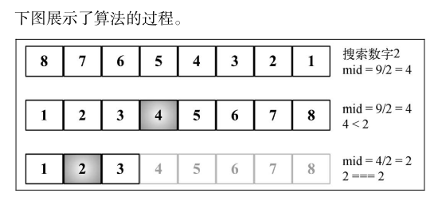
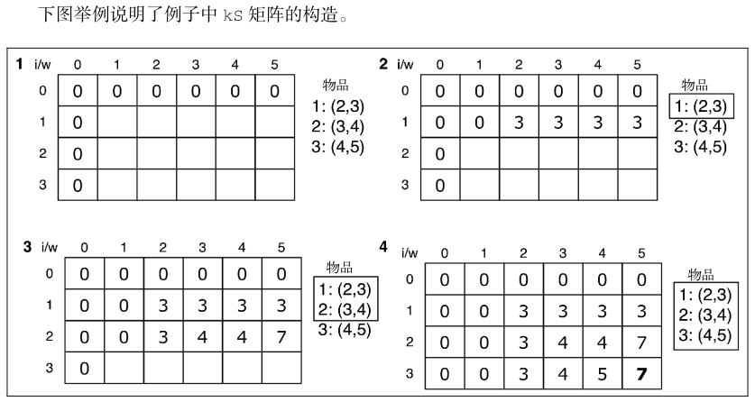
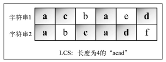
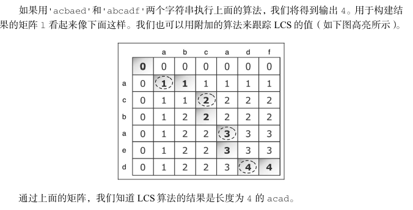
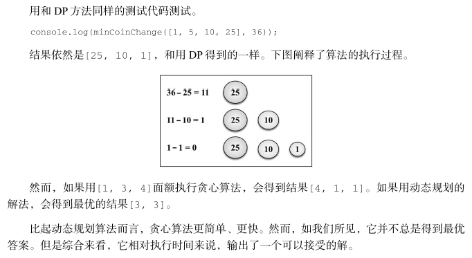
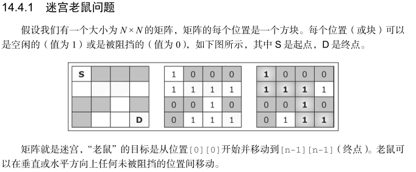
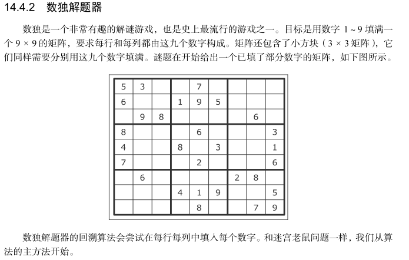
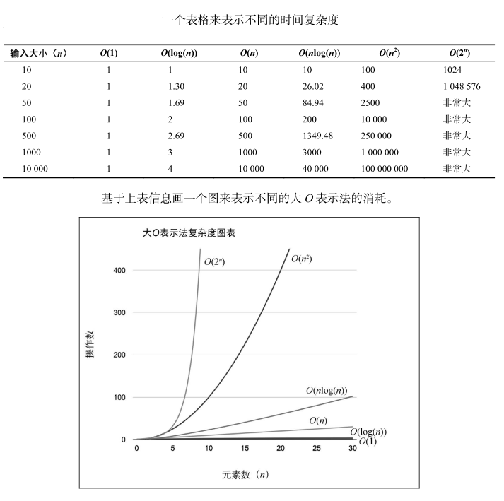
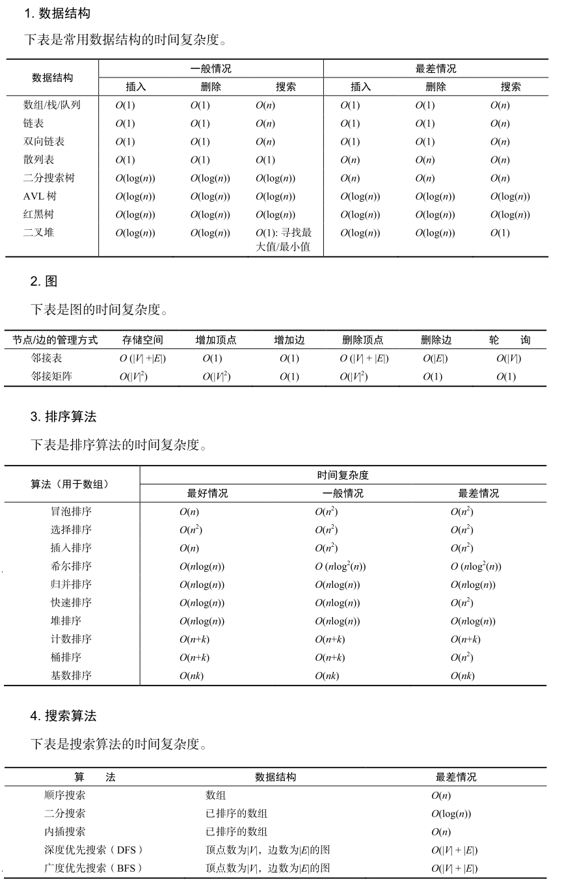

<!-- START doctoc generated TOC please keep comment here to allow auto update -->
<!-- DON'T EDIT THIS SECTION, INSTEAD RE-RUN doctoc TO UPDATE -->
<!-- **Table of Contents**  *generated with [DocToc](https://github.com/thlorenz/doctoc)* -->

- [分而治之](#%E5%88%86%E8%80%8C%E6%B2%BB%E4%B9%8B)
  - [二分搜索](#%E4%BA%8C%E5%88%86%E6%90%9C%E7%B4%A2)
- [动态规划](#%E5%8A%A8%E6%80%81%E8%A7%84%E5%88%92)
  - [最少硬币找零问题](#%E6%9C%80%E5%B0%91%E7%A1%AC%E5%B8%81%E6%89%BE%E9%9B%B6%E9%97%AE%E9%A2%98)
  - [背包问题](#%E8%83%8C%E5%8C%85%E9%97%AE%E9%A2%98)
  - [最长公共子序列](#%E6%9C%80%E9%95%BF%E5%85%AC%E5%85%B1%E5%AD%90%E5%BA%8F%E5%88%97)
  - [矩阵链相乘](#%E7%9F%A9%E9%98%B5%E9%93%BE%E7%9B%B8%E4%B9%98)
- [贪心算法](#%E8%B4%AA%E5%BF%83%E7%AE%97%E6%B3%95)
  - [最少硬币找零问题](#%E6%9C%80%E5%B0%91%E7%A1%AC%E5%B8%81%E6%89%BE%E9%9B%B6%E9%97%AE%E9%A2%98-1)
  - [分数背包问题](#%E5%88%86%E6%95%B0%E8%83%8C%E5%8C%85%E9%97%AE%E9%A2%98)
- [回溯算法](#%E5%9B%9E%E6%BA%AF%E7%AE%97%E6%B3%95)
  - [迷宫老鼠问题](#%E8%BF%B7%E5%AE%AB%E8%80%81%E9%BC%A0%E9%97%AE%E9%A2%98)
  - [数独解题器](#%E6%95%B0%E7%8B%AC%E8%A7%A3%E9%A2%98%E5%99%A8)
- [函数式编程简介](#%E5%87%BD%E6%95%B0%E5%BC%8F%E7%BC%96%E7%A8%8B%E7%AE%80%E4%BB%8B)
- [补充: 算法复杂度](#%E8%A1%A5%E5%85%85-%E7%AE%97%E6%B3%95%E5%A4%8D%E6%9D%82%E5%BA%A6)
  - [大 O 表示法](#%E5%A4%A7-o-%E8%A1%A8%E7%A4%BA%E6%B3%95)

<!-- END doctoc generated TOC please keep comment here to allow auto update -->

算法设计与技巧

# 分而治之

分而治之是算法设计中的一种方法。
它将一个问题分成多个和原问题相似的小问题，递归解决小问题，再将解决方式合并以解决原来的问题。

分而治之算法可以分成三个部分:

- (1) **分解**原问题为多个子问题（原问题的多个小实例）。
- (2) **解决**子问题，用返回解决子问题的方式的递归算法。递归算法的基本情形可以用来解决子问题。
- (3) **组合**这些子问题的解决方式，得到原问题的解。

## 二分搜索

前一章的二分搜索使用的迭代，这里用分而治之的方式实现这个算法，逻辑如下:

- 分解：计算 mid 并搜索数组较小或较大的一半。
- 解决：在较小或较大的一半中搜索值。
- 组合：这步不需要，因为我们直接返回了索引值。

代码示例：

```js
import { Compare, defaultCompare, DOES_NOT_EXIST } from "./util";
import { quickSort } from "../sorting/quicksort";

function binarySearchRecursive(
  array,
  value,
  low,
  high,
  compareFn = defaultCompare
) {
  if (low <= high) {
    const mid = Math.floor((low + high) / 2);
    const element = array[mid];
    if (compareFn(element, value) === Compare.LESS_THAN) {
      return binarySearchRecursive(array, value, mid + 1, high, compareFn);
    }
    if (compareFn(element, value) === Compare.BIGGER_THAN) {
      return binarySearchRecursive(array, value, low, mid - 1, compareFn);
    }
    return mid;
  }
  return DOES_NOT_EXIST;
}

export function binarySearch(array, value, compareFn = defaultCompare) {
  const sortedArray = quickSort(array);
  const low = 0;
  const high = sortedArray.length - 1;
  return binarySearchRecursive(array, value, low, high, compareFn);
}
```

顺序搜索执行示意图，数组 `[8, 7, 6, 5, 4, 3, 2, 1]` 和待搜索值 2：


# 动态规划

动态规划（dynamic programming，DP）是一种将复杂问题分解成更小的子问题来解决的优化技术。

> 注意，动态规划和分而治之是不同的方法。
> 分而治之方法是把问题分解成相互独立的子问题，然后组合它们的答案，
> 而动态规划则是将问题分解成相互依赖的子问题。

用动态规划解决问题时，要遵循三个重要步骤：

- (1) 定义子问题；
- (2) 实现要反复执行来解决子问题的部分（这一步要参考前一节讨论的递归的步骤）；
- (3) 识别并求解出基线条件。

能用动态规划解决的一些著名问题如下:

- **背包问题**：给出一组项，各自有值和容量，目标是找出总值最大的项的集合。
  - 这个问题的限制是，总容量必须小于等于“背包”的容量。
- **最长公共子序列**：找出一组序列的最长公共子序列（可由另一序列删除元素但不改变余下元素的顺序而得到）。
- **矩阵链相乘**：给出一系列矩阵，目标是找到这些矩阵相乘的最高效办法（计算次数尽可能少）。
  - 相乘运算不会进行，解决方案是找到这些矩阵各自相乘的顺序。
- **硬币找零**：给出面额为 d1 , …, dn 的一定数量的硬币和要找零的钱数，找出有多少种找零的方法。
- **图的全源最短路径**：对所有顶点对(u, v)，找出从顶点 u 到顶点 v 的最短路径。

## 最少硬币找零问题

最少硬币找零问题是硬币找零问题的一个变种。
硬币找零问题是给出要找零的钱数，以及可用的硬币面额 d1 , …, dn 及其数量，找出有多少种找零方法。
最少硬币找零问题是给出要找零的钱数，以及可用的硬币面额 d1 , …, dn 及其数量，找到所需的最少的硬币个数。

例题：
例如，美国有以下面额（硬币）：d1 = 1，d2 = 5，d3 = 10，d4 = 25。
如果要找 36 美分的零钱，我们可以用 1 个 25 美分、1 个 10 美分和 1 个便士（1 美分）。

最少硬币找零的解决方案是找到 n 所需的最小硬币数。
但要做到这一点，首先得找到对每个 x < n 的解。然后，我们可以基于更小的值的解来求解。

```js
// coins参数代表问题中的面额数组，amount 总价
export function minCoinChange(coins, amount) {
  // 此外，为了更加高效且不重复计算值，使用了 cache（这个技巧称为记忆化）。
  const cache = [];

  // makeChange 方法，它也是一个递归函数，用来解决问题。
  // makeChange 函数在后面被调用， amount 作为参数传入。
  // 由于 makeChange是一个内部函数，它也能访问到 cache 变量。
  // 方法执行结束后，会返回一个数组，包含用来找零的各个面额的硬币数量（最少硬币数）
  const makeChange = (value) => {
    // 若 amount 不为正（ < 0 ），就返回空数组
    if (!value) {
      return [];
    }
    // 检查 cache 缓存。若结果已缓存，则直接返回结果；否则，执行算法。
    if (cache[value]) {
      return cache[value];
    }
    // 包含用来找零的各个面额的硬币数量（最少硬币数）的数组
    let min = [];

    let newMin;
    let newAmount;

    // 基于 coins 参数（面额）解决问题
    for (let i = 0; i < coins.length; i++) {
      const coin = coins[i];
      // 对每个面额，都计算 newAmount的值，它的值会一直减小，直到能找零的最小钱数
      //  本算法对所有的 x < amount 都会计算 makeChange 结果
      newAmount = value - coin;
      // 若newAmount 是合理的值（正值），
      if (newAmount >= 0) {
        // 也会计算它的找零结果
        newMin = makeChange(newAmount);
      }
      // 最后，判断 newAmount 是否有效，minValue（最少硬币数）是否是最优解，
      // 与此同时 minValue 和 newAmount 是否是合理的值
      if (
        newAmount >= 0 &&
        (newMin.length < min.length - 1 || !min.length) &&
        (newMin.length || !newAmount)
      ) {
        // 若以上判断都成立，意味着有一个比之前更优的答案
        min = [coin].concat(newMin);
        // console.log("new Min " + min + " for " + amount);
      }
    }
    // 最后，返回最终结果
    return (cache[value] = min);
  };
  return makeChange(amount);
}

// 测试
console.log(minCoinChange([1, 2, 5, 10, 20, 50, 100], 58));
// [ 1, 2, 5, 50 ]
```

这个问题在 leecode 中有好几道，但那个是取可以构建最小零钱组合的硬币数(题目编号 322)，这个解法不太适合。使用动态规范方案如下：

```js
const coinChange = (coins, amount) => {
  if (!amount) {
    return 0;
  }

  let dp = Array(amount + 1).fill(Infinity);
  dp[0] = 0;

  for (let i = 0; i < coins.length; i++) {
    for (let j = coins[i]; j <= amount; j++) {
      dp[j] = Math.min(dp[j - coins[i]] + 1, dp[j]);
    }
  }

  console.log(dp);

  /*  
 [
  0, 1, 1, 2, 2, 1, 2, 2, 3, 3, 1, 2,
  2, 3, 3, 2, 3, 3, 4, 4, 1, 2, 2, 3,
  3, 2, 3, 3, 4, 4, 2, 3, 3, 4, 4, 3,
  4, 4, 5, 5, 2, 3, 3, 4, 4, 3, 4, 4,
  5, 5, 1, 2, 2, 3, 3, 2, 3, 3, 4
 ]
*/
  return dp[amount] === Infinity ? -1 : dp[amount];
};

console.log(coinChange([1, 2, 5, 10, 20, 50, 100], 58)); // 4
```

## 背包问题

背包问题是一个组合优化问题。
它可以描述如下：给定一个固定大小、能够携重量 W 的背包，以及一组有价值和重量的物品，找出一个最佳解决方案，使得装入背包的物品总重量不超过 W，且总价值最大。

例如

```
物品 重量 价值
1    2    3
2    3    4
3    4    5
```

考虑背包能够携带的重量只有 5。对于这个例子，我们可以说最佳解决方案是往背包里装入物品 1 和物品 2。这样，总重量为 5，总价值为 7。

> 这个问题有两个版本。
> **0-1 版本**只能往背包里装完整的物品，而**分数背包**问题则允许装入分数物品。
> 在这个例子里，我们将处理该问题的 0-1 版本。
> 动态规划对分数版本无能为力，但本章稍后要学习的贪心算法可以解决它。

代码示例：

```js
function findValues(n, capacity, kS) {
  let i = n;
  let k = capacity;
  // console.log('Items that are part of the solution:');
  while (i > 0 && k > 0) {
    if (kS[i][k] !== kS[i - 1][k]) {
      console.log(
       item ' + i + ' can be part of solution w,v: ' + weights[i - 1] + ',' + values[i - 1]
       );
      i--;
      k -= kS[i][k];
    } else {
      i--;
    }
  }
}

export function knapSack(capacity, weights, values, n) {
  const kS = [];
  // 首先，初始化将用于寻找解决方案的矩阵，矩阵为 ks[n+1][capacity+1] 。
  for (let i = 0; i <= n; i++) {
    kS[i] = [];
  }

  for (let i = 0; i <= n; i++) {
    for (let w = 0; w <= capacity; w++) {
      // 忽略矩阵的第一列和第一行，只处理索引不为 0 的列和行）并且要迭代数组中每个可用的项
      if (i === 0 || w === 0) {
        kS[i][w] = 0;
      } else if (weights[i - 1] <= w) {
        // 物品 i 的重量必须小于约束）才有可能成为解决方案的一部
        const a = values[i - 1] + kS[i - 1][w - weights[i - 1]];
        const b = kS[i - 1][w];
        // 当找到可以构成解决方案的物品时，选择价值最大的那个
        kS[i][w] = a > b ? a : b; // max(a,b)
        // console.log(a + ' can be part of the solution');
      } else {
        // 否则，总重量就会超出背包能够携带的重量，这是不可能发生的。
        // 发生这种情况时，只要忽略它，用之前的值就可以了
        kS[i][w] = kS[i - 1][w];
      }
    }
    // console.log(kS[i].join());
  }

  // 请注意，这个算法这里直接返回只输出背包携带物品价值的最大值，而不列出实际的物品。
  // 可以增加下面的附加函数来找出构成解决方案的物品。
  findValues(n, capacity, kS);

  // 最后，问题的解决方案就在这个二维表格右下角的最后一个格子里
  return kS[n][capacity];
}

// 找到最大价值构成的数据
function findValues(n, capacity, kS) {
    let i = n;
    let k = capacity;
    console.log('构成解的物品：');
    while (i > 0 && k > 0) {
        if (kS[i][k] !== kS[i - 1][k]) {
            console.log(`物品 ${i} 可以是解的一部分 w,v: ${weights[i - 1]}, ${values[i - 1]}`);
            i--;
            k -= kS[i][k];
        } else {
            i--;
        }
    }
}
```

背包问题 ks 矩阵构造示意图:


## 最长公共子序列

另一个经常被当作编程挑战问题的动态规划问题是**最长公共子序列**（LCS）：
**找出两个字符串序列的最长子序列的长度。**

最长子序列是指，在两个字符串序列中以相同顺序出现，但不要求连续（非字符串子串）的字符串序列。

例如

```
字符串1  a c b a e d
字符串2  a b c a d f
LCS:长度为4的a c a d
```

LCS 字符串示例:


代码示例：

```js
// 打印最长子序列字符串
function printSolution(solution, wordX, m, n) {
  let a = m;
  let b = n;
  let x = solution[a][b];
  let answer = "";
  while (x !== "0") {
    if (solution[a][b] === "diagonal") {
      answer = wordX[a - 1] + answer;
      a--;
      b--;
    } else if (solution[a][b] === "left") {
      b--;
    } else if (solution[a][b] === "top") {
      a--;
    }
    x = solution[a][b];
  }
  return answer;
}
export function lcs(wordX, wordY) {
  const m = wordX.length;
  const n = wordY.length;
  const l = [];
  // 为了能打印最长公共子序列字符串，声明一个新的 solution 矩阵
  const solution = [];
  for (let i = 0; i <= m; i++) {
    l[i] = [];
    solution[i] = [];
    for (let j = 0; j <= n; j++) {
      l[i][j] = 0;
      solution[i][j] = "0";
    }
  }
  for (let i = 0; i <= m; i++) {
    for (let j = 0; j <= n; j++) {
      if (i === 0 || j === 0) {
        l[i][j] = 0;
      } else if (wordX[i - 1] === wordY[j - 1]) {
        l[i][j] = l[i - 1][j - 1] + 1;
        solution[i][j] = "diagonal";
      } else {
        const a = l[i - 1][j];
        const b = l[i][j - 1];
        l[i][j] = a > b ? a : b; // max(a,b)
        solution[i][j] = l[i][j] === l[i - 1][j] ? "top" : "left";
      }
    }
    // console.log(l[i].join());
    // console.log(solution[i].join());
  }
  // 直接l[m][n]可以获取LCS长度
  console.log(l[m][n]);

  return printSolution(solution, wordX, m, n);
}

console.log(lcs("acbaed", "abcadf"));
/* 依次输出：
4
acad
*/

// === 只显示最长公共子序列的长度
function lcsLength(wordX, wordY) {
  const m = wordX.length;
  const n = wordY.length;
  const l = [];
  for (let i = 0; i <= m; i++) {
    l[i] = [];
    for (let j = 0; j <= n; j++) {
      l[i][j] = 0;
    }
  }
  for (let i = 0; i <= m; i++) {
    for (let j = 0; j <= n; j++) {
      if (i === 0 || j === 0) {
        l[i][j] = 0;
      } else if (wordX[i - 1] === wordY[j - 1]) {
        l[i][j] = l[i - 1][j - 1] + 1;
      } else {
        const a = l[i - 1][j];
        const b = l[i][j - 1];
        l[i][j] = a > b ? a : b; // max(a,b)
      }
    }
    // console.log(l[i].join());
  }
  return l[m][n];
}

console.log(lcsLength("acbaed", "abcadf"));
/* 依次输出
0,0,0,0,0,0,0
0,1,1,1,1,1,1
0,1,1,2,2,2,2
0,1,2,2,2,2,2
0,1,2,2,3,3,3
0,1,2,2,3,3,3
0,1,2,2,3,4,4
4
*/
```

LCS 执行示意图:


如果比较背包问题和 LCS 算法，我们会发现两者非常相似。
这项从顶部开始构建解决方案的技术被称为记忆化，而解决方案就在表格或矩阵的右下角。

## 矩阵链相乘

矩阵链相乘是另一个可以用动态规划解决的著名问题。这个问题是**要找出一组矩阵相乘的最佳方式（顺序**）。
让我们试着更好地理解这个问题。n 行 m 列的矩阵 A 和 m 行 p 列的矩阵 B 相乘，结果是 n 行 p 列的矩阵 C。

例如:
考虑我们想做 `A*B*C*D` 的乘法。因为乘法满足结合律，所以我们可以让这些矩阵以任意顺序相乘。

因此，考虑如下情况：

- A 是一个 10 行 100 列的矩阵；
- B 是一个 100 行 5 列的矩阵；
- C 是一个 5 行 50 列的矩阵；
- D 是一个 50 行 1 列的矩阵；
- `A*B*C*D` 的结果是一个 10 行 1 列的矩阵。

在这个例子里，相乘的方式有五种:

- (1) (A(B(CD)))：乘法运算的次数是 1750 次。
- (2) ((AB)(CD))：乘法运算的次数是 5300 次。
- (3) (((AB)C)D)：乘法运算的次数是 8000 次。
- (4) ((A(BC))D)：乘法运算的次数是 75 500 次。
- (5) (A((BC)D))：乘法运算的次数是 31 000 次。

相乘的顺序不一样，要进行的乘法运算总数也有很大差异。那么，要如何构建一个算法，求出最少的乘法运算次数？

矩阵链相乘的算法如下:

```js
// 给出最优解的括号顺序
function printOptimalParenthesis(s, i, j) {
  if (i === j) {
    console.log("A[" + i + "]");
  } else {
    console.log("(");
    printOptimalParenthesis(s, i, s[i][j]);
    printOptimalParenthesis(s, s[i][j] + 1, j);
    console.log(")");
  }
}

// 矩阵链相乘的算法
export function matrixChainOrder(p) {
  const n = p.length;
  const m = [];
  const s = [];
  for (let i = 1; i <= n; i++) {
    m[i] = [];
    m[i][i] = 0;
  }
  for (let i = 0; i <= n; i++) {
    // to help printing the optimal solution
    s[i] = []; // auxiliary
    for (let j = 0; j <= n; j++) {
      s[i][j] = 0;
    }
  }
  for (let l = 2; l < n; l++) {
    for (let i = 1; i <= n - l + 1; i++) {
      const j = i + l - 1;
      m[i][j] = Number.MAX_SAFE_INTEGER;
      for (let k = i; k <= j - 1; k++) {
        // q = cost/scalar multiplications
        // 计算给定括号顺序的乘法运算次数，并将值保存在辅助矩阵 m 中。
        const q = m[i][k] + m[k + 1][j] + p[i - 1] * p[k] * p[j];
        if (q < m[i][j]) {
          m[i][j] = q;
          s[i][j] = k; // s[i,j] = Second auxiliary table that stores k
        }
      }
    }
  }
  // console.log(m);
  // console.log(s);
  printOptimalParenthesis(s, 1, n - 1);
  return m[1][n - 1];
}

// 执行测试
// 示例中 A是10*100，B是100*5，C是5*50，D是50*1，表示为p:
const p = [10, 100, 5, 50, 1];
console.log(matrixChainOrder(p));
/*
输出：
(
A[1]
(
A[2]
(
A[3]
A[4]
)
)
)
1750

即最佳顺序(A(B(CD))),乘法运算次数最少，为1750次
*/
```

# 贪心算法

贪心算法遵循一种近似解决问题的技术，**期盼通过每个阶段的局部最优选择（当前最好的解），从而达到全局的最优（全局最优解）**。
它不像动态规划算法那样计算更大的格局。

## 最少硬币找零问题

```js
/*
这个贪心解法很简单。从最大面额的硬币开始，拿尽可能多的这种硬币找零。
当无法再拿更多这种价值的硬币时，开始拿第二大价值的硬币，依次继续。
*/
export function minCoinChangeGreedy(coins, amount) {
  const change = [];
  let total = 0;
  // 对每个面额(要从大到小排好序)进行遍历
  for (let i = coins.length; i >= 0; i--) {
    // 从大到小取得硬币
    const coin = coins[i];
    // 把它的值和 total 相加后， total 需要小于 amount
    // 大于amount了，就要取小一号的硬币
    while (total + coin <= amount) {
      // 我们会将当前面额coin 添加到结果中，也会将它和 total 相加
      change.push(coin);
      total += coin;
    }
  }
  return change;
}
```

贪心算法的最少硬币问题:


## 分数背包问题

求解分数背包问题的算法与动态规划版本稍有不同。

- 在 0-1 背包问题中，只能向背包里装入完整的物品，
- 而在分数背包问题中，可以装入分数的物品。

用前面用过的例子来比较两者的差异，如下所示:

```
物品 重量 价值
1    2    3
2    3    4
3    4    5
```

在动态规划的例子里，我们考虑背包能够携带的重量只有 5。
在这个例子里，我们可以说最佳解决方案是往背包里装入物品 1 和物品 2，总重量为 5，总价值为 7。
如果在分数背包问题中考虑相同的容量，得到的结果是一样的。
因此，我们考虑容量为 6 的情况。
在这种情况下，解决方案是装入物品 1 和物品 2，还有 25%的物品 3。这样，重量为 6 的物品总价值为 8.25。

代码示例：

```js
function knapSackGreedy(capacity, weights, values) {
  const n = values.length;
  let load = 0;
  let val = 0;
  // 总重量少于背包容量（不能带超过容量的东西），我们会迭代物品
  for (let i = 0; i < n && load < capacity; i++) {
    // 如果物品可以完整地装入背包(小于等于背包容量)
    if (weights[i] <= capacity - load) {
      // 就将其价值和重量分别计入背包已装入物品的总价值（ val ）和总重量（ load ）
      val += values[i];
      load += weights[i];
      // console.log('using item ' + (i + 1) + ' for the solution');
    } else {
      // 如果物品不能完整地装入背包，计算能够装入部分的比例(可以带的分数)
      const r = (capacity - load) / weights[i];
      val += r * values[i];
      load += weights[i];
      // console.log('using ratio of ' + r + ' for item ' + (i + 1) + ' for the solution');
    }
  }
  return val;
}

// 测试
const values2 = [3, 4, 5],
  weights2 = [2, 3, 4],
  capacity2 = 6,
  n2 = values.length;
console.log(knapSackGreedy(capacity2, weights2, values2, n2));
/*
依次输出:
using item 1 for the solution
using item 2 for the solution
using ratio of 0.25 for item 3 for the solution
8.25
*/
```

如果在 0-1 背包问题中考虑同样的容量 6，会看到，物品 1 和物品 3 组成了解决方案，总价值为 8。
在这种情况下，对同一个问题应用不同的解决方法，会得到两种不同的结果。

# 回溯算法

回溯是一种渐进式寻找并构建问题解决方式的策略:
**从一个可能的动作开始并试着用这个动作解决问题。如果不能解决，就回溯并选择另一个动作直到将问题解决。**

根据这种行为，回溯算法会尝试所有可能的动作（如果更快找到了解决办法就尝试较少的次数）来解决问题。

有一些可用回溯解决的著名问题：

- 骑士巡逻问题
- N 皇后问题
- 迷宫老鼠问题
- 数独解题器

## 迷宫老鼠问题

假设有一个大小为 N × N 的矩阵，矩阵的每个位置是一个方块。每个位置（或块）可以是空闲的（值为 1）或是被阻挡的（值为 0），
如下图所示，其中 S 是起点，D 是终点。

迷宫老鼠问题示例:


矩阵就是迷宫，“老鼠”的目标是从位置 `[0][0]` 开始并移动到 `[n-1][n-1]` （终点）。
老鼠可以在垂直或水平方向上任何未被阻挡的位置间移动。

代码示例：

```js
export function ratInAMaze(maze) {
  const solution = [];
  // 首先创建一个包含解的矩阵。将每个位置初始化为零
  for (let i = 0; i < maze.length; i++) {
    solution[i] = [];
    for (let j = 0; j < maze[i].length; j++) {
      solution[i][j] = 0;
    }
  }
  // 对于老鼠采取的每步行动我们将路径标记为 1 。
  //   如果算法能够找到一个解就返回解决矩阵，否则返回一条错误信息
  if (findPath(maze, 0, 0, solution) === true) {
    return solution;
  }
  return "NO PATH FOUND";
}

// 创建一个 findPath 方法，
// 试着从位置 x 和 y 开始在给定的 maze 矩阵中找到一个解。
function findPath(maze, x, y, solution) {
  const n = maze.length;
  // 算法的第一步是验证老鼠是否到达了终点
  if (x === n - 1 && y === n - 1) {
    // 如果到了，就将最后一个位置标记为路径的一部分并返回 true ，表示移动成功结束。
    solution[x][y] = 1;
    return true;
  }
  // 如果不是最后一步，要验证老鼠能否安全移动至该位置
  //   isSafe 方法判断出该位置空闲
  // 如果是安全的，将这步加入路径
  if (isSafe(maze, x, y) === true) {
    solution[x][y] = 1;
    // 并试着在 maze 矩阵中水平移动（向右）到下一个位置
    if (findPath(maze, x + 1, y, solution)) {
      return true;
    }
    // 如果水平移动不可行，我们就试着垂直向下移动到下一个位置
    if (findPath(maze, x, y + 1, solution)) {
      return true;
    }
    // 如果水平和垂直都不能移动，那么将这步从路径中移除并回溯，表示算法会尝试另一个可能的解
    solution[x][y] = 0;
    return false;
  }
  // 在算法尝试了所有可能的动作还是找不到解时，就返回 false，表示这个问题无解。
  return false;
}

// isSafe 方法判断出该位置空闲
function isSafe(maze, x, y) {
  const n = maze.length;
  //   即判断该位置是否还存在矩阵中
  if (x >= 0 && y >= 0 && x < n && y < n && maze[x][y] !== 0) {
    return true;
  }
  return false;
}

// === 测试
const maze = [
  [1, 0, 0, 0],
  [1, 1, 1, 1],
  [0, 0, 1, 0],
  [0, 1, 1, 1],
];
console.log(ratInAMaze(maze));
/*
输出： 
[ 
    [ 1, 0, 0, 0 ], 
    [ 1, 1, 1, 0 ], 
    [ 0, 0, 1, 0 ], 
    [ 0, 0, 1, 1 ] 
]
*/
```

## 数独解题器

数独是一个非常有趣的解谜游戏，也是史上最流行的游戏之一。

目标是用数字 1 ～ 9 填满一个 9 × 9 的矩阵，要求每行和每列都由这九个数字构成。
矩阵还包含了小方块（3 × 3 矩阵），它们同样需要分别用这九个数字填满。
谜题在开始给出一个已填了部分数字的矩阵，如下图所示。

数独解题器示例:


代码示例：

```js
// 算法在找到解后会返回填满了缺失数字的矩阵，否则返回错误信息。
export function sudokuSolver(matrix) {
  if (solveSudoku(matrix) === true) {
    return matrix;
  }
  return "NO SOLUTION EXISTS!";
}

// 算法的主要逻辑
const UNASSIGNED = 0;
function solveSudoku(matrix) {
  let row = 0;
  let col = 0;
  let checkBlankSpaces = false;

  // 第一步是验证谜题是否已被解决
  for (row = 0; row < matrix.length; row++) {
    for (col = 0; col < matrix[row].length; col++) {
      if (matrix[row][col] === UNASSIGNED) {
        // 如果有空白位置
        checkBlankSpaces = true;
        break;
      }
    }
    // 如果有空白位置，则要从两个循环中跳出，并且 row和 col 变量会表示需要用 1～9 填写空白的位置。
    if (checkBlankSpaces === true) {
      break;
    }
  }
  // 如果没有空白的位置（值为 0 的位置），表示谜题已被完成
  if (checkBlankSpaces === false) {
    return true;
  }

  // 算法会试着用 1～9 填写这个位置，一次填一个
  for (let num = 1; num <= 9; num++) {
    // 检查添加的数字是否符合规则
    //      也就是这个数字在这行、这列或在小矩阵（3 × 3 矩阵）中没有出现过
    if (isSafe2(matrix, row, col, num)) {
      // 如果符合，我们就将这个数字填入
      matrix[row][col] = num;
      // 并再次执行 solveSudoku 函数来尝试填写下一个位置
      if (solveSudoku(matrix)) {
        return true;
      }
      // 如果一个数字填在了不正确的位置，我们就再将这个位置标记为空
      matrix[row][col] = UNASSIGNED;
    }
  }
  // 算法会回溯再尝试一个其他数字。
  return false;
}

// isSafe2 声明如下，它包含检查填入的数字是否符合规则
function isSafe2(matrix, row, col, num) {
  return (
    !usedInRow(matrix, row, num) &&
    !usedInCol(matrix, col, num) &&
    !usedInBox(matrix, row - (row % 3), col - (col % 3), num)
  );
}

// 通过迭代矩阵中给定行 row 中的每个位置检查数字是否在行 row 中存在
function usedInRow(matrix, row, num) {
  for (let col = 0; col < matrix.length; col++) {
    if (matrix[row][col] === num) {
      return true;
    }
  }
  return false;
}

// 然后迭代所有的列来验证数字是否在给定的列中存在
function usedInCol(matrix, col, num) {
  for (let row = 0; row < matrix.length; row++) {
    if (matrix[row][col] === num) {
      return true;
    }
  }
  return false;
}

// 最后的检查是通过迭代 3 × 3矩阵中的所有位置来检查数字是否在小矩阵中存在
function usedInBox(matrix, boxStartRow, boxStartCol, num) {
  for (let row = 0; row < 3; row++) {
    for (let col = 0; col < 3; col++) {
      if (matrix[row + boxStartRow][col + boxStartCol] === num) {
        return true;
      }
    }
  }
  return false;
}

// 测试：
const sudokuGrid = [
  [5, 3, 0, 0, 7, 0, 0, 0, 0],
  [6, 0, 0, 1, 9, 5, 0, 0, 0],
  [0, 9, 8, 0, 0, 0, 0, 6, 0],
  [8, 0, 0, 0, 6, 0, 0, 0, 3],
  [4, 0, 0, 8, 0, 3, 0, 0, 1],
  [7, 0, 0, 0, 2, 0, 0, 0, 6],
  [0, 6, 0, 0, 0, 0, 2, 8, 0],
  [0, 0, 0, 4, 1, 9, 0, 0, 5],
  [0, 0, 0, 0, 8, 0, 0, 7, 9],
];
console.log(sudokuSolver(sudokuGrid));
/*
输出
[
  [5, 3, 4, 6, 7, 8, 9, 1, 2],
  [6, 7, 2, 1, 9, 5, 3, 4, 8],
  [1, 9, 8, 3, 4, 2, 5, 6, 7],
  [8, 5, 9, 7, 6, 1, 4, 2, 3],
  [4, 2, 6, 8, 5, 3, 7, 9, 1],
  [7, 1, 3, 9, 2, 4, 8, 5, 6],
  [9, 6, 1, 5, 3, 7, 2, 8, 4],
  [2, 8, 7, 4, 1, 9, 6, 3, 5],
  [3, 4, 5, 2, 8, 6, 1, 7, 9]
]
*/
```

# 函数式编程简介

函数式编程就是一种抽象程度很高的编程范式，
纯粹的函数式编程语言编写的函数没有变量，因此，任意一个函数，只要输入是确定的，输出就是确定的，这种纯函数我们称之为没有副作用。
而允许使用变量的程序设计语言，由于函数内部的变量状态不确定，同样的输入，可能得到不同的输出，因此，这种函数是有副作用的。
函数式编程的一个特点就是，允许把函数本身作为参数传入另一个函数，还允许返回一个函数！

百科:

- 函数式编程是种编程方式，它将电脑运算视为函数的计算。
  - 函数编程语言最重要的基础是 λ 演算（lambda calculus），而且 λ 演算的函数可以接受函数当作输入（参数）和输出（返回值）。
- 和指令式编程相比，函数式编程强调函数的计算比指令的执行重要。
- 和过程化编程相比，函数式编程里函数的计算可随时调用

函数式编程有以下几点要注意:

- 函数式编程的主要目标是描述数据，以及要对数据应用的转换。
- 在函数式编程中，程序执行顺序的重要性很低；而在命令式编程中，步骤和顺序是非常重要的。
- 函数和数据集合是函数式编程的核心。
- 在函数式编程中，我们可以使用和滥用函数和递归；而在命令式编程中，则使用循环、赋值、条件和函数。
- 在函数式编程中，要避免副作用和可变数据，意味着我们不会修改传入函数的数据。
  - 如果需要基于输入返回一个解决方案，可以制作一个副本并返回数据修改后的副本。

JavaScript 函数式编程的基础: map 、 filter 和 reduce 函数

# 补充: 算法复杂度

## 大 O 表示法

分析算法时，时常遇到以下几类函数:

| 符 号        | 名 称        |
| ------------ | ------------ |
| O(1)         | 常数的       |
| O(log(n))    | 对数的       |
| O((log(n))c) | 对数多项式的 |
| O(n)         | 线性的       |
| O(n^2 )      | 二次的       |
| O(n^c )      | 多项式的     |
| O(c^n )      | 指数的       |

如何衡量算法的效率？通常是用资源，例如 CPU（时间）占用、内存占用、硬盘占用和网络占用。

当讨论大 O 表示法时，一般考虑的是 CPU（时间）占用。

> 时间复杂度 O(n)的代码只有一层循环，而 O(n^2)的代码有双层嵌套循环。如果算法有三层迭代数组的嵌套循环，它的时间复杂度很可能就是 O(n^3)。

算法复杂度性能对比示例:



常见数据结构及相关操作和排序搜索算法的时间复杂度:


