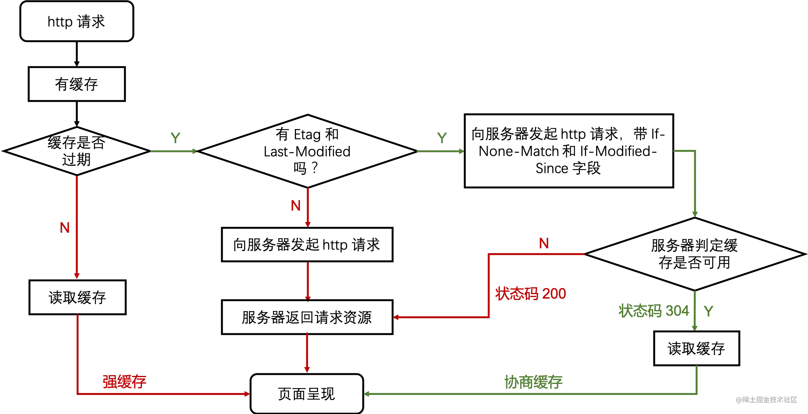
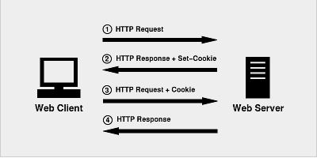
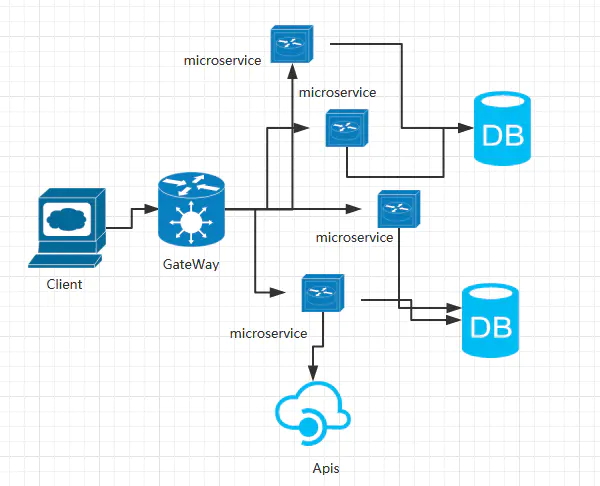

<!-- START doctoc generated TOC please keep comment here to allow auto update -->
<!-- DON'T EDIT THIS SECTION, INSTEAD RE-RUN doctoc TO UPDATE -->
<!-- **Table of Contents**  *generated with [DocToc](https://github.com/thlorenz/doctoc)* -->

- [HTML+CSS](#htmlcss)
  - [HTML5 新特性、语义化](#html5-%E6%96%B0%E7%89%B9%E6%80%A7%E8%AF%AD%E4%B9%89%E5%8C%96)
  - [DOM、BOM](#dombom)
  - [`position` 属性的值有哪些及其区别](#position-%E5%B1%9E%E6%80%A7%E7%9A%84%E5%80%BC%E6%9C%89%E5%93%AA%E4%BA%9B%E5%8F%8A%E5%85%B6%E5%8C%BA%E5%88%AB)
  - [`display` 都有哪些属性](#display-%E9%83%BD%E6%9C%89%E5%93%AA%E4%BA%9B%E5%B1%9E%E6%80%A7)
  - [`float` 属性](#float-%E5%B1%9E%E6%80%A7)
  - [`box-sizing`属性](#box-sizing%E5%B1%9E%E6%80%A7)
  - [CSS 盒子模型](#css-%E7%9B%92%E5%AD%90%E6%A8%A1%E5%9E%8B)
  - [CSS 选择器及优先级](#css-%E9%80%89%E6%8B%A9%E5%99%A8%E5%8F%8A%E4%BC%98%E5%85%88%E7%BA%A7)
  - [BFC（块级格式上下文）](#bfc%E5%9D%97%E7%BA%A7%E6%A0%BC%E5%BC%8F%E4%B8%8A%E4%B8%8B%E6%96%87)
  - [元素水平垂直居中](#%E5%85%83%E7%B4%A0%E6%B0%B4%E5%B9%B3%E5%9E%82%E7%9B%B4%E5%B1%85%E4%B8%AD)
  - [隐藏页面中某个元素的方法](#%E9%9A%90%E8%97%8F%E9%A1%B5%E9%9D%A2%E4%B8%AD%E6%9F%90%E4%B8%AA%E5%85%83%E7%B4%A0%E7%9A%84%E6%96%B9%E6%B3%95)
  - [px、em、rem、vh、vw](#pxemremvhvw)
  - [页面布局](#%E9%A1%B5%E9%9D%A2%E5%B8%83%E5%B1%80)
    - [flex 布局](#flex-%E5%B8%83%E5%B1%80)
    - [grid 布局](#grid-%E5%B8%83%E5%B1%80)
    - [rem 布局](#rem-%E5%B8%83%E5%B1%80)
    - [百分比布局](#%E7%99%BE%E5%88%86%E6%AF%94%E5%B8%83%E5%B1%80)
    - [浮动布局](#%E6%B5%AE%E5%8A%A8%E5%B8%83%E5%B1%80)
  - [清除浮动](#%E6%B8%85%E9%99%A4%E6%B5%AE%E5%8A%A8)
- [js 一些技巧](#js-%E4%B8%80%E4%BA%9B%E6%8A%80%E5%B7%A7)
  - [函数柯里化的实现](#%E5%87%BD%E6%95%B0%E6%9F%AF%E9%87%8C%E5%8C%96%E7%9A%84%E5%AE%9E%E7%8E%B0)
  - [节流与防抖](#%E8%8A%82%E6%B5%81%E4%B8%8E%E9%98%B2%E6%8A%96)
  - [数组去重](#%E6%95%B0%E7%BB%84%E5%8E%BB%E9%87%8D)
- [网络相关（http、web 安全）](#%E7%BD%91%E7%BB%9C%E7%9B%B8%E5%85%B3httpweb-%E5%AE%89%E5%85%A8)
  - [osi7 层模型，tcp5 层模型](#osi7-%E5%B1%82%E6%A8%A1%E5%9E%8Btcp5-%E5%B1%82%E6%A8%A1%E5%9E%8B)
  - [TCP 连接(三次握手, 四次挥手)](#tcp-%E8%BF%9E%E6%8E%A5%E4%B8%89%E6%AC%A1%E6%8F%A1%E6%89%8B-%E5%9B%9B%E6%AC%A1%E6%8C%A5%E6%89%8B)
  - [http 基本知识](#http-%E5%9F%BA%E6%9C%AC%E7%9F%A5%E8%AF%86)
    - [http 和 https 的基本概念](#http-%E5%92%8C-https-%E7%9A%84%E5%9F%BA%E6%9C%AC%E6%A6%82%E5%BF%B5)
    - [http 和 https 的区别及优缺点？](#http-%E5%92%8C-https-%E7%9A%84%E5%8C%BA%E5%88%AB%E5%8F%8A%E4%BC%98%E7%BC%BA%E7%82%B9)
    - [HTTP1/HTTP2/HTTP3](#http1http2http3)
    - [总结](#%E6%80%BB%E7%BB%93)
  - [HTTP 响应状态码](#http-%E5%93%8D%E5%BA%94%E7%8A%B6%E6%80%81%E7%A0%81)
  - [HTTP 请求方法(Method)](#http-%E8%AF%B7%E6%B1%82%E6%96%B9%E6%B3%95method)
  - [HTTP 缓存](#http-%E7%BC%93%E5%AD%98)
    - [定义](#%E5%AE%9A%E4%B9%89)
    - [HTTP 缓存分类](#http-%E7%BC%93%E5%AD%98%E5%88%86%E7%B1%BB)
    - [缓存的过程](#%E7%BC%93%E5%AD%98%E7%9A%84%E8%BF%87%E7%A8%8B)
    - [强(制)缓存](#%E5%BC%BA%E5%88%B6%E7%BC%93%E5%AD%98)
    - [协商缓存(对比缓存)](#%E5%8D%8F%E5%95%86%E7%BC%93%E5%AD%98%E5%AF%B9%E6%AF%94%E7%BC%93%E5%AD%98)
    - [三种刷新操作对 http 缓存的影响](#%E4%B8%89%E7%A7%8D%E5%88%B7%E6%96%B0%E6%93%8D%E4%BD%9C%E5%AF%B9-http-%E7%BC%93%E5%AD%98%E7%9A%84%E5%BD%B1%E5%93%8D)
  - [跨域](#%E8%B7%A8%E5%9F%9F)
  - [XSS 和 CSRF](#xss-%E5%92%8C-csrf)
    - [XSS](#xss)
    - [CSRF](#csrf)
  - [Websocket](#websocket)
- [浏览器相关](#%E6%B5%8F%E8%A7%88%E5%99%A8%E7%9B%B8%E5%85%B3)
  - [从输入 URL 到页面加载的全过程](#%E4%BB%8E%E8%BE%93%E5%85%A5-url-%E5%88%B0%E9%A1%B5%E9%9D%A2%E5%8A%A0%E8%BD%BD%E7%9A%84%E5%85%A8%E8%BF%87%E7%A8%8B)
  - [浏览器网页生成过程](#%E6%B5%8F%E8%A7%88%E5%99%A8%E7%BD%91%E9%A1%B5%E7%94%9F%E6%88%90%E8%BF%87%E7%A8%8B)
  - [浏览器重绘与重排的区别](#%E6%B5%8F%E8%A7%88%E5%99%A8%E9%87%8D%E7%BB%98%E4%B8%8E%E9%87%8D%E6%8E%92%E7%9A%84%E5%8C%BA%E5%88%AB)
  - [浏览器的本地存储(Cookie、localstorage、sessionStorag)](#%E6%B5%8F%E8%A7%88%E5%99%A8%E7%9A%84%E6%9C%AC%E5%9C%B0%E5%AD%98%E5%82%A8cookielocalstoragesessionstorag)
  - [进程、线程和协程](#%E8%BF%9B%E7%A8%8B%E7%BA%BF%E7%A8%8B%E5%92%8C%E5%8D%8F%E7%A8%8B)
- [性能问题](#%E6%80%A7%E8%83%BD%E9%97%AE%E9%A2%98)
  - [前端性能优化](#%E5%89%8D%E7%AB%AF%E6%80%A7%E8%83%BD%E4%BC%98%E5%8C%96)
- [前端编译](#%E5%89%8D%E7%AB%AF%E7%BC%96%E8%AF%91)
  - [webpack5 优化方向](#webpack5-%E4%BC%98%E5%8C%96%E6%96%B9%E5%90%91)
  - [webpack 如何实现代码分离](#webpack-%E5%A6%82%E4%BD%95%E5%AE%9E%E7%8E%B0%E4%BB%A3%E7%A0%81%E5%88%86%E7%A6%BB)
  - [webpacke 的 loader 和 plugin 对比](#webpacke-%E7%9A%84-loader-%E5%92%8C-plugin-%E5%AF%B9%E6%AF%94)
  - [webpack 常规配置示例](#webpack-%E5%B8%B8%E8%A7%84%E9%85%8D%E7%BD%AE%E7%A4%BA%E4%BE%8B)
  - [Babel 的编译过程](#babel-%E7%9A%84%E7%BC%96%E8%AF%91%E8%BF%87%E7%A8%8B)
  - [新一代构建工具:esbuild、swc](#%E6%96%B0%E4%B8%80%E4%BB%A3%E6%9E%84%E5%BB%BA%E5%B7%A5%E5%85%B7esbuildswc)
- [数据库相关](#%E6%95%B0%E6%8D%AE%E5%BA%93%E7%9B%B8%E5%85%B3)
  - [SQL、NoSQL、NewSQL 简介](#sqlnosqlnewsql-%E7%AE%80%E4%BB%8B)
    - [SQL(关系型数据库)](#sql%E5%85%B3%E7%B3%BB%E5%9E%8B%E6%95%B0%E6%8D%AE%E5%BA%93)
    - [NoSQL](#nosql)
    - [NewSQL(分布式存储领域)](#newsql%E5%88%86%E5%B8%83%E5%BC%8F%E5%AD%98%E5%82%A8%E9%A2%86%E5%9F%9F)
    - [SQL、NoSQL 和 NewSQL 之间的区别](#sqlnosql-%E5%92%8C-newsql-%E4%B9%8B%E9%97%B4%E7%9A%84%E5%8C%BA%E5%88%AB)
  - [OLTP 和 OLAP](#oltp-%E5%92%8C-olap)
  - [视图(Views)](#%E8%A7%86%E5%9B%BEviews)
  - [索引(index)](#%E7%B4%A2%E5%BC%95index)
    - [为什么要建立索引呢？](#%E4%B8%BA%E4%BB%80%E4%B9%88%E8%A6%81%E5%BB%BA%E7%AB%8B%E7%B4%A2%E5%BC%95%E5%91%A2)
    - [增加索引也有许多不利的方面](#%E5%A2%9E%E5%8A%A0%E7%B4%A2%E5%BC%95%E4%B9%9F%E6%9C%89%E8%AE%B8%E5%A4%9A%E4%B8%8D%E5%88%A9%E7%9A%84%E6%96%B9%E9%9D%A2)
    - [什么样的字段适合建立索引](#%E4%BB%80%E4%B9%88%E6%A0%B7%E7%9A%84%E5%AD%97%E6%AE%B5%E9%80%82%E5%90%88%E5%BB%BA%E7%AB%8B%E7%B4%A2%E5%BC%95)
    - [什么样的字段不适合建立索引](#%E4%BB%80%E4%B9%88%E6%A0%B7%E7%9A%84%E5%AD%97%E6%AE%B5%E4%B8%8D%E9%80%82%E5%90%88%E5%BB%BA%E7%AB%8B%E7%B4%A2%E5%BC%95)
    - [优化使用原则](#%E4%BC%98%E5%8C%96%E4%BD%BF%E7%94%A8%E5%8E%9F%E5%88%99)
  - [常用防止 SQL 注入攻击](#%E5%B8%B8%E7%94%A8%E9%98%B2%E6%AD%A2-sql-%E6%B3%A8%E5%85%A5%E6%94%BB%E5%87%BB)
  - [隔离级别](#%E9%9A%94%E7%A6%BB%E7%BA%A7%E5%88%AB)
  - [优化数据库的方法/SQL 语句优化](#%E4%BC%98%E5%8C%96%E6%95%B0%E6%8D%AE%E5%BA%93%E7%9A%84%E6%96%B9%E6%B3%95sql-%E8%AF%AD%E5%8F%A5%E4%BC%98%E5%8C%96)
- [架构设计相关](#%E6%9E%B6%E6%9E%84%E8%AE%BE%E8%AE%A1%E7%9B%B8%E5%85%B3)
  - [微服务架构的演变](#%E5%BE%AE%E6%9C%8D%E5%8A%A1%E6%9E%B6%E6%9E%84%E7%9A%84%E6%BC%94%E5%8F%98)
- [工作实践经验](#%E5%B7%A5%E4%BD%9C%E5%AE%9E%E8%B7%B5%E7%BB%8F%E9%AA%8C)

<!-- END doctoc generated TOC please keep comment here to allow auto update -->

## HTML+CSS

### HTML5 新特性、语义化

- 概念: HTML5 的语义化指的是**合理正确的使用语义化的标签来创建页面结构**。【正确的标签做正确的事】
- 语义化标签: header nav main article section aside footer
- 语义化的优点:
  - _在没 CSS 样式的情况下，页面整体也会呈现很好的结构效果_。
  - **代码结构清晰**，易于阅读。
  - **利于开发和维护**,方便其他设备解析（如屏幕阅读器）*根据语义渲染*网页。
  - 有利于搜索引擎优化(**SEO**)，搜索引擎爬虫会根据不同的标签来赋予不同的权重。

CSS3 动画、H5 新特性。
如何理解 HTML 语义化？
CSS3 新特性

### DOM、BOM

1. 定义

**DOM** 指的是文档对象模型，它指的是把文档当做一个对象来对待，这个对象主要定义了处理网页内容的方法和接口。

- D（文档）可以理解为整个 Web 加载的网页文档，
- O（对象）可以理解为类似 window 对象只来的东西，可以调用属性和方法，这里我们说的是 document 对象，
- M（模型）可以理解为网页文档的树形结构，DOM 树由节点(html、head、body、p 等标签)构成。

**BOM** 指的是浏览器对象模型，它指的是把浏览器当做一个对象来对待，这个对象主要定义了与浏览器进行交互的法和接口。

- BOM 的核心是 window，window 对象包含属性：document、location、navigator、screen、history、frames

区别：DOM 描述了处理网页内容的方法和接口，BOM 描述了与浏览器进行交互的方法和接口。

2. 操作

常见的 DOM 操作有哪些

- DOM 节点的获取:

```js
getElementById; // 按照 id 查询
getElementsByTagName; // 按照标签名查询
getElementsByClassName; // 按照类名查询
querySelectorAll; // 按照 CSS 选择器查询
```

- 创建一个新节点，并把它添加到指定节点的后面。

```js
// 首先获取父节点
var container = document.getElementById("container");
// 创建新节点
var targetSpan = document.createElement("span");
// 设置 span 节点的内容
targetSpan.innerHTML = "hello world";
// 把新创建的元素塞进父节点里去
container.appendChild(targetSpan);
```

- 删除指定的 DOM 节点: `container.removeChild(targetNode)`
- 将指定的两个 DOM 元素交换位置: `container.insertBefore(content, title)`

**CSS 属性三巨头（position、display、float）**

### `position` 属性的值有哪些及其区别

- 固定定位 **fixed**
  - 元素会被移出正常文档流，并不为元素预留空间，而是通过**指定元素相对于屏幕视口（viewport）的位置**来指定元素位置。
  - 元素的位置在屏幕滚动时不会改变。
  - 打印时，元素会出现在的每页的固定位置。
  - fixed 属性会创建新的层叠上下文。
  - 当元素祖先的 transform, perspective 或 filter 属性非 none 时，容器由视口改为该祖先。
- 相对定位 **relative**
  - 该关键字下，元素先放置在**未添加**定位时的位置，**再**在不改变页面布局的前提下**调整元素位置**（因此会在此元素未添加定位时所在位置留下空白）。
  - `position:relative` 对 `table-*-group`, `table-row`, `table-column`, `table-cell`, `table-caption` 元素无效。
- 绝对定位 **absolute**
  - 元素会被移出正常文档流，并不为元素预留空间，通过指定元素相对于**最近的非 static 定位祖先元素的偏移**，来确定元素位置。
  - 绝对定位的元素可以设置外边距（margins），且不会与其他边距合并。
- 粘性定位 **sticky**
  - 元素 _先_ 按照普通文档流定位，
  - _然后_ 相对于该元素在流中的 flow root（BFC）和 containing block（最近的块级祖先元素）定位。
  - _而后_，元素定位表现为在跨越特定阈值前为相对定位，
  - _之后_ 为固定定位。
- 默认定位 **static**
  - 该关键字指定元素使用正常的布局行为，即元素在文档常规流中*当前*的布局位置。
  - 此时 top, right, bottom, left 和 z-index 属性无效。

### `display` 都有哪些属性

display 属性可以设置**元素的内部和外部显示类型** display types。
元素的外部显示类型将决定该元素在流式布局中的表现（块级或内联元素）；
元素的内部显示类型 可以控制其子元素的布局。

| 值                       | 描述                                                                       |
| ------------------------ | -------------------------------------------------------------------------- |
| none                     | 此元素不会被显示。                                                         |
| block (外部显示类型)     | 此元素将显示为块级元素，此元素前后会带有换行符。                           |
| inline (外部显示类型)    | 默认。此元素会被显示为内联元素，元素前后没有换行符。                       |
| inline-block             | 行内块元素。                                                               |
| flow-root (内部显示类型) | 该元素生成一个块元素框，它建立一个新的块格式化上下文，定义格式化根的位置。 |
| table (内部显示类型)     | 此元素会作为块级表格来显示，表格前后带有换行符。                           |
| flex (内部显示类型)      | 弹性盒模型。                                                               |
| grid (内部显示类型)      | 网格布局。                                                                 |
| inherit                  | 规定应该从父元素继承 display 属性的值。                                    |

### `float` 属性

float CSS 属性指定一个**元素应沿其容器的左侧或右侧放置**，允许文本和内联元素环绕它。
该元素从网页的正常流动（文档流）中移除，尽管仍然保持部分的流动性（与绝对定位相反）。

| 值           | 描述                                                                                         |
| ------------ | -------------------------------------------------------------------------------------------- |
| left         | 表明元素必须浮动在其所在的块容器左侧的关键字。                                               |
| right        | 表明元素必须浮动在其所在的块容器右侧的关键字。                                               |
| none         | 表明元素不进行浮动的关键字。                                                                 |
| inline-start | 关键字，表明元素必须浮动在其所在块容器的开始一侧，在 ltr 脚本中是左侧，在 rtl 脚本中是右侧。 |
| inline-end   | 关键字，表明元素必须浮动在其所在块容器的结束一侧，在 ltr 脚本中是右侧，在 rtl 脚本中是左侧。 |

### `box-sizing`属性

CSS 中的 box-sizing 属性定义了 user agent 应该如何计算一个元素的总宽度和总高度。

box-sizing 规定两个并排的带边框的框，语法为 `box-sizing：content-box/border-box`

box-sizing 属性:

- content-box
  - 是默认值。
  - 如果你设置一个元素的宽为 100px，那么这个元素的**内容区会有 100px** 宽，并且任何边框和内边距的宽度都会被**增加到最后**绘制出来的**元素宽度**中。【标准盒子模型】
  - `width = 内容的宽度`
  - `height = 内容的高度`
- border-box
  - 告诉浏览器：你想要设置的**边框和内边距的值是包含在 width 内的**。【IE 盒子模型】
  - 也就是说，如果你将一个元素的 width 设为 100px，那么这 100px 会包含它的 border 和 padding，内容区的实际宽度是 width 减去 (border + padding) 的值。
  - 大多数情况下，这使得我们更容易地设定一个元素的宽高。
  - `width = border + padding + 内容的宽度`
  - `height = border + padding + 内容的高度`

### CSS 盒子模型

CSS 盒模型本质上是一个盒子，它包括：边距，边框，填充和实际内容。

CSS 中的盒子模型包括 IE 盒子模型和标准的 W3C 盒子模型。

- W3C 标准盒模型：**属性 width ，height 只包含内容 content**，不包含 border 和 padding 。
- IE 盒模型：**属性 width，height 包含 content、border 和 padding**，指的是 content + padding + border 。

故在计算盒子的宽度时存在差异：

- 标准盒模型： 一个块的总宽度 = width+margin(左右) + padding(左右) + border(左右)
- 怪异盒模型： 一个块的总宽度 = width+margin(左右),即 width 已经包含了 padding 和 border 值

`line-height` CSS 属性用于设置多行元素的空间量，如多行文本的间距。
对于块级元素，它指定元素行盒（line boxes）的最小高度。
对于非替代的 inline 元素，它用于计算行盒（line box）的高度。

### CSS 选择器及优先级

- 选择器
  - id 选择器(`#myid`)
  - 类选择器(`.myclass`)
  - 属性选择器(`a[rel="external"]`)
  - 伪类选择器(`a:hover, li:nth-child`)
  - 标签选择器(`div, h1,p`)
  - 相邻选择器（`h1 + p`）
  - 子选择器(`ul > li`)
  - 后代选择器(`li a`)
  - 通配符选择器(`*`)
- 优先级：
  - `!important`
  - 内联样式（1000）
  - ID 选择器（0100）
  - 类选择器/属性选择器/伪类选择器（0010）
  - 元素选择器/伪元素选择器（0001）
  - 关系选择器/通配符选择器（0000）

带`!important` 标记的样式属性优先级最高；
样式表的来源相同时：`!important` > 行内样式 > ID 选择器 > 类选择器 > 标签 > 通配符 > 继承 > 浏览器默认属性

`!important > style > id > class`

### [BFC](https://developer.mozilla.org/zh-CN/docs/Web/Guide/CSS/Block_formatting_context)（块级格式上下文）

1. BFC 的概念

BFC 是 Block Formatting Context 的缩写，即块级格式化上下文。
BFC 是 CSS 布局的一个概念，是一个独立的渲染区域，规定了内部 box 如何布局， 并且**这个区域的子元素不会影响到外面的元素**，
其中比较重要的布局规则有内部 box 垂直放置，计算 BFC 的高度的时候，浮动元素也参与计算。

2. BFC 的原理布局规则

- 内部的 Box 会在**垂直方向**，一个接一个地放置
- Box**垂直方向的距离由 margin 决定**。属于同一个 BFC 的两个相邻 Box 的 margin 会发生重叠
- 每个元素的 margin box 的左边， 与包含块 border box 的左边相接触(对于从左往右的格式化，否则相反
- BFC 的区域**不会与 float box 重叠**
- BFC 是一个独立容器，容器里面的**子元素不会影响到外面的元素**
- 计算 BFC 的高度时，**浮动元素也参与计算高度**
- **元素的类型和 display 属性，决定了这个 Box 的类型**。不同类型的 Box 会参与不同的 Formatting Context。

3. 如何创建 BFC？

- 根元素，即 HTML 元素
- float 的值不为 none
- position 为 absolute 或 fixed
- display 的值为 inline-block、table-cell、table-caption
- overflow 的值不为 visible

4. BFC 的使用场景

- 去除边距重叠现象
- 清除浮动（让父元素的高度包含子浮动元素）
- 避免某元素被浮动元素覆盖
- 避免多列布局由于宽度计算四舍五入而自动换行

BFC（块级格式上下文）
什么是 BFC？BFC 的布局规则是什么？如何创建 BFC？BFC 应用？
BFC
对 BFC 的理解

### 元素水平垂直居中

- **水平居中**
  - 对于行内元素 : `text-align: center`;
  - 对于确定宽度的块级元素：
    - （1）width 和 margin 实现。`margin: 0 auto`;
    - （2）绝对定位和 `margin-left: (父 width - 子 width）/2`, 前提是父元素 `position: relative`
  - 对于宽度未知的块级元素
    - （1）table 标签配合 margin 左右 auto 实现水平居中。使用 table 标签（或直接将块级元素设值为 `display:table`），再通过给该标签添加左右 margin 为 auto。
    - （2）inline-block 实现水平居中方法。`display：inline-block` 和 `text-align:center` 实现水平居中。
    - （3）绝对定位+transform，translateX 可以移动本身元素的 50%。
    - （4）flex 布局使用 `justify-content:center`
- **垂直居中**
  - 利用 line-height 实现居中，这种方法适合纯文字类
  - 通过设置父容器 相对定位 ，子级设置 绝对定位，标签通过 margin 实现自适应居中
  - 弹性布局 flex :父级设置 `display: flex;` 子级设置 margin 为 auto 实现自适应居中
  - 父级设置相对定位，子级设置绝对定位，并且通过位移 transform 实现
  - table 布局，父级通过转换成表格形式，然后子级设置 vertical-align 实现。
    - （需要注意的是：`vertical-align: middle` 使用的前提条件是内联元素以及 display 值为 table-cell 的元素）。
- **水平垂直居中**
  ```css
  // flex 模式
  .father {
    display: flex;
    justify-content: center;
    align-items: center;
  }
  // grid 模式
  .container {
    display: grid;
    align-items: center;
    justify-content: center;
  }
  ```

让一个元素水平垂直居中
如何居中 div？
水平垂直居中多种实现方式

### 隐藏页面中某个元素的方法

- `opacity: 0`
  - 该元素隐藏起来了，但**不会**改变页面布局，并且，如果该元素已经绑定一些事件，如 click 事件，那么点击该区域，也**能触发点击事件**的
- `visibility: hidden`
  - 该元素隐藏起来了，但**不会**改变页面布局，但是**不会触发**该元素已经绑定的事件 ，隐藏对应元素，在文档布局中仍保留原来的空间（重绘）
- `display：none`
  - 把元素隐藏起来了，并且会**改变**页面布局，任何这个元素的子孙元素也会被同时隐藏。像元素完全不存在。不显示对应的元素，在文档布局中**不再分配空间**（回流+重绘）

### px、em、rem、vh、vw

px 是像素值，是一个固定的长度，比如我们的米，厘米一样。
em 的值是 px 的倍数。例如默认情况下 font-size = 16px,那么 1em = 16px
rem 的值是 px 的倍数。可理解为"root em"。例如默认情况下 font-size = 16px,那么 1rem = 16px
vh 和 vw 就是**根据窗口的宽高**，分成 100 等份，100vh 就表示满高，50vh 就表示一半高。终是针对窗口的宽高。

rem**只能在 html 标签里**面设置 rem 的依赖的值到底是多少
em 是可以在**自己元素以及父级元素**设置 em 依赖的值到底是多少

`0.5px` 的线:

```css
.hr.scale-half {
  /* 高度设置为1px */
  height: 1px;
  /* 缩放0.5倍，可能会在Chrome是变模糊，但粗细几乎没有变化 */
  transform: scaleY(0.5);
  /* 解决上述问题 */
  transform-origin: 50% 100%;
}
```

### 页面布局

flex 布局是一维布局，Grid 布局是二维布局。

#### [flex 布局](https://developer.mozilla.org/zh-CN/docs/Web/CSS/CSS_Flexible_Box_Layout/Basic_Concepts_of_Flexbox)

flexbox 是一种一维的布局，是因为一个 flexbox 一次只能处理一个维度上的元素布局，一行或者一列。
指定容器 `display: flex` 即可。 简单的分为容器属性和元素属性。

容器的属性：

- flex-direction
  - 决定主轴的方向（即子 item 的排列方法）
  - `flex-direction: row | row-reverse | column | column-reverse;`
    - row 或者 row-reverse: 主轴将沿着 inline 方向延伸
    - column 或者 column-reverse: 主轴会沿着上下方向延伸 — 也就是 block 排列的方向
- flex-wrap
  - 指定 flex 元素单行显示还是多行显示。_如果允许换行_，这个属性允许你控制行的堆叠方向。
  - `flex-wrap: nowrap | wrap | wrap-reverse;`
    - nowrap: flex 的元素被摆放到到一行，这可能导致 flex 容器溢出。
    - wrap: flex 元素被打断到多个行中。
    - wrap-reverse: 和 wrap 的行为一样，但是 cross-start 和 cross-end 互换。
- flex-flow
  - 是 flex-direction 和 flex-wrap 的简写
  - `.box { flex-flow: || ; }`
- justify-content
  - 定义了浏览器之间，如何分配**顺着**弹性容器**主轴** (或者网格行轴) 的元素之间及其周围的空间。
  - 常见值: center start end flex-start flex-end left right baseline space-between ...
- align-items：对齐方式，竖直轴线方向
  - 将所有直接子节点上的 align-self 值设置为一个组。align-self 属性设置项目在其包含块中在**交叉轴** (主轴是 x，那交叉轴就是 y)方向上的对齐方式。
  - 常见值: normal start end flex-start flex-end center left right stretch baseline ...
- align-content
  - align-content 属性设置了浏览器如何**沿着弹性盒子布局的纵轴**和**网格布局的主轴**在内容项之间和周围分配空间。
  - 该属性*对单行弹性盒子模型无效*。（即：带有 `flex-wrap: nowrap`）。
  - 常见值: start end flex-start flex-end center normal stretch baseline space-between ...

项目的属性（元素的属性）：

- order
  - 定义项目的排列顺序，顺序越小，排列越靠前，默认为 0
- flex-grow
  - 定义项目的放大比例，即使存在空间，也不会放大
- flex-shrink
  - 定义了项目的缩小比例，当空间不足的情况下会等比例的缩小，如果 定义个 item 的 flow-shrink 为 0，则为不缩小
- flex-basis
  - 定义了在分配多余的空间，项目占据的空间。
- flex
  - 是 flex-grow 和 flex-shrink、flex-basis 的简写，默认值为 0 1 auto。
- align-self
  - 允许单个项目与其他项目不一样的对齐方式，可以覆盖
- align-items
  - 默认属 性为 auto，表示继承父元素的 align-items 比如说，用 flex 实现圣杯布局

#### [grid 布局](https://developer.mozilla.org/zh-CN/docs/Web/CSS/CSS_Grid_Layout)

CSS 网格(grid)布局擅长于将一个页面划分为几个主要区域，以及定义这些区域的大小、位置、层次等关系（前提是 HTML 生成了这些区域）。

像表格一样，网格布局让我们能够按行或列来对齐元素。然而在布局上，网格比表格更可能做到或更简单。
例如，网格容器的子元素可以自己定位，以便它们像 CSS 定位的元素一样，真正的有重叠和层次。

容器和项目：我们通过在元素上声明 `display: grid` 或 `display: inline-grid` 来创建一个网格容器。一旦我们这样做，这个元素的所有直系子元素将成为网格项目。
网格轨道：`grid-template-columns` 和 `grid-template-rows` 属性来定义网格中的行和列。容器内部的水平区域称为行，垂直区域称为列。
网格单元：一个网格单元是在一个网格元素中最小的单位， 从概念上来讲其实它和表格的一个单元格很像。
网格线：划分网格的线，称为"网格线"。应该注意的是，当我们定义网格时，我们定义的是网格轨道，而不是网格线。Grid 会为我们创建编号的网格线来让我们来定位每一个网格元素。m 列有 m + 1 根垂直的网格线，n 行有 n + 1 跟水平网格线。

属性之类的太多，背不下来可以使用时再看。

#### rem 布局

首先 rem 相对于根(html)的 font-size 大小来计算。简单的说它就是一个相对单例
如:`font-size:10px;`,那么（1rem = 10px）了解计算原理后首先解决怎么在不同设备上设置 html 的 font-size 大小。
其实 rem 布局的本质是等比缩放，一般是基于宽度。

优点：可以快速适用移动端布局，字体，图片高度

缺点：

- ① 目前 ie 不支持，对 pc 页面来讲使用次数不多；
- ② 数据量大：所有的图片，盒子都需要我们去给一个准确的值；才能保证不同机型的适配；
- ③ 在响应式布局中，必须通过 js 来动态控制根元素 font-size 的大小。
  - 也就是说 css 样式和 js 代码有一定的耦合性。且必须将改变 font-size 的代码放在 css 样式之前。

#### 百分比布局

通过百分比单位 " % " 来实现响应式的效果。通过百分比单位可以使得浏览器中的组件的宽和高随着浏览器的变化而变化，从而实现响应式的效果。

缺点：

- （1）计算困难
- （2）各个属性中如果使用百分比，相对父元素的属性并不是唯一的。造成我们使用百分比单位容易使布局问题变得复杂。

#### 浮动布局

浮动布局:
当元素浮动以后可以向左或向右移动，直到它的外边缘碰到包含它的框或者另外一个浮动元素的边框为止。
元素浮动以后会脱离正常的文档流，所以文档的普通流中的框就变的好像浮动元素不存在一样。

优点

- 这样做的优点就是在图文混排的时候可以很好的使文字环绕在图片周围。另外当元素浮动了起来之后，它有着块级元素的一些性质例如可以设置宽高等，
- 但它与 inline-block 还是有一些区别的，
  - 第一个就是关于横向排序的时候，float 可以设置方向而 inline-block 方向是固定的；
  - 还有一个就是 inline-block 在使用时有时会有空白间隙的问题

缺点

- 最明显的缺点就是浮动元素一旦脱离了文档流，就无法撑起父元素，会造成父级元素高度塌陷。

### 清除浮动

在非 IE 浏览器（如 Firefox）下，当容器的高度为 auto，且容器的内容中有浮动（float 为 left 或 right）的元素，
在这种情况下，**容器的高度不能自动伸长以适应内容的高度，使得内容溢出到容器外面**而影响（甚至破坏）布局的现象。这个现象叫**浮动溢出**。

解决方法:

- 使用带 clear 属性的空元素
- **使用 CSS 的 overflow 属性**
- 给浮动的元素的容器添加浮动
- 使用邻接元素处理
- 使用 CSS 的`:after`伪元素

```css
//在css中添加:after伪元素
.parent:after {
  /* 设置添加子元素的内容是空 */
  content: "";
  /* 设置添加子元素为块级元素 */
  display: block;
  /* 设置添加的子元素的高度0 */
  height: 0;
  /* 设置添加子元素看不见 */
  visibility: hidden;
  /* 设置clear：both */
  clear: both;
}
```

## js 一些技巧

### 函数柯里化的实现

柯里化是一种将使用 _多个参数的一个函数_ 转换成 _一系列使用一个参数的函数_ 的技术。

柯里化是一种函数的转换，它是指将一个函数从可调用的 `f(a, b, c)` 转换为可调用的 `f(a)(b)(c)`

```
// 科里化转换函数
let curry = fn =>
    judge = (...args) =>
        args.length === fn.length
            ? fn(...args)
            : (arg) => judge(...args, arg)

// 示例的多参函数
function sum(a, b, c) {
    return a + b + c;
}

// 将其科里化
let curriedSum = curry(sum);

// 调用测试
console.log(curriedSum(1, 2, 3)); // 6，仍然可以被正常调用
console.log(curriedSum(1)(2)(3)); // 6，全柯里化
```

### 节流与防抖

- 节流(throttle)：事件触发后，规定时间内，事件处理函数不能再次被调用。也就是说在规定的时间内，函数只能被调用一次，且是最先被触发调用的那次。
  - 规定时间内函数只会调用一次
- 防抖(debounce)：多次触发事件，事件处理函数只能执行一次，并且是在触发操作结束时执行。也就是说，当一个事件被触发准备执行事件函数前，会等待一定的时间（比如 1 秒），如果没有再次被触发，那么就执行，如果被触发了，那就本次作废，重新从新触发的时间开始计算，并再次等待 1 秒，直到能最终执行！
  - 多次触发，只执行最后一次的函数调用，之前的作废

使用场景：

- 节流：滚动加载更多、搜索框搜的索联想功能、高频点击、表单重复提交……
- 防抖：搜索框搜索输入，并在输入完以后自动搜索、手机号，邮箱验证输入检测、窗口大小 resize 变化后，再重新渲染。

### 数组去重

常规数组: `let newarr = ...new Set(arr)`
对象数组:

```js
const list = [
  { age: 18, name: "张三" },
  { age: 18, name: "李四" },
  { age: 18, name: "王五" },
];

let hash = {};
const newArr = list.reduce((item, next) => {
  hash[next.age] ? "" : (hash[next.age] = true && item.push(next));
  return item;
}, []);
console.log(newArr);
```

## 网络相关（http、web 安全）

### osi7 层模型，tcp5 层模型

<!--  -->


OSI: open system interconnection 开放式系统互联参考模型。

TCP/IP 他是一个协议簇，用于因特网 (Internet) 的通信协议；而 OSI（开放系统互联）则是一个模型，且 TCP/IP 的开发时间在 OSI 之前。
TCP/IP 是由一些交互性的模块做成的分层次的协议，其中每个模块提供特定的功能；OSi 则指定了哪个功能是属于哪一层的。

OSI 引入了服务、接口、协议、分层的概念，TCP/IP 借鉴了 OSI 的这些概念建立 TCP/IP 模型。
OSI 先有模型，后有协议，先有标准，后进行实践；而 TCP/IP 则相反，先有协议和应用再提出了模型，且是参照的 OSI 模型。
OSI 是一种理论下的模型，而 TCP/IP 已被广泛使用，成为网络互联事实上的标准。

- TCP：transmission control protocol 传输控制协议
- UDP：user data protocol 用户数据报协议

<table>
    <tr>
        <td>OSI 七层网络模型</td>
        <td>TCP/IP 四层概念模型</td>
        <td>对应网络协议</td>
    </tr>
    <tr>
     <td>应用层（Application）</td>
        <td rowspan="3">应用层</td>
         <td>HTTP、TFTP, FTP, NFS, WAIS、SMTP</td>
    </tr>
    <tr>
        <td>表示层（Presentation）  </td>
        <td>Telnet, Rlogin, SNMP, Gopher</td>
    </tr>
    <tr>
        <td >会话层（Session）</td>
        <td>SMTP, DNS</td>
    </tr>
    <tr>
        <td>传输层（Transport）</td>
        <td>传输层</td>
        <td>TCP, UDP</td>
    </tr>
        <tr>
        <td>网络层（Network）</td>
        <td>网络层</td>
        <td>IP, ICMP, ARP, RARP, AKP, UUCP</td>
    </tr>
        <tr>
        <td>数据链路层（Data Link）</td>
        <td rowspan="2">数据链路层</td>
        <td>FDDI, Ethernet, Arpanet, PDN, SLIP, PPP</td>
    </tr>    
    <tr>
        <td>物理层（Physical）</td>
        <td>IEEE 802.1A, IEEE 802.2 到 IEEE 802.11</td>
    </tr>
</table>

### TCP 连接(三次握手, 四次挥手)

[两张动图-彻底明白 TCP 的三次握手与四次挥手](https://blog.csdn.net/qzcsu/article/details/72861891)
[💯 关于 TCP 三次握手和四次挥手，满分回答在此](https://segmentfault.com/a/1190000039165592)

1. TCP 三次握手

- 第一次握手：建立连接时，客户端发送 syn 包（syn=j）到服务器，并进入 SYN_SENT 状态，等待服务器确认；
  - SYN：同步序列编号（Synchronize Sequence Numbers）。
- 第二次握手：服务器收到 syn 包并确认客户的 SYN（ack=j+1），同时也发送一个自己的 SYN 包（syn=k），即 SYN+ACK 包，此时服务器进入 SYN_RECV 状态；
- 第三次握手：客户端收到服务器的 SYN+ACK 包，向服务器发送确认包 ACK(ack=k+1），此包发送完毕，客户端和服务器进入 ESTABLISHED（TCP 连接成功）状态，完成三次握手。


2. TCP 四次挥手

刚开始双方都处于 establised 状态，假如是客户端先发起关闭请求，则：

- 第一次挥手：客户端发送一个 FIN 报文，报文中会指定一个序列号。此时客户端处于 FIN_WAIT1 状态。
- 第二次挥手：服务端收到 FIN 之后，会发送 ACK 报文，且把客户端的序列号值 + 1 作为 ACK 报文的序列号值，表明已经收到客户端的报文了，此时服务端处于 CLOSE_WAIT 状态。
- 第三次挥手：如果服务端也想断开连接了，和客户端的第一次挥手一样，发给 FIN 报文，且指定一个序列号。此时服务端处于 LAST_ACK 的状态。
- 第四次挥手：客户端收到 FIN 之后，一样发送一个 ACK 报文作为应答，且把服务端的序列号值 + 1 作为自己 ACK 报文的序列号值，此时客户端处于 TIME_WAIT 状态。需要过一阵子以确保服务端收到自己的 ACK 报文之后才会进入 CLOSED 状态
- 服务端收到 ACK 报文之后，就处于关闭连接了，处于 CLOSED 状态。


### http 基本知识

#### http 和 https 的基本概念

http: 是一个客户端和服务器端请求和应答的标准（TCP），用于从 WWW 服务器传输超文本到本地浏览器的超文本传输协议。
https:是以安全为目标的 HTTP 通道，即 HTTP 下 加入 SSL 层进行加密。其作用是：建立一个信息安全通道，来确保数据的传输，确保网站的真实性。

#### http 和 https 的区别及优缺点？

- http 是超文本传输协议，信息是明文传输，HTTPS 协议要比 http 协议安全，https 是具有安全性的 ssl 加密传输协议，可防止数据在传输过程中被窃取、改变，确保数据的完整性(当然这种安全性并非绝对的，对于更深入的 Web 安全问题，此处暂且不表)。
- http 协议的默认端口为 80，https 的默认端口为 443。
- http 的连接很简单，是无状态的。https 握手阶段比较费时，会使页面加载时间延长 50%，增加 10%~20%的耗电。
- https 缓存不如 http 高效，会增加数据开销。
- https 协议需要 ca 证书，费用较高，功能越强大的证书费用越高。
- SSL 证书需要绑定 IP，不能再同一个 IP 上绑定多个域名，IPV4 资源支持不了这种消耗。

#### HTTP1/HTTP2/HTTP3

1. HTTP1.1 的缺陷

- 高延迟 — 队头阻塞(Head-Of-Line Blocking)
- 无状态特性 — header 巨大且重复,阻碍交互
- 明文传输 — 不安全性
- 不支持服务端推送

2. HTTP/2 简介

HTTP/2 基于 SPDY，专注于性能，最大的目标是在用户和网站间只用一个 TCP 连接。

- **HTTP/2 新特性**
  - 二进制传输
  - Header 压缩
  - 多路复用
  - Server Push(服务端推送)
  - 提高安全性

虽然 HTTP/2 解决了很多之前旧版本的问题，但是它还是存在一个巨大的问题，主要是底层支撑的 TCP 协议造成的。

- **HTTP/2 的缺点**
  - TCP 以及 TCP+TLS 建立连接的延时
  - TCP 的队头阻塞并没有彻底解决
  - 多路复用导致服务器压力上升
  - 多路复用容易 Timeout

3. HTTP/3 简介

Google 在推 SPDY 的时候就已经意识到了这些问题，于是就另起炉灶搞了一个基于 UDP 协议的“QUIC”协议，让 HTTP 跑在 QUIC 上而不是 TCP 上。
而这个“HTTP over QUIC”就是 HTTP 协议的下一个大版本，HTTP/3。

- **HTTP/3 新特性**
  - 实现了类似 TCP 的流量控制、传输可靠性的功能
  - 实现了快速握手功能
  - 集成了 TLS 加密功能
  - 多路复用，彻底解决 TCP 中队头阻塞的问题
  - 连接迁移

4. **TCP 和 UDP 的区别**

- TCP 是面向**链接**的，而 UDP 是面向无连接的。
- TCP 仅支持**单播传输**，UDP 提供了单播，多播，广播的功能。
- TCP 的三次握手保证了连接的可靠性; UDP 是无连接的、不可靠的一种数据传输协议，
  - 首先不可靠性体现在无连接上，通信都不需要建立连接，对接收到的数据也不发送确认信号，发送端不知道数据是否会正确接收。
- UDP 的**头部开销**比 TCP 的更小，数据传**输速率更高，实时性更好**。

#### 总结

- HTTP/1.1 有两个主要的缺点：安全不足和性能不高。
- HTTP/2 完全兼容 HTTP/1，是“更安全的 HTTP、更快的 HTTPS"，二进制传输、头部压缩、多路复用、服务器推送等技术可以充分利用带宽，降低延迟，从而大幅度提高上网体验；
- QUIC 基于 UDP 实现，是 HTTP/3 中的底层支撑协议，该协议基于 UDP，又取了 TCP 中的精华，实现了即快又可靠的协议。

在某段时间，若对**网络中某一资源的需求超过了该资源所能提供的可用部分，网络性能就要变坏**，这种情况就叫做**网络拥塞**。

[解读 HTTP1/HTTP2/HTTP3](https://juejin.cn/post/6995109407545622542)
[HTTP/2 新特性](https://limeii.github.io/2019/06/http1.1-http2/)

### HTTP 响应状态码

HTTP 响应状态码用来表明特定 HTTP 请求是否成功完成。 响应被归为以下五大类：

- 信息响应 (100–199) -服务器收到请求
- 成功响应 (200–299)
- 重定向消息 (300–399)
- 客户端错误响应 (400–499)
- 服务端错误响应 (500–599)

常用状态码:

- 200 OK
  - 请求成功。成功的含义取决于 HTTP 方法：
    - GET: 资源已被提取并在消息正文中传输。
    - HEAD: 实体标头位于消息正文中。
    - PUT or POST: 描述动作结果的资源在消息体中传输。
    - TRACE: 消息正文包含服务器收到的请求消息。
- 304 Not Modified
  - 这是用于缓存的目的。它告诉客户端响应还没有被修改，因此客户端可以继续使用相同的缓存版本的响应。
- 400 Bad Request
- 401 Unauthorized
- 403 Forbidden
  - 与 401 Unauthorized 不同，服务器知道客户端的身份。
- 404 Not Found
- 406 Not Acceptable
- 500 Internal Server Error
  - 服务器遇到了不知道如何处理的情况。
- 501 Not Implemented
  - 服务器不支持请求方法，因此无法处理。服务器需要支持的唯二方法（因此不能返回此代码）是 GET and HEAD.
- 502 Bad Gateway
  - 此错误响应表明服务器作为网关需要得到一个处理这个请求的响应，但是得到一个错误的响应。
- 503 Service Unavailable
  - 服务器没有准备好处理请求。常见原因是服务器因维护或重载而停机
- 504 Gateway Timeout
  - 当服务器充当网关且无法及时获得响应时，会给出此错误响应。
- 511 Network Authentication Required
  - 指示客户端需要进行身份验证才能获得网络访问权限。

### HTTP 请求方法(Method)

HTTP 定义了一组请求方法，以表明要对给定资源执行的操作。指示针对给定资源要执行的期望动作。

| method  | 描述                                                                        |
| ------- | --------------------------------------------------------------------------- |
| GET     | GET 方法请求一个指定资源的表示形式，使用 GET 的请求应该只被用于获取数据。   |
| HEAD    | HEAD 方法请求一个与 GET 请求的响应相同的响应，但没有响应体。                |
| POST    | POST 方法用于将实体提交到指定的资源，通常导致在服务器上的状态变化或副作用。 |
| PUT     | PUT 方法用请求有效载荷替换目标资源的所有当前表示。                          |
| DELETE  | DELETE 方法删除指定的资源。                                                 |
| CONNECT | CONNECT 方法建立一个到由目标资源标识的服务器的隧道。                        |
| OPTIONS | OPTIONS 方法用于描述目标资源的通信选项。                                    |
| TRACE   | TRACE 方法沿着到目标资源的路径执行一个消息环回测试。                        |
| PATCH   | PATCH 方法用于对资源应用部分修改。                                          |

PUT 和 POST 方法的区别是:

- PUT 方法是幂等的：连续调用一次或者多次的效果相同（无副作用）。
- 连续调用同一个 POST 可能会带来额外的影响，比如多次提交订单。

GET 和 POST 区别:

- GET 在浏览器回退不会再次请求，POST 会再次提交请求
- GET 请求会被浏览器主动缓存，POST 不会，要手动设置
- GET 请求*参数*会被完整*保留*在浏览器*历史记录*里，POST 中的参数不会
- GET 请求在 URL 中传送的*参数是有长度限制*的，而 POST 没有限制
- GET *参数*通过 _URL 传递_，POST 放在 Request body 中
- GET 参数暴露在地址栏不安全，POST 放在报文内部更安全
- GET *一般*用于*查询*信息，POST 一般用于提交某种信息进行某些修改操作
- GET 产生一个 TCP 数据包；POST 产生两个 TCP 数据包

### HTTP 缓存

[HTTP 缓存](https://developer.mozilla.org/zh-CN/docs/Web/HTTP/Caching)

#### 定义

**HTTP 缓存**存储与请求关联的响应，并将存储的响应复用于后续请求。

可复用性有几个优点:

- 首先，由于不需要将请求传递到源服务器，因此客户端和缓存越近，**响应速度就越快**。最典型的例子是浏览器本身为浏览器请求存储缓存。
- 此外，当响应可复用时，源服务器不需要处理请求——因为它不需要解析和路由请求、根据 cookie 恢复会话、查询数据库以获取结果或渲染模板引擎。这**减少了服务器上的负载**。
- 缓存的正确操作对系统的稳定运行至关重要。

#### HTTP 缓存分类

- **私有缓存**
  - 私有缓存是*绑定到特定客户端的缓存*——通常是浏览器缓存。
  - 由于存储的响应不与其他客户端共享，因此私有缓存可以存储该用户的个性化响应。
  - `Cache-Control: private`
  - 如果响应具有 Authorization 标头，则不能将其存储在私有缓存（或共享缓存，除非指定了 public ）中。
- **共享缓存**
  - 共享缓存位于客户端和服务器之间，可以**存储能在用户之间共享的响应**。共享缓存可以进一步细分为代理缓存和托管缓存。
  - **代理缓存**
    - 除了访问控制的功能外，一些代理还实现了缓存以减少网络流量。这通常不由服务开发人员管理，因此必须由恰当的 HTTP 标头等控制。
    - 随着 HTTPS 变得越来越普遍，在许多情况下，路径中的代理缓存只能传输响应而不能充当缓存。
  - **托管缓存**
    - 托管缓存由服务开发人员明确部署，以降低源服务器负载并有效地交付内容。示例包括反向代理、CDN 和 service worker 与缓存 API 的组合。

HTTP 缓存的类型很多，**根据是否需要重新向服务器发起请求来分类包括两种：强制缓存和对比缓存**

#### 缓存的过程

浏览器发起 HTTP 请求 – 服务器响应该请求。那么浏览器第一次向服务器发起该请求后拿到请求结果，会根据响应报文中 HTTP 头的缓存标识，决定是否缓存结果，是则将请求结果和缓存标识存入浏览器缓存中。

HTTP 缓存主要是通过请求和响应报文头中的对应 Header 信息，来控制缓存的策略。
响应头中相关字段为 Expires、Cache-Control、Last-Modified、Etag。

简单的过程如下图：




#### 强(制)缓存

**强制缓存就是向浏览器缓存查找该请求结果，并根据该结果的缓存规则来决定是否使用该缓存结果的过程。**(不需要发送请求到服务端，直接读取浏览器本地缓存。)

是否强缓存由 Expires、Cache-Control 和 Pragma 3 个 Header 属性共同来控制。

强制缓存的情况主要有三种(暂不分析协商缓存过程)，如下：

- 不存在该缓存结果和缓存标识，强制缓存失效，则直接向服务器发起请求（跟第一次发起请求一致）。
- 存在该缓存结果和缓存标识，但该结果已失效，强制缓存失效，则使用协商缓存。
- 存在该缓存结果和缓存标识，且该结果尚未失效，强制缓存生效，直接返回该结果

#### 协商缓存(对比缓存)

**协商缓存就是强制缓存失效后，浏览器携带缓存标识向服务器发起请求，由服务器根据缓存标识决定是否使用缓存的过程。**

当浏览器的强缓存失效的时候或者请求头中设置了不走强缓存，并且在请求头中设置了 `If-Modified-Since` 或者 `If-None-Match` 的时候，会将这两个属性值到服务端去验证是否命中协商缓存，如果命中了协商缓存，会返回 304 状态，加载浏览器缓存，并且响应头会设置 `Last-Modified` 或者 `ETag` 属性。

协商缓存主要有以下两种情况：

- 协商缓存生效，返回 304
- 协商缓存失效，返回 200 和请求结果结果

优先级: 先判断强制缓存，如果强制缓存生效，直接使用缓存；如果强制缓存失效，再发请求跟服务器协商，看要不要使用缓存。

**强缓存策略和协商缓存策略**在缓存命中时都会直接使用本地的缓存副本，**区别只在于协商缓存会向服务器发送一次请求**。它们缓存不命中时，都会向服务器发送请求来获取资源。

在实际的缓存机制中，强缓存策略和协商缓存策略是一起合作使用的。
浏览器首先会根据请求的信息判断，强缓存是否命中，如果命中则直接使用资源。
如果不命中则根据头信息向服务器发起请求，
使用协商缓存，如果协商缓存命中的话，则服务器不返回资源，浏览器直接使用本地资源的副本，
如果协商缓存不命中，则浏览器返回最新的资源给浏览器。

#### 三种刷新操作对 http 缓存的影响

三种刷新操作

- 正常操作：地址栏输入 url，跳转链接，前进后退等。
- 手动刷新：f5，点击刷新按钮，右键菜单刷新。
- 强制刷新：ctrl + f5，shift+command+r。

缓存影响

- 正常操作：强制缓存有效，协商缓存有效。
- 手动刷新：强制缓存失效，协商缓存有效。
- 强制刷新：强制缓存失效，协商缓存失效。(完全不使用缓存)

### 跨域

**跨域**: 是指浏览器不能执行其他网站的脚本。它是由浏览器的同源策略造成的。
**同源策略**: 是浏览器对 JavaScript 实施的安全限制，只要**协议、域名、端口**有任何一个不同，都被当作是不同的域。
**跨域原理**: 即是通过各种方式，避开浏览器的安全限制。

跨域解决方案:

- CORS(Cross-origin resource sharing)跨域资源共享
  - 服务器设置对 CORS 的支持原理：服务器设置 Access-Control-Allow-Origin HTTP 响应头之后，浏览器将会允许跨域请求
- proxy 代理
  - 通过服务器设置代理
- Nginx 反向代理

### XSS 和 CSRF

#### XSS

XSS，即 Cross Site Script，**跨站脚本**。

**XSS 攻击**是指攻击者在网站上注入恶意的客户端代码，通过恶意脚本对客户端网页进行篡改，从而在用户浏览网页时，对用户浏览器进行控制或者获取用户隐私数据的一种攻击方式。

XSS 的本质是：

- **恶意代码未经过滤，与网站正常的代码混在一起；浏览器无法分辨哪些脚本是可信的，导致恶意脚本被执行。**

总结以下原则减少漏洞的产生:

- **利用模板引擎**
- **避免内联事件**
- **避免拼接**
- **时刻保持警惕** 在插入位置为 DOM 属性、链接等位置时，要打起精神，严加防范。
- **增加攻击难度，降低攻击后果** 通过 CSP、输入长度配置、接口安全措施等方法，增加攻击的难度，降低攻击的后果。
- **主动检测和发现** 可使用 XSS 攻击字符串和自动扫描工具寻找潜在的 XSS 漏洞。

#### CSRF

CSRF，即 Cross Site Request Forgery，**跨站请求伪造**，是一种劫持受信任用户向服务器发送非预期请求的攻击方式。

通常情况下，**CSRF 攻击**是攻击者借助受害者的 Cookie 骗取服务器的信任，可以在受害者毫不知情的情况下以受害者名义伪造请求发送给受攻击服务器，从而在并未授权的情况下执行在权限保护之下的操作。

CSRF 攻击的防范:

- 验证码
- Referer Check(HTTP 头中的字段 Referer，它记录了该 HTTP 请求的来源地址)
- 添加 token 验证

防护策略：

- CSRF 自动防御策略：同源检测（Origin 和 Referer 验证）。
- CSRF 主动防御措施：Token 验证 或者 双重 Cookie 验证 以及配合 Samesite Cookie。
- 保证页面的幂等性，后端接口不要在 GET 页面中做用户操作。

[美团博客前端安全系列](https://tech.meituan.com/tags/%E5%89%8D%E7%AB%AF%E5%AE%89%E5%85%A8.html)

### Websocket

WebSocket 是一种网络传输协议，可在单个 TCP 连接上进行**全双工**通信，位于 OSI 模型的应用层。

Websocket 其实是一个新协议，跟 HTTP 协议基本没有关系，只是为了兼容现有浏览器的握手规范而已，也就是说它是 HTTP 协议上的一种补充，有交集，但是并不是全部。

Websocket 是一个持久化的协议，相对于 HTTP 这种非持久的协议来说。

WebSocket 使得客户端和服务器之间的数据交换变得更加简单，允许服务端主动向客户端推送数据。
在 WebSocket API 中，浏览器和服务器只需要完成一次握手，两者之间就直接可以创建持久性的连接，并进行双向数据传输。

## 浏览器相关

### 从输入 URL 到页面加载的全过程

- 1 首先在浏览器中输入 URL
- 2 **查找缓存**: 浏览器先查看浏览器缓存-系统缓存-路由缓存中是否有该地址页面，如果有则显示页面内容。如果没有则进行下一步。
- 3 **DNS 域名解析**: 浏览器向 DNS 服务器发起请求，解析该 URL 中的域名对应的 IP 地址。DNS 服务器是基于 UDP 的，因此会用到 UDP 协议。
- 4 **建立 TCP 连接**: 解析出 IP 地址后，根据 IP 地址和默认 80 端口，和服务器建立 TCP 连接
- 5 **发起 HTTP 请求**: 浏览器发起读取文件的 HTTP 请求，，该请求报文作为 TCP 三次握手的第三次数据发送给服务器
- 6 **服务器响应请求并返回结果**: 服务器对浏览器请求做出响应，并把对应的 html 文件发送给浏览器
- 7 **关闭 TCP 连接**: 通过四次挥手释放 TCP 连接
- 8 **浏览器渲染**: 客户端（浏览器）解析 HTML 内容并渲染出来
- 9 **JS 引擎解析过程**: 调用 JS 引擎执行 JS 代码（JS 的解释阶段，预处理阶段，执行阶段生成执行上下文，VO，作用域链、回收机制等等）

参看[渲染页面：浏览器的工作原理](https://developer.mozilla.org/zh-CN/docs/Web/Performance/How_browsers_work)

### 浏览器网页生成过程

- HTML 被 HTML 解析器解析成 DOM 树
- css 则被 css 解析器解析成 CSSOM 树
- 结合 DOM 树和 CSSOM 树，生成一棵渲染树(Render Tree)
- 生成布局（flow），即将所有渲染树的所有节点进行平面合成
- 将布局绘制（paint）在屏幕上

参看[关键渲染路径](https://developer.mozilla.org/zh-CN/docs/Web/Performance/Critical_rendering_path)

### 浏览器重绘与重排的区别

1. 定义

- **重排/回流(Reflow)**: 当 DOM 的变化影响了元素的几何信息，浏览器需要重新计算元素的几何属性，将其安放在界面中的正确位置，这个过程叫做重排。表现为**重新生成布局，重新排列元素**。
- **重绘(Repaint)**: 当一个元素的外观发生改变，但没有改变布局,重新把元素外观绘制出来的过程，叫做重绘。表现为**某些元素的外观被改变**。

单单改变元素的外观，肯定不会引起网页重新生成布局，但当浏览器完成重排之后，将会重新绘制受到此次重排影响的部分。

『重绘』不一定会出现『重排』，『重排』必然会出现『重绘』

2. 如何触发重排和重绘

任何改变用来构建渲染树的信息都会导致一次重排或重绘：

- 添加、删除、更新 DOM 节点
- 通过 `display: none` 隐藏一个 DOM 节点-触发重排和重绘
- 通过 `visibility: hidden` 隐藏一个 DOM 节点-只触发重绘，因为没有几何变化
- 移动或者给页面中的 DOM 节点添加动画
- 添加一个样式表，调整样式属性
- 用户行为，例如调整窗口大小，改变字号，或者滚动

3. 如何避免重绘或者重排？

- **最小化重绘和重排**: 集中改变样式，不要一条一条地修改 DOM 的样式。
- **批量操作 DOM**: 不要把 DOM 结点的属性值放在循环里当成循环里的变量。
- **使用 absolute 或 fixed 使元素脱离文档流**: 为动画的 HTML 元件使用 fixed 或 absoult 的 position，那么修改他们的 CSS 是不会 reflow 的。
- 不使用 table 布局。因为可能很小的一个小改动会造成整个 table 的重新布局。
- 尽量只修改`position:absolute`或 fixed 元素，对其他元素影响不大
- **动画开启 GPU 加速**，translate 使用 3D 变化
- 提升为合成层

### 浏览器的本地存储(Cookie、localstorage、sessionStorag)

浏览器的本地存储主要分为 Cookie、WebStorage(可分为 localStorage 和 sessionStorage)和 IndexDB。

共同点: 都是保存在浏览器端、且同源的。

不同点:

- 1 cookie 数据始终在同源的 http 请求中携带（即使不需要），即 cookie 在浏览器和服务器间来回传递。
  - cookie 数据还有路径（path）的概念，可以限制 cookie 只属于某个路径下 sessionStorage 和 localStorage 不会自动把数据发送给服务器，仅在本地保存。
- 2 存储大小限制也不同
  - cookie 数据不能超过 4K，sessionStorage 和 localStorage 可以达到 5M
  - sessionStorage：**仅在当前浏览器窗口关闭之前有效**；
  - localStorage：始终有效，窗口或浏览器关闭也一直保存，**本地存储，因此用作持久数据**；
  - cookie：只在**设置的 cookie 过期时间之前有效**，即使窗口关闭或浏览器关闭
- 3 作用域不同
  - sessionStorage：**不在不同的浏览器窗口中共享**，即使是同一个页面；
  - localstorage：**在所有同源窗口中都是共享的**；也就是说只要浏览器不关闭，数据仍然存在
  - cookie: 也是在**所有同源窗口中都是共享的**，也就是说只要浏览器不关闭，数据仍然存在

补充: cookie 和 session

由于 http 的无状态性，为了使某个域名下的所有网页能够共享某些数据，session 和 cookie 出现了。

客户端访问服务器的流程如下:

- 首先，客户端会发送一个 http 请求到服务器端。
- 服务器端接受客户端请求后，建立一个 session，并发送一个 http 响应到客户端，这个响应头，其中就包含 Set-Cookie 头部。该头部包含了 sessionId。
  - Set-Cookie 格式如下，`Set-Cookie: value[; expires=date][; domain=domain][; path=path][; secure]`
- 在客户端发起的第二次请求，假如服务器给了 set-Cookie，浏览器会自动在请求头中添加 cookie
- 服务器接收请求，分解 cookie，验证信息，核对成功后返回 response 给客户端



cookie 只是实现 session 的其中一种方案。虽然是最常用的，但并不是唯一的方法。

token 可以抵抗 csrf，cookie+session 不行。

小结:

- session 存储于服务器，可以理解为一个状态列表，拥有一个唯一识别符号 sessionId，通常存放于 cookie 中。服务器收到 cookie 后解析出 sessionId，再去 session 列表中查找，才能找到相应 session。依赖 cookie。
- cookie 类似一个令牌，装有 sessionId，存储在客户端，浏览器通常会自动添加。
- token 也类似一个令牌，无状态，用户信息都被加密到 token 中，服务器收到 token 后解密就可知道是哪个用户。需要开发者手动添加。
- jwt 只是一个跨域认证的方案

Google 将停用 Chrome 第三方 Cookie ，预期 2024 年。

### 进程、线程和协程

- **进程**是一个具有一定独立功能的程序在一个数据集上的一次动态执行的过程，是**操作系统进行资源分配和调度的一个独立单位**，是应用程序运行的载体。进程是一种抽象的概念，从来没有统一的标准定义。
- **线程**是程序执行中一个单一的顺序控制流程，是**程序执行流的最小单元**，是处理器调度和分派的基本单位。一个进程可以有一个或多个线程，各个线程之间共享程序的内存空间(也就是所在进程的内存空间)。一个标准的线程由线程 ID、当前指令指针(PC)、寄存器和堆栈组成。而进程由内存空间(代码、数据、进程空间、打开的文件)和一个或多个线程组成。
- **协程**，英文 Coroutines，是一种**基于线程之上，但又比线程更加轻量级的存在**，这种由程序员自己写程序来管理的轻量级线程叫做『用户空间线程』，具有对内核来说不可见的特性。

## 性能问题

### 前端性能优化

- 代码层面：
  - 防抖和节流（resize，scroll，input）。
  - 减少回流（重排）和重绘。
  - 事件委托。
  - 将 CSS 放在文件头部，JavaScript 文件放在底部。
  - 减少 DOM 操作。
  - 按需加载。
- 构建方面：
  - 压缩代码文件。
  - 开启 gzip 压缩。
  - 常用的第三方库使用 CDN 服务。
- 其它：
  - 使用 http2。因为解析速度快，头部压缩，多路复用，服务器推送静态资源。
  - 资源懒加载(先占坑渲染，再慢慢实际获取后加载)、预加载(提前放到缓存，需要时直接从缓存取)。
  - 使用服务端渲染。
  - 图片优化。
    - 图片延迟加载: 先不给图片设置路径，只有当图片出现在浏览器的可视区域时，才去加载真正的图片
    - 响应式图片: 优点是浏览器能够根据屏幕大小自动加载合适的图片
    - 调整图片大小
    - 降低图片质量(图片压缩)
    - 尽可能利用 CSS3 效果代替图片
    - 使用 webp 格式的图片
  - 使用 http 缓存 。
  - 开启 Nginx gzip 压缩。

[前端性能优化 24 条建议（2020）](https://segmentfault.com/a/1190000022205291)

**页面白屏**通常是在一些单页面应用中，因为单页面应用的内容是通过执行 JavaScript 代码添加到页面中的，在资源下载和执行的过程中存在页面白屏，用户体验不好。
白屏优化，就是加快资源下载和执行的操作，也就是上面的性能优化。

## 前端编译

### webpack5 优化方向

- 分离配置文件
- 打包性能分析: 分析打包后的依赖包大小`webpack-bundle-analyzer`,友好的编译进度提示`webpackbar`
- **打包优化**
  - **去掉大的库中没有用到的代码**
  - **缩小文件搜索范围**
    - 优化 loader 配置: 由于 Loader 对文件的转换操作很耗时，需要让尽可能少的文件被 Loader 处理
    - 优化 `resolve.modules` 配置: 用于配置 Webpack 去哪些目录下寻找第三方模块
    - 优化 `resolve.mainFields` 配置: `resolve.mainFields` 用于配置第三方模块使用哪个入口文件。
    - 优化 `resolve.alias` 配置: `resolve.alias` 配置项通过别名来把原导入路径映射成一个新的导入路径。
    - 优化 `resolve.extensions` 配置: `resolve.extensions` 用于配置在尝试过程中用到的后缀列表。
    - 优化 `module.noParse` 配置: `module.noParse` 配置项可以让 Webpack 忽略对部分没采用模块化的文件的递归解析处理，这样做的好处是能提高构建性能。
- **保持最新的版本**
- **减少辅助程序**: 尽可能少地使用 loader 和插件。
- **开发环境优化**
  - **开启缓存**: 缓存生成的 webpack 模块和块，以提高构建速度，推荐在开发环境开启，生产环境关闭。
  - **Devtool**: 注意不同 devtool 设置之间的性能差异
  - **避免使用生产环境下才需要用的工具**(例如压缩代码、输出随机字符串的文件名等)
  - **最小的入口 chunk**
  - **避免额外的优化步骤**: webpack 做了额外的算法工作来优化输出的大小和加载性能。这些优化适用于较小的代码库，但在较大的代码库中可能代价高昂。
  - **输出不带路径信息**
  - **TypeScript Loader**: 在使用 ts-loader 时，要提高构建时间，请使用 `transpileOnly` 加载器选项。这个选项本身关闭了类型检查。
    - 再次进行类型检查，使用 `ForkTsCheckerWebpackPlugin`。这可以通过将 TypeScript 类型检查和 ESLint lint 移动到单独的进程来加速它们。
- **生产环境优化**
  - **并行构建**: 多页应用,使用 `parallel-webpack` 进行并行构建，它充分利用了 CPU 的多核特性
  - **Source Maps**
  - **Tree Shaking**: 可以用来剔除 JavaScript 中用不上的死代码。
  - **压缩 CSS**: 插件`css-minimizer-webpack-plugin`
  - **提取 CSS**: 使用 `optimization.splitChunks.cacheGroups` 将 CSS 提取到一个单独的文件中
- 其它优化
  - **图片优化**

在遇到导入语句时 Webpack 会做两件事情:

- 根据导入语句去寻找对应的要导入的文件。
- 根据找到的要导入文件的后缀，使用配置中的 Loader 去处理文件。

虽然对于处理一个文件非常快，但是当项目大了以后文件量会变的非常多，这时候构建速度慢的问题就会暴露出来。

[学习 Webpack5 之路（优化篇）](https://jelly.jd.com/article/61179aa26bea510187770aa3)
[webpack5 优化实战](https://heapdump.cn/article/3466991)

### [webpack 如何实现代码分离](https://webpack.docschina.org/guides/code-splitting/)

代码分离是 webpack 中最引人注目的特性之一。
此特性能够把代码分离到不同的 bundle 中，然后可以按需加载或并行加载这些文件。
代码分离可以用于获取更小的 bundle，以及控制资源加载优先级，如果使用合理，会极大影响加载时间。

常用的代码分离方法有三种:

- **入口起点**：使用 entry 配置手动地分离代码。
- **防止重复**：使用 Entry dependencies 或者 SplitChunksPlugin 去重和分离 chunk。
- **动态导入**：通过模块的内联函数调用来分离代码。

### webpacke 的 loader 和 plugin 对比

- loader，它是一个转换器，将 A 文件进行编译成 B 文件，比如：将 A.less 转换为 A.css，单纯的文件转换过程。
- plugin 是一个扩展器，它丰富了 webpack 本身，针对是 loader 结束后，webpack 打包的整个过程，它并不直接操作文件，而是基于事件机制工作，会监听 webpack 打包过程中的某些节点，执行广泛的任务。

### webpack 常规配置示例

`webpack.config.part1.js`的配置，则为 webpack 常规的配置，包括压缩、优化、各类加载、插件等。

文件名 `webpack.config.part1.js`:

```js
const path = require("path");
// 由于 webpack 只认识 js，因此需通过 html-webpack-plugin 插件打包 html 文件
const HtmlWebpackPlugin = require("html-webpack-plugin");
// 每次打包都清除之前打包的文件
const { CleanWebpackPlugin } = require("clean-webpack-plugin");
// 分离样式文件的插件
const MiniCssExtractPlugin = require("mini-css-extract-plugin");
// 压缩css的插件
const CssMinimizerPlugin = require("css-minimizer-webpack-plugin");
// 借助插件 webpack-bundle-analyzer 我们可以直观的看到打包结果中，文件的体积大小、
//      各模块依赖关系、文件是够重复等问题
const BundleAnalyzerPlugin =
  require("webpack-bundle-analyzer").BundleAnalyzerPlugin;
// 压缩js，webpack5内置的
const TerserPlugin = require("terser-webpack-plugin");
// purgecss-webpack-plugin 会单独提取 CSS 并清除用不到的 CSS
const PurgecssWebpackPlugin = require("purgecss-webpack-plugin");
const glob = require("glob"); // 文件匹配模式

// 导入 babel 的配置
const babelOptions = require("./babelrc.js");

// 路径处理方法
function resolve(dir) {
  console.log("别名配置resolve后的路径: ", path.join(__dirname, "..", dir));
  return path.join(__dirname, "..", dir);
}

const config = {
  // 模式
  mode: "none",
  // 打包入口地址
  // entry: './src/part2/index.js',
  entry: path.resolve(__dirname, "../src/part2/index.js"),
  output: {
    // 打包输出文件名
    filename: "bundle.[fullhash:8].js",
    // 打包输出文件目录
    // path: path.join(__dirname, 'dist-dev/part2') // __dirname 为当前文件路径
    // 打包输出文件目录
    path: path.resolve("dist-dev/part2"),
  },
  // SourceMap 是一种映射关系，当项目运行后，如果出现错误，我们可以利用 SourceMap 反向定位到源码位置 。
  //  打包后js以.map为后缀
  // 除了surce-map外还有很多其他配置，简单的区别参看：
  devtool: "source-map",
  // 配置模块如何解析
  resolve: {
    // 尝试按顺序解析这些后缀名（导入模块时可不加后缀）。
    // 如果有多个文件有相同的名字，但后缀名不同，webpack 会解析列在数组首位的后缀的文件 并跳过其余的后缀。
    //  高频文件后缀名放前面.
    extensions: [".js", ".css", ".scss", ".json", ".wasm", "..."],
    // 创建 import 或 require 的别名，来确保模块引入变得更简单。例如
    alias: {
      "@": resolve("src"),
      "~2": resolve("src/part2"),
    },
    // 告诉 webpack 解析模块时应该搜索的目录,优先 src 目录下查找需要解析的文件，会大大节省查找时间
    modules: [resolve("src"), "node_modules"],
  },
  // 配置本地服务
  devServer: {
    static: path.resolve(__dirname, "../public"), // 静态文件目录
    compress: true, //是否启动压缩 gzip
    port: 4200, // 端口号
    // open: true  // 是否自动打开浏览器
  },
  optimization: {
    // tree-shaking的配置
    // https://webpack.docschina.org/guides/tree-shaking/
    // 需要先在package.json中配置: "sideEffects": false
    //      默认true，表示当前项目中的模块是否有副作用
    // 2022-06-24 根据官网配置了tree-shaking，但未使用的js代码，还是打包到bundle中去了。
    //   例如math.js的 square()方法，没有用到，但打包了
    sideEffects: true, // 默认false，表示是否移除无副作用的模块
    // sideEffects 和 usedExports（更多被认为是 tree shaking）是两种不同的优化方式.
    // sideEffects 更为有效 是因为它允许跳过整个模块/文件和整个文件子树。
    usedExports: true,
    // 开发环境也最小压缩
    // minimize: true,
    minimizer: [
      // For webpack@5 you can use the `...` syntax to extend existing minimizers
      // (i.e. `terser-webpack-plugin`), uncomment the next line
      // `...`,
      // css的最小压缩插件
      new CssMinimizerPlugin(),
      // webpack5 内置js最小压缩插件
      new TerserPlugin({}),
    ],
  },
  // 配置资源加载模块
  module: {
    rules: [
      // 转换规则
      {
        //匹配所有的 sass/scss/css 文件
        test: /\.(s[ac]|c)ss$/i,
        // use: 对应的 Loader. 名称 Loader 就是将 Webpack 不认识的内容转化为认识的内容
        // Loader 的执行顺序是固定【从后往前】，即按 css-loader --> style-loader 的顺序执行
        use: [
          // 'style-loader',   // style-loader 就是将处理好的 css 通过 style 标签的形式添加到页面上
          // 分离样式文件，通过 CSS 文件的形式引入到页面上
          //   （可以在浏览器elements中查看与使用style-loader引入样式的区别）
          MiniCssExtractPlugin.loader,
          "css-loader",
          "postcss-loader", // 使用 postcss-loader，自动添加 CSS3 部分属性的浏览器前缀（未成功）
          "sass-loader", // Sass 不光需要安装 sass-loader 还得搭配一个 node-sass
        ],
      },
      /*
            // 2022-06-24 webpack5 已经不推荐使用file-loader，打包css的背景图会找不到，
            // 参看：https://blog.csdn.net/qq_45770253/article/details/123862085
            {
                // 匹配图片文件
                test: /\.(jpe?g|png|gif)$/i,
                use: [

                    {
                        // 使用 file-loader
                        loader: 'file-loader',
                        options: {
                            name: '[name].[hash:8].[ext]',
                            // 文件小于 50k 会转换为 base64，大于则拷贝文件
                            limit: 50 * 1024,
                            esModule: false
                        }
                    },
                ],
                type: 'javascript/auto'
            },
            */
      // webpack5 使用新的方式代替
      {
        test: /\.(jpe?g|png|gif)$/i,
        type: "asset/resource",
        // 打包的图片文件名
        generator: {
          filename: "[name].[hash:8].[ext]",
        },
        // 小于 50kb 的文件，将会视为 inline 模块类型，否则会被视为 resource 模块类型。
        //  (不设，默认为8kb)
        parser: {
          dataUrlCondition: {
            maxSize: 50 * 1024,
          },
        },
      },
      // 使用 babel 打包js，配置将 ES6 语法转化为 ES5 等，使得浏览器兼容等
      // 先安装 npm install babel-loader @babel/core @babel/preset-env -D
      // babel-loader 使用 Babel 加载 ES2015+ 代码并将其转换为 ES5
      // @babel/core Babel 编译的核心包
      // @babel/preset-env Babel 编译的预设，可以理解为 Babel 插件的超集
      // 默认配置（建议拆出来避免太臃肿，例如根目录的babelrc.js）
      {
        test: /\.js$/i,
        use: [
          {
            // 开启多进程打包
            loader: "thread-loader",
            // 有同样配置的 loader 会共享一个 worker 池
            options: {
              // 产生的 worker 的数量，默认是 (cpu 核心数 - 1)，或者，
              // 在 require('os').cpus() 是 undefined 时回退至 1
              workers: 3,
              // 一个 worker 进程中并行执行工作的数量
              // 默认为 20
              workerParallelJobs: 50,
              // 额外的 node.js 参数
              workerNodeArgs: ["--max-old-space-size=1024"],
              // 允许重新生成一个僵死的 work 池
              // 这个过程会降低整体编译速度
              // 并且开发环境应该设置为 false
              poolRespawn: false,
              // 闲置时定时删除 worker 进程
              // 默认为 500（ms）
              // 可以设置为无穷大，这样在监视模式(--watch)下可以保持 worker 持续存在
              poolTimeout: 2000,
              // 池分配给 worker 的工作数量
              // 默认为 200
              // 降低这个数值会降低总体的效率，但是会提升工作分布更均一
              poolParallelJobs: 50,
              // 池的名称
              // 可以修改名称来创建其余选项都一样的池
              name: "my-pool",
            },
          },
          // babel的打包配置
          {
            loader: "babel-loader",
            options: babelOptions,
          },
        ],
      },
    ],
  },
  // 与 Loader 用于转换特定类型的文件不同，插件（Plugin）可以贯穿 Webpack 打包的生命周期，
  //   执行不同的任务
  plugins: [
    // 配置插件
    // 打包html的插件
    new HtmlWebpackPlugin({
      // html 模板文件的相对/绝对路径。如果不指定模板 template 配置，将是插件默认的 html文件，
      //   而不是项目中的 html 文件
      template: "./src/part2/index.html",
      // 打包后的文件名
      filename: "index.html",
      // 压缩配置
      minify: {
        // 删除属性双引号
        removeAttributeQuotes: true,
        // 代码压缩成一行
        // collapseWhitespace: true
      },
      // 引入文件带上hash戳
      hash: true,
    }),
    // 引入每次清空上次打包文件的插件
    new CleanWebpackPlugin(),
    // 分离样式文件的插件
    new MiniCssExtractPlugin({
      filename: "[name].[fullhash:8].css",
    }),
    // 配置构建结果分析插件 （有修改对应的package.json的启动配置）
    new BundleAnalyzerPlugin({
      analyzerMode: "disabled", // 不启动展示打包报告的http服务器
      generateStatsFile: true, // 是否生成stats.json文件
    }),
    // 单独提取 CSS 并清除用不到的 CSS 的插件。没有这个插件，没有使用的class还会保留
    new PurgecssWebpackPlugin({
      paths: glob.sync(`${resolve("src")}/**/*`, { nodir: true }),
    }),
  ],
};

module.exports = (env, argv) => {
  // 使用 cross-env，在package.json中配置好命令，在此处获取环境变量
  console.log("process.env.NODE_ENV=", process.env.NODE_ENV); // 打印环境变量

  console.log("argv.mode=", argv.mode); // 打印 mode(模式) 值

  console.log("config", config.entry);

  // 这里可以通过不同的模式修改 config 配置
  return config;
};
```

文件名`postcss.config.js`:

```js
// 使用 postcss-loader，自动添加 CSS3 部分属性的浏览器前缀，对应配置文件
// 要安装： npm install postcss postcss-loader postcss-preset-env -D

module.exports = {
  // plugins: [require("autoprefixer")]
  plugins: [require("postcss-preset-env")],
};
```

文件名`.browserslistrc`:

```sh
## postcss.config.js 中 postcss-preset-env 的配置文件
# 2022-06-24 配置了没有像教程一样加上浏览器前缀啊？？

# 换行相当于 and
last 2 versions # 回退两个浏览器版本
> 0.5% # 全球超过0.5%人使用的浏览器，可以通过 caniuse.com 查看不同浏览器不同版本占有率
IE 10 # 兼容IE 10
```

文件名`babelrc.js`:

```js
module.exports = {
  // 解决警告：Though the "loose" option was set to "false" in your @babel/preset-env config,
  //   it will not be used for @babel/plugin-proposal-private-methods since the "loose" mode
  //   option was set to "true" for @babel/plugin-proposal-private-property-in-object.
  // 参考：https://github.com/rails/webpacker/issues/3008 adamransom 的回复
  assumptions: {
    privateFieldsAsProperties: true,
  },
  cacheDirectory: true, // 启用缓存
  presets: [
    [
      "@babel/preset-env",
      {
        // useBuiltIns: false 默认值，无视浏览器兼容配置，引入所有 polyfill
        // useBuiltIns: entry 根据配置的浏览器兼容，引入浏览器不兼容的 polyfill
        // useBuiltIns: usage 会根据配置的浏览器兼容，以及你代码中用到的 API 来进行 polyfill，实现了按需添加
        useBuiltIns: "entry",
        corejs: "3.9.1", // 是 core-js 版本号
        targets: {
          chrome: "58",
          ie: "11",
        },
      },
    ],
  ],
  // babel的插件，例如打包装饰器等还没有进入规范的提案
  plugins: [
    ["@babel/plugin-proposal-decorators", { legacy: true }],
    ["@babel/plugin-proposal-class-properties"],
  ],
};
```

### Babel 的编译过程

Babel 是一个 JavaScript 编译器，是一个工具链，主要用于将采用 ECMAScript 2015+ 语法编写的代码**转换为向后兼容**的 JavaScript 语法，以便能够**运行在当前和旧版本**的浏览器或其他环境中。

Babel 本质上就是在 _操作 AST 来完成代码的转译_ 。AST 是抽象语法树（Abstract Syntax Tree, AST）

大多数编译器的工作过程可以分为三部分：

- 解析（Parse）
  - 将源代码转换成更加抽象的表示方法（例如抽象语法树）。包括词法分析和语法分析。
  - 词法分析主要把字符流源代码（Char Stream）转换成令牌流（ Token Stream），
  - 语法分析主要是将令牌流转换成抽象语法树（Abstract Syntax Tree，AST）。
- 转换（Transform）
  - 通过 Babel 的插件能力，对（抽象语法树）做一些特殊处理，将高版本语法的 AST 转换成支持低版本语法的 AST。让它符合编译器的期望。
  - 当然在此过程中也可以对 AST 的 Node 节点进行优化操作，比如添加、更新以及移除节点等。
- 生成（Generate）
  - 将 AST 转换成字符串形式的低版本代码，同时也能创建 Source Map 映射。


### 新一代构建工具:esbuild、swc

- **ESBuild** 是基于 Go 语言开发的 JavaScript Bundler, 由 Figma 前 CTO Evan Wallace 开发, 并且也被 Vite 用于开发环境的依赖解析和 Transform.

- **SWC** 则是基于 Rust 的 JavaScript Compiler(其生态中也包含打包工具 spack), 目前为 Next.JS/Parcel/Deno 等前端圈知名项目使用.
  - SWC is 20x faster than Babel on a single thread and 70x faster on four cores.

Vite 在开发环境使用了 ESBuild 进行预构建, 在生产环境使用了 Rollup 打包, 后续也有可能使用 ESBuild 进行生产环境的构建.

webpack 和 babel 慢，是因为使用的语言就是 JavaScript，快不了。

## 数据库相关

### SQL、NoSQL、NewSQL 简介

#### SQL(关系型数据库)

例如: MySQL/mariaDB、PostgreSQL、Oracle、SQL Server 等

1. 关系型数据库遵循 ACID 规则

- A (Atomicity) 原子性
  - 原子性是说事务里的所有操作要么全部做完，要么都不做，事务成功的条件是事务里的所有操作都成功，只要有一个操作失败，整个事务就失败，需要回滚。
- C (Consistency) 一致性
  - 一致性是说数据库要一直处于一致的状态，事务的运行不会改变数据库原本的一致性约束。
- I (Isolation) 隔离性
  - 隔离性是指并发的事务之间不会互相影响，如果一个事务要访问的数据正在被另外一个事务修改，只要另外一个事务未提交，它所访问的数据就不受未提交事务的影响。
- D (Durability) 持久性
  - 持久性是指一旦事务提交后，它所做的修改将会永久的保存在数据库上，即使出现宕机也不会丢失。

2. 三范式

- 1NF - 通过分离重复属性和非重复属性(attibutes)来分割表(table)。所有域都是简单的，所有元素都是原子性的
- 2NF - 消除属性之间的部分依赖性。任何属性都不应该在功能上依赖于聚合主键的一个部分。
- 3NF - 移除表属性之间的传递性依赖。没有首要属性在功能上依赖于非首要属性。

第一范式：1NF 是对**属性的原子性**约束，要求属性具有原子性，不可再分解；
第二范式：2NF 是对**记录的惟一性**约束，要求记录有惟一标识，即实体的惟一性；
第三范式：3NF 是对**字段冗余性**的约束，即任何字段不能由其他字段派生出来，它要求字段没有冗余。。

3. SQL 缺点

- 数据建模的僵化性(表结构的固话)
- 无法良好的支持数据的多样性(表结构属性固定，对于图片、多媒体文件等存储也不便)
- 空间使用效率低下(给定的数据类型大小并不一定能用到这么多)
- 变动困难(如果要修改栏位等表结构，代价可能很昂贵)
- 处理大数据效率低下

#### NoSQL

例如: MongoDB、redis、HBase、Neo4j 等

NoSQL，指的是非关系型的数据库。NoSQL 有时也称作 Not Only SQL 的缩写，是对不同于传统的关系型数据库的数据库管理系统的统称。

- 高可扩展性
- 分布式计算
- 低成本
- 架构的灵活性，半结构化数据
- 没有复杂的关系

1. CAP 定理（CAP theorem）

指出对于一个分布式计算系统来说，不可能同时满足以下三点:

- 一致性(Consistency) (所有节点在同一时间具有相同的数据)
- 可用性(Availability) (保证每个请求不管成功或者失败都有响应)
- 分区容错性(Partition tolerance) (系统中任意信息的丢失或失败不会影响系统的继续运作)

根据 CAP 原理将 NoSQL 数据库分成了满足 CA 原则、满足 CP 原则和满足 AP 原则三大类：

- CA - 单点集群，满足一致性，可用性的系统，通常在可扩展性上不太强大。
- CP - 满足一致性，分区容错性的系统，通常性能不是特别高。
- AP - 满足可用性，分区容错性的系统，通常可能对一致性要求低一些。

2. NoSQL 的不足

- **不支持事务**
- 没有标准化
- 有限的查询功能
- NoSQL 中反范式的设计是需要以付出**一致性为代价**(最终一致是不直观的程序)

#### NewSQL(分布式存储领域)

例如: TiDB(A Raft-based HTAP Database)、CockroachDB

NewSQL 是一类关系数据库，它寻求为在线交易处理（OLTP）工作提供 NoSQL 系统的可扩展性，同时维护传统数据库系统的 ACID 保证。

NewSQL 通过提供水平可扩展性同时保持 ACID 属性来改进 SQL。这有助于通过实现并发来处理大数据。它在 ACID 合规性方面也做得很好。
因此，NewSQL 似乎找到了速度、可伸缩性、一致性和可用性之间的最佳平衡点。

- OLTP 数据库的主内存存储实现了数据库的内存计算。
- 通过将数据库分割成互不相干的子集，称为分区或分片，从而导致在多个分区中执行查询，然后将其合并为一个结果，从而实现扩展。
- NewSQL 系统保留了数据库的 ACID 属性。
- 增强的并发控制体系有利于传统的并发控制体系。
- 二级索引的存在允许 NewSQL 支持更快的查询处理时间。
- 只有使用复制机制才能实现高可用性和强数据耐久性。
- 配置 NewSQL 系统，通过广域网提供数据的同步更新。
- 最大限度地减少停机时间，以其崩溃恢复机制提供容错。

#### SQL、NoSQL 和 NewSQL 之间的区别

| features     | sql                                            | nosql                         | newsql                             |
| ------------ | ---------------------------------------------- | ----------------------------- | ---------------------------------- |
| 关系型       | yes                                            | no                            | yes                                |
| ACID         | yes                                            | no(CAP)                       | yes                                |
| SQL          | yes                                            | no                            | yes,proper or enhanced             |
| OLTP         | 效率极低                                       | 支持部分，但非最佳            | 完全支持                           |
| 缩放         | 垂直缩放                                       | 只支持锤子缩放                | 水平+垂直                          |
| 查询处理     | 可以轻松处理简单的查询，当它们变得复杂时会失败 | 在处理复杂查询方面比 SQL 更好 | 处理复杂查询和较小查询的效率很高。 |
| 分布式数据库 | no                                             | yes                           | yes                                |

### OLTP 和 OLAP

**联机事务处理**（OLTP, Online transaction processing）是指透过信息系统、电脑网络及数据库，以在线交易的方式处理一般即时性的作业资料，和更早期传统数据库系统大量批量的作业方式并不相同。OLTP 通常被运用于自动化的资料处理工作，如订单输入、金融业务…等反复性的日常性交易活动。

**在线分析处理**（OLAP, Online analytical processing）是一个在大量数据上高速执行多维分析的系统。通常情况下，这些数据来自数据仓库、数据集市或其他一些集中的数据存储。OLAP 是数据挖掘、商业智能和复杂的分析计算，以及商业报告功能（如财务分析、预算编制和销售预测）的理想选择。

OLAP 和 OLTP 之间的其他主要区别：

- 关注点
  - OLAP 系统允许您提取数据以**进行复杂分析**。为了推动业务决策，查询通常涉及大量记录。
  - 相比之下，OLTP 系统非常适合在数据库中**进行简单的更新、插入和删除**。查询通常只涉及一条或几条记录。
- 数据源
  - OLAP 数据库具有**多维模式**，因此它可以支持从当前和历史数据中对多个数据事实进行复杂查询。不同的 OLTP 数据库可以作为 OLAP 聚合数据的来源，它们可以组织为一个数据仓库。
  - 另一方面，OLTP 使用**传统的 DBMS** 来容纳大量实时事务。
- 处理时间
  - 在 OLAP 中，响应时间比 OLTP **慢**几个数量级。工作负载是读取密集型的，涉及大量数据集。
  - 对于 OLTP 事务和响应，**每毫秒都很重要**。工作负载涉及通过 SQL（结构化查询语言）进行的简单读写操作，需要更少的时间和更少的存储空间。
- 可用性
  - 由于它们不修改当前数据，因此可以**减少备份** OLAP 系统的**频率**。
  - 然而，OLTP 系统经常修改数据，因为这是事务处理的本质。它们需要**频繁或并发备份**以帮助维护数据完整性。


**HTAP**: 在线事务与在线分析处理 (Hybrid Transactional and Analytical Processing, HTAP) 功能。

[SQL vs NoSQL vs NewSQL: The Full Comparison](https://www.xenonstack.com/blog/sql-vs-nosql-vs-newsql)
[关系型数据库尚能饭否？NoSQL、NewSQL 谁能接棒？](https://z.itpub.net/article/detail/7BDB69F15707F9A9070BB402AA9EF1FB)
[SQL vs NoSQL vs NewSQL: An In-depth Literature Review](https://blog.reachsumit.com/posts/2022/06/sql-nosql-newsql/)
[OLAP vs. OLTP: What’s the Difference?](https://www.ibm.com/cloud/blog/olap-vs-oltp)

### 视图(Views)

1. **视图的定义**

视图（view）是一种虚拟存在的表，**是一个逻辑表，本身并不包含数据**。作为一个 select 语句保存在数据字典中的。
通过视图，可以展现基表的部分数据；视图数据来自定义视图的查询中使用的表，使用视图动态生成。

基表：用来创建视图的表叫做基表 base table

2. **视图的优点**

- 1）**简单**：使用视图的用户完全<u>不需要关心后面对应的表的结构、关联条件和筛选条件</u>，对用户来说已经是过滤好的复合条件的结果集。
- 2）**安全**：使用视图的用户<u>只能访问他们被允许查询的结果集</u>，对表的权限管理并不能限制到某个行某个列，但是通过视图就可以简单的实现。
- 3）**数据独立**：一旦视图的结构确定了，可以屏蔽表结构变化对用户的影响，<u>源表增加列对视图没有影响；源表修改列名，则可以通过修改视图来解决，不会造成对访问者的影响</u>。

  **总而言之，使用视图的大部分情况是为了保障数据安全性，提高查询效率。**

3. **视图的限制**

- 1、同一 database，view **名称不可重复**，也不能与 table 名重复；
- 2、view _不能跟 triggers_ 建立关联。
- 3、view 在使用查询时：
  - 1 只能使用已存在的 table 和 view；
  - 2 _查询 from 子句不能使用子查询_；
  - 3 不能使用 tempporary table；
  - 4 _不能自定义变量、procedure 和 prepared statement 参数_

4. **使用示例**

创建视图：

```sql
create view countryview as
	select Continent,region,code,code2,name
		from world.country
		order by continent,region,code
```

使用视图：

```sql
select continent,count(*)
	from world.countryview
		group by continent
```

可与正常 table 一起使用：

```sql
select name,Language
from world.countryview,countrylanguage
where code=countrycode;
```

### 索引(index)

索引是关系数据库中对某一列或多个列的值进行预排序的数据结构。
通过使用索引，可以让数据库系统不必扫描整个表，而是直接定位到符合条件的记录，这样就大大加快了查询速度。

#### 为什么要建立索引呢？

因为，建立索引可以大大提高系统的效能。

- 第一、通过建立唯一性索引，可以保证数据库表中每一行数据的唯一性。
- 第二、可以大大加快数据的检索速度，这也是建立索引的最主要的原因。
- 第三、可以加速表和表之间的联机，特别是在实现数据的参考完整性方面特别有意义。
- 第四、在使用分组和排序子句进行数据检索时，同样可以显著减少查询中分组和排序的时间。
- 第五、通过使用索引，可以在查询的过程中，使用优化隐藏器，提高系统的效能。

#### 增加索引也有许多不利的方面

- 第一、**建立索引和维护索引要耗费时间**，这种时间随着数据量的增加而增加。
- 第二、**索引需要占物理空间**，除了数据表占数据空间之外，每一个索引还要占一定的物理空间。如果要建立聚簇索引，那么需要的空间就会更大。
- 第三、当对表中的数据进行增加、删除和修改的时候，**索引也要动态的维护**，这样就<u>降低了数据的维护速度</u>。

#### 什么样的字段适合建立索引

- 第一、在**经常需要搜寻的列**上，可以加快搜索的速度；
- 第二、在**作为主键的列**上，强制该列的唯一性和组织表中数据的排列结构；
- 第三、在**经常用在联机的列**上，这些列主要是一些外来键，可以加快联机的速度；
- 第四、在**经常需要根据范围进行搜寻的列上建立索引**，因为索引已经排序，其指定的范围是连续的；
- 第五、在**经常需要排序的列**上建立索引，因为索引已经排序，这样查询可以利用索引的排序，加快排序查询时间；
- 第六、在**经常使用在 WHERE 子句中的列**上面建立索引，加快条件的判断速度。

建立索引，一般按照 select 的 where 条件来建立，
比如： **select 的条件是 where f1 and f2，那么如果我们在字段 f1 或字段 f2 上建立索引是没有用的，只有在字段 f1 和 f2 上同时建立索引才有用等。**

#### 什么样的字段不适合建立索引

- 第一，对于那些在查询中**很少使用或者参考的列**不应该建立索引。
  - 这是因为，既然这些列很少使用到，因此有索引或者无索引，并不能提高查询速度。
  - 相反，由于增加了索引，反而降低了系统的维护速度和增大了空间需求。
- 第二，对于那些**只有很少数据值的列**也不应该增加索引。
  - 这是因为，由于这些列的取值很少，例如人事表的性别列，在查询的结果中，结果集的数据行占了表中数据行的很大比例，
  - 即需要在表中搜索的数据行的比例很大。增加索引，并不能明显加快检索速度。
- 第三，对于那些**定义为 text, image 和 bit 数据型别的列**不应该增加索引。
  - 这是因为，这些列的资料量要么相当大，要么取值很少。
- 第四，**当修改效能远远大于检索效能时**，不应该建立索引。
  - 这是因为，修改效能和检索效能是互相矛盾的。当增加索引时，会提高检索效能，但是会降低修改效能。
  - 当减少索引时，会提高修改效能，降低检索效能。
  - 因此，当修改效能远远大于检索效能时，不应该建立索引。

#### 优化使用原则

1. 选**择唯一性索引**
2. 为经**常需要排序、分组和联合操作的字段建立索引**。ORDER BY、GROUP BY、DISTINCT 和 UNION 等操作的字段，
3. 为**常作为查询条件的字段建立索引**
4. **限制索引的数目**
5. 尽量**使用数据量少的索引**（char10 建索引比 char100 在检索时耗时更少，效率更高）
6. 尽量**使用前缀来索引**

- 例如，TEXT 和 BLOG 型别的字段，进行全文检索会很浪费时间。
- 如果只检索字段的前面的若干个字符，这样可以提高检索速度。

7. **删除不再使用或者很少使用的索引**
8. **最左前缀匹配原则**，非常重要的原则。

- MySQL 会一直向右匹配直到遇到范围查询(>、<、between、like)就停止匹配，
- 比如 a 1=”” and=”” b=”2” c=”“> 3 and d = 4
  - 如果建立(a,b,c,d)顺序的索引，d 是用不到索引的，
  - 如果建立(a,b,d,c)的索引则都可以用到，a,b,d 的顺序可以任意调整。

9. **= 和 in 可以乱序**。

- 比如 a = 1 and b = 2 and c = 3 建立(a,b,c)索引可以任意顺序，mysql 的查询优化器会帮你优化成索引可以识别的形式

10. 尽量**选择区分度高的列作为索引**。

- 区分度的公式是 count(distinct col)/count(\*)，表示字段不重复的比例，比例越大我们扫描的记录数越少，
- 唯一键的区分度是 1，而一些状态、性别字段可能在大数据面前区分度就 是 0，
- 那可能有人会问，这个比例有什么经验值吗？使用场景不同，这个值也很难确定，一般需要 join 的字段我们都要求是 0.1 以上，即平均 1 条扫描 10 条记录

11. **索引列不能参与计算，保持列“干净”**。

- 比如`from_unixtime(create_time) = ’2014-05-29’`就不能使用到索引，
- 原因很简单，b+树中存的都是数据表中的字段值，但进行检索时，需要把所有元素都应用函式才能比较，显然成本太大。
- 所以语句应该写成`create_time = unix_timestamp(’2014-05-29’)`;

12. **尽量的扩充套件索引，不要新建索引。**

- 比如表中已经有 a 的索引，现在要加(a,b)的索引，那么只需要修改原来的索引即可

注意：选择索引的最终目的是为了使查询的速度变快。
上面给出的原则是最基本的准则，但不能拘泥于上面的准则。
在学习和工作中进行不断的实践。根据应用的实际情况进行分析和判断，选择最合适的索引方式。

### 常用防止 SQL 注入攻击

SQL 注入是用户输入的数据，在拼接 SQL 语句的过程中，超越了数据本身，成为了 SQL 语句查询逻辑的一部分，然后这样被拼接出来的 SQL 语句被数据库执行，产生了开发者预期之外的动作。

1. 代码层防止 sql 注入攻击的最佳方案就是 sql 预编译
2. 确认每种数据的类型，比如是数字，数据库则必须使用 int 类型来存储
3. 规定数据长度，能在一定程度上防止 sql 注入
4. 严格限制数据库权限，能最大程度减少 sql 注入的危害
5. 避免直接响应一些 sql 异常信息，sql 发生异常后，自定义异常进行响应
6. 过滤参数中含有的一些数据库关键词

`explain select employee_id from user where employee_id >20;`
explain 分析 sql，主要查看 type 栏位的值，判断是否可进行优化。

### 隔离级别

脏读（Dirty Read）  
不可重复读（NonRepeatable Read）  
幻读（Phantom Read）

**脏读**
脏读就是指当一个事务正在访问数据，并且对数据进行了修改，而这种修改还没有提交到数据库中，这时，另外一个事务也访问这个数据，然后使用了这个数据。
**一个事务中访问到了另外一个事务未提交的数据**

**不可重复读**
是指在一个事务内，多次读同一数据。在这个事务还没有结束时，另外一个事务也访问该同一数据。
那么，在第一个事务中的两次读数据之间，由于第二个事务的修改，那么第一个事务两次读到的的数据可能是不一样的。
这样就发生了在一个事务内两次读到的数据是不一样的，因此称为是不可重复读。
**一个事务读取同一条记录 2 次，得到的结果不一致（主要 update 导致）**

**幻读**
第一个事务对一个表中的数据进行了修改，这种修改涉及到表中的全部数据行。
同时，第二个事务也修改这个表中的数据，这种修改是向表中插入一行新数据。
那么，以后就会发生操作第一个事务的用户发现表中还有没有修改的数据行，就好象发生了幻觉一样。
**一个事务读取 2 次，得到的记录条数不一致（主要 insert 导致）**

| 隔离级别                     | 脏读   | 不可重复读 | 幻读   |
| ---------------------------- | ------ | ---------- | ------ |
| 未提交读（Read uncommitted） | 可能   | 可能       | 可能   |
| 已提交读（Read committed）   | 不可能 | 可能       | 可能   |
| 可重复读（Repeatable read）  | 不可能 | 不可能     | 可能   |
| 可串行化（Serializable ）    | 不可能 | 不可能     | 不可能 |

•未提交读(Read Uncommitted)：允许脏读，也就是可能读取到其他会话中未提交事务修改的数据
•提交读(Read Committed)：只能读取到已经提交的数据。Oracle 等多数数据库默认都是该级别 (不重复读)
•可重复读(Repeated Read)：可重复读。在同一个事务内的查询都是事务开始时刻一致的，InnoDB 默认级别。在 SQL 标准中，该隔离级别消除了不可重复读，但是还存在幻象读
•串行读(Serializable)：完全串行化的读，每次读都需要获得表级共享锁，读写相互都会阻塞

当隔离级别是可重复读，且禁用 `innodb_locks_unsafe_for_binlog` 的情况下，在搜索和扫描 index 的时候使用的 next-key locks 可以避免幻读。

### 优化数据库的方法/SQL 语句优化

优化数据库的方法:

- （1）选取最适用的字段属性，尽可能减少定义字段宽度，尽量把字段设置 NOT NULL，例如’省份’、’性别’最好适用 ENUM
- （2）使用连接(JOIN)来代替子查询
- （3）适用联合(UNION)来代替手动创建的临时表
- （4）事务处理
- （5）锁定表、优化事务处理
- （6）适用外键，优化锁定表
- （7）建立索引
- （8）优化查询语句

SQL 语句优化:

- （1）Where 子句中：where 表之间的连接必须写在其他 Where 条件之前，那些可以过滤掉最大数量记录的条件必须写在 Where 子句的末尾.HAVING 最后。
- （2）用 EXISTS 替代 IN、用 NOT EXISTS 替代 NOT IN。
- （3）避免在索引列上使用计算
- （4）避免在索引列上使用 IS NULL 和 IS NOT NULL
- （5）对查询进行优化，应尽量避免全表扫描，首先应考虑在 where 及 order by 涉及的列上建立索引。
- （6）应尽量避免在 where 子句中对字段进行 null 值判断，否则将导致引擎放弃使用索引而进行全表扫描
- （7）应尽量避免在 where 子句中对字段进行表达式操作，这将导致引擎放弃使用索引而进行全表扫描

## 架构设计相关

### 微服务架构的演变


**单体**应用由传统的三层架构组成，即数据库、用户界面和服务器端应用程序。


**分布式服务**顾名思义服务是分散部署在*不同的机器*上的，一个服务可能负责几个功能，是一种面向 SOA 架构的，服务之间也是通过 rpc 来交互或者是 webservice 来交互的。

当计算机的程序和数据通过网络分布在多于一个的计算机上时，计算就成为 **分布式的**。


**微服务**的意思也就是将模块拆分成一个独立的服务单元通过接口来实现数据的交互。可能是同一个机器上。



**分布式和微服务的区别**:
分布式只是一种手段，把不同的机器分散在不同的地方，然后这些机器间相互协助完成业务。
微服务是一种特殊的分布式，换句话说，微服务架构是分布式服务架构的子集。

分布式：分散压力。
微服务：分散能力。

微服务重在解耦合，使每个模块都独立。
分布式重在资源共享与加快计算机计算速度。

**分布式和集群的区别**
集群：多个人在一起做同样的事 。(同一个业务，部署在多个服务器上)
分布式 ：多个人在一起做不同的事 。(一个业务拆分为多个子业务，部署在多个服务器上)

> 将一套系统拆分成不同子系统部署在不同服务器上（这叫**分布式**），
> 然后部署多个相同的子系统在不同的服务器上（这叫**集群**），
> 部署在不同服务器上的同一个子系统需要做**负载均衡处理**。

**Serverless（无服务器架构）** 指的是由开发者实现的服务端逻辑运行在无状态的计算容器中，它由事件触发，完全被第三方管理，其业务层面的状态则被开发者使用的数据库和存储资源所记录。

开发者再也不用过多考虑服务器的问题，计算资源作为服务而不是服务器的概念出现。

无服务架构的六个特质(trait):

- 入门门槛低（Low barrier-to-entry）
- 无主机（Hostless）
- 无状态（Stateless）
- 弹性（Elasticity）
- 分布式（Distributed）
- 事件驱动（Event-driven）


[四种软件架构，看看你属于哪个层次](https://www.jianshu.com/p/e7b992a82dc0)
[分布式与集群的区别是什么？](https://www.zhihu.com/question/20004877)
[盘点 Serverless 架构的六个特质](https://www.infoq.cn/article/q9entfgxorh8icfxg723)
[从 IaaS 到 FaaS—— Serverless 架构的前世今生](https://aws.amazon.com/cn/blogs/china/iaas-faas-serverless/)

业界主流的一致性算法:

- Paxos
- Raft
- Gossip

## 工作实践经验

工作项目的架构说明

踩坑与解决

……

[最全面！一文让你看懂无侵入的微服务探针原理！！](https://mp.weixin.qq.com/s/lfIGjddkFVlhDZH8uHYdWA)
[分布式调用链调研（pinpoint、skywalking、jaeger、zipkin 等对比）](https://blog.csdn.net/muyimo/article/details/123123377)
