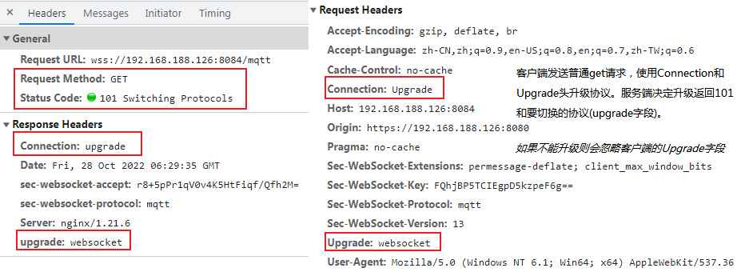

<!-- START doctoc generated TOC please keep comment here to allow auto update -->
<!-- DON'T EDIT THIS SECTION, INSTEAD RE-RUN doctoc TO UPDATE -->
<!-- **Table of Contents**  *generated with [DocToc](https://github.com/thlorenz/doctoc)* -->

- [http 基础](#http-%E5%9F%BA%E7%A1%80)
  - [TCP 和 UDP 的简述](#tcp-%E5%92%8C-udp-%E7%9A%84%E7%AE%80%E8%BF%B0)
  - [HTTP 概述](#http-%E6%A6%82%E8%BF%B0)
  - [HTTP 消息/报文(Messages)](#http-%E6%B6%88%E6%81%AF%E6%8A%A5%E6%96%87messages)
  - [HTTP 的发展](#http-%E7%9A%84%E5%8F%91%E5%B1%95)
  - [HTTP/1.x 的连接管理](#http1x-%E7%9A%84%E8%BF%9E%E6%8E%A5%E7%AE%A1%E7%90%86)
  - [协议升级机制](#%E5%8D%8F%E8%AE%AE%E5%8D%87%E7%BA%A7%E6%9C%BA%E5%88%B6)

<!-- END doctoc generated TOC please keep comment here to allow auto update -->

# http 基础

## TCP 和 UDP 的简述

**TCP/IP 是指能够在多个不同网络间实现信息传输的协议簇。**里面包括不同网络层的很多的协议，其中 TCP 协议和 IP 协议最具代表性，所以被称为`TCP/IP`协议。

TCP/IP 通常被认为是一个四层协议系统,每一层负责不同的功能。

- **链路层**: 通常包括操作系统中的设备驱动程序和计算机中对应的网络接口卡。它们一起处理与电缆（或其他任何传输媒介）的物理接口细节。
- **网络层**: 有时也称作互联网层，处理分组在网络中的活动
  - 网络层协议: 包括`IP`协议(网际协议)，`ICMP`协议(Internet 互联网控制报文协议)，以及`IGMP`协议(Internet 组管理协议)。
- **传输层**: 主要为两台主机上的应用程序提供端到端的通信。传输层协议: `TCP`(传输控制协议)和`UDP`(用户数据报协议)。
- **应用层**: 负责处理特定的应用程序细节:
  - 常见应用层协议: `HTTP`超文本传输协议;`Telnet`远程登录;`FTP`文件传输协议;`SMTP`简单邮件传送协议;`SNMP`简单网络管理协议。

**TCP** 为两台主机提供**高可靠性**的数据通信。它所做的工作包括把应用程序交给它的数据分成合适的小块交给下面的网络层，确认接收到的分组，设置发送最后确认分组的超时时钟等。_由于传输层提供了高可靠性的端到端的通信，因此**应用层可以忽略所有**这些细节_。

**UDP** 则为应用层提供一种非常**简单**的服务。它只是把称作数据报的分组从一台主机发送到另一台主机，但并不保证该数据报能到达另一端。_任何必需的可靠性必须由应用层来提供_。

**主要区别** TCP: 面向连接、传输可靠、传输大量数据、速度慢；UDP: 无连接、传输不可靠、传输少量数据、速度快

**面向连接**是一种网络协议,依赖发送方和接收器之间的显示通信和阻塞以管理双方的数据传输.

(直白的说，tcp 需要发送方接收方建立起连接之后(三次握手)进行数据有序传输，udp 知道端口后就直接发送，也不管成没成功)

**队头阻塞**在计算机网络的范畴中是一种性能受限的现象。它的原因是**一列的第一个数据包（队头）受阻而导致整列数据包受阻**。

**TCP 队头阻塞**（Head-of-line blocking）

TCP 是一个可靠的传输协议，基本上，可以将它视为在两台计算机间建立的一个虚拟链路，由一端放到网络上的内容，最终总会以相同的顺序出现在另一端。（或者遭遇连接中断）。
采用 HTTP/2 时，浏览器一般会*在单个 TCP 连接中创建并行的几十个乃至上百个传输*(多路复用)。

如果 HTTP/2*连接双方的网络中有一个数据包丢失，或者任何一方的网络出现中断，整个 TCP 连接就会暂停，丢失的数据包需要被重新传输*。**因为 TCP 是一个按序传输的链条，因此如果其中一个点丢失了，链路上之后的内容就都需要等待。**

这种单个数据包造成的阻塞，就是 TCP 上的队头阻塞（head of line blocking）。随着丢包率的增加，HTTP/2 的表现越来越差。

**`URI`**(Uniform Resource Identifier)代表统一资源标识符。**`URL`**（统一资源定位符 Locator）是一种常见的 URI（可狭义认为就是网址）。

## HTTP 概述

**定义与简介**

**超文本传输协议（Hypertext Transfer Protocol.HTTP）是一个用于传输超媒体文档（例如 HTML）的应用层协议。**

- 一个完整的 Web 文档通常是由不同的子文档拼接而成的，像是文本、布局描述、图片、视频、脚本等等。
- 它是为**Web 浏览器与 Web 服务器之间的通信**而设计的，但也可以用于其他目的。
- HTTP 遵循经典的**client-server 模型**，客户端打开一个连接以发出请求，然后等待直到收到服务器端响应。
  - 客户端发出的消息叫做 request，被服务端响应的消息叫做 response。
  - _请求通过一个实体(entity)被发出，实体也就是用户代理(user agent,大多数情况下都是指浏览器，也可能是任何东西)_。
  - _每一个发送到服务器的请求，都会被服务器处理并返回一个消息_，也就是 response。
  - 在这个*请求与响应之间*，还有许许多多的被*称为 proxies 的实体*，他们的作用与表现各不相同，比如有些是网关，还有些是 caches 等。
- HTTP 是**无状态协议**，这意味着*服务器不会在两个请求之间保留任何数据（状态*）。
- 尽管通常**基于 TCP/IP 层**，但它*可以在任何可靠的传输层上使用*，也就是说，该协议不会像 UDP 那样静默的丢失消息。
- RUDP——作为 UDP 的可靠化升级版本——是一种合适的替代选择。

**基于 HTTP 的组件系统**

{width=50%}

实际上，在一个浏览器和处理请求的服务器之间，还有路由器、调制解调器等许多计算机。  
由于 Web 的层次设计，那些在网络层和传输层的细节都被隐藏起来了。  
HTTP 位于最上层的应用层。虽然底层对于分析网络问题非常重要，但是大多都跟对 HTTP 的描述不相干。

**客户端 user-agent**: 就是任何能够为用户发起行为的工具。这个角色通常都是由浏览器来扮演。

- 浏览器**总是**作为发起一个请求的实体，他永远不是服务器
- 要展现一个网页，
  - 浏览器首先发送一个请求来获取页面的 HTML 文档，
  - 再解析文档中的资源信息发送其他请求，获取可执行脚本或 CSS 样式来进行页面布局渲染，以及一些其它页面资源（如图片和视频等）。
  - 然后，浏览器将这些资源整合到一起，展现出一个完整的文档，也就是网页。
  - 浏览器执行的脚本可以在之后的阶段获取更多资源，并相应地更新网页。
- 一个网页就是一个超文本文档。点击链接可以获取一个新的网页，浏览器再发起 HTTP 请求并解析处理服务器返回。

**Web 服务端 Server**: 提供客户端所请求的文档。

- Server 只是虚拟意义上代表一个机器：
  - 它可以是共享负载（负载均衡）的一组服务器组成的计算机集群，
  - 也可以是一种复杂的软件，通过向其他计算机（如缓存，数据库服务器，电子商务服务器 ...）发起请求来获取部分或全部资源。
- Server 不一定是一台机器，但一个机器上可以装载的众多 Servers。在 `HTTP/1.1` 和 Host 头部中，它们甚至可以共享同一个 IP 地址。

**代理（Proxies）**:代理服务器是用来在不同 Internet 网络之间进行导航的中继软件或者计算机。

- 在浏览器和服务器之间，有许多`计算机和其他设备`转发了 HTTP 消息。
- 由于 Web 栈层次结构的原因，它们大多都出现在`传输层、网络层和物理层`上，对于 HTTP 应用层而言就是透明的，虽然它们可能会对应用层性能有重要影响。
- 还有一部分是`表现在应用层上`的，被称为代理（Proxies）。代理主要有如下几种作用：
  - 缓存（可以是公开的也可以是私有的，像浏览器的缓存）
  - 过滤（像反病毒扫描，家长控制...）
  - 负载均衡（让多个服务器服务不同的请求）
  - 认证（对不同资源进行权限管理）
  - 日志记录（允许存储历史信息）

**HTTP 的基本性质**

- HTTP 是简单的: `HTTP`大体上还是被设计得简单易读。`HTTP报文`能够被人读懂，还允许简单测试，降低了门槛。
- HTTP 是可扩展的: `HTTP头`让协议扩展变得非常容易。只要服务端和客户端就`新headers`达成语义一致，新功能就可以被加入进来。
- HTTP 是无状态: _在同一个连接中，两个执行成功的请求之间是没有关系的_。
- HTTP 有会话的: 使用`HTTP`头部扩展，把`Cookies`添加到头部中，创建一个会话让每次请求都能共享相同的上下文信息，达成相同的状态。
  - _HTTP 本质是无状态的，使用 Cookies 可以创建有状态的会话。_
- HTTP 和连接: 一个连接是由传输层来控制的，这从根本上不属于 HTTP 的范围。
  - HTTP 并不需要其底层的传输层协议是面向连接的，只需要它是可靠的，或不丢失消息的（至少返回错误）
  - 两个最常用的传输层协议`TCP`是可靠的，而`UDP`不是。_因此`HTTP`依赖于面向连接的`TCP`进行消息传递，但连接并不是必须的。_
  - `HTTP/1.0` 默认为每一对 `HTTP` 请求/响应*都打开一个单独*的 `TCP` 连接。
    - 当需要连续发起多个请求时，这种模式比多个请求共享同一个 `TCP` 链接更低效。
  - `HTTP/1.1` 引入了`流水线`（被证明难以实现）和持久连接的概念：_底层的`TCP`连接可以通过`Connection`头部来被部分控制_。
  - `HTTP/2` 则发展得更远，通过在一个连接**复用消息**的方式来让这个连接始终保持为暖连接。
  - Google 研发了一种以 UDP 为基础，能提供更可靠更高效的传输协议 [QUIC](https://en.wikipedia.org/wiki/QUIC)。

**HTTP 流水线**（英语：HTTP pipelining）是*将多个` HTTP` 请求（request）整批提交的技术，而在发送过程中不需先等待服务器的回应。*  
在宽带连接中，加速不是那么显著的，_因为需要服务端要遵循 `HTTP/1.1` 协议，必须按照客户端发送的请求顺序来回复请求_，这样**整个连接还是先进先出**的，_队头阻塞（HOL blocking）可能会发生，造成延迟_。(wiki)

**HTTP 流(Flow)**

当*客户端想要和服务端进行信息交互时*（服务端是指最终服务器，或者是一个中间代理），过程表现为下面几步:

1. **打开一个 TCP 连接**：TCP 连接被用来发送一条或多条请求，以及接受响应消息。客户端可能打开一条新的连接，或重用一个已经存在的连接，或者也可能开几个新的 TCP 连接连向服务端。
2. **发送一个 HTTP 报文**：HTTP 报文（在 HTTP/2 之前）是语义可读的。在 HTTP/2 中，这些简单的消息被封装在了**帧(frame)**中，这使得报文不能被直接读取，但是原理仍是相同的。(客户端和服务器会完成必要的分帧工作，所以浏览器工具中看到的请求中能明白内容)
3. **读取服务端返回的报文信息**
4. **关闭连接或者为后续请求重用连接。**

**基于 HTTP 的 APIs**: 的最常用 API 是 [XMLHttpRequest API](https://developer.mozilla.org/zh-CN/docs/Web/API/XMLHttpRequest)和[Fetch API](https://developer.mozilla.org/zh-CN/docs/Web/API/Fetch_API)，可用于在 user agent 和服务器之间交换数据。

**典型的 HTTP 会话**

在像 HTTP 这样的 Client-Server（客户端 - 服务器）协议中，会话分为三个阶段：

1. 客户端建立一条 TCP 连接（如果传输层不是 TCP，也可以是其他适合的连接）。
2. 客户端发送请求并等待应答。
3. 服务器处理请求并送回应答，回应包括一个状态码和对应的数据。

从 HTTP/1.1 开始，连接在完成第三阶段后不再关闭，客户端可以再次发起新的请求。这意味着第二步和第三步可以连续进行数次。  
(早期协议的连接复用可能有些性能代价)

## HTTP 消息/报文(Messages)

**HTTP 消息是服务器和客户端之间交换数据的方式**。  
有两种类型的消息: 请求（requests）由客户端发送用来触发一个服务器上的动作；响应（responses）来自服务器的应答。

**HTTP 消息由采用 ASCII 编码的多行文本构成**。  
在`HTTP/1.1`及早期版本中，这些消息通过连接**公开**地发送。在`HTTP/2`中，为了优化和性能方面的改进，可人工阅读的消息被分到多个`HTTP`帧中。

**这些原始的`HTTP`消息由软件、浏览器、代理或服务器完成**。通过配置文件(用于代理或服务器)、`API`(用于浏览器)或其他接口提供`HTTP`消息。

**HTTP 请求和响应具有相似的结构**，由以下部分组成︰

- 一行起始行用于描述要执行的请求，或者是对应的状态，成功或失败。这个起始行总是单行的。
- 一个可选的 HTTP 头集合指明请求或描述消息正文。
- 一个空行指示所有关于请求的元数据已经发送完毕。
- 一个可选的包含请求相关数据的正文 (比如 HTML 表单内容), 或者响应相关的文档。正文的大小有起始行的 HTTP 头来指定。

起始行和 HTTP 消息中的 HTTP 头统称为请求头，而其有效负载被称为消息正文。

**HTTP request 的组成**(start-line、Headers、Body)

- 起始行(start-line)包含三个元素: 一个`HTTP`方法、请求目标(通常是一个`URL`，或者是协议、端口和域名的绝对路径)`HTTP`版本信息。
  - **一个 HTTP 的 method**，经常是由一个动词像 GET, POST 或者一个名词像 OPTIONS，HEAD 来*定义客户端的动作行为*。
  - **要获取的资源的路径**，通常是上下文中就很明显的元素资源的 URL。不包括 protocol、domain、port。**请求的格式**:
    - _原始形式_ (origin form):_一个绝对路径，末尾跟上一个`?`和查询字符串_。`GET`，`POST`，`HEAD`和`OPTIONS`方法所使用。
    - _绝对形式_ (absolute form):_一个完整的 URL_。主要在使用 `GET` 方法连接到代理时使用。
    - 授权形式(_authority form_):_一个 URL 的授权组件由域名和可选的端口组成_。仅在使用`CONNECT`建立`HTTP`隧道时才使用。
    - _星号形式_ (asterisk form):_一个简单的星号 ('\*')_。配合 `OPTIONS` 方法使用，_代表整个服务器_。
  - **HTTP 协议版本号**: 定义了剩余报文的结构，作为对期望的响应版本的指示符。
- 为服务端表达其他信息的**可选头部 headers**。
  - 请求头(http header)基本结构:**不区分大小写的字符串**，紧跟着的冒号`:`和一个结构取决于 header 的值。
    - 整个 header（包括值）由一行组成，这一行可以相当长。
  - 有许多请求头可用，它们可以分为几组:
    - General headers: _适用于整个报文_。例如 Via，
    - Request headers: _通过进一步的定义，或者给定上下文，或者进行有条件的限制来修改请求_。
      - 例如 Accept-Language、Referer、If-None
    - Representation headers: _适用于请求的 body_。如果请求中没有任何 body，则不会发送这样的头文件。
      - 例如`Content-Length`。
- **body**: 对于一些像 POST 这样的方法，_报文的 body 就包含了发送的资源，这与响应报文的 body 类似。_ **大致可分为两类**：
  - Single-resource bodies，由**一个单文件**组成。
    - 该类型 body 由两个 header 定义:`Content-Type`和`Content-Length`.
  - Multiple-resource bodies，由**多部分 body** 组成，每一部分包含不同的信息位。通常是和 HTML Forms 连系在一起。
    - 不是所有的请求都有一个 body：例如获取资源的请求，GET，HEAD，DELETE 和 OPTIONS，通常它们不需要 body。

**HTTP response 的组成**(status line、Headers、Body)

- 状态行: HTTP 响应的起始行被称作 状态行 (status line)，典例`HTTP/1.1 404 Not Found`,包含以下信息：
  - **协议版本**，通常为 `HTTP/1.1`。
  - **状态码** (status code)，来告知对应请求执行成功或失败，以及失败的原因。常见的状态码是 200，404，或 302。
  - **状态文本** (status text)。一个简短的，纯粹的信息，通过状态码的文本描述，帮助人们理解该 HTTP 消息。
- Headers: 响应的`HTTP headers`遵循和任何其它 header 相同的结构(参看 request 的 headers)。**响应头可以分为几组**:
  - General headers:_适用于整个报文_。例如 `Via`，
  - Response headers:*提供其它不符合状态行的关于服务器的信息。*例如 `Vary` 和 `Accept-Ranges`，
  - Representation header:_适用于请求的 body_。例如 `Content-Length`，如果请求中没有任何 body，则不会发送这样的头文件。
- Body:响应的最后一部分是 body。不是所有的响应都有 body：_具有状态码 (如 201 或 204) 的响应，通常不会有 body。_
  - Single-resource bodies，由**已知**长度的单个文件组成。该类型 body 由两个 header 定义：Content-Type 和 Content-Length。
  - Single-resource bodies，由**未知**长度的单个文件组成，通过将 Transfer-Encoding 设置为 chunked 来使用 chunks 编码。
  - Multiple-resource bodies，由**多部分 body** 组成，每部分包含不同的信息段。但这是比较少见的。

**HTTP/2 帧 (Frames)**

- HTTP/1.x 报文有一些性能上的缺点：
  - Header 不像 body，它不会被压缩。
  - 两个报文之间的 header 通常非常相似，但它们仍然在连接中重复传输。
  - 无法复用。当在同一个服务器打开几个连接时：TCP 热连接比冷连接更加有效。
- HTTP/2 引入了一个额外的步骤：**它将 HTTP/1.x 消息分成帧并嵌入到流 (stream) 中**。
  - 数据帧和报头帧分离，这将允许报头压缩。
  - 将多个流组合，这是一个被称为 _多路复用_ (multiplexing) 的过程，它允许更有效的底层 TCP 连接。
  - 这是一个在 `HTTP/1.1` 和底层传输协议之间附加的步骤，Web 开发人员不需要在其使用的 API 中做任何更改。

**总结: HTTP 报文是使用 HTTP 的关键；它们的结构简单，并且具有高可扩展性。HTTP/2 帧机制是在 HTTP/1.x 语法和底层传输协议之间增加了一个新的中间层，而没有从根本上修改它，即它是建立在经过验证的机制之上。**

## HTTP 的发展

**万维网的发明**

万维网（*World Wide Web）。*它在现有的 TCP 和 IP 协议基础之上建立，由四个部分组成：

- 一个用来表示超文本文档的**文本格式**，超文本标记语言（HTML）。
- 一个用来交换超文本文档的**简单协议**，超文本传输协议（HTTP）。
- 一个显示（以及编辑）超文本文档的客户端，即**网络浏览器**。第一个网络浏览器被称为 WorldWideWeb。
- 一个**服务器**用于提供可访问的文档，即 httpd 的前身。

**HTTP/0.9 – 单行协议**

- 最初版本的 HTTP 协议并没有版本号，后来它的版本号被定位在 0.9 以区分后来的版本。
- HTTP/0.9 极其简单：**请求由单行指令构成，以唯一可用方法 GET 开头，其后跟目标资源的路径**。
  - 一旦连接到服务器，协议、服务器、端口号这些都不是必须的。
- HTTP/0.9 的响应内容并**不包含 HTTP 头**，这意味着只有 HTML 文件可以传送，无法传输其他类型的文件；
- **也没有状态码或错误代码**：一旦出现问题，一个特殊的包含问题描述信息的 HTML 文件将被发回，供人们查看。

**HTTP/1.0 – 构建可扩展性**

由于 HTTP/0.9 协议的应用十分有限，浏览器和服务器迅速扩展内容使其用途更广：

- **协议版本信息**现在会随着每个请求发送（HTTP/1.0 被追加到了 GET 行）。
- **状态码**会在响应开始时发送，使浏览器能了解请求执行成功或失败，并相应调整行为（如更新或使用本地缓存）。
- 引入了 **HTTP 头**的概念，无论是对于请求还是响应，允许传输元数据，使协议变得非常灵活，更具扩展性。
- 在新 HTTP 头的帮助下，具备了传输除纯文本 HTML 文件以外**其他类型文档**的能力（凭借 Content-Type 头）。

**HTTP/1.1 – 标准化的协议**

HTTP/1.1 消除了大量歧义内容并引入了多项改进：

- 连接可以复用，节省了多次打开 TCP 连接加载网页文档资源的时间。
- 增加管线化技术，允许在第一个应答被完全发送之前就发送第二个请求，以降低通信延迟。
  - **HTTP/1.1 链接需要请求以正确的顺序发送**，理论上可以用一些并行的链接（尤其是 5 到 8 个），带来的成本和复杂性堪忧。比如，HTTP 管线化（pipelining）就成为了 Web 开发的负担。
- 支持**响应分块**。
- 引入额外的**缓存控制机制**。
- 引入**内容协商机制**，包括语言，编码，类型等，并允许客户端和服务器之间约定以最合适的内容进行交换。
- 凭借 **Host 头**，能够使不同域名配置在同一个 IP 地址的服务器上。

**HTTP 用于安全传输**

- _HTTP 在基本的 TCP/IP 协议栈上发送信息_，网景公司在此基础上创建了一个*额外的加密传输层：SSL。*
- SSL 2.0 及其后继者 SSL 3.0 和 SSL 3.1 _允许通过加密来保证服务器和客户端之间交换消息的真实性_。
- _SSL 在标准化道路上最终成为 TLS_，随着版本 1.0, 1.1, 1.2 的出现成功地关闭漏洞。

**HTTP 用于复杂应用**

- REST(使用`HTTP`的模式): 由`API`发起的操作不再通过新的`HTTP`方法传达，而只能通过使用基本的`HTTP/1.1`方法访问特定的`URI`。
- 几个可用于 Web 页面的 API 为特定目的**扩展了 HTTP 协议**，大部分是新的特定 HTTP 头：
  - [Server-sent events](https://developer.mozilla.org/zh-CN/docs/Web/API/Server-sent_events)，服务器可以偶尔推送消息到浏览器。
  - [WebSocket](https://developer.mozilla.org/zh-CN/docs/Web/API/WebSockets_API)，一个新协议，可以通过升级现有 HTTP 协议来建立。

**HTTP/2 - 为了更优异的表现**

这些年来，网页愈渐变得的复杂，_更多的数据通过 HTTP 请求被传输_。谷歌通过实践了一个实验性的 SPDY 协议成为了 HTTP/2 协议的基础。

HTTP/2 在 HTTP/1.1 有几处基本的不同：

- HTTP/2 是**二进制协议**而不是文本协议。不再可读，也不可无障碍的手动创建，改善的优化技术现在可被实施。
- 这是一个**复用协议**。并行的请求能在同一个链接中处理，移除了 HTTP/1.x 中顺序和阻塞的约束。
- **压缩了 headers**。因为 headers 在一系列请求中常常是相似的，其移除了重复和传输重复数据的成本。
- 它**允许服务器**通过一种称为服务器推送的机制来**填充客户端缓存**中的数据。

**HTTP/2 在单个 TCP 连接上使用了多路复用，受到 TCP 拥塞控制的影响，少量的丢包就可能导致整个 TCP 连接上的所有流被阻塞。**

*多路复用*通常表示在一个信道上传输多路信号或数据流的过程和技术。  
*拥塞控制*是一种用来调整 TCP 连接单次发送的分组数量的算法。它*通过增减单次发送量逐步调整，使之逼近当前网络的承载量*。  
计算机网络是共享的，*流量控制*避免的是发送方填满接收方的*空闲空间*，而*拥塞控制*是避免发送方填满*整个网络*。  
_拥塞控制算法_:慢启动、拥塞避免、拥塞发生、快速恢复

**HTTP/3 - 基于 QUIC 的 HTTP**

`HTTP/3` 与早期版本的`HTTP`具有相同的语义，但在**传输层部分使用`QUIC`**而不是`TCP`。此变化主要为了解决`HTTP/2`中存在的队头阻塞问题。

- QUIC 旨在为 HTTP 连接提供更低的延迟。
- 与 HTTP/2 一样，它是一个多路复用协议，但 _HTTP/2 运行在单个 TCP 连接上_，因此 **TCP 层处理的丢包检测和重传可以阻止所有流**。
- _QUIC 在 UDP 上运行多个流_，并**为每个流独立实现丢包检测和重传**，这样如果发生错误，只会阻塞该数据包中包含数据的流。

## HTTP/1.x 的连接管理

连接管理(Connection management)是一个 HTTP 的关键话题：_打开和保持连接在很大程度上影响着网站和 Web 应用程序的性能。_  
在 HTTP/1.x 里有多种模型：短连接, 长连接, 和 HTTP 流水线。HTTP/2 新增了其它连接管理模型。

**短连接**: 每发起一个请求时都会创建一个新的连接，并在收到应答时立即关闭。

- 发起每一个 HTTP 请求之前都会有一次 TCP 握手，而且是连续不断的。
- **TCP 协议握手本身就是耗费时间的**，所以 TCP 可以保持更多的热连接来适应负载。
  - 短连接破坏了 TCP 具备的能力，_新的冷连接降低了其性能_。
- 这是 HTTP/1.0 的默认模型 (如果没有指定 Connection 协议头，或者是值被设置为 close)。
  - 而*在 HTTP/1.1 中，只有当 Connection 被设置为 close 时才会用到这个模型*。
- **短连接有两个比较大的问题**：创建新连接耗费的时间尤为明显;TCP 连接的性能只有在该连接被使用一段时间后(热连接)才能得到改善。

**长连接**: 保持连接去完成多次连续的请求，减少了不断重新打开连接的时间。

- 一个*长连接会保持一段时间，重复用于发送一系列请求*，**节省了新建 TCP 连接握手的时间，还可以利用 TCP 的性能增强能力。**
- 这个连接也不会一直保留着：_连接在空闲一段时间后会被关闭_ (服务器可以使用 Keep-Alive 协议头来指定一个最小的连接保持时间)。
- **长连接缺点**: 就算是在空闲状态，它还是会消耗服务器资源，而且在重负载时，还有可能遭受 DoS attacks 攻击。
  - 这种场景下，可以使用非长连接，即尽快关闭那些空闲的连接，也能对性能有所提升。
- `HTTP/1.0`里默认并不使用长连接。把 Connection 设置成 **close 以外的其它参数**都可以让其保持长连接，通常会设置为`retry-after`。
- `HTTP/1.1`里**默认就是长连接**的，协议头都不用再去声明它(为了出现某种需要倒回到 HTTP/1.0 的情况所以也加上头) 。

**HTTP 流水线(pipelining)**

- **默认情况下，HTTP 请求是按顺序发出的。下一个请求只有在当前请求收到应答过后才会被发出。**
  - 由于会受到网络延迟和带宽的限制，在下一个请求被发送到服务器之前，可能需要等待很长时间。
- **流水线是在同一条长连接上发出连续的请求，而不用等待应答返回。**这样可以避免连接延迟。
  - 理论上讲，性能还会因为*两个 HTTP 请求有可能被打包到一个 TCP 消息包中*而得到提升。
- _并不是所有类型的 HTTP 请求都能用到流水线_：只有幂等的方法，比如 GET、HEAD、PUT 和 DELETE 能够被安全的重试：
  - 如果有故障发生时，流水线的内容要能被轻易的重试。
- 在现代浏览器中并**不是**默认被启用的(**缺陷**):
  - Web 开发者无法轻易预见和诊断，那些导致了奇怪和不稳定的行为的有问题的代理。
  - 正确的实现流水线是复杂的: 要理清传输中的资源大小，多少有效的[RTT](https://en.wikipedia.org/wiki/Round-trip_delay)会被用到，还有有效带宽，流水线带来的改善有多大的影响范围。(_因此 HTTP 流水线在大多数情况下带来的改善并不明显_。)
  - 流水线受制于 HOL (队头堵塞)问题。已经被更好的算法给代替，如 多路复用(multiplexing)，已经用在 HTTP/2。

## 协议升级机制

HTTP 协议 提供了一种特殊的机制，这一机制**允许将一个已建立的连接升级成新的、不相容的协议**。  
常来说这一机制*总是由客户端(也有例外,例如由服务端发起升级到 TLS)发起的，服务端可以选择是否要升级到新协议*。  
借助这一技术，连接可以以常用的协议启动（如 HTTP/1.1），随后再升级到 HTTP2 甚至是 WebSockets。  
**注意：HTTP/2 明确禁止使用此机制，这个机制只属于 HTTP/1.1。**

**升级 HTTP/1.1 的链接**:(例如升级到 HTTP2(反之不行)、websocket、TLS/1.0)

- 当**客户端试图升级到一个新的协议**时，可以先发送一个普通的请求（GET，POST 等），不过这个请求需要进行特殊配置以包含升级请求。需要添加两项额外的 header:
  - `Connection: Upgrade`: 设置 Connection 头的值为 "Upgrade" 来指示这是一个升级请求。
  - `Upgrade: <protocols>`: Upgrade 头指定一项或多项协议名，按优先级排序，以逗号分隔。
- 如果**服务器决定升级这次连接**，就会*返回一个 101 Switching Protocols 响应状态码，和一个要切换到的协议的头部字段 Upgrade。*
- 如果**服务器没有(或者不能)升级**这次连接，它*会忽略客户端发送的 "Upgrade 头部字段*，返回一个常规的响应：例如一个 200 OK).
- _服务在发送 101 状态码之后，就可以使用新的协议_，并可以根据需要执行任何其他协议指定的握手。

如果使用用 [WebSocket API](https://developer.mozilla.org/zh-CN/docs/Web/API/WebSocket) 以及其他大部分实现 WebSockets 的库去建立 WebSocket 连接时，基本上都不用操心升级的过程，因为这些 API 已经实现了这一步。_`WebSocket()` 构造函数已经自动完成了发送初始 HTTP/1.1 请求，处理握手及升级过程。_

