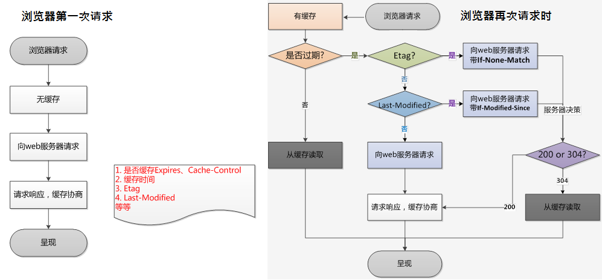

# 浏览器缓存机制和 HTTP 缓存

**【几个区分】**

**浏览器缓存**其实就是浏览器保存通过 HTTP 获取的所有资源,是浏览器将网络资源存储在本地的一种行为。

**浏览器缓存机制也就是 HTTP 缓存机制**是 根据 HTTP 报文的缓存标识进行的。

**HTTP 缓存**:浏览器可以在内存、硬盘中开辟一个空间用于保存请求资源副本。从*缓存位置*来看，如果命中则使用缓存，否则发起请求。优先级:

- **[Service Worker](https://developer.mozilla.org/zh-CN/docs/Web/API/Service_Worker_API)** 是运行在浏览器背后的独立线程，一般可以用来实现缓存功能。使用 Service Worker 的话，传输协议必须为 HTTPS。
- **Memory Cache** 也就是内存中的缓存，主要包含的是当前中页面中已经抓取到的资源，读取高效。但关闭 Tab 页面，内存中的缓存也就被释放了。
- **Disk Cache** 也就是存储在硬盘中的缓存，读取速度慢点，但是什么都能存储到磁盘中，比之 Memory Cache 胜在容量和存储时效性上。
  - 绝大部分的缓存都来自 Disk Cache，_在 HTTP 的协议头中设置_。
  - 浏览器会在 js 和图片等文件解析执行后直接存入内存缓存中，当刷新页面时只需直接从内存缓存中读取(from memory cache)；
  - 而 css 文件则会存入硬盘文件中，所以每次渲染页面都需要从硬盘读取缓存(from disk cache)。
    - 因为 CSS 文件加载一次就可渲染出来,我们不会频繁读取它,所以它不适合缓存到内存中,但是 js 之类的脚本却随时可能会执行。
- **Push Cache（推送缓存）** 是 HTTP/2 中的内容，当以上三种缓存都没有命中时，它才会被使用。
  - 它只在会话（Session）中存在，一旦会话结束就被释放，并且缓存时间也很短暂，在 Chrome 浏览器中只有 5 分钟左右，
  - 同时它也并非严格执行 HTTP 头中的缓存指令。

**浏览器本地缓存**：cookie、localStroage、sessionStroage、webSql、IndexedDB 等

- sessionStorage 属性允许你访问一个 session Storage 对象，用于存储当前会话的数据，
  - 存储在 sessionStorage 里面的数据在页面会话结束时会被清除。
  - 页面会话在浏览器打开期间一直保持，并且重新加载或恢复页面仍会保持原来的页面会话。
- localStorage 属性允许你访问一个 Document 源(origin)的对象 Storage 用于存储当前源的数据，
  - 除非用户人为清除(调用 localStorage api 或则清除浏览器数据)， 否则存储在 localStorage 的数据将被长期保留。
- IndexedDB 就是浏览器提供的本地数据库，能够在客户端存储可观数量的结构化数据，并且在这些数据上使用索引进行高性能检索的 API。

**【缓存过程分析】**

浏览器与服务器通信的方式为应答模式，即是：**浏览器发起 HTTP 请求 – 服务器响应该请求**。那么浏览器第一次向服务器发起该请求后拿到请求结果，会根据响应报文中 HTTP 头的缓存标识，决定是否缓存结果，是则将请求结果和缓存标识存入浏览器缓存中。

- 1、浏览器每次发起请求，都会先在浏览器缓存中查找该请求的结果以及缓存标识
- 2、浏览器每次拿到返回的请求结果都会将该结果和缓存标识存入浏览器缓存中

根据*是否需要向服务器重新发起 HTTP 请求*将*缓存过程*分为两个部分，分别是*强制缓存*和*协商缓存* 。

**强制缓存(也称本地缓存)** 就是向浏览器缓存查找该请求结果，并根据该结果的缓存规则来决定是否使用该缓存结果的过程。

- 当浏览器向服务器发送请求的时候，服务器会将缓存规则放入 HTTP 响应的报文的 HTTP 头中和请求结果一起返回给浏览器，
- 控制强制缓存的字段分别是 Expires(HTTP/1.0) 和 Cache-Control(HTTP/1.1)，其中 Cache-Conctrol 的优先级比 Expires 高。
  - **Expires** 控制缓存的原理是使用客户端的时间与服务端返回的时间做对比。
    - 不足：如果客户端与服务端的时间由于某些原因发生误差，那么强制缓存直接失效，那么强制缓存存在的意义就毫无意义。
  - **Cache-Control** 主要取值:
    - **public**：所有内容都将被缓存（客户端和代理服务器都可缓存）
    - **private**：所有内容只有客户端可以缓存，Cache-Control 的默认取值
    - **no-cache**：客户端缓存内容，但是是否使用缓存则需要经过协商缓存来验证决定
    - **no-store**：所有内容都不会被缓存，即不使用强制缓存，也不使用协商缓存
    - **max-age=xxx** (xxx is numeric)：缓存内容将在 xxx 秒后失效

**协商缓存**就是强制缓存失效后，浏览器携带缓存标识向服务器发起请求，由服务器根据缓存标识决定是否使用缓存的过程。

- 协商缓存的标识也是在响应报文的 HTTP 头中和请求结果一起返回给浏览器的，
- 控制协商缓存的字段分别有：**Last-Modified/If-Modified-Since** 和 **Etag/If-None-Match**， 其中 Etag/If-None-Match 的优先级比 Last-Modified/If-Modified-Since 高。同时存在则只有 Etag/If-None-Match 生效。
  - **Last-Modified** 是服务器响应请求时，返回该资源文件在服务器最后被修改的时间。
    - 不足：最后修改只能精确到秒级;只要编辑了，不管内容是否真的有改变，都会以这最后修改的时间作为判断依据，当成新资源返回。
  - **If-Modified-Since** 则是客户端再次发起该请求时，*携带上次*请求返回的 _Last-Modified 值_，
    - 通过此字段值告诉服务器该资源上次请求返回的最后被修改时间。
    - 服务器收到该请求，发现请求头含有 If-Modified-Since 字段，则会根据 If-Modified-Since 的字段值与该资源在服务器的最后被修改时间做对比：
      - 若服务器的资源最后被修改时间大于 If-Modified-Since 的字段值，则重新返回资源，状态码为 200；
      - 否则则返回 304，代表资源无更新，可继续使用缓存文件。
  - **Etag** 是服务器响应请求时，返回当前资源文件的一个唯一标识(由服务器生成)
  - **If-None-Match** 是客户端再次发起该请求时，*携带上次*请求返回的唯一标识 _Etag 值_，
    - 通过此字段值告诉服务器该资源上次请求返回的唯一标识值。
    - 服务器收到该请求后，发现该请求头中含有 If-None-Match，则会根据 If-None-Match 的字段值与该资源在服务器的 Etag 值做对比:
      - 一致则返回 304，代表资源无更新，继续使用缓存文件；
      - 不一致则重新返回资源文件，状态码为 200。

**浏览器缓存过程总结**:_强制缓存优先于协商缓存进行_，若强制缓存(Expires 和 Cache-Control)生效则直接使用缓存，若不生效则进行协商缓存(Last-Modified / If-Modified-Since 和 Etag / If-None-Match)。协商缓存由服务器决定是否使用缓存，若协商缓存失效，那么代表该请求的缓存失效，重新获取请求结果，再存入浏览器缓存中；生效则返回 304，继续使用缓存。

**【用户操作对缓存影响】**

- **正常操作**： 地址栏输入 url，跳转链接，前进后退等。**强制缓存有效，协商缓存有效**。
- **手动刷新**： f5 ，点击刷新按钮，右键菜单刷新。**强制缓存失效，协商缓存有效**。
- **强制刷新**： ctrl + f5 ， shift + command + r 。**强制缓存失效，协商缓存失效**。(完全不使用缓存)

[**MDN 的【http 缓存】**](https://developer.mozilla.org/zh-CN/docs/Web/HTTP/Caching)

HTTP 缓存存储与请求关联的响应，并将存储的响应复用于后续请求。可复用的优点:

- 由于不需要将请求传递到源服务器，因此客户端和缓存越近，响应速度就越快。
- 当响应可复用时，源服务器不需要处理请求——因为它不需要解析和路由请求、根据 cookie 恢复会话、查询数据库以获取结果或渲染模板引擎。这减少了服务器上的负载。

在 HTTP Caching 标准中，有两种不同类型的缓存：**私有缓存**和**共享缓存**。

**私有缓存**是*绑定到特定客户端的缓存*——通常是浏览器缓存。由于存储的响应不与其他客户端共享，因此私有缓存可以存储该用户的个性化响应。

- 如果个性化内容存储在私有缓存以外的缓存中，那么其他用户可能能够检索到这些内容——这可能会导致无意的信息泄露。
- 如果响应包含个性化内容并且你只想将响应存储在私有缓存中，则必须指定 private 指令。`Cache-Control: private`
- 个性化内容通常由 cookie 控制，但 cookie 的存在并不能表明它是私有的，因此单独的 cookie 不会使响应成为私有的。
- **如果响应具有 Authorization 标头，则不能将其存储在私有缓存**（或共享缓存，除非指定了 public ）中。(项目显示`no-cache`)

**共享缓存**位于*客户端和服务器之间，可以存储能在用户之间共享的响应*。共享缓存可以进一步细分为**代理缓存**和**托管缓存**。

- **代理缓存**: 除了访问控制的功能外，一些代理还实现了缓存以减少网络流量。这通常不由服务开发人员管理，因此必须由恰当的 HTTP 标头等控制。随着 HTTPS 变得越来越普遍，客户端/服务器通信变得加密，在许多情况下，_路径中的代理缓存只能传输响应而不能充当缓存_。
- **托管缓存**: 由服务开发人员明确部署，以降低源服务器负载并有效地交付内容。示例包括反向代理、CDN 和 service worker 与缓存 API 的组合。
  - 托管缓存的特性因部署的产品而异。_在大多数情况下，可以通过 Cache-Control 标头和自己的配置文件或仪表板来控制缓存的行为_。
    - _HTTP 缓存规范本质上没有定义显式删除缓存的方法_——但是使用托管缓存，可以通过仪表板操作、API 调用、重新启动等实时删除已经存储的响应。这允许更主动的缓存策略。
    - _也可以忽略标准 HTTP 缓存规范协议以支持显式操作_。例如可以指定`Cache-Control: no-store`退出私有缓存或代理缓存，同时使用你自己的策略仅在托管缓存中进行缓存。

**启发式缓存**: HTTP 旨在尽可能多地缓存，因此即使没有给出 Cache-Control(但应该明确指出)，如果满足某些条件，响应也会被存储和重用。

存储的 HTTP 响应有两种状态：**fresh** 和 **stale**。_fresh_ 状态通常表示响应仍然有效，可以重复使用，而 _stale_ 状态表示缓存的响应*已经过期*。  
确定响应何时是 fresh 的和何时是 stale 的标准是 **age** 。在 HTTP 中，age 是自响应生成以来经过的时间(单位秒)。

响应示例`Cache-Control: max-age=604800`: 如果响应的 age 小于一周，则响应为 fresh。如果响应的 age 超过一周，则响应为 stale。

_Age 消息头里包含对象在缓存代理中存贮的时长，以秒为单位。_  
Age 的值通常接近于 0。表示此对象刚刚从原始服务器获取不久；其他的值则是表示代理服务器当前的系统时间与此应答中的通用头 Date 的值之差。

**【如何设定缓存】**

一般服务端设置，例如 node 等服务端设置

```shell
res.setHeader('Cache-Control', 'no-cache')
const crypto = require('crypto'); const hash = crypto.createHash('sha1').update(content).digest('hex')
res.setHeader('Etag', hash)
if(req.headers['if-none-match'] === hash){
  console.log('Etag协商缓存命中.....');res.statusCode = 304;res.end();return; }
```

nginx 通过 add_header 设置相对应的缓存策略，对于动态的 php 文件设置为不缓存:

```sh
location ~ .*\.php$ {
  if($request_uri !~ ^/dynamicimg/) {add_header Cache-Control "no-cache"; add_header Pragma no-cache;}}
```


