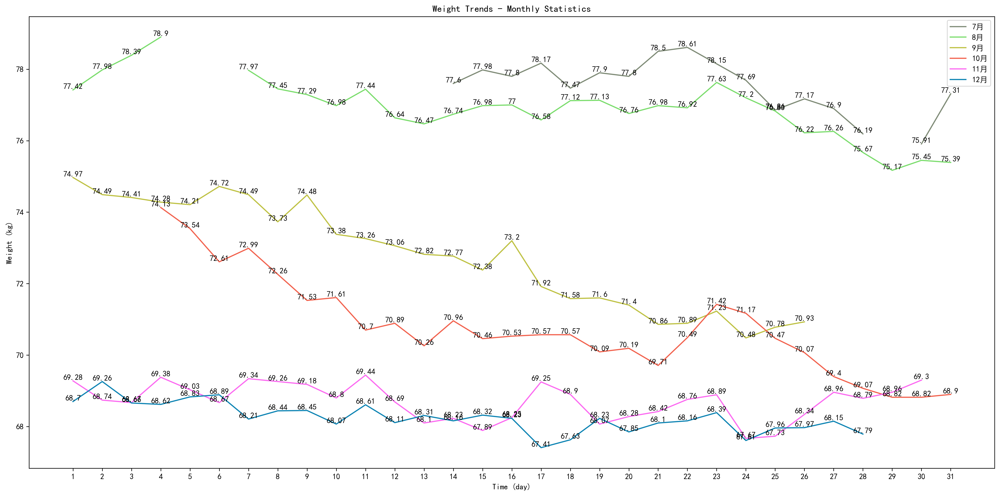
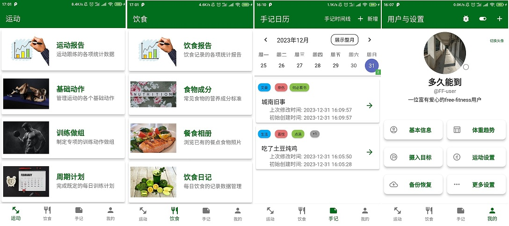
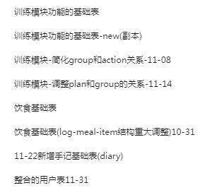
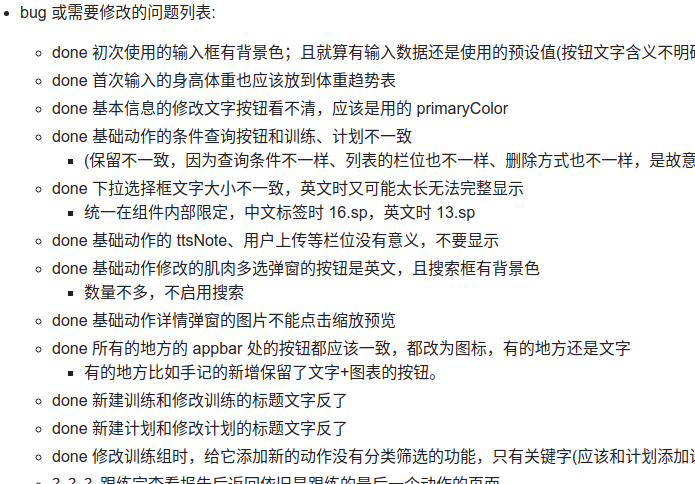
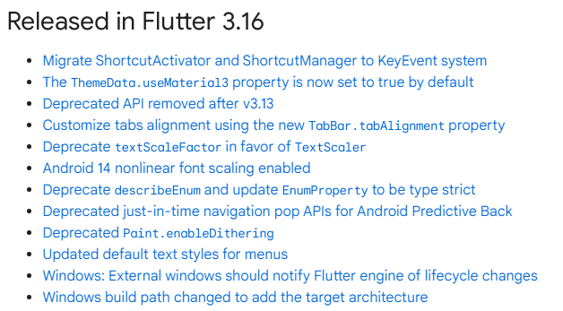
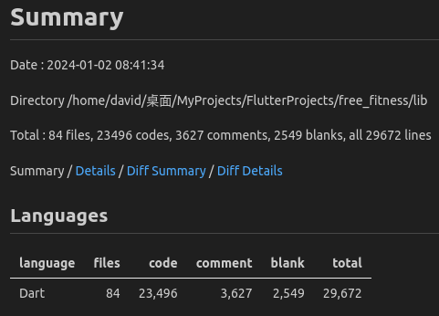

<!-- START doctoc generated TOC please keep comment here to allow auto update -->
<!-- DON'T EDIT THIS SECTION, INSTEAD RE-RUN doctoc TO UPDATE -->
<!-- **Table of Contents**  *generated with [DocToc](https://github.com/thlorenz/doctoc)* -->

- [应用开发背景](#%E5%BA%94%E7%94%A8%E5%BC%80%E5%8F%91%E8%83%8C%E6%99%AF)
- [应用功能简述](#%E5%BA%94%E7%94%A8%E5%8A%9F%E8%83%BD%E7%AE%80%E8%BF%B0)
- [实战经验分享](#%E5%AE%9E%E6%88%98%E7%BB%8F%E9%AA%8C%E5%88%86%E4%BA%AB)
  - [功能总是不完善](#%E5%8A%9F%E8%83%BD%E6%80%BB%E6%98%AF%E4%B8%8D%E5%AE%8C%E5%96%84)
  - [时间永远不够用](#%E6%97%B6%E9%97%B4%E6%B0%B8%E8%BF%9C%E4%B8%8D%E5%A4%9F%E7%94%A8)
  - [版本尽量别追新](#%E7%89%88%E6%9C%AC%E5%B0%BD%E9%87%8F%E5%88%AB%E8%BF%BD%E6%96%B0)
  - [想法一直都新鲜](#%E6%83%B3%E6%B3%95%E4%B8%80%E7%9B%B4%E9%83%BD%E6%96%B0%E9%B2%9C)
  - [做完依旧没搞懂](#%E5%81%9A%E5%AE%8C%E4%BE%9D%E6%97%A7%E6%B2%A1%E6%90%9E%E6%87%82)
  - [昨天不会再回来](#%E6%98%A8%E5%A4%A9%E4%B8%8D%E4%BC%9A%E5%86%8D%E5%9B%9E%E6%9D%A5)
- [总结](#%E6%80%BB%E7%BB%93)

<!-- END doctoc generated TOC please keep comment here to allow auto update -->

灵机一动，脑袋一拍，就稀里糊涂花了快 3 个月时间使用 flutter 开发了一个 Android App，临近终了却总感觉一无所获。既然技术没有问题，那多半是人出了问题。

# 应用开发背景

上一篇文章都是 4 个月前的事情了，那时候还在分享一些 Web 开发相关的内容，其实也有再继续写，甚至有的快写完了。但是人到壮年(泛指 30 ～ 44 岁的人类)就会突然有很多“入流”的想法，比如我就产生了要减肥的念头，虽然这个念头曾经多次浮现，但真正落实却几乎没有。事实上，我从 7 月 14 日(2023 年，下同)开始差不多每天在量体重，说不定冥冥之中，就已经开始做铺垫了。

简单概括一下之前减肥的过程：

- 8 月 6 日，我开始跟着在 Google Play 上找的“30 天内练出六块腹肌” app 练习一两节，但每天实际就动了 10 几分钟，所以毫无作用。
- 8 月 23 日，逐渐明白了塑形先减脂，明白了“热量差”，开始执行“少吃多动”，配合“FatSecret” app 记录每天的饮食摄入，估算大概的热量。
- 到 9 月 27 日国庆节回家前(有请年休)，成功减重大概 14 斤。但回家呆了 8 天，成功增重大概 7 斤。
- 10 月 4 日回到公司后开始继续减脂，到 10 月 12 日又减掉大概 6 斤。鉴于 BMI 已经在正常范围了，于是乎有了增肌的想法。
- 10 月 12 日之后就停止了运动且不再严格控制饮食、制造热量差(也就是不自己做饭，开始吃食堂或点外卖)，体重趋势大概如下:

说实话，尤其是使用 FatSecret 记录每餐摄入，加上一些其他什么减肥 app 的跟练，切实有效果，所以当 BMI 正常后，有了“不去健身房只是靠下班后零碎时间在家增肌”的想法，还是第一时间考虑找两个 app 跟着练，还经济实惠。下载了不下十个打着减肥、健身、腹肌之类标签的 app，综合体验下来，有几点不满意：一是广告很多，只要联过网就去不掉了；二是很多动作或者训练需要付费；三是几乎都不支持自己制定训练计划。所以一拍脑袋，那就自己开发一个 app 好了，有什么不满意的自己弄。

说干就干，本来想着计划一个月、但实际花费了大概 3 个月几乎所有的空闲时间，以及上班划水的时间(切勿模仿，理论来说，上班时间做自己的事情既不道德又有风险)，初步完成了这款使用 flutter3.16 开发带有运动跟练、每日饮食记录、随手记功能的 Android 端 app。也不算什么广告了，项目放在了 github 上: [Sanotsu/free-fitness](https://github.com/Sanotsu/free-fitness)，虽然只是拙劣地模仿，但是我觉得也算是满足了自用的需求。

中止了减脂的运动行为，尽可能的从控制饮食继续维持体重，花费了将近 3 个月的时间，写了 2 万多行代码。虽然东西不算特别有用，也不算什么正规项目，但是依旧想结合实际开发经历，分享一些这次使用 flutter 开发中的经验教训，尤其是一些开发过程中心态问题，希望能够给有心人提供一些帮助。

# 应用功能简述

_(之所以有这一节内容，是想说明的确是真实花费了 3 个月时间使用 flutter 写了一个 小项目，不是虚构的)_

简单说来这个 Free-Fitness 包含了减脂增肌人群或者为了保持健康的人群一般情况下可能是最常用到的两个行为：运动+饮食。如果觉得 app 自定的记录方式太麻烦，还可以想写笔记一样使用富文本编辑器自己添加手记，比如简单记录：今天跑了 5 公里，吃了一只烤鸡，或者任何别的什么。

**运动模块的主要划分**:

- **基础数据**

用户可以自己表单添加、或者按照指定 json 格式批量导入基础的运动动作，然后以此来制作训练组。比如添加了**动作**：坐姿举腿、卷腹、仰卧蹬车、坐姿转体，然后就创建一个“腹肌锻炼”的**训练**，添加这些动作，每个持续 30 秒，重复 5 组。如果动作足够多，训练足够多，甚至可以列一个**训练计划**：比如第一天“腹肌训练”，第二天“腿部训练”，第三天“胸部训练”……

- **训练跟练**

在选定某个训练或者某个计划的指定训练日后，其实就是一组配置好次数或者持续时间的动作，就可以点击“开始”进行跟练，跟着倒计时完成某个动作，然后休息，接着完成下一个动作，直到完成，当然可以跳过动作或者休息时间。完成之后则会添加训练日志，后续可能查看训练报告。

- **训练报告**

训练报告主要就是可以查看哪些天、做了哪些训练、花费了多少时间。实际上有设计卡路里消耗的统计，但这需要用户自行输入，比如完成一个标准的开合跳耗时 1 秒，消耗 0.1 卡路里，比较麻烦。真的在乎那个数值的话还是建议使用运动手环等比较专业的设备。

**饮食模块的主要划分**:

- **食物成分管理**

饮食记录的最主要内容就是食物的营养素信息，用户可以使用表单添加食物信息及其单份营养素信息，或者按照指定 json 格式批量导入。

- **饮食摄入记录**

按照一天四餐(早中晚和其他)，每餐可添加多条指定食物及其摄入量，还可以上传照片。当然餐次摄入内容和照片可以随时修改完善。

- **餐食照片管理**

为了方便，可以单独查看饮食相册，集中查看每天有上传的照片，记录每一餐的摄入。

- **饮食摄入报告**

根据记录的每天每餐食物摄入条目，统计每天每周的摄入概况，让用户可以较为直观的看到每天的摄入信息。

**其他功能**:

- **手记模块**
  - 使用富文本编辑器添加任意记录，支持添加图片。支持表格日历或时间线两种模式查看大体信息。
- **备份恢复**
  - 训练记录、饮食记录可以导出 pdf 文件。此外还可以把 app 内嵌的数据库所有数据进行导出，包括基础数据和日志数据，默认是多个 json 文件的压缩包。同样，再次使用 app 时可以恢复这些导出的 json 数据。
- **个人信息管理**
  - 可以添加个人体重记录、BMI 记录，设定每日饮食摄入的 RDA 目标数据等。
- **多用户**
  - 饮食记录、运动记录、手记、体重趋势记录等信息支持多用户管理，切换不同用户显示对应用户的数据，~~多个家庭成员可以用一个手机记录~~。
- **无需联网**
  - 所有数据都在 app 缓存中，除了数据导出和导入需要读写内部存取权限外，没有任何其他权限需求。不允许读写手机存取也不影响使用，只是无法导入导出而已。

其实还存在很多的问题，比如：

- 切换中英文后，弹窗的文字没有变，要有其他动作(比如点击)之后才改变为目标文字
  - 其中包括原生的日历等组件
- 中英文和深色主题不算完全适配
- 训练和计划的查询非常慢
- 很多数据库操作没有 trycatch 等检查检测操作
- 许多同样逻辑的代码但写得五花八门
- 很多没用的组件代码块还保留，注释的代码还保留，甚至 print 都还保留

可是是单纯想在 2023 年完成这篇文章吧，所以赶鸭子上架，后续会持续改进。

感兴趣更多内容可以去看[readme](https://github.com/Sanotsu/free-fitness)。

# 实战经验分享

结合项目开发中实际遇到一些问题，简单介绍一些经验，但可能更多变成了吐槽，全当看个乐。

## 功能总是不完善

- **首先得明确核心功能是什么，但可能不知道具体功能是什么**

其实一开始没觉得这项目有多难(实际业务也的确简单)，反正就只有一个主体想法：为了减肥，饮食 + 运动。更何况这不有两个长期使用的 app 可以直接“借鉴”吗，所以到底要做成什么样子，一开始我是不知道的。

健身跟练的核心就是有一个训练，包含一些动作，每个动作重复几次或者持续几十秒；如果有训练计划就是一组训练，按训练日指定完成某一组训练而已。饮食记录的核心更简单，就是记录一日四餐吃了哪些食物而已。

理论上，在数据库设计来讲，只是几个基础表配合两个日志表而已；从功能上来讲，就是基础表和日志表的增删改查而已。

实际上，我在抄的时候忽略了两个问题，1 是我没有这些 app 的核心要素，这些动作、训练、计划的数据，得全靠用户一个个添加；2 是别人的 app 的数据比如训练计划是指定好的，没有删除这一说法，我抄完了之后才发现我应该有删除的功能，那么哪些可以删，哪些不能删呢？

最后呢，好在是具有开源精神的同行很多，我找到了一个 [yuhonas/free-exercise-db](https://github.com/yuhonas/free-exercise-db) 的项目，整理好的动作 json 文件，所以我增加了一个导入的功能，满足这个 json 格式的都可以，用户除了一个个新增动作之外，也可以批量导入了。又重新设计了训练模块的基础表和日志表，日志表不再保存基础表的 id 这种关联关系，直接用冗余栏位设计，基础数据删除，日志不受影响。

而食物基础营养素的数据，没有什么特别好的办法，我是找到《中国食物成分表标准版第 6 版》的 pdf，将里面的“能量和食物一般营养成分”部分的表格进行截图，写一个 python 脚本，通过飞浆 OCR 表格识别，合并构建成 json 文件进行导入，参看[Sanotsu/china-food-composition-data](https://github.com/Sanotsu/china-food-composition-data)。用户除了手动添加食物营养素信息之外，也可以根据同样格式的 json 文件批量导入。

- **项目的功能不可能完全列示，也可能完全没法列示**

之所以说“不可能完全列示”，是因为播种不一定结果。虽然可能有完善的前置准备工作，比如什么需求报告、可行性分析、设计文档之类的，但是大多数的结果都是“图片仅供参考”，可能只有一个项目生命周期结束了，才会知道它最终结果是什么样子。

之所以说“可能完全没法列示”，是因为存在“yes or no”选择的是“or”的情况。就像有人说甲方不知道他想要什么，但是根据乙方的方案他可能知道自己不想要什么。

当然我这个小项目这方面的问题不大，一开始只是单纯想要可以自定义的跟练行为和记录饮食摄入，到目前为止核心功能也是如此。但不知道为什么光是数据库设计文档我就改了 6 版，而众所周知，数据库的改动算得上比较致命的改动之一了。

究其原因，还是因为一开始没有认真对待，总觉得我的核心功能明确，又有现成的 app 可借鉴，功能也不复杂，不会有什么难度。但我还是没想到会为此写两万行垃圾代码。也可能一个人的能力是有限的，如果能找伙伴头脑风暴一下，说不定就知道一些自己没有考虑到的地方。

- **个人建议**
  - 如果时间充足和条件允许，尽量了解整个项目的业务流程；
  - 在代码或者项目被验收之前，没有什么是简单的，都请认真对待；
  - 磨刀不误砍柴工，尽量知道自己到底在干什么。

不过实际的业务大部分不会是一个人完成的，对自己负责的东西了解更透彻些，说不定可以触类旁通。我个人认为光是领导怎么说就怎么做没什么问题，但是知道为什么要这么做就更好了。

## 时间永远不够用

- **时间预留得越充足，时间就越不够用**

一开始我觉得功能这么简单，一个月应该能搞得定。一天列好数据库栏位，一天复习一下 flutter，三五天一个功能模块，再随便点击测试一下功能，100 来个小时应该搞得定。可谁知道用个 ListView 一天都没搞定呢？

我记得就饮食记录的主页面，就一日 4 餐添加饮食摄入条目，看起来就一个 ListView 中 4 个 ListTile 显示早中晚小食 4 个餐次数据，每个 ListTile 有个 ExpansionTile，在 ExpansionTile 中再有个 Dismissible 管理每餐的饮食摄入条目列表，最下面多个按钮添加餐次的照片。外加上顶部的当日饮食摄入概述和下方的饼图显示摄入比例，大概是花了两个星期吧。

基本上每天的空余时间都在写，却越发发现一个月好像不太够啊，终于在某次突然发现右手手腕特别疼痛之后幡然顿悟，又没有人催进度，干嘛这么卖力？年前能做完就好，别过个春节之后忘记了烂尾了就不划算了。那个时候也就十一月初，而我感觉我快写完饮食模块了，没什么压力，可谁知道又持续过了一个多月没有锻炼的日子。

究其原因，和平时懒懒散散 deadline 临近效率倍增不同，我还是急于求成，想快速看到结果是什么样子，然后再慢慢考虑完善。所以我的代码中有很多"???"的标志，也就是待处理。我知道这里不合理，我知道可能要怎么搞，但先不慌，假装它不会出问题，最后再慢慢改。基于此，也有了下面那个问题。

- **马上就要结束了，意味着还要花费更长的时间**

也不一定是堆积了大量的小问题没解决才导致项目无法完结，有时候收尾本来就比较难，这我深有体会，因为我现在实际的公司的项目就是这么个情况。说是什么都准备好了，什么都完成了，但最重要的，国标没有定版，国标没有定版一切都不算是完成了。就算是企业有参与国标起草，也大概知道最后定版是什么样子，但是它没有定版就过不了认证，过不了认证就不能被当做国标认证产品售卖，企业认证和国标认证那完全是两个不同的商品。

当然，一般情况下，收尾难还有可能是想要“凤尾”，肯定不能虎头蛇尾吧，就像考试写作文一样，万一结尾画龙点睛，过程再中庸也能拿个不错的分数呢。就像很多文艺作品，开头不管多惊艳，就结尾一小部分差强人意都会被人打“底分”，我都花了这么多时间在这项目上，“来都来了，总不能空着手回去吧。”

不过，大部分的项目都是有排程的，有的是时候不是想不结束就不结束，一般情况下不存在“最后一天，卖完就走”的招牌被摆上了一个月，所以也会存在前面的日子紧赶慢赶好像进度有些提前了，事情做的差不多但好像还有很长的时间“可以划水”。有人说这是“先苦后甜”和“先甜后苦”的选择，其实没处理好的情况下，前者大概会被领导察觉然后安排新的工作，划水的计划泡汤；后者可能会被扣绩效，即便推迟了交付但也不影响被安排新的任务。

- **以为已经结束了，但怎么又冒出来这么多问题？**

我都已经在写这篇文章了，即使我项目的 readme 都还没写。总感觉八九不离十了吧。

可谁知道呢，就 12 月 30 日、31 日最后两天，我又修正了至少 32 个细节问题，还有一些问题不知道什么原因暂时无法复现，或者知道有急切改进的必要，但觉得时间不够了，又不是不能用，所以暂时先放一放。

就像自己写代码自己测试，很多问题自己是测不出来的，有些东西莫名其妙就认定不会有问题了，可能思想上已经达到了某种境界，就觉得行为也已经上升到那种程度了。但说不定就是之前避重就轻，把很多不复杂或者不重要的问题抛到之后，还是慢慢就堆积起来了。

- **个人建议**

- 如果可以的话，尽量不要投机取巧。

- 如果有既定的计划排程，能够按时完成是最好；如果有几乎参与计划排程，也最好知道自己水平在哪个阶段能够完成。

- 千万不要把自己不能控制的东西产生的后果归咎到自己身上，也尽量别把责任推到不可控的因素上去，因为不可控的还是不可控的，但打工人大概率永远是可控的。

- 有的人追求精益求精，有的人觉得解决大的冲突才有更大的成就感。但是能力的提升如果赶不上欲望的膨胀，到最后可能会身心受挫。

## 版本尽量别追新

这个项目一开始的时候是 3.10，后来升级到了 3.13，后来又升级到 3.16。现在我想不起为什么一定要升级了，有可能是看到 debug 时终端显示的 upgrade 信息。 3.10 升级到 3.13 的时候好像没什么感知，但我还记得 3.13 升级到 3.16 之后遇到的几个印象深刻的点。

首先是 WillPopScope 被加上了`@Deprecated` 注解，换成了 PopScope。其实就算是前者我都是参考第一次写 flutter demo 时候的写法。

然后是 flutter_form_builder 库的表单，`keyboardType`是 `text` 或者 `multiline`的时候，调出的键盘是安全密码键盘，以我的手机来讲，直接弹出小米安全键盘就无法输入非字母数字符号，也无法换行。一时间我还以为是设备问题，因为原生的 TextField 能够正常调出设备键盘，所以我去该库的 issues 去找，当时没有人有这个问题，然后我一个个试到`keyboardType: TextInputType.name`的时候可以调出正常的键盘，但不能换行。直到 12 月 4 号该库的 issues 中有人提出了这个问题，到 12 月 18 日才有人提出了解决方法:

    Because the default value of 'enableSuggestions' in TextField of Flutter3.16. x is true,
    In version 9.1.1, the default value of 'enableSuggestions' is false.

还有一个是 Material3 的问题，flutter3.16 默认是启用了 Material3，所以对于我之前很多样式都不兼容了，最明显的是 AppBar 部分原本蓝底白字，现在透明了就看不到文本了。更难过的是我不仅没有了解任何 Material3 的内容，还使用了很多固定的颜色。就算风格不重要，但看不见字那就完全不可用了。

直到现在我都还没有适配 Material3 的主题样式，当然，目前有 4 套风格(深色、浅色、跟随系统的深色、跟随系统的浅色)全都是`flex_color_scheme: ^7.3.1`的预设方案，页面结构上的颜色，我也使用`Theme.of(context).xxx`，至少暂时没有看不见字的问题了。

- **个人建议**

从我入行开始，可能就被灌输了一种理念，就是追求稳定比追求新颖更重要。虽然有“吃 X 都赶不上热乎的”，但我倒是理解决策者为什么这样想，毕竟曾几何时“躺平”都是一个流行的词语，“宁愿什么都不做，也不愿意犯错”，因为他们可能承受不起犯错的代价。

我到不是为自己负责的公司业务还在使用 java8、java11 找借口，我当然是更建议有余力的话两手抓，又新又好最棒了。作为打工人我觉得没有必要去承担风险，但为了生活“你可以不做，但你不能不会”。

这让我想起第一次学习 flutter 的时候大概是 1.10，那好像都不是个正式版本号，后来第一次写 demo 项目的时候已经是 2.10 版本了，当时也没多久就出了 3.0，也是鬼使神差地更新，光是修改弃用和组件库不兼容问题就花了不少时间。现在再一想，可能是因为当时业务使用 angular 的原因，2019 年末我就在关注 flutter，但到今天过了 4 年了，都还没有引入到实际的业务项目中，也是可惜。

## 想法一直都新鲜

- **每天都想重构昨天的代码，也每天都有新想法**

我觉得大部分同行应该都会有这种想法，当然可能也有一部分优秀的同行，可能 20 多年前写的代码依旧可能拿得出手。

尤其是一开始就在为自己挖坑的行为，比如什么“先把功能做出来，优化以后再说”；“这里可以复用，等我写完再拆出来”；“这里先用魔法值，后续再用枚举之类的代替”……或者一开始就拆得特别细，觉得后续可以到处复用结果可能没地方用得到；所有东西第一时间想到解耦，忽略了其他问题。

个人觉得拥有一定经验之后可能会预料到项目代码的最终走向，尤其是做业务功能而不是研发的时候，所以有些人才能从容不迫。

我就属于没有那种能力的人。我记得大概 12 月初我就认为这个 app 的核心功能基本完成了，但是但 12 月底了，依旧还在修改，甚至一度在改代码之前我都不知道我要改什么。

比如一开始我都不知道为什么要为这个 app 添加中英文的 i10n，有没有人看这篇文章都先暂时不谈，自用的话这完全是没必要的东西，徒增成本，到最后也是机翻。但最后还是加上了，原因就是为了看 i10n 有没有生效，那我基本上每个页面每个功能都需要点击一下，正好可以测试一下业务功能有没有问题。

如果这 i10n 稍微有点用的话，那准备 4 套主题就完全不知道原因了，尤其是这 4 套本来就是别人组件库自带的，我为什么非要把跟随系统的深色浅色主题和用户选择的深色浅色主题分开呢？

更奇怪的是我还增加了一个切换用户的功能，不同用户查看管理自己的训练日志、饮食日志、手记、体重记录等数据。但是为什么会觉得会有多个用户在同一个设备上进行数据共用呢？

我甚至专门为这个 app 设计了一个图标，当然除了用生成式 AI 设计了几十次，自己用 Windows 自带的画图工具涂抹了一下，请同事帮忙美化和透明化了一下之外，并没有做什么工作，但我自己都无法解释这个图标是什么含义。

有时候个人的想法也很难理解，比如一个函数只有五六行，我会想着写成箭头函数进一步减少，有的函数嵌套了 3 层 for 循环我却当看不见；有的组件构建十几行我都放到一个函数中去，有时一个`.dart`文件快 1000 行了我也当看不见。边框有一个像素点没对齐可以花费几个小时去找原因，只有 3 条数据的查询花费 800 毫秒我觉得还能接受……

还有的时候是比较纠结的取舍。例如 flutter 项目的应用默认是申请了联网权限的，所以在训练日志或者饮食日志导出 pdf 时，我可以联网下载 Google 字体以便其支持 unicode，这样导出中文 pdf 就不会是乱码；如果不联网下载支持 unicode 的字体那导出中文就是乱码；但我可以在 asset 添加一个字体资源文件，这样不用联网也支持 unicode 的 pdf 导出，但是打包后的 app 会增加约 50%的体积(11、12M 变成 17、18M)。我是选择后者了，内嵌字体，因为十几兆也不算大，更重要的是，用户自己添加图片、导入训练动作、食物信息之类的操作，缓存只会越来越多。

- **借助或者借鉴都无所谓，只要能实现功能**

我完全承认我有借助 ChatGPT 3.5，但需要注意的是你得甄别过时信息和它一本正经地胡说八道。虽然绝大部分代码它都没法给我，但问一句比如“如何给 DropdownButton 添加宽度”、“如何计算在排除了 bottomNavigationBar 和 appbar 之后的设备显示高度”等等，它还是能提供一些参考。

但我最依赖它的是它提供的一些代码简化方案，也可能是因为我对 dart 语法的学习程度不够，基本就当成 TypeScript 来写，所以它在使用 Map 来优化我的一些遍历、嵌套列表等操作时，总是能切实缩短我的代码行数，即便代码不能复用，也能点出一些思路。当然，这类 AI 的水平可能说完全和使用者的提问水平挂钩，如果提问者都不知道自己在说什么，它也不知道自己在回答什么，所以我的问答基本都不可用。可悲的是我总是重复问他类似的问题，他告诉过我，我却没放在心上。

此外，抄袭是可耻的，这话可能一直都是对的。但画画有临摹，拍电影也可以致敬，不少非遗手艺还急需传承。不管怎么说，不说好的东西，至少普通市场认可的东西最后大体都是趋同的。就像以前的国内手机厂商百花争艳，现在出货大头基本就 OV 华米了。有时候现实就是残酷，就像跑步一样，还不是他甩手迈步你也甩手迈步，他拿了冠军你总不能说他在模仿我的跑步姿势，有 9 分甚至 8 分相似，他的成绩应该取消。

就像有人说：装疯卖傻一两年，荣华富贵一辈子。就像如今这几年，获得流量的方式可能各有不同，但流量变现的方式却大同小异，到最后不都是“3！2！1！上链接！家人们！抓紧时间上车了！”

可能更多的时候是无奈，但有的人就是有本事跑第一，除了努力训练之外，总不能一直想着打断他的腿你就能跑第一了吧？

- **个人建议**

正儿八经的公司业务肯定都是有流程的，是什么样就做成什么样子，很难有自我发挥的情况，现在的我觉得这可能会减少一些不必要的麻烦。

如果有这个能力去知道为什么这么规定固然是好的，如果有责任去制定这些规定的话，不妨考虑一下消除开发人员的个人主观喜好。

可能大部分时间都是打工仔而已，面对合法权益受到侵害应该奋起反抗，也得做好长期反抗但没有得到满意结果的准备。就像我们知道中国男足上一次进世界杯决赛圈是什么时候，但永远不知道下一次是什么时候。

## 做完依旧没搞懂

- **终于写完了，但好像还是什么都不会**

有段子这样描述程序员工作中的两种状态：“卧槽，这为什么不能运行？”和“卧槽，这为什么可以运行？”可能有前辈会告诫后辈，尤其是遇到历史遗留的代码：看不懂的代码或者一眼垃圾的代码，千万不要自做主张去优化它。

于我个人来讲，虽然耗费了 3 个月时间使用最新的 flutter3.16 写了一个在我的安卓测试机上能够正常运行的 app，但我好像对 flutter 还是什么都不懂。感觉就只是用了一堆现成的 widget 而已，我连它为什么能够显示出来都不知道。

在这个时期，八股文和原理解析越来越在面试中被重视了，像我这种肯定是过不了的。如果我的简历上写了有 flutter 开发经验，我估计一个面试问题都答不上。这就是个人态度和能力的问题了，先不说 flutter 的架构或者原理，就连 flutter 是什么我都一时间没法组织好像样的语言。就像这次为了减肥健身开发一个 app，为什么用 flutter？之前写过，Google 公司的，听说不错。flutter 有什么优势？不知道。为什么要这样使用部件？不知道。如何提高列表加载速度？不知道。

所以到目前为止，只能算是预想的页面好像写出来了，其他的什么都不知道。动画特效？不懂。性能优化？不懂。我甚至每次页面跳转都是全局搜索"push"关键字然后复制，到现在 Navigator 或者 MaterialPageRoute 这个组件名称我都没有完整拼写过。虽然经常在使用某个类的时候点`.`一下，看看它有什么方法属性，但终究不算系统学习，就算用了也只是点出来而已。

也亏现在编译器先进，想当年古早时期刚开始学习 java 的时候，用记事本开发，那可能要么成为大神，要么早早弃坑，当然也可能还是在 Ctrl C/V……

- **个人建议**

当然，实话实话，就像我看帖子有人在问“go 返回值是否需要尽量返回值，而不返回指针呢？”同桌同事一听就说“应该是个初学者的提问”。同样的，正儿八经的公司做业务功能实现代码的一批人和研究性能优化的人应该不是同一批。有些开发规范手册也会指名让你用什么不用什么，其实做好自己那部分就好了。

但是如果你想成为规范手册的制定者，那必然也得做一些写业务功能代码之外的事情。如果一直都是 Ctrl C/V，啥知识都没记住，功能好像都有了，性能什么的都不太行，原理其实也没去弄懂，到最后可能就是特征分明：会说的不一定会做，会做的不一定就懂，懂的也不一定精通，精通的也不一定找得到工作。

但是呢，就像总是会存在有的人认为用 Photoshop 的设计师比用 PS 的设计师高端多了。也正如冯骥才的“俗世奇人”中《好嘴杨巴》一篇的结尾：

> 自此，杨巴在天津城威名大震。那“杨家茶汤”也被人们改称做“杨巴茶汤”了。杨七反倒渐渐埋没，无人知晓。杨巴对此毫不内疚，因为自己成名靠的是自己一张好嘴，李中堂并没有喝茶汤呀！

怎么说呢，就像头部的带货主播，提成可比商品的成本高多了。像我这样只是一直写业务功能代码，写完还什么都不懂的行为，是不提倡的。

## 昨天不会再回来

- **做出了选择就没必要追究过往了**

现实中有的人后悔不是为做过的事情本身而后悔，只是因为要为做过的事情承担对应的后果而后悔，他要是不承担后果，对做过的事情就更不存在后不后悔这一说。

同样的，我也在想，今年东莞的天气，从我 10 月份开始写这个 app，直到 2023-12-15 那天，期间基本都是天气晴朗，惠风和畅，一件短袖。如果这三个月我没有在空闲时间写这个 app，而是继续减脂、增肌、塑形、健身之类的，是不是已经有了 8 块腹肌，麒麟臂，或者拉丝胸大肌了呢？而这三个月，好像做了个项目，但好像也什么都没学会儿，也没弄懂什么东西，有种写了等于没写的感觉。

虽然这不算非此即彼，写完 app 再健身，或者先健身在写 app 都是一种选择，但现实就是我的能力没办法同时进行，选择了写 app 中止了健身，而这 3 个月是已然是过去了，马上就是 2024 年了。

正如我也偶尔在想，要是我 2018 年在行业红利最顶峰的时候选择跳槽而不是碍于一些情分继续留着这里，我这 5 年会不会取得一些成功而不是总在自怨自艾；如果我在创业板崩盘之前就退坑，是不是就不用这样一直被套牢进退维谷……不过相对于有些走不出来的人，我也算坦然面对现实，虽然方方面面都过得不如意，但至少还有一份工，也没有房贷车贷之类的经济压力。

- **个人建议**

有时候做出一个选择需要莫大的勇气，但坦然接受做出选择可能出现的消极后果就更难能可贵。大家都喜欢看回旋镖的乐子，即便是自己投掷的回旋镖，既然已经出手，如果无法改变，何妨不试试也乐在其中呢？

# 总结

很抱歉通篇文字完全没有什么技术含量，更像是扭扭捏捏的吐槽，大量一个刚到壮年的程序员的消极态度。可能正是因为最近两年我身边统计学的行业行情不好，才影响了自己的心态。

相较于没能分享积极向上的乐观态度，也希望有些反面教材的警戒作用。(就像一句题外话：保持健康体型可比减肥困难多了。拥有乐观心态不能，一直保持乐观心态就不容易了。)

不过话又说回来，如果有减脂增肌需求，需要一款运动跟练、饮食记录追踪、写写随笔日志、无需联网本地使用的 Android 应用，不妨看看这个项目 [Sanotsu/free-fitness](https://github.com/Sanotsu/free-fitness)，反正不满意你也可以自己改嘛。

感谢垂阅，感谢能够看到这里的人，希望大家新的一年里也能开开心心。
