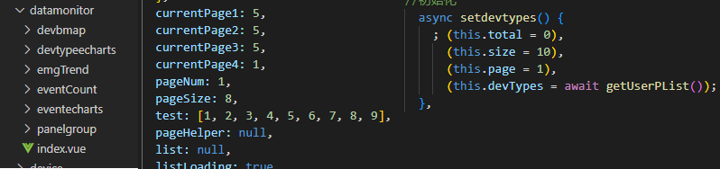
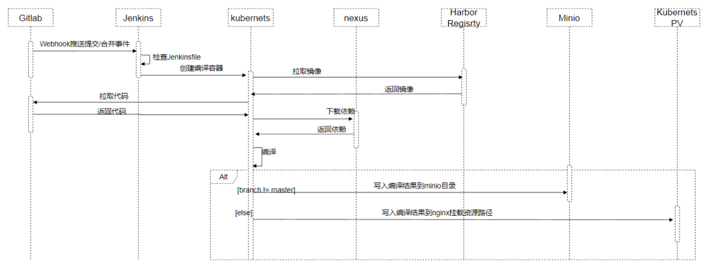

结合自己在一个非互联网企业的 web 小团队中的多年的实际项目经验，分享一些我对前端架构设计、工程化的理解，并希望彼此都能学到更多有意义的前端架构设计相关的技术。

扪心自问，我何德何能来分享“架构设计”、“工程化”这样的高端话题，曾几何时，还只是想着“好好按时完成业务功能，成功上线不返工”就可以了。但现实有时候就是残酷的，**翻看一下各种招聘平台的高级前端工程师岗位要求，或多或少都有类似这样一项“有一定的前端架构经验”或者“独立完成满足需求的软件设计”。** 我依旧还想着只做“完成业务功能模块、写写业务逻辑代码”的工作就好了，找个初级或者中级的岗位。但是我工作了这么多年，已经到了这个岁数，招聘公司为什么不去选择那些更年轻的、有着三到五年工作经验的同行呢，不仅可能工作效率更高、工作耐力更大，还可能进取心更强、薪资要求更低。

正儿八经的互联网公司或者有能力的企业，可能都已经具备了优秀、稳健、但活力十足的架构经验了。由于我本人目前的工作背景很差，既不是互联网公司，而且 web 相关专案人员最多时也就 11 个人，没有成熟或者既定的项目架构，我负责过最大的 Web 项目也只是七八个子系统这样的小项目。**_所以本文所谓架构设计或是工程化的话题，都只是个人学习和自身肤浅的工作经验的总结，不具有普遍性，仅仅作为参考，抛砖引玉，也希望得到大家反馈，好“偷师一手”。当然，或作看官消遣。_**

# 架构设计与工程化

这两个词我个人看到比较多，或许一般人很少会对它们产生混淆，但我属于那种没搞明白少数。架构设计和工程化是什么概念？它们之间有没有关系？这是我首先要弄明白的问题。

## 架构设计与工程化的含义

先总结说我的理解:

- **“前端架构设计”是指设计一系列相关的抽象模式(例如一系列工具和流程的集合)，用于指导完成前端项目各个方面的工作。**
- **“前端工程化”是“将系统化的、规范的、可度量的方法用于前端的开发、运行和维护的过程”。**

更直白的理解：

- 架构设计是理论设计，需要做哪些事情：要完成这个项目需要分为哪些域、每个域分为哪些阶段、每个阶段分为哪些内容等等；
- 工程化是落地实现，怎么去做那些事情：这个项目怎样划分阶段、每个阶段的内容使用什么方法、工具去实现等等。
- 有个适合的设计，才有助于项目高效保质保量地完成；太过冗余的设计，可能导致资源的浪费。

所以我就在一些时机，把他们当作类似的概念并不会出什么问题，优秀的设计和良好的工程化作业是相辅相成的。

由此，也有人这样总结:

> 前端架构的设计，应是用于解决已存在或者未来可能发生的技术问题，增加项目的可管理性、稳定性、可扩展性。
>
> 前端工程化就是通过各种工具和技术，提升前端开发效率的过程。认为一切能提升前端开发效率、提高前端应用质量的方法和工具都是前端工程化，提升开发效率、提升产品质量、降低开发难度、降低企业成本应该是工程化的意义所在。

这个点，有更好的通俗的见解请不吝分享一下，谢谢。

---

我举个不恰当的例子，假如你会玩 LOL 的盲僧李青，看了一个教学视频，可以一秒内快速打出最大伤害的连招，又酷炫又实用:`A Q1 A 九头蛇 A R Q2 A E A`(架构设计)，但是 30 岁高龄键盘太硬鼠标太滑练了半天一秒钟只能完成`Q1 A R Q2 E A`或者无法近身只能`Q1 Q2 A E A 九头蛇 A R`或者还想着要躲技能打出`A Q1 A 九头蛇 A R闪 插眼W Q2 A E A`连招(工程化)。但也有可能你觉得教学不行，英雄他只有 3 个伤害技能，只需要`Q1 Q2 E R`连招可以了(架构设计有改善空间)，结果每次操作都用的是`R Q空`(工程化有改善空间)。

所以它们之间的重要性来讲**我个人认为架构设计是需要向工程化妥协的**，因为现实中很多理论上非常优秀且全面的架构设计，企业没有足够的资源或者成熟的技术去实现它。当然妥协也不是意味着粗制滥造，为了省事或者节约资源省略部分内容导致整个产品不能正常运行或者一碰就碎。

因此个人觉得在实际作业中，它们可以不必太过刻意区分，毕竟“设计的功能没人用、追加的功能没法写”也不是什么新鲜的事，小的项目到最后绝大体一致，一般也不会出现什么意外。如果有其他见解可以交流讨论，这里后面的内容就默认不再显式区分它俩的区别，假设架构设计的内容工程化都一一落地了。

## 架构设计的目的与通用原则

我比较赞同这句话：**架构设计本质就是解决软件复杂度带来的问题**。在大部分的情况下，我们所做的事情都是为了完成业务、完成项目，架构设计也是如此。之所以要做架构设计，也是为了提升开发效率、提升产品质量、降低开发难度、降低企业成本，更好地完成项目业务。

我也比较赞同这三个比较通用软件架构设计原则:

- **合适原则**: 在做架构设计的时候应当以实际场景出发(避免“三千预算进卡吧，加钱加到九万八”)。
- **简单原则**: 用最简单的解决方案来解决问题(“你用谎言去验证谎言，得到的一定是谎言” )。
- **演化原则**: 设计架构应当满足当前的业务需要，还能够应变后续架构升级和调整的需要(“这世上唯一不会改变的就是改变本身”)。

> 首先需要熟悉业务，形成业务架构，根据业务架构，做出相应的数据架构和应用架构，最后通过技术架构落地实施。

# 前端工程化的内容

架构设计的内容是比较复杂和有难度的，不然岂不是人人都是架构师了吗？我知道自己是没有这个能力去建议别人怎么做，文末有几篇菜鸟、京东、美团、有赞等企业分享的大项目架构设计分享，可以了解学习。**_这里分享一下本人接手的小项目在前端部分，大致考虑了哪些工程化的内容，主要为了点个题，可能不符合大众要求，大家可以看个乐。_**

---

因为环境原因，没有见识，粗略地以为，**前端工程化的主要内容，可能就是规范的确定完善和强制的执行约束**。就正如这制造业中的 SOP，即便是 SOP 错了，在旧的 SOP 没有作废、新的 SOP 出来之前，所有的生产部门都按照 SOP 流程走，每一个工人都按照 SOP 规定做，。互相之间减少理不清的纠缠，出错了一定是谁没有按照 SOP 执行，也不怕人走线停，促生产，守质量，提效率，保出货。

有人这样划分的层次：

> 系统级：前后端分离架构设计，微前端架构设计  
> 应用级：组件库，脚手架，设计库  
> 模块级：组件化，模块化设计  
> 代码级：规范，原则，质量

## 统一规范

就像之前的顾问说的，他认为**一个项目花费在开发的时间只占两成，对于开发人员来讲写代码是整个项目中最简单的部分**。

我不知道别的地方是否通用，但在他手下做事的时候，真真切切体会到“沉淀”的力量，似乎一起都像瀑布模型描述的那样。印象最深的是一个企业内部项目，开了几次会，确定了需求，写了粗略的需求文档和设计文档，我们领导审核，提意见，修改，再审核。通过了再给需求提出的部门再次确认，有问题，返工修改。我们的领导审核，没问题，再给提需求部分确认……虽然一 100 来页的文件改到了 300 来页，但总是觉得这么个小小的内部案子，有些步骤可以简化的，比如说两个部门同时审核？

这是题外话，就像我们一开始都人手一本《阿里巴巴 java 开发手册》，当所有规则都落定之后，执行起来也许真的就没那么麻烦了。

我这里就没有只认为在代码层的规范了，就像软件工程一样，软件开发的每个流程，都按照规范来走。

就类似，项目的模块化、组件的开发、代码编写、项目管理、提交信息、部署流程等等，都有一定的要求，就像 java 类名需要所有单词首字母都大写的 PascalCase 命名方式一样，都要求这么去做，大家都这么做，项目就不会乱。

**这部分我觉得可以参考那些互联网大厂的标准，灵活自用**，属于说了等于白说的内容。比如我们使用 vue 的时候就要求严格按照[Vue 开发风格指南](https://cn.vuejs.org/style-guide/rules-essential.html#use-multi-word-component-names)。虽然可能理所当然，但像这图中的组件命名、属性命名、函数命名一样，之前真的在工作中就出现了：

但是对于像我们这种几个人的小团队来说，有必要吗？还是有的，游击战都打一枪换一个地方，万一以后有几乎去正规互联网企业呢。

## 技术选型

技术选型虽然在我们这小地方可能不严苛，但是算蛮重要的，因为我们没有资源去创造自己的轮子。个人经验来看，我们是准守这样的层级原则去做的：

- 学习曲线、生命周期、目标设备(例如手机/平板/PC 等)、企业内部/商品化
- 安全性、稳定性、价格、流行度、开发者偏好、第三方软件组件的依赖风险
- 底层开发技术、编程方式(例如命令式、响应式等)、运行机制(例如解释型、编译型等)
- ……

大家可以觉得可悲，但不要觉得可笑。正如我之前所说，我这儿台湾的前辈就都只会 C#不会 Java，也有同事没听过 Git，顾问更相信有大厂背书的 Angular 而不是国内流行度更高的 Vue，如果是企业自用的可能尽量都选择开源的工具即便效果要差些。技术选型这块，**在没有既定的标准前，我个人觉得真的要看公司的重视和投入程度，以及这个项目的前景。** 我们这说起来还是跟沈阳消防研究所合作的关于智能消防的项目，都要依国标的，平台这边的前后端用的几乎所有东西都是开源的——除了一些阿里云的服务——一点都不奇怪，我们的工作电脑不能安装 QQ、微信，不能安装搜狗、百度输入法，不能安装 WPS——因为 MIS 认为这些东西没有在使用许可上明确表明企业用户可用，我现在工作的开发环境，还是 2018 年的时候在 win7 的电脑上使用 Vbox5 安装的 Ubuntu16 的虚拟机。

公司的规章制度，以及对项目的投入、或者说公司的资源分配，可能会影响到不仅仅是技术选型。也许互联网公司就没有这些问题，所以我先抛开这些不谈，上面列出的原则，也是可以参考的。我们最近的这个项目使用了 vue、java，也是之前老大说这方面国内开发人员比较多，人员异动招人比较方便；社区活跃学习曲线平滑，不会有太大技术瓶颈；适用范围广，以后的迁移扩展也方便。

但有时候，确定了主体框架，那么框架的生态也会在选型中起到一定作用。比如之前 vue2.x + vuex + webpack，现在 vue3.x + pinia + vite，成熟稳定，配套完全，不过这都是小问题。

## 开发/测试

这部分其实算是前端项目的重点吧，毕竟完成业务功能不敲代码是不行的。在已经确定了技术选型和开发流程中的规范之后，这只需要“两成的时间”就是最重点。

过程中可能考虑的前后端分离、模块化、组件化、脚手架、组件库、本地开发服务器、 mock 服务、微前端等等，如果有现成的或者规定好的，那真是太美妙了。当然可能会涉及到类似下面的内容：

- 开发阶段 : 开发阶段的首要任务是创建样板项目（一并选择前端框架、类库），接着开始修改 - 验证的主循环
  - 脚手架：创建前端应用的目录结构，并生成样板代码
  - 公共库：维护着可复用的 UI 组件、工具模块等公共资源
  - 包管理器：引入第三方库 / 组件，并跟踪管理这些依赖项
  - 编辑器：提供语法高亮、智能提示、引用跳转等功能，提升开发体验
  - 构建工具：提供语法校验、编译、打包、 DevServer 等功能，简化工作流
  - 调试套件：提供预览、 DevTools 、 Mock 、性能分析诊断等调试功能，加速修改 - 验证的主循环
  - ……
- 测试阶段 : 开发完成，进入测试阶段，先要对整体功能进行充分自测，再移交专业的测试人员验证
  - 单元测试框架：提供针对组件、逻辑的测试支持
  - 静态扫描工具：从代码质量、构建产物质量、最佳实践 / 开发规约等多个维度做静态检查
  - 自动化测试工具：针对 UI 效果和业务流程，提供测试支持
  - 性能测试工具：监测并统计出相对准确的性能数据
  - ……

> 开发阶段 : 开发阶段的首要任务是创建样板项目（选择前端框架、类库等），接着开始`修改-验证`的主循环
>
> - 脚手架：创建前端应用的目录结构，并生成样板代码
> - 公共库：维护着可复用的 UI 组件、工具模块等公共资源
> - 包管理器：引入第三方库 / 组件，并跟踪管理这些依赖项
> - 编辑器：提供语法高亮、智能提示、引用跳转等功能，提升开发体验
> - 构建工具：提供语法校验、编译、打包、 DevServer 等功能，简化工作流
> - 调试套件：提供预览、 DevTools 、 Mock 、性能分析诊断等调试功能，加速修改 - 验证的主循环
> - ……
>
> 测试阶段 : 开发完成，进入测试阶段，先要对整体功能进行充分自测，再移交专业的测试人员验证
>
> - 单元测试框架：提供针对组件、逻辑的测试支持
> - 静态扫描工具：从代码质量、构建产物质量、最佳实践 / 开发规约等多个维度做静态检查
> - 自动化测试工具：针对 UI 效果和业务流程，提供测试支持
> - 性能测试工具：监测并统计出相对准确的性能数据
> - ……

这就不展开了，可能还是要提一句“编写测试用例”还是应该的，不过我们这小团体，真不把它放在心上，基本没人会写，就简单整个 expect toBe 都没有，去了其他地方，肯定会被打的。

## 部署

我记得我做的第一个项目，就是打包成一个 jar 包丢到随便弄的一台电脑上去跑就完了，有部门反映不能用了，就去看看是不是断电了，死机了，出 bug 了……真出 bug 崩掉了就改完再打包一个丢进去运行起来就完了。得亏公司自己用，也没什么用户和很小的使用频率，还没什么人会 java，可能换个其他任何公司，也早被打了。

有人总结：

> 项目部署是指前端开发人员将构建产出的代码包部署到测试服务器的过程，而并非是将测试完成的代码发布到生产环境的过程。  
> 在部署过程中，要考虑目标服务器、路径信息是否与项目一一对应，并且可供负责部署到生产环境的开发人员进行配置，部署的操作流程应尽量简单。  
> 考虑团队协作和安全方面的因素，最佳的方式应该是搭建一个可供严格审查、队列控制、操作简化的部署平台，并且有专人负责掌握流程进度。

我们也很简单，自己搭建个 gitlab-ce，每个项目都规定至少有两个确定名的分支 deployment 和 master，项目中有带上 jenkins 配置文件，之后在合并到指定分支时，就简单 `Gitlab Webhook->jenkins->kubernetes pod(pipeline)`这样子，当然分支不同，合并者的权限不同，编译之后的操作也不同，可能测试区就直接更新了，线上的话就还是需要全栈人手动确认。

大概这样子：

不管正不正规简不简陋，也不怕笑话，小声说，19 年的时候我在顾问建议、CEO 特助领头之下，准备了 3 个月，在研发部门推广使用 git/gitlab-ce 还只做版本管控，不可谓不重视，但现在那些写原生 Android 和 Ios 应用的，嵌入式软式开发的，还不是一个版本新建个日期文件夹。好在我们组没有这样的。

但现实一点，真的是个正儿八经的互联网公司，可能这也是专人专职的，所以可能不必正襟危坐。

## 监控

不骗人的说，我之前压根就没关心过前端项目还做什么监控。是，虽然后台的监控也很简陋，就一些 spring 的组件，其他应用自带探头，搭配 Prometheus 和 Grafana，但也还有，前端是压根就没有想过。

所以有人跟我说这个事儿的时候还在庆幸还好做的都是些没什么人或者没什么人在意的小项目，万一真的出现什么因为没有做前端监控而导致的，那还真是重大缺失了。

然后，就这么几个小系统，能搞什么，我也不知道，可能和后端一样：**埋点、数据上报、加工整理、可视化显示、异常警报**。这里有一篇 2020 年阿里巴巴前端技术专家分享的 [前端的守望者：阿里岳鹰 Web 全景监控平台的建设之路](https://www.infoq.cn/article/yvtxwcbwc5amcicqapce) 文章，里面就差不多类似总结：**Web 监控平台闭环：采集 - 上报 - 解析 - 计算 - 多维分析 - 实时预警**。

那做**前端监控的目的**呢？我觉得最主要的目的肯定是**为了更快的发现问题和解决问题**了，此外还有**做产品的决策依据、为业务扩展提供了更多可能性**之类的其他作用。

至于监控的重点，[站内有老哥总结](https://juejin.cn/post/7097157902862909471)很好：

> - 页面的性能情况：包括各阶段加载耗时，一些关键性的用户体验指标等
> - 用户的行为情况：包括 PV、UV、访问来路，路由跳转等
> - 接口的调用情况：通过 http 访问的外部接口的成功率、耗时情况等
> - 页面的稳定情况：各种前端异常等
> - 数据上报及优化：如何将监控捕获到的数据优雅的上报

那我们的使用就非常门外汉了，基本就简单调用了一下这个[web-vitals](https://github.com/GoogleChrome/web-vitals)工具，还有参考 Web API 接口中的[Performance API](https://developer.mozilla.org/zh-CN/docs/Web/API/Performance_API)。

安了，我想那些互联网公司应该都有证书的前端监控架构体系了，如果有幸就职的话，应该也是按规范调用下 API 就解决的事儿，而正常前端监控体系的搭建，也应该是专人专职去做的，如果在公司或项目比重非常重要的话。我这儿，纯粹就是想找补这样一个过程，面向企业用户，一天也没什么用户操作需要监控的。

---

至于其他“性能优化”、“重构”等前端工程化主题，其实也都渗透到整个产品生命周期的方方面面，有良好的规范、原则，大多数都只要照着就好了，如果真的像我们一下，全都自己摸索自己实践不知好坏，没人笑话也不奇怪。

# 总结

其实这部分属于赶鸭子上架，不懂装懂，完全没有多少意义，因为的确能力有限，经验不足，就算后续要找工作面试被问到了这个问题，我也只能从自己的案子出发 ，讲一讲项目的生命周期各个阶段都做了些什么事情，考虑了哪些因素，遵守了怎样的原则，算不算架构设计或者工程化的内容，得看面试官的反馈了。

越看越拉，算了，能力尔尔。不如多看几遍下面的索引文章：

- [架构设计实践五部曲](https://www.infoq.cn/article/RQDwWxDcwbxtwU8LBFSG)
- [京东商城，超大型电商系统架构设计原则与实践！8 页 ppt 详解](https://mp.weixin.qq.com/s/nySw0r9ufhKQS-s66sSnhg)
- [美团金融平台 Web 前端技术体系](https://tech.meituan.com/2018/03/16/front-end-web-architecture.html)
- [有赞零售财务中台架构设计与实践](https://mp.weixin.qq.com/s/uoRSHDvhd2WSRK9M7PTxKA)
- [架构设计的新思路，《架构之道》读书笔记](https://mp.weixin.qq.com/s/oKOu_OfLdK8Mp7pMCceexQ)
- [架构设计之道](https://developer.jdcloud.com/article/2043)

不过发散一些固步经历，收获一些新鲜思维，说不定对双方都有帮助。也请各位不吝指导，我写成这样都敢发出来，说不定老哥在谦虚分享的时候自己也能有新的收获，促成 1+1>2 的美妙结果，十分感谢。

---

一些博文，但自己都不一定看完了：

- [美团金融平台 Web 前端技术体系](https://tech.meituan.com/2018/03/16/front-end-web-architecture.html)
- [想进美团不知道选哪个技术岗位？这里有一份通关秘籍！](https://tech.meituan.com/2020/03/26/meituan-tech-corporate-recruitment.html)
- [大型项目前端架构浅谈（8000 字原创）](https://juejin.cn/post/6844903853859536903)
- [前端架构](https://xiaobaiha.gitbook.io/tech-share/engineering/qian-duan-jia-gou)
- [微前端架构设计](https://www.garfishjs.org/blog)
- [前端架构有哪些核心问题？](https://www.infoq.cn/article/ge3sge7defj7nycthmvt)
- [前端架构设计中如何做好技术决策？](https://mp.weixin.qq.com/s?__biz=Mzk0MDMwMzQyOA==&mid=2247493736&idx=1&sn=8938e324185d6e66bf128d3d1c39381b&utm_source=tuicool&utm_medium=referral)
- [精读《对前端架构的理解 - 分层与抽象》](https://github.com/ascoders/weekly/blob/master/%E5%89%8D%E6%B2%BF%E6%8A%80%E6%9C%AF/254.%E7%B2%BE%E8%AF%BB%E3%80%8A%E5%AF%B9%E5%89%8D%E7%AB%AF%E6%9E%B6%E6%9E%84%E7%9A%84%E7%90%86%E8%A7%A3%20-%20%E5%88%86%E5%B1%82%E4%B8%8E%E6%8A%BD%E8%B1%A1%E3%80%8B.md)
- [Componentless: 面向低代码时代的前端架构设计](https://www.phodal.com/blog/componentless/)
- [架构设计实践五部曲](https://www.infoq.cn/article/b1fcll8mk9l9qe45zxp6)
- [从业务开发中学习和理解架构设计](https://mp.weixin.qq.com/s/1LF0qdfvBooV7S-CNAjnow)
- [超详细的前端工程化入门教程](https://www.freecodecamp.org/chinese/news/front-end-engineering-tutorial/)
- [通用的架构设计](https://insights.thoughtworks.cn/common-architecture-design/)
- [5 分钟了解系统架构设计（2）](https://www.cnblogs.com/edisonchou/p/architecture_design_learning_in_5mins_part2.html)
- [架构设计之道](https://www.modb.pro/db/132956)
- [什么才是真正的架构设计？你又知道多少？](https://segmentfault.com/a/1190000023122582)
- [前端搞基建|堂主 - 如何推动前端团队的基础设施建设](https://zhuanlan.zhihu.com/p/148210793)
- [[译] 你是软件架构师吗？（InfoQ，2010）](http://arthurchiao.art/blog/are-you-a-software-architect-zh/)
- [Are You a Software Architect?](https://www.infoq.com/articles/brown-are-you-a-software-architect/)
- [架构师必须知道的架构设计原则](https://mp.weixin.qq.com/s?__biz=MjM5MDE0Mjc4MA==&mid=2650998170&idx=1&sn=6defd4f0a9fdb5cf93e6977080c61c70)
- [推荐几个大厂的前端代码规范，学会了，你也能写出诗一样的代码！](https://juejin.cn/post/6893891476913291278)
- [2023 年 Web 前端开发流程和学习路线（详尽版）](https://www.cnblogs.com/qianguyihao/p/16370961.html)
