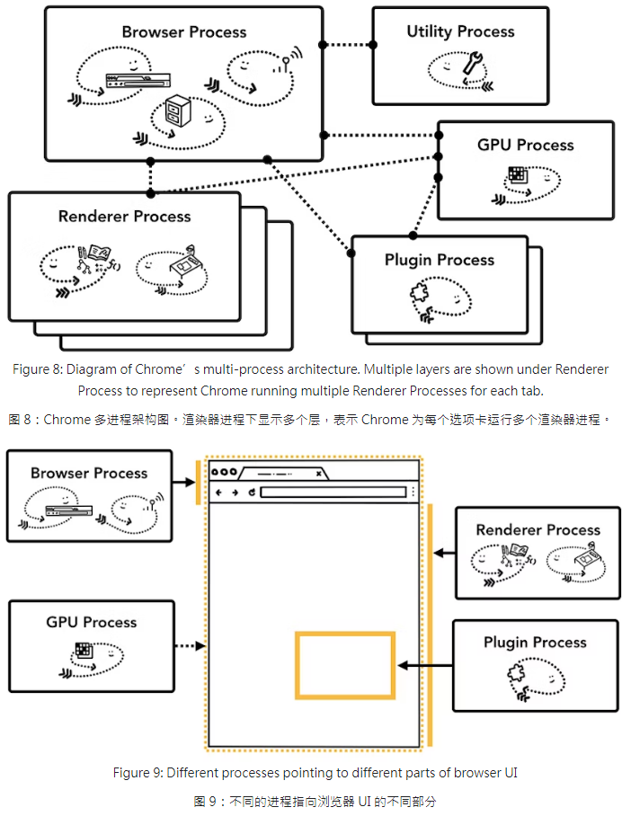
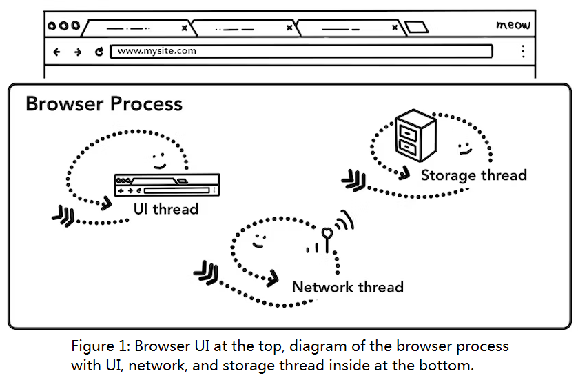
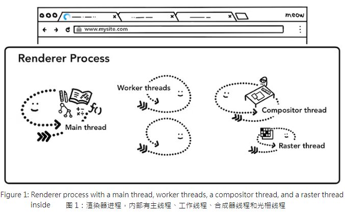
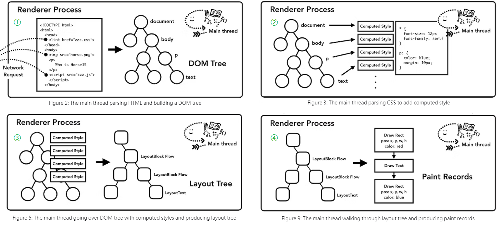
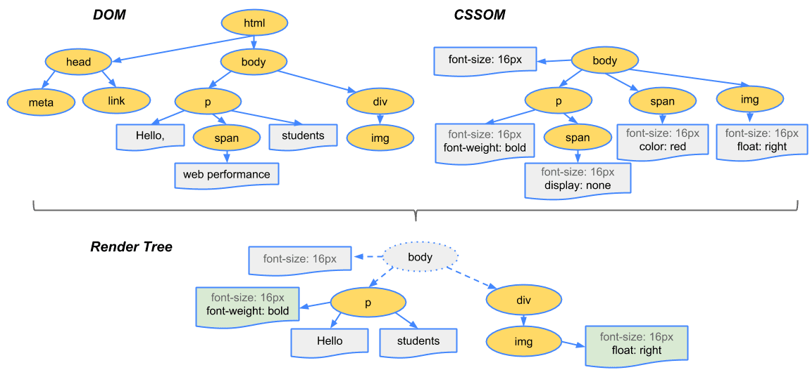
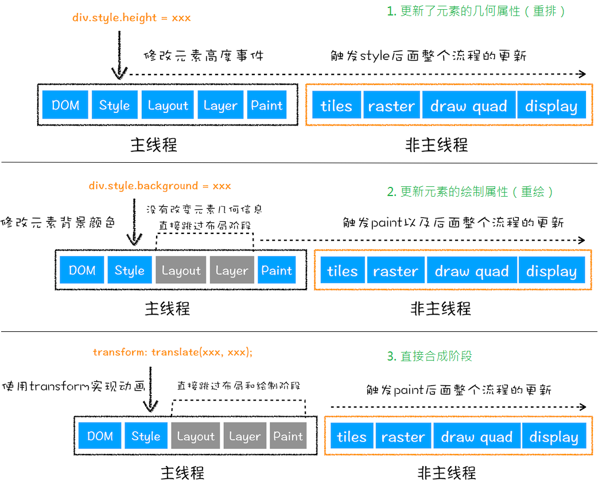

<!-- START doctoc generated TOC please keep comment here to allow auto update -->
<!-- DON'T EDIT THIS SECTION, INSTEAD RE-RUN doctoc TO UPDATE -->
<!-- **Table of Contents**  *generated with [DocToc](https://github.com/thlorenz/doctoc)* -->

- [引子](#%E5%BC%95%E5%AD%90)
- [简单聊聊浏览器的发展过程(可略)](#%E7%AE%80%E5%8D%95%E8%81%8A%E8%81%8A%E6%B5%8F%E8%A7%88%E5%99%A8%E7%9A%84%E5%8F%91%E5%B1%95%E8%BF%87%E7%A8%8B%E5%8F%AF%E7%95%A5)
  - [1. web 的发展](#1-web-%E7%9A%84%E5%8F%91%E5%B1%95)
  - [2. HTTP 的发展](#2-http-%E7%9A%84%E5%8F%91%E5%B1%95)
  - [3. 浏览器的发展](#3-%E6%B5%8F%E8%A7%88%E5%99%A8%E7%9A%84%E5%8F%91%E5%B1%95)
  - [4. 浏览器架构的演变](#4-%E6%B5%8F%E8%A7%88%E5%99%A8%E6%9E%B6%E6%9E%84%E7%9A%84%E6%BC%94%E5%8F%98)
- [浅谈浏览器工作原理的几个重点问题的分类](#%E6%B5%85%E8%B0%88%E6%B5%8F%E8%A7%88%E5%99%A8%E5%B7%A5%E4%BD%9C%E5%8E%9F%E7%90%86%E7%9A%84%E5%87%A0%E4%B8%AA%E9%87%8D%E7%82%B9%E9%97%AE%E9%A2%98%E7%9A%84%E5%88%86%E7%B1%BB)
  - [浏览器的核心功能](#%E6%B5%8F%E8%A7%88%E5%99%A8%E7%9A%84%E6%A0%B8%E5%BF%83%E5%8A%9F%E8%83%BD)
  - [浏览器架构](#%E6%B5%8F%E8%A7%88%E5%99%A8%E6%9E%B6%E6%9E%84)
  - [导航过程](#%E5%AF%BC%E8%88%AA%E8%BF%87%E7%A8%8B)
    - [1、从输入 URL 到页面加载的全过程](#1%E4%BB%8E%E8%BE%93%E5%85%A5-url-%E5%88%B0%E9%A1%B5%E9%9D%A2%E5%8A%A0%E8%BD%BD%E7%9A%84%E5%85%A8%E8%BF%87%E7%A8%8B)
    - [2、浏览器进程(Browser Process)的组成](#2%E6%B5%8F%E8%A7%88%E5%99%A8%E8%BF%9B%E7%A8%8Bbrowser-process%E7%9A%84%E7%BB%84%E6%88%90)
    - [3、几点补充](#3%E5%87%A0%E7%82%B9%E8%A1%A5%E5%85%85)
  - [渲染过程](#%E6%B8%B2%E6%9F%93%E8%BF%87%E7%A8%8B)
    - [渲染进程组成](#%E6%B8%B2%E6%9F%93%E8%BF%9B%E7%A8%8B%E7%BB%84%E6%88%90)
    - [解析](#%E8%A7%A3%E6%9E%90)
      - [1、构建 DOM 树](#1%E6%9E%84%E5%BB%BA-dom-%E6%A0%91)
      - [2、构建 CSSOM 树](#2%E6%9E%84%E5%BB%BA-cssom-%E6%A0%91)
      - [3、子资源加载](#3%E5%AD%90%E8%B5%84%E6%BA%90%E5%8A%A0%E8%BD%BD)
      - [4、JavaScript 可以阻止解析](#4javascript-%E5%8F%AF%E4%BB%A5%E9%98%BB%E6%AD%A2%E8%A7%A3%E6%9E%90)
    - [渲染](#%E6%B8%B2%E6%9F%93)
      - [1、样式计算(Style Calculation)](#1%E6%A0%B7%E5%BC%8F%E8%AE%A1%E7%AE%97style-calculation)
      - [2、布局](#2%E5%B8%83%E5%B1%80)
      - [3、绘制](#3%E7%BB%98%E5%88%B6)
      - [4、分层与合成](#4%E5%88%86%E5%B1%82%E4%B8%8E%E5%90%88%E6%88%90)
      - [补充：重排/回流、重绘、合成示意图](#%E8%A1%A5%E5%85%85%E9%87%8D%E6%8E%92%E5%9B%9E%E6%B5%81%E9%87%8D%E7%BB%98%E5%90%88%E6%88%90%E7%A4%BA%E6%84%8F%E5%9B%BE)
    - [交互](#%E4%BA%A4%E4%BA%92)
  - [其他重点](#%E5%85%B6%E4%BB%96%E9%87%8D%E7%82%B9)
- [简单的面试应答参考](#%E7%AE%80%E5%8D%95%E7%9A%84%E9%9D%A2%E8%AF%95%E5%BA%94%E7%AD%94%E5%8F%82%E8%80%83)
  - [浏览器内核和浏览器引擎的简介](#%E6%B5%8F%E8%A7%88%E5%99%A8%E5%86%85%E6%A0%B8%E5%92%8C%E6%B5%8F%E8%A7%88%E5%99%A8%E5%BC%95%E6%93%8E%E7%9A%84%E7%AE%80%E4%BB%8B)
  - [(Chrome)浏览器多进程的组成](#chrome%E6%B5%8F%E8%A7%88%E5%99%A8%E5%A4%9A%E8%BF%9B%E7%A8%8B%E7%9A%84%E7%BB%84%E6%88%90)
  - [Chrome 中多进程架构的优缺点](#chrome-%E4%B8%AD%E5%A4%9A%E8%BF%9B%E7%A8%8B%E6%9E%B6%E6%9E%84%E7%9A%84%E4%BC%98%E7%BC%BA%E7%82%B9)
  - [从输入 URL 到页面加载的全过程](#%E4%BB%8E%E8%BE%93%E5%85%A5-url-%E5%88%B0%E9%A1%B5%E9%9D%A2%E5%8A%A0%E8%BD%BD%E7%9A%84%E5%85%A8%E8%BF%87%E7%A8%8B)
  - [浏览器的渲染流程示例图(极客时间)](#%E6%B5%8F%E8%A7%88%E5%99%A8%E7%9A%84%E6%B8%B2%E6%9F%93%E6%B5%81%E7%A8%8B%E7%A4%BA%E4%BE%8B%E5%9B%BE%E6%9E%81%E5%AE%A2%E6%97%B6%E9%97%B4)
  - [浏览器网页生成过程](#%E6%B5%8F%E8%A7%88%E5%99%A8%E7%BD%91%E9%A1%B5%E7%94%9F%E6%88%90%E8%BF%87%E7%A8%8B)
  - [关键渲染路径 (Critical rendering path)](#%E5%85%B3%E9%94%AE%E6%B8%B2%E6%9F%93%E8%B7%AF%E5%BE%84-critical-rendering-path)
  - [渲染管道(render pipeline)](#%E6%B8%B2%E6%9F%93%E7%AE%A1%E9%81%93render-pipeline)
  - [像素流水线(The pixel pipeline)](#%E5%83%8F%E7%B4%A0%E6%B5%81%E6%B0%B4%E7%BA%BFthe-pixel-pipeline)
  - [重排/回流(reflow)和重绘(repaint)](#%E9%87%8D%E6%8E%92%E5%9B%9E%E6%B5%81reflow%E5%92%8C%E9%87%8D%E7%BB%98repaint)

<!-- END doctoc generated TOC please keep comment here to allow auto update -->

---

可能算得上是比较全面且细致的“浏览器的工作原理”这一话题的浅谈内容整理分享了。

# 引子

关于“浏览器的工作原理”这一话题，似乎是讲不出什么新的花样。对于已经了解的人来说，可能觉得并没有什么高深的内容；对于还不了解的人来说，我个人觉得还是有必要学习一下，因为站在 web 项目开发者的角度来讲，我甚至觉得有一些程度来说就是面向浏览器编程。不管是使用了多么厉害的框架、多么高深的技术，到最后都得在页面上渲染出来，用于展示，用于交互。_那么如何把我们编写的 web 项目代码在浏览器中渲染出来_，就算得上是“浏览器的工作原理”的最重要的主题之一了。

当然，其实随着时代的发展，除了历史遗留原因，大部分 to C 的使用场景上，使用新版本的现代浏览器的决策似乎不需要考虑。之前也说过，其实新版本现代浏览器的大头，除了 Safari、Firefox 少数之外，Chrome、Edge、Opera、360、QQ 等都基于 Chromium 项目开发的。所以不是特殊情况的话，我们看到的不少文章的示例，都会以 chrome 的多进程浏览器架构而展开的。

虽然我不想再强调 CSS、HTML、JavaScript 基础知识的重要性，但是了解了浏览器的工作原理(不用太深入)，对这些基本知识的使用上的帮助不可谓不大，除了最基本的“能够按照设计图还原”的要求外，还有喜闻乐见的性能优化、兼容性调试、安全保护、高效地前端开发等主题有良好的帮助。

可能正是因为这部分的内容大体来讲没有太大的变化，以至于我在学习的时候，发现非常多的文章都算得上东拼西凑、左抄右抄来的，原文的图片和文字一字不漏地复制过来但有的甚至还不列出原文链接。我可能不是很有能力做搬运工，但我能看到的很多的内容都是来自以下文字或课程：

- [How browsers work](https://web.dev/howbrowserswork/) - `web.dev`，2011 年
- [Inside look at modern web browser](https://developer.chrome.com/blog/inside-browser-part1/) - `developer.chrome.com`，2018 年
- [浏览器工作原理与实践](https://time.geekbang.org/column/intro/100033601) - 极客时间 ，2020 年左右

前面两篇文字是非常的经典，加上来源算得上比较权威，如果静下心慢慢看完，可能就不再需要别的辅助了。站内有翻译计划的译文，也可以参看。

由于是英文原文，自己写博客上面两篇文章的图片可以复制，但至少文字需要机翻一下。而“浏览器工作原理与实践”由于是“更符合国情的”付费内容，标题更接地气，图片文字还算简洁清晰，更加被频繁地直接照搬。我当然不是在给它打广告，由于是收费的课程，我也不方便直接贴上 github 的地址，各位可以直接 github 搜索关键字 “browser-working-principle” ([如此例](https://sanotsu.github.io/browser-working-principle/)) 自行评判。

另外不错比较简介的博文也可以参考：

- [How web browsers work](https://dev.to/arikaturika/how-web-browsers-work-part-1-with-illustrations-1nid) - `dev.to`，2022 年博文，带图且细致
- [Populating the page: how browsers work](https://developer.mozilla.org/en-US/docs/Web/Performance/How_browsers_work) - MDN

当然，既然本文也是这个主题，如果时间宽裕的话，也可以看看我的理解是否符合诸君的胃口，我也按照上面的参考文章，基于学习到的 chrome 的相关知识。同样的，不喜欢长篇大论和口水话，最后面也有一点我计划用来应对面试官的回答模板，毕竟这个话题展开来讲三五十分钟都不一定搞得定，更何况三五分钟。

# 简单聊聊浏览器的发展过程(可略)

## 1. web 的发展

众所周知，Web 的发明者 Tim Berners-Lee 提出的[第一个 Web](https://www.w3.org/People/Berners-Lee/1991/08/art-6484.txt)包含的东西: HTTP，HTML，名为 WorldWideWeb 的第一个 Web 浏览器，一个 HTTP 服务器和一些用于查看的网页。

那封邮件有句原话是: "The WWW project was started to allow high energy physicists to share data, news, and documentation. We are very interested in spreading the web to other areas, and having gateway servers for other data."基于时代背景，那个时候的 web 简单说就是通过浏览器访问 HTTP 服务器提供的文档(虽然现在也是)，内容比较简单，就是图片和文本为主，所以那个时候的浏览器能够加载显示文本和图片就好了。

当然，后面就是大家耳熟能详的 Web 发展的三个阶段:

- 主要用于展示静态内容、但缺乏互动性和个性化的 Web1.0 时代；
  - (Web1.0 大约从 1989 年到 2004 年，“在 Web 1.0 中，内容创作者很少，绝大多数用户只是内容的消费者”)
- 强调用户参与和互动，网站内容和功能应该是以用户需求为导向的 Web2.0 时代；
  - (Web2.0 这个词 Darcy DiNucci 在 1999 年 1 月创造)
- 以及还处于发展初期的拥有去中心化、人工智能的整合、虚拟与现实的融合、用户拥有数据控制权、跨平台和跨设备的无缝体验等特点的 Web3.0 时代
  - (Web3.0 较有名的首次提及是在 2006 年初,与区块链有关的 web3 概念是由以太坊联合创始人 Gavin Wood 于 2014 年提出,2021 年受到关注)。

我当然不知道 Web3.0 是不是骗局，但我肯定明白现在的 Web 项目应该不可能只是单纯的展示图片和文字而没有交互，这也就要求现代的浏览器也要满足这样的需求，最简单地完成 Web 项目的展示和交互的需求。

## 2. HTTP 的发展

当然，现在浏览器能展示的内容不单单是图片和文本，虽然从分类来讲，XML、HTML、plain text 支持的其实也不是很多: application、audio、font、example、image、message、model、multipart、text、video。但 http 的请求头`Content-Type`可设定的资源的 MIME 类型[Media Types](https://www.iana.org/assignments/media-types/media-types.xhtml)就有这么成千上万种。

虽然这里有些本末倒置了，不是因为 HTTP 有这些资源分类，浏览器才能展示这些资源，可能是因为时代变化，浏览器需要展示这些资源，HTTP 才支持了这些分类。笼统来讲 HTTP 标准也经历了 5 次发展：

- HTTP/0.9：最早版本的 HTTP，仅支持传输纯文本信息，并且缺乏标准化。
- HTTP/1.0：于 1996 年发布，引入了请求头、响应头、状态码等概念，支持多媒体传输。
- HTTP/1.1：于 1999 年发布，成为目前最常用的版本。它引入了持久连接、管道化请求、虚拟主机等改进，提升了性能和效率。
- HTTP/2：于 2015 年发布，基于 Google 开发的 SPDY 协议。HTTP/2 采用二进制分帧传输、头部压缩、多路复用等技术优化了性能。
- HTTP/3：正在开发中，基于 QUIC 协议（快速 UDP 互联网连接）。HTTP/3 旨在解决 HTTP/2 的一些限制，并提供更好的性能和安全性。

其实不难看出，新的内容，更强调的是性能、安全等方面的内容，而不再是功能上的，所以假如有人义愤填膺地声称：“这个年代 IE8 就不应该继续存在”，那可能也没别的意思，只是这小子不想好好搞兼容性而已。因为目前 IE8 不仅仅还存在，可能在不少 to B 的地方还不可或缺，因为 IE8 是在 HTTP1.1 发布十年之后的 2009 年才推出的，某些层面来讲，非常完美。

## 3. 浏览器的发展

从 1991 年 Tim Berners-Lee 发明的 WorldWideWeb 浏览器到现在，30 多年间出现了很多的浏览器，也消失了不少，有的明明挺好用但好像已经死了，有的似乎大家很不喜欢，但还有着一亩三分地。大体上来讲，浏览器的发展也有这么几个时期：

- 早期阶段(1990 年代初)
  - 最早的浏览器是 Tim Berners-Lee 发明的 WorldWideWeb 浏览器，在 1991 年发布。它是世界上第一个图形化的浏览器，但功能有限。
  - 随后，Mosaic 浏览器在 1993 年问世，带来了图片显示和超链接等基本功能。
- 主导时期(1990 年代中期至 2000 年代初)：
  - 1994 年，Netscape Navigator 发布，成为当时最受欢迎的浏览器，引领了浏览器的发展方向。
  - 同时，微软也推出了 Internet Explorer(IE)，并通过 Windows 操作系统捆绑发行，最终赶超了 Netscape。
- 第一次浏览器战争(2000 年-2004 年)：
  - 在互联网泡沫破灭之后，浏览器市场竞争加剧。Netscape 逐渐式微，IE 占据了主导地位。
  - 然而，Mozilla 组织通过开源项目开发了 Firefox 浏览器，并在 2004 年发布，重新引起了人们对浏览器的关注。
- Web 标准时代(2004 年至今)：
  - Firefox 的成功推动了对 Web 标准的重视，促使各大浏览器开始支持和遵循 W3C 制定的 HTML、CSS 等标准。
  - 同时，苹果公司推出的 Safari 浏览器也在 Mac 和 iOS 设备上取得了一定市场份额。
- 移动互联网时代(2007 年至今)：
  - 随着智能手机的普及，移动浏览器成为用户访问互联网的主要途径。
  - 谷歌推出的基于 WebKit 引擎的 Chrome 浏览器在移动端取得了巨大成功，并逐渐占据了桌面和移动浏览器市场的领导地位。
- 当代(2020 年至今)：
  - 如今，主流的浏览器包括 Chrome、Firefox、Safari 和 Edge 等，它们不断更新和改进功能，提高性能和安全性。
  - 同时，新兴的浏览器，如 Vivaldi 和 Brave 等，也在不断发展壮大。

回顾历史的话，现在一家独大的 chrome 的第一版其实晚在 2008 年首次针对 Microsoft Windows 发布，使用 Apple WebKit 和 Mozilla Firefox 的免费软件组件构建。我们更熟悉的 360、搜狗、QQ、百度、猎豹等浏览器，也是在 2008 年之后慢慢出来的，所以其实可以简单地说，这些浏览器都是在 Web 标准化得到重视之后才慢慢推出的，这也是我之前认为很重要的一点，标准做得再好，有支持才算真的好。看过太多叫好不叫座的东西之后，有时候很难再分清“劣币与良币”。

## 4. 浏览器架构的演变

但是这个时候，浏览器已经不再是用于主要用于展示的 Web1.0 时代了，为了提供更好的用户体验、增强浏览器的性能和安全性，并适应不断变化的网络环境和用户需求，浏览器架构也在进行着演变，从最开始的单一进程到面向服务的 SOA(Services Oriented Architecture)等等：

- 单一进程架构
  - 早期的浏览器采用单一进程架构，即整个浏览器由一个进程来管理所有的功能和组件。
  - 这种架构简单直接，但存在着性能和稳定性方面的问题。例如，一个页面的崩溃可能导致整个浏览器的崩溃。
- 多进程架构
  - 为了提高浏览器的稳定性和安全性，引入了多进程架构。
  - 多进程架构将不同的功能和组件划分为多个进程，如渲染进程、插件进程、网络进程等。每个进程相互独立，一个进程的崩溃不会影响其他进程，提高了浏览器的健壮性。
- 内核分离架构
  - 近年来，一些浏览器采用了内核分离的架构，即将浏览器的界面和渲染引擎（内核）分离开来。
  - 这样可以灵活地替换或升级渲染引擎，提高浏览器的可维护性和扩展性。常见的内核有 WebKit、Blink 等。
- 客户端-服务器架构
  - 浏览器主要负责显示界面和执行用户操作，而实际的网页内容和处理任务是由远程服务器完成的。
  - 这种架构有助于提高跨平台兼容性和数据安全性。

_(以上有一部分内容是使用 ChatGPT 获取整理的)_

# 浅谈浏览器工作原理的几个重点问题的分类

单从简单了解的角度来看，我个人觉得这个主题可以分为以下几点：浏览器的核心功能、浏览器的组成、网页的渲染过程、网页的合成……当然，配套还有网络请求例如 HTTP、资源访问 URI、硬件加速、隐私安全、插件扩展等话题。不过这里面最重要也是说的最多的，其实也就是网页加载过程的几个重点步骤: 响应、解析、渲染、交互。其中说得最多的就譬如“关键渲染路径”、“从输入 URL 到页面加载的全过程”。

## 浏览器的核心功能

正常来讲，浏览器都会带有搜索引擎，不管是不是自有的，毕竟除了少数或者比较常用的站点记得名字、加过书签之类的，对于大多数不清楚或者未知的内容，一般都是搜索起手。虽然目前国内最大的搜索引擎的搜索结果不太令人满意，更多生活化的搜索有不少都直接转入指定的 app 中搜索关键词，但浏览器不具备搜索的功能目前显然还不现实。不过这个核心功能就不展开了，我想说的其实是不管是搜索的结果也好，知道网站地址直接访问，或者只是加入书签、收藏后点击图标等，最终的结果是打开了某个网页进行查看或交互。

综上所述，**浏览器的核心功能，我个人觉得，某些程度来讲，就只有一个：提供用户访问和浏览互联网上网页内容的能力**(加载并展示网页)。那基于这个目的的话，有几个点就可以展开来说：

- 浏览器用户界面
- 如何获取到互联网上的网页内容
- 如何加载展示页面
- ……

当然为了了解各个部分如何实现，就得知道另一个重点：浏览器的组成。可惜的是，这样的东西从 Web 被发明出来就已经是重点了，但目前的浏览器功能可远不止这些，为了更好的用户体验，也需要有其他的功能，例如：安全性和隐私保护、插件和扩展支持、缓存和离线访问等等，这都不谈。

**浏览器的用户界面**比较简单，这里一嘴就提了，一般都是有：标签栏(一般一个网页一个 tab)、功能按钮(主页、刷新、前进、后退)、地址栏(识别 url 直接访问或者关键字特定搜索引擎查询)、书签栏、工具栏、主菜单、下载管理器等等，_“Every part of the browser display except the window where you see the requested page.”_。

## 浏览器架构

这个部分，图文基本可以全部参看[Inside look at modern web browser (part 1)-Browser Architecture](https://developer.chrome.com/blog/inside-browser-part1/#browser-architecture)，这里主要引入这张大家可能已经到处看到过的 Chrome 浏览器的架构图：



**各插件的作用：**

- **Browser**: 负责包括地址栏，书签栏，前进后退按钮等部分的工作；负责处理浏览器的一些不可见的底层操作，比如网络请求和文件访问。
- **Renderer**: 控制显示网站的选项卡内的任何内容。
- **Plugin**: 控制网站使用的任何插件。
- **GPU**: 负责处理 GPU 相关的任务(例如使用 WebGL 的、协助视频解码和播放、图像处理和滤镜效果等)。

**Chrome 中多进程架构的优缺点：**

- 优点：
  - 开启多个选项卡，每个选项卡都由**独立**的渲染器进程运行。如果一个选项卡变得无响应，则可以关闭无响应的选项卡并继续操作，同时保持其他选项卡处于活动状态。
  - 借助操作系统对进程安全的控制，浏览器可以将页面放置在沙箱中，站点的代码可以运行在隔离的环境中，保证核心进程的**安全**。
- 不足：
  - 由于**不同进程间的内存不共享**，不同进程的内存常常需要包含相同的内容。
  - **为了节省内存，Chrome 限制了最多的进程数**，最大进程数量由设备的内存和 CPU 能力决定，当达到这一限制时，新打开的 Tab 会共用之前同一个站点的渲染进程。

原文这里还提到了“站点隔离(Site Isolation)”的内容，站点隔离为每个跨站点 iframe 运行单独的渲染器进程。这种在底层改变了 iframe 之间通信的方法的机制，后续在 Web 安全部分内容会再提及，此处按下不表。

---

CPU、GPU、进程、线程这些就不展开说明，下面是我之前总结的一些说法可留个印象：

- CPU（英语：Central Processing Unit，中央处理器）的功能主要是*解释计算机指令以及处理计算机软件中的数据*。
- GPU（英语：Graphics Processing Unit，图形处理器）是一种专门在个人电脑、工作站、游戏机和一些移动设备上*执行绘图运算工作*的微处理器。
- **进程 (process) 与线程 (thread)**
  - 进程：是操作系统（OS）进行资源（CPU、内存、磁盘、IO、带宽等）分配的*最小单位*；
  - 线程：是 CPU 调度和分配的*基本单位*。
  - _进程与线程类比火车与车厢_:
    - **一个进程可由多个线程的执行单元组成**，每个线程都运行在同一进程的上下文中，共享同样的代码和全局数据。(一辆火车可以有多节车厢)
    - **每个进程至少有一个主执行线程**。(一辆火车至少一节车厢)
    - **进程间不会相互影响，一个线程挂掉将导致整个进程挂掉**。(一辆火车出事不影响其他火车，一节车厢着火，整辆火车都得停)
  - 进程、线程是操作系统调度的，**进程本身不会负责调度线程**。
  - **进程间通信 (IPC)**: 管道 pipe、消息队列 message queue、信号 sinal、共用内存 shared memory 以及套接字 socket。
  - **单线程**就是进程中只有一个线程。**多线程**就是进程有多个线程。
- **阻塞/非阻塞、同步/异步**
  - 同步异步说的是被调用者结果返回时通知进程的一种**通知机制**，阻塞非阻塞说的是调用结果返回前进程的状态，是挂起还是继续处理其他任务。
  - 阻塞与非阻塞是**调用方**决定的，在等待结果的过程中，是否还可以干其他事。
  - 同步与异步是**被调用方**决定的，决定是马上给你答案，还是过会儿通知你，给你答案。
- **并发 (Concurrent) 与并行 (Parallel)**
  - 并发：多个任务在**同一个 CPU 核**上按细分的时间片轮流 (交替) 执行，从逻辑上来看那些任务是同时执行。
  - 并行：区别与串行，多个任务真正的分配到**不同的 CPU 内核**上去执行的，它们是真正的同时执行。
    - 类似*并发*是四辆汽车在同一个车道上跑; *并行*是单向四车道，四辆车在各自的车道跑，彼此不受影响。
  - 串行：是指多个任务时，各个任务按顺序执行，完成一个之后才能进行下一个。

## 导航过程

这个也就是“从输入 URL 到页面显示发生了什么”的问题，但重点是整个过程，不只是得到响应数据后的解析与渲染。不过我猜大家都背熟了，大概是这样:

### 1、从输入 URL 到页面加载的全过程

1.  首先在浏览器中**输入** URL
2.  **查找缓存**: 浏览器先查看浏览器缓存-系统缓存-路由缓存中是否有该地址页面，如果有则显示页面内容。如果没有则进行下一步。
3.  **DNS 域名解析**: 浏览器向 DNS 服务器发起请求，解析该 URL 中的域名对应的 IP 地址。DNS 服务器是基于 UDP 的，因此会用到
    UDP 协议。
4.  **建立 TCP 连接**: 解析出 IP 地址后，根据 IP 地址和默认 80 端口，和服务器建立 TCP 连接
5.  **发起 HTTP 请求**: 浏览器发起读取文件的 HTTP 请求，该请求报文作为 TCP 三次握手的第三次数据发送给服务器
6.  **服务器响应请求并返回结果**: 服务器对浏览器请求做出响应，并把对应的 html 文件发送给浏览器
7.  **关闭 TCP 连接**: 通过四次挥手释放 TCP 连接
8.  **浏览器渲染**: 客户端（浏览器）解析 HTML 内容并渲染出来
9.  **JS 引擎解析过程**: 调用 JS 引擎执行 JS 代码（JS 的解释阶段，预处理阶段，执行阶段生成执行上下文，VO(Variable Object)，作用域链、回收机制等

这里可以参看一下一个 github 上有 37.4k star 的可能是 2013 年的问答仓库[What happens when...](https://github.com/alex/what-happens-when)。其描述为：“这个仓库试图回答一个古老的面试问题：当你在浏览器中输入 `google.com` 并且按下回车之后发生了什么？”

当然，我列的是大体的简述，原文中虽说主要的流程是如此，但更细节的是每个过程中浏览器参与工作的部分。主体内容如下。

### 2、浏览器进程(Browser Process)的组成

- UI thread ： 控制浏览器上的按钮及输入框；
- Network thread: 处理网络请求，从网上获取数据；
- Storage thread: 控制文件等的访问；



结合上面的过程概述，总结起来可参考这个表:

| 步骤         | 进程、线程                     | 处理说明                                                                                                                                                                                                                                                                                                                 |
| ------------ | ------------------------------ | ------------------------------------------------------------------------------------------------------------------------------------------------------------------------------------------------------------------------------------------------------------------------------------------------------------------------ |
| 处理输入     | UI                             | 需要判断用户输入的是 URL 还是 query                                                                                                                                                                                                                                                                                      |
| 开始导航     | UI -> Network                  | 当用户点击回车键，UI 线程通知 network 线程获取网页内容，并控制 tab 上显示加载中标识。<br/> 网络线程会执行适当的协议,如 DNS 查询，随后为请求建立 TLS 连接                                                                                                                                                                 |
| 读取响应     | network -> UI                  | 当请求响应返回的时候，network 线程会依据 Content-Type 及 MIME Type sniffing 判断响应内容的格式。<br/> 例如：如果响应内容的格式是 HTML，下一步将会把这些数据传递给 renderer 进程；如果是 zip 文件或者其它文件，会把相关数据传输给下载管理器。                                                                             |
| 查找渲染进程 | network -> UI -> Renderer 进程 | 当所有检查完成，network 线程确信浏览器可以导航到请求网页，network 线程会通知 UI 线程数据已经准备好，UI 线程会查找到一个 renderer 进程进行网页的渲染。                                                                                                                                                                    |
| 确认导航     | browser 进程 -> renderer 进程  | 数据以及 Renderer 进程都可用了， Browser 进程会给 renderer 进程发送 IPC 消息来确认导航。<br/> 一旦 Browser 进程收到 renderer 进程的渲染确认消息，导航过程结束，页面加载过程开始。                                                                                                                                        |
| 额外的步骤   | browser 进程 -> renderer 进程  | 一旦导航被确认，renderer 进程会使用相关的资源渲染页面。<br/> 当 renderer 进程渲染结束（渲染结束意味着该页面上所有 iframe 的所有 onload 事件都执行完毕），会发送 IPC 信号到 Browser 进程， UI 线程会停止 tab 中加载中标识。<br/> 当然上面的流程只是网页首帧渲染完成，在此之后，客户端依旧可下载额外的资源渲染出新的视图。 |

---

### 3、几点补充

这里原文还有几点内容，导航到不同的站点、如果是使用 Service Worker、导航预加载。

第一个“导航到不同的站点”主要是在导航完成后再次输入不同的 url 时 browser 进程的操作。导航的过程是一样的，只不过会**检查当前站点是否有 `beforeunload` 事件**。这就和我们有时候直接关闭网页时会有弹窗阻止你关闭(比如修改未保存、提交未完成之类的)一样。选项卡内的所有内容（包括 JavaScript 代码）均由 Renderer 进程处理，因此当新的导航请求传入时，Browser 进程必须检查当前 Renderer 进程。

第二个“如果是 Service Worker”主要是讲使用了 Service Worker 的一些差异。Service Worker 是一种在应用程序代码中编写网络代理的方法；允许 Web 开发人员更好地控制本地缓存的内容以及何时从网络获取新数据。如果 Service Worker 设置为从缓存加载页面，则无需从网络请求数据。比较重要的是 Service Worker 是在 Renderer 进程中运行的 JavaScript 代码。但是当导航请求到来时，Browser 进程如何知道该站点有 Service Worker？

当注册 Service Worker 后，Service Worker 的作用范围将保留作为参考(reference)。发生导航时，Network 线程会根据注册的 Service Worker 作用范围来检查域(domain)，如果为该 URL 注册了 Service Worker，则 UI 线程会找到 Renderer 进程以执行 Service Worker 代码。

Service Worker 也是一个重点，后续会展开讲

在这里我们可以明确一点，**所有的 JS 代码其实都由 renderer Process 控制的，所以在你浏览网页内容的过程大部分时候不会涉及到其它的进程。** 不过也许你也曾经监听过 beforeunload 事件，这个事件再次涉及到 Browser Process 和 renderer Process 的交互，当当前页面关闭时（关闭 Tab ，刷新等等），Browser Process 需要通知 renderer Process 进行相关的检查，对相关事件进行处理。

如果导航由 renderer process 触发（比如在用户点击某链接，或者 JS 执行 `window.location = "http://newsite.com"`） renderer process 会首先检查是否有 `beforeunload` 事件处理器，导航请求由 renderer process 传递给 Browser process

如果导航到新的网站，会启用一个新的 render process 来处理新页面的渲染，老的进程会留下来处理类似 `unload` 等事件。

## 渲染过程

“导航过程”主要说的是 web 网页资源从后台服务器加载到前端浏览器的大体浏览，而“渲染过程”则主要说明浏览器如何把这些资源渲染到页面上的，可能有些标题为“浏览器中渲染器进程的工作原理”。这里可能会涉及到一些 Web 性能相关的点，但主要还是 CRP 的一些内容。

“导航过程”和“渲染过程”也就是常见的“浏览器的工作原理”的主要内容，而后者则主要是浏览器的“渲染器进程”的工作内容。

### 渲染进程组成

如果说“导航过程”的大头在“浏览器进程”，那么“渲染过程”的大头就在“渲染器进程”。

> **渲染器进程的核心工作是将 HTML、CSS 和 JavaScript 转换为用户可以交互的网页**。

同理，参看渲染器进程中各个线程的结构：



接下来的具体渲染过程中，会提到每个线程的作用。根据《极客浏览器工作原理与实践》的说法：

> 按照渲染的时间顺序，流水线可分为如下几个子阶段：构建 DOM 树、样式计算、布局阶段、分层、绘制、分块、光栅化和合成。

而下面的内容，则主要按照包含 CRP(关键渲染路径)的步骤说明:解析(Parsing)、渲染(Render)、交互(Interactivity)。

_当然，如果还不清楚树结构、DOM 这样的基本概念，可以考虑直接看《极客浏览器工作原理与实践》[渲染流程（上）：HTML、CSS 和 JavaScript 是如何变成页面的](https://blog.poetries.top/browser-working-principle/guide/part1/lesson05.html)，我这整篇文章可能都不会比它说得更好_。

### 解析

[howbrowserswork/#parsing-general](https://web.dev/howbrowserswork/#parsing-general) 中有很详细的解析说明，从语法、词法、解析器类型等各个方面来讲。这里就不这么深入了，单纯来说：**解析是浏览器将通过网络接收到的数据转换为 DOM 和 CSSOM 的步骤，渲染器使用它们将页面绘制到屏幕上**。

稍微具体一点：

#### 1、构建 DOM 树

**第一步是处理 HTML 标记并构造 DOM 树**。当渲染器进程收到导航的提交消息并开始接收 HTML 数据时，主线程开始解析文本字符串 (HTML) 并将其转换为文档对象模型 (DOM)。

- DOM 是浏览器的页面内部表示，也是 Web 开发人员可以通过 JS 进行交互的数据结构和 API。
- 将 HTML 文档解析为 DOM 是由 HTML 标准定义的。
  - 向浏览器提供 HTML 永远不会引发错误。因为 [HTML 规范旨在优雅地处理这些错误](https://html.spec.whatwg.org/multipage/parsing.html#an-introduction-to-error-handling-and-strange-cases-in-the-parser)。

#### 2、构建 CSSOM 树

**第二步是处理 CSS 并构建 CSSOM 树**。CSS 对象模型和 DOM 是相似的。DOM 和 CSSOM 是两棵树。它们是独立的数据结构。浏览器将 CSS 规则转换为可以理解和使用的样式映射。浏览器遍历 CSS 中的每个规则集，根据 CSS 选择器创建具有父、子和兄弟关系的节点树。

- CSSOM 树包括来自用户代理样式表(user agent style sheet)的样式。浏览器从适用于节点的最通用规则开始，并通过应用更具体的规则递归地优化计算的样式。
- [“构建 CSSOM 非常非常快，创建 CSSOM 的总时间通常小于一次 DNS 查询所需的时间”](https://developer.mozilla.org/en-US/docs/Web/Performance/How_browsers_work#building_the_cssom_tree)。

#### 3、子资源加载

- 网站通常使用图像、CSS 和 JavaScript 等外部资源。这些文件需要从网络或缓存加载。
- 主线程可以在解析构建 DOM 时一一请求它们，但为了加快速度，**预加载扫描器**(preload scanner)是并发运行的。
  - 预加载扫描器将解析可用的内容并请求高优先级资源，如 CSS、JavaScript 和 web 字体。多亏了预加载扫描器，我们不必等到解析器找到对外部资源的引用来请求它。
  - 如果 HTML 文档中存在诸如 `` 或 `<link>` 之类的内容，则预加载扫描器会查看 HTML 解析器生成的标记，并将请求发送到浏览器进程中的网络线程。
- 等待获取 CSS 不会阻塞 HTML 的解析或者下载，但是它确实会阻塞 JavaScript，因为 JavaScript 经常用于查询元素的 CSS 属性。

#### 4、JavaScript 可以阻止解析

- 当 HTML 解析器找到 `<script>` 标记时，它会暂停 HTML 文档的解析，并必须加载、解析和执行 JavaScript 代码。
  - 因为 JavaScript 可以使用诸如 `document.write()` 之类的东西来改变文档的形状，这会改变整个 DOM 结构。

和之前一样，关于 JavaScript 引擎基础,可以回顾一下这篇 V8 作者团队的博客: [[译] JavaScript 引擎基础：Shapes 和 Inline Caches](https://hijiangtao.github.io/2018/06/17/Shapes-ICs/)。

虽然 js 可以阻断主线程解析 HTML，但在之前[“万字 HTML 重点基础知识分享”](https://juejin.cn/post/7239996748318572599#heading-10)提过，当 JavaScript 解析和执行顺序不重要时，使用`<script>`标签的`async`或`defer`设定在 HTML 解析(parse)过程中，遇到了要执行脚本文件，浏览器要怎么做(都是并行请求脚本，前者脚本可用了就去执行脚本，后者是需要等到 HTML 解析完之后才去执行脚本)。

或者`<link>`标签的`prefetch`设定可以指定用户代理应预先获取并缓存目标资源，因为后续的导航可能需要它。

这部分是资源的加载优先级相关的话题，可以学习`web.dev`的[快速加载-提升网站性能的技术](https://web.dev/fast/#prioritize-resources)相关内容。

### 渲染

渲染步骤包括样式(Style)、布局(Layout)、绘制(Paint)，在某些情况下还包括合成(Compositing)。

#### 1、样式计算(Style Calculation)

**第三步是将 DOM 和 CSSOM 组合成一个渲染树，计算样式树(computed style tree)或渲染树(render tree)从 DOM 树的根开始构建，遍历每个可见节点。**

每个可见节点都应用了其 CSSOM 规则。Render 树保存所有具有内容和计算样式(computed style)的可见节点——将所有相关样式匹配到 DOM 树中的每个可见节点，并根据 CSS 级联确定每个节点的计算样式。

- [浏览器有一个默认的样式表](https://source.chromium.org/chromium/chromium/src/+/main:third_party/blink/renderer/core/html/resources/html.css)。即使开发者不提供任何 CSS，每个 DOM 节点也有一个计算样式。
- 例如 `script { display: none; }`这些标签将不会显示，也就是它们**不会**出现在 Render 树上。
- 具有 `visibility: hidden` 的节点**会**出现在 Render 树上，因为它们会占用空间。

#### 2、布局

通过“样式计算”后渲染器进程知道文档的结构和每个节点的样式，但这还不足以渲染页面。正如原文示例所说：光知道画面上有一个红色的大圆圈和一个蓝色的小方块并不足以准确绘制出这副画。

所以，**第四步是在渲染树上运行布局以计算每个节点的几何体。布局是确定呈现树中所有节点的宽度、高度和位置，以及确定页面上每个对象的大小和位置的过程。**

#### 3、绘制

经过“样式计算”和“布局”，知道了文档结构、节点样式、位置布局，可能依旧不足以渲染页面，还差一步绘制的顺序。正如上面例子的一个红色大圆和蓝色小方块，如果有重叠，不知道顺序的话，先画圆形和先画方块最后渲染出来的效果是不一样的。

所以，**最后一步是将各个节点绘制到屏幕上**，第一次出现的节点称为 FMP(first meaningful paint)。绘制包括将元素的每个可视部分绘制到屏幕上，包括文本、颜色、边框、阴影和替换的元素（如按钮和图像）。

- 浏览器知道了文档的结构、每个元素的样式、页面的几何形状以及绘制顺序，将这些信息转换成屏幕上的像素称为**光栅化**(rasterizing)。
- 在此绘制步骤中，主线程遍历渲染树以创建绘制记录(paint records)。绘制记录是对绘制过程的记录。
  - 比如一条绘制记录类似：“先绘制背景，然后绘制文字，最后绘制矩形”。
- 在绘制或光栅化阶段，浏览器将在布局阶段计算的每个框转换为屏幕上的实际像素。

更新渲染管道(rendering pipeline)的成本很高。

- 在渲染管道中要掌握的最重要的一点是，在每一步中，都会使用先前操作的结果来创建新数据。
  - 例如，如果渲染树中发生某些变化，则需要为文档的受影响部分重新生成绘制顺序。
- 如果要对元素进行动画处理，则浏览器必须在每一帧之间运行这些操作。
  - 例如 60hz 的屏幕，即 1 秒钟绘制 60 帧画面，每一帧的画面需要在 16.67 毫秒中绘制完成。
  - 如果其中一些帧的画面无法在 16.67 毫秒中完成绘制，则该帧的画面就丢掉了(掉帧)，则整个动画就显得卡顿。
- 注意：**每一帧中的样式计算、回流和绘制等渲染操作都在主线程上运行的，所以当应用程序运行 JavaScript 时，这些渲染操作可能会被阻止**。[优化 JavaScript 执行](https://web.dev/articles/optimize-javascript-execution?hl=zh-cn) 有不少：
  - 其中一种是可以将 JavaScript 操作分成小块，并使用 `requestAnimationFrame()` 安排在每一帧运行。
  - 或者可以在 Web Workers 中运行 JavaScript 以避免阻塞主线程。

---

在 MDN 的[渲染页面：浏览器的工作原理](https://developer.mozilla.org/zh-CN/docs/Web/Performance/How_browsers_work#style) 中关于“Style”和“Layout”和[Inside look at modern web browser (part 3)](https://developer.chrome.com/blog/inside-browser-part3/#style-calculation) 有一点描述上的区别。前者通篇提到 render tree，但有的地方又会切换到 layout tree，有说计算样式但没有说具体怎么回事，后者也没明说 CSSOM 等词汇，也没有提到过 render tree 等等。整个 Style->Layout -> Paint 过程，后者的图示更清晰：



整个过程都在渲染进程中的主线程进行处理：

- 主线程解析 HTML 去构建 DOM 树；
- 主线程解析 CSS 以添加计算样式；
- 主线程使用计算样式遍历 DOM 树并生成布局树;
- 主线程遍历布局树并生成绘制记录。

从结果强行映射过程的话，这个添加了计算样式的应该就是 [CSSOM](https://www.w3.org/TR/cssom-1/) 了，layout tree 可能就是 render tree 了。

可以参看 web.dev 中“[关键渲染路径](https://web.dev/articles/critical-rendering-path)”系列文章中的[渲染树构建、布局和绘制](https://web.dev/articles/critical-rendering-path/render-tree-construction?hl=zh-cn)的这张图：



#### 4、分层与合成

所以一开始的“光栅化”在用户滚动页面，则移动光栅框架，并通过光栅更多来填充缺失的部分。简单说来就是一个页面整体光栅化，动画过程中是及时更新整个光栅架构。

但是浏览器需要非常快地完成绘制工作，如果初始绘制已经很慢了，再动画过程中还是整体光栅化渲染绘制，可能用户体验就更差了。**为了确保重新绘制比初始绘制更快，屏幕上的绘图通常分为几个层**。如果发生这种情况，则需要进行合成。

> **合成**(Compositing)是一种将页面的各个部分分成图层、分别光栅化并在称为合成器线程(compositor thread)的单独线程中合成为页面的技术。
> 如果发生滚动，由于图层已经光栅化，它所要做的就是合成一个新帧。可以通过移动图层并合成新帧以相同的方式实现动画。

分层和合成的具体操作这块算是比较复杂的，我也只能直接复制别人的总结，所以更多可以自行去学习，譬如极客时间的[渲染流程（下）：HTML、CSS 和 JavaScript 是如何变成页面的](https://sanotsu.github.io/browser-working-principle/guide/part1/lesson06.html)，[Inside look at modern web browser (part 3)](https://developer.chrome.com/blog/inside-browser-part3/#compositing)的“Compositing”部分。

大体来讲：

- 在渲染进程的主线程工作到 Paint 步骤后，再遍历 Layout Tree 生成 Layer Tree，连同图层树和绘制顺序等信息交给合成器线程(compositor thread)；
- 合成器线程光栅化每一个 layer，再将它们分成图块(tiles)并将每个图块发送到光栅线程(raster threads)；
- 光栅线程对每个图块进行光栅化并将其存储在 GPU 内存中；
- 一旦图块被光栅化，合成器线程就会收集这些被称为“draw quads”的图块信息来创建一个合成器帧(compositor frame)；
- 合成器帧会被通过 IPC 提交给浏览器进程，浏览器进程中的 UI 线程把这些合成器帧发送到 GPU 以将其显示在屏幕上。
  - UI 线程可以添加另一个合成器帧以进行浏览器 UI 更改，或者从其他渲染器进程添加合成器帧以进行扩展。

**合成的好处是它是在不涉及主线程的情况下完成的**。合成器线程不需要等待样式计算或 JavaScript 执行。
这就是为什么仅合成动画被认为是获得流畅性能的最佳选择。**如果需要重新计算布局或绘制，则必须涉及主线程**。

这部分可以参看这篇从 Steve Kobes 的[Life of a Pixel](https://docs.google.com/presentation/d/1boPxbgNrTU0ddsc144rcXayGA_WF53k96imRH8Mp34Y/edit#slide=id.ga884fe665f_64_6)的 slides 整理出来的[合成 Compositing](https://febook.hzfe.org/awesome-interview/book2/browser-render-mechanism#15-%E5%90%88%E6%88%90-compositing)。源 PPT“一个像素的生命”其实也是“浏览器的工作原理”话题，不过内容可能更丰富一些。

---

在 `web.dev` 的[Accelerated Rendering in Chrome](https://web.dev/articles/speed-layers)中有提到渲染路径中的“硬件加速路径”。也专门解释了 GraphicsLayers(Chrome 中负责 RenderLayers 的子树，也简称为 layer，作为纹理上传到 GPU)，Chrome 中哪些会触发 layer 的创建，分层的实际意义(动画)等内容。这里简单引用该文章中的总结部分，DOM to Screen，Chrome 是如何将 DOM 变成屏幕图像：

> - Takes the DOM and splits it up into layers
> - Paints each of these layers independently into software bitmaps
> - Uploads them to the GPU as textures
> - Composites the various layers together into the final screen image
>
> 这一切都需要在 Chrome 第一次生成网页的第一帧时发生。但它可以为后续的帧变化带来便利：
>
> - 如果某些 CSS 属性发生变化，则无需重新绘制任何内容。 Chrome 可以将 GPU 上已经存在的现有图层重新合成为纹理，但具有不同的合成属性。
> - 如果图层的一部分失效，则会重新绘制并重新上传。如果其内容保持不变，但其合成属性发生变化，Chrome 可以将其保留>在 GPU 上并重新合成以生成新帧。

当然，分层的好处很多，但是代价就是非常耗费系统内存和 GPU 内存。如果硬件资源更不上，在 chrome 中启动硬件加速也不一定是正反馈，可以参看`web.dev`的[Why are some animations slow?](https://web.dev/articles/animations-overview#layers)了解更多。

---

#### 补充：重排/回流、重绘、合成示意图

注意：虽然这里只是提到动画，但是还是离不开另外两个常见关键词“重绘”(Repaint)与“回流/重排”(Reflow)。

总说：

- 当 Render Tree 中部分或全部元素的尺寸、结构、或某些属性发生改变时，浏览器重新渲染部分或全部文档的过程称为**回流**。
- 当页面中元素样式的改变并不影响它在文档流中的位置时（例如：color、background-color、visibility 等），浏览器会将新样式赋予给元素并重新绘制它，这个过程称为**重绘**。

在“布局”一节中，MDN 有提一句：_第一次确定节点的大小和位置称为布局(layout)。随后对节点大小和位置的重新计算称为回流_。所以才有个常见的优化提醒就是在对 img 等标签要给一个默认的尺寸，因为回流引发了重新绘制和重新合成。

- 定义了图像的尺寸，则不需要回流，并且只有需要重新绘制的图层才会被重新绘制，并在必要时进行合成。
- 没有定义图像尺寸，从服务器获取图像后，渲染过程将返回到布局步骤并从那里重新开始。

都有在说相较而言重绘没有回流耗费性能，那么实际的差异在哪里呢？极客时间的“重排”、“重绘”和“合成”的浏览示意图比较清晰：



从上图可以看出，如果修改只是触发合成的话，对于主线程的消耗是很低的，能大大提升绘制效率。重绘次之，重排最差。

### 交互

CRP 中并没有“交互”这一部分，如果没有特殊说明，在讲“渲染过程”中只解释“parse、style、layout、paint”稍微补充点 composite 也应该 ok 的。

但在 web 的 3 大核心性能指标中有一个 FID(首次输入延迟) 是用来测试交互性的，对应的实验室指标就例如 TTI(可交互时间)、TBT(总阻塞时间) 等。其实在“分层与合成”小节中也有提到“重绘”等内容，用户进行网页交互时，也难免会出现重绘的情况——只要布局有变化。

现在的 Web 应用，也应该很少再是 0 交互的页面了，现在也应该没有人继续讲要把 js、css 的引入放在 html 最下面这样的话了。以前那样说，虽然样式表之类的没有下载完只是网页虽然不好看，但可能用户还是会用，现在页面稍微有点不全，用户可能都懒得等一直 F5 了。

这里主要想提的只是不要过多过久的阻塞主线程，关于 FID 的优化部分后续再补充。不过[Inside look at modern web browser (part 4)](https://developer.chrome.com/blog/inside-browser-part4/)就主要讲解“当用户输入时，合成器如何实现流畅的交互”，这里可以简单提一下其中几个重点：

1、输入事件

- 从浏览器的角度来看，**输入意味着用户的任何手势**(点击、滚动、悬停、输入……)。
- 当用户手势（例如触摸屏幕）发生时，**浏览器进程**是第一个接收该手势的进程，但**只知道手势发生的位置**。
- 选项卡内的内容是由渲染器进程处理的。因此，浏览器进程将事件类型及其坐标发送到渲染器进程。
  - 渲染器进程通过查找事件目标并运行附加的事件侦听器来适当地处理事件。

2、非快速滚动区域

- 由于运行 JavaScript 是主线程的工作，因此当合成页面时，合成器线程会将附加了事件处理程序的页面区域标记为“非快速滚动区域”(Non-Fast Scrollable Region)。通过获得此信息:
  - 如果**事件发生在该区域，合成器线程可以确保将输入事件发送到主线程**。
  - 如果输入事件来自该区域之外，则合成器线程将继续合成新帧，而无需等待主线程。
- 在编写事件处理程序时，避免将整个页面都变成非快速滚动区域，可以在事件侦听器中传递 `passive: true` 选项。
  - 这向浏览器表示仍然希望在主线程中监听事件，但合成器也可以继续合成新帧。
  ```cs
  document.body.addEventListener('touchstart', event => {
    if (event.target === area) {
        event.preventDefault()
    }
  }, {passive: true});
  ```

3、检查事件是否可以取消

- 使用 `event.cancelable` 方法来检查。

```cs
document.body.addEventListener('pointermove', event => {
  if (event.cancelable) {
      event.preventDefault(); // block the native scroll
      /* do what you want the application to do here */
    }
}, {passive: true});
```

- 或者使用类似 `touch-action`的 CSS 规则来完全消除事件处理程序。

```css
#area {
  touch-action: pan-x;
}
```

4、寻找事件目标

- 当合成器线程将输入事件发送到主线程时，首先要运行的是命中测试(a hit test)来查找事件目标。
- 命中测试使用渲染过程中生成的绘制记录数据来找出事件发生的点坐标下方的内容。

5、最小化向主线程调度事件

- 例如 60hz 的屏幕，如果像 `touchmove` 这样的连续事件每秒发送到主线程 120 次，那么与屏幕刷新速度相比，它可能会触发过多的命中测试和 JavaScript 执行。
- 为了最大限度地减少对主线程的过多调用，**Chrome 会合并连续事件**(例如 `wheel` 、 `mousewheel` 、 `mousemove` 、 `pointermove` 、 `touchmove`)并延迟调度直到下一个 `requestAnimationFrame` 之前。
- **任何离散事件**，例如 `keydown` 、 `keyup` 、 `mouseup` 、 `mousedown` 、 `touchstart` 和 `touchend` **会被立即调度**。

6、使用 `getCoalescedEvents` 获取帧内事件

- 如果正在构建诸如绘图应用程序之类的东西并基于 `touchmove` 坐标放置路径，则可能会丢失中间坐标以绘制平滑的线条。
  - 在这种情况下，可以在指针事件中使用 `getCoalescedEvents` 方法来获取有关这些合并事件的信息。
  ```cs
  window.addEventListener('pointermove', event => {
    const events = event.getCoalescedEvents();
    for (let event of events) {
        const x = event.pageX;
        const y = event.pageY;
        // draw a line using x and y coordinates.
    }
  });
  ```

当然，这节内容如果是简单几句话的说法，可以看看后面总结部分。

## 其他重点

“浏览器的工作原理”问题大方向是“在浏览器输入 url 后获取到服务器返回的数据，并解析渲染成页面”的过程，核心点是整个流程，一个重点在浏览器对后台资源的解析、渲染。但是作为“创世之初”就存在的连接浏览器(客户端)和服务器另一个 Web 应用核心 `HTTP 协议`，也是另一个重点。

这也是一个内容比较多的话题，这里只是克制一下，更多更详细的推荐去诸如 MDN 的[HTTP](https://developer.mozilla.org/zh-CN/docs/Web/HTTP)去系统学习。

既然涉及到浏览器的网络部分，除了 HTTP 协议基础知识之外，其他有意思话题也可以去研究，例如：

- DNS 解析和 CDN 加速
- 浏览器缓存机制和 HTTP 缓存
- 跨源资源共享(cCORS)
  - 浏览器的同源策略
  - CORS 预检请求 (Prefligh trequest)
  - CORS 若干访问控制场景
  - 常见跨域解决方式
- Web 安全
  - 安全基础知识
  - HTTP 安全和安全标头快速参考
  - HTTPS 进行安全连接
  - 防止信息泄露
  - 保护用户免受跟踪
- 常见的 Web 攻击方式
  - XSS
  - CSRF
  - 由 CORS 配置问题引起的漏洞
  - 点击劫持
  - 基于 DOM 的漏洞
  - WebSockets 安全漏洞
  - SQLi(SQL 注入)
  - OS 命令注入攻击

本来是准备放在一起的，但这些内容也比较多，后续再单独整理。

# 简单的面试应答参考

## 浏览器内核和浏览器引擎的简介

一般口头常说的“浏览器内核”其实就是指**浏览器引擎**(browser engine)，"是每个主要 Web 浏览器的核心软件组件。浏览器引擎的主要工作是将 HTML 文档和网页的其他资源转换为用户设备上的交互式视觉表示。"

如果是指“**浏览器的核心组成**”其中最重要的组成部分包含布局引擎、渲染引擎、JS 引擎、网络模块、用户界面绘制、插件管理器、安全模块等。

由于对于执行 JS 越来越独立，口头说的“浏览器引擎”被单指 JavaScript 引擎(简称 JS 引擎) 。也就是最初内核的概念包括渲染引擎与 JS 引擎等，目前习惯直接称*渲染引擎为内核，JS 引擎独立*。

- **渲染引擎**：Layout/Rendering Engine，一般习惯将之称为「浏览器内核」，主要功能是解析 HTML/CSS 进行渲染页面，渲染引擎决定了浏览器如何显示网页的内容以及页面的格式信息。
- **JS 引擎**：专门处理 JavaScript 脚本的虚拟机、解释器，用来解释执行 JS 代码。

举例，常说的 chrome 内核是 Blink，引擎为 V8，实际是:

- Google 的 Chrome 的浏览器引擎为 Blink
- Blink 主要包含：
  - DOM, HTML DOM and CSS 渲染引擎
  - Web IDL 实现
  - 图形引擎 `Skia`
  - JavaScript 引擎 `V8`

另外两个常用的浏览器如下：

- Apple 的 Safari 的浏览器引擎为 WebKit
  - WebKit 主要包含:
    - 一个用于 HTML 和可扩展矢量图形 (SVG) 的布局、渲染和文档对象模型 (DOM) 库 `WebCore`;
    - JavaScript 引擎 `JavaScriptCore`
- Mozilla 的 Firefox 的浏览器引擎为 Gecko
  - Gecko 主要包含:
    - JavaScript 引擎 `SpiderMonkey`
    - 其他的渲染引擎、组件

注意，Mozilla 有为 Firefox 用户构建下一代 Web 引擎 [Quantum](https://wiki.mozilla.org/Quantum)，其中大部分来自实验性 Servo 项目。 包括对 Gecko 的和对用户界面和交互的众多改进。

Quantum 项目主要包括的子项目(Gecko 组成可参看):

- Quantum CSS( Stylo)
  - 旨在将 Servo 的并行 CSS 样式系统集成到 Gecko 中。
- Quantum Render(WebRender)
  - 是 Servo 的下一代渲染器，针对 GPU 渲染进行了优化。
- Quantum Compositor
  - 将 Gecko 的合成器移动到它自己的进程中。
- Quantum DOM
  - 使 Gecko 的响应速度更快，尤其是在打开大量后台选项卡时。
- Quantum Flow
  - 其他 Quantum 组件未涵盖的性能改进，例如 UI 优化。

## (Chrome)浏览器多进程的组成


## Chrome 中多进程架构的优缺点

- 优点：
  - 开启多个选项卡，每个选项卡都由**独立**的渲染器进程运行。如果一个选项卡变得无响应，则可以关闭无响应的选项卡并继续操作，同时保持其他选项卡处于活动状态。
  - 借助操作系统对进程安全的控制，浏览器可以将页面放置在沙箱中，站点的代码可以运行在隔离的环境中，保证核心进程的**安全**。
- 不足：
  - 由于**不同进程间的内存不共享**，不同进程的内存常常需要包含相同的内容。
  - **为了节省内存，Chrome 限制了最多的进程数**，最大进程数量由设备的内存和 CPU 能力决定，当达到这一限制时，新打开的 Tab 会共用之前同一个站点的渲染进程。

## 从输入 URL 到页面加载的全过程

1.  首先在浏览器中**输入** URL
2.  **查找缓存**: 浏览器先查看浏览器缓存-系统缓存-路由缓存中是否有该地址页面，如果有则显示页面内容。如果没有则进行下一步。
3.  **DNS 域名解析**: 浏览器向 DNS 服务器发起请求，解析该 URL 中的域名对应的 IP 地址。DNS 服务器是基于 UDP 的，因此会用到
    UDP 协议。
4.  **建立 TCP 连接**: 解析出 IP 地址后，根据 IP 地址和默认 80 端口，和服务器建立 TCP 连接
5.  **发起 HTTP 请求**: 浏览器发起读取文件的 HTTP 请求，该请求报文作为 TCP 三次握手的第三次数据发送给服务器
6.  **服务器响应请求并返回结果**: 服务器对浏览器请求做出响应，并把对应的 html 文件发送给浏览器
7.  **关闭 TCP 连接**: 通过四次挥手释放 TCP 连接
8.  **浏览器渲染**: 客户端（浏览器）解析 HTML 内容并渲染出来
9.  **JS 引擎解析过程**: 调用 JS 引擎执行 JS 代码（JS 的解释阶段，预处理阶段，执行阶段生成执行上下文，VO，作用域链、回收机制等

## 浏览器的渲染流程示例图(极客时间)

.webp>)

> 结合上图，一个完整的渲染流程大致可总结为如下
>
> - 渲染进程将 HTML 内容转换为浏览器能够理解的 DOM 树结构。
> - 渲染引擎将 CSS 样式表转化为浏览器可以理解的 styleSheets，计算出 DOM 树所有节点的样式。
> - 计算 DOM 元素的布局信息，使其都保存在布局树中。
> - 对布局树进行分层，并生成分层树。
> - 为每个图层生成绘制列表，并将其提交到合成线程。
> - 合成线程将图层分成图块，并在光栅化线程池中将图块转换成位图。
> - 合成线程发送绘制图块命令 DrawQuad 给浏览器进程。
> - 浏览器进程根据 DrawQuad 消息生成页面，并显示到显示器上

## 浏览器网页生成过程

- 浏览器默认使用流式布局模型 (Flow Based Layout)。
- 浏览器会**把 HTML 解析成 DOM ，把 CSS 解析成， CSSOM ， DOM 和 CSSOM 合并就产生了一棵渲染树** (Render Tree)。
- 有了 RenderTree，我们就知道了所有节点的样式，然后**计算他们在页面上的大小和位置**。
- 最后**把节点绘制 (paint) 到页面上**。
  - 由于浏览器使用流式布局，对 Render Tree 的计算通常只需要遍历一次就可以完成。
  - table 及其内部元素除外，他们可能需要多次计算，通常要花 3 倍于同等元素的时间，这也是为什么要避免使用 table 布局的原因

## 关键渲染路径 (Critical rendering path)

- **理解 CRP**: 是浏览器将 HTML，CSS 和 JavaScript 转换为屏幕上的像素所经历的步骤序列。
  1.  在解析 HTML 时会创建 DOM。
      - HTML 可以请求 JavaScript，而 JavaScript 反过来，又可以更改 DOM。
  2.  HTML 包含或请求样式，依次来构建 CSSOM。
  3.  浏览器引擎将两者结合起来以创建渲染树。
  4.  布局确定页面上所有内容的大小和位置。
  5.  确定布局后，将像素绘制到屏幕上。
- **优化 CRP**: 提升页面加载速度需要通过被加载资源的优先级、控制它们加载的顺序和减小这些资源的体积。
  1.  通过异步重要资源的下载来减小请求数量，
  2.  优化必须的请求数量和每个请求的文件体积，
  3.  通过区分关键资源的优先级来优化被加载关键资源的顺序，来缩短关键路径长度。

## 渲染管道(render pipeline)

要在网页上显示内容，浏览器必须执行以下依序步骤：

- 样式：计算应用于元素的样式。
- 布局：为每个元素生成几何图形和位置。
- 绘制：将每个元素的像素填充到图层中。
- 合成：在屏幕上绘制图层。

这四个步骤称为浏览器的[渲染管道(render pipeline)](https://web.dev/articles/animations-overview?hl=zh-cn#pipeline)。

## 像素流水线(The pixel pipeline)

[The pixel pipeline](https://web.dev/articles/rendering-performance)在之前 render pipeline 多一个 JavaScript 的处理：


- JavaScript
  - 通常情况下，JavaScript 用于处理会产生视觉变化的工作。
  - 但不一定只有 JavaScript 能够触发视觉变化：CSS Animations、Transitions 和 Web Animations API 也很常用。
- 样式计算
  - 此过程是根据匹配选择器（例如 `.headline` 或 `.nav > .nav__item`）来确定将哪些 CSS 规则应用于哪些元素的过程。然后，在已知规则后，系统便会应用这些规则并计算每个元素的最终样式。
- 布局
  - 浏览器知道某个元素适用哪些规则后，就可以开始计算该元素占据的空间以及它在屏幕上的位置。Web 的布局模型意味着一个元素可能会影响其他元素，
  - 例如，`<body>` 元素的宽度通常会影响其子元素的宽度以及树中各处的节点，因此对于浏览器来说，这个过程是相当复杂的。
- 绘制
  - 绘制是填充像素的过程。它涉及绘制文本、颜色、图像、边框和阴影，基本上包括元素的每个可视部分。
  - 绘制通常是在多个表面（通常称为层）上进行的。
- 合成
  - 由于页面的各个部分可能被绘制到多个层中，因此需要以正确的顺序将其绘制到屏幕上，以便页面能够正确呈现。
  - 这对于与其他元素重叠的元素尤为重要，因为一个错误可能会导致一个元素错误地显示在另一个元素之上。

## 重排/回流(reflow)和重绘(repaint)

从字面意思就可以理解：  
重排，重新排列，一般发生在布局变化或者元素大小发生变化时  
重绘，重新绘制，一般发生在布局不变，视觉上变化的时候譬如阴影颜色啥的

重排与重绘就是在上面像素流水线中触发的节点不一样而已，参考上面 The pixel pipeline 的图例：

- 重排相当于修改了流水线中的 Layout 部分，后面的 Paint、composite 也会跟着变化。
- 重绘相当于修改了流水线中的 Paint 部分，后面的只有 composite 会跟着变化。

called Layout in Chrome and Safari, In Firefox it's called Reflow

# 后话

这篇文章可能写在 2023 年 10 月份了，后来由于一直在使用 flutter 开发小应用自娱自乐，开发些什么运动饮食追踪器 [free-fitness](https://github.com/Sanotsu/free-fitness)、本地媒体资源播放器 [freader-media-player](https://github.com/Sanotsu/freader-media-player)、抄一些小游戏什么的，所以可能已经理不清之前的行文思路了。我个人在重新查看的时候还是感觉有所收获，因此还是恬不知耻地发出来了。

年后再继续整理分享关于 web 相关的内容吧，也依旧会在 github 上也整理一些工作学习中的知识积累：[Sanotsu/web-beginner](https://github.com/Sanotsu/web-beginner)，虽然现在说起来前端工作环境不太好，但还是应该饱含希望，诸君有兴趣也可以看看。

不过这些都是我个人的经验，所学习总结的东西也未必是对，兼听则明偏信则暗，也希望与君交流共勉，谢谢。
