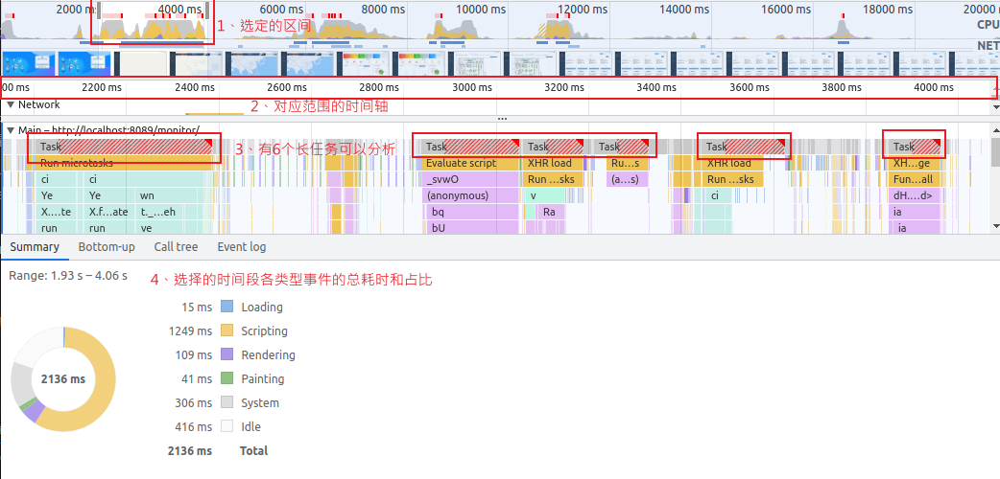

<!-- START doctoc generated TOC please keep comment here to allow auto update -->
<!-- DON'T EDIT THIS SECTION, INSTEAD RE-RUN doctoc TO UPDATE -->
<!-- **Table of Contents**  *generated with [DocToc](https://github.com/thlorenz/doctoc)* -->

- [Chrome 开发工具 Performance 使用实战](#chrome-开发工具-performance-使用实战)
  - [Performance 面板介绍](#performance-面板介绍)
  - [使用 Performance 进行性能分析的示例](#使用-performance-进行性能分析的示例)
  - [补充 1: 启用调试时查看原始代码](#补充-1-启用调试时查看原始代码)
  - [补充 2: 找出静置页面的性能消耗组件](#补充-2-找出静置页面的性能消耗组件)
  - [补充 3: Performance insights 工具简介](#补充-3-performance-insights-工具简介)
  - [总结](#总结)

# Chrome 开发工具 Performance 使用实战

<!-- 看了本文，你一定就会使用Chrome的Performance开发工具。不少的博文都只是讲解Performance面板的各个数据含义，并没有从实际操作上来讲如何使用，如何进行性能分析。本文除此有实际的使用示例之外，也简单介绍了insights工具。 -->

我有看到不少介绍 Chrome 的开发工具 Performance 的文章，大部分都是把面板介绍了一遍，但是要自己来用的时候，感觉并没什么帮助。正好最近我也用到了这个工具做一些简单的前端项目性能分析，所以从实际操作上来简单介绍一下 Performance 工具的使用。个人感觉，看完这篇文章，大概率是一定会使用这个工具了，至少最基本的使用。

想要分析页面运行时的性能(runtime performance)时，我猜测，不少人一定曾经尝试使用过 Chrome 的 Performance 工具（以下简称 Performance 工具），但因打开之后看见如此杂乱繁多的内容而劝退，反正我一开始是这样的。但是下定决心一定要看懂之后才发现，其实并不复杂。

当然这里不讲 Dunning–Kruger effect 或者 Impostor syndrome，而是简单学习一下 Performance 工具。相较于和其他博文类似的 Performance 工具面板介绍部分，强烈建议先看一下 Chrome developers 网站的官方介绍文档[Performance features reference](https://developer.chrome.com/docs/devtools/performance/reference/)，非常清晰易懂，看完就会，或者也可以看看这里更简短的说明。

小注：以下都是在 Chrome 116.0.5845.96 下的截图，其他较新版本差距不大。前端为 vue 项目使用 vite build 之后部署在本地的 nginx 下。因为有实际使用和操作，截图内容是比较重要的，请不要忽略。此外截图中默认是英文，如果不习惯可以自己使用是设置开发工具的面板为中文显示，然后对照相应位置即可，谢谢。

## Performance 面板介绍

在浏览器打开开发者工具(按 F12)，切换到“Performance”面板，得到初始面板：

`part1`部分就是录制负载性能的工具，我们在分析页面运行时性能，就需要记录一段时间内的负载性能来分析运行中的各个细节。这里可以录制新内容，或者保存录制的内容，以便后续重新加载。

对于我有两种情况的内容经常需要分析:

- 1 页面的加载效率。这个通常就是页面加载是否快速，交互是否流畅、页面布局是否稳定等。
  - 所以我一般在这种录制的时间内，有较多的事件，比如页面跳转、页面交互等，涉及到 js、css 加载、各种任务等，以便定位哪部分最耗性能，方便优化。
- 2 页面静置稳定性。这个通常是用于展示的页面，很少交互，基本是单向数据更新。
  - 有时候用于展示的页面往往花里胡哨、很多特效、性能耗费严重，而长时间展示，有可能卡死了都不知道。所以我一般是录制一下确定哪些东西占用了太多的性能，尽量别用(点名一个网页的粒子特效)。

注意右侧的 Screenshots 和 Memory 复选框，选中后录制时才可以录制时捕获每一帧的屏幕截图已经内存指标(下面的 part5)。

`part2`部分是录制的设置(Throttle settings menu)。这里可以模拟不同性能的设备，比如限制 CPU 的性能、限制网速、限制硬件并发数。另外两个:

- Disable JavaScript samples : 禁用后录制的负载中不会有 js 的详细调用栈( detailed call stacks)，显示内容更加简洁。
- Enable advanced paint instrumentation: 启用高级的绘制工具。方便查看页面中的图层和绘制事件。

这是一份我实际项目十几秒的负载性能录制的面板，其中有登录、页面跳转、搜索框输入查询等操作:

`part3`是概要面板(Overview panel)，目前是 CPU、NET、HEAP 的图表。可以看到录制时间段内各个时间点各自的性能数值，讲鼠标放到任意时间点，还能看到当时的页面缩略图。

`part4`为活动面板(activities panel)，最主要的就是 main 主线程的活动数据。简单了解之前浏览器的工作原理的内容，尤其是页面加载过程，我的很多性能优化，其实就是对这个主线程上任务的优化。

当然其他的 Network 网络请求、Frames 帧、Animation 动画、Interactions 事件交互、Layout shifts 布局偏移、GPU 等也有各自的偏重。我这里常用的几个是这些：

`Network` 中不同颜色的含义:

- HTML: Blue(蓝色)
- CSS: Purple(紫色)
- JS: Yellow(黄色)
- Images: Green(绿色)

`Frame`中不同的颜色含义:

- Idle frame (白色). 没有变化。
- Frame (绿色). 及时且按照预期渲染的正常帧。
- Partially presented frame (带有宽虚线的黄色).Chrome 尽力及时渲染至少一些视觉更新。
- Dropped frame(带有密实线的红色).Chrome 无法在合理的时间内渲染该帧。

图中可以看到，非空闲的帧时间区间为 16.7ms，那是因为屏幕刷新率为 60 帧，1 分钟渲染 60 帧的话，那么每一帧的渲染时间就是 1000/60≈16.7ms 了。

`Main`主线程活动。

DevTools 用火焰图表示主线程活动。 x 轴代表一段时间内的记录。 y 轴表示调用堆栈。上面的事件会引发下面的事件(这个火焰图和一般的不协调就是火焰是朝下的而已)。

颜色是随机的，但同一份记录中各个活动的颜色是保持一致的。但我一般主要关注的是一些 Task 尤其是 Long Task(长任务，一般指超过 50 毫秒的任务)的状态。

- 长任务用红色三角形突出显示，超过 50 毫秒的部分用红色阴影表示。

其他活动分区可自行查看，我个人目前一般很少用到。

`part5`为内存指标(Memory chart)，统计选定记录时间区间的内存相关指标。

内存这块本文就不过多介绍，其实对应 Chrome 本身就是内存消耗大户来讲，这个内存的优化，可能并不打紧(这是开玩笑的)。

`part6`为摘要面板(Summary panel)，统计选定记录的时间区间内容各项活动的耗时占比。

- Summary: 展示各个事件阶段耗费的时间，可以看到 CPU 重的资源分配。哪个部分耗时多，就可以按需思考是否可以优化。
- Bottom-Up：排序：可以看到各个事件消耗时间排序
  - self-time 指除去子事件这个事件本身消耗的时间
  - total-time 这个事件从开始到结束消耗的时间（包含子事件）
- Call Tree：可以通过调用树来查看各个文件调用运行的时间及占比。
- Event Log：事件日志，按照记录期间发生的顺序查看活动
  - 和前面两个多了个 start time，指事件在多少毫秒开始触发的
  - 右侧还有事件描述信息

当然默认完整的时间段，可以鼠标滚轮缩放或者直接点选指定的区间，摘要面板、活动面板、总结面板所显示的时间区间、事件颜色都是一样的，尤其是区间缩放切换时，各自跟随变换。

点击 Network 的某个事件、Frame 中的某一桢、Main 中某个任务和子任务，都可以在 Summary 面板看到相关信息，分别类似如下:

## 使用 Performance 进行性能分析的示例

在搞明白了 Performance 工具的各个部分以及各自的区域大概的含义，一般情况下该如何来分析这些数据呢？这里使用的接续上面截图中的性能负载记录。

**第一步：找到需要分析的区间。**

如下图，这一份十几秒的性能负责记录，记录了我登录测试网站、切换页面、点击查询操作的负载数据。一般情况下，网页静置的时间，可能不会需要经常优化，而有操作的时候，无论是 CPU 的占用、网络的负载、和主线程的任务都会比其他空闲情况多很多，比如图中下半部分带有数字标识的区域：

当然如果像图中有打开上述面板介绍时 part 部分的 Screenshots 选项，也可以从预览图部分观察当时的页面是否是自己正在进行某些操作的时间点。

从图中顶部 CPU panel 占用很高的地方可能看到一些红色的线条，或者`Main`区域带有红色三角形的 Long Task 区间，这些部分就是可以进一步分析的内容。

当然我这里没有用到 Web Worker，这也是一种优化的策略。我这里提到的优化就比较简单，也就是考虑减轻 main 主线程的负载、减少长任务的数量等，实际方案的话后续再讲。

**第二步：初步分析选中区间。**

我这里选择标识为 2 的区域，直接用鼠标拉这个区域或者滚轮放大到这个区域就好。

截图中显示我选择的区间是 1.93s-4.06s，这之间有 6 个长任务，而其中耗时最长的事件类型是 Scripting，占用了总区间 60%左右的时间。那么这时候就可能脱口而出优化方案之一就是多线程加载脚本。

当然，我可以再进一步分析这几个长任务到底在做些什么，以便知道要加载哪些脚本。

**第三步：分析长任务。**

我这里选中第一个长任务:

其实此时的 Summary 面板也切换到该长任务的耗时区间，也有各类事件耗时统计。我一般会切换到 Event log (因为 Bottom-up 和 Call tree 的属性这里都有)查看整个长任务过程中，是如何一步一步执行的，并定位其中最耗时的部分，来确定是否优化和优化方案。

当然，像上图中这种 vue 源码内部方法的调用我个人一般是很少去优化的，主要的目标还是自己编写的代码部分，如下图：

像上面截图的这个长任务，逐步分析过去，可以看到这个耗时 85ms 的操作，是自己的代码中手数据的获取与格式化的操作(又一次提问，async/await 是否会阻塞线程)，接下来就可以去优化自己的代码了。

基本上，使用 Performance 工具简单进行性能分析用于优化的操作就介绍到这里。当然，众所周知 web 性能优化远不止优化一个 js 代码逻辑，这里也只是初步介绍这个工具的使用，方便各位入门。

当然，这里只是介绍了主线程长任务的识别和处理。其他的优化也类似，比如网络耗时比较旧的，在 Network panel 中去定位，找到是哪个文件的问题，然后再想想压缩、删减、多线程等其他方式来优化加载速度等。这就不展开讲了。

## 补充 1: 启用调试时查看原始代码

其实上面“分析长任务”那一步，可以点击文件链接来确定是哪一个函数在执行，默认情况看到的是这样混淆过的代码(这也已经格式化过的):

一般情况下，这样的代码没法看。但是，如果是这样的代码，那就能看明白了:

要达成此效果非常简单。正如使用 vite 编译打包时要启用 source map 功能时，会在`vite.config.ts`的 build 选项中启动，这样可以看到自己写的代码的原始代码，如下图:

要在调试时查看 vue 的源代码，也只需在使用 vite 打包时启动 sourcemap 选项，我这里是在`package.json`的 script 的打包指令中，加入了 `--sourcemap`选项，如下图：

当然，最后需要在 Chrome 中启用 sourcemap 功能，F12 打开的开发者工具的右上角设置，或者`F1 + shift + ?`打开设置，启动以下选项：

最后重启一下 Chrome 开发者工具即可。

**注意: 请仅在调试时使用，正式上线部署不建议启用 source map。** 此外，依赖库的源代码在 record 当时可以正常还原，但如果是把性能负载文件导出 json 之后，后续再导入 Performance 工具查看，即便网页处在部署的地址，跳转到 sources 的代码依旧是压缩过的。

这也可以是一个面试题:source map 是什么？有什么用？为什么正式上线一般不启用？(ChatGPT3.5 的回复如下:)

- Sourcemap 本质上是一个信息文件，里面储存着代码转换前后的对应位置信息。 它记录了转换压缩后的代码所对应的转换前的源代码位置，是源代码和生产代码的映射。
- Sourcemap 有以下几个主要的用途：
  - 调试：在开发过程中，debuger 可以利用 Sourcemap 文件，以更直观和易读的方式显示源代码中的错误位置，而不是显示压缩、混淆后的代码位置，从而帮助开发人员快速定位和修复问题。
  - 错误追踪：在 Web 应用程序中，当用户遇到问题并报告错误时，Sourcemap 可以帮助开发人员在没有源代码副本的情况下，通过错误日志和堆栈跟踪信息来定位问题所在的位置。这对于线上排查问题和快速回溯错误非常有用。
- 当 Web 应用程序部署到生产环境时，为了提高加载速度和减少带宽消耗，通常会对代码进行压缩、混淆和合并等优化操作。
  - 在生产环境中应该仅用于调试目的。为了保护源代码的安全性，应确保 Sourcemap 文件不会被未授权的用户访问到。

---

## 补充 2: 找出静置页面的性能消耗组件

正如一开始所说，我对 Performance 工具的另外一个使用场景，就是静置页面执行的高负载情况的问题追踪。

比如，我有个页面，没有做任何的交互，但浏览器的任务管理器显示 CPU 占用一直很高:

同样的，打开 Chrome 的 Performance 工具，记录一段页面静置的负载记录，分析原因，示例数据面板如下：

我这个例子比较简单，通过上图各项均匀的分布和绘制事件，再查看 event log，可以找到是因为使用了粒子特效的组件导致的高占用，因为会周期性地进行绘制，如下图:

其实在写这段话之前的截图，能在面板中看到`Animation` panel 的(见面板介绍小节的 part4 部分)，里面就可以直接追踪到是因为动画导致的性能问题。但我为了截图重新 record 一次后，就找不到这个 Animation 了，重复多次也不行，原因尚不明白。

## 补充 3: Performance insights 工具简介

Chrome 官方的 Performance 教程[Analyze runtime performance](https://developer.chrome.com/docs/devtools/performance/)是基于 Chrome59 版本编写的，所以截图和我的示例中有一点点区别。理论上其他的 Chromium 项目的浏览器也支持类似 Performance 开发调试工具。

但是从 Chrome102 版本开始，有一个 Chrome 暂时独有的性能 devtool 相关的预览功能加入了进来，就是 Performance insights，中文翻译为“性能数据分析”，可以先直接查看官方的教程[Performance insights: Get actionable insights on your website's performance](https://developer.chrome.com/docs/devtools/performance-insights/)，都比较详细。当然，我这里也只是介绍一下基础的。

默认是没有启用的，在开发者工具面板右上角更多工具中选择开启，如下图:

这里的 record 和 Performance 工具是可以通用的(当然，直接使用 insights 工具录制并导出的数据会默认压缩成 gz 格式的，默认名称类似`Profile-20230822T191047.json.gz`，而前者默认类似`Trace-20230821T190810.json`)，下面的截图中的数据就是我在上面截图使用的 Performance 导出后在 Performance insights 展示的，大体内容是差不多的，我个人的关注点比较简单:

从上面截图来看，和 Performance 数据面板有很多类似的地方，简单介绍一下：

`part1`中的项目，例如 Layout Shifts、Network、Interactions、Renderer(main)这些，是表明在这份性能负载记录中拥有这些变化。

也就是说，我这份性能负载数据中有布局偏移、网络请求、交互操作、进程渲染等各项内容。insights 工具默认会展示这份记录中拥有的项目，如果不存在相关的项目负载，则默认不显示。假如这段记录没有网络请求，则不会显示 Network 标签。

当然，可以手动打开，所有的选项在右上角的那个设置图标中，所有选项如下:

这个面板内容比 Performance 其实没有多少进步，但比如 Network 项目，不同的请求类型用不同的颜色标识，所有的请求都列式在左侧，还是比 Performance 中好看很多。

不过最重要的是因为有上面的 settings 可以控制显示的选项，那么如果我主要分析主线程的任务优化，就可以只显示 Renderer(Main)，会简洁很多。Performance 就没办法只显示这部分。

此外 Renderer 主线程的火焰图其实也和 Performance 类似，倒火焰。但是，和之前我手动去选择时间区间去找需要优化的任务不同，在`part2`部分，直接帮你找到了相关操作，例如长任务、强制应用布局、强制重新计算样式等，这也就是 insight 的原因吧。

直接点击这些节点，就可以看到详细内容，下面这个截图是点击了第二个长任务：

左侧 Main 的时间轴会标识位置，右侧列式了相关函数调用，当然那个修改建议的“learn more”也是调到 web.dev 网站的一些优化建议博客中去，可以看。

至于缩放似乎就没有 Performance 面板那么方便的使用鼠标点选或者滑轮了，需要在`part3`右侧的缩放图标手动缩放，然后在对应选项下面会出现滚动条，拖放到指定时间轴。这个就远不如 Performance 方便了。

基本就这样。简单说来，insights 工具相较于 Performance 工具，我个人比较关注的进步有两个:

- 可以指定显示选项。只显示自己需要的内容，避免了太多数据显得杂乱而不便分析。
- 自动检测出 insights 列表。就是右侧的 insights 数据，可以更加单纯去分析这些内容而不用自己去找。

当然，这里截图看到的函数调用部分也是显示的压缩混淆后的代码，也可以使用 sourcemap 来还原源代码方便调试。还是要注意：_加载本地的 record 似乎 sourcemap 还原源代码是失效的_。

## 总结

本文主要讲解了 Chrome devtool 的 Performance 面板各个部分的含义、如何使用 Performance 工具来分析性能问题、如何使用 sourcemap 还原混淆后的代码、以及简单 Performance insights 工具等内容。

理论上讲应该在介绍完“浏览器的工作原理”之后再写这篇的，但是最近有用到，所以就先写了。实际上，还是有像“找出静置页面的性能消耗组件”中任务管理器截图中有多个 Dedicated Worker，为什么 Frames 选项有每个帧 16.7ms 但空闲的可以是连续的数百毫秒等问题没有说。当然，这里在了解了多线程浏览器架构、页面的渲染过程等知识都是可以明白的。

总的来说，对我来讲，使用 Chrome 的这些开发工具虽然有时候不如专业的工具好，但是呢至少方便、上手也快、还不要钱，简单的性能分析也足够了。此外，可能有时候什么前端性能埋点数据之类使用到的 web 的 Performance API，也与之息息相关。所以学习使用这个工具还是有好处的。

当然，这都是我的一家之言，可能有很多局限和不足，还请各位不吝指教，多多反馈，谢谢。

此外，之前有在 github 上也整理一些工作学习中的知识积累：[Sanotsu/web-beginner](https://github.com/Sanotsu/web-beginner)，有新的内容也会放上去，有兴趣也可以看看。

不过这些都是我个人的经验，所学习总结的东西也未必是全对，兼听则明偏信则暗，也希望与君交流共勉，谢谢。
