# Web 开发 7 年，一文总结 CSS 常见面试点和基础教程

<!-- START doctoc generated TOC please keep comment here to allow auto update -->
<!-- DON'T EDIT THIS SECTION, INSTEAD RE-RUN doctoc TO UPDATE -->

- [常见的 CSS 面试题基础知识点](#%E5%B8%B8%E8%A7%81%E7%9A%84-css-%E9%9D%A2%E8%AF%95%E9%A2%98%E5%9F%BA%E7%A1%80%E7%9F%A5%E8%AF%86%E7%82%B9)
- [CSS 基础指南](#css-%E5%9F%BA%E7%A1%80%E6%8C%87%E5%8D%97)
  - [前置补充](#%E5%89%8D%E7%BD%AE%E8%A1%A5%E5%85%85)
    - [一些基础概念](#%E4%B8%80%E4%BA%9B%E5%9F%BA%E7%A1%80%E6%A6%82%E5%BF%B5)
    - [简述：CSS property 三巨头和 box-sizing](#%E7%AE%80%E8%BF%B0css-property-%E4%B8%89%E5%B7%A8%E5%A4%B4%E5%92%8C-box-sizing)
      - [position](#position)
      - [display](#display)
      - [float](#float)
      - [box-sizing](#box-sizing)
    - [选择器](#%E9%80%89%E6%8B%A9%E5%99%A8)
      - [基础选择器](#%E5%9F%BA%E7%A1%80%E9%80%89%E6%8B%A9%E5%99%A8)
      - [组合器](#%E7%BB%84%E5%90%88%E5%99%A8)
      - [伪类选择器](#%E4%BC%AA%E7%B1%BB%E9%80%89%E6%8B%A9%E5%99%A8)
      - [伪元素选择器](#%E4%BC%AA%E5%85%83%E7%B4%A0%E9%80%89%E6%8B%A9%E5%99%A8)
      - [属性选择器](#%E5%B1%9E%E6%80%A7%E9%80%89%E6%8B%A9%E5%99%A8)
  - [最基本的原理](#%E6%9C%80%E5%9F%BA%E6%9C%AC%E7%9A%84%E5%8E%9F%E7%90%86)
    - [层叠、优先级和继承](#%E5%B1%82%E5%8F%A0%E4%BC%98%E5%85%88%E7%BA%A7%E5%92%8C%E7%BB%A7%E6%89%BF)
      - [原文总结](#%E5%8E%9F%E6%96%87%E6%80%BB%E7%BB%93)
    - [相对单位](#%E7%9B%B8%E5%AF%B9%E5%8D%95%E4%BD%8D)
      - [原文总结](#%E5%8E%9F%E6%96%87%E6%80%BB%E7%BB%93-1)
    - [盒模型](#%E7%9B%92%E6%A8%A1%E5%9E%8B)
      - [盒模型简介](#%E7%9B%92%E6%A8%A1%E5%9E%8B%E7%AE%80%E4%BB%8B)
      - [盒子高度问题](#%E7%9B%92%E5%AD%90%E9%AB%98%E5%BA%A6%E9%97%AE%E9%A2%98)
      - [负外边距](#%E8%B4%9F%E5%A4%96%E8%BE%B9%E8%B7%9D)
      - [外边距折叠](#%E5%A4%96%E8%BE%B9%E8%B7%9D%E6%8A%98%E5%8F%A0)
      - [容器内的元素间距](#%E5%AE%B9%E5%99%A8%E5%86%85%E7%9A%84%E5%85%83%E7%B4%A0%E9%97%B4%E8%B7%9D)
      - [原文总结](#%E5%8E%9F%E6%96%87%E6%80%BB%E7%BB%93-2)
  - [精通布局](#%E7%B2%BE%E9%80%9A%E5%B8%83%E5%B1%80)
    - [理解浮动](#%E7%90%86%E8%A7%A3%E6%B5%AE%E5%8A%A8)
      - [浮动的设计初衷](#%E6%B5%AE%E5%8A%A8%E7%9A%84%E8%AE%BE%E8%AE%A1%E5%88%9D%E8%A1%B7)
      - [容器折叠与清除浮动](#%E5%AE%B9%E5%99%A8%E6%8A%98%E5%8F%A0%E4%B8%8E%E6%B8%85%E9%99%A4%E6%B5%AE%E5%8A%A8)
      - [BFC](#bfc)
      - [原文总结](#%E5%8E%9F%E6%96%87%E6%80%BB%E7%BB%93-3)
    - [弹性盒子布局(Flexible Box Layout)](#%E5%BC%B9%E6%80%A7%E7%9B%92%E5%AD%90%E5%B8%83%E5%B1%80flexible-box-layout)
      - [创建一个弹性盒子](#%E5%88%9B%E5%BB%BA%E4%B8%80%E4%B8%AA%E5%BC%B9%E6%80%A7%E7%9B%92%E5%AD%90)
      - [弹性子元素的大小](#%E5%BC%B9%E6%80%A7%E5%AD%90%E5%85%83%E7%B4%A0%E7%9A%84%E5%A4%A7%E5%B0%8F)
      - [弹性方向](#%E5%BC%B9%E6%80%A7%E6%96%B9%E5%90%91)
      - [弹性盒子布局的属性图示](#%E5%BC%B9%E6%80%A7%E7%9B%92%E5%AD%90%E5%B8%83%E5%B1%80%E7%9A%84%E5%B1%9E%E6%80%A7%E5%9B%BE%E7%A4%BA)
      - [原文总结](#%E5%8E%9F%E6%96%87%E6%80%BB%E7%BB%93-4)
    - [网格布局(Grid Layout)](#%E7%BD%91%E6%A0%BC%E5%B8%83%E5%B1%80grid-layout)
      - [创建一个网格容器](#%E5%88%9B%E5%BB%BA%E4%B8%80%E4%B8%AA%E7%BD%91%E6%A0%BC%E5%AE%B9%E5%99%A8)
      - [网格剖析](#%E7%BD%91%E6%A0%BC%E5%89%96%E6%9E%90)
      - [替代语法](#%E6%9B%BF%E4%BB%A3%E8%AF%AD%E6%B3%95)
      - [显式和隐式网格](#%E6%98%BE%E5%BC%8F%E5%92%8C%E9%9A%90%E5%BC%8F%E7%BD%91%E6%A0%BC)
      - [特性查询 @supports](#%E7%89%B9%E6%80%A7%E6%9F%A5%E8%AF%A2-supports)
      - [网格布局模块中的对齐](#%E7%BD%91%E6%A0%BC%E5%B8%83%E5%B1%80%E6%A8%A1%E5%9D%97%E4%B8%AD%E7%9A%84%E5%AF%B9%E9%BD%90)
      - [原文总结](#%E5%8E%9F%E6%96%87%E6%80%BB%E7%BB%93-5)
    - [定位和层叠上下文](#%E5%AE%9A%E4%BD%8D%E5%92%8C%E5%B1%82%E5%8F%A0%E4%B8%8A%E4%B8%8B%E6%96%87)
      - [固定定位 fixed](#%E5%9B%BA%E5%AE%9A%E5%AE%9A%E4%BD%8D-fixed)
      - [绝对定位 absolute](#%E7%BB%9D%E5%AF%B9%E5%AE%9A%E4%BD%8D-absolute)
      - [相对定位 relative](#%E7%9B%B8%E5%AF%B9%E5%AE%9A%E4%BD%8D-relative)
      - [层叠上下文和 z-index](#%E5%B1%82%E5%8F%A0%E4%B8%8A%E4%B8%8B%E6%96%87%E5%92%8C-z-index)
      - [粘性定位 sticky](#%E7%B2%98%E6%80%A7%E5%AE%9A%E4%BD%8D-sticky)
      - [原文总结](#%E5%8E%9F%E6%96%87%E6%80%BB%E7%BB%93-6)
    - [响应式设计](#%E5%93%8D%E5%BA%94%E5%BC%8F%E8%AE%BE%E8%AE%A1)
      - [移动优先](#%E7%A7%BB%E5%8A%A8%E4%BC%98%E5%85%88)
      - [媒体查询 @media](#%E5%AA%92%E4%BD%93%E6%9F%A5%E8%AF%A2-media)
      - [补充：容器查询 @container](#%E8%A1%A5%E5%85%85%E5%AE%B9%E5%99%A8%E6%9F%A5%E8%AF%A2-container)
      - [流式布局](#%E6%B5%81%E5%BC%8F%E5%B8%83%E5%B1%80)
      - [原文总结](#%E5%8E%9F%E6%96%87%E6%80%BB%E7%BB%93-7)
  - [大型应用程序中的 CSS](#%E5%A4%A7%E5%9E%8B%E5%BA%94%E7%94%A8%E7%A8%8B%E5%BA%8F%E4%B8%AD%E7%9A%84-css)
    - [模块化 CSS](#%E6%A8%A1%E5%9D%97%E5%8C%96-css)
      - [基础样式](#%E5%9F%BA%E7%A1%80%E6%A0%B7%E5%BC%8F)
      - [创建模块](#%E5%88%9B%E5%BB%BA%E6%A8%A1%E5%9D%97)
      - [把模块组合成更大的结构](#%E6%8A%8A%E6%A8%A1%E5%9D%97%E7%BB%84%E5%90%88%E6%88%90%E6%9B%B4%E5%A4%A7%E7%9A%84%E7%BB%93%E6%9E%84)
      - [工具类](#%E5%B7%A5%E5%85%B7%E7%B1%BB)
      - [几种模块化 CSS 方法论和 css in js 的概述](#%E5%87%A0%E7%A7%8D%E6%A8%A1%E5%9D%97%E5%8C%96-css-%E6%96%B9%E6%B3%95%E8%AE%BA%E5%92%8C-css-in-js-%E7%9A%84%E6%A6%82%E8%BF%B0)
      - [原文总结](#%E5%8E%9F%E6%96%87%E6%80%BB%E7%BB%93-8)
    - [模式库](#%E6%A8%A1%E5%BC%8F%E5%BA%93)
    - [CSS 预处理器 Sass/SCSS](#css-%E9%A2%84%E5%A4%84%E7%90%86%E5%99%A8-sassscss)
  - [高级话题(小略)](#%E9%AB%98%E7%BA%A7%E8%AF%9D%E9%A2%98%E5%B0%8F%E7%95%A5)
    - [背景、阴影和混合模式](#%E8%83%8C%E6%99%AF%E9%98%B4%E5%BD%B1%E5%92%8C%E6%B7%B7%E5%90%88%E6%A8%A1%E5%BC%8F)
      - [渐变](#%E6%B8%90%E5%8F%98)
      - [阴影](#%E9%98%B4%E5%BD%B1)
      - [混合模式](#%E6%B7%B7%E5%90%88%E6%A8%A1%E5%BC%8F)
      - [原文概要与总结](#%E5%8E%9F%E6%96%87%E6%A6%82%E8%A6%81%E4%B8%8E%E6%80%BB%E7%BB%93)
    - [对比、颜色和间距](#%E5%AF%B9%E6%AF%94%E9%A2%9C%E8%89%B2%E5%92%8C%E9%97%B4%E8%B7%9D)
      - [对比很重要](#%E5%AF%B9%E6%AF%94%E5%BE%88%E9%87%8D%E8%A6%81)
      - [颜色](#%E9%A2%9C%E8%89%B2)
      - [间距](#%E9%97%B4%E8%B7%9D)
      - [原文概要与总结](#%E5%8E%9F%E6%96%87%E6%A6%82%E8%A6%81%E4%B8%8E%E6%80%BB%E7%BB%93-1)
    - [排版](#%E6%8E%92%E7%89%88)
      - [web 字体](#web-%E5%AD%97%E4%BD%93)
      - [如何使用`@font-face`](#%E5%A6%82%E4%BD%95%E4%BD%BF%E7%94%A8font-face)
      - [调整字距](#%E8%B0%83%E6%95%B4%E5%AD%97%E8%B7%9D)
      - [恼人的 FOUT 和 FOIT](#%E6%81%BC%E4%BA%BA%E7%9A%84-fout-%E5%92%8C-foit)
      - [原文概要与总结](#%E5%8E%9F%E6%96%87%E6%A6%82%E8%A6%81%E4%B8%8E%E6%80%BB%E7%BB%93-2)
    - [过渡(transition-\*)](#%E8%BF%87%E6%B8%A1transition-%5C)
      - [定义过渡的属性](#%E5%AE%9A%E4%B9%89%E8%BF%87%E6%B8%A1%E7%9A%84%E5%B1%9E%E6%80%A7)
      - [检测过渡是否完成](#%E6%A3%80%E6%B5%8B%E8%BF%87%E6%B8%A1%E6%98%AF%E5%90%A6%E5%AE%8C%E6%88%90)
      - [原文概要与总结](#%E5%8E%9F%E6%96%87%E6%A6%82%E8%A6%81%E4%B8%8E%E6%80%BB%E7%BB%93-3)
    - [变换(transform-\*)](#%E5%8F%98%E6%8D%A2transform-%5C)
      - [CSS transforms 属性](#css-transforms-%E5%B1%9E%E6%80%A7)
      - [原文概要与总结](#%E5%8E%9F%E6%96%87%E6%A6%82%E8%A6%81%E4%B8%8E%E6%80%BB%E7%BB%93-4)
    - [动画](#%E5%8A%A8%E7%94%BB)
      - [配置属性](#%E9%85%8D%E7%BD%AE%E5%B1%9E%E6%80%A7)
      - [使用 keyframes 定义动画序列](#%E4%BD%BF%E7%94%A8-keyframes-%E5%AE%9A%E4%B9%89%E5%8A%A8%E7%94%BB%E5%BA%8F%E5%88%97)
      - [原文概要与总结](#%E5%8E%9F%E6%96%87%E6%A6%82%E8%A6%81%E4%B8%8E%E6%80%BB%E7%BB%93-5)
- [小结](#%E5%B0%8F%E7%BB%93)

<!-- END doctoc generated TOC please keep comment here to allow auto update -->

概述：

结合自己多年的 web 开发经验，加上很多高阅读量的博文、几本有名的 CSS 的指南书籍、配合 W3C 的 CSS 规范和 MDN 的 CSS 教程，整理了这份应对 CSS 基础面试的 CSS 基础指南。

结合自己多年的 web 开发经验，配合几本 CSS 的书籍、一些高阅读量的文章、W3C 的规范和 MDN 的教程，整理了这份应对基础面试的 CSS 基础指南。

---

前言

有人说：没人会关心 CSS，不就是调个样式而已，没什么技术含量，需要的时候去查一下就知道怎么做了。面试？CSS 重来不会作为重点考察领域，尤其我们都能非常熟练使用各种组件库的话，布局、样式之类的，已经不需要手动一个一个写了。

我也有看了很多 CSS 面试分享的博文，一开始那些大而全的八股文可能 CSS 这部分内容较少，于是我觉得我能行；但有些专门讲 CSS 的文章，尤其是涉及到实践的，就变得丰富且复杂起来。总体看下来，这些文章大都是列示一系列问题，然后怎么作答，有些功能实现的问题可能需要代码示例。

本来我也是想列一堆常见的 CSS 面试题然后写上答案即可。但实践下来发现只要弄懂了 CSS 基础指南，有个 CSS 面向的大概结构，对于这些问题，基本都能很好应对。

也有人说大厂才对这些底层基础只是比较看重，小厂更希望能熟练使用各种轮子。这话我没有考据到，但我希望他说的是真的。

---

距离上次写文章过去了比较久，因为这些天过了好几本书，看了不少博客和文档，有空还在和领导干架，整理完之后写博客时还“超过最大字符限制”，所以内容可能有很多遗漏和不足，还请诸君不吝指导，谢谢。

系列文章：

- [「万字总结」干了 7 年 Web 开发工作，混吃等死的日子可能到头了](https://juejin.cn/post/7236668766955307069)
- [Web 开发 7 年，八千字浅谈前端架构设计与工程化](https://juejin.cn/post/7238479969180319805)
- [Web 开发 7 年，不止为了面试 —— 万字 HTML 重点基础知识分享](https://juejin.cn/post/7239996748318572599)
- Web 开发 7 年，一文总结 CSS 常见面试点和基础教程 （本文）
- 未完待续

# 常见的 CSS 面试题基础知识点

看了好几天别人的博文，时间精力有限，重点放在了其中不到 10 篇但总计有超过 150 万的阅读量的文章，看起来大家还是蛮认可的。根据自己有限的能力进行了简单的分类，提到比较多的知识点如下所示:

- 盒模型
- 层叠上下文
- 选择器
- BFC
- 浮动
- flex 布局
- 水平垂直居中
- link 与 @import
- 一些属性：display、position、float、line-height 等
- CSS 动画
- 实现 XX 布局
- 移动端适配
- 场景应用: 例如画三角形、0.5px 的线等
- CSS 预处理器

不知道有没有像我这样，之前从来没有系统学习过 CSS，都只是在有需求的时候去搜一下解决方案，所以从心里觉得 CSS 很复杂很强大。可能后来系统地学习过，或者看了一些 CSS 书籍，就觉得 CSS 的内容也不是特别复杂。这里是一些讲解 CSS 的书籍的目录:

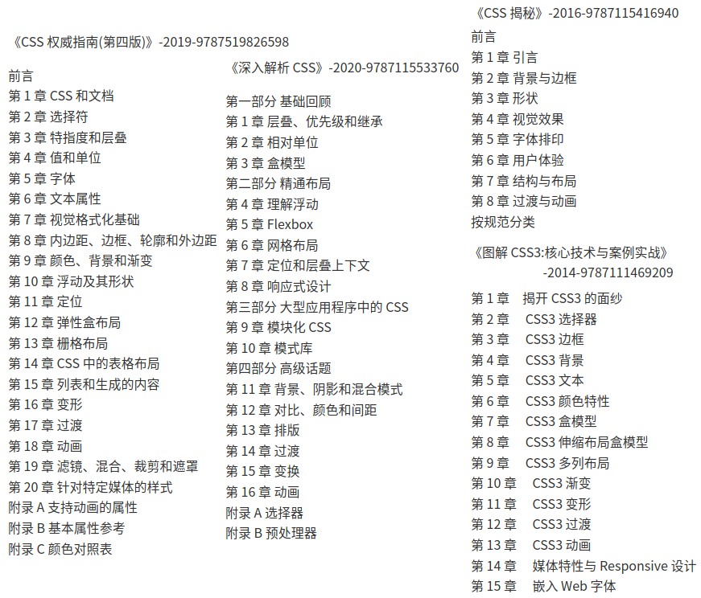

我不是在推荐这些书，只不过总结起来感觉就是，基础使用、布局排版、动画变换，果然到最后还是落实到下面内容的实际使用上而已:

- CSS 模块(Modules)
- CSS 属性(Properties)
- CSS 选择器(Selectors)
- CSS 组合器(Combinators)
- CSS 伪类(Pseudo-classes)
- CSS 伪元素(Pseudo-elements)
- CSS @规则(At-rules)
- CSS 函数(Functions)
- CSS 数据类型(Types)

所以，相较于直接回到上面的问题，我感觉看完下面这篇简单的基础教程，或许可以就能够解答上面、甚至这里没有列出的问题点。授人以鱼不如授人以渔，这里加上示例代码才不到 40000 字符，花了一两个小时看看，**了解 CSS 整体概念，然后再背一背一些高频的 CSS 属性和值的作用**，我觉得基础的 CSS 面试题，或许手拿把攥。

# CSS 基础指南

说明：以 Keith J. Grant 的书籍《CSS IN DEPTH》的中文版[《深入解析 CSS》](https://book.douban.com/subject/35021471/)，ISBN: 9787115533760 这本书为基准，结合 MDN 的 CSS 教程 [《CSS：层叠样式表》](https://developer.mozilla.org/zh-CN/docs/Web/CSS)，以及 W3C 的 CSS 规范 [《CSS Snapshot 2023-W3C Group Draft Note, 14 February 2023》](https://www.w3.org/TR/CSS/)，整理了这份 CSS 的简单教程。文中的图表也大多数来自这些内容。对于高级话题：过渡、变换、动画以及混合模式、排版、阴影等一些实际的设计也是极简说明。

## 前置补充

### 一些基础概念

[层叠样式表(Cascading Style Sheets .CSS)](https://www.w3.org/TR/CSS/#css-glossary) 是一种编写样式表(Style sheet)的语言，旨在描述结构化文档（如 HTML 和 XML）在各种媒体上的呈现。CSS 用于描述源文档(Source document)的表现形式，通常不改变其文档语言所表达的基本语义。

样式表(Style sheet): 一组规则，指定一个文档的表现形式。样式表由开发者编写，并由用户代理(User Agent，如网络浏览器)解释，以向使用者展示文档。

源文档(Source document): 一个或多个样式表所适用的文件。一个源文档的结构和语义是用一种文档语言（例如，HTML、XHTML 或 SVG）来编码的。

“3”是一个非正式的版本号，其实并没有 CSS3 规范，而是 CSS 规范分成了单独的模块，每个模块单独管理版本。W3C 现在不再对 CSS 规范进行版本控制，而是定期对 CSS 规范的最新稳定状态和各个模块的进展用快照来记录。CSS 不再有版本号(例如不会有 CSS3、CSS4)，但 CSS 模块现在有版本号或者级别(例如 CSS Color Module Level 5)。

一句话: 级联样式表 (CSS) 是一种向 Web 文档添加样式（例如，字体、颜色、间距）的简单机制。

### 简述：CSS property 三巨头和 box-sizing

这里简单列式了最常用的几个 CSS 布局属性(position、display、float、box-sizing)及其常用值的含义，也是面试题中经常问到的属性，后续可能会用得到，也可以先跳过。

#### position

**position** 属性用于**指定一个元素在文档中的定位方式**。top，right，bottom 和 left 属性则决定了该元素的最终位置。属性值:

- `static`: 元素在文档常规流中**当前**的布局位置。默认定位。
- `relative`: 元素**先**放置在未添加定位时的位置，**再**在不改变页面布局的前提下调整元素位置。
- `absolute`: 元素会被移出正常文档流，并不为元素预留空间，通过**指定元素相对于最近的非 static 定位祖先元素的偏移**来确定元素位置。
- `fixed`: 元素会被移出正常文档流，并不为元素预留空间，通过**指定元素相对于屏幕视口的位置**来指定元素位置。在屏幕滚动时不会改变。
- `sticky`: 元素**先**正常文档流进行定位，**然后**相对它的*最近滚动祖先*和*最近块级祖先*进行偏移。偏移值不会影响任何其他元素的位置。

#### display

**display** 属性可以**设置元素的内部和外部显示类型**。\
元素的*外部*显示类型将决定该*元素在流式布局中的表现*（块级或内联元素）；元素的*内部*显示类型可以*控制其子元素的布局*。常见属性值:

- `<display-outside>`: 这些关键字指定了元素的**外部**显示类型，实际上就是*其在流式布局中的角色*（即在流式布局中的表现）。
  - **`block`**:这个值会生成一个块级元素盒子，同时在该元素之前和之后**打断**（换行）。简单来说就是，这个值会将该元素变成**块级**元素。
  - **`inline`**:这个值会生成一个行内元素盒子，该元素之前和之后**不会打断**（换行）。简单来说就是，这个值会将该元素变成**行内**元素。
- `<display-inside>`: 这些关键字指定了元素的**内部**显示类型，它们定义了*该元素内部内容的布局方式*。可与外部显示类型一起使用。
  - `table`: 这些元素的行为类似于 HTML`<table>`元素。它定义了一个块级框。(布局都不要用 table)
  - **`flex`**: 该元素的行为类似于块元素，并根据 **flexbox 模型**布置其内容。
  - **`grid`**: 该元素的行为类似于块元素，并根据**网格模型**布置其内容。
- `<display-listitem>`: 将这个元素的外部显示类型变为 block 盒，并将内部显示类型变为多个 list-item inline 盒。(**列表元素**)
  - `list-item`: 将使元素表现得像一个列表项。
- `<display-internal>`: 有些布局模型有**复杂的内部结构**。这类关键字用来**定义这些“内部”显示类型**，且仅在这样的布局中才有意义。
  - 目前是一堆`<display-inside>`中`table`和实验性质的`ruby`布局模性的属性，类似:
    - `table-row`: 这些元素的行为类似于`<tr>`HTML 元素。
    - `table-cell`: 这些元素的行为类似于`<td>`HTML 元素。
    - `ruby-base` Experimental: 这些元素的行为类似于`<rb>`HTML 元素。
    - `ruby-text` Experimental: 这些元素的行为类似于`<rt>`HTML 元素。
- `<display-box>`: 这些值决定元素**是否使用盒模型**。
  - **`none`**: **关闭元素的显示**，不影响布局（文件中没有该元素）。所有子项的显示也被关闭。**盒子和内容不会渲染**
  - 要一个元素占据空间（文件中存在），但不渲染，使用 CSS 的 visibility 属性。
- `<display-legacy>`:CSS 2 对于 display 属性使用单关键字语法，对于相同布局模式的块级和行级变体需要使用单独的关键字(预组合)。
  - `inline-block`: 元素会产生一个块元素盒子，并且像内联盒子一样（表现得更像一个被替换的元素），可以融入到周围内容中。
  - `inline-table`: 它表现为一个 HTML `<table>` 元素， 但是又表现为一个不同于块级盒子的内联盒子。
  - `inline-flex`: 元素表现为一个内联元素，并对内容采用弹性盒子模型进行布局。
  - `inline-grid`: 元素表现为一个内联元素，并对内容采用网格模型进行布局。

#### float

**float** 属性**指定一个元素应沿其容器的左侧或右侧放置**，允许文本和内联元素环绕它。该元素从网页的正常流动（文档流）中移除，尽管仍然保持部分的流动性（与绝对定位相反）。由于 float 意味着使用块布局，它在某些情况下会修改 display 值的计算值。属性的值如下:

- `left`: 表明元素必须浮动在其所在的块容器**左侧**的关键字。
- `right`: 表明元素必须浮动在其所在的块容器**右侧**的关键字。
- `none`: 表明元素**不进行浮动**的关键字。
- `inline-start`:关键字，表明元素必须浮动在其所在块容器的**开始**一侧，在 `ltr` 脚本中是左侧，在 `rtl` 脚本中是右侧。
- `inline-end`: 关键字，表明元素必须浮动在其所在块容器的**结束**一侧，在 `ltr` 脚本中是右侧，在 `rtl` 脚本中是左侧。
- `inherit`: 继承父元素的浮动属性

#### box-sizing

**box-sizing** 属性定义了 user agent(一个在 Web 上的浏览器)应该如何**计算一个元素的总宽度和总高度。** 属性值如下:

- `content-box`: 默认值，标准盒子模型，**只包括内容(content)的宽和高**，不包括边框（border），内边距（padding），外边距（margin）。
- `border-box`: width 和 height 属性**包括内容，内边距和边框**，但不包括外边距。IE (怪异)盒子模型。

### 选择器

首先， 了解`!important` 声明: 样式来源规则有一个例外，标记为重要（important）的声明。在声明的后面、分号的前面加上 `!important` ，该声明就会被标记为重要的声明，例如`color: red !important;`。

注意，标记了 `!important` 的声明会被当作更高优先级的来源，比开发者制定的样式表更高。

关于 `!important` 的一些经验法则：

- Always 要优化考虑使用样式规则的优先级来解决问题而不是 `!important`
- Only 只在需要覆盖全站或外部 css（例如引用的 ExtJs 或者 YUI ）的特定页面中使用 `!important`
- Never 永远不要在全站范围的 css 上使用 `!important`
- Never 永远不要在你的插件中使用 `!important`

---

**优先级标记**说明：用数值形式来标记，通常用逗号隔开每个数。_**优先级最高的 ID 列为第一位，紧接着是类，最后是标签**_。

- 比如，`“1,2,2”`表示选择器由 1 个 ID、2 个类、2 个标签组成。
- `body header.page-header h1` 优先级表示为 0,1,3。

一般来说， **CSS 规则优先级**: 内联样式 > id 选择器 > 类选择器 = 伪类选择器 = 属性选择器 > 标签选择器 = 伪元素选择器。

- 伪类选择器和属性选择器与一个类选择器的优先级相同。
- 通用选择器和组合器对优先级没有影响。

#### 基础选择器

- `tagname`: 类型选择器或者**标签选择器**。该选择器匹配目标元素的标签名。它的优先级是 0,0,1。
  - 例如：`p`、`h1`、`strong`。
- `.class`: **类选择器**。该选择器匹配 class 属性中有指定类名的元素。它的优先级是 0,1,0。
  - 例如：`.media`、`.nav-menu`。
- `#id`: **ID 选择器**。该选择器匹配拥有指定 ID 属性的元素。它的优先级是 1,0,0。
  - 例如： `#sidebar`。
- `*`: **通用选择器**。该选择器匹配所有元素。它的优先级是 0,0,0。

#### 组合器

组合器将多个基础选择器连接起来组成一个复杂选择器。它们分别代表了元素的某种特定关系:

- **后代组合器**(空格` `): 匹配的目标元素是其他元素的**后代**，只要是后代即可，不管隔了几代。
  - 例如，在`.nav-menu li` 表示目标元素`<li>`是一个拥有 `nav-menu` 类的元素的后代。
- **子组合器**(`>`): 匹配的目标元素是其他元素的**直接后代**。例如：`.parent > .child`。
- **相邻兄弟组合器**(`+`): 匹配的目标元素**紧跟**在其他元素**后面**。例如：`p + h2`。
- **通用兄弟组合器**(`~`): 匹配**所有**跟随在指定元素**之后的兄弟元素**。注意，它不会选中目标元素之前的兄弟元素。例如：`li.active ~ li`。

此外，多个基础选择器可以连起来（不使用空格或者其他组合器）组成一个**复合（compound）选择器**。复合选择器选中的元素将匹配其全部基础选择器。

例如，`.dropdown.is-active` 能够选中`<div class="dropdown is-active">`，但是无法选中`<div class="dropdown">`。

#### 伪类选择器

伪类选择器用于选中处于某个特定状态的元素。这种状态可能是由于用户交互，也可能是由于元素相对于其父级或兄弟元素的位置。伪类选择器始终以一个冒号(:)开始。优先级等于一个类选择器（0,1,0）。

- `:first-child`: 匹配的元素是其父元素的第一个子元素。
- `:last-child`: 匹配的元素是其父元素的最后一个子元素。
- `:only-child`: 匹配的元素是其父元素的唯一一个子元素（没有兄弟元素）。
- `:nth-child(an+b)`: 匹配的元素在兄弟元素中间有特定的位置。
  - 例如`:nth-child(3n+2)`表示从第二个元素开始，每隔两个元素(即每个第三个元素)。
- `:nth-last-child(an+b)`: 类似于`:nth-child()`，但不是从第一个元素往后数，而是从最后一个元素往前数。
- `:first-of-type`: 类似于`:first-child`，但不是根据在全部子元素中的位置查找元素，而是根据拥有相同标签名的子元素中的数字顺序查找第一个元素。
- `:last-of-type`: 匹配每种类型的最后一个子元素。
- `:only-of-type`: 该选择器匹配的元素是满足该类型的唯一一个子元素。
- `:nth-of-type(an+b)`: 根据目标元素在特定类型下的数字顺序以及特定公式选择元素，类似于`:nth-child`。
- `nth-last-of-type(an+b)`: 根据元素类型以及特定公式选择元素，从其中最后一个元素往前算，类似于`:nth-last-child`。
- `:not(<selector>)`: 匹配的元素不匹配括号内的选择器。括号内的选择器必须是基础选择器，它只能指定元素本身，无法用于排除祖先元素，同时不允许包含另一个排除选择器。
- `:empty`: 匹配的元素必须没有子元素。注意，如果元素包含空格就无法由该选择器匹配，因为空格在 DOM 中属于文本节点。
- `:focus`: 匹配通过鼠标点击、触摸屏幕或者按 Tab 键导航而获得焦点的元素。
- `:hover`: 匹配鼠标指针正悬停在其上方的元素。
- `:root`: 匹配文档根元素。。对 HTML 来说，这是`<html>`元素。
- `:disabled`: 匹配已禁用的元素，包括 input、select 以及 button 元素。
- `:enabled`: 匹配已启用的元素，即那些能够被激活或者接受焦点的元素。
- `:checked`: 匹配已经针对选定的复选框、单选按钮或选择框选项。
- `:invalid`: 根据输入类型中的定义，匹配有非法输入值的元素。例如，当`<input type="email">`的值不是一个合法的邮箱地址时，该元素会被匹配（Level4）。
- `:valid`: 匹配有合法值的元素（Level4）。
- `:required`: 匹配设置了 required 属性的元素（Level4）。
- `:optional`: 匹配没有设置 required 属性的元素（Level4）

更多参看 MDN 的 [伪类](https://developer.mozilla.org/zh-CN/docs/Web/CSS/Pseudo-classes) 模块。

#### 伪元素选择器

伪元素类似于伪类，但是它不匹配特定状态的元素，而是**匹配在文档中没有直接对应 HTML 元素的特定部分**。
伪元素选择器可能只匹配元素的一部分，甚至向 HTML 标记中未定义的地方插入内容。

这些选择器以双冒号（`::`）开头，尽管大多数浏览器也支持单冒号的语法以便向后兼容。伪元素选择器的优先级与类型选择器（0,0,1）相等。

- `::before`: 创建一个伪元素，使其成为匹配元素的第一个子元素。该元素默认是行内元素，可用于插入文字、图片或其他形状。必须指定 content 属性才能让元素出现，例如: `.menu::before`。
- `::after`: 创建一个伪元素，使其成为匹配元素的最后一个子元素。该元素默认是行内元素，可用于插入文字、图片或其他形状。必须指定 content 属性才能让元素出现，例如：`.menu::after`。
- `::first-letter`: 用于指定匹配元素的第一个文本字符的样式，例如：`h2::first-letter`。
- `::first-line`: 用于指定匹配元素的第一行文本的样式。
- `::selection`: 用于指定用户使用鼠标高亮选择的任意文本的样式。通常用于改变选中文本的 `background-color`。只有少数属性可以使用，包括 color、background-color、cursor、text-decoration。

#### 属性选择器

属性选择器用于**根据 HTML 属性匹配元素**。其优先级与一个类选择器（0,1,0）相等。

- `[attr]`: 匹配的元素拥有指定属性 attr，无论属性值是什么。
  - 例 如 ：`input[disabled]` 。
- `[attr="value"]`: 匹配的元素拥有指定属性 attr ，且属性值等于指定的字符串值。
  - 例如： `input[type="radio"]` 。
- `[attr^="value"]`: “开头”属性选择器。该选择器匹配的元素拥有指定属性 attr ，且属性值的开头是指定的字符串值。
  - 例如： `a[href^="https"]` 。
- ` [attr$="value"]`: “结尾”属性选择器。该选择器匹配的元素拥有指定属性 attr ，且属性值的结尾是指定的字符串值。
  - 例如： `a[href$= ".pdf"]` 。
- ` [attr*="value"]`: “包含”属性选择器。该选择器匹配的元素拥有指定属性 attr ，且属性值包含指定的字符串值。
  - 例如： `[class*="sprite-"]` 。
- ` [attr~="value"]`: “空格分隔的列表”属性选择器。该选择器匹配的元素拥有指定属性 attr ，且属性值是一个空格分隔的值列表，列表中的某个值等于指定的字符串值。
  - 例如： `a[rel~="author"]` 。
- ` [attr|="value"]`: 匹配的元素拥有指定属性 attr ，且属性值要么等于指定的字符串值，要么以该字符串开头且紧跟着一个连字符（ - ）。适用于语言属性，因为该属性有时候会指定一种语言的子集（比如墨西哥西班牙语， es-MX ，或者普通的西班牙语， es ）。
  - 例如： `[lang|="es"]` 。

这些属性选择器都是区分大小写的。选择器规范 Level4 提出了一种不区分大小写的修饰符，可以作用于任何属性选择器。它的用法是将 i 添加到结束方括号前面，例如： `input[value="search"i]` 。新规范注意兼容性。

## 最基本的原理

CSS 最基本的原理：层叠、盒模型、可用的各种单位类型。

### 层叠、优先级和继承

_CSS 本质上就是声明规则，即在各种条件下，产生特定的效果_。**层叠**指的就是这一系列规则。它决定了如何解决冲突，是 CSS 语言的基础。层叠会依据下面三种条件**解决冲突**:

- (1) 样式表的来源：样式是从哪里来的，包括你的样式和浏览器默认样式等。
- (2) 选择器优先级：哪些选择器比另一些选择器更重要。
- (3) 源码顺序：样式在样式表里的声明顺序。

**CSS 的规则**并不难，只需要写一个选择器尝试匹配元素，然后写一些键/值对(`属性：属性值`)给元素添加样式即可:

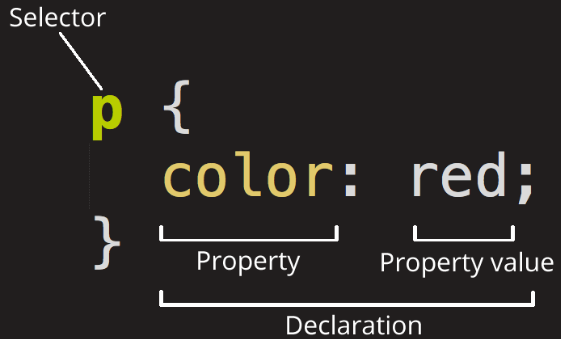

选择器和声明块一起组成了`规则集`(ruleset)，一个规则集也简称一个`规则`。`@规则`（at-rules）是指用“@”符号开头的语法。比如`@import` 规则或者`@media` 查询。

1.  **样式表来源及使用优先级**: 开发者制定的样式表 > 浏览器允许用户定义一个`用户样式表`(很少见) > `用户代理样式表`，即浏览器默认样式。
2.  再强调一次 **CSS 规则优先级**: 内联样式 > id 选择器 > 类选择器 = 伪类选择器 = 属性选择器 > 标签选择器 = 伪元素选择器
    - 伪类选择器（如`:hover`）和属性选择器（如`[type="input"]`）与一个类选择器的优先级相同。通用选择器（`*`）和组合器（`>`、`+`、`~`）对优先级没有影响。
3.  **源码顺序**: 如果两个声明的来源和优先级相同，其中一个声明在样式表中出现较晚，或者位于页面较晚引入的样式表中，则该声明胜出(**后者覆盖前者**)。

面对一个样式问题时，可分两个步骤来解决它: _首先确定哪些声明可以实现效果。其次，思考可以用哪些选择器结构，然后选择最符合需求的那个。_

浏览器遵循三个步骤，即来源、优先级、源码顺序，来解析网页上每个元素的每个属性。如果一个声明在层叠中“胜出”，它就被称作一个层叠值。**元素的每个属性最多只有一个层叠值**。

两条经验法则:

- (1) 在选择器中不要使用 ID。就算只用一个 ID，也会大幅提升优先级。当需要覆盖这个选择器时，通常找不到另一个有意义的 ID，于是就会复制原来的选择器，然后加上另一个类，让它区别于想要覆盖的选择器。
- (2) 不要使用`!important` 。它比 ID 更难覆盖，一旦用了它，想要覆盖原先的声明，就需要再加上一个 `!important` ，而且依然要处理优先级的问题。

4.  **继承**: 如果一个元素的某个属性没有层叠值，则可能会继承某个祖先元素的值。

    - 例如会`<body>` 元素加上 `font-family` ，里面的所有后代元素都会继承这个字体，就不必给页面的每个元素明确指定字体了。
    - 不是所有的属性都能被继承。默认情况下，只有特定的一些属性能被继承，主要是跟文本相关的属性(如 color、font、font-family)，列表属性(如 list-style)，表格的边框属性(如 border-collapse)等。

5.  **特殊值 inherit 和 initial**: 这两个特殊值可以赋给任意属性，用于**控制层叠**。

    - `inherit` 关键字使得元素获取其父元素的`计算值`。只是增强了属性的默认行为，通常只在*覆盖原有的值*的时候使用。
      - 一个 CSS 属性的`计算值`是指这个属性在由父类转向子类的继承中的值。
    - `initial` 关键字将属性的初始（或默认）值应用于元素。可用于将所有 CSS 属性*恢复到其初始状态*。

6.  **简写属性** 是用于同时给多个属性赋值的属性。
    - 例如 font 属性可以用来作为 font-style, font-variant, font-weight, font-size, line-height 和 font-family 属性的简写。
    - _简写属性会默默覆盖其他样式_: 大多数简写属性可以省略一些值，只指定关注的值。未指定的值会被隐式地设置为初始值。这会默默覆盖在其他地方定义的样式。
    - _理解简写值的顺序_:
      - 比如` border: 1px solid black`因为浏览器知道 border-width、border-style、border-color 的类型，即便改为`border: black 1px solid`也能生效。
      - 例如 margin、padding 这样的属性边框值都一样的类型，要记住属性值顺序:**上右下左(顺时针)**。如` padding: 10px 15px 0 5px;`
      - 例如 background-position 属性为每一个背景图片设置初始位置，可能属性值一个定义 x 坐标，另一个定义 y 坐标，属性值顺序**水平、垂直(x,y)**。

#### 原文总结

- 控制选择器的优先级。
- 不要混淆层叠和继承。
- 某些属性会被继承，包括文本、列表、表格边框相关的属性。
- 不要混淆 initial 和 auto 值。
- 简写属性要注意 TRouBLe 的顺序

### 相对单位

**CSS 支持几种绝对长度单位**，最常用、最基础的是像素（px）。不常用的绝对单位是 mm（毫米）、cm（厘米）、in（英寸）、pt（点，印刷术语，1/72 英寸）、pc（派卡，印刷术语，12 点）。这些单位都可以通过公式互相换算：1in = 25.4mm = 2.54cm = 6pc = 72pt = 96px。

常用相对单位有以下这些：

1.  **相对于 font-size 定义的相对单位 em 和 rem。**

**em**: 在 CSS 中，`1em 等于当前元素的单位`，其准确值取决于作用的元素。适合基于特定的字号进行排版。

- 基础使用:
  - 如`.padded { font-size: 16px; padding: 2em; }`，padding 的值为 32px。
  - 对大多数浏览器来说，默认的字号为 16px。准确地说，medium 关键字的值是 16px。
- em 同时用于字号和其他属性
  - 下面示例 font-size 计算值为 19.2px，padding 计算值为 23.04px。
  ```cs
  body { font-size: 16px; }
  .slogan { font-size: 1.2em; padding: 1.2em; }
  ```
- _注意避免使用 em 来指定多重嵌套的元素的字号时，产生意外的结果_。
  - 比如列表(ul、li)多级嵌套并且给每一级使用 0.8em 定义字号时，就会发生文字缩小的现象。

**rem**: rem 是 root em 的缩写。rem 不是相对于当前元素，而是`相对于根元素的单位`。

- 当浏览器解析 HTML 文档时，会在内存里将页面的所有元素表示为 DOM（文档对象模型）。它是一个树结构，其中每个元素都由一个节点表示。 `<html>` 元素是顶级（根）节点。它下面是子节点， `<head>` 和 `<body>` 。再下面是逐级嵌套的后代节点。
- 在文档中，根节点是所有其他元素的祖先节点。根节点有一个伪类选择器(`:root`)，可以用来选中它自己。这等价于类型选择器 html ，但是 `:root` 的优先级相当于一个类名，而不是一个标签。
- 示例: 不管在文档的什么位置使用 rem，1.2rem 都会有相同的计算值：1.2 乘以根元素的字号。

> 拿不准的时候，用 rem 设置字号，用 px 设置边框，用 em 设置其他大部分属性。

2.  **相对于浏览器视口定义长度的视口的相对单位：**

> 视口(viewport): 浏览器窗口里网页可见部分的边框区域。它不包括浏览器的地址栏、工具栏、状态栏。

- vh: 视口高度的 1/100。
- vw: 视口宽度的 1/100。
- vmin: 视口宽、高中较小的一方的 1/100（IE9 中叫 vm，而不是 vmin）。
- vmax: 视口宽、高中较大的一方的 1/100。

相对视口的单位对大部分浏览器而言是较新的特性，因此当你将它跟其他样式结合使用时，会有一些奇怪的 bug。

`calc()`函数内可以对两个及其以上的值进行基本运算。例如`:root {font-size: calc(0.5em + 1vw);}`

3.  **无单位的数值和行高**

- 有些属性允许无单位的值（即一个不指定单位的数）。支持这种值的属性包括 line-height、z-index、font-weight 等。
- 一个无单位的 0 **只能用于**长度值和百分比，比如内边距、边框和宽度等，而**不能用于**角度值，比如度，或者时间相关的值，比如秒。
- 使用无单位的数值时，继承的是声明值，即在每个继承子元素上会重新算它的计算值。

4.  **自定义属性（即 CSS 变量）**

- 要定义一个自定义属性，只需要像其他 CSS 属性那样声明即可:
  - `:root {  --main-font: Helvetica, Arial, sans-serif; }`
  - 变量名前面必须有两个连字符（--），用来跟 CSS 属性区分；变量必须在一个声明块内声明。
- 调用函数 `var()`就能使用该变量。
  - `p { font-family: var(--main-font); }`
  - var()函数接受第二个参数，它指定了备用值。如果第一个参数指定的变量未定义，那么就会使用第二个值。
  - 如果 var()函数算出来的是一个非法值，对应的属性就会设置为其初始值。
- 自定义属性能减少重复代码，它的声明能够层叠和继承：可以在多个选择器中定义相同的变量，这个变量在网页的不同地方有不同的值。
  - 比如在在根元素上`--main-color: #000;`，在深色容器上`--main-color: #fff;`。那么在深色容器中，--main-color 为白色，在页面其他地方，则是黑色。
  - 自定义属性就像作用域变量一样，因为它的值会被后代元素继承。
- 可以使用 JavaScript 改变自定义属性。例如:
  var rootElement = document.documentElement;
  rootElement.style.setProperty('--main-color', '#cdf');

更多内容参看 MDN 的[CSS 的值与单位](https://developer.mozilla.org/en-US/docs/Learn/CSS/Building_blocks/Values_and_units#numbers_lengths_and_percentages)。

#### 原文总结

- 拥抱相对单位，让网页的结构决定样式的含义。
- 建议用 rem 设置字号，但是有选择地用 em 实现网页组件的简单缩放。
- 不用媒体查询也能让整个网页响应式缩放。
- 使用无单位的值设置行高。
- 请开始熟悉 CSS 的一个新特性：自定义属性。

### 盒模型

#### 盒模型简介

在 CSS 中，所有的元素都被一个个的“盒子（box）”包围着，广泛地使用两种“盒子”:**块级盒子**(block box)**和内联盒子**(inline box)。

**完整的 CSS 盒模型**应用于块级盒子，内联盒子只使用盒模型中定义的**部分内容**。

- **每个盒子**有四个边界: content(内容)、padding(内边距)、border(边框)、margin(外边距)。
- **标准盒子模型**只包括 content 的宽和高。
- **怪异盒子模型**则包括 content、padding、border 的宽和高。
- 可通过 CSS 属性`box-sizing = content-box(标准) | border-box(怪异)`来指定。

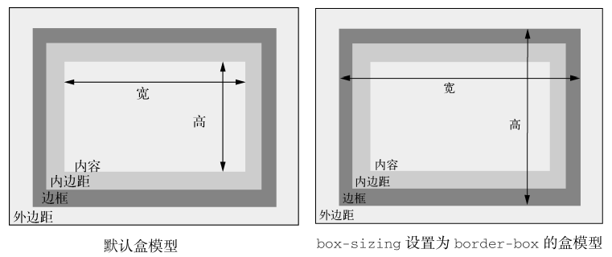

盒子的宽度避免使用魔法值，例如 25%。可以考虑计算值，例如 calc(30% - 3em)，尽管也不够好。

> 普通文档流——指的是网页元素的默认布局行为。**行内元素跟随文字的方向从左到右排列，当到达容器边缘时会换行。块级元素会占据完整的一行，前后都有换行**。

#### 盒子高度问题

1.  当明确设置一个元素的高度时，内容可能会**溢出容器**。当内容在限定区域放不下，渲染到父元素外面时，就会发生这种现象。

用 `overflow` 属性可以**控制溢出内容的行为**，该属性支持以下 4 个值:

- `visible`（默认值）——所有内容可见，即使溢出容器边缘。
- `hidden`——溢出容器内边距边缘的内容被裁剪，无法看见。
- `scroll`——容器出现滚动条，用户可以通过滚动查看剩余内容。
- `auto`——只有内容溢出时容器才会出现滚动条。

> **除非别无选择，否则不要明确设置元素的高度**。先寻找一个替代方案。设置高度一定会导致更复杂的情况。

2.  可以用`min-height`和`max-height`两个属性指定最小或最大值，而不是明确定义高度，这样元素就可以在这些界限内自动决定高度。

3.  **垂直居中内容**: CSS 中最简单的垂直居中方法是给容器相等的上下内边距，让容器和内容自行决定自己的高度。(此外常用的还有 grid、flex 布局的居中)

使用内边距让内容垂直居中:

```css
header {
  /* 相同的上下内边距，不用指定高度也能让元素内容垂直居中  */
  padding-top: 4em;
  padding-bottom: 4em;
  color: #fff;
  background-color: #0072b0;
  border-radius: 0.5em;
}
```

**垂直居中指南:**

- _可以用一个自然高度的容器吗？_
  - 给容器加上相等的上下内边距让内容居中。
- _容器需要指定高度或者避免使用内边距吗？_
  - 对容器使用 `display: table-cell` 和 `vertical-align: middle`。
- _可以用 Flexbox 吗？_
  - 如果不需要支持 IE9，可以用 Flexbox 居中内容。
- _容器里面的内容只有一行文字吗？_
  - 设置一个大的行高，让它等于理想的容器高度。这样会让容器高度扩展到能够容纳行高。如果内容不是行内元素，可以设置为 `inline-block`。
- _容器和内容的高度都知道吗？_
  - 将内容绝对定位。（只有当前面提到的方法都无效时才推荐这种方式。）
- _不知道内部元素的高度？_
  - 用绝对定位结合变形（还是只有当前面提到的方法都无效时才推荐该方法。）

或者找一个类似 [howtocenterincss](http://howtocenterincss.com/) 的网站，选择好需求，看网站给出的居中参考建议。

#### 负外边距

外边距可以设置为负值。负外边距有一些特殊用途，比如让元素重叠或者拉伸到比容器还宽。
负外边距的具体行为取决于设置在元素的哪边。

- 如果设置**左边或顶部**的负外边距，元素就会相应地向左或向上移动，导致元素与它前面的元素重叠，
- 如果设置**右边或者底部**的负外边距，并不会移动元素，而是将它后面的元素拉过来。
- 给元素底部加上负外边距并**不等同于**给它下面的元素顶部加上负外边距。

如果不给一个块级元素指定宽度，它会自然地填充容器的宽度。但如果在**右边**加上负外边距，则会把它**拉出容器**。如果在**左边再**加上相等的负外边距，元素的**两边都**会扩展到容器外面。


#### 外边距折叠

**当顶部和/或底部的外边距相邻时，就会重叠，产生单个外边距。这种现象被称作折叠。**

1.  文字折叠

- 外边距折叠的主要原因与包含文字的块之间的间隔相关。
  - 例如段落`<p>`默认有 1em 的上外边距和 1em 的下外边距。但当前后叠放两个段落时，它们的外边距不会相加产生一个 2em 的间距，而会折叠，只产生 1em 的间隔。
- _**折叠外边距的大小等于相邻外边距中的最大值**_。
  - 例如一个标题 h2 外边距 24px，紧接着一个段落 p 外边距 16px，最终渲染的两个元素之间的间距为 24px。

2.  多个外边距折叠

- 即使两个元素不是相邻的兄弟节点也会产生外边距折叠。
  - 所有相邻的顶部和底部外边距会折叠到一起。如果在页面中添加一个空的、无样式的 div（没有高度、边框和内边距），它自己的顶部和底部外边距就会折叠。
  - 例如`<h2>标题</h2> <div> <p> …… </p> </div>`: `<h2>`底部的外边距、`<div>`顶部的外边距、`<p>`顶部的外边距,这三个不同的外边距会折叠到一块。如果计算值分别是 24px、0px、16px。因此最终间隔还是 24px。
- **只有上下外边距会产生折叠，左右外边距不会折叠**。

3.  防止外边距折叠(有很多会改变元素的布局行为):

- 对容器使用 `overflow: auto`（或者非 `visible` 的值），防止内部元素的外边距跟容器外部的外边距折叠。这种方式副作用最小。
- 在两个外边距之间加上边框或者内边距，防止它们折叠。
- 如果容器为浮动元素、内联块、绝对定位或固定定位时，外边距不会在它外面折叠。
- 当使用 Flexbox 布局时，弹性布局内的元素之间不会发生外边距折叠。网格布局同理。
- 当元素显示为 `table-cell` 时不具备外边距属性，因此它们不会折叠。

#### 容器内的元素间距

容器的内边距和内容的外边距之间的相互作用处理起来很棘手。`使用猫头鹰选择器`(`* + *`)全局设置堆叠元素之间的外边距。

- 该选择器开头是一个通用选择器（\*），它可以选中所有元素，后面是一个相邻兄弟组合器（+），最后是另一个通用选择器。
- 用猫头鹰选择器给页面元素加上顶部外边距，这样就会给容器内 _每一个元素加上一致的间距_ 。

<details>
<summary>点击查看 猫头鹰选择器示例代码: </summary>

```html
<!DOCTYPE html>
<html>
  <head>
    <style>
      body {
        background-color: black;
        margin: 0;
        padding: 1rem;

        /* 自定义属性 */
        --clr-red: #af4629;
        --clr-golden: #f59131;
        --clr-white: #efefef;
      }

      /* 迟钝的猫头鹰选择器（lobotomized owl selector） */
      * + * {
        margin-top: 2rem;
      }

      .module {
        padding: 1rem;
        background: var(--clr-golden);
        border: 0.5rem solid var(--clr-red);
      }

      /* 对任意元素生效，页面容器内的各元素依然可以保持相同的上边距 */
      .module > div,
      a,
      button {
        display: block;
        padding: 1rem;
        background: var(--clr-white);
      }

      .module * + *::after {
        color: var(--clr-red);
        content: " (lobotomized)";
        font-style: italic;
      }
    </style>
  </head>

  <body>
    <figure class="module">
      <div>Owl</div>
      <a>Owl</a>
      <div>Owl</div>
      <button>Owl</button>
    </figure>
  </body>
</html>
```

<p> 上面的示例效果:</p>
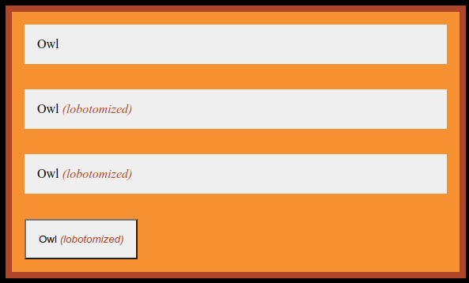

</details>

---

#### 原文总结

- 总是全局设置 border-box，以便得到预期的元素大小。
- 避免明确设置元素的高度，以免出现溢出问题。
- 使用现代的布局技术，比如 display: table 或者 Flexbox 实现列等高或者垂直居中内容。
- 如果外边距的行为很奇怪，就采取措施防止外边距折叠。
- 使用猫头鹰选择器全局设置堆叠元素之间的外边距。

---

## 精通布局

介绍最重要的三种改变文档流的方式：浮动、Flexbox 和网格布局。此外还会介绍定位，它的主要作用是将元素堆叠到其他元素之上。

### 理解浮动

#### 浮动的设计初衷

> 在现代浏览器中，不用浮动也能比过去更好地实现布局，甚至可以完全弃用浮动。但是如果要支持 IE 浏览器，现在放弃浮动还为时过早。只有 IE10 和 IE11 支持 Flexbox，而且还有一些 bug。如果不想碰到 bug，或者需要支持旧版浏览器，浮动也许是更好的选择。

**浮动**能将一个元素（通常是一张图片）拉到其容器的一侧，这样文档流就能够包围它(实现文字围绕浮动元素排列的效果)。

类似在使用 word 文档时，在文字中加入图片，其图片与文字的排版方式就有很多。下面截图为 LibreOffice 7.1.4 和 MicrosoftOffce 2003:

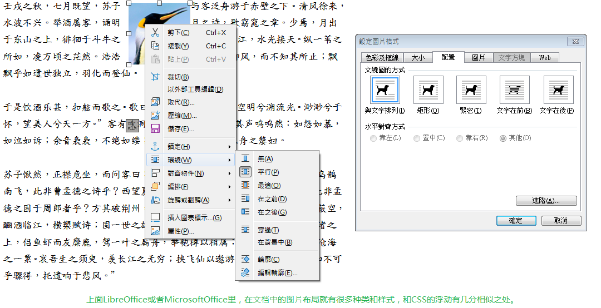

浮动布局主要的属性就是`float`，可浅看一下 MDN 的 [浮动](https://developer.mozilla.org/zh-CN/docs/Learn/CSS/CSS_layout/Floats) 章节。

**双容器模式**(double container pattern): 通过将内容放置到两个嵌套的容器中，然后给内层的容器设置外边距，让它在外层容器中居中。常用于将网页内容居中。

**媒体对象模式**(media object pattern)：图片在左边，一段描述内容在右边。

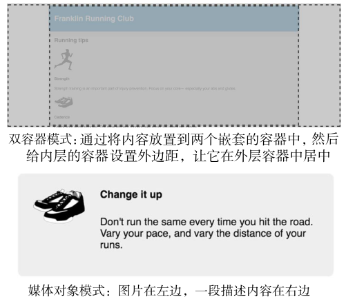

#### 容器折叠与清除浮动

**问题 1**：因为浮动严格遵循了标准，_浮动元素不同于普通文档流的元素，它们的高度不会加到父元素上_，由此产生**容器折叠**的问题，与需要的效果不一致。

- 在段落里浮动图片时，段落的高度并不会增长到能够容纳该图片。如果图片比段落文字高，下一段会直接从上一段的文字下面开始，两段文字都会围绕浮动的图片排列

**清除浮动**(clearfix): 使用跟浮动配套的 clear 属性。将一个元素放在主容器的末尾，并对它使用 clear，这会让容器扩展到浮动元素下面。

解决 1: 清除浮动，让其包含所有的外边距:

```css
/* 让::before 和::after 伪元素都显示出来  */
.clearfix::before,
.clearfix::after {
  /* 防止伪元素的外边距折叠  */
  /* 在清除浮动时使用 display: table 能够包含外边距 */
  display: table;
  content: " ";
}
/* 只有::after 伪元素需要清除浮动  */
.clearfix::after {
  clear: both;
}
```

`clear: both` 声明让该元素移动到浮动元素的下面，而不是侧面。

- clear 的值还可以设置为 left 或者 right，这样只会相应地清除向左或者向右浮动的元素。
- 因为空 div 本身没有浮动，所以容器就会扩展，直到包含它，因此也会包含该 div 上面的浮动元素。

使用`::after` 伪元素选择器，就可以快速地在 DOM 中在容器末尾添加一个元素，而不用在 HTML 里添加标记。

**问题 2: 众多的元素浮动到同一侧**，如果每个浮动盒子的高度不一样，最后的布局可能千变万化。同理，改变浏览器的宽度也会造成相同的结果，因为它会导致换行，从而改变元素高度。

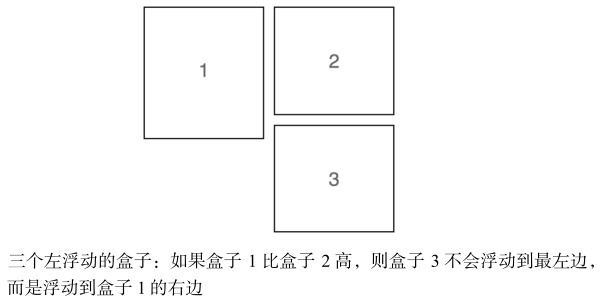

解决 2: 通用的做法是，_清除每行的第一个元素上面的浮动_。比如已知每行有两个盒子，因此只需要清除每行的第奇数个元素上面那行的浮动即可。

```css
.media {
  /* 让媒体盒子都浮动到左侧  */
  float: left;
  /* 给每个媒体元素加上右侧和底部的外边距 */
  margin: 0 1.5em 1.5em 0;
  /* 从宽度里减去外边距，防止出现不必要的换行  */
  width: calc(50% - 1.5em);
  padding: 1.5em;
  background-color: #eee;
  border-radius: 0.5em;
}

/* 每个新行清除了上面一行的浮动  */
.media:nth-child(odd) {
  clear: left;
}
```

> 上面这种清除每行浮动的技术要求知道每行有几个元素。如果宽度不是通过百分比来定义的，那么随着视口宽度的改变，每行的元素个数可能会变化。这种情况下，最好使用别的布局方案，比如 Flexbox 或者 inline-block 元素。

**问题 3: 想要每个容器盒子内部都是媒体对象模式。**

解决 3: 给媒体对象的左边和右边分别添加了 media-image 和 media-body 类，以便选中和定位元素。先将图片浮动到左边。再给媒体正文创建 BFC，通常是给元素设置 `overflow` 值: `hidden` 或者 `auto`。

---

<details>
<summary>点击查看清除浮动前代码: </summary>

```html
<!DOCTYPE html>
<head>
  <style>
    :root {
      box-sizing: border-box;
    }

    *,
    ::before,
    ::after {
      box-sizing: inherit;
    }

    body {
      background-color: #eee;
      font-family: Helvetica, Arial, sans-serif;
    }

    body * + * {
      margin-top: 1.5em;
    }

    header {
      padding: 1em 1.5em;
      color: #fff;
      background-color: #0072b0;
      border-radius: 0.5em;
      margin-bottom: 1.5em;
    }

    .main {
      padding: 0 1.5em;
      background-color: #fff;
      border-radius: 0.5em;
    }

    .container {
      max-width: 1080px;
      margin: 0 auto;
    }

    .media {
      /* 让媒体盒子都浮动到左侧  */
      float: left;
      /* 设置宽度，让页面在水平方向上能放下两个媒体盒子  */
      width: 50%;
      padding: 1.5em;
      background-color: #eee;
      border-radius: 0.5em;
    }
  </style>
</head>

<body>
  <div class="container">
    <header>
      <h1>Franklin Running Club</h1>
    </header>

    <main class="main clearfix">
      <h2>Running tips</h2>

      <div>
        <div class="media">
          
          <div class="media-body">
            <h4>Strength</h4>
            <p>
              Strength training is an important part of injury prevention. Focus
              on your core&mdash; especially your abs and glutes.
            </p>
          </div>
        </div>

        <div class="media">
          
          <div class="media-body">
            <h4>Cadence</h4>
            <p>
              Check your stride turnover. The most efficient runners take about
              180 steps per minute.
            </p>
          </div>
        </div>

        <div class="media">
          
          <div class="media-body">
            <h4>Change it up</h4>
            <p>
              Don't run the same every time you hit the road. Vary your pace,
              and vary the distance of your runs.
            </p>
          </div>
        </div>

        <div class="media">
          
          <div class="media-body">
            <h4>Focus on form</h4>
            <p>
              Run tall but relaxed. Your feet should hit the ground beneath your
              hips, not out in front of you.
            </p>
          </div>
        </div>
      </div>
    </main>
  </div>
</body>
```

</details>

---

<details>
<summary>点击查看清除浮动后代码: </summary>

```html
<!DOCTYPE html>
<head>
  <style>
    :root {
      box-sizing: border-box;
    }

    *,
    ::before,
    ::after {
      box-sizing: inherit;
    }

    body {
      background-color: #eee;
      font-family: Helvetica, Arial, sans-serif;
    }

    body * + * {
      margin-top: 1.5em;
    }

    header {
      padding: 1em 1.5em;
      color: #fff;
      background-color: #0072b0;
      border-radius: 0.5em;
      margin-bottom: 1.5em;
    }

    .main {
      padding: 0 1.5em;
      background-color: #fff;
      border-radius: 0.5em;
    }

    .container {
      max-width: 1080px;
      margin: 0 auto;
    }

    .media {
      float: left;
      /* 给每个媒体元素加上右侧和底部的外边距 */
      margin: 0 1.5em 1.5em 0;
      /* 从宽度里减去外边距，防止出现不必要的换行  */
      width: calc(50% - 1.5em);
      padding: 1.5em;
      background-color: #eee;
      border-radius: 0.5em;
    }

    /* 二 清除每行的第奇数个元素上面那行的浮动 */
    /* 每个新行清除了上面一行的浮动  */
    .media:nth-child(odd) {
      clear: left;
    }

    /* 三 容器内部为媒体对象模式*/
    /* 图片浮动到左边， */
    .media-image {
      float: left;
      /* 给图片添加一个外边距，让它与正文中间出现间隔  */
      margin-right: 1.5em;
    }

    /* 创建一个新的 BFC，这样正文就不会跟浮动的图片重叠  */
    .media-body {
      overflow: auto;
      margin-top: 0;
    }

    /*  */
    .media-body h4 {
      margin-top: 0;
    }

    /* 一 清除浮动的代码，让其包含所有的外边距  */
    /* 让::before 和::after 伪元素都显示出来  */
    .clearfix::before,
    .clearfix::after {
      /* 防止伪元素的外边距折叠  */
      display: table;
      content: " ";
    }
    /* 只有::after 伪元素需要清除浮动  */
    .clearfix::after {
      clear: both;
    }
  </style>
</head>

<body>
  <div class="container">
    <header>
      <h1>Franklin Running Club</h1>
    </header>

    <main class="main clearfix">
      <h2>Running tips</h2>

      <div>
        <div class="media">
          
          <div class="media-body">
            <h4>Strength</h4>
            <p>
              Strength training is an important part of injury prevention. Focus
              on your core&mdash; especially your abs and glutes.
            </p>
          </div>
        </div>

        <div class="media">
          
          <div class="media-body">
            <h4>Cadence</h4>
            <p>
              Check your stride turnover. The most efficient runners take about
              180 steps per minute.
            </p>
          </div>
        </div>

        <div class="media">
          
          <div class="media-body">
            <h4>Change it up</h4>
            <p>
              Don't run the same every time you hit the road. Vary your pace,
              and vary the distance of your runs.
            </p>
          </div>
        </div>

        <div class="media">
          
          <div class="media-body">
            <h4>Focus on form</h4>
            <p>
              Run tall but relaxed. Your feet should hit the ground beneath your
              hips, not out in front of you.
            </p>
          </div>
        </div>
      </div>
    </main>
  </div>
</body>
```

</details>

---

和清除浮动后(右).png>)

这也就是常见的问题，针对不同的情况，选择清除浮动的方式。笼统点:

- 一是利用 clear 属性。
- 二是触发浮动元素父元素的 BFC，使得该父元素可以包含浮动元素。

#### BFC

**块级格式化上下文**(block formatting context，BFC)是网页的一块区域，元素基于这块区域布局。虽然 BFC 本身是环绕文档流的一部分，但它 **将内部的内容与外部的上下文隔离开** 。这种隔离为创建 BFC 的元素做出了以下 3 件事情:

- (1) 包含了内部所有元素的上下外边距。它们不会跟 BFC 外面的元素产生外边距折叠。
- (2) 包含了内部所有的浮动元素。
- (3) 不会跟 BFC 外面的浮动元素重叠。

简而言之，**BFC 里的内容不会跟外部的元素重叠或者相互影响**。更多内容参看 MDN 的 [块格式化上下文](https://developer.mozilla.org/zh-CN/docs/Web/Guide/CSS/Block_formatting_context)。

给元素添加以下的任意属性值都会**创建 BFC**:

- `float`: left 或 right ，不为 none 即可。
- `overflow`: hidden、auto 或 scroll ，不为 visible 即可。
- `display`: inline-block、table-cell、table-caption、flex、inline-flex、grid 或 inline-grid。拥有这些属性的元素称为**块级容器**（block container）。
- `position`: absolute 或 fixed。
- 网页的根元素也创建了一个顶级的 BFC。

注意事项:

- 使用浮动或者 inline-block 方式创建 BFC 的元素宽度会变成 100%，因此需要限制一下元素的宽度，防止因为过宽而换行，导致内容移动到浮动图片的下面。
- 相反，使用 table-cell 方式显示的元素，其宽度只会刚好容纳其中的内容，因此需要设置一个较大的宽度，强制使其填满剩余空间。

**网格系统的设计思想**:：在一个行容器里放置一个或多个列容器。列容器的类决定每列的宽度。

<details>
<summary>点击查看 使用网格系统实现相同效果的代码: </summary>

```html
<!DOCTYPE html>
<head>
  <style>
    :root {
      box-sizing: border-box;
    }

    *,
    ::before,
    ::after {
      box-sizing: inherit;
    }

    body {
      background-color: #eee;
      font-family: Helvetica, Arial, sans-serif;
    }

    body * + * {
      margin-top: 1.5em;
    }

    /* step 6 */
    /* 给网格行添加负的外边距 */
    .row {
      margin-left: -0.75em;
      margin-right: -0.75em;
    }

    /* step 2 */
    /* 清除浮动规则，让行元素包含内部的浮动列  */
    .row::after {
      content: " ";
      display: block;
      clear: both;
    }

    /* step3 */

    /* 这个选择器匹配所有类包含"column-"的元素  */
    /* *=比较符可以匹配任意包含指定字符串的值，比如本例中可以匹配在类属性的任意位置出现 column- 的元素。 */
    [class*="column-"] {
      float: left;
      /* 给每个列元素的左右内边距各赋值 0.75em  */
      padding: 0 0.75em;
      /* 去掉列元素的顶部外边距  */
      margin-top: 0;
    }

    .column-1 {
      width: 8.3333%;
    }
    .column-2 {
      width: 16.6667%;
    }
    .column-3 {
      width: 25%;
    }
    .column-4 {
      width: 33.3333%;
    }
    .column-5 {
      width: 41.6667%;
    }
    .column-6 {
      width: 50%;
    }
    .column-7 {
      width: 58.3333%;
    }
    .column-8 {
      width: 66.6667%;
    }
    .column-9 {
      width: 75%;
    }
    .column-10 {
      width: 83.3333%;
    }
    .column-11 {
      width: 91.6667%;
    }
    .column-12 {
      width: 100%;
    }

    header {
      padding: 1em 1.5em;
      color: #fff;
      background-color: #0072b0;
      border-radius: 0.5em;
      margin-bottom: 1.5em;
    }

    /* step 5 */
    /* 给主容器添加底部内边距  */
    .main {
      /* 增加一个 1.5em 的底部内边距，让它等于左右内边距  */
      padding: 0 1.5em 1.5em;
      background-color: #fff;
      border-radius: 0.5em;
    }

    .container {
      max-width: 1080px;
      margin: 0 auto;
    }

    /* step4 */
    /* 删除媒体对象的定位和宽度声明  */
    /* 删除浮动、外边距和宽度声明  */
    /* 删除.media:nth-child(odd)规则集和 clear: left 声明  */
    .media {
      padding: 1.5em;
      background-color: #eee;
      border-radius: 0.5em;
    }

    .media-image {
      float: left;
      margin-right: 1.5em;
    }

    .media-body {
      overflow: auto;
      margin-top: 0;
    }

    .media-body h4 {
      margin-top: 0;
    }

    .clearfix::before,
    .clearfix::after {
      display: table;
      content: " ";
    }
    .clearfix::after {
      clear: both;
    }
  </style>
</head>

<body>
  <div class="container">
    <header>
      <h1>Franklin Running Club</h1>
    </header>

    <main class="main clearfix">
      <h2>Running tips</h2>

      <!-- step 1 -->
      <!-- 把每两个媒体对象用一个行元素包起来  -->
      <!-- 把每个媒体对象用一个类名为 column-6 的元素包起来，这样每个媒体对象都位于单独的列中  -->

      <div class="row">
        <div class="column-6">
          <div class="media">
            
            <div class="media-body">
              <h4>Strength</h4>
              <p>
                Strength training is an important part of injury prevention.
                Focus on your core&mdash; especially your abs and glutes.
              </p>
            </div>
          </div>
        </div>

        <div class="column-6">
          <div class="media">
            
            <div class="media-body">
              <h4>Cadence</h4>
              <p>
                Check your stride turnover. The most efficient runners take
                about 180 steps per minute.
              </p>
            </div>
          </div>
        </div>
        <!-- 开始第二行行元素之前先闭合第一行  -->
      </div>

      <div class="row">
        <div class="column-6">
          <div class="media">
            
            <div class="media-body">
              <h4>Change it up</h4>
              <p>
                Don't run the same every time you hit the road. Vary your pace,
                and vary the distance of your runs.
              </p>
            </div>
          </div>
        </div>

        <div class="column-6">
          <div class="media">
            
            <div class="media-body">
              <h4>Focus on form</h4>
              <p>
                Run tall but relaxed. Your feet should hit the ground beneath
                your hips, not out in front of you.
              </p>
            </div>
          </div>
        </div>
      </div>
    </main>
  </div>
</body>
```

</details>

---

#### 原文总结

- 浮动的设计初衷是让文字围绕一个元素排列，但有时这种效果并不是我们想要的。
- 使用清除浮动来包含浮动元素。
- BFC 有 3 个好处：包含浮动元素，防止外边距折叠，防止文档流围绕浮动元素排列。
- 使用双容器模式让页面内容居中。
- 使用媒体对象模式将描述文字定位到图片旁边。
- 使用网格系统实现更丰富的网页布局。

---

### 弹性盒子布局(Flexible Box Layout)

#### 创建一个弹性盒子

- 给元素添加 `display: flex`，该元素变成了一个`弹性容器`(flex container)，它的直接子元素变成了`弹性子元素`(flex item)。
- 弹性子元素**默认是在同一行按照从左到右的顺序并排排列。** 弹性容器像块元素一样填满可用宽度，但是弹性子元素不一定填满其弹性容器的宽度。弹性子元素高度相等，该高度由它们的内容决定。
- 子元素按照主轴线排列，主轴的方向为主起点（左）到主终点（右）。垂直于主轴的是副轴。方向从副起点（上）到副终点（下）。

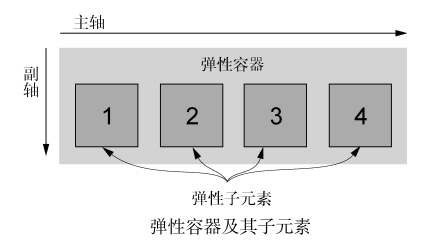

> 如果在旧版浏览器中使用 Flexbox，使用其属性可能不会生效。是因为旧版浏览器要求给 Flexbox 属性加上浏览器前缀。在标准稳定前，浏览器一般是这样来支持 CSS 新特性的。比如，旧版 Safari 浏览器没实现`display: flex`，而是实现了 `display: -webkit-flex`。

建议使用[autoprefixer](https://github.com/postcss/autoprefixer)工具，可以解析 CSS，并使用 [Can I Use](https://caniuse.com/) 中的值为 CSS 规则添加供应商前缀。即处理 CSS，然后输出新的文件，所有相关的前缀都会按需加好。

最简单的命令行使用:

```sh
# 下载工具(全局)
npm install postcss postcss-cli autoprefixer -g
# 解析css文件
npx postcss *.css --use autoprefixer -d build/
# 帮助
postcss -h
```

比如，在[Autoprefixer CSS 在线解析网站](https://autoprefixer.github.io/) 上输入:

```css
.example {
  display: flex;
}
```

解析后:

```css
.example {
  display: -webkit-box;
  display: -ms-flexbox;
  display: flex;
}
```

#### 弹性子元素的大小

使用 Flexbox 的 `flex` 属性。flex 属性控制弹性子元素在主轴方向上的大小（更直观的参看后面的图示）。

- `flex` 属性是三个不同大小属性的简写：`flex-grow`、`flex-shrink` 和 `flex-basis`。
- `flex-basis` 定义了元素大小的基准值，即一个初始的“主尺寸”。
  - flex-basis 属性可以设置为任意的 width 值，包括 px、em、百分比。
  - 它的初始值是 auto，此时浏览器会检查元素是否设置了 width 属性值。
    - 如果有，则使用 width 的值作为 flex-basis 的值；如果没有，则用元素内容自身的大小。
    - 如果 flex-basis 的值不是 auto，width 属性会被忽略。
- 每个弹性子元素的 flex-basis 值计算出来后，它们（加上子元素之间的外边距）加起来会占据一定的宽度。加起来的宽度不一定正好填满弹性容器的宽度，可能会有留白。
  - 多出来的留白（或剩余宽度）会按照 `flex-grow`（增长因子）的值分配给每个弹性子元素，flex-grow 的值为非负整数。
  - 如果一个弹性子元素的 flex-grow 值为 0，那么它的宽度不会超过 flex-basis 的值；
  - 如果某个弹性子元素的增长因子非 0，那么这些元素会增长到所有的剩余空间被分配完，也就意味着弹性子元素会填满容器的宽度。
- `flex-shrink` 属性与 flex-grow 遵循相似的原则。计算出弹性子元素的初始主尺寸后，它们的累加值可能会超出弹性容器的可用宽度。如果不用 flex-shrink，就会导致溢出。
  - 每个子元素的 flex-shrink 值代表了它是否应该收缩以防止溢出。
  - 如果某个子元素为 flex-shrink: 0，则不会收缩；如果值大于 0，则会收缩至不再溢出。
  - 按照 flex-shrink 值的比例，值越大的元素收缩得越多。
- 推**荐使用简写属性 flex**，如果某个子属性被省略，那么 flex 简写属性会给出有用的默认值：`flex-grow 为 1、flex-shrink 为 1、flex-basis 为 0%`。这些默认值正是大多数情况下所需要的值。

flex 布局使用示例:

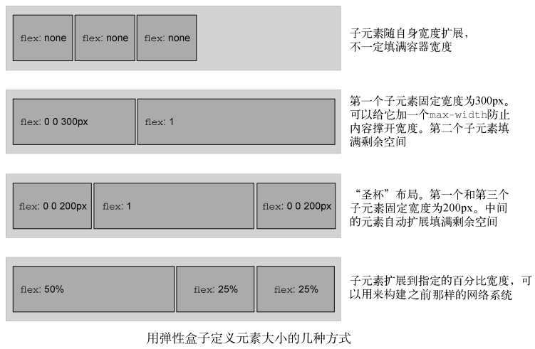

#### 弹性方向

用弹性容器的 `flex-direction` 属性能够切换主副轴方向。

- 它的初始值（row）控制子元素按从左到右的方向排列；
- 指定`flex-direction: column` 能控制弹性子元素沿垂直方向排列（从上到下）。
- Flexbox 还支持 `row-reverse` 让元素从右到左排列，`column-reverse` 让元素从下到上排列。

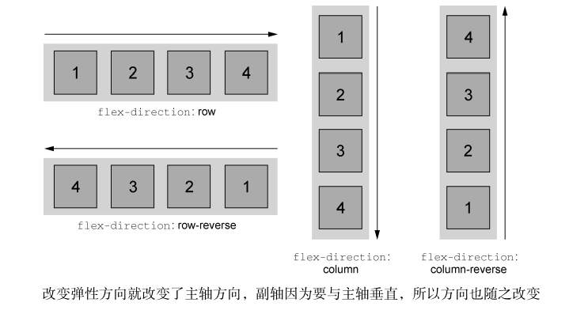

并不是所有浏览器都完美地实现了 Flexbox，[flexbugs](https://github.com/philipwalton/flexbugs) GitHub 页面维护了所有已知的 Flexbox 的浏览器 bug，解释了哪些环境下会导致这些 bug，并大部分情况下给出了解决方案。

#### 弹性盒子布局的属性图示

CSS IN DEPTH 关于弹性盒子相关属性的图示（推荐放大看看记清楚）:

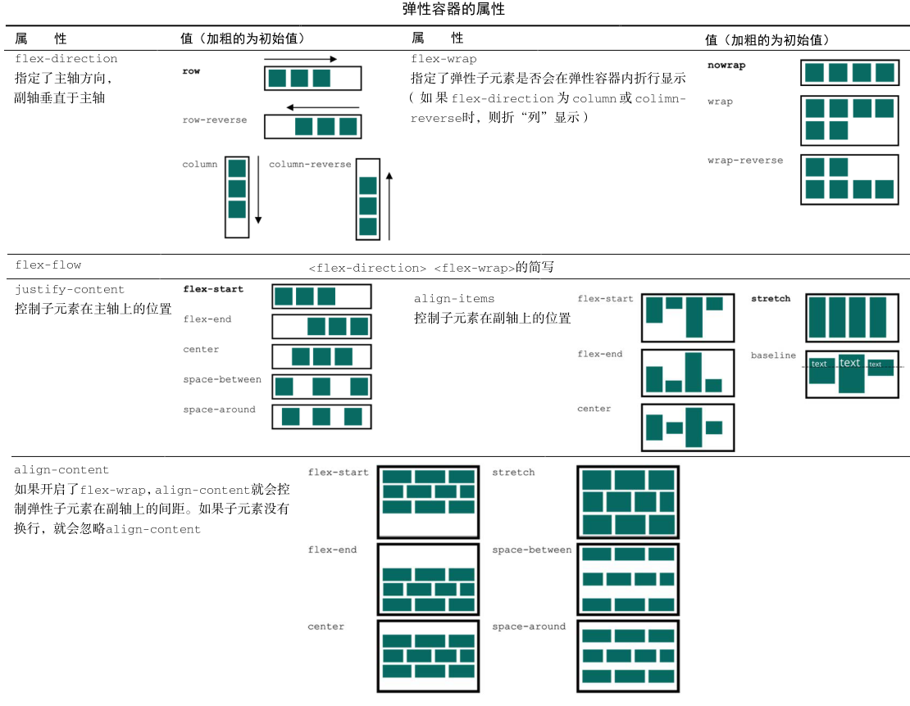

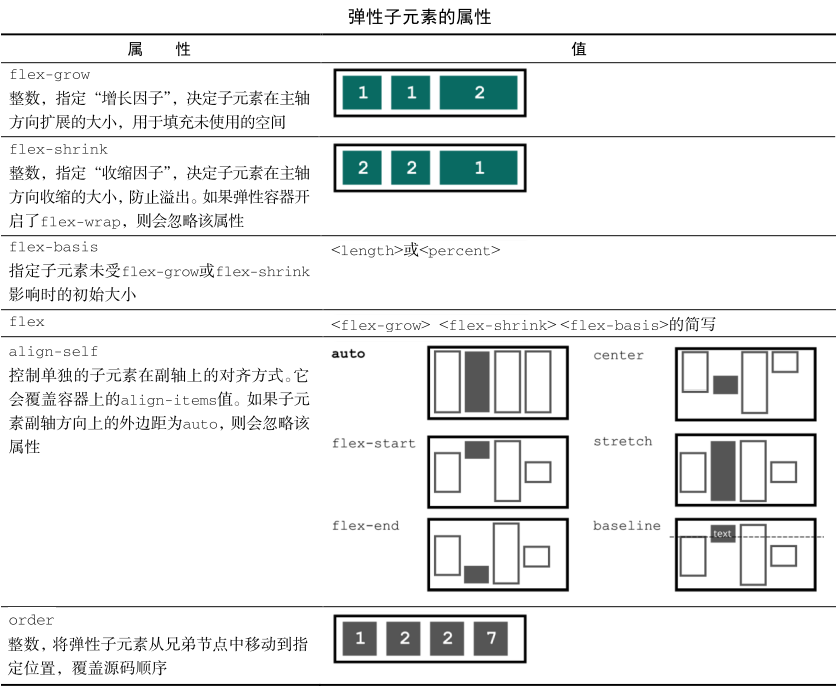

也可参看 W3C 的 [规范中弹性盒子的属性列表](https://www.w3.org/TR/css-flexbox-1/#property-index)。

---

#### 原文总结

- 使用 Flexbox 实现灵活易操作的网页内容布局。
- Autoprefixer 可以简化 Flexbox 对旧版浏览器的支持。
- 使用 flex 指定任何能想到的弹性子元素大小的组合。
- 使用嵌套的弹性盒子来组成复杂的布局，以及填满自适应大小的盒子的高度。
- Flexbox 自动地创建等高的列。
- 使用 align-items 和 align-self 让一个弹性子元素在弹性容器中垂直居中。

### 网格布局(Grid Layout)

CSS 网格可以定义由行和列组成的二维布局，然后将元素放置到网格中。

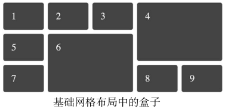

> 主流浏览器摒弃了过去那种漫长的开发迭代方式，几乎一夜间推出了功能齐全的、成熟的网格布局。2017 年 3 月，各大厂商启用了网格布局特性。3 周的时间内，Firefox、Chrome、Opera 以及 Safari 全都发布了新版本，启用网格布局。2017 年 6 月，微软的 Edge 紧跟步伐。短短 3 个月，浏览器支持的用户量从 0%一跃到近 70%。这在 CSS 世界里可谓史无前例。

#### 创建一个网格容器

跟 Flexbox 类似，网格布局也是作用于两级的 DOM 结构。设置为 `display: grid` 的元素成为一个`网格容器`（grid container）。它的子元素则变成`网格元素`（grid items）。

<details>
<summary>点击查看创建一个网格容器示例代码: </summary>

```html
<!DOCTYPE html>
<head>
  <style>
    :root {
      box-sizing: border-box;
    }

    *,
    ::before,
    ::after {
      box-sizing: inherit;
    }

    .grid {
      /* 将元素设为网格容器 */
      display: grid;
      /* 定义等宽的三列  */
      grid-template-columns: 1fr 1fr 1fr;
      /* 定义等高的两行  */
      grid-template-rows: 1fr 1fr;
      /* 给每个网格的单元格之间加上间隔  */
      grid-gap: 0.5em;
    }

    /* 网格元素的样式 */
    .grid > * {
      background-color: darkgray;
      color: white;
      padding: 2em;
      border-radius: 0.5em;
    }
  </style>
</head>
<body>
  <!-- 网格容器 -->
  <div class="grid">
    <!-- 容器内的子元素成为了网格元素  -->
    <div class="a">a</div>
    <div class="b">b</div>
    <div class="c">c</div>
    <div class="d">d</div>
    <div class="e">e</div>
    <div class="f">f</div>
  </div>
</body>
```

</details>

---

- `grid-template-columns` 和 `grid-template-rows`两个属性定义了网格每行每列的大小。
  - 一种新单位 fr ，代表每一列（或每一行）的分数单位（fraction unit）。`grid-template-columns: 1fr 1fr 1fr` 表示三列等宽
  - 可以使用其他的单位，比如 px、em 或百分数。也可以混搭这几种单位，例如，`grid-template-columns: 300px 1fr`
- `grid-gap` 属性定义了每个网格单元之间的间距。也可以用两个值分别指定垂直和水平方向的间距（比如 grid-gap: 0.5em 1em ）。

#### 网格剖析

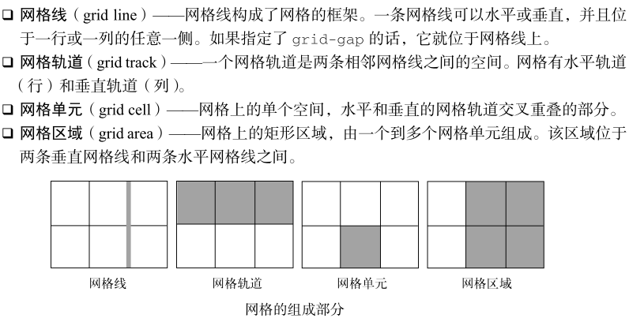

比如声明 `grid-template-columns: 1fr 1fr 1fr`就会定义三个等宽且垂直的网格轨道，同时还定义了四条垂直的网格线：一条在网格最左边，两条在每个网格轨道之间，还有一条在最右边。

可参看 W3C 规范中 [grid 的属性列表](https://www.w3.org/TR/css-grid-2/#property-index)。

---

**grid 网格布局**的一些相关属性说明(父元素使用`display:grid`，直接子元素为网格元素):

- 一个网格通常具有许多的**列(column)**与**行(row)**，以及行与行、列与列之间的**间隙**，这个间隙一般被称为**沟槽(gutter)**。
- **启用网格布局**: 父元素设置`display: grid`，使用 grid-template-rows 和 grid-template-columns 两个属性定义了一些**行和列的轨道**。
  - 除了长度和百分比，也可以用`fr`这个单位来灵活地定义*网格的行与列的大小*。`fr` 单位按比例划分了可用空间。
  - `grid-template-columns: 2fr 1fr 1fr`第一列被分配了 2fr 可用空间，剩下两列各被分配了 1fr 的可用空间(是前者的一半)。
  - 可以*使用 **repeat** 来重复构建具有某些宽度配置的某些列*。
    - `grid-template-columns:repeat(3,1fr)`得到 3 个 1fr 的列；`repeat(2,2fr 1fr)`相当于填入`2fr 1fr 2fr 1fr`。
- **显式网格**是用`grid-template-columns` 或 `grid-template-rows` 属性创建的。
- **隐式网格**则是当有内容被放到网格外时才会生成的。显式网格与隐式网格的关系与弹性盒子的 main 和 cross 轴的关系有些类似。
  - 隐式网格中生成的行/列大小是参数默认是 auto，大小会根据放入的内容自动调整(`grid-auto-rows:auto`)。
  - 也可以使用`grid-auto-rows`和`grid-auto-columns`属性手动设定隐式网格的大小(例如`grid-auto-rows:100px`)。
- **动态的行高/列宽**: minmax 函数为一个行/列的尺寸设置了取值范围。`minmax(100px, auto)`表示至少 100px，超过则动态调整。
- **自动使用多列填充**: grid-template-columns 属性中结合 repeat 和 minmax 函数来动态创建列。
  - `grid-template-columns: repeat(auto-fill, minmax(200px, 1fr))`，_一个包含了许多至少 200 像素宽的列的网格，将容器填满_。随着容器宽度的改变，网格会自动根据容器宽度进行调整，每行的列数会随着宽度改变，但每一列的宽度总是大于 200 像素，并且容器总会被列填满。
- **网格间隙**: 使用`grid-column-gap`属性来定义**列间隙**；使用`grid-row-gap`来定义**行间隙**；使用`grid-gap`可以**同时设定两者**。
  - 间隙距离可以用任何长度单位包括百分比来表示，但不能使用 `fr` 单位。
- **在网格内放置元素**:

  - **基于线的元素放置**: 利用 `grid-column` 和 `grid-row` 两个属性来**指定每一个子元素应该从哪一行/列开始，并在哪一行/列结束**。
    - grid-column 是 grid-column-start 和 grid-column-end 的简写属性，用于指定*网格项目的大小和位置*
    - grid-row 是 grid-row-start 和 grid-row-end 的缩写形式，它定义了*网格单元与网格行相关的尺寸和位置*
    - `grid-column: 2 / 4`，纵向从第二列开始，第四列结束。(默认为 1 开始， 负整数或 0 无效)
    - `grid-row: 2`，横向从第 2 排开始，第三排结束。(默认为 1 开始， 负整数或 0 无效，end 未指定则为 start+1)
  - **使用 grid-template-areas 属性放置元素**:要命名一些元素并在属性中使用这些名字作为一个区域。

    - `grid-template-areas:"a a ." "a a ." ". b c"`， a b c 为对应页面区域的别名， `.`表示该区域留空。
    - 上面示例是 9 等分的空间，a 占左上角 4 个位置，c 占最右下角 1 个位置，b 在第三排第二列占 1 个位置，其余空位。

    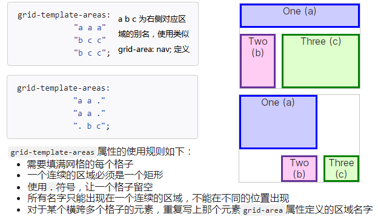

---

**flex 和 grid 的两个重要区别**:

- Flexbox 本质上是一维的，而网格是二维的。
- Flexbox 是以内容为切入点由内向外工作的，而网格是以布局为切入点从外向内工作的。
  - Flexbox 让你在一行或一列中安排一系列元素，但是它们的大小不需要明确指定，每个元素占据的大小根据自身的内容决定。
  - 而在网格中，首先要描述布局，然后将元素放在布局结构中去。

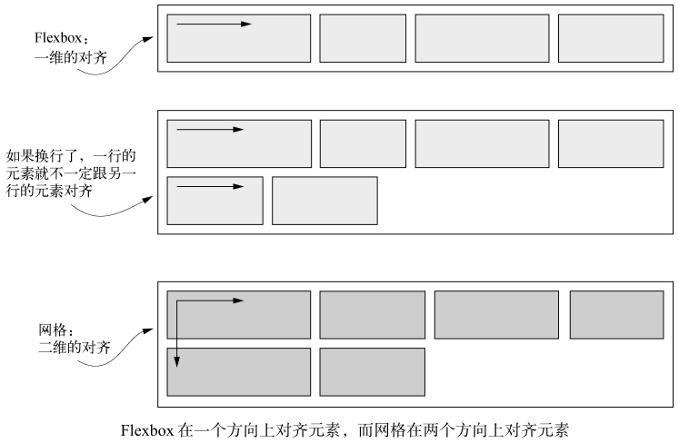

---

#### 替代语法

布局网格元素还有另外两个替代语法：*命名的网格线*和*命名的网格区域*。

1.  命名的网格线

可以给网格线命名，并在布局时使用网格线的名称而不是编号。在处理很多网格轨道时能简单点。

```css
/* 定义了两列的网格，三条垂直的网格线分别叫作 start、center 和 end。
之后定义网格元素在网格中的位置时，可以不用编号而是用这些名称来声明 */
grid-template-columns: [start] 2fr [center] 1fr [end];

/* 这条声明将网格元素放在 1 号网格线（start）到 2 号网格线（center）之间的区域。 */
grid-column: start / center;

/* 可以给同一个网格线提供多个名称 */
grid-template-columns: [left-start] 2fr [left-end right-start] 1fr [right-end];

/* 将网格线命名为 left-start 和 left-end，就定义了一个叫作 left 的区域，
这个区域覆盖两个网格线之间的区域。-start 和 -end 后缀作为关键字，定义了两者之间的区域。
如果给元素设置 grid-column: left，它就会跨越从 left-start 到 left-end 的区域。 */
```

2.  命名网格区域

不用计算或者命名网格线，直接用命名的网格区域将元素定位到网格中。
实现这一方法需要借助网格容器的 `grid-template-areas` 属性和网格元素的 `grid-area` 属性。

<details>
<summary>点击查看 命名网格区域 示例代码: </summary>

```html
<!DOCTYPE html>
<html>
  <head>
    <style>
      #page {
        display: grid; /* 1.设置 display 为 grid */
        width: 100%;
        height: 250px;
        grid-template-areas:
          "head head"
          "nav  main"
          "nav  foot"; /* 2.区域划分 当前为 三行 两列 */
        grid-template-rows: 50px 1fr 30px; /* 3.各区域 宽高设置 */
        grid-template-columns: 150px 1fr;
      }

      #page > header {
        grid-area: head; /* 4. 指定当前元素所在的区域位置，从 grid-template-areas 选取值 */
        background-color: #8ca0ff;
      }

      #page > nav {
        grid-area: nav;
        background-color: #ffa08c;
      }

      #page > main {
        grid-area: main;
        background-color: #ffff64;
      }

      #page > footer {
        grid-area: foot;
        background-color: #8cffa0;
      }
    </style>
  </head>
  <body>
    <section id="page">
      <header>Header</header>
      <nav>Navigation</nav>
      <main>Main area</main>
      <footer>Footer</footer>
    </section>
  </body>
</html>
```

示例截图:

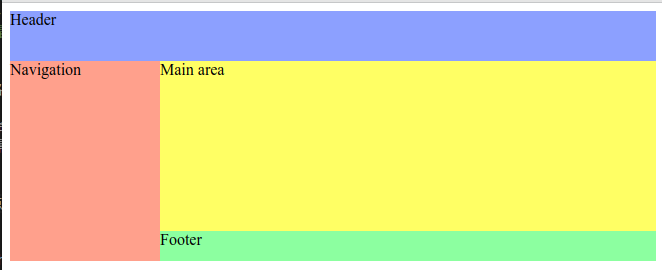

</details>

---

#### 显式和隐式网格

在这些情况下，以一种*宽松的方式定义网格可能更合理*，剩下的交给布局算法来放置网格元素:

- 在某些场景下，你可能不清楚该把元素放在网格的哪个位置上。
- 当处理大量的网格元素时，挨个指定元素的位置未免太不方便。
- 当元素是从数据库获取时，元素的个数可能是未知的。

这时需要用到隐式网格（implicit grid）:

- 使用 `grid-template-*` 属性定义网格轨道时，创建的是显式网格（explicit grid），
- 但是有些网格元素仍然可以放在显式轨道外面，此时会自动创建隐式轨道以扩展网格，从而包含这些元素。

下面的照片墙示例，所有元素都整整齐齐地排列在网格里，浏览器决定了垂直的网格轨道的数量和大小。还用紧凑的 auto-flow 让浏览器填满了所有空白区域。

<details>
<summary>点击查看 照片墙示例代码: </summary>

```html
<!DOCTYPE html>
<head>
  <style>
    :root {
      box-sizing: border-box;
    }

    *,
    ::before,
    ::after {
      box-sizing: inherit;
    }

    body {
      background-color: #709b90;
      font-family: Helvetica, Arial, sans-serif;
    }

    .portfolio {
      display: grid;
      /* 将最小列宽设置为 200px，自动填充网格  */
      grid-template-columns: repeat(auto-fill, minmax(200px, 1fr));
      /* 将隐式水平网格轨道的大小设置为 1fr  */
      grid-auto-rows: 1fr;
      grid-gap: 1em;
      /* 开启紧凑的网格布局算法  */
      grid-auto-flow: dense;
    }

    .portfolio > figure {
      /* 让每个网格元素都成为垂直的 Flexbox  */
      display: flex;
      flex-direction: column;
      /* 覆盖浏览器默认的外边距  */
      margin: 0;
    }

    .portfolio img {
      /* 用弹性拉伸，让图片填充弹性容器的可用空间  */
      flex: 1;
      /* 让渲染的图片填充盒子并且不被拉伸（而是裁掉边缘）*/
      object-fit: cover;
      width: 100%; /* UPDATED to fix layout in Chrome 76+ */
    }

    .portfolio figcaption {
      padding: 0.3em 0.8em;
      background-color: rgba(0, 0, 0, 0.5);
      color: #fff;
      text-align: right;
    }

    .portfolio .featured {
      /* 将特定图片放大，在水平和垂直方向上各占据两个网格轨道  */
      grid-row: span 2;
      grid-column: span 2;
    }
  </style>
</head>

<body>
  <div class="portfolio">
    <!-- 每个<figure>都是一个网格元素  -->
    <!-- featured 类让某些图片更大  -->
    <figure class="featured">
      <!-- 将图片和标题封装在<figure>元素中 -->
      
      <figcaption>Monkey</figcaption>
    </figure>

    <figure>
      
      <figcaption>Eagle</figcaption>
    </figure>
    <figure class="featured">
      
      <figcaption>Bird</figcaption>
    </figure>
    <figure>
      
      <figcaption>Bear</figcaption>
    </figure>
    <figure class="featured">
      
      <figcaption>Swan</figcaption>
    </figure>
    <figure>
      
      <figcaption>Elephants</figcaption>
    </figure>
    <figure>
      
      <figcaption>Owl</figcaption>
    </figure>
  </div>
</body>
```

照片墙示例: 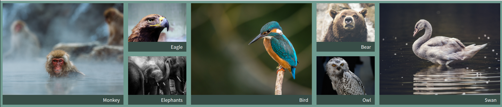

</details>

#### 特性查询 @supports

不需要等到所有的浏览器都支持网格才去使用它，而是要考虑如果浏览器不支持网格时应该如何布局，并给出回退的样式。

CSS 的**特性查询**（feature query）的功能，该功能有助于解决这个问题，如下代码片段所示:

```css
/* 在本例中，如果浏览器支持网格，则使用大括号中的规则；否则不使用 */
@supports (display: grid) {
  ...;
}
```

- **`@supports` 规则后面跟着一个小括号包围的声明。**
  - 如果浏览器理解这个声明，它就会使用大括号里面的所有样式规则。
  - 如果它不理解小括号里的声明，就不会使用这些样式规则。
- `@supports` 规则可以用来**查询所有的 CSS 特性**。例如:
  - 用`@supports (display: flex)`来查询是否支持 Flexbox。
  - 用`@supports (mix-blend-mode: overlay)` 来查询是否支持混合模式。
- 特性查询还有以下几种写法:
  - `@supports not(<declaration>)`: **只有当不支持**查询声明里的特性时才使用里面的样式规则。
  - ` @supports (<declaration>) or (<declaration>)`: 查询声明里的**两个特性只要有一个支持**就使用里面的样式规则。
  - `@supports (<declaration>) and (<declaration>)`: 查询声明里的**两个特性都支持**才使用里面的样式规则。

#### 网格布局模块中的对齐

网格布局模块规范里的对齐属性有一些跟 Flexbox 相同，还有一些是新属性(justify-items,justify-self):

- `justify-content`、`justify-items`、`justify-self`: 这些属性控制了网格元素在水平方向上的位置。
- `align-content`、`align-items`、`align-self`: 这些属性控制网格元素在垂直方向上的位置。

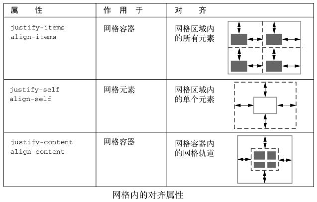

[justify-self](https://developer.mozilla.org/zh-CN/docs/Web/CSS/justify-self) 属性设置单个盒子在其布局容器适当轴中的对其方式。属性值:

- 关键词：关键字 `normal`，`auto`，或 `stretch` 任选其一
- 基线对齐：关键词 `baseline`，可选 `first` 或 `last` 之一为前缀
- 位置对其：关键词 `center`，`start`，`end`，`flex-start`，`flex-end`，`self-start`，`self-end`，`left` 或 `right` 任选其一，可选 `safe` 或 `unsafe` 之一为前缀

该属性的作用效果取决于使用的布局模式：

- 在块级布局中，会将其包含的项目在其行内轴上对齐；
- 绝对定位的元素中，会将其包含的项目在其行内轴上对齐，同时考虑 top、left、bottom、right 的值；
- 表格单元中，该属性被忽略；
- 弹性盒子布局中，该属性被忽略；
- 栅格布局中，会将其栅格区域内的项目在其行内轴上对齐。

[justify-items](https://developer.mozilla.org/zh-CN/docs/Web/CSS/justify-items) 属性为所有盒中的项目定义了默认的 justify-self ，可以使这些项目以默认方式沿适当轴线对齐到每个盒子。作用效果和属性值同`justify-self`一致，属性额外多一个`legacy`关键字。

---

#### 原文总结

- 网格特别适合做网页整体布局（但不局限于此）。
- 网格可以与 Flexbox 配合实现完整的布局系统。
- 可以根据自己的喜好和特定场景，随意使用不同的语法（编号的网格线、命名的网格线、命名的网格区域）。
- 可以用 auto-fill / auto-fit 以及隐式网格，对大量或者数量未知的网格元素进行布局。
- 可以用特性查询实现渐进增强。

### 定位和层叠上下文

介绍三巨头属性之一: `position` 属性。它可以用来构建下拉菜单、模态框以及现代 Web 应用程序的一些基本效果。

_层叠上下文，它属于定位的一个隐藏的副作用。用`z-index`控制层叠顺序。_

`position` 属性的初始值是 `static`。如果把它改成其他值，我们就说元素就**被定位**了。而如果元素使用了静态定位，那么就说它**未被定位**。

默认的`static`关键字指定元素*使用正常的布局行为*，即元素在文档常规流中当前的布局位置。此时 `top`, `right`, `bottom`, `left` 和 `z-index` 属性无效。

前面的浮动、Flex、Grid 布局方法是用各种操作来**控制文档流的行为**。

**定位**则不同：它**将元素彻底从文档流中移走**。它允许你将元素放在屏幕的任意位置。还可以将一个元素放在另一个元素的前面或后面，彼此重叠。

#### 固定定位 fixed

给一个元素设置 `position: fixed `就能**将元素放在视口的任意位置。即便页面在滚动，其相对于 viewport 视口仍处于同一位置**。

- 搭配 top、right、bottom 和 left 四种属性一起使用。这些属性的值决定了固定定位的元素与浏览器视口边缘的距离。

```css
/* 这段代码会将元素放在距离视口顶部和右边 1em 的位置，宽度为视口宽度的 20%。 */
/* 它省略了 bottom 和 height 属性，元素的高度由自身的内容决定。 */
.fixed-demo {
  position: fixed;
  top: 1em;
  right: 1em;
  width: 20%;
}
```

因为固定元素从文档流中移除了，所以它不再影响页面其他元素的位置。别的元素会跟随正常文档流，就像固定元素不存在一样。也就是说它们通常会在固定元素下面排列，视觉上被遮挡。

#### 绝对定位 absolute

**固定定位让元素相对视口定位**，此时视口被称作元素的**包含块**（containing block）。声明 `left: 2em` 则将定位元素的左边放在距包含块左侧 2em 处。

绝对定位的行为也是如此，只是它的包含块不一样。**绝对定位**不是相对视口，而**是相对最近的祖先定位元素**。如果父元素未被定位，那么浏览器会沿着 DOM 树往上找它的祖父、曾祖父，直到找到一个定位元素，用它作为包含块。

- 给一个元素设置 `position: absolute` 就为绝对定位。
- 跟固定元素一样，属性 top 、 right 、 bottom 和 left 决定了元素的边缘在包含块里的位置。

> 如果祖先元素都没有定位，那么绝对定位的元素会基于初始包含块（initial containing block）来定位。初始包含块跟视口一样大，固定在网页的顶部。

```css
/* 这段代码将按钮放在距离其父元素顶部 0.3em、右侧 0.3em 的位置*/
.modal-close {
  position: absolute;
  top: 0.3em;
  right: 0.3em;
  padding: 0.3em;
  cursor: pointer;
}
```

#### 相对定位 relative

**相对定位的元素以及它周围的所有元素，都还保持着原来的位置**，如果加上 top、right、bottom 和 left 属性，元素就会从原来的位置移走，_但是不会改变它周围任何元素的位置_。

元素先放置在未添加定位时的位置，再在不改变页面布局的前提下调整元素位置（因此会在此元素未添加定位时所在位置留下空白）。

> 跟固定或者绝对定位**不一样**，不能用 top、right、bottom 和 left 改变相对定位元素的大小。这些值只能让元素在上、下、左、右方向移动。可以用 top 或者 bottom，但它们不能一起用（bottom 会被忽略）。同理，可以用 left 或 right，但它们也不能一起用（right 会被忽略）。

比如四个 `inline-block` 元素，给第二个元素加上三个额外的属性`position: relative; top: 20px; left: 20px;`，将其从初始位置移走，但是其他元素没有受到影响。

<!-- 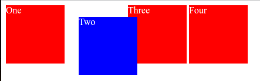 -->

<details>
<summary>点击查看 相对定位示例代码: </summary>

```html
<!DOCTYPE html>
<head>
  <style>
    .box {
      display: inline-block;
      width: 100px;
      height: 100px;
      background: red;
      color: white;
    }

    #two {
      position: relative;
      top: 20px;
      left: 20px;
      background: blue;
    }
  </style>
</head>

<body>
  <div class="box" id="one">One</div>
  <div class="box" id="two">Two</div>
  <div class="box" id="three">Three</div>
  <div class="box" id="four">Four</div>
</body>
```


</details>

#### 层叠上下文和 z-index

使用定位带来的影响(把一个元素从文档流中移除时，就需要管理之前由文档流处理的所有事情):

- 要确保元素不会不小心跑到浏览器视口之外，导致用户会看不到元素。
- 其次要保证元素不会不小心挡住重要内容。
- 最后还有层叠的问题。在同一页面定位多个元素时，可能会遇到两个不同定位的元素重叠的现象。

理解渲染过程和层叠顺序 :

- 浏览器将 HTML 解析为 DOM 的同时还创建了另一个树形结构，叫作渲染树（render tree）。
  - 它代表了每个元素的视觉样式和位置。同时还决定浏览器绘制元素的顺序。
  - 顺序很重要，因为**如果元素刚好重叠，后绘制的元素就会出现在先绘制的元素前面**。
- _通常情况下（使用定位之前），元素在 HTML 里出现的顺序决定了绘制的顺序_。
- 定位元素时，这种行为会改变。浏览器会先绘制所有非定位的元素，然后绘制定位元素。**默认情况下，所有的定位元素会出现在非定位元素前面**。

对策:

- _固定定位_ 可以 _改变_ 固定定位元素的 _标记位置_；
- _相对定位_ 依赖于文档流，_绝对定位_ 元素依赖于它的定位祖先节点。这时候需要用 `z-index` 属性来 _控制它们的层叠行为_。

`z-index` 属性的值可以是任意整数（正负都行）。

- z 表示的是笛卡儿 `x-y-z` 坐标系里的深度方向。
- 拥有较高 z-index 的元素出现在拥有较低 z-index 的元素前面。
- 拥有负数 z-index 的元素出现在静态元素后面。
- 注意:
  - 第一，**z-index 只在定位元素上生效，不能用它控制静态元素**。
  - 第二，给一个定位元素加上 z-index 可以创建层叠上下文。

一个**层叠上下文**包含一个元素或者由浏览器一起绘制的*一组元素*。

- 其中一个元素会作为层叠上下文的根，比如给一个定位元素加上 z-index 的时候，它就变成了一个新的层叠上下文的根。
- 所有后代元素就是这个层叠上下文的一部分。

> 层叠上下文负责决定哪些元素出现在另一些元素前面，而 BFC 负责处理文档流，以及元素是否会重叠。

**层叠上下文之外的元素无法叠放在层叠上下文内的两个元素之间。**

- 换句话说，如果一个元素叠放在一个层叠上下文前面，那么层叠上下文里没有元素可以被拉到该元素前面。
- 同理，如果一个元素被放在层叠上下文后面，层叠上下文里没有元素能出现在该元素后面。

> 给一个定位元素加上 z-index 是创建层叠上下文最主要的方式，但还有别的属性也能创建，比如小于 1 的 opacity 属性，还有 transform、filter 属性。
> 由于这些属性主要会影响元素及其子元素渲染的方式，因此一起绘制父子元素。
> 文档根节点`<html>`也会给整个页面创建一个顶级的层叠上下文。

所有**层叠上下文内的元素**会按照以下顺序，**从后到前叠放**：

- 层叠上下文的根
- z-index 为负的定位元素（及其子元素）
- 非定位元素
- z-index 为 auto 的定位元素（及其子元素）
- z-index 为正的定位元素（及其子元素）

#### 粘性定位 sticky

**粘性定位（sticky positioning）是相对定位和固定定位的结合体**：正常情况下，元素会随着页面滚动，当到达屏幕的特定位置时，如果用户继续滚动，它就会“锁定”在这个位置。最常见的用例是侧边栏导航。

粘性元素永远不会超出父元素的范围，只有当父元素的高度大于粘性元素时才会让粘性元素固定。

比如 A 元素有设定`#one { position: sticky; top: 100px; }`，那么 A 元素上方距离视口顶部距离在 100px 之类，那么就是相对定位，滚动到 10px，距离为 10px，滚动到 20px，距离到 20px；但滚动的距离超过了 100px，那么会固定 A 元素上方距离视口顶部为 100px。
(100px 以内距离是多少就是多少，超过 100px 距离固定为 100px)

#### 原文总结

- 模态框使用固定定位。
- 下拉菜单、工具提示及其他动态交互使用绝对定位。
- 实现这些功能时还要考虑可访问性。
- 关于 z-index 有两个地方要注意：它只对定位元素有效；它会创建一个层叠上下文。
- 在一个页面创建多个层叠上下文时一定要当心潜在的陷阱。
- 使用粘性定位时注意浏览器的兼容性。

### 响应式设计

只需要创建一个网站，就可以在智能手机、平板，或者其他任何设备上运行。网页设计师 Ethan Marcotte 称这种方式为**响应式设计**(responsive design)。

响应式设计的三大原则如下:

- (1) **移动优先**。这意味着在实现桌面布局之前先构建移动版的布局。
- (2) **@media 规则**。使用这个样式规则，可以为不同大小的视口定制样式。
  - 用这一语法，通常叫作媒体查询（media queries），写的样式只在特定条件下才会生效。
- (3) **流式布局**。这种方式允许容器根据视口宽度缩放尺寸。

#### 移动优先

原因:

- 开发移动版网页有很多限制：屏幕空间受限、网络更慢。
- 用户跟网页交互的方式也不一样：可以打字，但是用着很别扭，不能将鼠标移动到元素上触发效果等。
- 如果一开始就设计一个包含全部交互的网站，然后再根据移动设备的限制来制约网站的功能，那么一般会以失败告终。
- 而移动优先的方式则会让你设计网站的时候就一直想着这些限制。
- 一旦移动版的体验做好了（或者设计好了），就可以用“渐进增强”（progressive enhancement）的方式为大屏用户增加体验。

移动版设计主要关注的是内容。因为屏幕较小，一般希望最重要的内容先出现在 HTML 里。

> 重点: 做响应式设计时，一定要确保 HTML 包含了各种屏幕尺寸所需的全部内容。可以对每个屏幕尺寸应用不同的 CSS，但是它们必须共享同一份 HTML。

> 断点:是一个特殊的临界值。屏幕尺寸达到这个值时，网页的样式会发生改变，以便给当前屏幕尺寸提供最佳的布局。

注意: 如果有设计对应的移动版网页，需要在视口的 `<meta>` 元素移动设备，已经特意将网页适配了小屏设备。如果不加这个标签，移动浏览器会假定网页不是响应式的，并且会尝试模拟桌面浏览器，那之前的移动端设计就白做了。

```html
<!-- width=device-width告诉浏览器当解析 CSS 时将设备的宽度作为假定宽度，
而不是一个全屏的桌面浏览器的宽度。
其次当页面加载时，它使用initial-scale 将缩放比设置为 100%。 -->
<meta name="viewport" content="width=device-width, initial-scale=1" />
```

#### 媒体查询 @media

**媒体查询（media queries）允许某些样式只在页面满足特定条件时才生效**。这样就可以根据屏幕大小定制样式。

可以针对小屏设备定义一套样式，针对中等屏幕设备定义另一套样式，针对大屏设备再定义一套样式，这样就可以让页面的内容拥有多种布局。

> 在媒体查询断点中推荐使用 em 单位。在各大主流浏览器中，当用户缩放页面或者改变默认的字号时，只有 em 单位表现一致。
> 以 px 或者 rem 单位为断点在 Safari 浏览器里不太可靠。同时当用户默认字号改变的时候，em 还能相应地缩放，因此它更适合当断点。

语法示例:

```css
/*  该h1标签的字体，当视口小于 35em 的时候是 1.5rem，大于35em 的时候是 2.25rem。*/
.title > h1 {
  color: #333;
  text-transform: uppercase;
  font-size: 1.5rem;
  margin: 0.2em 0;
}

@media (min-width: 35em) {
  .title > h1 {
    font-size: 2.25rem;
  }
}
```

> **媒体查询还可以放在`<link>`元素中**。
> 在网页里加入`<link rel="stylesheet" media="(min-width: 45em)" href="large-screen.css" />`，
> 只有当 min-width 媒体查询条件满足的时候才会将 large-screen.css 文件的样式应用到页面。
> 然而**不管视口宽度如何，样式表都会被下载**。这种方式 _只是为了更好地组织代码，并不会节省网络流量_。

1.  **媒体查询的类型**

**媒体类型**（Media type）描述设备的一般类别。除非使用 not 或 only 逻辑操作符，媒体类型是可选的，并且会（隐式地）应用 all 类型。

- `all`: 适用于所有设备。
- `print`:适用于在打印预览模式下在屏幕上查看的分页材料和文档。
- `screen`:主要用于屏幕。

```css
@media print {
  * {
    color: black !important;
    background: none !important;
  }
}
```

> CSS2.1 和 Media Queries 3 定义了一些额外的媒体类型（tty、tv、projection、handheld、braille、embossed 以及 aural），但是它们[在 Media Queries 4 中已经被废弃](https://www.w3.org/TR/mediaqueries-4/#media-types)，并且不应该被使用。

**媒体特性**（Media feature）描述了用户代理、输出设备或环境的具体特征。媒体特性表达式是完全可选的，其用于测试这些特征是否存在存在和它们的值。每个媒体特性表达式都必须用括号括起来。常用使用示例:

- `min-height: 20em`: 匹配高度大于等于 20em 的视口。
- `max-height: 20em`: 匹配高度小于等于 20em 的视口。
- `orientation: landscape`: 匹配宽度大于高度的视口。
- `orientation: portrait`: 匹配高度大于宽度的视口。
- `min-resolution: 2dppx`: 匹配屏幕分辨率大于等于 2dppx 的设备，比如视网膜屏幕。
  - dppx 指每个 CSS 像素里包含的物理像素点数
- `max-resolution: 2dppx`: 匹配屏幕分辨率小于等于 2dppx 的设备。

更多媒体特性参看 CSS 规范中 [Media Queries Level 5](https://drafts.csswg.org/mediaqueries-5/#media-descriptor-table)。里面可能有`height`但是没有`max-height`，那是因为属于`range`范围类型的媒体特性，是可以加上`max-`或`min-`前缀的。

**逻辑操作符**（logical operator）not、and、only 和 or 可用于联合构造复杂的媒体查询，还可以通过用逗号分隔多个媒体查询，将它们组合为一个规则。使用 not 或 only 需要指定媒体类型。

- `and`: 用于将多个媒体查询规则组合成单条媒体查询，当每个查询规则都为真时则该条媒体查询为 true，它还用于将媒体功能与媒体类型结合在一起。
- `not`: 用于否定媒体查询，如果不满足这个条件则返回 true，否则返回 false。如果出现在以逗号分隔的查询列表中，它将仅否定应用了该查询的特定查询。如果使用 not 运算符，则还必须指定媒体类型。
- `only`: 仅在整个查询匹配时才用于应用样式，并且对于防止较早的浏览器应用所选样式很有用。当不使用 only 时，旧版本的浏览器会将 `screen and (max-width: 500px)` 简单地解释为 screen，忽略查询的其余部分，并将其样式应用于所有屏幕。如果使用 only 运算符，则还必须指定媒体类型。
- `,`（逗号）: 逗号用于将多个媒体查询合并为一个规则。逗号分隔列表中的每个查询都与其他查询分开处理。因此，如果列表中的任何查询为 true，则整个媒体查询语句返回 true。换句话说，列表的行为类似于逻辑或（or）运算符。
- `or`: 等价于 `,` 运算符。

```css
@media not screen and (color), print and (color) {
  ...;
}
/* 等价于 */
@media (not (screen and (color))), print and (color) {
  ...;
}
```

2.  **给网页添加断点**

通常来说，移动优先的开发方式意味着最常用的媒体查询类型应该是 min-width。在任何媒体查询之前，最先写的是移动端样式，然后设置越来越大的断点。

- 最优先的是移动端样式，因为它们不在媒体查询里，所以这些样式对所有断点都有效。
- 然后是针对中等屏幕的媒体查询，其中的规则基于移动端样式构建并且会覆盖移动端样式。
- 最后是针对大屏幕的媒体查询，在这里添加网页最后的布局。

有的设计可能只需要一个断点，有的设计可能需要多个断点。

对网页上有很多元素来讲，无须给每个断点都添加样式，**因为在小屏幕或者中等屏幕的断点下添加的样式规则在大屏幕的断点下也完全有效**。

有时候移动端的样式可能很复杂，在较大的断点里面需要花费较大篇幅去覆盖样式。此时需要将这些样式放在 max-width 媒体查询中，这样就只对较小的断点生效，但是用太多的 max-width 媒体查询也很有可能是没有遵循移动优先原则所致。max-width 是用来排除某些规则的方式，而不是一个常规手段。

总是确保每个媒体查询都位于它要覆盖的样式之后，这样媒体查询内的样式就会有更高的优先级。

3.  **添加响应式的列**

要为中等屏幕断点引入多列布局。只需要将这些样式封装在一个媒体查询里，这样就不会影响到小于这个断点的屏幕设备。

许多响应式设计遵循这种方法：**当设计要求元素并排摆放时，只在大屏上将它们摆放在一行。在小屏下，允许每个元素单独一行，填满屏幕宽度**。种方法适用于列、媒体对象，以及任意在小屏下容易拥挤的元素。

#### 补充：容器查询 @container

容器查询（container queries），起初叫作元素查询（element queries）。 这种查询不是响应视口，而是**响应一个元素的容器的大小**。

比如之前讲的“媒体对象”模式，在大屏中有足够空间，希望是左图右文；但是在移动端设计时，希望是上图下文。

有时候在大屏幕断点上也想要这种移动端布局。比如当这个媒体对象位于一个很窄的列，容器太窄，不适合元素并排摆放，即使此时视口的宽度大于移动端的断点。如果可以根据容器的宽度而不是视口宽度来定义媒体对象的响应式行为。

> 目前容器查询还算比较新的特性,chrome 也要 105 版本才支持。如果要使用，注意浏览器的兼容性，并添加备用样式，比如构造后代选择器来匹配这种场景（比如`.column .media > .media-image`）。

1.  **语法**

CSS 草案中的[容器查询](https://drafts.csswg.org/css-contain-3/#container-rule) 语法与媒体查询类似:

```css
@container <container-condition> {
  <stylesheet>
}
```

- `<container-condition>`: 一组特征，当容器的大小发生变化时，会针对查询容器进行评估。如果条件为真，则应用`<stylesheet>`中定义的样式。
- `<stylesheet>`: 一组 CSS 声明。

可以用来定义容器条件**逻辑关键字**:

- `and`: 结合了两个或多个条件。
- `or`: 结合两个或多个条件。
- `not` 否定了条件。
  - 每个容器查询只允许有一个`not`条件，不能与 `and` 或 `or` 关键字一起使用。

2.  **属性**

可以使用 **`container-type`属性**确定容器类型，允许样式规则应用到其后代的大小和布局的各个方面，并作出相应的响应。可选值有 3 个:

- `size`: 查询将基于容器的行向和块向尺度，将布局、样式和大小的限制应用于容器。
- `inline-size`:查询将基于容器的行向尺度，将布局、样式和行向大小的限制应用于元素。
- `normal`:该元素不是任何容器大小查询的查询容器，但仍然是容器样式查询的查询容器。

可以使用 **`container-name`属性** 来命名"包含上下文"(A containment context)。

- 在容器查询中，`container-name`属性用于将容器集筛选为具有匹配查询容器名称的容器。
  - `container-name`（容器名称一个区分大小写的字符串，用于识别容器。以下条件适用：
    - 名称可以是任何有效的`<custom-ident>`，但不能等于`default`。
    - 名称的值不能有引号。
    - 允许使用旨在表示作者定义的标识符的虚线标识（例如，`--容器名称`）。
    - 允许用空格分隔的多个名字的列表。

可以使用 **`container`属性** 简写 `container:<container-name>/<container-type>`(单个值则为省略 type)。

> 补充: [\<custom-ident>](https://developer.mozilla.org/en-US/docs/Web/CSS/custom-ident) 指用户自定义字符串标识符，要区分大小写，值不能有任何歧义。可以由**字母、十进制数 、连字符、下划线、转义字符、Unicode 编码**组成，但**不能用单引号或双引号包起来。此外，第一个字符不能为数字，字符串开头不能是连字符后跟数字或连字符**。此外，还有一些禁用的特殊值，比如`span`、`inherit`、`none`、`will-change`等等。

```css
.post {
  container-name: sidebar;
  container-type: inline-size;
}
/* 可简写为: */
.post {
  container: sidebar / inline-size;
}
/* 使用容器查询 */
/* 当容器名为sidebar的容器宽度大于400px时使用下面的样式规则 */
@container sidebar (width > 400px) {
  /* <stylesheet> */
}
```

和媒体查询的媒体特性一样，容器查询也有自己的“**容器特性**”(Container Feature)，含义也和媒体特性一样，常用的有:`height`、`width`、`inline-size`、`orientation`等。

3.  **容器查询长度单位**

当应用样式到一个容器中使用容器查询时，可以使用容器查询长度单位。这些单位指定了一个相对于查询容器尺寸的长度。

- cqw：查询容器宽度的 1%
- cqh：查询容器高度的 1%
- cqi：查询容器行向尺寸的 1%
- cqb：查询容器块尺寸的 1%
- cqmin：cqi 和 cqb 中较小的值
- cqmax：cqi 和 cqb 中较大的值

```css
/* 据容器的行向尺寸设置标题的字体大小：
设置容器宽度最小值为700px时，对应标题字体大小 */
@container (min-width: 700px) {
  .card h2 {
    font-size: max(1.5em, 1.23em + 2cqi);
  }
}
```

更多容器查询的使用，参看 MDN 的[CSS 容器查询](https://developer.mozilla.org/zh-CN/docs/Web/CSS/CSS_Container_Queries)、MDN 的[@container](https://developer.mozilla.org/en-US/docs/Web/CSS/@container)、CSS 规范 [CSS Containment Module Level 3 - W3C Working Draft, 18 August 2022](https://www.w3.org/TR/css-contain-3/)等内容。

#### 流式布局

流式布局（fluid layout），有时被称作液体布局（liquid layout），指的是**使用的容器随视口宽度而变化**。

它跟固定布局相反，固定布局的列都是用 px 或者 em 单位定义。

**固定容器（比如，设定了 width: 800px 的元素）在小屏上会超出视口范围，导致需要水平滚动条，而流式容器会自动缩小以适应视口。**

在流式布局中，主页面容器*通常不会有明确宽度，也不会给百分比宽度*，但可能会设置左右内边距，或者设置左右外边距为 `auto`，让其与视口边缘之间产生留白。也就是说容器可能比视口略窄，但永远不会比视口宽。

在主容器中，任何列都用百分比来定义宽度（比如，主列宽 70%，侧边栏宽 30%）。这样无论屏幕宽度是多少都能放得下主容器。用 Flexbox 布局也可以，设置弹性元素的 `flex-grow` 和 `flex-shrink`（更重要），让元素能够始终填满屏幕。要习惯将容器宽度设置为百分比，而不是任何固定的值。

示例，响应式表格:

在移动设备的流式布局里，表格的问题特别多。如果表格的列太多，很容易超过屏幕宽度。如果可以的话，建议在移动设备上用别的方式组织数据。但一定要使用表格的话，有一个办法是将表格强制显示为一个普通的块级元素:

<details>
<summary>点击查看响应式表格示例代码:</summary>

```html
<!DOCTYPE html>
<html lang="en">
  <head>
    <meta charset="UTF-8" />
    <meta name="viewport" content="width=device-width, initial-scale=1" />
    <title>Responsive table example</title>
    <style>
      table {
        border-collapse: collapse;
      }

      th,
      td {
        border: 1px solid black;
        padding: 0.3em 0.5em;
        min-width: 300px;
      }

      /* 表格由<table>、<tr>、<td>元素组成，
        对它们使用了 display: block 声明，覆盖了正常的 table、table-row、table-cell 的显示值。
        可以用 max-width 媒体查询限制在小屏下才改变表格元素的显示。 */
      table {
        width: 100%;
      }

      @media (max-width: 30em) {
        table,
        thead,
        tbody,
        tr,
        th,
        td {
          /* 让表格的所有元素都显示为块级  */
          display: block;
        }

        thead tr {
          /* 将表头移到屏幕外，将其隐藏  */
          position: absolute;
          top: -9999px;
          left: -9999px;
        }

        tr {
          /* 在表格数据的每一个集合之间加上间隔  */
          margin-bottom: 1em;
        }
      }
    </style>
  </head>

  <body>
    <table>
      <thead>
        <tr>
          <th>Country</th>
          <th>Region/Farm</th>
          <th>Tasting notes</th>
          <th>Price</th>
        </tr>
      </thead>
      <tbody>
        <tr>
          <td>Nicaragua</td>
          <td>Matagulpa</td>
          <td>Dark chocolate, almond</td>
          <td>$13.95</td>
        </tr>
        <tr>
          <td>Ethiopia</td>
          <td>Yirgacheffe</td>
          <td>Sweet tea, blueberry</td>
          <td>$15.95</td>
        </tr>
        <tr>
          <td>Ethiopia</td>
          <td>Nano Challa</td>
          <td>Tangerine, jasmine</td>
          <td>$14.95</td>
        </tr>
      </tbody>
    </table>
  </body>
</html>
```

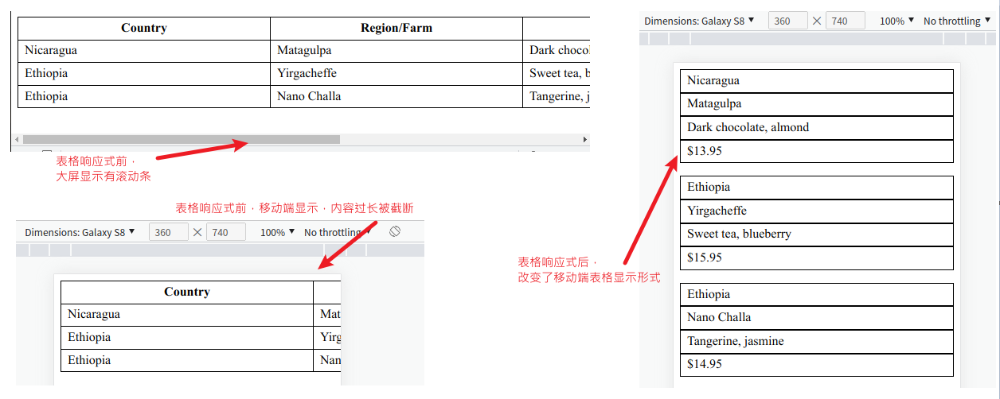

</details>

---

"响应式图片"见上一篇 html 总结。

<!--  -->

#### 原文总结

- 优先实现移动端设计。
- 使用媒体查询，按照视口从小到大的顺序渐进增强网页。
- 使用流式布局适应任意浏览器尺寸。
- 使用响应式图片适应移动设备的带宽限制。
- 不要忘记给视口添加 meta 标签。

## 大型应用程序中的 CSS

### 模块化 CSS

**模块化 CSS**（Modular CSS）是指把页面分割成不同的组成部分，这些组成部分可以在多种上下文中重复使用，并且互相之间没有依赖关系。最终目的是，当修改其中一部分 CSS 时，不会对其他部分产生意料之外的影响。

把样式表的每个组成部分称为**模块**（module），每个模块独立负责自己的样式，不会影响其他模块内的样式。也就是说，在 CSS 里引入了软件封装的原则。

> 封装（encapsulation）: 相关的函数和数据集合在一起组成对象，通常用来隐藏结构化对象内部的状态或值，从而使外部因素不能操作对象内部。

CSS 中没有数据和传统函数的概念，但是有选择器及其命中的页面元素。为了达到封装的目的，这些会成为模块的组成部分，并且每个模块都只负责少量的 DOM 元素的样式。

#### 基础样式

每个样式表的开头都要写一些给整个页面使用的通用规则，模块化 CSS 也不例外。这些规则通常被称为**基础样式**，其他的样式是构建在这些基础样式之上的。基础样式本身并不是模块化的，但它会为后面编写模块化样式打好基础。

*基础样式*应该是通用的，只添加那些影响页面上大部分或者全部内容的样式。选择器不应该使用类名或者 ID 来匹配元素，_**应只用标签类型或者偶尔用用伪类选择器**_。核心思想是这些基础样式提供了一些默认的渲染效果，但是之后可以很方便地根据需要覆盖基础样式。

> 有一个叫作 normalize.css 的库，这个小样式表可以协助消除不同的客户端浏览器渲染上的不一致。不过最新版本已经是 2018 年 11 月份发布的，但每周还有超过百万次下载。

#### 创建模块

模块的 CSS 是一个规则集，通过类名指向模块。

模块的选择器由单个类名构成，这非常重要。选择器里没有其他规则来约束这些样式仅作用在页面上的某个地方。
对比一下，如果使用一个类似于`#sidebar .message` 的选择器，就意味着这个模块只能用在`#sidebar` 元素内部。没有这些约束，模块就可以在任意上下文中重复使用。

通过给元素添加类名，就可以把这些样式复用到很多场景，比如针对表单输入给用户反馈，提供醒目的帮助文字，或者提醒用户注意免责声明条款等。使用相同的组件，就产生了一套风格一致的 UI。所有用到组件的地方将看上去一样，不会出现有的地方蓝绿色有色差、有的地方内边距偏大等问题。

通过定义一个以模块名称开头的新类名来创建一个**修饰符**， 常用的写法是使用**两个连字符**来表示修饰符，比如 `message--error`。

- 双连字符的写法很容易区分哪部分是模块名称，哪部分是修饰符。
  - 比如`nav-menu--horizontal`和 `nav--menu-horizontal` 分别代表了不同的含义。
  - 这种双连字符的写法是从一个叫 BEM 的 CSS 命名规范流行起来的。
- 此外，_还可以模块名称开头，后跟双下划线，然后是子元素的名称_。（这是 BEM 命名规范里的另一种约定。）
  - 比如类名`media__image` 和 `media__body`，也可以清楚知道这个元素扮演了什么角色、属于哪个模块。

**要把一个模块所有的代码集中放在同一个地方，这样一个接一个的模块就会组成最终的样式表**。

修饰符的样式不需要重新定义整个模块，只需覆盖要改变的部分。下面的例子中，这意味着只需要修改文本、边框和背景的颜色。

示例， 带修饰符类名的消息模块 :

```css
/* 基础消息模块  */
.message {
  padding: 0.8em 1.2em;
  border-radius: 0.2em;
  border: 1px solid #265559;
  color: #265559;
  background-color: #e0f0f2;
}

/* 成功修饰符变成了绿色 */
.message--success {
  color: #2f5926;
  border-color: #2f5926;
  background-color: #cfe8c9;
}

/* 警告修饰符变成了黄色 */
.message--warning {
  color: #594826;
  border-color: #594826;
  background-color: #e8dec9;
}

/* 错误修饰符变成了红色  */
.message--error {
  color: #59262f;
  border-color: #59262f;
  background-color: #e8c9cf;
}
```

使用时，把模块和修饰符的类名都添加到元素上

```html
<!-- 使用了错误修饰符的消息模块的示例 -->
<div class="message message--error">Invalid password</div>
```

**不要使用依赖语境的选择器**，千万不要使用基于页面位置的后代选择器来修改模块。

**避免在模块选择器中使用通用标签名**，比如 div 和 span 。类似于 `.page-header > span` 的选择器太宽泛了。

#### 把模块组合成更大的结构

每个模块应该只做一件事情。“关于类的第一条规则是类应该短小，第二条规则是还要更短小”同样适用于 CSS 里的模块。

> 当我们需要使用**并**（或者**和**）来描述模块职责的时候，思考一下是不是在描述两种（甚至更多的）职责。如果是的话，我们就需要为每个职责分别定义模块。这是模块封装的一个非常重要的原则，我们把它叫**作单一职责原则**（Single Responsibility Principle）。尽可能把多种功能分散到不同的模块中，这样每个模块就可以保持精炼、聚焦，并且容易理解。

需要回过头修改某个模块时，就会发现模块越小越好，这有助于迅速理解。

> 所有的预处理器（比如 Sass 或者 LESS）都提供了把分散的 CSS 文件合并成一个文件的功能。我们可以用多个文件和多个目录来组织样式，最后提供一个文件给浏览器。这样可以减少浏览器发起的网络请求数，开发者也可以把代码文件拆分成易于维护的大小。
> 如果你正好在使用某种预处理器，那我强烈建议你把 CSS 里的每个模块都放在各自对应命名的文件里，并按实际需要将这些文件组织到不同目录中。然后创建一个主样式表，引入所有的模块。这样一来，你想修改某个模块时就不必到一个冗长的样式表里面搜索了，因为很清楚去哪儿找它。

例如，可以创建一个 `main.scss` 文件，里面只包含`@import` 语句，如下所示:

```scss
@import "base";
@import "message";
@import "button";
@import "media";
@import "dropdown";
```

预处理器会从 `base.scss` 中引入基础样式，从每个模块文件引入相应的模块样式，然后输出一个包含所有样式的样式表文件。这样每个模块都单独拥有一个便于维护的文件。

关于 `@import`的简单补充:

- `@import `用于从其他样式表导入样式规则。这些规则必须先于所有其他类型的规则，除了@charset 规则和创建层的 @layer 语句;
- 因为@import 不是一个嵌套语句，所以@import 不能在"条件规则组"(即@media、@supports@document 规则)中使用。
- 用户代理可以避免为不支持的媒体类型检索资源，开发者可以指定依赖媒体的 @import 规则。这些条件导入在 URI 之后指定逗号分隔的媒体查询。在没有任何媒体查询的情况下，导入是无条件的。
  - 语法: `@import url list-of-media-queries;`，w3c 中[示例](https://drafts.csswg.org/css-cascade-5/#example-05c74581):
  ```css
  /*仅在UA支持 display:flex 时加载样式表，并且仅在最大视口宽度为400px的手持设备上应用样式表。*/
  `@import url("narrow.css") supports(display: flex) handheld and (max-width: 400px);
  ```

---

比较常看到`@import`和 link 元素的区别。算是比较好奇的，除了两者都能加载样式表之外，还有什么相同点吗？这应该是完全两种不同的东西，除了只是在极小一点上可以达成同样的工作之外，应该全是区别吧。

**模块命名**

- 模块的命名应该有意义，无论使用场景是什么。同时也要避免使用简单地描述视觉效果的名称(比如`gray--box`换个颜色这个模块名就不对了)。
- 模块要适用于各种不同场景，而其名称应该简单易记。
- 可以使用两个词来命名每个模块，这样就可以避免模块指代不明确。
- 为模块的变体类命名的时候，应该遵守同样的原则。
  - 比如已经有了按钮模块不应该使用 `button--red` 和 `button--blue` 命名红色和蓝色变体子类，因为不确定颜色是否会变。可以使用`button--danger` 和 `button--success`这样比较明确的命名。
- 使用大或小这样具有相对意义的词语来命名修饰符不是最佳方式，但也可以接受。比如` button--large`也不是不能用，但就不要使用像 `button--20px` 这样特别精确的命名。

#### 工具类

有时候需要用一个类来对元素做一件简单明确的事，比如让文字居中、让元素左浮动，或者清除浮动。这样的类被称为**工具类**（utility class）。

工具类应该专注于某种功能，一般只声明一次。通常把这些工具类放在样式表的底部，模块代码的下面。

_工具类是唯一应该使用 important 注释的地方_。事实上，工具类应该优先使用它。这样的话，不管在哪里用到工具类，都可以生效。

工具类示例:

```css
/* 让容器内的文字居中 */
.text-center {
  text-align: center !important;
}

/* 为元素设置左浮动  */
.float-left {
  float: left;
}

/* 清除浮动  */
.clearfix::before,
.clearfix::after {
  content: " ";
  display: table;
}
.clearfix::after {
  clear: both;
}

/* 隐藏页面上某个元素  */
.hidden {
  display: none !important;
}
```

#### 几种模块化 CSS 方法论和 css in js 的概述

有些开发者在大型项目中经历了 CSS 体积过大导致的问题，开始制定一些规则来确保代码复用和减少 bug，在此基础上发展建立了一些新的方法论，其中比较重大的几个:

- OOCSS: 面向对象的 CSS，由 Nicole Sullivan 创建。
- SMACSS: 可扩展的、模块化 CSS 架构，由 Jonathan Snook 创建。
- BEM: 块（Block）、元素（Element）和修饰符（Modifier），由 Yandex 公司提出。
- ITCSS: 倒三角形 CSS，由 Harry Roberts 创建。

**OOCSS** 的基本理念是将你的 CSS 分解成可复用的对象，于是可以在你的站点上任何需要的地方使用。OOCSS 的标准示例是在媒体对象模块中所描述的排布。这一排布一方面让图片、视频或者其他元素保持固定尺寸，而另一方面也让其他内容可伸缩。这是用于评论、列表等网站随处可见的排布。

**BEM**代表块（Block），元素（Element），修饰符（Modifier），是一个严格约定的*命名规范*，通过这种规范，来解决在编写 CSS 是所遇到的问题。

```cs
/* 书写规范 */
.block {...} /* 块: 块名*/
.block__element {...} /* 元素: 块名 + __ + 元素名 */
.block--modifier {...} /* 修饰符: 块名 + -- + 元素名 */
```

**SMACSS** 中，它认为 CSS 应该根据如下五种分组类别进行分类：

- Base(基础规范): 任何场合下，页面元素的默认外观，这里样式只会对标签元素本身做设定，不会出现任何 class 或 id，但是可以有属性选择器或是伪类。
- Layout(布局规范): 布局是一个网站的基本，无论是左右还是居中，甚至其他什么布局，要实现页面的基本浏览功能，布局必不可少。使用`l-/layout-`为前缀。
- Module(模块规范): 基本思想与 BEM 类似。使用`m-/module-`为前缀。
- State(状态规范): 元素在特定状态下的外观。但是与 OOCSS 分离 Skin 的方式不同，SMACSS 是抽取更高级别的样式类，得到更强的复用性。使用`is-/has-`为前缀。
- Theme(主题规范): 页面主题外观。使用`t-/theme-`为前缀

**ITCSS** 进一步分为 7 层，一个倒三角，从上倒下依次为:

- Settings: 与预处理器一起使用，包含字体、颜色定义等。
- Tools: 全局使用的混合元素和函数。重要的是不要在前两层输出任何 CSS。
- Generic: 重置和/或规范化样式，盒状大小的定义，等等。这是产生实际 CSS 的第一层。
- Elements: 为纯 HTML 元素(如 h1、a 等)设计样式。这些都是来自浏览器的默认样式，所以可以在这里重新定义它们。
- Objects: 定义未修饰设计模式的基于类的选择器，例如 OOCSS 中已知的媒体对象。
- Components: 特定的 UI 组件。大部分工作发生的地方。UI 组件通常由 Objects 和 Components 组成。
- Trumps: 实用程序和 helper 类，能够覆盖三角形中的任何东西，例如 hide helper 类。

OOCSS 仅是基于一些引导原则，ITCSS 对类的命名和样式归类有明确的规则，SMACSS 和 BEM 则介于两者之间。

前面介绍了样式表的三个主要组成部分：基础样式、模块样式和工具类。
SMACSS 增加了布局样式的部分，用来处理页面主要区域的布局（侧边栏、页脚、网格系统等）。
ITCSS 则进一步将类别分为七个层。

JavaScript 替代方案: 为内联样式（inline styles）或者 **CSS in JS**。

这种方案不再依赖类命名的口头约定，而是使用 JavaScript 来控制，要么生成独一无二的类名，要么使用 HTML 的 style 属性引入所有的样式。

一些比较流行的比如[Styled Components](https://github.com/styled-components/styled-components) 、[emotion](https://github.com/emotion-js/emotion)的库。绝大部分库绑定了一个 JavaScript 框架比如 react，或者工具集比如 Webpack。

#### 原文总结

- 把 CSS 拆解成可复用的模块。
- 不要书写可能影响其他模块或者改变其他模块外观的样式。
- 使用变体类，提供同一模块的不同版本。
- 把较大的结构拆解成较小的模块，然后把多个模块组合在一起构建页面。
- 在样式表中，把所有用于同一个模块的样式放在一起。
- 使用一种命名约定，比如双连字符和双下划线，以便一眼就可以看清楚模块的结构。

关于这个模块化 CSS 的补充，可以弄一些大厂风格指南，比如[Google HTML/CSS Style Guide](https://google.github.io/styleguide/htmlcssguide.html)，这个仓库还有很多其他的语言的风格指南，github 的仓库地址：[google/styleguide](https://github.com/google/styleguide)，这个有中文版地址:[zh-google-styleguide/zh-google-styleguide](https://github.com/zh-google-styleguide/zh-google-styleguide)

### 模式库

把模块清单整合成一组文档，在大型项目中已经成为通用做法。这组文档被称为**模式库**（pattern library）或者样式指南（style guide）。
模式库不是网站或者应用程序的一部分，它是单独的一组 HTML 页面，用来展示每个 CSS 模块。模式库是你和你的团队在建站的时候使用的一个开发工具。

说白了，就像[element-plus](https://github.com/element-plus/element-plus)、[Angular Material](https://github.com/angular/components)、[ant-design](https://github.com/ant-design/ant-design)这样的 UI 库，同样的方法使用同一个组件，效果都一致。

如果要创建自己的模式库(自封装组件?)，可以参考 CSS 优先（CSS First）开发方式: 先实现了 CSS 模块化的样式，然后使用这些模块拼装成 Web 页面。开发流程大概如下:

- (1) 页面开发时，先有一个草图或者原型图或者其他可以展示页面的设计方式。
- (2) 看看模式库。找找现有模块，如果有满足页面需求的模块就直接使用。然后从页面的外层（主页面布局和容器）开始，按自己熟悉的方式编写 CSS。如果使用现有模块可以构建整个页面，就不需要写新的 CSS 了。
- (3) 你会发现有时候需要用到一些模式库提供不了的功能。项目开发早期这种情况很常见，到后面就会少很多。这时候就需要开发一个或几个新模块，或者现有模块的新变体。暂停正在编写的页面开发，先在模式库中实现这个模块。为新模块书写文档，确保它的外观和行为跟需求一致。
- (4) 回到页面开发，使用刚写的新样式并且添加新模块到页面上。

这种开发方式有几个好处:

- 第一，为网站提供一致性更好的界面。
- 第二，当你按照模式库的方式开发模块的时候，你可以孤立地看待问题。
- 第三，这种开发方式允许团队里一部分成员专注于开发 CSS。
- 第四，这种开发方式可以确保文档是最新的。

像 API 一样使用模式库: 当你使用模式库开发的时候，相当于你正在维护一组与 CSS 交互的 API。每个模块会附带一些类名和少量的 DOM 结构。只要相关的 HTML 部分遵照这种结构来编写，样式表就会正确地渲染样式

### CSS 预处理器 Sass/SCSS

最好看看[官网的 Sass Basics](https://sass-lang.com/guide)，更加简洁直观。

**变量声明**: 使用`$`符号,以`空格`或`逗号`分割的多个属性值，变量名可用`中划线`或`下划线`连接:  
`$basic-border: 1px solid black;`

**变量使用**: 凡是 css 属性的标准值（比如说 1px 或者 bold）可存在的地方，变量就可以使用:

```scss
$highlight-color: #f90;
$highlight-border: 1px solid $highlight-color;
.selected {
  border: $highlight-border;
}
```

**简单的嵌套**:可以像俄罗斯套娃那样在规则块中嵌套规则块,避免重复书写:

<details>
<summary>点击查看 简单的嵌套的示例代码:</summary>

```scss
#content {
  article {
    h1 {
      color: #333;
    }
    p {
      margin-bottom: 1.4em;
    }
  }
  aside {
    background-color: #eee;
  }
}
/* 编译后 */
#content article h1 {
  color: #333;
}
#content article p {
  margin-bottom: 1.4em;
}
#content aside {
  background-color: #eee;
}
```

</details>

<br/>

**父选择器的标识符`&`**: 简单嵌套的解开是**父选择器通过一个`空格`连接到子选择器的前边**形成后代选择器。  
上面的例子，父选择器`#content`，子选择器`article`和`aside`，后台选择器`#content article`和`#content aside`。  
使用嵌套规则时，父选择器标识符`&`能对于嵌套规则如何解开提供更好的控制，且`&`可以放在任何一个选择器可出现的地方。

<details>
<summary>点击查看 父选择器的标识符的示例代码:</summary>

```scss
article a {
  color: blue;
  :hover {
    color: red;
  }
}
/* 编译后 */
article a {
  color: blue;
}
article a :hover {
  color: red;
}

article a {
  color: blue;
  &:hover {
    color: red;
  }
}
/* 编译后 */
article a {
  color: blue;
}
article a:hover {
  color: red;
}
```

</details>

<br/>

使用父选择器标识符`&`的，编译后`a`和`:hover`中间**没有空格**.

**群组选择器的嵌套**:sass 解开一个群组选择器规则内嵌的规则时，它会把每一个内嵌选择器的规则都正确地解出来.

<details>
<summary>点击查看 群组选择器的嵌套的示例代码:</summary>

```scss
.container {
  h1,
  h2,
  h3 {
    margin-bottom: 0.8em;
  }
}
nav,
aside {
  a {
    color: blue;
  }
}
/* 编译后 */
.container h1,
.container h2,
.container h3 {
  margin-bottom: 0.8em;
}
nav a,
aside a {
  color: blue;
}
```

</details>

<br/>

**子组合选择器和同层组合选择器: `>`、`+`和`~`**:这三个必须和其他选择器配合使用，以指定浏览器仅选择某种特定上下文中的元素。

<details>
<summary>点击查看 子组合选择器和同层组合选择器的示例代码:</summary>

```scss
article {
  ~ article {
    border-top: 1px dashed #ccc;
  } // 同层全体组合选择器 ~ (不管它们之间隔了多少其他元素)
  > section {
    background: #eee;
  } // 下层相邻组合选择器 > (article下层紧邻的子元素section)
  dl > {
    dt {
      color: #333;
    }
    dd {
      color: #555;
    }
  }
  nav + & {
    margin-top: 0;
  } // 同层相邻组合选择器 + ( nav 后面紧跟着的 article元素)
}
/* 编译后 */
article ~ article {
  border-top: 1px dashed #ccc;
}
article > section {
  background: #eee;
}
article dl > dt {
  color: #333;
}
article dl > dd {
  color: #555;
}
nav + article {
  margin-top: 0;
}
```

</details>

<br/>

**嵌套属性**的规则: 把属性名从中划线`-`的地方断开，在根属性后边添加一个冒号`:`，紧跟一个`{}`块，把子属性部分写在这个`{}`块中。

```scss
nav {
  border: 1px solid #ccc {
    left: 0px;
    right: 0px;
  }
}
/* 编译后 */
nav {
  border: 1px solid #ccc;
  border-left: 0px;
  border-right: 0px;
}
```

**导入 SASS 文件**: sass 的`@import`规则在**生成 css 文件时**就把相关文件导入进来。(css 中是执行到`@import`才去下载对应文件)

- 新版本已推荐使用`@use`规则从其他 Sass 样式表中加载 mixins、函数和变量，并将来自多个样式表的 CSS 组合在一起。

- sass 的`@import`规则并不需要指明被导入文件的全名。你可以省略`.sass`或`.scss`文件后缀
- **sass 局部文件的文件名以下划线开头**。这样，sass 就**不会**在编译时单独**编译**这个文件**输出 css**，而**只把这个文件用作导入**。
- 一般情况下，反复声明一个变量，**只有最后一处声明有效且它会覆盖前边的值**。
- 使用`!default`标签修饰变量: _如果这个变量被声明赋值了，那就用它声明的值，否则就用这个默认值。_
- **嵌套导入**: sass 允许`@import`命令写在 css 规则内。此时，生成对应的 css 文件时，**局部文件会被直接插入到 css 规则内导入它的地方**。
- **原生的 CSS 导入**:支持原生 CSS 导入，但这会造成浏览器解析 css 时的额外下载。**sass 的语法完全兼容 css，修改为`.scss`后缀名即可。**

**静默注释**: css 标准注释格式`/* ... */`的注释语法会出现在生成的 css 文件中,使用静默注释，_以`//`开头，注释内容直到行末_，则不会。

**混合器**: sass 的混合器使用`@mixin`标识符定义，通过`@include`来使用这个混合器。通过混合器实现**大段样式的重用**。

- 可以通过在`@include`混合器时给混合器传参，来*定制混合器生成的精确样式*。
  - 如果不记得参数顺序，可以使用语法`$name: value`的形式指定每个参数的值(此时就不关注参数顺序了)
  - 不必传入所有的参数，可以给参数指定一个默认值，所有未传值的参数都会被该值覆盖。

<details>
<summary>点击查看 混合器的示例代码:</summary>

```scss
@mixin theme($theme: DarkGray) {
  background: $theme;
  box-shadow: 0 0 1px rgba($theme, 0.25);
  color: #fff;
}

.info {
  @include theme;
}
.alert {
  @include theme($theme: DarkRed);
}
.success {
  @include theme($theme: DarkGreen);
}

/*编译后*/
.info {
  background: DarkGray;
  box-shadow: 0 0 1px rgba(169, 169, 169, 0.25);
  color: #fff;
}

.alert {
  background: DarkRed;
  box-shadow: 0 0 1px rgba(139, 0, 0, 0.25);
  color: #fff;
}

.success {
  background: DarkGreen;
  box-shadow: 0 0 1px rgba(0, 100, 0, 0.25);
  color: #fff;
}
```

</details>
<br/>

**选择器继承**: 一个选择器可以继承为另一个选择器定义的所有样式。这个通过`@extend`语法实现，主要目的精简 CSS。

- **跟混合器相比，继承生成的 css 代码相对更少**。因为继承仅仅是重复选择器，而不会重复属性，所以*使用继承往往比混合器生成的 css 体积更小*。如果你非常关心你站点的速度，请牢记这一点。
- **继承遵从 css 层叠的规则**。当两个不同的 css 规则应用到同一个 html 元素上时，并且这两个不同的 css 规则对同一属性的修饰存在不同的值，css 层叠规则会决定应用哪个样式。相当直观：**通常权重更高的选择器胜出，如果权重相同，定义在后边的规则胜出。**
- 使用继承的最佳实践: **不要在 css 规则中使用后代选择器（比如.foo .bar）去继承 css 规则。**

<details>
<summary>点击查看 选择器继承的示例代码:</summary>

```scss
//通过选择器继承继承样式
.error {
  border: 1px solid red;
  background-color: #fdd;
}
.seriousError {
  @extend .error;
  border-width: 3px;
}
/*编译后 .seriousError将会继承样式表中任何位置处为.error定义的所有样式。 */
.error,
.seriousError {
  border: 1px solid red;
  background-color: #fdd;
}
.seriousError {
  border-width: 3px;
}
```

</details>
<br/>

如果`.seriousError @extend .error`， 那么样式表中的任何一处`.error`都用`.error .seriousError`这一选择器组进行替换。

**操作符**:Sass 支持一些有用的操作符来处理不同的值。这些包括标准的数学运算符，如`+`和`*`，以及各种其他类型的运算符。

<details>
<summary>点击查看 线性渐变的示例代码:</summary>

```scss
@use "sass:math";
.container {
  display: flex;
}
article[role="main"] {
  width: math.div(600px, 960px) * 100%;
}
aside[role="complementary"] {
  width: math.div(300px, 960px) * 100%;
  margin-left: auto;
}
/**编译后 */
.container {
  display: flex;
}
article[role="main"] {
  width: 62.5%;
}
aside[role="complementary"] {
  width: 31.25%;
  margin-left: auto;
}
```

</details>

<br/>

简述:

- 关键字入门: 预处理、变量、嵌套结构、局部文件、模块、混合器、继承、操作符
- `$`变量声明，`&`父选择器标识符，`>`子组合选择器，`~`和`+`同层组合选择器，`@use`加载函数变量模块等，
- `!default`修饰变量表示有默认值就用默认值没有就要新声明的值，
- `@mixin`声明混合器用`@include`导入使用， `@extend`继承另一个选择器定义的样式。

## 高级话题(小略)

高级话题这一块基本是针对特定需求做一些特定的处理，个人觉得先有这么一个概念，然后实际需求到了的时候，再找更加全面的讲解可能使用效果更加。就比如要用渐变，实际使用也不会只是单纯一个线性渐变条就完了，实际应该更复杂、更自制，更多看需求是怎样要求的、设计师是怎么设计的。

这里的内容、示例代码也基本就直接一一来源于原书了，就直接展示概念属性、及其基本示例代码，省时间就直接看每小节的“原文概要与总结”了解个概念也行。

### 背景、阴影和混合模式

#### 渐变

一: **线性渐变**，是从元素的一端开始，沿着直线过渡到另一端。

1.  基础渐变

`linear-gradient` 函数使用三个参数来定义行为：角度(渐变方向)、起始颜色和终止颜色。

角度除了 `to top`, `to bottom`, `to left` 和 `to right` 关键子外，还有其他表示度数的:

- deg:度。值 0deg 代表垂直向上，更大的值会沿着顺时针变化，因此 90deg 代表向右渐变，180deg 代表向下渐变，360deg 又会代表向上渐变。
- rad: 弧度（radian）。一个完整的圆是 2π，大概是 6.2832 弧度。
- turn: 代表环绕圆周的圈数。一圈相当于 360 度（360deg）。可以使用小数来表示不足一圈，比如 0.25turn 相当于 90deg。
- grad: 百分度（gradian）。一个完整的圆是 400 百分度（400grad），100grad 相当于 90deg。

2.  条纹

如果在同一个位置设置两个颜色节点，那么渐变会直接从一个颜色变换到另一个，而不是平滑过渡。
从红色开始，直接变换到了白色，然后又变成了蓝色，整体呈现条纹状。

3.  重复渐变

`repeating-linear-gradient()`函数和函数`linear-gradient` 的效果基本相同，唯一的区别就是前者会重复。

对于重复渐变，最好使用特定的长度而不是百分比，因为设置的值决定了要重复的图片大小。

<details>
<summary>点击查看 线性渐变的示例代码:</summary>

```html
<!DOCTYPE >
<head>
  <style type="text/css">
    .fade {
      height: 200px;
      width: 400px;

      /* 查看实际效果时，只用某一个background-image的属性值，其他的注释掉即可 */

      /* 1. 基础线性渐变 */
      /* p1 向右侧渐变，从白色过渡到蓝色  */
      background-image: linear-gradient(to right, white, blue);
      /* p2 使用度的渐变 */
      background-image: linear-gradient(90deg, white, blue);
      /* p3 包含多个颜色节点的线性渐变 */
      background-image: linear-gradient(90deg, red, white, blue);

      /* 2. 条纹 相同位置上的颜色节点 */
      background-image: linear-gradient(
        90deg,
        red 40%,
        white 40%,
        white 60%,
        blue 60%
      );
    }

    /* 3. 重复渐变 */
    .fade--repeat {
      height: 1em;
      width: 400px;
      background-image: repeating-linear-gradient(
        -45deg,
        #57b,
        #57b 10px,
        #148 10px,
        #148 20px
      );
      border-radius: 0.3em;
    }
  </style>
</head>
<body>
  <div class="fade"></div>
  <br />
  <div class="fade--repeat"></div>
</body>
```

</details>

<br/>

二: **径向渐变**，是从一个点开始，全方位向外扩展。

<details>
<summary>点击查看 径向渐变的示例代码:</summary>

```html
<!DOCTYPE >

<head>
  <style type="text/css">
    .fade {
      height: 200px;
      width: 400px;

      /* 椭圆渐变 */
      background-image: radial-gradient(white, blue);
      /* 圆形渐变 */
      background-image: radial-gradient(circle, white, blue);
      /* 大小为3em，中心点举例左侧和顶部边缘都是25% */
      background-image: radial-gradient(3em at 25% 25%, white, midnightblue);
      /* 指定颜色节点位置的径向渐变 */
      background-image: radial-gradient(
        circle,
        midnightblue 0%,
        white 75%,
        red 100%
      );
      /* 重复渐变生成条纹效果 */
      background-image: repeating-radial-gradient(
        circle,
        midnightblue 0,
        midnightblue 1em,
        white 1em,
        white 2em
      );
    }
  </style>
</head>

<body>
  <div class="fade"></div>
</body>
```

</details>

<br/>

更多 CSS 的渐变可参看 MDN [使用 CSS 渐变](https://developer.mozilla.org/zh-CN/docs/Web/CSS/CSS_images/Using_CSS_gradients)

#### 阴影

阴影是另一种可以为网页增加立体感的特效。

有两个属性可以创建阴影，`box-shadow` 可以为元素盒子生成阴影，`text-shadow` 可以为渲染后的文字生成阴影。

**盒阴影语法**: 如果没有指定 inset，默认阴影在边框外;使用 inset 关键字会使得阴影会在盒子边框之内 (即使是透明边框)、背景之上、内容之下。

```css
/* x 偏移量 | y 偏移量 | 阴影颜色 */
box-shadow: 60px -16px teal;

/* x 偏移量 | y 偏移量 | 阴影模糊半径 | 阴影颜色 */
box-shadow: 10px 5px 5px black;

/* x 偏移量 | y 偏移量 | 阴影模糊半径 | 阴影扩散半径 | 阴影颜色 */
box-shadow: 2px 2px 2px 1px rgba(0, 0, 0, 0.2);

/* 插页 (阴影向内) | x 偏移量 | y 偏移量 | 阴影颜色 */
box-shadow: inset 5em 1em gold;

/* 任意数量的阴影，以逗号分隔 */
box-shadow: 3px 3px red, -1em 0 0.4em olive;
```

**`text-shadow`**  为文字添加阴影。可以为文字与  [`decoration`](https://developer.mozilla.org/zh-CN/docs/Web/CSS/text-decoration)  添加多个阴影，阴影值之间用逗号隔开。每个阴影值由元素在 X 和 Y 方向的偏移量、模糊半径和阴影颜色值组成。

```css
/* x 偏移量 | y 偏移量 | 阴影模糊半径 | 阴影颜色 */
text-shadow: 1px 1px 2px black;

/* 阴影颜色 | x 偏移量 | y 偏移量 | 阴影模糊半径 */
text-shadow: #fc0 1px 0 10px;

/* x 偏移量 | y 偏移量 | 阴影颜色 */
text-shadow: 5px 5px #558abb;

/* 阴影颜色 |x 偏移量 | y 偏移量  */
text-shadow: white 2px 5px;

/* x 偏移量 | y 偏移量  */
text-shadow: 5px 10px;
```

<details>
<summary>点击查看 使用了渐变和阴影的按钮样式的示例代码:</summary>

```html
<!DOCTYPE >

<head>
  <style type="text/css">
    .button {
      padding: 1em;
      border: 0;
      font-size: 0.8rem;
      color: white;
      border-radius: 0.5em;
      /* 从浅蓝色到中蓝色的渐变 */
      background-image: linear-gradient(to bottom, #57b, #148);
      /* 带 0.5em 模糊半径的深蓝色阴影  */
      box-shadow: 0.1em 0.1em 0.5em #124;
    }

    .button:active {
      /* 两个内部盒阴影  */
      box-shadow: inset 0 0 0.5em #124, inset 0 0.5em 1em rgba(0, 0, 0, 0.4);
    }
  </style>
</head>

<body>
  <button class="button">注册</button>
</body>
```

</details>

<details>
<summary>点击查看 鼠标悬停和激活状态的扁平化按钮的示例代码:</summary>

```html
<!DOCTYPE >
<head>
  <style type="text/css">
    .button {
      padding: 1em;
      border: 0;
      color: white;
      /* 纯色背景（没有渐变）  */
      background-color: #57b;
      font-size: 1rem;
      padding: 0.8em;
      /* 淡淡的阴影 */
      box-shadow: 0 0.2em 0.2em rgba(0, 0, 0, 0.15);
    }
    /* 鼠标悬停和激活状态下，颜色稍微加深  */
    .button:hover {
      background-color: #456ab6;
    }
    .button:active {
      background-color: #148;
    }
  </style>
</head>
<body>
  <button class="button">注册</button>
</body>
```

</details>

<details>
<summary>点击查看 更加现代化的按钮的示例代码:</summary>

```html
<!DOCTYPE >
<head>
  <style type="text/css">
    .button {
      padding: 0.8em;
      border: 0;
      font-size: 1rem;
      color: white;
      /* 改回了圆角效果 */
      border-radius: 0.5em;
      background-color: #57b;
      /* 按钮下方添加了阴影（无模糊效果） */
      box-shadow: 0 0.4em #148;
      /* 添加了细小的文本阴影  */
      text-shadow: 1px 1px #148;
    }
    .button:active {
      background-color: #456ab5;
      /* 点击时，按钮下移  */
      transform: translateY(0.1em);
      /* 减小了阴影的大小，用来抵消按钮的位移  */
      box-shadow: 0 0.3em #148;
    }
    .button:focus {
      outline: none;
    }
  </style>
</head>
<body>
  <button class="button">注册</button>
</body>
```

</details>

#### 混合模式

`background-image` 属性可以接受任意数量的值，相互之间以逗号分隔，如下所示。

```css
background-image: url(bear.jpg), linear-gradient(to bottom, #57b, #148);
```

如果使用两张背景图片，那么一般是希望第二张图片也可以透视显示。这时就可以使用**混合模式**（blend mode）。混合模式用来控制叠放的图片怎样融合在一起。

> 如果一张背景图片有一些透明度，即使不使用混合模式，在它下方的其他背景也会通过透明区域显现出来。

<details>
<summary>点击查看 两张背景图片以正片叠底的方式组合在一起的示例代码:</summary>

```html
<!DOCTYPE >
<head>
  <style type="text/css">
    .blend {
      min-height: 400px;
      /* 使用逗号隔开的两张背景图片  */
      background-image: url(images/bear.jpg), url(images/bear.jpg);
      /* -size和-repeat 属性也可以接受多个值，但如果只设置一个值，就会应用到所有的背景图片上。 */
      /* 此处设置一个值，应用到两张背景图片上  */
      background-size: cover;
      background-repeat: no-repeat;
      /* 为每张背景图片设置不同的初始位置  */
      background-position: -30vw, 30vw;
      /* 应用混合模式 */
      background-blend-mode: multiply;
    }
  </style>
</head>
<body>
  <div class="blend"></div>
</body>
```

</details>

---

属性说明:

- `background-size`: 置背景图片大小。图片可以保有其原有的尺寸，或者拉伸到新的尺寸，或者在保持其原有比例的同时缩放到元素的可用空间的尺寸。常用值有:
  - `cover`: 可以调整背景图片的大小，使其填满整个元素，这样会导致图片的边缘被裁切掉一部分。
  - `contain`: 可以保证整个背景图片可见，尽管这可能导致元素的一些地方不会被背景图片覆盖。
  - 长度值[\<length>](https://developer.mozilla.org/zh-CN/docs/Web/CSS/length): 明确设置背景图片的宽度和高度。
- `background-repeat`: 定义背景图像的重复方式。背景图像可以沿着水平轴，垂直轴，两个轴重复，或者根本不重复。
  - 上面对应的单值:`repeat-x`、`repeat-y`、`repeat`、`no-repeat`。还有:
  - `space`: 图像会尽可能得重复，但是不会裁剪。第一个和最后一个图像会被固定在元素的相应的边上，同时空白会均匀地分布在图像之间。
  - `round`: 随着允许的空间在尺寸上的增长，被重复的图像将会伸展 (没有空隙), 直到有足够的空间来添加一个图像。当下一个图像被添加后，所有的当前的图像会被压缩来腾出空间。
- `background-position`: 每一个背景图片设置初始位置。
  - 单值可能是: `center`、`top`、`left`、`bottom`、`right`，或者`<length>` 或 [\<percentage>](https://developer.mozilla.org/zh-CN/docs/Web/CSS/percentage): 指定相对于左边界的 x 坐标，y 坐标被设置成 50%
  - 双值: 一个定义 x 坐标，另一个定义 y 坐标。任一个可为上面的单值。
  - 三个值: 两个值是关键字值，第三个是前面值的偏移量：
    - 第一个值是关键字 top、left、bottom、right，或者 center。如果设置为 left 或 right，则定义了 X。如果设置为 top 或 bottom，则定义了 Y，另一个关键字值定义了 X。
    - `<length>` 或 `<percentage>`，如果是第二个值，则是第一个值的偏移量。如果是第三个值，则是第二个值的偏移量。
    - 单个长度或百分比值是其前面的关键字值的偏移量。一个关键字与两个 `<length>` 或 `<percentage>` 值的组合无效。
  - 四个值: 第一个和第三个值是定义 X 和 Y 的关键字值。第二个和第四个值是前面 X 和 Y 关键字值的偏移量：
    - 第一个值和第三个值是关键字值 top、left、bottom、 right 之一。如果设置为 left 或 right，则定义了 X。如果设置为 top 或 bottom，则定义了 Y，另一个关键字值定义了 X。
    - 第二个和第四个值是 `<length>` 或 `<percentage>`。第二个值是第一个关键字的偏移量。第四个值是第二个关键字的偏移量。
- `background-blend-mode`: 定义该元素的背景图片，以及背景色如何混合。
  - 支持很多种[\<blend-mode>](https://developer.mozilla.org/zh-CN/docs/Web/CSS/blend-mode): multiply、overlay、darken、lighten、color-burn 等十几种。

补充:`background-color`、`background-image`、`background-repeat`、`background-position`可以用` background`简写，例如:

- `background:  #000  url(images/bg.gif)  no-repeat  top  right;`

CSS 支持 15 种混合模式，每一种都使用不同的计算原理来控制生成最终的混合结果。对每一个像素来说，就是取一个图层上的像素颜色，与其他图层上对应像素的颜色拼合计算，生成一个新的像素颜色，最终生成一张混合图片。

混合模式的另一个应用场景就是**为图片添加纹理效果**。比如你有一张富有现代气息的清晰图片，但有时候出于样式考虑，你想让图片与众不同。这时候就可以使用灰度图为图片手动添加胶片噪点效果或者其他纹理。

```css
.blend {
  min-height: 400px;
  /* 将纹理图片覆盖在主图片之上 */
  background-image: url("images/scratches.png"), url("images/bear.jpg");
  /* 每 200px 平铺一张纹理图片 */
  background-size: 200px, cover;
  /* 二张图片的背景大小设置为 cover，且不允许重复，这样就不会平铺。 */
  background-repeat: repeat, no-repeat;
  background-position: center center;
  /* 使用柔光混合模式 */
  background-blend-mode: soft-light;
}
```

**使用融合混合模式**:虽然 background-blend-mode 属性可以实现多张图片的混合，但只能局限于元素的背景
颜色或者背景图片使用。还有一个属性 mix-blend-mode ，可以融合多个元素。这样不仅可以混合图片，还可以把元素的文本和边框与容器的背景图片混合在一起。使用融合混合模式，可以把标题显示在图片上方，但遮住的图片部分依然可以显示出来，

示例:为` <h1>` 增加样式，最终效果为红色的纯色背景通栏、亮灰色顶部和底部宽边框、灰色文字。然后应用融合混合模式，整个元素被视为一个图层，和下面的容器里的背景图片混合在一起。

<details>

<summary>点击查看 简单的融合混合模式示例代码:</summary>

```html
<!DOCTYPE >
<head>
  <style type="text/css">
    .blend {
      background-image: url("images/bear.jpg");
      background-size: cover;
      background-position: center;
      padding: 15em 0 1em;
    }

    .blend > h1 {
      margin: 0;
      font-family: Helvetica, Arial, sans-serif;
      font-size: 6rem;
      text-align: center;
      /* 使用强光混合模式 */
      mix-blend-mode: hard-light;
      /* 为前景元素设置文字和背景颜色 */
      background-color: #c33;
      color: #808080;
      border: 0.1em solid #ccc;
      border-width: 0.1em 0;
    }
  </style>
</head>
<body>
  <div class="blend">
    <h1>Ursa Major</h1>
  </div>
</body>
```

</details>

#### 原文概要与总结

概要

- 线性渐变和径向渐变
  - linear-gradient()
  - repeating-linear-gradient()
  - radial-gradient()
  - repeating-radial-gradient()
- 盒阴影和文字阴影
  - box-shadow
  - text-shadow
- 调整背景图片的大小和位置
  - background-size
  - background-position
- 使用混合模式，让背景和内容相结合
  - background-blend-mode

总结

- 使用渐变和阴影为页面增加立体效果。
- 基本的扁平化设计也可以少量应用阴影和渐变。
- 带有明确颜色节点的渐变，可以为元素添加条纹效果。
- 小巧的背景渐变比纯色背景更能提升设计效果。
- 使用混合模式可以为图片着色或者添加纹理效果。

### 对比、颜色和间距

#### 对比很重要

**对比的重要性**:对比是设计中的一种手段，通过突出某物来达到吸引注意力的目的。我们的眼睛和思维天生对模式比较敏感，一旦某种东西破坏了模式的整体效果，我们就自然而然地注意到了它。

若要起到对比的效果，页面必须*先建立模式*，就如同必须先有了规矩才能打破规矩。(建立模式，还原设计稿)

**使用不同的颜色、间距和大小是建立对比的一些常用方法**。

- 如果好几个条目是亮色的，还有一个是暗色的，那你就会首先注意到这个暗色条目。
- 如果一个条目周围有很多无用的间距（称作留白），那这个条目就会比较突出。
- 同样，较大的元素也会从一系列较小元素中脱颖而出。
- 为了实现更强的对比效果，还可以多种方法组合使用，就像团队协作软件网站里的标语那样，它的字号较大、周围留白，还跟着一个醒目的深色按钮。

#### 颜色

设计师交付设计稿时，一般会交给你一个很大的 PDF 文档。PDF 文档可能会包含一两页关于多种标题和正文副本的排版示例，还可能会有一些基础 UI 元素的详细列表，比如链接和按钮，同时包含它们的各种状态，比如鼠标悬停和激活。此外还包括网站使用的调色板。

**调色板**通常列出了全站使用的所有颜色样本及对应的十六进制颜色值。设计师一般会为每种颜色取一个名字，后面的明细规范文档中可以使用这些命名。
_调色板一般会有一种主色，其他颜色基于主色_。主色一般从公司的品牌或者 LOGO 中衍生出来。
调色板中的其他颜色一般是同一色系不同明暗度的颜色，还有一些补充颜色。大部分调色板也会有黑色和白色（虽然可能不是纯黑白的#000000 或者#ffffff），以及少量的灰色。

**颜色单位**的几种值: 颜色名、RGB/RGBA、十六进制的 RGB 值(HEX)、HSL/HSLA 值

- 在 css 可以**直接使用颜色名**来设置各种颜色（但是在 css 中使用颜色名来设置往往不方便）
- **RGB/RGBA 值**:通过 red,green,blue 三种颜色的不同浓度调配出不同颜色,语法为`RGB(红色,绿色,蓝色,[不透明度])`
  - 每一种颜色的范围在 0-255(0%-100%)之间；透明度的值 1 表示完全不透明，0 表示完全透明，0.5 为半透明。
- **十六进制的 RGB 值**: 语法为`#红色绿色蓝色`；颜色浓度在`00-ff`,两位两位重复可以简写:`##aabbcc` 简写为 `#abc`
- **HSL/HSLA 值**: 代表色调、饱和度、亮度、和透明度(同 RGBA 的 A)，即 hue, saturation, lightness 和 alpha
  - H 色调，是色轮上从 0 到 360 的度数。0 是红色，120 是绿色，240 是蓝色；[示例 `hsl(30, 100%, 50%)`]
  - S 饱和度，一个百分比值。0% 表示完全灰色即看不见颜色，100% 表示纯色、没有灰色阴影；
  - L 亮度，一个百分比值，要给该颜色多少光。0%表示没有光（黑色），50%表示 50%光（既不暗也不亮），100%表示全光（白色）

为某种颜色寻找一个搭配的颜色，最简单的方式是找到它的**补色**（complement）。补色位于色相环的对侧位置，蓝色的补色是黄色；绿色的补色是洋红色（或者紫色）；红色的补色是青色。使用 HSL 颜色值时，计算补色非常简单，为色相值加上或者减去 180 即可。

在背光式计算机屏幕上，纯白色背景（ #fff ）上的纯黑色文本会产生强烈的对比效果，很容易在阅读时造成视觉疲劳，特别是大段的文本。黑色背景上的白色文本也会有同样的问题。在这种情况下，要么用深灰色代替黑色，要么用浅灰色代替白色，或者都替换掉。对用户来讲，看上去依然是黑白的，但阅读时会感觉更舒适。

_如果不想让文本产生过于强烈的对比效果，同样也不希望对比效果太差。_

[W3C 的 Web 内容无障碍指南（Web Content Accessibility Guidelines，WCAG）](https://www.w3.org/TR/WCAG21/)提供了关于对比度最小值的建议（称为 AA 级），更严格一点，还有加强型对比度（称为 AAA 级）。鉴于大号文本更易于阅读，两个级别都对大号文本的对比度适当放宽了限制。(目前在用的还是 2.1 版本，有[中文版](https://www.w3.org/Translations/WCAG21-zh/))

#### 间距

主要需要思考两件事情，**一个是是否需要使用相对单位，另一个是行高如何影响垂直间距**。

- 使用**相对单位的好处**，尤其是可以使用响应式字号（ font-size:calc(0.5em+1vw) ），这就允许我们的设计可以按比例缩放字体。在较大的屏幕上，字号就可以相应变大，基于 em 和 rem 的外边距也随之变大。在用户修改了浏览器的默认字号的时候，相对单位的好处也能体现出来。
- 使用**像素相对比较简单**，短期内工作会比较轻松。

处理间距时，需要知道*什么时候应该使用内边距，什么时候应该使用外边距*。

在盒模型中，元素的内容盒子为内边距所环绕，然后是边框，最后是外边距。但是对于段落和标题这样的元素，内容盒子并不是只有显示出来的文字区域，_元素的行高决定了内容盒子最终的高度，这要超出字符的顶部和底部_。

> 设计师可能习惯使用行距（leading）来表示每行文字之间的间距。在 CSS 中，文字间距由行高控制，不能直接转换成行距。

**文本行的高度是由行高乘以字号决定的**。如果为行内元素添加内边距，元素本身会变高，却不会增加文本行的高度。文本行的高度只由行高来决定。

#### 原文概要与总结

概要

- 把设计师的视觉稿转化为 HTML 和 CSS
- 使用对比设计，把用户的注意力吸引到正确的页面部分
- 颜色的选用
- 充分利用空白间距
- 使用行高

总结

- 选择性地使用对比，来把用户注意力吸引到页面上重要的部分。
- 使用 HSL 颜色表示法，让颜色处理更简单更易于理解。
- 设计师执着于细节时，要相信他们的判断。
- 花些时间来调整间距。
- 牢记行高可以影响垂直间距。

### 排版

网页设计，成也字体，败也字体。

- 几年前，Web 开发者只能从有限的一些字体中做选择，即所谓的 Web 安全字体（Web safe font）。这些字体类型包括 Arial、Helvetica、Georgia 等，大部分用户的系统会安装。因为浏览器只能使用这些系统字体渲染页面，所以我们必须使用它们。
- 随着 Web 字体的兴起，情况改变了。Web 字体使用`@font-face` 规则，告诉浏览器去哪里找到并下载自定义字体，供页面使用。

#### web 字体

在线服务使用 Web 字体是最简单也最普遍的方式：

- Typekit
- Webtype
- 谷歌字体
- 国内常见的有 [有字库](https://www.webfont.com/)，阿里的 [iconfont](https://www.iconfont.cn/webfont#!/webfont/index)，台湾的 [JustFont](https://justfont.com/) 等。

标题和正文分别使用不同的字体是很常见的。通常，一种字体是 serif，另一种是 sans-serif。

> Serif——字母笔画末端的小线条或者“爪状”装饰。包含 serif 的字体就被称为 serif 字体（例如 Times New Roman）。如果没有 serif，那就是 sans-serif 字体（例如 Helvetica）。
>
> 字型（typeface）和字体（font）这两个术语经常被混为一谈。字型通常是指字体（比如 Roboto）的整个家族，一般由同一个设计师创造。一种字型可能会存在多种变体和字重（比如细体、粗体、斜体、压缩，等等），这些变体的每一种可称之为一种字体（font）。

#### 如何使用`@font-face`

[@font-face](https://developer.mozilla.org/zh-CN/docs/Web/CSS/@font-face) 指定一个用于显示文本的自定义字体；字体能从远程服务器或者用户本地安装的字体加载。

- 如果提供了 local() 函数，从用户本地查找指定的字体名称，并且找到了一个匹配项，本地字体就会被使用。
- 否则，字体就会使用 url() 函数下载的资源。

```css
@font-face {
  font-family: MyHelvetica;
  /* 使用本地的"Helvetica Neue Bold"字体 */
  /* 如果当前用户 (浏览器) 未安装该字体 (两种可能的字体名都已经试过)，*/
  /* 就会用下载的字体"MgOpenModernaBold.ttf"来代替 */
  src: local("Helvetica Neue Bold"), local("HelveticaNeue-Bold"),
    url(MgOpenModernaBold.ttf);
  font-weight: bold;
}
```

如果需要用到同一种字型的多种字体，那么*每一种字体都需要自己的 `@font-face` 规则*。

#### 调整字距

涉及两个属性： `line-height` 和 `letter-spacing` ，这两个属性可以控制文本行之间的距离（垂直方向）和字符之间的距离（水平方向）。但找到合适的值是件主观性很强的事情。

> 文字行越长，行高应该设置得越大。这样读者的眼睛扫到下一行的时候才更容易，不会注意力分散。理想情况下，每行文字的长度应该控制在 45 ～ 75 个字符，一般认为这样的长度最利于阅读。

> 在设计领域，文本行之间的距离称为行距（leading，与 bedding 有点谐音），来源于印刷版每行文字之间添加的一条条的引导线（lead）。字符之间的距离称之为字距（tracking）。

对于正文主体来讲，调整间距是为了使阅读体验效果更佳，但对于标题和其他内容很少的元素（比如按钮）来讲，影响不大。

#### 恼人的 FOUT 和 FOIT

在处理字体前，需要先考虑一下性能，因为字体文件很大。

开始时，大多数的浏览器供应商为了尽可能快地渲染页面，使用了可用的系统字体。然后，一小段时间过去了，Web 字体加载完成，页面会使用 Web 字体重新渲染一次。

比起系统字体，Web 字体很可能会在屏幕上占据不一样的空间。第二次渲染时，页面布局变了，文字突然跳动了。
如果这是在第一次渲染之后很快发生，用户可能不会注意到。
但是如果字体下载过程中有网络延迟（或者字体文件太大了），可能长达几秒之后才会再次渲染页面。这种情况发生时，有的用户可能会感到厌烦。
他们可能已经开始阅读网页内容了，这时页面突然变化，会让他们注意力分散。这就是所谓的 **FOUT，即无样式文本闪动**（Flash of Unstyled Text）。

因为开发者们不喜欢这样，所以大部分浏览器供应商修改了浏览器的行为。
他们不再渲染回退字体，改成渲染页面上除了文本以外的其他所有元素。
确切地说，他们把文本渲染成不可见的，因此文字依然会占据页面的空间。
通过这种方式，页面的容器元素得以实现，用户就可以看到页面正在加载。这就导致了一个新的问题，**FOIT，即不可见文本闪动**（Flash of Invisible Text）。
比如，背景颜色和边框都显示出来了，但是文字在第二次渲染的时候才显示，即 Web 字体加载之后。

_要解决问题，其实就是要避免发生 FOUT 和 FOIT。然而 在 Web 字体领域，这两个问题从未完全解决过。我们能做的就是尽可能让它们产生的影响降到最低。_

解决方法：

1.  使用 js 监控字体加载
    - 使用 JavaScript 可以监控字体加载事件，这样就可以更好地控制 FOUT 与 FOIT 的发生过程。还可以使用 js 库来帮助处理，我喜欢用一款名叫 [Font Face Observer](https://github.com/bramstein/fontfaceobserver)的库。
2.  回退到系统字体
    - 针对字体加载，我们可以采用两种基本方法。
    - 第一种，在 CSS 中使用回退字体，然后在选择器中使用 `.fonts-loaded `，把回退字体改成想要的 Web 字体。这样就可以把浏览器的 FOIT（不可见文本）改为 FOUT（无样式文本）。
    - 第二种，在 CSS 中使用 Web 字体，然后在选择器中使用 `.fonts-failed `，把字体改成回退字体。这种方法依然会产生 FOIT，但是如果超时就会转换为系统字体，页面不会在加载失败时被不可见文本卡住。
3.  使用 font-display
    - font-display 属性决定了一个 @font-face 在不同的下载时间和可用时间下是如何展示的。属性同时也支持以下几个值:
    - auto: 字体显示策略由用户代理定义。
      - 默认行为（在大多数浏览器中是 FOIT）。
    - block: 为字体提供一个短暂的阻塞周期和无限的交换周期。
    - swap: 为字体提供一个非常小的阻塞周期和无限的交换周期。
      - 显示回退字体，在 Web 字体准备好之后进行交换（FOUT）。
    - fallback: 为字体提供一个非常小的阻塞周期和短暂的交换周期。
      - 介于 auto 和 swap 之间。文本会保持较短时间（100ms）的隐藏状态，如果这时候 Web 字体还没有准备好，就显示回退字体。接下来一旦 Web 字体加载完成，就会显示 Web 字体。
    - optional: 为字体提供一个非常小的阻塞周期，并且没有交换周期。
      - 类似于 fallback ，但是允许浏览器基于网速判断是否显示 Web 字体。这就意味着在较慢的连接条件下 Web 字体可能不会显示。

#### 原文概要与总结

概要

- Web 字体如何赋予页面独特的体验
- 使用谷歌字体 API
- 调整字体的间距（字距和行距）
- Web 字体性能相关因素与优化
- 处理 FOUT(无样式文本闪动,Flash of Unstyled Text) 和 FOIT(不可见文本闪动,Flash of Invisible Text)

总结

- 使用字体供应商（比如谷歌字体）的服务可以轻松集成 Web 字体。
- 严格限制添加到网页的 Web 字体数量，来控制页面体积。
- 使用@font-face 规则集管理自己的字体。
- 花点时间调整 line-height 和 letter-spacing，使页面段落分明、清晰易读。
- 使用 Font Face Observer 或其他 JavaScript 来协助控制加载行为，防止文本隐藏的问题。
- 留意以后 font-display 的支持情况。

### 过渡(transition-\*)

CSS transitions 提供了一种在更改 CSS 属性时 **控制动画速度**的方法。其可以让属性变化成为一个持续一段时间的过程，而不是立即生效的。

通常将两个状态之间的过渡称为**隐式过渡**（implicit transitions），因为开始与结束之间的状态由浏览器决定。

CSS transitions 可以决定*哪些属性发生动画效果* (明确地列出这些属性)，_何时开始_ (设置 delay），_持续多久_ (设置 duration) 以及*如何动画* (定义 timing function，比如匀速地或先快后慢)。

#### 定义过渡的属性

CSS 过渡由简写属性 `transition` 定义是最好的方式，可以避免属性值列表长度不一，节省调试时间。包含以下属性:

- `transition-property`: **指定哪个或哪些 CSS 属性用于过渡**。只有指定的属性才会在过渡中发生动画，其它属性仍如通常那样瞬间变化。
- `none`: `没有过渡动画。all`: 所有可被动画的属性都表现出过渡动画。`<IDENT>`:属性名称
- `transition-duration`: **指定过渡的时长**。或者为*所有属性指定一个值*，或者*指定多个值，为每个属性指定不同的时长*。
- `transition-timing-function`: **指定一个函数，定义属性值怎么变化**。缓动函数 Timing functions 定义属性如何计算。
  - 多数 [timing functions](https://developer.mozilla.org/en-US/docs/Web/CSS/easing-function) 由四点定义一个 bezier 曲线。也可以从 [Easing Functions Cheat Sheet](https://easings.net/) 选择缓动效果。
  - 和动画的`animation-timing-function`属性是一样的用法。
- `transition-delay`: **指定延迟**，在过渡效果开始作用之前需要等待的时间。单位为 s 或者 ms。

简写形式: `transition: <property> <duration> <timing-function> <delay>;`

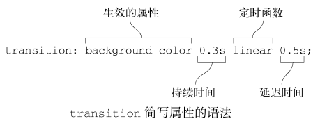

**当属性值列表长度不一致时**

_以 `transition-property` 的值列表长度为标准_，如果某个属性值列表长度**短于它的则重复其值以长度一致；长于它的则被截断**:

```css
div {
  transition-property: opacity, left, top, height;
  transition-duration: 3s, 5s;
}
/* 处理成 */
div {
  transition-property: opacity, left, top, height;
  transition-duration: 3s, 5s, 3s, 5s;
}
```

#### 检测过渡是否完成

**当过渡完成时触发一个事件**，在符合标准的浏览器下，这个事件是 **`transitionend`**, 在 WebKit 下是 webkitTransitionEnd。

transitionend 事件提供两个属性:

- `propertyName`: 字符串，指示已完成过渡的属性。
- `elapsedTime`: 浮点数，指示当触发这个事件时过渡已运行的时间（秒）。这个值不受 transition-delay 影响。

例如: `el.addEventListener("transitionend", updateTransition, true);`

> 如果在过渡完成之前，因为元素被做成 `display: none` 或者动画属性的值被改变而中止过渡，过渡结束事件不会触发。

---

#### 原文概要与总结

概要

- 使用过渡为网页引入动效
- 理解定时函数并选择合适的效果
- 配合 JavaScript 使用

总结

- 使用过渡可以使页面中的突变变得平滑。
- 使用加速运动可以吸引用户注意力。
- 通知用户他们的行为已生效，应该使用减速运动。
- 只使用 CSS 无法满足需求时，可以使用 JavaScript 更改类配合过渡来实现。

### 变换(transform-\*)

通过改变坐标空间，CSS transforms 可以在 **不影响正常文档流的情况下改变作用内容的位置**。
CSS transforms 通过一系列 CSS 属性实现，通过使用这些属性，可以对 HTML 元素进行线性仿射变形。可以进行的变形包括**旋转，倾斜，缩放以及位移**，这些变形同时适用于平面与三维空间。

> 只有**被盒子模型定位的元素才能被转换**。如果一个元素有 `display: block`，它就被盒子模型定位了。

#### CSS transforms 属性

有两个主要的属性被用来定义 CSS transforms：`transform` 和 `transform-origin`:

- `transform-origin: left 5px -3px;`: 指定原点的位置。**默认值为元素的中心，可以被移动**。
  - 很多变形需要用到这个属性，比如旋转，缩放和倾斜，他们都需要一个指定的点作为参数。
  - 该属性可以使用一个，两个或三个值来指定，其中每个值都表示一个偏移量。面向屏幕`x-offset(左右)|y-offset(上下)|z-offset(远近)`
    - 一个值：必须是`<length>`，`<percentage>`，或 `left`, `right`, `center`, `top`, `bottom`关键字中的一个。
    - 两个值：其中一个必须是`<length>`，`<percentage>`，或`left`, `center`, `right`关键字中的一个。
      - 另一个必须是`<length>`，`<percentage>`，或`top`, `center`, `bottom`关键字中的一个。
    - 三个值：前两个值和只有两个值时的用法相同。第三个值必须是`<length>`。它始终代表 Z 轴偏移量。
- `transform: scaleY(0.5);` 属性允许旋转，缩放，倾斜或平移给定元素。这是通过修改 CSS 视觉格式化模型的坐标空间来实现的。
  - **取值为空格分隔的一系列变形的列表**，即可以指定多种变换，他们会像被组合操作请求一样被分别执行。
  - 可以指定为关键字值`none`(不做任何变换) 或一个或多个`<transform-function>`值。
  - `<transform-function>` CSS 数据类型用于对元素的显示做变换。通常，这种变换可以由矩阵表示，并且可以使用每个点上的矩阵乘法来确定所得到的图像。
    - `matrix()`: 用六个指定的值来**指定一个均匀的二维（2D）变换矩阵**。
    - `matrix3d()`: 用一个 `4 × 4` 的齐次矩阵来**描述一个三维（3D）变换**。
    - `perspective(l)`: 设置用户与 z=0 平面之间的距离(远近)。参数是数值
    - `rotate(a)`: 围绕二维平面上的一个固定点**旋转**一个元素(rotation)。参数表示代表旋转的角度；正值，顺时针；负值，逆时针。
    - **`rotate3d(x, y, z, a)`**: 围绕三维空间的固定轴线旋转一个元素。参数为 x、y、z 轴坐标和角度。
    - `rotateX(a)`: 围绕横轴旋转一个元素。参数为旋转角度。是`rotate3D(1, 0, 0, a)`的简写形式。
    - `rotateY(a)`: 围绕纵轴旋转一个元素。参数为旋转角度。是`rotate3D(0, 1, 0, a)`的简写形式。
    - `rotateZ(a)`: 围绕 Z 轴旋转一个元素。参数为旋转角度。是`rotate3D(0, 0, 1, a)`的简写形式。
    - `scale(sx,[sy])`: 在二维平面上**放大或缩小**一个元素(resizing)。参数为缩放矢量的横坐标和纵坐标。
    - **`scale3d(sx, sy, sz)`**: 在三维空间中放大或缩小一个元素。参数为代表缩放矢量的横坐标、纵坐标和 Z 轴值。
    - `scaleX(s)`: 水平地放大或缩小一个元素。参数为缩放因子，一个数字。`scale(sx,1)`和`scale3d(sx,1,1)`的简写形式。
    - `scaleY(s)`: 垂直地放大或缩小一个元素。参数为缩放因子，一个数字。`scale(1,sy)`和`scale3d(1,sy,1)`的简写形式。
    - `scaleZ(s)`: Z 轴放大或缩小一个元素。参数为缩放因子，一个数字。`scale3d(1, 1, sz)` 的简写形式。
    - **`skew(ax, [ay])`**: 在二维平面上**扭曲**一个元素(distortion)。参数为用于沿着横坐标、纵坐标扭曲元素的角度。
    - `skewX(a)`: 沿水平方向歪斜元素。(skew:歪斜,倾斜,扭曲)
    - `skewY(a)`: 沿垂直方向歪斜元素。
    - `translate(tx, [ty])`: 在二维平面上**平移**一个元素(moving)。参数为要移动矢量的横坐标、纵坐标。
    - **`translate3d(tx, ty, tz)`**: 在三维空间中平移一个元素。参数为代表移动矢量的横坐标、纵坐标和 Z 轴值。
    - `translateX(tx)`: 水平地平移一个元素。`translate(tx, 0)` 的简写形式。
    - `translateY(ty)`: 垂直地平移一个元素。`translate(0, ty)` 的简写形式。
    - `translateZ(tz)`: 沿 Z 轴平移一个元素。`translate3d(0, 0, tz)` 的简写形式。

<details>

<summary>点击查看 简单的变换示例代码:</summary>

```html
<head>
  <style>
    /* 先水平向左平移30px，垂直向下平移20px，
    然后围绕div左上角 (不指定-origin则为其中心点)顺时针旋转20度。*/
    .trans-elem {
      border: solid red;
      width: 140px;
      height: 60px;
      transform-origin: left top;
      transform: translate(30px, 20px) rotate(20deg);
    }
  </style>
</head>
<body>
  <div class="trans-elem">Transformed element</div>
</body>
```

</details>

#### 原文概要与总结

概要

- 使用变换操作元素，提升过渡和动画的性能
- 为过渡添加“弹跳”效果
- 浏览器的渲染路径
- 了解 3D 变换和透视距离

总结

- 在二维和三维空间中使用变换来缩放、旋转、平移和倾斜元素。
- 如果想要优化过渡和动画性能，变换就必不可少。
- 理解渲染路径是如何工作的，创建动画的时候一定要牢记。
- 使用自定义定时函数曲线为过渡添加弹跳特效。

### 动画

CSS animations 使得可以将 **从一个 CSS 样式配置转换到另一个 CSS 样式配置**。
动画包括两个部分：*描述动画的样式规则*和*用于指定动画开始、结束以及中间点样式的关键帧*。
**创建动画序列**: 需要使用 `animation` 属性或其子属性，该属性允许配置动画时间、时长以及其他动画细节。
**动画的实际表现**: 动画的实际表现是由` @keyframes` 规则实现。

#### 配置属性

`animation` 属性为以下 8 个子属性的缩写(由逗号分隔的多个值指代**可设置多个动画的相关属性**，animation 本身也支持配置多个动画):

- `animation-delay: 2s, 4ms`。设置延时，即从**元素加载完成之后到动画序列开始执行**的这段时间。
  - 延迟开始和结束时间，单位 s 或者 ms，**默认为 0s**，设置负数则立即执行动画。
- `animation-direction: normal`。指示**动画是否反向播放**，设置动画在每次运行完后是反向运行还是重新回到开始位置重复运行。
  - `normal`: 每个*动画循环结束*，动画重置到起点重新开始，这是**默认属性**。
  - `alternate`: _动画交替反向运行_，反向运行时，动画按步后退，同时，带时间功能的函数也反向。
  - `reverse`: _反向运行动画_，每周期结束动画由尾到头运行。
  - `alternate-reverse`: _反向交替_，反向开始交替。动画第一次运行时是反向的，然后下一次是正向，后面依次循环。
- `animation-duration: 10s, 30s, 230ms`。设置动画**一个周期的时长**。
- `animation-iteration-count: 2.4,0,infinite`。设置动画**重复次数**，使用`数值`(**默认为 1**)或指定`infinite`无限次重复动画。
- `animation-name: test1, animation4`。指定**由`@keyframes`描述的关键帧名称**。
- `animation-play-state: paused, running`。允许**暂停和恢复**动画。`running`: 当前动画正在运行。`paused`:当前动画已被停止。
- `animation-timing-function: ease, steps(4,end)`。设置**动画速度**，即通过建立加速度曲线，设置动画在关键帧之间是如何变化。
  - 该属性的值 7 个 关键字 `ease|ease-in|ease-out|ease-in-out|linear|step-start|step-end`，2 个 函数表达式。
  - **cubic-bezier()** 缓动函数符号定义了*三次贝塞尔曲线*。由于这些曲线是连续的，它们通常用于平滑动画的开始和结束。
    - 语法: `cubic-bezier(x1, y1, x2, y2)`，具有固定四个点值的三次贝塞尔曲线。x1 和 x2 的范围`[0,1]`，否则无效。
    - 后面列式的属性，都是缓动函数的别名而已。
    - `cubic-bezier(0.0,  0.0, 1.0,  1.0)` = **`linear`**: 动画以**恒速**运行。
    - `cubic-bezier(0.25, 0.1, 0.25, 1.0)` = **`ease`**: 动画**缓慢开始**，比 ease-in-out 快，**然后加速，最后减速直至结束**。
    - `cubic-bezier(0.42, 0.0, 1.0,  1.0)` = **`ease-in`**: 动画**缓慢开始，然后逐渐加速直到结束，在结束点时突然停止**。
    - `cubic-bezier(0.42, 0.0, 0.58, 1.0)` = **`ease-in-out`**: 动画**缓慢开始，然后加速，最后减速直至结束**。
    - `cubic-bezier(0.0,  0.0, 0.58, 1.0)` = **`ease-out`**: 动画**突然开始，然后逐渐减速直至结束**。
  - **steps()** 函数符号定义了一个阶梯函数，将输出值的域划分为等距阶梯。阶梯函数的这个子类有时也称为阶梯函数。
    - 语法: `steps(num_of_steps, direction)`。参数`num_of_steps`是一个正整数，表示步进；`direction`是一个关键字:
      - `jump-start` 表示左连续函数，因此第一步或跳跃发生在动画开始时；`start` 相当于 jump-start。
      - `jump-end` 表示右连续函数，因此最后一步或跳跃发生在动画结束时；`end` 相当于 jump-end，**默认值**。
      - `jump-both` 表示左右连续函数，包括在 0% 和 100% 标记处的暂停，有效地在动画迭代期间添加一个步骤；
      - `jump-none` 两端都没有跳跃。相反，保持在 0% 标记和 100% 标记，每个标记持续时间的 1/n。也有两个别名:
    - **`step-start`**: 动画**立即跳转到它的最终状态，并一直停留到结束**。= `steps(1, jump-start)`或`steps(1, start)`。
    - **`step-end`**: 动画**一直保持初始状态直到结束，此时它直接跳转到最终状态**。= `steps(1, jump-end)`或`steps(1, end)`。
  - 补充说明:
    - 可以在`@keyframe`规则中对各个**关键帧**指定`animation-timing-function`，如果没有指定，则应用该**动画元素**中对应的值。
    - 在一个关键帧内，`animation-timing-function`是一个 at-rule 特定的描述符，而不是同名的属性。
    - 在 100%或到关键帧上指定的`animation-timing-function`将永远不会被使用。
- `animation-fill-mode: none, backwards`。指定**动画执行前后如何为目标元素应用样式**。
  - `none`: 当动画未执行时，动画将不会将任何样式应用于目标，而是已经赋予给该元素的 CSS 规则来显示该元素。这是**默认值**。
  - `forwards`: **目标**将保留由执行期间遇到的**最后一个关键帧计算值**。(关键帧的值为 `0% / from`和 `100% / to`)
    - 最后一个关键帧取决于 animation-direction 和 animation-iteration-count 的值。
    - `normal` 加 `偶数或者奇数`，则为`100% / to`；`reverse`加`偶数或奇数`则为`0 / from`；
    - `alternate`加`偶数`则为`0% / from`；`alternate`加`奇数`则为`100% / to`；
    - `alternate-reverse`加`even`则为`100% / to`；`alternate-reverse`加`奇数`则为`0% / from`。
  - `backwards`: 动画将在应用于目标时立即应用**第一个关键帧中定义的值**，并在 animation-delay 期间保留此值。
    - 第一个关键帧取决于 animation-direction 的值。
    - `normal` or `alternate`则为 `0% / from`，`reverse` or `alternate-reverse`则为 `100% / to`。
  - `both`: 动画将遵循 forwards 和 backwards 的规则，从而在两个方向上扩展动画属性。

#### 使用 keyframes 定义动画序列

**定义动画的表现**: 通过使用`@keyframes`建立两个或两个以上关键帧来实现。每一个关键帧都描述了动画元素在给定的时间点上应该如何渲染。

- 因为动画的时间设置是通过 CSS 样式定义的，关键帧使用百分比来指定动画发生的时间点。
  - **0% 表示动画的第一时刻，100% 表示动画的最终时刻**。因为这两个时间点十分重要，所以还有特殊的别名：from 和 to。
  - 这两个都是可选的，若 from/0% 或 to/100% 未指定，则浏览器使用计算值开始或结束动画。
- Webkit 内核浏览器或者早期版本浏览器可能需要*在 CSS 动画属性上使用前缀*，例如`-webkit-`前缀。

<details>

<summary>点击查看 p元素由浏览器窗口右边滑至左边的示例代码:</summary>

```html
<head>
  <style>
    /* 缩写为: animation: 3s revert slidein; */
    p {
      animation-duration: 3s;
      animation-direction: revert;
      animation-name: slidein;
    }

    @keyframes slidein {
      from {
        margin-left: 100%;
        width: 300%;
      }
      to {
        margin-left: 0%;
        width: 100%;
      }
    }
  </style>
</head>
<body>
  <p>
    苏子曰：“客亦知夫水与月乎？逝者如斯，而未尝往也；盈虚者如彼，而卒莫消长也。……”
  </p>
</body>
```

</details>

#### 原文概要与总结

概要

- 使用关键帧动画为页面添加复杂运动
- 页面加载的时候使用动画
- 使用旋转器动画提供反馈
- 吸引用户对保存按钮的注意力，提醒用户去保存

总结

- 使用关键帧动画定义动画中的关键点。
- 使用前向和后向填充模式使动画的开始或结束无缝衔接。
- 在恰当的时间使用 JavaScript 触发动画。
- 为 Web 页面添加动画，无须华丽炫酷，只需针对用户交互传达正确的含义。

---

关于 CSS 的一些使用示例，可以看看[chokcoco/iCSS](https://github.com/chokcoco/iCSS) 这个仓库，他自称为“CSS 奇技淫巧，在这里，都有。”能动手实现一些炫酷的效果比纸上谈兵有用很多。什么“六芒星能力图动画”、“不规则边框”、“图片渐隐消失术”、“短视频 APP 点赞动画”等等都不错的。

# 小结

我个人一直认为，从事 web 开发的工作，在前端部分，终究主要还是会回归到 HTML、CSS、javascript。当然就像前几年还有一堆言论说 [Web Components will replace your frontend framework](https://www.dannymoerkerke.com/blog/web-components-will-replace-your-frontend-framework/)，我当然是不信了。不过虽然好的轮子大把，能熟练使用各种轮子也是非常棒的，但是有时候能自己造出一些小轮子也算是有些小确幸，**有时候一点点小小的成就感对一个人的工作生活状态会有很大的改善**。

在 CSS 部分，其实看起来东西蛮多的，我个人顺着对 web 的发展过程来带入内容上的学习。从最初的 web 项目 UA 显示就简单的文字、图片，到后面音频、视频等各种资源，简单的从上到下排版到五花八门的布局。CSS 在做的，也就这些东西。

更多样的文字、更丰富的图片、更丰满的资源、更多彩的布局、更炫酷的特效等等，CSS 就是改变页面上显示的各个标签的显示，这样一想，文字怎么改，图片怎么改，左边排什么，右边排什么，静态的效果，动态的效果，拟物的效果，扁平的效果……想怎么来，就怎么来，CSS 就这个作用。

带入之后，再回想一下，上面讲了些什么东西，CSS 最基本的层叠、相对单位以及盒模型，各种布局的方案，项目最大之后的模块化，以及一些实做的话题：背景、阴影、颜色、排版之类的，然后就是过渡、变换、动画等多彩的话题。

---

说起来最近是看了太多别人的智慧结晶才花费了很多空余时间，实际上大抵是在和领导干架而已。个人建议，还是好好充实自己吧，没有什么东西是不可替代的，技术栈也好，别的什么也罢。正如最安全的作弊方法，就是装在脑子里。

不应该因为没人看就妄自菲薄、漠不关心、破罐破摔，一直都在强调基础的重要性，却不提基础知识。总结，也先应该是为了自己明白，才能分享给他人，自己不好好对待，别人为什么要关心。放平心态，脚踏实地，一步一步来吧，分享只是其次的，主要目的还是为了自己求职准备，在 github 上也整理一些工作学习中的知识积累：[Sanotsu/web-beginner](https://github.com/Sanotsu/web-beginner/tree/master)，有兴趣的同仁也可以看看。

不过这些都是我个人的经验教训，所总结的东西也未必是对，兼听则明偏信则暗，也希望与君共勉，谢谢。
