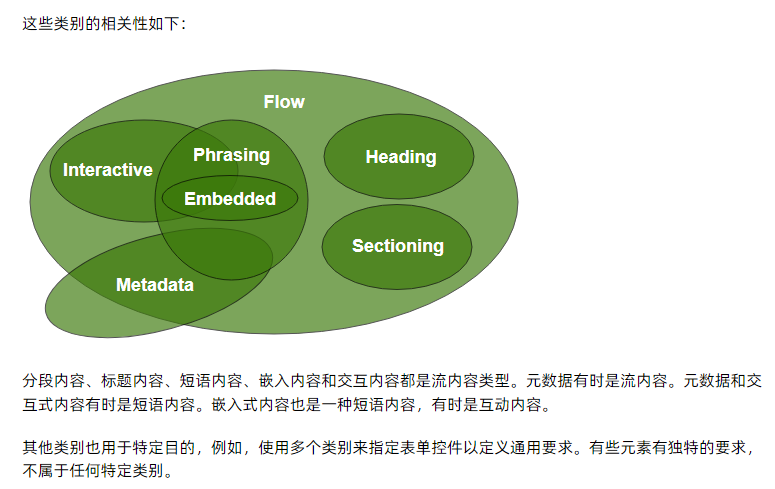

# Web 开发 7 年，不止为了面试 —— 万字 HTML 重点基础知识分享

<!-- START doctoc generated TOC please keep comment here to allow auto update -->
<!-- DON'T EDIT THIS SECTION, INSTEAD RE-RUN doctoc TO UPDATE -->
<!-- **Table of Contents**  *generated with [DocToc](https://github.com/thlorenz/doctoc)* -->

- [前置说明](#%E5%89%8D%E7%BD%AE%E8%AF%B4%E6%98%8E)
- [HTML 元素按内容分类](#html-%E5%85%83%E7%B4%A0%E6%8C%89%E5%86%85%E5%AE%B9%E5%88%86%E7%B1%BB)
  - [内容分类](#%E5%86%85%E5%AE%B9%E5%88%86%E7%B1%BB)
  - [各种分类之间的关系](#%E5%90%84%E7%A7%8D%E5%88%86%E7%B1%BB%E4%B9%8B%E9%97%B4%E7%9A%84%E5%85%B3%E7%B3%BB)
- [一些全局属性](#%E4%B8%80%E4%BA%9B%E5%85%A8%E5%B1%80%E5%B1%9E%E6%80%A7)
- [使用语义化标签](#%E4%BD%BF%E7%94%A8%E8%AF%AD%E4%B9%89%E5%8C%96%E6%A0%87%E7%AD%BE)
- [重要的输入相关元素](#%E9%87%8D%E8%A6%81%E7%9A%84%E8%BE%93%E5%85%A5%E7%9B%B8%E5%85%B3%E5%85%83%E7%B4%A0)
  - [使用 input 元素](#%E4%BD%BF%E7%94%A8-input-%E5%85%83%E7%B4%A0)
  - [使用 form 元素](#%E4%BD%BF%E7%94%A8-form-%E5%85%83%E7%B4%A0)
- [重要的元数据内容元素](#%E9%87%8D%E8%A6%81%E7%9A%84%E5%85%83%E6%95%B0%E6%8D%AE%E5%86%85%E5%AE%B9%E5%85%83%E7%B4%A0)
  - [使用 script 元素](#%E4%BD%BF%E7%94%A8-script-%E5%85%83%E7%B4%A0)
  - [使用 link 元素](#%E4%BD%BF%E7%94%A8-link-%E5%85%83%E7%B4%A0)
  - [使用 meta 元素](#%E4%BD%BF%E7%94%A8-meta-%E5%85%83%E7%B4%A0)
- [网页嵌入图片及响应式图片](#%E7%BD%91%E9%A1%B5%E5%B5%8C%E5%85%A5%E5%9B%BE%E7%89%87%E5%8F%8A%E5%93%8D%E5%BA%94%E5%BC%8F%E5%9B%BE%E7%89%87)
- [内联嵌入元素](#%E5%86%85%E8%81%94%E5%B5%8C%E5%85%A5%E5%85%83%E7%B4%A0)
  - [使用嵌入元素的缺点](#%E4%BD%BF%E7%94%A8%E5%B5%8C%E5%85%A5%E5%85%83%E7%B4%A0%E7%9A%84%E7%BC%BA%E7%82%B9)
  - [使用 iframe 元素](#%E4%BD%BF%E7%94%A8-iframe-%E5%85%83%E7%B4%A0)
- [小结](#%E5%B0%8F%E7%BB%93)

<!-- END doctoc generated TOC please keep comment here to allow auto update -->

积极准备面试、提升技术能力，光是看大而全的八股文可能还不够。根据我 7 年的 web 开发工作经验来看，我猜你可能没看过像本文这样总结的 HTML 重点基础知识点。手打 10000 字分享，看一看，说不定不止面试用得上。

---

网上有很多一篇文章就总结了整个前端的技术体系，或者一篇文章就能事无巨细地列示了所有的前端知识点，_我觉得作为 web 开发知识点的查漏补缺是非常棒的_。

但像我这样已经工作了几年的角度来看地话，可能背不下来，也还可能不太能理解诸如“ HTML5 新增了哪些新特性？”这样的问题的实际含义，还是说真的有企业在面试的时候把重点放在这样的问题上。HTML5 第一份公开工作草案在 2008 年发布的，也就是说大概从那个时候开始，HTML5 就已经在逐步铺开使用了。或者换句话说，我们现在专门针对 HTML 4.01 或 XHTML 1.0 等前身标准进行 web 开发的可能性还会很大吗？

所以，本文从我干了 7 年 web 开发的实际经验中，分享一些主观上认为是 HTML、CSS、JavaScript 的重点或者比较容易忽略的知识点，为了能在繁盛丰腴的 web 前端土壤中理清一些苗头，也是自己为了换工作准备的面试题应对。

这里只能算是抛砖引玉，因为纯粹主观且毕竟能力有限，也请诸位不吝补充指导、纠正纰漏，共同进步，谢谢。

---

原本想 HTML、CSS、JavaScript 放在一起的，但写着写着内容太多，就分成系列，方便阅读，也方便各位快速定位自己感兴趣的内容(写完再列链接)。

# 前置说明

> - 消歧：由于日常使用中比较习惯地说出例如`input 标签`这样的话，实际上规范中写做`The input element`，翻译应该是`input元素`，且规范中有`HTML documents consist of a tree of elements and text. Each element is denoted in the source by a start tag, such as "<body>", and an end tag, such as "</body>"`的描述，推测`标签(tag)`应该是单指元素的一部分。本文暂不涉及专门讲一个元素的起止标签，所以后文可以把“XXX 元素”和“XXX 标签”当做同一个意思。
> - 文字提到的 HTML 和 BOM 规范、标准之类的说法，没有特殊说明，一律指 [WHATWG](https://en.wikipedia.org/wiki/WHATWG) 组织的 [HTML Living Standard — Last Updated 2 June 2023](https://html.spec.whatwg.org/multipage/) 和 [DOM Living Standard — Last Updated 31 May 2023](https://dom.spec.whatwg.org/)。

个人强烈建议，不管是熟手还是生手，可以先看一遍 "HTML Living Standard" 中的第一章"1 Introduction"中的第 10 小节：[1.10 A quick introduction to HTML(HTML 快速介绍)](https://html.spec.whatwg.org/multipage/introduction.html#a-quick-introduction-to-html)。内容不多，简单介绍了“基本的 HTML 文档结构”、“快速介绍 HTML 应用程序开发中的一些常见陷阱(例如 CSRF、点击劫持)”、“使用脚本 API 时应避免的常见陷阱”等，如果再继续小看一下 1.11 小节[Conformance requirements for authors(对作者的一致性要求)](https://html.spec.whatwg.org/multipage/introduction.html#conformance-requirements-for-authors)，如果在编写时满足“表示性标记”、“语法错误”、“对内容模型和属性值的限制”几方面提出一些要求，可能会避免很多开发过程中可能因为未注意或者忽略而导致的问题。

如果暂时还不清楚“**HTML 用户代理（例如网络浏览器）会解析这个 HTML 文档，将其转化为 DOM（文档对象模型）树。一个 DOM 树是一个文档的内存表示。DOM 树中的每个元素都由一个对象表示，这些对象具有 API，以便可以对其进行操作。**”这样的基础内容的话，我建议可以先找一个 HTML 的教程例如 web.dev [Learn HTML](https://web.dev/learn/html/) 快速过一遍。

虽然我觉得类似`HTML5 为什么只需要写 docType？`这样的问题，回答`这是因为HTML5不基于SGML，因此不需要对DTD进行引用，但是需要DOCTYPE来规范浏览器的行为（让浏览器按照他们应该的方式来运行）`光这样去背没什么意义。因为为了预防被追问什么是 SGML、DTD 之类的，那还得继续去查询 SGML、DTD 的含义，这样引申下去，其实可以拓展到去背诵记忆整个 HTML 的发展历程。**但实际上这样的内容可以当做学习 web 前端的背景补充了解**，毕竟在实际开发过程中，可能会很少会手动去写`<!DOCTYPE html>`等规范性的内容，更多的可能是针对功能性的实现。

下面，开始分享一些 HTML 的重要基础知识点。

# HTML 元素按内容分类

这里我先提一嘴 HTML 的[正常布局流(Normal_Flow)](<(https://developer.mozilla.org/zh-CN/docs/Learn/CSS/CSS_layout/Normal_Flow)>)：_“根据元素内容按照从上到下、从左到右的顺序布局形式。块级元素垂直组织，内容宽高为父级元素的宽高一致；行级元素与其他内联元素或者文本放置在同一行，如果空间不够则溢出的内容移到新的一行。”_（注意：可能还有一个被说成文本流(Text Flow)的东西，然后故意与什么“document flow(故意翻成文档流)”进行混淆。一般我们所说的“文档流”就是 Normal Flow，而所谓 document flow 定义不明，有些人用起指代 CSS 的布局方面的使用。）

## 内容分类

这算是浏览器默认的布局方式，但现在网页往往不是这样简单的布局，这部分后续 CSS 部分再细说。这里主要引出除了常用的`块级元素`和`行级元素`来区分 HTML 的元素标签之外，从[内容分类](https://developer.mozilla.org/zh-CN/docs/Web/HTML/Content_categories)来讲，这些元素标签可以如何划分？

省流，这是[HTML 规范](https://html.spec.whatwg.org/multipage/indices.html#element-content-categories)中的一表截图：


我这里比较简单从规范中列示一些分类的说明，总体来讲，分为三种大的类型:

- 1 **主内容类**(Main)，描述了很多元素共享的内容规范:
  - 元数据内容(Metadata): 可以修改文档其余部分的呈现或行为，建立与其他文档的链接，或者传达其他外带信息。
  - 流式内容(Flow): 是一个广泛的类别，包括大多数可以包含在 `<body>`元素之内的元素，包括标题元素、分段元素、措辞元素、嵌入元素、互动元素和表单相关元素。它还包括文本节点（但不包括那些只由空白字符组成的节点）。
  - 分段内容(Sectioning): 定义了`<header>`元素、`<footer>`元素中间内容的范围。
  - 标题内容(Heading): 定义了一个章节的标题。
  - 短语内容(Phrasing): 定义了文本和它包含的标记，一些短语内容就构成了段落。
  - 嵌入内容(Embedded): 将来自另一种标记语言或命名空间的内容插入到文档中。
  - 交互式内容(Interactive): 为用户交互而特别设计的元素。
  - 可触发内容(Palpable): 作为一般规则，其内容模型允许任何流式内容或短语内容的元素的内容中应至少有一个节点是可触发的内容，并且不具有指定的 hidden 属性。
- 2 **表单相关的内容类**(Form-associated)，描述了表单相关元素共有的内容规范:
  - 可列举的元素(Listed): 表示在`form.elements`和`fieldet.elements` APIs 中列出的元素。
  - 可提交的元素(Submittable): 包括当表单提交时可以用来组成表单数据的元素。
  - 可标记的元素(Labelable): 和 `<label>` 相关联的元素。
  - 可重置的元素(Resettable): 当表单重置时会被重置的元素。
  - 继承自动大写属性的元素(Autocapitalize-inheriting): 表示从表单实例那里继承自动大写属性的元素。
- 3 **特殊内容类**(Specific)，描述了仅仅在某些特殊元素上才需要遵守的内容规范，通常这些元素都有特殊的上下文关系。
  - 支持脚本的元素(Script-supporting): 不会直接渲染输出在页面文档中。相反，它们的作用是支持脚本，或者直接包含或指定脚本代码，或者指定将被脚本使用的数据。

还有两点注意：

- 这样的内容分类不是强制分类，一个元素可以出现在不同的内容分类中。
- 某些元素在划分为某一种分类时，会有额外情况。例如``当`usemap` 属性存在时才是“交互内容”。具体可参看[规范说明](https://html.spec.whatwg.org/multipage/indices.html#element-content-categories)。

## 各种分类之间的关系

**HTML 中的每个元素都属于零个或多个类别 ，这些类别将具有相似特征的元素组合在一起**。[它们之间的包含关系参看](https://html.spec.whatwg.org/multipage/dom.html#kinds-of-content) 如下图，HTML 元素属于什么类型得看实际在什么地方什么功能的使用:



---

ps: 如果还有人在认真讨论[怪异模式和标准模式](https://developer.mozilla.org/zh-CN/docs/Web/HTML/Quirks_Mode_and_Standards_Mode)的问题，我个人觉得这已经是在没有 web 标准前，因为浏览器的实现和支持不同而产生的历史遗留问题。除非是为了满足已有旧网页的兼容显示需求，新的网站网页、且目标浏览器不是 IE5 等古早应用，建议统一准守标准模式(有点类似后续交流 CSS 的盒子模型时，非必要情况下，也应该不会专门去设计只为“怪异盒子模型”服务的网页)。

# 一些全局属性

**即在所有的 HTML 元素都可以设置的属性**。我第一时间想到了`id`，但很遗憾这个不在 [HTML 标准的全局属性](https://html.spec.whatwg.org/multipage/dom.html#global-attributes)中，不过另一个常用的`style`就是。但是放心，在 [DOM Living Standard](https://dom.spec.whatwg.org/#dom-element-slot)中有说明: **id, class, slot**实际上是超全局(superglobal)属性，可以出现在任何工作空间的任何元素上。这里简单列示几个全局属性:

- item 相关的几个全局属性：

  - itemid 元素的唯一的全局标识符
  - itemscope 定义了一个与元数据关联的数据项
  - itemtype 指定了词汇的 URL，它将会用于定义数据结构中的 itemprop
  - itemprop 给 item 添加属性
  - itemref 提供一个额外元素的列表，以便通过抓取来找到该项目的键值对

    <details>
    <summary>点击查看 item 相关的几个全局属性使用示例比较好理解: </summary>

    ```html
    <body>
      <figure
        itemscope
        itemtype="http://n.whatwg.org/work"
        itemid="osp1"
        itemref="licenses"
      >
        <figcaption itemprop="title">第一个开源项目.</figcaption>
      </figure>
      <figure
        itemscope
        itemtype="http://n.whatwg.org/work"
        itemid="osp2"
        itemref="licenses"
      >
        <figcaption itemprop="title">又一个开源项目.</figcaption>
      </figure>
      <footer>
        <p id="licenses">
          所有项目开源协议都是
          <a
            itemprop="license"
            href="http://www.opensource.org/licenses/mit-license.php"
            >MIT license</a
          >.
        </p>
      </footer>
    </body>
    ```

    </details>

- translate 属性是一个枚举属性，用于指定当页面被本地化时，一个元素的属性值和它的文本节点子节点的值是否要被翻译，或者是否要保持它们不变。
  - 空字符串或 yes: 意味着网页在进行本地化的时候，对应内容要被翻译。
  - no: 意味着对应的内容无需做任何翻译。
- is: 允许指定标准 HTML 元素像自定义的内置元素一样工作。
  - 可以使用[CustomElementRegistry.define()](https://developer.mozilla.org/zh-CN/docs/Web/API/CustomElementRegistry/define)定义了一个自定义元素。支持两种类型:
    - 自主定制元素：独立元素; 它们不会从内置 HTML 元素继承。
    - 自定义内置元素：这些元素继承自 - 并扩展 - 内置 HTML 元素。
  - 在创建自定义内置元素后要使用时，就需要在被继承的内置 HTML 元素上使用 is 属性。[示例](https://github.com/mdn/web-components-examples/tree/main/word-count-web-component)简示如下:
  ```js
  // 创建一个自定义内置元素(扩展p元素)
  class WordCount extends HTMLParagraphElement {……}
  customElements.define("word-count", WordCount, { extends: "p" });
  ```
  ```html
  <!-- 使用自定义内置元素 -->
  <p is="word-count"></p>
  ```

# 使用语义化标签

维基百科的[语义化](https://en.wikipedia.org/wiki/Semantics#Computer_science)

这里只限定在 HTML 的语义化标签，我个人的理解是**能让机器和开发者能够直接从标签命名就能判断出标签的作用(正确的标签做正确的事)**。

最常见的例子：`<div id="footer"> <div>` 和直接使用 `<footer> </footer>`。语义语义，能不能看懂其实也很难说，就像 flutter 中全局预设的字体大小的命名， 从 subtitle1、subtitle2 到 titleMedium、titleSmall，从 headline1、headline2 到 displayLarge、displayMedium。_语义化标签也可以理解成直接从名称就知道它的作用的标签。机器能够识别，对 SEO 等有帮助；开发者能够识别，在使用正确的标签做正确的事情上也有裨益。_

其实`<h1>、<p>`这样的标签，也是语义化标签，因为也可以看出表示第一级的标题、段落文本的内容。有些专门强调 _HTML5 中新的语义标签_，可能是因为 web 发展，现代网站包含了导航栏、页首、页面等比较固定的内容，以前没有对应标签可能是使用 `div` 加个 `id` 去制定样式，现在从标准中做到统一，例如 header、nav、section、article、aside、footer 等标签。

[写语义标记的一些好处如下](https://developer.mozilla.org/zh-CN/docs/Glossary/Semantics)：

- 更便于 SEO 优化：搜索引擎将其内容视为影响页面搜索排名的重要关键字。
- 屏幕阅读器可以将其用作指引，帮助视力受损的用户导航页面。_可了解 MDN 的 [无障碍](https://developer.mozilla.org/zh-CN/docs/Learn/Accessibility/HTML) 主题_。
- 更便于开发：比起搜索无休止的带有或不带有语义/命名空间类的 `div`，找到有意义的代码块显然容易得多。向开发人员建议将要填充的数据类型。
- 语义命名反映了正确的自定义元素/组件命名(页面内容结构化，在无 CSS 时也能进行网页阅读)。

举个例子，比如我在使用 vue3.x 生态的 element-plus UI 组件库的 Container 布局容器组件，里面的`<el-footer>`组件，源代码也就是使用的`<footer>`标签:


虽然我们实际项目开发中可能大部分都用别人的 UI 库，但例如需要自定组件库等情况下，记得优先使用对应语义化标签，毕竟，HTML 的语义化标签可是有 100 多个呢(参看上面表格截图)。

其实我们常用的非语义化标签，也就是无法提供关于其内容的信息的标签，也就 `<div>、<span>、<i>、<s>、<u>、<b>`非常少量，比如我个人之前对`<div>`的使用频率，其实也还蛮高的。然后你就会看到这样的代码:

```html
<div>
  <div>
    <div>
      <div>……</div>
    </div>
  </div>
</div>
```

有没有打个寒颤想到“回调地狱”，不过这个比较好解决，可以参看 [7 Alternatives to the div HTML Tag(7 个 div 元素的替代方案)](https://medium.com/@zac_heisey/7-alternatives-to-the-div-html-tag-7c888c7b5036) 博文，根据不同的使用场景使用 main、section、figure 等元素代替。以上那些`<i>、<s>、<u>、<b>`非语义化的元素，也尽量不要直接用了。但要 span 用什么语义化元素统一替换的话，我也不知道。

---

上面几节可能是为了强调虽然只是在使用 HTML 的元素来构建网页结构，但也应该使用符合各自内容的元素。正确的元素做正确的事，如何选择，就可以以上参考。

# 重要的输入相关元素

个人在实际开发中，最常用的供用户输入反馈的标签，大概也就 [input](https://html.spec.whatwg.org/multipage/input.html#the-input-element)、[form](https://html.spec.whatwg.org/multipage/forms.html#the-form-element) 用得最多了，正常情况下用户提交交互性数据很多都在于此，不多赘述，仅做提醒。

## 使用 input 元素

在使用 input 时，注意指定其 type 属性，即输入类型。

.png>)

但注意，老式 web 浏览器不支持的输入类型，会被视为输入类型 text(图中上为 Chrome113，下为 IE8)：

<details>
  <summary>点击展开看代码:</summary>
  
```html
<p>Audio settings:</p>
<figure>
  <input type="range" id="volume" name="volume" min="0" max="11" />
  <label for="volume">Volume</label>
</figure>
<figure>
  <input type="range" id="cowbell" name="cowbell" min="0" max="100" value="90" step="10">
  <label for="cowbell">Cowbell</label>
</figure>
```
</details>

---

截图如下:


而我们很多的功能组件，就是可以根据这个“type”的不同而封装。比如 element-plus 的` <el-upload>`组件，其[源代码中上传的核心](https://github.com/element-plus/element-plus/blob/dev/packages/components/upload/src/upload-content.vue#L16)也就是 input 元素指定 type 为 file 而已：

```html
<input
  ref="inputRef"
  :class="ns.e('input')"
  :name="name"
  :multiple="multiple"
  :accept="accept"
  type="file"
  @change="handleChange"
  @click.stop
/>
```

当然 input 元素有 30 多个内容属性，值得注意的肯定不止 type 这一个了。

## 使用 form 元素

在使用 form 时，其实直接做最原始的使用，正确填写对应的内容属性就好：


但有时候并不使用默认的 submit，而是把 form 表单当做一个布局的元素，借用预设支持的`form.checkValidity()`等验证表单输入的内容，而实际提交到后台可能是一个 button 触发的函数，由此大部分情况对其“action”、“method”属性都没有用到，比如我在使用 element-plus 的`el-form`组件的时候，基本没有配置“submit”的操作。

但`<el-form>`组件归根到底也是包装了 form 元素而已，常用的比如重置栏位的输入的`formEl.resetFields()`方法，其[源代码](https://github.com/element-plus/element-plus/blob/dev/packages/components/form/src/form-item.vue#L332) (下图左)看得出，其实也就是按照[规范制定的`form.reset()`的步骤](https://html.spec.whatwg.org/multipage/forms.html#dom-form-reset) (下图右):


---

有点乱，这一节我可能主要是想说明我们常用的第三方组件，其实我们也可以直接基于 HTML 元素自己封装，毕竟 Web 框架到最后，都会解析成在浏览器中运行的代码。而正如有人说“网页主要是由三部分组成的：结构，表现和行为。”那也就是在结构这块，最终也是 HTML 的元素而已。

# 重要的元数据内容元素

如果不是从 JSP 或更早之前那种前端框架不是很流行的时代过来，或者当年使用 Dreamweaver 开发页面的时候没仔细看过 HTML 源代码，可能对于直接手写 HTML 中`<!DOCTYPE HTML PUBLIC "-//W3C//DTD HTML ……` [这样的代码内容](https://www.w3.org/TR/html40/struct/global.html)还不太明白，就像现在例如写 vue 的 SFC，大部分时候就是分 3 个标签 template、script、style 各自完成各自的工作去了。

但也在实践 Web 性能优化时，可能会看到“高效加载第三方 JavaScript”的实践中有“[针对 script 标记使用 async 或 defer 属性](https://web.dev/efficiently-load-third-party-javascript/)”这样的内容。性能优化部分后续再讲，这里仅列示一些元数据内容的 HTML 元素中，我主观上认为比较常用和重要的属性及其作用，比较基础的可能会一笔带过或者忽略掉。

还要注意，这些属性，也并不一定是某个 HTML 元素独有的，可能在不同的元素中表示同样的含义，但有些属性值可能不是所有元素都支持(注意并不是全局属性)。比如 `ref`属性，在在 `<a>`、`<area>` 和 `<link>`元素上都有效。crossorigin 属性在`<audio>`、``、`<link>`、`<script>` 和 `<video>` 元素中有效。

## 使用 script 元素

HTML `<script> 元素`用于嵌入或引用可执行脚本。这通常用作嵌入或者指向 JavaScript 代码。常用的[内容属性](https://html.spec.whatwg.org/multipage/scripting.html#the-script-element)如下:

- _crossorigin_: 提供对 CORS 的支持，定义*该元素如何处理跨源请求*，从而实现对该元素获取数据的 CORS 请求的配置。有两个值:

  - anonymous: 请求使用了 CORS 标头，且证书标志被设置为 'same-origin'。**没有**通过 cookies、客户端 SSL 证书或 HTTP 认证**交换用户凭据**，除非目的地是同一来源。
    - Requests [mode](https://fetch.spec.whatwg.org/#concept-request-mode) 为"cors"，[credentials mode](https://fetch.spec.whatwg.org/#concept-request-credentials-mode) 为"same-origin"
  - use-credentials: 请求使用了 CORS 标头，且证书标志被设置为 'include'。**总是包含用户凭据**。非法的认证信息，会被当成 anonymous。
    - Requests mode 为"cors"，credentials mode 为"include"
  - **将属性名称设置为空值，如 crossorigin 或 crossorigin=""，与设置为 anonymous 的效果一样。** 不合法的关键字或空字符串会视为 anonymous 关键字。当然，如果 link 没有设置 crossorigin 属性，那就是不跨域，[No CORS](https://html.spec.whatwg.org/multipage/urls-and-fetching.html#attr-crossorigin-none)。

- _async 和 defer_: **这两个用于设定在 HTML 解析(parse)过程中，遇到了要执行脚本文件，浏览器要怎么做**。几个单词的英文对照(请求脚本 - fetch script，HTML 解析 - HTML parse，执行脚本 evaluate script)
  - 对于通用脚本
    - 如果存在属性 async，那么在解析 HTML 时会**并行**请求脚本，并**在该脚本可用时(可能在 HTML 解析完成之前)** 就先执行，然后再继续解析 HTML。
    - 如果存在属性 defer，那么在解析 HTML 时会**并行**请求脚本，但需要**在 HTML 解析完之后再执行脚本**。
    - 如果都不存在，则**阻塞**当前 HTML 的解析，先去获取脚本，并在**该脚本执行完成之后**再继续解析 HTML。
  - 对于模块脚本
    - 如果存在属性 async，那么在解析 HTML 是会**并行请求**该模块脚本以及它的所有依赖，并**在该脚本可用时**直接执行，不管 HTML 是否解析完成。
    - 如果不存在，也是在解析 HTML 时**并行请求**该模块脚本以及它的所有依赖，但需要在 HTML **解析完成之后**在执行。
    - defer 属性对模块脚本无效。
  - 这可能有一部分涉及到`浏览器是单线程运行`这样的说法，后续在相关模块再细说。当然如果没有指定`src`属性，也就没有脚本需要执行，这两个属性也就没有必要设定。属性设置后实际的执行过程如下[规范中的截图](https://html.spec.whatwg.org/multipage/scripting.html#attr-script-async):
    

## 使用 link 元素

link 元素规定了当前文件与外部资源的关系。常用的[内容属性](https://html.spec.whatwg.org/multipage/semantics.html#the-link-element)如下:

- _crossorigin_: 同上。
- _rel_: 链接的资源与当前文档的关系。可以理解为 link 元素连接的资源是怎样的资源，属性值为一些关键字：[linkTypes](https://html.spec.whatwg.org/multipage/links.html#linkTypes)，或者查看[HTML 属性：rel](https://developer.mozilla.org/zh-CN/docs/Web/HTML/Attributes/rel)。此处列示几个**可能会改善用户体验**的属性值：
  - _dns-prefetch_: 告知浏览器为目标资源的来源预先执行 DNS 解析。
  - _preload_: 指定用户代理(就当是浏览器)必须根据 as 属性给出的潜在目的地（以及与相应目的地相关的优先级），为当前导航预先获取和缓存目标资源。
  - _prefetch_: 指定用户代理应预先获取并缓存目标资源，因为后续的导航可能需要它。
  - prerender: 指定用户代理应预先获取目标资源，并以有助于在未来提供更快的响应的方式处理它。
  - preconnect: 指定用户代理应预先连接到目标资源的来源。
  - modulepreload: 告知浏览器预先获取该脚本，并将其存储在文档的模块映射中，以便稍后评估。也可以一同获取该模块的依赖关系。
- _as_: 该属性仅在`<link>`元素设置了 rel="preload" 或者 rel="prefetch" 时才能使用。它规定了`<link>`元素加载的内容的类型，**对于内容的优先级、请求匹配、正确的内容安全策略的选择以及正确的 Accept 请求头的设置，这个属性是必需的**。

这是个 link 使用示例，截取整合来自`web.dev`首页源代码:


## 使用 meta 元素

meta 元素代表各种不能用 title、base、link、style 和 script 元素表达的元数据。

- 必须指定 name、http-equiv、charset 和 全局属性[itemprop](https://html.spec.whatwg.org/multipage/microdata.html#names:-the-itemprop-attribute) 中的一个。

  - name 和 content 属性可以一起使用，以“名称-值”对的方式给文档提供元数据，其中 name 作为元数据的名称，content 作为元数据的值。
  - **http-equiv** 属性表示 pragma 指令，所有允许的值都是特定 HTTP 标头的名称。具体 pragma 指令可选值为一个枚举(不推荐使用的不再列示)，如下:

    - content-type: 如果使用这个属性，其值必须是"text/html; charset=utf-8"。注意：该属性只能用于 MIME type 为 text/html 的文档。
    - default-style: 默认样式。
    - **refresh**: 用于定时重定向。刷新属性需要配合 content 属性，且其值有两种形式：
      - _一个正整数_: 如 `content="300"` 确保页面每五分钟自动从服务器重新加载一次
      - _一个正整数+`;url=xxx`_: 如 `content="20; URL=page4.html"` 20 秒后重定向到指定的 page4.html 页面
    - x-ua-compatible: 如果指定，则 content 属性必须具有值 "IE=edge"。用户代理必须忽略此指示。
    - content-security-policy: 允许开发者定义当前页的内容策略，**这有助于防止跨站点脚本攻击**。

  - charset 属性指定了文档所使用的字符编码。这是一个字符编码声明。如果该属性存在，其值必须是 ASCII 大小写不敏感的 "utf-8 "字符串的匹配。
  - media 说明元数据适用于哪个媒体。仅使用于`name="theme-color"`，例如:
    - `<meta name="theme-color" content="#3c790a" media="(prefers-color-scheme: dark)">`

- 如果指定了 name、http-equiv 或 itemprop，那么还必须指定 content 属性。否则，它必须被省略。

注意，如下图中`web.dev`首页源代码的 meta 使用示例，其中的 property 属性(不是全局属性也不是 meta 内容属性)，我还没在规范中找到含义:


---

2023-06-10 补充：受教了，正如评论中老哥指点，原来 meta 元素中的 property 是 [The Open Graph protocol](https://ogp.me/) 元数据属性，而 open graph 协议是一种“为社交分享而生的 Meta 标签，用于标准化网页中元数据的使用，使得社交媒体得以以丰富的‘图形’对象来表示共享的页面内容。”虽然不是 HTML 标准中的全局属性或者内容属性，也主要为了社交媒体分享目的，但其实早在 2010 年就被提出，被国外的 Facebook、Twitter 等使用。不过似乎在国内，还没有被广泛使用。比如下面是 weibo 和 douyin 的首页中的 meta 元素内容:


---

还是有点乱，这小节可能主要说明元数据内容的元素在使用上也比较重要，就比如虽然`<meta>`元素内容不会显示在客户端，但可以使浏览器更加规范地显示内容或重新加载页面，利于 SEO，甚至和 web 安全等课题有关。

其他几个元数据内容的元素相较更加纯粹，可以自行补齐: base; title; noscript; style; template。

# 网页嵌入图片及响应式图片

这一部分主要是将网页上资源嵌入的内容。现在的网页，已经不再只是单纯显示文本了，图片、音频、视频，甚至 PDF、另一个网页等等。这小节先简单讲一下嵌入图片的内容，顺嘴一句音频和视频，下一节再讲其他嵌入相关的元素。

---

简单来讲网页嵌入图片其实就是使用``元素，不出意外的话类似 element-plus 的`<el-image>`组件的源代码，也是封装了 ``元素而已。那么``元素基础使用大家应该非常熟悉了，说不定在被面试题中还背过“一定要填写 alt 属性，这样即使图片加载不出来还有描述文字和占位。”所以规范中[img 元素](https://html.spec.whatwg.org/multipage/embedded-content.html#the-img-element)的属性就不一一介绍，主要是聊一聊使用其某些属性实现[响应式图片](https://developer.mozilla.org/zh-CN/docs/Learn/HTML/Multimedia_and_embedding/Responsive_images)的话题。

所谓的响应式图片，MDN 上这样说的: **在不同的屏幕尺寸、分辨率或具有其他类似特性的设备上都呈现良好的图片**。下面示例中会主要用到 img 和 picture 元素。

因为 1 没有必要把一张大图显示在比它的实际尺寸小得多的屏幕上(浪费带宽)。2 在移动端和桌面端可能不需要相同的图像宽高比例。

首先[为什么不使用 CSS 或者 JS 来实现响应式图片？](https://developer.mozilla.org/en-US/docs/Learn/HTML/Multimedia_and_embedding/Responsive_images#why_cant_we_just_do_this_using_css_or_javascript)

> 当浏览器开始加载一个页面，它会在主解析器开始加载和解析页面的 CSS 和 JavaScript 之前先下载（预加载）任意的图片。

就像应该也背过诸如“要把 script 标签放在`</body>`之后，这样浏览器加载时才不会阻塞其他资源”，浏览器这种有用的机制总体上会减少页面加载时间。但是图片都已经加载完了，再根据 CSS 或 JS 的规则动态调整图片，这其实是加载了 2 次图片，并不算响应式。

几种响应式图片方案解决对应问题:

- **分辨率切换: 不同的尺寸**。使用了`<picture>`元素和``的 [srcset](https://developer.mozilla.org/zh-CN/docs/Web/HTML/Element/img#attr-srcset) 和 [sizes](https://developer.mozilla.org/zh-CN/docs/Web/HTML/Element/img#attr-sizes) 特性，解决了这两个问题。
  - srcset: 定义了*浏览器可选择的图片设置以及每个图片的大小*，每张图片信息的设置和前一个用逗号隔开。
    - 每个字符串包含一个文件名、图片的固有宽度
  - sizes: 定义了一组媒体条件并且指明*当某些媒体条件为真时，什么样的图片尺寸是最佳选择*。
    - 每一个字符串包含一个媒体条件、媒体条件为真时图像将填充的槽的宽度。最后一个宽度值没有媒体条件，当没有任何一个媒体条件为真时，它默认生效。当浏览器成功匹配第一个媒体条件的时候，剩下所有的条件都会被忽略，所以要注意**媒体条件的顺序**。
  - 有了这些属性后，浏览器会: 检查设备宽度，检查 sizes 列表中哪个媒体条件是第一个为真，查看给予该媒体查询的槽大小，加载 srcset 列表中引用的最接近所选的槽大小的图像。
  ```html
  <!-- 有两者图，宽度分别为480px 和 800 px ；-->
  <!-- 当设备视口(viewport)的宽度小于等于 600px时使用宽度为480px的图片，否则使用宽度为800px的 -->
  <!-- 如果浏览器不支持 srcset，就使用 src的图片-->
  
  ```
- **分辨率切换: 相同的尺寸，不同的分辨率**。要支持多分辨率显示，但希望每个人在屏幕上看到的图片的实际尺寸是相同的，可以使用 srcset 结合 x 语法而不用 sizes，来让浏览器选择合适分辨率的图片(1x 是默认值，所以不需要写出来)。
  ```html
  
  ```
  - 当 css 属性设置为 `img {width: 320px;}`，如果访问页面的设备具有标准/低分辨率显示，用一个设备像素表示一个 CSS 像素，那么会加载 `示例图-320w.jpg`。设备有高分辨率，用两个或更多的设备像素表示一个 CSS 像素，会加载 `示例图-640w.jpg`。
- **美术设计(art direction)**。美术设计问题涉及到*更改显示的图像以适应不同的显示尺寸*。
  - 例如，如果在**桌面浏览器**上的一个网站上显示**一张大的、横向的照片，照片中央有个人**。然后当在移动端浏览器上浏览这个网站时，照片会缩小，这时照片上的人会变得非常小，看起来会很糟糕。此时可能在**移动端**显示一个**更小的、聚焦到这个人的肖像图**会更好。
  - 使用`<picture>`元素实现上述设计。其包含了**一些**`<source>`元素，使浏览器在不同资源间做出选择，紧跟着的是``元素。
  ```html
  <picture>
    <source media="(max-width: 799px)" srcset="480w-主体图片.jpg" />
    <source media="(min-width: 800px)" srcset="800w-全景图片.jpg" />
    
  </picture>
  ```
  - `<source>` 元素有一个 media 属性包含一个媒体条件。srcset 属性包含要显示图片的路径。
    - 应该仅仅当在需要美术设计的场景中使用 media 属性；当使用 media 时，不要在 sizes 属性中也提供媒体条件。
  - 在任何情况下都必须在`</picture>`之前正确提供一个``元素以及它的 src 和 alt 属性，**否则不会有图片显示**。如果浏览器不支持 picture 元素，那么也会显示默认的 img 元素。

对应的[video 元素](https://html.spec.whatwg.org/multipage/media.html#the-video-element)不过多介绍，相较于 img 的 13 个([picture 元素](https://html.spec.whatwg.org/multipage/embedded-content.html#the-picture-element)没有内容属性)，它只有 11 个内容属性，主要简单提一下其中几个:

- crossorigin: 与 link 元素一致
- preload: 是否预加载视频，优先级比 autoplay 低(none 不加载; metadata 仅先加载元数据;auto 下载整个视频)
- playsinline: 是否内联元素播放。bool 值，不设定也不一定会全屏播放。

[audio 元素](https://html.spec.whatwg.org/multipage/media.html#the-audio-element)的内容属性更是只有 src、crossorigin、preload 、autoplay 、loop 、muted、controls 7 个，也很简单明了。

这是 bilibili 随便点开的一个视频，可以看到其使用 video 元素的用法:


# 内联嵌入元素

之前在写有一点涉及支付功能时需要扫码支付，在调用支付宝和微信的相关接口获取二维码数据时，微信可以返回生成二维码的字符串，使用任意 QR 库就一下生成二维码了。但是支付宝返回的是一个 form 元素+script 元素，就没那么体面了，其他细节不说，当时有使用`<iframe>`元素包装这个 form 元素相关内容，勉强可以在当前页面展示二维码部分的内容。

## 使用嵌入元素的缺点

之前可以提过，在应对 web 的点击劫持攻击时，需要设定对应的 HTTP 响应头`X-Frame-Options`，用来给浏览器指示允许一个页面可否在 `<frame>`、`<iframe>`、`<embed>` 或者 `<object>` 中展现的标记。

`<frame>`元素已经弃用，[embed 元素](https://html.spec.whatwg.org/multipage/iframe-embed-object.html#the-embed-element)只有 src、type、width、height 4 个比较单纯的内容属性，[object 元素](https://html.spec.whatwg.org/multipage/iframe-embed-object.html#the-object-element)类似也只有 data、type 、name、form 、width、height 6 个内容元素还在标准中。所以此处就主要说一下[iframe 元素](https://html.spec.whatwg.org/multipage/iframe-embed-object.html#the-iframe-element)。

其实嵌入技术本身就不简单了，虽然上面的图片、音频、视频限制了类型，但其实也都是会考虑到例如因为跨源可能出现的问题`crossorigin`属性。像 iframe 这种几乎什么都能嵌入的标签，安全性就更脆弱了。举[几个比较常涉及到的安全问题](https://blog.bitsrc.io/4-security-concerns-with-iframes-every-web-developer-should-know-24c73e6a33e4):

- **iframe 注入**: 第三方将恶意可执行文件、病毒或蠕虫通过 iframe 注入到应用中，并在用户的设备中执行。
  - 简单应对: 如果发现不是内部的 iframe，应该及时确定来源并删除。
- **跨框架脚本**: XFS 攻击者诱使用户访问受攻击者控制的网页，并加载包含指向合法站点的恶意 JavaScript 的 iframe。在将凭据插入 iframe 中的合法站点后，恶意 JavaScript 代码会跟踪用户的击键。
  - 简单应对: 配置 CSP 指令或 `X-Frame-Options` 响应头。
- **点击劫持**: 用户认为他们点击了可见页面，但实际上他们点击的是覆盖在该页面之上的附加页面上的隐藏元素。
  - 简单应对: 配置 CSP 指令或 `X-Frame-Options` 响应头。
- **iframe 钓鱼**: 默认情况下，来自 iframe 的内容可以触发顶级导航。因此，攻击者可能会利用 Web 应用程序上的跨站点脚本 (XSS) 漏洞将网络钓鱼代码作为 iframe 插入，从而引导用户进入网络钓鱼网站。
  - 简单应对: 通过把 sidebox 属性值替换 `allow-top-xxx` 导航来避免。

一些应对:

- 只有在必要时嵌入
- 使用 HTTPS
- 始终使用 sandbox 属性
- 配置 CSP 指令
  - Content-Security-Policy HTTP 响应头有一个 frame-ancestors 指令，支持这一指令的浏览器已经废弃了 X-Frame-Options 响应头。

**除了涉及到 Web 安全之外，也还有兼容性差、多个页面不易管理、SEO 差、阻塞资源加载等**。如果确实需要用到，可能还会有 iframe 跨域的需求。比如一个需求：用 iframe 引入一个第三方封装好的视频播放器。iframe 里面有一个全屏的按钮，点击后需要页面让 iframe 全屏，由于受到同源策略的限制，iframe 无法告诉页面全屏。当然这些可能用 `domain`、`windows.name`、`location.hash`、`window.postMessage` 等应对，暂且不提。

> 警告： 页面上的每个`<iframe>`都需要增加内存和其他计算资源，这是因为每个浏览上下文都拥有完整的文档环境。虽然理论上来说你能够在代码中写出来无限多的`<iframe>`，但是你最好还是先看看这么做会不会导致某些性能问题。

## 使用 iframe 元素

更多安全相关后续 web 安全专题再讲，这里提一下 iframe 的几个内容属性:

- src: 被嵌套的页面的 URL 地址。使用 about:blank 值可以嵌入一个遵从同源策略的空白页。
- srcdoc: 该属性是一段 HTML 代码，这些代码会被渲染到 iframe 中。如果浏览器不支持 srcdoc 属性，则会渲染 src 属性表示的内容。
- **sandbox**: 该属性对呈现在 iframe 框架中的内容启用一些额外的限制条件。属性值可以为空字符串（这种情况下会启用所有限制），也可以是用空格分隔的一系列指定的字符串。有效的值有：

  - allow-downloads: 允许通过具有下载属性的`<a>`或`<area>`元素以及通过导航下载文件。无论用户是点击了链接，还是 JS 代码在没有用户交互的情况下启动了链接，这都是有效的。。
  - allow-forms: 允许嵌入的浏览上下文提交表单。如果没有使用该关键字，则无法提交表单。
  - _allow-modals_: 允许嵌入的浏览上下文打开模态窗口。
  - allow-orientation-lock: 允许嵌入的浏览上下文锁定屏幕方向（比如手机的横屏竖屏朝向）。
  - allow-pointer-lock: 允许嵌入的浏览上下文使用 [Pointer Lock API](https://w3c.github.io/pointerlock/).
  - _allow-popups_: 允许页面通过 Window.alert(), Window.confirm(), Window.print() 和 Window.prompt()打开模式窗口，同时允许打开`<dialog>`而不管该关键字如何。它还允许页面接收 BeforeUnloadEvent 事件。如果没有使用该关键字，相应的功能将自动被禁用。
  - allow-popups-to-escape-sandbox: 允许沙箱化的文档打开新窗口，并且新窗口不会继承沙箱标记。例如，安全地沙箱化一个广告页面，而不会在广告链接到的新页面中启用相同的限制条件。
  - allow-presentation: 允许嵌入的浏览上下文开始一个 [presentation session](https://w3c.github.io/presentation-api/)。
  - _allow-same-origin:_ 如果没有使用该关键字，嵌入的浏览上下文将被视为来自一个独立的源，这将使 - same-origin policy 同源检查失败。
  - _allow-scripts_: 允许嵌入的浏览上下文运行脚本（但不能创建弹窗）。如果没有使用该关键字，就无法运行脚本。
  - _allow-top-navigation_: 允许嵌入的浏览上下文导航（加载）内容到顶级的浏览上下文。
  - allow-top-navigation-by-user-activation: 允许嵌入的浏览上下文在经过用户允许后导航（加载）内容到顶级的浏览上下文。
  - allow-top-navigation-to-custom-protocols: 允许导航到内置于浏览器或由网站注册的非 http 协议。此功能也由允许弹出窗口或允许顶部导航关键字激活。

- loading: 指示浏览器应如何加载 iframe。两个可选值:
  - eager： 立即加载 iframe，不管它是否在可见视口(viewport)之外（这是默认值）。
  - lazy: 延迟加载 iframe，直到它与视口的距离达到计算值，由浏览器定义。

注意[浏览器的兼容性](https://developer.mozilla.org/en-US/docs/Web/HTML/Element/iframe#browser_compatibility)，毕竟这些只是规范中定义，不代表使用的浏览器已经跟进支持。实际上，现在应该很少有主流网站还会坚持使用 iframe 了，例如在知乎上十多年前提的问题[Iframe 有什么好处，有什么坏处？国内还有哪些知名网站仍用 Iframe，为什么？有哪些原来用的现在抛弃了？又是为什么？](https://www.zhihu.com/question/20653055) Stack Overflow 也早在 2008 年就交流过这个问题: [Are iframes considered 'bad practice'? [closed]](https://stackoverflow.com/questions/362730/are-iframes-considered-bad-practice)。2014 年也有专门列示 iframe 确定的提问：[Good Reasons why not to use Iframes in page content [closed]](https://stackoverflow.com/questions/23178505/good-reasons-why-not-to-use-iframes-in-page-content)。不过，存在即合理，既然规范还没有弃用它，只要用别的方式保证安全、性能等问题，为什么就不能去使用 iframe 呢。

<details>
  <summary>没有找到什么网站使用iframe，点击展开查看MDN教学示例代码:</summary>

```html
<!-- embed、object、iframe最基础使用示例 -->
<figure>
  <embed type="video/quicktime" src="movie.mov" width="640" height="480" />
  <figcaption>嵌入了一个视频</figcaption>
</figure>
<figure>
  <object data="clock.html"></object>
  <figcaption>嵌入了一个实现时钟的html页面</figcaption>
</figure>
<figure>
  <iframe
    src="https://example.org"
    title="iframe 示例"
    width="400"
    height="300"
  >
  </iframe>
  <figcaption>嵌入了一个iframe页面</figcaption>
</figure>
```

</details>

# 小结

HTML 元素使用的总结，就两句:

- 我们应尽可能地用正确的 HTML 标签来表达正确的意图。
- 注意性能和安全。

---

一边看一边写，事情朝着我不可控的方向发展。原本计划一篇文章写完我认为的比较重要的 HTML、CSS、JavaScript 的所有知识点，但能力有限，暂时先把 HTML 元素结构相关的内容写到这部分，还有很多有用的元素例如 canvas 元素等，其实也是专题级别的但我实际用的很浅，且还用[fabric.js](https://github.com/fabricjs/fabric.js)包装库。

此外还有很多 HTML 的内容，例如 Web application APIs、Web Storage、Web workers、Loading web pages、通讯方面(例如 Websocket、MessageEvent)，要写的话可更离谱了，这些可能在对应功能需求时在具体使用较多，暂时偷懒就不算通用性总结里了。

不过这样像这样知识储备去应对面试需求，可能是远远不够的，后续的内容还是稍微简单一点，能列 1 2 3 就列 1 2 3，不再过多讲解了。

应该看得出来，我有意无意地，都把一些封起来的东西，都还原到 HTML 元素本身。实际上，例如真的是有特色有特点的 web 上网页播放器，应该也不会直接使用 video 元素了，估计也会自定义封装一下。我可能还是想强调不管多么高级的 Web 框架工具，到最后可能都需要解析成这最基础的 HTML、CSS、JavaScript，我们真的有必要夯实一下这些基础。

去年想换工作时，已经在 github 上也整理一些工作学习中的知识积累：[Sanotsu/web-beginner](https://github.com/Sanotsu/web-beginner-)，这次找工作的准备的内容也会更新，有兴趣也可以看看。

不过这些都是我个人的经验，所学习总结的东西也未必是对，兼听则明偏信则暗，也希望与君交流共勉，谢谢。
