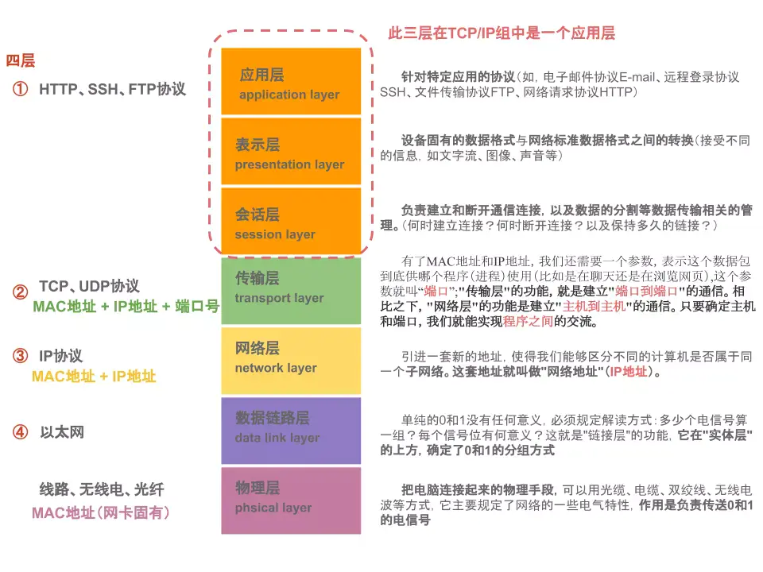

Web 前端八股整理：比较全面的初级 HTTP、HTTPS 和 TLS 知识点分享

- [HTTP 基础](#http-基础)
  - [OSI 七层模型和 TCP/IP 四层模型简述](#osi-七层模型和-tcpip-四层模型简述)
  - [TCP 和 UDP 的相关简述](#tcp-和-udp-的相关简述)
  - [HTTP 概述](#http-概述)
    - [定义与简介](#定义与简介)
    - [基于 HTTP 的组件系统](#基于-http-的组件系统)
    - [HTTP 的基本性质](#http-的基本性质)
    - [HTTP 流(Flow)](#http-流flow)
    - [典型的 HTTP 会话](#典型的-http-会话)
  - [HTTP 消息(Messages)](#http-消息messages)
    - [定义与简介](#定义与简介-1)
    - [HTTP request 的组成(start-line、headers、body)](#http-request-的组成start-lineheadersbody)
    - [HTTP response 的组成(status line、headers、body)](#http-response-的组成status-lineheadersbody)
    - [HTTP/2 帧 (Frames)](#http2-帧-frames)
  - [HTTP 的发展](#http-的发展)
    - [万维网的发明](#万维网的发明)
    - [HTTP/0.9 – 单行协议](#http09--单行协议)
    - [HTTP/1.0 – 构建可扩展性](#http10--构建可扩展性)
    - [HTTP/1.1 – 标准化的协议](#http11--标准化的协议)
      - [HTTP 用于安全传输](#http-用于安全传输)
      - [HTTP 用于复杂应用](#http-用于复杂应用)
    - [HTTP/2 - 为了更优异的表现](#http2---为了更优异的表现)
    - [HTTP/3 - 基于 QUIC 的 HTTP](#http3---基于-quic-的-http)
  - [HTTP/1.x 的连接管理](#http1x-的连接管理)
  - [协议升级机制](#协议升级机制)
  - [HTTP 的方法和响应状态码](#http-的方法和响应状态码)
    - [HTTP 请求方法](#http-请求方法)
    - [HTTP 响应状态码](#http-响应状态码)
  - [HTTP 常见标头(header)](#http-常见标头header)
- [HTTPS 基础](#https-基础)
  - [HTTPS 基础问答](#https-基础问答)
    - [什么是 HTTPS？](#什么是-https)
    - [HTTPS 如何工作？](#https-如何工作)
    - [HTTPS 为什么很重要？如果网站没有 HTTPS，那会如何？](#https-为什么很重要如果网站没有-https那会如何)
    - [HTTPS 与 HTTP 有何不同？](#https-与-http-有何不同)
  - [TLS 基础问答](#tls-基础问答)
    - [什么是传输层安全性(TLS)？](#什么是传输层安全性tls)
    - [TLS 和 SSL 之间有什么区别？](#tls-和-ssl-之间有什么区别)
    - [TLS 和 HTTPS 有什么区别？](#tls-和-https-有什么区别)
    - [TLS 的设计目标？](#tls-的设计目标)
    - [TLS 如何工作？](#tls-如何工作)
    - [TLS 如何影响 Web 应用程序性能？](#tls-如何影响-web-应用程序性能)
    - [什么是无密钥 TLS？](#什么是无密钥-tls)
    - [无密钥 TLS 如何工作？](#无密钥-tls-如何工作)
    - [什么是会话密钥？](#什么是会话密钥)
  - [TLS 证书基础问答](#tls-证书基础问答)
    - [什么是 TLS 证书？](#什么是-tls-证书)
    - [TLS 证书有哪些不同类型？](#tls-证书有哪些不同类型)
    - [TLS 证书的内容？](#tls-证书的内容)
    - [网站如何获取 TLS 证书？](#网站如何获取-tls-证书)
    - [什么是自签名 TLS 证书？](#什么是自签名-tls-证书)
    - [TLS 网站支持度](#tls-网站支持度)
    - [对称、非对称密钥加密法的简单区别](#对称非对称密钥加密法的简单区别)
  - [TLS 的原理(极简陋，可略过)](#tls-的原理极简陋可略过)
    - [自顶向下，分层抽象](#自顶向下分层抽象)
    - [TLS CipherSuite](#tls-ciphersuite)
    - [协议分层(报文结构)](#协议分层报文结构)
      - [record 协议](#record-协议)
      - [handshake 协议](#handshake-协议)
      - [TLS 1.3 新特性](#tls-13-新特性)
- [最后](#最后)

因为近期有了不得不重新找工作的需求，所以继续准备一些 Web 相关的八股，希望对找工作有所裨益，也分享给有需要的同仁，希望能共同进步。此篇为“初级的 HTTP 和 HTTPS 知识点”。

已经整理过的主题可参看以下文章：

- [「万字总结」干了 7 年 Web 开发工作，混吃等死的日子可能到头了](https://juejin.cn/post/7236668766955307069)
- [Web 开发 7 年，八千字浅谈前端架构设计与工程化](https://juejin.cn/post/7238479969180319805)
- [Web 开发 7 年，万字 HTML 重点基础知识分享](https://juejin.cn/post/7239996748318572599)
- [Web 开发 7 年，一文总结 CSS 常见面试点和基础教程](https://juejin.cn/post/7246407369792569402)
- [Web 开发 7 年，3 万字分享 JavaScript 常用基础知识点](https://juejin.cn/post/7264495014607831077)
- [Chrome 开发者工具 Performance 基础使用实战](https://juejin.cn/post/7270173541457920060)
- [Web 开发 7 年，长文浅谈一下浏览器的工作原理](https://juejin.cn/post/7330550819828695050)

# HTTP 基础

_这小节的主体内容是 MDN 的 [HTTP](https://developer.mozilla.org/zh-CN/docs/Web/HTTP) 部分的内容，补充一些其他小点，简单整理放置在这里。_

## OSI 七层模型和 TCP/IP 四层模型简述

**OSI 七层模型**: 物理层、数据链路层、网络层、传输层、会话层、表示层、应用层。

下面快记来自 [白话 OSI 七层网络模型](https://www.freecodecamp.org/chinese/news/osi-model-networking-layers/)

```txt
Open Systems Interconnection 层级从下往上快捷记忆方式:
Please Do Not Tell the Secret Password to Anyone(请不要把暗号告诉任何人)
```

|               |                              |
| ------------- | ---------------------------- |
| Please        | 物理层 (Physical Layer)      |
| Do            | 数据链路层 (Data Link Layer) |
| Not           | 网络层 (Network Layer)       |
| Tell (the)    | 传输层 (Transport Layer)     |
| Secret        | 会话层 (Session Layer)       |
| Password (to) | 表示层 (Presentation Layer)  |
| Anyone        | 应用层 (Application Layer)   |

**PDU：Protocol Data Unit**

在分层协议系统里，在指定的协议层上传送的数据单元，包含了该层的协议控制讯息和用户讯息。

在 OSI 模型系统里，PDU 和最底下四层相关数据单位：

- 物理层 (一层) PDU 指数据位(`Bit`)
- 数据链路层 (二层) PDU 指数据帧(`Frame`)
- 网络层 (三层) PDU 指数据包(`Packet`)或数据报(`Datagram`)
- 传输层 (四层) PDU 指数据段(`Segment`)
- 第五层或以上为数据(`Data`)。在特定的上下文情况下，一个特定层的 PDU 有时可以代表这个层。百度百科对这几个缩写有简单解释：
  - (五) SPDU - Session Protocol Data Unit， 会话协议数据单元
  - (六) PPDU - Presentation Protocol Data Unit， 表示协议数据单元
  - (七) APDU - Application Protocol Data Unit， 应用协议数据单元

**TCP/IP 是指能够在多个不同网络间实现信息传输的协议簇。** 里面包括“不同网络层”的很多的协议，其中 TCP 协议和 IP 协议最具代表性，所以被称为`TCP/IP`协议。

TCP/IP 通常被认为是一个四层协议系统,每一层负责不同的功能:

- **链路层**: 通常包括操作系统中的设备驱动程序和计算机中对应的网络接口卡。它们一起处理与电缆（或其他任何传输媒介）的物理接口细节。
- **网络层**: 有时也称作互联网层，处理分组在网络中的活动
  - 网络层协议: 包括`IP`协议(网际协议)，`ICMP`协议(Internet 互联网控制报文协议)，以及`IGMP`协议(Internet 组管理协议)。
- **传输层**: 主要为两台主机上的应用程序提供端到端的通信。传输层协议: `TCP`(传输控制协议)和`UDP`(用户数据报协议)。
- **应用层**: 负责处理特定的应用程序细节:
  - 常见应用层协议: `HTTP`超文本传输协议;`Telnet`远程登录;`FTP`文件传输协议;`SMTP`简单邮件传送协议;`SNMP`简单网络管理协议。

<!--  -->



OSI 和 TCP/IP 分层的一些区别：

- OSI 引入了服务、接口、协议、分层的概念，TCP/IP 借鉴了 OSI 的这些概念建立 TCP/IP 模型。
- OSI 先有模型，后有协议，先有标准，后进行实践；而 TCP/IP 则相反，先有协议和应用再提出了模型，且是参照的 OSI 模型。
- _OSI 是一种理论下的模型，而 TCP/IP 已被广泛使用，成为网络互联事实上的标准。_


## TCP 和 UDP 的相关简述

- TCP：transmission control protocol， 传输控制协议
- UDP：user data protocol， 用户数据报协议

**TCP** 为两台主机提供**高可靠性**的数据通信。它所做的工作包括把应用程序交给它的数据分成合适的小块交给下面的网络层，确认接收到的分组，设置发送最后确认分组的超时时钟等。_由于传输层提供了高可靠性的端到端的通信，因此**应用层可以忽略所有**这些细节_。

**UDP** 则为应用层提供一种非常**简单**的服务。它只是把称作数据报的分组从一台主机发送到另一台主机，但并不保证该数据报能到达另一端。_任何必需的可靠性必须由应用层来提供_。

**主要区别**

- TCP: 面向连接、传输可靠、传输大量数据、速度慢；
- UDP: 无连接、传输不可靠、传输少量数据、速度快；

**面向连接**是一种网络协议,依赖发送方和接收器之间的显示通信和阻塞以管理双方的数据传输。

(直白的说，TCP 需要发送方接收方建立起连接之后(三次握手)进行数据有序传输，UDP 知道端口后就直接发送，也不管成没成功)

**TCP 连接三次握手**:

- **客户端发送** SYN 包到服务端;
- **服务端**收到并确认客户的 SYN 后**发送** SYN+ACK 给客户端;
- **客户端**收到后向服务端**发送**确认包 ACK。

**TCP 关闭四次挥手**:

- **客户端发送**一个 FIN 报文;
- **服务端**收到 FIN 之后，会**发送** ACK 报文;
- **服务端**也想断开连接，**发送** FIN+ACK 报文给客户端;
- **客户端**收到 FIN 之后，一样**发送**一个 ACK 报文给服务端。

**TCP 队头阻塞**（Head-of-line blocking）在计算机网络的范畴中是一种性能受限的现象。它的原因是**一列的第一个数据包（队头）受阻而导致整列数据包受阻**。

TCP 是一个可靠的传输协议，基本上，可以将它视为在两台计算机间建立的一个虚拟链路，由一端放到网络上的内容，最终总会以**相同的顺序**出现在另一端（或者遭遇连接中断）。

采用 HTTP/2 时，浏览器一般会*在单个 TCP 连接中创建并行的几十个乃至上百个传输*(多路复用)。

如果 HTTP/2*连接双方的网络中有一个数据包丢失，或者任何一方的网络出现中断，整个 TCP 连接就会暂停，丢失的数据包需要被重新传输*。**因为 TCP 是一个按序传输的链条，因此如果其中一个点丢失了，链路上之后的内容就都需要等待。**

这种单个数据包造成的阻塞，就是 TCP 上的队头阻塞（head of line blocking）。随着丢包率的增加，HTTP/2 的表现越来越差。

**`URI`**(Uniform Resource Identifier)代表统一资源标识符。  
**`URL`**(Uniform Resource Locator)是一种常见的 URI(可狭义认为就是网址)。

## HTTP 概述

### 定义与简介

**超文本传输协议（Hypertext Transfer Protocol，HTTP）是一个用于传输超媒体文档（例如 HTML）的应用层协议。**

- 一个完整的 Web 文档通常是由不同的子文档拼接而成的，像是文本、布局描述、图片、视频、脚本等等。
- 它是为**Web 浏览器与 Web 服务器之间的通信**而设计的，但也可以用于其他目的。
- HTTP 遵循经典的**client-server 模型**，客户端打开一个连接以发出请求，然后等待直到收到服务器端响应。
  - 客户端发出的消息叫做 request，被服务端响应的消息叫做 response。
  - _请求通过一个实体(entity)被发出，实体也就是用户代理(user agent,大多数情况下都是指浏览器，也可能是任何东西)_。
  - _每一个发送到服务器的请求，都会被服务器处理并返回一个消息_，也就是 response。
  - 在这个*请求与响应之间*，还有许许多多的被*称为 proxies 的实体*，他们的作用与表现各不相同，比如有些是网关，还有些是 caches 等。
- HTTP 是**无状态协议**，这意味着*服务器不会在两个请求之间保留任何数据（状态*）。
- 尽管通常**基于 TCP/IP 层**，但它*可以在任何可靠的传输层上使用*，也就是说，该协议不会像 UDP 那样静默的丢失消息。
- RUDP——作为 UDP 的可靠化升级版本——是一种合适的替代选择。

### 基于 HTTP 的组件系统

每个请求都会被发送到一个服务端，它会处理这个请求并提供一个称作响应的回复。在客户端与服务端之间，还有许许多多的被称为代理(Proxy)的实体，履行不同的作用，例如充当网关或缓存。


实际上，在一个浏览器和处理请求的服务器之间，还有路由器、调制解调器等许多计算机。
由于 Web 的层次设计，那些在网络层和传输层的细节都被隐藏起来了。
HTTP 位于最上层的应用层。虽然底层对于分析网络问题非常重要，但是大多都跟对 HTTP 的描述不相干。

**客户端 user-agent**: 就是任何能够为用户发起行为的工具。这个角色通常都是由浏览器来扮演。

- 浏览器**总是**作为发起一个请求的实体，他永远不是服务器
- 要展现一个网页：
  - 浏览器首先发送一个请求来获取页面的 HTML 文档；
  - 再解析文档中的资源信息发送其他请求，获取可执行脚本或 CSS 样式来进行页面布局渲染，以及一些其它页面资源（如图片和视频等）；
  - 然后，浏览器将这些资源整合到一起，展现出一个完整的文档，也就是网页；
  - 浏览器执行的脚本可以在之后的阶段获取更多资源，并相应地更新网页。
- 一个网页就是一个超文本文档。点击链接可以获取一个新的网页，浏览器再发起 HTTP 请求并解析处理服务器返回。

**Web 服务端 Server**: 提供客户端所请求的文档。

- Server 只是虚拟意义上代表一个机器：
  - 它可以是共享负载（负载均衡）的一组服务器组成的计算机集群；
  - 也可以是一种复杂的软件，通过向其他计算机（如缓存，数据库服务器，电子商务服务器 ...）发起请求来获取部分或全部资源。
- Server 不一定是一台机器，但一个机器上可以装载的众多 Servers。在 `HTTP/1.1` 和 `Host` header 中，它们甚至可以共享同一个 IP 地址。

**代理（Proxies）**:代理服务器是用来在不同 Internet 网络之间进行导航的中继软件或者计算机。

- 在浏览器和服务器之间，有许多`计算机和其他设备`转发了 HTTP 消息。
- 由于 Web 栈层次结构的原因，它们大多都出现在`传输层、网络层和物理层`上，对于 HTTP 应用层而言就是透明的，虽然它们可能会对应用层性能有重要影响。
- 还有一部分是`表现在应用层上`的，被称为代理（Proxies）。代理主要有如下几种作用：
  - 缓存（可以是公开的也可以是私有的，像浏览器的缓存）
  - 过滤（像反病毒扫描，家长控制...）
  - 负载均衡（让多个服务器服务不同的请求）
  - 认证（对不同资源进行权限管理）
  - 日志记录（允许存储历史信息）

### HTTP 的基本性质

- HTTP 是**简单的**: `HTTP`大体上还是被设计得简单易读。`HTTP Message`能够被人读懂，还允许简单测试，降低了门槛。
- HTTP 是**可扩展的**: `HTTP Header`让协议扩展变得非常容易。只要服务端和客户端就`新headers`达成语义一致，新功能就可以被加入进来。
- HTTP 是**无状态的**: _在同一个连接中，两个执行成功的请求之间是没有关系的_。
- HTTP **并非无会话**: 使用`HTTP`头部扩展，把`Cookies`添加到头部中，创建一个会话让每次请求都能共享相同的上下文信息，达成相同的状态。
  - _HTTP 本质是无状态的，使用 Cookies 可以创建有状态的会话。_

**HTTP 和网络连接**:

- 一个网络连接是由传输层来控制的，这从根本上不属于 HTTP 的范围。
- HTTP 并不需要其底层的传输层协议是面向连接的，只需要它是可靠的，或不丢失消息的（至少某个情况下告知错误）
- 两个最常用的传输层协议`TCP`是可靠的，而`UDP`不是。_因此`HTTP`依赖于面向连接的`TCP`进行消息传递，但连接并不是必须的。_
- `HTTP/1.0` 默认为每一对 `HTTP` 请求/响应 _都打开一个单独_ 的 `TCP` 连接。
  - 当需要连续发起多个请求时，这种模式比多个请求共享同一个 `TCP` 链接更低效。
- `HTTP/1.1` 引入了`流水线`（pipeline，被证明难以实现）和`持久化连接`的概念：_底层的`TCP`连接可以通过`Connection`头部来被部分控制_。
- `HTTP/2` 则发展得更远，通过**在一个连接中复合多个消息**，让这个连接始终平缓并更加高效。
- Google 正在测试一种基于 UDP 构建，更可靠、高效的传输层协议，[QUIC](https://en.wikipedia.org/wiki/QUIC)。

**HTTP 流水线**（HTTP pipelining）是 _将多个` HTTP` 请求（request）整批提交的技术，而在发送过程中不需先等待服务器的回应。_

在宽带连接中，加速不是那么显著的，_因为需要服务端要遵循 `HTTP/1.1` 协议，必须按照客户端发送的请求顺序来回复请求_，这样**整个连接还是先进先出**的，_队头阻塞（HOL blocking）可能会发生，造成延迟_。(wiki)

### HTTP 流(Flow)

当 _**客户端**想要和服务端进行信息交互时_ ，过程表现为下面几步:

1. **打开一个 TCP 连接**：TCP 连接被用来发送一条或多条请求，以及接受响应消息。客户端可能打开一条新的连接，或重用一个已经存在的连接，或者也可能开几个新的 TCP 连接连向服务端。
2. **发送一个 HTTP 报文**：HTTP 报文（在 HTTP/2 之前）是语义可读的。
   1. 在 HTTP/2 中，这些简单的消息被封装在了 **帧(Frame)** 中，这使得报文不能被直接读取，但是原理仍是相同的。
   2. (客户端和服务器会完成必要的分帧工作，所以浏览器工具中看到的请求中能明白内容)
3. **读取服务端返回的报文信息。**
4. **关闭连接或者为后续请求重用连接。**

**基于 HTTP 的 APIs**: 的最常用 API 是 [XMLHttpRequest API](https://developer.mozilla.org/zh-CN/docs/Web/API/XMLHttpRequest)和[Fetch API](https://developer.mozilla.org/zh-CN/docs/Web/API/Fetch_API)，可用于在 user agent 和服务器之间交换数据。

### 典型的 HTTP 会话

在像 HTTP 这样的 Client-Server（客户端 - 服务器）协议中，会话分为三个阶段：

1. 客户端建立一条 TCP 连接（如果传输层不是 TCP，也可以是其他适合的连接）。
2. 客户端发送请求并等待应答。
3. 服务器处理请求并送回应答，回应包括一个状态码和对应的数据。

从 HTTP/1.1 开始，连接在完成第三阶段后不再关闭，客户端可以再次发起新的请求。这意味着第二步和第三步可以连续进行数次。 (早期协议的连接复用可能有些性能代价)

## HTTP 消息(Messages)

### 定义与简介

**HTTP 消息/报文(Messages)是服务器和客户端之间交换数据的方式**。

有两种类型的消息: 请求（requests）由客户端发送用来触发一个服务器上的动作；响应（responses）来自服务器的应答。

**HTTP 消息由采用 ASCII 编码的多行文本构成**。

在`HTTP/1.1`及早期版本中，这些消息通过连接**公开**地发送。在`HTTP/2`中，为了优化和性能方面的改进，可人工阅读的消息被分到多个`HTTP`帧中。

**这些原始的`HTTP`消息由软件、浏览器、代理或服务器完成**。通过配置文件(用于代理或服务器)、`API`(用于浏览器)或其他接口提供`HTTP`消息。

**HTTP 请求和响应具有相似的结构**，由以下部分组成:

- 一行起始行用于描述要执行的请求，或者是对应的状态，成功或失败。这个起始行总是单行的。
- 一个可选的 HTTP 头集合指明请求或描述消息正文。
- 一个空行指示所有关于请求的元数据已经发送完毕。
- 一个可选的包含请求相关数据的正文 (比如 HTML 表单内容), 或者响应相关的文档。正文的大小有起始行的 HTTP 头来指定。

起始行和 HTTP 消息中的 HTTP 头统称为请求头(head)，而其有效负载被称为消息正文(body)。

### HTTP request 的组成(start-line、headers、body)

1 **起始行(start-line)**

包含三个元素: 一个`HTTP`方法、请求目标(通常是一个`URL`，或者是协议、端口和域名的绝对路径)`HTTP`版本信息。

- **一个 HTTP 的 method**，经常是由一个动词像 GET, POST 或者一个名词像 OPTIONS，HEAD 来*定义客户端的动作行为*。
- **要获取的资源的路径**，通常是上下文中就很明显的元素资源的 URL。不包括 protocol、domain、port。**请求的格式**:
  - _原始形式_ (origin form):_一个绝对路径，末尾跟上一个`?`和查询字符串_。`GET`，`POST`，`HEAD`和`OPTIONS`方法所使用。
  - _绝对形式_ (absolute form):_一个完整的 URL_。主要在使用 `GET` 方法连接到代理时使用。
  - _授权形式_ (authority form):_一个 URL 的授权组件由域名和可选的端口组成_。仅在使用`CONNECT`建立`HTTP`隧道时才使用。
  - _星号形式_ (asterisk form):_一个简单的星号`*`_。配合 `OPTIONS` 方法使用，_代表整个服务器_。
- **HTTP 协议版本号**: 定义了剩余报文的结构，作为对期望的响应版本的指示符。

2 **headers**

- 请求头(http header)基本结构：_不区分大小写的字符串_，紧跟着的冒号`:`和一个结构取决于 header 的值。
  - 整个 header（包括值）由一行组成，这一行可以相当长。
- 有许多请求头可用，它们可以分为几组:
  - _通用标头_ (General headers): _适用于整个报文_。例如 Via；
  - _请求标头_ (Request headers): _通过进一步的定义，或者给定上下文，或者进行有条件的限制来修改请求_。
    - 例如 Accept-Language、Referer、If-None；
  - _表示标头_ (Representation headers): _适用于请求的 body_。如果请求中没有任何 body，则不会发送这样的头文件。
    - 例如`Content-Length`。

3 **body**

- 对于一些像 POST 这样的方法，_报文的 body 就包含了发送的资源，这与响应报文的 body 类似。_ **大致可分为两类**：
  - single-resource bodies，由**一个单文件**组成。该类型 body 由两个 header 定义:`Content-Type`和`Content-Length`.
  - multiple-resource bodies，由**多部分 body** 组成，每一部分包含不同的信息位。通常是和 HTML forms 连系在一起。
    - 不是所有的请求都有一个 body：例如获取资源的请求，GET，HEAD，DELETE 和 OPTIONS，通常它们不需要 body。

### HTTP response 的组成(status line、headers、body)

1 **状态行**

HTTP 响应的起始行被称作 状态行 (status line)，典例`HTTP/1.1 404 Not Found`,包含以下信息：

- **协议版本**，通常为 `HTTP/1.1`。
- **状态码** (status code)，来告知对应请求执行成功或失败，以及失败的原因。常见的状态码是 200，404，或 302。
- **状态文本** (status text)。一个简短的，纯粹的信息，通过状态码的文本描述，帮助人们理解该 HTTP 消息。

2 **headers**

响应的`HTTP headers`遵循和任何其它 header 相同的结构。

- _不区分大小写的字符串，紧跟着的冒号（':'）和一个结构取决于标头类型的值。整个标头（包括其值）表现为单行形式_。

许多不同的标头可能会出现在响应中，响应头可以分为几组:

- General headers:_适用于整个报文_。例如 `Via`，
- Response headers:_提供其它不符合状态行的关于服务器的信息。_ 例如 `Vary` 和 `Accept-Ranges`，
- Representation header:_适用于请求的 body_。例如 `Content-Length`，如果请求中没有任何 body，则不会发送这样的头文件。

3 **body**

响应的最后一部分是 body。不是所有的响应都有 body：_具有状态码 (如 201 或 204) 的响应，通常不会有 body。_ 主体大致可分为三类：

- single-resource bodies，由**已知**长度的单个文件组成。该类型 body 由两个 header 定义：Content-Type 和 Content-Length。
- single-resource bodies，由**未知**长度的单个文件组成，通过将 Transfer-Encoding 设置为 chunked 来使用 chunks 编码。
- multiple-resource bodies，由**多部分 body** 组成，每部分包含不同的信息段。但这是比较少见的。


### HTTP/2 帧 (Frames)

- HTTP/1.x 报文有一些性能上的缺点：
  - Header 不像 body，它不会被压缩。
  - 两个报文之间的 header 通常非常相似，但它们仍然在连接中重复传输。
  - 无法复用。当在同一个服务器打开几个连接时：TCP 热连接比冷连接更加有效。
- HTTP/2 引入了一个额外的步骤：**它将 HTTP/1.x 消息分成帧并嵌入到流 (stream) 中**。
  - 数据帧和报头帧分离，这将允许*报头压缩*。
  - 将多个流组合，这是一个被称为 _多路复用_ (multiplexing) 的过程，它允许更有效的底层 TCP 连接。
  - 这是一个在 `HTTP/1.1` 和底层传输协议之间附加的步骤，Web 开发人员不需要在其使用的 API 中做任何更改。

总结:

- **HTTP 报文是使用 HTTP 的关键；它们的结构简单，并且具有高可扩展性。**
- **HTTP/2 帧机制是在 HTTP/1.x 语法和底层传输协议之间增加了一个新的中间层，而没有从根本上修改它，即它是建立在经过验证的机制之上。**

## HTTP 的发展

### 万维网的发明

万维网（_World Wide Web_）在现有的 TCP 和 IP 协议基础之上建立，由四个部分组成：

- 一个用来表示超文本文档的**文本格式**，超文本标记语言（HTML）。
- 一个用来交换超文本文档的**简单协议**，超文本传输协议（HTTP）。
- 一个显示（以及编辑）超文本文档的客户端，即**网络浏览器**。第一个网络浏览器被称为 WorldWideWeb。
- 一个**服务器**用于提供可访问的文档，即 httpd 的前身。

### HTTP/0.9 – 单行协议

- 最初版本的 HTTP 协议并没有版本号，后来它的版本号被定位在 0.9 以区分后来的版本。
- HTTP/0.9 极其简单：**请求由单行指令构成，以唯一可用方法 GET 开头，其后跟目标资源的路径**。
  - 一旦连接到服务器，协议、服务器、端口号这些都不是必须的。
- HTTP/0.9 的响应内容并**不包含 HTTP 头**，这意味着只有 HTML 文件可以传送，无法传输其他类型的文件；
- **也没有状态码或错误代码**：一旦出现问题，一个特殊的包含问题描述信息的 HTML 文件将被发回，供人们查看。

### HTTP/1.0 – 构建可扩展性

由于 HTTP/0.9 协议的应用十分有限，浏览器和服务器迅速扩展内容使其用途更广：

- **协议版本信息**现在会随着每个请求发送（HTTP/1.0 被追加到了 GET 行）。
- **状态码**会在响应开始时发送，使浏览器能了解请求执行成功或失败，并相应调整行为（如更新或使用本地缓存）。
- 引入了 **HTTP 头**的概念，无论是对于请求还是响应，允许传输元数据，使协议变得非常灵活，更具扩展性。
- 在新 HTTP 头的帮助下，具备了传输除纯文本 HTML 文件以外**其他类型文档**的能力（凭借 Content-Type 头）。

### HTTP/1.1 – 标准化的协议

HTTP/1.1 消除了大量歧义内容并引入了多项改进：

- 连接可以复用，节省了多次打开 TCP 连接加载网页文档资源的时间。
- 增加管线化技术，允许在第一个应答被完全发送之前就发送第二个请求，以降低通信延迟。
  - **HTTP/1.1 链接需要请求以正确的顺序发送**，理论上可以用一些并行的链接（尤其是 5 到 8 个），带来的成本和复杂性堪忧。比如，HTTP 管线化（pipelining）就成为了 Web 开发的负担。
- 支持**响应分块**。
- 引入额外的**缓存控制机制**。
- 引入**内容协商机制**，包括语言，编码，类型等，并允许客户端和服务器之间约定以最合适的内容进行交换。
- 凭借 **Host 头**，能够使不同域名配置在同一个 IP 地址的服务器上。

**一些缺陷**:

- 高延迟: 队头阻塞(Head-Of-Line Blocking)；
- 无状态特性: header 巨大且重复, 阻碍交互；
- 明文传输: 不安全性；
- 不支持服务端推送。

#### HTTP 用于安全传输

- _HTTP 在基本的 TCP/IP 协议栈上发送信息_，网景公司在此基础上创建了一个*额外的加密传输层：SSL。*
- SSL 2.0 及其后继者 SSL 3.0 和 SSL 3.1 _允许通过加密来保证服务器和客户端之间交换消息的真实性_。
- _SSL 在标准化道路上最终成为 TLS_，随着版本 1.0, 1.1, 1.2 的出现成功地关闭漏洞。
- **`http/https`区别**: 信息是明文/加密传输;默认端口为 80/443;连接简单缓存高效/开销较大;无须证书/ca 证书,`ssl`证书需要绑定`ip`。

#### HTTP 用于复杂应用

- REST(使用`HTTP`的模式): 由`API`发起的操作不再通过新的`HTTP`方法传达，而只能通过使用基本的`HTTP/1.1`方法访问特定的`URI`。
- 几个可用于 Web 页面的 API 为特定目的**扩展了 HTTP 协议**，大部分是新的特定 HTTP 头：
  - [Server-sent events](https://developer.mozilla.org/zh-CN/docs/Web/API/Server-sent_events)，服务器可以偶尔推送消息到浏览器。
  - [WebSocket](https://developer.mozilla.org/zh-CN/docs/Web/API/WebSockets_API)，一个新协议，可以通过升级现有 HTTP 协议来建立。

### HTTP/2 - 为了更优异的表现

这些年来，网页愈渐变得的复杂，_更多的数据通过 HTTP 请求被传输_。谷歌通过实践了一个实验性的 SPDY 协议成为了 HTTP/2 协议的基础。

HTTP/2 在 HTTP/1.1 有几处基本的不同：

- HTTP/2 是**二进制协议**而不是文本协议。不再可读，也不可无障碍的手动创建，改善的优化技术现在可被实施。
- 这是一个**复用协议**。并行的请求能在同一个链接中处理，移除了 HTTP/1.x 中顺序和阻塞的约束。
- **压缩了 headers**。因为 headers 在一系列请求中常常是相似的，其移除了重复和传输重复数据的成本。
- 它**允许服务器**通过一种称为服务器推送的机制来**填充客户端缓存**中的数据。

**HTTP/2 在单个 TCP 连接上使用了多路复用，受到 TCP 拥塞控制的影响，少量的丢包就可能导致整个 TCP 连接上的所有流被阻塞。**

- _多路复用_ 通常表示在一个信道上传输多路信号或数据流的过程和技术。
- _拥塞控制_ 是一种用来调整 TCP 连接单次发送的分组数量的算法。它 _通过增减单次发送量逐步调整，使之逼近当前网络的承载量_。
- 计算机网络是共享的，_流量控制_ 避免的是发送方填满接收方的 _空闲空间_，而 _拥塞控制_ 是避免发送方填满 _整个网络_。
- _拥塞控制算法_:慢启动、拥塞避免、拥塞发生、快速恢复

### HTTP/3 - 基于 QUIC 的 HTTP

`HTTP/3` 与早期版本的`HTTP`具有相同的语义，但在**传输层部分使用`QUIC`** 而不是`TCP`。此变化主要为了解决`HTTP/2`中存在的队头阻塞问题。

- QUIC 旨在为 HTTP 连接提供更低的延迟。
- 与 HTTP/2 一样，它是一个多路复用协议，但 _HTTP/2 运行在单个 TCP 连接上_，因此 **TCP 层处理的丢包检测和重传可以阻止所有流**。
- _QUIC 在 UDP 上运行多个流_，并**为每个流独立实现丢包检测和重传**，这样如果发生错误，只会阻塞该数据包中包含数据的流。

## HTTP/1.x 的连接管理

连接管理(Connection management)是一个 HTTP 的关键话题：_打开和保持连接在很大程度上影响着网站和 Web 应用程序的性能。_  
在 HTTP/1.x 里有多种模型：短连接, 长连接, 和 HTTP 流水线。HTTP/2 新增了其它连接管理模型。

**短连接**:

每发起一个请求时都会创建一个新的连接，并在收到应答时立即关闭。

- 发起每一个 HTTP 请求之前都会有一次 TCP 握手，而且是连续不断的。
- **TCP 协议握手本身就是耗费时间的**，所以 TCP 可以保持更多的热连接来适应负载。
  - 短连接破坏了 TCP 具备的能力，_新的冷连接降低了其性能_。
- 这是 HTTP/1.0 的默认模型 (如果没有指定 Connection 协议头，或者是值被设置为 close)。
  - 而*在 HTTP/1.1 中，只有当 Connection 被设置为 close 时才会用到这个模型*。
- **短连接有两个比较大的问题**：创建新连接耗费的时间尤为明显;TCP 连接的性能只有在该连接被使用一段时间后(热连接)才能得到改善。

**长连接**:

保持连接去完成多次连续的请求，减少了不断重新打开连接的时间。

- 一个*长连接会保持一段时间，重复用于发送一系列请求*，**节省了新建 TCP 连接握手的时间，还可以利用 TCP 的性能增强能力。**
- 这个连接也不会一直保留着：_连接在空闲一段时间后会被关闭_ (服务器可以使用 Keep-Alive 协议头来指定一个最小的连接保持时间)。
- **长连接缺点**: 就算是在空闲状态，它还是会消耗服务器资源，而且在重负载时，还有可能遭受 DoS attacks 攻击。
  - 这种场景下，可以使用非长连接，即尽快关闭那些空闲的连接，也能对性能有所提升。
- `HTTP/1.0`里默认并不使用长连接。把 Connection 设置成 **close 以外的其它参数**都可以让其保持长连接，通常会设置为`retry-after`。
- `HTTP/1.1`里**默认就是长连接**的，协议头都不用再去声明它(为了出现某种需要倒回到 HTTP/1.0 的情况所以也加上头) 。

**HTTP 流水线(pipelining)**

- **默认情况下，HTTP 请求是按顺序发出的。下一个请求只有在当前请求收到应答过后才会被发出。**
  - 由于会受到网络延迟和带宽的限制，在下一个请求被发送到服务器之前，可能需要等待很长时间。
- **流水线是在同一条长连接上发出连续的请求，而不用等待应答返回。** 这样可以避免连接延迟。
  - 理论上讲，性能还会因为*两个 HTTP 请求有可能被打包到一个 TCP 消息包中*而得到提升。
- _并不是所有类型的 HTTP 请求都能用到流水线_：只有幂等的方法，比如 GET、HEAD、PUT 和 DELETE 能够被安全的重试：
  - 如果有故障发生时，流水线的内容要能被轻易的重试。
- 在现代浏览器中并**不是**默认被启用的(**缺陷**):
  - Web 开发者无法轻易预见和诊断，那些导致了奇怪和不稳定的行为的有问题的代理。
  - 正确的实现流水线是复杂的: 要理清传输中的资源大小，多少有效的[RTT](https://en.wikipedia.org/wiki/Round-trip_delay)会被用到，还有有效带宽，流水线带来的改善有多大的影响范围。(_因此 HTTP 流水线在大多数情况下带来的改善并不明显_。)
  - 流水线受制于 HOL (队头堵塞)问题。已经被更好的算法给代替，如多路复用(multiplexing)，已经用在 HTTP/2。

## 协议升级机制

HTTP 协议提供了一种特殊的机制，这一机制**允许将一个已建立的连接升级成新的、不相容的协议**。

通常来说这一机制*总是由客户端(也有例外,例如由服务端发起升级到 TLS)发起的，服务端可以选择是否要升级到新协议*。

借助这一技术，连接可以以常用的协议启动（如 HTTP/1.1），随后再升级到 HTTP2 甚至是 WebSockets。

**注意：HTTP/2 明确禁止使用此机制，这个机制只属于 HTTP/1.1。**

**升级 HTTP/1.1 的链接**:(例如升级到 HTTP2(反之不行)、websocket、TLS/1.0)

- 当**客户端试图升级到一个新的协议**时，可以先发送一个普通的请求（GET，POST 等），不过这个请求需要进行特殊配置以包含升级请求。需要添加两项额外的 header:
  - `Connection: Upgrade`: 设置 Connection 头的值为 "Upgrade" 来指示这是一个升级请求。
  - `Upgrade: <protocols>`: Upgrade 头指定一项或多项协议名，按优先级排序，以逗号分隔。
- 如果**服务器决定升级这次连接**，就会*返回一个 101 Switching Protocols 响应状态码，和一个要切换到的协议的头部字段 Upgrade。*
- 如果**服务器没有(或者不能)升级**这次连接，它*会忽略客户端发送的 "Upgrade 头部字段*，返回一个常规的响应：例如一个 `200 OK`.
- _服务器在发送 `101` 状态码之后，就可以使用新的协议_，并可以根据需要执行任何其他协议指定的握手。

如果使用用 [WebSocket API](https://developer.mozilla.org/zh-CN/docs/Web/API/WebSocket) 以及其他大部分实现 WebSockets 的库去建立 WebSocket 连接时，基本上都不用操心升级的过程，因为这些 API 已经实现了这一步。_`WebSocket()` 构造函数已经自动完成了发送初始 HTTP/1.1 请求，处理握手及升级过程。_


## HTTP 的方法和响应状态码

**网络拥塞**: 在某段时间，若*对网络中某一资源的需求超过了该资源所能提供的可用部分，网络性能就要变坏*。

**HTTP 响应状态码**:

- 信息响应 100–199
- 成功响应 200–299
- 重定向消息 300–399
- 客户端错误响应 400–499
- 服务端错误响应 500–599

最常见的比如：101 Switching Protocol、200 OK、304 Not Modified、401 Unauthorized、403 Forbidden、404 Not Found、 500 Internal Server Error、502 Bad Gateway、503 Service Unavailable

**HTTP 请求方法**: `GET`、HEAD、`POST`、`PUT`、`DELETE`、CONNECT、OPTIONS、TRACE、PATCH。

**PUT 方法是幂等**的：连续调用一次或者多次的效果相同（无副作用）。**POST 不是幂等**。

**GET 和 POST 区别**:

- 在浏览器回退不会再次请求 / 会再次请求;
- 请求会被浏览器主动缓存 / 需要手动设置;
- 请求参数会被完整保留在浏览器历史记录 / 不保留参数;
- URL 中传送的参数是有长度限制 / 无限制;
- 参数通过 URL 传递 / 参数放在 Request body 中;
- 参数暴露在地址栏 / 参数放在报文内部;
- 一般用于查询 / 一般查询新增修改。

### HTTP 请求方法

`CONNECT`方法可以*开启一个客户端与所请求资源之间的双向沟通的通道*。它可以用来创建隧道(tunnel)。**成功的响应有主体(body)**，其他否。

- 只有当浏览器配置为使用代理服务器时才会用到 CONNECT 方法，一些代理服务器在创建隧道时会要求进行身份验证。
- 例如，浏览器通过代理服务器发起 HTTPS 请求，请求的站点地址和端口号都是加密保存于 HTTPS 请求头中的，代理服务器是如何既**确保通信是加密**的（代理服务器自身也无法读取通信内容）又知道**该往哪里发送请求**呢:
  - 浏览器需要先通过明文 HTTP 形式向代理服务器发送一个 CONNECT 请求告诉它目标站点地址及端口号。
  - 当代理服务器收到这个请求后，会在对应的端口上与目标站点建立一个 TCP 连接，
    - 连接建立成功后返回一个 HTTP 200 状态码告诉浏览器与该站点的加密通道已建成。
  - 接下来代理服务器仅仅是来回传输浏览器与该服务器之间的加密数据包，代理服务器并不需要解析这些内容以保证 HTTPS 的安全性。

`DELETE`方法用于*删除指定的资源*。请求**可能有**主体、成功的返回**可以有**主体、**是幂等**

- 如果 DELETE 方法成功执行，那么可能会有以下几种状态码：
  - 状态码 202 (Accepted) 表示请求的操作可能会成功执行，但是尚未开始执行。
  - 状态码 204 (No Content) 表示操作已执行，但是无进一步的相关信息。
  - 状态码 200 (OK) 表示操作已执行，并且响应中提供了相关状态的描述信息。

`GET`方法*请求指定的资源*。使用 GET 的请求应该只用于获取数据。**成功的响应有主体、安全、是幂等、可缓存、支持 HTML 表单中使用**

- 在 GET 请求中发送 body/payload 可能会*导致一些现有的实现拒绝该请求*。虽然规范中没有禁止，但语义没有定义，最好是避免。

`HEAD`方法**请求资源的头部信息**，并且这些头部与 HTTP GET 方法请求时返回的一致。**安全**、**是幂等**、**可缓存**

- 如果 HEAD 请求有响应主体，会被忽略。
- HEAD 方法可以看做是 GET 方法的一个“简化版”或者“轻量版”。因为它的响应头与 GET 完全相同。
- 使用场景: 检测资源是否存在；在下载一个大文件前先获取其大小再决定是否要下载，以此可以节约带宽资源。

`OPTIONS`方法*用于获取目的资源所支持的通信选项*。**成功的响应有主体、安全、是幂等**

- 客户端可以对特定的 URL 使用 OPTIONS 方法，也可以对整站（通过将 URL 设置为“\*”）使用该方法。
- 可以使用 OPTIONS 方法对服务器发起请求，以**检测服务器支持哪些 HTTP 方法**。
- 在 **CORS** 中，可以使用 OPTIONS 方法发起一个**预检请求**，以检测实际请求是否可以被服务器所接受。

`PUT`方法*使用请求中的负载创建或者替换目标资源*。**请求有主体、可能有响应主体、是幂等**

- 如果目标资源**不存在**，并且 PUT 方法成功**创建**了一份，那么源头服务器必须**返回 201** (Created) 来通知客户端资源已创建。
- 如果目标资源**已经存在**，并且依照请求中封装的表现形式成功进行了**更新**，那么源头服务器必须**返回 200 或者 204** 来表示请求的成功完成。

`POST`方法*发送数据给服务器*。请求主体的类型由 Content-Type 首部指定。**请求有主体、成功的响应有主体、支持 HTML 表单中使用**。

- PUT 和 POST 方法的区别是，_PUT 方法是幂等的_：连续调用一次或者多次的效果相同（无副作用）。
- _POST 方法不是幂等的_，连续调用同一个 POST 可能会带来额外的影响，比如多次提交订单。

`PATCH`方法用于*对资源进行部分修改*。**请求可以有主体、成功的响应有主体**。

- PUT 方法已经被用来表示对资源进行整体覆盖，而 POST 方法则没有对标准的补丁格式的提供支持。
- 不同于 PUT 方法，而与 POST 方法类似，**PATCH 方法是非幂等**的，这就意味着连续多个的相同请求会产生不同的效果。
- POST 请求通常通过 HTML 表单发送，并导致服务器发生变化。

[`TRACE`](https://httpwg.org/specs/rfc9110.html#TRACE) 方法实现*沿通向目标资源的路径的消息环回（loop-back）测试*，提供了一种实用的 debug 机制。**安全、是幂等**，其他为否。

- 请求的最终接收者应该将收到的消息作为 200 响应的内容返回给客户端。例如 Content-Type 为 message/http 的 200 响应。
- 最终接收者是指源（origin）服务器，或者第一个接收到 Max-Forwards 值为 0 的请求的服务器。
- TRACE 方法主要用于诊断，也就是说，_用于验证请求是否如愿穿过了请求 / 响应链_。
- _客户端决不能在 TRACE 请求中生成包含敏感数据的字段_，因为这些敏感数据可能会被响应所披露。

---

**安全(Safe)**: 如果说一个 HTTP 方法是安全的，是指**这是个不会修改服务器的数据的方法**。

- 也就是说，这是一个对服务器只读操作的方法。这些方法是安全的：GET，HEAD 和 OPTIONS。
- 所有安全的方法都是幂等的，但并非所有幂等方法都是安全的，例如，PUT 和 DELETE 都是幂等的，但不是安全的。

**幂等(Idempotent)**:一个 HTTP 方法是幂等的，指的是**同样的请求被执行一次与连续执行多次的效果是一样的，服务器的状态也是一样的**。

- 在正确实现的条件下， GET ， HEAD ， PUT 和 DELETE 等方法都是幂等的

**可缓存(Cacheable)**: 的响应是指**可以缓存的 HTTP 响应，即储存起来以便以后检索和使用**，省去了对服务器的新请求。

### HTTP 响应状态码

HTTP 响应状态码用来表明特定 HTTP 请求是否成功完成。 响应被归为以下五大类：

- 信息响应 (100–199) : 101
- 成功响应 (200–299) : 200
- 重定向消息 (300–399) : 304
- 客户端错误响应 (400–499) : 400、401、403、404
- 服务端错误响应 (500–599) : 500、501、502、503

常见的响应状态码

- 100 Continue
  - 这个临时响应表明，**迄今为止的所有内容都是可行的**，客户端应该继续请求，如果已经完成，则忽略它。
- **101 Switching Protocols**
  - 该代码是响应客户端的 Upgrade 请求头发送的，指明**服务器即将切换的协议**。(例如使用 ws 时)
- **200 OK**
  - 请求成功。GET: 资源已被提取并在消息正文中传输。HEAD: 实体标头位于消息正文中。
  - PUT or POST: 描述动作结果的资源在消息体中传输。TRACE: 消息正文包含服务器收到的请求消息。
- 201 Created
  - 该请求已成功，并因此**创建了一个新的资源**。这通常是在 POST 请求，或是某些 PUT 请求之后返回的响应。
- 202 Accepted
  - 请求已经接收到，但还未响应，没有结果。表示请求的操作可能会成功执行，但是尚未开始执行。
  - 意味着不会有一个异步的响应去表明当前请求的结果，预期**另外的进程和服务去处理请求**，或者批处理。
- 204 No Content
  - 对于该请求**没有的内容可发送，但头部字段可能有用**。用户代理可能会用此时请求头部信息来更新原来资源的头部缓存字段。
- 300 Multiple Choice
  - 请求拥有多个可能的响应。用户代理或者用户应当从中选择一个。(与 406 相关，查看 http 的[内容协商](https://developer.mozilla.org/zh-CN/docs/Web/HTTP/Content_negotiation)机制)
- 301 Moved Permanently
  - 请求资源的 URL 已永久更改。在响应中给出了新的 URL。
- **304 Not Modified**
  - 这是用于缓存的目的。它告诉客户端响应还没有被修改，因此客户端可以继续使用相同的缓存版本的响应。
- **400 Bad Request**
  - 由于被认为是**客户端错误**（例如，错误的请求语法、无效的请求消息帧或欺骗性的请求路由），服务器无法或不会处理请求。
- **401 Unauthorized**
  - 从语义上来说，这个响应意味着"unauthenticated"。也就是说，**客户端必须对自身进行身份验证**才能获得请求的响应。
- **403 Forbidden**
  - **客户端没有访问内容的权限**，因此服务器拒绝提供请求的资源。与 401 Unauthorized 不同，**服务器知道客户端的身份**。
- **404 Not Found**
  - 服务器找不到请求的资源。在浏览器中，这意味着无法识别 URL。在 API 中，这也**可能意味着端点有效，但资源本身不存在**。
- 405 Method Not Allowed
  - 服务器知道请求方法，但目标资源不支持该方法。例如，API 可能不允许调用 DELETE 来删除资源。
- 406 Not Acceptable
  - 当 web 服务器在执行服务端驱动型内容协商机制后，没有发现任何符合用户代理给定标准的内容时，就会发送此响应
- 407 Proxy Authentication Required
  - 类似于 401 Unauthorized 但是认证需要由代理完成。
- **500 Internal Server Error**
  - 服务器遇到了不知道如何处理的情况。
- **501 Not Implemented**
  - 服务器不支持请求方法，因此无法处理。服务器需要支持的唯二方法（因此不能返回此代码）是 GET 和 HEAD.
- **502 Bad Gateway**
  - 此错误响应表明服务器作为**网关**需要得到一个处理这个请求的响应，但是得到一个错误的响应。
- **503 Service Unavailable**
  - 服务器没有准备好处理请求。常见原因是服务器因维护或重载而停机。请注意，与此响应一起，应发送解释问题的用户友好页面。
- 504 Gateway Timeout
  - 当服务器充当网关且无法及时获得响应时，会给出此错误响应。
- 510 Not Extended
  - 服务器需要对请求进行进一步扩展才能完成请求。
- 511 Network Authentication Required
  - 指示客户端需要进行身份验证才能获得网络访问权限。

## HTTP 常见标头(header)

HTTP 标头允许客户端和服务器通过 HTTP 请求或者响应传递附加信息。`标头名称(不区分大小写): 具体的值(值前面冒号后面的空格会省略)`。

根据不同的消息上下文，标头可以分为：

- **请求标头**：该标头包含要获取的资源或者客户端自身的更多信息；
  - 并非所有可以出现在请求中的标头都称为请求标头。例如，Content-Type 标头被成为表示标头。
- **响应标头**：该标头包含有关响应的额外信息，例如它的位置或者关于服务器自身的信息（名字、版本...）；
  - 并非所有出现在响应中的标头都根据规范将其归类为响应标头。例如，Content-Type。
- **表示标头**：_描述消息主体中特定的资源不同的表示形式_，例如同样的数据表示为 xml 或 json。
  - 包括 `Content-Type`、`Content-Encoding`、`Content-Language` 和 `Content-Location`；
- **有效负荷标头**: 其从一个或多个消息中描述*与安全传输和原始资源表示形式重建*的相关的有效负荷信息，关于消息主体中资源等元数据。
  - 包括 `Content-Length`、`Content-Range`、`Trailer` 和 `Transfer-Encoding`。

<!-- | ----------------------- | --------------------------------------------------------| -->

| 标头                                    | 描述                                                                                                                                                                                                                                                                                     |
| --------------------------------------- | ---------------------------------------------------------------------------------------------------------------------------------------------------------------------------------------------------------------------------------------------------------------------------------------- |
| WWW-Authenticate **(验证)**             | 定义应该用于访问资源的身份验证方法。                                                                                                                                                                                                                                                     |
| Authorization                           | 包含用于向服务器验证用户代理身份的凭据。                                                                                                                                                                                                                                                 |
| Proxy-Authenticate                      | 定义应用于访问代理服务器后面资源的身份验证方法。                                                                                                                                                                                                                                         |
| Proxy-Authorization                     | 包含用于使用代理服务器验证用户代理的凭据。                                                                                                                                                                                                                                               |
| Age **(缓存)**                          | 对象**在代理缓存中的时间**（以秒为单位）。                                                                                                                                                                                                                                               |
| Cache-Control                           | 请求和响应中**缓存机制**的指令。可选值 public、private、no-cache、no-store、max-age=`<>`等                                                                                                                                                                                               |
| Clear-Site-Data                         | 清除与请求网站相关联的浏览器数据（例如 cookie、storage、cache）。                                                                                                                                                                                                                        |
| Expires                                 | 响应**被视为过时**的日期/时间。                                                                                                                                                                                                                                                          |
| Pragma                                  | 特定于实现的标头可能会在请求-响应链（request-response chain）的任何地方产生各种影响。用于向后兼容 Cache-Control 标头尚不存在的 HTTP/1.0 缓存。                                                                                                                                           |
| Last-Modified **(条件,与缓存关系密切)** | **资源的最后修改日期**，用于比较同一个资源的多个版本。它不如 ETag 准确，但在某些环境中更容易计算。使用 If-Modified-Since 和 If-Unmodified-Since 的条件请求可以使用此值来更改请求的行为。                                                                                                 |
| If-Modified-Since                       | 使请求有条件，并期望只有在给定日期后**修改**资源时才请求传输资源。仅当缓存过期时才用于传输数据。                                                                                                                                                                                         |
| If-Unmodified-Since                     | 使请求有条件，并期望只有在给定日期后资源**未被修改**时才请求传输资源。这确保了特定范围的新片段与先前片段的一致性，或者在修改现有文档时实现乐观的（optimistic）并发控制系统。                                                                                                             |
| ETag                                    | **标识资源版本的唯一字符串**。使用 If-Match 和 If-None-Match 的条件请求使用此值来更改请求的行为。如果给定 URL 中的资源更改，一定要生成新的 ETag 值用来比较，以快速确定此资源是否变化。                                                                                                   |
| If-Match                                | 使请求有条件，并且**仅**当存储的资源与给定的 ETag **之一匹配**时才应用该方法。                                                                                                                                                                                                           |
| If-None-Match                           | 使请求有条件，并且**仅**当存储的资源与给定的 ETag **都不匹配**时才应用该方法。这用于更新缓存（用于安全请求），或防止在资源已存在时上传新资源。                                                                                                                                           |
| Vary                                    | 确定如何匹配请求标头以决定是否可以使用缓存的响应而不是从源服务器请求新的响应。                                                                                                                                                                                                           |
| Connection **(连接管理)**               | 控制当前事务完成后网络连接是否保持打开状态([在 http/2、3 中，禁止使用特定于连接的标头字段](https://developer.mozilla.org/zh-CN/docs/Web/HTTP/Headers/Connection))                                                                                                                        |
| Keep-Alive                              | 控制持久连接应保持打开状态的时间。                                                                                                                                                                                                                                                       |
| Accept **(内容协商)**                   | 通知服务器可以发回的数据类型。                                                                                                                                                                                                                                                           |
| Accept-Encoding                         | 编码算法，通常是压缩算法，用于返回的资源。                                                                                                                                                                                                                                               |
| Accept-Language                         | 通知服务器有关服务器预期返回的人类语言。这是一个提示，不一定在用户的完全控制之下：服务器应该始终注意不要覆盖明确的用户选择（比如从下拉列表中选择一种语言）。                                                                                                                             |
| Expect **(Control)**                    | 表示服务器需要满足的期望才能正确处理请求。                                                                                                                                                                                                                                               |
| Max-Forwards                            | 使用 TRACE 时，指示请求在被反映到发送方之前可以执行的最大跃点数。                                                                                                                                                                                                                        |
| Cookie **(Cookie)**                     | 包含先前由服务器使用 Set-Cookie 标头发送存储的 HTTP cookie。                                                                                                                                                                                                                             |
| Set-Cookie                              | 将 cookie 从服务器发送到用户代理。                                                                                                                                                                                                                                                       |
| Access-Control-Allow-Origin **(跨域)**  | 指示响应的资源**是否可以被给定的来源共享**。                                                                                                                                                                                                                                             |
| Access-Control-Allow-Credentials        | 指示当请求的凭证标记为 true 时，**是否可以公开**对该请求响应。                                                                                                                                                                                                                           |
| Access-Control-Allow-Headers            | 用在对预检请求的响应中，指示实际的请求中可以使用**哪些 HTTP 标头**。                                                                                                                                                                                                                     |
| Access-Control-Allow-Methods            | 指定对预检请求的响应中，**哪些 HTTP 方法**允许访问请求的资源。                                                                                                                                                                                                                           |
| Access-Control-Expose-Headers           | 通过列出标头的名称，指示**哪些标头**可以作为响应的一部分公开。                                                                                                                                                                                                                           |
| Access-Control-Max-Age                  | 指示预检请求的结果能**被缓存多久**。                                                                                                                                                                                                                                                     |
| Access-Control-Request-Headers          | 用于发起一个预检请求，**告知**服务器正式请求**会使用哪些 HTTP 标头**。                                                                                                                                                                                                                   |
| Access-Control-Request-Method           | 用于发起一个预检请求，**告知**服务器正式请求**会使用哪一种 HTTP 请求方法**。                                                                                                                                                                                                             |
| Origin                                  | 指示获取资源的请求是从什么源发起的。                                                                                                                                                                                                                                                     |
| Timing-Allow-Origin                     | 指定特定的源，以允许其访问 Resource Timing API 功能提供的属性值，否则由于跨源限制，这些值将被报告为零。                                                                                                                                                                                  |
| Content-Disposition **(下载)**          | 指示传输的资源是否应内联显示（没有标题的默认行为），或者是否应像下载一样处理并且浏览器应显示“另存为”对话框。                                                                                                                                                                             |
| Content-Length **(消息主体信息)**       | **资源的大小，以十进制字节数表示**。                                                                                                                                                                                                                                                     |
| Content-Type                            | 指示**资源的媒体类型**。                                                                                                                                                                                                                                                                 |
| Content-Encoding                        | 用于指定压缩算法。                                                                                                                                                                                                                                                                       |
| Content-Language                        | 描述面向受众的人类语言，以便用户可以根据自己的首选语言进行区分。                                                                                                                                                                                                                         |
| Content-Location                        | 指示返回数据的备用位置。                                                                                                                                                                                                                                                                 |
| Forwarded **(代理)**                    | 包含来自代理服务器面向客户端的信息，当请求路径中涉及代理时，这些信息会被更改或丢失。                                                                                                                                                                                                     |
| Via                                     | **由代理添加**，包括正向和反向代理，并且可以出现在请求标头和响应标头中。                                                                                                                                                                                                                 |
| Location **(重定向)**                   | 指示要将页面重定向到的 URL。                                                                                                                                                                                                                                                             |
| From **(请求上下文)**                   | 包含一个电子邮箱地址，这个电子邮箱地址属于发送请求的用户代理的实际掌控者的人类用户。                                                                                                                                                                                                     |
| Host                                    | 指定服务器的域名（用于虚拟主机）和（可选）服务器侦听的 TCP 端口号。                                                                                                                                                                                                                      |
| Referer                                 | **前一个网页的地址**，表示从该网页链接（进入）到当前请求的页面。                                                                                                                                                                                                                         |
| Referrer-Policy                         | 管理 Referer 标头中发送的哪些引用信息应包含在发出的请求中。                                                                                                                                                                                                                              |
| User-Agent                              | 包含一个特征字符串，允许网络协议对端识别发起请求的用户代理软件的应用程序类型、操作系统、软件供应商或软件版本。                                                                                                                                                                           |
| Allow **(响应上下文)**                  | 列出资源所支持的 HTTP 方法的集合。                                                                                                                                                                                                                                                       |
| Server                                  | 包含了处理请求的源头服务器所用到的软件相关信息。                                                                                                                                                                                                                                         |
| Accept-Ranges **(范围请求)**            | 指示服务器是否支持范围请求，如果支持，范围可以用哪个单位表示。                                                                                                                                                                                                                           |
| Range                                   | 指示服务器应返回的文档部分。                                                                                                                                                                                                                                                             |
| If-Range                                | 创建一个条件范围请求，只有在给定的 etag 或日期与远程资源匹配时才会满足。用于防止从资源的不兼容版本下载两个范围。                                                                                                                                                                         |
| Content-Range                           | 指示部分消息在完整正文消息中的位置。                                                                                                                                                                                                                                                     |
| Strict-Transport-Security **(安全)**    | (HSTS) **强制使用 HTTPS** 而不是 HTTP 进行通信。                                                                                                                                                                                                                                         |
| Cross-Origin-Embedder-Policy            | (COEP) 允许服务器为给定文档声明嵌入器（embedder）策略。                                                                                                                                                                                                                                  |
| Cross-Origin-Opener-Policy              | (COOP) 防止其他域打开/控制窗口。                                                                                                                                                                                                                                                         |
| Cross-Origin-Resource-Policy            | (CORP) 防止从其他域读取应用了此标头的资源的响应。**(和 COOP 一起来启用跨域隔离)**                                                                                                                                                                                                        |
| Content-Security-Policy                 | (CSP) 控制允许用户代理能够为给定页面加载哪些资源。**(帮助防止跨站脚本攻击 xss)**                                                                                                                                                                                                         |
| Content-Security-Policy-Report-Only     | 允许 Web 开发人员通过监控而不是强制执行其效果来试验策略。这些由 JSON 文档组成的违规报告包含通过 HTTP POST 请求发送到指定的 URI 。                                                                                                                                                        |
| Expect-CT                               | 允许网站选择报告和/或执行证书透明度要求，这可以让你注意到该网站使用了欺诈性证书。当站点启用 Expect-CT 标头时，他们将请求 Chrome 检查该站点的任何证书是否出现在公共证书透明度日志中。                                                                                                     |
| Permissions-Policy                      | 提供一种机制来允许和拒绝在网站自己的框架和它嵌入的 `<iframe>` 中使用浏览器特性。                                                                                                                                                                                                         |
| Upgrade-Insecure-Requests               | 向服务器发送一个信号，表达客户端对加密和身份验证响应的偏好，并且它可以成功处理 upgrade-insecure-requests 指令。                                                                                                                                                                          |
| X-Content-Type-Options                  | **禁用** MIME 嗅探并**强制浏览器使用** Content-Type 中给出的类型。                                                                                                                                                                                                                       |
| X-Download-Options                      | X-Download-Options HTTP 标头指示浏览器（Internet Explorer）不应显示“打开”已从应用程序下载的文件的选项，以防止网络钓鱼攻击，否则该文件将获得在应用程序上下文中执行的权限。                                                                                                                |
| X-Frame-Options (XFO)                   | 指示是否应允许浏览器在 `<frame> <iframe> <embed> <object>` 中呈现页面 **(点击劫持)**。                                                                                                                                                                                                   |
| X-Powered-By                            | 可能由托管环境或其他框架设置，并包含有关它们的信息，但不会为应用程序或其访问者提供任何用处。取消设置此标头以避免暴露潜在的漏洞。                                                                                                                                                         |
| X-XSS-Protection                        | **启用跨站点脚本过滤**。                                                                                                                                                                                                                                                                 |
| Sec-Fetch-Site **(fetch 元数据)**       | 它是一个请求标头，指示请求发起者的源与其目标源之间的关系。它是一个结构化标头（Structured Header），其值是一个标记，可能的值有 cross-site、same-origin、same-site 和 none。                                                                                                               |
| Sec-Fetch-Mode                          | 它是一个请求标头，向服务器指示请求的模式。它是一个结构化标头（Structured Header），其值是一个标记，可能的值有 cors、navigate、no-cors、same-origin 和 websocket。                                                                                                                        |
| Sec-Fetch-User                          | 它是一个请求标头，指示导航请求是否由用户激活触发。它是一个结构化标头（Structured Header），其值为布尔值，因此可能的值为 ?0 表示 false，?1 表示 true。                                                                                                                                    |
| Sec-Fetch-Dest                          | 它是一个请求标头，指示请求到服务器的目的地。它是一个结构化标头（Structured Header），其值为具有可能值的标记 audio、audioworklet、document、embed、empty、font、image、manifest、object、paintworklet、report、script、serviceworker、sharedworker、style、track、video、worker 和 xslt。 |
| Service-Worker-Navigation-Preload       | 在 service worker 启动期间以抢占式请求发送到 fetch() 资源的请求标头。该值由 NavigationPreloadManager.setHeaderValue() 设置，可用于通知服务器应返回与正常 fetch() 操作不同的资源。                                                                                                        |
| Alt-Svc **(其他)**                      | 用于列出到达此服务的替代方法。                                                                                                                                                                                                                                                           |
| Date                                    | 包含消息发出的日期和时间。                                                                                                                                                                                                                                                               |
| Link                                    | Link 实体标头字段提供了一种在 HTTP 标头中序列化一个或多个链接的方法。它在语义上等同于 HTML 的 `<link>` 元素。                                                                                                                                                                            |
| Retry-After                             | 指示用户代理在发出后续请求之前应等待多长时间。                                                                                                                                                                                                                                           |
| Server-Timing                           | 传达给定请求-响应周期的一个或多个指标和描述。                                                                                                                                                                                                                                            |
| SourceMap                               | 将生成的代码链接到源映射。                                                                                                                                                                                                                                                               |
| Upgrade                                 | (特定于 http1.1)可用于将已建立的客户端/服务器连接**升级到不同的协议**（通过相同的传输协议，如 http 升级到 websocket）。                                                                                                                                                                  |
| X-DNS-Prefetch-Control                  | 控制 DNS 预取，浏览器通过该功能主动对用户可能选择访问的链接以及文档（document）引用的项目（包括图片、CSS、JavaScript 等）的 URL 执行域名解析。                                                                                                                                           |

# HTTPS 基础

_(这部分基础问答，基本全是来自[Cloudflare 学习中心](https://www.cloudflare.com/zh-cn/learning/)中“了解 SSL”部分)_

## HTTPS 基础问答

### 什么是 HTTPS？

- 超文本传输协议安全 (HyperText Transfer Protocol Secure, HTTPS) 是 HTTP 的安全版本。
  - HTTP 是用于在 Web 浏览器和网站之间发送数据的主要协议。HTTPS 经过加密，以提高数据传输的安全性。
  - 当用户传输敏感数据时，安全性这一点尤其重要。
- HTTPS 是一种通过计算机网络进行安全通信的传输协议。**HTTPS 经由 HTTP 进行通信，但利用 SSL/TLS 来加密数据包**。是一种在 Web 服务器和 Web 浏览器之间发送数据的安全方式。

### HTTPS 如何工作？

- HTTPS 使用加密协议对通信进行加密。该协议称为传输层安全性 (TLS)，但以前称为安全套接字层 (SSL)。
- 该协议通过使用所谓的"非对称公钥基础架构"来保护通信。这种类型的安全系统使用两个不同的密钥来加密两方之间的通信：
  - **私钥**
    - 此密钥由网站所有者控制，并且如读者所推测的那样，它是私有的。`此密钥位于 Web 服务器上，用于解密通过公钥加密的信息`。
  - **公钥**
    - `所有想要以安全方式与服务器交互的人都可以使用此密钥`。用公钥加密的信息只能用私钥解密。

### HTTPS 为什么很重要？如果网站没有 HTTPS，那会如何？

- **HTTPS 阻止网站以任何在网络上窥探的人都能轻松查看的方式广播信息**。
  - 通过常规 HTTP 发送信息时，信息会分解为数据包，使用免费软件即可轻松“嗅探”这些数据包。这使得通过不安全的媒介(例如公共 Wi-Fi)进行的通信极易受到拦截。
  - 实际上，**所有通过 HTTP 进行的通信都是以纯文本形式进行的**，因而能够为任何使用正确工具的人轻松访问，而且容易遭受在途攻击。
- **使用 HTTPS 时，流量会经过加密**，即使嗅探到数据包或以其他方式截取数据包，它们也会呈现为无意义的字符。
  - HTTPS 杜绝了未经审核的第三方将广告注入 Web 内容的可能。
- 使用 HTTPS 的一些原因(也可以理解为使用 TLS 证书的好处)：
  - 使用 HTTPS 的网站**更受用户信赖**。Chrome 和其他浏览器将所有 HTTP 网站标记为“不安全”。
  - HTTPS **更为安全**，不论是对于用户还是网站所有者。数据在传输的两个方向上都会得到加密。
  - HTTPS **验证网站的身份**。TLS/SSL 证书实现 HTTPS，它代表由可信赖的第三方进行了外部验证，证明 Web 服务器是其声称的身份。

### HTTPS 与 HTTP 有何不同？

- 从技术上来讲，HTTPS 并不是独立于 HTTP 的协议。它只是在 HTTP 协议的基础上使用 TLS/SSL 加密。
  - HTTPS 基于 TLS/SSL 证书的传输而发生，该证书验证特定提供商就是他们声称的身份。
- 当用户连接网页时，该网页将通过其 SSL 证书发送，证书包含启动安全会话所需的公钥。然后，两台计算机(客户端和服务器)将经历一个称为 **SSL/TLS 握手**的过程，即用于建立安全连接的一系列来回通信。
- HTTPS 使用 443 端口。 HTTP 使用 80 端口。

## TLS 基础问答

### 什么是传输层安全性(TLS)？

- 传输层安全性(Transport Layer Security, TLS)是一种广泛采用的安全性协议，旨在促进互联网通信的私密性和数据安全性。
- TLS 的主要用例是对 web 应用程序和服务器之间的通信(例如，web 浏览器加载网站)进行加密。
- TLS 还可以用于加密其他通信，如电子邮件、消息传递和 IP 语音 (VoIP) 等

### TLS 和 SSL 之间有什么区别？

- SSL 是 TLS 的协议的直接前身。
  - 安全套接字层 (SSL) 是一种加密安全协议。它最初由 Netscape 于 1995 年开发，旨在确保 Internet 通信中的隐私、身份验证和数据完整性。
  - 在 1999 年，互联网工程任务组(IETF)提出了对 SSL 的更新。 由于此更新是由 IETF 开发的，不再牵涉到 Netscape，因此名称更改为 TLS。
  - SSL 的最终版本(3.0)与 TLS 的第一版本之间并无明显差异，应用名称更改只是表示所有权改变。
- 由于它们紧密地联系在一起，这两个术语经常互换使用并混为一谈。
  - 有些人仍然使用 SSL 来指代 TLS，其他人则使用术语“SSL/TLS 加密”，因为 SSL 仍然具有很大的知名度。
  - **由于这个历史原因，TLS 和 SSL 这两个术语有时会互换使用**。
- SSL 自 1996 年推出 SSL 3.0 以来未曾更新过，现已弃用。实际上，大多数现代 Web 浏览器已彻底不再支持 SSL。
  - 事实上，如今提供“SSL”的任何供应商提供的几乎肯定都是 TLS 保护，这已成为二十多年来的行业标准。
  - 但是，由于许多人仍在搜寻“SSL 保护”，因此这个术语在许多产品页面上仍然处于醒目位置。

_【后续的内容 SSL 或 TLS 就一个意思，不再区分也不再重复说明，尽量都是用 TLS】_

### TLS 和 HTTPS 有什么区别？

- **HTTPS 是在 HTTP 协议基础上实施 TLS 加密**，所有网站以及其他部分 web 服务都使用该协议。因此，任何使用 HTTPS 的网站都使用 TLS 加密。
- **HTTPS 是 HTTP 协议的一种扩展，它本身并不保传输的证安全性**。在 HTTPS 中，使用传输层安全性(TLS)或安全套接字层(SSL)对通信协议进行加密。
  - 即：**`HTTP + SSL(TLS) = HTTPS`**
- **TLS 是一个独立的协议，不只有 HTTP 可以使用，其他应用层协议也可以使用**，比如 SMTP(电子邮件协议)、Telnet(远程登录协议) 等都可以使用。

### TLS 的设计目标？

- TLS 的设计目标是构建一个安全传输层(Transport Layer Security) ，在基于连接的传输层(如 TCP)之上提供。
  - **密码学安全**
    - 保密，message privacy (保密通过加密 encryption 实现，所有信息都加密传输，第三方无法窃听)
    - 完整性，message integrity( 通过 MAC 校验机制，一旦被篡改，通信双方会立刻发现)
    - 认证，mutual authentication (双方认证,双方都可以配备证书，防止身份被冒充)
  - **互操作，通用性** (根据公开的 rfc，任何符合 rfc 的软件实现都可以互操作，不受限于任何专利技术)
  - **可扩展性** (通过扩展机制 tls_ext 可以添加功能，有大量的新功能，都是通过扩展添加的)
  - **高效率** (通过 session cache，恰当部署 cache 之后，tls 的效率很高)

### TLS 如何工作？

- TLS 连接是通过一个称为 **TLS 握手**的流程启动的。当用户导航到一个使用 TLS 的网站时，用户设备(也称为客户端设备)和 web 服务器之间开始 TLS 握手。
- 在 **TLS 握手过程**中，客户端和服务器一同执行以下操作：

  - 指定将要使用的 TLS 版本(TLS 1.0、1.2、1.3 等)
  - 决定将要使用哪些密码套件
  - 通过服务器的公钥和 TLS 证书颁发机构的数字签名来验证服务器的身份
  - 生成会话密钥，以在握手完成后使用对称加密

- TLS 握手为每个通信会话**建立一个密码套件**。
  - 密码套件是一组算法，其中指定了一些细节，例如哪些共享加密密钥(即会话密钥)将用于该特定会话。
  - TLS 也能在一个未加密的通道上设置匹配的会话密钥，这要归功于一种称为公钥加密的技术。
- 握手还**处理身份验证**，其中通常包括服务器向客户端证明其身份。这是通过使用公钥来完成的。
  - 公钥是使用单向加密的加密密钥，即任何拥有公钥的人都可以解读使用服务器私钥加密的数据，以确保其真实性，
  - 但只有源发送方才可以使用私钥加密数据。
  - 服务器的公钥是其 TLS 证书的一部分。
- 数据完成加密和验明身份后，**使用消息身份验证码(MAC)进行签名**。接收方然后可以验证 MAC 来确保数据的完整性。

(**TLS 握手中的确切步骤将根据所使用的密钥交换算法的种类和双方支持的密码套件而有所不同。** 更多关于 TLS 握手内容，可在下面章节中了解)


### TLS 如何影响 Web 应用程序性能？

**TLS 的最新版本对 web 应用程序的性能几乎没有任何影响。**

- _由于建立 TLS 连接涉及到的复杂过程，因此必须花费一些加载时间和计算能力_。
  - 在传输任何数据之前，客户端和服务器必须来回通信几次，
  - 这将占用 web 应用程序宝贵的几毫秒加载时间，以及客户端和服务器的一些内存。
- 目前已有技术帮助缓解 TLS 握手造成的延迟。
  - 其一是 TLS 虚假启动(False Start)，让服务器和客户端在 TLS 握手完成前开始传输数据。
  - 另一种加速 TLS 的技术是 TLS 会话恢复，允许之前通信过的客户端和服务器简化握手过程。
- TLS 1.3 中的 TLS 握手仅需要一次往返(即来回通信)，而不是以前的两次，将握手过程所需时间缩短了几毫秒。
  - 如果用户以前已连接过网站，TLS 握手的往返次数为零，从而进一步加快了速度。

### 什么是无密钥 TLS？

- 无密钥 TLS(Keyless TLS)是一种基于云端服务的安全传输协议，它允许用户在不暴露私钥的情况下实现 TLS 加密连接。
  - 传统的 TLS 协议需要服务器持有私钥来进行加密和解密通信数据，但这样可能存在私钥泄露的风险。
  - 而无密钥 TLS 通过将私钥保存在安全的云端服务器中，使得服务器可以直接与客户端建立加密连接，从而提高了安全性和私密性。
  - 这种技术适用于一些对数据安全要求非常高的场景，如金融领域、医疗保健领域等。

原文例子：

- 假设 Acme Co. 实施 TLS。Acme Co. 会*将其私钥安全地存储在他们拥有和控制的服务器上*。
  - 如果 Acme Co. 迁移到云并使用云服务提供商进行 Web 托管，则该供应商将拥有私钥。
  - 如果 Acme Co. 与实施无密钥 SSL/TLS 的供应商一起迁移到云，那么私钥可以保留在 Acme Co. 拥有和控制的服务器上，就像在非云 SSL 实施中一样。
  - **云供应商不是直接使用私钥来验证供应商的服务器，而是将数据转发到公司服务器并从公司服务器接收数据来完成此操作**。此通信通过安全的加密通道进行。

### 无密钥 TLS 如何工作？

- 无密钥 TLS 基于这样一个事实：**私钥仅在 TLS 握手期间使用一次，即 TLS 会话开始时**。
- 无密钥 TLS 通过*在地理上拆分 TLS 握手的步骤* 来实现。
  - 提供无密钥 TLS 的云供应商将*这个过程的私钥部分迁移到另一台服务器上，通常是客户的本地服务器*。
- 当在握手期间解密或签署数据需要私钥时，供应商的服务器会*将必要的数据转发给客户的私钥服务器*。
  - 私钥解密或签署客户服务器上的数据，客户服务器将数据发送回供应商服务器，TLS 握手照常继续。
- 无密钥 TLS 仅从云供应商的角度来看为“无密钥”：他们从不查看其客户的私钥，但客户仍拥有并可使用私钥。
  - 同时，公钥仍如常在客户端使用。

无密钥 TLS 如何与 TLS 握手一起使用的流程可参看[原文细节](https://www.cloudflare.com/zh-cn/learning/ssl/keyless-ssl/)。

### 什么是会话密钥？

- 会话密钥是在 TLS 握手完成后由通过 TLS 进行安全通信的双方使用的对称密钥。
- 一旦双方商定了一组会话密钥，就不再需要使用公钥和私钥。
- TLS 为每个唯一的会话生成不同的会话密钥。

## TLS 证书基础问答

### 什么是 TLS 证书？

- 网站或应用程序要使用 TLS，必须在其源服务器上安装 TLS 证书。
  - TLS 证书就像身份证或徽章一样，证明某人就是他们所说的真实身份。
  - TLS 证书由网站或应用程序的服务器存储并显示在 Web 上。
- TLS 证书由证书权威机构(CA)颁发给拥有域的个人或企业。
- 该证书包含有关域所有者的重要信息以及服务器的公钥，两者对验证服务器身份都很重要。
  - 同时，Web 服务器还具有一个保密的私有密钥。私钥解密使用公钥加密的数据。

### TLS 证书有哪些不同类型？

**TLS 证书有不同`类型`:**

- 单域 TLS 证书
  - 适用于一个域，而且**仅适用于这一个域**。它不能用于认证任何其他域，甚至不能认证为其所对应的域的子域。
  - 例如 `cloudflare.com`
- 通配符 TLS 证书
  - **适用于单个域及其所有子域**。子域从属于主域。子域的地址通常以“www”之外的其他地址开头。
  - 例如`www.cloudflare.com`及其子域`blog.cloudflare.com`、`support.cloudflare.com`等
- 多域 TLS 证书(MDC)
  - **在一个证书上列出多个不同的域**。使用 MDC，彼此不是子域的域可以共享证书。
  - 例如`www.cloudflare.com`及其子域`blog.cloudflare.com`和其他域`www.1-example.com`等

**TLS 证书有不同`验证级别`:**

- 域验证 TLS 证书 (DV TLS)
  - 域验证是最不严格的验证级别。要获得一个这样的 TLS 证书，**组织只需证明它们控制了域**。
  - 此验证级别的*成本最低*。适用于博客、作品展示站点，或者只是为了快速启动 HTTPS 的小型企业
- 组织验证 TLS 证书(OV TLS)
  - **组织验证涉及手动审核过程**：CA 将与请求 TLS 证书的组织联系，并且可能会做进一步调查。
  - 组织验证 TLS 证书将包含组织的名称和地址，从而使它们比域验证证书更受用户信任。
- 扩展验证 TLS 证书 (EV TLS)
  - 扩展验证**涉及对组织的全面背景检查**。
  - CA 将确保该组织存在，是合法注册的企业，并且确实存在于其列出的地址，诸如此类。
  - 此验证级别*花费的时间最长且成本最高*，但扩展验证 TLS 证书比其他类型的 TLS 证书更值得信赖。
  - 因此，这些证书是网站地址将浏览器 URL 栏变为绿色的必要条件，这是可信任 TLS 加密站点向用户的直观呈现。

### TLS 证书的内容？

TLS 证书在一个数据文件中包括以下信息：

- 针对其颁发证书的域名
- 证书颁发给哪一个人、组织或设备
- 证书由哪一证书颁发机构颁发
- 证书颁发机构的数字签名
- 关联的子域
- 证书的颁发日期
- 证书的到期日期
- 公钥(私钥为保密状态,应保密并妥善保管)

用于 TLS 的公钥和私钥本质上是用于加密和签署数据的长字符串。使用公钥加密的数据只能用私钥解密。

该证书托管在一个网站的源服务器上，并被发送到任何请求加载该网站的设备上。

大多数浏览器都允许用户查看 TLS 证书：在 Chrome 浏览器中，可以通过点击 URL 栏左侧的挂锁图标来实现。

### 网站如何获取 TLS 证书？

- 为了使 TLS 证书有效，域需要从证书颁发机构(CA)获取该证书。
  - CA 是外部组织，也是受信任的第三方，它会生成并颁发 TLS 证书。
  - CA 还使用自己的私钥对证书进行数字签名，以允许客户端设备对其进行验证。
  - 大多数(但不是全部)CA 为颁发 TLS 证书收取费用。
- 颁发之后，需要在网站的源站服务器上安装并激活证书。
  - 网站托管服务通常可以为网站运营者处理这一事务。
- 在源站服务器上激活证书后，该网站便可通过 HTTPS 进行加载，并且往返于该网站的所有流量都将受到加密和保护。

### 什么是自签名 TLS 证书？

- 从技术上讲，_任何人都可以通过生成公私钥对并包括上述所有信息来创建自己的 TLS 证书_。
  - 此类证书称为自签名证书，因为使用的数字签名将是网站自己的私钥，而不是来自 CA。
- 但若使用自签名证书，就没有外部权威来验证源站服务器是否是它声称的身份。
  - 浏览器认为自签名证书不可信，并且尽管使用了 `https://URL`，但可能仍然将站点标记为“不安全”。
  - 浏览器也可能会完全终止连接，从而阻止网站加载。

---

### TLS 网站支持度

wikipedia 中的[TLS 网站支持度](https://en.wikipedia.org/wiki/Transport_Layer_Security#Websites)，截止 2023-09 时：


### 对称、非对称密钥加密法的简单区别

现代密码学根据密钥不同，可以分为对称密钥加密法和非对称密钥加密法，二者区别对比如下:

| 类别     | 对称密钥加密法                                                   | 非对称密钥加密法                                                                                                   |
| -------- | ---------------------------------------------------------------- | ------------------------------------------------------------------------------------------------------------------ |
| 特点     | 加密和解密使用相同的的密钥                                       | 加密和解密使用成对的公钥和私钥，<br/>可以使用公钥解密私钥解密(信息加密)，<br/>也可以使用私钥加密公钥解密(数字签名) |
| 优点     | 加密和解密的效率高(比非对称加密效率高几百倍)，适合大数据量加解密 | 不需要交换密钥，安全性更强，还可用于身份认证                                                                       |
| 缺点     | 双方需要交换密钥，密钥的安全无法保证                             | 加密和解密的效率低(只有对称加密效率的几百分之一)，不适合大数据量加解密                                             |
| 常用算法 | DES、3DES、IDEA、AES                                             | RSA、DSA、ECC、Diffie-Hellman                                                                                      |

---

## TLS 的原理(极简陋，可略过)

这部分推荐以下博文，摘取了部分内容：

- x[HTTPS 温故知新](https://halfrost.com/https-begin/)系列文章 - 2019-01 (讲得不错，网站排版也可以)
- x [High Performance Browser Networking -CHAPTER 4: TLS ](https://hpbn.co/transport-layer-security-tls/) - 2013 年广收好评的书籍《Web 性能权威指南》TLS 相关章节，但没有 TLS1.3 版本
- [A Detailed Look at RFC 8446 (a.k.a. TLS 1.3)](https://blog.cloudflare.com/rfc-8446-aka-tls-1-3/) - 2018-08-11 cloudflare 的 TLS1.3 的简介
- x [TLS 协议分析 与 现代加密通信协议设计](https://blog.helong.info/blog/2015/09/07/tls-protocol-analysis-and-crypto-protocol-design/) - 2015-09-06 (如果是原创的话写得挺丰富) 但有点老了没有 TLS1.3
- x [一篇文章搞懂密码学基础及 SSL/TLS 协议](https://catbro666.github.io/posts/e92ef4b4/) - 2021-08-08 (整合的内容)
- [Web 技术（三）：TLS 1.2/1.3 加密原理(AES-GCM + ECDHE-ECDSA/RSA)](https://blog.csdn.net/m0_37621078/article/details/106028622) - 2020-05-14
- [SSL/TLS 原理详解](https://linux.cn/article-5850-1.html) - 2015-01-07

---

### 自顶向下，分层抽象

构建软件的常用方式是分层，把问题域抽象为多层，每一层的概念定义为一组原语(由若干条指令组成的程序段，用来实现某个特定功能，在执行过程中不可被中断)，上一层利用下一层的组件构造实现，并被上一层使用，层层叠叠即成软件。例如 OSI 的 7 层网络结构。

**密码学通信协议**也是分层构造得到。大致可以这么分层(从下往上)：

- 最底层是**基础算法原语的实现**
  - 例如: aes, rsa, md5, sha256, ecdsa, ecdh 等
- 其上是**选定参数后，符合密码学里标准分类的算法**，包括块加密算法，签名算法，非对称加密算法，MAC 算法等。
  - 块加密算法(block cipher): AES, Serpent, 等
  - 流加密算法(stream cipher): RC4，ChaCha20 等
  - Hash 函数: MD5，sha1，sha256，sha512 , ripemd 160，poly1305 等
  - 消息验证码函数(message authentication code): HMAC-sha256，AEAD 等
  - 密钥交换: DH，ECDH，RSA，PFS 方式的（DHE，ECDHE）等
  - 公钥加密: RSA，rabin-williams 等
  - 数字签名算法: RSA，DSA，ECDSA (secp256r1 , ed25519) 等
  - 密码衍生函数: TLS-12-PRF(SHA-256) , bcrypto，scrypto，pbkdf2 等
  - 随机数生成器: /dev/urandom 等
- 再其上，是**把多种标准算法组合而成的半成品组件**。 例如：
  - 对称传输组件： aes-128-cbc + hmac-sha256，aes-128-gcm，
  - 认证密钥协商算法: rsassa-OAEP + ecdh-secp256r1，
  - 数字信封：rsaes-oaep + aes-cbc-128 + hmac-sha256 ，
  - 文件密码加密存储组件：pbkdf2+aes-128-cbc-hmac-sha256，
  - 密钥扩展算法：PRF-sha256 等
- 再其上，是**用各种组件拼装而成的各种成品密码学协议/软件**
  - 例如：tls 协议，ssh 协议，srp 协议，gnupg 文件格式，iMessage 协议，bitcoin 协议等等

_设计一个加密通信协议的过程，就是自顶向下，逐步细化，挑选各类组件，拼装成完整协议的过程。_

### TLS CipherSuite

从上述分层的角度看，**TLS**大致是由 3 个组件拼成的：

- 1.对称加密传输组件，例如 aes-128-gcm;
- 2.认证密钥协商组件，例如 rsa-ecdhe;
- 3.密钥扩展组件，例如 TLS-PRF-sha256

这些组件可以再拆分为 5 类算法，在 TLS 中，这 5 类算法组合在一起，称为一个 **CipherSuite**(加密算法套件)：

- authentication (认证算法)
- encryption (加密算法)
- message authentication code (消息认证码算法 简称 MAC)
- key exchange (密钥交换算法)
- key derivation function (密钥扩展算法)

每一个 CipherSuite 分配有 一个 2 字节的数字用来标识,可以在 [iana 的注册页面](https://www.iana.org/assignments/tls-parameters/tls-parameters.xhtml#tls-parameters-4) 查看(csv 或者表格中的‘value’栏位)。

如果是用的 openssl，可以用 `openssl ciphers -V | column -t` 命令查看，输出例如：

```sh
david@ubuntu:~$ openssl ciphers -V | column -t |grep "AES128-GCM"
0xC0,0x2B  -  ECDHE-ECDSA-AES128-GCM-SHA256  TLSv1.2  Kx=ECDH      Au=ECDSA  Enc=AESGCM(128) Mac=AEAD
0xC0,0x2F  -  ECDHE-RSA-AES128-GCM-SHA256    TLSv1.2  Kx=ECDH      Au=RSA    Enc=AESGCM(128) Mac=AEAD
0x00,0x9E  -  DHE-RSA-AES128-GCM-SHA256      TLSv1.2  Kx=DH        Au=RSA    Enc=AESGCM(128) Mac=AEAD
0x00,0xAC  -  RSA-PSK-AES128-GCM-SHA256      TLSv1.2  Kx=RSAPSK    Au=RSA    Enc=AESGCM(128) Mac=AEAD
……
```

比如第二个名为`ECDHE-RSA-AES128-GCM-SHA256` 的 CipherSuite：

- 用于 TLSv1.2 版本，使用 ECDHE 做密钥交换，使用 RSA 做认证，使用 AES-128-GCM 做加密算法，MAC 由于 GCM 作为一种 AEAD 模式并不需要，所以显示为 AEAD，使用 SHA256 做 PRF 算法。
- wiki [Cipher suite - Naming scheme](https://en.wikipedia.org/wiki/Cipher_suite#Naming_scheme)参看更多信息。
- [Web 技术（三）：TLS 1.2/1.3 加密原理(AES-GCM + ECDHE-ECDSA/RSA) - 1.6 TLS 密码套件](https://blog.csdn.net/m0_37621078/article/details/106028622):TLS 密码套件主要由密钥交换方法、身份验证方法、密码定义（包括对称加密算法、安全强度、认证与分组模式）_以及可选的 MAC 或 PRF 算法组合而成_（如果没有采用 AEAD 认证加密方案，则需提供 MAC 消息认证码，若采用 AEAD（AES-CCM、AES-GCM、ChaCha20-Poly1305）则不再需要单独指定 MAC，因为 AEAD 可以附带产生 MAC 码）


```sh
$ openssl ciphers -V | column -t
0x13,0x02  -  TLS_AES_256_GCM_SHA384         TLSv1.3  Kx=any       Au=any    Enc=AESGCM(256)             Mac=AEAD
0x13,0x03  -  TLS_CHACHA20_POLY1305_SHA256   TLSv1.3  Kx=any       Au=any    Enc=CHACHA20/POLY1305(256)  Mac=AEAD
0x13,0x01  -  TLS_AES_128_GCM_SHA256         TLSv1.3  Kx=any       Au=any    Enc=AESGCM(128)             Mac=AEAD
```

### 协议分层(报文结构)

TLS 是用来做加密数据传输的，因此它的 _主体当然是一个**对称加密传输组件**_ 。  
为了给这个组件生成双方共享的密钥，因此就需要先搞一个**认证密钥协商组件**。

故，TLS 协议是由 "TLS 记录协议"和 "TLS 握手协议"这两层协议叠加而成的：

- 位于底层的 `TLS 记录协议`(TLS Record Protocol)负责进行*信息传输和认证加密*，
- 位于上层的 `TLS 握手协议`(TLS Handshake Protocol)则负责*除加密以外的其它各种操作*，比如密钥协商交换等。
  - 上层的 TLS 握手协议又可以分为 4 个子协议。

TLS 协议的层次结构如下图所示：


- 上图来源：[The TLS layers and sub-protocols ](https://www.researchgate.net/figure/The-TLS-layers-and-sub-protocols_fig4_321347130)

这种 `认证密钥协商 + 对称加密传输` 的结构，是绝大多数加密通信协议的通用结构。

**还有 3 个很简单的辅助协议**，后面也不展开了：

- change cipher spec 协议，`the changecipher spec protocol`, 用来通知对端从 handshake 切换到 record 协议(有点冗余，在 TLS1.3 里面已经被删掉了)；
- alert 协议，`the alert protocol`, 用来通知各种返回码；
- application data 协议， `The application data protocol`，就是把 HTTP、SMTP 等的数据流传入 record 层做处理并传输。

---

【注意】这里关于 record 协议和 handshake 协议的详解，不展开，可以参看小节一开始列出的参考文章，讲得很清楚，下面主要引用流程部分。

这里各种协议的详解，感兴趣应该去看规范标准的说明。

- [The Transport Layer Security (TLS) Protocol Version 1.2](https://datatracker.ietf.org/doc/html/rfc5246) - RFC 5246
- [The Transport Layer Security (TLS) Protocol Version 1.3](https://datatracker.ietf.org/doc/html/rfc8446) - RFC 8446

---

#### record 协议

**协议的功能简述**

TLS 记录协议是一个层次化的协议。  
在每一层中，消息都可能包含长度、描述、内容等字段。  
记录协议`主要功能`包括装载了`被发送的消息`，将数据分片为可管理的块，有选择地压缩数据，应用 MAC，加密，传输最终数据。`接收到的数据`被解密，验证，解压缩，重组，然后传递给高层应用。

特别需要注意的是一条记录消息的类型 type 和长度 length 是不会被加密保护的，它们是明文的。  
如果这个信息本身是敏感的，应用设计者可能会希望采取一些措施(填充 padding，覆盖流量 cover traffic) 来以减小信息泄露。

---

**TLS 记录协议负责**识别不同的消息类型(handshake, alert、或通过“Content Type”字段获得的 data)，以及每条消息的安全和完整性验证。

**协议对应用数据的处理步骤**

《Web 性能权威指南》中 TLS 一节有 [交付应用数据的典型流程](https://hpbn.co/transport-layer-security-tls/#tls-record-protocol) 如下:

- 记录协议接收应用数据。
- 接收到的数据被切分为块：最大为每条记录 2^14 字节，即 16 KB。
- 压缩应用数据（可选）。
- 添加 MAC（Message Authentication Code）或 HMAC。
- 使用商定的加密套件加密数据。

以上几步完成后，加密数据就会被交给 TCP 层传输。

**接收端的流程相同，顺序相反**：使用商定的加密套件解密数据、验证 MAC、提取并把数据转交给上层的应用。

_是以上过程都由 TLS 层处理，而且对大多数应用都是完全透明的。_

记录协议也带来了一些**重要的限制**，务必要注意：

- TLS 记录最大为 16 KB；
- 每条记录包含 5 字节的首部、MAC(在 SSL 3.0、TLS 1.0、TLS 1.1 中最多 20 字节，在 TLS 1.2 中最多 32 字节)，如果使用块加密则还有填充；
- 必须接收到整条记录才能开始解密和验证。

---

更多的细节，比如 struct、属性、限制、具体实现、密码学保护等，可参看 [5. record 协议](https://blog.helong.info/blog/2015/09/07/tls-protocol-analysis-and-crypto-protocol-design/#5-record-%E5%8D%8F%E8%AE%AE)；或者 TLS1.2、1.3 等不同的处理，可参看 [二. TLS 记录层协议的处理步骤](https://halfrost.com/https_record_layer/#toc-1)，这里了解记录层协议处理数据的大体步骤即可。


TLS 记录层协议处理上层传来的消息，处理步骤主要分为 4 步：

- 数据分块
  - 记录层将信息块分段为以 2^14 字节或更小的块存储数据的 TLSPlaintext(即 TLS 记录层分块后的数据结构)。
- 数据压缩/数据填充
  - (在 TLS 1.2 中是数据压缩，在 TLS 1.3 中是数据填充，数据压缩和填充这一步都是可选的)
- 加密和完整性保护
  - (在 TLS 1.2 中主要分三种模式：流加密模式、分组模式、AEAD 模式，在 TLS 1.3 中只有 AEAD 模式)
- 添加消息头
  - 经过加密以后，得到了 TLSCiphertext 数据结构，再添加上消息头后，统一传给 TCP/UDP 层。
  - 在 TLS 1.2 和 TLS 1.3 中，添加的消息头都是一样的。

#### handshake 协议

以下内容来自《Web 性能权威指南》的 TLS 章节的 [4.2 TLS 握手](https://hpbn.co/transport-layer-security-tls/#tls-handshake) 部分。

正如上面所说：

- 客户端与服务器在通过 TLS 交换数据之前，必须协商建立加密信道。
- 协商内容包括 TLS 版本、加密套件，必要时还会验证证书。
- 然而，协商过程的每一步都需要一个分组在客户端和服务器之间往返一次(如下图)，因而所有 TLS 连接启动时都要经历一定的延迟。


关于图中步骤说明：

- 0 ms：
  - TLS 在可靠的传输层（TCP）之上运行，这意味着首先必须完成 TCP 的“三次握手”，即一次完整的往返。
- 56 ms：
  - TCP 连接建立之后，客户端再以纯文本形式发送一些规格说明。
  - 比如它所运行的 TLS 协议的版本、它所支持的加密套件列表，以及它支持或希望使用的另外一些 TLS 选项。
- 84 ms：
  - 然后，服务器取得 TLS 协议版本以备将来通信使用，从客户端提供的加密套件列表中选择一个，再附上自己的证书，将响应发送回客户端。
  - 作为可选项，服务器也可以发送一个请求，要求客户端提供证书以及其他 TLS 扩展参数。
- 112 ms：
  - 假设两端经过协商确定了共同的版本和加密套件，客户端也高高兴兴地把自己的证书提供给了服务器。
  - 然后，客户端会生成一个新的对称密钥，用服务器的公钥来加密，加密后发送给服务器，告诉服务器可以开始加密通信了。
  - **到目前为止，除了用服务器公钥加密的新对称密钥之外，所有数据都以明文形式发送**。
- 140 ms：
  - 最后，服务器解密出客户端发来的对称密钥，通过验证消息的 MAC 检测消息完整性，再返回给客户端一个加密的“Finished”消息。
- 168 ms：
  - 客户端用它之前生成的对称密钥解密这条消息，验证 MAC，如果一切顺利，则建立信道并开始发送应用数据。

> 注意：
> 原图有说明：假设“光通过光纤”的单程时间都是 28 ms，也就是前面 TCP 连接中从纽约到伦敦之间的时间。所以不要纠结这个具体的毫秒数值。
>
> 协商建立 TLS 安全信道是一个复杂的过程，很容易出错。好在服务器和浏览器会做好这些工作，用户要做的就是提供和配置证书！
>
> Web 应用不一定参与上述过程，但最重要的是知道每一个 TLS 连接在 TCP 握手基础上最多还需要两次额外的往返。这些都会增加实际交换数据之前的等待时间！

值得一提的是:

- **TLS 握手中的确切步骤将根据所使用的密钥交换算法的种类和双方支持的密码套件而有所不同。**
- **所有 TLS 握手均使用非对称加密（公钥和私钥），但并非全都会在生成会话密钥的过程中使用私钥。**

比如下面两个步骤不完全相同，后者也没有使用私钥。

| 步骤序号 | TLS1.3 之前的基于 RSA 的密钥交换流程 | 基于 DH 的密钥交换流程       |
| -------- | ------------------------------------ | ---------------------------- |
| 0        | 客户端问候                           | 客户端问候                   |
| 1        | 服务器问候                           | 服务器问候                   |
| 2        | `身份验证`                           | `服务器的数字签名`           |
| 3        | `预主密钥`                           | `数字签名确认`               |
| 4        | `私钥被使用`                         | `客户端 DH 参数`             |
| 5        | 创建会话密钥                         | `客户端和服务器计算预主密钥` |
| 6        | 客户端就绪                           | 创建会话密钥                 |
| 7        | 服务器就绪                           | 客户端就绪                   |
| 8        | 实现安全对称加密                     | 服务器就绪                   |
| 9        |                                      | 实现安全对称加密             |

在 TLS1.3 的握手更快，**TLS 1.3 握手的基本步骤**为：

- **客户端问候**
  - 客户端发送客户端问候消息，内含协议版本、客户端随机数和密码套件列表。
  - 由于已从 TLS 1.3 中删除了对不安全密码套件的支持，因此可能的密码套件数量大大减少。
  - 客户端问候消息还包括将用于计算预主密钥的参数。
    - 大体上来说，客户端假设它知道服务器的首选密钥交换方法（由于简化的密码套件列表，它有可能知道）。
    - 这减少了握手的总长度——这是 TLS 1.3 握手与 TLS 1.0、1.1 和 1.2 握手之间的重要区别之一。
- **服务器生成主密钥**
  - 此时，服务器已经接收到客户端随机数以及客户端的参数和密码套件。
  - 它已经拥有服务器随机数，因为它可以自己生成。因此，服务器可以创建主密钥。
- **服务器问候和“完成”**
  - 服务器问候包括服务器的证书、数字签名、服务器随机数和选择的密码套件。
  - 因为它已经有了主密钥，所以它也发送了一个“完成”消息。
- **最后步骤和客户端“完成”**
  - 客户端验证签名和证书，生成主密钥，并发送“完成”消息。
- **实现安全对称加密**

同上，更多的细节，比如 struct、属性、限制、具体实现、密码学保护等，可参看:  
[5. handshake 协议](https://blog.helong.info/blog/2015/09/07/tls-protocol-analysis-and-crypto-protocol-design/#5-handshake-%E5%8D%8F%E8%AE%AE)  
[HTTPS 温故知新（三） —— 直观感受 TLS 握手流程(上)](https://halfrost.com/https_tls1-2_handshake/)  
[HTTPS 温故知新（四） —— 直观感受 TLS 握手流程(下)](https://halfrost.com/https_tls1-3_handshake/)

在 cloudflare 学习中心的 [无密钥 SSL 如何工作？](https://www.cloudflare.com/zh-cn/learning/ssl/keyless-ssl/) 一章中，有无密钥 SSL 如何与 RSA 密钥交换、与 Ephemeral Diffie-Hellman 密钥交换的详细示意图。这里也不再复制过来。

**会话恢复(略)**

_(在上面《直观感受 TLS 握手流程》的文章中有详细的 TLS1.2 和 1.3 版本的“会话恢复”的对比介绍，可一并查看。)_

Client 和 Server 只要一关闭连接，短时间内再次访问 HTTPS 网站的时候又需要重新连接。新的连接会造成网络延迟，并消耗双方的计算能力。

是有办法能复用之前的 TLS 连接的，这涉及到了 TLS 会话复用机制。

在 TLS 1.2 会话恢复中，有

1. 基于 Session ID 的会话恢复
2. 基于 Session Ticket 的会话恢复

> 大多数现代浏览器在打开到相同服务器的新连接之前，都会有意等待第一个 TLS 连接完成。这样，后续的 TLS 连接就可以重用第一个 SSL 会话，从而避免重新握手造成的损失。

TLS 1.3 中更改了会话恢复机制，废除了原有的 Session ID 和 Session TIcket 的方式，使用 PSK 的机制，同时 New Session Ticket 中添加了过期时间。

TLS 1.3 **再次握手**其实是分两种：会话恢复模式、0-RTT 模式。

- 非 0-RTT 的会话恢复模式和 TLS 1.2 在耗时上没有提升，都是 1-RTT，只不过比 TLS 1.2 更加安全了。
- 只有在 0-RTT 的会话恢复模式下，TLS 1.3 才比 TLS 1.2 有提升。

#### TLS 1.3 新特性

TLS 1.3 相比 TLS 1.2 改动巨大，它的主要改进目标是**最大兼容、强化安全、提升性能**。一些主要差异如下：

- 对称加密算法只保留了 AEAD 类算法，将密钥交换和认证算法从算法套件的概念中分离出去了
- 增加了 0-RTT 模式
- 移除了静态 RSA 和 DH 密钥协商（现在所有基于公钥的密钥交换都提供了前向安全性）
- 现在所有的 ServerHello 后的握手消息都是加密的
- 密钥派生函数重新设计，KDF 换成了标准的 HKDF
- 握手状态机大幅重构，砍掉了多余的消息如 ChangeCipherSpec
- 使用统一的 PSK 模型，替代了之前的 Session Resumption（包括 Session ID 和 Session Ticket）及早期 TLS 版本基于 PSK（rfc4279）的算法套件

# 最后

以上只是整理列示了一些 HTTP 、 HTTPS 和 TLS 相关的的基础知识点，更多内容可去阅读文中链接的参考文章。

如果只是基础的 Web 开发相关工作的话，掌握这些初级内容可能就够了，但还有更多的内容应该继续学习和提升，也请诸君反馈补充，谢谢。

更多 Web 相关的内容，我也有整理一些工作学习中的知识积累放在 github 上：[Sanotsu/web-beginner](https://github.com/Sanotsu/web-beginner)，有兴趣的同仁也可以看看。

以上，感谢垂阅。
