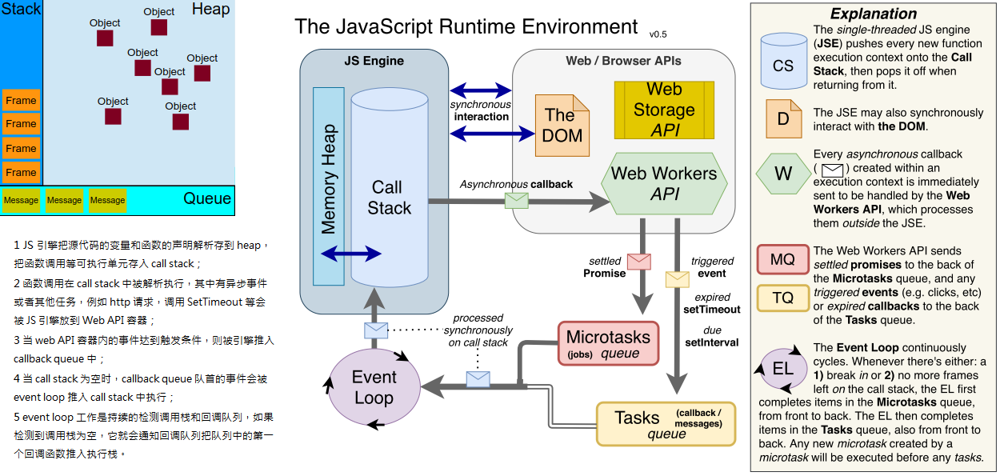
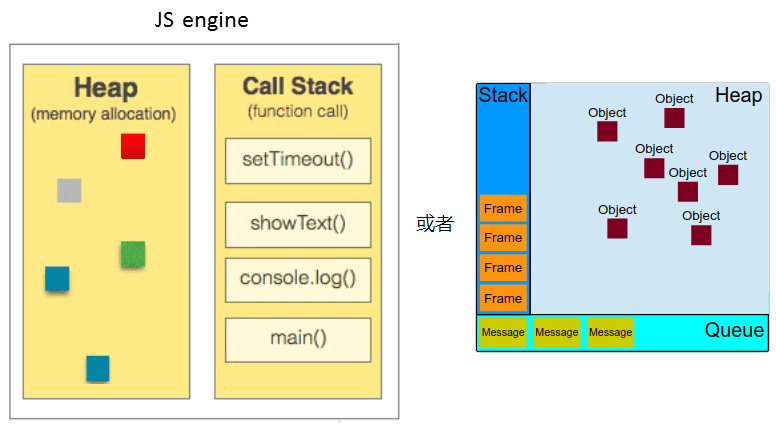
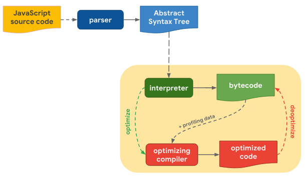
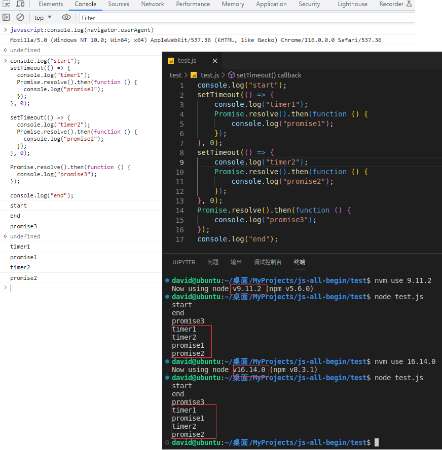
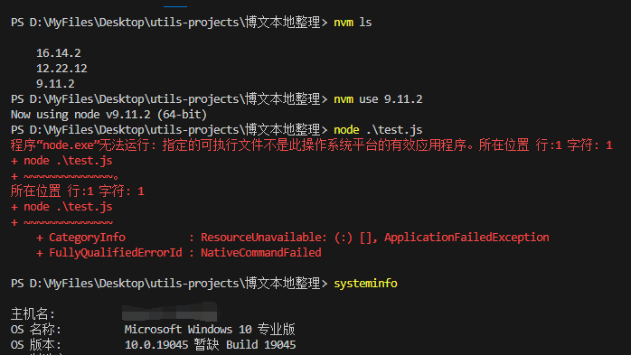
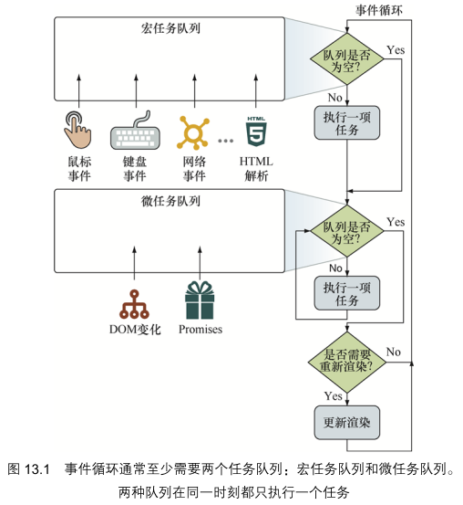
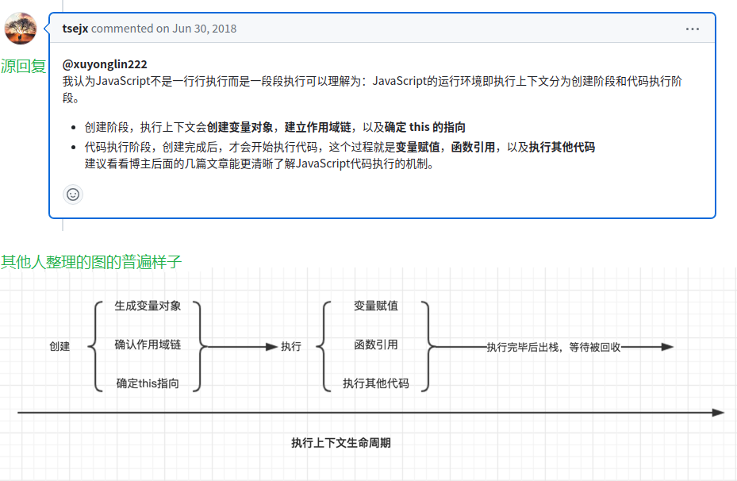

<!-- START doctoc generated TOC please keep comment here to allow auto update -->
<!-- DON'T EDIT THIS SECTION, INSTEAD RE-RUN doctoc TO UPDATE -->
<!-- **Table of Contents**  *generated with [DocToc](https://github.com/thlorenz/doctoc)* -->

- [js 语法层面](#js-%E8%AF%AD%E6%B3%95%E5%B1%82%E9%9D%A2)
  - [基本语法](#%E5%9F%BA%E6%9C%AC%E8%AF%AD%E6%B3%95)
    - [相等性判断](#%E7%9B%B8%E7%AD%89%E6%80%A7%E5%88%A4%E6%96%AD)
    - [运算符优先级](#%E8%BF%90%E7%AE%97%E7%AC%A6%E4%BC%98%E5%85%88%E7%BA%A7)
    - [一点基本引用类型的说明](#%E4%B8%80%E7%82%B9%E5%9F%BA%E6%9C%AC%E5%BC%95%E7%94%A8%E7%B1%BB%E5%9E%8B%E7%9A%84%E8%AF%B4%E6%98%8E)
    - [Map 和 Set](#map-%E5%92%8C-set)
    - [对象](#%E5%AF%B9%E8%B1%A1)
    - [原型链](#%E5%8E%9F%E5%9E%8B%E9%93%BE)
    - [继承与类](#%E7%BB%A7%E6%89%BF%E4%B8%8E%E7%B1%BB)
    - [代理与反射](#%E4%BB%A3%E7%90%86%E4%B8%8E%E5%8F%8D%E5%B0%84)
    - [函数](#%E5%87%BD%E6%95%B0)
    - [Promise 与异步函数](#promise-%E4%B8%8E%E5%BC%82%E6%AD%A5%E5%87%BD%E6%95%B0)
  - [JS 常用对象方法表格](#js-%E5%B8%B8%E7%94%A8%E5%AF%B9%E8%B1%A1%E6%96%B9%E6%B3%95%E8%A1%A8%E6%A0%BC)
    - [String 静态方法和实例方法](#string-%E9%9D%99%E6%80%81%E6%96%B9%E6%B3%95%E5%92%8C%E5%AE%9E%E4%BE%8B%E6%96%B9%E6%B3%95)
    - [常用 Math 对象静态方法](#%E5%B8%B8%E7%94%A8-math-%E5%AF%B9%E8%B1%A1%E9%9D%99%E6%80%81%E6%96%B9%E6%B3%95)
    - [Array 静态方法和实例方法](#array-%E9%9D%99%E6%80%81%E6%96%B9%E6%B3%95%E5%92%8C%E5%AE%9E%E4%BE%8B%E6%96%B9%E6%B3%95)
    - [Map 和 WeakMap 实例的方法](#map-%E5%92%8C-weakmap-%E5%AE%9E%E4%BE%8B%E7%9A%84%E6%96%B9%E6%B3%95)
    - [Set 和 WeakSet 实例的方法](#set-%E5%92%8C-weakset-%E5%AE%9E%E4%BE%8B%E7%9A%84%E6%96%B9%E6%B3%95)
    - [代理捕获器与反射方法](#%E4%BB%A3%E7%90%86%E6%8D%95%E8%8E%B7%E5%99%A8%E4%B8%8E%E5%8F%8D%E5%B0%84%E6%96%B9%E6%B3%95)
    - [对象的属性和方法小结](#%E5%AF%B9%E8%B1%A1%E7%9A%84%E5%B1%9E%E6%80%A7%E5%92%8C%E6%96%B9%E6%B3%95%E5%B0%8F%E7%BB%93)
    - [Promise 静态方法和实例方法](#promise-%E9%9D%99%E6%80%81%E6%96%B9%E6%B3%95%E5%92%8C%E5%AE%9E%E4%BE%8B%E6%96%B9%E6%B3%95)
  - [ES6 以来的新特性关键字](#es6-%E4%BB%A5%E6%9D%A5%E7%9A%84%E6%96%B0%E7%89%B9%E6%80%A7%E5%85%B3%E9%94%AE%E5%AD%97)
    - [ES2015(ES6)](#es2015es6)
    - [ES2016](#es2016)
    - [ES2017](#es2017)
    - [ES2018](#es2018)
    - [ES2019](#es2019)
    - [ES2020](#es2020)
    - [ES2021](#es2021)
    - [ES2022](#es2022)
    - [ES2023](#es2023)
  - [JS 常用技巧](#js-%E5%B8%B8%E7%94%A8%E6%8A%80%E5%B7%A7)
    - [数组相关](#%E6%95%B0%E7%BB%84%E7%9B%B8%E5%85%B3)
    - [字符串相关](#%E5%AD%97%E7%AC%A6%E4%B8%B2%E7%9B%B8%E5%85%B3)
    - [对象等结构相关](#%E5%AF%B9%E8%B1%A1%E7%AD%89%E7%BB%93%E6%9E%84%E7%9B%B8%E5%85%B3)
    - [语法相关](#%E8%AF%AD%E6%B3%95%E7%9B%B8%E5%85%B3)
    - [工具方法](#%E5%B7%A5%E5%85%B7%E6%96%B9%E6%B3%95)
- [JavaScript 的运行原理简述](#javascript-%E7%9A%84%E8%BF%90%E8%A1%8C%E5%8E%9F%E7%90%86%E7%AE%80%E8%BF%B0)
  - [题外话：一些用词](#%E9%A2%98%E5%A4%96%E8%AF%9D%E4%B8%80%E4%BA%9B%E7%94%A8%E8%AF%8D)
  - [JavaScript 运行时环境(runtime environment)](#javascript-%E8%BF%90%E8%A1%8C%E6%97%B6%E7%8E%AF%E5%A2%83runtime-environment)
  - [JavaScript 运行时(runtime)](#javascript-%E8%BF%90%E8%A1%8C%E6%97%B6runtime)
    - [js 运行时的组成](#js-%E8%BF%90%E8%A1%8C%E6%97%B6%E7%9A%84%E7%BB%84%E6%88%90)
      - [js 引擎](#js-%E5%BC%95%E6%93%8E)
        - [js 引擎的作用](#js-%E5%BC%95%E6%93%8E%E7%9A%84%E4%BD%9C%E7%94%A8)
        - [js 引擎的组成](#js-%E5%BC%95%E6%93%8E%E7%9A%84%E7%BB%84%E6%88%90)
        - [几种主流浏览器的引擎和内核的比较](#%E5%87%A0%E7%A7%8D%E4%B8%BB%E6%B5%81%E6%B5%8F%E8%A7%88%E5%99%A8%E7%9A%84%E5%BC%95%E6%93%8E%E5%92%8C%E5%86%85%E6%A0%B8%E7%9A%84%E6%AF%94%E8%BE%83)
      - [异步任务和任务队列](#%E5%BC%82%E6%AD%A5%E4%BB%BB%E5%8A%A1%E5%92%8C%E4%BB%BB%E5%8A%A1%E9%98%9F%E5%88%97)
      - [事件循环](#%E4%BA%8B%E4%BB%B6%E5%BE%AA%E7%8E%AF)
    - [js 执行上下文(Execution Context)](#js-%E6%89%A7%E8%A1%8C%E4%B8%8A%E4%B8%8B%E6%96%87execution-context)
      - [基础名词简述](#%E5%9F%BA%E7%A1%80%E5%90%8D%E8%AF%8D%E7%AE%80%E8%BF%B0)
      - [一些碎语(可略)](#%E4%B8%80%E4%BA%9B%E7%A2%8E%E8%AF%AD%E5%8F%AF%E7%95%A5)
- [js 开发最佳实践](#js-%E5%BC%80%E5%8F%91%E6%9C%80%E4%BD%B3%E5%AE%9E%E8%B7%B5)
  - [常用的 JavaScript 的最佳实践套话](#%E5%B8%B8%E7%94%A8%E7%9A%84-javascript-%E7%9A%84%E6%9C%80%E4%BD%B3%E5%AE%9E%E8%B7%B5%E5%A5%97%E8%AF%9D)
  - [《js 高级程序设计第 4 版》中“最佳实践”章概述](#js-%E9%AB%98%E7%BA%A7%E7%A8%8B%E5%BA%8F%E8%AE%BE%E8%AE%A1%E7%AC%AC-4-%E7%89%88%E4%B8%AD%E6%9C%80%E4%BD%B3%E5%AE%9E%E8%B7%B5%E7%AB%A0%E6%A6%82%E8%BF%B0)
  - [开发风格指南](#%E5%BC%80%E5%8F%91%E9%A3%8E%E6%A0%BC%E6%8C%87%E5%8D%97)
- [常用到的设计模式](#%E5%B8%B8%E7%94%A8%E5%88%B0%E7%9A%84%E8%AE%BE%E8%AE%A1%E6%A8%A1%E5%BC%8F)
  - [单例模式 (Singleton)](#%E5%8D%95%E4%BE%8B%E6%A8%A1%E5%BC%8F-singleton)
  - [工厂模式 (Factory)](#%E5%B7%A5%E5%8E%82%E6%A8%A1%E5%BC%8F-factory)
  - [代理模式 (Proxy)](#%E4%BB%A3%E7%90%86%E6%A8%A1%E5%BC%8F-proxy)
  - [观察者模式 (Observer) 和 发布订阅模式 (Publish-Subscribe)](#%E8%A7%82%E5%AF%9F%E8%80%85%E6%A8%A1%E5%BC%8F-observer-%E5%92%8C-%E5%8F%91%E5%B8%83%E8%AE%A2%E9%98%85%E6%A8%A1%E5%BC%8F-publish-subscribe)
  - [装饰器模式(Decorator)](#%E8%A3%85%E9%A5%B0%E5%99%A8%E6%A8%A1%E5%BC%8Fdecorator)
  - [适配器模式 (Adapter)](#%E9%80%82%E9%85%8D%E5%99%A8%E6%A8%A1%E5%BC%8F-adapter)
  - [策略模式 (Strategy)](#%E7%AD%96%E7%95%A5%E6%A8%A1%E5%BC%8F-strategy)
  - [七大设计原则、二十三种设计模式概述](#%E4%B8%83%E5%A4%A7%E8%AE%BE%E8%AE%A1%E5%8E%9F%E5%88%99%E4%BA%8C%E5%8D%81%E4%B8%89%E7%A7%8D%E8%AE%BE%E8%AE%A1%E6%A8%A1%E5%BC%8F%E6%A6%82%E8%BF%B0)
- [总结](#%E6%80%BB%E7%BB%93)

<!-- END doctoc generated TOC please keep comment here to allow auto update -->

一般来说，作为一个 web 开发人员，尤其是前端开发人员，那么 JavaScript(以下简称 js，可能有部分保留全名，无区别)一定是用得最多的，而且是最熟悉的。

我想起几年前有个同学跟我说，他们一个做大数据的公司，在面试 3 年前端岗位，有问对方“js 有哪几种基本数据类型？”这样的问题。作为求职者的角度来讲，也是具体问题具体分析。一开始我不理解：问一个有经验的开发者这样的问题有什么意义，又不是应届生谁还在背 ABC 啊，或者说这公司到底什么水平能问出这样初级的问题？后来开始庆幸：如果只是懂个皮毛就能找到工作岂不是这个行业正处于蓬勃生机未来可期？现在开始叹息：我去哪儿才能遇到找这样的公司啊，干什么无所谓，给钱就行。

从毕业出来工作开始算起，本人也从事 web 开发 7 年。其实就算和我一样一开始没有系统学过 js，这么多年了，大家或多或少都已经系统了解过了整个知识体系。我个人言论：**每一种语言都是“天下第一”，被同行抨击或者鄙夷的，只不过是它们的特性而已。** 所以，以下内容都是个人从事 Web 开发 7 年的实际项目中，以及之前求职时遇到面试题，个人觉得在 js 中比较常用和比较重要的知识点。_内容基本全手打，都是个人经验之谈，如有纰漏或者不足，可能深度不够，还省略了很多基础，还请诸君不吝指导，谢谢。_

PS：其实我也不想一篇就写这么老长，东拉西扯重点不突出。但是放在一起方便实时回顾，也不必东找西找、东看西看了，可按照目录查看感兴趣的部分。

---

系列文章：

- [「万字总结」干了 7 年 Web 开发工作，混吃等死的日子可能到头了](https://juejin.cn/post/7236668766955307069)
- [Web 开发 7 年，八千字浅谈前端架构设计与工程化](https://juejin.cn/post/7238479969180319805)
- [Web 开发 7 年，不止为了面试 —— 万字 HTML 重点基础知识分享](https://juejin.cn/post/7239996748318572599)
- [Web 开发 7 年，一文总结 CSS 常见面试点和基础教程](https://juejin.cn/post/7246407369792569402)
- [Web 开发 7 年，3 万字分享 JavaScript 常用重要知识点](https://juejin.cn/post/7264125562393755705)（本文）
- 未完待续

# js 语法层面

学习一门语言大多从语法入手，先简单介绍一点我个人在实际应用或者“道听途说”时觉得比较重要的 js 语言知识点，当然肯定不包含所有内容。

## 基本语法

### 相等性判断

这个都很简单，js 判断相等时常用的三种运算:

- `==`: 宽松相等(两个等号)，对应算法 [IsLooselyEqual ( x , y )](https://tc39.es/ecma262/multipage/abstract-operations.html#sec-islooselyequal)；
  - 将执行类型转换，并且会按照 IEEE 754 标准对 NaN、-0 和 +0 进行特殊处理；
- `===`: 严格相等(三个等号)，对应算法 [IsStrictlyEqual( x , y )](https://tc39.es/ecma262/multipage/abstract-operations.html#sec-isstrictlyequal)；
  - 不进行类型转换，也会对 NaN、-0 和 +0 进行特殊处理；如果类型不同，则返回 false；
- `Object.is()`，对应算法[SameValue ( x, y )](https://tc39.es/ecma262/multipage/abstract-operations.html#sec-samevalue)。
  - 既不进行类型转换，也不对 NaN、-0 和 +0 进行特殊处理。

所以除了`==`的隐式类型转换之外，这三者的主要区别就在对 NaN、-0、+0 的处理上:

```js
// 为了简单，后面用到打印都用这个简写了
const cl = console.log.bind(globalThis);

cl(undefined == null, NaN == NaN, -0 == +0); // true false true
cl(undefined === null, NaN === NaN, -0 === +0); // false false true
cl(Object.is(undefined, null), Object.is(NaN, NaN), Object.is(-0, +0)); // false true false
```

此外，还有一个被许多内置运算使用的算法[SameValueZero(x,y)](https://tc39.es/ecma262/multipage/abstract-operations.html#sec-samevaluezero)，与`SameValue (x,y)`的唯一区别就是`SameValue (-0,+0)`为 false，而 `SameValueZero(-0,+0)`为 `true`。

除此之外，IsStrictlyEqual、SameValueZero、SameValue 的算法描述都是一样的：

```js
1. If Type(x) is not Type(y), return false.
2. If x is a Number, then
      // 唯一不同点，其细节也就是对待NaN和有符号的0(+0、-0)的不同
      a. Return Number::equal(x, y). // IsStrictlyEqual
      a. Return Number::sameValue(x, y). //  SameValue
      a. Return Number::sameValueZero(x, y). // SameValueZero
3. Return SameValueNonNumber(x, y).
```

当然，`==`宽松判断的隐式转换(**强制类型转换**)规则我也假设各位都很熟悉了，这里就简单用于简洁应答:

根据比较的不同类型做不同的转换：

- 操作数具有相同的类型
  - 为 true: Object 引用相同的对象、String 具有相同的字符并且顺序相同、Number 具有相同的值(注意 NaN、-0、+0)、Boolean 都是 true 或 false、BigInt 具有相同的值、Symbol 引用相同的 symbol。
- 操作数之一为 null 或 undefined
  - 为 true: 另一个操作数必须为 null 或 undefined
- 操作数之一是对象，而另一个是原始值，则将对象转换为原始值后再比较。
  - 通过 ToPrimitive 规则(引用类型向原始类型转变的规则)，先 valueOf 后 toString 的模式期望得到一个原始类型。

几个常见的比较示例：

```js
cl(0 == false, [1, 2] == "1,2", "17" == 17, new String("foo") == "foo"); // true true true true
cl(
  0 == null,
  { foo: "bar" } == { foo: "bar" },
  new String("foo") == new String("foo"),
  false == undefined
); // false false false false
```

### 运算符优先级

这个也非常基础，[数字越大，优先级越高](https://developer.mozilla.org/en-US/docs/Web/JavaScript/Reference/Operators/Operator_precedence)：

- **18** 圆括号分组 **17** 成员访问(用. 或?. 或中括号访问成员)、new(带参数列表)、函数调用 **16** new(无参数列表)
- **15** 后置递增、后置递减 **14** 逻辑非、按位非、一元加法、一元减法、前置递增、前置递减、typeof、void、delete、await
- **13** 幂 **12** 乘法、除法、取模 **11** 加法、减法 **10** 按位左移、按位右移、无符号右移 **9** 小于、小于等于、大于、大于等于、in、instanceof
- **8** 等号、非等号、全等号、非全等号 **7** 按位与`… & …` - **6** 按位异或`… ^ …` - **5** 按位或`… | …` **4** 逻辑与`… && …`
- **3** 逻辑或`… || …`、空值合并运算符`… ?? …` **2** 赋值、条件运算符、箭头函数、yield 、yield\*、展开运算符 **1** 逗号

简单记忆的话：

**圆括号`>`成员访问`>`new 相关`>`后置加减`>`一元运算符`>`二元运算符`>`赋值和三元(条件)运算符`>`更多个变量操作(逗号可分割任意个)**

一元运算符，直接的运算符(`+a !a`)>关键字运算符(`typeof a / await a`)。\
二元运算符，数学计算的幂乘除余加减 > 按位移动的`<< >> >>>` > 关系运算符`< > =` > 位运算符`& ^ |` > 逻辑运算符`&& || ??`

之所以提这个，是因为之前不小心遇到过，例如:

```txt
function isOk(obj) {
    return obj.ok ? obj.ok == "1" ? "A" : "B" : 'C'
}

cl(isOk({}), isOk({ ok: 1 }), isOk({ ok: 0 })) // C A C
```

而其初衷是想:如果 obj 没有 ok 属性，则显示 C；如果 obj 有 ok 属性且值为 1，则显示 A；有 ok 属性但值不为 1，则显示 B。

```js
// 别钻进去了： i++优先级15，++i 优先级14
a = i++; // 等价于 a = i; i = i + 1; 先把i的值拿来用, 然后再把i自增1。
a = ++i; // 等价于 i = i + 1; a = i; 先把i自增1, 然后再把i的值拿来用。
// a = ++i++; 或者 a = (++i)++; 或者 a = ++(i++); 都不存在，且和优先级没有关系
```

### 一点基本引用类型的说明

《Professional.JavaScript.for.Web.Developers.4th.Edition》中基本引用类型含有：Date、RegExp、Boolean、Number、String、Global、Math 等内容。也不多讲，提一嘴:

- “**引用值（或者对象）是某个特定引用类型的实例。** 在 ECMAScript 中，引用类型是把数据和功能组织到一起的结构。”
- Date 类型的 `valueOf()` 方法根本就不返回字符串，这个方法被重写后返回的是*日期的毫秒表示*。
- 引用类型(Boolean 、 Number 和 String)与原始值包装类型的主要区别在于对象的生命周期。
  - **原始值为什么可以调用一些方法：**
  ```js
  let s = "str";
  console.log(s.slice(1)); // "tr"
  ```
  - 如上代码，第二行中访问 s 时，是以读模式访问的，也就是要从内存中读取变量保存的值。
  - 在 _以读模式访问字符串值的任何时候_，后台都会自动执行以下三步:
    - 根据字符串值创建一个 String 类型的实例、(2)调用实例上的特定方法、(3)销毁实例。即相当于执行了以下三行代码：
    ```js
    /*创建String实例*/
    let s = new String("str");
    /*调用特定方法*/
    s.slice(1);
    /*销毁实例*/
    s = null;
    ```
    - 这种行为则让原始值拥有了对象的行为。
- ECMA-262 对内置对象的定义是“任何由 ECMAScript 实现提供、与宿主环境无关，并在 ECMAScript 程序开始执行时就存在的对象”。
- “[ECMA-262 规定 Global 对象](https://tc39.es/ecma262/multipage/global-object.html#sec-global-object)为一种兜底对象，它所针对的是不属于任何对象的属性和方法(a sort of catch all for properties and methods that don't otherwise have an owning object)。”
  - “浏览器将 `window` 对象实现为 Global 对象的代理。因此，所有全局作用域中声明的变量和函数都变成了 window 的属性。”
  - 同理，nodejs 中也可以使用 `global` 对象来获取一些全局属性方法。
    - 在 nodejs 16.19 中执行：`cl(global == globalThis) // true`
- Math 不是一个构造器。Math 的所有属性与方法**都是静态**的。 用于 Number 类型。它**不支持** BigInt。
  - 很多 Math 函数都有一个精度，而且这个精度在不同实现中也是不相同的。这意味着不同的浏览器会给出不同的结果。
  - 此外，IEEE 754 格式浮点值的精确度最高可达 17 位小数，但在算术计算中远不如整数精确。
    - `cl(0.1 + 0.2 === 0.3, 0.1 + 0.2) // false 0.30000000000000004`
- 会改变原数组的实例方法:
  - 一转(splice)二排(reverse/sort)一复制(copyWithin)
  - 二栈(push/pop)二队(shift/unshift)一填充(fill)

此外就是有时候比较懒还是直接用第三方库或者别人现成的东西，比如使用[Moment.js](https://www.npmjs.com/package/moment)，或者别人整理的常用正则表达式[common-regex](https://github.com/cdoco/common-regex)、[any-rule](https://github.com/any86/any-rule)。当然像正则不经常用或者自己也有维护一个本地库的话，说不定比较方便。像我就只是每次用到再看，例如[learn-regex](https://github.com/ziishaned/learn-regex)，比较愚笨了。

### Map 和 Set

- Set 对象允许存储任何类型的唯一值，无论是原始值或者是对象引用。可以按照*插入的顺序迭代*它的元素。Set 中的元素只会出现一次。

- Map 对象保存键值对，并且能够记住键的原始插入顺序。

- 合并两个 Map 对象时，如果有重复的键值，则后面的会覆盖前面的。

- 一个 Map 的 key 可以是任意值，包括函数、对象或任意基本类型。一个 Object 的 key 必须是一个 String 或是 Symbol。

- [键的顺序](https://developer.mozilla.org/en-US/docs/Web/JavaScript/Reference/Global_Objects/Map#objects_vs._maps): Map 中的 key 是有序的。一个 Object 的 key 不一定是序的(**没有可以迭代对象所有属性**的机制)。

  - `for-in`、`Object.keys`、`Object.getOwnPropertyNames`、`Object.getOwnPropertySymbols` 获取内容各不一样。
    - `for-in` 仅包含了以字符串为键的属性；
    - `Object.keys` 仅包含了对象自身的、可枚举的、以字符串为键的属性；
    - `Object.getOwnPropertyNames` 包含了所有以字符串为键的属性，即使是不可枚举的；
    - `Object.getOwnPropertySymbols` 与前者类似，但其包含的是以 Symbol 为键的属性

- Map 是可迭代的，但 Object 并没有实现迭代协议(即 for...of 表达式并不能直接迭代对象，但对象可以实现迭代协议)。

- WeakMap 对象是一组键/值对的集合，其中的键是弱引用的。**其键必须是对象，而值可以是任意的。**

- WeakSet **只能是对象的集合**，而不能是任何类型的任意值。

### 对象

对象的属性分两种：**数据属性**( data properties)和**访问器属性**( accessor properties)。

- 数据属性有 4 个描述其行为的特性：
  - `[[Configurable]]`• 表示属性是否可以通过 delete 删除并重新定义，是否可以修改它的特性，以及是否可以把它改为访问器属性。
  - `[[Enumerable]]`• 表示属性是否可以通过 for-in 循环返回。默认情况下，所有直接定义在对象上的属性的这个特性都是 true 。
  - `[[Writable]]`• 表示属性的值是否可以被修改。
  - `[[Value]]`• 包含属性实际的值。• 这个特性的默认值为 undefined 。
- 访问器属性有如下 4 个特性：
  - `[[Configurable]]`• 表示属性是否可以通过 delete 删除并重新定义，是否可以修改它的特性，以及是否可以把它改为数据属性。
  - `[[Enumerable]]`• 表示属性是否可以通过 for-in 循环返回。
  - `[[Get]]`• 获取函数，在读取属性时调用。• 默认值为 undefined 。
  - `[[Set]]`• 设置函数，在写入属性时调用。• 默认值为 undefined 。
- 要修改数据属性的默认特性，就必须使用 `Object.defineProperty(obj, prop, descriptor)` 方法。要定义访问器属性，也是如此。

`Object.is()` 与 `==` 和 `===` 都不相同:

- 不会强制转换两边的值;
- `Object.is(NaN, NaN)`为 true，`Object.is(+0, -0)`为 false，和`===`相反。

**使用 new 调用类的构造函数**会执行如下操作:

1.  在内存中创建一个新对象。
2.  这个新对象内部的 `[[Prototype]]` 指针被赋值为构造函数的 prototype 属性。
3.  构造函数内部的 this 被赋值为这个新对象（即 this 指向新对象）。
4.  执行构造函数内部的代码（给新对象添加属性）。
5.  如果构造函数返回非空对象，则返回该对象；否则，返回刚创建的新对象。

即 [new 对象的过程](https://developer.mozilla.org/en-US/docs/Web/JavaScript/Reference/Operators/new#description): 新生成一个对象、链接到原型、绑定 this、(给新对象添加属性)、返回新对象。

`Object.assign()`对象**浅拷贝**，一般使用`JSON.parse()` 和 `JSON.stringify()`实现**深拷贝**。\
对于数组，可以理解为数组方法中那些会*改变原数组的方法都算深拷贝*。

_任何函数只要使用 new 操作符调用就是构造函数_，而不使用 new 操作符调用的函数就是普通函数。

### 原型链

每个**实例对象**都有一个私有属性(称之为 **`__proto__`**)指向它的构造函数的原型对象(prototype)。\
默认情况下，所有**原型对象**自动获得一个名为 **`constructor`** 的属性，指回与之关联的构造函数。

即两个准则，其他内容都可以由这两个准则慢慢推出来:

```js
function Person() {}
let person1 = new Person();

// 准则1：实例(即 person01)的 __proto__ 指向其构造函数的原型对象
cl(person1.__proto__ === Person.prototype); // true
// 准则2：原型对象(即 Person.prototype) 的 constructor 指向构造函数本身
cl(Person.prototype.constructor === Person); // true

// 所有的构造函数的 __proto__ 的原型都是 Function
cl(Person.__proto__ === Function.prototype); // true

// 正常的原型链都会终止于Object的原型对象。Object原型的原型是null
cl(Person.prototype.__proto__ === Object.prototype); // true
cl(Object.prototype.__proto__ === null); // true
```

**原型链**: _每个实例对象都有一个私有属性 `__proto__`指向它的构造函数的原型对象(prototype)。该原型对象也有一个自己的原型对象`__proto__`，层层向上直到一个对象的原型对象为 null。根据定义，null 没有原型，并作为这个原型链中的最后一个环节。_

```cs
// 承上（所有打印都是true）
function Person() {}
let person1 = new Person();

// 原型链的构想的前置: Coder 继承于 Person
function Coder() { }
// 这里最简单的原型链继承
Coder.prototype = new Person();
let coder1 = new Coder();

// 原型链的构想:
// 1 每个实例对象都有一个私有属性(称之为 __proto__)指向它的构造函数的原型对象:
cl(coder1.__proto__ == Coder.prototype);

// 2 这个原型本身有一个内部指针指向另一个原型:
cl(coder1.__proto__.__proto__ == Coder.prototype.__proto__);
cl(Coder.prototype.__proto__ == person1.__proto__); // 这一步值得注意
cl(person1.__proto__ == Person.prototype);

// 等价递推出来
cl(coder1.__proto__.__proto__ == Person.prototype);

// 3 另一个原型也有一个指针指向另一个构造函数:
cl(coder1.__proto__.__proto__.constructor == Coder.prototype.__proto__.constructor);
cl(Coder.prototype.__proto__.constructor == Person.prototype.constructor);
cl(Person.prototype.constructor == Person);

// 简而言之的实例和原型之间构造了一条原型链：
cl(coder1.__proto__.__proto__.constructor == Person);
cl(coder1.__proto__.__proto__ == Person.prototype);
```

当然，使用 class 一样的效果，可以上面的 Person 和 Coder 换成这个试一下:

```js
class Person {
  constructor(property) {
    this.property = property;
  }
}

class Coder extends Person {
  constructor(property) {
    super(property);
  }
  showProperty() {
    console.log(`property is: ${this.property}`);
  }
}
```

### 继承与类

**继承**

很多面向对象语言都支持两种继承：接口继承和实现继承。前者只继承方法签名，后者继承实际的方法。

- **实现继承是 ECMAScript 唯一支持的继承方式，而这主要是通过原型链实现的。**
- 接口继承在 ECMAScript 中是不可能的，因为函数没有签名。

一般可以看到原型链、盗用构造函数、组合继承、原型式继承、寄生式继承、寄生式组合继承几种。网上随便搜一下“js 继承”应该可以看到《JavaScript 高级程序设计》中相关内容的笔记，例子可能都是一个字没变。

**类** (_基类、父类、超类是指被继承的类，派生类、子类是指继承于基类的类。通俗点：基类`->`派生类 `<=>` 父类`->`子类_)

ECMAScript 6 新引入的 `class` 关键字具有正式定义类的能力。表面上看起来可以支持正式的面向对象编程，但实际上它背后使用的仍然是原型和构造函数的概念。\
从各方面来看，**ECMAScript `类`就是一种特殊函数。**

类可以包含构造函数方法、实例方法、获取(get)函数、设置(set)函数和静态类方法，但这些**都不是必需**的。

**类私有域**: 类属性在默认情况下是公有的，但可以使用增加哈希前缀 `# `的方法来定义私有类字段，这一隐秘封装的类特性由 js 自身**强制执行**。

ES6 类支持**单继承**(extends)。虽然类继承使用的是新语法，但背后依旧使用的是原型链。(C++、python 支持多继承)

调用 `super()` 会调用父类构造函数，并将返回的实例赋值给 this 。super 只能在 _派生类构造函数和静态方法中_ 使用。

有个众所周知的软件设计原则：“组合胜过继承（composition over inheritance）。”尽量不用 mixin。

### 代理与反射

代理和反射(Proxies and Reflect)为开发者提供了拦截并向基本操作嵌入额外行为的能力。

**Proxy 对象用于创建一个对象的代理，从而实现基本操作的拦截和自定义（如属性查找、赋值、枚举、函数调用等）。**

`const p = new Proxy(target, handler)`

- handler:**包含捕捉器**(trap)的占位符对象。**一个通常以函数作为属性的对象**，各属性中的函数分别定义了在执行各种操作时代理 p 的行为
  - traps: 提供属性访问的方法。这类似于操作系统中捕获器的概念。
- target: 要使用 Proxy 包装的目标对象（可以是任何类型的对象，包括原生数组，函数，甚至另一个代理）

代理可以在这些操作传播到目标对象之前先调用捕获器函数，从而拦截并修改相应的行为。

**Reflect 是一个内置的对象，它提供拦截 JavaScript 操作的 13 种方法。这些方法与 proxy handlers 的方法相同。**\
Reflect 不是一个函数对象，因此它是不可构造的(Reflect 的所有属性和方法都是静态的，不能 new，或者当成构造函数)。

**通常，Object 上的方法适用于通用程序，而反射方法适用于细粒度的对象控制与操作。**

当然，如果有用到 vue，那对 Proxy 应该不会陌生，你要背“vue 响应式原理”什么的肯定离不开这个。

### 函数

一个 JavaScript 函数用 `function` 关键字声明，后面跟着函数名和圆括号。\
**函数实际上是对象**。每个函数都是 Function 类型的实例，而 Function 也有属性和方法，跟其他引用类型一样。

因为函数是对象，所以**函数名就是指向函数对象的指针**，而且不一定与函数本身紧密绑定。

- 这意味着一个函数可以有多个名称。使用*不带括号的函数名会访问函数指针*，而不会执行函数。

**理解函数声明与函数表达式之间的区别**，关键是理解**提升**(声明(`function sum(){}`)可以，表达式(`let sum=function (){}`)不行)。

**箭头函数**任何可以使用函数表达式的地方，都可以使用箭头函数(箭头函数没有自己的 this,也就不能使用 bind/apply/call 进行修改)。

- 箭头函数不能使用`arguments`、`super`和`new.target`，也不能用作构造函数。此外，箭头函数也没有`prototype`属性。

**函数内部** (arguments，this，caller，new\.target)

- arguments 对象是一个类数组对象，包含调用函数时传入的所有参数。第一个参数:`arguments[0]` ，第二个参数是 `arguments[1]`……
- **在标准函数中，`this` 引用的是把函数当成方法调用的上下文对象**，这时候通常称其为 this 值。
  - _这个 this 到底引用哪个对象必须到函数被调用时才能确定。_
- **在箭头函数中，`this` 引用的是定义该箭头函数的上下文。**
- `caller`属性引用的是*调用当前函数的函数*，或者如果是*在全局作用域中调用的则为 null* 。
- ECMAScript 6 新增了检测函数是否使用 new 关键字调用的 `new.target` 属性。
  - 如果函数是*正常调用*的，则 `new.target` 的值是 `undefined` ；
  - 如果是使用 *new 关键字调用*的，则 `new.target` 将引用被调用的*构造函数*。

**函数参数**: ECMAScript 函数**既不关心传入的参数个数，也不关心这些参数的数据类型**。

- 函数被调用时总会接收一个数组，但函数并不关心这个数组中包含什么。

- 在使用 function 关键字定义（非箭头）函数时，可以在函数内部访问 arguments 对象，从中取得传进来的每个参数值。

  - 如果函数是使用箭头语法定义的，那么传给函数的参数将不能使用 arguments 关键字访问，而只能通过定义的命名参数访问。

- ECMAScript 函数**没有签名**，因为参数是由包含零个或多个值的数组表示。没有[函数签名](https://developer.mozilla.org/zh-CN/docs/Glossary/Signature/Function)，也就**没有重载**(函数同名参数的类型或数量不同)。

**函数实例的属性和方法**: ECMAScript 中的函数是对象，因此有属性和方法。

- 实例属性: length、name 和 prototype(不是 new 出来的函数实例则没有)。
- 实例方法: call(若干个参数)、apply(参数一个数组/类数组对象)、bind、toString。(前三个方法除了 thisArg，参数都是可选的)
  - 使用 call() 或 apply() 的好处是可以**将任意对象设置为任意函数的作用域**。
    - 除了参数不一样，其他一样。`func1.call(thisArg, arg1, arg2, ...)` 和 `func1.apply(thisArg, argsArray)`
    - 调用有指定 this 值和参数的函数的结果。
  - bind() 函数会创建一个新的**绑定函数**。
    - `function.bind(thisArg[, arg1[, arg2[, ...]]])`
    - 这个新函数的 this 被指定为 bind() 的第一个参数，而其余参数将作为新函数的参数，供调用时使用。

**尾调用**：如果一个函数**返回**的是**另一个**函数的**调用结果**，那么就被称为尾调用。\
**尾递归**：如果一个函数**返回**的是**自己的调用结果**就被称为尾递归。_也就是说尾递归一定是尾调用，但尾调用不一定是尾递归。_\
**ES6 尾调用优化的关键**：如果函数的逻辑允许基于尾调用将其销毁，则引擎就会那么做。

**[闭包](https://developer.mozilla.org/zh-CN/docs/Web/JavaScript/Language_overview#%E9%97%AD%E5%8C%85)** 是由「函数」以及「声明该函数的词法环境」组合而成的。_该环境包含了这个闭包创建时作用域内的任何局部变量_。

**闭包的作用**: 让开发者可以从内部函数访问外部函数的作用域，模拟私有变量。

过度使用闭包可能导致内存过度占用(因为闭包会保留它们包含函数的作用域)，因此建议**仅在十分必要时使用**。

**IIFE**: 当函数变成立即执行的函数表达式时，表达式中的变量不能从外部访问。

`(function(){statements;})();`

将 IIFE 分配给一个变量，不是存储 IIFE 本身，而是存储 IIFE 执行后返回的结果。

```js
let result = (() => {
  let lname = "David";
  return lname;
})();
cl(result); //  "David"
```

如果这个函数中创建了一个闭包，则这个闭包能通过其作用域链访问其外部的这函数内部变量。

### Promise 与异步函数

阻塞与非阻塞是**调用方**决定的，在等待结果的过程中，是否还可以干其他事。\
同步与异步是**被调用方**决定的，决定是马上给你答案，还是过会儿通知你，给你答案。

**Promise 对象用于表示一个异步操作的最终完成（或失败）及其结果值。**\
有了 Promise 对象，就可以将异步操作以同步的操作的流程表达出来，避免了层层嵌套的回调函数。
_Promise 故意将异步行为封装起来，从而隔离外部的同步代码。_

- Promise 状态机(状态都是不可逆的):
  - 待定（pending）：初始状态，既没有被兑现，也没有被拒绝。
  - 已兑现（fulfilled）：意味着操作成功完成 (有时候也称为“解决”，resolved)。
  - 已拒绝（rejected）：意味着操作失败。
- Promise 作用:
  - 抽象地表示一个异步操作。
  - Promise 封装的异步操作会实际生成某个值，而程序期待 Promise 状态改变时可以访问这个值(resolve() 和 reject() 的返回值)。

**异步函数**，也称为`async/await`（语法关键字），是 ES6 Promise 模式在 ECMAScript 函数中的应用。

- (是 `promise + generator` 的语法糖，让 promise 对异步操作的管理更便捷)
- `async/await` 是 ES8 规范新增的。这个特性从行为和语法上都增强了 JavaScript，**让以同步方式写的代码能够异步执行**。
- `async` 关键字用于声明异步函数。这个关键字可以用在函数声明、函数表达式、箭头函数和方法上。
- `await` 关键字会暂停执行异步函数后面的代码，让出 JavaScript 运行时的执行线程，等待 Promise 解决。
  - JavaScript 运行时在碰到 await 关键字时，会记录在哪里暂停执行。
  - 等到 await 右边的值可用了，JavaScript 运行时会向消息队列中推送一个任务，这个任务会恢复异步函数的执行。
  - _即使 await 后面跟着一个立即可用的值，函数的其余部分也会被异步求值。_

现在随便一搜，应该还是能看到许多“如何实现一个 promise”之类的问题，我觉得没什么意义，真有时间的话按着这个[Promises/A+](https://promisesaplus.com/) open standard 自己去试试。相反，js 的 Promise 的静态方法不多，应该全部掌握。当然原型方法也就 3 个常用就`then`就没什么好说的了。

---

## JS 常用对象方法表格

虽然上面可能没提到比如字符串方法、数组方法，很多都很常用也很重要，我这里花费了大量篇幅全部表格列出概述，不关心的话可以自行跳过。当然具体使用和完整内容我觉得可以自行补充学习。

注意，有些新特性假如你想在 nodejs 环境下测试，得配合好 nodejs 版本和系统版本。

比如我想使用 nodejs 20，但我的 ubuntu 版本是`Ubuntu 18.04.5 LTS`，就会有这个问题:

```shell
node: /lib/x86_64-linux-gnu/libc.so.6: version `GLIBC_2.28' not found (required by node)
```

使用`ldd --version`可以看到其版本为`ldd (Ubuntu GLIBC 2.27-3ubuntu1.2) 2.27`。那要么使用旧版本，要么升级系统。

当然，使用浏览器一样的，浏览器旧版本也不会支持 JS 新特性。但是升级浏览器版本可比升级系统方便多了。可是假如我工作电脑是 win7，chrome 最高只支持 109 版本，还可以看在线的 playground。

### String 静态方法和实例方法

**String 静态方法**

| 静态方法               | 说明                                                         |
| ---------------------- | ------------------------------------------------------------ |
| String.fromCharCode()  | 返回由指定的 UTF-16 代码单元序列创建的字符串。               |
| String.fromCodePoint() | 返回使用指定的代码点序列创建的字符串。                       |
| String.raw()           | 模板字符串的标签函数，用来获取一个模板字符串的原始字符串的。 |

**String 常用实例方法 (都不会改变原始字符串)**

| 实例方法                 | 说明                                                                                                                                                         |
| ------------------------ | ------------------------------------------------------------------------------------------------------------------------------------------------------------ |
| str1.at(index)           | 返回的字符串指定索引（位置）的的单个 UTF-16 码元组成的 String。如果找不到指定的索引，则返回 undefined 。如果是负数，则倒数。                                 |
| str1.charAt(index)       | 从一个字符串中返回指定的字符。                                                                                                                               |
| str1.charCodeAt(index)   | 返回 0 到 65535 之间的整数，表示给定索引处的 UTF-16 代码单元 。                                                                                              |
| str1.codePointAt()       | 返回 一个 Unicode 编码点值的非负整数。如果在指定的位置没有元素则返回 undefined。<br/> 如果在索引处开始没有 UTF-16 代理对，将直接返回在那个索引处的编码单元。 |
| `str1.concat()`          | 将一个或多个字符串与原字符串连接合并，形成一个新的字符串并返回。                                                                                             |
| `str1.startsWith()`      | 用来判断当前字符串是否**以另外一个给定的子字符串开头**，并根据判断结果返回 true 或 false。                                                                   |
| `str1.endsWith()`        | 判断当前字符串是否是\*\*以另外一个给定的子字符串“结尾”\*\*的，根据判断结果返回 true 或 false。                                                               |
| `str1.includes()`        | 判断**一个字符串是否包含在另一个字符串中**，根据情况返回 true 或 false。                                                                                     |
| `str1.indexOf()`         | 返回调用它的 String 对象中**第一次出现**的指定值的索引，从 fromIndex 处进行搜索。如果未找到该值，则返回 -1。                                                 |
| str1.lastIndexOf()       | 返回调用 String 对象的指定值**最后一次出现**的索引，在一个字符串中的指定位置 fromIndex 处从后向前搜索。如果没找到这个特定值则返回-1 。                       |
| `str1.localeCompare()`   | 返回一个数字来指示一个参考字符串是否**在排序顺序前面或之后**或与给定字符串相同。                                                                             |
| str1.search()            | 执行正则表达式和 String 对象之间的一个搜索匹配。                                                                                                             |
| `str1.match()`           | 检索返回一个字符串**匹配正则表达式的结果**。                                                                                                                 |
| str1.matchAll()          | 返回一个包含所有匹配正则表达式的结果及分组捕获组的迭代器。                                                                                                   |
| str1.normalize()         | 按照指定的一种 Unicode 正规形式将当前字符串规范化。（如果该值不是字符串，则首先将其转换为一个字符串）。                                                      |
| str1.padEnd()            | 用一个字符串填充当前字符串（如果需要的话则重复填充），返回填充后达到指定长度的字符串。从当前字符串的末尾（右侧）开始填充。                                   |
| str1.padStart()          | 用另一个字符串填充当前字符串（如果需要的话，会重复多次），以便产生的字符串达到给定的长度。从当前字符串的左侧开始填充。                                       |
| str1.repeat()            | 构造并返回一个新字符串，该字符串包含被连接在一起的指定数量的字符串的副本。                                                                                   |
| `str1.replace()`         | 返回一个由替换值（replacement）替换部分或所有的模式（pattern）匹配项后的新字符串。                                                                           |
| str1.replaceAll()        | 返回一个新字符串，新字符串所有满足 pattern 的部分都已被 replacement 替换。                                                                                   |
| `str1.slice()`           | **提取某个字符串的一部分**，并返回一个新的字符串，且不会改动原字符串。                                                                                       |
| `str1.split()`           | 使用指定的分隔符字符串**将一个 String 对象分割成子字符串数组**，以一个指定的分割字串来决定每个拆分的位置。                                                   |
| `str1.substring()`       | 返回一个字符串**在开始索引到结束索引之间的一个子集**，或从开始索引直到字符串的末尾的一个子集。                                                               |
| str1.toLocaleLowerCase() | 根据任何指定区域语言环境设置的大小写映射，返回调用字符串被转换为小写的格式。                                                                                 |
| str1.toLocaleUpperCase() | 根据本地主机语言环境把字符串转换为大写格式，并返回转换后的字符串。                                                                                           |
| str1.toLowerCase()       | 调用该方法的字符串值转为小写形式，并返回。                                                                                                                   |
| str1.toUpperCase()       | 调用该方法的字符串转为大写形式并返回（如果调用该方法的值不是字符串类型会被强制转换）。                                                                       |
| str1.toString()          | 返回一个 String 包装对象的字符串值，表示指定的字符串。                                                                                                       |
| str1.valueOf()           | 返回 String 对象的原始值。                                                                                                                                   |
| `str1.trim()`            | 从一个字符串的**两端删除空白字符**。在这个上下文中的空白字符是所有的空白字符 (space, tab, no-break space 等) 以及所有行终止符字符（如 LF，CR 等）。          |
| str1.trimEnd()           | 从一个字符串的**末端移除空白字符**。trimRight() 是这个方法的别名。                                                                                           |
| str1.trimStart()         | 从字符串的**开头删除空格**。trimLeft() 是此方法的别名。                                                                                                      |

### 常用 Math 对象静态方法

| 静态方法     | 说 明                                                | 静态方法           | 说 明                                       |
| ------------ | ---------------------------------------------------- | ------------------ | ------------------------------------------- |
| Math.min()   | 返回零个或更多个数值的最小值。                       | Math.random()      | 返回一个浮点数, 伪随机数在范围 **\[0,1)**。 |
| Math.max()   | 返回一组数中的最大值。                               | Math.abs(x)        | 返回 x 的绝对值                             |
| Math.ceil()  | 返回大于或等于一个给定数字的最小整数(**向上取整**)。 | Math.pow(x, power) | 返回 x 的 power 次幂                        |
| Math.floor() | 返回小于或等于一个给定数字的最大整数(**向下取整**)。 | Math.sqrt(x)       | 返回 x 的平方根                             |
| Math.round() | 返回一个数字四舍五入后最接近的整数(**四舍五入**)。   | Math.trunc(x)      | 返回 x 的整数部分，删除所有小数             |

### Array 静态方法和实例方法

**Array 的静态方法**

| 方法              | 描述                                                                            |
| ----------------- | ------------------------------------------------------------------------------- |
| Array.from()      | 从一个类似数组或可迭代对象创建一个新的，浅拷贝的数组实例。                      |
| Array.fromAsync() | 由一个异步可迭代对象、可迭代对象或类数组对象创建一个新的、浅拷贝的 Array 实例。 |
| Array.isArray()   | 确定传递的值是否是一个 Array。                                                  |
| Array.of()        | 创建一个具有可变数量参数的新数组实例，而不考虑参数的数量或类型。                |

**Array 的实例方法**

数组的方法感觉都挺常用的，分类来看也就蛮多的：迭代器、复制填充、转换、队栈、操作、排序、搜索、位置、迭代、归并等。都放在这里吧。

| 名称                                      | 改变   | 描述                                                                                                                                                        |
| ----------------------------------------- | ------ | ----------------------------------------------------------------------------------------------------------------------------------------------------------- |
| **迭代器方法**                            |        |                                                                                                                                                             |
| arr1.keys()                               | 否     | 返回数组索引的迭代器(Array Iterator)                                                                                                                        |
| arr1.values()                             | 否     | 返回数组元素的迭代器                                                                                                                                        |
| arr1.entries()                            | 否     | 返回数组索引/值对的迭代器                                                                                                                                   |
| **复制**                                  |        |                                                                                                                                                             |
| arr1.copyWithin(target\[, start\[, end]]) | **是** | 浅复制数组的一部分到**同一数组中的另一个位置**，并返回新数组。<br/> (不会改变原数组的长度 length，但是会改变原数组的内容，且需要时会创建新的属性)           |
| **填充**                                  |        |                                                                                                                                                             |
| arr1.fill(val\[, start\[, end]])          | **是** | 用一个固定值填充一个数组中从起始索引到终止索引内的全部元素。不包括终止索引。                                                                                |
| **转换方法**                              |        |                                                                                                                                                             |
| arr1.toLocaleString()                     | 否     | 返回一个字符串表示数组中的元素。                                                                                                                            |
| arr1.toString()                           | 否     | 返回一个字符串，表示指定的数组及其元素。                                                                                                                    |
| arr1.join(\[separator])                   | 否     | 将一个数组（或一个类数组对象）的所有元素连接成一个字符串并返回这个字符串。<br/> 如果数组只有一个项目，那么将返回该项目而不使用分隔符。                      |
| **栈方法**                                |        |                                                                                                                                                             |
| arr1.push(ele1,...,elen)                  | **是** | push() 方法将一个或多个元素**添加到数组的末尾**，并返回该数组的新长度。                                                                                     |
| arr1.pop()                                | **是** | 从数组中**删除最后一个元素**，并返回该元素的值。此方法更改数组的长度。                                                                                      |
| **队列方法**                              |        |                                                                                                                                                             |
| arr1.shift()                              | **是** | 从数组中**删除第一个元素**，并返回该元素的值。此方法更改数组的长度。                                                                                        |
| arr1.unshift(ele1,...,elen)               | **是** | 将一个或多个元素**添加到数组的开头**，并返回该数组的新长度(该方法修改原有数组)。                                                                            |
| **排序方法**                              |        |                                                                                                                                                             |
| arr1.reverse()                            | **是** | 将数组中**元素的位置颠倒**，并返回该数组。<br/> 数组的第一个元素会变成最后一个，数组的最后一个元素变成第一个。该方法会改变原数组。                          |
| arr1.toReversed()                         | 否     | 是 reverse() 方法对应的**复制版本**。它返回一个元素顺序相反的新数组。                                                                                       |
| arr1.sort(\[compareFunc])                 | **是** | 用原地算法对数组的元素进行排序，并返回数组。<br/> 默认排序顺序是在将元素转换为字符串，然后比较它们的 UTF-16 代码单元值序列时构建的。                        |
| arr1.toSorted(\[compareFunc])             | 否     | 是 sort() 方法的**复制版本**。它返回一个新数组，其元素按升序排列。                                                                                          |
| **操作方法**                              |        |                                                                                                                                                             |
| arr1.concat(arr2,...,arrn])               | 否     | 合并两个或多个数组。此方法不会更改现有数组，而是返回一个新数组。                                                                                            |
| arr1.slice(\[begin\[, end]])              | 否     | 返回一个新的数组对象，这一对象是一个由 begin 和 end 决定的原数组的浅拷贝（包括 begin，不包括 end）。原始数组不会被改变。                                    |
| arr1.splice()                             | **是** | 通过**删除或替换现有元素或者原地添加新的元素来修改数组**,并以数组形式返回被修改的内容。                                                                     |
| arr1.toSpliced()                          | 否     | 是 splice() 方法的复制版本。它返回一个新数组，并在给定的索引处删除和/或替换了一些元素。                                                                     |
| arr1.with(index, value)                   | 否     | 是使用方括号表示法修改指定索引值的复制方法版本。它会返回一个新数组，其指定索引处的值会被新值替换。                                                          |
| **搜索和位置方法(严格相等)**              |        |                                                                                                                                                             |
| arr1.indexOf()                            | 否     | 返回在数组中可以找到一个给定元素的**第一个索引**，如果不存在，则返回-1。                                                                                    |
| arr1.lastIndexOf()                        | 否     | 返回指定元素（也即有效的 JavaScript 值或变量）在数组中的**最后一个的索引**，如果不存在则返回 -1。从数组的后面向前查找，从 fromIndex 处开始。                |
| arr1.includes()                           | 否     | 判断一个数组是否包含一个指定的值，根据情况，如果包含则返回 true，否则返回 false。                                                                           |
| **搜索和位置方法(断言函数)**              |        |                                                                                                                                                             |
| `arr1.at(index)`                          | 否     | 接收一个整数值并返回该索引对应的元素，允许正数和负数。                                                                                                      |
| arr1.find()                               | 否     | 返回数组中满足提供的测试函数的**第一个元素的值**。否则返回 undefined。找到匹配项后，不再继续搜索。                                                          |
| arr1.findLast()                           | 否     | **反向迭代数组**，并返回满足提供的测试函数的**第一个元素的值**。如果没有找到对应元素，则返回 undefined。                                                    |
| arr1.findIndex()                          | 否     | 返回数组中满足提供的测试函数的**第一个元素的索引**。若没有找到对应元素则返回-1。找到匹配项后，不再继续搜索。                                                |
| arr1.findLastIndex()                      | 否     | **反向迭代数组**，并返回满足所提供的测试函数的**第一个元素的索引**。若没有找到对应元素，则返回 -1。                                                         |
| **迭代方法**                              |        |                                                                                                                                                             |
| arr1.every(callback())                    | 否     | 测试一个数组内的**所有元素是否都**能通过某个指定函数的测试。它返回一个布尔值。                                                                              |
| arr1.filter()                             | 否     | 创建一个新数组, 其包含**通过所提供函数实现的测试的所有元素**。                                                                                              |
| arr1.forEach()                            | 否     | 对数组的**每个元素**执行一次给定的函数。                                                                                                                    |
| arr1.map()                                | 否     | 创建一个新数组，其结果是该数组中的**每个元素**是调用一次提供的函数后的返回值。                                                                              |
| arr1.some()                               | 否     | 测试数组中是不是**至少有 1 个元素通过了被提供的函数测试**。它返回的是一个 Boolean 类型的值。                                                                |
| **归并方法**                              |        |                                                                                                                                                             |
| arr1.reduce()                             | 否     | 对数组中的**每个元素**执行一个提供的 reducer 函数(从左到有，升序执行)，将其结果汇总为单个返回值。                                                           |
| arr1.reduceRight()                        | 否     | 接受一个函数作为累加器（accumulator）和数组的每个值（从右到左）将其减少为单个值。                                                                           |
| arr1.flat()                               | 否     | 按照一个可指定的深度递归遍历数组，并将所有元素与遍历到的子数组中的元素合并为一个新数组返回。                                                                |
| arr1.flatMap()                            | 否     | 首先使用映射函数映射每个元素，然后将结果压缩成一个新数组。<br/> 它与 map 连着深度值为 1 的 flat 几乎相同，但 flatMap 通常在合并成一种方法的效率稍微高一些。 |

### Map 和 WeakMap 实例的方法

set、map 实例的属性只有 size，weakSet 和 weakMap 则没有实例属性。

**Map 实例的方法**

| 方法                 | 作用                                                                                                 |
| -------------------- | ---------------------------------------------------------------------------------------------------- |
| map1.clear()         | 移除 Map 对象中的所有元素。                                                                          |
| map1.delete(key)     | 移除 Map 对象中指定的元素。                                                                          |
| map1.entries()       | 返回一个新的包含 \[key, value] 对的 Iterator 对象，返回的迭代器的迭代顺序与 Map 对象的插入顺序相同。 |
| map1.forEach()       | 按照插入顺序依次对 Map 中每个键/值对执行一次给定的函数。                                             |
| map1.set(key, value) | 为 Map 对象添加或更新一个指定了键（key）和值（value）的（新）键值对。                                |
| map1.get(key)        | 返回某个 Map 对象中的一个指定元素。                                                                  |
| map1.has(key)        | 返回一个 bool 值，用来表明 map 中是否存在指定元素。                                                  |
| map1.keys()          | 返回一个引用的 Iterator 对象。它包含按照顺序插入 Map 对象中每个元素的 key 值。                       |
| map1.values()        | 返回一个新的 Iterator 对象。它包含按顺序插入 Map 对象中每个元素的 value 值。                         |

**WeakMap 实例的方法**

| 方法                | 作用                                                          |
| ------------------- | ------------------------------------------------------------- |
| wm1.delete(key)     | 从一个 WeakMap 对象中删除指定的元素。                         |
| wm1.get(key)        | 返回 WeakMap 指定的元素。找不到返回 undefined                 |
| wm1.has(key)        | 根据 WeakMap 对象的元素中是否存在 key 键返回一个 boolean 值。 |
| wm1.set(key, value) | 根据指定的 key 和 value 在 WeakMap 对象中添加新/更新元素。    |

### Set 和 WeakSet 实例的方法

**Set 实例的方法**

| 方法                         | 作用                                                                                                                                                                                                                                               |
| ---------------------------- | -------------------------------------------------------------------------------------------------------------------------------------------------------------------------------------------------------------------------------------------------- |
| set1.add(value)              | 向一个 Set 对象的末尾添加一个指定的值。                                                                                                                                                                                                            |
| set1.clear()                 | 清空一个 Set 对象中的所有元素。                                                                                                                                                                                                                    |
| set1.delete(value)           | 从一个 Set 对象中删除指定的元素。                                                                                                                                                                                                                  |
| set1.has(value)              | 返回一个布尔值来指示对应的值 value 是否存在 Set 对象中。                                                                                                                                                                                           |
| set1.values()                | 按照元素插入顺序返回一个具有 Set 对象每个元素值的全新 Iterator 对象。                                                                                                                                                                              |
| set1.keys()                  | set1.values()的别名，行为一致。                                                                                                                                                                                                                    |
| set1.entries()               | 返回一个新的迭代器对象 ，这个对象的元素是类似 \[value, value] 形式的数组。 <br/> value 是集合对象中的每个元素，迭代器对象元素的顺序即集合对象中元素插入的顺序。 <br/> Set 对象没有 key，仅是为了和 Map 的 API 返回接口一致才是\[value,value]结构。 |
| set1.forEach(cb\[, thisArg]) | 根据集合中元素的插入顺序，依次执行提供的回调函数。                                                                                                                                                                                                 |

**WeakSet 实例的方法**

| 方法              | 作用                                                                                                         |
| ----------------- | ------------------------------------------------------------------------------------------------------------ |
| ws1.add(value)    | 在 WeakSet 对象的最后一个元素后添加新的对象。返回 WeakSet 对象。                                             |
| ws1.delete(value) | 从 WeakSet 对象中移除指定的元素。成功移除元素则返回 true；没有找到 key 或者 key 不是一个对象，则返回 false。 |
| ws1.has(value)    | 根据 WeakSet 是否存在相应对象返回布尔值。 存在指定的元素，返回 true；否则返回 false。                        |

### 代理捕获器与反射方法

| 捕获器                     | 对应的 Reflect API 方法            | 作用                                            |
| -------------------------- | ---------------------------------- | ----------------------------------------------- |
| \[get()]\[get]             | Reflect.get()                      | 会在获取属性值的操作中被调用。                  |
| \[set()]\[set]             | Reflect.set()                      | 在设置属性值的操作中被调用。                    |
| apply()                    | Reflect.apply()                    | 在调用函数时中被调用。                          |
| construct()                | Reflect.construct()                | 在 new 操作符中被调用。                         |
| has()                      | Reflect.has()                      | 针对 in 操作符的代理方法。                      |
| deleteProperty()           | Reflect.deleteProperty()           | 在 delete 操作符中被调用。                      |
| defineProperty()           | Reflect.defineProperty()           | 在 Object.defineProperty() 中被调用。           |
| getOwnPropertyDescriptor() | Reflect.getOwnPropertyDescriptor() | 在 Object.getOwnPropertyDescriptor() 中被调用。 |
| ownKeys()                  | Reflect.ownKeys()                  | 在 Object.keys() 及类似方法中被调用。           |
| getPrototypeOf()           | Reflect.getPrototypeOf()           | 在 Object.getPrototypeOf() 中被调用。           |
| setPrototypeOf()           | Reflect.setPrototypeOf()           | 在 Object.setPrototypeOf() 中被调用。           |
| isExtensible()             | Reflect.isExtensible()             | 在 Object.isExtensible() 中被调用。             |
| preventExtensions()        | Reflect.preventExtensions()        | 在 Object.preventExtensions() 中被调用。        |

### 对象的属性和方法小结

| 分类     | 名称                               | 作用                                                                                                                 |
| :------- | ---------------------------------- | -------------------------------------------------------------------------------------------------------------------- |
| 静态方法 | Object.assign()                    | 通过复制一个或多个对象来创建一个新的对象。                                                                           |
|          | Object.create()                    | 使用指定的原型对象和属性创建一个新对象。                                                                             |
|          | Object.keys()                      | 返回一个包含所有给定对象自身可枚举属性名称的数组。                                                                   |
|          | Object.values()                    | 返回给定对象自身可枚举值的数组。                                                                                     |
|          | Object.entries()                   | 返回给定对象自身可枚举属性的 \[key, value] 数组。                                                                    |
|          | Object.fromEntries(iterable)       | 将键值对列表转换为一个对象。                                                                                         |
|          | Object.defineProperty()            | 给对象添加一个属性并指定该属性的配置。                                                                               |
|          | Object.defineProperties()          | 给对象添加多个属性并分别指定它们的配置。                                                                             |
|          | Object.setPrototypeOf()            | 设置对象的原型（即内部 `[[Prototype]]` 属性）。                                                                      |
|          | Object.getOwnPropertyDescriptor()  | 返回对象指定的属性配置。                                                                                             |
|          | Object.getOwnPropertyDescriptors() | 返回给定对象的所有自有属性描述符。                                                                                   |
|          | Object.getOwnPropertyNames()       | 返回一个数组，它包含了指定对象所有的**可枚举和不可枚举的属性名**(不包含符号属性)。                                   |
|          | Object.getOwnPropertySymbols()     | 返回一个数组，它包含了指定对象自身所有的**符号(Symbol)属性**。                                                       |
|          | Object.getPrototypeOf()            | 返回指定对象的原型对象。                                                                                             |
|          | Object.is()                        | 比较两个值是否相同。所有 NaN 值都相等（这与`==`和`===`不同）。                                                       |
|          | Object.isExtensible()              | 判断对象是否可扩展。                                                                                                 |
|          | Object.preventExtensions()         | 防止对象的任何扩展。                                                                                                 |
|          | Object.seal()                      | 防止其他代码删除对象的属性。                                                                                         |
|          | Object.isSealed()                  | 判断对象是否已经密封。                                                                                               |
|          | Object.freeze()                    | 冻结对象：其他代码不能删除或更改任何属性。                                                                           |
|          | Object.isFrozen()                  | 判断对象是否已经冻结。                                                                                               |
|          | Object.hasOwn(obj, prop)           | 如果指定的对象中直接定义了指定的属性，则返回 true；否则返回 false。<br/>旨在取代 Object.prototype.hasOwnProperty()。 |
| 实例属性 | obj.constructor                    | 一个引用值，指向 Object 构造函数。                                                                                   |
| 实例方法 | obj.hasOwnProperty()               | 返回一个布尔值，用于表示一个对象自身是否包含指定的属性， <br/> 该方法并不会查找原型链上继承来的属性。                |
|          | obj.isPrototypeOf()                | 返回一个布尔值，用于表示该方法所调用的对象是否在指定对象的原型链中。                                                 |
|          | obj.propertyIsEnumerable()         | 返回一个布尔值，表示指定的属性是否可枚举。                                                                           |
|          | obj.toLocaleString()               | 调用 toString()。                                                                                                    |
|          | obj.toString()                     | 返回一个代表该对象的字符串。                                                                                         |
|          | obj.valueOf()                      | 返回指定对象的原始值。                                                                                               |

### Promise 静态方法和实例方法

**Promise 静态方法**

| 静态方法                     | 作用                                                                                                                                                                                                                                                                                                             |
| ---------------------------- | ---------------------------------------------------------------------------------------------------------------------------------------------------------------------------------------------------------------------------------------------------------------------------------------------------------------- |
| Promise.all(iterable)        | 接收一个 promise 的 iterable 类型的输入，并且只返回一个 Promise 实例。 <br/> 合成的 Promise 只会在**每个包含的 Promise 都解决之后才解决**。 <br/> 如果**至少有一个包含的 Promise 待定，则合成的 Promise 也会待定**。 <br/> 如果**有一个包含的 Promise 拒绝，则合成的 Promise 也会拒绝。**                        |
| Promise.race(iterable)       | 接收一个 promise 的 iterable 类型的输入， <br/> 一旦迭代器中的**某个**promise 解决或拒绝，返回的 promise 就会解决或拒绝。                                                                                                                                                                                        |
| Promise.allSettled(iterable) | 返回一个在**所有**给定的 promise **都**已经 fulfilled 或 rejected 后的 promise， <br/> 并带有一个对象数组，每个对象表示对应的 promise 结果。                                                                                                                                                                     |
| Promise.any(iterable)        | 一旦可迭代对象内的**任意一个 promise 变成了兑现状态**，那么由该方法所返回的 promise 就会变成兑现状态， <br/> 并且它的兑现值就是可迭代对象内的首先兑现的 promise 的兑现值。 <br/> 如果**所有 promise 都被拒绝**了，那么该方法所返回的 promise 就会变成拒绝状态， <br/> 并且它的拒因会是一个 AggregateError 实例。 |
| Promise.reject(reason)       | reson 表示 Promise 被拒绝的原因。返回一个**带有拒绝原因的 Promise 对象**。                                                                                                                                                                                                                                       |
| Promise.resolve(value)       | value 可以是一个 Promise 对象，或者是一个 thenable(即带有 "then" 方法)。 <br/> 返回一个**带着给定值解析过的 Promise 对象**，如果参数本身就是一个 Promise 对象，则直接返回这个 Promise 对象。                                                                                                                     |

**Promise 实例方法**

| 实例方法           | 作用                                                                                                                                                                                              |
| ------------------ | ------------------------------------------------------------------------------------------------------------------------------------------------------------------------------------------------- |
| promise1.catch()   | 为 promise 添加一个被拒绝状态的回调函数，并返回一个新的 promise， <br/> 若回调函数被调用，则兑现其返回值，否则兑现原来的 promise 兑现的值。                                                       |
| promise1.then()    | 为 promise 添加被兑现和被拒绝状态的回调函数，其以回调函数的返回值兑现 promise。 <br/> 若不处理已兑现或者已拒绝状态（例如，onFulfilled 或 onRejected 不是一个函数），则返回 promise 被敲定时的值。 |
| promise1.finally() | 为 promise 添加一个回调函数，并返回一个新的 promise。 <br/> 这个新的 promise 将在原 promise 被兑现时兑现。 <br/> 而传入的回调函数将在原 promise 被敲定（无论被兑现还是被拒绝）时被调用。          |

## ES6 以来的新特性关键字

这些概要内容，也可以在每次发布的最新版本 ECMAScript 规范的[Introduction](https://tc39.es/ecma262/multipage/)章节去了解。各种提案的进展也可以去仓库[tc39/proposals](https://github.com/tc39/proposals)了解。

### ES2015(ES6)

- **声明命令**: let、块级作用域、const、globalThis 顶层对象。ES6 声明变量的六种方法: var、function、let、const、import、class

- **变量的解构赋值**: 数组、对象、字符串、数值和布尔值、函数参数

  - 应用场景: 交换变量值，从函数返回多个值，定义函数参数，提取 JSON 数据，函数参数的默认值，遍历 Map 结构，输入模块的指定方法

- **字符串的扩展**: 大括号包含表示 Unicode 字符(`\u{0xXX}`或`\u{0XXX}`)；字符串遍历`for of`；模板字符串；标签模板

  - 标签模板:“标签”指的就是函数，紧跟在后面的模板字符串就是它的参数，模板字符里面有变量，则先先处理成多个参数，再调用函数。
    ```cs
    console.log`hello`  等价于  console.log(['hello']) // 都输出 [ 'hello' ]
    let a = 5; let b = 10;
    tag`Hello ${ a + b } world ${ a * b }`; // 等同于
    tag(['Hello ', ' world ', ''], 15, 50); // 注意参数的位置和数量
    ```

- **字符串的新增方法**:

  - 静态方法: `String.fromCodePoint()`从 Unicode 码点返回对应字符；`String.raw()`返回一个斜杠都被转义的字符串。
  - 实例方法: codePointAt()、normalize()、repeat()、matchAll()、 includes()、startsWith()、endsWith()

- **正则的扩展**:

  - 变更 RegExp 构造函数入参：允许首参数为正则对象，尾参数为正则修饰符(返回的正则表达式会忽略原正则表达式的修饰符)
  - 字符串的实例方法 match()、replace()、search()和 split()在语言内部全部调用 RegExp 的实例方法
  - 正则表达式添加了 `u` 修饰符，含义为“Unicode 模式”，用来正确处理大于`\uFFFF` 的 Unicode 字符
  - [`y`修饰符](https://developer.mozilla.org/en-US/docs/Web/JavaScript/Guide/Regular_Expressions#advanced_searching_with_flags): 与 g 修饰符类似也是全局匹配，执行“粘性 (sticky)”搜索，匹配从目标字符串的当前位置开始。

- **数值的扩展**: 二进制和八进制表示法(前缀`0b`和`0o`)

  - Number 对象新增方法: isFinite()、isNaN()、parseInt()、parseFloat()、isInteger()、isSafeInteger()
    - 一个极小的常量`Number.EPSILON`，**js 能够表示的最小精度**。误差如果小于这个值，可以认为已经没有意义，即不存在误差。
    - `Number.MAX_SAFE_INTEGER === Math.pow(2, 53)-1` 和 `Number.MIN_SAFE_INTEGER === -(2^53-1)`
  - Math 对象新增方法: ES6 在 Math 对象上新增了 17 个与数学相关的方法，trunc()、sign()、cbrt()等

- **函数的扩展**: 参数默认值(指定了默认值后，函数的 length 属性将失真)；rest 参数`...`；函数的 name 属性；箭头函数；尾调用尾递归。

  - 只要函数参数使用了默认值、解构赋值、或者扩展运算符，那么函数内部就不能显式设定为严格模式，否则会报错。

- **数组的扩展**: 扩展运算符`...`，应用于复制数组、合并数组、与解构赋值结合、字符串转字符数组、实现了 Iterator 接口的对象。

  - 静态方法: `Array.from()`类数组和可迭代对象转数组；`Array.of()`将一组值转数组。
  - 实例方法: copyWithin()、find()，findIndex()，findLast() 和 findLastIndex()、fill()、entries()，keys() 和 values()、flat() 和 flatMap()。ES5 对空位的处理很不一致，大多数情况下会忽略空位。ES6 则是明确将数组空位转为 undefined。别有空位。

- **对象的扩展**: 对象属性、方法可简写；用表达式作为对象的属性名；方法的 name 属性；属性的可枚举性和遍历；super 关键字。

  - 静态方法:is()、assign()、setPrototypeOf()、getPrototypeOf()、Object.keys()、fromEntries()

- **新的原始数据类型 Symbol**: 表示独一无二的值，通过 Symbol()函数生成。不支持语法`new Symbol()`。

- **新的数据结构 Set、WeakSet、Map、WeakMap**；

- **新的对象 Proxy、Reflect、Promise**

- **迭代器 Iterator 和 for...of 循环**: 迭代器为各种不同的数据结构提供统一的访问机制。

- **Generator 对象**: 生成器函数，用`function*`声明，返回一个 Generator 对象。是一种异步编程解决方案。

  - 形式上，Generator 函数是一个普通函数，但是有两个特征。
    - 一是，function 关键字与函数名之间有一个星号；二是，函数体内部使用 yield 表达式，定义不同的内部状态。

- **Class 类**: 定义、原理、方法和关键字、属性、静态属性和方法、继承、super、实例、表达式、this 指向、`new.target`

- **Module**: export、import 命令；ES6 的模块自动采用严格模式。
  - ES6 模块与 CommonJS 模块三个重大差异:
    - CommonJS 模块输出的是一个**值的拷贝**，ES6 模块输出的是**值的引用**。
    - CommonJS 模块是**运行时加载**，ES6 模块是**编译时输出接口**。
    - CommonJS 模块的 require()是**同步加载**模块，ES6 模块的 import 命令是**异步加载**，有一个独立的模块依赖的解析阶段。
      - 语法上: CommonJS 模块使用 `require()`和 `module.exports`，ES6 模块使用 `import` 和 `export`。
      - node13.2 版本开始默认打开 ES6 模块支持(模块采用`.mjs`后缀文件名或项目 package.json 指定`"type":"module"`)

### ES2016

- **数组扩展**: 实例方法 `includes()`；**指数运算符** `**`(可与其他某些运算符一起用)

### ES2017

- **字符串扩展**: padStart()、padEnd()；**对象扩展**: Object.getOwnPropertyDescriptors()、Object.values()、Object.entries()
- **函数扩展**: 允许函数最后一个参数有尾逗号；**引入 SharedArrayBuffer**，允许 Worker 线程与主线程共享同一块内存。
- **引入了 `async` 函数**，使得异步操作变得更加方便。是 Generator 函数的语法糖，返回一个 Promise 对象。
  - 正常情况下，`await` 命令后面是一个 Promise 对象，返回该对象的结果。如果不是 Promise 对象，就直接返回对应的值。

### ES2018

- **字符串扩展**: 放松对标签模板里字符串转义的限制：遇到不合法的字符串转义返回 undefined，并且从 raw 上可获取原字符串。
- **对象扩展**: 扩展运算符`...`：转换对象为用逗号分隔的参数序列`{ ...obj }`。
- **正则扩展**: s 修饰符、dotAll、后行断言、后行否定断言、Unicode 属性转义、具名组匹配(为每组匹配指定名字)。
- **Promise 扩展**: 实例方法`finally()`：指定不管最后状态如何都会执行的回调函数。
- **async 扩展**: 异步迭代器`for-await-of`：循环等待每个 Promise 对象变为 resolved 状态才进入下一步。

### ES2019

- **字符串扩展**: 直接输入`U+2028`和`U+2029`；`JSON.stringify()`改造；实例方法`trimStart()`、`trimEnd()`。
- **对象扩展**: `Object.fromEntries()`：返回以键和值组成的对象(`Object.entries()`的逆操作)。
- **数组扩展**: `sort()`排序默认要稳定实现。实例方法`flat()`、`flatMap()`。
- **函数扩展**: `toString()`改造，返回函数原始代码；`catch()`中的参数可省略。
- **Symbol 扩展**: 实例属性`description`，返回 Symbol 值的描述。

### ES2020

- **声明**: `globalThis`，作为顶层对象，指向全局环境下的 this。浏览器是`window`，nodejs 是`global`，webworker 是`self`。
- **数值扩展**: `BigInt` 是一种内置对象(数据类型)，表示大于`2^53-1`的整数，表示任意大的整数。定义方式: 整数字面量后面加 `n`。
  - 该对象有静态方法`asIntN()`、`asUintN()`，实例方法`toLocaleString()`、`toString()`、`valueOf()`。
  - 全局方法`parseInt()` 会将 BigInt 转换为 Number，并在这个过程中失去了精度(因为拖尾的非数字值，包括 "n"，会被丢弃)。
- **对象扩展**: 链判断操作符`?.`是否存在对象属性，不存在返回 undefined；空判断操作符`??`是否值为 undefined 或 null，是则使用默认值。
- **正则扩展**: `matchAll()`：返回所有匹配的遍历器。
- **Module**: `import()`函数，动态加载模块(返回 Promise)。
- **Iterator**: `for-in`遍历顺序，不同的引擎已就如何迭代属性达成一致，从而使行为标准化。
  **Promise 扩展**: `Promise.allSettled()`参数数组的*所有 Promise 对象都发生状态变更*，返回的 Promise 对象才会发生状态变更。

### ES2021

- **字符串扩展**: `String.prototype.replaceAll()`；
- **逻辑赋值运算符** `||=`、`&&=`、`??=`。例如`opts.baz ?? (opts.baz = 'qux');  简写->  opts.baz ??= 'qux';`
- **数字分隔符** 是一个有用的工具，它在数字中用下划线 (`_`)分隔数字，从而使长数字文字更具可读性。
- **Promise 扩展**: `Promise.any()`接受一个可迭代的 Promise 对象数组，在数组中任意一个 Promise resolve 时，即 resolve。
  - 如果所有 Promise 都没有 resolve，则会抛出一种新类型的异常 `AggregateError`，将错误以对象数组的形式组合为一个错误数组。
- **弱引用 WeakRef**: `WeakRef`直接创建对象的弱引用；
- **FinalizationRegistry** 对象可以让你在对象被垃圾回收时请求一个回调。

### ES2022

- **Class 类**: 类字段只能在构造函数之外声明；使用`#`声明私有字段和成员；为类声明静态字段和静态私有方法；允许在创建类时定义只执行一次的静态块；支持使用 in 运算符检查一个对象中是否有一个特定的私有字段；
- **Top-level `await`**(不限定只在 async 中使用)；
- 数组，字符串和 TypedArray 对象现在也有 **`at()`** 方法，访问末尾的第 N 个元素。
- **RegExp 匹配索引**: 指定一个 `d`修饰符标志，来获取匹配开始和结束的两个索引。
- **Object.hasOwn()** 方法，如果指定的属性是对象的直接属性，则返回 true。否则返回 false。
- **错误原因**: Error 对象新增了 `cause` 属性表示错误原因

### ES2023

- **数组扩展**: `toSorted()`、`toReversed()`、`with()`、`findLast()`、`findLastIndex()`、`toSpliced()` 方法； **Hashbang Grammar**

## JS 常用技巧

列示一些常用的初级技巧，其实就是一些特性的使用。不是很多，也可能不深，就当作抛砖引玉好了。

### 数组相关

- **数组去重**: ES6 引入了 Set 对象和延展（spread）语法`…`

```js
const uniqueArray = [...new Set([1, 1, 2, 3, 5, 5, 1])];
cl(uniqueArray); // [1, 2, 3, 5]
```

- **截取数组**: slice()的运行速度比重新定义数组的 length 属性快

```js
let array = [0, 1, 2, 3, 4, 5, 6, 7, 8, 9];
array.length = 4;
cl(array); // [ 0, 1, 2, 3 ]
cl([0, 1, 2, 3, 4, 5, 6, 7, 8, 9].slice(0, 4)); // [ 0, 1, 2, 3 ]
cl([0, 1, 2, 3, 4, 5, 6, 7, 8, 9].slice(-4)); // [ 6, 7, 8, 9 ]
```

- **在循环中缓存数组长度**

```js
// 从性能方面来看，即使数组变得很大，也不需要花费额外的运行时重复计算 array.length。
for (let i = 0, length = array.length; i < length; i++) {...}
```

- **使用 Boolean 过滤数组中的所有假值**

```js
const compact = (arr) => arr.filter(Boolean);
cl(compact([0, 1, false, 2, "", 3, "a", "e" * 23, NaN, "s", 34])); // 结果值为: [ 1, 2, 3, 'a', 's', 34 ]
```

- **数组元素转化为数字**

```js
const array2 = ["12", "1", "3.1415", "-10.01"];
cl(array2.map(Number)); // [12, 1, 3.1415, -10.01]
```

- **将数组平铺到指定深度**

```js
const flatten = (arr, depth = 1) =>
  depth != 1
    ? arr.reduce(
        (a, v) => a.concat(Array.isArray(v) ? flatten(v, depth - 1) : v),
        []
      )
    : arr.reduce((a, v) => a.concat(v), []);
cl(flatten([1, [2], 3, 4])); // [1, 2, 3, 4]
cl(flatten([1, [2, [3, [4, 5], 6], 7], 8], 2)); // [1, 2, 3, [4, 5], 6, 7, 8]
```

- **返回数组中最大值**

```js
const maxElementFromArray = (array, number = 1) =>
  [...array].sort((x, y) => y - x).slice(0, number);
cl(maxElementFromArray([1, 4, 3, 6, 7]), maxElementFromArray([7, 8, 9, 9, 9])); // [7] [9]
```

### 字符串相关

- 数字转换成字符串: `strval = numval + ""`； 字符串转成数字: `~~strnum`，一个波浪号表示**按位取反**操作，`~15` 等于`-16`。

```js
cl(+"15", typeof +"15"); // 输出: 15 number
// 在某些情况下，+运算符会被解析成连接操作，而不是加法操作。对于这种情况，可以使用两个波浪号：~~
cl(~15, ~"15", ~~"15", typeof ~~"15"); // 输出都是number类型: -16 -16 15 number
```

- **格式化 JSON.stringify() 输出的字符串**

该方法接受两个额外的参数，一个是函数，用于过滤要显示的 JSON；另一个是空格个数，也可以是一个字符串。

```js
cl(JSON.stringify({ alpha: "A", beta: "B" })); // 挤在了一行输出
cl(JSON.stringify({ alpha: "A", beta: "B" }, null, "\t")); // 有格式的输出
```

- **string 强制转换为数字**

用`*1`来转化为数字(实际上是调用`.valueOf` 方法)，也可以使用`+`来转化字符串为数字。

```js
cl("32" * 1, "ds" * 1, null * 1, undefined * 1, 1 * { valueOf: () => "3" }); // 32 NaN 0 NaN 3
cl(+"123", +"ds", +"", +null, +undefined, +{ valueOf: () => "3" }); // 123 NaN 0 0 NaN 3
```

- **字符串反转**

```js
const reverseStr = (string) => [...string].reverse().join("");
cl(reverseStr("hello"), reverseStr("1234")); // "olleh" "4321"
```

### 对象等结构相关

- **object 强制转化为 string**

使用 `字符串 + Object` 的方式来转化对象为字符串，也可以覆盖对象的 toString 和 valueOf 方法来自定义对象的类型转换。

```js
// 输出: Math转字符串:[object Math] JSON字符串:[object JSON]
cl("Math转字符串:" + Math, "JSON字符串:" + JSON);
cl(2 * { valueOf: () => "3" }, "J" + { toString: () => "S" }); // 输出: 6 "JS"
```

- **对象动态声明属性**

```js
const dynamic = "color";
let item = { brand: "Ford", [dynamic]: "Blue" };
cl(item); // { brand: "Ford", color: "Blue" }
```

### 语法相关

- **短路求值**: `||`

```js
let one = 1,
  two = 2,
  three = 3;
cl(one && two && three); // 3
cl(0 && null); // 0
```

- 转换成布尔值: **使用`!`**

在 JavaScript 中，除了 0、空字符串、null、undefined、NaN 和 false 是假值之外，其他的都是真值。

```js
cl(!"hello", !0, typeof true, !typeof true); // false true "boolean" false
```

- 快速幂运算`**`，比使用`Math.pow()`更快: `cl(Math.pow(2, 3) == 2 ** 3) // true`

- 快速取整: **使用位或运算符 `|`** 比 Math.floor()、Math.ceil()或 Math.round()更快。

```js
cl(23.9 | 0, -23.9 | 0); // 位运算符，正数向下取整，负数向上取整，输出: 23 -23
cl(Math.floor(23.9), Math.ceil(-23.9)); // 输出: 23 -23
cl(1553 / 100, (1553 / 100) | 0); // // 移除整数尾部数字,输出: 15.53, 15
```

- **判断奇偶数 `& 1`**

```js
const num = 3;
cl(!!(num & 1), !!(num % 2)); // true true
```

- **给多个变量赋值**

```js
let [a, b, c] = [5, 8, 12];
cl(a, b, c); // 5 8 12
```

- **交换两个变量**

```js
let x = "Hello",
  y = 55;
cl(x, y); // Hello 55
[x, y] = [y, x];
cl(x, y); // 55 Hello
```

- **多条件检查**

对于多个值匹配，可以将所有的值放到数组中，然后使用 indexOf() 或 includes() 方法。

```js
if (value === 1 || value === "one" || value === 2 || value === "two") {...}
if ([1, "one", 2, "two"].indexOf(value) >= 0) {  ...}
if ([1, "one", 2, "two"].includes(value)) {...}
```

- **仅在变量为 true 的情况下才调用函数**，则可以使用 `&&` 运算符

```js
if (test1) {
  callMethod();
}
test1 && callMethod();
```

- **在 return 语句中使用比较**

```js
function checkReturn() {
  return test || callMe("test");
}
```

### 工具方法

- **数组洗牌**

```js
const shuffleArray = (arr) => arr.sort(() => Math.random() - 0.5);
const arr = [1, 2, 3, 4, 5, 6, 7, 8, 9, 10];
cl(shuffleArray(arr)); // 每次输出都不一样
```

- **生成随机颜色字符串**

```js
const generateRandomHexColor = () =>
  `#${Math.floor(Math.random() * 0xffffff).toString(16)}`;
cl(generateRandomHexColor()); // 输出类似: #7a40e7
```

- **缩短 console.log()**

```js
// 在nodejs使用 globalThis，看环境使用window、document等
const cc = console.log.bind(globalThis);
cc(996, "hello world", new Date()); // 996 hello world 2023-08-07T11:32:03.463Z
```

# JavaScript 的运行原理简述

其实这以及之后的内容有过一些斟酌和纠结，比如这个运行原理的主题，其实是没法脱离运行环境来说的。考虑到自己的水平也不高，所以还是按照自己的行文思路来排列内容以及相关解释。

这部分属于自己看资料的时候感觉收获满满，但要自己写出来就会觉得很基础，可能大家懂的都懂，就不知道该怎么组织。但隔一段时间再看好像又似懂非懂，再忙于写代码之后突然再回过头来好像就开始不懂装懂了。基于篇幅，都简单引入一下就好，比较随意，不深入，按需参阅即可，有问题请不吝指教，谢谢。

---

## 题外话：一些用词

说到 js 的“运行原理”，可能还有类似的“工作原理”、“幕后原理”、“工作机制”等用词，这些内容从某些程度来讲，可能说的是同一个主题，也可能是同一个主题的不同侧重。比如这里有一种区别是这样：

- **工作机制**（Working Mechanism）：JavaScript 的工作机制描述了代码在执行过程中所遵循的规则和流程。它涵盖了单线程执行、事件驱动的异步编程和内存管理等方面。
- **工作原理**（Working Principle）：JavaScript 的工作原理解释了代码背后的基本原理和概念。它关注于为什么事情以某种方式工作，包括代码的解析、编译和执行过程，以及与其他组件（如运行时环境）的交互方式。
- **幕后原理**（Behind-the-scenes Mechanism）：JavaScript 的幕后原理揭示了实现的具体细节和技术。它涉及引擎的解析器、编译器、优化器等组件的功能和操作方式，以及引擎与运行时环境的交互。
- **运行原理**（Runtime Mechanism）：JavaScript 的运行原理涵盖了在特定的运行时环境中代码的执行机制和实现细节。它包括引擎、虚拟机、垃圾回收器等组件的工作方式，以及与浏览器或 Node.js 等运行时环境的交互。

这些术语之间有一定的重叠，但也有一些区别。_工作机制描述了代码的执行规则和流程，工作原理解释了代码的基本原理和概念，幕后原理揭示了实现的具体细节，而运行原理涉及到代码在特定运行环境中的执行机制和实现细节_。

当然，这只是我个人理解下的一些用词和说法，其实也不一定是对的了，当然还有可能有更多的其他用词，大家可以自行发挥和补充。而这一部分内容的目的是只是为了引出下面的内容。

## JavaScript 运行时环境(runtime environment)

JavaScript 运行时环境是指能够解释和执行 JavaScript 代码的软件环境。它提供了一系列的功能和服务，包括代码解析、编译、执行、内存管理和与宿主环境的交互等。这个大家都比较清楚，常见的比如以下几种：

- **浏览器环境**: 最常见的 JavaScript 运行环境可能就是网页浏览器（如 Chrome、Firefox、Safari 等）。浏览器提供了一个 JavaScript 引擎，用于解析和执行 JavaScript 代码。
- **服务器环境**: 我用的最多的可能就是 Node.js 了，一种基于 Chrome V8 引擎构建的 JavaScript 运行环境，用于在服务器端执行 JavaScript 代码。
- **移动应用环境**: 移动应用开发平台，如 React Native、Flutter、Ionic 等，允许开发者使用 JavaScript 构建跨平台移动应用。
- **嵌入式环境**: JavaScript 也可以在嵌入式设备上运行，例如智能家居设备、机器人、传感器等。在这种环境中，通常会使用特定的硬件和软件平台，将 JavaScript 引擎嵌入到设备中，并提供与设备功能交互的 API。

当然像我这样主要从事 web 项目的人员，对于嵌入式环境就不熟悉。虽然我们之前做物联网产品时，有考虑过在 Edge 端使用 js，但是这个运行环境对于这样产品来讲硬件资源需求还是太重了。这里列两个嵌入式环境的库用于横向扩展一下：

- [Espruino](https://github.com/espruino/Espruino): 适用于资源受限的设备，如传感器、物联网设备等。
- [johnny-five](https://github.com/rwaldron/johnny-five):"JavaScript Robotics and IoT programming framework, developed at Bocoup."

> 这里先嘴一句：这之后没有特别说明的话，说到 js 运行时环境时，默认为浏览器环境。

这部分的目的其实还有一点，引出"js 运行时环境"和 "js 运行时"的区别：

- **JavaScript runtime**（JavaScript 运行时）是指执行 JavaScript 代码的环境，它包括了 JavaScript 引擎和其他支持库、工具等。JavaScript 运行时负责解析、编译和执行 JavaScript 代码，并提供了访问宿主环境（如浏览器、Node.js 等）功能的接口。
- **JavaScript runtime environment**（JavaScript 运行时环境）通常指支持 JavaScript 代码运行的完整环境，除了 JavaScript runtime，还包括其他与该环境相关的组件和功能。
  - 例如，在浏览器中，JavaScript 运行时环境包括了 DOM API、浏览器事件系统、网络请求等；
  - 在 Node.js 环境中，JavaScript 运行时环境包括了文件系统、网络模块、操作系统 API 等。

至此，基本算引出了本章节最重要的主题之一：js 运行时。

## JavaScript 运行时(runtime)

首先我自问自答一下。

为什么要了解 js 运行原理？为了了解 js 是怎么运行的。  
运行 js 需要什么？需要可供其运行的环境。  
js 的运行环境中最重要的组成是什么？js 运行时。

好了，到这里就引出本节的重点之一：js 运行时的组成。

### js 运行时的组成

这里我主要是想带出这张图片:



这图片来源是一篇博文:[Understanding the JavaScript Runtime Environment and DOM Nodes](https://vahid.blog/post/2021-03-21-understanding-the-javascript-runtime-environment-and-dom-nodes/)和 MDN 的[并发模型与事件循环-运行时概念](https://developer.mozilla.org/zh-CN/docs/Web/JavaScript/Event_loop)。看懂这张图其实也就基本搞懂 js 运行原理了。

简言之，有一种说法，JavaScript 运行时包含以下这些内容：

- **JS 引擎(Engine)**：执行 JavaScript 代码的核心组件。
  - **调用栈(Call Stack)**：用于跟踪代码执行的栈结构。每当函数被调用，它都会被添加到调用栈，并在返回时从中移除。
  - **内存堆(Memory Heap)**：用于动态分配内存，其中包括存储对象和复杂数据结构。
- **Web APIs**：提供运行时环境的功能，例如 DOM 操作、定时器等。
- **消息队列(Message Queue)**：用于存储待处理的消息和事件(也称任务队列等)。
- **事件循环(Event Loop)**：负责检查消息队列，将消息和事件推送到调用栈中执行。它确保 JavaScript 代码是单线程执行的，并处理异步操作。

后续的内容就简单展开一下，不会太深入，理清这张图基本就已经懂了。

#### js 引擎

这些名词解释的话，其实都可以使用经典的哲学三问，是什么，为什么，怎么样。不过这有些内容可能太过深入，我也不懂。本身方便简洁记忆的话，就简单从这几个方面来说。

##### js 引擎的作用

_"简单地说，JavaScript 引擎是一个解释 JavaScript 代码的计算机程序。该引擎负责执行代码。"_ 也就是：阅读代码、将其翻译成机器码、运行该机器码。

所以这里可能还会有几率问到比如 **“解释型语言”和“编译型语言”的区别**。当然这个大家都比较熟悉了，个人是这样简单讲述的：

- 解释型语言：代码逐条解释，逐条执行。
- 编译型语言：代码先整体编译，再整体执行。

这个地方可能会看到一个可能有问题的言论：java 会先编译为机器码，然后执行机器码。js 不会产生中间代码，直接执行。

当然我不是在说什么 java 是融合的，先编译再解释什么的，我只是单纯想说好像 java 11 开始就有新特性支持，可以在无需编译的情况下，直接运行 Java 单文件源代码。至于 js 代码怎么执行，从某一种角度来讲，完全看 js 引擎怎么实现的。

还好了，可能没人会刻意问这个问题，大家都知道 js 就是个脚本语言，脚本嘛，一句句解释一句句执行，哪里有问题就报错，没问题就继续跑，效率也不高，又没有什么技术含量……

按下不表，js 引擎的主要作用是解释 js 代码，那可能需要再看看是由什么部件来执行解释这一工作的。

##### js 引擎的组成

单独搜索这个问题，可能会出现两类比较典型结果。

[一种比较典型的图](https://vimeo.com/96425312):



这里有一种说明：

> 任何 JavaScript 引擎通常都包含一个调用栈(Call Stack)和一个内存堆(Memory Heap)，或者简单看到 Stack 和 Heap。

- 栈(Stack):**函数调用**形成了一个由若干帧(Frame)组成的**栈**。
  - 调用一个函数总是会为其创造一个新的栈**帧**(执行上下文)。函数执行完毕并退出，其上下文也从*栈中弹出并销毁*。
- 堆(Heap):**对象被分配在堆**中，堆是一个用来表示一大块（通常是非结构化的）内存区域的计算机术语。
- 队列(Queue):一个 JavaScript 运行时包含了一个**待处理消息的消息队列**(Message Queue)。
  - 每一个消息(Message)都关联着一个用以处理这个消息的回调函数。
- 调用栈从内存堆中调用一个函数，并在执行完成后从栈中移除。当达到最大调用栈的限制时，例如出现无限循环，就会发生栈溢出。

显而易见的，从流程上来讲，要执行一段代码，需要把这段代码“翻译”成机器能够明白的样子。那对应的，是[另一种比较典型的图](https://mathiasbynens.be/_img/js-engines/js-engine-pipeline.svg)：



> - 由于计算机的处理器只能理解二进制、0 和 1，因此必须将代码转换为 0 和 1。
> - 当代码片段进入引擎时，代码首先被解析，也就是被读取。该代码随后被解析为叫作抽象语法树（AST）的数据结构。生成的树被用来来创建机器码。
> - 一般来说，（所有 JavaSciript 引擎）都有一个包含解释器(interpreter)和优化编译器(optimizing compiler)的处理流程。其中，解释器可以快速生成未优化的字节码(bytecode)，而优化编译器会需要更长的时间，以便最终生成高度优化的机器码。

也就是说，主要由解析器、解释器、优化编译器组成:

- 解析器：将 JavaScript 代码转换成 AST，主要对 JavaScript 源代码进行词法分析和语法分析。
- 解释器：可以将 AST 转换成 ByteCode（字节码）。
  - [JS 代码最终是转成机器码给 CPU 执行的，为什么还要先转换成字节码呢？](https://www.cnblogs.com/MomentYY/p/15770904.html)
  - “因为 JS 运行所处的环境是不一定的，可能是 windows 或 Linux 或 iOS，不同的操作系统其 CPU 所能识别的机器指令也是不一样的。字节码是一种中间码，本身就有跨平台的特性，然后 V8 引擎再根据当前所处的环境将字节码编译成对应的机器指令给当前环境的 CPU 执行。”
- 编译器：可以将字节码编译为 CPU 认识的机器码。

---

第二张图片所在的原始文章写的不错，上面这张图也到处在引用，有兴趣可以去看看原文[JavaScript engine fundamentals: Shapes and Inline Caches](https://mathiasbynens.be/notes/shapes-ics)，其文末有中文版本链接。该作者就是 work on 谷歌的 V8 引擎，算得上比较权威了。不过这博文 2018 年的，这些年 V8 引擎的发展可能也挺大的。

在了解了这之后，再了解这几个议题：

##### 几种主流浏览器的引擎和内核的比较

这部分可能算得上“浏览器的工作原理”这一主题，如果还有涉及到 V8 引擎相关的内容，就不可谓不复杂，我肯定是只知皮毛，所以这里不多说明，只是列式一下常见的浏览器及其 JS 引擎和内核。后续有机会再自我提升后看是否能够理清一篇文章来。

当然，诸君若对 chromium 项目颇有兴趣，也可以专门去研究他的设计文档：[The Chromium Projects-Design Documents](https://www.chromium.org/developers/design-documents/)。

---

从[statcounter](https://gs.statcounter.com/) 和 [similarweb](https://www.similarweb.com/zh/browsers/worldwide/desktop/) 网站的数据来看，目前全球市场上占有率最高的几款桌面浏览器为 Chrome、Edge、Safari、Firefox、Opera。前者网站统计单中国市场桌面端的话，依次为 Chrome、360 安全浏览器、Edge、QQ 浏览器、Firefox、IE。

那么一句话描述一下浏览器 JS 引擎和内核的关系与区别？

- 最初内核的概念包括渲染引擎与 JavaScript 引擎（简称 JS 引擎），目前习惯直接称*渲染引擎为内核，JS 引擎独立*。
- **渲染引擎**：Rendering Engine，一般习惯将之称为「浏览器内核」，主要功能是解析 HTML/CSS 进行渲染页面，渲染引擎决定了浏览器如何显示网页的内容以及页面的格式信息。
- **JS 引擎**：专门处理 JavaScript 脚本的虚拟机、解释器，用来解释执行 JS 代码。在早期内核也是包含 JS 引擎的，而现在 JS 引擎越来独立了，可以把它单独提出来。

| 浏览器  | JS 引擎                   | 内核                                | 补充                         |
| ------- | ------------------------- | ----------------------------------- | ---------------------------- |
| Chrome  | v8                        | Blink(28+,基于 WebKit 引擎分支出来) | 基于 Chromium                |
| Edge    | v8                        | Blink                               | 新版基于 Chromium            |
| Safari  | JavaScriptCore            | Webkit                              |                              |
| Firefox | SpiderMonkey              | Gecko                               | 第一个实现 JS 解释执行的引擎 |
| Opera   | v8(15+)                   | Blink (15+)                         | 新版基于 Chromium            |
| IE      | JScript(6-9)、Chakra(10+) | Trident(早期)、EdgeHTML(11+)        |                              |
| 360     | v8                        | Blink                               | 新版基于 Chromium            |
| QQ      | v8                        | Blink                               | 新版基于 Chromium            |

当然浏览器的常见架构肯定不止这些，除了 JS 引擎、渲染引擎外，还有比如：UI 层、网络模块、安全模块、存储模块等。之前的文章提过的，关于浏览器工作原理这部分，可以参看 `developer.chrome.com` 的这系列文章(应该可能找到很多中文翻译版本)：

- [Inside look at modern web browser (part 1)](https://developer.chrome.com/blog/inside-browser-part1/)
- [Inside look at modern web browser (part 2)](https://developer.chrome.com/blog/inside-browser-part2/)
- [Inside look at modern web browser (part 3)](https://developer.chrome.com/blog/inside-browser-part3/)
- [Inside look at modern web browser (part 4)](https://developer.chrome.com/blog/inside-browser-part4/)

（题外话，如果还有疑问为什么 js 是单线程设计？或者单线程的 js 是如何在多进程的现代浏览器工作的？可以先自行学习巩固一下）。

#### 异步任务和任务队列

总所周知，“JavaScript 是单线程的”，然后依靠运行时环境提供的一些机制(比如 [Web Workers](https://developer.mozilla.org/zh-CN/docs/Web/API/Web_Workers_API/Using_web_workers))来实现多线程效果

js 引擎在解释 js 代码时，遇到了有异步任务或许需要等待回调的函数，这就引出了本节主题。

一般情况下来讲，我们写 js 代码也不会只有 `let a = 1; console.log(a + 1);`遇到异步任务时，就会将其委托给对应的 Web API 进行处理。

直接概述一下几个名词：

- **异步任务**(Asynchronous Task): 是指需要一定时间才能完成的操作，比如网络请求、文件读写、定时器等。这些任务会被放在后台处理，不会阻塞主线程。
- **任务队列**(Task Queue): 是一个用来存储待执行任务的数据结构，它按照先进先出（FIFO）的顺序管理异步任务和回调函数。当异步任务完成后，对应的回调函数被添加到任务队列中等待执行。
- **事件循环**(Event Loop): 是 JS 运行时中的一种机制，它负责监听并处理任务队列中的任务。它会持续地检查任务队列，当主线程空闲时，从队列中取出一个任务（回调函数），执行该任务。通过事件循环，JS 运行时能够实现异步任务的非阻塞执行。

主线程通过浏览器提供的 Web API 与浏览器环境进行交互，执行诸如 DOM 操作、网络请求、文件读写等操作。常见的 Web API 包括 XMLHttpRequest、fetch、localStorage、Geolocation 等。

比如我经常用到网络请求，虽然有些时候用 axios 时会自己包一层，然后习惯性搞成 async/await 去用(题外话：使用 async/await 是否会阻塞主线程？)。高 IO 需求情况下不可能把主线程阻塞就干等着执行返回了。其他常见的比如文件操作、交互事件处理、动画渲染、定时器之类的。我印象中比较深的是公司的旧的 ERP 在导出某些报表的时候，那个等待时间，可能长达数个小时，结果当前用户不能去执行其他模块组件，这就很操蛋的设计了。

正如本节一开始那张图，js 主线程通过 Web APIs 去完成一些异步任务之后，会把回调放到任务队列中去。但这里这个"任务"又被分为耳熟能详的“微任务”和“宏任务”。之所以要区分他们，是因为在事件循环时对于宏任务和微任务的执行顺序会有一些不同(下详)。其实区别也简答就是宏和微而已。

**(宏)任务 (Macrotasks/Tasks) 与微任务 (Microtasks)**:

- 一个 **(宏)任务** 就是指计划由标准机制来执行的任何 JavaScript，如程序的初始化、事件触发的回调等。**常见宏任务**：
  - script(整体代码、脚本)
  - `setTimeout()`
  - `setInterval()`
  - `window.postMessage()` (跨源通信)
  - I/O
  - UI 交互事件
- 一个 **微任务**就是一个简短的函数，当创建该函数的函数执行之后，并且只有当 Javascript 调用栈为空，而控制权尚未返还给被用户代理 (user agent) 用来驱动脚本执行环境的事件循环之前，该微任务才会被执行。**常见微任务**:
  - `new Promise().then(回调)`
  - `MutationObserver`
  - `queueMicrotask()` 调用

#### 事件循环

事件循环（Event Loop）是一种机制，**用于处理异步任务并保证程序的响应性能**。它的作用是确保 JavaScript 运行时环境能够按照正确的顺序执行异步任务，以避免阻塞主线程并提供较好的用户体验。

题外话，说起事件循环，可能在一段时间前还有人问：这段代码 js 在浏览器环境下运行和在 nodejs 环境下运行有什么区别？这就是对 js 事件循环机制的考察。

具体代码块比如如下：

```js
// 下列js代码在浏览器和nodejs环境下分别输出什么内容？
console.log("start");

setTimeout(() => {
  console.log("timer1");
  Promise.resolve().then(function () {
    console.log("promise1");
  });
}, 0);

setTimeout(() => {
  console.log("timer2");
  Promise.resolve().then(function () {
    console.log("promise2");
  });
}, 0);

Promise.resolve().then(function () {
  console.log("promise3");
});

console.log("end");
```

其实还在说有区别的话，应该是在 nodejs10 及其之前的版本了，那个时候浏览器中的事件循环和 nodejs 中实现不一样。但是之后，其实输出结果是一样的。

我先说总结，**浏览器中事件循环与新版 nodejs(v10 之后)一致，任务执行顺序:**

- (1) 执行初始宏任务(一开始的脚本代码块也是一个宏任务)，同步代码正常输出，微任务放入微任务队列，宏任务放入宏任务队列;
- (2) 然后执行该初始宏任务产生的微任务，_若微任务在执行过程中产生了新的微任务，则继续执行微任务_;
- (3) 初始的微任务执行完毕后，再回到宏任务队列中进行下一轮循环。

即：宏任务 -> 宏中微 -> 宏中微的新微 -> 新宏任务 -> ……

所以输出应该是什么？



不过 nodejs v9 发布时间在 2017 年 10 月份，其实也不算特别古早。我工作的一些项目还是在 nodejs v12 版本。当然单数不是 LTS 了，但用到了，还是注意一下这个区别（新项目就不说了，推荐最新的 LTS 大版本的倒数第二个小版本）。

还要注意，我在 win10 中使用 nvm 安装了 nodejs9.11.2 版本，还用不了。(上面也有讲旧系统用不了新版本)



还不清楚再看看这张图整理一下(来源于《JavaScript 忍者秘籍(第 2 版)》p333，ISBN: 9787115473264):



---

小结：这部分说白了就是在讲 **js 运行原理**：

- js 引擎所在的主线程将源代码解析成 AST 并生成可执行的字节码，然后逐行执行字节码。
  - 在执行过程中，遇到同步任务时，主线程会按照顺序直接执行这些任务(同步任务会阻塞主线程的执行)。
  - 遇到异步任务，主线程会将任务交给运行时环境的 Web APIs(如浏览器提供的 API)去执行。
    - 主线程不会等待异步任务的完成，而是继续执行后续的同步代码。
    - 异步任务执行完后，会将回调函数推入任务队列中，等待执行。
- 主线程有空时，通过事件循环机制，去遍历任务队列，获取对应异步任务回调结果。
  - “有空”指主线程在完成当前的同步任务之后，会立即开始执行事件循环。
    - 即当前任务执行完毕、微任务执行阶段结束、宏任务执行阶段结束这些时机点去遍历任务队列，并按照一定的顺序来执行其中的回调函数。
  - “事件循环”中，微任务优先执行，然后再执行宏任务，这个过程会不断循环，直到任务队列为空。

### js 执行上下文(Execution Context)

一开始我只是想说一下 js 代码执行会根据情况会有不同的执行上下文，它们之间可能存在或者不存在某些关系。但随着去看了一眼 ECMAScript 规范之后，咬文嚼字可能自己都整迷糊了。这里就不做太多的说明，就最表面一层就好了。

---

#### 基础名词简述

首先，可能会先看到“**执行栈(Execution Stack)**”这个词，其实就是上面说到的“调用栈(Call Stack)”，是用来管理执行上下文的一种数据结构。它是一种后进先出（LIFO）的栈结构，用于跟踪代码的执行位置和控制代码的执行顺序。

当一段 JavaScript 代码在运行的时候，它实际上是运行在**执行上下文中**：

- 当 JavaScript 代码开始执行时，首先会创建一个**全局执行上下文**（Global Execution Context），并将其推入执行栈的顶部。全局执行上下文代表了整个代码的顶级作用域。
- 随着代码的执行，如果遇到函数调用，就会创建一个对应的**函数执行上下文**（Function Execution Context），并将其推入执行栈的顶部。函数执行上下文表示了函数的作用域和执行情况。
  - _当一个函数执行完成后，其对应的函数执行上下文会被从执行栈中弹出，回到上一个执行上下文的执行位置继续执行代码_。这个过程符合函数的调用和返回机制。
- 除此之外，当使用 `eval()` 函数执行动态代码时，会创建一个专门的执行上下文，称为 **Eval 函数执行上下文**。
- 在 ECMAScript 2015 引入的模块系统中，每个模块都有自己的执行上下文，即**模块执行上下文**。
- ……

**执行栈的操作**包括两个主要的动作：

- 推入（Push）：将一个执行上下文推入执行栈的顶部，代表一个新的代码块开始执行。
- 弹出（Pop）：将当前的执行上下文从执行栈中弹出，代表一个代码块的执行结束。

当执行栈为空时，表示所有的代码都已执行完毕。

**执行上下文的作用**是 JavaScript 运行时用来存储和管理变量、函数声明、作用域链等信息的数据结构。每个执行上下文都具有自己的词法环境和变量环境。

- 词法环境用于存储当前作用域中的变量、函数声明等，而变量环境用于处理变量的赋值和查找。

根据最新的 ECMAScript 草案翻译，还需要了解一下**什么是可执行上下文**:

- _执行上下文_ 是一种规范，用于追踪实现 ECMAScript 规范的运行时代码。
  - 在任何时间点，每个实际执行代码的**代理**(agent,下详)最多有一个执行上下文。这称为代理的 _运行中的执行上下文(running execution context)_。
- _执行上下文堆栈(execution context stack)_ 用于跟踪执行上下文。"运行中的执行上下文"始终是此堆栈的顶部元素。
  - 每当控制权从与当前"运行中的执行上下文"关联的可执行代码,转移到与该"执行上下文"不关联的可执行代码时，都会创建一个新的执行上下文。
  - 新创建的执行上下文被压入堆栈，并成为正在运行的执行上下文。
- 执行上下文包含跟踪其关联代码的执行进度所需的任何特定于实现的状态。

也要注意一下，**可执行上下文的内容**根据类别有些不同:

- **每个执行上下文(Each execution context)** 都具有的状态组件：

  - `code evaluation state`: 对与此执行上下文相关联的代码执行、挂起和恢复执行(evaluation)评估所需的任何状态。
  - `Function`: 如果这个执行上下文正在评估函数对象的代码，那么这个组件的值就是那个函数对象。如果上下文正在评估脚本或模块的代码，则该值为 null。
  - `Realm`: 关联代码访问 ECMAScript 资源的作用域。
  - `ScriptOrModule`: 相关代码源自的模块记录或脚本记录。如果没有原始脚本或模块，就像在 InitializeHostDefinedRealm 中创建的原始执行上下文的情况一样，则该值为 null。

- **代码的执行上下文(code execution contexts)** 还具有额外的状态组件：

  - `LexicalEnvironment`: 词法环境，当获取变量或者 this 值时使用。
  - `VariableEnvironment`: 变量环境，当声明变量时使用
    - 在 ES6 中，"词法环境"组件和"变量环境"组件之间的一个区别是，前者用于存储函数声明和变量(let 和 const)绑定，而后者仅用于存储变量(var)绑定。
  - `PrivateEnvironment`: 私有环境，该记录保存由最近的包含类中的 ClassElements 创建的私有名称。如果没有包含类，则为 null。

- **生成器的执行上下文**（Execution contexts representing the evaluation of Generators）还具有的额外状态组件：
  - `Generator`: 当前正在执行环境中正在执行的生成器。

看到这里了解了这些关键字可能就行了。

#### 一些碎语(可略)

MDN 的[深入：微任务与 Javascript 运行时环境](https://developer.mozilla.org/zh-CN/docs/Web/API/HTML_DOM_API/Microtask_guide/In_depth)有一段话：

> 在执行 JavaScript 代码的时候，JavaScript 运行时实际上维护了一组用于执行 JavaScript 代码的**代理**。
> 每个"[代理(Agent)](https://tc39.es/ecma262/2023/multipage/executable-code-and-execution-contexts.html#sec-agents)"由一组执行上下文的集合、执行上下文栈、主线程、一组可能创建用于执行 worker 的额外的线程集合、一个任务队列以及一个微任务队列构成。除了主线程（某些浏览器在多个代理之间共享的主线程）之外，其他组成部分对该代理都是唯一的。
> 每个代理都是由"事件循环"驱动的，事件循环负责收集事件（包括用户事件以及其他非用户事件等）、对任务进行排队以便在合适的时候执行回调。然后它执行所有处于等待中的 JavaScript 任务，然后是微任务，然后在开始下一次循环之前执行一些必要的渲染和绘制操作。
> 网页或者 app 的代码和浏览器本身的用户界面程序运行在相同的线程中，共享相同的事件循环。该线程就是主线程，它除了运行网页本身的代码之外，还负责收集和派发用户和其他事件，以及渲染和绘制网页内容等。

---

有一点时间我被这个**一个执行上下文的生命周期**的问题卡住了，我能搜到的内容，归根之后就到了这篇发表于 2015 年 8 月份的博文：[一道 js 面试题引发的思考](https://github.com/kuitos/kuitos.github.io/issues/18)。

网上看到最多的那张图应该来源在"冴羽"2017 年的博文“JavaScript 深入之执行上下文栈”中的一个[回复](https://github.com/mqyqingfeng/Blog/issues/4#issuecomment-401513633)。



卡住的原因是因为看到了这个“确认作用域链”的说法，觉得这个答案可能已经过时了，过时了的东西就不应该继续传播了。那我就得找到最新的说法，于是就无知者无畏跳到 ECMAScript 最新的规范中去了。

但现在回过头来，想一下：

执行上下文是怎么产生的？执行脚本代码、调用模块、执行函数、调用`eval`等等。那执行上下文的声明周期，不就是相当于对应执行的这些代码的生命周期了吗。那只要是代码不都是有"创建"->"执行" ->"销毁"的过程吗。

变量有生命周期吗？有的，声明、初始化、赋值、使用、回收，这里可能会说使用 var 声明的变量提升问题。

函数有生命周期吗？创建、调用、执行、返回。函数的执行完成并返回结果，此时，函数的局部变量和参数都会被销毁，函数的执行上下文也会从调用栈中被移除。这里可能会说到闭包的问题。

那这个“一个执行上下文的生命周期”的答案其实就不是那么容易笼统地回到了。这个问题，我推荐自觉转到更加细节的问题，例如：

**使用 new 调用类的构造函数会执行哪些操作**:

1.  在内存中创建一个新对象。
2.  这个新对象内部的 \[\[Prototype]] 指针被赋值为构造函数的 prototype 属性。
3.  构造函数内部的 this 被赋值为这个新对象（即 this 指向新对象）。
4.  执行构造函数内部的代码（给新对象添加属性）。
5.  如果构造函数返回非空对象，则返回该对象；否则，返回刚创建的新对象。

"执行上下文纯粹是一种规范机制"。

---

讲真，现在单是搜索“执行上下文”的介绍的话，可能还有一大部分仍旧在讲解 ES3、ES5 的内容，比如“JS 的执行上下文包含的内容会列上`作用域链（Scope Chain）`”。但新的版本已经采用了环境记录（Environment Record）的概念来管理变量、函数声明和形参等标识符。

为了严谨，我直接一步到位，企图去学习[Draft ECMA-262 / June 29, 2023 ECMAScript® 2024 Language Specification ](https://tc39.es/ecma262/multipage/#sec-intro)的内容，主要涉及到的是第九章:[9 Executable Code and Execution Contexts](https://tc39.es/ecma262/multipage/executable-code-and-execution-contexts.html#sec-executable-code-and-execution-contexts)。温馨提示，千万别这么干。相较于我之前看 HTML 或者 CSS 的规范，这 ECMAScript 的规范，可能更加晦涩难懂一些。介于现在有些讲面试的文章还把“ES6 新特性”作为单独分类点，直接看草案规范这种东西，有点过头了。像我就能力有限，绕了绕就晕了。

# js 开发最佳实践

这一节的内容属于空话，就像谋士提出上中下三策，一般上策最佳，但一般都不选。这里列示 3 个部分吧。

_这里可能会提到一些 js 性能优化的套话，和浏览器工作原理一样，是准备单独出文章的。_

## 常用的 JavaScript 的最佳实践套话

- **使用严格模式**
  - 在脚本文件或函数的顶部使用 "use strict"，以启用严格模式。严格模式可以帮助捕获常见的错误，并提供更好的代码优化。
- **声明变量时使用 let 或 const**
  - 避免使用 var 声明变量，而是使用 let 或 const。let 和 const 提供了块级作用域，可以避免变量泄漏和命名冲突。
- **避免全局变量**
  - 尽量避免在全局作用域中声明变量。将变量限制在函数或模块的作用域内，以防止命名冲突和意外的修改。
- **使用模块化**
  - 使用模块化的方式组织代码，例如使用 ES6 的模块化语法（import/export）或者模块打包工具（如 Webpack、Rollup）。模块化能够提高代码的可重用性、可读性和可维护性。
- **使用语义化的命名**
  - 给变量、函数和类使用有意义的、描述性的名称。这样可以使代码更加易于理解和维护。
- **避免使用隐式类型转换**
  - JavaScript 中的隐式类型转换可能导致一些意外行为。建议显式地进行类型转换，以增加代码的清晰度和准确性。
- **错误处理**
  - 在关键的代码段和异步操作中使用合适的错误处理机制，如 try-catch 语句块或 Promise 的 catch 方法，在出现错误时进行适当的处理和恢复。
- **使用箭头函数**
  - 对于简单的函数或回调函数，优先使用箭头函数。箭头函数具有更简洁的语法和绑定上下文的能力。
- **避免使用`eval()`**
  - 避免使用 eval 函数来执行动态生成的代码，因为它会增加安全风险，并且影响代码的可读性和性能。
- **使用注释**
  - 合理地使用注释来解释代码的意图、功能和特殊注意事项。好的注释能够提高代码的可读性，并帮助其他开发人员理解和维护代码。
- **使用工具和框架**
  - 利用现有的工具和框架，如 ESLint、Prettier 和 React 等，以帮助您编写一致、规范的代码，并提供更好的开发体验。
- **使用合适的数据结构和算法**
  - 根据不同的问题和数据特点选择合适的数据结构和算法，以提高代码的效率和性能。
- **性能优化**
  - 注意代码的性能，并遵循性能优化的最佳实践，如避免频繁的 DOM 操作、合并修改操作到一次更新等。
- **内存管理**
  - 注意避免内存泄漏，特别是在处理大量数据或长时间运行的应用程序中。释放不再使用的资源，如解除事件绑定和取消定时器等。
- **单元测试**
  - 编写单元测试来验证代码的正确性和预期行为。单元测试可以帮助捕获潜在的问题，并提供代码重构的信心。
- **安全性考虑**
  - 确保对用户输入进行适当的验证和过滤，以防止常见的安全漏洞，如跨站脚本攻击（XSS）和 SQL 注入。
- **代码规范和格式化**
  - 遵循一致的代码规范，并使用工具（如 ESLint、Prettier）自动格式化代码，以保持代码风格的一致性。
- **定期代码审查和重构**
  - 定期进行代码审查和重构，以发现潜在的问题和改进代码质量。重构可以改善代码结构和性能，并提高代码的可维护性和可扩展性。
- **持续学习和探索**
  - JavaScript 生态系统变化迅速，不断学习新的技术和最佳实践，参与社区并了解最新的趋势和工具。

## 《js 高级程序设计第 4 版》中“最佳实践”章概述

- 可维护性：编码规范、松散耦合、编码管理
  - 可维护性代码的特点:
    - 容易理解：无须求助原始开发者，任何人一看代码就知道它是干什么的，以及它是怎么实现的。
    - 符合常识：代码中的一切都显得顺理成章，无论操作有多么复杂。
    - 容易适配：即使数据发生变化也不用完全重写。
    - 容易扩展：代码架构经过认真设计，支持未来扩展核心功能。
    - 容易调试：出问题时，代码可以给出明确的信息，通过它能直接定位问题。
  - 认真考虑编码规范:
    - 可读性
    - 变量和函数命名
    - 变量类型透明化
  - 不要让代码产生紧密耦合
    - 解耦 HTML/JavaScript
    - 解耦 CSS/JavaScript
    - 解耦应用程序逻辑/事件处理程序
  - 开发者应该遵守某些编码惯例:
    - 尊重对象所有权。比如 不要给实例或原型添加属性或方法，不要重定义已有的方法。
    - 不声明全局变量
    - 不要比较 null ` if (values != null)`
    - 使用常量，比如 重复出现的值、用户界面字符串、URL、任何可能变化的字面量
- 性能：作用域意识、选择正确的方法、语句最少化、优化 DOM 交互
  - 作用域意识: 任何可以缩短遍历作用域链时间的举措都能提升代码性能。
    - 避免全局查找
    - 不使用 with 语句
  - 选择正确的方法: 影响性能的因素通常涉及算法或解决问题的方法。
    - 避免不必要的属性查找
    - 优化循环，比如简化终止条件、简化循环体、 使用后测试循环
    - 展开循环。如果循环的次数是有限的，那么通常抛弃循环而直接多次调用函数会更快。
    - 避免重复解释
    - 其他性能优化注意事项: 原生方法很快、switch 语句很快、位操作很快。
  - 语句最少化: JavaScript 代码中语句的数量影响操作执行的速度。
    - 多个变量声明
    - 插入迭代性值
    - 使用数组和对象字面量
  - 优化 DOM 交互: DOM 操作和交互需要占用大量时间。
    - 实时更新最小化
    - 使用 innerHTML
    - 使用事件委托
    - 注意 HTMLCollection
- 部署：构建流程、验证、压缩
  - 构建流程: 准备发布 JavaScript 代码时最重要一环是准备构建流程。
    - 文件结构: 构建流程首先定义在源代码控制中存储文件的逻辑结构。
    - 任务运行器: 可以完成代码检查、打包、转译、启动本地服务器、部署，以及其他可以脚本化的任务。
    - 摇树优化: 是非常常见且极为有效的减少冗余代码的策略。
    - 模块打包器: 它的工作是识别应用程序中涉及的 JavaScript 依赖关系，将它们组合成一个大文件，完成对模块的串行组织和拼接，然后生成最终提供给浏览器的输出文件。
  - 验证: ESLint 等代码检查工具可以发现 JavaScript 代码中的语法错误和常见的编码错误。
    - 使用 eval() ；
    - 使用未声明的变量；
    - 遗漏了分号；
    - 不适当地换行；
    - 不正确地使用逗号；
    - 遗漏了包含语句的括号；
    - 遗漏了 switch 分支中的 break ；
    - 重复声明变量；
    - 使用了 with ；
    - 错误地使用等号（应该是两个或三个等号）；
    - 执行不到的代码。
  - 压缩: JavaScript 文件压缩，实际上主要是两件事：代码大小(code size)和传输负载(wire weight)。
    - 代码压缩: 删除空格(包括换行)；删除注释；缩短变量名、函数名和其他标识符。
    - JavaScript 编译 : 删除未使用的代码；将某些代码转换为更简洁的语法； 全局函数调用、常量和变量行内化。
    - JavaScript 转译
    - HTTP 压缩

## 开发风格指南

这是两个开源的 js 开发风格指南，google 的，airbnb 的，和 standardjs 的 JavaScript 代码规范工具。

- [Google JavaScript Style Guide](https://google.github.io/styleguide/jsguide.html)
  - [中文翻译](https://zh-google-styleguide.readthedocs.io/en/latest/google-javascript-styleguide/contents/)
- [Airbnb JavaScript Style Guide](https://github.com/airbnb/javascript)
  - [中文翻译](https://github.com/lin-123/javascript)
- [JavaScript Style Guide, with linter & automatic code fixer](https://github.com/standard/standard/blob/master/docs/README-zhcn.md)

# 常用到的设计模式

理论情况下，我可能认为大家都比较耳熟能详“七大设计原则、二十三种设计模式”这样的东西了。

不过对于我来讲，我其实说不清楚的，事实上，这么些的设计模式，我张口能说出来、实际有用到或者比较偏爱用到的，其实就很少一部分。所以下面的内容就私言了。

题外话，我还是那句话，每种设计模式“都没有缺点”，你不满足的那些可能都只是它的特性。所以还是按照**要解决什么问题**、以及个人喜好去选择。

## 单例模式 (Singleton)

这个就非常常用了，用于创建只允许存在一个实例的对象。_它确保在应用程序的整个生命周期内，只有一个特定的实例可用，并提供了全局访问该实例的途径_。

**一些可以考虑用来解决的问题**

- `保证唯一实例`: 可以防止多次创建相同对象的开销，并节省系统资源。
- `提供全局访问点`: 其他对象可以方便地访问这个实例，避免了传递实例的复杂性。
- `数据共享和通信`: 可以提供一个集中的数据共享和通信机制。所有需要访问该实例的组件或对象都可以通过单例来共享数据、传递消息或进行协调。
- `控制资源访问`: 确保对类似数据库连接池、线程池等有特殊资源的访问被限制在一个实例上，从而避免资源竞争和浪费。

**使用示例举例**像全局状态管理、配置对象、资源池、工具类等。

比如使用 vue 的时的 vuex、pinia，统一的 localStorage 操作工具类，使用 nodejs 时配置数据库连接池。

## 工厂模式 (Factory)

通过定义一个工厂函数或对象，_封装对象的创建逻辑_，使客户端代码与具体类的实现解耦。

用于解决创建复杂对象的问题。 它隐藏了对象的创建过程，并通过工厂方法提供了一种创建对象的标准接口，从而简化了对象的创建。

**一些可以考虑用来解决的问题**

工厂模式主要就是封装了创建逻辑，通过工厂方法提供了一种创建对象的标准接口，从而简化了对象的创建。使用就行，不需要关注具体实现，那么可以看看这些场景。

- `隐藏对象创建的复杂性`: 复杂的对象创建过程逻辑封装起来，客户端代码只需要调用工厂函数即可获取所需的对象，无需关心创建过程的复杂性。
- `避免重复的代码`: 如果需要多次创建过程相似的相同类型的对象，使用工厂模式可以避免代码的冗余和重复。
- `隐藏具体类的实现细节`: 使用者可能不关心工具怎么实现的，只希望功能被实现；创作者可能不希望暴露实现细节，你只管用就行了(像不像协同开发的时候，我的功能有问题我来改，你别喳喳哇哇说得好听将就我)。
- `提供统一的接口`: 可以提供一个统一的接口，根据不同的需求返回不同的对象实例。

**使用示例举例**

- axios 库的 `axios.create()` 方法返回了一个新的 Axios 实例，用于发起网络请求。
- moment.js 的 `moment()` 方法返回了一个新的 Moment 对象，用于处理日期和时间相关的操作。
- pinia 的 `createPinia()`来创建并返回一个 Pinia 的 store 实例。

## 代理模式 (Proxy)

通过代理对象来控制对原始对象的访问和操作。代理模式在不改变原始对象的情况下，提供了一种间接访问原始对象的方式，可以增加额外的行为、限制或控制对原始对象的访问。_一种间接访问和控制原始对象的方式_。

一般工作流程：

- 客户端通过调用代理对象的方法来访问真实对象。
- 代理对象接收到请求后，可以在调用真实对象之前或之后执行额外的操作。
- 代理对象将调用转发给真实对象，并返回结果给客户端。

**一些可以考虑用来解决的问题**

这就像现实生活中的媒婆，在男女双方互不熟悉的情况下，托媒婆办事或者沟通成功率要高很多。媒婆会对你进行包装，扬长避短，最起码人家没看上你的时候媒婆一般不会当你面说你这不行那不行。

- `访问控制`: 可以用于限制对原始对象的访问。通过在代理对象中添加访问控制逻辑，可以控制客户端对原始对象的访问权限。
- `延迟加载`: 有些对象的创建和初始化可能比较耗时，或者需要在实际使用时才进行。代理模式可以在需要时懒加载真实对象，延迟其创建和初始化的时间，从而提高系统的性能和资源利用率。
- `远程访问`: 代理模式可以用于在客户端和远程对象之间建立通信和交互。客户端通过代理对象来间接访问远程对象，而无需了解底层的网络细节。代理模式可以隐藏远程调用的复杂性，提供简单的接口供客户端使用。
- `安全代理`: 代理模式可以用于增加安全性。代理对象可以拦截和过滤客户端请求，检查其合法性并采取相应的安全措施。
- `缓存代理`: 代理模式可以用于缓存对象的访问结果，避免重复计算或获取相同的数据。代理对象可以在第一次访问时缓存真实对象的结果，并在后续的请求中直接返回缓存的结果，提高系统的响应速度和性能。

**使用示例举例**

反正不需要直接访问操作的情况，都可以考虑一下。

- 比如在设计身份验证、权限验证等访问控制功能；
- 开发环境的跨域请求或者请求转发时用到的 webpack 代理服务器配置；
- 常用的 Node.js 的`http-proxy`库，适合实现反向代理和负载均衡器等组件；
- 你科学上网用到的某些工具。
- 在准备 vue 面试题的时候可能都看过了 Proxy。

## 观察者模式 (Observer) 和 发布订阅模式 (Publish-Subscribe)

严格来讲，[发布订阅模式并不是一种“设计模式”，在软件架构中来讲，它属于"消息范式"(messaging pattern)](https://zh.wikipedia.org/wiki/%E5%8F%91%E5%B8%83/%E8%AE%A2%E9%98%85)。

**观察者模式**中，存在一个被观察者（Subject）和多个观察者（Observer）。被观察者维护一个观察者列表，当其状态发生变化时，会通知所有观察者，并调用它们的相应方法进行处理。

观察者模式是基于组合关系的，它要求被观察者和观察者之间的关系是稳定的。

**发布-订阅模式**中，存在一个事件中心或消息队列。发布者和订阅者之间并没有直接的联系，它们通过向事件中心注册和发布消息来进行通信。发布者只关注发布消息的动作，而订阅者只关注自己感兴趣的消息，并在事件发生时收到通知。

发布-订阅模式是基于中介者关系的，它将发布者和订阅者解耦，并提供了更松散的关系。

发布-订阅模式作为消息范式就不再赘述，其他要说优点的话也就是松耦合、可拓展性。像我再熟悉不过的 mqtt，因为物联网项目可用了太多了。还有 vue 面试可能必备的“数据响应式原理”或者“如何实现数据双向绑定”应该也会提到这个。

那观察者模式设计出来的主要优点，其实也差不多主要为了解耦和灵活扩展，如果你不在意的，专注在解决问题上就好了。

**一些可以考虑用来解决的问题**

- `解耦`: 被观察者和观察者之间的关系是松散的，它们彼此独立。被观察者可以独立变化，而不会影响到观察者的实现。
- `可扩展性`: 可以方便地增加新的观察者，而不需要修改被观察者的代码。同时，也可以增加新的被观察者，而不会影响到观察者的实现。
- `灵活性`: 观察者模式支持动态添加和删除观察者，这意味着可以根据需要动态地调整被观察者和观察者之间的关系。
- `实时更新`: 当被观察者状态发生变化时，观察者会立即收到通知，并进行相应的处理。这样可以及时更新相关的信息或执行特定的操作。

**使用示例举例**

- nodejs 的 `events` 核心库可用得太多了，所以有解耦需求、事件通知需求，基本都会想到`EventEmitter`。
- 还有`Stream`，将大型数据分割成小块并逐个处理，通过监听事件（如 data、end、error）来触发相应的操作。
- vue 父子组件通讯用到的 `emit/on`的设计。
- 我特别喜欢但不用 angular 之后就很少用到的 `rxjs`。

## 装饰器模式(Decorator)

装饰器模式允许 _向一个现有的对象添加新的功能，同时又不改变其结构_。在 JavaScript 中，装饰器模式通常使用装饰器函数来实现。

[装饰器模式的基本结构](https://en.wikipedia.org/wiki/Decorator_pattern#Intent)：

- 组件(Component): 定义了基本操作或功能的接口，可以是抽象类或接口。
- 具体组件(ConcreteComponent): 实现了 Component 接口的具体类，提供了最基本的操作或功能。
- 装饰器(Decorator): 维持一个指向 Component 对象的引用，并实现了 Component 接口的方法。对 Component 进行包装，添加额外的行为或修改其功能。
- 具体装饰器(ConcreteDecorator): 是 Decorator 的子类，扩展了装饰器类，实现了具体的装饰逻辑。具体装饰器可以在调用 Component 的操作前后添加附加的功能。

这种模式的设计使得多个装饰器可以彼此堆叠，每次都向重写的方法添加新功能，实际上把核心功能和附加功能给分开了。

有时间可以自行看看装饰器模式和桥接模式的区别。

**一些可以考虑用来解决的问题**

- `细粒度的功能扩展`: 可以独立增加核心功能，也可以独立增加附加功能，二者互不影响；可以将功能划分得更加细粒度，灵活地组合多个装饰器以获得不同的功能组合，从而避免了类的膨胀和继承带来的静态限制。
- `动态添加功能`: 可以在运行期动态地给核心功能增加任意个附加功能。

**使用示例举例**

- 之前刚从 angular 转到 vue 时习惯了类的写法而使用的`vue-property-decorator`库，现在废弃了，现在官方推荐用`vue-facing-decorator`。
- [ECMAScript 装饰器提案](https://github.com/tc39/proposal-decorators)已经很多年了(ES7)，`@`这个语义遵循的共识早在 2016 年 5 月就提出。不过装饰器提案目前仍然处在 Stage 3 阶段。
- 不过[目前的 TypeScript 已经支持现阶段的装饰器](https://www.typescriptlang.org/docs/handbook/decorators.html#decorators)提案了，类上、方法上、属性上、参数上……看到`@xxx`的用法基本就没跑了。经常使用 spring 注解的肯定就很熟悉这样的写法。

## 适配器模式 (Adapter)

适配器模式允许将现有类的接口用作另一个接口，使现有类与其他类一起工作，而无需修改其源代码。可以解决由于接口不兼容而导致的类无法合作的问题。

这个比较好理解，就像现在大部分安卓手机没有 3.5mm 耳机接口，要使用 3.5mm 耳机听歌时用一个 type-c 转 3.5mm 的转接线，而不用把手机的 type-c 接口改造成 3.5mm 耳机接口。还有比如电源适配器，我们的民用电 220V，给手机充电可不敢直接输入 220V。

适配器模式的基本结构包括以下几个角色：

- 目标接口（Target Interface）：客户端希望使用的接口，定义了客户端可以调用的方法。
- 源接口（Adaptee）：需要被适配的类或接口，具有与目标接口不兼容的方法和属性。
- 适配器（Adapter）：适配器实现了目标接口，并持有一个源接口的实例。它通过在目标接口上调用源接口的方法来将两者连接起来。

几种“包装模式”的区别:

- `适配器模式`主要用来解决两个已有接口之间不匹配的问题，它不考虑这些接口是怎样实现的，也不考虑它们将来可能会如何演化。适配器模式不需要改变已有的接口，就能够使它们协同作用。
- `装饰者模式`和`代理模式`也不会改变原有对象的接口，但装饰者模式的作用是为了给对象增加功能。装饰者模式常常形成一条长的装饰链，而适配器模式通常只包装一次。代理模式是为了控制对对象的访问，通常也只包装一次。
- `外观模式`的作用倒是和适配器比较相似，有人把外观模式看成一组对象的适配器，但外观模式最显著的特点是定义了一个新的接口。

**一些可以考虑用来解决的问题**

这个就比较单纯，主要就解决不兼容的问题。

一个常见的示例。我的一个应用支持百度地图、高德地图、谷歌地图显示，但三者的 API 并不一定一样，或者说有同样的功能，但函数名、参数、返回结果之类的可能不一样。理论上就可以使用适配器模式把这三者封装起来搞成一个统一的接口，这样调用这不需要知道三者的区别，可能只需要一个地图类别参数，其他只管调用即可。

还有常用的数据 ETL 处理中，不同来源、不同结构的数据，处理成同样结构方便使用，也不用修改来源的结构为完全一致，只是在处理时弄成一致即可。

除此之外，对于旧的项目工具，要给新的项目使用时，不想重构旧代码，也可能考虑加个适配器即可。

## 策略模式 (Strategy)

策略模式定义了一系列算法，并将每个算法封装成独立的对象，可以在运行时相互替换使用。

[策略模式的基本结构](https://en.wikipedia.org/wiki/Strategy_pattern#Structure)包括三个核心角色：策略接口、具体策略类和上下文类。

- 策略接口(Strategy Interface): 策略接口定义了策略对象所遵循的公共接口或协议。它声明了一个或多个策略方法，用于执行具体的算法。
- 具体策略类(Concrete Strategies): 具体策略类实现了策略接口，并提供了具体的算法实现。每个具体策略类都封装了一种特定的算法或行为。
- 上下文类(Context): 上下文类持有一个策略对象的引用，并在运行时动态设置具体的策略。上下文类提供了一个公共接口，用于执行策略对象的算法。

**一些可以考虑用来解决的问题**

策略模式主要解决的问题是*在运行时动态选择算法或策略，以及将算法的实现和使用代码解耦*。此外，策略模式可以方便地扩展和修改算法或策略。通过添加新的具体策略类，可以增加新的算法。同时，维护和修改现有的算法也变得更加容易。

比如你知道茴香豆“茴”字的四种写法，你的策略接口就是“茴字的写法”，具体的策略就是“每个茴字是怎么写的”。这样你就可以按需调用某一种“茴”字。如果你还发明了新的写法，只需要在具体的策略中新加一条即可。

常用的比如在前端验证的时候，有列各种各样的验证方案，在不同需求时选定某一种进行验证。

比如做电商时常用的满减等结算方式，每一种促销对应的结算都可以当做是一种策略。

比如在 Lodash 库中常用的`_.find()` 函数可以帮助你找到符合某个条件的第一个元素，并返回该元素。

基本上有多种行为的组合搭配策略模式是比较常见的。

## 七大设计原则、二十三种设计模式概述

常用的就这样了，之前看[Java 设计模式：23 种设计模式全面解析（超级详细）](http://c.biancheng.net/design_pattern/)(现在内容看不到了，搜同名应该找得到转载的)有整理一张表可大概了解更多的内容。

设计原则概述:

| 设计原则           | 一句话归纳                                           | 目的                                       |
| ------------------ | ---------------------------------------------------- | ------------------------------------------ |
| 开闭原则(OCP)      | 对扩展开放，对修改关闭                               | 减少维护带来新的风险                       |
| 依赖倒置原则(DIP)  | 高层不应该依赖底层，尽可能的依赖抽象                 | 更利于代码结构的升级扩展                   |
| 单一职责原则(SRP)  | 一个类只干一件事                                     | 便于理解，提高代码可读性                   |
| 接口隔离原则(ISP)  | 一个接口只干一件事                                   | 功能解耦，高聚合、低耦合                   |
| 迪米特法则(LoD)    | 不该知道的不要知道                                   | 只和朋友交流，不和陌生人说话，减少代码臃肿 |
| 里氏替换原则(LSP)  | 子类重写方法的功能发生改变，不应该影响父类方法的含义 | 防止继承泛滥                               |
| 合成复用原则(CARP) | 尽量使用组合实现代码复用，而不使用继承               | 降低代码耦合                               |

设计模式概述:

| 類型   | 设计模式                  | 一句话归纳                                      | 目的                   | 生活案例             |
| ------ | ------------------------- | ----------------------------------------------- | ---------------------- | -------------------- |
| 创建型 | **工厂模式(Factory)**     | 产品标准化，生产更高效                          | 封装创建细节           | 实体工厂             |
|        | 工厂方法                  | (简单工厂模式的进化版)                          |                        |                      |
|        | **单例模式(Singleton)**   | 只有一个对象                                    | 保证独一无二           | CEO                  |
|        | 原型模式(Prototype)       | 拔一根猴毛，吹出千万个                          | 高效创建对象           | 克隆                 |
|        | _建造者模式(Builder)_     | 高配中配与低配，想选哪配就哪配                  | 开放个性配置步骤       | 选配                 |
| 结构型 | **代理模式(Proxy)**       | 没有资源没时间，得找媒婆来帮忙                  | 增强职责               | 媒婆                 |
|        | 门面模式(Facade)          | 打开一扇门，走向全世界                          | 统一访问入口           | 前台、导诊台         |
|        | **装饰器模式(Decorator)** | 他大舅他二舅都是他舅                            | 灵活扩展、同宗同源     | 煎饼                 |
|        | 享元模式(Flyweight)       | 优化资源配置，减少重复浪费，开源节流            | 共享资源池             | 全国社保联网         |
|        | 组合模式(Composite)       | 将对象组合成树形结构以表示“部分-整体”的层次结构 | 统一整体和个体         | 组织架构树           |
|        | _适配器模式(Adapter)_     | 适合自己的，才是最好的                          | 兼容转换               | 电源适配             |
|        | 桥接模式(Bridge)          | 从现实连接抽象                                  | 不允许用继承           | 桥                   |
| 行为型 | _模板模式(Template)_      | 流程全部标准化，需要微调请覆盖                  | 逻辑复用               | 把大象装进冰箱的步骤 |
|        | **策略模式(Strategy)**    | 条条大道通罗马，具体哪条你来定                  | 把选择权交给用户       | 选择支付方式         |
|        | _责任链模式_              | 审批盖章即担责                                  | 解耦处理逻辑           | 踢皮球               |
|        | 迭代器模式(Iterator)      | 流水线上坐一天，每个包裹扫一遍                  | 统一对集合的访问方式   | 统一刷脸进站         |
|        | 命令模式(Command)         | 运筹帷幄之中，决胜千里之外                      | 解耦请求和处理         | 遥控器               |
|        | 状态模式(State)           | 状态驱动行为，行为决定状态                      | 绑定状态和行为         | 订单状态跟踪         |
|        | 备忘录模式(Memento)       | 给我一剂“后悔药”                                | 备份                   | 草稿箱               |
|        | 中介者模式(Mediator)      | 联系方式我给你，怎么搞定我不管                  | 统一管理网状资源       | 朋友圈               |
|        | 解释器模式(Interpreter)   | 我想说“方言”                                    | 实现特定语法解析       | 摩斯密码             |
|        | **观察者模式(Observer)**  | 到点就通知我                                    | 解耦观察者与被观察者   | 闹钟                 |
|        | 访问者模式(Visitor)       | 横看成岭侧成峰，远近高低各不同                  | 解耦数据结构和数据操作 | KPI 考核             |
|        | \^委派模式(Delegate)      | 这个需求很简单，怎么实现我不管                  | 只对结果负责           | 授权委托书           |

# 总结

本文简单写了一些个人在 7 年 web 开发实际开发工作、以及根据经验感觉在 web 开发时 JavaScript 部分应该掌握的常用和比较重要的内容。包括 js 的语法层面、js 运行原理、js 最佳实践、常用到设计模式。当然碍于篇幅，像同样很重要的比如浏览器的工作原理、js 性能优化主题，可能后续再说了。

其实比较纠结的，正如一开始所说，对于 web 开发人员来讲，js 这块应该已经非常熟悉了，我写这内容可能画蛇添足、自娱自乐罢了，既不深入、也没创新，权当经验分享好了。但如果大家都辛苦打字分享自己的经验建议，摒弃敝帚自珍的想法，说不定能帮到一些人呢。我个人是非常乐意大家有意义的批评知道指导的。

不过这些都是我个人的经验，所学习总结的东西也未必是全对，兼听则明偏信则暗，也希望与君交流共勉，谢谢。
