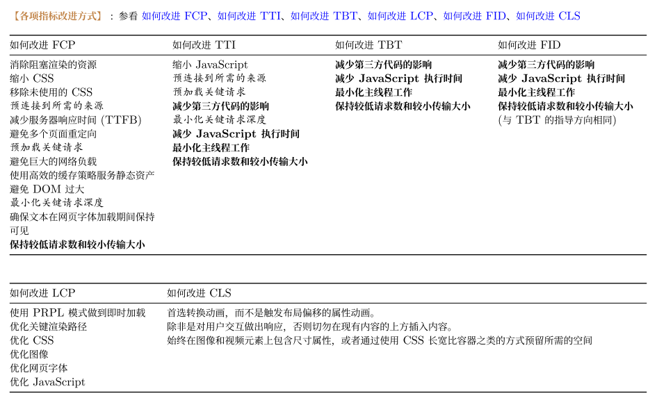
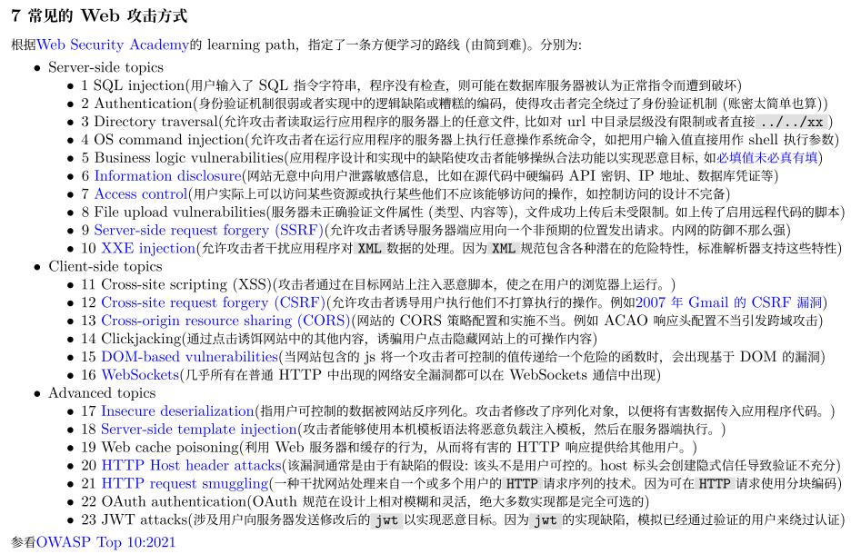
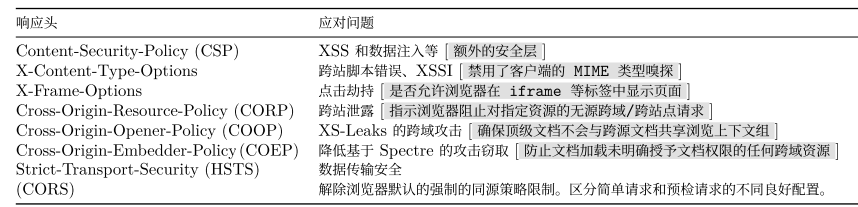

# 「8 千字经验总结」干了 7 年 web 开发工作，混吃等死的日子可能到头了

其实就是主要聊聊从事 web 开发工作 7 年以来的一些经验，顺便叨叨闲聊，感慨一下迷茫的人生、憧憬一下缥缈的未来。

此外一些涉及技术点的内容，已经直接添加超链接，可以去了解一下具体内容，原文写得足够好，我再直接 C/V 过来，毫无敬意。

都是个人主观感受，可能不具备普遍性。有任何批评、建议、交流，请不吝指导，谢谢。

---

内容较多，可自行跳转感兴趣的段落：

<!-- START doctoc generated TOC please keep comment here to allow auto update -->
<!-- DON'T EDIT THIS SECTION, INSTEAD RE-RUN doctoc TO UPDATE -->
<!-- **Table of Contents**  *generated with [DocToc](https://github.com/thlorenz/doctoc)* -->

- [引子：一个 7 年从业者的迷茫](#%E5%BC%95%E5%AD%90%E4%B8%80%E4%B8%AA-7-%E5%B9%B4%E4%BB%8E%E4%B8%9A%E8%80%85%E7%9A%84%E8%BF%B7%E8%8C%AB)
- [追根溯源，不离其宗：什么是 Web？什么是 Web 开发？](#%E8%BF%BD%E6%A0%B9%E6%BA%AF%E6%BA%90%E4%B8%8D%E7%A6%BB%E5%85%B6%E5%AE%97%E4%BB%80%E4%B9%88%E6%98%AF-web%E4%BB%80%E4%B9%88%E6%98%AF-web-%E5%BC%80%E5%8F%91)
- [删繁就简，返璞归真：什么是 Web 前端开发？](#%E5%88%A0%E7%B9%81%E5%B0%B1%E7%AE%80%E8%BF%94%E7%92%9E%E5%BD%92%E7%9C%9F%E4%BB%80%E4%B9%88%E6%98%AF-web-%E5%89%8D%E7%AB%AF%E5%BC%80%E5%8F%91)
- [欲善其事，先利其器：什么是前端工程化？](#%E6%AC%B2%E5%96%84%E5%85%B6%E4%BA%8B%E5%85%88%E5%88%A9%E5%85%B6%E5%99%A8%E4%BB%80%E4%B9%88%E6%98%AF%E5%89%8D%E7%AB%AF%E5%B7%A5%E7%A8%8B%E5%8C%96)
- [皮之不存，毛将焉附：浏览器工作原理](#%E7%9A%AE%E4%B9%8B%E4%B8%8D%E5%AD%98%E6%AF%9B%E5%B0%86%E7%84%89%E9%99%84%E6%B5%8F%E8%A7%88%E5%99%A8%E5%B7%A5%E4%BD%9C%E5%8E%9F%E7%90%86)
- [格物致知，运用自如：Web 性能优化](#%E6%A0%BC%E7%89%A9%E8%87%B4%E7%9F%A5%E8%BF%90%E7%94%A8%E8%87%AA%E5%A6%82web-%E6%80%A7%E8%83%BD%E4%BC%98%E5%8C%96)
- [鉴往知来，熟能生巧：Web 安全](#%E9%89%B4%E5%BE%80%E7%9F%A5%E6%9D%A5%E7%86%9F%E8%83%BD%E7%94%9F%E5%B7%A7web-%E5%AE%89%E5%85%A8)
- [妙言至径，大道至简：Web 后台？我不会 Web 后台](#%E5%A6%99%E8%A8%80%E8%87%B3%E5%BE%84%E5%A4%A7%E9%81%93%E8%87%B3%E7%AE%80web-%E5%90%8E%E5%8F%B0%E6%88%91%E4%B8%8D%E4%BC%9A-web-%E5%90%8E%E5%8F%B0)
- [总结](#%E6%80%BB%E7%BB%93)

<!-- END doctoc generated TOC please keep comment here to allow auto update -->

# 引子：一个 7 年从业者的迷茫

作为一个有着 7 年 Web 开发的从业人员，自己从 JSP + Spring MVC，到 Angular + Nodejs，到 Angular + Spring Boot，到现在 Vue + Spring Boot，写来写去，偶尔也会很迷茫：**自己到底在做什么工作？**

写后端时，我在做什么呢？

相较于遥远记忆中学习 `web.xml` 文件配置，使用 JDBC driver 连接 MySQL，使用`<%= (new java.util.Date()).toLocaleString()%>`显示当前日期……结果表明，我使用 JAVA 技术生态工具，终究只是做 CURD 的工作，不管是 Spring MVC、Spring Boot 还是 Spring WebFlux，不管是直接使用数据库驱动编写 sql 语句还是使用 JPA、mybatis，不管是用 MySQL、MongoDB 还是 TiDB、Elasticsearch，依旧还是循规蹈矩地建立“要有 Config 层，Domain 层，Controller 层，Dao 层，Service 层……”的项目结构，前端显示要什么东西，我从数据库中查到什么东西返回给它们。

可能是已经到头了，毕竟过了这么多年，我始终只是在做这个，就算是用上 Express/Koa，或者 Django，这一块都没什么变化，只不过时代发展，使用的框架或者依赖变更罢了。就像到现在，还依旧使用着 JAVA 8，若不是因为一些 flutter 依赖需要 JAVA11，可能都不会去安装它。相较于同桌同事，能在闲暇时间参照 etcd 和“三驾马车”论文，使用 go 实现一个简单的 raft；或者使用 tikv 的 java-client 时从源代码发现 region split 时有严重逻辑 bug，不等官方更新可以自行修改打包继续使用；亦或者因为需要使用的 emqx 企业版才有的转发 MQTT 消息到 Kafka 集群内置桥接插件，就通过反编译等方式寻找参考，自行在社区版上添加了该桥接插件用于项目，即便之前从未接触过 erlang……我觉得他很厉害，或许也正因为如此，才自我安慰，写 JAVA，能做好手上的 Web 项目的后台也挺好了。

那么前端呢，这些年的前端又有什么进步呢？

诚然，为了换工作，还是不得不继续背着“Vue 如何实现响应式”、“解释一下 diff 算法”、“你知道哪些 CSS 页面布局技术”、甚至“ES6 有哪些新特性”……即便如此，我既觉得无话可说，又觉得理所当然。不管是之前写 JSP 页面，或者 pug、ejs，还是使用 Angular、Vue 等框架，其实最终也不过是把后台返回的数据显示在页面上而已，只不过有时候是先把数据渲染再返回整个页面，或者只是页面检测到返回的数据重新渲染了页面罢了。人们都说，看懂了框架的源码，甚至能手写出来，才算得上精通某个框架。这么一想，我似乎也从来没有写出过什么框架工具，只不过一直在使用别人的轮子而已。相较于同行们面对各种问题对答如流，精通这个框架，精通那个语言，左写这样儿的数据结构，右写那样儿的算法，我觉得他们很厉害，或许也正因为如此，才自我安慰，我使用别人的工具，能够做好手上 Web 项目的前台也挺好了。

其实这样看来，迷茫才是最应该得到的状态。这并不是什么 7 年之痒，只不过这 7 年来，始终不知道自己在做什么。什么前端开发，什么后端开发，什么全栈开发，什么架构功能设计一肩挑，什么开发测试运维一条龙，看起来我一直在做这些事，只是单纯被要求做这些事而已。在这段都在人口相传的“大环境差”的时间，终于开始自我反思，这些年我到底在做什么。

# 追根溯源，不离其宗：什么是 Web？什么是 Web 开发？

第一件事情，是要搞明白我这些年在干什么。我在从事 Web 开发？那什么是 Web？

这种东西网上一搜[Web 的定义](https://www.w3.org/TR/webarch/)到处都是，不仅可以告诉你 World Wide Web (WWW)，又称为 the Web，是“一个透过互联网访问的、由许多互相链接的超文本组成的信息系统。”还会告诉你[和 Internet 的区别](https://www.w3.org/Help/#webinternet)，甚至还跟你说首字母大小写区分的[Internet 和 internet 的区别](<(https://en.wikipedia.org/wiki/Internet#Terminology)>)。更有甚者直接用范围说明 internet(互联网) 包含 Internet(因特网)，Internet 包含 the Web(万维网)。

我们直接看万维网的发明者 Tim Berners-Lee 创建的[第一个 Web](https://www.w3.org/People/Berners-Lee/1991/08/art-6484.txt)包含的东西: **HTTP，HTML，名为 WorldWideWeb 的第一个 Web 浏览器，一个 HTTP 服务器和一些用于查看的网页**。突然感觉有一丝悲凉，因为我现在在做的 Web 开发工作，依旧还是这些东西。

我们可能知道，Web 的发展已经到了 3.0 时代，从历史的发展来看，有人总结：

- [Web 1.0](https://zh.wikipedia.org/wiki/Web_1.0)，指由网络服务内容提供商提供内容的网站。
- [Web 2.0](https://zh.wikipedia.org/wiki/Web_2.0)，指以最终用户为目标，强调用户生成内容、易用性、参与文化和互操作性（如：与其它产品、系统和设备兼容）的网站。
- [语义网，也有叫 Web 3.0](https://zh.wikipedia.org/wiki/%E8%AF%AD%E4%B9%89%E7%BD%91)，通过给万维网上的文档（如: HTML 文档）添加能够被计算机所理解的语义（元数据），从而使整个互联网成为一个通用的信息交换介质。

其实简单说来也就是从单方面的给予，到双方面的付出，到资源交换共享。变化的只是功能，架构依旧如从前。虽然现在还有一个*融合了去中心化、区块链技术和基于代币的经济学等概念炒起来的 [Web3](https://en.wikipedia.org/wiki/Web3)* 的概念，但是一般会认为这和 Tim Berners-Lee 发明的万维网的 Web3.0 阶段或者说语义网是两个不同的东西。

所以到目前这个阶段，我负责的 Web 项目，其实就这样简单 3 个东西：**提供资源的后端、显示资源的前端、传输数据的网络协议**。

所以基于此，什么是 Web 开发呢？我做了这些年，就只是完成“把后端的资源通过某种网络协议传递个前端显示”而已吗？是的，只是这样，我所做的主要工作就是这些。回想一下发明者第一个 Web 项目有哪些东西：HTTP、HTML 这些都有了标准和制定标准的联盟；现代 Web 浏览器很多，且基本都支持了那些标准的大部分内容；剩下的，不就是日常做的网页和网页上的数据资源了吗，也就是所谓的前端和后端。

所以，绕了一大圈，写了这么多年，迷茫了这么久，其实自己或许也知道但是却不愿意承认，**我做的所谓的 Web 开发的工作，就是简单的产生数据和显示数据而已**。这和别人的[Web developer](https://en.wikipedia.org/wiki/Web_developer)，是一样的吗？

大概是一样的。产生数据谓之后端开发，显示数据谓之前端开发，都做就是全栈开发了。

所以，不要像我一样胡乱怀疑，觉得很迷茫，很苦恼，不知道自己在做什么，实际上，这一天天一年年重复在做的事情，都是目标明确的事情。就像钓鱼，不要因为今天空军，就觉得自己不是在钓鱼，是在喂蚊子；也不要因为昨天爆护，就认为自己是钓神，为了心理平衡而每晚都可能徘徊在菜市场鱼档前。

因为钓鱼，也不是一件简单的事情。

# 删繁就简，返璞归真：什么是 Web 前端开发？

我的职业生涯早期，其实也并不明白 Web 的前端开发是个怎样的分类。不管是 JSP、ejs 或者直接的 html，
那时候的吃力点，还在怎么使用 jquery、ajax、模板语法之类的，把后台接口的数据，显示在页面上。这都是写 JAVA 或者 Nodejs 后台时顺手的事情，都不知道前后端分离、前端工程化、大前端之类的概念。

我第一次有整体的前端框架概念是在 2017 年左右公司 MIS 的台湾籍顾问提及的 MEAN 架构，部门历史原因他们不使用 JAVA 而是使用 C#，为了共同学习进步，选择了那些年国外比较成熟的 MEAN 架构。虽然现在国内基本没有太多 Angular 的生长环境，但我依旧觉得它有很多优点，在学习 Vue 的时候，基本都在努力一一对应，当然，也可能是对 typescript 、 rxjs 、依赖注入等使用的不能忘怀。

其实那个时候也很单纯，因为 [Angular](https://angular.cn/docs) 和 Vue 不一样，不算一个单纯的框架，也是一个开发平台，我印象中用到可能说是生态的就是 UI 组件了，其实也是顾问指示的，一开始使用 CORE UI 已经做好的管理平台模板加快开发进度，后来才使用的 Angular Material 组件。那时候甚至编译工具都不推荐用户自定义，彼时使用 Angular6，想使用新出的 Webpack4 看看编译效果也是大费周折。

就像现在使用 Vue，也是因为上手快，国内流行度高，社区活跃。但不管哪种，例如 [Vue 的预备知识](https://cn.vuejs.org/guide/introduction.html#what-is-vue)：“文档接下来的内容会假设你对 HTML、CSS 和 JavaScript 已经基本熟悉”。或者[Angular 的假设前提](https://angular.cn/start)：“These docs assume that you are already familiar with HTML, CSS, JavaScript……”

**所以，我始终觉得 Web 前端开发的核心技术栈，目前来讲就依旧还是只有 HTML, CSS, JavaScript**。可以反驳，但我依旧可以狡辩你提出的所有技术都是他们的衍生技术。其实相对的，应该反思一下，正如前面两个框架的前提：我对 HTML, CSS, JavaScript 真的熟悉吗？

不怕笑话的讲，我是完全不熟悉。大学阶段没有一节课和它们直接相关，都是在实习和工作中自己摸索学习，根本没有系统仔细地学习过，基本属于指哪儿打哪儿，需要什么，去找资料，借鉴他人，次数多了，时间久了，发现大家都这样，也就觉得没什么问题。

什么，《Head First HTML 与 CSS》早已翻烂，《CSS 权威指南》倒背如流，《JavaScript 权威指南》倒背如流？好的，预备知识可能准备好了。现在可以上网随便找一个[Frontend Developer](https://roadmap.sh/frontend)看看，或者[大前端趋势](https://www.infoq.cn/article/prfjpajwiffde6cvdij6)，看看现在的企业岗位需求，需要些什么。

虽然我是非常害怕，就像钓鱼，我有渔具，找了条允许钓鱼的河，我还亲自去，三大要素均已经满足，但谁又能保证一定能钓上鱼呢？

# 欲善其事，先利其器：什么是前端工程化？

不是随便找条河甩根杆就能钓到鱼的，但你没有鱼竿而且是对着太阳挥着手，理论上来讲，是肯定钓不到鱼的。就像这个“前端工程化”名词，说不定就有人会觉得：随便写几个 html 页面，有什么资格提工程化？“文人相轻”，曾几何时，在 Web 开发中，前端都是被认为是没有技术含量的那一方，或许现在依旧是，但前端的发展也的确越来越快，越来越杂。我可以 9 年如一日使用 JAVA8 编写 CURD 的后台接口代码，但现在谁会对你还在写 JSP 感叹一句“勇气可嘉？”

我可以强行把前端工程化“曲解”为：为 HTML, CSS, JavaScript 构建的网页提供服务而已，但不得不说，这也已经不是一个 jquery 走遍天下的时代了。

知乎上有些交流[什么是前端工程化？](https://www.zhihu.com/question/433854153)、[谁能介绍下 web 前端工程化？](https://www.zhihu.com/question/24558375) 但我认为重点其实是在“工程化”上面，“前端工程化”只是把工程化操作应用到前端而已。很遗憾我都没找到专门的词条，不管是“工程化”还是“前端工程化”，甚至“后端工程化”，但这个时候有没有想起曾经上过一门课，叫做“软件工程”。这个词条不仅仅醒目，而且简洁明确，其中对于“[软件工程](https://zh.wikipedia.org/wiki/%E8%BD%AF%E4%BB%B6%E5%B7%A5%E7%A8%8B)”有这样一个定义："将系统化的、规范的、可度量的方法用于软件的开发、运行和维护的过程，即将工程化应用于软件开发中"。那么是不是类别就得出 **“前端工程化”是“将系统化的、规范的、可度量的方法用于前端的开发、运行和维护的过程”**。

其实定义怎样都无所谓，网上一查也到处都是资料，在我看来，这“前端工程化”，可不就是“一切能提升前端开发效率、提高前端应用质量的方法和工具”。那这一套流程：开发阶段、测试阶段、构建阶段、部署阶段、监控阶段等，每一个阶段都系统化、规范化、可度量，不就是切实践行前端工程化作业流程了吗？

在这里，每个阶段需要做什么事情，有哪些工具可以做，甚至是不是只有这几个阶段，我觉得不必吹毛求疵，这根据不同的企业，甚至不同的专案都可以动态调整的。而前面一大堆话，可不就主要在说“开发”相关的事情吗，那 HTML, CSS, JavaScript，不也是功能实现的重点工具吗？

诚然，也大概率是能力不足。想以前使用 Angular 开发时，我也默认官方的构建一定比我这门外汉调得优，只要我好好把功能实现了，问题就不大了。Vue2.x 为主的项目开发时，集中编写了一份 webpack4 的通用配置；使用 Vue3.x 之后，更换为 vite，也是基本一个通用配置，基本配好之后就很少修改。大部分的时候，都花费在满足业务需求的功能实现上面。现在让我说怎么配怎么配，我哪里还知道怎么配。

**这或许才是工程化的重点：规范化**。项目结构怎么定，组件开发原则怎么定，性能优化考量哪些要素，API 接口怎么定，git commit message 怎么定……只要达成了一个共识，做起事来不就事半功倍了吗。也算是经历过同事离职接手修改项目的惨痛经历，那是真的改到哭，乱七八糟，随心所欲，毫无头绪，一想到这还是一个持续了两年的前端项目，写着写着就鼻酸了。当然，后来架构升级之后我用了一段时间全部重写，但不是所有的公司或者所有的项目都允许你这样做，而且也不一定有这样的时间精力和能力。

如果已经有良好运作的规范标准，或者说 SOP，不要轻易嫌弃它或者贬低它，觉得已经过时或者落伍或者没有技术含量，慢慢沉淀一下，或许能发现它的优点，更重要的，它也可以进步。如果一直都没有这样的 SOP，我觉得还是应该逐渐确定一个，可以按照公司环境自行确定，也可以根据别的知名企业参考学习，这些东西，网上有很多很多。

# 皮之不存，毛将焉附：浏览器工作原理

其实到这里，我只是认为 Web 前端开发的核心只是在编写 HTML、CSS、JavaScript 代码，都还没有提到 Web 前端开发的另一个重点：这些代码在哪里运行？

“浏览器！”

如果还记得一开始提到的 Tim Berners-Lee 的创建的第一个 Web 项目，就是在浏览器中查看的它编写的网页。如果可以的话，我希望真的能够这样脱口而出地回答，浏览器、浏览器、还是浏览器。

承认，浏览器依旧是展示 Web 网页的主要工具，或者这也是英文维基百科中没有找到 B/S 架构词条的原因吧。浏览器只不过是 Web 应用的客户端应用之一而已。有可能在我个人经历中，以前都只是在 _单纯编写在浏览器中显示网页代码_ 而已，现在的各种头部 app 的小程序、Electron 打包的桌面应用、使用 flutter 开发的 app，有没有可能也可以支持显示 Web 网页呢？我可以解释说他们可能内嵌了一个浏览器或者类似浏览器功能的插件，也算浏览器，可从表现形式来说，它们可能不叫浏览器了。

遗憾的时，我的工作经验中，这些属于少数，我依旧处于 Web2.0 时代以浏览器为主要客户端程序的 Web 项目开发。我要理解的，也是基础的[万维网是如何工作的](https://developer.mozilla.org/en-US/docs/Learn/Getting_started_with_the_web/How_the_Web_works)。

你或多或少看过或者听过这样一个经典的前端面试题:“**从输入 URL 到页面展示到底发生了什么？**”我觉得如果懂得了这个问题的方方面面，那么前端开发的非业务功能实现的很多问题，都可以找到部分解决思路。这是一个 github 上参考的回答：[alex/what-happens-when](https://github.com/alex/what-happens-when)。

我的能力是有限的，我也无法详细描述到这个问题的方方面面，但可以以浅薄的经验，_在大概过程阶段标注几个关键字_(虽然就跟小时候长辈劝学“好好读书，争取考上清华北大”一样没意义，我也说不清“能考上清华北大”的“好好读书”的具体措施)。

- 导航解析： 性能优化、安全
- DNS 查询： DNS 优化、OSI 模型、安全
- 发送 HTTP 请求、TLS 协商：TCP/IP 协议族、http2/http3/http 缓存等 HTTP 技术、性能优化、安全
- 服务器响应： TCP 慢启动/ 拥塞控制、编译配置、性能优化
- **浏览器解析渲染页面**： 浏览器工作原理、性能优化、安全等(基本所有需要 Web 应用考虑的点)
- ……

可能服务器响应了数据，浏览器解析渲染后，还需要断开 HTTP 连接。我也不清楚，万一为了节约连接/关闭资源使用了 http 的长连接特性之类的，当前页面加载没有关闭 HTTP 连接，那岂不是不严谨了。

好吧，都是笑话，可能也是因为能力有限，经验不足，我能想到的 Web 前端项目需要重点解决的问题，就只是：**实现业务功能、 Web 性能优化、 Web 安全**，诸如兼容性、无障碍、隐私保护等等很多很多，可能表达一个“有就是好，无也不孬”的想法吧，还是看需求。

关于浏览器的工作原理，可能也没必要从 V8 引擎的实现开始，这一篇 2011 年 `web.dev` 网站的 [How browsers work](https://web.dev/howbrowserswork/) 博文，和这 4 篇 2018 年 `developer.chrome.com` 的 [Inside look at modern web browser](https://developer.chrome.com/blog/inside-browser-part1/) 的博文，可以做一个引子。如果只想看中文的话，也有很多，不深入的话可以看 MDN 网站的[渲染页面：浏览器的工作原理](https://developer.mozilla.org/zh-CN/docs/Web/Performance/How_browsers_work)。

我们使用例如 nginx 的 Web 服务器部署的类型打包后 Vue 项目，不也就是靠着浏览器自身功能渲染出预期的网页画面吗？了解浏览器是如何解析渲染这些文件的，其实可能也就是了解 HTML、CSS、JavaScript 在浏览器中如何运行的。可能，**浏览器工作原理**，不得不去了解一下，例如:

- 浏览器的宏观组成
- 浏览器中的 JavaScript 执行机制
- V8 工作原理
- 浏览器中的页面事件循环系统
- 浏览器中的页面
- 浏览器中的网络
- 浏览器安全
- ……

# 格物致知，运用自如：Web 性能优化

曾几何时，做项目始终把业务功能实现放在首位，却突然发现好像总是基于各种原因——例如人手不足、内部项目用户特定等等——这个原本只是“首位”的东西，几乎变成了唯一关注点。以至于到后来了解要 Web 性能优化时，才想着“哇，这太难了，没这个能力”。

就像“_Web 前端性能优化_”这个主题，都只能去网上搜，然后略有所思地开始背： _缓存策略、缓存复用、CDN 内容分发网络、按需加载、同步异步加载、请求合并、首屏渲染速度、http2 服务器推送、日志性能监控、预加载、性能测试……_ 还有类似著名的 [Best Practices for Speeding Up Your Web Site](https://developer.yahoo.com/performance/rules.html)(有人翻译为“雅虎 35 条军规”)，看过吗？看过。以前有没有逐一落实？没有。

可能或多或少有满足其中一些，但是挨着一条一条去做，对于我这种基本一个人或者两个人包圆整个项目的设计、开发、维护等所有工作，总是不自觉地说“能跑起来就不错了！”的确不是一个负责的人。

不过在后面的项目实践中逐渐发现，其实这本来就挺简单的一个事儿，只要理清楚根儿就好了。正如 MDN 网上[Web 性能](https://developer.mozilla.org/zh-CN/docs/Web/Performance)：**Web 性能是客观的衡量标准，是用户对加载时间和运行时的直观体验。Web 性能指页面加载到可交互和可响应所消耗的时间，以及页面在交互时的流畅度**。这个时候是不是突然想起好像总有人跟自己说什么 FCP、TTI 之类的名词。

这其实我也看过，`web.dev` 网站的 [以用户为中心的性能指标](https://web.dev/user-centric-performance-metrics/) 以及相关文章。比较有名的[核心 Web 指标](https://web.dev/vitals/#%E6%A0%B8%E5%BF%83-web-%E6%8C%87%E6%A0%87):

- Largest Contentful Paint (LCP) ：最大内容绘制，测量加载性能。为了提供良好的用户体验，LCP 应在页面首次开始加载后的 2.5 秒内发生。
- First Input Delay (FID) ：首次输入延迟，测量交互性。为了提供良好的用户体验，页面的 FID 应为 100 毫秒或更短。
- Cumulative Layout Shift (CLS) ：累积布局偏移，测量视觉稳定性。为了提供良好的用户体验，页面的 CLS 应保持在 0.1. 或更少。

一开始觉得就像在给 chrome 的 Lighthouse 打广告一样，但是在其[Core Web Vitals-
健康网站的关键指标](https://web.dev/learn-core-web-vitals/)、[指标-衡量性能和用户体验](https://web.dev/metrics/)、[快速加载-提升网站性能的技术](https://web.dev/fast/)板块中的确学到了很多知识。

我知道，可能推荐看太多资料，不利于追求速度的大环境，但是如果我截个图，是不是发现似乎也在其他地方看过类似空洞的话：

当然这只是整理个关键字，找到对应文章可以方便查看更多实操，就像“要想成绩好，需要好好读书”，这里就在讲如何好好读书。或许它们也不完全，但或多或少也是一个引子。

现在再定睛一看，**这些指标、这些改进方法，是不是的确就只是再做两件事情：(优化)资源加载、(改善)交互体验。这些所谓的性能优化措施，不就是改善浏览器解析渲染页面过程吗？浏览器为什么要这样解析渲染，不就是去理清了浏览器工作原理吗？**

资源加载跟项目编译构建等有关，当然也和写代码的水平挂钩。交互体验跟性能无关？应该不会有人如此发问吧，当然这都是我一面之词，个人理解与事实无关的话，也只能表明我水平太差，不影响这些索引的文章对我有益，也可能对部分其他人有帮助。

# 鉴往知来，熟能生巧：Web 安全

也看到过一个有趣的表述：_Web 前端开发做的任何安全防范措施都毫无意义_。虽然有时候嗤之以鼻，但偶尔又觉得言之有理。不过还好，这并不影响实现“网站必须登录才能复制”的功能。

回想一下，提到 Web 安全关键字，看到最多的是什么呢？XSS、CSRF、点击劫持，还是 CSP、Token、X-FRAME-OPTIONS？我这儿有个不恰当的比喻：

Web 前端显示的东西，理论上来讲就是特意显示给用户看的，就像你河钓了一条 20 斤的大鲤鱼，然后突然就不会骑电瓶车了，非要走路；用户输入的东西，也是特意正常给网站提供的反馈，就像围观群众对你一阵阵的欢呼和赞叹。虽然你可能只是单纯想和别人分享快乐，或者有一丝丝想要炫耀，但有人却想着抢了你的鱼、折了你的竿、砸了你的车、还要胖揍你一顿。为了防止这种小概率事件，你要怎么办？钓到鱼了，赶紧躲着人少偷偷绕小道跑回家？努力健身，习得上乘截拳道？妈的不钓鱼了，免得万一被打？这些是决策者做的事情，所谓道高一尺魔高一丈，就算你是八块腹肌的截拳道高手，万一人家只是一个普普通通坐着轮椅、别着左轮的西部牛仔而已呢。

美团的两篇 [前端安全系列（一）：如何防止 XSS 攻击？](https://tech.meituan.com/2018/09/27/fe-security.html) 和 [前端安全系列（二）：如何防止 CSRF 攻击？](https://tech.meituan.com/2018/10/11/fe-security-csrf.html)具体而详细地讲解了这两种常见的前端攻击和防范措施。更多的，`web.dev` 网站的 [安全且可靠-确保您的网站和用户数据安全](https://web.dev/secure/) 板块也有经验说明。当然，如果时间充足，我也建议去 portswigger 的 [web-security](https://portswigger.net/web-security/learning-path) 学习见识一下常见的服务端、客户端和更高级的 Web 安全议题。

我猜大家也很忙，但是如果我截个图之前整理的常见 Web 攻击词条，有没有可能以后就不会只重点关注 xss 和 csrf 了：

个人愚见，xss 和 csrf 最常见是有它的理由的，可以看看 [OWASP Top 10](https://owasp.org/Top10/zh_CN/A01_2021-Broken_Access_Control/) 的统计作为参考。此外上面 Web 前端的很多攻击，在 http 的 header 中有不少可以提供帮助的。例如这是我之前方便记忆的一个示例：

这样一看，会不会觉得其实 Web 前端安全简单上手处理的话，也不是特别困难。其实随着现代浏览器的发展进步，很多不安全的行为，它们也在努力了。当然，你说还非要兼容 IE6 的话，我建议是求佛。

这部分还有一个比较常见的话题，叫做[浏览器的同源策略](https://developer.mozilla.org/zh-CN/docs/Web/Security/Same-origin_policy)。[CORS](https://developer.mozilla.org/zh-CN/docs/Web/HTTP/CORS) 话题一直都算比较活跃了，我至今仍然记得有人问过我一个问题：**“什么是跨域请求？POST 请求会不会产生跨域？”** 天真的我告诉他：**协议、域名、端口全部相同的两个 URL 就是同源**，任一不同就算跨源了，和使用什么 HTTP 方法没什么关系吧？

当然，后来才知道他是在讲[简单请求](https://developer.mozilla.org/zh-CN/docs/Web/HTTP/CORS#%E7%AE%80%E5%8D%95%E8%AF%B7%E6%B1%82)，就是不会触发[CORS 预先检查](https://developer.mozilla.org/en-US/docs/Glossary/Preflight_request)的内容(简单插一句，当时我似乎也专门写一个简单请求的纯 html 示例文件，在 chrome 和 ie8 中得到的效果是不一致的，似乎只有后者没有预先检查而已。我不确定，有兴趣可以试试)。

所以，现在再回过来看，自己是不是已经对 HTTP 的 header 知识滚瓜烂熟了呢，好像 Web 的性能、安全跟它都关系密切呢。

# 妙言至径，大道至简：Web 后台？我不会 Web 后台

就像在“引子”一节所说的，我对自己的迷茫，其实偶尔会转成失望。

后台技术栈虽说和大家一样，都用的 nacos、spring 全家桶、flink、tidb、elasticsearch、redis、prometheus、minio、kafka、gitlab、Jenkins、grafana、fluentd、jaeger、k8s、containerd 等等这些基础的东西，可谁又是面面俱到呢？就像我买了空气炸锅、烤箱、高压锅、电磁炉、电饼铛……用起来好像都不难，但我一般只吃蛋炒饭而已。

就像写这么多年 JAVA，现在用得上的，居然依旧只是创建几个文件夹：config、domain、controller、service、dao、mapper……你别说，也图新鲜，响应式编程，有两个小项目用了 Spring WebFlux，结果不也就还是这样用的结构嘛。

有人说:"**后端技术不应该追求最新，而是应当保持稳定**"。就像一个伙伴去个十几万员工的大厂，某次聊天他吐糟公司技术栈太久了，别说 spring boot，连 spring MVC 都没用。所有业务功能的实现，都按照给定的模块去写，效果很差。但是他自己也说，这么大个系统，虽然他这里写的功能简单，没必要用上高级的东西；但其他地方或者历史遗留原因，不允许呢；也说不定大家都是既定的写代码规范，就算人员异动，接手的人也不会没有头绪吧。

我记得我几年前同事要写一个封装第三方 SDK 的工具库，觉得还用 JAVA 太没劲了，然后自己就用上了 go 去写。后来那个项目没有人能够接手维护。就连我自己写的两个 Spring WebFlux 的项目，现在也只能我去异动，因为有人可能还分不清什么命令式编程、声明式编程、函数式编程，或者响应式编程。就像我， _搞不清什么是响应式编程，就当做“数据流、函数式编程、异步观察”的简洁关键字_ 好了，但大家都知道，异步代码出错了，追踪起来或多或少比命令式要麻烦些。

我还记得，我第一次了解 BFF(Backend for Frontend) 概念的时候，就觉得好像这个功能我们的系统架构里可以加上去，便跟老大交流了一下，他看了下说，他不会 GraphQL，先不弄了吧；后来有次他说想升级一下数据库架构，整个能够轻松容纳百万 \* 亿的量级数据，我也不知道是看了什么，就说要不要试试图数据库，他问我什么是图数据库，然后说算了等有那个量的时候再说吧。当然，后来这些都没有去做，是因为不值得、还是没必要，我不懂，但现在我也只是告诉同事，有新的技术都先看看吧，虽然现在用不到，可以后谁知道呢。

就像去年之前，我还无法预知，我能做的工作，这么快就能被 AI 轻松取代了。

# 总结

我也没想到洋洋洒洒写了这么多字，或许只是想讲述这 7 年来 Web 项目开发工作的经验总结：

- 大多数新事物的产生都能够追根溯源，把握住了主干结构才更方便了解全局。
  - Web 项目，的确就是简简单单分为前端和后端，没什么复杂的。
- 花花世界迷人眼，但万丈高楼平地起，夯实基础勿忘记。
  - Web 前端框架千千万，基本都是建立在 HTML、CSS、JavaScript 之上的，这些基础暂时不会过时。
- 工具本身并不能解决问题，合理使用工具才能提高效率。
  - 前端工程化，不在于使用的工具多么高级，而在工具链在有效规范的使用下能够提高前端项目的开发、运行和维护。
- 不是所有东西都能完全解耦，相生相伴就是最佳选择。
  - 理清浏览器工作原理、搞清浏览器解析渲染页面过程在 Web 前端开发中非常重要。
- 先要找准需要解决的问题，然后再考虑应该采取什么措施。
  - Web 性能优化就只是针对页面加载到可交互和可响应所消耗的时间，以及页面在交互时的流畅度，现在它们都有各种可度量或实验室的指标。
- 防范于未然不是要面面俱到，大众认可的东西一定有它的道理。
  - Web 安全不分前端和后台，常见的 Web 攻击已有共识的防范经验，浏览器、网络应用层协议、框架工具等各方也都在努力改进。
- 在快速变化的世界中保持稳定也是难能可贵，时间会淘汰那些不适合的东西。
  - 建立一个稳定的开发规范和稳健的后台，在 Web 项目开发中也极其重要。

也可能只是惋惜。从发展来看，公司安排我后续可以要负责 ERP 导入的相关工作了；从能力来看，没有见过大世面也没有特别厉害的项目经验；从现实来看，工作这么多年也没攒几个钱还不想背房贷；从心态来看，单身一个人无忧无虑现在只想回家耕作那一亩三分地享受人生。

也许以后不做 Web 开发了，也许换个公司继续，也可能回老家去找个保安岗位，但那是之后的事了。

之前还想着找工作时，在 github 上也整理一些工作学习中的知识积累：[Sanotsu/web-beginner](https://github.com/Sanotsu/web-beginner)，有兴趣也可以看看。

不过这些都是我个人的经验教训，所总结的东西也未必是对，兼听则明偏信则暗，也希望与君共勉，谢谢。
