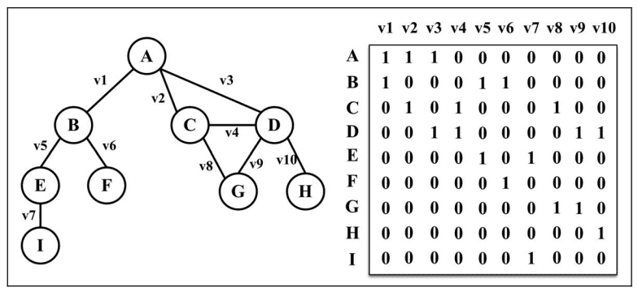
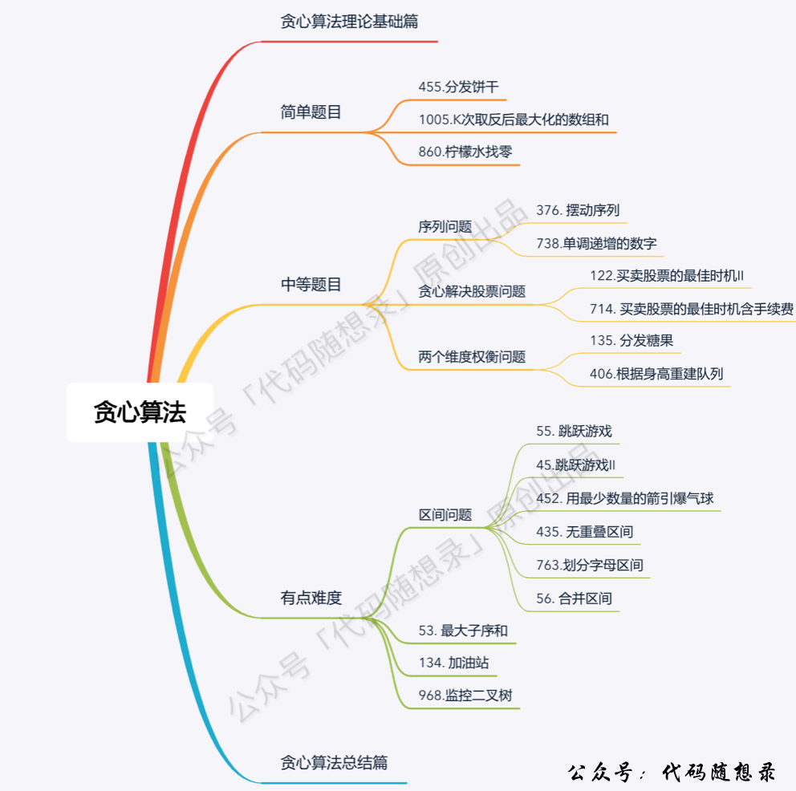
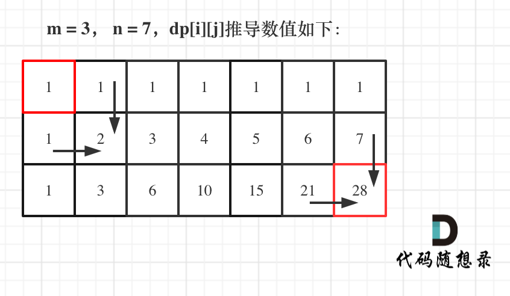
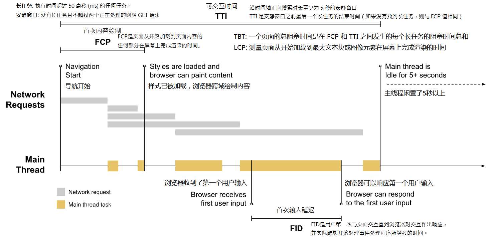

---
# 使用puppeteer导出pdf时用到
puppeteer:
  landscape: false
  format: "A4"
  printBackground: true

# pandoc生成标题信息时用到
title: "web前端基础知识汇整"
author: David Su | callmedavidsu@gmail.com
date: \today
keywords: [JavaScript, vue, nodejs, rxjs, TypeScript, dart, DSA, DP, HTML, CSS, HTTP, webpack, DB, Architecture]
abstract: |
  This is a front-end knowledge manual containing JavaScript, vue, nodejs, rxjs, TypeScript, dart, DSA, DP, HTML, CSS, HTTP, webpack, DB, Microservice Architecture, etc. 

  It helps to improve the overall idea of the big front-end and consolidate the basic knowledge skills. For interviews or self-improvement are helpful.

  这是一本前端知识手册，包含JavaScript、vue、nodejs、rxjs、TypeScript、dart、DSA、DP、HTML、CSS、HTTP、webpack、DB、微服务架构等。

  有助于提高大前端的整体思路，巩固基础知识技能。对于面试或自我提升都有帮助

# 正文字体，默认最大是12pt，要更大需要其他包(常见字号: 四号14pt 小四12pt 五号10.5pt 小五9pt)
fontsize: 12pt
# 配合form.tex的hyperref设置链接颜色
boxlinks: true
# 设置双面模式，以便.tex文件中能区分左右页眉页脚
classoption: twoside,symmetric
# 添加此可以让pandoc生成的toc新起一页，而不是接续在首页。目录页面从1开始编号
include-before:
- '`\newpage{}`{=latex}'
- \setcounter{page}{1}

# 样式调整好后，一定不要shift+alt+f去自动格式化，会让很多设置失效
#   例如 *斜体* 变为 _斜体_，pandoc不能识别。表格分割线----- 长度变化，但是各个栏位占比不对
---

\newpage

\setcounter{page}{1}

# 第一章 JavaScript 基础

## 1.1 语言基础

### 1.1.1 什么是 JavaScript？

完整的 JavaScript 包括:

- ECMAScript（核心）：由 ECMA-262 定义并提供核心功能。
  - ECMA-262 定义的这门语言的基本内容:语法、类型、语句、关键字、保留字、操作符、全局对象
- 文档对象模型（DOM）：提供与网页内容交互的方法和接口。
  - 对于浏览器来说，DOM 就是使用 ECMAScript 实现的，如今已经成为 JavaScript 语言的一大组成部分。
- 浏览器对象模型（BOM）：提供与浏览器交互的方法和接口。

### 1.1.2 语法

1.  区分大小写
2.  标识符: 第一个字符必须是一个字母、下划线（`_`）或美元符号（`$`）
3.  注释: `//` 或 `/* */`
4.  严格模式: `"use strict";`
5.  语句: 分号结尾、推荐使用{}包括代码块

### 1.1.3 关键字与保留字

ECMA-262 第 6 版规定的所有关键字如下：

|          |          |            |        |
| -------- | -------- | ---------- | ------ |
| break    | do       | in         | typeof |
| case     | else     | instanceof | var    |
| catch    | export   | new        | void   |
| class    | extends  | return     | while  |
| const    | finally  | super      | with   |
| continue | for      | switch     | yield  |
| debugger | function | this       |        |
| default  | if       | throw      |        |
| delete   | import   | try        |        |

严格模式下保留:

|            |           |        |         |
| ---------- | --------- | ------ | ------- |
| implements | package   | public | let     |
| interface  | protected | static | private |

其他保留字:
`enum`、`await`

### 1.1.4 变量

变量声明关键字: var 、let 、const。

变量提升: **所谓的“提升”（hoist），也就是把所有变量声明都拉到函数作用域的顶部。** 
*函数声明和变量声明*总是会被解释器悄悄地被"提升"到方法体的最顶部。  
JavaScript 只会提升声明，不会提升其初始化。

**const 声明的变量不可修改，但 其限制只适用于它指向的变量的引用**。

### 1.1.5 数据类型

- 7 种简单数据类型（也称为原始类型）：Undefined、Null、Boolean、Number、String、Symbol、BigInt。
- 1 种复杂数据类型叫 Object（对象）。Object 是一种无序名值对的集合。

**ECMAScript 中不能定义自己的数据类型**，所有值都可以用上述 7 种数据类型之一来表示。

**数据类型特点说明**:

- 一般来说，永远不用显式地给某个变量设置 undefined 值。
- undefined 值是由 null 值派生而来的，因此 ECMA-262 将它们定义为表面上相等。
- 虽然布尔值只有两个，但所有其他 ECMAScript 类型的值都有相应布尔值的等价形式。

  | 数据类型  | 转换为 true 的值       | 转换为 false 的值 |
  | --------- | ---------------------- | ----------------- |
  | Boolean   | true                   | false             |
  | String    | 非空字符串             | "" （空字符串）   |
  | Number    | 非零数值（包括无穷值） | 0 、 NaN          |
  | Object    | 任意对象               | null              |
  | Undefined | N/A （不存在）         | undefined         |

- Number 类型使用 IEEE 754 格式表示整数和浮点值（在某些语言中也叫双精度值）。
  - **浮点值的精确度最高可达 17 位小数，但在算术计算中远不如整数精确。**
  - `0.1 + 0.2 != 0.3` -> `== 0.30000000000000004`,所有使用 IEEE 754 格式的语言都有这个问题。
- ECMAScript 可以表示的最小/大数值保存在 `Number.MIN_VALUE/Number.MAX_VALUE` 中。
  - 超过这个范围会被自动转换为一个特殊的 `-Infinity`（负无穷大）/`Infinity`（无穷）值。
- **NaN 不等于包括 NaN 在内的任何值。**
- 有 3 个函数可以将非数值转换为数值： `Number()` 、 `parseInt()` 和 `parseFloat()`。
- ECMAScript 中的字符串是不可变的（immutable），意思是一旦创建，它们的值就不能变了。
  - 要修改某个变量中的字符串值，必须先销毁原始的字符串，然后将包含新值的另一个字符串保存到该变量。
- null 和 undefined 值没有 toString() 方法。
  - 对此，可以使用`String()`方法，或者在后面加`""`。
- 模板字面量(``)保留换行字符，可以跨行定义字符串(键盘 Tab 键上面)。
  - 通过 `${}`在模班字面量中插值
- **Symbol 的用途是确保对象属性使用唯一标识符**，不会发生属性冲突的危险。每个从 `Symbol()` 返回的 symbol 值都是唯一的。
- Object 的获取属性方法:
  - `Object.getOwnPropertyNames()` 返回对象实例的**常规属性数组**，
  - `Object.getOwnPropertySymbols()` 返回对象实例的**symbol 属性数组**。
    - 上面两个方法的返回值**彼此互斥**。
  - `Object.getOwnPropertyDescriptors()` 会返回**同时包含常规和 Symbol 属性描述符**的对象。
  - `Reflect.ownKeys()` 会返回**两种类型的键**。

### 1.1.6 操作符（运算符）

1. **一元操作符**

- 递增/递减操作符:`--num`/`++num`、`num--`/`num++`。
  - 递增/递减操作符操作符可以作用于**任何值**，会进行数值转换后生效。
- 一元加和减
  - `+` 放在变量前头，对数值没有任何影响; `-` 放在变量前头，主要用于把数值变成负值。
  - 一元加应用到非数值，则会执行与使用 Number() 转型函数一样的类型转换。
- 其他一元操作符:`delete`,`void`,`typeof`,`~`,`!`

2. **算术运算符**

- 以**二个数值**（字面量或变量）作为操作数，并返回单个数值。
- `+` ,`-` ,`*` ,`/` ,`%`
  - *如果有不是数值的操作数，则先在后台用 Number() 将其转换为数值。*

3. **关系运算符**

- 比较**二个操作数**并返回基于比较结果的 Boolean 值
- `in`,`instanceof`,`<`,`>`,`<=`,`>=`
  - 应用到不同数据类型时也会发生类型转换和其他行为

4. **相等运算符**

- 如果相等，操作符返回的是布尔类型的 true，否则是 false。
- `==`,`!=`,`===`,`!==`
  - 前两个都会先进行类型转换（通常称为强制类型转换）再确定操作数是否相等。
  - 后两个在比较相等时不转换操作数(严格相等)

5. **位移运算符**

- 在二进制的基础上对数字进行移动操作
- `<<`,`>>`,`>>>`

6. **二进制位运算符**

- 二进制运算符将它们的操作数作为 32 个二进制位（0 或 1）的集合，并返回标准的 JavaScript 数值。
- `&`,`|`,`^`(异或：当两两数值相同为否，而数值不同时为真。)

7. **二元逻辑运算符**

- 逻辑运算符典型的用法是用于布尔(逻辑)值运算, 它们返回布尔值。
- `&&`,`||`,`??`(**空值合并运算符，如果 ?? 前面是 null 或 undefined，取后面的默认值**)
- 逻辑操作符可用于任何类型的操作数，不限于布尔值。*如果有操作数不是布尔值，则逻辑并不一定会返回布尔值。*

8. **求幂运算符**

- `A**B`，返回将第一个操作数加到第二个操作数的幂的结果。
- 它等效于 `Math.pow`: `Math.pow(2, 3) === (2 ** 3)`，不同之处在于它也接受 BigInt 作为操作数。

9. **三元运算符**

- `(condition ? ifTrue : ifFalse)`

10. **赋值操作符**

- 简单赋值用等于号（ = ）表示，将右手边的值赋给左手边的变量。
- 每个数学操作符以及其他一些操作符都有对应的复合赋值操作符。例如`+=`,`&=`,`x ??= y`
  - **这些操作符仅仅是简写语法，使用它们不会提升性能**。

11. **逗号操作符**

- 逗号操作符可以用来在一条语句中执行多个操作
- 逗号操作符允许在一个判断状态中有多个表达式去进行运算并且最后返回最后一个表达式的值。

### 1.1.7 语句

1. **控制流程**

- break: **终止当前的循环**
- continue: 终止执行当前或标签循环的语句，**直接执行下一个迭代循环**。
- if...else
- switch: **switch 语句在比较每个条件的值时会使用全等操作符，因此不会强制转换数据类型**
- throw
- try...catch
- 块级作用域(块语句)
- 空语句: 一个分号

2. **迭代器**

- do...while: 先执行语句，再执行条件表达式，**该语句至少会执行一次**。
- while: 先执行条件表达式，然后执行语句。while 循环体内的代码有可能不会执行。
- for
- for...in: **无序遍历**对象的可枚举属性。语句针对每个唯一的属性。*符号(Symbol)键属性不会显示*。
- for...of: 循环会*按照可迭代对象的 next() 方法产生值的顺序迭代*元素。
- for await...of: 在**异步**可迭代对象、类数组对象、迭代器和生成器上迭代。

3. **export 和 import**

- 存在两种 exports 导出方式：

  - 命名导出（每个模块包含任意数量）
  - 默认导出（每个模块包含一个）

  ```js
        // 重命名导出
    export { variable1 as name1, variable2 as name2, …, nameN };

      // 解构导出并重命名
    export const { name1, name2: bar } = o;

      // 默认导出
    export default expression;
    export default function (…) { … } // also class, function*
  ```

- import
  - 用来引入外部的模块或另一个 script 中导出的函数。
  ```js
  import defaultExport from "module-name";
  import { export1 , export2 as alias2 , [...] } from "module-name";
  ```

## 1.2 js 的变量、作用域与内存

### 1.2.1 原始值与引用值

- ECMAScript 变量可以包含两种不同类型的数据：原始值和引用值。
  - 原始值（primitive value）就是最简单的数据，引用值（reference value）则是由多个值构成的对象。
  - 在把一个值赋给变量时，JavaScript 引擎*必须*确定这个值是原始值还是引用值。
- 原始值： Undefined 、 Null 、 Boolean 、 Number 、 String 、 Symbol 、Bigint 。
  - 保存**原始值**的变量是按值（by value）访问的，因为我们**操作**的就是存储在变量中的**实际值**。
- 引用值是保存在内存中的对象。
  - 与其他语言不同，*JavaScript 不允许直接访问内存位置*，因此也就不能直接操作对象所在的内存空间。
  - 在操作**对象**时，实际上**操作**的是对**该对象的引用**（reference）而非实际的对象本身。
  - 为此，保存引用值的变量是按引用（by reference）访问的。

1. **动态属性**

- 只有引用值可以动态添加后面可以使用的属性。
- 原始值不能有属性，尽管尝试给原始值添加属性不会报错(属性值为 undefined)。
  - 原始类型的初始化可以只使用原始字面量形式。**如果使用的是 new 关键字，则 JavaScript 会创建一个 Object 类型的实例，但其行为类似原始值。**

2. **复制值**

- 在通过变量把一个**原始值**赋值到另一个变量时，**原始值会被复制到新变量的位置**。
- 在把**引用值**从一个变量赋给另一个变量时，存储在变量中的值也会被复制到新变量所在的位置。区别在于，这里**复制的值实际上是一个指针，它指向存储在堆内存中的对象。**

3. **传递参数**

**ECMAScript 中所有函数的参数都是按值传递的**(变量有按值和按引用访问，而传参则只有按值传递)。

- **在按值传递参数时，值会被复制到一个局部变量**（即一个命名参数，或者用 ECMAScript 的话说，就是 arguments 对象中的一个槽位）。
- **在按引用传递参数时，值在内存中的位置会被保存在一个局部变量，这意味着对本地变量的修改会反映到函数外部。**（这在 ECMAScript 中是不可能的。）
- ECMAScript 中函数的参数就是局部变量。

4. **确定类型**

- 原始类型使用 typeof 操作符: `typeof variable`
- 引用类型使用 `instanceof` 操作符: `variable instanceof constructor`
- 两者都可以使用 `Object.prototype.toString.call(obj1)` 去获取类型

### 1.2.2 执行上下文

MDN 的[《深入：微任务与 Javascript 运行时环境》](https://developer.mozilla.org/zh-CN/docs/Web/API/HTML_DOM_API/Microtask_guide/In_depth)可参考一看。

- 变量或函数的上下文决定了它们可以访问哪些数据，以及它们的行为。
  - 每个上下文都有一个关联的变量对象（variable object），而这个上下文中定义的所有变量和函数都存在于这个对象上。
- **上下文中的代码在执行的时候，会创建变量对象的一个作用域链（scope chain）**。
  - **这个作用域链决定了各级上下文中的代码在访问变量和函数时的顺序**。
  - **全局上下文的变量对象始终是作用域链的最后一个变量对象**。
- 内部上下文可以通过作用域链访问外部上下文中的一切，但外部上下文无法访问内部上下文中的任何东西。
- 每个上下文都可以到上一级上下文中去搜索变量和函数，但任何上下文都不能到下一级上下文中去搜索。

标识符查找时，顺序为: 局部上下文 -> 沿着作用域链一直到全局上下文。
只要找到后就不会继续搜索，全局上下文还没找到，则说明该变量未声明。

```js
var color = "blue";

function getColor() {
  let color = "red";
  {
    let color = "green";
    return color;
  }
}

console.log(getColor()); // 'green'
// getColor() 内部声明了一个名为 color 的局部变量。在调用这个函数时，变量会被声明。
// 在执行到函数返回语句时，代码引用了变量 color 。
// 于是开始在局部上下文中搜索这个标识符，结果找到了值为 'green' 的变量 color 。
// 因为变量已找到，搜索随即停止，所以就使用这个局部变量。这意味着函数会返回 'green' 。
// 在局部变量 color 声明之后的任何代码都无法访问全局变量color ，除非使用完全限定的写法 window.color 。
```

### 1.2.3 JS 中的事件循环(Event Loops)

1. **JavaScript 运行时概念(Runtime concepts)**


说明

- 栈(Stack):**函数调用**形成了一个由若干帧(Frame)组成的**栈**。
- 堆(Heap):**对象被分配在堆**中，堆是一个用来表示一大块（通常是非结构化的）内存区域的计算机术语。
- 队列(Queue):一个 JavaScript 运行时包含了一个**待处理消息的消息队列**(Message Queue)。每一个消息(Message)都关联着一个用以处理这个消息的回调函数。

在 事件循环 期间的某个时刻，运行时会从最先进入队列的消息开始处理队列中的消息。
被处理的消息会被移出队列，并作为输入参数来调用与之关联的函数。正如前面所提到的，**调用一个函数总是会为其创造一个新的栈帧**。

函数的处理会一直进行到执行栈再次为空为止；然后事件循环将会处理队列中的下一个消息（如果还有的话）。

2. **事件循环(EventLoop)**

原因：

- JavaScript 是单线程的，它主要用途是与用户互动，以及操作 DOM 等。每一个消息完整地执行后，其它消息才会被执行。
  - 例如：避免有多个线程同时处理同一个 DOM，不知道以哪个线程的操作为准。
  - 单线程在保证了执行顺序的同时也限制了 javascript 的效率。

说明：

- 在执行 JavaScript 代码的时候，JavaScript 运行时实际上维护了一组用于执行 JavaScript 代码的代理(agents)。
- 每个代理(Agent)都是由 *事件循环* 驱动的，
  - 事件循环负责**收集事件**（包括用户事件以及其他非用户事件等）、对**任务进行排队**以便在合适的时候执行回调。
  - 然后它执行所有处于等待中的 JavaScript 任务(**宏任务**,注意，整个代码块的初始执行就是一个宏任务)，
  - 然后是**微任务**，
  - 然后在开始下一次循环之前执行一些**必要的渲染和绘制操作**。

图示：

{width=60%}

图中的 stack 表示我们所说的执行栈(函数调用的 Frames)，web apis 则是代表一些异步事件，而 callback queue 即事件队列。

3. **(宏)任务(Macrotasks/Tasks)与微任务(Microtasks)**

- 一个 **(宏)任务** 就是指计划由标准机制来执行的任何 JavaScript，如程序的初始化、事件触发的回调等。
  - 除了使用事件，你还可以使用 `setTimeout()` 或者 `setInterval()` 来添加任务。
- 一个 **微任务**（microtask）就是一个简短的函数，当创建该函数的函数执行之后，并且只有当 Javascript 调用栈为空，而控制权尚未返还给被用户代理(user agent)用来驱动脚本执行环境的事件循环之前，该微任务才会被执行。
- 异步任务的返回结果会被放到一个任务队列中，根据异步事件的类型，这个事件实际上会被放到对应的宏任务和微任务队列中去。

任务队列和微任务队列的区别很简单，但却很重要：

- 当执行来自任务队列中的任务时，在每一次新的事件循环开始迭代的时候运行时都会执行队列中的每个任务。
  - 在每次迭代开始之后加入到队列中的任务需要**在下一次迭代开始之后才会被执行**.
- 每次当一个任务退出且执行上下文为空的时候，微任务队列中的每一个微任务会依次被执行。
  - 不同的是它会等到微任务队列为空才会停止执行——即使中途有微任务加入。
  - 换句话说，**微任务可以添加新的微任务到队列中，并在下一个任务开始执行之前且当前事件循环结束之前执行完所有的微任务。**

常见宏任务：

- script(整体代码)
- `setTimeout()`
- `setInterval()`
- `window.postMessage()`(跨源通信)
- I/O
- UI 交互事件

常见微任务:

- `new Promise().then(回调)`
- `MutationObserver`(html5 新特性)
- `queueMicrotask()`调用

4. 执行顺序

- **执行宏任务(一开始的代码块也是一个宏任务)，同步代码正常输出;**
- **然后执行该宏任务产生的微任务，若微任务在执行过程中产生了新的微任务，则继续执行微任务;**
- **微任务执行完毕后，再回到宏任务中进行下一轮循环。**

```js
// 示例1
console.log("start");

setTimeout(function () {
  console.log("setTimeout");
}, 0);
Promise.resolve()
  .then(function () {
    console.log("promise1");
  })
  .then(function () {
    console.log("promise2");
  });

console.log("end");

/*
输出:
start
end
promise1
promise2
setTimeout
说明:
1 整个代码块是一个(宏)任务，同步的代码顺序执行，输出start和end，
  并产生了一个新的宏任务setTimeout，2个微任务Promise的then
2 当前代码块产生了微任务，需要先执行完所有微任务，再去执行宏任务。
  - 微任务存入的是队列，先进先出，所以先输出promise1，再输出promise2
  - 整个代码块执行的宏任务所有微任务执行完成,再执行其产生的setTimeout宏任务,
  - 所以最后输出setTimeout.
*/

// 示例2
Promise.resolve().then(() => {
  console.log("Promise1");
  setTimeout(() => {
    console.log("setTimeout2");
  }, 0);
});
setTimeout(() => {
  console.log("setTimeout1");
  Promise.resolve().then(() => {
    console.log("Promise2");
  });
}, 0);

/*
执行顺序：
1 执行同步代码，产生一个微任务(promise的then)和一个宏任务setTimeout1
2 执行微任务，输出`Promise1`，并产生一个setTimeout2
3 执行宏任务队列，根据队列，先执行setTimeout1，输出`setTimeout1`，产生一个微任务(promise的then)
4 执行setTimeout1宏任务中产生的微任务，输出`Promise2`，当前宏任务的微任务全部执行完成
5 继续执行宏任务队列下一个宏任务setTimeout2，输出`setTimeout2`。
6 全部执行完成。

所以，输出顺序为:
Promise1
setTimeout1
Promise2
setTimeout2
*/
```

MDN 的[并发模型与事件循环](https://developer.mozilla.org/zh-CN/docs/Web/JavaScript/EventLoop)  
MDN 的[《深入：微任务与 Javascript 运行时环境》](https://developer.mozilla.org/zh-CN/docs/Web/API/HTML_DOM_API/Microtask_guide/In_depth)  
MDN 的[在 JavaScript 中通过 queueMicrotask() 使用微任务](https://developer.mozilla.org/zh-CN/docs/Web/API/HTML_DOM_API/Microtask_guide)  
post[JavaScript 中的 Event Loop（事件循环）机制](https://segmentfault.com/a/1190000022805523)

### 1.2.4 垃圾回收

基本思路很简单：**确定哪个变量不会再使用，然后释放它占用的内存。**

1. 标记清理

- 当变量进入上下文，比如在函数内部声明一个变量时，这个变量会被加上存在于上下文中的标记。
- 而在上下文中的变量，逻辑上讲，永远不应该释放它们的内存，因为只要上下文中的代码在运行，就有可能用到它们。
- 当变量离开上下文时，也会被加上离开上下文的标记。

2. 引用计数（reference counting）。

思路是对每个值都记录它被引用的次数。

- 声明变量并给它赋一个引用值时，这个值的引用数为 1。又被赋给另一个变量，那么引用数加 1。
- 类似地，如果保存对该值引用的变量被其他值给覆盖了，那么引用数减 1。
- 垃圾回收程序下次运行的时候就会释放引用数为 0 的值的内存。

主要问题: 循环引用。  
**所谓循环引用，就是对象 A 有一个指针指向对象 B，而对象 B 也引用了对象 A。**

### 1.2.5 性能

- **无论什么时候开始收集垃圾，都能让它尽快结束工作。**
- **将内存占用量保持在一个较小的值可以让页面性能更好。**
- **优化内存占用的最佳手段就是保证在执行代码时只保存必要的数据。**
- **解除对一个值的引用并不会自动导致相关内存被回收。解除引用的关键在于确保相关的值已经不在上下文里了，因此它在下次垃圾回收时会被回收。**

## 1.3 js 基本引用类型

- **引用值（或者对象）是某个特定引用类型的实例**。
  - 新对象通过使用 new 操作符后跟一个构造函数（constructor）来创建。构造函数就是用来创建新对象的函数。

### 1.3.1 Date

[Date](https://developer.mozilla.org/zh-CN/docs/Web/JavaScript/Reference/Global_Objects/Date)

- 如果没有输入任何参数，则 Date 的构造器会**依据系统设置的当前时间**来创建一个 Date 对象。
- **Date 类型的 valueOf() 方法**根本就不返回字符串，这个方法被重写后**返回的是日期的毫秒表示**。
- 常用 Date 格式化方法
  - toDateString() 显示日期中的周几、月、日、年（格式特定于实现）。
  - toTimeString() 显示日期中的时、分、秒和时区（格式特定于实现）。
  - toLocaleDateString() 显示日期中的周几、月、日、年（格式特定于实现和地区）。
  - toLocaleTimeString() 显示日期中的时、分、秒（格式特定于实现和地区）。
  - toUTCString() 显示完整的 UTC 日期（格式特定于实现）。
  - getTime() 返回日期的毫秒表示；与 valueOf() 相同。

### 1.3.2 RegExp

[RegExp](https://developer.mozilla.org/zh-CN/docs/Web/JavaScript/Reference/Global_Objects/RegExp)

语法：`let expression = /pattern/flags;`

- pattern （模式）可以是任何简单或复杂的正则表达式，包括字符类、限定符、分组、向前查找和反向引用。
- 每个正则表达式可以带零个或多个 flags （标记），用于控制正则表达式的行为。
  - **`g` ：全局模式**，表示查找字符串的全部内容，而不是找到第一个匹配的内容就结束。
  - **`i` ：不区分大小写**，表示在查找匹配时忽略 pattern 和字符串的大小写。
  - **`m` ：多行模式**，表示查找到一行文本末尾时会继续查找。
  - **`y` ：粘附模式**，表示只查找从 lastIndex 开始及之后的字符串。
  - **`u` ：Unicode 模式**，启用 Unicode 匹配。
  - **`s` ： dotAll 模式，表示元字符**. 匹配任何字符（包括 `\n` 或 `\r` ）。

常用实例方法

- RegExp.prototype.exec(str)：在一个指定字符串中执行一个搜索匹配。返回一个结果数组或 null。
- RegExp.prototype.test(str)：执行一个检索，用来查看正则表达式与指定的字符串是否匹配。返回 true 或 false。

### 1.3.3 原始值包装类型

- 为了方便操作原始值，ECMAScript 提供了 3 种特殊的引用类型： `Boolean` 、 `Number` 和 `String` 。
- 每当用到某个原始值的方法或属性时，后台都会创建一个相应原始包装类型的对象，从而暴露出操作原始值的各种方法。

**引用类型与原始值包装类型的主要区别在于对象的生命周期**。

- 在通过 new 实例化引用类型后，得到的实例会在离开作用域时被销毁。
- 自动创建的原始值包装对象则只存在于访问它的那行代码执行期间。这意味着不能在运行时给原始值添加属性和方法。

**注意，使用 new 调用原始值包装类型的构造函数，与调用同名的转型函数并不一样。**

1. Boolean

- **不要用创建 Boolean 对象的方式将一个非布尔值转化成布尔值，直接将 Boolean 当做转换函数来使用即可**
- **理解原始布尔值和 Boolean 对象之间的区别非常重要，强烈建议永远不要使用后者。**

2. Number

不建议直接实例化 Number 对象。在处理原始数值和引用数值时， typeof 和 instacnceof 操作符会返回不同的结果。

常用静态方法

- Number.isNaN() 确定传递的值是否是 NaN。
- Number.isFinite() 确定传递的值类型及本身是否是有限数。
- Number.isInteger() 确定传递的值类型是“number”，且是整数。

3. String

String 对象的方法可以在所有字符串原始值上调用。

基本字符串和字符串对象的区别:

- 字符串字面量 (通过单引号或双引号定义) 和 直接调用 String 方法(没有通过 new 生成字符串对象实例)的字符串都是基本字符串。
- JavaScript 会自动将基本字符串转换为字符串对象，只有将基本字符串转化为字符串对象之后才可以使用字符串对象的方法。
- 当基本字符串需要调用一个字符串对象才有的方法或者查询值的时候(基本字符串是没有这些方法的)，JavaScript 会自动将基本字符串转化为字符串对象并且调用相应的方法或者执行查询。

常用实例方法(**都不会改变原始字符串**):

| 方法                            |     作用                                                                                                                                                                                |
| ---------------------------------- |  ------------------------------------------------------------------------------------------- |
| refStr.localeCompare()          |      返回一个数字来指示一个参考字符串是否在排序顺序前面或之后或与给定字符串相同。<br> 如果引用字符存在于比较字符之前则为负数; 如果引用字符存在于比较字符之后则为正数; 相等的时候返回 0 . |
| str.concat(str2, [, ...strN])   |      将一个或多个字符串与原字符串连接合并，形成一个新的字符串并返回。<br>如果参数不是字符串类型，它们在连接之前将会被转换成字符串。强烈建议使用赋值操作符（+, +=）代替 concat 方法。     |
| str.endsWith()                  |      判断当前字符串是否是以另外一个给定的子字符串“结尾”的，根据判断结果返回 true 或 false。                                                                                              |
| str.includes()                  |      判断一个字符串是否包含在另一个字符串中，根据情况返回 true 或 false。(是区分大小写的)                                                                                                |
| str.indexOf()                   |      返回调用它的 String 对象中第一次出现的指定值的索引，从 fromIndex 处进行搜索。如果未找到该值，则返回 -1。                                                                            |
| str.replace()                   |      返回一个由替换值（replacement）替换部分或所有的模式（pattern）匹配项后的新字符串。                                                                                                  |
| str.slice()                     |      提取某个字符串的一部分，并返回一个新的字符串，且不会改动原字符串。                                                                                                                  |
| str.split([separator[, limit]]) |      使用指定的分隔符字符串将一个 String 对象分割成子字符串数组，以一个指定的分割字串来决定每个拆分的位置。                                                                              |
| str.startsWith()                |      判断当前字符串是否以另外一个给定的子字符串开头，并根据判断结果返回 true 或 false。                                                                                                  |
| str.substring()                 |      返回一个字符串在开始索引到结束索引之间的一个子集, 或从开始索引直到字符串的末尾的一个子集。                                                                                          |
| str.trim()                      |      从一个字符串的两端删除空白字符,返回两端去掉空白的新字符串。在这个上下文中的空白字符是所有的空白字符 (space, tab, no-break space 等) 以及所有行终止符字符（如 LF，CR 等）。          |

### 1.3.4 单例内置对象

ECMA-262 对内置对象的定义是“任何由 ECMAScript 实现提供、与宿主环境无关，并在 ECMAScript 程序开始执行时就存在的对象”。

*注意：简单查了一下，单例内置对象的“单例”大家都只是说了 Global 和 Math，但具体什么含义、怎么得来的並没有描述很清楚。所以，我这里也只是认为重点是学习一些内置对象的使用而已。根据《JavaScript 高级程序设计(第四版)》的内容，放置了 Global 和 Math 两个内置对象。或许区别是在于 Math 不是一个构造器。Math 的所有属性与方法都是静态的。*

1. **Global**

可参看 MDN 的[Web API 接口參考之 Window](https://developer.mozilla.org/zh-CN/docs/Web/API/Window)了解更多细节。

Global 对象在大多数 ECMAScript 实现中无法直接访问。不过，浏览器将其实现为 window 对象。

**事实上，不存在全局变量或全局函数这种东西。在全局作用域中定义的变量和函数都会变成 Global 对象的属性 。**

Global 对象的方法

简单说来，就是上述“JavaScript 标准内置对象”中为全局函数的部分。简单列示如下：

| 函数                   | 描述                                                                                            |
| -------------------------- | ----------------------------------------------------------------------------------------- |
| decodeURI()            | 解码由 encodeURI 创建或其它流程得到的统一资源标识符（URI）。                                    |
| decodeURIComponent()   | 解码由 encodeURIComponent 方法或者其它类似方法编码的部分统一资源标识符（URI）。                 |
| encodeURI()            | 特定字符的每个实例替换为一个、两个、三或四转义序列来对统一资源标识符 (URI) 进行编码。           |
| encodeURIComponent()   | 通过将一个，两个，三个或四个表示字符的 UTF-8 编码的转义序列替换某些字符的每个实例来编码 URI。   |
| eval()                 | 将传入的字符串当做 JavaScript 代码进行执行。                                                    |
| isFinite()             | 判断被传入的参数值是否为一个有限数值。                                                          |
| isNaN()                | 确定一个值是否为 NaN 。                                                                         |
| parseFloat()           | 解析一个参数（必要时先转换为字符串）并返回一个浮点数。                                          |
| parseInt(string,radix) | 解析一个字符串并返回指定基数的十进制整数， radix 是 2-36 之间的整数，表示被解析字符串的基数。。 |
| String()               | 把对象的值转换为字符串(转型函数)。                                                              |
| Number()               | 把对象的值转换为数字(转型函数)。                                                                |
| Boolean()              | 把对象的值转换为布尔值(转型函数)。                                                              |

Global 对象属性

包括：

- 像 undefined 、 NaN 和 Infinity 等特殊值都是 Global 对象的属性。
- 所有原生引用类型构造函数，比如 Object 和 Function ，也都是 Global 对象的属性。

简单说来，就是上述“JavaScript 标准内置对象”中为特殊值和大部分的内置对象。

| 属 性          | 说 明                         |
| -------------- | ----------------------------- |
| undefined      | 特殊值 undefined              |
| NaN            | 特殊值 NaN                    |
| Infinity       | 特殊值 Infinity               |
| Object         | Object 的构造函数             |
| Array          | Array 的构造函数              |
| Function       | Function 的构造函数           |
| Boolean        | Boolean 的构造函数            |
| String         | String 的构造函数             |
| Number         | Number 的构造函数             |
| Date           | Date 的构造函数               |
| RegExp         | RegExp 的构造函数             |
| Symbol         | Symbol 的伪构造函数(不能 new) |
| Error          | Error 的构造函数              |
| EvalError      | EvalError 的构造函数          |
| RangeError     | RangeError 的构造函数         |
| ReferenceError | ReferenceError 的构造函数     |
| SyntaxError    | SyntaxError 的构造函数        |
| TypeError      | TypeError 的构造函数          |
| URIError       | URIError 的构造函数           |

2. **Math**

Math 是一个内置对象，它拥有一些数学常数属性和数学函数方法。**Math 不是一个函数对象**。

- 与其他全局对象不同的是，Math 不是一个构造器。Math 的所有属性与方法都是静态的。

**Math 用于 Number 类型。它不支持 BigInt。**

> \textcolor{brown}{Math 对象上提供的计算要比直接在 JavaScript 实现的快得多，因为 Math 对象上的计算使用了 JavaScript 引擎中更高效的实现和处理器指令。}
> \textcolor{brown}{但使用 Math 计算的问题是精度会因浏览器、操作系统、指令集和硬件而异。}

常用 Math 对象静态属性

主要用于保存数学中的一些特殊值。

| 属 性        | 说 明                                                          |
| ------------ | -------------------------------------------------------------- |
| Math.E       | 欧拉常数，也是自然对数的底数，约等于 2.718。                   |
| Math.LN2     | 2 的自然对数，约等于 0.693。                                   |
| Math.LN10    | 10 的自然对数，约等于 2.303。                                  |
| Math.LOG2E   | 以 2 为底的 E 的对数，约等于 1.443。                           |
| Math.LOG10E  | 以 10 为底的 E 的对数，约等于 0.434。                          |
| Math.PI      | 圆周率，一个圆的周长和直径之比，约等于 3.14159。               |
| Math.SQRT1_2 | 二分之一 ½ 的平方根，同时也是 2 的平方根的倒数，约等于 0.707。 |
| Math.SQRT2   | 2 的平方根，约等于 1.414。                                     |

常用 Math 对象静态方法

| 分类     | 属 性              | 说 明                                                  |
| -------- | ------------------ | ------------------------------------------------------ |
|          | Math.min()         | 返回零个或更多个数值的最小值。                         |
|          | Math.max()         | 返回一组数中的最大值。                                 |
| 舍入方法 | Math.ceil()        | 返回大于或等于一个给定数字的最小整数(向上取整)。       |
|          | Math.floor()       | 返回小于或等于一个给定数字的最大整数(向下取整)。       |
|          | Math.round()       | 返回一个数字四舍五入后最接近的整数(四舍五入)。         |
| 随机数   | Math.random()      | 返回一个浮点数, 伪随机数在范围从 0 到小于 1，即[0,1)。 |
| 其他方法 | Math.abs(x)        | 返回 x 的绝对值                                        |
|          | Math.pow(x, power) | 返回 x 的 power 次幂                                   |
|          | Math.sqrt(x)       | 返回 x 的平方根                                        |
|          | Math.trunc(x)      | 返回 x 的整数部分，删除所有小数                        |

> \textcolor{brown}{需要注意的是，很多 Math 函数都有一个精度，而且这个精度在不同实现中也是不相同的。这意味着不同的浏览器会给出不同的结果，甚至，在不同的系统或架构下，相同的 JS 引擎也会给出不同的结果！}

## 1.4 集合引用类型

### 1.4.1 Object 概述

Object 是 ECMAScript 中最常用的类型之一。虽然 Object 的实例没有多少功能，但很适合存储和在应用程序间交换数据。

显式地创建 Object 的实例有两种方式：

- 第一种是使用 new 操作符和 Object 构造函数。
- 另一种方式是使用对象字面量（object literal）表示法。

取值：对象的属性一般是通过**点语法**来存取的，但也可以使用**中括号**来存取属性。在使用中括号时，要在括号内使用属性名的字符串形式。

后面章节再详述对象。

### 1.4.2 Array

- ECMAScript 数组也是一组**有序**的数据，数组中每个槽位可以存储**任意**类型的数据。
- ECMAScript 数组是**动态大小**的，会随着数据添加而自动增长。
  - 换句话就是取的索引超过数组的长度，会返回 `undefined` ，但不会报错。

Array 的实例属性`length`获取 Array 的长度。

1. **创建数组**

- 使用 Array 构造函数: `let colors = new Array(20);`
- 使用数组字面量表示法: `let colors = ["red", "blue", "green"];`
- Array 构造函数的静态方法: `from()` 和 `of()`

2. **数组空位**

- 使用数组字面量初始化数组时，可以使用一串逗号来创建空位(hole): `const options = [1, , , , 5];`
  - `map()`会跳过空位置,`join()`视空位置为空字符串
  - 于行为不一致和存在性能隐患，实践中要避免使用数组空位。如果确实需要空位，则可以显式地用 `undefined` 值代替。

3. **数组索引**

- 要取得或设置数组的值，需要使用中括号并提供相应值的数字索引。
- 数组最多可以包含 `4 294 967 295` 个(即 `2^32-1` 个)元素。

4. **检测数组**

- `arr instanceof Array`
- `Array.isArray(arr)`
- `Object.prototype.toString.call(arr)=="[object Array]"`

5. **Array 的静态方法**

| 方法            | 描述                                                             |
| --------------- | ---------------------------------------------------------------- |
| Array.from()    | 从一个类似数组或可迭代对象创建一个新的，浅拷贝的数组实例。       |
| Array.isArray() | 确定传递的值是否是一个 Array。                                   |
| Array.of()      | 创建一个具有可变数量参数的新数组实例，而不考虑参数的数量或类型。 |

简单数组去重：

- `Array.from(new Set(arr))`
- `[...new Set(arr)]`

6. **Array 的实例方法**

| 分类                      | 名称                                   | 改变原数组 | 描述                                                                                                                                                      |
| --------------------- | -------------------------------------- | ---------- | ------------------------------------------------------------------------------------------------- |
| 迭代器方法                | arr.keys()                             | 否             | 返回数组索引的迭代器(Array Iterator)                                                                                                                      |
|                           | arr.values()                           | 否             | 返回数组元素的迭代器                                                                                                                                      |
|                           | arr.entries()                          | 否             | 返回数组索引/值对的迭代器                                                                                                                                 |
| 复制                      | arr.copyWithin(target[, start[, end]]) | **是**         | 浅复制数组的一部分到同一数组中的另一个位置，并返回新数组。(不会改变原数组的长度 length，但是会改变原数组的内容，且需要时会创建新的属性)                   |
| 填充                      | arr.fill(value[, start[, end]])        | **是**         | 用一个固定值填充一个数组中从起始索引到终止索引内的全部元素。不包括终止索引。                                                                              |
| 转换方法                  | arr.toLocaleString()                   | 否             | 返回一个字符串表示数组中的元素。                                                                                                                          |
|                           | arr.toString()                         | 否             | 返回一个字符串，表示指定的数组及其元素。                                                                                                                  |
|                           | arr.valueOf()                          | 否             | 返回的数组本身                                                                                                                                            |
|                           | arr.join(\[separator])                 | 否             | 将一个数组（或一个类数组对象）的所有元素连接成一个字符串并返回这个字符串。<br>如果数组只有一个项目，那么将返回该项目而不使用分隔符。                      |
| 栈方法                    | arr.push(ele1,...,elen)                | **是**         | push() 方法将一个或多个元素添加到数组的末尾，并返回该数组的新长度。身                                                                                     |
|                           | arr.pop()                              | **是**         | 从数组中删除最后一个元素，并返回该元素的值。此方法更改数组的长度。                                                                                        |
| 队列方法                  | arr.shift()                            | **是**         | 从数组中删除第一个元素，并返回该元素的值。此方法更改数组的长度。度。                                                                                      |
|                           | arr.unshift(ele1,...,elen)             | **是**         | 将一个或多个元素添加到数组的开头，并返回该数组的新长度(该方法修改原有数组)。                                                                              |
| 排序方法                  | arr.reverse()                          | **是**         | 将数组中元素的位置颠倒，并返回该数组。<br>数组的第一个元素会变成最后一个，数组的最后一个元素变成第一个。该方法会改变原数组。                              |
|                           | arr.sort(\[compareFunc])           | **是**         | 用原地算法对数组的元素进行排序，并返回数组。<br>默认排序顺序是在将元素转换为字符串，然后比较它们的 UTF-16 代码单元值序列时构建的。                        |
| 操作方法                  | arr1.concat(arr2,...,arrn])            | 否             | 合并两个或多个数组。此方法不会更改现有数组，而是返回一个新数组。                                                                                          |
|                           | arr.slice([begin[, end]])              | 否             | 返回一个新的数组对象，这一对象是一个由 begin 和 end 决定的原数组的浅拷贝（包括 begin，不包括 end）。原始数组不会被改变。                                  |
|                           | arr.splice()                           | **是**         | 通过删除或替换现有元素或者原地添加新的元素来修改数组,并以数组形式返回被修改的内容。此方法会改变原数组。（下详）                                           |
| 搜索和位置方法(严格相等) | arr.indexOf()                          | 否             | 返回在数组中可以找到一个给定元素的第一个索引，如果不存在，则返回-1。                                                                                      |
|                           | arr.lastIndexOf()                      | 否             | 返回指定元素（也即有效的 JavaScript 值或变量）在数组中的最后一个的索引，如果不存在则返回 -1。从数组的后面向前查找，从 fromIndex 处开始。                  |
|                           | arr.includes()                         | 否             | 判断一个数组是否包含一个指定的值，根据情况，如果包含则返回 true，否则返回 false。                                                                         |
| 搜索和位置方法(断言函数) | arr.find()                             | 否             | 返回数组中满足提供的测试函数的**第一个元素的值**。否则返回 undefined。<br>找到匹配项后，不再继续搜索。                                                    |
|                           | arr.findIndex()                        | 否             | 返回数组中满足提供的测试函数的**第一个元素的索引**。若没有找到对应元素则返回-1。<br>找到匹配项后，不再继续搜索。                                          |
| 迭代方法                  | arr.every(callback()                   | 否             | 测试一个数组内的**所有元素是否都**能通过某个指定函数的测试。它返回一个布尔值。                                                                            |
|                           | arr.filter()                           | 否             | 创建一个新数组, 其包含通过所提供函数实现的测试的所有元素。                                                                                                |
|                           | arr.forEach()                          | 否             | 对数组的每个元素执行一次给定的函数。                                                                                                                      |
|                           | arr.map()                              | 否             | 创建一个新数组，其结果是该数组中的每个元素是调用一次提供的函数后的返回值。                                                                                |
|                           | arr.some()                             | 否             | 测试数组中是不是至少有 1 个元素通过了被提供的函数测试。它返回的是一个 Boolean 类型的值。                                                                  |
| 归并方法                  | arr.reduce()                           | 否             | 对数组中的每个元素执行一个由您提供的 reducer 函数(从左到有，升序执行)，将其结果汇总为单个返回值。                                                         |
|                           | arr.reduceRight()                      | 否             | 接受一个函数作为累加器（accumulator）和数组的每个值（从右到左）将其减少为单个值。                                                                         |
|                           | arr.flat()                             | 否             | 按照一个可指定的深度递归遍历数组，并将所有元素与遍历到的子数组中的元素合并为一个新数组返回。                                                              |
|                           | arr.flatMap()                          | 否             | 首先使用映射函数映射每个元素，然后将结果压缩成一个新数组。<br>它与 map 连着深度值为 1 的 flat 几乎相同，但 flatMap 通常在合并成一种方法的效率稍微高一些。 |

**重点说明**

转换方法中，如果数组中某一项是 `null` 或 `undefined` ，则在 `join()` 、 `toLocaleString()` 、`toString()` 和 `valueOf()` 返回的结果中会以**空字符串**表示。

`splice()`可以用于数组中元素的删除、插入、替换。

迭代方法的区别:

- `every()` 从数组中搜索符合某个条件的元素。但传入的函数必须**对每一项都**返回 true ，它才会返回 true。
- `some()` 也是从数组中搜索符合某个条件的元素。**只要有一项**让传入的函数返回 true ，它就会返回 true 。
- `filter()` 过滤，返回指定数组中**满足给定的函数的项的新数组**。
- `map()` 对原始数组中同样位置的元素运行传入函数，並返回各项结果。适合创建一个**与原始数组元素一一对应的新数组**。
- `forEach()` 只会对每一项运行传入的函数，**没有返回值**。

`reduce`和`flat`方法很有用:

```js
// 语法
// arr1.reduce((previousValue,currentValue,[currentIndex],[array])=>{/*.../}, initialValue)

// 1、 10再累加0到3。(initialValue为0，如果不显示指明，则会是数组第一个)
let ret = [0, 1, 2, 3].reduce((acc, cur) => acc + cur, 10);
// ret: 16

// 要累加对象数组中包含的值，必须提供 initialValue，以便各个 item 正确通过你的函数。
let initialValue = 0
let sum = [{x: 1}, {x: 2}, {x: 3}].reduce(
    (previousValue, currentValue) => previousValue + currentValue.x
    , initialValue
)
console.log(sum) // 6

// 2、 使用 Infinity，可展开任意深度的嵌套数组
var arr = [1, 2, [3, 4, [5, 6, [7, 8, [9, 10]]]]];
arr.flat(Infinity);
// arr: [1, 2, 3, 4, 5, 6, 7, 8, 9, 10]

// 3 使用 reduce、concat 和递归展开无限多层嵌套的数组
let arr1 = [1, 2, 3, [1, 2, 3, 4, [2, 3, 4]]];

function flatDeep(arr, d = 1) {
  return d > 0
    ? arr.reduce(
        (acc, val) =>
          acc.concat(Array.isArray(val) ? flatDeep(val, d - 1) : val),
        []
      )
    : arr.slice();
}

console.log(flatDeep(arr1, Infinity));
// [1, 2, 3, 1, 2, 3, 4, 2, 3, 4]
```

**会改变原数组**的实例方法:  
一转二排一复制 (一个转换方法、两个排列方法、一个复制方法)

- arr.splice()
- arr.reverse()
- arr.sort()
- arr.copyWithin()

二栈二队一填充 (两个栈方法、两个队列方法、一个填充方法)

- arr.push()
- arr.pop(）
- arr.unshift()
- arr.shift()
- arr.fill()

### 1.4.3 定型数组(TypedArray)

[定型数组（typed array）](https://developer.mozilla.org/zh-CN/docs/Web/JavaScript/Reference/Global_Objects/TypedArray)是 ECMAScript 新增的结构，目的是提升向原生库传输数据的效率。

实际上，JavaScript 并没有“TypedArray”类型，它所指的其实是一种**特殊的包含数值类型的数组**。

ArrayBufferView 是一个表示以下任意一个 TypedArray 类型的辅助数据类型：

- Int8Array
- Uint8Array
- Uint8ClampedArray
- Int16Array
- Uint16Array
- Int32Array
- Uint32Array
- Float32Array
- Float64Array
- DataView

这是一种简化规范的辅助数据类型，它不是一个接口，也没有实现它的对象。

### 1.4.4 Map

1. **Map 的使用**

作为 ECMAScript 6 的新增特性， Map 是一种新的集合类型，为这门语言带来了真正的**键/值存储**机制。

使用 new 关键字和 Map 构造函数可以创建一个空映射：`const m = new Map();`

**Map 的键可以是任何值，对象、函数、字符串甚至 NaN**

Map 的实例属性`size`获取 Map 的长度。

Map 实例的方法

| 方法                 | 作用                                                                                                |
| ------------------------- | -------------------------------------------------------------------------------------- |
| map1.clear()         | 移除 Map 对象中的所有元素。                                                                         |
| map1.delete(key)     | 移除 Map 对象中指定的元素。                                                                         |
| map1.entries()       | 返回一个新的包含 [key, value] 对的 Iterator 对象，返回的迭代器的迭代顺序与 Map 对象的插入顺序相同。 |
| map1.forEach()       | 按照插入顺序依次对 Map 中每个键/值对执行一次给定的函数。                                            |
| map1.set(key, value) | 为 Map 对象添加或更新一个指定了键（key）和值（value）的（新）键值对。                               |
| map1.get(key)        | 返回某个 Map 对象中的一个指定元素。                                                                 |
| map1.has(key)        | 返回一个 bool 值，用来表明 map 中是否存在指定元素。                                                 |
| map1.keys()          | 返回一个引用的 Iterator 对象。它包含按照顺序插入 Map 对象中每个元素的 key 值。                      |
| map1.values()        | 返回一个新的 Iterator 对象。它包含按顺序插入 Map 对象中每个元素的 value 值。                        |

**Map 对象间可以进行合并，但是会保持键的唯一性**

**合并两个 Map 对象时，如果有重复的键值，则后面的会覆盖前面的。**

**Map 对象也能与数组合并**
Map 对象同数组进行合并时，如果有重复的键值，则后面的会覆盖前面的。

```js
let first = new Map([
  [1, "one"],
  [2, "two"],
  [3, "three"],
]);

let second = new Map([
  [1, "uno"],
  [2, "dos"],
]);

// 展开运算符本质上是将 Map 对象转换成数组。
let merged = new Map([...first, ...second]);
console.log(merged);
// Map(3) { 1 => 'uno', 2 => 'dos', 3 => 'three' }

let merged2 = new Map([...first, ...second, [1, "eins", 5, "nexus"]]);
console.log(merged2);
// Map(3) { 1 => 'eins', 2 => 'dos', 3 => 'three' }
```

2. **Objects 和 Maps 的比较**

Map 的大多数特性都可以通过 Object 类型实现，但二者之间还是存在一些细微的差异。

|          | Map                                                                            | Object                                                                                                                                                                               |
| -------------------------- | ---------------------------------------------------------------------------------------- | ----------------------------------------------------------------------------------------------------------------------------------------- |
| 意外的键 | Map 默认情况不包含任何键。只包含显式插入的键。                                 | 一个 Object 有一个原型, 原型链上的键名有可能和你自己在对象上的设置的键名产生冲突。<br>备注：虽然 ES5 开始可以用 Object.create(null) 来创建一个没有原型的对象，但是这种用法不太常见。 |
| 键的类型 | **一个 Map 的键可以是任意值，包括函数、对象或任意基本类型。**                  | **一个 Object 的键必须是一个 String 或是 Symbol。**                                                                                                                                  |
| 键的顺序 | Map 中的 key 是**有序**的。因此，当迭代的时候，一个 Map 对象以插入的顺序返回键值。 | 一个 Object 的键是**不一定是有序**的。<br>备注：自 ECMAScript 2015 规范以来，对象确实保留了字符串和 Symbol 键的创建顺序； 因此，在只有字符串键的对象上进行迭代将按插入顺序产生键。                 |
| Size     | Map 的键值对个数可以轻易地通过 size 属性获取                                   | Object 的键值对个数只能手动计算                                                                                                                                                      |
| 迭代     | Map 是 iterable 的，所以可以直接被迭代。                                       | 迭代一个 Object 需要以某种方式获取它的键然后才能迭代。<br> Object 没有实现 迭代协议，所以使用 JavaSctipt 的 for...of 表达式并不能直接迭代对象。                                                                                                                               |
| 性能     | 在频繁增删键值对的场景下表现更好。                                             | 在频繁添加和删除键值对的场景下未作出优化。                                                                                                                                           |                                                         |

对于在乎内存和性能的开发者来说，对象和映射之间确实存在显著的差别:

- 不同浏览器的情况不同，但**给定固定大小的内存， Map 大约可以比 Object 多存储 50%的键/值对**。
- 如果代码涉及**大量插入**操作，那么显然 **Map** 的性能更佳。
- 如果代码涉及**大量查找**操作，那么某些情况下可能选择 **Object** 更好一些。
  - 从大型 Object 和 Map 中查找键/值对的性能差异极小，但如果只包含少量键/值对，则 Object 有时候速度更快。
- 如果代码涉及**大量删除**操作，那么毫无疑问应该选择 **Map**。

### 1.4.5 WeakMap

- WeakMap 对象也是键值对的集合。
  - 它的**键必须是对象类型，值可以是任意类型**。
    - 也就是键只能是 Object 或者继承自 Object 的类型，尝试使用非对象设置键会抛出 TypeError 。
- 它的键被弱保持，也就是说，**当其键所指对象没有其他地方引用的时候，它会被 GC 回收掉**。
- 与 Map 对象不同的是，**WeakMap 的键是不可枚举的**。不提供列出其键的方法。
  - 列表是否存在取决于垃圾回收器的状态，是不可预知的。
  - 如果 key 是可枚举的话，其列表将会受垃圾回收机制的影响，从而得到不确定的结果。

简单说来：**键必须是对象类型，无法迭代。一旦键没有被引用，就会被回收 *（不用手动去清除键）*。**

WeakMap 实例的方法:

| 方法               | 作用                                                          |
| ------------------ | ------------------------------------------------------------- |
| wm.delete(key)     | 从一个 WeakMap 对象中删除指定的元素。                         |
| wm.get(key)        | 返回 WeakMap 指定的元素。<br>找不到返回 undefined             |
| wm.has(key)        | 根据 WeakMap 对象的元素中是否存在 key 键返回一个 boolean 值。 |
| wm.set(key, value) | 根据指定的 key 和 value 在 WeakMap 对象中添加新/更新元素。    |

### 1.4.6 Set

Set 对象是一组值的集合，这些**值是不重复的**，可以按照**添加顺序**来遍历。  
因为 Set 中的值总是唯一的，所以需要判断两个值是否相等:

- 在 ECMAScript 2015 之后，都是使用`===`操作符的结果了
- `NaN` 和 `undefined` 都可以被存储在 Set 中， `NaN` 之间被视为相同的值（`NaN` 被认为是相同的，尽管 `NaN !== NaN`）。

基本创建: `let mySet = new Set();`

Set 的实例属性`size`获取 Set 的长度。

Set 实例的方法:

| 方法                         | 作用                                                                                                                                                                                                                                        |
| ------------------------------------ | --------------------------------------------------------------------------------------------------- |
| mySet.add(value)             | 向一个 Set 对象的末尾添加一个指定的值。                                                                                                                                                                                                     |
| mySet.clear()                | 清空一个 Set 对象中的所有元素。                                                                                                                                                                                                             |
| mySet.delete(value)          | 从一个 Set 对象中删除指定的元素。                                                                                                                                                                                                           |
| mySet.has(value)             | 返回一个布尔值来指示对应的值 value 是否存在 Set 对象中。                                                                                                                                                                                    |
| mySet.values()               | 按照元素插入顺序返回一个具有 Set 对象每个元素值的全新 Iterator 对象。                                                                                                                                                                       |
| mySet.keys()                 | mySet.values()的別名，行为一致。                                                                                                                                                                                                            |
| mySet.entries()              | 返回一个新的迭代器对象 ，这个对象的元素是类似 [value, value] 形式的数组。 \newline <br>value 是集合对象中的每个元素，迭代器对象元素的顺序即集合对象中元素插入的顺序。 \newline <br>Set 对象没有 key，仅是为了和 Map 的 API 返回接口一致才是\[value,value]结构。 |
| mySet.forEach(cb[, thisArg]) | 根据集合中元素的插入顺序，依次执行提供的回调函数。                                                                                                                                                                                          |

### 1.4.7 WeakSet

WeakSet 对象允许你将**弱保持对象**存储在一个集合中。

WeakSet 中的“weak”（弱），描述的是 JavaScript 垃圾回收程序对待“弱集合”中值的方式。

WeakSet 与 Set 对象的区别有两点:

- 与 Set 相比，**WeakSet 只能是对象的集合**，而不能是任何类型的任意值。
- WeakSet 持弱引用：集合中对象的引用为弱引用。
  - 如果没有其他的对 WeakSet 中对象的引用，那么这些对象会被当成垃圾回收掉。
  - 这也意味着 WeakSet 中没有存储当前对象的列表。 正因为这样，**WeakSet 是不可枚举的**。

WeakSet 实例的方法:

| 方法             | 作用                                                                                                                         |
| ---------------- | --------------------------------------------------------------------------------------------------- |
| ws.add(value)    | 在 WeakSet 对象的最后一个元素后添加新的对象。返回 WeakSet 对象。                                                             |
| ws.delete(value) | 从 WeakSet 对象中移除指定的元素。\newline <br>成功移除元素则返回 true；key 没有在 WeakSet 中找到或者 key 不是一个对象，则返回 false。 |
| ws.has(value)    | 根据 WeakSet 是否存在相应对象返回布尔值。 \newline <br>存在指定的元素，返回 true；否则返回 false。                                    |

## 1.5 迭代器(Iterators)与生成器(Generators)

在软件开发领域，**“迭代”的意思是按照顺序反复多次执行一段程序，通常会有明确的终止条件。**
ECMAScript 6 规范新增了两个高级特性：迭代器和生成器。使用这两个特性，能够更清晰、高效、方便地实现迭代。

### 1.5.1 理解迭代

- *循环是迭代机制的基础*，这是因为它可以指定迭代的次数，以及每次迭代要执行什么操作。
  - 每次循环都会在下一次迭代开始之前完成，而每次迭代的顺序都是事先定义好的。
- 迭代会在一个有序集合上进行。
  - “有序”可以理解为集合中所有项都可以按照既定的顺序被遍历到，特别是开始和结束项有明确的定义。
- **通过这种循环来执行例程并不理想**：
  - 迭代之前需要事先知道如何使用数据结构。
  - 遍历顺序并不是数据结构固有的。

很多语言都通过原生语言结构解决了这个问题，开发者无须事先知道如何迭代就能实现迭代操作。这个解决方案就是**迭代器模式**。

### 1.5.2 迭代器模式

- **迭代器模式**（特别是在 ECMAScript 这个语境下）描述了一个方案，即可以把有些结构称为“可迭代对象”（iterable），因为它们实现了正式的 Iterable 接口，而且可以通过迭代器 Iterator 消费。
- 可迭代对象是一种抽象的说法。*基本上，可以把可迭代对象理解成数组或集合这样的集合类型的对象。它们包含的元素都是有限的，而且都具有无歧义的遍历顺序。*
- 任何实现 Iterable 接口的数据结构都可以被实现 Iterator 接口的结构“消费”（consume）。
- 迭代器（iterator）是按需创建的一次性对象。**每个迭代器都会关联一个可迭代对象**，而迭代器会暴露迭代其关联可迭代对象的 API。
- *迭代器无须了解与其关联的可迭代对象的结构，只需要知道如何取得连续的值*。

**迭代器可以为各种不同的数据结构提供统一的访问机制。任何数据结构只要部署 Iterator 接口，就可以完成遍历操作。**

*迭代器是一个可以由任意对象实现的接口，支持连续获取对象产出的每一个值。*

迭代器的作用：

- 为各种数据结构，提供一个统一的、简便的访问接口。
- 使得数据结构的成员能够按某种次序排列。
- ECMAScript 6 新增了 `for…of` 循环语句，用于遍历迭代器。

[迭代协议具体分为两个协议：可迭代协议和迭代器协议。](https://developer.mozilla.org/zh-CN/docs/Web/JavaScript/Reference/Iteration_protocols)

#### 1.5.2.1 可迭代协议(The iterable protocol)

\
实现 Iterable 接口（可迭代协议）要求同时具备两种能力：**支持迭代的自我识别**能力和**创建实现 Iterator 接口的对象**的能力。

- 要成为**可迭代**对象， 一个对象必须实现 **@@iterator** 方法。这意味着对象（或者它原型链上的某个对象）必须有一个键为 `@@iterator` 的属性，可通过常量 `Symbol.iterator `访问该属性。
  - 如果对象原型链上的父类实现了 Iterable 接口，那这个对象也就实现了这个接口。

**简单说来，一个数据结构只要具有 `Symbol.iterator` 属性，就可以认为是“可迭代的”。**
**为了变成可迭代对象， 一个对象必须实现（或者它原型链的某个对象）必须有一个名字是 `Symbol.iterator` 的属性。**

**\textcolor{red}{简单记忆：可迭代对象即具有 `Symbol.iterator` 属性的数据结构。}**

#### 1.5.2.2 迭代器协议(The iterator protocol)

\
迭代器协议定义了产生一系列值（无论是有限个还是无限个）的标准方式。当值为有限个时，所有的值都被迭代完毕后，则会返回一个默认返回值。

只有实现了一个拥有以下语义的 `next()` 方法，一个对象才能成为迭代器：
**迭代器即实现了特定 next()方法的对象。**

| 属性 | 值                                                                                                                                                                                                                                                                                                                                                                                                                                                                                                                                                                                               |
| --------------------------------- | ------------------------------------------------------------------------------------------------------------------------------------------------------------------- |
| next | 一个无参数的或者可以接受一个参数的函数，返回一个应当拥有以下两个属性的对象：\newline \newline done（boolean）\newline 如果迭代器可以产生序列中的下一个值，则为 false。（这等价于没有指定 done 这个属性。） \newline 如果迭代器已将序列迭代完毕，则为 true。这种情况下，value 是可选的，如果它依然存在，即为迭代结束之后的默认返回值。\newline \newline value \newline 迭代器返回的任何 JavaScript 值。done 为 true 时可省略。 \newline next() 方法必须返回一个对象，该对象应当有两个属性： done 和 value，如果返回了一个非对象值（比如 false 或 undefined），则会抛出一个 TypeError 异常（"iterator.next() returned a non-object value"）。 |

**\textcolor{red}{简单记忆：迭代器即实现了特定 next()方法的对象。}** 很少会只实现迭代器协议，而不实现可迭代协议。

> \textcolor{brown}{迭代器维护着一个指向可迭代对象的引用，因此迭代器会阻止垃圾回收程序回收可迭代对象。}

#### 1.5.2.3 提前终止迭代器

\
可选的 return() 方法用于指定在迭代器提前关闭时执行的逻辑。
执行迭代的结构在想让迭代器知道它不想遍历到可迭代对象耗尽时，就可以“关闭”迭代器。可能的情况包括：

- for-of 循环通过 break 、 continue 、 return 或 throw 提前退出；
- 解构操作并未消费所有值。

return() 方法必须返回一个有效的 IteratorResult 对象。简单情况下，可以只返回 `{ done: true }` 。

- **因为 return() 方法是可选的，所以并非所有迭代器都是可关闭的。**

### 1.5.3 生成器

生成器是 ECMAScript 6 新增的一个极为灵活的结构，**拥有在一个函数块内暂停和恢复代码执行的能力。**

*生成器对象(Generator)是由一个 generator function 返回的，并且它符合可迭代协议和迭代器协议。*

因为生成器对象实现了 Iterable 接口，而且生成器函数和默认迭代器被调用之后都产生迭代器，所以生成器格外适合作为默认迭代器。

#### 1.5.3.1 生成器基础

\
[生成器](https://developer.mozilla.org/zh-CN/docs/Web/JavaScript/Reference/Statements/function*)的形式是一个函数，函数名称前面加一个星号（ \* ）表示它是一个生成器。只要是可以定义函数的地方，就可以定义生成器。

- `/*生成器函数声明*/ function* generatorFn() {}`
- **箭头函数不能用来定义生成器函数**。
- 调用生成器函数会产生一个**生成器对象**。
- 生成器对象一开始处于暂停执行（suspended）的状态。
- 与迭代器相似，生成器对象也实现了 Iterator 接口，因此具有 next() 方法。调用这个方法会让生成器开始或恢复执行。

#### 1.5.3.2 通过 yield 中断执行

\
yield 关键字可以让生成器停止和开始执行，也是生成器最有用的地方。  
生成器函数在遇到 yield 关键字之前会正常执行。  
遇到这个关键字后，执行会停止，函数作用域的状态会被保留。  
停止执行的生成器函数只能通过在生成器对象上调用 next() 方法来恢复执行。  

可以**使用星号增强 yield 的行为，让它能够迭代一个可迭代对象，从而一次产出一个值**。

```js
function* nTimes(n) {
  if (n > 0) {
    yield* nTimes(n - 1);
    yield n - 1;
  }
}

for (const x of nTimes(3)) {
  console.log(x);
}
// 0
// 1
// 2
```

#### 1.5.3.3 生成器作为默认迭代器

\
因为生成器对象实现了 Iterable 接口，而且生成器函数和默认迭代器被调用之后都产生迭代器，所以生成器格外适合作为默认迭代器。

生成器实例方法：

- `Generator.prototype.next()`: 返回一个由 yield 表达式生成的值。
- `Generator.prototype.return()`: 返回给定的值并结束生成器。
- `Generator.prototype.throw()`: 向生成器抛出一个错误。

```js
// 生成器函数(generator function)
function* generator(i) {
  yield i;
  yield i + 10;
}

const gen = generator(10);
// 返回的是一个生成器对象(Generator)
console.log(gen); // Object [Generator] {}
// 生成器对象实例方法next，返回一个yield表达式生成的值
console.log(gen.next().value); // 10
console.log(gen.next().value); // 20
```

## 1.6 对象(Objects)

**ECMA-262 将对象定义为一组属性的无序集合。**

- 一个属性包含一个名和一个值。一个属性的值可以是函数，这种情况下属性也被称为方法。

### 1.6.1 理解对象

对象可以通过 `Object()` 构造函数或者使用 `对象字面量` 的方式创建。  
`let person = new Object(); person.xxx=xxx ...`  
`let person2 = {...}`  

#### 1.6.1.1 属性的类型

\
**ECMA-262 使用一些内部特性来描述属性的特征。**

属性分两种：数据属性和访问器属性。

1. **数据属性（Data Properties）**

数据属性有 4 个描述其行为的特性：

- `[[Configurable]]`
  - 表示**属性是否**可以通过 delete **删除并重新定义**，是否可以**修改**它的特性，以及是否可以把它**改为访问器属性**。
  - 默认情况下，所有直接定义在对象上的属性的这个特 性都是 true 。
- `[[Enumerable]]`
  - 表示**属性是否**可以通过 for-in **循环返回**。
    默认情况下，所有直接定义在对象上的属性的这个特性都是 true 。
- `[[Writable]]`
  - 表示属性的**值**是否可以被**修改**。
  - 默认情况下，所有直接定义在对象上的属性的这个特性都是 true 。
- `[[Value]]`
  - 包含**属性实际的值**。那个读取和写入属性值的位置。
  - 这个特性的默认值为 undefined 。

要修改属性的默认特性，就必须使用 `Object.defineProperty(obj, prop, descriptor)` 方法。

- 这个方法接收 3 个参数：要给其添加属性的对象、属性的名称和一个描述符对象。
- 最后一个参数，即描述符对象上的属性可以包含： configurable 、 enumerable 、 writable 和 value ，跟相关特性的名称一一对应。
- 根据要修改的特性，可以设置其中一个或多个值。
- 在调用 `Object.defineProperty()` 时， configurable 、 enumerable 和 writable 的值如果不指定，则都**默认为 false**。
  - 1 创建不可配置的属性，意味着这个属性不能从对象上删除。
  - 2 一个属性被定义为不可配置之后，就不能再变回可配置的了。

```js
let person = {
  name: "Nicholas",
  age: 28,
};

Object.defineProperty(person, "sex", {
  configurable: false,
  value: "male",
});
console.log(person.sex); // male
delete person.sex;
console.log(person.sex); // male
```

2. **访问器属性（Accessor Properties）**

访问器属性不包含数据值，它们包含一对儿 getter 和 setter 函数（不过，这两个函数都不是必需的）。
在读取访问器属性时，会调用 getter 函数，在写入访问器属性时，又会调用 setter 函数并传入新值。

访问器属性有如下 4 个特性：

- `[[Configurable]]`
  - 表示属性是否可以通过 delete 删除并重新定义，是否可以修改它的特性，以及是否可以把它改为数据属性。
  - 默认情况下，所有直接定义在对象上的属性的这个特性都是 true 。
- `[[Enumerable]]`
  - 表示属性是否可以通过 for-in 循环返回。
  - 默认情况下，所有直接定义在对象上的属性的这个特性都是 true 。
- `[[Get]]`
  - 获取函数，在读取属性时调用。
  - 默认值为 undefined 。
- `[[Set]]`
  - 设置函数，在写入属性时调用。
  - 默认值为 undefined 。

访问器属性不能直接定义，必须使用 `Object.defineProperty()` 来定义。

ECMAScript 提供了 `Object.defineProperties()` 方法定义多个属性。

**访问器属性的典型使用场景，即设置一个属性值会导致一些其他变化发生。**

```js
// 定义一个对象，包含伪私有成员 year_和公共成员 edition 两个默认属性。
let book = {
  year_: 2017,
  edition: 1,
};

// 属性 year 被定义为一个访问器属性，
// 其中`获取函数`简单地返回 year_ 的值，而`设置函数`会做一些计算以决定正确的版本（edition）
Object.defineProperty(book, "year", {
  get() {
    return this.year_;
  },
  set(newValue) {
    if (newValue > 2017) {
      this.year_ = newValue;
      this.edition += newValue - 2017;
    }
  },
});
console.log(book.year); // 2017

book.year = 2018;
console.log(book.year); // 2018
console.log(book.edition); // 2
```

#### 1.6.1.2 读取属性的特性

\
使用 `Object.getOwnPropertyDescriptor()` 方法可以取得指定属性的属性描述符。

- 这个方法接收两个参数：属性所在的*对象*和要取得其描述符的*属性名*。
- 返回值是一个对象:
  - 对于**访问器属性**包含 configurable 、 enumerable 、 get 和 set 属性，
  - 对于**数据属性**包含 configurable 、 enumerable 、 writable 和 value 属性。

ECMAScript 2017 新增了 `Object.getOwnPropertyDescriptors()` 静态方法。

接续上一个例子:

```js
// 取得指定属性的属性描述符。
let descriptor = Object.getOwnPropertyDescriptor(book, "year_");

console.log(descriptor);
// { value: 2018, writable: true, enumerable: true, configurable: true }
```

#### 1.6.1.3 合并对象

\
**`Object.assign()`**:

- ECMAScript 6 专门为合并对象提供了 `Object.assign()` 方法。
  - 对每个符合条件的属性，这个方法会使用源对象上的 `[[Get]]` 取得属性的值，然后使用目标对象上的 `[[Set]]` 设置属性的值。
  - *会覆盖重复的属性*。
  - String 类型和 Symbol 类型的属性都会被复制。
- `Object.assign()` 实际上对每个源对象执行的是**浅复制**。
- 如果赋值期间出错，则操作会中止并退出，同时抛出错误。
  - `Object.assign()` 没有“回滚”之前赋值的概念，因此它是**一个尽力而为、可能只会完成部分复制的方法**。
- `Object.assign()`对象浅拷贝，一般使用`JSON.parse()` 和 `JSON.stringify()`实现深拷贝。  
  - 对于数组，可以理解为数组方法中那些会改变原数组的方法都算深拷贝。

#### 1.6.1.4 对象标识及相等判定

\
`Object.is()` 方法判断两个值是否为同一个值。

ECMAScript 6 规范新增了 `Object.is()` ，这个方法与 `===` 很像，但同时也考虑到了边界情形。这个方法必须接收两个参数。

```js
console.log(Object.is(true, 1)); // false
console.log(Object.is({}, {})); // false
console.log(Object.is("2", 2)); // false

// 正确的 0、-0、+0 相等/不等判定
console.log(Object.is(+0, -0)); // false
console.log(Object.is(+0, 0)); // true
console.log(Object.is(-0, 0)); // false

// 正确的 NaN 相等判定
console.log(Object.is(NaN, NaN)); // true

// 要检查超过两个值，递归地利用相等性传递即可：
function recursivelyCheckEqual(x, ...rest) {
  return (
    Object.is(x, rest[0]) && (rest.length < 2 || recursivelyCheckEqual(...rest))
  );
}
console.log(recursivelyCheckEqual(0, -0, +0)); // false
```

- `Object.is()`与 `==` 不同。
  - `==` 运算符在判断相等前对两边的变量（如果它们不是同一类型）进行强制转换（这种行为将 `"" == false` 判断为 true）
  - `Object.is` 不会强制转换两边的值。
- `Object.is()` 与 `===` 也不相同。
  - 差别是它们对待有符号的零和 NaN 不同
  - 例如，`===` 运算符（也包括 `==` 运算符）将数字 -0 和 +0 视为相等，而将 Number.NaN 与 NaN 视为不相等。
  - 但`Object.is(NaN, NaN)`为 true，`Object.is(+0, -0)`为 false

#### 1.6.1.5 增强的对象语法

\

1. 属性值简写: value 变量名和属性名一样，可省略
2. 可计算属性: **中括号包围的对象属性键**告诉运行时将其作为 JavaScript 表达式而不是字符串来求值。
3. 简写方法名: 语法遵循同样的"写一个方法名、冒号，然后再引用一个匿名函数表达式"，但开发者要放弃给函数表达式命名。

#### 1.6.1.6 对象解构

\
更多可参看[解构](https://developer.mozilla.org/zh-CN/docs/Web/JavaScript/Reference/Operators/Destructuring_assignment)

对象解构就是使用与对象匹配的结构来实现对象属性赋值。

- **解构赋值不一定与对象的属性匹配**。赋值的时候可以忽略某些属性，而如果引用的属性不存在，则该变量的值就是 undefined。
- **在对象解构的上下文中，原始值会被当成对象**。
- **null 和 undefined 不能被解构，否则会抛出错误**
- **给事先声明的变量赋值，则赋值表达式必须包含在一对括号中**。

```js
let person = {
  lname: "Matt",
  age: 27,
  address: "China",
  job: {
    title: "Software engineer",
  },
};

let { lname, age, address: personAddress, job, city, sex = "male" } = person;

console.log(lname, age, personAddress, job, city, sex);
// Matt 27 China { title: 'Software engineer' } undefined male
```

应用:

1. 嵌套解构
2. 部分解构
3. 参数上下文匹配

### 1.6.2 创建对象

虽然**使用 Object 构造函数或对象字面量**可以方便地创建对象，但这些方式也有明显不足：**创建具有同样接口的多个对象需要重复编写很多代码。**

ECMAScript 6 开始正式支持类和继承。

- ES6 的类旨在完全涵盖之前规范设计的基于原型的继承模式。
- 不过，无论从哪方面看，*ES6 的类都仅仅是封装了 ES5.1 构造函数加原型继承的语法糖而已*。

工厂模式(略): 可以解决创建多个类似对象的问题，但**没有解决对象标识问题（即新创建的对象是什么类型）**。

#### 1.6.2.1 构造函数模式

1. 基础示意

```js
function Person(name, age, job) {
  this.name = name;
  this.age = age;
  this.job = job;
  this.sayName = function () {
    console.log(this.name);
  };
}

let person1 = new Person("Nicholas", 29, "Software Engineer");
let person2 = new Person("Greg", 27, "Doctor");

// 两个对象都有一个 constructor 属性指向 Person。（下详）
console.log(person1.constructor == Person); // true
console.log(person2.constructor == Person); // true

// 在这个例子中， person1 和 person2 之所以也被认为是 Object 的实例，
//  是因为所有自定义对象都继承自 Object。
person1.sayName(); // Nicholas
person2.sayName(); // Greg
```

**按照惯例，构造函数名称的首字母都是要大写的，非构造函数则以小写字母开头。**

要创建 Person 的实例，应使用 **new 操作符**。以这种方式**调用构造函数会执行如下操作**:

- (1) 在内存中创建一个新对象。
- (2) 这个新对象内部的 `[[Prototype]]` 特性被赋值为构造函数的 prototype 属性。
- (3) 构造函数内部的 this 被赋值为这个新对象（即 this 指向新对象）。
- (4) 执行构造函数内部的代码（给新对象添加属性）。
- (5) 如果构造函数返回非空对象，则返回该对象；否则，返回刚创建的新对象。

即 new 对象的过程: 新生成一个对象、链接到原型、绑定 this、返回新对象。

2. 一些说明

- 构造函数也是函数

  - **构造函数与普通函数唯一的区别就是调用方式不同。**
  - **任何函数只要使用 new 操作符调用就是构造函数，而不使用 new 操作符调用的函数就是普通函数**。
  - **按照惯例，构造函数名称的首字母都是要大写的，非构造函数则以小写字母开头**。
  - **在调用一个函数而没有明确设置 this 值的情况下（即没有作为对象的方法调用，或者没有使用 call() / apply() 调用）， this 始终指向 Global 对象（在浏览器中就是 window 对象）。**

- 构造函数的问题
  - 构造函数的主要问题在于，**其定义的方法会在每个实例上都创建一遍。**
    - **不同实例上的函数虽然同名却不相等。**
  - 可以把函数定义转移到构造函数外部
    - **这样虽然解决了相同逻辑的函数重复定义的问题，但全局作用域也因此被搞乱了，因为那个函数实际上只能在一个对象上调用。**

#### 1.6.2.2 原型模式

- **每个函数都会创建一个 prototype 属性，这个属性是一个对象，包含应该由特定引用类型的实例共享的属性和方法。**
  - 实际上，这个对象就是通过调用构造函数创建的对象的原型。
- **使用原型对象的好处是，在它上面定义的属性和方法可以被对象实例共享。**
  - 原来在构造函数中直接赋给对象实例的值，可以直接赋值给它们的原型。

1. 理解原型

无论何时，只要创建一个函数，就会按照特定的规则为这个函数创建一个 `prototype` 属性（指向原型对象）。  
每个实例对象（object）都有一个私有属性（称之为 `__proto__` ）指向它的构造函数的原型对象（prototype）。  
默认情况下，所有原型对象自动获得一个名为 `constructor` 的属性，指回与之关联的构造函数。  
**实例与构造函数原型之间有直接的联系，但实例与构造函数之间没有。**  

*原型最精髓的理解，就是**理清下面几个等式**:*

```js
/*
当谈到继承时，JavaScript 只有一种结构：对象。
每个实例对象（object）都有一个私有属性（称之为 __proto__ ）指向它的构造函数的原型对象（prototype）。
该原型对象也有一个自己的原型对象（__proto__），层层向上直到一个对象的原型对象为 null。
根据定义，null 没有原型，并作为这个原型链中的最后一个环节。

几乎所有 JavaScript 中的对象都是位于原型链顶端的 Object 的实例。
*/

function Person() {}
let person1 = new Person();

/**
 * 构造函数、原型对象和实例 是 3 个完全不同的对象：
 * person1: 实例
 * Person: 构造函数
 * Person.prototype: 原型对象
 */

// 简单记住几个重要的等式
/* 1 实例通过__proto__链接到原型对象,即实例的__proto__和原型对象指向同一个地方*/
console.log(person1.__proto__ === Person.prototype); // true

/* 2 构造函数有一个prototype属性引用其原型对象，
而这个原型对象也有一个constructor属性，引用这个构造函数。*/
console.log(Person.prototype.constructor === Person); // true
console.log(Person.prototype.__proto__.constructor === Object); // true

/* 3 正常的原型链都会终止于 Object 的原型对象 。Object 原型的原型是 null */
console.log(Person.prototype.__proto__ === Object.prototype); // true
console.log(Object.prototype.__proto__ === null); // true

/* 4 所有的构造函数的__proto__的原型都是Function*/
console.log(Person.__proto__ === Function.prototype); // true
console.log(Person.prototype.constructor === Person); // true
```

两个准则:

**`Person.prototype.constructor == Person`** // 准则 1：原型对象（即 Person.prototype）的 `constructor` 指向构造函数本身  
**`person01.__proto__ == Person.prototype`** // 准则 2：实例（即 person01）的`__proto__`和原型对象指向同一个地方  

2. 原型层级

在通过对象访问属性时，会按照这个属性的名称开始搜索:

- 搜索开始于**对象实例本身**。
  - 如果在这个实例上发现了给定的名称，则返回该名称对应的值。
  - 如果没有找到这个属性，则搜索会**沿着指针进入原型对象**，然后在原型对象上找到属性后，再返回对应的值

注意：**前面提到的 constructor 属性只存在于原型对象，因此通过实例对象也是可以访问到的。**

**如果在实例上添加了一个与原型对象中同名的属性，那就会在实例上创建这个属性，这个属性会遮住原型对象上的属性。**

`obj.hasOwnProperty()` 实例方法用于确定某个属性是在实例上还是在原型对象上，会在属性存在于调用它的对象实例上时返回 true 。

3. 原型和 in 操作符

**只要 in 操作符返回 true 且 hasOwnProperty() 返回 false，就说明该属性是一个原型属性。**

- 要获得对象上**所有可枚举**的实例属性，可以使用 `Object.keys()` 方法。
  - 这个方法接收一个对象作为参数，返回包含该对象所有可枚举属性名称的字符串数组。
- 列出**所有实例属性**，无论是否可以枚举，都可以使用 `Object.getOwnPropertyNames()`
- 列出**以符号为键的属性**， 使用`Object.getOwnPropertySymbols()` 方法

4. 属性枚举顺序

- `for-in` 循环和 `Object.keys()`的**枚举顺序是不确定**的，取决于 JavaScript 引擎，可能因浏览器而异。
- `Object.getOwnPropertyNames()` 、 `Object.getOwnPropertySymbols()` 和 `Object.assign()`的**枚举顺序是确定性**的。
  - **先以升序枚举数值键，然后以插入顺序枚举字符串和符号键。**
  - 在对象字面量中定义的键以它们逗号分隔的顺序插入。

#### 1.6.2.3 对象迭代

- `Object.values()` 和 `Object.entries()` 接收一个对象，返回它们内容的数组。
  - `Object.values()` 返回对象值的数组
  - `Object.entries()` 返回键/值对的数组。

1. 原型的动态性

因为从原型上搜索值的过程是动态的，所以即使实例在修改原型之前已经存在，**任何时候对原型对象所做的修改也会在实例上反映出来**。

虽然随时能给原型添加属性和方法，并能够立即反映在所有对象实例上，这跟重写整个原型是两回事:

- 实例的 `[[Prototype]]` 指针是在调用构造函数时自动赋值的，*这个指针即使把原型修改为不同的对象也不会变*。
- 重写整个原型会切断最初原型与构造函数的联系，但*实例引用的仍然是最初的原型*。
- **实例只有指向原型的指针，没有指向构造函数的指针。**
- 重写构造函数上的原型之后再创建的实例才会引用新的原型。而在此之前创建的实例仍然会引用最初的原型。

2. 原型的问题

**原型的最主要问题源自它的共享特性**。

- 原型上的所有属性是在实例间共享的，这对函数来说比较合适。
  - 包含原始值的属性也还好，可以通过在实例上添加同名属性来简单地遮蔽原型上的属性。
  - 真正的问题来自包含引用值的属性。
- **一般来说，不同的实例应该有属于自己的属性副本。**

### 1.6.3 对象(Object)的属性和方法小结

|   分类   | 名称                              | 作用                                                                                                     |
| :---------- | ----------------------------------------------- | ------------------------------------------------------------------------------------- |
| 静态方法 | Object.assign()                   | 通过复制一个或多个对象来创建一个新的对象。                                                               |
|          | Object.create()                   | 使用指定的原型对象和属性创建一个新对象。                                                                 |
|          | Object.keys()                     | 返回一个包含所有给定对象自身可枚举属性名称的数组。                                                       |
|          | Object.values()                   | 返回给定对象自身可枚举值的数组。                                                                         |
|          | Object.entries()                  | 返回给定对象自身可枚举属性的 [key, value] 数组。                                                         |
|          | Object.defineProperty()           | 给对象添加一个属性并指定该属性的配置。                                                                   |
|          | Object.defineProperties()         | 给对象添加多个属性并分别指定它们的配置。                                                                 |
|          | Object.setPrototypeOf()           | 设置对象的原型（即内部 `[[Prototype]]` 属性）。                                                          |
|          | Object.getOwnPropertyDescriptor() | 返回对象指定的属性配置。                                                                                 |
|          | Object.getOwnPropertyNames()      | 返回一个数组，它包含了指定对象所有的可枚举或不可枚举的属性名。                                           |
|          | Object.getOwnPropertySymbols()    | 返回一个数组，它包含了指定对象自身所有的符号属性。                                                       |
|          | Object.getPrototypeOf()           | 返回指定对象的原型对象。                                                                                 |
|          | Object.is()                     | 比较两个值是否相同。所有 NaN 值都相等 \newline （这与`==`和`===`不同）。                                 |
|          | Object.isExtensible()             | 判断对象是否可扩展。                                                                                     |
|          | Object.preventExtensions()        | 防止对象的任何扩展。                                                                                     |
|          | Object.seal()                     | 防止其他代码删除对象的属性。                                                                             |
|          | Object.isSealed()                 | 判断对象是否已经密封。                                                                                   |
|          | Object.freeze()                   | 冻结对象：其他代码不能删除或更改任何属性。                                                               |
|          | Object.isFrozen()                 | 判断对象是否已经冻结。                                                                                   |
| 实例属性 | obj.constructor                   | 一个引用值，指向 Object 构造函数。                                                                       |
| 实例方法 | obj.hasOwnProperty()              | 返回一个布尔值，用于表示一个对象自身是否包含指定的属性， \newline 该方法并不会查找原型链上继承来的属性。 |
|          | obj.isPrototypeOf()               | 返回一个布尔值，用于表示该方法所调用的对象是否在指定对象的原型链中。                                     |
|          | obj.propertyIsEnumerable()        | 返回一个布尔值，表示指定的属性是否可枚举。                                                               |
|          | obj.toLocaleString()              | 调用 toString()。                                                                                        |
|          | obj.toString()                    | 返回一个代表该对象的字符串。                                                                             |
|          | obj.valueOf()                     | 返回指定对象的原始值。                                                                                   |

## 1.7 继承(Inheritance)

**实现继承(implementation inheritance)是 ECMAScript 唯一支持的继承方式，而这主要是通过原型链实现的。**

- 很多面向对象语言都支持两种继承：接口继承和实现继承。前者只继承方法签名，后者继承实际的方法。
- 接口继承在 ECMAScript 中是不可能的，因为函数没有签名。

函数签名:

- 一个函数签名 (或类型签名，或方法签名) 定义了函数或方法的输入与输出。
- 签名可以用来实现类型检查、函数重载、接口等等，而这些东西 js 都没有。
- 一个签名可以包括：
  - 参数及参数的类型
  - 一个返回值及其类型
  - 可能会抛出或传回的异常
  - 有关面向对象程序中方法可用性的信息 (例如关键字 public、static 或 prototype)。

### 1.7.1 原型链(prototype chain)

ECMA-262 把**原型链**定义为 ECMAScript 的主要继承方式。
其基本思想就是通过原型继承多个引用类型的属性和方法:

- **构造函数、原型和实例的关系**：每个构造函数都有一个原型对象，原型有一个属性指回构造函数，而实例有一个内部指针指向原型。
  ```txt
  person1.__proto__ = Person.prototype
  Person.prototype.constructor = Person
  ```
- **原型链的基本构想**：*如果原型是另一个类型的实例*，那就意味着*这个原型本身有一个内部指针指向另一个原型*，相应地*另一个原型也有一个指针指向另一个构造函数*。这样就在实例和原型之间构造了一条原型链。

  ```txt
  必知前置：
  person1.__proto__ = Person.prototype
  Person.prototype.constructor = Person

  原型链的构想：Coder 继承于Person

  1 原型是另一个类型的实例:
  Coder.prototype = person1

  2 这个原型本身有一个内部指针指向另一个原型:
  coder1.__proto__ = Coder.prototype
  coder1.__proto__.__proto__ = Coder.prototype.__proto__ 
                             = person1.__proto__ 
                             = Person.prototype

  3 另一个原型也有一个指针指向另一个构造函数:
  coder1.__proto__.__proto__.constructor = Coder.prototype.__proto__.constructor
                                         = Person.prototype.constructor 
                                         = Person

  4 简而言之的实例和原型之间构造了一条原型链：
  coder1.__proto__.__proto__.constructor  = Person
  ```

原型链扩展了前面描述的原型搜索机制：

- 在读取实例上的属性时，首先会在实例上搜索这个属性。如果没找到，则会继承搜索实例的原型。
- 在通过原型链实现继承之后，搜索就可以继承向上，搜索原型的原型。
- **对属性和方法的搜索会一直持续到原型链的末端**。

1. **默认原型**

**默认情况下，所有引用类型都继承自 Object** ，这也是通过原型链实现的。

- **任何函数的默认原型都是一个 Object 的实例**，这意味着这个实例有一个内部指针指向 `Object.prototype` 。
- `Object.prototype.__proto__ = null` ,原型链到此停止

2. **原型与继承关系**

- 如果一个实例的原型链中出现过相应的构造函数，则 `instanceof` 返回 `true` 。
- 原型链中的每个原型都可以调用`isPrototypeOf()`实例方法，只要原型链中包含这个原型，这个方法就返回 true。

3. **关于方法**

子类有时候需要覆盖父类的方法，或者增加父类没有的方法。为此，**这些方法必须在原型赋值之后再添加到原型上**。  
**以对象字面量方式创建原型方法会破坏之前的原型链，因为这相当于重写了原型链。**

4. **原型链的问题**

**主要问题出现在原型中包含引用值的时候**。

- **原型中包含的引用值会在所有实例间共享**，这也是为什么属性通常会在构造函数中定义而不会定义在原型上的原因。

第二个问题是，**子类型在实例化时不能给父类型的构造函数传参**。

- 事实上，无法在不影响所有对象实例的情况下把参数传进父类的构造函数。
- 再加上之前提到的原型中包含引用值的问题，就导致原型链基本不会被单独使用。

### 1.7.2 盗用构造函数(constructor stealing)

为了解决原型包含引用值导致的继承问题

基本思路很简单：***在子类构造函数中调用父类构造函数***。

- 因为毕竟**函数就是在特定上下文中执行代码的简单对象，所以可以使用 apply() 和 call() 方法以新创建的对象为上下文执行构造函数**。
- 相比于使用原型链，盗用构造函数的一个**优点**就是**可以在子类构造函数中向父类构造函数传参**。
- 盗用构造函数的**主要缺点**，也是使用构造函数模式自定义类型的问题：**必须在构造函数中定义方法，因此函数不能重用**。
- 此外，子类也不能访问父类原型上定义的方法，因此所有类型只能使用构造函数模式。
- 由于存在这些问题，**盗用构造函数基本上也不能单独使用**。

### 1.7.3 组合继承(combination inheritance)

组合继承（有时候也叫伪经典继承）综合了原型链和盗用构造函数，将两者的优点集中了起来。

**基本的思路是使用原型链继承原型上的属性和方法，而通过盗用构造函数继承实例属性。**

组合继承弥补了原型链和盗用构造函数的不足，是 JavaScript 中使用最多的继承模式。

### 1.7.4 原型式继承(Prototypal Inheritance )

原型式继承适用于：你有一个对象，想在它的基础上再创建一个新对象。你需要把这个对象先传给 object() ，然后再对返回的对象进行适当修改。

ECMAScript 5 通过增加 `Object.create()` 方法将原型式继承的概念规范化了。

- 以这种方式添加的属性**会遮蔽原型对象上的同名属性**
- `Object.create()`方法创建一个新对象，使用现有的对象来提供新创建的对象的`__proto__`。

**原型式继承非常适合不需要单独创建构造函数，但仍然需要在对象间共享信息的场合。**

### 1.7.5 寄生式继承(Parasitic Inheritance)

寄生式继承背后的思路类似于寄生构造函数和工厂模式：**创建一个实现继承的函数，以某种方式增强对象，然后返回这个对象。**

**寄生式继承同样适合主要关注对象，而不在乎类型和构造函数的场景。**

> 注意： 通过寄生式继承给对象添加函数会导致函数难以重用，与构造函数模式类似。

### 1.7.6 寄生式组合继承(Parasitic Combination Inheritance)

寄生式组合继承通过盗用构造函数继承属性，但使用混合式原型链继承方法。

**基本思路是不通过调用父类构造函数给子类原型赋值，而是取得父类原型的一个副本。**

说到底就是使用寄生式继承来继承父类原型，然后将返回的新对象赋值给子类原型。

**寄生式组合继承可以算是引用类型继承的最佳模式。**

## 1.8 类(Class)

ECMAScript 6 新引入的 class 关键字具有正式定义类的能力。类（class）是 ECMAScript 中新的基础性语法糖结构。

**表面上看起来可以支持正式的面向对象编程，但实际上它背后使用的仍然是原型和构造函数的概念**。

### 1.8.1 类定义

两种主要方式：**类声明和类表达式**。

```js
// 类声明
class Person {}

// 类表达式
const Animal = class {};
```

- 与函数表达式类似，**类表达式在它们被求值前也不能引用**。
- 与函数定义不同的，**虽然函数声明可以提升，但类定义不能**。
- 与跟函数声明不同，**函数受函数作用域限制，而类受块作用域限制**。

#### 1.8.1.1 类的构成

- 类可以包含构造函数方法、实例方法、获取函数、设置函数和静态类方法，但这些**都不是必需的**。
- 与函数构造函数一样，**建议类名的首字母要大写，以区别于通过它创建的实例。**
- **类私有域**: 类属性在默认情况下是公有的，但可以使用增加哈希前缀 `# `的方法来定义私有类字段，这一隐秘封装的类特性由 JavaScript 自身**强制执行**。

### 1.8.2 类构造函数

**constructor 关键字用于在类定义块内部创建类的构造函数**。

- 方法名 constructor 会告诉解释器在使用 new 操作符创建类的新实例时，应该调用这个函数。
- 构造函数的定义不是必需的，不定义构造函数相当于将构造函数定义为空函数。

**constructor 是一种用于创建和初始化 class 创建的对象的特殊方法**。

- 在一个类中只能有一个名为 “constructor” 的特殊方法。
  - 一个类中出现多次构造函数 (constructor)方法将会抛出一个 SyntaxError 错误。
- 在一个构造方法中可以使用 super 关键字来调用一个父类的构造方法。
- 如果没有显式指定构造方法，则会添加默认的 constructor 方法。
  - 对于基类(父类)，默认构造函数是:
    ```js
    constructor() {}
    ```
  - 对于派生类(子类)，默认构造函数是：
    ```js
    constructor(...args) {
      super(...args);
    }
    ```
- 如果不指定一个构造函数(constructor)方法, 则使用一个默认的构造函数(constructor)。

#### 1.8.2.1 实例化

\
**使用 new 操作符实例化 Person 的操作等于使用 new 调用其构造函数。**
唯一可感知的不同之处就是，JavaScript 解释器知道使用 new 和类意味着应该使用 constructor 函数进行实例化。

使用 new 调用类的构造函数会执行如下操作:

- (1) 在内存中创建一个新对象。
- (2) 这个新对象内部的 [[Prototype]] 指针被赋值为构造函数的 prototype 属性。
- (3) 构造函数内部的 this 被赋值为这个新对象（即 this 指向新对象）。
- (4) 执行构造函数内部的代码（给新对象添加属性）。
- (5) 如果构造函数返回非空对象，则返回该对象；否则，返回刚创建的新对象。

**默认情况下，类构造函数会在执行之后返回 this 对象**。

**\textcolor{red}{简单来讲，new 对象的过程: 新生成一个对象、链接到原型、绑定 this、(给新对象添加属性)、返回新对象。}**

**类构造函数与构造函数的主要区别**是:

- 调用类构造函数必须使用 new 操作符。
- 而普通构造函数如果不使用 new 调用，那么就会以全局的 this （通常是 window ）作为内部对象。
- 调用类构造函数时如果忘了使用 new 则会抛出错误。

类构造函数没有什么特殊之处，实例化之后，它会成为普通的实例方法（但作为类构造函数，仍然要使用 new 调用）。

#### 1.8.2.2 把类当成特殊函数

\
从各方面来看，ECMAScript 类就是一种特殊函数:

- 1 声明一个类之后，通过 typeof 操作符检测类标识符，表明它是一个函数。
- 2 类标识符有 prototype 属性，而这个原型也有一个 constructor 属性指向类自身。
- 3 与普通构造函数一样，可以使用 instanceof 操作符检查构造函数原型是否存在于实例的原型链中。
- 4 类本身具有与普通构造函数一样的行为。
  - 在类的上下文中，类本身在使用 new 调用时就会被当成构造函数。
  - 重点在于，**类中定义的 constructor 方法不会被当成构造函数**，在对它使用 instanceof 操作符时会返回 false 。
  - 但是，如果在创建实例时直接将类构造函数当成普通构造函数来使用，那么 instanceof 操作符的返回值会反转。
- 5 **类是 JavaScript 的一等公民(first-class citizens)**，因此可以像其他对象或函数引用一样把类作为参数传递。
  - 类其实是函数，与**函数是 JavaScript 的一等公民**一致。

### 1.8.3 实例、原型和类成员(Instance, Prototype, and Class Members)

类的语法可以非常方便地定义应该存在于实例上的成员、应该存在于原型上的成员，以及应该存在于类本身的成员。

注意，以下各是各的:  
原型成员 - 原型方法 - 原型属性  
静态成员 - 静态方法 - 静态属性  
实例成员 - 实例方法 - 实例属性

Members -> Methods + Properties ...

1. **实例成员**

- **每次通过 new 调用类标识符时，都会执行类构造函数**。
- **在构造函数执行完毕后，仍然可以给实例继续添加新成员**
- 每个实例都对应一个唯一的成员对象，这意味着**所有成员都不会在原型上共享**(两个实例是不一样)。

2. **原型方法与访问器**

为了在实例间共享方法，类定义语法把**在类块中定义的方法作为原型方法**。

- 可以把方法定义在类构造函数中或者类块中，但**不能在类块中给原型添加原始值或对象作为成员数据。**
- 类方法等同于对象属性，因此**可以使用字符串、符号或计算的值作为键**。
- **类定义也支持获取和设置访问器**。语法与行为跟普通对象一样

3. **静态类方法**

- 这些方法通常用于执行不特定于实例的操作，也不要求存在类的实例。
- 与原型成员类似，静态成员每个类上只能定义一个，**重复定义，后者覆盖前者**。
- 静态类成员在类定义中使用 static 关键字作为前缀。
- **在静态成员中， this 引用类自身。其他所有约定跟原型成员一样。**
- 静态类方法非常适合作为实例工厂。

```js
class Person {
  constructor() {
    // 添加到 this 的所有内容都会存在于不同的实例上
    this.locate = () => console.log("instance");
  }

  // 在类块中定义的所有内容都会定义在类的原型上
  locate() {
    console.log("prototype");
  }

  static showMe() {
    console.log("hello");
  }

  static showMe() {
    console.log("hello2");
  }
}

let p = new Person();
// 添加到 this 的所有内容都会存在于不同的实例上
p.locate(); // instance
// 在类块中定义的所有内容都会定义在类的原型上
Person.prototype.locate(); // prototype
// 同名静态方法，后者覆盖了前者
Person.showMe(); // hello2

// 在构造函数执行完毕后，仍然可以给实例继续添加新成员
p.name = "Jake";
console.log(p.name); // Jake

let p1 = new Person();
p1.locate(); // instance
// 实例p添加的属性，p1不共用
console.log(p1.name); // undefined
```

4. **非函数原型和类成员**

**注意,类定义中之所以没有显式支持添加数据成员，是因为在共享目标（原型和类）上添加可变（可修改）数据成员是一种反模式。一般来说，对象实例应该独自拥有通过 this 引用的数据。**

5. **迭代器与生成器方法**

- 类定义语法支持在原型和类本身上定义生成器方法。
- 因为支持生成器方法，所以可以通过添加一个默认的迭代器，把类实例变成可迭代对象。
  - 也可以只返回迭代器实例。

### 1.8.4 类的继承

ECMAScript 6 新增特性中最出色的一个就是原生支持了类继承机制。**虽然类继承使用的是新语法，但背后依旧使用的是原型链**。

**ES6 类支持单继承**。

1. **继承基础**

- 使用 `extends` 关键字，就可以继承任何拥有 `[[Construct]]` 和原型的对象。
- 很大程度上，这意味着**不仅可以继承一个类，也可以继承普通的构造函数（保持向后兼容）**。
- **派生类**都会通过原型链访问到类和原型上定义的方法。 this 的值会反映调用相应方法的实例或者类。
  - **继承自其他类的类被称作派生类**。被继承的类一般称为“超类”，也有叫做父类。
  - 如果**在派生类中指定了构造函数则必须要调用 super()**，如果不这样做程序就会报错。
  - 如果选择不使用构造函数，则当创建新的类实例时会自动调用 super()并传入所有参数。
- 注意 extends 关键字也可以在类表达式中使用，因此 `let Bar = class extends Foo {}`是有效的语法。

**基类、父类、超类是指被继承的类，派生类、子类是指继承于基类的类。通俗点：基类`->`派生类 `<=>` 父类`->`子类**

2. **构造函数、`HomeObject` 和 `super()`**

派生类的方法可以通过 **super** 关键字引用它们的原型。

- 这个关键字只能在派生类中使用，而且**仅限于类构造函数、实例方法和静态方法内部**。
- 在类构造函数中使用 super 可以调用父类构造函数。

> \textcolor{brown}{注意:}  
> \textcolor{brown}{ES6 给类构造函数和静态方法添加了内部特性 `[[HomeObject]]` ，这个特性是一个指针，指向定义该方法的对象。}
> \textcolor{brown}{这个指针是自动赋值的，而且只能在 JavaScript 引擎内部访问。}  
> \textcolor{brown}{super 始终会定义为 `[[HomeObject]]` 的原型。}  

**使用 super 时要注意几个问题**:

- super **只能**在派生类构造函数和静态方法中使用。
- **不能单独引用** super 关键字，要么用它调用构造函数，要么用它引用静态方法。
- 调用 super() 会调用父类构造函数，并将返回的实例赋值给 this 。
- super() 的行为如同调用构造函数，如果需要给父类构造函数传参，则需要手动传入。
- 如果没有定义类构造函数，在实例化派生类时会调用 super() ，而且会传入所有传给派生类的参数。
- 在类构造函数中，不能在调用 super() 之前引用 this 。
- 如果在派生类中显式定义了构造函数，则要么必须在其中调用 super() ，要么必须在其中返回一个对象。

3. **抽象基类(Abstract Base Classes)**

- 1 有时候可能需要定义这样一个类，**它可供其他类继承，但本身不会被实例化**。
  - 虽然 ECMAScript 没有专门支持这种类的语法 ，但通过 `new.target` 也很容易实现。
  - `new.target` 保存通过 new 关键字调用的类或函数。
  - **通过在实例化时检测 `new.target` 是不是抽象基类，可以阻止对抽象基类的实例化**。
- 2 **通过在抽象基类构造函数中进行检查，可以要求派生类必须定义某个方法**。
  - 因为原型方法在调用类构造函数之前就已经存在了，所以可以通过 this 关键字来检查相应的方法。

```js
// 抽象基类
class Vehicle {
  constructor() {
    console.log(new.target);
    if (new.target === Vehicle) {
      throw new Error("Vehicle cannot be directly instantiated");
    }
    // 可以要求派生类必须定义某个方法。
    if (!this.foo) {
      throw new Error("Inheriting class must define foo()");
    }
    console.log("success!");
  }
}
// 派生类
class Bus extends Vehicle {
  foo() {}
}
// 派生类
class Van extends Vehicle {}

/*nodejs16 下的输出*/
new Bus();
// [class Bus extends Vehicle]
// success!

// 抽象基类不可实例化
new Vehicle();
// [class Vehicle]
// throw new Error("Vehicle cannot be directly instantiated");

// 派生类必须定义某个方法
new Van();
// [class Van extends Vehicle]
// throw new Error("Inheriting class must define foo()");
```

4. **继承内置类型**

- 可方便通过继承 ES6 内置引用类型，扩展其功能。
- 有些内置类型的方法会返回新实例。默认情况下，返回实例的类型与原始实例的类型是一致的。
- 如果想覆盖这个默认行为，则可以覆盖 [Symbol.species](https://developer.mozilla.org/zh-CN/docs/Web/JavaScript/Reference/Global_Objects/Symbol/species) 访问器，这个访问器决定在创建返回的实例时使用的类。

```js
//  1 可继承 ES6 类内置引用类型
class SuperArray extends Array {
  shuffle() {
    // 洗牌算法
    for (let i = this.length - 1; i > 0; i--) {
      const j = Math.floor(Math.random() * (i + 1));
      [this[i], this[j]] = [this[j], this[i]];
    }
  }
}

let a = new SuperArray(1, 2, 3, 4, 5);

console.log(a instanceof Array); // true
console.log(a instanceof SuperArray); // true
console.log(a); // SuperArray(5) [1, 2, 3, 4, 5]
a.shuffle();
console.log(a); // SuperArray(5) [3, 1, 4, 5, 2]
```

5. **类混入(Class Mixins)**

把不同类的行为集中到一个类是一种常见的 JavaScript 模式。虽然 ES6 没有显式支持多类继承，但通过现有特性可以轻松地模拟这种行为。

> 注意: `Object.assign()` 方法是为了混入对象行为而设计的。只有在需要混入类的行为时才有必要自己实现混入表达式。如果只是需要混入多个对象的属性，那么使用 `Object.assign()` 就可以了。

> 很多 JavaScript 框架（特别是 React）已经抛弃混入模式，转向了组合模式（把方法提取到独立的类和辅助对象中，然后把它们组合起来，但不使用继承）。这反映了那个众所周知的软件设计原则：“组合胜过继承（composition over inheritance）。”

## 1.9 代理与反射(Proxies and Reflect)

ECMAScript 6 新增的**代理和反射为开发者提供了拦截并向基本操作嵌入额外行为的能力**。

***Proxy 对象用于创建一个对象的代理，从而实现基本操作的拦截和自定义（如属性查找、赋值、枚举、函数调用等）**。*

- 具体地说，可以给目标对象定义一个关联的代理对象，而这个代理对象可以作为抽象的目标对象来使用，即**代理对象是目标对象的抽象**。
- 在对目标对象的各种操作影响目标对象之前，可以在代理对象中对这些操作加以控制。

### 1.9.1 代理基础

- 代理对象是目标对象的抽象。
- 代理类似 C++指针，因为它可以用作目标对象的替身，但又完全独立于目标对象。
- 目标对象既可以直接被操作，也可以通过代理来操作。但直接操作会绕过代理施予的行为。

#### 1.9.1.1 创建空代理

\
代理是使用 Proxy 构造函数创建的。**默认情况下，在代理对象上执行的所有操作都会无障碍地传播到目标对象**。

术语:

- handler: 包含捕捉器（trap）的占位符对象，可译为处理器对象。
  - traps: 提供属性访问的方法。这类似于操作系统中捕获器的概念。
- target: 被 Proxy 代理虚拟化的对象。它常被作为代理的存储后端。根据目标验证关于对象不可扩展性或不可配置属性的不变量（保持不变的语义）。

语法：

- `const p = new Proxy(target, handler)`

参数：

- target：要使用 Proxy 包装的目标对象（可以是任何类型的对象，包括原生数组，函数，甚至另一个代理）。
- handler：一个通常以函数作为属性的对象，各属性中的函数分别定义了在执行各种操作时代理 p 的行为。

#### 1.9.1.2 定义捕获器(Defining Traps)

\
使用代理的主要目的是可以定义捕获器（trap）:

- **捕获器就是在处理程序对象(handler)中定义的“基本操作的拦截器”**。
  - 捕获器在处理程序对象中以方法名为键。
- 每个处理程序对象可以包含零个或多个捕获器，**每个捕获器都对应一种基本操作，可以直接或间接在代理对象上调用**。
- 每次在代理对象上调用这些基本操作时，**代理可以在这些操作传播到目标对象之前先调用捕获器函数，从而拦截并修改相应的行为**。

```js
const target = {
  foo: "bar",
};

const handler = {
  // 捕获器在处理程序对象中以方法名为键
  // 当通过代理对象执行 get() 操作时，就会触发定义的 get() 捕获器。
  get() {
    return "handler override";
  },
};

const proxy = new Proxy(target, handler);

/*
当然，get() 不是ECMAScript 对象可以调用的方法。
这个操作在 JavaScript 代码中可以通过多种形式触发并被 get() 捕获器拦截到。
  proxy[property] 、 proxy.property 或 Object.create(proxy)[property] 
  等操作都会触发基本的 get() 操作以获取属性。
因此所有这些操作只要发生在代理对象上，就会触发 get() 捕获器。
*/
console.log(target.foo); // bar
console.log(proxy.foo); // handler override

console.log(target["foo"]); // bar
console.log(proxy["foo"]); // handler override

console.log(Object.create(target)["foo"]); // bar
console.log(Object.create(proxy)["foo"]); // handler override
```

#### 1.9.1.3 捕获器参数和反射 API(Trap Parameters and the Reflect API)

\
所有捕获器都可以访问相应的参数，基于这些参数可以重建被捕获方法的原始行为。

开发者并不需要手动重建原始行为，而是可以通过调用全局 `Reflect` 对象上（封装了原始行为）的同名方法来轻松重建:

- handler 对象的方法都有对应的反射（Reflect）API 方法。
- 这些方法与捕获器拦截的方法具有相同的名称和函数签名，而且也具有与被拦截方法相同的行为。
- 如果真想创建一个可以捕获所有方法，然后将每个方法转发给对应反射 API 的空代理，那么甚至不需要定义处理程序对象。

```js
// 使用反射（Reflect）API 方法
// 自行修改 target 的获取逻辑
const target1 = {
    foo: "bar",
    foo2: "bar2",
};
const handler1 = {
    // hander.get() 有三个参数
    get(target, property, receiver) {
        return Reflect.get(["zero", "one"], 1);
    },
};
const proxy1 = new Proxy(target1, handler1);
// 因为对target1的get操作进行了代理，所以对proxy1进行取值操作后，得到的都是代理拦截后的值
// 此例为["zero", "one"]的第二个元素one
console.log(proxy1.foo); // one
console.log(proxy1.foo2); // one
// 当然，原始对象不会有变化
console.log(target1.foo); // bar
console.log(target1.foo2); // bar2
```

#### 1.9.1.4 捕获器不变式(Trap Invariants)

\
使用捕获器*几乎可以改变*所有基本方法的行为，但也不是没有限制。

- 根据 ECMAScript 规范，每个捕获的方法都知道目标对象上下文、捕获函数签名，而捕获处理程序的行为必须遵循“捕获器不变式”（trap invariant，也称约束）。
- 捕获器不变式因方法不同而异，但通常都会防止捕获器定义出现过于反常的行为。

说明：不同 `handler 的方法`有其对应有具体的不变式(约束)的说明。

例如[handler.get()的约束](https://developer.mozilla.org/en-US/docs/Web/JavaScript/Reference/Global_Objects/Proxy/Proxy/get#invariants):

- 如果违背了以下的约束，proxy 会抛出 TypeError:
  - 如果要访问的目标属性是不可写以及不可配置的，则返回的值必须与该目标属性的值相同。
  - 如果要访问的目标属性没有配置访问方法，即 get 方法是 undefined 的，则返回值必须为 undefined。

例如[handler.set()的约束](https://developer.mozilla.org/zh-CN/docs/Web/JavaScript/Reference/Global_Objects/Proxy/Proxy/set#%E7%BA%A6%E6%9D%9F):

- 如果违背以下的约束条件，proxy 会抛出一个 TypeError 异常：
  - 若目标属性是一个不可写及不可配置的数据属性，则不能改变它的值。
  - 如果目标属性没有配置存储方法，即 [[Set]] 属性的是 undefined，则不能设置它的值。
  - 在严格模式下，如果 set() 方法返回 false，那么也会抛出一个 TypeError 异常。

#### 1.9.1.5 可撤销代理(Revocable Proxies)

\
有时候可能需要中断代理对象与目标对象之间的联系。

**对于使用 new Proxy() 创建的普通代理来说，这种联系会在代理对象的生命周期内一直持续存在。**

Proxy 也暴露了 `revocable()` 方法，这个方法支持撤销代理对象与目标对象的关联。

撤销代理的操作是不可逆的。

- 撤销函数（ revoke() ）是幂等的，调用多少次的结果都一样。
- 撤销代理之后再调用代理会抛出 TypeError 。
- 撤销函数和代理对象是在实例化时同时生成的。

#### 1.9.1.6 实用反射 API(Utility of the Reflect API)

\
某些情况下应该优先使用反射 API(eflect API)。

1. **Reflect API vs. Object API**

- (1) 反射 API 并不限于捕获处理程序；
- (2) 大多数反射 API 方法在 Object 类型上有对应的方法。

**通常， Object 上的方法适用于通用程序，而反射方法适用于细粒度的对象控制与操作**。

2. **状态标记(Status Flags)**

很多反射方法返回称作“状态标记”的布尔值，表示意图执行的操作是否成功。

- 有时候，状态标记比那些返回修改后的对象或者抛出错误（取决于方法）的反射 API 方法更有用。

以下反射方法都会提供状态标记：

- Reflect.defineProperty()
- Reflect.preventExtensions()
- Reflect.setPrototypeOf()
- Reflect.set()
- Reflect.deleteProperty()

3. **用一等函数替代操作符**

以下反射方法提供只有通过操作符才能完成的操作。

- Reflect.get() ：可以替代对象属性访问操作符。
- Reflect.set() ：可以替代 `=` 赋值操作符。
- Reflect.has() ：可以替代 `in` 操作符或 `with()` 。
- Reflect.deleteProperty() ：可以替代 `delete` 操作符。
- Reflect.construct() ：可以替代 `new` 操作符。

4. **安全地应用函数**

在通过 apply 方法调用函数时，被调用的函数可能也定义了自己的 apply 属性（虽然可能性极小）。

为绕过这个问题，可以使用定义在 Function 原型上的 apply 方法，比如：  
`Function.prototype.apply.call(myFunc, thisVal, argumentList); `  
这种可怕的代码完全可以使用 Reflect.apply 来避免：  
`Reflect.apply(myFunc, thisVal, argumentsList); `

#### 1.9.1.7 代理另一个代理

\
代理可以拦截反射 API 的操作，而这意味着完全可以创建一个代理，通过它去代理另一个代理。
这样就可以在一个目标对象之上构建多层拦截网。

```js
const target = {
  foo: "bar",
};

const firstProxy = new Proxy(target, {
  get() {
    console.log("first proxy");
    return Reflect.get(...arguments);
  },
});

const secondProxy = new Proxy(firstProxy, {
  get() {
    console.log("second proxy");
    return Reflect.get(...arguments);
  },
});

console.log(secondProxy.foo);
// second proxy
// first proxy
// bar
```

代理的问题与不足

1. 代理中的 this

方法中的 this 通常指向调用这个方法的对象，如果目标对象依赖于对象标识(例如 WeakMap)，那就可能碰到意料之外的问题。

2. 代理与内部槽位

代理与内置引用类型（比如 Array ）的实例通常可以很好地协同，但有些 ECMAScript 内置类型可能会依赖代理无法控制的机制，结果导致在代理上调用某些方法会出错。

一个典型的例子就是 Date 类型:

- 根据 ECMAScript 规范， Date 类型方法的执行依赖 this 值上的内部槽位 `[[NumberDate]]` 。
- 代理对象上不存在这个内部槽位，而且这个内部槽位的值也不能通过普通的 get() 和 set() 操作访问到，
- 于是代理拦截后本应转发给目标对象的方法会抛出 TypeError

```js
const target = new Date();
const proxy = new Proxy(target, {});

console.log(proxy instanceof Date); // true
proxy.getDate(); // TypeError: 'this' is not a Date object
```

### 1.9.2 代理捕获器与反射方法(Proxy traps and Reflect methods)

代理可以捕获 13 种不同的基本操作:

- 这些操作有各自不同的反射 API 方法、参数、关联 ECMAScript 操作和不变式。
- 对于在代理对象上执行的任何一种操作，**只会有一个捕获处理程序被调用**。不会存在重复捕获的情况。

| 捕获器                     | 对应的 Reflect API 方法            | 作用                                            |
| ---------------------------- | ------------------------------------ | ----------------------------------------------- |
| [get()][get]               | Reflect.get()                      | 会在获取属性值的操作中被调用。                  |
| [set()][set]               | Reflect.set()                      | 在设置属性值的操作中被调用。                    |
| apply()                    | Reflect.apply()                    | 在调用函数时中被调用。                          |
| construct()                | Reflect.construct()                | 在 new 操作符中被调用。                         |
| has()                      | Reflect.has()                      | 针对 in 操作符的代理方法。                      |
| deleteProperty()           | Reflect.deleteProperty()           | 在 delete 操作符中被调用。                      |
| defineProperty()           | Reflect.defineProperty()           | 在 Object.defineProperty() 中被调用。           |
| getOwnPropertyDescriptor() | Reflect.getOwnPropertyDescriptor() | 在 Object.getOwnPropertyDescriptor() 中被调用。 |
| ownKeys()                  | Reflect.ownKeys()                  | 在 Object.keys() 及类似方法中被调用。           |
| getPrototypeOf()           | Reflect.getPrototypeOf()           | 在 Object.getPrototypeOf() 中被调用。           |
| setPrototypeOf()           | Reflect.setPrototypeOf()           | 在 Object.setPrototypeOf() 中被调用。           |
| isExtensible()             | Reflect.isExtensible()             | 在 Object.isExtensible() 中被调用。             |
| preventExtensions()        | Reflect.preventExtensions()        | 在 Object.preventExtensions() 中被调用。        |

### 1.9.3 代理模式(Proxy Patterns)

使用代理可以在代码中实现一些有用的编程模式,比如:

- 跟踪属性访问
- 隐藏属性
- 属性验证
- 函数与构造函数参数验证
- 数据绑定与可观察对象
- 值修正及附加属性
- 数组扩展了一些实用工具

比如，属性验证:

```js
// 因为所有赋值操作都会触发 set() 捕获器，所以可以根据所赋的值决定是允许还是拒绝赋值：
const target = {
  onlyNumbersGoHere: 0,
};

const proxy = new Proxy(target, {
  // 如果赋值不是number类型，则拒绝赋值
  set(target, property, value) {
    if (typeof value !== "number") {
      return false;
    } else {
      return Reflect.set(...arguments);
    }
  },
});

proxy.onlyNumbersGoHere = 1;
console.log(proxy.onlyNumbersGoHere); // 1
// 因为赋值是个字符串，set返回的false，所有保留之前的值1
proxy.onlyNumbersGoHere = "2";
console.log(proxy.onlyNumbersGoHere); // 1
```

更多[Proxy 示例](https://developer.mozilla.org/zh-CN/docs/Web/JavaScript/Reference/Global_Objects/Proxy#%E7%A4%BA%E4%BE%8B)

## 1.10 函数(Functions)

函数是 JavaScript 中的基本组件之一。**一个函数是 JavaScript 过程**—— 一组执行任务或计算值的语句。要使用一个函数，你必须将其定义在你希望调用它的作用域内。

简而言之，它们是 Function 对象:

- 一般来说，一个函数是可以通过外部代码调用的一个“子程序”（或在递归的情况下由内部函数调用）。
- 像程序本身一样，一个函数由称为函数体的一系列语句组成。
- 值可以传递给一个函数，函数将返回一个值。
- 在 JavaScript 中，**函数是头等 (first-class)对象，因为它们可以像任何其他对象一样具有属性和方法。**
- **它们与其他对象的区别在于函数可以被调用。**

一个 JavaScript 函数用 function 关键字定义，后面跟着函数名和圆括号。

**函数实际上是对象**。每个函数都是 Function 类型的实例，而 Function 也有属性和方法，跟其他引用类型一样。  
因为函数是对象，所以**函数名就是指向函数对象的指针**，而且不一定与函数本身紧密绑定。

定义函数的 4 种方式：

```js
// 1 函数声明
function sum(num1, num2) {
  return num1 + num2;
}

// 2 函数表达式
// 因为 function 关键字后面没有标识符，叫作匿名函数。（匿名函数有也时候也被称为兰姆达函数）。
let sum = function (num1, num2) {
  return num1 + num2;
};

// 3 箭头函数
let sum = (num1, num2) => {
  return num1 + num2;
};

// 4 使用 Function 构造函数(不推荐)
// 因为这段代码会被解释两次：第一次是将它当作常规ECMAScript 代码，
//  第二次是解释传给构造函数的字符串。这显然会影响性能。
let sum = new Function("num1", "num2", "return num1 + num2"); // 不推荐
```

- **函数声明**的关键特点是函数声明提升，即函数声明会在代码执行之前获得定义。
  - 这意味着函数声明可以出现在调用它的代码之后。
- **函数表达式**看起来就像一个普通的变量定义和赋值，即创建一个函数再把它赋值给一个变量 functionName 。
  - 这样创建的函数叫作匿名函数（anonymous funtion），因为 function 关键字后面没有标识符。（匿名函数有也时候也被称为兰姆达函数）
- 理解函数声明与函数表达式之间的区别，关键是理解**提升**。

### 1.10.1 箭头函数

**任何可以使用函数表达式的地方，都可以使用箭头函数**。

- 箭头函数简洁的语法非常适合嵌入函数的场景
- **省略大括号会隐式返回这行代码的值**。
- **箭头函数不能使用 `arguments` 、 `super` 和 `new.target` ，也不能用作构造函数。此外，箭头函数也没有 `prototype` 属性。**

### 1.10.2 函数名

因为*函数名就是指向函数的指针*，所以它们跟其他包含对象指针的变量具有相同的行为。这意味着**一个函数可以有多个名称**。

- **使用不带括号的函数名会访问函数指针，而不会执行函数。**
- 如果函数是一个获取函数(get())、设置函数(set())，或者使用 bind() 实例化，那么标识符前面会加上一个前缀。

### 1.10.3 理解参数

1. 函数参数基本和 arguments 对象

- **ECMAScript 函数既不关心传入的参数个数，也不关心这些参数的数据类型。**
  - 定义函数时要接收两个参数，并不意味着调用时就传两个参数。你可以传一个、三个，甚至一个也不传，解释器都不会报错。
- 主要是因为 ECMAScript 函数的参数在内部表现为一个数组。
  - **函数被调用时总会接收一个数组，但函数并不关心这个数组中包含什么**。
  - 如果数组中什么也没有，那没问题；
  - 如果数组的元素超出了要求，那也没问题。
  - 事实上，**在使用 function 关键字定义（非箭头）函数时，可以在函数内部访问 arguments 对象，从中取得传进来的每个参数值**。
    - arguments 对象是一个类数组对象（但不是 Array 的实例），因此可以使用中括号语法访问其中的元素（第一个参数是 `arguments[0]` ，第二个参数是 `arguments[1]` ）。
    - 而要确定传进来多少个参数，可以访问 arguments.length 属性。
- ECMAScript 函数的参数只是为了方便才写出来的，并不是必须写出来的。
  - 与其他语言不同，在 ECMAScript 中的命名参数不会创建让之后的调用必须匹配的函数签名。这是因为根本不存在验证命名参数的机制。
- **arguments 对象可以跟命名参数一起使用。**
- arguments 对象的的值始终会与对应的命名参数同步。
- arguments 对象的长度是根据传入的参数个数，而非定义函数时给出的命名参数个数确定的。
- 对于命名参数而言，如果调用函数时没有传这个参数，那么它的值就是 undefined 。

- 严格模式下， arguments 会有一些变化。
  - 首先，像`function doAdd(num1, num2) {...}`中给 arguments[1] 赋值不会再影响 num2 的值。就算把 arguments[1] 设置为 10， num2 的值仍然还是传入的值。
  - 其次，在函数中尝试重写 arguments 对象会导致语法错误。（代码也不会执行。）

```js
function doAdd() {
  if (arguments.length === 1) {
    console.log(arguments[0] + 10);
  } else if (arguments.length === 2) {
    console.log(arguments[0] + arguments[1]);
  } else {
    console.log(arguments.length);
  }
}

doAdd(10); // 20
doAdd(30, 20); // 50
doAdd(); // 0
doAdd(1, 2, 3, 4, 5); // 5
```

2. 箭头函数中的参数

如果函数是使用箭头语法定义的，那么传给函数的参数将**不能**使用 `arguments` 关键字访问，而只能通过定义的命名参数访问。

> \textcolor{brown}{注意: ECMAScript 中的所有参数都按值传递的。不可能按引用传递参数。如果把对象作为参数传递，那么传递的值就是这个对象的引用。}

### 1.10.4 没有重载

ECMAScript 函数不能像传统编程那样重载(overload):

- 在其他语言比如 Java 中，一个函数可以有两个定义，只要签名（接收参数的类型和数量）不同就行。
- 如前所述，**ECMAScript 函数没有签名，因为参数是由包含零个或多个值的数组表示的。没有函数签名，自然也就没有重载。**
- 如果在 ECMAScript 中定义了两个同名函数，则*后定义的会覆盖先定义的*。
  - 把函数名当成指针也有助于理解为什么 ECMAScript 没有函数重载。
- **可以通过检查参数的类型和数量，然后分别执行不同的逻辑来模拟函数重载。**

### 1.10.5 默认参数值

- **ECMAScript 6 之后支持显式定义默认参数。只要在函数定义中的参数后面用 `=` 就可以为参数赋一个默认值。**
- **在使用默认参数时， arguments 对象的值不反映参数的默认值，只反映传给函数的参数。**
  - 跟 ES5 严格模式一样，修改命名参数也不会影响 arguments 对象，**arguments 对象始终以调用函数时传入的值为准**。
- 箭头函数同样也可以这样使用默认参数，只不过在只有一个参数时，就必须使用括号而不能省略。

```js
let makeKing3 = (name = "Henry") => `King ${name}`;
console.log(makeKing3()); // King Henry
```

1. 默认参数作用域与暂时性死区

- 因为在求值默认参数时可以定义对象，也可以动态调用函数，所以函数参数肯定是在某个作用域中求值的。
- 给多个参数定义默认值实际上跟使用 let 关键字顺序声明变量一样。
- 默认参数会按照定义它们的顺序依次被初始化，所以后定义默认值的参数可以引用先定义的参数。
- 参数初始化顺序遵循“暂时性死区(Temporal Dead Zone)”规则，即**前面定义的参数不能引用后面定义的。**
- 参数也存在于自己的作用域中，它们不能引用函数体的作用域。

### 1.10.6 展开参数和剩余参数(Spread arguments and rest parameters)

1. **展开参数(Spread Arguments)**

对可迭代对象应用扩展操作符(**`...<args>`**)，并将其作为一个参数传入，可以将可迭代对象拆分，并将迭代返回的每个值单独传入。

展开语法(Spread syntax)：

- 函数调用：
  `myFunction(...iterableObj);`
- 字面量数组构造或字符串：
  `[...iterableObj, '4', ...'hello', 6];`
- 构造字面量对象时,进行克隆或者属性拷贝（ECMAScript 2018 规范新增特性）：
  `let objClone = { ...obj };`

```js
function sum(x, y, z) {
  return x + y + z;
}
const numbers = [1, 2, 3];

console.log(sum(...numbers)); // 6
console.log(sum.apply(null, numbers)); // 6
```

2. **剩余参数(Rest Parameter)**

- 在编写函数定义时，可以**使用扩展操作符把不同长度的独立参数组合为一个数组**。
  - 这有点类似 arguments 对象的构造机制，只不过剩余参数的结果会得到一个 Array 实例。
- 剩余参数的前面如果还有命名参数，则只会收集其余的参数；如果没有则会得到空数组。
- 因为剩余参数的结果可变，所以只能把它作为最后一个参数。
- 箭头函数虽然不支持 arguments 对象，但支持剩余参数的定义方式，因此也可以实现与使用 arguments 一样的逻辑。

```js
let getSum = (...values) => {
  return values.reduce((x, y) => x + y, 0);
};
console.log(getSum(1, 2, 3)); // 6
```

剩余语法（剩余参数）展开语法（展开参数）：

- 剩余语法看起来和展开*语法完全相同*，不同点在于, 剩余参数用于解构数组和对象。
- 从某种意义上说，剩余语法与展开语法是相反的：
  - **展开语法将数组展开为其中的各个元素，而剩余语法则是将多个元素收集起来并“凝聚”为单个元素。**

### 1.10.7 函数声明与函数表达式(Function declarations vs function expressions)

JavaScript 引擎在加载数据时对函数声明和函数表达式是区别对待的:

- **JavaScript 引擎在任何代码执行之前，会先读取函数声明，并在执行上下文中生成函数定义。**
- **而函数表达式必须等到代码执行到它那一行，才会在执行上下文中生成函数定义。**
- **函数声明会在任何代码执行之前先被读取并添加到执行上下文。这个过程叫作函数声明提升（function declaration hoisting）。**

### 1.10.8 函数作为值

**因为函数名在 ECMAScript 中就是变量，所以函数可以用在任何可以使用变量的地方**。

- 这意味着不仅可以把**函数作为参数**传给另一个函数，而且还可以**在一个函数中返回另一个函数**。
  - **如果是访问函数而不是调用函数，那就必须不带括号**。
  - 从一个函数中返回另一个函数也是可以的，而且非常有用(函数作为返回值)。

```js
/** 函数作为参数 */
function callSomeFunction(someFunction, someArgument) {
  return someFunction(someArgument);
}

function add10(num) {
  return num + 10;
}

let result1 = callSomeFunction(add10, 10);
console.log(result1); // 20

/**
 * 函数作为返回值
 * Array.prototype.sort() 需要一个比较函数作为参数
 * 此处专门有一个函数，根据给定的属性，返回不同的比较函数
 */
function createComparisonFunction(propertyName) {
  // 返回根据指定对象属性进行排序的函数
  return function (object1, object2) {
    let value1 = object1[propertyName];
    let value2 = object2[propertyName];

    if (value1 < value2) {
      return -1;
    } else if (value1 > value2) {
      return 1;
    } else {
      return 0;
    }
  };
}

let data = [
  { name: "Zachary", age: 28 },
  { name: "Nicholas", age: 29 },
];

// 通过调用 createComparisonFunction("name") 来创建一个比较函数，
//    就可以根据每个对象 name 属性的值来排序，
// 结果 name 属性值为 "Nicholas" 、 age 属性值为 29 的对象会排在前面。
data.sort(createComparisonFunction("name"));
console.log(data[0].name); // Nicholas

// 而调用 createComparisonFunction("age") 则会创建一个根据每个对象 age 属性的值来排序的比较函数，
// 结果 name 属性值为 "Zachary" 、 age 属性值为 28 的对象会排在前面。
data.sort(createComparisonFunction("age"));
console.log(data[0].name); // Zachary
```

### 1.10.9 函数内部(arguments,this,caller,new.target)

在 ECMAScript 5 中，函数内部存在两个特殊的对象： **arguments** 和 **this** 。ECMAScript 6 又新增了 **new.target** 属性。

1. **arguments**

- arguments 对象是一个类数组对象，包含调用函数时传入的所有参数。
- **这个对象只有以 function 关键字定义函数（相对于使用箭头语法创建函数）时才会有**。
  - 如果函数是使用箭头语法定义的，那么传给函数的参数将**不能**使用 `arguments` 关键字访问，而只能通过定义的命名参数访问。
- 虽然主要用于包含函数参数，但 arguments 对象其实还有一个 callee 属性，是一个指向 arguments 对象所在函数的指针。
- 使用 `arguments.callee()` 就可以让函数逻辑与函数名解耦。

2. **this**

另一个特殊的对象是 this ，它在标准函数和箭头函数中有不同的行为。

- **在标准函数中， this 引用的是把函数当成方法调用的上下文对象，这时候通常称其为 this 值**（在网页的全局上下文中调用函数时， this 指向 windows ）。
  - **这个 this 到底引用哪个对象必须到函数被调用时才能确定。**因此这个值在代码执行的过程中可能会变。

```js
/**标准函数中的this */
// 全局属性(浏览器中 window.color，nodejs环境下 global.color)
global.color = "red";

// 对象属性color
let o = {
  color: "blue",
};

function sayColor() {
  console.log(this.color);
}

// 在全局上下文中调用sayColor() ，这结果会输出 "red"
// 在浏览器 this 指向 window ，而 this.color 相当于 window.color 。
// 在nodejs环境 this 指向 global ，而 this.color 相当于 global.color 。
sayColor(); // 'red'
console.log(global.color); // 'red'

// 在把 sayColor() 赋值给 o 之后再调用 o.sayColor() ， this 会指向 o ，
// 即 this.color 相当于o.color ，所以会显示 "blue" 。
o.sayColor = sayColor;
o.sayColor(); // 'blue'
```

- **在箭头函数中， this 引用的是定义该箭头函数的上下文。**

```js
/**箭头函数中的this */
// 注意： 在chrome 的console中执行
window.color = "red";
let o = {
  color: "blue",
};

let sayColor = () => console.log(this.color);

sayColor(); // 'red'

o.sayColor = sayColor;
o.sayColor(); // 'red'

// 注意  函数名只是保存指针的变量。
// 因此全局定义的 sayColor() 函数和 o.sayColor()是同一个函数，只不过执行的上下文不同。
/*
 如果上述在nodejs环境下，window.color = 'red'为color = 'red'或global.color = 'red'，
    输出均为undefined
 但改为this.color = 'red';则会输出red red
 因为nodejs中，在最外层的this并不是全局对象global。而是module.exports
*/
// https://blog.csdn.net/nullccc/article/details/108931703
// https://juejin.cn/post/6967715614773215239
// https://developer.mozilla.org/zh-CN/docs/Web/JavaScript/Reference/Operators/this
```

3. **caller**

ECMAScript 5 也会给函数对象上添加一个属性： caller 。

- 虽然 ECMAScript 3 中并没有定义，但所有浏览器除了早期版本的 Opera 都支持这个属性。
- **这个属性引用的是调用当前函数的函数，或者如果是在全局作用域中调用的则为 null** 。
- 在严格模式下访问 arguments.callee 会报错。
- 严格模式下还有一个限制，就是不能给函数的 caller 属性赋值，否则会导致错误。

```js
function outer() {
  inner();
}

function inner() {
  // 当前inner函数的调用者
  console.log(inner.caller);
}
outer(); // [Function: outer]
```

4. **new.target**

**ECMAScript 中的函数始终可以作为构造函数实例化一个新对象，也可以作为普通函数被调用。**

- ECMAScript 6 新增了检测函数是否使用 new 关键字调用的 `new.target` 属性。
  - 如果函数是*正常调用*的，则 `new.target` 的值是 `undefined` ；
  - 如果是使用 *new 关键字调用*的，则 `new.target` 将引用被调用的构造函数。

```js
function Person() {
  if (!new.target) {
    throw 'Person 必须使用 "new" 实例化';
  }
  console.log('Person 由 "new" 实例化');
}

new Person(); // Person 由 "new" 实例化
Person(); // throw 'Person 必须使用 "new" 实例化';
```

### 1.10.10 函数属性与方法(Function Properties and Methods)

ECMAScript 中的函数是对象，因此有属性和方法。

- **每个函数都有两个属性： `length` 和 `prototype`** 。
  - 其中， length 属性保存函数定义的命名参数的个数。
  - prototype 是保存引用类型所有实例方法的地方。
    ```
    原型链牢记：
    Person.prototype = person1.__proto__
    Person.prototype.constructor = Person
    ```
    - 这意味着 toString() 、 valueOf() 等方法实际上都保存在 prototype 上，进而由所有实例共享。
    - 这个属性在自定义类型时特别重要。
- **函数还有三个方法： `apply()`、`call()`和`bind()`** 。
  - call()、apply()、bind() 都是用来重定义 this 这个对象的！
  - `apply()` 方法使用一个指定的 this 值和**一个数组或类数组对象形式的参数**来调用一个函数。
  - `call()` 方法使用一个指定的 this 值和单独给出的**一个或多个参数**来调用一个函数。
    - \textcolor{brown}{备注： apply() 的语法与 call() 几乎相同，第一个参数都是 this 值。但根本区别在于，call() 接受一个**参数列表**，而 apply() 接受一个**参数的单数组**。}
  - **apply() 和 call() 真正强大的地方并不是给函数传参，而是控制函数调用上下文即函数体内 this 值的能力。**
    - 使用 call() 或 apply() 的**好处是可以将任意对象设置为任意函数的作用域**，这样对象可以不用关心方法。
  - `bind()` 方法创建一个新的函数，在 bind() 被调用时，这个新函数的 this 被指定为 bind() 的第一个参数，而其余参数将作为新函数的参数，供调用时使用。

```js
/** 用 apply 和call 将数组各项添加到另一个数组 */

const array = ["a", "b"];
const array2 = ["a", "b"];
const elements1 = [0, 1, 2];
const elements2 = [3, 4, 5];

// apply 第二个参数只接受一个类数组对象参数，所以elements2不会合并
array.push.apply(array, elements1, elements2);
console.info(array); // [ 'a', 'b', 0, 1, 2 ]

// call 除了this之外，需要列出所有的参数，elements2不解构的话就不会合并数组中元素而是数组本身
array2.push.call(array2, ...elements1, elements2);
console.info(array2); // [ 'a', 'b', 0, 1, 2, [ 3, 4, 5 ] ]

/** bind示例 */
let o = {
  color: "blue",
};

function sayColor() {
  console.log(this.color);
}

// 在 sayColor() 上调用 bind() 并传入对象 o 创建了一个新函数 objectSayColor()
let objectSayColor = sayColor.bind(o);

// objectSayColor() 中的 this 值被设置为 o ，
//    因此直接调用这个函数，即使是在全局作用域中调用，也会返回字符串 "blue" 。
objectSayColor(); // blue

console.log(objectSayColor); // [Function: bound sayColor]
```

### 1.10.11 尾调用优化

递归: 递归函数通常的形式是一个函数通过名称调用自己。

**尾调用：如果一个函数返回的是另一个函数的调用结果，那么就被称为尾调用。**

**尾递归：如果一个函数返回的是自己的调用结果就被称为尾递归。**也就是说尾递归一定是尾调用，但尾调用不一定是尾递归。

**ES6 尾调用优化的关键：如果函数的逻辑允许基于尾调用将其销毁，则引擎就会那么做。**

尾调用优化的条件:

**尾调用优化的条件**就是确定外部栈帧真的没有必要存在:

- 代码在严格模式下执行；
- 外部函数的返回值是对尾调用函数的调用；
- 尾调用函数返回后不需要执行额外的逻辑；
- 尾调用函数不是引用外部函数作用域中自由变量的闭包。

代码示例,通过递归计算斐波纳契数列的函数:

```js
function fib(n) {
  if (n < 2) {
    return n;
  }
  return fib(n - 1) + fib(n - 2);
}
// 直接的递归，卡死编译器
// console.log(fib(1000));

/** 简单重构*/

function fib2(n) {
  function fibImpl(a, b, n) {
    if (n === 0) {
      return a;
    }
    return fibImpl(b, a + b, n - 1);
  }

  return fibImpl(0, 1, n);
}

// 直接出结果，没什么压力
console.log(fib2(1000)); // 4.346655768693743e+208
```

### 1.10.12 闭包

闭包指的是那些**引用了另一个函数作用域中变量的函数，通常是在嵌套函数中实现的**。

- 函数套函数只是为了造出一个局部变量，跟闭包无关。

#### 1.10.12.1 闭包的定义

- 一个*函数*和*对其周围状态(词法环境)的引用*捆绑在一起(或者说函数被引用包围)，这样的*组合*就是闭包（closure）。
- 也就是说，*闭包让你可以在一个内层函数中访问到其外层函数的作用域*。
- 在 JavaScript 中，每当创建一个函数，闭包就会在函数创建的同时被创建出来。

\textcolor{red}{简而言之: 闭包是由「函数」以及「声明该函数的词法环境」组合而成的。该环境包含了这个闭包创建时作用域内的}**\textcolor{red}{任何局部变量。}**

```js
// 闭包示例

// makeAdder(x) 函数，它接受一个参数 x ，并返回一个新的函数
function makeAdder(x) {
  // 返回的函数接受一个参数 y，并返回x+y的值。
  return function (y) {
    return x + y;
  };
}

// 从本质上讲，makeAdder 是一个函数工厂
// 这里使用函数工厂创建了两个新函数: 一个将其参数和 5 求和，另一个和 10 求和。
let add5 = makeAdder(5);
let add10 = makeAdder(10);

// add5 和 add10 都是闭包。它们共享相同的函数定义，但是保存了不同的词法环境。
// 在 add5 的环境中，x 为 5。而在 add10 中，x 则为 10。
console.log(add5(2)); // 7
console.log(add10(2)); // 12
```

#### 1.10.12.2 闭包的作用

\
通常使用只有一个方法的对象的地方，都可以使用闭包。(像上面的工厂模式)
闭包通常用来创建内部变量，使得这些变量不能被外部随意修改，同时又可以通过指定的接口来操作。(**模拟私有变量**)

> \textcolor{brown}{ 注意: 因为闭包会保留它们包含函数的作用域，所以比其他函数更占用内存。}  
> \textcolor{brown}{ 过度使用闭包可能导致内存过度占用，因此建议仅在十分必要时使用。}  
> \textcolor{brown}{ V8 等优化的 JavaScript 引擎会努力回收被闭包困住的内存，不过我们还是建议在使用闭包时要谨慎。}  

在 let 产生之前，循环中的闭包常见问题:

```js
for (var i = 0; i < 5; i++) {
  setTimeout(() => {
    console.log(i);
  }, i * 1000);
}
// 间隔1秒，输出: 5 5 5 5 5

/* 
这里有5个闭包在循环中被创建，但他们共享了同一个词法作用域，在这个作用域中存在一个变量 i。
这是因为变量 i 使用 var 进行声明，由于变量提升，所以具有函数作用域。
当 setTimeout 的回调执行时，i 的值被决定。
由于循环在事件触发之前早已执行完毕，变量对象 i（被5个闭包所共享）已经指向了最后一个i值。
*/
```

#### 1.10.12.3 闭包中的 this 对象

\
在闭包中使用 this 会让代码变复杂:

- 如果内部函数没有使用箭头函数定义，则 this 对象会在运行时绑定到执行函数的上下文。
- 如果在全局函数中调用，则 this 在非严格模式下等于 window ，在严格模式下等于 undefined 。
- 如果作为某个对象的方法调用，则 this 等于这个对象。
  - 匿名函数在这种情况下不会绑定到某个对象，这就意味着 this 会指向 window ，除非在严格模式下 this 是 undefined 。
  - 不过，由于闭包的写法所致，这个事实有时候没有那么容易看出来。

每个函数在被调用时都会自动创建两个特殊变量： this 和 arguments 。

- 内部函数永远不可能直接访问外部函数的这两个变量。
- 但是，如果把 this 保存到闭包可以访问的另一个变量中，则是行得通的。

> **注意 this 和 arguments 都是不能直接在内部函数中访问的。如果想访问包含作用域中的 arguments 对象，则同样需要将其引用先保存到闭包能访问的另一个变量中**。

```js
global.identity = "The Window";
let object = {
  identity: "My Object",
  getIdentity() {
    return this.identity;
  },
};
// 第一行调用 object.getIdentity() 是正常调用，会返回 "My Object" ，
//    因为 this.identity就是 object.identity 。
let a = object.getIdentity();

// 第二行在调用时把 object.getIdentity 放在了括号里。
//    虽然加了括号之后看起来是对一个函数的引用，但 this 值并没有变。
// 这是因为按照规范， object.getIdentity 和(object.getIdentity) 是相等的。
let b = (object.getIdentity)(); 

// 第三行执行了一次赋值，然后再调用赋值后的结果。
// 因为赋值表达式的值是函数本身， this 值不再与任何对象绑定，所以返回的是 "The Window" 。
let c = (object.getIdentity = object.getIdentity)();
console.log(a, b, c); // 'My Object' 'My Object' 'The Window'
```

### 1.10.13 IIFE（立即调用函数表达式）

```js
// 语法
(function () {
  statements;
})();
```

**当函数变成立即执行的函数表达式时，表达式中的变量不能从外部访问。**  
在 ECMAScript 6 以后，块级作用域中的变量无须 IIFE 就可以实现同样的隔离。  
将 IIFE 分配给一个变量，不是存储 IIFE 本身，而是存储 IIFE 执行后返回的结果。  

```js
let result = (function () {
  let lname = "Barry";
  return lname;
})();
// IIFE 执行后返回的结果：
console.log(result); // "Barry"
```

### 1.10.14 私有变量

严格来讲，JavaScript 没有私有成员的概念，所有对象属性都公有的。不过，倒是有私有变量的概念。

- **任何定义在函数或块中的变量，都可以认为是私有的，因为在这个函数或块的外部无法访问其中的变量。**
- 私有变量包括函数参数、局部变量，以及函数内部定义的其他函数。
- *如果这个函数中创建了一个闭包，则这个闭包能通过其作用域链访问其外部的这函数内部变量。*
  - 基于这一点，就可以创建出能够访问私有变量的公有方法。
  - 特权方法（privileged method）是能够访问函数私有变量（及私有函数）的公有方法。

```js
// 是在构造函数中实现特权方法:
function Person(name) {
  // 特权方法
  // 定义在构造函数中的特权方法其实是一个闭包，它具有访问构造函数中定义的所有变量和函数的能力。
  this.getName = function () {
    return name;
  };

  this.setName = function (value) {
    name = value;
  };
}
/*
构造函数定义了两个特权方法： getName() 和 setName() 。
每个方法都可以构造函数外部调用，并通过它们来读写私有的 name 变量。
在 Person 构造函数外部，没有别的办法访问 name 。
因为两个方法都定义在构造函数内部，所以它们都是能够通过作用域链访问 name 的闭包。
私有变量name 对每个 Person 实例而言都是独一无二的，因为每次调用构造函数都会重新创建一套变量和方法。
*/
let person = new Person("Nicholas");
console.log(person.getName()); // 'Nicholas'
person.setName("Greg");
console.log(person.getName()); // 'Greg'
```

构造函数模式的缺点是每个实例都会重新创建一遍新方法。使用**静态私有变量实现特权方法**可以避免这个问题。

1. 静态私有变量

特权方法也可以通过使用私有作用域定义私有变量和函数来实现。

> 注意:使用闭包和私有变量会导致作用域链变长，作用域链越长，则查找变量所需的时间也越多。

```js
(function () {
  // name 变成了静态变量，可供所有实例使用。
  // 这意味着在任何实例上调用 setName() 修改这个变量都会影响其他实例。
  // 调用setName()或创建新的 Person 实例都要把 name 变量设置为一个新值。而所有实例都会返回相同的值。
  let name = "";

  // Person 构造函数可以访问私有变量 name ，跟 getName() 和 setName() 方法一样。
  Person = function (value) {
    name = value;
  };

  Person.prototype.getName = function () {
    return name;
  };

  Person.prototype.setName = function (value) {
    name = value;
  };
})();

let person1 = new Person("Nicholas");
console.log(person1.getName()); // 'Nicholas'
person1.setName("Matt");
console.log(person1.getName()); // 'Matt'

let person2 = new Person("Michael");
// person2修改了name，原本的person1获取到的name也跟着变了
console.log(person1.getName()); // 'Michael'
console.log(person2.getName()); // 'Michael'
```

像这样创建静态私有变量可以利用原型更好地重用代码，只是**每个实例没有了自己的私有变量**。  
到底是把私有变量放在实例中，还是作为静态私有变量，都需要根据自己的需求来确定。

## 1.11 Promise 与异步函数

推荐参看[MDN 异步 JavaScript](https://developer.mozilla.org/zh-CN/docs/Learn/JavaScript/Asynchronous)

post[JavaScript：彻底理解同步、异步和事件循环(Event Loop)](https://segmentfault.com/a/1190000004322358)

### 1.11.1 同步与异步

- 同步行为和异步行为的对立统一是计算机科学的一个基本概念。

**同步行为**对应内存中顺序执行的处理器指令:

- **每条指令都会严格按照它们出现的顺序来执行**，而每条指令执行后也能立即获得存储在系统本地（如寄存器或系统内存）的信息。
- 这样的执行流程容易分析程序在执行到代码任意位置时的状态（比如变量的值）。
  - 首先，操作系统会在栈内存上分配一个存储浮点数值的空间，然后针对这个值做一次数学计算，再把计算结果写回之前分配的内存中。
  - 所有这些指令都是在单个线程中按顺序执行的。在低级指令的层面，有充足的工具可以确定系统状态。

**异步行为**类似于系统中断，即当前进程外部的实体可以触发代码执行:

- 异步操作经常是必要的，因为强制进程等待一个长时间的操作通常是不可行的（同步操作则必须要等）。
- 如果代码要访问一些高延迟的资源，比如向远程服务器发送请求并等待响应，那么就会出现长时间的等待。

### 1.11.2 Promise

**Promise 对象用于表示一个异步操作的最终完成（或失败）及其结果值。**

Promise 是现代 JavaScript 中异步编程的基础，是一个由异步函数返回的可以向我们指示当前操作所处的状态的对象。

#### 1.11.2.1 Promise 基础

1.  **Promise 状态机 (The Promise State Machine)**

一个 Promise 必然处于以下几种状态之一：

- 待定（pending）：初始状态，既没有被兑现，也没有被拒绝。
- 已兑现（fulfilled）：意味着操作成功完成(有时候也称为“解决”，resolved)。
- 已拒绝（rejected）：意味着操作失败。

说明:

- 待定（pending）是 Promise 的最初始状态。
- 在待定状态下，Promise 可以落定（settled）为代表成功的兑现（fulfilled）状态，或者代表失败的拒绝（rejected）状态。
- 无论落定为哪种状态都是不可逆的。**只要从待定转换为兑现或拒绝，Promise 的状态就不再改变**。
- 而且，也不能保证 Promise 必然会脱离待定状态。
- Promise 的状态是私有的，不能直接通过 JavaScript 检测到。
- Promise 的状态也不能被外部 JavaScript 代码修改。
  - 这与不能读取该状态的原因是一样的：Promise 故意将异步行为封装起来，从而隔离外部的同步代码。

```js
// 开发中的实际例子：
let genCanvasBgSync = async () => {
  return new Promise((resolve, reject) => {
    // 需要等待这个接口回调函数的执行结果，把它放到了一个Promise中去
    fabric.Image.fromURL(this.imageData, (img, loadErrFlag) => {
      // 如果加载图片出错，reject false
      if (loadErrFlag) {
        reject(false);
      }
      // 没报错进行的业务处理
      this.canvas.setBackgroundImage(
        img,
        this.canvas.renderAll.bind(this.canvas),
        {
          opaity: 1,
          angle: 0,
        }
      );
      // 等待业务处理成功执行后，resolve true
      resolve(true);
    });
  });
};

await genCanvasBgSync();
```

2. **Promise 的用途**

Promise 主要有两大用途:

- 1 抽象地表示一个异步操作。
  - Promise 的状态代表 Promise 是否完成。“待定”表示尚未开始或者正在执行中。“兑现”表示已经成功完成，而“拒绝”则表示没有成功完成。
- 2 Promise 封装的异步操作会实际生成某个值，而程序期待 Promise 状态改变时可以访问这个值。
  - 如果 Promise 被拒绝，程序就会期待 Promise 状态改变时可以拿到拒绝的理由。(resolve() 和 reject() 的返回值)

**\textcolor{red}{简单说来，有了 Promise 对象，就可以将异步操作以同步的操作的流程表达出来，避免了层层嵌套的回调函数。}**

3. **通过执行函数控制 Promise 状态**

由于 Promise 的状态是私有的，所以只能在内部进行操作。内部操作在 Promise 的执行器函数中完成。

- **执行器函数主要有两项职责：初始化 Promise 的异步行为和控制状态的最终转换。**
  - 控制 Promise 状态的转换是通过调用它的两个函数参数实现的。这两个函数参数通常都命名为 resolve() 和 reject() 。
    - 调用 resolve() 会把状态切换为兑现
    - 调用 reject() 会把状态切换为拒绝。另外，调用 reject() 也会抛出错误。
- 在初始化 Promise 时，执行器函数已经改变了每个 Promise 的状态。
  - **执行器函数是同步执行的。**这是因为执行器函数是 Promise 的初始化程序。
- 无论 resolve() 和 reject() 中的哪个被调用，状态转换都不可撤销了。

#### 1.11.2.2 Promise 静态方法

| 静态方法                     | 作用                                                                                                                                                                                                                                                                                                                       |
| ----------------------------------- | ------------------------------------------------------------------------------------------------------- |
| Promise.all(iterable)        | 接收一个 promise 的 iterable 类型的输入，并且只返回一个 Promise 实例。 \newline <br>合成的 Promise 只会在**每个包含的 Promise 都解决之后才解决**。 \newline <br> 如果**至少有一个包含的 Promise 待定，则合成的 Promise 也会待定**。 \newline <br>如果**有一个包含的 Promise 拒绝，则合成的 Promise 也会拒绝。**            |
| Promise.race(iterable)       | 接收一个 promise 的 iterable 类型的输入， \newline <br> 一旦迭代器中的**某个**promise 解决或拒绝，返回的 promise 就会解决或拒绝。                                                                                                                                                                                              |
| Promise.allSettled(iterable) | 返回一个在**所有**给定的 promise **都**已经 fulfilled 或 rejected 后的 promise， \newline 并带有一个对象数组，每个对象表示对应的 promise 结果。                                                                                                                                                                            |
| Promise.any(iterable)        | 一旦可迭代对象内的**任意一个 promise 变成了兑现状态**，那么由该方法所返回的 promise 就会变成兑现状态， \newline 并且它的兑现值就是可迭代对象内的首先兑现的 promise 的兑现值。 \newline <br> 如果所有 promise 都被拒绝了，那么该方法所返回的 promise 就会变成拒绝状态， \newline 并且它的拒因会是一个 AggregateError 实例。 |
| Promise.reject(reason)       | reson 表示 Promise 被拒绝的原因。 \newline <br> 返回一个带有拒绝原因的 Promise 对象。                                                                                                                                                                                                                                      |
| Promise.resolve(value)       | value 可以是一个 Promise 对象，或者是一个 thenable(即带有 "then" 方法)。 \newline <br> 返回一个带着给定值解析过的 Promise 对象， \newline 如果参数本身就是一个 Promise 对象，则直接返回这个 Promise 对象。                                                                                                                 |

#### 1.11.2.3 Promise 实例方法

| 实例方法           | 作用                                                                                                                                                                                                     |
| ------------------ | ------------------------------------------------------------------------------------------------ |
| promise1.catch()   | 为 promise 添加一个被拒绝状态的回调函数，并返回一个新的 promise， \newline <br>若回调函数被调用，则兑现其返回值，否则兑现原来的 promise 兑现的值。                                                       |
| promise1.then()    | 为 promise 添加被兑现和被拒绝状态的回调函数，其以回调函数的返回值兑现 promise。 \newline <br>若不处理已兑现或者已拒绝状态（例如，onFulfilled 或 onRejected 不是一个函数），则返回 promise 被敲定时的值。 |
| promise1.finally() | 为 promise 添加一个回调函数，并返回一个新的 promise。 \newline 这个新的 promise 将在原 promise 被兑现时兑现。 \newline 而传入的回调函数将在原 promise 被敲定（无论被兑现还是被拒绝）时被调用。           |

#### 1.11.2.4 更多 promise 的使用

1. **Promise 连锁**

- 之所以可以把 Promise 逐个串联起来，是因为每个 Promise 实例的方法(then() 、 catch() 和 finally() )都会返回一个新的 Promise 对象，而这个新 Promise 又有自己的实例方法。这样连缀方法调用就可以构成所谓的“Promise 连锁”
- 要真正执行异步任务，让每个执行器都返回一个 Promise 实例。这样就可以让每个后续 Promise 都等待之前的 Promise，也就是串行化异步任务。
- 每个后续的处理程序都会等待前一个 Promise 解决，然后实例化一个新 Promise 并返回它。

```js
let p = new Promise((resolve, reject) => {
  console.log("initial promise rejects");
  reject();
});

p.catch(() => console.log("reject handler"))
  .then(() => console.log("resolve handler"))
  .finally(() => console.log("finally handler"));

// initial promise rejects
// reject handler
// resolve handler
// finally handler
```

2. **串行 Promise 合成**

基于后续 Promise 使用之前 Promise 的返回值来串联 Promise 是 Promise 的基本功能。
这很像函数合成，即将多个函数合成为一个函数。

```js
function addTwo(x) {
  return x + 2;
}
function addThree(x) {
  return x + 3;
}
function addFive(x) {
  return x + 5;
}

// 提炼出一个通用函数，可以把任意多个函数作为处理程序合成一个连续传值的Promise连锁。
function compose(...fns) {
  // 使用 Array.prototype.reduce() 可以写成更简洁的形式
  return (x) =>
    fns.reduce((promise, fn) => promise.then(fn), Promise.resolve(x));
}
// 箭头函数形式: (要放在一行，这里是转pdf后放不下才放到两行)
// let compose = (...fns) => (x) 
//      => fns.reduce((promise, fn) => promise.then(fn), Promise.resolve(x));

let addTen = compose(addTwo, addThree, addFive);

addTen(8).then(console.log); // 18
```

3.  **取消 Promise**

- ES6 Promise 被认为是“激进的”：只要 Promise 的逻辑开始执行，就没有办法阻止它执行到完成。
- 可以在现有实现基础上提供一种临时性的封装，以实现取消 Promise 的功能。

```js
// 下面是 CancelToken 类的一个基本实例：
class CancelToken {
  constructor(cancelFn) {
    this.promise = new Promise((resolve, reject) => {
      cancelFn(resolve);
    });
  }
}
/*
这个类包装了一个Promise，把解决方法暴露给了 cancelFn 参数。
这样，外部代码就可以向构造函数中传入一个函数，从而控制什么情况下可以取消Promise。
这里Promise是令牌类的公共成员，因此可以给它添加处理程序以取消Promise。 
*/
```

更多参看 post[How to Cancel Your Promise](https://blog.bloomca.me/2017/12/04/how-to-cancel-your-promise.html)

### 1.11.3 异步函数 (async Functions)

- 异步函数，也称为“`async/await`”（语法关键字），是 ES6 Promise 模式在 ECMAScript 函数中的应用。
  - (是**promise + generator 的语法糖**，让 promise 对异步操作的管理更便捷)
- `async/await` 是 ES8 规范新增的。这个特性从行为和语法上都增强了 JavaScript，**让以同步方式写的代码能够异步执行。**

#### 1.11.3.1 async

- `async` 关键字用于声明异步函数。这个关键字可以用在函数声明、函数表达式、箭头函数和方法上。
- 使用 `async` 关键字可以让函数具有异步特征，但总体上其代码仍然是同步求值的。而在参数或闭包方面，异步函数仍然具有普通 JavaScript 函数的正常行为。
- 异步函数如果使用 `return` 关键字返回了值（如果没有 `return` 则会返回 `undefined` ），这个值会被 `Promise.resolve()` 包装成一个 Promise 对象。
  - 异步函数始终返回 Promise 对象。在函数外部调用这个函数可以得到它返回的 Promise。
- 异步函数的返回值期待（但实际上并不要求）一个实现 `thenable` 接口的对象，但常规的值也可以。
  - 如果返回的是实现 `thenable` 接口的对象，则这个对象可以由提供给 `then()` 的处理程序“解包”。
  - 如果不是，则返回值就被当作已经解决的 Promise。
- 与在 Promise 处理程序中一样，在异步函数中抛出错误会返回拒绝的 Promise。
  - 不过，拒绝 Promise 的错误不会被异步函数捕获。

#### 1.11.3.2 await

- 因为异步函数主要针对不会马上完成的任务，所以自然需要一种暂停和恢复执行的能力。
  - 使用 `await` 关键字可以暂停异步函数代码的执行，等待 Promise 解决。
- `await` 关键字会暂停执行异步函数后面的代码，让出 JavaScript 运行时的执行线程。
  - 这个行为与生成器函数中的 yield 关键字是一样的。
  - `await` 关键字同样是尝试“解包”对象的值，然后将这个值传给表达式，再异步恢复异步函数的执行。
- `await` 关键字期待（但实际上并不要求）一个实现 `thenable` 接口的对象，但常规的值也可以。
  - 如果是实现 `thenable` 接口的对象，则这个对象可以由 `await` 来“解包”。
  - 如果不是，则这个值就被当作已经解决的 Promise。
- 单独的 `Promise.reject()` 不会被异步函数捕获，而会抛出未捕获错误。
  - 不过，对拒绝的 Promise 使用 `await` 则会释放（unwrap）错误值（将拒绝 Promise 返回）。
- await 的限制
  - **`await` 关键字必须在异步函数中使用**。
  - 此外，异步函数的特质不会扩展到嵌套函数。
    - 因此`await`关键字也只能直接出现在异步函数的定义中。在同步函数内部使用 `await` 会抛出 `SyntaxError` 。

停止和恢复执行 (Halting and Resuming Execution):

- **async/await 中真正起作用的是 await**。 async 关键字，无论从哪方面来看，都不过是一个标识符。
  - 毕竟，异步函数如果不包含 await 关键字，其执行基本上跟普通函数没有什么区别。
- JavaScript 运行时在碰到 await 关键字时，会记录在哪里暂停执行。等到 await 右边的值可用了，JavaScript 运行时会向消息队列中推送一个任务，这个任务会恢复异步函数的执行。
  - 因此，*即使 await 后面跟着一个立即可用的值，函数的其余部分也会被异步求值*。
- 如果 await 后面是一个 Promise，为了执行异步函数，实际上会有两个任务被添加到消息队列并被异步求值。

```js
async function foo() {
  console.log(2);
  await null;
  console.log(4);
}

console.log(1);
foo();
console.log(3);

// 1
// 2
// 3
// 4
/*
控制台中输出结果的顺序很好地解释了运行时的工作过程： 
(1)  打印 1； 
(2)  调用异步函数 foo() ； 
(3) （在 foo() 中）打印 2； 
(4) （在 foo() 中） await 关键字暂停执行，为立即可用的值 null 向消息队列中添加一个任务； 
(5)  foo() 退出； 
(6)  打印 3； 
(7)  同步线程的代码执行完毕； 
(8)  JavaScript 运行时从消息队列中取出任务，恢复异步函数执行； 
(9) （在 foo() 中）恢复执行， await 取得 null 值（这里并没有使用）； 
(10)（在 foo() 中）打印 4； 
(11) foo() 返回。 
*/
```

#### 1.11.3.3 异步函数的使用

1. 串行执行 Promise (Serial Promise Execution)

- **使用 async/await，Promise 连锁会变得很简单**。

```js
async function addTwo(x) {
  return x + 2;
}
async function addThree(x) {
  return x + 3;
}
async function addFive(x) {
  return x + 5;
}

async function addTen(x) {
  for (const fn of [addTwo, addThree, addFive]) {
    x = await fn(x);
  }
  return x;
}

addTen(9).then(console.log); // 19
```

2.  栈追踪与内存管理 (Stack Traces and Memory Management)

- Promise 与异步函数的功能有相当程度的重叠，但它们在内存中的表示则差别很大。

```js
// 注意，以下在浏览器的console中运行才是这个结果，如果是nodejs环境运行，报错是一样的：
// (node:16075) UnhandledPromiseRejectionWarning: bar
// ...

// 即便如此，实际浏览器中报错和书中的还是有点区别：

// Promise报错
function fooPromiseExecutor(resolve, reject) {
  setTimeout(reject, 1000, "bar");
}

function foo() {
  new Promise(fooPromiseExecutor);
}

foo();
// Uncaught (in promise) bar
//   setTimeout (async)
//   fooPromiseExecutor
//   foo
//   (anonymous)
```

以上示例:

- 栈追踪信息应该相当直接地表现 JavaScript 引擎当前栈内存中函数调用之间的嵌套关系。
  - 在超时处理程序执行时和拒绝 Promise 时，我们看到的错误信息包含嵌套函数的标识符，那是被调用以创建最初 Promise 实例的函数。
  - 可是，我们知道这些函数已经返回了，因此栈追踪信息中不应该看到它们。
- 答案很简单，这是因为 **JavaScript 引擎会在创建 Promise 时尽可能保留完整的调用栈。**
  - 在抛出错误时，调用栈可以由运行时的错误处理逻辑获取，因而就会出现在栈追踪信息中。
  - 当然，**这意味着栈追踪信息会占用内存，从而带来一些计算和存储成本。**

\newpage

# 第二章 vue 常见问题与解答

前置了解：

property 和 attribute 非常容易混淆，两个单词的中文翻译也都非常相近（property：属性，attribute：特性），但实际上，二者是不同的东西，属于不同的范畴。

- property 是 DOM 中的属性，是 JavaScript 里的对象；(这个DOM元素作为对象，其附加的属性或者内容)
  - 例如: childNodes、firstChild ...
- attribute 是 HTML 标签上的特性，它的值只能够是字符串。(DOM节点自带属性)
  - 例如: id 、class 、src 、title 、alt ...

## 2.1 原理介绍分类

### 2.1.1 vue 生命周期及生命周期函数

#### 2.1.1.1 关键词

- 生命周期
  - **vue 的生命周期就是 vue 实例从创建到销毁/卸载的过程。**
- 生命周期钩子
  - 与 vue 生命周期各个过程中对应的函数。
  - 每个组件在被创建时都要经过一系列的初始化过程，同时在这个过程中也会运行一些叫做生命周期钩子的函数，这给了用户在不同阶段添加自己的代码的机会。
- 生命周期函数
  - vue2.x:beforeCreate、created、beforeMount、mounted、beforeUpdate、updated、activated、deactivated、**beforeDestroy、destroyed**、errorCaptured
  - vue3.x:
    - 选项式 API：beforeCreate、created、beforeMount、mounted、beforeUpdate、updated、activated、deactivated、**beforeUnmount、unmounted**、errorCaptured
      - dev only：renderTracked、renderTriggered
      - SSR only：serverPrefetch
    - 组合式 API：*setup()*、onBeforeMount()、onMounted()、onBeforeUpdate()、onUpdated()、onActivated()、onDeactivated()、**onBeforeUnmount()、onUnmounted()**、onErrorCaptured()
      - dev only：onRenderTracked()、onRenderTriggered()
      - SSR only：onServerPrefetch()
- 生命周期图示(见 Figure 3: vue2-and-vue3-lifecycle.png)


#### 2.1.1.2 简要回答

- a) Vue 生命周期的实现原理

  - Vue 的生命周期钩子是回调函数，**当创建组件实例的过程中会调用相应的钩子方法。 内部会对钩子进行处理，将钩子函数维护成数组的形式。**
  - Vue3 的生命周期 Hooks 函数的实现原理，**就是把各个生命周期的函数挂载或者叫注册到组件的实例上，然后等到组件运行到某个时刻，再去组件实例上把相应的生命周期的函数取出来执行。**
  - 具体实现得看源码

- b) vue 生命周期主要的 4 个阶段

  - 从生命周期图示来看，组件的生命周期大概分为 4 个阶段，每个阶段前后各有一个钩子函数。此外的钩子函数就是针对缓存的组件的激活/停用、捕获子组件错误的时候针对性触发了。4 个阶段大概就是：
    - **创建** — 在组件创建时执行
    - **挂载** — DOM 被挂载时执行
    - **更新** — 当响应数据被修改时执行
    - **销毁/卸载** — 在元素被销毁之前立即运行

- c) vue 生命周期钩子及其作用

  - 使用 Options API(/前为 2.x，/之后为 3.x)

    - **beforeCreate**: 在实例初始化之后,进行数据侦听和事件/侦听器的配置之前同步调用。
      - 无法访问组件的任何响应数据和事件。
    - **created**: 在实例创建完成后被立即同步调用。
      - "适用":要在组件创建时访问组件的数据和事件。
    - **beforeMount**: 在挂载开始之前被调用,相关的 render 函数首次被调用。
    - **mounted**: 实例被挂载后调用
      - 注意 mounted 不会保证所有的子组件也都被挂载完成(比如异步组件)。
      - 如果希望等到整个视图都渲染完毕再执行某些操作，可以在 mounted 内部使用 `vm.$nextTick`。
    - **beforeUpdate**: 在组件即将因为一个**响应式状态变更而更新其 DOM 树之前**调用。
      - 这里适合在现有 DOM 将要被更新之前访问它，比如移除手动添加的事件监听器。
    - **updated**: 在组件即将因为一个响应式状态变更而更新其 DOM 树之后调用。
      - updated 不会保证所有的子组件也都被重新渲染完毕。
      - 如果希望等到整个视图都渲染完毕，可以在 updated 里使用 `vm.$nextTick`。
    - **activated**: 被 keep-alive 缓存的组件激活时调用。
    - **deactivated**: 被 keep-alive 缓存的组件失活(停用)时调用。
    - **beforeDestroy/beforeUnmount：** 在一个组件实例被销毁/卸载之前调用。在这一步，实例仍然完全可用。
    - **destroyed/unmounted**: 在一个组件实例被卸载之后调用。
      - 该钩子被调用后，对应 Vue 实例的所有指令都被解绑，所有的事件监听器被移除，所有的子实例也都被销毁。
    - **errorCaptured**: 在捕获一个来自后代组件的错误时被调用。
      - 此钩子会收到三个实数：错误对象、发生错误的组件实例以及一个包含错误来源信息的字符串。此钩子可以返回 false 以阻止该错误继续向上传播。
      - 错误可以从以下几个来源中捕获：组件渲染、事件处理器、生命周期钩子、setup() 函数、侦听器、自定义指令钩子、过渡钩子

  - 使用 Composition API

    - vue3 如果还是使用选项式 API 的话，生命周期钩子函数没有变化。只是在使用组合式 API 时，*可以理解为 beforecate 和 created 被 setup 方法本身所取代*。
    - 组合式 API 中的 setup() 钩子会在任何选项式 API 钩子之前调用。
    - 所以组合式 API 各个钩子函数(可以在 setup 方法中访问的 API 生命周期钩子有 9 个选项)如下：
      - onBeforeMount()
      - onMounted()
      - onBeforeUpdate()
      - onUpdated()
      - onBeforeUnmount()
      - onUnmounted()
      - onActivated()
      - onDeactivated()
      - onErrorCaptured()

  - vue3 生命周期的调试钩子和 SSR 钩子
    - 在 vue3 之后，不管是使用选项式 API 还是组合式 API，有两个 dev only 的生命周期钩子
      - **renderTracked/onRenderTracked()**: 在一个响应式依赖被组件的渲染作用追踪后调用。
      - **renderTriggered/onRenderTriggered()** : 在一个响应式依赖被组件触发了重新渲染之后调用。
    - 和一个 SSR only 的钩子
      - **serverPrefetch/onServerPrefetch**: 当组件实例在服务器上被渲染之前要完成的异步函数。

#### 2.1.1.3 VNode 生命周期事件

\
[VNode 生命周期事件](https://v3-migration.vuejs.org/breaking-changes/vnode-lifecycle-events.html)

- 在 Vue 2 中，我们可以**通过事件来监听组件生命周期中的关键阶段**。这些事件名都是以 `hook:` 前缀开头，并跟随相应的生命周期钩子的名字。
- 在 Vue 3 中，这个前缀已被更改为 `vue:`。额外地，这些事件**现在也可用于 HTML 元素**，和在组件上的用法一样。

### 2.1.2 vue 响应式

#### 2.1.2.1 什么是(数据)响应式(Reactivity)

- Vue 最独特的特性之一，是其非侵入性的响应式系统。**数据模型仅仅是普通的 JavaScript 对象。而当你修改它们时，视图会进行更新**。
  - 所谓数据响应式就是**能够使数据变化可以被检测并对这种变化做出响应的机制**。
- (题外话)除了响应式数据外，还有响应式网页设计(Responsive Web design):响应浏览环境的网页或者应用的设计。

#### 2.1.2.2 vue 中响应式的实现

- a) [vue2 的实现](https://cn.vuejs.org/v2/guide/reactivity.html)

{width=70%}

  - 基本流程
    - 把一个普通的 JavaScript 对象传入 Vue 实例作为 data 选项，Vue 将遍历此对象所有的 property，并使用 `Object.defineProperty` 把这些 property 全部转为 `getter/setter`(数据劫持)。
      - 因此 Vue 无法检测 property 的添加或移除。
      - 这些 `getter/setter` 对用户来说是不可见的，但是在内部它们让 Vue 能够追踪依赖，在 property 被访问和修改时通知变更。
    - 每个组件实例都对应一个 `watcher` 实例，它会在组件渲染的过程中把“接触”过的数据 property 记录为**依赖(dependencies)**。之后当依赖项的 `setter` 触发(triggered)时，会通知(notifies) `watcher`，从而使它关联的组件重新渲染。
  - 不足
    - 由于 JavaScript 的限制，Vue 不能检测数组和对象的变化。
    - 由于 Vue 不允许动态添加根级响应式 property，所以必须在初始化实例前声明所有根级响应式 property，哪怕只是一个空值。
  - 对策
    - 对于对象：Vue 无法检测 property 的添加或移除。
      - 可以使用 `Vue.set(object, propertyName, value)` 全局方法或者`vm.$set()`实例方法向嵌套对象添加响应式 property。
      - 用原对象与要混合进去的对象的 property 一起创建一个新的对象。
    - 对于数组：Vue 不能检测*利用索引直接设置一个数组*项或*修改数组的长度*。
      - 使用`Vue.set(vm.items, indexOfItem, newValue)`
        - 或`vm.items.splice(indexOfItem, 1, newValue)`解决前者问题。
      - 使用`vm.items.splice(newLength)`解决后者问题。
      - 可以统一重写那 7 个会改变原数组的方法。
  - 异步更新队列

    - Vue 在更新 DOM 时是**异步**执行的。只要侦听到数据变化，Vue 将开启一个队列，并缓冲在同一事件循环中发生的所有数据变更。
      - 如果同一个 watcher 被多次触发，只会被推入到队列中一次。
    - 然后，在下一个的事件循环“tick”中，Vue 刷新队列并执行实际 (已去重的) 工作。
      - Vue 在内部对异步队列尝试使用原生的 Promise.then、MutationObserver 和 setImmediate，
        - 如果执行环境不支持，则会采用 setTimeout(fn, 0) 代替。

- b) [vue3 的实现](https://staging-cn.vuejs.org/guide/extras/reactivity-in-depth.html)

  - 主要区别：

    - 在 JavaScript 中有两种劫持属性访问(intercepting property access)的方式：[getter](https://developer.mozilla.org/zh-CN/docs/Web/JavaScript/Reference/Functions/get)/[setters](https://developer.mozilla.org/zh-CN/docs/Web/JavaScript/Reference/Functions/set) 和 [Proxies](https://developer.mozilla.org/zh-CN/docs/Web/JavaScript/Reference/Global_Objects/Proxy)。
    - Vue 2 使用 getter/setters 完全由于需支持更旧版本浏览器的限制。
    - Vue 3 中使用了 `Proxy` 来创建响应式对象，将 `getter/setter` 用于 ref。
      - 即 `reactive` 用于对象类型，`ref` 用于基础数据类型。

  - [基本流程](https://juejin.cn/post/6858899262596448270#heading-42)

    - 1 初始化阶段
      - 初始化阶段通过组件初始化方法形成对应的 proxy 对象，然后形成一个负责渲染的 effect。
    - 2 get 依赖收集阶段
      - 通过解析 template，替换真实 data 属性，来触发 get,然后通过 track 方法，通过 proxy 对象和 key 形成对应的 deps，将负责渲染的 effect 存入 deps。
      - （这个过程还有其他的 effect，比如 watchEffect 存入 deps 中 ）。
    - 3 set 派发更新阶段
      - 当我们 `this[key] = value` 改变属性的时候，首先通过 trigger 方法，通过 proxy 对象和 key 找到对应的 deps，然后给 deps 分类分成 computedRunners 和 effect,然后依次执行，如果需要调度的，直接放入调度。
    - 一句话说法: **get 方法通过 trap(Proxy的捕获器)构建组件映射关系，经 set 方法通过 trigger 查找映射关系并触发更新函数。**

      {width=80%}

  - Proxy 相比于`Object.defineProperty`的优势

    - `Object.defineProperty` 无法监控到数组下标的变化，导致通过数组下标添加元素，不能实时响应；
    - `Object.defineProperty` 只能劫持对象的属性，从而需要对每个对象，每个属性进行遍历，如果，属性值是对象，还需要深度遍历。
    - Proxy 可以劫持整个对象，并返回一个新的对象。
    - Proxy 不仅可以代理对象，还可以代理数组。还可以代理动态增加的属性。
    - （旧版本浏览器可能不支持 ES 新语法）

  - 补充说明

    - Vue3 响应式原理总结
      - 通过 Proxy（代理）：拦截对象中任意属性的变化，包括：属性值的读写、属性的添加、属性的删除等
      - 通过 Reflect：对被代理对象的属性进行操作
    - reactive(*组合式API*) 对比 ref (*vue2那种data(){ return{} } 形式*)
      - 从定义数据角度对比
        - ref 用于定义基本类型数据
        - reactive 是用来定义对象或者是数组类型数据
        - 当然 ref 也可以去定义对象或者是数组，它内部会自动通过 reactive 转化为代理对象
      - 从原理的角度分析
        - ref 是通过 `Object.defineProperty()`来实现响应式（数据劫持）
        - reactive 是通过 `Reflect.defineProperty()`来实现响应式（数据劫持），并且通过 Reflect 去操作源对象内部的数据
      - 从使用的角度上来说
        - ref 定义的数据：操作数据需要`.value` 读取数据,但是模板直接读取不需要加`.value`
        - reactive 定义数据：操作和读取数据都不需要加`.value`

### 2.1.3 vue 双向绑定(使用、原理、区别对比)

(讲真，这个 vue 的双向绑定，从事实上来讲，其实也就是 vue 的响应式原理的具体应用吧。)

- 1 两大核心：数据劫持和发布订阅模式
  - 数据劫持：vue2 实现的核心是 Object.defineProperty,vue3 核心是 Proxy。
  - 发布订阅模式：定义了对象间的一种一对多的关系，让多个观察者对象同时监听某一个主题对象，当一个对象发生改变时，所有依赖于它的对象都将得到通知。
- 2 核心组成部分：
  - 监听器 Observer： 上面的数据劫持
  - 订阅者容器： 监听器监听到数据变动时，遍历订阅者容器发布消息
  - Compile：解析模板指令，将模板中的变量替换成数据，比如{{title}}
  - Watcher： 连接 Observe 和 Compile 的桥梁
- 3 流程图示(见下页 Figure 6: vue 双向绑定流程图示.png)

{width=70%}

- 4 总结

  - Vue 双向绑定原理是采用发布订阅者模式，在初始化时劫持数据的各个属性的 setter/getter，在数据变动时发布消息给订阅者，触发响应的监听回调。
  - 而每个组件都对应一个 Watcher 实例，它会在组件渲染的过程中把接触过的数据记录为依赖，当依赖的 setter 出发时，会通知 Watcher，从而使组件重新渲染。

- 5 与 angular 双向绑定的区别

  - [angular 双向绑定](https://angular.cn/guide/two-way-binding)，其实就是数据绑定`()`和事件绑定`[]`的二合一`[()]`.
  - *(网上中文一搜 angular 的双向绑定，都来一句脏值检查就完了，但也没说清是不是 angular.js 的，也没什么具体分析，所以没看源码我也说不明白)*

- 额外补充
  - 注意，vue 的数据双向绑定和单向数据流应该不是一个层面的问题。

### 2.1.4 虚拟 DOM(原因、原理、渲染机制、优缺点)

这个问题应该还渲染机制联系到一起，也可以补充后面的模板编译原理等.

*(文字内容)* 的格式、即小括号斜体包裹的内容，通常为个人理解。

[虚拟 DOM](https://staging-cn.vuejs.org/guide/extras/rendering-mechanism.html#virtual-dom)

#### 2.1.4.1 虚拟节点(vnode)的概念

- (v2 文档描述): `createElement()`返回的数据其实不是一个实际的 DOM 元素，所包含的信息会告诉 Vue 页面上需要渲染什么样的节点，包括及其子节点的描述信息。
  - 我们把这样的节点描述为“虚拟节点 (virtual node)”，也常简写它为“VNode”。
- (v3 文档描述): vnode 即一个纯 JavaScript 的对象 (一个“虚拟节点”)，它代表着一个 *(html 的标签)* 元素。

  - 它包含我们创建实际元素所需的所有信息。
  - 它还可以包含更多的子节点，这使它可以成为虚拟 DOM 树的根节点。

- **简述: vnode 可以理解成节点描述对象，它描述了应该怎样去创建真实的 DOM 节点。**

#### 2.1.4.2 虚拟 DOM 的概念

- (v3 文档描述): 虚拟 DOM(Virtual DOM.VDOM) 是一种编程概念，意为将将目标所需的 UI 通过数据结构“虚拟”地表示出来，保存在内存中，并与真实的 DOM 保持同步。
- (v2 文档描述): Vue 通过建立一个虚拟 DOM 来追踪自己要如何改变真实 DOM。“虚拟 DOM”是我们对由 Vue 组件树建立起来的整个 VNode 树的称呼。
- (部分人总结): Virtual DOM 其实就是一棵以 VNode 节点作为基础的树，用对象属性来描述节点，实际上它只是一层对真实 DOM 的抽象。最终可以通过一系列操作使这棵树映射到真实环境上。
- **简述: 虚拟 DOM 简单说就是 用 JS 对象来模拟 DOM 结构。**

#### 2.1.4.3 引入虚拟 DOM 的目的

- 部分人总结：
  - vue2 引入 vdom 的主要原因是 vdom 把渲染过程抽象化了，从而使得组件的抽象能力也得到提升，并且可以适配 DOM 以外的渲染目标。
  - 不再依赖 HTML 解析器进行模版解析，可以进行更多的 AOT 工作提高运行时效率：通过模版 AOT 编译，Vue 的运行时体积可以进一步压缩，运行时效率可以进一步提升。
  - 可以渲染到 DOM 以外的平台，实现 SSR、同构渲染这些高级特性，Weex 等框架应用的就是这一特性。
- 虚拟 DOM 在 Vue.js 主要做了两件事：
  - 提供与真实 DOM 节点所对应的虚拟节点 vnode
  - 将虚拟节点 vnode 和旧虚拟节点 oldVnode 进行对比，然后更新视图

#### 2.1.4.4 使用虚拟 DOM 的好处和不足

- 好处:
  - **(v3 文档): 虚拟 DOM 带来的主要收益是它赋予了开发者编程式地、声明式地创建、审查和组合所需 UI 结构的能力，而把直接与 DOM 相关的操作交给了渲染器。**
  - 其他总结
    - *具备跨平台的优势*
      - 由于 Virtual DOM 是以 JavaScript 对象为基础而不依赖真实平台环境，所以使它具有了跨平台的能力。可以更好的实现 SSR，同构渲染等
    - *操作 DOM 慢，js 运行效率高，提高效率*
      - 因为 DOM 操作的执行速度远不如 Javascript 的运算速度快，因此，把大量的 DOM 操作搬运到 Javascript 中，运用 patching 算法来计算出真正需要更新的节点，最大限度地减少 DOM 操作，从而显著提高性能。
      - Virtual DOM 本质上就是在 JS 和 DOM 之间做了一个缓存。可以类比 CPU 和硬盘，既然硬盘这么慢，我们就在它们之间加个缓存：既然 DOM 这么慢，我们就在它们 JS 和 DOM 之间加个缓存。CPU（JS）只操作内存（Virtual DOM），最后的时候再把变更写入硬盘（DOM）
    - *提升渲染性能*
      - Virtual DOM 的优势不在于单次的操作，而是在大量、频繁的数据更新下，能够对视图进行合理、高效的更新。
      - 关于性能方面，在首次渲染的时候肯定不如直接操作 DOM，因为要维护一层额外的虚拟 DOM。
        - 如果后续有频繁操作 DOM 的操作，这个时候可能会有性能的提升，虚拟 DOM 在更新真实 DOM 之前会通过 Diff 算法对比新旧两个虚拟 DOM 树的差异，最终把差异更新到真实 DOM
  - 个人简述: **组件抽象化、提高性能、跨平台。**
- 不足
  - 1.创建 dom 依赖创建函数
  - 2.当节点数量非常庞大时，其自身的各种判断和计算会将自己击溃
  - 3.单从创建 dom 的角度出发，它的创建速度比原生的慢
  - 无法进行极致优化：虽然虚拟 DOM + 合理的优化，足以应对绝大部分应用的性能需求，但在一些性能要求极高的应用中虚拟 DOM 无法进行针对性的极致优化。(毕竟始终是隔了一层)

#### 2.1.4.5 虚拟 dom 原理流程

- 1 用 JavaScript 对象模拟真实 DOM 树，对真实 DOM 进行抽象；
- 2 比较两棵虚拟 DOM 树的差异(diff 算法)；
- 3 将两个虚拟 DOM 对象的差异应用到真正的 DOM 树(pach 算法)。

虚拟dom原理流程示意图:

{width=75%}

v3 文档比较模糊的描述

- 一个运行时渲染器将会遍历整个虚拟 DOM 树，并据此构建真实的 DOM 树。这个过程被称为挂载 (mount)。
- 如果我们有两份虚拟 DOM 树，渲染器将会有比较地遍历它们，找出它们之间的区别，并应用这其中的变化到真实的 DOM 上。
  - 这个过程被称为修补 (patch)，又被称为“比较差异 (diffing)”或“协调 (reconciliation)”。

**个人总结：构建虚拟 DMO 树、找出新旧两个虚拟 DOM 树的差异、将查询渲染到真实 DOM 上。**

### 2.1.5 diff 算法

- 前置说明

  - 正如 v3 版文档所说：*如果我们有两份虚拟 DOM 树，渲染器将会有比较地遍历它们，找出它们之间的区别，并应用这其中的变化到真实的 DOM 上。这个过程被称为修补 (patch)，又被称为“比较差异 (diffing)”或“协调 (reconciliation)”。*
  - 配合[vue3 renderer.ts 源码](https://github.com/vuejs/core/blob/main/packages/runtime-core/src/renderer.ts)来看
    - **遍历两份虚拟 DOM，找出区别并响应到真实 DOM 的过程，叫[patch](https://github.com/vuejs/core/blob/main/packages/runtime-core/src/renderer.ts#L354)。**
    - patch 中比较两个虚拟 DOM 都有子节点的情况下的区别，就是主要的 diff 算法核心。
      - 代码中为[patchChildren()](https://github.com/vuejs/core/blob/main/packages/runtime-core/src/renderer.ts#L1597)，其调用处注释为"full diff"。
    - vue2 中的[patch()源码](https://github.com/vuejs/vue/blob/main/src/core/vdom/patch.ts#L801)和核心 diff[updateChildren()源码](https://github.com/vuejs/vue/blob/main/src/core/vdom/patch.ts#L413)

- 一般步骤

  - 同级比较，再比较子节点
  - 先判断一方有子节点一方没有子节点的情况(如果新的 children 没有子节点，将旧的子节点移除)
  - 比较都有子节点的情况(核心 diff)
  - 递归比较子节点
  - 正常 Diff 两个树的时间复杂度是 O(n^3) ，但实际情况下我们很少会进行跨层级的移动 DOM，所以 Vue 将 Diff 进行了优化，从 O(n^3) -> O(n)。
    - 只有当新旧 children 都为多个子节点时才需要用核心的 Diff 算法进行同层级比较。

- 流程图示(见下页 Figure 8: diff 循环比较流程-简洁.png)

  

- 若新节点数目大于老节点则需要把多出来的节点创建出来加入到真实 dom 中，反之若老节点数目大于新节点则需要把多出来的老节点从真实 dom 中删除。

- 2.x 和 Vue 3.x 的 diff 算法的区别

  - Vue2 的核心 Diff 算法采用了双端比较的算法，同时从新旧 children 的两端开始进行比较，借助 key 值找到可复用的节点，再进行相关操作。相比 React 的 Diff 算法，同样情况下可以减少移动节点次数，减少不必要的性能损耗，更加的优雅

  - Vue3.x 借鉴了 ivi 算法和 inferno 算法。在创建 VNode 时就确定其类型，以及在 mount/patch 的过程中采用位运算来判断一个 VNode 的类型，在这个基础之上再配合核心的 Diff 算法，使得性能上较 Vue2.x 有了提升

### 2.1.6 MVVM 相关

#### 2.1.6.1 MVC

- 架构模式
  - 模型层（Model）：是应用程序中独立于用户界面的动态数据结构；它直接管理应用程序的数据，逻辑和规则。
  - 视图层（View）：用户界面，用来展示信息。
  - 控制层（Controller）：**接收输入事件**，操控 model 或 view。
- 图示(下页 Figure 9: Standard-MVC.jpg)

  {width=70%}

- 优点
  - 分为职责更清晰的 Model、View、Controller 三层，更符合高内聚低耦合的原则。
  - 利于需求的变动，维护成本降低。
- 缺点
  - Model 层和 View 的联系增加了数据流向的选择，其结果就是造成维护数据流向成本的提高，更容易出错。
  - Controller 层会随着 View 复杂度的增加而变得异常庞大，所以需要拆分为多个子 Controller。
- 适用场景：适用于较小，功能较少，业务逻辑较少的项目。

#### 2.1.6.2 MVP

- 架构模式

  - Model 定义用户界面所需要被显示的资料模型，一个模型包含着相关的业务逻辑（在实际开发中，数据相关的业务逻辑都会放到服务器）。
  - View 视图为呈现用户界面的终端，用以表现来自 Model 的资料，和用户命令路由再经过 Presenter 对事件处理后的资料。
  - Presenter 包含着**组件的事件处理**，负责检索 Model 获取资料，和将获取的资料经过格式转换与 View 进行沟通。

- 图示

  {width=70%}

- 优点
  - 基于 MVC 的改良，含有 MVC 的优点。
  - 降低 Model 层和 View 的联系，使数据流向更可控。
- 缺点
  - Presenter/Controller 层的负担再次加重，会随着 View 复杂度的增加比 MVC 变的更加庞大，需要拆分为多个子 Presenter。
- MVC 与 MVP 的差异
  - MVP（Passive View）中的视图和模型是完全解耦的
    - MVC 中的 View 会直接存取 Model 的资料；
    - MVP 中的 View 并不直接与 Model 沟通，他们之间的沟通都透过 Presenter 来进行，所有行为都在 Presenter 内部发生。
- 适用场景：视图界面不是很多的项目中。

#### 2.1.6.3 MVVM

- 架构模式

  - Model 定义用户界面所需要被显示的资料模型，一个模型包含着相关的业务逻辑（在实际开发中，数据相关的业务逻辑都会放到服务器）。
  - View 视图为呈现用户界面的终端，用以表现来自 Model 的资料，和用户命令路由再经过 Presenter 对事件处理后的资料。
  - ViewModel 在原有 Controller 层的基础上，将**业务逻辑封和组件进行双向绑定**（data-binding），达到同步更新的目的。
  - 补充：ViewModel 对 View 中 DOM 元素的监听和对 Model 中的数据进行绑定，当 View 变化会引起 Modal 中数据的改动，Model 中数据的改动会触发 View 视图重新渲染，从而达到数据双向绑定的效果，该效果也是 Vue 最为核心的特性。

- 图示

  {width=70%}

- 适用场景：适用于界面展示的数据较多的项目。
- 优点
  - 基于 MVP 的改良，含有 MVP 的优点
  - 增加了双向绑定（data-binding）等操作，使数据推送/更新等操作更自动化。
- 缺点

  - ViewModel 层的膨胀的问题依然没有得到解决，只能拆分为多个子 ViewModel。
  - 非常依赖语言的特性和使用的环境（WPF），对一些动态语言如 Lua 不是很友好。

- 补充
  - *(angular 主要靠的是脏值检测实现双向数据绑定)*，vue 靠的是数据劫持+发布订阅模式。
  - 如果要问"vue MVVM 的原理"之类的，可能应该就是在问"vue 数据双向绑定的原理"。

### 2.1.7 key 的作用

- v2 、v3 文档描述类似

  - **key 这个特殊的 attribute 主要作为 Vue 的虚拟 DOM 算法提示，在比较新旧节点列表时用于识别 vnode。**
    - 在没有 key 的情况下，Vue 将使用一种最小化元素移动的算法，并尽可能地就地更新/复用相同类型的元素(进而导致更新的时候出问题)。
    - 如果传了 key，则将根据 key 的变化顺序来重新排列元素，并且将始终移除/销毁 key 已经不存在的元素。
  - *同一个父元素下的子元素必须具有唯一的 key。重复的 key 将会导致渲染异常。*

- 尽量不要采用索引(index)作为 key

  - 在不使用 key 或者列表的 index 作为 key 的时候，每个元素对应的位置关系都是 index
  - 在一个数组中间插入某个元素，用 index 做 key，直接导致我们插入的元素到后面的全部元素，对应的位置关系都发生了变更，所以全部都会执行更新操作。
  - 我们希望的是渲染添加的那一个元素，其他元素不做任何变更，也就不要重新渲染，而在使用唯一 key 的情况下，每个元素对应的位置关系就是 key。
  - 同理，如果是使用随机数，数组有变化，每个元素的随机数 key 可能都是重新生成的，也就全部重新渲染了。

### 2.1.8 vue3 新特性

官网上有列示[vue3 显著的新功能](https://v3-migration.vuejs.org/#notable-new-features)，和[vue2 到 vue3 的重大变化](https://v3-migration.vuejs.org/breaking-changes/)

挑选几个常被问到的。

#### 2.1.8.1 组合式 API(Composition API)

\
[组合式 API(Composition API)](https://staging-cn.vuejs.org/guide/extras/composition-api-faq.html)

- 什么是组合式 API

  - **组合式 API 是一系列 API 的集合，使我们可以使用函数而不是声明选项的方式书写 Vue 组件。**它是一个概括性的术语，涵盖了以下方面的 API：
    - 响应性 API
      - ref()、computed ()、reactive()、watch()等响应性核心 API；
      - isRef()、unref()、toRef()等响应性工具 API；
      - shallowRef()、triggerRef()、customRef()等响应性工具 API
        - 例如 ref() 和 reactive()，使我们可以直接创建响应式状态、计算属性和侦听器。
    - 生命周期钩子
      - onMounted()、onUpdated()等对应生命周期和 dev only 等的那十几个钩子。
        - 例如 onMounted() 和 onUnmounted()，使我们可以在组件各个生命周期阶段添加逻辑。
    - 依赖注入
      - provide()、inject()
        - 例如 `provide()` 和 `inject()`，使我们可以在使用响应性 API 时，利用 Vue 的依赖注入系统。
  - 虽然这套 API 的风格是基于函数的组合，但**组合式 API 并不是函数式编程**。*组合式 API 是以 Vue 中数据可变的、细粒度的响应性系统为基础的，而函数式编程更强调数据不可变*。

- 为什么要有组合式 API
  - 更好的逻辑复用
  - 更灵活的代码组织
  - 更好的类型推导
  - 生产包体积更小

#### 2.1.8.2 vue3 中的树摇(Treeshaking)

\
Tree shaking 是一种通过清除多余代码方式来优化项目打包体积的技术，专业术语叫 Dead code elimination。

tree shaking 的原理

- ES6 Module 引入进行静态分析，故而编译的时候正确判断到底加载了那些模块
- 静态分析程序流，判断那些模块和变量未被使用或者引用，进而删除对应代码

*在 vue2.x 中，很多函数都挂载在全局 Vue 对象上*，比如、`Vue.nextTick()`方法，虽然我们可能用不到，但打包时只要引入了 vue 这些全局函数仍然会打包进 bundle 中。  
*在 Vue3.x 中，所有的 API 都通过 ES6 模块化的方式引入*，这样就能让 webpack 或 rollup 等打包工具在打包时对没有用到 API 进行剔除，最小化 bundle 体积。

简单来说：很多打包工具支持 Treeshaking，但 Treeshaking 的前提是所有的东西都需要用 ES6 module 的 import 来写，vue 的全局 API 并不能按需导入，但 vue3 支持按需引入。

#### 2.1.8.3 官网 vue3 非兼容的变更概述

\
官网[vue3 非兼容的变更 概述](https://v3.cn.vuejs.org/guide/migration/introduction.html#%E9%9D%9E%E5%85%BC%E5%AE%B9%E7%9A%84%E5%8F%98%E6%9B%B4)

**Vue 3 中需要关注的一些新特性**

- `*` [组合式 API](https://cn.vuejs.org/guide/extras/composition-api-faq.html)
  - v2.7 以上内置，更好的逻辑复用，更灵活的代码组织，更好的类型推导，更小的生产包体积
- `*` [单文件组件中的组合式 API 语法糖 (`<script setup>`)](https://cn.vuejs.org/api/sfc-script-setup.html)
  - `<script setup>` 是在单文件组件 (SFC) 中使用组合式 API 的编译时语法糖
- 内置组件: [Teleport 组件](https://cn.vuejs.org/guide/built-ins/teleport.html)
  - 可以将一个组件内部的一部分模板“传送”到该组件的 DOM 结构外层的位置去。
- [Fragments 片段节点类型](https://v3-migration.vuejs.org/zh/new/fragments.html)
  - Vue 3 现在正式支持了多根节点的组件。(不用在 template 中用 div 包裹多个根节点组件了)
- `**` [emits 组件选项](https://cn.vuejs.org/api/options-state.html#emits)- 类似 props 一样，有了单独的 emits 选项。
- 来自 `@vue/runtime-core` 的 [createRenderer](https://cn.vuejs.org/api/custom-renderer.html) API 用来创建自定义渲染函数
- `*` [单文件组件中的状态驱动的 CSS 变量 (\<style>中的 v-bind)](https://cn.vuejs.org/api/sfc-css-features.html#v-bind-in-css)
  - 单文件组件和`<script setup>`的 `<style>` 标签支持使用 `v-bind` CSS 函数将 CSS 的值链接到动态的组件状态
- [SFC \<style scoped> 新增全局规则和针对插槽内容的规则](https://github.com/vuejs/rfcs/blob/master/active-rfcs/0023-scoped-styles-changes.md)
  - 深度选择器，v2 `::v-deep xxx`；v3 `v-deep(xxx)`，缩写 `:deep(xxx)`
- 实验性内置组件[Suspense](https://cn.vuejs.org/guide/built-ins/suspense.html)

`*` 现在也支持在 Vue 2.7 中使用；`**` Vue 2.7 中支持，但仅用于类型推断

**新的框架级别推荐(默认建议)**

- 新版本的 Router, Devtools & test utils 来支持 Vue 3
- 构建工具链: Vue CLI `->` [Vite](https://cn.vitejs.dev/)
- 状态管理: Vuex `->` [Pinia](https://pinia.vuejs.org/zh/index.html)
- IDE 支持: Vetur `->` [Volar](https://marketplace.visualstudio.com/items?itemName=vue.volar)
- 新的 TypeScript 命令行工具: [vue-tsc](https://github.com/johnsoncodehk/volar/tree/master/vue-language-tools/vue-tsc)
- 静态网站生成: VuePress `->` [VitePress](https://vitepress.vuejs.org/)
- JSX: `@vue/babel-preset-jsx` `->` [`@vue/babel-plugin-jsx`](https://github.com/vuejs/babel-plugin-jsx)

**非兼容性改变**

- 全局 API
  - 全局 Vue API 更改为使用应用程序实例
  - vue2 没有“app”的概念，我定义的应用只是通过 `new Vue()` 创建的根 Vue 实例。从同一个 Vue 构造函数创建的**每个根实例共享相同的全局配置**。既影响其他测试，又没办法实现不共用全局配置。
    vue3 调用 `createApp` 返回一个应用实例(vue3 新概念)。应用实例暴露了 Vue 2 全局 API 的一个子集，经验法则是，_任何全局改变 Vue 行为的 API 现在都会移动到应用实例上_。
  - 全局和内部 API 都经过了重构，现已支持 TreeShaking （摇树优化）
- 模板指令
  - v-model 指令在组件上的使用已经被重新设计，替换掉了 `v-bind.sync`
  - 在`<template v-for>` 和没有 v-for 的节点身上使用 key 发生了变化
  - v-if 和 v-for 在同一个元素身上使用时的优先级发生了变化
  - `v-bind="object"` 现在是顺序敏感的
  - `v-on:event.native` 事件修饰符已经被移除
- 组件
  - 函数式组件只能通过纯函数进行创建
  - 单文件组件 (SFC) `<template>` 标签的 `functional` attribute 和函数式组件的 `functional` 选项已被移除
  - 异步组件现在需要通过 `defineAsyncComponent` 方法进行创建
  - 组件事件现在应该使用 `emits` 选项进行声明
- 渲染函数
  - 渲染函数 API 更改: h 现在是全局导入，而不是作为参数传递给渲染函数。
    - `render(h){return h('div')} -> import { h } from 'vue'; render(){return h('div')}`。
  - `$scopedSlots` property 已移除，所有插槽都通过 `$slots` 作为函数暴露
  - `$listeners` 被移除或整合到 `$attrs`
  - `$attrs` 现在包含 `class` 和 `style` attribute
- 被移除的 API
  - `keyCode` 作为 `v-on` 修饰符的支持
  - `$on`、`$off` 和 `$once` 实例方法
  - 过滤器 (filter)
  - 内联模板 attribute
  - `$children` 实例 property
  - `propsData` 选项
  - `$destroy` 实例方法。用户不应该再手动管理单个 Vue 组件的生命周期。
  - 全局函数 `set` 和 `delete` 以及实例方法 `$set` 和 `$delete`。基于代理的变化检测已经不再需要它们了。
- 自定义元素
  - 自定义元素检测现在在模板编译时执行
  - 特殊的 is attribute 的使用被严格限制在被保留的 \<component> 标签中
- [其他小改动](https://v3-migration.vuejs.org/breaking-changes/#other-minor-changes)

### 2.1.9 vue 的模板编译

1. **模板编译过程**

Vue 的模板编译过程就是将 template 转化为 render 函数的过程。会经历以下主要分为三个阶段：

- (**parse**) 模板编译，将模板代码转化为 AST；
- (**transform**) 优化 AST，方便后续虚拟 DOM 更新；
- (**codegen**) 生成代码，将 AST 转化为可执行的代码。

流程图示(见 Figure 12: vue2-and-vue3 编译流程.png)


2. **使用的原因**(官网描述)Vue 默认推荐使用模板的几点原因：

- **模板更贴近实际的 HTML**。这使得我们能够更方便地重用一些已有的 HTML 代码片段，能够带来更好的可访问性体验、能更方便地使用 CSS 应用样式，并且更容易使设计师理解和修改。
- **由于其确定的语法，更容易对模板做静态分析**。这使得 Vue 的模板编译器能够应用许多编译时优化来提升虚拟 DOM 的性能表现。
- 在实践中，模板对大多数的应用场景都是够用且高效的。**渲染函数一般只会在需要处理高度动态渲染逻辑的可重用组件中使用**。

### 2.1.10 对 vue 渐进式框架的理解

#### 2.1.10.1 vue 是什么?

- vue2 版本官方介绍：

  - 是一套用于构建用户界面的**渐进式**框架。
  - 与其它大型框架不同的是，Vue 被设计为可以自底向上逐层应用。
  - Vue 的核心库只关注视图层，不仅易于上手，还便于与第三方库或既有项目整合。
  - 另一方面，当与现代化的工具链以及各种支持类库结合使用时，Vue 也完全能够为复杂的单页应用提供驱动。

- vue3 新版本官方介绍：

  - 是一款用于构建用户界面的 JavaScript 框架。
  - 它基于标准 HTML、CSS 和 JavaScript 构建，并提供了一套声明式的、组件化的编程模型，帮助你高效地开发用户界面，无论任务是简单还是复杂。

#### 2.1.10.2 vue 的核心?

- 1 数据驱动、2 组件系统

vue.js 只提供了 vue-cli 生态中最核心的组件系统和双向数据绑定，像 vuex、vue-router 都属于围绕 vue.js 开发的库。

#### 2.1.10.3 什么是渐进式框架? 为什么 vue 是渐进式框架？

- **渐进式(progressive)的含义**
  - 没有多做职责之外的事，只做了自己该做的事，没有做不该做的事，仅此而已。
- **为什么 vue 是渐进式框架**
  - Vue 被设计成具有灵活性和可逐步集成的特点。根据不同需求场景，使用不同方法。
  - （官方原话）为什么我们将 Vue 称为“渐进式框架”：它是一个可以与你共同成长、适应你不同需求的框架。
- **三大框架在渐进式的区别**
  - 要使用 Angular，必须接受以下东西：
    - 1、必须使用它的模块机制。 2、必须使用它的依赖注入。 3、必须使用它的特殊形式定义组件（这一点每个视图框架都有，这是难以避免的）
    - 所以 Angular 是带有比较强的排它性的，如果你的应用不是从头开始，而是要不断考虑是否跟其他东西集成，这些主张会带来一些困扰。
  - 要使用 React，你必须理解：
    - 1、函数式编程的理念。 2、需要知道它的副作用。 3、什么是纯函数。 4、如何隔离、避免副作用。
    - 它的侵入性看似没有 Angular 那么强，主要因为它是属于软性侵入的。
  - Vue 与 React、Angular 的不同是，它是渐进的：
    - 1、可以在原有的大系统的上面，把一两个组件改用它实现，就是当成 jQuery 来使用。
    - 2、可以整个用它全家桶开发，当 Angular 来使用。
    - 3、可以用它的视图，搭配你自己设计的整个下层使用。
    - 4、可以在底层数据逻辑的地方用 OO(Object–Oriented)面向对象和设计模式的那套理念。
    - 5、可以函数式，它只是个轻量视图而已，只做了最核心的东西。

这就是为什么说 vue 是新手友好、成本低，谁拿起来就能用。要解决什么问题，单纯去查什么方法。要用什么别的功能，没有的，自己去找。所以对小型项目来讲，还好。
但如果是多人合作或者大型项目，如果没有良好的开发规范或者其他约束，简直很可怕。

#### 2.1.10.4 vue 的运行机制

\
这一点可能可以理解为 vue 实例创建过程，或者说渲染机制，其实就是上面那一堆从模板编译为真实 DOM 的过程，结合响应式、虚拟 DOM、模板编译部分回答即可。参看：

vue3 官网渲染管道示意图：

{width=70%}

别人整理的 vue2 的运行机制图示：

{width=80%}

### 2.1.11 vue 的优缺点

{width=75%}

简述优缺点：

- **vue**
  - 优点：
    - 轻量级框架，易于使用，易于和其他编程语言集成。
    - 简单的学习曲线。
    - 体积小，更快的性能。
    - 文档很完善。
  - 不足：
    - 功能比较有限(常用的 vuex、vue-router 等要单独引入)。
    - 编写大型项目不够不够友好。
- **angular**
  - 优点：
    - 确保出色的应用性能。
    - 为应用开发提供离线支持和 PWA 功能。
    - 创建大规模应用程序的理想选择，因为它提供了内建特性。
    - 用 Angular 开发的项目是可扩展的，可升级的，而且开发速度更快。
    - 它拥护 Angular-CLI 命令行工具。
    - Angular 提供了一个开发网络应用的基本框架，并在没有任何其他库的支持下进行管理。
    - 确保端到端的测试。
  - 不足：
    - 由于其复杂的语法，它需要大量的学习和研究。
    - Angular 包含一个陡峭的学习曲线。
- **react**
  - 优点：
    - 确保更快的加载；
    - React 可以实现数据和表示的分离；
    - 基于 JavaScript，上手更简单，学习曲线不高；
    - 单个文件包含标记和逻辑 (JSX)。
  - 不足：
    - 只是一个 js 库，没有其他库的支持，无法构建 web 应用程序；
    - 不适合做一个单独完整的框架，需要和数据交互的框架（比如 Redux 或 Flux）等联合使用。
    - React 无法实现 MVC 架构；

看到一句比较有意思的话：*任何框架都没有缺点，一切缺点都是特性。只不过有些框架的优点是，支持很多很多特性。*

此外，除了这三个框架，也有其他值得关注学习的库，例如 Svelte、Next.js、Ember.js……。还有一些流行的库例如 three.js 什么的，也热起来了。
值得注意的是，由于 其他语言例如 rust、go 等的高效性，一些基于它们的库可能会越来越多、越来越流行。*(就像一开始只知道个 webpack，后来听说 [ESBuild](https://github.com/evanw/esbuild)、[swc](https://github.com/swc-project/swc) 等等)*

### 2.1.12 SPA

SPA（ single-page application ）  
它**通过动态重写当前页面来与用户交互**，而非传统的从服务器重新加载整个新页面。  
仅在 Web 页面初始化时加载相应的 HTML、JavaScript 和 CSS。  
一旦页面加载完成，SPA 不会因为用户的操作而进行页面的重新加载或跳转；  
取而代之的是利用路由机制实现 HTML 内容的变换，UI 与用户的交互，避免页面的重新加载。

- 优点：
  - **用户体验好、快**，内容的改变不需要重新加载整个页面，避免了不必要的跳转和重复渲染；
  - 基于上面一点，SPA 相对**对服务器压力小**；
  - **前后端职责分离**，架构清晰，前端进行交互逻辑，后端负责数据处理；
- 缺点：
  - **初次加载耗时多**：为实现单页 Web 应用功能及显示效果，需要在加载页面的时候将 JavaScript、CSS 统一加载，部分页面按需加载；
  - **前进后退路由管理**：由于单页应用在一个页面中显示所有的内容，所以不能使用浏览器的前进后退功能，所有的页面切换需要自己建立堆栈管理；
  - **SEO(搜索引擎优化) 难度较大**：由于所有的内容都在一个页面中动态替换显示，所以在 SEO 上其有着天然的弱势。

### 2.1.13 vue 中使用的设计模式

- 工厂模式 - 传入参数即可创建实例
  - 虚拟 DOM 根据参数的不同返回基础标签的 Vnode 和组件 Vnode
- 单例模式 - 整个程序有且仅有一个实例
  - vuex 和 vue-router 的插件注册方法 install 判断如果系统存在实例就直接返回掉
- 发布-订阅模式
  - (vue 事件机制)
- 观察者模式
  - (响应式数据原理)
- 装饰模式
  - (@装饰器的用法)
- 策略模式 - 对象有某个行为,但是在不同的场景中,该行为有不同的实现方案
  - 比如选项的合并策略

## 2.2 全局配置、全局 API

### 2.2.1 `Vue.nextTick`

- 语法
  - `Vue.nextTick([callback, context])`
- 作用
  - (v3)等待下一次 DOM 更新刷新的工具方法。
  - (v2)在下次 DOM 更新循环结束之后执行延迟回调。在修改数据之后立即使用这个方法，获取更新后的 DOM。
- (v3)说明
  - (Vue 在更新 DOM 时是异步执行的。)当你在 Vue 中更改响应式状态时，最终的 DOM 更新并不是同步生效的，而是由 Vue 将它们缓存到“next tick”以确保每个组件无论发生多少状态改变，都仅执行一次更新。
  - **nextTick() 可以在状态改变后立即使用，以等待 DOM 更新完成**。你可以传递一个回调函数作为参数，或者 await 返回的 Promise。
- 使用场景
  - 更改数据后当你想立即使用 js 操作新的视图的时候需要使用它。
- 和实例方法`$nextTick()`的区别
  - 和唯一区别就是组件传递给 `this.$nextTick()` 的回调函数会带上 this 上下文，其绑定了当前组件实例。
- 原理
  - nextTick 的原理，用一句话总结就是『**利用 Event loop 事件线程去异步操作**』。本质上就是注册异步任务来对任务进行处理。

### 2.2.2 `Vue.set`

**注意：vue3 已经移除该方法:全局函数 set 和 delete，以及实例方法`$set` 和 `$delete`。基于代理(proxy-based)的变更检测不再需要它们。**

- 语法
  - `Vue.set(target, propertyName/index, value)`
- 说明
  - 向响应式对象中添加一个 property，并确保这个新 property 同样是响应式的，且触发视图更新。
  - 它必须用于向响应式对象上添加新 property，因为 Vue 无法探测普通的新增 property (比如 `this.myObject.newProperty = 'hi'`)
  - 目标对象不能是一个 Vue 实例或 Vue 实例的根数据对象。
- 原理
  - vue 给对象和数组本身都增加了 dep 属性
  - 当给对象新增不存在的属性的时候，就会触发对象依赖的 watcher 去更新
  - 当修改数组索引的时候，就调用数组本身的 splice 方法去更新数组

### 2.2.3 `vue.mixin`

**注意：Mixins 在 Vue 3 支持主要是为了向后兼容，因为生态中有许多库使用到。目前 mixin，特别是全局 mixin，都应避免在应用程序代码中使用。**

- 语法
  - v2:`Vue.mixin(mixin)`、v3:`app.mixin()`
- 说明
  - (v2)**全局注册一个混入，影响注册之后所有创建的每个 Vue 实例**。插件作者可以使用混入，向组件注入自定义的行为。**不推荐在应用代码中使用**。
  - (v3)应用一个全局 mixin (适用于该应用程序的范围)。一个全局的 mixin 会将其包含的选项应用于应用程序中的每个组件实例。
- 使用场景
  - 在日常的开发中，我们经常会遇到在不同的组件中经常会需要用到一些相同或者相似的代码，这些代码的功能相对独立。这时，可以通过 Vue 的 mixin 功能将相同或者相似的代码提出来。
  - 全局混入常用于插件的编写

除了全局混入之后，还有局部混入：mixins 应该是我们最常使用的扩展组件的方式了。  
如果多个组件中有相同的业务逻辑，就可以将这些逻辑剥离出来，通过 mixins 混入代码，比如上拉下拉加载数据这种逻辑等等。  
另外需要注意的是 mixins 混入的钩子函数会先于组件内的钩子函数执行，并且在遇到同名选项的时候也会有选择性的进行合并。

### 2.2.4 `Vue.use`

- 语法
  - v2: `Vue.use(plugin)` 或 v3: `use(plugin: Plugin, ...options: any[])`
- 说明
  - v2：
    - 安装 Vue.js 插件。如果插件是一个对象，必须提供 install 方法。如果插件是一个函数，它会被作为 install 方法。install 方法调用时，会将 Vue 作为参数传入。
    - 该方法需要在调用 new Vue() 之前被调用。
    - 当 install 方法被同一个插件多次调用，插件将只会被安装一次。
  - v3：
    - 希望将插件作为第一个参数，将插件选项作为可选的第二个参数。
    - 插件可以是一个带 install() 方法的对象，亦或直接是一个将被用作 install() 方法的函数。插件选项 (app.use() 的第二个参数) 将会传递给插件的 install() 方法。
    - 若 app.use() 对同一个插件多次调用，该插件将只被安装一次。

### 2.2.5 `Vue.observable`

**注意：Vue.observable 在 vue3 中已更新为组合式 API 中的 reactive()了**

- 语法
  - v2:`Vue.observable(object)`，v3:`reactive()`
- 说明
  - v2：
    - 让一个对象可响应。Vue 内部会用它来处理 data 函数返回的对象。
    - 返回的对象可以直接用于渲染函数和计算属性内，并且会在发生变更时触发相应的更新。也可以作为最小化的跨组件状态存储器，用于简单的场景。
  - v3：
    - 返回一个对象的响应式代理。
    - 响应式转换是“深层”的：它会影响到所有嵌套的 property。一个响应式对象也将深层地解包任何 `ref` property，同时保持响应性。
    - 值得注意的是，当访问到某个响应式数组或 Map 这样的原生集合类型中的 `ref` 元素时，不会执行 `ref` 的解包。
    - 若要避免深层响应式转换，只想保留对这个对象顶层次访问的响应性，请使用 `shallowReactive()` 作替代。
    - 返回的对象以及其中嵌套的对象都会通过 ES Proxy 包裹，因此**不等于**源对象，建议只使用响应式代理，避免依赖于原始对象。
  - 区别
    - 在 Vue 2.x 中，被传入的对象会直接被 `Vue.observable` 变更，所以如这里展示的，*它和被返回的对象是同一个对象*。
    - 在 Vue 3.x 中，则会 *返回一个可响应的代理，而对源对象直接进行变更仍然是不可响应的*。
    - 因此，为了向前兼容，我们推荐始终操作使用 V`ue.observable` 返回的对象，而不是传入源对象。

### 2.2.6 h()

- 语法
  - `创建虚拟 DOM 节点 (vnode)。`
- 说明
  - vue3 进阶 API 中的渲染函数，用于创建虚拟 DOM 节点 (vnode)。
  - 第一个参数既可以是一个字符串 (用于原生元素) 也可以是一个 Vue 组件定义。第二个参数是要传递的 prop，第三个参数是子节点。
  - 当创建一个组件的 vnode 时，子节点必须以插槽函数进行传递。如果组件只有默认槽，可以使用单个插槽函数进行传递。否则，必须以插槽函数的对象形式来传递。
  - 为了方便阅读，当子节点不是插槽对象时，可以省略 prop 参数。

### 2.2.7 vue2 到 vue3 全局 API 的变化

1. **全局 Vue API 已更改为使用应用程序实例**

**从技术上讲，Vue 2 没有“app”的概念，我们定义的应用只是通过 new Vue() 创建的根 Vue 实例。从同一个 Vue 构造函数创建的每个根实例共享相同的全局配置。**

- 导致的问题：
- 在测试期间，全局配置很容易意外地污染其他测试用例。用户需要仔细地存储原始全局配置，并在每次测试后恢复 (例如重置 Vue.config.errorHandler)。
- 全局配置使得在同一页面上的多个“应用”在全局配置不同时共享同一个 Vue 副本非常困难。

Vue 3 中我们引入了一个新的全局 API：`createApp`，调用 `createApp` 返回一个**应用实例**，一个 Vue 3 中的新概念。

示例：

```js
import { createApp } from "vue";
const app = createApp({});
```

应用实例暴露了 Vue 2 全局 API 的一个子集，经验法则是，**任何全局改变 Vue 行为的 API 现在都会移动到应用实例上**，以下是 Vue2 全局 API 及其相应的实例 API 列表

| 2.x 全局 API               | 3.x 实例 API (app)                         |
| -------------------------- | ------------------------------------------ |
| Vue.config                 | app.config                                 |
| Vue.config.productionTip   | 移除                                       |
| Vue.config.ignoredElements | app.config.compilerOptions.isCustomElement |
| Vue.component              | app.component                              |
| Vue.directive              | app.directive                              |
| Vue.mixin                  | app.mixin                                  |
| Vue.use                    | app.use                                    |
| Vue.prototype              | app.config.globalProperties                |
| Vue.extend                 | 移除                                       |
| ---                        | ---                                        |
| Vue.version                | app.version                                |

所有其他不全局改变行为的全局 API 现在都是具名导出。

2. **全局 API Treeshaking**

在 Vue 3 中，全局和内部 API 都经过了重构，并考虑到了 tree-shaking 的支持。因此，对于 ES 模块构建版本来说，全局 API 现在通过具名导出进行访问。

示例：

```js
import { nextTick } from "vue";

nextTick(() => {
  // 一些和 DOM 有关的东西
});
```

| Vue 2.x 中受影响的这些全局 API                     | 在 Vue 3 中，必须显式导入 |
| -------------------------------------------------- | ------------------------- |
| Vue.nextTick                                       | nextTick()                |
| Vue.observable                                     | Vue.reactive              |
| Vue.version (提供字符串形式的 Vue 安装版本号)      | version                   |
| Vue.compile (将一个模板字符串编译成 render 函数。) | (仅完整构建版本)          |
| Vue.set                                            | 移除(仅兼容构建版本)      |
| Vue.delete                                         | 移除(仅兼容构建版本)      |

vue2 文档中还有个全局 API：Vue.filter ，在 vue3 里已经移除，推荐使用计算属性代替。

## 2.3 指令

### 2.3.1 vue 常用的修饰符

修饰符要在前面加个`.`点号，例如`<div @click.self="doThat">...</div>; <input v-model.trim="msg" />`

1. **事件相关**

- 事件修饰符: stop、prevent、self、once、passive 等
- 按键修饰符: enter、esc、down、up 等
- 鼠标修饰符: left、right、middle

2. **表单输入相关**

- lazy、number、trim

vue 常用修饰符 {width=80%}

### 2.3.2 v-if 和 v-for 不建议一起用的原因

- v-for
  - 基于原始数据多次渲染元素或模板块。指令值必须使用特殊语法 `alias in expression` 为正在迭代的元素提供一个别名。
- v-if
  - 基于表达式值的真假性，来条件性地渲染元素或者模板片段。
  - 当 v-if 元素被触发，元素及其所包含的指令/组件都会销毁和重构。如果初始条件是假，那么其内部的内容根本都不会被渲染。
  - 当条件变化时该指令触发过渡效果。

**vue2: 当和 v-if 一起使用时，v-for 的优先级比 v-if 更高。**

**vue3: 当它们同时存在于一个节点上时，v-if 比 v-for 的优先级更高。** 这意味着 v-if 的条件将无法访问到 v-for 作用域内定义的变量别名。

同时使用 v-if 和 v-for 是不推荐的，因为这样二者的优先级不明显。

### 2.3.3 v-if 和 v-show 的区别

- v-if
  - 基于表达式值的真假性，来条件性地**渲染元素或者模板片段**。
  - 当 v-if 元素被触发，元素及其所包含的指令/组件都会销毁和重构。如果初始条件是假，那么其内部的内容根本都不会被渲染。
  - 当条件变化时该指令触发过渡效果。
- v-show
  - 基于表达式值的真假性，来**改变元素的可见性**。
  - v-show *通过设置内联样式的 display CSS property 来工作*，当元素可见时将使用初始 display 值。当条件改变时，也会触发过度效果。

### 2.3.4 slot 插槽

> \textcolor{brown}{slot 通俗的理解就是“占坑”，在组件模板中占好了位置，当使用该组件标签时候，组件标签里面的内容就会自动填坑（替换组件模板中 slot 位置）并且可以作为承载分发内容的出口。}

以下都来自官方文档：

#### 2.3.4.1 什么是插槽？

\
2.6.0 中，我们为具名插槽和作用域插槽引入了一个新的统一的语法 (即 v-slot 指令)。它取代了 slot 和 slot-scope 这两个目前已被废弃但未被移除且仍在文档中的 attribute。

组件能够接收任意类型的 JavaScript 值作为 props，但组件要如何接收模板内容呢？

在某些场景中，我们可能想要为子组件传递一些模板片段，让子组件在它们的组件中渲染这些片段。`<slot>` 元素是一个插槽的插口，标示了父元素提供的插槽内容将在哪里被渲染。

#### 2.3.4.2 插槽的作用域

\
**插槽内容无法访问子组件的数据。任何父组件模板中的东西都只被编译到父组件的作用域中；而任何子组件模板中的东西都只被编译到子组件的作用域中。**

#### 2.3.4.3 默认内容

\
在外部没有提供任何内容的情况下，为插槽指定默认内容用于渲染是很有用的。

如果外部有提供内容，则会替换到默认内容。

#### 2.3.4.4 具名插槽

\
有时在一个组件中包含多个插槽的插口是很有用的。

对于这种场景，`<slot>` 元素可以有一个特殊的属性 `name`，**用来给各个插槽分配唯一的 ID，以确定每一处要渲染的内容。** 没有提供 `name` 的 `<slot>` 插口会隐式地命名为“default”。

使用具名插槽，将多个插槽内容传入到各自目标插槽的插口。

要为具名插槽传入内容，我们需要使用一个含 `v-slot` 指令的 `<template>` 元素，并将目标插槽的名字传给该指令

`v-slot` 有对应的简写 `#`，  
因此 `<template v-slot:header>` 可以简写为` <template #header>`。其意思就是“将这部分模板片段传入子组件的 header 插槽中”。

{width=80%}

#### 2.3.4.5 动态插槽名

\
动态指令参数在 v-slot 上也是有效的，即可以定义下面这样的动态插槽名：

```html
<base-layout>
  <template v-slot:[dynamicSlotName]> ... </template>

  <!-- 缩写为 -->
  <template #[dynamicSlotName]> ... </template>
</base-layout>
```

#### 2.3.4.6 作用域插槽

\
因为插槽的内容无法访问到子组件的状态。但存在**插槽的内容可能想要同时使用父组件域内和子组件域内的数据**的情况。

解决方法：可以像对组件传递 prop 那样，向一个插槽的插口上传递 attribute(aka,插槽 prop)。

对于默认插槽：

- 父组件使用带值的 v-slot 来定义我们提供的插槽 prop 的名字
  ```html
  <!-- <MyComponent> 的模板 -->
  <div>
    <slot :text="greetingMessage" :count="1"></slot>
  </div>
  ```
- *默认插槽*通过子组件标签上的 v-slot 指令，直接接收到了一个插槽 prop 对象。

  ```html
  <MyComponent v-slot="slotProps">
    {{ slotProps.text }} {{ slotProps.count }}
  </MyComponent>
  ```

对于具名插槽：

- 父组件向具名插槽中传入 props

```html
<slot name="header" message="hello"></slot>
```

- **具名作用域插槽**的工作方式也是类似的，插槽 props 可以作为 v-slot 指令的值被访问到。

```html
<!-- 注意插槽上的 name 是由 Vue 保留的，不会作为 props 传递给插槽。
因此最终 headerProps 的结果是 { message: 'hello' }。 -->
<MyComponent>
  <template #header="headerProps"> {{ headerProps }} </template>

  <template #default="defaultProps"> {{ defaultProps }} </template>

  <template #footer="footerProps"> {{ footerProps }} </template>
</MyComponent>
```

### 2.3.5 v-model

- 在表单输入元素或组件中创建双向绑定。
- 预期：根据表单输入元素或组件输出的值而变化
- 仅限：`<input>`，`<select>`，`<textarea>`，`components`
- 修饰符：
  - .lazy ——监听 change 事件而不是 input
  - .number ——将输入的合法符串转为数字
  - .trim ——移除输入内容两端空格

**默认情况下，v-model 是 `@input` 事件侦听器和 `:value` 属性上的语法糖。**

v-model 在内部为不同的输入元素使用不同的属性并抛出不同的事件：

- `text` 和 `textarea` 元素使用 `value` 属性 和 `input` 事件；
- `checkbox` 和 `radio` 使用 `checked` 属性 和 `change` 事件；
- `select` 字段将 `value` 作为 prop 并将 `change` 作为事件。

### 2.3.6 v-on

1. **v-on**

- 作用： 给元素绑定事件监听器。
- 缩写： @
- 预期： Function | Inline Statement | Object (不带参数)
- 参数： event (使用对象语法则为可选项)
- 修饰符：前面说的那一堆事件修饰符。
- 说明
  - 事件类型由参数来指定。表达式可以是一个方法名，一个内联声明，如果有修饰符则可省略。
  - **当用于普通元素，只监听原生 DOM 事件。当用于自定义元素组件，则监听子组件触发的自定义事件**。
  - 当监听原生 DOM 事件时，方法接收原生事件作为唯一参数。如果使用内联声明，声明可以访问一个特殊的 `$event` property:`v-on:click="handle('ok', $event)"`。
  - v-on 还支持绑定不带参数的事件/监听器对的对象。请注意，当使用对象语法时，不支持任何修饰符。

2. **可以同时监听多个方法**

```
<input type="text" :value="name" @input="onInput" @focus="onFocus" @blur="onBlur" />
```

*Vue 中通过 v-on 或其语法糖 `@` 指令来给元素绑定事件并且提供了事件修饰符*，  
基本流程是进行模板编译生成 AST，生成 render 函数后并执行得到 VNode，VNode 生成真实 DOM 节点或者组件时候使用 addEventListener 方法进行事件绑定。

3. **原生事件绑定**

- 是通过 addEventListener 绑定给真实元素的，组件事件绑定是通过 Vue 自定义的 `$on` 实现的。
- 如果要在组件上使用原生事件，需要加`.native` 修饰符，这样就相当于在父组件中把子组件当做普通 html 标签，然后加上原生事件。
- `$on`、`$emit` 是基于发布订阅模式的，维护一个事件中心，on 的时候将事件按名称存在事件中心里，称之为订阅者，然后 emit 将对应的事件进行发布，去执行事件中心里的对应的监听器

### 2.3.7 自定义指令

注意，vue2 和 vue3 是不一样的，具体参看官网说明,尤其要注意其"钩子函数"及其"钩子函数参数"名称不一样了。

1. **声明是自定义指令**

自定义指令主要是为了重用涉及普通元素的底层 DOM 访问的逻辑。

**一个自定义指令被定义为一个包含类似于组件的生命周期钩子的对象。钩子接收指令绑定到的元素。**

2. **自定义指定的使用**

简单示例:

如果指令需要多个值，可以传入一个 JavaScript 对象字面量。记住，**指令函数能够接受所有合法的 JavaScript 表达式**。

```js
//******** vue2
<div v-demo="{ color: 'white', text: 'hello!' }"></div>

// 全局
Vue.directive('demo', function (el, binding) {
  console.log(binding.value.color) // => "white"
  console.log(binding.value.text)  // => "hello!"
})

// 局部
directives: {
  demo: {
    // 指令的定义
    ...
  }
}

//******** vue3
<div v-demo="{ color: 'white', text: 'hello!' }"></div>

const app = createApp({})

// 全局
app.directive('demo', (el, binding) => {
  console.log(binding.value.color) // => "white"
  console.log(binding.value.text) // => "hello!"
})

// 局部
export default {
  setup() {
    /*...*/
  },
  directives: {
    // 在模板中启用 v-demo
    demo: {
      /* ... */
    }
  }
}
```

3. **vue2 版本的自定义指令**[原理](https://juejin.cn/post/6961222829979697165#heading-37)

- 1.在生成 ast 语法树时，遇到指令会给当前元素添加 `directives` 属性
- 2.通过 `genDirectives` 生成指令代码
- 3.在 patch 前将指令的钩子提取到 cbs 中,在 patch 过程中调用对应的钩子
- 4.当执行指令对应钩子函数时，调用对应指令定义的方法

### 2.3.8 vue 内置指令

有缩写的指令(必然也是常用的)

- v-on `@`
- v-bind `:` (当使用 `.prop` 修饰符,缩写为`.`)
  ```html
  <div :someProperty.prop="someObject"></div>
  <!-- 等同于 -->
  <div .someProperty="someObject"></div>
  ```
- v-slot `#`

---

- v-text
  - 预期： string
  - 说明
    - 更新元素的文本内容。
    - v-text 通过设置元素的 textContent property 来工作，因此它将覆盖元素中所有现有的内容。
    - 如果要更新部分的 textContent，需要使用 {{ Mustache }} 插值。
    ```html
    <span v-text="msg"></span>
    <!-- 和下面的一样 -->
    <span>{{msg}}</span>
    ```
- v-html

  - 预期： string
  - 说明
    - 更新元素的 innerHTML。
    - 注意：内容按普通 HTML 插入 - 不会作为 Vue 模板进行编译。
    - 在网站上动态渲染任意 HTML 是非常危险的，因为容易导致 XSS 攻击。只在可信内容上使用 v-html，永不用在用户提交的内容上。
    ```html
    <div v-html="html"></div>
    ```

- v-show
  - 预期： any
  - 说明
    - 基于表达式值的真假性，来改变元素的可见性。
    - v-show 通过设置内联样式的 `display` CSS property 来工作，当元素可见时将使用初始 display 值。当条件改变时，也会触发过度效果。
    - 当条件变化时该指令触发过渡效果。
- v-if

  - 预期：any
  - 说明
    - 当 v-if 元素被触发，元素及其所包含的指令/组件都会销毁和重构。如果初始条件是假，那么其内部的内容根本都不会被渲染。
    - 可用于`<template>` 表示仅包含文本或多个元素的条件块。
    - 当条件变化时该指令触发过渡效果。

- v-else

  - 不需要表达式
  - 限制：前一兄弟元素必须有 `v-if` 或 `v-else-if`

- v-else-if

  - 类型：any
  - 限制：前一兄弟元素必须有 v-if 或 v-else-if。
    ```html
    <div v-if="type === 'A'">A</div>
    <div v-else-if="type === 'B'">B</div>
    <div v-else-if="type === 'C'">C</div>
    <div v-else>Not A/B/C</div>
    ```

- v-for
  - 预期： Array | Object | number | string | Iterable
  - 说明
    - 基于原始数据多次渲染元素或模板块。
    - 指令值必须使用特殊语法 `alias in expression` 为正在迭代的元素提供一个别名
    - v-for 的默认方式是尝试就地更新元素而不移动它们。要强制其重新排序元素，你需要用特殊 attribute key 来提供一个排序提示
    ```html
    <div v-for="item in items" :key="item.id">{{ item.text }}</div>
    ```
- v-on

  - 给元素绑定事件监听器。
  - 缩写： `@`
  - 预期： Function | Inline Statement | Object (不带参数)
  - 参数： event (使用对象语法则为可选项)

- [v-bind](https://staging-cn.vuejs.org/api/built-in-directives.html#v-bind)

  - 动态的绑定一个或多个 attribute，也可以是组件的 prop。
  - 缩写： `:` 或者 `.` (当使用 .prop 修饰符)
  - 期望： any (带参数) | Object (不带参数)
  - 参数： attrOrProp (可选的)
  - 修饰符：
    - .camel ——将短横线命名的 attribute 转变为驼峰式命名。
    - .prop ——强制绑定为 DOM property。3.2+
    - .attr ——强制绑定为 DOM attribute。3.2+
  - 用途：
    - 当用于绑定 class 或 style attribute，v-bind 支持额外的值类型如数组或对象。
    - 当在元素设置了绑定，Vue 默认利用 in 操作检查，该元素中是否已把关键字定义为 property。如果 property 已定义，Vue 会把值设为一个 DOM property 而不是 attribute。这对于大多数情况都适用，但是你也可以显示调用 .prop 和 .attr 修饰符来覆盖这种特性。有时这是必要的，特别是用在自定义元素。
    - 当用于组件 prop 绑定，prop 必须在子组件中已被正确声明。
    - 当用于无参情况，可以用于绑定具有名值对 attribute 的对象。请注意，这种模式 class 和 style 不支持数组或对象。

- v-model

  - 在表单输入元素或组件中创建双向绑定。
  - 预期：根据表单输入元素或组件输出的值而变化
  - 仅限：\<input>，\<select>，\<textarea>，components
  - 修饰符：
    - .lazy ——监听 change 事件而不是 input
    - .number ——将输入的合法符串转为数字
    - .trim ——移除输入内容两端空格

- v-slot

  - 缩写：`#`
  - 预期：可放置在函数参数位置的 JavaScript 表达式 (在支持的环境下可使用解构)。可选，即只需要在为插槽传入 prop 的时候使用。
  - 参数：插槽名 (可选，默认值是 default)
  - 限用于:`<template>`，组件 (对于一个单独的带 prop 的默认插槽)
  - 用法：提供具名插槽或需要接收 prop 的插槽。

- v-pre

  - 无需传入
  - 跳过该元素及其所有子元素的编译。
    - 元素内具有 v-pre，所有 Vue 模板语法都会被保留并按原样渲染。最常见的用例就是显示原始双大括号标签及内容。

- v-once

  - 无需传入
  - 仅渲染元素和组件一次，并跳过之后的更新。
    - 在随后的重新渲染，元素/组件及其所有子项将被当作静态内容并跳过渲染。这可以用来优化更新时的性能。

- v-cloak
  - 无需传入
  - 用于隐藏未编译的模板，直到完成。
    - 该指令只在没有构建步骤的环境下需要使用。
    - v-cloak 将保留在元素上直到相关组件实例被挂载。与像 `[v-cloak] { display: none }` 这样的 CSS 规则结合，它可以隐藏原始模板直到组件编译完毕。
- v-memo(vue3.2)
  - 缓存一个模板的子树。元素和组件都可以使用。为了实现缓存，该指令期待传入一个定长地依赖值数组进行比较。
  - 如果数组里的每个值都与最后一次的渲染相同，那么整个子树的更新将被跳过。
  - v-memo 仅用于性能至上场景中的微小优化，应该很少需要。最常见的情况可能是有助于渲染海量 v-for 列表。
    - 当搭配 v-for 使用 v-memo，确保它两是用在同一个元素中。v-memo 不能用在 v-for 内。
      ```js
      <div v-for="item in list" :key="item.id" v-memo="[item.id === selected]">
        <p>ID: {{ item.id }} - selected: {{ item.id === selected }}</p>
        <p>...more child nodes</p>
      </div>
      ```

### 2.3.9 如何动态绑定 class 和 style

[示例](https://juejin.cn/post/6844903918753808398#heading-3)(v-bind 可缩写为`:`)

- Class 动态绑:

```css
/* 对象语法 */
<div v-bind:class="{ active: isActive, 'text-danger': hasError }"></div>
data: {
  isActive: true,
  hasError: false
}

/* 数组语法： */
<div v-bind:class="[isActive ? activeClass : '', errorClass]"></div>
data: {
  activeClass: 'active',
  errorClass: 'text-danger'
}
```

- Style 动态绑定:

```css
/* 对象语法 */
<div v-bind:style="{ color: activeColor, fontSize: fontSize + 'px' }"></div>
data: {
  activeColor: 'red',
  fontSize: 30
}

/* 数组语法 */
<div v-bind:style="[styleColor, styleSize]"></div>
data: {
  styleColor: {
     color: 'red'
   },
  styleSize:{
     fontSize:'23px'
  }
}
```

## 2.4 数据相关 API

### 2.4.1 computed 和 watch(区别、使用场景、原理)

#### 2.4.1.1 API 的使用

\
自行查看[官方文档](https://staging-cn.vuejs.org/api/options-state.html#computed)，这里只说明用途。

**computed 用于声明要在组件实例上暴露的计算属性**:

- 选项式 API `computed`
  - 该选项接收一个对象，其中键是计算属性的名称，值是一个计算属性 getter。
  - 或一个具有 get 和 set 方法的对象 (用于声明可写的计算属性)。
- 组合式 API `computed ()`
  - 接受一个 getter 函数，返回一个只读的响应式 ref 对象，即 getter 函数的返回值。
  - 它也可以接受一个带有 get 和 set 函数的对象来创建一个可写的 ref 对象。

**watch 用于声明在数据更改时调用的侦听回调**:

- 选项式 API `watch`
  - watch 选项期望接受一个对象，其中键是需要侦听的响应式组件实例属性(例如，通过 data 或 computed 声明的属性)——值是相应的回调函数。
  - 该回调函数接受被侦听源的新值和旧值。
- 组合式 API `watch()`
  - 侦听一个或多个响应式数据源，并在数据源变化时调用所给的回调函数。
  - `watch()` 默认是懒侦听的，即仅在侦听源发生变化时才执行回调函数。
- 组合式 API `watchEffect()`
  - 立即运行一个函数，同时响应式地追踪其依赖，并在依赖更改时重新执行。
  - 相关组合式 API
  - **`watchPostEffect()`**：`watchEffect()` 使用 `flush: 'post'` 选项时的别名。
  - **`watchSyncEffect()`**：`watchEffect()` 使用 `flush: 'sync'` 选项时的别名。

#### 2.4.1.2 区别和使用场景概述

\
区别：

- computed
  - 是计算属性，**依赖其它属性值**，只有它依赖的属性值发生改变，下一次获取 computed 的值时才会重新计算 computed 的值；
  - computed**具有缓存机制**，依赖值不变的情况下其会直接读取缓存进行复用;
  - computed 不能进行异步操作
- watch
  - 更多的是「观察」的作用，类似于某些数据的监听回调 ，每当**监听的数据变化**时都会执行回调进行后续操作；
  - watch 可以进行异步操作

使用场景：

- 计算属性一般用在模板渲染中，某个值是依赖了其它的响应式对象甚至是计算属性计算而来；而侦听属性适用于观测某个值的变化去完成一段复杂的业务逻辑；
- 当我们需要进行数值计算，并且依赖于其它数据时，应该使用 computed，因为可以利用 computed 的缓存特性，避免每次获取值时，都要重新计算；
- 当我们需要在数据变化时执行异步或开销较大的操作时，应该使用 watch，使用  watch  选项允许我们执行异步操作，限制我们执行该操作的频率，并在我们得到最终结果前，设置中间状态。这些都是计算属性无法做到的。
- *(一般情况下 computed 是多对一，watch 是一对多)*

### 2.4.2 组件之间的传值方式

- 父子通信：

  - 父向子传递数据是通过 `props`，子向父是通过 `$emit`
  - 通过父链 / 子链也可以通信（`$parent / $children`(VUE2)、 `$refs`(VUE3)）
  - `$refs` 也可以访问组件实例
  - `provide / inject` API
  - VUE2 `$attrs / $listeners`

- 兄弟通信：

  - VUE2 `$emit / $on` ; VUE3 第三库 `mitt` 、`tiny-emitter`
  - Vuex

- 跨级通信：
  - VUE2 `$emit / $on` ; VUE3 `mitt 、tiny-emitter`
  - `provide / inject` API
  - `$attrs / $listeners`
  - Vuex

个人建议:父子组件通讯最好使用用 v2、v3 兼容的，例如下表。兄弟组件不单独处理，就和全局传值方式一样，使用 EventBus、vuex 等。

| 父子组件通信方案 | 父组件向子组件 | 子组件向父组件 |
| ---------------- | -------------- | -------------- |
| props / emits    | props          | emits          |
| v-model / emits  | v-model        | emits          |
| ref / emits      | ref            | emits          |
| provide / inject | provide        | inject         |
| EventBus         | emit / on      | emit / on      |
| Vuex             | -              | -              |

### 2.4.3 父子组件

创建过程自上而下，挂载过程自下而上；即：

- `parent created -> child created -> child mounted -> parent mounted`

之所以会这样是因为 Vue 创建过程是一个递归过程，先创建父组件，有子组件就会创建子组件，因此创建时先有父组件再有子组件；
子组件首次创建时会添加 mounted 钩子到队列，等到 patch 结束再执行它们，可见子组件的 mounted 钩子是先进入到队列中的，因此等到 patch 结束执行这些钩子时也先执行。

类似 koa 的洋葱模型，或者 U 型之类的，*父组件创建过程中涉及到子组件，则把子组件处理完之后，再回归父组件的接续处理:*

- 加载渲染过程
  - 父 beforeCreate->父 created->父 beforeMount->子 beforeCreate->子 created->子 beforeMount->子 mounted->父 mounted
- 子组件更新过程
  - 父 beforeUpdate->子 beforeUpdate->子 updated->父 updated
- 父组件更新过程
  - 父 beforeUpdate->父 updated
- 销毁过程
  - 父 beforeDestroy->子 beforeDestroy->子 destroyed->父 destroyed

### 2.4.4 vue 的组件 data 为什么必须是一个返回对象的函数

对象为引用类型，当复用组件时，由于数据对象都指向同一个 data 对象，当在一个组件中修改 data 时，其他重用的组件中的 data 会同时被修改；

而使用返回对象的函数，由于每次返回的都是一个新对象（Object 的实例），引用地址不同，则不会出现这个问题。

[v2 版选项式 API `data`官方文档有说明](https://cn.vuejs.org/v2/api/#data)

当一个组件被定义，data **必须**声明为返回一个初始数据对象的函数，因为组件可能被用来创建多个实例:

- *如果 data 仍然是一个纯粹的对象，则所有的实例将共享引用同一个数据对象！*
- **通过提供 data 函数，每次创建一个新实例后，我们能够调用 data 函数，从而返回初始数据的一个全新副本数据对象。**

### 2.4.5 vue 单向数据流

官方文档：[单向数据流](https://staging-cn.vuejs.org/guide/components/props.html#one-way-data-flow)

{width=50%}

说明

- 所有的 prop 都遵循着单向绑定原则，**prop 因父组件的更新而变化，自然地将新的状态向下流往子组件，而不会逆向传递**。
  - 这避免了子组件意外修改了父组件的状态，不然应用的数据流就会变得难以理解了。
- 另外，每次父组件更新后，所有的子组件中的 props 都会被更新到最新值，这意味着你**不应该在子组件中去更改一个 prop**。
  - *若你这么做了，Vue 会在控制台上向你抛出警告*

props 修改场景建议

- 1 prop 被用于传入初始值；而子组件想在之后将其作为一个局部数据属性。
  - 在这种情况下，最好是新定义一个局部数据属性，从 prop 上获取初始值即可。
- 2 prop 以原始的形式传入，但还需作转换。
  - 在这种情况中，最好是基于该 prop 值定义一个计算属性。

可更改对象/数组类型的 prop

- 当对象或数组作为 prop 被传入时，虽然子组件无法更改 prop 绑定，但仍然可以更改对象或数组内部的值。
- **JavaScript 中对象和数组是通过引用传入的**，所以对于一个数组或对象类型的 prop 来说，在子组件中改变变更这个对象或数组本身**将会**影响到父组件的状态。

### 2.4.6 props 自定义验证和默认值

[官网 vue2 prop 验证](https://cn.vuejs.org/v2/guide/components-props.html#Prop-%E9%AA%8C%E8%AF%81)  
[官网 vue3 prop 校验](https://staging-cn.vuejs.org/guide/components/props.html#prop-validation)

我们在父组件给子组件传值的时候，可以指定该 props 的默认值及类型，当传递数据类型不正确的时候，vue 会发出警告。

vue2 版本示例:

```js
Vue.component("my-component", {
  props: {
    // 基础的类型检查 (`null` 和 `undefined` 会通过任何类型验证)
    propA: Number,
    // 多个可能的类型
    propB: [String, Number],
    // 必填的字符串
    propC: {
      type: String,
      required: true,
    },
    // 带有默认值的数字
    propD: {
      type: Number,
      default: 100,
    },
    // 带有默认值的对象
    propE: {
      type: Object,
      // 对象或数组默认值必须从一个工厂函数获取
      default: function () {
        return { message: "hello" };
      },
    },
    // 自定义验证函数
    propF: {
      validator: function (value) {
        // 这个值必须匹配下列字符串中的一个
        return ["success", "warning", "danger"].includes(value);
      },
    },
  },
});
```

vue3 版本示例:

```js
defineProps({
  // 基础类型检查
  // （给出 `null` 和 `undefined` 值则会跳过任何类型检查）
  propA: Number,
  // 多种可能的类型
  propB: [String, Number],
  // 必传，且为 String 类型
  propC: {
    type: String,
    required: true,
  },
  // Number 类型的默认值
  propD: {
    type: Number,
    default: 100,
  },
  // 对象类型的默认值
  propE: {
    type: Object,
    // 对象或数组的默认值
    // 必须从一个工厂函数返回。
    // 该函数接收组件所接收到的原始 prop 作为参数。
    default(rawProps) {
      return { message: "hello" };
    },
  },
  // 自定义类型校验函数
  propF: {
    validator(value) {
      // The value must match one of these strings
      return ["success", "warning", "danger"].includes(value);
    },
  },
  // 函数类型的默认值
  propG: {
    type: Function,
    // 不像对象或数组的默认，这不是一个工厂函数。这会是一个用来作为默认值的函数
    default() {
      return "Default function";
    },
  },
});
```

### 2.4.7 provide 和 inject

API 的使用(v2、v3 类似)

- provide:用于提供可以被后代组件注入的值。
- inject:用于声明要通过从上层提供方匹配并注入进当前组件的属性。
- provide 和 inject 通常成对一起使用，使一个祖先组件作为其后代组件的依赖注入方，无论这个组件的层级有多深都可以注入成功，只要他们处于同一条组件链上。

- 提示: **provide 和 inject 绑定并不是可响应的。这是刻意为之的。然而，如果你传入了一个可监听的对象，那么其对象的 property 还是可响应的。**
- 示例

```js
// 父级组件提供 'foo'
var Provider = {
  provide: {
    foo: "bar",
  },
  // ...
};

// 子组件注入 'foo'
var Child = {
  inject: ["foo"],
  created() {
    console.log(this.foo); // => "bar"
  },
  // ...
};
```

注意，在 vue3 中有对应的组合式 API：依赖注入`provide()`和`inject()`。

- provide()
  - 供给一个值，可以被后代组件注入。
  - provide() 接受两个参数：第一个参数是*要注入的 key*，可以是一个字符串或者一个 symbol，第二个参数是*要注入的值*。
- inject()
  - 注入一个由祖先组件或整个应用 (通过 `app.provide()`) 供给的值。

示例

```html
<script setup>
  import { ref, provide, inject } from "vue";

  // 供给静态值
  provide("foo", "bar");

  // 供给响应式的值
  const count = ref(0);
  provide("count", count);

  // =========

  // 注入值的默认方式
  const foo = inject("foo");

  // 注入响应式的值
  const count = inject("count");

  // 注入一个值，若为空则使用提供的默认值
  const bar = inject("foo", "default value");

  // 注入一个值，若为空则使用提供的工厂函数
  const baz = inject("foo", () => new Map());

  // 注入时为了表明提供的默认值是个函数，需要传入第三个参数
  const fn = inject("function", () => {}, false);
</script>
```

## 2.5 实例的属性和方法

### 2.5.1 `$refs` 的作用

`vm.$refs`

- 类型：Object
- 只读
- 详细：
  - (v2 描述)一个对象，持有注册过 ref attribute 的所有 DOM 元素和组件实例。
  - (v3 描述)一个包含 DOM 元素和组件实例的对象，通过模板 ref 注册。
- 场景
  - 访问子组件实例或子元素。类似`this.$refs.usernameInput`

**`模板ref`** 或者说特殊 attribute **`ref`**

- (v2)预期：string;(v3)预期：string | Function
- 说明
  - `ref` 被用来给元素或子组件注册引用信息。
    - 使用选项式 API，引用将被注册在组件的 `this.$refs` 对象里。
    - (v3)使用组合式 API，引用将存储在与名字匹配的 ref 里
  - 如果用于普通 DOM 元素，引用将是元素本身；
  - 如果用于子组件，引用将是子组件的实例。
- 关于 `ref` 注册时机的重要说明：
  - 因为 `ref` 本身是作为渲染函数的结果来创建的，必须等待组件挂载后才能对它进行访问。
- `this.$refs` 也是非响应式的，因此你不应该尝试在模板中使用它来进行数据绑定。

示例

```html
<!-- vue2 -->
<!-- `vm.$refs.p` will be the DOM node -->
<p ref="p">hello</p>

<!-- `vm.$refs.child` will be the child component instance -->
<child-component ref="child"></child-component>

<!-- vue3 -->
<!-- 存储为 this.$refs.p -->
<p ref="p">hello</p>

<ChildComponent :ref="(el) => child = el" />

<!-- 组合式API -->
<script setup>
  import { ref } from "vue";

  const p = ref();
</script>

<template>
  <p ref="p">hello</p>
</template>
```

### 2.5.2 `$attrs` 的作用

`vm.$attrs`

- 类型：{ [key: string]: string }
- 只读
- 详细：
  - 包含了父作用域中不作为 prop 被识别 (且获取) 的 attribute 绑定 (class 和 style 除外)。
  - 当一个组件没有声明任何 prop 时，这里会包含所有父作用域的绑定 (class 和 style 除外)，并且可以通过 `v-bind="$attrs"` 传入内部组件
    - 在创建高级别的组件时非常有用。

### 2.5.3 `$root` 的作用

`vm.$root`

- 类型：Vue instance
- 仅可读
- 详细：
  - 当前组件树的根组件实例。如果当前实例没有父实例，此实例将会是其自己。

## 2.6 组件的原理、应用等

### 2.6.1 keep-alive 组件(保留组件状态或避免重新渲染)

内置组件[`<keep-alive>`](https://cn.vuejs.org/v2/api/#keep-alive)或者[`<KeepAlive>`](https://staging-cn.vuejs.org/guide/built-ins/keep-alive.html)

- **缓存包裹在其中的动态切换组件。**
- Props
  - include - 字符串或正则表达式。只有名称匹配的组件会被缓存。
  - exclude - 字符串或正则表达式。任何名称匹配的组件都不会被缓存。
  - max - 数字。最多可以缓存多少组件实例。
- 用法
  - `<keep-alive>` 包裹动态组件时，会缓存不活动的组件实例，而不是销毁它们。
    - 和 `<transition>` 相似，`<keep-alive>` 是一个抽象组件：它自身不会渲染一个 DOM 元素，也不会出现在组件的父组件链中。
  - 当组件在 `<keep-alive>` 内被切换，它的 activated 和 deactivated 这两个生命周期钩子函数将会被对应执行。
- 详细信息
  - `<KeepAlive>` 包裹动态组件时，会缓存不活跃的组件实例，而不是销毁它们。
  - 任何时候都只能有一个活跃组件实例作为 `<KeepAlive>` 的直接子节点。
  - 当一个组件在 `<KeepAlive>` 中被切换时，它的 activated 和 deactivated 生命周期钩子将被调用，用来替代 mounted 和 unmounted。
    - 这适用于 `<KeepAlive>` 的直接子节点及其所有子孙节点。
- 示例（v3 就是`<KeepAlive>`，其他一样）

```html
<!-- 逗号分隔字符串 -->
<keep-alive include="a,b">
  <component :is="view"></component>
</keep-alive>

<!-- 正则表达式 (使用 `v-bind`) -->
<keep-alive :include="/a|b/">
  <component :is="view"></component>
</keep-alive>

<!-- 数组 (使用 `v-bind`) -->
<keep-alive :include="['a', 'b']">
  <component :is="view"></component>
</keep-alive>

<!-- max：最多可以缓存多少组件实例。
一旦这个数字达到了，在新实例被创建之前，已缓存组件中最久没有被访问的实例会被销毁掉。 -->
<keep-alive :max="10">
  <component :is="view"></component>
</keep-alive>
```

- 使用场景
  - 当我们在某些场景下不需要让页面重新加载时我们可以使用 KeepAlive。
  - 例如动态组件，和 vue-router 配合`<router-view>`使用等。

### 2.6.2 组件基础

**组件的作用**

- 组件允许我们将 UI 划分为独立的、可重用的部分来思考。组件在应用程序中常常被组织成层层嵌套的树状结构。
- Vue 实现了自己的组件数据模型，使我们可以在每个组件内封装自定义内容与逻辑。Vue 同样也能很好地配合原生 Web Component。

v3 版示例：

当使用构建步骤时，我们一般会将 Vue 组件定义在一个单独的 `.vue` 文件中，这被叫做单文件组件 (简称 SFC)。

```html
<script setup>
  import { ref } from "vue";

  const count = ref(0);
</script>

<template>
  <button @click="count++">You clicked me {{ count }} times.</button>
</template>
```

当不使用构建步骤时，一个 Vue 组件以一个包含 Vue 特定选项的 JavaScript 对象来定义。

```js
import { ref } from "vue";

export default {
  setup() {
    const count = ref(0);
    return { count };
  },
  template: `
    <button @click="count++">
      You clicked me {{ count }} times.
    </button>`,
  // 或者 `template: '#my-template-element'`
};
```

流程部分，就是看源码做了什么事情。自行查看源码。（也回头想想之前响应式原理在讲啥）

### 2.6.3 组件的设计原则

这部分其实就是组件开发的`最佳实践`类似的问题。避免过多耦合、意义不明、杂乱无章等等通用规范都是可以的。

可参看[vue 风格指南](https://cn.vuejs.org/v2/style-guide/)相关建议。

常见的回答举例：

- 层次结构和 UML 类图
- 扁平化、面向数据的 state/props
- 更加纯粹的 State 变化
- 低耦合
- 辅助代码分离
- 提炼精华
- 及时模块化
- 集中/统一的状态管理

### 2.6.4 异步组件与函数组件(原理、优劣、使用场景)

#### 2.6.4.1 异步组件

\
[官方 vue2 描述 异步组件](https://v2.cn.vuejs.org/v2/guide/components-dynamic-async.html#%E5%BC%82%E6%AD%A5%E7%BB%84%E4%BB%B6):

- 在大型应用中，我们可能需要**将应用分割成小一些的代码块，并且只在需要的时候才从服务器加载一个模块**。
- 为了简化，Vue 允许你以一个工厂函数的方式定义你的组件，这个工厂函数会异步解析你的组件定义。
  - Vue 只有在这个组件需要被渲染的时候才会触发该工厂函数，且会把结果缓存起来供未来重渲染。
  - 这个工厂函数会收到一个 resolve 回调，这个回调函数会在你从服务器得到组件定义的时候被调用。你也可以调用 reject(reason) 来表示加载失败。

```js
Vue.component("async-example", function (resolve, reject) {
  setTimeout(function () {
    // 向 `resolve` 回调传递组件定义
    resolve({
      template: "<div>I am async!</div>",
    });
  }, 1000);
});
```

[官方 vue3 描述 异步组件](https://staging-cn.vuejs.org/guide/components/async.html):

- 在大型项目中，我们可能**需要拆分应用为更小的块，并仅在需要时再从服务器加载相关组件**。
- 为实现这点，Vue 提供了一个 `defineAsyncComponent` 方法
  - `defineAsyncComponent` 方法接收一个返回 Promise 的加载函数。
    - 这个 Promise 的 resolve 回调方法应该在从服务器获得组件定义时调用。你也可以调用 reject(reason) 表明加载失败。

```js
import { defineAsyncComponent } from "vue";

const AsyncComp = defineAsyncComponent(() => {
  return new Promise((resolve, reject) => {
    // ...从服务器获取组件
    resolve(/* 获取到的组件 */);
  });
});
// ... 像使用其他一般组件一样使用 `AsyncComp`
```

#### 2.6.4.2 函数组件

\
[官网 vue2 描述 函数式组件](https://cn.vuejs.org/v2/guide/render-function.html#%E5%87%BD%E6%95%B0%E5%BC%8F%E7%BB%84%E4%BB%B6)

- （一个函数式组件就像这样）没有管理任何状态，也没有监听任何传递给它的状态，也没有生命周期方法。
  - 实际上，它只是一个接受一些 prop 的函数。这意味**它无状态 (没有响应式数据)，也没有实例** (没有 this 上下文)。
- 组件需要的一切都是通过 context 参数传递，它是一个包括如下字段的对象：
  - `props`：提供所有 prop 的对象
  - `children`：VNode 子节点的数组
  - `slots`：一个函数，返回了包含所有插槽的对象
  - `scopedSlots`：(2.6.0+) 一个暴露传入的作用域插槽的对象。也以函数形式暴露普通插槽。
  - `data`：传递给组件的整个数据对象，作为 createElement 的第二个参数传入组件
  - `parent`：对父组件的引用
  - `listeners`：(2.3.0+) 一个包含了所有父组件为当前组件注册的事件监听器的对象。这是 data.on 的一个别名。
  - `injections`：(2.3.0+) 如果使用了 inject 选项，则该对象包含了应当被注入的 property。

```js
Vue.component("my-component", {
  functional: true,
  // Props 是可选的
  props: {
    // ...
  },
  // 为了弥补缺少的实例
  // 提供第二个参数作为上下文
  render: function (createElement, context) {
    // ...
  },
});

// 在 2.5.0 及以上版本中，如果你使用了单文件组件，那么基于模板的函数式组件可以这样声明：
<template functional></template>;
```

[官网 vue3 描述 函数式组件](https://staging-cn.vuejs.org/guide/extras/render-function.html#functional-components)

- **函数式组件是自身没有任何状态的组件的另一种形式。它们在渲染过程中不会创建组件实例，并跳过常规的组件生命周期。**
- 使用的是一个简单函数，而不是一个选项对象，来创建函数式组件。该函数实际上就是该组件的 render 函数。
- 大多数常规组件的配置选项在函数式组件中都不可用。然而我们还是可以把 props 和 emits 作为 property 加入，以达到定义它们的目的。
- 函数式组件可以像普通组件一样被注册和消费。如果你将一个函数作为第一个参数传入 `h`，它将会被当作一个函数式组件来对待。

```js
function MyComponent(props, { slots, emit, attrs }) {
  // ...
}

// 把 props 和 emits 作为 property 加入
MyComponent.props = ["value"];
MyComponent.emits = ["click"];
```

#### 2.6.4.3 [官方从 vue2 迁移到 vue3 - 函数式组件](https://v3.cn.vuejs.org/guide/migration/functional-components.html)

\
在 Vue 2 中，函数式组件主要有两个应用场景：

- 作为性能优化，因为它们的初始化速度比有状态组件快得多
- 返回多个根节点

然而，在 Vue 3 中，有状态组件的性能已经提高到它们之间的区别可以忽略不计的程度。此外，有状态组件现在也支持返回多个根节点。

因此，**函数式组件剩下的唯一应用场景就是简单组件**，比如创建动态标题的组件。否则，建议你像平常一样使用有状态组件。

### 2.6.5 组件写 name 的好处

- 可以通过名字找到对应的组件（ 递归组件 ）
- 可以通过 name 属性实现缓存功能 (keep-alive)
- 可以通过 name 来识别组件（跨级组件通信时非常重要）

### 2.6.6 组件和插件的区别

是什么

- 组件就是把图形、非图形的各种逻辑均抽象为一个统一的概念（组件）来实现开发的模式，在 Vue 中每一个.vue 文件都可以视为一个组件。
- [插件](https://staging-cn.vuejs.org/guide/reusability/plugins.html#plugins)是自包含的代码，通常向 Vue 添加全局级功能。它可以是公开 install() 方法的 object，也可以是 function。
  - 插件的功能范围没有严格的限制
    - 添加全局方法或者 property。如：vue-custom-element
    - 添加全局资源：指令/过渡等。如：vue-touch）
    - 通过全局 mixin 来添加一些组件选项。(如 vue-router)
    - 添加全局实例方法，通过把它们添加到 config.globalProperties 上实现。
    - 一个库，提供自己的 API，同时提供上面提到的一个或多个功能。如 vue-router

区别

- 组件 (Component) 是用来构成你的 App 的业务模块，它的目标是 App.vue
- 插件 (Plugin) 是用来对 Vue 的功能的增强或补充，它的目标是 Vue 本身

## 2.7 响应式数据的相关处理

### 2.7.1 检测数组变化(原理、方式、注意事项)

vue2

- 数组考虑性能原因没有用 defineProperty 对数组的每一项进行拦截，而是选择对 7 种数组（push、shift、pop、splice、unshift、sort、reverse）方法进行重写(AOP 切片思想)。
  - 所以修改数组的索引和长度是无法监控到的。
  - 为了更新数组时触发视图更新，需要使用`$set`、`$delete`、`vm.items.splice` 等方法

vue3

- 不需要额外监听，因为 Vue3 是用 Proxy 来进行对象、数组的代理。 Proxy 代理后的数据，数组的修改也是可以监听到的，reactive 之后直接修改即可。

### 2.7.2 vue 的 SSR

官方文档摘抄：

1. **什么是 SSR？**

- Vue.js 是一个用于构建客户端应用的框架。默认情况下，Vue 组件在浏览器中生成和操作 DOM 作为输出。然而，我们也可以将相同的组件在服务端渲染成 HTML 字符串，直接返回给浏览器，最后再将静态的 HTML“激活” (hydrate) 为完全交互式的客户端应用。
- 一个由服务端渲染的 Vue.js 应用也可以被认为是“同构的”或“通用的”，因为应用的大部分代码同时运行在服务端**和**客户端。

2. **为什么要用 SSR？**

- 与客户端的单页应用 (SPA) 相比，SSR 的优势主要在于：
  - **更快的内容到达时间**
    - 这一点在慢网速或者运行缓慢的设备上尤为重要。
    - 服务端渲染的 HTML 无需等到所有的 JavaScript 都下载并执行完成之后才显示，所以你的用户将会更快地看到完整渲染的页面。
    - 除此之外，数据获取过程在首次访问时在服务端完成，相比于从客户端获取，可能有更快的数据库连接。
    - 这通常可以带来更高的核心 Web 指标评分、更好的用户体验，而对于那些“内容到达时间与转化率直接相关”的应用来说，这点可能至关重要。
  - **统一的心智模型**
    - 你可以使用相同的语言以及相同的声明式、面向组件的心智模型来开发整个应用，而不需要在后端模板系统和前端框架之间来回切换。
  - **更好的 SEO**
    - 搜索引擎爬虫可以直接看到完全渲染的页面。

3. **使用 SSR 时还有一些权衡之处需要考量**

- **开发中的限制。**
  - 浏览器端特定的代码只能在某些生命周期钩子中使用；一些外部库可能需要特殊处理才能在服务端渲染的应用中运行。
- **更多的与构建配置和部署相关的要求。**
  - 服务端渲染的应用需要一个能让 Node.js 服务器运行的环境，不像完全静态的 SPA 那样可以部署在任意的静态文件服务器上。
- **更高的服务端负载。**
  - 在 Node.js 中渲染一个完整的应用要比仅仅托管静态文件更加占用 CPU 资源，因此如果你预期有高流量，请为相应的服务器负载做好准备，并采用合理的缓存策略。

### 2.7.3 检测对象属性变化

**注意：这都是 vue2 才有的问题。**

1 [对象新属性无法更新视图，删除属性无法更新视图，为什么？怎么办？](https://juejin.cn/post/6984210440276410399#heading-24)

- 原因：`Object.defineProperty` 没有对对象的新属性进行属性劫持
- 对象新属性无法更新视图：使用 `Vue.$set(obj, key, value)`，组件中`this.$set(obj, key, value)`
- 删除属性无法更新视图：使用 `Vue.$delete(obj, key)`，组件中`this.$delete(obj, key)`

2 [Vue 中给对象添加新属性界面不刷新？](https://github.com/febobo/web-interview/issues/10)

- Vue 不允许在已经创建的实例上动态添加新的响应式属性
- 若想实现数据与视图同步更新，可采取下面三种解决方案：
  - 如果为对象添加少量的新属性，可以直接采用`Vue.set()`
  - 如果需要为新对象添加大量的新属性，则通过`Object.assign()`创建新对象
  - 如果你实在不知道怎么操作时，可采取`$forceUpdate()`进行强制刷新 (不建议)

3 [不需要响应式的数据应该怎么处理？](https://juejin.cn/post/6984210440276410399#heading-21)

在我们的 Vue 开发中，会有一些数据，从始至终都未曾改变过，这种死数据，既然不改变，那也就不需要对他做响应式处理了，不然只会做一些无用功消耗性能。  
比如一些写死的下拉框，写死的表格数据，这些数据量大的死数据，如果都进行响应式处理，那会消耗大量性能。

```js
// 方法一：将数据定义在data之外
data () {
    this.list1 = { xxxxxxxxxxxxxxxxxxxxxxxxxxxxxxx }
    this.list2 = { xxxxxxxxxxxxxxxxxxxxxxxxxxxxxxx }
    return {}
 }

// 方法二：Object.freeze()
data () {
    return {
        list1: Object.freeze({xxxxxxxxxxxxxxxxxxxxxxxx}),
        list2: Object.freeze({xxxxxxxxxxxxxxxxxxxxxxxx}),
    }
 }
```

## 2.8 vue-router 相关

Vue Router 是 Vue.js 的官方路由。它与 Vue.js 核心深度集成，让用 Vue.js 构建单页应用变得轻而易举。功能包括：

- 嵌套路由映射
- 动态路由选择
- 模块化、基于组件的路由配置
- 路由参数、查询、通配符
- 展示由 Vue.js 的过渡系统提供的过渡效果
- 细致的导航控制
- 自动激活 CSS 类的链接
- HTML5 history 模式或 hash 模式
- 可定制的滚动行为
- URL 的正确编码

注意：在 Vue Router API 从 v3（Vue2）到 v4（Vue3）的重写过程中有一些破坏性的变化，参看[从 Vue2 迁移](https://router.vuejs.org/zh/guide/migration/index.html)

### 2.8.1 vue-router 路由模式

vue-router3 中，router 构建选项中:

**mode**

- 类型: string
- 默认值: "hash" (浏览器环境) | "abstract" (Node.js 环境)
- 可选值: "hash" | "history" | "abstract"
- 配置路由模式:
  - hash: 使用 URL hash 值来作路由。支持所有浏览器，包括不支持 HTML5 History Api 的浏览器。
    - hash 模式浏览器 url 中带有`#`(不会被当成参数传给后台，所以不会重新加载页面)，history 则没有。
  - history: 依赖 HTML5 History API 和服务器配置。查看 [HTML5 History 模式](https://v3.router.vuejs.org/zh/guide/essentials/history-mode.html)。
  - abstract: 支持所有 JavaScript 运行环境，如 Node.js 服务器端。如果发现没有浏览器的 API，路由会自动强制进入这个模式。

vue-router4 中，**新的 history 配置取代 mode**:

- history(原 mode)配置已经被一个更灵活的 history 配置所取代。根据你使用的模式，你必须用适当的函数替换它：
  - "hash": createWebHashHistory()
  - "history": createWebHistory()
  - "abstract": createMemoryHistory()

history 和 hash 的差异主要有以下点：

- history 和 hash 都是利用浏览器的两种特性实现前端路由，history 是利用浏览历史记录栈的 API 实现，hash 是监听 location 对象 hash 值变化事件来实现。
- **history 的 url 没有`#`号，hash 反之。**
- history 修改的 url 可以是同域的任意 url，hash 是同文档的 url。
- 相同的 url，**history 会触发添加到浏览器历史记录栈**中，hash 不会触发。


```js
// vue-router 3 示例
const router = new VueRouter({
  mode: 'history',
  routes: [...]
})

// vue-router 4 示例
import { createRouter, createWebHistory } from 'vue-router'
// 还有 createWebHashHistory 和 createMemoryHistory

createRouter({
  history: createWebHistory(),
  routes: [...],
})
```

### 2.8.2 vue-router 的动态路由

1. [**动态路由匹配**](https://router.vuejs.org/zh/guide/essentials/dynamic-matching.html)

我们需要将给定匹配模式的路由映射到同一个组件，这种情况就需要定义动态路由。

- 路径参数 用冒号 `:` 表示。当一个路由被匹配时，它的 params 的值将在每个组件中以 `this.$route.params` 的形式暴露出来。

```js
// 这些都会传递给 `createRouter`
const routes = [
  // 动态字段以冒号开始
  { path: "/users/:id", component: User },
];
```

- 可以在同一个路由中设置有多个 路径参数，它们会映射到 $route.params 上的相应字段。

| 匹配模式                       | 匹配路径                 | $route.params                          |
| ------------------------------ | ------------------------ | -------------------------------------- |
| /users/:username               | /users/eduardo           | { username: 'eduardo' }                |
| /users/:username/posts/:postId | /users/eduardo/posts/123 | { username: 'eduardo', postId: '123' } |

- 响应路由参数的变化

  - 当使用路由参数时，例如从 `/user/foo` 导航到 `/user/bar`，**原来的组件实例会被复用**。
  - 因为两个路由都渲染同个组件，比起销毁再创建，复用则显得更加高效。不过，这也意味着**组件的生命周期钩子不会再被调用**。

- 要对同一个组件中参数的变化做出响应的话，你可以简单地 watch `$route` 对象上的任意属性，在这个场景中，就是 `$route.params` ,或者，使用 beforeRouteUpdate 导航守卫，它也可以取消导航。

- 捕获所有路由或 404 Not found 路由

```js
{
  // 会匹配所有路径
  path: "*";
}
{
  // 会匹配以 `/user-` 开头的任意路径
  path: "/user-*";
}
```

2. [**编程式导航**](https://router.vuejs.org/zh/guide/essentials/navigation.html)

- **router.push**
  - 想要导航到不同的 URL，可以使用 router.push 方法。这个方法**会**向 history 栈添加一个新的记录，所以，当用户点击浏览器后退按钮时，会回到之前的 URL。

```js
const username = "eduardo";
// 我们可以手动建立 url，但我们必须自己处理编码
router.push(`/user/${username}`); // -> /user/eduardo
// 同样
router.push({ path: `/user/${username}` }); // -> /user/eduardo
// 如果可能的话，使用 `name` 和 `params` 从自动 URL 编码中获益
router.push({ name: "user", params: { username } }); // -> /user/eduardo
// `params` 不能与 `path` 一起使用
router.push({ path: "/user", params: { username } }); // -> /user
```

- **router.replace**
  - 替换当前位置,在导航时**不会**向 history 添加新记录，正如它的名字所暗示的那样——它取代了当前的条目。

```js
router.push({ path: "/home", replace: true });
// 相当于
router.replace({ path: "/home" });
```

- **router.go**
  - 该方法采用一个整数作为参数，表示在历史堆栈中前进或后退多少步，类似于 `window.history.go(n)`。

```js
// 向前移动一条记录，与 router.forward() 相同
router.go(1);

// 返回一条记录，与 router.back() 相同
router.go(-1);

// 前进 3 条记录
router.go(3);

// 如果没有那么多记录，静默失败
router.go(-100);
router.go(100);
```

3. [**vue-router 如何响应路由参数变化？**](https://www.cnblogs.com/zhilu/p/13823096.html)

为什么要响应参数变化？

- 切换路由，路由参数发生了变化，但是页面数据并未及时更新，需要强制刷新后才会变化。
- 路由后面参数不同渲染相同的组件时（组件复用比销毁重新创建效率要高），在切换路由后，当前组件下的生命周期函数不会再被调用。

解决方案：

1 使用 watch 监听

```js
watch: {
    $route(to, from){
        if(to != from) {
            console.log("监听到路由变化，做出相应的处理");
　　　　　　　　this.getData(to.meta.id)
        }
    }
}
```

2 向 router-view 组件中添加 key

```html
<router-view :key="$route.fullPath"></router-view>
```

`$route.fullPath` 是完成后解析的 URL，包含其查询参数信息和 hash 完整路径

### 2.8.3 vue-router 的导航守卫(钩子函数)

摘抄[vue-router 官网-导航守卫](https://router.vuejs.org/zh/guide/advanced/navigation-guards.html)

#### 2.8.3.1 导航守卫有三种

1. **全局守卫**

- **全局前置守卫 `router.beforeEach`**

  - 当一个导航触发时，全局前置守卫按照创建顺序调用。守卫是异步解析执行，此时导航在所有守卫 `resolve` 完之前一直处于等待中。
  - 每个守卫方法接收两个参数：
    - to: 即将要进入的目标(标准化的路由地址)
    - from: 当前导航正要离开的路由(标准化的路由地址)
  - 可以返回的值
    - false: 取消当前的导航。
      - 如果浏览器的 URL 改变了(可能是用户手动或者浏览器后退按钮)，那么 URL 地址会重置到 from 路由对应的地址。
    - 一个(用户级的路由地址): 通过一个路由地址跳转到一个不同的地址，就像你调用 `router.push()` 一样，
      - 你可以设置诸如 `replace: true` 或 `name: 'home'` 之类的配置。
      - 当前的导航被中断，然后进行一个新的导航，就和 `from` 一样。
  - 如果遇到了意料之外的情况，可能会抛出一个 Error。这会取消导航并且调用 `router.onError()` 注册过的回调。
  - 如果什么都没有，**undefined 或返回 true，则导航是有效的，并调用下一个导航守卫**
  - vue-router4 版本(可选的第三个参数 next)
    - 在 vue-router3 版本中
      - 一定要调用该方法来 `resolve` 这个钩子。执行效果依赖 `next` 方法的调用参数。
      - **确保 next 函数在任何给定的导航守卫中都被严格调用一次。**
        - **它可以出现多于一次，但是只能在所有的逻辑路径都不重叠的情况下，否则钩子永远都不会被解析或报错。**

```js
router.beforeEach(async (to, from) => {
  if (
    // 检查用户是否已登录
    !isAuthenticated &&
    // !避免无限重定向
    to.name !== "Login"
  ) {
    // 将用户重定向到登录页面
    return { name: "Login" };
  }
});
```

- **全局解析守卫 `router.beforeResolve`**
  - 这和 `router.beforeEach` 类似，因为它在 **每次导航**时都会触发，但是确保在导航被确认之前，**同时在所有组件内守卫和异步路由组件被解析之后，解析守卫就被正确调用**。
  - `router.beforeResolve` 是**获取数据或执行任何其他操作**（如果用户无法进入页面时你希望避免执行的操作）的理想位置。
- **全局后置钩子 `router.afterEach`**
- 和守卫不同的是，这些钩子不会接受 next 函数也不会改变导航本身。
- 它们对于*分析、更改页面标题、声明页面*等辅助功能以及许多其他事情都很有用。

2. **路由独享的守卫**

- `beforeEnter`
  - 可以直接在路由配置上定义 beforeEnter 守卫。
  - beforeEnter 守卫 **只在进入路由时触发**，不会在 params、query 或 hash 改变时触发。
    - 例如，从 `/users/2` 进入到 `/users/3`，或者从 `/users/2#info` 进入到 `/users/2#projects`。
  - 只有在 从一个不同的 路由导航时，才会被触发。

```js
// 可以将一个函数数组传递给 beforeEnter，这在为不同的路由重用守卫时很有用
function removeQueryParams(to) {
  if (Object.keys(to.query).length)
    return { path: to.path, query: {}, hash: to.hash };
}

function removeHash(to) {
  if (to.hash) return { path: to.path, query: to.query, hash: "" };
}

const routes = [
  {
    path: "/users/:id",
    component: UserDetails,
    beforeEnter: [removeQueryParams, removeHash],
  },
  {
    path: "/about",
    component: UserDetails,
    beforeEnter: [removeQueryParams],
  },
];
```

3. **组件内的守卫**

- beforeRouteEnter
- beforeRouteUpdate
- beforeRouteLeave

```js
const UserDetails = {
  template: `...`,
  beforeRouteEnter(to, from, next) {
    // 在渲染该组件的对应路由被验证前调用
    // 不能获取组件实例 `this` ！ 因为当守卫执行时，组件实例还没被创建！
    // 不过，你可以通过传一个回调给 next 来访问组件实例。
    //  在导航被确认的时候执行回调，并且把组件实例作为回调方法的参数
    next((vm) => {
      // 通过 `vm` 访问组件实例
    });
  },
  beforeRouteUpdate(to, from) {
    // 在当前路由改变，但是该组件被复用时调用
    // 举例来说，对于一个带有动态参数的路径`/users/:id`，在`/users/1`和`/users/2`之间跳转的时候，
    // 由于会渲染同样的 `UserDetails` 组件，因此组件实例会被复用。而这个钩子就会在这个情况下被调用。
    // 因为在这种情况发生的时候，组件已经挂载好了，导航守卫可以访问组件实例 `this`
  },
  beforeRouteLeave(to, from) {
    // 在导航离开渲染该组件的对应路由时调用
    // 这个 离开守卫 通常用来预防用户在还未保存修改前突然离开。
    // 与 `beforeRouteUpdate` 一样，它可以访问组件实例 `this`
  },
};
```

#### 2.8.3.2 [完整的导航解析流程](https://router.vuejs.org/zh/guide/advanced/navigation-guards.html#%E5%AE%8C%E6%95%B4%E7%9A%84%E5%AF%BC%E8%88%AA%E8%A7%A3%E6%9E%90%E6%B5%81%E7%A8%8B)

1. 导航被触发。
2. 在失活的组件里调用 `beforeRouteLeave` 守卫。
3. 调用全局的 `beforeEach` 守卫。
4. 在重用的组件里调用 `beforeRouteUpdate` 守卫(2.2+)。
5. 在路由配置里调用 `beforeEnter。`
6. 解析异步路由组件。
7. 在被激活的组件里调用 `beforeRouteEnter`。
8. 调用全局的 `beforeResolve` 守卫(2.5+)。
9. 导航被确认。
10. 调用全局的 `afterEach` 钩子。
11. 触发 DOM 更新。
12. 调用 `beforeRouteEnter` 守卫中传给 next 的回调函数，创建好的组件实例会作为回调函数的参数传入。

### 2.8.4 `router-link` 的使用和常见问题

摘抄官网

1. **`<router-link>`**[v4 版 API 使用](https://router.vuejs.org/zh/api/#router-link-props)

- 说明
  - `<router-link>` 组件支持用户在具有路由功能的应用中 (点击) 导航。
  - 通过 to 属性指定目标地址，默认渲染成带有正确链接的 `<a>` 标签，可以通过配置 tag 属性生成别的标签。另外，当目标路由成功激活时，链接元素自动设置一个表示激活的 CSS 类名。
  - `<router-link>` 比起写死的 `<a href="...">` 会好一些，理由如下：
    - 无论是 HTML5 history 模式还是 hash 模式，它的表现行为一致，所以，当你要切换路由模式，或者在 IE9 降级使用 hash 模式，无须作任何变动。
    - 在 HTML5 history 模式下，router-link 会守卫点击事件，让浏览器不再重新加载页面。
    - 当你在 HTML5 history 模式下使用 base 选项之后，所有的 to 属性都不需要写 (基路径) 了。

2. **props**(即`<router-link>`可传递的参数)

- **to**
  - 类型：用户级的路由地址(RouteLocationRaw)
  - 详细内容：
    - 表示目标路由的链接。当被点击后，内部会立刻把 to 的值传到 router.push()，所以这个值可以是一个 string 或者是描述目标位置的对象。

```html
<!-- 字符串 -->
<router-link to="/home">Home</router-link>
<!-- 渲染结果 -->
<a href="/home">Home</a>
<!-- 使用 v-bind 的 JS 表达式 -->
<router-link :to="'/home'">Home</router-link>
<!-- 同上 -->
<router-link :to="{ path: '/home' }">Home</router-link>
<!-- 命名的路由 -->
<router-link :to="{ name: 'user', params: { userId: '123' }}">User</router-link>
<!-- 带查询参数，下面的结果为 `/register?plan=private` -->
<router-link :to="{ path: '/register', query: { plan: 'private' }}"
  >Register</router-link
>
```

- **replace**
  - 类型：boolean
  - 默认值：false
  - 详细内容：
    - 设置 replace 属性的话，当点击时，会调用 router.replace()，而不是 router.push()，所以导航后不会留下历史记录。

```html
<router-link to="/abc" replace></router-link>
```

### 2.8.5 `$route`和`$router` 的区别

`$route` 是路由**信息**对象，包括 path，params，hash，query，fullPath，matched，name 等路由信息参数。
`$router` 是路由**实例**对象，包括了路由的跳转方法，钩子函数等

### 2.8.6 vue-router 的使用

- 按需加载/[路由懒加载](https://router.vuejs.org/zh/guide/advanced/lazy-loading.html)

```js
{
    path:'/',
    name:'home',
    components:()=>import('@/components/home')
}
```

- [嵌套路由](https://router.vuejs.org/zh/guide/essentials/nested-routes.html)

注意，以 `/` 开头的嵌套路径将被视为根路径。这允许你利用组件嵌套，而不必使用嵌套的 URL。

```js
const routes = [
  {
    path: "/user/:id",
    component: User,
    children: [
      // 当 /user/:id 匹配成功
      // UserHome 将被渲染到 User 的 <router-view> 内部
      { path: "", component: UserHome },

      // ...其他子路由
    ],
  },
];
```

- 路由 `TypeError: Cannot read property 'matched' of undefined` 的错误问题

```js
// 找到入口文件main.js里的new Vue()，
//    必须使用router名，不能把router改成Router或者其他的别名。
// 引入路由
import router from "./routers/router.js";
new Vue({
  el: "#app",
  router, // 这个名字必须使用router
  render: (h) => h(App),
});
```

## 2.9 vuex 相关

### 2.9.1 vuex 的理解(原理、核心属性、各个核心属性的作用)

vuex4 对应 vue3 版本，vuex3 对应 vue2 版本，可能有使用上的区别，以下内容摘抄 vuex4 版本的。

#### 2.9.1.1 [Vuex 是什么？](https://vuex.vuejs.org/zh/)

\
vuex 图示:

{width=70%}

Vuex 使用**单一状态树**，用一个对象就包含了全部的应用层级状态。至此它便作为一个“唯一数据源 (SSOT)”而存在。  
**这也意味着，每个应用将仅仅包含一个 store 实例。**  
单一状态树让我们能够直接地定位任一特定的状态片段，在调试的过程中也能轻易地取得整个当前应用状态的快照。  

vue 组件设计为“单向数据流”理念，但是，当我们的应用遇到**多个组件共享状态**时，单向数据流的简洁性很容易被破坏：

- 多个视图依赖于同一状态。
- 来自不同视图的行为需要变更同一状态。

Vuex 背后的基本思想：

- 把组件的共享状态抽取出来，*以一个全局单例模式管理*。
  - 在这种模式下，我们的组件树构成了一个巨大的“视图”，不管在树的哪个位置，任何组件都能获取状态或者触发行为！
- 通过定义和隔离状态管理中的各种概念并通过强制规则维持视图和状态间的独立性，我们的代码将会变得更结构化且易维护。

**Vuex 是专门为 Vue.js 设计的状态管理库，以利用 Vue.js 的细粒度数据响应机制来进行高效的状态更新。**

使用场景：如果您需要构建一个中大型单页应用，您很可能会考虑如何更好地在组件外部管理状态，Vuex 将会成为自然而然的选择。

#### 2.9.1.2 [vuex 核心概念](https://vuex.vuejs.org/zh/guide/state.html)

\
每一个 Vuex 应用的核心就是 **store(仓库)**。“store”基本上就是一个容器，它包含着你的应用中大部分的**状态 (state)**。

Vuex 和单纯的全局对象有以下两点不同：

- Vuex 的状态存储是响应式的。
  - 当 Vue 组件从 store 中读取状态的时候，若 store 中的状态发生变化，那么相应的组件也会相应地得到高效更新。
- 你不能直接改变 store 中的状态。
  - 改变 store 中的状态的唯一途径就是**显式地提交 (commit) mutation。**
  - 这样使得我们可以方便地跟踪每一个状态的变化，从而让我们能够实现一些工具帮助我们更好地了解我们的应用。

几个核心概念官网比较晦涩，这里简单说:

- **State**: 定义了应用状态的**数据结构**，可以在这里设置默认的初始状态。
- **Getter**: 允许组件从 Store 中**获取**数据，mapGetters 辅助函数仅仅是将 store 中的 getter 映射到局部计算属性。
- **Mutation**: 是**唯一更改** store 中状态的方法，里面存的就是一些操作数据的方法，且必须是同步函数。
- **Action**: 用于**提交 mutation**，而不是直接变更状态，可以包含任意异步操作。
  - Action 通过 `store.dispatch` 方法触发
  - 例如`this.$store.dispatch('login', this.loginForm)`来调取 store 里的`user.js`的`login`方法
- **Module**: 允许将单一的 Store **拆分为多个** store 且同时保存在单一的状态树中。

vuex 原理

- **通过全局注入 store 对象，来实现组件间的状态共享**。
- *因为 vuex 生成了一个 store 实例，并且把这个实例挂在了所有的组件上，所有的组件引用的都是同一个 store 实例。*
- store 实例上有数据，有方法，方法改变的都是 store 实例上的数据。
- 由于其他组件引用的是同样的实例，所以一个组件改变了 store 上的数据，导致另一个组件上的数据也会改变，**就像是一个对象的引用**。

### 2.9.2 vuex 的使用

以下是 vue2.6 项目中使用的例子。

1 拆分一个`user.js`module，存放用户状态相关操作，示例一个登录:

```js
import { login } from "@/api/user";

//定义user全局变量/存储状态/共享数据
const getDefaultState = () => {
  return {
    role: [],
    userid: "",
    /**其他属性 */
  };
};

// 声明state
const state = getDefaultState();

//修改state
const mutations = {
  //角色
  SET_ROLE: (state, role) => {
    state.role = role;
  },
  //用户ID
  SET_USERID: (state, userid) => {
    state.userid = userid;
    localStorage.setItem("id", userid);
  },
};

//提交异动mutations
const actions = {
  //账号密码登录
  login({ commit }, userInfo) {
    const { username, password } = userInfo;
    return new Promise((resolve, reject) => {
      //调用api中的login登录方法
      login({ username: username.trim(), password: password })
        .then((response) => {
          const data = response.data;
          // 存储角色列表
          const role = data.userAuth.moduleCodeList;
          localStorage.setItem("role", JSON.stringify(role));
          localStorage.setItem("userId", data.userInfo.userId);
          // 提交 mutations
          commit("SET_ROLE", role);
          commit("SET_USERID", data.userInfo.userId);

          /**其他操作 */
          resolve(data);
        })
        .catch((error) => {
          reject(error);
        });
    });
  },
};

export default {
  namespaced: true,
  state,
  mutations,
  actions,
};
```

2 使用 getter 对于状态的获取，除了 user 可能还有很多其他的，可以单独写一个`getter.js`文件

```js
//获取state的状态
const getters = {
  accesstoken: (state) => state.user.accesstoken,
  refreshtoken: (state) => state.user.refreshtoken,
  userid: (state) => state.user.userid,
  name: (state) => state.user.name,
  role: (state) => state.user.role,
  /**其他操作*/
};

export default getters;
```

3 导出 store 供使用，比如新建一个 stort 的根目录文件`index.js`:

```js
import Vue from "vue";
import Vuex from "vuex";
// 导入getter
import getters from "./getters";
// 导入modules
import user from "./modules/user.js";
import permission from "./modules/permission.js";
import common from "./modules/common";
// 其他插件
// import createPersistedState from 'vuex-persistedstate'

// vue项目使用vuex
Vue.use(Vuex);

// 导出store
export default new Vuex.Store({
  getters,
  modules: {
    user,
    /**其他模块
        permission,
        common
        */
  },
  // 还可以使用其他插件等
  // plugins: [createPersistedState({
  //     storage: window.SessionStorage
  // })]
});
```

4 使用 store。例如在登录页面的点击登录按钮的函数逻辑中

```js
handleLogin() {
    /**其他逻辑*/

    // 登录验证
    this.$refs.loginForm.validate((valid) => {
        if (valid) {
            this.loading = true
            this.$store
                .dispatch('user/login', this.loginForm)
                .then((res) => {
                    this.$router.push({ path: 'index' })
                    this.loading = false
                })
                .catch(() => {
                    this.loading = false
                })
        } else {
            return false
        }
    })
}
```

### 2.9.3 组件中重复使用 vuex 的 getter 、mutation 等属性

1. **在组件中批量使用 Vuex 的 getter 属性**

使用 mapGetters 辅助函数, 利用对象展开运算符将 getter 混入 computed 对象中

```js
import { mapGetters } from "vuex";
export default {
  computed: {
    ...mapGetters(["total", "discountTotal"]),
  },
};
```

2. **组件中重复使用 mutation**

使用 `mapMutations` 辅助函数,在组件中这么使用:

```js
import { mapMutations } from 'vuex'
methods:{
    ...mapMutations({
        setNumber:'SET_NUMBER',
    })
}
```

然后调用 `this.setNumber(10)` 相当调用 `this.$store.commit('SET_NUMBER',10)`

### 2.9.4 vuex 页面刷新数据丢失怎么解决

需要做 vuex 数据持久化 ,一般**使用本地存储**的方案来保存数据, 可以自己设计存储方案, 也可以使用第三方插件.

例如使用 SessionStorage 或者 LocalStorage 存储数据，引入插件 vuex-persist 等

从 vuex 中取的数据，不能直接更改，需要浅拷贝对象之后更改，否则报错。

## 2.10 axios

### 2.10.1 axios 的封装

项目中使用 rxjs 的封装`axiosWrapper.ts`

```ts
import { Observable, Subscriber } from "rxjs";
import axios from "axios";
import request from "@/utils/request";

class AxiosSubscriber<T> extends Subscriber<T> {
  completed: boolean;
  cancel: any;

  constructor(observer: Subscriber<T>, data: any) {
    super(observer);

    this.completed = false;

    // 使用的 Axios 做数据请求，使用 CancelToken 取消请求
    data.cancelToken = new axios.CancelToken((cancel) => {
      this.cancel = cancel;
    });

    request(data)
      .then((response) => {
        observer.next(response.data);
        this.completed = true;
        observer.complete();
      })
      .catch((error) => {
        this.completed = true;
        observer.error(error);
      });
  }

  unsubscribe() {
    super.unsubscribe();

    if (this.completed === false) {
      if (this.cancel) {
        this.cancel();
      }
      this.completed = true;
    }
  }
}

export default <T>(data: any) => {
  return new Observable<T>((observer) => {
    return new AxiosSubscriber<T>(observer, data);
  });
};
```

其中，`import request from '@/utils/request'`导入的主要是 axios service 的 http 请求拦截相关逻辑，大概如下：

```js
import axios from "axios";
/*import other ...*/

const service = axios.create({
  // baseURL: process.env.VUE_APP_BASE_API,
  baseURL: CC.getDefaultServer(),
  timeout: 60000,
});

// Request interceptors
// 请求拦截器
service.interceptors.request.use(
  (config) => {
    /**/
    return config;
  },
  (error) => {
    Promise.reject(error);
  }
);

// Response interceptors
// 响应拦截器
service.interceptors.response.use(
  (response) => {
    /**/
  },
  (error) => {
    /**/
    return Promise.reject(error);
  }
);

export default service;
```

### 2.10.2 axios 的原理

其核心只有两点(亦见特点部分)：

- 1、**request 方法**，Axios 外部方法其实都是在调用这一个方法
- 2、方法内部**创建一个 Promise 链式调用**，常用的功能，拦截器，数据修改器，http 请求，就是在这个 Promise 链式调用中逐步被执行。**request 方法返回 Promise 链**。我们用的就是这个返回的 Promise，执行结果就在这个 Promise 中的状态值中。

### 2.10.3 axios 的特点

axios 是基于 promise 可以用于浏览器和 node.js 的网络请求库。

Axios 是什么?

- Axios 是一个**基于 promise** 网络请求库，作用于 node.js 和浏览器中。
  - 它是 isomorphic 的(即同一套代码可以运行在浏览器和 node.js 中)。
  - 在**服务端**它使用原生 node.js **http 模块**, 而在**客户端** (浏览端) 则使用 **XMLHttpRequests**。

特性

- 从浏览器创建 XMLHttpRequests
- 从 node.js 创建 http 请求
- 支持 Promise API
- 拦截请求和响应
- 转换请求和响应数据
- 取消请求
- 自动转换 JSON 数据
- 客户端支持防御 XSRF

## 2.11 vue-cli 的使用

都来自[vue-cli 官网](https://cli.vuejs.org/zh/guide/)

### 2.11.1 简介

Vue CLI 是一个基于 Vue.js 进行快速开发的完整系统，提供：

- 通过 `@vue/cli` 实现的交互式的项目脚手架。
- 通过 `@vue/cli` + `@vue/cli-service-global` 实现的零配置原型开发。
- 一个运行时依赖 (`@vue/cli-service`)，该依赖：
  - 可升级；
  - 基于 webpack 构建，并带有合理的默认配置；
  - 可以通过项目内的配置文件进行配置；
  - 可以通过插件进行扩展。
- 一个丰富的官方插件集合，集成了前端生态中最好的工具。
- 一套完全图形化的创建和管理 Vue.js 项目的用户界面。

Vue CLI 致力于将 Vue 生态中的工具基础标准化。  
它确保了各种构建工具能够基于智能的默认配置即可平稳衔接，这样你可以专注在撰写应用上，而不必花好几天去纠结配置的问题。  
与此同时，它也为每个工具提供了调整配置的灵活性，无需 eject。  

### 2.11.2 一些命令

Vue CLI 4.x 需要 Node.js v8.9 或更高版本 (推荐 v10 以上)。

- 安装

```sh
npm install -g @vue/cli
# OR
yarn global add @vue/cli
```

- 升级

```sh
npm update -g @vue/cli
# 或者
yarn global upgrade --latest @vue/cli
```

- 创建一个项目

```sh
vue create <project-name>
```

- 使用图形化界面

```sh
vue ui
```

### 2.11.3 cli 服务使用命令

在一个 Vue CLI 项目中，`@vue/cli-service` 安装了一个名为 `vue-cli-service` 的命令。  
你可以在 npm scripts 中以 `vue-cli-service`、或者从终端中以 `./node_modules/.bin/vue-cli-service` 访问这个命令。  
这是你使用默认 preset 的项目的 package.json：  

```json
{
  "scripts": {
    "serve": "vue-cli-service serve",
    "build": "vue-cli-service build"
  }
}
```

你可以通过 npm 或 yarn 调用这些 script：

```sh
npm run serve
# OR
yarn serve
```

### 2.11.3 模式(mode)

模式是 Vue CLI 项目中一个重要的概念。默认情况下，一个 Vue CLI 项目有三个模式：

- `development` 模式用于 `vue-cli-service serve`
- `test` 模式用于 `vue-cli-service test:unit`
- `production` 模式用于 `vue-cli-service build` 和 `vue-cli-service test:e2e`

### 2.11.4 环境变量

你可以在你的项目根目录中放置下列文件来指定环境变量：

```sh
.env                # 在所有的环境中被载入
.env.local          # 在所有的环境中被载入，但会被 git 忽略
.env.[mode]         # 只在指定的模式中被载入
.env.[mode].local   # 只在指定的模式中被载入，但会被 git 忽略
```

一个环境文件只包含环境变量的“键=值”对：

```sh
FOO=bar
VUE_APP_NOT_SECRET_CODE=some_value
```

请注意，**只有 `NODE_ENV`，`BASE_URL` 和以 `VUE_APP_` 开头的变量将通过 `webpack.DefinePlugin` 静态地嵌入到客户端侧的代码中。**

这是为了避免意外公开机器上可能具有相同名称的私钥。

### 2.11.5 构建目标

当你运行 `vue-cli-service build` 时，你可以通过 `--target` 选项指定不同的构建目标。它允许你将相同的源代码根据不同的用例生成不同的构建。

`应用模式`是默认的模式。在这个模式中：

- `index.html` 会带有注入的资源和 resource hint
- 第三方库会被分到一个独立包以便更好的缓存
- 小于 8KiB 的静态资源会被内联在 JavaScript 中
- `public` 中的静态资源会被复制到输出目录中

## 2.12 vue 编译配置

### 2.12.1 vue-loader(是什么、作用)

vue-loader 是解析 .vue 文件的一个加载器，将 template/js/style 转换成 js 模块。

用途：js 可以写 es6、style 样式可以 scss 或 less；template 可以加 jade 等。

### 2.12.2 assets 和 static 的区别

这两个都是用来存放项目中所使用的静态资源文件。

两者的区别：

- assets 中的文件在运行 npm run build 的时候会打包，简单来说就是会被压缩体积，代码格式化之类的。打包之后也会放到 static 中。
- static 中的文件则不会被打包。

## 2.13 业务实践

### 2.13.1 vue 最佳实践/性能优化

官方有专门的[最佳实践](https://cn.vuejs.org/guide/best-practices/production-deployment.html)模块。

- 1）编码优化
  - 尽量减少 data 中的数据，data 中的数据都会增加 getter 和 setter，会收集对应的 watcher
  - v-if 和 v-for 不能连用
  - 如果需要使用 v-for 给每项元素绑定事件时使用事件代理
  - SPA 页面采用 keep-alive 缓存组件
  - 在更多的情况下，使用 v-if 替代 v-show
  - key 保证唯一
  - 使用路由懒加载、异步组件
  - 防抖、节流
  - 第三方模块按需导入
  - 长列表滚动到可视区域动态加载
  - 图片懒加载
- 2）用户体验优化
  - 骨架屏
  - PWA（渐进式 WEB 应用）
  - 还可以使用缓存(客户端缓存、服务端缓存)优化、服务端开启 gzip 压缩等。
- 3）SEO 优化
  - 预渲染
  - 服务端渲染 SSR
- 4）打包优化
  - 压缩代码；
  - Tree Shaking/Scope Hoisting；
  - 使用 cdn 加载第三方模块；
  - 多线程打包 happypack；
  - splitChunks 抽离公共文件；
  - sourceMap 优化；

### 2.13.2 解决非工程化项目初始化页面闪动问题

使用 vue 开发时，在 vue 初始化之前，由于 div 是不归 vue 管的，所以我们写的代码在还没有解析的情况下会容易出现花屏现象，
看到类似于{{message}}的字样，虽然一般情况下这个时间很短暂，但是我们还是有必要让解决这个问题的。

首先,在 css 里加上以下代码:

```css
[v-cloak] {
    display: none;
}
```

如果没有彻底解决问题，则在根元素加上`style="display: none;" :style="{display: 'block'}"`

### 2.13.3 优化 vue 首页的加载速度

路由懒加载、ui 框架按需加载、gzip 压缩……  

## 2.14 补充:[Angular 概念简介](https://angular.cn/guide/architecture)

angular-overview 图示:

{width=80%}

Angular 是一个基于 TypeScript 构建的**开发平台**。它包括：

- 一个基于组件的**框架**，用于构建可伸缩的 Web 应用
- 一组完美集成的**库**，涵盖各种功能，包括路由、表单管理、客户端-服务器通信等
- 一套**开发工具**，可帮助你开发、构建、测试和更新代码

### 2.14.1 angular 的核心

Angular 基础知识:

- **组件 Components**
  - 组件是 Angular 应用的主要构造块。每个组件包括如下部分：
    - 一个 HTML 模板，用于声明页面要渲染的内容
    - 一个用于定义行为的 TypeScript 类
    - 一个 CSS 选择器，用于定义组件在模板中的使用方式
    - （可选）要应用在模板上的 CSS 样式
- **模板 Templates**
  - 在 Angular 中，模板就是一块 HTML。你可以在模板中通过一种特殊的语法来使用 Angular 的诸多特性。
    - **插值** (`<p>{{title}}</p>`)
      - 插值是指将表达式嵌入到被标记的文本中。默认情况下，插值使用双花括号 {{ 和 }} 作为定界符。
    - **属性(Property)绑定** (`[src]="itemImageUrl"`)
      - Angular 中的属性绑定可帮助你设置 HTML 元素或指令的属性值。使用属性绑定，可以执行诸如切换按钮、以编程方式设置路径，以及在组件之间共享值之类的功能。
    - **属性(Attribute)绑定** (`[attr.aria-label]="actionName"`)
      - 使用 Attribute 绑定，你可以提升无障碍性、动态设置应用程序样式以及同时管理多个 CSS 类或样式。
    - **类和样式绑定** (`[class]="classExpression"`)
      - 使用类和样式绑定从元素的 class 属性中添加和删除 CSS 类名，以及动态设置样式。
    - **事件绑定** (`(click)="onSave()"`)
      - 通过事件绑定，你可以侦听并响应用户操作，比如按键、鼠标移动、点击和触摸。
    - **模板引用变量** (`#phoneNumber`)
      - 模板变量可以帮助你在模板的另一部分使用这个部分的数据。使用模板变量，你可以执行某些任务，比如响应用户输入或微调应用的表单。
    - **内置指令**
      - 指令是为 Angular 应用程序中的元素添加额外行为的类。使用 Angular 的内置指令，你可以管理表单、列表、样式以及要让用户看到的任何内容。
        - **组件**: 带有模板的指令。这种指令类型是最常见的指令类型。
        - **属性型指令**: 更改元素、组件或其他指令的外观或行为的指令。(`NgClass NgStyle NgModel` 等)
        - **结构型指令**: 通过添加和删除 DOM 元素来更改 DOM 布局。(`NgIf NgFor NgSwitch` 等)
    - **输入属性与输出属性**
      - Angular 中的一个常见模式就是在父组件和一个或多个子组件之间共享数据。可以用 `@Input()` 和 `@Output()` 来实现这个模式。
    - **双向绑定** (`[(size)]="fontSizePx"`)
      - 使用双向绑定绑定来侦听事件并在父组件和子组件之间同步更新值。
- **指令 Directives**
  - 参看上方"内置指令"
- **依赖注入 Dependency injection**
  - 依赖项是指某个类执行其功能所需的服务或对象。依赖项注入（DI）是一种设计模式，在这种设计模式中，类会从外部源请求依赖项而不是创建它们。
  - Angular 的 DI 框架会在实例化某个类时为其提供依赖。可以使用 Angular DI 来提高应用程序的灵活性和模块化程度。
  - 使用 `@Injectable` 标记一个类可确保编译器将在注入类时生成必要的元数据，以创建类的依赖项。

\newpage
一个 service 的示例:

```ts
/** service demo*/
import { Injectable } from "@angular/core";
import { HttpClient } from "@angular/common/http";
import { Employee } from "../_model/employee";
import { WebServer } from "../_common/web-server";

// 依赖注入
// @Injectable() 装饰器会指定 Angular 可以在 DI 体系中使用此类。
//    元数据 providedIn: 'root' 表示 EmployeeService 在整个应用程序中都是可见的。
@Injectable({
  providedIn: "root",
})
export class EmployeeService {
  // 后台服务器地址
  private URL: string;

  // 注入某些服务会使它们对组件可见。
  //    要将依赖项注入组件的 constructor() 中，请提供具有此依赖项类型的构造函数参数。
  constructor(private http: HttpClient, private webServer: WebServer) {
    // 获取服务器地址
    this.URL = this.webServer.getWebServer();
  }

  // 查询使用人员
  queryEmployee(emp: Employee, type: any) {
    return this.http.post(this.URL + "/employee/retrieve", {
      employee: emp,
      type: type,
    });
  }
}
```

Property 和 Attribute 绑定的区别:

```html
<!--  expression calculates colspan=2 -->
<tr>
  <td [attr.colspan]="1 + 1">One-Two</td>
</tr>

<!-- Notice the colSpan property is camel case -->
<tr>
  <td [colSpan]="1 + 1">Three-Four</td>
</tr>

<!-- colspan 是 <tr> 的 Attibute，而带有大写 "S" 的 colSpan 是 Property。 -->
```

### 2.14.2 组件的生命周期

Angular 会按以下顺序执行钩子方法。可以用它来执行以下类型的操作。

| 钩子方法                | 用途                                                                                                   | 时机                                                                                                                                               |
| ------------------------------------------------------- | --------------------------------------------------------------------------------------------------- | --------------------------------------------------------------------------------------------------- |
| ngOnChanges()           | 当 Angular 设置或重新设置数据绑定的输入属性时响应。该方法接受当前和上一属性值的 SimpleChanges 对象。 | 如果组件绑定过输入属性，那么在 ngOnInit() 之前以及所绑定的一个或多个输入属性的值发生变化时都会调用。                                               |
| ngOnInit()              | 在 Angular 第一次显示数据绑定和设置指令/组件的输入属性之后，初始化指令/组件。                          | 在第一轮 ngOnChanges() 完成之后调用，只调用一次。而且即使没有调用过 ngOnChanges()，也仍然会调用 ngOnInit()（比如当模板中没有绑定任何输入属性时）。 |
| ngDoCheck()             | 检测，并在发生 Angular 无法或不愿意自己检测的变化时作出反应。                                          | 紧跟在每次执行变更检测时的 ngOnChanges() 和 首次执行变更检测时的 ngOnInit() 后调用。                                                               |
| ngAfterContentInit()    | 当 Angular 把外部内容投影进组件视图或指令所在的视图之后调用。                                          | 第一次 ngDoCheck() 之后调用，只调用一次。                                                                                                          |
| ngAfterContentChecked() | 每当 Angular 检查完被投影到组件或指令中的内容之后调用。                                                | ngAfterContentInit() 和每次 ngDoCheck() 之后调用。                                                                                                 |
| ngAfterViewInit()       | 当 Angular 初始化完组件视图及其子视图或包含该指令的视图之后调用。                                      | 第一次 ngAfterContentChecked() 之后调用，只调用一次。                                                                                              |
| ngAfterViewChecked()    | 每当 Angular 做完组件视图和子视图或包含该指令的视图的变更检测之后调用。                                | ngAfterViewInit() 和每次 ngAfterContentChecked() 之后调用。                                                                                        |
| ngOnDestroy()           | 每当 Angular 每次销毁指令/组件之前调用并清扫。在这儿反订阅可观察对象和分离事件处理器，以防内存泄漏。   | 在 Angular 销毁指令或组件之前立即调用。                                                                                                            |

### 2.14.3 Angular 编译器

| ANGULAR 编译方式 | 详情                                                                |
| ---------------- | ------------------------------------------------------------------- |
| 即时 (JIT)       | 当运行时在浏览器中编译你的应用程序。在 Angular 8 之前，这是默认值。 |
| 预先 (AOT)       | 在构建时编译你的应用程序和库。这是从 Angular 9 开始的默认值。       |

可能要使用 **AOT** 的部分原因:

| 原因                        | 详情                                                                                                                                                                   |
| ---------------------------------- | -------------------------------------------------------------------------------------------- |
| 更快的渲染方式              | 使用 AOT，浏览器会下载应用程序的预编译版本。 \newline <br>浏览器加载可执行代码，以便立即渲染应用程序，而无需等待先编译应用程序。                                                 |
| 更少的异步请求              | 编译器在应用程序 JavaScript 中**内联**外部 HTML 模板和 CSS 样式表，消除对这些源文件的单个 ajax 请求。                                                                  |
| 更小的 Angular 框架下载大小 | 如果应用程序已被编译，则无需下载 Angular 编译器。 \newline <br>编译器大约是 Angular 本身的一半，因此省略它会大大减少应用程序的体积。                                             |
| 及早检测模板错误            | AOT 编译器会在用户看到之前在构建步骤中检测并报告模板绑定错误。                                                                                                         |
| 更好的安全性                | AOT 会在 HTML 模板和组件提供给客户端之前就将它们编译为 JavaScript 文件。 \newline <br>由于没有要读取的模板，也没有危险的客户端 HTML 或 JavaScript 求值，因此注入攻击的机会更少。 |

### 2.14.4 NgModule 简介

Angular 应用是模块化的，它拥有自己的模块化系统，称作 NgModule。  
一个 NgModule 就是一个容器，用于存放一些内聚的代码块，这些代码块专注于某个应用领域、某个工作流或一组紧密相关的功能。  
它可以包含一些组件、服务提供者或其它代码文件，其作用域由包含它们的 NgModule 定义。  
它还可以导入一些由其它模块中导出的功能，并导出一些指定的功能供其它 NgModule 使用。  

每个 Angular 应用都至少有一个 NgModule 类，也就是**根模块**，  
它习惯上命名为 AppModule，并位于一个名叫 `app.module.ts` 的文件中。引导这个根模块就可以启动你的应用。

虽然小型的应用可能只有一个 NgModule，不过大多数应用都会有很多特性模块。  
应用的根模块之所以叫根模块，是因为它可以包含任意深度的层次化子模块。

**`@NgModule` 元数据**
NgModule 是一个带有 `@NgModule()` 装饰器的类。`@NgModule()` 装饰器是一个函数，它接受一个元数据对象，该对象的属性用来描述这个模块。

其中最重要的属性如下:

| 属性         | 详情                                                                                                                 |
| ------------ | ------------------------------------------------------------------------------------------------------------------ |
| declarations | 那些属于本 NgModule 的组件、指令、管道。                                                                             |
| exports      | 那些能在其它模块的组件模板中使用的可声明对象的子集。                                                                 |
| imports      | 那些导出了本模块中的组件模板所需的类的其它模块。                                                                     |
| providers    | 本模块向全局服务中贡献的那些服务的创建器。这些服务能被本应用中的任何部分使用。（你也可以在组件级别指定服务提供者。） |
| bootstrap    | 应用的主视图，称为根组件。它是应用中所有其它视图的宿主。只有根模块才应该设置这个 bootstrap 属性。                    |

根模块示例：

```ts
// src/app/app.module.ts (default AppModule)

import { NgModule } from "@angular/core";
import { BrowserModule } from "@angular/platform-browser";

@NgModule({
  imports: [BrowserModule],
  providers: [Logger],
  declarations: [AppComponent],
  exports: [AppComponent],
  bootstrap: [AppComponent],
})
export class AppModule {}
```

> \textcolor{brown}{把 AppComponent 放到 exports 中是为了演示导出的语法，这在本例子中实际上是没必要的。根模块没有任何理由导出任何东西，因为其它模块永远不需要导入根模块。}

一些常用的 Angular 模块：列在当前 `@NgModule` 的 imports 数组中

| NgModule            | 导入自                    | 为何使用                                                     |
| ---------------------- | ----------------------------- | ------------------------------------------------------- |
| BrowserModule       | @angular/platform-browser | 当你想要在浏览器中运行应用时                                       |
| CommonModule        | @angular/common           | 当你想要使用 NgIf 和 NgFor 时                                      |
| FormsModule         | @angular/forms            | 当要构建模板驱动表单时（它包含 NgModel ）                          |
| ReactiveFormsModule | @angular/forms            | 当要构建响应式表单时                                               |
| RouterModule        | @angular/router           | 要使用路由功能，并且你要用到 RouterLink,.forRoot()和.forChild() 时 |
| HttpClientModule    | @angular/common/http      | 当你要和服务器对话时                                               |

### 2.14.5 组件简介

**组件**控制屏幕上被称为**视图**的一小片区域。

在类中定义组件的应用逻辑，为视图提供支持。组件通过一些由属性和方法组成的 API 与视图交互。

当用户在应用中穿行时，Angular 就会创建、更新、销毁一些组件。你的应用可以通过一些可选的生命周期钩子（比如 ngOnInit()）来在每个特定的时机采取行动。

组件的**元数据**告诉 Angular 到哪里获取它需要的主要构造块，以创建和展示这个组件及其视图。
具体来说，它把一个**模板**（template,无论是直接内联在代码中还是引用的外部文件）和该**组件**关联起来。**该组件及其模板，共同描述了一个视图。**

最常用的 `@Component` 配置选项：

| 配置选项    | 详情                                                                                                                                       |
| ----------- | ------------------------------------------------------------------------------------------------------- |
| selector    | 一个 CSS 选择器，它会告诉 Angular，一旦在模板 HTML 中找到了这个选择器对应的标签，就创建并插入该组件的一个实例。                            |
| templateUrl | 该组件的 HTML 模板文件相对于这个组件文件的地址。 \newline 另外，你还可以用 template 属性的值来提供内联的 HTML 模板。这个模板定义了该组件的宿主视图。 |
| styleUrls   | 一个或多个 URL，指向包含本组件 CSS 样式表的文件。                                                                                          |
| providers   | 当前组件所需的服务提供者的一个数组。                                                                                                       |

组件示例（省略了很多，就留一个函数示意一下）:

```ts
import { Component, OnInit, ViewChild } from "@angular/core";
import { ResponseData } from "src/app/_model/response-data";
import { Employee } from "src/app/_model/employee";
import { MatTableDataSource, MatDialog } from "@angular/material";

import { EmployeeService } from "src/app/_service/employee.service";
import { MessageComponent } from "../_dialog/message/message.component";
import { AuthenticationService } from "src/app/_service/authentication.service";

// 组件元数据
@Component({
  selector: "app-employee",
  templateUrl: "./employee.component.html",
  styleUrls: ["./employee.component.scss"],
  // providers: [EmployeeService]
})
export class EmployeeComponent implements OnInit {
  // 按钮功能权限
  permission: any;
  // employee 数据源
  dataSource = new MatTableDataSource<Employee>();

  // 注入MatDialog用来控制模态框
  // 注入EmployeeService用来查询employee
  constructor(
    public dialog: MatDialog,
    private employeeService: EmployeeService,
    private auth: AuthenticationService
  ) {}

  ngOnInit() {
    this.permission = this.auth.functionPermission;
    // 查询使用人员
    this.queryEmployee();
  }

  // 查询业务函数
  queryEmployee() {
    const sub = this.employeeService
      .queryEmployee({ employeeName: "" }, "fuzzy")
      .subscribe(
        (res: ResponseData) => {
          if (!res.success) {
            this.openMessageDialog({ title: "查询异常", message: res.message });
          } else {
            this.dataSource.data = res.data;
          }
          sub.unsubscribe();
        },
        (err) => {
          // 网络异常获取错误讯息并显示
          let errMsg;
          if (err.error.message) {
            errMsg = err.error;
          } else {
            errMsg = err;
          }
          this.openMessageDialog({ message: "网络连接异常!" });
          sub.unsubscribe();
        }
      );
  }

  // 打开消息模态框
  openMessageDialog(data) {
    this.dialog.open(MessageComponent, {
      autoFocus: false,
      disableClose: true,
      width: "400px",
      data: data,
    });
  }
}
```

\newpage

# 第三章 nodejs 常见问题与解答

## 3.1 原理类

### 3.1.1 nodejs 的基本概念

#### 3.1.1.1 什么是 Nodejs?

\
Node.js 是一个开源的服务器端运行环境，建立在 Chrome 的 V8 JavaScript 引擎上。它提供了一个事件驱动、非阻塞（异步）I/O 和跨平台的运行环境，用于使用 JavaScript 构建高度可扩展的服务器端应用程序。

Node.js 是一个构建在 Chrome 浏览器 V8 引擎上的 JavaScript 运行环境， 使用**单线程**、**事件驱动**、**非阻塞 I/O**的方式实现了高并发请求，`libuv`为其提供了异步编程的能力。

#### 3.1.1.2 Nodejs 的特点?

\
nodejs 主要特点就是：单线程、非阻塞 IO、事件驱动。

{width=75%}

#### 3.1.1.3 Nodejs 的优缺点

\
优点：

- 处理**高并发**场景性能更佳
- 适合 **I/O 密集型应用**，值的是应用在运行极限时，CPU 占用率仍然比较低，大部分时间是在做 I/O 硬盘内存读写操作
- JavaScript 生态优秀

因为 Nodejs 是单线程，带来的缺点有：

- **不适合 CPU 密集**型应用
- 只支持单核 CPU，不能充分利用 CPU
- 可靠性低，一旦代码某个环节崩溃，整个系统都崩溃

总结:

- 主要优势：高 IO 处理。
- 主要劣势：高计算处理。

#### 3.1.1.4 适用场景

\
NodeJS 适合运用在高并发、I/O 密集、少量业务逻辑的场景:

- 用户表单收集系统、后台管理系统、实时交互系统、考试系统、联网软件等高并发量的 web 应用程序
- 基于 web、canvas 等多人联网游戏
- 基于 web 的多人实时聊天客户端、聊天室、图文直播
- 单页面浏览器应用程序
- 操作数据库、为前端和移动端提供基于 json 的 API

#### 3.1.1.5 nodejs 应用的挑战

\
Node.js 应用程序维护的难题

1. Extensive stack
2. Technical Debt
3. Scalability challanges
4. Poor documentation

如何处理维护问题

1. 进行代码审查(Conduct code review)
2. 使用微服务(Use microservices)
3. 提高代码质量(Improve code quality)
4. 在实现新功能之前进行测试(Test before new feature implementation)
5. 改进文档(Improve documentation)
6. 更新技术栈(Update the stack)
7. 夯实根基(Dig into the roots)

### 3.1.2 阻塞与非阻塞(Blocking vs Non-Blocking)

> nodejs 环境"I/O" 主要指由 libuv 支持的，与系统磁盘和网络之间的交互。

**同步异步说的是被调用者结果返回时通知进程的一种通知机制，阻塞非阻塞说的是调用结果返回前进程的状态，是挂起还是继续处理其他任务。**

- 阻塞与非阻塞是**调用方**决定的，在等待结果的过程中， 是否还可以干其他事。
- 同步与异步是**被调用方**决定的，决定是马上给你答案，还是过会儿通知你，给你答案。

#### 3.1.2.1 阻塞与非阻塞

\
阻塞和非阻塞关注的是程序在**等待调用结果（消息，返回值）时的状态**:

- 阻塞调用是指调用结果返回之前，当前线程会被挂起。调用线程只有在得到结果之后才会返回。
- 非阻塞调用指在不能立刻得到结果之前，该调用不会阻塞当前线程。

- 阻塞是指在 Node.js 程序中，其它 JavaScript 语句的执行，必须等待一个非 JavaScript 操作完成。
  - 这是因为当阻塞发生时，事件循环无法继续运行 JavaScript。
  - 在 Node.js 中，JavaScript *由于执行 CPU 密集型操作*，而不是等待一个非 JavaScript 操作（例如 I/O）*而表现不佳通常不被称为阻塞*。
  - 在 Node.js 标准库中使用 libuv 的同步方法是最常用的阻塞操作。原生模块中也有阻塞方法。

#### 3.1.2.2 同步与异步

\
同步和异步关注的是**消息通信机制** (synchronous communication/ asynchronous communication)

- 同步，就是在发出一个*调用*时，在没有得到结果之前，该*调用*就不返回。但是一旦调用返回，就得到返回值了。
  - 换句话说，就是由*调用者*主动等待这个*调用*的结果。
- 异步则是相反，*调用*在发出之后，这个调用就直接返回了，所以没有返回结果。
  - 换句话说，当一个异步过程调用发出后，调用者不会立刻得到结果。
  - 而是在*调用*发出后，*被调用者*通过状态、通知来通知调用者，或通过回调函数处理这个调用。

#### 3.1.2.3 异步与非阻塞的区别

\
**Asynchronous**

*异步的架构解释了所发送的信息不会立即得到回复*，就像我们发送邮件但不会立即得到回复一样。  
它没有任何依赖性或顺序。因此，提高了系统的效率和性能。  
server 存储信息，当操作完成时，它将被通知。  

**Non-Blocking**

*非阻塞性立即响应任何可用的数据。此外，它不会阻止任何执行，并根据请求继续运行。*  
如果不能检索到答案，那么在这些情况下，API 会立即返回一个错误。  
非阻塞主要用于 I/O（输入/输出）。Node.js 本身就是基于非阻塞 I/O 模型的。在非阻塞 I/O 完成后，有几种通信方式。当操作完成时，回调函数将被调用。  
非阻塞调用使用了 javascript 的帮助，它提供了一个回调函数。  

- **Asynchronous VS Non-Blocking**
  - 异步不立即响应，而非阻塞则是在数据可用的情况下立即响应，如果没有，则简单地返回一个错误。
  - 异步通过快速完成任务来提高效率，因为响应可能会延后才获取到，与此同时，可以完成其他任务。非阻塞不会阻止任何执行，如果数据是可用的，它会快速检索信息。
  - 异步是同步的反义词，而非阻塞式 I/O 是阻塞的反义词。它们都相当相似，但也有区别，因为异步用于更广泛的操作，而非阻塞主要用于 I/O。

#### 3.1.2.4 Nodejs 中的异步

0. **注意避免回调地狱**

异步函数的结果是在回调函数中的，如果异步函数嵌套的层级太多，就会出现`回调地狱`。

- **异步函数的"异步"是指在结果出现之前有一段不可预知的时间。**
- 这样的函数需要一个回调函数来处理错误和处理结果。

1. **Node.js 中 核心库 API 函数一般包含同步和异步两种。**

例如读文件:

```js
fs.readFile(path[, options], callback)
fs.readFileSync(path[, options])
```

2. **JavaScript 语言本身可以使用`async/await`。**

async await 就是 generator 语法糖，可以用 generator 来模拟 async await。

创建 `Async/Await` 简化处理和编写链式 `promises` 的过程。

3. **`promise` 和 `async/await` 的区别**

**`promise`对象** 和 **`async/await` 语法糖** 都是异步编程的一种解决方法。  
 
`promise` 出现解决了传统 callback 函数回调地域的问题，支持链式调用可以不停`.then`,  
`promise` 分别有 3 种状态一旦函数执行 `promise` 有了结果就无法改变，  
遇到复杂的业务逻辑 promise 显然不是那么方便需要不停 then 这样语法显然也不美观。  

`async/await` 是基于 `promise` 实现的，它是基于 `Generator` 函数的语法糖，  
它拥有内置执行器，它返回的是一个 `promise` 对象，  
可以使异步代码看起来像同步代码一样，更方便阅读和理解代码，解决了 `promise` 里面不停`.then` 的问题。  

### 3.1.3 并发(Concurrent)与并行(Parallel)

- **并发**：多个任务在同一个 CPU 核上按细分的时间片轮流(交替)执行，从**逻辑上**来看那些任务是**同时执行**。
- **并行**：区别与串行，多个任务真正的分配到不同的 CPU 内核上去执行的，它们是**真正的同时执行**。
- 串行：是指多个任务时，各个任务按顺序执行，完成一个之后才能进行下一个。

更通俗一点的类比，**并发是四辆汽车在同一个车道上跑; 并行是单向四车道，四辆车在各自的车道跑，彼此不受影响。**

> 你吃饭吃到一半，电话来了，你一直到**吃完了以后再去接**，这就说明你不支持并发也不支持并行。(这是**串行**)  
> 你吃饭吃到一半，电话来了，你停了下来接了电话，**接完电话后继续吃饭**，这说明你**支持并发**。  
> 你吃饭吃到一半，电话来了，你**一边打电话一边吃饭**，这说明你**支持并行**。  

> 并发的关键是你有处理多个任务的能力，不一定要同时。  
> 并行的关键是你有同时处理多个任务的能力。  

### 3.1.4 进程(process)与线程(thread)

微型计算机系统构成示例图示:

{width=62%}

- 进程：是**操作系统（OS）**进行资源（CPU、内存、磁盘、IO、带宽等）分配的最小单位；
- 线程：是 **CPU** 调度和分配的基本单位。
- 进程和线程的关系：进程可以简单理解为一个容器，有自己独立的地址空间，**其内部的各个线程共享该地址空间**。

进程与线程类比火车与车厢:

- **一个进程可由多个线程的执行单元组成**，每个线程都运行在同一进程的上下文中，共享同样的代码和全局数据。(一辆火车可以有多节车厢)
- **每个进程至少有一个主执行线程**。(一辆火车至少一节车厢)
- **进程间不会相互影响，一个线程挂掉将导致整个进程挂掉。**(一辆火车出事不影响其他火车，一节车厢着火，整辆火车都得停)

至于**CPU 内核数，和进程线程没直接关系**。操作系统（OS）可以把某个进程部署在某个 CPU 核上，当然这要取决于系统设计。  
进程、线程是操作系统调度的，**进程本身不会负责调度线程**。

| 对比     | 进程                                                                       | 线程                                                                        |
| ------------------- | -------------------------------------------------------------------------- | --------------------------------------------------------------------------- |
| 定义     | 进程是程序运行的一个实体的运行过程，是系统进行资源分配和调配的一个独立单位 | 线程是进程运行和执行的最小调度单位                                          |
| 系统开销 | 创建撤销切换开销大，资源要重新分配和收回                                   | 仅保存少量寄存器的内容，开销小，在进程的地址空间执行代码                    |
| 拥有资产 | 资源拥有的基本单位                                                         | 基本上不占资源，仅有不可少的资源（程序计数器，一组寄存器和栈）              |
| 调度     | 资源分配的基本单位                                                         | 独立调度分配的单位                                                          |
| 安全性   | 进程间相互独立，互不影响                                                   | 线程共享一个进程下面的资源，可以互相通信和影响                              |
| 地址空间 | 系统赋予的独立的内存地址空间                                               | 由相关堆栈寄存器和和线程控制表 TCB 组成，寄存器可被用来存储线程内的局部变量 |

参看博文:
[我要理解的 CPU、核心，进程、线程，串行、并发、并行](https://blog.csdn.net/weixin_38256474/article/details/90347263)

**单线程**就是进程中只有一个线程。  
单线程的也就是程序执行时，所跑的程序路径（处理的东西）是连续顺序下来的，必须前面的处理好，后面的才会执行到。  

**多线程**就是进程有多个线程。  
多线程是指程序中包含多个执行流，即在一个程序中可以同时运行多个不同的线程来执行不同的任务，  
也就是说**允许单个程序创建多个并行执行的线程来完成各自的任务。**  

**在 Node.js 中 JavaScript 的执行是单线程的**，  
因此**并发性** *是指事件循环在完成其他工作后执行 JavaScript **回调函数**的能力*。  
任何预期以并行方式运行的代码必须让事件循环能够在非 JavaScript 操作（比如 I/O ）执行的同时继续运行。  

> \textcolor{brown}{js 执行线程是单线程，但把需要做的 I/O 操作 交给 libuv。}

### 3.1.5 nodejs 运行时环境

#### 3.1.5.1 事件驱动编程(Event-Driven Programming)

\
在一个事件驱动的应用程序中，通常有一个主循环来监听事件，然后在检测到其中一个事件时触发一个回调函数。

从事件角度说，事件驱动程序的基本结构是由一个事件收集器、一个事件发送器和一个事件处理器组成:

- **事件收集器**专门负责收集所有事件，包括来自用户的（如鼠标、键盘事件等）、来自硬件的（如时钟事件等）和来自软件的（如操作系统、应用程序本身等）。
- **事件发送器**负责将收集器收集到的事件分发到目标对象中。
- **事件处理器**做具体的事件响应工作，它往往要到实现阶段才完全确定。
- 对于框架的使用者来说，他们唯一能够看到的是事件处理器。这也是他们所关心的内容。

**事件驱动编程的优势:**

- 在大部分的应用场景中，事件编程优与多线程编程。
- 相对与多线程编程来讲，事件驱动编程比较容易，复杂度低，是开发者乐于接受的。
- 大多数的 GUI 框架，都是使用事件驱动编程了架构的。
  - 每一个事件会绑定一个处理器，这些事件通常是点击按钮，选择菜单，等等。事件处理器来实现具体的行为逻辑。
- 事件驱动经常使用在 I/O 框架中，可以很好的实现 I/O 复用。
  - 很多高性能的 I/O 框架都是使用事件驱动模型的，例如：Netty、Mina、Node.js。
- 易于调试。时间依赖只和事件有关系，而不是内部调度。问题容易暴露。

**事件驱动编程的劣势:**

- 如果处理器占用时间较长，那会阻塞应用程序的响应。
- 无法通过时间来维护本地状态，因为处理器必须返回。
- 通常在单 CPU 环境下，比多线程编程要快，因为没有锁的因素，没有线程切换的损耗。
  - CPU 不是并发的，这样的话就不适合用在一些科学计算的应用中。

虽然事件看起来与回调很相似，但**区别在于回调函数在异步函数返回其结果时被调用，而事件处理则是在观察者模式下工作。**
听取事件的函数作为观察者(Observers)。每当一个事件被触发，它的监听函数就开始执行。
Node.js 通过事件(events)模块和 EventEmitter 类拥有多个内置的事件，这些事件用于绑定事件和事件监听器。

#### 3.1.5.2 [nodejs 体系架构](https://yjhjstz.gitbooks.io/deep-into-node/content/chapter1/chapter1-0.html)

\
Node.js 主要分为四大部分，Node Standard Library，Node Bindings，V8，Libuv，架构图如下：

{width=48%}

- Node Standard Library: 是我们每天都在用的标准库，如 Http, Buffer 模块。
- Node Bindings: 是沟通 JS 和 C++的桥梁，封装 V8 和 Libuv 的细节，向上层提供基础 API 服务。
- 最底层是支撑 Node.js 运行的关键，由 C/C++ 实现。
  - V8： 是 Google 开发的 JavaScript 引擎，提供 JavaScript 运行环境，可以说它就是 Node.js 的发动机。
  - Libuv： 是专门为 Node.js 开发的一个封装库，**提供跨平台的异步 I/O 能力**。
  - C-ares：提供了异步处理 DNS 相关的能力。
  - http_parser、OpenSSL、zlib 等：提供包括 http 解析、SSL、数据压缩等其他的能力。

整个异步 I/O 的流程结束，事件循环、观察者、请求对象和执行回调是整个异步 I/O 的四个基本要素。

异步IO流程 {width=53%}

理清事件驱动的本质：通过主循环加事件触发的方式来运行程序。

#### 3.1.5.3 事件循环(Event Loop)

\
事件循环图示:

{width=85%}

**事件循环是 Node.js 处理非阻塞 I/O 操作的机制**——尽管 JavaScript 是单线程处理的——当有可能的时候，它们会把操作转移到系统内核中去。

Node.js 是一个单线程的应用程序，但它可以通过 `事件`和 `回调`的概念支持并发。Node.js 的每个 API 都是异步的，由于是单线程，它们使用 `async 函数调用`来维持并发性。Node 使用观察者模式。Node 线程保持着一个事件循环，每当一个任务完成时，它就会触发相应的事件，从而给事件监听函数发出执行信号。

---

Node 是完全由事件驱动的(event-driven)。基本上，服务器(the server)由一个线程处理一个又一个事件组成。

> \textcolor{brown}{一个新的请求进来就是一种事件。}      
> \textcolor{brown}{服务器开始处理它，当有一个阻塞的 IO 操作时，它不会等到它完成，而是注册一个回调函数。然后服务器立即开始处理另一个事件（也许是另一个请求）。}    
> \textcolor{brown}{当 IO 操作完成后，这是另一种事件，服务器一旦有时间就会通过执行回调来处理它（即继续处理请求）。}  

因此，服务器从来不需要创建额外的线程或在线程之间切换，这意味着它的开销很小。  
如果你想充分利用多个硬件核心，你只需启动多个 node.js 的实例即可。

Node JS 平台遵循单线程事件循环模型(Single Threaded with Event Loop Model)。  
Node JS 的处理模式主要是基于 Javascript 事件的模型，并带有 Javascript 回调机制。

**单线程事件循环模型处理步骤:**

- 客户端向 Web 服务器发送请求。
- Node JS Web 服务器在内部维护一个有限的线程池，为客户端请求(Client Requests)提供服务(services)。
- Node JS Web 服务器接收这些请求并将其放入一个队列。它被称为 "**事件队列(Event Queue)**"。
- Node JS Web 服务器内部有一个组件，被称为 "**事件循环(Event Loop)**"。
  - 为什么它有这个名字，因为它使用无限循环来接收请求并处理它们。
- **事件循环只使用单线程。** 它是 Node JS 平台处理模式(Node JS Platform Processing Model)的主要核心。
- 事件循环检查任何客户端请求是否被放在事件队列中。**如果没有，那么就无限期地等待传入的请求。**
- 如果有，则从事件队列中拾取一个客户请求
  - 开始处理该客户端请求
  - 如果该客户端请求不需要任何阻塞性的 IO 操作，那么就处理一切，准备响应(prepare response)并将其送回给客户端。
  - 如果该客户请求需要一些阻塞的 IO 操作，如与数据库、文件系统、外部服务交互，那么它将遵循不同的方法
    - 从内部线程池(Internal Thread Pool)中检查线程的可用性
    - 选择一个线程，并将该客户端请求分配给该线程。
    - 该线程负责接收该请求，处理它，执行阻塞的 IO 操作，准备响应，并将其发送回事件循环
    - 事件循环反过来将该响应发送给相应的客户端。

官网介绍[事件循环各个阶段概述](https://nodejs.org/zh-cn/docs/guides/event-loop-timers-and-nexttick/):

- **定时器(timers)**
  - 本阶段执行已经被 `setTimeout()` 和 `setInterval()` 的调度回调函数。
- **待定回调(pending callbacks)**
  - 执行延迟到下一个循环迭代的 I/O 回调。
- **idle**, **prepare**
  - 仅系统内部使用。
- **轮询(poll)**
  - *两个重要的功能：计算应该阻塞和轮询 I/O 的时间。然后，处理 轮询 队列里的事件。*
  - 检索新的 I/O 事件;
  - 执行与 I/O 相关的回调（几乎所有情况下，除了关闭的回调函数，那些由计时器和 `setImmediate()` 调度的之外），
  - 其余情况 node 将在适当的时候在此阻塞。
- **检测(check)**
  - `setImmediate()` 回调函数在这里执行。
- **关闭的回调函数(close callbacks)**
  - 一些关闭的回调函数，如：`socket.on('close', ...)`。

#### 3.1.5.4 错误优先回调(error-first callback)

- 在 Node.js 的所有异步方法中使用的模式(pattern)被称为*Error-first Callback*。
- 任何异步方法都希望其中一个参数是一个回调。**完整的回调参数列表取决于调用者方法，但第一个参数总是一个错误对象或空。**
- **当我们去选择异步方法时，在函数执行过程中抛出的异常不能在 try/catch 语句中检测到。** 该事件发生在 JavaScript 引擎离开 try 块之后。

#### 3.1.5.5 事件和回调的区别

\
Node.js 是一个单线程的应用程序，但它通过**事件**和**回调**的概念支持并发。  
Node.js 的每个 API 都是异步的，由于是单线程，它们使用异步函数调用来维持并发性。  
Node 线程保持着一个事件循环，每当一个任务完成时，它就会触发相应的事件，从而给事件监听函数发出执行信号。

回调函数在异步函数返回其结果时被调用，而事件处理则在**观察者模式**下工作。监听事件的函被称为观察者(Observers)。  
每当一个事件被触发，它的监听函数就开始执行。  
Node.js 通过 `event` 模块和 `EventEmitter` 类的多个内置事件，来绑定事件和事件监听器。

**1. Callback**:

- 回调函数是一个作为参数传入另一个函数的函数，然后在外部函数中调用，以完成某种常规或行动。

**2. Events**:

- 计算机上的每个动作都是一个事件。
- Node.js 允许我们通过使用事件模块轻松创建和处理自定义事件。
- event 模块中的`EventEmitter`类，可以用来引发和处理自定义事件。

#### 3.1.5.6 nodejs 单线程如何处理并发(事件循环)

\
事件循环图示 2:

{width=100%}

- 1 每个 Node.js 进程只有一个主线程在执行程序代码，形成一个执行栈（execution context stack)。
- 2 主线程之外，还维护了一个"事件队列"（Event queue）。
  - 当用户的网络请求或者其它的异步操作到来时，node 都会把它放到 Event Queue 之中，
  - 此时并不会立即执行它，代码也不会被阻塞，继续往下走，直到主线程代码执行完毕。
- 3 主线程代码执行完毕完成后，然后通过 Event Loop，也就是事件循环机制，开始到 Event Queue 的开头取出第一个事件，从线程池中分配一个线程去执行这个事件，
  - 接下来继续取出第二个事件，再从线程池中分配一个线程去执行，然后第三个，第四个。
  - 主线程不断的检查事件队列中是否有未执行的事件，直到事件队列中所有事件都执行完了，
  - 此后每当有新的事件加入到事件队列中，都会通知主线程按顺序取出交 EventLoop 处理。
  - 当有事件执行完毕后，会通知主线程，主线程执行回调，线程归还给线程池。
- 4 主线程不断重复上面的第三步。

### 3.1.6 Nodejs 与 JavaScript、ajax、jquery 的区别

|                | JavaScript                                                                                                                          | Node JS                                                                                                                   |
| -------------------- | ----------------------------------------------------------------------------------------------------------- | ----------------------------------------------------------------------------------------------------------- |
| Type           | JavaScript 是一种编程语言。它在任何具有适当浏览器引擎的网络浏览器中运行。                                                           | 它是一个 JavaScript 解释器和环境，带有一些特定的有用库，JavaScript 编程可以单独使用。                                     |
| Utility        | 主要用于 Web 应用程序的任何客户端活动，如可能的属性验证或在特定的时间间隔内刷新页面，或在不刷新页面的情况下提供一些动态变化的网页。 | 它主要用于访问或执行任何操作系统的任何非阻塞操作，如创建或执行一个 shell 脚本或访问任何硬件的特定信息或运行任何后台作业。 |
| Running Engine | 任何可以运行 JavaScript 的引擎，如 Spider monkey（FireFox）、JavaScript Core（Safari）、V8（Google Chrome）。                       | Node JS 只在 V8 引擎中运行，该引擎主要用于 google chrome。在这个 Node JS 下编写的 javascript 程序将总是在 V8 引擎中运行。 |

- Node.js 是一个 javascript 运行时，使我们有可能编写应用程序的后端(back-end)。
- Asynchronous JavaScript and XML(AJAX)）指的是一组技术，我们用它来向网络服务器发送请求，并在不重新加载页面的情况下从服务器那里获取数据。
- Jquery 是一个简单的 javascript 库，帮助我们进行前端(front-end)开发。

### 3.1.7 Node.js 中的反应器模式(Reactor Pattern)

反应器模式是 Node.js 中非阻塞 I/O 操作的一个思想。

(以下是使用反应器模式的应用程序中执行的操作):

1. 应用程序通过向 **事件分用器(Event Demultiplexer)** 提交一个请求来生成一个新的 I/O 操作。应用程序还指定了一个处理程序，该处理程序将在操作完成后被调用。
   - 向事件分用器提交的这个新的请求是一个非阻塞的调用，并且提交完之后马上就把控制权返回给应用程序。
2. 当一组 I/O 操作完成后，事件分用器将新的事件推送到事件队列中。
3. 同时，事件循环对事件队列的项目进行迭代。
4. 对于每个事件，相关的处理程序被调用。
5. 处理程序是应用程序代码的一部分，当其执行完成后，将把控制权还给事件循环（5a）。
   - 然而，在处理程序的执行过程中，可能会要求进行新的异步操作（5b），导致新的操作被插入到事件分用器（1）中，然后再把控制权交还给事件循环。
6. 当事件队列中的所有项目被处理后，该循环将在事件分用器上再次阻塞，然后将触发另一个循环。

反应器模式图示:

{width=60%}

### 3.1.8 nodejs 处理子线程

Node.js 是一种单线程语言，在后台使用多个线程来执行异步代码。

Node.js 是非阻塞的，这意味着所有的函数（回调）都被委托给事件循环，它们（能够）由不同的线程执行。这是由 Node.js 运行时处理的。

通过 Nodejs 核心模块 `child_process` 可以实现一个主进程，多个子进程模式，主进程称为 master 进程,子进程称为 worker 进程。

### 3.1.9 nodejs 利用多核处理器资源

由于 Node.js 默认是一个单线程应用程序，它将在单个处理器核心上运行，**不会充分利用多核心资源**。然而，Node.js 提供了在多核系统上部署的支持，以更好地利用硬件。

`cluster` 模块是 Node.js 的核心模块之一，它允许运行多个 Node.js 工作进程，它们将共享同一个端口。

`cluster`模块有助于在操作系统上产生新的进程(spawn new processes)。  
**每个进程独立工作，所以你不能在子进程之间使用共享状态。**  
每个进程通过 IPC 与主进程进行通信，并来回传递服务器句柄。

集群支持两种类型的负载分配:

- 主进程监听一个端口，接受新的连接并以循环方式将其分配给一个子进程。
- 主进程将端口分配给一个子进程，子进程自己监听该端口。

### 3.1.10 Node.js 流程模型(Process Model)

- Node.js 在单个进程(a single process)中运行，应用程序代码在单个线程(a single thread)中运行，因此需要的资源比其他平台少。
- 所有用户对你的网络应用的请求都将由一个单线程处理，所有的 I/O 工作或长期运行的工作都是针对某个特定的请求异步进行。
- 因此，这个单线程不必等待请求的完成，可以自由地处理下一个请求。当异步 I/O 工作完成后，它进一步处理请求并发送响应。

### 3.1.11 V8 引擎的补充内容

#### 3.1.11.1 [什么是 V8](https://v8.dev/)

\
V8 是谷歌的开源高性能 JavaScript 和 WebAssembly 引擎，用 C++编写。  
它被用于 Chrome 和 Node.js，以及其他方面。  
它实现了 ECMAScript 和 WebAssembly，并在 Windows 7 或更高版本、macOS 10.12 以上以及使用 x64、IA-32、ARM 或 MIPS 处理器的 Linux 系统上运行。  
V8 可以独立运行，也可以嵌入到任何 C++应用程序中。

#### 3.1.11.2 什么是 JIT

\
V8 引擎的一个核心部分是 JIT（Just In Time）编译器，它使它能够高速执行 JavaScript。这是一个动态编译器，可以在运行时优化代码。

**为了获得速度，V8 将 JavaScript 代码翻译成更有效的机器代码，而不是使用一个解释器。**

- 它通过实现 JIT（Just-In-Time）编译器，在执行时将 JavaScript 代码编译成机器代码，
  - 就像很多现代 JavaScript 引擎，如 SpiderMonkey 或 Rhino（Mozilla）正在做的那样。
  - **V8 的主要区别是，它不产生字节码或任何中间代码。**

#### 3.1.11.3 V8 如何编译 JavaScript 代码

\
总结一下 V8 编译管道：

{width=85%}

逐步说明：

1. 这一切都始于从网络中获取 JavaScript 代码。
2. V8 解析源代码并将其转化为抽象语法树（AST）。
3. 基于该 AST，Ignition 解释器可以开始做它的事情，并产生字节码。
4. 在这一点上，引擎开始运行代码并收集类型反馈。
5. 为了使它运行得更快，字节码可以和反馈数据一起被发送到优化编译器。优化编译器在此基础上做出某些假设，然后产生高度优化的机器代码。
6. 如果在某些时候，其中一个假设被证明是不正确的，优化编译器就会取消优化，并回到解释器中。

#### 3.1.11.4 比较深入的问题

\
What is V8 Templates?
官方文档[Getting started with embedding V8](https://v8.dev/docs/embed#templates)

What is the purpose of using hidden classes in V8?
官方博文[Maps (Hidden Classes) in V8](https://v8.dev/docs/hidden-classes)

## 3.2 部分核心库概述

- **cluster**

Node.js 进程集群可用于运行多个 Node.js 实例，这些实例可以在其应用程序线程之间分配工作负载。
当不需要进程隔离时，请改用 `worker_threads` 模块，它允许在单个 Node.js 实例中运行多个应用程序线程。

`cluster`**模块** 允许轻松创建所有共享服务器端口的子进程。

- **child_process**

`node:child_process` **模块** 提供了以与 `popen(3)` 类似但不完全相同的方式衍生子进程的能力。
此功能主要由 `child_process.spawn()` 函数提供。

- **process**

`process` **对象** 提供有关当前 Node.js 进程的信息并对其进行控制。

虽然它可以作为一个全局对象使用，但建议通过`require`或`import`明确访问它。

- **buffer**

`Buffer`**对象** 用于表示固定长度的字节序列。许多 Node.js 的 API 支持`Buffer`。

`Buffer`**类** 是 JavaScript 的`Uint8Array`类的一个子类，并且用涵盖额外使用情况的方法对其进行了扩展。Node.js APIs 接受普通的`Uint8Array`s，但也支持`Buffer`s。

虽然`Buffer`类在全局范围内可用，但仍建议通过`import`或`require`语句明确引用它。

- **stream**

流是用于在 Node.js 中处理流数据的抽象接口。`node:stream` **模块** 提供了用于实现流接口的 API。

Node.js 提供了许多流对象。例如，`process.stdout`都是流实例。

流可以是可读的(readable)，可写的(writable)，或者两者都是。所有的流都是`EventEmitter`的实例。

- **events**

Node.js 的大部分核心 API 都是围绕惯用的异步事件驱动架构构建的，在该架构中，某些类型的对象（称为"触发器"）触发命名事件，使 `Function` 对象（"监听器"）被调用。

所有触发事件的对象都是 **`EventEmitter`类** 的实例。
这些对象公开了一个`eventEmitter.on()`函数，该函数允许将一个或多个函数附加到对象触发的命名事件。
通常，事件名称是驼峰式字符串，但可以使用任何有效的 JavaScript 属性键(property key)。

当 **`EventEmitter`对象** 触发一个事件时，所有附加到该特定事件的函数都会被**同步**调用。被调用的侦听器返回的任何值都将被**忽略并丢弃**。

- **fs**

**`node:fs` 模块**能够以标准 POSIX 函数为模型的方式与文件系统进行交互。

> POSIX: 可移植操作系统接口（英语：Portable Operating System Interface，缩写为 POSIX）
> 是 IEEE 为要在各种 UNIX 操作系统上运行软件，而定义 API 的一系列互相关联的标准的总称，其正式称呼为 IEEE Std 1003，而国际标准名称为 ISO/IEC 9945。

所有的文件系统操作都有同步、回调和基于承诺的形式，并且可以使用 CommonJS 语法和 ES6 模块（ESM）访问。

- **path**

**`node:path` 模块**提供了用于处理文件和目录的路径的实用工具。

`node:path` 模块的默认操作因运行 Node.js 应用程序的操作系统而异。
具体来说，当在 Windows 操作系统上运行时，`node:path` 模块将假定正在使用 Windows 风格的路径。

- **url**

**`node:url` 模块**提供用于网址处理和解析的实用工具。

- **http**

要使用 HTTP 服务器和客户端，则必须 `require('node:http')`。

Node.js 中的 HTTP 接口被设计为支持该协议的许多特性，这些特性在传统上是难以使用的。特别是大型的，可能是分块编码的信息。
该接口很谨慎，从不缓冲整个请求或响应，因此用户能够进行数据流。

为了支持所有可能的 HTTP 应用，Node.js HTTP API 是非常低级的(low-level)。它只处理流处理和消息解析。
它将消息解析为标题(headers)和正文(body)，但它并不解析实际的标题或正文。

~~所以 express 等还会使用`body-parser`等库。~~

- **dns**

**`node:dns` 模块**启用了名称解析。 例如，使用它来查找主机名的 IP 地址。(域名解析)

尽管以域名系统 (DNS)命名，但它并不总是使用 DNS 协议进行查找。
`dns.lookup()`使用操作系统工具来执行名称解析。它可能不需要执行任何网络通信。
要像同一系统上的其他应用程序一样执行名称解析，请使用`dns.lookup()`.

- **readline**

**`node:readline` 模块**提供了用于从可读流（例如 `process.stdin`）每次一行地读取数据的接口。

- **crypto**

**`node:crypto` 模块**提供了加密功能，其中包括了用于 OpenSSL 散列、HMAC、加密、解密、签名、以及验证的函数的一整套封装。

- **os**

**`node:os` 模块**提供了与操作系统相关的实用方法和属性。

例如常用的换行:`os.EOL`，POSIX 下为`\n`， Windows 下为`\r\n`。

- **net**

**`node:net` 模块**提供了异步的网络 API，用于创建基于流的 TCP 或 IPC 服务器 (`net.createServer()`) 和客户端 (`net.createConnection()`)。

- **timer**

**`timer` 模块**暴露了一个全局的用于在未来某个时间点调用的调度函数的 API。
因为定时器函数是全局的，所以*不需要*调用 `require('node:timers')` 来使用该 API。

即`setImmediate(callback[, ...args])`、`setTimeout(callback[, delay[, ...args]])`等函数可以直接使用。

- **inspector**

**`node:inspector` 模块**提供了与 V8 检查器交互的 API。

可以用来调试 nodejs 应用

- **assert**

`node:assert` 模块提供了一组用于验证不变量的断言函数。

## 3.3 web 框架相关

### 3.3.1 RESTful web 服务

REST 是REpresentational State Transfer(表现层状态转换)的缩写。REST是基于网络标准的架构，使用HTTP协议。  
它是一种架构风格，也是一种用于通信目的的方法，经常被用于各种网络服务的开发。  
REST 服务器简单地提供对资源的访问，REST 客户端使用 HTTP 协议访问和修改资源。

**HTTP methods**

- `GET`
  - 提供对一个资源的只读访问
  - Provides read-only access to a resource.
- `PUT`
  - 更新一个现有的资源或创建一个新的资源。
  - Updates an existing resource or creates a new resource.
- `DELETE`
  - 删除一个资源
  - Removes a resource.
- `POST`
  - 创建一个新的资源。
  - Creates a new resource.
- `PATCH`
  - 更新/修改一个资源
  - Update/modify a resource

**REST 的原则(Principles of REST)**

- 统一的接口(Uniform Interface)
- 无状态(Stateless)
- 可缓存(Cacheable)
- Client-Server
- 分层体系(Layered System)
- 按需编码(可选)(Code on Demand (optional))

### 3.3.2 express

#### 3.3.2.1 说明

\
Express (是一个)高度包容、快速而极简的 Node.js Web 框架。

#### 3.3.2.2 使用

- **生成器**

可使用应用程序生成器工具 (express-generator) 快速创建应用程序框架。

使用生成器工具将创建一个具有清晰层次结构的应用程序文件夹，以帮助你管理图片、前端静态 JavaScript 文件、样式文件和 HTML 模板文件。

```bash
# 安装生成器
npm install express-generator -g
# 创建express项目
express <project-name>
```

- **路由**

路由用于确定应用程序如何响应对特定端点的客户机请求，包含一个 URI（或路径）和一个特定的 HTTP 请求方法（GET、POST 等）。  
每个路由可以具有一个或多个处理程序函数，这些函数在路由匹配时执行。

路由定义采用以下结构：`app.METHOD(PATH, HANDLER)`，其中：

- **app** 是 express 的实例。
- **METHOD** 是 HTTP 请求方法(PUT、GET、POST、DELETE 等等)。
- **PATH** 是服务器上的路径。
- **HANDLER** 是在路由匹配时执行的函数。

例如

```js
app.get("/", function (req, res) {
  res.send("GET request to the homepage");
});
```

- **静态文件**

为了提供诸如图像、CSS 文件和 JavaScript 文件之类的静态文件，请使用 Express 中的 `express.static` 内置中间件函数。

例如:

```js
// 1 此例中，`express.static`替代了被配置为静态资源的文件夹 `public`
app.use(express.static(path.join(__dirname, "public")));
// 2 可以配置多个
// app.use(express.static('files'));

// 3 还可指定固定前缀
// app.use("/static", express.static("public"));
```

在项目文件夹下有张图片:`<express-project>/public/images/event-loop.png`，    
项目运行后，在浏览器直接访问`http://localhost:3000/images/event-loop.png`，可以看到那张图片。

如果配置了固定前缀如"static",则访问路径需要是`http://localhost:3000/static/images/event-loop.png`

- **通用错误处理**

一般要放在所有路由之后，例如

```js
// error handler
app.use(function (err, req, res, next) {
  // set locals, only providing error in development
  res.locals.message = err.message;
  res.locals.error = req.app.get("env") === "development" ? err : {};

  // render the error page
  res.status(err.status || 500);
  res.render("error");
});
```

#### 3.3.2.3 中间件

1. **中间件概述**

中间件函数能够访问**请求对象 (req)**、**响应对象 (res)** 以及应用程序的请求/响应循环中的下一个中间件函数。下一个中间件函数通常由名为 `next` 的变量来表示。

中间件函数可以执行以下任务：

- 执行任何代码。
- 对请求和响应对象进行更改。
- 结束请求/响应循环。
- 调用堆栈中的下一个中间件。

如果当前中间件函数没有结束请求/响应循环，那么它必须调用 next()，以将控制权传递给下一个中间件函数。否则，请求将保持挂起状态。

The following figure shows the elements of a middleware function call:

以下示例显示中间件函数调用的元素：


返回 Promise 的中间件函数在拒绝或抛出错误时将调用`next(value)`。`next`将被调用，并带有拒绝的值或抛出的错误。

补充：

从 Express 5 开始，返回 Promise 的中间件函数在拒绝或抛出错误时将调用`next(value)`。next 将被调用，并带有拒绝值或抛出的 Error。

2. **Express 应用程序可以使用的中间件分类**

- 应用层中间件
  - 使用 `app.use()` 和 `app.METHOD()` 函数将应用层中间件**绑定到应用程序对象**的实例，
  - 其中 METHOD 是中间件函数处理的请求的小写 HTTP 方法（例如 GET、PUT 或 POST）。
  - 要跳过路由器中间件堆栈中剩余的中间件函数，请调用 `next('route')` 将控制权传递给下一个路由。
- 路由器层中间件
  - 路由器层中间件的工作方式与应用层中间件基本相同，差异之处在于它 **绑定到`express.Router()`** 的实例。
- 错误处理中间件
  - 错误处理中间件函数的定义方式与其他中间件函数基本相同，
  - 差别在于错误处理函数有四个自变量而不是三个，专门具有特征符 (err, req, res, next)。
- 内置中间件
  - 自 V4.x 起，除 `express.static` 外，先前 Express 随附的所有中间件函数现在以单独模块的形式提供。
  - Express 中**唯一内置的中间件函数**是 `express.static`。此函数基于 `serve-static`，负责提供 Express 应用程序的静态资源。
- 第三方中间件
  - 安装具有所需功能的 Node.js 模块，然后在应用层或路由器层的应用程序中将其加装入。
  - 常用例如:
    - `cookie-parser`: cookie 解析中间件函数
    - `body-parser`: 在你的处理程序之前，在一个中间件中解析传入的请求体，在`req.body`属性下可用。
    - `http-errors`: 为 Express、Koa、Connect 等轻松创建 HTTP 错误。
    - `multer`: 文件上传中间件。
    - `cors`: 跨域中间件。
    - `morgan`: http 请求日志中间件。
    - 更多[Express middleware](http://expressjs.com/en/resources/middleware.html)

### 3.3.3 koa

#### 3.3.3.1 说明

\
Koa 是一个新的 web 框架，由 Express 幕后的原班人马打造，  
致力于成为 web 应用和 API 开发领域中的一个更小、更富有表现力、更健壮的基石。  
**通过利用 async 函数，Koa 帮你丢弃回调函数，并有力地增强错误处理。**  
**Koa 并没有捆绑任何中间件**， 而是提供了一套优雅的方法，帮助您快速而愉快地编写服务端应用程序。

#### 3.3.3.2 使用

\
Koa 依赖 node v7.6.0 或 ES2015 及更高版本和 async 方法支持。

```sh
# 安装koa
npm i koa
# 运行koa入口程序
node my-koa-app.js
```

简单示例`my-koa-app.js`

```js
const Koa = require("koa");
const app = new Koa();

// logger
app.use(async (ctx, next) => {
  await next();
  const rt = ctx.response.get("X-Response-Time");
  console.log(`${ctx.method} ${ctx.url} - ${rt}`);
});
// x-response-time
app.use(async (ctx, next) => {
  const start = Date.now();
  await next();
  const ms = Date.now() - start;
  ctx.set("X-Response-Time", `${ms}ms`);
});
// response
app.use(async (ctx) => {
  ctx.body = "Hello World";
});

app.listen(3000);
```

以下内容，更多查看对应的 api。

1. **应用（Application）**

Koa 应用程序是一个包含一组中间件函数的对象，它是按照类似堆栈的方式组织和执行的。  
Koa 类似于你可能遇到过的许多其他中间件系统,然而，一个关键的设计点是在其低级中间件层中提供高级“语法糖”。  
这提高了互操作性，稳健性，并使书写中间件更加愉快。  

这包括诸如内容协商，缓存清理，代理支持和重定向等常见任务的方法。  
尽管提供了相当多的有用的方法 Koa 仍保持了一个很小的体积，因为没有捆绑中间件。  

**`app.context`**
`app.context` 是从其创建 ctx 的原型。您可以通过编辑 `app.context` 为 ctx 添加其他属性。  
这对于将 ctx 添加到整个应用程序中使用的属性或方法非常有用，这可能会**更加有效**(不需要中间件)和/或**更简单**(更少的 `require()`)，而更多地依赖于 ctx，这可以被认为是一种反模式。  

```js
// 要从 ctx 添加对数据库的引用
app.context.db = db();

app.use(async (ctx) => {
  console.log(ctx.db);
});
```

2. **上下文（Context）**

Koa Context 将 node 的 request 和 response 对象封装到单个对象中，为编写 Web 应用程序和 API 提供了许多有用的方法。 这些操作在 HTTP 服务器开发中频繁使用，它们被添加到此级别而不是更高级别的框架，这将强制中间件重新实现此通用功能。

*每个* 请求都将创建一个 Context，并在中间件中作为接收器引用，或者 ctx 标识符，如以下代码片段所示：

```js
app.use(async (ctx) => {
  ctx; // 这是 Context
  ctx.request; // 这是 koa Request
  ctx.response; // 这是 koa Response
});
```

为方便起见许多上下文的访问器和方法直接委托给它们的 `ctx.request` 或 `ctx.response` ，不然的话它们是相同的。
例如 `ctx.type` 和 `ctx.length` 委托给 response 对象，`ctx.path` 和 `ctx.method` 委托给 request。

`ctx.res`: Node 的 response 对象.

绕过 Koa 的 response 处理是 **不被支持的**. 应**避免使用**以下 node 属性：

- res.statusCode
- res.writeHead()
- res.write()
- res.end()

3. **请求（Request）**

Koa Request 对象是在 node 的 原生请求对象之上的抽象，提供了诸多对 HTTP 服务器开发有用的功能。

4. **响应（Response）**

Koa Response 对象是在 node 的原生响应对象之上的抽象，提供了诸多对 HTTP 服务器开发有用的功能。

> 简单来讲，以上内容对应的是:

```js
const Koa = require("koa");
const app = new Koa();

app.use(async (ctx) => {
  ctx.body = "Hello World";
});

app.listen(3000);
```

- **应用(Application)为 `app`** , 它上面也有 koa 很多实例属性和方法，
  - 例如`app.env`、`app.use(function)`等。
- **上下文(Context)为 `ctx`** , 它上面有很多 koa content 的示实例属性和方法，
  - 例如`ctx.req`，`ctx.throw([status],[msg],[properties])`等。
- **koa 的请求(Request)对象为 `ctx.request`** ,它上面就是很多 http 请求的属性和方法，
  - 例如`ctx.request.ip`，`ctx.request.is(types...)`等。
- **koa 的响应(Response)对象为 `ctx.response`** ,它上面就是很多 http 响应的属性和方法，
  - 例如`ctx.response.message`，`ctx.response.set(field, value)`等。
- 因为 koa 的请求和响应是非常常用的，所以*很多属性方法有 koa 上下文的别名*。
  - 例如`ctx.ip`为`ctx.request.ip`的别名，`ctx.message`为`ctx.response.message`的别名等。

#### 3.3.3.3 中间件

\
和 express 是类似的，但 koa 是没有绑定任何中间件，所以路由等基础功能都要先安装插件。  
常用的中间件有:

- `koa-router`: koa 路由模块
- `koa-static`: koa 的静态资源处理中间件
- `koa-session`: koa 的 session 中间件
- `koa-multer`: koa 文件上传中间件
- `koa-bodyparser`: 一个基于 co-body 的 koa 的 body 解析器，支持 json、form 和 text 类型的 body。

#### 3.3.3.4 洋葱模型

\
Koa 的路由执行顺序与 Express 有所不同，Koa 选择了洋葱圈模型，即最先访问的路由里的 next()后面的代码最后响应。

{width=50%}

示例`koa-app.js`:

```js
const Koa = require("koa");
const router = require("koa-router")();
const app = new Koa();

app.use(async (ctx, next) => {
  console.log("1.这是一个中间件01");
  await next();
  console.log("5.匹配完路由以后又会返回来执行中间件");
});
app.use(async (ctx, next) => {
  console.log("2.这是一个中间件02");
  await next();
  console.log("4.匹配完路由以后又会返回来执行中间件");
});
router.get("/news", async (ctx) => {
  console.log("3.匹配到了news这个路由");
  ctx.body = "新闻页";
});
app.use(router.routes());
app.use(router.allowedMethods());
app.listen(3001);
/*
运行该koa项目口，浏览器访问`http://localhost:3001/news`，
浏览器页面显示"新闻页"三个字，而后台终端输出顺序为:
1.这是一个中间件01
2.这是一个中间件02
3.匹配到了news这个路由
4.匹配完路由以后又会返回来执行中间件
5.匹配完路由以后又会返回来执行中间件
*/
```

### 3.3.4 安全问题

#### 3.3.4.1 nodejs 安全指南

1. 数据验证 - 永远不要信任你的用户
2. 预防 SQL 注入攻击(使用模板、类型转换等)
3. 应用程序认证和授权(密码哈希、密码存储、认证和授权)
4. 暴力攻击防护(失败次数过多暂停(节流)、屏蔽无效登录请求的 IP)
5. HTTPS 安全传输
6. 会话劫持保护
7. 跨站点请求伪造攻击(CSRF)防护
8. 尽可以预防`拒绝服务`或`DOS攻击`
9. 依赖关系验证
10. HTTP 安全头信息

- 函数防抖(debounce)
  - 在事件被触发 n 秒后再执行回调，如果在这 n 秒内又被触发，则重新计时。
  - 即当一个动作连续触发，则只执行最后一次。
- 函数节流（throttle）
  - 限制一个函数在一定时间内只能执行一次

#### 3.3.4.2 解决未处理的异常

\
在 Node.js 中，未处理的异常可以通过附加 `uncaughtException` 事件的处理程序在进程级捕获。

例如:

```js
process.on("uncaughtException", function (err) {
  console.log("Caught exception: " + err);
});
```

`process` 是一个全局对象，提供关于当前 Node.js 进程的信息。  
`process.on` 可以监听更多的事件可参看 `process events` API。

#### 3.3.4.3 nodejs 的 REPL

\
REPL（READ, EVAL, PRINT, LOOP）是一个类似于 Shell（Unix/Linux）和命令提示符的计算机环境。  
Node 在安装时自带 REPL 环境。系统通过使用的命令/表达式的输出与用户互动。它在编写和调试代码时非常有用。
简单示例(在安装了 nodejs 的系统终端输入`node`命令就进入 node REPL 环境了)

REPL 的工作可以从它的完整形式来理解:

- **Read**: 它读取用户的输入并将其解析为 JavaScript 数据结构。然后将其存储到内存中。
- **Eval**: 对解析过的 JavaScript 数据结构进行评估，得出结果。
- **Print**: 评估后的结果被打印出来。
- **Loop**: 循环输入命令。要从 NODE REPL 出来，按两次 ctrl+c。

#### 3.3.4.4 [如何防止 XSS 攻击？](https://tech.meituan.com/2018/09/27/fe-security.html)

\
什么是 XSS:

- Cross-Site Scripting（跨站脚本攻击）简称 XSS，是一种代码注入攻击。
- 攻击者通过在目标网站上注入恶意脚本，使之在用户的浏览器上运行。
- 利用这些恶意脚本，攻击者可获取用户的敏感信息如 Cookie、SessionID 等，进而危害数据安全。

XSS 的本质是：

- **恶意代码未经过滤，与网站正常的代码混在一起；浏览器无法分辨哪些脚本是可信的，导致恶意脚本被执行。**

总结以下原则减少漏洞的产生:

- **利用模板引擎**
- **避免内联事件**
- **避免拼接**
- **时刻保持警惕** 在插入位置为 DOM 属性、链接等位置时，要打起精神，严加防范。
- **增加攻击难度，降低攻击后果** 通过 CSP、输入长度配置、接口安全措施等方法，增加攻击的难度，降低攻击的后果。
- **主动检测和发现** 可使用 XSS 攻击字符串和自动扫描工具寻找潜在的 XSS 漏洞。

#### 3.3.4.5 操作错误和和程序员错误

操作错误不是 bug，而是系统的问题，如请求超时或硬件故障。另一方面，程序员错误是真正的错误。

- Operational errors:
  - these represent run-time problems experienced by correctly written programs.
  - they are not really bugs but are problems attached to something else in our program.
- Programmer errors:
  - these are bugs and should be dealt with in our code.
  - they can always be avoided by changing some line(s) of code.

## 3.4 常用第三方工具

### 3.4.1 npm 和 yarn 的区别

- **npm**

npm 是在 Node.js 运行环境中管理软件包的默认方法。  
它依赖于一个命令行客户端和一个由公共和高级软件包组成的数据库，即 npm 注册表。  
用户可以通过客户端访问注册表，并通过 npm 网站浏览许多可用的包。  
npm 和它的注册表都是由 npm, Inc.管理的。  

```bash
node -v
npm -v
```

- **yarn**

yarn 是由 Facebook 开发的，试图解决 npm 的一些不足之处。  
**yarn 在技术上并不是 npm 的替代品，因为它依赖于 npm 注册表的模块。**  
可以把 yarn 看作是一个新的安装程序，它仍然依赖于相同的 npm 结构。注册表本身没有变化，但安装方法不同。  
由于 yarn 给你提供了与 npm 相同的软件包，从 npm 转移到 yarn 不需要你对你的工作流程做任何改变。  

```bash
npm install yarn --global
```

*yarn 主要解决了 node_modules 黑洞的问题*，优点类似 maven 的`.m2`全局缓存仓库的操作。

**yarn 相较与 npm**:

- **快速**
  - yarn 缓存了它下载的每一个软件包，因此它不需要再次下载。
  - 它还将操作并行化，以最大限度地利用资源，因此安装时间比以往任何时候都快。
- **可靠**
  - 使用一个详细但简洁的锁文件格式，以及一个确定的安装算法，yarn 能够保证在一个系统上运行的安装，_在任何其他系统上都会以同样的方式运行_。
- 安全
  - yarn 使用校验和来验证每个安装的软件包的完整性，然后再执行其代码。
- 离线模式
  - 如果你以前安装过一个包，你可以在没有任何互联网连接的情况下再次安装它。
- **确定性**
  - 无论安装顺序如何，相同的依赖关系将以相同的方式安装在每台机器上。
- 网络性能
  - yarn 有效地将请求排成队列，避免请求瀑布，以最大限度地提高网络利用率。
- 多个注册中心
  - 可以从 npm 或 Bower 安装任何软件包，并保持你的软件包工作流程不变。
- 网络适应性
  - 单个请求的失败不会导致安装失败。请求在失败后会被重试。
- 扁平模式
  - 将不匹配的依赖版本解决为单一版本，以避免产生重复。

类似`npm shrinkwrap` 可以让你锁定已安装的软件包和它们的后代软件包的版本。  
它可以帮助你在所有环境（开发、暂存、生产）中使用相同的软件包版本，也可以提高下载和安装速度。

### 3.4.2 测试金字塔

`测试金字塔` 是一个比喻，告诉我们把软件测试分成不同粒度的桶(buckets)。  
它还给出了一个概念，即我们应该在每个组中有多少个测试。  
它显示了你应该在金字塔的不同层次中寻找哪些类型的测试，并给出了如何实现这些测试的实际例子。


Mike Cohn 的原始测试金字塔由三层组成，你的测试套组(test suite)应该包括（从下到上）。

1. 单元测试(Unit Tests)
2. 服务/接口测试(Service Tests)
3. 用户界面/UI 测试(User Interface Tests)

### 3.4.3 常用第三方工具库

- pm2
  - 是一个用于 Node.js 应用程序的生产流程管理器，具有内置的负载平衡器。
  - 它允许你永远保持应用程序的活力，在不停机的情况下重新加载它们，并促进常见的系统管理任务。
- jsonwebtoken
  - 一个 JSON 网络令牌的实现。
- joi
  - 最强大的 schema description language 和 JavaScript 的数据验证器。
- got
  - http 客户端。
- ws
  - ws 是一个简单易用、速度极快、经过全面测试的 WebSocket 客户端和服务器实现。
- eslint
  - 用来保证 js/ts 代码风格一致。
- imagemin
  - 图片指定质量压缩
- puppeteer
  - 是一个 Node 库，它提供了一个高级 API，通过 DevTools 协议控制 Chrome 或 Chromium。
  - 可以用来 web 自动化测试、爬虫等。

---

**jwt 补充说明:**

JSON 网络令牌（JWT）是一个开放的标准，它定义了一种紧凑和独立的方式，以 JSON 对象的形式在各方之间安全地传输信息。这种信息可以被验证和信任，因为它是经过数字签名的。

使用 JWT 进行授权有一些优势：

- 纯粹的无状态。不需要额外的服务器或基础设施来存储会话信息。
- 它可以很容易地在服务之间共享。

JSON 网络令牌由三部分组成，用点（.）隔开，它们是：

- **Header**
  - 由两部分组成：令牌的类型（即 JWT）和签名算法（即 HS512）。
  - (header 典型的由两部分组成：token 的类型（“JWT”）和算法名称（比如：HMAC SHA256 或者 RSA 等等）。)
- **Payload**
  - 包含提供已被验证的用户信息的声明(claims)，以及如令牌到期时间等其他信息。
  - (payload，它包含声明（要求）。声明是关于实体(通常是用户)和其他数据的声明。声明有三种类型: registered, public 和 private。)
- **Signature**
  - 包裹在编码头和有效载荷中的令牌的最后部分，同时还有加密算法和一个秘钥
  - (为了得到签名部分，你必须有编码过的 header、编码过的 payload、一个秘钥，签名算法是 header 中指定的那个，然对它们签名即可。)

jwt结构示例:{width=80%}

\newpage

# 第四章 rxjs7 入门

## 4.1 前置准备

### 4.1.1 响应式编程（RP —— Reactive Programming）

响应式编程是一种面向数据流和变化传播的编程范式。在编程语言中很方便地表达静态或动态的数据流，而相关的计算模型会自动将变化的值通过数据流进行传播。—— wikipedia

- 1、响应式编程是使用异步数据流进行编程。常见的异步数据流包含 Event buses。用包含这些事件在内的任何东西创建数据流（Data stream），监听他并作出响应。
- 2、只关注业务逻辑互相依赖的事件而不是实现细节
- 3、适用于大量和数据有关的事件交互，特别是高实时性要求

### 4.1.2 流(Stream)的特点

- 1、一个流就是一个不间断的按照时间排序的序列。它产生三种不同类型事件: 值，错误，完成的信号。对这三个定义事件处理函数，就可以异步的捕获这些事件
- 2、每个 stream 有多个方法，调用时会基于原来的流返回一个新的流，原来的流不做修改，保证不可变性
- 3、数据流支持链式调用，你可以组合不同的函数来处理流，创建和过滤不同的流。
  - 甚至一个流或多个流可以作为另外一个流的输入。
  - 你可以合并两个数据流。
  - 你可以过滤一个数据流，从中获取一个包含你感兴趣的事件的数据流。
  - 你可以将来自一个数据流的值映射到另外一个数据流

### 4.1.3 观察者模式和发布订阅模式的区别

[观察者模式 vs 发布-订阅模式](https://juejin.cn/post/6844903513009422343)

{width=60%}

#### 4.1.3.1 区别

\
观察者模式在软件设计中是一个对象，维护一个依赖列表，当任何状态发生改变自动通知它们。

在发布-订阅模式，消息的发送方，叫做发布者（publishers），消息不会直接发送给特定的接收者，叫做订阅者（Subscriber）。
发布者和订阅者不知道对方的存在。需要一个第三方组件，叫做信息中介，它将订阅者和发布者串联起来，它过滤和分配所有输入的消息。

差异如下：

- 在观察者模式中，观察者是知道 Subject 的，Subject 记录了所有的观察者。然而，在发布订阅模式中，发布者和订阅者不知道对方的存在。它们只有通过消息代理进行通信。
- 在发布订阅模式中，组件是松散耦合的，正好和观察者模式相反。
- 观察者模式大多数时候是同步的，比如当事件触发，Subject 就会去调用观察者的方法。而发布-订阅模式大多数时候是异步的（使用消息队列）。
- 观察者模式需要在单个应用程序地址空间中实现，而发布-订阅更像交叉应用模式。

意图：都是某个对象(subject, publisher)改变，使依赖于它的多个对象(observers, subscribers)得到通知。

#### 4.1.3.2 发布/订阅者模式的优点

\
可以归纳为

- **松耦合/Independence**
  - 发布/订阅者模式可以将众多需要通信的子系统(Subsystem)解耦，每个子系统都可以独立管理。而且即使部分子系统下线了，也不会影响系统消息的整体管理。
    - 发布/订阅者模式为应用程序提供了关注点分离。每个应用程序都可以专注于其核心功能，而消息传递基础结构负责将消息路由到每个消费者手里。
- **高伸缩性/Scalability**
  - 发布/订阅者模式增加了系统的可伸缩性，并提高了发送者的响应能力。
    - 原因是发送方(Publisher)可以快速地向输入通道发送一条消息，然后返回到其核心处理职责，而不必等待子系统处理完成。
    - 然后消息传递的基础结构负责确保把消息传递到每个订阅者(Subscriber)手里。
- **高可靠性/Reliability**
  - 发布/订阅者模式提高了可靠性。异步的消息传递有助于应用程序在增加的负载下继续平稳运行，并且可以更有效地处理间歇性故障。
- **灵活性/Flexibility**
  - 你不需要关心不同的组件是如何组合在一起的，只要他们共同遵守一份协议即可。发布/订阅者模式允许延迟处理或者按计划的处理。
    - 例如当系统负载大的时候，订阅者可以等到非高峰时间才接收消息，或者根据特定的计划处理消息。
- **可测试性/Testability**
  - 发布/订阅者模式提高了可测试性。通道可以被监视，消息可以作为整体集成测试策略的一部分而被检查或记录。

#### 4.1.3.3 何时应使用发布/订阅者模式

- 1、应用程序需要向大量消费者广播信息。
  - 例如微信订阅号就是一个消费者量庞大的广播平台。
- 2、应用程序需要与一个或多个独立开发的应用程序或服务通信，这些应用程序或服务可能使用不同的平台、编程语言和通信协议。
- 3、应用程序可以向消费者发送信息，而不需要消费者的实时响应。
- 4、被集成的系统被设计为支持其数据的最终一致性模型。
- 5、应用程序需要将信息传递给多个消费者，这些消费者可能具有与发送者不同的可用性要求或正常运行时间计划。
  - 例如你消息在上午发布了出去，消费者计划在下午才去处理这些消息。

*<u>以下就是根据[rxjs 官方文档](https://rxjs.dev/guide/overview)整理。</u>*

## 4.2 简单介绍(以下几节为 rxjs 官方文档翻译)

2022-08-26:在看 angular 官方文档时，才发现原来已经有[**rxjs 官方中文文档**](https://rxjs.tech/guide/overview)的，在编写此之前并不知道。

RxJS 是一个通过使用可观察序列来组成异步和基于事件的程序的库。  
它提供了一个核心类型，即 Observable，卫星类型（Observer，Schedulers，Subjects）和受 Array 方法启发的操作符（map，filter，reduce，every 等），以允许处理异步事件的集合。  

ReactiveX 将观察者模式与迭代器模式以及函数式编程与集合相结合，以满足对管理事件序列的理想方式的需求。  

RxJS 中解决异步事件管理的基本概念：

- **Observable**: 可观察对象，代表了一个*可调用的未来值或事件的集合*的概念。
- **Observer**: 观察者，是一个*回调的集合*，知道如何监听由 Observable 传递的值。
- **Subscription**: 订阅，表示一个*可观察对象的执行*，主要用于取消执行。
- **Operators**: 操作符，是纯函数，可以用*函数式编程风格处理集合的操作*，如 map、filter、concat、reduce 等等。
- **Subject**: 主体，相当于 EventEmitter，是将一个值或事件广播给多个观察者的唯一途径(*多播唯一途径*)。
  - BehaviorSubject: 它有一个 **当前值**的概念。它保存了发送给消费者的最新值。并且当有新的观察者订阅时，会立即从 `BehaviorSubject` 那接收到 **当前值**。
  - ReplaySubject: **记录** Observable 执行中的**多个值并将其回放**给新的订阅者，可指定回放值的数量。
  - AsyncSubject: 只有当 `Observable` **执行完成时**(执行 `complete`())，它才会将执行的**最后一个值**发送给观察者。
- **Schedulers**: 调度器，是*控制并发的集中化调度器*，允许我们在计算发生在例如 setTimeout、requestAnimationFrame 或其他情况时进行协调。

  - 调度器类型:

    | 调度器                  | 目的                                                                       |
    | :---------------------- | :------------------------------------------------------------------------- |
    | null                    | 不传递任何调度器的话，会以同步递归的方式发送通知。用于定时操作或尾递归操作 |
    | queueScheduler          | 当前事件帧中的队列调度(蹦床调度器)。用于迭代操作。                         |
    | asapScheduler           | 微任务的队列调度，用于异步转换                                             |
    | asyncScheduler          | 使用 setInterval 的调度。用于基于时间的操作符。                            |
    | animationFrameScheduler | 用于在浏览器下次重绘之前                                                   |

使用 RxJS 的好处：

- Purity(纯净)
  - What makes RxJS powerful is its ability to produce values using pure functions. That means your code is less prone to errors.
  - RxJS 的强大之处在于它能够使用纯函数生成值。这意味着你的代码不太容易出错。
- Flow(流动)
  - RxJS has a whole range of operators that helps you control how the events flow through your observables.
  - RxJS 有一系列的操作符，可以帮助你控制事件如何在你的 observables 中流动。
- Values(值)
  - You can transform the values passed through your observables.
  - 你可以通过你的 observables 传来的值进行转换。(只关心数据的操作即可)

**RxJS 有一个核心和三个重点，一个核心是 Observable 再加上相关的 Operators，三个重点分别是 Observer、Subject、Schedulers。**

A **Subscription** is an object that represents a disposable resource, usually the execution of an Observable. 主要用于取消订阅。

## 4.3 Observable (可观察对象)

`Observables` 是多个值的**惰性推送**集合，它填补了下面表格中的空白

|      |  单个值  |   多个值   |
| :--: | :------: | :--------: |
| 拉取 | Function |  Iterator  |
| 推送 | Promise  | Observable |

`示例`: 当订阅下面代码中的 `Observable` 的时候会立即(同步地)推送值 `1`、`2`、`3`，然后 `1` 秒后会推送值 `4`，再然后是完成流。  
要调用 `Observable` 并看到这些值，我们需要订阅 `Observable`：  

```js
import { Observable } from "rxjs";

const observable = new Observable((subscriber) => {
  subscriber.next(1);
  subscriber.next(2);
  subscriber.next(3);
  setTimeout(() => {
    subscriber.next(4);
    subscriber.complete();
  }, 1000);
});

console.log("just before subscribe");
observable.subscribe({
  next(x) {
    console.log("got value " + x);
  },
  error(err) {
    console.error("something wrong occurred: " + err);
  },
  complete() {
    console.log("done");
  },
});
console.log("just after subscribe");

// Logs:
// just before subscribe
// got value 1
// got value 2
// got value 3
// just after subscribe
// got value 4
// done
```

### 4.3.1 拉取 (Pull) vs. 推送 (Push)

拉取和推送是两种不同的协议，用来描述数据生产者 (`Producer`) 如何与数据消费者 (`Consumer`) 进行通信的。

**什么是拉取？**

- 在拉取体系(Pull systems)中，**由消费者来决定何时从生产者那里接收数据**。生产者本身不知道数据是何时交付到消费者手中的。

*每个 `JavaScript` 函数都是拉取体系*。函数是数据的生产者，调用该函数的代码通过从函数调用中 `取出(pulling)` 一个单个返回值来对该函数进行消费。  
ES2015 引入了 `generator` 函数和 `iterators` (`function*`)，这是另外一种类型的拉取体系。调用 `iterator.next()` 的代码是消费者，它会从 `iterator`(生产者) 那 *取出* `多`个值。  

|      |            生产者            |            消费者            |
| :-- | :-------------------------- | :-------------------------- |
| 拉取 |  被动的: 当被请求时产生数据  |   主动的: 决定何时请求数据   |
| 推送 | 主动的: 按自己的节奏产生数据 | 被动的: 对收到的数据做出反应 |

**什么是推送**？

- 在推送体系(Push systems)中，**由生产者来决定何时把数据发送给消费者**。消费者本身不知道何时会接收到数据。

在当今的 JavaScript 世界中，`Promises` 是最常见的推送体系类型。  
`Promise`(生产者) 将一个解析过的值传递给已注册的回调函数(消费者)，但不同于函数的是，由 `Promise` 来决定何时把值 `推送` 给回调函数。  

`RxJS` 引入了 `Observables`，一个新的 JavaScript 推送体系。`Observable` 是多个值的生产者，并将值 `推送` 给观察者(消费者)。

- **Function** 是惰性的评估运算，调用时会同步地返回一个*单一值*。
- **Generator** 是惰性的评估运算，调用时会同步地返回*零到(有可能的)无限多个值*。
- **Promise** 是最终可能(或可能不)*返回单个值的运算*。
- **Observable** 是惰性的评估运算，它可以从它被调用的时刻起同步或异步地*返回零到(有可能的)无限多个值*。

**总结一下：在拉取体系中，消费者决定何时从数据生产者那里接收数据，而在推送体系中，生产者决定何时向消费者发送数据。**

### 4.3.2 Observables 作为函数的泛化(generalizations)

与流行的说法正好相反，`Observables` 既不像 `EventEmitters`，也不像多个值的 `Promises` 。  
在某些情况下，即当使用 `RxJS` 的 `Subjects` 进行多播时， `Observables` 的行为可能会比较像 `EventEmitters`，但通常情况下 `Observables` 的行为并不像 `EventEmitters` 。

> \textcolor{brown}{Observables 像是没有参数, 但可以泛化为多个值的函数。}

思考以下代码：

```js
function foo() {
  console.log("Hello");
  return 42;
}

const x = foo.call(); // same as foo()
console.log(x);
const y = foo.call(); // same as foo()
console.log(y);

// Logs:
// 'Hello'
// 42
// 'Hello'
// 42
```

你可以使用 `Observables` 重写上面的代码：

```js
import { Observable } from "rxjs";

const foo = new Observable((subscriber) => {
  console.log("Hello");
  subscriber.next(42);
});

foo.subscribe((x) => {
  console.log(x);
});
foo.subscribe((y) => {
  console.log(y);
});

// Logs:
// "Hello"
// 42
// "Hello"
// 42
```

这是因为*函数和 `Observables` 都是惰性运算。*如果你*不调用函数*，`console.log('Hello')` *就不会执行*。  
`Observables` 也是如此，如果你不 `调用` 它(使用 `subscribe`)，`console.log('Hello')` 也不会执行。

此外，`调用` 或 `订阅` 是独立的操作：两个函数调用会触发两个单独的副作用，两个 `Observable` 订阅同样也是触发两个单独的副作用。  
`EventEmitters` 共享副作用并且无论是否存在订阅者都会尽早执行，`Observables` 与之相反，不会共享副作用并且是延迟执行。

> \textcolor{brown}{订阅 Observable 类似于调用函数。}
> \textcolor{brown}{一些人声称 Observables 是异步的。**那不是真的**。}

如果你用日志包围一个函数调用，像这样：

```js
console.log("before");
console.log(foo.call());
console.log("after");

// Logs:
// "before"
// "Hello"
// 42
// "after"
```

使用 `Observables` 来做同样的事：

```js
console.log("before");
foo.subscribe((x) => {
  console.log(x);
});
console.log("after");

// Logs:
// "before"
// "Hello"
// 42
// "after"
```

这证明了 `foo` 的订阅完全是同步的，就像函数一样。

> \textcolor{brown}{Observables 传递值可以是同步的，也可以是异步的。}

那么 **`Observable` 和 函数的区别是什么呢？**`Observable` 可以随着时间的推移 `返回` 多个值，这是函数所做不到的。

你无法这样：

```js
function foo() {
  console.log("Hello");
  return 42;
  return 100; // 死代码，永远不会执行
}
```

函数只能返回一个值。但 `Observables` 可以这样：

```js
import { Observable } from "rxjs";

const foo = new Observable((subscriber) => {
  console.log("Hello");
  subscriber.next(42);
  subscriber.next(100); // "return" another value
  subscriber.next(200); // "return" yet another
});

console.log("before");
foo.subscribe((x) => {
  console.log(x);
});
console.log("after");

// Logs:
// "before"
// "Hello"
// 42
// 100
// 200
// "after"
```

但你也可以异步地 `返回` 值：

```js
import { Observable } from "rxjs";

const foo = new Observable((subscriber) => {
  console.log("Hello");
  subscriber.next(42);
  subscriber.next(100);
  subscriber.next(200);
  setTimeout(() => {
    subscriber.next(300); // happens asynchronously
  }, 1000);
});

console.log("before");
foo.subscribe((x) => {
  console.log(x);
});
console.log("after");

// Logs:
// "before"
// "Hello"
// 42
// 100
// 200
// "after"
// 300
```

结论:

- `func.call()` 意思是 **同步地给我一个值。**
- `observable.subscribe()` 意思是 **给我任意数量的值，无论是同步还是异步。**

### 4.3.3 Observable 剖析

`Observables` 是使用 `new Observable` 或创建操作符创建的，并使用观察者来订阅它，然后执行它并发送 `next`/`error`/`complete` 通知给观察者，而且执行可能会被清理。  
这四个方面全部编码在 `Observables` 实例中，但某些方面是与其他类型相关的，像 `Observer` (观察者) 和 `Subscription` (订阅)。

Observable 的核心关注点：

- 创建 Observables
- 订阅 Observables
- 执行 Observables
- 清理 Observables

#### 4.3.3.1 创建 Observables

\
`Observable` 构造函数接收一个参数：`subscribe` 函数。

下面的示例创建了一个 `Observable`，它每隔一秒会向观察者发送字符串 `'hi'` 。

```js
import { Observable } from "rxjs";

const observable = new Observable(function subscribe(subscriber) {
  const id = setInterval(() => {
    subscriber.next("hi");
  }, 1000);
});
```

> \textcolor{brown}{Observables 可以使用 new Observable 来创建, 但通常我们使用所谓的创建操作符, 像 of、from、interval、等等来创建。}

在上面的示例中，`subscribe` 函数是用来描述 `Observable` 最重要的一块。我们来看下订阅是什么意思。

#### 4.3.3.2 订阅 Observables

\
示例中的 `Observable` 对象 `observable` 可以像这样订阅：

```js
observable.subscribe((x) => console.log(x));
```

`observable.subscribe` 和 `new Observable(function subscribe(observer) {...})` 中的 `subscribe` 有着同样的名字，这并不是一个巧合。在库中，它们是不同的，但从实际出发，你可以认为在概念上它们是等同的。

这表明 `subscribe` 调用在同一 `Observable` 的多个观察者之间是不共享的。当使用一个观察者调用 `observable.subscribe` 时，`new Observable(function subscribe(subscriber) {...})` 中的 `subscribe` 函数只服务于给定的观察者。对 `observable.subscribe` 的每次调用都会触发针对给定观察者的独立设置。

> \textcolor{brown}{订阅 Observable 像是调用函数, 并提供接收数据的回调函数。}

这与像 `addEventListener`/`removeEventListener` 这样的事件处理方法 `API` 是完全不同的。使用 `observable.subscribe`，在 `Observable` 中不会将给定的观察者注册为监听器。`Observable` 甚至不会去维护一个附加的观察者列表。

`subscribe` 调用是启动 `Observable` 执行的一种简单方式， 并将值或事件传递给本次执行的观察者。

#### 4.3.3.3 执行 Observables

\
`new Observable(function subscribe(subscriber) {...})` 中...的代码表示 "Observable 执行"，它是惰性运算，只有在每个观察者订阅后才会执行。随着时间的推移，执行会以同步或异步的方式产生多个值。

`Observable执行`可以传递三种类型的值：

- **Next**通知：发送一个值，比如数字、字符串、对象，等等。
- **Error**通知：发送一个 JavaScript 错误 或 异常(Error or exception)。
- **Complete**通知：不再发送任何值。

`Next` 通知(notification)是最重要，也是最常见的类型：它们表示传递给观察者的实际数据。`Error` 和 `Complete` 通知可能只会在 `Observable` 执行期间发生一次，并且只会执行其中的一个。

这些约束用所谓的 `Observable` 语法或合约表达最好，写为正则表达式是这样的：

```js
next*(error|complete)?
```

> \textcolor{brown}{在 Observable 执行中, 可能会发送零个到无穷多个 Next 通知。如果发送的是 Error 或 Complete 通知的话，那么之后不会再发送任何通知了。}

下面是 `Observable` 执行的示例，它发送了三个 `Next` 通知，然后是 `Complete` 通知：

```js
import { Observable } from "rxjs";

const observable = new Observable(function subscribe(subscriber) {
  subscriber.next(1);
  subscriber.next(2);
  subscriber.next(3);
  subscriber.complete();
});
```

`Observable` 严格遵守自身的规约，所以下面的代码不会发送 `Next` 通知 4：

```js
import { Observable } from "rxjs";

const observable = new Observable(function subscribe(subscriber) {
  subscriber.next(1);
  subscriber.next(2);
  subscriber.next(3);
  subscriber.complete();
  subscriber.next(4); // Is not delivered because it would violate the contract
});
```

在 `subscribe` 中用 `try/catch` 代码块来包裹任意代码是个不错的主意，如果捕获到异常的话，会发送 `Error` 通知：

```js
import { Observable } from "rxjs";

const observable = new Observable(function subscribe(subscriber) {
  try {
    subscriber.next(1);
    subscriber.next(2);
    subscriber.next(3);
    subscriber.complete();
  } catch (err) {
    subscriber.error(err); // delivers an error if it caught one
  }
});
```

#### 4.3.3.4 清理 Observable 执行

\
因为 `Observable` 执行可能会是无限的，并且观察者通常希望能在有限的时间内中止执行，所以我们需要一个 `API` 来取消执行。    
因为每个执行都是其对应观察者专属的，一旦观察者完成接收值，它必须要一种方法来停止执行，以避免浪费计算能力或内存资源。

当调用了 `observable.subscribe` ，观察者会被附加到新创建的 `Observable` 执行中。这个调用还返回一个对象，即 `Subscription` (订阅)：

```js
const subscription = observable.subscribe((x) => console.log(x));
```

`Subscription` 表示进行中的执行，它有最小化的 `API` 以允许你取消执行。想了解更多订阅相关的内容，请参见 `Subscription` 类型。使用 `subscription.unsubscribe()` 你可以取消进行中的执行：

```js
import { from } from "rxjs";

const observable = from([10, 20, 30]);
const subscription = observable.subscribe((x) => console.log(x));
// Later:
subscription.unsubscribe();
```

> \textcolor{brown}{当你订阅了 Observable，你会得到一个 Subscription ，它表示进行中的执行。只要调用 unsubscribe() 方法就可以取消执行。}

当我们创建了一个 `Observable` 时，`Observable` 必须定义如何清理执行的资源。你可以通过在 `function subscribe()` 中返回一个自定义的 `unsubscribe` 函数。

举例来说，这是我们如何清理使用了 `setInterval` 的 `interval` 执行集合：

```js
const observable = new Observable(function subscribe(subscriber) {
  // Keep track of the interval resource
  const intervalId = setInterval(() => {
    subscriber.next("hi");
  }, 1000);

  // Provide a way of canceling and disposing the interval resource
  return function unsubscribe() {
    clearInterval(intervalId);
  };
});
```

正如 `observable.subscribe` 类似于 `new Observable(function subscribe() {...})`，从 `subscribe` 返回的 `unsubscribe` 在概念上也等同于 `subscription.unsubscribe`。  
事实上，如果我们抛开围绕这些概念的 ReactiveX 类型，保留下来的只是相当简单的 JavaScript 。

```js
function subscribe(subscriber) {
  const intervalId = setInterval(() => {
    subscriber.next("hi");
  }, 1000);

  return function unsubscribe() {
    clearInterval(intervalId);
  };
}

const unsubscribe = subscribe({ next: (x) => console.log(x) });

// Later:
unsubscribe(); // dispose the resources
```

为什么我们要使用像 `Observable`、`Observer` 和 `Subscription` 这样的 `Rx` 类型？  
原因是保证代码的安全性(比如 `Observable` 规约)和操作符的可组合性。

## 4.4 Observer (观察者)

**什么是观察者？**

- 观察者是由 `Observable` 发送的值的消费者。**观察者只是一组回调函数的集合**，每个回调函数对应一种 `Observable` 发送的通知类型：`next`、`error` 和 `complete` 。

下面的示例是一个典型的观察者对象：

```js
const observer = {
  next: (x) => console.log("Observer got a next value: " + x),
  error: (err) => console.error("Observer got an error: " + err),
  complete: () => console.log("Observer got a complete notification"),
};
```

要使用观察者，需要把它提供给 `Observable` 的 `subscribe` 方法:

```js
observable.subscribe(observer);
```

> \textcolor{brown}{观察者只是有三个回调函数的对象，每个回调函数对应一种 Observable 发送的通知类型。}

RxJS 中的观察者也可能是部分的。**如果你没有提供某个回调函数，`Observable` 的执行也会正常运行**，只是某些通知类型会被忽略，因为观察者中没有相对应的回调函数。

下面的示例是没有 `complete` 回调函数的观察者：

```js
const observer = {
  next: (x) => console.log("Observer got a next value: " + x),
  error: (err) => console.error("Observer got an error: " + err),
};
```

当订阅 `Observable` 时，你可能只提供了一个回调函数作为参数，而并没有将其附加到观察者对象上，例如这样：

```js
observable.subscribe((x) => console.log("Observer got a next value: " + x));
```

在 `observable.subscribe` 内部，它会创建一个观察者对象并使用第一个回调函数参数作为 `next` 的处理方法。

三种类型的回调函数都可以直接作为参数来提供：

```js
observable.subscribe(
  (x) => console.log("Observer got a next value: " + x),
  (err) => console.error("Observer got an error: " + err),
  () => console.log("Observer got a complete notification")
);
```

## 4.5 Operators (操作符)

尽管 RxJS 的根基是 Observable，但最有用的还是它的操作符。操作符是允许复杂的异步代码以声明式的方式进行轻松组合的基础代码单元

### 4.5.1 什么是操作符？

**操作符是函数。** 有两种类型的运算符:

**Pipeable Operators(管式操作符)** 是那种可以使用 `observableInstance.pipe(operator())` 语法向 Observable 输送的操作符。  
这包括 `filter(...)` 和 `mergeMap(...)`。当被调用时，它们**不会改变**现有的 Observable 实例。  
相反，它们会**返回一个新的** Observable，其订阅逻辑(subscription logic)是基于第一个 Observable 的。  

> \textcolor{brown}{Pipeable Operator 是一个函数，它将一个 Observable 作为其输入并返回另一个 Observable。它是一个纯粹的操作：之前的 Observable 保持不被修改。}

操作符本质上是一个纯函数，它接收一个 `Observable` 作为输入，并生成一个新的 `Observable` 作为输出。订阅输出 `Observable` 同样会订阅输入 `Observable`

**Creation Operators(创建操作符)** 是另一种操作符，它可以作为独立的函数被调用来创建一个新的 Observable。

例如：`of(1,2,3)`创建一个观察者，它将紧接着发出 1、2 和 3。创建操作符将在后面的章节中详细讨论。

(*一种是把一个 Observable 转为另一个 Observable，另一种是从无到有创建一个 Observable。*)

例如，名为**map** 的操作符与同名的 Array 方法类似。就像`[1, 2, 3].map(x => x * x)`将产生`[1, 4, 9]`，像这样创建的 Observable：

```js
import { of, map } from "rxjs";

of(1, 2, 3)
  .pipe(map((x) => x * x))
  .subscribe((v) => console.log(`value: ${v}`));

// Logs:
// value: 1
// value: 4
// value: 9
```

当发射 `1、4、9`时，另一个有用的运算符是**first**(获取第一个值):

```js
import { of, first } from "rxjs";

of(1, 2, 3)
  .pipe(first())
  .subscribe((v) => console.log(`value: ${v}`));

// Logs:
// value: 1
```

请注意，`map` 在逻辑上看必须动态构建(must be constructed on the fly)，因为它必须给出映射函数。  
作为对比，`first` 可能是一个常数，但仍然是动态构建的。  
作为一般性的实践，所有操作符都是构造出来的，无论它们是否需要参数。

### 4.5.2 管道(Piping)

Pipeable operators 是函数，因此它们可以像普通函数一样使用: `op()(obs)` 。但在实践中，往往会有许多函数被卷在一起，并很快变得不可读：`op4()(op3()(op2()(op1()(obs))))`。  
由于这个原因，Observables 有一个叫做 **.pipe()** 的方法，可以完成同样的事情，同时更容易阅读：

```js
obs.pipe(op1(), op2(), op3(), op4());
```

作为一个编程风格问题，不会直接使用`op()(obs)`。即使只有一个运算符，也是普遍首选：`obs.pipe(op())`的方式。

### 4.5.3 创建操作符(Creation Operators)

**什么是创建操作符？**区别于 pipeable 操作符，创建操作符是一些函数，可以用来创建一个具有一些共同的预定义行为的 Observable，或者通过连接(join)其他 Observable。

创建运算符的一个典型例子是**interval** 函数。它接受一个数字（不是 Observable）作为输入参数，并产生一个 Observable 作为输出:

```js
import { interval } from "rxjs";

const observable = interval(1000 /* number of milliseconds */);
```

全部的静态创建操作符参看这个[列表](https://rxjs.dev/guide/operators#creation-operators-list)。

### 4.5.4 高阶可观察对象(Higher-order Observables)

*Observables 值通常发出(emit)普通值，如字符串和数字。但令人惊讶的是，经常需要处理 **Observables 中的 Observables** ，即所谓的"高阶可观察对象"。*

例如，假设您有一个 Observable 发出字符串，这些字符串是您想要查看的文件的 URL。代码可能如下所示：

```js
const fileObservable = urlObservable.pipe(map((url) => http.get(url)));
```

`http.get()`为每个单独的 URL 返回一个 Observable（可能是字符串或字符串数组）。  
现在你有一个 Observables 的 Observable，一个高阶的 Observable。  
但你如何处理高阶 Observable 呢？  
通常情况下，通过扁平化(flattening)：通过（某种方式）将高阶 Observable 转换为普通 Observable。  
比如说:

```js
const fileObservable = urlObservable.pipe(
  map((url) => http.get(url)),
  concatAll()
);
```

**concatAll()**操作符订阅了从 "外部" Observable 出来的每个 "内部" Observable，并复制了所有发射的值，直到该 Observable 完成，并继续到下一个。所有的值都以这种方式被串联起来。

其他有用的扁平化操作符（称为连接操作符）有:

- **mergeAll()** - 在每个内部 Observable 到达时订阅它，然后在它到达时发射每个值。
- **switchAll()** - 当第一个内部 Observable 到达时订阅它，并在它到达时发射每个值，但当下一个内部 Observable 到达时，取消对前一个的订阅，而订阅新的。
- **exhaustAll()** - 当第一个内部 Observable 到达时订阅它，并在它到达时发射每个值，丢弃所有新到达的内部 Observable，直到第一个内部 Observable 完成，然后等待下一个内部 Observable。

正如许多数组库将`map()`和`flat(`)（或`flatten()`）合并为一个单一的`flatMap()`，所有 RxJS 扁平化操作符`concatMap()`、`mergeMap()`、`switchMap()`和`exhaustMap()`都有映射等价物(mapping equivalents)。

### 4.5.5 弹珠图(Marble diagrams)

为了解释运算符如何工作，文本描述往往是不够的。许多运算符与时间有关，它们可能以不同的方式进行延迟(delay)、采样(sample)、节流(throttle)或退避值排放(debounce value emissions)。在这方面，图表往往是一个更好的工具。  
**弹珠图是运算符如何工作的可视化表示**，包括输入的可观察对象、运算符及其参数，以及输出的可观察对象。

在[整个文档网站](https://rxjs.dev/api/operators)中，我们广泛地使用弹珠图来解释操作符的工作原理。它们在其他场合也可能非常有用，比如在白板(whiteboard)上，甚至在我们的单元测试(unit tests)中（作为 ASCII 图）。

下面是一个弹珠图的解剖图:

{width=80%}

### 4.5.6 操作符的分类(Categories of operators)

有一些运算符用于不同的目的，它们可以被归类为:创建(creation)、转换(transformation)、过滤(filtering)、连接(joining)、组播(multicasting)、错误处理(error handling)、实用工具(utility)等。

关于完整的概述，请参见[参考文献页](https://rxjs.dev/api)。

常用操作符一句话概述, 实际使用要查看 API 文档。

**1. 创建操作符(Creation Operators)**

- **scheduled**: 从一个普通的 ObservableInput 类型转换为一个可观察变量，其中订阅和排放在提供的调度器上被调度。
- **of**: 用里面的参数当作每次事件的资料。(将在 v8 弃用)
- **range**: 用一定范围内的数值数据作为事件的数据。
- **iif**: 依照第一个参数的条件，决定要使用不同的 Observable 数据流。
- **throwError**: 让 Observable 发生错误。
- **ajax**: 呼叫一个 HTTP 请求作为 Observable 的事件数据。

- **from**: 使用数组、Promoise、Observable 等来源建立新的 Observable。
- **fromEvent**: 封装 DOM 的 addEventListener 事件处理来建立 Observable。
- **fromEvenPattern**: 可依照自行定义的事件来建立 Observable。
- **interval**: 每隔指定的时间发出一次事件值。
- **timer**: 与 interval 相同，但可以设定起始的等待时间。
- **defer**: 用来延迟执行内部的 Observable。

```js
import { scheduled, asyncScheduler } from "rxjs";

scheduled([1, 2, 3], asyncScheduler).subscribe({
  next: (value) => console.log("next:", value),
  error: (err) => console.log("error:", err),
  complete: () => console.log("the end"),
});

/* 输出
next: [1, 2, 3]
the end

把[[1,2,3]]换成[1,2,3],则输出
next: 1
next: 2
next: 3
the end
*/
```

**2. 联结创建操作符(Join Creation Operators)**

- **concat**: 用来「串接」数个 Observables，会依序执行每个 Observable，上一个 Observable 「完成」后才会执行下一个 Observable。
- **merge**: 用来「同时执行」数个 Observables，所有 Observables 会同时执行，并只在一条新的 Observable 上发生事件。
- **zip**: 一样「同时执行」数个 Observables，差别是会将每个 Observable 的数据「组合」成一个新的事件值，在新的 Observable 上发生新事件。
- **partition**: 依照指定逻辑，将一条 Observable 拆成两条 Observables。

- **combineLatest**: 同时订阅所有内部 Observables，并将内部 Observables 里面的最后一次事件数据组合起来。
- **forkJoin**: 同时订阅所有内部 Observables，并将内部 Observables 「完成」前的最后一个事件数据组合起来。
- **race**: 同时订阅所有内部 Observables，当其中一个 Observable 先发生第一次事件后，以此 Observable 为主，并将其它 Observable 取消订阅。

**3. 转换操作符(Transformation Operators)**

- **map**: 将一个给定的项目函数应用于源 Observable 发出的每个值，并将结果值作为 Observable 发出。
- **scan**: 适用于封装和管理状态。在初始状态建立后，将一个累加器（或 "还原函数"）应用于来自源的每个值--通过一个种子值（第二个参数），或来自源的第一个值。
- **pairwise**: 将成对的连续排放物组合在一起，并作为两个值的数组发出。

- **switchMap**: 「切换」的概念，退订阅上次未完成的数据流，订阅新的数据流；若有新事件时过去的资料就不重要了，可以使用此 operator。
- **mergeMap**: 上次数据流若未完成，不会退订阅，且继续订阅新的数据流；若数据流顺序相对不重要，可以使用此 operator，整体效率会比较快。
- **concatMap**: 持续等到上次数据流完成，才继续订阅新的数据流；若执行顺序非常重要，可以使用此 opereator；不过要注意每次转换的 Observable 都需要有完成，否则永远不会进入下一个 Observable。
- **exhaustMap**: 若上次数据流未完成，则忽略订阅这次的数据流；若希望避免产生太多资料流，可以考虑使用此 operator。

- **filter**: 用来依照指定的条件过滤事件值，只有符合条件的事件值会发生。
- **first**: 只有第一个事件值会发生，若有指定条件会变成符合条件的第一个事件值会发生。
- **last**: 只有最后一个事件值会发生，若有指定条件会变成符合条件的最后一个事件值会发生。
- **single**: 可以用来确保整个 Observable 「只会发生一次事件」，没有指定条件时，发生两次以上事件会发生错误；有指定条件时，发生两次以上事件会产生 undefined 事件值。

- **take**: 代表要让前 N 次事件可以发生，符合数量后结束目前的 Observable。
- **takeLast**: 代表要让后 N 次事件可以发生，因此需要来源 Observable 结束。
- **takeUntil**: 会持续让来源 Observable 事件发生，直到指定的另一个 Observable 发生新事件了，结束目前的 Observable。
- **takeWhile**: 可以判断数据是否符合条件，只要数据符合条件，事件就会持续发生，当资料不符合条件，目前的 Observable 就会结束。

- **skip**: 从订阅开始后忽略指定数量的事件数据。
- **skipLast**: 依照指定的数量，忽略整个 Observable 最后的事件数量。
- **skipUntil**: 持续忽略目前 Observable 的事件资料，直到另一个 Observable 发生事件为止。
- **skipWhile**: 持续忽略目前 Observable 的事件数据，直到事件数据值不符合指定条件为止。

- **distinct**: 用来过滤「重复」的事件值发生，distinct 会把出现过的事件值记录下来，当事件数据曾经出现过，就不让事件发生，我们也可以自己决定何时要把这个纪录清除。
- **distinctUntilChanged**: 如果事件数据「持续重复」就会被过滤掉，直到这次事件数据与上次事件数据不同时，才允许事件发生。
- **distinctUntilKeyChanged**: 与 distinctUntilChanged 逻辑一样，但提供了比较简单的方式，让我们处理事件对象的某个属性就是 key 值的情境。

- **sampleTime**: 每个一个循环时间取一次时间区段内来源 Observable 最新的数据
- **sample**: 依照指定的 Observable 事件发生时机来取时间区段内来源 Observable 最新的数据
- **auditTime**: 当来源 Observable 有新事件发生时，依照指定时间取得事件发生后这段时间内来源 Observable 最新的数据
- **audit**: 当来源 Observable 有新事件发生时，依照另外一个 Observable 来决定要在多长的时间内取得来源 Observable 最新的资料
- **debounceTime**: 当来源 Observable 有新事件发生时，须在指定时间内没有新的事件发生，才允许此事件发生在新的 Observable 上
- **debounce**: 当来源 Observable 有新事件发生时，依照另外一个 Observable 来决定要再多长时间内没有新的事件发生，才允许此事件发生在新的 Observable 上

**4. 联结操作符(Join Operators)**

**`xxxAll`** 系列和 转换型操作符的`xxxMap` 系列处理「上一个」数据流的方式一样，差别在于 `xxxAll` 是使用别人传给我们的 Observable of Observable，而 `xxxMap` 必须自行撰写转换成 Observable 的规则 。
**startWith**: 适合用在一些希望订阅 Observable 时就能够有第一笔默认值的情境。

**5. 条件和布尔操作符(Conditional and Boolean Operators)**

- **isEmpty**: 用来判断来源 Observable 是否是空的，也就是没有任何事件发生就结束了。
- **defaultIfEmpty**: 当来源 Observable 是空的时候，给予一个默认值。
- **find**: 用来判断来源 Observable 是否有符合条件的事件资料，如果有，将此事件资料发生在新的 Observable 上，并结束。
- **findIndex**: 用来判断来源 Observable 是否有符合条件的事件资料，如果有，将此事件数据在来源 Observable 的索引值发生在新的 Observable 上，并结束。
- **every**: 用来判断来源 Observable 的事件是否「全部符合指定条件」。

**6. 数学和聚合操作符(Mathematical and Aggregate Operators)**

- **min**: 找出来源 Observable 事件的最小值。
- **max**: 找出来源 Observable 事件的最大值。
- **count**: 找出来源 Observable 事件总数。
- **reduce**: 依照指定运算逻辑，找出来源 Observable 事件汇总的结果。

**7. 实用工具操作符(Utility Operators)**

- **tap**: 可以用来隔离「side effect」以及「非 side effect」，在 Observable 运作过程中，不论是 next()、error()或 complete()，只要有 side effect 逻辑都建议放到 tap 内处理。
- **toArray**: 将来源 Observable 数据汇整成一个数组。toArray 可以应用来处理数组数据。
- **delay**: 延迟一段时间后，才开始运行来源 Observable。
- **delayWhen**: 可自行设计 Observable，来决定来源 Observable 每个事件的延迟逻辑。

**8. 错误处理操作符(Error Handling Operators)**

- **catchError**: 可以用来决定当来源 Observable 发生错误时该如何进行，回传一个 Observable 代表会使用此 Observable 继续下去，因此回传 throwError 则代表依然发生错误。
- **retry**: 当来源 Observable 发生错误时，重新尝试指定次数。

- **finalize**: 在 Observable 结束时，无论是 error() 还是 complete()，最后都可以进入 finalize 进行最终处理。

**9. 多播操作符(Multicasting Operators)**

- **connect**
  - 通过在函数中对源进行多播来创建一个可观察对象，该函数允许开发人员在连接之前定义多播的使用。
- **share**
  - 意义为来源 Observable 的数据共享给所有观察者。
  - ` multicast(() => new Subject()), refCount()`的别名
- **shareReplay**
  - 每次订阅时会回放来源 Observable 最近 N 次的资料，也就是最近 N 次事件数据共享给所有观察者。
- (之前其他的多播操作符例如 multicast、publish 相关已弃用，推荐使用 connect 或 share 操作符代替)

### 4.5.7 创建自定义操作符

#### 4.5.7.1 使用`pipe()`函数创建新的操作符

\
如果你的代码中有一个常用的运算符序列(sequence of operators)，使用**pipe()**函数将该序列提取为一个新的运算符。   
即使一个序列不是那么常见，把它分解成一个运算符也可以提高可读性。

例如，你可以做一个丢弃奇数值并将偶数值加倍的函数，像这样:

```js
import { pipe, filter, map } from "rxjs";

function discardOddDoubleEven() {
  return pipe(
    filter((v) => !(v % 2)),
    map((v) => v + v)
  );
}
```

(`pipe()`函数类似于 Observable 上的`.pipe()`方法，但不是同一回事）。

#### 4.5.7.2 从头开始创建新的操作符

\
这比较复杂，但如果你必须写一个不能由现有操作符组合而成的操作符（这种情况很少发生），你可以使用 Observable 构造函数从头写一个操作符。    
请注意，你必须：

- 实现所有三个观察者函数，next(), error(), 和 complete()，当订阅到输入的观察者时。
- 实现一个 "finalization"函数，当 Observable 完成时进行清理（在这里是通过取消订阅和清除任何未决的超时）。
- 从传递给 Observable 构造函数的函数中返回该 finalization 函数。

## 4.6 Subscription (订阅)

**什么是 Subscription** ？

- `Subscription` 是表示可清理资源的对象，通常是 `Observable` 的执行。

`Subscription` 有一个重要的方法，即 `unsubscribe`，它不需要任何参数，只是用来清理由 `Subscription` 占用的资源。

在上一个版本的 `RxJS` 中，`Subscription` 叫做 `Disposable` (可清理对象)。

```js
import { interval } from "rxjs";

const observable = interval(1000);
const subscription = observable.subscribe((x) => console.log(x));
// Later:
// This cancels the ongoing Observable execution which
// was started by calling subscribe with an Observer.
subscription.unsubscribe();
```

> \textcolor{brown}{Subscription 基本上只有一个 unsubscribe() 函数，这个函数用来释放资源或去取消 Observable 执行。}

`Subscription` 还可以合在一起，这样一个 `Subscription` 调用 `unsubscribe()` 方法，可能会有多个 `Subscription` 取消订阅 。

你可以通过把一个 `Subscription` 添加到另一个上面来做这件事：

```js
import { interval } from "rxjs";

const observable1 = interval(400);
const observable2 = interval(300);

const subscription = observable1.subscribe((x) => console.log("first: " + x));
const childSubscription = observable2.subscribe((x) =>
  console.log("second: " + x)
);

subscription.add(childSubscription);

setTimeout(() => {
  // Unsubscribes BOTH subscription and childSubscription
  subscription.unsubscribe();
}, 1000);

// Logs:
// second: 0
// first: 0
// second: 1
// first: 1
// second: 2
```

`Subscriptions` 还有一个 `remove(otherSubscription)` 方法，用来撤销一个已添加的子 `Subscription`。

## 4.7 Subject (主体)

**什么是 Subject**？

- **RxJS Subject 是一种特殊类型的 Observable，它允许将值多播到多个 Observer。**
  - **虽然普通的 Observable 是单播的（每个订阅的 Observer 都拥有 Observable 的独立执行），但 Subjects 是多播的。**
- **Subject 既是可观察对象(Observable)，又是观察者(Observer)。**

> \textcolor{brown}{Subject 类似于 Observable，但可以多播到多个 Observer。Subjects 就像 EventEmitters：它们维护着许多监听器的注册表。}

**每个 `Subject` 都是 `Observable` 。**

- 对于 `Subject`，你可以提供一个观察者并使用 `subscribe` 方法，就可以开始正常接收值。
- 从观察者的角度而言，它无法判断 `Observable` 执行是来自普通的 `Observable` 还是 `Subject` 。
- 在 `Subject` 的内部，`subscribe` 不会调用发送值的新执行。它只是将给定的观察者注册到观察者列表中，类似于其他库或语言中的 `addListener` 的工作方式。

**每个 `Subject` 都是`Observer`。**

- `Subject` 是一个有如下方法的对象： `next(v)`、`error(e)` 和 `complete()` 。
- 要给 `Subject` 提供新值，只要调用 `next(theValue)`，它会将值多播给已注册监听该 `Subject` 的观察者们。

在下面的示例中，我们为 `Subject` 添加了两个观察者，然后给 `Subject` 提供一些值：

```js
import { Subject } from 'rxjs';

const subject = new Subject<number>();

subject.subscribe({
  next: (v) => console.log(`observerA: ${v}`)
});
subject.subscribe({
  next: (v) => console.log(`observerB: ${v}`)
});

subject.next(1);
subject.next(2);

// Logs:
// observerA: 1
// observerB: 1
// observerA: 2
// observerB: 2
```

因为 `Subject` 是观察者，这也就在意味着你可以把 `Subject` 作为参数传给任何 `Observable` 的 `subscribe` 方法，如下面的示例所展示的：

```js
import { Subject, from } from 'rxjs';

const subject = new Subject<number>();

subject.subscribe({
  next: (v) => console.log(`observerA: ${v}`)
});
subject.subscribe({
  next: (v) => console.log(`observerB: ${v}`)
});

const observable = from([1, 2, 3]);

observable.subscribe(subject); // You can subscribe providing a Subject

// Logs:
// observerA: 1
// observerB: 1
// observerA: 2
// observerB: 2
// observerA: 3
// observerB: 3
```

使用上面的方法，我们基本上只是通过 `Subject` 将单播的 `Observable` 执行转换为多播的。这也说明了 **`Subjects` 是将任意 `Observable` 执行共享给多个观察者的唯一方式。**

还有一些特殊类型的 `Subject`: `BehaviorSubject`、`ReplaySubject` 和 `AsyncSubject`。

### 4.7.1 多播的可观察对象(Multicasted Observables)

*`多播 Observable` 通过 `Subject` 来发送通知，这个 `Subject` 可能有多个订阅者，然而普通的 单播 `Observable` 只发送通知给单个观察者。*

> \textcolor{brown}{多播 Observable 在底层是通过使用 Subject 使得多个观察者可以看见同一个 Observable 执行。}

在底层，这就是 `multicast` 操作符的工作原理：*观察者订阅一个基础的 `Subject`，然后 `Subject` 订阅源 `Observable` 。*  
下面的示例与前面使用 `observable.subscribe(subject)` 的示例类似：

```js
import { from, Subject } from "rxjs";
import { multicast } from "rxjs/operators";

const source = from([1, 2, 3]);
const subject = new Subject();
const multicasted = source.pipe(multicast(subject));

// These are, under the hood, `subject.subscribe({...})`:
multicasted.subscribe({
  next: (v) => console.log(`observerA: ${v}`),
});
multicasted.subscribe({
  next: (v) => console.log(`observerB: ${v}`),
});

// This is, under the hood, `source.subscribe(subject)`:
multicasted.connect();
```

`multicast` 操作符返回一个 `Observable`，它看起来和普通的 `Observable` 没什么区别，但当订阅时就像是 `Subject` 。  
`multicast` 返回的是 `ConnectableObservable`，它只是一个有 `connect()` 方法的 `Observable` 。

`connect()` 方法十分重要，它决定了何时启动共享的 `Observable` 执行。  
因为 `connect()` 方法在底层执行了 `source.subscribe(subject)`，所以它返回的是 `Subscription`，你可以取消订阅以取消共享的 `Observable` 执行。

#### 4.7.1.1 引用计数(Reference counting)

\
手动调用 `connect()` 并处理 `Subscription` 通常太笨重。*通常，当第一个观察者到达时我们想要自动地连接，而当最后一个观察者取消订阅时我们想要自动地取消共享执行*。

请考虑以下示例，下面的列表概述了 `Subscriptions` 发生的经过：

1. 第一个观察者订阅了多播 Observable
2. **多播 Observable 已连接**
3. next 值 0 发送给第一个观察者
4. 第二个观察者订阅了多播 Observable
5. next 值 1 发送给第一个观察者
6. next 值 1 发送给第二个观察者
7. 第一个观察者取消了多播 Observable 的订阅
8. next 值 2 发送给第二个观察者
9. 第二个观察者取消了多播 Observable 的订阅
10. **多播 Observable 的连接已中断(底层进行的操作是取消订阅)**

要实现这点，需要显式地调用 `connect()`，代码如下：

```js
import { interval, Subject } from "rxjs";
import { multicast } from "rxjs/operators";

const source = interval(500);
const subject = new Subject();
const multicasted = source.pipe(multicast(subject));
let subscription1, subscription2, subscriptionConnect;

subscription1 = multicasted.subscribe({
  next: (v) => console.log(`observerA: ${v}`),
});
// We should call `connect()` here, because the first
// subscriber to `multicasted` is interested in consuming values
subscriptionConnect = multicasted.connect();

setTimeout(() => {
  subscription2 = multicasted.subscribe({
    next: (v) => console.log(`observerB: ${v}`),
  });
}, 600);

setTimeout(() => {
  subscription1.unsubscribe();
}, 1200);

// We should unsubscribe the shared Observable execution here,
// because `multicasted` would have no more subscribers after this
setTimeout(() => {
  subscription2.unsubscribe();
  subscriptionConnect.unsubscribe(); // for the shared Observable execution
}, 2000);
```

如果我们希望避免显式调用 `connect()`，可以使用 `ConnectableObservable` 的 `refCount()` 方法（引用计数），它返回一个 Observable 来跟踪它有多少订阅者。

当订阅者数量从 0 增加到 1 时，它会为我们调用 `connect()`，从而开始共享执行。只有当订阅者数量从 1 减少到 0 时，才会完全退订，并停止进一步执行。

> \textcolor{brown}{refCount 能使多播的 Observable 在第一个订阅者抵达时自动开始执行，并在最后一个订阅者离开时停止执行。}

示例如下：

```js
import { interval, Subject } from "rxjs";
import { multicast, refCount } from "rxjs/operators";

const source = interval(500);
const subject = new Subject();
const refCounted = source.pipe(multicast(subject), refCount());
let subscription1, subscription2;

// This calls `connect()`, because
// it is the first subscriber to `refCounted`
console.log("observerA subscribed");
subscription1 = refCounted.subscribe({
  next: (v) => console.log(`observerA: ${v}`),
});

setTimeout(() => {
  console.log("observerB subscribed");
  subscription2 = refCounted.subscribe({
    next: (v) => console.log(`observerB: ${v}`),
  });
}, 600);

setTimeout(() => {
  console.log("observerA unsubscribed");
  subscription1.unsubscribe();
}, 1200);

// This is when the shared Observable execution will stop, because
// `refCounted` would have no more subscribers after this
setTimeout(() => {
  console.log("observerB unsubscribed");
  subscription2.unsubscribe();
}, 2000);

// Logs
// observerA subscribed
// observerA: 0
// observerB subscribed
// observerA: 1
// observerB: 1
// observerA unsubscribed
// observerB: 2
// observerB unsubscribed
```

`refCount()`只存在于`ConnectableObservable`，它返回的是`Observable`，而不是另一个`ConnectableObservable`。

### 4.7.2 BehaviorSubject (行为主体)

`Subject` 的其中一个变体就是 `BehaviorSubject`:

- 它有一个 **当前值**(the current value) 的概念。
- 它保存了发送给消费者的最新值。
- 并且当有新的观察者订阅时，会立即从 `BehaviorSubject` 那接收到 **当前值**。

> \textcolor{brown}{BehaviorSubjects 对于表示“随时间变化的值”很有用。例如，生日事件流是一个主体，但一个人的年龄流是一个行为主体。}

在下面的示例中，`BehaviorSubject` 使用值 `0` 进行初始化，当第一个观察者订阅时会得到 `0`。第二个观察者订阅时会得到值 `2`，尽管它是在值 `2` 发送之后订阅的。

```js
import { BehaviorSubject } from "rxjs";
const subject = new BehaviorSubject(0); // 0 is the initial value

subject.subscribe({
  next: (v) => console.log(`observerA: ${v}`),
});

subject.next(1);
subject.next(2);

subject.subscribe({
  next: (v) => console.log(`observerB: ${v}`),
});

subject.next(3);

// Logs
// observerA: 0
// observerA: 1
// observerA: 2
// observerB: 2
// observerA: 3
// observerB: 3
```

### 4.7.3 ReplaySubject (重播主体)

`ReplaySubject` 类似于 `BehaviorSubject`，*它可以发送旧值给新的订阅者，但它还可以记录 `Observable` 执行的一部分*。

> \textcolor{brown}{ReplaySubject 会记录来自 Observable 执行的多个值，并将它们重播给新订阅者。}

当创建 `ReplaySubject` 时，你**可以指定重播多少个值**：

```js
import { ReplaySubject } from "rxjs";
const subject = new ReplaySubject(3); // buffer 3 values for new subscribers

subject.subscribe({
  next: (v) => console.log(`observerA: ${v}`),
});

subject.next(1);
subject.next(2);
subject.next(3);
subject.next(4);

subject.subscribe({
  next: (v) => console.log(`observerB: ${v}`),
});

subject.next(5);

// Logs:
// observerA: 1
// observerA: 2
// observerA: 3
// observerA: 4
// observerB: 2
// observerB: 3
// observerB: 4
// observerA: 5
// observerB: 5
```

除了缓冲区大小之外，你还可以指定一个以毫秒为单位的**窗口时间(window time)**，以确定记录的值可以存在多长时间。

在下面的示例中，我们使用了较大的缓存数量 `100`，但 `window time` 参数只设置了 `500` 毫秒

```js
import { ReplaySubject } from "rxjs";
const subject = new ReplaySubject(100, 500 /* windowTime */);

subject.subscribe({
  next: (v) => console.log(`observerA: ${v}`),
});

let i = 1;
setInterval(() => subject.next(i++), 200);

setTimeout(() => {
  subject.subscribe({
    next: (v) => console.log(`observerB: ${v}`),
  });
}, 1000);

// Logs
// observerA: 1
// observerA: 2
// observerA: 3
// observerA: 4
// observerA: 5
// observerB: 3
// observerB: 4
// observerB: 5
// observerA: 6
// observerB: 6
// ...
```

### 4.7.4 AsyncSubject (异步主体)

`AsyncSubject` 是另一个 `Subject` 变体，**只有当 `Observable` 执行完成时(执行 `complete`())，它才会将执行的最后一个值发送给观察者。**

```js
import { AsyncSubject } from "rxjs";
const subject = new AsyncSubject();

subject.subscribe({
  next: (v) => console.log(`observerA: ${v}`),
});

subject.next(1);
subject.next(2);
subject.next(3);
subject.next(4);

subject.subscribe({
  next: (v) => console.log(`observerB: ${v}`),
});

subject.next(5);
subject.complete();

// Logs:
// observerA: 5
// observerB: 5
```

`AsyncSubject` 和 `last()` 操作符类似，因为它也是等待 `complete` 通知，以发送一个单个值。

### 4.7.5 Void subject

有时，发出值(emitted)这件事本身比所发出的值更重要。

例如，下面的代码表明一秒钟已经过去了:

```js
const subject = new Subject<string>();
setTimeout(() => subject.next('dummy'), 1000);
```

这样传递一个假值(dummy value)是很笨拙的(clumsy)，会让用户感到困惑。

**通过声明一个`void subject`，可以表示该值不相关，只有事件本身才重要。**

```js
const subject = new Subject<void>();
setTimeout(() => subject.next(), 1000);
```

下面是一个带有上下文的完整示例：

```js
import { Subject } from "rxjs";

const subject = new Subject(); // Shorthand for Subject<void>

subject.subscribe({
  next: () => console.log("One second has passed"),
});

setTimeout(() => subject.next(), 1000);
```

> 在版本 7 之前，Subject 值的默认类型是`any`。`Subject<any>`禁止对发出的值进行类型检查，而`Subject<void>`则防止对发出的值的意外访问。
> 如果你想要旧的行为，那么用`Subject<any>`替换`Subject`。

## 4.8 Scheduler (调度器)

**什么是调度器？**

- **调度器控制某个订阅何时开始以及何时传递通知。** 它由三部分组成：
  - **调度器是一种数据结构。** 它知道如何根据优先级或其他标准来存储任务和将任务进行排序。
  - **调度器是执行上下文。** 它表示在何时何地执行任务(举例来说，立即的，或另一种回调函数机制(比如 `setTimeout` 或 `process.nextTick`)，或动画帧)。
  - **调度器有一个(虚拟的)时钟。** 调度器功能通过它的 `getter` 方法 `now()` 提供了 **时间(time)** 的概念。在具体调度器上安排的任务将严格遵循该时钟所表示的时间。

> \textcolor{brown}{调度器允许你定义 Observable 将在什么执行上下文中向其 Observer 传递通知。}

在下面的示例中，我们采用通常的简单 `Observable` 同步发送值 1、2、3，并使用操作符 `observeOn` 指定用于传递这些值的 `async` 调度器。

```js
import { Observable, asyncScheduler } from "rxjs";
import { observeOn } from "rxjs/operators";

const observable = new Observable((observer) => {
  observer.next(1);
  observer.next(2);
  observer.next(3);
  observer.complete();
}).pipe(observeOn(asyncScheduler));

console.log("just before subscribe");
observable.subscribe({
  next(x) {
    console.log("got value " + x);
  },
  error(err) {
    console.error("something wrong occurred: " + err);
  },
  complete() {
    console.log("done");
  },
});
console.log("just after subscribe");

// Logs
// just before subscribe
// just after subscribe
// got value 1
// got value 2
// got value 3
// done
```

注意打印输出通知 `got value...` 在 `just after subscribe` 之后才发送，这与我们到目前为止所见的默认行为是不一样的。  
*这是因为 `observeOn(asyncScheduler)` 在 `new Observable` 和`最终的 Observer` 之间引入了一个`代理 Observer`。*

在下面的示例代码中，我们重命名了一些标识符，使得其中的区别变得更明显：

```js
import { Observable, asyncScheduler } from "rxjs";
import { observeOn } from "rxjs/operators";

var observable = new Observable((proxyObserver) => {
  proxyObserver.next(1);
  proxyObserver.next(2);
  proxyObserver.next(3);
  proxyObserver.complete();
}).pipe(observeOn(asyncScheduler));

var finalObserver = {
  next(x) {
    console.log("got value " + x);
  },
  error(err) {
    console.error("something wrong occurred: " + err);
  },
  complete() {
    console.log("done");
  },
};

console.log("just before subscribe");
observable.subscribe(finalObserver);
console.log("just after subscribe");

// just before subscribe
// just after subscribe
// got value 1
// got value 2
// got value 3
// done
```

`proxyObserver` 是在 `observeOn(asyncScheduler)` 中创建的，它的 `next(val)` 函数大概是下面这样子的：

```js
const proxyObserver = {
  next(val) {
    asyncScheduler.schedule(
      (x) => finalObserver.next(x),
      0 /* delay */,
      val /* will be the x for the function above */
    );
  },

  // ...
};
```

**async 调度器使用 setTimeout 或 setInterval 运行，即使给定的 delay 为零。**   
像往常一样，在 JavaScript 中，已知 `setTimeout(fn, 0)` 在下一次事件循环迭代中最早运行函数 fn。  
这就解释了为什么在 `just after subscribe` 发生后会将 `got value 1` 传递给 `finalObserver`。  

*Scheduler 的 `schedule()` 方法会接受一个 `delay` 参数，它指的是相对于 Scheduler 内部时钟的时间量。*  
调度器的时钟不需要与实际的钟表时间有任何关系。这就是像 delay 这样的时间操作符不是在实际时间上运行的，而是在调度器时钟指定的时间上运行的。  
这在测试中特别有用，其中可以使用**虚拟时间调度器**来伪造挂钟时间，而实际上是同步执行计划任务。  

### 4.8.1 调度器类型

`async` 调度器是 RxJS 提供的内置调度器中的一个。可以通过使用 `Scheduler` 对象的静态属性创建并返回其中的每种类型的调度器

| 调度器                  | 目的                                                                 |
| :---------------------- | :-------------------------------------------------------------------- |
| null                    | 不传递任何调度器的话，会以同步递归的方式发送通知。用于定时操作或尾递归操作 |
| queueScheduler          | 当前事件帧中的队列调度(蹦床调度器)。用于迭代操作。                         |
| asapScheduler           | 微任务的队列调度，用于异步转换                                             |
| asyncScheduler          | 使用 setInterval 的调度。用于基于时间的操作符。                            |
| animationFrameScheduler | 用于在浏览器下次重绘之前                                                   |

### 4.8.2 使用调度器

你可能已经在你的 RxJS 代码中使用了调度器，而没有明确说明要使用的调度器的类型。  
这是因为所有处理并发的 Observable 操作符都有可选的调度器。  
**如果你不提供调度器，RxJS 会根据最少并发的原则(the principle of least concurrency)选择一个默认的调度器。**  
这意味着会选择引入满足操作符需求的最少并发量的调度器。

例如，对于返回具有**有限且少量**消息的 observable 的操作符，RxJS 不使用调度器，即 null 或 undefined。  
对于返回可能**大量或无限**数量的消息的操作符，会使用 `queue 调度器`。  
对于使用**计时器**的操作符，会使用 `async 调度器`。  

因为 RxJS 使用会最少并发调度器，如果你想为了性能目的而引入并发，你可以选择一个不同的调度器。   
要指定特定的调度器，你可以使用那些能接收调度器的操作符方法，例如 `from([10, 20, 30], asyncScheduler)`。

**静态创建操作符通常以某个 Scheduler 作为参数。**   
例如，`from(array, scheduler)` 允许你指定在传递从 array 转换出来的每个通知时要使用的调度器。它通常是操作符的最后一个参数。

以下静态创建操作符会接收 Scheduler 参数：

- `bindCallback`
- `bindNodeCallback`
- `combineLatest`
- `concat`
- `empty`
- `from`
- `fromPromise`
- `interval`
- `merge`
- `of`
- `range`
- `throw`
- `timer`

**使用 `subscribeOn` 来安排 `subscribe()` 在什么上下文中发生调用。**    
默认情况下，对 Observable 的 `subscribe()` 调用将同步并立即发生。    
但是，你可以使用实例操作符 `subscribeOn(scheduler)` 来推迟或安排在给定调度器上发生的实际订阅，其中 `scheduler` 是你要提供的参数。  

**使用 `observeOn` 来安排在什么上下文中发送通知。**  
正如我们在上面的例子中看到的，实例操作符 `observeOn(scheduler)` 在源 Observable 和目标 Observer 之间引入了一个中介 Observer，此中介会使用给定的 scheduler 调度对目标 Observer 的调用。  

**实例操作符(Instance operators)可以接受一个 Scheduler 作为参数。**  

与时间相关的操作符，如`bufferTime`、`debounceTime`、`delay`、`auditTime`、`sampleTime`、`throttleTime`、`timeInterval`、`timeout`、`timeoutWith`、`windowTime`都需要一个 Scheduler 作为最后一个参数，否则默认在`asyncScheduler`上操作。

其他以 Scheduler 为参数的实例操作符：`cache`, `combineLatest`, `concat`, `expand`, `merge`, `publishReplay`, `startWith`。

请注意，`cache` 和 `publishReplay` 都接受一个 Scheduler，是因为它们使用了 ReplaySubject。    
ReplaySubjects 的构造函数将可选的 Scheduler 作为最后一个参数，因为 ReplaySubject 可能会处理时间，这只有在 Scheduler 的上下文中才有意义。    
默认情况下，ReplaySubject 使用`queueScheduler` 来提供一个时钟。  

## 4.9 额外补充:Cold and Hot Observable

1. Cold Observable

- 这种**每次订阅都重新开始的流程**，称为 「Cold Observable」。
- Cold 通常代表被用到时才启动的行为，此处，说明了这个 Observable 被订阅时才会开始启动新的数据流。

cold-observable 图示:

{width=80%}

```js
// Cold Observable
import { Observable } from "rxjs";
const source$ = new Observable((subscriber) => {
  console.log("stream 开始");
  subscriber.next(1);
  subscriber.next(2);
  subscriber.next(3);
  subscriber.next(4);
  console.log("steam 结束");
  subscriber.complete();
});

source$.subscribe((data) => console.log(`Observable 第一次订阅: ${data}`));
// 1, 2, 3, 4
source$.subscribe((data) => console.log(`Observable 第二次订阅: ${data}`));
// 1, 2, 3, 4
```

以一般的观察者模式的行为来说，每次事件的发生都是「推送」给观察者 (Observer) 的；  
而 Cold Observable 每次订阅后就只会有一个观察者，下一个观察者要进行订阅时会是一次新的数据流，    
因此 Cold Observable 与 observer 是「一对一」的关系，这种只会推给唯一一个观察者的方式也称为 「unicast」。   

2. Hot Observable

- Subject 系列产生出来的数据流都是属于 Hot Observable，
- 这种**数据流已经开始，随时订阅就是等待最新数据的流程**，就称为 「Hot Observable」。
- Hot 本身就有随时准备好的意思，因此每次订阅时不用从头来过，只关注最新事件即可。

hot-observable 图示:

{width=80%}

```js
import { Subject } from "rxjs";
const hotSource$ = new Subject();

hotSource$.subscribe((data) => console.log(`Subject 第一次订阅: ${data}`));
// 1, 2, 3, 4

hotSource$.next(1);
hotSource$.next(2);

hotSource$.subscribe((data) => console.log(`Subject 第二次订阅: ${data}`));
// 3, 4

hotSource$.next(3);
hotSource$.next(4);

hotSource$.subscribe((data) => console.log(`Subject 第三次订阅: ${data}`));
// (沒收到任何事件就結束了)
hotSource$.complete();
```

由于只会有一个 Observable，在每次事件发生时都会推送给所有的 observer，  
因此 Hot Observable 与 Observer 的关系是「一对多」的关系，又称为 「multicast」。

总结:

- **Cold Observable：在每次订阅时，完整的数据流会重新产生；数据流与订阅者是一对一的关系。(点播)**
- **Hot Observable：在订阅前数据流已开始，每个订阅者订阅的都是同一个资料流；数据流与订阅者是一对多的关系。(直播)**

Observable 是单播, cold, 只是 Producer;
Subject 及其变体是多播, hot, 既是 Producer 又是 Consumer。

\newpage

# 第五章 TypeScript 手册

handbook 的翻译参看  
[Chorer/TypeScript-Doc-Zh](https://github.com/Chorer/TypeScript-Doc-Zh)  
[mqyqingfeng/learn-typescript](https://github.com/mqyqingfeng/learn-typescript)

## 5.1 基础知识(The basics)

1. **静态类型检查**(Static type-checking)

- 非异常失败 (Non-exception Failures)
  - 未定义属性、拼写错误、uncalled functions、基础的逻辑错误等

2. **类型工具**(Types for Tooling)

- 例如自动显示类的属性方法等

3. **`tsc`** typescript 编译器 (tsc, the TypeScript compiler)

- 先编译为.js 文件，再执行(例如使用 nodejs、浏览器的 console 环境等)js 文件。
- `tsc hello.ts`

4. **报错时仍产出文件**(Emitting with Errors)

- 在使用 tsc 命令编译 ts 文件时，加入`--noEmitOnError`属性，可以在检查到有错误时，不更新编译生成的 js 文件。

5. **显式类型**(Explicit Types)

- 并不总是要写明确的类型注释。在许多情况下，TypeScript 甚至可以推断（或 "弄清"）类型，即使省略它们。
- 当类型系统最终会推断出相同的类型时，最好不要添加注解。

6. **可擦除类型**(Erased Types)

- 类型擦除:当 TypeScript 代码在转译为 JavaScript 时，所有类型都被删除时。
- 在执行 JavaScript 时，无法在运行时检查您在 TypeScript 中使用的类型。这些类型只能在编译/转译步骤中访问。

7. **降级**(Downleveling)

- 这种从较新或 "较高 "的 ECMAScript 版本向较旧或 "较低 "的版本转移的过程，有时被称为降级。
- TypeScript 默认降级到 ES3。但可在编辑命名时指定，例如：`tsc --target es2015 hello.ts`

8. **严格性**(Strictness)

- 是否全局开启严格类型检查，例如在`tsconfig.json`中设置`"strict": true`或者 CLI 中的 strict flag
- 或者两类独立的标志:
  - noImplicitAny
    - 在某些地方，TypeScript 并没有尝试推断类型，而是回到了最宽松的类型：any。
    - 打开`noImplicitAny`标志将对任何类型被隐含推断为 any 的变量发出错误。
  - strictNullChecks
    - 默认情况下，像 null 和 undefined 这样的值是可以赋值给任何其他类型的。
    - `strictNullChecks` 标志使处理 null 和 undefined 更加明确，使我们不必担心是否忘记处理 null 和 undefined。

## 5.2 TS 常见类型(Everyday Types)

### 5.2.1 *(简单部分)*

- **原始数据类型** (The primitives)
  - string, number, and boolean
  - 在 JavaScript 中，共有 7 种基本类型：string，number，bigint，boolean，null，undefined，symbol
- **数组** (Arrays)
- **any**
- **变量的类型注解** (Type Annotations on Variables)
  - const, var, let
- **函数** (Functions)
  - 函数是 JavaScript 中传递数据的主要手段。TypeScript 允许你指定函数的输入和输出值的类型。
  - 参数类型注解 Parameter Type Annotations
  - 返回值类型注解 Return Type Annotations
    - 大多数情况不用显示声明返回类型，因为 ts 会自动推断
- **匿名函数** (Anonymous Functions)
  - 当一个函数出现在 TypeScript 可以确定它如何被调用的地方时，该函数的参数会自动被赋予类型。
    - (例如数组 forEach 的回调函数的参数，不用指定类型，可以自动推断)。
    - 这个过程被称为 contextual typing。
- **对象类型** (Object Types)
  - 这指的是任何带有属性的 JavaScript 值
  - 可选属性 Optional Properties
    - 使用`?`修饰。
    - 使用前先检查该属性是否存在。
- **枚举** (Enums)
- **不太常见的基本数据类型** (Less Common Primitives)
  - bigint
  - symbol

### 5.2.2 联合类型 (Union Types)

- 定义联合类型
  - 由两个或者多个类型组合。例如：
  ```ts
  function printId(id: number | string) {
    console.log("Your ID is: " + id);
  }
  ```
- 使用联合类型
  - TypeScript 只允许对联合类型的每个成员有效的操作。例如:
  ```ts
  function printId(id: number | string) {
    console.log(id.toUpperCase());
    // 报错：
    // Property 'toUpperCase' does not exist on type 'string | number'.
    // Property 'toUpperCase' does not exist on type 'number'.
  }
  // 解决方法:
  function printId(id: number | string) {
    if (typeof id === "string") {
      // In this branch, id is of type 'string'
      console.log(id.toUpperCase());
    } else {
      // Here, id is of type 'number'
      console.log(id);
    }
  }
  ```

### 5.2.3 类型别名 (Type Aliases)

- 语法示例：

```ts
type Point = {
  x: number;
  y: number;
};
type ID = number | string;
```

### 5.2.4 接口 (Interfaces)

- 接口声明是命名一个对象类型的另一种方式。

```ts
interface Point {
  x: number;
  y: number;
}
```

- 只关心类型的结构和功能，这就是为什么称 TypeScript 为结构类型的类型系统(structurally typed type system)。

#### 5.2.4.1 类型别名和接口之间的区别

- 多数情况下可以通用；
- 主要不同：
  - **Type 不能被重新添加新的属性，而 Interface 则总是可以扩展的。**
- 其他不同：

  - 在 TypeScript 4.2 版本之前，类型别名可能会出现在错误信息中，有时会代替相应的匿名类型（这可能是也可能不是可取的）。接口将总是在错误信息中被命名。
  - 类型别名不能参与声明合并，但接口可以。
  - 接口只能用于声明对象的形状，而不是重命名基元。
  - 接口名称将总是以其原始形式出现在错误信息中，但只有当它们被命名使用时。

### 5.2.5 类型断言 Type Assertions

- 语法： `as` 或者 `<>`

```ts
let someValue: any = "this is a string";
let strLength: number = (<string>someValue).length;
let strLength2: number = (someValue as string).length;
```

### 5.2.6 字面类型 (Literal Types)

- 通过将字面量组合成联合类型，可以表达一个更有用的概念

例如，只接受某一组已知值的函数。

```ts
function printText(s: string, alignment: "left" | "right" | "center") {
  // todo
}

// 联合非字面量类型：
interface Options {
  width: number;
}
function configure(x: Options | "auto") {
  // ...
}
```

#### 5.2.6.1 字面推断 (Literal Inference)

- 当用一个对象初始化一个变量时，TypeScript 假设该对象的属性以后可能会改变值。
- `as const`后缀的作用类似于 const，但对类型系统而言，确保所有属性都被分配到字面类型。

```ts
const req = { url: "https://example.com", method: "GET" } as const;
// 报错：无法分配到 "method" ，因为它是只读属性。
req.method = "123";

const req2 = { url: "https://example.com", method: "GET" };
req2.method = "123";
console.log(req2);
// 输出: { url: 'https://example.com', method: '123' }
```

### 5.2.7 null 和 undefined

- ts 对于这两个值的处理，取决于`strictNullChecks`配置。
  - `strictNullChecks:off` 的情况下，可能是 null 或 undefined 的值仍然可以被正常访问，并且 null 和 undefined 的值可以被分配给任何类型的属性。
  - `strictNullChecks:on` 时，当一个值为空或未定义时，你需要在对该值使用方法或属性前测试这些值。
- 非空的断言操作符(前置!)
  ```ts
  function liveDangerously(x?: number | null) {
    // No error
    console.log(x!.toFixed());
  }
  ```

## 5.3 类型收缩 (Narrowing)

**将类型细化到比声明的更具体的类型的过程被称为收缩(Narrowing)**。

TypeScript 遵循我们的程序可能到达的执行路径，并在给定的位置分析某个值可能取到的最具体类型。  
它会查看这些特殊的检查语句（也就是“类型保护”）和赋值语句，并将声明的类型精炼为更具体的类型，这就是所谓的“类型收缩”。

*(大白话:类似 ts 的函数接受参数时，可以限定输入参数的类型。假如支持多种类型的参数，则可以细化到规定每种支持的参数做哪种逻辑操作。)*

```ts
// 例如:函数支持多种类型的参数(联合类型)，对于不同的类型，做不同的逻辑操作
function printAll(strs: string | string[] | null) {
  // 如果非空且为字符串数组，遍历打印
  if (strs && typeof strs === "object") {
    for (const s of strs) {
      console.log(s);
    }
    // 如果是字符串，直接打印字符串
  } else if (typeof strs === "string") {
    console.log(strs);
  }
}
```

TypeScript 类型收缩的几种方式：

- **`typeof` 类型守护**
  - 根据`typeof`操作符返回的类型字符串做对应的操作
- **真值收缩**
  - 个人理解类似 js 中的隐式转型的使用。
  - 利用类似`if(str)`的语句去消除 str 为 `null`、`undefined` 或者空字串等情况，避免在 ts 类型检查时出现错误。
- **等值收缩**
  - 与真值收缩类似，通过判等相关操作(如相等运算符、switch 操作等)对类型进行收缩。
- **`in` 操作符收缩**
  - in 操作符可以判断一个对象是否有对应的属性名。
  - 可选的属性在收缩时会同时出现在两个分支中。
- **`instanceof`收缩**
  - 在 JavaScript 中`x instanceof Foo`检查 x 的原型链是否包含`Foo.prototype`
- **赋值语句**
  - TypeScript 可以根据赋值语句的右值，正确的收窄左值。
- **控制流程分析**
  - 例如`if`、`while`等，如果在一个分支代码块中有返回了，对于剩下的函数体，对应的类型就会剔除"已达"部分(已经被 if 过滤掉了)的类型。
  - 这种基于可达性的代码分析称为“控制流分析”。在遇到类型保护和赋值语句的时候，TypeScript 会使用这种流分析去收缩类型。
- **使用类型谓词**
  - 类型谓词的形式是 `paramenterName is Type`,但 `parameterName` 必须是当前函数的参数名。
  - 就是直接判断当前参数是否为某种类型，然后对其进行类型收缩。
- **可辨识联合**

  - 当联合类型中的每个类型都包含一个与字面类型相同的属性时，TypeScript 认为这是一个可辨识联合，并且可以缩小联合的成员。

    ```ts
    interface Circle {
      kind: "circle";
      radius: number;
    }
    interface Square {
      kind: "square";
      sideLength: number;
    }
    type Shape = Circle | Square;

    // 联合类型的narrowing
    function getArea(shape: Shape) {
      switch (shape.kind) {
        case "circle":
          // (parameter) shape: Circle
          return Math.PI * shape.radius ** 2;
        case "square":
          // (parameter) shape: Square
          return shape.sideLength ** 2;
      }
    }

    console.log(getArea({ kind: "circle", radius: 1 })); // 3.141592653589793
    ```

- `never`类型
  - 当进行收窄的时候，如果你把所有可能的类型都穷尽了，TypeScript 会使用一个 `never` 类型来表示一个不可能存在的状态。
- 穷举检查

  - **never 类型可以分配给每个类型；但是，没有任何类型可以分配给 never（除了 never 本身）。**
  - 这意味着可以使用缩小并依靠 never 的出现在 switch 语句中做详尽的检查。

    ```ts
    interface Circle {
      kind: "circle";
      radius: number;
    }
    interface Square {
      kind: "square";
      sideLength: number;
    }
    interface Triangle {
      kind: "triangle";
      sideLength: number;
    }

    // 这个联合类型有3种，但getArea()的逻辑分支中，只有前两种，所以在穷尽检查时会报错
    type Shape = Circle | Square | Triangle;
    // 如果联合类型的数量在getArea()可以穷尽检查中匹配完，则不会报错
    type Shape2 = Circle | Square;

    // 参数为`shape: Shape`会报错，为`shape: Shape2`则不会
    function getArea(shape: Shape) {
      switch (shape.kind) {
        case "circle":
          return Math.PI * shape.radius ** 2;
        case "square":
          return shape.sideLength ** 2;
        default:
          // default 分支中，我们把 shape 赋值给 never 类型的值。
          // 当任意一个可能的情况没有在前面的分支得到处理的时候，在这个分支中就必然会抛出错误。
          const _exhaustiveCheck: never = shape;
          //此处报错: 不能将类型“Triangle”分配给类型“never”。
          return _exhaustiveCheck;
      }
    }
    ```

## 5.4 函数 (More on Functions)

了解函数在 TypeScript 中的工作原理。

> 注意不要混淆了 TypeScript 中的 `=>` 和 ES6 中的 `=>`。  
> **在 TypeScript 的类型定义中，`=>`用来表示函数的定义，左边是输入类型，需要用括号括起来，右边是输出类型。**  
> 在 ES6 中，`=>`叫做箭头函数。TS 一样使用。  

- **函数类型表达式** (表达式语法不允许声明属性)

  ```ts
  // 函数类型表达式
  function greeter(fn: (a: string) => void) {
    fn("Hello, World");
  }
  function printToConsole(s: string) {
    console.log(s);
  }
  greeter(printToConsole);

  // 使用类型别名
  type GreetFunction = (a: string) => void;
  function greeter2(fn: GreetFunction) {
    fn("Hello, World");
  }

  greeter2(printToConsole);
  ```

- **调用签名** (可以给函数添加属性)

  ```ts
  type DescribableFunction = {
    description: string; // 额外的字符串属性
    (someArg: number): boolean; // 函数签名
    isEven: (num: number) => boolean; // 额外的函数属性
  };

  function doSomething(fn: DescribableFunction) {
    console.log(fn.description + " returned " + fn(6));
  }

  // 这里如果用let或var，也是会报错的:
  //  类型“(num: number) => boolean”
  //    缺少类型“DescribableFunction”中的以下属性: description, isEven
  const myfun: DescribableFunction = (num: number) => num > 12;
  myfun.description = "123";
  myfun.isEven = (num: number) => num % 2 == 1;

  doSomething(myfun); // 123 returned false
  console.log(myfun.isEven(11)); // true
  ```

> *注意这个语法和函数类型表达式的语法不太一样。在参数列表和返回值类型之间，它使用的是 `:` 而不是 `=>`。*  
> *函数类型表达式: `(a: string) => void;` 和函数签名: `(someArg: number): boolean;`*

- **构造签名** (在调用签名前加 new 关键字来编写一个构造签名)
  ```ts
  interface CallOrConstruct {
    new (s: string): Date;
    (n?: number): number;
  }
  ```
- **泛型函数** (函数的输出类型依赖函数的输入类型，或者两个输入的类型以某种形式相互关联)

  - 个人理解泛型函数就是: ***你定义函数时候，是万能类型。在调用的时候，只要你把具体的类型传进去就好。*** 好处呢，就是代码的复用，减少代码量。

  - 推断: TS 自行推断输入输出的类型
  - 约束: 想要关联两个值，但要求只能对值的某个子集进行操作
  - 泛型约束实战: *函数理应返回与传入参数相同类型的对象，而不仅仅是符合约束的对象*。
  - 声明类型参数: TS 并不一定总能推断出类型，此时可以手动指定类型。
  - *编写优秀泛型函数的准则*

    - 类型参数下移: 在可能的情况下，使用类型参数本身，而不是对其进行约束。
    - 使用更少的类型参数: 总是尽可能少地使用类型参数。
    - 类型参数应该出现两次:

      - 类型参数是用来关联多个值的类型的。如果一个类型参数在函数签名中只使用一次，那么它就没有任何关系。
      - 如果一个类型参数只出现在一个地方，请强烈地重新考虑是否真的需要它。

      ```ts
      // 带约束的泛型函数示例:
      function longest<Type extends { length: number }>(a: Type, b: Type) {
        if (a.length >= b.length) {
          return a;
        } else {
          return b;
        }
      }
      // const longerArray: number[]
      const longerArray = longest([1, 2], [1, 2, 3]);
      // const longerString: "alice" | "bob"
      const longerString = longest("alice", "bob");

      /**指定类型参数*/
      // 假设你写了一个函数来合并两个数组。
      function combine<Type>(arr1: Type[], arr2: Type[]): Type[] {
        return arr1.concat(arr2);
      }

      // 通常情况下，用不匹配的数组调用这个函数是一个错误。
      // Error: 不能将类型“string”分配给类型“number”。
      // const arr = combine([1, 2, 3], ["hello"]);

      // 然而，如果你打算这样做，你可以手动指定类型。
      const arr2 = combine<string | number>([1, 2, 3], ["hello"]);
      console.log(arr2);
      ```

- **可选参数** (使用问号`?`修饰)
  - 当为回调函数编写一个函数类型的时候，永远不要使用可选参数，除非你的本意是在调用该函数的时候不传入那个参数。
- **函数重载** (函数名称一样，传入的参数数量、类型不同。需要写多个函数签名)

  - 重载签名(Overload Signatures)和实现签名(the Implementation Signature)
    - 签名的实现从外面是看不到的。在编写重载函数时，应该总是在函数的实现之前有两个或多个重载签名。
    - 实现签名也必须与重载签名兼容。
  - 编写良好的重载函数
    - 在可能的情况下，请始终使用联合类型参数，而不是重载
  - 在函数中声明 this

    - TypeScript 可以通过代码流分析推断出函数中的 this 指向。

    ```ts
    /**函数重载示例*/
    // 多个重载签名
    function makeDate(timestamp: number): Date;
    function makeDate(m: number, d: number, y: number): Date;

    // 实现签名的函数主体
    function makeDate(mOrTimestamp: number, d?: number, y?: number): Date {
      if (d !== undefined && y !== undefined) {
        return new Date(y, mOrTimestamp, d);
      } else {
        return new Date(mOrTimestamp);
      }
    }
    // 函数调用
    const d1 = makeDate(12345678);
    const d2 = makeDate(5, 5, 5);
    // error: 没有需要 2 参数的重载，但存在需要 1 或 3 参数的重载。
    // const d3 = makeDate(1, 3);
    ```

- **其他类型**: void、object、unknow、never、Function
- **形参和实参的展开语法**: `...`
- **参数解构**: [js 的结构赋值](https://developer.mozilla.org/zh-CN/docs/Web/JavaScript/Reference/Operators/Destructuring_assignment)可以将属性/值从对象/数组中取出，赋值给其他变量。
- **函数的可赋值性**

  - 返回值类型为 `void`

    - 返回值类型为 void 的上下文类型并不会强迫函数不返回任何东西。(虽是 void，但可以有返回值)
    - 当某个字面量函数定义的返回值为 void 的时候，该函数不能返回任何东西。

    ```ts
    type voidFunc = () => void;
    const f1: voidFunc = () => true;
    console.log(f1()); // true

    function f2(): void {
      // 报错：Type 'boolean' is not assignable to type 'void'.
      return true;
    }
    ```

## 5.5 对象类型 (Object Types)

- **构建对象类型**

  - 在 JavaScript 中，我们分组和传递数据的基本方式是通过对象。在 TypeScript 中，我们通过对象类型来表示这些对象。

    ```ts
    // 匿名的对象类型
    function greet(person: { name: string; age: number }) {
      return "Hello " + person.name;
    }

    // 使用 interface 命名的对象类型
    interface Person1 {
      name: string;
      age: number;
    }
    function greet1(person: Person1) {
      return "Hello " + person.name;
    }

    // 使用 type 别名的对象类型
    type Person2 = {
      name: string;
      age: number;
    };
    function greet2(person: Person2) {
      return "Hello " + person.name;
    }
    ```

- **属性修饰符**: 对象类型中的每个属性都可以指定一些东西：属性类型、属性是否可选，属性是否可写。

  - **可选属性** : 属性名后加`?`
  - **只读属性** : 属性名称前面加 `readonly`。
    - readonly 仅仅表明属性本身是不能被重新写入的。
    - readonly 的值是可以通过别名修改的。
  - **索引签名** (Index Signatures)

    - 索引签名的思想是在**只知道键和值类型的情况下对结构未知的对象进行类型划分**。
    - 一个索引签名的属性类型必须是 string 或者是 number。
      - 虽然 TypeScript 可以同时支持 string 和 number 类型，但*数字索引的返回类型一定要是字符索引返回类型的子类型。*
    - 尽管字符串索引用来描述字典模式（dictionary pattern）非常的有效，但也会强制要求所有的属性要匹配索引签名的返回类型。
    - 如果索引签名所描述的类型本身是各个属性类型的联合类型，那么就允许出现不同类型的属性。
    - 可以设置索引签名是只读的，这样可以防止对应索引的属性被重新赋值

      ```ts
      // 1 设置索引签名
      interface NumberDictionary {
        // 索引签名的value限定了是number类型
        [index: string]: number;
        length: number; // 可以，length是number类型
        // name属性的value是string类型的，不符合number类型的索引签名
        //    error: 类型“string”的属性“name”不能赋给“string”索引类型“number”。
        name: string; 
      }

      // 2 此索引签名所描述的类型本身是各个属性类型的联合类型，那么就允许出现不同类型的属性
      interface Options {
        // 索引签名
        [key: string]: string | number | boolean;
        timeout: number;
      }

      // Options的对象key是string，值为string、number、boolean其中一种
      const options: Options = {
        timeout: 1000,
        timeoutMessage: "The request timed out!",
        isFileUpload: false,
      };

      // 3 可以将索引签名设置为只读，这样就防止了给索引赋值。
      interface ReadonlyStringArray {
        readonly [index: number]: string;
      }
      let myArray1: ReadonlyStringArray = ["Alice", "Bob"];
      // error:类型“ReadonlyStringArray”中的索引签名仅允许读取。
      myArray1[2] = "Mallory";
      ```

- **拓展类型** (Extending Types): 使用 `extends` 关键字继承其他类型，并扩展新属性。
  - 类似`interface ColorfulCircle extends Colorful, Circle {}`
- **交叉类型** (Intersection Types): *组合现有的对象类型*。通过 `&` 操作符可以定义一个交叉类型。
  - ` type ColorfulCircle = Colorful & Circle;`
- **接口 vs 交叉类型** : 接口继承和交叉类型功能类似，**主要区别在于处理冲突的方式**。

  ```ts
  interface Colorful {
    color: string;
  }

  // 接口继承
  // 如果重写类型会导致编译错误
  interface ColorfulSub extends Colorful {
    color: number;
  }
  /*
  报错:
  Interface 'ColorfulSub' incorrectly extends interface 'Colorful'.
    Types of property 'color' are incompatible.
      Type 'number' is not assignable to type 'string'.
  */

  // 交叉类型
  //  交叉类型不会报错，但ColorfulSub2的 color 类型是never，取自string 和 number 的交集.
  type ColorfulSub2 = Colorful & {
    color: number;
  };

  const cc: ColorfulSub2 = {
    // 报错: Type 'string' is not assignable to type 'never'.
    color: "red",
  };
  ```

- **泛型对象类型** (Generic Object Types)

  - 1 基础示例

    - 可以通过使用泛型函数避免重载(overloads)。

    ```ts
    // 1 泛型对象示例
    // 不需要纠结Box的contents的类型是 strings, numbers, Giraffe...任何基础或者引用类型.
    interface Box<Type> {
      contents: Type;
    }
    // 2 类型别名也可以使用泛型
    type NewBox<Type> = {
      contents: Type;
    };

    // 3 在实例化的时候，可以给定指定类型：
    // 当 TypeScript 看到 Box<string> 时，它将用字符串替换 Box<Type> 中的每个 Type 实例，
    //    并最终以 { contents: string } 这样的方式工作。
    let box: Box<string>;

    // 4 泛型对象类型和指定类型的对象类型，处理结果是一样的
    interface StringBox {
      contents: string;
    }
    let boxA: Box<string> = { contents: "hello" };
    let boxB: StringBox = { contents: "world" };

    // 这两个contents都是string类型
    boxA.contents;
    boxB.contents;
    ```

    - 类型别名不同于接口，可以描述的不止是对象类型，所以我们也可以用类型别名写一些其他种类的的泛型帮助类型。

      ```ts
      type OrNull<Type> = Type | null;
      type OneOrMany<Type> = Type | Type[];

      type OneOrManyOrNull<Type> = OrNull<OneOrMany<Type>>;
      type OneOrManyOrNullStrings = OneOrManyOrNull<string>;
      ```

  - 2 **数组类型** (The Array Type)

    - `Array` 本身就是一个泛型类型 `Array<Type>`。
      - `number[]` 和 `string[]` 只是 `Array<number>` 和 `Array<string>` 的缩写。
    - 现代 JavaScript 还提供了其他通用的数据结构，比如`Map<K, V>`, `Set<T>`, 和`Promise<T>`。
      - 这其实意味着，Map、Set 和 Promise 的表现形式使得它们能够处理任意的类型集。

  - 3 **只读数组类型** (The ReadonlyArray Type)

    - `ReadonlyArray` 是一个特殊类型，它可以描述数组不能被改变。
      - `ReadonlyArray` 主要是用来做意图声明。当我们看到一个函数返回 `ReadonlyArray`，就是在告诉我们不能去更改其中的内容。
    - 与 Array 不同， ReadonlyArray 没有可用的构造函数(就是不能 new)。

      - 但是，可以把一个常规数组赋值给 ReadonlyArrays。

      ```ts
      // error: “ReadonlyArray”仅表示类型，但在此处却作为值使用。
      new ReadonlyArray("red", "green", "blue");

      const roArray: ReadonlyArray<string> = ["red", "green", "blue"];
      ```

    - TypeScript 也针对 `ReadonlyArray<Type>` 提供了更简短的写法 `readonly Type[]`
    - `Arrays` 和 `ReadonlyArray` 并不能双向的赋值。

      ```ts
      // 只读数组
      let roArray1: readonly string[] = ["red", "green", "blue"];

      console.log(roArray1, Object.prototype.toString.call(roArray1));
      // 输出: ["red", "green", "blue"],  "[object Array]"

      // 常规数组
      let roArray2: string[] = ["white"];

      // 自读只读数组赋值给常规数组有报错
      // error: 类型 "readonly string[]" 为 "readonly"，不能分配给可变类型 "string[]"
      roArray2 = roArray1;

      // 不会报错
      roArray1 = roArray2;
      console.log(roArray1, Object.prototype.toString.call(roArray1));
      // 输出: [ 'white' ] [object Array]
      ```

  - 4 **元组类型** (Tuple Types)

    - 元组类型允许表示一个**已知元素数量和类型的数组，各元素的类型不必相同**。
    - 元组索引越界会报错。
    - 元组解构和数组一致。
    - 元组也有可选属性(在类型后加`?`)，但会影响其长度(length)。
    - 元组也可以使用展开运算符，运算符后面必须跟着数组或者元组。

      ```ts
      /**
       * 元组基本使用
       */
      // 声明一个元组类型(指定长度和类型)
      let x: [string, number];

      // 正确初始化
      x = ["hello", 10];

      // 错误初始化：
      // error:
      // 不能将类型“number”分配给类型“string”。
      // 不能将类型“string”分配给类型“number”。
      // x = [10, "hello"];

      console.log(x[0]); // hello

      // 如果越界读取，会报错：
      // error: 长度为 "2" 的元组类型 "[string, number]" 在索引 "3" 处没有元素。
      // console.log(x[3]);

      // 作为比较：
      interface ReadonlyStringArray {
        readonly [index: number]: string;
      }
      let a: ReadonlyStringArray = ["12", "123"];
      console.log(a[3]); // undefined

      // 解构元组和数组一样
      function doSomething(stringHash: [string, number]) {
        // 能够推断出类型: inputString: string，hash: number
        const [inputString, hash] = stringHash;
        console.log(inputString);
        console.log(hash);
      }

      doSomething(["ok", 12]);
      // ok
      // 12

      /**
       * 元组也有可选属性(在类型后加`?`)，但会影响其长度(length)
       */
      type Either2dOr3d = [number, number, number?];

      function setCoordinate(coord: Either2dOr3d) {
        const [x, y, z] = coord;
        // x和y可以推断出来为number类型，而z推出来是const z: number | undefined
        console.log(x, y, z);
        // coord.length的长度推断出来也是2或者3 ：(property) length: 2 | 3
        console.log(`Provided coordinates had ${coord.length} dimensions`);
      }

      setCoordinate([1, 2, 3]);
      // [LOG]: 1,  2,  3
      // [LOG]: "Provided coordinates had 3 dimensions"
      setCoordinate([5, 6]);
      // [LOG]: 5,  6,  undefined
      // [LOG]: "Provided coordinates had 2 dimensions"

      /**
       * 元组的展开语法
       */
      // 其前两个元素分别是字符串和数字，但后面可以有任意数量的布尔。
      type StringNumberBooleans = [string, number, ...boolean[]];
      // 第一个元素是字符串，然后是任意数量的布尔值，最后是一个数字。
      type StringBooleansNumber = [string, ...boolean[], number];
      // 起始元素是任意数量的布尔值，倒数第二个是字符串，最后是一个数字。
      type BooleansStringNumber = [...boolean[], string, number];
      ```

  - 5 **只读元组类型** (readonly Tuple Types)

    - 简写语法和只读数组类型类似。例如:`readonly [string, number]`
    - 在大多数代码中，元组倾向于被创建并不被修改，所以加上 `readonly` 类型注解很有必要。
    - 带有 const 断言的数组字面量将被推断为只读元组类型。

      ```ts
      // const的数组字面量会被推断为只读元组
      let point = [3, 4] as const;

      function distanceFromOrigin([x, y]: [number, number]) {
        return Math.sqrt(x ** 2 + y ** 2);
      }

      // error:
      // 类型“readonly [3, 4]”的参数不能赋给类型“[number, number]”的参数。
      //   类型 "readonly [3, 4]" 为 "readonly"，不能分配给可变类型 "[number, number]"。
      distanceFromOrigin(point);
      ```

## 5.6 类型操作 (Type Manipulation)

TypeScript 的类型系统非常强大，因为它允许我们**用其它类型去表示新的类型**。

可以从现有类型中创建更多类型的方法:

- **泛型**: 可以接受参数的类型
  - 泛型（Generics）是指在定义函数、接口或类的时候，不预先指定具体的类型，而在使用的时候再指定类型的一种特性。
- **keyof 类型操作符**: 使用 `keyof` 操作符创建新类型
  - 接收一个对象类型，返回该对象属性名组成的一个字符串或者数字字面量的联合类型。
- **typeof 类型操作符**: 使用 `typeof` 操作符创建新类型
  - 可以获取到基本类型数据、函数(配合 ts 内嵌 ReturnType)的类型
- **按索引访问类型**: 使用 `Type['a']` 语法访问某个类型的某个子集
  - 通过访问某个类型上的特定属性，从而获取该属性的类型。
- **条件类型**: 该类型的行为类似于类型系统中的 if 语句
  - 描述输入类型和输出类型之间的关系。语法类似 js 的三元表达式
- **映射类型**: 通过映射已有类型的每个属性去创建类型
  - 一个类型需要基于另外一个类型，但是你又不想拷贝一份时可以考虑使用
- **模板字面量类型**: 通过模板字面量字符串改变属性的映射类型
  - 以[字符串字面量](https://www.typescriptlang.org/docs/handbook/2/everyday-types.html#literal-types)类型为基础，可以通过联合类型扩展成多个字符串

### 5.6.1 泛型 Generics

**泛型（Generics）是指在定义函数、接口或类的时候，不预先指定具体的类型，而在使用的时候再指定类型的一种特性**。

设计泛型的关键目的是在**成员之间提供有意义的约束**，这些成员可以是：

- 类的实例成员
- 类的方法
- 函数参数
- 函数返回值

参看泛型函数里编写优秀泛型函数的准则。

使用说明

- 使用一个类型变量（type variable），一种用在类型而非值上的特殊的变量。
- 泛型函数的调用：

  - 方式 1: 传入所有的参数，包括类型参数。
  - 方式 2: 只传入参数，使用类型参数推理：编译器根据传入的参数的类型自动设置 Type 的值。

    - 当编译器推断类型失败，才需要明确的传入参数。这在更复杂的例子中可能发生。

    ```ts
    // 泛型函数：
    function identity<Type>(arg: Type): Type {
      return arg;
    }
    // 调用泛型函数：
    // 1 将所有的参数，包括类型参数，传递给函数。
    // output 被推断出为string
    let output = identity<string>("myString");

    // 2 使用类型参数推理:编译器根据传入的参数的类型自动设置Type的值。
    // output2 被推断出为 number
    let output2 = identity(123);

    console.log(output, output2); // 'myString' 123
    ```

1.  **使用泛型变量** (Working with Generic Type Variables)

- 使用泛型创建泛型函数时，编译器要求你在**函数体必须正确的使用这个通用的类型**。换句话说，你必须把这些参数当做是任意或所有类型。

  - 比如上面的`identity()`接受所有类型的参数，但如果在函数体内取`.length` 属性就会报错，因为不是所有类型都有 length 属性。
  - 可以让我们把泛型变量 T 当做类型的一部分使用，而不是整个类型，增加了灵活性。

  ```ts
  // 泛型函数 loggingIdentity 接受一个类型参数 Type，以及一个参数 arg，后者是一个 Type 类型的数组。
  //    函数最后返回的也是一个 Type 类型的数组
  function loggingIdentity3<T>(arg: Array<T>): Array<T> {
    console.log(arg.length);
    return arg;
  }

  loggingIdentity3([1, 2]); // 2
  loggingIdentity3(["ok"]); // 1
  loggingIdentity3([4, "ok"]); // 2
  // error:Argument of type 'string' is not assignable to parameter of type 'unknown[]'
  loggingIdentity3("ok");
  ```

2. **泛型类型** (Generic Types)

- 泛型函数类型和非泛型函数类型一样，只是前者会像泛型函数声明一样先列举出类型参数。
- 泛型的类型参数可以使用不同的名字，只要数量和使用方式上一致即可。
- 也可以以对象类型的调用签名的形式，书写这个泛型类型。

```ts
// 泛型函数类型
function identity<Type>(arg: Type): Type {
  return arg;
}

// 函数声明
// 1 一般列出类型参数
let myIdentity1: <Type>(arg: Type) => Type = identity;
// 2 类型参数名可以不同，只要数量和使用方式一致即可
let myIdentity2: <Input>(arg: Input) => Input = identity;
// 3 以对象类型的调用签名形式
let myIdentity3: { <Type>(arg: Type): Type } = identity;

// 一般函数(函数返回类型都可省略，自动推断)
function identity2(arg: String) {
  return arg;
}
```

- 编写泛型接口。

```ts
// 调用签名的泛型接口
interface GenericIdentityFn {
  <Type>(arg: Type): Type;
}

// 泛型函数
function identity<Type>(arg: Type): Type {
  return arg;
}

let myIdentity: GenericIdentityFn = identity;
```

- 把非泛型函数签名作为泛型类型一部分。

```ts
interface GenericIdentityFn<Type> {
  (arg: Type): Type;
}

function identity<Type>(arg: Type): Type {
  return arg;
}
// 当我们使用 GenericIdentityFn的时候，
//   还得传入一个类型参数来指定泛型类型(这里是:number)，锁定了之后代码里使用的类型。
let myIdentity: GenericIdentityFn<number> = identity;
```

- 除了泛型接口，我们还可以创建泛型类。 注意，**无法创建泛型枚举和泛型命名空间**(generic enums and namespaces)。

3. **泛型类** (Generic Classes)

- 泛型类写法上类似于泛型接口。在类名后面，使用尖括号 `<>` 包裹住类型参数列表

```ts
class GenericNumber<NumType> {
  zeroValue: NumType;
  add: (x: NumType, y: NumType) => NumType;
}

let myGenericNumber = new GenericNumber<number>();
myGenericNumber.zeroValue = 0;
myGenericNumber.add = function (x, y) {
  return x + y;
};
```

- 和接口一样，把类型参数放到类本身，可以让我们确保类的所有属性都在使用同一类型。
- 类包含两部分：静态部分和实例部分。**泛型类的泛型只适用于实例部分**而非静态部分，因此在使用泛型类的时候，静态成员无法使用类的类型参数。

4. **泛型约束** (Generic Constraints)

- 和前面 `loggingIdentity` 例子类似，我们想要获取参数 arg 的 `.length` 属性，但是编译器并不能证明每种类型都有 `.length` 属性

  - 为此，我们需要创建一个接口，用来描述约束。例如都需要 length 属性：

  ```ts
  // 约束条件接口
  interface Lengthwise {
    length: number;
  }

  function loggingIdentity<Type extends Lengthwise>(arg: Type): Type {
    // 因此传入的参数类型继承了 Lengthwise 则都会有length属性，所有不会报错。
    console.log(arg.length);
    return arg;
  }

  // 现在这个泛型函数被定义了约束，因此它不再是适用于任意类型：

  // 本身就具有length属性的参数自然可用：
  loggingIdentity([1, 2, 3]);
  // 没有length属性的类型就会报错：
  loggingIdentity(3); // error:类型“number”的参数不能赋给类型“Lengthwise”的参数。
  // 需要传入符合约束类型的值，必须包含必须的属性：
  loggingIdentity({ length: 10, value: 3 });
  ```

5. **在泛型约束中使用类型参数** (Using Type Parameters in Generic Constraints)

- 可以声明一个类型参数，且它被另一个类型参数所约束。

  - 比如，现在我们想要用属性名从对象里获取这个属性。 并且我们想要确保这个属性存在于对象 obj 上，因此我们需要在这两个类型之间使用约束。

    ```ts
    function getProperty<Type, Key extends keyof Type>(obj: Type, key: Key) {
      return obj[key];
    }

    let x = { a: 1, b: 2, c: 3, d: 4 };

    getProperty(x, "a");
    // error: 类型“"m"”的参数不能赋给类型“"a" | "b" | "c" | "d"”的参数。
    getProperty(x, "m");
    ```

6. **在泛型中使用类类型** (Using Class Types in Generics)

- 在 TypeScript 使用泛型创建工厂函数时，需要引用构造函数的类类型。

```ts
function create<T>(c: { new (): T }): T {
  return new c();
}
```

- 使用原型属性推断并约束构造函数与类实例的关系。

```ts
class BeeKeeper {
  hasMask: boolean = true;
}

class ZooKeeper {
  nametag: string = "Mikle";
}

class Animal {
  numLegs: number = 4;
}

class Bee extends Animal {
  keeper: BeeKeeper = new BeeKeeper();
}

class Lion extends Animal {
  keeper: ZooKeeper = new ZooKeeper();
}

function createInstance<A extends Animal>(c: new () => A): A {
  return new c();
}

let a = createInstance(Lion);
let aa = a.keeper.nametag;
let b = createInstance(Bee);
let bb = b.keeper.hasMask;

console.log(a); // Lion { numLegs: 4, keeper: ZooKeeper { nametag: 'Mikle' } }
console.log(b); // Bee { numLegs: 4, keeper: BeeKeeper { hasMask: true } }
console.log(aa, bb); // Mikle true
```

### 5.6.2 `keyof` 操作符

- **keyof 运算符接收一个对象类型，返回该对象属性名组成的一个字符串或者数字字面量的联合类型。**
  - `keyof` 与 `Object.keys` 略有相似，只不过 `keyof` 取对象类型的键。
  ```ts
  type Point = { x: number; y: number };
  //   下面的类型 P 与 “x” | “y” 是同一类型。
  type P = keyof Point;
  ```
- 如果该类型有一个字符串或数字索引签名，keyof 将返回该索引签名的类型。

  ```ts
  // 如果有索引签名，keyof会返回该类型
  type Arrayish = { [n: number]: unknown };
  // type A = number
  type A = keyof Arrayish;

  type Mapish = { [k: string]: boolean };
  // JavaScript对象的键总是被强制为一个字符串，所以obj[0]总是与obj["0"]相同,
  //   所有m的类型为：type M = string | number
  type M = keyof Mapish;
  ```

- keyof 类型在与映射类型结合时变得特别有用。

### 5.6.3 `typeof` 操作符

- TypeScript 添加的 `typeof` 方法可以在类型上下文（type context）中使用，用于获取一个变量或者属性的类型。

```ts
// 1 typeof 操作符判断【基本类型】
let s = "hello";
// n的类型为: string
let n: typeof s;

let arr = ["123", 12];
// m 的类型为: (string | number)[]
let m: typeof arr;

// 2 搭配 TypeScript 内置的 ReturnType<T>。
//    你传入一个【函数类型】,ReturnType<T>会返回该函数的返回值的类型
type Predicate = (x: unknown) => boolean;
// type K = boolean
type K = ReturnType<Predicate>;

// 3 直接对一个函数名使用 ReturnType ，我们会看到这样一个报错：
function f() {
  return { x: 10, y: 3 };
}
// error: “f”表示值，但在此处用作类型。是否指“类型 f”?
type Pre = ReturnType<f>;
// 这是因为值（values）和类型（types）并不是一种东西。

// 为了获取值 f 也就是函数 f 的类型，我们就需要使用 typeof。
type Pre = ReturnType<typeof f>;
/*
可以看到 Pre的类型是:
type Pre = {
    x: number;
    y: number;
}
*/
```

- 限制条件 (Limitations)
  - 在 TypeScript 中，只有对*标识符（比如变量名）或者他们的属性*使用 typeof 才是合法的。

```ts
// error:找不到名称“msgbox”。
let shouldContinue: typeof msgbox("Are you sure you want to continue?");
```

### 5.6.4 索引访问类型 (Indexed Access Types)

- 索引访问类型: 通过访问某个类型上的特定属性，从而获取该属性的类型。
- 索引类型本身也是一个类型，所以它完全可以和联合类型、`keyof` 或者其它类型搭配使用。
- 尝试取不存在的属性的类型会报错。
- 使用 number 来获取数组元素的类型。结合 typeof 可以方便的捕获数组字面量的元素类型。
- **作为索引的只能是类型，这意味着你不能使用 const 创建一个变量引用。**

```ts
// 1 使用索引访问类型
type Person = { age: number; name: string; alive: boolean };
// Age 的类型为 number
type Age = Person["age"];

// 2 索引本身也是一种类型，可以使用联合、keyof等其他类型
// type I1 = string | number
type I1 = Person["age" | "name"];

// type I2 = string | number | boolean
type I2 = Person[keyof Person];

type AliveOrName = "alive" | "name";
// type I3 = string | boolean
type I3 = Person[AliveOrName];

// 3 尝试取不存在的属性的类型会报错
// error: 类型“Person”上不存在属性“alve”。
type I4 = Person["alve"];

// 4 使用 number 来获取一个数组元素的类型。配合typeof，获取数组字面量的元素类型
const MyArray = [
  { name: "Alice", age: 15 },
  { name: "Bob", age: 23 },
  { name: "Eve", age: 38 },
];

type Person = typeof MyArray[number];
/*
Person类似是:
type Person = {
    name: string;
    age: number;
}
 */
type Age1 = typeof MyArray[number]["age"];
// Age1类型是number
type Age2 = Person["age"];
// Age2类型是number

// 5 作为索引的只能是类型，不能使用const创建的变量引用
const key = "age";
// error: 类型“key”不能作为索引类型使用
type Age3 = Person[key];

// 6 可以使用类型别名实现类似的重构。
type key = "age";
type Age3 = Person[key];
// Age3的类型是number
```

### 5.6.5 条件类型 (Conditional Types)

- 1. **基本使用说明**

  - 条件类型有助于描述输入和输出的类型之间的关系。
  - 条件类型的形式看起来有点像 JavaScript 中的三元表达式。
    - `SomeType extends OtherType ? TrueType : FalseType;`
  - 单独使用条件类型好像没什么用，**但条件类型和泛型搭配使用就很有用了**。

    ```ts
    /** 条件类型和泛型一起使用*/
    // 两个基本接口
    interface IdLabel {
      id: number /* some fields */;
    }
    interface NameLabel {
      name: string /* other fields */;
    }
    // 1 直接使用函数重载
    function createLabel(id: number): IdLabel;
    function createLabel(name: string): NameLabel;
    function createLabel(nameOrId: string | number): IdLabel | NameLabel;
    function createLabel(nameOrId: string | number): IdLabel | NameLabel {
      throw "unimplemented";
    }
    /*
    问题:
      1 重复遍历API做相同的选择，显得笨重
      2 新增一个类型，重载函数的数量呈指数级增加
    */

    // 2 使用条件类型，简化掉函数重载
    type NameOrId<T extends number | string> = T extends number
      ? IdLabel
      : NameLabel;

    function createLabel2<T extends number | string>(idOrName: T): NameOrId<T> {
      throw "unimplemented";
    }

    // 使用效果一致
    let a1 = createLabel("typescript");
    let a2 = createLabel2("typescript");
    // a1 a2的类型都是 NameLabel

    let b1 = createLabel(2.8);
    let b2 = createLabel2(2.8);
    // b1 b2的类型都是 IdLabel

    let c1 = createLabel(Math.random() ? "hello" : 42);
    let c2 = createLabel2(Math.random() ? "hello" : 42);
    // c1 c2的类型都是 NameLabel | IdLabel
    ```

2. **条件类型约束** (Conditional Type Constraints)

- 正如使用 类型保护（type guards） 可以 收窄类型（narrowing） 为我们提供一个更加具体的类型，条件类型的 true 分支也会进一步约束泛型。

  ```ts
  // 1 条件类型的约束

  // 会报错: Type '"message"' cannot be used to index type 'T'.
  // 因为 T 不知道有一个名为 message 的属性
  type MessageOf<T> = T["message"];

  // 我们可以约束 T，这样 TypeScript 就不会再报错:
  type MessageOf<T extends { message: unknown }> = T["message"];

  // 2 如果想要 MessgeOf 可以传入任何类型，
  //    但是当传入的值没有 message 属性的时候，则返回默认类型比如 never.
  // 可以把约束移出来，然后使用一个条件类型
  // 在 true 分支里，TypeScript 会知道 T 有一个 message属性。
  type MessageOf2<T> = T extends { message: unknown } ? T["message"] : never;

  interface Email {
    message: string;
  }
  interface Dog {
    bark(): void;
  }

  type EmailMessageContents2 = MessageOf2<Email>;
  // EmailMessageContents2的类型为 string
  type DogMessageContents = MessageOf2<Dog>;
  // DogMessageContents的类型为 never
  ```

3. 在条件类型里推断 (Inferring Within Conditional Types)

- 条件类型提供了 `infer` 关键词，可以从正在比较的类型中推断类型，然后在 true 分支里引用该推断结果。
- 可以使用 infer 关键字写一些有用的 **类型帮助别名**（helper type aliases）
- 当从多重调用签名（就比如重载函数）中推断类型的时候，会按照最后的签名进行推断，因为一般这个签名是用来处理所有情况的签名。

  ```ts
  // 1 条件类型中使用infer
  // 一个 Flatten 类型，用于获取数组元素的类型，当传入的不是数组，则直接返回传入的类型

  //  旧的写法: 索引访问类型“手动”的获取元素类型number
  type Flatten<T> = T extends any[] ? T[number] : T;

  //  使用推断: 使用了 infer 关键字声明了一个新的类型变量 Item ，
  //    而不是像之前在 true 分支里明确的写出如何获取 T 的元素类型
  type Flatten<T> = T extends Array<infer Item> ? Item : T;

  // 2 条件类型中使用infer 创建 类型帮助别名
  type GetReturnType<Type> = Type extends (...args: never[]) => infer Return
    ? Return
    : never;

  type Num = GetReturnType<() => number>;
  // type Num = number
  type Str = GetReturnType<(x: string) => string>;
  // type Str = string
  type Bools = GetReturnType<(a: boolean, b: boolean) => boolean[]>;
  // type Bools = boolean[]

  // 3 当从多重调用签名（就比如重载函数）中推断类型的时候，会按照最后的签名进行推断，
  // 因为一般这个签名是用来处理所有情况的签名。
  declare function stringOrNum(x: string): number;
  declare function stringOrNum(x: number): string;
  declare function stringOrNum(x: string | number): string | number;

  type T1 = ReturnType<typeof stringOrNum>;
  // type T1 = string | number
  ```

4. **分发条件类型** (Distributive Conditional Types)

- 当在泛型中使用条件类型的时候，如果传入一个联合类型，就会变成分发的（distributive）。

```ts
// 条件类型
type ToArray<T> = T extends any ? T[] : never;

// 在泛型中使用条件类型
type StrArrOrNumArr = ToArray<string | number>;
//  StrArrOrNumArr类型是 string[] | number[]

// 过程如下：
// 1 传入的类型 string | number;
// 2 遍历联合类型里的成员，相当于：ToArray<string> | ToArray<number>;
// 3 得到结果 string[] | number[];

// ** 通常这是我们期望的行为，如果你要避免这种行为，你可以用方括号包裹 extends 关键字的每一部分。
type ToArrayNonDist<T> = [T] extends [any] ? T[] : never;

// 'StrArrOrNumArr2'就不再是一个联合类型了，是一个(联合类型数组 ? )
type StrArrOrNumArr2 = ToArrayNonDist<string | number>;
//  StrArrOrNumArr2 的类型是 (string | number)[]

// error: 不能将类型“null”分配给类型“string | number”。
let san: StrArrOrNumArr2 = ["123", 32, null];
```

### 5.6.6 映射类型 (Mapped Types)

- 1. **基本使用说明**

  - 一个类型需要基于另外一个类型，但是又不想拷贝一份，这个时候可以考虑使用映射类型。
  - 映射类型建立在*索引签名*的语法上。
  - 映射类型，就是使用了 `PropertyKeys` 联合类型的泛型。
    - 其中 `PropertyKeys` 多是通过 `keyof` 创建，然后循环遍历键名创建一个类型。

  ```ts
  // 定义一个映射类型
  //    OptionsFlags 会遍历 Type 所有的属性，然后设置为布尔类型
  type OptionsFlags<Type> = {
    // 索引签名
    [Property in keyof Type]: boolean;
  };

  // 已有的类型
  type FeatureFlags = {
    darkMode: () => void;
    newUserProfile: () => void;
    name: string;
  };

  // 使用映射类型后获取新的类型
  type FeatureOptions = OptionsFlags<FeatureFlags>;
  /* FeatureOptions的类型是
  {
    darkMode: boolean;
    newUserProfile: boolean;
    name: boolean;
  }
  */

  // 使用
  const a: FeatureOptions = {
    darkMode: false,
    newUserProfile: false,
    name: false,
  };

  const b: FeatureFlags = {
    darkMode: function (): void {
      throw new Error("Function not implemented.");
    },
    newUserProfile: function (): void {
      throw new Error("Function not implemented.");
    },
    name: "hello",
  };
  ```

2. **映射修饰符** (Mapping Modifiers)

- 在使用映射类型时，有两个额外的修饰符可能会用到，一个是 `readonly`，用于设置属性只读，一个是 `?` ，用于设置属性可选。
- 可以通过前缀 `-` 或者 `+` 删除或者添加这些修饰符，如果没有写前缀，相当于使用了 `+` 前缀。

```ts
// 1 删除属性中的只读
//     -readonly，表示移除T中属性的readonly修饰符
type CreateMutable<Type> = {
  -readonly [Property in keyof Type]: Type[Property];
};

type LockedAccount = {
  readonly id: string;
  readonly name: string;
};

type UnlockedAccount = CreateMutable<LockedAccount>;
/*
UnlockedAccount 的类型是（属性没有readonly）: {
  id: string;
  name: string;
}
*/

// 2 删除属性中的可选
type Concrete<Type> = {
  [Property in keyof Type]-?: Type[Property];
};

type MaybeUser = {
  id: string;
  name?: string;
  age?: number;
};

type User = Concrete<MaybeUser>;
// User 的类型是 {
//    id: string;
//    name: string;
//    age: number;
// }

// 都变成了必填属性
```

3. **通过 as 实现键名重新映射** (Key Remapping via `as`)

- 在 TypeScript 4.1 及以后，你可以在映射类型中使用 as 语句实现键名重新映射

```ts
// 语法：
type MappedTypeWithNewProperties<Type> = {
  [Properties in keyof Type as NewKeyType]: Type[Properties];
};

// 1 利用「模板字面量类型」，基于之前的属性名创建一个新属性名
type Getters<Type> = {
  [Property in keyof Type as `get${Capitalize<
    string & Property
  >}`]: () => Type[Property];
};

interface TPerson {
  name: string;
  age: number;
  location: string;
}

type LazyPerson = Getters<TPerson>;
//  LazyPerson 的类型是： {
//     getName: () => string;
//     getAge: () => number;
//     getLocation: () => string;
// }

// 2 利用条件类型返回一个 never 从而过滤掉某些属性:
// Remove the 'kind' property
type RemoveKindField<Type> = {
  [Property in keyof Type as Exclude<Property, "kind">]: Type[Property];
};

interface Circle {
  kind: "circle";
  radius: number;
}

type KindlessCircle = RemoveKindField<Circle>;
//  KindlessCircle 的类型是： {
//     radius: number;
// }

// 3 支持遍历任意的联合类型进行过滤
type EventConfig<Events extends { kind: string }> = {
  [E in Events as E["kind"]]: (event: E) => void;
};

type SquareEvent = { kind: "square"; x: number; y: number };
type CircleEvent = { kind: "circle"; radius: number };

type Config = EventConfig<SquareEvent | CircleEvent>;
//  Config 的类型是： {
//    square: (event: SquareEvent) => void;
//    circle: (event: CircleEvent) => void;
// }
```

4. **深入探索** (Further Exploration)

- 映射类型也可以跟其他的功能搭配使用。

  ```ts
  // 使用条件类型的映射类型，会根据对象是否有 pii 属性返回 true 或者 false :
  type ExtractPII<Type> = {
    [Property in keyof Type]: Type[Property] extends { pii: true }
      ? true
      : false;
  };

  type DBFields = {
    id: { format: "incrementing" };
    name: { type: string; pii: true };
  };

  type ObjectsNeedingGDPRDeletion = ExtractPII<DBFields>;
  //  ObjectsNeedingGDPRDeletion 的类型是： {
  //     id: false;
  //     name: true;
  // }
  ```

### 5.6.7 模板字面量类型 (Template Literal Types)

1. 基本使用说明

- 模板字面量类型以[字符串字面量类型](https://www.typescriptlang.org/docs/handbook/2/everyday-types.html#literal-types)为基础，可以通过联合类型扩展成多个字符串
- 当模板中的变量是一个联合类型时，每一个可能的字符串字面量都会被表示
- 如果模板字面量里的*多个变量都是联合类型*，结果会**交叉相乘**

  ```ts
  type EmailLocaleIDs = "welcome_email" | "email_heading";
  type FooterLocaleIDs = "footer_title" | "footer_sendoff";

  // 2*2，4个值的联合类型
  type AllLocaleIDs = `${EmailLocaleIDs | FooterLocaleIDs}_id`;
  /*
   type AllLocaleIDs = "welcome_email_id" | "email_heading_id" | 
   "footer_title_id" | "footer_sendoff_id"
  */

  type Lang = "en" | "ja" | "pt";
  // 2*2*3, 12个值的联合类型
  type LocaleMessageIDs = `${Lang}_${AllLocaleIDs}`;
  // type LocaleMessageIDs = "en_welcome_email_id" |...| "pt_footer_sendoff_id"
  ```

2. **类型中的字符串联合类型** (String Unions in Types)

- 模板字面量最有用的地方在于你可以基于一个类型内部的信息，定义一个新的字符串。(示例见下一节)

3. **模板字面量的推断** (Inference with Template Literals)

- 为了回调函数传入的值的类型与对应的属性值的类型相同，需要借助泛型函数：

  - 1 捕获泛型函数第一个参数的字面量，生成一个字面量类型
  - 2 该字面量类型可以被对象属性构成的联合约束
  - 3 对象属性的类型可以通过索引访问获取
  - 4 应用此类型，确保回调函数的参数类型与对象属性的类型是同一个类型

```ts
// 模板字面量类型
//    限定on事件可以绑定的事件名为 "传入的type的属性名(typeof操作符)+Changed" 构成
type PropEventSource<T> = {
  // 为了回调函数传入的值的类型与对应的属性值的类型相同
  // 把 on 改成了一个泛型函数 (上一个例子中为 `on(eventName:……):void;` )
  on<Key extends string & keyof T>(
    eventName: `${Key}Changed`, // 基于一个类型内部的信息，定义一个新的字符串
    callback: (newValue: T[Key]) => void
  ): void;
};

// 声明一个函数
declare function makeWatchedObject<T>(obj: T): Type & PropEventSource<T>;

// 函数实例化
//    因为传入的类型的key为firstName, lastName, age
//    所以on能绑定的事件名只能是firstNameChanged, lastNameChanged, ageChanged
const person = makeWatchedObject({
  firstName: "Saoirse",
  lastName: "Ronan",
  age: 26,
});

// on绑定的事件字符串不对，报错:
//    类型“"firstName"”的参数不能赋给类型
//    “"firstNameChanged" | "lastNameChanged" | "ageChanged"”的参数。
person.on("firstName", () => {});

// 能够推断出传入值的类型和返回一致
//    当一个用户调用的时候传入 "firstNameChanged"，TypeScript 会尝试着推断 Key 正确的类型。
//    它会匹配 key 和 "Changed" 前的字符串 ，然后推断出字符串 "firstName" ，
//    然后再获取原始对象的 firstName 属性的类型,得出newName类型为 string
person.on("firstNameChanged", (newName) => {
  // (parameter) newName: string
  console.log(`new name is ${newName.toUpperCase()}`);
});
// 同上，得出newName类型为number
person.on("ageChanged", (newAge) => {
  // (parameter) newAge: number
  if (newAge < 0) {
    console.warn("warning! negative age");
  }
});
```

4. **内置字符操作类型** (Intrinsic String Manipulation Types)

- TypeScript 的一些类型可以用于字符操作，这些类型出于性能的考虑被内置在编译器中，你不能在 ts 附带的`.d.ts` 文件里找到它们。
  - `Uppercase<StringType>`: 将字符串中的每个字符转换为大写。
  - `Lowercase<StringType>`: 将字符串中的每个字符转换为小写
  - `Capitalize<StringType>`: 把字符串的第一个字符转为大写形式。
  - `Uncapitalize<StringType>`: 把字符串的第一个字符转换为小写形式。

```ts
type Greeting = "hEllo, WOrld";

type Greeting1 = Uppercase<Greeting>;
// type Greeting1 = "HELLO, WORLD"
type Greeting2 = Lowercase<Greeting>;
// type Greeting2 = "hello, world"
type Greeting3 = Capitalize<Greeting>;
// type Greeting3 = "HEllo, WOrld"

type ASCIICacheKey<Str extends string> = `id-${Uncapitalize<Str>}`;
type MainID = ASCIICacheKey<"MY_APP">;
// type MainID = "id-mY_APP"
```

## 5.7 类 (Classes)

### 5.7.1 类成员 (Class Members)

1. 字段 (Fields)

- 声明字段相当于是给类添加了一个公共的、可写的属性。
- 字段也可以进行初始化，初始化过程会在类实例化的时候自动进行。
- `--strictPropertyInitialization` 配置项用于控制类的字段是否需要在构造器中进行初始化。
- 字段需要在构造器自身内部进行初始化。

2. `readonly`

- 字段可以加上 readonly 修饰符作为前缀，以防止在构造器外面对字段进行赋值。

3. 构造器 (Constructors)

- 类的构造器(构造函数)跟函数非常类似，你可以使用带类型注解的参数、默认值、重载等。
- 类的构造器签名和函数签名只有一点区别：
  - 构造器不能使用类型参数: 类型参数属于外层类声明的部分
  - 构造器不能给返回值添加类型注解: 它返回的类型始终是类实例的类型

4. super 调用 (Super Calls)

- 和 JavaScript 一样，如果你有一个基类，你需要在使用任何 `this.` 成员之前，先在构造函数里调用 `super()`;
- *`基类-派生类` 和 `父类-子类`，可以理解为一个意思。后面如果提到子类，也就是派生类的意思。*

5. 方法 (Methods)

- 类中的函数属性被称为方法。方法跟函数、构造函数一样，使用相同的类型注解。(即说明参数类型是啥，返回类型是啥)。
- **在方法体中，必须通过 `this.` 才能访问到类的字段和其它方法。**在方法体中使用不合规的名字，将会被视为是在访问邻近作用域(闭包作用域)中的变量。

6. **Getters/Setters**

```ts
class C {
  _length = 0;
  get length() {
    return this._length;
  }
  set length(value) {
    this._length = value;
  }
}
```

- 对于访问器(accessors)，TypeScript 有一些特殊的推断规则：
  - 如果 `get` 存在而 `set` 不存在，那么属性会自动成为只读属性
  - 如果没有指定 `setter` 参数的类型，那么会基于 `getter` 返回值的类型去推断参数类型
  - `getter` 和 `setter` 必须具备相同的成员可见性。
- 从 TypeScript 4.3 开始，访问器的 `getter` 和 `setter` 可以使用不同的类型。

7. **索引签名** (Index Signatures)

- 类可以声明索引签名，它和对象类型的索引签名是一样的
  - 通常情况下，最好将索引数据存储在另一个位置，而不是类实例本身。

### 5.7.2 类继承 (Class Heritage)

和其它面向对象语言一样，JavaScript 中的类可以继承自基类。

#### 5.7.2.1 `implements` 子句(implements Clauses)

- **类可以实现多个接口**。例如：`class C implements A, B {..}`
- **`implements` 子句只是用于检查类是否可以被视为某个接口类型，它完全不会改变类的类型或者它的方法。**
- 同理，实现一个带有可选属性的接口，并不会创建该属性。
  ```ts
  interface A {
    x: number;
    y?: number;
  }
  class C implements A {
    x = 0;
  }
  const c = new C();
  // error: 类型“C”上不存在属性“y”。
  c.y = 10;
  ```

#### 5.7.2.2 `extends` 子句(extends Clauses)

- **类可以继承自某个基类。派生类拥有基类的所有属性和方法，同时也可以定义额外的成员。**

1. **重写方法** (Overriding Methods)

- 派生类也可以重写基类的字段或者属性。你可以使用 `super.` 语法访问基类的方法。
  - 注意，由于 JavaScript 的类只是一个简单的查找对象，所以不存在“父类字段”的概念。
- TypeScript 强制认为派生类总是基类的一个子类。
- **派生类会遵循基类的约束**。通过一个基类引用去引用一个派生类，是很常见。

2. **只有类型的字段声明** (Type-only Field Declarations)

- 当`target >= ES2022`或`useDefineForClassFields`为`true`时，类的字段在父类构造函数完成后被初始化，覆盖了父类设置的任何值。
  - 当你只想为一个继承的字段重新声明一个更准确的类型时，这可能是一个问题。
- 为了处理这些情况，你可以写 `declare` 来向 TypeScript 表示这个字段声明不应该有运行时的影响。

```ts
interface Animal {
  dateOfBirth: any;
}

interface Dog extends Animal {
  breed: any;
}

class AnimalHouse {
  resident: Animal;
  constructor(animal: Animal) {
    this.resident = animal;
  }
}

class DogHouse extends AnimalHouse {
  // / 使用 `declare` 来向 TypeScript 表示这个字段声明不应该有运行时的影响。
  // Does not emit JavaScript code,
  // only ensures the types are correct
  declare resident: Dog;
  constructor(dog: Dog) {
    super(dog);
  }
}
```

3. **初始化顺序** (Initialization Order)

- 根据 JavaScript 的定义，类初始化的顺序是：
  - 初始化基类的字段
  - 执行基类的构造器
  - 初始化派生类的字段
  - 执行派生类的构造器
- 这意味着，**基类构造器执行的时候派生类的字段尚未进行初始化。**

  ```ts
  class Base {
    name = "base";
    constructor() {
      console.log("My name is " + this.name);
    }
  }

  class Derived extends Base {
    name = "derived";
  }

  // 打印 base 而不是 derived
  const d = new Derived(); // My name is base
  ```

4. **继承内置类型** (Inheriting Built-in Types)

> 注意：如果你不打算继承内置的类型比如 Array、Error、Map 等或者你的编译目标是 ES6/ES2015 或者更新的版本，你可以跳过这个章节。

- 在 ES2015 中，返回实例对象的构造器会隐式地将 `this` 的值替换为 `super(...)` 的任意调用者。有必要让生成的构造器代码捕获 `super(...)` 的任意潜在的返回值，并用 `this` 替换它。
- 因此，Error、Array 等的子类可能无法如预期那样生效。这是因为诸如 Error、Array 这样的构造函数使用了 ES6 的 `new.target` 去调整原型链。
  - 在 ES5 中调用构造器函数的时候，没有类似的方法可以确保 `new.target` 的值。默认情况下，其它底层编译器通常也具有相同的限制。
- 推荐的做法是，在任意的 `super(...)` 调用后面手动地调整原型链。

```ts
class MsgError extends Error {
  constructor(m: string) {
    super(m);

    // 显式设置原型链属性.
    Object.setPrototypeOf(this, MsgError.prototype);
  }

  sayHello() {
    return "hello " + this.message;
  }
}
// MsgError 的任意子类也需要手动设置原型。
//  对于不支持 Object.setPrototypeOf 的运行时，你可以改用 __proto_。
```

### 5.7.3 成员可见性 (Member Visibility)

- TypeScript 控制特定的方法或属性是否在类的外面可见。

1. **public**

- 公有成员随处可以访问。

2. **protected**

受保护成员只在类的子类中可见。

- *公开受保护成员* (Exposure of protected members)
  - 派生类需要遵循其基类的约束，但可以选择公开具有更多功能的基类的子类。这包括了让受保护成员变成公有成员。
  - 在派生类中，如果我们无意公开其成员，那么需要添加 `protected` 修饰符。
- *跨层级访问受保护成员* (Cross-hierarchy protected access)
  - 通过一个基类引用访问受保护成员是否合法,java 认为是合法，但 ts、C# and C++认为不合法。
    ```ts
    // 通过一个基类引用访问受保护成员不合法
    class Base1 {
      protected x: number = 1;
    }
    class Derived1 extends Base1 {
      protected x: number = 5;
    }
    class Derived2 extends Base1 {
      f1(other: Derived2) {
        other.x = 10;
      }
      f2(other: Base1) {
        // error: 属性“x”受保护，只能通过类“Derived2”的实例进行访问。这是类“Base1”的实例。
        other.x = 10;
      }
    }
    ```

3. **private**

- private 的私有成员即使在派生类中也无法被访问到。
- TypeScript 允许跨实例访问私有成员。

  ```ts
  // TypeScript 允许跨实例访问私有成员
  class AA {
    private xx = 10;

    public sameAs(other: AA) {
      // No error
      return other.xx === this.xx;
    }
  }
  ```

- 注意事项：
  - **和 TypeScript 类型系统中的其它东西一样，`private` 和 `protected` 只在类型检查期间生效。**
  - 即使是在类型检查期间，我们也可以通过方括号语法去访问私有成员。
    - **TypeScript 的这些`private` 和 `protected`字段是“弱私有的”**，无法保证严格意义上的私有性。
  - 和 TypeScript 用 `private` 声明的私有成员不同，JavaScript 用 `#` 声明的私有字段在编译之后也仍然是私有的，并且没有提供像上面那样的方括号语法用于访问私有成员，所以 **JavaScript 的私有成员是“强私有的”**。
  - **如果需要保护类中的值不被恶意修改，那么应该使用提供了运行时私有性保障的机制，比如闭包、WeakMap 或者私有字段等。**
    - 注意，这些在运行时添加的私有性检查可能会影响性能。

### 5.7.4 静态成员 (Static Members)

- 类可以拥有静态（static）成员。这些成员和类的特定实例无关，我们可以*通过类构造器对象本身访问*到它们。
- 静态成员也可以使用 public、protected 和 private 等可见性修饰符。
- 静态成员也可以被继承。

1. **特殊的静态成员名字** (Special Static Names)

- *重写 Function 原型的属性通常是不安全/不可能的*。
  - 因为类本身也是一个可以通过 new 调用的函数，所以无法使用一些特定的静态成员名字。
  - 诸如 name、length 和 call 这样的函数属性无法作为静态成员的名字。

2. **为什么没有静态类** (Why No Static Classes?)

- C# 和 Java 之所以*需要静态类*，是因为这些语言*要求所有的数据和函数必须放在一个类中*。
- 因为在 TypeScirpt 中不存在这个限制，所以也就不需要静态类。只拥有单个实例的类在 JavaScript/TypeScirpt 中通常用一个普通对象表示。

### 5.7.5 类中的静态块 (static Blocks in Classes)

- 静态块允许你编写一系列声明语句，它们拥有自己的作用域，并且可以访问包含类中的私有字段。

  - 这意味着我们能够编写初始化代码，这些代码包含了声明语句，不会有变量泄漏的问题，并且完全可以访问类的内部。

    ```ts
    declare function loadLastInstances(): any[];

    class Foo {
      static #count = 0;

      get count() {
        return Foo.#count;
      }

      // 静态块
      static {
        try {
          const lastInstances = loadLastInstances();
          Foo.#count += lastInstances.length;
        } catch {}
      }
    }
    ```

### 5.7.6 泛型类 (Generic Classes)

- 类和接口一样，也可以使用泛型。当用 new 实例化一个泛型类的时候，它的类型参数的推断跟函数调用是同样的方式。
- 类可以像接口那样使用泛型约束和默认值。

```ts
class Box<Type> {
  contents: Type;
  constructor(value: Type) {
    this.contents = value;
  }
}
// const b: Box<string>
const b = new Box("hello!");
```

- 静态成员中的类型参数 (Type Parameters in Static Members)
  - *类型在编译后总是会被完全抹除的！*
  - **泛型类的静态成员永远都不能引用类的类型参数。**
  ```TS
  class Box<Type> {
    static defaultValue: Type;
    // Static members cannot reference class type parameters.
  }
  ```

### 5.7.7 类的运行时 `this` (`this` at Runtime in Classes)

- TypeScript 不会改变 JavaScript 的运行时行为。而众所周知，JavaScript 拥有一些特殊的运行时行为。
- **默认情况下，函数中 this 的值取决于函数是如何被调用的。**

#### 5.7.7.1 箭头函数 (Arrow Functions)

- 如果你的*函数在被调用的时候经常会丢失 this 上下文*，那么最好使用箭头函数属性，而不是方法定义。
- 权衡利弊
  - 在运行时可以保证 this 的值是正确的，即使对于那些没有使用 TypeScript 进行检查的代码也是如此
  - 这样会占用更多内存，因为以这种方式定义的函数，会导致每个类实例都有一份函数副本
  - 你无法在派生类中使用 `super.getName`，因为在原型链上没有入口可以去获取基类的方法

#### 5.7.7.2 this 参数 (this parameters)

- 在 TypeScript 的方法或者函数定义中，第一个参数的名字如果是 this，那么它有特殊的含义。这样的参数在编译期间会被抹除。
- TypeScript 会**检查**传入 this 参数的函数调用是否位于正确的上下文中。
- 利弊权衡(和上面使用箭头函数的方法相反)
  - JavaScript 的调用方可能仍然会在没有意识的情况下错误地调用类方法
  - 只会给每个类定义分配一个函数，而不是给每个类实例分配一个函数
  - 仍然可以通过 `super` 调用基类定义的方法

### 5.7.8 this 类型 (this Types)

- 在类中，有一个特殊的名为 this 的类型，会动态的引用当前类的类型。

```ts
class Box2 {
  contents: string = "";
  // (method) Box2.set(value: string): this
  // TypeScript 将 set 的返回值类型推断为 this，而不是 Box。
  set(value: string) {
    this.contents = value;
    return this;
  }
}
```

- **基于 this 的类型保护** (this-based type guards)

  - 你可以在类和接口的方法返回的位置，使用 `this is Type` 。当搭配使用类型收窄 (举个例子，if 语句)，目标对象的类型会被收窄为更具体的 Type。
  - 基于 this 的类型保护的常见用例是允许特定字段的延迟验证。

    ```ts
    // 基于 this 的类型保护的常见用例是允许特定字段的延迟验证。
    class Box3<T> {
      value?: T;
      // 当 hasValue 被验证为 true 时，会从类型中移除 undefined
      hasValue(): this is { value: T } {
        return this.value !== undefined;
      }
    }

    const box = new Box3();
    box.value = "Gameboy";

    // 原本的value类型为: Box<unknown>.value?: unknown
    box.value;

    // 调用了hasValue()方法，验证为true之后
    if (box.hasValue()) {
      // value类型为:  value: unknown
      box.value;
    }
    ```

### 5.7.9 参数属性 (Parameter Properties)

- TypeScript 提供了一种特殊的语法，可以*将构造器参数转化为具有相同名字和值的类属性*。这种语法叫做**参数属性**。
- 实现方式是在构造器参数前面加上 `public`、`private`、`protected` 或者 `readonly` 等其中一种可见性修饰符作为前缀。最终的字段将会获得这些修饰符。

  ```ts
  class Params {
    // Params类没有声明属性，只够一个构造函数
    //  但是构造函数中使用了"参数属性"语法，构建了与之同名、同类型的类属性
    constructor(
      public readonly x: number,
      protected y: number,
      private z: number
    ) {
      // 没有必要编写构造器的函数体
    }
  }
  const a = new Params(1, 2, 3);
  console.log(a.x); // 1
  // (property) Params.x: number
  console.log(a.z);
  // error: 属性“z”为私有属性，只能在类“Params”中访问。
  //    虽然报错，但还是会打印3(编译后没这些限制，因为ts是弱私有，不是js的强私有)
  ```

### 5.7.10 类表达式 (Class Expressions)

- 类表达式跟类声明非常类似，唯一不同的是**类表达式不需要一个名字**，尽管我们可以通过绑定的标识符进行引用

  ```ts
  // 类声明
  class SomeClass<T> {
    content: T;
    constructor(value: T) {
      this.content = value;
    }
  }

  // 类表达式
  const someClass = class<Type> {
    content: Type;
    constructor(value: Type) {
      this.content = value;
    }
  };

  const n = new SomeClass("Hello, class");
  // const n: SomeClass<string>
  console.log(n); //  SomeClass { content: 'Hello, class' }

  const m = new someClass("Hello, world");
  // const m: someClass<string>
  console.log(m); // someClass { content: 'Hello, world' }
  ```

### 5.7.11 抽象类和成员 (`abstract` Classes and Members)

- 在 TypeScript 中，类、方法和字段可能是抽象的。
- **抽象方法或者抽象字段在类中没有对应的实现。**这些成员必须存在于一个无法直接被实例化的抽象类中。
- **抽象类的角色是充当一个基类，让其子类去实现所有的抽象成员。**当一个类没有任何抽象成员的时候，我们就说它是具体的(concrete)。

  ```ts
  // 抽象类
  abstract class AbsBase {
    // 抽象方法
    abstract getName(): string;
    printName() {
      console.log("Hello, " + this.getName());
    }
  }
  // error: 无法创建抽象类的实例。
  // const absc = new AbsBase();

  // 因为 Base 是一个抽象类，所以我们不能使用 new 去实例化它。
  //    相反地，我们需要创建一个派生类，让它去实现抽象成员
  class ChildBase extends AbsBase {
    // 如果没有实现抽象方法，会报错：
    //    非抽象类“ChildBase”不会实现继承自“AbsBase”类的抽象成员“getName”。
    getName() {
      return "world";
    }
  }

  const cd = new ChildBase();
  cd.printName(); // "Hello, world"
  ```

- **抽象构造签名** (Abstract Construct Signatures)

  - 有时候想要*接受一个类构造器函数作为参数*，让它产生某个类的实例，并且这个类是从某个抽象类派生过来的。
    - TypeScript 会正确地告诉你，你正试图实例化一个抽象类。它实际上会报错。
  - 所以，你编写的函数所接受的参数应该带有一个**构造签名**。

  ```ts
  // 抽象类
  abstract class Base3 {
    abstract getName(): string;
    printName() {}
  }
  // 继承抽象类并实现抽象方法
  class Derived3 extends Base3 {
    getName() {
      return "";
    }
  }
  // 编写的函数所接受的参数应该带有一个构造签名
  function greet(ctor: new () => Base3) {
    const instance = new ctor();
    instance.printName();
  }

  // 现在 TypeScript 可以正确地告知你哪个类构造器函数可以被调用了。
  //   具体类 Derived3 可以，抽象类Base3 不行。
  greet(Derived3);

  // error:类型“typeof Base3”的参数不能赋给类型“new () => Base3”的参数。
  //   无法将抽象构造函数类型分配给非抽象构造函数类型。
  greet(Base3);
  ```

### 5.7.12 类之间的联系 (Relationships Between Classes)

- 在大多数情况下，TypeScript 中的类是在结构上进行比较的，就跟其它类型一样。
  - **结构一样的不同两个类，实际上是可以相互替换的**。
- 类似地，*即使没有显式声明继承关系，类和类之间也可以存在子类联系*。
- **空类没有成员。** 在一个结构化的类型系统中，一个没有成员的类型通常是任何其它类型的超类。

  - 不要编写空类。

  ```ts
  class Person {
    name: string;
    age: number;
  }

  class Employee {
    name: string;
    age: number;
    salary: number;
  }

  // 虽然没有显示声明Employee是Person的子类，但后者的所有属性都在前者中
  // 因此虽然p的类型为Person，但可以为Employee的实例。
  const p: Person = new Employee();
  ```

## 5.8 模块 (Modules)

### 5.8.1 JavaScript 的模块是如何定义的

- 和 ECMAScript 2015 一样，TypeScript 会将任何包含*顶层 `import`* 或者 *`export`* 的文件视为一个**模块**(module)。
- 反过来，一个不包含*顶层 `import`* 或者 *`export`* 声明的文件会被视为一个**脚本**
  - 它的内容可以在全局作用域中访问到**它的内容可以在全局作用域中访问到**（因此对模块也是可见的）。
- **模块在自身的作用域而非全局作用域中执行。**
  - 所以在模块外使用需要模块的导出和导入。
- JavaScript 规范表明，任何不包含 `export` 或者*顶层 `await`* 的 JavaScript 文件都应该被视为一个脚本，而不是一个模块。

### 5.8.2 TypeScript 中的模块 (Modules in TypeScript)

在 TypeScript 中编写基于模块的代码时，有三件主要的事情需要考虑：

**语法**: 我想要使用什么语法去进行导入和导出？
**模块解析**: 模块名（或者路径）和磁盘上的文件有什么关系？
**模块输出目标**: 产生的 JavaScript 模块看起来应该是什么样子的？

#### 5.8.2.1 ES 模块语法 (ES Module Syntax)

- 一个文件可以通过 `export default` 声明一个主要的导出。通过 `import` 语句导入。

  ```ts
  // 导出：
  // @filename: hello.ts
  export default function helloWorld() {
    console.log("Hello, world!");
  }

  // 导入：
  import hello from "./hello.js";
  hello();
  ```

- 可以省略 `default` ，直接用 `export` 导出多个变量和函数。

  ```ts
  // 导出多个
  // @filename: maths.ts
  export var pi = 3.14;
  export let squareTwo = 1.41;
  export const phi = 1.61;

  // 导出多个也可以有一个默认的
  export default class RandomNumberGenerator {}

  export function absolute(num: number) {
    if (num < 0) return num * -1;
    return num;
  }

  // 导入多个
  import { pi, phi, absolute } from "./maths.js";

  console.log(pi);
  const absPhi = absolute(phi);
  ```

#### 5.8.2.2 其它导入语法 (Additional Import Syntax)

- 使用诸如` import {old as new}` 这样的形式重新命名一个导入。
- 单个 `import` 导入默认导出和其他导出。
- 使用 `* as name`，你可以接受所有导出对象，并将它们放入单个命名空间中。
- 使用 `import "./file"`，你可以在当前模块中仅导入文件，而不导入文件中的任何变量。

  - 在这种情况下，import 不会做任何事。不过，导入文件中的所有代码都会被执行，这可能会触发副作用并影响其它对象。

  ```ts
  // 别名
  import { pi as pie } from "./maths.js";

  // 混用导入默认导出和其他变量别名导出
  import RandomNumberGenerator, { pi as pie } from "./maths.js";

  // 导出所有对象
  import * as math from "./maths.js";
  console.log(math.pi);

  // 导入整个文件（文件中的代码会执行）
  import "./maths.js";
  ```

1. **TypeScript 专属的 ES 模块语法** (TypeScript Specific ES Module Syntax)

- 可以使用和 JavaScript 值一样的语法将**类型**进行导出和导入。
- TypeScript 为 **import** 语法拓展了两个用途，让它**可以声明类型导入**。

  - `import type`, **只能导入类型**：

    ```ts
    // @filename: animal.ts
    export type Cat = { breed: string; yearOfBirth: number };
    export type Dog = { breeds: string[]; yearOfBirth: number };
    export const createCatName = () => "fluffy";

    // @filename: valid.ts
    import type { Cat, Dog } from "./animal.js";
    export type Animals = Cat | Dog;

    // @filename: app.ts
    import type { createCatName } from "./animal.js";
    // error: "createCatName" 是使用 "import type" 导入的，因此不能用作值。
    const name = createCatName();
    ```

  - 内联 `type` 导入(Inline `type` imports)

    ```ts
    // TypeScript 4.5 也允许单个导入使用 type 前缀表明导入的引用是一个类型。
    //  （上面例子简单修改导入：）
    // @filename: app.ts
    import { createCatName, type Cat, type Dog } from "./animal.js";

    export type Animals = Cat | Dog;
    const name = createCatName();
    ```

2. **具备 CommonJS 行为的 ES 模块语法** (ES Module Syntax with CommonJS Behavior)

- TypeScript 的 ES 模块语法可以和 CommonJS 与 AMD 的 `require` 直接关联。
- 在大多数情况下，使用 ES 模块的导入与相同环境下使用 `require` 是一样的，但这个语法可以确保你的 TypeScript 文件和 CommonJS 输出存在一对一的匹配。
  - (看起来有点奇怪，在 node 环境下，ts 文件中这样导入也不识别)
  ```ts
  import fs = require("fs");
  const code = fs.readFileSync("hello.ts", "utf8");
  ```

### 5.8.3 CommonJS 语法 (CommonJS Syntax)

CommonJS 是大多数 npm 包采用的模块化方案。

1. **导出导入**

- 通过给一个名为 module 的全局对象设置 `exports` 属性，你可以导出标识符。
- 之后可以通过 require 声明导入这些文件。

  - 也可以使用 JavaScript 的解构语法只导入一部分内容。

    ```ts
    // 导出：
    // @filename: maths.js
    function absolute(num: number) {
      if (num < 0) return num * -1;
      return num;
    }
    module.exports = {
      pi: 3.14,
      squareTwo: 1.41,
      phi: 1.61,
      absolute,
    };

    // 导入：
    const maths = require("maths");
    maths.pi;
    // 导入一部分：
    const { squareTwo } = require("maths");
    ```

2. **CommonJS 和 ES 模块的互操作** (CommonJS and ES Modules interop)

- 由于默认导入和模块命名空间对象导入的差异，`CommonJS` 和 `ES 模块`**在功能上存在不匹配**的地方。
- TypeScript 提供了一个编译选项 `esModuleInterop` ，以减少这两组不同的约束之间的冲突。

### 5.8.4 TypeScript 的模块解析选项 (TypeScript’s Module Resolution Options)

- 模块解析是一个过程，它指的是从 `import` 或者 `require` 声明中提取一个字符串，并确定该字符串所指示的文件。
- TypeScript 使用两种解析策略：Classic 和 Node。
  - 使用 **Classic** 策略是为了实现向后兼容，当编译选项 module 不是 commonjs 的时候，默认采用该策略。
  - **Node** 策略则复刻了 Node.js 在 CommonJS 模式下的工作方式，并提供了额外的 `.ts` 和 `.d.ts` 检查。

有关这些策略如何工作的详细信息，请阅读[模块解析](https://www.typescriptlang.org/docs/handbook/module-resolution.html)。

### 5.8.5 TypeScript 的模块输出选项 (TypeScript’s Module Output Options)

- 有两个选项会影响到最终输出的 JavaScript：
  - [target](https://www.typescriptlang.org/tsconfig#target) 会决定哪些 JS 特性会被降级（进行转化并运行在比较旧的 JavaScript 运行时），哪些 JS 特性会被保留
  - [module](https://www.typescriptlang.org/tsconfig#module) 会决定模块之间进行交互所使用的代码
- 模块之间的所有通信通过一个**模块加载器**进行，编译选项 module 会决定应该使用哪一个。

  - 在运行时，模块加载器负责在执行模块之前定位并执行模块的所有依赖。

    ```ts
    // constants.js文件
    export const valueOfPi = 3.142;

    // 使用 ES 模块语法的 TypeScript 文件: index.ts
    import { valueOfPi } from "./constants.js";
    export const twoPi = valueOfPi * 2;

    /** 使用不同的 module 选项之后的编译结果 */
    // ES2020 (ES2020实际上与原来的index.ts相同。)
    import { valueOfPi } from "./constants.js";
    export const twoPi = valueOfPi * 2;

    // CommonJS
    ("use strict");
    Object.defineProperty(exports, "__esModule", { value: true });
    exports.twoPi = void 0;
    const constants_js_1 = require("./constants.js");
    exports.twoPi = constants_js_1.valueOfPi * 2;

    // UMD
    (function (factory) {
      if (typeof module === "object" && typeof module.exports === "object") {
        var v = factory(require, exports);
        if (v !== undefined) module.exports = v;
      } else if (typeof define === "function" && define.amd) {
        define(["require", "exports", "./constants.js"], factory);
      }
    })(function (require, exports) {
      "use strict";
      Object.defineProperty(exports, "__esModule", { value: true });
      exports.twoPi = void 0;
      const constants_js_1 = require("./constants.js");
      exports.twoPi = constants_js_1.valueOfPi * 2;
    });
    ```

### 5.8.6 TypeScript 命名空间 (TypeScript namespaces)

- TypeScript 有自己的模块格式，名为“命名空间”，它比 ES 模块标准出现得要早。
- 虽然该语法还没有被弃用，但鉴于 ES 模块已经拥有了命名空间的大部分特性，**推荐使用 ES 模块来跟 JavaScript 保持一致。**
- [命名空间](https://www.typescriptlang.org/docs/handbook/namespaces.html)的参考章节。

官方[TypeScript Cheat Sheets](https://www.typescriptlang.org/cheatsheets):


\newpage

# 第六章 Dart 开发语言概览

官方[Dart 开发语言概览](https://dart.cn/guides/language/language-tour)的笔记。

## 6.1 重要概念

学习 Dart 语言时, 应该牢记以下几点

- 所有变量引用的都是 **对象**，每个对象都是一个 **类** 的实例。
  - 数字、函数以及 null 都是对象。除去 null 以外（如果你开启了 *空安全(Null safety)*）, *所有的类都继承于 Object 类*。
- 尽管 Dart 是强类型语言，但是在声明变量时指定类型是可选的，因为 Dart 可以进行类型推断。
- 如果你开启了 *空安全*，变量在未声明为可空类型时不能为 null。
  - 你可以通过在类型后加上问号 (`?`) 将类型声明为可空。
    例如，int? 类型的变量可以是整形数字或 null。
  - 如果你 **明确知道** 一个表达式不会为空，但 Dart 不这么认为时，你可以在表达式后添加 `!` 来断言表达式不为空（为空时将抛出异常）。
    例如：`int x = nullableButNotNullInt!`
- 如果你想要显式地声明允许任意类型，使用 `Object?`（如果你 开启了空安全）、 `Object` 或者 `特殊类型 dynamic` 将检查延迟到运行时进行。
- Dart 支持泛型
  - 比如 `List<int>`（表示一组由 int 对象组成的列表）或 `List<Object>`（表示一组由任何类型对象组成的列表）。
- Dart 支持**顶级函数**（例如 main 方法），同时还支持定义属于类或对象的函数（即 静态 和 实例方法）。你还可以在函数中定义函数（嵌套 或 局部函数）。
- Dart 支持**顶级变量**，以及定义属于类或对象的变量（静态和实例变量）。实例变量有时称之为域或属性。
- Dart **没有**类似于 Java 那样的 public、protected 和 private 成员访问限定符。
  - 如果一个标识符以下划线 (`_`) 开头则表示该标识符*在库内是私有的*。
- *标识符* 可以以字母或者下划线 (`_`) 开头，其后可跟字符和数字的组合。
- Dart 中 **表达式** 和 **语句** 是有区别的，**表达式有值而语句没有。**
  - 比如条件表达式 `expression condition ? expr1 : expr2` 中含有值 expr1 或 expr2。
  - 与 if-else 分支语句相比，if-else 分支语句则没有值。
  - *一个语句通常包含一个或多个表达式，但是一个表达式不能只包含一个语句*。
- Dart 工具可以显示 **警告** 和 **错误** 两种类型的问题。
  - 警告表明代码可能有问题但不会阻止其运行。
  - 错误分为编译时错误和运行时错误；
    - 编译时错误代码无法运行；
    - 运行时错误会在代码运行时导致*异常*。

## 6.2 变量

- 虽然 Dart 是代码类型安全的语言，但是由于其支持类型推断，因此大多数变量**不需要**显式地指定类型。
- **变量仅存储对象的引用**。
- 通过 var 声明局部变量而非使用指定的类型。

```dart
/*
  - 这里名为 name 的变量存储了一个 String 类型对象的引用，“Bob” 则是该对象的值。
  - name 变量的类型被推断为 String，但是你可以为其指定类型。
  - 如果一个对象的引用不局限于单一的类型，可以将其指定为 Object（或 dynamic）类型。
  */
var name = 'Bob';
Object name = 'Bob';
String name = 'Bob';

var year = 1977;
var antennaDiameter = 3.7;
var flybyObjects = ['Jupiter', 'Saturn', 'Uranus', 'Neptune'];
var image = {
  'tags': ['saturn'],
  'url': '//path/to/saturn.jpg'
};
```

### 6.2.1 默认值

- 在 Dart 中，**未初始化以及可空类型的变量拥有一个默认的初始值 null**。（如果你未迁移至空安全，所有变量都为可空类型。）即便数字也是如此，因为在 Dart 中一切皆为对象，数字也不例外。
- 如果启用 null 安全性，则必须在使用不可为 null 的变量之前初始化它们的值。
- assert() 的调用将会在生产环境的代码中被忽略掉。在开发过程中，`assert(condition)` 将会在 条件判断 为 false 时抛出一个异常。

### 6.2.2 late 变量

作用：

- 声明一个不可为空的变量，并在声明后被初始化。例如 `late String description;`
- 懒惰(lazy)地初始化一个变量。

### 6.2.3 final 和 const

- 如果你不想更改一个变量，可以使用关键字 final 或者 const 修饰变量，
  - 这两个关键字可以替代 var 关键字或者加在一个具体的类型前。
- 一个 *final 变量只可以被赋值一次*；一个 *const 变量是一个编译时常量*（**const 变量同时也是 final 的**）。
- 顶层的 final 变量或者类的 final 变量在其第一次使用的时候被初始化。
- note： 实例变量 可以是 final 的但不可以是 const。
- 不能修改一个 final 变量的值。
- 使用关键字 const 修饰变量表示该变量为**编译时常量**。
  - 编译时常量量指的就是*程序在编译时就能确定这个常量的具体值*。
  - 如果使用 const 修饰类中的变量，则必须加上 static 关键字，即 `static const aa=...`（译者注：顺序不能颠倒）
- const 关键字不仅仅可以用来定义常量，还可以用来创建常量值，该常量值可以赋予给任何变量。
- 常量的值不可以被修改。

```dart
// 1 final 声明变量
//  没有类型声明(dart会自动推断)
final bname = 'Bob';
//  有变量类型声明
final String nickname = 'Bobby';

// 2 如果使用初始化表达式为常量赋值可以省略掉关键字 const
const baz = []; // Equivalent to `const baz = const []`

// 3 没有使用 final 或 const 修饰的变量的值是可以被更改的，即使这些变量之前引用过 const 的值。
var foo = const [];

// 4 你可以在常量中使用 类型检查和强制类型转换 (is 和 as)、 集合中的 if 以及 展开操作符 (... 和 ...?)：
const Object i = 3; //
const list = [i as int]; // 常量中使用 as
const map = {if (i is int) i: 'int'}; // 常量中使用 is
const set = {if (list is List<int>) ...list}; // 常量中使用...操作符
```

总结:

- 1 变量仅存储对象的引用。变量可以自动推断，一般不需要指定类型。如果变量不局限与一种类型，可声明为 Object 或者 dynamic 类型。
- 2 **dart 中一切皆为对象。未初始化以及可空类型的变量拥有一个默认的初始值 null**。
- 3 如果有先声明变量，lazy 地初始化，或者初始化变量成本较高地时候，可以使用 late 修饰变量。
- 4 final 修饰的变量不可修改， const 修饰的是一个编译时常量。const 变量同时也是 final。
- 4.1 可以在常量中使用类型检查（is）和类型转换（as），在常量集合（Set）中使用集合中的 if 以及 展开操作符。

## 6.3 内置类型

Dart 语言支持的内容:

- Numbers (int, double)
- Strings (String)
- Booleans (bool)
- Lists (List,也被称为 arrays)
- Sets (Set)
- Maps (Map)
- Runes (常用于在 Characters API 中进行字符替换)
- Symbols (Symbol)
- null (Null)

其他一些类型在 Dart 语言中也有特殊的作用。

- `Object`：所有 Dart 类的超类，除了 Null。
- `Future` 和 `Stream`：在异步支持中使用。
- `Iterable`：在 for-in 循环和同步生成器函数中使用。
- `Never`：表示一个表达式永远无法成功完成评估。最常用于总是抛出一个异常的函数。
- `dynamic`：表示你想禁用静态检查。通常你应该使用 Object 或 Object?代替。
- `void`：表示一个值永远不会被使用。通常作为返回类型使用。

`Object`、`Object?`、`Null` 和 `Never` 类在类的层次结构中具有特殊的作用，正如在理解 null 安全的上下文中所描述的。

### 6.3.1 Numbers

- `int`：整数值；长度不超过 64 位，具体取值范围 依赖于不同的平台。
- `double`：64 位的双精度浮点数字，且符合 IEEE 754 标准。
- int 和 double 都是 `num` 的子类。
  - num 中定义了一些基本的运算符(+ - \* / 等等)
  - 如果 num 及其子类不满足你的要求，可以查看 `dart:math` 库中的 API

### 6.3.2 Strings

Dart 字符串（String 对象）包含了 UTF-16 编码的字符序列。

- 可以使用单引号或者双引号来创建字符串。
- 使用三个单引号或者三个双引号也能创建多行字符串
- **在字符串中，请以 `${表达式}` 的形式使用表达式，如果表达式是一个标识符，可以省略掉 `{}`**。
- 如果表达式的结果为一个对象，则 Dart 会调用该对象的 toString 方法来获取一个字符串。
- `==` 运算符负责判断两个对象的内容是否一样，如果两个字符串包含一样的字符编码序列，则表示相等。
- 在字符串前加上 `r` 作为前缀创建 “raw” 字符串（即不会被做任何处理（比如转义）的字符串）
- 字符串字面量是一个编译时常量，只要是编译时常量(null、数字、字符串、布尔) 都可以作为字符串字面量的插值表达式

### 6.3.3 布尔类型

Dart 使用 `bool` 关键字表示布尔类型，布尔类型只有两个对象 `true` 和 `false`，两者都是编译时常量。

Dart 的类型安全**不允许你使用类似` if (nonbooleanValue)` 或者 `assert (nonbooleanValue)` 这样的代码检查布尔值**。

相反，你应该 ***总是显示地检查布尔值*** ，比如像下面的代码这样：

```dart
// Check for an empty string.
var fullName = '';
assert(fullName.isEmpty);

// Check for zero.
var hitPoints = 0;
assert(hitPoints <= 0);

// Check for null.
var unicorn;
assert(unicorn == null);

// Check for NaN.
var iMeantToDoThis = 0 / 0;
assert(iMeantToDoThis.isNaN);
```

### 6.3.4 Lists

数组 (Array) 是几乎所有编程语言中最常见的集合类型，在 Dart 中数组由 List 对象表示。通常称之为 List。

- List 的下标索引从 0 开始，第一个元素的下标为 0，最后一个元素的下标为 `list.length - 1`。
- 在 List 字面量前添加 const 关键字会创建一个编译时常量
- Dart 在 2.3 引入了 扩展操作符（`...`）和 空感知扩展操作符（`...?`），它们提供了一种将多个元素插入集合的简洁方法。

```dart
var list = [1, 2, 3];
// 这里 Dart 推断出 list 的类型为 List<int>，如果往该数组中添加一个非 int 类型的对象则会报错。
list.add("5"); // The argument type 'String' can't be assigned to the parameter type 'int'

// var list2 = [1, 2, 3, '4']; // List<Object>
var list3 = [0, ...list];
assert(list3.length == 4);  // list3現在为[0,1,2,3]

// 如果扩展操作符右边可能为 null ，你可以使用 null-aware 扩展操作符（...?）来避免产生异常：
var list4;
var list5=[0,...?list4];  // [0]
```

- Dart 还同时引入了**集合中的 if** 和 **集合中的 for** 操作，在**构建集合**时，可以使用条件判断 (if) 和循环 (for)。

```dart
// 集合中的 if 来创建一个 List 的示例，它可能包含 3 个或 4 个元素
var nav = [
  'Home',
  'Furniture',
  'Plants',
  if (promoActive) 'Outlet'
];

// 集合中的 for 将列表中的元素修改后添加到另一个列表中的示例
  var listOfInts = [1, 2, 3];
  var listOfStrings = ['#0', for (var i in listOfInts) '#$i'];
  print(listOfStrings); // [#0, #1, #2, #3]

```

*List 类中有许多用于操作 List 的便捷方法，你可以查阅 `泛型Generics` 和 `集合Collections` 获取更多与之相关的信息。*

更多查看[List API](https://api.dart.cn/stable/2.16.2/dart-core/List-class.html)

### 6.3.5 Sets

在 Dart 中，set 是一组**特定元素的无序集合**。 Dart 支持的集合由`集合的字面量(set literals)`和 Set 类提供。

*尽管 **Set 类型(type)** 一直都是 Dart 的一项核心功能，但是 **Set 字面量(literals)** 是在 Dart 2.2 中才加入的。*

```dart
// 使用 Set 字面量来创建一个 Set 集合的方法：
var halogens = {'fluorine', 'chlorine', 'bromine', 'iodine', 'astatine'};

// 创建空的set
var names = <String>{};
// Set<String> names = {}; // This works, too.
// var names = {}; // Creates a map, not a set. 因为先有的 Map 字面量语法，所以 {} 默认是 Map 类型。
```

**从 Dart 2.3 开始，Set 可以像 List 一样支持使用扩展操作符（`...` 和 `...?`）以及 集合中 `if` 和 `for` 操作。**

- 使用 `add()` 方法或 `addAll()` 方法向已存在的 Set 中添加项目。
- 使用 `.length` 可以获取 Set 中元素的数量。
- 可以在 Set 变量前添加 const 关键字创建一个 Set 编译时常量。

更多查看[Set API](https://api.dart.cn/stable/2.16.2/dart-core/Set-class.html)

### 6.3.6 Maps

- 通常来说，Map 是用来关联 keys 和 values 的对象。其中键和值都可以是任何类型的对象。
- 每个 `key(键)` 只能出现一次但是 `value(值)` 可以重复出现多次。
- Dart 中 Map 提供了 Map 字面量以及 Map 类型两种形式的 Map。

**使用 Map 字面量创建 Map：**

```dart
// Dart 将 gifts 变量的类型推断为 Map<String, String>
// 如果你向这个 Map 对象中添加不正确的类型值，将导致运行时异常。
var gifts = {
  // Key:    Value
  'first': 'partridge',
  'second': 'turtledoves',
  'fifth': 'golden rings'
};


```

**也可以使用 Map 的构造器创建 Map：**

- *也许你想使用 `new Map()` 构造 Map 对象。但是在 Dart 中，`new` 关键词是可选的。(译者注：且不被建议使用)*

```dart
// 在 Dart 中，new 关键词是可选的，且不被建议使用。
var gifts = Map<String, String>();
gifts['first'] = 'partridge';
gifts['second'] = 'turtledoves';
gifts['fifth'] = 'golden rings';

```

在一个 Map 字面量前添加 const 关键字可以创建一个 Map 编译时常量：

```dart
final constantMap = const {
  2: 'helium',
  10: 'neon',
  18: 'argon',
};

// constantMap[2] = 'Helium'; // This line will cause an error.
```

Map 可以像 List 一样支持使用扩展操作符（`...` 和 `...?`）以及集合的 `if` 和 `for` 操作。

**list、set、map 的许多操作和 js 中的类似**

### 6.3.7 Runes 与 grapheme clusters

在 Dart 中，`runes` 公开了字符串的 Unicode 码位。使用 `characters` 包 来访问或者操作用户感知的字符，也被称为 Unicode (扩展) `grapheme clusters`。

```dart
import 'package:characters/characters.dart';
...
var hi = 'Hi 🇩🇰';
print(hi);
print('The end of the string: ${hi.substring(hi.length - 1)}');
print('The last character: ${hi.characters.last}\n');
```

### 6.3.8 Symbols

Symbol 表示 Dart 中声明的操作符或者标识符。

- 几乎不会需要 Symbol，但是它们对于那些通过名称引用标识符的 API 很有用，因为代码压缩后，尽管标识符的名称会改变，但是它们的 Symbol 会保持不变。

**可以使用在标识符前加 `#` 前缀来获取 Symbol**。

```dart
#radix
#bar
```

Symbol 字面量是编译时常量。

***综合起来看，基本的类型和方法与 js 中的类似。***

## 6.4 函数

- Dart 是一种真正面向对象的语言，所以即便函数也是对象并且类型为 Function。
  - 这意味着函数可以被赋值给变量或者作为其它函数的参数。
  - 你也可以像调用函数一样调用 Dart 类的实例。
- `=>` (胖箭头) 简写语法用于仅包含一条语句的函数。该语法在将匿名函数作为参数传递时非常有用。
  - 语法 `=> 表达式` 是 `{ return 表达式; }` 的简写， `=>` 有时也称之为 **箭头函数**。

```dart
// 建议 为每个函数的参数以及返回值都指定类型
int fibonacci(int n) {
  if (n == 0 || n == 1) return n;
  return fibonacci(n - 1) + fibonacci(n - 2);
}

// 在 => 与 ; 之间的只能是 表达式 而非 语句。
bool isEven(int number) => number % 2 == 0;
```

### 6.4.1 参数

- 必要参数 和 可选参数
  - **必要参数定义在参数列表前面，可选参数则定义在必要参数后面**。
  - 可选参数可以是 `命名的` 或 `位置的`。
- （简单理解：不是可选的位置参数就是必要参数）
- 命名参数
  - 定义函数时，使用 `{参数 1, 参数 2, …}` 来指定命名参数。
  - **命名参数默认为可选参数，除非他们被特别标记为 required**。
- 可选的位置参数
  - **使用 `[]` 将一系列参数包裹起来作为位置参数**。
  - 不用[]或者{}那就是必填的位置参数了。
- 默认参数值
  - 可以用 `=` 为函数的命名参数和位置参数定义默认值。
  - 默认值必须为编译时常量，没有指定默认值的情况下默认值为 null。
  - `List` 或 `Map` 同样也可以作为默认值。
- 可选位置参数和可选命名参数不能混合在一起使用，因为可选参数列表只能位于整个函数形参列表的最后。

```dart
// from msg 为必要参数.
// device action 为可选参数
//    其中action为默认参数
// 都没有用{ }指定命名参数，所以都是位置参数
String say(String from, String msg, [String? device, String? action = "Smile"]) {
  var result = '$from says $msg';
  if (device != null) {
    result = '$result with a $device action is $action';
  }
  return result;
}
```

### 6.4.2 main() 函数

**每个 Dart 程序都必须有一个 main() 顶级函数作为程序的入口**， main() 函数返回值为 void 并且有一个 `List<String>` 类型的可选参数。

### 6.4.3 函数是一级对象

- 可以将函数作为参数传递给另一个函数(例如 forEach 的参数)。
- 也可以将函数赋值给一个变量。

### 6.4.4 匿名函数

- 大多数函数都是有名字的，比如 `main()` 或 `printElement()`。
- 可以创建一个没有名字的函数，称之为 `匿名函数`、 `Lambda 表达式` 或 `Closure 闭包`。
  - 可以将匿名函数赋值给一个变量然后使用它，比如将该变量添加到集合或从中删除。
- 匿名函数看起来与命名函数类似，在括号之间可以定义参数，参数之间用逗号分割。
  - **如果函数体内只有一行返回语句，你可以使用胖箭头缩写法。**

```dart
const list = ['apples', 'bananas', 'oranges'];

// 定义了只有一个参数 item 且没有参数类型的匿名方法。
// List 中的每个元素都会调用这个函数，打印元素位置和值的字符串
list.forEach(void(item) {
  print('${list.indexOf(item)}: $item');
});
```

### 6.4.5 词法作用域

- Dart 是词法有作用域语言，**变量的作用域在写代码的时候就确定**了，*大括号内定义的变量只能在大括号内访问*，与 Java 类似。

### 6.4.6 词法闭包

- **闭包** 即一个函数对象，即使函数对象的调用在它原始作用域之外，依然能够访问在它词法作用域内的变量。
- 函数可以封闭定义到它作用域内的变量。

```dart
// 函数 makeAdder() 捕获了变量 addBy。
// 无论函数在什么时候返回，它都可以使用捕获的 addBy 变量。
Function makeAdder(int addBy) {
  return (int i) => addBy + i;
}

void main() {
  // Create a function that adds 2.
  var add2 = makeAdder(2);

  // Create a function that adds 4.
  var add4 = makeAdder(4);

  print(add2(3) == 5);
  print(add4(3) == 7);
}
```

### 6.4.7 测试函数是否相等

下面是顶级函数(top-level functions)，静态方法(static methods)和实例方法(instance methods)相等性的测试示例。

```dart
void foo() {} // 一个顶级函数

class A {
  static void bar() {} // 一个静态方法
  void baz() {} // 一个实例方法
}

void main() {
  Function x;

  // 比较顶级方法。
  x = foo;
  print('1: ${foo == x}'); // 1: true

  // 比较静态方法。
  x = A.bar;
  print(A.bar == x); // true

  // 比较实例方法。
  var v = A(); // Instance #1 of A
  var w = A(); // Instance #2 of A
  var y = w;
  x = w.baz;

  // 这些闭包引用同一个实例（#2），因此它们是相等的。
  print(y.baz == x);

  // 这些闭包引用不同的实例，因此它们是不相等的。
  print(v.baz != w.baz);
}
```

### 6.4.8 返回值

- 所有的函数都有返回值。没有显示返回语句的函数最后一行默认为执行 `return null;`。

总结:

- 1 和 js 的函数基本类似，注意函数的命名参数和可选位置参数不能同时用。
- 2 每个函数都有返回值，如果是 `void`，则是省略了 `return null;`。
- 3 也是有闭包，注意闭包的两个主要目的即可：
  - 一个是可以在全局作用域中读取内部函数的的变量，
  - 另一个就是可以让闭包中引用的变量始终保存在内存中。
- 4 每个 Dart 程序都必须有一个` main()` 顶级函数作为程序的入口。

## 6.5 运算符

### 6.5.1 算术运算符(加减乘除)

| 运算符  | 描述                                       |
| ------- | ------------------------------------------ |
| +       | 加                                         |
| –       | 减                                         |
| -表达式 | 一元负, 也可以作为反转（反转表达式的符号） |
| \*      | 乘                                         |
| /       | 除                                         |
| ~/      | 除并取整                                   |
| %       | 取模                                       |
| ++var   | var = var + 1 (表达式的值为 var + 1)       |
| var++   | var = var + 1 (表达式的值为 var)           |
| --var   | var = var – 1 (表达式的值为 var – 1)       |
| var--   | var = var – 1 (表达式的值为 var)           |

### 6.5.2 关系运算符(相等不等)

| 运算符 | 描述     |
| ------ | -------- |
| ==     | 相等     |
| !=     | 不等     |
| \>     | 大于     |
| \<     | 小于     |
| >=     | 大于等于 |
| <=     | 小于等于 |

**要判断两个对象(objects) x 和 y 是否表示相同的事物使用 `==` 即可。**

`==` 运算符的一些规则:

- 当 x 和 y 同时为空时返回 true，而只有一个为空时返回 false。
- 返回对 x 调用 `==` 方法的结果，参数为 y。（像 `==` 这样的操作符是对左侧内容进行调用的。)

### 6.5.3 类型判断运算符(是不是指定类型)

`as`、`is`、`is!` 运算符是在运行时判断对象类型的运算符。

| 运算符 | 描述                           |
| ------ | ------------------------------ |
| as     | 类型转换(也用作指定类前缀)     |
| is     | 如果对象是指定类型则返回 true  |
| is!    | 如果对象是指定类型则返回 false |

**当且仅当 `obj` 实现了 T 的接口，`obj is T` 才是 true。**  
例如 `obj is Object` 总为 true，因为所有类都是 Object 的子类。

仅当你确定这个对象是该类型的时候，你才可以使用 `as` 操作符可以把对象转换为特定的类型。

```dart
(employee as Person).firstName = 'Bob';

// 如果你不确定这个对象类型是不是 T，请在转型前使用 is T 检查类型。
if (employee is Person) {
  // Type check
  employee.firstName = 'Bob';
}

// 上述两种方式是有区别的：如果employee为null或者不为Person类型，则第一种方式将会抛出异常，而第二种不会。
```

### 6.5.4 赋值运算符

可以使用 `=` 来赋值，同时也可以使用 `??=` 来为值为 null 的变量赋值。

```dart
// Assign value to a
a = value;
// Assign value to b if b is null; otherwise, b stays the same
// b为null则赋值为value，否则还是b
b ??= value;
```

**`+=` 这样的赋值运算符将算数运算符和赋值运算符组合在了一起**

|     |     |     |      |     |
| --- | --- | --- | ---- | --- |
| =   | \*= | %=  | >>>= | ^=  |
| +=  | /=  | <<= | &=   | =   |
| -=  | ~/= | >>= |

eg:  
**`a op= b` ==> `a = a op b`**  
`a += b` ==> `a = a + b`

### 6.5.5 逻辑运算符(与或非)

| 运算符  | 描述                                                      |
| ------- | -------------------------------------------------- |
| !表达式 | 对表达式结果取反（即将 true 变为 false，false 变为 true） |
| \|\|    | 逻辑或                                                    |
| &&      | 逻辑与                                                    |

### 6.5.6 按位和移位运算符

在 Dart 中，二进制位运算符可以操作二进制的某一位，**但仅适用于整数**。

| 运算符  | 描述                                        |
| ------- | ------------------------------------------- |
| &       | 按位与                                      |
| \|      | 按位或                                      |
| ^       | 按位异或                                    |
| ~表达式 | 按位取反（即将 “0” 变为 “1”，“1” 变为 “0”） |
| <<      | 位左移                                      |
| >>      | 位右移                                      |
| >>>     | 无符号右移                                  |

**`>>>` 操作符在 2.14 以上的 Dart 版本 中可用。**

### 6.5.7 条件表达式(三元和??)

***条件 ? 表达式 1 : 表达式 2***  
如果条件为 true，执行表达式 1 并返回执行结果，否则执行表达式 2 并返回执行结果。

***表达式 1 ?? 表达式 2***  
如果表达式 1 为非 null 则返回其值，否则执行表达式 2 并返回其值。

```dart
// 根据布尔表达式确定赋值时，请考虑使用 ? 和 :
var visibility = isPublic ? 'public' : 'private';

// 如果赋值是根据判定是否为 null 则考虑使用 ??。
String playerName(String? name) => name ?? 'Guest';
```

### 6.5.8 级联运算符(`..`和`?..`)

级联运算符 (**`..`** 和 **`?..`**) 可以**在同一个对象上连续调用多个对象的变量或方法。**

```dart
var paint = Paint()
  ..color = Colors.black
  ..strokeCap = StrokeCap.round
  ..strokeWidth = 5.0;

// 构造函数Paint()返回一个Paint对象。级联符号后面的代码对该对象进行操作，忽略任何可能返回的值。
// 等价于：
var paint = Paint();
paint.color = Colors.black;
paint.strokeCap = StrokeCap.round;
paint.strokeWidth = 5.0;
```

### 6.5.9 其他运算符

| 运算符 | 名字         | 描述                                                                                                                             |
| ----------- | ------------ | ----------------------------------------------------------------------------------------- |
| ()     | 使用方法     | 代表调用一个方法                                                                                                                 |
| []     | 访问 List    | 访问 List 中特定位置的元素                                                                                                       |
| ?[]    | 判空访问     | List 左侧调用者不为空时，访问 List 中特定位置的元素                                                                              |
| .      | 访问成员     | 成员访问符                                                                                                                       |
| ?.     | 条件访问成员 | 与上述成员访问符类似，但是左边的操作对象不能为 null。 \newline <br/>例如 `foo?.bar`，如果 foo 为 null 则返回 null ，否则返回 bar |
| i      | 空断言操作符 | 将表达式的类型转换为其基础类型，如果转换失败会抛出运行时异常。 \newline <br>例如 `foo!.bar`，如果 foo 为 null，则抛出运行时异常  |

## 6.6 控制流程语句

基础控制流程语句:

- if else
  - 不同于 JavaScript，Dart 的 if 语句中的条件必须是布尔值而不能为其它类型。
- for
  - for 循环中的闭包会自动捕获循环的 索引值 以避免 JavaScript 中一些常见的陷阱。
- for in
  - 如果要遍历的对象是一个可迭代对象（例如 List 或 Set），并且你不需要知道当前的遍历索引，则可以使用 for-in 方法进行 遍历。
- forEach
  - 可迭代对象同时可以使用 forEach() 方法作为另一种选择。
- while
  - while 循环会在执行循环体前先判断条件。
  - do-while 循环则会 先执行一遍循环体 再判断条件。
- break 和 continue
  - 使用 break 可以中断循环。
  - 使用 continue 可以跳过本次循环直接进入下一次循环。
- switch 和 case
  - Dart 中的 Switch 语句仅适用于有限的情况，比如使用解释器和扫描器的场景。
  - 每一个非空的 case 子句都必须有一个 break 语句，也可以通过 continue、throw 或者 return 来结束非空 case 语句。
- assert(断言)
  - 在开发过程中，可以在条件表达式为 false 时使用 *`assert(条件, 可选信息);`* 语句来打断代码的执行。
  - assert 的第一个参数可以是值为布尔值的任何表达式。
    - 如果表达式的值为 true，则断言成功，继续执行。
    - 如果表达式的值为 false，则断言失败，抛出一个 `AssertionError` 异常。
- 异常
  - Dart 的所有异常都是非必检异常，方法不必声明会抛出哪些异常，并且你也不必捕获任何异常。
  - Dart 提供了 `Exception` 和 `Error` 两种类型的异常以及它们一系列的子类，也可以定义自己的异常类型。
  - `throw` 异常
  - `try on catch finally` 异常
  - `rethrow` 异常

总结:

- 和在 js 中的常用控制语句用法基本一致，沒什么特殊的。

## 6.7 类

### 6.7.1 使用类

- Dart 是支持基于 mixin 继承机制的面向对象语言。
- 所有对象都是一个类的实例，而除了 Null 以外的所有的类都继承自 Object 类。
- **`基于 mixin 的继承` 意味着尽管每个类（顶层类 `Object?` 除外）都只有一个超类**。
- 一个类的代码可以在其它多个类继承中重复使用。
- 扩展方法(Extension methods) 是一种在不更改类或创建子类的情况下向类添加功能的方式。

#### 6.7.1.1 使用类的成员

- 对象的 **成员** 由函数和数据（即 `方法(methods)` 和 `实例变量(instance variables)`）组成。
- 方法的 **调用** 要通过对象来完成，这种方式可以访问对象的函数和数据。
- 使用（`.`）来访问对象的实例变量或方法。
- 使用 `?.` 代替 `.` 可以避免因为左边表达式为 null 而导致的问题

#### 6.7.1.2 使用构造函数

\
可以使用 **构造函数** 来创建一个对象。

- 构造函数的命名方式可以为 *`类名`* 或 *`类名.标识符`* 的形式。
- 构造函数名前面的 new 关键字是可选的。

例如下述代码分别使用 `Point()` 和 `Point.fromJson()` 两种构造器创建了 Point 对象：

```dart
var p1 = Point(2, 2);
var p2 = Point.fromJson({'x': 1, 'y': 2});

// 以下代码具有相同的效果，但是【构造函数名前面的 new 关键字是可选的】(最好不用)：
var p1 = new Point(2, 2);
var p2 = new Point.fromJson({'x': 1, 'y': 2});
```

一些类提供了【**常量构造函数**】(如果类生成的对象都是不变的，可以在生成这些对象时就将其变为编译时常量)。

- 使用常量构造函数，在构造函数名之前加 const 关键字，来创建编译时常量时。
- 两个使用相同构造函数相同参数值构造的编译时常量是同一个对象

```dart
var a = const ImmutablePoint(1, 1);
var b = const ImmutablePoint(1, 1);

assert(identical(a, b)); // They are the same instance!
```

**在 *常量上下文* 场景中，你可以省略掉构造函数或字面量前的 const 关键字。**
(即引用类型外面是 const 修饰的，内部的常量就可以省略 const 关键字。)

**但是如果无法根据上下文判断是否可以省略 const，则不能省略掉 const 关键字，否则将会创建一个 非常量对象**。

例如：

```dart
var a = const ImmutablePoint(1, 1); // Creates a constant
var b = ImmutablePoint(1, 1); // Does NOT create a constant
assert(!identical(a, b)); // NOT the same instance!
```

#### 6.7.1.3 获取对象的类型(`a.runtimeType`)

\
可以使用 `Object 对象的 runtimeType 属性`在运行时获取一个对象的类型，该对象类型是 Type 的实例。

```dart
print('The type of a is ${a.runtimeType}');
```

在生产环境使用**类型判断运算符**：`as` `is` `is!`,会更稳定。

### 6.7.2 实现一个类(类的构成)

#### 6.7.2.1 实例变量(Instance variables)

- **所有未初始化的实例变量其值均为 null。**
- **所有实例变量均会隐式地声明一个 Getter 方法。**
- **非终值(non-final)的实例变量和 late final 声明但未声明初始化的实例变量还会隐式地声明一个 Setter 方法。**
- *如果实例变量是 `final` 的，那就必须初始化。*
- 在声明时，使用构造函数参数或使用构造函数的初始化器列表初始化 `final`、`non-late` 实例变量。

```dart
class ProfileMark {
  double? y; // Declare y, initially null.
  final String name;
  final DateTime start = DateTime.now();    // 直接初始化

  // 生成式构造函数(generative constructor)
  ProfileMark(this.name);
  // 命名式构造函数(named constructor)
  //  使用构造函数初始化列表 （constructor’s initializer list）初始化
  ProfileMark.unnamed() : name = '';    
}
```

#### 6.7.2.2 构造函数(constructors)

- *声明一个与类名一样的函数即可声明一个构造函数*
- 对于命名式构造函数,还可以添加额外的标识符。
- 大部分的构造函数形式是生成式构造函数，**其用于创建一个类的实例**。

1. **终值(final)初始化**

Dart 则提供了一种特殊的语法糖来简化该步骤。
构造中初始化的参数可以用于初始化非空或 final 修饰的变量，它们都必须被初始化或提供一个默认值。

```dart
class Point {
  double x = 0;
  double y = 0;

/*
// 使用 this 关键字引用当前实例
  Point(double x, double y) {
    this.x = x;
    this.y = y;
  }
  */
// 语法糖方式
   Point(this.x, this.y);
}
```

> 当且仅当命名冲突时使用 `this` 关键字才有意义，否则 Dart 会忽略 `this` 关键字。

2. **默认构造函数**

如果你没有声明构造函数，那么 Dart 会自动生成一个*无参数*的构造函数并且该构造函数*会调用其父类的无参数构造方法*。

3. **构造函数不被继承**

**子类不会继承父类的构造函数**，如果子类没有声明构造函数，那么只会有一个默认无参数的构造函数。

4. **命名式构造函数**

可以为一个类声明多个命名式构造函数来表达更明确的意图。

```dart
const double xOrigin = 0;
const double yOrigin = 0;

class Point {
  double x = 0;
  double y = 0;

  Point(this.x, this.y);

  // Named constructor
  Point.origin()
      : x = xOrigin,
        y = yOrigin;
}
```

*构造函数是不能被继承的*，这将意味着子类不能继承父类的命名式构造函数，  
如果你想在子类中提供一个与父类命名构造函数名字一样的命名构造函数，则需要在子类中**显式**地声明。

5. **调用父类非默认构造函数**

**默认情况下，子类的构造函数会调用父类的匿名无参数构造方法**，并且该调用会在子类构造函数的函数体代码执行前，  
如果子类构造函数还有一个初始化列表，那么该初始化列表会在调用父类的该构造函数之前被执行，  
总的来说，这三者的调用顺序如下：

- 1 初始化列表
- 2 父类的无参数构造函数
- 3 当前类的构造函数

**如果父类没有匿名无参数构造函数，那么子类必须调用父类的其中一个构造函数。**

- *为子类的构造函数指定一个父类的构造函数只需在构造函数体前使用（`:`）指定。*

```dart
class Person {
  String? firstName;

  Person.fromJson(Map data) {
    print('in Person');
  }
}

class Employee extends Person {
  // Person 类没有一个默认构造函数，必须调用super.fromJson(data)
  // 为子类的构造函数指定一个父类的构造函数，在子类构造函数加个 【： 父类构造函数】 即可
  Employee.fromJson(Map data) : super.fromJson(data) {
    print('in Employee');
  }
}

void main() {
  var employee = Employee.fromJson({});
  print(employee);
  // Prints:
  // in Person
  // in Employee
  // Instance of 'Employee'
}
```

**请注意:**

传递给父类构造函数的参数不能使用 this 关键字。

- 因为在参数传递的这一步骤，子类构造函数尚未执行，子类的实例对象也就还未初始化，因此所有的实例成员都不能被访问，但是类成员可以。

6. **超类参数**(2.17+)

为了不重复地将参数传递到超类构造的指定参数，你可以使用*超类参数，直接在子类的构造中使用超类构造的某个参数*。
超类参数不能和重定向的参数一起使用。

如果超类构造的位置参数*已被使用*，那么超类构造参数就*不能*再继续使用被占用的位置。
但是超类构造参数可以始终是命名参数。

```dart
class Vector2d {
  final double x;
  final double y;

  Vector2d(this.x, this.y);

  /*命名式构造函数 */
  // Vector2d.named({required this.x, required this.y});
}

class Vector3d extends Vector2d {
  final double z;

  // 将x和y参数转发给默认的超类构造函数
  // Vector3d(final double x, final double y, this.z) : super(x, y);

  // 超类参数的表达式和写法与终值(final)初始化类似
  Vector3d(super.x, super.y, this.z);

  // 手动传递所有的超类构造参数
  // Vector3d.yzPlane({required double y, required this.z}) : super.named(x: 0, y: y);

  /* 使用超类构造参数*/
  // Vector3d.yzPlane({required super.y, required this.z}) : super.named(x: 0);
}
```

7. **初始化列表**

除了调用父类构造函数之外，还可以在构造函数体执行**之前**初始化实例变量。每个实例变量之间使用逗号分隔。

```dart
// Initializer list sets instance variables before the constructor body runs.
Point.fromJson(Map<String, double> json)
    : x = json['x']!,
      y = json['y']! {
  print('In Point.fromJson(): ($x, $y)');
}
```

> **请注意:**初始化列表表达式 = 右边的语句不能使用 this 关键字。

```dart
// 使用初始化列表设置 final 字段非常方便，下面的示例中就使用初始化列表来设置了三个 final 变量的值。
import 'dart:math';

class Point {
  final double x;
  final double y;
  final double distanceFromOrigin;

  Point(double x, double y)
      : x = x,
        y = y,
        distanceFromOrigin = sqrt(x * x + y * y);
}

void main() {
  var p = Point(2, 3);
  print(p.distanceFromOrigin);  // 3.605551275463989
}
```

8. **重定向构造函数**

有时候**类中的构造函数仅用于调用类中其它的构造函数**，  
此时该构造函数没有函数体，只需**在函数签名后使用（`:`）指定需要重定向到的其它构造函数 (使用 this 而非类名)**：

```dart
class Point {
  double x, y;

  // The main constructor for this class.
  Point(this.x, this.y);

  // 重定向构造函数, Delegates(委托) to the main constructor.
  Point.alongXAxis(double x) : this(x, 0);
}
```

9. **常量构造函数**

如果类生成的对象都是不变的，可以*在生成这些对象时*就将其变为编译时常量。  
可以在类的构造函数前加上 `const` 关键字并确保所有实例变量均为 final 来实现该功能。

```dart
class ImmutablePoint {
  static const ImmutablePoint origin = ImmutablePoint(0, 0);

  final double x, y;

  const ImmutablePoint(this.x, this.y);
}
```

10. **工厂构造函数**

使用 `factory` 关键字标识类的构造函数将会令该构造函数变为工厂构造函数，
这将意味着使用该构造函数构造类的实例时**并非总是**会返回**新的**实例对象。

**在工厂构造函数中无法访问 this。**

例如，工厂构造函数可能会从缓存中返回一个实例，或者返回一个子类型的实例。

```dart
class Logger {
  final String name;
  bool mute = false;

  // _cache 是私有变量，因为前缀 _ 的缘故。
  static final Map<String, Logger> _cache = <String, Logger>{};

 // Logger 的工厂构造函数从缓存中返回对象
  factory Logger(String name) {
    return _cache.putIfAbsent(
        name, () => Logger._internal(name));
  }

  // Logger.fromJson 工厂构造函数从 JSON 对象中初始化一个最终变量。
  factory Logger.fromJson(Map<String, Object> json) {
    return Logger(json['name'].toString());
  }

  Logger._internal(this.name);

  void log(String msg) {
    if (!mute) print(msg);
  }
}
```

#### 6.7.2.3 方法(Methods)

\
方法是为对象提供行为的函数(Methods are functions that provide behavior for an object.)。

- 1. **实例方法**

对象的实例方法可以访问实例变量和 this。

```dart
import 'dart:math';

class Point {
  double x = 0;
  double y = 0;

  Point(this.x, this.y);

  // distanceTo() 方法就是一个实例方法
  double distanceTo(Point other) {
    var dx = x - other.x;
    var dy = y - other.y;
    return sqrt(dx * dx + dy * dy);
  }
}
```

2. **操作符**

运算符是有着特殊名称的实例方法。

Dart 允许使用以下名称定义运算符:

|      |      |      |       |
| :--: | :--: | :--: | :---: |
| `<`  | `+`  | `|`  | `>>>` |
| `>`  | `/`  | `^`  | `[]`  |
| `<=` | `~/` | `&`  | `[]=` |
| `>=` | `*`  | `<<` |  `~`  |
| `–`  | `%`  | `>>` | `==`  |

诸如`!=`等操作符，表达式 `e1 != e2` 仅仅是 `!(e1 == e2)` 的一个语法糖。

**为了表示重写操作符，使用 `operator` 标识来进行标记。**

```dart
class Vector {
  final int x, y;

  Vector(this.x, this.y);

// 把+ - 重写为向量的+ -
  Vector operator +(Vector v) => Vector(x + v.x, y + v.y);
  Vector operator -(Vector v) => Vector(x - v.x, y - v.y);

  // Operator == and hashCode not shown.
  // ···
}
```

3. **Getter 和 Setter**

- `Getter` 和 `Setter` 是一对用来读写对象属性的特殊方法。
- *实例对象的每一个属性都有一个隐式的 `Getter` 方法，如果为非 `final` 属性的话还会有一个 `Setter` 方法*。
- 可以使用 `get` 和 `set` 关键字为额外的属性添加 `Getter` 和 `Setter` 方法。
  - 使用 `Getter` 和 `Setter` 的好处是，你可以先使用你的实例变量，过一段时间过再将它们包裹成方法且不需要改动任何代码，即先定义后更改且不影响原有逻辑。

> 像自增（`++`）这样的操作符不管是否定义了 `Getter` 方法都会正确地执行。
> 为了避免一些不必要的异常情况，运算符只会调用 `Getter` 一次，然后将其值存储在一个临时变量中。

```dart
class Rectangle {
  double left, top, width, height;

  Rectangle(this.left, this.top, this.width, this.height);

  // Define two calculated properties: right and bottom.
  double get right => left + width;
  set right(double value) => left = value - width;

  double get bottom => top + height;
  set bottom(double value) => top = value - height;
}

void main() {
  var rect = Rectangle(3, 4, 20, 15);
  print(rect.left); // 3
  // 默认的right为left+width，3+20=23
  print(rect.right); // 23

  // 在set right时，由于触发 left=value-width，所以此时的left值为12-20=-8
  rect.right = 12;
  print(rect.left); // -8
}

```

4. **抽象方法**

*抽象方法*就是以 `abstract` 修饰的方法，这种方法只声明返回的数据类型、方法名称和所需的参数，*没有方法体*，也就是说**抽象方法只需要声明而不需要实现**。

**当一个方法为抽象方法时，意味着这个方法必须被子类的方法所重写，否则其子类的该方法仍然是 `abstract` 的**，而这个子类也必须是抽象的，即声明为 `abstract`。

- 实例方法、`Getter` 方法以及 `Setter` 方法*都可以*是抽象的，
- 定义一个接口方法而不去做具体的实现让实现它的类去实现该方法，
- **抽象方法只能存在于*抽象类*中**,
- 直接使用分号（`;`）替代方法体即可声明一个抽象方法

```dart
abstract class Doer {
  // Define instance variables and methods...

  void doSomething(); // Define an abstract method.
}

class EffectiveDoer extends Doer {
  void doSomething() {
    // Provide an implementation, so the method is not abstract here...
  }
}
```

#### 6.7.2.4 抽象类(Abstract classes)

- 使用关键字 `abstract` 标识类可以让该类成为 抽象类，
- *抽象类将无法被实例化*。
- 抽象类常用于声明接口方法、有时也会有具体的方法实现。
- 如果想让抽象类同时可被实例化，可以为其定义 工厂构造函数。
- 抽象类常常会包含抽象方法。

```dart
// 该类被声明为抽象类，因此无法实例化。
abstract class AbstractContainer {
  // Define constructors, fields, methods...

  void updateChildren(); // 抽象方法。
}
```

#### 6.7.2.5 隐式接口（Implicit interfaces）

- **每一个类都隐式地定义了一个接口并实现了该接口，这个接口包含所有这个类的实例成员以及这个类所实现的其它接口。**
  - 也就是说，当我们定义了一个类的时候，同时就会产生一个和此类同名的接口，而且此接口包含了我们定义的类中所有的方法，以及它的成员变量。
- 如果想要创建一个 A 类支持调用 B 类的 API 且不想继承 B 类，则可以实现 B 类的接口。
- 一个类可以通过关键字 `implements` 来**实现一个或多个接口并实现每个接口定义的 API**。
  - 如果需要**实现多个类接口**，可以使用逗号分割每个接口类。

```dart
/**创建一个 Impostor 类支持调用 Person 类的 API 且不想继承 Person 类，则可以实现 Person 类的接口。 */

// Person类，包含隐式接口 greet().
class Person {
  // 隐式接口包含实例成员：类的私有变量 _name
  final String _name;

  // 隐式接口不包含类构造函数
  Person(this._name);

  // 隐式接口包含实例成员：类中的方法
  String greet(String who) => 'Hello, $who. I am $_name.';
}

// Person接口(包含了Person类中定义的所有的方法，以及它的成员变量)的实现。
class Impostor implements Person {
  String get _name => '';
  String greet(String who) => 'Hi $who. Do you know who I am?';
}

// 定义一个接受Person类作为参数的函数，调用了类中的greet()方法
String greetBob(Person person) => person.greet('Bob');

void main() {
  var p = Person('张三'); // 张三
  print(p._name);
  print(p.greet("李四")); // Hello, 李四. I am 张三.

  // 正常调用Person实例
  print(greetBob(Person('Kathy'))); // Hello, Bob. I am Kathy.
  // 调用继承Person类的隐式接口的Impostor类的实例
  print(greetBob(Impostor())); // Hi Bob. Do you know who I am?
}
```

#### 6.7.2.6 扩展（extends、继承）一个类

\
**Dart 支持单继承。**

使用 extends 关键字来创建一个子类，并可使用 super 关键字引用一个父类

```dart
class Television {
  void turnOn() {
    _illuminateDisplay();
    _activateIrSensor();
  }
  // ···
}

class SmartTelevision extends Television {
  void turnOn() {
    super.turnOn();
    _bootNetworkInterface();
    _initializeMemory();
    _upgradeApps();
  }
  // ···
}
```

1. **重写(override)类成员**

- 子类可以重写父类的实例方法（包括 操作符）、 Getter 以及 Setter 方法。
  - 可以使用 `@override` 注解来表示你重写了一个成员.
- 一个重写方法的声明必须在几个方面与它所重新的方法（或方法）相匹配:
  - **返回类型**必须与被重写方法的返回类型相同（或为其子类型）。
  - **参数类型**必须与被重写方法的参数类型相同（或者是超类型）。
  - 如果被重写的方法接受 **n 个位置参数**，那么被重写的方法也必须接受 n 个位置参数。
  - 一个泛型方法不能重写一个非泛型方法，而一个非泛型方法也不能重写一个泛型方法。
- 可以使用 `covariant` 关键字 来缩小代码中那些符合 `类型安全` 的方法参数或实例变量的类型。

> **注意：如果重写 `==` 操作符，必须同时重写对象 hashCode 的 Getter 方法。**

2. **noSuchMethod 方法**

如果调用了对象上不存在的方法或实例变量将会触发 `noSuchMethod` 方法。

可以重写 `noSuchMethod` 方法来追踪和记录这一行为。

```dart
class A {
  // 除非重写noSuchMethod，否则使用不存在的成员会导致NoSuchMethodError。
  @override
  void noSuchMethod(Invocation invocation) {
    print('You tried to use a non-existent member: '
        '${invocation.memberName}');
  }
}
```

**只有下面其中一个条件成立时，你才能调用一个未实现的(unimplemented)方法：**

- 接收方(receiver)是静态的 `dynamic` 类型。
- 接收方(receiver)具有静态类型，定义了未实现的方法(抽象亦可)，并且接收方的动态类型实现了`noSuchMethod`方法且具体的实现与`Object`中的不同。

#### 6.7.2.7 扩展方法(Extension methods)

\
**扩展方法是向现有库添加功能的一种方式。** 可能已经在不知道它是扩展方法的情况下使用了它。  
例如`str.parseInt()`,`str.padLeft(4)`

[Extension methods](https://dart.dev/guides/language/extension-methods)

#### 6.7.2.8 枚举类型

\
枚举类型是一种特殊的类型，也称为 `enumerations` 或 `enums`，用于定义一些固定数量的常量值。

1. **使用枚举**

- 使用关键字 `enum` 来定义简单的枚举类型和枚举值: `enum Color { red, green, blue }`
  - 可以在声明枚举类型时使用尾随逗号(最后一个值后面加了逗号)

2. **声明增强的枚举类型**(2.17+)

Dart 中的枚举也支持定义字段、方法和常量构造，常量构造只能构造出已知数量的常量实例（已定义的枚举值）。

可以使用与定义 *[类]* 类似的语句来定义增强的枚举，但是这样的定义有一些限制条件:

- 实例的字段必须是 `final`，包括由 `mixin` 混入的字段。
- 所有的 *实例化构造* 必须以 `const` 修饰。
- *工厂构造* 只能返回已知的一个枚举实例。
- 由于 *Enum* 已经自动进行了继承，所以枚举类不能再继承其他类。
- 不能重载 `index`、`hashCode` 和比较操作符 `==`。
- 不能声明 `values` 字段，否则它将与枚举本身的静态 `values` `getter` 冲突。
- 在进行枚举定义时，所有的实例都需要首先进行声明，且至少要声明一个枚举实例。

```dart
// 增强枚举的例子，它包含多个枚举实例、成员变量、getter 并且实现了接口
enum Vehicle implements Comparable<Vehicle> {
  car(tires: 4, passengers: 5, carbonPerKilometer: 400),
  bus(tires: 6, passengers: 50, carbonPerKilometer: 800),
  bicycle(tires: 2, passengers: 1, carbonPerKilometer: 0);

  const Vehicle({
    required this.tires,
    required this.passengers,
    required this.carbonPerKilometer,
  });

  final int tires;
  final int passengers;
  final int carbonPerKilometer;

  int get carbonFootprint => (carbonPerKilometer / passengers).round();

  @override
  int compareTo(Vehicle other) => carbonFootprint - other.carbonFootprint;
}
```

3. **使用枚举**

- 像访问静态变量一样访问枚举值:`final favoriteColor = Color.blue;`
- 每一个枚举值都有一个名为 `index` 成员变量的 `Getter` 方法，该方法将会返回以 `0` 为基准索引的位置值。
- 想要获得全部的枚举值，使用枚举类的 `values` 方法获取包含它们的列表: `List<Color> colors = Color.values;`
- 可以在 `Switch` 语句中使用枚举
  - 但是需要注意的是必须处理枚举值的每一种情况，即每一个枚举值**都必须**成为一个 case 子句，不然会出现警告。

#### 6.7.2.9 使用 Mixin 为类添加功能(2.1+)

\
Mixin 是一种在**多重继承**中复用某个类中代码的方法模式。 （dart 是单继承多实现，使用 mixin 可以多重继承）

使用 `with` 关键字并在其后跟上 `Mixin` 类的名字来使用 `Mixin` 模式:

```dart
class Musician extends Performer with Musical {
  // ···
}

class Maestro extends Person with Musical, Aggressive, Demented {
  Maestro(String maestroName) {
    name = maestroName;
    canConduct = true;
  }
}
```

想要实现一个 Mixin，请创建**一个继承自 `Object` 且未声明构造函数的类**。

- 除非想让该类与普通的类一样可以被正常地使用，否则请使用关键字 `mixin` 替代 `class`。

```dart
mixin Musical {
  bool canPlayPiano = false;
  bool canCompose = false;
  bool canConduct = false;

  void entertainMe() {
    if (canPlayPiano) {
      print('Playing piano');
    } else if (canConduct) {
      print('Waving hands');
    } else {
      print('Humming to self');
    }
  }
}
```

可以使用关键字 `on` 来指定**哪些类可以使用**该 `Mixin` 类。

```dart
// 只有扩展或实现Musician类的类才能使用MusicalPerformer这个混合器(mixin)。
// 因为SingerDancer扩展(extends)了Musician，所以SingerDancer可以混入MusicalPerformer。
class Musician {
  // ...
}
mixin MusicalPerformer on Musician {
  // ...
}
class SingerDancer extends Musician with MusicalPerformer {
  // ...
}
```

#### 6.7.2.10 类变量和方法(Class variables and methods)

\
使用关键字 `static` 可以声明类变量或类方法(静态变量或静态方法)。

1. **静态变量**

静态变量（即类变量）常用于声明类范围内所属的状态变量和常量。  
**静态变量在其首次被使用的时候才被初始化**。
使用*驼峰式大小写*来命名常量。

```dart
class Queue {
  static const initialCapacity = 16;
  // ···
}
```

2. **静态方法**

静态方法（即类方法）不能对实例进行操作，因此不能使用 `this`。但是他们可以访问静态变量。
可以将静态方法作为编译时常量。例如，你可以将静态方法作为一个参数传递给一个常量构造函数。

```dart
import 'dart:math';

class Point {
  double x, y;
  Point(this.x, this.y);

  static double distanceBetween(Point a, Point b) {
    var dx = a.x - b.x;
    var dy = a.y - b.y;
    return sqrt(dx * dx + dy * dy);
  }
}

void main() {
  var a = Point(2, 2);
  var b = Point(4, 4);
    // 可以在一个类上直接调用静态方法
  var distance = Point.distanceBetween(a, b);
  assert(2.8 < distance && distance < 2.9);
  print(distance);
}
```

### 6.7.3 泛型

如果查看数组的 API 文档，会发现数组 `List` 的实际类型为` List<E>`。

- `<…>` 符号表示数组是一个 `泛型(generic)`（或 `参数化类型(parameterized)）`。
- **通常使用一个字母来代表类型参数**，比如 E、T、S、K 和 V 等等。

#### 6.7.3.1 为什么使用泛型？

\
泛型常用于*需要要求类型安全*的情况，但是它也会对代码运行有好处：

- 适当地指定泛型可以更好地帮助代码生成。
- 使用泛型可以减少代码重复。

#### 6.7.3.2 使用集合字面量(Using collection literals)

\
List、Set 以及 Map 字面量也可以是参数化的。

- 定义参数化的 List 只需在中括号前添加 `<type>`；
- 定义参数化的 Map 只需要在大括号前添加 `<keyType, valueType>`：

```dart
var names = <String>['Seth', 'Kathy', 'Lars'];
var uniqueNames = <String>{'Seth', 'Kathy', 'Lars'};
var pages = <String, String>{
  'index.html': 'Homepage',
  'robots.txt': 'Hints for web robots',
  'humans.txt': 'We are people, not machines'
};
```

#### 6.7.3.3 使用类型参数化的构造函数

\
调用构造方法时也可以使用泛型，只需在类名后用尖括号（`<...>`）将一个或多个类型包裹即可：

```dart
var nameSet = Set<String>.from(names);
// 下面代码创建了一个键为 Int 类型，值为 View 类型的 Map 对象：
var views = Map<int, View>();
```

#### 6.7.3.4 泛型集合以及它们所包含的类型

\
Dart 的泛型类型是 **固化的(reified)**，这意味着即便在运行时也会保持类型信息。

```dart
var names = <String>[];
names.addAll(['Seth', 'Kathy', 'Lars']);
print(names is List<String>); // true
```

> 与 Java 不同的是，Java 中的泛型是类型 **擦除(erasure)** 的，这意味着泛型类型会在运行时被移除。
> 在 Java 中你可以判断对象是否为 List 但不可以判断对象是否为 `List<String>`。

#### 6.7.3.5 限制参数化类型

\
有时**使用泛型**的时候，可能会想**限制可作为参数的泛型范围**，也就是参数必须是指定类型的子类，这时候**可以使用 `extends` 关键字**。

- 一种常见的非空类型处理方式，是将子类限制继承 `Object` （而不是默认的 `Object?`）。
- 除了对象之外，还可以将扩展与其他类型一起使用。

```dart
// 子类限制继承 `Object`
class Foo<T extends Object> {
  // Any type provided to Foo for T must be non-nullable.
}
// 下面是一个扩展SomeBaseClass的示例，以便可以在T类型的对象上调用SomeBaseClass的成员
class Foo<T extends SomeBaseClass> {
  // Implementation goes here...
  String toString() => "Instance of 'Foo<$T>'";
}
class Extender extends SomeBaseClass {...}

// 这时候就可以使用 SomeBaseClass 或者它的子类来作为泛型参数：
var someBaseClassFoo = Foo<SomeBaseClass>();
var extenderFoo = Foo<Extender>();
```

#### 6.7.3.6 使用泛型方法

\
起初 Dart 只支持在类的声明时指定泛型，现在同样也可以在方法上使用泛型，称之为 泛型方法(generic methods)。

```dart
T first<T>(List<T> ts) {
  // Do some initial work or error checking, then...
  T tmp = ts[0];
  // Do some additional checking or processing...
  return tmp;
}
/*
方法 first<T> 的泛型 T 可以在如下地方使用：
    函数的返回值类型 (T)。
    参数的类型 (List<T>)。
    局部变量的类型 (T tmp)。
*/
```

### 6.7.4 库和可见性(Libraries and visibility)

`import` 和 `library` 关键字可以帮助你创建一个模块化和可共享的代码库。  
代码库不仅只是提供 API 而且还起到了封装的作用：以下划线（`_`）开头的成员仅在代码库中可见。  
**每个 Dart 程序都是一个库**，即便没有使用关键字 library 指定。  
Dart 的库可以使用 包工具(packages) 来发布和部署。

#### 6.7.4.1 使用库

\
使用 `import` 来指定命名空间以便其它库可以访问。

- import 的唯一参数是用于指定代码库的 URI，
  - 对于 Dart 内置的库，使用 `dart:xxxxxx` 的形式。
  - 而对于其它的库，你可以使用一个文件系统路径或者以 `package:xxxxxx` 的形式。
    - `package:xxxxxx` 指定的库通过包管理器（比如 pub 工具）来提供

```dart
import 'dart:html';
import 'package:test/test.dart';
```

URI 代表统一资源标识符。  
URL（统一资源定位符）是一种常见的 URI。

1. **指定库前缀**

如果导入的两个代码库有冲突的标识符，可以为其中一个指定前缀。

```dart
// 比如如果 library1 和 library2 都有 Element 类
import 'package:lib1/lib1.dart';
import 'package:lib2/lib2.dart' as lib2;

// Uses Element from lib1.
Element element1 = Element();

// Uses Element from lib2.
lib2.Element element2 = lib2.Element();
```

2. **导入库的一部分**

如果只想使用代码库中的一部分，可以有选择地导入代码库。关键字 `show` 和 `hide`。

```dart
// Import only foo.
import 'package:lib1/lib1.dart' show foo;

// Import all names EXCEPT foo.
import 'package:lib2/lib2.dart' hide foo;
```

3. **延迟加载(懒加载)库**

可能使用到延迟加载的场景：

- 为了减少应用的初始化时间。
- 处理 A/B 测试，比如测试各种算法的不同实现。
- 加载很少会使用到的功能，比如可选的屏幕和对话框。

使用 `deferred as` 关键字来标识需要延时加载的代码库。  
当实际需要使用到库中 API 时先调用 `loadLibrary` 函数加载库。

- `loadLibrary` 函数可以调用多次也没关系，代码库只会被加载一次。

```dart
import 'package:greetings/hello.dart' deferred as hello;

Future<void> greet() async {
  // 使用 await 关键字暂停代码执行直到库加载完成。
  await hello.loadLibrary();
  hello.printGreeting();
}
```

延迟加载注意事项：

- 延迟加载的代码库中的常量需要在代码库被加载的时候才会导入，未加载时是不会导入的。
- 导入文件的时候无法使用延迟加载库中的类型。如果你需要使用类型，则考虑把接口类型转移到另一个库中然后让两个库都分别导入这个接口库。
- Dart 会隐式地将 `loadLibrary()` 导入到使用了 `deferred as` 命名空间 的类中。 `loadLibrary()` 函数返回的是一个 `Future`。

#### 6.7.4.2 实现库

\
查阅 [**创建依赖库包**](https://dart.cn/guides/libraries/create-library-packages)可以获取有关如何实现库包的建议，包括：

- 如何组织库的源文件。
- 如何使用 export 命令。
- 何时使用 part 命令。
- 何时使用 library 命令。
- 如何使用导入和导出命令实现多平台的库支持。

### 6.7.4 异步支持(Asynchrony support)

Dart 代码库中有大量返回 `Future` 或 `Stream` 对象的函数，这些函数都是 **异步** 的，  
它们会在耗时操作（比如 I/O）执行完毕前直接返回而不会等待耗时操作执行完毕。

`async` 和 `await` 关键字用于实现异步编程，并且让代码看起来就像是同步的一样。

#### 6.7.5.1 处理 Future

\
可以通过下面两种方式，获得 `Future` 执行完成的结果：

- 使用 `async` 和 `await`;
- 使用 `Future API`.

使用 `async` 和 `await` 的**代码是异步**的，但是**看起来有点像同步代码**。

- 必须在带有 `async` 关键字的 **异步函数** 中使用 `await`。

```dart
Future<void> checkVersion() async {
  var version = await lookUpVersion();
  // Do something with version
}
```

> \textcolor{brown}{尽管异步函数可以处理耗时操作，但是它并不会等待这些耗时操作完成，异步函数执行时会在其遇到第一个 `await` 表达式（代码行）时返回一个 `Future` 对象，然后等待 `await` 表达式执行完毕后继续执行。}

使用 `try、catch` 以及 `finally` 来处理使用 `await` 导致的异常。

```dart
try {
  version = await lookUpVersion();
} catch (e) {
  // React to inability to look up the version
}
```

可以在异步函数中多次使用 await 关键字。

> `await` 表达式的返回值通常是一个 `Future` 对象；如果不是的话也会自动将其包裹在一个 `Future` 对象里。
> `Future` 对象代表一个“promise”， `await` 表达式会阻塞直到需要的对象返回。

**如果在使用 `await` 时导致编译错误，请确保 `await` 在一个异步函数中使用。**

#### 6.7.5.2 声明异步函数

\
**异步函数** 是函数体由 `async` 关键字标记的函数。

- 将关键字 async 添加到函数并让其返回一个 `Future` 对象。

```dart
Future<String> lookUpVersion() async => '1.0.0';
```

> \textcolor{brown}{函数体不需要使用 `Future API`。如有必要，Dart 会创建 `Future` 对象。}     
> \textcolor{brown}{如果函数没有返回有效值，需要设置其返回类型为 `Future<void>`。}

[异步编程：使用 Future 和 async-await](https://dart.cn/codelabs/async-await)

#### 6.7.5.3 处理 Stream

\
如果想从 `Stream` 中获取值，可以有两种选择：

- 使用 `async` 关键字和一个 `异步循环`（使用 `await for` 关键字标识）。
- 使用 `Stream API`

> 在使用 `await for` 关键字前，确保其可以令代码逻辑更加清晰并且是真的需要等待所有的结果执行完毕。  
> 例如，通常不应该在 UI 事件监听器上使用 `await for` 关键字，因为 UI 框架发出的事件流是无穷尽的。

```dart
// 使用 await for 定义异步循环看起来是这样的：
await for (varOrType identifier in expression) {
  // Executes each time the stream emits a value.
}
```

表达式(expression) 的类型必须是 Stream。执行流程如下：

- 1 等待直到 Stream 返回一个数据。
- 2 使用 1 中 Stream 返回的数据执行循环体。
- 3 重复 1、2 过程直到 Stream 数据返回完毕。

使用 `break` 和 `return` 语句可以停止接收 Stream 数据，这样就跳出了循环并取消注册监听 Stream。

**如果在实现异步 for 循环时遇到编译时错误，请检查确保 await for 处于异步函数中。**

```dart
void main() async {
  // ...
  await for (final request in requestServer) {
    handleRequest(request);
  }
  // ...
}
```

## 6.8 其他

### 6.8.1 生成器

当你需要延迟地生成一连串的值时，可以考虑使用 生成器函数。Dart 内置支持两种形式的生成器方法：

- **同步** 生成器：返回一个 Iterable 对象。
- **异步** 生成器：返回一个 Stream 对象。

通过在函数上加 `sync*` 关键字并将返回值类型设置为 *Iterable* 来实现一个 **同步** 生成器函数，在函数中使用 *yield* 语句来传递值。  
实现 **异步** 生成器函数与同步类似，只不过关键字为 `async*` 并且返回值为 *Stream*。  
如果生成器是递归调用的，可是使用 `yield*` 语句提升执行性能。

```dart
Iterable<int> naturalsDownFrom(int n) sync* {
  if (n > 0) {
    yield n;
    yield* naturalsDownFrom(n - 1);
  }
}
```

### 6.8.2 可调用类

通过实现 *类的`call()`方法* ，允许使用类似函数调用的方式来使用该类的实例。

```dart
class WannabeFunction {
  String call(String a, String b, String c) => '$a $b $c!';
}

var wf = WannabeFunction();
var out = wf('Hi', 'there,', 'gang');

void main() => print(out);
```

### 6.8.3 隔离区

大多数计算机中，甚至在移动平台上，都在使用多核 CPU。  
为了有效利用多核性能，开发者一般使用共享内存的方式让线程并发地运行。  
然而，多线程共享数据通常会导致很多潜在的问题，并导致代码运行出错。

为了解决多线程带来的并发问题，Dart 使用 `isolate` 替代线程，所有的 Dart 代码均运行在一个 `isolate` 中。  
每一个 `isolate` 有它自己的堆内存以确保其状态不被其它 `isolate` 访问。

**所有的 Dart 代码都是在一个 isolate 中运行，而非线程。**  
**每个 isolate 都有一个单独的执行线程，并且不与其他的 isolate 共享任何可变对象。**

### 6.8.4 Typedefs

**类型别名**是引用某一类型的简便方法，因为其使用关键字 `typedef`，因此通常被称作 `typedef`。

下面是一个使用 IntList 来声明和使用类型别名的例子:

```dart
typedef IntList = List<int>;
IntList il = [1, 2, 3];
```

类型别名可以有类型参数:

```dart
typedef ListMapper<X> = Map<X, List<X>>;

Map<String, List<String>> m1 = {}; // 声明类型比较冗长
ListMapper<String> m2 = {}; // 这样更简洁的方式
```

针对函数，在大多数情况下，我们推荐使用 内联函数类型 替代 typedefs。

### 6.8.5 元数据

使用元数据可以为代码增加一些额外的信息。元数据注解以 `@` 开头，其后紧跟一个编译时常量（比如 deprecated）或者调用一个常量构造函数。  
Dart 中有三个注解是所有代码都可以使用的： `@deprecated`、`@Deprecated` 和 `@override`。也可以自定义元数据注解。

下面的示例定义了一个带有两个参数的 `@todo` 注解：

```dart
library todo;

class Todo {
  final String who;
  final String what;

  const Todo(this.who, this.what);
}
```

使用 `@Todo` 注解的示例：

```dart
import 'todo.dart';

@Todo('seth', 'make this do something')
void doSomething() {
  print('do something');
}
```

元数据可以在 library、class、typedef、type parameter、 constructor、factory、function、field、parameter 或者 variable 声明之前使用，也可以在 import 或 export 之前使用。  
可使用反射在运行时获取元数据信息。

### 6.8.6 注释

单行注释

- 单行注释以 `//` 开始。所有在 `//` 和该行结尾之间的内容均被编译器忽略。

多行注释

- 多行注释以 `/*` 开始，以 `*/` 结尾。
- 所有在 `/*` 和 `*/` 之间的内容均被编译器忽略（不会忽略文档注释），多行注释可以嵌套。

文档注释

- 文档注释可以是多行注释，也可以是单行注释，文档注释以 `///` 或者 `/**` 开始。
- 在连续行上使用 `///` 与多行文档注释具有相同的效果。
- 在文档注释中，除非用中括号括起来，否则分析器会忽略所有文本。
- 使用中括号可以引用类、方法、字段、顶级变量、函数和参数。
- 括号中的符号会在已记录的程序元素的词法域中进行解析。

---

## 6.9 Flutter 简介

### 6.9.1 [Flutter 官网简介](https://flutter.cn/)

Flutter 为软件开发行业带来了革新：**只要一套代码库，即可构建、测试和发布适用于移动、Web、桌面和嵌入式平台的精美应用。**

- 快速
  - Flutter 代码可以直接编译成 ARM 或 Intel 平台的机器代码，以及 JavaScript 代码，确保了 Flutter 应用能够拥有原生平台的性能表现。
- 高效
  - 使用热重载 (Hot Reload) 快速构建和迭代你的产品，更新代码后即刻看到变化，也不会丢失应用状态。
- 灵活
  - 屏幕上的每个像素都由你来把握，尽情去创造不被定义、不受局限、彰显品牌的完美体验吧，这个舞台专属于你。

多平台支持: 触达每个屏幕前的你的用户

- 部署到多种设备，只需要一份代码库，支持移动、网页、桌面和嵌入式设备。

开发体验: 革新性的转变

- 在工程中可以使用插件、自动化测试、开发者工具以及任何可以用来帮助构建高质量应用的工具。

稳定可依赖: 被多数人信赖

- Flutter 由 Google 支持被并广泛使用，全球性的开发者社区广泛参与和维护，并得到众多世界知名品牌的信任。

### 6.9.2 [Flutter 架构概览](https://flutter.cn/docs/resources/architectural-overview)

**Flutter 是一个跨平台的 UI 工具集**，它的设计初衷，就是允许在各种操作系统上复用同样的代码，例如 iOS 和 Android，同时让应用程序可以直接与底层平台服务进行交互。  
如此设计是为了让开发者能够在不同的平台上，都能交付拥有原生体验的高性能应用，尽可能地共享复用代码的同时，包容不同平台的差异。

在*开发中*，Flutter 应用会*在一个 VM（程序虚拟机）中运行*，从而可以在保留状态且无需重新编译的情况下，*热重载*相关的更新。  
对于*发行版* (release) ，Flutter 应用程序会*直接编译为机器代码*（Intel x64 或 ARM 指令集），*或*者针对 Web 平台的*JavaScript*。 

Flutter 的框架代码是开源的，遵循 BSD 开源协议，并拥有蓬勃发展的第三方库生态来补充核心库功能。

架构概述分为:

- **分层模型**: Flutter 的构成要素。
- **响应式用户界面**: Flutter 用户界面开发的核心概念。
- **widgets** 介绍: 构建 Flutter 用户界面的基石。
- **渲染过程**: Flutter 如何将界面布局转化为像素。
- **平台嵌入层** 的概览: 让 Flutter 应用可以在移动端及桌面端操作系统执行的代码。(略)
- **将 Flutter 与其他代码进行集成**: Flutter 应用可用的各项技术的更多信息。(略)
- **Web 支持**: Flutter 在浏览器环境中的特性的概述。

#### 6.9.2.1 架构层

\
**Flutter 被设计为一个可扩展的分层系统**。  
它可以被看作是各个独立的组件的系列合集，上层组件各自依赖下层组件。  
组件无法越权访问更底层的内容，并且框架层中的各个部分都是可选且可替代的。

Flutter 架构设计图示:

{width=70%}

Flutter 架构从下往上:

1 对于**底层操作系统**而言，Flutter 应用程序的包装方式与其他原生应用相同。  
在每一个平台上，会包含一个特定的嵌入层，从而提供一个程序入口，程序由此可以与底层操作系统进行协调，访问诸如 surface 渲染、辅助功能和输入等服务，并且管理事件循环队列。  
该嵌入层采用了适合当前平台的语言编写。

2 **Flutter 引擎** 毫无疑问是 Flutter 的核心，它主要使用 C++ 编写，并提供了 Flutter 应用所需的原语。  
当需要绘制新一帧的内容时，引擎将负责对需要合成的场景进行栅格化。  
它提供了 Flutter 核心 API 的底层实现，包括图形（通过 Skia）、文本布局、文件及网络 IO、辅助功能支持、插件架构和 Dart 运行环境及编译环境的工具链。

引擎将底层 C++ 代码包装成 Dart 代码，通过 `dart:ui` 暴露给 Flutter 框架层。该库暴露了最底层的原语，包括用于驱动输入、图形、和文本渲染的子系统的类。

3 通常，开发者可以通过 **Flutter 框架层** 与 Flutter 交互，该框架提供了以 Dart 语言编写的现代响应式框架。  
它包括由一系列层组成的一组丰富的平台，布局和基础库。

Flutter 框架从下层到上层，依次有：

- 基础的 **foundational** 类及一些基层之上的构建块服务，如 animation、 painting 和 gestures，它们可以*提供上层常用的抽象*。
- **渲染层** 用于提供操作布局的抽象。有了渲染层，你可以*构建一棵可渲染对象的树*。在你动态更新这些对象时，渲染树也会自动根据你的变更来更新布局。
- **widget** 层 是一种组合的抽象。每一个渲染层中的渲染对象，都在 widgets 层中有一个对应的类。此外，widgets 层让你可以*自由组合你需要复用的各种类*。响应式编程模型就在该层级中被引入。
- **Material 和 Cupertino 库**提供了*全面的 widgets 层的原语组合*，这套组合分别实现了 Material 和 iOS 设计规范。

Flutter 框架相对较小，因为一些开发者可能会使用到的更高层级的功能已经被拆分到不同的软件包中，使用 Dart 和 Flutter 的核心库实现。  
其中包括平台插件，例如 camera 和 webview；  
与平台无关的功能，例如 characters、 http 和 animations。  
还有一些软件包来自于更为宽泛的生态系统中，例如 应用内支付、 Apple 认证 和 Lottie 动画。

#### 6.9.2.2 响应式用户界面

\
**Flutter 是 一个响应式的且伪声明式的 UI 框架**，开发者负责提供应用状态与界面状态之间的映射，框架则在运行时将应用状态的更改更新到界面上。

Flutter 与其他响应式框架类似，采用了显式剥离基础状态和用户界面的方式，来解决"随着应用程序的复杂性日益增长，开发者需要对整个 UI 的状态关联有整体的认知"这一问题。

在 Flutter 里，widgets 是用来配置对象树的不可变类。这些 widgets 会管理单独的布局对象树，接着参与管理合成的布局对象树。  
**Flutter 的核心就是一套高效的遍历树的变动的机制**，它会将对象树转换为更底层的对象树，并在树与树之间传递更改。

#### 6.9.2.3 Widgets

\
Flutter 强调以 widgets 作为组成单位。 Widgets 是构建 Flutter 应用界面的基础块，每个 widget 都是一部分不可变的 UI 声明。

Widgets 通过布局组合形成一种层次结构关系。每个 Widget 都嵌套在其父级的内部，并可以通过父级接收上下文。  
从根布局（托管 Flutter 应用的容器，通常是 MaterialApp 或 CupertinoApp）开始，自上而下都是这样的结构。

Flutter 拥有其自己的 UI 控制实现，而不是由系统自带的方法进行托管。

组成: Widgets 通常由更小的且用途单一的 widgets 组合而成，提供更强大的功能。  
构建 widgets: 可以通过重写 `build()` 方法，返回一个新的元素树，来定义视觉展示。  
Widget 的状态: 框架包含两种核心的 widget 类：有状态的(需要根据用户交互或其他因素而变化的特有属性) 和 无状态的(并不包含随时变化的属性（例如图标或者标签）) widget。  
状态管理: InheritedWidget，提供了一种从共同的祖先节点获取数据的简易方法。你可以使用 InheritedWidget 创建包含状态的 widget，该 widget 会将一个共同的祖先节点包裹在 widget 树中。其他例如` provider`库、`flutter_hooks`库。

#### 6.9.2.4 渲染和布局

1. **Flutter 的渲染模型**

**通常来说**，跨平台框架都会在 Android 和 iOS 的**UI 底层库上创建一层抽象，该抽象层尝试抹平各个系统之间的差异**。
这时，应用程序的代码常常使用 JavaScript 等解释型语言来进行编写，这些代码会与基于 Java 的 Android 和基于 Objective-C 的 iOS 系统进行交互，最终显示 UI 界面。
所有的流程都增加了显著的开销，在 UI 和应用逻辑有繁杂的交互时更为如此。

相比之下，**Flutter 通过绕过系统 UI 组件库，使用自己的 widget 内容集，削减了抽象层的开销。**
用于绘制 Flutter 图像内容的 Dart 代码被编译为机器码，并使用 Skia 进行渲染。
Flutter 同时也嵌入了自己的 Skia 副本，让开发者能在设备未更新到最新的系统时，也能跟进升级自己的应用，保证稳定性并提升性能。

2. **从用户操作到 GPU**

对于 Flutter 的渲染机制而言，首要原则是 **简单快速**。

Flutter 为数据流向系统提供了直通的管道，如以下的流程图所示：

{width=70%}

3. **构建：从 Widget 到 Element**

在构建的阶段，Flutter 会将代码中描述的 widgets 转换成对应的 Element 树，每一个 Widget 都有一个对应的 Element。
每一个 Element 代表了树状层级结构中特定位置的 widget 实例。

目前有两种 Element 的基本类型：

- ComponentElement，其他 Element 的宿主。
- RenderObjectElement，参与布局或绘制阶段的 Element。

4. **布局和渲染**

很少有应用只绘制单个 widget。因此，有效地排布 widget 的结构及在渲染完成前决定每个 Element 的大小和位置，是所有 UI 框架的重点之一。

在渲染树中，每个节点的基类都是 RenderObject，该基类为布局和绘制定义了一个抽象模型。  
每一个 RenderObject 都了解其父节点的信息，但对于其子节点，除了如何 访问 和获得他们的布局约束，并没有更多的信息。  
这样的设计让 RenderObject 拥有高效的抽象能力，能够处理各种各样的使用场景。

在构建阶段，Flutter 会为 Element 树中的每个 RenderObjectElement 创建或更新其对应的一个从 RenderObject 继承的对象。

大部分的 Flutter widget 是由一个继承了 RenderBox 的子类的对象渲染的，它们呈现出的 RenderObject 会在二维笛卡尔空间中拥有固定的大小。  
RenderBox 提供了 **盒子限制模型**，为每个 widget 关联了渲染的最小和最大的宽度和高度。

在进行布局的时候，Flutter 会以 DFS（深度优先遍历）方式遍历渲染树，并 **将限制以自上而下的方式** 从父节点传递给子节点。  
子节点若要确定自己的大小，则 **必须** 遵循父节点传递的限制。子节点的响应方式是在父节点建立的约束内 **将大小以自下而上的方式** 传递给父节点。

在遍历完一次树后，每个对象都通过父级约束而拥有了明确的大小，随时可以通过调用 paint() 进行渲染。

所有 `RenderObject` 的根节点是 `RenderView`，代表了渲染树的总体输出。  
当平台需要渲染新的一帧内容时（例如一个 vsync 信号或者一个纹理的更新完成），会调用一次 `compositeFrame()` 方法，它是 `RenderView `的一部分。  
该方法会创建一个 `SceneBuilder` 来触发当前画面的更新。  
当画面更新完毕，`RenderView` 会将合成的画面传递给 `dart:ui` 中的 `Window.render()` 方法，控制 GPU 进行渲染。

#### 6.9.2.5 Flutter 对 Web 的支持

虽然 Flutter 支持的所有平台的都适用于同一个架构概念，但是在 Web 平台的支持上有一些独特的特征值得说明。

Flutter 在 Web 平台上以浏览器的标准 API 重新实现了引擎。目前我们有两种在 Web 上呈现内容的选项：HTML 和 WebGL。  
在 HTML 模式下，Flutter 使用 HTML、CSS、Canvas 和 SVG 进行渲染。  
而在 WebGL 模式下，Flutter 使用了一个编译为 WebAssembly 的 Skia 版本，名为 CanvasKit。  
HTML 模式提供了最佳的代码大小，CanvasKit 则提供了浏览器图形堆栈渲染的最快途径，并为原生平台的内容 5 提供了更高的图形保真度。

Web 版本的分层架构图如下所示:

{width=70%}

与其他运行 Flutter 的平台相比，最明显的区别也许是 Flutter 不再需要提供 Dart 的运行时。取而代之的是 Flutter 框架本身（和你写的代码）一并编译成 JavaScript。

在进行开发时，Web 版本的 Flutter 使用支持增量编译的编译器 `dartdevc` 进行编译，以支持应用热重启（尽管目前尚未支持热重载）。

### 6.9.3 Flutter 与其他框架的对比

- 性能: 都赶不上原生，但 Flutter 要稍好点，高帧更流畅
- 生态: Google 和 Facebook，pub.dev 和 npm，github 中 Flutter 的 issue 更多(`202208` 10k vs 1.9k)
- 语言: dart 和 JavaScript
- 社区: Flutter 文档更好、Stackoverflow 等讨论较多、市场占有率逐步提升。

[**弃坑 RN，入坑 Flutter，同程旅行架构师给了这四点理由**](https://www.infoq.cn/article/aftovf2qfvsjdmr1b3aa) `2021 年 9 月 10 日`

1. 相比于 React Native 框架，Flutter 的优势是什么？

- 第一，JIT 模式下，编译速度与 JavaScript 基本持平，但是对于 AOT 模式下，Dart 效率远高于 JavaScript，JavaScript 则不具备 AOT 这个能力；
- 第二，Flutter 使用的是自绘引擎，对 UI 的操作，布局的修改执行效率要比 React Native 效率高很多，React Native 基于 dom 树绘制修改原生组件，性能的瓶颈也在于此；
- 第三，Dart 支持静态监测，可以在编译前发现很多编译问题，排除潜在问题（天生具备）而 React Native 则需要添加相关插件来做检测；
- 第四点，Flutter 可支持较复杂的动画，流畅度方面表现高于 React Native。

2. 关于 Dart 的几点劣势:

- 第一，不支持反射，无法在运行时动态修改类的行为；
- 第二，线上发布代码，无法热更新；
- 第三，Dart 相关社区目前还不是很完善，有待大家共同完善社区；
- 第四，相关开发工具支持的力度还不是很成熟；
- 第五，刚上手的开发者需要避免地狱嵌套这种模式，需要多注意控件的状态管理。
- 第六，Dart 的空安全，在升级版本的时候，需要重新适配，比较头大。

[**React Native vs Flutter-Which One To Choose?**](https://aglowiditsolutions.com/blog/react-native-vs-flutter/) `2022-05-26`

{width=62%}

[**Flutter、Weex、React Native 和 Android 原生对比报告**](https://blog.csdn.net/johnWcheung/article/details/82872323) `2022-08-11`


[**Flutter vs. React Native in 2022 — Detailed Comparison**](https://www.nomtek.com/blog/flutter-vs-react-native) `June 2022`

Flutter vs. React Native performance comparison:

- **React Native** now has a **new bridge module JSI** (JavaScript Interface) that makes React Native faster at component communication.
- **Flutter** doesn’t rely on a bridge. Instead, Flutter’s core graphic machine, **Skia**, compiles the UI to native code as the user interacts with the app.

**知乎**  
[Flutter 相比 Native APP 开发有什么优势?](https://www.zhihu.com/question/365367503) `2020`  
[开发跨平台 App 推荐 React Native 还是 Flutter？](https://www.zhihu.com/question/307298908) `2022-06-15`  
[2022 年了，现在学习选择 Flutter 还是 ReactNative ?](https://www.zhihu.com/question/526760978) `2022-04-11`

\newpage

# 第七章 基础数据结构与算法和设计模式

## 7.1 基础数据结构

### 7.1.1 逻辑结构和存储结构

> 数据结构即数据元素相互之间存在的一种和多种特定的关系集合。

一般可以从两个维度来理解它，逻辑结构和存储结构。

1. **逻辑结构**

**逻辑结构就是数据之间的关系**，逻辑结构大概统一的可以分成两种：线性结构、非线性结构。

- **线性结构**：是一个有序数据元素的集合。 其中数据元素之间的关系是一对一的关系，即除了第一个和最后一个数据元素之外，其它数据元素都是首尾相接的。
  - 常用的线性结构有: 栈，队列，链表，线性表。
- **非线性结构**：各个数据元素不再保持在一个线性序列中，每个数据元素可能与零个或者多个其他数据元素发生联系。
  - 常见的非线性结构有 二维数组，树等。

2. **存储结构**

逻辑结构指的是数据间的关系，而**存储结构是逻辑结构用计算机语言的实现**。  
常见的存储结构有*顺序存储*、*链式存储*、*索引存储* 以及 *散列存储*。

例如:  
数组在内存中的位置是连续的，它就属于顺序存储；  
链表是主动建立数据间的关联关系的，在内存中却不一定是连续的，它属于链式存储；  
还有顺序和逻辑上都不存在顺序关系，但是你可以通过一定的方式去放问它的哈希表，数据散列存储。

### 7.1.2 数组 (Array)

数组是一种线性表数据结构，它用一组**连续的内存空间**，来存储一组具有**相同类型**的数据。可通过数组名和下标进行数据的访问和更新。


算法题关键字:

- 双指针
  - 调整数组顺序使奇数位于偶数前面
  - 和为 S 的两个数字
  - 和为 S 的连续正整数序列
- N 数之和问题
  - 两数之和
  - 三数之和
  - 四数之和
- 二维数组
  - 构建乘积数组
  - 顺时针打印矩阵
- 数据统计
  - 数组中出现次数超过数组长度一半的数字
  - 连续子数组的最大和
  - 扑克牌顺子
  - 第一个只出现一次的字符

### 7.1.3 链表 (Linked List）

- 定义:

  - 链表存储**有序**的元素集合，但不同于数组，链表中的元素**在内存中并不是连续**放置的。
  - 每个元素由一个存储元素本身的**节点**和一个**指向下一个元素的引用**（也称指针或链接）组成。


- 与数组:
  - 相对于传统的数组，链表的一个好处在于，添加或移除元素的时候不需要移动其他元素。
  - 然而，链表需要使用指针，因此实现链表时需要额外注意。
  - 在数组中，我们可以直接访问任何位置的任何元素，
  - 而要想访问链表中间的一个元素，则需要从起点（表头）开始迭代链表直到找到所需的元素。

算法题关键字:

- 从尾到头打印链表
- 删除链表中的节点
- 反转链表
- 复杂链表的复制
- 环形链表
- 链表环的入口节点
- 约瑟夫环
- 两个链表的公共节点
- 链表倒数第 k 个节点
- 相交链表
- 扁平化多级双向链表

#### 7.1.3.1 双向链表 (Doubly Linked List）

- 定义:
  - 双向链表和普通链表的区别在于，在链表中，一个节点只有链向下一个节点的链接；
  - 而在**双向链表**中，链接是双向的：**一个链向下一个元素，另一个链向前一个元素**.


- 双向链表提供了两种迭代的方法：从头到尾，或者从尾到头。
  - 在单向链表中，如果迭代时错过了要找的元素，就需要回到起点，重新开始迭代。这是双向链表的一个优势。

#### 7.1.3.2 循环链表 (Circular Linked List）

- 定义:

  - 循环链表可以像链表一样只有单向引用，也可以像双向链表一样有双向引用。

- 循环链表和链表之间唯一的区别在于，*最后一个元素指向下一个元素的指针(tail.next)不是引用 undefined,而是指向第一个元素(head)*;
  - 双向循环链表有指向 head 元素的 tail.next 和指向 tail 元素的 head.prev 。

{width=75%}

#### 7.1.3.3 有序链表 (Sorted Linked List）

- 定义:
  - 有序链表是指*保持元素有序*的链表结构。
- 除了使用排序算法之外，我们还可以将元素插入到正确的位置来保证链表的有序性。

链表本身是一种无序的数据结构，元素的插入和删除不能保证顺序性。  
为了使链表有序，我们在单链表中插入元素时，只需要将插入的元素与头结点及其后面的结点比较，从而找到合适的位置插入即可。

#### 7.1.3.4 跳表 (Skip List)

- 跳表是一个随机化的数据结构，实质就是一种可以进行二分查找的有序链表。
- 跳表在原有的有序链表上面增加了多级索引，通过索引来实现快速查找。(跳跃列表是按层建造的。底层是一个普通的有序链表。)
- 跳表不仅能提高搜索性能，同时也可以提高插入和删除操作的性能。

{width=75%}

跳表的产生就是为了解决链表过长的问题，通过增加链表的多级索引来加快原始链表的查询效率。这样的方式可以让查询的时间复杂度从 O(n)提升至 O(logn)。

跳表通过增加的多级索引能够实现高效的动态插入和删除，其效率和红黑树和平衡二叉树不相上下。目前 redis 和 levelDB 都有用到跳表。

### 7.1.4 栈(Stack)

- 定义:
  - 栈是一种遵从**后进先出**（LIFO）原则的**有序集合**。
  - 新添加或待删除的元素都保存在栈的同一端，称作栈顶，另一端就叫栈底。在栈里，新元素都靠近栈顶，旧元素都接近栈底。


### 7.1.5 队列(Queue)

- 定义:
  - 队列是遵循**先进先出**（FIFO，也称为先来先服务）原则的一组有**序的项**。
  - 队列在尾部添加新元素，并从顶部移除元素。最新添加的元素必须排在队列的末尾。


- 解决约瑟夫环问题

队列和栈相关问题:

- 队列和栈的互相实现
- 包含 min 函数的栈
- 栈的压入弹出序列
- 滑动窗口最大值
- 接雨水

#### 7.1.5.1 双端队列（deque，或称 double-ended queue）

- 定义:

  - 一种允许同时从前端和后端添加和移除元素的特殊队列。

- 解决回文检查器问题

### 7.1.6 集合 (Set）

- 定义:
  - 集合是由一组无序且唯一（即不能重复）的项组成的。
- 说明:
  - 该数据结构使用了与有限集合相同的数学概念，但应用在计算机科学的数据结构中。
  - 在数学中，集合是一组不同对象的集。
  - 在数学中，集合也有并集、交集、差集等基本运算。
- ECMAScript 2015 介绍了 Set 类是 JavaScript API 的一部分。原生 ES2015 没有提供的集合运算，例如并集、交集和差集。
- 空集:
  - 就是不包含任何元素的集合。
- 简单集合运算:
  - **并集**：对于给定的两个集合，返回一个包含两个集合中所有元素的新集合。
  - **交集**：对于给定的两个集合，返回一个包含两个集合中共有元素的新集合。
  - **差集**：对于给定的两个集合，返回一个包含所有存在于第一个集合且不存在于第二个集合的元素的新集合。
  - **子集**：验证一个给定集合是否是另一集合的子集(或集合 B 包含集合 A)。
- 与数组:
  - 可以把集合想象成一个既没有重复元素，也没有顺序概念的数组。

简单集合运算图示:

{width=50%}

### 7.1.7 字典 (Dictionary) 其实就是 Map

- 在字典中，存储的是[键，值]对，其中键名是用来查询特定元素的,键名不可重复。
- 字典也称作映射、符号表或关联数组。

#### 7.1.7.1 散列表 (HashTable 类，也叫 HashMap 类)

\

{width=70%}

- 定义:
  - 是 Dictionary (Map) 类的一种散列表，**是根据键（Key）而直接访问在内存储存位置**的数据结构。
- 说明:
  - **散列算法**的作用是**尽可能快**地在数据结构中找到一个值。
    - 有些数据结构要获得一个值（使用 get 方法），需要迭代整个数据结构来找到它。
  - 如果使用散列函数，就知道值的具体位置，因此能够快速检索到该值。
    - **散列函数**的作用是*给定一个键值，然后返回值在表中的地址*。
    - 用最常见的散列函数—— lose lose 散列函数，方法是简单地将每个键值中的每个字母的 ASCII 值相加。
      - **直接寻址法**：取关键字或关键字的某个线性函数值为散列地址。
      - **数字分析法**：通过对数据的分析，发现数据中冲突较少的部分，并构造散列地址。
        - 例如同学们的学号，通常同一届学生的学号，其中前面的部分差别不太大，所以用后面的部分来构造散列地址。
      - **平方取中法**：当无法确定关键字里哪几位的分布相对比较均匀时，可以先求出关键字的平方值，然后按需要取平方值的中间几位作为散列地址。
        - 这是因为：计算平方之后的中间几位和关键字中的每一位都相关，所以不同的关键字会以较高的概率产生不同的散列地址。
      - **取随机数法**：使用一个随机函数，取关键字的随机值作为散列地址。
        - 这种方式通常用于关键字长度不同的场合。
      - **除留取余法**：取关键字被某个不大于散列表的表长 n 的数 m 除后所得的余数 p 为散列地址。
        - 这种方式也可以在用过其他方法后再使用。该函数对 m 的选择很重要，一般取素数或者直接用 n。
- 散列冲突:
  - 有时候，一些键会有相同的散列值。不同的值在散列表中对应相同位置的时候，我们称其为冲突。
  - 一般解决办法: 分离链接、线性探查和双散列法。

算法题关键字:

- 常数时间插入、删除和获取随机元素
- 两数之和、三数之和
- 字符流中第一个不重复的字符
- 宝石与石头

### 7.1.8 树(Tree)

{width=45%}

- 定义:
  - 是一种抽象数据类型（ADT）或是实现这种抽象数据类型的数据结构，用来模拟具有树状结构性质的数据集合。
  - 它是由 n（n>0）个有限节点组成一个具有层次关系的集合。
- 特征:
  - 把它叫做“树”是因为它看起来像一棵倒挂的树，也就是说它是根朝上，而叶朝下的。它具有以下的特点：
    - 1 每个节点都只有有限个子节点或无子节点；
    - 2 没有父节点的节点称为根节点；
    - 3 每一个非根节点有且只有一个父节点；
    - 4 除了根节点外，每个子节点可以分为多个不相交的子树(即子树由节点和它的后代构成)；
    - 5 树里面没有环路(cycle)
- 术语:
  - 节点的度：一个节点含有的子树的个数称为该节点的度；
  - 树的度：一棵树中，最大的节点度称为树的度；
  - 叶节点或终端节点：度为零的节点；
  - 非终端节点或分支节点：度不为零的节点；
  - 父亲节点或父节点：若一个节点含有子节点，则这个节点称为其子节点的父节点；
  - 孩子节点或子节点：一个节点含有的子树的根节点称为该节点的子节点；
  - 兄弟节点：具有相同父节点的节点互称为兄弟节点；
  - 节点的层次：从根开始定义起，根为第 1 层，根的子节点为第 2 层，以此类推；
  - 深度：对于任意节点 n,n 的深度为从根到 n 的唯一路径长，根的深度为 0；
  - 高度：对于任意节点 n,n 的高度为从 n 到一片树叶的最长路径长，所有树叶的高度为 0；
  - 堂兄弟节点：父节点在同一层的节点互为堂兄弟；
  - 节点的祖先：从根到该节点所经分支上的所有节点；
  - 子孙：以某节点为根的子树中任一节点都称为该节点的子孙。
  - 森林：由 m（m>=0）棵互不相交的树的集合称为森林；
- 树是一种分层数据的抽象模型。现实生活中最常见的树的例子是家谱，或是公司的组织架构图.

树的操作:

- 遍历: 中序遍历、线序遍历、后序遍历
- 搜索树中的值: 搜索最大值和最小值、搜索特定的值、移除一个节点

#### 7.1.8.1 二叉树 (Binary tree)

- 定义: 二叉树中的节点最多只能有两个子节点：一个是左侧子节点，另一个是右侧子节点。

\textcolor{white}{:} {width=26%}

#### 7.1.8.2 二叉搜索树 (Binary Search Tree)

- 是二叉树的一种，但是只允许你在左侧节点存储（比父节点）小的值，在右侧节点存储（比父节点）大的值。

\textcolor{white}{:} {width=48%}

遍历:

- 前序遍历：根结点 ---> 左子树 ---> 右子树
- 中序遍历：左子树 ---> 根结点 ---> 右子树
- 后序遍历：左子树 ---> 右子树 ---> 根结点
- 层次遍历：从上到下，从左到右。

{width=50%}  
{width=50%}  
{width=50%}

#### 7.1.8.3 平衡树 (Balance Tree)

\
平衡树是计算机科学中的一类数据结构，为改进的二叉查找树。

一般的二叉查找树的查询复杂度取决于目标结点到树根的距离（即深度），因此当结点的深度普遍较大时，查询的均摊复杂度会上升。为了实现更高效的查询，产生了平衡树。

平衡树图示:

{width=70%}

##### 7.1.8.3.1 AVL 树(Adelson-Velskii-Landi Tree)

\
wiki:  
AVL 树是计算机科学中最早被发明的自平衡二叉查找树。  
在 AVL 树中，任一节点对应的两棵子树的最大高度差(平衡因子)为 1，因此它也被称为高度平衡树。

查找、插入和删除在平均和最坏情况下的时间复杂度都是`O(log n)`。  
增加和删除元素的操作则可能需要借由一次或多次树旋转，以实现树的重新平衡。

节点的**平衡因子**是它的左子树的高度减去它的右子树的高度（有时相反）。  
带有平衡因子 1、0 或 -1 的节点被认为是平衡的。带有平衡因子 -2 或 2 的节点被认为是不平衡的，并需要重新平衡这个树。  
平衡因子可以直接存储在每个节点中，或从可能存储在节点中的子树高度计算出来。

---

- 定义:
  - 是一种自平衡树。添加或移除节点时，AVL 树会尝试保持自平衡。
  - **平衡因子（即任意一个节点（不论深度）的左子树和右子树高度差）** 最多为 1。
  - 添加或移除节点时，AVL 树会尽可能尝试转换为完全树。
- 实现:
  - 可以扩展之前写的 BST 类，只需要覆盖用来维持 AVL 树平衡的方法，
  - 也就是 insert 、 insertNode 和 removeNode 方法。
  - 所有其他的 BST 方法将会被 AVLTree 类继承。

##### 7.1.8.3.2 红黑树(Red Black Tree)

- 和 AVL 树一样，红黑树也是一个自平衡二叉搜索树。
  - 红黑树是一种特化的 AVL 树（平衡二叉树），都是*在进行插入和删除操作时通过特定操作保持二叉查找树的平衡*，从而获得较高的查找性能。
- 它虽然是复杂的，但它的最坏情况运行时间也是非常良好的，并且在实践中是高效的：
  - 它可以在 `O(log n)`时间内做查找，插入和删除，这里的 n 是树中元素的数目。
- 在红黑树中，每个节点都遵循以下规则：
  - (1) 顾名思义，每个节点不是红的就是黑的；
  - (2) 树的根节点是黑的；
  - (3) 所有叶节点都是黑的（用 NULL 引用表示的节点）；
  - (4) 如果一个节点是红的，那么它的两个子节点都是黑的；
  - (5) 不能有两个相邻的红节点，一个红节点不能有红的父节点或子节点；
  - (6) 从给定的节点到它的后代节点（ NULL 叶节点）的所有路径包含相同数量的黑色节点。
- 说明:
  - 对 AVL 书插入和移除节点可能会造成旋转，
  - 所以如果需要一个包含多次插入和删除的自平衡树，红黑树是比较好的。
  - 如果插入和删除频率较低（更需要的是多次进行搜索操作），那么 AVL 树比红黑树更好。
- 实现:
  - 由于红黑树也是二叉搜索树，可以扩展之前创建的二叉搜索树类并重写红黑树属性所需要的那些方法。
  - 也就是 insert 、 insertNode 和 removeNode 方法。
  - 所有其他的 BST 方法将会被红黑树类继承。

红黑树图示；

{width=70%}

### 7.1.9 堆(Heap) 也叫作 二叉堆

wiki:  
堆（英语：Heap）是计算机科学中的一种特别的完全二叉树。

若是满足以下特性，即可称为堆：

- “给定堆中任意节点 P 和 C，若 P 是 C 的母节点，那么 P 的值会小于等于（或大于等于）C 的值”。
- 若母节点的值恒小于等于子节点的值，此堆称为最小堆（min heap）；
- 反之，若母节点的值恒大于等于子节点的值，此堆称为最大堆（max heap）。
- 在堆中最顶端的那一个节点，称作根节点（root node），
- 根节点本身没有母节点（parent node）。

---

- 定义:
  - 是计算机科学中一类特殊的数据结构的统称。**堆**通常是一个可以被看做**一棵完全二叉树的数组对象**。
- 特征:
  - 1 堆不是最小堆就是最大堆。
    - 最小堆允许你快速导出树的最小值，最大堆允许你快速导出树的最大值。
    - 所有的节点都大于等于（最大堆）或小于等于（最小堆）每个它的子节点。这叫作堆特性。
  - 2 堆总是一棵完全二叉树。
    - 表示树的每一层都有左侧和右侧子节点（除了最后一层的叶节点），并且最后一层的叶节点尽可能都是左侧子节点，这叫作结构特性。
- **完全二叉树**:
  - 一棵深度为 k 的有 n 个结点的二叉树，对树中的结点按从上至下、从左到右的顺序进行编号，
  - 如果编号为 i（1<=i<=n）的结点与满二叉树中编号为 i 的结点在二叉树中的位置相同，则这棵二叉树称为完全二叉树。
- 注意:
  - 尽管二叉堆是二叉树，但并不一定是二叉搜索树（BST）。
  - 在二叉堆中，每个子节点都要大于等于父节点（最小堆）或小于等于父节点（最大堆）。
  - 然而在二叉搜索树中，左侧子节点总是比父节点小，右侧子节点也总是更大。
- 主要操作:
  - insert(value) ：这个方法向堆中插入一个新的值。如果插入成功，它返回 true ，否则返回 false 。
  - extract() ：这个方法移除最小值（最小堆）或最大值（最大堆），并返回这个值。
  - findMinimum() ：这个方法返回最小值（最小堆）或最大值（最大堆）且不会移除这个值。

堆图示:

{width=70%}

堆的使用: 堆排序算法

算法题关键字:

- 堆的基本操作
- 数据流中的中位数
- 最小的 k 个数

### 7.1.10 图(Graph)

#### 7.1.10.1 图基础说明

1. 定义

- 图是网络结构的抽象模型。**图是一组由边连接的节点（或顶点）**。

- 一个图 `G = (V, E)` 由以下元素组成。

  - V：一组顶点
  - E：一组边，连接 V 中的顶点

- 基本图示例:

{width=26%}

2. 术语

- 1 **相邻顶点**: 由一条边连接在一起的顶点称为相邻顶点。
  - 比如，A 和 B 是相邻的，A 和 D 是相邻的，A 和 C 是相邻的，A 和 E 不是相邻的。
- 2 **度**: 一个顶点的度是其相邻顶点的数量。
  - 比如，A 和其他三个顶点相连接，因此 A 的度为 3；E 和其他两个顶点相连，因此 E 的度为 2。
- 3 **路径**: 路径是顶点 v1 , v2 , …, vk 的一个连续序列，其中 vi 和 v(i+1) 是相邻的。
  - 比如，以上一示意图中的图为例，其中包含路径 A B E I 和 A C D G。
- 4 **简单路径**: 简单路径要求不包含重复的顶点。
  - 比如，A D G 是一条简单路径。除去最后一个顶点（因为它和第一个顶点是同一个顶点）。
- 5 **环**: 环也是一个简单路径，比如 A D C A（最后一个顶点重新回到 A）。
- 6 **无环图与连通图**: 如果图中不存在环，则称该图是无环的。如果图中每两个顶点间都存在路径，则该图是连通的。
- 7 **有向图和无向图**: 图可以是无向的（边没有方向）或是有向的（有向图）。

{width=26%}

- 8 **强连通**: 如果图中每两个顶点间在双向上都存在路径，则该图是强连通的。
  - 例如，C 和 D 是强连通的，而 A 和 B 不是强连通的。
- 9 **加权与未加权**: 图还可以是未加权的（目前为止我们看到的图都是未加权的）或是加权的。

{width=26%}

3. 应用

- 比如搜索图中的一个特定顶点或搜索一条特定边;
- 寻找图中的一条路径（从一个顶点到另一个顶点）;
- 寻找两个顶点之间的最短路径;
- 环检测。等

4. 图的表示

在所有的表示法中，不存在绝对正确的方式。图的正确表示法取决于待解决的问题和图的类型。

- 1 邻接矩阵

  - 图最常见的实现是邻接矩阵。
  - 每个节点都和一个整数相关联，该整数将作为数组的索引。用一个二维数组来表示顶点之间的连接。
  - 如果索引为 i 的节点和索引为 j 的节点相邻，则`array[i][j] === 1` ，否则 `array[i][j] === 0`。
  - 不足:
    - 不是强连通的图（**稀疏图**）如果用邻接矩阵来表示，则*矩阵中将会有很多 0，这意味着浪费了计算机存储空间来表示根本不存在的边*。
      - 例如，找给定顶点的相邻顶点，即使该顶点只有一个相邻顶点，也不得不迭代一整行。
    - 邻接矩阵表示法不够好的另一个理由是，*图中顶点的数量可能会改变，而二维数组不太灵活*。
    - 如图:

{width=50%}

- 2 邻接表
  - 邻接表由图中每个顶点的相邻顶点列表所组成。存在好几种方式来表示这种数据结构。
  - 可以用列表（数组）、链表，甚至是散列表或是字典来表示相邻顶点列表。
  - 尽管邻接表可能对大多数问题来说都是更好的选择。但以上两种表示法都很有用，且它们有着不同的性质
    - （例如，要找出顶点 v 和 w 是否相邻，使用邻接矩阵会比较快）。
  - **在示例中，将会使用邻接表表示法。**
    - 下面的示意图展示了邻接表数据结构:

{width=45%}

- 3 关联矩阵

  - 在关联矩阵中，矩阵的行表示顶点，列表示边。使用二维数组来表示两者之间的连通性，
  - 如果顶点 v 是边 e 的入射点，则 `array[v][e] === 1` ；否则， `array[v][e] === 0` 。
  - **关联矩阵通常用于边的数量比顶点多的情况，以节省空间和内存**。
    - 如下图所示:

{width=50%}

5. 图的操作

- 遍历
  - 广度优先搜索
  - 深度优先搜索
- 最短路径算法
  - Dijkstra 算法
  - Floyd-Warshall 算法
- 最小生成树
  - Prim 算法
  - Kruskal 算法

## 7.2 常见算法思路和题解

### 7.2.1 算法复杂度

#### 7.2.1.1 大 O 表示法-时间复杂度

\
算法复杂度性能对比示例:

{width=82%}

分析算法时，时常遇到以下几类函数:

| 符 号        | 名 称        |
| ------------ | ------------ |
| O(1)         | 常数的       |
| O(log(n))    | 对数的       |
| O((log(n))c) | 对数多项式的 |
| O(n)         | 线性的       |
| O(n^2 )      | 二次的       |
| O(n^c )      | 多项式的     |
| O(c^n )      | 指数的       |

如何衡量算法的效率？

- 通常是用资源，例如 CPU（时间）占用、内存占用、硬盘占用和网络占用。
- **当讨论大 O 表示法时，一般考虑的是 CPU（时间）占用。**

> 时间复杂度 O(n)的代码只有一层循环，而 O(n^2)的代码有双层嵌套循环。   
> 如果算法有三层迭代数组的嵌套循环，它的时间复杂度很可能就是 O(n^3)。

常见数据结构及其相关操作的时间复杂度:

\textcolor{white}{1} {width=95%}

\textcolor{white}{2} {width=95%}

#### 7.2.1.2 空间复杂度

\
一个程序的空间复杂度是指**运行完一个程序所需内存的大小**。  
利用程序的空间复杂度，可以对程序的运行所需要的内存多少有个预先估计。

一个程序执行时除了需要存储空间和存储本身所使用的指令、常数、变量和输入数据外，  
还需要一些对数据进行操作的工作单元和存储一些为现实计算所需信息的辅助空间。

### 7.2.2 算法设计与技巧

gif 查看: [十大经典排序算法](https://www.runoob.com/w3cnote/ten-sorting-algorithm.html)

#### 7.2.2.1 排序

1. **冒泡排序** O(n^2) 不推荐使用

- 循环数组，比较当前元素和下一个元素，如果当前元素比下一个元素大，向上冒泡。
- 下一次循环继续上面的操作，不循环已经排序好的数。

{width=50%}

2. **选择排序** O(n^2) 不推荐使用

- 首先在未排序序列中找到最小（大）元素，存放到排序序列的起始位置。
- 再从剩余未排序元素中继续寻找最小（大）元素，然后放到已排序序列的末尾。
- 重复第二步，直到所有元素均排序完毕。

{width=50%}

3. **插入排序** O(n^2)

- 假定第一项已经排序了。
- 接着，它和第二项进行比较（第二项是应该待在原位还是插到第一项之前呢？）
- 这样，头两项就已正确排序，接着和第三项比较（它是该插入到第一、第二还是第三的位置呢？），
- 以此类推。
  - （如果待插入的元素与有序序列中的某个元素相等，则将待插入元素插入到相等元素的后面。）
- _排序小型数组时，此算法比选择排序和冒泡排序性能要好。最好情况时间复杂度为 O(n)_

{width=50%}

4. **归并排序** O(nlog(n))

- 归并排序是一种分而治之算法。
- 其思想是将原始数组切分成较小的数组，直到每个小数组只有一个位置，接着将小数组归并成较大的数组，直到最后只有一个排序完毕的大数组。

{width=50%}

5. **快速排序** O(nlog(n))

- 选择一个目标值，比目标值小的放左边，比目标值大的放右边，目标值的位置已排好，将左右两侧再进行快排。

{width=50%}

6. **堆排序** O(nlog(n))

- 建一个大顶堆，大顶堆的堆顶一定是最大的元素。
- 交换第一个元素和最后一个元素，让剩余的元素继续调整为大顶堆。
- 从后往前以此和第一个元素交换并重新构建，排序完成。

{width=42%}

7. **计数排序** O(n+k) _整数排序算法_

- （1）找出待排序的数组中最大和最小的元素
- （2）统计数组中每个值为 i 的元素出现的次数，存入数组 C(临时计数数组) 的第 i 项
- （3）对所有的计数累加（从 C 中的第一个元素开始，每一项和前一项相加）
- （4）反向填充目标数组：将每个元素 i 放在新数组的第 C(i)项，每放一个元素就将 C(i)减去 1
- _它是用来排序整数的优秀算法，时间复杂度为 O(n+k)，其中 k 是临时计数数组的大小；但是，它确实需要更多的内存来存放临时数组。(一个分布式排序)_

{width=50%}

十大排序简述:


#### 7.2.2.2 递归

\
递归: **在函数的定义中使用函数自身的方法。**

为了确保递归函数不会导致无限循环，它应具有以下属性：

- 一个简单的基本案例 —— 能够不使用递归来产生答案的终止方案。
- 一组规则，也称作递推关系，可将所有其他情况拆分到基本案例。

算法题关键字(下同):

- 斐波拉契数列
- 跳台阶
- 矩形覆盖

这几个问题使用递归都有一个共同的缺点，那就是包含大量的重复计算，如果递归层次比较深的话，直接会导致 JS 进程崩溃。

解决递归调用栈溢出的方法是通过尾递归优化。  
**尾递归**是指，在函数返回的时候，调用自身本身，并且，return 语句不能包含表达式。

这样，编译器或者解释器就可以把尾递归做优化，使递归本身无论调用多少次，都只占用一个栈帧，不会出现栈溢出的情况。

要么栈溢出，要么额外空间，所以上面的问题一般会使用动态规划求解。

#### 7.2.2.3 广度优先搜索

\
广度优先搜索（BFS）是一种遍历或搜索数据结构（如树或图）的算法，也可以在更抽象的场景中使用。

它的特点是越是接近根结点的结点将越早地遍历。

可以使用 BFS 找到从起始结点到目标结点的路径，特别是最短路径。

在 BFS 中，结点的处理顺序与它们添加到队列的顺序是完全相同的顺序，即先进先出，所以**广度优先搜索一般使用[队列]实现**。

算法题关键字:

- 从上到下打印二叉树
- 单词接龙
- 员工的重要性
- 岛屿数量

#### 7.2.2.4 深度优先搜索

\
和广度优先搜索一样，深度优先搜索（DFS）是用于在树/图中遍历/搜索的一种重要算法。

与 BFS 不同，更早访问的结点可能不是更靠近根结点的结点。因此，你在 DFS 中找到的第一条路径可能不是最短路径。

在 DFS 中，结点的处理顺序是完全相反的顺序，就像它们被添加到栈中一样，它是后进先出。所以**深度优先搜索一般使用[栈]实现**。

算法题关键字:

- 二叉树的中序遍历
- 二叉树的最大深度
- 路径总和
- 课程表
- 岛屿数量

#### 7.2.2.5 二分查找

\
这个算法**要求**被搜索的数据结构**已排序**。以下是该算法遵循的步骤(**迭代法**):

- (1) 选择数组的中间值。
- (2) 如果选中值是待搜索值，那么算法执行完毕（值找到了）。
- (3) 如果待搜索值比选中值要小，则返回步骤 1 并在选中值左边的子数组中寻找（较小）。
- (4) 如果待搜索值比选中值要大，则返回步骤 1 并在选种值右边的子数组中寻找（较大）。

**二分查找(分治法)**

用分而治之的方式实现这个算法，逻辑如下:

- 分解：计算 mid 并搜索数组较小或较大的一半。
- 解决：在较小或较大的一半中搜索值。
- 合并：这步不需要，因为我们直接返回了索引值。

算法题关键字:

- 二维数组查找
- 旋转数组的最小数字
- 在排序数组中查找数字
- x 的平方根
- 猜数字大小

#### 7.2.2.6 分而治之

\
分而治之是算法设计中的一种方法。它将一个问题分成多个和原问题相似的小问题，递归解决小问题，再将解决方式合并以解决原来的问题。

分而治之算法可以分成三个部分:

- (1) **分解**原问题为多个子问题（原问题的多个小实例）。
- (2) **解决**子问题，用返回解决子问题的方式的递归算法。递归算法的基本情形可以用来解决子问题。
- (3) **组合**这些子问题的解决方式，得到原问题的解。

#### 7.2.2.7 动态规划

\
动态规划（dynamic programming，DP）是一种将复杂问题分解成更小的子问题来解决的优化技术。

> 注意，动态规划和分而治之是不同的方法。
> **分而治之**方法是把问题分解成**相互独立**的子问题，然后组合它们的答案，
> 而**动态规划**则是将问题分解成**相互依赖**的子问题。

用动态规划解决问题时，要遵循**三个重要步骤**：

- (1) 定义子问题；
- (2) 实现要反复执行来解决子问题的部分（这一步要参考前一节讨论的递归的步骤）；
- (3) 识别并求解出基线条件。

适用于动态规划的问题，需要满足最优子结构和无后效性，动态规划的求解过程，在于找到状态转移方程，进行自底向上的求解。

自底向上的求解，可以帮你省略大量的复杂计算，
例如上面的斐波拉契数列，使用递归的话时间复杂度会呈指数型增长，而动态规划则让此算法的时间复杂度保持在 O(n)。

对于动态规划问题，拆解为如下五步曲:

- 1 确定 dp 数组（dp table）以及下标的含义
- 2 确定递推公式
- 3 dp 数组如何初始化
- 4 确定遍历顺序
- 5 举例推导 dp 数组

算法题关键字:

- 路径问题
  - 最小路径和
  - 不同路径
  - 不同路径 II
  - 形成字符串的最短路径
- 买卖股票类问题
  - 买卖股票的最佳时机
  - 买卖股票的最佳时机 III
  - 打家劫舍
  - 打家劫舍 II
- 子序列问题
  - 不同的子序列
  - 乘积最大子序列
  - 最长上升子序列
  - 最长回文子序列
- 背包问题
  - 给出一组项，各自有值和容量，目标是找出总值最大的项的集合。这个问题的限制是，总容量必须小于等于“背包”的容量。
- 最长公共子序列
  - 找出一组序列的最长公共子序列（可由另一序列删除元素但不改变余下元素的顺序而得到）。
- 矩阵链相乘
  - 给出一系列矩阵，目标是找到这些矩阵相乘的最高效办法（计算次数尽可能少）。相乘运算不会进行，解决方案是找到这些矩阵各自相乘的顺序。
- 硬币找零
  - 给出面额为 d1 , …, dn 的一定数量的硬币和要找零的钱数，找出有多少种找零的方法。
- 图的全源最短路径
  - 对所有顶点对(u, v)，找出从顶点 u 到顶点 v 的最短路径。

#### 7.2.2.8 贪心算法

\
贪心算法遵循一种近似解决问题的技术，**期盼通过每个阶段的局部最优选择（当前最好的解），从而达到全局的最优（全局最优解）。**  
它不像动态规划算法那样计算更大的格局。

适用贪心算法的场景：问题能够分解成子问题来解决，子问题的最优解能递推到最终问题的最优解。这种子问题最优解成为最优子结构。

算法题关键字:

- 买卖股票类问题
  - 买卖股票的最佳时机 II
  - 买卖股票的最佳时机含手续费
- 货币选择问题
  - 零钱兑换
  - 零钱兑换 II
- 分数背包问题

#### 7.2.2.9 回溯算法

\
从一个可能的动作开始并试着用这个动作解决问题。如果不能解决，就回溯并选择另一个动作直到将问题解决。

根据这种行为，回溯算法会尝试所有可能的动作（如果更快找到了解决办法就尝试较少的次数）来解决问题。

回溯法解决的问题的所有选项可以用树状结构表示:

- 在某一步有 n 个可能的选项，该步骤可看作树中一个节点。
- 节点每个选项看成节点连线，到达它的 n 个子节点。
- 叶节点对应终结状态。
- 叶节点满足约束条件，则为一个可行的解决方案。
- 叶节点不满足约束条件，回溯到上一个节点，并尝试其他叶子节点。
- 节点所有子节点均不满足条件，再回溯到上一个节点。
- 所有状态均不能满足条件，问题无解。

> 回溯算法适合由多个步骤组成的问题，并且每个步骤都有多个选项。

算法题关键字:

- 二叉树中和为某一值的路径
- 字符串的排列
- 和为 sum 的 n 个数
- 矩阵中的路径
- 机器人的运动范围
- N 皇后问题
- 骑士巡逻问题
- 迷宫老鼠问题
- 数独解题器

三者的区别:

- *贪心算法*与动态规划的不同在于它对每个子问题的解决方案都作出选择，不能回退，
- *动态规划*则会保存以前的运算结果，并根据以前的结果对当前进行选择，有回退功能，
- *回溯算法*就是大量的重复计算来获得最优解。

## 7.3 设计模式概述

### 7.3.1 七大原则

| 设计原则           | 一句话归纳                                           | 目的                              |
| -------------------- | ------------------------------------- | --------------------------------------- |
| 开闭原则(OCP)      | 对扩展开放，对修改关闭                               | 减少维护带来新的风险                       |
| 依赖倒置原则(DIP)  | 高层不应该依赖底层，尽可能的依赖抽象                 | 更利于代码结构的升级扩展                   |
| 单一职责原则(SRP)  | 一个类只干一件事                                     | 便于理解，提高代码可读性                   |
| 接口隔离原则(ISP)  | 一个接口只干一件事                                   | 功能解耦，高聚合、低耦合                   |
| 迪米特法则(LoD)    | 不该知道的不要知道                                   | 只和朋友交流，不和陌生人说话，减少代码臃肿 |
| 里氏替换原则(LSP)  | 子类重写方法的功能发生改变，不应该影响父类方法的含义 | 防止继承泛滥                               |
| 合成复用原则(CARP) | 尽量使用组合实现代码复用，而不使用继承               | 降低代码耦合                               |

\newpage
### 7.3.2 二十三种设计模式

| 類型   | 设计模式                              | 一句话归纳                                 | 目的                   | 生活案例             |
| ------- | ---------------------------- | ------------------------------------------ | ---------------------- | -------------------- |
| 创建型 | **工厂模式(Factory)**                 | 产品标准化，生产更高效                     | 封装创建细节           | 实体工厂             |
|        | 工厂方法（Factory Method）            | (简单工厂模式的进化版)                     |                        |                      |
|        | **单例模式(Singleton)**               | 只有一个对象                               | 保证独一无二           | CEO                  |
|        | 原型模式(Prototype)                   | 拔一根猴毛，吹出千万个                     | 高效创建对象           | 克隆                 |
|        | *建造者模式(Builder)*                 | 高配中配与低配，想选哪配就哪配             | 开放个性配置步骤       | 选配                 |
| 结构型 | **代理模式(Proxy)**                   | 没有资源没时间，得找媒婆来帮忙             | 增强职责               | 媒婆                 |
|        | 门面模式(Facade)                      | 打开一扇门，走向全世界                     | 统一访问入口           | 前台、导诊台         |
|        | **装饰器模式(Decorator)**             | 他大舅他二舅都是他舅                       | 灵活扩展、同宗同源     | 煎饼                 |
|        | 享元模式(Flyweight)                   | 优化资源配置，减少重复浪费，开源节流       | 共享资源池             | 全国社保联网         |
|        | 组合模式(Composite)                   | 人在一起叫团伙(聚合)，心在一起叫团队(组合) | 统一整体和个体         | 组织架构树           |
|        | *适配器模式(Adapter)*                 | 适合自己的，才是最好的                     | 兼容转换               | 电源适配             |
|        | 桥接模式(Bridge)                      | 从现实连接抽象                             | 不允许用继承           | 桥                   |
| 行为型 | *模板模式(Template)*                  | 流程全部标准化，需要微调请覆盖             | 逻辑复用               | 把大象装进冰箱的步骤 |
|        | **策略模式(Strategy)**                | 条条大道通罗马，具体哪条你来定             | 把选择权交给用户       | 选择支付方式         |
|        | *责任链模式(Chain of Responsibility)* | 审批盖章即担责                             | 解耦处理逻辑           | 踢皮球               |
|        | 迭代器模式(Iterator)                  | 流水线上坐一天，每个包裹扫一遍             | 统一对集合的访问方式   | 统一刷脸进站         |
|        | 命令模式(Command)                     | 运筹帷幄之中，决胜千里之外                 | 解耦请求和处理         | 遥控器               |
|        | 状态模式(State)                       | 状态驱动行为，行为决定状态                 | 绑定状态和行为         | 订单状态跟踪         |
|        | 备忘录模式(Memento)                   | 给我一剂“后悔药”                           | 备份                   | 草稿箱               |
|        | 中介者模式(Mediator)                  | 联系方式我给你，怎么搞定我不管             | 统一管理网状资源       | 朋友圈               |
|        | 解释器模式(Interpreter)               | 我想说“方言”                               | 实现特定语法解析       | 摩斯密码             |
|        | **观察者模式(Observer)**              | 到点就通知我                               | 解耦观察者与被观察者   | 闹钟                 |
|        | 访问者模式(Visitor)                   | 横看成岭侧成峰，远近高低各不同             | 解耦数据结构和数据操作 | KPI 考核             |
|        | ^委派模式(Delegate)                   | 这个需求很简单，怎么实现我不管             | 只对结果负责           | 授权委托书           |

注意：委派模式 是一种行为型模式。 在 Spring 中应用挺多的，但是不属于（GOF）23 种设计模式。

比较常用的有：工厂模式、单例模式、装饰器模式、策略模式、代理模式和观察者模式(发布订阅模式)等。
加粗比较常用，斜体次之。

GOF 的 23 中里面有观察者模式，没有**发布订阅模式**，但后者从观察者模式发展出来后，有更加独立明确的使用特性，也很常用。

\newpage
### 7.3.3 图示


### 7.3.4 适用场景

#### 7.3.4.1 抽象工厂（Abstract Factory）

\
意图

- 提供一个创建一系列相关或相互依赖对象的接口，而无需指定它们具体的类。

适用性

- 一个系统要独立于它的产品的创建、组合和表示时。
- 一个系统要由多个产品系列中的一个来配置时。
- 当你要强调一系列相关的产品对象的设计以便进行联合使用时。
- 当你提供一个产品类库，而只想显示它们的接口而不是实现时。

#### 7.3.4.2 `[(工厂方法)]`（Factory Method）

\
意图

- 定义一个用于创建对象的接口，让子类决定实例化哪一个类。 Factory Method 使一个类的实例化延迟到其子类。

适用性

- 当一个类不知道它所必须创建的对象的类的时候。
- 当一个类希望由它的子类来指定它所创建的对象的时候。
- 当类将创建对象的职责委托给多个帮助子类中的某一个，并且你希望将哪一个帮助子类是代理者这一信息局部化的时候。

#### 7.3.4.3 `[(单例模式)]`（Singleton）

\
意图

- 保证一个类仅有一个实例，并提供一个访问它的全局访问点。

适用性

- 当类只能有一个实例而且客户可以从一个众所周知的访问点访问它时。
- 当这个唯一实例应该是通过子类化可扩展的，并且客户应该无需更改代码就能使用一个扩展的实例时。

#### 7.3.4.4 原型模式（Prototype）

\
意图

- 用原型实例指定创建对象的种类，并且通过拷贝这些原型创建新的对象。

适用性

- 当一个系统应该独立于它的产品创建、构成和表示时
- 当要实例化的类是在运行时刻指定时，例如，通过动态装载
- 为了避免创建一个与产品类层次平行的工厂类层次时
- 当一个类的实例只能有几个不同状态组合中的一种时。
  - 建立相应数目的原型并克隆它们可能比每次用合适的状态手工实例化该类更方便一些。

#### 7.3.4.5 `(生成器/建造者)`（Builder）

\
意图

- 将一个复杂对象的构建与它的表示分离，使得同样的构建过程可以创建不同的表示。

适用性

- 当创建复杂对象的算法应该独立于该对象的组成部分以及它们的装配方式时。
- 当构造过程必须允许被构造的对象有不同的表示时。

#### 7.3.4.6 `[(代理模式)]`（Proxy）

\
意图

- 为其他对象提供一种代理以控制对这个对象的访问。

适用性

在需要用比较通用和复杂的对象指针代替简单的指针的时候，使用 Proxy 模式。

- 远程代理（Remote Proxy）
  - 为一个对象在不同的地址空间提供局部代表。
- 虚代理（Virtual Proxy）
  - 根据需要创建开销很大的对象。
- 保护代理（Protection Proxy）
  - 控制对原始对象的访问。保护代理用于对象应该有不同的访问权限的时候。
- 缓冲代理（Cache Proxy）：
  - 为一个目标的操作结果开辟一个临时的空间存储，以便多个客户端共享使用。
- 智能指引（Smart Reference）
  - 取代了简单的指针，它在访问对象时执行一些附加操作。

它的典型用途包括：

- 对指向实际对象的引用计数，这样当该对象没有引用时，可以自动释放它。
- 当第一次引用一个持久对象时，将它装入内存。
- 在访问一个实际对象前，检查是否已经锁定了它，以确保其他对象不能改变它。

#### 7.3.4.7 门面/外观模式（Facade）

\
意图

- 为子系统中的一组接口提供一个一致的界面， Facade 模式定义了一个高层接口，这个接口使得这一子系统更加容易使用。

适用性

- 当你要为一个复杂子系统提供一个简单接口时。
  - 子系统往往因为不断演化而变得越来越复杂。大多数模式使用时都会产生更多更小的类。
  - 这使得子系统更具可重用性，也更容易对子系统进行定制，但这也给那些不需要定制子系统的用户带来一些使用上的困难。
  - Facade 可以提供一个简单的缺省视图，这一视图对大多数用户来说已经足够，而那些需要更多的可定制性的用户可以越过 facade 层。
- 客户程序与抽象类的实现部分之间存在着很大的依赖性。
  - 引入 facade 将这个子系统与客户以及其他的子系统分离，可以提高子系统的独立性和可移植性。
- 当你需要构建一个层次结构的子系统时，使用 facade 模式定义子系统中每层的入口点。
  - 如果子系统之间是相互依赖的，你可以让它们仅通过 facade 进行通讯，从而简化了它们之间的依赖关系。

#### 7.3.4.8 `[(装饰器模式)]`（Decorator）

\
意图

- 动态地给一个对象添加一些额外的职责。
- 就增加功能来说，Decorator 模式相比生成子类更为灵活。

适用性

- 在不影响其他对象的情况下，以动态、透明的方式给单个对象添加职责。
- 处理那些可以撤消的职责。
- 当不能采用生成子类的方法进行扩充时。
- 情况一：可能有大量独立的扩展，为支持每一种组合将产生大量的子类，使得子类数目呈爆炸性增长。
- 情况二：可能是因为类定义被隐藏，或类定义不能用于生成子类。

#### 7.3.4.9 享元模式（Flyweight）

\
意图

- 运用共享技术有效地支持大量细粒度的对象。

适用性

Flyweight 模式的有效性很大程度上取决于如何使用它以及在何处使用它。

- 一个应用程序使用了大量的对象。
- 完全由于使用大量的对象，造成很大的存储开销。
- 对象的大多数状态都可变为外部状态。
- 如果删除对象的外部状态，那么可以用相对较少的共享对象取代很多组对象。
- 应用程序不依赖于对象标识。由于 Flyweight 对象可以被共享，对于概念上明显有别的对象，标识测试将返回真值。

#### 7.3.4.10 组合模式（Composite）

\
意图

- 将对象组合成树形结构以表示“部分-整体”的层次结构。
- Composite 使得用户对单个对象和组合对象的使用具有一致性。

适用性

- 你想表示对象的部分-整体层次结构。
- 你希望用户忽略组合对象与单个对象的不同，用户将统一地使用组合结构中的所有对象。

#### 7.3.4.11 `(适配器模式)`（Adapter Pattern）

\
意图

- 将一个类的接口转换成客户希望的另外一个接口。
- Adapter 模式使得原本由于接口不兼容而不能一起工作的那些类可以一起工作。

适用性

- 你想使用一个已经存在的类，而它的接口不符合你的需求。
- 你想创建一个可以复用的类，该类可以与其他不相关的类或不可预见的类（即那些接口可能不一定兼容的类）协同工作。
- （仅适用于对象 Adapter ）你想使用一些已经存在的子类，但是不可能对每一个都进行子类化以匹配它们的接口。对象适配器可以适配它的父类接口。

#### 7.3.4.12 桥接模式（Bridge Pattern）

\
意图

- 将抽象部分与它的实现部分分离，使它们都可以独立地变化。

适用性

- 你不希望在抽象和它的实现部分之间有一个固定的绑定关系。例如这种情况可能是因为，在程序运行时刻实现部分应可以被选择或者切换。
- 类的抽象以及它的实现都应该可以通过生成子类的方法加以扩充。这时 Bridge 模式使你可以对不同的抽象接口和实现部分进行组合，并分别对它们进行扩充。
- 对一个抽象的实现部分的修改应对客户不产生影响，即客户的代码不必重新编译。
- （C++）你想对客户完全隐藏抽象的实现部分。在 C++中，类的表示在类接口中是可见的。
- 你想在多个对象间共享实现（可能使用引用计数），但同时要求客户并不知道这一点

#### 7.3.4.13 `(模板方法模式)`（Template Method）

\
意图

- 定义一个操作中的算法的骨架，而将一些步骤延迟到子类中。
- Template Method 使得子类可以不改变一个算法的结构即可重定义该算法的某些特定步骤。

适用性

- 一次性实现一个算法的不变的部分，并将可变的行为留给子类来实现。
- 各子类中公共的行为应被提取出来并集中到一个公共父类中以避免代码重复。
  - 首先识别现有代码中的不同之处，并且将不同之处分离为新的操作。
  - 最后，用一个调用这些新的操作的模板方法来替换这些不同的代码。
- 控制子类扩展。模板方法只在特定点调用“hook”操作（参见效果一节），这样就只允许在这些点进行扩展。

#### 7.3.4.14 `[(策略模式)]`（Strategy）

\
意图

- 定义一系列的算法，把它们一个个封装起来，并且使它们可相互替换。本模式使得算法可独立于使用它的客户而变化。

适用性

- 许多相关的类仅仅是行为有异。“策略”提供了一种用多个行为中的一个行为来配置一个类的方法。
- 需要使用一个算法的不同变体。例如，你可能会定义一些反映不同的空间/时间权衡的算法。当这些变体实现为一个算法的类层次时，可以使用策略模式。
- 算法使用客户不应该知道的数据。可使用策略模式以避免暴露复杂的、与算法相关的数据结构。
- 一个类定义了多种行为，并且这些行为在这个类的操作中以多个条件语句的形式出现。将相关的条件分支移入它们各自的 Strategy 类中以代替这些条件语句

#### 7.3.4.15 责任链模式（Chain of Responsibility）

\
意图

- 使多个对象都有机会处理请求，从而避免请求的发送者和接收者之间的耦合关系。
- 将这些对象连成一条链，并沿着这条链传递该请求，直到有一个对象处理它为止。

适用性

- 有多个的对象可以处理一个请求，哪个对象处理该请求运行时刻自动确定。
- 你想在不明确指定接收者的情况下，向多个对象中的一个提交一个请求。
- 可处理一个请求的对象集合应被动态指定。

#### 7.3.4.16 迭代器模式（Iterator）

\
意图

- 提供一种方法顺序访问一个聚合对象中各个元素 , 而又不需暴露该对象的内部表示。

适用性

- 访问一个聚合对象的内容而无需暴露它的内部表示。
- 支持对聚合对象的多种遍历。
- 为遍历不同的聚合结构提供一个统一的接口(即,支持多态迭代)。

#### 7.3.4.17 命令模式（Command）

\
意图

- 将一个请求封装为一个对象，从而使你可用不同的请求对客户进行参数化；对请求排队或记录请求日志，以及支持可撤消的操作。
  适用性

- 抽象出待执行的动作以参数化某对象。
  - 可以用过程语言中的回调（callback）函数表达这种参数化机制。
  - 所谓回调函数是指函数先在某处注册，而它将在稍后某个需要的时候被调用。
  - Command 模式是回调机制的一个面向对象的替代品。
- 在不同的时刻指定、排列和执行请求。
  - 一个 Command 对象可以有一个与初始请求无关的生存期。
  - 如果一个请求的接收者可用一种与地址空间无关的方式表达，那么就可将负责该请求的命令对象传送给另一个不同的进程并在那儿实现该请求。
- 支持取消操作。
  - Command 的 Excute 操作可在实施操作前将状态存储起来，在取消操作时这个状态用来消除该操作的影响。
  - Command 接口必须添加一个 Unexecute 操作，该操作取消上一次 Execute 调用的效果。
  - 执行的命令被存储在一个历史列表中。可通过向后和向前遍历这一列表并分别调用 Unexecute 和 Execute 来实现重数不限的“取消”和“重做”。
- 支持修改日志，这样当系统崩溃时，这些修改可以被重做一遍。
  - 在 Command 接口中添加装载操作和存储操作，可以用来保持变动的一个一致的修改日志。
  - 从崩溃中恢复的过程包括从磁盘中重新读入记录下来的命令并用 Execute 操作重新执行它们。
- 用构建在原语操作上的高层操作构造一个系统。
  - 这样一种结构在支持事务(transaction)的信息系统中很常见。一个事务封装了对数据的一组变动。
  - Command 模式提供了对事务进行建模的方法。
  - Command 有一个公共的接口，使得你可以用同一种方式调用所有的事务。同时使用该模式也易于添加新事务以扩展系统。

#### 7.3.4.18 状态模式（State）

\
意图

- 允许一个对象在其内部状态改变时改变它的行为。对象看起来似乎修改了它的类。

适用性

- 一个对象的行为取决于它的状态，并且它必须在运行时刻根据状态改变它的行为。
- 一个操作中含有庞大的多分支的条件语句，且这些分支依赖于该对象的状态。
  - 这个状态通常用一个或多个枚举常量表示。
  - 通常,有多个操作包含这一相同的条件结构。State 模式将每一个条件分支放入一个独立的类中。
  - 这使得你可以根据对象自身的情况将对象的状态作为一个对象，这一对象可以不依赖于其他对象而独立变化。

#### 7.3.4.19 备忘录模式（Memento）

\
意图

- 在不破坏封装性的前提下，捕获一个对象的内部状态，并在该对象之外保存这个状态。这样以后就可将该对象恢复到原先保存的状态。

适用性

- 必须保存一个对象在某一个时刻的(部分)状态,这样以后需要时它才能恢复到先前的状态。
- 如果一个用接口来让其它对象直接得到这些状态，将会暴露对象的实现细节并破坏对象的封装性。

#### 7.3.4.20 中介者模式（Mediator）

\
意图

- 用一个中介对象来封装一系列的对象交互。
- 中介者使各对象不需要显式地相互引用，从而使其耦合松散，而且可以独立地改变它们之间的交互。

适用性

- 一组对象以定义良好但是复杂的方式进行通信。产生的相互依赖关系结构混乱且难以理解。
- 一个对象引用其他很多对象并且直接与这些对象通信,导致难以复用该对象。
- 想定制一个分布在多个类中的行为，而又不想生成太多的子类。

#### 7.3.4.21 解释器模式（Interpreter）

\
意图

- 给定一个语言，定义它的文法的一种表示，并定义一个解释器，这个解释器使用该表示来解释语言中的句子。

适用性

- 当有一个语言需要解释执行 , 并且你可将该语言中的句子表示为一个抽象语法树时，可使用解释器模式。
  - 而当存在以下情况时该模式效果最好：
    - 该文法简单
    - 效率不是一个关键问题

#### 7.3.4.22 `[(观察者模式)]`（Observer）

\
意图

- 定义对象间的一种一对多的依赖关系 ,当一个对象的状态发生改变时, 所有依赖于它的对象都得到通知并被自动更新。

适用性

- 当一个抽象模型有两个方面,其中一个方面依赖于另一方面。将这二者封装在独立的对象中以使它们可以各自独立地改变和复用。
- 当对一个对象的改变需要同时改变其它对象,而不知道具体有多少对象有待改变。
- 当一个对象必须通知其它对象，而它又不能假定其它对象是谁。换言之,你不希望这些对象是紧密耦合的。

#### 7.3.4.23 访问者模式（Visitor）

\
意图

- 表示一个作用于某对象结构中的各元素的操作。
- Visitor 模式使你可以在不改变各元素的类的前提下定义作用于这些元素的新操作。

适用性

- 一个对象结构包含很多类对象，它们有不同的接口，而你想对这些对象实施一些依赖于其具体类的操作。
- 需要对一个对象结构中的对象进行很多不同的并且不相关的操作，而你想避免让这些操作“污染”这些对象的类。
  - Visitor 使得你可以将相关的操作集中起来定义在一个类中。
  - 当该对象结构被很多应用共享时，用 Visitor 模式让每个应用仅包含需要用到的操作。
- 定义对象结构的类很少改变，但经常需要在此结构上定义新的操作。
  - 改变对象结构类需要重定义对所有访问者的接口，这可能需要很大的代价。
  - 如果对象结构类经常改变，那么可能还是在这些类中定义这些操作较好。

#### 7.3.4.24 ^委派模式

\
委派模式的基本作用是负责任务的调度和分配任务。

生活实例:  
比如一个具体任务的执行，首先是经过高层领导讨论，将具体的任务委派给相关部门经理，  
部门经理拿到任务通知后去委派相关的员工具体执行任务，  
委派任务的角色实际并非具体执行任务，而是对任务分发，执行过程进行管理。

- 优点：对内隐藏实现, 简化调用。
- 缺点：当实际处理业务的类需要扩展时，派发命令的类也需要对应做调整，不符合开闭原则。
- 代理模式 与 委派模式的区别
  - 代理模式 注重的是**过程**， 委派模式 注重的是**结果**；
  - 策略模式 注重是可扩展（外部扩展），委派模式 注重内部的灵活和复用；
  - 委派的核心：就是分发、调度、派遣；
  - 委派模式：就是静态代理和策略模式一种特殊的组合；

\newpage

# 第七章补充 常见基础算法技巧题解

(Algorithm Problem Solution)

## 回溯

### 回溯简述

1. 什么是回溯法

回溯法也可以叫做回溯搜索法，它是一种搜索的方式。  
回溯是递归的副产品，只要有递归就会有回溯。

2. 回溯法的效率

虽然回溯法很难，很不好理解，但是回溯法并不是什么高效的算法。  
因为**回溯的本质是穷举**，穷举所有可能，然后选出我们想要的答案，如果想让回溯法高效一些，可以加一些剪枝的操作，但也改不了回溯法就是穷举的本质。

3. 回溯法解决的问题

回溯法，一般可以解决如下几种问题：

- 组合问题：N 个数里面按一定规则找出 k 个数的集合
- 切割问题：一个字符串按一定规则有几种切割方式
- 子集问题：一个 N 个数的集合里有多少符合条件的子集
- 排列问题：N 个数按一定规则全排列，有几种排列方式
- 棋盘问题：N 皇后，解数独等等

**组合无序，排列有序**: 组合是不强调元素顺序的，排列是强调元素顺序。

例如：{1, 2} 和 {2, 1} 在组合上，就是一个集合，因为不强调顺序，而要是排列的话，{1, 2} 和 {2, 1} 就是两个集合了。

4. 如何理解回溯法

**回溯法解决的问题都可以抽象为树形结构**。

因为回溯法解决的都是在集合中递归查找子集，**集合的大小就构成了树的宽度，递归的深度就构成的树的深度。**

递归就要有终止条件，所以必然是一棵高度有限的树（N 叉树）。

**for 循环可以理解是横向遍历，backtracking（递归）就是纵向遍历**

回溯法抽象为树形结构后，其遍历过程就是：**for 循环横向遍历，递归纵向遍历，回溯不断调整结果集。**

5. 回溯法模板

```js
void backtracking(参数) {
    if (终止条件) {
        存放结果;
        return;
    }

    for (选择：本层集合中元素（树中节点孩子的数量就是集合的大小）) {
        处理节点;
        backtracking(路径，选择列表); // 递归
        回溯，撤销处理结果
    }
}
```

### 回溯算法题

#### [77. 组合](https://leetcode.cn/problems/combinations/)

\

```txt
给定两个整数 n 和 k，返回范围 [1, n] 中所有可能的 k 个数的组合。

你可以按 任何顺序 返回答案。
```

**题解**:

如果解决一个问题有多个步骤，每一个步骤有多种方法，题目又要我们找出所有的方法，可以使用回溯算法；  
回溯算法是在一棵树上的 深度优先遍历（因为要找所有的解，所以需要遍历）；  
组合问题，相对于排列问题而言，不计较一个组合内元素的顺序性（即 [1, 2, 3] 与 [1, 3, 2] 认为是同一个组合），  
因此很多时候需要按某种顺序展开搜索，这样才能做到不重不漏。

把组合问题抽象为如下树形结构图示:

{width=70%}

可以看出这个棵树，一开始集合是 1，2，3，4， 从左向右取数，取过的数，不在重复取。

第一次取 1，集合变为 2，3，4 ，因为 k 为 2，我们只需要再取一个数就可以了，分别取 2，3，4，得到集合[1,2] [1,3] [1,4]，以此类推。

**每次从集合中选取元素，可选择的范围随着选择的进行而收缩，调整可选择的范围。**

**图中可以发现 n 相当于树的宽度，k 相当于树的深度。**

那么如何在这个树上遍历，然后收集到我们要的结果集呢？

**图中每次搜索到了叶子节点，我们就找到了一个结果。**

相当于只需要把达到叶子节点的结果收集起来，就可以求得 n 个数中 k 个数的组合集合。

回溯法三部曲(模板):

- 递归函数的返回值以及参数
- 回溯函数终止条件
- 单层搜索的过程

综上，代码如下:

```js
// 1 返回值和参数 result path startIndex
// 存放符合条件结果的集合
let result = [];
//  用来存放符合条件结果
let path = [];
var combine = function (n, k) {
  result = [];
  combineHelper(n, k, 1);
  return result;
};

// 回溯法
//   int型变量startIndex，这个参数用来记录本层递归的中，集合从哪里开始遍历（集合就是[1,...,n] ）。
const combineHelper = (n, k, startIndex) => {
  // 2 终止条件: path这个数组的大小如果达到k，说明我们找到了一个子集大小为k的组合了
  if (path.length === k) {
    result.push([...path]);
    return;
  }
  // 3 单层搜索过程
  //  for循环每次从startIndex开始遍历，然后用path保存取到的节点i (控制树的横向遍历)
  //   可以剪枝的地方就在递归中每一层的for循环所选择的起始位置。
  //   如果for循环选择的起始位置之后的元素个数 已经不足 我们需要的元素个数了，那么就没有必要搜索了。
  for (let i = startIndex; i <= n - (k - path.length) + 1; ++i) {
    path.push(i); // 处理节点
    // 递归：控制树的纵向遍历，注意下一层搜索要从i+1开始
    //  通过不断调用自己一直往深处遍历，总会遇到叶子节点，遇到了叶子节点就要返回。
    combineHelper(n, k, i + 1);
    path.pop(); // // 回溯，撤销处理的节点
  }
};

/********** 放在一起的简单写法 */
var combine = function (n, k) {
  const res = [],
    path = [];
  backtracking(n, k, 1);
  return res;
  function backtracking(n, k, i) {
    const len = path.length;
    if (len === k) {
      res.push(Array.from(path));
      return;
    }
    for (let a = i; a <= n + len - k + 1; a++) {
      path.push(a);
      backtracking(n, k, a + 1);
      path.pop();
    }
  }
};
```

#### [17.电话号码的字母组合](https://leetcode.cn/problems/letter-combinations-of-a-phone-number/)

\

```txt
给定一个仅包含数字 2-9 的字符串，返回所有它能表示的字母组合。答案可以按 任意顺序 返回。
给出数字到字母的映射如下（与电话按键相同）。注意 1 不对应任何字母。

就是这样一个映射:
const string letterMap[10] = {
    "", // 0
    "", // 1
    "abc", // 2
    "def", // 3
    "ghi", // 4
    "jkl", // 5
    "mno", // 6
    "pqrs", // 7
    "tuv", // 8
    "wxyz", // 9
};
```

**题解**:

回溯法来解决 n 个 for 循环的问题,记住回溯模块。

综上，代码如下:

```js
var letterCombinations = function (digits) {
  const k = digits.length;
  const map = [
    "",
    "",
    "abc",
    "def",
    "ghi",
    "jkl",
    "mno",
    "pqrs",
    "tuv",
    "wxyz",
  ];
  if (!k) return [];
  if (k === 1) return map[digits].split("");

  // 1 返回值和参数
  const res = [],
    path = [];
  backtracking(digits, k, 0);
  return res;

  function backtracking(n, k, a) {
    // 2 终止条件
    if (path.length === k) {
      res.push(path.join(""));
      return;
    }
    // 3 单层for循环遍历
    //  每一个数字代表的是不同集合，也就是求不同集合之间的组合
    for (const v of map[n[a]]) {
      path.push(v);
      backtracking(n, k, a + 1);
      path.pop(); // 回溯
    }
  }
};
// 注意：输入1 * #按键等等异常情况，此处没有处理
```

#### [131. 分割回文串](https://leetcode.cn/problems/palindrome-partitioning/)

\

```txt
给你一个字符串 s，请你将 s 分割成一些子串，使每个子串都是 回文串 。返回 s 所有可能的分割方案。
回文串 是正着读和反着读都一样的字符串。

示例 1：
输入：s = "aab"
输出：[["a","a","b"],["aa","b"]]

```

**题解**：
本题这涉及到两个关键问题：切割问题，有不同的切割方式 和 判断回文。

**其实切割问题类似组合问题**。也可以抽象为一棵树形结构，如图：

{width=70%}

综上，代码如下:

```js
// 判断是否为回文子串
const isPalindrome = (s, l, r) => {
  // 使用双指针法，一个指针从前向后，一个指针从后先前，
  //   如果前后指针所指向的元素是相等的，就是回文字符串了。
  for (let i = l, j = r; i < j; i++, j--) {
    if (s[i] !== s[j]) return false;
  }
  return true;
};

var partition = function (s) {
  // 1 返回值和参数
  const res = [],
    // 放已经回文的子串
    path = [],
    len = s.length;

  backtracking(0);

  return res;

  function backtracking(i) {
    // 2 终止条件
    //   如果起始位置已经大于s的大小，说明已经找到了一组分割方案了
    if (i >= len) {
      res.push(Array.from(path));
      return;
    }
    // 3 单层遍历
    for (let j = i; j < len; j++) {
      // 不是回文，跳过
      if (!isPalindrome(s, i, j)) continue;
      // 是回文子串，获取[startIndex,i]在s中的子串
      path.push(s.slice(i, j + 1));
      // 寻找i+1为起始位置的子串
      backtracking(j + 1);
      // 回溯过程，弹出本次已经填在的子串
      path.pop();
    }
  }
};
```

## 贪心算法

<!--  -->

### 贪心算法简介

1. 什么是贪心

**贪心的本质是选择每一阶段的局部最优，从而达到全局最优。**

例如，有一堆钞票，你可以拿走十张，如果想达到最大的金额，你要怎么拿？  
指定每次拿最大的，最终结果就是拿走最大数额的钱。  
每次拿最大的就是局部最优，最后拿走最大数额的钱就是推出全局最优。

2. 什么时候用贪心

贪心算法并没有固定的套路。唯一的难点就是如何通过局部最优，推出整体最优。

适用贪心算法的场景：问题能够分解成子问题来解决，子问题的最优解能递推到最终问题的最优解。这种子问题最优解成为最优子结构。

想清楚局部最优，想清楚全局最优，感觉局部最优是可以推出全局最优，并想不出反例，那么就试一试贪心。

### 贪心算法题

#### [455.分发饼干](https://leetcode.cn/problems/assign-cookies/)

\

```txt
假设你是一位很棒的家长，想要给你的孩子们一些小饼干。但是，每个孩子最多只能给一块饼干。

对每个孩子 i，都有一个胃口值 g[i]，这是能让孩子们满足胃口的饼干的最小尺寸；并且每块饼干 j，都有一个尺寸 s[j] 。
如果 s[j] >= g[i]，我们可以将这个饼干 j 分配给孩子 i ，这个孩子会得到满足。
你的目标是尽可能满足越多数量的孩子，并输出这个最大数值。

示例 1:
输入: g = [1,2,3], s = [1,1]
输出: 1
解释:
你有三个孩子和两块小饼干，3个孩子的胃口值分别是：1,2,3。
虽然你有两块小饼干，由于他们的尺寸都是1，你只能让胃口值是1的孩子满足。
所以你应该输出1。
```

**题解**：  
大尺寸的饼干既可以满足胃口大的孩子也可以满足胃口小的孩子，那么就应该优先满足胃口大的。  
**这里的局部最优就是大饼干喂给胃口大的，充分利用饼干尺寸喂饱一个，全局最优就是喂饱尽可能多的小孩**  
可以尝试使用贪心策略，先将饼干数组和小孩数组排序。  
然后从后向前遍历小孩数组，用大饼干优先满足胃口大的，并统计满足小孩数量。

综上，代码如下:

```js
var findContentChildren = function (g, s) {
  // 对小孩胃口和饼干进行排序(升序)
  g = g.sort((a, b) => a - b);
  s = s.sort((a, b) => a - b);
  // 初始没有满足的结果
  let result = 0;
  // 从最大分量的饼干开始遍历去满足胃口最大的小孩
  let index = s.length - 1;

  // 优先考虑胃口，先喂饱大胃口
  for (let i = g.length - 1; i >= 0; i--) {
    // 如果有满足，结果加1，继续遍历
    if (index >= 0 && s[index] >= g[i]) {
      result++;
      index--;
    }
  }
  return result;
};
```

#### [53. 最大子序和](https://leetcode.cn/problems/maximum-subarray/)

\

```txt
给你一个整数数组 nums ，请你找出一个具有最大和的连续子数组（子数组最少包含一个元素），返回其最大和。
子数组 是数组中的一个连续部分。

示例 1：
输入：nums = [-2,1,-3,4,-1,2,1,-5,4]
输出：6
解释：连续子数组 [4,-1,2,1] 的和最大，为 6 。
```

**题解**：

贪心算法。  
局部最优：当前“连续和”为负数的时候立刻放弃，从下一个元素重新计算“连续和”，因为负数加上下一个元素 “连续和”只会越来越小。  
全局最优：选取最大“连续和”  
局部最优的情况下，并记录最大的“连续和”，可以推出全局最优。

从代码角度上来讲：遍历 nums，从头开始用 count 累积，如果 count 一旦加上 `nums[i]`变为负数，那么就应该从 `nums[i+1]`开始从 0 累积 count 了，因为已经变为负数的 count，只会拖累总和。

综上，代码如下:

```js
/*******  贪心算法*/
var maxSubArray = function (nums) {
  //类似寻找最大最小值的题目，初始值一定要定义成理论上的最小最大值
  let result = -Infinity;
  let count = 0;

  // 遍历，从头开始连续项累加
  for (let i = 0; i < nums.length; i++) {
    count += nums[i];
    // 如果连续和+num[i]比原来的值大，则该连续和赋值给结果
    if (count > result) {
      result = count;
    }
    // 如果 count 一旦加上 `nums[i]`变为负数，那么就应该从 `nums[i+1]`开始从 0 累积 count 了
    if (count < 0) {
      count = 0;
    }
  }
  // 遍历完成，返回结果
  return result;
};

/***** 动态规划**/
const maxSubArray = (nums) => {
  // 数组长度，dp初始化
  const len = nums.length;
  let dp = new Array(len).fill(0);
  dp[0] = nums[0];
  // 最大值初始化为dp[0]
  let max = dp[0];
  for (let i = 1; i < len; i++) {
    dp[i] = Math.max(dp[i - 1] + nums[i], nums[i]);
    // 更新最大值
    max = Math.max(max, dp[i]);
  }
  return max;
};
```

#### [55. 跳跃游戏](https://leetcode.cn/problems/jump-game/)

\

```txt
给定一个非负整数数组 nums ，你最初位于数组的 第一个下标 。
数组中的每个元素代表你在该位置可以跳跃的最大长度。
判断你是否能够到达最后一个下标。

示例 1：
输入：nums = [2,3,1,1,4]
输出：true
解释：可以先跳 1 步，从下标 0 到达下标 1, 然后再从下标 1 跳 3 步到达最后一个下标。

示例 2：
输入：nums = [3,2,1,0,4]
输出：false
解释：无论怎样，总会到达下标为 3 的位置。但该下标的最大跳跃长度是 0 ， 所以永远不可能到达最后一个下标。
```

**题解**：

其实跳几步无所谓，关键在于可跳的覆盖范围！  
不一定非要明确一次究竟跳几步，每次取最大的跳跃步数，这个就是可以跳跃的覆盖范围。  
这个范围内，别管是怎么跳的，反正一定可以跳过来。  
**那么这个问题就转化为跳跃覆盖范围究竟可不可以覆盖到终点！**  
每次移动取最大跳跃步数（得到最大的覆盖范围），每移动一个单位，就更新最大覆盖范围。  
**贪心算法局部最优解：每次取最大跳跃步数（取最大覆盖范围），整体最优解：最后得到整体最大覆盖范围，看是否能到终点。**

综上，代码如下:

```js
var canJump = function (nums) {
  // 只有一个元素，就是能达到
  if (nums.length === 1) return true;
  let cover = 0;
  // i每次移动只能在cover的范围内移动，
  //  每移动一个元素，cover得到该元素数值(新的覆盖范围)的补充，让i继续移动下去。
  //  注意这里是小于等于cover
  for (let i = 0; i <= cover; i++) {
    // 而cover每次只取 max(该元素数值补充后的范围, cover本身范围)。
    cover = Math.max(cover, i + nums[i]);
    // 如果cover大于等于了终点下标，直接return true就可以了。
    if (cover >= nums.length - 1) {
      return true;
    }
  }
  return false;
};
```

#### [45. 跳跃游戏 II](https://leetcode.cn/problems/jump-game-ii/)

\

```txt
给你一个非负整数数组 nums ，你最初位于数组的第一个位置。
数组中的每个元素代表你在该位置可以跳跃的最大长度。
你的目标是使用最少的跳跃次数到达数组的最后一个位置。
假设你总是可以到达数组的最后一个位置。

示例 1:
输入: nums = [2,3,1,1,4]
输出: 2
解释: 跳到最后一个位置的最小跳跃数是 2。
     从下标为 0 跳到下标为 1 的位置，跳 1 步，然后跳 3 步到达数组的最后一个位置。

示例 2:
输入: nums = [2,3,0,1,4]
输出: 2
```

**题解**：

思路和`跳跃游戏`类似，都是要看最大覆盖范围。  
本题要计算最小步数，那么就要想清楚什么时候步数才一定要加一呢？  
**所以真正解题的时候，要从覆盖范围出发，不管怎么跳，覆盖范围内一定是可以跳到的，以最小的步数增加覆盖范围，覆盖范围一旦覆盖了终点，得到的就是最小步数！**  
**这里需要统计两个覆盖范围，当前这一步的最大覆盖和下一步最大覆盖。**
如果移动下标达到了当前这一步的最大覆盖最远距离了，还没有到终点的话，那么就必须再走一步来增加覆盖范围，直到覆盖范围覆盖了终点。

移动下标达到了当前覆盖的最远距离下标时，步数就要加一，来增加覆盖距离。最后的步数就是最少步数。  
有个特殊情况需要考虑，当移动下标达到了当前覆盖的最远距离下标时:

- 如果当前覆盖最远距离下标不是是集合终点，步数就加一，还需要继续走。
- 如果当前覆盖最远距离下标就是是集合终点，步数不用加一，因为不能再往后走了。

理解本题的关键在于：**以最小的步数增加最大的覆盖范围，直到覆盖范围覆盖了终点**，这个范围内最小步数一定可以跳到，不用管具体是怎么跳的，不纠结于一步究竟跳一个单位还是两个单位。

综上，代码如下:

```js
var jump = function (nums) {
  let curIndex = 0; // 当前覆盖最远距离下标
  let nextIndex = 0; // 下一步覆盖最远距离下标
  let steps = 0; // 记录走的最大步数

  // 遍历数组
  //    注意这里是小于nums.size() - 1，这是关键所在
  for (let i = 0; i < nums.length - 1; i++) {
    // 更新下一步覆盖最远距离下标
    nextIndex = Math.max(nums[i] + i, nextIndex);
    // 遇到当前覆盖最远距离下标
    if (i === curIndex) {
      // 更新当前覆盖最远距离下标
      curIndex = nextIndex;
      // 步数+1
      steps++;
    }
  }

  // 跳完之后返回步数
  return steps;
};
```

#### [406. 根据身高重建队列](https://leetcode.cn/problems/queue-reconstruction-by-height/)

\

```txt
假设有打乱顺序的一群人站成一个队列，数组 people 表示队列中一些人的属性（不一定按顺序）。
每个 people[i] = [hi, ki] 表示第 i 个人的身高为 hi ，前面 正好 有 ki 个身高大于或等于 hi 的人。

请你重新构造并返回输入数组 people 所表示的队列。返回的队列应该格式化为数组 queue ，
其中 queue[j] = [hj, kj] 是队列中第 j 个人的属性（queue[0] 是排在队列前面的人）。

示例 1：
输入：people = [[7,0],[4,4],[7,1],[5,0],[6,1],[5,2]]
输出：[[5,0],[7,0],[5,2],[6,1],[4,4],[7,1]]
解释：
编号为 0 的人身高为 5 ，没有身高更高或者相同的人排在他前面。
编号为 1 的人身高为 7 ，没有身高更高或者相同的人排在他前面。
编号为 2 的人身高为 5 ，有 2 个身高更高或者相同的人排在他前面，即编号为 0 和 1 的人。
编号为 3 的人身高为 6 ，有 1 个身高更高或者相同的人排在他前面，即编号为 1 的人。
编号为 4 的人身高为 4 ，有 4 个身高更高或者相同的人排在他前面，即编号为 0、1、2、3 的人。
编号为 5 的人身高为 7 ，有 1 个身高更高或者相同的人排在他前面，即编号为 1 的人。
因此 [[5,0],[7,0],[5,2],[6,1],[4,4],[7,1]] 是重新构造后的队列。

示例 2：
输入：people = [[6,0],[5,0],[4,0],[3,2],[2,2],[1,4]]
输出：[[4,0],[5,0],[2,2],[3,2],[1,4],[6,0]]
```

**题解**：

本题有两个维度，h 和 k，看到这种题目一定要想如何确定一个维度，然后在按照另一个维度重新排列。  
**如果两个维度一起考虑一定会顾此失彼。**  
如果按照 k 来从小到大排序，排完之后，会发现 k 的排列并不符合条件，身高也不符合条件，两个维度哪一个都没确定下来。  
那么按照身高 h 来排序呢，身高一定是从大到小排（身高相同的话则 k 小的站前面），让高个子在前面。  
此时我们可以确定一个维度了，就是身高，前面的节点一定都比本节点高！

那么只需要按照 k 为下标重新插入队列就可以了，为什么呢？

以图中{5,2} 为例：

{width=55%}

按照身高排序之后，优先按身高高的 people 的 k 来插入，后序插入节点也不会影响前面已经插入的节点，最终按照 k 的规则完成了队列。  
所以在按照身高从大到小排序后：  
**局部最优：优先按身高高的 people 的 k 来插入。插入操作过后的 people 满足队列属性**  
**全局最优：最后都做完插入操作，整个队列满足题目队列属性**

关于出现两个维度一起考虑的情况，其技巧都是**确定一边然后贪心另一边**，两边一起考虑，就会顾此失彼。

综上，代码如下:

```js
var reconstructQueue = function (people) {
  let queue = [];

  // 先将身高从大到小排序，确定最大个子的相对位置
  people.sort((a, b) => {
    if (b[0] !== a[0]) {
      // 这个只是确保身高按照由大到小的顺序来排，并不确定K是按照从小到大排序的
      return b[0] - a[0];
    } else {
      // 这个才是当身高相同时，将K按照从小到大排序
      return a[1] - b[1];
    }
  });

  // 再按照K进行插入排序，优先插入K小的
  for (let i = 0; i < people.length; i++) {
    //在指定插入位置之后插入元素
    queue.splice(people[i][1], 0, people[i]);
  }
  // 返回结果队列
  return queue;
};
```

#### [56. 合并区间](https://leetcode.cn/problems/merge-intervals/)

\

```txt
以数组 intervals 表示若干个区间的集合，其中单个区间为 intervals[i] = [starti, endi] 。
请你合并所有重叠的区间，并返回 一个不重叠的区间数组，该数组需恰好覆盖输入中的所有区间 。

示例 1：
输入：intervals = [[1,3],[2,6],[8,10],[15,18]]
输出：[[1,6],[8,10],[15,18]]
解释：区间 [1,3] 和 [2,6] 重叠, 将它们合并为 [1,6].

示例 2：
输入：intervals = [[1,4],[4,5]]
输出：[[1,5]]
解释：区间 [1,4] 和 [4,5] 可被视为重叠区间。
```

**题解**：

此题一定要排序，按照左边界排序，还是右边界排序都可以。  
那么我按照左边界排序，排序之后局部最优：每次合并都取最大的右边界，这样就可以合并更多的区间了，整体最优：合并所有重叠的区间。  
局部最优可以推出全局最优，找不出反例，试试贪心。

判断重复：  
按照左边界从小到大排序之后，如果 `intervals[i][0] < intervals[i - 1][1]` 即 `intervals[i]左边界 < intervals[i - 1]右边界`，则一定有重复，因为 `intervals[i]`的左边界一定是大于等于 `intervals[i - 1]`的左边界。

即：`intervals[i]`的左边界在 `intervals[i - 1]`左边界和右边界的范围内，那么一定有重复！

图示：

{width=55%}

合并区间：  
用合并区间后左边界和右边界，作为一个新的区间，加入到 result 数组里就可以了。如果没有合并就把原区间加入到 result 数组。

综上，代码如下:

```js
var merge = function (intervals) {
  //先从小到大排序
  intervals.sort((a, b) => a[0] - b[0]);
  // 前一个集合
  let prev = intervals[0];
  // 结果数组
  let result = [];

  // 遍历
  for (let i = 0; i < intervals.length; i++) {
    // 当前结合
    let cur = intervals[i];
    // 如果当前集合的左边界大于前一个集合的右边界,没有交集
    if (cur[0] > prev[1]) {
      // 把前一个集合加入结果集
      result.push(prev);
      // 并更新前一个集合指向当前集合
      prev = cur;
    } else {
      // 有交集，则要合并，更新前一个集合的右边界为当前集合与前一个集合的较大值
      prev[1] = Math.max(cur[1], prev[1]);
    }
  }
  // 把边界合并后的集合放到结果集
  result.push(prev);
  // 返回结果
  return result;
};

/*********左右区间法**/
var merge = function (intervals) {
  // 如果只有一个集合，返回该值
  let n = intervals.length;
  if (n < 2) return intervals;
  // 左边界排序
  intervals.sort((a, b) => a[0] - b[0]);
  // 声明结果集、最小左边界、最大右边界
  let res = [],
    left = intervals[0][0],
    right = intervals[0][1];
  // 遍历
  for (let i = 1; i < n; i++) {
    // 如果当前集合的左边界大于最大右边界（没有交集）
    if (intervals[i][0] > right) {
      // 放入结果集
      res.push([left, right]);
      // 并更新最大右边界、最小左边界
      left = intervals[i][0];
      right = intervals[i][1];
    } else {
      // 否则，更新最大右边界值
      right = Math.max(intervals[i][1], right);
    }
  }
  // 把边界合并后的集合放到结果集
  res.push([left, right]);
  // 返回结果集
  return res;
};
```

## 动态规划

### 动态规划简述

1. 什么是动态规划

动态规划，英文：Dynamic Programming，简称 DP，如果某一问题有很多重叠子问题，使用动态规划是最有效的。

所以动态规划中**每一个状态一定是由上一个状态推导出来的**，这一点就区分于贪心，贪心没有状态推导，而是从局部直接选最优的，

例如：有 N 件物品和一个最多能背重量为 W 的背包。第 i 件物品的重量是 `weight[i]`，得到的价值是 `value[i]` 。每件物品只能用一次，求解将哪些物品装入背包里物品价值总和最大。

动态规划中 `dp[j]`是由 `dp[j-weight[i]]`推导出来的，然后取 `max(dp[j], dp[j - weight[i]] + value[i])`。

如果是贪心呢，每次拿物品选一个最大的或者最小的就完事了，和上一个状态没有关系。所以贪心解决不了动态规划的问题。  
但是动态规划对分数版本背包问题无能为力，但贪心算法可以解决它。

- *贪心算法*与动态规划的不同在于它对每个子问题的解决方案都作出选择，不能回退，
- *动态规划*则会保存以前的运算结果，并根据以前的结果对当前进行选择，有回退功能，
- *回溯算法*就是大量的重复计算来获得最优解。

2. 动态规划的解题步骤

状态转移公式（递推公式）是很重要，但动规不仅仅只有递推公式。

对于动态规划问题，拆解为如下五步曲:

- 1 确定 dp 数组（dp table）以及下标的含义
- 2 确定递推公式
- 3 dp 数组如何初始化
- 4 确定遍历顺序
- 5 举例推导 dp 数组

为什么要先确定递推公式，然后在考虑初始化，是因为*有一些情况是递推公式决定了 dp 数组要如何初始化*。

解决 dp 问题时，如果代码不通过，反问自己:

- 这道题目我举例推导状态转移公式了么？
- 我打印 dp 数组的日志了么？
- 打印出来了 dp 数组和我想的一样么？

### 动态规划算法题

#### 基础动态规划

##### [509. 斐波那契数](https://leetcode.cn/problems/fibonacci-number/)

\

```txt
斐波那契数 （通常用 F(n) 表示）形成的序列称为 斐波那契数列 。
该数列由 0 和 1 开始，后面的每一项数字都是前面两项数字的和。也就是：
F(0) = 0，F(1) = 1
F(n) = F(n - 1) + F(n - 2)，其中 n > 1
给定 n ，请计算 F(n) 。

示例 1：
输入：n = 2
输出：1
解释：F(2) = F(1) + F(0) = 1 + 0 = 1

示例 2：
输入：3
输出：2
解释：F(3) = F(2) + F(1) = 1 + 1 = 2

示例 3：
输入：n = 4
输出：3
解释：F(4) = F(3) + F(2) = 2 + 1 = 3
```

**题解**：  
动态规划五部曲  

1 确定 dp 数组以及下标的含义: `dp[i]`的定义为：第 i 个数的斐波那契数值是 `dp[i]`  
2 确定递推公式: 题目已经给了，状态转移方程` dp[i] = dp[i - 1] + dp[i - 2];`  
3 dp 数组如何初始化: 题目也给了，`dp[0] = 0; dp[1] = 1;`  
4 确定遍历顺序: 从递推公式`dp[i] = dp[i - 1] + dp[i - 2]`中可以看出，`dp[i]`是依赖 `dp[i - 1]` 和 `dp[i - 2]`，那么遍历的顺序一定是*从前到后*遍历的  
5 举例推导 dp 数组: 按照递推公式，当 N 为 10 的时候，dp 数组应该是如下的数列: `0 1 1 2 3 5 8 13 21 34 55`  

综上，代码如下:

```js
var fib = function (n) {
  let dp = [0, 1];
  for (let i = 2; i <= n; i++) {
    dp[i] = dp[i - 1] + dp[i - 2];
  }
  console.log(dp);
  return dp[n];
};

// 解法二：时间复杂度O(N)，空间复杂度O(1)
var fib = function (n) {
  // 动规状态转移中，当前结果只依赖前两个元素的结果，
  // 所以只要两个变量代替dp数组记录状态过程。将空间复杂度降到O(1)
  let pre1 = 1;
  let pre2 = 0;
  let temp;
  if (n === 0) return 0;
  if (n === 1) return 1;
  for (let i = 2; i <= n; i++) {
    temp = pre1;
    pre1 = pre1 + pre2;
    pre2 = temp;
  }
  return pre1;
};
```

##### [70. 爬楼梯](https://leetcode.cn/problems/climbing-stairs/)

\

```txt
假设你正在爬楼梯。需要 n 阶你才能到达楼顶。
每次你可以爬 1 或 2 个台阶。你有多少种不同的方法可以爬到楼顶呢？

示例 1：
输入：n = 2
输出：2
解释：有两种方法可以爬到楼顶。
1. 1 阶 + 1 阶
2. 2 阶

示例 2：
输入：n = 3
输出：3
解释：有三种方法可以爬到楼顶。
1. 1 阶 + 1 阶 + 1 阶
2. 1 阶 + 2 阶
3. 2 阶 + 1 阶

提示：
1 <= n <= 45
```

**题解**:

1 **`dp[i]`含义**
爬到第 i 层楼梯，有 `dp[i]`种方法

2 **递推公式**  
首先是`dp[i - 1]`，上 i-1 层楼梯，有`dp[i - 1]`种方法，那么再一步跳一个台阶不就是`dp[i]`了么。  
还有就是`dp[i - 2]`，上 i-2 层楼梯，有`dp[i - 2]`种方法，那么再一步跳两个台阶不就是`dp[i]`了么。  
那么`dp[i]`就是 `dp[i - 1]`与`dp[i - 2]`之和！  
所以`dp[i] = dp[i - 1] + dp[i - 2]` 。

3 dp 数组初始化
`dp[1] = 1，dp[2] = 2`，提示中有指定 n 的范围 1 <= n <= 45，所以不用考虑 dp[0]

4 确定遍历顺序
根据递推公式，遍历顺序一定是从前向后遍历的

5 举例推导 dp 数组
举例当 n 为 5 的时候，dp table（dp 数组）应该是这样的 [1,2,3,5,8]

综上，代码如下:

```js
var climbStairs = function (n) {
  // dp[i] 为第 i 阶楼梯有多少种方法爬到楼顶
  // dp[i] = dp[i - 1] + dp[i - 2]
  let dp = [1, 2];
  for (let i = 2; i < n; i++) {
    dp[i] = dp[i - 1] + dp[i - 2];
  }
  return dp[n - 1];
};
```

##### [746. 使用最小花费爬楼梯](https://leetcode.cn/problems/min-cost-climbing-stairs/)

\

```txt
给你一个整数数组 cost ，其中 cost[i] 是从楼梯第 i 个台阶向上爬需要支付的费用。
一旦你支付此费用，即可选择向上爬一个或者两个台阶。
你可以选择从下标为 0 或下标为 1 的台阶开始爬楼梯。
请你计算并返回达到楼梯顶部的最低花费。

示例 1：
输入：cost = [10,15,20]
输出：15
解释：你将从下标为 1 的台阶开始。
- 支付 15 ，向上爬两个台阶，到达楼梯顶部。
总花费为 15 。

示例 2：
输入：cost = [1,100,1,1,1,100,1,1,100,1]
输出：6
解释：你将从下标为 0 的台阶开始。
- 支付 1 ，向上爬两个台阶，到达下标为 2 的台阶。
- 支付 1 ，向上爬两个台阶，到达下标为 4 的台阶。
- 支付 1 ，向上爬两个台阶，到达下标为 6 的台阶。
- 支付 1 ，向上爬一个台阶，到达下标为 7 的台阶。
- 支付 1 ，向上爬两个台阶，到达下标为 9 的台阶。
- 支付 1 ，向上爬一个台阶，到达楼梯顶部。
总花费为 6 。

提示：
cost 的长度范围是 [2, 1000]。
cost[i] 将会是一个整型数据，范围为 [0, 999] 。
```

**题解**

1 dp[i]的定义  
到达第 i 个台阶所花费的最少体力为 dp[i]。（注意这里认为是第一步一定是要花费）

2 确定递推公式  
可以有两个途径得到 dp[i]，一个是 dp[i-1] 一个是 dp[i-2]。但一定是选最小的。  
题目中说“每当你爬上一个阶梯你都要花费对应的体力值”，所以花费是 cost[i]，而不是 cost[i-1],cost[i-2]之类的。  
所以 **`dp[i] = min(dp[i - 1], dp[i - 2]) + cost[i]`**;

3 dp 数组如何初始化  
dp[0] = cost[0];  
dp[1] = cost[1];

4 确定遍历顺序  
因为是模拟台阶，而且 dp[i]又 dp[i-1]dp[i-2]推出，所以是**从前到后**遍历 cost 数组就可以了。
如果是有双重 for 循环的动态规划，确定遍历顺序还是有一定难度的。

5 举例推导 dp 数组  
用示例 2：`cost = [1, 100, 1, 1, 1, 100, 1, 1, 100, 1]` ，来模拟一下 dp 数组的状态变化:  
[1,100,2,3,3,103,4,5,104,6],最后两位取最小数。

综上，代码如下:

```js
var minCostClimbingStairs = function (cost) {
  const dp = [cost[0], cost[1]];

  for (let i = 2; i < cost.length; ++i) {
    dp[i] = Math.min(dp[i - 1] + cost[i], dp[i - 2] + cost[i]);
  }

  return Math.min(dp[cost.length - 1], dp[cost.length - 2]);
};
```

##### [62.不同路径](https://leetcode.cn/problems/unique-paths/)

\

```txt
一个机器人位于一个 m x n 网格的 左上角。
机器人每次只能 向下或者向右 移动一步。机器人试图达到网格的 右下角。
问总共有多少条不同的路径？

示例 1：
输入：m = 3, n = 7
输出：28

示例 2：
输入：m = 3, n = 2
输出：3
解释：
从左上角开始，总共有 3 条路径可以到达右下角。
1. 向右 -> 向下 -> 向下
2. 向下 -> 向下 -> 向右
3. 向下 -> 向右 -> 向下

提示：
1 <= m, n <= 100
题目数据保证答案小于等于 2 * 109
```

**题解**

机器人从(0 , 0) 位置出发，到(m - 1, n - 1)终点。dp 五部曲。

1 `dp[i][j]`  
表示从（0,0）出发，到(i,j) 有 dp[i][j]条不同的路径。

2 确定递推公式  
想要求 dp[i][j]，只能有两个方向来推导出来，即 dp[i - 1][j] 和 dp[i][j - 1]。  
所以递推公式； `dp[i][j] = dp[i - 1][j] + dp[i][j - 1]`，因为 dp[i][j]只有这两个方向过来。

3 dp 数组的初始化  
首先 dp[i][0]一定都是 1，因为从(0, 0)的位置到(i, 0)的路径只有一条，那么 dp[0][j]也同理。

4 确定遍历顺序  
根据递推公式，dp[i][j]都是从其上方和左方推导而来，那么从左到右一层一层遍历就可以了。  
这样就可以保证推导 dp[i][j]的时候，dp[i - 1][j] 和 dp[i][j - 1]一定是有数值的。

5 举例推导 dp 数组
如下图:

{width=55%}

综上，代码如下:

```js
var uniquePaths = function (m, n) {
  // 构建二维数组
  const dp = Array(m)
    .fill()
    .map((item) => Array(n));

  // 初始化
  for (let i = 0; i < m; ++i) {
    dp[i][0] = 1;
  }

  for (let i = 0; i < n; ++i) {
    dp[0][i] = 1;
  }

  // 从左往右，从上到下
  for (let i = 1; i < m; ++i) {
    for (let j = 1; j < n; ++j) {
      dp[i][j] = dp[i - 1][j] + dp[i][j - 1];
    }
  }
  return dp[m - 1][n - 1];
};

/******** 版本二：直接将dp数值值初始化为1 */
var uniquePaths = function (m, n) {
  let dp = new Array(m).fill(1).map(() => new Array(n).fill(1));
  // dp[i][j] 表示到达（i，j） 点的路径数
  for (let i = 1; i < m; i++) {
    for (let j = 1; j < n; j++) {
      dp[i][j] = dp[i - 1][j] + dp[i][j - 1];
    }
  }
  return dp[m - 1][n - 1];
};
```

##### [63. 不同路径 II](https://leetcode.cn/problems/unique-paths-ii/)

\

```txt
一个机器人位于一个 m x n 网格的左上角。
机器人每次只能向下或者向右移动一步。机器人试图达到网格的右下角。
现在考虑网格中有障碍物。那么从左上角到右下角将会有多少条不同的路径？
网格中的障碍物和空位置分别用 1 和 0 来表示。

示例 1：
输入：obstacleGrid = [[0,0,0],[0,1,0],[0,0,0]]
输出：2
解释：3x3 网格的正中间有一个障碍物。
从左上角到右下角一共有 2 条不同的路径：
1. 向右 -> 向右 -> 向下 -> 向下
2. 向下 -> 向下 -> 向右 -> 向右

示例 2：
输入：obstacleGrid = [[0,1],[0,0]]
输出：1

提示：
m == obstacleGrid.length
n == obstacleGrid[i].length
1 <= m, n <= 100
obstacleGrid[i][j] 为 0 或 1
```

**题解**

1 dp[i][j]  
表示从（0 ，0）出发，到(i, j) 有 dp[i][j]条不同的路径。

2 确定递推公式  
递推公式和 [62.不同路径一样]，`dp[i][j] = dp[i - 1][j] + dp[i][j - 1]`。  
但这里需要注意一点，因为有了障碍，(i, j)如果就是障碍的话应该就保持初始状态（初始状态为 0）。  
所以：

```js
if (obstacleGrid[i][j] == 0) {
  // 当(i, j)没有障碍的时候，再推导dp[i][j]
  dp[i][j] = dp[i - 1][j] + dp[i][j - 1];
}
```

3 dp 数组如何初始化  
因为从(0, 0)的位置到(i, 0)的路径只有一条，所以 dp[i][0]一定为 1，dp[0][j]也同理。  
但如果(i, 0) 这条边有了障碍之后，障碍之后（包括障碍）都是走不到的位置了，所以障碍之后的 dp[i][0]应该还是初始值 0。  
所以初始化代码:

```js
const dp = Array(m)
  .fill()
  .map((item) => Array(n).fill(0));

// for循环的终止条件，一旦遇到obstacleGrid[i][0] == 1的情况就停止dp[i][0]的赋值1的操作，
//    dp[0][j]同理
for (let i = 0; i < m && obstacleGrid[i][0] === 0; ++i) {
  dp[i][0] = 1;
}

for (let i = 0; i < n && obstacleGrid[0][i] === 0; ++i) {
  dp[0][i] = 1;
}
```

4 确定遍历顺序  
根据递推公式，为从左到右一层一层遍历

5 举例推导 dp 数组  
以示例 1 输入 `obstacleGrid = [[0,0,0],[0,1,0],[0,0,0]]` 为例:

{width=40%}

综上，代码如下:

```js
var uniquePathsWithObstacles = function (obstacleGrid) {
  // 获取二维数组横纵长度
  const m = obstacleGrid.length;
  const n = obstacleGrid[0].length;
  // 初始化dp数组
  const dp = Array(m)
    .fill()
    .map((item) => Array(n).fill(0));

  for (let i = 0; i < m && obstacleGrid[i][0] === 0; ++i) {
    dp[i][0] = 1;
  }

  for (let i = 0; i < n && obstacleGrid[0][i] === 0; ++i) {
    dp[0][i] = 1;
  }

  // 从左到右从上到下遍历
  for (let i = 1; i < m; ++i) {
    for (let j = 1; j < n; ++j) {
      // 递推公式
      dp[i][j] = obstacleGrid[i][j] === 1 ? 0 : dp[i - 1][j] + dp[i][j - 1];
    }
  }

  // 返回结果
  return dp[m - 1][n - 1];
};
```

#### 背包问题

##### **背包问题简述**

\
分类

如图:


如果只是为了简单做题，掌握 01 背包和完全背包就够了。

leetcode:  
01 背包：416. 分割等和子集 474. 一和零 494. 目标和 879. 盈利计划 1049. 最后一块石头的重量 II 1230. 抛掷硬币  
完全背包：1449. 数位成本和为目标值的最大数字 322. 零钱兑换 518. 零钱兑换 II 279. 完全平方数

##### **01 背包**

\

```txt
有 n 件物品和一个最多能背重量为 w 的背包。第i件物品的重量是weight[i]，得到的价值是value[i] 。
每件物品只能用一次，求解将哪些物品装入背包里物品价值总和最大。

示例：
背包最大重量为4。
物品    重量	价值
物品0	  1	    15
物品1	  3	    20
物品2	  4	    30
```

##### **二维 dp 数组 01 背包**

\
解决 01 背包问题，还是 dp 五部曲。

1 确定 dp 数组以及下标的含义  
对于背包问题，有一种写法， 是使用二维数组，即 **`dp[i][j]` 表示从下标为`[0-i]`的物品里任意取，放进容量为 j 的背包，价值总和最大是多少。**  
i 代表物品，j 代表背包容量。

2 确定递推公式
可以有两个方向推出来 dp[i][j]:

- **不放物品 i**：
  - 由 `dp[i - 1][j]`推出，即背包容量为 j，里面不放物品 i 的最大价值，此时 `dp[i][j]`就是 `dp[i - 1][j]`。
  - (其实就是当物品 i 的重量大于背包 j 的重量时，物品 i 无法放进背包中，所以被背包内的价值依然和前面相同。)
- **放物品 i**：
  - 由 `dp[i - 1][j - weight[i]]`推出，`dp[i - 1]j - weight[i]]` 为背包容量为 `j - weight[i]`的时候不放物品 i 的最大价值，
  - 那么 `dp[i - 1]j - weight[i]] + value[i]` （物品 i 的价值），就是背包放物品 i 得到的最大价值

所以递归公式： `dp[i][j] = max(dp[i - 1][j], dp[i - 1][j - weight[i]] + value[i]);`

~~(01 就是对指定物品要么取，要么不取，只能用一次。)~~

3 dp 数组如何初始化  
**关于初始化，一定要和 dp 数组的定义吻合，否则到递推公式的时候就会越来越乱。**

首先从 dp[i][j]的定义出发，如果背包容量 j 为 0 的话，即 dp[i][0]，无论是选取哪些物品，背包价值总和一定为 0。

```js
// 此时dp数组初始化情况
[
  [0, null, null, null, null],
  [0, null, null, null, null],
  [0, null, null, null, null],
];
```

状态转移方程可以看出 i 是由 i-1 推导出来，那么 i 为 0 的时候就一定要初始化。

dp[0][j]，即：i 为 0，存放编号 0 的物品的时候，各个容量的背包所能存放的最大价值。

那么很明显当 j < weight[0]的时候，dp[0][j] 应该是 0，因为背包容量比编号 0 的物品重量还小。

当 j >= weight[0]时，dp[0][j] 应该是 value[0]，因为背包容量放足够放编号 0 物品。

```js
// 此时dp数组初始化情况
[
  [0, 15, 15, 15, 15],
  [0, null, null, null, null],
  [0, null, null, null, null],
];
```

dp[0][j] 和 dp[i][0] 都已经初始化了，那么其他下标应该初始化多少呢？

其实从递归公式： `dp[i][j] = max(dp[i - 1][j], dp[i - 1][j - weight[i]] + value[i]); `可以看出 dp[i][j] 是由左上方数值推导出来了，那么 其他下标初始为什么数值都可以，因为都会被覆盖。

初始-1，初始-2，初始 100，都可以！但只不过一开始就统一把 dp 数组统一初始为 0，更方便一些。

初始化代码:

```js
// 定义 dp 数组
const len = weight.length,
  dp = Array(len)
    .fill()
    .map(() => Array(size + 1).fill(0));

// 初始化
for (let j = weight[0]; j <= size; j++) {
  dp[0][j] = value[0];
}

/*
此时 dp 数组:
[
  [0,15,15,15,15]
  [0,0,0,0,0]
  [0,0,0,0,0]
]
*/
```

4 确定遍历顺序

有两个遍历的维度：物品与背包重量,**先遍历哪个都可以，但是先遍历物品更好理解。**

为什么都可以？要理解递归的本质和递推的方向。

根据递归公式 `dp[i][j] = max(dp[i - 1][j], dp[i - 1][j - weight[i]] + value[i]);`可以看出:  
`dp[i][j]`是靠 `dp[i-1][j]`和 `dp[i - 1]j - weight[i]]`推导出来的。  
`dp[i-1][j]`和 `dp[i - 1]j - weight[i]]` 都在` dp[i][j]`的左上角方向（包括正上方向）

5 举例推导 dp 数组

```js
// dp[i][j]，i 代表物品（物品0、物品1、物品2），
// j代表背包容量（0,1,2,3,4），示例中的值举例的二维数组结果:
[
  [0, 15, 15, 15, 15],
  [0, 15, 15, 20, 35],
  [0, 15, 15, 20, 35],
];

// dp[2][4]的结果为35
```

综上，代码如下:

```js
function testWeightBagProblem(weight, value, size) {
  // 定义 dp 数组
  const len = weight.length,
    dp = Array(len)
      .fill()
      .map(() => Array(size + 1).fill(0));

  // 初始化
  for (let j = weight[0]; j <= size; j++) {
    dp[0][j] = value[0];
  }

  // weight 数组的长度len 就是物品个数
  for (let i = 1; i < len; i++) {
    // 遍历物品
    for (let j = 0; j <= size; j++) {
      // 遍历背包容量
      if (j < weight[i]) {
        dp[i][j] = dp[i - 1][j];
      } else {
        dp[i][j] = Math.max(dp[i - 1][j], dp[i - 1][j - weight[i]] + value[i]);
      }
    }
  }

  console.table(dp);

  return dp[len - 1][size];
}

function test() {
  console.log(testWeightBagProblem([1, 3, 4, 5], [15, 20, 30, 55], 6));
}

test();

/*
输出: (表格样式被删除了，因为pandoc转换不能识别，报警告不好看)
 (index)  0  1   2   3   4   5   6  
    0     0  15  15  15  15  15  15 
    1     0  15  15  20  35  35  35 
    2     0  15  15  20  35  45  45 
    3     0  15  15  20  35  55  70 

70
*/
```

##### **滚动数组与 01 背包**

\
滚动数组了，就是把二维 dp 降为一维 dp。对于背包问题其实状态都是可以压缩的。

在使用二维数组的时候，递推公式：**`dp[i][j] = max(dp[i-1][j], dp[i-1][j-weight[i]] + value[i]);`**

**其实可以发现如果把`dp[i-1]`那一层拷贝到`dp[i]`上，表达式完全可以是：`dp[i][j] = max(dp[i][j], dp[i][j - weight[i]] + value[i]);`**

与其把`dp[i-1]`这一层拷贝到`dp[i]`上，不如只用一个一维数组了，只用`dp[j]`（一维数组，也可以理解是一个滚动数组）。

这就是滚动数组的由来，需要满足的条件是上一层可以重复利用，直接拷贝到当前层。

回忆 `dp[i][j]`里的 i 是物品，j 是背包容量。`dp[i][j]` 表示从下标为`[0-i]`的物品里任意取，放进容量为 j 的背包，价值总和最大是多少。

五步走:

1 确定 dp 数组的定义

`dp[j]`表示：容量为 j 的背包，所背的物品价值可以最大为`dp[j]`。

2 一维 dp 数组的递推公式

`dp[j]`可以通过`dp[j - weight[i]]`推导出来，`dp[j - weight[i]]`表示容量为`j - weight[i]`的背包所背的最大价值。

`dp[j - weight[i]] + value[i]` 表示 容量为 `j - 物品i重量` 的背包 加上 `物品i的价值`。（也就是容量为 j 的背包，放入物品 i 了之后的价值即：dp[j]）

此时`dp[j]`有两个选择：

- 一个是取自己`dp[j]` 相当于 二维 dp 数组中的`dp[i-1][j]`，即不放物品 i，
- 一个是取`dp[j - weight[i]] + value[i]`，即放物品 i，指定是取最大的，毕竟是求最大价值。

所以，递推公式为: **`dp[j] = max(dp[j], dp[j - weight[i]] + value[i]);`**

3 一维 dp 数组如何初始化

`dp[j]`表示：容量为 j 的背包，所背的物品价值可以最大为 dp[j]，那么 dp[0]就应该是 0，因为背包容量为 0 所背的物品的最大价值就是 0。

_dp 数组在推导的时候一定是取价值最大的数_，如果题目给的价值都是正整数那么*非 0 下标都初始化为 0* 就可以了。

这样才能让 dp 数组在递归公式的过程中取的最大的价值，而不是被初始值覆盖了。

4 一维 dp 数组遍历顺序

```js
for (let i = 0; i < weight.size(); i++) {
  // 遍历物品
  for (let j = bagWeight; j >= weight[i]; j--) {
    // 遍历背包容量
    dp[j] = max(dp[j], dp[j - weight[i]] + value[i]);
  }
}
```

**倒序遍历是为了保证物品 i 只被放入一次**。如果一旦正序遍历了，那么物品 0 就会被重复加入多次！

两个嵌套 for 循环的顺序，代码中是**先遍历物品嵌套遍历背包容量**，

**不能**先遍历背包容量嵌套遍历物品，因为一维 dp 的写法，_背包容量一定是要倒序遍历_。如果遍历背包容量放在上一层，那么每个`dp[j]`就只会放入一个物品，即：背包里只放入了一个物品。

倒序遍历的原因是，本质上还是一个对二维数组的遍历，并且右下角的值依赖上一层左上角的值，因此需要保证左边的值仍然是上一层的，从右向左覆盖。

5 举例推导 dp 数组

一维 dp，分别用物品 0，物品 1，物品 2 来遍历背包，最终得到结果如下:

```txt
用物品0遍历背包: [0,15,15,15,15]
用物品1遍历背包: [0,15,15,20,35]
用物品2遍历背包: [0,15,15,20,35]
```

综上，代码如下:

```js
/**
 * @param {*} wight 物品重量数组
 * @param {*} value 物品价值数组
 * @param {*} size 背包大小
 * @returns 最大背包价值
 */
function testWeightBagProblem(wight, value, size) {
  // 物品数量
  const len = wight.length;
  // dp数组
  const dp = Array(size + 1).fill(0);

  // 先遍历物品
  for (let i = 1; i <= len; i++) {
    // 再倒序遍历背包容量
    for (let j = size; j >= wight[i - 1]; j--) {
      // dp[j]表示：容量为 j 的背包，所背的物品价值可以最大为dp[j]。
      // 递推公式: 最大价值为 当前背包价值(不放物品i的价值) 和 放入物品i之后的价值 的较大者
      dp[j] = Math.max(dp[j], value[i - 1] + dp[j - wight[i - 1]]);
    }
  }

  return dp[size];
}

function test() {
  console.log(testWeightBagProblem([1, 3, 4, 5], [15, 20, 30, 55], 6));
}

test(); // 70
```

##### [416. 分割等和子集](https://leetcode.cn/problems/partition-equal-subset-sum/)

\

```txt
给你一个 只包含正整数 的 非空 数组 nums 。
请你判断是否可以将这个数组分割成两个子集，使得两个子集的元素和相等。

示例 1：
输入：nums = [1,5,11,5]
输出：true
解释：数组可以分割成 [1, 5, 5] 和 [11] 。

示例 2：
输入：nums = [1,2,3,5]
输出：false
解释：数组不能分割成两个元素和相等的子集。

提示：
1 <= nums.length <= 200
1 <= nums[i] <= 100
```

**题解**

本题可以使用回溯(略)。

本题中我们要使用的是 01 背包，因为元素我们**只能用一次**。本题要求集合里能否出现总和为 sum / 2 的子集。

对应解析为 01 背包问题:

- 背包的体积为 sum / 2
- 背包要放入的商品（集合里的元素）重量为 元素的数值，价值也为元素的数值
- 背包如果正好装满，说明找到了总和为 sum / 2 的子集。
- 背包中每一个元素是不可重复放入。

dp 五部曲：

1 确定 dp 数组以及下标的含义

dp[j]表示 背包总容量是 j，最大可以凑成 j 的子集总和为 dp[j]。

2 确定递推公式

相当于背包里放入数值，那么物品 i 的重量是 nums[i]，其价值也是 nums[i]。

所以递推公式：`dp[j] = max(dp[j], dp[j - nums[i]] + nums[i]);`

3 dp 数组如何初始化

首先 dp[0]一定是 0。

如果如果题目给的**价值都是正整数**那么非 0 下标都初始化为 0 就可以了，如果题目给的**价值有负数**，那么非 0 下标就要初始化为负无穷。  
本题题目中 只包含正整数的非空数组，所以非 0 下标的元素初始化为 0 就可以了。

4 确定遍历顺序

**一维 dp 数组，物品遍历的 for 循环放在外层，遍历背包的 for 循环放在内层，且内层 for 循环倒序遍历。**

5 举例推导 dp 数组

dp[j]的数值一定是小于等于 j 的。

如果`dp[j] == j` 说明，集合中的子集总和正好可以凑成总和 j，理解这一点很重要。

用例 1，输入[1,5,11,5] 为例

```js
// 输入[1,5,11,5],目标子集元素和 (1+5+11+5)/2=11
[0, 1, 1, 1, 1, 5, 6, 6, 6, 6, 10, 11];
```

最后`dp[11] == 11`，说明可以将这个数组分割成两个子集，使得两个子集的元素和相等。

综上，代码如下:

```js
var canPartition = function (nums) {
  // 确认nums元素和
  const sum = nums.reduce((p, v) => p + v);
  // 如果元素和为奇数，不能拆分为2个元素和一样的子集
  if (sum & 1) return false;

  // 否则，初始化dp数组
  const dp = Array(sum / 2 + 1).fill(0);

  // 遍历物品（元素的个数）
  for (let i = 0; i < nums.length; i++) {
    // 倒序遍历背包容量（子集元素和）
    for (let j = sum / 2; j >= nums[i]; j--) {
      // 状态公式
      dp[j] = Math.max(dp[j], dp[j - nums[i]] + nums[i]);

      // 如果有满足子集元素和的“背包价值”，返回true
      if (dp[j] === sum / 2) {
        return true;
      }
    }
  }
  return dp[sum / 2] === sum / 2;
};
```

##### [494. 目标和](https://leetcode.cn/problems/target-sum/)

\

```txt
给你一个整数数组 nums 和一个整数 target 。
向数组中的每个整数前添加 '+' 或 '-' ，然后串联起所有整数，可以构造一个 表达式 ：

例如，nums = [2, 1] ，可以在 2 之前添加 '+' ，在 1 之前添加 '-' ，然后串联起来得到表达式 "+2-1" 。
返回可以通过上述方法构造的、运算结果等于 target 的不同 表达式 的数目。

示例 1：
输入：nums = [1,1,1,1,1], target = 3
输出：5
解释：一共有 5 种方法让最终目标和为 3 。
-1 + 1 + 1 + 1 + 1 = 3
+1 - 1 + 1 + 1 + 1 = 3
+1 + 1 - 1 + 1 + 1 = 3
+1 + 1 + 1 - 1 + 1 = 3
+1 + 1 + 1 + 1 - 1 = 3

示例 2：
输入：nums = [1], target = 1
输出：1
```

**题解**

可以用回溯算法(略)。

转换为动态规划 01 背包问题:

- 每个物品（题目中的 1）只用一次！
- 假设加法的总和为 x，那么减法对应的总和就是 sum - x。
- 所以我们要求的是 x - (sum - x) = S
- x = (S + sum) / 2
- 此时问题就转化为，**装满容量为 x 背包，有几种方法。**这就是一个组合问题了。

根据公式`(S + sum) / 2`向下取整会有问题。

例如 sum 是 5，S 是 2 的话其实就是无解的。`if ((S + sum) % 2 == 1) return 0;` 此时没有方案。  
同时如果 S 的绝对值已经大于 sum，那么也是没有方案的。`if (abs(S) > sum) return 0;` 此时没有方案

五步走

1 确定 dp 数组以及下标的含义

dp[j] 表示：填满 j（包括 j）这么大容积的包，有 dp[j]种方法

2 确定递推公式

不考虑 `nums[i]`的情况下，填满容量为 j 的背包，有 `dp[j]`种方法。  
考虑 `nums[i]`的话（只要搞到 nums[i]），凑成 dp[j]就有 `dp[j - nums[i]]` 种方法。

求组合类问题的公式，都是类似这种：**`dp[j] += dp[j - nums[i]]`**

3 dp 数组如何初始化

从递归公式可以看出，在初始化的时候 dp[0] 一定要初始化为 1，因为 dp[0]是在公式中一切递推结果的起源，如果 dp[0]是 0 的话，递归结果将都是 0。

dp[0] = 1，理论上也很好解释，装满容量为 0 的背包，有 1 种方法，就是装 0 件物品。

dp[j]其他下标对应的数值应该初始化为 0，从递归公式也可以看出，dp[j]要保证是 0 的初始值，才能正确的由 dp[j - nums[i]]推导出来。

4 确定遍历顺序

**对于 01 背包问题一维 dp 的遍历，nums 放在外循环，target 在内循环，且内循环倒序。**

5 举例推导 dp 数组

`nums: [1, 1, 1, 1, 1] ; S: 3 ; bagSize = (S + sum) / 2 = (3 + 5) / 2 = 4`

```txt
dp[j]的遍历
        下标j  0  1  2  3  4
num[0]遍历背包 [1, 1, 0, 0, 0]
num[1]遍历背包 [1, 2, 1, 0, 0]
num[2]遍历背包 [1, 3, 3, 1, 0]
num[3]遍历背包 [1, 4, 6, 4, 1]
num[4]遍历背包 [1, 5, 10, 10, 5]
```

综上，代码如下:

```js
const findTargetSumWays = (nums, target) => {
  // 计算总和
  const sum = nums.reduce((a, b) => a + b);

  // 如果目标数的绝对值大于1的总个数，则永远无法拼接成功
  if (Math.abs(target) > sum) {
    return 0;
  }
  // 如果如果目标值和总数值不是偶数，也无法拼接成功
  if ((target + sum) % 2) {
    return 0;
  }

  // 计算背包大小
  const halfSum = (target + sum) / 2;
  // 定义dp数组
  let dp = new Array(halfSum + 1).fill(0);
  // 初始化
  dp[0] = 1;

  // 遍历顺序（先物品）
  for (let i = 0; i < nums.length; i++) {
    // 再倒序遍历背包容量
    for (let j = halfSum; j >= nums[i]; j--) {
      // 组合问题 递推公式
      dp[j] += dp[j - nums[i]];
    }
  }

  // 返回组合数量
  return dp[halfSum];
};
```

##### **完全背包**

\

```txt
有N件物品和一个最多能背重量为W的背包。第i件物品的重量是weight[i]，得到的价值是value[i] 。
每件物品都有无限个（也就是可以放入背包多次），求解将哪些物品装入背包里物品价值总和最大。

示例(和01背包一样)：
背包最大重量为4。
物品    重量	价值
物品0	  1	    15
物品1	  3	    20
物品2	  4	    30
```

完全背包和 01 背包问题唯一不同的地方就是，**每种物品有无限件。**

01 背包和完全背包唯一不同就是体现在遍历顺序上，所以本文就不去做动规五部曲了，我们直接针对遍历顺序经行分析:

- 01 背包内嵌的循环是从大到小遍历，为了保证每个物品仅被添加一次。

```js
/** 核心代码*/
// 遍历物品
for (let i = 0; i < weight.size(); i++) {
  // 遍历背包容量
  for (let j = bagWeight; j >= weight[i]; j--) {
    dp[j] = max(dp[j], dp[j - weight[i]] + value[i]);
  }
}
```

- 完全背包的物品是可以添加多次的，所以要从小到大去遍历。

```js
// 先遍历物品，再遍历背包
for (let i = 0; i < weight.size(); i++) {
  // 遍历物品
  for (let j = weight[i]; j <= bagWeight; j++) {
    // 遍历背包容量
    dp[j] = max(dp[j], dp[j - weight[i]] + value[i]);
  }
}
```

**在纯完全背包中，对于一维 dp 数组来说，其实两个 for 循环嵌套顺序同样无所谓！**

因为 `dp[j]` 是根据 下标 j 之前所对应的 `dp[j]`计算出来的。 只要保证下标 j 之前的 `dp[j]`都是经过计算的就可以了。

但如果问装满背包有几种方式的话？ 那么两个 for 循环的先后顺序就有很大区别了，而 leetcode 上的题目都是这种稍有变化的类型。

```js
// 先遍历物品，再遍历背包容量
function test_completePack1() {
  let weight = [1, 3, 5];
  let value = [15, 20, 30];
  let bagWeight = 4;
  let dp = new Array(bagWeight + 1).fill(0);
  for (let i = 0; i <= weight.length; i++) {
    for (let j = weight[i]; j <= bagWeight; j++) {
      dp[j] = Math.max(dp[j], dp[j - weight[i]] + value[i]);
    }
  }
  console.log(dp);
}

// 先遍历背包容量，再遍历物品
function test_completePack2() {
  let weight = [1, 3, 5];
  let value = [15, 20, 30];
  let bagWeight = 4;
  let dp = new Array(bagWeight + 1).fill(0);
  for (let j = 0; j <= bagWeight; j++) {
    for (let i = 0; i < weight.length; i++) {
      if (j >= weight[i]) {
        dp[j] = Math.max(dp[j], dp[j - weight[i]] + value[i]);
      }
    }
  }
  console.log(2, dp);
}

test_completePack1(); // 1 [ 0, 15, 30, 45, 60 ]
test_completePack2(); // 2 [ 0, 15, 30, 45, 60 ]
```

##### [518. 零钱兑换 II](https://leetcode.cn/problems/coin-change-2/)-背包问题求组合

\

```txt
给你一个整数数组 coins 表示不同面额的硬币，另给一个整数 amount 表示总金额。
请你计算并返回可以凑成总金额的硬币组合数。如果任何硬币组合都无法凑出总金额，返回 0 。
假设每一种面额的硬币有无限个。 

题目数据保证结果符合 32 位带符号整数。


示例 1：
输入：amount = 5, coins = [1, 2, 5]
输出：4
解释：有四种方式可以凑成总金额：
5=5
5=2+2+1
5=2+1+1+1
5=1+1+1+1+1

示例 2：
输入：amount = 3, coins = [2]
输出：0
解释：只用面额 2 的硬币不能凑成总金额 3 。

示例 3：
输入：amount = 10, coins = [10]
输出：1

提示：
1 <= coins.length <= 300
1 <= coins[i] <= 5000
coins 中的所有值 互不相同
0 <= amount <= 5000
```

**题解**

本题和纯完全背包不一样，**纯完全背包是能否凑成总金额，而本题是要求凑成总金额的个数！**题目描述中是凑成总金额的硬币组合数。

**组合不强调元素之间的顺序，排列强调元素之间的顺序。**本题是求组合（下一题求排列）

dp 五步曲:

1 确定 dp 数组以及下标的含义

dp[j]：凑成总金额 j 的货币组合数为 dp[j]

2 确定递推公式

dp[j]（考虑 coins[i]的组合总和）就是所有的 `dp[j - coins[i]]`（不考虑 coins[i]）相加。  
所以递推公式：`dp[j] += dp[j - coins[i]];`

求装满背包有几种方法，一般公式都是：`dp[j] += dp[j - nums[i]];`

3 dp 数组如何初始化

首先`dp[0]`一定要为 1，`dp[0] = 1`是 递归公式的基础。

从 dp[i]的含义上来讲就是，凑成总金额 0 的货币组合数为 1。

下标非 0 的 dp[j]初始化为 0，这样累计加`dp[j - coins[i]]`的时候才不会影响真正的 dp[j]

4 确定遍历顺序

因为纯完全背包求得是能否凑成总和，和凑成总和的元素有没有顺序没关系，即：有顺序也行，没有顺序也行！  
而本题要求凑成总和的组合数，元素之间要求没有顺序。

- 外层 for 循环遍历物品（钱币），内层 for 遍历背包（金钱总额）的情况: 这种遍历顺序中 dp[j]里计算的是**组合数**！
- 把两个 for 交换顺序:此时 dp[j]里算出来的就是**排列数**！

5 举例推导 dp 数组

输入: `amount = 5, coins = [1, 2, 5]` ，dp 状态:

```txt
右下角dp[j]为结果:
coins[0]加入遍历 [1, 1, 1, 1, 1, 1]
coins[1]加入遍历 [1, 1, 2, 2, 3, 3]
coins[2]加入遍历 [1, 1, 2, 2, 3, 4]
```

综上，代码如下:

```js
const change = (amount, coins) => {
  // 构建dp数组
  let dp = Array(amount + 1).fill(0);
  // 初始化
  dp[0] = 1;

  // 外层遍历物品
  for (let i = 0; i < coins.length; i++) {
    // 内层顺序遍历背包
    for (let j = coins[i]; j <= amount; j++) {
      // 推导公式
      dp[j] += dp[j - coins[i]];
    }
  }

  // 返回结果
  return dp[amount];
};
```

##### [377. 组合总和 4](https://leetcode.cn/problems/combination-sum-iv/)-背包问题求排列

\

```txt
给你一个由 不同 整数组成的数组 nums ，和一个目标整数 target 。
请你从 nums 中找出并返回总和为 target 的元素组合的个数。

题目数据保证答案符合 32 位整数范围。

示例 1：
输入：nums = [1,2,3], target = 4
输出：7
解释：
所有可能的组合为：
(1, 1, 1, 1)
(1, 1, 2)
(1, 2, 1)
(1, 3)
(2, 1, 1)
(2, 2)
(3, 1)
请注意，顺序不同的序列被视作不同的组合。

示例 2：
输入：nums = [9], target = 3
输出：0
 

提示：
1 <= nums.length <= 200
1 <= nums[i] <= 1000
nums 中的所有元素 互不相同
1 <= target <= 1000
```

**题解**

题目描述说是求组合，但又说是可以元素相同顺序不同的组合算两个组合，**其实就是求排列**！

- 组合不强调顺序，(1,5)和(5,1)是同一个组合。
- 排列强调顺序，(1,5)和(5,1)是两个不同的排列。

之前有说明，完全背包问题:

- 如果**求组合数**就是外层 for 循环遍历物品，内层 for 遍历背包。
- 如果**求排列数**就是外层 for 遍历背包，内层 for 循环遍历物品。

1 确定 dp 数组以及下标的含义

**dp[i]: 凑成目标正整数为 i 的排列个数为 dp[i]**

2 确定递推公式

dp[i]（考虑 nums[j]）可以由 `dp[i - nums[j]]`（不考虑 nums[j]） 推导出来。  
因为只要得到 nums[j]，排列个数`dp[i - nums[j]]`，就是 dp[i]的一部分。

求装满背包有几种方法，递推公式一般都是`dp[i] += dp[i - nums[j]];`

3 dp 数组如何初始化

根据递推公式，dp[0]要初始化为 1，这样递归其他 dp[i]的时候才会有数值基础。  
非 0 下标的`dp[i]`初始化为 0，这样才不会影响`dp[i]`累加所有的`dp[i - nums[j]]`。

4 确定遍历顺序

个数可以不限使用，说明这是一个完全背包。  
得到的集合是排列，说明需要考虑元素之间的顺序。  
求排列数就是**外层 for 遍历背包，内层 for 循环遍历物品。**

本题：target（背包）放在外循环，将 nums（物品）放在内循环，内循环从前到后遍历。

5 举例来推导 dp 数组

```txt
输入 nums = [1, 2, 3], target = 4

dp[0] = 1
dp[1] = dp[0] = 1
dp[2] = dp[1] + dp[0]=2
dp[3] = dp[2] + dp[1] + dp[0]=4
dp[4] = dp[3] + dp[2] + dp[1] + dp[0]=7
```

综上，代码如下:

```js
const combinationSum4 = (nums, target) => {
  // 构建dp数组
  let dp = Array(target + 1).fill(0);
  // 初始化
  dp[0] = 1;

  // 求排列数，外层遍历背包
  for (let i = 0; i <= target; i++) {
    // 内层顺序遍历物品
    for (let j = 0; j < nums.length; j++) {
      // 遍历数组 nums 中的每个元素 num，当 num<=i 时，dp[i−num] 的值加到 dp[i]
      if (i >= nums[j]) {
        dp[i] += dp[i - nums[j]];
      }
    }
  }
  // 最终得到 dp[target] 的值即为答案。
  return dp[target];
};
```

##### [322. 零钱兑换](https://leetcode.cn/problems/coin-change/)

\

```txt
给你一个整数数组 coins ，表示不同面额的硬币；以及一个整数 amount ，表示总金额。
计算并返回可以凑成总金额所需的 最少的硬币个数 。如果没有任何一种硬币组合能组成总金额，返回 -1 。
你可以认为每种硬币的数量是无限的。

示例 1：
输入：coins = [1, 2, 5], amount = 11
输出：3
解释：11 = 5 + 5 + 1

示例 2：
输入：coins = [2], amount = 3
输出：-1

示例 3：
输入：coins = [1], amount = 0
输出：0
 
提示：
1 <= coins.length <= 12
1 <= coins[i] <= 231 - 1
0 <= amount <= 104
```

**题解**

注意关键字，无限个，最小硬币个数。

dp 五步:

- 1 dp[j]：凑足总额为 j 所需钱币的最少个数为 dp[j]
- 2 递推公式: `dp[j] = min(dp[j - coins[i]] + 1, dp[j]);`
  - 得到 dp[j]（考虑 coins[i]），只有一个来源，`dp[j - coins[i]]`（没有考虑 coins[i]）。
  - 凑足总额为`j - coins[i]`的最少个数为`dp[j - coins[i]]`，那么只需要加上一个钱币`coins[i]`即`dp[j - coins[i]] + 1`就是 dp[j]（考虑 coins[i]）
  - 所以 dp[j] 要取所有 `dp[j - coins[i]] + 1` 中最小的。
- 3 dp 数组初始化: `dp[0] = 0;`下标非 0 的元素都是应该是最大值。
  - 凑足总金额为 0 所需钱币的个数一定是 0，那么 dp[0] = 0;
  - 考虑到递推公式的特性，dp[j]必须初始化为一个最大的数，否则就会在`min(dp[j - coins[i]] + 1, dp[j])`比较的过程中被初始值覆盖。
- 4 遍历顺序: 都可以
  - 求钱币最小个数，那么钱币有顺序和没有顺序都可以，都不影响钱币的最小个数。并不强调集合是组合还是排列。
  - 示例遍历顺序为：coins（物品）放在外循环，target（背包）在内循环。且内循环正序。
- 5 举例推导 dp 数组
  - 输入`coins = [1, 2, 5], amount = 5`，dp[i]为 [0, 1, 1, 2, 2, 1]

综上，代码如下:

```js
const coinChange = (coins, amount) => {
  // 没有给总数量，0个硬币就可以
  if (!amount) {
    return 0;
  }

  // 构建和初始化dp数组
  let dp = Array(amount + 1).fill(Infinity);
  dp[0] = 0;

  // 外部遍历物品
  for (let i = 0; i < coins.length; i++) {
    // 内部升序遍历背包
    for (let j = coins[i]; j <= amount; j++) {
      // 递推公式
      dp[j] = Math.min(dp[j - coins[i]] + 1, dp[j]);
    }
  }

  // 根据dp数组返回结果
  // 如果dp[amount]是初始化的无穷大，则没有成功能兑换
  // 否则，给出最小的硬币数量
  return dp[amount] === Infinity ? -1 : dp[amount];
};
```

##### [139. 单词拆分](https://leetcode.cn/problems/word-break/)

\

```txt
给你一个字符串 s 和一个字符串列表 wordDict 作为字典。
请你判断是否可以利用字典中出现的单词拼接出 s 。

注意：不要求字典中出现的单词全部都使用，并且字典中的单词可以重复使用。

示例 1：
输入: s = "leetcode", wordDict = ["leet", "code"]
输出: true
解释: 返回 true 因为 "leetcode" 可以由 "leet" 和 "code" 拼接成。

示例 2：
输入: s = "applepenapple", wordDict = ["apple", "pen"]
输出: true
解释: 返回 true 因为 "applepenapple" 可以由 "apple" "pen" "apple" 拼接成。
     注意，你可以重复使用字典中的单词。

示例 3：
输入: s = "catsandog", wordDict = ["cats", "dog", "sand", "and", "cat"]
输出: false
 
提示：
1 <= s.length <= 300
1 <= wordDict.length <= 1000
1 <= wordDict[i].length <= 20
s 和 wordDict[i] 仅有小写英文字母组成
wordDict 中的所有字符串 互不相同
```

**题解**

记忆化回溯也可(略)

单词就是物品，字符串 s 就是背包，单词能否组成字符串 s，就是问物品能不能把背包装满。

拆分时可以重复使用字典中的单词，说明就是一个完全背包！

1 dp[i]  
**dp[i] : 字符串长度为 i 的话，dp[i]为 true，表示可以拆分为一个或多个在字典中出现的单词。**

2 递推公式
如果确定 dp[j] 是 true，且 [j, i] 这个区间的子串出现在字典里，那么 dp[i]一定是 true。（j < i ）。  
所以递推公式是 `if([j, i] 这个区间的子串出现在字典里 && dp[j]是true) 那么 dp[i] = true`。

3 dp 数组如何初始化  
dp[i] 的状态依靠 dp[j]是否为 true，那么 dp[0]就是递归的根基，**dp[0]一定要为 true**，否则递归下去后面都都是 false 了。  
dp[0]表示如果字符串为空的话，说明出现在字典里。  
但题目中说了“给定一个非空字符串 s” 所以测试数据中不会出现 i 为 0 的情况，那么 dp[0]初始为 true 完全就是为了推导公式。  
**下标非 0 的 dp[i]初始化为 false**，只要没有被覆盖说明都是不可拆分为一个或多个在字典中出现的单词。

4 确定遍历顺序  
完全背包问题，顺序都可以  
示例为**遍历背包放在外循环，将遍历物品放在内循环。内循环从前到后。**

5 举例推导 dp[i]  
输入: `s = "leetcode", wordDict = ["leet", "code"]`为例，dp 状态:

```txt
dp[i] 为[1, 0, 0, 0, 1, 0, 0, 0, 1]

dp[s.size()]就是最终结果。
```

综上，代码如下:

```js
const wordBreak = (s, wordDict) => {
  // 构建和初始化dp数组
  let dp = Array(s.length + 1).fill(false);
  dp[0] = true;

  // 外层遍历背包（字符串s）
  for (let i = 0; i <= s.length; i++) {
    // 内层遍历物品（词典wordDict）
    for (let j = 0; j < wordDict.length; j++) {
      // 如果 字符串大于该词典元素的长度，说明还可以尝试拼接
      if (i >= wordDict[j].length) {
        // 只有当某一个段子字符串与字符串列表 wordDict中的单词相同
        //  并且这个子字符串前面的字符串也可以由字符串列表 wordDict组成
        // （即该子字符串的前一位，序号为i的字符在dp数组中为dp[i]=true）
        if (
          s.slice(i - wordDict[j].length, i) === wordDict[j] &&
          dp[i - wordDict[j].length]
        ) {
          dp[i] = true;
        }
      }
    }
  }

  return dp[s.length];
};

/*
s 串能否分解为单词表的单词（前 s.length 个字符的 s 串能否分解为单词表单词）
将大问题分解为规模小一点的子问题：
  前 i 个字符的子串，能否分解成单词
  剩余子串，是否为单个单词。
dp[i]：长度为i的s[0:i-1]子串是否能拆分成单词。题目求:dp[s.length]
*/
var wordBreak = function (s, wordDict) {
  const wordSet = new Set(wordDict);
  const len = s.length;
  const dp = new Array(len + 1).fill(false);
  dp[0] = true;

  for (let i = 1; i <= len; i++) {
    for (let j = i - 1; j >= 0; j--) {
      if (dp[i] == true) break;
      if (dp[j] == false) continue;
      const suffix = s.slice(j, i);
      if (wordSet.has(suffix) && dp[j] == true) {
        dp[i] = true;
        break;
      }
    }
  }
  return dp[s.length];
};
```

#### 打家劫舍问题

##### [198. 打家劫舍](https://leetcode.cn/problems/house-robber/)

\

```txt
你是一个专业的小偷，计划偷窃沿街的房屋。
每间房内都藏有一定的现金，影响你偷窃的唯一制约因素就是相邻的房屋装有相互连通的防盗系统，
如果两间相邻的房屋在同一晚上被小偷闯入，系统会自动报警。

给定一个代表每个房屋存放金额的非负整数数组，
计算你 不触动警报装置的情况下 ，一夜之内能够偷窃到的最高金额。

示例 1：
输入：[1,2,3,1]
输出：4
解释：偷窃 1 号房屋 (金额 = 1) ，然后偷窃 3 号房屋 (金额 = 3)。
     偷窃到的最高金额 = 1 + 3 = 4 。

示例 2：
输入：[2,7,9,3,1]
输出：12
解释：偷窃 1 号房屋 (金额 = 2), 偷窃 3 号房屋 (金额 = 9)，接着偷窃 5 号房屋 (金额 = 1)。
     偷窃到的最高金额 = 2 + 9 + 1 = 12 。
 
提示：
1 <= nums.length <= 100
0 <= nums[i] <= 400
```

**题解**

1. 确定 dp 数组（dp table）以及下标的含义

dp[i]：考虑下标 i（包括 i）以内的房屋，最多可以偷窃的金额为 dp[i]。

2. 确定递推公式

决定 dp[i]的因素就是第 i 房间偷还是不偷。

如果偷第 i 房间，那么`dp[i] = dp[i-2] + nums[i]` ，即：第 i-1 房一定是不考虑的，找出 下标 i-2（包括 i-2）以内的房屋，最多可以偷窃的金额为 dp[i-2] 加上第 i 房间偷到的钱。

如果不偷第 i 房间，那么`dp[i] = dp[i-1]`，即考虑 i-1 房，（注意这里是考虑，并不是一定要偷 i-1 房，这是很多同学容易混淆的点）

然后 dp[i]取最大值，即`dp[i] = max(dp[i-2] + nums[i], dp[i-1]);`

3. dp 数组如何初始化

从递推公式`dp[i] = max(dp[i - 2] + nums[i], dp[i - 1]);`可以看出，递推公式的基础就是 dp[0] 和 dp[1]

从 dp[i]的定义上来讲，`dp[0] 一定是 nums[0]`，dp[1]就是 nums[0]和 nums[1]的最大值即：`dp[1] = max(nums[0], nums[1])`;

4. 确定遍历顺序

dp[i] 是根据 dp[i - 2] 和 dp[i - 1] 推导出来的，那么一定是**从前到后**遍历！

5. 举例推导 dp 数组

输入[2, 7, 9, 3, 1]为例, dp[i]为 [2, 7, 11, 11, 12]

综上，代码如下:

```js
const rob = (nums) => {
  // 数组长度
  const len = nums.length;
  // dp数组初始化
  const dp = [nums[0], Math.max(nums[0], nums[1])];
  // 从下标2开始遍历
  for (let i = 2; i < len; i++) {
    dp[i] = Math.max(dp[i - 2] + nums[i], dp[i - 1]);
  }
  return dp[len - 1];
};
```

##### [213. 打家劫舍 II](https://leetcode.cn/problems/house-robber-ii/)

\

```txt
你是一个专业的小偷，计划偷窃沿街的房屋，每间房内都藏有一定的现金。这个地方所有的房屋都 围成一圈 ，
这意味着第一个房屋和最后一个房屋是紧挨着的。同时，相邻的房屋装有相互连通的防盗系统，
如果两间相邻的房屋在同一晚上被小偷闯入，系统会自动报警 。

给定一个代表每个房屋存放金额的非负整数数组，计算你 在不触动警报装置的情况下 ，
今晚能够偷窃到的最高金额。

示例 1：
输入：nums = [2,3,2]
输出：3
解释：你不能先偷窃 1 号房屋（金额 = 2），然后偷窃 3 号房屋（金额 = 2）, 因为他们是相邻的。

示例 2：
输入：nums = [1,2,3,1]
输出：4
解释：你可以先偷窃 1 号房屋（金额 = 1），然后偷窃 3 号房屋（金额 = 3）。
     偷窃到的最高金额 = 1 + 3 = 4 。

示例 3：
输入：nums = [1,2,3]
输出：3
 
提示：
1 <= nums.length <= 100
0 <= nums[i] <= 1000
```

**题解**

和[198.打家劫舍]是差不多的，唯一区别就是成环了。

对于一个数组，成环的话主要有如下三种情况:

- 情况一：考虑不包含首尾元素
- 情况二：考虑包含首元素，不包含尾元素
- 情况三：考虑包含尾元素，不包含首元素
- 情况二 和 情况三 都包含了情况一了，所以只考虑情况二和情况三就可以了。

综上，代码如下:

```js
var rob = function (nums) {
  const n = nums.length;
  // 如果没有房间
  if (n === 0) return 0;
  // 如果只有一间房
  if (n === 1) return nums[0];

  // 情况二: 考虑包含首元素，不包含尾元素
  const result1 = robRange(nums, 0, n - 2);
  // 情况三: 考虑包含尾元素，不包含首元素
  const result2 = robRange(nums, 1, n - 1);

  // 取较大值
  return Math.max(result1, result2);
};

// 打家劫舍的逻辑
const robRange = (nums, start, end) => {
  // 如果首尾相等，只有一间，取其值
  if (end === start) return nums[start];
  // 构建dp数组
  const dp = Array(nums.length).fill(0);
  // 初始化dp数组
  dp[start] = nums[start];
  dp[start + 1] = Math.max(nums[start], nums[start + 1]);

  // 遍历房间
  for (let i = start + 2; i <= end; i++) {
    // 获取较大金额
    dp[i] = Math.max(dp[i - 2] + nums[i], dp[i - 1]);
  }
  // 返回最后结果
  return dp[end];
};
```

##### [337. 打家劫舍 III](https://leetcode.cn/problems/house-robber-iii/)

\

```txt
小偷又发现了一个新的可行窃的地区。这个地区只有一个入口，我们称之为 root 。
除了 root 之外，每栋房子有且只有一个“父“房子与之相连。
一番侦察之后，聪明的小偷意识到“这个地方的所有房屋的排列类似于一棵二叉树”。
如果 两个直接相连的房子在同一天晚上被打劫 ，房屋将自动报警。

给定二叉树的 root 。返回 在不触动警报的情况下 ，小偷能够盗取的最高金额 。

示例 1:
    3
   / \
   2  3
    \  \
     3  1
输入: root = [3,2,3,null,3,null,1]
输出: 7
解释: 小偷一晚能够盗取的最高金额 3 + 3 + 1 = 7

示例 2:
    3
   / \
   4  5
  / \  \
 1   3  1
输入: root = [3,4,5,1,3,null,1]
输出: 9
解释: 小偷一晚能够盗取的最高金额 4 + 5 = 9
 
提示：
树的节点数在 [1, 104] 范围内
0 <= Node.val <= 104
```

**题解**

树形 DP 的入门题目，树形 DP 就是在树上进行递归公式的推导。

对于树的话，首先就要想到遍历方式，前中后序（深度优先搜索）还是层序遍历（广度优先搜索）。

本题一定是要后序遍历，因为通过递归函数的返回值来做下一步计算。

与[198.打家劫舍]，[213.打家劫舍 II]一样，关键是要讨论当前节点抢还是不抢。

**如果抢了当前节点，两个孩子就不能动，如果没抢当前节点，就可以考虑抢左右孩子（注意这里说的是“考虑”）**

动态规划其实就是使用状态转移容器来记录状态的变化，这里可以使用一个长度为 2 的数组，记录当前节点偷与不偷所得到的的最大金钱。

这道题目算是树形 dp 的入门题目，因为是在树上进行状态转移，二叉树部分说过递归三部曲，那么下面以递归三部曲为框架，其中融合动规五部曲的内容来进行讲解。

1. 确定递归函数的参数和返回值

这里要求一个节点 偷与不偷的两个状态所得到的金钱，那么返回值就是一个长度为 2 的数组。

**dp 数组（dp table）以及下标的含义：下标为 0 记录不偷该节点所得到的的最大金钱，下标为 1 记录偷该节点所得到的的最大金钱。**

所以本题 dp 数组就是一个长度为 2 的数组！

长度为 2 的数组怎么标记树中每个节点的状态呢？在递归的过程中，系统栈会保存每一层递归的参数。

2. 确定终止条件

在遍历的过程中，如果遇到空节点的话，很明显，无论偷还是不偷都是 0，这也相当于 dp 数组的初始化。

3. 确定遍历顺序

首先明确的是使用**后序遍历**。 因为通过递归函数的返回值来做下一步计算。

- 通过递归左节点，得到左节点偷与不偷的金钱。
- 通过递归右节点，得到右节点偷与不偷的金钱。

4. 确定单层递归的逻辑

如果是偷当前节点，那么左右孩子就不能偷，`val1 = cur.val + left[0] + right[0];`

如果不偷当前节点，那么左右孩子就可以偷，至于到底偷不偷一定是选一个最大的，所以：`val2 = max(left[0], left[1]) + max(right[0], right[1]);`

最后`当前节点的状态就是{val2, val1}`; 即：{不偷当前节点得到的最大金钱，偷当前节点得到的最大金钱}

5. 举例推导 dp 数组

以示例 1 为例，dp 数组状态如下:

```txt
        3 {6,7}
        / \
 {3,2} 2   3 {1,3}
        \   \
   {0,3} 3   1
```

**最后头结点就是 取下标 0 和 下标 1 的最大值就是偷得的最大金钱。**

综上，代码如下:

```js
/**
 * Definition for a binary tree node.
 * function TreeNode(val, left, right) {
 *     this.val = (val===undefined ? 0 : val)
 *     this.left = (left===undefined ? null : left)
 *     this.right = (right===undefined ? null : right)
 * }
 */
/**
 * @param {TreeNode} root
 * @return {number}
 */
const rob = (root) => {
  // 后序遍历函数
  const postOrder = (node) => {
    // 递归出口
    if (!node) return [0, 0];
    // 遍历左子树
    const left = postOrder(node.left);
    // 遍历右子树
    const right = postOrder(node.right);
    // 不偷当前节点，左右子节点都可以偷或不偷，取最大值
    const DoNot = Math.max(left[0], left[1]) + Math.max(right[0], right[1]);
    // 偷当前节点，左右子节点只能不偷
    const Do = node.val + left[0] + right[0];
    // [不偷，偷]
    return [DoNot, Do];
  };

  const res = postOrder(root);
  // 返回最大值
  return Math.max(...res);
};
```

#### 买卖股票问题

##### [121.买卖股票的最佳时机](https://leetcode.cn/problems/best-time-to-buy-and-sell-stock/)-(只能买卖一次)

\

```txt
给定一个数组 prices ，它的第 i 个元素 prices[i] 表示一支给定股票第 i 天的价格。
你只能选择 某一天 买入这只股票，并选择在 未来的某一个不同的日子 卖出该股票。
设计一个算法来计算你所能获取的最大利润。
返回你可以从这笔交易中获取的最大利润。如果你不能获取任何利润，返回 0 。

示例 1：
输入：[7,1,5,3,6,4]
输出：5
解释：在第 2 天(股票价格=1)的时候买入，在第 5 天(股票价格=6)的时候卖出，最大利润 = 6-1 = 5 。
     注意利润不能是 7-1 = 6, 因为卖出价格需要大于买入价格；同时，你不能在买入前卖出股票。

示例 2：
输入：prices = [7,6,4,3,1]
输出：0
解释：在这种情况下, 没有交易完成, 所以最大利润为 0。
 
提示：
1 <= prices.length <= 105
0 <= prices[i] <= 104
```

**题解**

**贪心算法**

因为股票就买卖一次，那么贪心的想法很自然就是取最左最小值，取最右最大值，那么得到的差值就是最大利润。

代码如下:

```js
var maxProfit = function (prices) {
  let lowerPrice = prices[0]; // 重点是维护这个最小值（贪心的思想）
  let profit = 0;
  for (let i = 0; i < prices.length; i++) {
    lowerPrice = Math.min(lowerPrice, prices[i]); // 贪心地选择左面的最小价格
    profit = Math.max(profit, prices[i] - lowerPrice); // 遍历一趟就可以获得最大利润
  }
  return profit;
};
```

**动态规划**

1. 确定 dp 数组（dp table）以及下标的含义

`dp[i][0]` 表示第 i 天持有股票所得最多现金  
`dp[i][1]` 表示第 i 天不持有股票所得最多现金

“持有”不代表就是当天“买入”！也有可能是昨天就买入了，今天保持持有的状态

2. 确定递推公式

如果第 i 天持有股票即`dp[i][0]`， 那么可以由两个状态推出来

- 第 i-1 天就持有股票，那么就保持现状，所得现金就是昨天持有股票的所得现金 即：`dp[i - 1][0]`
- 第 i 天买入股票，所得现金就是买入今天的股票后所得现金即：`-prices[i]`

那么`dp[i][0]`应该选所得现金最大的，所以`dp[i][0] = max(dp[i - 1][0], -prices[i]);`

如果第 i 天不持有股票即`dp[i][1]`， 也可以由两个状态推出来

- 第 i-1 天就不持有股票，那么就保持现状，所得现金就是昨天不持有股票的所得现金 即：`dp[i - 1][1]`
- 第 i 天卖出股票，所得现金就是按照今天股票佳价格卖出后所得现金即：`prices[i] + dp[i - 1][0]`

同样`dp[i][1]`取最大的，`dp[i][1] = max(dp[i - 1][1], prices[i] + dp[i - 1][0]);`

3. dp 数组如何初始化

由递推公式可以看出,其基础都是要从`dp[0][0]`和`dp[0][1]`推导出来。

那么`dp[0][0]`表示第 0 天持有股票，此时的持有股票就一定是买入股票了，因为不可能有前一天推出来，所以`dp[0][0] -= prices[0];`

`dp[0][1]`表示第 0 天不持有股票，不持有股票那么现金就是 0，所以`dp[0][1] = 0;`

4. 确定遍历顺序

从递推公式可以看出 dp[i]都是由 dp[i - 1]推导出来的，那么一定是从前向后遍历。

5. 举例推导 dp 数组

以示例 1，输入：[7,1,5,3,6,4]为例，dp 数组如下:

```txt
`dp[i][0]` 表示第 i 天持有股票所得最多现金
`dp[i][1]` 表示第 i 天不持有股票所得最多现金

    dp[i][0]    dp[i][1]
 0  -7          0
 1  -1          0
 2  -1          4
 3  -1          4
 4  -1          5
 5  -1          5

本题中不持有股票状态所得金钱一定比持有股票状态得到的多！dp[5][1]就是最终结果。
```

综上，代码如下:

```js
const maxProfit = (prices) => {
  const len = prices.length;
  // 创建dp数组
  const dp = new Array(len).fill([0, 0]);
  // dp数组初始化
  dp[0] = [-prices[0], 0];
  for (let i = 1; i < len; i++) {
    // 更新dp[i]
    dp[i] = [
      Math.max(dp[i - 1][0], -prices[i]),
      Math.max(dp[i - 1][1], prices[i] + dp[i - 1][0]),
    ];
  }
  return dp[len - 1][1];
};
```

##### [122. 买卖股票的最佳时机 II](https://leetcode.cn/problems/best-time-to-buy-and-sell-stock-ii/)-(可以买卖多次)

\

```txt
给定一个数组，它的第 i 个元素是一支给定股票第 i 天的价格。
设计一个算法来计算你所能获取的最大利润。你可以尽可能地完成更多的交易（多次买卖一支股票）。
注意：你不能同时参与多笔交易（你必须在再次购买前出售掉之前的股票）。

示例 1:
输入: [7,1,5,3,6,4]
输出: 7
解释: 在第2天（股票价格=1）的时候买入，在第3天(股票价格=5)的时候卖出,
     这笔交易所能获得利润=5-1=4。
     随后，在第4天（股票价格=3）的时候买入，在第5天(股票价格=6)的时候卖出,
     这笔交易所能获得利润=6-3=3。
     总利润为 4 + 3 = 7 。

示例 2:
输入: [1,2,3,4,5]
输出: 4
解释: 在第1天(股票价格=1)的时候买入，在第5天(股票价格=5)的时候卖出,
     这笔交易所能获得利润=5-1=4 。
注意你不能在第 1 天和第 2 天接连购买股票，之后再将它们卖出。
因为这样属于同时参与了多笔交易，你必须在再次购买前出售掉之前的股票。

示例 3:
输入: [7,6,4,3,1]
输出: 0
解释: 在这种情况下, 交易无法获得正利润，所以不参与交易可以获得最大利润，最大利润为 0 。

提示：
1 <= prices.length <= 3 * 10 ^ 4
0 <= prices[i] <= 10 ^ 4
```

**题解**

**贪心算法**

局部最优：收集每天的正利润，全局最优：求得最大利润。

假如第 0 天买入，第 3 天卖出，那么利润为：`prices[3] - prices[0]`。  
相当于`(prices[3] - prices[2]) + (prices[2] - prices[1]) + (prices[1] - prices[0])`。  
此时就是把利润分解为每天为单位的维度，而不是从 0 天到第 3 天整体去考虑！

需要**收集每天的正利润**就可以，收集正利润的区间，就是股票买卖的区间，而我们只需要关注最终利润，不需要记录区间。

代码如下:

```js
var maxProfit = function (prices) {
  let result = 0;
  for (let i = 1; i < prices.length; i++) {
    result += Math.max(prices[i] - prices[i - 1], 0);
  }
  return result;
};
```

**动态规划**

本题和[121. 买卖股票的最佳时机]的唯一区别本题股票可以买卖多次了。在 dp 五部曲中，主要的区别就在递推公式上。

dp 数组的含义：

- `dp[i][0]`表示第 i 天持有股票所得现金。
- `dp[i][1]`表示第 i 天不持有股票所得最多现金。

如果**第 i 天持有股票**即 `dp[i][0]`， 那么可以由两个状态推出来

- 第 i-1 天就持有股票，那么就保持现状，所得现金就是昨天持有股票的所得现金 即：`dp[i - 1][0]`
- 第 i 天买入股票，所得现金就是昨天不持有股票的所得现金减去 今天的股票价格 即：`dp[i - 1][1] - prices[i]`
  - 因为一只股票可以买卖多次，所以当第 i 天买入股票的时候，所持有的现金可能有之前买卖过的利润。
  - 那么第 i 天持有股票即 dp[i][0]，如果是第 i 天买入股票，所得现金就是昨天不持有股票的所得现金 减去 今天的股票价格 即：`dp[i - 1][1] - prices[i]`。

在来看看如果**第 i 天不持有股票**即 `dp[i][1]`的情况， 依然可以由两个状态推出来

- 第 i-1 天就不持有股票，那么就保持现状，所得现金就是昨天不持有股票的所得现金 即：`dp[i - 1][1]`
- 第 i 天卖出股票，所得现金就是按照今天股票佳价格卖出后所得现金即：`prices[i] + dp[i - 1][0]`

所以，递推公式:

- `dp[i][0] = max{dp[i−1][0], dp[i−1][1] - prices[i]}`
- `dp[i][1] = max{dp[i−1][1], dp[i−1][0] + prices[i]}`

综上，代码如下:

```js
const maxProfit = (prices) => {
  let dp = Array.from(Array(prices.length), () => Array(2).fill(0));
  // dp[i][0] 表示第i天持有股票所得现金。
  // dp[i][1] 表示第i天不持有股票所得最多现金
  dp[0][0] = 0 - prices[0];
  dp[0][1] = 0;
  for (let i = 1; i < prices.length; i++) {
    // 如果第i天持有股票即dp[i][0]， 那么可以由两个状态推出来
    // 第i-1天就持有股票，那么就保持现状，所得现金就是昨天持有股票的所得现金 即：dp[i - 1][0]
    // 第i天买入股票，所得现金就是昨天不持有股票的所得现金减去 今天的股票价格 
    //    即：dp[i - 1][1] - prices[i]
    dp[i][0] = Math.max(dp[i - 1][0], dp[i - 1][1] - prices[i]);

    // 在来看看如果第i天不持有股票即dp[i][1]的情况， 依然可以由两个状态推出来
    // 第i-1天就不持有股票，那么就保持现状，所得现金就是昨天不持有股票的所得现金 
    //    即：dp[i - 1][1]
    // 第i天卖出股票，所得现金就是按照今天股票佳价格卖出后所得现金即：prices[i] + dp[i - 1][0]
    dp[i][1] = Math.max(dp[i - 1][1], dp[i - 1][0] + prices[i]);
  }

  return dp[prices.length - 1][1];
};
```

##### [123.买卖股票的最佳时机 III](https://leetcode.cn/problems/best-time-to-buy-and-sell-stock-iii/)-(最多买卖两次)

\

```txt
给定一个数组，它的第 i 个元素是一支给定的股票在第 i 天的价格。
设计一个算法来计算你所能获取的最大利润。你最多可以完成两笔交易。
注意：你不能同时参与多笔交易（你必须在再次购买前出售掉之前的股票）。

示例 1:
输入：prices = [3,3,5,0,0,3,1,4]
输出：6
解释：在第4天(股票价格=0)的时候买入，在第6天(股票价格=3)的时候卖出，这笔交易所能获得利润=3-0=3。
     随后，在第7天(股票价格=1)的时候买入，在第8天(股票价格=4)的时候卖出，
     这笔交易所能获得利润=4-1=3。

示例 2：
输入：prices = [1,2,3,4,5]
输出：4
解释：在第 1 天（股票价格 = 1）的时候买入，在第 5 天 （股票价格 = 5）的时候卖出, 
     这笔交易所能获得利润 = 5-1 = 4 。  
     注意你不能在第 1 天和第 2 天接连购买股票，之后再将它们卖出。  
     因为这样属于同时参与了多笔交易，你必须在再次购买前出售掉之前的股票。

示例 3：
输入：prices = [7,6,4,3,1]
输出：0
解释：在这个情况下, 没有交易完成, 所以最大利润为 0。

示例 4：
输入：prices = [1]
输出：0
 
提示：
1 <= prices.length <= 10^5
0 <= prices[i] <= 10^5
```

**题解**

相较于之前的问题，关键在于至多买卖两次，这意味着可以买卖一次，可以买卖两次，也可以不买卖。

1. 确定 dp 数组以及下标的含义

一天一共就有五个状态，

- 没有操作
- 第一次买入
- 第一次卖出
- 第二次买入
- 第二次卖出

**dp[i][j]中 i 表示第 i 天，j 为 [0 - 4] 五个状态，dp[i][j]表示第 i 天状态 j 所剩最大现金。**

2. 确定递推公式

需要注意：**dp[i][1]，表示的是第 i 天，买入股票的状态**，**并不是**说一定要第 i 天买入股票。

达到 `dp[i][1]`状态，有两个具体操作：

- 操作一：第 i 天买入股票了，那么`dp[i][1] = dp[i-1][0] - prices[i]`
- 操作二：第 i 天没有操作，而是沿用前一天买入的状态，即：`dp[i][1] = dp[i - 1][1]`

dp[i][1]一定是选最大的，所以 `dp[i][1] = max(dp[i-1][0] - prices[i], dp[i - 1][1]);`

同理`dp[i][2]`也有两个操作：

- 操作一：第 i 天卖出股票了，那么`dp[i][2] = dp[i - 1][1] + prices[i]`
- 操作二：第 i 天没有操作，沿用前一天卖出股票的状态，即：`dp[i][2] = dp[i - 1][2]`

所以`dp[i][2] = max(dp[i - 1][1] + prices[i], dp[i - 1][2])`

同理可推出剩下状态部分：

- `dp[i][3] = max(dp[i - 1][3], dp[i - 1][2] - prices[i]);`
- `dp[i][4] = max(dp[i - 1][4], dp[i - 1][3] + prices[i]);`

3. dp 数组如何初始化

第 0 天没有操作，这个最容易想到，就是 0，即：`dp[0][0] = 0`;

第 0 天做第一次买入的操作，`dp[0][1] = -prices[0]`;

第 0 天做第一次卖出的操作，这个初始值应该是多少呢？

首先卖出的操作一定是收获利润，整个股票买卖最差情况也就是没有盈利即全程无操作现金为 0，

从递推公式中可以看出每次是取最大值，那么既然是收获利润如果比 0 还小了就没有必要收获这个利润了。

所以`dp[0][2] = 0`;

第 0 天第二次买入操作，初始值应该是多少呢？应该不少同学疑惑，第一次还没买入呢，怎么初始化第二次买入呢？

第二次买入依赖于第一次卖出的状态，其实相当于第 0 天第一次买入了，第一次卖出了，然后在买入一次（第二次买入），那么现在手头上没有现金，只要买入，现金就做相应的减少。

所以第二次买入操作，初始化为：`dp[0][3] = -prices[0]`;

同理第二次卖出初始化`dp[0][4] = 0`;

4. 确定遍历顺序

从递归公式其实已经可以看出，一定是**从前向后**遍历，因为 dp[i]，依靠 dp[i - 1]的数值。

5. 举例推导 dp 数组

以输入[1,2,3,4,5]为例

```txt
        状态: 不操作  买入  卖出  买入  卖出
              0     1     2     3     4
下标:  股票:
0     1       0     -1    0     -1    0
1     2       0     -1    1     -1    1
2     3       0     -1    2     -1    2
3     4       0     -1    3     -1    3
4     5       0     -1    4     -1    4

现在最大的时候一定是卖出的状态，而两次卖出的状态现金最大一定是最后一次卖出。
所以最终最大利润是dp[4][4]
```

综上，代码如下:

```js
// 时间复杂度：O(n) 空间复杂度：O(n × 5)
const maxProfit = (prices) => {
  const len = prices.length;
  // 构建dp数组及初始化
  const dp = new Array(len).fill(0).map((x) => new Array(5).fill(0));
  dp[0][1] = -prices[0];
  dp[0][3] = -prices[0];
  // 遍历
  for (let i = 1; i < len; i++) {
    // 各种状态递推公式
    dp[i][0] = dp[i - 1][0];
    dp[i][1] = Math.max(dp[i - 1][1], dp[i - 1][0] - prices[i]);
    dp[i][2] = Math.max(dp[i - 1][2], dp[i - 1][1] + prices[i]);
    dp[i][3] = Math.max(dp[i - 1][3], dp[i - 1][2] - prices[i]);
    dp[i][4] = Math.max(dp[i - 1][4], dp[i - 1][3] + prices[i]);
  }
  // 返回最后一次卖出，最大收益
  return dp[len - 1][4];
};

/***优化空间写法*/
// 时间复杂度：O(n) 空间复杂度：O(1)
const maxProfit = (prices) => {
  const len = prices.length;
  const dp = new Array(5).fill(0);
  dp[1] = -prices[0];
  dp[3] = -prices[0];

  for (let i = 1; i < len; i++) {
    // dp[1] = max(dp[1], dp[0] - prices[i]); 如果dp[1]取dp[1]，即保持买入股票的状态，
    // 那么 dp[2] = max(dp[2], dp[1] + prices[i]);中dp[1] + prices[i] 就是今天卖出。

    // 如果dp[1]取dp[0] - prices[i]，今天买入股票，
    // 那么dp[2] = max(dp[2], dp[1] + prices[i]);中的dp[1] + prices[i]相当于是尽在再卖出股票，
    // 一买一卖收益为0，对所得现金没有影响。相当于今天买入股票又卖出股票，等于没有操作，
    // 保持昨天卖出股票的状态了。
    dp[1] = Math.max(dp[1], dp[0] - prices[i]);
    dp[2] = Math.max(dp[2], dp[1] + prices[i]);
    dp[3] = Math.max(dp[3], dp[2] - prices[i]);
    dp[4] = Math.max(dp[4], dp[3] + prices[i]);
  }
  return dp[4];
};
```

[188. 买卖股票的最佳时机 4](https://leetcode.cn/problems/best-time-to-buy-and-sell-stock-iv/) 属于这个的升级版，都是困难模式，不研究了。

##### [309. 最佳买卖股票时机含冷冻期](https://leetcode.cn/problems/best-time-to-buy-and-sell-stock-with-cooldown/)-(买卖多次，卖出有一天冷冻期)

\
```txt
给定一个整数数组prices，其中第  prices[i] 表示第 i 天的股票价格 。
设计一个算法计算出最大利润。在满足以下约束条件下，你可以尽可能地完成更多的交易（多次买卖一支股票）:
卖出股票后，你无法在第二天买入股票 (即冷冻期为 1 天)。
注意：你不能同时参与多笔交易（你必须在再次购买前出售掉之前的股票）。

示例 1:
输入: prices = [1,2,3,0,2]
输出: 3
解释: 对应的交易状态为: [买入, 卖出, 冷冻期, 买入, 卖出]

示例 2:
输入: prices = [1]
输出: 0
 
提示：
1 <= prices.length <= 5000
0 <= prices[i] <= 1000
```

**题解**

相对于[122.买卖股票的最佳时机 II]，本题加上了一个冷冻期。前者有两个状态，持有股票后的最多现金，和不持有股票的最多现金。因此变成了 4 个状态:

- 状态一：买入股票状态（今天买入股票，或者是之前就买入了股票然后没有操作）
- 卖出股票状态，这里就有两种卖出股票状态
  - 状态二：两天前就卖出了股票，度过了冷冻期，一直没操作，今天保持卖出股票状态
  - 状态三：今天卖出了股票
- 状态四：今天为冷冻期状态，但冷冻期状态不可持续，只有一天！

dp 分析

1. dp[i][j]含义

**dp[i][j]，第 i 天状态为 j，所剩的最多现金为 dp[i][j]。**  
j 的状态为：0：状态一、1：状态二、2：状态三、3：状态四

2. 递推公式

达到买入股票状态（状态一）即：**dp[i][0]**，有两个具体操作：

- 操作一：前一天就是持有股票状态（状态一），`dp[i][0] = dp[i - 1][0]`
- 操作二：今天买入了，有两种情况

前一天是冷冻期（状态四），`dp[i - 1][3] - prices[i]`
前一天是保持卖出股票状态（状态二），`dp[i - 1][1] - prices[i]`
所以操作二取最大值，即：`max(dp[i - 1][3], dp[i - 1][1]) - prices[i]`

那么`dp[i][0] = max(dp[i - 1][0], max(dp[i - 1][3], dp[i - 1][1]) - prices[i]);`

达到保持卖出股票状态（状态二）即：**dp[i][1]**，有两个具体操作：

- 操作一：前一天就是状态二
- 操作二：前一天是冷冻期（状态四）

`dp[i][1] = max(dp[i - 1][1], dp[i - 1][3]);`

达到今天就卖出股票状态（状态三），即：**dp[i][2]** ，只有一个操作：

- 操作一：昨天一定是买入股票状态（状态一），今天卖出

即：`dp[i][2] = dp[i - 1][0] + prices[i];`

达到冷冻期状态（状态四），即：d**p[i][3]**，只有一个操作：

- 操作一：昨天卖出了股票（状态三）

`dp[i][3] = dp[i - 1][2];`

递推公式就是:

```txt
dp[i][0] = max(dp[i - 1][0], max(dp[i - 1][3], dp[i - 1][1]) - prices[i]);
dp[i][1] = max(dp[i - 1][1], dp[i - 1][3]);
dp[i][2] = dp[i - 1][0] + prices[i];
dp[i][3] = dp[i - 1][2];
```

3. dp 数组如何初始化

这里主要讨论一下第 0 天如何初始化。

如果是持有股票状态（状态一）那么：`dp[0][0] = -prices[0]`，买入股票所剩现金为负数。

保持卖出股票状态（状态二），第 0 天没有卖出`dp[0][1]`初始化为 0 就行，

今天卖出了股票（状态三），同样`dp[0][2]`初始化为 0，因为最少收益就是 0，绝不会是负数。

同理`dp[0][3]`也初始为 0。

4. 确定遍历顺序

从递归公式上可以看出，dp[i] 依赖于 dp[i-1]，所以是**从前向后**遍历。

5. 举例推导 dp 数组

以 [1,2,3,0,2] 为例，dp 数组如下：

```txt

               状态j:  0     1     2     3
下标(第几天):  股票价格:
0             1       -1    0     0     0
1             2       -1    0     1     0
2             3       -1    0     2     1
3             0       -1    1     -1    2
4             2       -1    2     3     -1

最后结果是取 状态二，状态三，和状态四的最大值，状态四是冷冻期，最后一天如果是冷冻期也可能是最大值。
```

综上，代码如下:

```js
const maxProfit = (prices) => {
  // 如果天数只有1，买卖价格一样，没有例如
  if (prices.length < 2) {
    return 0;
  } else if (prices.length < 3) {
    // 如果只有2天，就看第二天卖出价格比第一天买入时是否有上涨。如果是跌的话，还不如不买。
    return Math.max(0, prices[1] - prices[0]);
  }

  // 声明和初始化dp数组
  let dp = Array.from(Array(prices.length), () => Array(4).fill(0));
  dp[0][0] = 0 - prices[0];

  // 遍历
  for (i = 1; i < prices.length; i++) {
    // 持有状态
    dp[i][0] = Math.max(
      dp[i - 1][0],
      Math.max(dp[i - 1][1], dp[i - 1][3]) - prices[i]
    );
    // 今天不操作且不持有股票
    dp[i][1] = Math.max(dp[i - 1][1], dp[i - 1][3]);
    // 今天卖出股票
    dp[i][2] = dp[i - 1][0] + prices[i];
    // 冷冻期
    dp[i][3] = dp[i - 1][2];
  }

  // 返回各种状态中利润最大值
  return Math.max(
    dp[prices.length - 1][1],
    dp[prices.length - 1][2],
    dp[prices.length - 1][3]
  );
};

/** 一维数组空间优化**/
const maxProfit = (prices) => {
  const n = prices.length;
  const dp = new Array(4).fill(0);
  dp[0] = -prices[0];
  for (let i = 1; i < n; i++) {
    const temp = dp[0]; // 缓存上一次的状态
    const temp1 = dp[2];
    // 持有状态
    dp[0] = Math.max(dp[0], Math.max(dp[3] - prices[i], dp[1] - prices[i]));
    dp[1] = Math.max(dp[1], dp[3]); // 今天不操作且不持有股票
    dp[2] = temp + prices[i]; // 今天卖出股票
    dp[3] = temp1; // 冷冻期
  }
  return Math.max(...dp);
};
```

##### [714. 买卖股票的最佳时机含手续费](https://leetcode.cn/problems/best-time-to-buy-and-sell-stock-with-transaction-fee/)-(买卖多次，每次有手续费)

\

```txt
给定一个整数数组 prices，其中 prices[i]表示第 i 天的股票价格 ；整数 fee 代表了交易股票的手续费用。
你可以无限次地完成交易，但是你每笔交易都需要付手续费。
如果你已经购买了一个股票，在卖出它之前你就不能再继续购买股票了。
返回获得利润的最大值。

注意：这里的一笔交易指买入持有并卖出股票的整个过程，每笔交易你只需要为支付一次手续费。

示例 1：
输入：prices = [1, 3, 2, 8, 4, 9], fee = 2
输出：8
解释：能够达到的最大利润:
在此处买入 prices[0] = 1
在此处卖出 prices[3] = 8
在此处买入 prices[4] = 4
在此处卖出 prices[5] = 9
总利润: ((8 - 1) - 2) + ((9 - 4) - 2) = 8

示例 2：
输入：prices = [1,3,7,5,10,3], fee = 3
输出：6
 
提示：
1 <= prices.length <= 5 * 10^4
1 <= prices[i] < 5 * 10^4
0 <= fee < 5 * 10^4
```

**题解**

本题相对于[122.买卖股票的最佳时机 II]，多添加了一个条件就是手续费。

**贪心算法**

122 中贪心策略不用关心具体什么时候买卖，只要收集每天的正利润，最后稳稳的就是最大利润了。  
而本题有了手续费，就要关心什么时候买卖了，因为计算所获得利润，需要考虑买卖**利润可能不足以手续费**的情况。

如果使用贪心策略，就是**最低值买，最高值（如果算上手续费还盈利）就卖**。

此时无非就是要找到两个点，买入日期，和卖出日期。

- 买入日期：其实很好想，遇到更低点就记录一下。
- 卖出日期：这个就不好算了，但也没有必要算出准确的卖出日期，只要当前价格大于（最低价格+手续费），就可以收获利润，
  - 至于准确的卖出日期，就是连续收获利润区间里的最后一天（并不需要计算是具体哪一天）。

所以我们在做收获利润操作的时候其实有三种情况：

- 情况一：收获利润的这一天并不是收获利润区间里的最后一天（不是真正的卖出，相当于持有股票），所以后面要继续收获利润。
- 情况二：前一天是收获利润区间里的最后一天（相当于真正的卖出了），今天要重新记录最小价格了。
- 情况三：不作操作，保持原有状态（买入，卖出，不买不卖）

代码如下:

```js
var maxProfit = function (prices, fee) {
  // 记录利润
  let result = 0;
  // 记录最小价格
  let minPrice = prices[0];
  // 遍历
  for (let i = 1; i < prices.length; i++) {
    // 如果当前价格小于最小价格，更新最小价格
    if (prices[i] < minPrice) {
      minPrice = prices[i];
    }
    // 如果当前价格大于最小价格，且不大于最小价格+手续费，当天不操作
    if (prices[i] >= minPrice && prices[i] <= minPrice + fee) {
      continue;
    }

    // 如果当前价格有利润可赚
    if (prices[i] > minPrice + fee) {
      // 卖出的例如就是股票差价-手续费
      result += prices[i] - minPrice - fee;
      // 买入和卖出只需要支付一次手续费
      minPrice = prices[i] - fee;
    }
  }
  return result;
};
```

**动态规划**

和[122.买卖股票的最佳时机 II]的动态规划解法中不一样的就是递推公式。

dp 数组的含义

- **dp[i][0] 表示第 i 天持有股票所省最多现金。**
- **dp[i][1] 表示第 i 天不持有股票所得最多现金**

如果第 i 天持有股票即**dp[i][0]**， 那么可以由两个状态推出来

- 第 i-1 天就持有股票，那么就保持现状，所得现金就是昨天持有股票的所得现金 即：`dp[i - 1][0]`
- 第 i 天买入股票，所得现金就是昨天不持有股票的所得现金减去 今天的股票价格 即：`dp[i - 1][1] - prices[i]`

所以：`dp[i][0] = max(dp[i - 1][0], dp[i - 1][1] - prices[i]);`

在来看看如果第 i 天不持有股票即**dp[i][1]**的情况， 依然可以由两个状态推出来

- 第 i-1 天就不持有股票，那么就保持现状，所得现金就是昨天不持有股票的所得现金 即：`dp[i - 1][1]`
- 第 i 天卖出股票，所得现金就是按照今天股票价格卖出后所得现金，注意这里需要有手续费了即：`dp[i - 1][0] + prices[i] - fee`

所以：`dp[i][1] = max(dp[i - 1][1], dp[i - 1][0] + prices[i] - fee);`

代码如下:

```js
const maxProfit = (prices, fee) => {
  let dp = Array.from(Array(prices.length), () => Array(2).fill(0));
  dp[0][0] = 0 - prices[0];

  for (let i = 1; i < prices.length; i++) {
    dp[i][0] = Math.max(dp[i - 1][0], dp[i - 1][1] - prices[i]);
    dp[i][1] = Math.max(dp[i - 1][0] + prices[i] - fee, dp[i - 1][1]);
  }
  return Math.max(dp[prices.length - 1][0], dp[prices.length - 1][1]);
};

/** 滚动数组*/
var maxProfit = function (prices, fee) {
  // have表示当天持有股票的最大收益
  // notHave表示当天不持有股票的最大收益
  // 把手续费算在买入价格中
  let n = prices.length,
    have = -prices[0] - fee, // 第0天持有股票的最大收益
    notHave = 0; // 第0天不持有股票的最大收益

  for (let i = 1; i < n; i++) {
    // 第i天持有股票的最大收益由两种情况组成
    // 1、第i-1天就已经持有股票，第i天什么也没做
    // 2、第i-1天不持有股票，第i天刚买入
    have = Math.max(have, notHave - prices[i] - fee);
    // 第i天不持有股票的最大收益由两种情况组成
    // 1、第i-1天就已经不持有股票，第i天什么也没做
    // 2、第i-1天持有股票，第i天刚卖出
    notHave = Math.max(notHave, have + prices[i]);
  }
  // 最后手中不持有股票，收益才能最大化
  return notHave;
};
```

#### 子序列问题

##### [53. 最大子序和](https://leetcode.cn/problems/maximum-subarray/)

\
之前有用贪心算法实现，此处使用动态规划。

1. 确定 dp 数组（dp table）以及下标的含义

**dp[i]：包括下标 i 之前的最大连续子序列和为 dp[i]。**

2. 确定递推公式

dp[i]只有两个方向可以推出来：

- `dp[i - 1] + nums[i]`，即：nums[i]加入当前连续子序列和
- `nums[i]`，即：从头开始计算当前连续子序列和

一定是取最大的，所以`dp[i] = max(dp[i - 1] + nums[i], nums[i]);`

3. dp 数组如何初始化

从递推公式可以看出来 dp[i]是依赖于 dp[i - 1]的状态，dp[0]就是递推公式的基础。

根据 dp[i]的定义，很明显 dp[0]应为 nums[0]即`dp[0] = nums[0]`。

4. 确定遍历顺序

递推公式中 dp[i]依赖于 dp[i - 1]的状态，需要**从前向后**遍历。

5. 举例推导 dp 数组

以示例一为例，输入：nums = [-2,1,-3,4,-1,2,1,-5,4]，对应的 dp 状态如下:

```txt
dp[i]: [-2, 1, -2, 4, 3, 5, 6, 1, 5]

最后的结果可不是dp[nums.size() - 1]，而是dp[6]。

要找最大的连续子序列，就应该找每一个i为终点的连续最大子序列。

所以在递推公式的时候，可以直接选出最大的dp[i]。
```

综上，代码如下:

```js
const maxSubArray = (nums) => {
  // 数组长度，dp初始化
  const len = nums.length;
  let dp = new Array(len).fill(0);
  dp[0] = nums[0];
  // 最大值初始化为dp[0]
  let max = dp[0];
  for (let i = 1; i < len; i++) {
    dp[i] = Math.max(dp[i - 1] + nums[i], nums[i]);
    // 更新最大值
    max = Math.max(max, dp[i]);
  }
  return max;
};
```

##### [300. 最长递增子序列](https://leetcode.cn/problems/longest-increasing-subsequence/)

\

```txt
给你一个整数数组 nums ，找到其中最长严格递增子序列的长度。

子序列 是由数组派生而来的序列，删除（或不删除）数组中的元素而不改变其余元素的顺序。
例如，[3,6,2,7] 是数组 [0,3,1,6,2,2,7] 的子序列。
 
示例 1：
输入：nums = [10,9,2,5,3,7,101,18]
输出：4
解释：最长递增子序列是 [2,3,7,101]，因此长度为 4 。

示例 2：
输入：nums = [0,1,0,3,2,3]
输出：4

示例 3：
输入：nums = [7,7,7,7,7,7,7]
输出：1
 
提示：
1 <= nums.length <= 2500
-10^4 <= nums[i] <= 10^4
```

**题解**

`dp[i]`是可以根据 `dp[j](j < i)`推导出来的，dp 五步走:

1. dp[i]的定义

**dp[i]表示 i 之前包括 i 的以 nums[i]结尾最长上升子序列的长度**

2. 状态转移方程

位置 i 的最长升序子序列等于 j 从 0 到 i-1 各个位置的最长升序子序列 + 1 的最大值。

所以：`if (nums[i] > nums[j]) dp[i] = max(dp[i], dp[j] + 1);`

注意这里不是要`dp[i]` 与 `dp[j] + 1`进行比较，而是我们要取`dp[j] + 1`的最大值。

3. dp[i]的初始化

每一个 i，对应的 dp[i]（即最长上升子序列）起始大小至少都是 1.

4. 确定遍历顺序

dp[i] 是有 0 到 i-1 各个位置的最长升序子序列 推导而来，那么遍历**i 一定是从前向后**遍历。

**j 其实就是 0 到 i-1**，遍历 i 的循环在外层，遍历 j 则在内层。

5. 举例推导 dp 数组

输入：[0,1,0,3,2]，dp 数组的变化如下:

```txt
  下标: 0  1  2  3  4
i = 1 [1, 2, 1, 1, 1]
i = 2 [1, 2, 1, 1, 1]
i = 3 [1, 2, 1, 3, 1]
i = 4 [1, 2, 1, 3, 3]
```

综上，代码如下:

```js
const lengthOfLIS = (nums) => {
  // 声明动态数组和结果并初始化
  let dp = Array(nums.length).fill(1);
  let result = 1;

  // 外层遍历序列
  for (let i = 1; i < nums.length; i++) {
    // 内层遍历0到i-1
    for (let j = 0; j < i; j++) {
      // 要求严格递增
      //  如果要求非严格递增，将此行 '>' 改为 '>=' 即可。
      if (nums[i] > nums[j]) {
        dp[i] = Math.max(dp[i], dp[j] + 1);
      }
    }
    result = Math.max(result, dp[i]);
  }

  return result;
};
```

##### [674. 最长连续递增序列](https://leetcode.cn/problems/longest-continuous-increasing-subsequence/)

\

```txt
给定一个未经排序的整数数组，找到最长且 连续递增的子序列，并返回该序列的长度。

连续递增的子序列 可以由两个下标 l 和 r（l < r）确定，
如果对于每个 l <= i < r，都有 nums[i] < nums[i + 1] ，
那么子序列 [nums[l], nums[l + 1], ..., nums[r - 1], nums[r]] 就是连续递增子序列。

示例 1：
输入：nums = [1,3,5,4,7]
输出：3
解释：最长连续递增序列是 [1,3,5], 长度为3。
尽管 [1,3,5,7] 也是升序的子序列, 但它不是连续的，因为 5 和 7 在原数组里被 4 隔开。

示例 2：
输入：nums = [2,2,2,2,2]
输出：1
解释：最长连续递增序列是 [2], 长度为1。
 
提示：
1 <= nums.length <= 104
-109 <= nums[i] <= 109
```

**题解**

**贪心**

```js
// 遇到`nums[i + 1] > nums[i]`的情况，count 就++，否则 count 为 1，
// 记录 count 的最大值就可以了。
const findLengthOfLCIS = (nums) => {
  if (nums.length === 1) {
    return 1;
  }

  let maxLen = 1;
  let curMax = 1;
  let cur = nums[0];

  for (let num of nums) {
    if (num > cur) {
      curMax += 1;
      maxLen = Math.max(maxLen, curMax);
    } else {
      curMax = 1;
    }
    cur = num;
  }

  return maxLen;
};

// 记录当前连续递增序列的开始下标和结束下标，遍历数组的过程中每次比较相邻元素，
// 根据相邻元素的大小关系决定是否需要更新连续递增序列的开始下标。
var findLengthOfLCIS = function (nums) {
  let ans = 0;
  const n = nums.length;
  let start = 0;
  // 遍历数组
  for (let i = 0; i < n; i++) {
    // 如果当前值小于前一个值
    if (i > 0 && nums[i] <= nums[i - 1]) {
      // 子序列起始下标更新为当前下标
      start = i;
    }
    // 更新最长连续递增序列的长度，就是 上一个 和 最新的 较大值
    ans = Math.max(ans, i - start + 1);
  }
  return ans;
};
```

**动态规划**

1. 确定 dp 数组（dp table）以及下标的含义

**dp[i]：以下标 i 为结尾的数组的连续递增的子序列长度为 dp[i]。**

注意这里的定义，一定是以下标 i 为结尾，并不是说一定以下标 0 为起始位置。

2. 确定递推公式

如果 `nums[i + 1] > nums[i]`，那么以 i+1 为结尾的数组的连续递增的子序列长度 **一定等于** 以 i 为结尾的数组的连续递增的子序列长度 + 1 。

即：`dp[i + 1] = dp[i] + 1;`

3. dp 数组如何初始化

以下标 i 为结尾的数组的连续递增的子序列长度最少也应该是 1，即就是 nums[i]这一个元素。所以 dp[i]应该初始 1;

4. 确定遍历顺序

从递推公式上可以看出， dp[i + 1]依赖 dp[i]，所以一定是**从前向后**遍历。

5. 举例推导 dp 数组

输入 nums = [1,3,5,4,7]为例，dp 数组状态如下：

```txt
dp[i]   [1, 2, 3, 1, 2]
```

综上，代码如下:

```js
const findLengthOfLCIS = (nums) => {
  // 声明并初始化dp数组
  let dp = new Array(nums.length).fill(1);

  // 遍历序列
  for (let i = 0; i < nums.length - 1; i++) {
    // 如果i+1的元素大于当前i元素
    if (nums[i + 1] > nums[i]) {
      // 新的最大连续递增子序列长度为当前值+1
      dp[i + 1] = dp[i] + 1;
    }
  }
  // 返回满足条件的最大连续子序列长度
  return Math.max(...dp);
};
```

##### [718. 最长重复子数组](https://leetcode.cn/problems/maximum-length-of-repeated-subarray/)

\

```txt
给两个整数数组 nums1 和 nums2 ，返回 两个数组中 公共的 、长度最长的子数组的长度 。

示例 1：
输入：nums1 = [1,2,3,2,1], nums2 = [3,2,1,4,7]
输出：3
解释：长度最长的公共子数组是 [3,2,1] 。

示例 2：
输入：nums1 = [0,0,0,0,0], nums2 = [0,0,0,0,0]
输出：5
 
提示：
1 <= nums1.length, nums2.length <= 1000
0 <= nums1[i], nums2[i] <= 100
```

**题解**

动态规划

1. 确定 dp 数组（dp table）以及下标的含义

**dp[i][j] ：以下标 i - 1 为结尾的 A，和以下标 j - 1 为结尾的 B，最长重复子数组长度为 dp[i][j]。**

（特别注意： “以下标 i - 1 为结尾的 A” 标明一定是 以 A[i-1]为结尾的字符串 ）

2. 确定递推公式

根据 dp[i][j]的定义，`dp[i][j]`的状态只能由`dp[i - 1][j - 1]`推导出来。

即当`A[i - 1]` 和`B[j - 1]`相等的时候，`dp[i][j] = dp[i - 1][j - 1] + 1;`

根据递推公式可以看出，遍历 i 和 j 要从 1 开始！

3. dp 数组如何初始化

根据 dp[i][j]的定义，dp[i][0] 和 dp[0][j]其实都是没有意义的！

但 dp[i][0] 和 dp[0][j]要初始值，因为 为了方便递归公式`dp[i][j] = dp[i - 1][j - 1] + 1;`

所以 dp[i][0] 和 dp[0][j]初始化为 0。

4. 确定遍历顺序

外层 for 循环遍历 A，内层 for 循环遍历 B。

题目要求长度最长的子数组的长度。所以在遍历的时候顺便把 dp[i][j]的最大值记录下来。

5. 举例推导 dp 数组

拿示例 1 中，A: [1,2,3,2,1]，B: [3,2,1,4,7]为例，画一个 dp 数组的状态:

```txt
      B: 3 2 1 4 7
  A:  0  0 0 0 0 0
  1   0  0 0 1 0 0
  2   0  0 1 0 0 0
  3   0  1 0 0 0 0
  2   0  0 2 0 0 0
  1   0  0 0 3 0 0

最大长度为3
```

综上，代码如下:

```js
const findLength = (nums1, nums2) => {
  // nums1、nums2数组的长度
  const [m, n] = [nums1.length, nums2.length];
  // dp数组初始化，都初始化为0
  const dp = new Array(m + 1).fill(0).map((x) => new Array(n + 1).fill(0));
  // 初始化最大长度为0
  let res = 0;
  for (let i = 1; i <= m; i++) {
    for (let j = 1; j <= n; j++) {
      // 遇到nums1[i - 1] === nums2[j - 1]，则更新dp数组
      if (nums1[i - 1] === nums2[j - 1]) {
        dp[i][j] = dp[i - 1][j - 1] + 1;
      }
      // 更新res
      res = dp[i][j] > res ? dp[i][j] : res;
    }
  }
  // 遍历完成，返回res
  return res;
};

/**还可以使用滚动数组*/
const findLength = (nums1, nums2) => {
  let len1 = nums1.length,
    len2 = nums2.length;
  // dp[i][j]: 以nums1[i-1]、nums2[j-1]为结尾的最长公共子数组的长度
  let dp = new Array(len2 + 1).fill(0);
  let res = 0;
  for (let i = 1; i <= len1; i++) {
    for (let j = len2; j > 0; j--) {
      if (nums1[i - 1] === nums2[j - 1]) {
        dp[j] = dp[j - 1] + 1;
      } else {
        dp[j] = 0;
      }
      res = Math.max(res, dp[j]);
    }
  }
  return res;
};
```

##### [1143. 最长公共子序列](https://leetcode.cn/problems/longest-common-subsequence/)

\

```tx
给定两个字符串 text1 和 text2，返回这两个字符串的最长 公共子序列 的长度。
如果不存在 公共子序列 ，返回 0 。

一个字符串的 子序列 是指这样一个新的字符串：
它是由原字符串在不改变字符的相对顺序的情况下删除某些字符（也可以不删除任何字符）后组成的新字符串。

例如，"ace" 是 "abcde" 的子序列，但 "aec" 不是 "abcde" 的子序列。
两个字符串的 公共子序列 是这两个字符串所共同拥有的子序列。

示例 1：
输入：text1 = "abcde", text2 = "ace"
输出：3
解释：最长公共子序列是 "ace" ，它的长度为 3 。

示例 2：
输入：text1 = "abc", text2 = "abc"
输出：3
解释：最长公共子序列是 "abc" ，它的长度为 3 。

示例 3：
输入：text1 = "abc", text2 = "def"
输出：0
解释：两个字符串没有公共子序列，返回 0 。
 
提示：
1 <= text1.length, text2.length <= 1000
text1 和 text2 仅由小写英文字符组成。
```

**题解**

和[718. 最长重复子数组]区别在于这里*不要求是连续*的了，_但要有相对顺序_，即："ace" 是 "abcde" 的子序列，但 "aec" 不是 "abcde" 的子序列。

1. 确定 dp 数组（dp table）以及下标的含义

**dp[i][j]：长度为[0, i-1]的字符串 text1 与长度为[0, j-1]的字符串 text2 的最长公共子序列为 dp[i][j]**

2. 确定递推公式

主要就是两大情况： `text1[i-1]` 与 `text2[j-1]`相同，`text1[i-1]` 与 `text2[j-1]`不相同

- 如果`text1[i-1]` 与 `text2[j-1]`相同，那么找到了一个公共元素，所以`dp[i][j] = dp[i-1][j-1]+1`;
- 如果`text1[i-1]` 与 `text2[j-1]`不相同，那就看看`text1[0, i-2]`与`text2[0, j-1]`的最长公共子序列 和 `text1[0,i-1]`与`text2[0,j-2]`的最长公共子序列，取最大的。

即：`dp[i][j] = max(dp[i - 1][j], dp[i][j - 1]);`

[647. 回文子串](https://leetcode.cn/problems/palindromic-substrings/)

3. dp 数组如何初始化

`test1[0, i-1]`和空串的最长公共子序列自然是 0，所以`dp[i][0] = 0`;同理`dp[0][j]`也是 0。

其他下标都是随着递推公式逐步覆盖，初始为多少都可以，那么就统一初始为 0。

4. 确定遍历顺序

从递推公式，可以看出，有三个方向可以推出`dp[i][j]`:

- dp[i-1][j-1] -> dp[i][j]
- dp[i-1][j] -> dp[i][j]
- dp[i][j-1] -> dp[i][j]

那么为了在递推的过程中，这三个方向都是经过计算的数值，所以要**从前向后，从上到下**来遍历这个矩阵。

5. 举例推导 dp 数组

以输入：text1 = "abcde", text2 = "ace" 为例，dp 状态如下:

```txt
dp[i][j]    a c e
          0 0 0 0
      a   0 1 1 1
      b   0 1 1 1
      c   0 1 2 2
      d   0 1 2 2
      e   0 1 2 3

最后dp[text1.size()][text2.size()]为最终结果：3。
```

综上，代码如下:

```js
const longestCommonSubsequence = (text1, text2) => {
  // 声明并初始化dp数组
  let dp = Array.from(Array(text1.length + 1), () =>
    Array(text2.length + 1).fill(0)
  );

  // 从前到后、从上到下遍历1ext1和text2
  for (let i = 1; i <= text1.length; i++) {
    for (let j = 1; j <= text2.length; j++) {
      // 如果`text1[i-1]` 与 `text2[j-1]`相同，那么找到了一个公共元素
      if (text1[i - 1] === text2[j - 1]) {
        dp[i][j] = dp[i - 1][j - 1] + 1;
      } else {
        // 如果`text1[i-1]` 与 `text2[j-1]`不相同，
        //  那就看看`text1[0, i-2]`与`text2[0, j-1]`的最长公共子序列
        //  和 `text1[0,i-1]`与`text2[0,j-2]`的最长公共子序列，取最大的。
        dp[i][j] = Math.max(dp[i - 1][j], dp[i][j - 1]);
      }
    }
  }
  // 返回结果dp[text1.size()][text2.size()]
  return dp[text1.length][text2.length];
};
```

## 链表

### 链表简述

链表是一种通过指针串联在一起的线性结构，每一个节点由两部分组成，一个是数据域一个是指针域（存放指向下一个节点的指针），最后一个节点的指针域指向 null（空指针的意思）。

- 定义:

  - 链表存储**有序**的元素集合，但不同于数组，链表中的元素**在内存中并不是连续**放置的。
  - 每个元素由一个存储元素本身的**节点**和一个**指向下一个元素的引用**（也称指针或链接）组成。


- 与数组:
  - 相对于传统的数组，链表的一个好处在于，添加或移除元素的时候不需要移动其他元素。
  - 然而，链表需要使用指针，因此实现链表时需要额外注意。
  - 在数组中，我们可以直接访问任何位置的任何元素，
  - 而要想访问链表中间的一个元素，则需要从起点（表头）开始迭代链表直到找到所需的元素。

链表总结图示:

{width=95%}

### 链表算法题

#### [206. 反转链表](https://leetcode.cn/problems/reverse-linked-list/)

\

```txt
给你单链表的头节点 head ，请你反转链表，并返回反转后的链表。

示例 1:
1 -> 2 -> 3 -> 4 -> 5  反转为 5-> 4 -> 3 -> 2 -> 1
输入：head = [1,2,3,4,5]
输出：[5,4,3,2,1]

示例 2
输入：head = [1,2]
输出：[2,1]

示例 3：
输入：head = []
输出：[]
 
提示：
链表中节点的数目范围是 [0, 5000]
-5000 <= Node.val <= 5000
```

**题解**

**双指针法**

其实只需要改变链表的 next 指针的指向，直接将链表反转 ，而不用重新定义一个新的链表。

- 首先定义一个 cur 指针，指向头结点，再定义一个 pre 指针，初始化为 null。
- 然后就要开始反转了，首先要把 cur->next 节点用 tmp 指针保存一下，也就是保存一下这个节点。
  - 为什么要保存一下这个节点呢，因为接下来要改变 cur->next 的指向了，将 cur->next 指向 pre ，此时已经反转了第一个节点了。
- 接下来，就是循环走如下代码逻辑了，继续移动 pre 和 cur 指针。
- 最后，cur 指针已经指向了 null，循环结束，链表也反转完毕了。 此时我们 return pre 指针就可以了，pre 指针就指向了新的头结点。

**递归法**

递归法相对抽象一些，但是其实和双指针法是一样的逻辑，同样是当 cur 为空的时候循环结束，不断将 cur 指向 pre 的过程。

关键是初始化的地方，可以看到双指针法中初始化 cur = head，pre = NULL，在递归法中可以从如下代码看出初始化的逻辑也是一样的，只不过写法变了。

```js
/**
 * @param {ListNode} head
 * @return {ListNode}
 */

// 双指针：迭代
/*
在遍历链表时，将当前节点的 next 指针改为指向前一个节点。
由于节点没有引用其前一个节点，因此必须事先存储其前一个节点。
在更改引用之前，还需要存储后一个节点。最后返回新的头引用。

时间复杂度：O(n)，其中 n 是链表的长度。需要遍历链表一次。空间复杂度：O(1)。
*/
/**
 * Definition for singly-linked list.
 * function ListNode(val, next) {
 *     this.val = (val===undefined ? 0 : val)
 *     this.next = (next===undefined ? null : next)
 * }
 */
var reverseList = function (head) {
  let prev = null;
  let curr = head;
  while (curr) {
    const next = curr.next;
    curr.next = prev;
    prev = curr;
    curr = next;
  }
  return prev;
};

// 递归：
var reverseList = function (head) {
  if (head == null || head.next == null) {
    return head;
  }
  const newHead = reverseList(head.next);
  head.next.next = head;
  head.next = null;
  return newHead;
};
```

#### [203. 移除链表元素](https://leetcode.cn/problems/remove-linked-list-elements/)

\

```txt
给你一个链表的头节点 head 和一个整数 val ，
请你删除链表中所有满足 Node.val == val 的节点，并返回 新的头节点 。

示例 1：
输入：head = [1,2,6,3,4,5,6], val = 6
输出：[1,2,3,4,5]

示例 2：
输入：head = [], val = 1
输出：[]

示例 3：
输入：head = [7,7,7,7], val = 7
输出：[]

提示：
列表中的节点数目在范围 [0, 104] 内
1 <= Node.val <= 50
0 <= val <= 50
```

**题解**

也可以用**迭代**的方法删除链表中所有节点值等于特定值的节点。

用 temp 表示当前节点。如果 temp 的下一个节点不为空且下一个节点的节点值等于给定的 val，则需要删除下一个节点。删除下一个节点可以通过以下做法实现：

- temp.next=temp.next.next

如果 temp 的下一个节点的节点值不等于给定的 val，则保留下一个节点，将 temp 移动到下一个节点即可。

当 temp 的下一个节点为空时，链表遍历结束，此时所有节点值等于 val 的节点都被删除。

具体实现方面，由于链表的头节点 head 有可能需要被删除，因此创建哑节点 dummyHead，令 dummyHead.next=head，初始化 temp=dummyHead，然后遍历链表进行删除操作。最终返回 dummyHead.next 即为删除操作后的头节点。

```js
/**
 * Definition for singly-linked list.
 * function ListNode(val, next) {
 *     this.val = (val===undefined ? 0 : val)
 *     this.next = (next===undefined ? null : next)
 * }
 */
/**
 * @param {ListNode} head
 * @param {number} val
 * @return {ListNode}
 */
// 迭代
var removeElements = function (head, val) {
  const dummyHead = new ListNode(0);
  dummyHead.next = head;
  let temp = dummyHead;
  while (temp.next !== null) {
    if (temp.next.val == val) {
      temp.next = temp.next.next;
    } else {
      temp = temp.next;
    }
  }
  return dummyHead.next;
};

// 递归
var removeElements = function (head, val) {
  if (head === null) {
    return head;
  }
  head.next = removeElements(head.next, val);
  return head.val === val ? head.next : head;
};
```

#### [19. 删除链表的倒数第 N 个结点](https://leetcode.cn/problems/remove-nth-node-from-end-of-list/)

\

```txt
给你一个链表，删除链表的倒数第 n 个结点，并且返回链表的头结点。

示例 1：
输入：head = [1,2,3,4,5], n = 2
输出：[1,2,3,5]

示例 2：
输入：head = [1], n = 1
输出：[]

示例 3：
输入：head = [1,2], n = 1
输出：[1]
 
提示：
链表中结点的数目为 sz
1 <= sz <= 30
0 <= Node.val <= 100
1 <= n <= sz
```

**题解**

双指针的经典应用，如果要删除倒数第 n 个节点，让 fast 移动 n 步，然后让 fast 和 slow 同时移动，直到 fast 指向链表末尾。删掉 slow 所指向的节点就可以了。

- 使用虚拟头结点，这样方便处理删除实际头结点的逻辑。定义 fast 指针和 slow 指针，初始值为虚拟头结点。
- fast 首先走 n + 1 步 ，为什么是 n+1 呢，因为只有这样同时移动的时候 slow 才能指向删除节点的上一个节点（方便做删除操作）
- fast 和 slow 同时移动，直到 fast 指向末尾。
- 删除 slow 指向的下一个节点。

```js
/**
 * @param {ListNode} head
 * @param {number} n
 * @return {ListNode}
 */
var removeNthFromEnd = function (head, n) {
  // 使用虚拟头结点
  let ret = new ListNode(0, head),
    // 义 fast 指针和 slow 指针，初始值为虚拟头结点。
    slow = (fast = ret);

  // fast 首先走 n + 1 步
  while (n--) {
    fast = fast.next;
  }
  // fast 和 slow 同时移动，直到 fast 指向末尾。
  while (fast.next !== null) {
    fast = fast.next;
    slow = slow.next;
  }
  // 删除 slow 指向的下一个节点。
  slow.next = slow.next.next;
  return ret.next;
};
```

#### [21. 合并两个有序链表](https://leetcode.cn/problems/merge-two-sorted-lists/)-(递归、迭代)-(top)

\

```txt
将两个升序链表合并为一个新的 升序 链表并返回。新链表是通过拼接给定的两个链表的所有节点组成的。

示例 1：
      (1) -> (2) -> (4)
      1   -> 3   -> 4
      -----------
  1 -> (1) -> (2) -> 3 -> (4) -> 4

输入：l1 = [1,2,4], l2 = [1,3,4]
输出：[1,1,2,3,4,4]

示例 2：
输入：l1 = [], l2 = []
输出：[]

示例 3：
输入：l1 = [], l2 = [0]
输出：[0]
 
提示：
两个链表的节点数目范围是 [0, 50]
-100 <= Node.val <= 100
l1 和 l2 均按 非递减顺序 排列
```

题解

递归

如果 l1 或者 l2 一开始就是空链表 ，那么没有任何操作需要合并，所以我们只需要返回非空链表。  
否则，我们要判断 l1 和 l2 哪一个链表的头节点的值更小，然后递归地决定下一个添加到结果里的节点。  
如果两个链表有一个为空，递归结束。

```js
/**
 * Definition for singly-linked list.
 * function ListNode(val, next) {
 *     this.val = (val===undefined ? 0 : val)
 *     this.next = (next===undefined ? null : next)
 * }
 */
/**
 * @param {ListNode} list1
 * @param {ListNode} list2
 * @return {ListNode}
 */
var mergeTwoLists = function (l1, l2) {
  if (l1 === null) {
    return l2;
  } else if (l2 === null) {
    return l1;
  } else if (l1.val < l2.val) {
    l1.next = mergeTwoLists(l1.next, l2);
    return l1;
  } else {
    l2.next = mergeTwoLists(l1, l2.next);
    return l2;
  }
};
```

迭代

可以用迭代的方法来实现上述算法。
当 l1 和 l2 都不是空链表时，判断 l1 和 l2 哪一个链表的头节点的值更小，将较小值的节点添加到结果里，
当一个节点被添加到结果里之后，将对应链表中的节点向后移一位。

- 首先，我们设定一个哨兵节点 prehead ，这可以在最后让我们比较容易地返回合并后的链表。
  - 我们维护一个 prev 指针，我们需要做的是调整它的 next 指针。
- 然后，我们重复以下过程，直到 l1 或者 l2 指向了 null ：
  - 如果 l1 当前节点的值小于等于 l2 ，我们就把 l1 当前的节点接在 prev 节点的后面同时将 l1 指针往后移一位。
  - 否则，我们对 l2 做同样的操作。不管我们将哪一个元素接在了后面，我们都需要把 prev 向后移一位。
- 在循环终止的时候， l1 和 l2 至多有一个是非空的。
  - 由于输入的两个链表都是有序的，所以不管哪个链表是非空的，它包含的所有元素都比前面已经合并链表中的所有元素都要大。
  - 这意味着我们只需要简单地将非空链表接在合并链表的后面，并返回合并链表即可。

```js
/**
 * Definition for singly-linked list.
 * function ListNode(val, next) {
 *     this.val = (val===undefined ? 0 : val)
 *     this.next = (next===undefined ? null : next)
 * }
 */
/**
 * @param {ListNode} list1
 * @param {ListNode} list2
 * @return {ListNode}
 */
var mergeTwoLists = function (l1, l2) {
  const prehead = new ListNode(-1);

  let prev = prehead;
  while (l1 != null && l2 != null) {
    if (l1.val <= l2.val) {
      prev.next = l1;
      l1 = l1.next;
    } else {
      prev.next = l2;
      l2 = l2.next;
    }
    prev = prev.next;
  }

  // 合并后 l1 和 l2 最多只有一个还未被合并完，我们直接将链表末尾指向未合并完的链表即可
  prev.next = l1 === null ? l2 : l1;

  return prehead.next;
};
```

## 其他常见简单题

[LeetCode 精选 TOP 面试题](https://leetcode.cn/problem-list/2ckc81c/) 中，按题解数量、简单难度排序，且上面没有讲过的题目。

### 算法题例

#### [1. 两数之和](https://leetcode.cn/problems/two-sum/)-(哈希表)

\

```txt
给定一个整数数组 nums 和一个整数目标值 target，
请你在该数组中找出 和为目标值 target  的那 两个 整数，并返回它们的数组下标。

你可以假设每种输入只会对应一个答案。但是，数组中同一个元素在答案里不能重复出现。
你可以按任意顺序返回答案。

示例 1：
输入：nums = [2,7,11,15], target = 9
输出：[0,1]
解释：因为 nums[0] + nums[1] == 9 ，返回 [0, 1] 。

示例 2：
输入：nums = [3,2,4], target = 6
输出：[1,2]

示例 3：
输入：nums = [3,3], target = 6
输出：[0,1]
```

**题解**

枚举数组中的每一个数 x，寻找数组中是否存在 target - x。

创建一个哈希表，对于每一个 x，我们首先查询哈希表中是否存在 target - x，然后将 x 插入到哈希表中，即可保证不会让 x 和自己匹配。

```js
var twoSum = function (nums, target) {
  let hash = {};
  for (let i = 0; i < nums.length; i++) {
    if (hash[target - nums[i]] !== undefined) {
      return [i, hash[target - nums[i]]];
    }
    hash[nums[i]] = i;
  }
  return [];
};
```

#### [3 无重复字符的最长子串](https://leetcode.cn/problems/longest-substring-without-repeating-characters/)-(字符串-滑动窗口)

\

```txt
给定一个字符串 s ，请你找出其中不含有重复字符的 最长子串 的长度。

示例 1:
输入: s = "abcabcbb"
输出: 3
解释: 因为无重复字符的最长子串是 "abc"，所以其长度为 3。

示例 2:
输入: s = "bbbbb"
输出: 1
解释: 因为无重复字符的最长子串是 "b"，所以其长度为 1。

示例 3:
输入: s = "pwwkew"
输出: 3
解释: 因为无重复字符的最长子串是 "wke"，所以其长度为 3。
     请注意，你的答案必须是 子串 的长度，"pwke" 是一个子序列，不是子串。
 
提示：
0 <= s.length <= 5 * 104
s 由英文字母、数字、符号和空格组成
```

**题解**

假设我们选择字符串中的第 k 个字符作为起始位置，并且得到了不包含重复字符的最长子串的结束位置为 rk。
那么当我们选择第 k+1 个字符作为起始位置时，首先从 k+1 到 rk 的字符显然是不重复的，并且由于少了原本的第 k 个字符，我们可以尝试继续增大 rk ，直到右侧出现了重复字符为止。

「滑动窗口」来解决这个问题：

- 我们使用两个指针表示字符串中的某个子串（或窗口）的左右边界，其中左指针代表着上文中「枚举子串的起始位置」，而右指针即为上文中的 rk；
- 在每一步的操作中，我们会将左指针向右移动一格，表示 **我们开始枚举下一个字符作为起始位置**，然后我们可以不断地向右移动右指针，但需要保证这两个指针对应的子串中没有重复的字符。
  - 在移动结束后，这个子串就对应着 **以左指针开始的，不包含重复字符的最长子串。**我们记录下这个子串的长度；
- 在枚举结束后，我们找到的最长的子串的长度即为答案。

在上面的流程中，我们还需要使用一种数据结构来判断 **是否有重复的字符**，常用的数据结构为哈希集合。  
在左指针向右移动的时候，我们从哈希集合中移除一个字符，在右指针向右移动的时候，我们往哈希集合中添加一个字符。

```js
/*
时间复杂度：O(N)，其中 NN 是字符串的长度。左指针和右指针分别会遍历整个字符串一次。
空间复杂度：O(|Σ|)，其中 Σ 表示字符集（即字符串中可以出现的字符），|Σ| 表示字符集的大小
*/
var lengthOfLongestSubstring = function (s) {
  // 哈希集合，记录每个字符是否出现过
  const occ = new Set();
  const n = s.length;
  // 右指针，初始值为 -1，相当于我们在字符串的左边界的左侧，还没有开始移动
  let rk = -1,
    ans = 0;
  for (let i = 0; i < n; ++i) {
    if (i != 0) {
      // 左指针向右移动一格，移除一个字符
      occ.delete(s.charAt(i - 1));
    }
    while (rk + 1 < n && !occ.has(s.charAt(rk + 1))) {
      // 不断地移动右指针
      occ.add(s.charAt(rk + 1));
      ++rk;
    }
    // 第 i 到 rk 个字符是一个极长的无重复字符子串
    ans = Math.max(ans, rk - i + 1);
  }
  return ans;
};
```

#### [2. 两数相加](https://leetcode.cn/problems/add-two-numbers/)-(链表模拟)

\

```txt
给你两个非空的链表，表示两个非负的整数。
它们每位数字都是按照 逆序 的方式存储的，并且每个节点只能存储 一位 数字。
请你将两个数相加，并以相同形式返回一个表示和的链表。
你可以假设除了数字 0 之外，这两个数都不会以 0 开头。

示例 1：
  2 -> 4 -> 3
+ 5 -> 6 -> 4
-------------
  7 -> 0 -> 8
输入：l1 = [2,4,3], l2 = [5,6,4]
输出：[7,0,8]
解释：342 + 465 = 807.

示例 2：
输入：l1 = [0], l2 = [0]
输出：[0]

示例 3：
输入：l1 = [9,9,9,9,9,9,9], l2 = [9,9,9,9]
输出：[8,9,9,9,0,0,0,1]
 
提示：
每个链表中的节点数在范围 [1, 100] 内
0 <= Node.val <= 9
题目数据保证列表表示的数字不含前导零
```

**题解**

由于输入的两个链表都是**逆序**存储数字的位数的，因此两个链表中同一位置的数字可以直接相加。

我们同时遍历两个链表，逐位计算它们的和，并与当前位置的进位值相加。

- 具体而言，如果当前两个链表处相应位置的数字为 n1,n2，进位值为 carry，则它们的和为 n1+n2+carry；
- 其中，答案链表处相应位置的数字为 ((n1+n2+carry)/10)的余数部分，而新的进位值为 ((10n1+n2+carry)/10)的整数部分 。

如果两个链表的长度不同，则可以认为长度短的链表的后面有若干个 0 。

此外，如果链表遍历结束后，有 carry>0，还需要在答案链表的后面附加一个节点，节点的值为 carry。

```js
/**
 * Definition for singly-linked list.
 * function ListNode(val, next) {
 *     this.val = (val===undefined ? 0 : val)
 *     this.next = (next===undefined ? null : next)
 * }
 */
/**
 * @param {ListNode} l1
 * @param {ListNode} l2
 * @return {ListNode}
 */
var addTwoNumbers = function (l1, l2) {
  let head = null,
    tail = null;
  let carry = 0;
  while (l1 || l2) {
    const n1 = l1 ? l1.val : 0;
    const n2 = l2 ? l2.val : 0;
    const sum = n1 + n2 + carry;
    if (!head) {
      head = tail = new ListNode(sum % 10);
    } else {
      tail.next = new ListNode(sum % 10);
      tail = tail.next;
    }
    carry = Math.floor(sum / 10);
    if (l1) {
      l1 = l1.next;
    }
    if (l2) {
      l2 = l2.next;
    }
  }
  if (carry > 0) {
    tail.next = new ListNode(carry);
  }
  return head;
};
```

#### [20. 有效的括号](https://leetcode.cn/problems/valid-parentheses/)-(栈)

\

```txt
给定一个只包括 '('，')'，'{'，'}'，'['，']' 的字符串 s ，判断字符串是否有效。

有效字符串需满足：
左括号必须用相同类型的右括号闭合。
左括号必须以正确的顺序闭合。
每个右括号都有一个对应的相同类型的左括号。

示例 1：
输入：s = "()"
输出：true

示例 2：
输入：s = "()[]{}"
输出：true

示例 3：
输入：s = "(]"
输出：false
```

**题解**

栈，先进后出。遇到左括号，压进栈。遇到右括号，从栈顶取出左括号进行匹配:

- 如果能匹配，移除左括号，直到遍历完成。
  - 此时栈空了，说明字符串有效；如果还剩下左括号，则无效。
- 如果不匹配，直接就是无效字符串

为了快速判断括号的类型，我们**可以使用哈希表存储每一种括号**。哈希表的键为右括号，值为相同类型的左括号。

注意到有效字符串的长度一定为偶数(全是匹配的括号)，因此如果字符串的长度为奇数，我们可以直接返回 False，省去后续的遍历判断过程。

```js
var isValid = function (s) {
  const n = s.length;
  // 奇数字符串，一定无效
  if (n % 2 === 1) {
    return false;
  }
  // 使用map，快速匹配括号
  const pairs = new Map([
    [")", "("],
    ["]", "["],
    ["}", "{"],
  ]);
  // 存放左括号的”栈“
  const stk = [];
  // 遍历字符串
  for (let ch of s) {
    // 如果遇到右括号(map的value)
    if (pairs.has(ch)) {
      // 判断数组(假设是栈)中是否为空，栈顶(数组最后一个元素)是否是匹配的左括号
      if (!stk.length || stk[stk.length - 1] !== pairs.get(ch)) {
        // 如果不匹配，直接返回false
        return false;
      }
      // 如果匹配，则移除栈顶的左括号
      stk.pop();
    } else {
      // 如果遇到右括号，加入栈顶
      stk.push(ch);
    }
  }
  // 遍历完，如果栈为空，则为有效字符串
  return !stk.length;
};
```

#### [26. 删除有序数组中的重复项](https://leetcode.cn/problems/remove-duplicates-from-sorted-array)- (双指针)

\

```txt
给你一个 升序排列 的数组 nums ，请你 原地 删除重复出现的元素，使每个元素 只出现一次 ，
返回删除后数组的新长度。元素的 相对顺序 应该保持 一致 。

由于在某些语言中不能改变数组的长度，所以必须将结果放在数组nums的第一部分。
更规范地说，如果在删除重复项之后有 k 个元素，那么 nums 的前 k 个元素应该保存最终结果。

将最终结果插入 nums 的前 k 个位置后返回 k 。
不要使用额外的空间，你必须在 原地 修改输入数组 并在使用 O(1) 额外空间的条件下完成。

判题标准:
系统会用下面的代码来测试你的题解:

int[] nums = [...]; // 输入数组
int[] expectedNums = [...]; // 长度正确的期望答案

int k = removeDuplicates(nums); // 调用

assert k == expectedNums.length;
for (int i = 0; i < k; i++) {
    assert nums[i] == expectedNums[i];
}
如果所有断言都通过，那么您的题解将被 通过。

示例 1：
输入：nums = [1,1,2]
输出：2, nums = [1,2,_]
解释：函数应该返回新的长度 2 ，并且原数组 nums 的前两个元素被修改为 1, 2 。
不需要考虑数组中超出新长度后面的元素。

示例 2：
输入：nums = [0,0,1,1,1,2,2,3,3,4]
输出：5, nums = [0,1,2,3,4]
解释：函数应该返回新的长度 5 ， 并且原数组 nums 的前五个元素被修改为 0, 1, 2, 3, 4 。
不需要考虑数组中超出新长度后面的元素。
```

**题解**

首先注意数组是有序的，那么重复的元素一定会相邻。

要求删除重复元素，实际上就是将不重复的元素移到数组的左侧。

考虑用 2 个指针，一个在前记作 p，一个在后记作 q，算法流程如下：

- 1 比较 p 和 q 位置的元素是否相等。
  - 如果相等，q 后移 1 位
  - 如果不相等，将 q 位置的元素复制到 p+1 位置上，p 后移一位，q 后移 1 位
- 2 重复上述过程，直到 q 等于数组长度。

返回 p + 1，即为新数组长度。

官方题解:

由于给定的数组 nums 是有序的，因此对于任意 `i<j`，如果 `nums[i]=nums[j]`，则对任意 `i<=k<=j`，必有 `nums[i]=nums[k]=nums[j]`，即相等的元素在数组中的下标一定是连续的。  
利用数组有序的特点，可以通过双指针的方法删除重复元素。

- 如果数组 nums 的长度为 0，则数组不包含任何元素，因此返回 0。
- 当数组 nums 的长度大于 0 时，数组中至少包含一个元素，在删除重复元素之后也至少剩下一个元素，因此 nums[0] 保持原状即可，从下标 1 开始删除重复元素。
  - 定义两个指针 fast 和 slow 分别为快指针和慢指针，快指针表示遍历数组到达的下标位置，慢指针表示下一个不同元素要填入的下标位置，初始时两个指针都指向下标 1。
  - 假设数组 nums 的长度为 n。将快指针 fast 依次遍历从 1 到 n−1 的每个位置，
    - 对于每个位置，如果 `nums[fast] != nums[fast−1]`，说明 nums[fast] 和之前的元素都不同，因此将 nums[fast] 的值复制到 nums[slow]，然后将 slow 的值加 1，即指向下一个位置。
  - 遍历结束之后，从 nums[0] 到 nums[slow−1] 的每个元素都不相同且包含原数组中的每个不同的元素，因此新的长度即为 slow，返回 slow 即可。

```js
var removeDuplicates = function (nums) {
  const n = nums.length;
  if (n === 0) {
    return 0;
  }
  let fast = 1,
    slow = 1;
  // 遍历数组
  while (fast < n) {
    // 因为数组连续，如果快指针的元素与前一个元素不同，则与之前的所有元素都不同
    if (nums[fast] !== nums[fast - 1]) {
      // 将其复制到慢指针处
      nums[slow] = nums[fast];
      // 同时慢指针后移一位
      ++slow;
    }
    // 快指针继续遍历
    ++fast;
  }
  // 快指针遍历完数组，则截止到慢指针处就是不重复元素的数组
  return slow;
};
```

#### [7. 整数反转](https://leetcode.cn/problems/reverse-integer/)-(数学)

```txt
给你一个 32 位的有符号整数 x ，返回将 x 中的数字部分反转后的结果。
如果反转后整数超过 32 位的有符号整数的范围 [−2^31,  2^31 − 1] ，就返回 0。

假设环境不允许存储 64 位整数（有符号或无符号）。
 
示例 1：
输入：x = 123
输出：321

示例 2：
输入：x = -123
输出：-321

示例 3：
输入：x = 120
输出：21

示例 4：
输入：x = 0
输出：0
```

**题解(还是没看懂)**

记 rev 为翻转后的数字，为完成翻转，我们可以重复「弹出」x 的末尾数字，将其「推入」rev 的末尾，直至 x 为 0。

```js
// 弹出 x 的末尾数字 digit
digit = x % 10;
x /= 10;

// 将数字 digit 推入 rev 末尾
rev = rev * 10 + digit;
```

题目需要判断反转后的数字是否超过 32 位有符号整数的范围 [-2^31,2^31-1]，有些数反转之后就超过这个范围了，例如例如 x=2123456789 反转后的 rev=9876543212 就不在这个范围。

因此我们需要在「推入」数字之前，判断是否满足 `−2^31<=rev*10+digit<=2^31−1`，不满足返回 0.

但题目要求不允许使用 6464 位整数，即运算过程中的数字必须在 3232 位有符号整数的范围内，因此我们不能直接按照上述式子计算。

经过数学计算，续转为验证`-2^31/10 <= rev <= (2^31−1)/10`是否成立，不成立返回 0

```js
var reverse = function (x) {
  let rev = 0;
  while (x !== 0) {
    const digit = x % 10;
    x = ~~(x / 10);
    rev = rev * 10 + digit;
    if (rev < Math.pow(-2, 31) || rev > Math.pow(2, 31) - 1) {
      return 0;
    }
  }
  return rev;
};
```

#### [5. 最长回文子串](https://leetcode.cn/problems/longest-palindromic-substring)-(双指针/中心扩展、动态规划)

\

```txt
给你一个字符串 s，找到 s 中最长的回文子串。

示例 1：
输入：s = "babad"
输出："bab"
解释："aba" 同样是符合题意的答案。

示例 2：
输入：s = "cbbd"
输出："bb"
```

**题解**

中心扩展本质：**枚举所有的[回文中心]并尝试[扩展]，直到无法扩展为止，此时的回文串长度即为此[回文中心]下的最长回文串长度。我们对所有的长度求出最大值，即可得到最终的答案。**

首先确定回文串，就是找中心然后想两边扩散看是不是对称的就可以了。

在遍历中心点的时候，要注意中心点有两种情况。

- 一个元素可以作为中心点，两个元素也可以作为中心点。
- 三个元素就可以由一个元素左右添加元素得到，四个元素则可以由两个元素左右添加元素得到。

所以我们在计算的时候，要注意一个元素为中心点和两个元素为中心点的情况。

这两种情况可以放在一起计算，但分别计算思路更清晰。

```js
//双指针、中心扩展
var longestPalindrome = function (s) {
  let left = 0,
    right = 0,
    maxLength = 0;
  const extend = (s, i, j, n) => {
    // s为字符串 i,j为双指针 n为字符串长度
    while (i >= 0 && j < n && s[i] === s[j]) {
      if (j - i + 1 > maxLength) {
        left = i; // 更新开始位置
        right = j; // 更新结尾位置
        maxLength = j - i + 1; // 更新子串最大长度
      }
      // 指针移动
      i--;
      j++;
    }
  };
  for (let i = 0; i < s.length; i++) {
    extend(s, i, i, s.length); // 以i为中心
    extend(s, i, i + 1, s.length); // 以i和i+1为中心
  }
  return s.substr(left, maxLength);
};
```

动态规划

```js
//动态规划解法
var longestPalindrome = function (s) {
  const len = s.length;
  // 布尔类型的dp[i][j]：表示区间范围[i,j] （注意是左闭右闭）的子串是否是回文子串，
  //  如果是dp[i][j]为true，否则为false
  let dp = new Array(len).fill(false).map(() => new Array(len).fill(false));
  // left起始位置  maxlenth回文串长度
  let left = 0,
    maxlenth = 0;

  // 从下到上，从左到右遍历
  for (let i = len - 1; i >= 0; i--) {
    for (let j = i; j < len; j++) {
      // 情况一：下标i 与 j相同，同一个字符例如a，当然是回文子串 j - i == 0
      // 情况二：下标i 与 j相差为1，例如aa，也是文子串 j - i == 1
      // 情况一和情况二 可以合并为 j - i <= 1
      // 情况三：下标：i 与 j相差大于1的时候，例如cabac，此时s[i]与s[j]已经相同了，
      //    我们看i到j区间是不是回文子串就看aba是不是回文就可以了，
      //    那么aba的区间就是 i+1 与 j-1区间，
      //    这个区间是不是回文就看dp[i + 1][j - 1]===true
      if (s[i] === s[j] && (j - i <= 1 || dp[i + 1][j - 1])) {
        dp[i][j] = true;
      }
      // 只要 dp[i][j] == true 成立，就表示子串 s[i..j] 是回文，此时记录回文长度和起始位置
      if (dp[i][j] && j - i + 1 > maxlenth) {
        maxlenth = j - i + 1; // 回文串长度
        left = i; // 起始位置
      }
    }
  }
  return s.substr(left, maxlenth); // 找到子串
};
```

#### [34. 在排序数组中查找元素的第一个和最后一个位置](https://leetcode.cn/problems/find-first-and-last-position-of-element-in-sorted-array/)-(二分查找)

\

```txt
给你一个按照非递减顺序排列的整数数组 nums，和一个目标值 target。
请你找出给定目标值在数组中的开始位置和结束位置。
如果数组中不存在目标值 target，返回 [-1, -1]。

你必须设计并实现时间复杂度为 O(log n) 的算法解决此问题。

示例 1：
输入：nums = [5,7,7,8,8,10], target = 8
输出：[3,4]

示例 2：
输入：nums = [5,7,7,8,8,10], target = 6
输出：[-1,-1]

示例 3：
输入：nums = [], target = 0
输出：[-1,-1]
 
提示：
0 <= nums.length <= 10^5
-10^9 <= nums[i] <= 10^9
nums 是一个非递减数组
-10^9 <= target <= 10^9
```

**官方题解(二分查找)**

直观的思路肯定是从前往后遍历一遍。用两个变量记录第一次和最后一次遇见 target 的下标，但这个方法的时间复杂度为 O(n)，没有利用到数组**升序排列**的条件。

由于数组已经排序，因此整个数组是**单调递增**的，我们可以利用二分法来加速查找的过程。

- 考虑 target 开始和结束位置，其实我们要找的就是数组中「第一个等于 target 的位置」（记为 leftIdx）和「第一个大于 target 的位置**减一**」（记为 rightIdx）。
- 二分查找中，寻找 leftIdx 即为在数组中寻找第一个**大于等于** target 的下标，寻找 rightIdx 即为在数组中寻找第一个**大于** target 的下标，然后将下标减一。
  - 两者的判断条件不同，为了代码的复用，我们定义 `binarySearch(nums, target, lower)` 表示在 nums 数组中二分查找 target 的位置，
    - 如果 lower 为 true，则查找第一个**大于等于** target 的下标，
    - 否则查找第一个**大于** target 的下标。
- 最后，因为 target 可能不存在数组中，因此我们需要重新校验我们得到的两个下标 leftIdx 和 rightIdx，看是否符合条件，
  - 如果符合条件就返回 [leftIdx,rightIdx]，
  - 不符合就返回 [−1,−1]。

```js
// 构建二分查找
const binarySearch = (nums, target, lower) => {
  // 左闭右开
  let left = 0,
    right = nums.length - 1,
    ans = nums.length;
  while (left <= right) {
    const mid = Math.floor((left + right) / 2);
    if (nums[mid] > target || (lower && nums[mid] >= target)) {
      right = mid - 1;
      ans = mid;
    } else {
      left = mid + 1;
    }
  }
  return ans;
};

var searchRange = function (nums, target) {
  let ans = [-1, -1];
  const leftIdx = binarySearch(nums, target, true);
  const rightIdx = binarySearch(nums, target, false) - 1;
  if (
    leftIdx <= rightIdx &&
    rightIdx < nums.length &&
    nums[leftIdx] === target &&
    nums[rightIdx] === target
  ) {
    ans = [leftIdx, rightIdx];
  }
  return ans;
};
```

#### [14. 最长公共前缀](https://leetcode.cn/problems/longest-common-prefix/)(字符串-纵向扫描)

\

```txt
编写一个函数来查找字符串数组中的最长公共前缀。
如果不存在公共前缀，返回空字符串 ""。

示例 1：
输入：strs = ["flower","flow","flight"]
输出："fl"

示例 2：
输入：strs = ["dog","racecar","car"]
输出：""
解释：输入不存在公共前缀。
 
提示：
1 <= strs.length <= 200
0 <= strs[i].length <= 200
strs[i] 仅由小写英文字母组成
```

题解

纵向扫描

纵向扫描时，从前往后遍历所有字符串的每一列，比较相同列上的字符是否相同，如果相同则继续对下一列进行比较，如果不相同则当前列不再属于公共前缀，当前列之前的部分为最长公共前缀。

```js
// 方法一：纵向扫描
var longestCommonPrefix = function (strs) {
  // 如果字串为空，返回空
  if (strs == null || strs.length == 0) {
    return "";
  }

  // 以第一个元素为基准，逐个字符遍历
  for (let i = 0; i < strs[0].length; i++) {
    // 遍历数组中其他元素
    for (let j = 1; j < strs.length; j++) {
      // 如果从头逐个对比的字符不匹配，获取当前位置为最长公共前缀
      if (strs[0][i] != strs[j][i]) {
        return strs[0].substring(0, i);
      }
    }
  }
  // 遍历完整个第一个元素都没有截取，那最长的前缀就是第一个元素
  return strs[0];
};

// 方法二：逐位比较，比较全部通过时re增加当前字符，不通过时直接返回re。
var longestCommonPrefix = function (strs) {
  // 最长公共前缀的结果
  let re = "";
  if (!strs.length) {
    return re;
  }
  // 取第一个元素，逐位比较
  for (var j = 0; j < strs[0].length; j++) {
    //第j位
    // 从数组中第二个元组开始，取元素中每位字符进行比较
    for (var i = 1; i < strs.length; i++) {
      //第i个
      // 如果从第j位开始，有某一个元素字符匹配不了，直接返回已有的最长公共前缀
      if (strs[i][j] != strs[0][j]) {
        return re;
      }
    }
    // 累加每个元素都匹配的字符
    re += strs[0][j];
  }
  return re;
};
```

#### [13. 罗马数字转整数](https://leetcode.cn/problems/roman-to-integer/)-(字符串、哈希表)

\

```txt
罗马数字包含以下七种字符: I， V， X， L，C，D 和 M。

字符          数值
I             1
V             5
X             10
L             50
C             100
D             500
M             1000
例如， 罗马数字 2 写做 II ，即为两个并列的 1 。12 写做 XII ，即为 X + II 。
27 写做  XXVII, 即为 XX + V + II 。

通常情况下，罗马数字中小的数字在大的数字的右边。但也存在特例，例如 4 不写做 IIII，而是 IV。
数字 1 在数字 5 的左边，所表示的数等于大数 5 减小数 1 得到的数值 4 。
同样地，数字 9 表示为 IX。这个特殊的规则只适用于以下六种情况：

I 可以放在 V (5) 和 X (10) 的左边，来表示 4 和 9。
X 可以放在 L (50) 和 C (100) 的左边，来表示 40 和 90。 
C 可以放在 D (500) 和 M (1000) 的左边，来表示 400 和 900。
给定一个罗马数字，将其转换成整数。

示例 1:
输入: s = "III"
输出: 3

示例 2:
输入: s = "IV"
输出: 4

示例 3:
输入: s = "IX"
输出: 9

示例 4:
输入: s = "LVIII"
输出: 58
解释: L = 50, V= 5, III = 3.

示例 5:
输入: s = "MCMXCIV"
输出: 1994
解释: M = 1000, CM = 900, XC = 90, IV = 4.
```

**官方题解**

通常情况下，罗马数字中小的数字在大的数字的右边。若输入的字符串满足该情况，那么可以将每个字符视作一个单独的值，累加每个字符对应的数值即可。

例如 XXVII 可视作 X + X + V + I + I= 10 + 10 + 5 + 1 + 1 = 27。

若存在小的数字在大的数字的左边的情况，根据规则需要减去小的数字。
对于这种情况，我们也可以将每个字符视作一个单独的值，若一个数字右侧的数字比它大，则将该数字的符号取反。

例如 XIV 可视作 X − I + V = 10 − 1 +5 = 14。

**把一个小值放在大值的左边，就是做减法，否则为加法。**

```js
// 把一个小值放在大值的左边，就是做减法，否则为加法。
var romanToInt = function (s) {
  const map = new Map();
  map.set("I", 1);
  map.set("V", 5);
  map.set("X", 10);
  map.set("L", 50);
  map.set("C", 100);
  map.set("D", 500);
  map.set("M", 1000);

  let ans = 0;
  const n = s.length;

  for (let i = 0; i < n; ++i) {
    const value = map.get(s[i]);
    if (i < n - 1 && value < map.get(s[i + 1])) {
      ans -= value;
    } else {
      ans += value;
    }
  }
  return ans;
};
```

#### [283. 移动零](https://leetcode.cn/problems/move-zeroes)-(双指针)

```txt
给定一个数组 nums，编写一个函数将所有 0 移动到数组的末尾，同时保持非零元素的相对顺序。

请注意 ，必须在不复制数组的情况下原地对数组进行操作。

示例 1:
输入: nums = [0,1,0,3,12]
输出: [1,3,12,0,0]

示例 2:
输入: nums = [0]
输出: [0]

提示:
1 <= nums.length <= 10^4
-2^31 <= nums[i] <= 2^31 - 1
```

**题解**

使用双指针，左指针指向当前已经处理好的序列的尾部，右指针指向待处理序列的头部。

右指针不断向右移动，每次右指针指向非零数，则将左右指针对应的数交换，同时左指针右移。

注意到以下性质：

- 左指针左边均为非零数；
- 右指针左边直到左指针处均为零。

因此每次交换，都是将左指针的零与右指针的非零数交换，且非零数的相对顺序并未改变。

```js
var moveZeroes = function (nums) {
  let j = 0;

  for (let i = 0; i < nums.length; i++) {
    if (nums[i] !== 0) {
      nums[j] = nums[i];
      j++;
    }
  }

  while (j < nums.length) {
    nums[j] = 0;
    j++;
  }
};

// 暴力解决
//  从后往前循环遍历数组，判断当前元素是否为0，若是为0，则删除当前元素，
//  再利用push()函数将0添加到数组末尾，直到遍历结束。
var moveZeroes = function (nums) {
  for (var i = nums.length; i >= 0; i--) {
    if (nums[i] == 0) {
      nums.splice(i, 1);
      nums.push(0);
    }
  }
};
```

#### [88. 合并两个有序数组](https://leetcode.cn/problems/merge-sorted-array)-(双指针)

\

```txt
给你两个按 非递减顺序 排列的整数数组 nums1 和 nums2，另有两个整数 m 和 n ，
分别表示 nums1 和 nums2 中的元素数目。
请你 合并 nums2 到 nums1 中，使合并后的数组同样按 非递减顺序 排列。

注意：最终，合并后数组不应由函数返回，而是存储在数组 nums1 中。
为了应对这种情况，nums1 的初始长度为 m + n，其中前 m 个元素表示应合并的元素，
后 n 个元素为 0 ，应忽略。nums2 的长度为 n 。

示例 1：
输入：nums1 = [1,2,3,0,0,0], m = 3, nums2 = [2,5,6], n = 3
输出：[1,2,2,3,5,6]
解释：需要合并 [1,2,3] 和 [2,5,6] 。
合并结果是 [1,2,2,3,5,6] ，其中斜体加粗标注的为 nums1 中的元素。

示例 2：
输入：nums1 = [1], m = 1, nums2 = [], n = 0
输出：[1]
解释：需要合并 [1] 和 [] 。
合并结果是 [1] 。

示例 3：
输入：nums1 = [0], m = 0, nums2 = [1], n = 1
输出：[1]
解释：需要合并的数组是 [] 和 [1] 。
合并结果是 [1] 。
注意，因为 m = 0 ，所以 nums1 中没有元素。
nums1 中仅存的 0 仅仅是为了确保合并结果可以顺利存放到 nums1 中。

提示：
nums1.length == m + n
nums2.length == n
0 <= m, n <= 200
1 <= m + n <= 200
-10^9 <= nums1[i], nums2[j] <= 10^9
```

**题解** 双指针

为了利用数组 nums1 与 nums 2 已经被排序的性质这一性质，我们可以使用双指针方法。这一方法将两个数组看作队列，每次从两个数组头部取出比较小的数字放到结果中。
为两个数组分别设置一个指针 p1 与 p2 来作为队列的头部指针。

```js
var merge = function (nums1, m, nums2, n) {
  let p1 = 0,
    p2 = 0;
  const sorted = new Array(m + n).fill(0);

  var cur;
  while (p1 < m || p2 < n) {
    if (p1 === m) {
      cur = nums2[p2++];
    } else if (p2 === n) {
      cur = nums1[p1++];
    } else if (nums1[p1] < nums2[p2]) {
      cur = nums1[p1++];
    } else {
      cur = nums2[p2++];
    }
    sorted[p1 + p2 - 1] = cur;
  }
  for (let i = 0; i != m + n; ++i) {
    nums1[i] = sorted[i];
  }
};

// 最直观的方法是先将数组nums2放进数组nums1的尾部，然后直接对整个数组进行排序。
// 不过没有利用数组 nums1 与 nums2 已经被排序的性质。
var merge = function (nums1, m, nums2, n) {
  nums1.splice(m, nums1.length - m, ...nums2);
  nums1.sort((a, b) => a - b);
};
```

## 算法模板

### 二分查找法

使用左闭右闭区间

```js
var search = function (nums, target) {
  let left = 0,
    right = nums.length - 1;
  // 使用左闭右闭区间
  while (left <= right) {
    let mid = left + Math.floor((right - left) / 2);
    if (nums[mid] > target) {
      right = mid - 1; // 去左面闭区间寻找
    } else if (nums[mid] < target) {
      left = mid + 1; // 去右面闭区间寻找
    } else {
      return mid;
    }
  }
  return -1;
};
```

使用左闭右开区间

```js
var search = function (nums, target) {
  let left = 0,
    right = nums.length;
  // 使用左闭右开区间 [left, right)
  while (left < right) {
    let mid = left + Math.floor((right - left) / 2);
    if (nums[mid] > target) {
      right = mid; // 去左面闭区间寻找
    } else if (nums[mid] < target) {
      left = mid + 1; // 去右面闭区间寻找
    } else {
      return mid;
    }
  }
  return -1;
};
```

### KMP

KMP 主要应用在字符串匹配上。**可在一个字符串 S 内查找一个词 W 的出现位置。**

一个词在不匹配时本身就包含足够的信息来确定下一个匹配可能的开始位置，此算法利用这一特性以避免重新检查先前配对的字符。

KMP 的主要思想是**当出现字符串不匹配时，可以知道一部分之前已经匹配的文本内容，可以利用这些信息避免从头再去做匹配了。**

```js
// Knuth-Morris-Pratt字符串查找算法
var kmp = function (next, s) {
  next[0] = -1;
  let j = -1;
  for (let i = 1; i < s.length; i++) {
    while (j >= 0 && s[i] !== s[j + 1]) {
      j = next[j];
    }
    if (s[i] === s[j + 1]) {
      j++;
    }
    next[i] = j;
  }
};
```

### 二叉树

#### 深度优先遍历（递归）

二叉树节点定义：

```js
function TreeNode(val, left, right) {
  this.val = val === undefined ? 0 : val;
  this.left = left === undefined ? null : left;
  this.right = right === undefined ? null : right;
}
```

前序遍历（中左右）：

```js
var preorder = function (root, list) {
  if (root === null) return;
  list.push(root.val); // 中
  preorder(root.left, list); // 左
  preorder(root.right, list); // 右
};
```

中序遍历（左中右）：

```js
var inorder = function (root, list) {
  if (root === null) return;
  inorder(root.left, list); // 左
  list.push(root.val); // 中
  inorder(root.right, list); // 右
};
```

后序遍历（左右中）：

```js
var postorder = function (root, list) {
  if (root === null) return;
  postorder(root.left, list); // 左
  postorder(root.right, list); // 右
  list.push(root.val); // 中
};
```

#### 深度优先遍历（迭代）

前序遍历（中左右）：

```js
var preorderTraversal = function (root) {
  let res = [];
  if (root === null) return res;
  let stack = [root],
    cur = null;
  while (stack.length) {
    cur = stack.pop();
    res.push(cur.val);
    cur.right && stack.push(cur.right);
    cur.left && stack.push(cur.left);
  }
  return res;
};
```

中序遍历（左中右）：

```js
var inorderTraversal = function (root) {
    let res = [];
    if (root === null) return res;
    let stack = [];
    let cur = root;
    while (stack.length ！== 0 || cur !== null) {
        if (cur !== null) {
            stack.push(cur);
            cur = cur.left;
        } else {
            cur = stack.pop();
            res.push(cur.val);
            cur = cur.right;
        }
    }
    return res;
};
```

后序遍历（左右中）：

```js
var postorderTraversal = function (root) {
  let res = [];
  if (root === null) return res;
  let stack = [root];
  let cur = null;
  while (stack.length) {
    cur = stack.pop();
    res.push(cur.val);
    cur.left && stack.push(cur.left);
    cur.right && stack.push(cur.right);
  }
  return res.reverse();
};
```

#### 广度优先遍历（队列）

```js
var levelOrder = function (root) {
  let res = [];
  if (root === null) return res;
  let queue = [root];
  while (queue.length) {
    let n = queue.length;
    let temp = [];
    for (let i = 0; i < n; i++) {
      let node = queue.shift();
      temp.push(node.val);
      node.left && queue.push(node.left);
      node.right && queue.push(node.right);
    }
    res.push(temp);
  }
  return res;
};
```

#### 二叉树深度

```js
var getDepth = function (node) {
  if (node === null) return 0;
  return 1 + Math.max(getDepth(node.left), getDepth(node.right));
};
```

#### 二叉树节点数量

```js
var countNodes = function (root) {
  if (root === null) return 0;
  return 1 + countNodes(root.left) + countNodes(root.right);
};
```

### 回溯算法

```js
function backtracking(参数) {
    if (终止条件) {
        存放结果;
        return;
    }

    for (选择：本层集合中元素（树中节点孩子的数量就是集合的大小）) {
        处理节点;
        backtracking(路径，选择列表); // 递归
        回溯，撤销处理结果
    }
}
```

### 并查集

```js
let n = 1005; // 根据题意而定
let father = new Array(n).fill(0);

// 并查集初始化
function init () {
    for (int i = 0; i < n; ++i) {
        father[i] = i;
    }
}
// 并查集里寻根的过程
function find (u) {
    return u === father[u] ? u : father[u] = find(father[u]);
}
// 将v->u 这条边加入并查集
function join(u, v) {
    u = find(u);
    v = find(v);
    if (u === v) return ;
    father[v] = u;
}
// 判断 u 和 v是否找到同一个根
function same(u, v) {
    u = find(u);
    v = find(v);
    return u === v;
}
```

ref:  
[youngyangyang04/leetcode-master](https://github.com/youngyangyang04/leetcode-master)

\newpage

# 第八章 其他内容

## 8.1 HTML+CSS

### 8.1.1 HTML5 新特性、语义化

- 概念: HTML5 的语义化指的是**合理正确的使用语义化的标签来创建页面结构**。【正确的标签做正确的事】
- 语义化标签: header nav main article section aside footer
- 语义化的优点:
  - _在没 CSS 样式的情况下，页面整体也会呈现很好的结构效果_。
  - **代码结构清晰**，易于阅读。
  - **利于开发和维护**,方便其他设备解析（如屏幕阅读器）*根据语义渲染*网页。
  - 有利于搜索引擎优化(**SEO**)，搜索引擎爬虫会根据不同的标签来赋予不同的权重。

什么是语义化？其实简单说来就是**让机器可以读懂内容**。

HTML5 中的一些有趣的新特性：

- Canvas、SVG -- 用于绘画的元素，canvas 绘制的图片会失真而 SVG 绘制的不会失真。
- video、audio -- 用于播放视频和音频的媒体。
- Drag 、Drop -- 用于拖放。
- Geolocation -- 用于获取地理位置。
- localStorage、sessionStorage -- 用于本地离线存储。
- webSQL、IndexDB -- 前端数据库操作，由于安全性极低，目前 h5 已放弃。
- web Worker -- 独立于其他脚本，不影响页面性能运行在后台的 javascript。
- webSocket -- 单个 TCP 连接上进行全双工通讯的协议。
- 新的特殊内容元素 -- 如：article、footer、header、nav、section。
- 新的表单控件 -- 如：date、time、email、url、search。

概括 html5 有以下几点优势：

- 提高可用性和可维护性，改进了用户体验。
- 新增语义化标签，有助于开发人员定义清晰的结构。
- 可以播放视频音频，增加多媒体元素。
- 利用 h5 动画，友好地替代了 flash 和 silverlight。
- 爬虫抓取网站的时候，对于 SEO 很友好。
- H5 被大量应用于移动应用和游戏开发。
- 可移植性好。

### 8.1.2 DOM、BOM

1. 定义

**DOM** 指的是文档对象模型，它指的是把文档当做一个对象来对待，这个对象主要定义了处理网页内容的方法和接口。

- D（文档）可以理解为整个 Web 加载的网页文档，
- O（对象）可以理解为类似 window 对象之类的东西，可以调用属性和方法，这里我们说的是 document 对象，
- M（模型）可以理解为网页文档的树形结构，DOM 树由节点(html、head、body、p 等标签)构成。

**BOM** 指的是浏览器对象模型，它指的是把浏览器当做一个对象来对待，这个对象主要定义了与浏览器进行交互的法和接口。

- BOM 的核心是 window，window 对象包含属性：document、location、navigator、screen、history、frames

区别：DOM 描述了处理网页内容的方法和接口，BOM 描述了与浏览器进行交互的方法和接口。

2. 常见的 DOM 操作

- DOM 节点的获取:

```js
getElementById; // 按照 id 查询
getElementsByTagName; // 按照标签名查询
getElementsByClassName; // 按照类名查询
querySelectorAll; // 按照 CSS 选择器查询
```

- 创建一个新节点，并把它添加到指定节点的后面。

```js
// 首先获取父节点
var container = document.getElementById("container");
// 创建新节点
var targetSpan = document.createElement("span");
// 设置 span 节点的内容
targetSpan.innerHTML = "hello world";
// 把新创建的元素塞进父节点里去
container.appendChild(targetSpan);
```

- 删除指定的 DOM 节点: `container.removeChild(targetNode)`
- 将指定的两个 DOM 元素交换位置: `container.insertBefore(content, title)`

### 8.1.3 `position` 属性的值有哪些及其区别

`position` 属性用于**指定一个元素在文档中的定位方式**。top，right，bottom 和 left 属性则决定了该元素的最终位置。

- 固定定位 **fixed**
  - 元素会被移出正常文档流，并不为元素预留空间，而是通过**指定元素相对于屏幕视口（viewport）的位置**来指定元素位置。
  - 元素的位置在屏幕滚动时不会改变。
  - 打印时，元素会出现在的每页的固定位置。
  - fixed 属性会创建新的层叠上下文。
  - 当元素祖先的 transform, perspective 或 filter 属性非 none 时，容器由视口改为该祖先。
- 相对定位 **relative**
  - 该关键字下，元素先放置在**未添加**定位时的位置，**再**在不改变页面布局的前提下**调整元素位置**（因此会在此元素未添加定位时所在位置留下空白）。
  - `position:relative` 对 `table-*-group`, `table-row`, `table-column`, `table-cell`, `table-caption` 元素无效。
- 绝对定位 **absolute**
  - 元素会被移出正常文档流，并不为元素预留空间，通过指定元素相对于**最近的非 static 定位祖先元素的偏移**，来确定元素位置。
  - 绝对定位的元素可以设置外边距（margins），且不会与其他边距合并。
- 粘性定位 **sticky**
  - 元素 _先_ 按照普通文档流定位，
  - _然后_ 相对于该元素在流中的 flow root（BFC）和 containing block（最近的块级祖先元素）定位。
  - _而后_，元素定位表现为在跨越特定阈值前为相对定位，
  - _之后_ 为固定定位。
- 默认定位 **static**
  - 该关键字指定元素使用正常的布局行为，即元素在文档常规流中*当前*的布局位置。
  - 此时 top, right, bottom, left 和 z-index 属性无效。

### 8.1.4 `display` 都有哪些属性

display 属性可以设置**元素的内部和外部显示类型** display types。  
元素的外部显示类型将决定该元素在流式布局中的表现（块级或内联元素）；  
元素的内部显示类型 可以控制其子元素的布局。

| 值                       | 描述                                                                       |
| ------------------------ | -------------------------------------------------------------------------- |
| none                     | 此元素不会被显示。                                                         |
| block (外部显示类型)     | 此元素将显示为块级元素，此元素前后会带有换行符。                           |
| inline (外部显示类型)    | 默认。此元素会被显示为内联元素，元素前后没有换行符。                       |
| inline-block             | 行内块元素。                                                               |
| flow-root (内部显示类型) | 该元素生成一个块元素框，它建立一个新的块格式化上下文，定义格式化根的位置。 |
| table (内部显示类型)     | 此元素会作为块级表格来显示，表格前后带有换行符。                           |
| flex (内部显示类型)      | 弹性盒模型。                                                               |
| grid (内部显示类型)      | 网格布局。                                                                 |
| inherit                  | 规定应该从父元素继承 display 属性的值。                                    |

### 8.1.5 `float` 属性

float 属性指定一个**元素应沿其容器的左侧或右侧放置**，允许文本和内联元素环绕它。  
该元素从网页的正常流动（文档流）中移除，尽管仍然保持部分的流动性（与绝对定位相反）。

| 值           | 描述                                                                                         |
| ------------ | -------------------------------------------------------------------------------------------- |
| left         | 表明元素必须浮动在其所在的块容器左侧的关键字。                                               |
| right        | 表明元素必须浮动在其所在的块容器右侧的关键字。                                               |
| none         | 表明元素不进行浮动的关键字。                                                                 |
| inline-start | 关键字，表明元素必须浮动在其所在块容器的开始一侧，在 ltr 脚本中是左侧，在 rtl 脚本中是右侧。 |
| inline-end   | 关键字，表明元素必须浮动在其所在块容器的结束一侧，在 ltr 脚本中是右侧，在 rtl 脚本中是左侧。 |

人称: **CSS 属性三巨头（position、display、float）**

### 8.1.6 `box-sizing`属性

CSS 中的 box-sizing 属性定义了 [user agent](https://developer.mozilla.org/zh-CN/docs/Glossary/User_agent) 应该如何**计算一个元素的总宽度和总高度**。  
box-sizing 规定两个并排的带边框的框，语法为 `box-sizing：content-box/border-box`。  
box-sizing 属性:

- content-box
  - 是默认值。
  - 如果你设置一个元素的宽为 100px，那么这个元素的**内容区会有 100px** 宽，并且任何边框和内边距的宽度都会被**增加到最后**绘制出来的**元素宽度**中。【标准盒子模型】
  - `width = 内容的宽度`
  - `height = 内容的高度`
- border-box
  - 告诉浏览器：你想要设置的**边框和内边距的值是包含在 width 内的**。【IE 盒子模型】
  - 也就是说，如果你将一个元素的 width 设为 100px，那么这 100px 会包含它的 border 和 padding，内容区的实际宽度是 width 减去 (border + padding) 的值。大多数情况下，这使得我们更容易地设定一个元素的宽高。
  - `width = border + padding + 内容的宽度`
  - `height = border + padding + 内容的高度`

### 8.1.7 CSS 盒子模型

CSS 盒模型本质上是一个盒子，每个盒子有四个边界：内容边界 Content edge、内边距边界 Padding Edge、边框边界 Border Edge、外边框边界 Margin Edge。

CSS 中的盒子模型包括 IE 盒子模型和标准的 W3C 盒子模型：

- **W3C 标准盒模型：属性 width ，height 只包含内容 content**，不包含 border 和 padding 。
- **IE 盒模型：属性 width，height 包含 content、border 和 padding**，指的是 content + padding + border 。

故在计算盒子的宽度时存在差异：

- 标准盒模型： 一个块的总宽度 = width+margin(左右) + padding(左右) + border(左右)
- 怪异盒模型： 一个块的总宽度 = width+margin(左右),即 width 已经包含了 padding 和 border 值

`line-height` CSS 属性用于**设置多行元素的空间量**，如多行文本的间距。  
对于**块级元素**，它指定元素行盒（line boxes）的**最小高度**。  
对于**非替代**的 inline 元素，它用于计算行盒（line box）的**高度**。  

\newpage

盒子都被划分为四个区域:内容区(Content)、内边距区(Padding)、边框区(Border)、外边距区(Margin)。


每个盒子有四个边界:内容边界Content edge、内边距边界Padding Edge、边框边界Border Edge、外边框边界Margin Edge。

{width=75%}

\newpage

### 8.1.8 CSS 选择器及优先级

- 选择器
  - id 选择器(`#myid`)
  - 类选择器(`.myclass`)
  - 属性选择器(`a[rel="external"]`)
  - 伪类选择器(`a:hover, li:nth-child`)
  - 标签选择器(`div, h1,p`)
  - 相邻选择器（`h1 + p`）
  - 子选择器(`ul > li`)
  - 后代选择器(`li a`)
  - 通配符选择器(`*`)
- 优先级：
  - `!important`
  - 内联样式（1000）
  - ID 选择器（0100）
  - 类选择器/属性选择器/伪类选择器（0010）
  - 元素选择器/伪元素选择器（0001）
  - 关系选择器/通配符选择器（0000）

带`!important` 标记的样式属性优先级最高；  
样式表的来源相同时：`!important` > 行内样式 > ID 选择器 > 类选择器 > 标签 > 通配符 > 继承 > 浏览器默认属性；  
一般记忆：`!important > style > id > class`。

### 8.1.9 [BFC](https://developer.mozilla.org/zh-CN/docs/Web/Guide/CSS/Block_formatting_context)（块级格式上下文）

1. **BFC 的概念**

块格式化上下文（Block Formatting Context，BFC）*是 Web 页面的可视 CSS 渲染的一部分，是块级盒子的布局过程发生的区域，也是浮动元素与其他元素交互的区域。*   
BFC 是一个**独立的渲染区域**(独立容器)，规定了内部 box 如何布局，并且**这个区域的子元素不会影响到外面的元素**。    
其中比较重要的布局规则有内部 box 垂直放置，计算 BFC 的高度的时候，浮动元素也参与计算。

2. **BFC 的原理布局规则**

- 内部的 Box 会在**垂直方向**，一个接一个地放置
- Box**垂直方向的距离由 margin 决定**。属于同一个 BFC 的两个相邻 Box 的 margin 会发生重叠
- 每个元素的 margin box 的左边， 与包含块 border box 的左边相接触(对于从左往右的格式化，否则相反)
- BFC 的区域**不会与 float box 重叠**
- BFC 是一个独立容器，容器里面的**子元素不会影响到外面的元素**
- 计算 BFC 的高度时，**浮动元素也参与计算高度**
- **元素的类型和 display 属性，决定了这个 Box 的类型**。不同类型的 Box 会参与不同的 Formatting Context。

3. **[如何创建 BFC？](https://developer.mozilla.org/zh-CN/docs/Web/Guide/CSS/Block_formatting_context)**

- 根元素，即 HTML 元素
- 浮动元素 (float 的值不为 none)
- 绝对定位元素 (position 为 absolute 或 fixed)
- 行内块元素、表格单元格、表格标题 (display 的值为 inline-block、table-cell、table-caption)
- overflow 值不为 visible、clip 的块元素
- display 值为 flow-root 的元素
- contain 值为 layout、content 或 paint 的元素
- 弹性元素（display 值为 flex 或 inline-flex 元素的直接子元素），如果它们本身既不是 flex、grid 也不是 table 容器
- 网格元素（display 值为 grid 或 inline-grid 元素的直接子元素），如果它们本身既不是 flex、grid 也不是 table 容器
- 多列容器（column-count 或 column-width (en-US) 值不为 auto，包括 column-count 为 1）
- column-span 值为 all 的元素始终会创建一个新的 BFC，即使该元素没有包裹在一个多列容器中

4. **BFC 的使用场景**

- 去除边距重叠现象
- 清除浮动（让父元素的高度包含子浮动元素）
- 避免某元素被浮动元素覆盖
- 避免多列布局由于宽度计算四舍五入而自动换行

### 8.1.10 元素水平垂直居中

- **水平居中**
  - 对于行内元素 : **`text-align: center`**;
  - 对于确定宽度的块级元素：
    - （1）width 和 margin 实现。`margin: 0 auto`;
    - （2）绝对定位和 `margin-left: (父 width - 子 width）/2`, 前提是父元素 `position: relative`
  - 对于宽度未知的块级元素
    - （1）table 标签配合 margin 左右 auto 实现水平居中。使用 table 标签（或直接将块级元素设值为 `display:table`），再通过给该标签添加左右 margin 为 auto。
    - （2）**inline-block 实现水平居中方法**。`display：inline-block` 和 `text-align:center` 实现水平居中。
    - （3）绝对定位+transform，translateX 可以移动本身元素的 50%。
    - （4）**flex 布局**使用 `justify-content:center`
- **垂直居中**
  - 利用 line-height 实现居中，这种方法适合纯文字类
  - 通过设置*父容器相对定位，子级设置绝对定位*，标签通过 margin 实现自适应居中
  - **弹性布局 flex** :父级设置 `display: flex;` 子级设置 margin 为 auto 实现自适应居中
  - 父级设置相对定位，子级设置绝对定位，并且通过位移 transform 实现
  - table 布局，父级通过转换成表格形式，然后子级设置 vertical-align 实现。
    - 注意：`vertical-align: middle` 使用的前提条件是内联元素以及 display 值为 table-cell 的元素。
- **水平垂直居中**
  ```css
  // flex 模式
  .father {
    display: flex;
    justify-content: center;
    align-items: center;
  }
  // grid 模式
  .container {
    display: grid;
    justify-content: center;
    align-items: center;
  }
  ```

### 8.1.11 隐藏页面中某个元素的方法

- `opacity: 0`
  - 该元素隐藏起来了，但**不会**改变页面布局，并且，如果该元素已经绑定一些事件，如 click 事件，那么点击该区域，也**能触发点击事件**的
- `visibility: hidden`
  - 该元素隐藏起来了，但**不会**改变页面布局，但是**不会触发**该元素已经绑定的事件 ，隐藏对应元素，在文档布局中仍保留原来的空间（重绘）
- `display：none`
  - 把元素隐藏起来了，并且会**改变**页面布局，任何这个元素的子孙元素也会被同时隐藏。像元素完全不存在。不显示对应的元素，在文档布局中**不再分配空间**（回流+重绘）

### 8.1.12 px、em、rem、vh、vw

- px 是像素值，是一个固定的长度，比如我们的米，厘米一样。
- em 的值是 px 的倍数。例如默认情况下 font-size = 16px,那么 1em = 16px
- rem 的值是 px 的倍数。可理解为"root em"。例如默认情况下 font-size = 16px,那么 1rem = 16px
- vh 和 vw 就是**根据窗口的宽高**，分成 100 等份，100vh 就表示满高，50vh 就表示一半高。终是针对窗口的宽高。

rem**只能在 html 标签里**面设置 rem 的依赖的值到底是多少  
em 是可以在**自己元素以及父级元素**设置 em 依赖的值到底是多少

**`0.5px` 的线**:

```css
.hr.scale-half {
  /* 高度设置为1px */
  height: 1px;
  /* 缩放0.5倍，可能会在Chrome是变模糊，但粗细几乎没有变化 */
  transform: scaleY(0.5);
  /* 解决上述问题 */
  transform-origin: 50% 100%;
}
```

### 8.1.13 页面布局

flex 布局是一维布局，grid 布局是二维布局。

#### 8.1.13.1 [flex 布局](https://developer.mozilla.org/zh-CN/docs/Web/CSS/CSS_Flexible_Box_Layout/Basic_Concepts_of_Flexbox)

\
Flexible Box 模型，通常被称为 flexbox，是一种**一维**的布局模型。它给 flexbox 的子元素之间提供了强大的**空间分布和对齐能力**。

指定容器 `display: flex` 即可。 简单的分为容器属性和元素属性。

1. **容器的属性**

- flex-direction
  - 决定主轴的方向（即子 item 的排列方法）
  - `flex-direction: row | row-reverse | column | column-reverse;`
    - row 或者 row-reverse: 主轴将沿着 inline 方向延伸
    - column 或者 column-reverse: 主轴会沿着上下方向延伸 — 也就是 block 排列的方向
- flex-wrap
  - 指定 flex 元素单行显示还是多行显示。_如果允许换行_，这个属性允许你控制行的堆叠方向。
  - `flex-wrap: nowrap | wrap | wrap-reverse;`
    - nowrap: flex 的元素被摆放到到一行，这可能导致 flex 容器溢出。
    - wrap: flex 元素被打断到多个行中。
    - wrap-reverse: 和 wrap 的行为一样，但是 cross-start 和 cross-end 互换。
- flex-flow
  - 是 flex-direction 和 flex-wrap 的简写
  - `.box { flex-flow: || ; }`
- justify-content
  - 定义了浏览器之间，如何分配**顺着**弹性容器**主轴** (或者网格行轴) 的元素之间及其周围的空间。
  - 常见值: center start end flex-start flex-end left right baseline space-between ...
- align-items：对齐方式，竖直轴线方向
  - 将所有直接子节点上的 align-self 值设置为一个组。align-self 属性设置项目在其包含块中在**交叉轴** (主轴是 x，那交叉轴就是 y)方向上的对齐方式。
  - 常见值: normal start end flex-start flex-end center left right stretch baseline ...
- align-content
  - align-content 属性设置了浏览器如何**沿着弹性盒子布局的纵轴**和**网格布局的主轴**在内容项之间和周围分配空间。
  - 该属性*对单行弹性盒子模型无效*。（即：带有 `flex-wrap: nowrap`）。
  - 常见值: start end flex-start flex-end center normal stretch baseline space-between ...

2. **项目的属性（元素的属性）**

- order
  - 定义项目的排列顺序，顺序越小，排列越靠前，默认为 0
- flex-grow
  - 定义项目的放大比例，即使存在空间，也不会放大
- flex-shrink
  - 定义了项目的缩小比例，当空间不足的情况下会等比例的缩小，如果 定义个 item 的 flow-shrink 为 0，则为不缩小
- flex-basis
  - 定义了在分配多余的空间，项目占据的空间。
- flex
  - 是 flex-grow 和 flex-shrink、flex-basis 的简写，默认值为 0 1 auto。
- align-self
  - 允许单个项目与其他项目不一样的对齐方式，可以覆盖
- align-items
  - 默认属 性为 auto，表示继承父元素的 align-items 比如说，用 flex 实现圣杯布局

#### 8.1.13.2 [grid 布局](https://developer.mozilla.org/zh-CN/docs/Web/CSS/CSS_Grid_Layout)

\
CSS 网格(grid)布局擅长于**将一个页面划分为几个主要区域**，以及定义这些区域的大小、位置、层次等关系（前提是 HTML 生成了这些区域）。

像表格一样，网格布局让我们能够**按行或列来对齐元素**。然而在布局上，*网格比表格更可能做到或更简单*。  
例如，网格容器的子元素可以自己定位，以便它们像 CSS 定位的元素一样，真正的有重叠和层次。

- **容器和项目**
  - 我们通过在元素上声明 `display: grid` 或 `display: inline-grid` 来创建一个网格容器。一旦我们这样做，这个元素的所有直系子元素将成为网格项目。
- **网格轨道** (Grid Tracks)
  - `grid-template-columns` 和 `grid-template-rows` 属性来定义网格中的行和列。容器内部的水平区域称为行，垂直区域称为列。
- **网格单元** (Grid Cell)
  - 一个网格单元是在一个网格元素中最小的单位， 从概念上来讲其实它和表格的一个单元格很像。
- **网格线** (Grid Lines)
  - 划分网格的线，称为"网格线"。应该注意的是，当我们定义网格时，我们定义的是网格轨道，而不是网格线。Grid 会为我们创建编号的网格线来让我们来定位每一个网格元素。m 列有 m + 1 根垂直的网格线，n 行有 n + 1 跟水平网格线。
- 还有 *网格区域（Grid areas）、网格间隙（Gutters）、网格轴（Grid Axis）、网格行（Grid row）、网格列（Grid column）*等。

属性之类的太多，背不下来可以使用时再看。

#### 8.1.13.3 rem 布局

\
首先 rem 相对于根(html)的 font-size 大小来计算。简单的说它就是一个相对单例。    
如:`font-size:10px;`,那么（1rem = 10px）了解计算原理后首先解决怎么在不同设备上设置 html 的 font-size 大小。  
其实 rem 布局的本质是等比缩放，一般是基于宽度。

优点：可以**快速适用移动端布局**，字体，图片高度。

缺点：

- 1 目前 ie 不支持，对 pc 页面来讲使用次数不多；
- 2 数据量大：所有的图片，盒子都需要我们去给一个准确的值；才能保证不同机型的适配；
- 3 在响应式布局中，必须通过 js 来动态控制根元素 font-size 的大小。
  - 也就是说 css 样式和 js 代码有一定的耦合性。且必须将改变 font-size 的代码放在 css 样式之前。

#### 8.1.13.4 百分比布局

\
通过百分比单位 "%" 来实现响应式的效果。通过百分比单位可以使得浏览器中的组件的宽和高随着浏览器的变化而变化，从而实现响应式的效果。

缺点：

- （1）计算困难。
- （2）各个属性中如果使用百分比，相对父元素的属性并不是唯一的。造成我们使用百分比单位容易使布局问题变得复杂。

#### 8.1.13.5 浮动布局

\
浮动布局:

- 当元素浮动以后可以向左或向右移动，直到它的外边缘碰到包含它的框或者另外一个浮动元素的边框为止。
- 元素浮动以后会脱离正常的文档流，所以文档的普通流中的框就变的好像浮动元素不存在一样。

优点:

- 这样做的优点就是在图文混排的时候可以很好的使文字环绕在图片周围。另外当元素浮动了起来之后，它有着块级元素的一些性质例如可以设置宽高等，
- 但它与 inline-block 还是有一些区别的，
  - 第一个就是关于横向排序的时候，float 可以设置方向而 inline-block 方向是固定的；
  - 还有一个就是 inline-block 在使用时有时会有空白间隙的问题

缺点:

- 最明显的缺点就是浮动元素一旦脱离了文档流，就无法撑起父元素，会造成父级元素高度塌陷。

### 8.1.14 清除浮动

在非 IE 浏览器（如 Firefox）下，当容器的高度为 auto，且容器的内容中有浮动（float 为 left 或 right）的元素，  
在这种情况下，**容器的高度不能自动伸长以适应内容的高度，使得内容溢出到容器外面**而影响（甚至破坏）布局的现象。这个现象叫**浮动溢出**。

解决方法:

- 使用带 clear 属性的空元素
- **使用 CSS 的 overflow 属性**
- 给浮动的元素的容器添加浮动
- 使用邻接元素处理
- 使用 CSS 的`:after`伪元素

```css
//在css中添加:after伪元素
.parent:after {
  /* 设置添加子元素的内容是空 */
  content: "";
  /* 设置添加子元素为块级元素 */
  display: block;
  /* 设置添加的子元素的高度0 */
  height: 0;
  /* 设置添加子元素看不见 */
  visibility: hidden;
  /* 设置clear：both */
  clear: both;
}
```

## 8.2 js 一些技巧

### 8.2.1 函数柯里化的实现

柯里化是一种将使用 _多个参数的一个函数_ 转换成 _一系列使用一个参数的函数_ 的技术。

柯里化是一种函数的转换，它是指将一个函数从可调用的 `f(a, b, c)` 转换为可调用的 `f(a)(b)(c)`

```txt
// 科里化转换函数
let curry = fn =>
    judge = (...args) =>
        args.length === fn.length
            ? fn(...args)
            : (arg) => judge(...args, arg)

// 示例的多参函数
function sum(a, b, c) {
    return a + b + c;
}

// 将其科里化
let curriedSum = curry(sum);
// 调用测试
console.log(curriedSum(1, 2, 3)); // 6，仍然可以被正常调用
console.log(curriedSum(1)(2)(3)); // 6，全柯里化
```

### 8.2.2 节流与防抖

- 节流(throttle)：**事件触发后，规定时间内，事件处理函数不能再次被调用**。也就是说在规定的时间内，函数只能被调用一次，且是最先被触发调用的那次。
  - 规定时间内函数只会调用一次
- 防抖(debounce)：**多次触发事件，事件处理函数只能执行一次，并且是在触发操作结束时执行**。也就是说，当一个事件被触发准备执行事件函数前，会等待一定的时间（比如 1 秒），如果没有再次被触发，那么就执行，如果被触发了，那就本次作废，重新从新触发的时间开始计算，并再次等待 1 秒，直到能最终执行！
  - 多次触发，只执行最后一次的函数调用，之前的作废

使用场景：

- 节流：滚动加载更多、搜索框搜的索联想功能、高频点击、表单重复提交……
- 防抖：搜索框搜索输入，并在输入完以后自动搜索、手机号，邮箱验证输入检测、窗口大小 resize 变化后，再重新渲染。

### 8.2.3 数组去重

常规数组: `let newarr = ...new Set(arr)`

对象数组:

```js
const list = [
  { age: 18, name: "张三" },
  { age: 18, name: "李四" },
  { age: 18, name: "王五" },
];
let hash = {};
const newArr = list.reduce((item, next) => {
  hash[next.age] ? "" : (hash[next.age] = true && item.push(next));
  return item;
}, []);
console.log(newArr);
```

### 8.2.4 JavaScript 代码优化技巧

- 删除未使用的代码和功能
- 尽可能缓存
- 避免内存泄漏(可以有效使用 WeakMap/WeakSet,使未引用的值能够被垃圾回收，从而防止内存泄漏。)
- 尽早打破循环
- 最小化变量计算的次数(可使用闭包)
- 尽量减少 DOM 访问
- 压缩文件
- 缩小最终代码
- 使用 Throttle（节流）和 Debounce（防抖）
- 避免使用 delete 关键字(性能不好)
- 使用异步代码防止线程阻塞
- 使用代码拆分
- 使用 async 和 defer
- 使用 Web Workers 在后台运行 CPU 密集型任务

### 8.2.5 js 常用技巧

- **1. 数组相关**

  - **数组去重**: ES6 引入了 Set 对象和延展（spread）语法`…`

  ```cs
  const uniqueArray = [...new Set([1, 1, 2, 3, 5, 5, 1])]; // [1, 2, 3, 5]
  // 截取数组，slice()的运行速度比重新定义数组的 length 属性快
  let array = [0, 1, 2, 3, 4, 5, 6, 7, 8, 9]; array.length = 4; console.log(array); // [ 0, 1, 2, 3 ]
  console.log([0, 1, 2, 3, 4, 5, 6, 7, 8, 9].slice(0, 4)); // [ 0, 1, 2, 3 ]
  console.log([0, 1, 2, 3, 4, 5, 6, 7, 8, 9].slice(-4)); // [ 6, 7, 8, 9 ]
  ```

  - **在循环中缓存数组长度**

  ```js
  // 从性能方面来看，即使数组变得很大，也不需要花费额外的运行时重复计算 array.length。
  for (let i = 0, length = array.length; i < length; i++) {...}
  ```

  - **使用 Boolean 过滤数组中的所有假值**

  ```js
  const compact = (arr) => arr.filter(Boolean);
  compact([0, 1, false, 2, "", 3, "a", "e" * 23, NaN, "s", 34]); // 结果值为: [ 1, 2, 3, 'a', 's', 34 ]
  ```

  - **数组元素转化为数字**

  ```js
  const array2 = ["12", "1", "3.1415", "-10.01"];
  console.log(array2.map(Number)); // [12, 1, 3.1415, -10.01]
  ```

  - **将数组平铺到指定深度**

  ```cs
  const flatten = (arr, depth = 1) =>
      depth != 1
          ? arr.reduce((a, v) => a.concat(Array.isArray(v) ? flatten(v, depth - 1) : v), [])
          : arr.reduce((a, v) => a.concat(v), []);
  console.log(flatten([1, [2], 3, 4]));                         // [1, 2, 3, 4]
  console.log(flatten([1, [2, [3, [4, 5], 6], 7], 8], 2));      // [1, 2, 3, [4, 5], 6, 7, 8]
  ```

  - **返回数组中最大值**

  ```cs
  const maxElementFromArray = (array, number = 1) => [...array].sort((x, y) => y - x).slice(0, number)
  console.log(maxElementFromArray([1, 4, 3, 6, 7]), maxElementFromArray([7, 8, 9, 9, 9])) // [7] [9]
  ```

- **2. 字符串相关**

  - 数字转换成字符串: `strval = numval + ""`； 字符串转成数字: `~~strnum`，一个波浪号表示**按位取反**操作，`~15` 等于`-16`。

  ```cs
  console.log(+"15", typeof +"15") // 输出: 15 number
  // 在某些情况下，+运算符会被解析成连接操作，而不是加法操作。对于这种情况，可以使用两个波浪号：~~
  console.log(~15, ~"15", ~~"15", typeof ~~"15"); // 输出都是number类型: -16 -16 15 number
  ```

  - **格式化 JSON.stringify() 输出的字符串**

  该方法接受两个额外的参数，一个是函数，用于过滤要显示的 JSON；另一个是空格个数，也可以是一个字符串。

  ```js
  console.log(JSON.stringify({ alpha: "A", beta: "B" })); // 挤在了一行输出
  console.log(JSON.stringify({ alpha: "A", beta: "B" }, null, "\t")); // 有格式的输出
  ```

  - **string 强制转换为数字**

  用`*1`来转化为数字(实际上是调用`.valueOf` 方法)，也可以使用`+`来转化字符串为数字。

  ```cs
  console.log('32'*1, 'ds'*1, null*1, undefined*1, 1*{ valueOf: () => '3' }) // 32 NaN 0 NaN 3
  console.log(+'123', +'ds', +'', +null, +undefined, +{ valueOf: () => '3' }) // 123 NaN 0 0 NaN 3
  ```

  - **字符串反转**

  ```js
  const reverseStr = (string) => [...string].reverse().join("");
  console.log(reverseStr("hello"), reverseStr("1234")); // "olleh" "4321"
  ```

- **3. 对象等结构相关**

  - **object 强制转化为 string**

  使用 `字符串 + Object` 的方式来转化对象为字符串，也可以覆盖对象的 toString 和 valueOf 方法来自定义对象的类型转换。

  ```cs
  // 输出: Math转字符串:[object Math] JSON字符串:[object JSON]
  console.log('Math转字符串:' + Math, 'JSON字符串:' + JSON)
  console.log(2 * { valueOf: () => '3' }, 'J' + { toString: () => 'S' }) // 输出: 6 "JS"
  ```

  - **对象动态声明属性**

  ```cs
  const dynamic = 'color';
  let item = {brand: 'Ford', [dynamic]: 'Blue'}
  console.log(item); // { brand: "Ford", color: "Blue" }
  ```

- **4. 语法相关**

  - **短路求值**: `||`

  ```cs
  let one = 1, two = 2, three = 3; console.log(one && two && three); // 3
  console.log(0 && null); // 0
  ```

  - 转换成布尔值: **使用`!`**

  在 JavaScript 中，除了 0、空字符串、null、undefined、NaN 和 false 是假值之外，其他的都是真值。

  ```js
  console.log(!"hello", !0, typeof true, !typeof true); // false true "boolean" false
  ```

  - 快速幂运算`**`，比使用`Math.pow()`更快: `console.log(Math.pow(2, 3) == 2 ** 3) // true`

  - 快速取整: **使用位或运算符 `|`** 比 Math.floor()、Math.ceil()或 Math.round()更快。

  ```js
  console.log(23.9 | 0, -23.9 | 0); // 位运算符，正数向下取整，负数向上取整，输出: 23 -23
  console.log(Math.floor(23.9), Math.ceil(-23.9)); // 输出: 23 -23
  console.log(1553 / 100, (1553 / 100) | 0); // // 移除整数尾部数字,输出: 15.53, 15
  ```

  - **判断奇偶数 `& 1`**

  ```cs
  const num = 3; console.log(!!(num & 1), !!(num % 2)); // true true
  ```

  - **给多个变量赋值**

  ```cs
  let [a, b, c] = [5, 8, 12]; console.log(a, b, c) // 5 8 12
  ```

  - **交换两个变量**

  ```cs
  let x = 'Hello', y = 55; console.log(x, y); // Hello 55
  [x, y] = [y, x]; console.log(x, y); // 55 Hello
  ```

  - **多条件检查**

  对于多个值匹配，我们可以将所有的值放到数组中，然后使用 indexOf() 或 includes() 方法。

  ```js
  if (value === 1 || value === "one" || value === 2 || value === "two") {...}
  if ([1, "one", 2, "two"].indexOf(value) >= 0) {  ...}
  if ([1, "one", 2, "two"].includes(value)) {...}
  ```

  - **仅在变量为 true 的情况下才调用函数**，则可以使用 `&&` 运算符

  ```cs
  if (test1) { callMethod(); }
  test1 && callMethod();
  ```

  - **在 return 语句中使用比较**

  ```cs
  function checkReturn() { return test || callMe('test'); }
  ```

- **5. 工具方法**

  - **数组洗牌**

  ```js
  const shuffleArray = (arr) => arr.sort(() => Math.random() - 0.5);
  const arr = [1, 2, 3, 4, 5, 6, 7, 8, 9, 10];
  console.log(shuffleArray(arr)); // 每次输出都不一样
  ```

  - **生成随机颜色字符串**

  ```cs
  const generateRandomHexColor = () => `#${Math.floor(Math.random() * 0xffffff).toString(16)}`;
  console.log(generateRandomHexColor()) // 输出类似: #7a40e7
  ```

  - **缩短 console.log()**

  ```cs
  // 在nodejs使用 globalThis，看环境使用window、document等
  const cc = console.log.bind(globalThis);
  cc(996, "hello world", new Date); // 996 hello world 2022-12-15T07:02:08.567Z
  ```

\rule[0pt]{19.4cm}{0.03em}

ref: 实际上，这些大部分的所谓技巧都是 ES6 以来新特性的用法，有几个实用的工具方法到还有点用

- 2019-05-27 \* [11 JavaScript Tricks You Won’t Find in Most Tutorials](https://bretcameron.medium.com/12-javascript-tricks-you-wont-find-in-most-tutorials-a9c9331f169d)
- 2019-09-05 [学会这些 JS 小技巧，提升编码幸福度](https://www.infoq.cn/article/wF1PorTPQiW0*Q2Jc2XU)
- 2020-11-02 [JavaScript shorthand tips and tricks that will save your time](https://javascript.plainenglish.io/20-javascript-shorthand-techniques-that-will-save-your-time-f1671aab405f)
- 2018-11-06 [JavaScript 复杂判断的更优雅写法](https://juejin.cn/post/6844903705058213896)
- 2020-11-11 [25 JavaScript Tricks You Need To Know About](https://medium.com/before-semicolon/25-javascript-code-solutions-utility-tricks-you-need-to-know-about-3023f7ed993e)
- 2022-02-13 \* [7 Killer One-Liners in JavaScript](https://tapajyoti-bose.medium.com/7-killer-one-liners-in-javascript-33db6798f5bf)
- 2021-03-10 [新老手必备的 34 种 JavaScript 简写优化技术](https://mp.weixin.qq.com/s/WJLLtXEVhmk5m2DHkK4U_g)
- 2021-12-08 \* [20+个超级实用的 JavaScript 开发技巧](https://juejin.cn/post/7039142750503534599)
- 2022-04-20 \* [面向 Web 开发人员的 58 个 JavaScript 技巧](https://juejin.cn/post/7088527867037876255)
- 2020-03-19 [上次 24 个实用 ES6 方法受到好评，这次再来 10 个](https://www.toutiao.com/article/6805704151348019715/)

## 8.3 网络相关

### 8.3.1 OSI 7 层模型，TCP 5 层模型

OSI: open system interconnection 开放式系统互联参考模型。

TCP/IP 他是一个协议簇，用于因特网 (Internet) 的通信协议；而 OSI（开放系统互联）则是一个模型，且 TCP/IP 的开发时间在 OSI 之前。  

*TCP/IP 是由一些交互性的模块做成的分层次的协议，其中每个模块提供特定的功能；OSI 则指定了哪个功能是属于哪一层的。*

<!--  -->


OSI 引入了服务、接口、协议、分层的概念，TCP/IP 借鉴了 OSI 的这些概念建立 TCP/IP 模型。  
OSI 先有模型，后有协议，先有标准，后进行实践；而 TCP/IP 则相反，先有协议和应用再提出了模型，且是参照的 OSI 模型。  
*OSI 是一种理论下的模型，而 TCP/IP 已被广泛使用，成为网络互联事实上的标准。*

- TCP：transmission control protocol 传输控制协议
- UDP：user data protocol 用户数据报协议

{width=70%}

### 8.3.2 TCP 连接(三次握手, 四次挥手)

1. **TCP 三次握手**

- 第一次握手：建立连接时，**客户端发送** syn 包（syn=j）到服务器，并进入 SYN_SENT 状态，等待服务器确认；
  - SYN：同步序列编号（Synchronize Sequence Numbers）。
- 第二次握手：**服务器**收到 syn 包并确认客户的 SYN（ack=j+1），同时也**发送**一个自己的 SYN 包（syn=k），即 SYN+ACK 包，此时服务器进入 SYN_RECV 状态；
- 第三次握手：**客户端**收到服务器的 SYN+ACK 包，向服务器**发送**确认包 ACK(ack=k+1），此包发送完毕，客户端和服务器进入 ESTABLISHED（TCP 连接成功）状态，完成三次握手。

详见下图:

{width=80%}

2. **TCP 四次挥手**

刚开始双方都处于 establised 状态，假如是客户端先发起关闭请求，则：

- 第一次挥手：**客户端发送**一个 FIN 报文，报文中会指定一个序列号。此时客户端处于 FIN_WAIT1 状态。
- 第二次挥手：**服务端**收到 FIN 之后，会**发送** ACK 报文，且把客户端的序列号值 + 1 作为 ACK 报文的序列号值，表明已经收到客户端的报文了，此时服务端处于 CLOSE_WAIT 状态。
- 第三次挥手：如果**服务端**也想断开连接了，和客户端的第一次挥手一样，**发给** FIN 报文，且指定一个序列号。此时服务端处于 LAST_ACK 的状态。
- 第四次挥手：**客户端**收到 FIN 之后，一样**发送**一个 ACK 报文作为应答，且把服务端的序列号值 + 1 作为自己 ACK 报文的序列号值，此时客户端处于 TIME_WAIT 状态。需要过一阵子以确保服务端收到自己的 ACK 报文之后才会进入 CLOSED 状态
- 服务端收到 ACK 报文之后，就处于关闭连接了，处于 CLOSED 状态。

详见下图:

{width=80%}

[两张动图-彻底明白 TCP 的三次握手与四次挥手](https://blog.csdn.net/qzcsu/article/details/72861891)  
[关于 TCP 三次握手和四次挥手，满分回答在此](https://segmentfault.com/a/1190000039165592)

### 8.3.3 http 基本知识

#### 8.3.3.1 http 和 https 的基本概念

- http: 是一个客户端和服务器端请求和应答的标准（TCP），用于从 WWW 服务器传输超文本到本地浏览器的超文本传输协议。
- https: 是以安全为目标的 HTTP 通道，即 HTTP 下 加入 SSL 层进行加密。
  - 其作用是：*建立一个信息安全通道，来确保数据的传输，确保网站的真实性。*

#### 8.3.3.2 http 和 https 的区别及优缺点？

- http 是超文本传输协议，*信息是明文传输*。HTTPS 协议要比 http 协议安全，https 是具有安全性的 ssl 加密传输协议，可防止数据在传输过程中被窃取、改变，确保数据的完整性(当然这种安全性并非绝对的，对于更深入的 Web 安全问题，此处暂且不表)。
- http 协议的*默认端口*为 80，https 的默认端口为 443。
- http 的*连接很简单*，是无状态的。https 握手阶段比较费时，会使页面加载时间延长 50%，增加 10%~20%的耗电。
- https *缓存*不如 http 高效，会增加数据开销。
- https 协议需要 ca *证书*，费用较高，功能越强大的证书费用越高。
- *SSL 证书需要绑定 IP*，不能再同一个 IP 上绑定多个域名，IPV4 资源支持不了这种消耗。

#### 8.3.3.3 HTTP1/HTTP2/HTTP3

1. **HTTP1.1 的缺陷**

- 高延迟 — 队头阻塞(Head-Of-Line Blocking)
- 无状态特性 — header 巨大且重复,阻碍交互
- 明文传输 — 不安全性
- 不支持服务端推送

2. **HTTP/2 简介**

HTTP/2 基于 SPDY，专注于性能，最大的目标是在用户和网站间只用一个 TCP 连接。

- **HTTP/2 新特性**
  - **二进制传输**
  - **Header 压缩**
  - **多路复用**
  - **Server Push(服务端推送)**
  - **提高安全性**

虽然 HTTP/2 解决了很多之前旧版本的问题，但是它还是存在一个巨大的问题，主要是底层支撑的 TCP 协议造成的。

- **HTTP/2 的缺点**
  - TCP 以及 TCP+TLS 建立连接的延时
  - TCP 的队头阻塞并没有彻底解决
  - 多路复用导致服务器压力上升
  - 多路复用容易 Timeout

3. **HTTP/3 简介**

Google 在推 SPDY 的时候就已经意识到了这些问题，于是就另起炉灶搞了一个**基于 UDP 协议**的“QUIC”协议，让 HTTP 跑在 QUIC 上而不是 TCP 上。而这个“HTTP over QUIC”就是 HTTP 协议的下一个大版本，HTTP/3。

- **HTTP/3 新特性**
  - 实现了类似 TCP 的流量控制、传输可靠性的功能
  - 实现了快速握手功能
  - 集成了 TLS 加密功能
  - 多路复用，彻底解决 TCP 中队头阻塞的问题
  - 连接迁移

4. **TCP 和 UDP 的区别**

- TCP 是面向**连接**的，而 UDP 是面向无连接的。
- TCP 仅支持**单播传输**，UDP 提供了单播，多播，广播的功能。
- TCP 的三次握手保证了连接的**可靠**性; UDP 是无连接的、不可靠的一种数据传输协议，
  - 首先不可靠性体现在无连接上，通信都不需要建立连接，对接收到的数据也不发送确认信号，发送端不知道数据是否会正确接收。
- UDP 的**头部开销**比 TCP 的更小，数据传**输速率更高，实时性更好**。

5. **总结**

- HTTP/1.1 有两个主要的缺点：*安全不足和性能不高*。
- HTTP/2 完全兼容 HTTP/1，是"*更安全的 HTTP、更快的 HTTPS*"，二进制传输、头部压缩、多路复用、服务器推送等技术可以充分利用带宽，降低延迟，从而大幅度提高上网体验；
- QUIC 基于 UDP 实现，是 HTTP/3 中的底层支撑协议，该协议基于 UDP，又取了 TCP 中的精华，实现了*即快又可靠*的协议。

在某段时间，若对**网络中某一资源的需求超过了该资源所能提供的可用部分，网络性能就要变坏**，这种情况就叫做**网络拥塞**。

[解读 HTTP1/HTTP2/HTTP3](https://juejin.cn/post/6995109407545622542)、[HTTP/2 新特性](https://limeii.github.io/2019/06/http1.1-http2/)

### 8.3.4 HTTP 响应状态码

HTTP 响应状态码用来表明特定 HTTP 请求是否成功完成。 响应被归为以下五大类：

- 信息响应 (100–199) -服务器收到请求
- 成功响应 (200–299)
- 重定向消息 (300–399)
- 客户端错误响应 (400–499)
- 服务端错误响应 (500–599)

常用状态码:

- 200 OK
  - 请求成功。成功的含义取决于 HTTP 方法：
    - GET: 资源已被提取并在消息正文中传输。
    - HEAD: 实体标头位于消息正文中。
    - PUT or POST: 描述动作结果的资源在消息体中传输。
    - TRACE: 消息正文包含服务器收到的请求消息。
- 304 Not Modified
  - 这是用于缓存的目的。它告诉客户端响应还没有被修改，因此客户端可以继续使用相同的缓存版本的响应。
- 400 Bad Request
- 401 Unauthorized
- 403 Forbidden
  - 与 401 Unauthorized 不同，服务器知道客户端的身份。
- 404 Not Found
- 406 Not Acceptable
- 500 Internal Server Error
  - 服务器遇到了不知道如何处理的情况。
- 501 Not Implemented
  - 服务器不支持请求方法，因此无法处理。服务器需要支持的唯二方法（因此不能返回此代码）是 GET and HEAD.
- 502 Bad Gateway
  - 此错误响应表明服务器作为网关需要得到一个处理这个请求的响应，但是得到一个错误的响应。
- 503 Service Unavailable
  - 服务器没有准备好处理请求。常见原因是服务器因维护或重载而停机
- 504 Gateway Timeout
  - 当服务器充当网关且无法及时获得响应时，会给出此错误响应。
- 511 Network Authentication Required
  - 指示客户端需要进行身份验证才能获得网络访问权限。

### 8.3.5 HTTP 请求方法(Method)

HTTP 定义了一组请求方法，以表明要对给定资源执行的操作。指示针对给定资源要执行的期望动作。

| method  | 描述                                                            |
| ------------ | ----------------------------------------------------------- |
| GET     | GET 方法请求一个指定资源的表示形式，使用 GET 的请求应该只被用于获取数据。   |
| HEAD    | HEAD 方法请求一个与 GET 请求的响应相同的响应，但没有响应体。                |
| POST    | POST 方法用于将实体提交到指定的资源，通常导致在服务器上的状态变化或副作用。 |
| PUT     | PUT 方法用请求有效载荷替换目标资源的所有当前表示。                          |
| DELETE  | DELETE 方法删除指定的资源。                                                 |
| CONNECT | CONNECT 方法建立一个到由目标资源标识的服务器的隧道。                        |
| OPTIONS | OPTIONS 方法用于描述目标资源的通信选项。                                    |
| TRACE   | TRACE 方法沿着到目标资源的路径执行一个消息环回测试。                        |
| PATCH   | PATCH 方法用于对资源应用部分修改。                                          |

PUT 和 POST 方法的区别是:

- PUT 方法是幂等的：连续调用一次或者多次的效果相同（无副作用）。
- 连续调用同一个 POST 可能会带来额外的影响，比如多次提交订单。

GET 和 POST 区别:

- GET 在浏览器回退不会再次请求，POST 会再次提交请求
- GET 请求会被浏览器主动缓存，POST 不会，要手动设置
- GET 请求*参数*会被完整*保留*在浏览器*历史记录*里，POST 中的参数不会
- GET 请求在 URL 中传送的*参数是有长度限制*的，而 POST 没有限制
- GET *参数*通过 _URL 传递_，POST 放在 Request body 中
- GET 参数暴露在地址栏不安全，POST 放在报文内部更安全
- GET *一般*用于*查询*信息，POST 一般用于提交某种信息进行某些修改操作
- GET 产生一个 TCP 数据包；POST 产生两个 TCP 数据包

### 8.3.6 HTTP 缓存

[MDN:HTTP 缓存](https://developer.mozilla.org/zh-CN/docs/Web/HTTP/Caching)

#### 8.3.6.1 定义

\
**HTTP 缓存**存储与请求关联的响应，并将存储的响应复用于后续请求。

可复用性有几个优点:

- 首先，由于不需要将请求传递到源服务器，因此客户端和缓存越近，**响应速度就越快**。最典型的例子是浏览器本身为浏览器请求存储缓存。
- 此外，当响应可复用时，源服务器不需要处理请求——因为它不需要解析和路由请求、根据 cookie 恢复会话、查询数据库以获取结果或渲染模板引擎。这**减少了服务器上的负载**。
- 缓存的正确操作对系统的稳定运行至关重要。

#### 8.3.6.2 HTTP 缓存分类

- **私有缓存**
  - 私有缓存是*绑定到特定客户端的缓存*——通常是浏览器缓存。
  - 由于存储的响应不与其他客户端共享，因此私有缓存可以存储该用户的个性化响应。
  - `Cache-Control: private`
  - 如果响应具有 Authorization 标头，则不能将其存储在私有缓存（或共享缓存，除非指定了 public ）中。
- **共享缓存**
  - 共享缓存位于客户端和服务器之间，可以**存储能在用户之间共享的响应**。共享缓存可以进一步细分为代理缓存和托管缓存。
  - **代理缓存**
    - 除了访问控制的功能外，一些代理还实现了缓存以减少网络流量。这通常不由服务开发人员管理，因此必须由恰当的 HTTP 标头等控制。
    - 随着 HTTPS 变得越来越普遍，在许多情况下，路径中的代理缓存只能传输响应而不能充当缓存。
  - **托管缓存**
    - 托管缓存由服务开发人员明确部署，以降低源服务器负载并有效地交付内容。示例包括反向代理、CDN 和 service worker 与缓存 API 的组合。

HTTP 缓存的类型很多，**根据是否需要重新向服务器发起请求来分类包括两种：强制缓存和对比缓存**

#### 8.3.6.3 缓存的过程

\
浏览器发起 HTTP 请求 – 服务器响应该请求。那么*浏览器第一次向服务器发起该请求后拿到请求结果，会根据响应报文中 HTTP 头的缓存标识，决定是否缓存结果，是则将请求结果和缓存标识存入浏览器缓存中。*

HTTP 缓存主要是*通过*请求和响应报文头中的对应 *Header 信息，来控制缓存的策略*。  
响应头中相关字段为 Expires、Cache-Control、Last-Modified、Etag。

简单的过程如下图：

<!--  -->


#### 8.3.6.4 强(制)缓存

\
**强制缓存就是向浏览器缓存查找该请求结果，并根据该结果的缓存规则来决定是否使用该缓存结果的过程。**(不需要发送请求到服务端，直接读取浏览器本地缓存。)

是否强缓存由 Expires、Cache-Control 和 Pragma 3 个 Header 属性共同来控制。

强制缓存的情况主要有三种(暂不分析协商缓存过程)，如下：

- 不存在该缓存结果和缓存标识，强制缓存失效，则直接向服务器发起请求（跟第一次发起请求一致）。
- 存在该缓存结果和缓存标识，但该结果已失效，强制缓存失效，则使用协商缓存。
- 存在该缓存结果和缓存标识，且该结果尚未失效，强制缓存生效，直接返回该结果

#### 8.3.6.5 协商缓存(对比缓存)

\
**协商缓存就是强制缓存失效后，浏览器携带缓存标识向服务器发起请求，由服务器根据缓存标识决定是否使用缓存的过程。**

当浏览器的强缓存失效的时候或者请求头中设置了不走强缓存，并且在请求头中设置了 `If-Modified-Since` 或者 `If-None-Match` 的时候，会将这两个属性值到服务端去验证是否命中协商缓存，如果命中了协商缓存，会返回 304 状态，加载浏览器缓存，并且响应头会设置 `Last-Modified` 或者 `ETag` 属性。

协商缓存主要有以下两种情况：

- 协商缓存生效，返回 304
- 协商缓存失效，返回 200 和请求结果结果

*优先级: 先判断强制缓存，如果强制缓存生效，直接使用缓存；如果强制缓存失效，再发请求跟服务器协商，看要不要使用缓存。*

**强缓存策略和协商缓存策略**在缓存命中时都会直接使用本地的缓存副本，**区别只在于协商缓存会向服务器发送一次请求**。它们缓存不命中时，都会向服务器发送请求来获取资源。

在实际的缓存机制中，强缓存策略和协商缓存策略是一起合作使用的。  
浏览器首先会根据请求的信息判断，强缓存是否命中，如果命中则直接使用资源。  
如果不命中则根据头信息向服务器发起请求，  
使用协商缓存，如果协商缓存命中的话，则服务器不返回资源，浏览器直接使用本地资源的副本，  
如果协商缓存不命中，则浏览器返回最新的资源给浏览器。

#### 8.3.6.6 三种刷新操作对 http 缓存的影响

\
三种刷新操作

- 正常操作：地址栏输入 url，跳转链接，前进后退等。
- 手动刷新：f5，点击刷新按钮，右键菜单刷新。
- 强制刷新：ctrl + f5，shift+command+r。

缓存影响

- 正常操作：强制缓存有效，协商缓存有效。
- 手动刷新：强制缓存失效，协商缓存有效。
- 强制刷新：强制缓存失效，协商缓存失效。(完全不使用缓存)

### 8.3.7 跨域

**跨域**: 是指浏览器不能执行其他网站的脚本。它是由浏览器的同源策略造成的。  
**同源策略**: 是浏览器对 JavaScript 实施的安全限制，只要**协议、域名、端口**有任何一个不同，都被当作是不同的域。  
**跨域原理**: 即是通过各种方式，避开浏览器的安全限制。  

跨域解决方案:

- CORS(Cross-origin resource sharing)跨域资源共享
  - 服务器设置对 CORS 的支持原理：服务器设置 Access-Control-Allow-Origin HTTP 响应头之后，浏览器将会允许跨域请求
- proxy 代理
  - 通过服务器设置代理
- Nginx 反向代理

### 8.3.8 XSS 和 CSRF

#### 8.3.8.1 XSS

\
XSS，即 Cross Site Script，**跨站脚本**。

**XSS 攻击**是指攻击者在网站上注入恶意的客户端代码，通过恶意脚本对客户端网页进行篡改，从而在用户浏览网页时，对用户浏览器进行控制或者获取用户隐私数据的一种攻击方式。

XSS 的本质是：

- **恶意代码未经过滤，与网站正常的代码混在一起；浏览器无法分辨哪些脚本是可信的，导致恶意脚本被执行。**

总结以下原则减少漏洞的产生:

- **利用模板引擎**
- **避免内联事件**
- **避免拼接**
- **时刻保持警惕** 在插入位置为 DOM 属性、链接等位置时，要打起精神，严加防范。
- **增加攻击难度，降低攻击后果** 通过 CSP、输入长度配置、接口安全措施等方法，增加攻击的难度，降低攻击的后果。
- **主动检测和发现** 可使用 XSS 攻击字符串和自动扫描工具寻找潜在的 XSS 漏洞。

#### 8.3.8.2 CSRF

\
CSRF，即 Cross Site Request Forgery，**跨站请求伪造**，是一种劫持受信任用户向服务器发送非预期请求的攻击方式。

通常情况下，**CSRF 攻击是攻击者借助受害者的 Cookie 骗取服务器的信任，可以在受害者毫不知情的情况下以受害者名义伪造请求发送给受攻击服务器，从而在并未授权的情况下执行在权限保护之下的操作。**

CSRF 攻击的防范:

- 验证码
- Referer Check(HTTP 头中的字段 Referer，它记录了该 HTTP 请求的来源地址)
- 添加 token 验证

防护策略：

- CSRF 自动防御策略：同源检测（Origin 和 Referer 验证）。
- CSRF 主动防御措施：Token 验证 或者 双重 Cookie 验证 以及配合 Samesite Cookie。
- 保证页面的幂等性，后端接口不要在 GET 页面中做用户操作。

[美团博客前端安全系列](https://tech.meituan.com/tags/%E5%89%8D%E7%AB%AF%E5%AE%89%E5%85%A8.html)

### 8.3.9 Websocket

WebSocket 是一种网络传输协议，可在单个 TCP 连接上进行**全双工**通信，位于 OSI 模型的应用层。

Websocket 其实是一个新协议，跟 HTTP 协议基本没有关系，只是为了兼容现有浏览器的握手规范而已，也就是说它是 HTTP 协议上的一种补充，有交集，但是并不是全部。

Websocket 是一个持久化的协议，相对于 HTTP 这种非持久的协议来说。

WebSocket 使得客户端和服务器之间的数据交换变得更加简单，允许服务端主动向客户端推送数据。  
在 WebSocket API 中，浏览器和服务器只需要完成一次握手，两者之间就直接可以创建持久性的连接，并进行双向数据传输。

## 8.4 浏览器相关

### 8.4.1 从输入 URL 到页面加载的全过程

- 1 首先在浏览器中输入 URL
- 2 **查找缓存**: 浏览器先查看浏览器缓存-系统缓存-路由缓存中是否有该地址页面，如果有则显示页面内容。如果没有则进行下一步。
- 3 **DNS 域名解析**: 浏览器向 DNS 服务器发起请求，解析该 URL 中的域名对应的 IP 地址。DNS 服务器是基于 UDP 的，因此会用到 UDP 协议。
- 4 **建立 TCP 连接**: 解析出 IP 地址后，根据 IP 地址和默认 80 端口，和服务器建立 TCP 连接
- 5 **发起 HTTP 请求**: 浏览器发起读取文件的 HTTP 请求，，该请求报文作为 TCP 三次握手的第三次数据发送给服务器
- 6 **服务器响应请求并返回结果**: 服务器对浏览器请求做出响应，并把对应的 html 文件发送给浏览器
- 7 **关闭 TCP 连接**: 通过四次挥手释放 TCP 连接
- 8 **浏览器渲染**: 客户端（浏览器）解析 HTML 内容并渲染出来
- 9 **JS 引擎解析过程**: 调用 JS 引擎执行 JS 代码（JS 的解释阶段，预处理阶段，执行阶段生成执行上下文，VO，作用域链、回收机制等等）

参看[渲染页面：浏览器的工作原理](https://developer.mozilla.org/zh-CN/docs/Web/Performance/How_browsers_work)

### 8.4.2 浏览器网页生成过程

- 浏览器使用流式布局模型 (Flow Based Layout)。
- 浏览器会把HTML解析成DOM，把CSS解析成CSSOM，DOM和CSSOM合并就产生了一棵渲染树(Render Tree)。
- 有了RenderTree，我们就知道了所有节点的样式，然后计算他们在页面上的大小和位置。
- 最后把节点绘制(paint)到页面上。
  - 由于浏览器使用流式布局，对Render Tree的计算通常只需要遍历一次就可以完成。
  - 但table及其内部元素除外，他们可能需要多次计算，通常要花3倍于同等元素的时间，这也是为什么要避免使用table布局的原因之一。

参看[关键渲染路径](https://developer.mozilla.org/zh-CN/docs/Web/Performance/Critical_rendering_path)

### 8.4.3 浏览器重绘与重排的区别

1. **定义**

- **重排/回流(Reflow)**: 当 DOM 的变化影响了元素的几何信息，浏览器需要重新计算元素的几何属性，将其安放在界面中的正确位置，这个过程叫做重排。表现为**重新生成布局，重新排列元素**。
- **重绘(Repaint)**: 当一个元素的外观发生改变，但没有改变布局,重新把元素外观绘制出来的过程，叫做重绘。表现为**某些元素的外观被改变**。

单单改变元素的外观，肯定不会引起网页重新生成布局，但当浏览器完成重排之后，将会重新绘制受到此次重排影响的部分。

**『重绘』不一定会出现『重排』，『重排』必然会出现『重绘』**

2. **如何触发重排和重绘**

**任何改变用来构建渲染树(RenderTree)的信息都会导致一次重排或重绘**：

- 添加、删除、更新 DOM 节点。
- 通过 `display: none` 隐藏一个 DOM 节点-触发重排和重绘。
- 通过 `visibility: hidden` 隐藏一个 DOM 节点-只触发重绘，因为没有几何变化。
- 移动或者给页面中的 DOM 节点添加动画。
- 添加一个样式表，调整样式属性。
- 用户行为，例如调整窗口大小，改变字号，或者滚动。

3. **如何避免重绘或者重排？**

- **最小化重绘和重排**: 集中改变样式，不要一条一条地修改 DOM 的样式。
- **批量操作 DOM**: 不要把 DOM 结点的属性值放在循环里当成循环里的变量。
- **使用 absolute 或 fixed 使元素脱离文档流**: 为动画的 HTML 元件使用 fixed 或 absoult 的 position，那么修改他们的 CSS 是不会 reflow 的。
- **不使用 table 布局**。因为可能很小的一个小改动会造成整个 table 的重新布局。
- 尽量只修改`position:absolute`或 `fixed` 元素，对其他元素影响不大。
- **动画开启 GPU 加速**，translate 使用 3D 变化。
- 提升为合成层。

### 8.4.4 浏览器的本地存储(Cookie、LocalStorage、SessionStorag)

浏览器的本地存储主要分为 Cookie、WebStorage(可分为 LocalStorage 和 SessionStorage)和 IndexDB。

共同点: 都是保存在浏览器端、且同源的。

不同点:

- 1 Cookie 数据始终在同源的 http 请求中携带（即使不需要），即 Cookie 在浏览器和服务器间来回传递。
  - Cookie 数据还有路径（path）的概念，可以限制 Cookie 只属于某个路径下的 SessionStorage 和 LocalStorage 不会自动把数据发送给服务器，仅在本地保存。
- 2 存储大小限制也不同
  - Cookie 数据不能超过 4K，SessionStorage 和 LocalStorage 可以达到 5M
  - SessionStorage：**仅在当前浏览器窗口关闭之前有效**；
  - LocalStorage：始终有效，窗口或浏览器关闭也一直保存，**本地存储，因此用作持久数据**；
  - Cookie：只在**设置的 Cookie 过期时间之前有效**，即使窗口关闭或浏览器关闭
- 3 作用域不同
  - SessionStorage：**不在不同的浏览器窗口中共享**，即使是同一个页面；
  - LocalStorage：**在所有同源窗口中都是共享的**；也就是说只要浏览器不关闭，数据仍然存在
  - Cookie: 也是在**所有同源窗口中都是共享的**，也就是说只要浏览器不关闭，数据仍然存在
- IndexedDB
  - **IndexedDB 是一个事务型数据库系统**，类似于基于 SQL 的 RDBMS。
  - 然而，不像 RDBMS 使用固定列表，IndexedDB 是一个基于 JavaScript 的面向对象数据库。
  - IndexedDB 允许您存储和检索用键索引的对象；可以存储结构化克隆算法支持的任何对象。
  - 您只需要指定数据库模式，打开与数据库的连接，然后检索和更新一系列事务。  

*IndexedDB API 是强大的，但对于简单的情况可能看起来太复杂。前端浏览器存储没必要。*

**补充: cookie 和 session**

由于 http 的无状态性，为了使某个域名下的所有网页能够共享某些数据，session 和 cookie 出现了。

客户端访问服务器的流程如下:


- 首先，客户端会发送一个 http 请求到服务器端。
- 服务器端接受客户端请求后，建立一个 session，并发送一个 http 响应到客户端，这个响应头，其中就包含 Set-Cookie 头部。该头部包含了 sessionId。
  - Set-Cookie 格式如下：
  - `Set-Cookie: value[; expires=date][; domain=domain][; path=path][; secure]`。
- 在客户端发起的第二次请求，假如服务器给了 Set-Cookie，浏览器会自动在请求头中添加 cookie。
- 服务器接收请求，分解 cookie，验证信息，核对成功后返回 response 给客户端。

*cookie 只是实现 session 的其中一种方案。虽然是最常用的，但并不是唯一的方法。*

token 可以抵抗 csrf，cookie+session 不行。

小结:

- session 存储于服务器，可以理解为一个状态列表，拥有一个唯一识别符号 sessionId，通常存放于 cookie 中。服务器收到 cookie 后解析出 sessionId，再去 session 列表中查找，才能找到相应 session。依赖 cookie。
- cookie 类似一个令牌，装有 sessionId，存储在客户端，浏览器通常会自动添加。
- token 也类似一个令牌，无状态，用户信息都被加密到 token 中，服务器收到 token 后解密就可知道是哪个用户。需要开发者手动添加。
- jwt 只是一个跨域认证的方案。

Google 将停用 Chrome 第三方 Cookie ，预期 2024 年。

### 8.4.5 进程、线程和协程

- **进程**是一个具有一定独立功能的程序在一个数据集上的一次动态执行的过程，是**操作系统进行资源分配和调度的一个独立单位**，是应用程序运行的载体。进程是一种抽象的概念，从来没有统一的标准定义。
- **线程**是程序执行中一个单一的顺序控制流程，是**程序执行流的最小单元**，是处理器调度和分派的基本单位。一个进程可以有一个或多个线程，各个线程之间共享程序的内存空间(也就是所在进程的内存空间)。一个标准的线程由线程 ID、当前指令指针(PC)、寄存器和堆栈组成。而进程由内存空间(代码、数据、进程空间、打开的文件)和一个或多个线程组成。
- **协程**，英文 Coroutines，是一种**基于线程之上，但又比线程更加轻量级的存在**，这种由程序员自己写程序来管理的轻量级线程叫做『用户空间线程』，具有对内核来说不可见的特性。

## 8.5 性能问题

### 8.5.1 前端性能优化-[前端性能优化 24 条建议（2020）](https://segmentfault.com/a/1190000022205291)

- 代码层面：
  - 防抖和节流（resize，scroll，input）。
  - 减少回流（重排）和重绘。
  - 事件委托。
  - 将 CSS 放在文件头部，JavaScript 文件放在底部。
  - 减少 DOM 操作。
  - 按需加载。
- 构建方面：
  - 压缩代码文件。
  - 开启 gzip 压缩。
  - 常用的第三方库使用 CDN 服务。
- 其它：
  - 使用 http2。因为解析速度快，头部压缩，多路复用，服务器推送静态资源。
  - 资源懒加载(先占坑渲染，再慢慢实际获取后加载)、预加载(提前放到缓存，需要时直接从缓存取)。
  - 使用服务端渲染。
  - 图片优化。
    - 图片延迟加载: 先不给图片设置路径，只有当图片出现在浏览器的可视区域时，才去加载真正的图片
    - 响应式图片: 优点是浏览器能够根据屏幕大小自动加载合适的图片
    - 调整图片大小
    - 降低图片质量(图片压缩)
    - 尽可能利用 CSS3 效果代替图片
    - 使用 webp 格式的图片
  - 使用 http 缓存 。
  - 开启 Nginx gzip 压缩。

**页面白屏**通常是在一些单页面应用中，因为单页面应用的内容是通过执行 JavaScript 代码添加到页面中的，在资源下载和执行的过程中存在页面白屏，用户体验不好。 **白屏优化**，就是加快资源下载和执行的操作，也就是上面的性能优化。  

## 8.6 前端编译

### 8.6.1 webpack5 优化方向

- 分离配置文件
- 打包性能分析: 分析打包后的依赖包大小`webpack-bundle-analyzer`,友好的编译进度提示`webpackbar`
- **打包优化**
  - **去掉大的库中没有用到的代码**
  - **缩小文件搜索范围**
    - 优化 loader 配置: 由于 Loader 对文件的转换操作很耗时，需要让尽可能少的文件被 Loader 处理
    - 优化 `resolve.modules` 配置: 用于配置 Webpack 去哪些目录下寻找第三方模块
    - 优化 `resolve.mainFields` 配置: `resolve.mainFields` 用于配置第三方模块使用哪个入口文件。
    - 优化 `resolve.alias` 配置: `resolve.alias` 配置项通过别名来把原导入路径映射成一个新的导入路径。
    - 优化 `resolve.extensions` 配置: `resolve.extensions` 用于配置在尝试过程中用到的后缀列表。
    - 优化 `module.noParse` 配置: `module.noParse` 配置项可以让 Webpack 忽略对部分没采用模块化的文件的递归解析处理，这样做的好处是能提高构建性能。
- **保持最新的版本**
- **减少辅助程序**: 尽可能少地使用 loader 和插件。
- **开发环境优化**
  - **开启缓存**: 缓存生成的 webpack 模块和块，以提高构建速度，推荐在开发环境开启，生产环境关闭。
  - **Devtool**: 注意不同 devtool 设置之间的性能差异
  - **避免使用生产环境下才需要用的工具**(例如压缩代码、输出随机字符串的文件名等)
  - **最小的入口 chunk**
  - **避免额外的优化步骤**: webpack 做了额外的算法工作来优化输出的大小和加载性能。这些优化适用于较小的代码库，但在较大的代码库中可能代价高昂。
  - **输出不带路径信息**
  - **TypeScript Loader**: 在使用 ts-loader 时，要提高构建时间，请使用 `transpileOnly` 加载器选项。这个选项本身关闭了类型检查。
    - 再次进行类型检查，使用 `ForkTsCheckerWebpackPlugin`。这可以通过将 TypeScript 类型检查和 ESLint lint 移动到单独的进程来加速它们。
- **生产环境优化**
  - **并行构建**: 多页应用,使用 `parallel-webpack` 进行并行构建，它充分利用了 CPU 的多核特性
  - **Source Maps**
  - **Tree Shaking**: 可以用来剔除 JavaScript 中用不上的死代码。
  - **压缩 CSS**: 插件`css-minimizer-webpack-plugin`
  - **提取 CSS**: 使用 `optimization.splitChunks.cacheGroups` 将 CSS 提取到一个单独的文件中
- 其它优化
  - **图片优化**

在遇到导入语句时 Webpack 会做两件事情:

- 根据导入语句去寻找对应的要导入的文件。
- 根据找到的要导入文件的后缀，使用配置中的 Loader 去处理文件。

虽然对于处理一个文件非常快，但是当项目大了以后文件量会变的非常多，这时候构建速度慢的问题就会暴露出来。

[学习 Webpack5 之路（优化篇）](https://jelly.jd.com/article/61179aa26bea510187770aa3)、[webpack5 优化实战](https://heapdump.cn/article/3466991)

### 8.6.2 [webpack 如何实现代码分离](https://webpack.docschina.org/guides/code-splitting/)

代码分离是 webpack 中最引人注目的特性之一。  
此特性能够把代码分离到不同的 bundle 中，然后可以按需加载或并行加载这些文件。  
代码分离可以用于获取更小的 bundle，以及控制资源加载优先级，如果使用合理，会极大影响加载时间。

常用的代码分离方法有三种:

- **入口起点**：使用 entry 配置手动地分离代码。
- **防止重复**：使用 Entry dependencies 或者 SplitChunksPlugin 去重和分离 chunk。
- **动态导入**：通过模块的内联函数调用来分离代码。

### 8.6.3 webpack 的 loader 和 plugin 对比

- **loader，它是一个转换器**，将 A 文件进行编译成 B 文件，比如：将 A.less 转换为 A.css，单纯的文件转换过程。
- **plugin 是一个扩展器**，它丰富了 webpack 本身，针对是 loader 结束后，webpack 打包的整个过程，它并不直接操作文件，而是基于事件机制工作，会监听 webpack 打包过程中的某些节点，执行广泛的任务。

### 8.6.4 webpack 常规配置示例

`webpack.config.part1.js`的配置，则为 webpack 常规的配置，包括压缩、优化、各类加载、插件等。

文件名 `webpack.config.part1.js`:

```js
const path = require("path");
// 由于 webpack 只认识 js，因此需通过 html-webpack-plugin 插件打包 html 文件
const HtmlWebpackPlugin = require("html-webpack-plugin");
// 每次打包都清除之前打包的文件
const { CleanWebpackPlugin } = require("clean-webpack-plugin");
// 分离样式文件的插件
const MiniCssExtractPlugin = require("mini-css-extract-plugin");
// 压缩css的插件
const CssMinimizerPlugin = require("css-minimizer-webpack-plugin");
// 借助插件 webpack-bundle-analyzer 我们可以直观的看到打包结果中，文件的体积大小、
//      各模块依赖关系、文件是够重复等问题
const BundleAnalyzerPlugin =
  require("webpack-bundle-analyzer").BundleAnalyzerPlugin;
// 压缩js，webpack5内置的
const TerserPlugin = require("terser-webpack-plugin");
// purgecss-webpack-plugin 会单独提取 CSS 并清除用不到的 CSS
const PurgecssWebpackPlugin = require("purgecss-webpack-plugin");
const glob = require("glob"); // 文件匹配模式

// 导入 babel 的配置
const babelOptions = require("./babelrc.js");

// 路径处理方法
function resolve(dir) {
  console.log("别名配置resolve后的路径: ", path.join(__dirname, "..", dir));
  return path.join(__dirname, "..", dir);
}

const config = {
  // 模式
  mode: "none",
  // 打包入口地址
  // entry: './src/part2/index.js',
  entry: path.resolve(__dirname, "../src/part2/index.js"),
  output: {
    // 打包输出文件名
    filename: "bundle.[fullhash:8].js",
    // 打包输出文件目录
    // path: path.join(__dirname, 'dist-dev/part2') // __dirname 为当前文件路径
    // 打包输出文件目录
    path: path.resolve("dist-dev/part2"),
  },
  // SourceMap 是一种映射关系，当项目运行后，如果出现错误，我们可以利用 SourceMap 反向定位到源码位置 。
  //  打包后js以.map为后缀
  // 除了surce-map外还有很多其他配置，简单的区别参看：
  devtool: "source-map",
  // 配置模块如何解析
  resolve: {
    // 尝试按顺序解析这些后缀名（导入模块时可不加后缀）。
    // 如果有多个文件有相同的名字，但后缀名不同，webpack 会解析列在数组首位的后缀的文件并跳过其余的后缀。
    //  高频文件后缀名放前面.
    extensions: [".js", ".css", ".scss", ".json", ".wasm", "..."],
    // 创建 import 或 require 的别名，来确保模块引入变得更简单。例如
    alias: {
      "@": resolve("src"),
      "~2": resolve("src/part2"),
    },
    // 告诉 webpack 解析模块时应该搜索的目录,优先 src 目录下查找需要解析的文件，会大大节省查找时间.
    modules: [resolve("src"), "node_modules"],
  },
  // 配置本地服务
  devServer: {
    static: path.resolve(__dirname, "../public"), // 静态文件目录
    compress: true, //是否启动压缩 gzip
    port: 4200, // 端口号
    // open: true  // 是否自动打开浏览器
  },
  optimization: {
    // tree-shaking的配置
    // https://webpack.docschina.org/guides/tree-shaking/
    // 需要先在package.json中配置: "sideEffects": false
    //      默认true，表示当前项目中的模块是否有副作用
    // 2022-06-24 根据官网配置了tree-shaking，但未使用的js代码，还是打包到bundle中去了。
    //   例如math.js的 square()方法，没有用到，但打包了
    sideEffects: true, // 默认false，表示是否移除无副作用的模块
    // sideEffects 和 usedExports（更多被认为是 tree shaking）是两种不同的优化方式.
    // sideEffects 更为有效 是因为它允许跳过整个模块/文件和整个文件子树。
    usedExports: true,
    // 开发环境也最小压缩
    // minimize: true,
    minimizer: [
      // For webpack@5 you can use the `...` syntax to extend existing minimizers
      // (i.e. `terser-webpack-plugin`), uncomment the next line
      // `...`,
      // css的最小压缩插件
      new CssMinimizerPlugin(),
      // webpack5 内置js最小压缩插件
      new TerserPlugin({}),
    ],
  },
  // 配置资源加载模块
  module: {
    rules: [
      // 转换规则
      {
        //匹配所有的 sass/scss/css 文件
        test: /\.(s[ac]|c)ss$/i,
        // use: 对应的 Loader. 名称 Loader 就是将 Webpack 不认识的内容转化为认识的内容
        // Loader 的执行顺序是固定【从后往前】，即按 css-loader --> style-loader 的顺序执行
        use: [
          // style-loader 就是将处理好的 css 通过 style 标签的形式添加到页面上
          // 'style-loader',   
          // 分离样式文件，通过 CSS 文件的形式引入到页面上
          //   （可以在浏览器elements中查看与使用style-loader引入样式的区别）
          MiniCssExtractPlugin.loader,
          "css-loader",
          "postcss-loader", // 使用 postcss-loader，自动添加 CSS3 部分属性的浏览器前缀（未成功）
          "sass-loader", // Sass 不光需要安装 sass-loader 还得搭配一个 node-sass
        ],
      },
      /*
            // 2022-06-24 webpack5 已经不推荐使用file-loader，打包css的背景图会找不到，
            // 参看：https://blog.csdn.net/qq_45770253/article/details/123862085
            {
                // 匹配图片文件
                test: /\.(jpe?g|png|gif)$/i,
                use: [
                    {
                        // 使用 file-loader
                        loader: 'file-loader',
                        options: {
                            name: '[name].[hash:8].[ext]',
                            // 文件小于 50k 会转换为 base64，大于则拷贝文件
                            limit: 50 * 1024,
                            esModule: false
                        }
                    },
                ],
                type: 'javascript/auto'
            },
            */
      // webpack5 使用新的方式代替
      {
        test: /\.(jpe?g|png|gif)$/i,
        type: "asset/resource",
        // 打包的图片文件名
        generator: {
          filename: "[name].[hash:8].[ext]",
        },
        // 小于 50kb 的文件，将会视为 inline 模块类型，否则会被视为 resource 模块类型。
        //  (不设，默认为8kb)
        parser: {
          dataUrlCondition: {
            maxSize: 50 * 1024,
          },
        },
      },
      // 使用 babel 打包js，配置将 ES6 语法转化为 ES5 等，使得浏览器兼容等
      // 先安装 npm install babel-loader @babel/core @babel/preset-env -D
      // babel-loader 使用 Babel 加载 ES2015+ 代码并将其转换为 ES5
      // @babel/core Babel 编译的核心包
      // @babel/preset-env Babel 编译的预设，可以理解为 Babel 插件的超集
      // 默认配置（建议拆出来避免太臃肿，例如根目录的babelrc.js）
      {
        test: /\.js$/i,
        use: [
          {
            // 开启多进程打包
            loader: "thread-loader",
            // 有同样配置的 loader 会共享一个 worker 池
            options: {
              // 产生的 worker 的数量，默认是 (cpu 核心数 - 1)，或者，
              // 在 require('os').cpus() 是 undefined 时回退至 1
              workers: 3,
              // 一个 worker 进程中并行执行工作的数量
              // 默认为 20
              workerParallelJobs: 50,
              // 额外的 node.js 参数
              workerNodeArgs: ["--max-old-space-size=1024"],
              // 允许重新生成一个僵死的 work 池
              // 这个过程会降低整体编译速度
              // 并且开发环境应该设置为 false
              poolRespawn: false,
              // 闲置时定时删除 worker 进程
              // 默认为 500（ms）
              // 可以设置为无穷大，这样在监视模式(--watch)下可以保持 worker 持续存在
              poolTimeout: 2000,
              // 池分配给 worker 的工作数量
              // 默认为 200
              // 降低这个数值会降低总体的效率，但是会提升工作分布更均一
              poolParallelJobs: 50,
              // 池的名称
              // 可以修改名称来创建其余选项都一样的池
              name: "my-pool",
            },
          },
          // babel的打包配置
          {
            loader: "babel-loader",
            options: babelOptions,
          },
        ],
      },
    ],
  },
  // 与 Loader 用于转换特定类型的文件不同，插件（Plugin）可以贯穿 Webpack 打包的生命周期，
  //   执行不同的任务
  plugins: [
    // 配置插件
    // 打包html的插件
    new HtmlWebpackPlugin({
      // html 模板文件的相对/绝对路径。如果不指定模板 template 配置，将是插件默认的 html文件，
      //   而不是项目中的 html 文件
      template: "./src/part2/index.html",
      // 打包后的文件名
      filename: "index.html",
      // 压缩配置
      minify: {
        // 删除属性双引号
        removeAttributeQuotes: true,
        // 代码压缩成一行
        // collapseWhitespace: true
      },
      // 引入文件带上hash戳
      hash: true,
    }),
    // 引入每次清空上次打包文件的插件
    new CleanWebpackPlugin(),
    // 分离样式文件的插件
    new MiniCssExtractPlugin({
      filename: "[name].[fullhash:8].css",
    }),
    // 配置构建结果分析插件 （有修改对应的package.json的启动配置）
    new BundleAnalyzerPlugin({
      analyzerMode: "disabled", // 不启动展示打包报告的http服务器
      generateStatsFile: true, // 是否生成stats.json文件
    }),
    // 单独提取 CSS 并清除用不到的 CSS 的插件。没有这个插件，没有使用的class还会保留
    new PurgecssWebpackPlugin({
      paths: glob.sync(`${resolve("src")}/**/*`, { nodir: true }),
    }),
  ],
};

module.exports = (env, argv) => {
  // 使用 cross-env，在package.json中配置好命令，在此处获取环境变量
  console.log("process.env.NODE_ENV=", process.env.NODE_ENV); // 打印环境变量
  console.log("argv.mode=", argv.mode); // 打印 mode(模式) 值

  console.log("config", config.entry);

  // 这里可以通过不同的模式修改 config 配置
  return config;
};
```

文件名`postcss.config.js`:

```js
// 使用 postcss-loader，自动添加 CSS3 部分属性的浏览器前缀，对应配置文件
// 要安装： npm install postcss postcss-loader postcss-preset-env -D

module.exports = {
  // plugins: [require("autoprefixer")]
  plugins: [require("postcss-preset-env")],
};
```

文件名`.browserslistrc`:

```sh
## postcss.config.js 中 postcss-preset-env 的配置文件
# 2022-06-24 配置了没有像教程一样加上浏览器前缀啊？？

# 换行相当于 and
last 2 versions # 回退两个浏览器版本
> 0.5% # 全球超过0.5%人使用的浏览器，可以通过 caniuse.com 查看不同浏览器不同版本占有率
IE 10 # 兼容IE 10
```

文件名`babelrc.js`:

```js
module.exports = {
  // 解决警告：Though the "loose" option was set to "false" in your @babel/preset-env config,
  //   it will not be used for @babel/plugin-proposal-private-methods since the "loose" 
  //   mode option was set to "true" for @babel/plugin-proposal-private-property-in-object.
  // 参考：https://github.com/rails/webpacker/issues/3008 adamransom 的回复
  assumptions: {
    privateFieldsAsProperties: true,
  },
  cacheDirectory: true, // 启用缓存
  presets: [
    [
      "@babel/preset-env",
      {
        // useBuiltIns: false 默认值，无视浏览器兼容配置，引入所有 polyfill
        // useBuiltIns: entry 根据配置的浏览器兼容，引入浏览器不兼容的 polyfill
        // useBuiltIns: usage 会根据配置的浏览器兼容，以及你代码中用到的 API 来进行 polyfill，
        //    实现了按需添加
        useBuiltIns: "entry",
        corejs: "3.9.1", // 是 core-js 版本号
        targets: {
          chrome: "58",
          ie: "11",
        },
      },
    ],
  ],
  // babel的插件，例如打包装饰器等还没有进入规范的提案
  plugins: [
    ["@babel/plugin-proposal-decorators", { legacy: true }],
    ["@babel/plugin-proposal-class-properties"],
  ],
};
```
\newpage

### 8.6.5 Babel 的编译过程

{width=80%}

Babel 是一个 JavaScript 编译器，是一个工具链，主要用于将采用 ECMAScript 2015+ 语法编写的代码**转换为向后兼容**的 JavaScript 语法，以便能够**运行在当前和旧版本**的浏览器或其他环境中。

Babel 本质上就是在*操作 AST 来完成代码的转译* 。AST 是抽象语法树（Abstract Syntax Tree, AST）。

大多数编译器的工作过程可以分为三部分：

- **解析**（Parse）
  - 将源代码转换成更加抽象的表示方法（例如抽象语法树）。包括词法分析和语法分析。
  - 词法分析主要把字符流源代码（Char Stream）转换成令牌流（ Token Stream）。
  - 语法分析主要是将令牌流转换成抽象语法树（Abstract Syntax Tree，AST）。
- **转换**（Transform）
  - 通过 Babel 的插件能力，对（抽象语法树）做一些特殊处理，将高版本语法的 AST 转换成支持低版本语法的 AST。让它符合编译器的期望。
  - 当然在此过程中也可以对 AST 的 Node 节点进行优化操作，比如添加、更新以及移除节点等。
- **生成**（Generate）
  - 将 AST 转换成字符串形式的低版本代码，同时也能创建 Source Map 映射。

### 8.6.6 新一代构建工具:esbuild、swc

- **ESBuild** 是基于 Go 语言开发的 JavaScript Bundler, 由 Figma 前 CTO Evan Wallace 开发, 并且也被 Vite 用于开发环境的依赖解析和 Transform.
- **SWC** 则是基于 Rust 的 JavaScript Compiler(其生态中也包含打包工具 spack), 目前为 Next.JS/Parcel/Deno 等前端圈知名项目使用.
  - SWC is 20x faster than Babel on a single thread and 70x faster on four cores.

Vite 在开发环境使用了 ESBuild 进行预构建, 在生产环境使用了 Rollup 打包, 后续也有可能使用 ESBuild 进行生产环境的构建.

webpack 和 babel 慢，是因为使用的语言就是 JavaScript，快不了。

## 8.7 数据库相关

### 8.7.1 SQL、NoSQL、NewSQL 简介

#### 8.7.1.1 SQL(关系型数据库)

\
例如: MySQL/mariaDB、PostgreSQL、Oracle、SQL Server 等。

关系型数据库，是指采用了**关系模型**来组织数据的数据库，其**以行和列的形式存储数据**，以便于用户理解，关系型数据库这*一系列的行和列被称为表，一组表组成了数据库。*

1. **关系型数据库遵循 ACID 规则**

- A (Atomicity) 原子性
  - 原子性是说事务里的所有操作要么全部做完，要么都不做，事务成功的条件是事务里的所有操作都成功，只要有一个操作失败，整个事务就失败，需要回滚。
- C (Consistency) 一致性
  - 一致性是说数据库要一直处于一致的状态，事务的运行不会改变数据库原本的一致性约束。
- I (Isolation) 隔离性
  - 隔离性是指并发的事务之间不会互相影响，如果一个事务要访问的数据正在被另外一个事务修改，只要另外一个事务未提交，它所访问的数据就不受未提交事务的影响。
- D (Durability) 持久性
  - 持久性是指一旦事务提交后，它所做的修改将会永久的保存在数据库上，即使出现宕机也不会丢失。

2. **三范式**

- 1NF - 通过分离重复属性和非重复属性(attibutes)来分割表(table)。所有域都是简单的，所有元素都是原子性的。
- 2NF - 消除属性之间的部分依赖性。任何属性都不应该在功能上依赖于聚合主键的一个部分。
- 3NF - 移除表属性之间的传递性依赖。没有首要属性在功能上依赖于非首要属性。

第一范式：1NF 是对**属性的原子性**约束，要求属性具有原子性，不可再分解；  
第二范式：2NF 是对**记录的惟一性**约束，要求记录有惟一标识，即实体的惟一性；  
第三范式：3NF 是对**字段冗余性**的约束，即任何字段不能由其他字段派生出来，它要求字段没有冗余。

3. **SQL 缺点**

- 数据建模的*僵化*性(表结构的固化)
- *无法*良好的支持数据的*多样*性(表结构属性固定，对于图片、多媒体文件等存储也不便)
- *空间*使用*效率低*下(给定的数据类型大小并不一定能用到这么多)
- *变动困难*(如果要修改栏位等表结构，代价可能很昂贵)
- 处理*大数据效率低下*

#### 8.7.1.2 NoSQL

\
例如: MongoDB、redis、HBase、Neo4j 等

NoSQL，指的是非关系型的数据库。NoSQL 有时也称作 Not Only SQL 的缩写，是**对不同于传统的关系型数据库的数据库管理系统的统称**。

特点:

- 高可扩展性
- 分布式计算
- 低成本
- 架构的灵活性，半结构化数据
- 没有复杂的关系

1. **CAP 定理（CAP theorem）**

指出对于一个分布式计算系统来说，不可能同时满足以下三点:

- 一致性(Consistency) (所有节点在同一时间具有相同的数据)
- 可用性(Availability) (保证每个请求不管成功或者失败都有响应)
- 分区容错性(Partition tolerance) (系统中任意信息的丢失或失败不会影响系统的继续运作)

根据 CAP 原理将 NoSQL 数据库分成了满足 CA 原则、满足 CP 原则和满足 AP 原则三大类：

- CA - 单点集群，满足一致性，可用性的系统，通常在可扩展性上不太强大。
- CP - 满足一致性，分区容错性的系统，通常性能不是特别高。
- AP - 满足可用性，分区容错性的系统，通常可能对一致性要求低一些。

2. **NoSQL 的不足**

- **不支持事务**
- 没有标准化
- 有限的查询功能
- NoSQL 中反范式的设计是需要以付出**一致性为代价**(最终一致是不直观的程序)

#### 8.7.1.3 NewSQL(分布式存储领域)

\
例如: TiDB(A Raft-based HTAP Database)、CockroachDB

NewSQL 是一类关系数据库，它寻求为在线交易处理（OLTP）工作提供 NoSQL 系统的可扩展性，同时维护传统数据库系统的 ACID 保证(wiki)。NewSQL 是对**各种新的可扩展/高性能数据库**的简称。

NewSQL 通过提供水平可扩展性同时保持 ACID 属性来改进 SQL。这有助于通过实现并发来处理大数据。它在 ACID 合规性方面也做得很好。  
因此，NewSQL 似乎找到了速度、可伸缩性、一致性和可用性之间的最佳平衡点。

- OLTP 数据库的主内存存储实现了数据库的内存计算。
- 通过将数据库分割成互不相干的子集，称为分区或分片，从而导致在多个分区中执行查询，然后将其合并为一个结果，从而实现扩展。
- NewSQL 系统保留了数据库的 ACID 属性。
- 增强的并发控制体系有利于传统的并发控制体系。
- 二级索引的存在允许 NewSQL 支持更快的查询处理时间。
- 只有使用复制机制才能实现高可用性和强数据耐久性。
- 配置 NewSQL 系统，通过广域网提供数据的同步更新。
- 最大限度地减少停机时间，以其崩溃恢复机制提供容错。

#### 8.7.1.4 SQL、NoSQL 和 NewSQL 之间的区别

| features     | sql                                      | nosql                         | newsql                             |
| --------------- | ---------------------------------------- | ----------------------------- | ---------------------------------- |
| 关系型       | yes                                      | no                            | yes                                |
| ACID         | yes                                      | no(CAP)                       | yes                                |
| SQL          | yes                                      | no                            | yes,proper or enhanced             |
| OLTP         | 效率极低                                 | 支持部分，但非最佳            | 完全支持                           |
| 缩放         | 垂直缩放                                 | 只支持锤子缩放                | 水平+垂直                          |
| 查询处理     | 可以轻松处理简单的查询，复杂时可能会失败 | 在处理复杂查询方面比 SQL 更好 | 处理复杂查询和较小查询的效率很高。 |
| 分布式数据库 | no                                       | yes                           | yes                                |

### 8.7.2 OLTP 和 OLAP

**联机事务处理**（OLTP, Online transaction processing）是指透过信息系统、电脑网络及数据库，以在线交易的方式处理一般即时性的作业资料，和更早期传统数据库系统大量批量的作业方式并不相同。OLTP 通常被运用于自动化的资料处理工作，如订单输入、金融业务…等反复性的日常性交易活动。

**在线分析处理**（OLAP, Online analytical processing）是一个在大量数据上高速执行多维分析的系统。通常情况下，这些数据来自数据仓库、数据集市或其他一些集中的数据存储。OLAP 是数据挖掘、商业智能和复杂的分析计算，以及商业报告功能（如财务分析、预算编制和销售预测）的理想选择。

OLAP 和 OLTP简要对比图:

{width=70%}

OLAP 和 OLTP 之间的其他主要区别：

- 关注点
  - OLAP 系统允许您提取数据以**进行复杂分析**。为了推动业务决策，查询通常涉及大量记录。
  - 相比之下，OLTP 系统非常适合在数据库中**进行简单的更新、插入和删除**。查询通常只涉及一条或几条记录。
- 数据源
  - OLAP 数据库具有**多维模式**，因此它可以支持从当前和历史数据中对多个数据事实进行复杂查询。不同的 OLTP 数据库可以作为 OLAP 聚合数据的来源，它们可以组织为一个数据仓库。
  - 另一方面，OLTP 使用**传统的 DBMS** 来容纳大量实时事务。
- 处理时间
  - 在 OLAP 中，响应时间比 OLTP **慢**几个数量级。工作负载是读取密集型的，涉及大量数据集。
  - 对于 OLTP 事务和响应，**每毫秒都很重要**。工作负载涉及通过 SQL（结构化查询语言）进行的简单读写操作，需要更少的时间和更少的存储空间。
- 可用性
  - 由于它们不修改当前数据，因此可以**减少备份** OLAP 系统的**频率**。
  - 然而，OLTP 系统经常修改数据，因为这是事务处理的本质。它们需要**频繁或并发备份**以帮助维护数据完整性。

**HTAP**: 指在线事务与在线分析处理 (Hybrid Transactional and Analytical Processing, HTAP) 功能。

ref:  
[SQL vs NoSQL vs NewSQL: The Full Comparison](https://www.xenonstack.com/blog/sql-vs-nosql-vs-newsql)  
[关系型数据库尚能饭否？NoSQL、NewSQL 谁能接棒？](https://z.itpub.net/article/detail/7BDB69F15707F9A9070BB402AA9EF1FB)  
[SQL vs NoSQL vs NewSQL: An In-depth Literature Review](https://blog.reachsumit.com/posts/2022/06/sql-nosql-newsql/)  
[OLAP vs. OLTP: What’s the Difference?](https://www.ibm.com/cloud/blog/olap-vs-oltp)

### 8.7.3 视图(Views)

1. **视图的定义**

视图（view）是一种虚拟存在的表，**是一个逻辑表，本身并不包含数据**。作为一个 select 语句保存在数据字典中的。
通过视图，可以展现基表的部分数据；视图数据来自定义视图的查询中使用的表，使用视图动态生成。

基表：用来创建视图的表叫做基表 base table

2. **视图的优点**

- 1）**简单**：使用视图的用户完全<u>不需要关心后面对应的表的结构、关联条件和筛选条件</u>，对用户来说已经是过滤好的复合条件的结果集。
- 2）**安全**：使用视图的用户<u>只能访问他们被允许查询的结果集</u>，对表的权限管理并不能限制到某个行某个列，但是通过视图就可以简单的实现。
- 3）**数据独立**：一旦视图的结构确定了，可以屏蔽表结构变化对用户的影响，<u>源表增加列对视图没有影响；源表修改列名，则可以通过修改视图来解决，不会造成对访问者的影响</u>。

  **总而言之，使用视图的大部分情况是为了保障数据安全性，提高查询效率。**

3. **视图的限制**

- 1、同一 database，view **名称不可重复**，也不能与 table 名重复；
- 2、view _不能跟 triggers_ 建立关联。
- 3、view 在使用查询时：
  - 1 只能使用已存在的 table 和 view；
  - 2 _查询 from 子句不能使用子查询_；
  - 3 不能使用 tempporary table；
  - 4 _不能自定义变量、procedure 和 prepared statement 参数_

4. **使用示例**

创建视图：

```sql
create view countryview as
	select Continent,region,code,code2,name
		from world.country
		order by continent,region,code
```

使用视图：

```sql
select continent,count(*)
	from world.countryview
		group by continent
```

可与正常 table 一起使用：

```sql
select name,Language
from world.countryview,countrylanguage
where code=countrycode;
```

### 8.7.4 索引(index)

索引是关系数据库中对某一列或多个列的值进行预排序的数据结构。
通过使用索引，可以让数据库系统不必扫描整个表，而是直接定位到符合条件的记录，这样就大大加快了查询速度。

#### 8.7.4.1 为什么要建立索引呢？

- 第一、通过建立唯一性索引，可以保证数据库表中每一行数据的唯一性。
- 第二、可以大大加快数据的检索速度，这也是建立索引的最主要的原因。
- 第三、可以加速表和表之间的联机，特别是在实现数据的参考完整性方面特别有意义。
- 第四、在使用分组和排序子句进行数据检索时，同样可以显著减少查询中分组和排序的时间。
- 第五、通过使用索引，可以在查询的过程中，使用优化隐藏器，提高系统的效能。

建立优秀的索引可以大大提高系统的效能。

#### 8.7.4.2 增加索引也有许多不利的方面

- 第一、**建立索引和维护索引要耗费时间**，这种时间随着数据量的增加而增加。
- 第二、**索引需要占物理空间**，除了数据表占数据空间之外，每一个索引还要占一定的物理空间。如果要建立聚簇索引，那么需要的空间就会更大。
- 第三、当对表中的数据进行增加、删除和修改的时候，**索引也要动态的维护**，这样就<u>降低了数据的维护速度</u>。

#### 8.7.4.3 什么样的字段适合建立索引

- 第一、在**经常需要搜寻的列**上，可以加快搜索的速度；
- 第二、在**作为主键的列**上，强制该列的唯一性和组织表中数据的排列结构；
- 第三、在**经常用在联机的列**上，这些列主要是一些外来键，可以加快联机的速度；
- 第四、在**经常需要根据范围进行搜寻的列上建立索引**，因为索引已经排序，其指定的范围是连续的；
- 第五、在**经常需要排序的列**上建立索引，因为索引已经排序，这样查询可以利用索引的排序，加快排序查询时间；
- 第六、在**经常使用在 WHERE 子句中的列**上面建立索引，加快条件的判断速度。

建立索引，一般按照 select 的 where 条件来建立，
比如： **select 的条件是 where f1 and f2，那么如果我们在字段 f1 或字段 f2 上建立索引是没有用的，只有在字段 f1 和 f2 上同时建立索引才有用等。**

#### 8.7.4.4 什么样的字段不适合建立索引

- 第一，对于那些在查询中**很少使用或者参考的列**不应该建立索引。
  - 这是因为，既然这些列很少使用到，因此有索引或者无索引，并不能提高查询速度。
  - 相反，由于增加了索引，反而降低了系统的维护速度和增大了空间需求。
- 第二，对于那些**只有很少数据值的列**也不应该增加索引。
  - 这是因为，由于这些列的取值很少，例如人事表的性别列，在查询的结果中，结果集的数据行占了表中数据行的很大比例，
  - 即需要在表中搜索的数据行的比例很大。增加索引，并不能明显加快检索速度。
- 第三，对于那些**定义为 text, image 和 bit 数据型别的列**不应该增加索引。
  - 这是因为，这些列的资料量要么相当大，要么取值很少。
- 第四，**当修改效能远远大于检索效能时**，不应该建立索引。
  - 这是因为，修改效能和检索效能是互相矛盾的。当增加索引时，会提高检索效能，但是会降低修改效能。
  - 当减少索引时，会提高修改效能，降低检索效能。
  - 因此，当修改效能远远大于检索效能时，不应该建立索引。

#### 8.7.4.5 优化使用原则

1. 选择**唯一性索引**
2. 为经**常需要排序、分组和联合操作的字段建立索引**。ORDER BY、GROUP BY、DISTINCT 和 UNION 等操作的字段，
3. 为**常作为查询条件的字段建立索引**
4. **限制索引的数目**
5. 尽量**使用数据量少的索引**（char10 建索引比 char100 在检索时耗时更少，效率更高）
6. 尽量**使用前缀来索引**

- 例如，TEXT 和 BLOG 型别的字段，进行全文检索会很浪费时间。
- 如果只检索字段的前面的若干个字符，这样可以提高检索速度。

7. **删除不再使用或者很少使用的索引**
8. **最左前缀匹配原则**，非常重要的原则。

- MySQL 会一直向右匹配直到遇到范围查询(>、<、between、like)就停止匹配，
- 比如 a 1=”” and=”” b=”2” c=”“> 3 and d = 4
  - 如果建立(a,b,c,d)顺序的索引，d 是用不到索引的，
  - 如果建立(a,b,d,c)的索引则都可以用到，a,b,d 的顺序可以任意调整。

9. **= 和 in 可以乱序**。

- 比如 a = 1 and b = 2 and c = 3 建立(a,b,c)索引可以任意顺序，mysql 的查询优化器会帮你优化成索引可以识别的形式

10. 尽量**选择区分度高的列作为索引**。

- 区分度的公式是 count(distinct col)/count(\*)，表示字段不重复的比例，比例越大我们扫描的记录数越少，
- 唯一键的区分度是 1，而一些状态、性别字段可能在大数据面前区分度就 是 0，
- 那可能有人会问，这个比例有什么经验值吗？使用场景不同，这个值也很难确定，一般需要 join 的字段我们都要求是 0.1 以上，即平均 1 条扫描 10 条记录

11. **索引列不能参与计算，保持列“干净”**。

- 比如`from_unixtime(create_time) = ’2014-05-29’`就不能使用到索引，
- 原因很简单，b+树中存的都是数据表中的字段值，但进行检索时，需要把所有元素都应用函式才能比较，显然成本太大。
- 所以语句应该写成`create_time = unix_timestamp(’2014-05-29’)`;

12. **尽量的扩充套件索引，不要新建索引。**

- 比如表中已经有 a 的索引，现在要加(a,b)的索引，那么只需要修改原来的索引即可

注意：选择索引的最终目的是为了使查询的速度变快。
上面给出的原则是最基本的准则，但不能拘泥于上面的准则。
在学习和工作中进行不断的实践。根据应用的实际情况进行分析和判断，选择最合适的索引方式。

### 8.7.5 常用防止 SQL 注入攻击

SQL 注入是用户输入的数据，在拼接 SQL 语句的过程中，超越了数据本身，成为了 SQL 语句查询逻辑的一部分，然后这样被拼接出来的 SQL 语句被数据库执行，产生了开发者预期之外的动作。

1. 代码层防止 sql 注入攻击的最佳方案就是 **sql 预编译**
2. 确认每种数据的类型，比如是数字，数据库则必须使用 int 类型来存储
3. 规定数据长度，能在一定程度上防止 sql 注入
4. **严格限制数据库权限**，能最大程度减少 sql 注入的危害
5. 避免直接响应一些 sql 异常信息，sql 发生异常后，**自定义异常进行响应**
6. **过滤参数**中含有的一些数据库关键词

`explain select employee_id from user where employee_id >20;`  
**explain** 分析 sql，主要查看 type 栏位的值，判断是否可进行优化。

- **type**: 连接使用的类型(重要项) 显示连接使用的类型,按**最优到最差**的类型排序
  - System
    - 表只有一行，这是一个 const type 的特殊情况
  - const
    - 使用主键或者唯一索引的时候，当查询的表仅有一行时，使用 System
  - eq_ref
    - MySQL 在连接查询时，会从最前面的数据表，对每一个记录的联合，从数据表中读取一个记录，在查询时会使用索引为主键或唯一键的全部
  - ref
    - 只有在查询使用了非唯一键或主键时才会发生
  - fulltext
    - 使用全文索引的时候才会出现
  - ref_or_null
    - 查询类型和 ref 很像，但是 MySQL 会做一个额外的查询，来看哪些行包含了 NULL。这种类型常见于解析子查询的优化
  - index_merge
    - 在一个查询里面很有多索引用被用到，可能会触发 index_merge 的优化机制
  - unique_subquery
    - 比 eq_ref 复杂的地方是使用了 in 的子查询，而且是子查询是主键或者唯一索引
  - index_subquery
    - 和 unique_subquery 类似，但是它在子查询里使用的是非唯一索引。
  - range
    - 使用索引返回一个范围的结果，例如：使用大于 > 或小于 < 查询时发生。
  - index
    - 全表扫瞄，此为针对索引中的数据进行查询，主要优点就是避免了排序，但是开销仍然非常大
  - ALL
    - 针对每一笔记录进行完全扫瞄，此为最坏的情况，应该尽量避免

### 8.7.6 隔离级别

- 脏读(Dirty Read)
  - 脏读就是指当一个事务正在访问数据，并且对数据进行了修改，而这种修改还没有提交到数据库中，这时，另外一个事务也访问这个数据，然后使用了这个数据。
  - **一个事务中访问到了另外一个事务未提交的数据**
- 不可重复读(NonRepeatable Read)
  - 是指在一个事务内，多次读同一数据。在这个事务还没有结束时，另外一个事务也访问该同一数据。
  - 那么，在第一个事务中的两次读数据之间，由于第二个事务的修改，那么第一个事务两次读到的的数据可能是不一样的。
  - 这样就发生了在一个事务内两次读到的数据是不一样的，因此称为是不可重复读。
  - **一个事务读取同一条记录 2 次，得到的结果不一致（主要 update 导致）**
- 幻读(Phantom Read)
  - 第一个事务对一个表中的数据进行了修改，这种修改涉及到表中的全部数据行。
  - 同时，第二个事务也修改这个表中的数据，这种修改是向表中插入一行新数据。
  - 那么，以后就会发生操作第一个事务的用户发现表中还有没有修改的数据行，就好象发生了幻觉一样。
  - **一个事务读取 2 次，得到的记录条数不一致（主要 insert 导致）**

| 隔离级别                     | 脏读   | 不可重复读 | 幻读   |
| ---------------------------- | ------ | ---------- | ------ |
| 未提交读（Read uncommitted） | 可能   | 可能       | 可能   |
| 已提交读（Read committed）   | 不可能 | 可能       | 可能   |
| 可重复读（Repeatable read）  | 不可能 | 不可能     | 可能   |
| 可串行化（Serializable ）    | 不可能 | 不可能     | 不可能 |

- 未提交读(Read Uncommitted)
  - 允许脏读，也就是可能读取到其他会话中未提交事务修改的数据
- 提交读(Read Committed)
  - 只能读取到已经提交的数据。Oracle 等多数数据库默认都是该级别 (不重复读)
- 可重复读(Repeated Read)
  - 可重复读。在同一个事务内的查询都是事务开始时刻一致的，InnoDB 默认级别。在 SQL 标准中，该隔离级别消除了不可重复读，但是还存在幻象读
- 串行读(Serializable)
  - 完全串行化的读，每次读都需要获得表级共享锁，读写相互都会阻塞

当隔离级别是可重复读，且禁用 `innodb_locks_unsafe_for_binlog` 的情况下，在搜索和扫描 index 的时候使用的 next-key locks 可以避免幻读。

### 8.7.7 优化数据库的方法/SQL 语句优化

优化数据库的方法:

- （1）选取最适用的字段属性，尽可能减少定义字段宽度，尽量把字段设置 NOT NULL，例如’省份’、’性别’最好适用 ENUM
- （2）使用连接(JOIN)来代替子查询
- （3）适用联合(UNION)来代替手动创建的临时表
- （4）事务处理
- （5）锁定表、优化事务处理
- （6）适用外键，优化锁定表
- （7）建立索引
- （8）优化查询语句

SQL 语句优化:

- （1）Where 子句中：where 表之间的连接必须写在其他 Where 条件之前，那些可以过滤掉最大数量记录的条件必须写在 Where 子句的末尾.HAVING 最后。
- （2）用 EXISTS 替代 IN、用 NOT EXISTS 替代 NOT IN。
- （3）避免在索引列上使用计算
- （4）避免在索引列上使用 IS NULL 和 IS NOT NULL
- （5）对查询进行优化，应尽量避免全表扫描，首先应考虑在 where 及 order by 涉及的列上建立索引。
- （6）应尽量避免在 where 子句中对字段进行 null 值判断，否则将导致引擎放弃使用索引而进行全表扫描
- （7）应尽量避免在 where 子句中对字段进行表达式操作，这将导致引擎放弃使用索引而进行全表扫描

\newpage

## 8.8 架构设计相关

### 8.8.1 微服务架构的演变

{width=70%}

**【单体】**应用由传统的三层架构组成，即数据库、用户界面和服务器端应用程序。


**【分布式服务】**顾名思义服务是分散部署在**不同的机器**上的，一个服务可能负责几个功能，是一种面向 SOA 架构的，服务之间也是通过 rpc 来交互或者是 webservice 来交互的。  

当计算机的程序和数据通过网络分布在多于一个的计算机上时，计算就成为 **分布式的**。


\newpage

**【微服务】**的意思也就是将模块拆分成一个独立的服务单元通过接口来实现数据的交互。可能是同一个机器上。

{width=80%}

**分布式和微服务的区别**:  
分布式只是一种手段，把不同的机器分散在不同的地方，然后这些机器间相互协助完成业务。  
微服务是一种特殊的分布式，换句话说，微服务架构是分布式服务架构的子集。

**分布式：分散压力。**   
**微服务：分散能力。**

微服务重在解耦合，使每个模块都独立。  
分布式重在资源共享与加快计算机计算速度。

**分布式和集群的区别**  
集群：多个人在一起做同样的事 。(同一个业务，部署在多个服务器上)  
分布式 ：多个人在一起做不同的事 。(一个业务拆分为多个子业务，部署在多个服务器上)

> \textcolor{brown}{将一套系统拆分成不同子系统部署在不同服务器上叫}**\textcolor{brown}{分布式}**    
> \textcolor{brown}{部署多个相同的子系统在不同的服务器上叫}**\textcolor{brown}{集群}**    
> \textcolor{brown}{部署在不同服务器上的同一个子系统需要做}**\textcolor{brown}{负载均衡处理}**  

**【Serverless(无服务器架构)】** 指的是由开发者实现的服务端逻辑运行在无状态的计算容器中，它由事件触发，完全被第三方管理，其业务层面的状态则被开发者使用的数据库和存储资源所记录。

开发者再也不用过多考虑服务器的问题，计算资源作为服务而不是服务器的概念出现。

无服务架构的六个特质(trait):

- 入门门槛低（Low barrier-to-entry）
- 无主机（Hostless）
- 无状态（Stateless）
- 弹性（Elasticity）
- 分布式（Distributed）
- 事件驱动（Event-driven）


ref:  
[四种软件架构，看看你属于哪个层次](https://www.jianshu.com/p/e7b992a82dc0)  
[分布式与集群的区别是什么？](https://www.zhihu.com/question/20004877)  
[盘点 Serverless 架构的六个特质](https://www.infoq.cn/article/q9entfgxorh8icfxg723)  
[从 IaaS 到 FaaS—— Serverless 架构的前世今生](https://aws.amazon.com/cn/blogs/china/iaas-faas-serverless/)

业界主流的一致性算法:

- Paxos
- Raft
- Gossip

\newpage

## Work Experience(略)

### 工作项目的架构说明

- 以 tidb 和 flink 为核心，mqtt、kafka、elasticsearch、redis 多种传输存储介质辅助的以实现数据打宽、同步、读写分离等功能的定时、离线数据仓库方案；
- 以 k8s 为核心，以 spring boot 为主编写辅以 Jenkins 配置自动流水线的微服务项目和 helm 安装的第三方服务为主体的后台服务容器化编排部署扩缩管理中心；
- 以 vue2.x 为基础、配合 nginx 部署的前端项目；
- 以 elasticsearch 为主体存储，通过 fluentd 集群收集的日志管理系统；
- 以 prometheus 和 grafana 的可视化监控系统；
- 以 minio 集群为主体的数据保存、分享、备份、还原的存储系统。

### 踩坑与解决

- 数据库的设计和数据仓库的升级

user-has-device 表数据太大重复高，日志表没有按类型拆分，各种大表的查询或者联合查询很耗时间。

数据仓库没有针对 oltp 和 olap 进行拆分，异动针对基础表但查询针对宽表，可对基础表的修改同步到宽表总是有少少延迟，所以修改后到查询结果需要一两秒左右延迟。

- webflux 中处理带图片数据的通知消息的请求处理

因为带图片数据，就没有办法使用 json 了，就是 form-data。

一开始坚持 controller 的 route 写法，在 service 中使用 ServerRequest 的`request.multipartData().flatMap(...)`
表单中数据、文件数据等获取、转换，产生了很多对应的 Flux 相关操作。
一个简单的`createMessage`函数写了 165 行。

后来还是改为`@RequestMapping`接收指定`consumes = {"multipart/form-data","application/json"}`，
再将其对应 DTO 转为 Mono 接续处理，`mcDTO.doOnNext(MessageCheckUtil::checkMessageCreate).flatMap(..)`

这里主要有个问题就是 Mono 和 Flux 在转换过程中的复杂，以及没法良好拆分流各自处理后再合并。对于中间结果和前面的结果，需要单独全局保留再在后面操作中使用，很不合理。但一直传下去就随着中间结果越来越多还需要保持之前原始结果，很不协调。

- 技术栈和编码不规范导致的维护困难

vue、angular、mvc 写法、webflux、kotlin 等等，技术未统一。

即便同样前端，能力水平不一致又没有书写习惯和项目结果设计不规范等，功能异动时接手人员看不懂改到哭。

前后端使用 apifox 联调还好，但有时候代码更新了接口，没有及时提醒，还是需要再告知，不过接口文档什么的，生成更方便了。

没有设计良好的 BFF 层，没有用到 GraphQL。其实可以尝试的。

- SkyWalking 链路追踪没法对 webflux 项目生效

因为 Skywalking 使用的是 Java 动态字节码技术，字节码注入就不用再修改已经写好的代码了。但是每次项目启动都打印了很长的启动日志，有时候莫名找不到依赖，又不支持 webflux。

后来使用 Jaeger，配合 opentelemetry-java 客户端实现服务的链路追踪。不仅支持 webflux 项目，启动的打印日志很少，客户端也更小。但可以 UI 中的功能还没有 sw 那么强，但够用。

jaeger: go 编写，传输协议支持 udp/http,实现方式为拦截请求、侵入,扩展性高,性能损失中。
skywalking: java 编写， 传输协议支持 gRPC,实现方式字节码注入、无侵入,扩展性中，性能损失低。

[最全面！一文让你看懂无侵入的微服务探针原理！！](https://mp.weixin.qq.com/s/lfIGjddkFVlhDZH8uHYdWA)
[分布式调用链调研（pinpoint、skywalking、jaeger、zipkin 等对比）](https://blog.csdn.net/muyimo/article/details/123123377)

- 小团队只看到功能完成，没注意数据的准确性
- 缺乏必要的单元测试等各项测试，只有到最后的 UI 测试

\newpage

# 第八章补充 前端常见研究课题

## ES6 以来的新特性关键字

内容都应该属于基本知识了，但有些人就直接来问一句“你知道 ES6 有哪些新特性吗？”就很烦人。少量可能有补充说明。

如果 ECMAScript® 2015 称为 ES6 的话，到现在(2022-12-15)正式版本已经到 ECMAScript 2023(December 15, 2022)

**ES2015(ES6)**

- **声明命令**: let、块级作用域、const、globalThis 顶层对象。ES6 声明变量的六种方法: var、function、let、const、import、class
- **变量的解构赋值**: 数组、对象、字符串、数值和布尔值、函数参数
  - 应用场景: 交换变量值，从函数返回多个值，定义函数参数，提取 JSON 数据，函数参数的默认值，遍历 Map 结构，输入模块的指定方法
- **字符串的扩展**: 大括号包含表示 Unicode 字符(`\u{0xXX}`或`\u{0XXX}`)；字符串遍历`for of`；模板字符串；标签模板
  - 标签模板:“标签”指的就是函数，紧跟在后面的模板字符串就是它的参数，模板字符里面有变量，则先先处理成多个参数，再调用函数。
    ```js
    console.log`hello`  等价于  console.log(['hello']) // 都输出 [ 'hello' ]
    let a = 5; let b = 10;
    tag`Hello ${ a + b } world ${ a * b }`; // 等同于
    tag(['Hello ', ' world ', ''], 15, 50); // 注意参数的位置和数量
    ```
- **字符串的新增方法**:
  - 静态方法: `String.fromCodePoint()`从 Unicode 码点返回对应字符；`String.raw()`返回一个斜杠都被转义的字符串。
  - 实例方法: codePointAt()、normalize()、repeat()、matchAll()、 includes()、startsWith()、endsWith()
- **正则的扩展**:
  - 变更 RegExp 构造函数入参：允许首参数为正则对象，尾参数为正则修饰符(返回的正则表达式会忽略原正则表达式的修饰符)
  - 字符串的实例方法 match()、replace()、search()和 split()在语言内部全部调用 RegExp 的实例方法
  - 正则表达式添加了 `u` 修饰符，含义为“Unicode 模式”，用来正确处理大于`\uFFFF` 的 Unicode 字符
  - [`y`修饰符](https://developer.mozilla.org/en-US/docs/Web/JavaScript/Guide/Regular_Expressions#advanced_searching_with_flags): 与 g 修饰符类似也是全局匹配，执行“粘性 (sticky)”搜索，匹配从目标字符串的当前位置开始。
- **数值的扩展**: 二进制和八进制表示法(前缀`0b`和`0o`)
  - Number 对象新增方法: isFinite()、isNaN()、parseInt()、parseFloat()、isInteger()、isSafeInteger()
    - 一个极小的常量`Number.EPSILON`，**js 能够表示的最小精度**。误差如果小于这个值，可以认为已经没有意义，即不存在误差。
    - `Number.MAX_SAFE_INTEGER === Math.pow(2, 53)-1` 和 `Number.MIN_SAFE_INTEGER === -(2^53-1)`
  - Math 对象新增方法: ES6 在 Math 对象上新增了 17 个与数学相关的方法，trunc()、sign()、cbrt()等
- **函数的扩展**: 参数默认值(指定了默认值后，函数的 length 属性将失真)；rest 参数`...`；函数的 name 属性；箭头函数；尾调用尾递归。
  - 只要函数参数使用了默认值、解构赋值、或者扩展运算符，那么函数内部就不能显式设定为严格模式，否则会报错。
- **数组的扩展**: 扩展运算符`...`，应用于复制数组、合并数组、与解构赋值结合、字符串转字符数组、实现了 Iterator 接口的对象。
  - 静态方法: `Array.from()`类数组和可迭代对象转数组；`Array.of()`将一组值转数组。
  - 实例方法: copyWithin()、find()，findIndex()，findLast() 和 findLastIndex()、fill()、entries()，keys() 和 values()、flat() 和 flatMap()。ES5 对空位的处理很不一致，大多数情况下会忽略空位。ES6 则是明确将数组空位转为 undefined。别有空位。
- **对象的扩展**: 对象属性、方法可简写；用表达式作为对象的属性名；方法的 name 属性；属性的可枚举性和遍历；super 关键字。
  - 静态方法:is()、assign()、setPrototypeOf()、getPrototypeOf()、Object.keys()、fromEntries()
- **新的原始数据类型 Symbol**: 表示独一无二的值，通过 Symbol()函数生成。不支持语法`new Symbol()`。
- **新的数据结构 Set、WeakSet、Map、WeakMap**；
- **新的对象 Proxy、Reflect、Promise**
- **迭代器 Iterator 和 for...of 循环**: 迭代器为各种不同的数据结构提供统一的访问机制。
- **Generator 对象**: 生成器函数，用`function*`声明，返回一个 Generator 对象。是一种异步编程解决方案。

  - 形式上，Generator 函数是一个普通函数，但是有两个特征。
    - 一是，function 关键字与函数名之间有一个星号；二是，函数体内部使用 yield 表达式，定义不同的内部状态。

- **Class 类**: 定义、原理、方法和关键字、属性、静态属性和方法、继承、super、实例、表达式、this 指向、`new.target`
- **Module**: export、import 命令；ES6 的模块自动采用严格模式。
  - ES6 模块与 CommonJS 模块三个重大差异:
    - CommonJS 模块输出的是一个**值的拷贝**，ES6 模块输出的是**值的引用**。
    - CommonJS 模块是**运行时加载**，ES6 模块是**编译时输出接口**。
    - CommonJS 模块的 require()是**同步加载**模块，ES6 模块的 import 命令是**异步加载**，有一个独立的模块依赖的解析阶段。
      - 语法上: CommonJS 模块使用 `require()`和 `module.exports`，ES6 模块使用 `import` 和 `export`。
      - node13.2 版本开始默认打开 ES6 模块支持(模块采用`.mjs`后缀文件名或项目 package.json 指定`"type":"module"`)

**ES2016**

- **数组扩展**: 实例方法 `includes()`；**指数运算符** `**`(可与其他某些运算符一起用)

**ES2017**

- **字符串扩展**: padStart()、padEnd()；**对象扩展**: Object.getOwnPropertyDescriptors()、Object.values()、Object.entries()
- **函数扩展**: 允许函数最后一个参数有尾逗号；**引入 SharedArrayBuffer**，允许 Worker 线程与主线程共享同一块内存。
- **引入了 `async` 函数**，使得异步操作变得更加方便。是 Generator 函数的语法糖，返回一个 Promise 对象。
  - 正常情况下，`await` 命令后面是一个 Promise 对象，返回该对象的结果。如果不是 Promise 对象，就直接返回对应的值。

**ES2018**

- **字符串扩展**: 放松对标签模板里字符串转义的限制：遇到不合法的字符串转义返回 undefined，并且从 raw 上可获取原字符串。
- **对象扩展**: 扩展运算符`...`：转换对象为用逗号分隔的参数序列`{ ...obj }`。
- **正则扩展**: s 修饰符、dotAll、后行断言、后行否定断言、Unicode 属性转义、具名组匹配(为每组匹配指定名字)。
- **Promise 扩展**: 实例方法`finally()`：指定不管最后状态如何都会执行的回调函数。
- **async 扩展**: 异步迭代器`for-await-of`：循环等待每个 Promise 对象变为 resolved 状态才进入下一步。

**ES2019**

- **字符串扩展**: 直接输入`U+2028`和`U+2029`；`JSON.stringify()`改造；实例方法`trimStart()`、`trimEnd()`。
- **对象扩展**: `Object.fromEntries()`：返回以键和值组成的对象(`Object.entries()`的逆操作)。
- **数组扩展**: `sort()`排序默认要稳定实现。实例方法`flat()`、`flatMap()`。
- **函数扩展**: `toString()`改造，返回函数原始代码；`catch()`中的参数可省略。
- **Symbol 扩展**: 实例属性`description`，返回 Symbol 值的描述。

**ES2020**

- **声明**: `globalThis`，作为顶层对象，指向全局环境下的 this。浏览器是`window`，nodejs 是`global`，webworker 是`self`。
- **数值扩展**: `BigInt` 是一种内置对象(数据类型)，表示大于`2^53-1`的整数，表示任意大的整数。定义方式: 整数字面量后面加 `n`。
  - 该对象有静态方法`asIntN()`、`asUintN()`，实例方法`toLocaleString()`、`toString()`、`valueOf()`。
  - 全局方法`parseInt()` 会将 BigInt 转换为 Number，并在这个过程中失去了精度(因为拖尾的非数字值，包括 "n"，会被丢弃)。
- **对象扩展**: 链判断操作符`?.`是否存在对象属性，不存在返回 undefined；空判断操作符`??`是否值为 undefined 或 null，是则使用默认值。
- **正则扩展**: `matchAll()`：返回所有匹配的遍历器。
- **Module**: `import()`函数，动态加载模块(返回 Promise)。
- **Iterator**: `for-in`遍历顺序，不同的引擎已就如何迭代属性达成一致，从而使行为标准化。
  **Promise 扩展**: `Promise.allSettled()`参数数组的*所有 Promise 对象都发生状态变更*，返回的 Promise 对象才会发生状态变更。

**ES2021**

- **字符串扩展**: `String.prototype.replaceAll()`；
- **逻辑赋值运算符** `||=`、`&&=`、`??=`。例如`opts.baz ?? (opts.baz = 'qux');  简写->  opts.baz ??= 'qux';`
- **数字分隔符** 是一个有用的工具，它在数字中用下划线 (`_`)分隔数字，从而使长数字文字更具可读性。
- **Promise 扩展**: `Promise.any()`接受一个可迭代的 Promise 对象数组，在数组中任意一个 Promise resolve 时，即 resolve。
  - 如果所有 Promise 都没有 resolve，则会抛出一种新类型的异常 `AggregateError`，将错误以对象数组的形式组合为一个错误数组。
- **弱引用 WeakRef**: `WeakRef`直接创建对象的弱引用；
- **FinalizationRegistry** 对象可以让你在对象被垃圾回收时请求一个回调。

**ES2022**

- **Class 类**: 类字段只能在构造函数之外声明；使用`#`声明私有字段和成员；为类声明静态字段和静态私有方法；允许在创建类时定义只执行一次的静态块；支持使用 in 运算符检查一个对象中是否有一个特定的私有字段；
- **Top-level `await`**(不限定只在 async 中使用)；
- 数组，字符串和 TypedArray 对象现在也有 **`at()`** 方法，访问末尾的第 N 个元素。
- **RegExp 匹配索引**: 指定一个 `d`修饰符标志，来获取匹配开始和结束的两个索引。
- **Object.hasOwn()** 方法，如果指定的属性是对象的直接属性，则返回 true。否则返回 false。
- **错误原因**: Error 对象新增了 `cause` 属性表示错误原因

**ES2023**

- **数组扩展**: `findLast()` 和 `findLastIndex()` 方法； **Hashbang Grammar**

\newpage

## CSS 选择器与 XPath 路径表达式

### CSS 选择器

**1. 选择器是什么**

CSS 中，选择器用来**指定网页上想要样式化的 HTML 元素**。CSS 选择器是 CSS 规则的第一部分。选择器所选择的元素，叫做“选择器的对象”。

**2. 选择器列表**

有**多个使用相同样式的 CSS 选择器**，那么这些单独的选择器**可以被混编为一个“选择器列表”**，这样，规则就可以应用到所有的单个选择器上:

```css
h1 {
  color: blue;
}
.special {
  color: blue;
}

/* 组合为选择器列表=> */
h1,
.special {
  color: blue;
}
```

使用选择器列表时，如果*任何一个*选择器*无效* (存在语法错误)，那么*整条规则*都会*被忽略*。

**3. 选择器的种类**

<!--
| -------------- | ------------------- | ---------------------------------------------------------------------------- |
-->

| 选择器         | 示例                | 备注                                                                                         |
| -------------- | ------------------- | ---------------------------------------------------------------------------- |
| 类型选择器     | `h1 { }`            | 语法: `元素 {样式声明 }`                                                                     |
| 通配选择器     | `* { }`             | 在 CSS 中，一个星号就是一个通配选择器 ，可以和命名空间组合使用                               |
| 类选择器       | `.box { }`          | 语法: `.类名 {样式声明 }`                                                                    |
| ID 选择器      | `#unique { }`       | 语法: `#id 属性值 {样式声明 }`                                                               |
| 标签属性选择器 | `a[title] { }`      | 通过已经存在的*属性名*或*属性值*匹配元素 。`a[href*="example"] {}`                           |
| 伪类选择器     | `p:first-child { }` | 伪类是添加到选择器的关键字，用于*指定所选元素的特殊状态*。例如`:hover`                       |
| 伪元素选择器   | `p::first-line { }` | 伪元素是一个附加至选择器末的关键词，允许*对被选择元素的特定部分修改样式*。                   |
| 后代选择器     | `article p`         | 如果第二个选择器匹配的元素具有与第一个选择器匹配的祖先元素，则它们将被选择。                 |
| 子代选择器     | `article > p`       | 只会匹配那些作为第一个元素的*直接后代*(子元素) 的第二元素。                                  |
| 相邻兄弟选择器 | `h1 + p`            | 第二个元素**紧跟**第一个元素之后且两个元素都属于同一个父元素的子元素，第二个元素将被选中。   |
| 通用兄弟选择器 | `h1 ~ p`            | 两个选择器分开并匹配第二个选择器的所有迭代元素，位置**无须紧邻**，只须有**相同的父级元素**。 |

```css
/*【标签选择器】存在 title 属性的<a> 元素 */
a[title] {
  color: purple;
}

/*【标签选择器】存在 href 属性并且属性值匹配"https://example.org"的<a> 元素 */
a[href="https://example.org"]
{
  color: green;
}

/* 标签选择器】存在 href 属性并且属性值包含"example"的<a> 元素 */
a[href*="example"] {
  font-size: 2em;
}

/*【标签选择器】存在 href 属性并且属性值结尾是".org"的<a> 元素 */
a[href$=".org"] {
  font-style: italic;
}

/*【标签选择器】存在 class 属性并且属性值包含以空格分隔的"logo"的<a>元素 */
a[class~="logo"] {
  padding: 2px;
}

/*【伪类选择器】用户的指针悬停在其上的任何按钮变为蓝色 */
button:hover {
  color: blue;
}

/*【伪元素选择器】对p标签内第一行使用绿色和全大写字母 */
p::first-line {
  color: blue;
  text-transform: uppercase;
}

/*【后代选择器】作为 "my-things" 列表的后代的列表项目 */
ul.my-things li {
  margin: 2em;
}

/*【相邻兄弟选择器】图片后面紧跟着的段落将被选中 */
img + p {
  font-weight: bold;
}

/*【相邻兄弟选择器 + 伪类选择器】在 一组li兄弟元素中其类型的第一个元素之后的第一个li，即li列表的第二个li元素 */
li:first-of-type + li {
  color: red;
}

/*【通用兄弟选择器】在任意图像后的兄弟段落 */
img ~ p {
  color: red;
}
```

### XPath 路径表达式

什么是 XPath?

- XPath 使用路径表达式在 XML 文档中进行导航
- XPath 包含一个标准函数库
- XPath 是 XSLT 中的主要元素
- XPath 是一个 W3C 标准

XPath 是一门在 XML 文档中查找信息的语言。XPath 可用来在 XML 文档中对元素和属性进行遍历。

XPath 使用路径表达式来选取 XML 文档中的节点或节点集。节点是通过沿着路径 (path) 或者步 (steps) 来选取的。

在 XPath 中，有七种类型的节点：元素、属性、文本、命名空间、处理指令、注释以及文档节点（或称为根节点）。

**1. 选取节点**

XPath 使用路径表达式在 XML 文档中选取节点。节点是通过沿着路径或者 step 来选取的。

| 表达式     | 描述                                                       | 示例              | 说明                                                                                        |
| ------------------ | ------------------------------------------------- | ------------------------------ | ------------------------------------------------------------------------------------------------- |
| `nodename` | 选取此节点的所有子节点。                                   | `bookstore`       | 选取 bookstore 元素的所有子节点。                                                           |
| `/`        | 从根节点选取。                                             | `bookstore/book`  | 选取属于 bookstore 的子元素的所有 book 元素。                                               |
| `//`       | 从匹配选择的当前节点选择文档中的节点，而不考虑它们的位置。 | `/bookstore`      | 选取根元素 bookstore。注释：假如路径起始于正斜杠(`/`)，则此路径始终代表到某元素的绝对路径！ |
| `.`        | 选取当前节点。                                             | `//book `         | 选取所有 book 子元素，而不管它们在文档中的位置。                                            |
| `..`       | 选取当前节点的父节点。                                     | `bookstore//book` | 选择属于 bookstore 元素的后代的所有 book 元素，而不管它们位于 bookstore 之下的什么位置。    |
| `@`        | 选取属性。                                                 | `//@lang`         | 选取名为 lang 的所有属性。                                                                  |

**2. 选取未知节点**

XPath 通配符可用来选取未知的 XML 元素。

| 通配符   | 描述                 | 路径表达式     | 结果                              |
| -------- | -------------------- | -------------- | --------------------------------- |
| `*`      | 匹配任何元素节点。   | `/bookstore/*` | 选取 bookstore 元素的所有子元素。 |
| `@*`     | 匹配任何属性节点。   | `//*`          | 选取文档中的所有元素。            |
| `node()` | 匹配任何类型的节点。 | `//title[@*]`  | 选取所有带有属性的 title 元素。   |

**3. 谓语（Predicates）**

谓语用来查找某个特定的节点或者包含某个指定的值的节点。_谓语被嵌在方括号中_。

|                                      |                                                                                           |
| ------------------------------------------ | ----------------------------------------------------------------------------------- |
| `/bookstore/book[1]`                 | 选取属于 bookstore 子元素的第一个 book 元素。                                             |
| `/bookstore/book[last()]`            | 选取属于 bookstore 子元素的最后一个 book 元素。                                           |
| `/bookstore/book[last()-1]`          | 选取属于 bookstore 子元素的倒数第二个 book 元素。                                         |
| `/bookstore/book[position()<3]`      | 选取最前面的两个属于 bookstore 元素的子元素的 book 元素。                                 |
| `//title[@lang]`                     | 选取所有拥有名为 lang 的属性的 title 元素。                                               |
| `//title[@lang='eng']`               | 选取所有 title 元素，且这些元素拥有值为 eng 的 lang 属性。                                |
| `/bookstore/book[price>35.00]`       | 选取 bookstore 元素的所有 book 元素，且其中的 price 元素的值须大于 35.00。                |
| `/bookstore/book[price>35.00]/title` | 选取 bookstore 元素中的 book 元素的所有 title 元素且其中的 price 元素的值须大于 35 |

**4. 选取若干路径**

通过在路径表达式中使用“|”运算符，您可以选取若干个路径。

| 路径表达式                         | 结果                                                                                |
| ---------------------------------- | ----------------------------------------------------------------------------------- |
| `//book/title`\|`//book/price`     | 选取 book 元素的所有 title 和 price 元素。                                          |
| `//title`\|`//price`               | 选取文档中的所有 title 和 price 元素。                                              |
| `/bookstore/book/title`\|`//price` | 选取属于 bookstore 元素的 book 元素的所有 title 元素，以及文档中所有的 price 元素。 |

XPath 示例:

`//*[@id="main"]/div/div[1]/div/div[1]/dl[5]/dd/a[2]`

- 在当前文档中选择了 id 名为"main" 的元素下 div 后第 1 个 div 后 div 下第 1 个 div 下第 5 个 dl 元素下 dd 之后的第 2 个 a 标签元素。
- 表达式的`[x]`就是第 x 个元素，不是从 0 开始计数的。

---

ref:

- MDN [CSS 选择器](https://developer.mozilla.org/en-US/docs/Learn/CSS/Building_blocks/Selectors)
- MDN [XPath](https://developer.mozilla.org/en-US/docs/Web/XPath)
- [xpath-tester](https://extendsclass.com/xpath-tester.html)
- W3School [XPath 语法](https://www.w3school.com.cn/xpath/xpath_syntax.asp)

\newpage

## CSS 页面布局技术

在 MDN 的 CSS 布局中，有介绍以下几种布局方式，先了解一些基本前置概念:

- **CSS 布局模式**:有时简称为布局，是一种基于盒子与其兄弟和祖辈盒子的交互方式来确定盒子的位置和大小的算法。
- **CSS 基础框盒模型**: 当对一个文档进行布局的时候，浏览器的渲染引擎会根据标准之一的 CSS 基础框盒模型，将所有元素表示为一个个矩形的盒子。CSS 决定这些盒子的大小、位置以及属性（例如颜色、背景、边框尺寸…）
  - 每个盒子都由四个部分（或区域）组成，**每个盒子有四个边界: content、padding、border、margin**。
  - 在计算一个元素的总宽度和总高度，**标准盒子模型只包括 content 的宽和高**，怪异盒子模型则包括 content、padding、border。
- 出现在另一个元素**下面**的元素被描述为**块**(block)元素，出现在另一个元素**旁边**的元素叫**内联**(inline)元素。
  - 块元素内容的布局方向被描述为**块方向**。可以在任何**垂直**书写模式的语言中水平运行。对应的**内联方向**是内联内容（如句子）的运行方向。

几种布局的概述:

- **正常布局流**(normal flow)是指在不对页面进行任何布局控制时，浏览器默认的 HTML 布局方式。
  - 使用 css 创建一个布局时，则将离开正常布局流，但是对于页面上的多数元素，正常布局流将完全可以创建所需要的布局。
  - 默认的，一个*块级元素的内容宽度是其父元素的 100%，其高度与其内容高度一致*。
  - _内联元素的高度和宽度与内容一致_。无法设置内联元素的高度和宽度——它们就那样置于块级元素的内容里。
    - 如果想控制内联元素的尺寸，需要为元素设置 `display: block;`(或者 inline-block; 混合了 inline 和 block 的特性)
  - 使用一些 display 属性、float 属性、position 属性、表格布局、多列布局会**覆盖默认的布局行为**。
- **display 属性**: 设置元素是否被视为块或者内联元素以及用于子元素的布局，例如流式布局、网格布局或弹性布局。
  - 正常流中的**所有内容都有**一个 display 的值，用作元素的默认行为方式。因此可以更改任何元素的 display 值。
    - 这意味着可以根据它们的语义选择 html 元素，而不必关心它们的外观。他们的样子是可以改变的。
- **float 属性**: 把一个元素“浮动”(float) 起来，会改变该元素本身和在正常布局流中跟随它的其他元素的行为。
  - 这一元素会浮动到左侧或右侧，并且从正常布局流中移除，这时候其他的周围内容就会在这个被设置浮动的元素周围环绕。
- **position 属性**: 定位 (positioning) 能够把一个元素从它原本在正常布局流中应该在的位置移动到另一个位置。
  - 定位并不是一种用来给你做主要页面布局的方式，它更像是*管理和微调页面中的一个特殊项的位置*。
- **Flexbox** CSS 弹性盒子布局被专门设计出来用于创建*横向或是纵向的一维页面布局*。
  - *父元素/容器*通过指定`display: flex`启用弹性盒子布局后，所有直接子元素都将会按照 flex 进行布局。
- **Gridbox** CSS 网格布局则被设计用于*同时在两个维度上把元素按行和列排列整齐*。
  - *父元素/容器*通过指定`display: grid`启用网格布局后，所有直接子元素都将会按照 grid 进行布局。
- **表格布局**: 一个 table 标签之所以能够像表格那样展示，是由于 css 默认给 table 标签设置了一组 table 布局属性。_当这些属性被应用于排列非 table 元素时，这种用法被称为“使用 CSS 表格”_。
  - *父元素/容器*通过指定`display: table`启用表格布局，子元素使用`display: table-row|table-column|table-cell`等。
- **多列布局**: 把一个块(block)转变成多列容器(multicol container)，可以在*父元素/容器*使用`column-width`来告诉浏览器以**至少某个宽度**的尽可能多的列来填充容器，也可以使用`column-count`属性来告诉浏览器**需要多少列**。`columns`为前两者的 css 缩写属性。

**CSS property 三巨头(position、display、float)**

**position** 属性用于**指定一个元素在文档中的定位方式**。top，right，bottom 和 left 属性则决定了该元素的最终位置。属性值:

- `static`: 元素在文档常规流中**当前**的布局位置。默认定位。
- `relative`: 元素**先**放置在未添加定位时的位置，**再**在不改变页面布局的前提下调整元素位置。
- `absolute`: 元素会被移出正常文档流，并不为元素预留空间，通过**指定元素相对于最近的非 static 定位祖先元素的偏移**来确定元素位置。
- `fixed`: 元素会被移出正常文档流，并不为元素预留空间，通过**指定元素相对于屏幕视口的位置**来指定元素位置。在屏幕滚动时不会改变。
- `sticky`: 元素**先**正常文档流进行定位，**然后**相对它的*最近滚动祖先*和*最近块级祖先*进行偏移。偏移值不会影响任何其他元素的位置。

**display** 属性可以**设置元素的内部和外部显示类型**。  
元素的*外部*显示类型将决定该*元素在流式布局中的表现*（块级或内联元素）；元素的*内部*显示类型可以*控制其子元素的布局*。常见属性值:

- `<display-outside>`: 这些关键字指定了元素的**外部**显示类型，实际上就是*其在流式布局中的角色*（即在流式布局中的表现）。
  - **`block`**:这个值会生成一个块级元素盒子，同时在该元素之前和之后**打断**（换行）。简单来说就是，这个值会将该元素变成**块级**元素。
  - **`inline`**:这个值会生成一个行内元素盒子，该元素之前和之后**不会打断**（换行）。简单来说就是，这个值会将该元素变成**行内**元素。
- `<display-inside>`: 这些关键字指定了元素的**内部**显示类型，它们定义了*该元素内部内容的布局方式*。可与外部显示类型一起使用。
  - `table`: 这些元素的行为类似于 HTML`<table>`元素。它定义了一个块级框。(布局都不要用 table)
  - **`flex`**: 该元素的行为类似于块元素，并根据 **flexbox 模型**布置其内容。
  - **`grid`**: 该元素的行为类似于块元素，并根据**网格模型**布置其内容。
- `<display-listitem>`: 将这个元素的外部显示类型变为 block 盒，并将内部显示类型变为多个 list-item inline 盒。
  - `list-item`: 将使元素表现得像一个列表项。
- `<display-internal>`: 有些布局模型有**复杂的内部结构**。这类关键字用来**定义这些“内部”显示类型**，且仅在这样的布局中才有意义。
  - 目前是一堆`<display-inside>`中`table`和实验性质的`ruby`布局模性的属性，类似:
    - `table-row`: 这些元素的行为类似于`<tr>`HTML 元素。
    - `table-cell`: 这些元素的行为类似于`<td>`HTML 元素。
    - `ruby-base` Experimental: 这些元素的行为类似于`<rb>`HTML 元素。
    - `ruby-text` Experimental: 这些元素的行为类似于`<rt>`HTML 元素。
- `<display-box>`: 这些值决定元素**是否使用盒模型**。
  - **`none`**: **关闭元素的显示**，不影响布局（文件中没有该元素）。所有子项的显示也被关闭。**盒子和内容不会渲染**
  - 要一个元素占据空间（文件中存在），但不渲染，使用 CSS 的 visibility 属性。
- `<display-legacy>`:CSS 2 对于 display 属性使用单关键字语法，对于相同布局模式的块级和行级变体需要使用单独的关键字。
  - `inline-block`: 元素会产生一个块元素盒子，并且像内联盒子一样（表现得更像一个被替换的元素），可以融入到周围内容中。
  - `inline-table`: 它表现为一个 HTML `<table>` 元素， 但是又表现为一个不同于块级盒子的内联盒子。
  - `inline-flex`: 元素表现为一个内联元素，并对内容采用弹性盒子模型进行布局。
  - `inline-grid`: 元素表现为一个内联元素，并对内容采用网格模型进行布局。

**float** 属性**指定一个元素应沿其容器的左侧或右侧放置**，允许文本和内联元素环绕它。该元素从网页的正常流动（文档流）中移除，尽管仍然保持部分的流动性（与绝对定位相反）。由于 float 意味着使用块布局，它在某些情况下会修改 display 值的计算值。属性的值如下:

- `left`: 表明元素必须浮动在其所在的块容器**左侧**的关键字。
- `right`: 表明元素必须浮动在其所在的块容器**右侧**的关键字。
- `none`: 表明元素**不进行浮动**的关键字。
- `inline-start`:关键字，表明元素必须浮动在其所在块容器的**开始**一侧，在 `ltr` 脚本中是左侧，在 `rtl` 脚本中是右侧。
- `inline-end`: 关键字，表明元素必须浮动在其所在块容器的**结束**一侧，在 `ltr` 脚本中是右侧，在 `rtl` 脚本中是左侧。
- `inherit`: 继承父元素的浮动属性

**box-sizing** 属性定义了 user agent(一个在 Web 上的浏览器)应该如何**计算一个元素的总宽度和总高度。**属性值如下:

- `content-box`: 默认值，标准盒子模型，**只包括内容(content)的宽和高**，不包括边框（border），内边距（padding），外边距（margin）。
- `border-box`: width 和 height 属性**包括内容，内边距和边框**，但不包括外边距。IE 盒子模型。


**flex 弹性布局**的一些相关属性说明(父元素使用`display:flex`):

- `flex-direction`: 指定了内部元素是如何在 flex 容器中布局的，定义了**主轴的方向** (正方向或反方向，与文字内容水平或垂直)
  - `row`: flex 容器的主轴被定义为与文本方向相同。主轴起点和主轴终点与内容方向相同。
  - `row-reverse`: 表现和 row 相同，但是置换了主轴起点和主轴终点
  - `column`: flex 容器的主轴和块轴相同。主轴起点与主轴终点和书写模式的前后点相同
  - `column-reverse`: 表现和 column 相同，但是置换了主轴起点和主轴终点
- `flex-wrap` 属性指定 flex 元素单行显示还是多行显示。如果允许换行，这个属性允许你控制行的堆叠方向。
  - `nowrap`: flex 的元素被摆放到到一行，这可能导致 flex 容器溢出。为该属性的默认值。
  - `wrap`: flex 元素被打断到多个行中。
  - `wrap-reverse`:和 wrap 的行为一样，但是 cross-start 和 cross-end 互换。
- `flex-grow:<number>`: 设置 flex 项主尺寸(main-size)的 flex 增长系数。 主尺寸是项的宽度或高度，这取决于 flex-direction 值。
  - `<number>`为 CSS 数据类型代表一个数字，可为整数或小数。此属性负值无效，默认为 0。
- `flex-shrink: <number>;`flex 元素仅在默认宽度之和大于容器的时候才会发生收缩，其收缩的大小是依据 flex-shrink 的值。
- `flex-basis: <'width'> | content` 指定了 flex 元素在主轴方向上的初始大小。
  - `<'width'>` 值可以是*像素值*，该值也可以是一个相对于其父弹性盒容器主轴尺寸的*百分数*。负值是不被允许的。默认为`auto`。
  - `content` 基于 flex 的元素的内容自动调整大小。
  - 如果不使用 box-sizing 改变盒模型的话，那么这个属性就决定了 flex 元素的内容盒（content-box）的尺寸。
- `order: <integer>` 属性规定了弹性容器中的可伸缩项目在布局时的顺序。元素按照 order 属性的值的增序进行布局。
- **flex 的 css 缩写**
  - `flex-flow` 是 flex-direction、flex-wrap 的缩写。
  - `flex` 是 flex-grow、flex-shrink、flex-basis 的缩写，可以使用一个，两个或三个值来指定 flex 属性。
- 水平垂直居中
  - `align-items: normal | stretch | flex-start | center | baseline | ...` 控制 flex 项在**交叉轴**上的位置
    - 将所有直接子节点上的 align-self 值设置为一个组。align-self 属性设置项目在其包含块中在交叉轴方向上的对齐方式。
  - `justify-content: start | center | left | right | space-between | ...` 控制 flex 项在**主轴**上的位置
  ```cs
  div {display: flex; align-items: center; justify-content: space-around; }
  ```

**grid 网格布局**的一些相关属性说明(父元素使用`display:grid`，直接子元素向为网格布局):

- 一个网格通常具有许多的**列(column)**与**行(row)**，以及行与行、列与列之间的**间隙**，这个间隙一般被称为**沟槽(gutter)**。
- **启用网格布局**: 父元素设置`display: grid`，使用 grid-template-rows 和 grid-template-columns 两个属性定义了一些**行和列的轨道**。
  - 除了长度和百分比，也可以用`fr`这个单位来灵活地定义*网格的行与列的大小*。`fr` 单位按比例划分了可用空间。
  - `grid-template-columns: 2fr 1fr 1fr`第一列被分配了 2fr 可用空间，剩下两列各被分配了 1fr 的可用空间(是前者的一半)。
  - 可以*使用 **repeat** 来重复构建具有某些宽度配置的某些列*。
    - `grid-template-columns:repeat(3,1fr)`得到 3 个 1fr 的列；`repeat(2,2fr 1fr)`相当于填入`2fr 1fr 2fr 1fr`。
- **显式网格**是用`grid-template-columns` 或 `grid-template-rows` 属性创建的。
- **隐式网格**则是当有内容被放到网格外时才会生成的。显式网格与隐式网格的关系与弹性盒子的 main 和 cross 轴的关系有些类似。
  - 隐式网格中生成的行/列大小是参数默认是 auto，大小会根据放入的内容自动调整(`grid-auto-rows:auto`)。
  - 也可以使用`grid-auto-rows`和`grid-auto-columns`属性手动设定隐式网格的大小(例如`grid-auto-rows:100px`)。
- **动态的行高/列宽**: minmax 函数为一个行/列的尺寸设置了取值范围。`minmax(100px, auto)`表示至少 100px，超过则动态调整。
- **自动使用多列填充**: grid-template-columns 属性中结合 repeat 和 minmax 函数来动态创建列。
  - `grid-template-columns: repeat(auto-fill, minmax(200px, 1fr))`，_一个包含了许多至少 200 像素宽的列的网格，将容器填满_。随着容器宽度的改变，网格会自动根据容器宽度进行调整，每行的列数会随着宽度改变，但每一列的宽度总是大于 200 像素，并且容器总会被列填满。
- **网格间隙**: 使用`grid-column-gap`属性来定义**列间隙**；使用`grid-row-gap`来定义**行间隙**；使用`grid-gap`可以**同时设定两者**。
  - 间隙距离可以用任何长度单位包括百分比来表示，但不能使用 `fr` 单位。
- **在网格内放置元素**:
  - **基于线的元素放置**: 利用 `grid-column` 和 `grid-row` 两个属性来**指定每一个子元素应该从哪一行/列开始，并在哪一行/列结束**。
    - grid-column 是 grid-column-start 和 grid-column-end 的简写属性，用于指定*网格项目的大小和位置*
    - grid-row 是 grid-row-start 和 grid-row-end 的缩写形式，它定义了*网格单元与网格行相关的尺寸和位置*
    - `grid-column: 2 / 4`，纵向从第二列开始，第四列结束。(默认为 1 开始， 负整数或 0 无效)
    - `grid-row: 2`，横向从第 2 排开始，第三排结束。(默认为 1 开始， 负整数或 0 无效，end 未指定则为 start+1)
  - **使用 grid-template-areas 属性放置元素**:要命名一些元素并在属性中使用这些名字作为一个区域。
    - `grid-template-areas:"a a ." "a a ." ". b c"`， a b c 为对应页面区域的别名， `.`表示该区域留空。
    - 上面示例是 9 等分的空间，a 占左上角 4 个位置，c 占最右下角 1 个位置，b 在第三排第二列占 1 个位置，其余空位。


## 响应式设计

**响应式网页设计** (responsive web design，RWD) 指的是**允许 Web 页面适应不同屏幕宽度因素等，进行布局和外观的调整**的一系列实践。

**自适应网页设计** (adaptive web design，AWD) 是一个服务器端检测的过程，它选择了一个设计布局和尺寸来显示。自适应设计将**根据常见的屏幕尺寸和分辨率向不同的设备提供不同版本的网站**（或页面）。

非响应式设计如，创建一个“液态”站点，它会拉伸以充满整个浏览器视窗；或者是一个“固定宽度”站点，它有一个以像素计的固定尺寸。

**响应式设计的一些技术方法**

- **[媒介查询(media queries)](https://developer.mozilla.org/zh-CN/docs/Web/CSS/Media_Queries)**: 根据各种设备特征和参数的值或者是否存在来调整网站或应用。
  - 在 CSS 中，使用`@`规则的`@media`根据媒体查询的结果**有条件**地应用样式表的**一部分**。使用`@import`**有条件**地应用**整个**样式表。
  - 示例: `@media screen and (min-width: 800px) {.container {margin: 1em 2em;} }`
  - 只有当前的 Web 页面被展示为屏幕媒体且视口至少有 800 像素宽，才会应用`.container`中的 css 属性
- **现代布局技术**: flexbox、gridbox、多列布局等。
- **响应式图像**: 1 没有必要把一张大图显示在比它的实际尺寸小得多的屏幕上(浪费带宽)。2 在移动端和桌面端可能不需要相同的图像宽高比例。
  - **分辨率切换: 不同的尺寸**。使用了`<picture>`元素和``的 [srcset](https://developer.mozilla.org/zh-CN/docs/Web/HTML/Element/img#attr-srcset) 和 [sizes](https://developer.mozilla.org/zh-CN/docs/Web/HTML/Element/img#attr-sizes) 特性，解决了这两个问题。
    - srcset: 定义了*浏览器可选择的图片设置以及每个图片的大小*，每张图片信息的设置和前一个用逗号隔开。
      - 每个字符串包含一个文件名、图片的固有宽度
    - sizes: 定义了一组媒体条件并且指明*当某些媒体条件为真时，什么样的图片尺寸是最佳选择*。
      - 每一个字符串包含一个媒体条件、媒体条件为真时图像将填充的槽的宽度。最后一个宽度值没有媒体条件，当没有任何一个媒体条件为真时，它默认生效。当浏览器成功匹配第一个媒体条件的时候，剩下所有的条件都会被忽略，所以要注意**媒体条件的顺序**。
    - 有了这些属性后，浏览器会: 检查设备宽度，检查 sizes 列表中哪个媒体条件是第一个为真，查看给予该媒体查询的槽大小，加载 srcset 列表中引用的最接近所选的槽大小的图像。
    ```cs
    
    ```
  - **分辨率切换: 相同的尺寸，不同的分辨率**。要支持多分辨率显示，但希望每个人在屏幕上看到的图片的实际尺寸是相同的，可以使用 srcset 结合 x 语法而不用 sizes，来让浏览器选择合适分辨率的图片(1x 是默认值，所以不需要写出来)。
    ```cs
    
    ```
    - 当 css 属性设置为 `img {width: 320px;}`，如果访问页面的设备具有标准/低分辨率显示，用一个设备像素表示一个 CSS 像素，那么会加载 elva-fairy-320w.jpg。设备有高分辨率，用两个或更多的设备像素表示一个 CSS 像素，会加载 elva-fairy-640w.jpg。
  - **美术设计(art direction)**。美术设计问题涉及到*更改显示的图像以适应不同的显示尺寸*。
    - 例如，如果在**桌面浏览器**上的一个网站上显示**一张大的、横向的照片，照片中央有个人**。然后当在移动端浏览器上浏览这个网站时，照片会缩小，这时照片上的人会变得非常小，看起来会很糟糕。此时可能在**移动端**显示一个**更小的、聚焦到这个人的肖像图**会更好。
    - 使用`<picture>`元素实现上述设计。其包含了**一些**`<source>`元素，使浏览器在不同资源间做出选择，紧跟着的是``元素。
    ```cs
    <picture>
      <source media="(max-width: 799px)" srcset="elva-480w-close-portrait.jpg" />
      <source media="(min-width: 800px)" srcset="elva-800w.jpg" />
      
    </picture>
    ```
    - `<source>` 元素有一个 media 属性包含一个媒体条件。srcset 属性包含要显示图片的路径。
    - 在任何情况下都必须在`</picture>`之前正确提供一个``元素以及它的 src 和 alt 属性，**否则不会有图片显示**。
  - **为什么不用 CSS 或 JavaScript 来实现图片响应式**。当浏览器开始加载一个页面，它会*在主解析器开始加载和解析页面的 CSS 和 JavaScript 之前先下载（预加载）任意的图片*。这种有用的机制*总体上会减少页面加载时间*，但是它对响应式图片没有帮助，所以需要类似 srcset 的实现方法。先加载好``元素后，js 再检测可视窗口动态地加载其他图片进行替换已加载的图片，并不响应式。
  - **大胆的使用现代图像格式**。像 WebP 和 AVIF 等新型图片格式可以做到高质量的同时保持较低的文件大小。
- **响应式排版(字体)**: 本质上讲，这描述了*根据屏幕真实使用范围的多少，在媒体查询的同时改变字体大小。*
  ```cs
  // 先弄个小点的标题，再使用媒体查询，在用户使用至少1200px的屏幕的时候，拿大些的尺寸覆写它。
  html { font-size: 1em; } h1 { font-size: 2rem; }
  @media (min-width: 1200px) { h1 { font-size: 4rem; } }
  ```
  - **使用视口单位实现响应式排版**: 使用视口单位 vw 来实现响应式排版。**`1vw` 等同于视口宽度的百分之一**。
    - 因为文本总是随着视口的大小改变大小，**用户失去了放缩任何使用 vw 单位的文本的能力**。所以不要只用 viewport 单位设定文本。
    - 解决: 例如`font-size:calc(1.5rem + 3vw)`，如果将 vw 单位加到了使用固定大小的值组，那么文本仍然是可放缩的。
    - 使用`cale()`函数，允许在声明 CSS 属性值时执行一些计算，**`+`和`-`运算符的两边必须要有空白字符**，否则无法正确解析。
- **视口元标签(viewport meta tag)**
  - `<meta name="viewport" content="width=device-width,initial-scale=1">`
  - 这个元标签告诉移动端浏览器，它们应该**将视口宽度设定为设备的宽度，将文档放大到其预期大小的 100%**。

**回流/重排** reflow: 当浏览器必须**重新处理和绘制部分或全部页面**时，回流就会发生，例如当一个交互式站点更新后。[最大限度地减少浏览器重排](https://developers.google.com/speed/docs/insights/browser-reflow)

**重绘** repaint: 由于**节点的几何属性或者样式属性发生变化**而不影响布局的称为重绘。

---

通过对 MDN 的教程简单学习，就可以看出来，别的文章总结起来内容都是差不多的。

ref

- [MDN-介绍 CSS 布局](https://developer.mozilla.org/zh-CN/docs/Learn/CSS/CSS_layout/Introduction)
- [MDN-响应式设计](https://developer.mozilla.org/zh-CN/docs/Learn/CSS/CSS_layout/Responsive_Design)
- [MDN-布局模式](https://developer.mozilla.org/zh-CN/docs/Web/CSS/Layout_mode)

\rule[0pt]{19.4cm}{0.03em}

- [前端响应式布局原理与方案（详细版）](https://juejin.cn/post/6844903814332432397)- 媒体查询、百分比布局、rem 布局、vh/vw、图片响应式
- [响应式布局](https://tsejx.github.io/css-guidebook/layout/responsive/responsive-layout/) - viewport、媒体查询、百分比布局、rem、grid
- [前端响应式布局原理与实践](https://segmentfault.com/a/1190000021929510) - 主要是 viewport 和媒体查询
- [自适应布局和响应式布局](https://juejin.cn/post/7154261916733407246) - 静态、流式布局、viewport、媒体查询、flex、grid
- [PC 端响应式布局方案](https://juejin.cn/post/7155013489394712606) - flex、媒体查询、rem、viewport、scale 缩放
- [WebFront-响应式布局](https://github.com/jeanboydev/Android-ReadTheFuckingSourceCode/blob/master/article/web_front/WebFront-%E5%93%8D%E5%BA%94%E5%BC%8F%E5%B8%83%E5%B1%80.md) - rem、flex、grid、媒体查询
- [前端响应式布局为什么是个坑？](https://www.cnblogs.com/web-learn/p/15189009.html) - viewport、媒体查询、响应式布局优缺点
- [响应式布局的五种实现方法](https://blog.51cto.com/u_15295057/5051905) - 百分比布局、媒体查询、rem、vh/vw、flex
- [菜鸟教程-响应式 Web 设计 - Viewport](https://www.runoob.com/css/css-rwd-viewport.html) - viewport、grid、媒体查询、图片/视频响应式、Bootstrap 框架
- [element-plus 的 Layout 布局](https://element-plus.org/zh-CN/component/layout.html) - 默认 flex 布局。参照了 Bootstrap 的 响应式设计，预设了五个响应尺寸：xs、sm、md、lg 和 xl

\newpage

## 使用 CSS animations(动画)

CSS animations 使得可以将 **从一个 CSS 样式配置转换到另一个 CSS 样式配置**。
动画包括两个部分：*描述动画的样式规则*和*用于指定动画开始、结束以及中间点样式的关键帧*。
**创建动画序列**: 需要使用 `animation` 属性或其子属性，该属性允许配置动画时间、时长以及其他动画细节。
**动画的实际表现**: 动画的实际表现是由` @keyframes` 规则实现。

### 配置属性

`animation` 属性为以下 8 个子属性的缩写(由逗号分隔的多个值指代**可设置多个动画的相关属性**，animation 本身也支持配置多个动画):

- `animation-delay: 2s, 4ms`。设置延时，即从**元素加载完成之后到动画序列开始执行**的这段时间。
  - 延迟开始和结束时间，单位 s 或者 ms，**默认为 0s**，设置负数则立即执行动画。
- `animation-direction: normal`。指示**动画是否反向播放**，设置动画在每次运行完后是反向运行还是重新回到开始位置重复运行。
  - `normal`: 每个*动画循环结束*，动画重置到起点重新开始，这是**默认属性**。
  - `alternate`: _动画交替反向运行_，反向运行时，动画按步后退，同时，带时间功能的函数也反向。
  - `reverse`: _反向运行动画_，每周期结束动画由尾到头运行。
  - `alternate-reverse`: _反向交替_，反向开始交替。动画第一次运行时是反向的，然后下一次是正向，后面依次循环。
- `animation-duration: 10s, 30s, 230ms`。设置动画**一个周期的时长**。
- `animation-iteration-count: 2.4,0,infinite`。设置动画**重复次数**，使用`数值`(**默认为 1**)或指定`infinite`无限次重复动画。
- `animation-name: test1, animation4`。指定**由`@keyframes`描述的关键帧名称**。
- `animation-play-state: paused, running`。允许**暂停和恢复**动画。`running`: 当前动画正在运行。`paused`:当前动画已被停止。
- `animation-timing-function: ease, steps(4,end)`。设置**动画速度**，即通过建立加速度曲线，设置动画在关键帧之间是如何变化。
  - 该属性的值 7 个 关键字 `ease|ease-in|ease-out|ease-in-out|linear|step-start|step-end`，2 个 函数表达式。
  - **cubic-bezier()** 缓动函数符号定义了*三次贝塞尔曲线*。由于这些曲线是连续的，它们通常用于平滑动画的开始和结束。
    - 语法: `cubic-bezier(x1, y1, x2, y2)`，具有固定四个点值的三次贝塞尔曲线。x1 和 x2 的范围`[0,1]`，否则无效。
    - 后面列式的属性，都是缓动函数的别名而已。
    - `cubic-bezier(0.0,  0.0, 1.0,  1.0)` = **`linear`**: 动画以**恒速**运行。
    - `cubic-bezier(0.25, 0.1, 0.25, 1.0)` = **`ease`**: 动画**缓慢开始**，比 ease-in-out 快，**然后加速，最后减速直至结束**。
    - `cubic-bezier(0.42, 0.0, 1.0,  1.0)` = **`ease-in`**: 动画**缓慢开始，然后逐渐加速直到结束，在结束点时突然停止**。
    - `cubic-bezier(0.42, 0.0, 0.58, 1.0)` = **`ease-in-out`**: 动画**缓慢开始，然后加速，最后减速直至结束**。
    - `cubic-bezier(0.0,  0.0, 0.58, 1.0)` = **`ease-out`**: 动画**突然开始，然后逐渐减速直至结束**。
  - **steps()** 函数符号定义了一个阶梯函数，将输出值的域划分为等距阶梯。阶梯函数的这个子类有时也称为阶梯函数。
    - 语法: `steps(num_of_steps, direction)`。参数`num_of_steps`是一个正整数，表示步进；`direction`是一个关键字:
      - `jump-start` 表示左连续函数，因此第一步或跳跃发生在动画开始时；`start` 相当于 jump-start。
      - `jump-end` 表示右连续函数，因此最后一步或跳跃发生在动画结束时；`end` 相当于 jump-end，**默认值**。
      - `jump-both` 表示左右连续函数，包括在 0% 和 100% 标记处的暂停，有效地在动画迭代期间添加一个步骤；
      - `jump-none` 两端都没有跳跃。相反，保持在 0% 标记和 100% 标记，每个标记持续时间的 1/n。也有两个别名:
    - **`step-start`**: 动画**立即跳转到它的最终状态，并一直停留到结束**。= `steps(1, jump-start)`或`steps(1, start)`。
    - **`step-end`**: 动画**一直保持初始状态直到结束，此时它直接跳转到最终状态**。= `steps(1, jump-end)`或`steps(1, end)`。
  - 补充说明:
    - 可以在`@keyframe`规则中对各个**关键帧**指定`animation-timing-function`，如果没有指定，则应用该**动画元素**中对应的值。
    - 在一个关键帧内，`animation-timing-function`是一个 at-rule 特定的描述符，而不是同名的属性。
    - 在 100%或到关键帧上指定的`animation-timing-function`将永远不会被使用。
- `animation-fill-mode: none, backwards`。指定**动画执行前后如何为目标元素应用样式**。
  - `none`: 当动画未执行时，动画将不会将任何样式应用于目标，而是已经赋予给该元素的 CSS 规则来显示该元素。这是**默认值**。
  - `forwards`: **目标**将保留由执行期间遇到的**最后一个关键帧计算值**。(关键帧的值为 `0% / from`和 `100% / to`)
    - 最后一个关键帧取决于 animation-direction 和 animation-iteration-count 的值。
    - `normal` 加 `偶数或者奇数`，则为`100% / to`；`reverse`加`偶数或奇数`则为`0 / from`；
    - `alternate`加`偶数`则为`0% / from`；`alternate`加`奇数`则为`100% / to`；
    - `alternate-reverse`加`even`则为`100% / to`；`alternate-reverse`加`奇数`则为`0% / from`。
  - `backwards`: 动画将在应用于目标时立即应用**第一个关键帧中定义的值**，并在 animation-delay 期间保留此值。
    - 第一个关键帧取决于 animation-direction 的值。
    - `normal` or `alternate`则为 `0% / from`，`reverse` or `alternate-reverse`则为 `100% / to`。
  - `both`: 动画将遵循 forwards 和 backwards 的规则，从而在两个方向上扩展动画属性。

### 使用 keyframes 定义动画序列

**定义动画的表现**: 通过使用`@keyframes`建立两个或两个以上关键帧来实现。每一个关键帧都描述了动画元素在给定的时间点上应该如何渲染。

- 因为动画的时间设置是通过 CSS 样式定义的，关键帧使用百分比来指定动画发生的时间点。
  - **0% 表示动画的第一时刻，100% 表示动画的最终时刻**。因为这两个时间点十分重要，所以还有特殊的别名：from 和 to。
  - 这两个都是可选的，若 from/0% 或 to/100% 未指定，则浏览器使用计算值开始或结束动画。
- Webkit 内核浏览器或者早期版本浏览器可能需要*在 CSS 动画属性上使用前缀*，例如`-webkit-`前缀。

示例:`<p>`元素由浏览器窗口右边滑至左边

```cs
p { animation-duration: 3s; animation-direction: revert; animation-name: slidein;}
/*@keyframes duration |timing-function |delay |iteration-count |direction |fill-mode |play-state|name*/
// 缩写为: animation: 3s revert slidein; /**默认值依次为 0s ease 0s 1 normal none running none*/
@keyframes slidein { from { margin-left: 100%; width: 300%;}  to { margin-left: 0%; width: 100%;} }
```

```css
animation = <single-animation> 子属性顺序:
<single-animation> =
  <time>                            ||<time>的第一个值被分配给animation-duration，第二个分配给animation-delay
  <easing-function>                 ||
  <time>                            ||
  <single-animation-iteration-count>||
  <single-animation-direction>      ||
  <single-animation-fill-mode>      ||
  <single-animation-play-state>     ||
  [ none | <keyframes-name> ]
例如: animation: 4s linear 0s infinite alternate sun-rise; (sun-rise是关键帧名称)
默认值依次:       0s ease   0s 1        normal <none running> name (尖括号是上面省略的mode和paly)
```

## 使用 CSS transforms(变换)

通过改变坐标空间，CSS transforms 可以在 **不影响正常文档流的情况下改变作用内容的位置**。
CSS transforms 通过一系列 CSS 属性实现，通过使用这些属性，可以对 HTML 元素进行线性仿射变形。可以进行的变形包括**旋转，倾斜，缩放以及位移**，这些变形同时适用于平面与三维空间。

> 只有**被盒子模型定位的元素才能被转换**。如果一个元素有 `display: block`，它就被盒子模型定位了。

### CSS transforms 属性

有两个主要的属性被用来定义 CSS transforms：`transform` 和 `transform-origin`:

- `transform-origin: left 5px -3px;`: 指定原点的位置。**默认值为元素的中心，可以被移动**。
  - 很多变形需要用到这个属性，比如旋转，缩放和倾斜，他们都需要一个指定的点作为参数。
  - 该属性可以使用一个，两个或三个值来指定，其中每个值都表示一个偏移量。面向屏幕`x-offset(左右)|y-offset(上下)|z-offset(远近)`
    - 一个值：必须是`<length>`，`<percentage>`，或 `left`, `right`, `center`, `top`, `bottom`关键字中的一个。
    - 两个值：其中一个必须是`<length>`，`<percentage>`，或`left`, `center`, `right`关键字中的一个。
      - 另一个必须是`<length>`，`<percentage>`，或`top`, `center`, `bottom`关键字中的一个。
    - 三个值：前两个值和只有两个值时的用法相同。第三个值必须是`<length>`。它始终代表 Z 轴偏移量。
- `transform: scaleY(0.5);` 属性允许旋转，缩放，倾斜或平移给定元素。这是通过修改 CSS 视觉格式化模型的坐标空间来实现的。
  - **取值为空格分隔的一系列变形的列表**，即可以指定多种变换，他们会像被组合操作请求一样被分别执行。
  - 可以指定为关键字值`none`(不做任何变换) 或一个或多个`<transform-function>`值。
  - `<transform-function>` CSS 数据类型用于对元素的显示做变换。通常，这种变换可以由矩阵表示，并且可以使用每个点上的矩阵乘法来确定所得到的图像。
    - `matrix()`: 用六个指定的值来**指定一个均匀的二维（2D）变换矩阵**。
    - `matrix3d()`: 用一个 `4 × 4` 的齐次矩阵来**描述一个三维（3D）变换**。
    - `perspective(l)`: 设置用户与 z=0 平面之间的距离(远近)。参数是数值
    - `rotate(a)`: 围绕二维平面上的一个固定点**旋转**一个元素(rotation)。参数表示代表旋转的角度；正值，顺时针；负值，逆时针。
    - **`rotate3d(x, y, z, a)`**: 围绕三维空间的固定轴线旋转一个元素。参数为 x、y、z 轴坐标和角度。
    - `rotateX(a)`: 围绕横轴旋转一个元素。参数为旋转角度。是`rotate3D(1, 0, 0, a)`的简写形式。
    - `rotateY(a)`: 围绕纵轴旋转一个元素。参数为旋转角度。是`rotate3D(0, 1, 0, a)`的简写形式。
    - `rotateZ(a)`: 围绕 Z 轴旋转一个元素。参数为旋转角度。是`rotate3D(0, 0, 1, a)`的简写形式。
    - `scale(sx,[sy])`: 在二维平面上**放大或缩小**一个元素(resizing)。参数为缩放矢量的横坐标和纵坐标。
    - **`scale3d(sx, sy, sz)`**: 在三维空间中放大或缩小一个元素。参数为代表缩放矢量的横坐标、纵坐标和 Z 轴值。
    - `scaleX(s)`: 水平地放大或缩小一个元素。参数为缩放因子，一个数字。`scale(sx,1)`和`scale3d(sx,1,1)`的简写形式。
    - `scaleY(s)`: 垂直地放大或缩小一个元素。参数为缩放因子，一个数字。`scale(1,sy)`和`scale3d(1,sy,1)`的简写形式。
    - `scaleZ(s)`: Z 轴放大或缩小一个元素。参数为缩放因子，一个数字。`scale3d(1, 1, sz)` 的简写形式。
    - **`skew(ax, [ay])`**: 在二维平面上**扭曲**一个元素(distortion)。参数为用于沿着横坐标、纵坐标扭曲元素的角度。
    - `skewX(a)`: 沿水平方向歪斜元素。(skew:歪斜,倾斜,扭曲)
    - `skewY(a)`: 沿垂直方向歪斜元素。
    - `translate(tx, [ty])`: 在二维平面上**平移**一个元素(moving)。参数为要移动矢量的横坐标、纵坐标。
    - **`translate3d(tx, ty, tz)`**: 在三维空间中平移一个元素。参数为代表移动矢量的横坐标、纵坐标和 Z 轴值。
    - `translateX(tx)`: 水平地平移一个元素。`translate(tx, 0)` 的简写形式。
    - `translateY(ty)`: 垂直地平移一个元素。`translate(0, ty)` 的简写形式。
    - `translateZ(tz)`: 沿 Z 轴平移一个元素。`translate3d(0, 0, tz)` 的简写形式。

```cs
<div class="trans-elem">Transformed element</div>
// 先水平向左平移30px，垂直向下平移20px，然后围绕div左上角(不指定-origin则为其中心点)顺时针旋转20度。
.trans-elem {
    border: solid red;width: 140px;height: 60px;
    transform-origin: left top;  transform: translate(30px, 20px) rotate(20deg);
}
```

## 使用 CSS transitions(过渡)

CSS transitions 提供了一种在更改 CSS 属性时 **控制动画速度**的方法。其可以让属性变化成为一个持续一段时间的过程，而不是立即生效的。

通常将两个状态之间的过渡称为**隐式过渡**（implicit transitions），因为开始与结束之间的状态由浏览器决定。

CSS transitions 可以决定*哪些属性发生动画效果* (明确地列出这些属性)，_何时开始_ (设置 delay），_持续多久_ (设置 duration) 以及*如何动画* (定义 timing function，比如匀速地或先快后慢)。

### 定义过渡的属性

CSS 过渡由简写属性 `transition` 定义是最好的方式，可以避免属性值列表长度不一，节省调试时间。包含以下属性:

- `transition-property`: **指定哪个或哪些 CSS 属性用于过渡**。只有指定的属性才会在过渡中发生动画，其它属性仍如通常那样瞬间变化。
- `none`: `没有过渡动画。all`: 所有可被动画的属性都表现出过渡动画。`<IDENT>`:属性名称
- `transition-duration`: **指定过渡的时长**。或者为*所有属性指定一个值*，或者*指定多个值，为每个属性指定不同的时长*。
- `transition-timing-function`: **指定一个函数，定义属性值怎么变化**。缓动函数 Timing functions 定义属性如何计算。
  - 多数 [timing functions](https://developer.mozilla.org/en-US/docs/Web/CSS/easing-function) 由四点定义一个 bezier 曲线。也可以从 [Easing Functions Cheat Sheet](https://easings.net/) 选择缓动效果。
  - 和动画的`animation-timing-function`属性是一样的用法。
- `transition-delay`: **指定延迟**，在过渡效果开始作用之前需要等待的时间。单位为 s 或者 ms。

简写形式: `transition: <property> <duration> <timing-function> <delay>;`

**当属性值列表长度不一致时**

_以 `transition-property` 的值列表长度为标准_，如果某个属性值列表长度**短于它的则重复其值以长度一致；长于它的则被截断**:

```cs
div { transition-property: opacity, left, top, height; transition-duration: 3s, 5s;}
// 处理成
div { transition-property: opacity, left, top, height; transition-duration: 3s, 5s, 3s, 5s;}
```

### 检测过渡是否完成

**当过渡完成时触发一个事件**，在符合标准的浏览器下，这个事件是 **`transitionend`**, 在 WebKit 下是 webkitTransitionEnd。

transitionend 事件提供两个属性:

- `propertyName`: 字符串，指示已完成过渡的属性。
- `elapsedTime`: 浮点数，指示当触发这个事件时过渡已运行的时间（秒）。这个值不受 transition-delay 影响。

例如: `el.addEventListener("transitionend", updateTransition, true);`

> 如果在过渡完成之前，因为元素被做成 `display: none` 或者动画属性的值被改变而中止过渡，过渡结束事件不会触发。

---

ref

- MDN [使用 CSS 动画(Using_CSS_animations)](https://developer.mozilla.org/en-US/docs/Web/CSS/CSS_Animations/Using_CSS_animations)
- MDN [使用 CSS 变换(Using_CSS_transforms)](https://developer.mozilla.org/en-US/docs/Web/CSS/CSS_Transforms/Using_CSS_transforms)
- MDN [使用 CSS 过渡(Using_CSS_transitions)](https://developer.mozilla.org/en-US/docs/Web/CSS/CSS_Transitions/Using_CSS_transitions)
- [《现代 JavaScript 教程》之动画](https://zh.javascript.info/animation) - 这个教程咋看起来还不错，但没有仔细看
- [深入浅出 CSS 动画](https://www.cnblogs.com/coco1s/p/15796478.html) - 咋一看好像有几个 CSS 动画的实例。
  - 推荐其博文 github 仓库[chokcoco/iCSS](https://github.com/chokcoco/iCSS)。

\newpage

## Canvas API 基础

### 基础概念

Canvas API 提供了一个通过 JavaScript 和 HTML 的`<canvas>`元素来绘制图形的方式。  
它可以用于动画、游戏画面、数据可视化、图片编辑以及实时视频处理等方面。

Canvas API 主要聚焦于 2D 图形。而同样使用`<canvas>`元素的 [WebGL API](https://developer.mozilla.org/en-US/docs/Web/API/WebGL_API) 则用于绘制硬件加速的 2D 和 3D 图形。

`<canvas>` 标签只有两个属性: width 和 height。**默认为`300px * 150px`**。可以使用 HTML 的高度和宽度属性来自定义 Canvas 的尺寸。  
为了在 Canvas 上绘制图形，需要使用一个 JavaScript 上下文对象，它能动态创建图像。  
所有的新版本主流浏览器都支持，但仍应该为其准备替代内容，例如提供对 canvas 内容的文字描述或者是提供动态生成内容相对应的静态图片。

**`<canvas>` 元素需要结束标签`</canvas>`**。如果结束标签不存在，则文档的其余部分会被认为是替代内容，将不会显示出来。

`<canvas>`元素创造了一个固定大小的画布，它公开了一个或多个**渲染上下文(The rendering context)**用来绘制和处理要展示的内容。

- `<canvas>` 元素有一个叫做 **`getContext()`** 的方法，这个方法是用来获得渲染上下文和它的绘画功能。
  - 获取 2D 渲染上下文类似: `let ctx = canvas.getContext('2d');`。WebGL 使用了基于 [OpenGL ES](https://www.khronos.org/opengles/) 的 3D 上下文。
- 替换内容是用于在不支持`<canvas>`标签的浏览器中展示的。通过简单的测试`getContext()`方法的存在，脚本可以**检查编程支持性**。
- 画布栅格（canvas grid）以及坐标空间:
  - canvas 元素默认被网格所覆盖。通常来说*网格中的一个单元相当于 canvas 元素中的一像素*。
  - **栅格的起点为左上角，坐标为（0,0）**。所有元素的位置都相对于原点定位。水平为 x 轴,向左为正；垂直为 y 轴，向下为正。

### 绘制图形

不同于 SVG，**`<canvas>` 只支持两种形式的图形绘制：矩形和路径（由一系列点连成的线段）**。  
所有其他类型的图形都是通过一条或者多条路径组合而成的。不过拥有众多路径生成的方法让复杂图形的绘制成为了可能。

这一节只用到默认的线条和填充样式，下一节探讨 canvas 的样式和颜色。

**1. 绘制矩形**的 3 个函数(三个函数绘制之后会马上显现在 canvas 上，**即时生效**):

- `ctx.fillRect(x, y, width, height)`: 绘制一个填充的矩形。(x,y)为矩形的开始点，width、height 为矩形的宽高。
- `ctx.strokeRect(x, y, width, height)`: 绘制一个矩形的边框。
- `ctx.clearRect(x, y, width, height)`: 清除指定矩形区域，让清除部分完全透明。

**2. 绘制路径**

**图形的基本元素是路径**。路径是通过不同颜色和宽度的线段或曲线相连形成的不同形状的点的集合。

- 一个路径，甚至一个子路径，都是闭合的。使用路径绘制图形需要一些额外的步骤：
  - 首先创建**路径起始点**。然后使用[画图命令](https://developer.mozilla.org/zh-CN/docs/Web/API/CanvasRenderingContext2D#paths)去**画出路径**。之后**把路径封闭**。一旦路径生成，就能通过描边或填充路径区域来**渲染图形**。
- 以上步骤需要使用的函数:
  - `beginPath()`: 新建一条路径，生成之后，图形绘制命令被指向到路径上生成路径。
    - _本质上，路径是由很多子路径构成_，这些子路径都是在一个列表中，所有的子路径（线、弧形、等等）构成图形。
      - 而每次这个方法调用之后，当前路径为空，列表清空重置，然后就可以重新绘制新的图形。
    - 调用 beginPath() 之后，或者 canvas 刚建的时候，第一条路径构造命令通常被视为是`moveTo()`，无论实际上是什么。
    - 出于这个原因，_几乎总是要在设置路径之后专门指定起始位置_。
  - `closePath()`: 闭合路径之后图形绘制命令又重新指向到上下文中。
  - `stroke()`: 通过线条来绘制图形轮廓。
  - `fill()`: 通过填充路径的内容区域生成实心的图形。
    - 调用 fill() 函数时，所有没有闭合的形状都会自动闭合，所以不需要调用 closePath() 函数。但是调用 stroke() 时不会自动闭合。
- 移动笔触(Moving the pen)
  - 当 canvas 初始化或 beginPath()调用后，通常会**使用`moveTo()`函数设置起点**。也能够使用 moveTo()绘制一些不连续的路径。
  - `moveTo(x, y)`: 将笔触移动到指定的坐标 x 以及 y 上。这个函数实际上并不能画出任何东西。
    - 就像在纸上画图，一支钢笔或者铅笔的笔尖从一个点到另一个点的移动过程(不连续的地方都要抬起笔移动绘制点)。

其他的画图命令简介:

**绘制直线**

- `lineTo(x, y)`: 绘制一条从当前位置到指定 x 以及 y 位置的直线。
  - (x,y)代表坐标系中**直线结束的点**。开始点和之前的绘制路径有关，也可以通过 moveTo()函数改变。

**绘制圆弧或者圆**

- `arc(x, y, radius, startAngle, endAngle, anticlockwise)`: 画一个以（x,y）为圆心的以 radius 为半径的圆弧（圆），从 startAngle 开始到 endAngle 结束，按照 anticlockwise 给定的方向（默认为顺时针）来生成。
  - **arc() 函数中表示角的单位是弧度**，不是角度。角度与弧度的 js 表达式：`弧度=(Math.PI/180)*角度`
- `arcTo(x1,y1,x2,y2,radius)`: 根据给定的控制点和半径画一段圆弧，再以直线连接两个控制点(实现不可靠，不建议使用)

**二次贝塞尔曲线及三次贝塞尔曲线**。一般用来绘制复杂有规律的图形。

- `quadraticCurveTo(cp1x, cp1y, x, y)`: 绘制二次贝塞尔曲线，cp1x,cp1y 为一个控制点，x,y 为结束点。
- `bezierCurveTo(cp1x, cp1y, cp2x, cp2y, x, y)`: 绘制三次贝塞尔曲线，cp1x,cp1y 为控制点一，cp2x,cp2y 为控制点二，x,y 为结束点。

**路径绘制绘制矩形**

- `rect(x, y, width, height)`: 绘制一个左上角坐标为（x,y），宽高为 width 以及 height 的矩形。
  - 当该方法执行的时候，moveTo() 方法自动设置坐标参数（0,0）。也就是说，当前笔触自动重置回默认坐标。

**3. Path2D 对象**

为了简化代码和提高性能，Path2D 对象已可以在*较新版本的浏览器中使用*，用来**缓存或记录绘画命令**，这样将能快速地回顾路径。

- `let path2DObj = new Path2D()`: Path2D()会**返回一个新初始化的 Path2D 对象**。
  - 可能将某一个路径作为变量创建一个它的副本，或者将一个包含 SVG path 数据的字符串作为变量。
    - 空的 Path 对象: `new Path2D()`; 克隆 Path 对象: `new Path2D(path)`; 从 SVG 建立 Path 对象: `new Path2D(d)`;
  - 所有的路径方法比如 moveTo, rect, arc 或 quadraticCurveTo 等，都可以在 Path2D 中使用。
- `path2DObj.addPath(path [, transform])`: **添加了一条路径到当前路径**（可能添加了一个变换矩阵）。

新的 Path2D API 还可以使用 SVG path data 来初始化 canvas 上的路径。这将允许获取路径时可以以 SVG 或 canvas 的方式来重用它们。  
类似`let p = new Path2D("M10 10 h 80 v 80 h -80 Z");`

- 先移动到点 (M10 10)，然后再水平移动 80 个单位(h 80)，然后下移 80 个单位 (v 80)，接着左移 80 个单位 (h -80)，再回到起点处 (z)。

### 使用样式和颜色

**1. 色彩 Colors**

给图形上色，有两个重要的属性可以做到(color 可以是表示 [CSS 颜色值](https://www.w3.org/TR/css-color-3/)的字符串，渐变对象或者图案对象):

- `ctx.fillStyle = color`: 设置图形的**填充**颜色。例如`ctx.fillStyle = "#FFA500";// 橙色`
- `ctx.strokeStyle = color`: 设置图形**轮廓**的颜色。

**2. 透明度 Transparency**

通过设置 globalAlpha 属性或者使用一个半透明颜色作为轮廓或填充的样式。

- `ctx.globalAlpha=透明度值`: 影响到 canvas 里所有图形的透明度，有效的值范围是 0.0(完全透明)到 1.0(完全不透明)，默认是 1.0。
  - globalAlpha 属性在需要**绘制大量拥有相同透明度的图形**时候相当高效。
- 因为 strokeStyle 和 fillStyle 属性接受符合 CSS 3 规范的颜色值，所以可以用来**设置具有透明度的颜色**。
  - `ctx.strokeStyle="rgba(255,0,0,0.5)";ctx.fillStyle="rgba(255,0,0,0.5)";`指定透明颜色用于描边和填充样式。

**3. 线型 Line styles**属性

- `ctx.lineWidth = value`: 设置线条**宽度**。默认值 1.0。
- `ctx.lineCap = type`: 设置线条**末端样式**。默认值 butt。
  - `butt`:以方形结束。`round`:以圆形结束。`square`:以方形结束，但是增加了一个宽度和线段相同，高度是线段厚度一半的矩形区域。
- `ctx.lineJoin = type`: 设定线条与线条间**接合处的样式**。。默认值 miter。
  - `round`: 通过填充一个额外的，圆心在相连部分末端的扇形，绘制拐角的形状。圆角的半径是线段的宽度。**圆弧**
  - `bevel`: 在相连部分的末端填充一个额外的以三角形为底的区域，每个部分都有各自独立的矩形拐角。**磨平**
  - `miter`: 通过延伸相连部分的外边缘，使其相交于一点，形成一个额外的菱形区域。这个设置可以通过 miterLimit 属性看到效果。**尖锐**
    - 线段的外侧边缘会被延伸交汇于一点上。线段之间夹角比较大时，交点不会太远，但**随着夹角变小，交点距离会呈指数级增大**。
- `ctx.miterLimit=value`: 限制当两条线相交时**交接处最大长度**；交接处长度是指线条交接处内角顶点到外角顶点的长度。默认值 10.0。
- `ctx.setLineDash(segments)`: **设置当前虚线样式**。segments **一组**描述交替绘制线段和间距长度的数字。**奇数个会被复制并重复**。
- `ctx.getLineDash()`: **返回一个包含当前虚线样式，长度为非负偶数的数组**，描述交替绘制线段和间距（坐标空间单位）长度的数字。
- `ctx.lineDashOffset = value`: 设置**虚线样式的起始偏移量**。参数为 float 类型，默认值 0.0。

**4. 渐变 Gradients**

新建一个 canvasGradient 对象:

- `ctx.createLinearGradient(x1, y1, x2, y2)`: 接受 4 个参数，表示渐变的起点 (x1,y1) 与终点 (x2,y2)。
- `ctx.createRadialGradient(x1, y1, r1, x2, y2, r2)`: 接受 6 个参数:
  - 前三个定义一个以 (x1,y1) 为原点，半径为 r1 的圆，后三个参数则定义另一个以 (x2,y2) 为原点，半径为 r2 的圆。

有了 canvasGradient 对象，就可以用 addColorStop 方法给它上色:

- `gradient.addColorStop(position, color)`: 接受 2 个参数:
  - position 参数必须是一个 0.0 与 1.0 之间的数值，表示渐变中颜色所在的相对位置。例如，0.5 表示颜色会出现在正中间。
  - color 参数必须是一个有效的 CSS 颜色值（如 `#FFF`，`rgba(0,0,0,1)`，等等）。

**5. 图案样式 Patterns**

- `ctx.createPattern(image,type)`:**使用指定的图像创建模式的方法**。此方法返回一个 CanvasPattern 对象。该方法接受两个参数:
  - image 可以是一个 Image 对象的引用，或者另一个 canvas 对象。
  - type 必须是下面的字符串值之一：`repeat`，`repeat-x`，`repeat-y` 和 `no-repeat`。

**6. 阴影 Shadows** 属性

- `ctx.shadowOffsetX = float` 和 `ctx.shadowOffsetY = float`，默认都为 0。
  - 用来设定**阴影在 X 和 Y 轴的延伸距离**，它们是不受变换矩阵所影响的。负值表示阴影会往上或左延伸，正值则表示会往下或右延伸。
- `ctx.shadowBlur = float`: 用于设定**阴影的模糊程度**，其数值并不跟像素数量挂钩，也不受变换矩阵的影响，默认为 0。
- `ctx.shadowColor = color`: color 是标准的 CSS 颜色值，用于**设定阴影颜色效果**，默认是*全透明的黑色*。

**7. Canvas 填充规则**

当用到 fill(或者 clip 和 isPointinPath)可以选择一个填充规则，该填充规则**根据某处在路径的外面或者里面来决定该处是否被填充**。两个可选值:

- `nonzero`: [non-zero winding rule](https://en.wikipedia.org/wiki/Nonzero-rule)，默认值。`evenodd`: [even-odd winding rule](https://en.wikipedia.org/wiki/Even%E2%80%93odd_rule)。
- `非零环绕数规则`: 平面内的任何一点 P，引出一条射线，注意不要经过多边形的顶点。然后**将多边形的边矢量化**，规定多边形的边如果**从射线的左边穿过则加 1，如果从射线的右边穿过则减 1，最终结果累加**，如果**为 0**，则点 P 在多边的**外面**；如果**非 0** 则点 P 在多边形的**内部**。
- `奇偶规则`: 平面内的任何一点 P，引出一条射线，注意不要经过多边形的顶点，如果**射线与多边形的交点的个数为奇数，则点 P 在多边形的内部**，如果交点的个数为**偶数**，则点 P 在多边形的**外部**。

### 绘制文本

canvas 提供了两种方法来渲染文本：

- `ctx.fillText(text, x, y [, maxWidth])`: 在指定的 (x,y) 位置**填充指定的文本**，绘制的最大宽度是可选的。
- `ctx.strokeText(text, x, y [, maxWidth])`: 在指定的 (x,y) 位置**绘制文本边框**，绘制的最大宽度是可选的。

有样式的文本,有更多的属性可以让你改变 canvas 显示文本的方式:

- `ctx.font = value`: 当前用来**绘制文本的样式**。这个字符串使用和 CSS font 属性相同的语法。默认的字体是 `10px sans-serif`。
- `ctx.textAlign = value`: **文本对齐**选项。可选的值包括：start(默认), end, left, right, center。
- `textBaseline = value`: **基线对齐**选项。可选的值包括：top, hanging, middle, alphabetic(默认), ideographic, bottom。

  

- `ctx.direction = value`: **文本方向**。可能的值包括：ltr, rtl, inherit(默认)。

预测量文本宽度:

- `ctx.measureText()`: 将返回一个 [TextMetrics](https://developer.mozilla.org/zh-CN/docs/Web/API/TextMetrics) 对象的宽度、所在像素，这些体现文本特性的属性。

### 使用图像

canvas 有一项**图像操作**能力的特性。可以用于**动态的图像合成或者作为图形的背景，以及游戏界面**（Sprites）等等。  
浏览器支持的**任意格式的外部图片**都可以使用，比如 PNG、GIF 或者 JPEG。甚至可以将**同一个页面中其他 canvas 元素生成的图片**作为图片源。

引入图像到 canvas 里需要以下两步基本操作：

- 获得一个指向 [HTMLImageElement](https://developer.mozilla.org/zh-CN/docs/Web/API/HTMLImageElement) 的对象或者另一个 canvas 元素的引用作为源，也可以通过提供一个 URL 的方式来使用图片。
- 使用 `drawImage()` 函数将图片绘制到画布上。

**1. 可以作为源的图片类型**:

- [HTMLImageElement](https://developer.mozilla.org/zh-CN/docs/Web/API/HTMLImageElement): 这些图片是由 `Image()` 函数构造出来的，或者任何的 `` 元素
- [HTMLVideoElement](https://developer.mozilla.org/zh-CN/docs/Web/API/HTMLVideoElement): 用一个 HTML 的 `<video>`元素作为图片源，可以从视频中抓取当前帧作为一个图像
- [HTMLCanvasElement](https://developer.mozilla.org/zh-CN/docs/Web/API/HTMLCanvasElement): 可以使用另一个 `<canvas>` 元素作为你的图片源。
- [ImageBitmap](https://developer.mozilla.org/zh-CN/docs/Web/API/ImageBitmap): 这是一个高性能的位图，可以低延迟地绘制，它可以从上述的所有源以及其它几种源中生成。

这些源统一由 CanvasImageSource 类型来引用。

**2. 获得需要绘制的图片**

- 使用*相同页面*内的图片:
  - `document.images`集合；`document.getElementsByTagName()`方法；`document.getElementById()`获得这个图片。
- 使用*其它域名下*的图片:
  - 在 HTMLImageElement 上使用 crossOrigin 属性，可以请求加载其它域名上的图片。
  - 如果图片的服务器允许跨域访问这个图片，那么可以使用这个图片而不污染 canvas，否则，使用这个图片将会污染 canvas。
- 使用*其它 canvas* 元素:
  - 用 document.getElementsByTagName 或 document.getElementById 方法来获取其它已经准备好的 canvas 元素。
  - 一个常用的应用就是将第二个 canvas 作为另一个大的 canvas 的缩略图。
- 由零开始*创建图像*: 使用 `Image()` 构造函数。`let img = new Image(); img.src = 'myImage.png';`。
- 通过 `data:url` 方式嵌入 Base64 编码的字符串定义的图像:`img.src = 'data:image/gif;base64,R0lGODlhCw……'`。
- 使用*视频帧*: `document.getElementById('myvideotag')`得到 HTMLVideoElement 作为图像源。

**3. 绘制图片**

- `ctx.drawImage(image, x, y)`: 其中 image 是 image 或者 canvas 对象，x 和 y 是其在目标 canvas 里的起始坐标。
  - SVG 图像必须在 `<svg>` 根指定元素的宽度和高度。

**4. 缩放图片**

- `ctx.drawImage(image, x, y, width, height)`: 额外参数 width 和 height 用来控制当向 canvas 画入时应该**缩放的大小**。

**过度缩放图像可能会导致图像模糊或像素化**(反锯齿)。  
可以使用绘图环境的 imageSmoothingEnabled 属性来控制是否在缩放图像时使用平滑算法。默认值为 true，即启用平滑缩放。也可如下禁用:

```cs
ctx.mozImageSmoothingEnabled = false; ctx.webkitImageSmoothingEnabled = false;
ctx.msImageSmoothingEnabled = false; ctx.imageSmoothingEnabled = false;
```

**5. 图片切片**

- `ctx.drawImage(image, sx, sy, sWidth, sHeight, dx, dy, dWidth, dHeight)`，9 个参数的变种:
  - 第一个参数也是一个图像或 canvas 的引用；前 4 个是定义图像**源的切片**位置和大小；后 4 个则是定义切片的**目标显示**位置和大小。
  - 图片中切片截取的大小，在画布中的目标位置大小并不一定百分比重合的。源图片截取过大画布显示会显示不全，过小则复制重复。

### 画布变形

之前只有根据需要使用默认的网格，改变整个画布的大小。变形是一种更强大的方法，可以**将原点移动到另一点、对网格进行旋转和缩放**。

**1. 状态的保存和恢复**

绘制复杂图形时必不可少的方法:

- `save()` 和 `restore()`: save 和 restore 方法是用来保存和恢复存画布 (canvas)所有状态状态的，都没有参数。
  - Canvas 的状态就是当前画面应用的所有样式和变形的一个快照。

**Canvas 状态**存储在**栈**中，_每当 save()方法被调用后，当前的状态就被推送到栈中保存_。

一个**绘画状态**包括:

- 当前应用的*变形*(移动，旋转和缩放)
- 这些*属性*：strokeStyle, fillStyle, globalAlpha, lineWidth, lineCap, lineJoin, miterLimit, lineDashOffset, shadowOffsetX, shadowOffsetY, shadowBlur, shadowColor, globalCompositeOperation, font, textAlign, textBaseline, direction, imageSmoothingEnabled
- 当前的*裁切路径*（clipping path）

设置配置，save 一次，存入栈顶；修改配置，save 一次，再存入栈顶……restore 一次，取出栈顶配置，用于 canvas 绘制……

在做变形之前先保存状态是一个良好的习惯。大多数情况下，**调用 restore 方法比手动恢复原先的状态要简单**得多。  
另外，如果**在一个循环中做位移但没有保存和恢复** canvas 的状态，很可能到最后因为**超出 canvas 范围以外**导致有些东西看不见了。

**2. 移动 Translating**

`translate(x, y)`: **移动 canvas 和它的原点**到一个不同的位置。接受两个参数，x 是左右偏移量，y 是上下偏移量。

**3. 旋转 Rotating**

`rotate(angle)`:以**原点为中心旋转 canvas**。接受一个参数：旋转的角度 (angle)，它是顺时针方向的，以*弧度为单位*的值。

- 旋转的中心点始终是 canvas 的原点，如果要改变原点，需要先用 translate 方法。

**4. 缩放 Scaling**

`scale(x, y)`: **缩放画布的水平和垂直的单位**。两个参数都是实数，可以为负数:

- 参数为负实数，相当于以 x 或 y 轴作为对称轴镜像反转。即 x、y 都是正数则在第一象限，有负数则在其他象限。
- x 为水平缩放因子，y 为垂直缩放因子，如果比 1 小，会缩小图形，如果比 1 大会放大图形。默认值为 1，为实际大小。
- _默认情况下，canvas 的 1 个单位为 1 个像素_。设置缩放因子是 0.5，1 个单位就变成对应 0.5 个像素，其他数值同理。

**5. 变形 Transforms**

- `transform(a, b, c, d, e, f)`: **允许对变形矩阵直接修改**。将当前的变形矩阵乘上一个基于自身参数的矩阵。
  - 参数说明: a (m11) 水平**缩放**。b (m12) 垂直**倾斜**。c (m21) 水平倾斜。d (m22) 垂直缩放。 e (dx) 水平**移动**。f (dy) 垂直移动。
- `setTransform(a, b, c, d, e, f)`: 会将**当前的变形矩阵重置为单位矩阵，然后用相同的参数调用 transform 方法**。
- `resetTransform()`: **重置当前变形为单位矩阵**，和调用语句是一样的:`ctx.setTransform(1, 0, 0, 1, 0, 0)`。

### 合成和剪裁

之前是将一个图形画在另一个之上，对于其他更多的情况，仅仅这样是远远不够的。比如，对合成的图形来说，绘制顺序会有限制。
可以利用 globalCompositeOperation 属性来改变这种状况。此外，clip 属性允许隐藏不想看到的部分图形。

**1. [globalCompositeOperation 属性](https://developer.mozilla.org/zh-CN/docs/Web/API/CanvasRenderingContext2D/globalCompositeOperation)**

`ctx.globalCompositeOperation = type`: 属性设定了**在画新图形时采用的遮盖策略**，其值是一个标识遮盖方式的字符串:

- `source-over`: 这是默认设置，**在现有画布上下文之上**绘制新图形。
- `source-in`: 新图形只在新图形和目标画布**重叠的**地方绘制。**其他的都是透明**的。
- `source-out`: 在**不与**现有画布内容**重叠**的地方绘制新图形。
- `source-atop`: 新图形**只在**与现有画布内容**重叠的**地方绘制。
- `destination-over`: 在现有的画布内容**后面**绘制新的图形。
- `destination-in`: 现有的画布内容**保持在**新图形和现有画布内容**重叠的位置**。**其他的都是透明的**。
- `destination-out`: 现有内容**保持在**新图形**不重叠**的地方。
- `destination-atop`: 现有的画布**只保留**与新图形**重叠的**部分，新的图形是在画布内容**后面**绘制的。
- `lighter`: 两个重叠图形的颜色是通过**颜色值相加**来确定的。
- `copy`: **只显示新图形**。
- `xor`: 图像中，那些**重叠和正常绘制之外**的其他地方是**透明**的。
- `multiply`: 将顶层像素与底层相应**像素相乘**，结果是一幅*更黑暗*的图片。`screen`: **像素被倒转，相乘，再倒转**，结果是一幅*更明亮*的图片。
- `overlay`: multiply 和 screen 的结合，_原本暗的地方更暗，原本亮的地方更亮_。
- `darken`: **保留**两个图层中**最暗**的像素。`lighten`: **保留**两个图层中**最亮**的像素。
- `color-dodge`: **将底层除以顶层的反置**。
- `color-burn`: **将反置的底层除以顶层，然后将结果反过来**。
- `hard-light`:屏幕相乘（A combination of multiply and screen）类似于叠加，但上下图层互换了。
- `soft-light`: 用顶层减去底层或者相反来得到一个正值。
- `difference`: 一个柔和版本的强光（hard-light）。纯黑或纯白不会导致纯黑或纯白。
- `exclusion`: 和 difference 相似，但对比度较低。
- `hue`: 保留了底层的亮度（luma）和色度（chroma），同时采用了顶层的色调（hue）。
- `saturation`: 保留底层的亮度（luma）和色调（hue），同时采用顶层的色度（chroma）。
- `color`: 保留了底层的亮度（luma），同时采用了顶层的色调 (hue) 和色度 (chroma)。
- `luminosity`: 保持底层的色调（hue）和色度（chroma），同时采用顶层的亮度（luma）。

**2. 裁切路径**

裁切路径和普通的 canvas 图形差不多，不同的是**它的作用是遮罩，用来隐藏不需要的部分**。  
可以实现与 globalCompositeOperation 的 `source-in` 和 `source-atop` 差不多的效果。  
最重要的区别是**裁切路径不会在 canvas 上绘制东西，而且它永远不受新图形的影响**。这些特性使得它在*特定区域里绘制图形时相当好用*。

- `ctx.clip(path, fillRule)`: **将当前正在构建的路径转换为当前的裁剪路径**。
  - `fillRule`:这个算法判断一个点是在路径内还是在路径外。允许的值：`nonzero`非零环绕(默认)；`evenodd`奇偶环绕。
  - `path`:需要剪切的 [Path2D](https://developer.mozilla.org/zh-CN/docs/Web/API/Path2D) 路径。

### 基础的动画

**1. 动画的基本步骤**

- **清空 canvas**。除非接下来要画的内容会完全充满 canvas(例如背景图)，否则需要清空所有。最简单的做法就是用 `clearRect` 方法。
- **保存 canvas 状态**。如果要改变一些会改变 canvas 状态的设置(样式、变形之类的)，又要在每画一帧之时都是原始状态，需要先保存一下。
- **绘制动画图形**(animated shapes)。这一步才是重绘动画帧。
- **恢复 canvas 状态**。如果已经保存了 canvas 的状态，可以先恢复它，然后重绘下一帧。

**2. 操控动画**

在 canvas 上绘制内容是用 canvas 提供的或者自定义的方法，而通常，**仅仅在脚本执行结束后才能看见结果**。  
为了实现动画，需要一些可以定时执行重绘的方法。可以通过 setInterval 和 setTimeout 方法来控制在设定的时间点上执行重绘。

- `setInterval(function, delay)`: 当设定好*间隔时间后*，function 会*定期执行*。
- `setTimeout(function, delay)`: 在设定好的*时间之后执行函数*。
- `requestAnimationFrame(callback)`: **告诉浏览器希望执行一个动画，并在重绘之前，请求浏览器执行一个特定的函数来更新动画**。
  - 提供了*更加平缓并更加有效率的方式来执行动画*，当系统准备好了重绘条件的时候，才调用绘制动画帧。
  - 一般每秒钟回调函数执行 60 次，也有可能会被降低。

更多高级动画示例，可查看 MDN 的教程 canvas[高级动画](https://developer.mozilla.org/en-US/docs/Web/API/Canvas_API/Tutorial/Advanced_animations)进行学习。

### 像素操作

可以直接通过 ImageData 对象**操纵像素数据**，直接读取或将数据数组写入该对象中。
或者更进一步，控制图像使其平滑（**反锯齿**）以及如何**从 Canvas 画布中保存图像**。

**1. ImageData 对象**

ImageData 对象中存储着 canvas 对象*真实的像素数据*，它包含以下几个**只读属性**：

- `width`: 图片宽度，单位是像素；`height`: 图片高度，单位是像素
- `data`: Uint8ClampedArray 类型的一维数组，包含着 RGBA 格式的整型数据，范围在 0 至 255 之间（包括 255）。
  - data 属性返回一个 Uint8ClampedArray，它可以被使用作为*查看初始像素数据*。
  - **每个像素用 4 个 1 bytes 值**(按照红，绿，蓝和透明值的顺序; 这就是"RGBA"格式) 来代表。
  - **每个颜色值部份用 0 至 255 来代表**。
  - 每个部份被分配到*一个在数组内连续的索引*，_左上角像素的红色部份在数组的索引 0 位置_。
  - 像素*从左到右被处理，然后往下*，遍历整个数组。

例如，要读取图片中位于第 50 行，第 200 列的像素的蓝色部份:

```js
blueComponent = imageData.data[50 * (imageData.width * 4) + 200 * 4 + 2];
```

**创建一个 ImageData 对象**: 使用 createImageData 创建一个新的、空白的、指定大小的 ImageData 对象。所有的像素在新对象中都是透明的:

- `let imageData = ctx.createImageData(width, height)`: 指定 ImageData 新对象的宽度和高度。
- `let imageData = ctx.createImageData(imagedata)`: 从现有对象复制一个和其宽度和高度相同的对象。图像自身不允许被复制。

**得到场景(context)像素数据**: 使用 getImageData() 方法(例如事项颜色选择器功能)。

`ctx.getImageData(sx, sy, sw, sh)`: 返回一个 ImageData 对象，包含 canvas 给定的矩形图像数据。参数为:

- `sx,sy`: 将要被提取的图像数据矩形区域的左上角 x,y 坐标。`sw,sh`: 将要被提取的图像数据矩形区域的宽度、高度。
- 如果高度或者宽度变量为 0，则抛出 IndexSizeError 错误。

**在场景(context)中写入像素数据**: 使用 putImageData() 方法(例如灰度和反转颜色，修改图片色彩风格)。

`ctx.putImageData(myImageData, dx, dy)`:

- `myImageData`: 包含像素值的数组对象。`dx,dy`: 源图像数据在**目标画布中的位置偏移量**（x 轴、y 轴方向的偏移量）。

`ctx.putImageData(imagedata, dx, dy, dirtyX, dirtyY, dirtyWidth, dirtyHeight)`: 再后面还可跟 4 个可选参数:

- `dirtyX,dirtyY`:在源图像数据中，**矩形区域左上角的位置**。默认是整个图像数据的左上角。
- `dirtyWidth,dirtyHeight` 在源图像数据中，**矩形区域的宽度、高度**。默认是图像数据的宽度、高度。

**2. 缩放和反锯齿**

在 drawImage() 方法、第二个画布和 imageSmoothingEnabled 属性(布尔值表示图片是否平滑)的帮助下，可以**放大显示图片及看到详情内容**。

- 例如裁剪出鼠标的位置`5*5`px 的图片，在`100*100`px 的画布上显示。**反锯齿默认是启用的**，可以关闭它以看到清楚的像素。

**3. 保存图片**

HTMLCanvasElement 提供一个 toDataURL() 方法，它返回一个**包含被类型参数规定的图像表现格式的数据链接**。返回的图片分辨率是 96dpi:

- `canvas.toDataURL('image/png')`: 默认设定。创建一个 PNG 图片。
- `canvas.toDataURL('image/jpeg', quality)`: 创建一个 JPG 图片。从 0 到 1 的品质量，0 基本不被辨析但有比较小的文件大小。

画布中生成了一个数据链接，可以将它**用于任何`<image>`元素**，或者将它放在一个有**download 属性的超链接**里用于保存到本地。

或者**从画布中创建一个 Blob 对象**:

`canvas.toBlob(callback, type, encoderOptions)`: 这个创建了一个在画布中的代表图片的 Blob 对象。

### canvas 的优化

- 在**离屏 canvas 上预渲染**相似的图形或重复的对象。
- **避免浮点数的坐标点**，用整数取而代之。
- **不要在用 drawImage 时缩放图像**，在离屏 canvas 中缓存图片的不同尺寸。
- 使用**多层画布去画一个复杂的场景**。
- **用 CSS 设置大的背景图**。可以避免在每一帧在画布上绘制大图。
- **用 CSS transforms 特性缩放画布**。CSS transforms 使用 GPU，因此速度更快。最好的情况是不直接缩放画布
- 在不需要时**关闭透明度**。` canvas.getContext('2d', { alpha: false })`这个选项可以帮助*浏览器进行内部优化*。
- 其他:
  - 将画布的函数调用集合到一起（例如，画一条折线，而不要画多条分开的直线）
  - 避免不必要的画布状态改变
  - 渲染画布中的不同点，而非整个新状态
  - 尽可能避免 shadowBlur 特性
  - 尽可能避免 text rendering
  - 尝试不同的方法来清除画布 (`clearRect()` vs. `fillRect()` vs. 调整 canvas 大小)
  - 有动画，请使用 `window.requestAnimationFrame()` 而非 `window.setInterval()`
  - 请谨慎使用大型物理库

更多 canvas 性能优化参看 web.dev [Improving HTML5 Canvas performance](https://web.dev/canvas-performance/)

---

补充.鼠标事件获取的属性中几个关于坐标的区别:

- `clientX,clientY`: 与 x，y 一样的，以**浏览器显示区域**的左上角开始，指鼠标的坐标。`x,y`是新浏览器支持
- `offsetX,offsetY`: 针对**目标元素**的左上角坐标，从 padding 开始。
- `layerX,layerY`: 往上找有定位属性的**父元素**的左上角(自身有定位属性的话就是相对于自身)，都没有的话，就是相对于 body 的左上角
- `pageX,pageY`: **相对页面**左上角的距离
- `screenX,screenY`: **相对屏幕**左上角的位置

---

ref: MDN 足够清楚了，也有示例，其他的简单参看就行了。

- MDN [Canvas](https://developer.mozilla.org/zh-CN/docs/Web/API/Canvas_API)
- 掘金 [案例+图解带你一文读懂 Canvas（2W+字）](https://juejin.cn/post/7119495608938790942)
- 掘金 [为了让她 10 分钟入门 canvas，我熬夜写了 3 个小项目和这篇文章](https://juejin.cn/post/6986785259966857247)
- 掘金 [Canvas 保姆级教程（上）：绘制篇](https://juejin.cn/post/7008064185972031524)
- 掘金 [Canvas 保姆级教程（下）：动画篇](https://juejin.cn/post/7008811592733655077)
- 掘金 [Canvas 从入门到劝朋友放弃（图解版）](https://juejin.cn/post/7116784455561248775)

\newpage

## [CSS 预处理器 Sass/SCSS](https://sass-lang.com/guide)

(可能有些过时，需要看官网)

**变量声明**: 使用`$`符号,以`空格`或`逗号`分割的多个属性值，变量名可用`中划线`或`下划线`连接:  
`$basic-border: 1px solid black;`

**变量使用**: 凡是 css 属性的标准值（比如说 1px 或者 bold）可存在的地方，变量就可以使用:

```scss
$highlight-color: #f90; $highlight-border: 1px solid $highlight-color;
.selected { border: $highlight-border; }
```

**简单的嵌套**:可以像俄罗斯套娃那样在规则块中嵌套规则块,避免重复书写:

```scss
#content { article {h1 { color: #333 } p { margin-bottom: 1.4em }}  aside { background-color: #EEE }}
 /* 编译后 */
#content article h1 { color: #333 }
#content article p { margin-bottom: 1.4em }
#content aside { background-color: #EEE }
```

**父选择器的标识符`&`**: 简单嵌套的解开是**父选择器通过一个`空格`连接到子选择器的前边**形成后代选择器。  
上面的例子，父选择器`#content`，子选择器`article`和`aside`，后台选择器`#content article`和`#content aside`。  
使用嵌套规则时，父选择器标识符`&`能对于嵌套规则如何解开提供更好的控制，且`&`可以放在任何一个选择器可出现的地方。

```sc
article a { color: blue; :hover { color: red; } }
/* 编译后 */
article a { color: blue;}
article a :hover { color: red;}

article a { color: blue; &:hover { color: red; } }
/* 编译后 */
article a { color: blue;}
article a:hover { color: red;}
```

使用父选择器标识符`&`的，编译后`a`和`:hover`中间**没有空格**.

**群组选择器的嵌套**:sass 解开一个群组选择器规则内嵌的规则时，它会把每一个内嵌选择器的规则都正确地解出来.

```sc
.container { h1, h2, h3 {margin-bottom: .8em} }
nav, aside { a {color: blue } }
/* 编译后 */
.container h1, .container h2, .container h3 {	margin-bottom: 0.8em; }
nav a, aside a { color: blue; }
```

**子组合选择器和同层组合选择器: `>`、`+`和`~`**:这三个必须和其他选择器配合使用，以指定浏览器仅选择某种特定上下文中的元素。

```scss
article {
  ~ article { border-top: 1px dashed #ccc }  // 同层全体组合选择器 ~ (不管它们之间隔了多少其他元素)
  > section { background: #eee }    // 下层相邻组合选择器 > (article下层紧邻的子元素section)
  dl > {
    dt { color: #333 }
    dd { color: #555 }
  }
  nav + & { margin-top: 0 } // 同层相邻组合选择器 + ( nav 后面紧跟着的 article元素)
}
/* 编译后 */
article ~ article { border-top: 1px dashed #ccc }
article > section { background: #eee }
article dl > dt { color: #333 }
article dl > dd { color: #555 }
nav + article { margin-top: 0 }
```

**嵌套属性**的规则: 把属性名从中划线`-`的地方断开，在根属性后边添加一个冒号`:`，紧跟一个`{}`块，把子属性部分写在这个`{}`块中。

```sc
nav {  border: 1px solid #ccc {  left: 0px;  right: 0px;  } }
/* 编译后 */
nav {
  border: 1px solid #ccc;
  border-left: 0px;
  border-right: 0px;
}
```

**导入 SASS 文件**: sass 的`@import`规则在**生成 css 文件时**就把相关文件导入进来。(css 中是执行到`@import`才去下载对应文件)

- \textcolor{red}{新版本已推荐使用}`@use`\textcolor{red}{规则从其他 Sass 样式表中加载 mixins、函数和变量，并将来自多个样式表的 CSS 组合在一起。}

- sass 的`@import`规则并不需要指明被导入文件的全名。你可以省略`.sass`或`.scss`文件后缀
- **sass 局部文件的文件名以下划线开头**。这样，sass 就**不会**在编译时单独**编译**这个文件**输出 css**，而**只把这个文件用作导入**。
- 一般情况下，反复声明一个变量，**只有最后一处声明有效且它会覆盖前边的值**。
- 使用`!default`标签修饰变量: _如果这个变量被声明赋值了，那就用它声明的值，否则就用这个默认值。_
- **嵌套导入**: sass 允许`@import`命令写在 css 规则内。此时，生成对应的 css 文件时，**局部文件会被直接插入到 css 规则内导入它的地方**。
- **原生的 CSS 导入**:支持原生 CSS 导入，但这会造成浏览器解析 css 时的额外下载。**sass 的语法完全兼容 css，修改为`.scss`后缀名即可。**

**静默注释**: css 标准注释格式`/* ... */`的注释语法会出现在生成的 css 文件中,使用静默注释，_以`//`开头，注释内容直到行末_，则不会。

**混合器**: sass 的混合器使用`@mixin`标识符定义，通过`@include`来使用这个混合器。通过混合器实现**大段样式的重用**。

- 可以通过在`@include`混合器时给混合器传参，来*定制混合器生成的精确样式*。
  - 如果不记得参数顺序，可以使用语法`$name: value`的形式指定每个参数的值(此时就不关注参数顺序了)
  - 不必传入所有的参数，可以给参数指定一个默认值，所有未传值的参数都会被该值覆盖。

```scss
@mixin link-colors($normal, $hover, $visited) {
  color: $normal; &:hover { color: $hover; } &:visited { color: $visited; } }
a { @include link-colors(blue, red, green);}
a { @include link-colors($normal: blue, $visited: green, $hover: red);
}
/*编译后*/
a {	color: blue;} a:hover {	color: red;} a:visited { color: green;}
```

**选择器继承**: 一个选择器可以继承为另一个选择器定义的所有样式。这个通过`@extend`语法实现，主要目的精简 CSS。

- **跟混合器相比，继承生成的 css 代码相对更少**。因为继承仅仅是重复选择器，而不会重复属性，所以*使用继承往往比混合器生成的 css 体积更小*。如果你非常关心你站点的速度，请牢记这一点。
- **继承遵从 css 层叠的规则**。当两个不同的 css 规则应用到同一个 html 元素上时，并且这两个不同的 css 规则对同一属性的修饰存在不同的值，css 层叠规则会决定应用哪个样式。相当直观：**通常权重更高的选择器胜出，如果权重相同，定义在后边的规则胜出。**
- 使用继承的最佳实践: **不要在 css 规则中使用后代选择器（比如.foo .bar）去继承 css 规则。**

```scss
//通过选择器继承继承样式
.error {  border: 1px solid red;  background-color: #fdd; }
.seriousError {  @extend .error;  border-width: 3px; }
/*编译后 .seriousError将会继承样式表中任何位置处为.error定义的所有样式。 */
.error, .seriousError {	 border: 1px solid red;	 background-color: #fdd; }
.seriousError {	 border-width: 3px; }
```

如果`.seriousError @extend .error`， 那么样式表中的任何一处`.error`都用`.error .seriousError`这一选择器组进行替换。

**操作符**:Sass 支持一些有用的操作符来处理不同的值。这些包括标准的数学运算符，如`+`和`*`，以及各种其他类型的运算符。

```scss
@use "sass:math";
.container {  display: flex; }
article[role="main"] {  width: math.div(600px, 960px) * 100%; }
aside[role="complementary"] {  width: math.div(300px, 960px) * 100%;  margin-left: auto; }
/**编译后 */
.container {  display: flex; }
article[role="main"] {  width: 62.5%; }
aside[role="complementary"] {  width: 31.25%;  margin-left: auto; }
```

\rule[0pt]{19.4cm}{0.03em}

关键字入门: 预处理、变量、嵌套结构、局部文件、模块、混合器、继承、操作符

`$`变量声明，`&`父选择器标识符，`>`子组合选择器，`~`和`+`同层组合选择器，`@use`加载函数变量模块等，
`!default`修饰变量表示有默认值就用默认值没有就要新声明的值，`@mixin`声明混合器用`@include`导入使用，
`@extend`继承另一个选择器定义的样式。

\newpage

## webpack 相关

### 重要概念

**\textcolor{brown}{【webpack】}** 是一个用于现代 JavaScript 应用程序的 _静态模块打包工具_。当 webpack 处理应用程序时，它会在内部从一个或多个入口点构建一个 依赖图(dependency graph)，然后将你项目中所需的*每一个模块组合成一个或多个 bundles*，它们均为静态资源，用于展示你的内容。

**\textcolor{brown}{【依赖图(dependency graph)】}**: 每当一个文件依赖另一个文件时，webpack 都会将文件视为直接存在 **依赖关系**。这使得 webpack 可以获取非代码资源，如 images 或 web 字体等。并会把它们作为 **依赖** 提供给应用程序。

当 webpack 处理应用程序时，它会根据命令行参数中或配置文件中定义的模块列表开始处理。 从 _入口_ 开始，webpack 会递归的构建一个 **依赖关系图**，这个依赖图包含着应用程序中所需的每个模块，然后将所有模块打包为少量的 bundle，通常只有一个，可由浏览器加载。

> 对于 HTTP/1.1 的应用程序来说，由 webpack 构建的 bundle 非常强大。当浏览器发起请求时，它能最大程度的减少应用的等待时间。
> 而对于 HTTP/2 来说，你还可以使用代码分割进行进一步优化。

**\textcolor{brown}{【入口起点(entry point)】}**指示 webpack 应该使用哪个模块，来作为构建其内部*依赖图(dependency graph)* 的开始。进入入口起点后，webpack 会找出有哪些模块和库是入口起点（直接和间接）依赖的。默认值是 `./src/index.js`，但你可以通过在 webpack configuration 中配置 entry 属性，来指定一个（或多个）不同的入口起点。

**\textcolor{brown}{【输出(output)】}** 属性告诉 webpack 在哪里输出它所创建的 bundle，以及如何命名这些文件。主要输出文件的默认值是 `./dist/main.js`，其他生成文件默认放置在 `./dist` 文件夹中。可以通过在配置中指定一个 output 字段，来配置这些处理过程。

**\textcolor{brown}{【loader】}**: webpack 只能理解 JavaScript 和 JSON 文件，这是 webpack 开箱可用的自带能力。loader 用于对模块的源代码进行转换，**让 webpack 能够去处理其他类型的文件**，并将它们转换为有效模块，以供应用程序使用，以及被添加到依赖图中。  
在 webpack 的配置中，**loader 有两个属性**：`test` 属性，识别出哪些文件会被转换。(使用正则表达式匹配文件时，不要为它添加引号。) `use` 属性，定义出在进行转换时，应该使用哪个 loader。

**\textcolor{brown}{【插件(plugin)】}**: loader 用于转换某些类型的模块，而插件则可以用于执行范围更广的任务。包括：**打包优化，资源管理，注入环境变量**。想要使用一个插件，只需要 `require()` 它，然后把它添加到 plugins 数组中。多数插件可以通过选项(option)自定义。也可以在一个配置文件中因为不同目的而多次使用同一个插件，这时需要通过使用 new 操作符来创建一个插件实例。

**\textcolor{brown}{【配置(Configuration)】}**: 很少有 webpack 配置看起来完全相同。这是因为 **webpack 的配置文件是 JavaScript 文件，文件内导出了一个 webpack 配置的对象**。 webpack 会根据该配置定义的属性进行处理。由于 webpack 遵循 CommonJS 模块规范，因此，你可以在配置中使用：

- 1 通过 `require(...)` 引入其他文件或使用 npm 下载的工具函数；2 使用 JavaScript 控制流表达式，例如 `?:` 操作符；3 对 value 使用常量或变量赋值；4 编写并执行函数，生成部分配置。

虽然技术上可行，但还是应避免如下操作：1 当使用 webpack CLI 工具时，访问 CLI 参数（应编写自己的 CLI 工具替代，或者使用 --env）；2 导出不确定的结果（两次调用 webpack 应产生相同的输出文件）；3 编写超长的配置（应将配置文件拆分成多个）。

**\textcolor{brown}{【Chunk】}**: 编译完成准备输出时，webpack 会将 module 按特定的规则组织成一个一个的 chunk，这些 chunk 某种程度上跟最终输出一一对应。

**\textcolor{brown}{【模块(Modules)】}**: 在模块化编程中，开发者将程序分解为功能离散的 _chunk_，并称之为*模块*。每个模块都拥有小于完整程序的体积，使得验证、调试及测试变得轻而易举。精心编写的模块提供了可靠的抽象和封装界限，使得应用程序中每个模块都具备了条理清晰的设计和明确的目的。

module 是 webpack 资源处理的基本单位，可以认为 webpack 对资源的路径解析、读入、转译、分析、打包输出，所有操作都是围绕着 module 展开的。

Node.js 从一开始就支持模块化编程。然而，web 的 _模块化_ 正在缓慢支持中。在 web 界存在多种支持 JavaScript 模块化的工具，这些工具各有优势和限制。 Webpack 从这些系统中汲取了经验和教训，并将*模块*的概念应用到项目的任何文件中。

Webpack 天生支持如下模块类型：ECMAScript 模块(import 语句)、CommonJS 模块(require()语句)、AMD 模块(define 和 require 语句)、Assets、WebAssembly 模块。

通过 loader 可以使 webpack 支持多种语言和预处理器语法编写的模块。loader 向 webpack 描述了如何处理非原生模块，并将相关依赖引入到你的 bundles 中。

`module.rules`为创建模块时，匹配请求的规则数组(rules)。这些规则能够修改模块的创建方式。 这些规则能够对模块(module)应用 loader，或者修改解析器(parser)。每个规则 rule 可以分为三部分 - 条件(condition)，结果(result)和嵌套规则(nested rule)。

**\textcolor{brown}{【Tapable】}** 是一个小型的 webpack 核心工具库，以提供类似的插件接口。 它对外暴露了 tap，tapAsync 和 tapPromise 等方法， 插件可以使用这些方法向 webpack 中注入自定义构建的步骤，这些步骤将在构建过程中触发。**本质上是为我们更方便创建自定义事件和触发自定义事件的库**，类似于 Nodejs 中的 EventEmitter Api。

**\textcolor{brown}{【模式(mode)】}**: 通过选择 development, production 或 none 之中的一个，来设置 mode 参数，你可以启用 webpack 内置在相应环境下的优化。其默认值为 production。

**\textcolor{brown}{【浏览器兼容性(browser compatibility)】}**: Webpack 支持所有符合 ES5 标准 的浏览器（不支持 IE8 及以下版本）。webpack 的 `import()` 和 `require.ensure()` 需要 Promise。如果你想要支持旧版本浏览器，在使用这些表达式之前，还需要 提前加载 polyfill。

**\textcolor{brown}{【环境(environment)】}**: Webpack 5 运行于 Node.js v10.13.0+ 的版本。

### Webpack5 特性

1. 编译缓存: webpack5 统一了持久化缓存的方案，有效降低了配置的复杂性.
2. 长效缓存: 长效缓存指的是能充分利用浏览器缓存，尽量减少由于模块变更导致的构建文件 hash 值的改变，从而导致文件缓存失效。增加了确定的 moduleId，chunkId 的支持。
3. Node Polyfill 脚本被移除: webpack5 将不会自动为 Node.js 模块添加 polyfill，而是更专注的投入到前端模块的兼容中。
4. 更优的 tree-shaking
5. Module Federation: 相当于 webpack 提供了线上 runtime 的环境，多个应用利用 CDN 共享组件或应用，不需要本地安装 npm 包再构建了，这就有点云组件的概念了.

\newpage

### Webpack 核心流程

搭配[[万字总结] 一文吃透 Webpack 核心原理](https://juejin.cn/post/6949040393165996040)和[webpack5 知识体系](https://gitmind.cn/app/doc/fac1c196e29b8f9052239f16cff7d4c7)整理。

Webpack 最核心的功能: 将各种类型的资源，包括图片、css、js 等，转译、组合、拼接、生成 JS 格式的 bundler 文件。

三个阶段完成了 [内容转换 + 资源合并] 两种功能，简述(单次构建过程自上而下按顺序执行):

**初始化阶段**：

- 初始化参数：从配置文件、配置对象、Shell 参数中读取，与默认配置结合得出最终的参数。
- 创建编译器对象：用上一步得到的参数创建 Compiler 对象。
- 初始化编译环境：包括注入内置插件、注册各种模块工厂、初始化 RuleSet 集合、加*载配置的插件*等。
- 开始编译：执行 compiler 对象的 run 方法。
- 确定入口：根据配置中的 entry 找出所有的入口文件，调用 `compilition.addEntry` 将入口文件转换为 dependence 对象。

**构建阶段**(构建阶段围绕 module 展开)：

- 编译模块(make)：根据 entry 对应的 dependence 创建 module 对象。
  - 调用 loader 将模块转译为标准 JS 内容，_调用 JS 解释器将内容转换为 AST 对象_，从中找出该模块依赖的模块，
  - 再**递归**本步骤直到所有入口依赖的文件都经过了本步骤的处理。
  - _(Webpack 读出 AST 之后仅遍历 AST 集合；babel 则对源码做等价转换)_。
- 完成模块编译：上一步递归处理所有能触达到的模块后，得到了每个模块被翻译后的内容以及它们之间的*依赖关系图*。

**生成阶段**(生成阶段围绕 chunks 展开)：

- 输出资源(seal)：根据入口和模块之间的依赖关系，组装成一个个包含多个模块的 Chunk，再把每个 Chunk 转换成一个单独的文件加入到输出列表。这步是可以修改输出内容的最后机会。
- 写入文件系统(emitAssets)：在确定好输出内容后，根据配置确定输出的路径和文件名，把文件内容写入到文件系统

\rule[0pt]{19.4cm}{0.01em}

**名词解释**(webpack 编译过程都是围绕着这些关键对象展开的)

- **Entry**：编译入口，webpack 编译的起点。
- **Compiler**：编译管理器，webpack 启动后会创建 compiler 对象，该对象一直存活直到结束退出。
- **Compilation**：单次编译过程的管理器。
  - 比如 `watch = true` 时，运行过程中只有一个 compiler 但每次文件变更触发重新编译时，都会创建一个新的 compilation 对象。
- **Dependence**：依赖对象，webpack 基于该类型记录模块间依赖关系。
- **Module**：webpack 内部所有资源都会以“module”对象形式存在，所有关于资源的操作、转译、合并都是以 “module” 为基本单位进行的。
- **Chunk**：编译完成准备输出时，webpack 会将 module 按特定的规则组织成一个一个的 chunk。
  - 这些 chunk 某种程度上跟最终输出一一对应。
- **Loader**：资源内容转换器，其实就是实现从内容 A 转换 B 的转换器。
- **Plugin**：webpack 构建过程中，会在特定的时机广播对应的事件，插件监听这些事件，在特定时间点介入编译过程。

**compiler**:

- compiler 模块是 webpack 的主要引擎，它通过 CLI 或者 Node API 传递的所有选项创建出一个 compilation 实例。
- 它扩展（extends）自 Tapable 类，用来注册和调用插件。 大多数面向用户的插件会首先在 Compiler 上注册。
- Compiler 支持可以监控文件系统的 监听(watching) 机制，并且在文件修改时重新编译。
- 当处于监听模式(watch mode)时， compiler 会触发诸如 watchRun, watchClose 和 invalid 等额外的事件。
- 通常在 开发环境 中使用， 也常常会在 webpack-dev-server 这些工具的底层调用， 由此开发人员无须每次都使用手动方式重新编译。
- 还可以通过 CLI 进入监听模式。

**compilation**:

- Compilation 模块会被 Compiler 用来创建新的 compilation 对象（或新的 build 对象）。
- compilation 实例能够访问所有的模块和它们的依赖（大部分是循环依赖）。
- 它会对应用程序的依赖图中所有模块， 进行字面上的编译(literal compilation)。
- 在编译阶段，模块会被加载(load)、封存(seal)、优化(optimize)、 分块(chunk)、哈希(hash)和重新创建(restore)。
- Compilation 类扩展(extend)自 Tapable， 可以按照 compiler 钩子的相同方式来调用 tap，也可以在某些钩子上访问 tapAsync 和 tapPromise

\rule[0pt]{19.4cm}{0.01em}

### Webpack 性能优化

- [编译日志分析](https://mp.weixin.qq.com/s/A0udBhvNoA0o-kX1B0rt9A)：Webpack Analysis、Webpack Visualizer、Webpack Bundle Analyzer、WebpackDashboard、UnusedWebpackPlugin
- 产物优化
  - tree-shaking
- 编译优化
  - cache
  - 并行编译
    - happy-oack
    - thread-loader

4 个方向：构建速度优化、代码体积优化、持久化缓存优化、Module Federation

_简单把 webpack 分为以下几个部分：1. 重要概念(组成、功能等) 2. 核心流程 3. plugin 的使用 4. loader 的使用 5. 性能优化_

\newpage

**webpack5 核心流程解析**

**初始化阶段**: 在真正构建入口模块之前的这一阶段

- 初始化参数：将用户传入配置与默认配置结合得到最终配置参数；
- 创建编译器对象：根据配置参数创建 `Compiler` 实例对象(从创建 compiler 实例到调用 make 钩子，逻辑链路很长)；
- 初始化编译环境：注册用户配置插件及内置插件；
- 运行编译：执行 `compiler.run` 方法；
- 确定入口：根据配置 `entry` 找寻所有入口文件，并转换为 `dependence` 对象，等待执行 `compilition.addEntry` 编译工作。

**构建阶段（make）**，`hooks.make` 是触发入口模块编译的开始

- 构建阶段从 entry 开始递归解析资源与资源的依赖，在 `compilation` 对象内逐步构建出 module 集合以及 module 之间的依赖关系。
- 调用 `handleModuleCreate` ，根据文件类型构建 module 子类
- 调用 [loader-runner](https://www.npmjs.com/package/loader-runner) 仓库的 `runLoaders` 转译 module 内容，通常是从各类资源类型转译为 JavaScript 文本
- 调用 [acorn](https://www.npmjs.com/package/acorn) 将 JS 文本解析为 AST(Webpack 读出 AST 之后仅遍历 AST 集合；babel 则对源码做等价转换)。
- 遍历 AST，触发各种钩子
  - 在 `HarmonyExportDependencyParserPlugin` 插件监听 `exportImportSpecifier` 钩子，解读 JS 文本对应的资源依赖
  - 调用 module 对象的 `addDependency` 将依赖对象加入到 module 依赖列表中
- AST 遍历完毕后，调用 `module.handleParseResult` 处理模块依赖
- 对于 module 新增的依赖，调用 `handleModuleCreate` ，控制流回到第一步
- 所有依赖都解析完毕后，构建阶段结束

**生成阶段（seal）**：构建阶段围绕 module 展开，生成阶段则围绕 chunks 展开。webpack 得到足够的模块内容与模块关系信息，接下来开始生成最终资源了。代码层面，就是开始执行 `compilation.seal` 函数。_seal 函数主要完成从 module 到 chunks 的转化_，核心流程：

- 构建本次编译的 `ChunkGraph` 对象；
- 遍历 `compilation.modules` 集合，将 module 按 `entry/动态引入` 的规则分配给不同的 Chunk 对象(生成阶段的关键逻辑)；
  - entry 及 entry 触达到的模块，组合成一个 chunk
  - 使用动态引入语句引入的模块，各自组合成一个 chunk
- `compilation.modules` 集合遍历完毕后，得到完整的 chunks 集合对象，调用 `createXxxAssets` 方法
- `createXxxAssets` 遍历 module/chunk ，调用 `compilation.emitAssets` 方法将资 assets 信息记录到 `compilation.assets` 对象中
- 触发 `seal` 回调，控制流回到 compiler 对象
  - _chunk 是输出的基本单位，默认情况下这些 chunks 与最终输出的资源一一对应，那按上面的规则大致上可以推导出一个 entry 会对应打包出一个资源，而通过动态引入语句引入的模块，也对应会打包出相应的资源。_

**输出阶段（emit）**

- 经过构建阶段后，**compilation** 会获知资源模块的内容与依赖关系，也就知道“输入”是什么；
- 而经过 **seal** 阶段处理后， compilation 则获知资源输出的图谱，也就是知道怎么“输出”：哪些模块跟那些模块“绑定”在一起输出到哪里。
- seal 结束之后，紧接着调用 `compiler.emitAssets` 函数，
  - 函数内部调用 `compiler.outputFileSystem.writeFile` 方法将 assets 集合写入文件系统。

各个阶段一句话说明:

1. 初始化
2. 构建(make)阶段:模块路径解析、模块内容解析、AST 遍历处理、依赖解析(构建 ModuleDependencyGraph，依赖递归处理)
3. 生成(seal)阶段:entry 生成 chunk、异步模块生成 chunk、[optional] runtime 生成 chunk、构建 ChunkGraph
4. 输出(emit)阶段:合并 chunk、写出 assets

\rule[0pt]{19.4cm}{0.01em}

从**资源形态流转**角度重新考察整个过程:

{width=66%}

\newpage

### Plugin 解析

_核心原理：何时启动、如何介入编译流程、插件开发（识别钩子运行时机、识别钩子类型、识别钩子参数）_  
webpack 的钩子体系是一种强耦合架构，它在特定时机触发钩子时会附带上足够的上下文信息，插件定义的钩子回调中，能也只能与这些上下文背后的数据结构、接口交互产生 side effect，进而影响到编译状态和后续流程。

**\textcolor{brown}{【什么是插件】}**: 从形态上看，插件通常是一个带有 apply 函数的类。`class SomePlugin { apply(compiler) {} }`

**apply 函数运行时会得到参数 compiler ，以此为起点可以调用 hook 对象注册各种钩子回调**，例如：compiler.hooks.make.tapAsync ，  
 这里面 make 是钩子名称，tapAsync 定义了钩子的调用方式，webpack 的插件架构基于这种模式构建而成，  
插件开发者可以使用这种模式在钩子回调中，插入特定代码。  
webpack 各种内置对象都带有 hooks 属性，比如 compilation 对象。比如 compilation 对象：

```js
class SomePlugin {
  apply(compiler) {
    compiler.hooks.thisCompilation.tap("SomePlugin", (compilation) => {
      compilation.hooks.optimizeChunkAssets.tapAsync("SomePlugin", () => {});
    });
  }
}
```

钩子的核心逻辑定义在 [Tapable](https://github.com/webpack/tapable) 仓库，内部定义了如下类型的钩子:

```txt
const {SyncHook,SyncBailHook,SyncWaterfallHook,SyncLoopHook,AsyncParallelHook,AsyncParallelBailHook,
  AsyncSeriesHook,AsyncSeriesBailHook,AsyncSeriesWaterfallHook,} = require("tapable");
```

**\textcolor{brown}{【什么时候会触发钩子】}**: 钩子的三个源码学习要素：触发时机、传递参数、示例代码。几个例子：

`compiler.hooks.compilation`  
时机：启动编译创建出 compilation 对象后触发;参数：当前编译的 compilation 对象;示例：很多插件基于此事件获取 compilation 实例.  
`compiler.hooks.make`  
时机：正式开始编译时触发;参数：当前编译的 compilation 对象;示例：webpack 内置的 EntryPlugin 基于此钩子实现 entry 模块的初始化.  
`compilation.hooks.optimizeChunks`  
时机： seal 函数中，chunk 集合构建完毕后触发;参数：chunks 集合与 chunkGroups 集合;示例：SplitChunksPlugin 插件基于此钩子实现 chunk 拆分优化.  
`compiler.hooks.done`  
时机：编译完成后触发;参数：stats 对象，包含编译过程中的各类统计信息;示例：webpack-bundle-analyzer 插件基于此钩子实现打包分析.

webpack 会在什么时间节点触发什么钩子？钩子的触发时机与 webpack 工作过程紧密相关，大体上从启动到结束。参看[API](https://webpack.docschina.org/api/compiler-hooks/)。

**apply 虽然是一个函数，但是从设计上就只有输入，webpack 不关心输出，所以在插件中只能通过调用类型实体的各种方法来或者更改实体的配置信息，变更编译行为。**例如：

- compilation.addModule ：添加模块，可以在原有的 module 构建规则之外，添加自定义模块
- compilation.emitAsset：直译是“提交资产”，功能可以理解将内容写入到特定路径

**\textcolor{brown}{【如何影响编译状态】}**:webpack 的插件体系与平常所见的 订阅/发布 模式差别很大，是一种非常强耦合的设计，**hooks 回调由 webpack 决定何时，以何种方式执行；而在 hooks 回调内部可以通过修改状态、调用上下文 api 等方式对 webpack 产生 [side effect]**。

webpack 会将上下文信息以参数或 this (compiler 对象) 形式传递给钩子回调，在回调中可以调用上下文对象的方法或者直接修改上下文对象属性的方式，对原定的流程产生 side effect。所以想纯熟地编写插件，除了要理解调用时机，还需要了解我们可以用哪一些 api，例如：

- compilation.addModule：添加模块，可以在原有的 module 构建规则之外，添加自定义模块
- compilation.emitAsset：直译是“提交资产”，功能可以理解将内容写入到特定路径
- compilation.addEntry：添加入口，功能上与直接定义 entry 配置相同
- module.addError：添加编译错误信息

[常用 plugin](https://webpack.docschina.org/plugins/)

- `html-webpack-plugin`: 轻松地创建 HTML 文件 - `clean-webpack-plugin`: 每次打包都清除之前打包的文件
- `mini-css-extract-plugin`: 分离样式文件的插件 - `css-minimizer-webpack-plugin`: 压缩 css 的插件
- `terser-webpack-plugin`: 使用 Terser 对项目中的 JS 进行最小化 - `DllPlugin`: 为了极大减少构建时间，进行分离打包
- `webpack-bundle-analyzer`: 直观的看到打包结果中，文件的体积大小、各模块依赖关系、文件是够重复等问题

### Loader 介绍

_核心原理：运行顺序、同步 loader、异步 loader、pitcher、raw、行内路径的处理、类型(pre、normal、post、inline)_  
在【构建阶段】有一过程，调用 [loader-runner](https://www.npmjs.com/package/loader-runner) 仓库的 `runLoaders` 转译 module 内容，通常是从各类资源类型转译为 JavaScript 文本。  
runLoaders 会调用用户所配置的 loader 集合读取、转译各种类型的资源。转译之后理论上应该输出标准 js 文本或者 AST 对象，webpack 才能继续处理模块依赖。

[常用 loader](https://webpack.docschina.org/loaders/)(分类: 文件、JSON、语法转换、模板、样式、框架等)

- `vue-loader`：加载并编译 Vue 组件 - `css-loader`：加载 CSS 文件并解析 import 的 CSS 文件，最终返回 CSS 代码
- `babel-loader`：使用 Babel 加载 ES2015+ 代码并将其转换为 ES5。
- `posthtml-loader`：使用 PostHTML 加载并转换 HTML 文件。 - `postcss-loader`：使用 PostCSS 加载并转换 CSS/SSS 文件
- `ts-loader`：像加载 JavaScript 一样加载 TypeScript 2.0+ - `thread-loader`: 开启多进程打包

dependence 和 dependency 意思差不多，dependence 是抽象的， dependency 是更具体的.

### 主流构建工具对比

构建工具指能自动对代码执行检验、转换、压缩等功能的工具。常见功能包括：代码转换、代码打包、代码压缩、HMR、代码检验。

**Browserify**: 1 预编译模块化方案（文件打包工具）。2 Browserify 基于流方式干净灵活。3 遵循 commonJS 规范打包 JS。4 可引入插件打包 CSS 等其他资源（非原生能力）。  
**Gulp**: 1 基于流的自动化构建工具（工程化）。2 配置复杂度高，偏向编程式，需要定义 task 处理构建。3 支持监听读写文件。4 可搭配 Browserify 等模块化工具来使用。  
**Parcel**: 1 极速打包（工程化：极速 0 配置）。2 零配置，但造成了配置不灵活，内置常见场景的构建方案及其依赖，无需再次安装（babel 等）。3 以 html 入口，自动检测和打包依赖。4 不支持
SourceMap。5 无法 Tree-shaking。  
**Webpack**: 1 预编译模块化方案（工程化：大而全）。2 通过配置文件达到一站式配置。3 loader 进行资源转换，功能全面（css+js+icon+front）。4 插件丰富，灵活扩展。5 社群庞大。6 大型项目构建慢。  
**Rollup**: 1 基于 ES6 打包（模块打包工具）。2 Tree-shaking。3 打包文件小且干净，执行效率更高。4 更专注于 JS 打包。  
**Snowpack**: 1 基于 ESM 运行时编译（工程化：ESM 运行时）。2 无需递归循环依赖组装依赖树。3 默认输出单独的构建模块（未打包），可选择不同打包器（webpack、rollup 等）。  
**Vite**: 1 基于 ESM 运行时打包。2 借鉴了 Snowpack。3 生产环境使用 Rollup，集成度更高，相比 Snowpack 支持多页面、库模式、动态导入自动 polyfill 等。

\rule[0pt]{19.4cm}{0.03em}

**gulp**

- gulp 是基于 Nodejs 的自动任务运行器。
  - 它能自动化地完成 javascript、sass、less、html/image、css 等文件的测试、检查、合并、压缩、格式化、浏览器自动刷新、部署文件生成，并监听文件在改动后重复指定的这些步骤。
  - 它借鉴了 Unix 操作系统的管道（pipe）思想，前一级的输出，直接变成后一级的输入，使得在操作上非常简单。
- gulp 主要用到 node 中的两个模块，fileSystem 和 stream，
  - 文件系统可以对文件进行操作，比如读取文件、写入文件、创建文件、修改文件名、删除文件等；
  - 而数据流主要分为读取流、写入流和双工流；
  - 这里还有一个管道 pipe 的概念，管道可以使文件对象从一个流安全的流入到另一个流。
- gulp 就是先创建一个读取流、一个写入流，在创建若干个双工流，对双工流进行数据的处理，比如去空字符，然后通过管道将读取流、不同功能的双工流、写入流依次连接起来，从而实现对文件的操作处理。

**babel**

Babel 是一个工具链，主要用于将 ECMAScript 2015+ 版本的代码转换为向后兼容的 JavaScript 语法，以便能够运行在当前和旧版本的浏览器或其他环境中。
**Babel 本质上就是在操作 AST 来完成代码的转译。**

大多数编译器的工作过程:解析(Parse)、转换(Transform)、生成(Generate)

webpack 流程中 babel：

- webpack 读取 webpack.config.js 配置之后，加载 module.rules 中的配置
- 加载 js 文件得到 source(即 js 代码)，如果配置了 babel-loader，则将 source 传给 babel-loader
- 通过@babel/parse 把代码转成 AST 语法树
- 遍历 plugins，然后执行，装语法转换成对应的语法
- 通过@babel/generator 再把 AST 语法树转成 js 代码
- 再将 source 返回给 webpack

**vite**

Vite 是一种新型前端构建工具，能够显著提升前端开发体验。它主要由两部分组成：

- 一个开发服务器，它基于 **原生 ES 模块** 提供了 丰富的内建功能，如速度快到惊人的 模块热更新（HMR）。
- 一套构建指令，它使用 **Rollup** 打包你的代码，并且它是预配置的，可输出用于生产环境的高度优化过的静态资源。

Vite 意在提供开箱即用的配置，同时它的 插件 API 和 JavaScript API 带来了高度的可扩展性，并有完整的类型支持。

传统打包工具的一些问题：

- **缓慢的服务器启动**: 当冷启动开发服务器时，基于打包器的方式启动必须优先抓取并构建你的整个应用，然后才能提供服务。
- **缓慢的更新**: 基于打包器启动时，重建整个包的效率很低。原因显而易见：因为这样更新速度会随着应用体积增长而直线下降。
  - 即使采用了 HMR (动态模块热替换)模式，其热更新速度也会随着应用规模的增长而显著下降。

解决问题的前置条件：_**浏览器开始原生支持 ES 模块，且越来越多 JavaScript 工具使用编译型语言编写**_。

**生产环境仍需打包**: 尽管原生 ESM 现在得到了广泛支持，但**由于嵌套导入会导致额外的网络往返**，在生产环境中发布未打包的 ESM 仍然效率低下（即使使用 HTTP/2）。为了在生产环境中获得最佳的加载性能，**最好还是将代码进行 tree-shaking、懒加载和 chunk 分割（以获得更好的缓存）**。

Vite 的**基本实现原理**，就是启动一个 koa 服务器拦截由浏览器请求 ESM 的请求。通过请求的路径找到目录下对应的文件做一定的处理最终以 ESM 的格式返回给客户端。

Vite 通过在一开始将应用中的模块区分为 **依赖** 和 **源码** 两类，改进了开发服务器启动时间。

- **依赖: 大多为在开发时不会变动的纯 JavaScript**。一些较大的依赖(eg 多模块组件库)处理的代价也很高。依赖也通常会存在多种模块化格式（例如 ESM 或者 CommonJS）。_Vite 将会使用 esbuild 预构建依赖_。
- **源码: 通常包含一些并非直接是 JavaScript 的文件，需要转换（例如 JSX，CSS 或者 Vue/Svelte 组件），时常会被编辑**。同时，并不是所有的源码都需要同时被加载（例如基于路由拆分的代码模块）。_Vite 以 原生 ESM 方式提供源码_。让浏览器接管了打包程序的部分工作：Vite 只需要在浏览器请求源码时进行转换并按需提供源码。根据情景动态导入代码，即只在当前屏幕上实际使用时才会被处理。

\newpage

## 浏览器缓存机制和 HTTP 缓存

**\textcolor{brown}{【几个区分】}**

**浏览器缓存**其实就是浏览器保存通过 HTTP 获取的所有资源,是浏览器将网络资源存储在本地的一种行为。

**浏览器缓存机制也就是 HTTP 缓存机制**是 根据 HTTP 报文的缓存标识进行的。

**HTTP 缓存**:浏览器可以在内存、硬盘中开辟一个空间用于保存请求资源副本。从*缓存位置*来看，如果命中则使用缓存，否则发起请求。优先级:

- **[Service Worker](https://developer.mozilla.org/zh-CN/docs/Web/API/Service_Worker_API)** 是运行在浏览器背后的独立线程，一般可以用来实现缓存功能。使用 Service Worker 的话，传输协议必须为 HTTPS。
- **Memory Cache** 也就是内存中的缓存，主要包含的是当前中页面中已经抓取到的资源，读取高效。但关闭 Tab 页面，内存中的缓存也就被释放了。
- **Disk Cache** 也就是存储在硬盘中的缓存，读取速度慢点，但是什么都能存储到磁盘中，比之 Memory Cache 胜在容量和存储时效性上。
  - 绝大部分的缓存都来自 Disk Cache，_在 HTTP 的协议头中设置_。
  - 浏览器会在 js 和图片等文件解析执行后直接存入内存缓存中，当刷新页面时只需直接从内存缓存中读取(from memory cache)；
  - 而 css 文件则会存入硬盘文件中，所以每次渲染页面都需要从硬盘读取缓存(from disk cache)。
    - 因为 CSS 文件加载一次就可渲染出来,我们不会频繁读取它,所以它不适合缓存到内存中,但是 js 之类的脚本却随时可能会执行。
- **Push Cache（推送缓存）**是 HTTP/2 中的内容，当以上三种缓存都没有命中时，它才会被使用。
  - 它只在会话（Session）中存在，一旦会话结束就被释放，并且缓存时间也很短暂，在 Chrome 浏览器中只有 5 分钟左右，
  - 同时它也并非严格执行 HTTP 头中的缓存指令。

**浏览器本地缓存**：cookie、localStroage、sessionStroage、webSql、IndexedDB 等

- sessionStorage 属性允许你访问一个 session Storage 对象，用于存储当前会话的数据，
  - 存储在 sessionStorage 里面的数据在页面会话结束时会被清除。
  - 页面会话在浏览器打开期间一直保持，并且重新加载或恢复页面仍会保持原来的页面会话。
- localStorage 属性允许你访问一个 Document 源(origin)的对象 Storage 用于存储当前源的数据，
  - 除非用户人为清除(调用 localStorage api 或则清除浏览器数据)， 否则存储在 localStorage 的数据将被长期保留。
- IndexedDB 就是浏览器提供的本地数据库，能够在客户端存储可观数量的结构化数据，并且在这些数据上使用索引进行高性能检索的 API。

**\textcolor{brown}{【缓存过程分析】}**

浏览器与服务器通信的方式为应答模式，即是：**浏览器发起 HTTP 请求 – 服务器响应该请求**。那么浏览器第一次向服务器发起该请求后拿到请求结果，会根据响应报文中 HTTP 头的缓存标识，决定是否缓存结果，是则将请求结果和缓存标识存入浏览器缓存中。

- 1、浏览器每次发起请求，都会先在浏览器缓存中查找该请求的结果以及缓存标识
- 2、浏览器每次拿到返回的请求结果都会将该结果和缓存标识存入浏览器缓存中

根据*是否需要向服务器重新发起 HTTP 请求*将*缓存过程*分为两个部分，分别是*强制缓存*和*协商缓存* 。

**强制缓存(也称本地缓存)**就是向浏览器缓存查找该请求结果，并根据该结果的缓存规则来决定是否使用该缓存结果的过程。

- 当浏览器向服务器发送请求的时候，服务器会将缓存规则放入 HTTP 响应的报文的 HTTP 头中和请求结果一起返回给浏览器，
- 控制强制缓存的字段分别是 Expires(HTTP/1.0) 和 Cache-Control(HTTP/1.1)，其中 Cache-Conctrol 的优先级比 Expires 高。
  - **Expires** 控制缓存的原理是使用客户端的时间与服务端返回的时间做对比。
    - 不足：如果客户端与服务端的时间由于某些原因发生误差，那么强制缓存直接失效，那么强制缓存存在的意义就毫无意义。
  - **Cache-Control** 主要取值:
    - **public**：所有内容都将被缓存（客户端和代理服务器都可缓存）
    - **private**：所有内容只有客户端可以缓存，Cache-Control 的默认取值
    - **no-cache**：客户端缓存内容，但是是否使用缓存则需要经过协商缓存来验证决定
    - **no-store**：所有内容都不会被缓存，即不使用强制缓存，也不使用协商缓存
    - **max-age=xxx** (xxx is numeric)：缓存内容将在 xxx 秒后失效

**协商缓存**就是强制缓存失效后，浏览器携带缓存标识向服务器发起请求，由服务器根据缓存标识决定是否使用缓存的过程。

- 协商缓存的标识也是在响应报文的 HTTP 头中和请求结果一起返回给浏览器的，
- 控制协商缓存的字段分别有：**Last-Modified/If-Modified-Since** 和 **Etag/If-None-Match**， 其中 Etag/If-None-Match 的优先级比 Last-Modified/If-Modified-Since 高。同时存在则只有 Etag/If-None-Match 生效。
  - **Last-Modified** 是服务器响应请求时，返回该资源文件在服务器最后被修改的时间。
    - 不足：最后修改只能精确到秒级;只要编辑了，不管内容是否真的有改变，都会以这最后修改的时间作为判断依据，当成新资源返回。
  - **If-Modified-Since** 则是客户端再次发起该请求时，*携带上次*请求返回的 _Last-Modified 值_，
    - 通过此字段值告诉服务器该资源上次请求返回的最后被修改时间。
    - 服务器收到该请求，发现请求头含有 If-Modified-Since 字段，则会根据 If-Modified-Since 的字段值与该资源在服务器的最后被修改时间做对比：
      - 若服务器的资源最后被修改时间大于 If-Modified-Since 的字段值，则重新返回资源，状态码为 200；
      - 否则则返回 304，代表资源无更新，可继续使用缓存文件。
  - **Etag** 是服务器响应请求时，返回当前资源文件的一个唯一标识(由服务器生成)
  - **If-None-Match** 是客户端再次发起该请求时，*携带上次*请求返回的唯一标识 _Etag 值_，
    - 通过此字段值告诉服务器该资源上次请求返回的唯一标识值。
    - 服务器收到该请求后，发现该请求头中含有 If-None-Match，则会根据 If-None-Match 的字段值与该资源在服务器的 Etag 值做对比:
      - 一致则返回 304，代表资源无更新，继续使用缓存文件；
      - 不一致则重新返回资源文件，状态码为 200。

**浏览器缓存过程总结**:_强制缓存优先于协商缓存进行_，若强制缓存(Expires 和 Cache-Control)生效则直接使用缓存，若不生效则进行协商缓存(Last-Modified / If-Modified-Since 和 Etag / If-None-Match)。协商缓存由服务器决定是否使用缓存，若协商缓存失效，那么代表该请求的缓存失效，重新获取请求结果，再存入浏览器缓存中；生效则返回 304，继续使用缓存。

**\textcolor{brown}{【用户操作对缓存影响】}**

- **正常操作**： 地址栏输入 url，跳转链接，前进后退等。**强制缓存有效，协商缓存有效**。
- **手动刷新**： f5 ，点击刷新按钮，右键菜单刷新。**强制缓存失效，协商缓存有效**。
- **强制刷新**： ctrl + f5 ， shift + command + r 。**强制缓存失效，协商缓存失效**。(完全不使用缓存)

[**MDN 的\textcolor{brown}{【http 缓存】}**](https://developer.mozilla.org/zh-CN/docs/Web/HTTP/Caching)

HTTP 缓存存储与请求关联的响应，并将存储的响应复用于后续请求。可复用的优点:

- 由于不需要将请求传递到源服务器，因此客户端和缓存越近，响应速度就越快。
- 当响应可复用时，源服务器不需要处理请求——因为它不需要解析和路由请求、根据 cookie 恢复会话、查询数据库以获取结果或渲染模板引擎。这减少了服务器上的负载。

在 HTTP Caching 标准中，有两种不同类型的缓存：**私有缓存**和**共享缓存**。

**私有缓存**是*绑定到特定客户端的缓存*——通常是浏览器缓存。由于存储的响应不与其他客户端共享，因此私有缓存可以存储该用户的个性化响应。

- 如果个性化内容存储在私有缓存以外的缓存中，那么其他用户可能能够检索到这些内容——这可能会导致无意的信息泄露。
- 如果响应包含个性化内容并且你只想将响应存储在私有缓存中，则必须指定 private 指令。`Cache-Control: private`
- 个性化内容通常由 cookie 控制，但 cookie 的存在并不能表明它是私有的，因此单独的 cookie 不会使响应成为私有的。
- **如果响应具有 Authorization 标头，则不能将其存储在私有缓存**（或共享缓存，除非指定了 public ）中。(项目显示`no-cache`)

**共享缓存**位于*客户端和服务器之间，可以存储能在用户之间共享的响应*。共享缓存可以进一步细分为**代理缓存**和**托管缓存**。

- **代理缓存**: 除了访问控制的功能外，一些代理还实现了缓存以减少网络流量。这通常不由服务开发人员管理，因此必须由恰当的 HTTP 标头等控制。随着 HTTPS 变得越来越普遍，客户端/服务器通信变得加密，在许多情况下，_路径中的代理缓存只能传输响应而不能充当缓存_。
- **托管缓存**: 由服务开发人员明确部署，以降低源服务器负载并有效地交付内容。示例包括反向代理、CDN 和 service worker 与缓存 API 的组合。
  - 托管缓存的特性因部署的产品而异。_在大多数情况下，可以通过 Cache-Control 标头和自己的配置文件或仪表板来控制缓存的行为_。
    - _HTTP 缓存规范本质上没有定义显式删除缓存的方法_——但是使用托管缓存，可以通过仪表板操作、API 调用、重新启动等实时删除已经存储的响应。这允许更主动的缓存策略。
    - _也可以忽略标准 HTTP 缓存规范协议以支持显式操作_。例如可以指定`Cache-Control: no-store`退出私有缓存或代理缓存，同时使用你自己的策略仅在托管缓存中进行缓存。

**启发式缓存**: HTTP 旨在尽可能多地缓存，因此即使没有给出 Cache-Control(但应该明确指出)，如果满足某些条件，响应也会被存储和重用。

存储的 HTTP 响应有两种状态：**fresh** 和 **stale**。_fresh_ 状态通常表示响应仍然有效，可以重复使用，而 _stale_ 状态表示缓存的响应*已经过期*。  
确定响应何时是 fresh 的和何时是 stale 的标准是 **age** 。在 HTTP 中，age 是自响应生成以来经过的时间(单位秒)。

响应示例`Cache-Control: max-age=604800`: 如果响应的 age 小于一周，则响应为 fresh。如果响应的 age 超过一周，则响应为 stale。

_Age 消息头里包含对象在缓存代理中存贮的时长，以秒为单位。_  
Age 的值通常接近于 0。表示此对象刚刚从原始服务器获取不久；其他的值则是表示代理服务器当前的系统时间与此应答中的通用头 Date 的值之差。

**\textcolor{brown}{【如何设定缓存】}**

一般服务端设置，例如 node 等服务端设置

```shell
res.setHeader('Cache-Control', 'no-cache')
const crypto = require('crypto'); const hash = crypto.createHash('sha1').update(content).digest('hex')
res.setHeader('Etag', hash)
if(req.headers['if-none-match'] === hash){
  console.log('Etag协商缓存命中.....');res.statusCode = 304;res.end();return; }
```

nginx 通过 add_header 设置相对应的缓存策略，对于动态的 php 文件设置为不缓存:

```sh
location ~ .*\.php$ {
  if($request_uri !~ ^/dynamicimg/) {add_header Cache-Control "no-cache"; add_header Pragma no-cache;}}
```

\textcolor{white}{http 缓存概述}{width=83%}

\newpage

## [渲染页面：浏览器的工作原理](https://developer.mozilla.org/zh-CN/docs/Web/Performance/How_browsers_work)

**web 用户体验**两重点: **页面内容快速加载**和**流畅的交互**。**影响 Web 性能**的两大主因: **等待资源加载时间**和**大部分情况下的浏览器单线程执行**。

*网络等待时间*是在链路上*传送二进制到电脑端*所消耗的链路传输时间。Web 性能优化需要做的就是*尽可能快的使页面加载完成*。

*大部分情况下，浏览器是单线程执行*的。为了有流畅的交互，开发者的目标是*确保网站从流畅的页面滚动到点击响应的交互性能*。  
渲染时间是关键要素，确保主线程可以完成所有给它的任务并且仍然一直可以处理用户的交互。  
**通过了解浏览器单线程的本质与最小化主线程的责任可以优化 Web 性能，来确保渲染的流畅和交互响应的及时。**

\rule[0pt]{19.4cm}{0.03em}

**页面渲染过程**

**\textcolor{brown}{【导航】}**: 用户通过在地址栏输入一个 URL、点击一个链接、提交表单或者是其他的行为。

- 在理想情况下，它通常不会花费太多的时间，但是*等待时间(**[Web 性能优化]**的目标之一)和带宽会导致它的延时*。

**\textcolor{brown}{【DNS 查询】}**: 浏览器向名称服务器发起 DNS 查询请求，最终得到一个 IP 地址。对于页面指向的不同的主机名，则需要多次 DNS 查询。

- _第一次请求之后，这个 IP 地址可能会被缓存一段时间_，
  - 这样可以通过从缓存里面检索 IP 地址而不是再通过名称服务器进行查询来加速后续的请求。
- _DNS 查询可能存在性能问题_，特别是对于**移动网络**。
  - 当一个用户使用了移动网络，每一个 DNS 查询必须从手机发送到基站，然后到达一个认证的 DNS 服务器。
  - _手机、信号塔、名称服务器之间的距离可能是一个大的时间等待_。

**\textcolor{brown}{【TCP 握手】}**: 一旦获取到服务器 IP 地址，浏览器就会通过 TCP“三次握手” 与服务器建立连接。这个机制的是用来让两端尝试进行通信。

- 在浏览器和服务器通过上层协议 HTTPS 发送数据之前，可以协商网络 TCP 套接字连接的一些参数。

**\textcolor{brown}{【TLS 协商】}**: 为了*在 HTTPS 上建立安全连接，TLS 协商是必须的*。

- 它决定了什么密码将会被用来加密通信，验证服务器，在进行真实的数据传输之前建立安全连接。
  - 在发送真正的请求内容之前还需要三次往返服务器。
- 虽然建立安全连接对**增加了加载页面的等待时间**，对于建立*一个安全的连接*来说，以增加等待时间为**代价是值得的**。
  - 因为*在浏览器和 web 服务器之间传输的数据不可以被第三方解密*。

**\textcolor{brown}{【响应】}**: _一旦我们建立了到 web 服务器的连接，浏览器就代表用户发送一个初始的 HTTP GET 请求_，对于网站来说，这个请求通常是一个 HTML 文件。_一旦服务器收到请求，它将使用相关的响应头和 HTML 的内容进行回复_。

- **TCP 慢启动 / 14KB 规则**: 第一个响应数据包是 14KB 大小的。这是慢启动的一部分，慢启动是一种均衡网络连接速度的算法。
  - 慢启动逐渐增加发送数据的数量直到达到网络的最大带宽。
  - 在 TCP 慢启动 中，在收到初始包之后，服务器会将下一个数据包的大小加倍到大约 28KB。
    - _后续的数据包依次是前一个包大小的二倍直到达到预定的阈值，或者遇到拥塞_。
  - _TCP 慢启动就是初始响应为 14KB 的原因，也是为什么 **[web 性能优化]**需要将此初始 14KB 响应作为优化重点的原因。_
    - **如果能够将渲染所需要的资源控制在 14kb 之内，那么就能 TCP 协议启动时，一次完成数据的传递。**
  - TCP 慢启动逐渐建立适合网络能力的传输速度，以避免拥塞。
- **拥塞控制**: 当服务器用 TCP 数据包来发送数据时，客户端通过返回确认帧来确认传输。
  - _由于硬件和网络条件，连接的容量是有限的_。如果服务器太快地发送太多的包，它们可能会被丢弃。
  - 这意味着，将不会有确认帧的返回。服务器把它们当做确认帧丢失。
  - _拥塞控制算法使用这个发送包和确认帧流来确定发送速率_。

**\textcolor{brown}{【解析】}**: 一旦浏览器收到数据的第一块，它就可以开始解析收到的信息。

- **解析是浏览器将通过网络接收的数据转换为 DOM 和 CSSOM 的步骤，通过渲染器把 DOM 和 CSSOM 在屏幕上绘制成页面。**
  - DOM 是浏览器标记的内部表示。DOM 也是被暴露的，可以通过 JavaScript 中的各种 API 进行 DOM 操作。
- _即使请求页面的 HTML 大于初始的 14KB 数据包，浏览器也将开始解析并尝试根据其拥有的数据进行渲染。_
  - 这就是为什么*在前 14KB 中包含浏览器开始渲染页面所需的所有内容，或者至少包含页面模板（第一次渲染所需的 CSS 和 HTML）对于 **[web 性能优化]**来说是重要的*。但是**在渲染到屏幕上面之前，HTML、CSS、JavaScript 必须被解析完成**。
- 解析的一些操作(带“第 X 步”的是在 关键渲染路径(CRP) 的五个步骤中，渲染部分一致)：
  - **构建 DOM 树**：**\textcolor{red}{第一步}**是处理 HTML 标记并构造 DOM 树。DOM 树描述了文档的内容。
    - 当解析器发现非阻塞资源，例如一张图片，浏览器会请求这些资源并且继续解析。
    - 当遇到一个 CSS 文件时，解析也可以继续进行，
    - 但是**对于 `<script>` 标签**（特别是没有 async 或者 defer 属性的）**会阻塞渲染并停止 HTML 的解析**。
      - 尽管浏览器的预加载扫描器加速了这个过程，但**过多的脚本仍然是一个重要的瓶颈**。
  - **预加载扫描器**: 浏览器构建 DOM 树时，这个过程占用了主线程。此时预加载扫描仪将解析可用的内容并请求高优先级资源，如 CSS、JavaScript 和 web 字体。
    - 预加载扫描器在后台检索资源，以便在主 HTML 解析器到达请求的资源时，它们可能已经在运行，或者已经被下载。
    - 预加载扫描仪提供的优化减少了阻塞。
    - 等待获取 CSS 不会阻塞 HTML 的解析或者下载，但是它确实会阻塞 js，因为 js 经常用于查询元素的 CSS 属性。
  - **构建 CSSOM 树**: **\textcolor{red}{第二步}**是处理 CSS 并构建 CSSOM 树。DOM 和 CSSOM 是相似的两棵树，是独立的数据结构。浏览器将 CSS 规则转换为可以理解和使用的样式映射。浏览器遍历 CSS 中的每个规则集，根据 CSS 选择器创建具有父、子和兄弟关系的节点树。
    - chrome 开发工具 performance 录制一段->network->下方 eventLog，找 Recalculate Style，显示解析 CSS、构建 CSSOM 树和递归计算计算样式所需的总时间。在 **[web 性能优化]**方面，它是可轻易实现的，因为创建 CSSOM 的总时间通常小于一次 DNS 查询所需的时间。
  - **JavaScript 编译**: _JavaScript 被解释、编译、解析和执行。脚本被解析为抽象语法树。一些浏览器引擎使用抽象语法树并将其传递到解释器中，输出在主线程上执行的字节码_。这就是所谓的 JavaScript 编译。
    - 当 CSS 被解析并创建 CSSOM 时，其他资源，包括 JavaScript 文件正在下载（借助预加载扫描器）。
  - **构建辅助功能树**: 浏览器还构建辅助设备用于分析和解释内容的辅助功能（accessibility）树。
    - 无障碍对象模型（AOM）类似于 DOM 的语义版本。_当 DOM 更新时，浏览器会更新辅助功能树_。辅助技术本身无法修改无障碍树。

**\textcolor{brown}{【渲染】}**: 渲染步骤包括样式(Style)、布局(Layout)、绘制(Paint)，在某些情况下还包括合成(Compositing)。

- _在解析步骤中创建的 CSSOM 树和 DOM 树组合成一个 Render 树，然后用于计算每个可见元素的布局，然后将其绘制到屏幕上。_
- **样式**: **\textcolor{red}{第三步}**是将 DOM 和 CSSOM 组合成一个 Render 树，计算样式树或渲染树从 DOM 树的根开始构建，遍历每个可见节点。
  - 像 `<head>` 和它的子节点以及任何具有 `display: none` 样式的结点**不会**出现在 Render 树上。
  - 具有 `visibility: hidden` 的节点**会**出现在 Render 树上，因为它们会占用空间。
  - 每个可见节点都应用了其 CSSOM 规则。_Render 树保存所有具有内容和计算样式的可见节点_。
    - 将所有相关样式匹配到 DOM 树中的每个可见节点，并根据 CSS 级联确定每个节点的计算样式。
- **布局**: **\textcolor{red}{第四步}**是在渲染树上运行布局以计算每个节点的几何体。
  - 布局与回流
    - _**布局(Layout)**是确定呈现树中所有节点的宽度、高度和位置，以及确定页面上每个对象的大小和位置的过程。_
    - _**回流(Reflow)**是对页面的任何部分或整个文档的任何后续大小和位置的确定。_
    - 第一次确定节点的大小和位置称为布局。随后对节点大小和位置的重新计算称为回流。
  - 构建渲染树后，开始布局。渲染树标识显示哪些节点（即使不可见）及其计算样式，但不标识每个节点的尺寸或位置。
    - _为了确定每个对象的确切大小和位置，浏览器从渲染树的根开始遍历它。_
- **绘制**: **\textcolor{red}{最后一步}**是将各个节点绘制到屏幕上。
  - 第一次出现的节点称为 first meaningful paint。在绘制或光栅化阶段，浏览器将在布局阶段计算的每个框转换为屏幕上的实际像素。
  - 绘制包括将元素的每个可视部分绘制到屏幕上，包括文本、颜色、边框、阴影和替换的元素（如按钮和图像）。浏览器需要快速完成。
    - _为了确保重绘的速度比初始绘制的速度更快，屏幕上的绘图通常被分解成数层_。如果发生这种情况，则需要进行**合成**。
    - 绘制可以将布局树中的元素分解为多个层。将内容提升到 GPU 上的层（而不是 CPU 上的主线程）可以提高绘制和重新绘制性能。
    - 分层确实可以提高性能，但是它以内存管理为代价，因此**不应作为 web 性能优化策略的一部分过度使用**。
- **合成**: 当文档的各个部分以不同的层绘制，相互重叠时，必须进行合成，以确保它们以正确的顺序绘制到屏幕上，并正确显示内容。
  - 当页面继续加载资产时，可能会发生回流，回流会触发重新绘制和重新组合。
    - 示例: 解析器发现非阻塞资源，例如一张图片，浏览器会请求这些资源并且继续解析。
      - 如果定义了图像的大小，就不需要重新绘制，只需要重新绘制需要重新绘制的层，并在必要时进行合成。
      - 如果没有包括图像大小，从服务器获取图像后，渲染过程将返回到布局步骤并从那里重新开始。

**\textcolor{brown}{【交互】}**: 主线程绘制页面完成，并不一定可以交互。(等待 JS 引擎解析过程完成)

- 如果加载包含 js（并且延迟到 onload 事件激发后执行），则主线程可能很忙，无法用于滚动、触摸和其他交互。
- TTI(Time to Interactive)是测量从第一个请求导致 DNS 查询和 SSL 连接到页面可交互时所用的时间。
  - 可交互是 First Contentful Paint 之后的时间点，页面在 50ms 内响应用户的交互。
- 如果主线程正在解析、编译和执行 JavaScript，则它不可用，因此无法及时（小于 50ms）响应用户交互。

\rule[0pt]{19.4cm}{0.03em}

**关键渲染路径**(Critical rendering path)

- **理解 CRP**: 是浏览器将 HTML，CSS 和 JavaScript 转换为屏幕上的像素所经历的步骤序列。
  1. 在解析 HTML 时会创建文档对象模型。
  - HTML 可以请求 JavaScript，而 JavaScript 反过来，又可以更改 DOM。
  2. HTML 包含或请求样式，依次来构建 CSS 对象模型。
  3. 浏览器引擎将两者结合起来以创建渲染树。
  4. 布局确定页面上所有内容的大小和位置。
  5. 确定布局后，将像素绘制到屏幕上。
- **优化 CRP**: 提升页面加载速度需要通过被加载资源的优先级、控制它们加载的顺序和减小这些资源的体积。
  1. 通过异步重要资源的下载来减小请求数量，
  2. 优化必须的请求数量和每个请求的文件体积，
  3. 通过区分关键资源的优先级来优化被加载关键资源的顺序，来缩短关键路径长度。

\newpage

## web 性能

### [以用户为中心的性能指标](https://web.dev/user-centric-performance-metrics)

**\textcolor{brown}{【定义指标】}**: 围绕几个关键问题构建出了*指标框架*: 1 **是否正在发生？** 导航是否成功启动？服务器有响应吗？ 2 **是否有用？** 是否渲染了足够的内容让用户可以深入其中？ 3 **是否可用？** 页面是否繁忙，用户是否可以与页面进行交互？ 4 **是否令人愉快？** 交互是否流畅自然，没有延迟和卡顿？

**\textcolor{brown}{【如何对指标进行测量】}**: 性能指标一般通过以下两种方式来进行测量：

- **在实验室中**: 使用工具在稳定、受控的环境中模拟页面加载 (FCP、LCP、**TTI**、**TBT**、CLS)
  - 功能在发布到生产环境中之前，不可能基于真实用户体验对性能特征进行测量，
  - 因此在功能发布之前，在实验室中对其进行测试是**防止性能回归**(prevent performance regressions)的最佳方法。
- **在实际情况中**: 基于真实用户的实际页面加载与页面交互 (FCP、LCP、**FID**、CLS)
  - 要想真正了解您的网站为用户呈现的性能表现，唯一的方法就是在这些用户进行页面加载和页面交互时对页面性能进行实测。
  - 这种类型的测量通常被称为**真实用户监控**([Real User Monitoring](https://en.wikipedia.org/wiki/Real_user_monitoring))，或简称为 **RUM**。

这两个选项没有优劣之分，事实上，您通常会需要同时使用这两个方式来确保良好的性能。

**\textcolor{brown}{【指标类型】}**: 与用户对性能的感知相关(只用一项指标去捕获页面的所有性能特征是远远不够的)

- **Perceived load speed 感知加载速度：**页面在屏幕上加载并渲染出所有视觉元素的速度。
- **Load responsiveness 加载响应度：**为了使组件对用户交互作出快速响应，页面加载和执行任何所需 JavaScript 代码的速度。
- **Runtime responsiveness 运行时响应度：**页面在加载后，对用户交互的响应速度。
- **Visual stability 视觉稳定性：**页面上的元素是否会出现让用户感到意外的偏移，并对用户交互造成潜在的干扰？
- **Smoothness 平滑度：**过渡和动画在页面状态切换的过程中是否具有稳定的帧速率和顺滑的流动性？

**\textcolor{brown}{【需要测量的重要指标】}** (这些指标能从 chrome 的[Lighthouse](https://developer.chrome.com/docs/lighthouse/overview/)等工具计算或者获取，当前还未涵盖运行时响应度和平滑度)

[FCP(First Contentful Paint)](https://web.dev/fcp/) `首次内容绘制`指标测量*页面从开始加载到页面内容的**任何部分**在屏幕上完成渲染的时间*。

- "内容"指的是文本、图像（包括背景图像）、`<svg>`元素或非白色的`<canvas>`元素。
- FCP 与 LCP 的重要区别: 虽然**部分**内容已完成渲染，但**并非所有**内容都已经完成渲染。
- 可交互是 FCP 之后的时间点，页面在 50ms 内响应用户的交互。(执行时间超过 50 毫秒的任何任务称为[长任务](https://web.dev/custom-metrics/#long-tasks-api))
  - 如果主线程正在解析、编译和执行 JavaScript，则它不可用，因此无法及时（小于 50ms）响应用户交互。

[TTI(Time to Interactive)](https://web.dev/tti/) `可交互时间`指标测量*页面从开始加载到主要子资源完成渲染，并能够快速、可靠地响应用户输入所需的时间。*(实验室)。 **TTI 是*安静窗口*(没有长任务且不超过两个正在处理的网络 GET 请求)之前最后一个长任务的结束时间。**

[TBT(Total Blocking Time)](https://web.dev/tbt/) `总阻塞时间`指标测量*FCP 与 TTI 之间的总时间，这期间主线程被阻塞的时间过长，无法作出输入响应。*

- **一个页面的总阻塞时间是在 FCP 和 TTI 之间发生的每个长任务的阻塞时间总和**。
- 如果任务时长足够长（例如超过 50 毫秒），那么用户很可能会注意到延迟，并认为页面缓慢或卡顿。

[LCP(Largest contentful paint)](https://web.dev/lcp/) `最大内容绘制`指标测量*页面从开始加载到最大文本块或图像元素在屏幕上完成渲染的时间*。

- **最大内容绘制考量的元素类型**: 1 ``元素; 2 内嵌在`<svg>`元素内的`<image>`元素; 3 `<video>`元素（使用封面图像）;
- 4 通过`url()`函数（而非使用 CSS 渐变）加载的带有背景图像的元素; 5 包含文本节点或其他行内级文本元素子元素的块级元素。
- LCP 主要受四个因素影响: **缓慢的服务器响应速度、JavaScript 和 CSS 渲染阻塞、资源加载时间、客户端渲染**。

[FID(First input delay)](https://web.dev/fid/) `首次输入延迟`指标测量*从用户第一次与页面交互（例如当他们单击链接、点按按钮或使用由 JavaScript 驱动的自定义控件）直到浏览器对交互作出响应，并实际能够开始处理事件处理程序所经过的时间*。

- 一般来说，发生输入延迟（又称输入延时）是因为浏览器的主线程正忙着执行其他工作，所以（还）不能响应用户。
  - 可能导致这种情况发生的一种常见原因是**浏览器正忙于解析和执行由您的应用程序加载的大型 JavaScript 文件**。
  - 在此过程中，浏览器不能运行任何事件侦听器，因为正在加载的 JavaScript 可能会让浏览器去执行其他工作。
  - 较长的首次输入延迟**通常发生在首次内容绘制(FCP)和可交互时间(TTI)之间**
- 以下所有 HTML 元素都需要等待主线程上正在进行的任务完成运行：
  - 文本字段、复选框和单选按钮`<input>、<textarea>`、下拉选择列表`<select>`、链接`<a>`

[CLS(Cumulative layout shift)](https://web.dev/cls/) `累积布局偏移`指标测量*整个页面生命周期内发生的所有意外布局偏移中最大`一连串的布局偏移`(会话窗口)分数*。

- 每当一个可见元素的位置从一个已渲染帧变更到下一个已渲染帧时，就发生了**布局偏移** 。
  - 只有当现有元素的起始位置发生变更时才算作布局偏移。
    - 如果将新元素添加到 DOM 或是现有元素更改大小，且不会导致其他可见元素的起始位置发生改变，则不算作布局偏移。
  - **布局偏移的场景**，例如:
    - 阅读文章时，文本时在毫无预警的情况下移位，导致找不到先前阅读的位置；
    - 正要点击一个链接或一个按钮时，点击或者手指落下的瞬间，链接移位了，结果点到了别的东西。
  - 页面内容的**意外移动的原因**通常是由于*异步加载资源，或者动态添加 DOM 元素到页面现有内容的上方*。
  - **罪魁祸首**可能是*未知尺寸*的图像或视频、*实际渲染*后比后备字体*更大或更小*的字体，或者是*动态调整*自身大小的第三方广告或小组件。
- **一连串的布局偏移**，也叫*会话窗口*，是指一个或多个快速连续发生的单次布局偏移，每次偏移相隔的时间少于 1 秒，且整个窗口的最大持续时长为 5 秒。
- **最大的一连串**是指*窗口内所有布局偏移累计分数最大*的会话窗口。
- **布局偏移分数 = 影响分数 \* 距离分数**
  - *前一帧*和*当前帧*的*所有不稳定元素*的*可见区域集合*（占总可视区域的部分）就是当前帧的**影响分数**(0~1)。
  - **距离分数**指的是任何不稳定元素在一帧中*位移的最大距离*（水平或垂直）_除以可视区域的最大尺寸维度_（宽度或高度，以较大者为准）。
  - 比如一个元素在前一帧顶头占屏幕 50%，下一帧下移了可见区域高度的 25%(顶头空 25%)。布局偏移分数则为`0.75*0.25=0.1875`

除此之外，Web 性能工作组还推出了一系列较低级别的标准化 API，可用于实现您自己的[自定义指标](https://web.dev/custom-metrics/):  
用户计时 API、长任务 API、元素计时 API、导航计时 API、资源计时 API、服务器计时

[**\textcolor{brown}{【定义“核心 Web 指标”阈值】}**](https://web.dev/defining-core-web-vitals-thresholds/)

当前针对 2020 年的指标构成侧重于用户体验的三个方面——**加载性能、交互性和视觉稳定性**——并包括以下指标（及各指标相应的阈值）:

- Largest Contentful Paint (**LCP**): **最大内容绘制**，测量*加载性能*。(测量页面的主要内容何时完成加载)
  - 为了提供良好的用户体验，LCP 应在页面首次开始加载后的 **2.5 秒内**发生。`欠佳: >4000ms`
- First Input Delay (**FID**): **首次输入延迟**，测量*交互性*。
  - 为了提供良好的用户体验，页面的 FID 应为 **100 毫秒或更短**。`欠佳: >300ms`
- Cumulative Layout Shift (**CLS**): **累积布局偏移**，测量*视觉稳定性*。
  - 为了提供良好的用户体验，页面的 CLS 应保持在 **0.1. 或更少**。`欠佳: >0.25`

为了确保您能够在大部分用户的访问期间达成建议目标值，对于上述每项指标，一个良好的测量阈值为页面加载的**第 75 个百分位数**，且该阈值同时适用于移动和桌面设备。



**\textcolor{brown}{【各项指标改进方式】}** : 参看 [如何改进 FCP](https://web.dev/fcp/#%E5%A6%82%E4%BD%95%E6%94%B9%E8%BF%9B-fcp)、 [如何改进 TTI](https://web.dev/tti/#%E5%A6%82%E4%BD%95%E6%94%B9%E8%BF%9B-tti)、 [如何改进 TBT](https://web.dev/tbt/#%E5%A6%82%E4%BD%95%E6%94%B9%E8%BF%9B-tbt)、 [如何改进 LCP](https://web.dev/lcp/#%E5%A6%82%E4%BD%95%E6%94%B9%E8%BF%9B-lcp)、[如何改进 FID](https://web.dev/fid/#%E5%A6%82%E4%BD%95%E6%94%B9%E8%BF%9B-fid)、[如何改进 CLS](https://web.dev/cls/#%E5%A6%82%E4%BD%95%E6%94%B9%E8%BF%9B-cls)

| 如何改进 FCP                       | 如何改进 TTI                       | 如何改进 TBT 和 FID                |
| ---------------------------------- | ---------------------------------- | ---------------------------------- |
| 消除阻塞渲染的资源                 | 缩小 JavaScript                    | **减少第三方代码的影响**           |
| 缩小 CSS                           | _预连接到所需的来源_               | **减少 JavaScript 执行时间**       |
| 移除未使用的 CSS                   | _预加载关键请求_                   | **最小化主线程工作**               |
| _预连接到所需的来源_               | **减少第三方代码的影响**           | **_保持较低请求数和较小传输大小_** |
| 减少服务器响应时间 (TTFB)          | _最小化关键请求深度_               |                                    |
| 避免多个页面重定向                 | **减少 JavaScript 执行时间**       |                                    |
| _预加载关键请求_                   | **最小化主线程工作**               |                                    |
| 避免巨大的网络负载                 | **_保持较低请求数和较小传输大小_** |                                    |
| 使用高效的缓存策略服务静态资产     |                                    |                                    |
| 避免 DOM 过大                      |                                    |                                    |
| _最小化关键请求深度_               |                                    |                                    |
| 确保文本在网页字体加载期间保持可见 |                                    |                                    |
| **_保持较低请求数和较小传输大小_** |                                    |                                    |

| 如何改进 LCP               | 如何改进 CLS                                                                            |
| --------------------------------- | -------------------------------------------------------------------------------- |
| 使用 PRPL 模式做到即时加载 | 首选转换动画，而不是触发布局偏移的属性动画。                                            |
| 优化关键渲染路径           | 除非是对用户交互做出响应，否则切勿在现有内容的上方插入内容。                            |
| 优化 CSS                   | 始终在图像和视频元素上包含尺寸属性，或者通过使用 CSS 长宽比容器之类的方式预留所需的空间 |
| 优化图像                   |                                                                                         |
| 优化网页字体               |                                                                                         |
| 优化 JavaScript            |                                                                                         |

\newpage

### [优化 LCP](https://web.dev/optimize-lcp/)

LCP 主要受四个因素影响: **缓慢的服务器响应速度、JavaScript 和 CSS 渲染阻塞、资源加载时间、客户端渲染**。

- _浏览器从服务器接收内容所需的时间越长，在屏幕上渲染任何内容所需的时间就越长_。更快的服务器响应速度能直接改善包括 LCP 在内的各项页面加载指标。
- _浏览器在能够渲染任何内容之前，需要将 HTML 标记解析为 DOM 树_。如果 HTML 解析器遇到**任何外部样式表**（`<link rel="stylesheet">`）或**同步 JavaScript 标签**（`<script src="main.js">`），则会**暂停解析**。
  - 脚本和样式表都是阻塞渲染的资源，这些资源会使 FCP 延迟，进而导致 LCP 延迟。延迟加载任何非关键的 JavaScript 和 CSS，从而提高网页主要内容的加载速度。
- _加载许多其他类型资源所需的时间也会影响绘制时间_。影响 LCP 的元素类型为:
  - ``元素、内嵌在`<svg>`元素内的`<image>`元素、`<video>`元素（使用封面图像测量 LCP）、通过 url()函数（而非使用 CSS 渐变）加载的带有背景图像的元素、包含文本节点或其他行内级文本元素的块级元素
- 如果您正在搭建一个主要在客户端进行渲染的网站(诸如 React、Angular 和 Vue 这类的框架和库构建单页应用)，那么应该*特别小心网站在使用大型 JavaScript 包时可能对 LCP 产生的影响*。

具体优化方式:

- 缓慢的服务器响应速度（使用 Time to First Byte 首字节时间 (TTFB) 来测量服务器响应时间）。_改进 TTFB_ 的方式：
  - **优化您的服务器**（在服务器上运行的许多网络框架都有性能指导）
  - **将用户路由到附近的 CDN**（使用 CDN 来确保您的用户永远不必为发送到远距离服务器的网络请求而等待。）
  - **缓存资产**（配置反向代理、缓存服务器、配置和管理云服务提供商的缓存行为、使用提供边缘服务器的 CDN）
  - **优先使用缓存提供 HTML 页面**（使用[Service Worker API](https://developer.mozilla.org/zh-CN/docs/Web/API/Service_Worker_API)）
  - **尽早建立第三方连接**（使用`rel="preconnect"`告知浏览器页面打算尽快建立连接,使用 `dns-prefetch` 更快地完成 DNS 查找）
  - **使用签名交换**（[签名交换 (SXG)](https://web.dev/signed-exchanges/) 是一种交付机制，通过提供采用了易于缓存格式的内容来实现更快的用户体验。）
- 阻塞渲染的 JavaScript 和 CSS。
  - _减少 CSS 阻塞时间_
    - **削减 CSS**: CSS 文件可以包含*空格、缩进或注释等*字符。这些字符对于浏览器来说都*不是必要*的，而对这些文件进行削减能够确保将这些字符删除
      - 插件：webpack：optimize-css-assets-webpack-plugin; gulp:gulp-clean-css; Rollup: rollup-plugin-css-porter
    - **延迟加载非关键 CSS**
      - 如果是在您网站的单独页面上使用，可以将所有未使用的 CSS 完全删除或移动到另一个样式表。
      - 对于任何初始渲染时不需要的 CSS，请使用 loadCSS 来异步加载文件，这里运用了`rel="preload"`和 onload。  
        ```html
        <link rel="preload" href="stylesheet.css" as="style" onload="this.rel='stylesheet'">
        ```
    - **内联关键 CSS**: 通过把*用于首屏内容*的任何关键路径 CSS 直接包括在`<head>`中来将这些 CSS 进行内联。
  - _减少 JavaScript 阻塞时间_
    - **削减和压缩 JavaScript 文件**、**延迟加载未使用的 JavaScript**、**最大限度减少未使用的 polyfill**
- 缓慢的资源加载速度
  - **优化和压缩图像**:（首先考虑不使用图片或删除无关图片、压缩图片、新的图片格式、使用响应式图片、使用图片 CDN）
  - **预加载重要资源**:( 重要资源例如字体、首屏图像或视频，以及关键路径 CSS 或 JavaScript 使用`<link rel="preload">`来更加及时地获取该资源。)
  - **压缩文本文件**: 压缩诸如 Gzip(所有浏览器) 和 Brotli(几乎所有较新的浏览器) 之类的算法可以显著缩减在服务器和浏览器之间传输的文本文件（HTML、CSS、JavaScript）大小
  - **基于网络连接交付不同资产（自适应服务）**: 当加载构成页面主要内容的资源时，根据用户的设备或网络条件按需获取不同的资源。可以使用[网络状况 API](https://wicg.github.io/netinfo/)、[设备内存 API](https://www.w3.org/TR/device-memory/) 和[硬件并发 API](https://html.spec.whatwg.org/multipage/workers.html#navigator.hardwareconcurrency) 来实现。
  - **使用 Service Worker 缓存资产**: Service Worker 还可用于缓存任何静态资源，并在收到重复请求时将资源直接提供给浏览器，而无需通过网络。
- 客户端渲染(诸如 React、Angular 和 Vue 这类的框架和库)
  - 最小化关键 JavaScript
  - 使用服务端渲染
  - 使用预渲染
- 其他补充:
  - **使用 PRPL 模式做到即时加载**: `PRPL`: Preload(预加载) 最重要的资源、尽快 Render(渲染) 初始路由、Pre-cache(预缓存) 剩余资源、Lazy load(懒加载) 其他路由和不重要资源
  - **优化关键渲染路径**: 优先显示与当前用户操作相关的内容
  - **优化 CSS**: 延迟加载非关键 CSS、最小化 CSS、提取关键 CSS、使用媒体查询优化 CSS 背景图像
  - **优化图像**: 合理的尺寸、压缩图像、使用响应式图像、使用 webP 图像、图像 CDN 优化
  - **优化网页字体**: 在字体加载期间避免不可见的文本、优化 WebFont 加载和呈现、减小 WebFont 大小
  - **优化 js**（针对客户端渲染的网站）: 使用 PRPL 模式、代码拆分、删除未使用的代码、缩小和压缩网络有效负载

\newpage

### [优化 FID](https://web.dev/optimize-fid)

该项指标需要**真实的用户交互**才能测量响应延迟。  
为了有助于在实验室中预测 FID，建议测量总阻塞时间。虽然这两项指标的测量内容不同，但 TBT 的改进通常能够带来 FID 的相应改进。

糟糕的 FID 主要是由**繁重的 JavaScript 执行**导致的。优化网页上 JavaScript 的解析、编译和执行方式将直接降低 FID。

- **分割长任务**: 将长时间运行的代码拆解为更小的*异步任务*。
- 优化您的页面，做好交互准备
  - **第一方脚本执行会延迟交互准备**
    - JavaScript 体积膨胀、执行时间过长和分块效率低下会延迟页面对用户输入作出响应的时机，并影响 FID、TBT 和 TTI。
      - _渐进式加载代码和功能可以有助于分散工作量，改善交互准备_。
    - 考虑将更多逻辑转移到服务器端，或在构建期间静态生成更多内容。
  - **数据获取会影响交互准备的许多方面**
    - 等待一连串的级联获取（例如组件的 JavaScript 和数据获取）会影响交互延迟。请尽量**最大限度地减少对级联数据获取的依赖**。
    - 大型内联数据存储会延长 HTML 解析时间并影响绘制和交互指标。请尽量**最大限度地减少需要在客户端进行后处理的数据量**。
  - **第三方脚本执行也会加剧交互延迟**
    - 许多网站包括的第三方标签和分析会使网络一直处于忙碌状态，并使主线程周期性地无响应，从而影响交互延迟。
      - 请探究**按需加载第三方代码**的相关做法（例如，不要加载还未滚动到可视区域附近的非首屏广告）。
    - 在某些情况下，第三方脚本会在主线程的优先级和带宽方面抢占第一方脚本，并延迟页面做好交互准备的时机。
      - 请尝试**优先加载您认为可以为用户提供最大价值的内容**。
- [使用 Web Worker](https://developer.mozilla.org/zh-CN/docs/Web/API/Web_Workers_API/Using_web_workers): _被阻塞的主线程是输入延迟的主要原因之一_。
  - _Web Worker 能够让 JS 在后台线程上运行_。将非用户界面操作移动到单独的工作线程上可以缩减主线程阻塞时间，从而改善 FID。
    - MDN 的官方示例使用，在 main 线程接收用户输入的值，传递给 worker 线程，在 worker 中进行复杂计算，将结果传回。
- 减少 JavaScript 执行时间: _限制页面上 JavaScript 的数量可以减少浏览器执行 JavaScript 代码所需的时间_
  - **延迟加载未使用的 js**: (_将资源包代码拆分为多个块动态导入、使用 async 或 defer 延迟加载任何非关键 js，包括第三方脚本_)
  - **最大限度减少未使用的 polyfill**: 使用了现代 JS 语法或者现代浏览器 API，要使代码在旧版本浏览器中正常工作，需对代码进行转译并包括 polyfill。网站中包括 polyfill 和转译代码会带来性能方面的一个主要担忧: 如果新版本浏览器不需要这些资源，则不必进行下载。
    - 使用模块/非模块模式来交付两个单独的资源包
      ```js
      <script type="module" src="modern.js"></script>
      <script nomodule src="legacy.js" defer></script>
      ```
    - 使用`@babel/preset-env`来只将计划定位的浏览器所需的 polyfill 包括在其中
- 其他能够改进 FID 的单个性能技巧:
  - [减少第三方代码的影响](https://web.dev/efficiently-load-third-party-javascript/)
    - 针对 `<script>` 标记使用 `async` 或 `defer` 属性、建立与所需来源的早期连接、延迟加载、优化使用第三方脚本的方式
  - [减少 JavaScript 执行时间](https://web.dev/bootup-time/)
    - 通过代码拆分减少 JavaScript 负载、缩小和压缩网络有效负载、删除未使用的代码、使用 PRPL 模式实现即时加载。
      - **`PRPL`**: Preload(预加载)最重要的资源、尽快 Render(渲染)初始路由、Pre-cache(预缓存)剩余资源、Lazy load(懒加载)其他路由和不重要资源
  - [最小化主线程工作](https://web.dev/mainthread-work-breakdown/)
    - 原因:默认情况下，*渲染器进程的主线程*通常处理大部分代码：它解析 HTML 并构建 DOM，解析 CSS 并应用指定的样式，以及解析、评估和执行 js。 _主线程还处理用户事件_。因此，每当主线程忙于做其他事情时，网页可能无法响应用户交互，从而导致糟糕的体验。
    - _脚本评估_: 优化第三方脚本、消除输入处理程序的抖动、使用 web worker
    - _样式和布局_: 减少样式计算的范围和复杂性、避免大型、复杂的布局和布局抖动
    - _渲染_: 坚持仅合成器的属性和管理层计数、简化绘制复杂度和减少绘制区域
    - _解析 HTML 和 CSS_: 提取关键 CSS、压缩 CSS、延迟加载非关键 CSS
    - _脚本解析和编译_: 通过代码拆分减少 JavaScript 负载、删除未使用的代码
    - _垃圾收集_: 使用`performance.measureUserAgentSpecificMemory()`监控网页的总内存使用情况(chrome 实验性质)
  - **保持较低的请求数和较小的传输大小**:优化 CSS 和 JS、Images、Fonts、Documents、Media
    - CSS 和 JavaScript: 默认情况下，对 CSS 和 JavaScript 文件的请求是渲染阻塞的。换句话说，在所有 CSS 和 JavaScript 请求完成之前，浏览器无法将内容呈现到屏幕上。(影响所有指标)
    - 图片: 一个常见问题是当移动用户加载页面并看到图像已开始加载但需要一段时间才能完成时 (影响 FCP、Speed Index/FID?)
    - 字体: 字体文件加载效率低下可能会导致页面加载期间文本不可见 (影响 FCP)
    - 文件: 如果您的 HTML 文件很大，则浏览器必须花费更多时间解析 HTML 并从解析的 HTML 构建 DOM 树。 (影响 FCP)
    - 媒体: 动画 GIF 文件通常非常大。(影响 FCP)

\newpage

### [优化 CLS](https://web.dev/optimize-cls/)

对于大多数网站来说，您可以通过遵循一些指导原则来**避免所有的意外布局偏移**：

- **始终在您的图像和视频元素上包含尺寸属性，或者通过使用 CSS 长宽比容器之类的方式预留所需的空间。**这种方法可以确保浏览器能够在加载图像期间在文档中分配正确的空间大小。请注意，您还可以使用 unsized-media 功能策略在支持功能策略的浏览器中强制执行此行为。
- **除非是对用户交互做出响应，否则切勿在现有内容的上方插入内容。**这样能够确保发生的任何布局偏移都在预期之内。
- **首选转换动画，而不是触发布局偏移的属性动画。**动画过渡的目标是提供状态与状态之间的上下文连续性。

**CLS 较差的最常见原因及对策**:

- **无尺寸的图像**: 始终在图像和视频元素上包含 width 和 height 属性。或者通过使用 CSS 长宽比容器预留所需的空间。
- **无尺寸的广告、嵌入和 iframe**
  - 广告：因为通常是动态广告尺寸，在广告的不同生命周期可能引发布局偏移
    - _为广告位静态预留空间、广告位未返回广告时显示占位符避免折叠预留空间、根据广告历史数据选择最有可能的尺寸_
  - 嵌入和 iframe: 可嵌入小组件使能够在页面中嵌入可移植的网络内容，但通常无法提前预知某个嵌入会有多大
    - _通过使用占位符或后备回调符为嵌入预先计算足够的空间来最大程度减少 CLS_
- **动态注入的内容**: _除非是对用户交互做出响应，否则避免在现有内容的上方插入内容_。这样能够确保任何布局偏移的发生都在预期之内。
  - 如果动态添加内容是用户体验的一个重要部分，使用以下方法避免意外布局偏移:
    - 在一个固定尺寸的容器中用新内容替换旧内容，或者使用轮播，在过渡后删除旧内容。
    - 让用户主动加载新内容，这样他们就不会对偏移（例如出现"加载更多"或"刷新"按钮）感到惊讶。
    - 无缝加载屏幕外的内容，并向用户叠加一个通知，说明内容已经可用（例如，显示一个 "向上滚动 "按钮）。
- **导致不可见文本闪烁 (FOIT)/无样式文本闪烁 (FOUT) 的网络字体**: 下载和渲染网络字体可能通过两种方式导致布局偏移:
  - 后备字体替换为新字体（FOUT：无样式文本闪烁）、新字体完成渲染前显示"不可见"文本（FOIT：不可见文本闪烁）
  - 在关键网络字体上使用`<link rel=preload>`、将`<link rel=preload>`和`font-display: optional`结合使用
- **在更新 DOM 之前等待网络响应的操作**: (参看上面`保持较低的请求数和较小的传输大小`)
- 动画: 倾向于*选择 `transform` 动画*，而不是触发布局偏移的属性动画。
  - _对 CSS 属性值的更改可能需要浏览器对这些更改做出反应_。_许多值都会触发重排、绘制和合成_，例如`box-shadow`和`box-sizing`

如需深入了解如何改进 CLS，请参阅[优化 CLS](https://web.dev/optimize-cls/) 和[调试布局偏移](https://web.dev/debug-layout-shifts/)。

### [性能审核](https://web.dev/lighthouse-performance/)

_衡量性能并寻找机会加快网页加载速度_。Lighthouse 性能评分审计权重:

| (Lighthouse 8) Audit     | Weight | (Lighthouse 6) Audit     | Weight |
| ------------------------ | ------ | ------------------------ | ------ |
| First Contentful Paint   | 10%    | First Contentful Paint   | 15%    |
| Speed Index              | 10%    | Speed Index              | 15%    |
| Largest Contentful Paint | 25%    | Largest Contentful Paint | 25%    |
| Time to Interactive      | 10%    | Time to Interactive      | 15%    |
| Total Blocking Time      | 30%    | Total Blocking Time      | 25%    |
| Cumulative Layout Shift  | 15%    | Cumulative Layout Shift  | 5%     |

一旦 Lighthouse 收集完性能指标（主要以毫秒为单位报告），它会通过查看指标值在其 Lighthouse 评分分布中的位置，将每个原始指标值转换为从 0 到 100 的指标分数。

得到各项指标值之后访问[Lighthouse Scoring Calculator](https://googlechrome.github.io/lighthouse/scorecalc/)手动计算。

或者访问网站`https://pagespeed.web.dev/`输入有效网址地址直接查看分析结果。

或者直接使用[GoogleChrome/lighthouse](https://github.com/GoogleChrome/lighthouse)工具库。

0 到 49（红色）：差; 50 到 89（橙色）：需要改进; 90 到 100（绿色）：好

**性能审核 Overview**

指标

- First Contentful Paint
  - 阈值单位秒: `0~1.8` Green (fast)、`1.8~3` Orange (moderate)、`> 3` Red (slow)
- Speed Index: `速度指数`衡量页面加载期间内容的视觉显示速度。
  - 阈值单位秒: `0~3.4` Green (fast)、`3.4~5.8` Orange (moderate)、`> 5.8` Red (slow)
  - 优化: 最小化主线程工作、减少 js 执行时间、确保在 webfont 加载期间文本保持可见
- Time to Interactive
  - 阈值单位秒: `0~3.8` Green (fast)、`3.9~7.3` Orange (moderate)、`> 7.3` Red (slow)
- Max Potential First Input Delay: 最大潜在首次输入延迟，测量用户可能遇到的*最坏情况的首次输入延迟*。
  - 阈值单位毫秒: `0~130` Green (fast)、`130~250` Orange (moderate)、`> 250` Red (slow)
- Total Blocking Time
  - 阈值单位毫秒: `0~200` Green (fast)、`200~600` Orange (moderate)、`> 600` Red (slow)
- Largest Contentful Paint
  - 阈值单位秒: `0~2.5` Green (fast)、`2.5~4` Orange (moderate)、`> 4` Red (slow)
- First CPU Idle (Lighthouse 6.0 弃用，考虑使用 Total Blocking Time 和 Time To Interactive 代替)
- First Meaningful Paint (Lighthouse 6.0 弃用，考虑使用 Largest Contentful Paint 代替)
- _CLS 没算在性能指标中_

机会

- **消除阻塞渲染的资源**: `<script>`加载关键的 js 和 css，其他的延迟加载、缩小 css、删除未使用代码
- **适当大小的图像**: 使用响应式图像(多个版本按条件加载)、图像 CDN、使用基于矢量的图像格式(SVG)
- **延迟离屏图像**: 考虑在所有关键资源完成加载后*延迟加载页面中的所有屏幕外或隐藏(offscreen or hidden)图像*以降低 TTI
- **缩小 CSS**: webpack 的`optimize-css-assets-webpack-plugin`插件等
- **缩小 JavaScript**: 使用 Terser 等 JavaScript 压缩工具。
- **删除未使用的 CSS**: _(主线程会下载、解析并处理它遇到的所有外部样式表影响性能，未使用的 CSS 还会减慢浏览器构建渲染树的速度)_
- **对图像进行高效编码**: 使用图像 CDN、压缩图像、用视频替换动画 GIF、延迟加载图像、提供响应式图像、提供尺寸正确的图像、使用 WebP 图像
- **以现代格式提供图像**: AVIF 和 WebP 是图像格式具有更出色的压缩和质量特征。
- **启用文本压缩**: Brotli 比 gzip 更好。_(浏览器请求资源时，它将使用 `Accept-Encoding` HTTP 请求标头来指示它支持哪些压缩算法。服务器应返回 `Content-Encoding` HTTP 响应标头以指示它使用的压缩算法)_
- **预连接到所需的源**: 考虑添加 `<link rel="preconnect">` 或 `dns-prefetch` 资源提示来建立与重要第三方源的早期连接。
- **减少服务器响应时间 (TTFB)**: 优化您的服务器、使用 CDN、优化数据查询方式、迁移到更快的数据库等
- **避免多个页面重定向**: 将指向标记的资源的链接指向资源的当前位置。_(重定向会减慢页面加载速度。浏览器必须向新位置发出另一个 HTTP 请求才能检索资源(额外的跨网络行程))_
- **预加载关键请求**: 使用 `<link rel="preload">`
- **将视频格式用于动画内容**: 大型 GIF 无法提供动画内容。通过将大型 GIF 转换为视频，可以节省大量用户带宽。
- **减少第三方代码的影响**: 针对 `<script>` 标记使用 `async` 或 `defer` 属性、建立与所需来源的早期连接、延迟加载、优化使用第三方脚本的方式
- **避免非合成动画**: 浏览器的用来将 HTML、CSS 和 JavaScript 转换为像素的算法统称为**渲染流水线**。_在渲染流水线的每一步，浏览器都使用上一个操作的结果来创建新数据_。**非合成动画**是触发渲染流水线较早步骤之一（“样式”、“布局”或“绘制”）的动画。非合成动画的性能更差，因为它们迫使浏览器做更多工作。坚持仅合成器的属性和管理层计数和高性能动画。
- **使用 Facade 延迟加载第三方资源**: Facade 是一个静态元素，它外表与实际嵌入的第三方内容相似，但没有功能性，因此对页面加载的消耗要小得多。延迟加载第三方资源降低性能消耗。

诊断

- **避免巨大的网络有效负载**: 在真正需要请求之前尽量推迟它们、将请求优化得尽可能小、缓存请求，避免在重复访问页面时重新下载资源
- **使用高效的缓存策略服务静态资产**: 配置服务器以返回`Cache-Control` HTTP 响应标头。将不可变的静态资产缓存很长时间。
- **避免 DOM 过大**: 仅在需要时才创建 DOM 节点，当不再需要时，应销毁节点、简化 CSS 选择器、[ 子树修改 DOM 更改断点](https://developer.chrome.com/docs/devtools/javascript/breakpoints/#dom)
- **避免链接关键请求**: 最小化关键资源的数量、优化关键字节数以减少下载时间（往返次数）、优化剩余关键资源的加载顺序
- **用户计时标记和措施**: [User Timing API](https://developer.mozilla.org/zh-CN/docs/Web/API/User_Timing_API)为提供了一种衡量应用程序 JavaScript 性能的方法。为此，可以在 JavaScript 中插入 API 调用，然后提取可用于优化代码的详细计时数据。
- **减少 JavaScript 执行时间**: 通过代码拆分减少 JavaScript 负载、缩小和压缩网络有效负载、删除未使用的代码、使用 PRPL 模式实现即时加载。
- **最小化主线程工作**: 参看`优化 FID`对应部分
- **确保在 webfont 加载期间文本保持可见**: 临时显示系统字体(在 `@font-face`中使用`font-display: swap`为字体提供一个非常小的阻塞周期和无限的交换周期。)、预加载网络字体`<link rel="preload" as="font">`
- **保持较低的请求数和较小的传输大小**: 参看`优化 FID`对应部分

**[快速加载](https://web.dev/fast/)中还有更多提升网站性能的技术。**

[web.dev](https://web.dev/learn/)中有很多 web 开发方面的指导，后续还有[网络安全](https://web.dev/secure/)和[网络可靠性](https://web.dev/reliable/)等内容。

### [关键性能指南](https://developer.mozilla.org/zh-CN/docs/Web/Performance)

**Web 性能指页面加载到可交互和可响应所消耗的时间，以及页面在交互时的流畅度。**  
既包括客观的度量如加载时间，每秒帧数和到页面可交互的时间；也包括用户的对页面内容加载时间的主观感觉。

- **CSS and JS 动画性能**:动画对提供友好的用户体验有着关键的作用,正确使用 CSS 和 JS 动画。
- **DNS 预获取**: DNS-prefetch (DNS 预获取) 是尝试在请求资源之前解析域名。帮助开发人员掩盖 DNS 解析延迟。
- **懒加载**: 懒加载是一种将资源标识为非阻塞（非关键）资源并仅在需要时加载它们的策略。缩短页面加载时间。
- **性能监控**: 综合监控和真实用户监控 (RUM) 是两种监视和提供 Web 性能见解的方法。
- **优化启动性能**: 尽可能异步地启动。这意味着不要将所有的启动代码在应用主线程中的唯一一个事件处理函数中运行。
- **关键渲染路径**: 优化关键渲染路径(包含了 DOM，CSSOM，render tree 和 layout)可提高渲染性能。
- **渲染页面**: 页面内容快速加载和流畅的交互是用户希望得到的 Web 体验。

\newpage

## [vue 响应式原理](https://tsejx.github.io/vue-guidebook/infrastructure/vue2/reactivity)

### vue 双向绑定

**简单了解 MVVM 模型** 简单来讲：Model 指的是后端传递的数据。View 指的是所看到的页面。ViewModel 是 MVVM 模式的核心，它是连接 View 和 Model 的桥梁。

- 将 Model 转化成 View，即将后端传递的数据转化成所看到的页面。实现方式：**数据绑定**
- 将 View 转化成 Model，即将所看到的页面转化成后端的数据。实现方式：**DOM 事件监听**
- 这两个方向都实现的，称之为数据的**双向绑定**

{width=80%}

在 MVVM 框架下 View 和 Model 是不能直接通信的，它们通过 ViewModel 来通信:

- ViewModel 通常要实现一个 Observer 观察者，
- 当数据发生变化，ViewModel 能够监听到数据的这种变化，然后通知对应的视图做自动更新，
- 而当用户操作视图，ViewModel 也能监听到视图的变化，然后通知数据做改动，这实际上就实现了数据的双向绑定。
- 并且 MVVM 中的 View 和 ViewModel 可以互相通信。

**发布订阅模式**主要包含:

- 发布函数：发布的时候执行相应的回调
- 订阅函数：添加订阅者，传入发布时要执行的函数，可能会携额外参数
- 一个缓存订阅者以及订阅者的回调函数的列表
- 取消订阅

JavaScript 中事件模型，在 DOM 节点上绑定事件函数（addEventListener），触发的时候执行就是应用了发布-订阅模式。

**vue2 响应式原理**

Vue 采用 **数据劫持** 结合 **发布者-订阅者模式** 的方式来实现数据的响应式，

- 通过 `Object.defineProperty` 来劫持数据的 setter 和 getter，
- 在数据变动时发布消息给订阅者，订阅者收到消息后进行相应的处理。

[vue2 深入响应式原理](https://v2.cn.vuejs.org/v2/guide/reactivity.html)中图示：

{width=50%}

MVVM 的双向绑定的几个重点角色:

- Observer: 它的作用是给对象的属性添加 getter 和 setter，用于依赖收集和派发更新
- Dep: 用于收集当前响应式对象的依赖关系,每个响应式对象包括子对象都拥有一个 Dep 实例（里面 subs 是 Watcher 实例数组）,当数据有变更时,会通过 dep.notify()通知各个 watcher。
- Watcher: 观察者对象 , 实例分为渲染 watcher (render watcher),计算属性 watcher (computed watcher),侦听器 watcher（user watcher）三种

\newpage

**实现 MVVM 的双向绑定，就必须要实现以下几点**：

- **Compile**: 指令解析系统，对每个元素节点的指令进行扫描和解析，根据指令模板替换数据，以及绑定相应的更新函数
- **Observer**: 数据监听系统，能够对数据对象的**所有属性**进行监听，如有变动可拿到最新值并通知订阅者
  - Observer 类用于附加到每个被观察的对象。一旦附加后，观察者会将目标对象的 Property 键使用 `Object.definProperty`转换成用于**收集依赖**以及**调度更新**的 `getters` 和 `setters`(相当于数据劫持)。
    - Observer：附加至每个被观察对象的*观察者类*，一旦被添加，观察者会将目标对象进行响应式化
    - observe：用于*观察对象的方法*，返回 Observer 类的实例对象
  - 通过向 observe 方法传入需要双向绑定的数据对象。
    - 如果观察数据为数组类型，将会修改该该数据类型原型上 7 个原生数组方法，并遍历数组对数组每个成员进行观察，达到监听数组数据变化响应的效果。
    - 如果观察数据为对象类型，则使用 `walk` 方法遍历对象中每对键值，并触发 `defineReactive` 进行双向绑定。
      - defineReactive 内部的 `Object.defineProperty` 的 getter 将会实例化一个订阅者类 Dep，并通过闭包的方式将实例对象 dep 用于收集以及缓存订阅者。而其 setter 将会通过 `dep.notify` 通知所有观察者，进行派发更新。
      - `getter`：正确地`返回属性值`以及`收集依赖`
      - `setter`：正确地为属性`设置新值`以及`触发相应的依赖`（不存在添加属性的情况，添加属性请用 Vue.set）
- **Dep + Watcher**: 发布订阅模型，作为连接 Observer 和 Compile 的桥梁，能够订阅并收到每个属性变动的通知，执行指令绑定的相应回调函数，从而更新视图。
  - **Dep 是发布订阅者模型中的发布者**: get 数据时收集订阅者，触发 Watcher 的依赖收集；set 数据时发布更新，通知 Watcher 。
    - 一个 Dep 实例对应一个对象属性或一个被观察的对象，用来收集订阅者和在数据改变时发布更新。
    - 订阅者 Dep 类主要作用是用于存放 Watcher 观察者对象
      - 用 addSub 方法可以在目前 Dep 对象中增加一个 Watcher 的订阅操作
      - 用 notify 方法通知目前 Dep 对象的 subs 中的所有 Watcher 对象触发更新操作
  - **Watcher 是发布订阅者模型中的订阅者**: 订阅的数据改变时执行相应的回调函数（更新视图或表达式的值）。
    - 只有在这四种场景中，Watcher 才会收集依赖，更新模版或表达式，否则，_数据变更后无法通知依赖这个数据的模版或表达式_：
      - 第一种：观察`模版中的数据`，如 HTML 模板中用到的 `{{test}}`，
      - 第二种：观察创建 Vue 实例时 `watch` 选项中的数据
      - 第三种：观察创建 Vue 实例时 `computed` 选项里的数据
      - 第四种：调用 `$watch` API 观察的数据或表达式
    - Watcher 对象通过调用 `updateComponent` 方法达到更新视图的目的。
      - Watcher 并不实时更新视图，在实例化 Vue 构造函数时默认会将 Watcher 对象存在一个队列中，在下个 Tick 时更新异步更新视图，完成了性能优化。
- **依赖收集**: 依赖收集就是*订阅数据变化的 watcher 的收集*。_前提条件_: 触发 get 方法,新建一个 Watcher 对象
  - *依赖收集的目的*是为了当这些响应式数据发生变化时，触发它们的 setter 的时候，能知道应该通知哪些订阅者去做相应的逻辑处理


\newpage

**响应式原理概述**

vue2 通过[数据劫持]和[观察-订阅者模式]来实现 MVVM 双向绑定，也就是响应式。其中，

- `数据劫持`使用了`Object.definProperty`将组件实例的`data`对象转换成用于收集依赖的 getter 和触发更新的 setter。
- `Dep 和 Watcher`作为了发布订阅模型。
  - Dep: 发布者，用于收集当前响应式对象的依赖关系，主要作用存放 Watcher 观察者对象。
    - 触发 getter 时，收集依赖，使用`addSub`添加一个对应 watcher 订阅者；
    - 触发 setter 时，用 `notify` 方法通知目前 Dep 对象中的所有相关依赖的 Watcher 对象触发更新操作。
  - Watcher: 订阅者，订阅的数据改变时执行相应的回调函数，更新视图或表达式的值。
    - watcher 可订阅的只有四种数据：模板中的数据、watch 选项的数据、computed 选项的数据、调用`$watch` API 的数据。
    - 有数据改变后触发相应的回调函数，就重新渲染视图。

一言以蔽之，通过`数据劫持`得到了 getter、setter，触发 getter 时会添加一个订阅者，触发 setter 时会发布通知，所有关联的订阅者进行数据更新。

Vue 3 实现响应式类似，本质上是通过 Proxy API 劫持了**数据对象**的读写:  
当我们访问数据时，会触发 getter 执行依赖收集；修改数据时，会触发 setter 派发通知。


Vue 通过一个副作用（effect）函数来跟踪当前正在运行的函数。
副作用是一个函数包裹器，在函数被调用前就启动跟踪，而 Vue 在派发更新时就能准确的找到这些被收集起来的副作用函数，当数据发生更新时再次执行它。

1. 通过 `state = reactive(target)`来定义响应式数据（这里基于 Proxy 实现，按属性转换成 getter、setter）。
2. 通过 `effect` 声明`依赖响应式数据的函数 cb`(例如视图渲染函数 render 函数)，并执行 cb 函数，执行过程中，会触发响应式数据 getter。
3. 在响应式数据 getter 中进行 `track` 依赖收集：存储响应式数据与更新函数 cb 的映射关系，存储于 `targetMap`。
4. 当变更响应式数据时(触发了 setter 捕获器)，触发 `trigger`，根据 targetMap 找到关联的 cb 并执行。

targetMap 结构很重要，例如假设有个 Proxy 对象和 effect 如下:

```txt
const state = reactive({  count: 0,  age: 18,});
const effect1 = effect(() => {  console.log("effect1: " + state.count);});
const effect2 = effect(() => {  console.log("effect2: " + state.age);});
const effect3 = effect(() => {  console.log("effect3: " + state.count, state.age);});
```

这里的 targetMap 应该为这个样子,`{ target -> key -> dep }` 的对应关系就建立起来了，依赖收集也就完成了。整体流程:

<!-- {width=50%} -->

{width=100%}

类比(但不一样): targetMap - Dep，响应式函数 cb - watcher，track - addSub，trigger - notify。

\newpage

### ref()、reactive()、nextTick()

**ref()**: 接受一个内部值，返回一个响应式的、可更改的 ref 对象，此对象只有一个指向其内部值的属性 `.value`。

- ref 对象是可更改的，也就是说你可以为 `.value` 赋予新的值。
  - 它也是响应式的，即所有对 `.value` 的操作都将被追踪，并且写操作会触发与之相关的副作用。
- _如果将一个对象赋值给 ref，那么这个对象将通过 `reactive()` 转为具有深层次响应式的对象。_
  - 这也意味着如果对象中包含了嵌套的 ref，它们将被深层地解包。若要避免这种深层次的转换，请使用 `shallowRef()` 来替代。

**reactive()**: 返回一个对象的响应式代理。

- 响应式转换是“深层”的：它**会影响到所有嵌套的属性**。一个响应式对象也将深层地解包任何 ref 属性，同时保持响应性。
- 值得注意的是，当访问到某个响应式数组或 Map 这样的原生集合类型中的 ref 元素时，不会执行 ref 的解包。
- 若要避免深层响应式转换，只想保留对这个对象顶层次访问的响应性，请使用 `shallowReactive()` 作替代。
- 返回的对象以及其中嵌套的对象都会通过 ES Proxy 包裹，因此**不等于**源对象，_建议只使用响应式代理，避免使用原始对象。_
- reactive() API 有两条限制：
  - 仅对对象类型有效（对象、数组和 Map、Set 这样的集合类型），而对 string、number 和 boolean 这样的 原始类型 无效。
  - 因为 Vue 的响应式系统是通过属性访问进行追踪的，因此我们必须始终保持对该响应式对象的相同引用。
    - 这意味着我们不可以随意地“替换”一个响应式对象，因为这将导致对初始引用的响应性连接丢失。
    - 同时这也意味着当我们将响应式对象的属性赋值或解构至本地变量时，或是将该属性传入一个函数时，我们会失去响应性。

**toRef()**: 基于响应式对象上的**一个属性**，创建一个对应的 ref。这样创建的 ref 与其源属性保持同步：改变源属性的值将更新 ref 的值，反之亦然。

**toRefs()**: 将**一个响应式对象**转换为一个普通对象，这个普通对象的*每个属性都是指向源对象相应属性的 ref*。每个单独的 ref 都是使用 toRef() 创建的。

- 当从组合式函数中返回响应式对象时，toRefs 相当有用。使用它，消费者组件可以解构/展开返回的对象而不会失去响应性。
- toRefs 在调用时只会为源对象上可以枚举的属性创建 ref。如果要**为可能还不存在的属性创建 ref，请改用 toRef**。

**nextTick 的使用与原理**

**nextTick()**: nextTick 作用是在下次 DOM 更新循环结束之后，执行延迟回调，就可以拿到更新后的 DOM 相关信息。

- 当在 Vue 中更改响应式状态时最终的 DOM 更新并不是同步生效的，而是由 Vue 将它们缓存在一个队列中，直到下一个“tick”才一起执行。
  - 这样是为了确保每个组件无论发生多少状态改变，都仅执行一次更新。
- `nextTick()` 可以*在状态改变后立即使用，以等待 DOM 更新完成*。你可以传递一个回调函数作为参数，或者 await 返回的 Promise。

_前置知识: JS 执行机制事件循环(EventLoop)_

- (1) 执行宏任务 (一开始的代码块也是一个宏任务)，同步代码正常输出;
- (2) 然后执行该宏任务产生的微任务，若微任务在执行过程中产生了新的微任务，则继续执行微任务;
- (3) 微任务执行完毕后，再回到宏任务中进行下一轮循环。

JS 常见的同步异步任务:

- 同步任务：指排队在主线程上依次执行的任务
- 异步任务：不进入主线程，而进入任务队列的任务，又分为宏任务和微任务
  - 宏任务： 渲染事件、请求、`script`、`setTimeout`、`setInterval`、Node 中的 `setImmediate` 等
  - 微任务： `Promise.then`、`MutationObserver`(监听 DOM)、Node 中的 `Process.nextTick` 等

_nextTick 用一句话总结就是『利用 Event loop 事件线程去异步操作』。**本质上**就是注册异步任务来对任务进行处理。就是创建一个异步任务，那么它自然要等到同步任务执行完成后才执行。_ **基本原理**:

- Vue 实现了一个 nextTick 函数，如果传入一个 cb，这个 cb 会被存储到一个队列中，在下一个 tick 时触发队列中的所有 cb 事件。
- 因为目前浏览器平台并没有实现 nextTick 方法，所以 Vue 使用 Promise、setTimeout、setImmediate 等方式在 microtask（或是 task）中创建一个事件，目的是在当前调用栈执行完毕以后（不一定立即）才会去执行这个事件。

[vue2 nextTick 源代码](https://github.com/vuejs/vue/blob/main/src/core/util/next-tick.ts#L94) 分为为两部分: **一是判断当前环境能使用的最合适的 API 并保存异步函数，二是调用异步函数 执行回调队列**。

- 环境判断: 判断用哪个宏任务或微任务，因为宏任务耗费的时间是大于微任务的，所以先使用微任务，判断顺序
  - Promise、MutationObserver、setImmediate、setTimeout
  - 环境判断结束就会得到一个延迟回调函数 timerFunc
- 环境判断完之后运行核心的 nextTick 方法，主要逻辑:
  - 把传入的回调函数放进回调队列 callbacks
  - 执行保存的异步任务 timeFunc，就会遍历 callbacks 执行相应的回调函数了
  - 最后有返回一个 Promise 是可以让我们在不传参的时候用的

[vue3 nextTick 源码](https://github.com/vuejs/core/blob/main/packages/runtime-core/src/scheduler.ts#L53) 里这一块有大改，不过事件循环的原理还是一样，只是加了几个专门维护队列的方法，以及关联到 effect。

- **核心 nextTick 接受一个函数为参数，同时会创建一个微任务；页面调用 nextTick 的时候，会执行该函数，把我们的参数 fn 赋值给 `p.then(fn)`，在队列的任务完成后，fn 就执行了。**
- 几个维护队列的方法，执行顺序是这样的: `queueJob -> queueFlush -> flushJobs -> nextTick参数的 fn`
  - `queueJob()`方法负责*维护主任务队列，接受一个函数作为参数，为待入队任务，会将参数 push 到 queue 队列中，有唯一性判断*。会在当前宏任务执行结束后，清空队列
  - `queueFlush()`方法负责尝试创建微任务，等待任务队列执行
  - `flushJobs()` 方法负责处理队列任务，主要逻辑如下：
    - 1 先处理*前置任务队列* 2 根据 Id 排队队列 3 遍历执行队列任务 4 执行完毕后清空并重置队列 5 执行*后置队列任务* 6 _如果还有就递归继续执行_
    - 调用 `flushPreFlushCbs()` 方法负责执行前置任务队列
    - 调用 `flushPostFlushCbs()` 方法负责执行后置任务队列

\newpage

### computed() 、watch()

**computed ()**: _接受一个 getter 函数，返回一个只读的响应式 ref 对象_。该 ref 通过 `.value` 暴露 getter 函数的返回值。它也可以接受一个带有 get 和 set 函数的对象来创建一个可写的 ref 对象。

- **计算属性的结果会被缓存**，除非依赖的响应式 property 变化才会重新计算。
  - 注意，如果某个依赖 (比如非响应式 property) 在该实例范畴之外，则计算属性是**不会**被更新的。
  - 缓存的作用，避免重复计算，加大性能消耗。_确定不需要缓存，那么也可以使用方法调用。_
- **将同样的函数定义为一个方法**而不是计算属性，两种方式在**结果上确实是完全相同的**。方法调用**总是**会在重渲染发生时再次执行函数。
  - 绑定在表达式中的方法在*组件每次更新时都会被重新调用*，因此*不应该产生任何副作用*，比如改变数据或触发异步操作。
- 计算属性默认是只读的。可以通过同时提供 getter 和 setter 来创建可读可写的计算属性。
- 最佳实践: **Getter 不应有副作用,不要在 getter 中做异步请求或者更改 DOM！避免直接修改计算属性值。**
  - 一个*计算属性*的声明中描述的*是如何根据其他值派生一个值*。因此 getter 的职责应该仅为计算和返回该值。
  - 从计算属性返回的值类似一个“临时快照”，每当源状态发生变化时，就会创建一个新的快照。更改快照是没有意义的。
  - _**计算属性的返回值应该被视为只读的，应该更新它所依赖的源状态以触发新的计算**_。

```js
const count = ref(1)
const plusOne = computed({get: () => count.value + 1,set: (val) => { count.value = val - 1 }})
plusOne.value = 1; console.log(count.value) // 0
// 选项式API
export default {
    data() {return { a: 1 }},
    computed:{aDouble(){return this.a*2},/*只读*/
        aPlus:{get(){return this.a+1},set(v){this.a=v-1}} /*可写*/    },
    created() {console.log(this.aDouble); /* 2*/ console.log(this.aPlus); /* 2*/
        this.aPlus = 3; console.log(this.a); /* 2*/ console.log(this.aDouble); /* 4 */  } }
```

**watch()**: _侦听一个或多个响应式数据源，并在数据源变化时调用所给的回调函数。_

- watch() 默认是懒侦听的，即**仅在侦听源发生变化时才执行回调函数。**
- _第一个参数是侦听器的源_。这个来源可以是:**一个函数，返回一个值;一个 ref;一个响应式对象;或是由前诉类型的值组成的数组。**
  - 当使用 getter 函数作为源时，回调只在此函数的*返回值变化时才会触发*。
- _第二个参数是在发生变化时要调用的回调函数_。这个回调函数接受三个参数: **新值、旧值，以及一个用于注册副作用清理的回调函数。**
  - 该回调函数会在副作用下一次重新执行前调用，可以用来清除无效的副作用，例如等待中的异步请求。
  - 当侦听多个来源时，回调函数接受两个数组，分别对应来源数组中的新值和旧值。
- _第三个可选的参数是一个对象_，支持以下这些选项:
  - `immediate`: 在侦听器创建时*立即触发回调*。第一次调用时旧值是 undefined。 - `flush`: 调整回调函数的刷新时机。
  - `deep`: 如果源是对象，_强制深度遍历_，以便在深层级变更时触发回调。 - `onTrack/onTrigger`: 调试侦听器的依赖。

```js
const state = reactive({ count: 0 })
watch(() => state,(newValue, oldValue) => { /**do something */ },{ deep: true })
/**侦听多个源 */ watch([fooRef, barRef], ([foo, bar], [prevFoo, prevBar]) => {  /* ... */})
// 选项式API使用
export default {
  watch: {
    someObject: {
      handler(newVal, oldVal) {/*在嵌套的变更中，只要没有替换对象本身，那么这里的newVal和oldVal相同*/},
      deep: true
    },
    valA(val, oldVal) {console.log(`new: ${val}, old: ${oldVal}`)}, // 侦听根级属性
    'valB.b': function (val, oldVal) {/* do something*/}, // 侦听单个嵌套属性
  }}
```

**watchEffect()**: _立即运行一个函数_，同时响应式地追踪其依赖，并在依赖更改时重新执行。

- _第一个参数就是要运行的副作用函数_。这个副作用函数的参数也是一个函数，用来注册清理回调。**依赖源同时是回调函数。**
  - 清理回调会在该副作用下一次执行前被调用，可以用来清理无效的副作用。
- _第二个参数是一个可选的选项_，可以用来调整副作用的刷新时机或调试副作用的依赖。
  - _默认情况下，`flush:'pre'`,侦听器将在组件渲染之前执行_。设置`flush:'post'`将会**使侦听器延迟到组件渲染*之后*再执行。**
  - 在某些特殊情况下(例如要使缓存失效)，可以通过设置`flush:'sync'`来实现在**响应式依赖发生改变时*立即*触发侦听器。**
- _返回值是一个用来停止该副作用的函数_。
- _可以简单理解为同一个功能的两种不同形态，底层的实现是一样的。类似 watch 设置了选项`immediate:true`的效果_。

```sh
watch( () => {/*依赖源收集函数*/}, () => {/*依赖源改变时的回调函数*/});
watchEffect(() => { /*依赖源同时是回调函数*/});
// 以下两种用法在行为上基本等价
watchEffect(() => console.log(counter.value));
watch(() => counter.value, () => console.log(counter.value), { immediate: true });
```

**watchPostEffect()**: watchEffect() 使用 `flush: 'post'` 选项时的别名。

**watchSyncEffect()**: watchEffect() 使用 `flush: 'sync'` 选项时的别名。

\newpage

### vue 的模板语法

Vue 使用一种基于 HTML 的模板语法，使我们能够声明式地将其组件实例的数据绑定到呈现的 DOM 上。  
所有的 Vue 模板都是语法层面合法的 HTML，可以被符合规范的浏览器和 HTML 解析器解析。

**文本插值**: `<span>Message: {{ msg }}</span>`

**原始 HTML**:双大括号会将数据解释为纯文本。想插入 HTML，你需要使用 v-html 指令。

```html
<p>Using text interpolation: {{ rawHtml }}</p>
<p>Using v-html directive: <span v-html="rawHtml"></span></p>
```

在网站上动态渲染任意 HTML 是非常危险的，因为这非常容易造成 XSS 漏洞。请仅在内容安全可信时再使用 v-html，并且永远不要使用用户提供的 HTML 内容。

**Attribute 绑定**:双大括号不能在`HTML`属性中使用。想响应式地绑定一个属性，应该使用`v-bind`指令，可简写为`:`

```html
<div :id="dynamicId"></div>
```

**使用 JavaScript 表达式**:Vue 实际上在所有的数据绑定中都支持完整的 JavaScript 表达式。

```ht
{{ number + 1 }} {{ ok ? 'YES' : 'NO' }} {{ message.split('').reverse().join('')}}
<div :id="`list-${id}`"></div>
```

- **仅支持表达式**: 每个绑定仅支持*单一表达式*，也就是一段能够被求值的 JavaScript 代码。
- **调用函数**: 可以在绑定的表达式中使用一个组件暴露的方法。
  - `<span :title="getDate(date)">{{formatDate(date)}}</span>`
  - **绑定在表达式中的方法在组件每次更新时都会被重新调用**，因此不应该产生任何副作用，比如改变数据或触发异步操作。
- **受限的全局访问**: 模板中的表达式将被沙盒化，仅能够访问到[有限的全局对象列表](https://github.com/vuejs/core/blob/main/packages/shared/src/globalsWhitelist.ts#L3)。该列表中会暴露常用的内置全局对象，比如 Math 和 Date。
  ```js
  // vuejs/core/packages/shared/src/globalsWhitelist.ts 中允许访问的`有限全局对象列表`
  const GLOBALS_WHITE_LISTED =
    "Infinity,undefined,NaN,isFinite,isNaN,parseFloat,parseInt,decodeURI," +
    "decodeURIComponent,encodeURI,encodeURIComponent,Math,Number,Date,Array," +
    "Object,Boolean,String,RegExp,Map,Set,JSON,Intl,BigInt";
  ```

**指令 Directives**: 指令是带有 v- 前缀的特殊 attribute。Vue 提供了许多内置指令。  
`<p v-if="seen">Now you see me</p>`

- 指令 attribute 的期望值为一个 JavaScript 表达式 (除了少数几个例外，即之后要讨论到的 v-for、v-on 和 v-slot)。
- **一个指令的任务是在其表达式的值变化时响应式地更新 DOM**。
- 指令的完整语法：`名称:参数.修饰符<可多个>=值`（`name:argument.modifiers=value`）。

\textcolor{white}{.}{width=60%}

**模板编译大概流程:**template - ast - render 函数 - 创建虚拟 dom - diff 算法更新虚拟 dom - 产生、更新真实节点

- template -> parse 模版基础编译 -> optimize 优化 AST -> generate 生成 JS 字符串 -> render 函数

\newpage

### diff 算法简述

**\textcolor{brown}{简单 diff 算法简单总结}**

*遍历*新旧两组子节点中数量*较少*的那一组，并逐个调用 patch 函数进行打补丁，然后*比较新旧两组子节点的数量*，*如果新的*一组子节点数量更*多*，说明有新子节点*需要挂载*；*否则*说明在旧的一组子节点中，有节点*需要卸载*。

_简单 Diff 算法的**核心逻辑**_ 是，拿新的一组子节点中的节点去旧的一组子节点中寻找可复用的节点。如果找到了，则记录该节点的位置索引。我们把这个位置索引称为最大索引。在整个更新过程中，如果一个节点的索引值小于最大索引，则说明该节点对应的真实 DOM 元素需要移动。

**\textcolor{brown}{双端 diff 算法简单总结}**: 使用了 4 个指针分别指向了新旧子节点序列的首尾，在遍历过程中逐渐向中间移动，直到尾指针小于头指针。

需要将更新逻辑封装到一个 while 循环。由于在每一轮更新完成之后，紧接着都会更新四个索引中与当前更新轮次相关联的索引，所以整个 while 循环执行的条件是：头部索引值要小于等于尾部索引值。

- 在双端比较中，**每一轮**比较都分为四个步骤
  - 第一步：比较**旧的**一组子节点中的**第一个**子节点与**新的**一组子节点中的**第一**个子节点，看看它们是否相同。
  - 第二步：比较**旧的**一组子节点中的**最后一个**子节点与**新的**一组子节点中的**最后一个**子节点，看看它们是否相同。
  - 第三步：比较**旧的**一组子节点中的**第一个**子节点与**新的**一组子节点中的**最后一个**子节点，看看它们是否相同。
  - 第四步：比较**旧的**一组子节点中的**最后一个**子节点与**新的**一组子节点中的**第一个**子节点，看看它们是否相同。

1. **理想情况下找头尾节点可复用**，在上述四步中找到了相同的节点，即可复用；如果不同则需要看第五步的情况。

- 头头和尾尾节点相同时，不需要移动，只需要更新索引移动一步。头尾节点相同，则需要移动真实 dom 的该节点到头或者尾去。

2. 如果头尾没有可复用的节点，就**尝试看看非头部、非尾部的节点能否复用**(相当于第五步)。_具体做法是，拿新的一组子节点中的头部节点去旧的一组子节点中寻找_。

- **如果新节点在旧节点序列中能找到**说明可以复用，需要**移动该节点**。用 idxInOld 记录该节点在旧节点序列中的位置
  - 首先，在移动节点之前不要忘记调用 patch 函数进行打补丁(**找到并更新变更点**,挂载动作也是一种特殊的打补丁)
    - 渲染器会使用 newVNode 与上一次渲染的 oldVNode 进行比较，试图找到并更新变更点。这个过程叫作“打补丁”(patch)。
  - 接着，调用 insert 函数在对应真实 DOM 节点中进行移动。(**节点移动**)
  - 然后，因为旧节点 idxInOld 处的数据处理过了，就将其置为 undefined。(**旧节点置为 undefined**)
    - 这里置为 undefined 之后，需要在遍历旧节点序列时跳过 undefined 的节点。
  - 最后，将遍历新节点序列的下一个节点，即 newStartIdx 索引前进到下一个位置。(**索引更新**)
- **如果新节点在旧节点数组中不存在**，需要**新增该节点**，此时 idxInOld `>` 0 不成立，找不到对应的索引。
  - 注意，需要*在 while 循环结束后*，多一个 if 判断，如果oldEndIdx `<` oldStartIdx `&&` newStartIdx `<=` newEndIdx成立说明新的一组子节点中有遗留的节点需要作为新节点挂载。
  - _索引值位于 newStartIdx 和 newEndIdx 这个区间内的节点都是新节点_。开启一个 for 循环来遍历这个区间内的节点并逐一挂载。
- **如果旧节点在新节点数组中不存在**，则需要**删除该节点**。
  - 需要*在 while 循环结束后*，继续多一个 else if 判断，如果newEndIdx `<` newStartIdx `&&` oldStartIdx `<=` oldEndIdx成立，需要卸载已经不存在的节点。
  - 索引值位于 oldStartIdx 和 oldEndIdx 这个区间内的节点都应该被卸载，于是我们开启一个 for 循环将它们逐一卸载。

相比简单 Diff 算法，双端 Diff 算法的**优势**在于，对于同样的更新场景，执行的 DOM 移动操作次数更少。

**\textcolor{brown}{快速 diff 算法简单总结}**:先预处理寻找相同的前置和后置节点，此时若新旧节点组有遍历完的，可以通过卸载或挂载完成更新。没能通过卸载和挂载完成更新，再根据剩下的节点的索引关系，构建新节点组的最长子序列索引数据，其指向的节点不需要移动。剩下的节点再根据情况挂载或移动。

**1. 预处理**

- 前置节点通过建立索引 j，从 0 开始，使用 while 循环递增 j 遍历新旧节点序列，直到遇到不相同的节点。
- 后置节点通过建立索引 newEnd 和 oldEnd，指向新旧两个节点序列的最后一个节点，使用 while 从后往前遍历，直到遇到不相同的节点。
- 判断**新**节点**没有**遍历完且**旧**节点**遍历完**，即`oldEnd < j && newEnd >= j`，从 j 到 newEnd 的节点都依次**挂载**(调用 patch 函数)。
- 判断**旧**节点**没有**遍历完且**新**节点**遍历完**，即`newEnd < j && oldEnd >= j`，从 j 到 oldEnd 的节点都依次**卸载**(调用 unmount 函数)。
- 判断 **新旧节点都没遍历完**，则进行比较第二步部分，判断是否需要进行 DOM 的移动。

**2. 判断是否需要进行 DOM 的移动**

- 构建一个 sources 数组，用于存放**新节点对应旧节点组中的索引**。长度为`newEnd - j + 1`，初始化全部 fill(-1)。
  - 遍历新节点组，将其 `el.key` 作为`[key]`,index 作为 `[value]` 保存为一个**索引表**
  - 遍历旧节点组，在索引表中找相同的 `el.key`
    - 没找到，该节点已经不存在于新子节组中了，调用 unmount 函数**卸载**该节点
    - 找到了，**将其在旧节点中的索引放入索引的 source** 中, 和简单 diff 算法类似，判断是否有需要移动的节点(如下)
  - 其中新增了 moved 代表是否需要移动节点，初始为 false；pos 代表遍历旧节点组的过程中遇到的最大索引值 k，初始为 0； patched 代表更新过的节点数量,每更新一个节点，都将 patched 变量 +1 。
    - 在第二个 for 循环内，通过比较变量 k 与变量 pos 的值来判断是否需要移动节点。
      - `if(k<pos){moved=true} else{pos=k}`。
    - 如果更新过的节点数量 patched**大于**需要更新的节点数量 `newEnd-j+1`，则调用 unmount 函数**卸载**多余的节点。

**3. 移动元素**

- 通过 source 数组计算出**最长递增子序列的索引信息数组 seq**(source 数组的长度是去除了相同前后置节点的新节点组长度)。
  - 例如 seq 的值为 [0, 1] 的含义: 在新子节点序列中，重新编号后索引值为 0 和 1 的这两个节点在更新前后顺序没有发生变化。
- 用索引 **i** 指向**新节点组中的最后一个节点**，用索引 _s_ 指向最长递增子序列中的*最后一个元素*，_循环使 i 递减，从下向上移动_
  - 第一步: 判断表达式 `source[i]===-1`是否成立
    - _成立_，说明索引为 i 的节点是*全新的节点*。找到真实索引位置的下一个节点处，调用 patch**挂载**节点。_不成立_，继续下一步。
  - 第二步: 判断表达式 `i !== seq[s]` 是否成立
    - _成立_，说明该节点*需要移动*。找到该节点在新节点组中的真实位置作为锚点，调用 insert **移动**节点
  - 第三步: 第一步和第二步中的条件*都不成立*
    - 说明该节点*不需要移动*，但仍然需要让索引 s 的值递减，即 `s--`

\newpage

## 前端工程化

### 0. vue 开发风格指南

总结[vue2 风格指南](https://v2.cn.vuejs.org/v2/style-guide/index.html)和[vue3 Style Guide](https://cn.vuejs.org/style-guide/rules-essential.html)

camelCase:驼峰命名; PascalCase:首字母全大写; kebab-case:全小写用横线连接.

**必要规则**

- **组件名为多个单词**: 组件名应该始终是多个单词的，根组件 App 以及 `<transition>`、`<component>` 之类的 Vue 内置组件除外
  - 可以避免跟现有的以及未来的 HTML 元素**相冲突**，因为所有的 HTML 元素名称都是单个单词的。
- **组件数据**: 组件的 _data 必须是一个函数_。(vue3 无此条)
- **Prop 定义**应该尽量详细。_至少需要指定其类型_。
- **为 v-for 设置键值**: 在组件上*总是必须用 key 配合 v-for*，以便维护内部组件及其子树的状态。
- **避免 v-if 和 v-for 用在一起**: *永远不要把 v-if 和 v-for 同时用在同一个元素上。*如果两者同时存在于一个节点上时:
  - vue2 中，v-for 的优先级高于 v-if。_v-if 会在每一个 v-for 循环渲染出来的项上作用，造成性能上的浪费_。
  - vue3 中，v-if 比 v-for 的优先级更高。这意味着 _v-if 的条件将无法访问到 v-for 作用域内定义的变量别名_。
- **为组件样式设置作用域必要**: 对于应用来说，顶级 App 组件和布局组件中的样式可以是全局的，但是其它所有组件都应该是有作用域的。
  - 这条规则*只和单文件组件*有关。不一定要使用 scoped attribute。设置作用域也可以通过 [CSS Modules](https://vue-loader-v14.vuejs.org/zh-cn/features/css-modules.html)(组件库开发更倾向)。
  - **私有 property 名**: 始终*使用`$_`前缀*来表示插件、混合组件等中的*自定义私有属性*，这些属性不应该被视为公共 API。

**强烈推荐(增强可读性)**

- **组件文件**: 只要有能够拼接文件的构建系统，就把每个组件单独分成文件。
- **单文件组件文件名的大小写**: 单文件组件的文件名应该要么始终是*单词大写开头* (PascalCase)，要么始终是*横线连接* (kebab-case)。
- **基础组件名**: 应用*特定样式和约定的基础组件*(展示类的、无逻辑的或无状态的组件)_全部以一个特定的前缀开头_，比如 Base、App 或 V。
- **单例组件名**:只应该拥有单个活跃实例的组件应该以 The 前缀命名，以示其唯一性
  - 不意味着组件只可用于一个单页面，而是**每个页面**只使用一次。这些组件*永远不接受任何 prop*，因为它们是为你的应用定制的
  - 如果发现*有必要添加 prop*，那就表明这实际上是*一个可复用的组件*，*只是目前*在每个页面里只使用一次。
- **紧密耦合的组件名**: 和父组件紧密耦合的*子组件应该以父组件名作为前缀命名*。
- **组件名中的单词顺序**: 组件名应该以*高级别的*(通常是一般化描述的)_单词开头_，_以描述性的修饰词结尾_。
  - 名词-形容词-副词-动词……这样，文件排序更好看。
  - 例如，`SearchButtonRun.vue`，`SettingsCheckboxLaunchOnStartup.vue`
- **自闭合组件**: 在单文件组件、字符串模板和 JSX 中没有内容的组件应该是**自闭合的**——但在 DOM 模板里永远不要这样做。
  - 在单文件组件、字符串模板和`JSX`中`<MyComponent/>`;在`DOM`模板中:`<my-component></my-component>`
- **模板中的组件名大小写**: 在单文件组件和字符串模板中组件名应该总是 PascalCase 的——但是在 DOM 模板中总是 kebab-case 的。
  - PascalCase 相比 kebab-case 有一些优势：
    - _编辑器可以在模板里自动补全组件名_，因为 PascalCase 同样适用于 JavaScript。
    - `<MyComponent>` 视觉上比 `<my-component>` 更能够*和单个单词的 HTML 元素区别开来。*
    - 如果在模板中使用任何非 Vue 的自定义元素，PascalCase 确保了 Vue 组件在视觉上仍然是易识别的。
  - 不幸的是，由于 **HTML 是大小写不敏感**的，在 DOM 模板中必须仍使用 kebab-case。
  - 在所有的地方都使用 kebab-case 同样是可以接受的。
- **JS/JSX 中的组件名大小写**: JS/JSX 中的组件名应该始终是 PascalCase 的。
- **完整单词的组件名**: 组件名应该倾向于完整单词而不是缩写。
- **Prop 名大小写**: 在声明 prop 的时候，其命名应该始终使用 camelCase，而在模板和 JSX 中应该始终使用 kebab-case。
- **多个 attribute 的元素**: 多个 attribute 的元素应该分多行撰写，每个 attribute 一行
- **模板中简单的表达式**: 组件模板应该只包含简单的表达式，复杂的表达式则应该重构为计算属性或方法。
- **简单的计算属性**: 应该把复杂计算属性分割为尽可能多的更简单的 property。更简单的计算属性:易于测试、易于阅读、更好的“拥抱变化”
- **带引号的 attribute 值**: 非空 HTML attribute 值应该始终带引号(单引号或双引号，以 JS 中未使用的为准)。
- **指令缩写**: 指令缩写(用`:`表示`v-bind:`、用`@`表示`v-on:`和用`#`表示`v-slot:`)应该**要么都用要么都不用**。

**推荐(将选择和认知成本最小化)**

- 组件/实例的选项的顺序:(编写一个组件从上往下)，也能知道从插件里添加的新 property 应该放到哪里。
  - vue2: 1 副作用 (触发组件外的影响); 2 全局感知 (要求组件以外的知识); 3 组件类型 (更改组件的类型);4 模板修改器 (改变模板的编译方式); 5 模板依赖 (模板内使用的资源); 6 组合 (向选项里合并 property); 7 接口 (组件的接口); 8 本地状态 (本地的响应式 property); 9 事件 (通过响应式事件触发的回调); 10 非响应式的 property (不依赖响应系统的实例 property); 11 渲染 (组件输出的声明式描述)。
  - el; name、parent; functional; delimiters、comments;components、directives、filters; extends、mixins; inheritAttrs、model、props/propsData; data、computed; watch、Lifecycle Events; methods; template/render、renderError。
  - vue3: name; compilerOptions; components、directives; extends、mixins、provide/inject; inheritAttrs、props、emits; setup; data、computed; watch、Lifecycle Events; methods;template/render。
- 元素 (包括组件) 的 attribute 应该有统一的顺序。
  - 定义 (提供组件的选项) 列表渲染 (创建多个变化的相同元素) 条件渲染 (元素是否渲染/显示) 渲染方式 (改变元素的渲染方式) 全局感知 (需要超越组件的知识) 唯一的 attribute (需要唯一值的 attribute) 双向绑定 (把绑定和事件结合起来) 其它 attribute (所有普通的绑定或未绑定的 attribute) 事件 (组件事件监听器) 内容 (覆写元素的内容)
  - is、v-for、v-if、v-else-if、v-else、v-show、v-cloak、v-pre、v-once、id、ref、key、v-model、v-on、v-html、v-text
- 在多个 property 之间添加空行可以让其变得容易阅读。
- 单文件组件应该总是让`<script>`、`<template>`和`<style>`标签的顺序保持一致。`<style>`要放在最后，因为另外两个至少要有一个。

**谨慎使用(有潜在危险的模式)**

- 没有在 `v-if/v-else-if/v-else` 中使用 key。(v3 版没说)
- 元素选择器应该避免在 scoped 中出现。在 scoped 样式中，类选择器比元素选择器更好，因为*大量使用元素选择器是很慢的*。
- 应该优先通过 prop 和事件进行父子组件之间的通信，而不是 `this.$parent` 或`变更 prop`。
- 应该优先通过 Vuex 管理全局状态，而不是通过` this.$root` 或一个全局事件总线。(v3 版没说)

### 1. 什么是前端工程化

**前端工程化**是指围绕代码处理的一系列工具链，他们把代码当作字符串处理，并不关心代码的内容，包括编译构建、静态分析、格式化、CI/CD 等等。  
也可以认为*一切能提升前端开发效率、提高前端应用质量的方法和工具都是前端工程化*。

**工程化的意义**: _提升开发效率、提升产品质量、降低开发难度、降低企业成本_。

**主要目标**: 解放生产力、提高生产效率。_通过制定一系列的规范，借助工具和框架解决前端开发以及前后端协作过程中的痛点和难度问题。_

**实现前端工程化的基础**: 前后端分离。_明确前后端开发的分工_，是实现前后端分离的第一步，也是后面前端各种优化方案的基础。

**典型的前端工作流**: 分为 5 个步骤: 开发、测试、构建、部署、监控

**前端主要内容**:静态资源和动态资源的处理;js 实现前端业务逻辑;html 模板文件的产出;web 服务中间层(nodejs);前端单元测试;前端项目部署.等

**解决的问题**主要有 6 个部分:

- 传统语言或语法的弊端; 无法使用模块化/组件化; 重复的机械式工作; 代码风格统一、质量保证; 依赖后端服务接口支持; 整体依赖后端项目
- ES6+语法、TypeScript、Sass; ES Modules、Components; Build、Publish; git、ESLint; Mock; DevServer

### 2. 前端工程化的内容

**内容概述**(加粗部分表示后续有少量补充)

**\textcolor{brown}{开发}**: **框架选型**、前后端分离、**模块化**、**组件化**、脚手架、组件库、本地开发服务器、mock 服务、微前端

**\textcolor{brown}{构建}**: 依赖打包、文件压缩、代码分割、增量更新与缓存、资源定位、图标合并、ECMAScript 与 Babel、CSS 预编译与 PostCSS、持续构建和集成、类库打包、构建优化

**\textcolor{brown}{部署}**: 持续部署、部署流程设计、静态资源部署策略、**nginx 反向代理**、SPA 路由配置、**跨域**、https 证书、http2 配置、灰度发布

**\textcolor{brown}{性能}**: **缓存策略**、缓存复用、CDN 内容分发网络、按需加载、同步异步加载、请求合并、**首屏渲染速度**、http2 服务器推送、**日志性能监控**、**预加载**、性能测试

**\textcolor{brown}{规范化}**: 目录结构规范、编码规范、技术栈规范、前后端接口规范、**commit 消息规范**、git 分支管理规范、**code review 规范**、设计规范、图标规范、文档规范、版本规范、开发流程规范、发布工作流规范

\rule[0pt]{19.4cm}{0.01em}

**典型的前端工作流对应的工程化内容:**

**\textcolor{brown}{开发阶段}**: 开发阶段的首要任务是创建样板项目（一并选择前端框架、类库），接着开始修改-验证的主循环

- 脚手架：创建前端应用的目录结构，并生成样板代码
- 公共库：维护着可复用的 UI 组件、工具模块等公共资源
- 包管理器：引入第三方库/组件，并跟踪管理这些依赖项
- 编辑器：提供语法高亮、智能提示、引用跳转等功能，提升开发体验
- 构建工具：提供语法校验、编译、打包、DevServer 等功能，简化工作流
- 调试套件：提供预览、DevTools、Mock、性能分析诊断等调试功能，加速修改-验证的主循环

**\textcolor{brown}{测试阶段}**: 开发完成，进入测试阶段，先要对整体功能进行充分自测，再移交专业的测试人员验证

- 单元测试框架：提供针对组件、逻辑的测试支持
- 静态扫描工具：从代码质量、构建产物质量、最佳实践/开发规约等多个维度做静态检查
- 自动化测试工具：针对 UI 效果和业务流程，提供测试支持
- 性能测试工具：监测并统计出相对准确的性能数据

**\textcolor{brown}{构建阶段}**: 不同于开发阶段，在构建阶段要做更多的极限优化和流程联动

- 打包脚本：在语法校验、编译、打包的基础上，进行合并、压缩、代码拆分、图片处理、SSR 等极限优化
- 构建服务：支持多任务并行打包、通知

**\textcolor{brown}{部署阶段}**: 最后将经过充分测试的前端应用程序部署到生产环境

- 发布平台：将前端资源上传至 CDN 或 SSR 渲染服务，或者以离线包的形式集成到移动客户端
- 迭代管理平台：提供 CI/CD 支持

**\textcolor{brown}{监控阶段}**: 前端应用程序上线之后，还需要持续关注线上的实际效果和异常情况

- 埋点平台：统计、分析业务数据，跟踪性能指标(埋点可调用浏览器的 [Performance API](https://developer.mozilla.org/zh-CN/docs/Web/API/Performance))
- 监控平台：观察线上的异常信息，包括报错、白屏、流量异常等

\rule[0pt]{19.4cm}{0.01em}

**实现前端工程化还需要熟练掌握下面几个方面**(从项目开发的整体环节来说)：

**（1）使用 Webpack 实现项目构建**

构建，简单来说就是编译，前端开发的所有文件最终归属是要交给浏览器去解析、渲染，并将页面呈现给用户，构建就是将前端开发中的所有源代码转化为宿主浏览器可以执行的代码。

前端的构建还应该考虑到 Web 应用的性能优化。这些优化主要是为了减少 HTTP 请求，提升用户体验，包括：

- 1 依赖打包，将同步依赖的文件打包在一起，减少 HTTP 请求数量；
- 2 资源嵌入，例如将小于 10kb 的图片编译为 base64 格式嵌入文档，减少 HTTP 请求；
- 3 文件压缩，减少文件体积，缩短请求时间；4 为文件加入 hash 指纹，以应对浏览器缓存策略；
- 5 将开发环境下的域名与静态资源文件路径修改为生产环境下的域名和路径；6 文件名称的改变；……

**（2）使用 Babel 完成 JavaScript 编译**

Babel 的作用简单来说，就是将浏览器未实现的 ECMAScript 规范语法转化为可运行的低版本语法，例如将 ES6 的 class 转化为 ES5 的 prototype 实现。

**（3）CSS 预编译**

CSS 预编译器的工作原理是提供便捷的语法和特性供开发者编写源代码，随后经过专门的编译工具将源码转化为 CSS 语法。

**（4）模块化开发**

使用模块化开发，可以解决下面几个问题: 避免命名冲突；便于依赖管理；利于性能优化；提高可维护性；提高代码可复用性；

ES6 Module 是语言层面的规范，与应用场景无关，所以一个不涉及运行环境 API 调用的模块可以在任何场景下运行。但是目前浏览器还没有完全支持这种规范，所以，要实现 ES6 Module 规范的话，还需要使用构建工具进行编译。

**（5）组件化开发**

- **模块化是文件层面上对代码和资源的拆分，组件化是设计层面上对 UI 的拆分。**
- 从 UI 中拆分出来的一个结构单元，成为 UI 组件，一个 UI 组件单元包含了 HTML 模板、CSS 样式、JS 逻辑。
- 在页面的设计过程中，页面上的每一个元素都是组件，页面也是一个组件，只不过页面是一个大型组件，然后这个大型组件又由多个中小型组件拼装而成。
- 中型组件还可以再拆分成小型组件，小型组件再拆分成 DOM 元素，DOM 元素也属于浏览器自身的组件，是组件的基本单元。
- 这种组件化开发就是前端开发的“分治思想”。

**（6）开发环境的本地服务器与 Mock 服务**

在前端工程化开发中，通过构建工具可以将代码进行编译，然后在浏览器中进行调试，但是在开发过程中源码的每次修改都需要执行一次构建，构建完成后才能在浏览器里运行，这对前端工程师来说无疑就是一种灾难。  
要完美的解决这个问题，可以使用本地服务器与构建工具结合，对源码进行监听并在修改之后触发动态构建，使用自动化构建的方式代替人工。这种动态构建是使用本地服务器解决开发层面上的问题。

Mock 服务解决的是前后端协作开发的问题，前后端开发人员提前约定好规范，前端工程师通过本地服务器提供的 Mock 数据接口辅助前端逻辑的编写和功能模块的开发。  
如果项目中需要服务器端渲染（SSR），本地服务器还需要具备解析 HTML 模板的能力，同时 Mock 服务提供 SSR 所需的初始化数据。

前端工程师可以使用本地服务器提供的 Mock 数据接口，在后端人员开发的同时，进行前端逻辑的并行开发，等到后端真实接口开发完成后，将前端请求的地址从 Mock 服务迁移到服务器的生产环境即可。

**（7）规范化约束**

开发人员在设计项目的整体架构时，为了考虑到项目的可扩展性、可维护性、高内聚性等因素，会对代码进行封装，使用配置化操作，为项目开发带来便利，这必然要求业务代码编程范式遵循既定的约束。  
这种约束虽然带来了开发上的便捷，但是在一定程度上制约了代码的可移植性。

例如，在项目中使用了某个构建工具来解决项目需求，但是如果有一天项目需要更换另一个构建工具时，代码中原有的构建工具的配置会成为冗余代码，而且不能保证这类配置不会对新构建工具产生冲突。  
即便是没有产生冲突，对代码的性能优化也是会带来一定负面影响的。

工程化方案作为一种服务，_应该尽量降低对项目产生的负面影响。这是制定编程范式约束规范时最重要的考虑因素_。

- 统一的开发规范 `=>` 提高代码质量，减少维护成本
- 统一的文件组织结构 `=>` 清新美观的目录结构，便于定位问题
- 统一的的模块依赖 `=>` 相同依赖直接复用，不需要每次新建项目都 copy
- 统一的工具配置 `=>` 相同配置直接复用，发布、打包、上传等工作自动化
- 统一的基础代码 `=>` 相同代码直接复用，不需要每次新建项目都 copy

**git commit 消息一般规范**

- feat: 新功能、新特性
- fix: 修改 bug
- perf: 更改代码，以提高性能
- docs: 文档修改
- style: 代码格式修改, 注意不是 css 修改（例如分号修改）
- test: 测试用例新增、修改
- build: 影响项目构建或依赖项修改

**（8）项目部署流程化**

站在前端开发的范畴来说，_项目部署是指前端开发人员将构建产出的代码包部署到测试服务器的过程，而并非是将测试完成的代码发布到生产环境的过程。_  
在部署过程中，要考虑目标服务器、路径信息是否与项目一一对应，并且可供负责部署到生产环境的开发人员进行配置，部署的操作流程应尽量简单。

考虑团队协作和安全方面的因素，最佳的方式应该是搭建一个可供严格审查、队列控制、操作简化的部署平台，并且有专人负责掌握流程进度。  
虽然这种搭建部署平台的方式在一定程度上减缓了整体的部署速度，但是加强了团队协作和安全保障。

### 3. 组件设计原则

一句话总结: **ui 组件设计看 antd/element-ui，业务组件抽逻辑，dump 组件(展示型)纯模版，smart 组件带点 state**。

**组件分类**: 一个模块下可能现有**容器组件**(layout/container)，包含多个**业务组件**；一个业务组件可能包含多个 **UI 组件**和**展示型组件**；

**组件的能力**

- 资源高内聚（组件资源内部高内聚，组件资源由自身加载控制）
- 作用域独立（内部结构密封，不与全局或其他组件产生影响）
- 自定义标签（定义组件的使用方式）
- 可相互组合（组件间组装整合）
- 接口规范化（组件接口有统一规范，或者是生命周期的管理）

**组件的内容**

- 每个组件对应一个目录，组件所需的各种资源都在这个目录下就近维护；（最具软件工程价值）
- 页面上的每个独立的可视/可交互区域视为一个组件；
- 由于组件具有独立性，可以自由组合；
- 页面是组件的容器，负责组合组件形成功能完整的界面；
- 当不需要某个组件，或者想要替换组件时，可以整个目录删除/替换

**组件的设计原则**

- **标准性**: 任何一个组件都应该遵守一套标准，可以使得不同区域的开发人员据此标准开发出一套标准统一的组件
- **独立性**: 描述了组件的细粒度，遵循单一职责原则，保持组件的纯粹性; 属性配置等 API 对外开放，组件内部状态对外封闭，尽可能的少与业务耦合
- **复用与易用**: UI 差异，消化在组件内部（注意并不是写一堆 if/else）; 输入输出友好，易用
- 追求短小精悍
- 适用 SPOT 法则: Single Point Of Truth，就是**尽量不要重复代码**，出自《The Art of Unix Programming》
- 避免暴露组件内部实现
- 避免直接操作 DOM，避免使用 ref: 使用父组件的 state 控制子组件的状态而不是直接通过 ref 操作子组件
- 入口处检查参数的有效性，出口处检查返回的正确性
- 无环依赖原则(ADP): 如果组件之间存在循环依赖，会变成了“先有鸡还是先有蛋”的问题
- 稳定抽象原则(SAP):
  - 组件的抽象程度与其稳定程度成正比,一个稳定的组件应该是抽象的（逻辑无关的）,一个不稳定的组件应该是具体的（逻辑相关的）
  - 为降低组件之间的耦合度，我们要针对抽象组件编程，而不是针对业务实现编程
- **避免冗余状态**
  - 如果一个数据可由另一个 state 变换得到，那么这个数据就不是一个 state，只需写一个变换的处理函数，在 Vue 中可以使用计算属性
  - 如果一个数据是固定的，不会变化的常量，那么这个数据就如同 HTML 固定的站点标题一样，写死或作为全局配置属性等，不属于 state
  - 如果兄弟组件拥有相同的 state，那么这个 state 应该放到更高的层级，使用 props 传递到两个组件中
- 合理的依赖关系: 父组件不依赖子组件，删除某个子组件不会造成功能异常
- **扁平化参数**: 除了数据，避免复杂的对象，尽量只接收原始类型的值
- **良好的接口设计**: 保证组件的属性和事件足够的给大多数的组件使用。
- API 尽量和已知概念保持一致

**组件设计的边界**

- 页面层级不宜嵌套超过三层，切勿过度设计。
- 这个组件可否（有必要）再分？太小会提升维护成本，太大又不够灵活和高复用性。性能是否会受影响。
- 这个组件的依赖是否可再缩减？缩减组件依赖可以提高组件的可复用度
- 这个组件是否对其它组件造成侵入？
- 这个组件可否复用于其它类似场景中？需要考虑需要适用的不同场景，在组件接口设计时进行必要的兼容
- 这个组件当别人用时，会怎么想？接口设计符合规范和大众习惯
- 假如业务需要不需要这个功能，是否方便清除？

### 4. 组件二次封装原则(以 vue 为例)

- _主要以父组件传递数据给子组件来实现一些功能，子组件定义固定的展示样式，将具体要实现的业务逻辑抛出来给父组件处理_
  - 不要在一个 vue 文件内，封装多个数据的入口处理，你应该遵守“单一职责”
  - 如果一个组件要耦合多个数据入口时，把这个组件改造为纯展示组件，跟业务解耦，把业务请求交给父组件。
- _尽量保持 element-ui 组件原有的方法_（可以使用 `v-bind="$attrs"` 和 `v-on="$listeners"`）
- **`$listeners` 对象在 Vue 3 中已被移除。事件监听器现在是 `$attrs` 的一部分.**(参看[透传 Attributes](https://cn.vuejs.org/guide/components/attrs.html))
  - 它们可以使得封装后的组件， “继承”原组件的几乎所有 v-bind 属性和 v-on 事件，且用法和作用与在原组件一样。
  - 如果确实要做更改组件原本的方法，也尽量让相似的方法方法名不变
  - _必须暴露组件的所有 props、事件、插槽和方法_
    - **1）绑定`$attrs` 暴露 props**。实现思路：用计算属性获取`this.$attrs`的值，然后用 `v-bind` 绑定
    - **2）绑定`$listeners` 暴露事件**:`v-on="$listeners"`。
      - 如果你手动写了`v-on="$listeners"`，然后你又自己重写了其中的事件，那么这个事件就会执行两次。
      - 解决方法: 去掉重新的事件，使用 `new$listeners` 继承原有属性，并覆盖原有事件
    - **3）绑定 slots 和 scopedSlots 暴露插槽**:插槽也是必须要暴露给父组件的，主要靠 Vue 提供的 slots 和 scopedSlots。
    - **4）暴露实例的方法**:二次封装的组件暴露出实例，利用实例再调用 element 内部的方法
- 搞清楚哪些是 props，不要修改 props 的数据
- 载体分离原则: 内容和载体要分两个 vue 文件，内容是页面的主要内容，载体是展示的方式，例如弹窗、抽屉等等。

### 5. code review

简单的示例: 代码提交之后，专人负责 review 代码，也可以使用工具设置指定规范性的检查。如果通过了，触发 CI、自动测试等，在合并到指定分支进行构建部署等自动化操作。未通过就修改代码。

code review 的目的:

- **发现错误**: 人都会不可避免的出现一些纰漏，而这些纰漏在另一个人眼中也许显而易见。
- **健壮性检查**: 代码是否健壮，是否有潜在安全、性能风险。代码是否可以回滚。
- **质量保证**: 在一般情况下，新提交的代码一定需要写测试，测试不只可以保证你的提交符合预期，还可以在后人改你的代码时有一层保障。同时，MR(merge request) 阶段也有机器人自动检查当前分支的测试覆盖率是否低于主分支，当低于主分支时会标红警示，但不会禁止 merge。
- **统一风格**: 对于整个团队来说，代码风格的统一很重要。风格统一除了人 Review，我们也引入了静态代码检查，不符合团队风格的代码，是无法通过 CI 的。
- **完善注释**: 包括 commit message、代码中复杂实现是否有解释性的注释、紧急 hack 是否明确标注等。
- **互相学习**

\newpage

## <span id="jump-cors"> [跨源资源共享(CORS)](https://developer.mozilla.org/zh-CN/docs/Web/HTTP/CORS)</span>

跨源资源共享 (CORS)是一种基于 HTTP 头的机制，该机制**通过允许服务器标示除了它自己以外的其它 origin（域，协议和端口），使得浏览器允许这些 origin 访问加载自己的资源。**跨源域资源共享（CORS）机制允许 Web 应用服务器进行跨源访问控制，从而使跨源数据传输得以安全进行。

跨源资源共享还通过一种机制来检查服务器是否会允许要发送的真实请求，_该机制通过浏览器发起一个到服务器托管的跨源资源的 **"预检"请求**_。在预检中，浏览器发送的头中标示有 HTTP 方法和真实请求中会用到的头。

**出于安全性，浏览器限制脚本内发起的跨源 HTTP 请求**。例如，XMLHttpRequest 和 Fetch API 遵循**同源策略**。  
这意味着使用这些 API 的 Web 应用程序只能从加载应用程序的同一个域请求 HTTP 资源，除非响应报文包含了正确 CORS 响应头。

现代浏览器支持在 API 容器中（例如 XMLHttpRequest 或 Fetch）使用 CORS，以降低跨源 HTTP 请求所带来的风险。

CORS 请求失败会产生错误，但是为了安全，在 JavaScript 代码层面是无法获知到底具体是哪里出了问题。你只能查看浏览器的控制台以得知具体是哪里出现了错误。

### [浏览器的同源策略](https://developer.mozilla.org/zh-CN/docs/Web/Security/Same-origin_policy)

**源/起源(origin)** : Web 内容的源由用于访问它的`URL`的方案(协议)scheme(protocol)，主机(域名)hostname(domain)和端口 port 定义。

**同源(same-origin)**: 如果两个`URL`的 protocol、port(如果有指定的话)和 host 都相同的话，则这两个`URL`是同源。

**同源策略(same-origin policy)**: 浏览器的同源策略是一个重要的安全策略，它用于**限制一个源的文档或者它加载的脚本，如何与另一个源的资源进行交互**。它能帮助阻隔恶意文档，减少可能被攻击的媒介。

- **源的继承**: 在页面中通过 `about:blank` 或 `javascript:` URL 执行的脚本*会继承打开该 URL 的文档的源*，
  - 因为这些类型的 URLs 没有包含源服务器的相关信息。
- **IE 中的同源策略的特例**
  - 授信范围（Trust Zones）：_两个相互之间高度互信的域名_，如公司域名（corporate domains），则*不受同源策略限制*。
  - 端口：IE *未将端口号*纳入到同源策略的检查中。
- **源的更改**: 脚本可以将 `document.domain` 的值设置为**其当前域或其当前域的父域**。如果将其设置为其当前域的父域，则这个较短的父域将用于后续源检查。
  - 使用 `document.domain` 来*允许子域安全访问其父域*时，您需要在父域和子域中设置 `document.domain` 为相同的值。
  - 这是必要的，即使这样做只是将父域设置回其原始值。不这样做可能会导致权限错误。

**跨源网络访问**: 同源策略*控制不同源之间的交互*，例如在使用`XMLHttpRequest` 或 `` 标签时则会受到同源策略的约束。通常分为三类：

- 跨源**写操作**(cross-origin writes)**一般是被允许的**。例如链接（links），重定向以及表单提交。_特定少数的 HTTP 请求需要添加预检请求_。
- 跨源**资源嵌入**(cross-origin embedding)**一般是被允许**。
- 跨源**读操作**(cross-origin reads)**一般是不被允许的**，但常可以通过内嵌资源来巧妙的进行读取访问。

**可能嵌入跨源的资源的一些示例**:

- `<script src="..."></script>` 标签嵌入跨源脚本。语法错误信息只能被同源脚本中捕捉到。
- `<link rel="stylesheet" href="...">` 标签嵌入 CSS。
  - 由于 CSS 的松散的语法规则，CSS 的跨源需要一个设置正确的 HTTP 头部 `Content-Type`。不同浏览器有不同的限制。
- 通过 `` 展示的图片。
- 通过 `<video>` 和 `<audio>` 播放的多媒体资源。
- 通过 `<object>`、`<embed>`和 `<applet>` 嵌入的插件。
- 通过 `@font-face` 引入的字体。一些浏览器允许跨源字体（cross-origin fonts），一些需要同源字体（same-origin fonts）。
- 通过 `<iframe>` 载入的**任何资源**。站点可以使用 `X-Frame-Options`消息头来**阻止**这种形式的跨源交互。

**如何允许跨源访问**: 可以使用 CORS 来允许跨源访问。CORS 是 HTTP 的一部分，它允许**服务端来指定**哪些主机可以从这个服务端加载资源。

**如何阻止跨源访问**:

- 阻止跨源**写操作**，只要**检测请求中的一个不可推测的标记** (CSRF token) 即可。
  - 这个标记被称为 Cross-Site Request Forgery (CSRF) 标记。你必须使用这个标记来阻止页面的跨源读操作。
- 阻止资源的**跨源读取**，需要**保证该资源是不可嵌入的**。阻止嵌入行为是必须的，因为嵌入资源通常向其暴露信息。
- 阻止**跨源嵌入**，需要确保你的资源**不能通过以上列出的可嵌入资源格式使用**。浏览器可能不会遵守 `Content-Type` 头部定义的类型。

**跨源脚本 API 访问**

- JS 的 API 中，很多*允许文档间直接相互引用*。当两个文档的*源不同时*，这些引用方式将对 Window 和 Location 对象的访问添加限制。
- 为了能**让不同源中文档进行交流**，可以使用 `window.postMessage`
- _允许以下对 Window 属性的跨源访问_(某些浏览器可能更多)
  - 方法: `window.blur`、`window.close`、`window.focus`、`window.postMessage`
  - 属性(未注明则为只读): `window.closed` 、`window.frames`、`window.length`、`window.location` 读/写、`window.opener`、`window.parent`、`window.self`、`window.top`、`window.window`
- _允许以下对 Location 属性的跨源访问_(某些浏览器可能更多)
  - 方法: `location.replace`。属性: `HTMLAnchorElement.href` 只写。

**跨源数据存储访问**: 访问存储在浏览器中的数据，如 localStorage 和 IndexedDB，是以源进行分割。**每个源都拥有自己单独的存储空间**，一个源中的 JavaScript 脚本**不能**对属于其它源的数据进行读写操作。

- Cookies 使用不同的源定义方式。_一个页面可以为本域和其父域设置 cookie，只要是父域不是公共后缀（public suffix）即可_。
- 不管使用哪个协议（HTTP/HTTPS）或端口号，**浏览器都允许给定的域以及其任何子域名 (sub-domains) 访问 cookie**。
  - 设置 cookie 时，可以使用 `Domain`、`Path`、`Secure`、和 `HttpOnly` 标记来限定其无障碍。
  - 读取 cookie 时，无法知道它是在哪里被设置的。
  - _即使只使用安全的 https 连接，看到的任何 cookie 都有可能是使用不安全的连接进行设置的_。

### [CORS 预检请求(Preflight request)](https://developer.mozilla.org/zh-CN/docs/Glossary/Preflight_request)

一个 CORS 预检请求是**用于检查服务器是否支持 CORS 即跨域资源共享**。它是一个 `OPTIONS` 请求, 使用了 3 个 HTTP 请求头: `Access-Control-Request-Method`, `Access-Control-Request-Headers`, 和 `Origin` header。

(当然，如果是同源的，就不会有 CORS 预检查，不管是不是有自定义请求头)

当有必要的时候，_浏览器会自动发出一个预检请求_；所以在正常情况下，前端开发者不需要自己去发这样的请求。

示例:一个客户端可能会在实际发送一个`DELETE`请求之前，先向服务器发起一个*预检请求*，用于询问是否可以向服务器发起一个 `DELETE` 请求:

```
OPTIONS /resource/foo
Access-Control-Request-Method: DELETE
Access-Control-Request-Headers: origin, x-requested-with
Origin: https://foo.bar.org
```

如果服务器允许，那么服务器就会响应这个预检请求。并且其响应首部 `Access-Control-Allow-Methods` 会将 `DELETE` 包含在其中:

```
HTTP/1.1 200 OK
Content-Length: 0
Connection: keep-alive
Access-Control-Allow-Origin: https://foo.bar.org
Access-Control-Allow-Methods: POST, GET, OPTIONS, DELETE
Access-Control-Max-Age: 86400
```

规范要求，对那些*可能对服务器数据产生副作用的 HTTP 请求方法*（特别是 GET 以外的 HTTP 请求，或者搭配某些 MIME 类型 的 POST 请求），_浏览器必须首先使用 OPTIONS 方法发起一个预检请求_，从而获知服务端是否允许该跨源请求。_服务器确认允许之后，才发起实际的 HTTP 请求。_ 在预检请求的*返回中*，服务器端也可以通知客户端，_是否需要携带身份凭证_（包括 Cookies 和 HTTP 认证相关数据）。

### CORS 若干访问控制场景

需要 CORS 的场景: 由 `XMLHttpRequest` 或 `Fetch APIs` 发起的*跨源 HTTP 请求*;Web 字体 (CSS 中通过 `@font-face` 使用跨源字体资源);WebGL 贴图;使用 `drawImage` 将 `Images/video` 画面绘制到 `canvas`;[来自图像的 CSS 图形(Shapes from images)](https://developer.mozilla.org/en-US/docs/Web/CSS/CSS_Shapes/Shapes_From_Images)……

以下使用三个场景来解释跨源资源共享机制的工作原理。

**1. 简单请求**

**“简单请求”不会触发 CORS 预检请求。**若请求**满足所有下述条件**，则该请求可视为“简单请求”：

- 使用下列方法之一：`GET`、`HEAD`、`POST`
- 除了被用户代理自动设置的*首部字段，允许人为设置*的字段为 Fetch 规范定义的 对 CORS 安全的首部字段集合，该集合为：
  - `Accept`、`Accept-Language`、`Content-Language`、`Content-Type`
  - `Content-Type` 的值仅限于下列三者之一: `text/plain`、`multipart/form-data`、`application/x-www-form-urlencoded`
- 请求中的任意`XMLHttpRequest`对象**均没有**注册任何事件监听器;`XMLHttpRequest`对象可以用`XMLHttpRequest.upload`属性访问
- 请求中没有使用 `ReadableStream` 对象。

_客户端和服务器之间使用 CORS 首部字段来处理权限._

- 请求首部字段 `Origin` 表明该请求来源
- 服务端返回的 `Access-Control-Allow-Origin:*`表明该资源可以被**任意**外域访问。如果`*`改为网址，表示服务端仅允许该网址访问。
  - 当响应的是附带身份凭证的请求时，服务端**必须**明确 `Access-Control-Allow-Origin` 的值，而不能使用通配符`*`。

**2. 预检请求**

“预检请求”**要求必须首先**使用 `OPTIONS` 方法发起一个预检请求到服务器，以获知服务器是否允许该实际请求。  
_“预检请求”的使用，可以避免跨域请求对服务器的用户数据产生未预期的影响_。

**示例**: 使用 POST 请求发送一个 XML 文档，该请求包含了一个自定义的请求首部字段（`X-PINGOTHER: pingpong`）_就像实际使用的自定义请求头_。另外，该请求的 `Content-Type` 为 `application/xml`。因此，该请求需要首先发起“预检请求”。

```
xhr.setRequestHeader('X-PINGOTHER', 'pingpong');
xhr.setRequestHeader('Content-Type', 'application/xml');
```

首次交互是预检请求/响应:

*浏览器*检测到从 js 中发起的请求需要被预检。发送了一个使用`OPTIONS`方法的“预检请求”。预检请求中同时携带了下面两个首部字段：

```sh
Access-Control-Request-Method: POST # 告知服务器，实际请求将使用 POST 方法
Access-Control-Request-Headers: X-PINGOTHER, Content-Type # 告知服务器，实际请求将携带两个自定义请求首部字段
```

OPTIONS 是 HTTP/1.1 协议中定义的方法，用以从服务器获取更多信息。该方法不会对服务器资源产生影响。

*服务器*将接受后续的实际请求，响应中带有如下信息:

```sh
Access-Control-Allow-Origin:https://foo.example # 限制请求的源域
Access-Control-Allow-Methods:POST, GET, OPTIONS # 表明服务器允许客户端使用 POST 和 GET 方法发起请求
Access-Control-Allow-Headers:X-PINGOTHER,Content-Type #表明服务器允许请求中携带此两个字段
Access-Control-Max-Age:86400 # 表明该响应的有效时间为 86400 秒。在有效时间内浏览器无须为同一请求再次发起预检请求。
```

预检请求完成之后，发送实际请求，服务器返回对应响应。

**预检请求与重定向**: 并不是所有浏览器都支持预检请求的重定向。如果一个预检请求发生了重定向，一部分浏览器将报告错误。  
如果浏览器未实现，规避报错的两种方式: 在服务端去掉对预检请求的重定向；将实际请求变成一个简单请求。  
如果还不行: 先发出一个简单请求以判断真正的预检请求会返回什么地址。再发出另一个请求（真正的请求）。  
如果请求是**由于存在 Authorization 字段而引发了预检请求**，则这一方法将无法使用。这种情况只能由服务端进行更改。

**3. 附带身份凭证的请求**

一般而言，对于跨源 `XMLHttpRequest` 或 `Fetch` 请求，浏览器 **不会** 发送身份凭证信息。如果要发送凭证信息，需要*设置 `XMLHttpRequest` 的某个特殊标志位*。

- 当发出跨源请求时，第三方 cookie 策略仍将适用。无论如何改变以下描述的服务器和客户端的设置，该策略都会强制执行。

示例: `https://foo.example` 的某脚本向 `https://bar.other` 发起一个 GET 请求，并设置 Cookies:

```js
const invocation = new XMLHttpRequest();
const url = "https://bar.other/resources/credentialed-content/";

function callOtherDomain() {
  if (invocation) {
    // 因为这是一个简单 GET 请求，所以浏览器不会对其发起“预检请求”。
    invocation.open("GET", url, true);
    // 将 XMLHttpRequest 的 withCredentials 标志设置为 true，从而向服务器发送 Cookies
    invocation.withCredentials = true;
    invocation.onreadystatechange = handler;
    invocation.send();
  }
}
```

**如果服务器端的响应中未携带 `Access-Control-Allow-Credentials: true`，浏览器将不会把响应内容返回给请求的发送者。**  
注意在 CORS 响应中设置的 cookies ,适用于一般性第三方 cookie 策略。  
强制执行的 cookie 策略可能会使本节描述的内容无效（阻止你发出任何携带凭据的请求）。

CORS 预检请求**不能**包含凭据。预检请求的**响应**必须指定 `Access-Control-Allow-Credentials: true` 来表明*可以携带凭据*进行实际的请求。在响应附带身份凭证的请求时:

- 服务器**不能**将 `Access-Control-Allow-Origin` 的值设为通配符`*`，而应将其设置为特定的域
  - 请求的首部中携带了 `Cookie` 信息，如果 `Access-Control-Allow-Origin` 的值为`*`，请求将会`失败`。
  - 响应首部中也携带了 `Set-Cookie` 字段，尝试对 Cookie 进行修改。如果操作失败，将会抛出异常
- 服务器**不能**将 `Access-Control-Allow-Headers` 的值设为通配符`*`，而应将其设置为首部名称的列表
- 服务器**不能**将 `Access-Control-Allow-Methods` 的值设为通配符`*`，而应将其设置为特定请求方法名称的列表

**规范所定义的响应首部字段(The HTTP response headers)**

```sh
Access-Control-Allow-Origin: <origin> | *  # 指定允许访问该资源的外域 URI。如果服务端指定了具体的域名而非“*”，那么响应首部中的 Vary 字段的值必须包含 Origin。这将告诉客户端：服务器对不同的源站返回不同的内容。
Access-Control-Expose-Headers: X-My-Custom-Header # 让服务器把允许浏览器访问的头放入白名单
Access-Control-Max-Age: xxx # 请求的结果能够被缓存多久。预检请求的结果在xxx秒内有效
Access-Control-Allow-Credentials:true # 浏览器的 credentials 设置为 true 时是否允许浏览器读取 response 的内容
Access-Control-Allow-Methods: <method>[, <method>]* # 指明了实际请求所允许使用的 HTTP 方法。
Access-Control-Allow-Headers: <field-name>[, <field-name>]* # 指明了实际请求中允许携带的首部字段。
```

**可用于发起跨源请求的首部字段(The HTTP request headers)**

这些首部字段无须手动设置。当开发者使用 XMLHttpRequest 对象发起跨源请求时，它们已经被设置就绪

```sh
# 注意，在所有访问控制请求（Access control request）中，Origin 首部字段 总是 被发送。
Origin: <origin> # 表明预检请求或实际请求的源站。origin不包含任何路径信息，只是服务器名称。
Access-Control-Request-Method: <method> # 将实际请求所使用的 HTTP 方法告诉服务器。
Access-Control-Request-Headers: <field-name>[, <field-name>]* # 将实际请求所携带的首部字段告诉服务器。
```

### [常见跨域解决方式](http://www.imooc.com/article/291931)

jsonp: 利用`<script>`标签没有跨域限制，通过`<script>`标签 src 属性，发送带有 callback 参数的 GET 请求，服务端将接口返回数据拼凑到 callback 函数中，返回给浏览器，浏览器解析执行，从而前端拿到 callback 函数返回的数据。

**CORS(跨域资源共享)**: CORS 请求设置的响应头字段(上述所讲，`Access-Control-Allow-Origin: <origin> | *`必选)

**nginx 反向代理实现跨域**: nginx 代理跨域，实质和 CORS 跨域原理一样，通过配置文件设置请求响应头`Access-Control-Allow-Origin`等字段。

**node 中间件代理跨域**: 原理大致与 nginx 相同，都是通过启一个代理服务器，实现数据的转发，也可以通过设置`cookieDomainRewrite`参数修改响应头中 cookie 中域名，实现当前域的 cookie 写入，方便接口登录认证(例如`koa2-cors`中间件)。

_webpack-dev-server_: 配置 webpack 的 devServer 选项

postMessage 解决跨域: postMessage 允许你从一个 iframe 向另一个 iframe 发送 MessageEvent。  
所接收的 page 用`window.addEventListener('message',(receiveMessage)=>{/*do something*/})`来获取到发送页面的消息

websocket 实现跨域: websocket 进行通信不需要考虑跨域的问题,但使用 websocket 进行通信需要保证 websocket 的唯一状态

\newpage

gateway 服务的全局跨域设置

```java
package com.i2dsp.gateway.config;

import org.springframework.context.annotation.Bean;
import org.springframework.context.annotation.Configuration;
import org.springframework.web.cors.CorsConfiguration;
import org.springframework.web.cors.reactive.CorsWebFilter;
import org.springframework.web.cors.reactive.UrlBasedCorsConfigurationSource;
import org.springframework.web.util.pattern.PathPatternParser;

/* 全局跨域配置类 */
@Configuration
public class CorsConfig {
    private CorsConfiguration buildConfig() {
        CorsConfiguration corsConfiguration = new CorsConfiguration();
        // 允许任何域名使用
        corsConfiguration.addAllowedOrigin("*");
        // 允许任何头
        corsConfiguration.addAllowedHeader("*");
        // 允许任何方法（post、get等）
        corsConfiguration.addAllowedMethod("*");
        corsConfiguration.addExposedHeader("Authorization:");
        corsConfiguration.setAllowCredentials(Boolean.TRUE);
        return corsConfiguration;
    }

    @Bean
    public CorsWebFilter corsFilter() {
        UrlBasedCorsConfigurationSource source = new UrlBasedCorsConfigurationSource(new PathPatternParser());
        // 对接口配置跨域设置
        source.registerCorsConfiguration("/**", buildConfig());
        return new CorsWebFilter(source);
    }
}

```

security 服务的跨域设置

```java
package com.i2dsp.security.config;

import org.springframework.context.annotation.Configuration;
import org.springframework.web.servlet.config.annotation.CorsRegistry;
import org.springframework.web.servlet.config.annotation.WebMvcConfigurer;

/* 跨域配置 */
@Configuration
public class CrossConfig implements WebMvcConfigurer {
    /** 跨域拦截*/
    @Override
    public void addCorsMappings(CorsRegistry registry) {
        //允许所用请求路径
        registry.addMapping("/**")
                //请求头
                .allowedHeaders("*")
                //请求方法（GET,POST,PUT,DELETE,PATCH）
                .allowedMethods("*")
                //允许所有域名
                .allowedOrigins("*")
                //允许cookie等凭证
                .allowCredentials(true)
                //有效期
                .maxAge(3600);
    }
}
```

\newpage

## http 基础

### TCP 和 UDP 的简述

**TCP/IP 是指能够在多个不同网络间实现信息传输的协议簇。**里面包括不同网络层的很多的协议，其中 TCP 协议和 IP 协议最具代表性，所以被称为`TCP/IP`协议。

TCP/IP 通常被认为是一个四层协议系统,每一层负责不同的功能。

- **链路层**: 通常包括操作系统中的设备驱动程序和计算机中对应的网络接口卡。它们一起处理与电缆（或其他任何传输媒介）的物理接口细节。
- **网络层**: 有时也称作互联网层，处理分组在网络中的活动
  - 网络层协议: 包括`IP`协议(网际协议)，`ICMP`协议(Internet 互联网控制报文协议)，以及`IGMP`协议(Internet 组管理协议)。
- **传输层**: 主要为两台主机上的应用程序提供端到端的通信。传输层协议: `TCP`(传输控制协议)和`UDP`(用户数据报协议)。
- **应用层**: 负责处理特定的应用程序细节:
  - 常见应用层协议: `HTTP`超文本传输协议;`Telnet`远程登录;`FTP`文件传输协议;`SMTP`简单邮件传送协议;`SNMP`简单网络管理协议。

**TCP** 为两台主机提供**高可靠性**的数据通信。它所做的工作包括把应用程序交给它的数据分成合适的小块交给下面的网络层，确认接收到的分组，设置发送最后确认分组的超时时钟等。_由于传输层提供了高可靠性的端到端的通信，因此**应用层可以忽略所有**这些细节_。

**UDP** 则为应用层提供一种非常**简单**的服务。它只是把称作数据报的分组从一台主机发送到另一台主机，但并不保证该数据报能到达另一端。_任何必需的可靠性必须由应用层来提供_。

**主要区别** TCP: 面向连接、传输可靠、传输大量数据、速度慢；UDP: 无连接、传输不可靠、传输少量数据、速度快

**面向连接**是一种网络协议,依赖发送方和接收器之间的显示通信和阻塞以管理双方的数据传输.

(直白的说，tcp 需要发送方接收方建立起连接之后(三次握手)进行数据有序传输，udp 知道端口后就直接发送，也不管成没成功)

**队头阻塞**在计算机网络的范畴中是一种性能受限的现象。它的原因是**一列的第一个数据包（队头）受阻而导致整列数据包受阻**。

**TCP 队头阻塞**（Head-of-line blocking）

TCP 是一个可靠的传输协议，基本上，可以将它视为在两台计算机间建立的一个虚拟链路，由一端放到网络上的内容，最终总会以相同的顺序出现在另一端。（或者遭遇连接中断）。
采用 HTTP/2 时，浏览器一般会*在单个 TCP 连接中创建并行的几十个乃至上百个传输*(多路复用)。

如果 HTTP/2*连接双方的网络中有一个数据包丢失，或者任何一方的网络出现中断，整个 TCP 连接就会暂停，丢失的数据包需要被重新传输*。**因为 TCP 是一个按序传输的链条，因此如果其中一个点丢失了，链路上之后的内容就都需要等待。**

这种单个数据包造成的阻塞，就是 TCP 上的队头阻塞（head of line blocking）。随着丢包率的增加，HTTP/2 的表现越来越差。

**`URI`**(Uniform Resource Identifier)代表统一资源标识符。**`URL`**（统一资源定位符 Locator）是一种常见的 URI（可狭义认为就是网址）。

### HTTP 概述

**定义与简介**

**超文本传输协议（Hypertext Transfer Protocol.HTTP）是一个用于传输超媒体文档（例如 HTML）的应用层协议。**

- 一个完整的 Web 文档通常是由不同的子文档拼接而成的，像是文本、布局描述、图片、视频、脚本等等。
- 它是为**Web 浏览器与 Web 服务器之间的通信**而设计的，但也可以用于其他目的。
- HTTP 遵循经典的**client-server 模型**，客户端打开一个连接以发出请求，然后等待直到收到服务器端响应。
  - 客户端发出的消息叫做 request，被服务端响应的消息叫做 response。
  - _请求通过一个实体(entity)被发出，实体也就是用户代理(user agent,大多数情况下都是指浏览器，也可能是任何东西)_。
  - _每一个发送到服务器的请求，都会被服务器处理并返回一个消息_，也就是 response。
  - 在这个*请求与响应之间*，还有许许多多的被*称为 proxies 的实体*，他们的作用与表现各不相同，比如有些是网关，还有些是 caches 等。
- HTTP 是**无状态协议**，这意味着*服务器不会在两个请求之间保留任何数据（状态*）。
- 尽管通常**基于 TCP/IP 层**，但它*可以在任何可靠的传输层上使用*，也就是说，该协议不会像 UDP 那样静默的丢失消息。
- RUDP——作为 UDP 的可靠化升级版本——是一种合适的替代选择。

**基于 HTTP 的组件系统**

{width=50%}

实际上，在一个浏览器和处理请求的服务器之间，还有路由器、调制解调器等许多计算机。  
由于 Web 的层次设计，那些在网络层和传输层的细节都被隐藏起来了。  
HTTP 位于最上层的应用层。虽然底层对于分析网络问题非常重要，但是大多都跟对 HTTP 的描述不相干。

**客户端 user-agent**: 就是任何能够为用户发起行为的工具。这个角色通常都是由浏览器来扮演。

- 浏览器**总是**作为发起一个请求的实体，他永远不是服务器
- 要展现一个网页，
  - 浏览器首先发送一个请求来获取页面的 HTML 文档，
  - 再解析文档中的资源信息发送其他请求，获取可执行脚本或 CSS 样式来进行页面布局渲染，以及一些其它页面资源（如图片和视频等）。
  - 然后，浏览器将这些资源整合到一起，展现出一个完整的文档，也就是网页。
  - 浏览器执行的脚本可以在之后的阶段获取更多资源，并相应地更新网页。
- 一个网页就是一个超文本文档。点击链接可以获取一个新的网页，浏览器再发起 HTTP 请求并解析处理服务器返回。

**Web 服务端 Server**: 提供客户端所请求的文档。

- Server 只是虚拟意义上代表一个机器：
  - 它可以是共享负载（负载均衡）的一组服务器组成的计算机集群，
  - 也可以是一种复杂的软件，通过向其他计算机（如缓存，数据库服务器，电子商务服务器 ...）发起请求来获取部分或全部资源。
- Server 不一定是一台机器，但一个机器上可以装载的众多 Servers。在 `HTTP/1.1` 和 Host 头部中，它们甚至可以共享同一个 IP 地址。

**代理（Proxies）**:代理服务器是用来在不同 Internet 网络之间进行导航的中继软件或者计算机。

- 在浏览器和服务器之间，有许多`计算机和其他设备`转发了 HTTP 消息。
- 由于 Web 栈层次结构的原因，它们大多都出现在`传输层、网络层和物理层`上，对于 HTTP 应用层而言就是透明的，虽然它们可能会对应用层性能有重要影响。
- 还有一部分是`表现在应用层上`的，被称为代理（Proxies）。代理主要有如下几种作用：
  - 缓存（可以是公开的也可以是私有的，像浏览器的缓存）
  - 过滤（像反病毒扫描，家长控制...）
  - 负载均衡（让多个服务器服务不同的请求）
  - 认证（对不同资源进行权限管理）
  - 日志记录（允许存储历史信息）

**HTTP 的基本性质**

- HTTP 是简单的: `HTTP`大体上还是被设计得简单易读。`HTTP报文`能够被人读懂，还允许简单测试，降低了门槛。
- HTTP 是可扩展的: `HTTP头`让协议扩展变得非常容易。只要服务端和客户端就`新headers`达成语义一致，新功能就可以被加入进来。
- HTTP 是无状态: _在同一个连接中，两个执行成功的请求之间是没有关系的_。
- HTTP 有会话的: 使用`HTTP`头部扩展，把`Cookies`添加到头部中，创建一个会话让每次请求都能共享相同的上下文信息，达成相同的状态。
  - _HTTP 本质是无状态的，使用 Cookies 可以创建有状态的会话。_
- HTTP 和连接: 一个连接是由传输层来控制的，这从根本上不属于 HTTP 的范围。
  - HTTP 并不需要其底层的传输层协议是面向连接的，只需要它是可靠的，或不丢失消息的（至少返回错误）
  - 两个最常用的传输层协议`TCP`是可靠的，而`UDP`不是。_因此`HTTP`依赖于面向连接的`TCP`进行消息传递，但连接并不是必须的。_
  - `HTTP/1.0` 默认为每一对 `HTTP` 请求/响应*都打开一个单独*的 `TCP` 连接。
    - 当需要连续发起多个请求时，这种模式比多个请求共享同一个 `TCP` 链接更低效。
  - `HTTP/1.1` 引入了`流水线`（被证明难以实现）和持久连接的概念：_底层的`TCP`连接可以通过`Connection`头部来被部分控制_。
  - `HTTP/2` 则发展得更远，通过在一个连接**复用消息**的方式来让这个连接始终保持为暖连接。
  - Google 研发了一种以 UDP 为基础，能提供更可靠更高效的传输协议 [QUIC](https://en.wikipedia.org/wiki/QUIC)。

**HTTP 流水线**（英语：HTTP pipelining）是*将多个` HTTP` 请求（request）整批提交的技术，而在发送过程中不需先等待服务器的回应。*  
在宽带连接中，加速不是那么显著的，_因为需要服务端要遵循 `HTTP/1.1` 协议，必须按照客户端发送的请求顺序来回复请求_，这样**整个连接还是先进先出**的，_队头阻塞（HOL blocking）可能会发生，造成延迟_。(wiki)

**HTTP 流(Flow)**

当*客户端想要和服务端进行信息交互时*（服务端是指最终服务器，或者是一个中间代理），过程表现为下面几步:

1. **打开一个 TCP 连接**：TCP 连接被用来发送一条或多条请求，以及接受响应消息。客户端可能打开一条新的连接，或重用一个已经存在的连接，或者也可能开几个新的 TCP 连接连向服务端。
2. **发送一个 HTTP 报文**：HTTP 报文（在 HTTP/2 之前）是语义可读的。在 HTTP/2 中，这些简单的消息被封装在了**帧(frame)**中，这使得报文不能被直接读取，但是原理仍是相同的。(客户端和服务器会完成必要的分帧工作，所以浏览器工具中看到的请求中能明白内容)
3. **读取服务端返回的报文信息**
4. **关闭连接或者为后续请求重用连接。**

**基于 HTTP 的 APIs**: 的最常用 API 是 [XMLHttpRequest API](https://developer.mozilla.org/zh-CN/docs/Web/API/XMLHttpRequest)和[Fetch API](https://developer.mozilla.org/zh-CN/docs/Web/API/Fetch_API)，可用于在 user agent 和服务器之间交换数据。


**典型的 HTTP 会话**

在像 HTTP 这样的 Client-Server（客户端 - 服务器）协议中，会话分为三个阶段：

1. 客户端建立一条 TCP 连接（如果传输层不是 TCP，也可以是其他适合的连接）。
2. 客户端发送请求并等待应答。
3. 服务器处理请求并送回应答，回应包括一个状态码和对应的数据。

从 HTTP/1.1 开始，连接在完成第三阶段后不再关闭，客户端可以再次发起新的请求。这意味着第二步和第三步可以连续进行数次。  
(早期协议的连接复用可能有些性能代价)

\newpage

### HTTP 消息/报文(Messages)

**HTTP 消息是服务器和客户端之间交换数据的方式**。  
有两种类型的消息: 请求（requests）由客户端发送用来触发一个服务器上的动作；响应（responses）来自服务器的应答。

**HTTP 消息由采用 ASCII 编码的多行文本构成**。  
在`HTTP/1.1`及早期版本中，这些消息通过连接**公开**地发送。在`HTTP/2`中，为了优化和性能方面的改进，可人工阅读的消息被分到多个`HTTP`帧中。

**这些原始的`HTTP`消息由软件、浏览器、代理或服务器完成**。通过配置文件(用于代理或服务器)、`API`(用于浏览器)或其他接口提供`HTTP`消息。

**HTTP 请求和响应具有相似的结构**，由以下部分组成︰

- 一行起始行用于描述要执行的请求，或者是对应的状态，成功或失败。这个起始行总是单行的。
- 一个可选的 HTTP 头集合指明请求或描述消息正文。
- 一个空行指示所有关于请求的元数据已经发送完毕。
- 一个可选的包含请求相关数据的正文 (比如 HTML 表单内容), 或者响应相关的文档。正文的大小有起始行的 HTTP 头来指定。

起始行和 HTTP 消息中的 HTTP 头统称为请求头，而其有效负载被称为消息正文。

**\textcolor{brown}{HTTP request 的组成}**(start-line、Headers、Body)

- 起始行(start-line)包含三个元素: 一个`HTTP`方法、请求目标(通常是一个`URL`，或者是协议、端口和域名的绝对路径)`HTTP`版本信息。
  - **一个 HTTP 的 method**，经常是由一个动词像 GET, POST 或者一个名词像 OPTIONS，HEAD 来*定义客户端的动作行为*。
  - **要获取的资源的路径**，通常是上下文中就很明显的元素资源的 URL。不包括 protocol、domain、port。**请求的格式**:
    - _原始形式_ (origin form):_一个绝对路径，末尾跟上一个`?`和查询字符串_。`GET`，`POST`，`HEAD`和`OPTIONS`方法所使用。
    - _绝对形式_ (absolute form):_一个完整的 URL_。主要在使用 `GET` 方法连接到代理时使用。
    - 授权形式(_authority form_):_一个 URL 的授权组件由域名和可选的端口组成_。仅在使用`CONNECT`建立`HTTP`隧道时才使用。
    - _星号形式_ (asterisk form):_一个简单的星号 ('\*')_。配合 `OPTIONS` 方法使用，_代表整个服务器_。
  - **HTTP 协议版本号**: 定义了剩余报文的结构，作为对期望的响应版本的指示符。
- 为服务端表达其他信息的**可选头部 headers**。
  - 请求头(http header)基本结构：**不区分大小写的字符串**，紧跟着的冒号`:`和一个结构取决于 header 的值。
    - 整个 header（包括值）由一行组成，这一行可以相当长。
  - 有许多请求头可用，它们可以分为几组:
    - General headers: _适用于整个报文_。例如 Via，
    - Request headers: _通过进一步的定义，或者给定上下文，或者进行有条件的限制来修改请求_。
      - 例如 Accept-Language、Referer、If-None
    - Representation headers: _适用于请求的 body_。如果请求中没有任何 body，则不会发送这样的头文件。
      - 例如`Content-Length`。
- **body**: 对于一些像 POST 这样的方法，_报文的 body 就包含了发送的资源，这与响应报文的 body 类似。_ **大致可分为两类**：
  - Single-resource bodies，由**一个单文件**组成。该类型 body 由两个 header 定义:`Content-Type`和`Content-Length`.
  - Multiple-resource bodies，由**多部分 body** 组成，每一部分包含不同的信息位。通常是和 HTML Forms 连系在一起。
    - 不是所有的请求都有一个 body：例如获取资源的请求，GET，HEAD，DELETE 和 OPTIONS，通常它们不需要 body。

**\textcolor{brown}{HTTP response 的组成}**(status line、Headers、Body)

- 状态行: HTTP 响应的起始行被称作 状态行 (status line)，典例`HTTP/1.1 404 Not Found`,包含以下信息：
  - **协议版本**，通常为 `HTTP/1.1`。
  - **状态码** (status code)，来告知对应请求执行成功或失败，以及失败的原因。常见的状态码是 200，404，或 302。
  - **状态文本** (status text)。一个简短的，纯粹的信息，通过状态码的文本描述，帮助人们理解该 HTTP 消息。
- Headers: 响应的`HTTP headers`遵循和任何其它 header 相同的结构(参看 request 的 headers)。**响应头可以分为几组**:
  - General headers:_适用于整个报文_。例如 `Via`，
  - Response headers:*提供其它不符合状态行的关于服务器的信息。*例如 `Vary` 和 `Accept-Ranges`，
  - Representation header:_适用于请求的 body_。例如 `Content-Length`，如果请求中没有任何 body，则不会发送这样的头文件。
- Body:响应的最后一部分是 body。不是所有的响应都有 body：_具有状态码 (如 201 或 204) 的响应，通常不会有 body。_
  - Single-resource bodies，由**已知**长度的单个文件组成。该类型 body 由两个 header 定义：Content-Type 和 Content-Length。
  - Single-resource bodies，由**未知**长度的单个文件组成，通过将 Transfer-Encoding 设置为 chunked 来使用 chunks 编码。
  - Multiple-resource bodies，由**多部分 body** 组成，每部分包含不同的信息段。但这是比较少见的。

**\textcolor{brown}{HTTP/2 帧 (Frames)}**

- HTTP/1.x 报文有一些性能上的缺点：
  - Header 不像 body，它不会被压缩。
  - 两个报文之间的 header 通常非常相似，但它们仍然在连接中重复传输。
  - 无法复用。当在同一个服务器打开几个连接时：TCP 热连接比冷连接更加有效。
- HTTP/2 引入了一个额外的步骤：**它将 HTTP/1.x 消息分成帧并嵌入到流 (stream) 中**。
  - 数据帧和报头帧分离，这将允许报头压缩。
  - 将多个流组合，这是一个被称为 _多路复用_ (multiplexing) 的过程，它允许更有效的底层 TCP 连接。
  - 这是一个在 `HTTP/1.1` 和底层传输协议之间附加的步骤，Web 开发人员不需要在其使用的 API 中做任何更改。

**总结: HTTP 报文是使用 HTTP 的关键；它们的结构简单，并且具有高可扩展性。HTTP/2 帧机制是在 HTTP/1.x 语法和底层传输协议之间增加了一个新的中间层，而没有从根本上修改它，即它是建立在经过验证的机制之上。**

\newpage

### HTTP 的发展

**万维网的发明**

万维网（*World Wide Web）。*它在现有的 TCP 和 IP 协议基础之上建立，由四个部分组成：

- 一个用来表示超文本文档的**文本格式**，超文本标记语言（HTML）。
- 一个用来交换超文本文档的**简单协议**，超文本传输协议（HTTP）。
- 一个显示（以及编辑）超文本文档的客户端，即**网络浏览器**。第一个网络浏览器被称为 WorldWideWeb。
- 一个**服务器**用于提供可访问的文档，即 httpd 的前身。

**HTTP/0.9 – 单行协议**

- 最初版本的 HTTP 协议并没有版本号，后来它的版本号被定位在 0.9 以区分后来的版本。
- HTTP/0.9 极其简单：**请求由单行指令构成，以唯一可用方法 GET 开头，其后跟目标资源的路径**。
  - 一旦连接到服务器，协议、服务器、端口号这些都不是必须的。
- HTTP/0.9 的响应内容并**不包含 HTTP 头**，这意味着只有 HTML 文件可以传送，无法传输其他类型的文件；
- **也没有状态码或错误代码**：一旦出现问题，一个特殊的包含问题描述信息的 HTML 文件将被发回，供人们查看。

**HTTP/1.0 – 构建可扩展性**

由于 HTTP/0.9 协议的应用十分有限，浏览器和服务器迅速扩展内容使其用途更广：

- **协议版本信息**现在会随着每个请求发送（HTTP/1.0 被追加到了 GET 行）。
- **状态码**会在响应开始时发送，使浏览器能了解请求执行成功或失败，并相应调整行为（如更新或使用本地缓存）。
- 引入了 **HTTP 头**的概念，无论是对于请求还是响应，允许传输元数据，使协议变得非常灵活，更具扩展性。
- 在新 HTTP 头的帮助下，具备了传输除纯文本 HTML 文件以外**其他类型文档**的能力（凭借 Content-Type 头）。

**HTTP/1.1 – 标准化的协议**

HTTP/1.1 消除了大量歧义内容并引入了多项改进：

- 连接可以复用，节省了多次打开 TCP 连接加载网页文档资源的时间。
- 增加管线化技术，允许在第一个应答被完全发送之前就发送第二个请求，以降低通信延迟。
  - **HTTP/1.1 链接需要请求以正确的顺序发送**，理论上可以用一些并行的链接（尤其是 5 到 8 个），带来的成本和复杂性堪忧。比如，HTTP 管线化（pipelining）就成为了 Web 开发的负担。
- 支持**响应分块**。
- 引入额外的**缓存控制机制**。
- 引入**内容协商机制**，包括语言，编码，类型等，并允许客户端和服务器之间约定以最合适的内容进行交换。
- 凭借 **Host 头**，能够使不同域名配置在同一个 IP 地址的服务器上。

**HTTP 用于安全传输**

- _HTTP 在基本的 TCP/IP 协议栈上发送信息_，网景公司在此基础上创建了一个*额外的加密传输层：SSL。*
- SSL 2.0 及其后继者 SSL 3.0 和 SSL 3.1 _允许通过加密来保证服务器和客户端之间交换消息的真实性_。
- _SSL 在标准化道路上最终成为 TLS_，随着版本 1.0, 1.1, 1.2 的出现成功地关闭漏洞。

**HTTP 用于复杂应用**

- REST(使用`HTTP`的模式): 由`API`发起的操作不再通过新的`HTTP`方法传达，而只能通过使用基本的`HTTP/1.1`方法访问特定的`URI`。
- 几个可用于 Web 页面的 API 为特定目的**扩展了 HTTP 协议**，大部分是新的特定 HTTP 头：
  - [Server-sent events](https://developer.mozilla.org/zh-CN/docs/Web/API/Server-sent_events)，服务器可以偶尔推送消息到浏览器。
  - [WebSocket](https://developer.mozilla.org/zh-CN/docs/Web/API/WebSockets_API)，一个新协议，可以通过升级现有 HTTP 协议来建立。

**HTTP/2 - 为了更优异的表现**

这些年来，网页愈渐变得的复杂，_更多的数据通过 HTTP 请求被传输_。谷歌通过实践了一个实验性的 SPDY 协议成为了 HTTP/2 协议的基础。

HTTP/2 在 HTTP/1.1 有几处基本的不同：

- HTTP/2 是**二进制协议**而不是文本协议。不再可读，也不可无障碍的手动创建，改善的优化技术现在可被实施。
- 这是一个**复用协议**。并行的请求能在同一个链接中处理，移除了 HTTP/1.x 中顺序和阻塞的约束。
- **压缩了 headers**。因为 headers 在一系列请求中常常是相似的，其移除了重复和传输重复数据的成本。
- 它**允许服务器**通过一种称为服务器推送的机制来**填充客户端缓存**中的数据。

**HTTP/2 在单个 TCP 连接上使用了多路复用，受到 TCP 拥塞控制的影响，少量的丢包就可能导致整个 TCP 连接上的所有流被阻塞。**

*多路复用*通常表示在一个信道上传输多路信号或数据流的过程和技术。  
*拥塞控制*是一种用来调整 TCP 连接单次发送的分组数量的算法。它*通过增减单次发送量逐步调整，使之逼近当前网络的承载量*。  
计算机网络是共享的，*流量控制*避免的是发送方填满接收方的*空闲空间*，而*拥塞控制*是避免发送方填满*整个网络*。  
_拥塞控制算法_:慢启动、拥塞避免、拥塞发生、快速恢复

**HTTP/3 - 基于 QUIC 的 HTTP**

`HTTP/3` 与早期版本的`HTTP`具有相同的语义，但在**传输层部分使用`QUIC`**而不是`TCP`。此变化主要为了解决`HTTP/2`中存在的队头阻塞问题。

- QUIC 旨在为 HTTP 连接提供更低的延迟。
- 与 HTTP/2 一样，它是一个多路复用协议，但 _HTTP/2 运行在单个 TCP 连接上_，因此 **TCP 层处理的丢包检测和重传可以阻止所有流**。
- _QUIC 在 UDP 上运行多个流_，并**为每个流独立实现丢包检测和重传**，这样如果发生错误，只会阻塞该数据包中包含数据的流。

\newpage

### HTTP/1.x 的连接管理

连接管理(Connection management)是一个 HTTP 的关键话题：_打开和保持连接在很大程度上影响着网站和 Web 应用程序的性能。_  
在 HTTP/1.x 里有多种模型：短连接, 长连接, 和 HTTP 流水线。HTTP/2 新增了其它连接管理模型。

**短连接**: 每发起一个请求时都会创建一个新的连接，并在收到应答时立即关闭。

- 发起每一个 HTTP 请求之前都会有一次 TCP 握手，而且是连续不断的。
- **TCP 协议握手本身就是耗费时间的**，所以 TCP 可以保持更多的热连接来适应负载。
  - 短连接破坏了 TCP 具备的能力，_新的冷连接降低了其性能_。
- 这是 HTTP/1.0 的默认模型 (如果没有指定 Connection 协议头，或者是值被设置为 close)。
  - 而*在 HTTP/1.1 中，只有当 Connection 被设置为 close 时才会用到这个模型*。
- **短连接有两个比较大的问题**：创建新连接耗费的时间尤为明显;TCP 连接的性能只有在该连接被使用一段时间后(热连接)才能得到改善。

**长连接**: 保持连接去完成多次连续的请求，减少了不断重新打开连接的时间。

- 一个*长连接会保持一段时间，重复用于发送一系列请求*，**节省了新建 TCP 连接握手的时间，还可以利用 TCP 的性能增强能力。**
- 这个连接也不会一直保留着：_连接在空闲一段时间后会被关闭_ (服务器可以使用 Keep-Alive 协议头来指定一个最小的连接保持时间)。
- **长连接缺点**: 就算是在空闲状态，它还是会消耗服务器资源，而且在重负载时，还有可能遭受 DoS attacks 攻击。
  - 这种场景下，可以使用非长连接，即尽快关闭那些空闲的连接，也能对性能有所提升。
- `HTTP/1.0`里默认并不使用长连接。把 Connection 设置成 **close 以外的其它参数**都可以让其保持长连接，通常会设置为`retry-after`。
- `HTTP/1.1`里**默认就是长连接**的，协议头都不用再去声明它(为了出现某种需要倒回到 HTTP/1.0 的情况所以也加上头) 。

**HTTP 流水线(pipelining)**

- **默认情况下，HTTP 请求是按顺序发出的。下一个请求只有在当前请求收到应答过后才会被发出。**
  - 由于会受到网络延迟和带宽的限制，在下一个请求被发送到服务器之前，可能需要等待很长时间。
- **流水线是在同一条长连接上发出连续的请求，而不用等待应答返回。**这样可以避免连接延迟。
  - 理论上讲，性能还会因为*两个 HTTP 请求有可能被打包到一个 TCP 消息包中*而得到提升。
- _并不是所有类型的 HTTP 请求都能用到流水线_：只有幂等的方法，比如 GET、HEAD、PUT 和 DELETE 能够被安全的重试：
  - 如果有故障发生时，流水线的内容要能被轻易的重试。
- 在现代浏览器中并**不是**默认被启用的(**缺陷**):
  - Web 开发者无法轻易预见和诊断，那些导致了奇怪和不稳定的行为的有问题的代理。
  - 正确的实现流水线是复杂的: 要理清传输中的资源大小，多少有效的[RTT](https://en.wikipedia.org/wiki/Round-trip_delay)会被用到，还有有效带宽，流水线带来的改善有多大的影响范围。(_因此 HTTP 流水线在大多数情况下带来的改善并不明显_。)
  - 流水线受制于 HOL (队头堵塞)问题。已经被更好的算法给代替，如 多路复用(multiplexing)，已经用在 HTTP/2。

### 协议升级机制

HTTP 协议 提供了一种特殊的机制，这一机制**允许将一个已建立的连接升级成新的、不相容的协议**。  
常来说这一机制*总是由客户端(也有例外,例如由服务端发起升级到 TLS)发起的，服务端可以选择是否要升级到新协议*。  
借助这一技术，连接可以以常用的协议启动（如 HTTP/1.1），随后再升级到 HTTP2 甚至是 WebSockets。  
**注意：HTTP/2 明确禁止使用此机制，这个机制只属于 HTTP/1.1。**

**升级 HTTP/1.1 的链接**:(例如升级到 HTTP2(反之不行)、websocket、TLS/1.0)

- 当**客户端试图升级到一个新的协议**时，可以先发送一个普通的请求（GET，POST 等），不过这个请求需要进行特殊配置以包含升级请求。需要添加两项额外的 header:
  - `Connection: Upgrade`: 设置 Connection 头的值为 "Upgrade" 来指示这是一个升级请求。
  - `Upgrade: <protocols>`: Upgrade 头指定一项或多项协议名，按优先级排序，以逗号分隔。
- 如果**服务器决定升级这次连接**，就会*返回一个 101 Switching Protocols 响应状态码，和一个要切换到的协议的头部字段 Upgrade。*
- 如果**服务器没有(或者不能)升级**这次连接，它*会忽略客户端发送的 "Upgrade 头部字段*，返回一个常规的响应：例如一个 200 OK).
- _服务在发送 101 状态码之后，就可以使用新的协议_，并可以根据需要执行任何其他协议指定的握手。

如果使用用 [WebSocket API](https://developer.mozilla.org/zh-CN/docs/Web/API/WebSocket) 以及其他大部分实现 WebSockets 的库去建立 WebSocket 连接时，基本上都不用操心升级的过程，因为这些 API 已经实现了这一步。_`WebSocket()` 构造函数已经自动完成了发送初始 HTTP/1.1 请求，处理握手及升级过程。_

\textcolor{brown}{.}

### HTTP 请求方法

`CONNECT`方法可以*开启一个客户端与所请求资源之间的双向沟通的通道*。它可以用来创建隧道(tunnel)。**成功的响应有主体(body)**，其他否。

- 只有当浏览器配置为使用代理服务器时才会用到 CONNECT 方法，一些代理服务器在创建隧道时会要求进行身份验证。
- 例如，浏览器通过代理服务器发起 HTTPS 请求，请求的站点地址和端口号都是加密保存于 HTTPS 请求头中的，代理服务器是如何既**确保通信是加密**的（代理服务器自身也无法读取通信内容）又知道**该往哪里发送请求**呢:
  - 浏览器需要先通过明文 HTTP 形式向代理服务器发送一个 CONNECT 请求告诉它目标站点地址及端口号。
  - 当代理服务器收到这个请求后，会在对应的端口上与目标站点建立一个 TCP 连接，
    - 连接建立成功后返回一个 HTTP 200 状态码告诉浏览器与该站点的加密通道已建成。
  - 接下来代理服务器仅仅是来回传输浏览器与该服务器之间的加密数据包，代理服务器并不需要解析这些内容以保证 HTTPS 的安全性。

`DELETE`方法用于*删除指定的资源*。请求**可能有**主体、成功的返回**可以有**主体、**是幂等**

- 如果 DELETE 方法成功执行，那么可能会有以下几种状态码：
  - 状态码 202 (Accepted) 表示请求的操作可能会成功执行，但是尚未开始执行。
  - 状态码 204 (No Content) 表示操作已执行，但是无进一步的相关信息。
  - 状态码 200 (OK) 表示操作已执行，并且响应中提供了相关状态的描述信息。

`GET`方法*请求指定的资源*。使用 GET 的请求应该只用于获取数据。**成功的响应有主体、安全、是幂等、可缓存、支持 HTML 表单中使用**

- 在 GET 请求中发送 body/payload 可能会*导致一些现有的实现拒绝该请求*。虽然规范中没有禁止，但语义没有定义，最好是避免。

`HEAD`方法**请求资源的头部信息**，并且这些头部与 HTTP GET 方法请求时返回的一致。**安全**、**是幂等**、**可缓存**

- 如果 HEAD 请求有响应主体，会被忽略。
- HEAD 方法可以看做是 GET 方法的一个“简化版”或者“轻量版”。因为它的响应头与 GET 完全相同。
- 使用场景: 检测资源是否存在；在下载一个大文件前先获取其大小再决定是否要下载，以此可以节约带宽资源。

`OPTIONS`方法*用于获取目的资源所支持的通信选项*。**成功的响应有主体、安全、是幂等**

- 客户端可以对特定的 URL 使用 OPTIONS 方法，也可以对整站（通过将 URL 设置为“\*”）使用该方法。
- 可以使用 OPTIONS 方法对服务器发起请求，以**检测服务器支持哪些 HTTP 方法**。
- 在 **CORS** 中，可以使用 OPTIONS 方法发起一个**预检请求**，以检测实际请求是否可以被服务器所接受。

`PUT`方法*使用请求中的负载创建或者替换目标资源*。**请求有主体、可能有响应主体、是幂等**

- 如果目标资源**不存在**，并且 PUT 方法成功**创建**了一份，那么源头服务器必须**返回 201** (Created) 来通知客户端资源已创建。
- 如果目标资源**已经存在**，并且依照请求中封装的表现形式成功进行了**更新**，那么源头服务器必须**返回 200 或者 204** 来表示请求的成功完成。

`POST`方法*发送数据给服务器*。请求主体的类型由 Content-Type 首部指定。**请求有主体、成功的响应有主体、支持 HTML 表单中使用**。

- PUT 和 POST 方法的区别是，_PUT 方法是幂等的_：连续调用一次或者多次的效果相同（无副作用）。
- _POST 方法不是幂等的_，连续调用同一个 POST 可能会带来额外的影响，比如多次提交订单。

`PATCH`方法用于*对资源进行部分修改*。**请求可以有主体、成功的响应有主体**。

- PUT 方法已经被用来表示对资源进行整体覆盖，而 POST 方法则没有对标准的补丁格式的提供支持。
- 不同于 PUT 方法，而与 POST 方法类似，**PATCH 方法是非幂等**的，这就意味着连续多个的相同请求会产生不同的效果。
- POST 请求通常通过 HTML 表单发送，并导致服务器发生变化。

[`TRACE`](https://httpwg.org/specs/rfc9110.html#TRACE) 方法实现*沿通向目标资源的路径的消息环回（loop-back）测试*，提供了一种实用的 debug 机制。**安全、是幂等**，其他为否。

- 请求的最终接收者应该将收到的消息作为 200 响应的内容返回给客户端。例如 Content-Type 为 message/http 的 200 响应。
- 最终接收者是指源（origin）服务器，或者第一个接收到 Max-Forwards 值为 0 的请求的服务器。
- TRACE 方法主要用于诊断，也就是说，_用于验证请求是否如愿穿过了请求 / 响应链_。
- _客户端决不能在 TRACE 请求中生成包含敏感数据的字段_，因为这些敏感数据可能会被响应所披露。

\rule[0pt]{19.4cm}{0.03em}

**安全(Safe)**: 如果说一个 HTTP 方法是安全的，是指**这是个不会修改服务器的数据的方法**。

- 也就是说，这是一个对服务器只读操作的方法。这些方法是安全的：GET，HEAD 和 OPTIONS。
- 所有安全的方法都是幂等的，但并非所有幂等方法都是安全的，例如，PUT 和 DELETE 都是幂等的，但不是安全的。

**幂等(Idempotent)**:一个 HTTP 方法是幂等的，指的是**同样的请求被执行一次与连续执行多次的效果是一样的，服务器的状态也是一样的**。

- 在正确实现的条件下， GET ， HEAD ， PUT 和 DELETE 等方法都是幂等的

**可缓存(Cacheable)**: 的响应是指**可以缓存的 HTTP 响应，即储存起来以便以后检索和使用**，省去了对服务器的新请求。

### HTTP 响应状态码

HTTP 响应状态码用来表明特定 HTTP 请求是否成功完成。 响应被归为以下五大类：

- 信息响应 (100–199) : 101
- 成功响应 (200–299) : 200
- 重定向消息 (300–399) : 304
- 客户端错误响应 (400–499) : 400、401、403、404
- 服务端错误响应 (500–599) : 500、501、502、503

常见的响应状态码

- 100 Continue
  - 这个临时响应表明，**迄今为止的所有内容都是可行的**，客户端应该继续请求，如果已经完成，则忽略它。
- **101 Switching Protocols**
  - 该代码是响应客户端的 Upgrade 请求头发送的，指明**服务器即将切换的协议**。(例如使用 ws 时)
- **200 OK**
  - 请求成功。GET: 资源已被提取并在消息正文中传输。HEAD: 实体标头位于消息正文中。
  - PUT or POST: 描述动作结果的资源在消息体中传输。TRACE: 消息正文包含服务器收到的请求消息。
- 201 Created
  - 该请求已成功，并因此**创建了一个新的资源**。这通常是在 POST 请求，或是某些 PUT 请求之后返回的响应。
- 202 Accepted
  - 请求已经接收到，但还未响应，没有结果。表示请求的操作可能会成功执行，但是尚未开始执行。
  - 意味着不会有一个异步的响应去表明当前请求的结果，预期**另外的进程和服务去处理请求**，或者批处理。
- 204 No Content
  - 对于该请求**没有的内容可发送，但头部字段可能有用**。用户代理可能会用此时请求头部信息来更新原来资源的头部缓存字段。
- 300 Multiple Choice
  - 请求拥有多个可能的响应。用户代理或者用户应当从中选择一个。(与 406 相关，查看 http 的[内容协商](https://developer.mozilla.org/zh-CN/docs/Web/HTTP/Content_negotiation)机制)
- 301 Moved Permanently
  - 请求资源的 URL 已永久更改。在响应中给出了新的 URL。
- **304 Not Modified**
  - 这是用于缓存的目的。它告诉客户端响应还没有被修改，因此客户端可以继续使用相同的缓存版本的响应。
- **400 Bad Request**
  - 由于被认为是**客户端错误**（例如，错误的请求语法、无效的请求消息帧或欺骗性的请求路由），服务器无法或不会处理请求。
- **401 Unauthorized**
  - 从语义上来说，这个响应意味着"unauthenticated"。也就是说，**客户端必须对自身进行身份验证**才能获得请求的响应。
- **403 Forbidden**
  - **客户端没有访问内容的权限**，因此服务器拒绝提供请求的资源。与 401 Unauthorized 不同，**服务器知道客户端的身份**。
- **404 Not Found**
  - 服务器找不到请求的资源。在浏览器中，这意味着无法识别 URL。在 API 中，这也**可能意味着端点有效，但资源本身不存在**。
- 405 Method Not Allowed
  - 服务器知道请求方法，但目标资源不支持该方法。例如，API 可能不允许调用 DELETE 来删除资源。
- 406 Not Acceptable
  - 当 web 服务器在执行服务端驱动型内容协商机制后，没有发现任何符合用户代理给定标准的内容时，就会发送此响应
- 407 Proxy Authentication Required
  - 类似于 401 Unauthorized 但是认证需要由代理完成。
- **500 Internal Server Error**
  - 服务器遇到了不知道如何处理的情况。
- **501 Not Implemented**
  - 服务器不支持请求方法，因此无法处理。服务器需要支持的唯二方法（因此不能返回此代码）是 GET 和 HEAD.
- **502 Bad Gateway**
  - 此错误响应表明服务器作为**网关**需要得到一个处理这个请求的响应，但是得到一个错误的响应。
- **503 Service Unavailable**
  - 服务器没有准备好处理请求。常见原因是服务器因维护或重载而停机。请注意，与此响应一起，应发送解释问题的用户友好页面。
- 504 Gateway Timeout
  - 当服务器充当网关且无法及时获得响应时，会给出此错误响应。
- 510 Not Extended
  - 服务器需要对请求进行进一步扩展才能完成请求。
- 511 Network Authentication Required
  - 指示客户端需要进行身份验证才能获得网络访问权限。

\rule[0pt]{19.4cm}{0.03em}

虽然摘自 MDN 的请求方法部分，但是中英文的内容有很多不一致的地方，内容是以因为为准。但是英文的也不一定对。

ref

- [MDN-HTTP 请求方法](https://developer.mozilla.org/zh-CN/docs/Web/HTTP/Methods)
- [理解 HTTP CONNECT 通道](https://www.joji.me/zh-cn/blog/the-http-connect-tunnel/)
- [常见的 HTTP Method 深度解析](https://segmentfault.com/a/1190000013182974)
- [HTTP 语义规范-TRACE](https://httpwg.org/specs/rfc9110.html#TRACE)
- [MDN-HTTP 响应状态码](https://developer.mozilla.org/zh-CN/docs/Web/HTTP/Status)

\newpage

## web 安全

### 安全基础知识

**bug**: 在软件开发中，当一个应用程序不能按照预期的方式工作时，它被称为 "bug"。有时，一个 bug 会显示错误的信息或在某个动作上崩溃。

**vulnerability**（漏洞，有时称为 security bug）是一种可能被用于滥用的 bug。

Most security techniques are just good programming:

- 检查用户输入的值(不能是空，不能是 null,检查数据量)- 确保单个用户不会占用太多时间。- 构建单元测试，这样安全漏洞就不会意外出现。

**security features**(安全特性):第一道防线是安全特性，例如 HTTPS、CORS。使用 HTTPS 加密数据可能无法修复错误，但它可以保护您与用户交换给其他方的数据。

**impact**: 当应用不安全(not secure)，在各个方面都有可能造成影响:

- 对于用户: **敏感信息**例如个人数据可能会**泄露或者盗取**。**内容可能被篡改**，被篡改的站点可能会将用户引导至恶意站点。
- 对于应用: 可能会**丢失用户信任**。**业务**可能因由于篡改或系统短缺导致的停机或丧失信心而受到**损失**。
- 对于其他系统: 被劫持的应用程序可用于**攻击其他系统**，例如使用僵尸网络进行拒绝服务攻击(denial-of-service attack,DoS attack)。
  - DoS 攻击: 使目标电脑的网路或系统资源耗尽，使服务暂时中断或停止，导致其正常使用者无法存取。

**attack**: 当恶意方利用漏洞或缺乏安全功能对其有利时造成损害，称为`攻击`。可以分为*主动攻击*与*被动攻击*两种。

- 主动攻击(active attacks):
  - 攻击者试图**直接侵入应用程序**。从使用虚假身份访问敏感数据（伪装攻击,masquerade attack）到用大量流量淹没您的服务器以使您的应用程序无响应（拒绝服务攻击,DoS attack）。
  - 对**传输中的数据**进行主动攻击。攻击者可能会在您的应用程序数据到达用户浏览器之前对其进行修改，从而在站点上显示修改后的信息或将用户引导至意外目的地。这有时称为*消息修改*(modification of messages)。(一个网站被攻击者篡改，引导用户进入钓鱼网站)
- 被动攻击(passive attack):
  - 攻击者试图*从应用程序收集或学习信息，但不影响应用程序本身*。攻击者可以在浏览器和服务器之间捕获数据，收集用户名和密码、用户的浏览历史和交换的数据。

**防御攻击**: 攻击者可以直接损害应用程序或在站点上执行恶意操作，而您或您的用户不会注意到它。您*需要检测和防御攻击的机制。*

没有单一的解决方案可以让应用程序 100% 安全。在实践中，许多*安全特性*和技术被*分层使用*以防止或进一步延迟攻击(这称为**深度防御**)。  
例如应用包含一个表单，可能会检查浏览器中的输入，然后是服务器，最后是数据库；还可以使用 HTTPS 来保护传输中的数据。

**“同站”和“同源”**("same-site" and "same-origin")

**源 (Origin)**: _协议(或者称方案 schema)、主机名和端口（如果指定）的组合_。组合都相同的网站视为 **“同源”**，否则视为 **“跨源”**。

**顶级域 (TLD)**，例如 `.com` 和 `.org` 列在[根区数据库](https://www.iana.org/domains/root/db)中。

**有效顶级域(eTLD)**: 对于 `.co.jp` 或 `.github.io` 等域，仅使用 `.jp` 或 `.io` 的 TLD 不足以识别“站点”。同时，无法通过算法确定特定 TLD 的可注册域的级别。这就是创建“有效 TLD”(eTLD) 列表的原因。  
这些域在[公共后缀列表](https://wiki.mozilla.org/Public_Suffix_List)中进行定义。eTLD 列表的维护网站是 [publicsuffix.org/list](https://publicsuffix.org/list/)。

**完整站点名称**为`eTLD+1`: **有效顶级域加上它前面的域部分。**`eTLD+1`相同的网站被视为 **“同站”**。`eTLD+1`不同的网站则被视为 **“跨站”**。

“同站”的定义正在演变为*将`URL`方案视为站点的一部分*，从而防止将 HTTP 用作[弱通道](https://datatracker.ietf.org/doc/html/draft-west-cookie-incrementalism-01#page-8)。**“有方案同站”**(Schemeful Same-Site)即要求*方案也匹配*的“同站”。

Chrome 将请求与`Sec-Fetch-Site`HTTP 标头一起发送，可以根据该头的值确定请求是“同站”、“同源”还是“跨站”(无法检查有方案的同站)。  
`Sec-Fetch-Site`的值可选项为 `cross-site`、`same-site`、`same-origin`、`none`

### [http 安全](https://developer.mozilla.org/zh-CN/docs/Web/HTTP/CSP)和[安全标头快速参考](https://web.dev/security-headers/)

**1. 常见的安全威胁和应对策略**

[web-security](https://portswigger.net/web-security/all-materials)中可以学习到很多 web 安全方面的东西，比如常见的安全威胁以及应对措施。

**保护网站免受注入漏洞(injection vulnerabilities)的影响**

- 当应用程序处理的*不受信任的数据*会影响其行为并且通常会导致执行攻击者控制的脚本时，就会出现**注入漏洞**。
- 由**注入错误**引起的最常见漏洞是各种形式的**跨站点脚本(XSS)**，包括反射型 XSS、存储型 XSS、基于 DOM 的 XSS 和其他变体。
  - XSS 漏洞通常可以*让攻击者完全访问应用程序处理的用户数据以及托管在同一 Web 源中的任何其他信息*。
- **传统防御措施**: 使用自动转义 HTML 模板系统、避免使用危险的 JavaScript API，以及通过在单独的域中托管文件上传和清理用户控制的 HTML 来正确处理用户数据。
  - 使用`Content Security Policy (CSP)`来控制应用程序可以执行哪些脚本以降低注入风险。
  - 使用`Trusted Types`强制对传递到危险 JavaScript API 的数据进行清理。
  - 使用`X-Content-Type-Options` 防止浏览器误解网站资源的 MIME 类型，从而导致脚本执行。

**将网站与其他网站隔离**(破坏 Web 隔离的问题)

- Web 的开放性允许网站以可能违反应用程序安全预期的方式相互交互。这包括*意外发出经过身份验证的请求或将来自另一个应用程序的数据嵌入攻击者的文档中，从而允许攻击者修改或读取应用程序数据。*
- **破坏 Web 隔离**的常见漏洞包括**点击劫持**、**跨站请求伪造(CSRF)**、**跨站脚本包含(XSSI)** 和各种**跨站泄漏**。
- 保护措施包含:
  - 使用`X-Frame-Options`防止文档被恶意网站嵌入。
  - 使用`Cross-Origin Resource Policy (CORP)`防止网站的资源被跨域网站包含。
  - 使用`Cross-Origin Opener Policy (COOP)`保护网站的窗口免受恶意网站的交互。
  - 使用`Cross-Origin Resource Sharing (CORS)`来控制跨域文档对网站资源的访问。

**安全地建立一个强大的网站**(使用跨域隔离功能)

- 尽管有同源政策，[Spectre(一种安全漏洞)](<https://en.wikipedia.org/wiki/Spectre_(security_vulnerability)>) 还是将任何加载到同一 browsing context group 的数据置于潜在的可读状态。
  - 浏览器限制了可能利用该漏洞的功能，这些功能在一个特殊的环境中被称为"跨源隔离"。
  - 通过跨源隔离，你可以使用诸如 `SharedArrayBuffer` 之类的强大功能。
- **使用`Cross-Origin Embedder Policy (COEP)`和`COOP`来启用跨域隔离**。

**加密到网站的流量**(传输数据加密)

- 当应用程序**未完全加密传输中的数据**时，就会出现加密问题，从而使窃听攻击者能够了解用户与应用程序的交互。
- 可能会出现加密不足的情况: 不使用`HTTPS`、混合内容、设置没有`Secure`属性(或`__Secure`前缀)的 cookie 或松散的`CORS`验证逻辑。
- 应对措施: **使用 `HTTP Strict Transport Security (HSTS)`通过 HTTPS 始终如一地提供您的内容**。

**2. 重要的安全标头说明**

**[Content-Security-Policy CSP](https://developer.mozilla.org/en-US/docs/Web/HTTP/Headers/Content-Security-Policy)**

- 内容安全策略（CSP）用于检测和减轻用于 Web 站点的特定类型的攻击，例如 XSS 和数据注入等。
  - 该安全策略的实现基于一个称作 `Content-Security-Policy` 的 HTTP 首部。
- 配置网络服务器返回 [`Content-Security-Policy`](https://developer.mozilla.org/zh-CN/docs/Web/HTTP/Headers/Content-Security-Policy) HTTP 头部(有配置则在 response headers 中可见)。常见策略:

  - _所有内容均来自站点的同一个源_(不包括其子域名):
    - `Content-Security-Policy: default-src 'self'`
  - 允许*内容来自信任的域名及其子域名*(域名不必须与 CSP 设置所在的域名相同):
    - `Content-Security-Policy: default-src 'self' example.com *.example.com`
  - 允许网页应用的*用户在他们自己的内容中包含来自任何源的图片*，但是*限制音频或视频*需从信任的资源提供者 (获得)，*所有脚*本必须从特定主机服务器获取可信的代码。

  ```sh
  Content-Security-Policy: default-src 'self'; img-src *; media-src example.org example.net; script-src userscripts.example.com
  # 图片来源任何站点，媒体只允许来自example.org example.net，可执行脚本只允许来自userscripts.example.com
  ```

  - 确保网站的*所有内容都要通过 SSL 方式获取*，以避免攻击者窃听用户发出的请求。

  ```sh
  Content-Security-Policy: default-src https://onlinebanking.jumbobank.com
  # 该服务器仅允许通过 HTTPS 方式并仅从onlinebanking.jumbobank.com域名来访问文档。
  ```

  - 允许在邮件里包含 HTML，同样图片允许从任何地方加载，但不允许 JavaScript 或者其他潜在的危险内容 (从任意位置加载)。

  ```sh
  Content-Security-Policy: default-src 'self' *.mailsite.com; img-src *
  # 并未指定script-src，站点通过 default-src 指令的对其进行配置，这也同样意味着脚本文件仅允许从原始服务器获取。
  ```

`DOM-based XSS`是一种攻击，即*恶意数据被传入支持动态代码执行的 sink(接收器)*，如`eval()`或`.innerHTML`。

**`Trusted Types`**(现代浏览器支持) 提供了*编写、安全审查和维护不受 DOM XSS 影响的应用程序的工具*。可以通过 CSP 启用，并通过将危险的 Web API 限制为仅接受特殊对象（受信任类型）来使 JavaScript 代码默认安全。

对危险的 DOM 接收器实施可信类型标头配置:

```sh
Content-Security-Policy: require-trusted-types-for 'script'
# 值目前只有script:不允许将字符串与 DOM XSS 注入接收器函数一起使用，并且需要匹配由受信任类型策略创建的类型。
```

如果浏览器支持`window.trustedTypes`，可以在使用 eval()等需要注入 DOM 的地方进行自定字符串替换等策略。

```js
// 检查浏览器是否支持该功能
if (window.trustedTypes && trustedTypes.createPolicy) {
  // 命名并创建一个 policy
  const policy = trustedTypes.createPolicy("escapePolicy", {
    createHTML: (str) => str.replace(/\</g, "&lt;").replace(/>/g, "&gt;");
  });
}
// 应用策略时：原始字符串的分配被Trusted Types所阻止。
el.innerHTML = "some string"; // This throws an exception.
// 信任类型策略的分配被安全地接受。
const escaped = policy.createHTML("");
el.innerHTML = escaped; // '&lt;img src=x onerror=alert(1)&gt;'
```

**[X-Content-Type-Options](https://developer.mozilla.org/en-US/docs/Web/HTTP/Headers/X-Content-Type-Options)**

当一个恶意的 HTML 文档从你的域中提供时（例如，如果上传至照片服务的图片包含有效的 HTML 标记），一些浏览器会将其视为一个活动文档，并允许其在应用程序的上下文中执行脚本，从而导致**跨站脚本错误**。

`X-Content-Type-Options:nosniff` HTTP 消息头相当于一个提示标志，被服务器用来提示**客户端一定要遵循在`Content-Type`首部中对 MIME 类型的设定，而不能对其进行修改**。这就*禁用了客户端的 MIME 类型嗅探行为*，也就是意味着*网站管理员确定自己的设置没有问题*。

注意：nosniff 只应用于 "script" 和 "style" 两种类型。事实证明，将其应用于图片类型的文件会导致与现有的站点冲突。  
如果请求类型是`style`而 MIME 类型不是`text/css`，或者是请求类型是`script`而 MIME 类型不是[JavaScript MIME 类型](https://html.spec.whatwg.org/multipage/scripting.html#javascript-mime-type)，则阻止请求。

示例: `X-Content-Type-Options: nosniff (换行) Content-Type: text/html; charset=utf-8`

**[X-Frame-Options](https://developer.mozilla.org/en-US/docs/Web/HTTP/Headers/X-Frame-Options)**

`X-Frame-Options` HTTP 响应头是用来**给浏览器指示允许一个页面可否在 `<frame>`、`<iframe>`、`<embed>` 或者 `<object>` 中展现的标记**。站点可以通过确保网站没有被嵌入到别人的站点里面，从而**避免点击劫持攻击**(需要浏览器支持该头)。该响应头有两个值:

```sh
X-Frame-Options: DENY # 表示该页面不允许在 frame 中展示，即便是在相同域名的页面中嵌套也不允许。
X-Frame-Options: SAMEORIGIN # 表示该页面可以在相同域名页面的 frame 中展示
```

**[Cross-Origin-Resource-Policy (CORP)(慎用)](https://developer.mozilla.org/en-US/docs/Web/HTTP/Headers/Cross-Origin-Resource-Policy)**

攻击者的网站可以在弹出的窗口中打开另一个网站，通过利用基于网络的跨站泄漏来了解其信息。在某些情况下，这也可能允许利用基于 Spectre 的侧面通道(side-channel)攻击。

该响应头会**指示浏览器阻止对指定资源的无源跨域/跨站点请求。**

`Cross-Origin-Resource-Policy: same-site | same-origin | cross-origin`，所有资源应该使用其中之一:

- `cross-origin`建议被用于**类似 CDN 的服务资源**，除非它们已经通过 CORS 提供了类似的效果。
- `same-origin` 应该被用于**只由同源页面加载的资源**。你应该把它应用于包含用户敏感信息的资源，或只由同一来源调用的 API 的响应。
- `same-site`建议被用于与上述类似的资源，但要由你网站的**其他子域加载**。

**[Cross-Origin-Opener-Policy (COOP)](https://developer.mozilla.org/en-US/docs/Web/HTTP/Headers/Cross-Origin-Opener-Policy)**

该响应头允许**确保顶级(top-level)文档不与跨域文档共享浏览上下文组(a browsing context group)。**

**浏览上下文组是一组共享相同上下文的选项卡、窗口或 iframe。**例如，如果网站 (https://a.example) 打开一个弹出窗口 (https://b.example)，打开程序窗口和弹出窗口共享相同的浏览上下文，并且它们可以通过 DOM API (`window.opener`) 相互进行访问。

`Cross-Origin-Opener-Policy`头为文档提供了一种方法，  
使其与通过`window.open()`或不含 `rel="noopener"`的`target="_blank"`链接打开的跨源窗口隔离。因此，*该文档的任何跨源打开者将没有对它的引用，也不能与它进行交互。*他们将无法访问您的全局对象，从而防止了一组称为 `XS-Leaks` 的跨域攻击。

该标头的可选属性为以下:

- `unsafe-none`:这是默认值。_允许将文档添加到其开启者的浏览上下文组_，除非值被设置为以下两个。(允许跨域窗口引用文档)
- `same-origin-allow-popups`:保留对新打开的窗口或标签的引用。(将文档与跨域窗口隔离，但允许弹出窗口)
- `same-origin`:将*浏览上下文专门隔离到同源文档*。跨域文档不会加载到相同的浏览上下文中。(从跨域窗口中隔离文档)

报告模式与 COOP 不兼容，当 COOP 阻止与 Reporting API 的跨窗口交互时，您可以接收报告:  
`Cross-Origin-Opener-Policy: same-origin; report-to="coop"`

**\textcolor{brown}{【Cross-Origin Resource Sharing】}**参看[跨域资源共享 (CORS)](#jump-cors)

**[Cross-Origin-Embedder-Policy (COEP)](https://developer.mozilla.org/en-US/docs/Web/HTTP/Headers/Cross-Origin-Embedder-Policy)**

该响应标头可**防止文档加载未明确授予文档权限 (通过 CORP 或者 CORS) 的任何跨域资源。**

```
Cross-Origin-Embedder-Policy: unsafe-none | require-corp
```

- `unsafe-none`:这是默认值。允许文档获取跨源资源，而无需通过 CORS 协议或 `Cross-Origin-Resource-Policy` 头。
- `require-corp`:文档**只能从相同的源**加载资源，或**显式标记为可从另一个源**加载的资源。
  - 如果跨源资源支持`CORS`,则[crossorigin](https://developer.mozilla.org/zh-CN/docs/Web/HTML/Attributes/crossorigin)属性或`Cross-Origin-Resource-Policy`头必须使用它来加载资源而不会被`COEP`阻止。

通过与 COOP 一起发送来启用[跨域隔离(cross-origin isolated)](https://web.dev/coop-coep/):

```SH
Cross-Origin-Embedder-Policy: require-corp
Cross-Origin-Opener-Policy: same-origin
```

**HTTP [Strict-Transport-Security (HSTS)](https://developer.mozilla.org/en-US/docs/Web/HTTP/Headers/Strict-Transport-Security)**

该响应标头用来通知**浏览器应该只通过 HTTPS 访问该站点**，并且以后*使用 HTTP 访问该站点的所有尝试都应自动转换为 HTTPS*。

```
Strict-Transport-Security: max-age=<expire-time>; includeSubDomains
```

- `max-age=<expire-time>`:设置在**浏览器收到这个请求后的指定秒**的时间内**凡是访问这个域名下的请求都使用 HTTPS 请求**。
- `includeSubDomains` (可选):如果这个可选的参数被指定，那么说明此规则也**适用于该网站的所有子域名**。
- `preload` (可选): 查看 预加载 HSTS 获得详情。不是标准的一部分。
  - 谷歌维护着一个 [HSTS 预加载服务](https://hstspreload.org/)。按照其指示成功提交域名后，浏览器将会**永不使用非安全**的方式连接到你的域名。

\rule[0pt]{19.4cm}{0.03em}

**开发环境使用 https 的情况**

- 在使用`Set-Cookie`响应头时设置了选项为`Secure`、`SameSite:none`或者`__Host`的 cookie。
  - `Secure`选项只能用于 https，`SameSite:none`和`__Host`需要 cookie 是`Secure`
- 需要在本地调试一个**只出现在 HTTPS 网站**上而不会出现在 HTTP 网站上的问题(例如混合内容)。
- 需要在本地测试或重现**特定于 HTTP/2 或更高版本的行为**(比如测试 http2 的加载性能)。
- 需要在本地测试需要 **HTTPS 的第三方库或 API**（例如 OAuth）。
- 使用的不是 localhost，而是用于本地开发的**自定义主机名**(修改了本机 host 文件)

**开发环境(本地)如何使用 https**

(之前 angular 开发的时候，前端项目有配 ssl 启动，但后来 vue 就是 `http://localhost`，然后 https 访问后台，并无警告)

- 使用 [mkcert](https://github.com/FiloSottile/mkcert) 为本地开发创建 TLS 证书,为本地网站开启 HTTPS(推荐)
- 找到基于由实际证书颁发机构（而不是本地机构）签署证书的技术(例如[Let's Encrypt](https://letsencrypt.org/zh-cn/))
- 自签名证书,openssl 等其他工具生成证书(与 Let's Encrypt 等不同，自签名证书可能很多现代浏览器不认)
- 使用反向代理，例如 [ngrok(https://ngrok.com/) 。

\newpage

### HTTPS 进行安全连接

**HTTPS 为何重要**

- HTTPS 可帮助阻止入侵者**篡改**网站与用户浏览器间的**通信**（入侵可能发生在网络中的任何一环）。
  - 入侵者包括故意的恶意攻击者，以及合法但具有侵入性的公司，例如 ISP 或在网页中植入广告的酒店。
  - 入侵者利用未受保护的通信来诱使用户放弃敏感信息或安装恶意软件，或者将他们的广告插入资源中。
  - 入侵者会利用在网站和用户之间传输的所有未受保护的资源，包括图像、cookie、脚本、HTML……
- HTTPS 可防止入侵者**被动监听**网站与用户之间的**通信**。
  - 事实上每个未受保护的 HTTP 请求都可能泄露有关用户行为和身份的信息。
  - 一些入侵者会查看用户的总体浏览活动，从而推断他们的行为和意图，并对他们的身份进行去匿名化。
- HTTPS 是一些现代化 web 新功能和更新 API 的**权限工作流的关键组成**部分。
  - 一些新的 Web 平台功能十分强大，例如`getUserMedia()`、Service Worker。这些功能在执行之前都需要用户的明确许可。

**在服务器上启用 HTTPS**

- 创建一个 2048 位的 RSA 公钥/私钥对。
- 生成一个包含公钥的证书签署请求（CSR）。
- 与证书颁发机构（CA）分享 CSR，以获得最终证书或证书链。
- 将最终证书安装在一个非网络可访问的地方，如`/etc/ssl`（Linux 和 Unix）或 IIS 要求的地方（Windows）

nginx 配置 https 的示例（需要`ngx_http_ssl_module`模块(自带)）。

```conf
server {
    listen 443 ssl http2;     # 配置https服务器，需要在此启用ssl参数，启用http2
    ssl_certificate /root/install/nginx/server.crt;     # 指定服务器证书的位置
    ssl_certificate_key /root/install/nginx/server.key;     # 指定私钥文件的位置
    ssl_protocols TLSv1.2 TLSv1.3; # 用于将连接限制为仅包括 SSL/TLS 的强版本和密码
    ssl_ciphers HIGH:!aNULL:!MD5; # 指定启用的密码。密码以 OpenSSL 库可以理解的格式指定
    ## …… 其他配置
  }
```

**混合内容(mixed content)**

通过安全 HTTPS 连接加载初始 HTML，但通过不安全的 HTTP 连接加载其他资源（如图像、视频、样式表、脚本）时，就会出现**混合内容**。  
不仅仅是因为显示的*同一个页面上同时加载了 HTTP 和 HTTPS 内容*，还因为*初始请求是通过 HTTPS 加密的*。

使用不安全的 HTTP 协议请求子资源会降低整个页面的安全性，因为这些请求容易遭受 **[路径中攻击](https://www.ietf.org/rfc/rfc7835.html#section-2.1.1)**。攻击者会窃听网络连接并查看或修改两方之间的通信。利用这些资源，攻击者可以跟踪用户并替换网站上的内容。而对于主动混合内容的情况，他们可以完全控制页面，而不仅仅是导致资源不安全。

**被动混合内容**是指*不与页面其余部分交互的内容*，因此，中间人攻击将仅限于他们拦截或更改这种内容时可以执行的操作。被动混合内容包括图像、视频和音频内容。**主动混合内容** _作为一个整体与页面进行交互，因此允许攻击者对页面执行几乎任何操作_。主动混合内容包括脚本、样式表、iframe 和浏览器可以下载和执行的其他代码。

**修复混合内容**

网站支持 HTTPS 是保护网站和用户免受攻击的一项重要举措，但混合内容会使这种保护失效。

在 Google Chrome 中访问 HTTPS 网页时，浏览器会在 JavaScript 控制台中以错误和警告的形式提醒您存在混合内容。

- 被动混合内容将给出警告。如果浏览器能够在 https URL 找到被动混合内容，会自动将其升级，然后显示一条消息。
- 浏览器会阻止主动混合内容并显示一条错误。(都显示`Mixed Content: The page at ……`)

**修复混合内容的措施**，就是**把所有 http 的资源改成 https**。如果无法通过 `https://` 获得资源，则需要补足资源或者删除与替代。  
类似`<a>`等标准标签 URL 不会导致混合内容错误；然而，一些图像库脚本会覆盖 `<a>` 标签的功能，并将 href 属性指定的 HTTP 资源加载到网页上的灯箱显示中，从而导致发生混合内容问题。

**CSP 报告机制可用于跟踪网站上的混合内容，并提供执行策略，通过升级或阻止混合内容来保护用户。**

1. 通过 `Content-Security-Policy-Report-Only`响应体，使用内容安全策略来**收集网站上混合内容的报告**:

```sh
Content-Security-Policy-Report-Only: default-src https: 'unsafe-inline' 'unsafe-eval'; report-uri https://example.com/reportingEndpoint
# report-uri 响应头已被弃用，取而代之的是 report-to。支持 report-to 的浏览器目前只有 Chrome 和 Edge。您可以同时提供上述两个标头，如果浏览器支持 report-to，则会忽略 report-uri。
# 每当用户访问您网站上的网页时，他们的浏览器都会向 https://example.com/reportingEndpoint 发送一份 JSON 格式的报告，【列举违反内容安全策略的内容。此时，只要通过 HTTP 加载子资源，就会发送报告。】
```

**注意事项**: 1 用户必须在能够识别 CSP 标头的浏览器中访问您的网页。2 只能获得用户访问过的网页的报告(流量不太多时则报告获取时间久)。

2. 使用 CSP 指令**让浏览器把一个网站所有的不安全 URL（通过 HTTP 访问）当做已经被安全的 URL 链接（通过 HTTPS 访问）替代。**

配置响应头，或者在`<head>`中配置`<meta>`元素，会级联到 `<iframe>` 文档中，确保整个网页都受到保护:

```sh
Content-Security-Policy: upgrade-insecure-requests
<meta  http-equiv="Content-Security-Policy"  content="upgrade-insecure-requests"/>
```

3. 阻止所有混合内容。（所有混合内容资源请求都会被阻止，包括主动和被动混合内容。）

```sh
Content-Security-Policy: block-all-mixed-content # 优先级比上一个低
<meta http-equiv="Content-Security-Policy" content="block-all-mixed-content">
```

**开发环境使用 https 的情况**

- 在使用`Set-Cookie`响应头时设置了选项为`Secure`、`SameSite:none`或者`__Host`的 cookie。
  - `Secure`选项只能用于 https，`SameSite:none`和`__Host`需要 cookie 是`Secure`
- 需要在本地调试一个**只出现在 HTTPS 网站**上而不会出现在 HTTP 网站上的问题(例如混合内容)。
- 需要在本地测试或重现**特定于 HTTP/2 或更高版本的行为**(比如测试 http2 的加载性能)。
- 需要在本地测试需要 **HTTPS 的第三方库或 API**（例如 OAuth）。
- 使用的不是 localhost，而是用于本地开发的**自定义主机名**(修改了本机 host 文件)

**开发环境(本地)如何使用 https**

(之前 angular 开发的时候，前端项目有配 ssl 启动，但后来 vue 就是 `http://localhost`，然后 https 访问后台，并无警告)

- 使用 [mkcert](https://github.com/FiloSottile/mkcert) 为本地开发创建 TLS 证书,为本地网站开启 HTTPS(推荐)
- 找到基于由实际证书颁发机构（而不是本地机构）签署证书的技术(例如[Let's Encrypt](https://letsencrypt.org/zh-cn/))
- 自签名证书,openssl 等其他工具生成证书(与 Let's Encrypt 等不同，自签名证书可能很多现代浏览器不认)
- 使用反向代理，例如 [ngrok(https://ngrok.com/) 。

### 防止信息泄露

**浏览器沙箱模式(browser sandbox)**

- 现代网络浏览器建立在“沙箱”的概念之上。**沙箱是一种用于在受限环境中运行应用程序的安全机制。**应用程序代码可以在受限环境中自由执行。
- _操作系统层面的沙箱_:操作系统对进程的可访问的内存地址所做的限制，限制进程可访问的内存在其被分配的内存地址区间内，而不允许操作其他的内存地址，从而提供安全层面的防护。
- _浏览器层面的沙箱_:限制脚本操作本页面之外的其他页面的 DOM，限制访问非同源文档，限制向非同源服务器发送 ajax 等，目的依然是安全。
- **浏览器沙箱是通过使运行任意代码更安全而使 Web 浏览顺畅的关键功能。**
- 浏览器也可能存在漏洞，攻击者总是试图绕过沙箱（例如使用[Spectre Attack](https://developer.chrome.com/blog/meltdown-spectre/)）。
- 沙盒有时会妨碍创建出色的 Web 体验。例如，浏览器可能会阻止对托管在不同域上的图像的获取请求。

**同源策略(same-origin policy)**

- 同源策略是一个浏览器的安全功能，它**限制了一个源的文件(documents)和脚本(scripts)如何与另一个源的资源互动(interact)**。
- 同源策略通过阻止对从不同源加载的资源的读取访问来防止脚本被攻击者破坏。
  - 浏览器允许一些标签(例如 frame)嵌入来自不同来源的资源，但可能把网站暴露于漏洞，遭受例如使用 iframe 的点击劫持。

**一般来说，允许嵌入跨域资源，而阻止读取跨域资源。**  
Generally, **embedding** a cross-origin resource is **permitted**, while **reading** a cross-origin resource is **blocked**.

|            |                                                                                                                                  |
| ---------- | -------------------------------------------------------------------------------------------------------------------------------- |
| iframes    | 跨源嵌入通常是**允许**的（`X-Frame-Options` 值为`SAMEORIGIN`时），但跨源阅读（如使用 js 访问 iframe 中的文档）则**不允许**。     |
| CSS        | 跨源 CSS **可以**使用`<link>`元素或 CSS 文件中的`@import`来嵌入。可能需要正确的`Content-Type`标头。                              |
| forms      | 跨源 URL **可以**作为表单元素的`action`属性值。网络应用程序可以将表单数据写到一个跨源目的地。                                    |
| images     | 嵌入跨源图像是**允许**的(例如使用``标签的`src`属性)。读取跨源图像数据（如使用 js 检索跨源图像的二进制数据）是被**禁止**的。 |
| multimedia | 跨源视频和音频**可以**使用`<video>`和`<audio>`元素进行嵌入。                                                                     |
| script     | 跨源脚本**可以**被嵌入；但是，对某些 API 的访问（如跨源获取请求）**可能被阻止**。                                                |

**点击劫持(Clickjacking)**

将网站嵌入到 iframe 链接到不同目的地的透明按钮上。用户在向攻击者发送数据时被欺骗以为他们正在访问您的应用程序。

阻止其他网站将您的网站嵌入 iframe(设置 Content-Security-Policy 和 X-Frame-Options 响应头):

- HTTP CSP 标头指定可以包含`<iframe>`等标签的源:
  - `Content-Security-Policy:frame-ancestors <source> <source>;`
- 使用`X-Frame-Options`标头给浏览器指示是否允许一个页面展示`<frame>`、`<iframe>`、`<embed>`或者`<object>`中的标记。

**跨域资源共享 (CORS)**

CORS **一般运作步骤**

- 第一步：客户端（浏览器）请求: 当浏览器发出跨域请求时，该浏览器会添加一个包含当前源（协议、主机和端口）的 `Origin` 标头。
- 第二步：服务器响应: 在服务器端需要在响应中加入一个`Access-Control-Allow-Origin` 标头来指定请求源（或加入\*来允许任何源。）
- 第三步：浏览器接收响应: 当浏览器看到带有相应 `Access-Control-Allow-Origin` 标头的响应时，即允许与客户端网站共享响应数据。

CORS 通常用于“匿名请求”，即不识别请求方的请求。如果**想在使用 CORS 时发送 cookie**(这样会识别发送者),需要添加额外的标头。

- 将`credentials: 'include'`添加到请求的配置选项中。该操作将包括请求中的 cookie。
- 响应头`Access-Control-Allow-Origin`必须设置一个特定的源，且`Access-Control-Allow-Credentials`必须设置为`true`。

CORS 规范将**复杂请求**定义为

- 使用除 GET、POST 或 HEAD 以外方法的请求
- 包含除 `Accept`、`Accept-Language` 或 `Content-Language` 以外标头的请求
- 具有除 application/x-www-form-urlencoded、multipart/form-data 或 text/plain 以外的`Content-Type`标头的请求

复杂请求**预先检查**

- 浏览器会根据需要创建预检请求。真实请求发出之前，先发出一个 OPTIONS 请求。
- 在服务器端，应用程序在响应预检请求时需要提供程序从该源接受的方法的相关信息。
- 服务器响应还可以包含一个`Access-Control-Max-Age`标头，用于指定缓存预检结果的持续时间（以秒为单位）

更多内容，参看[跨域资源共享 (CORS)](#jump-cors)

**使用 COOP 和 COEP“跨源隔离”网站**

使用 COOP 和 COEP 设置跨源隔离环境并启用强大的功能，如“SharedArrayBuffer”、  
“performance.measureUserAgentSpecificMemory()”以及更高精度的高解析性能计时器。

**某些 Web API 会导致 Spectre 等旁道攻击的风险增加**。为了减轻这种风险，浏览器提供了一个基于选择的隔离环境(opt-in-based isolated environment)，称为 **“跨源隔离”**。

在跨源隔离状态下，网页能够使用特权功能，包括：

- [SharedArrayBuffer](https://developer.mozilla.org/zh-CN/docs/Web/JavaScript/Reference/Global_Objects/SharedArrayBuffer): WebAssembly 线程需要
- [performance.measureUserAgentSpecificMemory()](https://web.dev/monitor-total-page-memory-usage/): Chrome 89 中提供,监控网页的总内存使用情况
- [performance.now(),performance.timeOrigin](https://bugs.chromium.org/p/chromium/issues/detail?id=1180178): 通过跨源隔离，解析时间可以达到 5 微秒或更短。

**跨源隔离状态还可以防止修改`document.domain`**.(如果能够修改`document.domain`则允许同站文档之间相互通信，这是同源策略中的一个漏洞)

**启用跨域隔离**(cross-origin isolated)

```sh
Cross-Origin-Embedder-Policy: require-corp # 文档只能从相同的源加载资源，或显式标记为可从另一个源加载的资源。
Cross-Origin-Opener-Policy: same-origin # 将浏览环境完全隔离于同源文件。跨源文件不会在同一浏览环境中加载。
```

通过检查 [self.crossOriginIsolated](https://developer.mozilla.org/zh-CN/docs/Web/API/crossOriginIsolated) 来确定网页是否处于跨源隔离状态。

**需要“跨源隔离”的原因**

- COEP：Cross-Origin Embedder Policy - 跨源嵌入器策略
- COOP：Cross-Origin Opener Policy - 跨源打开程序策略
- CORP：Cross-Origin Resource Policy - 跨源资源策略
- CORS：Cross Origin Resource Sharing - 跨源资源共享
- CORB：Cross Origin Read Blocking - 跨源读取阻塞

长期以来，CORS 和不透明资源的结合足以让浏览器变得安全。总体而言，不允许直接读取跨域资源原始字节的原则是成功的。

但由于 Spectre 漏洞，这使得加载到与您的代码相同的浏览上下文组的任何数据都可能具有可读性。通过测量某些操作所花费的时间，攻击者可以猜测 CPU 缓存的内容，进而猜测进程内存的内容。

**Spectre 是一个漏洞，可诱使程序访问程序内存空间中的任意位置。攻击者可能会读取访问内存的内容，从而可能获取敏感数据。**

理想情况下，所有跨域请求都应该由拥有资源的服务器明确审查(explicitly vetted)。  
**如果资源拥有服务器不提供审查，那么数据将永远不会进入恶意行为者的浏览上下文组，因此将远离网页可能执行的任何 Spectre 攻击。我们称之为跨域隔离状态。**这正是 COOP+COEP 的意义所在。

_在跨域隔离状态下，请求站点被认为不那么危险_，这解锁了强大的功能，  
例如 `performance.measureUserAgentSpecificMemory()`、SharedArrayBuffer、和具有更高精度的[高分辨率计时器](https://www.w3.org/TR/hr-time/)，否则这些功能可用于类似 Spectre 的攻击。它还可以防止修改 `document.domain` 。

**使用 Fetch Metadata 保护资源免受 Web 攻击**

许多 Web 应用程序容易受到跨源攻击，例如跨站点请求伪造(CSRF)、跨站点脚本包含(XSSI)、定时攻击、跨源信息泄漏或推测执行侧信道(Spectre)攻击。

典型的跨源攻击是**跨站点请求伪造 (CSRF)**，

- 攻击者将用户引诱到他们控制的站点，然后向用户登录的服务器提交表单。
- 由于*服务器无法判断请求是否来自另一个域（跨站点）*，并且浏览器会自动将 cookie 附加到跨站点请求，因此服务器将代表用户执行攻击者请求的操作。
- 将[CSRF 令牌](https://cheatsheetseries.owasp.org/cheatsheets/Cross-Site_Request_Forgery_Prevention_Cheat_Sheet.html#token-based-mitigation)作为您的主要保护措施。要想获得额外保护，请使用 SameSite，同时使用诸如 Origin（可用于 POST 和 CORS 请求）和 Sec-Fetch-Site（如果可用）这样的标头，而不是 Referer。

**跨站点脚本包含 (XSSI)** 或*跨源信息泄漏*，本质上与 CSRF 类似，并依赖于从受攻击者控制的文档中的受害应用程序加载资源并泄漏有关受害应用程序的信息。_由于应用程序无法轻易区分可信请求和不可信请求，因此它们无法丢弃恶意的跨站点流量。_

`Fetch Metadata 请求标头`允许您部署强大的纵深防御机制——"资源隔离策略"——以保护您的应用程序免受这些常见的跨源攻击。

并非所有浏览器都支持该标头，因此需要通过检查请求的`sec-fetch-site`的存在来允许未设置`Sec-Fetch-*`标头的请求。基于 Chromium 都支持。

`Fetch Metadata 请求标头`是一个 HTTP 请求标头，**提供有关发起请求的上下文的附加信息。这允许服务器根据请求的来源以及资源的使用方式来决定是否应允许请求。**

该标头包含以下四个:

- Sec-Fetch-Site:表明了一个请求发起者的来源与目标资源来源之间的关系。服务器可以选择接受或拒绝。有 4 个可选值:
  - `cross-site`: 请求发起者和托管资源的服务器具有**不同的站点** (由另一个网站发送的请求)
  - `same-origin`: 请求发起者和托管资源的服务器具有**相同的来源**(相同的方案、主机和端口)(自己的应用程序发出的请求)
  - `same-site`: 请求发起者和托管资源的服务器具有**相同的方案、域和/或子域，但不一定具有相同的端口。**(站点的子域发出的请求)
  - `none`: 此请求是**用户发起的操作**。用户与用户代理的交互（例如点击书签）明确引起的
- Sec-Fetch-Mode: 表明了一个请求的模式。大致对应于请求的类型，并允许您区分资源负载和导航请求。有 5 个可选值:
  - `cors`:该请求是 CORS 协议请求。
  - `navigate`: 该请求由 HTML 文档之间的导航启动(顶层导航请求)。
  - `no-cors`: 该请求是一个无证书请求(例如加载图像等资源请求)。
  - `same-origin`: 请求来自与被请求资源相同的来源。
  - `websocket`: 正在发出建立 WebSocket 连接的请求。
- Sec-Fetch-User: 表明了一个导航请求是否由用户激活触发。
  - 该值将始终为`?1`。当请求**不是由用户**激活触发时，规范要求浏览器完全**省略标头**。
  - 只在 [navigation-request](https://fetch.spec.whatwg.org/#navigation-request)(destination is "document", "embed", "frame", "iframe", or "object"的请求)时触发。
- Sec-Fetch-Dest: 即数据的来源以及如何使用这些获取到的数据。可选值对应[Request.destination](https://developer.mozilla.org/en-US/docs/Web/API/Request/destination)返回的值。
  - audio, audioworklet, document, embed, font, frame, iframe, image, manifest, object, paintworklet, report, script, sharedworker, style, track, video, worker or xslt
  - 其中说明几个。`empty`: 目标是空字符串。这用于没有自己值的目标。例如：fetch()、navigator.sendBeacon()、EventSource、XMLHttpRequest、WebSocket 等等。
  - `font`:目标是字体。这可能源自 CSS `@font-face`。
  - `serviceworker`:目标是 service worker。这可能源于对 `navigator.serviceWorker.register()` 的调用。
  - `video`:目标是视频数据。这可能源自于 `<video>` 标签。
  - 标头包含任何其他的值(非[Request.destination](https://developer.mozilla.org/en-US/docs/Web/API/Request/destination)返回的值)，服务器应忽略它。

这些请求标头提供的额外信息非常简单，但额外的上下文允许您在服务器端构建强大的安全逻辑，也称为**资源隔离策略**

**实施资源隔离策略**

- 资源隔离策略可防止您的资源被外部网站请求。阻止此类流量可缓解常见的跨站点 Web 漏洞，例如 CSRF、XSSI、定时攻击和跨源信息泄漏。
- 可以为您的应用程序的所有端点启用此策略，并将允许来自您自己的应用程序的所有资源请求以及直接导航（通过 HTTP GET 请求）。
- 应该在跨站点上下文中加载的端点（例如使用 CORS 加载的端点）可以选择退出此逻辑
- (实际就是根据 Fetch Metadata 请求标头的各个选项以及值，在后台对应控制该请求是否被允许)

**部署资源隔离策略**

- 安装“实现了资源隔离策略”的模块，用于记录和监控您网站的行为，并确保这些限制不会影响任何合法流量。
- 通过免除合法的跨源端点来修复潜在的违规行为。
- 通过丢弃不合规的请求来加强策略。

**识别和修复违反策略的行为**

- 首先在服务器端代码中以报告模式启用策略，从而以无副作用的方式对其进行测试。
- 或者可以在中间件或反向代理中实现此逻辑，反向代理会记录策略在应用于生产流量时可能产生的任何违规行为。

**加强资源隔离策略**

- 在确认*策略不会影响合法的生产流量*之后，就可以加强限制了，以保证其他站点将无法请求资源，并保护用户免受跨站点攻击。
- 确保在运行身份验证检查或对请求进行任何其他处理之前拒绝无效请求，以防止泄露敏感的时间信息。

### 保护网站免受 XSS 攻击

**使用 Trusted Types 防止基于 DOM 的跨站点脚本漏洞**

基于 DOM 的跨站点脚本 (DOM XSS) 是最常见的 Web 安全漏洞之一，并且您的应用程序很容易将其引入。  
Trusted Types 默认对危险的 Web API 函数加以保护，从而提供了编写、安全审核和维护无 DOM XSS 漏洞的应用程序的工具。  
Chrome 83 支持 Trusted Types，其他浏览器可以使用 polyfill。参阅[浏览器兼容性](https://developer.mozilla.org/en-US/docs/Web/HTTP/Headers/Content-Security-Policy/trusted-types)。

为了防止服务器端 XSS，**不要通过连接字符串来生成 HTML**，而是使用安全的上下文自动转义模板库。  
浏览器还可以通过 Trusted Types 帮助防止客户端（也称为基于 DOM）XSS。

**Trusted Types 的工作原理**是锁定以下有风险的接收器函数:

- 脚本操作：`<script src>` 和设置 `<script>` 元素的文本内容。
- 从字符串生成 HTML ：innerHTML、outerHTML、insertAdjacentHTML、`<iframe> srcdoc`、document.write、document.writeln 和 DOMParser.parseFromString
- 执行插件内容：`<embed src>`、`<object data>` 和 `<object codebase>`
- 运行时 JavaScript 代码编译：eval、setTimeout、setInterval、new Function()

_Trusted Types 要求在将数据传递给上述接收器函数之前对其进行处理_。仅使用字符串将失败，因为浏览器不知道数据是否可信。

**使用 Trusted Types**

- 准备内容安全策略违规报告:可以部署报告收集器,还可以在浏览器中调试违规.
- 添加仅报告 CSP 标头:
  - `Content-Security-Policy-Report-Only: require-trusted-types-for 'script'; ...`
- 识别 Trusted Types 违规: 分析报告中违规细节。
- 修复违规: 重写违规代码，使用库(例如[DOMPurify](https://github.com/cure53/DOMPurify))，创建 Trusted Type 策略，或者"创建默认策略"作为最后手段。
- 使用默认策略:有时无法更改出错的代码(从 CDN 加载第三方库)，这种情况使用默认策略
  - `trustedTypes.createPolicy('default', {...});`
  - 只要在仅接受 Trusted Type 的接收器中使用字符串，就会使用名为 `default` 的策略。
- 切换到强制执行内容安全策略: 当应用程序不再产生违规时，可以开始强制执行 Trusted Types
  - (设置 CSP 头:`Content-Security-Policy: require-trusted-types-for 'script';`)

**使用严格的内容安全策略 (CSP) 缓解跨站点脚本 (XSS)**

**严格 CSP** _是使用基于随机数或散列的 CSP_ 来缓解 XSS，而不是常用的基于主机允许列表的 CSP，后者通常会使页面暴露于 XSS，因为它们可以在大多数配置中被绕过。

当应用程序使用严格的 CSP 时，发现 HTML 注入漏洞的攻击者通常无法使用它们来强制浏览器在易受攻击的文档的上下文中执行恶意脚本。  
这是因为**严格的 CSP 只允许在服务器上生成散列脚本或具有正确 nonce 值的脚本**，因此攻击者无法在不知道给定响应的正确 nonce 的情况下执行脚本。

白名单 CSP 不足: 在大多数配置中可以绕过它;需要大量的定制。
严格的 CSP 优点: 基于加密随机数或散列;始终具有相同的结构。

**严格的 CSP 结构**

```sh
# 基于 Nonce 的严格 CSP 和 基于哈希的严格 CSP； 严格 CSP 的最精简版本
Content-Security-Policy:script-src 'nonce-{RANDOM}' 'strict-dynamic';object-src 'none';base-uri 'none';
Content-Security-Policy:script-src 'sha256-{HASHED_INLINE_SCRIPT}' 'strict-dynamic'; object-src 'none'; base-uri 'none';
```

_以下属性使 CSP 与上述“严格”类似_，因此是安全的:

- 使用 "nonce-{RANDOM}"或 "sha256-{HASHED_INLINE_SCRIPT}"来表明哪些`<script>`标签受到网站开发者的信任，应该被允许在用户的浏览器中执行。
- 设置 "strict-dynamic"，通过自动允许执行由已被信任的脚本创建的脚本，减少部署基于 nonce 或 hash 的 CSP 的努力。这也解除了对大多数第三方 JavaScript 库和小工具的使用限制。
- 不基于 URL 允许列表，因此不会受到[常见的 CSP 绕过](https://speakerdeck.com/lweichselbaum/csp-is-dead-long-live-strict-csp-deepsec-2016?slide=15)的影响。
- 阻止不受信任的内联脚本，如内联事件处理程序或`javascript:` URIs。
- 限制`object-src`以禁用危险的插件，如 Flash。
- 限制`base-uri`，阻止`<base>`标签的注入。这可以防止攻击者改变从相对 URL 加载的脚本的位置。

**采用严格的 CSP**

- 决定你的应用程序是否应该设置一个基于`nonce`的或哈希的 CSP。
- 参看上面“严格的 CSP 结构”构建 CSP，并将其设置为整个应用程序的响应头。
- 重构 HTML 模板和客户端代码，删除与 CSP 不兼容的模式。
- 增加回退功能，以支持 Safari 和旧的浏览器。(设置 CSP 头的 'unsafe-inline'值，如果设定了 nonce or hash 则会被忽略)
- 部署设定好的 CSP( 确定 CSP 不会导致最终用户损坏，请使用`Content-Security-Policy`响应标头部署您的 CSP)

**限制**

根据使用的 CSP 的类型（随机数、散列、带或不带'strict-dynamic'），在**某些情况下 CSP 不保护**：

- 如果你对一个脚本进行了 nonce，但有一个直接注入到正文或该`<script>`元素的 src 参数中。
- 如果在动态创建的脚本（document.createElement('script')）的位置有注入，包括注入任何基于其参数值创建脚本 DOM 节点的库函数。
  - 这包括一些常见的 API，如 jQuery 的.html()，以及 jQuery < 3.0 的.get()和.post()。
- 如果在旧的 AngularJS 应用程序中存在模板注入的情况
- 如果策略中包含 "unsafe-eval"，则在使用 eval()、setTimeout()和其他一些很少使用的 API 时出现进行注入的情况。

### 保护用户免受跟踪

**隐私沙盒(privacy Sandbox)**

隐私沙盒是一系列在没有第三方 cookie 或其他跟踪机制的情况下满足第三方用例的建议。  
隐私沙盒引入了一组隐私保护 API，以支持在缺乏第三方 cookie 等跟踪机制的情况下为开放网络提供资金的商业模式。  
隐私沙盒 API 要求 Web 浏览器承担新角色。API 不是使用有限的工具和保护措施，而是使用户的浏览器能够代表用户（在本地、在他们的设备上）执行操作，以在用户浏览 Web 时保护用户的识别信息。

**[Set-Cookie](https://developer.mozilla.org/zh-CN/docs/Web/HTTP/Headers/Set-Cookie)\textcolor{brown}{响应头及其 SameSite 指令说明}**

`Set-Cookie` HTTP 响应头用于从服务器向用户代理发送 cookie，以便用户代理稍后可以将其送回服务器。要发送多个 cookie，应在同一个响应中发送多个 Set-Cookie 头。

\textcolor{red}{警告: 根据 Fetch 规范，Set-Cookie 是一个}[禁止的响应标头](https://fetch.spec.whatwg.org/#forbidden-response-header-name)\textcolor{red}{，对应的响应在被暴露给前端代码前，必须滤除这一响应标头，即浏览器会阻止前端 JavaScript 代码访问 Set-Cookie 标头。}

注意设置`Set-Cookie`响应标头及相关属性配置的[浏览器兼容性](https://developer.mozilla.org/en-US/docs/Web/HTTP/Headers/Set-Cookie#browser_compatibility)

语法:`Set-Cookie: <cookie-name>=<cookie-value>; Domain=<domain-value>; Secure; HttpOnly`,可用指令如下:

- 必选 `<cookie-name>=<cookie-value>`,一个 cookie 开始于一个名称/值对。其中特殊前缀的 cookie-name 有特定含义:
  - **`__Secure-`**: 该 cookie 必须与`secure`属性一同设置，同时必须应用于安全页面（即使用 HTTPS 访问的页面）。
  - **`__Host-`**: 该 cookie 必须与`secure`属性一同设置，必须应用于安全页面，禁止设置`domain`,同时`path`的值必须为`/`。
- `Expires=<date>`: cookie 的最长有效时间，形式为符合 HTTP-date 规范的时间戳(截止时间与客户端相关)。
- `Max-Age=<number>`: 在 cookie 失效之前需要经过的秒数。秒数为 0 或 -1 将会使 cookie 直接过期。优先级比`Expires`高。
- `Domain=<domain-value>`: 指定 cookie 可以送达的主机名。默认值为当前文档访问地址中的主机部分（但是不包含子域名）
- `Path=<path-value>`: 指定一个 URL 路径，这个路径**必须**出现在要请求的资源的路径中才可以发送 Cookie 标头。
  - `/`为文件目录分隔符:`path=/docs`，则`/docs`、`/docs/`、`/docs/Web/`和`/docs/Web/HTTP` 都满足匹配条件。
- `Secure`: 一个带有安全属性的 cookie 只有在请求使用 `https:` 协议（localhost 不受此限制）的时候才会被发送到服务器
- `HttpOnly`:用于阻止 JavaScript 通过 Document.cookie 属性访问 cookie。在 js 初始化的请求中仍然会被发送。
- `SameSite=<samesite-value>`: 允许服务器设定一则 cookie 不随着跨站请求一起发送，可以在一定程度上防范（CSRF）,有 3 个值:
  - `Lax`: Cookies 允许与顶级导航一起发送，并将与第三方网站发起的 GET 请求一起发送。这是*浏览器中的默认值*。
  - `Strict`: Cookies 只会在第一方上下文中发送，不会与第三方网站发起的请求一起发送。
  - `None`: Cookie 将在所有上下文中发送，即允许跨站发送。(使用 None 时，需在最新的浏览器版本中使用 `Secure` 属性)

**\textcolor{brown}{SameSite cookie 的说明}**

与当前网站的域名(浏览器地址栏中显示的内容)相匹配的 cookie 被称为**第一方 cookie**。来自当前网站以外域名的 cookie 被称为**第三方 cookie**。

_这不是一个绝对的标签，而是相对于用户上下文来决定的_。同一个 cookie 可以是第一方的，也可以是第三方的，具体取决于用户当时所在的网站。

例如:假设您有一个博客，您想在其中向用户显示"最新消息"的宣传。用户可以选择不看这则宣传，然后在一段时间内，他们就不会再次看到这则宣传。可以这样设置 cookie:`Set-Cookie: promo_shown=1; Max-Age=2600000; Secure`。当您的读者查看的页面满足这些要求，即他们处于安全连接上且 cookie 还不到一个月，那么他们的浏览器将在其请求中发送此标头：
`Cookie: promo_shown=1`。
假设您的一篇博文中有一张非常独特的猫的照片，而这张照片被托管在`/blog/img/amazing-cat.png`。因为照片十分令人惊叹，其他人直接在他们的网站上使用了该照片。
如果访问者访问过您的博客并拥有`promo_shown` cookie，那么当他们在其他人的网站上浏览`amazing-cat.png`时，就会在图像请求中发送该 cookie。
这对任何一方都不是特别有用，因为`promo_shown`在其他人的网站上不用于任何内容，只是增加了请求的开销。

Chrome(84 稳定版以后)、Firefox 、Edge 和其他浏览器将根据 IETF 提案 Incrementally Better Cookies 更改其默认行为，因此：

- 不带 SameSite 属性的 cookie 将被视为 `SameSite=Lax`，这意味着默认行为将 cookie 限制到**仅**第一方上下文。
- 跨网站使用的 Cookie 必须指定 `SameSite=None; Secure` 才能包含在第三方上下文中。

> Strict 和 Lax 都不是针对您的网站安全的完整解决方案。Cookie 是作为用户请求的一部分发送的，而您应该像对待任何其他用户输入一样对待 cookie。这就意味着要对这些输入进行清理和验证。切勿使用 cookie 来存储您认为是服务端机密的数据。

**跨站点或第三方 cookie 的用例**

1. `<iframe>` 中显示的其他网站的内容在第三方上下文中:

- 共享自其他网站的嵌入内容，例如视频、地图、代码示例和社交媒体帖子。
- 来自外部服务的小工具，例如付款、日历、预订和预约功能。
- 会创建不太明显的 `<iframes>` 的社交媒体按钮或反欺诈服务等小工具。

这里，Cookie 可用于保持会话状态、存储常规偏好、启用统计或为拥有现有帐户的用户提供个性化内容等。

2. 跨网站的“不安全”请求

- 这里指的是可能要更改状态的请求。在 Web 上主要是 POST 请求。
  - 标记为 `SameSite=Lax` 的 cookie 将在安全的顶级导航中发送，例如单击一个链接转到其他网站。
  - 但是，通过 POST 向其他网站提交 `<form>` 等行为不会包括 cookie。
- 此模式用于可能将用户重定向到远程服务执行某些操作再返回的网站，例如重定向到第三方身份提供商。
  - 在用户离开网站之前，会设置一个包含一次性令牌的 cookie，期望可以在返回请求中检查此令牌，以缓解跨站点请求伪造 (CSRF) 攻击。
  - 如果该返回请求通过 POST 传入，则有必要将 cookie 标记为` SameSite=None; Secure`。

3. 远程资源

- 页面上的任何远程资源都可能依赖于随请求发送的 cookie、来自 `` 标签、`<script>` 标签等。
  - 常见用例包括追踪像素和个性化内容。这也适用于由 fetch 或 XMLHttpRequest 从 JavaScript 发起的请求
  - 如果调用 fetch() 时带有 `credentials: 'include'` 选项，那么这是表明这些请求很可能需要 cookie 的好迹象。
  - 对于 XMLHttpRequest，您应该查找 withCredentials 属性设置为 true 的实例。这是表明这些请求很可能需要 cookie 的好迹象。这些 cookie 需要适当标记以包含在跨网站请求中。

4. WebView 中的内容

- 平台特定的应用程序中的 WebView 是由浏览器驱动的，您需要测试相同的限制或问题是否适用。
- 与通过标头或 JavaScript 设置的 cookie 一样，如果要跨网站使用 cookie，请考虑包含 `SameSite=None; Secure`。

**目前如何实施 SameSite**

- 对于只有第一方上下文中需要的 cookie，理想情况下，应该根据需要将它们标记为 `SameSite=Lax` 或 `SameSite=Strict`
- 对于第三方上下文中需要的 cookie，您需要确保将它们标记为 `SameSite=None; Secure`。
  - 请注意，您需要同时标记这两个属性。如果只指定 None 而没有指定 Secure，cookie 将被拒绝。
- [在 Node.js 中处理不兼容的客户端的示例](https://web.dev/i18n/en/samesite-cookie-recipes/#handling-incompatible-clients)

**第一方 cookie 的配置示例**

```sh
Set-Cookie:
__Host-cookie-name=cookie-value; # __Host是一个可选前缀，它使某些属性成为必需属性并禁止其他属性
Secure;   # Secure必填，Domain必省略(省略它会将 cookie 限制为当前文档主机，不包括子域)，Path一定要是/
Path=/;
HttpOnly; # 用于阻止 JavaScript 通过 Document.cookie 属性访问 cookie。
Max-Age=7776000; # cookie的有效时长，单位 秒
SameSite=Lax; # cookie 不会在跨站请求中被发送，但在用户从外部站点导航到源站时(如点击链接)，cookie 也将被发送
```

**具有子域的第一方 cookie 的配置示例**

```sh
Set-Cookie:
__Secure-cookie-name=cookie-value; # 想在所有的子域上有一个用户会话(session)，__Host前缀限制太死
Secure; # __Secure只要求cookie被设置为Secure，但要指定 Domain 域名
Domain=news.site;
Path=/;
HttpOnly;
Max-Age=7776000;
SameSite=Lax;
```

**限制第三方网站发起的请求访问第一方 cookie**

```sh
Set-Cookie:
__Host-cookie-name=cookie-value;
Secure;
Path=/;
HttpOnly;
Max-Age=7776000;
SameSite=Strict; # 浏览器仅对同一站点的请求发送 cookie
```

在跨方案(cross-scheme)的场景中(`https->http`，或`http->https`)，不同 SameSite 配置的 cookie 可达性不一。

- 在网站的跨方案版本之间导航: 例如，从 http ://site.example 链接到 https ://site.example
- 加载子资源。例如使用 XHR 或 Fetch 发出的图像、iframe 和网络请求。
- 发布表单如提交登录或签出表单时，与加载子资源一致。

| 网站的跨方案版本之间导航 | http→https | https→http | 加载子资源 或 提交表单 | http→https | https→http |
| ------------------------ | ---------- | ---------- | ---------------------- | ---------- | ---------- |
| SameSite=Strict          | 被封锁     | 被封锁     | SameSite=Strict        | 被封锁     | 被封锁     |
| SameSite=Lax             | 允许       | 允许       | SameSite=Lax           | 被封锁     | 被封锁     |
| SameSite=None;Secure     | 允许       | 被封锁     | SameSite=None;Secure   | 允许       | 被封锁     |

**Referer 和 Referrer-Policy 最佳实践**

注意`referer`标头是因为[原始规范中就写错](https://en.wikipedia.org/wiki/HTTP_referer)了，为了保持向下兼容就一直将错就错，其他例如`Referrer-Policy`则没有拼错。

_意外的跨域信息泄露是网络用户隐私的绊脚石_。一个保护性引荐来源政策(referrer policy)可以提供帮助。

可以考虑设置 `strict-origin-when-cross-origin` 的引荐来源政策。该政策保留了引荐来源的大部分用途，同时降低了跨域泄露数据的风险。

不要使用引荐来源来防范跨站请求伪造 (CSRF)，而是用 CSRF 令牌和其他标头作为额外的一层安全保障。

**Referer**

- Referer 请求头包含了当前请求页面的来源页面的地址，即表示当前页面是通过此来源页面里的链接进入的。
  - 服务端一般使用 Referer 请求头识别访问来源，可能会以此进行统计分析、日志记录以及缓存优化等。
- 以下两种情况下，Referer 不会被发送
  - 来源页面采用的协议为表示本地文件的 "file" 或者 "data" URI；
  - 当前请求页面采用的是非安全协议，而来源页面采用的是安全协议（HTTPS）。
- 语法`Referer: <url>`: `url`为当前页面被链接而至的前一页面的绝对路径或者相对路径。

**Referrer-Policy**

- Referer Policy HTTP 标头控制请求中应包含多少 Referer 信息（与 Referer 标头一起发送）。除了 HTTP 头之外，还可以在 HTML 中设置此策略。
- 通用头用法`Referrer-Policy: <directive>`，可选值有 8 个:
  - `no-referrer`: 整个 Referer 首部会被移除。访问来源信息不随着请求一起发送。
  - `no-referrer-when-downgrade`（默认值）在没有指定任何策略的情况下用户代理的默认行为。
    - 在同等安全级别的情况下，引用页面的地址会被发送 (HTTPS->HTTPS)，但是在降级的情况下不会被发送 (HTTPS->HTTP)。
  - `origin`: 在任何情况下，仅发送文件的源作为引用地址。
  - `origin-when-cross-origin`:对于同源的请求，会发送完整的 URL 作为引用地址，但是对于非同源请求仅发送文件的源
  - `same-origin`: 对于同源的请求会发送引用地址，但是对于非同源请求则不发送引用地址信息。
  - `strict-origin`: 在同等安全级别的情况下，发送文件的源作为引用地址 (HTTPS->HTTPS)，但是在降级的情况下不会发送 (HTTPS->HTTP)。
  - `strict-origin-when-cross-origin`: 对于同源的请求，会发送完整的 URL 作为引用地址；在同等安全级别的情况下，发送文件的源作为引用地址 (HTTPS->HTTPS)；在降级的情况下不发送此首部 (HTTPS->HTTP)。
  - `unsafe-url`: 无论是同源请求还是非同源请求，都发送完整的 URL（移除参数信息之后）作为引用地址。
  - 使用逗号分隔的列表，并将希望使用的策略放在最后：
    ```sh
    # no-referrer 仅在 strict-origin-when-cross-origin 不被浏览器支持的情况下被使用。
    Referrer-Policy: no-referrer, strict-origin-when-cross-origin
    ```
- 在 HTML 内设置 referrer 策略
  - 用一个 name 为 referrer 的 `<meta>` 元素为整个文档设置 referrer 策略。
    ```html
    <meta name="referrer" content="origin" />
    ```
  - 用`<a>`、`<area>`、``、`<iframe>`、`<script>`或者`<link>`元素上的`referrerpolicy`属性为其设置独立的请求策略。
    ```html
    <a href="http://example.com" referrerpolicy="origin"></a>
    ```
  - 可以在 `<a>`、`<area>` 或者` <link>` 元素上将 rel 属性设置为 `noreferrer`
    ```html
    <a href="http://example.com" rel="noreferrer"></a>
    ```
- 集成到 CSS:CSS 可以从样式表获取引用的资源，这些资源也可以遵从 referrer 策略
  - 外部 CSS 样式表使用默认策略 no-referrer-when-downgrade，除非 CSS 样式表的响应消息通过 Referrer-Policy 头覆盖该策略。
  - 对于 `<style>` 元素或 `style`属性，则遵从文档的 referrer 策略。

**为什么用 strict-origin-when-cross-origin（或更严格的政策）**

- **安全**:如果网站使用 HTTPS，则要杜绝网站的 URL 在非 HTTPS 请求中泄露。
  - no-referrer-when-downgrade、strict-origin-when-cross-origin、no-referrer 和 strict-origin 政策解决了中间人攻击问题。
- **隐私增强**:对于跨域请求，
  - no-referrer-when-downgrade _会共享完整的 URL_，因此并不能增强隐私。
  - strict-origin-when-cross-origin 和 strict-origin _只共享域_，
  - 而 no-referrer _完全不共享任何信息_。
  - 因此可以将 strict-origin-when-cross-origin、strict-origin 和 no-referrer 作为隐私增强的选项。
- **有用**
  - no-referrer 和 strict-origin _永远不会共享完整的 URL，即使对于同域请求也不例外，_
  - 所以如果此有需求，那么 strict-origin-when-cross-origin 是更好的选择。

**信任令牌 (Trust Token)**

信任令牌是一种新 API。利用此 API，网站可以将有限数量的信息从一个浏览上下文传送到另一个上下文（例如，跨站），这样，无需被动跟踪即可防止欺诈。

利用信任令牌，来源能够向信任的用户颁发加密令牌。用户浏览器会存储令牌。随后，浏览器可以在其他上下文中使用令牌来评估用户的真实性。

利用信任令牌 API 可以将用户在一个上下文中的信任传递到另一个上下文中，而无需识别用户或关联两个身份。

**通过 User-Agent Client Hints API 改善用户隐私和开发者体验**

用户代理客户端提示[(User-Agent Client Hints API](https://developer.mozilla.org/en-US/docs/Web/API/User-Agent_Client_Hints_API)扩展了[Client Hints](https://developer.mozilla.org/en-US/docs/Web/HTTP/Client_hints) 以提供一种通过 User-Agent 响应和请求标头以及 JavaScript API 公开浏览器和平台信息的方法。

目前算是实验性质，高版本的 Chromium 系的浏览器支持，但 Firefox、safari 等还不支持

解析 `User-Agent` 字符串一直是获取有关用户浏览器或设备信息的方法。  
`用户代理客户端提示`旨在通过强制执行服务器请求一组信息的模型，以更保护隐私的方式提供此信息。  
浏览器决定返回什么。这种方法意味着用户代理可以提供**允许用户隐藏一些可以从此类请求中识别出他们的信息的设置**。

通过这个 API 访问的信息被分成两组——低熵和高熵提示。
**低熵(low entropy)提示**是那些*不会泄露太多信息*的提示，API 使每个请求都可以轻松访问这些提示。
**高熵(high entropy)提示**有*可能泄露更多信息*，因此以浏览器可以决定是否提供它们的方式进行门控。

例如在 chrome 控制台打印:

```js
// 获得低熵提示
console.log(navigator.userAgentData.brands);
// [
//   { brand: "Google Chrome", version: "107" },
//   { brand: "Chromium", version: "107" },
//   { brand: "Not=A?Brand", version: "24" },
// ];
// 获得高熵提示
navigator.userAgentData
  .getHighEntropyValues([
    "architecture","model","platform","platformVersion","fullVersionList",
  ])
  .then((ua) => {
    console.log(ua);
  });
```

[用户代理 (UA) 客户端提示标头](https://developer.mozilla.org/en-US/docs/Web/HTTP/Client_hints#user-agent_client_hints)允许服务器根据用户代理（浏览器）、操作系统和设备来改变响应。标题包括：Sec-CH-UA, Sec-CH-UA-Arch, Sec-CH-UA-Bitness, Sec-CH-UA-Full-Version-List, Sec-CH-UA-Full-Version, Sec-CH-UA-Mobile, Sec-CH-UA-Model, Sec-CH-UA-Platform, 和 Sec-CH-UA-Platform-Version.

### MDN 的 web 安全概述

- 内容安全
  - [CSP (内容安全策略)](https://developer.mozilla.org/zh-CN/docs/Web/HTTP/CSP)
- 连接安全
  - [传输层安全（TLS）](https://developer.mozilla.org/zh-CN/docs/Web/Security/Transport_Layer_Security)
  - HTTPS
  - [HTTP Strict-Transport-Security](https://developer.mozilla.org/zh-CN/docs/Web/HTTP/Headers/Strict-Transport-Security)
  - [证书透明度(HTTP Public Key Pinning (HPKP))](https://developer.mozilla.org/zh-CN/docs/Web/Security/Certificate_Transparency)
  - [混合内容(mixed content)](https://developer.mozilla.org/en-US/docs/Web/Security/Mixed_content)
  - [如何修复含有混合内容的网站](https://developer.mozilla.org/en-US/docs/Web/Security/Mixed_content/How_to_fix_website_with_mixed_content)
  - [安全上下文(SecureContext)](https://developer.mozilla.org/zh-CN/docs/Web/Security/Secure_Contexts)
  - [限制在安全上下文中的特性](https://developer.mozilla.org/en-US/docs/Web/Security/Secure_Contexts/features_restricted_to_secure_contexts)
  - [弱签名算法](https://developer.mozilla.org/zh-CN/docs/Web/Security/Weak_Signature_Algorithm)
- 数据安全
  - [使用 HTTP Cookies](https://developer.mozilla.org/zh-CN/docs/Web/HTTP/Cookies)
  - [Local Storage](https://developer.mozilla.org/zh-CN/docs/Web/API/Window/localStorage)
- 信息泄露
  - [Referer 标头策略：隐私和安全性考虑](https://developer.mozilla.org/en-US/docs/Web/Security/Referer_header:_privacy_and_security_concerns)
- 完整性
  - [同源策略(Same-origin policy)](https://developer.mozilla.org/zh-CN/docs/Web/Security/Same-origin_policy)
  - [子资源完整性(Subresource Integrity,SRI)](https://developer.mozilla.org/zh-CN/docs/Web/Security/Subresource_Integrity)
  - [`Access-Control-Allow-Origin`响应头](https://developer.mozilla.org/zh-CN/docs/Web/HTTP/Headers/Access-Control-Allow-Origin)
  - [`X-Content-Type-Options`响应头](https://developer.mozilla.org/zh-CN/docs/Web/HTTP/Headers/X-Content-Type-Options)
- 点击劫持保护
  - [`X-Frame-Options`响应头](https://developer.mozilla.org/zh-CN/docs/Web/HTTP/Headers/X-Frame-Options)
  - [CSP 指令:frame-ancestors](https://developer.mozilla.org/zh-CN/docs/Web/HTTP/Headers/Content-Security-Policy/frame-ancestors)
- 用户信息安全
  - [不安全的密码](https://developer.mozilla.org/en-US/docs/Web/Security/Insecure_passwords)
  - [隐私性和 :visited 选择器](https://developer.mozilla.org/zh-CN/docs/Web/CSS/Privacy_and_the_:visited_selector)

\newpage

### 常见的 web 攻击方式

根据[Web Security Academy](https://portswigger.net/web-security/learning-path)的 learning path，指定了一条方便学习的路线(由简到难)。分别为:

Server-side topics

- 1 SQL injection(用户输入了 SQL 指令字符串，程序没有检查，则可能在数据库服务器被认为正常指令而遭到破坏)
- 2 Authentication(身份验证机制很弱或者实现中的逻辑缺陷或糟糕的编码，使得攻击者完全绕过了身份验证机制(账密太简单也算))
- 3 Directory traversal(允许攻击者读取运行应用程序的服务器上的任意文件,比如对 url 中目录层级没有限制或者直接`../../xx`)
- 4 OS command injection(允许攻击者在运行应用程序的服务器上执行任意操作系统命令，如把用户输入值直接用作 shell 执行参数)
- 5 Business logic vulnerabilities(应用程序设计和实现中的缺陷使攻击者能够操纵合法功能以实现恶意目标,如[必填值未被真有填](https://portswigger.net/web-security/logic-flaws/examples))
- 6 [Information disclosure](https://portswigger.net/web-security/information-disclosure)(网站无意中向用户泄露敏感信息，比如在源代码中硬编码 API 密钥、IP 地址、数据库凭证等)
- 7 [Access control](https://portswigger.net/web-security/access-control)(用户实际上可以访问某些资源或执行某些他们不应该能够访问的操作，如控制访问的设计不完备)
- 8 File upload vulnerabilities(服务器未正确验证文件属性(类型、内容等)，文件成功上传后未受限制。如上传了启用远程代码的脚本)
- 9 [Server-side request forgery (SSRF)](https://portswigger.net/web-security/ssrf)(允许攻击者诱导服务器端应用向一个非预期的位置发出请求。内网的防御不那么强)
- 10 [XXE injection](https://portswigger.net/web-security/xxe)(允许攻击者干扰应用程序对`XML`数据的处理。因为`XML`规范包含各种潜在的危险特性，标准解析器支持这些特性)

Client-side topics

- 11 Cross-site scripting (XSS)(攻击者通过在目标网站上注入恶意脚本，使之在用户的浏览器上运行。)
- 12 [Cross-site request forgery (CSRF)](https://portswigger.net/web-security/csrf)(允许攻击者诱导用户执行他们不打算执行的操作。例如[2007 年 Gmail 的 CSRF 漏洞](https://www.davidairey.com/google-gmail-security-hijack/))
- 13 [Cross-origin resource sharing (CORS)](https://portswigger.net/web-security/cors)(网站的 CORS 策略配置和实施不当。例如 ACAO 响应头配置不当引发跨域攻击)
- 14 Clickjacking(通过点击诱饵网站中的其他内容，诱骗用户点击隐藏网站上的可操作内容)
- 15 [DOM-based vulnerabilities](https://portswigger.net/web-security/dom-based)(当网站包含的 js 将一个攻击者可控制的值传递给一个危险的函数时，会出现基于 DOM 的漏洞)
- 16 [WebSockets](https://portswigger.net/web-security/websockets)(几乎所有在普通 HTTP 中出现的网络安全漏洞都可以在 WebSockets 通信中出现)

Advanced topics

- 17 [Insecure deserialization](https://owasp.org/www-project-top-ten/2017/A8_2017-Insecure_Deserialization)(指用户可控制的数据被网站反序列化。攻击者修改了序列化对象，以便将有害数据传入应用程序代码。)
- 18 [Server-side template injection](https://portswigger.net/web-security/server-side-template-injection)(攻击者能够使用本机模板语法将恶意负载注入模板，然后在服务器端执行。)
- 19 Web cache poisoning(利用 Web 服务器和缓存的行为，从而将有害的 HTTP 响应提供给其他用户。)
- 20 [HTTP Host header attacks](https://portswigger.net/web-security/host-header)(该漏洞通常是由于有缺陷的假设:该头不是用户可控的。host 标头会创建隐式信任导致验证不充分)
- 21 [HTTP request smuggling](https://portswigger.net/web-security/request-smuggling)(一种干扰网站处理来自一个或多个用户的`HTTP`请求序列的技术。因为可在`HTTP`请求使用分块编码)
- 22 OAuth authentication(OAuth 规范在设计上相对模糊和灵活，绝大多数实现都是完全可选的)
- 23 JWT attacks(涉及用户向服务器发送修改后的`jwt`以实现恶意目标。因为`jwt`的实现缺陷，模拟已经通过验证的用户来绕过认证)

参看[OWASP Top 10:2021](https://owasp.org/Top10/zh_CN/A01_2021-Broken_Access_Control/)

#### XSS

**是什么？**

跨站脚本（也被称为 XSS）是一个网络安全漏洞，它**允许攻击者破坏用户与易受攻击的应用程序的互动**。  
它允许攻击者规避同源策略(该策略旨在将不同的网站相互隔离开来)。  
跨站脚本漏洞通常允许攻击者伪装成受害者用户，执行用户能够执行的任何行动，并访问用户的任何数据。  
如果受害者用户在应用程序中拥有特权访问权，那么攻击者就可能获得对应用程序所有功能和数据的完全控制。

**如何工作？**

跨站脚本的工作原理是操纵一个有漏洞的网站，使其向用户返回恶意的 JavaScript。
当恶意代码在受害者的浏览器中执行时，攻击者可以完全破坏他们与应用程序的互动。

**有哪些类型？**

- Reflected XSS，恶意脚本来自于当前的 HTTP 请求。
- Stored XSS，恶意脚本来自网站的数据库。
- DOM-based XSS，即漏洞存在于客户端代码而非服务器端代码。

**Reflected XSS(反射型 XSS)**

反射式 XSS 是最简单的跨站脚本攻击。当一个应用程序接收 HTTP 请求中的数据，并**以不安全的方式将该数据包含在即时响应中时**，就会出现这种情况。

示例

响应把请求的参数数据解析后未做处理当成结果返回，而前端渲染数据时未对值进行处理直接渲染:

```txt
https://insecure-website.com/status?message=All+is+well.
<p>Status: All is well.</p>
```

该应用程序不会对数据进行任何其他处理，因此攻击者可以把参数的值改为恶意脚本，因为前后端都未处理，则会直接渲染该脚本：

```txt
https://insecure-website.com/status?message=<script>/*+Bad+stuff+here...+*/</script>
<p>Status: <script>/* Bad stuff here... */</script></p>
```

如果用户访问攻击者构建的 URL，则攻击者的脚本会在用户的浏览器中执行，在该用户与应用程序的会话上下文中。此时，脚本可以执行任何操作，并检索用户有权访问的任何数据。

**Stored XSS(储存型 XSS)**

当一个应用程序**从一个不受信任的来源接收数据，并以不安全的方式将该数据包含在其后来的 HTTP 响应中时**，就会出现存储的 XSS（也被称为持久性或二阶 XSS）。

有问题的数据可能是通过 HTTP 请求提交给应用程序的；例如，博客文章的评论，聊天室的用户昵称，或客户订单的联系信息。
在其他情况下，数据可能来自其他不可信的来源；例如，显示通过 SMTP 收到的信息的网络邮件应用程序，显示社交媒体帖子的营销应用程序，或显示网络流量数据的网络监控应用程序。

示例

一个留言板应用程序让用户提交信息，其他用户在查看留言板时可以显示该用户的提交:

```txt
<p>Hello, this is my message!</p>
```

该应用程序不对数据进行任何其他处理，因此攻击者可以轻易地发送攻击其他用户的信息:

```txt
<p><script>/* Bad stuff here... */</script></p>
```

**DOM-based XSS(基于 DOM 的 XSS)**

DOM-based XSS 产生于一个应用程序包含一些客户端的 JavaScript，以*不安全的方式处理来自不受信任的来源的数据*，通常是通过将数据写回 DOM。

示例

一个应用程序使用一些 JavaScript 来读取一个输入字段的值，并将该值写入 HTML 中的一个元素。

```txt
var search = document.getElementById('search').value;
var results = document.getElementById('results');
results.innerHTML = 'You searched for: ' + search;
```

如果攻击者能够控制输入字段的值，他们可以很容易地构建一个恶意的值，导致自己的脚本执行。

```txt
You searched for: 
```

**XSS 的用途**

利用跨站脚本漏洞的攻击者通常能够:

- 冒充或伪装成受害者用户。
- 执行用户能够执行的任何行动。
- 读取用户能够访问的任何数据。
- 捕获用户的登录凭证。
- 对网站进行虚拟污损。
- 在网站中注入木马功能。

**XSS 漏洞的影响**

XSS 攻击的实际影响一般取决于应用程序的性质、其功能和数据以及被攻击用户的状态。比如说。

- 在一个宣传册软件的应用中，所有的用户都是匿名的，所有的信息都是公开的，其影响往往是最小的。
- 在一个拥有敏感数据的应用程序中，如银行交易、电子邮件或医疗记录，其影响通常会很严重。
- 如果被攻击的用户在应用程序中拥有较高的权限，那么影响通常会很严重，允许攻击者完全控制有漏洞的应用程序，并危及所有用户和他们的数据。

**如何防止**
一般来说，有效防止 XSS 漏洞可能涉及以下措施的组合：

- **到达时过滤输入(Filter input on arrival)**。在接收到用户输入时，尽可能严格地根据预期或有效输入进行过滤。
- **在输出上编码数据(Encode data on output)**。在 HTTP 响应中输出用户可控数据时，对输出进行编码以防止其被解释为活动内容。根据输出上下文，这可能需要应用 HTML、URL、JavaScript 和 CSS 编码的组合。
- **使用适当的响应标头(Use appropriate response headers)**。为了防止 HTTP 响应中不包含任何 HTML 或 JavaScript 的 XSS，您可以使用 `Content-Type` 和 `X-Content-Type-Options` 标头来确保浏览器以您想要的方式解释响应。
- **内容安全政策(CSP)**。作为最后一道防线，您可以使用内容安全策略 (CSP) 来降低仍然发生的任何 XSS 漏洞的严重性。

#### CSRF

**是什么？**

跨站请求伪造（也称为 CSRF）是一个网络安全漏洞，**允许攻击者诱导用户执行他们不打算执行的操作**。它允许攻击者部分规避同源策略(该策略旨在防止不同网站相互干扰)。

**影响是什么？**

在成功的 CSRF 攻击中，攻击者*会导致受害者用户无意中执行某项操作*。  
例如，这可能是更改其帐户上的电子邮件地址、更改密码或进行资金转账。根据操作的性质，攻击者可能能够完全控制用户的帐户。  
如果受感染的用户在应用程序中拥有特权角色，那么攻击者可能能够完全控制应用程序的所有数据和功能。

**如何工作?**

要使 CSRF 攻击成为可能，必须具备三个关键条件：

- **一个相关的动作**。应用程序中存在攻击者有理由诱导的操作。这可能是特权操作（例如修改其他用户的权限）或对用户特定数据的任何操作（例如更改用户自己的密码）。
- **基于 Cookie 的会话处理**。执行该操作涉及发出一个或多个 HTTP 请求，并且应用程序仅依赖会话 cookie 来识别发出请求的用户。没有其他机制可用于跟踪会话或验证用户请求。
- **没有不可预测的请求参数**。执行该操作的请求不包含攻击者无法确定或猜测其值的任何参数。例如，当导致用户更改密码时，如果攻击者需要知道现有密码的值，则该功能不会受到攻击。

**典型流程**

一个典型的 CSRF 攻击有着如下的流程：

- 受害者登录`a.com`，并保留了登录凭证（Cookie）。
- 攻击者引诱受害者访问了`b.com`(比如中奖信息的链接跳转，里面是恶意操作)。
- `b.com` 向 `a.com` 发送了一个请求：`a.com/act=xx`。浏览器会默认携带`a.com`的 Cookie。
- `a.com`接收到请求后，对请求进行验证，并确认是受害者的凭证，误以为是受害者自己发送的请求。
- `a.com`以受害者的名义执行了`act=xx`。
- 攻击完成，攻击者在受害者不知情的情况下，冒充受害者，让`a.com`执行了自己定义的操作。

**示例**

在 gmail 中看到一个大甩卖的信息，点击链接一看是空白的，很失望。但后来发现自己的邮件泄露，造成了严重问题。

原来空白的链接中有嵌入恶意代码，这个页面只要打开，就会向 Gmail 发送一个 post 请求。请求中，执行了“Create Filter”命令，将所有的邮件，转发到“hacker@hackermail.com”。

因为先登录了 gmail，虽有有了 cookie，在点开大甩卖页面时，该页面向 gmail 发送的 post 请求中会带上该 cookie，gmail 服务器不知道是大甩卖页面发送的请求，以为还是正常用户，就执行了邮件转发的设置。造成了邮件泄露。

**防止 CSRF 攻击**

- CSRF 自动防御策略：同源检测（Origin 和 Referer 验证）。
- CSRF 主动防御措施：Token 验证 或者 双重 Cookie 验证 以及配合 Samesite Cookie。
  - 防御 CSRF 攻击的最可靠方法是在相关请求中包含[CSRF Token](https://portswigger.net/web-security/csrf/tokens)。令牌应该是：
    - 对于一般的会话令牌，高熵是不可预测的。
    - 绑定到用户的会话。
    - 在执行相关操作之前，在每种情况下都经过严格验证。
- 保证页面的幂等性，后端接口不要在 GET 页面中做用户操作。

对 CSRF 攻击的保护通常是通过使用 CSRF 令牌来实现的：一个针对会话的、一次性使用的数字或 nonce。CSRF 令牌被置于请求中，并作为正常行为会话的一部分传递给服务器。

#### 由 CORS 配置问题引起的漏洞

许多现代网站使用 CORS 来允许来自子域和受信任的第三方的访问。他们的 CORS 实现可能包含错误或过于宽松以确保一切正常，这可能导致可利用的漏洞。

- **服务器生成的 ACAO 头来自客户指定的 Origin 头**
  - 请求端的`Origin`头是恶意网站，如果服务端配置`Access-Control-Allow-Origin`头(简称 ACAO)来自该值，则容易被攻击
- **解析 Origin 头文件的错误**
  - 有些允许子域访问的配置，ACAO 的值会局部匹配`Origin`头，如果恶意网站也是局部匹配该头，则会被被信任跨域操作
- **白名单上 Origin 的 null 值**
  - Origin 标头的规范支持 null 值。浏览器可能会在各种异常情况下发送 Origin 标头中的 null 值：
    - 跨域重定向。来自序列化数据的请求。请求使用`file:`协议。沙盒化的跨域请求。
  - 攻击者可以使用各种技巧来生成包含 Origin 标头 null 中的值的跨域请求。满足白名单，又实现了跨域请求。
- **通过 CORS 的信任关系利用 XSS**
  - 就算是正确的 CORS 配置也是两个源之间建立信任关系。如果其中一个源是易被 XSS 攻击的源，那可以利用 CORS 获取另一个源的敏感信息
- **用配置不当的 CORS 破坏 TLS**
  - 假设一个严格采用 HTTPS 的应用程序也将一个使用普通 HTTP 的可信子域列入白名单。
- **内网和 CORS 没有凭证**(Intranets and CORS without credentials)
  - 大多数 CORS 攻击依赖于响应标头 ACAC 的存在：`Access-Control-Allow-Credentials: true`
    - 如果没有该标头，受害者用户的浏览器将拒绝发送他们的 cookie
  - 但内网的安全标准通常低于外部网站，从而使攻击者能够发现漏洞并获得进一步的访问权限。比如`ACAO`是通配\*,则没有`ACAC`头
    - 如果私有 IP 地址空间内的用户访问公共互联网，则可以从外部站点执行基于 CORS 的攻击，该外部站点使用受害者的浏览器作为访问内部网资源的代理。

**防止 CORS-based attacks**

- **正确配置跨来源请求**: 应该在`Access-Control-Allow-Origin`头中正确指定来源。
- **只允许信任的网站**: ACAO 头配置时，尤其注意动态配置来自`Origin`请求头值的设计。
- **避免白名单上的 null**:任何源都可以用 null 源创建一个恶意文件。因此，应该避免将 ACAO 标头设置为‘null’值。
- **避免在内部网络中使用通配符**:当内部浏览器可以访问不受信任的外部域时，仅仅相信网络配置来保护内部资源是不够的。
- **CORS 不能替代服务端的安全策略**:CORS 定义了浏览器的行为,除了正确配置 CORS 外，服务端应该继续对敏感信息进行保护，例如认证、会话管理等。

#### Clickjacking

**是什么？**

点击劫持是一种基于界面的攻击，即**通过点击诱饵网站中的一些其他内容来诱使用户点击隐藏网站中的可操作内容。**，透明度为 0 的 banner 嵌入恶意代码。

示例

一个网络用户访问了一个诱饵网站（也许这是一个由电子邮件提供的链接），并点击了一个按钮来赢取奖品。
在不知情的情况下，他们被攻击者欺骗，按了另一个隐藏的按钮，结果是在另一个网站上支付了一个账户。这是一个点击劫持攻击的例子。

这种技术取决于将一个看不见的、可操作的网页（或多个网页）纳入其中，其中包含一个按钮或隐藏链接，例如，在一个 iframe 中。
该 iframe 被覆盖在用户预期的诱饵网页内容之上。

_这种攻击与 CSRF 攻击的不同之处在于，用户需要执行一个动作，如点击按钮，而 CSRF 攻击则取决于在用户不知道或不输入的情况下伪造整个请求。_

**点击劫持和 XSS 的组合**

当点击劫持被用作另一种攻击（如 DOM XSS 攻击）的载体时，它的真正威力就显现出来了。
假设攻击者首先确定了 XSS 攻击，那么这种联合攻击的实施就相对简单了。
然后将 XSS 攻击与 iframe 目标 URL 相结合，使用户点击按钮或链接，从而执行 DOM XSS 攻击。

**防止点击劫持**

只要网站可以被框住(framed)，点击劫持攻击就有可能。因此，预防技术的基础是限制网站的框架能力。通过网络浏览器进行的常见客户端保护是使用框架破坏(frame busting)或框架破坏脚本(frame breaking scripts)。脚本的行为:

- 检查并强制执行当前应用程序窗口是主窗口或顶层窗口。
- 使所有框架可见。
- 防止点击不可见的框架。
- 拦截并向用户提示潜在的点击劫持攻击。

但是，它们通常可以被攻击者规避。

- 因为是 js 脚本，所以可能会被浏览器的安全设置所阻止执行，甚至浏览器不支持 js 脚本
- 攻击者可以使用 html5 的 iframe 标签的`sandbox`属性。当该属性被设置为 allow-forms 或 allow-scripts 值，并省略 allow-top-navigation 值时，框架破坏者脚本就可以被消灭，因为 iframe 无法检查它是否是顶部窗口。

点击劫持是一种浏览器端行为，其成功与否取决于浏览器的功能和对现行网络标准和最佳实践的遵守情况。
服务器端对点击劫持的保护是通过定义和交流对组件（如 iframe）使用的限制来实现的。
然而，保护的实施取决于浏览器对这些约束的遵守和执行。服务器端点击劫持保护的两个机制是`X-Frame-Options`和内容安全策略(CSP)。

- HTTP CSP 标头指定可以包含`<iframe>`等标签的源:
  - `Content-Security-Policy:frame-ancestors <source> <source>;`
- 使用`X-Frame-Options`标头给浏览器指示是否允许一个页面展示`<frame>`、`<iframe>`、`<embed>`或者`<object>`中的标记。

#### 基于 DOM 的漏洞

基于 DOM 的漏洞(DOM-based vulnerabilities)

**什么是 DOM？**
文档对象模型 (DOM) 是 web 浏览器对页面元素的分层表示。网站可以使用 JavaScript 来操作 DOM 的节点和对象，以及它们的属性。  
DOM 操作本身不是问题。事实上，它是现代网站运作方式不可或缺的一部分。但是，不安全地处理数据的 JavaScript 可能会引发各种攻击。  
**当网站包含的 JavaScript 获取攻击者可控制的值（称为源）并将其传递给危险函数（称为接收器）时**，就会出现基于 DOM 的漏洞。

**污染流漏洞(Taint-flow vulnerabilities)**

许多基于 DOM 的漏洞可以追溯到客户端代码操作攻击者可控数据的方式问题。

首先了解 `源(sources)` 和 `接收器(sinks)` 之间污染流(taint flow)的基本知识。

**源**是一个 _JavaScript 属性，它接受可能受攻击者控制的数据。_

- 一个源的例子是`location.search`属性，因为它从查询字符串中读取输入，这对攻击者来说是相对简单的控制。
- 最终，任何可以被攻击者控制的属性都是一个潜在的来源。
- 这包括引用的 URL（由 document.referrer 字符串暴露），用户的 cookies（由 document.cookie 字符串暴露），和网络信息。

**接收器**是一个*潜在的危险 JavaScript 函数或 DOM 对象，如果攻击者控制的数据被传递给它，它可能会造成不良影响。*

- 例如，eval()函数是一个接收器，因为它处理作为 JavaScript 传递给它的参数。
- 一个 HTML 接收器的例子是 document.body.innerHTML，因为它有可能允许攻击者注入恶意的 HTML 并执行任意的 JavaScript。

_根本上讲，当网站将数据从源传递到接收器时，会出现基于 DOM 的漏洞，然后接收器在客户端会话的上下文中以不安全的方式处理数据。_

**示例**

_最常见的源是 URL，通常使用`location`对象访问该 URL。_

攻击者可以构造一个链接，将受害者发送到一个有漏洞的页面，该页面的查询字符串和 URL 的片段部分中包含有效载荷。

如果业务逻辑中，有对`location`对象做类似处理:

```js
goto = location.hash.slice(1);
if (goto.startsWith("https:")) {
  location = goto;
}
```

攻击者可能构建一个`https://www.innocent-website.com/example#https://www.evil-user.net`这样的 url，那么`location`对象取值到了
`https://www.evil-user.net`，最后用户可能就访问了该钓鱼网站之类的。

**常见的源**

以下是可用于利用各种污点流漏洞的典型源:

```
document.URL
document.documentURI
document.URLUnencoded
document.baseURI
location
document.cookie
document.referrer
window.name
history.pushState
history.replaceState
localStorage
sessionStorage
IndexedDB (mozIndexedDB, webkitIndexedDB, msIndexedDB)
Database
```

此外还有[反射型数据、储存型数据](https://portswigger.net/web-security/cross-site-scripting/dom-based#dom-xss-combined-with-reflected-and-stored-data)、[web 的 message](https://portswigger.net/web-security/dom-based/controlling-the-web-message-source)也可能作为污点流漏洞的源。

反射型数据例如一个查询条件的值，传到后台，又响应传回前台，进行了渲染(注意反射型 XSS)

储存型数据例如一条文章评论，存入了数据库，其他人再查看文档时，从数据库取得显示在评论区(注意存储型 XSS)

**可能导致基于 DOM 漏洞的接收器**

| DOM-based vulnerability          | Example sink             | DOM-based vulnerability     | Example sink        |
| -------------------------------- | ------------------------ | --------------------------- | ------------------- |
| DOM XSS                          | document.write()         | JavaScript injection        | eval()              |
| Open redirection                 | window.location          | WebSocket-URL poisoning     | WebSocket()         |
| Cookie manipulation              | document.cookie          | Link manipulation           | element.src         |
| Document-domain manipulation     | document.domain          | Denial of service           | RegExp()            |
| Ajax request-header manipulation | setRequestHeader()       | Web message manipulation    | postMessage()       |
| Local file-path manipulation     | FileReader.readAsText()  | Client-side SQL injection   | ExecuteSql()        |
| HTML5-storage manipulation       | sessionStorage.setItem() | Client-side JSON injection  | JSON.parse()        |
| DOM-data manipulation            | element.setAttribute()   | Client-side XPath injection | document.evaluate() |

**如何防止基于 DOM 的污点流漏洞**

没有一个单一的行动可以让你完全消除基于 DOM 的攻击的威胁。
然而，一般来说，避免基于 DOM 的漏洞的最有效方法是**避免允许来自任何不受信任的源的数据动态更改传输到任何接收器的值**。

the most effective way to avoid DOM-based vulnerabilities is to avoid allowing data from any untrusted source to dynamically alter the value that is transmitted to any sink.

如果应用程序所需的功能意味着这种行为是不可避免的，那么必须在客户端的代码中实现防御措施。  
在许多情况下，相关数据可以在白名单的基础上进行验证，只允许已知是安全的内容。  
在其他情况下，将有必要对数据进行消毒或编码。  
这可能是一项复杂的任务，根据数据插入的环境，可能涉及到 JavaScript 转义、HTML 编码和 URL 编码的组合，以适当的顺序进行。

确保实施强有力的措施来验证任何传入消息的来源。

#### WebSockets 安全漏洞

原则上，几乎所有与 WebSocket 相关的 Web 安全漏洞都可能出现：

- 传输到服务器的用户提供的输入可能会以不安全的方式进行处理，从而导致 SQL 注入或 XML 外部实体注入等漏洞。
- 通过 WebSockets 达到的一些盲漏洞可能只能使用带外 (OAST) 技术检测到。
- 如果攻击者控制的数据通过 WebSockets 传输给其他应用程序用户，则可能导致 XSS 或其他客户端漏洞。

**操纵 WebSocket 流量**

- 拦截和修改 WebSocket 消息(Intercept and modify WebSocket messages.)
  - 如果没有其他输入处理或防御在起作用，攻击者可以通过提交以下 WebSocket 消息来执行概念验证 XSS 攻击(消息中嵌恶意脚本)
- 重放和生成新的 WebSocket 消息(Replay and generate new WebSocket messages.)
- 操作 WebSocket 连接(Manipulate WebSocket connections.)
  - 一些 WebSockets 漏洞只能通过操纵 WebSocket 握手来发现和利用。这些漏洞往往涉及设计缺陷，
    - 错误地信任 HTTP 标头以执行安全决策，例如 X-Forwarded-For 标头。
    - 会话处理机制的缺陷，因为处理 WebSocket 消息的会话上下文通常由握手消息的会话上下文决定。
    - 应用程序使用的自定义 HTTP 标头引入的攻击面。
  - 当攻击者从攻击者控制的网站建立跨域 WebSocket 连接时，就会出现一些 WebSocket 安全漏洞。
    - 这被称为跨站点 WebSocket 劫持攻击，它涉及利用 WebSocket 握手上的跨站点请求伪造( CSRF ) 漏洞。
    - 攻击通常会产生严重影响，允许攻击者代表受害用户执行特权操作或捕获受害用户可以访问的敏感数据。

**如何保护 WebSocket 连接**

- 使用`wss://`协议（基于 TLS 的 WebSockets）。
- 对 WebSockets 端点的 URL 进行硬编码，当然不会将用户可控制的数据合并到该 URL 中。
- 保护 WebSocket 握手消息免受 CSRF 攻击，避免跨站 WebSockets 劫持漏洞。
- 将通过 WebSocket 接收的数据在两个方向上都视为不受信任。
  - 在服务器端和客户端安全地处理数据，以防止基于输入的漏洞，例如 SQL 注入和跨站点脚本。

#### SQLi(SQL 注入)

SQL 注入 (SQLi) 是一种网络安全漏洞，允许攻击者干扰应用程序对其数据库的查询。  
它通常允许攻击者查看他们通常无法检索的数据。这可能包括属于其他用户的数据，或应用程序本身能够访问的任何其他数据。  
在许多情况下，攻击者可以修改或删除这些数据，从而导致应用程序的内容或行为发生持续变化。  
在某些情况下，攻击者可以升级 SQL 注入攻击以破坏底层服务器或其他后端基础架构，或执行拒绝服务攻击。

**如何防止 SQL 注入**

大多数 SQL 注入实例可以通过**使用参数化查询（也称为预准备语句,prepared statements）**而不是查询中的字符串连接来防止。

为了使参数化查询有效地防止 SQL 注入，**查询中使用的字符串必须始终是硬编码的常量**，并且不得包含来自任何来源的任何可变数据。

- 严格限制 Web 应用的数据库的操作权限
- 后端代码检查输入的数据是否符合预期
- 对进入数据库的特殊字符（'，"，\，<，>，&，\*，; 等）进行转义处理，或编码转换。
- 所有的查询语句建议使用数据库提供的参数化查询接口

#### OS 命令注入攻击

OS 命令注入和 SQL 注入差不多，只不过 SQL 注入是针对数据库的，而 OS 命令注入是针对操作系统的。  
OS 命令注入攻击指通过 Web 应用，执行非法的操作系统命令达到攻击的目的。  
只要在能调用 Shell 函数的地方就有存在被攻击的风险。倘若调用 Shell 时存在疏漏，就可以执行插入的非法命令。  
命令注入攻击可以向 Shell 发送命令，让 Windows 或 Linux 操作系统的命令行启动程序。  
也就是说，通过命令注入攻击可执行操作系统上安装着的各种程序。

**如何防御**

防止操作系统命令注入漏洞的最有效方法是**永远不要从应用层代码调用操作系统命令**。几乎在每种情况下，都存在使用更安全的平台 API 实现所需功能的替代方法。

- 后端对前端提交内容进行规则限制（比如正则表达式）。
- 在调用系统命令前对所有传入参数进行命令行参数转义过滤。
- 不要直接拼接命令语句，借助一些工具做拼接、转义预处理，例如 Node.js 的 shell-escape npm 包

如果认为*使用用户提供的输入调用操作系统命令是不可避免*的，则**必须执行强输入验证**。有效验证的一些示例包括：

- 根据允许值的白名单进行验证。
- 验证输入是否为数字。
- 验证输入仅包含字母数字字符，不包含其他语法或空格。

永远不要试图通过转义 shell 元字符来清理输入。在实践中，这太容易出错并且容易被熟练的攻击者绕过。

<!-- **\textcolor{brown}{【配置(Configuration)】}** -->

\rule[0pt]{19.4cm}{0.03em}

