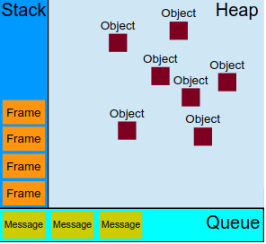
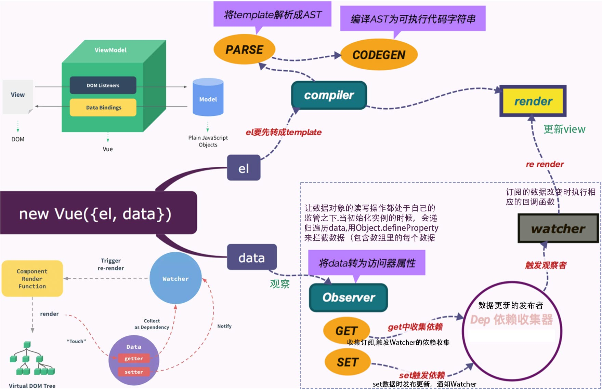
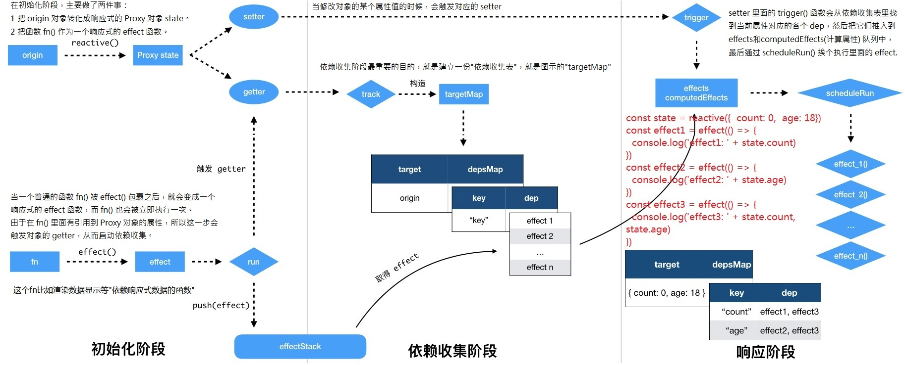
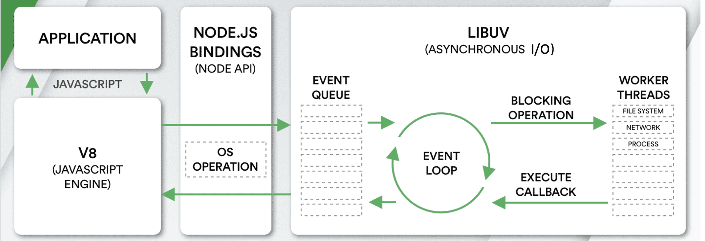
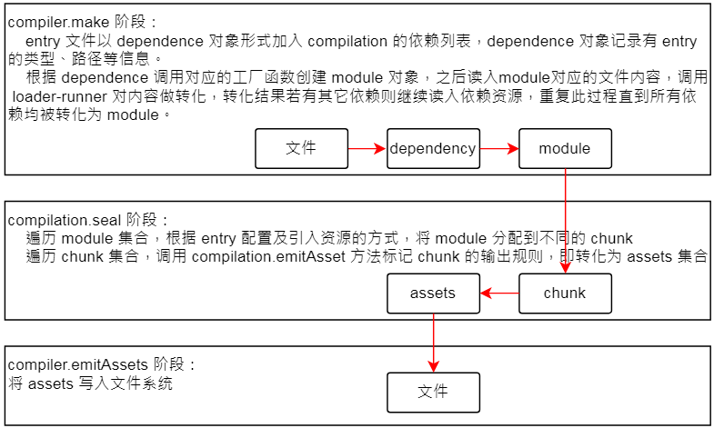
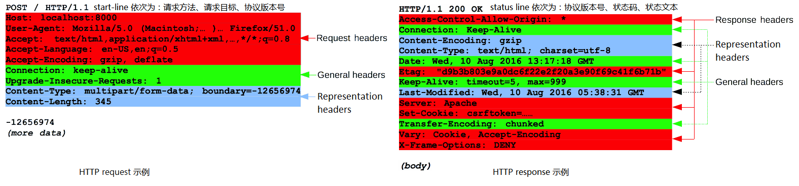

---
# pandoc生成标题信息时用到
# title: "web前端基础知识汇整（精简版）"
# author: David Su | callmedavidsu@gmail.com
# date: \today
# abstract: |
#   This is a front-end knowledge manual containing JavaScript, vue, nodejs, rxjs, TypeScript, dart, DSA, DP, HTML, CSS, HTTP, webpack, DB, Microservice Architecture, etc. 

#   It helps to improve the overall idea of the big front-end and consolidate the basic knowledge skills. For interviews or self-improvement are helpful.

#   这是一本前端知识手册，包含JavaScript、vue、nodejs、rxjs、TypeScript、dart、DSA、DP、HTML、CSS、HTTP、webpack、DB、微服务架构等。

#   有助于提高大前端的整体思路，巩固基础知识技能。对于面试或自我提升都有帮助。

# 正文字体，默认最大是12pt，要更大需要其他包(常见字号: 四号14pt 小四12pt 五号10.5pt 小五9pt)
fontsize: 10pt
# 配合form.tex的hyperref设置链接颜色
boxlinks: true
# 设置双面模式，以便.tex文件中能区分左右页眉页脚
classoption: twoside,symmetric
# 添加此可以让pandoc生成的toc新起一页，而不是接续在首页。目录页面从1开始编号
include-before:
  - '`\newpage{}`{=latex}'
  - \setcounter{page}{1}
# 样式调整好后，一定不要shift+alt+f去自动格式化，会让很多设置失效
#   例如 *斜体* 变为 _斜体_，pandoc不能识别。表格分割线----- 长度变化，但是各个栏位占比不对
---

<!-- % 画一条横线：\rule[水平高度]{长度}{粗细} -->
<!-- A4 宽21cm，左右边距0.8cm，线长19.4cm -->
<!-- \rule[0pt]{19.4cm}{0.03em} -->

# JavaScript

**提升**: 所谓的"提升"(hoist)，也就是把**所有变量声明**都拉到函数作用域的顶部(var)。  
*函数声明和变量声明总是会被解释器悄悄地被"提升"到方法体的最顶部。*  
JavaScript *只会提升声明，不会提升其初始化*。
(带=等号声明的函数、类等等，是表达式声明)

ECMAScript 中不能定义自己的数据类型。

_IEEE 754 格式浮点值的精确度最高可达 17 位小数，但在算术计算中远不如整数精确。_

ECMAScript 中**所有函数的参数都是按值传递的** (_变量有按值和按引用**访问**，而**传参**则只有按值传递_)。

- _在按值传递参数时，值会被复制到一个局部变量_，即 ECMAScript 函数内部的 arguments 对象中的一个槽位。

_NaN 不等于包括 NaN 在内的任何值_。有 3 个函数可以将非数值转换为数值: `Number()、parseInt()和parseFloat()`。

**Symbol 的用途是确保对象属性使用唯一标识符**，每个从 Symbol() 返回的 symbol 值都是唯一的。

`Object.getOwnPropertyNames()` 返回对象实例的**常规属性数组**，而`Object.getOwnPropertySymbols()`返回 **symbol 属性数组**。

**确定类型**: `typeof` 操作符、`instanceof` 操作符，或 `Object.prototype.toString.call(obj1)`。

**标识符查找**时，顺序为: 局部上下文`->`沿着作用域链一直到全局上下文。只要*找到后就不会继续搜索*，全局上下文还没找到，则说明该变量未声明。

\rule[0pt]{19.4cm}{0.03em}

**JavaScript 运行时概念(Runtime concepts)**



说明

- 栈(Stack):**函数调用**形成了一个由若干帧(Frame)组成的**栈**。
  - 调用一个函数总是会为其创造一个新的栈**帧**。
- 堆(Heap):**对象被分配在堆**中，堆是一个用来表示一大块（通常是非结构化的）内存区域的计算机术语。
- 队列(Queue):一个 JavaScript 运行时包含了一个**待处理消息的消息队列**(Message Queue)。
  - 每一个消息(Message)都关联着一个用以处理这个消息的回调函数。

**事件循环**与新版 nodejs 一致。任务执行顺序: **(1)执行宏任务 (一开始的代码块也是一个宏任务)，同步代码正常输出;(2)然后执行该宏任务产生的微任务，若微任务在执行过程中产生了新的微任务，则继续执行微任务; (3)微任务执行完毕后，再回到宏任务中进行下一轮循环。**

常见宏任务：script(整体代码)、setTimeout()、setInterval()、window.postMessage()(跨源通信)、I/O、UI 交互事件  
常见微任务: new Promise().then(回调)、MutationObserver (html5 新特性)、queueMicrotask() 调用

\rule[0pt]{19.4cm}{0.03em}

解除对一个值的引用并不会自动导致相关内存被回收。解除引用的关键在于确保相关的值已经不在上下文里了，因此它在下次垃圾回收时会被回收。

**引用值（或者对象）是某个特定引用类型的实例。**

Date 类型的 valueOf() 方法根本就不返回字符串，这个方法被重写后返回的是日期的毫秒表示。

引用类型(Boolean 、 Number 和 String)与原始值包装类型的主要区别在于对象的生命周期。

\rule[0pt]{19.4cm}{0.03em}

**原始值为什么可以调用一些方法：**

```js
let s = "str"; console.log(s.slice(1)); // "tr"
```

如上代码，第二行中访问 s 时，是以读模式访问的，也就是要从内存中读取变量保存的值。在*以读模式访问字符串值的任何时候*，后台都会自动执行以下三步: (1)根据字符串值创建一个 String 类型的实例、(2)调用实例上的特定方法、(3)销毁实例。即相当于执行了以下三行代码：

```js
/*创建String实例*/ let s = new String("str"); /*调用特定方法*/ s.slice(1); /*销毁实例*/ s = null;
```

这种行为则让原始值拥有了对象的行为。

\rule[0pt]{19.4cm}{0.03em}

Symbol 全局对象不能使用 new 去实例化。

Math 不是一个构造器。Math 的所有属性与方法**都是静态**的。 用于 Number 类型。它**不支持** BigInt。  
很多 Math 函数都有一个精度，而且这个精度在不同实现中也是不相同的。这意味着不同的浏览器会给出不同的结果。

会改变原数组的实例方法: 一转(splice)二排(reverse/sort)一复制(copyWithin),二栈(push/pop)二队(shift/unshift)一填充(fill)

合并两个 Map 对象时，如果有重复的键值，则后面的会覆盖前面的。

一个 Map 的 key 可以是任意值，包括函数、对象或任意基本类型。一个 Object 的 key 必须是一个 String 或是 Symbol。  
[键的顺序](https://developer.mozilla.org/en-US/docs/Web/JavaScript/Reference/Global_Objects/Map#objects_vs._maps): Map 中的 key 是有序的。一个 Object 的 key 不一定是序的(**没有可以迭代对象所有**属性的机制)。  

- for-in、Object.keys、Object.getOwnPropertyNames、Object.getOwnPropertySymbols获取内容各不一样。
<!-- - for-in 仅包含了以字符串为键的属性；
- Object.keys 仅包含了对象自身的、可枚举的、以字符串为键的属性；
- Object.getOwnPropertyNames 包含了所有以字符串为键的属性，即使是不可枚举的；
- Object.getOwnPropertySymbols 与前者类似，但其包含的是以 Symbol 为键的属性  -->

Map 是可迭代的，但 Object 并没有实现迭代协议(即for...of 表达式并不能直接迭代对象，但对象可以实现迭代协议)。

WeakMap 对象是一组键/值对的集合，其中的键是弱引用的。**其键必须是对象，而值可以是任意的。**  
WeakSet **只能是对象的集合**，而不能是任何类型的任意值。

\rule[0pt]{19.4cm}{0.03em}

**迭代器与生成器**

“迭代”的意思是按照顺序反复多次执行一段程序，通常会有明确的终止条件。  
ECMAScript 6 规范新增了两个高级特性：迭代器和生成器。使用这两个特性，能够更清晰、高效、方便地实现迭代。

*迭代器可以为各种不同的数据结构提供统一的访问机制*。任何数据结构只要部署 Iterator 接口，就可以完成遍历操作。  
迭代器是一个可以由任意对象实现的接口，支持连续获取对象产出的每一个值。

可迭代对象即具有 `Symbol.iterator` 属性的数据结构。  
**迭代器**即实现了特定 `next()` 方法的对象。
因为 `return()` 方法是可选的，所以并非所有迭代器都是可关闭的。

**生成器**是拥有*在一个函数块内暂停和恢复代码执行的能力*。形式为*函数名称前面加一个星号（\*）*。
生成器对象 (Generator) 是由一个 generator function 返回的，并且它符合可迭代协议和迭代器协议。
箭头函数不能用来定义生成器函数。

yield 关键字可以让生成器停止和开始执行，也是生成器最有用的地方。生成器函数在遇到 yield 关键字之前会正常执行。
遇到这个关键字后，执行会停止，函数作用域的状态会被保留。
停止执行的生成器函数只能通过在生成器对象上调用 next() 方法来恢复执行。

\rule[0pt]{19.4cm}{0.03em}

**对象**

对象的属性分两种：**数据属性**和**访问器属性**。

- 数据属性有 4 个描述其行为的特性：
  - `[[Configurable]]`• 表示属性是否可以通过 delete 删除并重新定义，是否可以修改它的特性，以及是否可以把它改为访问器属性。
  - `[[Enumerable]]`• 表示属性是否可以通过 for-in 循环返回。默认情况下，所有直接定义在对象上的属性的这个特性都是 true 。
  - `[[Writable]]`• 表示属性的值是否可以被修改。
  - `[[Value]]`• 包含属性实际的值。• 这个特性的默认值为 undefined 。
- 访问器属性有如下 4 个特性：
  - `[[Configurable]]`• 表示属性是否可以通过 delete 删除并重新定义，是否可以修改它的特性，以及是否可以把它改为数据属性。
  - `[[Enumerable]]`• 表示属性是否可以通过 for-in 循环返回。
  - `[[Get]]`• 获取函数，在读取属性时调用。• 默认值为 undefined 。
  - `[[Set]]`• 设置函数，在写入属性时调用。• 默认值为 undefined 。
- 要修改数据属性的默认特性，就必须使用 `Object.defineProperty(obj, prop, descriptor)` 方法。要定义访问器属性，也是如此。

`Object.is()` 与 `==` 和 `===` 都不相同:  
不会强制转换两边的值;`Object.is(NaN, NaN)` 为 true， `Object.is(+0, -0)` 为 false，和`===`相反。

使用 new 调用类的构造函数会执行如下操作:

1.  在内存中创建一个新对象。
2.  这个新对象内部的 `[[Prototype]]` 指针被赋值为构造函数的 prototype 属性。
3.  构造函数内部的 this 被赋值为这个新对象（即 this 指向新对象）。
4.  执行构造函数内部的代码（给新对象添加属性）。
5.  如果构造函数返回非空对象，则返回该对象；否则，返回刚创建的新对象。

即 new 对象的过程: 新生成一个对象、链接到原型、绑定 this、(给新对象添加属性)、返回新对象。

`Object.assign()`对象**浅拷贝**，一般使用`JSON.parse()` 和 `JSON.stringify()`实现**深拷贝**。  
对于数组，可以理解为数组方法中那些会*改变原数组的方法都算深拷贝*。

*任何函数只要使用 new 操作符调用就是构造函数*，而不使用 new 操作符调用的函数就是普通函数。

每个**实例对象**都有一个私有属性(称之为 **`__proto__`**)指向它的构造函数的原型对象(prototype)。  
默认情况下，所有**原型对象**自动获得一个名为 **`constructor`** 的属性，指回与之关联的构造函数。即两个准则:

```txt
// 准则 1：原型对象（即 Person.prototype）的 constructor 指向构造函数本身
Person.prototype.constructor == Person
// 准则 2：实例（即 person01）的 __proto__ 指向其构造函数的原型对象
person01.__proto__ == Person.prototype

// 所有的构造函数的 __proto__ 的原型都是 Function
Person.__proto__ === Function.prototype
// 正常的原型链都会终止于 Object 的原型对象 。Object 原型的原型是 null
Person.prototype.__proto__ === Object.prototype
Object.prototype.__proto__ === null
```

**原型链**: *每个实例对象都有一个私有属性 `__proto__`指向它的构造函数的原型对象(prototype)。该原型对象也有一个自己的原型对象`__proto__`，层层向上直到一个对象的原型对象为 null。根据定义，null 没有原型，并作为这个原型链中的最后一个环节。*

```txt
// 必知前置：每个构造函数都有一个原型对象，原型有一个属性指回构造函数，而实例有一个内部指针指向原型。
Person.prototype.constructor = Person    person1.__proto__ = Person.prototype

// 原型链的构想(下面的1 2 3)：前置 Coder 继承于 Person
// 1 原型是另一个类型的实例:
person1 = Coder.prototype
// 每个实例对象都有一个私有属性(称之为 __proto__)指向它的构造函数的原型对象:
coder1.__proto__ = Coder.prototype 

// 2 这个原型本身有一个内部指针指向另一个原型:
coder1.__proto__.__proto__ = Coder.prototype.__proto__ = person1.__proto__ = Person.prototype

// 3 另一个原型也有一个指针指向另一个构造函数:
coder1.__proto__.__proto__.constructor = Coder.prototype.__proto__.constructor
                                       = Person.prototype.constructor
                                       = Person

// 4 简而言之的实例和原型之间构造了一条原型链：
coder1.__proto__.__proto__.constructor = Person
```

\rule[0pt]{19.4cm}{0.03em}

**继承**

很多面向对象语言都支持两种继承：接口继承和实现继承。前者只继承方法签名，后者继承实际的方法。

- **实现继承是 ECMAScript 唯一支持的继承方式，而这主要是通过原型链实现的。**
- 接口继承在 ECMAScript 中是不可能的，因为函数没有签名。

\rule[0pt]{19.4cm}{0.03em}

**类**

ECMAScript 6 新引入的 class 关键字具有正式定义类的能力。表面上看起来可以支持正式的面向对象编程，但实际上它背后使用的仍然是原型和构造函数的概念。
从各方面来看，**ECMAScript `类`就是一种特殊函数。**

类可以包含构造函数方法、实例方法、获取函数、设置函数和静态类方法，但这些**都不是必需**的。

**类私有域**: 类属性在默认情况下是公有的，但可以使用增加哈希前缀 `# `的方法来定义私有类字段，这一隐秘封装的类特性由 js 自身**强制执行**。

ES6 类支持**单继承**(extends)。虽然类继承使用的是新语法，但背后依旧使用的是原型链。(C++、python支持多继承)

调用 `super()` 会调用父类构造函数，并将返回的实例赋值给 this 。super 只能在*派生类构造函数和静态方法中*使用。

有个众所周知的软件设计原则：“组合胜过继承（composition over inheritance）。”尽量不用 mixin。

\rule[0pt]{19.4cm}{0.03em}

**代理与反射 (Proxies and Reflect)**

代理和反射为开发者提供了拦截并向基本操作嵌入额外行为的能力。

**Proxy 对象用于创建一个对象的代理，从而实现基本操作的拦截和自定义（如属性查找、赋值、枚举、函数调用等）。**

`const p = new Proxy(target, handler)`

- handler:**包含捕捉器**(trap)的占位符对象。**一个通常以函数作为属性的对象**，各属性中的函数分别定义了在执行各种操作时代理 p 的行为
  - traps: 提供属性访问的方法。这类似于操作系统中捕获器的概念。
- target: 要使用 Proxy 包装的目标对象（可以是任何类型的对象，包括原生数组，函数，甚至另一个代理）

代理可以在这些操作传播到目标对象之前先调用捕获器函数，从而拦截并修改相应的行为。

**Reflect 是一个内置的对象，它提供拦截 JavaScript 操作的 13 种方法。这些方法与 proxy handlers 的方法相同。**  
Reflect 不是一个函数对象，因此它是不可构造的(Reflect 的所有属性和方法都是静态的，不能 new，或者当成构造函数)。

**通常，Object 上的方法适用于通用程序，而反射方法适用于细粒度的对象控制与操作。**

\rule[0pt]{19.4cm}{0.03em}

**函数 (Function)**

一个 JavaScript 函数用 `function` 关键字声明，后面跟着函数名和圆括号。  
**函数实际上是对象**。每个函数都是 Function 类型的实例，而 Function 也有属性和方法，跟其他引用类型一样。

因为函数是对象，所以**函数名就是指向函数对象的指针**，而且不一定与函数本身紧密绑定。

- 这意味着一个函数可以有多个名称。使用*不带括号的函数名会访问函数指针*，而不会执行函数。

_理解函数声明与函数表达式之间的区别_，关键是理解**提升**(声明可以，表达式不行)。

**箭头函数**任何可以使用函数表达式的地方，都可以使用箭头函数。

- 箭头函数不能使用`arguments`、`super`和`new.target`，也不能用作构造函数。此外，箭头函数也没有`prototype`属性。

**函数内部** (arguments，this，caller，new.target)

- arguments 对象是一个类数组对象，包含调用函数时传入的所有参数。第一个参数:`arguments[0]` ，第二个参数是 `arguments[1]`……
- **在标准函数中，`this` 引用的是把函数当成方法调用的上下文对象**，这时候通常称其为 this 值。
  - *这个 this 到底引用哪个对象必须到函数被调用时才能确定。*
- **在箭头函数中，`this` 引用的是定义该箭头函数的上下文。**
- `caller`属性引用的是*调用当前函数的函数*，或者如果是*在全局作用域中调用的则为 null* 。
- ECMAScript 6 新增了检测函数是否使用 new 关键字调用的 `new.target` 属性。
  - 如果函数是*正常调用*的，则 `new.target` 的值是 `undefined` ；
  - 如果是使用 *new 关键字调用*的，则 `new.target` 将引用被调用的*构造函数*。

**函数参数**: ECMAScript 函数**既不关心传入的参数个数，也不关心这些参数的数据类型**。

- 函数被调用时总会接收一个数组，但函数并不关心这个数组中包含什么。
- 在使用 function 关键字定义（非箭头）函数时，可以在函数内部访问 arguments 对象，从中取得传进来的每个参数值。

  - 如果函数是使用箭头语法定义的，那么传给函数的参数将不能使用 arguments 关键字访问，而只能通过定义的命名参数访问。

- ECMAScript 函数**没有签名**，因为参数是由包含零个或多个值的数组表示。没有[函数签名](https://developer.mozilla.org/zh-CN/docs/Glossary/Signature/Function)，也就**没有重载**(函数同名参数的类型或数量不同)。

**函数实例的属性和方法**: ECMAScript 中的函数是对象，因此有属性和方法。

- 实例属性: length、name 和 prototype(不是 new 出来的函数实例则没有)。
- 实例方法: call(若干个参数)、apply(参数一个数组/类数组对象)、bind、toString。(前三个方法除了 thisArg，参数都是可选的)
  - 使用 call() 或 apply() 的好处是可以**将任意对象设置为任意函数的作用域**。
    - 除了参数不一样，其他一样。`func1.call(thisArg, arg1, arg2, ...)` 和 `func1.apply(thisArg, argsArray)`
    - 调用有指定 this 值和参数的函数的结果。
  - bind() 函数会创建一个新的**绑定函数**。
    - `function.bind(thisArg[, arg1[, arg2[, ...]]])`
    - 这个新函数的 this 被指定为 bind() 的第一个参数，而其余参数将作为新函数的参数，供调用时使用。

**尾调用**：如果一个函数**返回**的是**另一个**函数的**调用结果**，那么就被称为尾调用。  
**尾递归**：如果一个函数**返回**的是**自己的调用结果**就被称为尾递归。_也就是说尾递归一定是尾调用，但尾调用不一定是尾递归。_  
**ES6 尾调用优化的关键**：如果函数的逻辑允许基于尾调用将其销毁，则引擎就会那么做。

**闭包**是由「函数」以及「声明该函数的词法环境」组合而成的。_该环境包含了这个闭包创建时作用域内的任何局部变量_。  
**闭包的作用**: 让开发者可以从内部函数访问外部函数的作用域，模拟私有变量。  
过度使用闭包可能导致内存过度占用(因为闭包会保留它们包含函数的作用域)，因此建议**仅在十分必要时使用**。

**IIFE**: 当函数变成立即执行的函数表达式时，表达式中的变量不能从外部访问。`(function(){statements;})();`  
将 IIFE 分配给一个变量，不是存储 IIFE 本身，而是存储 IIFE 执行后返回的结果。  
```js
let result = (() => { let lname = "Barry"; return lname; })();
console.log(result);  //  "Barry"
```

如果这个函数中创建了一个闭包，则这个闭包能通过其作用域链访问其外部的这函数内部变量。

\rule[0pt]{19.4cm}{0.03em}

**Promise 与异步函数**

阻塞与非阻塞是**调用方**决定的，在等待结果的过程中，是否还可以干其他事。  
同步与异步是**被调用方**决定的，决定是马上给你答案，还是过会儿通知你，给你答案。

**Promise 对象用于表示一个异步操作的最终完成（或失败）及其结果值。**  
有了 Promise 对象，就可以将异步操作以同步的操作的流程表达出来，避免了层层嵌套的回调函数。
_Promise 故意将异步行为封装起来，从而隔离外部的同步代码。_

- Promise 状态机(状态都是不可逆的):
  - 待定（pending）：初始状态，既没有被兑现，也没有被拒绝。
  - 已兑现（fulfilled）：意味着操作成功完成 (有时候也称为“解决”，resolved)。
  - 已拒绝（rejected）：意味着操作失败。
- Promise 作用:
  - 抽象地表示一个异步操作。
  - Promise 封装的异步操作会实际生成某个值，而程序期待 Promise 状态改变时可以访问这个值(resolve() 和 reject() 的返回值)。

**异步函数**，也称为`async/await`（语法关键字），是 ES6 Promise 模式在 ECMAScript 函数中的应用。

- (是 `promise + generator` 的语法糖，让 promise 对异步操作的管理更便捷)
- `async/await` 是 ES8 规范新增的。这个特性从行为和语法上都增强了 JavaScript，**让以同步方式写的代码能够异步执行**。
- `async` 关键字用于声明异步函数。这个关键字可以用在函数声明、函数表达式、箭头函数和方法上。
- `await` 关键字会暂停执行异步函数后面的代码，让出 JavaScript 运行时的执行线程，等待 Promise 解决。
  - JavaScript 运行时在碰到 await 关键字时，会记录在哪里暂停执行。
  - 等到 await 右边的值可用了，JavaScript 运行时会向消息队列中推送一个任务，这个任务会恢复异步函数的执行。
  - _即使 await 后面跟着一个立即可用的值，函数的其余部分也会被异步求值。_

\newpage

# vue FAQs

**vue 生命周期及生命周期函数**

vue 的生命周期就是 vue 实例从创建到销毁/卸载的过程(括号内为对应 Options API)。

- **创建** — 在组件创建时执行 (beforeCreate/created)
- **挂载** — DOM 被挂载时执行 (beforeMount/mounted)
- **更新** — 当响应数据被修改时执行 (beforeUpdate/updated)
- **销毁/卸载** — 在元素被销毁之前立即运行 (beforeDestroy/destroyed 或 vue3 的 beforeUnmount/unmounted)
  - 其他生命周期函数
    - 被 `keep-alive` 缓存的组件激活/停用时调用 (activated/deactivated)。
    - 在捕获一个来自后代组件的错误时被调用 (errorCaptured)

_是在使用**组合式 API** 时，可以理解为 beforecate 和 created 被 setup() 方法本身所取代。_  
其他生命周期函数在组合式 API 表现类似: onBeforeMount()、onMounted()、onBeforeUpdate()、onUpdated() ……

生命周期的实现原理:

- 2.x 当创建组件实例的过程中会调用相应的钩子方法。内部会对钩子进行处理，将钩子函数维护成数组的形式。
- 3.x 就是把各个生命周期的函数挂载或者叫注册到组件的实例上，然后等到组件运行到某个时刻，再去组件实例上把相应的生命周期的函数取出来执行。

\rule[0pt]{19.4cm}{0.03em}

**vue 响应式**

**数据响应式**就是能够使数据变化可以被检测并对这种变化做出响应的机制。

**vue 中响应式的实现**

- 2.x: 把一个普通的 js 对象传入 Vue 实例作为 data 选项，Vue 将遍历此对象所有的 property，并使用 `Object.defineProperty()` 把这些 property 全部转为 `getter/setter` (数据劫持)。每个组件实例都对应一个 watcher 实例，它会在组件渲染的过程中把“接触(touch)”过的数据 property 记录为依赖。之后当依赖项的 setter 触发时，会通知 watcher，从而使它关联的组件重新渲染。
  - 不足: 不能检测数组和对象的变化。由于 Vue 不允许动态添加根级响应式 property，所以必须在初始化实例前声明所有根级响应式 property，哪怕只是一个空值。
  - 应对: 使用 `Vue.set(object, propertyName, value)` 全局方法或者 `vm.$set()` 实例方法向嵌套对象添加响应式 property。
- 3.x: 主要把数据劫持这部分改为**使用 Proxy 来创建响应式对象**，将 `getter/setter` 用于 ref。**即 组合式 API reactive() 用于对象类型， ref() 用于基础数据类型。**
  - 改进: Proxy 不仅可以代理对象，还可以代理数组。还可以代理动态增加的属性。（但旧版本浏览器可能不支持 ES 新语法）
  - `reactive()` 返回一个对象的响应式代理。
  - `ref()` 接受一个内部值，返回一个响应式的、可更改的 ref 对象，此对象只有一个指向其内部值的属性 `.value`。
    - 如果将一个对象赋值给 ref，那么这个对象将通过 `reactive()` 转为具有深层次响应式的对象。这也意味着如果对象中包含了嵌套的 ref，它们将被深层地解包。

**vue 双向绑定**(和上面一个意思)

- 两大核心: 数据劫持、发布订阅模式
- 核心组成部分: 监听器 Observer(数据劫持)、订阅者容器(监听器监听到数据变动时，遍历订阅者容器发布消息)、Compile(解析模板指令)、Watcher(连接 Observe 和 Compile 的桥梁)
  - Vue 双向绑定原理是采用发布订阅者模式，在初始化时劫持数据的各个属性的 setter/getter，在数据变动时发布消息给订阅者，触发响应的监听回调。
  - 而每个组件都对应一个 Watcher 实例，它会在组件渲染的过程中把接触过的数据记录为依赖，当依赖的 setter 出发时，会通知 Watcher，从而使组件重新渲染。

\rule[0pt]{19.4cm}{0.03em}

**虚拟 DOM**是一种编程概念，意为将目标所需的 UI 通过数据结构“虚拟”地表示出来，保存在内存中，然后将真实的 DOM 与之保持同步。

**VNode** 虚拟节点，可以理解成节点描述对象，它描述了应该怎样去创建真实的 DOM 节点。

**Virtual DOM** 其实就是一棵以 VNode 节点作为基础的树，用对象属性来描述节点，实际上它只是一层对真实 DOM 的抽象。最终可以通过一系列操作使这棵树映射到真实环境上。(**虚拟 DOM 简单说就是用 JS 对象来模拟 DOM 结构。**)

**引入虚拟 DOM 的目的**: vdom 把渲染过程抽象化了，从而使得组件的抽象能力也得到提升，并且可以适配 DOM 以外的渲染目标。

虚拟 DOM 在 Vue.js 主要做了两件事：

- (1) 提供与真实 DOM 节点所对应的虚拟节点 vnode。(2) 将虚拟节点 vnode 和旧虚拟节点 oldVnode 进行对比，然后更新视图。

**使用虚拟 DOM 的好处**:

- (vue3 官网)虚拟 DOM 带来的主要收益是它赋予了开发者编程式地、声明式地创建、审查和组合所需 UI 结构的能力，而把直接与 DOM 相关的操作交给了渲染器。
- 具备跨平台的优势、操作 DOM 慢，但 js 运行效率高，提高效率、提升渲染性能。(**组件抽象化、提高性能、跨平台**)

**使用虚拟 DOM 的不足**:

- 创建 dom 依赖创建函数
- 当节点数量非常庞大时，其自身的各种判断和计算会将自己击溃
- 单从创建 dom 的角度出发，它的创建速度比原生的慢
- 无法进行极致优化(毕竟始终是隔了一层)

**虚拟 dom 原理流程**: 构建虚拟 DOM 树、找出新旧两个虚拟 DOM 树的差异、将查询渲染到真实 DOM 上。

- 1 用 JavaScript 对象模拟真实 DOM 树，对真实 DOM 进行抽象；
- 2 比较两棵虚拟 DOM 树的差异 (diff 算法)；
- 3 将两个虚拟 DOM 对象的差异应用到真正的 DOM 树 (patch 算法)。

**diff 算法**

v3 版文档所说：_如果我们有两份虚拟 DOM 树，渲染器将会有比较地遍历它们，找出它们之间的区别，并应用这其中的变化到真实的 DOM 上。这个过程被称为修补 (patch)，又被称为“比较差异(diffing)”或“协调 (reconciliation)”_

一般步骤:

- 同级比较，再比较子节点
- 先判断一方有子节点一方没有子节点的情况 (如果新的 children 没有子节点，将旧的子节点移除)
- 比较都有子节点的情况 (核心 diff)
- 递归比较子节点
- 正常 Diff 两个树的时间复杂度是 O(n^3) ，实际情况下很少会进行跨层级的移动 DOM，所以 Vue 将 Diff 进行了优化，从`O(n^3)->O(n)`。
- 只有当新旧 children 都为多个子节点时才需要用核心的 Diff 算法进行同层级比较。

\rule[0pt]{19.4cm}{0.03em}

**MVVM 相关**

\textcolor{white}{:}

- MVC
  - 模型层（Model）：是应用程序中独立于用户界面的动态数据结构；它直接管理应用程序的数据，逻辑和规则。
  - 视图层（View）：用户界面，用来展示信息。
  - 控制层（Controller）：**接收输入事件**，操控 model 或 view。
- MVP
  - Model 定义用户界面所需要被显示的资料模型，一个模型包含着相关的业务逻辑（在实际开发中，数据相关的业务逻辑都会放到服务器）。
  - View 视图为呈现用户界面的终端，用以表现来自 Model 的资料，和用户命令路由再经过 Presenter 对事件处理后的资料。
  - Presenter **包含着组件的事件处理**，负责检索 Model 获取资料，和将获取的资料经过格式转换与 View 进行沟通。
- MVVM
  - Model 定义用户界面所需要被显示的资料模型，一个模型包含着相关的业务逻辑（在实际开发中，数据相关的业务逻辑都会放到服务器）。
  - View 视图为呈现用户界面的终端，用以表现来自 Model 的资料，和用户命令路由再经过 Presenter 对事件处理后的资料。
  - ViewModel 在原有 Controller 层的基础上，**将业务逻辑封和组件进行双向绑定**(data-binding)，达到同步更新的目的。

\rule[0pt]{19.4cm}{0.03em}

**key 的作用**: key 这个特殊的 attribute 主要作为 Vue 的虚拟 DOM 算法提示，在比较新旧节点列表时用于识别 vnode。  
**尽量不要采用索引 (index) 作为 key**: 在一个数组中间插入某个元素，用 index 做 key，直接导致我们插入的元素到后面的全部元素，对应的位置关系都发生了变更，所以**全部都会执行更新操作**。

**渐进式(progressive)的含义**: 没有多做职责之外的事，只做了自己该做的事，没有做不该做的事，仅此而已。

**vue 的优缺点**: 看到一句比较有意思的话：_任何框架都没有缺点，一切缺点都是特性。只不过有些框架的优点是，支持很多很多特性。_

**vue3 新特**

**组合式 API** 是一系列 API 的集合，使我们可以使用函数而不是声明选项的方式书写 Vue 组件(_并不是函数式编程_)。

- 组合式 API 是以 Vue 中数据可变的、细粒度的响应性系统为基础的，而函数式编程更强调数据不可变。
- 好处: 更好的逻辑复用、更灵活的代码组织、更好的类型推导、生产包体积更小

**vue3 中的树摇**: _在 Vue3.x 中，所有的 API 都通过 ES6 模块化的方式引入_，这样就能让 webpack 或 rollup 等打包工具在打包时对没有用到 API 进行剔除，最小化 bundle 体积。很多打包工具支持 Treeshaking，但 Treeshaking 的前提是所有的东西都需要用 ES6 module 的 import 来写，_vue2 的全局 API 并不能按需导入，但 vue3 支持按需引入。_

**`<Teleport>组件`** 是一个内置组件，它可以将一个组件内部的一部分模板“传送”到该组件的 DOM 结构外层的位置去(如全屏的模态框)。

\newpage

**vue 的模板编译**

**模板编译过程**: Vue 的模板编译过程就是将 template 转化为 render 函数的过程。会经历以下主要分为三个阶段：

- parse 模板编译,将模板代码转化为`AST`;transform 优化`AST`,方便后续虚拟`DOM`更新;codegen 生成代码,将`AST`转化为可执行的代码

**Vue 默认推荐使用模板的几点原因**:

- 模板更贴近实际的 HTML。由于其确定的语法，更容易对模板做静态分析。在实践中，模板对大多数的应用场景都是够用且高效的。

**vue3 渲染管线**

- **编译**：vue 模板被编译成**渲染函数**,即用来返回虚拟`DOM`树的函数。此步骤可以通过构建步骤提前完成,也可通过使用运行时编译器即时完成。
- **挂载**：运行时渲染器调用渲染函数，遍历返回的虚拟 DOM 树，并基于它创建实际的 DOM 节点。这一步会作为响应式副作用执行，因此它会追踪其中所用到的所有响应式依赖。
- **更新**：当一个依赖发生变化后，副作用会重新运行，这时候会创建一个更新后的虚拟 DOM 树。运行时渲染器遍历这棵新树，将它与旧树进行比较，然后将必要的更新应用到真实 DOM 上去。

\textcolor{white}{:}{width=70%}

SPA（single-page application）wiki: 它通过**动态重写当前页面**来与用户交互，而非传统的从服务器重新加载整个新页面。

- 仅在 Web 页面初始化时加载相应的 HTML、JS 和 CSS。一旦页面加载完成，SPA **不会**因为用户的操作而进行**页面的重新加载或跳转**;
- 取而代之的是利用路由机制实现 HTML 内容的变换，UI 与用户的交互，避免页面的重新加载。
- **优点**：用户体验好、快；SPA 相对对服务器压力小；前后端职责分离，架构清晰，前端进行交互逻辑，后端负责数据处理。
- **缺点**：初次加载耗时多；前进后退路由管理，不能使用浏览器的前进后退功能；SEO(搜索引擎优化) 难度较大。

\rule[0pt]{19.4cm}{0.03em}

**全局 API** (列式的是 v2 的版本，v3 的形式可能略有不同)

Vue 2 没有`app`的概念，定义的应用只是通过`new Vue()`创建的**根 Vue 实例**。从同一个 Vue 构造函数创建的每个根实例**共享相同的全局配置**。  
Vue 3 中我们引入了一个新的全局 API：`createApp` ，调用 createApp 返回一个**应用实例**，一个 Vue 3 中的新概念。

- v3 新的`createApp()`
  - 创建一个应用实例。在 v3，**任何全局改变 Vue 行为的 API 现在都会移动到应用实例上**。(类似下面 API 的 `Vue.` 变 `app.`)
  - `import {createApp} from 'vue';import App from './App.vue';const app = createApp(App);`
- `Vue.nextTick([callback, context])` / `nextTick()`
  - 在下次 DOM 更新循环结束之后执行延迟回调。_在修改数据之后立即使用这个方法，获取更新后的 DOM。_
- v2 的`Vue.set(target, propertyName/index, value)` **v3 已移除**
  - 向响应式对象中添加一个 property，并确保这个新 property 同样是响应式的，且触发视图更新。`Vue.delete` 类似。
- `Vue.mixin(mixin)` / `app.mixin()`
  - 全局注册一个混入，影响注册之后所有创建的每个 Vue 实例。可以向组件注入自定义的行为。**不推荐在应用代码中使用。**
- `Vue.use(plugin)` / `app.use()`
  - 安装 Vue.js 插件。如果插件是一个对象，必须提供 install 方法。需要在调用 new Vue() 之前被调用。对同一个插件多次调用，该插件将只被安装一次。
- v2.6以上 `Vue.observable(object)`/ v3 组合式 API `reactive()`
  - 前者让一个对象可响应。Vue 内部会用它来处理 data 函数返回的对象。_被传入的对象会变更，和被返回的对象是同一个对象。_
  - 后者返回一个对象的响应式代理。它会影响到**所有嵌套的 property**。_而对源对象直接进行变更仍然是不可响应的。_
- `Vue.component(id, [definition])` / `app.component()`
  - 如果**同时**传递一个组件名字符串及其定义，则**注册一个全局组件**；如果**只**传递一个名字，则会返回用该名字注册组件(如果存在的话)。
- `Vue.directive(id, [definition])` / `app.directive()`
  - 如果**同时**传递一个名字和一个指令定义，则**注册一个全局指令**；如果**只**传递一个名字，则会返回用该名字注册的指令(如果存在的话)。
- `Vue.filter(id, [definition])` **v3 已移除**
  - 注册或获取全局过滤器(用法同上)。在 vue3 里已经移除，推荐使用计算属性代替。
- `Vue.version` / `app.version`: 提供字符串形式的 Vue 安装版本号。(不传参数，直接使用)
- `Vue.extend(options)` / **v3 已移除**
  - 使用基础 Vue 构造器，创建一个“子类”。参数是一个包含组件选项的对象。data 选项是特例，在 `Vue.extend()` 中它必须是函数。
- `Vue.compile(template)` / _v3 不清楚_:  将一个模板字符串编译成 render 函数。**只在完整版时可用。**
- v3 `进阶 API` 关于渲染函数中的部分 API:
  - `h()`: 创建虚拟 DOM 节点 (vnode)。- `mergeProps()`: 合并多个 props 对象，用于处理含有特定的 props 参数的情况。
  - `cloneVNode()`: 返回一个克隆的 vnode，可在原有基础上添加一些额外的 prop。

**`setup()`钩子**是在组件中使用组合式API的入口，通常只在下列情况下使用：1 需要**在非单文件组件中使用组合式API时**；2 需要在**基于选项式API的组件中集成基于组合式API的代码**时。

**其他情况下，都应该优先使用`<script setup>`语法**。优势：1 更小的样板内容，更简洁的代码（不用return数据和方法）。2 能够使用纯ts声明props和自定义事件。3 更好的运行时性能（其模块会被编译成同一作用域内的渲染函数，避免渲染上下文代理对象）4 更好的IDE类型推导性能（减少了语言服务器从代码中抽取类型的工作）。

\newpage

**指令**

**vue 常用的修饰符**

- 修饰符要在前面加个`.`点号，例如`<div @click.self="doThat">...</div>; <input v-model.trim="msg" />`
- 使用修饰符时，顺序很重要；相应的代码会以同样的顺序产生。
- 事件相关: 事件修饰符: stop、prevent、self、once、passive 等;按键修饰符: enter、esc、down、up 等;鼠标修饰符: left、right、middle
- 表单输入相关: lazy、number、trim

**v-if 和 v-for 不建议一起用**: 二者的优先级不明显

- v-for 基于原始数据**多次渲染**元素或模板块。v-if 基于表达式值的真假性，来**条件性地渲染**元素或者模板片段。
- **vue2**: 当和 v-if 一起使用时，**v-for** 的优先级比 v-if **更高**。**vue3**: 当它们同时存在于一个节点上时，**v-if** 比 v-for 的优先级**更高**。

**v-if 和 v-show 的区别**

- v-if 基于表达式值的真假性，来条件性地**渲染元素或者模板片段**。v-show 基于表达式值的真假性，来**改变元素的可见性**。
- 当 v-if 元素被触发，元素及其所包含的指令/组件都会**销毁和重构**。v-show 通过**设置内联样式的 display CSS property 来工作**。

**slot 插槽**

通俗的理解就是“占坑”，在组件模板中占好了位置，当使用该组件标签时候，组件标签里面的内容就会自动填坑（替换组件模板中 slot 位置）并且可以作为承载分发内容的出口。

使用**具名插槽**将多个插槽内容传入到各自目标插槽的插口。  
在一个组件中多个插槽时，每个插槽`<slot>`元素可以用`name`属性来分配唯一 ID 指定渲染内容，没有提供 name 的`<slot>`插口隐式命名为`default`。

**作用域插槽**在插槽的内容可能想要**同时使用**父组件域内和子组件域内的数据的情况,可以向一个插槽的插口上传递 attribute。

使用: 在父组件使用类似`<slot name="header" message="hello"></slot>`表明这里需要有插槽占位，需要填充。  
然后子组件使用类似`<template #header="headerProps"> {{ headerProps }} /*更多渲染内容*/ </template>`对其填充。  
`#header`为`v-slot:header`的简写，此为具名作用域插槽，指定填充名为 header 的插槽接口，接收它传来的 attribute。

**v-model**: 在表单输入元素或组件中**创建双向绑定**。预期：_根据表单输入元素或组件输出的值而变化_。
<!-- 默认情况下，**v-model 是 `@input` 事件侦听器和 `:value` 属性上的语法糖**。仅限`<input> <select> <textarea> components`。 -->

- `<select>` 会绑定 **value** property 并侦听 **change** 事件(`:value`属性和`@change`事件侦听器上的语法糖，下同)。
- 文本类型的 `<input>` 和 `<textarea>` 元素会绑定 **value** property 并侦听 **input** 事件；
- `<input type="checkbox">` 和 `<input type="radio">` 会绑定 **checked** property 并侦听 **change** 事件；

**v-on**: Vue 中通过 `v-on` 或其语法糖 `@` 指令来**给元素绑定事件并且提供了事件修饰符**。可绑定多个事件。

内置指令概述

- v-text: 更新元素的文本内容。 `<span v-text="msg"></span>` 等同: `<span>{{msg}}</span>`
- v-html: 更新元素的 innerHTML。 注意：内容按普通 HTML 插入，不会作为 Vue 模板进行编译。危险，容易被 XSS 攻击。
- v-show: 基于表达式值的真假改变元素的可见性。通过设置内联样式的`display`来工作，当元素可见时将使用初始`display`值。
- v-if:当 v-if 元素被触发，元素及其所包含的指令/组件都会销毁和重构。如果初始条件是假，那么其内部的内容根本都不会被渲染。
- v-else: 前一兄弟元素必须有 `v-if` 或 `v-else-if`
- v-else-if: 前一兄弟元素必须有 `v-if` 或 `v-else-if`。
- v-for: 基于原始数据多次渲染元素或模板块。指令值必须使用特殊语法 `alias in expression` 为正在迭代的元素提供一个别名
  - v-for 的默认方式是尝试就地更新元素而不移动它们
- **v-on**: Vue 中通过 `v-on` 指令来**给元素绑定事件并且提供了事件修饰符**。可绑定多个事件。缩写为`@`
- **v-bind**: 动态的绑定一个或多个 attribute，也可以是组件的 prop。缩写为`:` (当使用 `.prop` 修饰符,缩写为`.`)
- v-model: 在表单输入元素或组件中创建双向绑定。预期：根据表单输入元素或组件输出的值而变化
- **v-slot**: 用于声明具名插槽或是期望接收 props 的作用域插槽。限用于:`<template>`、组件(用于带有 prop 的单个默认插槽)，缩写为`#`
- v-pre: 跳过该元素及其所有子元素的编译。所有 Vue 模板语法都会被保留并按原样渲染。
- v-once:仅渲染元素和组件一次，并跳过之后的更新。在随后的重新渲染，元素/组件及其所有子项将被当作静态内容并跳过渲染。
- v-cloak 用于隐藏未编译的模板，直到完成。**该指令只在没有构建步骤的环境下需要使用**。
  - 与像 `[v-cloak] { display: none }` 这样的 CSS 规则结合，它可以隐藏原始模板直到组件编译完毕。
- v-memo(vue3.2): 缓存一个模板的子树。元素和组件都可以使用。为了实现缓存，该指令期待传入一个定长地依赖值数组进行比较。

**数据/状态 API**: 注意 v3 有部分组合式 API

- computed: 用于声明要在组件实例上暴露的*计算属性*。
  - 是计算属性，**依赖其它属性值**，只有它依赖的属性值发生改变，下一次获取 computed 的值时才会重新计算 computed 的值；
  - computed **具有缓存机制**，依赖值不变的情况下其会直接读取缓存进行复用;
  - computed 不能进行异步操作
- watch: 用于声明在*数据更改*时调用的*侦听回调*。
  - 更多的是「观察」的作用，类似于**某些数据的监听回调**，每当监听的数据变化时都会执行回调进行后续操作；
  - watch 可以进**行异步操作**
  - _(一般情况下 computed 是多对一，watch 是一对多)_
- data: 用于声明组件初始响应式状态的**函数**。以 `_` 或 `$` 开头的属性将**不会**被组件实例代理，可能与内置冲突。
  - _如果 data 仍然是一个纯粹的对象，则所有的实例将共享引用同一个数据对象！_
  - 通过提供 data 函数，每次创建一个新实例后，我们能够调用 data 函数，从而返回初始数据的**一个全新副本数据对象**。
- props: 用于声明一个组件的 props。props 可以是**数组或对象**，用于**接收来自父组件的数据**。
- methods: 用于声明要混入到组件实例中的方法。
- emits: 用于声明由组件触发的自定义事件。v3
- expose: 用于声明当组件实例被父组件通过模板引用访问时暴露的公共属性。v3

`<KeepAlive>` 或 `keep-alive` 是一个*内置组件*，它的功能是*在多个组件间动态切换时* **缓存被移除的组件实例**。

**组件传值**

- 父子通信：父向子传递数据是通过`props`，子向父是通过`$emit`。`$refs`也可以访问组件实例。
- 兄弟通信：`$emit/$on`，vuex。
- 跨级通信：`$emit/$on`，`provide/inject` API，vuex。

父子组件创建过程自上而下，挂载过程自下而上。`parent created -> child created -> child mounted -> parent mounted`。  
类似 koa 的洋葱模型，或者 U 型之类的，_父组件创建过程中涉及到子组件，则把子组件处理完之后，再回归父组件的接续处理_。

**单向数据流**: 所有的 prop 都遵循着单向绑定原则，**prop 因父组件的更新而变化，自然地将新的状态向下流往子组件，而不会逆向传递。**

**依赖注入**

- provide(key,val):用于提供可以被后代组件注入的值。inject(key,default_v):用于声明要通过从上层提供方匹配并注入进当前组件的属性。
- 两者通常成对一起使用，以**允许一个祖先组件向其所有子孙后代注入一个依赖**，不论组件层次有多深，只要他们处于同一条组件链上。

**实例的属性和方法** (v2 的 API 标识为`vm.$xx`,v3 是直接`$xx`,在组件内都`this.$xx`的实例调用)

- `vm.$refs`: 一个包含 DOM 元素和组件实例的对象，通过模板 ref 注册。
- `模板 ref` 或者说特殊 attribute `ref`: `ref` 被用来给元素或子组件注册引用信息。
- `vm.$attrs`: 一个包含了组件所有透传 attributes 的对象。
  - `透传 Attributes` 是指由父组件传入，且没有被子组件声明为 props 或是组件自定义事件的 attributes 和事件处理函数。
- `vm.$root`: 当前组件树的根组件实例。如果当前实例没有父组件，那么这个值就是它自己。
- `vm.$parent`: 当前组件可能存在的父组件实例，如果当前组件是顶层组件，则为 null。
- `vm.$emit()`: 在当前组件触发一个自定义事件。任何额外的参数都会传递给事件监听器的回调函数。
- `vm.$forceUpdate()`: 强制该组件重新渲染。
- `vm.$nextTick()`: 绑定在实例上的 `nextTick()` 函数。
  - 和全局的`nextTick()`的唯一区别就是组件传递给`this.$nextTick()`的回调函数会带上 this 上下文，其绑定了当前组件实例。

**组件的设计原则**:[风格指南](https://v2.cn.vuejs.org/v2/style-guide)、集中/统一的状态管理、更加纯粹的 State 变化、低耦合、辅助代码分离、及时模块化、扁平化面向数据的 state/props

**异步组件**: 在大型项目中，我们可能**需要拆分应用为更小的块，并仅在需要时再从服务器加载相关组件**。v3的defineAsyncComponent方法。

**函数式组件**是**自身没有任何状态**的组件的另一种形式。它们在*渲染过程中不会创建组件实例*，并跳过常规的组件生命周期。

- 函数式组件剩下的唯一应用场景就是简单组件，比如创建动态标题的组件。否则，建议你像平常一样使用有状态组件。

**组件写 name 的好处**: 可以通过名字找到对应的组件（递归组件）;可以通过 name 属性实现缓存功能 (keep-alive);可以通过 name 来识别组件（跨级组件通信时非常重要）。

**组件和插件的区别**: 组件 (Component) 是用来构成你的 App 的业务模块，它的目标是 `App.vue`;插件 (Plugin) 是用来对 Vue 的功能的增强或补充，它的目标是 Vue 本身。

**服务端渲染（Server-Side Rendering）**

SSR 是指由**服务端**完成页面的 HTML 结构拼接的页面处理技术，发送到浏览器，然后为其绑定状态与事件，成为完全可交互页面的过程。  
与客户端的单页应用 (SPA) 相比，**SSR 的优势**主要在于: 更快的内容到达时间，统一的心智模型，更好的 SEO。  
不足(权衡考量): 开发中的限制，更多的与构建配置和部署相关的要求，更高的服务端负载。

\rule[0pt]{19.4cm}{0.03em}

**vue-router 相关**

**Vue Router** 是 Vue.js 的官方路由。它与 Vue.js 核心深度集成，让用 Vue.js 构建单页应用变得轻而易举。功能包括：

- 嵌套路由映射; 动态路由选择; 模块化、基于组件的路由配置; 路由参数、查询、通配符; 展示由 Vue.js 的过渡系统提供的过渡效果
- 细致的导航控制; 自动激活 CSS 类的链接; HTML5 history 模式或 hash 模式; 可定制的滚动行为; URL 的正确编码

**vue-router 路由模式**

- v3 配置参数选项为 mode，可选值为"hash"(默认值) | "history" | "abstract"(Node.js 环境)
  - **"history" 的 url 没有`#`号**，hash 反之。相同的 url，**"history" 会触发添加到浏览器历史记录栈中**，"hash" 不会触发。
- v4 对应配置选项为 history，可选值为 createWebHashHistory() | createWebHistory() | createMemoryHistory()

**vue-router 动态路由**

- 动态路由匹配
  - 路径参数用冒号`:`表示。当一个路由被匹配时，它的 params 的值将在每个组件中以 `this.$route.params` 的形式暴露出来。
- 编程式导航
  - `router.push` 导航到不同的`url`。这个方法**会**向 history 栈添加一个新的记录，当用户点击浏览器后退按钮时，会回到之前的`url`。
  - `router.replace`: 替换当前位置, 在导航时**不会**向 history 添加新记录，正如它的名字所暗示的那样,它取代了当前的条目。
  - `router.go`: 该方法采用一个整数作为参数，表示在历史堆栈中前进或后退多少步，类似于 `window.history.go(n)` 。
- 响应路由参数变化:
  - 用 `watch` 监听: `watch: { $route(to, from){ /** */ } }`
  - 向 `router-view` 组件中添加 key: `<router-view :key="$route.fullPath"></router-view>`
    - `$route.fullPath` 是完成后解析的 URL，包含其查询参数信息和 hash 完整路径。

**vue-router 的导航守卫 (钩子函数)**

- 1 全局守卫
  - **全局前置守卫** `router.beforeEach((to, from) =>{/* */ return xxx })` (做权限管理有用到)
    - 当一个导航触发时，全局前置守卫按照创建顺序调用。守卫是异步解析执行，此时导航在所有守卫 resolve 完之前一直处于*等待中*。
  - 全局解析守卫 `router.beforeResolve(async to => {/* */ return xxx})`
    - *每次导航时*都会触发，但是确保在导航被确认之前，**同时在所有组件内守卫和异步路由组件被解析之后，解析守卫就被正确调用**。
      - **获取数据或执行任何其他操作**（如果用户无法进入页面时你希望避免执行的操作）的理想位置
  - 全局后置钩子 `router.afterEach((to, from, failure) => {if (!failure) sendToAnalytics(to.fullPath)})`
    - 和守卫不同的是，这些钩子**不会**接受 next 函数也**不会**改变导航本身。
    - *对于分析、更改页面标题、声明页面等辅助功能*以及许多其他事情都很有用。
- 2 路由独享的守卫 `beforeEnter`: **只在进入路由时触发**，不会在 params、query 或 hash 改变时触发。
- 3 组件内的守卫: 在路由组件内直接定义路由导航守卫(传递给路由配置的)。
  - `beforeRouteEnter` 守卫**不能**访问 this，因为守卫在导航确认前被调用，因此即将登场的新组件还没被创建。
    - `beforeRouteEnter` 是支持给 next 传递回调的**唯一守卫**。
    - 对于 `beforeRouteUpdate` 和 `beforeRouteLeave` 来说，this 已经可用了，所以不支持传递回调。
  - `beforeRouteLeave` 通常用来预防用户在还未保存修改前突然离开。该导航可以通过返回 false 来取消。

**完整的导航解析流程**

1. 导航被触发。
2. 在失活的组件里调用 `beforeRouteLeave` 守卫。
3. 调用全局的 `beforeEach` 守卫。
4. 在重用的组件里调用 `beforeRouteUpdate` 守卫 (2.2+)。
5. 在路由配置里调用 `beforeEnter` 。
6. 解析异步路由组件。
7. 在被激活的组件里调用 `beforeRouteEnter` 。
8. 调用全局的 `beforeResolve` 守卫 (2.5+)。
9. 导航被确认。
10. 调用全局的 `afterEach` 钩子。
11. 触发 DOM 更新。
12. 调用 `beforeRouteEnter` 守卫中传给 next 的回调函数，创建好的组件实例会作为回调函数的参数传入。

**`$route`** 是路由**信息**对象，包括 path，params，hash，query，fullPath，matched，name 等路由信息参数。  
**`$router`** 是路由**实例**对象，包括了路由的跳转方法，钩子函数等。

\rule[0pt]{19.4cm}{0.03em}

**Vuex 是专门为 Vue.js 设计的状态管理库，以利用 Vue.js 的细粒度数据响应机制来进行高效的状态更新。**

每一个 Vuex 应用的核心就是 **store(仓库)**。“store”基本上就是一个容器，它包含着你的应用中大部分的**状态 (state)**。

\textcolor{white}{:}

- **State**: 定义了应用状态的数据结构，可以在这里设置默认的初始状态。
- **Getter**: 允许组件从 store 中获取数据，mapGetters 辅助函数仅仅是将 store 中的 getter 映射到局部计算属性。
- **Mutation**: 是唯一更改 store 中状态的方法，里面存的就是一些操作数据的方法，且必须是同步函数。
- **Action**: 用于提交 mutation，而不是直接变更状态，可以包含任意异步操作。
  - Action 通过 `store.dispatch` 方法触发
  - 例如 `this.$store.dispatch('login', this.loginForm)` 来调取 `store` 里的 `user.js` 的 `login` 方法
- **Module**: 允许将单一的 store 拆分为多个 store 且同时保存在单一的状态树中。

**vuex 原理**: **通过全局注入 store 对象，来实现组件间的状态共享。**

- _因为 vuex 生成了一个 store 实例，并且把这个实例挂在了所有的组件上，所有的组件引用的都是同一个 store 实例。_
- store 实例上有数据，有方法。方法改变的都是 store 实例上的数据。
- 由于其他组件引用的是同样的实例，所以一个组件改变了 store 上的数据，导致另一个组件上的数据也会改变，**就像是一个对象的引用**。

**Axios** 是一个**基于 promise** 网络请求库，作用于 node.js 和浏览器中。

- 它是 isomorphic 的(即同一套代码可以运行在浏览器和 node.js 中)。
- 在**服务端**它使用原生 node.js **http 模块**, 而在**客户端** (浏览端) 则使用 **XMLHttpRequests**。特性有:
  - 从浏览器创建 XMLHttpRequests、 从 node.js 创建 http 请求、 支持 Promise API
  - 拦截请求和响应、 转换请求和响应数据、 取消请求、 自动转换 JSON 数据、 客户端支持防御 XSRF

vue-cli-service中**只有`NODE_ENV`/`BASE_URL` 和以`VUE_APP_`开头的变量将通过 `webpack.DefinePlugin` 静态地嵌入到客户端侧的代码中。**使用vite时，为了防止意外地将一些环境变量泄漏到客户端，只有以 **`VITE_`** 为前缀的变量才会暴露给经过 vite 处理的代码。 

**`assets`** 中的文件在运行`npm run build`的时候**会打包**。打包之后也会放到 `static` 中。`static` 中的文件则不会被打包。

\newpage

# [vue 响应式原理](https://tsejx.github.io/vue-guidebook/infrastructure/vue2/reactivity)

## vue 双向绑定

**`MVVM`模型** 简单讲`Model`指的是后端传递的数据;`View`指的是所看到的页面;`ViewModel` 是`MVVM`模式的核心，连接 View 和 Model 的桥梁。

- 将 Model 转化成 View，即将后端传递的数据转化成所看到的页面。实现方式：**数据绑定**
- 将 View 转化成 Model，即将所看到的页面转化成后端的数据。实现方式：**DOM 事件监听**
- 这两个方向都实现的，称之为数据的**双向绑定**

在 MVVM 框架下 View 和 Model 是不能直接通信的，它们通过 ViewModel 来通信:

- ViewModel 通常要实现一个 Observer 观察者，
- 当*数据发生变化*，ViewModel 能够监听到数据的这种变化，然后*通知*对应的*视图做自动更新*，
- 而当*用户操作视图*，ViewModel 也能监听到视图的变化，然后*通知数据做改动*，这实际上就实现了数据的双向绑定。
- 并且 MVVM 中的 View 和 ViewModel 可以互相通信。

**发布订阅模式**主要包含:

- 发布函数：发布的时候执行相应的回调
- 订阅函数：添加订阅者，传入发布时要执行的函数，可能会携额外参数
- 一个缓存订阅者以及订阅者的回调函数的列表
- 取消订阅

JavaScript 中事件模型，在 DOM 节点上绑定事件函数（addEventListener），触发的时候执行就是应用了发布-订阅模式。

**实现 MVVM 的双向绑定，就必须要实现以下几点**：

- **Compile**: 指令解析系统，_对**每个元素节点的指令**进行扫描和解析，根据指令模板替换数据，以及绑定相应的更新函数_
- **Observer**: 数据监听系统，能够对数据对象的**所有属性**进行监听，如有变动可拿到最新值并通知订阅者
  - Observer 类用于附加到每个被观察的对象。一旦附加后，观察者会将目标对象的 Property 键使用 `Object.definProperty`转换成用于**收集依赖**以及**调度更新**的 `getters` 和 `setters`(相当于数据劫持)。
    - Observer：附加至每个被观察对象的*观察者类*，一旦被添加，观察者会将目标对象进行响应式化
    - observe：用于*观察对象的方法*，返回 Observer 类的实例对象
  - 通过向 observe 方法传入需要双向绑定的数据对象。
    - 如果观察数据为数组类型，将会修改该该数据类型原型上 7 个原生数组方法，并遍历数组对数组每个成员进行观察，达到监听数组数据变化响应的效果。
    - 如果观察数据为对象类型，则使用 `walk` 方法遍历对象中每对键值，并触发 `defineReactive` 进行双向绑定。
      - defineReactive 内部的 `Object.defineProperty` 的 getter 将会实例化一个订阅者类 Dep，并通过闭包的方式将实例对象 dep 用于收集以及缓存订阅者。而其 setter 将会通过 `dep.notify` 通知所有观察者，进行派发更新。
      - `getter`：正确地`返回属性值`以及`收集依赖`
      - `setter`：正确地为属性`设置新值`以及`触发相应的依赖`（不存在添加属性的情况，添加属性请用 Vue.set）
- **Dep`+`Watcher**: 发布订阅模型，作为连接 Observer 和 Compile 的桥梁，能够订阅并收到每个属性变动的通知，执行指令绑定的相应回调函数，从而更新视图。
  - **Dep 是发布订阅者模型中的发布者**: get 数据时收集订阅者，触发 Watcher 的依赖收集；set 数据时发布更新，通知 Watcher 。
    - 一个 Dep 实例对应一个对象属性或一个被观察的对象，用来收集订阅者和在数据改变时发布更新。
    - 订阅者 Dep 类主要作用是用于存放 Watcher 观察者对象
      - 用 addSub 方法可以在目前 Dep 对象中增加一个 Watcher 的订阅操作
      - 用 notify 方法通知目前 Dep 对象的 subs 中的所有 Watcher 对象触发更新操作
  - **Watcher 是发布订阅者模型中的订阅者**: 订阅的数据改变时执行相应的回调函数（更新视图或表达式的值）。
    - 只有在这四种场景中，Watcher 才会收集依赖，更新模版或表达式，否则，_数据变更后无法通知依赖这个数据的模版或表达式_：
      - 第一种：观察`模版中的数据`，如 HTML 模板中用到的 `{{test}}`，
      - 第二种：观察创建 vue 实例时 `watch` 选项中的数据
      - 第三种：观察创建 vue 实例时 `computed` 选项里的数据
      - 第四种：调用 `$watch` API 观察的数据或表达式
    - Watcher 对象通过调用 `updateComponent` 方法达到更新视图的目的。
      - Watcher 并不实时更新视图，在实例化 vue 构造函数时默认会将 Watcher 对象存在一个队列中，在下个 Tick 时更新异步更新视图，完成了性能优化。
- **依赖收集**: 依赖收集就是*订阅数据变化的 watcher 的收集*。_前提条件_: 触发 get 方法,新建一个 Watcher 对象
  - *依赖收集的目的*是为了当这些响应式数据发生变化时，触发它们的 setter 的时候，能知道应该通知哪些订阅者去做相应的逻辑处理

**响应式原理概述**

**vue2** 通过[数据劫持]和[观察-订阅者模式]来实现 MVVM 双向绑定，也就是响应式。其中，

- `数据劫持`使用了`Object.definProperty`将组件实例的`data`对象转换成用于收集依赖的 getter 和触发更新的 setter。
- `Dep 和 Watcher`作为了发布订阅模型。
  - Dep: 发布者，用于收集当前响应式对象的依赖关系，主要作用存放 Watcher 观察者对象。
    - 触发 getter 时，收集依赖，使用`addSub`添加一个对应 watcher 订阅者；
    - 触发 setter 时，用 `notify` 方法通知目前 Dep 对象中的所有相关依赖的 Watcher 对象触发更新操作。
  - Watcher: 订阅者，订阅的数据改变时执行相应的回调函数，更新视图或表达式的值。
    - **watcher 可订阅的只有四种数据：模板中的数据、watch 选项的数据、computed 选项的数据、调用`$watch` API 的数据**。
    - 有数据改变后触发相应的回调函数，就重新渲染视图。

一言以蔽之，通过`数据劫持`得到了 getter、setter，触发 getter 时会添加一个订阅者，触发 setter 时会发布通知，所有关联的订阅者进行数据更新。



**vue 3** 实现响应式类似，本质上是通过 Proxy API 劫持了**数据对象**的读写:
当我们访问数据时，会触发 getter 执行依赖收集；修改数据时，会触发 setter 派发通知。

常见的响应式副作用的用例:更新 DOM、添加 DOM 事件监听器或者请求数据。[每个组件实例创建一个响应式副作用来渲染和更新 DOM](https://cn.vuejs.org/guide/extras/reactivity-in-depth.html#how-reactivity-works-in-vue)。

_vue 通过一个副作用（effect）函数来跟踪_ **当前正在运行的函数**。
副作用是一个函数包裹器，在函数被调用前就启动跟踪，而 vue 在派发更新时就能准确的找到这些被收集起来的副作用函数，**当数据发生更新时再次执行它**。

一些当状态改变时需要执行的行为就是[副作用](https://cn.vuejs.org/guide/extras/reactivity-in-depth.html)，比如在每次 msg 变量改变时我需要重新打印它，那么这个打印行为就可以说是一个副作用。

1. 通过 `state = reactive(target)`来定义响应式数据（这里基于 Proxy 实现，按属性转换成 getter、setter）。
2. 通过 `effect` 声明`依赖响应式数据的函数cb`(例如视图渲染函数 render 函数)，并执行 cb 函数，执行过程中，会触发响应式数据 getter。
3. 在响应式数据 getter 中进行 `track` 依赖收集：存储响应式数据与更新函数 cb 的映射关系，存储于 `targetMap`。
4. 当变更响应式数据时(触发了 setter 捕获器)，触发 `trigger`，根据 targetMap 找到关联的 cb 并执行。

<!--  -->

\rule[0pt]{19.4cm}{0.03em}

{width=100%}\textcolor{white}{.}

类比(但不一样): targetMap - Dep，响应式函数 cb - watcher，track - addSub，trigger - notify。

\newpage

## ref()、reactive()、nextTick()

**ref()**: 接受一个*内部值*，返回一个响应式的、可更改的 ref 对象，此对象只有一个指向其内部值的属性 `.value`。

- ref 对象是可更改的，也就是说可以为 `.value` 赋予新的值。
  - 它也是响应式的，即所有对 `.value` 的操作都将被追踪，并且写操作会触发与之相关的副作用。
- _如果将一个对象赋值给 ref，那么这个对象将通过 `reactive()` 转为具有深层次响应式的对象。_
  - 这也意味着如果对象中包含了嵌套的 ref，它们将被深层地解包。若要避免这种深层次的转换，请使用 `shallowRef()` 来替代。

**reactive()**: 返回一个*对象*的响应式代理。

- 响应式转换是“深层”的：它**会影响到所有嵌套的属性**。一个响应式对象也将深层地解包任何 ref 属性，同时保持响应性。
- 值得注意的是，当访问到某个响应式数组或 Map 这样的原生集合类型中的 ref 元素时，不会执行 ref 的解包。
- 若要避免深层响应式转换，只想保留对这个对象顶层次访问的响应性，请使用 `shallowReactive()` 作替代。
- 返回的对象以及其中嵌套的对象都会通过 ES Proxy 包裹，因此**不等于**源对象，_建议只使用响应式代理，避免使用原始对象。_
- reactive() API 有两条限制：
  - 仅对对象类型有效（对象、数组和 Map、Set 这样的集合类型），而对 string、number 和 boolean 这样的原始类型无效(会报警告)。
  - 因为 vue 的响应式系统是通过属性访问进行追踪的，因此我们必须始终保持对该响应式对象的相同引用。
    - 这意味着我们不可以随意地“替换”一个响应式对象，因为这将导致对初始引用的响应性连接丢失。
    - 同时这也意味着当我们将响应式对象的属性赋值或解构至本地变量时，或是将该属性传入一个函数时，我们会失去响应性。

**toRef()**: 基于响应式对象上的**一个属性**创建一个对应的 ref。这样创建的 ref 与其源属性保持同步:_改变源属性的值将更新 ref 的值，反之亦然_。

**toRefs()**: 将**一个响应式对象**转换为一个*每个属性都是指向源对象相应属性的 ref*的普通对象。每个单独的 ref 都是使用 toRef() 创建的。

- 当从组合式函数中返回响应式对象时，toRefs 相当有用。使用它，消费者组件可以解构/展开返回的对象而不会失去响应性。
- toRefs 在调用时只会为源对象上可以枚举的属性创建 ref。如果要**为可能还不存在的属性创建 ref，请改用 toRef**。

**nextTick 的使用与原理**

**nextTick()**:在下次`DOM`更新循环结束之后执行延迟回调，就可以拿到更新后的`DOM`相关信息(等待下一次`DOM`更新刷新的工具方法)。

- 当在 vue 中更改响应式状态时最终的 DOM 更新并**不是同步生效的**，而是由 vue 将它们**缓存在一个队列中**，直到下一个“tick”才一起执行。
  - 这样是为了确保每个组件无论发生多少状态改变，都仅执行一次更新。
- `nextTick()` 可以*在状态改变后立即使用，以等待 DOM 更新完成*。你可以传递一个回调函数作为参数，或者 await 返回的 Promise。

_前置知识: JS 执行机制事件循环(EventLoop)_

- (1) 执行宏任务(一开始的代码块也是一个宏任务)，同步代码正常输出;
- (2) 然后执行该宏任务产生的微任务，若微任务在执行过程中产生了新的微任务，则继续执行微任务;
- (3) 微任务执行完毕后，再回到宏任务中进行下一轮循环。

JS 常见的同步异步任务:

- 同步任务：指排队在主线程上依次执行的任务
- 异步任务：不进入主线程，而进入任务队列的任务，又分为宏任务和微任务
  - 宏任务：渲染事件、请求、`script`、`setTimeout`、`setInterval`、Node 中的 `setImmediate` 等
  - 微任务：`Promise.then`、`MutationObserver`(监听 DOM)、Node 中的 `Process.nextTick` 等

_nextTick 用一句话总结就是『利用 Event loop 事件线程去异步操作』。**本质上**就是注册异步任务来对任务进行处理。就是创建一个异步任务，那么它自然要等到同步任务执行完成后才执行。_ **基本原理**:

- vue 实现了一个 nextTick 函数，如果传入一个 cb，这个 cb 会被存储到一个队列中，在下一个 tick 时触发队列中的所有 cb 事件。
- 因为目前浏览器平台并没有实现 nextTick 方法，所以 vue 使用 Promise、setTimeout、setImmediate 等方式在 microtask（或是 task）中创建一个事件，目的是在当前调用栈执行完毕以后（不一定立即）才会去执行这个事件。

[vue2 nextTick 源代码](https://github.com/vuejs/vue/blob/main/src/core/util/next-tick.ts#L94) 分为为两部分: **一是判断当前环境能使用的最合适的 API 并保存异步函数，二是调用异步函数 执行回调队列**。

- 环境判断: 判断用哪个宏任务或微任务，因为*宏任务耗费的时间是大于微任务*的，**所以先使用微任务**，判断顺序
  - Promise、MutationObserver、setImmediate、setTimeout
  - 环境判断结束就会得到一个延迟回调函数 timerFunc
- 环境判断完之后运行核心的 nextTick 方法，**主要逻辑**:
  - 把传入的回调函数放进回调队列 callbacks
  - 执行保存的异步任务 timeFunc，就会遍历 callbacks 执行相应的回调函数了
  - 最后有返回一个 Promise 是可以让我们在不传参的时候用的

[vue3 nextTick 源码](https://github.com/vuejs/core/blob/main/packages/runtime-core/src/scheduler.ts#L53) 里这一块有大改，不过事件循环的原理还是一样，只是加了几个专门维护队列的方法，以及关联到 effect。

- **核心 nextTick 接受一个函数为参数，同时会创建一个微任务；页面调用 nextTick 的时候，会执行该函数，把我们的参数 fn 赋值给 `p.then(fn)`，在队列的任务完成后，fn 就执行了。**
- 几个维护队列的方法，执行顺序是这样的: `queueJob -> queueFlush -> flushJobs -> nextTick参数的 fn`
  - `queueJob()`方法负责*维护主任务队列，接受一个函数作为参数，为待入队任务，会将参数 push 到 queue 队列中，有唯一性判断*。会在当前宏任务执行结束后，清空队列
  - `queueFlush()`方法负责尝试创建微任务，等待任务队列执行
  - `flushJobs()` 方法负责处理队列任务，**主要逻辑**如下：
    - 1 先处理*前置任务队列* 2 根据 Id 排队队列 3 遍历执行队列任务 4 执行完毕后清空并重置队列 5 执行*后置队列任务* 6 _如果还有就递归继续执行_
    - 调用 `flushPreFlushCbs()` 方法负责执行前置任务队列
    - 调用 `flushPostFlushCbs()` 方法负责执行后置任务队列

\newpage

## computed() 、watch()

**computed()**: _接受一个 getter 函数，返回一个只读的响应式 ref 对象_。该 ref 通过 `.value` 暴露 getter 函数的返回值。它也可以接受一个带有 get 和 set 函数的对象来创建一个可写的 ref 对象。

- **计算属性的结果会被缓存**，除非依赖的响应式 property 变化才会重新计算。
  - 注意，如果某个依赖 (比如非响应式 property) 在该实例范畴之外，则计算属性是**不会**被更新的。
  - 缓存的作用，避免重复计算，加大性能消耗。_确定不需要缓存，那么也可以使用方法调用。_
- `与方法的区别`:_将同样的函数定义为一个方法_，在**结果上是完全相同的**。但计算属性会**缓存**，方法调用**总是**会在重渲染发生时再次执行函数。
  - 绑定在表达式中的方法在*组件每次更新时都会被重新调用*，因此*不应该产生任何副作用*，比如改变数据或触发异步操作。
- _计算属性默认是只读的_。可以通过同时提供 getter 和 setter 来创建可读可写的计算属性。
- 最佳实践: **getter 不应有副作用**,不要在 getter 中做异步请求或者更改 DOM。**避免直接修改计算属性值。**
  - 一个*计算属性*的声明中描述的*是如何根据其他值派生一个值*。因此 getter 的职责应该仅为计算和返回该值。
  - 从计算属性返回的值类似一个“临时快照”，每当源状态发生变化时，就会创建一个新的快照。更改快照是没有意义的。
  - _**计算属性的返回值应该被视为只读的，应该更新它所依赖的源状态以触发新的计算**_。

```js
const count = ref(1)
const plusOne = computed({get: () => count.value + 1,set: (val) => { count.value = val - 1 }})
plusOne.value = 1; console.log(count.value) // 0
// 选项式API
export default {
    data() {return { a: 1 }},
    computed:{aDouble(){return this.a*2},/*只读*/
        aPlus:{get(){return this.a+1},set(v){this.a=v-1}} /*可写*/    },
    created() {console.log(this.aDouble); /* 2*/ console.log(this.aPlus); /* 2*/
        this.aPlus = 3; console.log(this.a); /* 2*/ console.log(this.aDouble); /* 4 */  } }
```

**watch()**: _侦听一个或多个响应式数据源，并在数据源变化时调用所给的回调函数。返回值是一个**用来停止该副作用的函数**_。

- watch() 默认是懒侦听的，即**仅在侦听源发生变化时才执行回调函数。**
- _第一个参数是侦听器的源_。这个来源可以是:**一个函数，返回一个值;一个 ref;一个响应式对象;或是由前诉类型的值组成的数组。**
  - 当使用 getter 函数作为源时，回调只在此函数的*返回值变化时才会触发*。
- _第二个参数是在发生变化时要调用的回调函数_。这个回调函数接受三个参数: **新值、旧值，以及一个用于注册副作用清理的回调函数。**
  - 该回调函数会在副作用下一次重新执行前调用，可以用来清除无效的副作用，例如等待中的异步请求。
  - 当侦听多个来源时，回调函数接受两个数组，分别对应来源数组中的新值和旧值。
- _第三个可选的参数是一个对象_，支持以下这些选项:
  - `immediate`: 在侦听器创建时*立即触发回调*。第一次调用时旧值是 undefined。 - `flush`: 调整回调函数的刷新时机。
  - `deep`: 如果源是对象，_强制深度遍历_，以便在深层级变更时触发回调。 - `onTrack/onTrigger`: 调试侦听器的依赖。
- 与 watchEffect() 相比可以:懒执行副作用；更加明确是应该由哪个状态触发侦听器重新执行；可以访问所侦听状态的前一个值和当前值。

```js
const state = reactive({ count: 0 })
watch(() => state,(newValue, oldValue) => { /**do something */ },{ deep: true })
/**侦听多个源 */ watch([fooRef, barRef], ([foo, bar], [prevFoo, prevBar]) => {  /* ... */})
export default { // 选项式API使用
  watch: {
    someObject: {
      handler(newVal, oldVal) {/*在嵌套的变更中，只要没有替换对象本身，那么这里的newVal和oldVal相同*/},
      deep: true
    },
    valA(val, oldVal) {console.log(`new: ${val}, old: ${oldVal}`)}, // 侦听根级属性
    'valB.b': function (val, oldVal) {/* do something*/}, // 侦听单个嵌套属性
  }}
```

**watchEffect()**: _立即运行一个函数_，同时响应式地追踪其依赖(会先执行一次用来自动收集依赖)，并在依赖更改时重新执行。

- _第一个参数就是要运行的副作用函数_。这个副作用函数的参数也是一个函数，用来注册清理回调。**依赖源同时是回调函数。**
  - 清理回调会在该副作用下一次执行前被调用，可以用来清理无效的副作用。
- _第二个参数是一个可选的选项_，可以用来调整副作用的刷新时机或调试副作用的依赖。
  - _默认情况下，`flush:'pre'`,侦听器将在组件渲染之前执行_。设置`flush:'post'`将会**使侦听器延迟到组件渲染*之后*再执行。**
  - 在某些特殊情况下(例如要使缓存失效)，可以通过设置`flush:'sync'`来实现在**响应式依赖发生改变时*立即*触发侦听器。**
- _返回值是一个用来停止该副作用的函数_。**不需要手动传入依赖；无法获取到变化前的值， 只能获取变化后的值**。
- _可以简单理解为同一个功能的两种不同形态，底层的实现是一样的。类似 watch 设置了选项`immediate:true`的效果_。

```js
watch( () => {/*依赖源收集函数*/}, () => {/*依赖源改变时的回调函数*/});
watchEffect(() => { /*依赖源同时是回调函数*/});
/* watchEffect(() => { document.body.innerHTML = `计数：${count.value}`}) */
/* 以下两种用法在行为上基本等价*/ watchEffect(() => console.log(counter.value));
watch(() => counter.value, () => console.log(counter.value), { immediate: true });
```

**watchPostEffect()**: watchEffect() 使用 `flush: 'post'` 选项时的别名。

**watchSyncEffect()**: watchEffect() 使用 `flush: 'sync'` 选项时的别名。

\newpage

## vue 的模板语法

vue 使用一种基于 HTML 的模板语法，使我们能够声明式地将其组件实例的数据绑定到呈现的 DOM 上。  
所有的 vue 模板都是语法层面合法的 HTML，可以被符合规范的浏览器和 HTML 解析器解析。

**文本插值**: `<span>Message: {{ msg }}</span>`

**原始`HTML`**:双大括号会将数据解释为纯文本。想插入 HTML，需要使用 v-html 指令。

```html
<p>Using text interpolation: {{ rawHtml }}</p>
<p>Using v-html directive: <span v-html="rawHtml"></span></p>
```

在网站上动态渲染任意`html`是非常危险的，非常容易造成`XSS`漏洞。仅在内容安全可信时再使用`v-html`,且永远不要使用用户提供的`html`内容

**Attribute 绑定**: 双大括号*不能在 HTML attributes 中使用*。想要响应式地绑定一个 attribute，应该使用 v-bind 指令，可简写为`:`。

```html
<div :id="dynamicId"></div>
```

**使用 JavaScript 表达式**:vue 实际上在所有的数据绑定中都支持完整的 JavaScript 表达式。

```html
{{ number + 1 }} {{ ok ? 'YES' : 'NO' }} {{ message.split('').reverse().join('')}}
<div :id="`list-${id}`"></div>
```

- **仅支持表达式**: 每个绑定仅支持*单一表达式*，也就是一段能够被求值的 JavaScript 代码。
- **调用函数**: 可以在绑定的表达式中使用一个组件暴露的方法。`<span :title="getDate(date)">{{formatDate(date)}}</span>`
  - **绑定在表达式中的方法在组件每次更新时都会被重新调用**，因此不应该产生任何副作用，比如改变数据或触发异步操作。
- **受限的全局访问**: 模板中的表达式将被沙盒化，仅能够访问到[有限的全局对象列表](https://github.com/vuejs/core/blob/main/packages/shared/src/globalsWhitelist.ts#L3)。该列表中会暴露常用的内置全局对象，比如 Math 和 Date。
  ```js
  // vuejs/core/packages/shared/src/globalsWhitelist.ts 中允许访问的`有限全局对象列表`
  const GLOBALS_WHITE_LISTED =
    "Infinity,undefined,NaN,isFinite,isNaN,parseFloat,parseInt,decodeURI," +
    "decodeURIComponent,encodeURI,encodeURIComponent,Math,Number,Date,Array," +
    "Object,Boolean,String,RegExp,Map,Set,JSON,Intl,BigInt";
  ```

**指令 Directives**: 指令是带有 `v-` 前缀的特殊 attribute。vue 提供了许多内置指令。
`<p v-if="seen">Now you see me</p>`

- 指令 attribute 的期望值为一个 JavaScript 表达式 (除了少数几个例外，v-for、v-on 和 v-slot)。
- **一个指令的任务是在其表达式的值变化时响应式地更新 DOM**。
- 指令的完整语法：`名称:参数.修饰符(可多个)=值`（`name:argument.modifiers=value`）。

{width=60%}

**模板编译和渲染大概流程:`template -> ast -> render 函数 -> 创建虚拟dom -> diff 算法更新虚拟dom -> 产生、更新真实dom`**

- template → parse 模版基础编译 → optimize 优化 AST → generate 生成 JS 字符串 → render 函数

\textcolor{white}{--}{width=95%}

\newpage

## diff 算法简述

**\textcolor{brown}{简单 diff 算法简单总结}**

*遍历*新旧两组子节点中数量*较少*的那一组，并逐个调用 patch 函数进行打补丁，然后*比较新旧两组子节点的数量*，*如果新的*一组子节点数量更*多*，说明有新子节点*需要挂载*；*否则*说明在旧的一组子节点中，有节点*需要卸载*。

_简单 Diff 算法的**核心逻辑**_ 是，拿新的一组子节点中的节点去旧的一组子节点中寻找可复用的节点。如果找到了，则记录该节点的位置索引。我们把这个位置索引称为最大索引。在整个更新过程中，如果一个节点的索引值小于最大索引，则说明该节点对应的真实 DOM 元素需要移动。

**\textcolor{brown}{双端 diff 算法简单总结}**: 使用了 4 个指针分别指向了新旧子节点序列的首尾，在遍历过程中逐渐向中间移动，直到尾指针小于头指针。

需要将更新逻辑封装到一个 while 循环。由于在*每一轮更新完成之后*，紧接着都会更新四个索引中*与当前更新轮次相关联的索引*，所以整个 while 循环执行的条件是：_头部索引值要小于等于尾部索引值_。

- 在双端比较中，**每一轮**比较都分为四个步骤(就是双端比较时，每次移动指针，需要比较 4 次)
  - 第一步：比较**旧的**一组子节点中的**第一个**子节点与**新的**一组子节点中的**第一**个子节点，看看它们是否相同。
  - 第二步：比较**旧的**一组子节点中的**最后一个**子节点与**新的**一组子节点中的**最后一个**子节点，看看它们是否相同。
  - 第三步：比较**旧的**一组子节点中的**第一个**子节点与**新的**一组子节点中的**最后一个**子节点，看看它们是否相同。
  - 第四步：比较**旧的**一组子节点中的**最后一个**子节点与**新的**一组子节点中的**第一个**子节点，看看它们是否相同。

1. **理想情况下找头尾节点可复用**，在上述四步中找到了相同的节点，即可复用；如果不同则需要看第五步的情况。

- 头头和尾尾节点相同时，不需要移动，只需要更新索引移动一步。头尾节点相同，则需要移动真实 dom 的该节点到头或者尾去。

2. 如果头尾没有可复用的节点，就**尝试看看非头部、非尾部的节点能否复用**(相当于第五步)。_具体做法是，拿新的一组子节点中的头部节点去旧的一组子节点中寻找_。

- **如果新节点在旧节点序列中能找到**，说明可以复用，需要**移动该节点**。用 idxInOld 记录该节点在旧节点序列中的位置。
  - 首先，在移动节点之前不要忘记调用 patch 函数进行打补丁(**找到并更新变更点**,挂载动作也是一种特殊的打补丁)
    - 渲染器会使用 newVNode 与上一次渲染的 oldVNode 进行比较，试图找到并更新变更点。这个过程叫作“打补丁”(patch)。
  - 接着，调用 insert 函数在对应真实 DOM 节点中进行移动。(**节点移动**)
  - 然后，因为旧节点 idxInOld 处的数据处理过了，就将其置为 undefined。(**旧节点置为 undefined**)
    - 这里置为 undefined 之后，需要在遍历旧节点序列时跳过 undefined 的节点。
  - 最后，将遍历新节点序列的下一个节点，即 newStartIdx 索引前进到下一个位置。(**索引更新**)
- **如果新节点在旧节点数组中不存在**，需要**新增该节点**，此时 idxInOld `>` 0 不成立，找不到对应的索引。
  - 注意，需要*在 while 循环结束后*，多一个 if 判断，如果`oldEndIdx < oldStartIdx && newStartIdx <= newEndIdx`成立说明新的一组子节点中有遗留的节点需要作为新节点挂载。
  - _索引值位于 newStartIdx 和 newEndIdx 这个区间内的节点都是新节点_。开启一个 for 循环来遍历这个区间内的节点并逐一挂载。
- **如果旧节点在新节点数组中不存在**，则需要**删除该节点**。
  - 需要*在 while 循环结束后*，继续多一个 else if 判断，如果`newEndIdx < newStartIdx && oldStartIdx <= oldEndIdx`成立，需要卸载已经不存在的节点。
  - 索引值位于 oldStartIdx 和 oldEndIdx 这个区间内的节点都应该被卸载，于是我们开启一个 for 循环将它们逐一卸载。

相比简单 Diff 算法，双端 Diff 算法的**优势**在于，对于同样的更新场景，执行的 DOM 移动操作次数更少。

**\textcolor{brown}{快速 diff 算法简单总结}**:先预处理寻找相同的前置和后置节点，此时若新旧节点组有遍历完的，可以通过卸载或挂载完成更新。没能通过卸载和挂载完成更新，再根据剩下的节点的索引关系，构建新节点组的最长子序列索引数据，其指向的节点不需要移动。剩下的节点再根据情况挂载或移动。

**1. 预处理**

- 前置节点通过建立索引 j，从 0 开始，使用 while 循环递增 j 遍历新旧节点序列，直到遇到不相同的节点。
- 后置节点通过建立索引 newEnd 和 oldEnd，指向新旧两个节点序列的最后一个节点，使用 while 从后往前遍历，直到遇到不相同的节点。
- 判断**新**节点**没有**遍历完且**旧**节点**遍历完**，即`oldEnd < j && newEnd >= j`，从 j 到 newEnd 的节点都依次**挂载**(调用 patch 函数)。
- 判断**旧**节点**没有**遍历完且**新**节点**遍历完**，即`newEnd < j && oldEnd >= j`，从 j 到 oldEnd 的节点都依次**卸载**(调用 unmount 函数)。
- 判断 **新旧节点都没遍历完**，则进行比较第二步部分，判断是否需要进行 DOM 的移动。

**2. 判断是否需要进行 DOM 的移动**

- 构建一个 source 数组，用于存放**新节点对应旧节点组中的索引**。长度为`newEnd - j + 1`，初始化全部 `fill(-1)`。
  - 遍历*新节点组*，将其 `el.key` 作为`[key]`，`index` 作为 `[value]` 保存为一个**索引表**
  - 遍历*旧节点组*，在索引表中找相同的 `el.key`
    - 没找到，该节点已经不存在于新子节组中了，调用 unmount 函数**卸载**该节点
    - 找到了，**将其在旧节点中的索引放入索引的 source** 中。如果在遍历过程中遇到的**索引值呈现递增趋势**，则说明**不需要移动**节点。
  - 其中新增了 moved 代表是否需要移动节点，初始为 false；pos 代表遍历旧节点组的过程中遇到的最大索引值 k，初始为 0； patched 代表更新过的节点数量,每更新一个节点，都将 patched 变量 `+1` 。
    - 在第二个 for 循环内，通过比较变量 k 与变量 pos 的值来判断是否需要移动节点。`if(k<pos){moved=true} else{pos=k}`。
    - 如果*已经更新过*的节点数量 patched**大于** *需要更新*的节点数量 `newEnd-j+1`，则调用 unmount 函数**卸载**多余的节点。

**3. 移动元素**

- 通过 source 数组计算出**最长递增子序列的索引信息数组 seq**(source 数组的长度是去除了相同前后置节点的新节点组长度)。
  - 例如 seq 的值为`[0, 1]`的含义: 在新子节点序列中，重新编号后索引值为 0 和 1 的这两个节点在更新前后顺序没有发生变化。
- 用索引 **i** 指向**新节点组中的最后一个节点**，用索引 _s_ 指向最长递增子序列中的*最后一个元素*，_循环使 i 递减，从下向上移动_
  - 第一步: 判断表达式 `source[i]===-1`是否成立
    - _成立_，说明索引为 i 的节点是*全新的节点*。找到真实索引位置的下一个节点处，调用 patch**挂载**节点。_不成立_，继续下一步。
  - 第二步: 判断表达式 `i !== seq[s]` 是否成立
    - _成立_，说明该节点*需要移动*。找到该节点在新节点组中的真实位置作为锚点，调用 insert **移动**节点
  - 第三步: 第一步和第二步中的条件*都不成立*
    - 说明该节点*不需要移动*，但仍然需要让索引 s 的值递减，即 `s--`

\newpage

# vuejs 设计与实现总结

## 一：框架设计概览

### 1 权衡的艺术

**命令式和声明式这两种范式的差异**，其中命令式更加关注过程，而声明式更加关注结果。

- *命令式*在理论上可以做到极致优化，但是用户要承受巨大的心智负担；
- *声明式*能够有效减轻用户的心智负担，但是性能上有一定的牺牲，框架设计者要想办法尽量使性能损耗最小化。

**虚拟 DOM 的性能**，并给出了一个公式： _声明式的更新性能消耗 `=` 找出差异的性能消耗 `+` 直接修改的性能消耗_ 。

- 虚拟 DOM 的意义就在于使 _`找出差异的性能消耗`最小化_。
  - 用原生 js 操作`DOM`的方法(如 document.createElement)、虚拟`DOM`和`innerHTML`三者操作页面的性能，不可以简单地下定论:
    - 这与**页面大小**、**变更部分的大小**都有关系，除此之外，与**创建页面**还是**更新页面**也有关系。
    - 选择哪种更新策略，需要结合**心智负担**、**可维护性**等因素综合考虑。
- 一番权衡之后，发现虚拟 DOM 是个还不错的选择。

**运行时和编译时**的相关知识，了解纯运行时、纯编译时以及两者都支持的框架各有什么特点(Vue.js 3 是一个`编译时+运行时`的框架):

- **纯运行时**: 用户为 Render 函数提供一个树型结构的数据对象，然后 Render 函数会根据该对象递归地将数据渲染成 DOM 元素。
- **编译时`+`运行时**: 用户使用 Compiler 的程序把 HTML 字符串编译成树型结构的数据对象，再使用 Render 函数渲染成 DOM 元素。
- **纯编译时**: Compiler 把 HTML 字符串直接编译成命令式代码。

### 2 框架设计的核心要素

**提升用户的开发体验**。框架设计中关于开发体验的内容，开发体验是衡量一个框架的重要指标之一。

- **框架提供友好的警告信息**至关重要。大多数情况下框架要比开发者更清楚问题出在哪里，因此其抛出有意义的警告有助于开发者快速定位问题。

**控制框架代码的体积**。但提供的警告信息越详细，就意味着框架体积越大。

- 因此，_为了框架体积不受警告信息的影响_，需要利用 Tree-Shaking 机制，配合构建工具预定义常量的能力，
  - 例如预定义 `__DEV__` 常量，从而实现仅在开发环境中打印警告信息，
  - 而生产环境中则不包含这些用于提升开发体验的代码，从而实现线上代码体积的可控性。

**Tree-Shaking** 是一种排除 dead code 的机制，框架中会内建多种能力，例如 Vue.js 内建的组件等。

- 对于用户可能用不到的能力，可以利用 Tree-Shaking 机制使最终打包的代码体积最小化。
- _Tree-Shaking 本身基于 ESM_，并且 JavaScript 是一门动态语言，通过纯静态分析的手段进行 Tree-Shaking 难度较大，因此大部分工具能够识别`/*#__PURE__*/`注释(不会产生副作用)，在编写框架代码时可以利用`/*#__PURE__*/`来辅助构建工具进行 Tree-Shaking。

**框架的输出产物**，不同类型的产物是为了满足不同的需求。

- 为了让用户能够通过 `<script>` 标签直接引用并使用，需要*输出 IIFE 格式*的资源，即立即调用的函数表达式。
- 为了让用户能够通过 `<script type="module">` 引用并使用，需要*输出 ESM 格式*的资源。
  - 这里需要注意的是，ESM 格式的资源有两种：用于浏览器的 esm-browser.js 和用于打包工具的 esm-bundler.js。
    - 它们的区别在于对预定义常量`__DEV__`的处理，前者直接将`__DEV__`常量替换为字面量 true 或 false，
    - 后者则将 `__DEV__ `常量替换为`process.env.NODE_ENV !== 'production'` 语句。

**特性开关**，框架会提供多种能力或功能。 有时出于灵活性和兼容性的考虑，对于同样的任务，框架提供了两种解决方案，例如:

- vue 中的选项对象式`API`和组合式`API`都能用来完成页面的开发，两者虽然不互斥，但从框架设计的角度看完全是基于兼容性考虑的。
- 有时用户明确知道自己仅会使用组合式 API，而不会使用选项对象式 API，这时用户可以通过特性开关关闭对应的特性，这样在打包的时候，用于实现关闭功能的代码将会被 Tree-Shaking 机制排除。

**框架的错误处理**做得好坏直接决定了用户应用程序的健壮性，同时还决定了用户开发应用时处理错误的心智负担(`app.config.errorHandler`)。

- 框架需要为用户提供统一的错误处理接口，这样用户可以通过注册自定义的错误处理函数来处理全部的框架异常。

**一个常见的认知误区**，即“使用 TS 编写框架和框架对 TS 类型支持友好是两件完全不同的事”。

- 有时候为了让框架提供更加友好的类型支持，甚至要花费比实现框架功能本身更多的时间和精力。

### 3 vue3 的设计思路

**声明式地描述 UI** 的概念

- Vue.js 是一个声明式的框架。声明式的好处在于，它直接描述结果，用户不需要关注过程。
- Vue.js 采用模板的方式来描述 UI，但它同样支持使用虚拟 DOM 来描述 UI。
- 虚拟 DOM 要比模板更加灵活，但模板要比虚拟 DOM 更加直观。

**最基本的渲染器的实现**

- 渲染器的**作用**是，把虚拟 DOM 对象渲染为真实 DOM 元素。
- 它的**工作原理**是，递归地遍历虚拟 DOM 对象，并调用原生 DOM API 来完成真实 DOM 的创建。
- 渲染器的**精髓**在于后续的更新，它会通过 Diff 算法找出变更点，并且只会更新需要更新的内容。

**组件的本质**。组件其实就是一组虚拟 DOM 元素的封装。

- 它可以是一个*返回虚拟 DOM 的函数*，也可以是*一个对象*，但这个对象下必须要有一个函数用来产出组件要渲染的虚拟 DOM。
- 渲染器在渲染组件时会**先执行组件的渲染函数并得到其返回值**，称之为 subtree，最后再**递归地调用渲染器将 subtree 渲染**出来即可。

**模板的工作原理**。Vue.js 的模板会被一个叫作编译器的程序编译为渲染函数。**Vue.js 是各个模块组成的有机整体**。

- 组件的实现依赖于 _渲染器_ ，模板的编译依赖于 _编译器_ ，并且编译后生成的代码是根据渲染器和虚拟 DOM 的设计决定的。

## 二：响应系统

### 4 响应系统的作用与实现

**副作用函数和响应式数据**的概念，以及它们之间的关系。

- effect 函数的执行*会直接或间接影响其他函数的执行*，这时 effect 函数产生了**副作用**(例如:添加 DOM 事件监听器或者请求数据)。
- 一个**响应式数据**最基本的实现依赖于对`读取`和`设置`操作的拦截，从而在副作用函数与响应式数据之间建立联系(**响应系统的根本实现原理**)。
  - 当“读取”操作发生时，将当前执行的副作用函数存储到“桶”(一个 Set 实例)中；
  - 当“设置”操作发生时，再将副作用函数从“桶”里取出并执行。

一个**相对完善的响应系统**。使用 WeakMap 配合 Map 构建了新的“桶”结构，从而能够在响应式数据与副作用函数之间建立更加精确的联系。

- WeakMap 与 Map 这两个数据结构之间的区别:
  - `WeakMap`是弱引用的，不影响垃圾回收器的工作。当用户代码对一个对象没有引用关系时，`WeakMap`不会阻止垃圾回收器回收该对象。

**分支切换导致的冗余副作用**的问题，这个问题会导致副作用函数进行不必要的更新。为了解决这个问题:

- 需要*在每次副作用函数重新执行之前，清除上一次建立的响应联系*，而*当副作用函数重新执行后，会再次建立新的响应联系*。
  - 新的响应联系中不存在冗余副作用问题，从而解决了问题。
- 但在此过程中，还遇到了**遍历 Set 数据结构导致无限循环**的新问题，该问题产生的原因可以从 ECMA 规范中得知:
  - 即“在调用 forEach 遍历 Set 集合时，如果一个值已经被访问过了，但这个值被删除并重新添加到集合，如果此时 forEach 遍历没有结束，那么这个值会重新被访问。”
    ```txt
    const set = new Set([1,2]);
    set.forEach(item => {set.delete(1);set.add(1);console.log('遍历中');}) // 无限循环
    ```
  - 解决方案是建立一个新的 Set 数据结构用来遍历。
    ```txt
    const set = new Set([1,2]);
    const newSet = new Set(set); // newSet 和set结构一样，地址不一样: Set(2) { 1, 2 }
    newSet.forEach((item) => {set.delete(1);set.add(1);console.log("遍历中");});
    ```

**嵌套的副作用函数**的问题

- 在实际场景中，嵌套的副作用函数发生在*组件嵌套的场景中*，即父子组件关系。
  - 这时为了避免在响应式数据与副作用函数之间建立的响应联系发生错乱，需要使用**副作用函数栈**来存储不同的副作用函数。
  - 当一个副作用函数执行完毕后，将其从栈中弹出。
  - 当读取响应式数据的时候，被读取的响应式数据只会与当前栈顶的副作用函数建立响应联系，从而解决问题。
- 关于**副作用函数无限递归地调用自身，导致栈溢出的问题**。
  - 该问题的根本原因在于，_对响应式数据的读取和设置操作发生在同一个副作用函数内_。
  - 解决办法很简单，_如果 trigger 触发执行的副作用函数与当前正在执行的副作用函数相同，则不触发执行_ 。

**响应系统的可调度性**

- 所谓可调度，指的是*当 trigger 动作触发副作用函数重新执行时，有能力决定副作用函数执行的时机、次数以及方式*。
- 为了实现调度能力为 effect 函数增加了第二个选项参数，可以通过 scheduler 选项指定调用器，这样用户可以通过调度器自行完成任务的调度。
- 如何通过调度器实现任务去重: 即通过一个微任务队列对任务进行缓存，从而实现去重。

**计算属性**，即 computed。计算属性实际上是一个懒执行的副作用函数，通过 lazy 选项使得副作用函数可以懒执行。

- 被标记为懒执行的副作用函数可以通过手动方式让其执行。
  - 利用这个特点设计了计算属性，当读取计算属性的值时，只需要手动执行副作用函数即可。
- 当计算属性依赖的响应式数据发生变化时，会通过 scheduler 将 dirty 标记设置为 true，代表“脏”。这样，下次读取计算属性的值时，会重新计算真正的值。

**watch 的实现原理**。它本质上利用了副作用函数重新执行时的可调度性。

- 一个 watch 本身会创建一个 effect，当这个 effect 依赖的响应式数据发生变化时，会执行该 effect 的调度器函数，即 scheduler。
  - 这里的 scheduler 可以理解为“回调”，所以只需要在 scheduler 中执行用户通过 watch 函数注册的回调函数即可。
- 通过添加新的 immediate 选项来实现立即执行回调的 watch。
- 通过 flush 选项来指定回调函数具体的执行时机，本质上是利用了调用器和异步的微任务队列。

**过期的副作用函数，它会导致竞态问题**

- 为了解决这个问题，Vue.js 为 watch 的回调函数设计了第三个参数，即 onInvalidate。它是一个函数，用来注册过期回调。
- 每当 watch 的回调函数执行之前，会优先执行用户通过 onInvalidate 注册的过期回调。
- 这样，用户就有机会在过期回调中将上一次的副作用标记为“过期”，从而解决竞态问题。

### 5 非原始值的响应式方案

**Proxy 与 Reflect**

- Vue.js 3 的响应式数据是基于 Proxy 实现的，Proxy 可以为其他对象创建一个代理对象。
  - 所谓代理，指的是对一个对象 **基本语义** 的代理。它允许**拦截**并**重新定义**对一个对象的基本操作。
- 在实现代理的过程中遇到了访问器属性的 this 指向问题，这需要使用 `Reflect.*` 方法并指定正确的 receiver 来解决。

**JavaScript 中对象的概念，以及 Proxy 的工作原理**

- 在 ECMAScript 规范中，JavaScript 中有两种对象，其中一种叫作常规对象(ordinary object)，另一种叫作异质对象(exotic object)。
  - 满足以下三点要求的对象就是*常规对象*：
    - 对于`[[Get]]`、`[[Set]]`等 11 个必要的内部方法，必须使用[规范 10.1.x](https://262.ecma-international.org/#sec-ordinary-object-internal-methods-and-internal-slots) 节给出的定义实现；
    - 对于内部方法 `[[Call]]`，必须使用[规范 10.2.1](https://262.ecma-international.org/#sec-ecmascript-function-objects-call-thisargument-argumentslist) 节给出的定义实现（对象是函数）；
    - 对于内部方法 `[[Construct]]`，必须使用[规范 10.2.2](https://262.ecma-international.org/#sec-ecmascript-function-objects-construct-argumentslist-newtarget) 节给出的定义实现（对象是构造函数）。
  - 而所有不符合这三点要求的对象都是*异质对象*。 Proxy 是一个异质对象。
- 一个对象是函数(必须部署内部方法`[[Call]]`,普通对象则没有)还是其他对象，是由部署在该对象上的内部方法和内部槽决定的。

**`关于对象 Object 的代理`**

- _代理对象的本质，就是查阅规范并找到可拦截的基本操作的方法_。
- 有一些操作并不是基本操作而是复合操作，这需查阅规范了解它们都依赖哪些基本操作，从而通过基本操作的拦截方法间接地处理复合操作。
- 还详细分析了添加、修改、删除属性对 for...in 操作的影响:
  - 添加和删除属性都会影响`for...in`循环的执行次数，当这些操作发生时，需要触发与`ITERATE_KEY`相关联的副作用函数重新执行。
  - 而修改属性值则不影响 for...in 循环的执行次数，因此无须处理。
- 还讨论了*如何合理地触发副作用函数重新执行*，包括对 NaN 的处理，以及访问原型链上的属性导致的副作用函数重新执行两次的问题:
  - 对于 NaN，主要注意的是 `NaN === NaN`永远等于 false。
  - 对于原型链属性问题，需要查阅规范定位问题的原因。
- 由此可见，想要基于 Proxy 实现一个相对完善的响应系统，免不了去了解 ECMAScript 规范。

**深响应与浅响应，以及深只读与浅只读**

- 这里的深和浅指的是对象的层级，浅`响应(或只读,下同)`代表仅代理一个对象的第一层属性，即只有对象的第一层属性值是`响应(只读)`的。
- 深响应(或只读)则恰恰相反，为了实现深响应(或只读)需要在返回属性值之前对值做一层包装，将其包装为响应式(或只读)数据后再返回。

**`关于数组的代理`**

- _数组是一个异质对象_，因为数组对象部署的*内部方法 **`[[DefineOwnProperty]]`** 不同于常规对象*。
  - 通过索引为数组设置新的元素，可能会隐式地改变数组 length 属性的值。
  - 对应地，修改数组 length 属性的值，也可能会间接影响数组中的已有元素。所以在触发响应的时候需要额外注意。
- 如何拦截 for...in 和 for...of 对数组的遍历操作。
  - 使用 for...in 循环遍历数组与普通对象区别不大，唯一需要注意的是当追踪 for...in 操作时应该使用**数组的 length 作为追踪的 key**。
  - for...of 基于迭代协议工作，数组内建了`Symbol.iterator`方法。
    - 根据[规范的 23.1.5.1 节](https://262.ecma-international.org/#sec-createarrayiterator)可知，数组迭代器执行时，会读取数组的 length 属性或数组的索引。
    - 因此*不需要做其他额外的处理*，就能够实现对 for...of 迭代的响应式支持。

**数组的查找方法**。如 includes、indexOf 以及 lastIndexOf 等。

- 对于数组元素的查找，用户既可能使用代理对象进行查找，也可能使用原始对象进行查找。为了支持这两种形式需要*重写数组的查找方法*。
- 原理很简单，当用户使用这些方法查找元素时，可以**先去代理对象**中查找，如果找不到，**再去原始数组**中查找。

**会隐式修改数组长度的原型方法**，即 push、pop、shift、unshift 以及 splice 等方法。

- 调用这些方法会间接地读取和设置数组的 length 属性，
  - 因此，_在不同的副作用函数内对同一个数组执行上述方法，会导致多个副作用函数之间循环调用，最终导致调用栈溢出。_
- 为了解决这个问题，使用一个标记变量 shouldTrack 来代表*是否允许进行追踪*，然后重写了上述这些方法.
  - 目的是，当这些方法间接读取 length 属性值时，会先将 shouldTrack 的值设置为 false，即禁止追踪。
  - 这样就可以断开 length 属性与副作用函数之间的响应联系，从而避免循环调用导致的调用栈溢出。

**`关于集合类型数据的响应式方案`**。集合类型指 Set、Map、WeakSet 以及 WeakMap。

- _使用 Proxy 为集合类型创建代理对象的一些注意事项_:
  - *集合类型*不同于普通对象，它*有特定的数据操作方法*。当使用 Proxy 代理集合类型的数据时要格外注意。
    - 例如，集合类型的 size 属性是一个访问器属性，当通过代理对象访问 size 属性时，由于代理对象本身并没有部署`[[SetData]]`这样的内部槽，所以会发生错误。
  - 另外，通过代理对象执行集合类型的操作方法时，要*注意这些方法执行时的 this 指向*，需要在 get 拦截函数内通过 `.bind` 函数为这些方法绑定正确的 this 值。
- _集合类型响应式数据的实现_:
  - 需要**通过“重写”集合方法的方式来实现自定义的能力**，当 Set 集合的 add 方法执行时，需要调用 trigger 函数触发响应。
- *数据污染*:**把响应式数据设置到原始数据上的行为**称为数据污染。它导致用户可以通过原始数据执行响应式相关操作，这不是所期望的。
  - 为了避免这类问题发生，_通过响应式数据对象的 **raw 属性**来访问对应的**原始数据对象**_，后续操作使用原始数据对象就可以了。
- _关于集合类型的遍历_，即 forEach 方法。集合的 forEach 方法与对象的 for...in 遍历类似，最大的不同体现在:
  - 当使用 for...in 遍历对象时，**只关心对象的键是否变化**，而不关心值；
  - 但使用 forEach 遍历集合时，**既关心键的变化，也关心值的变化**。

### 6 原始值的响应式方案

**ref 的概念**。ref 本质上是一个“包裹对象”。

- 因为 JavaScript 的 Proxy 无法提供对原始值的代理，所以需要使用一层对象作为包裹，间接实现原始值的响应式方案。
- 由于“包裹对象”本质上与普通对象没有任何区别，因此为了区分 ref 与普通响应式对象，还为“包裹对象”定义了一个值为 true 的属性，即`__v_isRef`，用它作为 ref 的标识。它的值为 true，代表这个对象是一个 ref，而非普通对象。

ref 除了能够用于原始值的响应式方案之外，还能用来**解决响应丢失问题**(普通对象不具有响应能力)。

- 为了解决该问题，实现了 toRef 以及 toRefs 这两个函数。它们本质上是对响应式数据做了一层包装，或者叫作“访问代理”。
- toRef 函数接收两个参数(一个响应式数据，对象的一个键)，返回一个类似于 ref 结构的 wrapper 对象。toRefs 函数为批量地完成转换。

**自动脱 ref 的能力**（在模板可以直接访问一个 ref 的值而无须通过 `.value` 属性来访问的原因）。

- 为了减轻用户的心智负担，自动对暴露到模板中的响应式数据进行脱 ref 处理。用户在模板中使用响应式数据时就无须关心一个值是不是 ref 。

## 三：渲染器(renderer)

### 7 渲染器的设计

**渲染器与响应系统的关系**

- 利用响应系统的能力，可以做到，当响应式数据变化时自动完成页面更新（或重新渲染），这与渲染器的具体实现无关。
- 一个极简的渲染器，它只能利用 innerHTML 属性将给定的 HTML 字符串内容设置到容器中。

**与渲染器相关的基本名词和概念**

- *渲染器(renderer)*的作用是把虚拟 DOM 渲染为特定平台上的真实元素。
- _虚拟 DOM_ 通常用英文 virtual DOM 来表达，有时会简写成 vdom 或 vnode。
- 渲染器会执行挂载和打补丁操作:

  - 对于新的元素，渲染器会将它挂载到容器(container)内；渲染器把虚拟 DOM 节点渲染为真实 DOM 节点的过程叫作**挂载(mount)**
  - 对于新旧 vnode 都存在的情况，渲染器则会执行打补丁操作，即对比新旧 vnode，只更新变化的内容。
    - **渲染器会使用`newVNode`与上一次渲染的`oldVNode`进行比较，试图找到并更新变更点**。这个过程叫作**打补丁(patch)**或更新。
    - patch 函数不仅可以用来完成打补丁(例如更新虚拟节点所对应的真实`DOM`的文本内容，从 hi 改为 hello)，也可以用来执行挂载。

一个运行时渲染器将会遍历整个虚拟`DOM`树，并据此构建真实的`DOM`树。这个过程被称为`挂载`。

假如有两份虚拟`DOM`树，渲染器将会**有比较地遍历**它们，**找出**它们之间的**区别**，并**应用**这其中的**变化到真实的`DOM`上**。这个过程被称为`打补丁`。

**自定义渲染器的实现**

- 在浏览器平台上，渲染器可以利用 DOM API 完成 DOM 元素的创建、修改和删除。
  - 为了让渲染器不直接依赖浏览器平台特有的 API，将这些用来创建、修改和删除元素的操作抽象成可配置的对象。
  - 用户可以在调用 createRenderer 函数创建渲染器的时候指定自定义的配置对象，从而实现自定义的行为。
- 还实现了一个用来打印渲染器操作流程的自定义渲染器，它不仅可以在浏览器中运行，还可以在 Node.js 中运行。

### 8 挂载与更新

**如何挂载子节点，以及节点的属性**

- 对于子节点，只需要递归地调用 patch 函数完成挂载即可。
- 而节点的属性比想象中的复杂，它涉及两个重要的概念：HTML Attributes 和 DOM Properties。
  - 为元素设置属性时，不能总是使用 setAttribute 函数，也不能总是通过元素的 DOM Properties 来设置。
  - 至于如何正确地为元素设置属性，取决于被设置属性的特点。
    - 例如，表单元素的 el.form 属性是只读的，因此只能使用 setAttribute 函数来设置。

**特殊属性的处理**

- 以 class 为例，Vue.js 对 class 属性做了增强，它允许为 class 指定不同类型的值。但在把这些值设置给 DOM 元素之前，要对值进行正常化。
- 为元素设置 class 的三种方式及其性能情况:
  - 在浏览器中为一个元素设置 class 有三种方式，即使用 `setAttribute`、`el.className` 或 `el.classList`。
  - 其中，**`el.className` 的性能最优**，所以选择在 patchProps 函数中使用 el.className 来完成 class 属性的设置。
- 除了 class 属性之外，Vue.js 也对 style 属性做了增强，所以 style 属性也需要做类似的处理。

**卸载(unmount)操作**

- 一开始，直接使用 innerHTML 来清空容器元素，但是这样存在诸多问题。
  - 容器的内容可能是由某个或多个组件渲染的，当卸载操作发生时，应该正确地调用这些组件的 beforeUnmount、unmounted 等生命周期函数。
  - 即使内容不是由组件渲染的，有的元素存在自定义指令，应该在卸载操作发生时正确地执行对应的指令钩子函数。
  - 使用 innerHTML 清空容器元素内容的另一个缺陷是，它不会移除绑定在 DOM 元素上的事件处理函数。
- 因此，_不能直接使用 innerHTML 来完成卸载任务_。 为了解决这些问题，**封装了 unmount 函数**。
  - 该函数是以一个 vnode 的维度来完成卸载的，它会根据 vnode.el 属性取得该虚拟节点对应的真实 DOM，然后调用原生 DOM API 完成 DOM 元素的卸载。
  - 这样做还有两点额外的好处。
    - 在 unmount 函数内，有机会调用绑定在 DOM 元素上的指令钩子函数，例如 beforeUnmount、unmounted 等。
    - 当 unmount 函数执行时，有机会检测虚拟节点 vnode 的类型。如果该虚拟节点描述的是组件，则也有机会调用组件相关的生命周期函数。

**vnode 类型的区分**

- _渲染器在执行更新时，需要优先检查新旧 vnode 所描述的内容是否相同。只有当它们所描述的内容相同时，才有打补丁的必要。_
- 即使它们描述的内容相同，也需要进一步检查它们的类型，即检查 `vnode.type` 属性值的类型，据此判断它描述的具体内容是什么。
  - 如果类型是**字符串**，则它描述的是**普通标签元素**，这时会调用 mountElement 和 patchElement 来完成挂载和打补丁；
  - 如果类型是**对象**，则它描述的是**组件**，这时需要调用 mountComponent 和 patchComponent 来完成挂载和打补丁。

**事件的处理**

- _如何在虚拟节点中描述事件_，把`vnode.props`对象中以字符串`on`开头的属性当作事件对待。
- _如何绑定和更新事件_:
  - 在更新事件的时候，为了提升性能，伪造了`invoker`函数，并把真正的事件处理函数存储在`invoker.value`属性中，
  - 当事件需要更新时，只更新`invoker.value`的值即可，这样可以避免一次`removeEventListener`函数的调用。
- _如何处理事件与更新时机的问题_: 利用事件处理函数被绑定到 DOM 元素的时间与事件触发时间之间的差异。
  - 需要**屏蔽所有绑定时间晚于事件触发时间的事件处理函数的执行** 。
- _子节点的更新_: 对虚拟节点中的 children 属性进行了规范化，规定`vnode.children`属性只能有如下三种类型:
  - `字符串类型`：代表元素具有文本子节点。`数组类型`：代表元素具有一组子节点。`null`：代表元素没有子节点。
  - 在更新时，新旧 vnode 的子节点都有可能是以上三种情况之一，所以在执行更新时一共要考虑九种可能，即下面所展示的那样。
    - 但落实到代码中，并不需要罗列所有情况:
      ```txt
         新子节点     旧子节点      新子节点      旧子节点      新子节点     旧子节点
        -----------------------------------------------------------------------
                    没有子节点                 没有子节点                没有子节点
        没有子节点    文本子节点    文本子节点     文本子节点    一组子节点    文本子节点
                    一组子节点                 一组子节点                一组子节点
      ```
  - 另外，当新旧 vnode 都具有一组子节点时，采用了比较笨的方式来完成更新，即`卸载所有旧子节点，再挂载所有新子节点`。
  - **更好的做法**是通过 Diff 算法比较新旧两组子节点，试图最大程度复用 DOM 元素。

**如何使用虚拟节点来描述文本节点和注释节点**

- 利用了 symbol 类型值的唯一性，为文本节点和注释节点分别创建唯一标识，并将其作为 `vnode.type `属性的值。

**Fragment 及其用途**

- Vue.js 3 支持多根节点模板。Vue.js 3 使用 Fragment(一个新的 vnode 类型)来描述多根节点模板。
- 当渲染器渲染 Fragment 类型的虚拟节点时，由于**Fragment 本身并不会渲染任何内容**，所以渲染器只会渲染 Fragment 的子节点。
- 当卸载 Fragment 类型的虚拟节点时，同样只需要遍历它的 children 数组，并将其中的节点逐个卸载即可。

### 9 简单 Diff 算法

**Diff 算法的作用**: Diff 算法用来计算两组子节点的差异，并试图最大程度地复用 DOM 元素。

- 之前的方法`卸载所有旧子节点，再挂载所有新子节点`无法对 DOM 元素进行复用，需要大量的 DOM 操作才能完成更新，非常消耗性能。
- *改进后的方案*是，遍历新旧两组子节点中*数量较少的那一组*，并逐个调用 patch 函数进行打补丁(节点有差异就更新差异，没有就不变化)，然后比较新旧两组子节点的数量，如果新的一组子节点数量更多，说明有新子节点需要挂载；否则说明在旧的一组子节点中，有节点需要卸载。

**虚拟节点中 key 属性的作用**，它就像虚拟节点的“身份证号”。

- 只要两个*虚拟节点的 type 属性值和 key 属性值都相同，那么就认为它们是相同的*，即可以进行 **DOM 的复用**。
- 在更新时渲染器通过 key 属性找到可复用的节点，然后尽可能地通过`DOM`移动操作来完成更新，避免过多地对`DOM`元素进行销毁和重建。

**简单 Diff 算法是如何寻找需要移动的节点的**。简单 Diff 算法的**核心逻辑**:

- 拿**新一组**子节点中的节点去旧一组子节点中寻找可复用的节点。如果找到则记录该节点的位置索引并保持最大值。这个位置索引称为**最大索引**。
- 在整个更新过程中，如果**一个节点的索引值小于最大索引**，则说明该节点对应的真实 DOM 元素需要**移动**。
  - 取新一组 children 遍历时，新节点在旧 children 中寻找具有相同 key 值节点的过程中，遇到的最大索引值(初始为 0)。
  - 如果在后续寻找的过程中，存在索引值比当前遇到的最大索引值还要小的节点，则意味着该节点需要移动。

### 10 双端 Diff 算法

双端 Diff 算法的原理及其优势:

- 顾名思义，双端 Diff 算法指的是，_在新旧两组子节点的四个端点之间分别进行比较，并试图找到可复用的节点_。
- 相比简单 Diff 算法，双端 Diff 算法的*优势在于，对于同样的更新场景，执行的 DOM 移动操作次数更少*。

### 11 快速 Diff 算法

[快速 Diff 算法](https://github.com/vuejs/core/blob/da2ced15339b6fdb7a1459fa359bb79346a82bc2/packages/runtime-core/src/renderer.ts#L1747)在实测中性能最优:

- 它借鉴了文本 Diff 中的预处理思路，先处理新旧两组子节点中*相同的前置节点和相同的后置节点*。
- 当前置节点和后置节点全部处理完毕后，如果无法简单地通过挂载新节点或者卸载已经不存在的节点来完成更新，则需要*根据节点的索引关系，构造出一个最长递增子序列*。**最长递增子序列所指向的节点即为不需要移动的节点**。

无论是简单 Diff 算法，还是双端 Diff 算法，抑或快速 Diff 算法，它们都遵循同样的处理规则：

- 1 判断是否有节点需要移动，以及应该如何移动；2 找出那些需要被添加或移除的节点。

**最原始**: 当新旧 vnode 都具有一组子节点时，采用了比较笨的方式来完成更新，即"卸载所有旧子节点，再挂载所有新子节点"。
**简单 Diff 算法**: 利用虚拟节点的 key 属性，尽可能地复用 DOM 元素，并通过移动 DOM 的方式来完成更新，从而减少不断地创建和销毁 DOM 元素带来的性能开销。
**双端 Diff 算法**: 同时对新旧两组子节点的两个端点进行比较，比较四次(新首旧首，新尾旧尾，新首旧尾，新尾旧首)，如果首尾没有可复用的，尝试看看非头部、非尾部的节点能否复用。复用了双端节点，减少了 DOM 的移动操作。
**快速 Diff 算法**: 包含预处理步骤，相同的前置元素和后置元素不需要核心 Diff 算法。剩余部分子节点构建 source 数组 和最长连续子序列 seq(不需要移动)，判断 source 对应索引值是否为-1(挂载新节点)，或者 source 的索引对应的 seq 位置的值是否相等(不相等则需要移动节点)

## 四：组件化

### 12 组件的实现原理

**如何使用虚拟节点来描述组件**。(一个组件必须包含一个渲染函数，即 render 函数，并且渲染函数的返回值应该是虚拟 DOM)

- 使用虚拟节点的 vnode.type 属性来存储组件对象(例如值是 div、Text)，**渲染器根据虚拟节点的该属性的类型来判断它是否是组件**。
  - 不同类型的节点，需要采用不同的处理方法来完成挂载和更新。_虚拟节点的 vnode.type 属性值为对象，该虚拟节点为组件的描述_。
  - 如果是组件，则渲染器会使用 mountComponent 和 patchComponent 来完成组件的挂载和更新。

**组件的自更新**

- _在组件**挂载阶段**，会为组件创建一个用于渲染其内容的**副作用函数**。该副作用函数会与组件自身的响应式数据建立响应联系_。
- 当组件自身的**响应式数据发生变化时，会触发渲染副作用函数重新执行，即重新渲染**。
- 但由于默认情况下重新渲染是同步执行的，这导致无法对任务去重，因此在创建渲染副作用函数时，指定了自定义的调用器:
  - 该调度器的作用是，_当组件自身的响应式数据发生变化时，将渲染副作用函数缓冲到微任务队列中_。
    - 调度器的本质上是利用了**微任务的异步执行机制**，实现对副作用函数的缓冲。
  - 有了缓冲队列，即可实现对渲染任务的*去重*，从而避免无用的重新渲染所导致的额外性能开销。

**组件实例**:本质上是一个对象，包含了组件运行过程中的状态。

- 对象包含的组件运行状态例如组件是否挂载、组件自身的响应式数据、组件所渲染的内容(即 subtree)等:
  - state：组件自身的状态数据，即 data。
  - isMounted：一个布尔值，用来表示组件是否被挂载。
  - subTree：存储组件的渲染函数返回的虚拟 DOM，即组件的子树（subTree）
  - 实际上，可以在需要的时候，任意地在组件实例 instance 上添加需要的属性。但应该尽可能保持组件实例轻量，以减少内存占用。
- 有了组件实例后，在**渲染副作用函数内**，就可以**根据**组件实例上的**状态标识**，来**决定**应该进行全新的挂载，还是应该打补丁。
  - 例如组件实例的 instance.isMounted 属性可以用来区分组件的挂载和更新。同理可以在合适的时机调用组件对应的其他**生命周期钩子**。

**组件的 props 与组件的被动更新**

- **props** 本质上是父组件的数据，当 props 发生变化时，会触发父组件重新渲染。
  - 响应式数据变化后，父组件的渲染函数会重新执行副作用函数进行自更新；
  - 自更新过程中发现父组件的 subTree 包含组件类型的虚拟节点，所以会调用 patchComponent 函数完成子组件的更新。
- 副作用自更新所引起的子组件更新叫作子组件的**被动更新**。发生被动更新时，需要:
  - 检测子组件是否真的需要更新，因为子组件的 props 可能是不变的；如果需要更新，则更新子组件的 props、slots 等内容。
- **渲染上下文对象**(renderContext)，它实际上是组件实例的代理对象。它的意义在于:
  - 拦截数据状态的读取和设置操作，每当在渲染函数或生命周期钩子中通过 this 来读取数据时，**都会优先从组件的自身状态中读取**，
    - 如果组件本身并没有对应的数据，则再从 props 数据中读取。
  - 在渲染函数内访问组件实例所暴露的数据都是通过该代理对象实现的。

**setup 函数** 是为了组合式 API 而生的，所以要避免将其与 Vue.js 2 中的“传统”组件选项混合使用。

- setup 函数的**返回值**两种类型:如果返回**函数**，则将该函数作为组件的渲染函数；如果返回**数据对象**，则将该对象中包含的数据暴露给模板使用。
- setup 函数接收两个参数:第一个参数是 props 数据对象，第二个参数是 setupContext 对象(保存着与组件接口相关的数据和方法):
  - slots(非响应式对象)、emit 触发事件(函数)、attrs(没有显式地声明为 props 的属性,非响应式对象)、expose 暴露公共属性(函数)

**emit 函数**包含在 setupContext 对象中，可以通过 emit 函数发射组件的自定义事件。

- 通过 `v-on` 指令为组件绑定的事件在经过编译后，会以 `onXxx` 的形式存储到 props 对象中。
- 当 emit 函数执行时，会在 props 对象中寻找对应的事件处理函数并执行它。

**组件的插槽**，指组件会预留一个槽位，该槽位具体要渲染的内容由用户插入.

- 它借鉴了 Web Component 中`<slot>` 标签的概念。插槽内容会被编译为插槽函数，插槽函数的返回值就是向槽位填充的内容。
- `<slot>`标签则会被编译为**插槽函数的调用**,通过执行对应的插槽函数,得到外部向槽位填充的内容`虚拟DOM`,最后将该内容渲染到槽位中。

**onMounted 等用于注册生命周期钩子函数的方法的实现**:

- _通过 onMounted 注册的生命周期函数会被注册到当前组件实例的 instance.mounted 数组中_。
  - 每当初始化组件并执行组件的 setup 函数之前，先将 currentInstance 设置为当前组件实例，再执行组件的 setup 函数，这样就可以通过 currentInstance 来获取当前正在被初始化的组件实例，从而将那些通过 onMounted 函数注册的钩子函数与组件实例进行关联。
- 为了维护当前正在初始化的组件实例，定义了全局变量 currentInstance，以及用来设置该变量的 setCurrentInstance 函数。

### 13 异步组件与函数式组件

**异步组件要解决的问题**。异步组件在页面性能、拆包以及服务端下发组件等场景中尤为重要。

- 从根本上来说，异步组件的实现可以完全在用户层面实现，而无须框架支持。但一个完善的异步组件仍需要考虑诸多问题，例如：
  - 允许用户指定加载出错时要渲染的组件；
  - 允许用户指定 Loading 组件，以及展示该组件的延迟时间；
  - 允许用户设置加载组件的超时时长；
  - 组件加载失败时，为用户提供重试的能力。
- 因此，框架有必要内建异步组件的实现。Vue.js 3 提供了 defineAsyncComponent 函数，用来定义异步组件。

**异步组件的加载超时问题**，以及**当加载错误发生时，如何指定 Error 组件**

- 通过为 defineAsyncComponent 函数指定选项参数，允许用户通过 timeout 选项设置超时时长。
- 当加载超时后，会触发加载错误，这时会渲染用户通过 errorComponent 选项指定的 Error 组件。

**在加载异步组件的过程中，受网络状况的影响较大**。当网络状况较差时，加载过程可能很漫长。

- 为了提供更好的用户体验，需要在加载时展示 loading 组件。vue 设计了 loadingComponent 选项以允许用户配置自定义的 loading 组件
- 为了避免 Loading 组件导致的闪烁问题，还需要设计一个接口，让用户能指定延迟展示 Loading 组件的时间，即 delay 选项。

**在加载组件的过程中，发生错误的情况非常常见**。所以，vue 设计了组件加载发生错误后的重试机制(当加载出错时有能力重新发起加载组件的请求)。

- 异步组件的重试加载机制与接口请求发生错误时的重试机制，两者的思路类似。

**函数式组件**。它本质上是一个函数，其内部实现逻辑可以复用有状态组件的实现逻辑。

- 为了给函数式组件定义 props，允许开发者在函数式组件的主函数上添加静态的 props 属性。
- **函数式组件没有自身状态，也没有生命周期的概念**。所以在初始化函数式组件时，需要选择性地复用有状态组件的初始化逻辑。

\newpage

### 14 内建组件和模块

**Vue.js 内建的三个组件**，即 KeepAlive 组件、Teleport 组件和 Transition 组件。

- 它们的共同特点是，与渲染器的结合非常紧密，因此需要框架提供底层的实现与支持。

**KeepAlive 组件**(在多个组件间动态切换时**缓存**被移除的组件实例)的作用类似`HTTP`中的持久链接,它可以避免组件实例不断地被销毁和重建。

- KeepAlive 的*基本实现*并不复杂。
  - 当被 KeepAlive 的组件“卸载”时，渲染器并不会真的将其卸载掉，而是将其搬运到一个隐藏容器中，使得组件可以维持当前状态。
  - 当被 KeepAlive 的组件“挂载”时，渲染器也不会真的挂载它，而是将它从隐藏容器搬运到原容器。
- KeepAlive 的*其他能力*，如*匹配策略和缓存策略*。
  - include 和 exclude 这两个选项用来指定哪些组件需要被 KeepAlive，哪些组件不需要被 KeepAlive。
    - 默认情况下，include 和 exclude 会匹配组件的 name 选项。但是在具体实现中可以扩展匹配能力。
  - 对于缓存策略，Vue.js 默认采用“最新一次访问”。为了让用户能自行实现缓存策略，还介绍了正在讨论中的提案。

**Teleport 组件**(*将一个组件内部的一部分模板“传送”到该组件的 DOM 结构外层的位置去*)所要解决的问题和它的实现原理。

- Teleport 组件可以跨越 DOM 层级完成渲染，这在很多场景下非常有用。
- 在实现 Teleport 时，将 Teleport 组件的渲染逻辑从渲染器中分离出来，这么做有两点好处：
  - 可以避免渲染器逻辑代码“膨胀”；
  - 可以利用 Tree-Shaking 机制在最终的 bundle 中删除 Teleport 相关的代码，使得最终构建包的体积变小。
- Teleport 组件是一个特殊的组件。
  - 与普通组件相比，它的组件选项非常特殊，例如 `__isTeleport` 选型和 process 选项等。
  - 这是因为 Teleport 本质上是渲染器逻辑的合理抽象，它完全可以作为渲染器的一部分而存在。

**Transition 组件**的原理与实现:`<Transition>` 会在*一个元素或组件进入和离开 DOM 时应用动画*。

- 从原生 DOM 过渡开始，讲解了如何使用 JavaScript 为 DOM 元素添加进场动效和离场动效。
- 在此过程中，将实现动效的过程分为多个阶段，即 beforeEnter、enter、leave 等。
- Transition 组件的实现原理与为原生 DOM 添加过渡效果的原理类似，将过渡相关的钩子函数定义到虚拟节点的 vnode.transition 对象中。
- 渲染器在执行挂载和卸载操作时，会优先检查该虚拟节点是否需要进行过渡，
- 如果需要，则会在合适的时机执行 vnode.transition 对象中定义的过渡相关钩子函数。

## 五：编译器(compiler)

### 15 编译器核心技术概览

**Vue.js 模板编译器的工作流程**。Vue.js 的模板编译器用于把模板编译为渲染函数。它的工作流程大致分为三个步骤:

- (1) 分析模板，将其解析为模板 AST。(解析器 parser 的功能)
- (2) 将模板 AST 转换为用于描述渲染函数的 JavaScript AST。(转换器 transformer 的功能)
- (3) 根据 JavaScript AST 生成渲染函数代码。(生成器 generator 的功能)

**解析器(parser) 的实现原理**，以及如何用有限状态自动机构造一个词法分析器。

- *词法分析*的过程就是状态机在不同状态之间迁移的过程。在此过程中，状态机会产生一个个 Token，形成一个 Token 列表。
  - 将使用该 Token 列表来构造用于描述模板的 AST。具体做法是:
    - 扫描 Token 列表并维护一个开始标签栈。每当扫描到一个开始标签节点，就将其压入栈顶。栈顶的节点始终作为下一个扫描的节点的父节点。这样，当所有 Token 扫描完毕后，即可构建出一棵树型 AST。

**AST 的转换与插件化架构**。

- AST 是树型数据结构，为了访问 AST 中的节点，采用深度优先的方式对 AST 进行遍历。
  - 在遍历过程中，可以对 AST 节点进行各种操作，从而实现对 AST 的转换。
- 为了解耦节点的访问和操作，设计了插件化架构，将节点的操作封装到独立的转换函数中。
  - 这些转换函数可以通过 `context.nodeTransforms` 来注册。这里的 context 称为转换上下文。
    - 上下文对象中通常会维护程序的当前状态，例如当前访问的节点、当前访问的节点的父节点、当前访问的节点的位置索引等信息。
    - 有了上下文对象及其包含的重要信息后，即可轻松地实现节点的替换、删除等能力。
- **有时当前访问节点的转换工作依赖于其子节点的转换结果**，所以为了优先完成子节点的转换，将整个转换过程分为“进入阶段”与“退出阶段”。
  - 每个转换函数都分两个阶段执行，这样就可以实现更加细粒度的转换控制。

**如何将模板 AST 转换为用于描述渲染函数的 JavaScript AST**

- 模板 AST 用来描述模板，类似地，JavaScript AST 用于描述 JavaScript 代码。
- 需要将模板编译为渲染函数。而渲染函数是由 JavaScript 代码来描述的。
  - 因此只有把模板 AST 转换为 JavaScript AST 后，才能据此生成最终的渲染函数代码。

**渲染函数代码的生成工作**

- *代码生成*是模板编译器的最后一步工作，生成的代码将作为组件的渲染函数。
- _代码生成的过程就是字符串拼接的过程_。需要为不同的 AST 节点编写对应的代码生成函数。
- 为了让生成的代码具有更强的可读性，还讨论了如何对生成的代码进行缩进和换行。
  - 将用于缩进和换行的代码封装为工具函数，并且定义到代码生成过程中的上下文对象中。

### 16 解析器(parser)

**解析器的文本模式及其对解析器的影响**

- 文本模式指的是解析器在工作时所进入的一些特殊状态，如[RCDATA](https://html.spec.whatwg.org/#rcdata-state)模式、`CDATA`模式、`RAWTEXT`模式，以及初始的`DATA`模式等。
- 在不同模式下，解析器对文本的解析行为会有所不同。

**如何使用递归下降算法构造模板 AST**

- 在 parseChildren 函数运行的过程中，为了处理标签节点，会调用 parseElement 解析函数，这会间接地调用 parseChildren 函数，并产生一个新的状态机。
- 随着标签嵌套层次的增加，新的状态机也会随着 parseChildren 函数被递归地调用而不断创建，这就是“递归下降”中 **“递归”** 二字的含义。
- 而上级 parseChildren 函数的调用用于构造上级模板 AST 节点，被递归调用的下级 parseChildren 函数则用于构造下级模板 AST 节点。
- 最终会构造出一棵树型结构的模板 AST，这就是“递归下降”中 **“下降”** 二字的含义。
- _在解析模板构建 AST 的过程中，parseChildren 函数是核心_。
  - 每次调用 parseChildren 函数，就意味着新状态机的开启。状态机的结束时机有两个:
    - 第一个停止时机是当模板内容被解析完毕时。
    - 第二个停止时机则是遇到结束标签时，
      - 这时解析器会取得父级节点栈栈顶的节点作为父节点，检查该结束标签是否与父节点的标签同名，如果相同，则状态机停止运行。

**文本节点的解析**

- 解析文本节点本身并不复杂，它的复杂点在于，**需要对解析后的文本内容进行 HTML 实体的解码工作**。
- [WHATWG 规范](https://whatwg-cn.github.io/html/#data-state)中也定义了解码 HTML 实体过程中的状态迁移流程。
- HTML 实体类型有两种，分别是*命名字符引用*和*数字字符引用*。
  - 命名字符引用的解码方案可以总结为两种:当*存在分号*时：执行完整匹配。当*省略分号*时：执行最短匹配。
  - 对于数字字符引用，则需要按照 WHATWG 规范中定义的规则逐步实现。

### 17 编译优化

Vue.js 3 在**编译优化**方面所做的努力。

- 编译优化指的是通过编译的手段提取关键信息，并以此指导生成最优代码的过程。
- 具体来说，Vue.js 3 的编译器会充分分析模板，提取关键信息并将其附着到对应的虚拟节点上。
- 在运行时阶段，渲染器通过这些关键信息执行“快捷路径”，从而提升性能。

编译优化的核心在于，**区分动态节点与静态节点**。

- Vue.js 3 会为动态节点打上补丁标志，即 patchFlag。
- Vue.js 3 还提出了 Block 的概念，一个 Block 本质上也是一个虚拟节点，但与普通虚拟节点相比，会多出一个 dynamicChildren 数组。
  - 该数组用来收集所有动态子代节点，这利用了 createVNode 函数和 createBlock 函数的层层嵌套调用(由内向外的方式执行)的特点
  - 再配合一个用来临时存储动态节点的节点栈，即可完成动态子代节点的收集。
- 由于 **Block 会收集所有动态子代节点**，所以*对动态节点的比对操作是忽略 DOM 层级结构的*。
  - 这会带来额外的问题，即 v-if、v-for 等结构化指令会影响 DOM 层级结构，使之不稳定。这会间接导致基于 Block 树的比对算法失效。
  - 而解决方式很简单，只需要让带有 v-if、v-for 等指令的节点也作为 Block 角色即可。

除了 Block 树以及补丁标志之外，Vue.js 3 在编译优化方面还做了**其他努力**，具体如下:

- _静态提升_：能够减少更新时创建虚拟 DOM 带来的性能开销和内存占用。
- _预字符串化_：在静态提升的基础上，对静态节点进行字符串化。这样做能够减少创建虚拟节点产生的性能开销以及内存占用。
- _缓存内联事件处理函数_：避免造成不必要的组件更新。
- _`v-once` 指令_：缓存全部或部分虚拟节点，能够避免组件更新时重新创建虚拟 DOM 带来的性能开销，也可以避免无用的 Diff 操作。

## 六：服务端渲染

### 18 同构渲染

Vue.js 的三种渲染方式:CSR、SSR 和同构渲染

- **客户端渲染**(client-side rendering,CSR): Vue.js 可以用于构建客户端应用程序，组件的代码在浏览器中运行，并输出 DOM 元素。
- **服务端渲染**(server-side rendering,SSR): Vue.js 还可以在 Node.js 环境中运行，它可以将同样的组件渲染为字符串并发送给浏览器。
- Vue.js 作为现代前端框架，不仅能够独立地进行 CSR 或 SSR，还能够将两者结合，形成所谓的**同构渲染**(isomorphic rendering)。

_服务端渲染_(在服务端完成模板和数据的融合)的工作流程:

1. 用户通过浏览器请求站点。
2. 服务器请求 API 获取数据。
3. 接口返回数据给服务器。
4. 服务器根据模板和获取的数据拼接出最终的 HTML 字符串。
5. 服务器将 HTML 字符串发送给浏览器，浏览器解析 HTML 内容并渲染。

_客户端渲染_(在浏览器中完成模板与数据的融合，并渲染出最终的 HTML 页面)的工作流程:

- 客户端向服务器或 CDN 发送请求，获取静态的 HTML 页面。
  - 注意，此时获取的 HTML 页面通常是空页面。在 HTML 页面中，会包含 `<style>`、`<link>` 和 `<script>` 等标签
- 虽然 HTML 页面是空的，但浏览器仍然会解析 HTML 内容。
  - 因为存在`<style>`、`<link>` 和 `<script>` 等标签，所以会加载这些引用资源。
- 服务器或 CDN 会将相应的资源返回给浏览器，浏览器对 CSS 和 JavaScript 代码进行解释和执行。
  - 因为页面的渲染任务是由 JavaScript 来完成的，所以当 JavaScript 被解释和执行后，才会渲染出页面内容，即“白屏”结束。
  - 但初始渲染出来的内容通常是一个“骨架”，因为还没有请求 API 获取数据。
- 客户端再通过 AJAX 技术请求 API 获取数据，一旦接口返回数据，客户端就会完成动态内容的渲染，并呈现完整的页面。

_同构渲染_(“同构”指的是同样的代码既能在服务端运行，也能在客户端运行)的工作机制:

- 同构渲染中的首次渲染与 SSR 的工作流程是一致的。
  - 当首次访问或者刷新页面时，整个页面的内容是在服务端完成渲染的，浏览器最终得到的是渲染好的 HTML 页面。
  - 该页面是纯静态的，这意味着用户还不能与页面进行任何交互，因为整个应用程序的脚本还没有加载和执行。
  - 该静态的 HTML 页面中也会包含` <link>`、`<script> `等标签。
  - **同构渲染**所产生的 **HTML 页面**与 SSR 所产生的 HTML 页面有一点最大的不同，即前者**会包含当前页面所需要的初始化数据**。
- 浏览器接收到初次渲染的静态 HTML 页面后会解析并渲染该页面。
  - 在解析过程中，浏览器发现`HTML`代码中存在`<link>`和`<script>`标签，于是会从`CDN`或服务器获取相应的资源，与 CSR 一致。
  - 当 JavaScript 资源加载完毕后，会进行激活操作(在 Vue.js 中常说的 “hydration”)。激活包含两部分工作内容:
    - Vue.js 在当前页面已经渲染的 DOM 元素以及 Vue.js 组件所渲染的虚拟 DOM 之间建立联系。
    - Vue.js 从 HTML 页面中提取由服务端序列化后发送过来的数据，用以初始化整个 Vue.js 应用程序。
- 激活完成后，整个应用程序已经完全被 Vue.js 接管为 CSR 应用程序了。后续操作都会按照 CSR 应用程序的流程来执行。
  - 当然，如果刷新页面，仍然会进行服务端渲染，然后再进行激活，如此往复。

CSR、SSR 和同构渲染的各自的优缺点。具体可以总结为下表(为应用程序选择渲染架构时，需要结合软件的需求及场景，选择合适的渲染方案):

        |                | SSR  | CSR    | 同构渲染 |
        | -------------- | ---- | ------ | -------- |
        | SEO            | 友好 | 不友好 | 友好     |
        | 白屏问题       | 无   | 有     | 无       |
        | 占用服务端资源 | 多   | 少     | 中       |
        | 用户体验       | 差   | 好     | 好       |

**Vue.js 是如何把虚拟节点渲染为字符串的**。以普通标签节点为例，在将其渲染为字符串时，要考虑以下内容:

- 自闭合标签的处理。对于自闭合标签，无须为其渲染闭合标签部分，也无须处理其子节点。
- 属性名称的合法性，以及属性值的转义。
- 文本子节点的转义。HTML 转义指的是将特殊字符转换为对应的 HTML 实体，这对于防御 XSS 攻击至关重要。
  - 具体的转义规则如下:
    - 对于普通内容，应该对文本中的以下字符进行转义:
      - 将字符 `&` 转义为实体 `&amp;`。
      - 将字符 `<` 转义为实体 `&lt;`。
      - 将字符 `>` 转义为实体 `&gt;`。
    - 对于属性值，除了上述三个字符应该转义之外，还应该转义下面两个字符:
      - 将字符 `"` 转义为实体 `&quot;`。
      - 将字符 `'` 转义为实体 `&#39;`。

**如何将组件渲染为 HTML 字符串**

- 在服务端渲染组件与渲染普通标签并没有本质区别:
  - 只需要通过执行组件的 render 函数，得到该组件所渲染的 subTree(本身可能是任意类型的虚拟节点)并将其渲染为`HTML`字符串即可。
- 另外，在渲染组件时，需要考虑以下几点:
  - _服务端渲染不存在数据变更后的重新渲染_，所以无须调用 reactive 函数对 data 等数据进行包装，也无须使用 shallowReactive 函数对 props 数据进行包装。正因如此，也无须调用 beforeUpdate 和 updated 钩子。
  - _服务端渲染时，由于不需要渲染真实 DOM 元素_，所以无须调用组件的 beforeMount 和 mounted 钩子。

**客户端激活的原理**

- 在同构渲染过程中，组件的代码会分别在服务端和浏览器中执行一次。
  - 在*服务端*，组件会被渲染为静态的`HTML`字符串，并发送给浏览器。
  - *浏览器*则会渲染由服务端返回的静态`HTML`内容并下载打包在静态资源中的组件代码。当下载完毕后浏览器会解释并执行该组件代码。
- 当组件代码在客户端执行时，由于页面中已经存在对应的 DOM 元素，所以渲染器并不会执行创建 DOM 元素的逻辑，而是会执行激活操作。
- 激活操作可以总结为两个步骤:
  - 在虚拟节点与真实 DOM 元素之间建立联系，即 `vnode.el=el`。这样才能保证后续更新程序正确运行。
  - 为 DOM 元素添加事件绑定。

**如何编写同构的组件代码**:由于组件代码既运行于服务端，也运行于客户端，所以编写组件代码时要额外注意。具体可以总结为以下几点:

- **注意组件的生命周期**。beforeUpdate、updated、beforeMount、mounted、beforeUnmount、unmounted 等生命周期钩子函数不会在服务端执行。
- **使用跨平台的 API**。由于组件的代码既要在浏览器中运行，也要在服务器中运行，所以编写组件代码时，要额外注意代码的跨平台性。
  - 通常在选择第三方库的时候，会选择支持跨平台的库，例如使用 Axios 作为网络请求库。
- **特定端的实现**。无论在客户端还是在服务端，都应该保证功能的一致性。
  - 例如，组件需要读取 cookie 信息。在客户端，可以通过 document.cookie 来实现读取；而在服务端，则需要根据请求头来实现读取。
  - 所以，很多功能模块需要为客户端和服务端分别实现。
- **避免交叉请求引起的状态污染**。状态污染既可以是应用级的，也可以是模块级的。
  - 对于应用，应该为每一个请求创建一个独立的应用实例。这是为了避免不同请求共用同一个应用实例所导致的状态污染。
  - 对于模块，应该避免使用模块级的全局变量。因为在不做特殊处理的情况下，多个请求会共用模块级的全局变量，造成请求间的交叉污染。
- **仅在客户端渲染组件中的部分内容**。这需要自行封装`<ClientOnly>` 组件，被该组件包裹的内容仅在客户端才会被渲染。

\newpage

**Angular** 是一个基于 TypeScript 构建的**开发平台**。它包括：

- 一个基于组件的**框架**，用于构建可伸缩的 Web 应用
- 一组完美集成的**库**，涵盖各种功能，包括路由、表单管理、客户端-服务器通信等
- 一套**开发工具**，可帮助你开发、构建、测试和更新代码

{width=80%}

Angular 基础知识:

- **组件 Components**
  - 组件是 Angular 应用的主要构造块。每个组件包括如下部分：
    - 一个 HTML 模板，用于声明页面要渲染的内容
    - 一个用于定义行为的 TypeScript 类
    - 一个 CSS 选择器，用于定义组件在模板中的使用方式
    - （可选）要应用在模板上的 CSS 样式
- **模板 Templates**
  - 在 Angular 中，模板就是一块 HTML。你可以在模板中通过一种特殊的语法来使用 Angular 的诸多特性。
    - **插值** (`<p>{{title}}</p>`)
      - 插值是指将表达式嵌入到被标记的文本中。默认情况下，插值使用双花括号 {{ 和 }} 作为定界符。
    - **属性(Property)绑定** (`[src]="itemImageUrl"`)
      - Angular 中的属性绑定可帮助你设置 HTML 元素或指令的属性值。使用属性绑定，可以执行诸如切换按钮、以编程方式设置路径，以及在组件之间共享值之类的功能。
    - **属性(Attribute)绑定** (`[attr.aria-label]="actionName"`)
      - 使用 Attribute 绑定，你可以提升无障碍性、动态设置应用程序样式以及同时管理多个 CSS 类或样式。
    - **类和样式绑定** (`[class]="classExpression"`)
      - 使用类和样式绑定从元素的 class 属性中添加和删除 CSS 类名，以及动态设置样式。
    - **事件绑定** (`(click)="onSave()"`)
      - 通过事件绑定，你可以侦听并响应用户操作，比如按键、鼠标移动、点击和触摸。
    - **模板引用变量** (`#phoneNumber`)
      - 模板变量可以帮助你在模板的另一部分使用这个部分的数据。使用模板变量，你可以执行某些任务，比如响应用户输入或微调应用的表单。
    - **内置指令**
      - 指令是为 Angular 应用程序中的元素添加额外行为的类。使用 Angular 的内置指令，你可以管理表单、列表、样式以及要让用户看到的任何内容。
        - **组件**: 带有模板的指令。这种指令类型是最常见的指令类型。
        - **属性型指令**: 更改元素、组件或其他指令的外观或行为的指令。(`NgClass NgStyle NgModel` 等)
        - **结构型指令**: 通过添加和删除 DOM 元素来更改 DOM 布局。(`NgIf NgFor NgSwitch` 等)
    - **输入属性与输出属性**
      - Angular 中的一个常见模式就是在父组件和一个或多个子组件之间共享数据。可以用 `@Input()` 和 `@Output()` 来实现这个模式。
    - **双向绑定** (`[(size)]="fontSizePx"`)
      - 使用双向绑定绑定来侦听事件并在父组件和子组件之间同步更新值。
- **指令 Directives** - 参看上方"内置指令"
- **依赖注入 Dependency injection**
  - 依赖项是指某个类执行其功能所需的服务或对象。依赖项注入（DI）是一种设计模式，在这种设计模式中，类会从外部源请求依赖项而不是创建它们。
  - Angular 的 DI 框架会在实例化某个类时为其提供依赖。可以使用 Angular DI 来提高应用程序的灵活性和模块化程度。
  - 使用 `@Injectable` 标记一个类可确保编译器将在注入类时生成必要的元数据，以创建类的依赖项。

\newpage

# nodejs FAQs

**Nodejs 是什么**: 作为一个异步事件驱动的 JavaScript 运行时，Node.js 被设计用来构建可扩展的网络应用。(**单线程、非阻塞 IO、事件驱动**)

**阻塞/非阻塞、同步/异步**

- 同步异步说的是被调用者结果返回时通知进程的一种**通知机制**，阻塞非阻塞说的是调用结果返回前**进程的状态**，是挂起还是继续处理其他任务。
- 阻塞与非阻塞是**调用方**决定的，在等待结果的过程中，是否还可以干其他事。
- 同步与异步是**被调用方**决定的，决定是马上给你答案，还是过会儿通知你，给你答案。
- 在 Node.js 中，JavaScript 由于**执行 CPU 密集型操作**，而不是等待一个非 JavaScript 操作（例如 I/O）而**表现不佳**通常**不被称为阻塞**。
- 代码比较: 阻塞方法同步执行，非阻塞方法异步执行。

**Nodejs 中的异步**

- 异步函数的“异步”是指**在结果出现之前有一段不可预知的时间**。这样的函数需要一个回调函数来处理错误和处理结果。
- 异步函数嵌套的层级太多，就会出现 `回调地狱` 。
- Node.js 中核心库 API 函数一般包含同步和异步两种。
- JavaScript 语言本身可以使用 `async/await`。 `promise` 对象和 `async/await` 语法糖都是异步编程的一种解决方法。

**并发 (Concurrent) 与并行 (Parallel)**

- 并发：多个任务在**同一个 CPU 核**上按细分的时间片轮流 (交替) 执行，从逻辑上来看那些任务是同时执行。
- 并行：区别与串行，多个任务真正的分配到**不同的 CPU 内核**上去执行的，它们是真正的同时执行。
  - 类似*并发是四辆汽车在同一个车道上跑; 并行是单向四车道，四辆车在各自的车道跑，彼此不受影响。*
- 串行：是指多个任务时，各个任务按顺序执行，完成一个之后才能进行下一个。

**进程 (process) 与线程 (thread)**

- 进程：是*操作系统*（OS）进行资源（CPU、内存、磁盘、IO、带宽等）分配的*最小单位*；
- 线程：是 _CPU_ 调度和分配的*基本单位*。
- _进程与线程类比火车与车厢_:
  - **一个进程可由多个线程的执行单元组成**，每个线程都运行在同一进程的上下文中，共享同样的代码和全局数据。(一辆火车可以有多节车厢)
  - **每个进程至少有一个主执行线程**。(一辆火车至少一节车厢)
  - **进程间不会相互影响，一个线程挂掉将导致整个进程挂掉。**(一辆火车出事不影响其他火车，一节车厢着火，整辆火车都得停)
- 进程、线程是操作系统调度的，**进程本身不会负责调度线程**。
- **单线程**就是进程中只有一个线程。**多线程**就是进程有多个线程。
- 在 Node.js 中 JavaScript 的执行是单线程的，_因此**并发性** 是指事件循环在完成其他工作后执行 JavaScript **回调函数**的能力。_
  - _js 执行线程是单线程，但把需要做的 I/O 操作交给 libuv。_

**事件驱动编程**: 在一个事件驱动的应用程序中，通常有**一个主循环**来监听事件，然后在检测到其中一个事件时**触发**一个回调函数。

- 事件驱动的本质：**通过主循环加事件触发的方式来运行程序。**

**nodejs 体系架构**

Node.js 主要分为四大部分，Node Standard Library，Node Bindings，V8，Libuv，架构图如下：

{width=55%}

- Node Standard Library: 是我们每天都在用的标准库，如 Http, Buffer 模块。
- Node Bindings: 是沟通 JS 和 C++的桥梁，封装 V8 和 Libuv 的细节，向上层提供基础 API 服务。
- 最底层是支撑 Node.js 运行的关键，由 C/C++ 实现。
  - `V8`： 是 Google 开发的 JavaScript 引擎，提供 JavaScript 运行环境，可以说它就是 Node.js 的发动机。
  - `Libuv`： 是专门为 Node.js 开发的一个封装库，**提供跨平台的异步 I/O 能力**。
  - `C-ares`：提供了异步处理 DNS 相关的能力。
  - `http_parser`、`OpenSSL`、`zlib` 等：提供包括 http 解析、SSL、数据压缩等其他的能力。

事件循环、观察者、请求对象和执行回调是整个异步 I/O 的四个基本要素。

\newpage

**nodejs 单线程如何处理并发 (事件循环)**

{width=85%}

当 Node.js 启动后，它会初始化事件循环，处理已提供的输入脚本，它可能会调用一些异步的 API、调度定时器，或者调用 `process.nextTick()`，然后开始处理事件循环。

**错误优先回调**: 在 Node.js 的**所有异步方法**都使用这个模式。

- 任何异步方法都希望其中一个参数是一个回调。完整的**回调参数**列表取决于调用者方法，但**第一个参数总是一个错误对象或空**。
- 使用异步方法时，在函数执行过程中抛出的异常**不能**在 `try/catch` 语句中检测到(因为错误在回调函数的第一个参数)。

**nodejs 利用多核处理器资源**

- 由于 Node.js 默认是一个单线程应用程序，它将在单个处理器核心上运行，**不会充分利用多核心资源**。
- Node.js 提供了在多核系统上部署的支持，以更好地利用硬件。`cluster`模块是允许运行多个 Node.js 工作进程，它们将共享同一个端口。

**JIT**:为了获得速度，V8 将 js 代码翻译成**更有效的机器代码**(通过 JIT 编译器,**不产生字节码或任何中间代码**)，而不是使用一个解释器。

\rule[0pt]{19.4cm}{0.03em}

**REST** 是 REpresentational State Transfer(表现层状态转换) 的缩写。REST 是基于网络标准的架构，使用 HTTP 协议。

API 要被视为 RESTful API，**必须遵循以下标准**:

- `Client-Server` 客户端-服务器架构由客户端、服务器和资源组成，并且通过 HTTP 管理请求。
- `Stateless` 无状态客户端-服务器通信，即 get 请求间隔期间，不会存储任何客户端信息，并且每个请求都是独立的，互不关联。
- `Cacheable` 可缓存性数据：可简化客户端-服务器交互。
- `Uniform Interface` 组件间的统一接口：使信息以标准形式传输。这要求：
  - 所请求的资源可识别并与发送给客户端的表述分离开。
  - 客户端可通过接收的表述操作资源，因为表述包含操作所需的充足信息。
  - 返回给客户端的自描述消息包含充足的信息，能够指明客户端应该如何处理所收到的信息。
  - 超文本/超媒体可用，是指在访问资源后，客户端应能够使用超链接查找其当前可采取的所有其他操作。
- `Layered System` 组织各种类型服务器（负责安全性、负载平衡等的服务器）的分层系统会参与将请求的信息检索到对客户端不可见的层次结构中。
- `Code on Demand(optional)` 按需编码（可选）：能够根据请求将可执行代码从服务器发送到客户端，从而扩展客户端功能。

\rule[0pt]{19.4cm}{0.03em}

**Express** (是一个) 高度包容、快速而极简的 Node.js Web 框架。

使用**生成器工具**将创建一个*具有清晰层次结构的应用程序文件夹*，以帮助你管理图片、前端静态 JavaScript 文件、样式文件和 HTML 模板文件。

**路由**用于确定应用程序如何响应对特定端点的客户机请求，包含一个 URI（或路径）和一个特定的 HTTP 请求方法（GET、POST 等）。

- 每个路由可以具有一个或多个处理程序函数，这些函数在路由匹配时执行。
- 路由定义采用以下结构： `app.method(path, handler)` ，其中：
  - • app 是 express 的实例。• method 是 http 请求方法。• path 是服务器上的路径。• handler 是在路由匹配时执行的函数。

使用 Express 中的 **`express.static` 内置中间件函数**，去提供诸如图像、CSS 文件和 JavaScript 文件之类的**静态文件**。

**通用错误处理**一般要放在所有路由之后，例如`app.use(function (err, req, res, next) {/* error handler */}`

**中间件**

中间件函数能够访问`请求对象req`、`响应对象res`以及应用程序的请求/响应循环中的`下一个中间件函数`(通常用`next`变量来表示)。

如果当前中间件函数**没有结束**请求/响应循环，那么它**必须调用 next()**，以将控制权传递给下一个中间件函数。否则，请求将保持挂起状态。

从 Express 5 开始，返回 Promise 的中间件函数在拒绝或抛出错误时将调用 `next(value)`。next 将被调用，并带有拒绝值或抛出的 Error。

**express 中间件分类**

- 应用层中间件: 使用 `app.use()` 和 `app.METHOD()` 函数将应用层中间件绑定到应用程序对象的实例。
- 路由器层中间件: 与应用层中间件基本相同，差异之处在于它 **绑定到 `express.Router()` 的实例**。
- 错误处理中间件: 与其他中间件函数基本相同，差别在于错误处理函数有四个自变量 (err, req, res, next)。
- 内置中间件: Express 中唯一内置的中间件函数是 `express.static`，负责提供 Express 应用程序的静态资源。
- 第三方中间件: 安装具有所需功能的 Node.js 模块，然后在应用层或路由器层的应用程序中将其加装入。
  - `cookie-parser`、`body-parser`、`http-errors`、`multer`、`cors`、更多[Express middleware](http://expressjs.com/en/resources/middleware.html)

{width=60%}

**Koa** 是一个新的 web 框架，**通过利用 async 函数，Koa 帮你丢弃回调函数，并有力地增强错误处理。Koa 并没有捆绑任何中间件。**

**Koa 应用程序**是一个包含一组中间件函数的对象，它是按照类似堆栈的方式组织和执行的。`app.context` 是从其创建 ctx 的原型。您可以通过编辑 `app.context` 为 ctx 添加其他属性。

**Koa Context** 将 node 的 request 和 response 对象封装到单个对象中，为编写 Web 应用程序和 API 提供了许多有用的方法。每个请求都将创建一个 Context，并在中间件中作为接收器引用，或者 ctx 标识符。

**Koa Request 对象**是在 node 的原生**请求对象**之上的抽象，提供了诸多对 HTTP 服务器开发有用的功能。

**Koa Response 对象**是在 node 的原生响应对象之上的抽象，提供了诸多对 HTTP 服务器开发有用的功能。

```js
const Koa = require("koa");
const app = new Koa(); // koa应用
app.context.db = db(); // 要从 ctx 添加对数据库的引用
app.use(async (ctx) => {
  ctx; // 这是 Context
  ctx.request; // 这是 koa Request
  ctx.response; // 这是 koa Response
  ctx.body = "Hello World";
});
app.listen(3000);
```

- **应用(Application)为 `app`** , 它上面也有 koa 很多实例属性和方法，
  - 例如`app.env`、`app.use(function)`等。
- **上下文(Context)为 `ctx`** , 它上面有很多 koa content 的示实例属性和方法，
  - 例如`ctx.req`，`ctx.throw([status],[msg],[properties])`等。
- **koa 的请求(Request)对象为 `ctx.request`** ,它上面就是很多 http 请求的属性和方法，
  - 例如`ctx.request.ip`，`ctx.request.is(types...)`等。
- **koa 的响应(Response)对象为 `ctx.response`** ,它上面就是很多 http 响应的属性和方法，
  - 例如`ctx.response.message`，`ctx.response.set(field, value)`等。
- 因为 koa 的请求和响应是非常常用的，所以*很多属性方法有 koa 上下文的别名*。
  - 例如`ctx.ip`为`ctx.request.ip`的别名，`ctx.message`为`ctx.response.message`的别名等。

**常用的中间件**: `koa-router`、`koa-static`、`koa-session`、`koa-multer`、`koa-bodyparser`、[更多](https://github.com/koajs/koa/wiki)

**洋葱模型**: Koa 的**路由执行顺序**与 Express 有所不同，Koa 选择了洋葱圈模型，即*最先访问的路由里的 `next()` 后面的代码最后响应*。

**[nodejs web 安全指南](https://www.51cto.com/article/644029.html)**

1 数据验证,永远不要信任你的用户 2. 预防 SQL 注入攻击(使用模板、类型转换等) 3. 应用程序认证和授权(密码哈希、密码存储、认证和授权)  
4 暴力攻击防护(失败次数过多暂停(节流)、屏蔽无效登录请求的 IP) 5 HTTPS 安全传输 6 会话劫持保护 7 跨站点请求伪造攻击(CSRF)防护  
8 尽可以预防`拒绝服务`或`DOS攻击` 9 依赖关系验证 10 HTTP 安全头信息

- 函数防抖(debounce):在事件被触发`n`秒后再执行回调，如果在这`n`秒内又被触发，则重新计时。即*当一个动作连续触发只执行最后一次*。
- 函数节流(throttle):限制一个函数在一定时间内只能执行一次。

**解决未处理的异常**: `process.on("uncaughtException", (err)=> {/*error handler*/});`

**npm** 是 JavaScript 世界的包管理工具，并且是 Node.js 平台的默认包管理工具。通过 npm 可以安装、共享、分发代码，管理项目依赖关系。

**yarn**: 快速、可靠、安全的依赖管理工具

- 速度超快。Yarn 缓存了每个下载过的包，所以再次使用时无需重复下载。 同时利用并行下载以最大化资源利用率，因此安装速度更快。
- 超级安全。在执行代码之前，Yarn 会通过算法校验每个安装包的完整性。
- 超级可靠。使用详细、简洁的锁文件格式和明确的安装算法，Yarn 能够保证在不同系统上无差异的工作。

**JSON 网络令牌**（JWT）是一个*开放的标准*，它定义了一种紧凑和独立的方式，以 JSON 对象的形式在各方之间安全地传输信息。这种信息可以被验证和信任，因为它是经过数字签名的。

JSON 网络令牌(jwt)由`Header.Payload.Signature`三部分组成，用点（.）隔开。

- Header: 由两部分组成：令牌的类型（即 JWT）和签名算法（即 HS512）。
- Payload: 包含提供已被验证的用户信息的声明 (claims)，以及如令牌到期时间等其他信息。
- Signature: 包裹在编码头和有效载荷中的令牌的最后部分，同时还有加密算法和一个秘钥。

\newpage

# rxjs7 overview

**响应式编程**（英語：Reactive programming）是一种面向数据串流和变化传播的声明式编程范式。

- _命令式编程 Imperative_ 的主要思想是关注计算机执行的步骤，即**一步一步告诉计算机先做什么再做什么**。
- _声明式编程 Declarative_ 是以数据结构的形式来表达程序执行的逻辑。它的主要思想是**告诉计算机应该做什么，但不指定具体要怎么做**。
- _函数式编程 Functional_ 最重要的基础是 lambda 演算，主要思想是把**运算过程尽量写成一系列嵌套的函数调用**。

**流 (Stream) 的特点**

- 一个流就是一个不间断的按照时间排序的序列。它产生三种不同类型事件: 值，错误，完成的信号。对这三个定义事件处理函数，就可以异步的捕获这些事件。
- 每个 stream 有多个方法，调用时会基于原来的流返回一个新的流，原来的流不做修改，保证不可变性
- 数据流支持链式调用，你可以组合不同的函数来处理流，创建和过滤不同的流。

**发布-订阅模式**:发布者和订阅者不知道对方的存在。需要一个第三方组件，叫做信息中介，它将订阅者和发布者串联起来并过滤和分配所有输入的消息。

**RxJS** 是一个使用可观察序列编写异步和基于事件的程序的库。

**RxJS 有一个核心和三个重点，一个核心是 Observable 再加上相关的 Operators，三个重点分别是 Observer、Subject、Schedulers。**

RxJS 中解决异步事件管理的基本概念有：

- **Observable**: 可观察对象，代表了一个*可调用的未来值或事件的集合*的概念。
- **Observer**: 观察者，是一个**回调集合**，知道如何监听由 Observable 传递的值。
- **Subscription**: 订阅，表示一个*可观察对象的执行*，主要用于**取消执行**。
- **Operators**: 操作符，是纯函数，可以用*函数式编程风格处理集合的操作*，如 `map、filter、concat、reduce` 等等。
- **Subject**: 主体，相当于一个 EventEmitter，是将一个值或事件广播给多个观察者的唯一途径(_多播唯一途径_)。
  - BehaviorSubject: 它有一个 **当前值**的概念。它保存了发送给消费者的最新值。并且当有新的观察者订阅时，会立即从 `BehaviorSubject` 那接收到 **当前值**。
  - ReplaySubject: **记录** Observable 执行中的**多个值并将其回放**给新的订阅者，可指定回放值的数量。
  - AsyncSubject: 只有当 `Observable` **执行完成时**(执行 `complete`())，它才会将执行的**最后一个值**发送给观察者。
- **Schedulers**: 调度器，是*控制并发的集中化调度器*，允许我们在计算发生在例如 setTimeout、requestAnimationFrame 或其他情况时进行协调。

**Observable**

- 在**拉取体系**(Pull systems)中，**由消费者来决定何时从生产者那里接收数据**。生产者本身不知道数据是何时交付到消费者手中的。
- 在**推送体系**(Push systems)中，**由生产者来决定何时把数据发送给消费者**。消费者本身不知道何时会接收到数据。
  - Observables ，一个新的 JavaScript 推送体系
- Observable 和函数有什么区别？**Observables 可以随着时间的推移“返回”多个值，而函数不能。**函数只能返回一个值。
  - 函数和 Observable 都是惰性计算的，函数不调用或者 Observables 不订阅，就不会执行。
  - `func.call()`意思是“**同步给我一个值**”;`observable.subscribe()`的意思是“**给我任意数量的值，无论是同步的还是异步的**”。
- 创建: `new Observable(subscribe函数)`或者创建型操作符 `of、from、interval` 等
- 订阅: 订阅 Observable 就像调用一个函数，其参数是要传过去数据的回调函数。`observable.subscribe((x) => console.log(x));`
- 执行: Observable 执行可以传递三种类型的值：(在用 new Observable()时`subscribe函数`就得注意提供这些执行)
  - “Next(下一个)” 通知：发送数值、字符串、对象等。**代表要传递给订阅者的实际数据**。
  - “Error(出错)” 通知：发送 JavaScript 错误或异常。
  - “Complete(完成)” 通知：不发送值。**“Error”和“Complete”通知可能只发生一次，并且只能有其中之一。**
  - _在 Observable 执行中，可能会传递**零个到无限个 Next 通知**。如果发送了出错或完成通知，则之后将无法发送任何其它通知。_
- 取消: _当你订阅时，你会得到一个 Subscription，它代表正在进行的执行。只需调用`sub1.unsubscribe()`即可取消执行。_

**Observer**

- **Observer** 是 Observable 传递的各个值的消费者。
  - **Observer 只是一组回调**，对应于 Observable 传递的每种类型的通知：next、error 和 complete。
  - _Observer 只是具有三个回调的对象，分别用于 Observable 可能传递的每种类型的通知。_
- Observer 也可能是**部分**的。如果你不提供其中一个回调，Observable 的执行仍然会正常进行(例如只提供 next 和 error)。
  - `const observer = {next:(x) => /**/, error:(err) => /**/,}; observable.subscribe(observer);`

**Operators**

RxJS 的*操作符是纯函数*。操作符是能让你以声明方式轻松组合复杂异步代码的基本构造块。有两种操作符:`可联入管道的操作符`和`创建操作符`。

- **可联入管道的操作符**(Pipeable Operators) 是一个**以 Observable 作为输入并返回另一个 Observable** 的函数。这是一个纯操作：之前的 Observable 保持不变。
- **创建操作符** (Creation Operators) 可用于根据一些常见预定义行为或联合其它 Observable 来**创建一个 Observable**的函数。
- **高阶 Observables**: 发送 Observables 的 Observable。_产生的数据依然是 Observable 的 Observable_。
  - 将高阶 Observable 转换为一阶 Observable 常用操作符:`concatAll()`、`mergeAll()`、`switchAll()`、`exhaustAll()`。
- 纯函数为符合下列条件的函数(wiki):
  - 此函数**在相同的输入值时，需产生相同的输出**。函数的输出和输入值以外的其他隐藏信息或状态无关，也和由 I/O 设备产生的外部输出无关。
  - 该函数**不能有语义上可观察的函数副作用**，诸如“触发事件”，使输出设备输出，或更改输出值以外物件的内容等。

**Subscription**

- 订阅是一个表示可释放资源的对象，通常是 Observable 的一次执行。
- **Subscription 本质上只有一个 unsubscribe() 函数来释放资源或取消 Observable 的执行过程。**
- 可以通过将一个订阅“添加”到另一个订阅中，以便调用一个订阅的 `unsubscribe()` 就可以退订多个订阅。

**Subject**

- RxJS Subject 是一种特殊类型的 Observable，它**允许将值多播到多个 Observer**。
  - 虽然普通的 Observable 是单播的（每个订阅的 Observer 都拥有 Observable 的独立执行），但 Subjects 是多播的。
- **每个 Subject 既是 Observable，又是 Observer。**
- _多播的 Observable 在底层使用 Subject 来让多个 Observer 看到相同的 Observable 执行过程。_
  - 普通的“单播 Observable”仅向单个 Observer 发送通知。
- **引用计数**: _refCount 能使多播的 Observable 在第一个订阅者抵达时自动开始执行，并在最后一个订阅者离开时停止执行。_
  - `refCount()` 方法只存在于 ConnectableObservable 上，它返回一个 Observable，而不是另一个 ConnectableObservable。
- **`BehaviorSubject`**: 需要一个初始值并会在订阅时发送其**当前值**。
  - _对于表示“随时间变化的值”很有用_。`const subject = new BehaviorSubject(0);`
- **`ReplaySubject`**: 通过在新订阅者首次订阅时发送**旧值**来“重播”旧值。
  - _会记录来自 Observable 执行的多个值，并将它们重播给新订阅者_。
  - 可以指定要重播的值的**数量**，和一个以毫秒为单位的**窗口时间**，`const subject = new ReplaySubject(100, 500);`
- **`AsyncSubject`**: 只会在完成时发送一个值。完成后，它将向所有 Observer 发送其**最新值**。
  - AsyncSubject 类似于`last()`操作符，因为它会等待 complete 通知以传递单个值。`const subject = new AsyncSubject();`
- `Void subject`: 有时，发出值这个**事件本身**比所发出的值更重要。
  - 通过声明一个 void 主体，你可以表明该值是无所谓的。只有事件本身才重要。`const subject = new Subject<void>();`
- 产生多播 Observable 的操作符例如: `share`、`connect`

**Scheduler**

- **调度器控制某个订阅何时开始以及何时传递通知**。它由三个部件组成:**调度器是一种数据结构、是一个执行上下文、有一个（虚拟）时钟。**
  - _调度器允许你定义 Observable 将在什么执行上下文中向其 Observer 传递通知。_
- 调度器类型: 调度器 和 用途
  - null 不传递任何调度器，通知将以同步和递归方式传递。要把它用于恒定时间操作或尾递归操作。
  - queueScheduler 在当前事件框架（蹦床调度器）中的队列上调度。将其用于迭代操作。
  - asapScheduler 在微任务队列上调度，这与用于 Promise 的队列相同。在当前工作之后，但在下一个工作之前。这些将用于异步转换。
  - asyncScheduler 使用 setInterval 的调度器。将此用于基于时间的操作。
  - animationFrameScheduler 调度将在下一次浏览器内容重绘之前发生的任务。可用于创建流畅的浏览器动画。
- 使用调度器:
  - **所有处理并发的 Observable 操作符都有可选的调度器**。如果你不提供调度器，RxJS 会根据最少并发的原则选择一个默认的调度器。
    - 会选择引入满足操作符需求的**最少并发量**的调度器。
  - 静态创建操作符通常以某个 Scheduler 作为参数。
    - 例如，`from(array, scheduler)`允许你指定在传递从 array 转换出来的每个通知时要使用的调度器。
  - 使用`subscribeOn`来安排`subscribe()`在什么上下文中发生调用。
    - 例如`merge(of(1,2,3).pipe(subscribeOn(asyncScheduler)),of(4,5)).subscribe(console.log);//45123`
  - 使用 `observeOn` 来安排在什么上下文中发送通知。
    - 例如`intervals.pipe(observeOn(animationFrameScheduler)).subscribe(val => { /* */ });`
  - 实例操作符可以将调度器作为参数。
    - 与时间相关的操作符例如`delay`、`timeout`都将 Scheduler 作为最后一个参数，否则默认在`asyncScheduler`上运行。

**Cold &Hot Observable**

- Cold Observable：在**每次订阅时，完整的数据流会重新产生**；数据流与订阅者是一对一的关系。(点播)
- Hot Observable：在订阅前数据流已开始，**每个订阅者订阅的都是同一个资料流**；数据流与订阅者是一对多的关系。(直播)
  - `Observable()`是单播, cold, 只是 Producer;`Subject()`及其变体是多播, hot, 既是 Producer 又是 Consumer。

\newpage

# TypeScript

基础特性: 静态类型检查、类型工具、tsc、报错时仍产出文件、显式类型、可擦除类型、降级、严格性……

- 常见类型: 【简单部分】原始数据类型(string, number, boolean)、数组、any、函数、匿名函数、对象类型、枚举……
- 其他类型: (1)联合类型: `(id: number | string)`,
  - (2)类型别名:`type ID = number | string;` (3)接口:`interface Point {x: number; y: number;}`,
    - **类型别名本身无法添加新的属性，而接口是可以扩展的。**
  - (4)类型断言:`(<string>someValue).length`或者`(someValue as string).length`,
  - (5)字面类型:结合联合类型`(s: string, alignment: "left" | "right" | "center")`,
  - (6)null 和 undefined,(7)枚举:`enum Direction {Up,Down,Left,Right,}`,(8)bigInt、symbol……

**TypeScript 类型收缩的几种方式**：

- **`typeof` 类型守护** - 根据`typeof`操作符返回的类型字符串做对应的操作
- **真值收缩** - 个人理解类似 js 中的隐式转型的使用。
  - 利用类似`if(str)`的语句去消除 str 为 `null`、`undefined` 或者空字串等情况，避免在 ts 类型检查时出现错误。
- **等值收缩** - 与真值收缩类似，通过判等相关操作(如相等运算符、switch 操作等)对类型进行收缩。
- **`in` 操作符收缩** - in 操作符可以判断一个对象是否有对应的属性名。 - 可选的属性在收缩时会同时出现在两个分支中。
- **`instanceof`收缩** - 在 TypeScript 也可以通过识别 `instanceof` 正确的类型收窄
- **赋值语句** - TypeScript 可以根据赋值语句的右值，正确的收窄左值。
- **控制流程分析**
  - 例如if、while等，如果在一个分支代码块中有返回了，对于剩下的函数体对应的类型就会剔除已达部分(已经被 if 过滤)的类型。
  - 这种基于**可达性**的代码分析称为“控制流分析”。在遇到类型保护和赋值语句的时候，TypeScript 会使用这种流分析去收缩类型。
- **使用类型谓词/判断式**
  - 类型谓词(type predicates)的形式是 **`paramenterName is Type`**,但 `parameterName` 必须是当前函数的参数名。
  - 就是直接判断当前参数是否为某种类型，然后对其进行类型收缩。
- **可辨识联合**
  - 当联合类型中的每个类型都包含一个与字面类型相同的属性时，TypeScript 认为这是一个可辨识联合，并且可以缩小联合的成员。
- **`never`类型**
  - 当进行收窄的时候，如果你把所有可能的类型都穷尽了，TypeScript 会使用一个 `never` 类型来表示一个不可能存在的状态。
- **穷举检查**
  - **never 类型可以分配给每个类型；但是，没有任何类型可以分配给 never（除了 never 本身）。**
  - 这意味着可以使用缩小并依靠 never 的出现在 switch 语句中做详尽的检查。

**函数**

**函数类型表达式**: 在 TypeScript 的*类型定义*中， **`=>` 用来表示函数的定义，_左边是输入类型_，需要用括号括起来，_右边是输出类型_。**
一个函数参数的类型并没有明确给出，它会被隐式设置为 `any`。

_函数类型表达式: `(a: string) => void`; 和函数签名: `(someArg: number): boolean`;_

```js
// 声明函数: greeter()接收一个函数作为参数，还函数需要传入一个string，没有返回值
function greeter(fn: (a: string) => void) { fn("Hello, World");}
// 使用类型别名声明
type GreetFunction = (a: string) => void;
function greeter2(fn: GreetFunction) {fn("Hello, World");}
// 声明另一个函数
function printToConsole(s: string) { console.log(s);}
// 调用该函数作为geeter()的参数
greeter(printToConsole); // "Hello, World"
greeter2(printToConsole); // "Hello, World"
```

函数类型表达式**并不能**支持声明属性，如果我们**想描述一个带有属性的函数**，我们可以**在一个对象类型中写一个调用签名**（call signature）。

```js
// 使用类型别名定义类型
type DescribableFunction = {
 (someArg: number): boolean; /*函数签名，在前面加new变成构造签名*/
  description: string; /*额外的字串属性*/
  isEven: (num: number) => boolean; // 额外的函数属性
};

// 实例化顶上那个类型
const myfun: DescribableFunction = (num: number) => num > 12;
// 给该实例赋值
myfun.description = "123";myfun.isEven = (num: number) => num % 2 == 1;
// 声明一个函数，参数为上面那个类型
function doSomething(fn: DescribableFunction) {console.log(fn.description + " returned " + fn(6));}
// 调用上述函数
doSomething(myfun); /*输出 123 returned false*/  
console.log(myfun.isEven(11)); /*输出 true*/
```

**构造签名**，在调用签名前面加一个 new 关键词。

**泛型函数**: 函数的*输出类型依赖函数的输入类型*，或者两个输入的类型以某种形式相互关联。代码的复用，减少代码量。

- 泛型约束实战: _函数理应返回与传入参数相同类型的对象，而不仅仅是符合约束的对象_。
- _编写优秀泛型函数的准则_: 类型参数下移,使用更少的类型参数,类型参数应该出现两次……
  - (个人理解:类型参数就是指代类型的那个尖括号里的 T、Type 之类的，**将类型参数化**，通常就在泛型中使用)
  - _类型参数_：声明泛型类、接口或方法时在尖括号中申明的类型参数，如 List 的 E
  - _泛型类_：声明了类型参数的类、接口和方法分别称为泛型类、泛型接口和泛型方法。
  - _参数化类型_：在使用泛型类时指定了具体的类型后称为参数化类型，如 List
  - _原始类型_：参数化类型的泛型类的 Class，如 List 的原始类型为 List，List[]的原始类型也为 List

```js
// 带约束的泛型函数示例:
function longest<Type extends { length: number }>(a: Type, b: Type) {
  if (a.length >= b.length) {return a;} else {return b;} }
console.log(longest("alice", "bob")); /*"alice"*/ console.log(longest([1, 2], [1, 2, 3])); /* [1, 2, 3]*/
```

**可选参数**: 使用问号 `?` 修饰的参数。

**函数重载**: 函数名称一样，传入的参数数量、类型不同。_需要写多个函数签名_。**在可能的情况下，请始终使用联合类型参数。**

**其他类型**: void、object、unknow、never、Function

**形参和实参的展开语法**: `...`

**参数解构**: [js 的结构赋值](https://developer.mozilla.org/zh-CN/docs/Web/JavaScript/Reference/Operators/Destructuring_assignment)可以将属性/值从对象/数组中取出，赋值给其他变量。

**函数的可赋值性**: 返回值类型为 void 的**上下文类型**并不会强迫函数不返回任何东西。(虽是 void，但可以有返回值)。但当某个**字面量函数定义**的返回值为 void 的时候，该函数不能返回任何东西。

```js
type voidFunc = () => void;
const f1: voidFunc = () => true;  console.log(f1()); // true
function f2(): void {return true; /*报错：Type 'boolean' is not assignable to type 'void'.*/}
```

**对象类型**

**构建对象类型**

```js
// 匿名的对象类型
function greet(person: { name: string; age: number }) {return "Hello " + person.name;}
// 使用 interface 命名的对象类型
interface Person1 { name: string;  age: number;}
function greet1(person: Person1) {return "Hello " + person.name;}
/* 使用 type 别名的对象类型*/ type Person2 = {name: string;age: number;};
function greet2(person: Person2) {  return "Hello " + person.name;}
```

**属性修饰符**: 对象类型中的每个属性都可以指定一些东西：属性类型、属性是否可选，属性是否可写。

- **可选属性** : 属性名后加`?` **只读属性** : 属性名称前面加 `readonly`。
  - readonly 仅仅表明属性本身是不能被重新写入的。readonly 的值是可以通过别名修改的。
- **索引签名** (Index Signatures) 思想是在**只知道键和值类型的情况下对结构未知的对象进行类型划分**。
  - 一个索引签名的属性类型必须是 string 或者是 number，_数字索引的返回类型一定要是字符索引返回类型的子类型_。

```js
// 2 此索引签名所描述的类型本身是各个属性类型的联合类型，那么就允许出现不同类型的属性
interface Options {
  // 索引签名。Options这个类的属性key为字符串格式，值value为string、number、boolean中一个
  [key: string]: string | number | boolean;
  timeout: number;// 也有确定的属性timeout，其值value必须为number类型
}
const options: Options = {
  // Options的对象key是string，值为string、number、boolean其中一种，这3个都满足
  timeout: 1000,timeoutMessage: "The request timed out!",isFileUpload: false,
  hehe: {}, /** 报错:Type '{}' is not assignable to type 'string | number | boolean'. */
};
```

**拓展类型**: extends 关键字:`interface ColorfulCircle extends Colorful, Circle {}`  
**交叉类型**: _组合现有的对象类型_。通过 `&` 操作符可以定义一个交叉类型。`type ColorfulCircle = Colorful & Circle;`  
上述两者功能类似，主要区别在于**处理冲突的方式**。_接口继承如果重写类型会导致编译错误;交叉类型不会报错，但类型取自各自的交集_。

**泛型对象**: 类似接口`interface Box<Type> {contents:Type;}` 或别名 `type NewBox<T> = {contents:T;};`

- **数组类型**:`Array`本身就是一个泛型类型`Array<Type>`。`number[]`和`string[]`是`Array<number>`和`Array<string>` 的缩写。
  - 类似的 js 其他通用的数据结构，比如`Map<K, V>`, `Set<T>`, 和`Promise<T>`。
- **只读数组类型**: 描述数组不能被改变,主要是用来做意图声明。没有可用的构造函数(就是不能 new)。
  - 可以把一个常规数组赋值给 ReadonlyArrays，**反之不行**。`ReadonlyArray<Type>` 提供了更简短的写法 `readonly Type[]`。
- **元组类型**: 允许表示一个已知元素数量和类型的数组，**各元素的类型不必相同**。
  - 越界会报错。组解构和数组一致。也有可选属性(在类型后加`?`)，但会影响其长度(length)。也可以使用展开运算符。
- **只读元组类型**: 简写语法和只读数组类型类似。例如: `readonly [string, number]`

**类型操作**

TypeScript 的类型系统非常强大，因为它**允许我们用其它类型去表示新的类型。**可以从现有类型中创建更多类型的方法:

- **泛型**: 可以接受参数的类型 - 泛型是指在定义函数、接口或类的时候，_不预先指定具体的类型，而在使用的时候再指定类型的一种特性_。
  - 示例: `/*一个泛型函数*/ function identity<Type>(arg: Type): Type {return arg;}`
- **keyof 类型操作符**: 使用 `keyof` 操作符创建新类型 - _接收一个对象类型，返回该对象属性名组成的一个字符串或者数字字面量的**联合类型**_。
  - 示例:`type Point={x: number;y: number;}; type P=keyof Point;/*P为联合类型"x"|"y"*/ let a:P="x"`
- **typeof 类型操作符**: 使用 `typeof` 操作符创建新类型 - _可以获取到基本类型数据、函数(配合 ts 内嵌 ReturnType)的类型_。
  - `let s = "hello"; /* n的类型为: string*/ let n: typeof s="world";`
- **按索引访问类型**: 使用 `Type['a']` 语法访问某个类型的某个子集 - _通过访问某个类型上的特定属性，从而获取该属性的类型_。
  - `type Person={age: number; name: string;};/*Age 的类型为number*/ type Age=Person["age"];`
- **条件类型**: 该类型的行为类似于类型系统中的 if 语句 - _描述输入类型和输出类型之间的关系_。语法类似 js 的三元表达式。
  - 两个基本接口`interface IdLabel {id: number};interface NameLabel {name: string ; }`
  - 使用条件类型简化掉函数重载`type NameOrId<T extends number|string>=T extends number?IdLabel:NameLabel;`

```js
/*两个基本接口*/ interface IdLabel {id: number}; interface NameLabel {name: string;}
/*使用条件类型简化函数重载*/ type NameOrId<T extends number|string>=T extends number?IdLabel:NameLabel;
function createLabel2<T extends number|string>(idOrName: T): NameOrId<T> {throw "unimplemented";}
let a1=createLabel2("ts");/*a1的类型NameLabel*/let a2=createLabel2(2.8); /*a2的类型IdLabel*/
```

- **映射类型**: 通过映射已有类型的每个属性去创建类型 - _一个类型需要基于另外一个类型，但是你又不想拷贝一份时可以考虑使用_。

```js
/* 定义一个映射类型  OptionsFlags 会遍历 Type 所有的属性，然后设置为布尔类型*/
type OptionsFlags<Type> = { [Property in keyof Type]: boolean /* 索引签名 */ };
/* 已有的类型*/type FeatureFlags = {darkMode: () => void;newUserProfile: () => void;name: string;};
/*使用映射类型后获取新的类型*/type FeatureOptions = OptionsFlags<FeatureFlags>;
    /* 现在FeatureOptions的类型是{darkMode: boolean;newUserProfile: boolean;name: boolean;}*/
/*使用该映射类型*/const fo: FeatureOptions = {darkMode:false, newUserProfile:false, name:false,};
```

- **模板字面量类型**: 通过模板字面量字符串改变属性的映射类型 - 以[字符串字面量](https://www.typescriptlang.org/docs/handbook/2/everyday-types.html#literal-types)类型为基础，可以通过*联合类型扩展成多个字符串*。

```js
type Flag = "ok" | "bad"; type Lang = "en" | "cn";
type LangFlags = `${Lang}_${Flag}`; // 2*2, 4个值的联合类型: "en_ok" | "en_bad" | "cn_ok" | "cn_bad"
```

**类**

**类成员**: 属性/字段、方法、构造器、代码块、访问器……

- **字段** (Fields): 声明字段相当于是给类添加了一个公共的、可写的属性。字段需要在构造器自身内部进行初始化。
  - 字段可以加上 readonly 修饰符作为前缀，以防止在构造器外面对字段进行赋值。
- **类的构造函数**跟函数非常类似，你可以使用带类型注解的参数、默认值、重载等。**类的构造器签名**和函数签名的区别: _构造器不能使用类型参数_: 类型参数(回忆泛型那个 T)属于外层类声明的部分;_构造器不能给返回值添加类型注解_: 它返回的类型始终是类实例的类型。
- 如果你有一个基类，你需要在使用任何 `this.` 成员之前，先在构造函数里调用 **super()**。
- 类中的函数属性被称为**方法**。方法跟函数、构造函数一样，使用相同的**类型注解(即说明参数类型是啥，返回类型是啥)。**
- **getter/setter 访问器**: 如果 get 存在而 set 不存在，那么属性会自动成为*只读属性*; 如果*没有指定 setter* 参数的类型，那么会*基于 getter* 返回值的类型去*推断参数类型*; getter 和 setter 必须具备*相同的成员可见性*。
- 类可以声明**索引签名**，它和对象类型的索引签名是一样的。通常最好将索引数据存储在另一个位置，而不是类实例本身。

**类继承**: (implements/extends) **类可以实现(implements)多个接口**。例如：`class C implements A, B {..}`

- **`implements` 子句只是用于检查类是否可以被视为某个接口类型，它完全不会改变类的类型或者它的方法。**
- **类可以继承(extends)自某个基类。派生类拥有基类的所有属性和方法，同时也可以定义额外的成员。**
  - 派生类也可以重写基类的字段或者属性。你可以使用 `super.` 语法访问基类的方法。**派生类会遵循基类的约束**
  - 可以写 `declare` 来向 TypeScript 表示这个字段声明不应该有运行时的影响。
- **初始化顺序**: 初始化基类的字段; 执行基类的构造器; 初始化派生类的字段; 执行派生类的构造器
  - 这意味着**基类构造器执行的时候派生类的字段尚未进行初始化。**
- 多态（Polymorphism）由继承而产生了相关的不同的类，对同一个方法可以有不同的行为。

**成员可见性**: **public**公有成员随处可以访问。 **protected**受保护成员只在类的子类中可见。**private** 的私有成员即使在派生类中也无法被访问到,但 ts 允许跨实例访问私有成员。

- **`private` 和 `protected` 只在类型检查期间生效。**private 允许在类型检查的时候，通过*方括号语法*进行访问。
- **TypeScript 的这些`private` 和 `protected`字段是“弱私有的”**，无法保证严格意义上的私有性。
- **JavaScript 的私有字段**（`#`）即便是编译后依然保留私有性，不提供方括号获取的方法，**强私有**。

类可以拥有**静态（static）成员**。这些成员和类的特定实例无关，我们可以*通过类构造器对象本身访问*到它们。

- 静态成员也可以使用 public、protected 和 private 等可见性修饰符。静态成员也可以被继承。
- 类本身是函数，而覆写 Function 原型上的属性通常认为是不安全的，因此不能使用一些固定的静态名称，_函数属性像 name、length、call 不能被用来定义 static 成员_。即不能在类中使用类似`static name = "S!";`
- **没有静态类**因为 TypeScirpt 语言*不要求所有的数据和函数必须放在一个类中*。但 `java`/`c#` 等则不同，所以他们有静态类。
- **静态块**允许你编写一系列声明语句，它们拥有自己的作用域，并且可以访问包含类中的私有字段。类中使用`static {/* */}`。

**泛型类**: 类和接口一样，也可以使用泛型。当用 new 实例化一个泛型类的时候，它的类型参数的推断跟函数调用是同样的方式。

- _类型在编译后总是会被完全抹除的_! **泛型类的静态成员永远都不能引用类的类型参数。**

**类的运行时 `this`**: ts 并不会更改 js 运行时的行为,**默认情况下，函数中 `this` 的值取决于函数是如何被调用的。**

在类中，有一个特殊的名为 **`this` 的类型**，会动态的引用当前类的类型。可用于*基于 this 的类型保护*。

- 可以在类和接口的方法返回的位置，使用 `this is Type` 。当搭配使用类型收窄，目标对象的类型会被收窄为更具体的 Type。
- 基于 this 的类型保护的常见用例是允许特定字段的延迟验证。

**参数属性**: _将构造器参数转化为具有相同名字和值的类属性_。

- 实现方式是在构造器参数前面加上 public 、 private 、 protected 或者 readonly 等其中一种可见性修饰符作为前缀。最终的字段将会获得这些修饰符。

```js
class Params {
    // Params 类没有声明属性，只有一个构造函数，但是构造函数中使用了" 参数属性" 语法，构建了与之同名、同类型的类属性
    constructor(public readonly x: number, protected y: number, private z: number) {
      /*没有必要编写构造器的函数体*/ }}
const a = new Params(1, 2, 3); console.log(a.x); // 1
```

**类表达式**跟类声明非常类似，唯一不同的是*类表达式不需要一个名字*。

```js
// 类声明
class SomeClass<T> { content: T; constructor(value: T) { this.content = value; } }
// 类表达式
const someClass2 = class <Type> { content: Type; constructor(value: Type) { this.content = value; } };

const n = new SomeClass("Hello, n1"); // const n: SomeClass<string>
console.log(n); //  SomeClass: {"content": "Hello, n1"}
const n2 = new someClass2("Hello, n2"); // const n2: someClass2<string>
console.log(n2); //  someClass2: {"content": "Hello, n2"}
```

**抽象类和成员**:_抽象方法或者抽象字段在类中**没有对应的实现**。抽象类的角色是充当一个基类，让其子类去实现所有的抽象成员。_

**抽象构造签名**希望接受*传入可以继承一些抽象类*产生一个类的实例的类构造函数，该函数接受传入一个*构造签名*才不会报错。

**类之间的联系**: *结构一样的不同两个类，实际上是可以相互替换的。*即使没有显式声明继承关系类和类之间也可以存在子类联系。**空类没有成员**。

**模块导出导入**

在 TypeScript 中，就像在 ECMAScript 2015 中 ，任何*包含了一个顶层 import 或者 export 的文件*会被认为是一个**模块**。  
模块会在它*自己的作用域*。在一个模块中声明的变量、函数、类等，对于*模块之外的代码都是不可见*的，除非你显示的导出这些值。  
相应的没有顶层导入和导出声明的文件会被认为是一个**脚本**，它的内容会在*全局范围内可用*。

```js
// ********导出、导入*
export var pi = 3.14;export let squareTwo = 1.41;export const phi = 1.61;// 导出多个
export default class RandomNumberGenerator {} // 导出多个也可以有一个默认的
export function absolute(num) {  if (num < 0) return num * -1;  return num;}

import { pi, phi, absolute } from "./maths.js"; // 导入多个
import { pi as pie } from "./maths.js"; // 别名
import RandomNumberGenerator, { pi as pie } from "./maths.js"; // 混用导入默认导出和其他变量别名导出
import * as math from "./maths.js"; // 导出所有对象
import "./maths.js"; // 导入整个文件（被导入的文件中的代码会执行）

/** ts 为 import 语法拓展了两个用途，让它可以声明类型导入。*/
// 1 import type , 只能导入类型：
// @filename: animal.ts
export type Cat = { breed: string; yearOfBirth: number };
export type Dog = { breeds: string[]; yearOfBirth: number };
export const createCatName = () => "fluffy";
// @filename: valid.ts
import type { Cat, Dog } from "./animal.js"; // 官方示例中问.js后缀
export type Animals = Cat | Dog;
// @filename: app.ts
import type { createCatName } from "./animal.js";
// error: "createCatName" 是使用 "import type" 导入的，因此不能用作值。
const name = createCatName();

// 2 内联type导入。ts4.5 也允许单个导入使用type前缀表明导入的引用是一个类型。
// 上面例子简单修改导入: @filename: app.ts
import { createCatName, type Cat, type Dog } from "./animal.js";
export type Animals = Cat | Dog;
const name = createCatName();
```

\newpage

# dart

**重要概念**

- **Dart 是一种真正面向对象的语言**。所有变量引用的都是**对象**，每个对象都是一个**类** 的实例。
  - 数字、函数以及 null 都是对象。_除去 null 以外（如果你开启了 空安全(Null safety)）, 所有的类都继承于 Object 类_。
- 尽管 Dart 是强类型语言，但是在声明变量时指定类型是可选的，因为 Dart 可以进行**类型推断**。
- 如果开启了 **空安全**，变量在未声明为可空类型时不能为 null。
  - 可以通过在类型后加上问号 (`?`) 将类型声明为可空。例如，int? 类型的变量可以是整形数字或 null。
  - 如果 **明确知道** 一个表达式不会为空，但 Dart 不这么认为时，你可以在表达式后添加 `!` 来断言表达式不为空（为空时将抛出异常）。
    例如：`int x = nullableButNotNullInt!`
- 如果想要**显式地声明允许任意类型**，使用`Object?`（如果开启了空安全）、`Object`或者特殊类型`dynamic`将检查延迟到运行时进行。
- Dart 支持**泛型**: 比如 `List<int>`（表示一组由 int 对象组成的列表）或 `List<Object>`（表示一组由任何类型对象组成的列表）。
- Dart 支持**顶级函数**（例如 main 方法），还支持**定义属于类或对象的函数**（即*静态*和*实例方法*）。还可以在**函数中定义函数**（*嵌套*或*局部函数*）。
- Dart 支持**顶级变量**，以及定义**属于类或对象的变量**（静态和实例变量）。*实例变量*有时称之为*域*或*属性*。
- Dart **没有**类似 public、protected 和 private 的成员访问限定符。如果一个标识符*以下划线 (`_`) 开头*则表示该标识符*在库内是私有的*。
- _标识符_ 可以以字母或者下划线 (`_`) 开头，其后可跟字符和数字的组合。
- Dart 中**表达式**和**语句**是有区别的，**表达式有值而语句没有。**
  - 比如条件*表达式* `expression condition ? expr1 : expr2` 中含有值 expr1 或 expr2。
  - 作为对比，if-else 分支*语句*则没有值。 **if 语句中的条件必须是布尔值而不能为其它类型**。
  - _一个语句通常包含一个或多个表达式，但是一个表达式不能只包含一个语句_。
- Dart 工具可以显示**警告**和**错误**两种类型的问题。
  - 警告表明代码可能有问题但*不会阻止其运行*。
  - 错误分为编译时错误和运行时错误: - 编译时错误代码*无法运行*； - 运行时错误会在代码运行时导致*异常*。

**变量**: 由于其支持类型推断，因此大多数变量*不需要显式地指定类型*。**变量仅存储对象的引用**。 通过`var`声明*局部变量*而非使用指定的类型。

- 在 Dart 中，未初始化以及可空类型的变量拥有一个默认的初始值 null。
- `late` 声明一个不可为空的变量，并在声明后被初始化。例如 `late String description;`
- _一个 `final` 变量只可以被赋值一次；一个 `const` 变量是一个编译时常量（const 变量同时也是 final 的）。_
  - 顶层的 final 变量或者类的 final 变量在其第一次使用的时候被初始化。_不能修改一个 final 变量的值_。
  - **编译时常量**指的就是程序在编译时就能确定这个常量的具体值。
  - 使用 const 修饰类中的变量，则必须加上 static 关键字，即 `static const aa=...` （译者注：顺序不能颠倒）
  - const 关键字不仅仅可以用来定义常量，还可以用来创建常量值，该常量值可以赋予给任何变量。_常量的值不可以被修改_。
  - **实例变量可以是 final 的但不可以是 const。**
- 可以*在常量中使用*类型检查和强制类型转换 (`is` 和 `as`)、 集合中的 `if` 以及 展开操作符 (`...` 和 `...?`)。

**内置类型**

- Numbers: 包含 `int` (长度不超过 64 位的整数) 和 `float`(64 位的双精度浮点数字，符合 IEEE 754 标准)。
- Strings: `String` 包含了 UTF-16 编码的字符序列。单/双引号创建。**在字符串中，请`${表达式}`的形式使用表达式**。_只要是编译时常量 (null、数字、字符串、布尔) 都可以作为字符串字面量的插值表达式。_
- Booleans: `bool`类型只包含`true`和`false`两个对象。Dart 的类型安全不允许使用类似`if(boolVal)`或者`assert(boolVal)`这样的代码检查布尔值。应该**总是显示地检查布尔值**。
- Arrays: 数组由 `List` 对象表示。扩展操作符 **`...`** 和空感知扩展操作符 **`...?`** 提供了一种将多个元素插入集合的简洁方法。还同时引入了**集合中的 `if`**和**集合中的 `for` 操作**，在构建集合时，可以使用条件判断 (`if`) 和循环 (`for`)。以下`Set`和`Map`也支持扩展运算符和集合中 `if`、`for`。更多查看[List API](https://api.dart.cn/stable/2.16.2/dart-core/List-class.html)
- Sets:在 Dart 中，`Set` 是*一组特定元素的无序集合*。更多查看[Set API](https://api.dart.cn/stable/2.16.2/dart-core/Set-class.html)
- Maps: `Map` 是用来关联 keys 和 values 的对象。其中键(需要不重复)和值都可以是任何类型的对象。不建议使用`new Map()`。
- Symbols: _可以使用在标识符前加`#`前缀来获取 Symbol。_ 代码压缩后，尽管标识符的名称会改变，但是它们的 Symbol 会保持不变。

```dart
var hex=0xDEADBEEF;/*定义整数字面量*/  var y=1.1;/*定义浮点数字面量*/ var s='字符串插值';/*创建字符串*/
var unicorn; assert(unicorn == null); /*显示地检查布尔值,Check for null*/
var list = [1, 2, 3];/*列表字面量创建列表*/ var halogens = {'ok', 'bad'};/* Set 字面量来创建 Set 集合*/
var gifts = {'first': 'ok', 'second': 'bad',};/*Map 字面量创建 Map*/
var ints = [2, 3];var strs = ['#0', for (var i in ints) '#$i']; print(strs); // [#0,#2, #3]
#radix /*标识符前加 # 前缀来获取 Symbol。Symbol 字面量是编译时常量。*/
```

**函数**: _函数也是对象并且类型为 Function_，这意味着函数可以被赋值给变量或者作为其它函数的参数。

- **参数**: 必要参数和可选参数(*命名参数*`{参数1, 参数2, …}`、可选的*位置参数*(用`[]`将一系列参数包裹起来)、*默认参数值*(用 `=` 为函数的命名参数和位置参数定义默认值))。
  - 可选位置参数和可选命名参数不能混合在一起使用，因为可选参数列表只能位于整个函数形参列表的最后。

```js
// from、msg 为必要参数。 device、action 为可选参数，
//    其中action为默认参数,都没有用{}指定命名参数，所以都是位置参数
String say(String from, String msg, [String? device, String? action = "Smile"]) {
  var result = '$from says $msg';
  if (device != null) {result = '$result with a $device action is $action';} return result;
}
```

- 每个 Dart 程序都必须有一个 **`main()`顶级函数**作为程序的入口，其返回值为`void`并且有一个`List<String>`类型的可选参数。
- 函数是一级对象,可以将函数作为参数传递给另一个函数 (例如 forEach 的参数)。也可以将函数赋值给一个变量。
- 创建一个没有名字的函数，称之为**匿名函数**、Lambda 表达式或 Closure 闭包 。_函数体内只有一行返回语句时可以使用胖箭头缩写法_。
- Dart 是*词法有作用域*语言，**变量的作用域在写代码的时候就确定了**，_大括号内定义的变量只能在大括号内访问_，与 Java 类似。
- **闭包**即一个函数对象，即使函数对象的调用在它原始作用域之外，依然能够访问在它词法作用域内的变量。(与 js 类似)
- _所有的函数都有**返回值** _。没有显示返回语句的函数最后一行默认为执行 `return null;` 。

**运算符**: 算术运算符(加减乘除)、关系运算符(相等不等)、类型判断运算符(是不是指定类型`as`、`is`、`is!`)、赋值运算符(`=`、`??=`等)、逻辑运算符(与或非)、按位和移位运算符(仅适用于整数)、条件表达式(三元和`??`)、级联运算符(`..`和`?..`)、其他运算符(`()`、`[]`、`?[]`、`.`、`?.`、`!`)

```js
b ??= value; // b为null则赋值为value，否则还是b (??= 赋值运算符)
String myName(String? name) => name ?? 'Guest'; //条件表达式:如果name为非null则返回其值，否则返回Guest。
querySelector('#confirm') // Get an object.
  ?..text = 'Confirm' // Use its members. (.. / ?.. 级联操作符：同一个对象上连续调用多个对象的变量或方法)
  ..classes.add('important')..onClick.listen((e) => window.alert('Confirmed!')) // 胖箭头缩写匿名函数
  ..scrollIntoView();
foo?.bar // 如果 foo 为 null 则返回 null ，否则返回 foo的bar属性 (?. 条件访问成员)
foo!.bar // 如果 foo 为 null，则抛出运行时异常 (! 空断言操作符)
```

**控制流程语句**: if else、for、for in、forEach、while、break 和 continue、switch 和 case、assert、异常(try on catch finally)。

**类**

Dart 是支持基于 mixin 继承机制的面向对象语言，所有对象都是一个类的实例，而除了 Null 以外的所有的类都继承自 `Object` 类。  
**基于 mixin 的继承**意味着尽管每个类（top class `Object?` 除外）_都只有一个超类_，一个类的代码可以在其它多个类继承中*重复使用*。  
*扩展方法*是一种在不更改类或创建子类的情况下向类添加功能的方式。

**使用类的成员**:_对象的成员由函数和数据（即方法和实例变量）组成_。方法的*调用*要通过对象来完成，这种方式可以访问对象的函数和数据。

- 使用`.`来访问对象的实例变量或方法，使用`?.`代替`.`可以避免因为左边表达式为 null 的问题。`var a=p?.y;`(见运算符节)

_**使用构造函数**来创建一个对象_。构造函数的命名方式可以为`类名`或`类名 .标识符` 的形式。类似`Point() 和 Point.fromJson()`

- 一些类提供了 _常量构造函数_ 。使用常量构造函数，在构造函数名之前加 `const` 关键字，来创建编译时常量时。
- 在 _常量上下文_ 场景中，你可以省略掉构造函数或字面量前的 const 关键字。
- 如果无法根据上下文判断是否可以省略 const，则不能省略掉 const 关键字，否则将会创建一个 **非常量对象**。(回想 flutter 创建组件)

**获取对象的类型**:使用 `Object 对象的 runtimeType 属性`在运行时获取一个对象的类型。类似`a.runtimeType`。

**实例变量**:类似`class Point {double? x;double? y;double z=0;} // 声明了xyz实例变量，xy初始值null，z初始值0`。

- **所有未初始化的实例变量其值均为 `null`。**- **所有实例变量均会隐式地声明一个 `Getter` 方法。**
- **非终值(non-final)的实例变量和 `late final` 声明但未声明初始化的实例变量还会隐式地声明一个 `Setter` 方法。**
- _如果实例变量是 `final` 的，那就必须初始化。_
- 在声明时，使用构造函数参数或使用构造函数的初始化器列表初始化 `final`、`non-late` 实例变量。

**构造函数**声明一个与类名一样的函数即可声明一个构造函数。

- 对于**命名式构造函数**,还可以添加额外的标识符。- 大部分的构造函数形式是**生成式构造函数**，**其用于创建一个类的实例**。
- **终值(final)初始化**: 构造中初始化的参数可以用于初始化非空或 final 修饰的变量，它们都必须被初始化或提供一个默认值。
- **重定向构造函数**:有时候*类中的构造函数仅用于调用类中其它的构造函数*，需在函数签名后使用`:`指定需要重定向到的其它构造函数。

```js
import 'dart:math';
void main() {
  var a = Point.origin();  print(a.x); /* 3.6 */  var b = Point(5, 8);  print(b.x);/* 5 */
  var c = Point.alongXAxis(12);print(c.x); /*12*/ print(a.distanceTo(b)); // 2.4413111231467406
}
const double xOrigin = 3.6; const double yOrigin = 6; // 用作命名构造函数初始化Point的初始值
class Point { // 声明一个Point类
  double x = 0;  double y = 0;// 类的实例变量，初始值为0
  /* Point(double x, double y) {this.x = x;this.y = y;  } // 使用 this 关键字引用当前实例 */
  Point(this.x, this.y);// 语法糖方式的构造函数，对上一行更简洁的初始化实例变量
  Point.origin(): x = xOrigin,y = yOrigin;  // 命名构造函数
  Point.alongXAxis(double x) : this(x, 0); // 重定向构造函数, Delegates(委托) to the main constructor.
  // distanceTo() 方法就是一个实例方法
  double distanceTo(Point other) {var dx=x-other.x;var dy=y-other.y;return sqrt(dx*dx + dy*dy);}
}
```

- 如果你没有声明构造函数，那么 Dart 会自动生成一个**无参数的构造函数**并且该构造函数*会调用其父类的无参数构造方法*。
  - _子类不会继承父类的构造函数_，如果子类没有声明构造函数，那么只会有一个默认无参数的构造函数。
  - **调用父类非默认构造函数**顺序:子类构造函数初始化列表 `->` 父类的无参数构造函数 `->` 当前类的构造函数。
  - _如果父类没有匿名无参数构造函数，那么子类必须调用父类的其中一个构造函数_，只需在构造函数体前使用（`:`）指定。
  - 除了调用父类构造函数之外，还可以*在构造函数体执行之前*初始化实例变量。每个实例变量之间使用逗号分隔。
- **常量构造函数**: 如果类生成的对象都是不变的，可以在*生成这些对象时*就将其变为编译时常量。在类的构造函数前加上 `const` 并确保所有实例变量均为 `final` 。
- 使用 `factory` 关键字标识类的构造函数将会令该构造函数变为**工厂构造函数**，这将意味着*使用该构造函数构造类的实例时并非总是会返回新的实例对象*。在工厂构造函数中无法访问 `this`。

**方法**是为对象提供行为的函数 (Methods are functions that provide behavior for an object.)。

- 对象的**实例方法**可以访问实例变量和 this。上例中的`distanceTo()`。
- 使用 `operator` 标识来进行标记**重写操作符**。
- 可以使用 `get` 和 `set` 关键字为额外的属性添加 `Getter` 和 `Setter` 方法(一对用来读写对象属性的特殊方法)。
- **抽象方法**就是以 `abstract` 修饰的方法，_只声明返回的数据类型、方法名称和所需的参数，没有方法体_，即**只需要声明而不需要实现**。
  - _当一个方法为抽象方法时，意味着这个方法必须被子类的方法所重写，否则其子类的该方法仍然是 `abstract` 的，而这个子类也必须是抽象的_，即声明为 `abstract` 。
  - 实例方法、`Getter` 方法以及 `Setter` 方法*都可以*是抽象的，定义一个接口方法而不去做具体的实现让实现它的类去实现该方法。
  - **抽象方法只能存在于*抽象类*中**, 直接使用分号（`;`）替代方法体即可声明一个抽象方法。

**抽象类**: 使用关键字 `abstract` 标识类可以让该类成为 **抽象类**，_抽象类将无法被实例化_。

**隐式接口**: 每一个类都隐式地定义了一个接口并实现了该接口，这个接口包含所有这个类的实例成员以及这个类所实现的其它接口。

- 一个类可以通过关键字 `implements` 来实现一个或多个接口并实现每个接口定义的 API；实现多个类接口需要使用逗号分割每个接口类。

**扩展一个类**: 使用 `extends` 关键字来创建一个子类，并可使用 `super` 关键字引用一个父类。**Dart 支持单继承**。

- _重写类成员_: 子类可以重写父类的实例方法（包括操作符）、 Getter 以及 Setter 方法。使用 `@override` 注解来表示重写的成员。
- 一个重写方法的*声明必须*与它所重写的方法*匹配*以下内容:
  - 返回类型相同（或为其子类型）。参数类型相同（或者是超类型）。位置参数的个数。泛型方法或非泛型方法重写后依旧是泛型或非泛型。
- _如果重写 `==` 操作符，必须同时重写对象 hashCode 的 Getter 方法。_
- 如果调用了对象上*不存在的方法或实例变量*将会触发 `noSuchMethod` 方法。
  - 除非重写 `noSuchMethod`，否则使用不存在的成员会导致 `NoSuchMethodError`。

**枚举类型**: 使用关键字 `enum` 来定义*简单的枚举类型和枚举值*: `enum Color { red, green, blue }`

- 可以使用与定义*类*类似的语句来定义**增强的枚举**，但有一些限制条件:

  - 1 实例的字段必须是 final，包括由 mixin 混入的字段。2 所有的 实例化构造 必须以 const 修饰。3 工厂构造 只能返回已知的一个枚举实例。4 由于 Enum 已经自动进行了继承，所以枚举类不能再继承其他类。5 不能重载 `index`、`hashCode` 和比较操作符 `==`。
  - 6 不能声明 `values` 字段，否则它将与枚举本身的静态 `values` getter 冲突。7 在进行枚举定义时，所有的实例都需要首先进行声明，且至少要声明一个枚举实例。

- **使用枚举**: 像访问 静态变量 一样访问枚举值:`final favoriteColor = Color.blue;`

**Mixin** 是一种*在多重继承中复用某个类中代码的方法模式*。（dart 是单继承多实现，使用 mixin 可以多重继承）。使用 `with` 关键字并在其后跟上 Mixin 类的名字来使用 Mixin 模式。`class Maestro extends Person with Musical, Aggressive, Demented{/* */}`

- 想要实现一个 Mixin，_使用`with`创建一个继承自 Object 且未声明构造函数的类_。关键字 `on` 指定*哪些类可以使用*该 Mixin 类。
- `mixin MusicalPerformer on Musician {/* */}`: 需要先 `extends` Musician 才能使用 MusicalPerformer 类。
- 不用`mixin`关键字而是`class`就变成了一个普通的类一样可以被正常地使用。

**类变量和方法**: 使用关键字 `static` 可以声明类变量或类方法(静态变量或静态方法)，**在其首次被使用的时候才被初始化**。

**泛型**: 例如数组 List 的实际类型为 `List<E>`:`<…>` 符号表示数组是一个`泛型`(或`参数化类型`）。**通常使用一个字母来代表类型参数**。

- 泛型常用于需要**要求类型安全**的情况: 适当地指定泛型可以更好地帮助代码生成。使用泛型可以减少代码重复。
- List、Set 以及 Map 字面量也可以是参数化的。Set 类似`var uniqueNames = <String>{'Seth', 'Kathy', 'Lars'};`
- 在*调用构造方法时使用泛型*，只需在*类名后用尖括号(`<...>`)将一个或多个类型包裹*:`var nameSet = Set<String>.from(names);`
- **Dart 的泛型类型是固化的**(reified)，这意味着即便**在运行时也会保持类型信息**，Java 中的泛型是类型*擦除* (erasure) 的。
- **限制参数化类型**: 使用泛型时，参数必须是指定类型的子类，这时候**可以使用 `extends` 关键字**。
- 在方法上使用泛型，称之为**泛型方法**:`T first<T>(List<T> ts) {T tmp = ts[0]; return tmp;}`
  - `first`方法的返回值类型、参数 List 类型、局部变量`tmp`的类型都可使用泛型 T。

**库和可见性**:`import` 和 `library` 关键字用于创建一个模块化和可共享的代码库。以下划线（`_`）开头的成员仅在代码库中可见。**每个 Dart 程序都是一个库**，即便没有使用关键字 library 指定。

- 使用 `import` 来指定命名空间以便其它库可以访问，唯一参数是用于指定代码库的 URI。例如`import 'dart:html';`
  - URI 代表统一资源标识符。URL（统一资源定位符）是一种常见的 URI。
- 使用`as`关键字指定前缀，使用`show`(只导入 show 指定的)或`hide`(导入除了 hide 指定的其他所有)导入代码库的部分。
- 使用 `deferred as` 关键字来标识需要延时加载的代码库。例如`import 'package:greetings/hello.dart' deferred as hello;`

**异步支持**: Dart 代码库中有大量返回 `Future` 或 `Stream` 对象的函数，这些函数都是 **异步** 的， 它们会在*耗时操作（比如 I/O）执行完毕前直接返回而不会等待耗时操作执行完毕*。`async` 和 `await` 关键字用于实现异步编程，并且让代码看起来就像是同步的一样。

- 使用 `async` 和 `await`或 `Future API`获得 `Future` 执行完成的结果。
  - `await`表达式的返回值通常是一个`Future`对象。`Future`对象代表一个“promise”，`await`表达式会阻塞直到需要的对象返回。
- 使用 `async` 关键字和一个 `异步循环`（使用 `await for` 关键字标识）或 `Stream API`从 `Stream` 中获取值。
  - 使用 `break` 和 `return` 语句可以停止接收 Stream 数据，这样就跳出了循环并取消注册监听 Stream。

需要延迟地生成一连串的值时，可以考虑使用**生成器函数**,Dart 内置支持两种形式的生成器方法:

- **同步** 生成器：返回一个 Iterable 对象。在函数上加 `sync*` 关键字并将返回值类型设为 `Iterable`，在函数中使用 `yield` 语句来传递值。
- **异步** 生成器：返回一个 Stream 对象。异步生成器函数与同步类似，只不过关键字为 `async*` 并且返回值为 `Stream`。

**可调用类**: 通过实现类的 `call()` 方法，允许使用类似函数调用的方式来使用该类的实例。

**隔离区(Isolates)**: 为了解决多线程带来的并发问题，Dart 使用 `isolate` 替代线程，_所有的 Dart 代码均运行在一个 `isolate` 中。\_每一个 `isolate` 有它自己的堆内存以确保其状态不被其它 `isolate` 访问。_

**类型别名**是引用某一类型的简便方法，使用关键字 `typedef`。例如`typedef IntList=List<int>; IntList il=[1,2,3];`

使用**元数据**可以为代码增加一些额外的信息，形式为`@xxx`。Dart 中`@deprecated @Deprecated @override`。也可以自定义元数据注解。

\newpage

# flutter

Flutter 为软件开发行业带来了革新：**只要一套代码库，即可构建、测试和发布适用于移动、Web、桌面和嵌入式平台的精美应用。**

- 快速: Flutter 代码可以直接编译成 ARM 或 Intel 平台的机器代码，以及 js 代码，确保了 Flutter 应用能够拥有原生平台的性能表现。
- 高效: 使用热重载 (Hot Reload) 快速构建和迭代你的产品，更新代码后即刻看到变化，也不会丢失应用状态。
- 灵活: 屏幕上的每个像素都由你来把握，尽情去创造不被定义、不受局限、彰显品牌的完美体验吧，这个舞台专属于你。

在*开发中*，Flutter 应用会*在一个 VM（程序虚拟机）中运行*，从而可以在保留状态且无需重新编译的情况下，*热重载*相关的更新。  
对于*发行版* (release) ，Flutter 应用程序会*直接编译为机器代码*（Intel x64 或 ARM 指令集），*或*者针对 Web 平台的*JavaScript*。

**Flutter 被设计为一个可扩展的分层系统**。它可以被看作是各个独立的组件的系列合集，上层组件各自依赖下层组件。  
组件无法越权访问更底层的内容，并且框架层中的各个部分都是可选且可替代的。

{width=62%}

**嵌入层**: 对于底层操作系统而言，Flutter 应用程序的包装方式与其他原生应用相同。_在每一个平台上，会包含一个特定的**嵌入层** _，从而提供一个程序入口，程序由此可以与底层操作系统进行协调，访问诸如 surface 渲染、辅助功能和输入等服务，并且管理事件循环队列。Flutter 代码可以通过嵌入层，以模块方式集成到现有的应用中，也可以作为应用的主体。

**Flutter 引擎** 毫无疑问是 Flutter 的核心，它主要使用 C++ 编写，并提供了 Flutter 应用所需的原语。_当需要绘制新一帧的内容时，引擎将负责对需要合成的场景进行栅格化_。它提供了 Flutter 核心 API 的底层实现，包括图形（通过 **Skia**）、文本布局、文件及网络 IO、辅助功能支持、插件架构和 Dart 运行环境及编译环境的工具链。_引擎将底层 C++ 代码包装成 Dart 代码，通过 `dart:ui` 暴露给 Flutter 框架层_。该库暴露了最底层的原语，包括用于驱动输入、图形、和文本渲染的子系统的类。

开发者可以通过 **Flutter 框架层** 与 Flutter 交互，该框架提供了*以 Dart 语言编写的现代响应式框架*。它包括由*一系列层组成的一组丰富的平台，布局和基础库*。Flutter 框架相对较小，因为*一些开发者可能会使用到的更高层级的功能已经被拆分到不同的软件包中*，使用 Dart 和 Flutter 的核心库实现。Flutter 框架从下层到上层，依次有：

- 基础的 **foundational** 类及一些基层之上的构建块服务，如 animation、 painting 和 gestures，它们可以*提供上层常用的抽象*。
- **渲染层** 用于提供操作布局的抽象。有了渲染层，可以*构建一棵可渲染对象的树*。动态更新这些对象时，渲染树也会自动根据变更来更新布局。
- **widget 层**是一种组合的抽象。_每一个渲染层中的渲染对象，都在 widgets 层中有一个对应的类_。此外，widgets 层让你可以*自由组合你需要复用的各种类*。响应式编程模型就在该层级中被引入。
- **Material 和 Cupertino 库**提供了*全面的 widgets 层的原语组合*，这套组合分别实现了 Material 和 iOS 设计规范。

\rule[0pt]{19.4cm}{0.03em}

**响应式用户界面**: 在 Flutter 里，widgets 是用来配置对象树的不可变类。这些 widgets 会管理单独的布局对象树，接着参与管理合成的布局对象树。 _Flutter 的核心就是一套高效的遍历树的变动的机制_，它会将对象树转换为更底层的对象树，并在树与树之间传递更改。

**Widgets** 是构建 Flutter 应用界面的基础块，_每个 widget 都是一部分不可变的 UI 声明_。Widgets 通过布局组合形成一种层次结构关系。_每个 Widget 都嵌套在其父级的内部，并可以通过父级接收上下文_。从根布局（托管 Flutter 应用的容器，通常是 MaterialApp 或 CupertinoApp）开始，自上而下都是这样的结构。

应用会根据事件交互（例如用户操作），通知框架替换层级中的旧 widget 为新 widget，然后*框架会比较新旧 widgets，高效地更新用户界面*。Flutter 拥有其自己的 UI 控制实现，而不是由系统自带的方法进行托管。

- **组成**: Widgets 通常由更小的且用途单一的 widgets 组合而成，提供更强大的功能。
- **构建 widgets**:_通过重写 `build()` 方法，返回一个新的元素树，来定义视觉展示_。Widget 的 build 方法应该是没有副作用的。每个渲染帧，Flutter 都可以根据变化的状态，调用 `build()` 方法重建部分 UI。因此，保证 build 方法轻量且能快速返回 widget 是非常关键的，繁重的计算工作应该通过一些异步方法完成，并存储在状态中，在 build 方法中使用。
- **Widget 的状态**: 框架包含两种核心的 widget 类：有状态的 和 无状态的 widget。
  - 大部分 widget 都没有需要变更的状态：它们并**不包含随时变化的属性**（例如图标或者标签）。这些 widget 会继承 `StatelessWidget`。
  - 当 widget 拥有**需要根据用户交互或其他因素而变化的特有属性**就是*有状态的* 。当值变化时 widget 需要被重建以更新相关的 UI。这些 widget 会继承 `StatefulWidget`，并且「可变的」状态会保存在继承 `State` 的另一个子类中(因为 widget 本身是不可变的)。
    - `StatefulWidget` 自身没有 `build()` 方法，而在其对应的 `State` 对象中。
    - 每当你更改 `State` 对象时（例如计数增加），你需要调用 `setState()` 来告知框架，再次调用 `State` 的构建方法来更新 UI。
    - 将状态和 widget 对象分离，可以使其他 widget 无差异地看待无状态和有状态 widget，而不必担心丢失状态。
- **状态管理**: `InheritedWidget` 提供了一种从共同的祖先节点获取数据的简易方法。库`provider、flutter_hooks`也可以状态管理。

**Flutter 的渲染模型**

通常来说，跨平台框架都会在 Android 和 iOS 的 UI 底层库上创建一层抽象，该抽象层尝试抹平各个系统之间的差异。

**Flutter 通过绕过系统 UI 组件库，使用自己的 widget 内容集，削减了抽象层的开销。**用于绘制 Flutter 图像内容的 Dart 代码被编译为机器码，并使用 Skia 进行渲染。 Flutter 同时也嵌入了自己的 Skia 副本，让开发者能在设备未更新到最新的系统时，也能跟进升级自己的应用，保证稳定性并提升性能。

对于 Flutter 的渲染机制而言，首要原则是 **简单快速**。 Flutter 为数据流向系统提供了直通的管道:

{width=65%}

Flutter 四棵树(subtree of widgets、element tree、 render tree、layer tree)构建过程:

- 当 Flutter 需要绘制某段 widget 层次结构代码片段时，框架会调用 build() 方法，返回一棵基于当前应用状态来绘制 UI 的 **`widget子树`**。
- 在构建阶段,Flutter 会将代码中描述的 widgets 转换成对应的 **`Element 树`**，_每一个 Widget 都有一个对应的 Element_。
- 在构建阶段,Flutter 会为 Element 树中的每个 RenderObjectElement 创建或更新其对应的一个从 RenderObject 继承的对象/**`渲染树`**。
  - 在渲染树中，每个节点的基类都是 RenderObject，该基类为布局和绘制定义了一个抽象模型。
  - 每一个 RenderObject 都了解其父节点的信息，但对于其子节点，除了如何*访问*和*获得他们的布局约束*，并没有更多的信息。
- 在进行布局的时候，Flutter 会以 DFS（深度优先遍历）方式遍历渲染树，并**将限制以自上而下的方式**从父节点传递给子节点，生成 **`Layer树`**。
  - 在遍历完一次树后，每个对象都通过父级约束而拥有了明确的大小，随时可以通过调用 `paint()` 进行渲染生成 layer 树。
  - 所有 `RenderObject` 的根节点是 `RenderView`，代表了渲染树的总体输出。
    - 当平台需要渲染新的一帧内容时，会调用一次 `compositeFrame()` 方法，它是 `RenderView` 的一部分。
    - 该方法会创建一个 `SceneBuilder` 来触发当前画面的更新。
    - 当画面更新完毕，`RenderView` 会将合成的画面传递给 `dart:ui` 中的 `Window.render()` 方法，控制 GPU 进行渲染。

Widget 和 Element 是一一对应的，但并不和 RenderObject 一一对应。渲染树在上屏前会生成一棵 Layer 树。  
比如 StatelessWidget 和 StatefulWidget 都没有对应的 RenderObject。  
真正的布局和渲染逻辑在 Render 树中，Element 是 Widget 和 RenderObject 的粘合剂，可以理解为一个中间代理。

{width=90%}

大部分的 Flutter widget 是由一个继承了 RenderBox 的子类的对象渲染的，RenderBox 提供了**盒子限制模型**。  
盒子限制模型十分强大，它的对象布局的时间复杂度是 `O(n)`：

- _父节点可以通过设定最大和最小的尺寸限制，决定其子节点对象的大小。_
- _父节点可以决定子节点的宽度_，而让子节点灵活地自适应布局高度（或决定高度而自适应宽度）。
- 也适用于子节点对象需要知道有多少可用空间渲染其内容的场景，通过使用`LayoutBuilder`widget，子节点可以得到从上层传递下来的约束

**Flutter 与 React Native 的对比**: _性能_: 都赶不上原生，但 Flutter 要稍好点，高帧更流畅。- _生态_: Google 和 Facebook，pub.dev 和 npm，github 中 Flutter 的 issue 更多 ( 202208 10k vs 1.9k)。- _语言_: dart 和 JavaScript。- _社区_: Flutter 文档更好、Stackoverflow 等讨论较多、市场占有率逐步提升。

\newpage

# tables

**以下全是 JavaScript 的对象属性方法**

\textcolor{blue}{\rule[0pt]{19.4cm}{0.03em}}

**String 静态方法**

| 静态方法               | 说明                                                         |
| ---------------------- | ------------------------------------------------------------ |
| String.fromCharCode()  | 返回由指定的 UTF-16 代码单元序列创建的字符串。               |
| String.fromCodePoint() | 返回使用指定的代码点序列创建的字符串。                       |
| String.raw()           | 模板字符串的标签函数，用来获取一个模板字符串的原始字符串的。 |

**String 常用实例方法 (都不会改变原始字符串)**

| 实例方法                | 说明                                                                                                                                                            |
| ----------------------- | ------------------------------------------------------------------------------------------------------- |
| str.at(index)           | 返回的字符串指定索引（位置）的的单个 UTF-16 码元组成的 String。如果找不到指定的索引，则返回 undefined 。如果是负数，则倒数。                                    |
| str.charAt(index)       | 从一个字符串中返回指定的字符。                                                                                                                           |
| str.charCodeAt(index)   | 返回 0 到 65535 之间的整数，表示给定索引处的 UTF-16 代码单元 。                                                                                     |
| str.codePointAt()       | 返回 一个 Unicode 编码点值的非负整数。\newline 如果在指定的位置没有元素则返回 undefined。如果在索引处开始没有 UTF-16 代理对，将直接返回在那个索引处的编码单元。 |
| `str.concat()`       | 将一个或多个字符串与原字符串连接合并，形成一个新的字符串并返回。                                                                                                |
| `str.startsWith()`    | 用来判断当前字符串是否以另外一个给定的子字符串开头，并根据判断结果返回 true 或 false。                                                                          |
| `str.endsWith()`      | 判断当前字符串是否是以另外一个给定的子字符串“结尾”的，根据判断结果返回 true 或 false。                                                                          |
| `str.includes()`      | 判断一个字符串是否包含在另一个字符串中，根据情况返回 true 或 false。                                                                                            |
| `str.indexOf()`       | 返回调用它的 String 对象中第一次出现的指定值的索引，从 fromIndex 处进行搜索。如果未找到该值，则返回 -1。                                                        |
| str.lastIndexOf()       | 返回调用 String 对象的指定值最后一次出现的索引，在一个字符串中的指定位置 fromIndex 处从后向前搜索。如果没找到这个特定值则返回-1 。                              |
| `str.localeCompare()` | 返回一个数字来指示一个参考字符串是否在排序顺序前面或之后或与给定字符串相同。                                                                                    |
| str.search()            | 执行正则表达式和 String 对象之间的一个搜索匹配。                                                                                                                |
| `str.match()`         | 检索返回一个字符串匹配正则表达式的结果。                                                                                                                        |
| str.matchAll()          | 返回一个包含所有匹配正则表达式的结果及分组捕获组的迭代器。                                                                                                      |
| str.normalize()         | 按照指定的一种 Unicode 正规形式将当前字符串规范化。（如果该值不是字符串，则首先将其转换为一个字符串）。                                                         |
| str.padEnd()            | 用一个字符串填充当前字符串（如果需要的话则重复填充），返回填充后达到指定长度的字符串。从当前字符串的末尾（右侧）开始填充。                                      |
| str.padStart()          | 用另一个字符串填充当前字符串（如果需要的话，会重复多次），以便产生的字符串达到给定的长度。从当前字符串的左侧开始填充。                                          |
| str.repeat()            | 构造并返回一个新字符串，该字符串包含被连接在一起的指定数量的字符串的副本。                                                                                      |
| `str.replace()`       | 返回一个由替换值（replacement）替换部分或所有的模式（pattern）匹配项后的新字符串。                                                                              |
| str.replaceAll()        | 返回一个新字符串，新字符串所有满足 pattern 的部分都已被 replacement 替换。                                                                                      |
| `str.slice()`        | 提取某个字符串的一部分，并返回一个新的字符串，且不会改动原字符串。                                                                                              |
| `str.split()`       | 使用指定的分隔符字符串将一个 String 对象分割成子字符串数组，以一个指定的分割字串来决定每个拆分的位置。                                                          |
| `str.substring()`     | 返回一个字符串在开始索引到结束索引之间的一个子集，或从开始索引直到字符串的末尾的一个子集。                                                                      |
| str.toLocaleLowerCase() | 根据任何指定区域语言环境设置的大小写映射，返回调用字符串被转换为小写的格式。                                                                                    |
| str.toLocaleUpperCase() | 根据本地主机语言环境把字符串转换为大写格式，并返回转换后的字符串。                                                                                              |
| str.toLowerCase()       | 调用该方法的字符串值转为小写形式，并返回。                                                                                                                      |
| str.toUpperCase()       | 调用该方法的字符串转为大写形式并返回（如果调用该方法的值不是字符串类型会被强制转换）。                                                                          |
| str.toString()          | 返回一个 String 包装对象的字符串值，表示指定的字符串。                                                                                                          |
| str.valueOf()           | 返回 String 对象的原始值。                                                                                                                                      |
| `str.trim()`          | 从一个字符串的两端删除空白字符。在这个上下文中的空白字符是所有的空白字符 (space, tab, no-break space 等) 以及所有行终止符字符（如 LF，CR 等）。                 |
| str.trimEnd()           | 从一个字符串的末端移除空白字符。trimRight() 是这个方法的别名。                                                                                                  |
| str.trimStart()         | 从字符串的开头删除空格。trimLeft() 是此方法的别名。|

**常用 Math 对象静态方法**

| 静态方法     | 说 明                                            | 静态方法           | 说 明                                                  |
| -------------- | ----------------------------------------------- | ---------------------- | ------------------------------------ |
| Math.min()   | 返回零个或更多个数值的最小值。                   | Math.random()      | 返回一个浮点数, 伪随机数在范围 **[0,1)**。 |
| Math.max()   | 返回一组数中的最大值。                           | Math.abs(x)        | 返回 x 的绝对值                                        |
| Math.ceil()  | 返回大于或等于一个给定数字的最小整数(**向上取整**)。 | Math.pow(x, power) | 返回 x 的 power 次幂                                   |
| Math.floor() | 返回小于或等于一个给定数字的最大整数(**向下取整**)。 | Math.sqrt(x)       | 返回 x 的平方根                                        |
| Math.round() | 返回一个数字四舍五入后最接近的整数(**四舍五入**)。   | Math.trunc(x)      | 返回 x 的整数部分，删除所有小数                        |     

\newpage

**Array 的静态方法**

| 方法            | 描述                                                             |
| --------------- | ---------------------------------------------------------------- |
| Array.from()    | 从一个类似数组或可迭代对象创建一个新的，浅拷贝的数组实例。       |
| Array.isArray() | 确定传递的值是否是一个 Array。                                   |
| Array.of()      | 创建一个具有可变数量参数的新数组实例，而不考虑参数的数量或类型。 |

**Array 的实例方法**

| 名称                                   | 改变   | 描述                                                                                                                                                           |
| --------------------------------------------- | ------- | ---------------------------------------------------------------------------------------------------------------------------------------------------------------- |
|**迭代器方法** |||
| arr.keys()                             | 否     | 返回数组索引的迭代器(Array Iterator)|
| arr.values()                           | 否     | 返回数组元素的迭代器|
| arr.entries()                          | 否     | 返回数组索引/值对的迭代器|
|**复制** |||
| arr.copyWithin(target[, start[, end]]) | **是** | 浅复制数组的一部分到同一数组中的另一个位置，并返回新数组。\newline (不会改变原数组的长度 length，但是会改变原数组的内容，且需要时会创建新的属性)|
|**填充** |||
| arr.fill(val[, start[, end]])        | **是** | 用一个固定值填充一个数组中从起始索引到终止索引内的全部元素。不包括终止索引。|
|**转换方法** |||
| arr.toLocaleString()                   | 否     | 返回一个字符串表示数组中的元素。|
| arr.toString()                         | 否     | 返回一个字符串，表示指定的数组及其元素。|
| arr.valueOf()                          | 否     | 返回的数组本身|
| arr.join(\[separator])                 | 否     | 将一个数组（或一个类数组对象）的所有元素连接成一个字符串并返回这个字符串。\newline 如果数组只有一个项目，那么将返回该项目而不使用分隔符。|
|**栈方法** |||
| arr.push(ele1,...,elen)                | **是** | push() 方法将一个或多个元素**添加到数组的末尾**，并返回该数组的新长度。|
| arr.pop()                              | **是** | 从数组中**删除最后一个元素**，并返回该元素的值。此方法更改数组的长度。|
|**队列方法** |||
| arr.shift()                            | **是** | 从数组中**删除第一个元素**，并返回该元素的值。此方法更改数组的长度。|
| arr.unshift(ele1,...,elen)             | **是** | 将一个或多个元素**添加到数组的开头**，并返回该数组的新长度(该方法修改原有数组)。|
|**排序方法** |||
| arr.reverse()                          | **是** | 将数组中**元素的位置颠倒**，并返回该数组。\newline 数组的第一个元素会变成最后一个，数组的最后一个元素变成第一个。该方法会改变原数组。|
| arr.sort(\[compareFunc])              | **是** | 用原地算法对数组的元素进行排序，并返回数组。\newline 默认排序顺序是在将元素转换为字符串，然后比较它们的 UTF-16 代码单元值序列时构建的。 |
|**操作方法** |||
| arr1.concat(arr2,...,arrn])            | 否     | 合并两个或多个数组。此方法不会更改现有数组，而是返回一个新数组。|
| arr.slice([begin[, end]])              | 否     | 返回一个新的数组对象，这一对象是一个由 begin 和 end 决定的原数组的浅拷贝（包括 begin，不包括 end）。原始数组不会被改变。|
| arr.splice()                          | **是** | 通过**删除或替换现有元素或者原地添加新的元素来修改数组**,并以数组形式返回被修改的内容。|
|**搜索和位置方法(严格相等)** |||
| arr.indexOf()                          | 否     | 返回在数组中可以找到一个给定元素的**第一个索引**，如果不存在，则返回-1。|
| arr.lastIndexOf()                      | 否     | 返回指定元素（也即有效的 JavaScript 值或变量）在数组中的**最后一个的索引**，如果不存在则返回 -1。从数组的后面向前查找，从 fromIndex 处开始。   |
| arr.includes()                         | 否     | 判断一个数组是否包含一个指定的值，根据情况，如果包含则返回 true，否则返回 false。|
|**搜索和位置方法(断言函数)** |||
| arr.find()                             | 否     | 返回数组中满足提供的测试函数的**第一个元素的值**。否则返回 undefined。找到匹配项后，不再继续搜索。|
| arr.findIndex()                        | 否     | 返回数组中满足提供的测试函数的**第一个元素的索引**。若没有找到对应元素则返回-1。找到匹配项后，不再继续搜索。|
|**迭代方法**|||
| arr.every(callback()                   | 否     | 测试一个数组内的**所有元素是否都**能通过某个指定函数的测试。它返回一个布尔值。|
| arr.filter()                           | 否     | 创建一个新数组, 其包含**通过所提供函数实现的测试的所有元素**。|
| arr.forEach()                          | 否     | 对数组的**每个元素**执行一次给定的函数。|
| arr.map()                              | 否     | 创建一个新数组，其结果是该数组中的**每个元素**是调用一次提供的函数后的返回值。|
| arr.some()                             | 否     | 测试数组中是不是**至少有 1 个元素通过了被提供的函数测试**。它返回的是一个 Boolean 类型的值。|
|**归并方法**|||
| arr.reduce()                           | 否     | 对数组中的**每个元素**执行一个提供的 reducer 函数(从左到有，升序执行)，将其结果汇总为单个返回值。|
| arr.reduceRight()                      | 否     | 接受一个函数作为累加器（accumulator）和数组的每个值（从右到左）将其减少为单个值。|
| arr.flat()                             | 否     | 按照一个可指定的深度递归遍历数组，并将所有元素与遍历到的子数组中的元素合并为一个新数组返回。|
| arr.flatMap()                          | 否     | 首先使用映射函数映射每个元素，然后将结果压缩成一个新数组。\newline 它与 map 连着深度值为 1 的 flat 几乎相同，但 flatMap 通常在合并成一种方法的效率稍微高一些。 |

\newpage

**Map 实例的方法**

| 方法                 | 作用                                                                                                |
| -------------------- | ----------------------------------------------------------------------------------------- |
| map1.clear()         | 移除 Map 对象中的所有元素。                                                                         |
| map1.delete(key)     | 移除 Map 对象中指定的元素。                                                                         |
| map1.entries()       | 返回一个新的包含 [key, value] 对的 Iterator 对象，返回的迭代器的迭代顺序与 Map 对象的插入顺序相同。 |
| map1.forEach()       | 按照插入顺序依次对 Map 中每个键/值对执行一次给定的函数。                                            |
| map1.set(key, value) | 为 Map 对象添加或更新一个指定了键（key）和值（value）的（新）键值对。                               |
| map1.get(key)        | 返回某个 Map 对象中的一个指定元素。                                                                 |
| map1.has(key)        | 返回一个 bool 值，用来表明 map 中是否存在指定元素。                                                 |
| map1.keys()          | 返回一个引用的 Iterator 对象。它包含按照顺序插入 Map 对象中每个元素的 key 值。                      |
| map1.values()        | 返回一个新的 Iterator 对象。它包含按顺序插入 Map 对象中每个元素的 value 值。                        |

**WeakMap 实例的方法**

| 方法               | 作用                                                          |
| ------------------ | ------------------------------------------------------------- |
| wm.delete(key)     | 从一个 WeakMap 对象中删除指定的元素。                         |
| wm.get(key)        | 返回 WeakMap 指定的元素。找不到返回 undefined        |
| wm.has(key)        | 根据 WeakMap 对象的元素中是否存在 key 键返回一个 boolean 值。 |
| wm.set(key, value) | 根据指定的 key 和 value 在 WeakMap 对象中添加新/更新元素。    |

**Set 实例的方法**

| 方法                         | 作用                                                                                                                                                                                                                                                    |
| ---------------------------- | ---------------------------------------------------------------------- |
| mySet.add(value)             | 向一个 Set 对象的末尾添加一个指定的值。                                                                                                                                                                                                                 |
| mySet.clear()                | 清空一个 Set 对象中的所有元素。                                                                                                                                                                                                                         |
| mySet.delete(value)          | 从一个 Set 对象中删除指定的元素。                                                                                                                                                                                                                       |
| mySet.has(value)             | 返回一个布尔值来指示对应的值 value 是否存在 Set 对象中。                                                                                                                                                                                                |
| mySet.values()               | 按照元素插入顺序返回一个具有 Set 对象每个元素值的全新 Iterator 对象。                                                                                                                                                                                   |
| mySet.keys()                 | mySet.values()的别名，行为一致。                                                                                                                                                                                                                        |
| mySet.entries()              | 返回一个新的迭代器对象 ，这个对象的元素是类似 [value, value] 形式的数组。 \newline value 是集合对象中的每个元素，迭代器对象元素的顺序即集合对象中元素插入的顺序。 \newline Set 对象没有 key，仅是为了和 Map 的 API 返回接口一致才是\[value,value]结构。 |
| mySet.forEach(cb[, thisArg]) | 根据集合中元素的插入顺序，依次执行提供的回调函数。                                                                                                                                                                                                      |

**WeakSet 实例的方法**

| 方法             | 作用  |
| ---------------- | ------------------------------------------------------------------------------------------------------------------ |
| ws.add(value)    | 在 WeakSet 对象的最后一个元素后添加新的对象。返回 WeakSet 对象。|
| ws.delete(value) | 从 WeakSet 对象中移除指定的元素。成功移除元素则返回 true；没有找到key或者 key 不是一个对象，则返回 false。 |
| ws.has(value)    | 根据 WeakSet 是否存在相应对象返回布尔值。 存在指定的元素，返回 true；否则返回 false。                      |

**代理捕获器与反射方法(Proxy traps and Reflect methods)**

| 捕获器                     | 对应的 Reflect API 方法            | 作用                                            |
| -------------------------- | ---------------------------------- | ----------------------------------------------- |
| [get()][get]               | Reflect.get()                      | 会在获取属性值的操作中被调用。                  |
| [set()][set]               | Reflect.set()                      | 在设置属性值的操作中被调用。                    |
| apply()                    | Reflect.apply()                    | 在调用函数时中被调用。                          |
| construct()                | Reflect.construct()                | 在 new 操作符中被调用。                         |
| has()                      | Reflect.has()                      | 针对 in 操作符的代理方法。                      |
| deleteProperty()           | Reflect.deleteProperty()           | 在 delete 操作符中被调用。                      |
| defineProperty()           | Reflect.defineProperty()           | 在 Object.defineProperty() 中被调用。           |
| getOwnPropertyDescriptor() | Reflect.getOwnPropertyDescriptor() | 在 Object.getOwnPropertyDescriptor() 中被调用。 |
| ownKeys()                  | Reflect.ownKeys()                  | 在 Object.keys() 及类似方法中被调用。           |
| getPrototypeOf()           | Reflect.getPrototypeOf()           | 在 Object.getPrototypeOf() 中被调用。           |
| setPrototypeOf()           | Reflect.setPrototypeOf()           | 在 Object.setPrototypeOf() 中被调用。           |
| isExtensible()             | Reflect.isExtensible()             | 在 Object.isExtensible() 中被调用。             |
| preventExtensions()        | Reflect.preventExtensions()        | 在 Object.preventExtensions() 中被调用。        |

\newpage

**对象(Object)的属性和方法小结**

| 分类     | 名称                              | 作用                                                                                                     |
| :------------ | -------------------------------------------- | ------------------------------------------------------------------------------------------------ |
| 静态方法 | Object.assign()                   | 通过复制一个或多个对象来创建一个新的对象。                                                               |
|          | Object.create()                   | 使用指定的原型对象和属性创建一个新对象。                                                                 |
|          | Object.keys()                     | 返回一个包含所有给定对象自身可枚举属性名称的数组。                                                       |
|          | Object.values()                   | 返回给定对象自身可枚举值的数组。                                                                         |
|          | Object.entries()                  | 返回给定对象自身可枚举属性的 [key, value] 数组。                                                         |
|          | Object.defineProperty()           | 给对象添加一个属性并指定该属性的配置。                                                                   |
|          | Object.defineProperties()         | 给对象添加多个属性并分别指定它们的配置。                                                                 |
|          | Object.setPrototypeOf()           | 设置对象的原型（即内部 `[[Prototype]]` 属性）。                                                          |
|          | Object.getOwnPropertyDescriptor() | 返回对象指定的属性配置。                                                                                 |
|          | Object.getOwnPropertyNames()      | 返回一个数组，它包含了指定对象所有的**可枚举和不可枚举的属性名**(不包含符号属性)。                                           |
|          | Object.getOwnPropertySymbols()    | 返回一个数组，它包含了指定对象自身所有的**符号(Symbol)属性**。                                                       |
|          | Object.getPrototypeOf()           | 返回指定对象的原型对象。                                                                                 |
|          | Object.is()                       | 比较两个值是否相同。所有 NaN 值都相等（这与`==`和`===`不同）。|
|          | Object.isExtensible()             | 判断对象是否可扩展。                                                                                     |
|          | Object.preventExtensions()        | 防止对象的任何扩展。                                                                                     |
|          | Object.seal()                     | 防止其他代码删除对象的属性。                                                                             |
|          | Object.isSealed()                 | 判断对象是否已经密封。                                                                                   |
|          | Object.freeze()                   | 冻结对象：其他代码不能删除或更改任何属性。                                                               |
|          | Object.isFrozen()                 | 判断对象是否已经冻结。                                                                                   |
| 实例属性 | obj.constructor                   | 一个引用值，指向 Object 构造函数。                                                                       |
| 实例方法 | obj.hasOwnProperty()              | 返回一个布尔值，用于表示一个对象自身是否包含指定的属性， \newline 该方法并不会查找原型链上继承来的属性。 |
|          | obj.isPrototypeOf()               | 返回一个布尔值，用于表示该方法所调用的对象是否在指定对象的原型链中。                                     |
|          | obj.propertyIsEnumerable()        | 返回一个布尔值，表示指定的属性是否可枚举。                                                               |
|          | obj.toLocaleString()              | 调用 toString()。                                                                                        |
|          | obj.toString()                    | 返回一个代表该对象的字符串。                                                                             |
|          | obj.valueOf()                     | 返回指定对象的原始值。                                                                                   |

**Promise 静态方法**

| 静态方法                     | 作用                                                                                                                                                                                                                                                                                                                  |
| ---------------------------- | -------------------------------------------------------------------------------------------------------- |
| Promise.all(iterable)        | 接收一个 promise 的 iterable 类型的输入，并且只返回一个 Promise 实例。 \newline 合成的 Promise 只会在**每个包含的 Promise 都解决之后才解决**。 \newline 如果**至少有一个包含的 Promise 待定，则合成的 Promise 也会待定**。 \newline 如果**有一个包含的 Promise 拒绝，则合成的 Promise 也会拒绝。**|
| Promise.race(iterable)       | 接收一个 promise 的 iterable 类型的输入， \newline 一旦迭代器中的**某个**promise 解决或拒绝，返回的 promise 就会解决或拒绝。|
| Promise.allSettled(iterable) | 返回一个在**所有**给定的 promise **都**已经 fulfilled 或 rejected 后的 promise， \newline 并带有一个对象数组，每个对象表示对应的 promise 结果。|
| Promise.any(iterable)        | 一旦可迭代对象内的**任意一个 promise 变成了兑现状态**，那么由该方法所返回的 promise 就会变成兑现状态， \newline 并且它的兑现值就是可迭代对象内的首先兑现的 promise 的兑现值。 \newline 如果**所有 promise 都被拒绝**了，那么该方法所返回的 promise 就会变成拒绝状态， \newline 并且它的拒因会是一个 AggregateError 实例。 |
| Promise.reject(reason)       | reson 表示 Promise 被拒绝的原因。返回一个**带有拒绝原因的 Promise 对象**。|
| Promise.resolve(value)       | value 可以是一个 Promise 对象，或者是一个 thenable(即带有 "then" 方法)。 \newline 返回一个**带着给定值解析过的 Promise 对象**，如果参数本身就是一个 Promise 对象，则直接返回这个 Promise 对象。|

**Promise 实例方法**

| 实例方法           | 作用                                                                                                                                                                                                 |
| ------------------ | ----------------------------------------------------------------------------------------------------------- |
| promise1.catch()   | 为 promise 添加一个被拒绝状态的回调函数，并返回一个新的 promise， \newline 若回调函数被调用，则兑现其返回值，否则兑现原来的 promise 兑现的值。|
| promise1.then()    | 为 promise 添加被兑现和被拒绝状态的回调函数，其以回调函数的返回值兑现 promise。 \newline 若不处理已兑现或者已拒绝状态（例如，onFulfilled 或 onRejected 不是一个函数），则返回 promise 被敲定时的值。 |
| promise1.finally() | 为 promise 添加一个回调函数，并返回一个新的 promise。 \newline 这个新的 promise 将在原 promise 被兑现时兑现。 \newline 而传入的回调函数将在原 promise 被敲定（无论被兑现还是被拒绝）时被调用。|

\newpage

**七大设计原则、二十三种设计模式**

| 设计原则           | 一句话归纳                                           | 目的                                  |
| ------------------ | ---------------------------------------------- | ------------------------------------ |
| 开闭原则(OCP)      | 对扩展开放，对修改关闭                               | 减少维护带来新的风险                       |
| 依赖倒置原则(DIP)  | 高层不应该依赖底层，尽可能的依赖抽象                 | 更利于代码结构的升级扩展                   |
| 单一职责原则(SRP)  | 一个类只干一件事                                     | 便于理解，提高代码可读性                   |
| 接口隔离原则(ISP)  | 一个接口只干一件事                                   | 功能解耦，高聚合、低耦合                   |
| 迪米特法则(LoD)    | 不该知道的不要知道                                   | 只和朋友交流，不和陌生人说话，减少代码臃肿 |
| 里氏替换原则(LSP)  | 子类重写方法的功能发生改变，不应该影响父类方法的含义 | 防止继承泛滥                               |
| 合成复用原则(CARP) | 尽量使用组合实现代码复用，而不使用继承               | 降低代码耦合                               |

| 類型   | 设计模式                              | 一句话归纳                                 | 目的                   | 生活案例             |
| ------ | ---------------------------| ------------------------------------------ | ----------------------- | --------------------- |
| 创建型 | **工厂模式(Factory)**                 | 产品标准化，生产更高效                     | 封装创建细节           | 实体工厂             |
|        | 工厂方法            | (简单工厂模式的进化版)                     |                        |                      |
|        | **单例模式(Singleton)**               | 只有一个对象                               | 保证独一无二           | CEO                  |
|        | 原型模式(Prototype)                   | 拔一根猴毛，吹出千万个                     | 高效创建对象           | 克隆                 |
|        | _建造者模式(Builder)_                 | 高配中配与低配，想选哪配就哪配             | 开放个性配置步骤       | 选配                 |
| 结构型 | **代理模式(Proxy)**                   | 没有资源没时间，得找媒婆来帮忙             | 增强职责               | 媒婆                 |
|        | 门面模式(Facade)                      | 打开一扇门，走向全世界                     | 统一访问入口           | 前台、导诊台         |
|        | **装饰器模式(Decorator)**             | 他大舅他二舅都是他舅                       | 灵活扩展、同宗同源     | 煎饼                 |
|        | 享元模式(Flyweight)                   | 优化资源配置，减少重复浪费，开源节流       | 共享资源池             | 全国社保联网         |
|        | 组合模式(Composite)                   | 将对象组合成树形结构以表示“部分-整体”的层次结构 | 统一整体和个体         | 组织架构树           |
|        | _适配器模式(Adapter)_                 | 适合自己的，才是最好的                     | 兼容转换               | 电源适配             |
|        | 桥接模式(Bridge)                      | 从现实连接抽象                             | 不允许用继承           | 桥                   |
| 行为型 | _模板模式(Template)_                  | 流程全部标准化，需要微调请覆盖             | 逻辑复用               | 把大象装进冰箱的步骤 |
|        | **策略模式(Strategy)**                | 条条大道通罗马，具体哪条你来定             | 把选择权交给用户       | 选择支付方式         |
|        | _责任链模式_ | 审批盖章即担责                             | 解耦处理逻辑           | 踢皮球               |
|        | 迭代器模式(Iterator)                  | 流水线上坐一天，每个包裹扫一遍             | 统一对集合的访问方式   | 统一刷脸进站         |
|        | 命令模式(Command)                     | 运筹帷幄之中，决胜千里之外                 | 解耦请求和处理         | 遥控器               |
|        | 状态模式(State)                       | 状态驱动行为，行为决定状态                 | 绑定状态和行为         | 订单状态跟踪         |
|        | 备忘录模式(Memento)                   | 给我一剂“后悔药”                           | 备份                   | 草稿箱               |
|        | 中介者模式(Mediator)                  | 联系方式我给你，怎么搞定我不管             | 统一管理网状资源       | 朋友圈               |
|        | 解释器模式(Interpreter)               | 我想说“方言”                               | 实现特定语法解析       | 摩斯密码             |
|        | **观察者模式(Observer)**              | 到点就通知我                               | 解耦观察者与被观察者   | 闹钟                 |
|        | 访问者模式(Visitor)                   | 横看成岭侧成峰，远近高低各不同             | 解耦数据结构和数据操作 | KPI 考核             |
|        | ^委派模式(Delegate)                   | 这个需求很简单，怎么实现我不管             | 只对结果负责           | 授权委托书           |

\textcolor{white}{-}

\newpage

# SQL NoSQL NewSQL

{width=80%}

**ACID 规则**:

- A (Atomicity) **原子性**: 原子性是说事务里的所有操作要么全部做完，要么都不做，事务成功的条件是事务里的所有操作都成功，只要有一个操作失败，整个事务就失败，需要回滚。
- C (Consistency) **一致性**: 一致性是说数据库要一直处于一致的状态，事务的运行不会改变数据库原本的一致性约束。
- I (Isolation) **隔离性**: 隔离性是指并发的事务之间不会互相影响，如果一个事务要访问的数据正在被另外一个事务修改，只要另外一个事务未提交，它所访问的数据就不受未提交事务的影响。
- D (Durability) **持久性**: 持久性是指一旦事务提交后，它所做的修改将会永久的保存在数据库上，即使出现宕机也不会丢失。

第一范式：1NF 是对**属性的原子性**约束，要求属性具有原子性，不可再分解；  
第二范式：2NF 是对**记录的惟一性**约束，要求记录有惟一标识，即实体的惟一性；  
第三范式：3NF 是对**字段冗余性**的约束，即任何字段不能由其他字段派生出来，它要求字段没有冗余。

**CAP 定理（CAP theorem）** 指出对于一个分布式计算系统来说，不可能同时满足以下三点:

- 一致性(Consistency): 所有节点在同一时间具有相同的数据
- 可用性(Availability): 保证每个请求不管成功或者失败都有响应
- 分区容错性(Partition tolerance): 系统中任意信息的丢失或失败不会影响系统的继续运作

根据 CAP 原理将 NoSQL 数据库分成了满足 CA 原则、满足 CP 原则和满足 AP 原则三大类：

- CA - 单点集群，满足一致性，可用性的系统，通常在**可扩展性上不太强大**。
- CP - 满足一致性，分区容错性的系统，通常**性能不是特别高**。
- AP - 满足可用性，分区容错性的系统，通常可能**对一致性要求低一些**。

{width=80%}

**索引**是关系数据库中对某一列或多个列的值进行预排序的数据结构。通过使用索引，可以让数据库系统不必扫描整个表，而是直接定位到符合条件的记录，这样就**大大加快了查询速度。**建立*唯一性索引*，可以保证数据库表中*每一行数据的唯一性*。

**不利的方面**: 建立索引和维护索引要耗费时间，索引需要占物理空间，索引也要动态的维护。

**适合建立索引的字段**: 经常需要搜寻的列，作为主键的列，经常用在联机的列，经常需要根据范围进行搜寻的列，经常需要排序的列，经常使用在`where`子句中的列。  
`select` 的条件是 `where f1 and f2`，那么如果我们在字段 `f1`*或*字段 `f2` 上建立索引是*没有用*的，只有在字段 `f1` **和** `f2` 上同时建立索引才有用等。

**不适合建立索引的字段**: 查询中很少使用或者参考的列，只有很少数据值的列，定义为 text、image 和 bit 数据型别的列，当修改效能远远大于检索效能时。

**索引优化使用原则**

1. 选择**唯一性索引**
2. 为经**常需要排序、分组和联合操作的字段建立索引**。ORDER BY、GROUP BY、DISTINCT 和 UNION 等操作的字段，
3. 为**常作为查询条件的字段建立索引**
4. **限制索引的数目**
5. 尽量**使用数据量少的索引**（char10 建索引比 char100 在检索时耗时更少，效率更高）
6. 尽量**使用前缀来索引**
7. **删除不再使用或者很少使用的索引**
8. **最左前缀匹配原则**，非常重要的原则。
9. **`=`和`in`可以乱序**。如`a=1 and b=2 and c=3`建立(a,b,c)索引可以任意顺序，mysql 的查询优化器会帮你优化成索引可以识别的形式
10. 尽量**选择区分度高的列作为索引**。 区分度公式`count(distinct col)/count(*)`，表示字段不重复的比例，比例越大扫描的记录数越少。
11. **索引列不能参与计算，保持列“干净”**。b+树中存的都是数据表中的字段值，但进行检索时，需要把所有元素都应用函式才能比较成本太大。
12. **尽量的扩充套件索引，不要新建索引。** 比如表中已经有 a 的索引，现在要加(a,b)的索引，那么只需要修改原来的索引即可

**SQL 注入**是*用户输入的数据，在拼接 SQL 语句的过程中，超越了数据本身，成为了 SQL 语句查询逻辑的一部分*，然后这样被拼接出来的 SQL 语句被数据库执行，产生了开发者预期之外的动作。

1. 代码层防止 sql 注入攻击的最佳方案就是 **sql 预编译**
2. 确认每种数据的类型，比如是数字，数据库则必须使用 int 类型来存储
3. 规定数据长度，能在一定程度上防止 sql 注入
4. **严格限制数据库权限**，能最大程度减少 sql 注入的危害
5. 避免直接响应一些 sql 异常信息，sql 发生异常后，**自定义异常进行响应**
6. **过滤参数**中含有的一些数据库关键词

**优化数据库的方法**:

- （1）选取最适用的字段属性，尽可能减少定义字段宽度，尽量把字段设置 NOT NULL，例如"省份"、"性别"最好适用 ENUM
- （2）使用连接(JOIN)来代替子查询（3）适用联合(UNION)来代替手动创建的临时表（4）事务处理
- （5）锁定表、优化事务处理（6）适用外键，优化锁定表（7）建立索引（8）优化查询语句(explain)

**SQL 语句优化**:

- （1）where 子句中：where 表之间的连接必须写在其他 where 条件之前，那些可以过滤掉最大数量记录的条件必须写在 where 子句的末尾。where高于having，能写在where限定的条件就不要去having限定了。（2）避免在索引列上使用计算。
- （3）用 `EXISTS` 替代 `IN`、用 `NOT EXISTS` 替代 `NOT IN`。（4）避免在索引列上使用 `IS NULL` 和 `IS NOT NULL`。
- （5）对查询进行优化，应尽量避免全表扫描，首先应考虑在 where 及 order by 涉及的列上建立索引。
- （6）应尽量避免在 where 子句中对字段进行 null 值判断，否则将导致引擎放弃使用索引而进行全表扫描。
- （7）应尽量避免在 where 子句中对字段进行表达式操作，这将导致引擎放弃使用索引而进行全表扫描。

**脏读**(Dirty Read): 读取未提交的数据。**一个事务中访问到了另外一个事务未提交的数据**。  
**不可重复读**NonRepeatable Read:前后数据多次读取结果集内容不一致。**一个事务读取同一条记录 2 次得到的结果不一致(主要update导致)**   
**幻读**(Phantom Read): 前后数据多次读取，结果集数量不一致。**一个事务读取 2 次，得到的记录条数不一致(主要 insert 导致)**。

**设置数据库隔离级别**:隔离级别越高，所需要消耗的MySQL性能越大(如事务并发严重性))，为了平衡二者，一般建议设置的隔离级别为**可重复读**。

| 隔离级别                     | 脏读   | 不可重复读 | 幻读   |
| ---------------------------- | ------ | ---------- | ------ |
| 未提交读（Read uncommitted） | 可能   | 可能       | 可能   |
| 已提交读（Read committed）   | 不可能 | 可能       | 可能   |
| 可重复读（Repeatable read）  | 不可能 | 不可能     | 可能   |
| 可串行化（Serializable ）    | 不可能 | 不可能     | 不可能 |


**【单体】**应用由传统的三层架构组成，即数据库、用户界面和服务器端应用程序。

**【分布式服务】**顾名思义服务是分散部署在**不同的机器**上的，一个服务可能负责几个功能，是一种面向 SOA 架构的，服务之间也是通过 rpc 来交互或者是 webservice 来交互的。当计算机的程序和数据通过网络分布在多于一个的计算机上时，计算就成为**分布式的**。

**【微服务】**的意思也就是将模块拆分成一个独立的服务单元通过接口来实现数据的交互。可能是同一个机器上。

**分布式：分散压力。微服务：分散能力。** \textcolor{brown}{将一套系统拆分成不同子系统部署在不同服务器上叫}**\textcolor{brown}{分布式}**。 \textcolor{brown}{部署多个相同的子系统在不同的服务器上叫}**\textcolor{brown}{集群}**。\textcolor{brown}{部署在不同服务器上的同一个子系统需要做}**\textcolor{brown}{负载均衡处理}**。

**【Serverless(无服务器架构)】** 指的是由开发者实现的服务端逻辑运行在无状态的计算容器中，它*由事件触发，完全被第三方管理*，其业务层面的状态则被开发者使用的数据库和存储资源所记录。六个特质(trait):入门门槛低（Low barrier-to-entry），无主机（Hostless），无状态（Stateless），弹性（Elasticity），分布式（Distributed），事件驱动（Event-driven）。

**缓存雪崩**(在某一时间大量缓存同时失效，请求全部转发到 DB。可能导致 DB 瞬时压力过重而崩溃)

- 将缓存失效时间分散开，比如在原有的失效时间基础上增加一个随机值(比如 1-5 分钟)，避开集体失效的事件。

**缓存击穿/失效**(缓存中热点数据在高并发请求时过期，导致访问直接转到 DB，DB 崩溃。与雪崩的区别在于 key 的一个与多个)

- 永远不过期:过期时间设置为不过气，或者检测到即将过期时重新获取(后台的异步线程进行缓存)。

**缓存穿透**(缓存中不存在,DB 中也不存在。每次查询都会直接查询 DB，失去缓存的意义。流量大可能导致 DB 崩溃)

- 查询结果为空也一样缓存，只不过时间设置相对较短。或者布隆过滤器

\newpage

# CSS、HTMP 与页面布局

## CSS、HTML 等杂项内容(持续补充)

**HTML Attributes 和 DOM Properties 之间的差异和关联**

有一行 HTML 代码：

```HTML
<input id="my-input" type="text" value="foo" />
```

**HTML Attributes** 指的就是定义在 HTML 标签上的属性，这里指的就是 id="my-input"、type="text" 和 value="foo"。

_当浏览器解析这段 HTML 代码后，会创建一个与之相符的 DOM 元素对象_，可以通过 JavaScript 代码来读取该 DOM 对象：

```js
const el = document.querySelector("#my-input"); // el是一个HTMLInputElement DOM对象
```

这个 DOM 对象(el)会包含很多属性，这些属性就是所谓的 **DOM Properties**。

很多 HTML Attributes 在 DOM 对象上有与之同名的 DOM Properties，  
例如 `id="my-input"` 对应 `el.id`，`type="text"` 对应 `el.type`，`value="foo"` 对应 `el.value` 等。  
DOM Properties 与 HTML Attributes 的名字不总是一样。

并不是所有 HTML Attributes 都有与之对应的 DOM Properties，反之亦然。

两者的关系记住一个核心原则: **HTML Attributes 的作用是设置与之对应的 DOM Properties 的初始值。**

\rule[0pt]{19.4cm}{0.03em}

**HTML5 语义化**: 合理正确的使用语义化的标签来创建页面结构。【正确的标签做正确的事】  
HTML5 中新的语义元素`<header> <nav> <section> <article> <aside> <figcaption> <figure> <footer>`等。  
优点: 在没 CSS 样式的情况下，页面整体也会呈现很好的结构效果。代码结构清晰，易于阅读。利于开发和维护。利于 SEO。

**DOM**(文档对象模型) 描述了**处理网页内容**的方法和接口，**BOM**(浏览器对象模型) 描述了**与浏览器进行交互**的方法和接口。

**line-height** CSS 属性用于**设置多行元素的空间量**，如多行文本的间距。对于块级元素，它指定元素行盒（line boxes）的最小高度。对于非替代的 inline 元素，它用于计算行盒（line box）的高度。其属性值可为: 一个数字、一个长度、一个百分比、关键词 `normal`。

**CSS 选择器及优先级**

选择器: id 选择器(`#myid`)、类选择器(`.myclass`)、属性选择器(`a[rel="external"]`)、伪类选择器(`a:hover, li:nth-child`)、标签选择器(`div, h1,p`)、相邻选择器（`h1 + p`）、子选择器(`ul > li`)、后代选择器(`li a`)、通配符选择器(`*`)

优先级: 一般记忆 `!important > inline style > id > class` 。

**浮动现象**: 一个浮动元素会被移出正常文档流，且其他元素会显示在它的下方。  
**浮动溢出**: 容器的高度不能自动伸长以适应内容的高度，使得内容溢出到容器外面而影响（甚至破坏）布局的现象。
**清除浮动**: `clear`属性、`overflow`属性、`display: flow-root`等。

**块格式化上下文**（Block Formatting Context，BFC）_是 Web 页面的可视 CSS 渲染的一部分，是块级盒子的布局过程发生的区域，也是浮动元素与其他元素交互的区域。_

简单来说: BFC 是一个独立的渲染区域 (独立容器)，规定了内部 box 如何布局，并且这个区域的**子元素不会影响到外面的元素**。

[**用处**](https://developer.mozilla.org/en-US/docs/Web/Guide/CSS/Block_formatting_context#examples): 包含内部浮动(例如让浮动内容和周围的内容等高)、排除外部浮动、阻止外边距 margin 重叠(例如避免两个相邻的 div 之间外边距重叠)。

**创建 BFC**:  
浮动元素(`float`值不为`none`)/绝对定位元素(`position`值为`absolute` 或`fixed`)/行内块元素(`display`值为`inline-block`)  
`overflow`值不为`visible`、`clip`的块元素/`display`值为`flow-root`的元素/`contain`值为`layout`、`content`或`paint`的元素  
弹性元素(`display` 值为 `flex` 或 `inline-flex` 元素的直接子元素)，如果它们本身既不是 flex、grid 也不是 table 容器  
网格元素(`display` 值为 `grid` 或 `inline-grid` 元素的直接子元素)，如果它们本身既不是 flex、grid 也不是 table 容器

**行内元素水平居中**: `text-align: center`  
**水平垂直居中**: 需上层元素为`flex/grid`;`.make-center{display:flex/grid;justify-content:center;align-items:center;}`

**隐藏页面中某个元素的方法**(调整透明度、是否可见、是否显示)

- `opacity: 0`: 指定了一个元素的不透明度(0 为完全透明，1 为完全不透明)。**不会**改变页面布局，**能**触发已绑定事件。
- `visibility: hidden`: 隐藏元素而不更改文档的布局(显示为 visible)。**不会**改变页面布局，**不会**触发已绑定事件。(重绘)
- `display: none`: 把元素隐藏起来了，其子孙元素也会被同时隐藏。**会**改变页面布局，文档布局中**不再分配空间**。（回流+重绘）

**px** 是像素值；**em** 的值是 px 的倍数；**rem** 的值是 px 的倍数(只能在 html 标签里)；**vh** 和 **vw** 就是根据窗口的宽高，分成 100 等份。

\newpage

## CSS 页面布局技术

在 MDN 的 CSS 布局中，有介绍以下几种布局方式，先了解一些基本前置概念:

- **CSS 布局模式**:有时简称为布局，是一种基于盒子与其兄弟和祖辈盒子的交互方式来确定盒子的位置和大小的算法。
- **CSS 基础框盒模型**: 当对一个文档进行布局的时候，浏览器的渲染引擎会根据标准之一的 CSS 基础框盒模型，将所有元素表示为一个个矩形的盒子。CSS 决定这些盒子的大小、位置以及属性（例如颜色、背景、边框尺寸…）
  - 每个盒子都由四个部分（或区域）组成，**每个盒子有四个边界: content、padding、border、margin**。
  - 在计算一个元素的总宽度和总高度，**标准盒子模型只包括 content 的宽和高**，怪异盒子模型则包括 content、padding、border。
- 出现在另一个元素**下面**的元素被描述为**块**(block)元素，出现在另一个元素**旁边**的元素叫**内联**(inline)元素。
  - 块元素内容的布局方向被描述为**块方向**。可以在任何**垂直**书写模式的语言中水平运行。对应的**内联方向**是内联内容（如句子）的运行方向。

几种布局的概述:

- **\textcolor{brown}{正常布局流}**(normal flow)是指在不对页面进行任何布局控制时，浏览器默认的 HTML 布局方式。
  - 使用 css 创建一个布局时，则将离开正常布局流，但是对于页面上的多数元素，正常布局流将完全可以创建所需要的布局。
  - 默认的，一个*块级元素的内容宽度是其父元素的 100%，其高度与其内容高度一致*。
  - _内联元素的高度和宽度与内容一致_。无法设置内联元素的高度和宽度——它们就那样置于块级元素的内容里。
    - 如果想控制内联元素的尺寸，需要为元素设置 `display: block;`(或者 inline-block; 混合了 inline 和 block 的特性)
  - 使用一些 display 属性、float 属性、position 属性、表格布局、多列布局会**覆盖默认的布局行为**。
- **\textcolor{brown}{display 属性}**: 设置元素是否被视为块或者内联元素以及用于子元素的布局，例如流式布局、网格布局或弹性布局。
  - 正常流中的**所有内容都有**一个 display 的值，用作元素的默认行为方式。因此可以更改任何元素的 display 值。
    - 这意味着可以根据它们的语义选择 html 元素，而不必关心它们的外观。他们的样子是可以改变的。
- **\textcolor{brown}{float 属性}**: 把一个元素“浮动”(float) 起来，会改变该元素本身和在正常布局流中跟随它的其他元素的行为。
  - 这一元素会浮动到左侧或右侧，并且从正常布局流中移除，这时候其他的周围内容就会在这个被设置浮动的元素周围环绕。
- **\textcolor{brown}{position 属性}**: 定位 (positioning) 能够把一个元素从它原本在正常布局流中应该在的位置移动到另一个位置。
  - 定位并不是一种用来给你做主要页面布局的方式，它更像是*管理和微调页面中的一个特殊项的位置*。
- **\textcolor{brown}{Flexbox}** CSS 弹性盒子布局被专门设计出来用于创建*横向或是纵向的一维页面布局*。
  - *父元素/容器*通过指定`display: flex`启用弹性盒子布局后，所有直接子元素都将会按照 flex 进行布局。
- **\textcolor{brown}{Gridbox}** CSS 网格布局则被设计用于*同时在两个维度上把元素按行和列排列整齐*。
  - *父元素/容器*通过指定`display: grid`启用网格布局后，所有直接子元素都将会按照 grid 进行布局。
- **\textcolor{brown}{表格布局}**: 一个 table 标签之所以能够像表格那样展示，是由于 css 默认给 table 标签设置了一组 table 布局属性。_当这些属性被应用于排列非 table 元素时，这种用法被称为“使用 CSS 表格”_。
  - *父元素/容器*通过指定`display: table`启用表格布局，子元素使用`display: table-row|table-column|table-cell`等。
- **\textcolor{brown}{多列布局}**: 把一个块(block)转变成多列容器(multicol container)，可以在*父元素/容器*使用`column-width`来告诉浏览器以**至少某个宽度**的尽可能多的列来填充容器，也可以使用`column-count`属性来告诉浏览器**需要多少列**。`columns`为前两者的 css 缩写属性。

**CSS property 三巨头(position、display、float)**

**\textcolor{brown}{position}** 属性用于**指定一个元素在文档中的定位方式**。top，right，bottom 和 left 属性则决定了该元素的最终位置。属性值:

- `static`: 元素在文档常规流中**当前**的布局位置。默认定位。
- `relative`: 元素**先**放置在未添加定位时的位置，**再**在不改变页面布局的前提下调整元素位置。
- `absolute`: 元素会被移出正常文档流，并不为元素预留空间，通过**指定元素相对于最近的非 static 定位祖先元素的偏移**来确定元素位置。
- `fixed`: 元素会被移出正常文档流，并不为元素预留空间，通过**指定元素相对于屏幕视口的位置**来指定元素位置。在屏幕滚动时不会改变。
- `sticky`: 元素**先**正常文档流进行定位，**然后**相对它的*最近滚动祖先*和*最近块级祖先*进行偏移。偏移值不会影响任何其他元素的位置。

**\textcolor{brown}{display}** 属性可以**设置元素的内部和外部显示类型**。  
元素的*外部*显示类型将决定该*元素在流式布局中的表现*（块级或内联元素）；元素的*内部*显示类型可以*控制其子元素的布局*。常见属性值:

- `<display-outside>`: 这些关键字指定了元素的**外部**显示类型，实际上就是*其在流式布局中的角色*（即在流式布局中的表现）。
  - **`block`**:这个值会生成一个块级元素盒子，同时在该元素之前和之后**打断**（换行）。简单来说就是，这个值会将该元素变成**块级**元素。
  - **`inline`**:这个值会生成一个行内元素盒子，该元素之前和之后**不会打断**（换行）。简单来说就是，这个值会将该元素变成**行内**元素。
- `<display-inside>`: 这些关键字指定了元素的**内部**显示类型，它们定义了*该元素内部内容的布局方式*。可与外部显示类型一起使用。
  - `table`: 这些元素的行为类似于 HTML`<table>`元素。它定义了一个块级框。(布局都不要用 table)
  - **`flex`**: 该元素的行为类似于块元素，并根据 **flexbox 模型**布置其内容。
  - **`grid`**: 该元素的行为类似于块元素，并根据**网格模型**布置其内容。
- `<display-listitem>`: 将这个元素的外部显示类型变为 block 盒，并将内部显示类型变为多个 list-item inline 盒。
  - `list-item`: 将使元素表现得像一个列表项。
- `<display-internal>`: 有些布局模型有**复杂的内部结构**。这类关键字用来**定义这些“内部”显示类型**，且仅在这样的布局中才有意义。
  - 目前是一堆`<display-inside>`中`table`和实验性质的`ruby`布局模性的属性，类似:
    - `table-row`: 这些元素的行为类似于`<tr>`HTML 元素。
    - `table-cell`: 这些元素的行为类似于`<td>`HTML 元素。
    - `ruby-base` Experimental: 这些元素的行为类似于`<rb>`HTML 元素。
    - `ruby-text` Experimental: 这些元素的行为类似于`<rt>`HTML 元素。
- `<display-box>`: 这些值决定元素**是否使用盒模型**。
  - **`none`**: **关闭元素的显示**，不影响布局（文件中没有该元素）。所有子项的显示也被关闭。**盒子和内容不会渲染**
  - 要一个元素占据空间（文件中存在），但不渲染，使用 CSS 的 visibility 属性。
- `<display-legacy>`:CSS 2 对于 display 属性使用单关键字语法，对于相同布局模式的块级和行级变体需要使用单独的关键字。
  - `inline-block`: 元素会产生一个块元素盒子，并且像内联盒子一样（表现得更像一个被替换的元素），可以融入到周围内容中。
  - `inline-table`: 它表现为一个 HTML `<table>` 元素， 但是又表现为一个不同于块级盒子的内联盒子。
  - `inline-flex`: 元素表现为一个内联元素，并对内容采用弹性盒子模型进行布局。
  - `inline-grid`: 元素表现为一个内联元素，并对内容采用网格模型进行布局。

**\textcolor{brown}{float}** 属性**指定一个元素应沿其容器的左侧或右侧放置**，允许文本和内联元素环绕它。该元素从网页的正常流动（文档流）中移除，尽管仍然保持部分的流动性（与绝对定位相反）。由于 float 意味着使用块布局，它在某些情况下会修改 display 值的计算值。属性的值如下:

- `left`: 表明元素必须浮动在其所在的块容器**左侧**的关键字。
- `right`: 表明元素必须浮动在其所在的块容器**右侧**的关键字。
- `none`: 表明元素**不进行浮动**的关键字。
- `inline-start`:关键字，表明元素必须浮动在其所在块容器的**开始**一侧，在 `ltr` 脚本中是左侧，在 `rtl` 脚本中是右侧。
- `inline-end`: 关键字，表明元素必须浮动在其所在块容器的**结束**一侧，在 `ltr` 脚本中是右侧，在 `rtl` 脚本中是左侧。
- `inherit`: 继承父元素的浮动属性

**\textcolor{brown}{box-sizing}** 属性定义了 user agent(一个在 Web 上的浏览器)应该如何**计算一个元素的总宽度和总高度。**属性值如下:

- `content-box`: 默认值，标准盒子模型，**只包括内容(content)的宽和高**，不包括边框（border），内边距（padding），外边距（margin）。
- `border-box`: width 和 height 属性**包括内容，内边距和边框**，但不包括外边距。IE 盒子模型。

**\textcolor{brown}{flex 弹性布局}**的一些相关属性说明(父元素使用`display:flex`):

- `flex-direction`: 指定了内部元素是如何在 flex 容器中布局的，定义了**主轴的方向** (正方向或反方向，与文字内容水平或垂直)
  - `row`: flex 容器的主轴被定义为与文本方向相同。主轴起点和主轴终点与内容方向相同。
  - `row-reverse`: 表现和 row 相同，但是置换了主轴起点和主轴终点
  - `column`: flex 容器的主轴和块轴相同。主轴起点与主轴终点和书写模式的前后点相同
  - `column-reverse`: 表现和 column 相同，但是置换了主轴起点和主轴终点
- `flex-wrap` 属性指定 flex 元素单行显示还是多行显示。如果允许换行，这个属性允许你控制行的堆叠方向。
  - `nowrap`: flex 的元素被摆放到到一行，这可能导致 flex 容器溢出。为该属性的默认值。
  - `wrap`: flex 元素被打断到多个行中。
  - `wrap-reverse`:和 wrap 的行为一样，但是 cross-start 和 cross-end 互换。
- `flex-grow:<number>`: 设置 flex 项主尺寸(main-size)的 flex 增长系数。 主尺寸是项的宽度或高度，这取决于 flex-direction 值。
  - `<number>`为 CSS 数据类型代表一个数字，可为整数或小数。此属性负值无效，默认为 0。
- `flex-shrink: <number>;`flex 元素仅在默认宽度之和大于容器的时候才会发生收缩，其收缩的大小是依据 flex-shrink 的值。
- `flex-basis: <'width'> | content` 指定了 flex 元素在主轴方向上的初始大小。
  - `<'width'>` 值可以是*像素值*，该值也可以是一个相对于其父弹性盒容器主轴尺寸的*百分数*。负值是不被允许的。默认为`auto`。
  - `content` 基于 flex 的元素的内容自动调整大小。
  - 如果不使用 box-sizing 改变盒模型的话，那么这个属性就决定了 flex 元素的内容盒（content-box）的尺寸。
- `order: <integer>` 属性规定了弹性容器中的可伸缩项目在布局时的顺序。元素按照 order 属性的值的增序进行布局。
- **flex 的 css 缩写**
  - `flex-flow` 是 flex-direction、flex-wrap 的缩写。
  - `flex` 是 flex-grow、flex-shrink、flex-basis 的缩写，可以使用一个，两个或三个值来指定 flex 属性。
- 水平垂直居中
  - `align-items: normal | stretch | flex-start | center | baseline | ...` 控制 flex 项在**交叉轴**上的位置
    - 将所有直接子节点上的 align-self 值设置为一个组。align-self 属性设置项目在其包含块中在交叉轴方向上的对齐方式。
  - `justify-content: start | center | left | right | space-between | ...` 控制 flex 项在**主轴**上的位置
  ```cs
  div {display: flex; align-items: center; justify-content: space-around; }
  ```

**\textcolor{brown}{grid 网格布局}**的一些相关属性说明(父元素使用`display:grid`，直接子元素向为网格布局):

- 一个网格通常具有许多的**列(column)**与**行(row)**，以及行与行、列与列之间的**间隙**，这个间隙一般被称为**沟槽(gutter)**。
- **启用网格布局**: 父元素设置`display: grid`，使用 grid-template-rows 和 grid-template-columns 两个属性定义了一些**行和列的轨道**。
  - 除了长度和百分比，也可以用`fr`这个单位来灵活地定义*网格的行与列的大小*。`fr` 单位按比例划分了可用空间。
  - `grid-template-columns: 2fr 1fr 1fr`第一列被分配了 2fr 可用空间，剩下两列各被分配了 1fr 的可用空间(是前者的一半)。
  - 可以*使用 **repeat** 来重复构建具有某些宽度配置的某些列*。
    - `grid-template-columns:repeat(3,1fr)`得到 3 个 1fr 的列；`repeat(2,2fr 1fr)`相当于填入`2fr 1fr 2fr 1fr`。
- **显式网格**是用`grid-template-columns` 或 `grid-template-rows` 属性创建的。
- **隐式网格**则是当有内容被放到网格外时才会生成的。显式网格与隐式网格的关系与弹性盒子的 main 和 cross 轴的关系有些类似。
  - 隐式网格中生成的行/列大小是参数默认是 auto，大小会根据放入的内容自动调整(`grid-auto-rows:auto`)。
  - 也可以使用`grid-auto-rows`和`grid-auto-columns`属性手动设定隐式网格的大小(例如`grid-auto-rows:100px`)。
- **动态的行高/列宽**: minmax 函数为一个行/列的尺寸设置了取值范围。`minmax(100px, auto)`表示至少 100px，超过则动态调整。
- **自动使用多列填充**: grid-template-columns 属性中结合 repeat 和 minmax 函数来动态创建列。
  - `grid-template-columns: repeat(auto-fill, minmax(200px, 1fr))`，_一个包含了许多至少 200 像素宽的列的网格，将容器填满_。随着容器宽度的改变，网格会自动根据容器宽度进行调整，每行的列数会随着宽度改变，但每一列的宽度总是大于 200 像素，并且容器总会被列填满。
- **网格间隙**: 使用`grid-column-gap`属性来定义**列间隙**；使用`grid-row-gap`来定义**行间隙**；使用`grid-gap`可以**同时设定两者**。
  - 间隙距离可以用任何长度单位包括百分比来表示，但不能使用 `fr` 单位。
- **在网格内放置元素**:
  - **基于线的元素放置**: 利用 `grid-column` 和 `grid-row` 两个属性来**指定每一个子元素应该从哪一行/列开始，并在哪一行/列结束**。
    - grid-column 是 grid-column-start 和 grid-column-end 的简写属性，用于指定*网格项目的大小和位置*
    - grid-row 是 grid-row-start 和 grid-row-end 的缩写形式，它定义了*网格单元与网格行相关的尺寸和位置*
    - `grid-column: 2 / 4`，纵向从第二列开始，第四列结束。(默认为 1 开始， 负整数或 0 无效)
    - `grid-row: 2`，横向从第 2 排开始，第三排结束。(默认为 1 开始， 负整数或 0 无效，end 未指定则为 start+1)
  - **使用 grid-template-areas 属性放置元素**:要命名一些元素并在属性中使用这些名字作为一个区域。
    - `grid-template-areas:"a a ." "a a ." ". b c"`， a b c 为对应页面区域的别名， `.`表示该区域留空。
    - 上面示例是 9 等分的空间，a 占左上角 4 个位置，c 占最右下角 1 个位置，b 在第三排第二列占 1 个位置，其余空位。

<!--  -->

\newpage

## 响应式设计

**响应式网页设计** (responsive web design，RWD) 指的是**允许 Web 页面适应不同屏幕宽度因素等，进行布局和外观的调整**的一系列实践。

**自适应网页设计** (adaptive web design，AWD) 是一个服务器端检测的过程，它选择了一个设计布局和尺寸来显示。自适应设计将**根据常见的屏幕尺寸和分辨率向不同的设备提供不同版本的网站**（或页面）。

非响应式设计如，创建一个“液态”站点，它会拉伸以充满整个浏览器视窗；或者是一个“固定宽度”站点，它有一个以像素计的固定尺寸。

**响应式设计的一些技术方法**

- **[媒介查询(media queries)](https://developer.mozilla.org/zh-CN/docs/Web/CSS/Media_Queries)**: 根据各种设备特征和参数的值或者是否存在来调整网站或应用。
  - 在 CSS 中，使用`@`规则的`@media`根据媒体查询的结果**有条件**地应用样式表的**一部分**。使用`@import`**有条件**地应用**整个**样式表。
  - 示例: `@media screen and (min-width: 800px) {.container {margin: 1em 2em;} }`
  - 只有当前的 Web 页面被展示为屏幕媒体且视口至少有 800 像素宽，才会应用`.container`中的 css 属性
- **\textcolor{brown}{现代布局技术}**: flexbox、gridbox、多列布局等。
- **\textcolor{brown}{响应式图像}**: 1 没有必要把一张大图显示在比它的实际尺寸小得多的屏幕上(浪费带宽)。2 在移动端和桌面端可能不需要相同的图像宽高比例。
  - **分辨率切换: 不同的尺寸**。使用了`<picture>`元素和``的 [srcset](https://developer.mozilla.org/zh-CN/docs/Web/HTML/Element/img#attr-srcset) 和 [sizes](https://developer.mozilla.org/zh-CN/docs/Web/HTML/Element/img#attr-sizes) 特性，解决了这两个问题。
    - srcset: 定义了*浏览器可选择的图片设置以及每个图片的大小*，每张图片信息的设置和前一个用逗号隔开。
      - 每个字符串包含一个文件名、图片的固有宽度
    - sizes: 定义了一组媒体条件并且指明*当某些媒体条件为真时，什么样的图片尺寸是最佳选择*。
      - 每一个字符串包含一个媒体条件、媒体条件为真时图像将填充的槽的宽度。最后一个宽度值没有媒体条件，当没有任何一个媒体条件为真时，它默认生效。当浏览器成功匹配第一个媒体条件的时候，剩下所有的条件都会被忽略，所以要注意**媒体条件的顺序**。
    - 有了这些属性后，浏览器会: 检查设备宽度，检查 sizes 列表中哪个媒体条件是第一个为真，查看给予该媒体查询的槽大小，加载 srcset 列表中引用的最接近所选的槽大小的图像。
    ```cs
    
    ```
  - **分辨率切换: 相同的尺寸，不同的分辨率**。要支持多分辨率显示，但希望每个人在屏幕上看到的图片的实际尺寸是相同的，可以使用 srcset 结合 x 语法而不用 sizes，来让浏览器选择合适分辨率的图片(1x 是默认值，所以不需要写出来)。
    ```cs
    
    ```
    - 当 css 属性设置为 `img {width: 320px;}`，如果访问页面的设备具有标准/低分辨率显示，用一个设备像素表示一个 CSS 像素，那么会加载 elva-fairy-320w.jpg。设备有高分辨率，用两个或更多的设备像素表示一个 CSS 像素，会加载 elva-fairy-640w.jpg。
  - **美术设计(art direction)**。美术设计问题涉及到*更改显示的图像以适应不同的显示尺寸*。
    - 例如，如果在**桌面浏览器**上的一个网站上显示**一张大的、横向的照片，照片中央有个人**。然后当在移动端浏览器上浏览这个网站时，照片会缩小，这时照片上的人会变得非常小，看起来会很糟糕。此时可能在**移动端**显示一个**更小的、聚焦到这个人的肖像图**会更好。
    - 使用`<picture>`元素实现上述设计。其包含了**一些**`<source>`元素，使浏览器在不同资源间做出选择，紧跟着的是``元素。
    ```cs
    <picture>
      <source media="(max-width: 799px)" srcset="elva-480w-close-portrait.jpg" />
      <source media="(min-width: 800px)" srcset="elva-800w.jpg" />
      
    </picture>
    ```
    - `<source>` 元素有一个 media 属性包含一个媒体条件。srcset 属性包含要显示图片的路径。
    - 在任何情况下都必须在`</picture>`之前正确提供一个``元素以及它的 src 和 alt 属性，**否则不会有图片显示**。
  - **为什么不用 CSS 或 JavaScript 来实现图片响应式**。当浏览器开始加载一个页面，它会*在主解析器开始加载和解析页面的 CSS 和 JavaScript 之前先下载（预加载）任意的图片*。这种有用的机制*总体上会减少页面加载时间*，但是它对响应式图片没有帮助，所以需要类似 srcset 的实现方法。先加载好``元素后，js 再检测可视窗口动态地加载其他图片进行替换已加载的图片，并不响应式。
  - **大胆的使用现代图像格式**。像 WebP 和 AVIF 等新型图片格式可以做到高质量的同时保持较低的文件大小。
- **\textcolor{brown}{响应式排版(字体)}**: 本质上讲，这描述了*根据屏幕真实使用范围的多少，在媒体查询的同时改变字体大小。*
  ```cs
  // 先弄个小点的标题，再使用媒体查询，在用户使用至少1200px的屏幕的时候，拿大些的尺寸覆写它。
  html { font-size: 1em; } h1 { font-size: 2rem; }
  @media (min-width: 1200px) { h1 { font-size: 4rem; } }
  ```
  - **使用视口单位实现响应式排版**: 使用视口单位 vw 来实现响应式排版。**`1vw` 等同于视口宽度的百分之一**。
    - 因为文本总是随着视口的大小改变大小，**用户失去了放缩任何使用 vw 单位的文本的能力**。所以不要只用 viewport 单位设定文本。
    - 解决: 例如`font-size:calc(1.5rem + 3vw)`，如果将 vw 单位加到了使用固定大小的值组，那么文本仍然是可放缩的。
    - 使用`cale()`函数，允许在声明 CSS 属性值时执行一些计算，**`+`和`-`运算符的两边必须要有空白字符**，否则无法正确解析。
- **\textcolor{brown}{视口元标签(viewport meta tag)}**
  - `<meta name="viewport" content="width=device-width,initial-scale=1">`
  - 这个元标签告诉移动端浏览器，它们应该**将视口宽度设定为设备的宽度，将文档放大到其预期大小的 100%**。

**`回流/重排`** reflow: 当浏览器必须**重新处理和绘制部分或全部页面**时，回流就会发生，例如当一个交互式站点更新后。[最大限度地减少浏览器重排](https://developers.google.com/speed/docs/insights/browser-reflow)

**重绘** repaint: 由于**节点的几何属性或者样式属性发生变化**而不影响布局的称为重绘。

\newpage

# [CSS 预处理器 Sass/SCSS](https://sass-lang.com/guide)

**变量声明**: 使用`$`符号,以`空格`或`逗号`分割的多个属性值，变量名可用`中划线`或`下划线`连接:`$basic-border: 1px solid black;`

**变量使用**: 凡是 css 属性的标准值（比如说 1px 或者 bold）可存在的地方，变量就可以使用。

**简单的嵌套**:可以像俄罗斯套娃那样在规则块中嵌套规则块,避免重复书写。

```scss
#content { article {h1 { color: #333 } p { margin-bottom: 1.4em } } aside { background-color: #EEE } }
```

**父选择器的标识符`&`**: 简单嵌套的解开是**父选择器通过一个`空格`连接到子选择器的前边**形成后代选择器。  
上面的例子，父选择器`#content`，子选择器`article`和`aside`，后代选择器`#content article`和`#content aside`。  
使用嵌套规则时，父选择器标识符`&`能对于嵌套规则如何解开提供更好的控制，且`&`可以放在任何一个选择器可出现的地方。  
`article a {color:blue;&:hover{color:red;}}`使用父选择器标识符`&`的，编译后`a`和`:hover`中间**没有空格**.(可用来做公共前缀)

**群组选择器的嵌套**:sass 解开一个群组选择器规则内嵌的规则时会把每一个内嵌选择器的规则都正确地解出来`nav,aside{a{color:blue}}`.

**子组合选择器`>`(下层紧邻)和同层组合选择器`+`(紧邻)和`~`(随意间隔)**:都须和其他选择器配合使用以指定浏览器仅选择某种特定上下文中的元素

**嵌套属性**的规则: 把属性名从中划线`-`的地方断开，在根属性后边添加一个冒号`:`，紧跟一个`{}`块，把子属性部分写在这个`{}`块中。

**导入 SASS 文件**: sass 的`@import`规则在**生成 css 文件时**就把相关文件导入进来。(css 中是*执行到`@import`才去下载*对应文件)

- \textcolor{red}{新版本已推荐使用}`@use`\textcolor{red}{规则从其他 Sass 样式表中加载 mixins、函数和变量，并将来自多个样式表的 CSS 组合在一起。}
  - `@use`加载的样式表称为“模块(module)”。Sass 还提供了充满有用功能的内置模块。
- sass 的`@import`规则并不需要指明被导入文件的全名。你可以省略`.sass`或`.scss`文件后缀
- **sass 局部文件的文件名以下划线开头**。这样，sass 就**不会**在编译时单独**编译**这个文件**输出 css**，而**只把这个文件用作导入**。
- 一般情况下，反复声明一个变量，**只有最后一处声明有效且它会覆盖前边的值**。
- 使用`!default`标签修饰变量: _如果这个变量被声明赋值了，那就用它声明的值，否则就用这个默认值。_
- **嵌套导入**: sass 允许`@import`命令写在 css 规则内。此时，生成对应的 css 文件时，**局部文件会被直接插入到 css 规则内导入它的地方**。
- **原生的 CSS 导入**:支持原生 CSS 导入，但这会造成浏览器解析 css 时的额外下载。**sass 的语法完全兼容 css，修改为`.scss`后缀名即可。**

**静默注释**: css 标准注释格式`/* ... */`的注释语法会出现在生成的 css 文件中,使用静默注释，_以`//`开头，注释内容直到行末_，则不会。

**混合器**: sass 的混合器使用`@mixin`标识符定义，通过`@include`来使用这个混合器。通过混合器实现**大段样式的重用**。

- 可以通过在`@include`混合器时给混合器传参，来*定制混合器生成的精确样式*。
  - 如果不记得参数顺序，可以使用语法`$name: value`的形式指定每个参数的值(此时就不关注参数顺序了)
  - 不必传入所有的参数，可以给参数指定一个默认值，所有未传值的参数都会被该值覆盖。

**选择器继承**: 一个选择器可以继承为另一个选择器定义的所有样式。这个通过`@extend`语法实现，主要目的精简 CSS。

- 如果`.seriousError @extend .error`， 那么样式表中的任何一处`.error`都用`.error .seriousError`这一选择器组进行替换。
- **跟混合器相比，继承生成的 css 代码相对更少**。因为继承仅仅是重复选择器，而不会重复属性，所以*使用继承往往比混合器生成的 css 体积更小*。如果你非常关心你站点的速度，请牢记这一点。
- **继承遵从 css 层叠的规则**。当两个不同的 css 规则应用到同一个 html 元素上时，并且这两个不同的 css 规则对同一属性的修饰存在不同的值，css 层叠规则会决定应用哪个样式。相当直观：**通常权重更高的选择器胜出，如果权重相同，定义在后边的规则胜出。**
- 使用继承的最佳实践: **不要在 css 规则中使用后代选择器（比如.foo .bar）去继承 css 规则。**

**操作符**:Sass 支持一些有用的操作符来处理不同的值。这些包括标准的数学运算符，如`+`和`*`，以及各种其他类型的运算符。

\rule[0pt]{19.4cm}{0.03em}

关键字入门: 预处理、变量、嵌套结构、局部文件、模块、混合器、继承、操作符

`$`变量声明，`&`父选择器标识符，`>`子组合选择器，`~`和`+`同层组合选择器，`@use`加载函数变量模块等，
`!default`修饰变量表示有默认值就用默认值没有就要新声明的值，`@mixin`声明混合器用`@include`导入使用，
`@extend`继承另一个选择器定义的样式。

\rule[0pt]{19.4cm}{0.03em}

\newpage

# webpack 相关

**名词解释**(webpack 编译过程都是围绕着这些关键对象(特指加粗部分，其他为补充)展开)入口、输出、loader、插件、模式、浏览器兼容性、环境

- _(webpack)_ 是一个用于现代 JavaScript 应用程序的*静态模块打包工具*。当 webpack 处理应用程序时，它会在内部从一个或多个入口点构建一个**依赖图**，然后将项目中所需的*每一个模块组合成一个或多个 bundles*，它们均为静态资源，用于展示你的内容。
- _依赖图(dependency graph)_: _每当一个文件依赖另一个文件时，webpack 都会将文件视为直接存在 **依赖关系** _。这使得 webpack 可以获取非代码资源，如 images 或 web 字体等。并会把它们作为**依赖**提供给应用程序。
  - 当 webpack 处理应用程序时，它会根据命令行参数中或配置文件中定义的模块列表开始处理。 从 _入口_ 开始，webpack 会递归的构建一个 **依赖关系图**，这个依赖图包含着应用程序中所需的每个模块，然后将所有模块打包为少量的 bundle，通常只有一个，可由浏览器加载。
  - _对于 HTTP/1.1 的应用程序，webpack 构建的 bundle 非常强大。当浏览器发起请求时，能最大程度的减少应用的等待时间。_
  - _对于 HTTP/2 来说，还可以使用代码分割进行进一步优化。_
- **`entry`**：编译入口，webpack 编译的起点(指示 webpack _应该使用哪个模块来作为构建其内部依赖图的开始_)
- _(output)_ 属性告诉 webpack _在哪里输出它所创建的 bundle，以及如何命名这些文件_。
- **`compiler`**：编译管理器，webpack 启动后会创建 compiler 对象，该对象一直存活直到结束退出。
- **`compilation`**：单次编译过程的管理器。
  - 比如 `watch = true` 时，运行过程中只有一个 compiler 但每次文件变更触发重新编译时，都会创建一个新的 compilation 对象。
- **`dependence`**：依赖对象，webpack 基于该类型记录模块间依赖关系。
- **`module`**：webpack 内部所有资源都会以“module”对象形式存在，所有关于资源的操作、转译、合并都是以 “module” 为基本单位进行的。
  - module 是 webpack 资源处理的基本单位，可以认为 webpack 对资源的路径解析、读入、转译、分析、打包输出，所有操作都是围绕着 module 展开的。
  - Webpack 天生支持如下模块类型：ECMAScript 模块(import 语句)、CommonJS 模块(require()语句)、AMD 模块(define 和 require 语句)、Assets、WebAssembly 模块。
- **`chunk`**：编译完成准备输出时，webpack 会将 module 按特定的规则组织成一个一个的 chunk。
  - 这些 chunk 某种程度上跟最终输出一一对应。
- **`loader`**：资源内容转换器，其实就是实现从内容 A 转换 B 的转换器。(用于转换某些类型的模块)
- **`plugin`**：webpack 构建过程中，会在特定的时机广播对应的事件，插件监听这些事件，在特定时间点介入编译过程。
  - 用于打包优化，资源管理，注入环境变量等
- _(configuration)_:webpack 的配置文件是 JavaScript 文件，文件内导出了一个 webpack 配置的对象，webpack 会根据该配置定义的属性进行处理。遵循 CommonJS 模块规范。
- _(tapable)_: 是一个小型的 webpack 核心工具库，以提供类似的插件接口。 它对外暴露了 tap，tapAsync 和 tapPromise 等方法， 插件可以使用这些方法向 webpack 中注入自定义构建的步骤，这些步骤将在构建过程中触发。**本质上是为我们更方便创建自定义事件和触发自定义事件的库**，类似于 Nodejs 中的 EventEmitter Api。
- _(mode)_:使用 development, production(默认值) 或 none 之中的一个来设置 mode 参数，可以启用 webpack 内置在相应环境下的优化。
- _(浏览器兼容性)_:webpack 支持所有符合 ES5 标准的浏览器(不支持 IE8 及以下)。webpack 的 `import()` 和 `require.ensure()` 需要 Promise。旧版本浏览器可能需要提前加载 polyfill。
- _(environment)_:Webpack 5 运行于 Node.js v10.13.0+ 的版本。

**compiler**: 对象代表了完整的 webpack 环境配置。

- compiler 模块是 webpack 的主要引擎，它通过 CLI 或者 Node API 传递的所有选项创建出一个 compilation 实例。
- 它扩展（extends）自 Tapable 类，_用来注册和调用插件。_ 大多数面向用户的插件会首先在 Compiler 上注册。
- _Compiler 支持可以监控文件系统的监听(watching)机制，并且在文件修改时重新编译。_
- 当处于监听模式(watch mode)时， compiler 会触发诸如 `watchRun`, `watchClose` 和 `invalid` 等额外的事件。
- 通常在 开发环境 中使用，也常常会在 `webpack-dev-server` 这些工具的底层调用， 由此开发人员无须每次都使用手动方式重新编译。
- 还可以通过 CLI 进入监听模式。

**compilation**: 对象代表了一次资源版本构建。

- compilation 模块会被 Compiler 用来创建新的 compilation 对象（或新的 build 对象）。
- compilation 实例能够访问所有的模块和它们的依赖（大部分是循环依赖）。
- _它会对应用程序的依赖图中所有模块， 进行字面上的编译(literal compilation)_。
- _在编译阶段，模块会被加载(load)、封存(seal)、优化(optimize)、 分块(chunk)、哈希(hash)和重新创建(restore)。_
- compilation 类继承自 tapable， 可以按照 compiler 钩子的相同方式来调用 tap，也可以在某些钩子上访问 tapAsync 和 tapPromise

## Webpack5 特性

1. 编译缓存: webpack5 统一了持久化缓存的方案，有效降低了配置的复杂性.
2. 长效缓存: 长效缓存指的是能充分利用浏览器缓存，尽量减少由于模块变更导致的构建文件 hash 值的改变，从而导致文件缓存失效。增加了确定的 moduleId，chunkId 的支持。
3. Node Polyfill 脚本被移除: webpack5 将不会自动为 Node.js 模块添加 polyfill，而是更专注的投入到前端模块的兼容中。
4. 更优的 tree-shaking
5. Module Federation: 相当于 webpack 提供了线上 runtime 的环境，多个应用利用 CDN 共享组件或应用，不需要本地安装 npm 包再构建了，这就有点云组件的概念了.

\newpage

## Webpack 性能优化

- 1 [编译日志分析](https://mp.weixin.qq.com/s/A0udBhvNoA0o-kX1B0rt9A)：Webpack Analysis、Webpack Bundle Analyzer、WebpackDashboard、UnusedWebpackPlugin
- 2 产物优化: tree-shaking 3 编译优化: cache、并行编译(happy-oack,thread-loader)

4 个方向：构建速度优化、代码体积优化、持久化缓存优化、Module Federation

[**webpack5 优化方向**](https://heapdump.cn/article/3466991)

- 分离配置文件
- 打包性能分析: 分析打包后的依赖包大小`webpack-bundle-analyzer`,友好的编译进度提示`webpackbar`
- **打包优化**
  - **去掉大的库中没有用到的代码**
  - **缩小文件搜索范围**
    - 优化 loader 配置: 由于 Loader 对文件的转换操作很耗时，需要让尽可能少的文件被 Loader 处理
    - 优化 `resolve.modules` 配置: 用于配置 Webpack 去哪些目录下寻找第三方模块
    - 优化 `resolve.mainFields` 配置: `resolve.mainFields` 用于配置第三方模块使用哪个入口文件。
    - 优化 `resolve.alias` 配置: `resolve.alias` 配置项通过别名来把原导入路径映射成一个新的导入路径。
    - 优化 `resolve.extensions` 配置: `resolve.extensions` 用于配置在尝试过程中用到的后缀列表。
    - 优化 `module.noParse` 配置: `module.noParse` 配置项可以让 Webpack 忽略对部分没采用模块化的文件的递归解析处理，这样做的好处是能提高构建性能。
- **保持最新的版本**
- **减少辅助程序**: 尽可能少地使用 loader 和插件。
- **开发环境优化**
  - **开启缓存**: 缓存生成的 webpack 模块和块，以提高构建速度，推荐在开发环境开启，生产环境关闭。
  - **Devtool**: 注意不同 devtool 设置之间的性能差异
  - **避免使用生产环境下才需要用的工具**(例如压缩代码、输出随机字符串的文件名等)
  - **最小的入口 chunk**
  - **避免额外的优化步骤**: webpack 做了额外的算法工作来优化输出的大小和加载性能。这些优化适用于较小的代码库，但在较大的代码库中可能代价高昂。
  - **输出不带路径信息**
  - **TypeScript Loader**: 在使用 ts-loader 时要**提高构建速度**，启用 transpileOnly 加载器选项为 true。该选项**关闭了类型检查**。
    - 再次进行类型检查，使用 `ForkTsCheckerWebpackPlugin`。这可以通过将 TypeScript 类型检查和 ESLint lint 移动到单独的进程来加速它们。
- **生产环境优化**
  - **并行构建**: 多页应用,使用 `parallel-webpack` 进行并行构建，它充分利用了 CPU 的多核特性
  - **Source Maps**
  - **Tree Shaking**: 可以用来剔除 JavaScript 中用不上的死代码。
  - **压缩 CSS**: 插件`css-minimizer-webpack-plugin`
  - **提取 CSS**: 使用 `optimization.splitChunks.cacheGroups` 将 CSS 提取到一个单独的文件中
- 其它优化
  - **图片优化**
- [代码分离(把代码分离到不同的 bundle 中，然后可以按需加载或并行加载这些文件)的三种常用方式]
  - 1 **入口起点**：使用 entry 配置手动地分离代码。2 **动态导入**：通过模块的内联函数调用来分离代码。
  - 3 **防止重复**：使用 Entry dependencies 或者 SplitChunksPlugin 去重和分离 chunk。

**webpack 的`loader`和`plugin`**: _loader 是一个转换器_，将 A 文件进行编译成 B 文件; _plugin 是一个扩展器_，它丰富了 webpack 本身。

\newpage

## Webpack 核心流程

Webpack 最核心的功能: 将各种类型的资源，包括图片、css、js 等，转译、组合、拼接、生成 JS 格式的 bundler 文件。

**webpack5 核心流程解析**(2022-11-30部分方法或类在源码中都搜不到了，所以仅供理清流程的参考)

**初始化阶段**: 在真正构建入口模块之前的这一阶段

- 初始化参数：将用户传入配置与默认配置结合得到最终配置参数；
- 创建编译器对象：根据配置参数创建 `Compiler` 实例对象(从创建 compiler 实例到调用 make 钩子，逻辑链路很长)；
- 初始化编译环境：注册用户配置插件及内置插件；
- 运行编译：执行 `compiler.run` 方法；
- 确定入口：根据配置 `entry` 找寻所有入口文件，并转换为 `dependence` 对象，等待执行 `compilation.addEntry` 编译工作。

**构建阶段（make）**，`hooks.make` 是触发入口模块编译的开始

- 构建阶段从 entry 开始递归解析资源与资源的依赖，在 `compilation` 对象内逐步构建出 module 集合以及 module 之间的依赖关系。
- 调用 `handleModuleCreate` ，根据文件类型构建 module 子类
- 调用 [loader-runner](https://www.npmjs.com/package/loader-runner) 仓库的 `runLoaders` 转译 module 内容，通常是从各类资源类型转译为 JavaScript 文本
- 调用 [acorn](https://www.npmjs.com/package/acorn) 将 JS 文本解析为 AST(Webpack 读出 AST 之后仅遍历 AST 集合；babel 则对源码做等价转换)。
- 遍历 AST，触发各种钩子
  - 在 `HarmonyExportDependencyParserPlugin` 插件监听 `exportImportSpecifier` 钩子，解读 JS 文本对应的资源依赖
  - 调用 module 对象的 `addDependency` 将依赖对象加入到 module 依赖列表中
- AST 遍历完毕后，调用 `module.handleParseResult` 处理模块依赖
- 对于 module 新增的依赖，调用 `handleModuleCreate` ，控制流回到第一步
- 所有依赖都解析完毕后，构建阶段结束

**生成阶段（seal）**：构建阶段围绕 module 展开，生成阶段则围绕 chunks 展开。webpack 得到足够的*模块内容与模块关系信息*，接下来开始生成最终资源了。代码层面，就是开始执行 `compilation.seal` 函数。_seal 函数主要完成从 module 到 chunks 的转化_，核心流程：

- 构建本次编译的 `ChunkGraph` 对象；
- 遍历 `compilation.modules` 集合，将 module 按 `entry/动态引入` 的规则分配给不同的 Chunk 对象(生成阶段的关键逻辑)；
  - entry 及 entry 触达到的模块，组合成一个 chunk
  - 使用动态引入语句引入的模块，各自组合成一个 chunk
- `compilation.modules` 集合遍历完毕后，得到完整的 chunks 集合对象，调用 `createXxxAssets` 方法
- `createXxxAssets` 遍历 module/chunk ，调用 `compilation.emitAssets` 方法将资 assets 信息记录到 `compilation.assets` 对象中
- 触发 `seal` 回调，控制流回到 compiler 对象
  - _chunk 是输出的基本单位，默认情况下这些 chunks 与最终输出的资源一一对应，那按上面的规则大致上可以推导出一个 entry 会对应打包出一个资源，而通过动态引入语句引入的模块，也对应会打包出相应的资源。_

**输出阶段（emit）**

- 经过`make`阶段处理后，`compilation`会获知**资源模块的内容与依赖关系**，也就知道“输入”是什么；
- 经过`seal`阶段处理后，`compilation`则获知**资源输出的图谱**，也就是知道怎么“输出”:哪些模块跟哪些模块“绑定”在一起输出到哪里。
- seal 结束之后，紧接着调用`compiler.emitAssets`函数，函数内部调用`compiler.outputFileSystem.writeFile`方法将 assets 集合写入文件系统

各个阶段一句话说明:

1. 初始化: 收集处理各部分的参数、创建编译器对象、初始化编译环境(注册用户配置插件及内置插件)、运行编译(compiler.run)、确认入口
2. 构建(make)阶段: 模块路径解析、模块内容解析、AST 遍历处理、依赖解析(构建 ModuleDependencyGraph，依赖递归处理)
3. 生成(seal)阶段: entry _生成 chunk_、异步模块生成 chunk、[optional] runtime 生成 chunk、_构建 ChunkGraph_
4. 输出(emit)阶段: _合并 chunk、写出 assets_

<!-- \rule[0pt]{19.4cm}{0.01em}

从**资源形态流转**角度重新考察整个过程: -->

{width=66%}

\newpage

## Plugin 解析

_核心原理：何时启动、如何介入编译流程、插件开发（识别钩子运行时机、识别钩子类型、识别钩子参数）_  
webpack 的钩子体系是一种强耦合架构，它在特定时机触发钩子时会附带上足够的上下文信息，插件定义的钩子回调中，能也只能与这些上下文背后的数据结构、接口交互产生 side effect，进而影响到编译状态和后续流程。

**\textcolor{brown}{【什么是插件】}**: 从形态上看，插件通常是一个带有 apply 函数的类。`class SomePlugin { apply(compiler) {} }`

**apply 函数运行时会得到参数 compiler ，以此为起点可以调用 hook 对象注册各种钩子回调**。  
例如:`compiler.hooks.make.tapAsync()`，这里面 make 是钩子名称，tapAsync 定义了钩子的调用方式。  
webpack 的插件架构基于这种模式构建而成，插件开发者可以使用这种模式在钩子回调中，插入特定代码。

webpack 各种内置对象都带有 hooks 属性，比如 compilation 对象：

```js
class SomePlugin {
  apply(compiler) {
    compiler.hooks.thisCompilation.tap("SomePlugin", (compilation) => {
      compilation.hooks.optimizeChunkAssets.tapAsync("SomePlugin", () => {});
    });
  }
}
```

钩子的核心逻辑定义在 [Tapable](https://github.com/webpack/tapable) 仓库，内部定义了如下类型的钩子:

```js
const {SyncHook,SyncBailHook,SyncWaterfallHook,SyncLoopHook,AsyncParallelHook,AsyncParallelBailHook,
  AsyncSeriesHook,AsyncSeriesBailHook,AsyncSeriesWaterfallHook,} = require("tapable");
```

**\textcolor{brown}{【什么时候会触发钩子】}**: 钩子的三个源码学习要素：触发时机、传递参数、示例代码。几个例子：

`compiler.hooks.compilation`  
时机：启动编译创建出 compilation 对象后触发;参数：当前编译的 compilation 对象;示例：很多插件基于此事件获取 compilation 实例.  
`compiler.hooks.make`  
时机：正式开始编译时触发;参数：当前编译的 compilation 对象;示例：webpack 内置的 EntryPlugin 基于此钩子实现 entry 模块的初始化.  
`compilation.hooks.optimizeChunks`  
时机： seal 函数中 chunk 集合构建完毕后触发;参数：chunks 集合与 chunkGroups 集合;示例：SplitChunksPlugin 插件基于此钩子实现 chunk 拆分优化.  
`compiler.hooks.done`  
时机：编译完成后触发;参数：stats 对象，包含编译过程中的各类统计信息;示例：webpack-bundle-analyzer 插件基于此钩子实现打包分析.

webpack 会在什么时间节点触发什么钩子？钩子的触发时机与 webpack 工作过程紧密相关，大体上从启动到结束。参看[API](https://webpack.docschina.org/api/compiler-hooks/)。

**apply 虽然是一个函数，但是从设计上就只有输入，webpack 不关心输出，所以在插件中只能通过调用类型实体的各种方法来或者更改实体的配置信息，变更编译行为。**例如：

- compilation.addModule：添加模块，可以在原有的 module 构建规则之外，添加自定义模块
- compilation.emitAsset：直译是“提交资产”，功能可以理解将内容写入到特定路径

**\textcolor{brown}{【如何影响编译状态】}**:webpack 的插件体系与平常所见的 订阅/发布 模式差别很大，是一种非常强耦合的设计，**hooks 回调由 webpack 决定何时，以何种方式执行；而在 hooks 回调内部可以通过修改状态、调用上下文 api 等方式对 webpack 产生 [side effect]**。

webpack 会将上下文信息以参数或 this (compiler 对象) 形式传递给钩子回调，在回调中可以调用上下文对象的方法或者直接修改上下文对象属性的方式，对原定的流程产生 side effect。所以想纯熟地编写插件，除了要理解调用时机，还需要了解我们可以用哪一些 api，例如：

- compilation.addModule：添加模块，可以在原有的 module 构建规则之外，添加自定义模块
- compilation.emitAsset：直译是“提交资产”，功能可以理解将内容写入到特定路径
- compilation.addEntry：添加入口，功能上与直接定义 entry 配置相同
- module.addError：添加编译错误信息

[常用 plugin](https://webpack.docschina.org/plugins/)

- `html-webpack-plugin`: 轻松地创建 HTML 文件 - `clean-webpack-plugin`: 每次打包都清除之前打包的文件
- `mini-css-extract-plugin`: 分离样式文件的插件 - `css-minimizer-webpack-plugin`: 压缩 css 的插件
- `terser-webpack-plugin`: 使用 Terser 对项目中的 JS 进行最小化 - `DllPlugin`: 为了极大减少构建时间，进行分离打包
- `webpack-bundle-analyzer`: 直观的看到打包结果中，文件的体积大小、各模块依赖关系、文件是够重复等问题

## Loader 介绍

_核心原理：运行顺序、同步 loader、异步 loader、pitcher、raw、行内路径的处理、类型(pre、normal、post、inline)_  
在【构建阶段】有一过程，调用 [loader-runner](https://www.npmjs.com/package/loader-runner) 仓库的 `runLoaders` 转译 module 内容，通常是从各类资源类型转译为 JavaScript 文本。  
_`runLoaders`会调用用户所配置的 loader 集合读取、转译各种类型的资源。_ 转译之后理论上应该输出标准 js 文本或者 AST 对象，webpack 才能继续处理模块依赖。

[常用 loader](https://webpack.docschina.org/loaders/)(分类: 文件、JSON、语法转换、模板、样式、框架等)

- `vue-loader`：加载并编译 vue 组件 - `css-loader`：加载 CSS 文件并解析 import 的 CSS 文件，最终返回 CSS 代码
- `babel-loader`：使用 Babel 加载 ES2015+ 代码并将其转换为 ES5。
- `posthtml-loader`：使用 PostHTML 加载并转换 HTML 文件。 - `postcss-loader`：使用 PostCSS 加载并转换 CSS/SSS 文件
- `ts-loader`：像加载 JavaScript 一样加载 TypeScript 2.0+ - `thread-loader`: 开启多进程打包

dependence 和 dependency 意思差不多，dependence 是抽象的， dependency 是更具体的.

## 主流构建工具对比

_构建工具指能自动对代码执行检验、转换、压缩等功能的工具_。常见功能包括：代码转换、代码打包、代码压缩、HMR、代码检验。

**browserify**: 1 预编译模块化方案（文件打包工具）。2 Browserify 基于流方式干净灵活。3 遵循 commonJS 规范打包 JS。4 可引入插件打包 CSS 等其他资源（非原生能力）。  
**gulp**: 1 基于流的自动化构建工具（工程化）。2 配置复杂度高，偏向编程式，需要定义 task 处理构建。3 支持监听读写文件。4 可搭配 Browserify 等模块化工具来使用。  
**parcel**: 1 极速打包（工程化：极速 0 配置）。2 零配置，但造成了配置不灵活，内置常见场景的构建方案及其依赖，无需再次安装（babel 等）。3 以 html 入口，自动检测和打包依赖。4 不支持
SourceMap。5 无法 Tree-shaking。  
**webpack**: 1 预编译模块化方案（工程化：大而全）。2 通过配置文件达到一站式配置。3 loader 进行资源转换，功能全面（css+js+icon+front）。4 插件丰富，灵活扩展。5 社群庞大。6 大型项目构建慢。  
**rollup**: 1 基于 ES6 打包（模块打包工具）。2 Tree-shaking。3 打包文件小且干净，执行效率更高。4 更专注于 JS 打包。  
**snowpack**: 1 基于 ESM 运行时编译（工程化：ESM 运行时）。2 无需递归循环依赖组装依赖树。3 默认输出单独的构建模块（未打包），可选择不同打包器（webpack、rollup 等）。  
**vite**: 1 基于 ESM 运行时打包。2 借鉴了 Snowpack。3 生产环境使用 Rollup，集成度更高，相比 Snowpack 支持多页面、库模式、动态导入自动 polyfill 等。

\rule[0pt]{19.4cm}{0.03em}

**gulp** 是基于 Nodejs 的自动任务运行器。

- 它能自动化地完成 javascript、sass、less、html/image、css 等文件的测试、检查、合并、压缩、格式化、浏览器自动刷新、部署文件生成，并监听文件在改动后重复指定的这些步骤。
  - 它借鉴了 Unix 操作系统的管道（pipe）思想，前一级的输出，直接变成后一级的输入，使得在操作上非常简单。
- gulp 主要用到 node 中的两个模块，fileSystem 和 stream，
  - 文件系统可以对文件进行操作，比如读取文件、写入文件、创建文件、修改文件名、删除文件等；
  - 而数据流主要分为读取流、写入流和双工流；
  - 这里还有一个管道 pipe 的概念，管道可以使文件对象从一个流安全的流入到另一个流。
- gulp 就是先创建一个读取流、一个写入流，在创建若干个双工流，对双工流进行数据的处理，比如去空字符，然后通过管道将读取流、不同功能的双工流、写入流依次连接起来，从而实现对文件的操作处理。

**Babel** 是一个 JavaScript 编译器，是一个工具链，主要用于将采用 ECMAScript 2015+ 语法编写的代码**转换为向后(或向下、回溯)兼容**的 JavaScript 语法，以便能够**运行在当前和旧版本**的浏览器或其他环境中。

Babel 本质上就是在*操作 AST 来完成代码的转译* 。AST 是抽象语法树（Abstract Syntax Tree, AST）。

大多数编译器的工作过程可以分为解析(Parse)、转换(Transform)、生成(Generate)三部分。

<!-- - **解析**（Parse）
  - 将源代码转换成更加抽象的表示方法（例如抽象语法树）。包括词法分析和语法分析。
  - 词法分析主要把字符流源代码（Char Stream）转换成令牌流（ Token Stream）。
  - 语法分析主要是将令牌流转换成抽象语法树（Abstract Syntax Tree，AST）。
- **转换**（Transform）
  - 通过 Babel 的插件能力，对AST做一些特殊处理，将高版本语法的 AST 转换成支持低版本语法的 AST。让它符合编译器的期望。
  - 当然在此过程中也可以对 AST 的 Node 节点进行优化操作，比如添加、更新以及移除节点等。
- **生成**（Generate）: 将 AST 转换成字符串形式的低版本代码，同时也能创建 Source Map 映射。 -->

webpack 流程中 babel：

- webpack 读取 `webpack.config.js` 配置之后，加载 module.rules 中的配置
- 加载 js 文件得到 source(即 js 代码)，如果配置了 babel-loader，则将 source 传给 babel-loader
- 通过 `@babel/parse` 把代码转成 AST 语法树
- 遍历 plugins，然后执行，装语法转换成对应的语法
- 通过 `@babel/generator` 再把 AST 语法树转成 js 代码
- 再将 source 返回给 webpack

**vite** 是一种新型前端构建工具，能够显著提升前端开发体验。它主要由两部分组成：

- 一个开发服务器，它基于 **原生 ES 模块** 提供了 丰富的内建功能，如速度快到惊人的 模块热更新（HMR）。
- 一套构建指令，它使用 **Rollup** 打包你的代码，并且它是预配置的，可输出用于生产环境的高度优化过的静态资源。

vite 意在提供开箱即用的配置，同时它的 插件 API 和 JavaScript API 带来了高度的可扩展性，并有完整的类型支持。

传统打包工具的一些问题：

- **缓慢的服务器启动**: 当冷启动开发服务器时，基于打包器的方式启动必须优先抓取并构建你的整个应用，然后才能提供服务。
- **缓慢的更新**: 基于打包器启动时，重建整个包的效率很低。原因显而易见：因为这样更新速度会随着应用体积增长而直线下降。
  - 即使采用了 HMR (动态模块热替换)模式，其热更新速度也会随着应用规模的增长而显著下降。

解决问题的前置条件：_**浏览器开始原生支持 ES 模块，且越来越多 JavaScript 工具使用编译型语言编写**_。

**`生产环境仍需打包`**: 尽管原生 ESM 现在得到了广泛支持，但**由于嵌套导入会导致额外的网络往返**，在生产环境中发布未打包的 ESM 仍然效率低下（即使使用 HTTP/2）。为了在生产环境中获得最佳的加载性能，**最好还是将代码进行 tree-shaking、懒加载和 chunk 分割（以获得更好的缓存）**。

vite 的**基本实现原理**，就是启动一个 koa 服务器拦截由浏览器请求 ESM 的请求。通过请求的路径找到目录下对应的文件做一定的处理最终以 ESM 的格式返回给客户端。

vite 通过在一开始将应用中的模块区分为 **依赖** 和 **源码** 两类，`改进了开发服务器启动时间`:

- **依赖: 大多为在开发时不会变动的纯 JavaScript**。一些较大的依赖(eg 多模块组件库)处理的代价也很高。依赖也通常会存在多种模块化格式（例如 ESM 或者 CommonJS）。_vite 将会使用 esbuild 预构建依赖_。
- **源码: 通常包含一些并非直接是 JavaScript 的文件，需要转换（例如 JSX，CSS 或者 vue/Svelte 组件），时常会被编辑**。同时，并不是所有的源码都需要同时被加载（例如基于路由拆分的代码模块）。_vite 以 原生 ESM 方式提供源码_。让浏览器接管了打包程序的部分工作：vite 只需要在浏览器请求源码时进行转换并按需提供源码。根据情景动态导入代码，即只在当前屏幕上实际使用时才会被处理。

webpack 会先打包，然后启动开发服务器，请求服务器时直接给予打包结果。

vite 是直接启动开发服务器，请求哪个模块再对该模块进行实时编译。由于现代浏览器本身就支持 ES Module，会自动向依赖的 Module 发出请求。  
当浏览器请求某个模块时再根据需要对模块内容进行编译。这种按需动态编译的方式极大的缩减了编译时间，项目越复杂模块越多，vite优势越明显。

在热更新方面，当改动了一个模块后，仅需让浏览器重新请求该模块即可，不像 webpack 那样需要把该模块的相关依赖模块全部编译一次，效率更高。

\newpage

# 前端工程化

## 0. [vue 开发风格指南](https://cn.vuejs.org/style-guide/rules-essential.html)

**必要规则** 【说明，camelCase:驼峰命名; PascalCase:首字母全大写; kebab-case:全小写用横线连接.】

- **组件名为多个单词**: 组件名应该始终是多个单词的，根组件 App 以及 `<transition>`、`<component>` 之类的 vue 内置组件除外
  - 可以避免跟现有的以及未来的 HTML 元素**相冲突**，因为所有的 HTML 元素名称都是单个单词的。
- **组件数据**: 组件的 _data 必须是一个函数_。(vue3 无此条)
- **Prop 定义**应该尽量详细。_至少需要指定其类型_。
- **为 v-for 设置键值**: 在组件上*总是必须用 key 配合 v-for*，以便维护内部组件及其子树的状态。
- **避免 v-if 和 v-for 用在一起**: *永远不要把 v-if 和 v-for 同时用在同一个元素上。*如果两者同时存在于一个节点上时:
  - vue2 中，v-for 的优先级是高于 v-if。 _v-if 会在每一个 v-for 循环渲染出来的项上作用，造成性能上的浪费_。
  - vue3 中，v-if 比 v-for 的优先级更高。这意味着 _v-if 的条件将无法访问到 v-for 作用域内定义的变量别名_。
- **为组件样式设置作用域**: 对于应用来说，顶级 App 组件和布局组件中的样式可以是全局的，但是其它所有组件都应该是有作用域的。
  - 这条规则*只和单文件组件*有关。不一定要使用 scoped attribute。设置作用域也可以通过 [CSS Modules](https://vue-loader-v14.vuejs.org/zh-cn/features/css-modules.html)(组件库开发更倾向)。
  - **私有 property 名**: 始终*使用`$_`前缀*来表示插件、混合组件等中的*自定义私有属性*，这些属性不应该被视为公共 API。

**强烈推荐(增强可读性)**

- **组件文件**: 只要有能够拼接文件的构建系统，就把每个组件单独分成文件。
- **单文件组件文件名的大小写**: 单文件组件的文件名应该要么始终是*单词大写开头* (PascalCase)，要么始终是*横线连接* (kebab-case)。
- **基础组件名**: 应用*特定样式和约定的基础组件*(展示类的、无逻辑的或无状态的组件)_全部以一个特定的前缀开头_，比如 Base、App 或 V。
- **单例组件名**:只应该拥有单个活跃实例的组件应该以 The 前缀命名，以示其唯一性
  - 不意味着组件只可用于一个单页面，而是**每个页面**只使用一次。这些组件*永远不接受任何 prop*，因为它们是为你的应用定制的
  - 如果发现*有必要添加 prop*，那就表明这实际上是*一个可复用的组件*，*只是目前*在每个页面里只使用一次。
- **紧密耦合的组件名**: 和父组件紧密耦合的*子组件应该以父组件名作为前缀命名*。
- **组件名中的单词顺序**: 组件名应该以*高级别的*(通常是一般化描述的)_单词开头_，_以描述性的修饰词结尾_。
  - 名词-形容词-副词-动词……这样，文件排序更好看。例如，`SearchButtonRun.vue`，`SettingsCheckboxLaunchOnStartup.vue`
- **自闭合组件**: 在单文件组件、字符串模板和 JSX 中没有内容的组件应该是**自闭合的**——但在 DOM 模板里永远不要这样做。
  - 在单文件组件、字符串模板和 JSX 中 `<MyComponent/>`;在 DOM 模板中: `<my-component></my-component>`
- **模板中的组件名大小写**: 在单文件组件和字符串模板中组件名应该总是 PascalCase 的——但是在 DOM 模板中总是 kebab-case 的。
  - PascalCase 相比 kebab-case 有一些优势：
    - _编辑器可以在模板里自动补全组件名_，因为 PascalCase 同样适用于 JavaScript。
    - `<MyComponent>` 视觉上比 `<my-component>` 更能够*和单个单词的 HTML 元素区别开来。*
    - 如果在模板中使用任何非 vue 的自定义元素，PascalCase 确保了你的 vue 组件在视觉上仍然是易识别的。
  - 不幸的是，由于 **HTML 是大小写不敏感**的，在 DOM 模板中必须仍使用 kebab-case。
  - 在所有的地方都使用 kebab-case 同样是可以接受的。
- **JS/JSX 中的组件名大小写**: JS/JSX 中的组件名应该始终是 PascalCase 的。
- **完整单词的组件名**: 组件名应该倾向于完整单词而不是缩写。
- **Prop 名大小写**: 在声明 prop 的时候，其命名应该始终使用 camelCase，而在模板和 JSX 中应该始终使用 kebab-case。
- **多个 attribute 的元素**: 多个 attribute 的元素应该分多行撰写，每个 attribute 一行
- **模板中简单的表达式**: 组件模板应该只包含简单的表达式，复杂的表达式则应该重构为计算属性或方法。
- **简单的计算属性**: 应该把复杂计算属性分割为尽可能多的更简单的 property。更简单的计算属性:易于测试、易于阅读、更好的“拥抱变化”
- **带引号的 attribute 值**: 非空 HTML attribute 值应该始终带引号(单引号或双引号，以 JS 中未使用的为准)。
- **指令缩写**: 指令缩写 (用 `:` 表示 `v-bind:`、用 `@` 表示 `v-on:` 和用 `#` 表示 `v-slot:`) 应该**要么都用要么都不用**。

**推荐(将选择和认知成本最小化)**

- 组件/实例的选项的顺序:(编写一个组件从上往下)，也能知道从插件里添加的新 property 应该放到哪里。
  - vue2: 1 副作用 (触发组件外的影响); 2 全局感知 (要求组件以外的知识); 3 组件类型 (更改组件的类型);4 模板修改器 (改变模板的编译方式); 5 模板依赖 (模板内使用的资源); 6 组合 (向选项里合并 property); 7 接口 (组件的接口); 8 本地状态 (本地的响应式 property); 9 事件 (通过响应式事件触发的回调); 10 非响应式的 property (不依赖响应系统的实例 property); 11 渲染 (组件输出的声明式描述)。
  - el; name、parent; functional; delimiters、comments;components、directives、filters; extends、mixins; inheritAttrs、model、props/propsData; data、computed; watch、Lifecycle Events; methods; template/render、renderError。
  - vue3: name; compilerOptions; components、directives; extends、mixins、provide/inject; inheritAttrs、props、emits; setup; data、computed; watch、Lifecycle Events; methods;template/render。
- 元素 (包括组件) 的 attribute 应该有统一的顺序。
  - 定义 (提供组件的选项) 列表渲染 (创建多个变化的相同元素) 条件渲染 (元素是否渲染/显示) 渲染方式 (改变元素的渲染方式) 全局感知 (需要超越组件的知识) 唯一的 attribute (需要唯一值的 attribute) 双向绑定 (把绑定和事件结合起来) 其它 attribute (所有普通的绑定或未绑定的 attribute) 事件 (组件事件监听器) 内容 (覆写元素的内容)
  - is、v-for、v-if、v-else-if、v-else、v-show、v-cloak、v-pre、v-once、id、ref、key、v-model、v-on、v-html、v-text
- 在多个 property 之间添加空行可以让其变得容易阅读。
- 单文件组件应该总是让`<script>`、`<template>`和`<style>`标签的顺序保持一致。`<style>`要放在最后，因为另外两个至少要有一个。

**谨慎使用(有潜在危险的模式)**

- 没有在 `v-if/v-else-if/v-else` 中使用 key。(v3 版没说) 类/元素选择器语法: `.类名 {样式声明 }`；`元素 {样式声明 }`
- 元素选择器应该避免在 scoped 中出现。在 scoped 样式中，类选择器比元素选择器更好，因为*大量使用元素选择器是很慢的*。
- 应该优先通过 prop 和事件进行父子组件之间的通信，而不是 `this.$parent` 或`变更 prop`。
- 应该优先通过 vuex 管理全局状态，而不是通过` this.$root` 或一个全局事件总线。(v3 版没说)

## 1. 什么是前端工程化

**前端工程化**是指围绕代码处理的一系列工具链，他们把代码当作字符串处理，并不关心代码的内容，包括编译构建、静态分析、格式化、CI/CD 等等。  
也可以认为*一切能提升前端开发效率、提高前端应用质量的方法和工具都是前端工程化*。

**工程化的意义**: _提升开发效率、提升产品质量、降低开发难度、降低企业成本_。

**主要目标**: 解放生产力、提高生产效率。_通过制定一系列的规范，借助工具和框架解决前端开发以及前后端协作过程中的痛点和难度问题。_

**实现前端工程化的基础**: 前后端分离。_明确前后端开发的分工_，是实现前后端分离的第一步，也是后面前端各种优化方案的基础。

**典型的前端工作流**: 分为 5 个步骤: 开发、测试、构建、部署、监控

**前端主要内容**:静态资源和动态资源的处理;js 实现前端业务逻辑;html 模板文件的产出;web 服务中间层(nodejs);前端单元测试;前端项目部署.等

**主要解决的问题**:传统语言或语法的弊端;无法使用模块化/组件化;重复的机械式工作;代码风格统一、质量保证;依赖后端服务接口支持;整体依赖后端项目
(ES6`+`语法、TypeScript、Sass)；(ES Modules、Components)；(Build、Publish)；(git、ESLint)；(Mock)；(DevServer)

## 2. 前端工程化的内容

**内容概述**(加粗部分表示后续有少量补充)

**\textcolor{brown}{[开发]}**: **框架选型**、前后端分离、**模块化**、**组件化**、脚手架、组件库、本地开发服务器、mock 服务、微前端

- **\textcolor{brown}{开发阶段}**: 开发阶段的首要任务是创建样板项目（一并选择前端框架、类库），接着开始修改-验证的主循环
  - 脚手架：创建前端应用的目录结构，并生成样板代码
  - 公共库：维护着可复用的 UI 组件、工具模块等公共资源
  - 包管理器：引入第三方库/组件，并跟踪管理这些依赖项
  - 编辑器：提供语法高亮、智能提示、引用跳转等功能，提升开发体验
  - 构建工具：提供语法校验、编译、打包、DevServer 等功能，简化工作流
  - 调试套件：提供预览、DevTools、Mock、性能分析诊断等调试功能，加速修改-验证的主循环
- **\textcolor{brown}{测试阶段}**: 开发完成，进入测试阶段，先要对整体功能进行充分自测，再移交专业的测试人员验证
  - 单元测试框架：提供针对组件、逻辑的测试支持
  - 静态扫描工具：从代码质量、构建产物质量、最佳实践/开发规约等多个维度做静态检查
  - 自动化测试工具：针对 UI 效果和业务流程，提供测试支持
  - 性能测试工具：监测并统计出相对准确的性能数据

**\textcolor{brown}{[构建]}**: 依赖打包、文件压缩、代码分割、增量更新与缓存、资源定位、图标合并、ECMAScript 与 Babel、CSS 预编译与 PostCSS、持续构建和集成、类库打包、构建优化

- **\textcolor{brown}{构建阶段}**: 不同于开发阶段，在构建阶段要做更多的极限优化和流程联动
  - 打包脚本：在语法校验、编译、打包的基础上，进行合并、压缩、代码拆分、图片处理、SSR 等极限优化
  - 构建服务：支持多任务并行打包、通知

**\textcolor{brown}{[部署]}**: 持续部署、部署流程设计、静态资源部署策略、**nginx 反向代理**、SPA 路由配置、**跨域**、https 证书、http2 配置、灰度发布

- **\textcolor{brown}{部署阶段}**: 最后将经过充分测试的前端应用程序部署到生产环境
  - 发布平台：将前端资源上传至 CDN 或 SSR 渲染服务，或者以离线包的形式集成到移动客户端
  - 迭代管理平台：提供 CI/CD 支持

**\textcolor{brown}{[性能]}**: **缓存策略**、缓存复用、CDN 内容分发网络、按需加载、同步异步加载、请求合并、**首屏渲染速度**、http2 服务器推送、**日志性能监控**、**预加载**、性能测试

- **\textcolor{brown}{监控阶段}**: (并入上面的性能)前端应用程序上线之后，还需要持续关注线上的实际效果和异常情况
  - 埋点平台：统计、分析业务数据，跟踪性能指标(埋点可调用浏览器的 [Performance API](https://developer.mozilla.org/zh-CN/docs/Web/API/Performance))
  - 监控平台：观察线上的异常信息，包括报错、白屏、流量异常等

**\textcolor{brown}{[规范化]}**: 目录结构规范、编码规范、技术栈规范、前后端接口规范、**commit 消息规范**、git 分支管理规范、**code review 规范**、设计规范、图标规范、文档规范、版本规范、开发流程规范、发布工作流规范

**实现前端工程化还需要熟练掌握下面几个方面**(从项目开发的整体环节来说)：

**（1）使用 Webpack 实现项目构建**

构建，简单来说就是编译，前端开发的所有文件最终归属是要交给浏览器去解析、渲染，并将页面呈现给用户，构建就是将前端开发中的所有源代码转化为宿主浏览器可以执行的代码。

前端的构建还应该考虑到 Web 应用的性能优化。这些优化主要是为了减少 HTTP 请求，提升用户体验，包括：

- 1 依赖打包，将同步依赖的文件打包在一起，减少 HTTP 请求数量；2 文件压缩，减少文件体积，缩短请求时间；
- 3 资源嵌入，例如将小于 10kb 的图片编译为 base64 格式嵌入文档，减少 HTTP 请求；4 文件名称的改变；……
- 5 为文件加入 hash 指纹，以应对浏览器缓存策略；6 将开发环境下的域名与静态资源文件路径修改为生产环境下的域名和路径；

**（2）使用 Babel 完成 JavaScript 编译**

简单来说就是将浏览器未实现的 ECMAScript 规范语法转化为**可运行的低版本语法**，例如将 ES6 的`class`转化为 ES5 的`prototype`实现。

**（3）CSS 预编译**

CSS 预编译器的工作原理是提供便捷的语法和特性供开发者编写源代码，随后经过专门的编译工具将源码转化为 CSS 语法。

**（4）模块化开发**

使用模块化(把单独的一个功能封装到一个模块中)，解决以下问题: 避免命名冲突；便于依赖管理；利于性能优化；提高可维护性；提高代码可复用性；

ES6 Module 是语言层面的规范，与应用场景无关，所以一个不涉及运行环境 API 调用的模块可以在任何场景下运行。  
但是目前浏览器还没有完全支持这种规范，所以，要实现 ES6 Module 规范的话，还需要使用构建工具进行编译。

**模块化解决的问题**主要总结起来有三个:外部模块的管理,内部模块的组织,模块源码到目标代码的编译和转换

npm/yarn 等解决了**外部模块的管理**问题，不再像之前 jquery 时代需要什么下载什么，再在 html 中通过 script 标签引用它。

**内部模块的组织**发展阶段大概如下

- 第一阶段：**原生 JS 组织阶段**，将不同的 JS 文件在 html 中一一引入，每个文件代表一个模块。
- 第二阶段：**在线处理阶段**，等到用户浏览 web 页面下载了 js 文件之后，才开始进行模块依赖分析，确定加载顺序和执行顺序。
  - 诸多模块化规范: `AMD/CMD/CommonJS/ES6 Module`。没有形成统一的模块化规范，而是多个规范同时多向发展。
  - 伴随着 babel 等编译工具和 webpack 等自动化工具的出现(**将开发和生产这两个流程分开**，同时让我们可以用 ES6 中的 import/export 进行模块化开发)，AMD(define 和 require)/CMD(`define(function (requie, exports, module){}`) 逐渐湮没在历史的浪潮当中(他们对开发和生产的代码并没有明显的区分性)。
    - 在**开发**的时候，追求的是编程的**便捷性和可阅读性**。而在**生产**中，追求的是代码对各种**浏览器的兼容性**。
  - Babel 本质上就是在*操作 AST 来完成代码的转译*，工作过程可分为解析(源代码 AST)、转换(优化处理 AST)、生成(低版本代码)
  - `CommonJS` 是 `Node.js` 使用的模块化方式，而 `import/export` 则是 `ES6` 提出的模块化规范。
- 第三阶段：**预处理阶段**，通过预先打包的方式，把前端项目里面的多个文件打包成单个文件或少数几个文件，这样的话就可以压缩首次页面访问时的 http 请求数量，从而提高性能。
  - webpack 因为发展得更好而占据了主流的前端社区，而 broswerify 则渐渐消失在红尘之中。
  - webpack 内部使用 babel 进行解析，所以 ES6 和 CommonJS 等模块化方式是可以在 webpack 中自由使用的。
- 第四阶段：**自动化构建阶段**。自动化构建工具就是在开发流程中给开发者最大的自由度和便捷性，同时在生产流程中能保证浏览器兼容性和良好性能的工具。而所有的功能已经由插件直接提供，所以被称作“自动化” 构建工具。
  - webpack 逐渐取代了 gulp 成为前端开发者的主流自动化构建工具。
    - 一方面，是因为 gulp 是编程式的，webpack 是配置式的，webpack 用起来更加简单方便。
    - 另一方面，React,Vue 等 SPA 应用的热潮兴起后，webpack 和它们的结合性更好，所以也助长了 webpack 生态的繁荣
  - 自动构建工具的新趋势:**bundleless**。_去掉开发中拖慢速度的打包工作_，从而获得更快的开发速度。代表性工具是 vite 和 snowpack。

**（5）组件化开发**

- **模块化是`文件层面`上对`代码和资源`的拆分，组件化是`设计层面`上对 `UI` 的拆分。**
- 从 UI 中拆分出来的一个结构单元，成为 UI 组件，一个 UI 组件单元包含了 HTML 模板、CSS 样式、JS 逻辑。
- 在页面的设计过程中，页面上的每一个元素都是组件，页面也是一个组件，只不过页面是一个大型组件，然后这个大型组件又由多个中小型组件拼装而成。
- 中型组件还可以再拆分成小型组件，小型组件再拆分成 DOM 元素，DOM 元素也属于浏览器自身的组件，是组件的基本单元。
- 这种组件化开发就是前端开发的“分治思想”。

**（6）开发环境的本地服务器与 Mock 服务**

在前端工程化开发中，通过构建工具可以将代码进行编译，然后在浏览器中进行调试，但是在开发过程中源码的每次修改都需要执行一次构建，构建完成后才能在浏览器里运行，这对前端工程师来说无疑就是一种灾难。  
要完美的解决这个问题，可以使用本地服务器与构建工具结合，对源码进行监听并在修改之后触发动态构建，使用自动化构建的方式代替人工。这种动态构建是使用本地服务器解决开发层面上的问题。

Mock 服务解决的是前后端协作开发的问题，前后端开发人员提前约定好规范，前端工程师通过本地服务器提供的 Mock 数据接口辅助前端逻辑的编写和功能模块的开发。  
如果项目中需要服务器端渲染（SSR），本地服务器还需要具备解析 HTML 模板的能力，同时 Mock 服务提供 SSR 所需的初始化数据。

前端工程师可以使用本地服务器提供的 Mock 数据接口，在后端人员开发的同时，进行前端逻辑的并行开发，等到后端真实接口开发完成后，将前端请求的地址从 Mock 服务迁移到服务器的生产环境即可。

**（7）规范化约束**

开发人员在设计项目的整体架构时，为了考虑到项目的可扩展性、可维护性、高内聚性等因素，会对代码进行封装，使用配置化操作，为项目开发带来便利，这必然要求业务代码编程范式遵循既定的约束。  
这种约束虽然带来了开发上的便捷，但是在一定程度上制约了代码的可移植性。

例如，在项目中使用了某个构建工具来解决项目需求，但是如果有一天项目需要更换另一个构建工具时，代码中原有的构建工具的配置会成为冗余代码，而且不能保证这类配置不会对新构建工具产生冲突。  
即便是没有产生冲突，对代码的性能优化也是会带来一定负面影响的。

工程化方案作为一种服务，_应该尽量降低对项目产生的负面影响。这是制定编程范式约束规范时最重要的考虑因素_。

- 统一的开发规范 `=>` 提高代码质量，减少维护成本
- 统一的文件组织结构 `=>` 清新美观的目录结构，便于定位问题
- 统一的的模块依赖 `=>` 相同依赖直接复用，不需要每次新建项目都 copy
- 统一的工具配置 `=>` 相同配置直接复用，发布、打包、上传等工作自动化
- 统一的基础代码 `=>` 相同代码直接复用，不需要每次新建项目都 copy

**git commit 消息一般规范**

- `feat`: 新功能、新特性、`fix`: 修改 bug、`perf`: 更改代码，以提高性能、`docs`: 文档修改
- `style`: 代码格式修改, 注意不是 css 修改（例如分号修改）、`test`: 测试用例新增、修改、`build`: 影响项目构建或依赖项修改

**（8）项目部署流程化**

站在前端开发的范畴来说，_项目部署是指前端开发人员将构建产出的代码包部署到测试服务器的过程，而并非是将测试完成的代码发布到生产环境的过程。_  
在部署过程中，要考虑目标服务器、路径信息是否与项目一一对应，并且可供负责部署到生产环境的开发人员进行配置，部署的操作流程应尽量简单。

考虑团队协作和安全方面的因素，最佳的方式应该是搭建一个可供严格审查、队列控制、操作简化的部署平台，并且有专人负责掌握流程进度。  
虽然这种搭建部署平台的方式在一定程度上减缓了整体的部署速度，但是加强了团队协作和安全保障。

## 3. 组件设计原则

一句话总结:**ui 组件看设计 antd/element-ui，业务组件抽逻辑，smart (容器)组件带状态 state，dump (展示)组件纯模版**。

**组件分类**: 一个模块下可能现有**容器组件**(layout/container)，包含多个**业务组件**；一个业务组件可能包含多个 **UI 组件**和**展示型组件**；

**组件的能力**

- 资源高内聚（组件资源内部高内聚，组件资源由自身加载控制）
- 作用域独立（内部结构密封，不与全局或其他组件产生影响）
- 自定义标签（定义组件的使用方式）
- 可相互组合（组件间组装整合）
- 接口规范化（组件接口有统一规范，或者是生命周期的管理）

**组件的内容**

- 每个组件对应一个目录，组件所需的各种资源都在这个目录下就近维护；（最具软件工程价值）
- 页面上的每个独立的可视/可交互区域视为一个组件；
- 由于组件具有独立性，可以自由组合；
- 页面是组件的容器，负责组合组件形成功能完整的界面；
- 当不需要某个组件，或者想要替换组件时，可以整个目录删除/替换

**组件的设计原则**

- **标准性**: 任何一个组件都应该遵守一套标准，可以使得不同区域的开发人员据此标准开发出一套标准统一的组件
- **独立性**: 描述了组件的细粒度，遵循单一职责原则，保持组件的纯粹性; 属性配置等 API 对外开放，组件内部状态对外封闭，尽量少与业务耦合
- **复用与易用**: UI 差异，消化在组件内部（注意并不是写一堆 if/else）; 输入输出友好，易用
- 追求短小精悍
- 适用 SPOT 法则: Single Point Of Truth，就是**尽量不要重复代码**，出自《The Art of Unix Programming》
- 避免暴露组件内部实现
- 避免直接操作 DOM，避免使用 ref: 使用父组件的 state 控制子组件的状态而不是直接通过 ref 操作子组件
- 入口处检查参数的有效性，出口处检查返回的正确性
- 无环依赖原则(ADP): 如果组件之间存在循环依赖，会变成了“先有鸡还是先有蛋”的问题
- 稳定抽象原则(SAP):
  - 组件的抽象程度与其稳定程度成正比,一个稳定的组件应该是抽象的（逻辑无关的）,一个不稳定的组件应该是具体的（逻辑相关的）
  - 为降低组件之间的耦合度，我们要针对抽象组件编程，而不是针对业务实现编程
- **避免冗余状态**
  - 如果一个数据可由另一个 state 变换得到，那么这个数据就不是一个 state，只需写一个变换的处理函数，在 vue 中可以使用计算属性
  - 如果一个数据是固定的，不会变化的常量，那么这个数据就如同 HTML 固定的站点标题一样，写死或作为全局配置属性等，不属于 state
  - 如果兄弟组件拥有相同的 state，那么这个 state 应该放到更高的层级，使用 props 传递到两个组件中
- 合理的依赖关系: 父组件不依赖子组件，删除某个子组件不会造成功能异常
- **扁平化参数**: 除了数据，避免复杂的对象，尽量只接收原始类型的值
- **良好的接口设计**: 保证组件的属性和事件足够的给大多数的组件使用。
- API 尽量和已知概念保持一致

**组件设计的边界**

- 页面层级不宜嵌套超过三层，切勿过度设计。
- 这个组件可否（有必要）再分？太小会提升维护成本，太大又不够灵活和高复用性。性能是否会受影响。
- 这个组件的依赖是否可再缩减？缩减组件依赖可以提高组件的可复用度
- 这个组件是否对其它组件造成侵入？
- 这个组件可否复用于其它类似场景中？需要考虑需要适用的不同场景，在组件接口设计时进行必要的兼容
- 这个组件当别人用时，会怎么想？接口设计符合规范和大众习惯
- 假如业务需要不需要这个功能，是否方便清除？

## 4. 组件二次封装原则(以 vue 为例)

- _主要以父组件传递数据给子组件来实现一些功能，子组件定义固定的展示样式，将具体要实现的业务逻辑抛出来给父组件处理_
  - 不要在一个 vue 文件内，封装多个数据的入口处理，你应该遵守“单一职责”
  - 如果一个组件要耦合多个数据入口时，把这个组件改造为纯展示组件，跟业务解耦，把业务请求交给父组件。
- _尽量保持 element-ui 组件原有的方法_（可以使用 `v-bind="$attrs"` 和 `v-on="$listeners"`）
- **`$listeners` 对象在 vue 3 中已被移除。事件监听器现在是 `$attrs` 的一部分.**(参看[透传 Attributes](https://cn.vuejs.org/guide/components/attrs.html))
  - 它们可以使得封装后的组件， “继承”原组件的几乎所有 v-bind 属性和 v-on 事件，且用法和作用与在原组件一样。
  - 如果确实要做更改组件原本的方法，也尽量让相似的方法方法名不变
  - _必须暴露组件的所有 props、事件、插槽和方法_
    - **1）绑定`$attrs` 暴露 props**。实现思路：用计算属性获取`this.$attrs`的值，然后用 `v-bind` 绑定
    - **2）绑定`$listeners` 暴露事件**:`v-on="$listeners"`。
      - 如果你手动写了`v-on="$listeners"`，然后你又自己重写了其中的事件，那么这个事件就会执行两次。
      - 解决方法: 去掉重新的事件，使用 `new$listeners` 继承原有属性，并覆盖原有事件
    - **3）绑定 slots 和 scopedSlots 暴露插槽**:插槽也是必须要暴露给父组件的，主要靠 vue 提供的 slots 和 scopedSlots。
    - **4）暴露实例的方法**:二次封装的组件暴露出实例，利用实例再调用 element 内部的方法
- 搞清楚哪些是 props，不要修改 props 的数据
- 载体分离原则: 内容和载体要分两个 vue 文件，内容是页面的主要内容，载体是展示的方式，例如弹窗、抽屉等等。

## 5. code review

简单的示例: 代码提交之后，专人负责 review 代码，也可以使用工具设置指定规范性的检查。如果通过了，触发 CI、自动测试等，在合并到指定分支进行构建部署等自动化操作。未通过就修改代码。

code review 的目的:

- **发现错误**: 人都会不可避免的出现一些纰漏，而这些纰漏在另一个人眼中也许显而易见。
- **健壮性检查**: 代码是否健壮，是否有潜在安全、性能风险。代码是否可以回滚。
- **质量保证**: 在一般情况下，新提交的代码一定需要写测试，测试不只可以保证你的提交符合预期，还可以在后人改你的代码时有一层保障。同时，MR(merge request) 阶段也有机器人自动检查当前分支的测试覆盖率是否低于主分支，当低于主分支时会标红警示，但不会禁止 merge。
- **统一风格**: 对于整个团队来说，代码风格的统一很重要。风格统一除了人 Review，我们也引入了静态代码检查，不符合团队风格的代码，是无法通过 CI 的。
- **完善注释**: 包括 commit message、代码中复杂实现是否有解释性的注释、紧急 hack 是否明确标注等。
- **互相学习**

\newpage

# http 基础

## TCP 和 UDP 的简述

**TCP/IP 是指能够在多个不同网络间实现信息传输的协议簇。**里面包括不同网络层的很多的协议，其中 TCP 协议和 IP 协议最具代表性，所以被称为`TCP/IP`协议。

**OSI 七层模型**: 物理层、数据链路层、网络层、传输层、会话层、表示层、应用层。

TCP/IP 通常被认为是一个四层协议系统,每一层负责不同的功能:

- **链路层**: 通常包括操作系统中的设备驱动程序和计算机中对应的网络接口卡。它们一起处理与电缆（或其他任何传输媒介）的物理接口细节。
- **网络层**: 有时也称作互联网层，处理分组在网络中的活动
  - 网络层协议: 包括`IP`协议(网际协议)，`ICMP`协议(Internet 互联网控制报文协议)，以及`IGMP`协议(Internet 组管理协议)。
- **传输层**: 主要为两台主机上的应用程序提供端到端的通信。传输层协议: `TCP`(传输控制协议)和`UDP`(用户数据报协议)。
- **应用层**: 负责处理特定的应用程序细节:
  - 常见应用层协议: `HTTP`超文本传输协议;`Telnet`远程登录;`FTP`文件传输协议;`SMTP`简单邮件传送协议;`SNMP`简单网络管理协议。

**TCP** 为两台主机提供**高可靠性**的数据通信。它所做的工作包括把应用程序交给它的数据分成合适的小块交给下面的网络层，确认接收到的分组，设置发送最后确认分组的超时时钟等。_由于传输层提供了高可靠性的端到端的通信，因此**应用层可以忽略所有**这些细节_。

**UDP** 则为应用层提供一种非常**简单**的服务。它只是把称作数据报的分组从一台主机发送到另一台主机，但并不保证该数据报能到达另一端。_任何必需的可靠性必须由应用层来提供_。

**主要区别** TCP: 面向连接、传输可靠、传输大量数据、速度慢；UDP: 无连接、传输不可靠、传输少量数据、速度快

**面向连接**是一种网络协议,依赖发送方和接收器之间的显示通信和阻塞以管理双方的数据传输。

(直白的说，tcp 需要发送方接收方建立起连接之后(三次握手)进行数据有序传输，udp 知道端口后就直接发送，也不管成没成功)

**TCP 连接三次握手**: **客户端发送** SYN 包到服务端,**服务端**收到并确认客户的 SYN 后**发送** SYN+ACK 给客户端;**客户端**收到后向服务端**发送**确认包 ACK。
**TCP 关闭四次挥手**: **客户端发送**一个 FIN 报文;**服务端**收到 FIN 之后，会**发送** ACK 报文;**服务端**也想断开连接，**发送** FIN+ACK 报文给客户端;**客户端**收到 FIN 之后，一样**发送**一个 ACK 报文给服务端。

**队头阻塞**在计算机网络的范畴中是一种性能受限的现象。它的原因是**一列的第一个数据包（队头）受阻而导致整列数据包受阻**。

**TCP 队头阻塞**（Head-of-line blocking）

TCP 是一个可靠的传输协议，基本上，可以将它视为在两台计算机间建立的一个虚拟链路，由一端放到网络上的内容，最终总会以**相同的顺序**出现在另一端。（或者遭遇连接中断）。
采用 HTTP/2 时，浏览器一般会*在单个 TCP 连接中创建并行的几十个乃至上百个传输*(多路复用)。

如果 HTTP/2*连接双方的网络中有一个数据包丢失，或者任何一方的网络出现中断，整个 TCP 连接就会暂停，丢失的数据包需要被重新传输*。**因为 TCP 是一个按序传输的链条，因此如果其中一个点丢失了，链路上之后的内容就都需要等待。**

这种单个数据包造成的阻塞，就是 TCP 上的队头阻塞（head of line blocking）。随着丢包率的增加，HTTP/2 的表现越来越差。

**`URI`**(Uniform Resource Identifier)代表统一资源标识符。**`URL`**（统一资源定位符 Locator）是一种常见的 URI（可狭义认为就是网址）。

## HTTP 概述

**定义与简介**

**超文本传输协议（Hypertext Transfer Protocol.HTTP）是一个用于传输超媒体文档（例如 HTML）的应用层协议。**

- 一个完整的 Web 文档通常是由不同的子文档拼接而成的，像是文本、布局描述、图片、视频、脚本等等。
- 它是为**Web 浏览器与 Web 服务器之间的通信**而设计的，但也可以用于其他目的。
- HTTP 遵循经典的**client-server 模型**，客户端打开一个连接以发出请求，然后等待直到收到服务器端响应。
  - 客户端发出的消息叫做 request，被服务端响应的消息叫做 response。
  - _请求通过一个实体(entity)被发出，实体也就是用户代理(user agent,大多数情况下都是指浏览器，也可能是任何东西)_。
  - _每一个发送到服务器的请求，都会被服务器处理并返回一个消息_，也就是 response。
  - 在这个*请求与响应之间*，还有许许多多的被*称为 proxies 的实体*，他们的作用与表现各不相同，比如有些是网关，还有些是 caches 等。
- HTTP 是**无状态协议**，这意味着*服务器不会在两个请求之间保留任何数据（状态*）。
- 尽管通常**基于 TCP/IP 层**，但它*可以在任何可靠的传输层上使用*，也就是说，该协议不会像 UDP 那样静默的丢失消息。
- RUDP——作为 UDP 的可靠化升级版本——是一种合适的替代选择。

**基于 HTTP 的组件系统**

client-server-chain: \textcolor{white}{client-server-chain}{width=40%}

实际上，在一个浏览器和处理请求的服务器之间，还有路由器、调制解调器等许多计算机。
由于 Web 的层次设计，那些在网络层和传输层的细节都被隐藏起来了。
HTTP 位于最上层的应用层。虽然底层对于分析网络问题非常重要，但是大多都跟对 HTTP 的描述不相干。

**客户端 user-agent**: 就是任何能够为用户发起行为的工具。这个角色通常都是由浏览器来扮演。

- 浏览器**总是**作为发起一个请求的实体，他永远不是服务器
- 要展现一个网页，
  - 浏览器首先发送一个请求来获取页面的 HTML 文档，
  - 再解析文档中的资源信息发送其他请求，获取可执行脚本或 CSS 样式来进行页面布局渲染，以及一些其它页面资源（如图片和视频等）。
  - 然后，浏览器将这些资源整合到一起，展现出一个完整的文档，也就是网页。
  - 浏览器执行的脚本可以在之后的阶段获取更多资源，并相应地更新网页。
- 一个网页就是一个超文本文档。点击链接可以获取一个新的网页，浏览器再发起 HTTP 请求并解析处理服务器返回。

**Web 服务端 Server**: 提供客户端所请求的文档。

- Server 只是虚拟意义上代表一个机器：
  - 它可以是共享负载（负载均衡）的一组服务器组成的计算机集群，
  - 也可以是一种复杂的软件，通过向其他计算机（如缓存，数据库服务器，电子商务服务器 ...）发起请求来获取部分或全部资源。
- Server 不一定是一台机器，但一个机器上可以装载的众多 Servers。在 `HTTP/1.1` 和 Host 头部中，它们甚至可以共享同一个 IP 地址。

**代理（Proxies）**:代理服务器是用来在不同 Internet 网络之间进行导航的中继软件或者计算机。

- 在浏览器和服务器之间，有许多`计算机和其他设备`转发了 HTTP 消息。
- 由于 Web 栈层次结构的原因，它们大多都出现在`传输层、网络层和物理层`上，对于 HTTP 应用层而言就是透明的，虽然它们可能会对应用层性能有重要影响。
- 还有一部分是`表现在应用层上`的，被称为代理（Proxies）。代理主要有如下几种作用：
  - 缓存（可以是公开的也可以是私有的，像浏览器的缓存）
  - 过滤（像反病毒扫描，家长控制...）
  - 负载均衡（让多个服务器服务不同的请求）
  - 认证（对不同资源进行权限管理）
  - 日志记录（允许存储历史信息）

**HTTP 的基本性质**

- HTTP 是简单的: `HTTP`大体上还是被设计得简单易读。`HTTP报文`能够被人读懂，还允许简单测试，降低了门槛。
- HTTP 是可扩展的: `HTTP头`让协议扩展变得非常容易。只要服务端和客户端就`新headers`达成语义一致，新功能就可以被加入进来。
- HTTP 是无状态: _在同一个连接中，两个执行成功的请求之间是没有关系的_。
- HTTP 有会话的: 使用`HTTP`头部扩展，把`Cookies`添加到头部中，创建一个会话让每次请求都能共享相同的上下文信息，达成相同的状态。
  - _HTTP 本质是无状态的，使用 Cookies 可以创建有状态的会话。_
- HTTP 和连接: 一个连接是由传输层来控制的，这从根本上不属于 HTTP 的范围。
  - HTTP 并不需要其底层的传输层协议是面向连接的，只需要它是可靠的，或不丢失消息的（至少返回错误）
  - 两个最常用的传输层协议`TCP`是可靠的，而`UDP`不是。_因此`HTTP`依赖于面向连接的`TCP`进行消息传递，但连接并不是必须的。_
  - `HTTP/1.0` 默认为每一对 `HTTP` 请求/响应*都打开一个单独*的 `TCP` 连接。
    - 当需要连续发起多个请求时，这种模式比多个请求共享同一个 `TCP` 链接更低效。
  - `HTTP/1.1` 引入了`流水线`（被证明难以实现）和持久连接的概念：_底层的`TCP`连接可以通过`Connection`头部来被部分控制_。
  - `HTTP/2` 则发展得更远，通过在一个连接**复用消息**的方式来让这个连接始终保持为暖连接。
  - Google 研发了一种以 UDP 为基础，能提供更可靠更高效的传输协议 [QUIC](https://en.wikipedia.org/wiki/QUIC)。

**HTTP 流水线**（英语：HTTP pipelining）是*将多个` HTTP` 请求（request）整批提交的技术，而在发送过程中不需先等待服务器的回应。*  
在宽带连接中，加速不是那么显著的，_因为需要服务端要遵循 `HTTP/1.1` 协议，必须按照客户端发送的请求顺序来回复请求_，这样**整个连接还是先进先出**的，_队头阻塞（HOL blocking）可能会发生，造成延迟_。(wiki)

**HTTP 流(Flow)**

当*客户端想要和服务端进行信息交互时*（服务端是指最终服务器，或者是一个中间代理），过程表现为下面几步:

1. **打开一个 TCP 连接**：TCP 连接被用来发送一条或多条请求，以及接受响应消息。客户端可能打开一条新的连接，或重用一个已经存在的连接，或者也可能开几个新的 TCP 连接连向服务端。
2. **发送一个 HTTP 报文**：HTTP 报文（在 HTTP/2 之前）是语义可读的。在 HTTP/2 中，这些简单的消息被封装在了**帧(frame)**中，这使得报文不能被直接读取，但是原理仍是相同的。(客户端和服务器会完成必要的分帧工作，所以浏览器工具中看到的请求中能明白内容)
3. **读取服务端返回的报文信息**
4. **关闭连接或者为后续请求重用连接。**

**基于 HTTP 的 APIs**: 的最常用 API 是 [XMLHttpRequest API](https://developer.mozilla.org/zh-CN/docs/Web/API/XMLHttpRequest)和[Fetch API](https://developer.mozilla.org/zh-CN/docs/Web/API/Fetch_API)，可用于在 user agent 和服务器之间交换数据。



**典型的 HTTP 会话**

在像 HTTP 这样的 Client-Server（客户端 - 服务器）协议中，会话分为三个阶段：

1. 客户端建立一条 TCP 连接（如果传输层不是 TCP，也可以是其他适合的连接）。
2. 客户端发送请求并等待应答。
3. 服务器处理请求并送回应答，回应包括一个状态码和对应的数据。

从 HTTP/1.1 开始，连接在完成第三阶段后不再关闭，客户端可以再次发起新的请求。这意味着第二步和第三步可以连续进行数次。  
(早期协议的连接复用可能有些性能代价)

\newpage

## HTTP 消息/报文(Messages)

**HTTP 消息是服务器和客户端之间交换数据的方式**。  
有两种类型的消息: 请求（requests）由客户端发送用来触发一个服务器上的动作；响应（responses）来自服务器的应答。

**HTTP 消息由采用 ASCII 编码的多行文本构成**。  
在`HTTP/1.1`及早期版本中，这些消息通过连接**公开**地发送。在`HTTP/2`中，为了优化和性能方面的改进，可人工阅读的消息被分到多个`HTTP`帧中。

**这些原始的`HTTP`消息由软件、浏览器、代理或服务器完成**。通过配置文件(用于代理或服务器)、`API`(用于浏览器)或其他接口提供`HTTP`消息。

**HTTP 请求和响应具有相似的结构**，由以下部分组成:

- 一行起始行用于描述要执行的请求，或者是对应的状态，成功或失败。这个起始行总是单行的。
- 一个可选的 HTTP 头集合指明请求或描述消息正文。
- 一个空行指示所有关于请求的元数据已经发送完毕。
- 一个可选的包含请求相关数据的正文 (比如 HTML 表单内容), 或者响应相关的文档。正文的大小有起始行的 HTTP 头来指定。

起始行和 HTTP 消息中的 HTTP 头统称为请求头，而其有效负载被称为消息正文。

**\textcolor{brown}{HTTP request 的组成}**(start-line、headers、body)

- 起始行(start-line)包含三个元素: 一个`HTTP`方法、请求目标(通常是一个`URL`，或者是协议、端口和域名的绝对路径)`HTTP`版本信息。
  - **一个 HTTP 的 method**，经常是由一个动词像 GET, POST 或者一个名词像 OPTIONS，HEAD 来*定义客户端的动作行为*。
  - **要获取的资源的路径**，通常是上下文中就很明显的元素资源的 URL。不包括 protocol、domain、port。**请求的格式**:
    - _原始形式_ (origin form):_一个绝对路径，末尾跟上一个`?`和查询字符串_。`GET`，`POST`，`HEAD`和`OPTIONS`方法所使用。
    - _绝对形式_ (absolute form):_一个完整的 URL_。主要在使用 `GET` 方法连接到代理时使用。
    - 授权形式(_authority form_):_一个 URL 的授权组件由域名和可选的端口组成_。仅在使用`CONNECT`建立`HTTP`隧道时才使用。
    - _星号形式_ (asterisk form):_一个简单的星号`*`_。配合 `OPTIONS` 方法使用，_代表整个服务器_。
  - **HTTP 协议版本号**: 定义了剩余报文的结构，作为对期望的响应版本的指示符。
- 为服务端表达其他信息的**可选头部 headers**。
  - 请求头(http header)基本结构：_不区分大小写的字符串_，紧跟着的冒号`:`和一个结构取决于 header 的值。
    - 整个 header（包括值）由一行组成，这一行可以相当长。
  - 有许多请求头可用，它们可以分为几组:
    - General headers: _适用于整个报文_。例如 Via，
    - Request headers: _通过进一步的定义，或者给定上下文，或者进行有条件的限制来修改请求_。
      - 例如 Accept-Language、Referer、If-None
    - Representation headers: _适用于请求的 body_。如果请求中没有任何 body，则不会发送这样的头文件。
      - 例如`Content-Length`。
- **body**: 对于一些像 POST 这样的方法，_报文的 body 就包含了发送的资源，这与响应报文的 body 类似。_ **大致可分为两类**：
  - single-resource bodies，由**一个单文件**组成。该类型 body 由两个 header 定义:`Content-Type`和`Content-Length`.
  - multiple-resource bodies，由**多部分 body** 组成，每一部分包含不同的信息位。通常是和 HTML forms 连系在一起。
    - 不是所有的请求都有一个 body：例如获取资源的请求，GET，HEAD，DELETE 和 OPTIONS，通常它们不需要 body。

**\textcolor{brown}{HTTP response 的组成}**(status line、headers、body)

- 状态行: HTTP 响应的起始行被称作 状态行 (status line)，典例`HTTP/1.1 404 Not Found`,包含以下信息：
  - **协议版本**，通常为 `HTTP/1.1`。
  - **状态码** (status code)，来告知对应请求执行成功或失败，以及失败的原因。常见的状态码是 200，404，或 302。
  - **状态文本** (status text)。一个简短的，纯粹的信息，通过状态码的文本描述，帮助人们理解该 HTTP 消息。
- headers: 响应的`HTTP headers`遵循和任何其它 header 相同的结构(参看 request 的 headers)。**响应头可以分为几组**:
  - General headers:_适用于整个报文_。例如 `Via`，
  - Response headers:*提供其它不符合状态行的关于服务器的信息。*例如 `Vary` 和 `Accept-Ranges`，
  - Representation header:_适用于请求的 body_。例如 `Content-Length`，如果请求中没有任何 body，则不会发送这样的头文件。
- body:响应的最后一部分是 body。不是所有的响应都有 body：_具有状态码 (如 201 或 204) 的响应，通常不会有 body。_
  - single-resource bodies，由**已知**长度的单个文件组成。该类型 body 由两个 header 定义：Content-Type 和 Content-Length。
  - single-resource bodies，由**未知**长度的单个文件组成，通过将 Transfer-Encoding 设置为 chunked 来使用 chunks 编码。
  - multiple-resource bodies，由**多部分 body** 组成，每部分包含不同的信息段。但这是比较少见的。

**\textcolor{brown}{HTTP/2 帧 (Frames)}**

- HTTP/1.x 报文有一些性能上的缺点：
  - Header 不像 body，它不会被压缩。
  - 两个报文之间的 header 通常非常相似，但它们仍然在连接中重复传输。
  - 无法复用。当在同一个服务器打开几个连接时：TCP 热连接比冷连接更加有效。
- HTTP/2 引入了一个额外的步骤：**它将 HTTP/1.x 消息分成帧并嵌入到流 (stream) 中**。
  - 数据帧和报头帧分离，这将允许*报头压缩*。
  - 将多个流组合，这是一个被称为 _多路复用_ (multiplexing) 的过程，它允许更有效的底层 TCP 连接。
  - 这是一个在 `HTTP/1.1` 和底层传输协议之间附加的步骤，Web 开发人员不需要在其使用的 API 中做任何更改。

**总结: HTTP 报文是使用 HTTP 的关键；它们的结构简单，并且具有高可扩展性。HTTP/2 帧机制是在 HTTP/1.x 语法和底层传输协议之间增加了一个新的中间层，而没有从根本上修改它，即它是建立在经过验证的机制之上。**

\newpage

## HTTP 的发展

**万维网的发明**

万维网（*World Wide Web）。*它在现有的 TCP 和 IP 协议基础之上建立，由四个部分组成：

- 一个用来表示超文本文档的**文本格式**，超文本标记语言（HTML）。
- 一个用来交换超文本文档的**简单协议**，超文本传输协议（HTTP）。
- 一个显示（以及编辑）超文本文档的客户端，即**网络浏览器**。第一个网络浏览器被称为 WorldWideWeb。
- 一个**服务器**用于提供可访问的文档，即 httpd 的前身。

**HTTP/0.9 – 单行协议**

- 最初版本的 HTTP 协议并没有版本号，后来它的版本号被定位在 0.9 以区分后来的版本。
- HTTP/0.9 极其简单：**请求由单行指令构成，以唯一可用方法 GET 开头，其后跟目标资源的路径**。
  - 一旦连接到服务器，协议、服务器、端口号这些都不是必须的。
- HTTP/0.9 的响应内容并**不包含 HTTP 头**，这意味着只有 HTML 文件可以传送，无法传输其他类型的文件；
- **也没有状态码或错误代码**：一旦出现问题，一个特殊的包含问题描述信息的 HTML 文件将被发回，供人们查看。

**HTTP/1.0 – 构建可扩展性**

由于 HTTP/0.9 协议的应用十分有限，浏览器和服务器迅速扩展内容使其用途更广：

- **协议版本信息**现在会随着每个请求发送（HTTP/1.0 被追加到了 GET 行）。
- **状态码**会在响应开始时发送，使浏览器能了解请求执行成功或失败，并相应调整行为（如更新或使用本地缓存）。
- 引入了 **HTTP 头**的概念，无论是对于请求还是响应，允许传输元数据，使协议变得非常灵活，更具扩展性。
- 在新 HTTP 头的帮助下，具备了传输除纯文本 HTML 文件以外**其他类型文档**的能力（凭借 Content-Type 头）。

**HTTP/1.1 – 标准化的协议**

HTTP/1.1 消除了大量歧义内容并引入了多项改进：

- 连接可以复用，节省了多次打开 TCP 连接加载网页文档资源的时间。
- 增加管线化技术，允许在第一个应答被完全发送之前就发送第二个请求，以降低通信延迟。
  - **HTTP/1.1 链接需要请求以正确的顺序发送**，理论上可以用一些并行的链接（尤其是 5 到 8 个），带来的成本和复杂性堪忧。比如，HTTP 管线化（pipelining）就成为了 Web 开发的负担。
- 支持**响应分块**。
- 引入额外的**缓存控制机制**。
- 引入**内容协商机制**，包括语言，编码，类型等，并允许客户端和服务器之间约定以最合适的内容进行交换。
- 凭借 **Host 头**，能够使不同域名配置在同一个 IP 地址的服务器上。

**缺陷**:高延迟:队头阻塞(Head-Of-Line Blocking)；无状态特性:header 巨大且重复, 阻碍交互；明文传输:不安全性；不支持服务端推送。 

**HTTP 用于安全传输**

- _HTTP 在基本的 TCP/IP 协议栈上发送信息_，网景公司在此基础上创建了一个*额外的加密传输层：SSL。*
- SSL 2.0 及其后继者 SSL 3.0 和 SSL 3.1 _允许通过加密来保证服务器和客户端之间交换消息的真实性_。
- _SSL 在标准化道路上最终成为 TLS_，随着版本 1.0, 1.1, 1.2 的出现成功地关闭漏洞。
- **`http/https`区别**: 信息是明文/加密传输;默认端口为 80/443;连接简单缓存高效/开销较大;无须证书/ca 证书,`ssl`证书需要绑定`ip`。

**HTTP 用于复杂应用**

- REST(使用`HTTP`的模式): 由`API`发起的操作不再通过新的`HTTP`方法传达，而只能通过使用基本的`HTTP/1.1`方法访问特定的`URI`。
- 几个可用于 Web 页面的 API 为特定目的**扩展了 HTTP 协议**，大部分是新的特定 HTTP 头：
  - [Server-sent events](https://developer.mozilla.org/zh-CN/docs/Web/API/Server-sent_events)，服务器可以偶尔推送消息到浏览器。
  - [WebSocket](https://developer.mozilla.org/zh-CN/docs/Web/API/WebSockets_API)，一个新协议，可以通过升级现有 HTTP 协议来建立。

**HTTP/2 - 为了更优异的表现**

这些年来，网页愈渐变得的复杂，_更多的数据通过 HTTP 请求被传输_。谷歌通过实践了一个实验性的 SPDY 协议成为了 HTTP/2 协议的基础。

HTTP/2 在 HTTP/1.1 有几处基本的不同：

- HTTP/2 是**二进制协议**而不是文本协议。不再可读，也不可无障碍的手动创建，改善的优化技术现在可被实施。
- 这是一个**复用协议**。并行的请求能在同一个链接中处理，移除了 HTTP/1.x 中顺序和阻塞的约束。
- **压缩了 headers**。因为 headers 在一系列请求中常常是相似的，其移除了重复和传输重复数据的成本。
- 它**允许服务器**通过一种称为服务器推送的机制来**填充客户端缓存**中的数据。

**HTTP/2 在单个 TCP 连接上使用了多路复用，受到 TCP 拥塞控制的影响，少量的丢包就可能导致整个 TCP 连接上的所有流被阻塞。**

*多路复用*通常表示在一个信道上传输多路信号或数据流的过程和技术。  
*拥塞控制*是一种用来调整 TCP 连接单次发送的分组数量的算法。它*通过增减单次发送量逐步调整，使之逼近当前网络的承载量*。  
计算机网络是共享的，*流量控制*避免的是发送方填满接收方的*空闲空间*，而*拥塞控制*是避免发送方填满*整个网络*。  
_拥塞控制算法_:慢启动、拥塞避免、拥塞发生、快速恢复

**HTTP/3 - 基于 QUIC 的 HTTP**

`HTTP/3` 与早期版本的`HTTP`具有相同的语义，但在**传输层部分使用`QUIC`**而不是`TCP`。此变化主要为了解决`HTTP/2`中存在的队头阻塞问题。

- QUIC 旨在为 HTTP 连接提供更低的延迟。
- 与 HTTP/2 一样，它是一个多路复用协议，但 _HTTP/2 运行在单个 TCP 连接上_，因此 **TCP 层处理的丢包检测和重传可以阻止所有流**。
- _QUIC 在 UDP 上运行多个流_，并**为每个流独立实现丢包检测和重传**，这样如果发生错误，只会阻塞该数据包中包含数据的流。

\newpage

## HTTP/1.x 的连接管理

连接管理(Connection management)是一个 HTTP 的关键话题：_打开和保持连接在很大程度上影响着网站和 Web 应用程序的性能。_  
在 HTTP/1.x 里有多种模型：短连接, 长连接, 和 HTTP 流水线。HTTP/2 新增了其它连接管理模型。

**短连接**: 每发起一个请求时都会创建一个新的连接，并在收到应答时立即关闭。

- 发起每一个 HTTP 请求之前都会有一次 TCP 握手，而且是连续不断的。
- **TCP 协议握手本身就是耗费时间的**，所以 TCP 可以保持更多的热连接来适应负载。
  - 短连接破坏了 TCP 具备的能力，_新的冷连接降低了其性能_。
- 这是 HTTP/1.0 的默认模型 (如果没有指定 Connection 协议头，或者是值被设置为 close)。
  - 而*在 HTTP/1.1 中，只有当 Connection 被设置为 close 时才会用到这个模型*。
- **短连接有两个比较大的问题**：创建新连接耗费的时间尤为明显;TCP 连接的性能只有在该连接被使用一段时间后(热连接)才能得到改善。

**长连接**: 保持连接去完成多次连续的请求，减少了不断重新打开连接的时间。

- 一个*长连接会保持一段时间，重复用于发送一系列请求*，**节省了新建 TCP 连接握手的时间，还可以利用 TCP 的性能增强能力。**
- 这个连接也不会一直保留着：_连接在空闲一段时间后会被关闭_ (服务器可以使用 Keep-Alive 协议头来指定一个最小的连接保持时间)。
- **长连接缺点**: 就算是在空闲状态，它还是会消耗服务器资源，而且在重负载时，还有可能遭受 DoS attacks 攻击。
  - 这种场景下，可以使用非长连接，即尽快关闭那些空闲的连接，也能对性能有所提升。
- `HTTP/1.0`里默认并不使用长连接。把 Connection 设置成 **close 以外的其它参数**都可以让其保持长连接，通常会设置为`retry-after`。
- `HTTP/1.1`里**默认就是长连接**的，协议头都不用再去声明它(为了出现某种需要倒回到 HTTP/1.0 的情况所以也加上头) 。

**HTTP 流水线(pipelining)**

- **默认情况下，HTTP 请求是按顺序发出的。下一个请求只有在当前请求收到应答过后才会被发出。**
  - 由于会受到网络延迟和带宽的限制，在下一个请求被发送到服务器之前，可能需要等待很长时间。
- **流水线是在同一条长连接上发出连续的请求，而不用等待应答返回。**这样可以避免连接延迟。
  - 理论上讲，性能还会因为*两个 HTTP 请求有可能被打包到一个 TCP 消息包中*而得到提升。
- _并不是所有类型的 HTTP 请求都能用到流水线_：只有幂等的方法，比如 GET、HEAD、PUT 和 DELETE 能够被安全的重试：
  - 如果有故障发生时，流水线的内容要能被轻易的重试。
- 在现代浏览器中并**不是**默认被启用的(**缺陷**):
  - Web 开发者无法轻易预见和诊断，那些导致了奇怪和不稳定的行为的有问题的代理。
  - 正确的实现流水线是复杂的: 要理清传输中的资源大小，多少有效的[RTT](https://en.wikipedia.org/wiki/Round-trip_delay)会被用到，还有有效带宽，流水线带来的改善有多大的影响范围。(_因此 HTTP 流水线在大多数情况下带来的改善并不明显_。)
  - 流水线受制于 HOL (队头堵塞)问题。已经被更好的算法给代替，如 多路复用(multiplexing)，已经用在 HTTP/2。

## 协议升级机制

HTTP 协议 提供了一种特殊的机制，这一机制**允许将一个已建立的连接升级成新的、不相容的协议**。  
常来说这一机制*总是由客户端(也有例外,例如由服务端发起升级到 TLS)发起的，服务端可以选择是否要升级到新协议*。  
借助这一技术，连接可以以常用的协议启动（如 HTTP/1.1），随后再升级到 HTTP2 甚至是 WebSockets。  
**注意：HTTP/2 明确禁止使用此机制，这个机制只属于 HTTP/1.1。**

**升级 HTTP/1.1 的链接**:(例如升级到 HTTP2(反之不行)、websocket、TLS/1.0)

- 当**客户端试图升级到一个新的协议**时，可以先发送一个普通的请求（GET，POST 等），不过这个请求需要进行特殊配置以包含升级请求。需要添加两项额外的 header:
  - `Connection: Upgrade`: 设置 Connection 头的值为 "Upgrade" 来指示这是一个升级请求。
  - `Upgrade: <protocols>`: Upgrade 头指定一项或多项协议名，按优先级排序，以逗号分隔。
- 如果**服务器决定升级这次连接**，就会*返回一个 101 Switching Protocols 响应状态码，和一个要切换到的协议的头部字段 Upgrade。*
- 如果**服务器没有(或者不能)升级**这次连接，它*会忽略客户端发送的 "Upgrade 头部字段*，返回一个常规的响应：例如一个 200 OK).
- _服务在发送 101 状态码之后，就可以使用新的协议_，并可以根据需要执行任何其他协议指定的握手。

如果使用用 [WebSocket API](https://developer.mozilla.org/zh-CN/docs/Web/API/WebSocket) 以及其他大部分实现 WebSockets 的库去建立 WebSocket 连接时，基本上都不用操心升级的过程，因为这些 API 已经实现了这一步。_`WebSocket()` 构造函数已经自动完成了发送初始 HTTP/1.1 请求，处理握手及升级过程。_

\textcolor{brown}{.}

\newpage

## HTTP 的方法和响应状态码

**网络拥塞**: 在某段时间，若*对网络中某一资源的需求超过了该资源所能提供的可用部分，网络性能就要变坏*。

**HTTP 响应状态码**: 信息响应 100–199、成功响应 200–299、重定向消息 300–399、客户端错误响应 400–499、服务端错误响应 500–599。  
200 OK、401 Unauthorized、403 Forbidden、404 Not Found、 500 Internal Server Error、502 Bad Gateway、503 Service Unavailable

**HTTP 请求方法**: `GET`、HEAD、`POST`、`PUT`、`DELETE`、CONNECT、OPTIONS、TRACE、PATCH。

**PUT 方法是幂等**的：连续调用一次或者多次的效果相同（无副作用）。**POST 不是幂等**。

**GET 和 POST 区别**: 在浏览器回退不会再次请求/会再次请求;请求会被浏览器主动缓存/需要手动设置;请求参数会被完整保留在浏览器历史记录/不保留参数;URL 中传送的参数是有长度限制/无限制;参数通过 URL 传递/参数放在 Request body 中;参数暴露在地址栏/参数放在报文内部;一般用于查询/一般查询新增修改。

### HTTP 请求方法

`CONNECT`方法可以*开启一个客户端与所请求资源之间的双向沟通的通道*。它可以用来创建隧道(tunnel)。**成功的响应有主体(body)**，其他否。

- 只有当浏览器配置为使用代理服务器时才会用到 CONNECT 方法，一些代理服务器在创建隧道时会要求进行身份验证。
- 例如，浏览器通过代理服务器发起 HTTPS 请求，请求的站点地址和端口号都是加密保存于 HTTPS 请求头中的，代理服务器是如何既**确保通信是加密**的（代理服务器自身也无法读取通信内容）又知道**该往哪里发送请求**呢:
  - 浏览器需要先通过明文 HTTP 形式向代理服务器发送一个 CONNECT 请求告诉它目标站点地址及端口号。
  - 当代理服务器收到这个请求后，会在对应的端口上与目标站点建立一个 TCP 连接，
    - 连接建立成功后返回一个 HTTP 200 状态码告诉浏览器与该站点的加密通道已建成。
  - 接下来代理服务器仅仅是来回传输浏览器与该服务器之间的加密数据包，代理服务器并不需要解析这些内容以保证 HTTPS 的安全性。

`DELETE`方法用于*删除指定的资源*。请求**可能有**主体、成功的返回**可以有**主体、**是幂等**

- 如果 DELETE 方法成功执行，那么可能会有以下几种状态码：
  - 状态码 202 (Accepted) 表示请求的操作可能会成功执行，但是尚未开始执行。
  - 状态码 204 (No Content) 表示操作已执行，但是无进一步的相关信息。
  - 状态码 200 (OK) 表示操作已执行，并且响应中提供了相关状态的描述信息。

`GET`方法*请求指定的资源*。使用 GET 的请求应该只用于获取数据。**成功的响应有主体、安全、是幂等、可缓存、支持 HTML 表单中使用**

- 在 GET 请求中发送 body/payload 可能会*导致一些现有的实现拒绝该请求*。虽然规范中没有禁止，但语义没有定义，最好是避免。

`HEAD`方法**请求资源的头部信息**，并且这些头部与 HTTP GET 方法请求时返回的一致。**安全**、**是幂等**、**可缓存**

- 如果 HEAD 请求有响应主体，会被忽略。
- HEAD 方法可以看做是 GET 方法的一个“简化版”或者“轻量版”。因为它的响应头与 GET 完全相同。
- 使用场景: 检测资源是否存在；在下载一个大文件前先获取其大小再决定是否要下载，以此可以节约带宽资源。

`OPTIONS`方法*用于获取目的资源所支持的通信选项*。**成功的响应有主体、安全、是幂等**

- 客户端可以对特定的 URL 使用 OPTIONS 方法，也可以对整站（通过将 URL 设置为“\*”）使用该方法。
- 可以使用 OPTIONS 方法对服务器发起请求，以**检测服务器支持哪些 HTTP 方法**。
- 在 **CORS** 中，可以使用 OPTIONS 方法发起一个**预检请求**，以检测实际请求是否可以被服务器所接受。

`PUT`方法*使用请求中的负载创建或者替换目标资源*。**请求有主体、可能有响应主体、是幂等**

- 如果目标资源**不存在**，并且 PUT 方法成功**创建**了一份，那么源头服务器必须**返回 201** (Created) 来通知客户端资源已创建。
- 如果目标资源**已经存在**，并且依照请求中封装的表现形式成功进行了**更新**，那么源头服务器必须**返回 200 或者 204** 来表示请求的成功完成。

`POST`方法*发送数据给服务器*。请求主体的类型由 Content-Type 首部指定。**请求有主体、成功的响应有主体、支持 HTML 表单中使用**。

- PUT 和 POST 方法的区别是，_PUT 方法是幂等的_：连续调用一次或者多次的效果相同（无副作用）。
- _POST 方法不是幂等的_，连续调用同一个 POST 可能会带来额外的影响，比如多次提交订单。

`PATCH`方法用于*对资源进行部分修改*。**请求可以有主体、成功的响应有主体**。

- PUT 方法已经被用来表示对资源进行整体覆盖，而 POST 方法则没有对标准的补丁格式的提供支持。
- 不同于 PUT 方法，而与 POST 方法类似，**PATCH 方法是非幂等**的，这就意味着连续多个的相同请求会产生不同的效果。
- POST 请求通常通过 HTML 表单发送，并导致服务器发生变化。

[`TRACE`](https://httpwg.org/specs/rfc9110.html#TRACE) 方法实现*沿通向目标资源的路径的消息环回（loop-back）测试*，提供了一种实用的 debug 机制。**安全、是幂等**，其他为否。

- 请求的最终接收者应该将收到的消息作为 200 响应的内容返回给客户端。例如 Content-Type 为 message/http 的 200 响应。
- 最终接收者是指源（origin）服务器，或者第一个接收到 Max-Forwards 值为 0 的请求的服务器。
- TRACE 方法主要用于诊断，也就是说，_用于验证请求是否如愿穿过了请求 / 响应链_。
- _客户端决不能在 TRACE 请求中生成包含敏感数据的字段_，因为这些敏感数据可能会被响应所披露。

\rule[0pt]{19.4cm}{0.03em}

**安全(Safe)**: 如果说一个 HTTP 方法是安全的，是指**这是个不会修改服务器的数据的方法**。

- 也就是说，这是一个对服务器只读操作的方法。这些方法是安全的：GET，HEAD 和 OPTIONS。
- 所有安全的方法都是幂等的，但并非所有幂等方法都是安全的，例如，PUT 和 DELETE 都是幂等的，但不是安全的。

**幂等(Idempotent)**:一个 HTTP 方法是幂等的，指的是**同样的请求被执行一次与连续执行多次的效果是一样的，服务器的状态也是一样的**。

- 在正确实现的条件下， GET ， HEAD ， PUT 和 DELETE 等方法都是幂等的

**可缓存(Cacheable)**: 的响应是指**可以缓存的 HTTP 响应，即储存起来以便以后检索和使用**，省去了对服务器的新请求。

\newpage

### HTTP 响应状态码

HTTP 响应状态码用来表明特定 HTTP 请求是否成功完成。 响应被归为以下五大类：

- 信息响应 (100–199) : 101
- 成功响应 (200–299) : 200
- 重定向消息 (300–399) : 304
- 客户端错误响应 (400–499) : 400、401、403、404
- 服务端错误响应 (500–599) : 500、501、502、503

常见的响应状态码

- 100 Continue
  - 这个临时响应表明，**迄今为止的所有内容都是可行的**，客户端应该继续请求，如果已经完成，则忽略它。
- **101 Switching Protocols**
  - 该代码是响应客户端的 Upgrade 请求头发送的，指明**服务器即将切换的协议**。(例如使用 ws 时)
- **200 OK**
  - 请求成功。GET: 资源已被提取并在消息正文中传输。HEAD: 实体标头位于消息正文中。
  - PUT or POST: 描述动作结果的资源在消息体中传输。TRACE: 消息正文包含服务器收到的请求消息。
- 201 Created
  - 该请求已成功，并因此**创建了一个新的资源**。这通常是在 POST 请求，或是某些 PUT 请求之后返回的响应。
- 202 Accepted
  - 请求已经接收到，但还未响应，没有结果。表示请求的操作可能会成功执行，但是尚未开始执行。
  - 意味着不会有一个异步的响应去表明当前请求的结果，预期**另外的进程和服务去处理请求**，或者批处理。
- 204 No Content
  - 对于该请求**没有的内容可发送，但头部字段可能有用**。用户代理可能会用此时请求头部信息来更新原来资源的头部缓存字段。
- 300 Multiple Choice
  - 请求拥有多个可能的响应。用户代理或者用户应当从中选择一个。(与 406 相关，查看 http 的[内容协商](https://developer.mozilla.org/zh-CN/docs/Web/HTTP/Content_negotiation)机制)
- 301 Moved Permanently
  - 请求资源的 URL 已永久更改。在响应中给出了新的 URL。
- **304 Not Modified**
  - 这是用于缓存的目的。它告诉客户端响应还没有被修改，因此客户端可以继续使用相同的缓存版本的响应。
- **400 Bad Request**
  - 由于被认为是**客户端错误**（例如，错误的请求语法、无效的请求消息帧或欺骗性的请求路由），服务器无法或不会处理请求。
- **401 Unauthorized**
  - 从语义上来说，这个响应意味着"unauthenticated"。也就是说，**客户端必须对自身进行身份验证**才能获得请求的响应。
- **403 Forbidden**
  - **客户端没有访问内容的权限**，因此服务器拒绝提供请求的资源。与 401 Unauthorized 不同，**服务器知道客户端的身份**。
- **404 Not Found**
  - 服务器找不到请求的资源。在浏览器中，这意味着无法识别 URL。在 API 中，这也**可能意味着端点有效，但资源本身不存在**。
- 405 Method Not Allowed
  - 服务器知道请求方法，但目标资源不支持该方法。例如，API 可能不允许调用 DELETE 来删除资源。
- 406 Not Acceptable
  - 当 web 服务器在执行服务端驱动型内容协商机制后，没有发现任何符合用户代理给定标准的内容时，就会发送此响应
- 407 Proxy Authentication Required
  - 类似于 401 Unauthorized 但是认证需要由代理完成。
- **500 Internal Server Error**
  - 服务器遇到了不知道如何处理的情况。
- **501 Not Implemented**
  - 服务器不支持请求方法，因此无法处理。服务器需要支持的唯二方法（因此不能返回此代码）是 GET 和 HEAD.
- **502 Bad Gateway**
  - 此错误响应表明服务器作为**网关**需要得到一个处理这个请求的响应，但是得到一个错误的响应。
- **503 Service Unavailable**
  - 服务器没有准备好处理请求。常见原因是服务器因维护或重载而停机。请注意，与此响应一起，应发送解释问题的用户友好页面。
- 504 Gateway Timeout
  - 当服务器充当网关且无法及时获得响应时，会给出此错误响应。
- 510 Not Extended
  - 服务器需要对请求进行进一步扩展才能完成请求。
- 511 Network Authentication Required
  - 指示客户端需要进行身份验证才能获得网络访问权限。

\newpage

# 浏览器缓存机制和 HTTP 缓存

**\textcolor{brown}{【几个区分】}**

**浏览器缓存**其实就是浏览器保存通过 HTTP 获取的所有资源,是浏览器将网络资源存储在本地的一种行为。

**浏览器缓存机制也就是 HTTP 缓存机制**是 根据 HTTP 报文的缓存标识进行的。

**HTTP 缓存**:浏览器可以在内存、硬盘中开辟一个空间用于保存请求资源副本。从*缓存位置*来看，如果命中则使用缓存，否则发起请求。优先级:

- **[Service Worker](https://developer.mozilla.org/zh-CN/docs/Web/API/Service_Worker_API)** 是运行在浏览器背后的独立线程，一般可以用来实现缓存功能。使用 Service Worker 的话，传输协议必须为 HTTPS。
- **Memory Cache** 也就是*内存中的缓存*，主要包含的是当前中页面中已经抓取到的资源，读取高效。关闭页面，内存中的缓存也就被释放。
- **Disk Cache** 也就是*存储在硬盘中的缓存*，读取速度慢点，但是什么都能存储到磁盘中，比之 Memory Cache 胜在容量和存储时效性上。
  - **绝大部分的缓存都来自 Disk Cache，_在 HTTP 的协议头中设置_。**
  - 浏览器会在 js 和图片等文件解析执行后直接存入内存缓存中，当刷新页面时只需直接从内存缓存中读取(from memory cache)；
  - 而 css 文件则会存入硬盘文件中，所以每次渲染页面都需要从硬盘读取缓存(from disk cache)。
    - 因为 CSS 文件加载一次就可渲染出来,我们不会频繁读取它,所以它不适合缓存到内存中,但是 js 之类的脚本却随时可能会执行。
- **Push Cache（推送缓存）**是 _HTTP/2 中的内容_，当**以上三种缓存都没有命中时，它才会被使用**。
  - 它只在会话（Session）中存在，一旦会话结束就被释放，并且缓存时间也很短暂，在 Chrome 浏览器中只有 5 分钟左右，
  - 同时它也并非严格执行 HTTP 头中的缓存指令。

**浏览器本地缓存**：cookie、localStroage、sessionStroage、webSql、IndexedDB 等

- sessionStorage 属性允许你访问一个 session Storage 对象，用于存储当前会话的数据，
  - 存储在 sessionStorage 里面的数据在页面会话结束时会被清除。
  - 页面会话在浏览器打开期间一直保持，并且重新加载或恢复页面仍会保持原来的页面会话。
- localStorage 属性允许你访问一个 Document 源(origin)的对象 Storage 用于存储当前源的数据，
  - 除非用户人为清除(调用 localStorage api 或则清除浏览器数据)， 否则存储在 localStorage 的数据将被长期保留。
- IndexedDB 就是浏览器提供的本地数据库，能够在客户端存储可观数量的结构化数据，并且在这些数据上使用索引进行高性能检索的 API。

**\textcolor{brown}{【缓存过程分析】}**

浏览器与服务器通信的方式为应答模式，即是：**浏览器发起 HTTP 请求 – 服务器响应该请求**。那么浏览器第一次向服务器发起该请求后拿到请求结果，会根据响应报文中 HTTP 头的缓存标识，决定是否缓存结果，是则将请求结果和缓存标识存入浏览器缓存中。

- 1、浏览器每次发起请求，都会先在浏览器缓存中查找该请求的结果以及缓存标识
- 2、浏览器每次拿到返回的请求结果都会将该结果和缓存标识存入浏览器缓存中

根据*是否需要向服务器重新发起 HTTP 请求*将*缓存过程*分为两个部分，分别是*强制缓存*和*协商缓存* 。

**强制缓存(也称本地缓存)**就是向浏览器缓存查找该请求结果，并根据该结果的缓存规则来决定是否使用该缓存结果的过程。

- 当浏览器向服务器发送请求的时候，服务器会将缓存规则放入 HTTP 响应的报文的 HTTP 头中和请求结果一起返回给浏览器，
- 控制强制缓存的字段分别是 Expires(HTTP/1.0) 和 Cache-Control(HTTP/1.1)，其中 Cache-Conctrol 的优先级比 Expires 高。
  - **Expires** 控制缓存的原理是使用客户端的时间与服务端返回的时间做对比。
    - 不足：如果客户端与服务端的时间由于某些原因发生误差，那么强制缓存直接失效，那么强制缓存存在的意义就毫无意义。
  - **Cache-Control** 主要取值:
    - **public**：所*有内容都将被缓存*（客户端和代理服务器都可缓存）
    - **private**：所有内容*只有客户端*可以缓存，Cache-Control 的默认取值
    - **no-cache**：客户端缓存内容，但是是否使用缓存则*需要经过协商缓存来验证*决定
    - **no-store**：所有内容*都不会被缓存*，即不使用强制缓存，也不使用协商缓存
    - **max-age=xxx** (xxx is numeric)：缓存内容将在*指定有效期后(单位秒)后失效*

**协商缓存**就是强制缓存失效后，浏览器携带缓存标识向服务器发起请求，由服务器根据缓存标识决定是否使用缓存的过程。

- 协商缓存的标识也是在响应报文的 HTTP 头中和请求结果一起返回给浏览器的，
- 控制协商缓存的字段分别有：**Last-Modified/If-Modified-Since** 和 **Etag/If-None-Match**， 其中 Etag/If-None-Match 的优先级比 Last-Modified/If-Modified-Since 高。同时存在则只有 Etag/If-None-Match 生效。
  - **Last-Modified** 是服务器响应请求时，返回该资源文件在服务器最后被修改的时间。
    - 不足：最后修改只能精确到秒级;只要编辑了，不管内容是否真的有改变，都会以这最后修改的时间作为判断依据，当成新资源返回。
  - **If-Modified-Since** 则是客户端再次发起该请求时，*携带上次*请求返回的 _Last-Modified 值_，
    - 通过此字段值告诉服务器该资源上次请求返回的最后被修改时间。
    - 服务器收到该请求，发现请求头含有 If-Modified-Since 字段，则会根据 If-Modified-Since 的字段值与该资源在服务器的最后被修改时间做对比：
      - 若服务器的资源最后被修改时间大于 If-Modified-Since 的字段值，则重新返回资源，状态码为 200；
      - 否则则返回 304，代表资源无更新，可继续使用缓存文件。
  - **Etag** 是服务器响应请求时，返回当前资源文件的一个唯一标识(由服务器生成)
  - **If-None-Match** 是客户端再次发起该请求时，*携带上次*请求返回的唯一标识 _Etag 值_，
    - 通过此字段值告诉服务器该资源上次请求返回的唯一标识值。
    - 服务器收到该请求后，发现该请求头中含有 If-None-Match，则会根据 If-None-Match 的字段值与该资源在服务器的 Etag 值做对比:
      - 一致则返回 304，代表资源无更新，继续使用缓存文件；
      - 不一致则重新返回资源文件，状态码为 200。

**浏览器缓存过程总结**:_强制缓存优先于协商缓存进行_，若强制缓存(Expires 和 Cache-Control)生效则直接使用缓存，若不生效则进行协商缓存(Last-Modified / If-Modified-Since 和 Etag / If-None-Match)。协商缓存由服务器决定是否使用缓存，若协商缓存失效，那么代表该请求的缓存失效，重新获取请求结果，再存入浏览器缓存中；生效则返回 304，继续使用缓存。

**\textcolor{brown}{【用户操作对缓存影响】}**

- **正常操作**： 地址栏输入 url，跳转链接，前进后退等。**强制缓存有效，协商缓存有效**。
- **手动刷新**： f5 ，点击刷新按钮，右键菜单刷新。**强制缓存失效，协商缓存有效**。
- **强制刷新**： ctrl + f5 ， shift + command + r 。**强制缓存失效，协商缓存失效**。(完全不使用缓存)

[**MDN 的\textcolor{brown}{【http 缓存】}**](https://developer.mozilla.org/zh-CN/docs/Web/HTTP/Caching)

HTTP 缓存存储与请求关联的响应，并将存储的响应复用于后续请求。可复用的优点:

- 由于不需要将请求传递到源服务器，因此客户端和缓存越近，响应速度就越快。
- 当响应可复用时，源服务器不需要处理请求——因为它不需要解析和路由请求、根据 cookie 恢复会话、查询数据库以获取结果或渲染模板引擎。这减少了服务器上的负载。

在 HTTP Caching 标准中，有两种不同类型的缓存：**私有缓存**和**共享缓存**。

**私有缓存**是*绑定到特定客户端的缓存*——通常是浏览器缓存。由于存储的响应不与其他客户端共享，因此私有缓存可以存储该用户的个性化响应。

- 如果个性化内容存储在私有缓存以外的缓存中，那么其他用户可能能够检索到这些内容——这可能会导致无意的信息泄露。
- 如果响应包含个性化内容并且你只想将响应存储在私有缓存中，则必须指定 private 指令。`Cache-Control: private`
- 个性化内容通常由 cookie 控制，但 cookie 的存在并不能表明它是私有的，因此单独的 cookie 不会使响应成为私有的。
- **如果响应具有 Authorization 标头，则不能将其存储在私有缓存**（或共享缓存，除非指定了 public ）中。(项目显示`no-cache`)

**共享缓存**位于*客户端和服务器之间，可以存储能在用户之间共享的响应*。共享缓存可以进一步细分为**代理缓存**和**托管缓存**。

- **代理缓存**: 除了访问控制的功能外，一些代理还实现了缓存以减少网络流量。这通常不由服务开发人员管理，因此必须由恰当的 HTTP 标头等控制。随着 HTTPS 变得越来越普遍，客户端/服务器通信变得加密，在许多情况下，_路径中的代理缓存只能传输响应而不能充当缓存_。
- **托管缓存**: _由服务开发人员明确部署以降低源服务器负载并有效地交付内容_。示例包括反向代理、CDN 和 service worker 与缓存 API 的组合。
  - 托管缓存的特性因部署的产品而异。_大多数情况下，可以通过 Cache-Control 标头和自己的配置文件或仪表板来控制缓存的行为_。
    - _HTTP 缓存规范本质上没有定义显式删除缓存的方法_——但是使用托管缓存，可以通过仪表板操作、API 调用、重新启动等实时删除已经存储的响应。这允许更主动的缓存策略。
    - _也可以忽略标准 HTTP 缓存规范协议以支持显式操作_。例如可以指定`Cache-Control: no-store`退出私有缓存或代理缓存，同时使用你自己的策略仅在托管缓存中进行缓存。

**启发式缓存**: HTTP 旨在尽可能多地缓存，因此即使没有给出 Cache-Control(但应该明确指出)，如果满足某些条件，响应也会被存储和重用。

存储的 HTTP 响应有两种状态：**fresh** 和 **stale**。_fresh_ 状态通常表示响应仍然有效，可以重复使用，而 _stale_ 状态表示缓存的响应*已经过期*。  
确定响应何时是 fresh 的和何时是 stale 的标准是 **[http 响应头 Age](https://developer.mozilla.org/zh-CN/docs/Web/HTTP/Headers/Age)** 。在 HTTP 中，Age 是自响应生成以来经过的时间(单位秒)。

响应示例`Cache-Control: max-age=604800`: 如果响应的 Age 小于一周，则响应为 fresh。如果响应的 Age 超过一周，则响应为 stale。

_Age 消息头里包含对象在缓存代理中存贮的时长，以秒为单位。_  
Age 的值通常接近于 0。表示此对象刚刚从原始服务器获取不久；其他的值则是表示代理服务器当前的系统时间与此应答中的通用头 Date 的值之差。

**\textcolor{brown}{【如何设定缓存】}**

一般服务端设置，例如 node 等服务端设置

```js
res.setHeader('Cache-Control', 'no-cache')
const crypto = require('crypto'); const hash = crypto.createHash('sha1').update(content).digest('hex')
res.setHeader('Etag', hash)
if(req.headers['if-none-match'] === hash){
  console.log('Etag协商缓存命中.....');res.statusCode = 304;res.end();return; }
```

nginx 通过 add_header 设置相对应的缓存策略，对于动态的 php 文件设置为不缓存:

```sh
location ~ .*\.php$ {
  if($request_uri !~ ^/dynamicimg/) {add_header Cache-Control "no-cache"; add_header Pragma no-cache;}}
```

\textcolor{white}{http 缓存概述}{width=83%}

\newpage

{width=90%}

**HTTP Cookie**（也叫 Web Cookie 或浏览器 Cookie）是*服务器发送到用户浏览器并保存在本地的一小块数据*，它会在浏览器*下次向同一服务器再发起请求时被携带并发送到服务器上*。通常，它**用于告知服务端两个请求是否来自同一浏览器**，如保持用户的登录状态。Cookie 使基于**无状态**的 HTTP 协议记录稳定的状态信息成为了可能。这种*基于唯一 ID 识别用户身份的机制*称为 **Session**。_cookie 只是实现 session 的其中一种方案。虽然是最常用的，但并不是唯一的方法。_

\newpage

# [渲染页面：浏览器的工作原理](https://developer.mozilla.org/zh-CN/docs/Web/Performance/How_browsers_work)

**web 用户体验**两重点: **页面内容快速加载**和**流畅的交互**。**影响 Web 性能**的两大主因: **等待资源加载时间**和**大部分情况下的浏览器单线程执行**。

**网络等待时间**是在链路上*传送二进制到电脑端*所消耗的链路传输时间。Web 性能优化需要做的就是*尽可能快的使页面加载完成*。

*大部分情况下，浏览器是单线程执行*的。为了有流畅的交互，开发者的目标是*确保网站从流畅的页面滚动到点击响应的交互性能*。  
渲染时间是关键要素，确保主线程可以完成所有给它的任务并且仍然一直可以处理用户的交互。  
**通过了解浏览器单线程的本质与最小化主线程的责任可以优化 Web 性能，来确保渲染的流畅和交互响应的及时。**

<!-- \rule[0pt]{19.4cm}{0.03em} -->

**页面渲染过程**

**\textcolor{brown}{【导航】}**: 用户通过在地址栏输入一个 URL、点击一个链接、提交表单或者是其他的行为。

- 在理想情况下，它通常不会花费太多的时间，但是*等待时间和带宽会导致它的延时*(**[web 性能优化]**提高服务器响应速度?)。

**\textcolor{brown}{【DNS 查询】}**: 浏览器向名称服务器发起 DNS 查询请求，最终得到一个 IP 地址。对于页面指向的不同的主机名，则需要多次 DNS 查询。

- _第一次请求之后，这个 IP 地址可能会被缓存一段时间_，
  - 这样可以通过从缓存里面检索 IP 地址而不是再通过名称服务器进行查询来加速后续的请求。
- _DNS 查询可能存在性能问题_，特别是对于**移动网络**。
  - 当一个用户使用了移动网络，每一个 DNS 查询必须从手机发送到基站，然后到达一个认证的 DNS 服务器。
  - _手机、信号塔、名称服务器之间的距离可能是一个大的时间等待_。

**\textcolor{brown}{【TCP 握手】}**: 一旦获取到服务器 IP 地址，浏览器就会通过 TCP“三次握手” 与服务器建立连接。这个机制的是用来让两端尝试进行通信。

- 在浏览器和服务器通过上层协议 HTTPS 发送数据之前，可以协商网络 TCP 套接字连接的一些参数。

**\textcolor{brown}{【TLS 协商】}**: 为了*在 HTTPS 上建立安全连接，TLS 协商是必须的*。

- 它决定了什么密码将会被用来加密通信，验证服务器，在进行真实的数据传输之前建立安全连接。
  - 在发送真正的请求内容之前还需要三次往返服务器。
- 虽然建立安全连接对**增加了加载页面的等待时间**，对于建立*一个安全的连接*来说，以增加等待时间为**代价是值得的**。
  - 因为*在浏览器和 web 服务器之间传输的数据不可以被第三方解密*。

**\textcolor{brown}{【响应】}**: _一旦我们建立了到 web 服务器的连接，浏览器就代表用户发送一个初始的 HTTP GET 请求_，对于网站来说，这个请求通常是一个 HTML 文件。_一旦服务器收到请求，它将使用相关的响应头和 HTML 的内容进行回复_。

- **TCP 慢启动 / 14KB 规则**: 第一个响应数据包是 14KB 大小的。这是慢启动的一部分，慢启动是一种均衡网络连接速度的算法。
  - 慢启动逐渐增加发送数据的数量直到达到网络的最大带宽。
  - 在 TCP 慢启动 中，在收到初始包之后，服务器会将下一个数据包的大小加倍到大约 28KB。
    - _后续的数据包依次是前一个包大小的二倍直到达到预定的阈值，或者遇到拥塞_。
  - _TCP 慢启动就是初始响应为 14KB 的原因，也是为什么 **[web 性能优化]**需要将此初始 14KB 响应作为优化重点的原因。_
    - **如果能够将渲染所需要的资源控制在 14kb 之内，那么就能 TCP 协议启动时，一次完成数据的传递。**
  - TCP 慢启动逐渐建立适合网络能力的传输速度，以避免拥塞。
- **拥塞控制**: 当服务器用 TCP 数据包来发送数据时，客户端通过返回确认帧来确认传输。
  - _由于硬件和网络条件，连接的容量是有限的_。如果服务器太快地发送太多的包，它们可能会被丢弃。
  - 这意味着，将不会有确认帧的返回。服务器把它们当做确认帧丢失。
  - _拥塞控制算法使用这个发送包和确认帧流来确定发送速率_。

**\textcolor{brown}{【解析】}**: 一旦浏览器收到数据的第一块，它就可以开始解析收到的信息。

- **解析是浏览器将通过网络接收的数据转换为 DOM 和 CSSOM 的步骤，通过渲染器把 DOM 和 CSSOM 在屏幕上绘制成页面。**
  - DOM 是浏览器标记的内部表示。DOM 也是被暴露的，可以通过 JavaScript 中的各种 API 进行 DOM 操作。
- _即使请求页面的 HTML 大于初始的 14KB 数据包，浏览器也将开始解析并尝试根据其拥有的数据进行渲染。_
  - 这就是为什么*在前 14KB 中包含浏览器开始渲染页面所需的所有内容，或者至少包含页面模板（第一次渲染所需的 CSS 和 HTML）对于 **[web 性能优化]**来说是重要的*。但是**在渲染到屏幕上面之前，HTML、CSS、JavaScript 必须被解析完成**。
- 解析的一些操作(带“第 X 步”的是在 关键渲染路径(CRP) 的五个步骤中，渲染部分一致)：
  - **构建 DOM 树**：**\textcolor{red}{第一步}**是处理 HTML 标记并构造 DOM 树。DOM 树描述了文档的内容。
    - 当解析器发现非阻塞资源，例如一张图片，浏览器会请求这些资源并且继续解析。
    - 当遇到一个 CSS 文件时，解析也可以继续进行，
    - 但是**对于 `<script>` 标签**（特别是没有 async 或者 defer 属性的）**会阻塞渲染并停止 HTML 的解析**。
      - 尽管浏览器的预加载扫描器加速了这个过程，但**过多的脚本仍然是一个重要的瓶颈**。
  - **预加载扫描器**: 浏览器构建 DOM 树时，这个过程占用了主线程。此时预加载扫描仪将解析可用的内容并请求高优先级资源，如 CSS、JavaScript 和 web 字体。
    - 预加载扫描器在后台检索资源，以便在主 HTML 解析器到达请求的资源时，它们可能已经在运行，或者已经被下载。
    - 预加载扫描仪提供的优化减少了阻塞。
    - 等待获取 CSS 不会阻塞 HTML 的解析或者下载，但是它确实会阻塞 js，因为 js 经常用于查询元素的 CSS 属性。
  - **构建 CSSOM 树**: **\textcolor{red}{第二步}**是处理 CSS 并构建 CSSOM 树。DOM 和 CSSOM 是相似的两棵树，是独立的数据结构。浏览器将 CSS 规则转换为可以理解和使用的样式映射。浏览器遍历 CSS 中的每个规则集，根据 CSS 选择器创建具有父、子和兄弟关系的节点树。
    - chrome 开发工具 performance 录制一段`->`network`->`下方 eventLog，找 Recalculate Style，显示解析 CSS、构建 CSSOM 树和递归计算计算样式所需的总时间。在 **[web 性能优化]**方面，它是可轻易实现的，因为创建 CSSOM 的总时间通常小于一次 DNS 查询所需的时间。
  - **JavaScript 编译**: _JavaScript 被解释、编译、解析和执行。脚本被解析为抽象语法树。一些浏览器引擎使用抽象语法树并将其传递到解释器中，输出在主线程上执行的字节码_。这就是所谓的 JavaScript 编译。
    - 当 CSS 被解析并创建 CSSOM 时，其他资源，包括 JavaScript 文件正在下载（借助预加载扫描器）。
  - **构建辅助功能树**: 浏览器还构建辅助设备用于分析和解释内容的辅助功能（accessibility）树。
    - 无障碍对象模型`AOM`类似于`DOM`的语义版本。_当`DOM`更新时浏览器会更新辅助功能树_。辅助技术本身无法修改无障碍树。

**\textcolor{brown}{【渲染】}**: 渲染步骤包括样式(Style)、布局(Layout)、绘制(Paint)，在某些情况下还包括合成(Compositing)。

- _在解析步骤中创建的 CSSOM 树和 DOM 树组合成一个 Render 树，然后用于计算每个可见元素的布局，然后将其绘制到屏幕上。_
- **样式**: **\textcolor{red}{第三步}**是将 DOM 和 CSSOM 组合成一个 Render 树，计算样式树或渲染树从 DOM 树的根开始构建，遍历每个可见节点。
  - 像 `<head>` 和它的子节点以及任何具有 `display: none` 样式的结点**不会**出现在 Render 树上。
  - 具有 `visibility: hidden` 的节点**会**出现在 Render 树上，因为它们会占用空间。
  - 每个可见节点都应用了其 CSSOM 规则。_Render 树保存所有具有内容和计算样式的可见节点_。
    - 将所有相关样式匹配到 DOM 树中的每个可见节点，并根据 CSS 级联确定每个节点的计算样式。
- **布局**: **\textcolor{red}{第四步}**是在渲染树上运行布局以计算每个节点的几何体。
  - 布局与回流
    - _**布局(Layout)**是确定呈现树中所有节点的宽度、高度和位置，以及确定页面上每个对象的大小和位置的过程。_
    - _**回流(Reflow)**是对页面的任何部分或整个文档的任何后续大小和位置的确定。_
    - 第一次确定节点的大小和位置称为布局。随后对节点大小和位置的重新计算称为回流。
  - 构建渲染树后，开始布局。渲染树标识显示哪些节点（即使不可见）及其计算样式，但不标识每个节点的尺寸或位置。
    - _为了确定每个对象的确切大小和位置，浏览器从渲染树的根开始遍历它。_
- **绘制**: **\textcolor{red}{最后一步}**是将各个节点绘制到屏幕上。
  - 第一次出现的节点称为 first meaningful paint。在绘制或光栅化阶段，浏览器将在布局阶段计算的每个框转换为屏幕上的实际像素。
  - 绘制包括将元素的每个可视部分绘制到屏幕上，包括文本、颜色、边框、阴影和替换的元素（如按钮和图像）。浏览器需要快速完成。
    - _为了确保重绘的速度比初始绘制的速度更快，屏幕上的绘图通常被分解成数层_。如果发生这种情况，则需要进行**合成**。
    - 绘制可以将布局树中的元素分解为多个层。将内容提升到 GPU 上的层（而不是 CPU 上的主线程）可以提高绘制和重新绘制性能。
    - 分层确实可以提高性能，但是它以内存管理为代价，因此**不应作为 web 性能优化策略的一部分过度使用**。
- **合成**: 当文档的各个部分以不同的层绘制，相互重叠时，必须进行合成，以确保它们以正确的顺序绘制到屏幕上，并正确显示内容。
  - 当页面继续加载资产时，可能会发生回流，回流会触发重新绘制和重新组合。
    - 示例: 解析器发现非阻塞资源，例如一张图片，浏览器会请求这些资源并且继续解析。
      - 如果定义了图像的大小，就不需要重新绘制，只需要重新绘制需要重新绘制的层，并在必要时进行合成。
      - 如果没有包括图像大小，从服务器获取图像后，渲染过程将返回到布局步骤并从那里重新开始。

**\textcolor{brown}{【交互】}**: 主线程绘制页面完成，并不一定可以交互。(等待 JS 引擎解析过程完成)

- 如果加载包含 js（并且延迟到 onload 事件激发后执行），则主线程可能很忙，无法用于滚动、触摸和其他交互。
- TTI(Time to Interactive)是测量从第一个请求导致 DNS 查询和 SSL 连接到页面可交互时所用的时间。
  - 可交互是 First Contentful Paint 之后的时间点，页面在 50ms 内响应用户的交互。
- 如果主线程正在解析、编译和执行 JavaScript，则它不可用，因此无法及时（小于 50ms）响应用户交互。

\rule[0pt]{19.4cm}{0.03em}

**关键渲染路径**(Critical rendering path)

- **理解 CRP**: 是浏览器将 HTML，CSS 和 JavaScript 转换为屏幕上的像素所经历的步骤序列。
  1. 在解析 HTML 时会创建文档对象模型。
  - HTML 可以请求 JavaScript，而 JavaScript 反过来，又可以更改 DOM。
  2. HTML 包含或请求样式，依次来构建 CSS 对象模型。
  3. 浏览器引擎将两者结合起来以创建渲染树。
  4. 布局确定页面上所有内容的大小和位置。
  5. 确定布局后，将像素绘制到屏幕上。
- **优化 CRP**: 提升页面加载速度需要通过被加载资源的优先级、控制它们加载的顺序和减小这些资源的体积。
  1. 通过异步重要资源的下载来减小请求数量，
  2. 优化必须的请求数量和每个请求的文件体积，
  3. 通过区分关键资源的优先级来优化被加载关键资源的顺序，来缩短关键路径长度。

\rule[0pt]{19.4cm}{0.03em}

**从输入 URL 到页面加载的全过程**

1. 首先在浏览器中输入 URL
2. **查找缓存**: 浏览器先查看浏览器缓存-系统缓存-路由缓存中是否有该地址页面，如果有则显示页面内容。如果没有则进行下一步。
3. **DNS 域名解析**: 浏览器向 DNS 服务器发起请求，解析该 URL 中的域名对应的 IP 地址。DNS 服务器是基于 UDP 的，因此会用到 UDP 协议。
4. **建立 TCP 连接**: 解析出 IP 地址后，根据 IP 地址和默认 80 端口，和服务器建立 TCP 连接
5. **发起 HTTP 请求**: 浏览器发起读取文件的 HTTP 请求，该请求报文作为 TCP 三次握手的第三次数据发送给服务器
6. **服务器响应请求并返回结果**: 服务器对浏览器请求做出响应，并把对应的 html 文件发送给浏览器
7. **关闭 TCP 连接**: 通过四次挥手释放 TCP 连接
8. **浏览器渲染**: 客户端（浏览器）解析 HTML 内容并渲染出来
9. **JS 引擎解析过程**: 调用 JS 引擎执行 JS 代码（JS 的解释阶段，预处理阶段，执行阶段生成执行上下文，VO，作用域链、回收机制等等）

\rule[0pt]{19.4cm}{0.03em}

**浏览器网页生成过程**

- 浏览器使用流式布局模型 (Flow Based Layout)。
- 浏览器会**把`HTML`解析成`DOM`，把`CSS`解析成，`CSSOM`，`DOM`和`CSSOM`合并就产生了一棵渲染树(Render Tree)**。
- 有了 RenderTree，我们就知道了所有节点的样式，然后**计算他们在页面上的大小和位置**。
- 最后**把节点绘制(paint)到页面上**。
  - 由于浏览器使用流式布局，对 Render Tree 的计算通常只需要遍历一次就可以完成。
  - table 及其内部元素除外，他们可能需要多次计算，通常要花 3 倍于同等元素的时间，这也是为什么要**避免使用 table 布局**的原因之一。

**浏览器重绘与重排的区别**

- **重排/回流(Reflow)**: 当 DOM 的变化影响了元素的几何信息，浏览器需要重新计算元素的几何属性，将其安放在界面中的正确位置，这个过程叫做重排。表现为**重新生成布局，重新排列元素**。
- **重绘(Repaint)**: 当一个元素的外观发生改变，但没有改变布局,重新把元素外观绘制出来的过程，叫做重绘。表现为**某些元素的外观被改变**。
  - **『重绘』不一定会出现『重排』，『重排』必然会出现『重绘』**

**任何改变用来构建渲染树(RenderTree)的信息都会导致一次重排或重绘**:

- 添加、删除、更新 DOM 节点。
- 通过 `display: none` 隐藏一个 DOM 节点 —— 触发重排和重绘。
- 通过 `visibility: hidden` 隐藏一个 DOM 节点 —— 只触发重绘，因为没有几何变化。
- 移动或者给页面中的 DOM 节点添加动画。
- 添加一个样式表，调整样式属性。
- 用户行为，例如调整窗口大小，改变字号，或者滚动。

**避免重绘或者重排**

- **最小化重绘和重排**: 集中改变样式，不要一条一条地修改 DOM 的样式。
- **批量操作 DOM**: 不要把 DOM 结点的属性值放在循环里当成循环里的变量。
- **使用 absolute 或 fixed 使元素脱离文档流**:为动画的`HTML`元素使用 fixed 或 absoult 的 position，那么修改他们的`CSS`时不会回流。
- 尽量只修改`position:absolute`或 `fixed` 元素，对其他元素影响不大。
- **不使用 table 布局**。因为可能很小的一个小改动会造成整个 table 的重新布局。
- **动画开启 GPU 加速**，translate 使用 3D 变化。
- 提升为合成层。

\newpage

# web 性能

## [以用户为中心的性能指标](https://web.dev/user-centric-performance-metrics)

**\textcolor{brown}{【定义指标】}**: 围绕几个关键问题构建出了*指标框架*: 1 **是否正在发生？** 导航是否成功启动？服务器有响应吗？ 2 **是否有用？** 是否渲染了足够的内容让用户可以深入其中？ 3 **是否可用？** 页面是否繁忙，用户是否可以与页面进行交互？ 4 **是否令人愉快？** 交互是否流畅自然，没有延迟和卡顿？

**\textcolor{brown}{【如何对指标进行测量】}**: 性能指标一般通过以下两种方式来进行测量：

- **在实验室中**: 使用工具在稳定、受控的环境中模拟页面加载 (FCP、LCP、**TTI**、**TBT**、CLS)
  - 功能在发布到生产环境中之前，不可能基于真实用户体验对性能特征进行测量，
  - 因此在功能发布之前，在实验室中对其进行测试是**防止性能回归**(prevent performance regressions)的最佳方法。
- **在实际情况中**: 基于真实用户的实际页面加载与页面交互 (FCP、LCP、**FID**、CLS)
  - 要想真正了解您的网站为用户呈现的性能表现，唯一的方法就是在这些用户进行页面加载和页面交互时对页面性能进行实测。
  - 这种类型的测量通常被称为**真实用户监控**([Real User Monitoring](https://en.wikipedia.org/wiki/Real_user_monitoring))，或简称为 **RUM**。

这两个选项没有优劣之分，事实上，您通常会需要同时使用这两个方式来确保良好的性能。

**\textcolor{brown}{【指标类型】}**: 与用户对性能的感知相关(只用一项指标去捕获页面的所有性能特征是远远不够的)

- **Perceived load speed 感知加载速度：**页面在屏幕上加载并渲染出所有视觉元素的速度。
- **Load responsiveness 加载响应度：**为了使组件对用户交互作出快速响应，页面加载和执行任何所需 JavaScript 代码的速度。
- **Runtime responsiveness 运行时响应度：**页面在加载后，对用户交互的响应速度。
- **Visual stability 视觉稳定性：**页面上的元素是否会出现让用户感到意外的偏移，并对用户交互造成潜在的干扰？
- **Smoothness 平滑度：**过渡和动画在页面状态切换的过程中是否具有稳定的帧速率和顺滑的流动性？

**\textcolor{brown}{【需要测量的重要指标】}** (这些指标能从 chrome 的[Lighthouse](https://developer.chrome.com/docs/lighthouse/overview/)等工具计算或者获取，当前还未涵盖运行时响应度和平滑度)

[FCP(First Contentful Paint)](https://web.dev/fcp/) `首次内容绘制`指标测量*页面从开始加载到页面内容的**任何部分**在屏幕上完成渲染的时间*。

- "内容"指的是文本、图像（包括背景图像）、`<svg>`元素或非白色的`<canvas>`元素。
- FCP 与 LCP 的重要区别: 虽然**部分**内容已完成渲染，但**并非所有**内容都已经完成渲染。
- 可交互是 FCP 之后的时间点，页面在 50ms 内响应用户的交互。(执行时间超过 50 毫秒的任何任务称为[长任务](https://web.dev/custom-metrics/#long-tasks-api))
  - 如果主线程正在解析、编译和执行 JavaScript，则它不可用，因此无法及时（小于 50ms）响应用户交互。

[TTI(Time to Interactive)](https://web.dev/tti/) `可交互时间`指标测量**页面从开始加载到主要子资源完成渲染，并能够快速、可靠地响应用户输入所需的时间。**

- *TTI 是**安静窗口**(没有长任务且不超过两个正在处理的网络 GET 请求)之前最后一个长任务的结束时间。*

[TBT(Total Blocking Time)](https://web.dev/tbt/) `总阻塞时间`指标测量**FCP 与 TTI 之间的总时间，这期间主线程被阻塞的时间过长，无法作出输入响应。**

- *一个页面的总阻塞时间是在 FCP 和 TTI 之间发生的每个长任务的阻塞时间总和*。
- 如果任务时长足够长（例如超过 50 毫秒），那么用户很可能会注意到延迟，并认为页面缓慢或卡顿。

[LCP(Largest contentful paint)](https://web.dev/lcp/) `最大内容绘制`指标测量**页面从开始加载到最大文本块或图像元素在屏幕上完成渲染的时间**。

- **最大内容绘制考量的元素类型**: 1 ``元素; 2 内嵌在`<svg>`元素内的`<image>`元素; 3 `<video>`元素（使用封面图像）;
- 4 通过`url()`函数（而非使用 CSS 渐变）加载的带有背景图像的元素; 5 包含文本节点或其他行内级文本元素子元素的块级元素。
- LCP 主要受四个因素影响: **缓慢的服务器响应速度、JavaScript 和 CSS 渲染阻塞、资源加载时间、客户端渲染**。

[FID(First input delay)](https://web.dev/fid/) `首次输入延迟`指标测量**从用户第一次与页面交互（例如当他们单击链接、点按按钮或使用由 JavaScript 驱动的自定义控件）直到浏览器对交互作出响应，并实际能够开始处理事件处理程序所经过的时间**。

- 一般来说，发生输入延迟（又称输入延时）是因为浏览器的主线程正忙着执行其他工作，所以（还）不能响应用户。
  - 可能导致这种情况发生的一种常见原因是**浏览器正忙于解析和执行由您的应用程序加载的大型 JavaScript 文件**。
  - 在此过程中，浏览器不能运行任何事件侦听器，因为正在加载的 JavaScript 可能会让浏览器去执行其他工作。
  - 较长的首次输入延迟**通常发生在首次内容绘制(FCP)和可交互时间(TTI)之间**。
- 以下所有 HTML 元素都需要*等待主线程上正在进行的任务完成*运行：
  - 文本字段、复选框和单选按钮`<input>、<textarea>`、下拉选择列表`<select>`、链接`<a>`

[CLS(Cumulative layout shift)](https://web.dev/cls/) `累积布局偏移`指标测量**整个页面生命周期内发生的所有意外布局偏移中最大`一连串的布局偏移`分数**。

- 每当一个可见元素的位置从一个已渲染帧变更到下一个已渲染帧时，就发生了**布局偏移** 。
  - 只有当现有元素的起始位置发生变更时才算作布局偏移。
    - 如果将新元素添加到 DOM 或是现有元素更改大小，且不会导致其他可见元素的起始位置发生改变，则不算作布局偏移。
  - **布局偏移的场景**，例如:
    - 阅读文章时，文本时在毫无预警的情况下移位，导致找不到先前阅读的位置；
    - 正要点击一个链接或一个按钮时，点击或者手指落下的瞬间，链接移位了，结果点到了别的东西。
  - 页面内容的**意外移动的原因**通常是由于*异步加载资源，或者动态添加 DOM 元素到页面现有内容的上方*。
  - **罪魁祸首**可能是*未知尺寸*的图像或视频、*实际渲染*后比后备字体*更大或更小*的字体，或者是*动态调整*自身大小的第三方广告或小组件。
- **一连串的布局偏移**，也叫*会话窗口*，是指一个或多个快速连续发生的单次布局偏移，每次偏移相隔的时间少于 1 秒，且整个窗口的最大持续时长为 5 秒。
- **最大的一连串**是指*窗口内所有布局偏移累计分数最大*的会话窗口。
- **布局偏移分数 = 影响分数 \* 距离分数**
  - *前一帧*和*当前帧*的*所有不稳定元素*的*可见区域集合*（占总可视区域的部分）就是当前帧的**影响分数**(0~1)。
  - **距离分数**指的是任何不稳定元素在一帧中*位移的最大距离*（水平或垂直）_除以可视区域的最大尺寸维度_（宽度或高度，以较大者为准）。
  - 比如一个元素在前一帧顶头占屏幕 50%，下一帧下移了可见区域高度的 25%(顶头空 25%)。布局偏移分数则为`0.75*0.25=0.1875`

除此之外，Web 性能工作组还推出了一系列较低级别的标准化 API，可用于实现您自己的[自定义指标](https://web.dev/custom-metrics/):

- 用户计时 API、长任务 API、元素计时 API、导航计时 API、资源计时 API、服务器计时

[**\textcolor{brown}{【定义“核心 Web 指标”阈值】}**](https://web.dev/defining-core-web-vitals-thresholds/)

当前针对 2020 年的指标构成侧重于用户体验的三个方面——**加载性能、交互性和视觉稳定性**——并包括以下指标（及各指标相应的阈值）:

- Largest Contentful Paint (**LCP**): **最大内容绘制**，测量*加载性能*。(测量页面的主要内容何时完成加载)
  - 为了提供良好的用户体验，LCP 应在页面首次开始加载后的 **2.5 秒内**发生。`欠佳: >4000ms`
- First Input Delay (**FID**): **首次输入延迟**，测量*交互性*。
  - 为了提供良好的用户体验，页面的 FID 应为 **100 毫秒或更短**。`欠佳: >300ms`
- Cumulative Layout Shift (**CLS**): **累积布局偏移**，测量*视觉稳定性*。
  - 为了提供良好的用户体验，页面的 CLS 应保持在 **0.1. 或更少**。`欠佳: >0.25`

为了确保您能够在大部分用户的访问期间达成建议目标值，对于上述每项指标，一个良好的测量阈值为页面加载的**第 75 个百分位数**，且该阈值同时适用于移动和桌面设备。


**\textcolor{brown}{【各项指标改进方式】}** : 参看 [如何改进 FCP](https://web.dev/fcp/#%E5%A6%82%E4%BD%95%E6%94%B9%E8%BF%9B-fcp)、 [如何改进 TTI](https://web.dev/tti/#%E5%A6%82%E4%BD%95%E6%94%B9%E8%BF%9B-tti)、 [如何改进 TBT](https://web.dev/tbt/#%E5%A6%82%E4%BD%95%E6%94%B9%E8%BF%9B-tbt)、 [如何改进 LCP](https://web.dev/lcp/#%E5%A6%82%E4%BD%95%E6%94%B9%E8%BF%9B-lcp)、[如何改进 FID](https://web.dev/fid/#%E5%A6%82%E4%BD%95%E6%94%B9%E8%BF%9B-fid)、[如何改进 CLS](https://web.dev/cls/#%E5%A6%82%E4%BD%95%E6%94%B9%E8%BF%9B-cls)

| 如何改进 FCP                       | 如何改进 TTI                       | 如何改进 TBT                       | 如何改进 FID                       |
| ---------------------------------- | ---------------------------------- | ---------------------------------- | ---------------------------------- |
| 消除阻塞渲染的资源                 | 缩小 JavaScript                    | **减少第三方代码的影响**           | **减少第三方代码的影响**           |
| 缩小 CSS                           | _预连接到所需的来源_               | **减少 JavaScript 执行时间**       | **减少 JavaScript 执行时间**       |
| 移除未使用的 CSS                   | _预加载关键请求_                   | **最小化主线程工作**               | **最小化主线程工作**               |
| _预连接到所需的来源_               | **减少第三方代码的影响**           | **_保持较低请求数和较小传输大小_** | **_保持较低请求数和较小传输大小_** |
| 减少服务器响应时间 (TTFB)          | _最小化关键请求深度_               |                                    | (与 TBT 的指导方向相同)            |
| 避免多个页面重定向                 | **减少 JavaScript 执行时间**       |                                    |                                    |
| _预加载关键请求_                   | **最小化主线程工作**               |                                    |                                    |
| 避免巨大的网络负载                 | **_保持较低请求数和较小传输大小_** |                                    |                                    |
| 使用高效的缓存策略服务静态资产     |                                    |                                    |                                    |
| 避免 DOM 过大                      |                                    |                                    |                                    |
| _最小化关键请求深度_               |                                    |                                    |                                    |
| 确保文本在网页字体加载期间保持可见 |                                    |                                    |                                    |
| **_保持较低请求数和较小传输大小_** |                                    |                                    |                                    |

| 如何改进 LCP               | 如何改进 CLS                                                                            |
| -------------------------- | --------------------------------------------------------------------------------------- |
| 使用 PRPL 模式做到即时加载 | 首选转换动画，而不是触发布局偏移的属性动画。                                            |
| 优化关键渲染路径           | 除非是对用户交互做出响应，否则切勿在现有内容的上方插入内容。                            |
| 优化 CSS                   | 始终在图像和视频元素上包含尺寸属性，或者通过使用 CSS 长宽比容器之类的方式预留所需的空间 |
| 优化图像                   |                                                                                         |
| 优化网页字体               |                                                                                         |
| 优化 JavaScript            |                                                                                         |

\newpage

## [优化 LCP](https://web.dev/optimize-lcp/)

LCP 主要受四个因素影响: **缓慢的服务器响应速度、JavaScript 和 CSS 渲染阻塞、资源加载时间、客户端渲染**。

- _浏览器从服务器接收内容所需的时间越长，在屏幕上渲染任何内容所需的时间就越长_。更快的服务器响应速度能直接改善包括 LCP 在内的各项页面加载指标。
- _浏览器在能够渲染任何内容之前，需要将 HTML 标记解析为 DOM 树_。如果 HTML 解析器遇到**同步 JavaScript 标签**（`<script src="main.js">`）或**任何外部样式表**（`<link rel="stylesheet">`），则会**暂停解析**。
  - 脚本和样式表都是阻塞渲染的资源，这些资源会使 FCP 延迟，进而导致 LCP 延迟。延迟加载任何非关键的 JavaScript 和 CSS，从而提高网页主要内容的加载速度。
- _加载许多其他类型资源所需的时间也会影响绘制时间_。影响 LCP 的元素类型为:
  - ``元素、内嵌在`<svg>`元素内的`<image>`元素、`<video>`元素（使用封面图像测量 LCP）、通过 url()函数（而非使用 CSS 渐变）加载的带有背景图像的元素、包含文本节点或其他行内级文本元素的块级元素
- 如果您正在搭建一个主要在客户端进行渲染的网站(诸如 React、Angular 和 vue 这类的框架和库构建单页应用)，那么应该*特别小心网站在使用大型 JavaScript 包时可能对 LCP 产生的影响*。

具体优化方式:

- 缓慢的服务器响应速度（使用 Time to First Byte 首字节时间 (TTFB) 来测量服务器响应时间）。_改进 TTFB_ 的方式：
  - **优化您的服务器**（在服务器上运行的许多网络框架都有性能指导）
  - **将用户路由到附近的 CDN**（使用 CDN 来确保您的用户永远不必为发送到远距离服务器的网络请求而等待。）
  - **缓存资产**（配置反向代理、缓存服务器、配置和管理云服务提供商的缓存行为、使用提供边缘服务器的 CDN）
  - **优先使用缓存提供 HTML 页面**（使用[Service Worker API](https://developer.mozilla.org/zh-CN/docs/Web/API/Service_Worker_API)）
  - **尽早建立第三方连接**（使用`rel="preconnect"`告知浏览器页面打算尽快建立连接,使用 `dns-prefetch` 更快地完成 DNS 查找）
  - **使用签名交换**（[签名交换 (SXG)](https://web.dev/signed-exchanges/) 是一种交付机制，通过提供采用了易于缓存格式的内容来实现更快的用户体验。）
- 阻塞渲染的 JavaScript 和 CSS。
  - _减少 CSS 阻塞时间_
    - **削减 CSS**: CSS 文件可以包含*空格、缩进或注释等*字符。这些字符对于浏览器来说都*不是必要*的，而对这些文件进行削减能够确保将这些字符删除
      - 插件：webpack：optimize-css-assets-webpack-plugin; gulp:gulp-clean-css; Rollup: rollup-plugin-css-porter
    - **延迟加载非关键 CSS**
      - 如果是在您网站的单独页面上使用，可以将所有未使用的 CSS 完全删除或移动到另一个样式表。
      - 对于任何初始渲染时不需要的 CSS，请使用 loadCSS 来异步加载文件，这里运用了`rel="preload"`和`onload`:
        `<link rel="preload" href="stylesheet.css" as="style" onload="this.rel='stylesheet'">`
    - **内联关键 CSS**: 通过把*用于首屏内容*的任何关键路径 CSS 直接包括在`<head>`中来将这些 CSS 进行内联。
  - _减少 JavaScript 阻塞时间_
    - **削减和压缩 JavaScript 文件**、**延迟加载未使用的 JavaScript**、**最大限度减少未使用的 polyfill**
- 缓慢的资源加载速度
  - **优化和压缩图像**:（首先考虑不使用图片或删除无关图片、压缩图片、新的图片格式、使用响应式图片、使用图片 CDN）
  - **预加载重要资源**:( 重要资源例如字体、首屏图像或视频，以及关键路径 CSS 或 JavaScript 使用`<link rel="preload">`来更加及时地获取该资源。)
  - **压缩文本文件**: 压缩诸如 Gzip(所有浏览器) 和 Brotli(几乎所有较新的浏览器) 之类的算法可以显著缩减在服务器和浏览器之间传输的文本文件（HTML、CSS、JavaScript）大小
  - **基于网络连接交付不同资产（自适应服务）**: 当加载构成页面主要内容的资源时，根据用户的设备或网络条件按需获取不同的资源。可以使用[网络状况 API](https://wicg.github.io/netinfo/)、[设备内存 API](https://www.w3.org/TR/device-memory/) 和[硬件并发 API](https://html.spec.whatwg.org/multipage/workers.html#navigator.hardwareconcurrency) 来实现。
  - **使用 Service Worker 缓存资产**: Service Worker 还可用于缓存任何静态资源，并在收到重复请求时将资源直接提供给浏览器，而无需通过网络。
- 客户端渲染(诸如 React、Angular 和 Vue 这类的框架和库)
  - 最小化关键 JavaScript
  - 使用服务端渲染
  - 使用预渲染
- 其他补充:
  - **使用 PRPL 模式做到即时加载**: `PRPL`: Preload(预加载) 最重要的资源、尽快 Render(渲染) 初始路由、Pre-cache(预缓存) 剩余资源、Lazy load(懒加载) 其他路由和不重要资源
  - **优化关键渲染路径**: 优先显示与当前用户操作相关的内容
  - **优化 CSS**: 延迟加载非关键 CSS、最小化 CSS、提取关键 CSS、使用媒体查询优化 CSS 背景图像
  - **优化图像**: 合理的尺寸、压缩图像、使用响应式图像、使用 webP 图像、图像 CDN 优化
  - **优化网页字体**: 在字体加载期间避免不可见的文本、优化 WebFont 加载和呈现、减小 WebFont 大小
  - **优化 js**（针对客户端渲染的网站）: 使用 PRPL 模式、代码拆分、删除未使用的代码、缩小和压缩网络有效负载

\newpage

## <span id="jump-opt-fid"> [优化 FID](https://web.dev/optimize-fid)</span>

该项指标需要**真实的用户交互**才能测量响应延迟。  
为了有助于在实验室中预测 FID，建议测量总阻塞时间。虽然这两项指标的测量内容不同，但 TBT 的改进通常能够带来 FID 的相应改进。

糟糕的 FID 主要是由**繁重的 JavaScript 执行**导致的。优化网页上 JavaScript 的解析、编译和执行方式将直接降低 FID。

- **分割长任务**: 将长时间运行的代码拆解为更小的*异步任务*。
- 优化您的页面，做好交互准备
  - **第一方脚本执行会延迟交互准备**
    - JavaScript 体积膨胀、执行时间过长和分块效率低下会延迟页面对用户输入作出响应的时机，并影响 FID、TBT 和 TTI。
      - _渐进式加载代码和功能可以有助于分散工作量，改善交互准备_。
    - 考虑将更多逻辑转移到服务器端，或在构建期间静态生成更多内容。
  - **数据获取会影响交互准备的许多方面**
    - 等待一连串的级联获取（例如组件的 JavaScript 和数据获取）会影响交互延迟。请尽量**最大限度地减少对级联数据获取的依赖**。
    - 大型内联数据存储会延长 HTML 解析时间并影响绘制和交互指标。请尽量**最大限度地减少需要在客户端进行后处理的数据量**。
  - **第三方脚本执行也会加剧交互延迟**
    - 许多网站包括的第三方标签和分析会使网络一直处于忙碌状态，并使主线程周期性地无响应，从而影响交互延迟。
      - 请探究**按需加载第三方代码**的相关做法（例如，不要加载还未滚动到可视区域附近的非首屏广告）。
    - 在某些情况下，第三方脚本会在主线程的优先级和带宽方面抢占第一方脚本，并延迟页面做好交互准备的时机。
      - 请尝试**优先加载您认为可以为用户提供最大价值的内容**。
- [使用 Web Worker](https://developer.mozilla.org/zh-CN/docs/Web/API/Web_Workers_API/Using_web_workers): _被阻塞的主线程是输入延迟的主要原因之一_。
  - _Web Worker 能够让 JS 在后台线程上运行_。将非用户界面操作移动到单独的工作线程上可以缩减主线程阻塞时间，从而改善 FID。
    - MDN 的官方示例使用，在 main 线程接收用户输入的值，传递给 worker 线程，在 worker 中进行复杂计算，将结果传回。
- 减少 JavaScript 执行时间: _限制页面上 JavaScript 的数量可以减少浏览器执行 JavaScript 代码所需的时间_
  - **延迟加载未使用的 js**: (_将资源包代码拆分为多个块动态导入、使用 async 或 defer 延迟加载任何非关键 js，包括第三方脚本_)
  - **最大限度减少未使用的 polyfill**: 使用了现代 JS 语法或者现代浏览器 API，要使代码在旧版本浏览器中正常工作，需对代码进行转译并包括 polyfill。网站中包括 polyfill 和转译代码会带来性能方面的一个主要担忧: 如果新版本浏览器不需要这些资源，则不必进行下载。
    - 使用模块/非模块模式来交付两个单独的资源包
      ```html
      <script type="module" src="modern.js"></script>
      <script nomodule src="legacy.js" defer></script>
      ```
    - 使用`@babel/preset-env`来只将计划定位的浏览器所需的 polyfill 包括在其中
- 其他能够改进 FID 的单个性能技巧:
  - [减少第三方代码的影响](https://web.dev/efficiently-load-third-party-javascript/)
    - 针对 `<script>` 标记使用 `async` 或 `defer` 属性、建立与所需来源的早期连接、延迟加载、优化使用第三方脚本的方式
  - [减少 JavaScript 执行时间](https://web.dev/bootup-time/)
    - 通过代码拆分减少 JavaScript 负载、缩小和压缩网络有效负载、删除未使用的代码、使用 PRPL 模式实现即时加载。
      - **`PRPL`**: Preload(预加载)最重要的资源、尽快 Render(渲染)初始路由、Pre-cache(预缓存)剩余资源、Lazy load(懒加载)其他路由和不重要资源
  - [最小化主线程工作](https://web.dev/mainthread-work-breakdown/)
    - 原因:默认情况下，*渲染器进程的主线程*通常处理大部分代码：它解析 HTML 并构建 DOM，解析 CSS 并应用指定的样式，以及解析、评估和执行 js。 _主线程还处理用户事件_。因此，每当主线程忙于做其他事情时，网页可能无法响应用户交互，从而导致糟糕的体验。
    - _脚本评估_: 优化第三方脚本、消除输入处理程序的抖动、使用 web worker
    - _样式和布局_: 减少样式计算的范围和复杂性、避免大型、复杂的布局和布局抖动
    - _渲染_: 坚持仅合成器的属性和管理层计数、简化绘制复杂度和减少绘制区域
    - _解析 HTML 和 CSS_: 提取关键 CSS、压缩 CSS、延迟加载非关键 CSS
    - _脚本解析和编译_: 通过代码拆分减少 JavaScript 负载、删除未使用的代码
    - _垃圾收集_: 使用`performance.measureUserAgentSpecificMemory()`监控网页的总内存使用情况(chrome 实验性质)
  - **保持较低的请求数和较小的传输大小**:优化 CSS 和 JS、Images、Fonts、Documents、Media
    - CSS 和 JavaScript: 默认情况下，对 CSS 和 JavaScript 文件的请求是渲染阻塞的。换句话说，在所有 CSS 和 JavaScript 请求完成之前，浏览器无法将内容呈现到屏幕上。(影响所有指标)
    - 图片: 一个常见问题是当移动用户加载页面并看到图像已开始加载但需要一段时间才能完成时 (影响 FCP、Speed Index/FID?)
    - 字体: 字体文件加载效率低下可能会导致页面加载期间文本不可见 (影响 FCP)
    - 文件: 如果您的 HTML 文件很大，则浏览器必须花费更多时间解析 HTML 并从解析的 HTML 构建 DOM 树。 (影响 FCP)
    - 媒体: 动画 GIF 文件通常非常大。(影响 FCP)

\newpage

## [优化 CLS](https://web.dev/optimize-cls/)

对于大多数网站来说，您可以通过遵循一些指导原则来**避免所有的意外布局偏移**：

- **始终在您的图像和视频元素上包含尺寸属性，或者通过使用 CSS 长宽比容器之类的方式预留所需的空间。**这种方法可以确保浏览器能够在加载图像期间在文档中分配正确的空间大小。请注意，您还可以使用 unsized-media 功能策略在支持功能策略的浏览器中强制执行此行为。
- **除非是对用户交互做出响应，否则切勿在现有内容的上方插入内容。**这样能够确保发生的任何布局偏移都在预期之内。
- **首选转换动画，而不是触发布局偏移的属性动画。**动画过渡的目标是提供状态与状态之间的上下文连续性。

**CLS 较差的最常见原因及对策**:

- **无尺寸的图像**: 始终在图像和视频元素上包含 width 和 height 属性。或者通过使用 CSS 长宽比容器预留所需的空间。
- **无尺寸的广告、嵌入和 iframe**
  - 广告：因为通常是动态广告尺寸，在广告的不同生命周期可能引发布局偏移
    - _为广告位静态预留空间、广告位未返回广告时显示占位符避免折叠预留空间、根据广告历史数据选择最有可能的尺寸_
  - 嵌入和 iframe: 可嵌入小组件使能够在页面中嵌入可移植的网络内容，但通常无法提前预知某个嵌入会有多大
    - _通过使用占位符或后备回调符为嵌入预先计算足够的空间来最大程度减少 CLS_
- **动态注入的内容**: _除非是对用户交互做出响应，否则避免在现有内容的上方插入内容_。这样能够确保任何布局偏移的发生都在预期之内。
  - 如果动态添加内容是用户体验的一个重要部分，使用以下方法避免意外布局偏移:
    - 在一个固定尺寸的容器中用新内容替换旧内容，或者使用轮播，在过渡后删除旧内容。
    - 让用户主动加载新内容，这样他们就不会对偏移（例如出现"加载更多"或"刷新"按钮）感到惊讶。
    - 无缝加载屏幕外的内容，并向用户叠加一个通知，说明内容已经可用（例如，显示一个 "向上滚动 "按钮）。
- **导致不可见文本闪烁 (FOIT)/无样式文本闪烁 (FOUT) 的网络字体**: 下载和渲染网络字体可能通过两种方式导致布局偏移:
  - 后备字体替换为新字体（FOUT：无样式文本闪烁）、新字体完成渲染前显示"不可见"文本（FOIT：不可见文本闪烁）
  - 在关键网络字体上使用`<link rel=preload>`、将`<link rel=preload>`和`font-display: optional`结合使用
- **在更新 DOM 之前等待网络响应的操作**: (参看上面`保持较低的请求数和较小的传输大小`)
- 动画: 倾向于*选择 `transform` 动画*，而不是触发布局偏移的属性动画。
  - _对 CSS 属性值的更改可能需要浏览器对这些更改做出反应_。_许多值都会触发重排、绘制和合成_，例如`box-shadow`和`box-sizing`

如需深入了解如何改进 CLS，请参阅[优化 CLS](https://web.dev/optimize-cls/) 和[调试布局偏移](https://web.dev/debug-layout-shifts/)。

\rule[0pt]{19.4cm}{0.03em}

**前端性能优化**-[前端性能优化 24 条建议（2020）](https://segmentfault.com/a/1190000022205291)

- _代码层面_: 防抖和节流。 - **减少回流（重排）和重绘**。 - **使用事件委托**。 - **将 CSS 放在文件头部，JavaScript 文件放在底部**。 - **使用字体图标 iconfont 代替图片图标**。 - 减少 DOM 操作。 - **按需加载**。
- _构建方面_: **压缩代码文件**。 - 开启 gzip 压缩。 - **静态资源、常用的第三方库使用 CDN 服务**。
- _其它_: **减少 HTTP 请求，使用 http2**。因为解析速度快，头部压缩，多路复用，服务器推送静态资源。 - **使用服务端渲染**。 - **善用缓存，不重复加载相同的资源**。 - 资源懒加载(先占坑渲染，再慢慢实际获取后加载)、预加载(提前放到缓存，需要时直接从缓存取)。
- **图片优化**: - 图片延迟加载: 先不给图片设置路径，只有当图片出现在浏览器的可视区域时，才去加载真正的图片。 - 响应式图片: 优点是浏览器能够根据屏幕大小自动加载合适的图片。 - 调整图片大小。 - 降低图片质量(图片压缩)。 - 尽可能利用 CSS3 效果代替图片。 - 使用 webp 格式的图片。

\rule[0pt]{19.4cm}{0.01em}

加快时间: 使用多线程构建、使用缓存、开启热更新、指定哪些文件要处理哪些不处理、开发环境生产环境使用不同方案...  
减小体积: 压缩 (样式、代码、图片资源)、开启树摇(只打包用到的代码)、source-map 类型...还可以分析一下打包后体积，专项处理  
其他用户体验: 适当使用懒加载 (反例可以举例 openfeign)、开启 Gzip、小图片转 base64(大图片修改图片质量等)  

**页面白屏**通常是在一些单页面应用中，因为单页面应用的内容是通过执行 JavaScript 代码添加到页面中的，在资源下载和执行的过程中存在页面白屏，用户体验不好。 **白屏优化**，就是加快资源下载和执行的操作，也就是上面的性能优化。

**柯里化**是一种将使用*多个参数的一个函数转换成一系列使用一个参数的函数的技术*。

防抖(次数限制)与节流(时间限制)、数组去重、JavaScript 代码优化技巧、if else 优化……

\newpage

## [性能审核](https://web.dev/lighthouse-performance/) Overview

指标

- First Contentful Paint：阈值单位秒: `0~1.8` Green (fast)、`1.8~3` Orange (moderate)、`> 3` Red (slow)
- Speed Index: `速度指数`衡量页面加载期间内容的视觉显示速度。
  - 阈值单位秒: `0~3.4` Green (fast)、`3.4~5.8` Orange (moderate)、`> 5.8` Red (slow)
  - 优化: 最小化主线程工作、减少 js 执行时间、确保在 webfont 加载期间文本保持可见
- Time to Interactive：阈值单位秒: `0~3.8` Green (fast)、`3.9~7.3` Orange (moderate)、`> 7.3` Red (slow)
- Max Potential First Input Delay: 最大潜在首次输入延迟，测量用户可能遇到的*最坏情况的首次输入延迟*。
  - 阈值单位毫秒: `0~130` Green (fast)、`130~250` Orange (moderate)、`> 250` Red (slow)
- Total Blocking Time：阈值单位毫秒: `0~200` Green (fast)、`200~600` Orange (moderate)、`> 600` Red (slow)
- Largest Contentful Paint：阈值单位秒: `0~2.5` Green (fast)、`2.5~4` Orange (moderate)、`> 4` Red (slow)
- First CPU Idle (Lighthouse 6.0 弃用，考虑使用 Total Blocking Time 和 Time To Interactive 代替)
- First Meaningful Paint (Lighthouse 6.0 弃用，考虑使用 Largest Contentful Paint 代替)
- _CLS 没算在性能指标中_

机会

- **消除阻塞渲染的资源**: `<script>`加载关键的 js 和 css，其他的延迟加载、缩小 css、删除未使用代码
- **适当大小的图像**: 使用响应式图像(多个版本按条件加载)、图像 CDN、使用基于矢量的图像格式(SVG)
- **延迟离屏图像**: 考虑在所有关键资源完成加载后*延迟加载页面中的所有屏幕外或隐藏(offscreen or hidden)图像*以降低 TTI
- **缩小 CSS**: webpack 的`optimize-css-assets-webpack-plugin`插件等
- **缩小 JavaScript**: 使用 Terser 等 JavaScript 压缩工具。
- **删除未使用的 CSS**: _主线程会下载解析并处理它遇到的所有外部样式表影响性能，未使用的 CSS 还会减慢浏览器构建渲染树的速度_
- **对图像进行高效编码**: 使用图像 CDN、压缩图像、用视频替换动画 GIF、延迟加载图像、提供响应式图像、提供尺寸正确的图像、使用 WebP
- **以现代格式提供图像**: AVIF 和 WebP 是图像格式具有更出色的压缩和质量特征。
- **启用文本压缩**: Brotli 比 gzip 更好。_(浏览器请求资源时，它将使用 `Accept-Encoding` HTTP 请求标头来指示它支持哪些压缩算法。服务器应返回 `Content-Encoding` HTTP 响应标头以指示它使用的压缩算法)_
- **预连接到所需的源**: 考虑添加 `<link rel="preconnect">` 或 `dns-prefetch` 资源提示来建立与重要第三方源的早期连接。
- **减少服务器响应时间 (TTFB)**: 优化您的服务器、使用 CDN、优化数据查询方式、迁移到更快的数据库等
- **避免多个页面重定向**: 将指向标记的资源的链接指向资源的当前位置。_(重定向会减慢页面加载速度。浏览器必须向新位置发出另一个 HTTP 请求才能检索资源(额外的跨网络行程))_
- **预加载关键请求**: 使用 `<link rel="preload">`
- **将视频格式用于动画内容**: 大型 GIF 无法提供动画内容。通过将大型 GIF 转换为视频，可以节省大量用户带宽。
- **减少第三方代码的影响**: 针对 `<script>` 标记使用 `async` 或 `defer` 属性、建立与所需来源的早期连接、延迟加载、优化使用第三方脚本的方式
- **避免非合成动画**: 浏览器的用来将 HTML、CSS 和 JavaScript 转换为像素的算法统称为**渲染流水线**。_在渲染流水线的每一步，浏览器都使用上一个操作的结果来创建新数据_。**非合成动画**是触发渲染流水线较早步骤之一（“样式”、“布局”或“绘制”）的动画。非合成动画的性能更差，因为它们迫使浏览器做更多工作。坚持仅合成器的属性和管理层计数和高性能动画。
- **使用 Facade 延迟加载第三方资源**: Facade 是一个静态元素，它外表与实际嵌入的第三方内容相似，但没有功能性，因此对页面加载的消耗要小得多。延迟加载第三方资源降低性能消耗。

诊断

- **避免巨大的网络有效负载**: 在真正需要请求之前尽量推迟它们、将请求优化得尽可能小、缓存请求，避免在重复访问页面时重新下载资源
- **使用高效的缓存策略服务静态资产**: 配置服务器以返回`Cache-Control` HTTP 响应标头。将不可变的静态资产缓存很长时间。
- **避免 DOM 过大**: 仅在需要时才创建 DOM 节点，当不再需要时，应销毁节点、简化 CSS 选择器、[ 子树修改 DOM 更改断点](https://developer.chrome.com/docs/devtools/javascript/breakpoints/#dom)
- **避免链接关键请求**: 最小化关键资源的数量、优化关键字节数以减少下载时间（往返次数）、优化剩余关键资源的加载顺序
- **用户计时标记和措施**: [User Timing API](https://developer.mozilla.org/zh-CN/docs/Web/API/User_Timing_API)为提供了一种衡量应用程序 JavaScript 性能的方法。为此，可以在 JavaScript 中插入 API 调用，然后提取可用于优化代码的详细计时数据。
- **减少 JavaScript 执行时间**: 通过代码拆分减少 JS 负载、缩小和压缩网络有效负载、删除未使用的代码、使用 PRPL 模式实现即时加载。
- **最小化主线程工作**: 参看[优化 FID](#jump-opt-fid)对应部分
- **确保在 webfont 加载期间文本保持可见**: 临时显示系统字体(在 `@font-face`中使用`font-display: swap`为字体提供一个非常小的阻塞周期和无限的交换周期。)、预加载网络字体`<link rel="preload" as="font">`
- **保持较低的请求数和较小的传输大小**: 参看[优化 FID](#jump-opt-fid)对应部分

## MDN[关键性能指南](https://developer.mozilla.org/zh-CN/docs/Web/Performance)

**Web 性能指页面加载到可交互和可响应所消耗的时间，以及页面在交互时的流畅度。**  
既包括客观的度量如加载时间，每秒帧数和到页面可交互的时间；也包括用户的对页面内容加载时间的主观感觉。

- **CSS and JS 动画性能**:动画对提供友好的用户体验有着关键的作用,正确使用 CSS 和 JS 动画。
- **DNS 预获取**: DNS-prefetch (DNS 预获取) 是尝试在请求资源之前解析域名。帮助开发人员掩盖 DNS 解析延迟。
- **懒加载**: 懒加载是一种将资源标识为非阻塞（非关键）资源并仅在需要时加载它们的策略。缩短页面加载时间。
- **性能监控**: 综合监控和真实用户监控 (RUM) 是两种监视和提供 Web 性能见解的方法。
- **优化启动性能**: 尽可能异步地启动。这意味着不要将所有的启动代码在应用主线程中的唯一一个事件处理函数中运行。
- **关键渲染路径**: 优化关键渲染路径(包含了 DOM，CSSOM，render tree 和 layout)可提高渲染性能。
- **渲染页面**: 页面内容快速加载和流畅的交互是用户希望得到的 Web 体验。

\newpage

# <span id="jump-cors"> [跨源资源共享(CORS)](https://developer.mozilla.org/zh-CN/docs/Web/HTTP/CORS)</span>

跨源资源共享 (CORS)是一种基于 HTTP 头的机制，该机制**通过允许服务器标示除了它自己以外的其它 origin（域，协议和端口），使得浏览器允许这些 origin 访问加载自己的资源。**跨源域资源共享（CORS）机制允许 Web 应用服务器进行跨源访问控制，从而使跨源数据传输得以安全进行。

跨源资源共享还通过一种机制来检查服务器是否会允许要发送的真实请求，_该机制通过浏览器发起一个到服务器托管的跨源资源的 **"预检"请求**_。在预检中，浏览器发送的头中标示有 HTTP 方法和真实请求中会用到的头。

**出于安全性，浏览器限制脚本内发起的跨源 HTTP 请求**。例如，XMLHttpRequest 和 Fetch API 遵循**同源策略**。  
这意味着使用这些 API 的 Web 应用程序只能从加载应用程序的同一个域请求 HTTP 资源，除非响应报文包含了正确 CORS 响应头。

现代浏览器支持在 API 容器中（例如 XMLHttpRequest 或 Fetch）使用 CORS，以降低跨源 HTTP 请求所带来的风险。

CORS 请求失败会产生错误，但是为了安全，在 JavaScript 代码层面是无法获知到底具体是哪里出了问题。你只能查看浏览器的控制台以得知具体是哪里出现了错误。

## [浏览器的同源策略](https://developer.mozilla.org/zh-CN/docs/Web/Security/Same-origin_policy)

**源/起源(origin)** : Web 内容的源由用于访问它的`URL`的方案(协议)scheme(protocol)，主机(域名)hostname(domain)和端口 port 定义。

**同源(same-origin)**: 如果两个 URL 的 protocol、port(如果有指定的话)和 host 都相同的话，则这两个 URL 是同源。

**同源策略(same-origin policy)**: 浏览器的同源策略是一个重要的安全策略，它用于**限制一个源的文档或者它加载的脚本，如何与另一个源的资源进行交互**。它能帮助阻隔恶意文档，减少可能被攻击的媒介。

- **源的继承**: 在页面中通过 `about:blank` 或 `javascript:` URL 执行的脚本*会继承打开该 URL 的文档的源*，
  - 因为这些类型的 URLs 没有包含源服务器的相关信息。
- **IE 中的同源策略的特例**
  - 授信范围（Trust Zones）：_两个相互之间高度互信的域名_，如公司域名（corporate domains），则*不受同源策略限制*。
  - 端口：IE *未将端口号*纳入到同源策略的检查中。
- **源的更改**: 脚本可以将 `document.domain` 的值设置为**其当前域或其当前域的父域**。如果将其设置为其当前域的父域，则这个较短的父域将用于后续源检查。
  - 使用 `document.domain` 来*允许子域安全访问其父域*时，您需要在父域和子域中设置 `document.domain` 为相同的值。
  - 这是必要的，即使这样做只是将父域设置回其原始值。不这样做可能会导致权限错误。

**跨源网络访问**: 同源策略*控制不同源之间的交互*，例如在使用`XMLHttpRequest` 或 `` 标签时则会受到同源策略的约束。通常分为三类：

- 跨源**写操作**(cross-origin writes)**一般是被允许的**。例如链接（links），重定向以及表单提交。_特定少数的 HTTP 请求需要添加预检请求_。
- 跨源**资源嵌入**(cross-origin embedding)**一般是被允许**。
- 跨源**读操作**(cross-origin reads)**一般是不被允许的**，但常可以通过内嵌资源来巧妙的进行读取访问。

**可能嵌入跨源的资源的一些示例**:

- `<script src="..."></script>` 标签嵌入跨源脚本。语法错误信息只能被同源脚本中捕捉到。
- `<link rel="stylesheet" href="...">` 标签嵌入 CSS。
  - 由于 CSS 的松散的语法规则，CSS 的跨源需要一个设置正确的 HTTP 头部 `Content-Type`。不同浏览器有不同的限制。
- 通过 `` 展示的图片。
- 通过 `<video>` 和 `<audio>` 播放的多媒体资源。
- 通过 `<object>`、`<embed>`和 `<applet>` 嵌入的插件。
- 通过 `@font-face` 引入的字体。一些浏览器允许跨源字体（cross-origin fonts），一些需要同源字体（same-origin fonts）。
- 通过 `<iframe>` 载入的**任何资源**。站点可以使用 `X-Frame-Options`消息头来**阻止**这种形式的跨源交互。

**如何允许跨源访问**: 可以使用 CORS 来允许跨源访问。CORS 是 HTTP 的一部分，它允许**服务端来指定**哪些主机可以从这个服务端加载资源。

**如何阻止跨源访问**:

- 阻止跨源**写操作**，只要**检测请求中的一个不可推测的标记** (CSRF token) 即可。
  - 这个标记被称为 Cross-Site Request Forgery (CSRF) 标记。你必须使用这个标记来阻止页面的跨源读操作。
- 阻止资源的**跨源读取**，需要**保证该资源是不可嵌入的**。阻止嵌入行为是必须的，因为嵌入资源通常向其暴露信息。
- 阻止**跨源嵌入**，需要确保你的资源**不能通过以上列出的可嵌入资源格式使用**。浏览器可能不会遵守 `Content-Type` 头部定义的类型。

**跨源脚本 API 访问**

- JS 的 API 中，很多*允许文档间直接相互引用*。当两个文档的*源不同时*，这些引用方式将对 Window 和 Location 对象的访问添加限制。
- 为了能**让不同源中文档进行交流**，可以使用 `window.postMessage`
- _允许以下对 Window 属性的跨源访问_(某些浏览器可能更多)
  - 方法: `window.blur`、`window.close`、`window.focus`、`window.postMessage`
  - 属性(未注明则为只读): `window.closed` 、`window.frames`、`window.length`、`window.location` 读/写、`window.opener`、`window.parent`、`window.self`、`window.top`、`window.window`
- _允许以下对 Location 属性的跨源访问_(某些浏览器可能更多)
  - 方法: `location.replace`。属性: `HTMLAnchorElement.href` 只写。

**跨源数据存储访问**: 访问存储在浏览器中的数据，如 localStorage 和 IndexedDB，是以源进行分割。**每个源都拥有自己单独的存储空间**，一个源中的 JavaScript 脚本**不能**对属于其它源的数据进行读写操作。

- Cookies 使用不同的源定义方式。_一个页面可以为本域和其父域设置 cookie，只要是父域不是公共后缀（public suffix）即可_。
- 不管使用哪个协议（HTTP/HTTPS）或端口号，**浏览器都允许给定的域以及其任何子域名 (sub-domains) 访问 cookie**。
  - 设置 cookie 时，可以使用 `Domain`、`Path`、`Secure`、和 `HttpOnly` 标记来限定其无障碍。
  - 读取 cookie 时，无法知道它是在哪里被设置的。
  - _即使只使用安全的 https 连接，看到的任何 cookie 都有可能是使用不安全的连接进行设置的_。

## [CORS 预检请求(Preflight request)](https://developer.mozilla.org/zh-CN/docs/Glossary/Preflight_request)

一个 CORS 预检请求是**用于检查服务器是否支持 CORS 即跨域资源共享**。它是一个 `OPTIONS` 请求, 使用了 3 个 HTTP 请求头: `Access-Control-Request-Method`, `Access-Control-Request-Headers`, 和 `Origin` header。

(当然，如果是同源的，就不会有 CORS 预检查，不管是不是有自定义请求头)

当有必要的时候，_浏览器会自动发出一个预检请求_；所以在正常情况下，前端开发者不需要自己去发这样的请求。

示例:一个客户端可能会在实际发送一个`DELETE`请求之前，先向服务器发起一个*预检请求*，用于询问是否可以向服务器发起一个 `DELETE` 请求:

```sh
OPTIONS /resource/foo
Access-Control-Request-Method: DELETE
Access-Control-Request-Headers: origin, x-requested-with
Origin: https://foo.bar.org
```

如果服务器允许，那么服务器就会响应这个预检请求。并且其响应首部 `Access-Control-Allow-Methods` 会将 `DELETE` 包含在其中:

```sh
HTTP/1.1 200 OK
Content-Length: 0
Connection: keep-alive
Access-Control-Allow-Origin: https://foo.bar.org
Access-Control-Allow-Methods: POST, GET, OPTIONS, DELETE
Access-Control-Max-Age: 86400
```

规范要求，对那些*可能对服务器数据产生副作用的 HTTP 请求方法*（特别是 GET 以外的 HTTP 请求，或者搭配某些 MIME 类型 的 POST 请求），_浏览器必须首先使用 OPTIONS 方法发起一个预检请求_，从而获知服务端是否允许该跨源请求。_服务器确认允许之后，才发起实际的 HTTP 请求。_ 在预检请求的*返回中*，服务器端也可以通知客户端，_是否需要携带身份凭证_（包括 Cookies 和 HTTP 认证相关数据）。

## CORS 若干访问控制场景

需要 CORS 的场景: 由 `XMLHttpRequest` 或 `Fetch APIs` 发起的*跨源 HTTP 请求*;Web 字体 (CSS 中通过 `@font-face` 使用跨源字体资源);WebGL 贴图;使用 `drawImage` 将 `Images/video` 画面绘制到 `canvas`;[来自图像的 CSS 图形(Shapes from images)](https://developer.mozilla.org/en-US/docs/Web/CSS/CSS_Shapes/Shapes_From_Images)……

以下使用三个场景来解释跨源资源共享机制的工作原理。

**1. 简单请求**

**“简单请求”不会触发 CORS 预检请求。**若请求**满足所有下述条件**，则该请求可视为“简单请求”：

- 使用下列方法之一：`GET`、`HEAD`、`POST`
- 除了被用户代理自动设置的*首部字段，允许人为设置*的字段为 Fetch 规范定义的 对 CORS 安全的首部字段集合，该集合为：
  - `Accept`、`Accept-Language`、`Content-Language`、`Content-Type`
  - `Content-Type` 的值仅限于下列三者之一: `text/plain`、`multipart/form-data`、`application/x-www-form-urlencoded`
- 请求中的任意`XMLHttpRequest`对象**均没有**注册任何事件监听器;`XMLHttpRequest`对象可以用`XMLHttpRequest.upload`属性访问
- 请求中没有使用 `ReadableStream` 对象。

_客户端和服务器之间使用 CORS 首部字段来处理权限._

- 请求首部字段 `Origin` 表明该请求来源
- 服务端返回的 `Access-Control-Allow-Origin:*`表明该资源可以被**任意**外域访问。如果`*`改为网址，表示服务端仅允许该网址访问。
  - 当响应的是附带身份凭证的请求时，服务端**必须**明确 `Access-Control-Allow-Origin` 的值，而不能使用通配符`*`。

**2. 预检请求**

“预检请求”**要求必须首先**使用 `OPTIONS` 方法发起一个预检请求到服务器，以获知服务器是否允许该实际请求。  
_“预检请求”的使用，可以避免跨域请求对服务器的用户数据产生未预期的影响_。

**示例**: 使用 POST 请求发送一个 XML 文档，该请求包含了一个自定义的请求首部字段（`X-PINGOTHER: pingpong`）_就像实际使用的自定义请求头_。另外，该请求的 `Content-Type` 为 `application/xml`。因此，该请求需要首先发起“预检请求”。

```js
xhr.setRequestHeader('X-PINGOTHER', 'pingpong');xhr.setRequestHeader('Content-Type', 'application/xml');
```

_浏览器和服务端的交互过程重要的头字段说明_:

首次交互是预检请求/响应:

*浏览器*检测到从 js 中发起的请求需要被预检。发送了一个使用`OPTIONS`方法的“预检请求”。预检请求中同时携带了下面两个首部字段：

```sh
Access-Control-Request-Method: POST # 告知服务器，实际请求将使用 POST 方法
Access-Control-Request-Headers: X-PINGOTHER, Content-Type # 告知服务器，实际请求将携带两个自定义请求首部字段
```

OPTIONS 是 HTTP/1.1 协议中定义的方法，用以从服务器获取更多信息。该方法不会对服务器资源产生影响。

*服务器*将接受后续的实际请求，响应中带有如下信息:

```sh
Access-Control-Allow-Origin:https://foo.example # 限制请求的源域
Access-Control-Allow-Methods:POST, GET, OPTIONS # 表明服务器允许客户端使用 POST 和 GET 方法发起请求
Access-Control-Allow-Headers:X-PINGOTHER,Content-Type #表明服务器允许请求中携带此两个字段
Access-Control-Max-Age:86400 # 表明该响应的有效时间为 86400 秒。在有效时间内浏览器无须为同一请求再次发起预检请求。
```

预检请求完成之后，发送实际请求，服务器返回对应响应。

**预检请求与重定向**: 并不是所有浏览器都支持预检请求的重定向。如果一个预检请求发生了重定向，一部分浏览器将报告错误。  
如果浏览器未实现，规避报错的两种方式: 在服务端去掉对预检请求的重定向；将实际请求变成一个简单请求。  
如果还不行: 先发出一个简单请求以判断真正的预检请求会返回什么地址。再发出另一个请求（真正的请求）。  
如果请求是**由于存在 Authorization 字段而引发了预检请求**，则这一方法将无法使用。这种情况只能由服务端进行更改。

**3. 附带身份凭证的请求**

一般而言，对于跨源 `XMLHttpRequest` 或 `Fetch` 请求，浏览器 **不会** 发送身份凭证信息。如果要发送凭证信息，需要*设置 `XMLHttpRequest` 的某个特殊标志位*。

- 当发出跨源请求时，第三方 cookie 策略仍将适用。无论如何改变以下描述的服务器和客户端的设置，该策略都会强制执行。

示例: `https://foo.example` 的某脚本向 `https://bar.other` 发起一个 GET 请求，并设置 Cookies:

```js
const invocation = new XMLHttpRequest();
const url = "https://bar.other/resources/credentialed-content/";
function callOtherDomain() {
  if (invocation) {
    // 因为这是一个简单 GET 请求，所以浏览器不会对其发起“预检请求”。
    invocation.open("GET", url, true);
    // 将 XMLHttpRequest 的 withCredentials 标志设置为 true，从而向服务器发送 Cookies
    invocation.withCredentials = true;
    invocation.onreadystatechange = handler;
    invocation.send();
  }
}
```

**如果服务器端的响应中未携带 `Access-Control-Allow-Credentials: true`，浏览器将不会把响应内容返回给请求的发送者。**  
注意在 CORS 响应中设置的 cookies ,适用于一般性第三方 cookie 策略。  
强制执行的 cookie 策略可能会使本节描述的内容无效（阻止你发出任何携带凭据的请求）。

CORS 预检请求**不能**包含凭据。预检请求的**响应**必须指定 `Access-Control-Allow-Credentials: true` 来表明*可以携带凭据*进行实际的请求。在响应附带身份凭证的请求时:

- 服务器**不能**将 `Access-Control-Allow-Origin` 的值设为通配符`*`，而应将其设置为特定的域
  - 请求的首部中携带了 `Cookie` 信息，如果 `Access-Control-Allow-Origin` 的值为`*`，请求将会`失败`。
  - 响应首部中也携带了 `Set-Cookie` 字段，尝试对 Cookie 进行修改。如果操作失败，将会抛出异常
- 服务器**不能**将 `Access-Control-Allow-Headers` 的值设为通配符`*`，而应将其设置为首部名称的列表
- 服务器**不能**将 `Access-Control-Allow-Methods` 的值设为通配符`*`，而应将其设置为特定请求方法名称的列表

**规范所定义的响应首部字段(The HTTP response headers)**

```sh
Access-Control-Allow-Origin: <origin> | *  # 指定允许访问该资源的外域 URI。如果服务端指定了具体的域名而非“*”，那么响应首部中的 Vary 字段的值必须包含 Origin。这将告诉客户端：服务器对不同的源站返回不同的内容。
Access-Control-Expose-Headers: X-My-Custom-Header # 让服务器把允许浏览器访问的头放入白名单
Access-Control-Max-Age: xxx # 请求的结果能够被缓存多久。预检请求的结果在xxx秒内有效
Access-Control-Allow-Credentials:true # 浏览器的 credentials 设置为 true 时是否允许浏览器读取 response 的内容
Access-Control-Allow-Methods: <method>[, <method>]* # 指明了实际请求所允许使用的 HTTP 方法。
Access-Control-Allow-Headers: <field-name>[, <field-name>]* # 指明了实际请求中允许携带的首部字段。
```

**可用于发起跨源请求的首部字段(The HTTP request headers)**

这些首部字段无须手动设置。当开发者使用 XMLHttpRequest 对象发起跨源请求时，它们已经被设置就绪

```sh
# 注意，在所有访问控制请求（Access control request）中，Origin 首部字段 总是 被发送。
Origin: <origin> # 表明预检请求或实际请求的源站。origin不包含任何路径信息，只是服务器名称。
Access-Control-Request-Method: <method> # 将实际请求所使用的 HTTP 方法告诉服务器。
Access-Control-Request-Headers: <field-name>[, <field-name>]* # 将实际请求所携带的首部字段告诉服务器。
```

## [常见跨域解决方式](http://www.imooc.com/article/291931)

jsonp: 利用`<script>`标签没有跨域限制，通过`<script>`标签 src 属性，发送带有 callback 参数的 GET 请求，服务端将接口返回数据拼凑到 callback 函数中，返回给浏览器，浏览器解析执行，从而前端拿到 callback 函数返回的数据。

**CORS(跨域资源共享)**: CORS 请求设置的响应头字段(上述所讲，`Access-Control-Allow-Origin: <origin> | *`必选)

**nginx 反向代理实现跨域**: nginx 代理跨域，实质和 CORS 跨域原理一样，通过配置文件设置请求响应头`Access-Control-Allow-Origin`等字段。

**node 中间件代理跨域**: 原理大致与 nginx 相同，都是通过启一个代理服务器，实现数据的转发，也可以通过设置`cookieDomainRewrite`参数修改响应头中 cookie 中域名，实现当前域的 cookie 写入，方便接口登录认证(例如`koa2-cors`中间件)。

_webpack-dev-server_: 配置 webpack 的 devServer 选项

postMessage 解决跨域: postMessage 允许你从一个 iframe 向另一个 iframe 发送 MessageEvent。  
所接收的 page 用`window.addEventListener('message',(receiveMessage)=>{/*do something*/})`来获取到发送页面的消息

websocket 实现跨域: websocket 进行通信不需要考虑跨域的问题,但使用 websocket 进行通信需要保证 websocket 的唯一状态

\newpage

# [web 安全](https://web.dev/secure/)

## 1、安全基础知识

**bug**: 在软件开发中，当一个应用程序不能按照预期的方式工作时，它被称为 "bug"。有时，一个 bug 会显示错误的信息或在某个动作上崩溃。

**vulnerability**（漏洞，有时称为 security bug）是一种可能被用于滥用的 bug。

Most security techniques are just good programming:

- 检查用户输入的值(不能是空，不能是 null,检查数据量)- 确保单个用户不会占用太多时间。- 构建单元测试，这样安全漏洞就不会意外出现。

**security features**(安全特性):第一道防线是安全特性，例如 HTTPS、CORS。使用 HTTPS 加密数据可能无法修复错误，但它可以保护您与用户交换给其他方的数据。

**impact**: 当应用不安全(not secure)，在各个方面都有可能造成影响:

- 对于用户: **敏感信息**例如个人数据可能会**泄露或者盗取**。**内容可能被篡改**，被篡改的站点可能会将用户引导至恶意站点。
- 对于应用: 可能会**丢失用户信任**。**业务**可能因由于篡改或系统短缺导致的停机或丧失信心而受到**损失**。
- 对于其他系统: 被劫持的应用程序可用于**攻击其他系统**，例如使用僵尸网络进行拒绝服务攻击(denial-of-service attack,DoS attack)。
  - DoS 攻击: 使目标电脑的网路或系统资源耗尽，使服务暂时中断或停止，导致其正常使用者无法存取。

**attack**: 当恶意方利用漏洞或缺乏安全功能对其有利时造成损害，称为`攻击`。可以分为*主动攻击*与*被动攻击*两种。

- 主动攻击(active attacks):
  - 攻击者试图**直接侵入应用程序**。从使用虚假身份访问敏感数据（伪装攻击,masquerade attack）到用大量流量淹没您的服务器以使您的应用程序无响应（拒绝服务攻击,DoS attack）。
  - 对**传输中的数据**进行主动攻击。攻击者可能会在您的应用程序数据到达用户浏览器之前对其进行修改，从而在站点上显示修改后的信息或将用户引导至意外目的地。这有时称为*消息修改*(modification of messages)。(一个网站被攻击者篡改，引导用户进入钓鱼网站)
- 被动攻击(passive attack):
  - 攻击者试图*从应用程序收集或学习信息，但不影响应用程序本身*。攻击者可以在浏览器和服务器之间捕获数据，收集用户名和密码、用户的浏览历史和交换的数据。

**防御攻击**: 攻击者可以直接损害应用程序或在站点上执行恶意操作，而您或您的用户不会注意到它。您*需要检测和防御攻击的机制。*

没有单一的解决方案可以让应用程序 100% 安全。在实践中，许多*安全特性*和技术被*分层使用*以防止或进一步延迟攻击(这称为**深度防御**)。  
例如应用包含一个表单，可能会检查浏览器中的输入，然后是服务器，最后是数据库；还可以使用 HTTPS 来保护传输中的数据。

**“同站”和“同源”**("same-site" and "same-origin")

**源 (Origin)**: _协议(或者称方案 schema)、主机名和端口（如果指定）的组合_。组合都相同的网站视为 **“同源”**，否则视为 **“跨源”**。

**顶级域 (top-level domains,TLDs)**，例如 `.com` 和 `.org` 列在[根区数据库](https://www.iana.org/domains/root/db)中。

**有效顶级域(effective TLDs,eTLDs)**: 对于 `.co.jp` 或 `.github.io` 等域，仅使用 `.jp` 或 `.io` 的 TLD 不足以识别“站点”。同时，无法通过算法确定特定 TLD 的可注册域的级别。这就是创建“有效 TLD”(eTLD) 列表的原因。  
这些域在[公共后缀列表](https://wiki.mozilla.org/Public_Suffix_List)中进行定义。eTLD 列表的维护网站是 [publicsuffix.org/list](https://publicsuffix.org/list/)。

**完整站点名称**为`eTLD+1`: **有效顶级域加上它前面的域部分。**`eTLD+1`相同的网站被视为 **“同站”**。`eTLD+1`不同的网站则被视为 **“跨站”**。

“同站”的定义正在演变为*将`URL`方案视为站点的一部分*，从而防止将 HTTP 用作[弱通道](https://datatracker.ietf.org/doc/html/draft-west-cookie-incrementalism-01#page-8)。**“有方案同站”**(Schemeful Same-Site)即要求*方案也匹配*的“同站”。

Chrome 将请求与`Sec-Fetch-Site`HTTP 标头一起发送，可以根据该头的值确定请求是“同站”、“同源”还是“跨站”(无法检查有方案的同站)。  
`Sec-Fetch-Site`的值可选项为 `cross-site`、`same-site`、`same-origin`、`none`

## 2、[http 安全](https://developer.mozilla.org/zh-CN/docs/Web/HTTP/CSP)和[安全标头快速参考](https://web.dev/security-headers/)

### (1)常见的安全威胁和相关安全标头

[web-security](https://portswigger.net/web-security/all-materials)中可以学习到很多 web 安全方面的东西，比如常见的安全威胁以及应对措施。

**保护网站免受注入漏洞(injection vulnerabilities)的影响**

- 当应用程序处理的*不受信任的数据*会影响其行为并且通常会导致执行攻击者控制的脚本时，就会出现**注入漏洞**。
- 由**注入错误**引起的最常见漏洞是各种形式的**跨站点脚本(XSS)**，包括反射型 XSS、存储型 XSS、基于 DOM 的 XSS 和其他变体。
  - XSS 漏洞通常可以*让攻击者完全访问应用程序处理的用户数据以及托管在同一 Web 源中的任何其他信息*。
- **传统防御措施**: 使用自动转义 HTML 模板系统、避免使用危险的 JavaScript API，以及通过在单独的域中托管文件上传和清理用户控制的 HTML 来正确处理用户数据。
  - 使用`Content Security Policy (CSP)`来控制应用程序可以执行哪些脚本以降低注入风险。
  - 使用`Trusted Types`强制对传递到危险 JavaScript API 的数据进行清理。
  - 使用`X-Content-Type-Options` 防止浏览器误解网站资源的 MIME 类型，从而导致脚本执行。

**将网站与其他网站隔离**(允许跨域访问，导致破坏 web 隔离的问题)

- Web 的开放性允许网站以可能违反应用程序安全预期的方式相互交互。这包括*意外发出经过身份验证的请求或将来自另一个应用程序的数据嵌入攻击者的文档中，从而允许攻击者修改或读取应用程序数据。*
- **破坏 Web 隔离**的常见漏洞包括**点击劫持**、**跨站请求伪造(CSRF)**、**跨站脚本包含(XSSI)** 和各种 **[跨站泄漏](https://xsleaks.dev/)**。
- 保护措施包含:
  - 使用`X-Frame-Options`防止文档被恶意网站嵌入。
  - 使用`Cross-Origin Resource Policy (CORP)`防止网站的资源被跨域网站包含。
  - 使用`Cross-Origin Opener Policy (COOP)`保护网站的窗口免受恶意网站的交互。
  - 使用`Cross-Origin Resource Sharing (CORS)`来控制跨域文档对网站资源的访问。

**安全地建立一个强大的网站**(某些功能只有在跨域隔离下可用)

- 尽管有同源政策，[Spectre(一种安全漏洞)](<https://en.wikipedia.org/wiki/Spectre_(security_vulnerability)>) 还是将任何加载到同一 浏览上下文组(browsing context group) 的数据置于潜在的可读状态。
  - 浏览器限制了可能利用该漏洞的功能，这些功能在一个特殊的环境中被称为"跨源隔离"。
  - 通过跨源隔离，你可以使用诸如 `SharedArrayBuffer` 之类的强大功能。
- **使用`Cross-Origin Embedder Policy (COEP)`和`COOP`来启用跨域隔离**。

**加密到网站的流量**(传输数据加密)

- 当应用程序**未完全加密传输中的数据**时，就会出现加密问题，从而使窃听攻击者能够了解用户与应用程序的交互。
- 可能会出现加密不足的情况: 不使用`HTTPS`、混合内容、设置没有`Secure`属性(或`__Secure`前缀)的 cookie 或松散的`CORS`验证逻辑。
- 应对措施: **使用 `HTTP Strict Transport Security (HSTS)`通过 HTTPS 始终如一地提供内容**。

### (2) 重要的安全标头说明

**[Content-Security-Policy CSP](https://developer.mozilla.org/en-US/docs/Web/HTTP/Headers/Content-Security-Policy)** (防止 XSS、注入问题)

- 内容安全策略（CSP）用于检测和减轻用于 Web 站点的特定类型的攻击，例如 XSS 和数据注入等。
  - 该安全策略的实现基于一个称作 `Content-Security-Policy` 的 HTTP 首部。
- 配置网络服务器返回 [`Content-Security-Policy`](https://developer.mozilla.org/zh-CN/docs/Web/HTTP/Headers/Content-Security-Policy) HTTP 头部(有配置则在 response headers 中可见)。**常见策略**:

  - _所有内容均来自站点的同一个源_(不包括其子域名):
    - `Content-Security-Policy: default-src 'self'`
  - 允许*内容来自信任的域名及其子域名*(域名不必须与 CSP 设置所在的域名相同):
    - `Content-Security-Policy: default-src 'self' example.com *.example.com`
  - 允许网页应用的*用户在他们自己的内容中包含来自任何源的图片*，但是*限制音频或视频*需从信任的资源提供者 (获得)，*所有脚*本必须从特定主机服务器获取可信的代码。

  ```sh
  Content-Security-Policy: default-src 'self'; img-src *; media-src example.org example.net; script-src userscripts.example.com
  # 图片来源任何站点，媒体只允许来自example.org example.net，可执行脚本只允许来自userscripts.example.com
  ```

  - 确保网站的*所有内容都要通过 SSL 方式获取*，以避免攻击者窃听用户发出的请求。

  ```sh
  Content-Security-Policy: default-src https://onlinebanking.jumbobank.com
  # 该服务器仅允许通过 HTTPS 方式并仅从onlinebanking.jumbobank.com域名来访问文档。
  ```

  - 允许在邮件里包含 HTML，同样图片允许从任何地方加载，但不允许 JavaScript 或者其他潜在的危险内容 (从任意位置加载)。

  ```sh
  Content-Security-Policy: default-src 'self' *.mailsite.com; img-src *
  # 并未指定script-src，站点通过 default-src 指令的对其进行配置，这也同样意味着脚本文件仅允许从原始服务器获取。
  ```

`DOM-based XSS`是一种攻击，即*恶意数据被传入支持动态代码执行的 sink(接收器)*，如`eval()`或`.innerHTML`。

**`Trusted Types`**(现代浏览器支持) 提供了*编写、安全审查和维护不受 DOM XSS 影响的应用程序的工具*。可以通过 CSP 启用，并通过将危险的 Web API 限制为仅接受特殊对象（受信任类型）来使 JavaScript 代码默认安全。

对危险的 DOM 接收器(sink)实施可信类型标头配置:

```sh
Content-Security-Policy: require-trusted-types-for 'script'
# 值目前只有script:不允许将字符串与 DOM XSS 注入接收器函数一起使用，并且需要匹配由受信任类型策略创建的类型。
```

如果浏览器支持`window.trustedTypes`，可以在使用 eval()等需要注入 DOM 的地方进行自定字符串替换等策略。

```js
if (window.trustedTypes && trustedTypes.createPolicy) { // 检查浏览器是否支持该功能
  // 命名并创建一个 policy
  const policy = trustedTypes.createPolicy("escapePolicy", {
    createHTML: (str) => str.replace(/\</g, "&lt;").replace(/>/g, "&gt;");
  });
}
// 应用策略时：原始字符串的分配被Trusted Types所阻止。
el.innerHTML = "some string"; // This throws an exception.
// 信任类型策略的分配被安全地接受。
const escaped = policy.createHTML("");
el.innerHTML = escaped; // '&lt;img src=x onerror=alert(1)&gt;'
```

**[X-Content-Type-Options](https://developer.mozilla.org/en-US/docs/Web/HTTP/Headers/X-Content-Type-Options)** (防止跨站脚本 bug)

当一个恶意的 HTML 文档从你的域中提供时（例如，如果上传至照片服务的图片包含有效的 HTML 标记），一些浏览器会将其视为一个活动文档，并允许其在应用程序的上下文中执行脚本，从而导致**跨站脚本错误**。

`X-Content-Type-Options:nosniff` HTTP 消息头相当于一个提示标志，被服务器用来提示**客户端一定要遵循在`Content-Type`首部中对 MIME 类型的设定，而不能对其进行修改**。这就*禁用了客户端的 MIME 类型嗅探行为*，也就是意味着*网站管理员确定自己的设置没有问题*。

注意：`nosniff` 只应用于 "script" 和 "style" 两种类型。事实证明，将其应用于图片类型的文件会导致与现有的站点冲突。  
如果请求类型是`style`而 MIME 类型不是`text/css`，或者是请求类型是`script`而 MIME 类型不是[JavaScript MIME 类型](https://html.spec.whatwg.org/multipage/scripting.html#javascript-mime-type)，则阻止请求。

示例: `X-Content-Type-Options: nosniff (换行) Content-Type: text/html; charset=utf-8`

**[X-Frame-Options](https://developer.mozilla.org/en-US/docs/Web/HTTP/Headers/X-Frame-Options)** (防止点击劫持)

`X-Frame-Options` HTTP 响应头是用来**给浏览器指示允许一个页面可否在 `<frame>`、`<iframe>`、`<embed>` 或者 `<object>` 中展现的标记**。站点可以通过确保网站没有被嵌入到别人的站点里面，从而**避免点击劫持攻击**(需要浏览器支持该头)。该响应头有两个值:

```sh
X-Frame-Options: DENY # 表示该页面不允许在 frame 中展示，即便是在相同域名的页面中嵌套也不允许。
X-Frame-Options: SAMEORIGIN # 表示该页面可以在相同域名页面的 frame 中展示
```

**[Cross-Origin-Resource-Policy (CORP)(慎用)](https://developer.mozilla.org/en-US/docs/Web/HTTP/Headers/Cross-Origin-Resource-Policy)** (防止基于 web 的跨站泄露)

攻击者的网站可以在弹出的窗口中打开另一个网站，通过利用基于网络的跨站泄漏来了解其信息。在某些情况下，这也可能允许利用基于 Spectre 的侧面通道(side-channel)攻击。

该响应头会**指示浏览器阻止对指定资源的无源跨域/跨站点请求。**

`Cross-Origin-Resource-Policy: same-site | same-origin | cross-origin`，所有资源应该使用其中之一:

- `cross-origin`建议被用于**类似 CDN 的服务资源**，除非它们已经通过 CORS 提供了类似的效果。
- `same-origin` 应该被用于**只由同源页面加载的资源**。你应该把它应用于包含用户敏感信息的资源，或只由同一来源调用的 API 的响应。
- `same-site`建议被用于与上述类似的资源，但要由你网站的**其他子域加载**。

**[Cross-Origin-Opener-Policy (COOP)](https://developer.mozilla.org/en-US/docs/Web/HTTP/Headers/Cross-Origin-Opener-Policy)** (防止基于 web 的跨站泄露)

该响应头允许**确保顶级(top-level)文档不与跨域文档共享浏览上下文组(a browsing context group)。**

**浏览上下文组是一组共享相同上下文的选项卡、窗口或 iframe。**例如，如果网站 (https://a.example) 打开一个弹出窗口 (https://b.example)，打开程序窗口和弹出窗口共享相同的浏览上下文，并且它们可以通过 DOM API (`window.opener`) 相互进行访问。

`Cross-Origin-Opener-Policy`头为文档提供了一种方法，使其与通过`window.open()`或不含 `rel="noopener"`的`target="_blank"`链接打开的跨源窗口隔离。因此，*该文档的任何跨源打开者将没有对它的引用，也不能与它进行交互。*他们将无法访问您的全局对象，从而防止了一组称为 `XS-Leaks` 的跨域攻击。

该标头的可选属性为以下:

- `unsafe-none`:这是默认值。_允许将文档添加到其开启者的浏览上下文组_，除非值被设置为以下两个。(允许跨域窗口引用文档)
- `same-origin-allow-popups`:保留对新打开的窗口或标签的引用。(将文档与跨域窗口隔离，但允许弹出窗口)
- `same-origin`:将*浏览上下文专门隔离到同源文档*。跨域文档不会加载到相同的浏览上下文中。(从跨域窗口中隔离文档)

报告模式与 COOP 不兼容，当 COOP 阻止与 Reporting API 的跨窗口交互时，您可以接收报告:  
`Cross-Origin-Opener-Policy: same-origin; report-to="coop"`

**\textcolor{brown}{【Cross-Origin Resource Sharing】}**参看[跨域资源共享 (CORS)](#jump-cors)

**[Cross-Origin-Embedder-Policy (COEP)](https://developer.mozilla.org/en-US/docs/Web/HTTP/Headers/Cross-Origin-Embedder-Policy)** (和 COOP 一起启用跨域隔离)

该响应标头可**防止文档加载未明确授予文档权限 (通过 CORP 或者 CORS) 的任何跨域资源。**

```sh
Cross-Origin-Embedder-Policy: unsafe-none | require-corp
```

- `unsafe-none`:这是默认值。允许文档获取跨源资源，而无需通过 CORS 协议或 `Cross-Origin-Resource-Policy` 头。
- `require-corp`:文档**只能从相同的源**加载资源，或**显式标记为可从另一个源**加载的资源。
  - 如果跨源资源支持`CORS`,则[crossorigin](https://developer.mozilla.org/zh-CN/docs/Web/HTML/Attributes/crossorigin)属性或`Cross-Origin-Resource-Policy`头必须使用它来加载资源而不会被`COEP`阻止。

通过与 COOP 一起发送来启用[跨域隔离(cross-origin isolated)](https://web.dev/coop-coep/):

```SH
Cross-Origin-Embedder-Policy: require-corp
Cross-Origin-Opener-Policy: same-origin
```

**HTTP [Strict-Transport-Security (HSTS)](https://developer.mozilla.org/en-US/docs/Web/HTTP/Headers/Strict-Transport-Security)** (升级 http 访问为 https)

该响应标头用来通知**浏览器应该只通过 HTTPS 访问该站点**，并且以后*使用 HTTP 访问该站点的所有尝试都应自动转换为 HTTPS*。

```sh
Strict-Transport-Security: max-age=<expire-time>; includeSubDomains
```

- `max-age=<expire-time>`:设置在**浏览器收到这个请求后的指定秒**的时间内**凡是访问这个域名下的请求都使用 HTTPS 请求**。
- `includeSubDomains` (可选):如果这个可选的参数被指定，那么说明此规则也**适用于该网站的所有子域名**。
- `preload` (可选): 查看 预加载 HSTS 获得详情。不是标准的一部分。
  - 谷歌维护着一个 [HSTS 预加载服务](https://hstspreload.org/)。按照其指示成功提交域名后，浏览器将会**永不使用非安全**的方式连接到你的域名。

综合(`Cross-Origin-`有 3 个，`Access-Control-`有 8 个)

<!--
- `Content-Security-Policy`(CSP): XSS 和数据注入等 [额外的安全层]
- `X-Content-Type-Options`: 跨站脚本错误、XSSI [禁用了客户端的 MIME 类型嗅探]
- `X-Frame-Options`: 点击劫持 [是否允许浏览器在 iframe 等标签中显示页面]
- `Cross-Origin-Resource-Policy`(CORP): 跨站泄露 [指示浏览器阻止对指定资源的无源跨域/跨站点请求]
- `Cross-Origin-Opener-Policy`(COOP): XS-Leaks 的跨域攻击 [确保顶级文档不会与跨源文档共享浏览上下文组]
- `Cross-Origin-Embedder-Policy`(COEP): 降低基于 Spectre 的攻击窃取 [防止文档加载未明确授予文档权限的任何跨域资源]
- `Strict-Transport-Security`(HSTS): 数据传输安全
- (CORS): 解除浏览器默认的强制的同源策略限制。区分简单请求和预检请求的不同良好配置。 -->

<!-- | ----------------------------------- | ---------------------------------------------------------------------- | -->

| 响应头                              | 应对问题                                                                     |
| ----------------------------------- | ---------------------------------------------------------------------- |
| Content-Security-Policy (CSP)       | XSS 和数据注入等 [`额外的安全层`]                                            |
| X-Content-Type-Options              | 跨站脚本错误、XSSI [`禁用了客户端的 MIME 类型嗅探`]                          |
| X-Frame-Options                     | 点击劫持 [`是否允许浏览器在 iframe 等标签中显示页面`]                        |
| Cross-Origin-Resource-Policy (CORP) | 跨站泄露 [`指示浏览器阻止对指定资源的无源跨域/跨站点请求`]                   |
| Cross-Origin-Opener-Policy (COOP)   | XS-Leaks 的跨域攻击 [`确保顶级文档不会与跨源文档共享浏览上下文组`]           |
| Cross-Origin-Embedder-Policy (COEP) | 降低基于 Spectre 的攻击窃取 [`防止文档加载未明确授予文档权限的任何跨域资源`] |
| Strict-Transport-Security (HSTS)    | 数据传输安全                                                                 |
| (CORS)                              | 解除浏览器默认的强制的同源策略限制。区分简单请求和预检请求的不同良好配置。   |

\newpage

## 3、HTTPS 进行安全连接

**HTTPS 为何重要**

- HTTPS 可帮助阻止入侵者**篡改**网站与用户浏览器间的**通信**（入侵可能发生在网络中的任何一环）。
  - 入侵者包括故意的恶意攻击者，以及合法但具有侵入性的公司，例如 ISP 或在网页中植入广告的酒店。
  - 入侵者利用未受保护的通信来诱使用户放弃敏感信息或安装恶意软件，或者将他们的广告插入资源中。
  - 入侵者会利用在网站和用户之间传输的所有未受保护的资源，包括图像、cookie、脚本、HTML……
- HTTPS 可防止入侵者**被动监听**网站与用户之间的**通信**。
  - 事实上每个未受保护的 HTTP 请求都可能泄露有关用户行为和身份的信息。
  - 一些入侵者会查看用户的总体浏览活动，从而推断他们的行为和意图，并对他们的身份进行去匿名化。
- HTTPS 是一些现代化 web 新功能和更新 API 的**权限工作流的关键组成**部分。
  - 一些新的 Web 平台功能十分强大，例如`getUserMedia()`、Service Worker。这些功能在执行之前都需要用户的明确许可。

**在服务器上启用 HTTPS**: nginx 配置 https 的示例（配置参数看自带`ngx_http_ssl_module`模块的配置文件）。

```conf
server {
    listen 443 ssl http2;     # 配置https服务器，需要在此启用ssl参数，启用http2
    ssl_certificate /root/install/nginx/server.crt;     # 指定服务器证书的位置
    ssl_certificate_key /root/install/nginx/server.key;     # 指定私钥文件的位置
    ssl_protocols TLSv1.2 TLSv1.3; # 用于将连接限制为仅包括 SSL/TLS 的强版本和密码
    ssl_ciphers HIGH:!aNULL:!MD5; # 指定启用的密码。密码以 OpenSSL 库可以理解的格式指定  ## …… 其他配置
  }
```

**混合内容(mixed content)**:通过安全 HTTPS 连接加载初始 HTML,但通过不安全的 HTTP 连接加载其他资源(如图像、视频、样式表、脚本)时出现。注意: _同一个页面上同时加载了 HTTP 和 HTTPS 内容，而且初始请求是通过 HTTPS 加密的_。

**使用不安全的 HTTP 协议请求子资源会降低整个页面的安全性**，因为这些请求容易遭受 **[路径中攻击](https://www.ietf.org/rfc/rfc7835.html#section-2.1.1)**。攻击者会窃听网络连接并查看或修改两方之间的通信。利用这些资源，攻击者可以跟踪用户并替换网站上的内容。而对于*主动混合内容*的情况，他们可以完全控制页面，而不仅仅是导致资源不安全。

**被动混合内容**是指*不与页面其余部分交互的内容*，因此，中间人攻击将仅限于他们拦截或更改这种内容时可以执行的操作。被动混合内容包括图像、视频和音频内容。**主动混合内容** _作为一个整体与页面进行交互，因此允许攻击者对页面执行几乎任何操作_。主动混合内容包括脚本、样式表、iframe 和浏览器可以下载和执行的其他代码。

**修复混合内容的原因**: 网站支持 HTTPS 是保护网站和用户免受攻击的一项重要举措，但混合内容会使这种保护失效。

**修复混合内容的措施**: 首先，最简单就是**把所有 http 的资源改成 https**。如果无法通过 `https://` 获得资源，则需要补足资源或者删除与替代。

此外，**CSP 报告机制可用于跟踪网站上的混合内容，并提供执行策略，通过升级或阻止混合内容来保护用户。**

1. 通过 `Content-Security-Policy-Report-Only`响应体，使用内容安全策略来**收集网站上混合内容的报告**:

```sh
Content-Security-Policy-Report-Only: default-src https: 'unsafe-inline' 'unsafe-eval'; report-uri https://example.com/reportingEndpoint
# report-uri 响应头已被弃用，取而代之的是 report-to。支持 report-to 的浏览器目前只有 Chrome 和 Edge。您可以同时提供上述两个标头，如果浏览器支持 report-to，则会忽略 report-uri。
# 每当用户访问您网站上的网页时，他们的浏览器都会向 https://example.com/reportingEndpoint 发送一份 JSON 格式的报告，【列举违反内容安全策略的内容。此时，只要通过 HTTP 加载子资源，就会发送报告。】
```

**注意事项**: 1 用户必须在能够识别 CSP 标头的浏览器中访问您的网页。2 只能获得用户访问过的网页的报告(流量不太多时则报告获取时间久)。

2. 使用 CSP 指令**让浏览器把一个网站所有的不安全 URL（通过 HTTP 访问）当做已经被安全的 URL 链接（通过 HTTPS 访问）替代。**

配置响应头，或者在`<head>`中配置`<meta>`元素，会级联到 `<iframe>` 文档中，确保整个网页都受到保护:

```sh
Content-Security-Policy: upgrade-insecure-requests
<meta  http-equiv="Content-Security-Policy"  content="upgrade-insecure-requests"/>
```

3. 阻止所有混合内容。（所有混合内容资源请求都会被阻止，包括主动和被动混合内容。）

```sh
Content-Security-Policy: block-all-mixed-content # 优先级比上一个低
<meta http-equiv="Content-Security-Policy" content="block-all-mixed-content">
```

**开发环境使用 https 的情况**

- 在使用`Set-Cookie`响应头时设置了选项为`Secure`、`SameSite:none`或者`__Host`的 cookie。
  - `Secure`选项只能用于 https，`SameSite:none`和`__Host`需要 cookie 是`Secure`
- 需要在本地调试一个**只出现在 HTTPS 网站**上而不会出现在 HTTP 网站上的问题(例如混合内容)。
- 需要在本地测试或重现**特定于 HTTP/2 或更高版本的行为**(比如测试 http2 的加载性能)。
- 需要在本地测试需要 **HTTPS 的第三方库或 API**（例如 OAuth）。
- 使用的不是 localhost，而是用于本地开发的**自定义主机名**(修改了本机 host 文件)

**开发环境(本地)如何使用 https**

(之前 angular 开发的时候，前端项目有配 ssl 启动，但后来 vue 就是 `http://localhost`，然后 https 访问后台，并无警告)

- 使用 [mkcert](https://github.com/FiloSottile/mkcert) 为本地开发创建 TLS 证书,为本地网站开启 HTTPS(推荐)
- 找到基于由实际证书颁发机构（而不是本地机构）签署证书的技术(例如[Let's Encrypt](https://letsencrypt.org/zh-cn/))
- 自签名证书,openssl 等其他工具生成证书(与 Let's Encrypt 等不同，自签名证书可能很多现代浏览器不认)
- 使用反向代理，例如 [ngrok(https://ngrok.com/) 。

\newpage

## 4、防止信息泄露

**\textcolor{brown}{浏览器沙箱模式(browser sandbox)}**

现代网络浏览器建立在“沙箱”的概念之上。**沙箱是一种用于在受限环境中运行应用程序的安全机制。**应用程序代码可以在受限环境中自由执行。

- _操作系统层面的沙箱_:操作系统对进程的可访问的内存地址所做的限制，限制进程可访问的内存在其被分配的内存地址区间内，而不允许操作其他的内存地址，从而提供安全层面的防护。
- _浏览器层面的沙箱_:限制脚本操作本页面之外的其他页面的 DOM，限制访问非同源文档，限制向非同源服务器发送 ajax 等，目的为了安全。

**浏览器沙箱是通过使运行任意代码更安全而使 Web 浏览顺畅的关键功能。**

- 浏览器也可能存在漏洞，攻击者总是试图绕过沙箱（例如使用[Spectre Attack](https://developer.chrome.com/blog/meltdown-spectre/)）。
- 沙盒有时会妨碍创建出色的 Web 体验。例如，浏览器可能会阻止对托管在不同域上的图像的获取请求。

**\textcolor{brown}{同源策略(same-origin policy)}**

- 同源策略是一个浏览器的安全功能，它**限制了一个源的文件(documents)和脚本(scripts)如何与另一个源的资源互动(interact)**。
- 同源策略通过阻止对从不同源加载的资源的读取访问来防止脚本被攻击者破坏。
  - 浏览器允许一些标签(例如 frame)嵌入来自不同来源的资源，但可能把网站暴露于漏洞，遭受例如使用 iframe 的点击劫持。

**一般来说，允许嵌入跨域资源，而阻止读取跨域资源。**  
Generally, **embedding** a cross-origin resource is **permitted**, while **reading** a cross-origin resource is **blocked**.

- iframes: 跨源嵌入通常是**允许**的（`X-Frame-Options` 值为`SAMEORIGIN`时），但跨源阅读（如使用 js 访问 iframe 中的文档）则**不允许**。
- CSS: 跨源 CSS **可以**使用`<link>`元素或 CSS 文件中的`@import`来嵌入。可能需要正确的`Content-Type`标头。
- forms: 跨源 URL **可以**作为表单元素的`action`属性值。网络应用程序可以将表单数据写到一个跨源目的地。
- images: 嵌入跨源图像是**允许**的(如使用``标签的`src`属性)。读取跨源图像数据(如使用 js 检索跨源图像的二进制数据)是被**禁止**的。
- multimedia: 跨源视频和音频**可以**使用`<video>`和`<audio>`元素进行嵌入。
- script: 跨源脚本**可以**被嵌入；但是，对某些 API 的访问（如跨源获取请求）**可能被阻止**。

**\textcolor{brown}{跨域资源共享 (CORS)}** : 更多内容，参看[跨域资源共享 (CORS)](#jump-cors)

CORS **一般运作步骤**

- 第一步：客户端（浏览器）请求: 当浏览器发出跨域请求时，该浏览器会添加一个包含当前源（协议、主机和端口）的 `Origin` 标头。
- 第二步：服务器响应: 在服务器端需要在响应中加入一个`Access-Control-Allow-Origin` 标头来指定请求源（或加入\*来允许任何源。）
- 第三步：浏览器接收响应: 当浏览器看到带有相应 `Access-Control-Allow-Origin` 标头的响应时，即允许与客户端网站共享响应数据。

CORS 通常用于“匿名请求”，即不识别请求方的请求。如果**想在使用 CORS 时发送 cookie**(这样会识别发送者),需要添加额外的标头。

- 将`credentials: 'include'`添加到请求的配置选项中。该操作将包括请求中的 cookie。
- 响应头`Access-Control-Allow-Origin`必须设置一个特定的源，且`Access-Control-Allow-Credentials`必须设置为`true`。

CORS 规范将**复杂请求**定义为

- 使用除 GET、POST 或 HEAD 以外方法的请求
- 包含除 `Accept`、`Accept-Language` 或 `Content-Language` 以外标头的请求
- 具有除 application/x-www-form-urlencoded、multipart/form-data 或 text/plain 以外的`Content-Type`标头的请求

复杂请求**预先检查**

- 浏览器会根据需要创建预检请求。真实请求发出之前，先发出一个 OPTIONS 请求。
- 在服务器端，应用程序在响应预检请求时需要提供程序从该源接受的方法的相关信息。
- 服务器响应还可以包含一个`Access-Control-Max-Age`标头，用于指定缓存预检结果的持续时间（以秒为单位）

**\textcolor{brown}{使用 COOP 和 COEP“跨源隔离”网站}**

使用 COOP 和 COEP 设置跨源隔离环境并启用强大的功能，如“SharedArrayBuffer”、“performance.measureUserAgentSpecificMemory()”以及更高精度的高解析性能计时器。

**某些 Web API 会导致 Spectre 等旁道攻击的风险增加**。为了减轻这种风险，浏览器提供了一个基于选择的隔离环境(opt-in-based isolated environment)，称为 **“跨源隔离”**。

在跨源隔离状态下，网页能够使用特权功能，包括：

- [SharedArrayBuffer](https://developer.mozilla.org/zh-CN/docs/Web/JavaScript/Reference/Global_Objects/SharedArrayBuffer): WebAssembly 线程需要
- [performance.measureUserAgentSpecificMemory()](https://web.dev/monitor-total-page-memory-usage/): Chrome 89 中提供,监控网页的总内存使用情况
- [performance.now(),performance.timeOrigin](https://bugs.chromium.org/p/chromium/issues/detail?id=1180178): 通过跨源隔离，解析时间可以达到 5 微秒或更短。

**跨源隔离状态还可防止修改`document.domain`**(如果能够修改`document.domain`则允许同站文档之间相互通信，这是同源策略中的一个漏洞)

**启用跨域隔离**(cross-origin isolated): (可通过检查 [self.crossOriginIsolated](https://developer.mozilla.org/zh-CN/docs/Web/API/crossOriginIsolated) 来确定网页是否处于跨源隔离状态。)

```sh
Cross-Origin-Embedder-Policy: require-corp # 文档只能从相同的源加载资源，或显式标记为可从另一个源加载的资源。
Cross-Origin-Opener-Policy: same-origin # 将浏览环境完全隔离于同源文件。跨源文件不会在同一浏览环境中加载。
```

**需要“跨源隔离”的原因**:长期以来，CORS 和不透明资源的结合足以让浏览器变得安全(**不允许直接读取跨域资源原始字节**的原则是成功的)。但*由于 Spectre 漏洞，这使得加载到与代码相同的浏览上下文组的任何数据都可能具有可读性*。通过测量某些操作所花费的时间，攻击者可以猜测 CPU 缓存的内容，进而猜测进程内存的内容。

**Spectre 是一个漏洞，可诱使程序访问程序内存空间中的任意位置。攻击者可能会读取访问内存的内容，从而可能获取敏感数据。**

理想情况下，所有跨域请求都应该由拥有资源的服务器明确审查(explicitly vetted)。**如果资源拥有服务器不提供审查，那么数据将永远不会进入恶意行为者的浏览上下文组，因此将远离网页可能执行的任何 Spectre 攻击。我们称之为跨域隔离状态。**这正是 COOP+COEP 的意义所在。

_在跨域隔离状态下，请求站点被认为不那么危险_，这解锁了强大的功能，例如 `performance.measureUserAgentSpecificMemory()`、SharedArrayBuffer、和具有更高精度的[高分辨率计时器](https://www.w3.org/TR/hr-time/)，否则这些功能可用于类似 Spectre 的攻击。它还可以防止修改 `document.domain` 。

**\textcolor{brown}{使用 Fetch Metadata 保护资源免受 Web 攻击}**

许多 Web 应用程序容易受到跨源攻击，例如 CSRF、XSSI、定时攻击、跨源信息泄漏(XS-Leaks)或推测执行侧信道(Spectre)攻击。

典型的跨源攻击是**跨站点请求伪造 (CSRF)**，攻击者将用户引诱到他们控制的站点，然后向用户登录的服务器提交表单。

- 由于*服务器无法判断请求是否来自另一个域*，且浏览器会自动将 cookie 附加到跨站点请求，因此服务器将代表用户执行攻击者请求的操作。
- 将[CSRF 令牌](https://cheatsheetseries.owasp.org/cheatsheets/Cross-Site_Request_Forgery_Prevention_Cheat_Sheet.html#token-based-mitigation)作为主要保护措施。要想获得额外保护，请使用 SameSite，同时使用诸如 Origin（可用于 POST 和 CORS 请求）和 Sec-Fetch-Site（如果可用）这样的标头，而不是 Referer。

**跨站点脚本包含 (XSSI)** 或*跨源信息泄漏*，本质上与 CSRF 类似，并依赖于从受攻击者控制的文档中的受害应用程序加载资源并泄漏有关受害应用程序的信息。_由于应用程序无法轻易区分可信请求和不可信请求，因此它们无法丢弃恶意的跨站点流量。_

[Fetch Metadata 请求标头](https://developer.mozilla.org/en-US/docs/Glossary/Fetch_metadata_request_header)允许部署强大的纵深防御机制——"资源隔离策略"——以保护应用程序免受这些常见的跨源攻击。

并非所有浏览器都支持，因此需要通过检查请求的`sec-fetch-site`的存在来允许未设置`Sec-Fetch-*`标头的请求。基于 Chromium 都支持。

`Fetch Metadata 请求标头`是一个 HTTP 请求标头，**提供有关发起请求的上下文的附加信息。这允许服务器根据请求的来源以及资源的使用方式来决定是否应允许请求。**该请求标头包含以下四个:

- Sec-Fetch-Site:表明了一个请求发起者的来源与目标资源来源之间的关系。服务器可以选择接受或拒绝。有 4 个可选值:
  - `cross-site`: 请求发起者和托管资源的服务器具有**不同的站点** (由另一个网站发送的请求)
  - `same-origin`: 请求发起者和托管资源的服务器具有**相同的来源**(相同的方案、主机和端口)(自己的应用程序发出的请求)
  - `same-site`: 请求发起者和托管资源的服务器具有**相同的方案、域和/或子域，但不一定具有相同的端口。**(站点的子域发出的请求)
  - `none`: 此请求是**用户发起的操作**。用户与用户代理的交互（例如点击书签）明确引起的
- Sec-Fetch-Mode: 表明了一个请求的模式。大致对应于请求的类型，并允许您区分资源负载和导航请求。有 5 个可选值:
  - `cors`:该请求是 CORS 协议请求。
  - `navigate`: 该请求由 HTML 文档之间的导航启动(顶层导航请求)。
  - `no-cors`: 该请求是一个无证书请求(例如加载图像等资源请求)。
  - `same-origin`: 请求来自与被请求资源相同的来源。
  - `websocket`: 正在发出建立 WebSocket 连接的请求。
- Sec-Fetch-User: 表明了一个导航请求是否由用户激活触发。
  - 该值将始终为`?1`。当请求**不是由用户**激活触发时，规范要求浏览器完全**省略标头**。
  - 只在 [navigation-request](https://fetch.spec.whatwg.org/#navigation-request)(destination is "document", "embed", "frame", "iframe", or "object"的请求)时触发。
- Sec-Fetch-Dest: 即数据的来源以及如何使用这些获取到的数据。可选值对应[Request.destination](https://developer.mozilla.org/en-US/docs/Web/API/Request/destination)返回的值。
  - 可选值:audio, audioworklet, document, embed, font, frame, iframe, image, manifest, object, paintworklet, report, script, sharedworker, style, track, video, worker or xslt
  - 其中说明几个。`empty`: 目标是空字符串。这用于没有自己值的目标。例如：fetch()、navigator.sendBeacon()、EventSource、XMLHttpRequest、WebSocket 等等。
  - `font`:目标是字体。这可能源自 CSS `@font-face`。
  - `serviceworker`:目标是 service worker。这可能源于对 `navigator.serviceWorker.register()` 的调用。
  - `video`:目标是视频数据。这可能源自于 `<video>` 标签。
  - 标头包含任何其他的值(非[Request.destination](https://developer.mozilla.org/en-US/docs/Web/API/Request/destination)返回的值)，服务器应忽略它。

**使用 Fetch Metadata 来防范跨源攻击**:虽然该标头提供信息很简单，但额外的上下文允许在服务器端构建强大的安全逻辑，也称为**资源隔离策略**

**1 实施资源隔离策略**

- **资源隔离策略可防止资源被外部网站请求**。阻止此类流量可缓解常见的跨站点 Web 漏洞，例如 CSRF、XSSI、定时攻击和跨源信息泄漏。
- 可以为应用程序的所有端点启用此策略，并将允许来自您自己的应用程序的所有资源请求以及直接导航（通过 HTTP GET 请求）。
- 应该在跨站点上下文中加载的端点（例如使用 CORS 加载的端点）可以选择退出此逻辑
- **(实际就是后台根据 Fetch Metadata 请求标头的各个选项以及值，在代码对应控制该请求是否被允许)**

**2 部署资源隔离策略**

- 安装上面“实现了资源隔离策略”的模块，用于记录和监控您网站的行为，并确保这些限制不会影响任何合法流量。
- 通过免除合法的跨源端点来修复潜在的违规行为。
- 通过丢弃不合规的请求来加强策略。

**3 识别和修复违反策略的行为**

- 首先在服务器端代码中以报告模式启用策略，从而以无副作用的方式对其进行测试。
- 或者可以在中间件或反向代理中实现此逻辑，反向代理会记录策略在应用于生产流量时可能产生的任何违规行为。

**4 加强资源隔离策略**

- 在确认*策略不会影响合法的生产流量*之后，就可以加强限制了，以保证其他站点将无法请求资源，并保护用户免受跨站点攻击。
- 确保在运行身份验证检查或对请求进行任何其他处理之前拒绝无效请求，以防止泄露敏感的时间信息。

\newpage

## 5、保护用户免受跟踪

**[Set-Cookie](https://developer.mozilla.org/zh-CN/docs/Web/HTTP/Headers/Set-Cookie)\textcolor{brown}{响应头及其 SameSite 指令说明}**

`Set-Cookie` HTTP 响应头用于从服务器向用户代理发送 cookie，以便用户代理稍后可以将其送回服务器。要发送多个 cookie，应在同一个响应中发送多个 Set-Cookie 头。注意设置`Set-Cookie`响应标头及相关属性配置的[浏览器兼容性](https://developer.mozilla.org/en-US/docs/Web/HTTP/Headers/Set-Cookie#browser_compatibility)

\textcolor{red}{警告: 根据 Fetch 规范，Set-Cookie 是一个}[禁止的响应标头](https://fetch.spec.whatwg.org/#forbidden-response-header-name)\textcolor{red}{，对应的响应在被暴露给前端代码前，必须滤除这一响应标头，即浏览器会阻止前端 JavaScript 代码访问 Set-Cookie 标头。}

语法:`Set-Cookie: <cookie-name>=<cookie-value>; Domain=<domain-value>; Secure; HttpOnly`,可用指令如下:

- 必选 `<cookie-name>=<cookie-value>`,一个 cookie 开始于一个名称/值对。其中特殊前缀的 cookie-name 有特定含义:
  - **`__Secure-`**: 该 cookie 必须与`secure`属性一同设置，同时必须应用于安全页面（即使用 HTTPS 访问的页面）。
  - **`__Host-`**: 该 cookie 必须与`secure`属性一同设置，必须应用于安全页面，禁止设置`domain`,同时`path`的值必须为`/`。
- `Expires=<date>`: cookie 的最长有效时间，形式为符合 HTTP-date 规范的时间戳(截止时间与客户端相关)。
- `Max-Age=<number>`: 在 cookie 失效之前需要经过的秒数。秒数为 0 或 -1 将会使 cookie 直接过期。优先级比`Expires`高。
- `Domain=<domain-value>`: 指定 cookie 可以送达的主机名。默认值为当前文档访问地址中的主机部分（但是不包含子域名）
- `Path=<path-value>`: 指定一个 URL 路径，这个路径**必须**出现在要请求的资源的路径中才可以发送 Cookie 标头。
  - `/`为文件目录分隔符:`path=/docs`，则`/docs`、`/docs/`、`/docs/Web/`和`/docs/Web/HTTP` 都满足匹配条件。
- `Secure`: 一个带有安全属性的 cookie 只有在请求使用 `https:` 协议（localhost 不受此限制）的时候才会被发送到服务器
- `HttpOnly`:用于阻止 JavaScript 通过 Document.cookie 属性访问 cookie。在 js 初始化的请求中仍然会被发送。
- **`SameSite=<samesite-value>`**: 允许服务器设定一则 cookie 不随着跨站请求一起发送，可以在一定程度上防范(CSRF),有 3 个值:
  - `Lax`: Cookies 允许与顶级导航一起发送，并将与第三方网站发起的 GET 请求一起发送。这是*浏览器中的默认值*。
  - `Strict`: Cookies 只会在第一方上下文中发送,即只有当 cookie 的站点与浏览器 URL 中当前显示的站点相匹配时才会发送 cookie。
    - Lax 非常适合用于影响网站显示的 cookie，而 Strict 对与用户正在执行的操作相关的 cookie 非常有用。
  - `None`: Cookie 将在所有上下文中发送，即允许跨站发送。(使用 None 时，需在最新的浏览器版本中使用 `Secure` 属性)

**\textcolor{brown}{SameSite cookie 的说明}**

与当前网站的域名(浏览器地址栏中显示的内容)相匹配的 cookie 被称为**第一方 cookie**。来自当前网站以外域名的 cookie 被称为**第三方 cookie**。

_这不是一个绝对的标签，而是相对于用户上下文来决定的_。同一个 cookie 可以是第一方的，也可以是第三方的，具体取决于用户当时所在的网站。

Chrome(84 稳定版以后)、Firefox 、Edge 和其他浏览器将根据 IETF 提案 Incrementally Better Cookies 更改其默认行为，因此：

- 不带 SameSite 属性的 cookie 将被视为 `SameSite=Lax`，这意味着默认行为将 cookie 限制到**仅**第一方上下文。
- 跨网站使用的 Cookie 必须指定 `SameSite=None; Secure` 才能包含在第三方上下文中。

**跨站点或第三方 cookie 的用例**

1. `<iframe>` 中显示的其他网站的内容在第三方上下文中:

- **共享自其他网站的嵌入内容**，例如视频、地图、代码示例和社交媒体帖子。
- **来自外部服务的小工具**，例如付款、日历、预订和预约功能。
- 会创建**不太明显的 `<iframes>` 的社交媒体按钮或反欺诈服务等小工具。**

这里，Cookie 可用于保持会话状态、存储常规偏好、启用统计或为拥有现有帐户的用户提供个性化内容等。

2. 跨网站的“不安全”请求: 这里指的是**可能要更改状态的请求。在 Web 上主要是 POST 请求**。

- **标记为`SameSite=Lax`的 cookie 将在安全的顶级导航中发送**，例如单击一个链接转到其他网站。
  - 但是，通过 POST 向其他网站提交 `<form>` 等行为不会包括 cookie。
- 此模式用于**可能将用户重定向到远程服务执行某些操作再返回的网站**，例如重定向到第三方身份提供商。
  - 在用户离开网站之前，会设置一个包含一次性令牌的 cookie，期望可以在返回请求中检查此令牌，以缓解跨站点请求伪造 (CSRF) 攻击。
  - 如果该返回请求通过 POST 传入，则有必要将 cookie 标记为` SameSite=None; Secure`。

3. 远程资源

- _页面上的任何远程资源**都可能**依赖于随请求发送的 cookies_，包括``、`<script>`等标签要获取远程支援。
  - 常见用例包括追踪像素和个性化内容。这也适用于由 fetch 或 XMLHttpRequest 从 JavaScript 发起的请求
  - 如果调用 fetch() 时带有 `credentials: 'include'` 选项，那么这是表明这些请求很可能需要 cookie 的好迹象。
  - 对于 XMLHttpRequest，您应该查找 withCredentials 属性设置为 true 的实例。这是表明这些请求很可能需要 cookie 的好迹象。这些 cookie 需要适当标记以包含在跨网站请求中。

4. WebView 中的内容

- 平台特定的应用程序中的 WebView 是由浏览器驱动的，您需要测试相同的限制或问题是否适用。
- 与通过标头或 JavaScript 设置的 cookie 一样，如果要跨网站使用 cookie，请考虑包含 `SameSite=None; Secure`。

**目前如何实施 SameSite**

- 对于只有第一方上下文中需要的 cookie，理想情况下，应该根据需要将它们标记为 `SameSite=Lax` 或 `SameSite=Strict`
- 对于第三方上下文中需要的 cookie，您需要确保将它们标记为 `SameSite=None; Secure`。
  - 请注意，您需要同时标记这两个属性。如果只指定 None 而没有指定 Secure，cookie 将被拒绝。
- [在 Node.js 中处理不兼容的客户端的示例](https://web.dev/i18n/en/samesite-cookie-recipes/#handling-incompatible-clients)

_第一方 cookie 的配置示例_

```sh
Set-Cookie:__Host-cookie-name=cookie-value; # __Host是一个可选前缀，它使某些属性成为必需属性并禁止其他属性
Secure; Path=/;  # Secure必填，Domain必省略(省略它会将 cookie 限制为当前文档主机，不包括子域)，Path一定要是/
HttpOnly; # HttpOnly用于阻止 JavaScript 通过 Document.cookie 属性访问 cookie。
Max-Age=7776000; # cookie的有效时长，单位 秒
SameSite=Lax; # cookie 不会在跨站请求中被发送，但在用户从外部站点导航到源站时(如点击链接)，cookie 也将被发送
```

_具有子域的第一方 cookie 的配置示例_

```sh
Set-Cookie:__Secure-cookie-name=cookie-value; # 想在所有的子域上有一个用户会话(session)，__Host前缀限制太死
Secure; # __Secure只要求cookie被设置为Secure，但要指定 Domain 域名
Domain=news.site; Path=/; HttpOnly; Max-Age=7776000; SameSite=Lax;
```

_限制第三方网站发起的请求访问第一方 cookie_

```sh
# 其他如`具有子域的第一方 cookie 的配置示例`，只是修改SameSite属性
SameSite=Strict; # 浏览器仅对同一站点的请求发送 cookie
```

**在跨方案(cross-scheme)的场景中**(`https->http`，或`http->https`)，不同 SameSite 配置的 cookie 可达性不一。

- 在网站的跨方案**版本之间**导航: 例如，从 `http://site.example` 链接到 `https://site.example`
- **加载子资源**。例如使用 XHR 或 Fetch 发出的图像、iframe 和网络请求。
- **发布表单**。如提交登录或签出表单时，与加载子资源一致。

| 网站的跨方案版本之间导航 | http→https | https→http | 加载子资源 或 提交表单 | http→https | https→http |
| ------------------------ | ---------- | ---------- | ---------------------- | ---------- | ---------- |
| SameSite=Strict          | 被封锁     | 被封锁     | SameSite=Strict        | 被封锁     | 被封锁     |
| SameSite=Lax             | 允许       | 允许       | SameSite=Lax           | 被封锁     | 被封锁     |
| SameSite=None;Secure     | 允许       | 被封锁     | SameSite=None;Secure   | 允许       | 被封锁     |

参看 cookie 与隐私的关系,[当浏览器全面禁用三方 Cookie](https://juejin.cn/post/6844904128557105166)

**\textcolor{brown}{Referer 和 Referrer-Policy 最佳实践}**

注意`referer`(引荐来源)标头是因为[原始规范中就写错](https://en.wikipedia.org/wiki/HTTP_referer)了，为了保持向下兼容就一直将错就错，其他例如`Referrer-Policy`则没有拼错。

_意外的跨域信息泄露是网络用户隐私的绊脚石_。一个保护性引荐来源政策(referrer policy)可以提供帮助。

**考虑设置 `strict-origin-when-cross-origin` 的引荐来源政策。该政策保留了引荐来源的大部分用途，同时降低了跨域泄露数据的风险。**

不要使用引荐来源来防范跨站请求伪造 (CSRF)，而是用 CSRF 令牌和其他标头作为额外的一层安全保障。

**Referer**

- Referer 请求头包含了当前请求页面的来源页面的地址，即表示当前页面是通过此来源页面里的链接进入的。
  - 服务端一般使用 Referer 请求头识别访问来源，可能会以此进行统计分析、日志记录以及缓存优化等。
- 以下两种情况下，Referer 不会被发送
  - 来源页面采用的协议为表示本地文件的 "file" 或者 "data" URI;当前请求页面采用的是 http，而来源页面采用的是 https。
- 语法`Referer: <url>`: `url`为当前页面被链接而至的前一页面的绝对路径或者相对路径。

**Referrer-Policy**

- Referer Policy HTTP 标头控制请求中应包含多少 Referer 信息（与 Referer 标头一起发送）。除了 HTTP 头之外，还可以在 HTML 中设置此策略。
- 通用头用法`Referrer-Policy: <directive>`，可选值有 8 个:
  - `no-referrer`: 整个 Referer 首部会被移除。访问来源信息不随着请求一起发送。
  - `no-referrer-when-downgrade`（默认值）在没有指定任何策略的情况下用户代理的默认行为。
    - 在同等安全级别的情况下,引用页面的地址会被发送(https`->`https)，但在降级的情况下不会被发送(https`->`http)。
  - `origin`: 在任何情况下，仅发送文件的源作为引用地址。
  - `origin-when-cross-origin`:对于同源的请求，会发送完整的 URL 作为引用地址，但是对于非同源请求仅发送文件的源
  - `same-origin`: 对于同源的请求会发送引用地址，但是对于非同源请求则不发送引用地址信息。
  - `strict-origin`: 在同等安全级别,发送文件的源作为引用地址(https`->`https)，但是在降级的情况下不会发送(https`->`http)。
  - `strict-origin-when-cross-origin`: 对于同源的请求，会发送完整的 URL 作为引用地址；在同等安全级别的情况下，发送文件的源作为引用地址 (HTTPS`->`HTTPS)；在降级的情况下不发送此首部 (HTTPS`->`HTTP)。
  - `unsafe-url`: 无论是同源请求还是非同源请求，都发送完整的 URL（移除参数信息之后）作为引用地址。
  - 使用逗号分隔的列表，并将希望使用的策略放在最后：
    ```sh
    # no-referrer 仅在 strict-origin-when-cross-origin 不被浏览器支持的情况下被使用。
    Referrer-Policy: no-referrer, strict-origin-when-cross-origin
    ```
- 在 HTML 内设置 referrer 策略
  - 用一个 name 为 referrer 的 `<meta>` 元素为整个文档设置 referrer 策略。
    `<meta name="referrer" content="origin" />`
  - 用`<a>`、`<area>`、``、`<iframe>`、`<script>`或者`<link>`元素上的`referrerpolicy`属性为其设置独立的请求策略。
    `<a href="http://example.com" referrerpolicy="origin"></a>`
  - 可以在 `<a>`、`<area>` 或者` <link>` 元素上将 rel 属性设置为 `noreferrer`  
    `<a href="http://example.com" rel="noreferrer"></a>`
- 集成到 CSS:CSS 可以从样式表获取引用的资源，这些资源也可以遵从 referrer 策略
  - 外部 CSS 样式表使用默认策略 no-referrer-when-downgrade，除非 CSS 样式表的响应消息通过 Referrer-Policy 头覆盖该策略。
  - 对于 `<style>` 元素或 `style`属性，则遵从文档的 referrer 策略。

**为什么用 strict-origin-when-cross-origin（或更严格的政策）**

- **安全**: 如果网站使用 HTTPS，则要杜绝网站的 URL 在非 HTTPS 请求中泄露。
  - no-referrer-when-downgrade、strict-origin-when-cross-origin、no-referrer 和 strict-origin 政策解决了中间人攻击问题。
- **隐私增强**: 对于跨域请求，no-referrer-when-downgrade _会共享完整的 URL_，因此并不能增强隐私。
  - strict-origin-when-cross-origin 和 strict-origin _只共享域_，而 no-referrer _完全不共享任何信息_。
  - 因此可以将 strict-origin-when-cross-origin、strict-origin 和 no-referrer 作为隐私增强的选项。
- **有用**: no-referrer 和 strict-origin _永远不会共享完整的 URL，即使对于同域请求也不例外，_
  - 所以如果需要共享完整 url，那么 strict-origin-when-cross-origin 是更好的选择。

**\textcolor{brown}{通过 User-Agent Client Hints API 改善用户隐私和开发者体验}**

**用户代理客户端提示 API**[User-Agent Client Hints API](https://developer.mozilla.org/en-US/docs/Web/API/User-Agent_Client_Hints_API)扩展了[Client Hints](https://developer.mozilla.org/en-US/docs/Web/HTTP/Client_hints) 以提供一种通过 User-Agent 响应和请求标头以及 JavaScript API 公开浏览器和平台信息的方法。**用户代理客户端提示标头**[User-agent client hints](https://developer.mozilla.org/en-US/docs/Web/HTTP/Client_hints#user-agent_client_hints)允许服务器根据用户代理（浏览器）、操作系统和设备来改变响应。标头包括：Sec-CH-UA, Sec-CH-UA-Arch, Sec-CH-UA-Bitness, Sec-CH-UA-Full-Version-List, Sec-CH-UA-Full-Version, Sec-CH-UA-Mobile, Sec-CH-UA-Model, Sec-CH-UA-Platform, 和 Sec-CH-UA-Platform-Version.

(目前算是实验性质，高版本的 Chromium 系的浏览器支持，但 Firefox、safari 等还不支持。)

解析 `User-Agent` 字符串一直是获取有关用户浏览器或设备信息的方法。
`用户代理客户端提示`[User-Agent Client Hints API](https://developer.mozilla.org/en-US/docs/Web/API/User-Agent_Client_Hints_API)旨在通过强制执行服务器请求一组信息的模型，以更保护隐私的方式提供此信息。浏览器决定返回什么。
这种方法意味着用户代理可以提供**允许用户隐藏一些可以从此类请求中识别出他们的信息的设置**。

通过这个 API 访问的信息被分成两组——低熵和高熵提示。
**低熵(low entropy)提示**是那些*不会泄露太多信息*的提示，API 使每个请求都可以轻松访问这些提示。
**高熵(high entropy)提示**有*可能泄露更多信息*，因此以浏览器可以决定是否提供它们的方式进行门控。

例如在 chrome 控制台打印:

```js
/*获得低熵提示*/ console.log(navigator.userAgentData.brands);
/*获得高熵提示*/ navigator.userAgentData.getHighEntropyValues(["architecture","model","platform",])
  .then((ua) => {console.log(ua);});
```

## 6、MDN 的 web 安全概述

- 内容安全
  - [CSP (内容安全策略)](https://developer.mozilla.org/zh-CN/docs/Web/HTTP/CSP)
- 连接安全
  - [传输层安全（TLS）](https://developer.mozilla.org/zh-CN/docs/Web/Security/Transport_Layer_Security)
  - HTTPS
  - [HTTP Strict-Transport-Security](https://developer.mozilla.org/zh-CN/docs/Web/HTTP/Headers/Strict-Transport-Security)
  - [证书透明度(HTTP Public Key Pinning (HPKP))](https://developer.mozilla.org/zh-CN/docs/Web/Security/Certificate_Transparency)
  - [混合内容(mixed content)](https://developer.mozilla.org/en-US/docs/Web/Security/Mixed_content)
  - [如何修复含有混合内容的网站](https://developer.mozilla.org/en-US/docs/Web/Security/Mixed_content/How_to_fix_website_with_mixed_content)
  - [安全上下文(SecureContext)](https://developer.mozilla.org/zh-CN/docs/Web/Security/Secure_Contexts)
  - [限制在安全上下文中的特性](https://developer.mozilla.org/en-US/docs/Web/Security/Secure_Contexts/features_restricted_to_secure_contexts)
  - [弱签名算法](https://developer.mozilla.org/zh-CN/docs/Web/Security/Weak_Signature_Algorithm)
- 数据安全
  - [使用 HTTP Cookies](https://developer.mozilla.org/zh-CN/docs/Web/HTTP/Cookies)
  - [Local Storage](https://developer.mozilla.org/zh-CN/docs/Web/API/Window/localStorage)
- 信息泄露
  - [Referer 标头策略：隐私和安全性考虑](https://developer.mozilla.org/en-US/docs/Web/Security/Referer_header:_privacy_and_security_concerns)
- 完整性
  - [同源策略(Same-origin policy)](https://developer.mozilla.org/zh-CN/docs/Web/Security/Same-origin_policy)
  - [子资源完整性(Subresource Integrity,SRI)](https://developer.mozilla.org/zh-CN/docs/Web/Security/Subresource_Integrity)
  - [`Access-Control-Allow-Origin`响应头](https://developer.mozilla.org/zh-CN/docs/Web/HTTP/Headers/Access-Control-Allow-Origin)
  - [`X-Content-Type-Options`响应头](https://developer.mozilla.org/zh-CN/docs/Web/HTTP/Headers/X-Content-Type-Options)
- 点击劫持保护
  - [`X-Frame-Options`响应头](https://developer.mozilla.org/zh-CN/docs/Web/HTTP/Headers/X-Frame-Options)
  - [CSP 指令:frame-ancestors](https://developer.mozilla.org/zh-CN/docs/Web/HTTP/Headers/Content-Security-Policy/frame-ancestors)
- 用户信息安全
  - [不安全的密码](https://developer.mozilla.org/en-US/docs/Web/Security/Insecure_passwords)
  - [隐私性和 :visited 选择器](https://developer.mozilla.org/zh-CN/docs/Web/CSS/Privacy_and_the_:visited_selector)

\newpage

## 7、常见的 web 攻击方式

根据[Web Security Academy](https://portswigger.net/web-security/learning-path)的 learning path，指定了一条方便学习的路线(由简到难)。分别为:

- Server-side topics
  - 1 SQL injection(用户输入了 SQL 指令字符串，程序没有检查，则可能在数据库服务器被认为正常指令而遭到破坏)
  - 2 Authentication(身份验证机制很弱或者实现中的逻辑缺陷或糟糕的编码，使得攻击者完全绕过了身份验证机制(账密太简单也算))
  - 3 Directory traversal(允许攻击者读取运行应用程序的服务器上的任意文件,比如对 url 中目录层级没有限制或者直接`../../xx`)
  - 4 OS command injection(允许攻击者在运行应用程序的服务器上执行任意操作系统命令，如把用户输入值直接用作 shell 执行参数)
  - 5 Business logic vulnerabilities(应用程序设计和实现中的缺陷使攻击者能够操纵合法功能以实现恶意目标,如[必填值未被真有填](https://portswigger.net/web-security/logic-flaws/examples))
  - 6 [Information disclosure](https://portswigger.net/web-security/information-disclosure)(网站无意中向用户泄露敏感信息，比如在源代码中硬编码 API 密钥、IP 地址、数据库凭证等)
  - 7 [Access control](https://portswigger.net/web-security/access-control)(用户实际上可以访问某些资源或执行某些他们不应该能够访问的操作，如控制访问的设计不完备)
  - 8 File upload vulnerabilities(服务器未正确验证文件属性(类型、内容等)，文件成功上传后未受限制。如上传了启用远程代码的脚本)
  - 9 [Server-side request forgery (SSRF)](https://portswigger.net/web-security/ssrf)(允许攻击者诱导服务器端应用向一个非预期的位置发出请求。内网的防御不那么强)
  - 10 [XXE injection](https://portswigger.net/web-security/xxe)(允许攻击者干扰应用程序对`XML`数据的处理。因为`XML`规范包含各种潜在的危险特性，标准解析器支持这些特性)
- Client-side topics
  - 11 Cross-site scripting (XSS)(攻击者通过在目标网站上注入恶意脚本，使之在用户的浏览器上运行。)
  - 12 [Cross-site request forgery (CSRF)](https://portswigger.net/web-security/csrf)(允许攻击者诱导用户执行他们不打算执行的操作。例如[2007 年 Gmail 的 CSRF 漏洞](https://www.davidairey.com/google-gmail-security-hijack/))
  - 13 [Cross-origin resource sharing (CORS)](https://portswigger.net/web-security/cors)(网站的 CORS 策略配置和实施不当。例如 ACAO 响应头配置不当引发跨域攻击)
  - 14 Clickjacking(通过点击诱饵网站中的其他内容，诱骗用户点击隐藏网站上的可操作内容)
  - 15 [DOM-based vulnerabilities](https://portswigger.net/web-security/dom-based)(当网站包含的 js 将一个攻击者可控制的值传递给一个危险的函数时，会出现基于 DOM 的漏洞)
  - 16 [WebSockets](https://portswigger.net/web-security/websockets)(几乎所有在普通 HTTP 中出现的网络安全漏洞都可以在 WebSockets 通信中出现)
- Advanced topics
  - 17 [Insecure deserialization](https://owasp.org/www-project-top-ten/2017/A8_2017-Insecure_Deserialization)(指用户可控制的数据被网站反序列化。攻击者修改了序列化对象，以便将有害数据传入应用程序代码。)
  - 18 [Server-side template injection](https://portswigger.net/web-security/server-side-template-injection)(攻击者能够使用本机模板语法将恶意负载注入模板，然后在服务器端执行。)
  - 19 Web cache poisoning(利用 Web 服务器和缓存的行为，从而将有害的 HTTP 响应提供给其他用户。)
  - 20 [HTTP Host header attacks](https://portswigger.net/web-security/host-header)(该漏洞通常是由于有缺陷的假设:该头不是用户可控的。host 标头会创建隐式信任导致验证不充分)
  - 21 [HTTP request smuggling](https://portswigger.net/web-security/request-smuggling)(一种干扰网站处理来自一个或多个用户的`HTTP`请求序列的技术。因为可在`HTTP`请求使用分块编码)
  - 22 OAuth authentication(OAuth 规范在设计上相对模糊和灵活，绝大多数实现都是完全可选的)
  - 23 JWT attacks(涉及用户向服务器发送修改后的`jwt`以实现恶意目标。因为`jwt`的实现缺陷，模拟已经通过验证的用户来绕过认证)

参看[OWASP Top 10:2021](https://owasp.org/Top10/zh_CN/A01_2021-Broken_Access_Control/)

### (1) XSS

**是什么？** 跨站脚本（也被称为 XSS）是一个网络安全漏洞，它**允许攻击者破坏用户与易受攻击的应用程序的互动**，它允许攻击者规避同源策略。跨站脚本漏洞通常允许攻击者伪装成受害者用户，执行用户能够执行的任何行动，并访问用户的任何数据。如果受害者用户在应用程序中拥有特权访问权，那么攻击者就可能获得对应用程序所有功能和数据的完全控制。

**工作原理**: _操纵一个有漏洞的网站，使其向用户返回恶意的 JavaScript_。当恶意代码在受害者的浏览器中执行时，攻击者可以完全破坏他们与应用程序的互动。
**XSS 的本质**: _恶意代码未经过滤与网站正常的代码混在一起；浏览器无法分辨哪些脚本是可信的，导致恶意脚本被执行。_

**类型**: `Reflected XSS`(反射型 XSS)，恶意脚本来自于当前的 HTTP 请求。`Stored XSS`(储存型 XSS)，恶意脚本来自网站的数据库,也被称为持久性或二阶 XSS。`DOM-based XSS`(基于 DOM 的 XSS)，即漏洞存在于客户端代码而非服务器端代码。

- Reflected XSS:当一个应用程序**接收 HTTP 请求中的数据**，并以不安全的方式**将该数据包含在即时响应中时**。
- Stored XSS:当一个应用程序**从一个不受信任的来源**接收数据，并以不安全的方式**将该数据包含在其后来的 HTTP 响应中时**。
- DOM-based XSS: 当一个应用程序包含**一些客户端的 js**，以不安全的方式**处理来自不受信任的来源的数据时**，通常是通过将数据写回 DOM。

**XSS 的用途** 利用跨站脚本漏洞的攻击者通常能够:冒充或伪装成受害者用户。执行用户能够执行的任何行动。读取用户能够访问的任何数据。捕获用户的登录凭证。对网站进行虚拟污损。在网站中注入木马功能。

**XSS 漏洞的影响**:XSS 攻击的实际影响一般取决于应用程序的性质、其功能和数据以及被攻击用户的状态。比如说。

- 在一个宣传册软件的应用中，所有的**用户都是匿名**的，所有的**信息都是公开**的，其**影响往往是最小的**。
- 在一个拥有**敏感数据**的应用程序中，如银行交易、电子邮件或医疗记录，其**影响通常会很严重**。
- 被攻击的用户在应用程序中**拥有较高的权限**，那么**影响通常会很严重**，允许攻击者完全控制有漏洞的应用程序，并危及所有用户和他们的数据。

**如何防止**
一般来说，有效防止 XSS 漏洞可能涉及以下措施的组合：

- **到达时过滤输入(Filter input on arrival)**。在接收到用户输入时，尽可能严格地根据预期或有效输入进行过滤。
- **在输出上编码数据(Encode data on output)**。在 HTTP 响应中输出用户可控数据时，对输出进行编码以防止其被解释为活动内容。根据输出上下文，这可能需要应用 HTML、URL、JavaScript 和 CSS 编码的组合。(利用模板引擎、避免内联事件、避免拼接)
- **使用适当的响应标头(Use appropriate response headers)**。为了防止 HTTP 响应中不包含任何 HTML 或 JavaScript 的 XSS，您可以使用 `Content-Type` 和 `X-Content-Type-Options` 标头来确保浏览器以您想要的方式解释响应。
- **[内容安全政策(CSP)](https://developer.mozilla.org/en-US/docs/Web/HTTP/Headers/Content-Security-Policy)**。作为最后一道防线，可以使用内容安全策略 (CSP) 来降低仍然发生的任何 XSS 漏洞的严重性。
  - _[Trusted Types](https://github.com/w3c/trusted-types)要求在将数据传递给上述接收器函数之前对其进行处理_。仅使用字符串将失败，因为浏览器不知道数据是否可信。
  - **严格 CSP** _是使用基于随机数或散列的 CSP_ 来缓解 XSS，而不是常用的基于主机允许列表的 CSP
    - _严格的 CSP 只允许在服务器上生成散列脚本或具有正确 nonce 值的脚本_，因此攻击者无法在不知道给定响应的正确 nonce 的情况下执行脚本。
    - 白名单 CSP 不足:在大多数配置中可以绕过它;需要大量的定制。严格 CSP 优点:基于加密随机数或散列;始终具有相同的结构。

```sh
# 基于 Nonce 的严格 CSP 和 基于哈希的严格 CSP； 严格 CSP 的最精简版本
Content-Security-Policy:script-src 'nonce-{RANDOM}' 'strict-dynamic';object-src 'none';base-uri 'none';
CSP(同上):script-src 'sha256-{HASHED_INLINE_SCRIPT}' 'strict-dynamic';object-src 'none';base-uri 'none';
```

### (2) CSRF

**是什么？** 跨站请求伪造（也称为 CSRF）是一个网络安全漏洞，**允许攻击者诱导用户执行他们不打算执行的操作**。它允许攻击者部分规避同源策略。

**CSRF 漏洞的影响**: 在成功的 CSRF 攻击中，攻击者*会导致受害者用户无意中执行某项操作*。例如更帐户上的电子邮件地址、更改密码或进行资金转账、完全控制用户的帐户。
如果受感染的用户在应用程序中拥有特权角色，那么攻击者可能能够完全控制应用程序的所有数据和功能。

**工作原理**: 要使 CSRF 攻击成功必须具备三个关键条件:**一个相关的动作**。应用程序中存在攻击者有理由诱导的操作。这可能是特权操作(例如修改其他用户的权限)或对用户特定数据的任何操作(例如更改用户自己的密码)。**基于 Cookie 的会话处理**。执行该操作涉及发出一个或多个 HTTP 请求，并且应用程序仅依赖会话 cookie 来识别发出请求的用户。没有其他机制可用于跟踪会话或验证用户请求。**没有不可预测的请求参数**。执行该操作的请求不包含攻击者无法确定或猜测其值的任何参数。例如，当导致用户更改密码时，如果攻击者需要知道现有密码的值，则该功能不会受到攻击。

**典型流程**: 一个典型的 CSRF 攻击有着如下的流程：

- 受害者登录`a.com`，并保留了登录凭证（Cookie）。
- 攻击者引诱受害者访问了`b.com`(比如中奖信息的链接跳转，里面是恶意操作)。
- `b.com` 向 `a.com` 发送了一个请求：`a.com/act=xx`。浏览器会默认携带`a.com`的 Cookie。
- `a.com`服务端接收到请求后，对请求进行验证，并确认是受害者的凭证，误以为是受害者自己发送的请求。
- `a.com`以受害者的名义执行了`act=xx`。
- 攻击完成，攻击者在受害者不知情的情况下，冒充受害者，让`a.com`执行了自己定义的操作。

**防止 CSRF 攻击**

- CSRF 自动防御策略：同源检测（Origin 和 Referer 验证）。
- CSRF 主动防御措施：Token 验证 或者 双重 Cookie 验证 以及配合 SameSite Cookie。
  - 防御 CSRF 攻击的最可靠方法是在相关请求中包含[CSRF Token](https://portswigger.net/web-security/csrf/tokens)。令牌应该是：
    - 一个针对会话的、一次性使用的数字或 nonce。CSRF 令牌被置于请求中，并作为正常行为会话的一部分传递给服务器。
- 保证页面的幂等性，后端接口不要在 GET 页面中做用户操作。

### (3) 由 CORS 配置问题引起的漏洞

网站使用`CORS`来允许来自子域和受信任的第三方的访问。其 **`CORS`**的实现可能包含**错误或过于宽松**以确保一切正常，这可能导致可利用的漏洞。

- **服务器生成的 ACAO 头来自客户指定的 Origin 头**
  - 请求端的`Origin`头是恶意网站，如果服务端配置`Access-Control-Allow-Origin`头(简称 ACAO)来自该值，则容易被攻击
- **解析 Origin 头文件的错误**
  - 有些允许子域访问的配置，ACAO 的值会局部匹配`Origin`头，如果恶意网站也是局部匹配该头，则会被被信任跨域操作
- **白名单上 Origin 的 null 值**
  - Origin 标头的规范支持 null 值。浏览器可能会在各种异常情况下发送 Origin 标头中的 null 值：
    - 跨域重定向。来自序列化数据的请求。请求使用`file:`协议。沙盒化的跨域请求。
  - 攻击者可以使用各种技巧来生成包含 Origin 标头 null 中的值的跨域请求。满足白名单，又实现了跨域请求。
- **通过 CORS 的信任关系利用 XSS**
  - 正确的 CORS 配置*也是两个源之间建立信任关系*。如果其中一个源是易被 XSS 攻击的源，那可利用 CORS 获取另一个源的敏感信息
- **用配置不当的 CORS 破坏 TLS**
  - 假设一个严格采用 HTTPS 的应用程序将一个使用普通 HTTP 的可信子域列入白名单。
- **内网和 CORS 没有凭证**(Intranets and CORS without credentials)
  - _大多数 CORS 攻击依赖于响应标头 ACAC 的存在_: `Access-Control-Allow-Credentials: true`
    - 如果没有该标头，受害者用户的浏览器将*拒绝发送他们的 cookie*
  - 但*内网的安全标准通常低于外部网站*，从而使攻击者能够发现漏洞并获得进一步的访问权限。比如`ACAO`是通配\*,则没有`ACAC`头
    - 如果内网用户访问公共互联网，则可从外部站点执行基于`CORS`的攻击，该外部站点使用受害者的浏览器作为访问内网资源的代理。

**防止基于 CORS 的攻击**

- **正确配置跨源请求**: 应该在`Access-Control-Allow-Origin`头中正确指定来源。
- **只允许信任的网站**: ACAO 头配置时，尤其注意动态配置来自`Origin`请求头值的设计。
- **避免白名单上的 null**:任何源都可以用 null 源创建一个恶意文件。因此，应该避免将 ACAO 标头设置为"null"值。
- **避免在内部网络中使用通配符**:当内部浏览器可以访问不受信任的外部域时，仅仅相信网络配置来保护内部资源是不够的。
- **CORS 不能替代服务端的安全策略**: 除了正确配置 CORS 外，服务端应该继续对敏感信息进行保护，例如认证、会话管理等。

### (4) Clickjacking

**是什么？** 点击劫持(Clickjacking)是一种基于界面的攻击，即**通过点击诱饵网站中的一些其他内容来诱使用户点击隐藏网站中的可操作内容。**。

这种技术取决于将一个看不见的、可操作的网页（或多个网页）纳入其中，其中包含一个按钮或隐藏链接（比如在一个 iframe 中有开通某服务或者隐私收集）。
该 iframe 被覆盖在用户预期的诱饵网页内容（比如点击赢取奖品一个按钮）之上。用户以为点击领取奖品，实际是开通服务。

_与 CSRF 攻击的不同在于，**用户需要执行一个动作**，如点击按钮，而 CSRF 攻击则取决于在**用户不知道或不输入**的情况下伪造整个请求。_

**点击劫持和 XSS 的组合**: 当点击劫持被用作另一种攻击（如 DOM XSS 攻击）的载体时危害更大。
假设攻击者首先确定了 XSS 攻击，然后将 XSS 攻击与 iframe 目标 URL 相结合，使用户点击按钮或链接，从而执行 DOM XSS 攻击。

**防止点击劫持**: 点击劫持是一种浏览器端行为，其成功与否取决于浏览器的功能和对现行网络标准和最佳实践的遵守情况。  
服务器端对点击劫持的保护是通过定义和交流对组件（如 iframe）使用的限制来实现的。保护的实施取决于浏览器对这些约束的遵守和执行。

**服务器端点击劫持保护的两个机制是`X-Frame-Options`和内容安全策略(CSP)**:

- HTTP CSP 标头指定可以包含`<iframe>`等标签的源:`Content-Security-Policy:frame-ancestors <source> <source>;`
- 使用`X-Frame-Options`标头给浏览器指示是否允许一个页面展示`<frame>`、`<iframe>`、`<embed>`或者`<object>`中的标记。

### (5) 基于 DOM 的漏洞(DOM-based vulnerabilities)

**文档对象模型 (DOM)** 是 web 浏览器对页面元素的分层表示。网站可以使用 JavaScript 来操作 DOM 的节点和对象，以及它们的属性。  
DOM 操作本身不是问题。事实上，它是现代网站运作方式不可或缺的一部分。但是，_不安全地处理数据的 JavaScript 可能会引发各种攻击。_

**根本上讲，当网站将数据从`源`传递到`接收器`，然后接收器在客户端会话的上下文中以不安全的方式处理数据，就会出现基于 DOM 的漏洞。**

**源(sources)**是一个 _JavaScript 属性，它接受可能受攻击者控制的数据。_

- 一个源的例子是`location.search`属性，因为它从查询字符串中读取输入，这对攻击者来说是相对简单的控制。
- 最终，任何可以被攻击者控制的属性都是一个潜在的来源。
- 这包括引用的 URL（由 document.referrer 字符串暴露），用户的 cookies（由 document.cookie 字符串暴露），和网络信息。

**接收器(sinks)**是一个*潜在的危险 JavaScript 函数或 DOM 对象，如果攻击者控制的数据被传递给它，它可能会造成不良影响。*

- 例如，eval()函数是一个接收器，因为它处理作为 JavaScript 传递给它的参数。
- 一个 HTML 接收器的例子是 document.body.innerHTML，因为它有可能允许攻击者注入恶意的 HTML 并执行任意的 JavaScript。

**示例**: 如果业务逻辑中，有对`location`对象做类似处理:

```js
goto = location.hash.slice(1);if (goto.startsWith("https:")) { location = goto;}
```

攻击者可能构建一个`https://www.innocent-website.com/example#https://www.evil-user.net`这样的 url，那么`location`对象取值到了
`https://www.evil-user.net`，最后用户可能就访问了该钓鱼网站之类的。

**常见的源**: 以下是可用于利用各种污点流漏洞的典型源:

```
document.URL、document.documentURI、document.URLUnencoded、document.baseURI、location
document.cookie、document.referrer、window.name、history.pushState、history.replaceState
localStorage、sessionStorage、IndexedDB (mozIndexedDB, webkitIndexedDB, msIndexedDB)、Database
```

此外还有[反射型数据、储存型数据](https://portswigger.net/web-security/cross-site-scripting/dom-based#dom-xss-combined-with-reflected-and-stored-data)、[web 的 message](https://portswigger.net/web-security/dom-based/controlling-the-web-message-source)也可能作为污点流漏洞的源。

**可能导致基于 DOM 漏洞的接收器**

| DOM-based vulnerability          | Example sink             | DOM-based vulnerability     | Example sink        |
| -------------------------------- | ------------------------ | --------------------------- | ------------------- |
| DOM XSS                          | document.write()         | JavaScript injection        | eval()              |
| Open redirection                 | window.location          | WebSocket-URL poisoning     | WebSocket()         |
| Cookie manipulation              | document.cookie          | Link manipulation           | element.src         |
| Document-domain manipulation     | document.domain          | Denial of service           | RegExp()            |
| Ajax request-header manipulation | setRequestHeader()       | Web message manipulation    | postMessage()       |
| Local file-path manipulation     | FileReader.readAsText()  | Client-side SQL injection   | ExecuteSql()        |
| HTML5-storage manipulation       | sessionStorage.setItem() | Client-side JSON injection  | JSON.parse()        |
| DOM-data manipulation            | element.setAttribute()   | Client-side XPath injection | document.evaluate() |

**如何防止基于 DOM 的污点流漏洞**

避免基于 DOM 的漏洞的最有效方法是**不允许来自任何不受信任的来源的数据,去动态地改变传输到任何接收器的值。**  
如果动态修改是必须的，则必须在客户端的**代码中实现防御措施**。确保实施强有力的措施来验证任何传入消息的来源。

### (6) WebSockets 安全漏洞

原则上，实际上任何 web 安全漏洞都可能与 WebSockets 相关：

- 传输给服务器的*用户输入可能会以不安全的方式进行处理*，从而导致 SQL 注入或 XML 外部实体注入等漏洞。
- 通过 WebSockets 到达的一些盲漏洞([blind vulnerabilities](https://blog.detectify.com/2019/07/19/what-is-a-blind-vulnerability-and-how-can-it-be-exploited-and-detected/),有侵入但没有发回数据)可能只能使用[OAST](https://portswigger.net/blog/oast-out-of-band-application-security-testing)技术检测到。
- 如果*攻击者控制的数据通过 WebSockets 传输给其他应用程序用户*，则可能导致 XSS 或其他客户端漏洞。

**操纵 WebSocket 流量**

- 拦截和修改 WebSocket 消息
  - 如果没有其他输入处理或防御，攻击者可以通过**篡改 WebSocket 消息的内容**来执行概念验证 XSS 攻击(消息中嵌恶意脚本)。
- 重放和生成新的 WebSocket 消息
- 操作 WebSocket 连接
  - 一些 WebSockets 漏洞只能通过**操纵 WebSocket 握手**来发现和利用。这些漏洞往往涉及设计缺陷:
    - _错误地信任 HTTP 标头以执行安全决策_，例如` X-Forwarded-For` 标头。
    - _会话处理机制的缺陷_，因为处理 WebSocket 消息的会话上下文通常由握手消息的会话上下文决定。
    - _应用程序使用的自定义 HTTP 标头引入的攻击面_。
  - 当攻击者从*攻击者控制的网站建立跨域 WebSocket 连接*时，就会出现一些 WebSocket 安全漏洞。
    - 这被称为**跨站点 WebSocket 劫持攻击**，它涉及利用 WebSocket 握手上的跨站点请求伪造(CSRF)漏洞。
    - 这种攻击通常具有严重的影响，_允许攻击者代表受害用户执行特权行动，或捕获受害用户可以访问的敏感数据。_

**如何保护 WebSocket 连接**

- **使用`wss://`协议**（基于 TLS 的 WebSockets）。
- **对 WebSockets 端点的 URL 进行硬编码**，当然不会将用户可控制的数据合并到该 URL 中。
- **保护 WebSocket 握手消息**免受 CSRF 攻击，避免跨站 WebSockets 劫持漏洞。
- **将通过 WebSocket 接收的数据在两个方向上都视为不受信任**。
- 在服务器端和客户端安全地处理数据，以防止基于输入的漏洞，例如 SQL 注入和跨站点脚本。

### (7) SQLi(SQL 注入)

_SQL 注入 (SQLi) 是一种网络安全漏洞，允许攻击者干扰应用程序对其数据库的查询。_  
它通常允许攻击者**查看他们通常无法检索的数据**。这可能包括属于其他用户的数据，或应用程序本身能够访问的任何其他数据。  
在许多情况下，攻击者可以**修改或删除这些数据**，从而导致应用程序的内容或行为发生持续变化。  
在某些情况下，攻击者可以升级 SQL 注入攻击以**破坏底层服务器或其他后端基础架构，或执行拒绝服务攻击(DoS 攻击)**。

[Dos 攻击](https://en.wikipedia.org/wiki/Denial-of-service_attack)其目的在于**使目标电脑的网络或系统资源耗尽**，使服务暂时中断或停止，导致其正常用户无法访问。

**如何防止 SQL 注入**

大多数 SQL 注入实例可以通过**使用参数化查询（也称为预准备语句,prepared statements）**而不是查询中的字符串连接来防止。

为了使参数化查询有效地防止 SQL 注入，**查询中使用的字符串必须始终是硬编码的常量**，并且不得包含来自任何来源的任何可变数据。

- 严格限制 Web 应用的数据库的操作权限
- 后端代码检查输入的数据是否符合预期
- 对进入数据库的特殊字符（`'`，`"`，`\`，`<`，`>`，`&`，`*`，`;` 等）进行转义处理，或编码转换。
- 所有的查询语句建议使用数据库提供的参数化查询接口

### (8) OS 命令注入攻击

OS 命令注入(也称 shell 注入)和 SQL 注入差不多，只不过 SQL 注入是针对数据库的，而 _OS 命令注入是针对操作系统的_。  
_OS 命令注入攻允许攻击者在运行应用程序的服务器上执行任意操作系统 (OS) 命令，并且**通常会完全破坏应用程序及其所有数据**。_  
操作系统命令注入漏洞,**只要在能调用 Shell 函数的地方就有存在被攻击的风险**。倘若调用 Shell 时存在疏漏，就可以执行插入的非法命令。

**如何防御**

最有效方法是**永远不要从应用层代码调用操作系统命令**。几乎在每种情况下，都存在使用更安全的平台 API 实现所需功能的替代方法。

- 后端对前端提交内容进行规则限制（比如正则表达式）。
- 在调用系统命令前对所有传入参数进行命令行参数转义过滤。
- 不要直接拼接命令语句，借助一些工具做拼接、转义预处理，例如 Node.js 的 shell-escape npm 包

如果*使用用户提供的输入调用操作系统命令是不可避免*的，则**必须执行强输入验证**。有效验证的一些示例包括：

- 根据允许值的白名单进行验证。
- 验证输入是否为数字。
- 验证输入仅包含字母数字字符，不包含其他语法或空格。

永远不要试图通过转义 shell 元字符来清理输入。在实践中，这太容易出错并且容易被熟练的攻击者绕过。
