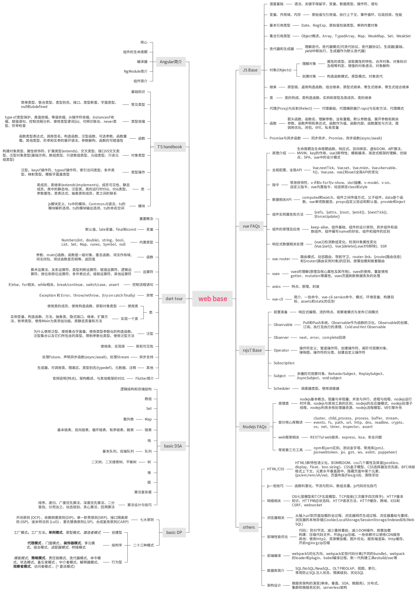

---
puppeteer:
  landscape: false
  format: "A4"
  printBackground: true

# pandoc生成标题信息时用到
# title: "web前端基础知识汇整（关键字）"
# author: David Su | callmedavidsu@gmail.com
# date: \today

# 正文字体，默认最大是12pt，要更大需要其他包(常见字号: 四号14pt 小四12pt 五号10.5pt 小五9pt)
fontsize: 10pt
# 配合form.tex的hyperref设置链接颜色
boxlinks: true
# 设置双面模式，以便.tex文件中能区分左右页眉页脚
classoption: twoside,symmetric
# 添加此可以让pandoc生成的toc新起一页，而不是接续在首页。目录页面从1开始编号
include-before:
  - '`\newpage{}`{=latex}'
  - \setcounter{page}{1}
# 样式调整好后，一定不要shift+alt+f去自动格式化，会让很多设置失效
#   例如 *斜体* 变为 _斜体_，pandoc不能识别。表格分割线----- 长度变化，但是各个栏位占比不对
---

<!-- % 画一条横线：\rule[水平高度]{长度}{粗细} -->
<!-- A4 宽21cm，左右边距0.8cm，线长19.4cm -->
<!-- \rule[0pt]{19.4cm}{0.03em} -->

\textcolor{white}{.}{width=110%}

\newpage

**vue** **生命周期**：创建、挂载、更新、卸载。其他`keep-alive`时使用的 activated/deactivated，出错时 errorCaptured

**响应式**：`object.defineProperty()` (数组元素和对象属性修改不可知) 和 proxy 代理对象。reactive()和 ref()。  
_树摇设计_，全局 API 先引入再使用。 setup()把返回值暴露给其他模块和选项式 API 钩子。

**双向绑定**：model 和 view 的相关作用，通过数据劫持和发布订阅模式实现  
v-model 就是`@input`事件监听和`:value`属性值的语法糖。

**有缩写的指令**，就是常用的指令。事件绑定 `v-on -> @` 、属性绑定`v-bind -> :`、 插槽 `v-slot -> #`

**渲染管道**：渲染函数创建 VDOM `->` 渲染器遍历 VDOM `->` 创建实际节点。  
有变更时，副作用函数创建一个更新后的 VDOM，渲染器遍历与旧 VDOM 比较（diff 算法），更新到真实 DOM 树。  
*diff 算法*遍历对比新旧 VDOM 树，同级到子节点。key 用来辨识 VNODE，有意义的 key 有助于更好的区分 Vnode 节点。

**模板编译过程**就是将 template 转为渲染函数(render 函数)的过程。  
template`->`AST,更新优化 AST`->`codegen 生成代码 render 函数`->`返回 VDOM`->`渲染器遍历 VDOM，比较差异`->`更新到 DOM  
**VDOM** 简单来讲就是使用 js 对象模拟真实的 DOM，好处是抽象、跨平台、性能好。不足就是节点太多计算量也会很大、无法极致优化。

```
       Controller                  Presenter               ViewModel

    View        Model          View       Model         View       Model
```

**SPA**：单页应用，动态重写当前页面进行交互。不会因为用户操作进行页面跳转，和之前的 jsp web 不一样  
好处：用户体验好，服务器压力小，前后端分离。不足：SEO 差，首屏加载东旭多，路由管理页面切换

**SSR**：服务端完成页面的 HTML 结构拼接的页面处理技术，发送到浏览器，然后为其绑定状态与事件，成为完全可交互页面的过程。  
好处：页面加载更快，SEO 好，后端统一处理方便。不足：服务器压力大，开发限制多，构建部署需求高。  
使用 SSR 的重要考量：首屏页面加载时间是否非常严格。

**组合式全局 API**，按需引入，有利树摇，打包更小。
`new Vue()->createApp()`。在 v3，`Vue.filter/set/delete/extend`等已经移除。  
`Vue.nextTick()` 在修改数据之后立即使用这个方法，获取更新后的 DOM 。有时使用 `vm.$forceUpdate()`强制该组件重新渲染。

**状态 API**：watch/computed，前者在数据更改时调用的侦听回调， 后者计算属性。  
每次创建一个新实例后，我们能够调用 data 函数，从而返回初始数据的一个全新副本数据对象。

**单向数据流**：父组件 `->` props `->` 子组件。不逆向传递。

**异步组件**：拆分为更小的块，按需加载。

**组件设计原则**：个人认为首要是完成业务需求。然后复用、低耦合、粒度适中、(尽量减少数据状态变化)。

vue-router v2/v3

**mode/history 配置**: **hash**/createWebHashHistory()，**url 加`#`**。**history**/createWebHistory()会触发**添加到浏览器历史记录栈**中。abstract、createMemoryHistory()。  
**动态路由**: 路径参数用冒号表示。编程式导航 **router.push(会添加历史记录)**/replace/go。响应路由参数变化 watch 监听`$route`的 to/from。  
**导航守卫**：有使用全局前置守卫 beforeEnter 来做根据登录者权限显示页面的操作。其他守卫按需使用即可。

**vuex**：状态管理。pinia 类似，更符合组合式 API，更简洁，搭配 ts 更好的类型推断。

**state** 定义状态数据结构。**getter** 从 store 获取数据（vue 组件显示数据时使用）。**mutation** 变更 store 状态的唯一方法。  
**action** 可以处理后台返回数据时，调用 mutation 修改 store 数据状态。module 允许将一个 store 拆成多个 store 保存在同一状态树。

状态如果需要持久化的话，还是需要使用 localStorage、indexdb 等其他方式。

**axios** 是基于 promise 的网络请求库。node 环境使用 http 模块。浏览器使用`XMLHttpRequest`(一个 web api，对象用于与服务器交互)

asset 会在 build 的时候打包到 static。

angular 是一个平台。有框架、有工具、有库。关键概念。template、组件间双向绑定，指令控制模板，依赖注入 service 控制组件。

**W3C 标准**，比较重要的几个 html、css、xml、dom 等。

区分：DOM property，HTML attribute。

**DOM** **文档对象模型，处理网页内容。BOM** 浏览器对象模型，与浏览器进行交互。

**position**：_指定元素在文档中的定位方式_。属性例如 fixed、absolute、static。  
**float**：_指定一个元素沿其容器左侧右侧放置_。属性例如 left、right。  
**display**：设置*元素的内部和外部显示类型*。例如 grid、flex、inline。

**box-sizing**：应该如何计算一个元素的总宽度和总高度。  
**标准盒子**，content-box，_只包含 content 的宽高_。**IE 盒子**,border-box，_包含 content 宽度、padding、border_，不包含 margin。

css 选择器优先级 `!important` `>` 内联样式 `>` id `>` class

px 像素，em 为 px 的倍数，rem 为 root em，vh/vw 为窗口 100 等分。

**BFC** 块格式上下文，_内部子元素不会影响到外部元素_。  
创建 BFC 例如 display 为 flex、grid、inline-block，position 为 fixed、absolute，float 为 none。

**CSS 的布局**：正常文档流、display 属性、float 属性、position 属性、表格、多列……

**OSI 7 层/TCP/IP5 层网络模型**：物理层、数据链路层、网络层、传输层、(会话层、表示层、应用层)

**TCP3 次握手、4 次挥手**。  
**http/https**:一个客户端和服务端请求和应答的标准（tcp 之上）。区别在于加密传输、默认端口、证书（身份认证和安全）

**http1.1**：允许在 TCP/IP 上的 http 应用协议。缺点：对头堵塞、无状态 header 巨大、明文传输等。  
**http2 优点**：header 压缩、多路复用、二进制传输、安全性提高。缺点：队头堵塞未彻底解决，多路复用服务器压力大。  
**htt3**:http over quic。基于 udp，彻底解决队列堵塞问题，udp 的开销少效率高等、保留 http2 的其他优点。

**http 响应码**：信息响应 0-199,成功响应 200-299,重定向 300-399，客户端错误 400-499,服务端错误 500-599。  
**http 请求方法**：get(参数在 url 有长度限制)、put(幂等)、post(参数在 request body，容量更大)、delete。

**http 缓存**：强制缓存和协商缓存。  
http 再次请求时先确认缓存是否过期，没过期就获取来直接显示(强缓存)。过期了看 ETag/Last-Modified 是否有，没有就重新请求，再协商缓存请求响应。都有则服务器决策，返回 200，也是请求响应协商缓存，返回 304 就从缓存读取呈现。

正常刷新输入 url(缓存都在)，手动刷新 f5(协商还在)，强制刷新 ctrl+f5(都不在)。

**同源**：协议+域名+端口。  
**XSS**:跨站脚本攻击。对输入都要小心对待，最好模板化。  
**CSRF**:跨站伪请求，借助用户 cookie 欺骗服务器。双重 cookie 验证，使用 token 等。

**url 到页面加载过程**：域名解析，建立 tcp 连接，发起 http 请求，获取服务器响应，关闭 tcp 连接，浏览器渲染并显示页面。（websocket 长连接不会断，我们用来做状态更新报警弹窗等）  
**浏览器渲染过程**：采用流式布局，把 html 解析成 dom，css 解析成 CSSOM，合成一棵渲染树。通过渲染树解析节点，计算他们在页面的大小和位置。最后进行绘制。因为流式布局，遍历 1 次。如果是 table 布局，可能就很多次，影响性能，最好别用。

**重排一定重绘**。类似排版布局的改变和某一块元素的改变。重排变化更大开销更大，但一般都要避免。

cookie，localstorage 和 sessionstorage，4K/5M，在浏览器端存储状态，session 在会话有效，同源窗口也不通用，local 则不删除一直在。

**ts**：js 的超集，最后也是编译成 js 运行，所有类型也都没有了。最大的好处也就是 type，静态类型的好处，js 不支持类型创建。类型检查，出错更好找，代码更健壮。

基本类型、基本语法、控制流程、函数、对象、类等。

**类型收缩**：将类型细化到比声明的更具体的类型的过程被称为收缩。  
typeof 类型守护、真值收缩、等值收缩、n 操作符收缩、instanceof 收缩、使用类型谓词等。

**函数**表达式`(a: string) => void`; 和函数签名: `(someArg: number): boolean`;  
泛型函数：函数的输出类型依赖函数的输入类型，或者两个输入的类型以某种形式相互关联。  
可选参数`?`,重载，参数展开语法`...`，函数可赋值性

**对象**：分组传递数据。  
创建对象：interface、type 别名、匿名的对象类型（例如某些函数参数的类型）  
属性修饰符：`readonly`，`?`，索引签名:`[index: string]: number` key 的类型为 string，value 类型为 number，其他无所谓。  
扩展对象：`interface CC extends Colorful, Circle {}`、交叉类型`type CC = Colorful & Circle;`  
泛型对象：类似数组本身就是`Array<Type>`，还有只读数组、元组、只读元组。元组元素类型可以不一样，数组需要一样。

**类**：成员：字段、方法、构造器、代码块、访问器具（可有静态成员）。类单继承，多实现。  
可见性：public，protected，private，检查期间有效，编译后都没有了。和 js 的`#`强私有不同。  
泛型类：类可以像接口那样使用泛型约束和默认值。  
抽象类：充当一个基类，让其子类去实现所有的抽象成员。  
结构一样的不同两个类，实际上是可以相互替换的。

包含 顶层 import 或者 export 声明的文件会被视为一个**模块**，没有的则为**脚本**。
ES Module：export、import x from。CommonJS:module.export,let x =require('xxx')

**关于 vue3 的使用**，升级了一个简单的，解决过程。

**关于 webpack 的使用**：了解基本流程，同一时间大体版本基本同一份进行个别修改。插件、loader 等都有版本限制，配置更新在使用上也有差异。  
webpack 核心概念：entry、output、loader、plugin、mode、浏览器兼容性……  
webpack 同一个入口会打包成一个 bundle 文件，文件发生变化 bundle 会被重新构建，所以大规模应用启动和热更新慢。  
新型构建工具 esbuild、swc 甚至更快，但也要考虑生态，成熟的东西可能比重复造轮子成本要低。

**优化**：减少体积、加快速度。  
前者：代码图片等压缩、开起树摇、指定合适 source-map 等。后者：多线程构建、使用缓存、开起热更新、指定文件处理、dev 和 prod 配置分开。  
其他：懒加载，小图片直接使用 bse64，nginx 开起 gzip 压缩，等。  
更多：良好的硬件基础、代码组件良好的设计、减少重排重绘、减少请求次数等。

**vue 全家桶**（适当对比 angular）：构建工具 vue-cli，路由管理 vue-router，状态管理 vuex/pinia，http 客户端 axios，UI 组件 element-ui 等

- 数据库的设计和数据仓库的升级
- webflux 中处理带图片数据的通知消息的请求处理
- SkyWalking 链路追踪没法对 webflux 项目生效
- 基础表数据存在，页面查看不到（ dwd_device 宽表的索引 ( 各种联合的 type 字段 ) 超过默认 1000 ）
- 设备有发送消息， kafka 没收到 (kafka 启动成功再启动 emqx ，自己写的桥接组件才能正常运作 )
- 偶尔出现访问某些接口服务很慢，但第二次或者之后就很正常了。不能稳定复现（ openfeign 懒加载）
- nacos 日志输入太多太频繁，影响链路追踪采样（不追踪 http-url-connection 的连接请求）
- Flink job 读取 tikv 数据变更（修改后的 tikv client-java 直接读取 tikv 变更， flink-cdc-connectors 去接收数据）
- 数据修改后通过 flink job 同步到宽表时延迟较高的问题（启用了 miniBatch 缓存合并计算结果）
- 通过 Flink 操作的数据修改后结果不一致的问题（ flink sql 的 update 会拆成 delete+insert ，保持有序，删除大于插入的丢掉）
- Flink 聚合时数据倾斜的问题（同类型产品的消息过多， task 处理来不及。通过广播方式别的空闲的也能处理）
- 前端有印象的点（ 5 级行政区划下拉框组件、点击地图获取经纬度详细地址封为单独组件、工程地图拖拽点获取坐标值

\newpage

**\textcolor{brown}{[sass/SCSS 关键字入门]}**: 预处理、变量、嵌套结构、局部文件、模块、混合器、继承、操作符

`$`变量声明，`&`父选择器标识符，`>`子组合选择器，`~`和`+`同层组合选择器，`@use`加载函数变量模块等，`!default`修饰变量表示有默认值就用默认值没有就要新声明的值，`@mixin`声明混合器用`@include`导入使用，`@extend`继承另一个选择器定义的样式。

**\textcolor{brown}{[vue 响应式原理概述]}**: **vue2** 通过 [数据劫持] 和 [观察-订阅者模式] 来实现 MVVM 双向绑定，也就是响应式。一言以蔽之，**通过`数据劫持`得到了 getter、setter，触发 getter 时会添加一个`订阅者`，触发 setter 时会`发布通知`，所有关联的订阅者进行`数据更新`**。**vue 3** 实现响应式类似，本质上是通过 Proxy API 劫持了**数据对象**的读写:当我们访问数据时，会触发 getter 执行依赖收集；修改数据时，会触发 setter 派发通知。

类比(但不一样): targetMap - Dep，响应式函数 cb - watcher，track - addSub，trigger - notify。

**ref()**: 接受一个内部值，返回一个响应式的、可更改的 ref 对象，此对象只有一个指向其内部值的属性 .value 。_如果将一个对象赋值给 ref，那么这个对象将通过 reactive() 转为具有深层次响应式的对象_。**reactive()**返回一个对象的响应式代理,返回的对象以及其中嵌套的对象都会通过 ES Proxy 包裹，因此**不等于**源对象，建议*只使用响应式代理*，避免使用原始对象。  
**toRef()**: 基于响应式对象上的**一个属性**创建一个对应的 ref。这样创建的 ref 与其源属性保持同步:_改变源属性的值将更新 ref 的值，反之亦然_。**toRefs()**: 将**一个响应式对象**转换为一个普通对象，这个普通对象的*每个属性都是指向源对象相应属性的 ref*。每个单独的 ref 都是使用 toRef() 创建的。如果要*为可能还不存在的属性创建 ref，请改用 toRef*。

**nextTick()**可以*在状态改变后立即使用，以等待 DOM 更新完成*。可以传递 cb 作为参数，或者 await 返回的 Promise。_就是『利用 Event loop 事件线程去异步操作』_。**本质上**就是*注册异步任务来对任务进行处理*。即创建一个异步任务，那么它自然要等到同步任务执行完成后才执行。

**computed()**计算属性的**结果会被缓存**,除非依赖的响应式 property 变化才会重新计算。*将同样的函数定义为一个方法*结果上确实是*完全相同*的。方法调用**总是**会在重渲染发生时再次执行函数。_计算属性的返回值应该被视为只读的，应该更新它所依赖的源状态以触发新的计算_。
**watch()**默认是懒侦听，即*仅在侦听源发生变化时才执行回调函数*。3 个参数分别为*侦听器的源*、_在发生变化时要调用的回调函数_、_一个可选的配置对象_。
**watchEffect()**: _立即运行一个函数_，同时响应式地追踪其依赖，并在依赖更改时重新执行(依赖源同时是回调函数)。2 个参数分别是*要调用的回调函数*和*一个可选的配置对象*。

**vue 的模板语法**支持文本插值`{{}}`、原始 HTML`v-html`、Attribute 绑定`vbind,简写:`、js 表达式(**绑定在表达式中的方法在组件每次更新时都会被重新调用**，因此**不应该**产生任何副作用，比如改变数据或触发异步操作。)、指令(如`v-if`，一个指令的任务是*在其表达式的值变化时响应式地更新 DOM*)。

**模板编译大概流程: `(template -> ast -> render 函数) -> 创建虚拟 dom -> diff 算法更新虚拟 dom -> 产生、更新真实节点`**

- template → parse 模版基础编译 → optimize 优化 AST → generate 生成 JS 字符串 → render 函数

**简单 diff 算法**拿新的一组子节点中的节点去旧的一组子节点中寻找可复用的节点。如果找到了，则记录该节点的位置索引。把这个位置索引称为*最大索引*。在整个更新过程中，如果一个节点的索引值*小于最大索引*，则说明该节点对应的真实 DOM 元素*需要移动*。

**双端 diff 算法**在新旧两组子节点的*四个端点之间分别进行比较*，并试图找到可复用的节点。如果头尾没有可复用的节点，就*尝试看看非头部、非尾部的节点能否复用*，具体做法是 _拿新的一组子节点中的头部节点去旧的一组子节点中寻找_。

**快速 diff 算法**:先*预处理*寻找相同的*前置和后置节点*，此时若新旧节点组有遍历完的，可以通过卸载或挂载完成更新。没能通过卸载和挂载完成更新，再根据*剩下的节点的索引关系，构建新节点组的最长子序列索引数据*，其指向的节点*不需要移动*。剩下的节点再根据情况挂载或移动。

**\textcolor{brown}{[webpack]}**是一个用于现代 JavaScript 应用程序的*静态模块打包工具*。当 webpack 处理应用程序时，它会在内部从一个或多个入口点构建一个*依赖图(dependency graph)*，然后将项目中所需的*每一个模块组合成一个或多个 bundles*，它们均为静态资源，用于展示你的内容。

**webpack 名词**: **entry**、output、**compiler**、**compilation**、**dependence**、dependency graph、**module**、**chunk**、**loader**、**plugin**、configuration、tapable、mode、浏览器兼容性、environment

**Webpack5 特性**: 编译缓存、长效缓存、Node Polyfill 脚本被移除、更优的 tree-shaking、Module Federation

**Webpack 性能优化**4 个方向：构建速度优化、代码体积优化、持久化缓存优化、Module Federation

**webpack5 核心流程**: 初始化、构建阶段（make）、生成阶段（seal）、输出阶段（emit）

1. 初始化: 收集处理各部分的参数、创建编译器对象、初始化编译环境(注册用户配置插件及内置插件)、运行编译(compiler.run)、确认入口
2. 构建(make)阶段: 模块路径解析、模块内容解析、AST 遍历处理、依赖解析(构建 ModuleDependencyGraph，依赖递归处理)
3. 生成(seal)阶段: entry 生成 chunk、异步模块生成 chunk、[optional] runtime 生成 chunk、构建 ChunkGraph
4. 输出(emit)阶段: 合并 chunk、写出 assets

**plugin** 是一个具有 apply 方法的 js 对象。apply 方法会被 webpack compiler 调用，并且在 **整个** 编译生命周期都可以访问 compiler 对象。  
从形态上看，插件通常是一个带有 apply 函数的类。`class SomePlugin { apply(compiler) {} }`，_apply 函数运行时会得到参数 compiler ，以此为起点可以调用 hook 对象注册各种钩子回调_，钩子的核心逻辑定义在 [Tapable](https://github.com/webpack/tapable) 仓库。_apply 虽然是一个函数，但是从设计上就只有输入，webpack 不关心输出，所以在插件中只能通过调用类型实体的各种方法来或者更改实体的配置信息，变更编译行为。_  
webpack 的插件体系与平常所见的 订阅/发布 模式差别很大，是一种非常强耦合的设计，_hooks 回调由 webpack 决定何时，以何种方式执行；而在 hooks 回调内部可以通过修改状态、调用上下文 api 等方式对 webpack 产生 [side effect]_。

**loader** _用于对模块的源代码进行转换_。在【构建阶段】有一过程，调用 [loader-runner](https://www.npmjs.com/package/loader-runner) 仓库的 `runLoaders` 转译 module 内容，通常是从各类资源类型转译为 JavaScript 文本。`runLoaders` 会调用用户所配置的 loader 集合读取、转译各种类型的资源。转译之后理论上应该输出标准 js 文本或者 AST 对象，webpack 才能继续处理模块依赖。

**js:类是用于创建对象的模板。java:类是一个模板，它描述一类对象的行为和状态；对象是类的一个实例。**

`browserify`是一个 node.js 模块，主要用于改写现有的 CommonJS 模块，使得浏览器端也可以使用这些模块。  
`gulp`基于流(stream)的自动化构建工具,代码优于配置、node 最佳实践、精简的 API 集。  
`parcel`是 Web 应用打包工具，适用于经验不同的开发者。它利用多核处理提供了极快的速度，并且不需要任何配置。  
`rollup`是一个 JavaScript 模块打包工具，可以将多个小的代码片段编译为完整的库和应用。使用的是 ES6 版本 Javascript 中的模块标准。  
`snowpack`是一个快如闪电的前端构建工具，为现代 web 而设计。利用了 js 的本地模块系统（称为 ESM），以避免不必要的工作，并保持快速。  
`vite`是一种新型前端构建工具,由一个非构建式*原生 ESM 开发服务器*(HMR 很快)和*一套构建指令*(生产环境使用 rollup 打包代码)构成。

\newpage

**\textcolor{brown}{[前端工程化]}**: 一切能提升前端开发效率、提高前端应用质量的方法和工具都是前端工程化。内容概述:

**\textcolor{brown}{开发}**: **框架选型**、前后端分离、**模块化**、**组件化**、脚手架、组件库、本地开发服务器、mock 服务、微前端

**测试**: (先对整体功能进行充分自测，再移交专业的测试人员验证)单元测试框架、静态扫描工具、自动化测试工具、性能测试工具

**\textcolor{brown}{构建}**: 依赖打包、文件压缩、代码分割、增量更新与缓存、资源定位、图标合并、ECMAScript 与 Babel、CSS 预编译与 PostCSS、持续构建和集成、类库打包、构建优化

**\textcolor{brown}{部署}**: 持续部署、部署流程设计、静态资源部署策略、**nginx 反向代理**、SPA 路由配置、**跨域**、https 证书、http2 配置、灰度发布

**\textcolor{brown}{性能}**: **缓存策略**、缓存复用、CDN 内容分发网络、按需加载、同步异步加载、请求合并、**首屏渲染速度**、http2 服务器推送、**日志性能监控**、**预加载**、性能测试、_监控阶段(埋点平台:统计、分析业务数据，跟踪性能指标; 监控平台:观察线上的异常信息，包括报错、白屏、流量异常等)_

**\textcolor{brown}{规范化}**: 目录结构规范、编码规范、技术栈规范、前后端接口规范、**commit 消息规范**、git 分支管理规范、**code review 规范**、设计规范、图标规范、文档规范、版本规范、开发流程规范、发布工作流规范

**组件设计原则概述**:_ui 组件看设计 antd/element-ui，业务组件抽逻辑，dump (展示)组件纯模版，smart (容器)组件带 state_  
**组件的设计通用原则**:标准性、独立性、复用与易用、尽量不要重复代码、避免暴露组件内部实现、避免直接操作 DOM，避免使用 ref、入口处检查参数的有效性，出口处检查返回的正确性、扁平化参数、良好的接口设计、无环依赖原则、合理的依赖关系、稳定抽象低耦合原则、避免冗余状态、API 尽量和已知概念保持一致  
**组件二次封装原则**:1 主要以父组件传递数据给子组件来实现一些功能，子组件定义固定的展示样式，将具体要实现的业务逻辑抛出来给父组件处理；2 尽量保持 element-ui 组件原有方法；3 理清哪些是 props，不要修改 props 的数据；4 载体分离原则，内容是页面的主要内容，载体是展示的方式。

**\textcolor{brown}{[TCP/IP 协议]}**: _是指能够在多个不同网络间实现信息传输的协议簇。_ 其中 TCP 协议和 IP 协议最具代表性。通常被认为是一个四层协议系统:链路层(设备驱动程序、网络接口卡等)，网络层(IP、ICMP、IGMP 等)，传输层(TCP、UDP)，应用层(HTTP、FTP、Telnet 等)

**TCP、UDP 主要区别** TCP: 面向连接、传输可靠、传输大量数据、速度慢；UDP: 无连接、传输不可靠、传输少量数据、速度快

**面向连接**是一种网络协议,依赖发送方和接收器之间的*显示通信和阻塞*以管理双方的数据传输.

TCP 是一个可靠的传输协议，由一端放到网络上的内容，最终总会以**相同的顺序**出现在另一端。如果*连接双方的网络中有一个数据包丢失，或者任何一方的网络出现中断，整个 TCP 连接就会暂停，丢失的数据包需要被重新传输*。这种单个数据包造成的阻塞就是**TCP 上的队头阻塞**。

**HTTP**是一个用于传输超媒体文档（例如 HTML）的应用层协议。遵循经典的**client-server 模型**。HTTP 是**无状态协议**，这意味着*服务器不会在两个请求之间保留任何数据（状态*）。尽管通常**基于 TCP/IP 层**，但它*可以在任何可靠的传输层上使用*。**基于`HTTP`的组件系统**:客户端 user-agent(浏览器，发起请求的实体)`->`代理(proxies，各种网络之间进行导航)`->`web server(提供客户端请求的文档)

**HTTP 的基本性质**:简单(报文易读)、可扩展(自定头)、无状态(同一个连接的不同请求之间没关系)、可用 cookie 创建有状态的会话

**客户端和服务端进行信息交互流程**:打开一个 TCP 连接、发送一个 HTTP 报文、读取服务端返回的报文信息、关闭连接或者为后续请求重用连接。

**HTTP 报文**是使用 HTTP 的关键；它们的结构简单，并且具有高可扩展性。HTTP/2 帧机制是在 HTTP/1.x 语法和底层传输协议之间增加了一个新的中间层(将 HTTP/1.x 消息分成帧(frame)并嵌入到流(stream)中)，而没有从根本上修改它，即它是建立在经过验证的机制之上。http2 数据帧和报头帧分离，这将允许*报头压缩*。将多个流组合，这是一个被称为*多路复用*的过程。

**HTTP 请求和响应报文结构类似**:起始行、可选的 HTTP 头集合(headers)、空行、可选的包含请求相关数据的正文或响应相关的文档(body)。

**HTTP 的发展**:`万维网`(4 个部分:文本格式、简单协议、网络浏览器、服务器);`HTTP/0.9`(单行协议,唯一 GET 方法后面跟目标资源路径);`HTTP/1.0`(构建可扩展性,加入协议版本、状态码、http 头);`HTTP/1.1`(标准化的协议,连接可复用(pipelining 性能差)、响应分块、缓存控制、内容协商、host 头);`TLS`(额外的加密传输层 SSL 标准化成为 tls);`HTTP/2`(基于 SPDY 为了更优异的表现,二进制协议、可复用、压缩 headers、服务器推送、多路复用(受限 TCP 队头阻塞));`HTTP/3`(基于 QUIC 的 HTTP，传输层使用 QUIC 在 UDP 上运行多个流并为每个流独立实现丢包检测和重传(udp 更快，解决队头堵塞))

**HTTP/1.x 连接模型**：短连接, 长连接, 和 HTTP 流水线。**HTTP/2 新特性**:二进制传输、Header 压缩、多路复用、服务端推送

**HTTP/1.1 协议升级机制**:允许将一个已建立的连接升级成新的、不相容的协议。通常由客户端发起(浏览器代做细节)，服务端可以选择是否要升级到新协议，可以以 http/1.1 启动连接，再升级到 http2 甚至 websocket(http2 明确禁止此机制，只属于 1.1)。  
**具体过程**:客户端先发送一个简单请求，添加两项额外的头(`Connection: Upgrade`和`Upgrade: websocket`)指明此处请求是一个升级请求和升级的目标协议。服务端**决定升级**则*返回一个`Status Code: 101 Switching Protocols`，和一个要切换到的协议的头部字段 `upgrade: websocket`*。**没有(或者不能)升级**，_会忽略客户端发送的 "Upgrade 头部字段_，返回一个常规的响应。

**\textcolor{brown}{[HTTP 缓存]}**寻找顺序: Service Worker、Memory Cache、Disk Cache(绝大部分缓存来源)、Push Cache(http2 内容)。**HTTP Caching 标准缓存分类**:私有缓存(绑定到特定客户端的缓存)、共享(分代理和托管)缓存(客户端和服务器之间，可以存储能在用户之间共享的响应)

**HTTP 缓存过程**: 浏览器第一次向服务器发起该请求后拿到请求结果，会*根据响应报文中 HTTP 头的缓存标识*，决定是否缓存结果，是则将请求结果和缓存标识存入浏览器缓存中。根据*是否需要向服务器重新发起 HTTP 请求*将*缓存过程*分为两个部分，分别是*强制缓存*和*协商缓存* 。

**浏览器缓存过程总结**:_强制缓存(也称本地缓存)优先于协商缓存进行_，若强制缓存(`Expires`或`Cache-Control`头)生效则直接使用缓存，若不生效则进行协商缓存(`Last-Modified/If-Modified-Since`或`Etag/If-None-Match`头)。协商缓存由服务器决定是否使用缓存，若协商缓存失效，那么代表该请求的缓存失效，重新获取请求结果，再存入浏览器缓存中；生效则返回 304，继续使用缓存。

**`Cache-Control`主要取值**:`public`：所*有内容都将被缓存*（客户端和代理服务器都可缓存）。`private`(默认值)：所有内容*只有客户端*可以缓存。`no-cache`：客户端缓存内容，但是是否使用缓存则*需要经过协商缓存来验证*决定。`no-store`：所有内容*都不会被缓存*。`max-age=xxx`(xxx 是数字)：缓存内容将在*指定有效期后(单位秒)后失效*

**\textcolor{brown}{[页面渲染过程]}**:导航、DNS 查询、TCP 握手、TLS 协商、响应(TCP 慢启动/14KB 规则、拥塞控制)、解析(\textcolor{red}{构建 DOM 树}、预加载扫描器、\textcolor{red}{构建 CSSOM 树}、JavaScript 编译、构建辅助功能树)、渲染(\textcolor{red}{样式(渲染树构建)}、\textcolor{red}{页面布局}、\textcolor{red}{页面绘制}、合成)、交互。

**关键渲染路径 CRP**:是浏览器将 HTML，CSS 和 JS 转换为屏幕上的像素所经历的步骤序列。**优化重点**:资源加载优先级顺序和资源大小。

**web 用户体验**两重点:*页面内容快速加载*和*流畅的交互*。**影响 web 性能**的两大主因:*等待资源加载时间*和*大部分情况下的浏览器单线程执行*。

_通过了解浏览器单线程的本质与最小化主线程的责任可以优化 Web 性能，来确保渲染的流畅和交互响应的及时。_

\newpage

**\textcolor{brown}{[web 性能指标]}**(类型可分为 感知加载速度、加载响应度、运行时响应度、视觉稳定性、平滑度)，后 3 个为"核心 web 指标":  
[FCP(First Contentful Paint)](https://web.dev/fcp/) `首次内容绘制`指标测量*页面从开始加载到页面内容的**任何部分**在屏幕上完成渲染的时间*。  
[TTI(Time to Interactive)](https://web.dev/tti/) `可交互时间`指标测量*页面从开始加载到主要子资源完成渲染，并能够快速、可靠地响应用户输入所需的时间*。  
[TBT(Total Blocking Time)](https://web.dev/tbt/) `总阻塞时间`指标测量*在`FCP`和`TTI`之间发生的每个长任务的阻塞时间总和*。期间主线程被阻塞过久无法响应。  
[LCP(Largest contentful paint)](https://web.dev/lcp/) `最大内容绘制`指标测量*页面从开始加载到最大文本块或图像元素在屏幕上完成渲染的时间*。  
[FID(First input delay)](https://web.dev/fid/) `首次输入延迟`指标测量*从用户第一次与页面交互直到浏览器对交互作出响应,并能够实际开始处理所经过的时间*。  
[CLS(Cumulative layout shift)](https://web.dev/cls/) `累积布局偏移`指标测量*整个页面生命周期内发生的所有意外布局偏移中最大`一连串的布局偏移`分数*。

**性能指标阈值**:LCP 加载性能 2.5`~`4；FID 交互性 100`~`300；CLS 视觉稳定性 0.1`~`0.25。FCP 1.8`~`3；SI 3.4`~`5.8；TTI 3.9`~`7.3。

**`优化 LCP`**: LCP 主要受四个因素影响: 缓慢的服务器响应速度、JavaScript 和 CSS 渲染阻塞、资源加载时间、客户端渲染。  
**优化方向**: _使用 PRPL 模式做到即时加载_: `PRPL`: Preload(预加载) 最重要的资源、尽快 Render(渲染) 初始路由、Pre-cache(预缓存) 剩余资源、Lazy load(懒加载) 其他路由和不重要资源。_优化关键渲染路径。优化 js。优化 CSS。优化图像。优化网页字体。_

**`优化 FID`**: 糟糕的 FID 主要是由**繁重的 JavaScript 执行**导致的。优化网页上 js 的解析、编译和执行方式将直接降低 FID。
**优化方向**: _分割长任务_、_优化页面做好交互准备_(渐进式加载代码和功能，最大限度地减少对级联数据获取的依赖，按需加载第三方代码)、_最小化主线程工作_(使用 Web Worker)、_减少 js 执行时间_(延迟加载未使用的 js、最大限度减少未使用的 polyfill)、_保持较低的请求数和较小的传输大小_

**`优化 CLS`**: 遵循一些指导原则来*避免所有的意外布局偏移*。1 始终在图像和视频元素上包含尺寸属性，或者通过使用 CSS 长宽比容器之类的方式预留所需的空间(为广告位静态预留空间、 使用占位符或后备回调符为嵌入和 iframe 预先计算足够的空间)。2 除非是对用户交互做出响应，否则切勿在现有内容的上方插入内容。3 首选转换(transform)动画，而不是触发布局偏移的属性(例如`box-shadow`和`box-sizing`)动画(会触发重排绘制和合成)。

**`改进 FCP`**: **_保持较低请求数和较小传输大小_**、_预连接到所需的来源_ 、_预加载关键请求_ 、_最小化关键请求深度_ 、消除阻塞渲染的资源、缩小 CSS 、移除未使用的 CSS 、减少服务器响应时间 (TTFB)、避免多个页面重定向 、避免巨大的网络负载、使用高效的缓存策略服务静态资产、避免 DOM 过大、确保文本在网页字体加载期间保持可见、

**`改进 TTI`**: **减少第三方代码的影响** 、**减少 JavaScript 执行时间**、 **最小化主线程工作** 、**_保持较低请求数和较小传输大小_**、_预连接到所需的来源_ 、 _预加载关键请求_ 、_最小化关键请求深度_ 、缩小 JavaScript

**`改进 TBT`**: **减少第三方代码的影响** 、**减少 JavaScript 执行时间** 、**最小化主线程工作**、**_保持较低请求数和较小传输大小_**(FID 类似)

**MDN 关键性能指南**: CSS and JS 动画性能、DNS-prefetch、懒加载、性能监控、优化启动(异步启动)性能、优化关键渲染路径、优化渲染页面

**\textcolor{brown}{[CORS]}** 是一种基于`HTTP`头的机制:_通过允许服务器标示除了它自己以外的其它 origin，使浏览器允许这些 origin 访问加载自己的资源_  
CORS 还通过一种机制来检查服务器是否会允许要发送的真实请求，_该机制通过浏览器发起一个到服务器托管的跨源资源的 **"预检"请求**_。

**“同站”和“同源”**("same-site" and "same-origin"): _源 (Origin)_: _协议(或者称方案 schema)、主机名和端口（如果指定）的组合_。组合都相同的网站视为 **“同源”**，否则视为*“跨源”*。
*完整站点名称*为`eTLD+1`: _有效顶级域加上它前面的域部分。_`eTLD+1`相同的网站被视为 **“同站”**。`eTLD+1`不同的网站则被视为 _“跨站”_。顶级域(TLD)如`.com` 和 `.org`列在[根区数据库](https://www.iana.org/domains/root/db)，有效顶级域(eTLD)如`.co.jp` 或 `.github.io`列在[publicsuffix](https://publicsuffix.org/list/public_suffix_list.dat)。**“有方案同站”**(Schemeful Same-Site)即要求*方案也匹配*的“同站”。

**同源策略**:限制一个源的文档或者它加载的脚本，如何与另一个源的资源进行交互。浏览器限制脚本内发起的跨源 HTTP 请求。  
同源策略控制不同源之间的交互,_一般来说，允许跨源写、嵌入资源，而阻止跨源读取资源。_

**如何允许跨源访问**: 可以使用 CORS 来允许跨源访问。CORS 是 HTTP 的一部分，它允许*服务端来指定*哪些主机可以从这个服务端加载资源。  
**如何阻止跨源访问**:写操作(CSRF token)、跨源读(保证资源是不可嵌入的)、跨源嵌入(不允许使用`<iframe>`等标签嵌入资源)

**CORS 预检请求**:是*用于检查服务器是否支持跨域资源共享*。它是一个`OPTIONS`请求,使用了 3 个 HTTP 请求头:`ACRM`,`ACRH`,和`Origin`。

**CORS 若干访问控制场景**:1 "简单请求"不会触发 CORS 预检请求。2 "预检请求"*要求必须首先*使用 `OPTIONS` 方法发起一个预检请求到服务器，以获知服务器是否允许该实际请求。3 "附带身份凭证的请求"默认浏览器不会发送身份凭证信息，需要设定某个特殊标志位(例如`withCredentials=true`)。_如果服务器端的响应中**未携带** `ACAC: true`，浏览器将**不会**把响应内容返回给请求的发送者_(CORS 预检请求**不能**包含凭据)。如**有携带**`ACAC: true`，响应头`ACAO`、`ACAH`、`ACAM`**都不能是**通配符`*`，需要设定各自特定列表。

**可用于发起跨源请求的头字段**

```sh
# 注意，在所有访问控制请求（Access control request）中，Origin 字段 总 被发送。
Origin: `<origin>` # 表明预检请求或实际请求的源站。origin不包含任何路径信息，只是服务器名称。
Access-Control-Request-Method: `<method>` # 将实际请求所使用的 HTTP 方法告诉服务器。
Access-Control-Request-Headers: <field-name>[, <field-name>]* # 将实际请求所携带的首部字段告诉服务器。
```

**规范所定义的响应头字段**

```sh
Access-Control-Allow-Origin: <origin> | *  # 指定允许访问该资源的外域 URI。如果服务端指定了具体的域名而非“*”，那么响应首部中的 Vary 字段的值必须包含 Origin。这将告诉客户端：服务器对不同的源站返回不同的内容。
Access-Control-Allow-Credentials:true # 浏览器的 credentials 设置为 true 时是否允许浏览器读取 response 的内容
Access-Control-Allow-Methods: <method>[, <method>]* # 指明了实际请求所允许使用的 HTTP 方法。
Access-Control-Allow-Headers: <field-name>[, <field-name>]* # 指明了实际请求中允许携带的首部字段。
Access-Control-Expose-Headers: X-My-Custom-Header # 让服务器把允许浏览器访问的头放入白名单，可以暴露自定义头
Access-Control-Max-Age: xxx # 请求的结果能够被缓存多久。预检请求的结果在xxx秒内有效
```

`Vary` 是一个 HTTP 响应头部信息，它决定了对于未来的一个请求头，应该用一个缓存的回复 (response) 还是向源服务器请求一个新的回复。

**常见跨域解决方式**:jsonp(`<script>`标签没有跨域限制)、CORS、nginx 反向代理实现跨域、node 中间件代理跨域

\newpage

**\textcolor{brown}{[web 安全]}**

**常见的安全威胁对策**:_保护网站免受注入漏洞的影响_、_将网站与其他网站隔离_（网站可能以违反应用程序安全预期的方式相互交互)、_安全地构建一个强大的网站_(某些功能只有在跨域隔离下可用)、_加密到网站的流量_(传输数据加密)

**http 安全标头快速参考**(`Cross-Origin-`有 3 个，`Access-Control-`有 8 个，在`预检请求`的请求头和响应头中)

- `Content-Security-Policy`(CSP): XSS 和数据注入等 [额外的安全层]
- `X-Content-Type-Options`: 跨站脚本错误、XSSI [禁用了客户端的 MIME 类型嗅探]
- `X-Frame-Options`: 点击劫持 [是否允许浏览器在 iframe 等标签中显示页面]
- `Cross-Origin-Resource-Policy`(CORP): 跨站泄露 [指示浏览器阻止对指定资源的无源跨域/跨站点请求]
- `Cross-Origin-Opener-Policy`(COOP): XS-Leaks 的跨域攻击 [确保顶级文档不会与跨源文档共享浏览上下文组]
- `Cross-Origin-Embedder-Policy`(COEP): 降低基于 Spectre 的攻击窃取 [防止文档加载未明确授予文档权限的任何跨域资源]
- `Strict-Transport-Security`(HSTS): 数据传输安全
- (CORS): 解除浏览器默认的强制的同源策略限制。区分简单请求和预检请求的不同良好配置。

**HTTPS 为何重要**:阻止入侵者*篡改*网站与用户浏览器间的*通信*,防止入侵者*被动监听*网站与用户之间的*通信*,是一些现代化 web 新功能和更新 API 的*权限工作流的关键组成*部分。

**混合内容**: 同一个页面上同时加载了 HTTP 和 HTTPS 内容，*而且*初始请求是通过 HTTPS 加密的。
**被动混合内容**是指*不与页面其余部分交互的内容*。**主动混合内容** _作为一个整体与页面进行交互，因此允许攻击者对页面执行几乎任何操作_。

**修复混合内容的措施**:把所有 http 的资源改成 https。使用 CSP 响应头配置所有 http 当做 https 链接，或者阻止所有混合内容。

**本地开发环境使用 https**:使用 [mkcert](https://github.com/FiloSottile/mkcert)、`Let's Encrypt`等第三方机构的证书、`openssl`等自签名证书、反向代理

**防止信息泄露**:浏览器沙箱模式、同源策略、跨域资源共享的安全配置、使用 COOP 和 COEP 开启网站“跨源隔离”、使用 Fetch Metadata 请求标头保护资源免受 Web 跨源攻击(例如 CSRF、XSSI、定时攻击、跨源信息泄漏(XS-Leaks)或推测执行侧信道(Spectre)攻击。)

**保护用户免受跟踪**:Set-Cookie 响应头及其 SameSite 指令配置、通过 [User-Agent Client Hints API](https://developer.mozilla.org/en-US/docs/Web/API/User-Agent_Client_Hints_API) 改善用户隐私和开发者体验、Referer 和 Referrer-Policy 最佳实践(`strict-origin-when-cross-origin`)。

**MDN 的 web 安全概述**:_内容安全_: CSP (内容安全策略)、
_连接安全_: 传输层安全（TLS）、HTTPS、HSTS、HTTP 公钥锁定(HPKP)、混合内容(修复含有混合内容的网站)、安全上下文(限制在安全上下文中的特性)、
_数据安全_: 使用 HTTP Cookies、Local Storage、
_信息泄露_:Referer 标头策略(隐私和安全性考虑)、
_完整性_: 同源策略(Same-origin policy)、子资源完整性(SRI)、`Access-Control-Allow-Origin`响应头、`X-Content-Type-Options`响应头、
_点击劫持保护_: `X-Frame-Options`响应头、CSP 指令:`frame-ancestors`、
_用户信息安全_: 不安全的密码、隐私性和`:visited`选择器

**常见的 web 攻击方式**

Server-side topics

- 1 SQL injection(用户输入了 SQL 指令字符串，程序没有检查，则可能在数据库服务器被认为正常指令而遭到破坏)
- 2 Authentication(身份验证机制很弱或者实现中的逻辑缺陷或糟糕的编码，使得攻击者完全绕过了身份验证机制(账密太简单也算))
- 3 Directory traversal(允许攻击者读取运行应用程序的服务器上的任意文件,比如对 url 中目录层级没有限制或者直接`../../xx`)
- 4 OS command injection(允许攻击者在运行应用程序的服务器上执行任意操作系统命令，如把用户输入值直接用作 shell 执行参数)
- 5 Business logic vulnerabilities(应用程序设计和实现中的缺陷使攻击者能够操纵合法功能以实现恶意目标,如[必填值未被真有填](https://portswigger.net/web-security/logic-flaws/examples))
- 6 [Information disclosure](https://portswigger.net/web-security/information-disclosure)(网站无意中向用户泄露敏感信息，比如在源代码中硬编码 API 密钥、IP 地址、数据库凭证等)
- 7 [Access control](https://portswigger.net/web-security/access-control)(用户实际上可以访问某些资源或执行某些他们不应该能够访问的操作，如控制访问的设计不完备)
- 8 File upload vulnerabilities(服务器未正确验证文件属性(类型、内容等)，文件成功上传后未受限制。如上传了启用远程代码的脚本)
- 9 [Server-side request forgery (SSRF)](https://portswigger.net/web-security/ssrf)(允许攻击者诱导服务器端应用向一个非预期的位置发出请求。内网的防御不那么强)
- 10 [XXE injection](https://portswigger.net/web-security/xxe)(允许攻击者干扰应用程序对`XML`数据的处理。因为`XML`规范包含各种潜在的危险特性，标准解析器支持这些特性)

Client-side topics

- 11 Cross-site scripting (XSS)(攻击者通过在目标网站上注入恶意脚本，使之在用户的浏览器上运行)
- 12 [Cross-site request forgery (CSRF)](https://portswigger.net/web-security/csrf)(允许攻击者诱导用户执行他们不打算执行的操作。例如[2007 年 Gmail 的 CSRF 漏洞](https://www.davidairey.com/google-gmail-security-hijack/))
- 13 [Cross-origin resource sharing (CORS)](https://portswigger.net/web-security/cors)(网站的 CORS 策略配置和实施不当。例如 ACAO 响应头配置不当引发跨域攻击)
- 14 Clickjacking(通过点击诱饵网站中的其他内容，诱骗用户点击隐藏网站上的可操作内容)
- 15 [DOM-based vulnerabilities](https://portswigger.net/web-security/dom-based)(当网站包含的 js 将一个攻击者可控制的值传递给一个危险的函数时，会出现基于 DOM 的漏洞)
- 16 [WebSockets](https://portswigger.net/web-security/websockets)(几乎所有在普通 HTTP 中出现的网络安全漏洞都可以在 WebSockets 通信中出现)

Advanced topics

- 17 [Insecure deserialization](https://owasp.org/www-project-top-ten/2017/A8_2017-Insecure_Deserialization)(指用户可控制的数据被网站反序列化。攻击者修改了序列化对象，以便将有害数据传入应用程序代码)
- 18 [Server-side template injection](https://portswigger.net/web-security/server-side-template-injection)(攻击者能够使用本机模板语法将恶意负载注入模板，然后在服务器端执行)
- 19 Web cache poisoning(利用 Web 服务器和缓存的行为，从而将有害的 HTTP 响应提供给其他用户)
- 20 [HTTP Host header attacks](https://portswigger.net/web-security/host-header)(该漏洞通常是由于有缺陷的假设:该头不是用户可控的。host 标头会创建隐式信任导致验证不充分)
- 21 [HTTP request smuggling](https://portswigger.net/web-security/request-smuggling)(一种干扰网站处理来自一个或多个用户的`HTTP`请求序列的技术。因为可在`HTTP`请求使用分块编码)
- 22 OAuth authentication(OAuth 规范在设计上相对模糊和灵活，绝大多数实现都是完全可选的)
- 23 JWT attacks(涉及用户向服务器发送修改后的`jwt`以实现恶意目标。因为`jwt`的实现缺陷，模拟已经通过验证的用户来绕过认证)

**防止 XSS**: 到达时过滤输入、在输出上编码数据、使用适当的响应标头、内容安全政策(CSP)。  
**防止 CSRF**: 自动防御(同源检测)、主动防御(CSRF Token 验证或者双重 Cookie 验证)、保证页面的幂等性。  
**防止 CORS 配置问题引起的漏洞**: _正确配置跨源请求_、只允许信任的网站、避免`Origin: null`、避免内网中使用通配符、服务端安全配置。  
**防止点击劫持**:服务器端的两个机制是`X-Frame-Options`和内容安全策略(CSP)。  
**防止基于 DOM 的污点流漏洞**: *不允许*来自任何*不受信任的来源*的数据,去动态地*改变*传输到任何接收器的*值*。  
**防止 ws 安全漏洞**:_使用`wss://`协议_、对`ws`端点的 url 进行硬编码、保护`ws`握手消息、将通过`ws`接收的数据在两个方向上都视为不受信任。  
**防止 SQL 注入**: _使用预准备语句_、查询的字符串是硬编码常量、严格数据库操作权限、后台检查输入是否符合预期、数据库特殊字符串进行转义。  
**防止 OS 命令注入攻击**: _永远不要从应用层代码调用操作系统命令_、不要直接拼接命令语句，要转义预处理、必须执行强输入验证。

\newpage

**必知必会的一些关键问题**

- **js 中事件循环执行顺序**: (1) 执行宏任务 (一开始的代码块也是一个宏任务)，同步代码正常输出;(2) 然后执行该宏任务产生的微任务，若微任务在执行过程中产生了新的微任务，则继续执行微任务; (3) 微任务执行完毕后，再回到宏任务中进行下一轮循环。

- **原型链**: 每个实例对象都有一个私有属性`__proto__ `指向它的构造函数的原型对象 (prototype)。该原型对象也有一个自己的原型对象 `__proto__` ，层层向上直到一个对象的原型对象为 null。根据定义，null 没有原型，并作为这个原型链中的最后一个环节。

  ```txt
  Person.prototype.constructor == Person  person01.__proto__ == Person.prototype
  ```

- **对象的属性**分两种：数据属性(`[[Configurable]] [[Enumerable]] [[Writable]] [[Value]]`)和  
   访问器属性(`[[Configurable]] [[Enumerable]] [[Get]] [[Set]]`)。  
   `Object.assign(`) 对象**浅拷贝**，一般使用 `JSON.parse()` 和 `JSON.stringify()` 实现**深拷贝**。

- **Proxy** 对象用于创建一个对象的代理，从而实现基本操作的拦截和自定义（如属性查找、赋值、枚举、函数调用等）。**Reflect** 是一个内置的对象，它提供拦截 JavaScript 操作的 13 种方法。这些方法与 proxy handlers 的方法相同。

- **函数内部**: `arguments`是一个包含调用函数时传入的所有参数的类数组对象；`this` 到底引用哪个对象必须到函数被调用时才能确定；`caller` 属性引用的是调用当前函数的函数；如果是使用 *new 关键字调用*的，则 `new.target` 将引用被调用的*构造函数*。

- **Promise** 对象用于表示一个异步操作的最终完成(或失败)及其结果值。pending,fulfilled/resolved,rejected 状态之一不可逆。

- **ts 常见类型**: 简单类型、联合类型(xx|xx)、类型别名(type)、接⼝(interface)、类型断言(as)、字⾯类型、null 和 undefined

- **ts 类型收缩**: type of 类型保护、真值收缩、等值收缩、in 操作符收缩、instanceof 收缩、赋值语句、控制流程分析、使⽤类型谓词(is)、可辨识联合、never 类型、穷举检查

- **ts 类型操作**: 泛型、keyof 操作符、typeof 操作符、索引访问类型、条件类型、映射类型、模板字⾯量类型

- **vue3 生命周期**: 创建、挂载、更新、卸载；keep-alive 时的激活(activated/deactivated)，出现错误的捕获(errorCaptured)

- **mvvm 双向绑定**: 数据绑定和 dom 事件监听。vue 的数据劫持`+`发布订阅模式。 watcher 可订阅的只有四种数据：**模板中的数据、watch 选项的数据、computed 选项的数据、调用 `$watch` API 的数据**。有数据改变后触发相应的回调函数，就重新渲染视图。(vue3 对应关键字 proxy、setter/trigger、getter/track)

- **模板编译过程**:`模板-> parse(str)(词法、语法分析)->模板 AST->transform(ast)->JS AST->generate(JSAST)->渲染函数`

- **vue3 渲染管线**: render 函数返回虚拟 dom 树 `->` diff 算法遍历更新虚拟 dom `->` 产生、更新真实 dom

- **最原始**: 当新旧 vnode 都具有一组子节点时，采用了比较笨的方式来完成更新，即”卸载所有旧子节点，再挂载所有新子节点”。

- **diff 算法处理规则**: 1 判断是否有节点需要移动，以及应该如何移动；2 找出那些需要被添加或移除的节点。

- **简单 diff 算法**: 利用虚拟节点的 key 属性，尽可能地复用 DOM 元素，并通过移动 DOM 的方式来完成更新，从而减少不断地创建和销毁 DOM 元素带来的性能开销。

- **双端 diff 算法**: 同时对新旧两组子节点的两个端点进行比较，比较四次 (新首旧首，新尾旧尾，新首旧尾，新尾旧首)，如果首尾没有可复用的，尝试看看非头部、非尾部的节点能否复用。复用了双端节点，减少了 DOM 的移动操作。

- **快速 diff 算法**: 包含预处理步骤，相同的前置元素和后置元素不需要核心 diff 算法。剩余部分子节点构建 source 数组和最长连续子序列 seq(不需要移动)，判断 source 对应索引值是否为-1(挂载新节点)，或者 source 的索引对应的 seq 位置的值是否相等(不相等需移动节点)

- **webpack 核心流程**: 【初始化】(初始化参数、创建编译器对象、初始化编译环境、运行编译、确定入口) 【构建阶段 make】(解析模块路径构建依赖图、解析模块内容为 AST、遍历 AST 触发一堆钩子解析、处理依赖、生成 module)、【生成阶段 seal】(webpack 得到足够的模块内容与模块关系信息，seal 函数主要完成从 module 到 chunks 的转化);【输出阶段 emit】(合并 chunk、写出 assets)  
  资源形态变化: 文件 `->` 依赖 `->` module `->` chunk `->` assets `->` 文件

- **plugin** 用于打包优化，资源管理，注入环境变量等。从形态上看，插件通常是一个带有 apply 函数的类，apply 函数运行时会得到参数 compiler ，以此为起点可以调用 hook 对象注册各种钩子回调。apply 虽然是一个函数，但是从设计上就只有输入，webpack 不关心输出，所以在插件中只能通过调用类型实体的各种方法来或者更改实体的配置信息，变更编译行为。

- **loader** 资源内容转换器。在【构建阶段】有一过程，调用 loader-runner 仓库的 runLoaders 转译 module 内容，通常是从各类资源类型转译为 JavaScript 文本。runLoaders 会调用用户所配置的 loader 集合读取、转译各种类型的资源。转译之后理论上应该输出标准 js 文本或者 AST 对象，webpack 才能继续处理模块依赖。

- **vite** 是直接启动开发服务器，请求哪个模块再对该模块进行实时编译。由于现代浏览器本身就支持 ES Module，会自动向依赖的 Module 发出请求。当浏览器请求某个模块时再根据需要对模块内容进行编译。这种*按需动态编译*的方式极大的缩减了编译时间，项目越复杂模块越多，vite 优势越明显。**在热更新方面，当改动了一个模块后，仅需让浏览器重新请求该模块即可，不像 webpack 那样需要把该模块的相关依赖模块全部编译一次，效率更高**。

- **页面渲染过程**: 导航(输入 url)、DNS 解析、TCP 握手、TLS 协商、服务器响应(TCP 慢启动/14KB 规则)、解析(【构建 DOM 树】、预加载扫描器、【构建 CSSOM 树】、JavaScript 编译、构建辅助功能树)、渲染(【样式】(将 DOM 和 CSSOM 组合成一个 Render 树，计算样式树或渲染树从 DOM 树的根开始构建，遍历每个可见节点)、【布局】(确定呈现树中所有节点的宽度、高度和位置，以及确定页面上每个对象的大小和位置的过程。)、【绘制】(将各个节点绘制到屏幕上，浏览器将在布局阶段计算的每个框转换为屏幕上的实际像素。)、合成)、交互

- **TCP/IP 四层**: 链路层、网络层(IP、ICMP、IGMP)、传输层(UDP、TCP)、应用层(HTTP、FTP、Telnet、SNMP、SMTP)

- **TCP/UDP**: (两者相反)面向连接、传输可靠、传输大量数据、速度慢。UDP 任何必需的可靠性必须由应用层来提供。

- **浏览器缓存过程总结**:_强制缓存优先于协商缓存进行_，若强制缓存(`Expires`和`Cache-Control`)生效则直接使用缓存，若不生效则进行协商缓存(`Last-Modified/If-Modified-Since`和`Etag/If-None-Match`)。通过在响应中添加 `Cache-Control: no-cache` 以及 Last-Modified 和 ETag，如果请求的资源已更新，客户端将收到 200 OK 响应；如果请求的资源尚未更新(使用缓存)，则会收到 304 Not Modified 响应。

- **web 用户体验**两重点:**页面内容快速加载**和**流畅的交互**。**影响 web 性能**的两大主因:**等待资源加载时间**和**大部分情况下的浏览器单线程执行**

\newpage

**web 核心性能指标及阈值**

- **LCP** 测试加载性能，2.5s - 4s。主要受四个因素影响: 缓慢的服务器响应速度、JS 和 CSS 渲染阻塞、资源加载时间、客户端渲染。【改进】使用 PRPL 模式做到即时加载(`PRPL`:Preload(预加载) 最重要的资源、尽快 Render(渲染) 初始路由、Pre-cache(预缓存) 剩余资源、Lazy load(懒加载) 其他路由和不重要资源)。优化 CRP、CSS 图像、网络字体、js 等。

- **FID** 测试交互性，100ms - 300ms。糟糕的 FID 主要是由**繁重的 JavaScript 执行**导致的。【改进】减少第三方代码的影响，减少 JavaScript 执行时间，最小化主线程工作，保持较低请求数和较小传输大小。

- **CLS** 测试视觉稳定性，0.1 - 0.25。CLS 较差的最常见原因: 无尺寸的图像，无尺寸的广告、嵌入和 iframe，动态注入的内容，导致不可见文本闪烁 (FOIT)/无样式文本闪烁 (FOUT) 的网络字体，在更新 DOM 之前等待网络响应的操作，css 属性触发重排、绘制和合成。

- **FCP** 1.8s - 3s 。【改进】消除阻塞渲染的资源，缩小 CSS，移除未使用的 CSS，预连接到所需的来源，减少服务器响应时间，避免多个页面重定向，预加载关键请求，避免巨大的网络负载，使用高效的缓存策略服务静态资产，避免 DOM 过大，最小化关键请求深度，确保文本在网页字体加载期间保持可见，保持较低的请求数和较小的传输大小。

**CORS http 请求头**

- `Origin: <origin>`
  - 在所有访问控制请求中，`Origin`(请求的来源[协议、主机、端口])首部字段总是被发送(浏览器会自动发出)。
- `Access-Control-Request-Method: <method>`
  - ACRM 将实际请求所使用的 HTTP 方法告诉服务器，用于预检请求(浏览器会自动发出)。
- `Access-Control-Request-Headers: <field-name>[, <field-name>]*`
  - ACRH 将实际请求所携带的首部字段告诉服务器，用于预检请求(浏览器会自动发出)。

**CORS http 响应头**

- `Access-Control-Allow-Origin: <origin> | *`
  - ACAO 指定了单一的源，告诉浏览器允许该源访问资源，通配为`*`；
  - 指定了具体的单个源而非通配符\*，那么响应头中的 Vary 字段的值必须包含 Origin，指服务器对不同的 Origin 返回不同的内容。
- `Access-Control-Expose-Headers: <header-name>[, <header-name>]*` (可多个自定义头或非基本头)
  - ACEH 指定标头放入允许列表中，供浏览器的 JavaScript 代码（如 getResponseHeader()）获取；
- `Access-Control-Max-Age: <delta-seconds>`
  - ACMA 指定了 preflight 请求的结果能够被缓存多久；
- `Access-Control-Allow-Credentials: true`
  - ACAC 定了当浏览器的 credentials 设置为 true 时是否允许浏览器读取 response 的内容；
- `Access-Control-Allow-Methods: <method>[, <method>]*`
  - ACAM 指定了访问资源时允许使用的请求方法，用于预检请求的响应；
- `Access-Control-Allow-Headers: <header-name>[, <header-name>]*`
  - ACAH 其指明了实际请求中允许携带的首部字段，用于预检请求的响应。

**web 安全相关 http 响应头**

- `Content-Security-Policy: default-src 'self';img-src *;media-src media2.com;script-src script1.com`
  - 一个**额外的安全层**，用于检测并削弱某些特定类型的攻击，包括跨站脚本和数据注入攻击等。
  - 示例含义: 所有内容均来自站点的同一个源；图片可以任意来源；音频或视频只能来源 media2.com；脚本只能来源 script1.com
- `Strict-Transport-Security: max-age=<expire-time>; includeSubDomains | preload`
  - 通知浏览器应该**只通过 HTTPS 访问该站点**，并自动转换 http 为 https。
  - 配置依次为: 指定时间内访问该域的请求都转为 https；是否转换包括子域(可选)；查看查看 预加载 HSTS 获得详情(可选)
- `X-Content-Type-Options: nosniff` (nosniff 只应用于 "script" 和 "style" 两种请求类型)
  - 提示客户端**一定要遵循在 Content-Type 头中对 MIME 类型的设定**，不能对其进行修改。禁用客户端的 MIME 类型嗅探行为
  - 以下会被阻止的:请求类型是‘style’但是 MIME 类型不是‘text/css’；请求类型是‘script’但 MIME 类型不是 [JS MIME 类型](https://mimesniff.spec.whatwg.org/#javascript-mime-type)
- `X-Frame-Options:DENY | SAMEORIGIN`
  - 用来给浏览器指示允许一个页面可否在 frame、iframe、embed 或者 object 中展现的标记(**防止点击劫持**)。
  - 配置依次为: 该页面*不允许*在 frame 中展示，即使是同域；该页面*可以在相同域名*页面的 frame 中展示。
- `Cross-Origin-Resource-Policy: same-site | same-origin` (慎用)
  - 响应头会指示浏览器阻止对指定资源的无源跨域/跨站点请求。资源只能来自同站(eTLD+1 相同的网站)或者同域。
- `Cross-Origin-Opener-Policy: unsafe-none | same-origin-allow-popups | same-origin`
  - 确保顶级文档不与跨源文档共享浏览上下文组((防止基于 web 的跨站泄露)。
- `Cross-Origin-Embedder-Policy: unsafe-none | require-corp`
  - 防止文档加载未明确授予文档权限的任何跨域资源。
  - COOP 的 same-origin 和 COEP 的 require-corp 一起使用开启跨域隔离，以便使用高级功能(例如一些高级 API)
