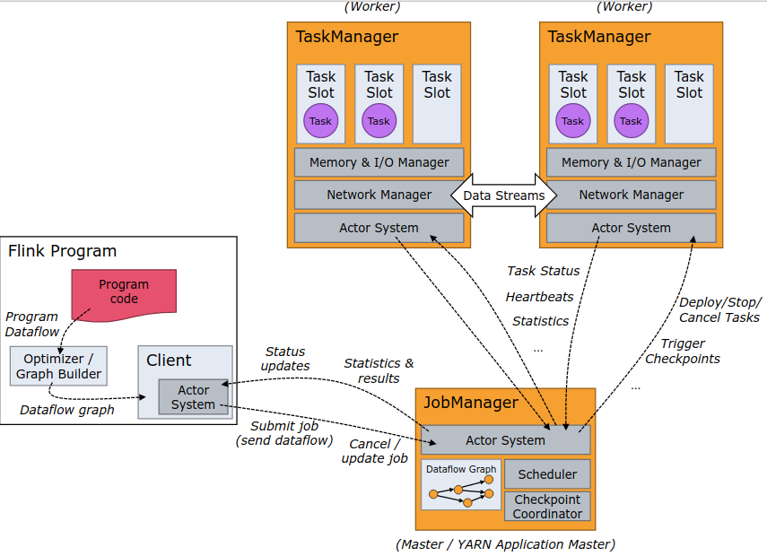
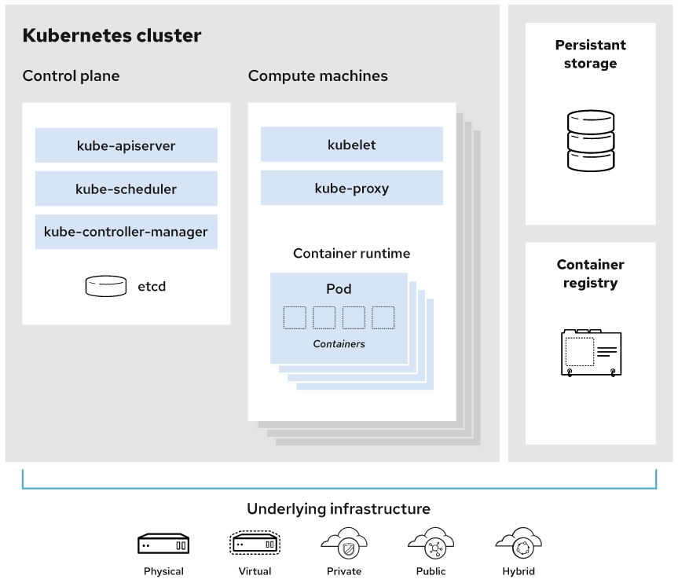

---
puppeteer:
  landscape: false
  format: "A4"
  printBackground: true

# pandoc生成标题信息时用到
# title: "JS Web Base"
# author: David Su | callmedavidsu@gmail.com
# date: \today

# 正文字体，默认最大是12pt，要更大需要其他包(常见字号: 四号14pt 小四12pt 五号10.5pt 小五9pt)
fontsize: 10pt
# 配合form.tex的hyperref设置链接颜色
boxlinks: true
# 设置双面模式，以便.tex文件中能区分左右页眉页脚
classoption: twoside,symmetric
# 添加此可以让pandoc生成的toc新起一页，而不是接续在首页。目录页面从1开始编号
include-before:
  - '`\newpage{}`{=latex}'
  - \setcounter{page}{1}
# 样式调整好后，一定不要shift+alt+f去自动格式化，会让很多设置失效
#   例如 *斜体* 变为 _斜体_，pandoc不能识别。表格分割线----- 长度变化，但是各个栏位占比不对
---

<!-- % 画一条横线：\rule[水平高度]{长度}{粗细} -->
<!-- A4 宽21cm，左右边距0.8cm，线长19.4cm -->
<!-- \rule[0pt]{19.4cm}{0.03em} -->

\newpage

# 一: 后台架构实际使用到的工具

## Nginx

_Advanced Load Balancer, Web Server, & Reverse Proxy_

**负载均衡 LoadBalance**: 在多个计算机（计算机集群）、网络连接、CPU、磁碟驱动器或其他资源中分配负载，以达到最佳化资源使用、最大化吞吐率、最小化响应时间、同时避免过载的目的。

- 常见**负载均衡算法**工作原理
  - **轮询**: 将请求按顺序轮流地分配到后端服务器上，它均衡地对待后端的每一台服务器，而不关心服务器实际的连接数和当前的系统负载。
    - 优点: 服务器请求数据相同。不足: 服务器压力不同，不适合根据服务器配置不同的情况
  - **随机**: 通过系统的随机算法，根据后端服务器的列表大小值来随机选取其中的一台服务器进行访问。
    - 优点: 使用简单。 缺点: 服务器压力不同，不适合根据服务器配置不同的情况
  - **源地址哈希**:根据获取客户端的 IP 地址，通过哈希函数计算得到的一个数值，用该数值对服务器列表的大小进行取模运算，得到的结果便是客服端要访问服务器的序号。采用源地址 哈希法进行负载均衡，同一 IP 地址的客户端，当后端服务器列表不变时，它每次都会映射到同一台后端服务器进行访问。
    - 优点: 将来自同一 IP 地址的请求，同一会话期内，转发到相同的服务器；实现会话粘滞。缺点: 目标服务器宕机后，会话会丢失
  - **加权轮询法**: 给配置高、负载低的机器配置更高的权重，让其处理更多的请；而配置低、负载高的机器，给其分配较低的权重，降低其系统负载，并将请求顺序且按照权重分配到后 端。
    - 优点: 根据权重，调节转发服务器的请求数目。缺点: 使用相对复杂
  - **加权随机法**: 与加权轮询法一样，加权随机法也根据后端机器的配置，系统的负载分配不同的权重。不同的是，它是按照权重随机请求后端服务器，而非顺序。
  - **最小连接数法**: 它是根据后端服务器当前的连接情况，动态地选取其中当前积压连接数最少的一台服务器来处理当前的请求，尽可能地提高后端服务的利用效率，将负责合理地分流到 每一台服务器。
    - 优点: 根据服务器当前的请求处理情况，动态分配。缺点: 算法实现相对复杂，需要监控服务器请求连接数

**网络服务器（Web server）** 可以代指硬件或软件，或者是它们协同工作的整体：

- 一台负责提供网页的电脑，主要是各种编程语言构建而成，通过超文本传输协议（英语：HTTP）传给客户端（一般是指网页浏览器）。
- 一个提供网页的服务器程序。

**正向代理**: 其实是"代理服务器"代理了"客户端"，去和"目标服务器"进行交互。_目标服务器不知道真实的客户端地址_

- 例如: 由于防火墙的原因，我们并不能直接访问谷歌，那么我们可以借助 VPN 来实现，这就是一个简单的正向代理的例子。
- 作用: 突破访问限制、提高访问速度、隐藏客户端真实 IP

**反向代理**: 其实是"代理服务器"代理了"目标服务器"，去和"客户端"进行交互。_客户端不知道目标服务器的真实地址_。

- 作用: 隐藏服务器真实 IP、负载均衡、提高访问速度、提供安全保障

## Nacos

_一个更易于构建云原生应用的动态服务发现、配置管理和服务管理平台。_

致力于帮助您发现、配置和管理微服务。Nacos 提供了一组简单易用的特性集，帮助您快速实现动态服务发现、服务配置、服务元数据及流量管理。  
帮助更敏捷和容易地构建、交付和管理微服务平台。Nacos 是构建以“服务”为中心的现代应用架构 (例如微服务范式、云原生范式) 的服务基础设施。  
使用 Nacos 简化服务发现、配置管理、服务治理及管理的解决方案，让微服务的发现、管理、共享、组合更加容易。

## Spring Cloud

_为开发者提供了快速构建分布式系统中一些常见模式的工具_  
Spring Cloud focuses on providing good out of box experience for typical use cases and extensibility mechanism to cover others.

例如，配置管理、服务发现、断路器、智能路由、微代理、控制总线、一次性令牌、全局锁、领导层选举、分布式会话、集群状态。

- 特点: Spring Cloud 专注于为典型的使用案例提供良好的开箱即用体验，并为其他案例提供可扩展性机制。
  - 分布式/版本化的配置、服务注册和发现、路由、服务对服务的调用、负载平衡、全局锁、Leadership 选举和集群状态、分布式消息传递
  - 断路器(简单理解，请求超过阈值，关闭访问；恢复到正常阈值，启动访问)

**[业务中]** 主要用到了 **Spring Cloud Gateway**

- 该项目提供了一个库，用于在 Spring WebFlux 之上构建 API 网关。
- Spring Cloud Gateway 旨在提供一种简单而有效的方式来路由到 API，并为其提供交叉关注，如：安全、监控/指标和弹性。

Spring Cloud Gateway 的特点:

- 建立在 Spring Framework 5、Project Reactor 和 Spring Boot 2.0 之上。能够在任何请求属性上匹配路由。路径重写。
- 谓词和过滤器是特定于路由的。 断路器集成。 Spring Cloud DiscoveryClient 集成。易于编写谓词和过滤器。请求速率限制。

## EMQX

_是一款全球下载量超千万的大规模分布式物联网 MQTT 服务器。_

EMQX 提供了高效可靠海量物联网设备连接，能够高性能实时移动与处理消息和事件流数据，帮助您快速构建关键业务的物联网平台与应用。

**[业务中使用]** 到的 EMQX Enterprise 功能:

- **Kafka 数据桥接**：通过内置桥接插件高效转发 MQTT 消息到 Kafka 集群，用户可以通过消费 Kafka 消息来实现实时流式数据的处理；
  - 数据桥接是用来对接 EMQX 和外部数据系统的通道。外部数据系统可以是 MySQL、MongoDB 等数据库， 也可以是 Kafka，RabbitMQ 等消息中间件，或者是 HTTP 服务器等。
  - 通过数据桥接，用户可以实时地将消息从 EMQX 发送到外部数据系统，或者从外部数据系统拉取数据并发送到 EMQX 的某个主题。

为了节约成本，鉴于使用企业版只为了 kafka 数据桥接功能，于是我们在开源版本的基础上，自行编写了 kafka 桥接插件，重新编译后运行中。  
具体当时 emqx3.3 左右的企业版，下载软件后进行了反编译，里面的 kafka 桥接插件没有加密，但之后的都加密了，依此为基础进行编写和扩展。  
为了测试稳定性和性能，又魔改了`https://github.com/eclipse/paho.mqtt.golang`这个 mqtt go 的客户端，进行了测试。  
虽然之前都不会 erlang，就算改完了现在再看也不会了，但大体相通，学习了写基本语法之后，加上实践，还是能做出点东西。  
最近配合更新的 emqx 社区版是 4.3.13，在此基础中自行加入的 kafka 桥接插件也依旧正常。运行一年多都正常。（_看源代码的好处和作用可侃_）

## MQTT

_一种基于发布/订阅（publish/subscribe）模式的"轻量级"通讯协议，该协议构建于 TCP/IP 协议上。_

它工作在 TCP/IP 协议族上，是为硬件性能低下的远程设备以及网络状况糟糕的情况下而设计的发布/订阅型消息协议。  
MQTT 最大优点在于，可以以极少的代码和有限的带宽，为连接远程设备提供实时可靠的消息服务。  
作为一种低开销、低带宽占用的即时通讯协议，使其在物联网、小型设备、移动应用等方面有较广泛的应用。

主要特性:

- 使用发布/订阅消息模式，提供一对多的消息发布，解除应用程序耦合。对负载内容屏蔽的消息传输。使用 TCP/IP 提供网络连接。
- 有三种消息发布服务质量：QoS：发布消息的服务质量，即：保证消息传递的次数
  - QoS 0：最多一次传送，即“fire and forget”（只负责传送，发送过后就不管数据的传送情况）。
  - QoS 1：至少一次传送（握手 2 次）；PUBLISH packet 与 PUBACK packet（确认数据交付，无法保证消息不重复）。
  - QoS 2：正好一次传送（握手 4 次）；PUBLISH 、PUBREC 包用于确认收到。
    - 如果发送方没有收到 PUBREC 包，就用 DUP 标志重发消息；如果收到 PUBREC 包，就删除最初的 PUBLISH 包，存储并回复 PUBREL 包。
    - 接收方收到 PUBREL 包，就回复 PUBCOMP 包并删除所有相关状态（保证数据交付成功）。
- 小型传输，开销很小（固定长度的头部是 2 字节），协议交换最小化，以降低网络流量。
- 使用 Last Will 和 Testament 特性通知有关各方客户端异常中断的机制。

## Spring Boot

_在 Spring 的基础上搭建的全新的微框架，用来简化 Spring 的搭建和开发过程。是一个简化 Spring 开发的框架。_  
Spring Boot makes it easy to create stand-alone, production-grade Spring based Applications that you can "just run".

使创建独立的(stand-alone)、基于生产级的 Spring 应用程序变得容易，你可以 "直接运行"。

我们对 Spring 平台和第三方库有自己的看法，所以你可以用最少的麻烦开始工作。大多数 Spring Boot 应用需要最小的 Spring 配置。

- 创建独立的 Spring 应用程序。直接嵌入 Tomcat、Jetty 或 Undertow（不需要部署 WAR 文件）
- 提供有主见的 "启动器 "依赖，以简化你的构建配置。尽可能地自动配置 Spring 和第三方库。完全没有代码生成，也不需要 XML 配置
- 提供生产就绪的功能，如度量、健康检查和外部化配置( metrics, health checks, and externalized configuration)

**约定大于配置**: 开发人员仅需规定应用中不符合约定的部分。在没有规定配置的地方，采用默认配置，以力求最简配置为核心思想。

## Apache Flink

_是一个框架和分布式处理引擎，用于在**无边界**和**有边界**数据流上进行有状态的计算。_

**特点：**

**1. 处理无界和有界数据**

- 任何类型的数据都可以形成一种事件流。信用卡交易、传感器测量、机器日志、网站或移动应用程序上的用户交互记录，这些数据都形成一种流。

数据可以被作为 无界 或者 有界 流来处理:

- **无界流** 有定义流的开始，但没有定义流的结束。
  - 它们会无休止地产生数据。无界流的数据必须持续处理，即数据被摄取后需要立刻处理。
  - 我们不能等到所有数据都到达再处理，因为输入是无限的，在任何时候输入都不会完成。
  - 处理无界数据通常要求以特定顺序摄取事件，例如事件发生的顺序，以便能够推断结果的完整性。
- **有界流** 有定义流的开始，也有定义流的结束。
  - 有界流可以在摄取所有数据后再进行计算。
  - 有界流所有数据可以被排序，所以并不需要有序摄取。
  - 有界流处理通常被称为**批处理**

**Apache Flink 擅长处理无界和有界数据集** 精确的时间控制和状态化使得 Flink 的运行时(runtime)能够运行任何处理无界流的应用。  
有界流则由一些专为固定大小数据集特殊设计的算法和数据结构进行内部处理，产生了出色的性能。

2. **部署应用到任意地方**

Apache Flink 是一个分布式系统，它需要计算资源来执行应用程序。  
Flink 集成了所有常见的集群资源管理器，例如 Hadoop YARN、 Apache Mesos 和 Kubernetes，但同时也可以作为独立集群运行。

3. **运行任意规模应用**

Flink 旨在任意规模上运行有状态流式应用。  
因此，应用程序被并行化为可能数千个任务，这些任务分布在集群中并发执行。所以应用程序能够充分利用无尽的 CPU、内存、磁盘和网络 IO。  
而且 Flink 很容易维护非常大的应用程序状态。其异步和增量的检查点算法对处理延迟产生最小的影响，同时保证精确一次状态的一致性。

4. **利用内存性能**

有状态的 Flink 程序针对本地状态访问进行了优化。  
任务的状态始终保留在内存中，如果状态大小超过可用内存，则会保存在能高效访问的磁盘数据结构中。  
任务通过访问本地（通常在内存中）状态来进行所有的计算，从而产生非常低的处理延迟。  
Flink 通过定期和异步地对本地状态进行持久化存储来保证故障场景下精确一次的状态一致性。

**应用**

1. **流处理应用的基本组件**

- **流**
  - (数据)流是流处理的基本要素。然而，流也拥有着多种特征。这些特征决定了流如何以及何时被处理。
    - 有界 和 无界 的数据流
    - 实时 和 历史记录 的数据流
- **状态**
  - 只有在每一个单独的事件上进行转换操作的应用才不需要状态，换言之，**每一个具有一定复杂度的流处理应用都是有状态的**。
  - 任何运行基本业务逻辑的流处理应用都需要在一定时间内存储所接收的事件或中间结果，以供后续的某个时间点（例如收到下一个事件或者经过一段特定时间）进行访问并进行后续处理。
  - **应用状态是 Flink 中的一等公民**，Flink 提供了许多状态管理相关的特性支持:
    - 多种状态基础类型
    - 插件化的 State Backend
    - 精确一次语义
    - 超大数据量状态
    - 可弹性伸缩的应用
- **时间**
  - 时间是流处理应用另一个重要的组成部分。因为事件总是在特定时间点发生，所以**大多数的事件流都拥有事件本身所固有的时间语义**。
  - 进一步而言，许多常见的流计算都基于时间语义，例如窗口聚合、会话计算、模式检测和基于时间的 join。
  - 流处理的一个重要方面是**应用程序如何衡量时间**，即区分事件时间（event-time）和处理时间（processing-time）。
  - Flink 提供了丰富的时间语义支持:
    - 事件时间模式
    - Watermark 支持
    - 迟到数据处理
    - 处理时间模式

2. **分层 API**

Flink 根据抽象程度分层，提供了三种不同的 API。每一种 API 在简洁性和表达力上有着不同的侧重，并且针对不同的应用场景。

{width=60%}

- **ProcessFunction**
  - ProcessFunction 是 Flink 所提供的最具表达力的接口。
  - ProcessFunction **可以处理一或两条输入数据流中的单个事件或者归入一个特定窗口内的多个事件**。
  - 它**提供了对于时间和状态的细粒度控制**。开发者可以在其中任意地修改状态，也能够注册定时器用以在未来的某一时刻触发回调函数。
  - 因此，你可以利用 ProcessFunction 实现许多**有状态的事件驱动应用**所需要的基于单个事件的复杂业务逻辑。
- **DataStream API**
  - DataStream API **为许多通用的流处理操作提供了处理原语**。
  - 这些操作包括窗口、逐条记录的转换操作，在处理事件时进行外部数据库查询等。
  - DataStream API 支持 Java 和 Scala 语言，预先定义了例如 map()、reduce()、aggregate() 等函数。
  - 你可以通过扩展实现预定义接口或使用 Java、Scala 的 lambda 表达式实现自定义的函数。
- **SQL & Table API**
  - Flink 支持两种关系型的 API，Table API 和 SQL。
  - 这两个 API 都是**批处理和流处理统一的 API**，
    - 这意味着在无边界的实时数据流和有边界的历史记录数据流上，关系型 API 会以相同的语义执行查询，并产生相同的结果。
  - Table API 和 SQL 借助了 Apache Calcite 来进行查询的解析，校验以及优化。
    - 它们可以与 DataStream 和 DataSet API 无缝集成，并支持用户自定义的标量函数，聚合函数以及表值函数。
  - **Flink 的关系型 API 旨在简化数据分析、数据流水线和 ETL 应用的定义**。
- 库
  - Flink 具有数个适用于常见数据处理应用场景的扩展库。这些库通常嵌入在 API 中，且并不完全独立于其它 API。它们也因此可以受益于 API 的所有特性，并与其他库集成。
  - [复杂事件处理(CEP)](https://nightlies.apache.org/flink/flink-docs-release-1.15/docs/libs/cep/): link 的 CEP 库提供了 API，使用户能够以例如正则表达式或状态机的方式指定事件模式
  - [DataSet API](https://nightlies.apache.org/flink/flink-docs-release-1.15/docs/dev/dataset/overview/): Flink 用于批处理应用程序的核心 API
  - [Gelly](https://nightlies.apache.org/flink/flink-docs-release-1.15/docs/libs/gelly/overview/): 一个可扩展的图形处理和分析库

**应用场景**

Apache Flink 功能强大，支持开发和运行多种不同种类的应用程序。它的主要特性包括：批流一体化、精密的状态管理、事件时间支持以及精确一次的状态一致性保障等。

1. 事件驱动型应用

- 事件驱动型应用是一类具有状态的应用，它从一个或多个事件流提取数据，并根据到来的事件触发计算、状态更新或其他外部动作。

2. 数据分析应用

- 数据分析任务需要从原始数据中提取有价值的信息和指标。传统的分析方式通常是利用批查询，或将事件记录下来并基于此有限数据集构建应用来完成。借助一些先进的流处理引擎，还可以实时地进行数据分析。

3. 数据管道应用

- 提取-转换-加载（ETL）是一种在存储系统之间进行数据转换和迁移的常用方法。ETL 作业通常会周期性地触发，将数据从事务型数据库拷贝到分析型数据库或数据仓库。
- 数据管道和 ETL 作业的用途相似，都可以转换、丰富数据，并将其从某个存储系统移动到另一个。但数据管道是以持续流模式运行，而非周期性触发。因此它支持从一个不断生成数据的源头读取记录，并将它们以低延迟移动到终点。

**Flink 架构**

Flink 是一个分布式系统，需要有效分配和管理计算资源才能执行流应用程序。它集成了所有常见的集群资源管理器，例如 Hadoop YARN，但也可以设置作为独立集群甚至库运行。

{width=80%}

Flink 运行时由两种类型的进程组成：一个 **JobManager** 和一个或者多个 **TaskManager**。

**Client** 不是运行时和程序执行的一部分，而是用于准备数据流并将其发送给 JobManager。之后，客户端可以断开连接（_分离模式_），或保持连接来接收进程报告（_附加模式_）。客户端可以作为触发执行 Java/Scala 程序的一部分运行，也可以在命令行进程./bin/flink run ...中运行。

可以通过多种方式启动 JobManager 和 TaskManager：直接在机器上作为 standalone 集群启动、在容器中启动、或者通过 YARN 等资源框架管理并启动。TaskManager 连接到 JobManagers，宣布自己可用，并被分配工作。

**1. JobManager**

JobManager 具有许多与协调 Flink 应用程序的分布式执行有关的职责：它决定何时调度下一个 task（或一组 task）、对完成的 task 或执行失败做出反应、协调 checkpoint、并且协调从失败中恢复等等。这个进程由三个不同的组件组成：

- _ResourceManager_
  - ResourceManager 负责 Flink 集群中的资源提供、回收、分配 - 它管理 task slots，这是 Flink 集群中资源调度的单位（请参考 TaskManagers）。
  - Flink 为不同的环境和资源提供者（例如 YARN、Kubernetes 和 standalone 部署）实现了对应的 ResourceManager。
  - 在 standalone 设置中，ResourceManager 只能分配可用 TaskManager 的 slots，而不能自行启动新的 TaskManager。
- _Dispatcher_
  - Dispatcher 提供了一个 REST 接口，用来提交 Flink 应用程序执行，并为每个提交的作业启动一个新的 JobMaster。
  - 它还运行 Flink WebUI 用来提供作业执行信息。
- _JobMaster_
  - JobMaster 负责管理单个 JobGraph 的执行。Flink 集群中可以同时运行多个作业，每个作业都有自己的 JobMaster。

始终至少有一个 JobManager。高可用（HA）设置中可能有多个 JobManager，其中一个始终是 _leader_，其他的则是 _standby_。

JM 和 taskmanager 之间通信通过 actor system 进行通信（akka 框架）。  
JM 定期能够获取任务的运行情况发给客户端。  
同时 JM 也会触发 checkpoint 的操作，JM 会根据 checkpoint 的定时时间，向 taskmanager 下发 checkpoint 的指令。

**2. TaskManagers**

TaskManager（也称为 worker）执行作业流的 task，并且缓存和交换数据流。

必须始终至少有一个 TaskManager。在 TaskManager 中资源调度的最小单位是 task slot。TaskManager 中 task slot 的数量表示并发处理 task 的数量。请注意一个 task slot 中可以执行多个算子。

**Tasks 和算子链**

对于分布式执行，Flink 将算子的 subtasks 链接成 tasks。每个 task 由一个线程执行。将算子链接成 task 是个有用的优化：它减少线程间切换、缓冲的开销，并且减少延迟的同时增加整体吞吐量。链行为是可以配置的

**Task Slots 和资源**

每个 worker（TaskManager）都是一个 JVM 进程，可以在单独的线程中执行一个或多个 subtask。为了控制一个 TaskManager 中接受多少个 task，就有了所谓的 **task slots**（至少一个）。

每个 _task slot_ 代表 TaskManager 中资源的固定子集。例如，具有 3 个 slot 的 TaskManager，会将其托管内存 1/3 用于每个 slot。  
分配资源意味着 subtask 不会与其他作业的 subtask 竞争托管内存，而是具有一定数量的保留托管内存。注意此处没有 CPU 隔离；当前 slot 仅分离 task 的托管内存。

_通过调整 task slot 的数量，用户可以定义 subtask 如何互相隔离_。  
每个 TaskManager 有一个 slot，这意味着每个 task 组都在单独的 JVM 中运行（例如，可以在单独的容器中启动）。  
_具有多个 slot 意味着更多 subtask 共享同一 JVM。同一 JVM 中的 task 共享 TCP 连接（通过多路复用）和心跳信息。_  
它们还可以共享数据集和数据结构，从而减少了每个 task 的开销。

默认情况下，Flink 允许 subtask 共享 slot，即便它们是不同的 task 的 subtask，只要是来自于同一作业即可。结果就是一个 slot 可以持有整个作业管道。

_允许 slot 共享有两个主要优点_：

- Flink 集群所需的 task slot 和作业中使用的最大并行度恰好一样。无需计算程序总共包含多少个 task（具有不同并行度）。
- 容易获得更好的资源利用。如果没有 slot 共享，非密集 subtask（source/map()）将阻塞和密集型 subtask（window） 一样多的资源。

**[实际业务中]** Flink job 主要有 4 个: 设备表打宽、用户表打宽、工程地址信息表打宽、设备消息打宽

## Prometheus

_一个具有维度数据模型、灵活查询语言、高效**时间序列数据库**和现代**警报**方法的开源**监测**系统。_  
Monitoring system & time series database

普罗米修斯是一个开源的系统监控和警报工具包，最初是在 SoundCloud 建立的。是一套开源的`监控 & 报警 & 时间序列数据库`的组合。

普罗米修斯以时间序列数据的形式收集和存储其指标，也就是说，指标信息(metrics information)与记录的时间戳(timestamp)一起存储，同时还有被称为标签(labels)的可选键值对。

Prometheus 的主要优势有：

- 由指标名称和和键/值对标签标识的时间序列数据组成的多维数据模型。强大的查询语言 PromQL。
- 不依赖分布式存储；单个服务节点具有自治能力。时间序列数据是服务端通过 HTTP 协议主动拉取获得的。也可以通过中间网关来推送时间序列数据。
- 可以通过静态配置文件或服务发现来获取监控目标。支持多种类型的图表和仪表盘。

什么是指标 metrics？

- 通俗地说，*指标*是数字性的测量。*时间序列*是指随着时间的推移记录变化。用户想要测量的东西因应用不同而不同。
  - 对于网络服务器来说，可能是请求时间，对于数据库来说，可能是活动连接数或活动查询数等等。
- **在理解你的应用程序为什么以某种方式工作时，指标起着重要作用**。
  - 让我们假设你正在运行一个网络应用程序，并发现该程序很慢。你将需要一些信息来找出你的应用程序正在发生的事情。
    - 例如，**当请求的数量很高时，应用程序会变得很慢。如果你有请求数指标，你可以发现原因，并增加服务器的数量来处理负载**。

Prometheus 的组件，其中有许多组件是可选的：

- Prometheus Server 作为*服务端*，用来存储时间序列数据。*客户端*库用来检测应用程序代码。用于支持临时任务的*推送网关*。
- _Exporter_ 用来监控 HAProxy，StatsD，Graphite 等特殊的监控目标，并向 Prometheus 提供标准格式的监控样本数据。
- _alartmanager_ 用来处理告警。 其他各种*周边工具*。

**[实际业务中]** 架构里存在多个 prometheus 实例:  
kubesphere 自带一个 prometheus，配置好了监控 k8s 内部组件的指标。  
tidb 自带了一个 prometheus，虽然之前有配置第三方工具指标，但重启之后就恢复默认了，需要重新配置。  
手动安装了一个 prometheus，用于监控在 k8s 中其他工具的指标。  
gitlab-ce 也默认自带了一个 prometheus。  
前三者都统一汇整到 Grafana 进行监控观测，gitlab 单独服务器安装，就没那么频繁进行观测，没有导出。

## Grafana

_是一个开源的、 支持给每种数据库提供分析和监控功能的解决方案_  
Grafana is the open source analytics & monitoring solution for every database.

是一个跨平台、开源的数据可视化网络应用程序平台。用户配置连接的数据源之后，Grafana 可以在网络浏览器里显示数据图表和警告。

开放和可组合的可观察性和数据可视化平台。可视化来自 Prometheus、Loki、Elasticsearch、InfluxDB、Postgres 等多个来源的指标、日志和跟踪。

对于 dashboard 显示内容，除了自行创建外，一般也到[Grafana Dashboards](https://grafana.com/grafana/dashboards/?dataSource=prometheus)中去看有没有现成的，然后根据实际需求进行修改。

**[实际业务中]** 主要用于展示获取到的 k8s 的各个服务和 tidb 的监控埋点、gitlab 自带的 prometheus 数据等，更多的是追踪服务器性能指标。

## 链路追踪

_为分布式应用的开发者提供了完整的调用链路还原、调用请求量统计、链路拓扑、应用依赖分析等工具_

链路追踪 Tracing Analysis 为分布式应用的开发者提供了完整的调用链路还原、调用请求量统计、链路拓扑、应用依赖分析等工具，可以帮助开发者快速分析和诊断分布式应用架构下的性能瓶颈，提高微服务时代下的开发诊断效率。

**[实际业务中]** 一开始使用 SkyWalking ，因为 Skywalking 使用的是 Java 动态字节码技术，字节码注入就不用再修改已经写好的代码了。但是每次项目启动都打印了很长的启动日志，有时候莫名找不到依赖，当时版本不支持 webflux 项目。

后来使用 Jaeger，配合 opentelemetry-java 客户端实现服务的链路追踪。不仅支持 webflux 项目，启动的打印日志很少，客户端也更小。但可以 UI 中的功能还没有 sw 那么强，但够用。

Jaeger: 开源、端到端的分布式追踪。监控复杂分布式系统中的事务并排除故障。  
skywalking: 分布式系统的应用性能监控工具，特别为微服务、云原生和基于容器（Kubernetes）的架构设计。

jaeger: go 编写，传输协议支持 udp/http,实现方式为拦截请求、侵入,扩展性高,性能损失中。  
skywalking: java 编写， 传输协议支持 gRPC,实现方式字节码注入、无侵入,扩展性中，性能损失低。

## Fluentd

_是一个开源的数据收集器，用作统一化数据收集和使用。_  
Fluentd is an open source data collector for unified logging layer.

Fluentd 是一个开源的数据收集器，用于统一的日志层。Fluentd 允许你统一数据收集和消费，以便更好地使用和理解数据。

fluentd 是一个针对日志的收集、处理、转发系统。通过丰富的插件系统， 可以收集来自于各种系统或应用的日志，转化为用户指定的格式后，转发到用户所指定的日志存储系统之中。

统一日志层 Unified Logging Layer：

- Fluentd 通过在两者之间提供统一的日志记录层将数据源与后端系统分离。
- 该层允许开发人员和数据分析师在生成日志时使用多种类型的日志。同样重要的是，它降低了“坏数据”减慢速度和误导您的组织的风险。
- 统一的日志记录层可让您和您的组织更好地利用数据并更快地迭代您的软件。

**[业务中]** 主要用于扫描各种日志，例如服务生成的日志、微服务代码输入的日志等，存入 es 中。

- 日志使用 fluentd 容器挂载宿主机目录，扫尾`/var/log/containers/*.log`，格式化、过滤后写入 Elastic
  - 在使用 CRI 容器运行时时 Kubernetes 容器日志由 kubelet 控制，会被容器运行时写入到`/var/log/pods` 并将日志文件软连接到`/var/log/containers`
  - 仅扫描了 pod 日志，外部 tidb 日志可在 PD 页面查看
- Elatic 中日志索引为 `logstash-*`，生命周期策略为 31 天后删除
  - 设置滚动更新策略时需將热阶段的滚动更新关闭，否则无法正常推进生命周期阶段

## TiDB

_是一款同时支持在线事务处理与在线分析处理 (HTAP) 的融合型开源分布式关系型数据库_

目标是为用户提供一站式 OLTP (Online Transactional Processing)、OLAP (Online Analytical Processing)、HTAP 解决方案。

1. **五大核心特性**

- **一键水平扩容或者缩容**
  - 得益于 TiDB 存储计算分离的架构的设计，可按需对计算、存储分别进行在线扩容或者缩容，扩容或者缩容过程中对应用运维人员透明。
- **金融级高可用**
  - 数据采用多副本存储，数据副本通过 Multi-Raft 协议同步事务日志，多数派写入成功事务才能提交，确保数据强一致性且少数副本发生故障时不影响数据的可用性。可按需配置副本地理位置、副本数量等策略满足不同容灾级别的要求。
- **实时 HTAP**
  - 提供行存储引擎 TiKV、列存储引擎 TiFlash 两款存储引擎，
  - TiFlash 通过 Multi-Raft Learner 协议实时从 TiKV 复制数据，确保行存储引擎 TiKV 和列存储引擎 TiFlash 之间的数据强一致。
  - TiKV、TiFlash 可按需部署在不同的机器，解决 HTAP 资源隔离的问题。
- **云原生的分布式数据库**
  - 专为云而设计的分布式数据库，通过 TiDB Operator 可在公有云、私有云、混合云中实现部署工具化、自动化。
- **兼容 MySQL 5.7 协议和 MySQL 生态**
  - 兼容 MySQL 5.7 协议、MySQL 常用的功能、MySQL 生态，应用无需或者修改少量代码即可从 MySQL 迁移到 TiDB。
  - 提供丰富的数据迁移工具帮助应用便捷完成数据迁移。

2. **四大核心应用场景**

- 对数据一致性及高可靠、系统高可用、可扩展性、容灾要求较高的金融行业属性的场景
- 对存储容量、可扩展性、并发要求较高的海量数据及高并发的 OLTP 场景
- Real-time HTAP 场景
- 数据汇聚、二次加工处理的场景

3. **TiDB 整体架构**

在内核设计上，TiDB 分布式数据库将整体架构拆分成了多个模块，各模块之间互相通信，组成完整的 TiDB 系统。

- **TiDB Server**
  - SQL 层，对外暴露 MySQL 协议的连接 endpoint，负责接受客户端的连接，执行 SQL 解析和优化，最终生成分布式执行计划。
  - TiDB 层本身是无状态的，实践中可以启动多个 TiDB 实例，通过负载均衡组件（如 LVS、HAProxy 或 F5）对外提供统一的接入地址，客户端的连接可以均匀地分摊在多个 TiDB 实例上以达到负载均衡的效果。
  - TiDB Server 本身并不存储数据，只是解析 SQL，将实际的数据读取请求转发给底层的存储节点 TiKV（或 TiFlash）。
- **PD (Placement Driver) Server**
  - 整个 TiDB 集群的元信息管理模块，负责存储每个 TiKV 节点实时的数据分布情况和集群的整体拓扑结构，提供 TiDB Dashboard 管控界面，并为分布式事务分配事务 ID。
  - PD 不仅存储元信息，同时还会根据 TiKV 节点实时上报的数据分布状态，下发数据调度命令给具体的 TiKV 节点，可以说是整个集群的“大脑”。
  - 此外，PD 本身也是由至少 3 个节点构成，拥有高可用的能力。建议部署奇数个 PD 节点。
- **存储节点**
  - **TiKV Server**
    - 负责存储数据，从外部看 TiKV 是一个分布式的提供事务的 Key-Value 存储引擎。
    - _存储数据的基本单位是 Region_，每个 Region 负责存储一个 Key Range（从 StartKey 到 EndKey 的左闭右开区间）的数据，每个 TiKV 节点会负责多个 Region。
    - TiKV 的 API 在 KV 键值对层面提供对分布式事务的原生支持，默认提供了 SI (Snapshot Isolation) 的隔离级别，这也是 TiDB 在 SQL 层面支持分布式事务的核心。
    - TiDB 的 SQL 层做完 SQL 解析后，会将 SQL 的执行计划转换为对 TiKV API 的实际调用。所以，_数据都存储在 TiKV 中_。
    - 另外，TiKV 中的数据都会自动维护多副本（默认为三副本），天然支持高可用和自动故障转移。
  - **TiFlash**
    - 和普通 TiKV 节点不一样的是，在 TiFlash 内部，数据是以列式的形式进行存储，主要的功能是*为分析型的场景加速*。

与传统的单机数据库相比，TiDB 具有以下优势：

- **纯分布式架构**，拥有良好的扩展性，支持弹性的扩缩容
- **支持 SQL**，对外暴露 MySQL 的网络协议，并兼容大多数 MySQL 的语法，在大多数场景下可以直接替换 MySQL
- **默认支持高可用**，在少数副本失效的情况下，数据库本身能够自动进行数据修复和故障转移，对业务透明
- **支持 ACID 事务**，对于一些有强一致需求的场景友好，例如：银行转账
- **具有丰富的工具链生态**，覆盖数据迁移、同步、备份等多种场景

4. **TiDB 数据库的存储** 介绍 TiKV 的一些设计思想和关键概念。

- **Key-Value Pairs（键值对）**
  - 作为保存数据的系统，首先要决定的是数据的存储模型，也就是数据以什么样的形式保存下来。TiKV 的选择是 Key-Value 模型，并且提供有序遍历方法。
  - TiKV 数据存储的两个关键点：
    - 这是一个巨大的 Map（可以类比一下 C++ 的 std::map），也就是存储的是 Key-Value Pairs（键值对）
    - 这个 Map 中的 Key-Value pair 按照 Key 的二进制顺序有序，也就是可以 Seek 到某一个 Key 的位置，然后不断地调用 Next 方法以递增的顺序获取比这个 Key 大的 Key-Value。
- **本地存储 (RocksDB)**
  - 任何持久化的存储引擎，数据终归要保存在磁盘上，TiKV 也不例外。
  - 但是 TiKV 没有选择直接向磁盘上写数据，而是把数据保存在 RocksDB 中，具体的数据落地由 RocksDB 负责。
    - 这个选择的原因是开发一个单机存储引擎工作量很大，特别是要做一个高性能的单机引擎，需要做各种细致的优化，
    - 而 RocksDB 是由 Facebook 开源的一个非常优秀的单机 KV 存储引擎，可以满足 TiKV 对单机引擎的各种要求。
    - 这里可以简单的认为 RocksDB 是一个单机的持久化 Key-Value Map。
  - RocksDB 是用于键值数据的高性能嵌入式数据库。
    - 它是 Google 的 LevelDB 的一个分支，经过优化，可以利用许多 CPU 内核，并有效利用快速存储（例如固态驱动器）来处理输入/输出受限的工作负载。
    - 它基于日志结构的合并树（LSM-tree）数据结构。它是用 C ++编写的，并为 C ++，C 和 Java 提供了正式的语言绑定。
- **Raft 协议**
  - 接下来 TiKV 的实现面临一件更难的事情：如何保证单机失效的情况下，数据不丢失，不出错？
    - 简单来说，需要想办法把数据复制到多台机器上，这样一台机器无法服务了，其他的机器上的副本还能提供服务；
    - 复杂来说，还需要这个数据复制方案是可靠和高效的，并且能处理副本失效的情况。
  - TiKV 选择了 Raft 算法。Raft 是一个一致性协议，本文只会对 Raft 做一个简要的介绍，细节问题可以参考它的论文。Raft 提供几个重要的功能：
    - Leader（主副本）选举
    - 成员变更（如添加副本、删除副本、转移 Leader 等操作）
    - 日志复制
  - TiKV 利用 Raft 来做数据复制，每个数据变更都会落地为一条 Raft 日志，通过 Raft 的日志复制功能，将数据安全可靠地同步到复制组的每一个节点中。
    - 不过在实际写入中，根据 Raft 的协议，只需要同步复制到多数节点，即可安全地认为数据写入成功。
  - 总结一下
    - 通过单机的 RocksDB，TiKV 可以将数据快速地存储在磁盘上；
    - 通过 Raft，将数据复制到多台机器上，以防单机失效。数据的写入是通过 Raft 这一层的接口写入，而不是直接写 RocksDB。
    - 通过实现 Raft，TiKV 变成了一个分布式的 Key-Value 存储，少数几台机器宕机也能通过原生的 Raft 协议自动把副本补全，可以做到对业务无感知。
- **Region**
  - 首先，为了便于理解，在此节，假设所有的数据都只有一个副本。前面提到，TiKV 可以看做是一个巨大的有序的 KV Map，那么为了实现存储的水平扩展，数据将被分散在多台机器上。对于一个 KV 系统，将数据分散在多台机器上有两种比较典型的方案：
    - Hash：按照 Key 做 Hash，根据 Hash 值选择对应的存储节点。
    - Range：按照 Key 分 Range，某一段连续的 Key 都保存在一个存储节点上。
  - TiKV 选择了第二种方式，将整个 Key-Value 空间分成很多段，每一段是一系列连续的 Key，将每一段叫做一个 Region，并且会尽量保持每个 Region 中保存的数据不超过一定的大小，目前在 TiKV 中默认是 96MB。每一个 Region 都可以用 [StartKey，EndKey) 这样一个左闭右开区间来描述。
  - 将数据划分成 Region 后，TiKV 将会做两件重要的事情：
    - 以 Region 为单位，将数据分散在集群中所有的节点上，并且尽量保证每个节点上服务的 Region 数量差不多。
    - 以 Region 为单位做 Raft 的复制和成员管理。
  - 以 Region 为单位做数据的分散和复制，TiKV 就成为了一个分布式的具备一定容灾能力的 KeyValue 系统，不用再担心数据存不下，或者是磁盘故障丢失数据的问题。
- **MVCC**
  - 很多数据库都会实现多版本并发控制 (MVCC)，TiKV 也不例外。
    - 设想这样的场景：两个客户端同时去修改一个 Key 的 Value，如果没有数据的多版本控制，就需要对数据上锁，在分布式场景下，可能会带来性能以及死锁问题。
    - TiKV 的 MVCC 实现是通过在 Key 后面添加版本号来实现
  - 注意，对于同一个 Key 的多个版本，版本号较大的会被放在前面，版本号小的会被放在后面（见 Key-Value 一节，Key 是有序的排列），
    - 这样当用户通过一个 Key + Version 来获取 Value 的时候，可以通过 Key 和 Version 构造出 MVCC 的 Key，也就是 Key_Version。
    - 然后可以直接通过 RocksDB 的 SeekPrefix(Key_Version) API，定位到第一个大于等于这个 Key_Version 的位置。
- **分布式 ACID 事务**
  - TiKV 的事务采用的是 Google 在 BigTable 中使用的事务模型：Percolator ，TiKV 根据这篇论文实现，并做了大量的优化。
  - TiDB 支持分布式事务，提供乐观事务与悲观事务两种事务模式。TiDB 3.0.8 及以后版本，TiDB 默认采用悲观事务模式。
    - 简单的讲，`乐观事务模型`就是直接提交，遇到冲突就回滚，`悲观事务模型`就是在真正提交事务前，先尝试对需要修改的资源上锁，只有在确保事务一定能够执行成功后，才开始提交。
    - 对于乐观事务模型来说，比较适合冲突率不高的场景，因为直接提交大概率会成功，冲突是小概率事件，但是一旦遇到事务冲突，回滚的代价会比较大。
    - 悲观事务的好处是对于冲突率高的场景，提前上锁的代价小于事后回滚的代价，而且还能以比较低的代价解决多个并发事务互相冲突导致谁也成功不了的场景。不过悲观事务在冲突率不高的场景并没有乐观事务处理高效。
    - 从应用端实现的复杂度而言，悲观事务更直观，更容易实现。而乐观事务需要复杂的应用端重试机制来保证。

5. **TiCDC 简介**

TiCDC 是一款 TiDB 增量数据同步工具，通过拉取上游 TiKV 的数据变更日志，TiCDC 可以将数据解析为有序的行级变更数据输出到下游。

TiCDC 适用场景

- 数据库灾备：TiCDC 可以用于同构数据库之间的灾备场景，能够在灾难发生时保证主备集群数据的最终一致性，目前该场景仅支持 TiDB 作为主备集群。
- 数据集成：TiCDC 提供 TiCDC Canal-JSON Protocol，支持其他系统订阅数据变更，能够为监控、缓存、全文索引、数据分析、异构数据库的主从复制等场景提供数据源。

TiCDC 的同步功能

- sink 支持：目前 TiCDC sink 模块支持同步数据到以下下游：
  - MySQL 协议兼容的数据库，提供最终一致性支持。
  - 以 TiCDC Open Protocol 输出到 Kafka，可实现行级别有序、最终一致性或严格事务一致性三种一致性保证。
- MySQL sink
  - TiCDC 不拆分单表事务，保证单表事务的原子性。
  - TiCDC 不保证下游事务的执行顺序和上游完全一致。
  - TiCDC 以表为单位拆分跨表事务，不保证跨表事务的原子性。
  - TiCDC 保证单行的更新与上游更新顺序一致。
- Kafka sink
  - TiCDC 提供不同的数据分发策略，可以按照表、主键或 ts 等策略分发数据到不同 Kafka partition。
  - 不同分发策略下 consumer 的不同实现方式，可以实现不同级别的一致性，包括行级别有序、最终一致性或跨表事务一致性。
  - TiCDC 没有提供 Kafka 消费端实现，只提供了 TiCDC 开放数据协议，用户可以依据该协议实现 Kafka 数据的消费端。

6. **Split Region**

- 在 TiDB 中新建一个表后，默认会单独切分出 1 个 Region 来存储这个表的数据，这个默认行为由配置文件中的 split-table 控制。当这个 Region 中的数据超过默认 Region 大小限制后，这个 Region 会开始分裂成 2 个 Region。
- 上述情况中，如果在新建的表上发生大批量写入，则会造成热点，因为开始只有一个 Region，所有的写请求都发生在该 Region 所在的那台 TiKV 上。
- 为解决上述场景中的热点问题，TiDB 引入了预切分 Region 的功能，即可以根据指定的参数，预先为某个表切分出多个 Region，并打散到各个 TiKV 上去。

**[业务中]** 使用 br 备份还原 tidb 数据，定时全量和增量备份，数据放置在 MinIo 中。  
没有在 k8s 内安装 tidb 是因为实践过，启动的负载太重，特别慢，特别吃性能。tidb 启动之前得 k8s 先启动，依赖性很高，也不利于操作。  
TiDB 安装在 k8s 中会导致读写性能严重下降，故在宿主机中通过 TiUP 直接安装 TiDB。

## [业务中]Flink job 读取 tikv 数据变更

一开始的读取 tikv 异动数据是通过 ticdc 的 kafka sink，发送到 kafka，再在 flink 中使用 kafka connector 接收变更，进行数据异动的处理，例如基础表数据修改同步到宽表、es 等。

但 ticdc 通过 kafka sink 到 kafka，flink 再订阅 kafka 消息的处理不好控制，感觉也太麻烦。通过分析 tikv 客户端源码以及相关信息得知，可以通过 tikv-client 获取到数据异动，就像 ticdc 介绍那样，它是拉取上游 TiKV 的数据变更日志，TiCDC 可以将数据解析为有序的行级变更数据输出到下游。  
所以后来改为使用 tikv 的 client-java 通过 gRPC 直接获取到 tikv 中数据变动 cdc，再使用 flink-connector-tidb-cdc 直接在 Flink 中进行数据接收及处理，省去了中间环节。

flink 文档中的 connector 没有列示全，如果没找到可以先直接搜索，然后再考虑造轮子。`flink-cdc-connectors`中除了 tidb-cdc 外，还有 mongodb-cdc、 mysql-cdc 等

当时使用的 tikv 的 client-java 是 3.2 版本，使用是遇到一个严重的 bug 就是 tikv 在 region split 的时候，无法正常使用。因为该 client 还是订阅的分裂前的 region，但分裂后产生的是多个新的 region，且删除了旧的 region，所以无法正常使用。所以就我们自行修改了该 client-java 的源代码，在出现 region split 的时候，重新读取分裂后的 region 而不是之前的。

## Elasticsearch

_是一个分布式、RESTful 风格的搜索和数据分析引擎_

适用于包括文本、数字、地理空间、结构化和非结构化数据等在内的所有类型的数据。

Elasticsearch 以其简单的 REST 风格 API、分布式特性、速度和可扩展性而闻名，是 Elastic Stack 的核心组件；  
Elastic Stack 是一套适用于数据采集、扩充、存储、分析和可视化的免费开源工具。  
人们通常将 Elastic Stack 称为 ELK Stack（代指 Elasticsearch、Logstash 和 Kibana），  
目前 Elastic Stack 包括一系列丰富的轻量型数据采集代理，这些代理统称为 Beats，可用来向 Elasticsearch 发送数据。

**Elasticsearch 的用途**

- 应用程序搜索、网站搜索、企业搜索、日志处理和分析、基础设施指标和容器监测
- 应用程序性能监测、地理空间数据分析和可视化、安全分析、业务分析

**Elasticsearch 的工作原理**

- 原始数据会从多个来源（包括日志、系统指标和网络应用程序）输入到 Elasticsearch 中。
- 数据采集指在 Elasticsearch 中进行索引之前解析、标准化并充实这些原始数据的过程。
- 这些数据在 Elasticsearch 中索引完成之后，用户便可针对他们的数据运行复杂的查询，并使用聚合来检索自身数据的复杂汇总。
  - 在 Kibana 中，用户可以基于自己的数据创建强大的可视化，分享仪表板，并对 Elastic Stack 进行管理。

**Elasticsearch 索引**

- Elasticsearch 索引指相互关联的文档集合。Elasticsearch 会以 JSON 文档的形式存储数据。
  - 每个文档都会在一组键(字段的名称)和它们对应的值(字符串、数字、布尔值、日期、数值组、地理位置等类型的数据)之间建立联系。
- Elasticsearch 使用的是一种名为**倒排索引**的数据结构，这一结构的设计可以允许十分快速地进行全文本搜索。
  - 倒排索引会列出在所有文档中出现的每个特有词汇，并且可以找到包含每个词汇的全部文档。
- 在索引过程中，Elasticsearch 会存储文档并构建倒排索引，这样用户便可以近实时地对文档数据进行搜索。
  - 索引过程是在索引 API 中启动的，通过此 API 您既可向特定索引中添加 JSON 文档，也可更改特定索引中的 JSON 文档。

**Kibana 的用途**

Kibana 是一款适用于 Elasticsearch 的数据可视化和管理工具，可以提供实时的直方图、线形图、饼状图和地图。  
Kibana 同时还包括诸如 Canvas 和 Elastic Maps 等高级应用程序；  
Canvas 允许用户基于自身数据创建定制的动态信息图表，而 Elastic Maps 则可用来对地理空间数据进行可视化。

**[业务中]** 做全文检索，页面大部分复杂栏位数据的查询来源。像日志记录更加复杂和大量的数据，在 es 中存放作为其 tidb 数据的索引。
kibana 中常用模块  
创建索引模式（management-> stack management ->Kibana 索引模式）更方便日志分类  
索引管理 management-> stack management ->数据 索引管理）查看索引信息、状态、映射等  
开发-> 控制台 使用 elasticsearch DSL 查询数据、修改配置等  
analytics -> discover 查看日志详细数据

**Logstash 的用途**

- Logstash 是 Elastic Stack 的核心产品之一，用来对数据进行聚合和处理，并将数据发送到 Elasticsearch。
- Logstash 是一个开源的服务器端数据处理管道，允许您在将数据索引到 ES 之前同时从多个来源采集数据，并对数据进行充实和转换。

**为何使用 Elasticsearch**

- _Elasticsearch 很快。_ 由于 Elasticsearch 是在 Lucene 基础上构建而成的，所以在全文本搜索方面表现十分出色。
- _Elasticsearch 具有分布式的本质特征_。Elasticsearch 中存储的文档分布在不同的容器中，这些容器称为分片，可以进行复制以提供数据冗余副本，以防发生硬件故障。
- _Elasticsearch 包含一系列广泛的功能_。除了速度、可扩展性和弹性等优势以外，Elasticsearch 还有大量强大的内置功能（例如数据汇总和索引生命周期管理），可以方便用户更加高效地存储和搜索数据。
- _Elastic Stack 简化了数据采集、可视化和报告过程_。 通过与 Beats 和 Logstash 进行集成，用户能够在向 Elasticsearch 中索引数据之前轻松地处理数据。同时，Kibana 不仅可针对 Elasticsearch 数据提供实时可视化，同时还提供 UI 以便用户快速访问应用程序性能监测 (APM)、日志和基础设施指标等数据。

\rule[0pt]{19.4cm}{0.03em}

**倒排索引：文档检索系统中最常用的数据结构（wiki）**

倒排索引（英语：Inverted index），也常被称为反向索引、置入档案或反向档案，是一种索引方法，被用来存储在全文搜索下某个单词在一个文档或者一组文档中的存储位置的映射。它是文档检索系统中最常用的数据结构。

有两种不同的反向索引形式：

- 一条记录的水平反向索引（或者反向档案索引）包含每个引用单词的文档的列表。
- 一个单词的水平反向索引（或者完全反向索引）又包含每个单词在一个文档中的位置。
- 后者的形式提供了更多的兼容性（比如短语搜索），但是需要更多的时间和空间来创建。

**[倒排索引简单理解]**，加入有索引文档数据如下

```
index 0 有 "it is what it is"
index 1 有 "what is it"
index 2 有"it is a banana"
```

正常的索引取值，是给 index=1，得到数据"what is it"。
倒排索引就是把所有索引的文档进行条件分割，得到要查询的条件(示例中为单词)存在与哪些索引中，得到:

```
"a":      {2}
"banana": {2}
"is":     {0, 1, 2}
"it":     {0, 1, 2}
"what":   {0, 1}
```

对相同的文字，我们得到后面这些*完全反向索引*，由文档数量和当前查询的单词结果组成的的成对数据。  
比如`"banana": {(2, 3)}` 就是说 "banana"在第三个文档里 (index 为 2 那个)

如果我们执行短语搜索"what is it" 我们得到*这个短语的全部单词各自的结果所在文档为文档 0 和文档 1。但是这个短语检索的连续的条件仅仅在文档 1 得到*。

[Elasticsearch 基本概念](https://help.aliyun.com/document_detail/58107.html)

本文介绍阿里云 Elasticsearch 服务使用过程中遇到的常用名词的基本概念和简要描述。

集群（cluster）

- 一个 Elasticsearch 集群由一个或多个 Elasticsearch 节点组成，所有节点共同存储数据。每个集群都应有一个唯一的集群名（ClusterName），同一环境内如果存在同名集群，可能会出现不可知异常。

节点（node）

- 一个节点是集群中的一个服务器，用来存储数据并参与集群的索引和搜索。一个集群可以拥有多个节点，每个节点可以扮演不同的角色：
  - 数据节点：存储索引数据的节点，主要对文档进行增删改查、聚合等操作。
  - 专有主节点：对集群进行操作，例如创建或删除索引，跟踪哪些节点是集群的一部分，并决定哪些分片分配给相关的节点。稳定的主节点对集群的健康非常重要，默认情况下集群中的任一节点都可能被选为主节点。
  - 协调节点：分担数据节点的 CPU 开销，从而提高处理性能和服务稳定性。

索引（index）

- 一个索引是一个拥有一些相似特征的文档的集合，相当于关系型数据库中的一个数据库。例如，您可以拥有一个客户数据的索引，一个商品目录的索引，以及一个订单数据的索引。
- 一个索引通常使用一个名称（所有字母必须小写）来标识，当针对这个索引的文档执行索引、搜索、更新和删除操作的时候，这个名称被用来指向索引。

类型（type）

- 一个类型通常是一个索引的一个逻辑分类或分区，允许在一个索引下存储不同类型的文档，相当于关系型数据库中的一张表，例如用户类型、博客类型等。
- 由于 6.x 以后的 Elasticsearch 版本已经不支持在一个索引下创建多个类型，因此类型概念在后续版本中不再被提及。
  - Elasticsearch 5.x 允许在一个索引下存储不同类型的文档，
  - Elasticsearch 6.x 在一个索引下只允许一个类型，
  - Elasticsearch 7.x 索引类型命名只允许`_doc`，详情请参见 Elasticsearch 官方文档。

文档（document）

- 一个文档是可以被索引的基本信息单元，相当于关系型数据库中的一行数据。例如，您可以为一个客户创建一个文档，或者为一个商品创建一个文档。
- 文档可以用 JSON 格式来表示。
- 在一个索引中，您可以存储任意多的文档，且文档必须被索引。

字段（field）

- field 是组成文档的最小单位，相当于关系型数据库中的一列数据。

映射（mapping）

- mapping 用来定义一个文档以及其所包含的字段如何被存储和索引，相当于关系型数据库中的 Schema，例如在 mapping 中定义字段的名称和类型，以及所使用的分词器。

Elasticsearch 与关系型数据库的映射关系如下表所示：

| Elasticsearch                                               | 关系型数据库                 |
| ----------------------------------------------------------- | ---------------------------- |
| 索引（index）                                               | 数据库（Database）           |
| 文档类型（type）7.x 索引类型命名只允许`_doc`,所以一般不再提 | 表（Table）                  |
| 文档（document）                                            | 一行数据（Row）              |
| 字段（field）                                               | 一列数据（Column）           |
| 映射（mapping ）                                            | 数据库的组织和结构（Schema） |

ES 的 Type 被废弃后，库表合一，Index 既可以被认为对应 MySQL 的 Database，也可以认为对应 table。

也可以理解为：ES 实例 对应 MySQL 实例中的一个 Database。Index 对应 MySQL 中的 Table 。Document 对应 MySQL 中表的记录

分片（shards）

- shards 代表索引分片，Elasticsearch 可以把一个完整的索引分成多个分片，这样的好处是可以把一个大的索引拆分成多个，分布到不同的节点上，构成分布式搜索。
- 分片的数量只能在索引创建前指定，并且索引创建后不能更改。

副本（replicas）

- replicas 是索引的备份，Elasticsearch 可以设置多个副本。写操作会先在主分片上完成，然后分发到副本分片上。因为索引的主分片和副本分片都可以对外提供查询服务，所以副本能够提升系统的高可用性和搜索时的并发性能。但如果副本太多，也会增加写操作时数据同步的负担。
- Elasticsearch 7.0 以下版本默认为一个索引创建 5 个主分片，并分别为每个主分片创建 1 个副本分片，7.0 及以上版本默认为一个索引创建 1 个主分片和 1 个副本分片。两者区别如下：

| 分片类型 | 支持处理的请求                         | 数量是否可修改                     | 其他说明                                                                                                                                                                                            |
| ------------------ | -------------------------------------- | ---------------------------------- | ------------------------------------------------------------------------------------------------------------------ |
| 主分片   | 支持处理查询和索引请求。               | 在创建索引时设定，设定后不可更改。 | 索引内任意一个文档都存储在一个主分片中，所以主分片的数量决定着索引能够保存的最大数据量。注意 主分片不是越多越好，因为主分片越多，Elasticsearch 性能开销也会越大。                                   |
| 副本分片 | 支持处理查询请求，不支持处理索引请求。 | 可在任何时候添加或删除副本分片。   | 副本分片对搜索性能非常重要，主要体现在以下两个方面：提高系统的容错性能，当某个节点某个分片损坏或丢失时可以从副本中恢复。提高 Elasticsearch 的查询效率，Elasticsearch 会自动对搜索请求进行负载均衡。 |

gateway

- gateway 代表 Elasticsearch 索引快照的存储方式，Elasticsearch 默认优先将索引存放到内存中，当内存满时再将这些索引持久化存储至本地硬盘。
- gateway 对索引快照进行存储，当这个 Elasticsearch 集群关闭再重新启动时就会从 gateway 中读取索引备份数据。
- Elasticsearch 支持多种类型的 gateway，有本地文件系统（默认）、分布式文件系统、Hadoop 的 HDFS 和阿里云的 OSS 云存储服务。

discovery.zen

- discovery.zen 代表 Elasticsearch 的自动发现节点机制，Elasticsearch 是一个基于 P2P 的系统，它先通过广播寻找存在的节点，再通过多播协议进行节点之间的通信，同时也支持点对点的交互。

Transport

- Transport 代表 Elasticsearch 内部节点或集群与客户端的交互方式，默认使用 TCP 协议进行交互。同时支持通过插件的方式集成，因此也可以使用 HTTP 协议（JSON 格式）、thrift、memcached、zeroMQ 等传输协议进行交互。

备份还原 elasticsearch 的 snapshot 到 minio

## Redis

_是一个使用 ANSI C 编写的开源、支持网络、基于内存、分布式、可选持久性的键值对存储数据库。_  
The open source, in-memory data store used by millions of developers as a database, cache, streaming engine, and message broker.

是一个持久化在磁盘上的内存数据库。数据模型是键值，但也支持许多不同类型的值。Strings, Lists, Sets, Sorted Sets, Hashes, Streams, HyperLogLogs, Bitmaps.

三个特点：

- Redis 支持数据的持久化，可以将内存中的数据保存在磁盘中，重启的时候可以再次加载进行使用。
- Redis 不仅仅支持简单的 key-value 类型的数据，同时还提供 list，set，zset，hash 等数据结构的存储。
- Redis 支持数据的备份，即 master-slave 模式的数据备份。

Redis 优势

- 性能极高 – Redis 能读的速度是 110000 次/s,写的速度是 81000 次/s 。
- 丰富的数据类型 – Redis 支持二进制案例的 Strings, Lists, Hashes, Sets 及 Ordered Sets 数据类型操作。
- 原子 – Redis 的所有操作都是原子性的，意思就是要么成功执行要么失败完全不执行。单个操作是原子性的。多个操作也支持事务，即原子性，通过 MULTI 和 EXEC 指令包起来。
- 丰富的特性 – Redis 还支持 publish/subscribe, 通知, key 过期等等特性。

[redis 性能好的原因](https://blog.devgenius.io/lets-dance-on-the-redis-floor-d93e02828bef):

- 内存存储 In Memory Storage
- IO 多路复用和单线程实现 IO multiplexing and single-threaded implementation
- 优化的低级数据结构 Optimized lower-lever data structures

提升 Redis 的性能有两个方向：

- 1 优化网络 I/O 模块：零拷贝技术或者 DPDK 技术、利用多核优势。2 提高机器内存读写的速度

[Redis 热门使用案例](https://aws.amazon.com/cn/redis/)

- 缓存
  - Redis 是实施高可用性内存中缓存的极佳选择，它可以降低数据访问延迟、提高吞吐量，并可以减轻关系数据库和应用程序或 NoSQL 数据库和应用程序的负载。
- 聊天、消息收发和队列: Redis 支持发布/订阅、模式匹配和各种数据结构
- 游戏排行榜、会话存储、富媒体流、地理空间、机器学习、实时分析

\rule[0pt]{19.4cm}{0.03em}

**缓存穿透**(缓存中不存在,DB 中也不存在。每次查询都会直接查询 DB，失去缓存的意义。流量大可能导致 DB 崩溃)

- 缓存穿透是指查询一个一定不存在的数据，由于缓存是不命中时被动写的，并且出于容错考虑，如果从存储层查不到数据则不写入缓存，这将导致这个不存在的数据每次请求都要到存储层去查询，失去了缓存的意义。在流量大时，可能 DB 就挂掉了，要是有人利用不存在的 key 频繁攻击我们的应用，这就是漏洞。
- 解决方法
  - 采用布隆过滤器，将所有可能存在的数据哈希到一个足够大的 bitmap 中，一个一定不存在的数据会被 这个 bitmap 拦截掉，从而避免了对底层存储系统的查询压力。
  - 另外也有一个更为简单粗暴的方法（我们采用的就是这种），如果一个查询返回的数据为空（不管是数 据不存在，还是系统故障），我们仍然把这个空结果进行缓存，但它的过期时间会很短，最长不超过五分钟。

**缓存雪崩**(在某一时间大量缓存同时失效，请求全部转发到 DB。可能导致 DB 瞬时压力过重而崩溃)

- 缓存雪崩是指在我们设置缓存时采用了相同的过期时间，导致缓存在某一时刻同时失效，请求全部转发到 DB，DB 瞬时压力过重雪崩。

- 解决方案
  - 缓存失效时的雪崩效应对底层系统的冲击非常可怕。大多数系统设计者考虑用加锁或者队列的方式保证缓存的单线 程（进程）写，从而避免失效时大量的并发请求落到底层存储系统上。
  - 这里分享一个简单方案就时讲缓存失效时间分散开，比如我们可以在原有的失效时间基础上增加一个随机值，比如 1-5 分钟随机，这样每一个缓存的过期时间的重复率就会降低，就很难引发集体失效的事件。

**缓存击穿/失效**(缓存中热点数据在高并发请求时过期，导致访问直接转到 DB，DB 崩溃。与雪崩的区别在于 key 的一个与多个)

- 对于一些设置了过期时间的 key，如果这些 key 可能会在某些时间点被超高并发地访问，是一种非常“热点”的数据。这个时候，需要考虑一个问题：缓存被“击穿”的问题。
  - 这个和缓存雪崩的区别在于这里针对某一 key 缓存，前者则是很多 key。
- 缓存在某个时间点过期的时候，恰好在这个时间点对这个 Key 有大量的并发请求过来，这些请求发现缓存过期一般都会从后端 DB 加载数据并回设到缓存，这个时候大并发的请求可能会瞬间把后端 DB 压垮。
- 解决方案
  - 1 使用互斥锁(mutex key)
    - 简单地来说，就是在缓存失效的时候（判断拿出来的值为空），不是立即去 load db，而是先使用缓存工具的某些带成功操作返回值的操作（比如 Redis 的 SETNX 或者 Memcache 的 ADD）去 set 一个 mutex key，当操作返回成功时，再进行 load db 的操作并回设缓存；否则，就重试整个 get 缓存的方法。
  - 2 "提前"使用互斥锁(mutex key)：
    - 在 value 内部设置 1 个超时值(timeout1), timeout1 比实际的 memcache timeout(timeout2)小。当从 cache 读取到 timeout1 发现它已经过期时候，马上延长 timeout1 并重新设置到 cache。然后再从数据库加载数据并设置到 cache 中
  - 3 "永远不过期"：
    - (1) 从 redis 上看，确实没有设置过期时间，这就保证了，不会出现热点 key 过期问题，也就是“物理”不过期。
    - (2) 从功能上看，如果不过期，那不就成静态的了吗？所以我们把过期时间存在 key 对应的 value 里，如果发现要过期了，通过一个后台的异步线程进行缓存的构建，也就是“逻辑”过期
  - 4 资源保护：
    - 采用 netflix 的 hystrix，可以做资源的隔离保护主线程池，如果把这个应用到缓存的构建也未尝不可。

[缓存穿透，缓存击穿，缓存雪崩解决方案分析](https://blog.csdn.net/zeb_perfect/article/details/54135506)
[Redis 缓存击穿（失效）、缓存穿透、缓存雪崩怎么解决？](https://www.51cto.com/article/703396.html)

\rule[0pt]{19.4cm}{0.03em}

## MinIO

_高性能、云原生、分布式对象存储 High Performance, Kubernetes Native Object Storage_

- 高性能
  - MinIO 是全球领先的对象存储先锋，目前在全世界有数百万的用户. 在标准硬件上，读/写速度上高达 183 GB / 秒 和 171 GB / 秒。
- 可扩展性
  - MinIO 利用了 Web 缩放器的来之不易的知识，为对象存储带来了简单的缩放模型。
- 云的原生支持
  - MinIO 是在过去 4 年的时间内从 0 开始打造的一款软件 ，符合一切原生云计算的架构和构建过程，并且包含最新的云计算的全新的技术和概念。 其中包括支持 Kubernetes 、微服和多租户的的容器技术。使对象存储对于 Kubernetes 更加友好。
- 开放全部源代码 + 企业级支持
  - MinIO 基于 Apache V2 license 100% 开放源代码。
- 与 Amazon S3 兼容
  - 亚马逊云的 S3 API（接口协议） 是在全球范围内达到共识的对象存储的协议，是全世界内大家都认可的标准。 MinIO 在很早的时候就采用了 S3 兼容协议，并且 MinIO 是第一个支持 S3 Select 的产品。
- 简单
  - 极简主义是 MinIO 的指导性设计原则。简单性减少了出错的机会，提高了正常运行时间，提供了可靠性，同时简单性又是性能的基础。

在 **[实际业务中]**，存放各种各样的资源，例如产品图片用户头像等业务上的数据，tidb 备份的数据，elastic 快照，自动构建的文件(编译的 jar 包、配置环境、lib、镜像等)，项目文档等。

使用 rclone 备份还原 minio 数据

## Apache kafka

_是一个开源的分布式事件流平台，被成千上万的公司用于高性能数据管道、流分析、数据集成和关键任务应用。_  
Apache Kafka is an open-source distributed event streaming platform used by thousands of companies for high-performance data pipelines, streaming analytics, data integration, and mission-critical applications.

[什么是 Apache Kafka？](https://aws.amazon.com/cn/msk/what-is-kafka/)

Apache Kafka 是一种分布式数据存储，经过优化以实时提取和处理流数据。流数据是指由数千个数据源持续生成的数据，通常可同时发送数据记录。流平台需要处理这些持续流入的数据，按照顺序逐步处理。

Kafka 为其用户提供三项主要功能：

- 发布和订阅记录流
- 按照记录的生成顺序高效地存储记录流
- 实时处理记录流

Kafka 主要用于构建适应数据流的实时流数据管道和应用程序。它结合了消息收发、存储和流处理功能，能够存储历史和实时数据。

为什么使用 Kafka？

- Kafka 用于构建实时流数据管道和实时流应用程序。数据管道在不同系统之间可靠处理和移动数据，而流应用程序是消耗数据流的应用程序。例如，如果您要创建获取用户活动数据的数据管道以实时追踪人们如何使用您的网站，Kafka 将可在使支持数据管道的应用程序完成读取操作的同时，用于提取和存储流数据。Kafka 还经常用作消息代理解决方案，充当平台来处理和调解两个应用程序之间的通信。

Kafka 的工作原理

- Kafka 结合了两种消息收发模型、列队和发布-订阅，以向客户提供其各自的主要优势。通过列队可以跨多个使用器实例分发数据处理，因此具有很高的可扩展性。但是，传统队列不支持多订阅者。发布-订阅方法支持多订阅者，但是由于每条消息传送给每个订阅者，因此无法用于跨多个工作进程发布工作。Kafka 使用分区日志模型将这两种解决方案融合在一起。日志是一种有序的记录，这些日志分成区段或分区，分别对应不同的订阅者。这意味着，同一个主题可有多个订阅者，分别有各自的分区以获得更高的可扩展性。最后，Kafka 的模型带来可重放性，允许多个相互独立的应用程序从数据流执行读取以便按自己的速率独立地工作。

Kafka 方法的优势

- 可扩展: Kafka 的分区日志模型允许跨多个服务器分发数据，使其可扩展性超越了在单服务器上应用的情况。
- 快速: Kafka 可解耦数据流，因此延迟非常低，速度极快。
- 持久: 分区可以跨多个服务器分发和和复制，数据全都写入到磁盘。这有助于防止服务器发生故障，使数据获得出色的容错能力和耐久性。

深入探究 Kafka 的架构

- Kafka 通过将记录发布到不同的主题来调解两种不同的模型。每个主题都有一个分区日志，这是一种结构化提交日志，能够按顺序跟踪所有记录，并实时附加新记录。这些分区跨多个服务器分发和复制，从而获得高可扩展性、容错能力和并行机制。每个使用器都可在主题中获得一个分区，从而支持多订阅者，同时保持数据的顺序。通过结合这些消息收发模型，Kafka 兼具两者的优势。Kafka 还可通过将所有数据写入和复制到磁盘，充当可扩展性和容错能力非常高的存储系统。默认情况下，Kafka 一直保留磁盘上存储的数据，直到其空间用尽，但是用户可以设置保留限制。
- Kafka 有四种 API：

  - 创建器 API：用于将记录流发布到 Kafka 主题。
  - 使用器 API：用于订阅主题并处理其记录流。
  - 流 API：使应用程序能够像流处理器那样，用于从主题获取输入流，并将其转换为进入不同输出主题的输出流。
  - 连接器 API：允许用户无缝地向其当前 Kafka 主题自动添加其他应用程序或数据系统。

Apache Kafka 与 RabbitMQ

- RabbitMQ 是一种开源消息代理，使用消息收发队列方法。队列在节点集群中传播，还可以复制，每条消息都只能传送到单个使用器。

  | 特性     | Apache Kafka                                                                | RabbitMQ                                                                                 |
  | ------------ | ----------------------------------------------------------------------------- | ------------------------------------------------------------------------------ |
  | 架构     | Kafka 使用分区日志模型，结合了消息收发队列和发送-订阅方法。                 | RabbitMQ 使用消息收发队列。                                                              |
  | 可扩展性 | Kafka 允许跨不同服务器分发分区，因此具有可扩展性。                          | 增加队列中的使用器数量可以将处理扩展到竞争使用器。                                       |
  | 消息保留 | 基于策略，例如消息可以存储一天。用户可以配置此保留窗口。                    | 基于确认，表示消息在使用后被删除。                                                       |
  | 多使用器 | 多个使用器可以订阅相同主题，因为 Kafka 允许将同一条消息重放指定的时间长度。 | 多个使用器无法全部接收同一条消息，因为消息在使用后将被删除。                             |
  | 复制     | 自动复制主题，但是用户可以手动将主题配置为不复制。                          | 消息不会自动复制，但是用户可以手动将其配置为复制。                                       |
  | 消息排序 | 由于采用了分区日志架构，每个使用器按顺序收到信息。                          | 消息按照其到达队列的顺序传送给使用器。如果有竞争使用器，每个使用器都将处理该消息的子集。 |
  | 协议     | Kafka 通过 TCP 使用二进制协议。                                             | 高级消息收发队列协议 (AMQP) 及通过插件获得的支持：MQTT、STOMP。                          |

Kafka 比较重要的几个概念：

- Producer（生产者） : 产生消息的一方。
- Consumer（消费者） : 消费消息的一方。
- Broker（代理） : 可以看作是一个独立的 Kafka 实例。多个 Kafka Broker 组成一个 Kafka Cluster。

同时，你一定也注意到每个 Broker 中又包含了 Topic 以及 Partition 这两个重要的概念：

- Topic（主题） : Producer 将消息发送到特定的主题，Consumer 通过订阅特定的 Topic(主题) 来消费消息。
- Partition（分区） : Partition 属于 Topic 的一部分。一个 Topic 可以有多个 Partition ，并且同一 Topic 下的 Partition 可以分布在不同的 Broker 上，这也就表明一个 Topic 可以横跨多个 Broker 。这正如我上面所画的图一样。
  - Kafka 中的 Partition（分区） 实际上可以对应成为消息队列中的队列

[消息队列 Kafka 版>产品简介>基本概念](https://help.aliyun.com/document_detail/68156.html)

**ZooKeeper**

- 一款开源的分布式应用程序协调服务。在消息队列 Kafka 版中，ZooKeeper 主要用于集群管理、配置管理、Leader 选举。ZooKeeper 是消息队列 Kafka 版的一部分，您无需感知 ZooKeeper。( 原始的 kafka2.8 版本后，用户可在完全不需要 ZooKeeper 的情况下运行 Kafka，该版本将依赖于 ZooKeeper 的控制器改造成了基于 Kafka Raft 的 Quorm 控制器。)

**Broker**

- 一个消息队列 Kafka 版服务端节点。消息队列 Kafka 版提供全托管服务，会根据您的实例的流量规格自动变化 Broker 的数量和配置。您无需关心具体的 Broker 信息。
- Broker 是 Kafka 集群的骨干，负责从生产者（producer）到消费者（consumer）的接收、存储和发送消息。

**集群**

- 由多个 Broker 组成的集合。

**实例**

- 一个独立的消息队列 Kafka 版资源实体，对应一个集群。

- 发布/订阅模型
  一种异步的服务间通讯模型。发布者无需了解订阅者的存在，直接将消息发送到特定的主题。订阅者无需了解发布者的存在，直接从特定的主题接收消息。消息队列 Kafka 版支持发布/订阅模型。更多信息，请参见消息队列 Kafka 版的发布/订阅模型。

**订阅关系**

- Topic 被 Group 订阅的情况。消息队列 Kafka 版支持查看订阅了指定 Topic 的在线 Group 的情况，非在线 Group 的情况无法查看。

**Producer**

- 向消息队列 Kafka 版发送消息的应用。

**Consumer**

- 从消息队列 Kafka 版接收消息的应用。

**Group**

- _一组具有相同 Group ID 的 Consumer_。当一个 Topic 被同一个 Group 的多个 Consumer 消费时，每一条消息都只会被投递到一个 Consumer，实现消费的负载均衡。通过 Group，您可以确保一个 Topic 的消息被并行消费。

**Topic**

- 消息的主题，用于分类消息。

**Topic 引流**

- 消息队列 Kafka 版集群横向扩容完成后，使 Topic 流量重新均匀分布到扩容后的集群上的行为。更多信息，请参见 Topic 引流。

**分区 Partition**

- 消息的分区，用于存储消息。一个 Topic 由一个或多个分区组成，每个分区中的消息存储于一个或多个 Broker 上。

**位点**

- 消息到达分区时被指定的序列号。

**最小位点**

- 分区的最小位点，即当前分区的首条消息的位点。如何查看当前分区的最小位点，请参见查看分区状态。

**最大位点**

- 分区的最大位点，即当前分区的最新消息的位点。如何查看当前分区的最大位点，请参见查看分区状态。

**消费位点**

- 分区被当前 Consumer 消费了的消息的最大位点。如何查看消费位点，请参见查看消费状态。

**最近消费时间**

- Group 最近消费的消息被发布到消息队列 Kafka 版服务端的存储时间。如果消费没有堆积，那么这个时间接近发送时间。

**堆积量**

- 当前分区下的消息堆积总量，即最大位点减去消费位点的值。堆积量是一个关键指标，如果发现堆积量较大，则 Consumer 可能产生了阻塞，或者消费速度跟不上生产速度。此时需要分析 Consumer 的运行状况，尽力提升消费速度。您可以清除所有堆积消息，从最大位点开始消费，或按时间点进行位点重置。具体操作，请参见重置消费位点。

**ACL**

- 消息队列 Kafka 版提供的管理 SASL 用户和客户端使用 SDK 收发消息权限的服务，和开源 Apache Kafka 保持一致。ACL 只针对客户端使用 SDK 收发消息，与消息队列 Kafka 版控制台和 API 操作无关。

**提高消费速度**有以下两个办法：

- 增加 Consumer 实例个数。
  - 可以在进程内直接增加（需要保证每个实例对应一个线程，否则没有太大意义），也可以部署多个消费实例进程；需要注意的是，实例个数超过分区数量后就不再能提高速度，将会有消费实例不工作。
- 增加消费线程。
  - 增加 Consumer 实例本质上也是增加线程的方式来提升速度，因此更加重要的性能提升方式是增加消费线程，最基本的步骤如下：
    - 定义一个线程池。
    - Poll 数据。
    - 把数据提交到线程池进行并发处理。
    - 等并发结果返回成功后，再次 poll 数据执行。

在 **[实际业务中]** 1 作为消息中间件，主要将设备返回的 mqtt 消息转发到 kafka，再订阅后进行业务处理。2 缓存，保存设备消息队列，保留 7 天的设备返回消息，以防数据异常时的恢复。

Kafka Web UI 使用的是简单的 Kafdrop。主要关心 topics 和 consumer groups。

ref:
[Kafka 在美团数据平台的实践](https://tech.meituan.com/2022/08/04/the-practice-of-kafka-in-the-meituan-data-platform.html)

Kafka 在数据平台定位为流存储层。主要的职责是做数据的缓存和分发，它会将收集到的日志分发到不同的数据系统里，这些日志来源于系统日志、客户端日志以及业务数据库。下游的数据消费系统主要通过 flink job 进行数据处理分发到缓存、数据库、es 等。

## gitlab

_统一的 DevOps 平台 The One DevOps Platform_

极狐 GitLab 一体化 DevOps 平台，从设计到投产，一个平台覆盖 DevSecOps 全流程。极狐 GitLab 帮助团队更快、更安全地交付更好的软件，提升研运效能，激发 DevOps 可观价值。

**[业务上]** 主要用作代码管理平台，项目通过设置 Webhooks，触发持续集成 (CI) 作业，参与自动构建流水线。

使用 Webhook 可以使得使用者在推送代码或创建 Issue 的时候可以触发一个事前配置好的 URL，而推送代码还是创建 Issue，抑或是合并请求，使用者可以自行在 GitLab 中进行定制，GitLab 会向设定的 Webhook 的 URL 发送一个 POST 请求。

## Nexus Repository Manager

_World's #1 Repository Manager_

项目依赖代理仓库（maven、npm）

## harbor:

_一个开源的可信的云原生注册表项目，可以存储、签署和扫描内容。_  
Harbor is an open source registry that secures artifacts with policies and role-based access control, ensures images are scanned and free from vulnerabilities, and signs images as trusted.

Harbor 是一个开源的注册表，它通过策略和基于角色的访问控制来保护工件，确保图像被扫描，没有漏洞，并签署图像为可信的。

用作 docker 代理仓库、helm chart 仓库

## Jenkins:

_一款由 Java 编写的开源的持续集成工具。Jenkins 是开源 CI&CD 软件领导者， 提供超过 1000 个插件来支持构建、部署、自动化， 满足任何项目的需要。_  
an open source automation server which enables developers around the world to reliably build, test, and deploy their software.

目前 **[业务上使用]** 的是 kubeSphere 自带的 jenkins。一般流程：Gitlab Webhook->jenkins->kubernetes pod(pipeline)

在项目源代码中创建了`Jenkinsfile`并提交它到源代码控制中提供了一些即时的好处:

- 自动地为所有分支创建流水线构建过程并拉取请求。（所以在时序图中没有看到显式的 git clone 的操作。）
- 在流水线上代码复查/迭代 (以及剩余的源代码)。
- 对流水线进行审计跟踪。
- 该流水线的真正的源代码, 可以被项目的多个成员查看和编辑。

KubeSphere 自带编译镜像需要宿主机存在 docker 环境，当前 kubernetes 集群使用 Containerd 作为容器运行时，需添加额外镜像以编译前后端项目。

**1. 前端编译流程**

- 地端服务器 nginx 部署前端项目时，將项目文件目录挂载到 nfs 卷，將该 nfs 卷挂载到 jenkins pipeline pod 中，完成编译后直接写入 nfs 卷完成项目更新。
- 云端服务器 nginx 部署前端项目时，將项目文件挂载到 minio，流水线在编译完成后通过 mc（minio client）將文件写入指定目录。
- 为加快编译速度，在 nexus 中添加 npm 代理仓库，编译时指定为 npm 仓库地址为本地私有仓库。

**2. 后端编译流程**

- **项目打包方案**：
  - **將项目打包为镜像**：镜像过于臃肿，镜像上传云端耗时过长；项目更新多次后宿主机会留存大量旧版镜像，目前使用 containerd 容器运行时，没有完善的镜像回收机制。
  - **將项目打包 jar**，上传 minio，k8s pod 初始化阶段从 minio 下载 jar。
- **后端流水线**较长，每个项目添加完整流水线要修改时难以维护，將流水线拆分两个部分：
  - **项目流水线**：拉取代码，调用 Maven 公共流水线並传入运行参数。
    - 项目流水线把项目的一些变量存到了 env.json，并在调用 common-pipeline 时有传 name 参数，里面有 SORCE_DIR(针对流水线配置的说明)。
  - **公共流水线**：编译代码，上传 minio，更新项目 pod。
    - 从 env.json 中解析到项目流水线的参数，根据其内容进行构建。(针对流水线配置的说明，下同)。
    - 构建日志解析为 json:在 pipeline 配置中手动给项目 pom.xml 文件加 logstash-logback-encoder 依赖和 logback.xml 文件
    - 后台项目部署到云端时，先打包成 jar，再解压 jar，把 lib 和其他文件上传到本地或云端 MinIo，最后部署时使用 helm 模块的 nacos 配置(部分根据分支替换参数)进行编译。
      - 之所以不上传 jar 而是解压后上传部分内容，是因为前者几十兆，后者几百 K，节约云端带宽和加快部署速度。
- 因项目 pod 需要有多个初始化阶段及不同参数，**使用 helm 模版维护项目 pod 信息**。helm chart 保存在本地 harbor 仓库。
- 为**加快编译速度**，在 nexus 中添加 maven 代理仓库，挂载 k8s configmap 到 maven 配置文件。

## KubeSphere

_开源的企业级 Kubernetes 平台_

KubeSphere 是在 Kubernetes 之上构建的以应用为中心的多租户容器平台，提供全栈的 IT 自动化运维的能力，简化企业的 DevOps 工作流。  
KubeSphere 提供了运维友好的向导式操作界面，帮助企业快速构建一个强大和功能丰富的容器云平台。

KubeSphere 愿景是打造一个以 Kubernetes 为内核的云原生分布式操作系统，  
它的架构可以非常方便地使第三方应用与云原生生态组件进行即插即用（plug-and-play）的集成，支持云原生应用在多云与多集群的统一分发和运维管理。

特点：

- 完全开源: 通过 CNCF 一致性认证的 Kubernetes 平台，100% 开源，由社区驱动与开发
- 简易安装: 支持部署在任何基础设施环境，提供在线与离线安装，支持一键升级与扩容集群
- 功能丰富: 在一个平台统一纳管 DevOps、云原生可观测性、服务网格、应用生命周期、多租户、多集群、存储与网络
- 模块化 & 可插拔: 平台中的所有功能都是可插拔与松耦合，您可以根据业务场景可选安装所需功能组件

## kubernetes

_是一个开源的容器编排引擎，用来对容器化应用进行自动化部署、 扩缩和管理。_  
 is an open-source system for automating deployment, scaling, and management of containerized applications.

{width=80%}

控制平面组件 Control Plane Components

- 控制平面组件会**为集群做出全局决策**，比如资源的调度。 以及**检测和响应集群事件**，例如当不满足部署的 replicas 字段时， 要启动新的 pod。
- kube-apiserver
  - API 服务器是 Kubernetes 控制平面的组件， 该组件负责公开了 Kubernetes API，负责处理接受请求的工作。 API 服务器是 Kubernetes 控制平面的前端。
- etcd: etcd 是兼顾一致性与高可用性的键值数据库，可以作为保存 Kubernetes 所有集群数据的后台数据库。
- kube-scheduler
  - kube-scheduler 是控制平面的组件， 负责监视新创建的、未指定运行节点（node）的 Pods， 并选择节点来让 Pod 在上面运行。
- kube-controller-manager
  - 负责运行控制器进程。从逻辑上讲， 每个控制器都是一个单独的进程， 但是为了降低复杂性，它们都被编译到同一个可执行文件，并在同一个进程中运行。控制器包括：
    - 节点控制器（Node Controller）：负责在节点出现故障时进行通知和响应
    - 任务控制器（Job Controller）：监测代表一次性任务的 Job 对象，然后创建 Pods 来运行这些任务直至完成
    - 端点控制器（Endpoints Controller）：填充端点（Endpoints）对象（即加入 Service 与 Pod）
    - 服务帐户和令牌控制器（Service Account & Token Controllers）：为新的命名空间创建默认帐户和 API 访问令牌
- cloud-controller-manager
  - 允许你将你的集群连接到云提供商的 API 之上， 并将与该云平台交互的组件同与你的集群交互的组件分离开来。
  - 也是将若干逻辑上独立的控制回路组合到同一个可执行文件中， 供你以同一进程的方式运行。 你可以对其执行水平扩容（运行不止一个副本）以提升性能或者增强容错能力。控制器包括：
    - 节点控制器（Node Controller）：用于在节点终止响应后检查云提供商以确定节点是否已被删除
    - 路由控制器（Route Controller）：用于在底层云基础架构中设置路由
    - 服务控制器（Service Controller）：用于创建、更新和删除云提供商负载均衡器

Node 组件

- 节点组件会在每个节点上运行，负责维护运行的 Pod 并提供 Kubernetes 运行环境。
- kubelet
  - kubelet 会在集群中每个节点（node）上运行。 它保证容器（containers）都运行在 Pod 中。
  - kubelet 接收一组通过各类机制提供给它的 PodSpecs， 确保这些 PodSpecs 中描述的容器处于运行状态且健康。 kubelet 不会管理不是由 Kubernetes 创建的容器。
- kube-proxy
  - kube-proxy 是集群中每个节点（node）所上运行的网络代理， 实现 Kubernetes 服务（Service） 概念的一部分。
- 容器运行时（Container Runtime）
  - 容器运行环境是负责运行容器的软件。

插件（Addons）

- 插件使用 Kubernetes 资源（DaemonSet、 Deployment 等）实现集群功能。 因为这些插件提供集群级别的功能，插件中命名空间域的资源属于 kube-system 命名空间。
- DNS
  - Kubernetes 启动的容器自动将此 DNS 服务器包含在其 DNS 搜索列表中。
- Web 界面（仪表盘）
  - Dashboard 是 Kubernetes 集群的通用的、基于 Web 的用户界面。 它使用户可以管理集群中运行的应用程序以及集群本身， 并进行故障排除。
- 容器资源监控
  - 容器资源监控 将关于容器的一些常见的时间序列度量值保存到一个集中的数据库中， 并提供浏览这些数据的界面。
- 集群层面日志
  - 集群层面日志机制负责将容器的日志数据保存到一个集中的日志存储中， 这种集中日志存储提供搜索和浏览接口。

\rule[0pt]{19.4cm}{0.03em}

**工作负载**

工作负载是在 Kubernetes 上运行的应用程序。

在 Kubernetes 中，无论你的负载是由单个组件还是由多个一同工作的组件构成， 你都可以在一组 Pod 中运行它。 在 Kubernetes 中，**Pod 代表的是集群上处于运行状态的一组 容器 的集合。**

**Pod** 是可以在 Kubernetes 中创建和管理的、最小的可部署的计算单元。

**Pod 是一组（一个或多个）容器**； 这些容器共享存储、网络、以及怎样运行这些容器的声明。

为了减轻用户的使用负担，通常不需要用户直接管理每个 Pod。 而是**使用负载资源来替用户管理一组 Pod**。 这些负载资源通过配置 控制器 来确保正确类型的、处于运行状态的 Pod 个数是正确的，与用户所指定的状态相一致。

Kubernetes 提供若干种内置的工作负载资源:

- Deployment 和 ReplicaSet （替换原来的资源 ReplicationController）。 Deployment 很适合用来管理你的集群上的无状态应用，Deployment 中的所有 Pod 都是相互等价的，并且在需要的时候被替换。
- StatefulSet 让你能够运行一个或者多个以某种方式跟踪应用状态的 Pods。 例如，如果你的负载会将数据作持久存储，你可以运行一个 StatefulSet，将每个 Pod 与某个 PersistentVolume 对应起来。你在 StatefulSet 中各个 Pod 内运行的代码可以将数据复制到同一 StatefulSet 中的其它 Pod 中以提高整体的服务可靠性。
- DaemonSet 定义提供节点本地支撑设施的 Pods。这些 Pods 可能对于你的集群的运维是 非常重要的，例如作为网络链接的辅助工具或者作为网络 插件 的一部分等等。每次你向集群中添加一个新节点时，如果该节点与某 DaemonSet 的规约匹配，则控制面会为该 DaemonSet 调度一个 Pod 到该新节点上运行。
- Job 和 CronJob。 定义一些一直运行到结束并停止的任务。Job 用来表达的是一次性的任务，而 CronJob 会根据其时间规划反复运行。

\rule[0pt]{19.4cm}{0.03em}

**服务、负载均衡和联网**

Kubernetes 网络模型

集群中每一个 Pod 都会获得自己的、 独一无二的 IP 地址， 这就意味着你不需要显式地在 Pod 之间创建链接，你几乎不需要处理容器端口到主机端口之间的映射。 这将形成一个干净的、向后兼容的模型；在这个模型里，从端口分配、命名、服务发现、 负载均衡、 应用配置和迁移的角度来看，Pod 可以被视作虚拟机或者物理主机。

Kubernetes 强制要求所有网络设施都满足以下基本要求（从而排除了有意隔离网络的策略）：

- Pod 能够与所有其他节点上的 Pod 通信， 且不需要网络地址转译（NAT）
- 节点上的代理（比如：系统守护进程、kubelet）可以和节点上的所有 Pod 通信

Kubernetes 网络解决四方面的问题：

- 一个 Pod 中的容器之间通过本地回路（loopback）通信。
- 集群网络在不同 pod 之间提供通信。
- Service 资源允许你 向外暴露 Pods 中运行的应用， 以支持来自于集群外部的访问。
- 可以使用 Services 来发布仅供集群内部使用的服务。

\rule[0pt]{19.4cm}{0.03em}

**存储**

卷（Volume）

Container 中的文件在磁盘上是临时存放的，这给 Container 中运行的较重要的应用程序带来一些问题。 问题之一是当容器崩溃时文件丢失。 kubelet 会重新启动容器，但容器会以干净的状态重启。 第二个问题会在同一 Pod 中运行多个容器并共享文件时出现。 Kubernetes 卷（Volume） 这一抽象概念能够解决这两个问题。

Kubernetes 支持很多类型的卷。 Pod 可以同时使用任意数目的卷类型。 临时卷类型的生命周期与 Pod 相同，但持久卷可以比 Pod 的存活期长。 当 Pod 不再存在时，Kubernetes 也会销毁临时卷；不过 Kubernetes 不会销毁持久卷。 对于给定 Pod 中任何类型的卷，在容器重启期间数据都不会丢失。

卷的核心是一个目录，其中可能存有数据，Pod 中的容器可以访问该目录中的数据。 所采用的特定的卷类型将决定该目录如何形成的、使用何种介质保存数据以及目录中存放的内容。

卷挂载在镜像中的指定路径下。 Pod 配置中的每个容器必须独立指定各个卷的挂载位置。

卷不能挂载到其他卷之上（不过存在一种使用 subPath 的相关机制），也不能与其他卷有硬链接。

\rule[0pt]{19.4cm}{0.03em}

**配置**

一般配置提示

- 定义配置时，请指定最新的稳定 API 版本。
- 在推送到集群之前，配置文件应存储在版本控制中。 这允许你在必要时快速回滚配置更改。 它还有助于集群重新创建和恢复。
- 使用 YAML 而不是 JSON 编写配置文件。虽然这些格式几乎可以在所有场景中互换使用，但 YAML 往往更加用户友好。
- 只要有意义，就将相关对象分组到一个文件中。 一个文件通常比几个文件更容易管理。 请参阅 guestbook-all-in-one.yaml 文件作为此语法的示例。
- 另请注意，可以在目录上调用许多 kubectl 命令。 例如，你可以在配置文件的目录中调用 kubectl apply。
- 除非必要，否则不指定默认值：简单的最小配置会降低错误的可能性。
- 将对象描述放在注释中，以便更好地进行内省。

如果可能，不要使用独立的 Pods（即，未绑定到 ReplicaSet 或 Deployment 的 Pod）。 如果节点发生故障，将不会重新调度独立的 Pods。

服务

- 在创建相应的后端工作负载（Deployment 或 ReplicaSet），以及在需要访问它的任何工作负载之前创建 服务。 当 Kubernetes 启动容器时，它提供指向启动容器时正在运行的所有服务的环境变量。
- 一个可选（尽管强烈推荐）的集群插件 是 DNS 服务器。DNS 服务器为新的 Services 监视 Kubernetes API，并为每个创建一组 DNS 记录。 如果在整个集群中启用了 DNS，则所有 Pods 应该能够自动对 Services 进行名称解析。
- 除非绝对必要，否则不要为 Pod 指定 hostPort。 将 Pod 绑定到 hostPort 时，它会限制 Pod 可以调度的位置数，因为每个 `<hostIP, hostPort, protocol>`组合必须是唯一的。

使用标签：定义并使用标签来识别应用程序 或 Deployment 的 语义属性

使用 `kubectl apply -f <directory>`。 它在 `<directory>` 中的所有 `.yaml、.yml 和 .json` 文件中查找 Kubernetes 配置，并将其传递给 `apply`。

ConfigMap

- ConfigMap 是一种 API 对象，用来将非机密性的数据保存到键值对中。使用时， Pods 可以将其用作环境变量、命令行参数或者存储卷中的配置文件。
- ConfigMap 将你的环境配置信息和 容器镜像 解耦，便于应用配置的修改。

Secret

- Secret 是一种包含少量敏感信息例如密码、令牌或密钥的对象。 这样的信息可能会被放在 Pod 规约中或者镜像中。 使用 Secret 意味着你不需要在应用程序代码中包含机密数据。
- 由于创建 Secret 可以独立于使用它们的 Pod， 因此在创建、查看和编辑 Pod 的工作流程中暴露 Secret（及其数据）的风险较小。 Kubernetes 和在集群中运行的应用程序也可以对 Secret 采取额外的预防措施， 例如避免将机密数据写入非易失性存储。
- Secret 类似于 ConfigMap 但专门用于保存机密数据。

为 Pod 和容器管理资源

- 当你定义 Pod 时可以选择性地为每个 容器设定所需要的资源数量。 最常见的可设定资源是 CPU 和内存（RAM）大小；此外还有其他类型的资源。
- 当你为 Pod 中的 Container 指定了资源 请求 时， kube-scheduler 就利用该信息决定将 Pod 调度到哪个节点上。 当你还为 Container 指定了资源 限制 时，kubelet 就可以确保运行的容器不会使用超出所设限制的资源。 kubelet 还会为容器预留所 请求 数量的系统资源，供其使用
- 一个 CPU 等于 1 个物理 CPU 核 或者 1 个虚拟核，为 1000m，一千毫核

## Containerd

_业界标准的容器运行时间，强调简单性、稳健性和可移植性_  
An industry-standard container runtime with an emphasis on simplicity, robustness and portability

使用原因：Kubernetes 在 v1.24 版移除了 dockershim。

Kubernetes 增加了对使用其他容器运行时的支持。创建 CRI 标准是为了实现编排器（如 Kubernetes）和许多不同的容器运行时之间交互操作。
Docker Engine 没有实现（CRI）接口，因此 Kubernetes 项目创建了特殊代码来帮助过渡， 并使 dockershim 代码成为 Kubernetes 的一部分。

因为是临时方案、维护者的沉重负担、较新的 CRI 运行时中实现了与 dockershim 不兼容的功能，所以 1.24 移除了 dockershim。  
所以业务中没有使用 docker 作为容器运行时，而是使用 Containerd。

Kubelet 通过 Container Runtime Interface (CRI) 与容器运行时交互，以管理镜像和容器。Containerd 调用链更短，组件更少，更稳定，占用节点资源更少。 建议选择 containerd。

Containerd 不支持 docker 那些命令，但可以使用其他插件实现类似的命令使用。例如**nerdctl** 是一个与 docker cli 风格兼容的 containerd 客户端工具，而且直接兼容 docker compose 的语法。

## Helm

_Kubernetes 包管理器_。Helm 是查找、分享和使用软件构建 Kubernetes 的最优方式。

Helm 帮助您管理 Kubernetes 应用—— Helm Chart，即使是最复杂的 Kubernetes 应用程序，都可以帮助您定义，安装和升级。Helm Chart 易于创建、发版、分享和发布。

使用 Helm，需要一个 Kubernetes 集群。对于 Helm 的最新版本，我们建议使用 Kubernetes 的最新稳定版， 在大多数情况下，它是倒数第二个次版本。
当一个 Helm 的新版本发布时，它是针对 Kubernetes 的一个特定的次版本编译的。例如:  
Helm 版本 支持的 Kubernetes 版本  
3.9.x 1.24.x - 1.21.x  
3.8.x 1.23.x - 1.20.x  
3.7.x 1.22.x - 1.19.x  
3.6.x 1.21.x - 1.18.x

Helm 三大概念：

- **Chart** 代表着 Helm 包。它包含在 Kubernetes 集群内部运行应用程序，工具或服务所需的所有资源定义。你可以把它看作是 Homebrew formula，Apt dpkg，或 Yum RPM 在 Kubernetes 中的等价物。
- **Repository**（仓库） 是用来存放和共享 charts 的地方。它就像 Perl 的 CPAN 档案库网络 或是 Fedora 的 软件包仓库，只不过它是供 Kubernetes 包所使用的。
- **Release** 是运行在 Kubernetes 集群中的 chart 的实例。一个 chart 通常可以在同一个集群中安装多次。每一次安装都会创建一个新的 release。以 MySQL chart 为例，如果你想在你的集群中运行两个数据库，你可以安装该 chart 两次。每一个数据库都会拥有它自己的 release 和 release name。

**helm 安装 charts 到 Kubernetes 集群中，每次安装都会创建一个新的 release。你可以在 Helm 的 chart repositories 中寻找新的 chart**。

使用：

```txt
指定配置文件安裝项目（指定配置安装kafka到k8s）
helm install kafka bitnami/kafka --version 12.10.0 --namespace kafka -f /home/flos/bitnami-kafka-config.yaml
卸载指定命名空间指定项目：
helm uninstall kafka --namespace kafka
强制删除指定命名空间下指定 pod：
kubectl delete pod kafka-1 --grace-period=0 --force --namespace kafka
```

编译语言（英语：Compiled language）是一种编程语言类型，通过编译器来实现。  
解释型语言，由解释器将代码一句一句执行，而是以编译器，先将代码编译为机器代码，再加以执行。  
理论上，任何编程语言都可以是编译式，或直译式的。它们之间的区别，仅与程序的应用有关。

_一般而言，用编译语言写成的程序，在执行期的执行速度，通常比用解释型语言写的程序快。_  
因为程序在编译期，已经被预先编译成机器代码，可以直接执行，不用像解释型语言一样，还要多一道直译程序。

工厂模式：主要解决主要解决接口选择的问题。(从工厂里提车，不关心它怎么生产的)  
单例模式：意图为保证一个类仅有一个实例，并提供一个访问它的全局访问点。(一个班级一个班主任)  
适配器模式: 是作为两个不兼容的接口之间的桥梁。  
装饰器模式：动态地给一个对象添加一些额外的职责。  
代理模式：为其他对象提供一种代理以控制对这个对象的访问。  
观察者模式：定义对象间的一种一对多的依赖关系，当一个对象的状态发生改变时，所有依赖于它的对象都得到通知并被自动更新(EventEmitter)。

\newpage

# 二: 实际遇到的一些问题

## 1 数据库的设计和数据仓库的升级

user-has-device 表数据太大重复高，日志表没有按类型拆分，各种大表的查询或者联合查询很耗时间。

数据仓库没有针对 oltp 和 olap 进行拆分，异动针对基础表但查询针对宽表，可对基础表的修改同步到宽表总是有少少延迟，所以修改后到查询结果需要一两秒左右延迟。

## 2 webflux 中处理带图片数据的通知消息的请求处理

因为带图片数据，就没有办法使用 json 了，就是 form-data。

一开始坚持 controller 的 route 写法，在 service 中使用 ServerRequest 的 \newline `request.multipartData().flatMap(...)`
表单中数据、文件数据等获取、转换，产生了很多对应的 Flux 相关操作。
一个简单的`createMessage`函数写了 165 行。

后来还是改为`@RequestMapping`接收指定`consumes = {"multipart/form-data","application/json"}`，
再将其对应 DTO 转为 Mono 接续处理，`mcDTO.doOnNext(MessageCheckUtil::checkMessageCreate).flatMap(..)`

这里主要有个问题就是 Mono 和 Flux 在转换过程中的复杂，以及没法良好拆分流各自处理后再合并。对于中间结果和前面的结果，需要单独全局保留再在后面操作中使用，很不合理。但一直传下去就随着中间结果越来越多还需要保持之前原始结果，很不协调。

## 3 SkyWalking 链路追踪没法对 webflux 项目生效

因为 Skywalking 使用的是 Java 动态字节码技术，字节码注入就不用再修改已经写好的代码了。但是每次项目启动都打印了很长的启动日志，有时候莫名找不到依赖，又不支持 webflux。

后来使用 Jaeger，配合 opentelemetry-java 客户端实现服务的链路追踪。不仅支持 webflux 项目，启动的打印日志很少，客户端也更小。但可以 UI 中的功能还没有 sw 那么强，但够用。

jaeger: go 编写，传输协议支持 udp/http,实现方式为拦截请求、侵入,扩展性高,性能损失中。  
skywalking: java 编写， 传输协议支持 gRPC,实现方式字节码注入、无侵入,扩展性中，性能损失低。

## 4 基础表数据存在，页面查看不到

起因 设备导入显示已存在，但管理员帐号都查看不到。

追踪 业务表中存在数据，但宽表和 es 中没有数据。查看 flink 日志，出现:

```log
Elasticsearch exception [type=illegal_argument_exception, reason=Limit of total fields [1000] has been exceeded while adding new fields [2]]]
```

分析 查看 dwd_device 宽表的索引，发现 type 属性的确超过默认配置的 1000 个。这里的 field 不是数据 row 的数量，而是 flink 处理后，由于很多嵌套的属性 properties 都会有各自的 type，也有默认的 keyword 等字段，所以数量超过了一千。

解决 修改全局的配置 \newline `PUT http://localhost:9200/_settings {"index.mapping.total_fields.limit": 5000}`

## 5 设备有发送消息，kafka 没收到

emqx 自己编写的桥接 kafka 组件，在服务器断电后，emqx 重启是没有监测到 kafka 成功启动，则该组件作用未生效，但 emqx 本身是正常启动了。
这导致虽然看起来 kafka、emqx 都正常启动，但设备端发送 mqtt 消息给 emqx 后，并未转发给 kafka，导致设备丢失。
目前只能是确保 kafka 正常后再重启 emqx，确保自己编写的 kafka 桥接组件正常运作，但期间设备发送的消息肯定是都没有了。否则就要买企业版 emqx 了。

## 6 偶尔出现访问某些接口服务很慢，但第二次或者之后就很正常了。不能稳定复现

- feign 服务启动后,第一次调用超时,或者第一次调用耗时长。
  - openfeign 默认是懒加载启动，所以在有请求调用时，第一次访问的时候才去加载相关配置依赖等，就导致了第一次请求特别慢。所以，页面中出现的某一次请求特别慢却不能复现可能就是这个原因。
  - 可以尝试暖机操作，服务启动到运行暖机脚本，在服务请求前完成懒加载的初始化，顺便还可以进行热点数据缓存，避免缓存雪崩等问题。
  - 如果不使用懒加载，首先是服务启动时会特别慢，其次是不是所有的资源都能正常同步启动，如果启动失败了，不一定能重新启动。
- 硬件问题。网络带宽、CPU、内存、硬盘 IO 等有可能导致访问的延迟。例如硬盘 IO 占用。正常的 7200 转机械硬盘的 IOPS 在 71~125 左右，某一瞬间所有占用硬盘 IO 的服务(例如数据库、es 等)都达到高峰，导致的延迟。
  - `IOPS = 1000ms / (Tseek + Trotation + Transfer)`; 即
    - `IOPS = 1000ms/(寻道时间 + 旋转延迟 + 数据传输时间(简单计算时可忽略))`

## 7 nacos 日志输入太多太频繁，影响链路追踪采样

由于 nacos 输出的日志太频繁，例如

- 心跳（`/nacos/v1/ns/instance/beat`）、
- 获取服务列表（`/nacos/v1/ns/instance/list`）、
- 状态检查（/`nacos/v1/ns/service/status`）等，

在排错或者链路追踪时干扰太大，日志数据太多占硬盘。

虽然可以使用

- 在 Nacos 的 conf 目录下`application.properties`配置文件中关闭日志
- 使用 crontab 等定时删除过期日志
- 跳转日志级别为 warning 或者 error 等。

但有时候 nacos 连接不上等打印日志，也会巨多，尤其在链路追踪时，nacos 的日志对于采样率的设定影响很大。

不过在 jarger 链路追踪可以设置[抑制特定代理检测](https://opentelemetry.io/docs/instrumentation/java/automatic/agent-config/)，虽然没有直接的 nacos 的抑制，但实测 nacos 大部分
都是基于`http-url-connection`的连接，设置`OTEL_INSTRUMENTATION_http-url-connection_ENABLED`的容器环境变量 value 为 false 可能可以减少很大部分。但注意业务或其他服务中也不存在基于此实现的 httpclient.（可以使用自定义url过滤器的方式，比较复杂。）

已经在考虑并测试不把 nacos 作为服务的注册发现工具，在 gateway 中直接使用 k8s 的`.local`域名形式，类似 \newline `https://example-kb-http.elastic-system.svc.cluster.local:5601/app/home`。不过目前还没有找到将 nacos 作为配置中心的优秀替换方案。

## 8 Flink job 读取 tikv 数据变更

一开始的读取 tikv 异动数据是通过 ticdc 的 kafka sink，发送到 kafka，再在 flink 中使用 kafka connector 接收变更，进行数据异动的处理，例如基础表数据修改同步到宽表、es 等。

但 ticdc 通过 kafka sink 到 kafka，flink 再使用 kafka connector 连接到 kafka 进行读取和写入批处理和流式表的这个的处理不好控制，感觉也太麻烦。通过分析 tikv 客户端源码以及相关信息得知，可以通过 tikv-client 获取到数据异动，就像 ticdc 介绍那样，它是拉取上游 TiKV 的数据变更日志，TiCDC 可以将数据解析为有序的行级变更数据输出到下游。  
所以后来改为使用 tikv 的 client-java 通过 gRPC 直接获取到 tikv 中数据变动 cdc，再使用 flink-connector-tidb-cdc 直接在 Flink 中进行数据接收及处理，省去了 kafka 中间环节。

flink 文档中的 connectors 没有列示全，如果没找到可以先直接搜索，然后再考虑造轮子。`flink-cdc-connectors`中除了 tidb-cdc 外，还有 mongodb-cdc、 mysql-cdc 等

当时使用的 tikv 的 client-java 是 3.2 版本，使用是遇到一个严重的 bug 就是 tikv 在 region split 的时候，无法正常使用。因为该 client 还是订阅的分裂前的 region，但分裂后产生的是多个新的 region，且删除了旧的 region，所以无法正常使用。所以就我们自行修改了该 client-java 的源代码，在出现 region split 的时候，重新读取分裂后的 region 而不是之前的。

## 9 数据修改后通过 flink job 同步到宽表时延迟较高的问题（flink 使用相关问题）

A: 因为配置了 `table.exec.mini-batch.enabled:true`，启用了 miniBatch 缓存合并计算结果。

MiniBatch 和 MicroBatch 都是微批处理，只是微批的触发机制略有不同。
原理都是缓存一定的数据后再触发处理，以减少对 State 的访问，从而提升吞吐并减少数据的输出量。

但是二者有以下差异：

- MiniBatch：主要依靠在每个 Task 上注册的 Timer 线程来触发微批，需要消耗一定的线程调度性能。
- MicroBatch：为 MiniBatch 的升级版，主要基于事件消息来触发微批，事件消息会按您指定的时间间隔在源头插入。
  - MicroBatch 在元素序列化效率、反压表现、吞吐和延迟性能上都要优于 MiniBatch。

微批处理可以显著的提升系统性能，建议您开启微批处理，例如在聚合场景。但以下场景不建议您开启：

- 微批处理通过增加延迟换取高吞吐，如果您有超低延迟的要求，不建议开启。
- GroupAggregate 聚合度很低（`Output/Input > 0.8`）时，一个批次里基本聚合不到数据，不建议开启。

## 10 通过 Flink 操作的数据修改后结果不一致的问题，(这还是在使用 ticdc 同步 tikv 变更的时候)

(比如一千 row 修改了数据后，数据库变成了两千条 row)

A: FLINK 中使用 Table SQL 的 update 语句时，实际会变为 delete 和 insert 代替。撤回模式（Retract Mode）+追加模式（Append Mode）的实现。分布式物理时钟的差异。

一开始的数据同步的实现是通过 ticdc 读取 tikv 的日志，转为 kafka 消息，flink job 再去读取 kafka 中的数据增量日志，最后处理为变更后的数据。

cdc 拆分数据库 cdc 日志，ticdc 将所有表变更日志写入同一 kafka 主题（example-canal）,flink 中将 kafka 主题映射为表，故需将数据库变更日志按照表发布到不同主题，
目前 kafka 主题已关闭自动创建，相关主题需在任务前手动/脚本差创建，kafka 分区 3,行数据按主键 hash 到不同分区，flink 订阅时并行度需与 kafka 分区数相同，否则可能出现分区乱序问题

此处便出现了几个问题:
第一，kafka 中读取 tikv 增量数据消息可能是无序的，根据策略不同，同一条数据的异动可能传到了不同的 kafka 实例，再 flink job 又有一次分布式的数据接收，默认单纯根据时间戳的 hash
可能就对同一条数据处理的顺序，变为了无序，导致数据的异动顺序已经变成了错误的。（比如新增-删除 变为 删除- 新增，本来总数据不变，现在多了一条/原本没有的删除结果为 0）

flink sql 操作，update 又会拆成 delete+insert，对同一条数据的 update，可能因为一些原因，被分配到了不同的并行去处理，那也不知道先后顺序，也可能本来是 update，数据量不会变，但因为不同并行处理 insert 和 delete，数据流减少了。或者 delete 时因为乱序没有得到旧的 hash 等 id，旧数据没有删除，只是新增了一条数据。

尤其在修改的数据可能存在 join 的操作，那有可能一句 update，因为 join 的栏位被修改，会变成 4 句 delete+insert，顺序出了问题，直接执行导致最终结果不一致。

目前的操作是：  
1 ticdc 读取 tikv 的变更日志数据，转到 kafka 消息，flink job 再去读 kafka 消息的步骤，改为了 flink job 直接通过 tidb 的 region 读取 tikv 的数据和变更日志，不再转换为 kafka 消息。因为读取 region 的数据，默认就是有序的。

2 解决 update 操作变为 delete+insert 的问题，尤其是含有多个 join 操作时，且被修改的栏位又是 join 的栏位等情况，导致一变多还乱序的问题。
首先是如果删除的时间戳(op_ts)大于插入的时间戳，则丢掉。这样可能原本的 `update -> delete+insert` 只剩下 insert。
自行实现 tidb sink 的逻辑。sink 其实也只实现了 upsertExecutor 和 deleteExecutor，把 insert 也变为了 update 和 delete 的相关操作。

## 11 Flink 聚合时数据倾斜的问题

比如设备状态日志更新，在 flink job 中按照之前的设备，根据产品类别的不同由不同的并行指定状态数据的处理。按产品分类不同分配的并行确定后，后续可能某一种产品的消息数量远大于其他产品，如果主进程分配的并行中没有指定的产品信息，则需要重新发送到拥有该产品信息的并行，导致某条并行性能消耗验证甚至堵塞，但其他并行无数据处理的情况。

如果背压严重，整个 job 的数据同步都很慢了。

A: 通过广播的方式，使得每个并行都能拥有所有的产品信息，这样主进程无论分配给哪个并行都能处理消息数据。

## 12 前端有印象的点

地图标点，因为不会 canvas，但看着 fabric.js API 完成了。比如在工程图上拖拽图标获取坐标信息、缩放保持位置相对一致、描点绘制图标等.

5 级的行政区划下拉选择组件。之前是找个什么`v-region`的开源组件，有省市区镇 4 级。但当时发现其中数据不全、编号不正确、样式不好看等问题，我们就自行用级联选择器做了一个。也不追求 5 级数据树型结构，使用是可以指定几层的级联显示，数据就选一级查下一级。而数据就后台处理存到数据库中，也让所有请求行政区划信息的接口保证数据一致。当然数据来源也是一个开源项目提供的数据：  
`https://github.com/modood/Administrative-divisions-of-China`

## 13 技术栈和编码不规范导致的维护困难

vue、angular、jquery+原始 html 杂烩写法、webflux、kotlin 等等，技术未统一。

即便同样前端，能力水平不一致又没有书写习惯和项目结果设计不规范等，功能异动时接手人员看不懂改到哭。

前后端使用 apifox 联调还好，但有时候代码更新了接口，没有及时提醒，还是需要再告知，不过接口文档什么的，生成更方便了。

没有设计良好的 BFF （BFF 全称是 Backends For Frontends(服务于前端的后端)层），没有用到 GraphQL。其实可以尝试的。  
不同设备访问的接口返回的内容可能不一样，比如 pc 显示 80 个栏位，手机只显示 8 个栏位，在后台接口之上多一层 BFF，以便不同设备请求统一接口能够正确处理。  
现在是投机方法，可能返回大量数据的接口，根据前端请求时传递的参数，选择部分或者全部返回。

小团队只看到功能完成，没注意数据的准确性

缺乏必要的单元测试等各项测试，只有到最后的 UI 测试

\rule[0pt]{19.4cm}{0.03em}

**总结**：

- 数据库的设计和数据仓库的升级
- webflux 中处理带图片数据的通知消息的请求处理
- SkyWalking 链路追踪没法对 webflux 项目生效
- 基础表数据存在，页面查看不到（dwd_device 宽表的索引(各种联合的 type 字段)超过默认 1000）
- 设备有发送消息，kafka 没收到(kafka 启动成功再启动 emqx，自己写的桥接组件才能正常运作)
- 偶尔出现访问某些接口服务很慢，但第二次或者之后就很正常了。不能稳定复现（openfeign 懒加载）
- nacos 日志输入太多太频繁，影响链路追踪采样（不追踪 http-url-connection 的连接请求）
- Flink job 读取 tikv 数据变更（修改后的 tikv client-java 直接读取 tikv 变更，flink-cdc-connectors 去接收数据）
- 数据修改后通过 flink job 同步到宽表时延迟较高的问题（启用了 miniBatch 缓存合并计算结果）
- 通过 Flink 操作的数据修改后结果不一致的问题（flink sql 的 update 会拆成 delete+insert，保持有序，删除大于插入的丢掉）
- Flink 聚合时数据倾斜的问题（同类型产品的消息过多，task 处理来不及。通过广播方式别的空闲的也能处理）
- 前端有印象的点 （5 级行政区划下拉框组件、点击地图获取经纬度详细地址封为单独组件、工程地图拖拽点获取坐标值）
- 技术栈和编码不规范导致的维护困难（一开始技术栈太多，水平不一，什么都有用，代码改到哭。apifox）

\newpage

# 三: 针对性问题点口述准备

**1. 关于 vue3 使用的问题。**

虽然没有直接使用 vue3，但周六刻意尝试升级了一下一个小项目到 vue3 版本，使用那个 gogocode 工具。过程不是特别复杂：

- 按照 gogocode 操作完成代码、 element-ui 变为 element-plus 等升级，按需导入之类的也稍微变化了下。
- 处理 webpack5 升级后的相关配置、loader、插件等问题。插件都不支持 v5
- 有些工具组件也需要修改为 vue3 版本的。如果没有 v3 兼容版本，可能还需要新第三方工具来替换。

简单修改了一个组件，用组合式 API，看起来区别不是很大。官方说好处有：

- 更好的逻辑复用。解决了选项式 API 中逻辑复用机制 mixins 的所有问题，与 rxjs 等集成更简洁。
- 更灵活的代码组织。
- 更好的类型推导。
- 更小的生产包体积。搭配`<script setup>` 编写的组件模板被编译为了一个内联函数，选项式 API 需要依赖 this 上下文对象访问属性。
  - 被编译的模板可以直接访问 `<script setup>` 中定义的变量，无需一个代码实例从中代理。
  - 这对代码压缩更友好，因为本地变量的名字可以被压缩，但对象的属性名则不能。

组合式 API 不像选项式 API 那样会手把手教你该把代码放在哪里。但反过来，它却让你可以像编写普通的 JavaScript 那样来编写组件代码。
这意味着你能够，并且应该在写组合式 API 的代码时也运用上所有普通 JavaScript 代码组织的最佳实践。

虽然现在用的是 v2.6，但是依靠一些插件，例如`vue-property-decorator`、`vuex-module-decorator`等，使用一堆注解，代码的写法就用的 ts 的写法。
因为当时刚从写 angular 转过来，适应 vue 也挺快，就带上了习惯，甚至对 axios 请求还封装了一层 rxjs 的 observable。

**2. 关于 webpack 的问题**

webpack 说到底只是一个 js 应用的静态模块打包工具。根据经验，我们都是在完成了功能之后，在考虑部署时，才集中精力优化 webpack 的配置。
但一般来讲，这些都是在固定好版本之后，确定什么 loader、使用什么插件，什么要拆分，怎么处理等等。一个项目甚至同一时间的项目，webpack 的配置
大体都是一样的，变动也非常小。至于使用什么样的 loader、什么插件，也基本就配置的时候关注一下，后续基本就不变了。
除非是版本变动，就像 webpack4 升级到 5，很多配置可能变了，有些插件也不支持了，那就要重新弄。但是弄完之后基本也很少改了。所以很少去死记硬背。
一时间要我说还真说不好。

**webpack 核心概念**：

- 入口(entry)- 输出(output)- loader- 插件(plugin)- 模式(mode)- 浏览器兼容性(browser compatibility)- 环境(environment)

loader 是一个转换器，将 A 文件进行编译成 B 文件; plugin 是一个扩展器，它丰富了 webpack 本身。

至于 vite，说实在话的确没有用过。但简单了解到：
由于浏览器原生 ES Modules 的支持，当浏览器发出请求时，Vite 可以在不将源码打包为一个 Bundle 文件的情况下，将源码文件转化为 ES Modules 文件之后返回给浏览器。
这样 Vite 的应用启动和热更新 HMR 时的速度都不会随着应用规模的增加而变慢。

**webpack 和 vite 的简单比较**:

Vite 需要 Node.js 版本 14.18+，16+

Webpack 同一个入口文件的代码会打包成一个 Bundle 文件。Webpack 长期来的一个痛点是**对于大规模应用的应用启动和热更新速度很慢**。

- 原因是*文件发生变动时，整个 JavaScript Bundle 文件会被 Webpack 重新构建。*

vite 核心借助了浏览器的原生 ES Modules 和像 esbuild 这样的将代码编译成 native code 的打包工具。

简单来讲一个基于 bundle，一个基于 ESM 按需提供源码文件。

实际上，像现在 swc、esbuild 等别的语言开发的构建工具，理论上速度更快。毕竟从语言层面上别人用的是 rust、go 这样的，而不是 js。
但在实际使用是，除了这，更多的也需要**考虑生态**，更直白来说是插件啊、loader 啊，光从简单使用上来讲，有优秀的第三方，就没必要重新造轮子了。

**webpack 的优化**

优化的话，我个人认为大概考虑两个方面，一个是**减少体积**，一个**加快加载速度**。前者也可能可以说是为后者服务，但最终目的也是**提升用户体验**。

- 加快时间: 使用多线程构建、使用缓存、开启热更新、指定哪些文件要处理哪些不处理、开发环境生产环境使用不同方案……
- 减小体积: 压缩(样式、代码、图片资源)、开启树摇（只打包用到的代码）、source-map 类型……还可以分析一下打包后体积，专项处理。
- 其他用户体验: 适当使用懒加载(反例可以举例 openfeign)、开启 Gzip、小图片转 base64(大图片修改图片质量等)

此外使用较新的版本也有一定好处，正常来讲，这些工具的功能也是越来越高级，越来越丰富，只不过有新的学习成本而已。
webpack 配置本身就有很多`optimization`选项，根据需要合理选择，也有一定改善。

**Babel** JavaScript 编译器，转换为向后兼容的 JavaScript 语法，以便能够运行在当前和旧版本的浏览器或其他环境中。

本质上就是在操作 AST 来完成代码的转译。一般就是 解析(成 AST)-> 转换(根据版本改变 AST) -> 生成(通过 AST 生成指定版本低级代码)。

**3. SSR**

虽然目前我们的前端项目不是使用的服务端渲染，也没有直接使用 vue 的 SSR。
但是感觉类似我之前在只用 nodejs 的 express 做 web 项目的时候，大概就是那个 ejs、pug、jade 那种模板引擎中间件的使用。

**服务端渲染的好处**是有的，比如后台渲染好了页面，前端加载显示就快很多；SEO 更好，因为渲染完成，爬虫更好抓；写着后台就一并把前端页面写了，不用切来切去。

当然我们还是拆分了前后端，比较使用 SSR 还是有一些需要考量的地方:

- 服务端负载更高；
- 得有个类似 nodejs 的页面渲染服务器，不能像静态文件那样只需要 nginx 就行；
- 开发中限制较多，很多库可能使用起来就不那么直接方便。

vue 官网文档说的话，使用 SSR 的最大考量，就是**取决于首屏加载速度对应用的重要程度。**

\newpage

**4 vue 全家桶**

说到 vue 的全家桶，我个人经验的话，就很难不与之前使用的 nodejs 的 koa 和 angular 框架关联起来。

koa 也是从 expressjs 进化而来，除了说使用更高级的 js 版本优化了异步函数，也就是多了 async/await，而且更简洁了。
简洁的同时就是，什么功能都要自行引入中间件。vue 也类似，当然这和它渐进式的理念很吻合。要什么自己去加。

说回 vue 全家桶的话，个人理解就是

- 1 vue-cli (现在推荐使用`npm init vue@3`创建 vue3 项目) / vite 这些构建方便的工具
- 2 vue-router 路由控制页面之间的跳转
- 3 vuex 这种用于应用内状态管理
- 4 类似 axios 这种 http 请求库与后台进行沟通
- 5 诸如 element-ui 这种 UI 框架

我简单了解了一下 Pinia 也是用来替代 vuex 的状态管理，官网上说是

- 更简单的 API，
- 具有更少的规范，
- 提供了 Composition-API 风格的 API，
- 在与 TypeScript 一起使用时具有可靠的类型推断支持。

其实我之前开发的一些项目，对于 vuex 的使用都不多，对于状态管理的话，我有时候甚至更喜欢用浏览器的 storage，indexdb 等。
当然，这是个人习惯，主要是之前的应用场景，对于页面强制刷新状态就丢失的话不合理。

全家桶的设计我个人觉得有好有坏了，好处就是要什么用什么，自己控制很方便。
不足就是如果没有一套好的规范，就可能导致乱七八糟，对于性能优化等又是额外的工作量。当然，也不会有原始框架自带那么方便。

这也是我觉得 angular 开发大型项目的优点之一。

**5. typescript**

ts 用得好的确很方便，用的不好就变成 anyscript 了。

个人认为 typescript 最有用的，自然就是它的 type 了。

重点都在

- 常见类型：简单类型、联合类型、类型别名、接⼝、类型断言、字⾯类型、null 和 undefined
- 类型收缩：type of 类型保护、真值收缩、等值收缩、in 操作符收缩、instanceof 收缩、赋值语句、控制流程分析、使⽤类型谓词(is)、可辨识联合、never 类型、穷举检查
- 函数：函数类型表达式、调⽤签名、构造函数、泛型函数、可选参数、函数重载、其他类型、形参和实参的展开语法、参数解构、函数的可赋值性
- 对象类型：构建对象类型、属性修饰符、扩展类型(extends)、交叉类型、接⼝ VS 交叉类型、泛型对象类型(基础⽰例、数组类型、只读数组类型、元组类型、只读元组类型)
- 类型操作：泛型、keyof 操作符、typeof 操作符、索引访问类型、条件类型、映射类型、模板字⾯量类型
- 类：类成员、类继承(extends/implements)、成员可⻅性、静态成员、类中的静态块、泛型类、类的运⾏时 this、this 类型、参数属性、类表达式、抽象类和成员、类之间的联系
- 模块：js 模块定义、ts 中的模块、CommonJS 语法、ts 的模块解析选项、ts 的模块输出选项、ts 的命名空间

Type 不能被重新添加新的属性，而 Interface 则总是可以扩展的。

其实在实际使用中，也就希望想在写 java 一样，有一些使用面向对象语言的好处，封装成一个个接口去表示 model，能够继承扩展，js 是没有函数重载的，不存在多态。

**6. 组件设计原则**

- 个人认为，首先是组件必须是要满足业务需求，这是基本前提。否则再强大花里胡哨都没有
- 复用原则。如果是有可能通用的组件，就可以复用。但是切不必一开始就想着通用复用，过度设计。
- 解耦。组件之间的依赖关系一般情况下越少是越好的，这样在使用和维护的时候没有额外负担。
- 粒度问题。其实一开始设计没必要过度细化，有时候太细了反而会显得很乱，尤其是没有复用的情况下。

个人经验来讲，在大的业务架构不稳定或者还有执行更新的时候，或者任何时间点，都应该是能满足业务需求为主。

不应该怕写得不够合理，组件太大。一般来讲一定会觉得昨天写得代码丑，持续优化就好。一步到位的话，适合功能确定、时间充足的瀑布模型开发。

k8s，tidb，prometheus，MinIo，之前泄露的 bilibili 后台代码，云原生很多也是 go 写的，我兴趣还是很浓厚的。

\newpage

# 四: 前端 vue 升级改写遇到的一些实际问题

## vue2 项目升级到 vue3 遇到的一些问题

升级 map 前端项目，按照`https://gogocode.io/zh/docs/vue/vue2-to-vue3`升级到 vue3.0 版本遇到的问题。

1. npm run dev 时出现

```log
Error: Cannot call .tap() on a plugin that has not yet been defined. Call plugin(‘html‘).use(＜Plugin`
```

A: https://blog.csdn.net/lyn1772671980/article/details/119855461

如果还出现

```log
compilation.hooks.htmlWebpackPluginAlterChunks = new SyncWaterfallHook(['chunks', 'objectWithPluginRef']);
TypeError: Cannot add property htmlWebpackPluginAlterChunks, object is not extensible
```

可能是`html-webpack-plugin`版本过低，升级到 webpack5 支持的版本。

注意，有些 webpack 插件，例如`script-ext-html-webpack-plugin`不支持 webpack5，所以升级时也注意插件问题。

\rule[0pt]{19.4cm}{0.03em}

2. 继续 run dev，出现

```log
ERROR  ValidationError: Progress Plugin Invalid Options
        options should NOT have additional properties
        ...
        options should pass "instanceof" keyword validation
        options should match exactly one schema in oneOf
```

A: 这是打包用的 webpack 与其他依赖产生了版本冲突。如果是 vue-cli5x，需要升级 webpack5.x。

直接在当前项目下安装 webpack 开发依赖：`npm install --save-dev webpack`

\rule[0pt]{19.4cm}{0.03em}

3. 到这里如果能够启动，但是编译错误，可能出现图片加载问题，类似

```log
ERROR  Failed to compile with 1
error  in ./src/icons/svg/dashboard.svg
Syntax Error: TypeError: Cannot read property 'target' of undefined
```

也是 webpack 插件问题，升级`svg-sprite-loader`

\rule[0pt]{19.4cm}{0.03em}

4. element-ui 是为 vue2 设计的，使用 vue3 的时候，需要使用`npm install element-plus --save`，否则出现类似:

```log
VueCompilerError: <template functional> is no longer supported in Vue 3, since functional components no longer have significant performance difference from stateful ones. Just use a normal <template> instead.
```

如果有按需导入的常用 element-ui 的组件，那也一并要换成 element-plus，地址也变化了

可以使用`unplugin-vue-components`进行 element-plus 的自动按需导入：https://www.jianshu.com/p/45ae7cda4066  
但要注意，如果是 node12 及以下版本，不支持`??`语法，该依赖版本要在`0.19.9`以下  
但`unplugin-auto-import`好像都需要 node14+  
但是导入的方法与 element-ui 好像有很大区别。图标好像要先安装:`npm install @element-plus/icons`  
注意 `babel.config.js`中的相关引入  
还要注意配置自动导入之后的 webpack 配置会不会导致其`index.css`的位置不对，例如默认多加了`lib/`中间路径

\rule[0pt]{19.4cm}{0.03em}

5. 出现：`ERROR in Conflict: Multiple assets emit different content to the same filename index.html`

https://blog.csdn.net/weixin_42164539/article/details/110389256

把 vue.config.js 中`compression-webpack-plugin`组件的`filename: '[path].gz[query]'`改为`filename: '[path][base].gz',`

## 改写 map 项目到全新的 vue3 版本组合式写法遇到的问题

Q:vue3 Pinia 报错 getActive Pinia was called with no active Pinia

A: 在使用的地方再获取 store 实例，否则可能出现还没全局挂载就用到了

\rule[0pt]{19.4cm}{0.03em}

Q:出现 `Unexpected error when starting the router: Error: Infinite redirect in navigation guard`

除了是否忘记 next()、是否 next 了准确路由 next(`/login`)等情况，还要看判断的条件是否完整。

\rule[0pt]{19.4cm}{0.03em}

Q:`v-on="$listeners"`被废弃，改为 `v-bind="$attrs"`

\rule[0pt]{19.4cm}{0.03em}

Q:全局引入 sqv-icon:使用 vite-plugin-svg-icons 插件

https://blog.csdn.net/qq_28846389/article/details/117023902

原本使用 svg-sprite-loader 插件的方式按下连接升级（主要看到有个 chainwebpack 的配置，就没有使用）

https://blog.csdn.net/qq_28846389/article/details/117023902

\rule[0pt]{19.4cm}{0.03em}

Q:导入`.env.production` 等环境变量的方式变化了

自动导入的变量前缀改为了 `VITE_XXX`。在实际使用时也不用 process，改用`import.meta.env.VITE_XXX`

\rule[0pt]{19.4cm}{0.03em}

Q:element-ui 的 el-submenu 没有了在 plus 里面。 变成了 el-sub-menu,`<item>` 也变成了`<i>`

\rule[0pt]{19.4cm}{0.03em}

Q: 出现警告：

```log
[Vue warn]: Vue received a Component which was made a reactive object.
This can lead to unnecessary performance overhead,
and should be avoided by marking the component with `markRaw` or using `shallowRef` instead of `ref`.
```

大概意思就是有一个组件，被包装成了响应式的对象，会造成不必要的性能开销。

解决方法，将直接引入组件例如 BasicLayout 修改为 shallowRef(BasicLayout)即可

解决参看：https://segmentfault.com/a/1190000040914146

\rule[0pt]{19.4cm}{0.03em}

Q:出现警告：

```log
vue-router.mjs:35 [Vue Router warn]: The "next" callback was called more than once in one navigation guard when going from "/" to "/home".It should be called exactly one time in each navigation guard. This will fail in production.
```

主要检查在 `router.beforeEnter` 中是否有重复逻辑的 `next()`。还要注意，在 route 跳转之后，一定要 `next()`,否则也会报其他错

\rule[0pt]{19.4cm}{0.03em}

Q: 出现警告 Component is missing template or render function

这表明要么使用的标签对应的组件有问题，要么就是找不到对应的组件，先判断是否组件没找到，就像升级时`<app-link>`已经没有用到了

\rule[0pt]{19.4cm}{0.03em}

Q: element-plus 的图标不显示。

主要，要先全局导入：https://element-plus.gitee.io/en-US/component/icon.html#register-all-icons

使用上，在动态路由的时候，图标的 class 在 router 文件中指定的，没法按照一般`<el-icon><Plus /></el-icon>`去使用。但可以

```html
<el-icon> <component :is="onlyOneChild.meta.icon" /></el-icon>
```

注意传入的 class 名称要正确,https://element-plus.gitee.io/en-US/component/icon.html

解决参看：https://stackoverflow.com/questions/70666636/vue-router-4-next-callback-warning

\rule[0pt]{19.4cm}{0.03em}

**Q：**在许多**浏览器中都会设置默认 body 的外边框有 8 个像素**，使得元素不能占满屏幕，只需覆盖修改 CSS 样式：

```cs
* {  padding: 0;  margin: 0;}
```

实际项目在全局 styles 的 `index.scss` 中加入即可

\rule[0pt]{19.4cm}{0.03em}

Q:vue3 组合式 api 中使用 element-plus 的全局组件和之前一样，可以直接`(this as any).$message(xxx)`
但使用组合式 API 时，因为 setup 上下文的问题，实际使用先获取实例，getCurrentInstance，再去全局配置中找，类似：

```cs
getCurrentInstance()?.appContext.config.globalProperties.$message.success("聪明");
```

所以最好还是按需导入之后使用

```cs
import { ElMessage } from "element-plus";  ElMessage.success("按需引入");
```

参看：https://blog.csdn.net/qq_40185480/article/details/110926273

\rule[0pt]{19.4cm}{0.03em}

Q: **在 setup()等组合式 API 中使用 await**，这样虽然好像接口有调用，但页面无显示。

原因是大多数组合式 API 函数只会在第一个 await 之前工作，它隐性地包裹在一个 Promise 内，  
因为我们此时所用的函数是 async 的，所以这其实也是在说明笼统的使用这个方法是不好的。  
解决方法 1 使用 suspense 包裹你的组件，类似

```cs
<div><suspense><router-view></router-view></suspense></div>
```

解决方法 2 在 setup 中使用其他生命周期函数例如 `onMounted(async () => {...})`，或者立即执行函数。  
但注意，这已经是异步函数了，想要立马得到值（比如在 onMounted(async () => {})后立马打印看结果），可能还需要其他想法才行

\rule[0pt]{19.4cm}{0.03em}

Q：**vue3 filter 已经弃用了，推荐使用计算属性 computed**。

注意之前大多是在对象中，对某些属性进行 filter，现在使用计算属性后，需要对应处理。  
或者直接在得到后台数据时格式化数据。

\rule[0pt]{19.4cm}{0.03em}

Q: 出现警告 [Vue warn]: Unhandled error during execution of render function ，顺带后面有一堆报错

有可能是 ref 对象创建失败。参看 https://juejin.cn/post/7067422976735445022  
我的问题是 axios 传回一个 list，但由于没有 filter 了，所以要对里面的时间类属性进行格式化处理，但是用的是 computed(怎么实现还不清楚)，导致 list 出现了问题。  
computed 处理对象那个没搞定，现在是直接在请求到数据时进行遍历处理的

\rule[0pt]{19.4cm}{0.03em}

Q：list 在 axios 请求后打印有数据，但是页面不会显示。

**数据需要是 ref()或者 reactive()才会响应式，就算异步加载，但最后还是会显示。**
ref 是一般基础类型、或者对象、数组(但也是 reactive 包装了一层)，reactive 是对象，对象里面各种类型都型。  
ref 要改变值的话就要先取其 value。例如: `let pageSize=ref(10)`，修改时 `pageSize.value=20`

\rule[0pt]{19.4cm}{0.03em}

Q：之前 element-plus 的**el-image 使用 require 加载图片报错**

`<el-image style="width: 540px; height: 225px" :src="require('@/assets/static/project.png')" />`在 vite 环境下的 vue3 不可用，
报错 index.vue:38 Uncaught (in promise) ReferenceError: require is not defined

根据 vite 静态资源说明，无法识别 require 的环境，要用 https://cn.vitejs.dev/guide/assets.html#new-url-url-import-meta-url

```cs
const defaultBuildImage = new URL("../../../../assets/static/building.png",import.meta.url).href;
```

参看https://www.361shipin.com/blog/1538420209751162880

\rule[0pt]{19.4cm}{0.03em}

Q：element-plus，使用 form 显示数据，在`<el-form-item>`中嵌入 table 无效的问题

之前的结构是`<el-form-item><template><table>...`，取消中间的 template 就行

\rule[0pt]{19.4cm}{0.03em}

Q：vue3 的 forceUpdate

```cs
import { getCurrentInstance } from "vue";
const instance = getCurrentInstance();instance?.proxy?.$forceUpdate();
```

\rule[0pt]{19.4cm}{0.03em}

Q：element-plus 的许多组件都有了插槽新写法

之前类似 `<div slot="header">`，现在需要 `<template #header>`

\rule[0pt]{19.4cm}{0.03em}

Q：深度选择器 `::v-deep` 被弃用，改为 `:deep(<inner-selector>)`

例如原本`::v-deep .el-dialog {xxx}`，现在 `:deep(el-dialog)`

\rule[0pt]{19.4cm}{0.03em}

Q：vite 创建 vue3 项目

```sh
npm create vue@3
npm create vue@2 # 如果还是要vue2的话，注意@x都不可省略
```

\rule[0pt]{19.4cm}{0.03em}

Q：安装依赖

```sh
yarn add element-plus
# 自动导入
yarn add -D unplugin-vue-components unplugin-auto-import
```

添加图标：`yarn add @element-plus/icons-vue`。[自动导入配置参看](https://github.com/sxzz/element-plus-best-practices/blob/db2dfc983ccda5570033a0ac608a1bd9d9a7f658/vite.config.ts#L21-L58)

\rule[0pt]{19.4cm}{0.03em}

Q：`<script setup>`不再需要指定 name 了

从 vue 站点更新“自版本 3.2.34 起，使用 `<script setup>` 的单文件组件将根据文件名自动推断其名称选项，即使与 `<KeepAlive>` 一起使用时也无需手动声明名称”

\rule[0pt]{19.4cm}{0.03em}

Q: **import 组件后在 template 中使用了，还是报 'XXX 组件名' is declared but its value is never read**

vue3 已经不支持 vetur,使用 vscode 插件 Vue Language Features 和 TypeScript Vue Plugin (Volar)代替。
如果有 vue2 的项目，那就在禁用启用中切换吧

\rule[0pt]{19.4cm}{0.03em}

Q: 类型“HTMLElement | null”的参数不能赋给类型“HTMLElement”的参数。 不能将类型“null”分配给类型“HTMLElement”。
使用断言或者 as，例如：

```ts
let myChart = echarts.init(document.getElementById("polyline")!);
let myChart = echarts.init(document.getElementById("polyline") as HTMLElement);
```

\rule[0pt]{19.4cm}{0.03em}

Q：f12 的 console 出现

```log
DevTools failed to load source map: Could not load content for chrome-extension://cfhdojbkjhnklbpkdaibdccddilifddb/browser-polyfill.js.map: System error: net::ERR_FILE_NOT_FOUND
```

这与代码无关，是 chrome 的问题，在控制台设置中【取消】 "Enable JavaScript source maps"的勾选

参看 https://stackoverflow.com/questions/61339968/error-message-devtools-failed-to-load-sourcemap-could-not-load-content-for-chr

\rule[0pt]{19.4cm}{0.03em}

Q：**script setup() 函数中使用 props**

```js
const props = defineProps({
  playerUrl: String,
  playerId: String,
});
const { playerUrl, playerId } = toRefs(props);
console.log(playerUrl, playerId);
```

\rule[0pt]{19.4cm}{0.03em}

Q: **第三方库只有 js 版本没有 ts 版本，要如何使用**

1. src 文件夹下创建 types 文件夹；
2. 创建一个 index.d.ts 文件；
3. index.d.ts 文件中添加以下代码：

```ts
declare module "ezuikit-js<三方包名>" {
  const content: any;
  /// 这里的 content 可以根据自己的需要，添加需要的类型，这的话可以让 ts 更好的提示
  /**
    type content = {
      test: string
    }
   */
  export = content;
}
// 直接在ts文件中引入js文件也会报红，添加这行代码解决
declare module "*.js";
```

4. 找到 tsconfig.json 中"include"项并添加 "types": `"include":["types"]`

参看 https://juejin.cn/post/7022884376505483294

\rule[0pt]{19.4cm}{0.03em}

## monitor 从 vue2 重写到 vue3 的一些细节

example 平台监控页面的第三版，更新使用 vue3 + vue-router4 + pinia + element-plus 等

**注意**：新版本开发使用的 nodejs 版本为 16.19.0，如果之前有依赖于 12.x 的低版本，在升级到新版本后，可能会出现 API 变动等情况，注意更新。

### 1、vue3 项目初始化的配置

```txt
$ npm init vue@latest

Vue.js - The Progressive JavaScript Framework

Project name: … v3-example-monitor
Add TypeScript? …  Yes
Add JSX Support? … Yes
Add Vue Router for Single Page Application development? … Yes
Add Pinia for state management? …    Yes
Add Vitest for Unit Testing? …       No
Add an End-to-End Testing Solution?  No
Add ESLint for code quality? …       Yes
Add Prettier for code formatting? …  Yes

Scaffolding project in /home/david/桌面/xxxxx

Done. Now run:

  cd v3-example-monitor
  npm install
  npm run lint
  npm run dev
```

### 2、安装相关基础依赖

1. [安装 element-plus](https://element-plus.org/zh-CN/guide/installation.html): `yarn add element-plus`

在使用 2.2.28 版本时，出现了[使用 Cascader 组件使用 clearable 属性时会报错](https://github.com/element-plus/element-plus/issues/11226)。好在 2.2.29 版本已经修复。

注意 element 中 el-col 响应式的宽度大小：

```txt
xs	<768px   响应式栅格数或者栅格属性对象
sm	>=768px  响应式栅格数或者栅格属性对象
md	>=992px  响应式栅格数或者栅格属性对象
lg	>=1200px 响应式栅格数或者栅格属性对象
xl	>=1920px 响应式栅格数或者栅格属性对象
```

2. [安装@element-plus/icons-vue](https://element-plus.org/zh-CN/component/icon.html)

- 上面两者都可以按需导入，示例为全局注册。
- 还有需求 i18n，比如默认组件为中文，参看 [国际化](https://element-plus.org/zh-CN/guide/i18n.html)。
  - 但实际上，在 `main.ts` 中进行的修改未生效（虽然未生效，写法还是保留着的，注释掉了）。
  - 实际生效的是修改 `App.vue`,将 id=app 内部用 ElConfigProvider 包裹起来指定语言

3. 安装 sass 依赖（样式统一使用 scss） : `yarn add -D sass`
4. 添加环境变量: `.env` 文件
5. [在 vue3 的 vite 中使用 svg-icon](https://github.com/vbenjs/vite-plugin-svg-icons/blob/main/README.zh_CN.md):使用`vite-plugin-svg-icons`插件

### 3、功能重写

（括号内为完成时间）

1. login 页面（2023-02-03）

- 原本使用的`qrcodejs2`库 0.0.2 版本更换为`qrcode.vue`3.3.3 版本

2. layout 布局（2023-02-04）

- 先搞明白权限控制的逻辑，
- 在修改 layout 布局，
- 然后修改首页 gismap 的代码

因为 layout 和之前 map 项目是类似的，就先直接复制过来看能不能用。

- `path-to-regexp`依赖是 Breadcrumb 组件中用到的
- 注意配置 router 格式正确，尤其是 path 和 redirect 属性前要加/，避免出现点击路由不跳转的问题
- navbar 的 mqtt 连接状态组件和全屏显示组件，稍后处理

3.  gismap 页面（2023-02-06）
4.  数据监控 页面（2023-02-07）

- 使用到的 echarts 原本是 4.9.0，更新到新版本后，以为是版本问题导致性能不佳，其实是因为虚拟机的原因。所以要更新到 5.x 也是 ok 的

5. 平面地图 页面（2023-02-08）

fabric 用的旧版本是 4.6，此处更新用的 5.3。
新版本依赖的 nodejs 最低版本要到 14，API 接口也有变化。
也要注意在 ts 环境要加入 types：`yarn add @types/fabric`

参看：https://blog.csdn.net/babalamoxian/article/details/123117432

---

注意:2023-02-07 下载的` @types/fabric`最新也只是`4.5.15`版本的，所以实际使用的 fabricjs 为 5.3.0，导致类型和实际接口出入比较大。

例如`(static) fromURL(url,callbackopt,imgOptionsopt)`方法，文档中 callbackopt 的两个参数: 1新创建的图片，2创建是否成功。  
但这个 type 文件中：`static fromURL(url:string,callback?:(image:Image)=>void,imgOptions?:IImageOptions):Image;`  
只有 1 个参数，即图片，所以使用是会报错。

目前应对方法：

新建了`@/src/typings/index.d.ts`，宣告了 fabric 模块，直接导出 fabric。相当于没有实际的类型检查，只求能用。

参看了 https://blog.csdn.net/weixin_41791737/article/details/123335111

2023-03-07 已有对应 5.3.0 的 type 了，但 api 接口还是对不上，所以依旧不使用该 type

---

6. 设备记录 页面（2023-02-09）

- `uuid`依赖更新到 9.0.0，注意安装类型`yarn add @types/uuid`。
- 设备记录页面的 reloadFlag 有用吗？跟设备状态页面中有什么关系?

7. 支付管理 页面（2023-02-10）

- 生成二维码用的是[qrcode](https://www.npmjs.com/package/qrcode)，登录的时候用的生成二维码是[qrcode.vue](https://www.npmjs.com/package/qrcode.vue)，可以统一改为前者。
- 模块子组件的名称，和 emit 的方式也有一定修改。

8. 个人资料 页面（2023-02-13）

- 个人资料页样式删除了很多，需要验证的内容比如绑定手机、邮箱要验证码等都删除了，原本也是没有实现的

9. mqtt 连接、websockt 连接、报警弹窗等等 (~2023-02-15)

- 原本使用本地的`mqttws31.js`，但是在 import 的时候总是报错，尝试解决了几下没成功，放弃了，还是决定一开始那样使用 `mqtt` 库重写。如果有需要，可以使用`async-mqtt`库，与之对应的版本一致的，本案没有(vite 使用会报错，还不支持直接在浏览器使用？)。
- 在使用 mqtt.js 中遇到很多问题，参看以下博文：
  - [vue 中 ts 实现 mqtt 封装](https://blog.csdn.net/tj310/article/details/122436487)
  - [vue+ts 使用 mqtt](https://blog.csdn.net/weixin_45661272/article/details/118387046) - 这两个之间应该存在借鉴关系
  - [vue3+ts 封装 mqtt](https://juejin.cn/post/7130915751304626206)
  - 较新版本报错：n.createConnection is not a function:
    - 需要使用 wss 或者 ws 协议，不再是`mqtt://`前缀了：after 4.01 use `ws://` or `wss://` for your server url not mqtt.
  - 直接 import mqtt 时报错：global is not defined
    - 使用`import * as mqtt from 'mqtt/dist/mqtt.min'`或参看此 [issue 1269](https://github.com/mqttjs/MQTT.js/issues/1269)

2023-02-15 还未解决：

- mqtt-utils 还可以优化 - 2023-03-08 就先这样吧
- 弹窗的跳转地图和监控没有测试 - 2023-02-15 14:00 done
- 设备的远程操作流程也没有测试 - 2023-02-15 done
- mqtt 的连接和确认连接成功的逻辑需要优化（broker 并不一定能连接上，连不上的话不应该卡住。目前的 await 写法就会卡住） - 2023-02-16
- 开发阶段，修改代码后的热更新，会让 mqtt 一直断线重连 - 2023-03-01 done
  - 原因是 emg-mqtt 组件挂载时总会重新初始化 mqtt 连接，但如果之前已经初始化过了，那么 store 中就存在了，再挂载时重新初始化，就产生了一个新的 mqtt，导致一致重连。
  - 解决方法就是挂载时，先判断 store 中是否存在 mqtt，如果已存在，直接使用，不再重新初始化。

10. 全屏显示 按钮组件 (2023-02-15)

- 使用的是`screenfull`依赖

11. 设备状态 页面 （2023-02-21）

- 先 card 显示列表，及其远程操作，地图跳转等（2023-02-17）
- 再 card 列表跳转的 设备详情 页面（2023-02-20）
  - 很多细节可以优化
- 然后是 list 列表的显示，以及跳转的详情页面 (2023-02-20)
- 最后再 tree 列表显示及其相关内容（2023-02-21 基本完成）
  - tree 设备列表中的状态栏位没有格式化，计划在改成统一格式化的方法时再弄

12. 404 页面 （2023-02-27）

### 4、细节处理

**一、格式化工具（还没换，换了代码排版大乱）** - 2023-03-16 最近却没办法复现了，估计修复了

- **格式化工具改为 prettier，不使用 volar。因为出现了很多问题** （现在是统一挡在最顶部或者每行注释）。比如:

  ```vue
  <template>
    <!-- 改变弹出框颜色 2023-02-15 
    这里样式应该报警和测试报警弹窗的样式不一样 -->
    ...
  </template>
  ```

  - 保存之后再格式化，变为了前标签被吃掉了，下一行往后移了：

  ```vue
  <!-- 改变弹出框颜色 2023-02-15 
      这里样式应该报警和测试报警弹窗的样式不一样 -->
    ...
  </template>
  ```

- 此外，默认的 volar 格式化一行可以很长，比较喜欢，但不是很好看。

**二、列设备状态的各个组件的层级关系并优化设计 done**

DeviceStatus 模块各个组件的结构：

```txt
DeviceStatus
    DeviceList
        DeviceListCard
        DeviceListTable
        DeviceListTree
            ProjectSatePage
            ProjectDetailPage
    DeviceDetail
        BasicInfo
        RunningState
            (com)DeviceRunningStateCard
        DeviceRecord
        DCTAnalysisChart
            PHPolyline
            ConductivityPolyline
        RemoteOperation
            (com)DeviceRunningStateCard
            (com)DeviceRemoteOperation
        SubDeviceList
        LinkageDevice
            LinkageList
                (com)EzopenVideo
            LinkageRecord

- card、table、tree有goto-device-detail
- detail页面有goto-device-list
2023-02-25 考虑如下变动：
1 进入设备状态页面，就应该是直接到device-list
2 而在list进行切换时，“card、table、tree” 和 “detail、远程操作、跳转地图”应该各是同一级别的动态组件。
    然后再进入tree和detail时，才是各自的进一步子组件
    但detail和其他两个不同在于：
      远程操作关闭弹窗页面即可返回列表，跳转地图要切换路由返回列表，
      而detail和列表使用同一path，又不是弹窗，要返回，需要其他方式
3 这样的话，就可以在device-list使用pinia的subscribe，监听所有的远程操作、跳转地图、显示详细的所有状态。
    而、card、table、tree的切换，是点击单选按钮的值切换即可。
4 综上所述，详细部分根本不需要使用pinia传来传去，就简单修改一下层级关系和相关逻辑即可：
    a) 进入设备状态页面，就是device-list，默认是card，点击单选按钮进行切换。
    b) 跳转地图和远程操作保留原本的pinia监测path跳转和打开dialog，而将设备详细变更为一个子路由 deviceDetailIndex 即可。
    c) 不管是card、table、tree中查看详细，就直接跳转新path、并传递deviceDetail的props即可（或者保留现在的store中全局的state），要返回就跳转路径回来。
        判断从card、还是table、tree跳到详情的，和一起一样使用一个全局state管理即可。
    d) 报警弹窗调到联动设备，直接调到deviceDetailIndex路由并传递deviceDetail（或者加上detail的联动设备的子部件标志）即可
  这样，就不必在使用store的subscribe去订阅pinia的状态变化，然后去显示指定组件了，也减少很多逻辑和传值操作
2023-02-27
  问题的症结在“显示设备详情”页面的实现上面：
    一是直接从card、table、tree中跳转，二是从报警弹窗点击了“查看视频/照片”的跳转。
    前者是从card、table、tree点击按钮，在上层动态组件中通过pinia的subscribe监听值变化，然后修改当前显示页面从device-list到device-detail
    后者是任何页面，直接显示device-detail，可能都没有经过device-list。
  如果直接把device-detail单独页面出来，然后在列表的跳转或者弹窗的跳转都是push路由，再把设备信息存入store
    对应问题：设备详细变成独立的页面，可以直接访问，但是直接访问没有设备详细数据来源，会报错。
            显示设备详细页面，左侧sidebar设备状态不会被选中。设备列表->设备详细的逻辑父子关系被打破
  如果保留之前全部store的方式，要考虑如何实现任何页面的报警弹窗查看视频/照片时，能够准确略过设备列表直接显示到详情的联动栏位指定tab

2023-02-27 final
最终解决方案：
  1 “设备状态”页面进来，就是device-list页面，默认是card显示，在按钮切换等操作之后，用store存放当前的显示方式
  2 在device-list页面使用store的subscribe，侦听是否跳转地图、是否远程操作、是否显示详细。因为这是card、table、tree显示中都会做的操作
      同时侦听是否返回列表页面，这是设备详细页面会做的。
  3 上一步中的所以标志和数据，都存放在store中，哪里需要跳转就在哪里赋值，然后统一在device-list中的subscribe中恢复初始数据（主要是是否显示的标志）
  4 报警弹窗的“查看视频/照片”本质也是跳转到设备详细页面，因为可能是任何页面的弹窗，所以先路由push到device-list，
      然后使用设备状态的层级逻辑再跳转到详细页面。
  5 （也就是device-list和device-detail是有逻辑层级关系的，不能越级。所以没有device-detail的路由，避免可直接访问）

```

**三、其他功能细节或优化**

1. （2023-02-22 基本完成）整理处各个 emit 事件的顺序和名称以及内容，修改为 pinia 的 subscribe 监听对应全局状态标志进行组件切换

- 【设备状态】页面传值，都是 emit 的父子直接传值。从上往下传值可以用 provide 和 inject，从孙到祖先呢？
  - 除了 emit/on 方式从子传父之外，还可以子组件使用 defineExpose()，父组件通过获取子组件的 ref 获取暴露出来的属性。
  - **DeviceStatus 模块后续改成全局状态的方式，使用 pinia**
    - https://vue3.chengpeiquan.com/communication.html
- vue3 Pinia 修改 state 的三种方法(`直接修改`(单个属性)，`$patch`(多个属性)`，actions`(业务逻辑))
- 组件内监听 pinia 的 state 变化，使用 vue3 的 watch 好像没用，可以在组件内使用[`$subscribe`](https://pinia.vuejs.org/zh/api/interfaces/pinia._StoreWithState.html#subscribe)
  - **_2023-03-10 难道是因为没有配置 deep 为 true？_**

2. （2023-02-23 基本完成）整理设备信息用于显示的格式化操作，尤其是【设备状态的文字颜色样式】，可以抽出来共用
3. （2023-02-24 基本完成）设备日志两个部分可以抽出来共用，尤其是格式化日志内容的操作，可以避免重复（好像设备状态指定设备的日志没有包含所有？）

- 确认是所有，不过来源一个是 ES，一个是 TIDB
- 设备记录查询结果时间顺序不对（目前是指定设备的历史记录处）
  - 经查，是格式化日志的逻辑出了问题，因为先格式化不合法再格式合法的，所以当前页不合法的会提到前面。
    - **v2 版本正常运行的测试区代码也还没改 2023-02-24**

4. （2023-02-27 基本完成）_重构“设备状态”模块的结构和加载逻辑_

- 参看上面组件结构处的说明

5. （2023-02-24 删除所有 reloadFlag） **【截止到 2023-02-23 都不知道 reloadFlag 的作用，所以暂时先全部删除掉】**

- **初步判断，可能是列表首页的“远程操作”和设备详情中的“远程操作”在完成后都需要在当前页面，此用来区分当前页面是哪个？**
  - 现在不管 reloadFlag 之后，在详情中的远程操作关闭之后，会跳转到设备列表主页面去。
  - 后续要解决也简单，增加一个可理解含义的标志即可

6. （2023-02-27 完成）设备状态页面，在 tree 界面切换其他模块页面，再切回设备状态，还需要保持为 tree 吗？直接还原默认不 ok？

- **改为默认显示 card 页面，离开“设备状态”页面再回来，都是 card，不管之前是哪一个**

7. （2023-02-27 完成）emg-mqtt 组件中还有些内容没有测试
8. （2023-02-27 完成）报警弹窗跳转到监控画面未测试

- 实现逻辑与设备状态页面跳转类似，也在 store 设置一个 flag，当在报警弹窗点击查看视频或照片时，跳转到设备状态主页面，
  然后取得报警的设备编号，查询到设备详情，调转到详细页面。

9. （2023-02-27 基本完成）把所有的颜色，都放到一个枚举来

- 放到 custimerConstant 里了

10. （2023-02-27 完成）确定各个 store 的属性是否有用
11. （2023-02-27 完成）tree 设备状态栏位没有格式化
12. （2023-02-28 完成）设备详细中各个子部件加载时的 loading 可以去掉，用户体验不佳

- 不是加载子组件的，而是 http 请求拦截有设置 loading 组件。现在修改透明度为 0，完全透明，就只剩下一个圈，没有遮罩层一闪一闪

13. （2023-02-28 完成）tree 下工程详细点开了设备详细，点击返回是返回 tree，而无法返回工程详细，再返回工程列表 tree

- 把工程详细单独子路由？同样的问题，直接访问时没有工程信息显示什么，null 吗？
- 解决方法：tree 进入的工程详情然后点开的设备详细，则在 store 中存入当前工程详情数据。点击返回显示 tree 页面时，根据是否有值来显示工程列表或者工程详细即可。

14. （**2023-03-02 基本完成布局和页面非数据显示部分的中英文切换）**。i18n（就主要 sidebar、navbar 等 layout 的文字就好了，其他的再说）

- 使用[vue-i18n-next](https://github.com/intlify/vue-i18n-next): `yarn add vue-i18n@9`,v9 才是 vue3 的，v7、v8 是 vue2 的。
- （2023-03-06 基本都改了）~~要全部国际化的话，那么报错的输出、按钮标签等文字、所有地方都改的话，那可太麻烦了~~
- **注意**，使用了 element-plus 的话，需要一并根据语言切换而更换其组件的默认语言。
  - 在 app.vue 中，根据 store 中存放的当前语言，动态切换 el-config-provider 的配置。[参看](https://blog.csdn.net/lhz_333/article/details/125295634)
- 安装配置根据其文档说明来即可，这里记录几个取值的使用。参看官网或者[此博文](https://blog.csdn.net/qq_43574079/article/details/112473914)：
  - template 中作为文本，
    - 类似 `<span> {{ $t('login.login') }}</span>`
  - template 作为变量值，
    - 例如 input 的 placeholder ` <el-input :placeholder="$t('login.usernamePlaceholder')" 。。。/>`
  - script 中取值，
    - 先`import { useI18n } from 'vue-i18n';const { t } = useI18n();`
    - 再使用 t 函数：`console.log(t('login.usename'))`
    - **注意，这个取值放在 form 的 rules，再切换语言之后，不会响应式变化，还是之前的报错文本**(可能与下面那条一致，但 login 页面暂时无解)
      - 已解决，语言切换组件中，使用 app.vue 中 provide 的 reload。
- **如果是 template 中直接展示的文字，使用 vue-i18n 切换之后会生效。如果是 setup 中响应式数据的值，直接切换不会立即生效。**
  - 可以切换到其他页面，然后返回当前页面，或者直接刷新当前页面，就能看到生效。
  - 使用[参考](https://www.cnblogs.com/panwudi/p/16699277.html)中的 provide/inject 是可以不白屏重新加载页面，便可以看到修改后的值。
    - 如果直接的 ctrl+f5 的效果，也就是 `router.go(router.currentRoute)`，这会白屏，用户体验不好。
    - 注意，这都会重新请求数据，*如果多语言只修改 template 的非响应式数据，则可不必重新加载页面。*

15. （2023-03-03 基本完成）添加【全局设置】，可指定修改 table、form 等的 size？

- **？？？** 要考虑是否某种方法例如 _媒体查询，在浏览器窗口小于指定值时，自动修改全局的字体样式大小_。
- element-plus 有全局配置 el-config-provider，里面有 size 属性，不知道行不行（ok 的）
- 全局设置思路：
  - 1 使用抽屉的方式，在右边展开，里面暂时就 几个：
    - 固定 header、显示 sidebar 的 logo、全局 element-plus 组件的大小、body 使用的全局预设字体切换、灰色显示（这个不缓存）。
    - 是否显示或者属性的枚举值都会存在 settingstore(暂名)中
  - 2 先全部放在 right-panel 中（使用 el-drawer 组件），后续看有没有必要把设置单独拿出来
  - 3 实现细节：
    - sidebar 组件根据 store 值控制 logo 是否显示，
    - layout 的 index 根据 store 值控制 header 是否应用绝对定位
    - 屏幕灰色就直接在 right panel 中修改 html 的样式即可，不缓存
    - 全局组件尺寸和字体的修改，就在 app.vue 中 watch 对应 store 的值，根据当前属性，设置不同的 element-plus 全局配置和修改文档 body 的 font-family 属性
  - 4 **【大问题(未处理，太麻烦，整个组件都不一定启用)】：原本有很多绝对定位、指定 size 和固定长宽，样式切换后可能会布局乱掉或者不一致**
    - 解决思路：每个页面有特定的尺寸的地方，都先 watch 该 store 属性，ref 修改对应的值。
      - （目前就使用这个方法，基本完成修改）或者诸如 min-width 等标签的值，就按照最大组件的显示给定，那么切换到小的时候最多空一点，不会挤变形。
    - 2023-03-04 EMG-MQTT 报警弹窗有些文字都指定大小了，就忽略了，但其他组件本身会根据尺寸修改而变化的。

16. （2023-03-03 基本完成）设置默认使用的字体（因为有英文，最好使用等宽字体）。

- **如果设置了字体，不同的字体占用的大小不一样，布局会不会乱？**

17. （2023-03-06 基本完成）所有页面中原本固定的 size 为 small 全部清除，并调整对应尺寸变化后的布局
18. （2023-03-06） 存入到 localstorage 中的那些属性，要改成对应服务前缀，避免和其他服务冲突了

- 整理所有 localstorage 的操作统一在其工具类中

19. （2023-03-11 基本重新编写完成）原本还有一个未启用的客服聊天组件

- 好像 example-emg-chat 服务从来都没有部署过，为了测试，使用 ws 库简单弄一个 websocket server（在`_ws-server/index.mjs`）
- 客服弹窗中的 avatar 的 size 没法根据全局配置切换进行变化，但其中 button 可以，很奇怪，但还是把 avatar 设为 size="small"，并固定昵称的显示位置

**四、bugs fix：**

1. （2023-03-09 done）同样，点击“查看地图”时，如果也是在平面地图页面，则无法触发查询报警的设备的楼层地图

- 判断如果报警弹窗是平面地图页面，则使用 app.vue 中 provide 的 reload 函数重新加载平面地图页面即可。如果不是平面地图，直接 push 路由即可。
  - 因为需要显示的地图所对应的工程信息是存入了 storage，所以不管是切换 path 的跳转还是直接重新加载页面的跳转，都会触发挂载，
  - 所以在挂载中的获取 storage 中工程信息然后显示楼层地图的逻辑都会触发。

2. （2023-03-09 done）弹窗报警点击“查看视频/照片”，如果本身就在详细页面，不管是不是正在报警的那个设备详细，都不会跳转。

- 如果是在设备列表主页的报警弹窗，直接 push 对应的 deviceListIndex 路由 path 即可
  - （这也可以解决上面平面地图那个问题，但地图还是要再刷新才会生效）
    - 但这里不能使用上面 reload 的方式，因为 reload 了，store 的 subscribe 就重置了，报警弹窗修改的 stroe 标志就没了。
    - **实测，在 push 的 path 后面直接跟`?xxx`,（即跟上随意的参数，不管是不是规范的），也能路径跳转，但无法取得`?xxx`的值。**
      - 实测，不管是 route 的 params、还是 query 都没有。即便把整个 route 序列号之后，也没有看到`?xxx`的内容。
- 如果已经在别的设备详情页面中，则需要在 DeviceDetail 中再度启用 store 的$subscribe 去侦听 store 中报警设备管理的监控设备 emgMonitorData。
  - 因为报警弹窗也是先修改 store 跳转到设备详情，所以已经有对应的设备详情数据，所以只需监听报警设备对应监控设备信息；
  - 如果联动信息为空，不做任何操作；
  - 如果不为空，切换当前详情页面为指定设备的指定详情部件。
- 【注意】：这会导致对于 store 的全局 subscribe 又增加了一个（DeviceList 主页和 DeviceDetail 页面），但目前没办法。因为：
  - 1 如果报警弹窗出现就在 device-detail 中，那么跳转后肯定不会触发 onMounted；
  - 2 经测，使用 watch 侦听 store 对应属性也不会触发（写法[参看](https://stackoverflow.com/questions/71810522/vue3-pinia-watching-storetorefs-in-composable-function-does-not-work)）
  - 3 不过还在都是默认配置，组件卸载就取消订阅了。
  - 4 **截止目前为止，细度只到显示详情的联动设备部件**
    - 意思是说，测试时，报警点击了视频，再报警点击照片，还是会停留在视频，而不会切换到照片。
    - 可以做，但没必要，不满足一般的实际需求

3. （2023-03-06 done）如果在 tree 设备列表的工程详情切换到其他模块，再返回设备状态页面，默认是卡片设备列表，则不会显示右上角显示方式切换单选框。

- 但如果在工程详情页进入了设备详情，点击返回返回工程详情页时，本来不应该显示的单选框又出来了

4. （2023-03-08 done） dtc900 的 ph 和电导率的折线图，下面滑动会报错，比较严重的 echart 使用问题

### 5、编译配置和优化等

**简单的性能分析方法**

- 使用 chrome 的 lighthouse 分析性能

  - 先正常打包部署（我这儿是放在 nginx），然后再使用 chrome 开发工具，F12 后看到 lighthouse，然后用其去分析影响性能的地方。
  - 不要在开发时测试，可能一些浏览器插件行为都会被放进去了，准确度很差，影响正常优化判断。

**vite 打包的一些优化配置**

- 分析打包的内容：插件 rollup-plugin-visualizer
- vite 的 GZIP 配置：插件 vite-plugin-compression
  - 需要 nginx 开启支持 gzip
- 图片压缩：插件 vite-plugin-imagemin

实际上，感觉也没有什么特别优化的地方，实际上手的就以下几个方面：

- 拆分打包文件和控制大小
- 各项压缩
- 服务端配合开启缓存

之前感觉 webpack 有很多乱七八糟的配置，但在 vite 就不知道还要配些什么了。

---

ref:

- https://juejin.cn/post/7169962518373203975

### 6、手机平板的布局兼容

2023-03-14 进度：

根据实际测试，原本的 vue-element-admin 效果也类似：  
所谓的兼容手机，单纯是**如果检测到设备是手机，那 sidebar 就要全部隐藏，点击菜单按钮才展开。展开后页面一层遮罩，然后随意点击就关闭 sidebar。**
这个功能只在 layout 的 index 添加了一个 div 样式，项目其他地方，没有对设备为手机时进行特殊处理。

此外，如何获取用户使用的设备信息？这是 vue 项目，使用浏览器访问，那最多是获取 http 请求的 user-agent 去解析信息。
先不管是否可以自定义修改，准不准确的问题，那么怎么才能正确地解析这是移动设备还是桌面什么呢？操作系统还是品牌类型？

**具体实现的步骤**

- 因为每个浏览器的 user-agent 可能长得不一样，要统一自己处理的话，也算麻烦。
  - 找到一个几年没更新的库 `mobile-detect`，但下载量还是有十几万。
  - 如果是移动设备，就是能检测到手机品牌，那就修改 storage 中的设备类型为 mobile.
- 反正不管是移动端还是桌面端，首次进入都是访问登录页面，所以这里只拦截登录页面的请求去获取 user-agent 信息
- 此外，只要存入了 storage，那就不管了，反正桌面的存的是桌面，移动端存的是移动，互不干扰.
  - 注意：取值一定取 storage，而不是 store，后者刷新页面之后就重置了（除非本身就来源与 storage，但这多此一举）。
- layout 原本在挂载和屏幕尺寸修改后也会重新判断是否是移动设备，但方式是侦听屏幕 width<992
  - 因此 layout 里面的判断是否为移动设备的逻辑都删除了

目前也就和原始一样，根据是否为移动设备，对 sidebar 有一些样式调整，也就是 vue 的动态绑定 class 的做法，其他调整则没有了。

可以简单学习使用方法，比如 device-list 的 card，如果是移动设备，一行显示 2 个，如果宽度小于某值（诸如 media queries），显示一个

2023-03-15 进度：

1. 简单使用登录页面做个示例：

- 如果检测到是手机登录，登录窗口水平垂直居中；如果是桌面端，则原本的靠右显示。
- 使用的登录组件中动态绑定 scoped 的样式，但效果很差。

2. 目前查询到的常用双端兼容的方式：

- 两套 css，根据不同的类型使用不同的样式。
  - 现在很多都不是使用单纯的原生标签，如果有其他已经使用的 UI 组件，割裂感还是不一样的
- 使用其他的库动态兼容。
  - 这都是很老的资料，不少库（例如 amfe-flexible）早就不维护了，其实也就是响应式布局，很多 UI 组件已经是了。
- 移动端和桌面端两套组件（似乎都这样弄的）
  - 因为移动端操作和桌面端操作有很多部件的逻辑甚至都不一样（比如列表翻页和下拉），样式布局也不一样，所以都是两套 UI 框架。
  - 但这个的话，工作量就上去了。如果现在弄，就相当于要全部的页面都要新增一个了，然后在侦听设备时 repalce 路由了。

3. 如果要 desktop 和 mobile 两份组件的话，移动端 UI 可以看看这些（截止 2023-03-15）：

- [vant](https://github.com/youzan/vant) 上一个稳定版本 2023-03-05 (star 最多，有赞)
- [nutui](https://github.com/jdf2e/nutui) 上一个稳定版本 2023-03-10 (京东)
- [vuetify](https://github.com/vuetifyjs/vuetify) 上一个稳定版本 2023-03-15 (社区维护，Material 风格，桌面端，兼容移动端)
- [varlet](https://github.com/varletjs/varlet) 上一个稳定版本 2023-03-13 （社区维护，Material 风格，针对移动端 ）

### 7、测试数据前台弄个 mock

2023-03-13 进度:

根据查看到的资料，最方便是使用 apifox 了，而且也是一个很好的工具。

但为了只是单个项目中使用，决定还是使用 [axios-mock-adapter](https://www.npmjs.com/package/axios-mock-adapter)(因为之前项目本身就使用的 axios)，配合[faker](https://github.com/faker-js/faker)(虽然 faker size 最大，但下载量最多)写一个简单服务。也算是麻烦的。

本来想用[json-server](https://github.com/typicode/json-server)，但需要全局安装，可能有些人觉得不爽，所以也略过了。

```sh
# yarn add -g json-server  # 全局安装
yarn add -D axios-mock-adapter
yarn add -D @faker-js/faker
```

实际上，弄一个 mock api 的数据量也吓死人，此外条件查询、有些关联预设的数据类型，返回接口栏位非常多等问题，到时模拟一个接口其实还是很麻烦的。此外，数据毫无正确性可言，完全仅供显示，用来看部署是否正常而已。

**所以 faker 数据就简单在 device-record-service 简单使用（因为就 3 个请求）。** 其他的就直接复制固定 json 数据就好了。

- 实际上，只需要 faker 一些数据用来展示的话，都可以不用 axios-mock-adapter。因为只是 service 的函数返回一些数据，所以没必要请求过程。
  - 除非还要测试比如请求失败、超时处理等逻辑，那就还是需要的。

**具体实现步骤**

如果是要使用 faker+axios-mock-adapter 的虚拟数据，步骤是这样的：

1. 在.env 新增一个 VITE_IS_USE_MOCK 环境变量，"true"字符串表示使用虚拟数据，其他则使用真实请求
2. 在 apis 中指定的 service 中判断 VITE_IS_USE_MOCK 的值，如果为"true"，则使用虚拟数据。
3. 在新增测试请求中需要的 axios 实例和 adapter 实例，在使用虚拟数据时要全局单例。

- mock-api 中的 mock-axios-adapter.ts 就是全局的测试数据要用的 axios 实例和 adapter 实例，也可以拦截。
- mock-api 中的其他 service 对应真实请求的 service 的 http 请求。
  - 实际上，如果是测试数据，其模拟 http 的 url 其实可以不必更实际接口的一致，否则可能在测试时 debug 有些干扰
  - 但单独在命名，总不能 `/1`,`/2`,`/3`,`/4` 吧，也麻烦。
- mock-api 中使用的 axios 模拟请求，就是类似 mAdapter.onPost(xxx)，主要需要包含 code、message、data 的完整内容。
- 具体 data 属性的值，则在 mock-data 中使用 faker 工具生成。
  - 有些常用的形式比较固定的，可以列成数据 common-fields.ts，再用 faker.helpers.arrayElement()方法

4. 只会简单测试模拟数据的使用而已，所以命名方式用的 kebab-case 方式

---

ref:

- [msw](https://github.com/mswjs/msw)
- [json-server](https://github.com/typicode/json-server)
  - 参看：https://betterprogramming.pub/build-a-nodejs-mock-server-api-with-random-data-86303db9156a
- apifox，个人推荐，但需要额外的安装软件
- mock.js 之类的，已经过时了，或者只是说没有维护中了

### 8、测试用例

2023-03-14 进度:

既然是 vite 项目，要使用单端测试，也没有多好的选择，也就[vitest](https://www.npmjs.com/package/vitest)了。

但如果单纯 js 的函数之类的话，还是有其他的，比如[jest](https://www.npmjs.com/package/jest),和另一个内置的[Cypress](https://www.npmjs.com/package/cypress)等等。

配套需要安装的插件：

```sh
yarn add -D vitest  # 测试框架，用于执行整个测试过程并提供断言库、mock、覆盖率
yarn add -D @vue/test-utils@next  # Vue推荐的测试工具库
yarn add -D happy-dom  # 用于提供在 Node 环境中的 Dom 仿真模型
```

参看[Getting Started with Vitest](https://www.vuemastery.com/blog/getting-started-with-vitest/)

vitest.config 中的配置优先于 vite.config 的配置，所以邮箱项目配置也可能要放在前者去。例如测试用例中也用到路径别名@之类的。

最关键的其实还是判断测试通过的逻辑，比如一个组件的功能，怎样才是真正通过了；一个函数，怎样的输入输出就能确定它一定是成功的。
就像 leetcode 的题测试用例都巨多，但题解的内容并不多，所以还是很麻烦的。

在`vitest-test`有两个测试文件示例，一个是测试 vue 组件，一个是测试 ts 的工具类；  
用法差不多，但使用到的工具前者更多，例如要模拟 dom 环境、使用 vue 的工具类等。  
测试的示例中专门有一个错误的，144 开根等于 15，用来查看测试未通过的样子。

此外，在 package.json 的 script 中配置的测试命令：

```sh
"test": "vitest", # 单纯运行写的测试用例的测试，然后查看结果
"coverage": "vitest run --coverage", # 会根据 vitest 相关覆盖率的配置，显示测试的覆盖率信息
# (不过输出也并不是很明白，例如我没有测试的文件，还显示在覆盖率中了。)
```

2023-03-14 内置的收集测试覆盖率的工具，`@vitest/coverage-istanbul`每周下载量也就大几万，`@vitest/coverage-c8`也小几十万而已。
但对应的`nyc`和`c8`下载量有两三百万，前者多点，（但前者新版本为 3 年前发布的，后者就不到一个月前）

\newpage
